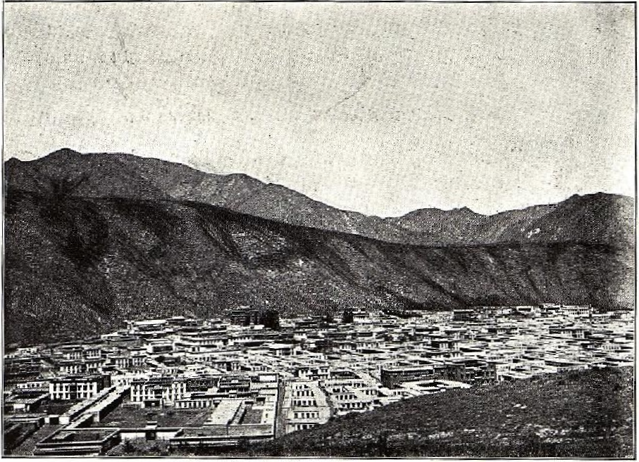
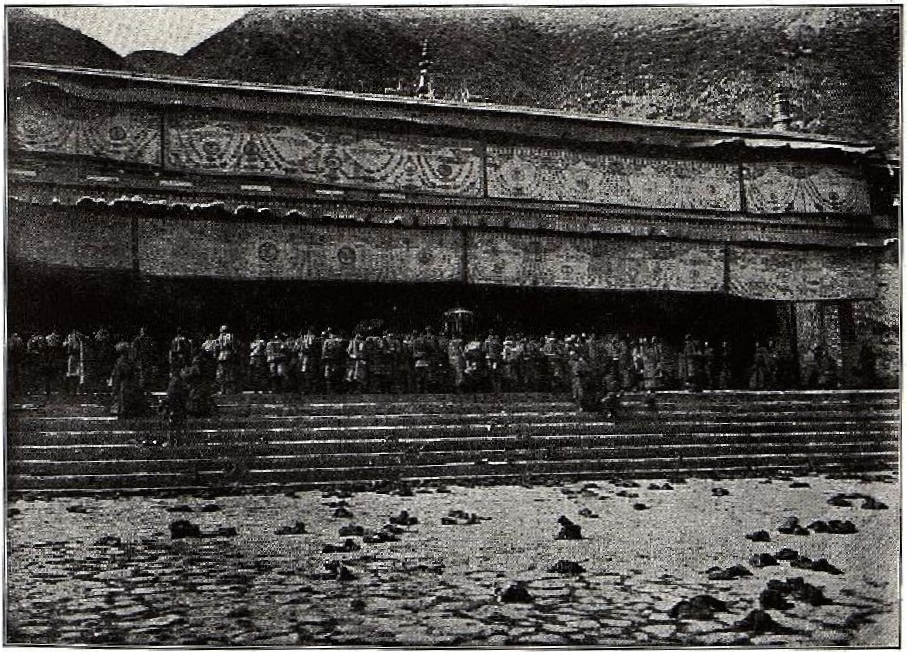
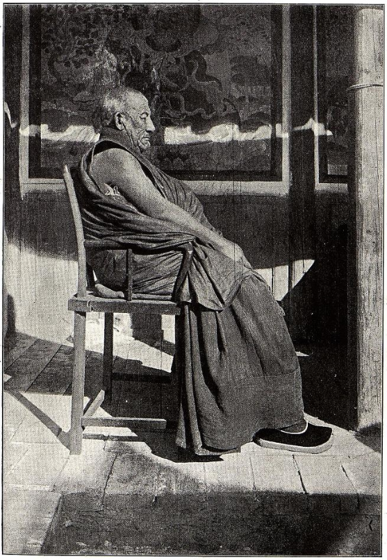

## Введение

В 1905—1907 годах Б. Барадин (Базар Барадиевич Барадийн, [ru-wiki](https://ru.wikipedia.org/wiki/%D0%91%D0%B0%D1%80%D0%B0%D0%B4%D0%B8%D0%B9%D0%BD,_%D0%91%D0%B0%D0%B7%D0%B0%D1%80_%D0%91%D0%B0%D1%80%D0%B0%D0%B4%D0%B8%D0%B5%D0%B2%D0%B8%D1%87)) был командирован Русским комитетом при Академии наук по изучению средней и Восточной Азии сопровождать Далай-ламу XIII, возвращавшегося из Урги в Тибет. Барадин провёл 8 месяцев в монастыре Лавран.

Здесь представлен распознанный и отредактированный текст статьи Б. Барадина "Путешествие в Лавран", опубликованной в Известиях ИРГО Т. XLIV, вып. IV. С. 183–232. Текст приводится в современной орфографии, также есть текст в оригинальной [старой орфографии](/notes/baradin-lavran-irgo/).

Библиографическая ссылка:

> Барадин Б. Б. Путешествие в Лавран: буддийский монастырь на северо-восточной окраине Тибета. 1905–1907 гг. // Известия Императорского Русского географического общества. СПб., 1908. Т. XLIV, вып. IV. С. 183–232.

Скачать:

* Полный выпуск Известий ИРГО Т. XLIV, вып. IV ([источник](https://elib.rgo.ru/handle/123456789/219138), [PDF](https://drive.google.com/file/d/10qF4cNRdo4q-Bffz6jfClpl21yxrPksY/view?usp=sharing)).
* Статья Путешествие в Лавран ([PDF](https://drive.google.com/file/d/1WAUAv6CWFVCcplyRJsqcURReg8yMfYLX/view?usp=sharing)).

## Текст

<a id="183">**-- 183 --**</a>

Путешествие в Лавран

(Буддийский монастырь на северо-восточной окраине Тибета).

Б. Б. Барадина.

1905---1907 гг.

(Предварительное сообщение в Годовом Общем Собрании и в Отделении Этнографии И. Р. Г. О. 30 января и 15 февраля 1908 г.).

Настоящий доклад посвящается описанию путешествия моего, предпринятого 1905 г. в северо-восточную окраину Тибета---в Амдо по поручению Русского Комитета для изу­чения Средней и Восточной Азии.

Главною целью моего путешествия было изучить на месте жизнь большого буддийского монастыря и составить подробный очерк как самого монастыря, так и жизни его обитателей---монахов.

Исполнением этой задачи я имел в виду по возможности выяснить основу духовной культуры всех современных нам монголо-тибетских народностей,---так как эта сторона их жизни, по нашему мнению, была до сих пор мало исследована.

Местом исследования был избран тангутский монастырь Лавран, который по своему духовному влиянию на всю Мон­голию и на наше Забайкалье является крупнейшим из со­временных рассадников буддизма, нисколько не уступая в этом отношении самому центру тибетского буддизма---Лхасе.

Таким образом главное мое внимание было обращено

<a id="184">**-- 184 --**</a>

на фактическую основу духовной культуры данной местности,---на ее религию, язык и литературу, и в мои задачи вхо­дило лишь попутное исследование местности в географиче­ском или иных отношениях: это было бы не в моих силах как простого паломника, под видом которого я должен был работать, да и выходило за круг моей спе­циальности.

Прежде чем приступить к главной теме моего сообщения, считаю не лишним поделиться некоторыми сведениями о моем путешествии.

Ближайшим моим спутником был мой брат.

По обычаю бурят наши родители за несколько дней до нашего отъезда с родины---Забайкалья обратились к ламе--астрологу, который должен был назначить нам удачный день выезда. Наш выезд был назначен на 9 сентября (н. с.). Поэтому в этот день к нам был приглашен лама, который должен был совершить небольшое напут­ственное молебствие и указать еще удачный час дня и сторону выезда из дома. После молебствия мы выехали из дома, соблюдая со всей строгостью предписания наших родителей и ламы. При этом в самый момент выезда лама выбрасы­вал разные жертвенные комки из теста, а мать брызгала молоко на все четыре страны света, дабы охранить нас от разных несчастий и чтобы во время всего пути нам покровительствовали земные и небесные духи.

Наши домашние провожали нас в путь с большою радостью: они были счастливы тем, что мы, люди одного с ними семейного очага, отправляемся в божественную страну Тибет, чтоб поклониться его святыням и принести оттуда с собой счастье в семью.

Сев на поезд на ст. Могойтуй, мы из Верхнеудинска перебрались в Кяхту, а 30 сентября мы были в монголь­ской столице Урге.

Как известно, период между 1904 --- 1906 годами был ознаменован посещением Монголии Верховным буддийским первосвященником Далай-Ламой, который за 2 недели раньше нас покинул Ургу и жил со своей свитой в Халхаском монастыре Ван-курене (в 300 в. на С.-З. от Урги).

Здесь я должен заметить, что в связи с этим важ­ным событием первоначальная моя командировка имела

<a id="185">**-- 185 --**</a>

в виду поездку в центральный Тибет, в свите Далай-Ламы. Поэтому сначала я должен был поехать из Урги вслед за Далай-Ламой в Ван-курень и провести там зиму в свите Его Святейшества. Я решился отправиться в Лавран только после окончательного выяснения, что Далай-Лама ре­шил остаться еще в пределах Монголии на неопределенное время.

Вечером 10 октября мы выехали из Урги в Ван-курень. При любезном содействии нашего Ургинского кон­сульства мы ехали бесплатно по монгольским уртонам (что значит станции).

Все время мы держали путь на С.-З. ехали по холми­стой степи, населенной одиночными кочевниками. Местные жители---те же халха-монголы тушету-хановского и цэцэн-хановского аймаков. Они менее испорчены, чем притрактовые монголы и сравнительно зажиточны, хотя они жало­вались нам, что у них из года в год идет прогресси­рующее обеднение из-за тяжелых податей и повинностей: раньше всякий имел по тысяче штук скота, а теперь редко кто имеет и сотню, говорили они.

По дороге нам часто встречались монгольские рассыльные "эльчи" с казенными пакетами между Ургой и Ван-куренем туда и обратно. При этом они делали удивительные переходы по 300 в. в сутки. Присматриваясь к этому, да и вообще ко всей организации первобытной кочевой жизни халха-монголов, можно было заметить, на сколько у них---непонят­ная для нас простая и легкая организация передвижений. На 5-ые сутки мы прибыли в монастырь Ван-курень, который служит в то же время и ставкой местного хошунного князя Кандо-вана. Мы остановились у своего сородича г. Дылыкова, состоявшого в то время в свите Далай-Ламы. На другой день я удостоился приема и поклонения Далай-Ламе, который, будучи предупрежденным уже накануне о моем приезде, принял меня чрезвычайно мило среди весьма простой обстановки его походной жизни.

Дальнейшая моя жизнь при дворе Далай-Ламы подробно занесена в мой дневник, здесь же ограничусь лишь не­сколькими заметками о Далай-Ламе и его свите.

Далай-Лама на вид молодой тибетец среднего роста с энергичным сухощавым лицом, с небольшими черными

<a id="186">**-- 186 --**</a>

усиками и замечательно красивыми большими глазами. На светло-желтой коже его лица слегка заметны следы бывшей оспы. Он несколько сутуловат и сухощав; во всей его фигуре, выражении лица и жестах проглядывает смесь живости и молодости,---Далай-Ламе во время моего посещения было 29 лет. В обыкновенное время он одевался в желтый ламский костюм халха-монгольского покроя, а при торжественных случаях---в темно-коричневый монашеский костюм тибетского покроя.

Далай-Лама вел себя очень просто, по походному. Даже можно было заметить, что он испытывал большое нрав­ственное удовольствие в этой свободе простой походной жизни, на время вырвавшись из замуравленной придворной атмо­сферы своего таинственного лхасаского дворца---Поталы.

Далай-Лама обыкновенно вставал очень рано, между 5---6 ч. утра, а затем до 9---10 ч. проводил время в утренних молитвах, после чего ему подавали чай обыкно­венного тибетского завара с небольшим завтраком в виде супа. После этого времени он обыкновенно принимал до­клады своих приближенных. В полдень ему подавали обед, который состоял исключительно из рисового или иного супа с некоторыми приправами.

Конечно, этим далеко не исчерпывается стол Далай-Ламы, но мы говорим здесь только о том, относительно чего удалось добыть точные сведения. Нужно заметить, что вообще тибетский стол гораздо сложнее и разнообразнее, чем стол кочевых монголов, довольствующихся исключительно мясной пищей и молочными продуктами.

Послеобеденное время Далай-Лама до 5 --- 6 ч. вечера или проводил у себя или иногда выходил пешком на коро, т.-е. на молитвенный обход монастыря, как простой бого­молец. Это, конечно, служило ему в то же время и прогулкой. Он ходил в сопровождении 2---3 человек низших при­слуг, а иногда в обществе своих ближайших лиц, при чем я всегда замечал, что он шел один, а его прибли­женные---на некотором расстоянии спереди или сзади. Он иногда посещал здешнего ученого старца Дандар-Аграмбу для религиозных бесед, как обыкновенный гость. Помню, 2 --- 3 раза заглянул он и в юрту здешнего князя,---даже раз не предупредив об этом, в сопровождении двух

<a id="187">**-- 187 --**</a>

лиц. Это произвело страшный переполох в застигнутой врасплох княжеской семье; он успокоил их, посидел несколько минут, милостиво разговаривая с членами кня­жеской семьи, употребляя при этом несколько известных ему монгольских слов. Но вся эта простота его жизни сразу нарушалась, когда Его Святейшество давал торже­ственное благословение народу, --- в таких случаях требо­вался строгий этикет.

Вечером с 7 ч., после своей вечерней молитвы, он проводил время в чтении книг и ложился спать в 12---1 ч. ночи, что возвещалось протяжным монотонным звуком ре­лигиозного духовного инструмента из придворной его церкви "намгьэра-дацана".

Он был очень требователен и строг к окружающим, но в то же время можно было заметить, что он был очень ласков, мил и весел в кругу ближайших к нему лиц, хотя последние при посторонних лицах выказывали рабское поклонение своему владыке.

В заключение отметим, что нынешний, по тибетскому счету---ХIII-й Далай-Лама Гьэван Тубдан-гьацо (р. 1876 г.), несомненно выдающаяся в своем роде личность. Он за­служенно пользуется на своей родине громадной популяр­ностью в народе за свой независимый и доброжелательный характер и народ считает его подлинным воплощенцем Ѵ-го Великого Далай-Ламы.

Так напр., ему приписывают отмену смертной казни, преследование казнокрадов и взяточников и т. п. произвола, царившого в Тибете при многих его предшественниках. Кроме этого, нами еще был констатирован в Ван-курене факт, что Далай-Лама имел широкие планы обновления и возрождения тибетского буддизма и коренной реформы со­временного ламского строя, недостатки которого он ясно сознавал.

Заканчивая этим свои заметки относительно личности энергичного, деловитого Далай-Ламы, нам приходится теперь только приветствовать вполне для него благоприятный оборот дела со времени подписания англо-русского соглашения по тибетскому вопросу, потому что Его Святейшеству отныне вполне представляется возможность продолжить свои благия на­чинания на родине и тем ввести даровитый по природе тибет­

<a id="188">**-- 188 --**</a>

ский народ в круг культурных народов. Жалеем, что не могли получить разрешения Далай-Ламы снять его портрет. Нам пришлось ограничиться снятием портретов двух близких ему людей: лейб-медика и секретаря, этих двух задушевных его советников.

В Ван-курене при мне жило до 150 ч. тибетцев, составлявших свиту Далай-Ламы. Высшая свита---до 30 ч. со своей челядью, монахов до 50 ч., а остальные---низшая придворная прислуга, в том числе штат иконописцев, переписчиков, музыкантов, поваров и т. д. В числе высшей свиты Далай-Ламы во главе был Правитель дел Далай Ламы --- "Жэжшаб-камбо", Государственный ора­кул "--- Чойкьон-чэмо", Главный секретарь "---Дуцииг-чэмо", Церемониймейстер "Чобон-камбо", Придворный по­вар "Жама-камбо" и др.

Самым интересным человеком в свите Далай-Ламы был Государственный оракул Тибета "Чойкьон-чэмо". Он на вид красивый статный тибетец, лама лет 35. Он по рангу сидел ниже только самого Правителя дел Далай-Ламы.

Как известно, в буддизме существует культ чойкьонов, т.-е. гениев хранителей святого учения. Позднее тибетский буддизм прибавил к этим гениям и богов своей национальной мифологии и стал делить всех чойкьонов на две категории: на "ушедших из мира сего" и на "неушедших из мира сего". Первые считаются чойкьонами высшого порядка и все они исключительно индийского происхождения, а вторые---чойкьонами низшого порядка и все исключительно тибетского происхождения. Божества второй категории, в противоположность первой, имеют способность снисходить в душу особенных людей, расположенных по своему организму и настроению к восприятию данного боже­ского духа; затем этот дух прорицает через уста дан­ного человека и отвечает на все вопросы жизни. Человек, имеющий способность воспринимать божеский дух, т.-е. придти в исступленное ненормальное состояние, произнося неясные слова на заданные вопросы, называется "куртэном" и он может во всякое время привести себя в состояние прори­цателя путем как внутреннего самовнушения, так и путем возбуждающих средств,---воскурений, музыки и т. п. Таких

<a id="189">**-- 189 --**</a>

людей чрезвычайно много в Тибете и Монголии, отчасти даже есть и среди Бурят. К числу подобных лиц принад­лежит и упомянутый "Государственный оракул" Тибета, который воспринимает в себе дух главного из 5-ти божеств древне-тибетской мифологии "Куна". Этот оракул---самый главный из всех тибетских оракулов, и только он имеет санкцию от Богдохана, приравниваясь к князьям 4-ой степени "гун".

После смерти каждого оракула отыскивается другой.

Подобно пифии в древней Греции этот оракул имеет громадное решающее влияние не только на обыденную, но и на всю политическую жизнь страны. Так, нынешний Далай-Лама после смерти старого государственного оракула, был озадачен вопросом о том, каков будет новый. Далай-Лама, желая иметь под рукой оракула своей партии, избрал нынешнего оракула, заставив его научиться способ­ности восприятия божеского духа. Он вполне научился своему делу, но сделался таким оракулом, что потом сам Далай-Лама и его партия стали не рады ему. Говорят, он в исступлении, т.-е. во время снисхождения в него божеского духа, был всегда молчалив и не отвечал на заданные ему вопросы. Но когда англо-индийский отряд вторгся в 1904 г, в пределы Тибета, Далай-Лама, придя в гнев на своего государственного оракула за его безучастное от­ношение к взволновавшему всех событию, стал бить его кнутом и заставил его говорить. Оракул впервые в яростном исступлении стал отвечать на заданные ему во­просы в нежелательном для Далай-Ламы и его партии смысле, говоря, что все потеряно, нет спасения от англи­чан, что вы (по адресу партии Далай-Ламы) всякими не­правдами ввергли страну в несчастие и большинство ваших чойкьонов и земных духов изменило вам и предалось англичанам, которые теперь идут против вас войной в союзе с чойкьонами. Насколько все это правда,---сказать трудно; мы передаем то, что слышали от тибетцев,---во вся­ком случае достоверно известно, что этот оракул ныне уже не пользуется расположением Далай-Ламы и его партии, которая относится к нему чуть ли не враждебно, говоря, что "в нашего оракула вместо божеского духа снизошел злой дух". Тем не менее Далай-Ламе и его партии при­

<a id="190">**-- 190 --**</a>

ходится считаться со своим оракулом, который сопровож­дает теперь Далай-Ламу в качестве одного из высших членов его свиты.

Все тибетцы в Ван-курене, начиная с самого Далай-Ламы и кончая низшими служащими, представляли доста­точный материал для составления некоторого понятия о ти­бетцах вообще, хотя, правда, для этого не хватало одного существенного элемента: женщин не было, как и есте­ственно, ни одной в свите Далай-Ламы.

Тибетец сперва поражает вас своей льстивостью и явно фальшивой вежливостью; он нисколько, впрочем, не старается скрыть от вас этой несимпатичной черты. И ваше первое впечатление о тибетцах будет далеко не в пользу их. Эта их черта обясняется тем, что, в силу создавшихся у них политических и социально-экономических условий, тибетцы строго руководствуются житейским прави­лом: "не показывать себя людям в настоящем свете". Но зато, если вы сумели заслужить чем-нибудь доверие тибетца, он обращается в хорошeго, до наивности искрен­него приятеля вашего. Тогда он выкажет вам настоящую природу характера своего народа: большую впечатлительность, суеверие, веселый сангвинический темперамент. По складу ума тибетец весьма богато одарен воображением и фантазией, но думает медленно и тяжело, хотя и основательно.

В то же время тибетец чрезвычайно настойчив и упорен в достижении своих стремлений; он способен перенести любое телесное страдание и презирать смерть. Благодаря такому характеру, при богатстве воображения и фантазии и при тяжеловатом уме, тибетцы обнаруживают способность к отвлеченному мышлению. Доказательством этому служит появление из среды тибетцев многих круп­ных религиозных талантов и основание природными тибет­цами многих оригинальных буддийских философских сект и школ, изучение которых в будущем, может быть, прольет яркий свет на многия темные стороны истории ду­ховной жизни самого очага арийской культуры Индии. Тибетцы весьма здоровый и крепкий народ, они большею частью среднего роста. Волосы у них черные и жесткие, и в противо­положность монголам они довольно богаты растительностью на лице. По цвету кожи высший класс резко отличается

<a id="191">**-- 191 --**</a>

от низшего своим светло-желтым цветом кожи, нередко доходящим до европейской белизны, тогда как низший класс имеет темно-желтый или смуглый цыганский цвет кожи, Нужно заметить, что тибетцы довольно строго придер­живаются сословных предрассудков. У них есть довольно замкнутое высшее дворянство, которое якобы ведет свое происхождение от знаменитого царя Сронцзан-гамбо (VII в. по Р. X.). В типе тибетцев резко замечаются следы ра­совой их связи с арийцами: овальная форма лица, большой высокий нос, большие глаза. В типах тибетцев в Ван-курене я не замечал резких признаков монголоидности и они несомненно по расовому происхождению стоят гороздо ближе к арийцам, чем к монголоидам, хотя язык их говорит противное, относя их к индо-китайской группе.

В числе моих Ван-куреньских приятелей был и ученый старец Лама Дандар-Аграмба, о котором я уже упомянул, говоря, что Далай-Лама иногда посещал его для религиоз­ных бесед. Этот ученый старец, уже автор многих философских сочинений по буддизму, изданных пока в четы­рех томах в Ван-курене, давно славится как выдаю­щийся ученый не только у себя в Монголии и у Бурят, но и в Тибете. Мы считаем нелишним рассказать об одной из наших бесед с этим выдающимся человеком.

Когда я вошел к нему, то заметил, что в юрте сидит седой как лунь 80-летний старец с замеча­тельно свежим симпатичным открытым лицом и почти юношеским без дрожи звучным голосом. Лама еще чи­тал свою утреннюю молитву. Со мной был один бу­рят, и мы поднесли ламе по хадаку и получили благо­словение книгой. Вскоре лама окончил свою молитву, и мы приветствовали его. Лама был осведомлен обо мне, как об интересном для него бурятском знатоке санскрита и шопотом спросил своего прислужника: "который из них?" Прислужник указал на меня---лама устремил на меня свой взор, а я не замедлил тут же выразить ему свое желапие познакомиться с ним. Вскоре за этим мы вступили в непринужденный разговор.

Я вынул из-за пазухи санскритское сочинение учителя Чандракирти "Prasannapadā" (издание Академии Наук). Раз­говор наш еще больше оживился, когда он узнал, что

<a id="192">**-- 192 --**</a>

эта книга---оригинал той знаменитой книги, которая в ти­бетском переводе под названием "цигсал" изучается в высших классах цаннидской школы философии буддизма. Старец рассматривал книгу с большим любопытством, и особенно его интересовали тибетския примечания к тексту.

Он спросил, где напечатана книга?----В столице рус­ского хана, ответил я. Затем он продолжал---много ли вообще издано санскритских книг и изучают ли их оросы (т.-е. европейцы)? Я ответил ему,---издано очень много книг по мере их открытия в Индии и особенно в Балбе (т.-е. Непале), и европейцы в последнее время усиленно стали заниматься буддизмом и исследованием санскритских па­мятников. Далее он задал мне вопрос,---открывают ли оросы такия санскритския книги, которые не переведены на тибетский язык?---иногда открывают, сказал я, на что он спросил,---не переводят ли они их на тибетский язык? Я пояснил ему, что они только издают тексты, чтоб интересующиеся изучали их в оригинальном виде, а если изредка переводят, то только на свои языки, потому что они не работают ради одних тибетцев. Тут ста­рик понял неправильность своего вопроса и выразил со­жаление, и сказал: "как интересно было бы перевести их на тибетский язык, без перевода они навсегда недо­ступны тибетцам и монголам". Старик увлекся беседой и спросил меня,---есть ли оросы, перешедшие в буддизм и насколько они понимают смысл его? Я сначала затруд­нялся, что ответить на это, но затем заявил ему:---хотя нет среди оросов соблюдения буддизма с формальной его стороны, но тем не менее среди них есть не мало людей, не только интересующихся идеалом буддизма, но проникну­тых самым духом нашего учения. У оросов существует чрезвычайное множество своих наук "ригнэ" и религиозно­философских учений "думта". Поэтому оросы не примут нашего буддизма с внешней его стороны, "дамби гонэ" и в противоположность нам монголам, принявшим буддизм сначала только с внешней стороны, оросы, если примут когда-либо буддизм, то только с критико-философской точки зрения "думтай гонэ". После этих моих слов он со своей старческой искренностью сказал про себя: "Действи­тельно теперь начинает исполняться предсказание Будды,

<a id="193">**-- 193 --**</a>

что его религия распространится с юга на север, и не спроста эти люди потратили труд издать эту сокровенную книгу. Да, они действительно добродетельные люди!" ---заклю­чил знаменитый монгольский ученый и спросил меня,---но, как они (европейцы) относятся к вопросам о буддийской теории справедливости, воплощения (т.-е. теория, утверждающая, что всякое живое существо не имеет начала жизни и будет иметь после смерти безконечную жизнь в безконечных перерождениях пока оно не достигнет состояния Будды, воплощая и приспособляя свой психический мир согласно закону справедливости), ведь они, как я слышал, ничего не признают кроме опыта "вамбой онсум"? Очевидно, кто-то ему передал в таком тенденциозном освещении европейские методы исследования и он был убежден, что европейцы признают только то, что видят воочию, восприя­тием чувства. На это я должен был сделать разяснение: "Много занимался я науками оросов и положительно могу утверждать, что мнение, будто оросы руководствуются при своих исследованиях только восприятием, совершенно не соответствует действительности. Разные науки самостоятельно созданы оросами в течение веков на основании не только опыта "онсум", но и умозаключения "жэваг". Благодаря этому они признают закон причинности и следствия "гьумбрэ", а также закон относительности, условности существования вещей "дэнбрэл". Что же касается буддийской теории спра­ведливости, воплощения, то они не вырешили этих вопросов, так как эти вопросы, по мнению их,---не разрешимы непосредственным умозаключением "ойдоб жэваг", который главным образом и признается оросами". Этим моим разъяснением старец был вполне удовлетворен и сказал: "Да, сам Будда признавал, что закон справедливости "карма" ---самая трудная область познания".

При нашей беседе сидело до десяти человек лам, в том числе молодой халхаский хубилган, ученик старца,---по имени "Дараб-Бандида",---один из важнейших хубилганов (т.-е. святых) в Халхе. Этот хубилган, молча­ливо выслушав до конца нашу беседу, горячо выразил свою уверенность, что оросы далеки от понимания буддизма, особенно его антиномической философии "тангьурви-думта", которую развивает упомянутая нами выше санскритская книга.

<a id="194">**-- 194 --**</a>

На это я возразил ему: "я не говорю относительно кях­тинских оросов, которых вы только и знаете, а говорю о тех оросах, которых вы не знаете и которые изучают и знают нашу веру". Он мне ответил с резкостью: "я не лягушка, которая знает только свой колодец",---и страшно был, видимо, рассержен моим возражением в присутствии обоготворяющих его монголов. Конфликт наш этим был вполне исчерпан и я, конечно, не стал втя­гиваться в дальнейшее пререкание с этим монгольским "оффициальным святым".

Старец не хотел прерывать нашей беседы, но я, не же­лая утомлять его слишком, встал с места и простился с ним до следующего раза. При прощании со старцем я за­метил, что все присутствующие ламы---слушатели наших бесед, почтительно встали одновременно со мной, между тем они, как и сам хубилган, сначала относились ко мне свысока, благодаря моему невзрачному монгольскому костюму.

Такое неожиданное ко мне внимание явилось результа­том наших бесед, в особенности с хубилганом.

Переходя к обозрению социально-политического состояния современной Халхи (Северной Монголия), скажем, что нынеш­ние халхасцы, занимая громадную площадь---часть плоскогорий центральной Азии и в силу создавшихся у них неблаго­приятных политических и социально-экономических условий, переживают быстрый упадок своей жизненной силы. Этот факт в связи с культурным подъемом Китая и его все­поглощающей жизненной энергией ставит халхасцев, да и всех монголов, подвластных Китаю, в тяжелое поло­жение,---будущее их, как отдельной нации, весьма мрачно.

Как самая характерная черта кочевой культуры халхас­цев нами отмечено чисто степное скотоводство, которое я назвал бы "произвольной формой скотоводства" в отличие от пастбищной или более интенсивной формы. Скотоводство халхасцев, обусловленное характером их страны, нахо­дится в полной зависимости от прихоти погоды. Как-то раз халхаский князь Кандо-ван очень метко охарактеризо­вал форму халхаского скотоводства словами: "Нужно, чтоб баран ухаживал за овечкой, а козел за козлицей, а наше дело только пожинать плоды!" Этими словами он хотел

<a id="195">**-- 195 --**</a>

выразить преимущество своего хозяйства над бурятским, когда я доказывал ему обратное, что пастбищное бурятское хозяйство, хотя требует от человека много труда и уме­ния, гораздо надежнее халхаского скотоводства.

Рано или поздно монголам придется иметь дело с евро­пейской культурой. Тогда в их бывших привольных сте­пях будет одно из двух: или смерть слабого дикаря, или жизнь культурного человека. Быть может они с достоин­ством жизнеспособной нации воспримут лучшия силы куль­туры, освободятся от нынешнего своего политического раб­ства, от гнилой маньжурщины, от своих лам-хубилганов и князей, выроют в своих нынешних пустынных сте­пях артезианские колодцы и тем освободятся от прихоти стихии, превратя свои степи в цветущия поля для обра­щения нынешнего своего "произвольного скотоводства" в форму усовершенствованного хозяйства. Тогда им для при­общения к цивилизации вовсе нет необходимости переходить к земледельческому или промышленному образу жизни, на­оборот тут дело в интенсировании, усовершенствовании всякой данной формы хозяйства, потому что земледелец мо­жет быть дикарем, а скотовод---культурным человеком, или наоборот. Между тем, казавшаяся эта столь простая истина, к сожалению, многими еще теперь не признается.

### Выезд из Ван-куреня через Ургу в Амдо.

В Ван-курене примкнул ко мне и второй мой спут­ник, молодой лама Цугольского дацана Дэнзин Намжилай.

7 марта 1906 г. мы выехали из Ван-куреня в Ургу по старой дороге. Монголы меня обыкновенно принимали за какого-то важного монаха Когда мы по дороге ночевали в юрте одной богатой вдовы ---содержательницы уртона и ее со­жителя ламы, хозяйка обратилась ко мне с просьбой поворо­жить ей и объяснить, почему в последнее время волки стали часто давить из ее стада баранов и рогатый скот. Она желала, чтоб я подбрасывал ей ламские гадательные кубики "шо"---для указания ей причины "обжорства вол­ков" и чтобы дал совет служить против этого молеб­ствие какому-нибудь божеству. Но я должен был, конечно,

<a id="196">**-- 196 --**</a>

отказаться от роли ламы. Я пробовал было действовать на нее, говоря, что против обжорства волков средство одно---хороший надзор за скотом. Она знать не хотела моей по­пытки рассеять ее суеверие и была уверена, что в деле "обжорства волков" непременно замешен злой дух. Дело кончилось тем, что я пошутил над ней и спросил,---почему она не обращается с подобным же вопросом к ламе---своему сожителю, который тут же рядом со мной улыбался на мою шутку. Монгольская дама откровенно при­зналась, что она давно изверилась в святости своего милого.

14 марта мы были в Урге, где дожны были снаря­диться в дальнейший путь, закупая провизию и предметы дорожного снаряжения.

### Путь от Урги до Лаврана.

29 марта мы выехали в Лавран с небольшим об­ратным караваном верблюдов алашанских монголов, на­няв у них верблюдов до Алаша-ямыня.

После длинного утомительного пути по гобийской степи, качаясь на спинах наших верблюдов, мы 8 мая добра­лись до Алаша-ямыня, этого смешанного китайско-монголь­ского городка, представляющего прелестный оазис в уголке обширной песчаной Алашани. Здесь мы нашли теплый приют у г. Бадмажапова (один из бывших выдающихся спутни­ков П. К. Козлова в его предпоследней экспедиции в Тибет) и г. Симухина, которые заведывали русской фирмой предприимчивых кяхтинских купцов Собенникова и бр. Молчановых. Эта фирма уже несколько лет ведет мено­вую торговлю русскими товарами на местное сырье, глав­ным образом, на верблюжью шерсть. Торговля шла в общем вяло из за трудности и дальности расстояния по доставке свежих товаров.

С г. Бадмажановым мы осматривали всю пышную об­становку жизни алашанской княжеской фамилии, которая об­ставила себя здесь, в этой беднейшей стране, как высшая китайская аристократия со своими цветущими парками, са­дами, оранжереями, богатыми храмами и дворцами.

Все это было чудовищно контрастно ко всей унылой

<a id="197">**-- 197 --**</a>

пустынной окрестности с ее населением, изнемогающим под бременем суровой борьбы за жизнь в этой пес­чаной пустыне---с одной стороны, и под страшным гне­том окитаившейся своей княжеской фамилии --- с другой. Я знал, сколько хлопот и сколько слез стоило все это бедным алашанцам, резко отличающимся от своих со­седей халхасцев неутомимым трудолюбием, терпением, чрезвычайной скромностью жизни, серьезным молчаливым характером, честностью и благородством.

14 мая мая мы выехали дальше из Алаша-ямыня, на­няв новых алашанцев до Кумбума.

Мы ехали через китайскую таможенную заставу Саян-чжин, через г.г. Пин-фань-сянь, Ньан-бо-сянь и Синин.

8 июня мы прибыли в монастырь Кумбум.

Отсюда мы наняли новых возчиков-саларов (мусульм. племя между Лавраном и Кумбумом), совершающих по­стоянные рейсы Лавран---Кумбум на своих лошаках, и выехали 15 июня.

Прибытие в Лавран.

В полдень 23 июня, спустившись в глубокую узкую до­лину речки Санчу, мы подъезжали к расположившемуся на дне долины знаменитому монастырю Лаврану. Было очень свежо и прохладно после недавней грозы, настигшей нас на пе­ревале. Мы в это время чувствовали себя в радостном настроении, что стоим у конца пути, а веселые песни на­ших молодцеватых саларов эхом разливались по гори­стой окрестности. Мы вскоре проехали по грязным ули­цам тангутско-китайского предместья Лаврана "Тава" и перед нами открылась очаровательная картина громадного буддийского монастыря, который на этом месте захватил всю узкую долину речки. Многочисленные высокие храмы белого, красного и желтого цветов со множеством этажей и окон, с симметричной прямолинейной архитектурой, с плоскими крышами, напоминали по виду какой то старинный итальянский город, но тут же к нам навстречу стали во множестве попадаться люди непривычного для меня вида, быстро шагающие воинственные тангуты в огромных ба­раньих тулупах с открытыми загорелыми туловищами

<a id="198">**-- 198 --**</a>

и большими боевыми мечами за поясом, а рядом с ними---смиренные буддийские монахи в красных одеяниях. Все это сразу изменяло впечатление.

Через несколько минут мы уже очутились в своеоб­разном обществе лавранских монахов. Мы остановились у своего родственника ламы Аку Найдана, который не успел даже напоить нас чаем, как здешние ламы-буряты пере­полнили отведенную мне маленькую монашескую келью и буквально засыпали нас поздравлениями и безконечными расспросами.

На другое утро я уже был вполне лавранцем и с этого момента я должен был работать в течение 8 меся­цев в тишине монастырской жизни, постепенно стараясь вникнуть в местную жизнь. Днем я или выходил с фотогра­фическим аппаратом за пазухой и снимал здешние виды, храмы, сцены, или с большим аппаратом---для съемки в до­мах знатных гэгэнов, или присутствовал на религиозных церемониях и на шумных занятиях цаннидской (философ­ской) школы под открытым небом, или в пышном храме, или втискивался в разношерстную базарную толпу тангутов и тангуток, китайцев и китайцев-мусульман, или выходил в поле с монахами во время их периодических отдыхов от школьных занятий, или совершал прогулки по окрестностям Лаврана по монашеским обителям "ритодам"---этим миниатюрным горным монастырям.

Ночью же я сиживал в своей монашеской комнатке за дневником или за чтением тибетских книг в сообществе монахов, или в мирных беседах со своими бурятами-ламами или с тангутскими приятелями.

Перехожу к Амдо, области составляющей северо-во­сточную окраину национальной территории тибетских пле­мен. Она представляет гористую страну---продолжение всего тибетского плоскогория и примыкает к границам Ганьсюйской и Сычуаньской провинций.

### Население Амдо.

Преобладающее население Амдо составляют воинственные тибетския племена---тангуты, распадающиеся по образу жизни на кочевников и на земледельцев. Тангуты, как горцы,

<a id="199">**-- 199 --**</a>

живут отдельными группами или деревнями, которые зача­стую бывают в враждебной отчужденности друг от друга. Тангуты различаются между собой также по наречиям обще­тибетского языка и по различным сектам тибетского буд­дизма.

В политическом отношении тангуты представляют от­дельные независимые племена, которые подчиняются Китаю лишь номинально. Китай совершенно не вмешивается во вну­треннюю жизнь своих воинственных инородцев и ограни­чивается редкой посылкой своих чиновников с отрядом войск для разрешения тех или иных тяжб между китай­цами с одной стороны и тангутами---с другой.

В данном случае всепоглощающее культурное влияние Китая на его инородцев коснулось лишь окраин Амдо, где засели китайские переселенцы---крестьяне, да мелкие торговцы.

В Амдо, да и вообще на всем пространстве тибетской национальной территории не могла создаться крепкая поли­тическая единица вследствие географических условий страны и воинственного свободолюбивого характера обитателей. Дей­ствительно, у тангутов совершенно отсутствует чья-либо крепкая власть и они находятся под сферой влияния того или другого гэгэна, или монастыря.

Во внутренней же жизни они регулируются в своих взаимоотношениях народными судилищами из выборных старейшин, или мелкими князьками или старшинами.

В своих разбойничьих экскурсиях, которые являются одним из главных занятий тангутов, они подчиняются своим атаманам разбойников.. Тангуты не имеют ника­ких писаных законов, хотя они сравнительно грамотны, но несомненно они в своей общественной жизни руководствуются своим обычным правом. Нам не удалось подробнее ознако­миться с этой интересной областью и мы отметим лишь некоторые факты: напр., враг неприкосновенен в нейтраль­ном доме или деревне. Каждая община должна стоять за интересы каждого из своих членов, и если кто-нибудь пострадал от людей чужой общины, то община потерпев­шего должна потребовать возмездия от общины обидчиков и оказать материальную помощь семье, или наследникам потерпевшего своего члена.

По приблизительному рассчету количество всех тангутов

<a id="200">**-- 200 --**</a>

Амдоского нагорья не превышает 1/2 миллиона душ обоего пола.

Земледельцы живут деревнями в глиняных и камен­ных фанзах, обнесенных такими же стенами, и весь двор представляет миниатюрную крепость.

Скотоводы же живут таборами в переносных шерстя­ных шатрах "банаг".

Как земледельцы, так и скотоводы по покрою одежды (нагольная шуба, или халат,---редко с рубахой) и воору­жению (фитильное ружье с сошками, пика и кинжал) оди­наковы. При этом, конечно, скотоводы более примитивны в своих требованиях. Так, в Лавране мне приходилось наблюдать такую картинку: впервые в жизни приезжает в Лавран на поклонение захолустный житель Амдо, кочевой тангут с семьей. На их костюмах ни лоскутка материи и им совершенно незнакомо употребление какой-либо ма­терии,---все у них самодельное: несмотря на летнее время, на них мохнатые шубы из бараньих шкур плохой вы­делки. Обувь---в виде кожаных мешочков, сшитых на скорую руку с кругленьким дном, надевается на ногу без всякого разбора---где носок и где задок.

Женский костюм по покрою не отличается от мужского. Только женщины опоясываются просто, тогда как мужчины любят опоясываться очень своеобразно, образуя вокруг ту­ловища громадный мешок, куда при надобности кладут гольное баранье стегно или кусок молочного масла и т. п. вещи, и даже вместе с этими предметами свободно может помещаться голый ребенок. Опоясываясь таким образом, тангуты, особенно молодежь, заднюю полу своей одежды со­бирают в хвостик. Когда тангут надевает свою конусо­образную шапку на бекрень, а хвостик виляет при ходьбе, то он выражает этим свою воинственную молодцеватость. Только старики отказываются от подобных опоясываний, говоря: "я уже старик и пора мне расстаться с хвости­ком". Такой вкус является общим национальным вкусом всего тибетского народа, как мужчин, так и женщин.

Женщины всех тибетских племен выражают свой национальный вкус тем, что к косам привешивают раз­ные подвески, спускающияся до нижнего края костюма, и

<a id="201">**-- 201 --**</a>

на конце подвески приделывают хвостик в виде густого пучка красных ниток.

Тангуты носят маленькия косы, но есть многия племена, которые вовсе не носят кос.

Различие прически и головного украшения тангутских женщин является показателем принадлежности их к тому или другому племени. Самая характерная прическа вообще тибетских женщин является в виде множества косичек, которые часто дополняются волосами яков и спускаются по спине. Кроме того эти косички покрываются широким лам­пасом, отпущенным до самого края подола. Лампас этот сверху украшается серебряными или медными бляхами, ра­ковинами, камешками и т. д.

### Положение женщины.

У окрестных лавранских тангутов наблюдается факт, что женитьба совершается посредством побега молодого че­ловека навсегда из родительского дома в дом родителей невесты. Если молодому человеку понравилась девушка и он желает жениться на ней, то он оставляет у нее какую-нибудь свою одежду. Девушка, если принимает предложение моло­дого человека, должна убирать его одежду наравне со своими, а если отвергает предложение, опа выносит его одежду на улицу. При этом родители не имеют никакого влияния на решение своей дочери. Таким образом, молодой человек увидит в чем дело: вынесена ли его одежда, которую нужно со срамом унести обратно домой, или же его одежда, тщательно убрана в числе одежд девушки.

В последнем случае молодой человек убегает от своих родителей, прервав с ними всякую имущественную связь. При этом он может, самое большее, захватить с собой боевого коня, но в крайнем случае он должен являться к своей невесте непременно с ружьем и кин­жалом.

Таким образом муж является как постоянный гость для жены и ее родителей, и основа семейной жизни тангу­тов и вообще всех тибетских племен та, что муж и жена в имущественном отношении весьма мало связаны

<a id="202">**-- 202 --**</a>

друг с другом. Жена должна заведывать всем хозяйством, как исключительно ей принадлежащим, а муж в своем распоряжении имеет лишь своего боевого коня и ружье, кинжал и пику, с которыми он может идти на разбой.

Поэтому женщины всех тибетских племен весьма само­стоятельны и свободны и оне могут по своему выбору иметь одновременно нескольких мужей. В силу такого поло­жения женщины, рождение девочки больше радует родителей, чем рождение мальчика,---потому что только дочь является кормилицей своих родителей, а сын лишним человеком, покидающим их навсегда.

Муж начинает помогать жене в хозяйстве по мере того, насколько он чувствует привязанность и нравственную обязанность по отношению к жене, вследствие ли прижитых с ней детей, или иных условий семейной жизни. Вопрос о браке и семье тангутов, к сожалению, нам не удалось изучить более основательно.

Тангуты народ выше среднего роста, лицо у них до­вольно правильное, овальное, большие глаза и сравнительно высокий нос. Цвет кожи красновато-коричневый, но среди тангутов, особенно среди важных лам, часто встречаются люди с совершенно белым цветом кожи лица.

Глаза и волосы черные, но иногда встречаются субъекты с красным лицом и с рыжими волосами. Между ними часто попадаются бородачи и усачи. По внешнему облику тангуты довольно резко отличаются от своих соплеменни­ков---жителей центрального Тибета: у тангутов наблюдается значительная примесь монгольской крови, тогда как у собственно-тибетцев преобладает примесь индо-арийской крови. По физическому телосложению тангуты весьма крепкий и здо­ровый народ. Они, как древние спартанцы, презирают всякую негу, любят суровость и закаленность.

Для этого они вовсе не заботятся о чистоте и с малых лет приучаются к грубой закаленности --- малочувствитель­ности кожи к внешним влияниям. Поэтому и в обществе молодых девушек будет иметь успех не тот юноша, который отличается вежливостью и т. п. качествами, а тот, который наиболее нахален, груб и прямодушен, закален, а костюм его наиболее засален, но крепок и прост. Одна­кож, женщины по отношению к самим себе не имеют

<a id="203">**-- 203 --**</a>

такого вкуса, наоборот,---оне не прочь ухаживать за своей красотой,---умываться и т. п.

На ряду с многими симпатичными чертами тангутской на­родной жизни следует отметить и некоторые печальные черты, созданные социально-экономическими условиями страны: тангуты, как и большинство тибетских племен, относятся очень жестоко к своим престарелым, утратившим способность к труду, родителям, особенно к матери, а также к своим детям-подросткам. В Лавране мне часто приходилось видеть старух, которые, будучи покинутыми на произвол судьбы своими детьми, питались подаянием. Также прихо­дилось мне видеть детей подростков, которые на время вы­гоняются из дома своими родителями, чтоб они, кормясь своим трудом, вернулись домой в назначенное родителями время. Подобная экономия в хозяйстве соблюдается не только бедняками, но и богачами.

У тангутов, особенно среди лам, распространен свое­образный способ похорон умерших. Способ этот харак­терен тем, что труп человека выносится в определенное место для кормления поджидающих там грифов. Здесь совершают заупокойную по умершем в виду быстро по­жираемого грифами трупа. Этот тибетский способ похорон имеет и ту буддийскую окраску, что после смерти человека тело его превращается в простую бренную материю, которая должна быть добродетельно использована, в данном случае---кормлением животных.

### Черты характера тангутов.

Тангуты по природе весьма даровитый и свободолюбивый народ; только неблагоприятные географическия и социальные условия их жизни сделали то, что они весьма суеверны и невежественны в знании внешнего мира.

Они по характеру народ горячего темперамента; они, как всякий горный воинственный народ, весьма самолюбивы и горды и далеко не лишены понятия о чести и благородстве. Для тангута нет горьче обиды, как обозвать его бабой. Но они по природе весьма добродушны и прямодушны и в противоположность своим соплеменникам --- жителям цент­рального Тибета любят говорит без всякого стеснения в

<a id="204">**-- 204 --**</a>

присутствии ли важных для них особ, или между собой, громко и откровенно. Так, в Лавране можно часто видеть такую сценку: тангут совершает земной поклон перед каким-нибудь храмом, или перед всем монастырем. При этом он в раскаянии произносит вслух: "я, по имени такой-то, сгубил столько-то душ людей на своем веку. О, всезнающий Жамьян-шадба, Сэрдун-чэмо! О, весь монастырь Лавран! Спасите меня, несчастного душегубца!" Это он произносит среди проходящей мимо его публики без вся­кого стеснения,---так как ему нечего бояться доноса и су­дебных преследований.

Однакож, буддизм у тангутов при всей их некуль­турности, суеверии и невежестве стоит гораздо выше, чем у монголов и бурят: простой тангут умеет строго раз­личать, где кончается шаманство и где начинается буд­дуизм и при исполнении шаманских обрядов миряне вовсе не прибегают к ламам, а исполняют обряды сами, а ламы сторонятся от участия в них. Во всей же Монголии и у бурят народный буддизм представляет полнейшее сме­шение с шаманством, и ламы здесь, сами не сознавая того, совершают вместе с мирянами шаманские обряды --- "обо", "далага" с их кровавыми жертвами.

### Отношение тангутов к европейцам.

Ламы, как более культурный элемент тангутского на­селения, относятся к европейцам подозрительно, с опасе­нием, что европейцы могут затронуть их личные интересы. Простой народ сам по себе относится к европейцам совершенно безразлично, проявляя лишь простое любопытство к иноземцам. Только при этом следует заметить, что в народе есть одно общенациональное поверие, что восхождение на господствующую в местности высоту способствует чело­веку господствовать над окрестными людьми. Благодаря та­кому поверию существуют такия горы, на вершины которых восходить частным лицам строго воспрещается обществен­ным мнением окрестного населения. Общественное мнение смотрит на восхождение частного человека на запретную вершину, как на преступное стремление нарушить свое ра­

<a id="205">**-- 205 --**</a>

венство с окрестным населением и господствовать над ним.

При вражде общин, каждая из них старается завла­деть наиболее высокой вершиной горы на территории вра­жеской общины и воздвигнуть там свои военные флаги "лундта", а враждебная окрестная община с суеверным страхом старается уничтожить воздвигнутые врагами флаги.

Поэтому понятно, что народ может выказать решительный протест путешественникам-европейцам, когда им часто приходится производить свои измерительные работы на вер­шинах гор. И если эти вершины принадлежат к числу запретных, народ может открыть враждебные действия против европейцев-путешественников, видя в их поступ­ках покушение на свою независимость и свободу.

### К истории буддизма в Амдо.

Амдо занимает выдающееся место в истории тибетского буддизма. Оно является родиной многих тибетских знаме­нитостей---буддийских проповедников и ученых, начиная с самого Цзонкавы, основателя господствующей секты "гэлугпа".

Кроме этого Амдо всегда служило буддизму перекидным мостом из Тибета в Монголию.

### Основание Лаврана.

В 1648 году вблизи нынешнего Лаврана в местности "Гангьа тан" в одной кочующей бедной тангутской семье родился мальчик, которому впоследствии суждено было не только основать нынешний Лавран, но и сделаться величай­шим ученым мыслителем во всей новейшей истории ти­бетского буддизма, под именем Кунчэн Жамьян-шадба.

Первоначальную грамоту мальчик изучил у одного тангута-мирянина, и затем уже юношей отправился с котомкой в Лхасу. В этом отношении он был одним из тибет­ских Ломоносовых, которые всегда стремились к своей Москве---Лхасе.

В Лхасе молодой человек поступил в цаннидскую (т.-е. философскую) школу "Гоман-дацан" в монастыре

<a id="206">**-- 206 --**</a>

Брайбуне. Здесь он вскоре обнаружил выдающияся спо­собности и обратил на себя внимание Далай-Ламы "Ѵ-го, Великого". Он почти весь свой век прожил в Лхасе. Он составил новые учебники своей школы вместо старых, составленных ламой Кунчэн Чойнжуном, и был избран ректором "Гоман-дацана".

Литературно-ученая деятельность Жамьян-шадбы послу­жила и причиной выдающегося положения, которое впоследствии заняла гоманская школа среди прочих цаннидских школ в Лхасе.

Среди своих современников Жамьян-шадба, как ученый философ и проповедник буддизма, не имел никого рав­ного себе и популярность его была так велика в Лхасе, что общественное мнение дало ему титул "Кунчэн Жамьян-шадби-доржэ", т.-е. --- "Всеведущий алмаз, возбуждающий улыбку у бога мудрости Маньджушри". Собственное его имя было Агван-цзондуй.

Жамьян-шадба вернулся на родину уже стариком и поселился вблизи нынешнего Лаврана в одной из горных обителей --- в "ритод-гома", чтоб остаток своей жизни прожить в суровом обиходе отшельника. Великий ученый, сделавшись теперь отшельником, систематизировал свои знания, созерцая среди тишины и величия горной природы; а кругом его мирной обители царствовала идиллия пасту­шеской жизни его соплеменников --- тангутов да немного­численных элётов с их князем Хонцо-ваном.

Наконец, в 1710 году Жамьян-шадба ознаменовал свою религиозную деятельность основанием будущего Лаврана. На встречу его желанию, упомянутый элётский князь не только уступил местечко, занимаемое ныне Лавраном, и переместил свою ставку в сторону, но и деятельно помог великому ученому заложить монастырь. Сначала Жамьян-шадбе был построен маленький дом "Лавран", что зна­чит дом ламы, и монастырь впоследствии стал называться "Лавран даши-кьил".

Жамьян-шадба умер в 1722 г., и Лавран не успел еще развиться в большой монастырь. Основатель успел только построить небольшой соборный храм, основать цаннидскую и гьудскую школы буддизма и устроить немного­численные домики для монашеской общины. При основании

<a id="207">**-- 207 --**</a>

монастыря Жамьян-шадба обратил особенное свое внимание на то, чтоб его монастырь выгодно отличался от других своей образцовой дисциплиной монашеской жизни, скромностью и благоустройством монашеского общежития. Действительно, нравственная чистота и чрезвычайная скромность жизни мо­нахов нового монастыря и имя знаменитого его основателя быстро стали привлекать к себе благочестиво настроенных людей со всех концов Амдо.

Лавран особенно обязан своим возвышением двум лицам: ии-му Жамьян-шадбе---Жигмэд-вамбо (перерожде­нец и-го), человеку весьма деятельного и практического ума, и его ученику Гунтан Дамби-донмэ, который своими высоко­талантливыми сочинениями по филисофии буддизма и препо­давательской деятельностью поставил Лавранскую школу "цаннида" в блестящее положение в ряду прочих школ в других монастырях. В это время и монгольские ламы, затем и буряты (со 2-й половины минувшего столетия) во множестве стали посещать Лавран, так что в настоящее время духовное влияние Лаврана на всю Монголию и на бу­рят во всяком случае не уступает самой Лхасе.

Конечно, одним из необходимых условий процветания Лаврана, как буддийского монастыря, было недоступное его географическое положение среди воинственных свободолюби­вых горцев, неохотно терпящих в своей среде присут­ствие чужого элемента. Среди лабиринтов, гор, ущелий и бурливых речек с их узенькими долинами, и на такой высоте над уровнем океана, не может широко развиться земледельческая культура,---вообще шумная мирская жизнь, нарушающая тишину монашеской обители.

### Месторасположение Лаврана.

Лавран стоит на 35° 11' 59" шир. и 6h 50m 15.2s дол. по Фритче и на высоте 2982 метров над уровнем моря (см. I т. Путешествия Г. Н. Потанина в 1884 --- 1886 г.г.). Он стоит на левом берегу бурливой горной речки Санчу, впадающей слева в реку Лучу,---правый приток Желтой реки.

Вообще долины здешних рек весьма узки, и Лавран своими зданиями запрудил всю узкую долину речки, которая

<a id="208">**-- 208 --**</a>

протекает здесь под самым основанием южной горы Лавран. Долина Санчу имеет большой уклон на Ю.-В. по направлению течения речки, и место, где стоит Лавран, сравнительно ровное, с легким уклоном на Ю. и на Ю.-В. По обеим сторонам долины возвышаются стеною высокия крутые горы, которые у Лаврана образуют глубокую тес­нину, --- так что в Лавране солнце показывается утром очень поздно, а вечером исчезает за горизонтом очень рано. Северная гора Лаврана представляет крутой гребень, ви­сящий над самым монастырем, а южная---представляет гро­мадную гору, которая с лицевой стороны к Лаврану вся обросла густым, красивым лесом.

В летнее время Лавран имеет особенно привлекательный вид, когда густой бор южной горы и тенистые парки на западном краю и в центре монастыря и вся окрестность покрываются густою зеленью, которая повсюду обдает вас свежим ароматом, а среди этой зелени шумит бурливая Санчу с ее хрустально-прозрачной, вкусной водой. Когда мне пришлось провести прекрасное лето в Лавране, я имел обыкновение с кем-нибудь из здешних моих приятелей---лам взбираться на один из нижних выступов горы и оттуда наслаждаться видом Лаврана, сидя целыми часами среди роскошной зелени и цветов. Отсюда Лавран кажется как бы под самыми ногами и виднеется прямо как на ладони, разместившись компактной массой своих зданий на дне глубокой узенькой долины горной речки.

Монастырь длиною вдоль долины не больше версты, поперек---не больше 1/2 версты. Но сколько интересного и оригинального было в этом маленьком клочке земли, по­крытом красивыми многоэтажными каменными зданиями ори­гинальной архитектуры с их многочисленными беленькими двориками, отличающимися замечательной однотипностью и опрятностью внешнего вида.

Замечательно чистенький и изящный вид Лаврана, с его многочисленными храмами белого, желтого и красного цветов, смелой прямолинейной и простой оригинальной архитектурой, затем, окружающая его простота и пат­риархальность жизни производили чарующее впечатление.

Климат в Лавране---умеренно-теплый. Но стоит взо­браться на какую-нибудь гору или высокое плато в окрестности

<a id="209">**-- 209 --**</a>

Лаврана,---как вы окажетесь в области сурового климата. Атмосферные осадки в здешних местностях довольно зна­чительны. Зимою в долинах рек, как, напр., у Лаврана, свеже-павший снег быстро стаивает и не сохраняется дольше 2 --- 3 дней, а летом бывают дожди в виде частых неожи­данных грозовых ливней, нередко с градом. Здешние грозы и грады являются по истине бичем для земледель­ческого населения. Во время летних ливней все горные ручьи несутся в виде горных потоков. Переходить через такие потоки не всякий рискнет.

### Общий план расположения Лаврана.

Многочисленные кривые и узкия улицы и переулки про­резывают вдоль и поперек Лавран, образуя отдельные кварталы монашеских двориков или обширные дворы --- особняки знатных гэгэнов. Улицы Лаврана, да и вообще весь монастырь, резко отличаются от всех виденных мною до сих пор буддийских монастырей своей чистотой и опрятностью. Традиционно-строгая дисциплина монастыря под­держивала до сих пор отличительную чистоту и аккурат­ность Лавранских монахов. Улицы поливаются весьма часто, так как в каждом монашеском дворике всегда имеются хорошие колодцы, доходящие иногда до 10 сажень глубины. И кроме того чистота Лаврана поддерживается еще и тем, что всякия нечистоты усердно вывозятся из Лаврана китай­цами и тангутами для удобрения полей.

В северной части монастыря расположены важнейшие общемонастырские храмы, обширный двор перерожденцев Жамьян-шадбы, а во всех остальных частях монастыря распределены дворы и храмы разных гэгэнов. На крутом склоне северной горы Лаврана сейчас же за монастырской чертой --- напротив гьудской школы (школы символики), разбросаны десятки монашеских келий. Оне представляют выбеленные каменные домики такого миниатюрного размера, что внутри каждого из них может поместиться только один человек в сидячем положении. В этих игрушеч­ных домиках монахи гьудского дацана по временам за­учивают свои уроки по буддийской символике.

На юго-восточной части монастыря находится небольшой,

<a id="210">**-- 210 --**</a>

десятины в полторы, парк, обнесенный красивой каменной стеной. В летнее время в этом парке, под тенью его высоких лип происходят шумные школьные занятия зна­менитой здешней философской школы буддизма. На южном краю монастыря, на самом берегу речки, около одного храма ежедневно происходит шумный базар, продолжающийся до полудня. На базаре торгуют китайцы и китайцы-мусуль­мане красными товарами и всякими мелочами для здешней нетребовательной публики; а окрестные тангуты торгуют своими скотоводческими и земледельческими продуктами, также шкурами диких зверей,---леопардов, медведей, волков, лисиц, рысей, соболей (плохого качества) и пр., так как тангуты занимаются и охотой. На этом базаре происходит также распродажа разного рода предметов ламского обихода по случаю смерти, или выезда, или иных обстоятельств жизни хозяина.

Кругом монастыря, за исключением северной его части, устроены навесы с небольшими перерывами и под ними на­ходятся вертящиеся цилиндры с священными писаниями вну­три. Верующие люди по целым дням делают религиозный обход монастыря и, надев рукавицу на правую руку, вер­тят по пути эти цилиндры, которые доходят числом до 1 1/2 т. штук. Отсутствие цилиндров на северной части мона­стыря объясняется просто теснотой места под отвесной го­рой, под которой проходит круговая дорога монастыря. Эти цилиндры бывают или изящно разукрашены разными рели­гиозными рисунками, или бывают просто грубо обшиты кожей.

Нужно заметить, что эти цилиндры служат границей мона­стырского района, так что монахам не полагается устраиваться жилищем за границами этих цилиндров: это было бы во­преки монастырскому уставу, да и вопреки убеждению, что внутри поясов этих цилиндров должны царствовать покой и счастье. Поэтому выходит так, что Лавран не может увеличить площади своего месторасположения, а принужден увеличиваться за счет компактности размещения своих зданий.

<a id="211">**-- 211 --**</a>

### Храмы в Лавране.

Храмы в Лавране по своему назначению и плану рас­падаются на два главных типа: 1-й тип храмов---это так называемые "дуканы", которые имеют характер школы, где собираются ламы для школьных занятий по тому или другому отделу буддизма. Все храмы этого типа принадле­жат всему монастырю.

2-й тип храмов,---это храмы, составляющие собствен­ность важных гэгэнов, носят различные названия, смотря по назначению:

a) Лхаканы,---храмы, посвященные какому-нибудь бо­жеству, бывают больше всего красного, а иногда желтого цвета.

b) Тобканы,---кладовые для хранения религиозных вещей, всегда белого цвета.

c) Дэяны,---это домовые церкви, в то же время и па­радные залы знатных гэгэнов.

d) Есть еще у гэгэна Гунтан-цана громадный "Чортэн", т.-е. религиозное сооружение, символизирующее сердце Будды. Внутренность его обставлена весьма роскошно---статуями и изображениями. Тут же помещаются богатейшее собрание тибетских книг и рукописей и масса священных реликвий.

Все эти сооружения воздвигнуты из сырых плитняков, цементом для которых служит глина.

Главную работу по сооружению храмов исполняют каменщики-тангуты и лишь столярные и малярные работы и некоторые другия доделки исполняют китайцы. Тангуты очень искусно укладывают камни, и тангутская кладка отличается большой прочностью и массивностью стен. Кроме этого они весьма искусно достигают ровности и прямолинейности кладки.

Общий стиль тибетской архитектуры храмов характери­зуется простотой, прямолинейностью и плоскими крышами. Только нужно при этом сказать, что оригинальная плоская крыша при богатстве строителей весьма часто заменяется, золотой кровлей в китайском стиле.

<a id="212">**-- 212 --**</a>

### Дуканы.

По внешнему виду дуканы представляют четырехуголь­ные здания с плоской крышей.

Дукан состоит из двух главных частей: северная и южная половины. Южная половина, которая является глав­ной частью храма, называется дуканом, т. - е. помещение для собрания духовенства, а северная называется гонканом, т.-е. помещение для статуи божества Махакалы.

Дуканы, как и все тангутские храмы, всегда имеют открытое спереди преддверие, поддерживаемое колоннами. Над этим преддверием устраивается ряд закрытых комнат с общим балконом.

Боковые стены этого преддверья с внутренней стороны, а также на обеих сторонах дверей храма всегда исписы­ваются разными картинами религиозного содержания, обыкно­венно---на приклеенных к стенам полотнах. На обеих сторонах дверей всегда изображаются 4 божества гениев хранителей "гьалчэн-ши". Затем на боковых стенах пред­дверья изображаются те или другия картины, как, напр. символическая картина буддийского миропонимания "сридби-корло", картина мироздания, картина, передающая символи­ческия изображения разных стадий психического состояния человека при созерцании "сэмкьэд" буддийских идей, виды разных божественных стран со сценами "шингод", сцены из жизни разных святых "намтар", символическая картина согласия "тумбэ-ши" и символический меч против пожара.

Дуканы имеют, смотря по своим размерам, одну или три входных двери. Внутренность собственно дукана пред­ставляет четыреугольный зал с многочисленными разукра­шенными колоннами, между которыми во время занятий си­дят ламы рядами вдоль храма.

Все внутренния стены храма всегда исписаны религиоз­ными картинами, из которых на алтарном месте, т. - е. на средине северной стены, всегда является изображение Цзонкавы,---основателя гэлугпаской секты.

Кроме этого вдоль северной стены помещаются статуи. В средине этих статуй,---напротив изображения Цзонкавы, находится трон первенствующего ламы.

<a id="213">**-- 213 --**</a>

Из дукана через его северную стену ведут в нижний этаж гонкана две двери---по одной на каждое его отделе­ние. В западном отделении, которое собственно и есть гонкан, обыкновенно помещаются статуи гениев хранителей, а в восточном отделении, которое называется "дундуном" помещаются субурганы со святыми мощами. Помещения в верхних этажах служат кладовыми для храмового инвен­таря. Бывают отступления от подобного размещения, так что комнаты для помещения гениев хранителей и субурганов распределены в одном из верхних этажей. Ком­ната гениев хранителей, как более недоступная, тайная часть храма, всегда находится за глухими стенами и ничтож­ный свет среди глубокого мрака поддерживается лишь не­угасаемыми лампадками; тогда как отделение субурганов всегда имеет извне свет через окно и через отверстие спереди верхнего выступа всего гонкана.

К типу дуканов в Лавране нужно отнести: 1) цок-чэн-дукан,---главный соборный храм Лаврана. Этот храм служит в то же время парадным помещением цаннидской школы и является самым обширным из лавранских хра­мов. Он занимает площадь шириною (с В. на 3.) 34 шаг., длиною 26 шаг. (с Ю. на С.)---без гонкана.

Он стоит в северной части Лаврана, воздвигнут 1-м Жамьян-шадбой, но увеличен в нынешнем виде 2-м Жамьян-шадбой.

2\. Гьудба-дукан,---школа тантры, т.-е. символики буд­дизма. Он находится на северной части Лаврана близ со­борного храма.

3\. Манба-дукан,---школа медицины, находится в цен­тре Лаврана.

4\. Дуйнкор-дукан,---школа системы символики "калачакры", находится в центре монастыря.

5\. Кьэдор-дукан, --- школа системы символики "Хэваджры", находится в С.-З. части монастыря.

### Второй тип храмов.

Что же касается храмов 2-го типа, то ко всему сказан­ному нужно прибавить, что лхаканы и тобканы имеют не­сколько особое устройство, тогда как устройство дэянов

<a id="214">**-- 214 --**</a>

не представляет особенного интереса. Лхаканы и тобкани по внешнему виду---многоэтажны, судя по нескольку рядов окон. На самом же деле при входе в эти храмы вы уви­дите, что они одноэтажны, что только две боковые стены---двойные и промежутки этих стен образуют узенькия по­мещения---кладовые в несколько этажей, окна которых видны снаружи в несколько рядов. Лхаканы обыкновенно имеют 6 углов, что позволяет боковым их помещениям иметь по одной наружной двери, тогда как тобканы всегда имеют 4 угла.

Самым важным лхаканом в Лавране является:

Сэрдун-чэмо,---храм Майтреи, принадлежит перерож­денцам Жамьян-шадбы и стоит на сев.-западн. краю мо­настыря. Храм имеет золотую кровлю в китайском стиле. Внутри храма находится большая статуя бодисатвы Майтреи. Как и все лхаканы, Сэрдун-чэмо имеет стенные картины. На внутренней стене налево от входной двери находится громадная рукописная надпись на полотне. Надпись эта из­лагает на тибетском языке историю храма и описание священ­ных реликвий, находящихся в храме. Между прочим здесь перечисляются те священные предметы культа, кото­рые вложены во внутрь самой статуи. В числе этих пред­метов упоминается, как самая сокровенная из вложенных реликвий---санскритская рукопись на пальмовых листах сочинение учителя Буддапалиты---о философии средины.

Нужно заметить, что тибетцы и вообще последователи тибетского буддизма имеют обыкновение складывать внутрь статуй наиболее ценные сокровенные предметы культа. Около этого храма на западной его стороне находится маленькая площадь, устланная черным плитняком. На этой площадке под открытым небом, перед-красивой эстрадой с боль­шой картиной, изображающей Будду и индийских и тибетских учителей, происходят зимния занятия цаннидской школы.

Кроме лхакана Сэрдун-чэмо, в Лавране есть много других лхаканов, описание которых заняло бы здесь слиш­ком много времени; ограничусь лишь заметкой, что все достопримечательности Лаврана, как и его история, имеют обширную литературу на тибетском языке. Вся эта лите­ратура (в том числе и упомянутая надпись в храме Майтреи) находится в числе привезенных мною коллекций

<a id="215">**-- 215 --**</a>

тибетских книг и представляет большой интерес для исследователей буддийского Востока.

### Жилища монахов.

Жилища лавранцев различаются на жилища знатных гэгэнов и на жилища простых монахов. Первые отличаются от вторых своей обширностью и богатством, в виде боль­ших, дворов особняков числом до 100, с отделениями внутри, тогда как вторые являются маленькими двориками без внутренних отделений. Каждый двор знатного гэгэна или простого монаха загорожен глухой каменной или гли­няной стеной, которая служит общей задней стеной для всех жилых и хозяйственных помещений, всегда обращен­ных лицом во внутрь двора.

Лавранцы живут поодиночке в маленьких отдельных комнатках. Так как лавранцы довольно строго соблюдают свой общемонастырский устав, то все их жилые помещения, безразлично,---живут ли в них знатные гэгэны или простые монахи, замечательно однотипны как по размерам, так и по плану.

Простой монах живет в маленькой комнатке, разме­ром не больше 1 кв. с., с маленькой передней-кухней. В этой комнатке с ее передней находится печка и вся необходимая обстановка,---так как лавранцы живут по­одиночке, ведя каждый за себя свое скромное домашнее хо­зяйство. Комнатка от своей передней отделяется стенкой с дверцами и раздвижным окном, через которое монах, сидя за чтением своих книг, может достать рукой до печки и наливать себе из котла чай. Вся внутренность жи­лого помещения обшивается внутри деревянными досками и имеет вид вполне чистой и приличной комнатки.

В передней находятся печка, домашняя утварь и шкаф­чик, прикрепленный к стене для хранения чашек и т. п. мелкой утвари. В комнатке монаха находится шкафчик для книг.

Комнатка с лицевой стороны имеет одно окно, обыкно­венно в виде двойной ажурной китайской рамы, облеплен­ной тонкой китайской бумагой.

В средине рамы вставляется привозимое из Китая

<a id="216">**-- 216 --**</a>

стекло, которое вошло здесь во всеобщее употребление, хотя цены на него очень высоки.

Все помещения монашеского дворика имеют общую крышу, плоскую и несколько покатую на улицу для отвода дождевой воды. Эта крыша представляет просто глиняную насыпь на деревянном потолке помещений. Поверхность этой насыпи заботливо чистится от засорений и заростаний зелени. Это необходимо для того, чтоб глиняная насыпь---крыша не задерживала сырости и была постоянно суха.

Дворики простых монахов хотя однотипны по плану, но отличаются между собой величиной занимаемой площади и качеством и количеством помещений, смотря по имуще­ственному состоянию хозяев.

Каждый приезжий монах для более продолжительной жизни в Лавране предпочитает, насколько ему позволяют средства, купить в полную собственность какой-нибудь дво­рик для самостоятельной жизни. Покидая Лавран надолго или навсегда, он продает свой дворик кому-нибудь из монахов. Таким образом все монашеские дворики Лаврана являются постоянно переходящими из рук в руки соб­ственностями монахов.

Цена самого дешевого дворика доходит до 30 л., сред­него---до 100 л., а лучшего---до 300 л.

### Состав монашеской общины в Лавран.

Население Лаврана доходит до 3000 ч. монахов, раз­личающихся между собою по национальностям и положению. Из них до 500 ч. монголов всех племен, в том числе до 100 ч. забайкальских бурят с тунгусами. Остальное население состоит исключительно из тангутов и небольшого числа лам-китайцев до 30 ч.

Монахи монголы имеют свои отдельные землячества по племенам, тогда как тангуты их не имеют. Каждое зе­млячество, которое называется здесь "вуйшог", имеет свой устав, утвержденный Жамьян-шадбой, кассу взаимопомощи и двор, куда могут собираться земляки --- одноплеменники для совершения молебствия или обсуждения вопросов, касаю­щихся землячества. Каждое землячество имеет старшего ламу, надзирателя, и эконома, которые выбираются на опре­-

<a id="217">**-- 217 --**</a>

деленное время общим собранием землячества. Землячество на общем собрании может судить своих членов за их проступки, не затрагивающие общемонастырского устава. Число землячеств до 16.

### Гэгэны.

По положению монахи бывают гэгэны, которые здесь на­зываются "алаг", и простые монахи.

Число всех гэгэнов в Лавране доходит до 100 ч.

"Гэгэн"---слово монгольское и значит "светлый", при­знанный перерожденцем какой-нибудь знаменитости.

Самым старшим из лавранских гэгэнов является, конечно, сам владетель монастыря, Жамьян-шадба. Ны­нешний Жамьян-шадба, по счету 4-й перерожденец 1-го, т.-е. основателя Лаврана,---на вид седой старик, хотя ему ныне 52 года.

Он несколько сутуловат и выше среднего роста. Его имя "Калсан тубдан-ванчуг".

Цвет кожи лица у него совершенно светлый, не усту­пающий европейской белизне, и замечательно нежный.

По выражению лица и тону речи он производит впе­чатление человека весьма кроткого, мягкого характера.

Он происходит из бедной тибетской семьи в кня­жестве Дэргэ (в восточном Тибете).

Он автор многих мелких сочинений по разным отделам буддизма и считается примерным аскетом и со­зерцателем, но как ученый, он, видимо, не пользуется большой известностью. Он очень мало живет в Лавране --- в своих красивых, роскошно обставленных покоях. Он больше всего предпочитает проводить уединенную жизнь в своих красивых кельях, разбросанных там и сям в окрест­ных обителях Лаврана, "ритодах", среди чудной здешней горной природы. Он покровительствует здешним нашим бурятам и тунгусам---монахам, выдав им особую грамату на учреждение землячества, оказывая этим особую ми­лость за то, что буряты впервые при нем стали посещать Лавран.

Уже 1-й Жамьян-шадба получил от китайского пра­вительства грамату на титул "Даянчи Хутукта" (т.-е.

<a id="218">**-- 218 --**</a>

отшельник-хутукта), которым пользуется и нынешний его перерожденец. Жамьян-шадба, как владетельное лицо, имеет при себе не только особое управление, заведующее всеми его делами, но и небольшое войско до 500 человек тангутов, вооруженных фитильными ружьями. Во главе этого управления состоит "чаганзод", правитель дел гэгэна со своими помощниками.

Самым важным после Жамьян-шадбы гэгэном в Лав­ране является Гунтан-цан, --- перерожденец одного из наместников Цзонкавы в Лхасе. Затем следуют Гоман-цан, перерожденец одного из ректоров гоманской школы в Лхасе. Этому гэгэну ныне до 70 л. Он считается выдаю­щимся ученым и проповедником во всем Лавране и поль­зуется большой популярностью, наравне с Жамьян-шадбой.

Мне передавали, что брат этого достопочтенного буд­дийского монаха---свирепый атаман разбойников, человек атлетического телосложения. Когда святой брат стал уве­щевать своего злого брата оставить грешное ремесло, то по­следний чистосердечно ответил: "Оставь меня в покое, мое ремесло также любо для меня, как и твое избранное по­прище для тебя: я иду своей дорогой, а ты иди своей". Кроме этих гэгэнов мы упомянем лишь о гэгэнах Гаман-цане (Балман-цан) и Ньандаг-цане, которых нам удалось сфотографировать. Первый---мужчина лет под 50, перерожденец одного из Лавранских ученых писателей Балман кончок-гьалцана. Второй---мой хороший приятель, который был раз у нас в Забайкалье. "Он оказывал мне содействие в фотографировании здешних гэгэнов. Ему теперь лет 40.

Перерожденцы в Лавране избираются по указанию Жамьян-шадбы.

После смерти каждого гэгэна правитель его дел вместе с почитателями мирянами умершего испрашивают совета у Жамьян-шадбы, на что он обыкновенно указывает на одну из ближайших к Лаврану местностей. После этого отправляются в указанное место и собирают сведения о замечательных мальчиках, родившихся через месяц и до одного года после смерти святого. При этом приметы маль­чиков должны быть: склонность к игре делать статуи бурханов, к предсказанию, говорить не по возрасту и т. п.

<a id="219">**-- 219 --**</a>

Так как мальчиков, претендующих на святость, обыкно­венно бывает много, то искатели святого дают списки маль­чиков какому-нибудь Лавранскому святому для сокращения имен кандидатов на святость до 20---3 чел. Только после такого сокращения представляют список действительных кандидатов Жамьян-шадбе, который накладывает свою пе­чать на одно из имен представленного списка. На чьем имени окажется печать Жамьян-шадбы, тот и возводится в святые. Если дело идет об избрании перерожденцев хутукт, т.-е. таких святых, которые имеют санкцию от Богдохана, то Жамьян-шадба обязан отправить в Пекин список трех кандидатов для выбора их по жребью, или для утверждения своего мнения, выраженного накладыванием его печати на имя одного из трех кандидатов.

Перерожденцы же самого Жамьян-шабды, по словам лам, избираются по их духовным завещаниям. Каждый уми­рающий перерожденец Жамьян-шадбы оставляет духовное завещание, в котором он предсказывает о своем буду­щем перерожденце. По этому предсказанию отыскивается новый перерожденец Жамьян-шадбы. Насколько это верно---подлежит, конечно, проверке. Но одно достоверно, что ны­нешний Жамьян-шадба был отыскан по указанию из Лхасы, а после смерти 1-го Жамьян-шадбы возник крупный спор среди лавранцев: одни утверждали, что он в духовном завещании выразил свой отрицательный взгляд вообще на обычай возводить в святые, строго воспретив избирать пе­рерожденца его имени; другие утверждали, что он дал со­гласие возродиться вновь на земле для блага существ. Дело кончилось тем, что решили отыскать его перерож­денца, а ученик 1-го Жамьян-шадбы, Сэ Агван-даши, настоятель Лаврана, был подвергнут остракизму из Лаврана за свое отрицательное отношение к избранию перерожденца знаменитого его учителя. Об избрании перерожденца Жамьян-шадбы извещают в Пекин.

Вообще можно считать за правило, что после смерти каждого святого, оставившого после себя имущество, двор со всем штатом, избирается его перерожденец, который наследует всему имуществу и положению умершего. Бы­вают случаи, когда вовсе прекращаются избирания пере­рожденцев какого-нибудь святого,---вследствие ли разорений

<a id="220">**-- 220 --**</a>

его владения и имущества, или запрета свыше (по отношению лишь к мелким хубилганам).

Кроме этого в Лавране есть еще другое правило: --- всякий простой монах, благодаря своим личным качествам, достигший положения галданского золотопрестольного ламы, или ректора гоманской школы в Лхасе, или настоятеля Лаврана, имеет право на то, чтобы после его смерти пре­емственно избирались его перерожденцы. Наконец, поклон­ники какого-нибудь знаменитого ученого могут после его смерти для доброй памяти о нем избирать его перерожденца. Таким образом вообще обычай возводить в святые не имеет никакого численного ограничения; и действительно, повсюду, где господствует сильно организованная церковь гэлугпаской секты, мы видим многочисленный, все увеличи­вающийся класс перерожденцев, составляющих современную ламскую аристократию.

Даже и мои забайкальские сородичи уже начинают об­заводиться хубилганами, на положение которых начинает теперь косо смотреть бурятская интеллигенция с большин­ством своих сознательных лам,---как на дело немногих проходимцев, пожелавших строить планы своей жизни на счет народного невежества.

Лавранские гэгэны имеют чрезвычайно строгое воспи­тание, направленное на то, чтоб уметь внушить симпатии и преклонение толпы проповедью, уметь держать себя с достоинством и т. п. Для этого с малых лет до пол­ного совершеннолетия гэгэны подвергаются суровому режиму монашеской и школьной жизни. Они находятся под по­стоянным надзором своих наставников, которые не­редко подвергают своих святых учеников жестоким на­казаниям за какое-нибудь попустительство. Благодаря такому воспитанию все лавранские гэгэны являются по-своему весьма строгими и дельными людьми, тогда как большинство мон­гольских, особенно халхаских хубилганов представляет прямую противоположность Лавранским гэгэнам.

Все тангутские гэгэны Лаврана пользуются в то же время и светскою властью пад своими "пасомыми". Так, напр., сам Жамьян-шадба является главой не только Лаврана, но и светским владетелем определенного района бли­жайших к Лаврану местностей с его тангутским насе-

<a id="221">**-- 221 --**</a>

лением. Даже он имеет некоторую власть и над мусуль­манским племенем саларами (между Кумбумом и Лавраном на р. Хуанхэ), которые обязаны платить ежегодно известное количество хлеба Лаврану зерном, а на случай надобности помочь Лаврану своими милиционерами. В сфере влияния Жамьян-шадбы и его Лаврана теперь числится до 80 мелких монастырей, которые со своими мирянами обязаны через известное время доставлять продукты лавранскому духовенству, а Лавран на случай их отказа в этом может силой предъявить им свое право. Таким образом буддийский монастырь в этом крае, как Лавран, может играть и роль политического собирателя ближайших земель.

Заканчивая этим о гэгэнах, мы заметим, что буддий­ское духовенство с его руководителями перерожденцами, за­хватив в свои руки всю область просвещения, которое имеет религиозно-философское направление, а также и область экономической и политической жизни тибетских и монголь­ских народностей, имело свое положительное и отрицательное влияние на всю последующую историю этих народностей. Оно тоже должно так или иначе иметь влияние и на куль­турную будущность этих народностей.

В истории всего Тибета в силу его географического устройства не было примера, чтобы на нем утвердилась прочная государственная централизация. И в настоящее время вся национальная территория тибетского народа представляет самостоятельные владения тех или других монастырей и гэгэнов, из которых самыми крупными являются Далай-Лама, Банчэн-Эрдэни и Сакьа-Банчэн.

Несомненно одно, что наиболее важными и внешними отличиями тибетского буддизма от индийского является обычай возводить в святые и признание за монахами права на частную собственность; тогда как во всей истории индийского буддизма не известен пример, чтобы избирали перерожденца какой-нибудь буддийской знаменитости, или признавали за монахами право на частную собственность.

Обычай возводить в святые связан не столько с верой в воплощение, сколько с вопросом,---кто будет наследником после смерти безбрачного,---без наследников человека, который, благодаря своему положению, накопил много богатства и окружал себя целым штатом людей, не

<a id="222">**-- 222 --**</a>

желающих расстаться после смерти святого с своим вы­годным и доходным положением. Мы хотим сказать, что происхождение этого обычая в Тибете несомненно находится в прямой связи с началом признания частной собственности за монахами, что является нарушением самого существенного принципа жизни монашеской общины Будды.

Мы знаем, что в раннем периоде тибетского буддизма, когда тибетцы еще придерживались традиции индийской мона­шеской общины, тибетцы не признавали частной собственности за монахами; тогда не было у них и обычая возводить в святые.

Но когда духовенство стало постепенно увеличиваться, оно в силу вещей должно было делать уступки, компромиссы и прибегать к разным средствам---к политике на рели­гиозной почве для разрешения экономических и иных условий своей жизни. В этом отношении из всех существующих тибетских сект гэлугпаская оказалась наиболее политичной и организованной для достижения своего нынешнего господ­ствующего положения, вручая духовенству и светскую власть,--- учреждая папство---в лице Далай-Ламы.

### Простые монахи.

Простые монахи Лаврана по роду своих занятий распа­даются на "ловньэрва", т.-е. людей, стремящихся к обра­зованию, и на "ларжьэдба", т.-е. людей неучей. Первую ка­тегорию составляет громадное большинство лавранских мона­хов, которые числятся учащимися тех или других здешних школ буддизма и аккуратно сдают свои обязательные экзамены.

Вторую категорию монахов, числом до 500 исклю­чительно из тангутов, составляют те лица, которые по неспособности или вследствие иных условий жизни не обу­чаются в цаннидской или иной школе. Так как строгая лавранская дисциплина не терпит, чтоб кто-нибудь из монахов позволил себе жить в Лавране без определен­ных занятий, эти лица тщательно сортируются и обязаны иметь то или другое определенное занятие. Иных обучают калиграфии, чтоб они сделались переписчиками книг, иных обучают ксилографскому делу, печатать книги, резать

<a id="223">**-- 223 --**</a>

буквы на ксилографических дощечках, а иные несут ка­раульную, кухонную и т. п. службы при храмах, или по­ступают в прислужники при знатных гэгэнах и т. д.

По умственному складу лавранцы, не исключая и знат­ных гэгэнов, простоватый, добродушный и искренно пре­данный своему делу народ. Они весьма откровенны, слово­охотливы и легко доступны к завязанию с ними самой интимной дружбы. Что касается нравственного уровня лавранцев, как монахов цзонкавинской секты нашего времени, то и в этом отношении они выгодно отличаются от мо­нахов, виденных мною до сих пор у бурят, в Халхе, Алашани и в самой родине великого Цзонкавы---в Кумбуме.

Конечно, при таком большом стечении народа в одном месте, как в Лавране, теперь уже не обходится без того, чтобы и в этом относительно наилучшем по нравственной чистоте современном гэлугпаском монастыре не наблюдался значительный элемент тех, о которых можно сказать: "много званых, но мало избранных".

Мне, к сожалению, пришлось занести в свой дневник не мало темных фактов, сообщением которых я не буду утомлять читателя. Монастырская жизнь, так часто идущая в разрез с природными наклонностями человека, нередко порождает пороки и проступки, не совместимые с высокими идеалами буддийского монашества.

Кроме этого населения в Лавране живет незначительный элемент людей, не входящих в состав монашеской общипы. Это---до 50 человек постоянно сменяющихся богомольцев-монголов и до 20 человек иконописцев из амдоского округа "Рэбгон".

### Главные черты устава и строй жизни монашеской общины в Лавране.

Выработанный гэлугпаской сектой устав монашеского общежития усматривает два типа школы: "шьадда" и "дубда".

К 1.-му типу относятся все те монастыри, где имеются школы для изучения того или другого отдела буддизма,---как в Лавране.

Ко 2-му типу относятся те маленькия горные обители "ритоды", где живут исключительно монахи созерцатели,

<a id="224">**-- 224 --**</a>

предпочитающие мир и тишину отшельнической жизни шумной школьной жизни монастырей.

К этому нужно заметить, что из тибетских сект только старая секта "нинмава" и секта "кармава" согласно принципам своих основателей Падмасамбхавы и Миларайбы относятся совершенно отрицательно к 1-му типу шумных монастырей школ, признавая только 2-й тип горных оби­телей; хотя теперь последния, правда, во многих случаях превратились в довольно крупные монастыри.

Лавран, принадлежа к типу шумных "монастырей-школ", имеет устав, распадающийся на две части: одна часть имеет общий характер и излагает основные правила буддийского монашеского общежития по Винае, а вторая часть носит частный характер и излагает исключительные для Лаврана правила. Не входя в разбор содержания этого устава, выработанного 1-м и 2-м Жамьян-шадбой (см. в собр. их соч.), мы отметим лишь некоторые харак­терные черты, которые вытекают из устава и проявляются во внешней жизни лавранских монахов.

Монастырский устав предписывает монахам, чтоб они до обеденного времени успели справиться с дневными хо­зяйственными хлопотами, как-то: ходить на базар за покупками и т. п. С обеда же все должны сидеть дома за своими учебниками или в религиозном размышлении и отнюдь не должны показываться на улицу. Все это относится ко вре­мени, когда монахи свободны от школьных занятий. Во время же школьных занятий все учащиеся должны посещать занятия без пропусков. Хотя эти правила теперь не вполне соблю­даются лавранцами, все же внушают монахам избегать всякой встречи на улице с лицами исполнительной власти монастырского управления --- во избежание навлечь на себя обвинение в праздношатайстве. Поэтому я часто замечал, как ламы при виде главного надзирателя монастыря, или иных лиц исполнительной власти, быстро скрывались от них из вида.

Женщины абсолютно не допускаются в пределы мона­стырского раиона за исключением тех случаев, когда до­пускаются женщины в году два-три раза, во время боль­ших религиозных празднеств, или когда женщины-бого­молки из дальних мест имеют исключительное право на

<a id="225">**-- 225 --**</a>

более или менее продолжительную стоянку в монастыре. Поэтому я часто видел лам, которые угощали чаем своих приезжих родственниц под открытым небом на круговой дороге монастыря.

В отличие от лам в Монголии или у бурят тангутские ламы в Лавране, совершив деяние, влекущее за собой лишение монашеского звания, как, напр., сношения с жен­щиной, убийство и др., строго соблюдают свой обычай до­бровольно покинуть монастырь и перейти в светское состояние. Монах, совершив одно из упомянутых деяний, немедленно тайком покидает монастырь, переменив свой монашеский костюм на костюм воинственного мирянина с кинжалом за поясом.

Такой обычай обусловлен не только строгостью и бди­тельностью монастырского надзора, по и суеверным стра­хом, что сам гений-хранитель монастыря "чойкьон" не потерпит того, кто живет в Лавране под видом монаха, тайно совершив уже одно из упомянутых деяний.

Затем, для поддержания нравственной чистоты монахов часто произносятся настоятелем монастыря, надзирателями и др. соответствующими лицами, публичные речи, в которых излагаются краткая история религии Будды, монастырский устав, наставления и обличения. Последнее касается больше всего аккуратности посещения того или другого школьно-ре­лигиозного собрания, о том, как монахи должны вести себя, и о разных запретах.

В хувараки (ученики) посвящают в Лавране с весьма раннего возраста от 4---7 лет. Случаи посвящения в ху­вараки старше 7 лет довольно редки. Родители, отдав своих детей в монастырь, обязаны доставлять "цзамба" (поджа­реная мука) и топливо (бараний помет). В одежде и дру­гих нуждах помощи со стороны родителей почти не бывает. Лишь самые богатые родители доставляют содержание своего ребенка полностью. Родители дают своих детей в Лав­ран или по доброй воле, в силу религиозных и эко­номических расчетов, или по приказанию своих владетель­ных гэгэнов. В последнем случае от какого-нибудь гэгэна рассылаются по деревням его поклонников письма с приказанием доставить столько-то детей в монастырь от каждой деревни. В данном случае дети бедных ро­-

<a id="226">**-- 226 --**</a>

дителей должны содержаться на счет всей деревни. Поэтому большинство дает своих детей очень охотно. При мне был один случай: из канцелярии Жамьян-шадбы были разосланы по деревням письма с приказанием немедленно доставить в Лавран 40 мальчиков для посвящения их в хувараки. Это было немедленно исполнено мирянами и детей определили в "кьэдорскую" школу, основанную нынешним Жамьян-шадбой. Правило подобного набора мальчиков строго не уста­новлено и наборы совершаются в разное время, нося слу­чайный характер. Объяснение этому может быть только то, что гэгэны и вся монашеская корпорация естественно стре­мятся к усилению своего монастыря путем прогрессивного увеличения числа своих членов.

Кроме общемопастырского устава, все отдельные школы имеют свои специальные уставы.

### Монастырское самоуправление.

Хотя Лавран числится под ведением сининского амбаня, по монастырь фактически, по своей малодоступности, совершенно свободен от китайской опеки и пользуется пол­ным самоуправлением.

Помимо канцелярии Жамьян-шадбы, в Лавране есть еще монастырское собрание "цогчэн-цогапдуй".

Это собрание состоит из председателя,---главного мона­стырского надзирателя, из двух представителей Жамьян-шадбы, главного монастырского эконома и шести старейшин собрания. На обязанности собрания лежит обсуждение и ре­шение дел общемонастырского характера. Оно также назна­чает и рассылает из Лаврана настоятелей и надзирателей в подведомственные Лаврану монастыри, число коих дохо­дит до 80. Настоятель же Лаврана, как лицо, исполняющее свою определенную обязанность первенствующего профессора-наставника, не участвует в собрании. Монастырское собрание является в то же время и посредствующим органом между Лавраном и его владетельным гэгэном.

Кроме этого, все Лавранския школы имеют по одному совету для обсуждения и решения своих дел.

Как монастырское собрание, так и советы отдельных школ имеют или уставы, утвержденные Жамьян-шадбой,

<a id="227">**-- 227 --**</a>

или больше всего руководствуются своими постановлениями, которые требуют одобрения Жамьян-шадбы для приведения их в исполнение.

### Школы буддийских знаний в Лавране.

Выше уже мы отметили, что Лавран есть монастырь-школа и в этом отношении он может быть рассматри­ваем во всем целом как большой буддийский универси­тет, распадающийся на отдельные факультеты, а его учащи­мися являются буддийские монахи со своим обособленным от мирян своеобразным монашеским строем жизни.

Мы упомянули также, что такой вид монастырей-школ присущ исключительно гэлугпаской секте тибетского буд­дизма. В этом отношении гэлугпаская секта занимает исклю­чительное место в истории тибетского буддизма. Религия Будды по своему внутреннему содержанию разделяется на практическую часть, которая занимается вопросами исключи­тельно религиозно-этического характера и на теоретическую часть, которая занимается вопросами чисто философскими. Последняя часть буддизма получила наибольшее развитие в Тибете в лице гэлугпаской секты, которая иначе еще на­зывается "желто-шапочной верой".

Как известно, эта секта была основана в XIV. в. ве­ликим амдоским проповедником буддизма Цзонкавой и создала новую церковную организацию. Благодаря такой ор­ганизации, она вскоре вытеснила решительно все другия ти­бетския секты и заняла нынешнее свое господствующее по­ложение, создавая повсюду, где нашла себе поклонников, сеть монастырей-школ и многочисленный класс духовенства. В настоящее время эта новейшая из всех тибетских сект совершенно затмила собой все остальные секты, суще­ствование коих известно в Европе пока лишь по их име­нам. Лавран в данном случае является выдающимся мона­стырем-рассадником буддизма цзонкавинской секты.

В Лавране всех школ пять: цаннидская, гьудская, дуйнкорская, кьэдорская и манбинская (медицинская).

Из всех этих школ цаннидская является самой глав­ной, так как в ней обучается почти весь монастырь и лишь до 300 ч. распределены по другим школам.

<a id="228">**-- 228 --**</a>

В цаннидской школе преподается так называемый "цаннид"---философия буддизма. Тибетское слово "цаннид" зна­чит признак, определение, свойство вещей, философия. В основу программы этой школы положено изучение буддийской теории познания, выработанной буддийскими мыслителями Ин­дии. Школа имеет 13 одногодичных классов, в кото­рых распределяется преподавание 5-ти отделов буддизма. 1) теория познания "цадма", 2) философия средины "ву-ма", 3) этическая психология совершенствования "парчин", 4) метафизика (в смысле описательной философии бытия) "дзод" и 5) этика монашества "дулба". Все эти отделы имеют свои учебники. Учебники бывают основные, которые представляют переводы с санкритского, и толковательные,---сочинения Жамьян-шадбы. Толковательные учебники пред­ставляют критическия исследования каждого из пяти основ­ных учебников.

Метод изучения этих предметов---диалектический: уча­щиеся разбиваются на диспутантов и на оппонентов. Оппо­нент предлагает вопрос в форме вопросительного умо­заключения, а диспутант отвечает посредством условных лаконических терминов.

Окончившие полный курс этой школы по защите пуб­личной диссертации получают высшую ученую степень "дорамба".

Что касается школ гьудской, дуйнкорской и кьэдорской, то в них изучают разные системы буддийской символики. В буддизме существует отдел, называемый по - тибетски "гьуд" (санс. тантра), который называется тайной частью учения. Эта система буддизма в своей древней форме в интересах сохранения своей тайны отрицала всякую пись­менность, признавая только устное сообщение учения учителя ученику. Дальнейшей стадией ее развития явились символические приемы усвоения буддийских идей путем разного рода сим­волических положений рук и пальцев рук, буквенных формул, писанных образов, статуй, чертежей и т. д. Тай­ным же учение называлось потому, что считалось недоступ­ным для непосвященных. В настоящее время эта система потеряла всякий первоначальный смысл своей таинственности и превратилась в Тибете, в Монголии и у бурят в слож­ную систему разных внешних ритуалов, обрядностей. Уча­-

<a id="229">**-- 229 --**</a>

щиеся этих школ занимаются исключительно практикой в этих обрядностях и заучиванием обрядовых руководств, а также изучением основ буддийской символики. Окончив­шие курс в школе символики получают ученое звание "аграмба".

В медицинской школе изучается индо-тибетская меди­цина, которая, благодаря выработанной веками врачевной практике, основанной на строго-опытном изучении природы органического и неорганического мира, до сих пор слу­жила одним из главных орудий буддизма среди полукуль­турных народностей. Окончившие эту медицинскую школу получают звание медика "манрамба".

### Образ жизни лавранцев.

Теперь, касаясь слегка образа жизни лавранских мона­хов, нужно сказать, что вся их жизнь представляет шум­ную своеобразную школьную жизнь. Круглый год для лав­ранцев проходит в беспрерывных школьных занятиях почти всегда под открытым небом---с небольшими лишь перерывами.

Цаннидския школьные занятия каждого дня распределены на утренния, предобеденные, обеденные, послеобеденные и вечерния занятия с переменами, во время которых уча­щиеся успевают сходить домой, попить чаю, пообедать и справить дела своего скромного хозяйства.

Школьные занятия происходят чрезвычайно свободно, непринужденно: шумят, жестикулируют, войдя в азарт в своих диалектических прениях, все время, впрочем, под наблюдением инспектора. Но в общем школьный ре­жим строг и не допускает пропуска школьных запятий. Дни школьных перерывов также строго распределены: утром молодежь группами по классам ходит к своим избранным учителям, с которыми они ведут практическия занятия по своим учебникам. А вечер молодежь проводит на крышах своих домиков, громко читая наизусть из своих учебников. В это время монастырские надзиратели делают обход для инспекции чтецов. Если кто из моло­дежи не окажется на крыше своего домика и не читает

<a id="230">**-- 230 --**</a>

без уважительной причины, того подвергают строгому те­лесному наказанию.

Однакож, этот по внешности чрезвычайно строгий ре­жим школьной жизни не лишен разнообразия, особенно в летнее время, когда все окрестности Лаврана покрываются пышною зеленью.

Во время летних школьных перерывов назначаются особые дни, когда все монахи от мала до велика выходят в поле на день или на сутки в окрестностях Лаврана с палатками и провизией. Молодежь устраивает разные игры, а степенные монахи развлекаются разными прибаутками или рассказами из жизни буддийских знаменитостей.

Также в году бывают разные религиозные празднества, между которыми самым интересным является театр "Милай-цам", основанный в XVIII в. в Лавране в честь зна­менитого тибетского поэта-философа и отшельника, певца буддизма Миларайбы (XI в.). Этот театр имеет полу­светский и полурелигиозный характер и играет в Лавране своеобразную роль публицистики. На сцену выходит горный отшельник Миларайба с одним из его учеников и ста­рик "Гонбо-доржэ", бывший охотник, а потом ревностный последователь Миларайбы. Этот последний во время пред­ставления разоблачает перед многочисленными зрителями из духовенства, мирян и мирянок, все темные дела, тво­римые знатными лицами Лаврана, посредством намеков, са­тирических и комических выходок и рассказов. Перед выходом на сцену этот актер обязан дать клятву перед статуей гения хранителя, что он будет справедлив в своих суждениях и не будет брать взяток.

Домашняя жизнь лавранских монахов весьма не сложна. Дневная их забота в доме заключается в том, чтоб вы­мести свой домик, дворик и часть улицы у своего квартала, варить себе чай, пищу в известное время дня, сходить на базар за провизией и т. п. При этом все эти мелкия до­машния заботы исполняет каждый сам за себя, будь он почтенного положения---по возрасту или по учености, исключая только знатных гэгэнов. Между тем у бурят и в Мон­голии ламы имеют более сложное домашнее хозяйство, ко­торое исполняют не сами, а прислужники их --- хувараки. Это обстоятельство отзывается на положение последних весьма

<a id="231">**-- 231 --**</a>

тяжко и деморализующе и имеет серьезное отрицательное значение в социальной жизни монголов и бурят.

### Условия жизни в Лавран.

Жизнь в Лавране в общем очень дешева. Скромный монах средней состоятельности в год проживает не более 50 р. на наши деньги. За эту сумму он обеспечен на целый год всем необходимым --- мясом, овощами, молочными и хлебными продуктами, которые доставляют окрестные жи­тели лавранцам в изобилии по весьма дешевой цене. Мо­нахи одеваются также просто в обыкновенные ламские ко­стюмы красного цвета.

### Окрестности Лаврана.

В 1/2 в. на восточной стороне от Лаврана находится торговое предместие "Тава", со смешанным населением из оседлых тангутов, торговцев китайцев и китайцев-мусульман. Общее число их доходит до 2000 душ обоего пола. Внешний вид этого предместья Лаврана представляет полнейшую противоположность монастырю: улицы его страшно грязны и оно имеет вид обыкновенной китайской деревни. Затем, подальше, там и сям кругом Лаврана находится несколько деревень тангутов-земледельцев.

### Ритоды.

Но самыми интересными из окрестных поселений Ла­врана являются горные обители монахов "ритоды". Мы уже сказали, что в них живут исключительно монахи-отшельники. Таких обителей в окрестностях Лаврана че­тыре: "Мандала-ритод"---на юго-восточной горе Лаврана, "Жужа-ритод"---в лесистой горной пади в 4 --- 5 вер­стах на западе от Лаврана, затем "Ритод-гома"---у под­ножия громадной скалистой горы "Гэмпири" в 6 верстах на севере от Лаврана; здесь подвизался 1-й Жамьян-шадба, основатель Лаврана и наконец "ритод Шугма", в одной пади близ Лаврана, от него на северо-востоке.

Все эти обители имеют свои уставы и находятся в не­-

<a id="232">**-- 232 --**</a>

котором зависимом отношении от Лаврана. Общинная жизнь в этих обителях отличается чрезвычайной скромностью и монахи почти не имеют личной собственности. Они живут вполне общинной жизнью. В этом отношении общинная жизнь в ритодах во многом напоминает нам древне-буд­дийскую монашескую общину в Индии. В каждой из этих обителей обыкновенно живет не более 20 человек постоян­ных обитателей. Кроме постоянных: жителей в ритодах могут жить на время единичные-лица из Лаврана, нуждаю­щияся во временных отдыхах. В этом отношении ритоды являются: как бы дачами для Лаврана.

Такова в общих чертах внешняя и внутренняя жизнь большого современного буддийского монастыря гэлугпаской секты.

Я выехал из Лаврана 23 января (н. с.) 1907 года, а после трехмесячного пути по старой дороге через Кумбум и Ургу я вступил в пределы своей родной земли.

Заканчивая этим свой доклад, я позволю себе здесь выразить мою глубокую благодарность командировавшему меня в Тибет Русскому Комитету по изучению Средней и Восточной Азии и Императорскому Русскому Географическому Обществу и в особенности его маститому Вице-Председателю Петру Петровичу Семенову-Тян-Шанскому за предоставленную мне возможность поделиться с членами Общества впечатлениями моей друхгодичной поездки в северо-восточную окраину Ти­бета. Боюсь только, что я недостаточно сумел уложить в рамки доклада весь тот богатый и большей частью до сих пор совсем незвестный научный материал, ознакомиться с которым выпало на мою долю.

<a id="233">**-- Табл. I. --**</a>

<a id="234">**-- Табл. II. --**</a>

<a id="235">**-- Табл. III. --**</a>

<a id="236">**-- Табл. IV. --**</a>

")

<a id="237">**-- Табл. V. --**</a>

Клише и печать С. М. Прокудин-Горскаго, СПБ.

## Комментарии

[**Обсудить**](https://t.me/answer42geo/170)
