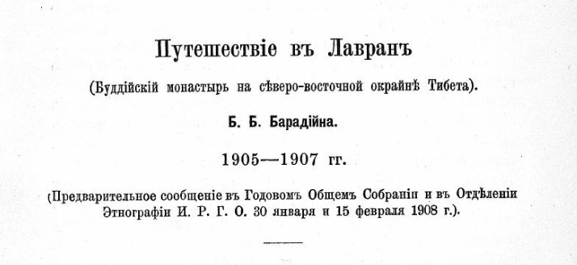
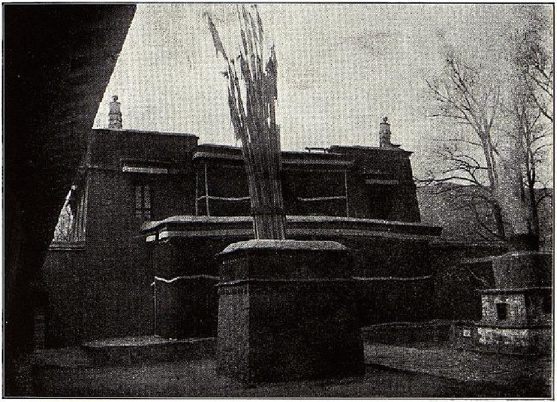
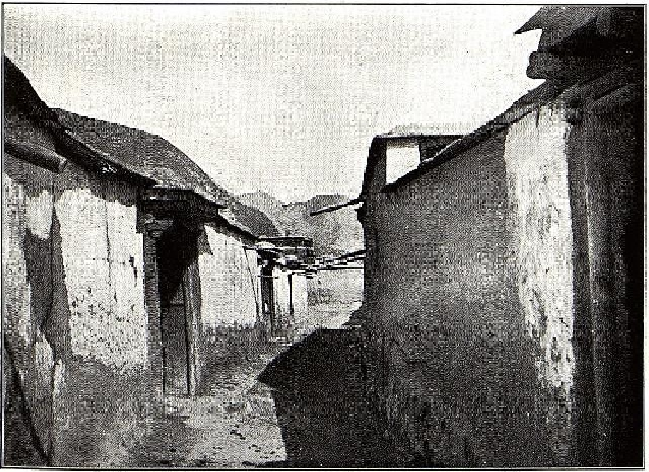
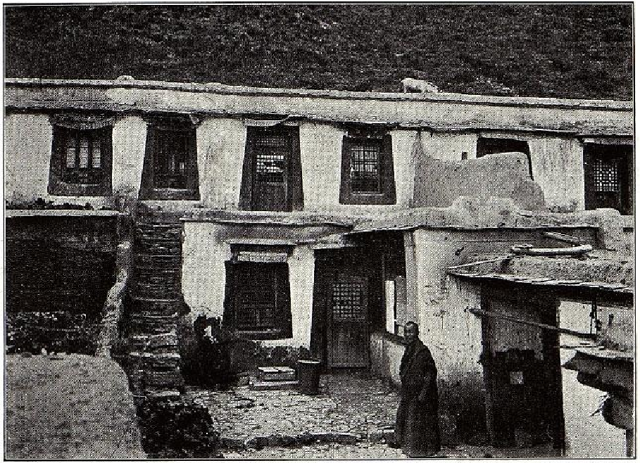
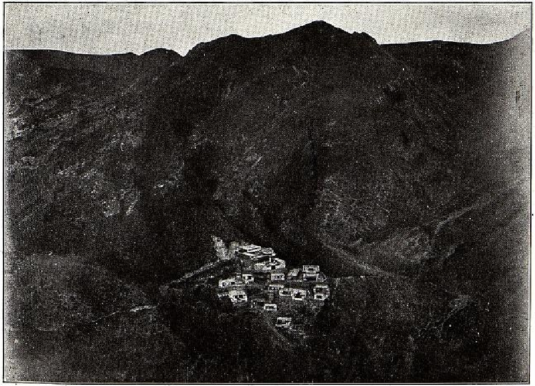

## Введение

В 1905—1907 годах Б. Барадин (Базар Барадиевич Барадийн, [ru-wiki](https://ru.wikipedia.org/wiki/%D0%91%D0%B0%D1%80%D0%B0%D0%B4%D0%B8%D0%B9%D0%BD,_%D0%91%D0%B0%D0%B7%D0%B0%D1%80_%D0%91%D0%B0%D1%80%D0%B0%D0%B4%D0%B8%D0%B5%D0%B2%D0%B8%D1%87)) был командирован Русским комитетом при Академии наук по изучению средней и Восточной Азии сопровождать Далай-ламу XIII, возвращавшегося из Урги в Тибет. Барадин провёл 8 месяцев в монастыре Лавран.

Здесь представлен распознанный и отредактированный текст статьи Б. Барадина "Путешествие в Лавран", опубликованной в Известиях ИРГО Т. XLIV, вып. IV. С. 183–232. Текст приводится в оригинальном виде, в старой орфографии. Есть также текст в [современной орфографии](/notes/baradin-lavran-irgo-modern/).

Библиографическая ссылка:

> Барадийн Б. Б. Путешествіе въ Лавранъ: буддійскій монастырь на сѣверо-восточной окрайнѣ Тибета. 1905–1907 гг. // Известия Императорского Русского географического общества. СПб., 1908. Т. XLIV, вып. IV. С. 183–232.

Скачать:

* Полный выпуск Известий ИРГО Т. XLIV, вып. IV ([источник](https://elib.rgo.ru/handle/123456789/219138), [PDF](https://drive.google.com/file/d/10qF4cNRdo4q-Bffz6jfClpl21yxrPksY/view?usp=sharing)).
* Статья Путешествие в Лавран ([PDF](https://drive.google.com/file/d/1WAUAv6CWFVCcplyRJsqcURReg8yMfYLX/view?usp=sharing)).

## Текст

<a id="183">**-- 183 --**</a>

Путешествіе въ Лавранъ

(Буддійскій монастырь на сѣверо-восточной окрайнѣ Тибета).

Б. Б. Барадійна.

1905---1907 гг.

(Предварительное сообщеніе въ Годовомъ Общемъ Собраніи и въ Отдѣленіи Этнографіи И. Р. Г. О. 30 января и 15 февраля 1908 г.).

Настоящій докладъ посвящается описанію путешествія моего, предпринятаго 1905 г. въ сѣверо-восточную окраину Тибета---въ Амдо по порученію Русскаго Комитета для изу­ченія Средней и Восточной Азіи.

Главною цѣлью моего путешествія было изучить на мѣстѣ жизнь большого буддійскаго монастыря и составить подробный очеркъ какъ самого монастыря, такъ и жизни его обитателей---монаховъ.

Исполненіемъ этой задачи я имѣлъ въ виду по возможности выяснить основу духовной культуры всѣхъ современныхъ намъ монголо-тибетскихъ народностей,---такъ какъ эта сторона ихъ жизни, по нашему мнѣнію, была до сихъ поръ мало изслѣдована.

Мѣстомъ изслѣдованія былъ избранъ тангутскій монастырь Лавранъ, который по своему духовному вліянію на всю Мон­голію и на наше Забайкалье является крупнѣйшимъ изъ со­временныхъ разсадниковъ буддизма, нисколько не уступая въ этомъ отношеніи самому центру тибетскаго буддизма---Лхасѣ.

Такимъ образомъ главное мое вниманіе было обращено

<a id="184">**-- 184 --**</a>

на фактическую основу духовной культуры данной мѣстности,---на ея религію, языкъ и литературу, и въ мои задачи вхо­дило лишь попутное изслѣдованіе мѣстности въ географиче­скомъ или иныхъ отношеніяхъ: это было бы не въ моихъ силахъ какъ простого паломника, подъ видомъ котораго я долженъ былъ работать, да и выходило за кругъ моей спе­ціальности.

Прежде чѣмъ приступить къ главной темѣ моего сообщенія, считаю не лишнимъ подѣлиться нѣкоторыми свѣдѣніями о моемъ путешествіи.

Ближайшимъ моимъ спутникомъ былъ мой братъ.

По обычаю бурятъ наши родители за нѣсколько дней до нашего отъѣзда съ родины---Забайкалья обратились къ ламѣ--астрологу, который долженъ былъ назначить намъ удачный день выѣзда. Нашъ выѣздъ былъ назначенъ на 9 сентября (н. с.). Поэтому въ этотъ день къ намъ былъ приглашенъ лама, который долженъ былъ совершить небольшое напут­ственное молебствіе и указать еще удачный часъ дня и сторону выѣзда изъ дома. Послѣ молебствія мы выѣхали изъ дома, соблюдая со всей строгостью предписанія нашихъ родителей и ламы. При этомъ въ самый моментъ выѣзда лама выбрасы­валъ разные жертвенные комки изъ тѣста, а мать брызгала молоко на всѣ четыре страны свѣта, дабы охранить насъ отъ разныхъ несчастій и чтобы во время всего пути намъ покровительствовали земные и небесные духи.

Наши домашніе провожали насъ въ путь съ большою радостью: они были счастливы тѣмъ, что мы, люди одного съ ними семейнаго очага, отправляемся въ божественную страну Тибетъ, чтобъ поклониться его святынямъ и принести оттуда съ собой счастье въ семью.

Сѣвъ на поѣздъ на ст. Могойтуй, мы изъ Верхнеудинска перебрались въ Кяхту, а 30 сентября мы были въ монголь­ской столицѣ Ургѣ.

Какъ извѣстно, періодъ между 1904 --- 1906 годами былъ ознаменованъ посѣщеніемъ Монголіи Верховнымъ буддійскимъ первосвященникомъ Далай-Ламой, который за 2 недѣли раньше насъ покинулъ Ургу и жилъ со своей свитой въ Халхаскомъ монастырѣ Ванъ-куренѣ (въ 300 в. на С.-З. отъ Урги).

Здѣсь я долженъ замѣтить, что въ связи съ этимъ важ­нымъ событіемъ первоначальная моя командировка имѣла

<a id="185">**-- 185 --**</a>

въ виду поѣздку въ центральный Тибетъ, въ свитѣ Далай-Ламы. Поэтому сначала я долженъ былъ поѣхать изъ Урги вслѣдъ за Далай-Ламой въ Ванъ-куренъ и провести тамъ зиму въ свитѣ Его Святѣйшества. Я рѣшился отправиться въ Лавранъ только послѣ окончательнаго выясненія, что Далай-Лама рѣ­шилъ остаться еще въ предѣлахъ Монголіи на неопредѣленное время.

Вечеромъ 10 октября мы выѣхали изъ Урги въ Ванъ-куренъ. При любезномъ содѣйствіи нашего Ургинскаго кон­сульства мы ѣхали безплатно по монгольскимъ уртонамъ (что значитъ станціи).

Все время мы держали путь на С.-З. ѣхали по холми­стой степи, населенной одиночными кочевниками. Мѣстные жители---тѣ же халха-монголы тушету-хановскаго и цэцэнъ-хановскаго аймаковъ. Они менѣе испорчены, чѣмъ притрактовые монголы и сравнительно зажиточны, хотя они жало­вались намъ, что у нихъ изъ года въ годъ идетъ прогресси­рующее обѣдненіе изъ-за тяжелыхъ податей и повинностей: раньше всякій имѣлъ по тысячѣ штукъ скота, а теперь рѣдко кто имѣетъ и сотню, говорили они.

По дорогѣ намъ часто встрѣчались монгольскіе разсыльные „эльчи“ съ казенными пакетами между Ургой и Ванъ-куреномъ туда и обратно. При этомъ они дѣлали удивительные переходы по 300 в. въ сутки. Присматриваясь къ этому, да и вообще ко всей организаціи первобытной кочевой жизни халха-монголовъ, можно было замѣтить, на сколько у нихъ---непонят­ная для насъ простая и легкая организація передвиженій. На 5-ыя сутки мы прибыли въ монастырь Ванъ-куренъ, который служитъ въ то же время и ставкой мѣстнаго хошуннаго князя Кандо-вана. Мы остановились у своего сородича г. Дылыкова, состоявшаго въ то время въ свитѣ Далай-Ламы. На другой день я удостоился пріема и поклоненія Далай-Ламѣ, который, будучи предупрежденнымъ уже наканунѣ о моемъ пріѣздѣ, принялъ меня чрезвычайно мило среди весьма простой обстановки его походной жизни.

Дальнѣйшая моя жизнь при дворѣ Далай-Ламы подробно занесена въ мой дневникъ, здѣсь же ограничусь лишь нѣ­сколькими замѣтками о Далай-Ламѣ и его свитѣ.

Далай-Лама на видъ молодой тибетецъ средняго роста съ энергичнымъ сухощавымъ лицомъ, съ небольшими черными

<a id="186">**-- 186 --**</a>

усиками и замѣчательно красивыми большими глазами. На свѣтло-желтой кожѣ его лица слегка замѣтны слѣды бывшей оспы. Онъ нѣсколько сутуловатъ и сухощавъ; во всей его фигурѣ, выраженіи лица и жестахъ проглядываетъ смѣсь живости и молодости,---Далай-Ламѣ во время моего посѣщенія было 29 лѣтъ. Въ обыкновенное время онъ одѣвался въ желтый ламскій костюмъ халха-монгольскаго покроя, а при торжественныхъ случаяхъ---въ темно-коричневый монашескій костюмъ тибетскаго покроя.

Далай-Лама велъ себя очень просто, по походному. Даже можно было замѣтить, что онъ испытывалъ большое нрав­ственное удовольствіе въ этой свободѣ простой походной жизни, на время вырвавшись изъ замуравленной придворной атмо­сферы своего таинственнаго лхасаскаго дворца---Поталы.

Далай-Лама обыкновенно вставалъ очень рано, между 5---6 ч. утра, а затѣмъ до 9---10 ч. проводилъ время въ утреннихъ молитвахъ, послѣ чего ему подавали чай обыкно­веннаго тибетскаго завара съ небольшимъ завтракомъ въ видѣ супа. Послѣ этого времени онъ обыкновенно принималъ до­клады своихъ приближенныхъ. Въ полдень ему подавали обѣдъ, который состоялъ исключительно изъ рисоваго или иного супа съ нѣкоторыми приправами.

Конечно, этимъ далеко не исчерпывается столъ Далай-Ламы, но мы говоримъ здѣсь только о томъ, относительно чего удалось добыть точныя свѣдѣнія. Нужно замѣтить, что вообще тибетскій столъ гораздо сложнѣе и разнообразнѣе, чѣмъ столъ кочевыхъ монголовъ, довольствующихся исключительно мясной пищей и молочными продуктами.

Послѣобѣденное время Далай-Лама до 5 --- 6 ч. вечера или проводилъ у себя или иногда выходилъ пѣшкомъ на коро, т.-е. на молитвенный обходъ монастыря, какъ простой бого­молецъ. Это, конечно, служило ему въ то же время и прогулкой. Онъ ходилъ въ сопровожденіи 2---3 человѣкъ низшихъ при­слугъ, а иногда въ обществѣ своихъ ближайшихъ лицъ, при чемъ я всегда замѣчалъ, что онъ шелъ одинъ, а его прибли­женные---на нѣкоторомъ разстояніи спереди или сзади. Онъ иногда посѣщалъ здѣшняго ученаго старца Дандаръ-Аграмбу для религіозныхъ бесѣдъ, какъ обыкновенный гость. Помню, 2 --- 3 раза заглянулъ онъ и въ юрту здѣшняго князя,---даже разъ не предупредивъ объ этомъ, въ сопровожденіи двухъ

<a id="187">**-- 187 --**</a>

лицъ. Это произвело страшный переполохъ въ застигнутой врасплохъ княжеской семьѣ; онъ успокоилъ ихъ, посидѣлъ нѣсколько минутъ, милостиво разговаривая съ членами кня­жеской семьи, употребляя при этомъ нѣсколько извѣстныхъ ему монгольскихъ словъ. Но вся эта простота его жизни сразу нарушалась, когда Его Святѣйшество давалъ торже­ственное благословеніе народу, --- въ такихъ случаяхъ требо­вался строгій этикетъ.

Вечеромъ съ 7 ч., послѣ своей вечерней молитвы, онъ проводилъ время въ чтеніи книгъ и ложился спать въ 12---1 ч. ночи, что возвѣщалось протяжнымъ монотоннымъ звукомъ ре­лигіознаго духовнаго инструмента изъ придворной его церкви „намгьэра-дацана“.

Онъ былъ очень требователенъ и строгъ къ окружающимъ, но въ то же время можно было замѣтить, что онъ былъ очень ласковъ, милъ и веселъ въ кругу ближайшихъ къ нему лицъ, хотя послѣдніе при постороннихъ лицахъ выказывали рабское поклоненіе своему владыкѣ.

Въ заключеніе отмѣтимъ, что нынѣшній, по тибетскому счету---ХIII-й Далай-Лама Гьэванъ Тубданъ-гьацо (р. 1876 г.), несомнѣнно выдающаяся въ своемъ родѣ личность. Онъ за­служенно пользуется на своей родинѣ громадной популяр­ностью въ народѣ за свой независимый и доброжелательный характеръ и народъ считаетъ его подлиннымъ воплощенцемъ Ѵ-го Великаго Далай-Ламы.

Такъ напр., ему приписываютъ отмѣну смертной казни, преслѣдованіе казнокрадовъ и взяточниковъ и т. п. произвола, царившаго въ Тибетѣ при многихъ его предшественникахъ. Кромѣ этого, нами еще былъ констатированъ въ Ванъ-куренѣ фактъ, что Далай-Лама имѣлъ широкіе планы обновленія и возрожденія тибетскаго буддизма и коренной реформы со­временнаго ламскаго строя, недостатки котораго онъ ясно сознавалъ.

Заканчивая этимъ свои замѣтки относительно личности энергичнаго, дѣловитаго Далай-Ламы, намъ приходится теперь только привѣтствовать вполнѣ для него благопріятный оборотъ дѣла со времени подписанія англо-русскаго соглашенія по тибетскому вопросу, потому что Его Святѣйшеству отнынѣ вполнѣ представляется возможность продолжить свои благія на­чинанія на родинѣ и тѣмъ ввести даровитый по природѣ тибет­

<a id="188">**-- 188 --**</a>

скій народъ въ кругъ культурныхъ народовъ. Жалѣемъ, что не могли получить разрѣшенія Далай-Ламы снять его портретъ. Намъ пришлось ограничиться снятіемъ портретовъ двухъ близкихъ ему людей: лейбъ-медика и секретаря, этихъ двухъ задушевныхъ его совѣтниковъ.

Въ Ванъ-куренѣ при мнѣ жило до 150 ч. тибетцевъ, составлявшихъ свиту Далай-Ламы. Высшая свита---до 30 ч. со своей челядью, монаховъ до 50 ч., а остальные---низшая придворная прислуга, въ томъ числѣ штатъ иконописцевъ, переписчиковъ, музыкантовъ, поваровъ и т. д. Въ числѣ высшей свиты Далай-Ламы во главѣ былъ Правитель дѣлъ Далай Ламы --- „Жэжшабъ-камбо“, Государственный ора­кулъ „--- Чойкьонъ-чэмо“, Главный секретарь „---Дуціигъ-чэмо“, Церемоніймейстеръ „Чобонъ-камбо“, Придворный по­варъ „Жама-камбо“ и др.

Самымъ интереснымъ человѣкомъ въ свитѣ Далай-Ламы былъ Государственный оракулъ Тибета „Чойкьонъ-чэмо“. Онъ на видъ красивый статный тибетецъ, лама лѣтъ 35. Онъ по рангу сидѣлъ ниже только самого Правителя дѣлъ Далай-Ламы.

Какъ извѣстно, въ буддизмѣ существуетъ культъ чойкьоновъ, т.-е. геніевъ хранителей святого ученія. Позднѣе тибетскій буддизмъ прибавилъ къ этимъ геніямъ и боговъ своей національной миѳологіи и сталъ дѣлить всѣхъ чойкьоновъ на двѣ категоріи: на „ушедшихъ изъ міра сего“ и на „неушедшихъ изъ міра сего“. Первые считаются чойкьонами высшаго порядка и всѣ они исключительно индійскаго происхожденія, а вторые---чойкьонами низшаго порядка и всѣ исключительно тибетскаго происхожденія. Божества второй категоріи, въ противоположность первой, имѣютъ способность снисходить въ душу особенныхъ людей, расположенныхъ по своему организму и настроенію къ воспріятію даннаго боже­скаго духа; затѣмъ этотъ духъ прорицаетъ чрезъ уста дан­наго человѣка и отвѣчаетъ на всѣ вопросы жизни. Человѣкъ, имѣющій способность воспринимать божескій духъ, т.-е. придти въ изступленное ненормальное состояніе, произнося неясныя слова на заданные вопросы, называется „куртэномъ“ и онъ можетъ во всякое время привести себя въ состояніе прори­цателя путемъ какъ внутренняго самовнушенія, такъ и путемъ возбуждающихъ средствъ,---воскуреній, музыки и т. п. Такихъ

<a id="189">**-- 189 --**</a>

людей чрезвычайно много въ Тибетѣ и Монголіи, отчасти даже есть и среди Бурятъ. Къ числу подобныхъ лицъ принад­лежитъ и упомянутый „Государственный оракулъ“ Тибета, который воспринимаетъ въ себѣ духъ главнаго изъ 5-ти божествъ древне-тибетской миѳологіи „Куна“. Этотъ оракулъ---самый главный изъ всѣхъ тибетскихъ оракуловъ, и только онъ имѣетъ санкцію отъ Богдохана, приравниваясь къ князьямъ 4-ой степени „гунъ“.

Послѣ смерти каждаго оракула отыскивается другой.

Подобно пиѳіи въ древней Греціи этотъ оракулъ имѣетъ громадное рѣшающее вліяніе не только на обыденную, но и на всю политическую жизнь страны. Такъ, нынѣшній Далай-Лама послѣ смерти стараго государственнаго оракула, былъ озадаченъ вопросомъ о томъ, каковъ будетъ новый. Далай-Лама, желая имѣть подъ рукой оракула своей партіи, избралъ нынѣшняго оракула, заставивъ его научиться способ­ности воспріятія божескаго духа. Онъ вполнѣ научился своему дѣлу, но сдѣлался такимъ оракуломъ, что потомъ самъ Далай-Лама и его партія стали не рады ему. Говорятъ, онъ въ изступленіи, т.-е. во время снисхожденія въ него божескаго духа, былъ всегда молчаливъ и не отвѣчалъ на заданные ему вопросы. Но когда англо-индійскій отрядъ вторгся въ 1904 г, въ предѣлы Тибета, Далай-Лама, придя въ гнѣвъ на своего государственнаго оракула за его безучастное от­ношеніе къ взволновавшему всѣхъ событію, сталъ бить его кнутомъ и заставилъ его говорить. Оракулъ впервые въ яростномъ изступленіи сталъ отвѣчать на заданные ему во­просы въ нежелательномъ для Далай-Ламы и его партіи смыслѣ, говоря, что все потеряно, нѣтъ спасенія отъ англи­чанъ, что вы (по адресу партіи Далай-Ламы) всякими не­правдами ввергли страну въ несчастіе и большинство вашихъ чойкьоновъ и земныхъ духовъ измѣнило вамъ и предалось англичанамъ, которые теперь идутъ противъ васъ войной въ союзѣ съ чойкьонами. Насколько все это правда,---сказать трудно; мы передаемъ то, что слышали отъ тибетцевъ,---во вся­комъ случаѣ достовѣрно извѣстно, что этотъ оракулъ нынѣ уже не пользуется расположеніемъ Далай-Ламы и его партіи, которая относится къ нему чуть ли не враждебно, говоря, что „въ нашего оракула вмѣсто божескаго духа снизошелъ злой духъ“. Тѣмъ не менѣе Далай-Ламѣ и его партіи при­

<a id="190">**-- 190 --**</a>

ходится считаться со своимъ оракуломъ, который сопровож­даетъ теперь Далай-Ламу въ качествѣ одного изъ высшихъ членовъ его свиты.

Всѣ тибетцы въ Ванъ-куренѣ, начиная съ самого Далай-Ламы и кончая низшими служащими, представляли доста­точный матеріалъ для составленія нѣкотораго понятія о ти­бетцахъ вообще, хотя, правда, для этого не хватало одного существеннаго элемента: женщинъ не было, какъ и есте­ственно, ни одной въ свитѣ Далай-Ламы.

Тибетецъ сперва поражаетъ васъ своей льстивостью и явно фальшивой вѣжливостью; онъ нисколько, впрочемъ, не старается скрыть отъ васъ этой несимпатичной черты. И ваше первое впечатлѣніе о тибетцахъ будетъ далеко не въ пользу ихъ. Эта ихъ черта объясняется тѣмъ, что, въ силу создавшихся у нихъ политическихъ и соціально-экономическихъ условій, тибетцы строго руководствуются житейскимъ прави­ломъ: „не показывать себя людямъ въ настоящемъ свѣтѣ“. Но зато, если вы съумѣли заслужить чѣмъ-нибудь довѣріе тибетца, онъ обращается въ хорошаго, до наивности искрен­няго пріятеля вашего. Тогда онъ выкажетъ вамъ настоящую природу характера своего народа: большую впечатлительность, суевѣріе, веселый сангвиническій темпераментъ. По складу ума тибетецъ весьма богато одаренъ воображеніемъ и фантазіей, но думаетъ медленно и тяжело, хотя и основательно.

Въ то же время тибетецъ чрезвычайно настойчивъ и упоренъ въ достиженіи своихъ стремленій; онъ способенъ перенести любое тѣлесное страданіе и презирать смерть. Благодаря такому характеру, при богатствѣ воображенія и фантазіи и при тяжеловатомъ умѣ, тибетцы обнаруживаютъ способность къ отвлеченному мышленію. Доказательствомъ этому служитъ появленіе изъ среды тибетцевъ многихъ круп­ныхъ религіозныхъ талантовъ и основаніе природными тибет­цами многихъ оригинальныхъ буддійскихъ философскихъ сектъ и школъ, изученіе которыхъ въ будущемъ, можетъ быть, прольетъ яркій свѣтъ на многія темныя стороны исторіи ду­ховной жизни самого очага арійской культуры Индіи. Тибетцы весьма здоровый и крѣпкій народъ, они большею частью средняго роста. Волосы у нихъ черные и жесткіе, и въ противо­положность монголамъ они довольно богаты растительностью на лицѣ. По цвѣту кожи высшій классъ рѣзко отличается

<a id="191">**-- 191 --**</a>

отъ низшаго своимъ свѣтло-желтымъ цвѣтомъ кожи, нерѣдко доходящимъ до европейской бѣлизны, тогда какъ низшій классъ имѣетъ темно-желтый или смуглый цыганскій цвѣтъ кожи, Нужно замѣтить, что тибетцы довольно строго придер­живаются сословныхъ предразсудковъ. У нихъ есть довольно замкнутое высшее дворянство, которое якобы ведетъ свое происхожденіе отъ знаменитаго царя Сронцзанъ-гамбо (VII в. по Р. X.). Въ типѣ тибетцевъ рѣзко замѣчаются слѣды ра­совой ихъ связи съ арійцами: овальная форма лица, большой высокій носъ, большіе глаза. Въ типахъ тибетцевъ въ Ванъ-куренѣ я не замѣчалъ рѣзкихъ признаковъ монголоидности и они несомнѣнно по расовому происхожденію стоятъ гороздо ближе къ арійцамъ, чѣмъ къ монголоидамъ, хотя языкъ ихъ говоритъ противное, относя ихъ къ индо-китайской группѣ.

Въ числѣ моихъ Ванъ-куренскихъ пріятелей былъ и ученый старецъ Лама Дандаръ-Аграмба, о которомъ я уже упомянулъ, говоря, что Далай-Лама иногда посѣщалъ его для религіоз­ныхъ бесѣдъ. Этотъ ученый старецъ, уже авторъ многихъ философскихъ сочиненій по буддизму, изданныхъ пока въ четы­рехъ томахъ въ Ванъ-куренѣ, давно славится какъ выдаю­щійся ученый не только у себя въ Монголіи и у Бурятъ, но и въ Тибетѣ. Мы считаемъ нелишнимъ разсказать объ одной изъ нашихъ бесѣдъ съ этимъ выдающимся человѣкомъ.

Когда я вошелъ къ нему, то замѣтилъ, что въ юртѣ сидитъ сѣдой какъ лунь 80-лѣтній старецъ съ замѣча­тельно свѣжимъ симпатичнымъ открытымъ лицомъ и почти юношескимъ безъ дрожи звучнымъ голосомъ. Лама еще чи­талъ свою утреннюю молитву. Со мной былъ одинъ бу­рятъ, и мы поднесли ламѣ по хадаку и получили благо­словеніе книгой. Вскорѣ лама окончилъ свою молитву, и мы привѣтствовали его. Лама былъ освѣдомленъ обо мнѣ, какъ объ интересномъ для него бурятскомъ знатокѣ санскрита и шопотомъ спросилъ своего прислужника: „который изъ нихъ?“ Прислужникъ указалъ на меня---лама устремилъ на меня свой взоръ, а я не замедлилъ тутъ же выразить ему свое желапіе познакомиться съ нимъ. Вскорѣ за этимъ мы вступили въ непринужденный разговоръ.

Я вынулъ изъ-за пазухи санскритское сочиненіе учителя Чандракирти „Prasannapadā“ (изданіе Академіи Наукъ). Раз­говоръ нашъ еще больше оживился, когда онъ узналъ, что

<a id="192">**-- 192 --**</a>

эта книга---оригиналъ той знаменитой книги, которая въ ти­бетскомъ переводѣ подъ названіемъ „цигсалъ“ изучается въ высшихъ классахъ цаннидской школы философіи буддизма. Старецъ разсматривалъ книгу съ большимъ любопытствомъ, и особенно его интересовали тибетскія примѣчанія къ тексту.

Онъ спросилъ, гдѣ напечатана книга?----Въ столицѣ рус­скаго хана, отвѣтилъ я. Затѣмъ онъ продолжалъ---много ли вообще издано санскритскихъ книгъ и изучаютъ ли ихъ оросы (т.-е. европейцы)? Я отвѣтилъ ему,---издано очень много книгъ по мѣрѣ ихъ открытія въ Индіи и особенно въ Балбѣ (т.-е. Непалѣ), и европейцы въ послѣднее время усиленно стали заниматься буддизмомъ и изслѣдованіемъ санскритскихъ па­мятниковъ. Далѣе онъ задалъ мнѣ вопросъ,---открываютъ ли оросы такія санскритскія книги, которыя не переведены на тибетскій языкъ?---иногда открываютъ, сказалъ я, на что онъ спросилъ,---не переводятъ ли они ихъ на тибетскій языкъ? Я пояснилъ ему, что они только издаютъ тексты, чтобъ интересующіеся изучали ихъ въ оригинальномъ видѣ, а если изрѣдка переводятъ, то только на свои языки, потому что они не работаютъ ради однихъ тибетцевъ. Тутъ ста­рикъ понялъ неправильность своего вопроса и выразилъ со­жалѣніе, и сказалъ: „какъ интересно было бы перевести ихъ на тибетскій языкъ, безъ перевода они навсегда недо­ступны тибетцамъ и монголамъ“. Старикъ увлекся бесѣдой и спросилъ меня,---есть ли оросы, перешедшіе въ буддизмъ и насколько они понимаютъ смыслъ его? Я сначала затруд­нялся, что отвѣтить на это, но затѣмъ заявилъ ему:---хотя нѣтъ среди оросовъ соблюденія буддизма съ формальной его стороны, но тѣмъ не менѣе среди нихъ есть не мало людей, не только интересующихся идеаломъ буддизма, но проникну­тыхъ самымъ духомъ нашего ученія. У оросовъ существуетъ чрезвычайное множество своихъ наукъ „ригнэ“ и религіозно­философскихъ ученій „думта“. Поэтому оросы не примутъ нашего буддизма съ внѣшней его стороны, „дамби гонэ“ и въ противоположность намъ монголамъ, принявшимъ буддизмъ сначала только съ внѣшней стороны, оросы, если примутъ когда-либо буддизмъ, то только съ критико-философской точки зрѣнія „думтай гонэ“. Послѣ этихъ моихъ словъ онъ со своей старческой искренностью сказалъ про себя: „Дѣйстви­тельно теперь начинаетъ исполняться предсказаніе Будды,

<a id="193">**-- 193 --**</a>

что его религія распространится съ юга на сѣверъ, и не спроста эти люди потратили трудъ издать эту сокровенную книгу. Да, они дѣйствительно добродѣтельные люди!“ ---заклю­чилъ знаменитый монгольскій ученый и спросилъ меня,---но, какъ они (европейцы) относятся къ вопросамъ о буддійской теоріи справедливости, воплощенія (т.-е. теорія, утверждающая, что всякое живое существо не имѣетъ начала жизни и будетъ имѣть послѣ смерти безконечную жизнь въ безконечныхъ перерожденіяхъ пока оно не достигнетъ состоянія Будды, воплощая и приспособляя свой психическій міръ согласно закону справедливости), вѣдь они, какъ я слышалъ, ничего не признаютъ кромѣ опыта „вамбой онсумъ“? Очевидно, кто-то ему передалъ въ такомъ тенденціозномъ освѣщеніи европейскіе методы изслѣдованія и онъ былъ убѣжденъ, что европейцы признаютъ только то, что видятъ воочію, воспрія­тіемъ чувства. На это я долженъ былъ сдѣлать разъясненіе: „Много занимался я науками оросовъ и положительно могу утверждать, что мнѣніе, будто оросы руководствуются при своихъ изслѣдованіяхъ только воспріятіемъ, совершенно не соотвѣтствуетъ дѣйствительности. Разныя науки самостоятельно созданы оросами въ теченіе вѣковъ на основаніи не только опыта „онсумъ“, но и умозаключенія „жэвагъ“. Благодаря этому они признаютъ законъ причинности и слѣдствія „гьумбрэ“, а также законъ относительности, условности существованія вещей „дэнбрэлъ“. Что же касается буддійской теоріи спра­ведливости, воплощенія, то они не вырѣшили этихъ вопросовъ, такъ какъ эти вопросы, по мнѣнію ихъ,---не разрѣшимы непосредственнымъ умозаключеніемъ „ойдобъ жэвагъ“, который главнымъ образомъ и признается оросами“. Этимъ моимъ разъясненіемъ старецъ былъ вполнѣ удовлетворенъ и сказалъ: „Да, самъ Будда признавалъ, что законъ справедливости „карма“ ---самая трудная область познанія“.

При нашей бесѣдѣ сидѣло до десяти человѣкъ ламъ, въ томъ числѣ молодой халхаскій хубилганъ, ученикъ старца,---по имени „Дарабъ-Бандида“,---одинъ изъ важнѣйшихъ хубилгановъ (т.-е. святыхъ) въ Халхѣ. Этотъ хубилганъ, молча­ливо выслушавъ до конца пашу бесѣду, горячо выразилъ свою увѣренность, что оросы далеки отъ пониманія буддизма, особенно его антиномической философіи „тангьурви-думта“, которую развиваетъ упомянутая нами выше санскритская книга.

<a id="194">**-- 194 --**</a>

На это я возразилъ ему: „я не говорю относительно кях­тинскихъ оросовъ, которыхъ вы только и знаете, а говорю о тѣхъ оросахъ, которыхъ вы не знаете и которые изучаютъ и знаютъ нашу вѣру“. Онъ мнѣ отвѣтилъ съ рѣзкостью: „я не лягушка, которая знаетъ только свой колодецъ“,---и страшно былъ, видимо, разсерженъ моимъ возраженіемъ въ присутствіи обоготворяющихъ его монголовъ. Конфликтъ нашъ этимъ былъ вполнѣ исчерпанъ и я, конечно, не сталъ втя­гиваться въ дальнѣйшее пререканіе съ этимъ монгольскимъ „оффиціальнымъ святымъ“.

Старецъ не хотѣлъ прерывать нашей бесѣды, но я, не же­лая утомлять его слишкомъ, всталъ съ мѣста и простился съ нимъ до слѣдующаго раза. При прощаніи со старцемъ я за­мѣтилъ, что всѣ присутствующіе ламы---слушатели нашихъ бесѣдъ, почтительно встали одновременно со мной, между тѣмъ они, какъ и самъ хубилганъ, сначала относились ко мнѣ свысока, благодаря моему невзрачному монгольскому костюму.

Такое неожиданное ко мнѣ вниманіе явилось результа­томъ нашихъ бесѣдъ, въ особенности съ хубилганомъ.

Переходя къ обозрѣнію соціально-политическаго состоянія современной Халхи (Сѣверной Монголія), скажемъ, что нынѣш­ніе халхасцы, занимая громадную площадь---часть плоскогорій центральной Азіи и въ силу создавшихся у нихъ неблаго­пріятныхъ политическихъ и соціально-экономическихъ условій, переживаютъ быстрый упадокъ своей жизненной силы. Этотъ фактъ въ связи съ культурнымъ подъемомъ Китая и его все­поглощающей жизненной энергіей ставитъ халхасцевъ, да и всѣхъ монголовъ, подвластныхъ Китаю, въ тяжелое поло­женіе,---будущее ихъ, какъ отдѣльной націи, весьма мрачно.

Какъ самая характерная черта кочевой культуры халхас­цевъ нами отмѣчено чисто степное скотоводство, которое я назвалъ бы „произвольной формой скотоводства“ въ отличіе отъ пастбищной или болѣе интенсивной формы. Скотоводство халхасцевъ, обусловленное характеромъ ихъ страны, нахо­дится въ полной зависимости отъ прихоти погоды. Какъ-то разъ халхаскій князь Кандо-ванъ очень мѣтко охарактеризо­валъ форму халхаскаго скотоводства словами: „Нужно, чтобъ баранъ ухаживалъ за овечкой, а козелъ за козлицей, а наше дѣло только пожинать плоды!“ Этими словами онъ хотѣлъ

<a id="195">**-- 195 --**</a>

выразить преимущество своего хозяйства надъ бурятскимъ, когда я доказывалъ ему обратное, что пастбищное бурятское хозяйство, хотя требуетъ отъ человѣка много труда и умѣ­нія, гораздо надежнѣе халхаскаго скотоводства.

Рано или поздно монголамъ придется имѣть дѣло съ евро­пейской культурой. Тогда въ ихъ бывшихъ привольныхъ сте­пяхъ будетъ одно изъ двухъ: или смерть слабаго дикаря, или жизнь культурнаго человѣка. Быть можетъ они съ достоин­ствомъ жизнеспособной націи воспримутъ лучшія силы куль­туры, освободятся отъ нынѣшняго своего политическаго раб­ства, отъ гнилой маньжурщины, отъ своихъ ламъ-хубилгановъ и князей, выроютъ въ своихъ нынѣшнихъ пустынныхъ сте­пяхъ артезіанскіе колодцы и тѣмъ освободятся отъ прихоти стихіи, превратя свои степи въ цвѣтущія поля для обра­щенія нынѣшняго своего „произвольнаго скотоводства“ въ форму усовершенствованнаго хозяйства. Тогда имъ для прі­общенія къ цивилизаціи вовсе нѣтъ необходимости переходить къ земледѣльческому или промышленному образу жизни, на­оборотъ тутъ дѣло въ интенсированіи, усовершенствованіи всякой данной формы хозяйства, потому что земледѣлецъ мо­жетъ быть дикаремъ, а скотоводъ---культурнымъ человѣкомъ, или наоборотъ. Между тѣмъ, казавшаяся эта столь простая истина, къ сожалѣнію, многими еще теперь не признается.

### Выѣздъ изъ Ванъ-курена чрезъ Ургу въ Амдо.

Въ Ванъ-куренѣ примкнулъ ко мнѣ и второй мой спут­никъ, молодой лама Цугольскаго дацана Дэнзинъ Намжилай.

7 марта 1906 г. мы выѣхали изъ Ванъ-курена въ Ургу по старой дорогѣ. Монголы меня обыкновенно принимали за какого-то важнаго монаха Когда мы по дорогѣ ночевали въ юртѣ одной богатой вдовы ---содержательницы уртона и ея со­жителя ламы, хозяйка обратилась ко мнѣ съ просьбой поворо­жить ей и объяснить, почему въ послѣднее время волки стали часто давить изъ ея стада барановъ и рогатый скотъ. Она желала, чтобъ я подбрасывалъ ей ламскіе гадательные кубики „шо“---для указанія ей причины „обжорства вол­ковъ“ и чтобы далъ совѣтъ служить противъ этого молеб­ствіе какому-нибудь божеству. Но я долженъ былъ, конечно,

<a id="196">**-- 196 --**</a>

отказаться отъ роли ламы. Я пробовалъ было дѣйствовать на нее, говоря, что противъ обжорства волковъ средство одно---хорошій надзоръ за скотомъ. Она знать не хотѣла моей по­пытки разсѣять ея суевѣріе и была увѣрена, что въ дѣлѣ „обжорства волковъ“ непремѣнно замѣшенъ злой духъ. Дѣло кончилось тѣмъ, что я пошутилъ надъ ней и спросилъ,---почему она не обращается съ подобнымъ же вопросомъ къ ламѣ---своему сожителю, который тутъ же рядомъ со мной улыбался на мою шутку. Монгольская дама откровенно при­зналась, что она давно извѣрилась въ святости своего милаго.

14 марта мы были въ Ургѣ, гдѣ дожны были снаря­диться въ дальнѣйшій путь, закупая провизію и предметы дорожнаго снаряженія.

### Путь отъ Урги до Лаврана.

29 марта мы выѣхали въ Лавранъ съ небольшимъ об­ратнымъ караваномъ верблюдовъ алашанскихъ монголовъ, на­нявъ у нихъ верблюдовъ до Алаша-ямыня.

Послѣ длиннаго утомительнаго пути по гобійской степи, качаясь на спинахъ нашихъ верблюдовъ, мы 8 мая добра­лись до Алаша-ямыня, этого смѣшаннаго китайско-монголь­скаго городка, представляющаго прелестный оазисъ въ уголкѣ обширной песчаной Алашани. Здѣсь мы нашли теплый пріютъ у г. Бадмажапова (одинъ изъ бывшихъ выдающихся спутни­ковъ П. К. Козлова въ его предпослѣдней экспедиціи въ Тибетъ) и г. Симухина, которые завѣдывали русской фирмой предпріимчивыхъ кяхтинскихъ купцовъ Собенникова и бр. Молчановыхъ. Эта фирма уже нѣсколько лѣтъ ведетъ мѣно­вую торговлю русскими товарами на мѣстное сырье, глав­нымъ образомъ, на верблюжью шерсть. Торговля шла въ общемъ вяло изъ за трудности и дальности разстоянія по доставкѣ свѣжихъ товаровъ.

Съ г. Бадмажановымъ мы осматривали всю пышную об­становку жизни алашанской княжеской фамиліи, которая об­ставила себя здѣсь, въ этой бѣднѣйшей странѣ, какъ высшая китайская аристократія со своими цвѣтущими парками, са­дами, оранжереями, богатыми храмами и дворцами.

Все это было чудовищно контрастно ко всей унылой

<a id="197">**-- 197 --**</a>

пустынной окрестности съ ея населеніемъ, изнемогающимъ подъ бременемъ суровой борьбы за жизнь въ этой пес­чаной пустынѣ---съ одной стороны, и подъ страшнымъ гне­томъ окитаившейся своей княжеской фамиліи --- съ другой. Я зналъ, сколько хлопотъ и сколько слезъ стоило все это бѣднымъ алашанцамъ, рѣзко отличающимся отъ своихъ со­сѣдей халхасцевъ неутомимымъ трудолюбіемъ, терпѣніемъ, чрезвычайной скромностью жизни, серьезнымъ молчаливымъ характеромъ, честностью и благородствомъ.

14 мая мая мы выѣхали дальше изъ Алаша-ямыня, на­нявъ новыхъ алашанцевъ до Кумбума.

Мы ѣхали чрезъ китайскую таможенную заставу Саянъ-чжинъ, чрезъ г.г. Пинъ-фань-сянь, Ньанъ-бо-сянь и Сининъ.

8 іюня мы прибыли въ монастырь Кумбумъ.

Отсюда мы наняли новыхъ возчиковъ-саларовъ (мусульм. племя между Лавраномъ и Кумбумомъ), совершающихъ по­стоянные рейсы Лавранъ---Кумбумъ на своихъ лошакахъ, и выѣхали 15 іюня.

Прибытіе въ Лавранъ.

Въ полдень 23 іюня, спустившись въ глубокую узкую до­лину рѣчки Санчу, мы подъѣзжали къ расположившемуся на днѣ долины знаменитому монастырю Лаврану. Было очень свѣжо и прохладно послѣ недавней грозы, настигшей насъ на пе­ревалѣ. Мы въ это время чувствовали себя въ радостномъ настроеніи, что стоимъ у конца пути, а веселыя пѣсни на­шихъ молодцеватыхъ саларовъ эхомъ разливались по гори­стой окрестности. Мы вскорѣ проѣхали по грязнымъ ули­цамъ тангутско-китайскаго предмѣстья Лаврана „Тава“ и передъ нами открылась очаровательная картина громаднаго буддійскаго монастыря, который на этомъ мѣстѣ захватилъ всю узкую долину рѣчки. Многочисленные высокіе храмы бѣлаго, краснаго и желтаго цвѣтовъ со множествомъ этажей и оконъ, съ симметричной прямолинейной архитектурой, съ плоскими крышами, напоминали по виду какой то старинный итальянскій городъ, но тутъ же къ намъ навстрѣчу стали во множествѣ попадаться люди непривычнаго для меня вида, быстро шагающіе воинственные тангуты въ огромныхъ ба­раньихъ тулупахъ съ открытыми загорѣлыми туловищами

<a id="198">**-- 198 --**</a>

и большими боевыми мечами за поясомъ, а рядомъ съ ними---смиренные буддійскіе монахи въ красныхъ одѣяніяхъ. Все это сразу измѣняло впечатлѣніе.

Чрезъ нѣсколько минутъ мы уже очутились въ своеоб­разномъ обществѣ лавранскихъ монаховъ. Мы остановились у своего родственника ламы Аку Найдана, который не успѣлъ даже напоить насъ чаемъ, какъ здѣшніе ламы-буряты пере­полнили отведенную мнѣ маленькую монашескую келью и буквально засыпали насъ поздравленіями и безконечными разспросами.

На другое утро я уже былъ вполнѣ лавранцемъ и съ этого момента я долженъ былъ работать въ теченіе 8 мѣся­цевъ въ тишинѣ монастырской жизни, постепенно стараясь вникнуть въ мѣстную жизнь. Днемъ я или выходилъ съ фотогра­фическимъ аппаратомъ за пазухой и снималъ здѣшніе виды, храмы, сцены, или съ большимъ аппаратомъ---для съемки въ до­махъ знатныхъ гэгэновъ, или присутствовалъ на религіозныхъ церемоніяхъ и на шумныхъ занятіяхъ цаннидской (философ­ской) школы подъ открытымъ небомъ, или въ пышномъ храмѣ, или втискивался въ разношерстную базарную толпу тангутовъ и тангутокъ, китайцевъ и китайцевъ-мусульманъ, или выходилъ въ поле съ монахами во время ихъ періодическихъ отдыховъ отъ школьныхъ занятій, или совершалъ прогулки по окрестностямъ Лаврана по монашескимъ обителямъ „ритодамъ“---этимъ миніатюрнымъ горнымъ монастырямъ.

Ночью же я сиживалъ въ своей монашеской комнаткѣ за дневникомъ или за чтеніемъ тибетскихъ книгъ въ сообществѣ монаховъ, или въ мирныхъ бесѣдахъ со своими бурятами-ламами или съ тангутскими пріятелями.

Перехожу къ Амдо, области составляющей сѣверо-во­сточную окраину національной территоріи тибетскихъ пле­менъ. Она представляетъ гористую страну---продолженіе всего тибетскаго плоскогорія и примыкаетъ къ границамъ Ганьсюйской и Сычуаньской провинцій.

### Населеніе Амдо.

Преобладающее населеніе Амдо составляютъ воинственныя тибетскія племена---тангуты, распадающіеся по образу жизни на кочевниковъ и на земледѣльцевъ. Тангуты, какъ горцы,

<a id="199">**-- 199 --**</a>

живутъ отдѣльными группами или деревнями, которыя зача­стую бываютъ въ враждебной отчужденности другъ отъ друга. Тангуты различаются между собой также по нарѣчіямъ обще­тибетскаго языка и по различнымъ сектамъ тибетскаго буд­дизма.

Въ политическомъ отношеніи тангуты представляютъ от­дѣльныя независимыя племена, которыя подчиняются Китаю лишь номинально. Китай совершенно не вмѣшивается во вну­треннюю жизнь своихъ воинственныхъ инородцевъ и ограни­чивается рѣдкой посылкой своихъ чиновниковъ съ отрядомъ войскъ для разрѣшенія тѣхъ или иныхъ тяжбъ между китай­цами съ одной стороны и тангутами---съ другой.

Въ данномъ случаѣ всепоглощающее культурное вліяніе Китая на его инородцевъ коснулось лишь окраинъ Амдо, гдѣ засѣли китайскіе переселенцы---крестьяне, да мелкіе торговцы.

Въ Амдо, да и вообще на всемъ пространствѣ тибетской національной территоріи не могла создаться крѣпкая поли­тическая единица вслѣдствіе географическихъ условій страны и воинственнаго свободолюбиваго характера обитателей. Дѣй­ствительно, у тангутовъ совершенно отсутствуетъ чья-либо крѣпкая власть и они находятся подъ сферой вліянія того или другого гэгэна, или монастыря.

Во внутренней же жизни они регулируются въ своихъ взаимоотношеніяхъ народными судилищами изъ выборныхъ старѣйшинъ, или мелкими князьками или старшинами.

Въ своихъ разбойничьихъ экскурсіяхъ, которыя являются однимъ изъ главныхъ занятій тангутовъ, они подчиняются своимъ атаманамъ разбойниковъ.. Тангуты не имѣютъ ника­кихъ писаныхъ законовъ, хотя они сравнительно грамотны, но несомнѣнно они въ своей общественной жизни руководствуются своимъ обычнымъ правомъ. Намъ не удалось подробнѣе ознако­миться съ этой интересной областью и мы отмѣтимъ лишь нѣкоторые факты: напр., врагъ неприкосновененъ въ нейтраль­номъ домѣ или деревнѣ. Каждая община должна стоять за интересы каждаго изъ своихъ членовъ, и если кто-нибудь пострадалъ отъ людей чужой общины, то община потерпѣв­шаго должна потребовать возмездія отъ общины обидчиковъ и оказать матеріальную помощь семьѣ, или наслѣдникамъ потерпѣвшаго своего члена.

По приблизительному разсчету количество всѣхъ тангутовъ

<a id="200">**-- 200 --**</a>

Амдоскаго нагорія не превышаетъ 1/2 милліона душъ обоего пола.

Земледѣльцы живутъ деревнями въ глиняныхъ и камен­ныхъ фанзахъ, обнесенныхъ такими же стѣнами, и весь дворъ представляетъ миніатюрную крѣпость.

Скотоводы же живутъ таборами въ переносныхъ шерстя­ныхъ шатрахъ „банагъ“.

Какъ земледѣльцы, такъ и скотоводы по покрою одежды (нагольная шуба, или халатъ,---рѣдко съ рубахой) и воору­женію (фитильное ружье съ сошками, пика и кинжалъ) оди­наковы. При этомъ, конечно, скотоводы болѣе примитивны въ своихъ требованіяхъ. Такъ, въ Лавранѣ мнѣ приходилось наблюдать такую картинку: впервые въ жизни пріѣзжаетъ въ Лавранъ на поклоненіе захолустный житель Амдо, кочевой тангутъ съ семьей. На ихъ костюмахъ ни лоскутка матеріи и имъ совершенно незнакомо употребленіе какой-либо ма­теріи,---все у нихъ самодѣльное: несмотря на лѣтнее время, на нихъ мохнатыя шубы изъ бараньихъ шкуръ плохой вы­дѣлки. Обувь---въ видѣ кожаныхъ мѣшочковъ, сшитыхъ на скорую руку съ кругленькимъ дномъ, надѣвается на ногу безъ всякаго разбора---гдѣ носокъ и гдѣ задокъ.

Женскій костюмъ по покрою не отличается отъ мужского. Только женщины опоясываются просто, тогда какъ мужчины любятъ опоясываться очень своеобразно, образуя вокругъ ту­ловища громадный мѣшокъ, куда при надобности кладутъ гольное баранье стегно или кусокъ молочнаго масла и т. п. вещи, и даже вмѣстѣ съ этими предметами свободно можетъ помѣщаться голый ребенокъ. Опоясываясь такимъ образомъ, тангуты, особенно молодежь, заднюю полу своей одежды со­бираютъ въ хвостикъ. Когда тангутъ надѣваетъ свою конусо­образную шапку на бекрень, а хвостикъ виляетъ при ходьбѣ, то онъ выражаетъ этимъ свою воинственную молодцеватость. Только старики отказываются отъ подобныхъ опоясываній, говоря: „я уже старикъ и пора мнѣ разстаться съ хвости­комъ“. Такой вкусъ является общимъ національнымъ вкусомъ всего тибетскаго народа, какъ мужчинъ, такъ и женщинъ.

Женщины всѣхъ тибетскихъ племенъ выражаютъ свой національный вкусъ тѣмъ, что къ косамъ привѣшиваютъ раз­ныя подвѣски, спускающіяся до нижняго края костюма, и

<a id="201">**-- 201 --**</a>

на концѣ подвѣски придѣлываютъ хвостикъ въ видѣ густого пучка красныхъ нитокъ.

Тангуты носятъ маленькія косы, но есть многія племена, которыя вовсе не носятъ косъ.

Различіе прически и головного украшенія тангутскихъ женщинъ является показателемъ принадлежности ихъ къ тому или другому племени. Самая характерная прическа вообще тибетскихъ женщинъ является въ видѣ множества косичекъ, которыя часто дополняются волосами яковъ и спускаются по спинѣ. Кромѣ того эти косички покрываются широкимъ лам­пасомъ, отпущеннымъ до самаго края подола. Лампасъ этотъ сверху украшается серебряными или мѣдными бляхами, ра­ковинами, камешками и т. д.

### Положеніе женщины.

У окрестныхъ лавранскихъ тангутовъ наблюдается фактъ, что женитьба совершается посредствомъ побѣга молодого че­ловѣка навсегда изъ родительскаго дома въ домъ родителей невѣсты. Если молодому человѣку понравилась дѣвушка и онъ желаетъ жениться на ней, то онъ оставляетъ у нея какую-нибудь свою одежду. Дѣвушка, если принимаетъ предложеніе моло­дого человѣка, должна убирать его одежду наравнѣ со своими, а если отвергаетъ предложеніе, опа выноситъ его одежду на улицу. При этомъ родители не имѣютъ никакого вліянія на рѣшеніе своей дочери. Такимъ образомъ, молодой человѣкъ увидитъ въ чемъ дѣло: вынесена ли его одежда, которую нужно со срамомъ унести обратно домой, или же его одежда, тщательно убрана въ числѣ одеждъ дѣвушки.

Въ послѣднемъ случаѣ молодой человѣкъ убѣгаетъ отъ своихъ родителей, прервавъ съ ними всякую имущественную связь. При этомъ онъ можетъ, самое большее, захватить съ собой боевого коня, но въ крайнемъ случаѣ онъ долженъ являться къ своей невѣстѣ непремѣнно съ ружьемъ и кин­жаломъ.

Такимъ образомъ мужъ является какъ постоянный гость для жены и ея родителей, и основа семейной жизни тангу­товъ и вообще всѣхъ тибетскихъ племенъ та, что мужъ и жена въ имущественномъ отношеніи весьма мало связаны

<a id="202">**-- 202 --**</a>

другъ съ другомъ. Жена должна завѣдывать всѣмъ хозяйствомъ, какъ исключительно ей принадлежащимъ, а мужъ въ своемъ распоряженіи имѣетъ лишь своего боевого коня и ружье, кинжалъ и пику, съ которыми онъ можетъ идти на разбой.

Поэтому женщины всѣхъ тибетскихъ племенъ весьма само­стоятельны и свободны и онѣ могутъ по своему выбору имѣть одновременно нѣсколькихъ мужей. Въ силу такого поло­женія женщины, рожденіе дѣвочки больше радуетъ родителей, чѣмъ рожденіе мальчика,---потому что только дочь является кормилицей своихъ родителей, а сынъ лишнимъ человѣкомъ, покидающимъ ихъ навсегда.

Мужъ начинаетъ помогать женѣ въ хозяйствѣ по мѣрѣ того, насколько онъ чувствуетъ привязанность и нравственную обязанность по отношенію къ женѣ, вслѣдствіе ли прижитыхъ съ ней дѣтей, или иныхъ условій семейной жизни. Вопросъ о бракѣ и семьѣ тангутовъ, къ сожалѣнію, намъ не удалось изучить болѣе основательно.

Тангуты народъ выше средняго роста, лицо у нихъ до­вольно правильное, овальное, большіе глаза и сравнительно высокій носъ. Цвѣтъ кожи красновато-коричневый, но среди тангутовъ, особенно среди важныхъ ламъ, часто встрѣчаются люди съ совершенно бѣлымъ цвѣтомъ кожи лица.

Глаза и волосы черные, но иногда встрѣчаются субъекты съ краснымъ лицомъ и съ рыжими волосами. Между ними часто попадаются бородачи и усачи. По внѣшнему облику тангуты довольно рѣзко отличаются отъ своихъ соплеменни­ковъ---жителей центральнаго Тибета: у тангутовъ наблюдается значительная примѣсь монгольской крови, тогда какъ у собственно-тибетцевъ преобладаетъ примѣсь индо-арійской крови. По физическому тѣлосложенію тангуты весьма крѣпкій и здо­ровый народъ. Они, какъ древніе спартанцы, презираютъ всякую нѣгу, любятъ суровость и закаленность.

Для этого они вовсе не заботятся о чистотѣ и съ малыхъ лѣтъ пріучаются къ грубой закаленности --- малочувствитель­ности кожи къ внѣшнимъ вліяніямъ. Поэтому и въ обществѣ молодыхъ дѣвушекъ будетъ имѣть успѣхъ не тотъ юноша, который отличается вѣжливостью и т. п. качествами, а тотъ, который наиболѣе нахаленъ, грубъ и прямодушенъ, закаленъ, а костюмъ его наиболѣе засаленъ, но крѣпокъ и простъ. Одна­кожъ, женщины по отношенію къ самимъ себѣ не имѣютъ

<a id="203">**-- 203 --**</a>

такого вкуса, наоборотъ,---онѣ не прочь ухаживать за своей красотой,---умываться и т. п.

На ряду съ многими симпатичными чертами тангутской на­родной жизни слѣдуетъ отмѣтить и нѣкоторыя печальныя черты, созданныя соціально-экономическими условіями страны: тангуты, какъ и большинство тибетскихъ племенъ, относятся очень жестоко къ своимъ престарѣлымъ, утратившимъ способность къ труду, родителямъ, особенно къ матери, а также къ своимъ дѣтямъ-подросткамъ. Въ Лавранѣ мнѣ часто приходилось видѣть старухъ, которыя, будучи покинутыми на произволъ судьбы своими дѣтьми, питались подаяніемъ. Также прихо­дилось мнѣ видѣть дѣтей подростковъ, которыя на время вы­гоняются изъ дома своими родителями, чтобъ они, кормясь своимъ трудомъ, вернулись домой въ назначенное родителями время. Подобная экономія въ хозяйствѣ соблюдается не только бѣдняками, но и богачами.

У тангутовъ, особенно среди ламъ, распространенъ свое­образный способъ похоронъ умершихъ. Способъ этотъ харак­теренъ тѣмъ, что трупъ человѣка выносится въ опредѣленное мѣсто для кормленія поджидающихъ тамъ грифовъ. Здѣсь совершаютъ заупокойную по умершемъ въ виду быстро по­жираемаго грифами трупа. Этотъ тибетскій способъ похоронъ имѣетъ и ту буддійскую окраску, что послѣ смерти человѣка тѣло его превращается въ простую бренную матерію, которая должна быть добродѣтельно использована, въ данномъ случаѣ---кормленіемъ животныхъ.

### Черты характера тангутовъ.

Тангуты по природѣ весьма даровитый и свободолюбивый народъ; только неблагопріятныя географическія и соціальныя условія ихъ жизни сдѣлали то, что они весьма суевѣрны и невѣжественны въ знаніи внѣшняго міра.

Они по характеру народъ горячаго темперамента; они, какъ всякій горный воинственный народъ, весьма самолюбивы и горды и далеко не лишены понятія о чести и благородствѣ. Для тангута нѣтъ горьче обиды, какъ обозвать его бабой. Но они по природѣ весьма добродушны и прямодушны и въ противоположность своимъ соплеменникамъ --- жителямъ цент­ральнаго Тибета любятъ говоритъ безъ всякаго стѣсненія въ

<a id="204">**-- 204 --**</a>

присутствіи ли важныхъ для нихъ особъ, или между собой, громко и откровенно. Такъ, въ Лавранѣ можно часто видѣть такую сценку: тангутъ совершаетъ земной поклонъ передъ какимъ-нибудь храмомъ, или передъ всѣмъ монастыремъ. При этомъ онъ въ раскаяніи произноситъ вслухъ: „я, по имени такой-то, сгубилъ столько-то душъ людей на своемъ вѣку. О, всезнающій Жамьянъ-шадба, Сэрдунъ-чэмо! О, весь монастырь Лавранъ! Спасите меня, несчастнаго душегубца!“ Это онъ произноситъ среди проходящей мимо его публики безъ вся­каго стѣсненія,---такъ какъ ему нечего бояться доноса и су­дебныхъ преслѣдованій.

Однакожъ, буддизмъ у тангутовъ при всей ихъ некуль­турности, суевѣріи и невѣжествѣ стоитъ гораздо выше, чѣмъ у монголовъ и бурятъ: простой тангутъ умѣетъ строго раз­личать, гдѣ кончается шаманство и гдѣ начинается буд­дуизмъ и при исполненіи шаманскихъ обрядовъ міряне вовсе не прибѣгаютъ къ ламамъ, а исполняютъ обряды сами, а ламы сторонятся отъ участія въ нихъ. Во всей же Монголіи и у бурятъ народный буддизмъ представляетъ полнѣйшее смѣ­шеніе съ шаманствомъ, и ламы здѣсь, сами не сознавая того, совершаютъ вмѣстѣ съ мірянами шаманскіе обряды --- „обо“, „далага“ съ ихъ кровавыми жертвами.

### Отношеніе тангутовъ къ европейцамъ.

Ламы, какъ болѣе культурный элементъ тангутскаго на­селенія, относятся къ европейцамъ подозрительно, съ опасе­ніемъ, что европейцы могутъ затронуть ихъ личные интересы. Простой народъ самъ по себѣ относится къ европейцамъ совершенно безразлично, проявляя лишь простое любопытство къ иноземцамъ. Только при этомъ слѣдуетъ замѣтить, что въ народѣ есть одно общенаціональное повѣріе, что восхожденіе на господствующую въ мѣстности высоту способствуетъ чело­вѣку господствовать надъ окрестными людьми. Благодаря та­кому повѣрію существуютъ такія горы, на вершины которыхъ восходить частнымъ лицамъ строго воспрещается обществен­нымъ мнѣніемъ окрестнаго населенія. Общественное мнѣніе смотритъ на восхожденіе частнаго человѣка на запретную вершину, какъ на преступное стремленіе нарушить свое ра­

<a id="205">**-- 205 --**</a>

венство съ окрестнымъ населеніемъ и господствовать надъ нимъ.

При враждѣ общинъ, каждая изъ нихъ старается завла­дѣть наиболѣе высокой вершиной горы на территоріи вра­жеской общины и воздвигнуть тамъ свои военные флаги „лундта“, а враждебная окрестная община съ суевѣрнымъ страхомъ старается уничтожить воздвигнутые врагами флаги.

Поэтому понятно, что народъ можетъ выказать рѣшительный протестъ путешественникамъ-европейцамъ, когда имъ часто приходится производить свои измѣрительныя работы на вер­шинахъ горъ. И если эти вершины принадлежатъ къ числу запретныхъ, народъ можетъ открыть враждебныя дѣйствія противъ европейцевъ-путешественниковъ, видя въ ихъ поступ­кахъ покушеніе на свою независимость и свободу.

### Къ исторіи буддизма въ Амдо.

Амдо занимаетъ выдающееся мѣсто въ исторіи тибетскаго буддизма. Оно является родиной многихъ тибетскихъ знаме­нитостей---буддійскихъ проповѣдниковъ и ученыхъ, начиная съ самого Цзонкавы, основателя господствующей секты „гэлугпа“.

Кромѣ этого Амдо всегда служило буддизму перекиднымъ мостомъ изъ Тибета въ Монголію.

### Основаніе Лаврана.

Въ 1648 году вблизи нынѣшняго Лаврана въ мѣстности „Гангьа танъ“ въ одной кочующей бѣдной тангутской семьѣ родился мальчикъ, которому впослѣдствіи суждено было не только основать нынѣшній Лавранъ, но и сдѣлаться величай­шимъ ученымъ мыслителемъ во всей новѣйшей исторіи ти­бетскаго буддизма, подъ именемъ Кунчэнъ Жамьянъ-шадба.

Первоначальную грамоту мальчикъ изучилъ у одного тангута-мірянина, и затѣмъ уже юношей отправился съ котомкой въ Лхасу. Въ этомъ отношеніи онъ былъ однимъ изъ тибет­скихъ Ломоносовыхъ, которые всегда стремились къ своей Москвѣ---Лхасѣ.

Въ Лхасѣ молодой человѣкъ поступилъ въ цаннидскую (т.-е. философскую) школу „Гоманъ-дацанъ“ въ монастырѣ

<a id="206">**-- 206 --**</a>

Брайбунѣ. Здѣсь онъ вскорѣ обнаружилъ выдающіяся спо­собности и обратилъ на себя вниманіе Далай-Ламы „Ѵ-го, Великаго“. Онъ почти весь свой вѣкъ прожилъ въ Лхасѣ. Онъ составилъ новые учебники своей школы вмѣсто старыхъ, составленныхъ ламой Кунчэнъ Чойнжуномъ, и былъ избранъ ректоромъ „Гоманъ-дацана“.

Литературно-ученая дѣятельность Жамьянъ-шадбы послу­жила и причиной выдающагося положенія, которое впослѣдствіи заняла гоманская школа среди прочихъ цаннидскихъ школъ въ Лхасѣ.

Среди своихъ современниковъ Жамьянъ-шадба, какъ ученый философъ и проповѣдникъ буддизма, не имѣлъ никого рав­наго себѣ и популярность его была такъ велика въ Лхасѣ, что общественное мнѣніе дало ему титулъ „Кунчэнъ Жамьянъ-шадби-доржэ“, т.-е. --- „Всевѣдущій алмазъ, возбуждающій улыбку у бога мудрости Маньджушри“. Собственное его имя было Агванъ-цзондуй.

Жамьянъ-шадба вернулся на родину уже старикомъ и поселился вблизи нынѣшняго Лаврана въ одной изъ горныхъ обителей --- въ „ритодъ-гома“, чтобъ остатокъ своей жизни прожить въ суровомъ обиходѣ отшельника. Великій ученый, сдѣлавшись теперь отшельникомъ, систематизировалъ свои знанія, созерцая среди тишины и величія горной природы; а кругомъ его мирной обители царствовала идиллія пасту­шеской жизни его соплеменниковъ --- тангутовъ да немного­численныхъ элётовъ съ ихъ княземъ Хонцо-ваномъ.

Наконецъ, въ 1710 году Жамьянъ-шадба ознаменовалъ свою религіозную дѣятельность основаніемъ будущаго Лаврана. На встрѣчу его желанію, упомянутый элётскій князь не только уступилъ мѣстечко, занимаемое нынѣ Лавраномъ, и перемѣстилъ свою ставку въ сторону, но и дѣятельно помогъ великому ученому заложить монастырь. Сначала Жамьянъ-шадбѣ былъ построенъ маленькій домъ „Лавранъ“, что зна­читъ домъ ламы, и монастырь впослѣдствіи сталъ называться „Лавранъ даши-кьилъ“.

Жамьянъ-шадба умеръ въ 1722 г., и Лавранъ не успѣлъ еще развиться въ большой монастырь. Основатель успѣлъ только построить небольшой соборный храмъ, основать цаннидскую и гьудскую школы буддизма и устроить немного­численные домики для монашеской общины. При основаніи

<a id="207">**-- 207 --**</a>

монастыря Жамьянъ-шадба обратилъ особенное свое вниманіе на то, чтобъ его монастырь выгодно отличался отъ другихъ своей образцовой дисциплиной монашеской жизни, скромностью и благоустройствомъ монашескаго общежитія. Дѣйствительно, нравственная чистота и чрезвычайная скромность жизни мо­наховъ новаго монастыря и имя знаменитаго его основателя быстро стали привлекать къ себѣ благочестиво настроенныхъ людей со всѣхъ концовъ Амдо.

Лавранъ особенно обязанъ своимъ возвышеніемъ двумъ лицамъ: ІІ-му Жамьянъ-шадбѣ---Жигмэдъ-вамбо (перерожде­нецъ І-го), человѣку весьма дѣятельнаго и практическаго ума, и его ученику Гунтанъ Дамби-донмэ, который своими высоко­талантливыми сочиненіями по филисофіи буддизма и препо­давательской дѣятельностью поставилъ Лавранскую школу „цаннида“ въ блестящее положеніе въ ряду прочихъ школъ въ другихъ монастыряхъ. Въ это время и монгольскіе ламы, затѣмъ и буряты (со 2-й половины минувшаго столѣтія) во множествѣ стали посѣщать Лавранъ, такъ что въ настоящее время духовное вліяніе Лаврана на всю Монголію и на бу­рятъ во всякомъ случаѣ не уступаетъ самой Лхасѣ.

Конечно, однимъ изъ необходимыхъ условій процвѣтанія Лаврана, какъ буддійскаго монастыря, было недоступное его географическое положеніе среди воинственныхъ свободолюби­выхъ горцевъ, неохотно терпящихъ въ своей средѣ присут­ствіе чужого элемента. Среди лабиринтовъ, горъ, ущелій и бурливыхъ рѣчекъ съ ихъ узенькими долинами, и на такой высотѣ надъ уровнемъ океана, не можетъ широко развиться земледѣльческая культура,---вообще шумная мирская жизнь, нарушающая тишину монашеской обители.

### Мѣсторасположеніе Лаврана.

Лавранъ стоитъ на 35° 11' 59“ шир. и 6h 50m 15.2s дол. по Фритче и на высотѣ 2982 метровъ надъ уровнемъ моря (см. I т. Путешествія Г. Н. Потанина въ 1884 --- 1886 г.г.). Онъ стоитъ на лѣвомъ берегу бурливой горной рѣчки Санчу, впадающей слѣва въ рѣку Лучу,---правый притокъ Желтой рѣки.

Вообще долины здѣшнихъ рѣкъ весьма узки, и Лавранъ своими зданіями запрудилъ всю узкую долину рѣчки, которая

<a id="208">**-- 208 --**</a>

протекаетъ здѣсь подъ самымъ основаніемъ южной горы Лавранъ. Долина Санчу имѣетъ большой уклонъ на Ю.-В. по направленію теченія рѣчки, и мѣсто, гдѣ стоитъ Лавранъ, сравнительно ровное, съ легкимъ уклономъ на Ю. и на Ю.-В. По обѣимъ сторонамъ долины возвышаются стѣною высокія крутыя горы, которыя у Лаврана образуютъ глубокую тѣс­нину, --- такъ что въ Лавранѣ солнце показывается утромъ очень поздно, а вечеромъ исчезаетъ за горизонтомъ очень рано. Сѣверная гора Лаврана представляетъ крутой гребень, ви­сящій надъ самымъ монастыремъ, а южная---представляетъ гро­мадную гору, которая съ лицевой стороны къ Лаврану вся обросла густымъ, красивымъ лѣсомъ.

Въ лѣтнее время Лавранъ имѣетъ особенно привлекательный видъ, когда густой боръ южной горы и тѣнистые парки на западномъ краю и въ центрѣ монастыря и вся окрестность покрываются густою зеленью, которая повсюду обдаетъ васъ свѣжимъ ароматомъ, а среди этой зелени шумитъ бурливая Санчу съ ея хрустально-прозрачной, вкусной водой. Когда мнѣ пришлось провести прекрасное лѣто въ Лавранѣ, я имѣлъ обыкновеніе съ кѣмъ-нибудь изъ здѣшнихъ моихъ пріятелей---ламъ взбираться на одинъ изъ нижнихъ выступовъ горы и оттуда наслаждаться видомъ Лаврана, сидя цѣлыми часами среди роскошной зелени и цвѣтовъ. Отсюда Лавранъ кажется какъ бы подъ самыми ногами и виднѣется прямо какъ на ладони, размѣстившись компактной массой своихъ зданій на днѣ глубокой узенькой долины горной рѣчки.

Монастырь длиною вдоль долины не больше версты, поперекъ---не больше 1/2 версты. Но сколько интереснаго и оригинальнаго было въ этомъ маленькомъ клочкѣ земли, по­крытомъ красивыми многоэтажными каменными зданіями ори­гинальной архитектуры съ ихъ многочисленными бѣленькими двориками, отличающимися замѣчательной однотипностью и опрятностью внѣшняго вида.

Замѣчательно чистенькій и изящный видъ Лаврана, съ его многочисленными храмами бѣлаго, желтаго и краснаго цвѣтовъ, смѣлой прямолинейной и простой оригинальной архитектурой, затѣмъ, окружающая его простота и пат­ріархальность жизни производили чарующее впечатлѣніе.

Климатъ въ Лавранѣ---умѣренно-теплый. Но стоитъ взо­браться на какую-нибудь гору или высокое плато въ окрестности

<a id="209">**-- 209 --**</a>

Лаврана,---какъ вы окажетесь въ области суроваго климата. Атмосферные осадки въ здѣшнихъ мѣстностяхъ довольно зна­чительны. Зимою въ долинахъ рѣкъ, какъ, напр., у Лаврана, свѣже-павшій снѣгъ быстро стаиваетъ и не сохраняется дольше 2 --- 3 дней, а лѣтомъ бываютъ дожди въ видѣ частыхъ неожи­данныхъ грозовыхъ ливней, нерѣдко съ градомъ. Здѣшніе грозы и грады являются по истинѣ бичемъ для земледѣль­ческаго населенія. Во время лѣтнихъ ливней всѣ горные ручьи несутся въ видѣ горныхъ потоковъ. Переходить чрезъ такіе потоки не всякій рискнетъ.

### Общій планъ расположенія Лаврана.

Многочисленныя кривыя и узкія улицы и переулки про­рѣзываютъ вдоль и поперекъ Лавранъ, образуя отдѣльные кварталы монашескихъ двориковъ или обширные дворы --- особняки знатныхъ гэгэновъ. Улицы Лаврана, да и вообще весь монастырь, рѣзко отличаются отъ всѣхъ видѣнныхъ мною до сихъ поръ буддійскихъ монастырей своей чистотой и опрятностью. Традиціонно-строгая дисциплина монастыря под­держивала до сихъ поръ отличительную чистоту и аккурат­ность Лавранскихъ монаховъ. Улицы поливаются весьма часто, такъ какъ въ каждомъ монашескомъ дворикѣ всегда имѣются хорошіе колодцы, доходящіе иногда до 10 сажень глубины. И кромѣ того чистота Лаврана поддерживается еще и тѣмъ, что всякія нечистоты усердно вывозятся изъ Лаврана китай­цами и тангутами для удобренія полей.

Въ сѣверной части монастыря расположены важнѣйшіе общемонастырскіе храмы, обширный дворъ перерожденцевъ Жамьянъ-шадбы, а во всѣхъ остальныхъ частяхъ монастыря распредѣлены дворы и храмы разныхъ гэгэновъ. На крутомъ склонѣ сѣверной горы Лаврана сейчасъ же за монастырской чертой --- напротивъ гьудской школы (школы символики), разбросаны десятки монашескихъ келій. Онѣ представляютъ выбѣленные каменные домики такого миніатюрнаго размѣра, что внутри каждаго изъ нихъ можетъ помѣститься только одинъ человѣкъ въ сидячемъ положеніи. Въ этихъ игрушеч­ныхъ домикахъ монахи гьудскаго дацана по временамъ за­учиваютъ свои уроки по буддійской символикѣ.

На юго-восточной части монастыря находится небольшой,

<a id="210">**-- 210 --**</a>

десятины въ полторы, паркъ, обнесенный красивой каменной стѣной. Въ лѣтнее время въ этомъ паркѣ, подъ тѣнью его высокихъ липъ происходятъ шумныя школьныя занятія зна­менитой здѣшней философской школы буддизма. На южномъ краю монастыря, на самомъ берегу рѣчки, около одного храма ежедневно происходитъ шумный базаръ, продолжающійся до полудня. На базарѣ торгуютъ китайцы и китайцы-мусуль­мане красными товарами и всякими мелочами для здѣшней нетребовательной публики; а окрестные тангуты торгуютъ своими скотоводческими и земледѣльческими продуктами, также шкурами дикихъ звѣрей,---леопардовъ, медвѣдей, волковъ, лисицъ, рысей, соболей (плохого качества) и пр., такъ какъ тангуты занимаются и охотой. На этомъ базарѣ происходитъ также распродажа разнаго рода предметовъ ламскаго обихода по случаю смерти, или выѣзда, или иныхъ обстоятельствъ жизни хозяина.

Кругомъ монастыря, за исключеніемъ сѣверной его части, устроены навѣсы съ небольшими перерывами и подъ ними на­ходятся вертящіеся цилиндры съ священными писаніями вну­три. Вѣрующіе люди по цѣлымъ днямъ дѣлаютъ религіозный обходъ монастыря и, надѣвъ рукавицу на правую руку, вер­тятъ по пути эти цилиндры, которые доходятъ числомъ до 1 1/2 т. штукъ. Отсутствіе цилиндровъ на сѣверной части мона­стыря объясняется просто тѣснотой мѣста подъ отвѣсной го­рой, подъ которой проходитъ круговая дорога монастыря. Эти цилиндры бываютъ или изящно разукрашены разными рели­гіозными рисунками, или бываютъ просто грубо обшиты кожей.

Нужно замѣтить, что эти цилиндры служатъ границей мона­стырскаго района, такъ что монахамъ не полагается устраиваться жилищемъ за границами этихъ цилиндровъ: это было бы во­преки монастырскому уставу, да и вопреки убѣжденію, что внутри поясовъ этихъ цилиндровъ должны царствовать покой и счастье. Поэтому выходитъ такъ, что Лавранъ не можетъ увеличить площади своего мѣсторасположенія, а принужденъ увеличиваться за счетъ компактности размѣщенія своихъ зданій.

<a id="211">**-- 211 --**</a>

### Храмы въ Лавранѣ.

Храмы въ Лавранѣ по своему назначенію и плану рас­падаются на два главныхъ типа: 1-й типъ храмовъ---это такъ называемые „дуканы“, которые имѣютъ характеръ школы, гдѣ собираются ламы для школьныхъ занятій по тому или другому отдѣлу буддизма. Всѣ храмы этого типа принадле­жатъ всему монастырю.

2-й типъ храмовъ,---это храмы, составляющіе собствен­ность важныхъ гэгэновъ, носятъ различныя названія, смотря по назначенію:

a) Лхаканы,---храмы, посвященные какому-нибудь бо­жеству, бываютъ больше всего краснаго, а иногда желтаго цвѣта.

b) Тобканы,---кладовыя для храненія религіозныхъ вещей, всегда бѣлаго цвѣта.

c) Дэяны,---это домовыя церкви, въ то же время и па­радныя залы знатныхъ гэгэновъ.

d) Есть еще у гэгэна Гунтанъ-цана громадный „Чортэнъ“, т.-е. религіозное сооруженіе, символизирующее сердце Будды. Внутренность его обставлена весьма роскошно---статуями и изображеніями. Тутъ же помѣщаются богатѣйшее собраніе тибетскихъ книгъ и рукописей и масса священныхъ реликвій.

Всѣ эти сооруженія воздвигнуты изъ сырыхъ плитняковъ, цементомъ для которыхъ служитъ глина.

Главную работу по сооруженію храмовъ исполняютъ каменщики-тангуты и лишь столярныя и малярныя работы и нѣкоторыя другія додѣлки исполняютъ китайцы. Тангуты очень искусно укладываютъ камни, и тангутская кладка отличается большой прочностью и массивностью стѣнъ. Кромѣ этого они весьма искусно достигаютъ ровности и прямолинейности кладки.

Общій стиль тибетской архитектуры храмовъ характери­зуется простотой, прямолинейностью и плоскими крышами. Только нужно при этомъ сказать, что оригинальная плоская крыша при богатствѣ строителей весьма часто замѣняется, золотой кровлей въ китайскомъ стилѣ.

<a id="212">**-- 212 --**</a>

### Дуканы.

По внѣшнему виду дуканы представляютъ четырехуголь­ныя зданія съ плоской крышей.

Дуканъ состоитъ изъ двухъ главныхъ частей: сѣверная и южная половины. Южная половина, которая является глав­ной частью храма, называется дуканомъ, т. - е. помѣщеніе для собранія духовенства, а сѣверная называется гонканомъ, т.-е. помѣщеніе для статуи божества Махакалы.

Дуканы, какъ и всѣ тангутскіе храмы, всегда имѣютъ открытое спереди преддверіе, поддерживаемое колоннами. Надъ этимъ преддверіемъ устраивается рядъ закрытыхъ комнатъ съ общимъ балкономъ.

Боковыя стѣны этого преддверья съ внутренней стороны, а также на обѣихъ сторонахъ дверей храма всегда исписы­ваются разными картинами религіознаго содержанія, обыкно­венно---на приклеенныхъ къ стѣнамъ полотнахъ. На обѣихъ сторонахъ дверей всегда изображаются 4 божества геніевъ хранителей „гьалчэнъ-ши“. Затѣмъ на боковыхъ стѣнахъ пред­дверья изображаются тѣ или другія картины, какъ, напр. символическая картина буддійскаго міропониманія „сридби-корло“, картина мірозданія, картина, передающая символи­ческія изображенія разныхъ стадій психическаго состоянія человѣка при созерцаніи „сэмкьэдъ“ буддійскихъ идей, виды разныхъ божественныхъ странъ со сценами „шингодъ“, сцены изъ жизни разныхъ святыхъ „намтаръ“, символическая картина согласія „тумбэ-ши“ и символическій мечъ противъ пожара.

Дуканы имѣютъ, смотря по своимъ размѣрамъ, одну или три входныхъ двери. Внутренность собственно дукана пред­ставляетъ четыреугольный залъ съ многочисленными разукра­шенными колоннами, между которыми во время занятій си­дятъ ламы рядами вдоль храма.

Всѣ внутреннія стѣны храма всегда исписаны религіоз­ными картинами, изъ которыхъ на алтарномъ мѣстѣ, т. - е. на срединѣ сѣверной стѣны, всегда является изображеніе Цзонкавы,---основателя гэлугпаской секты.

Кромѣ этого вдоль сѣверной стѣны помѣщаются статуи. Въ срединѣ этихъ статуй,---напротивъ изображенія Цзонкавы, находится тронъ первенствующаго ламы.

<a id="213">**-- 213 --**</a>

Изъ дукана чрезъ его сѣверную стѣну ведутъ въ нижній этажъ гонкана двѣ двери---по одной на каждое его отдѣле­ніе. Въ западномъ отдѣленіи, которое собственно и есть гонканъ, обыкновенно помѣщаются статуи геніевъ хранителей, а въ восточномъ отдѣленіи, которое называется „дундуномъ“ помѣщаются субурганы со святыми мощами. Помѣщенія въ верхнихъ этажахъ служатъ кладовыми для храмового инвен­таря. Бываютъ отступленія отъ подобнаго размѣщенія, такъ что комнаты для помѣщенія геніевъ хранителей и субургановъ распредѣлены въ одномъ изъ верхнихъ этажей. Ком­ната геніевъ хранителей, какъ болѣе недоступная, тайная часть храма, всегда находится за глухими стѣнами и ничтож­ный свѣтъ среди глубокаго мрака поддерживается лишь не­угасаемыми лампадками; тогда какъ отдѣленіе субургановъ всегда имѣетъ извнѣ свѣтъ чрезъ окно и чрезъ отверстіе спереди верхняго выступа всего гонкана.

Къ типу дукановъ въ Лавранѣ нужно отнести: 1) цок-чэнъ-дуканъ,---главный соборный храмъ Лаврана. Этотъ храмъ служитъ въ то же время параднымъ помѣщеніемъ цаннидской школы и является самымъ обширнымъ изъ лавранскихъ хра­мовъ. Онъ занимаетъ площадь шириною (съ В. на 3.) 34 шаг., длиною 26 шаг. (съ Ю. на С.)---безъ гонкана.

Онъ стоитъ въ сѣверной части Лаврана, воздвигнутъ 1-мъ Жамьянъ-шадбой, но увеличенъ въ нынѣшнемъ видѣ 2-мъ Жамьянъ-шадбой.

2\. Гьудба-дуканъ,---школа тантры, т.-е. символики буд­дизма. Онъ находится на сѣверной части Лаврана близъ со­борнаго храма.

3\. Манба-дуканъ,---школа медицины, находится въ цен­трѣ Лаврана.

4\. Дуйнкоръ-дуканъ,---школа системы символики „калачакры“, находится въ центрѣ монастыря.

5\. Кьэдоръ-дуканъ, --- школа системы символики „Хэваджры“, находится въ С.-З. части монастыря.

### Второй типъ храмовъ.

Что же касается храмовъ 2-го типа, то ко всему сказан­ному нужно прибавить, что лхаканы и тобканы имѣютъ нѣ­сколько особое устройство, тогда какъ устройство дэяновъ

<a id="214">**-- 214 --**</a>

не представляетъ особеннаго интереса. Лхаканы и тобкани по внѣшнему виду---многоэтажны, судя по нѣскольку рядовъ оконъ. На самомъ же дѣлѣ при входѣ въ эти храмы вы уви­дите, что они одноэтажны, что только двѣ боковыя стѣны---двойныя и промежутки этихъ стѣнъ образуютъ узенькія по­мѣщенія---кладовыя въ нѣсколько этажей, окна которыхъ видны снаружи въ нѣсколько рядовъ. Лхаканы обыкновенно имѣютъ 6 угловъ, что позволяетъ боковымъ ихъ помѣщеніямъ имѣть по одной наружной двери, тогда какъ тобканы всегда имѣютъ 4 угла.

Самымъ важнымъ лхаканомъ въ Лавранѣ является:

Сэрдунъ-чэмо,---храмъ Майтреи, принадлежитъ перерож­денцамъ Жамьянъ-шадбы и стоитъ на сѣв.-западн. краю мо­настыря. Храмъ имѣетъ золотую кровлю въ китайскомъ стилѣ. Внутри храма находится большая статуя бодисатвы Майтреи. Какъ и всѣ лхаканы, Сэрдунъ-чэмо имѣетъ стѣнныя картины. На внутренней стѣнѣ налѣво отъ входной двери находится громадная рукописная надпись на полотнѣ. Надпись эта из­лагаетъ на тибетскомъ языкѣ исторію храма и описаніе священ­ныхъ реликвій, находящихся въ храмѣ. Между прочимъ здѣсь перечисляются тѣ священные предметы культа, кото­рые вложены во внутрь самой статуи. Въ числѣ этихъ пред­метовъ упоминается, какъ самая сокровенная изъ вложенныхъ реликвій---санскритская рукопись на пальмовыхъ листахъ сочиненіе учителя Буддапалиты---о философіи средины.

Нужно замѣтить, что тибетцы и вообще послѣдователи тибетскаго буддизма имѣютъ обыкновеніе складывать внутрь статуй наиболѣе цѣнные сокровенные предметы культа. Около этого храма на западной его сторонѣ находится маленькая площадь, устланная чернымъ плитнякомъ. На этой площадкѣ подъ открытымъ небомъ, передъ-красивой эстрадой съ боль­шой картиной, изображающей Будду и индійскихъ и тибетскихъ учителей, происходятъ зимнія занятія цаннидской школы.

Кромѣ лхакана Сэрдунъ-чэмо, въ Лавранѣ есть много другихъ лхакановъ, описаніе которыхъ заняло бы здѣсь слиш­комъ много времени; ограничусь лишь замѣткой, что всѣ достопримѣчательности Лаврана, какъ и его исторія, имѣютъ обширную литературу на тибетскомъ языкѣ. Вся эта лите­ратура (въ томъ числѣ и упомянутая надпись въ храмѣ Майтреи) находится въ числѣ привезенныхъ мною коллекцій

<a id="215">**-- 215 --**</a>

тибетскихъ книгъ и представляетъ большой интересъ для изслѣдователей буддійскаго Востока.

### Жилища монаховъ.

Жилища лавранцевъ различаются на жилища знатныхъ гэгэновъ и на жилища простыхъ монаховъ. Первыя отличаются отъ вторыхъ своей обширностью и богатствомъ, въ видѣ боль­шихъ, дворовъ особняковъ числомъ до 100, съ отдѣленіями внутри, тогда какъ вторыя являются маленькими двориками безъ внутреннихъ отдѣленій. Каждый дворъ знатнаго гэгэна или простого монаха загороженъ глухой каменной или гли­няной стѣной, которая служитъ общей задней стѣной для всѣхъ жилыхъ и хозяйственныхъ помѣщеній, всегда обращен­ныхъ лицомъ во внутрь двора.

Лавранцы живутъ поодиночкѣ въ маленькихъ отдѣльныхъ комнаткахъ. Такъ какъ лавранцы довольно строго соблюдаютъ свой общемонастырскій уставъ, то всѣ ихъ жилыя помѣщенія, безразлично,---живутъ ли въ нихъ знатные гэгэны или простые монахи, замѣчательно однотипны какъ по размѣрамъ, такъ и по плану.

Простой монахъ живетъ въ маленькой комнаткѣ, размѣ­ромъ не больше 1 кв. с., съ маленькой передней-кухней. Въ этой комнаткѣ съ ея передней находится печка и вся необходимая обстановка,---такъ какъ лавранцы живутъ по­одиночкѣ, ведя каждый за себя свое скромное домашнее хо­зяйство. Комнатка отъ своей передней отдѣляется стѣнкой съ дверцами и раздвижнымъ окномъ, чрезъ которое монахъ, сидя за чтеніемъ своихъ книгъ, можетъ достать рукой до печки и наливать себѣ изъ котла чай. Вся внутренность жи­лого помѣщенія обшивается внутри деревянными досками и имѣетъ видъ вполнѣ чистой и приличной комнатки.

Въ передней находятся печка, домашняя утварь и шкаф­чикъ, прикрѣпленный къ стѣнѣ для храненія чашекъ и т. п. мелкой утвари. Въ комнаткѣ монаха находится шкафчикъ для книгъ.

Комнатка съ лицевой стороны имѣетъ одно окно, обыкно­венно въ видѣ двойной ажурной китайской рамы, облѣплен­ной тонкой китайской бумагой.

Въ срединѣ рамы вставляется привозимое изъ Китая

<a id="216">**-- 216 --**</a>

стекло, которое вошло здѣсь во всеобщее употребленіе, хотя цѣны на него очень высоки.

Всѣ помѣщенія монашескаго дворика имѣютъ общую крышу, плоскую и нѣсколько покатую на улицу для отвода дождевой воды. Эта крыша представляетъ просто глиняную насыпь на деревянномъ потолкѣ помѣщеній. Поверхность этой насыпи заботливо чистится отъ засореній и заростаній зелени. Это необходимо для того, чтобъ глиняная насыпь---крыша не задерживала сырости и была постоянно суха.

Дворики простыхъ монаховъ хотя однотипны по плану, но отличаются между собой величиной занимаемой площади и качествомъ и количествомъ помѣщеній, смотря по имуще­ственному состоянію хозяевъ.

Каждый пріѣзжій монахъ для болѣе продолжительной жизни въ Лавранѣ предпочитаетъ, насколько ему позволяютъ средства, купить въ полную собственность какой-нибудь дво­рикъ для самостоятельной жизни. Покидая Лавранъ надолго или навсегда, онъ продаетъ свой дворикъ кому-нибудь изъ монаховъ. Такимъ образомъ всѣ монашескіе дворики Лаврана являются постоянно переходящими изъ рукъ въ руки соб­ственностями монаховъ.

Цѣна самаго дешеваго дворика доходитъ до 30 л., сред­няго---до 100 л., а лучшаго---до 300 л.

### Составъ монашеской общины въ Лавранъ.

Населеніе Лаврана доходитъ до 3000 ч. монаховъ, раз­личающихся между собою по національностямъ и положенію. Изъ нихъ до 500 ч. монголовъ всѣхъ племенъ, въ томъ числѣ до 100 ч. забайкальскихъ бурятъ съ тунгусами. Остальное населеніе состоитъ исключительно изъ тангутовъ и небольшого числа ламъ-китайцевъ до 30 ч.

Монахи монголы имѣютъ свои отдѣльныя землячества по племенамъ, тогда какъ тангуты ихъ не имѣютъ. Каждое зе­млячество, которое называется здѣсь „вуйшогъ“, имѣетъ свой уставъ, утвержденный Жамьянъ-шадбой, кассу взаимопомощи и дворъ, куда могутъ собираться земляки --- одноплеменники для совершенія молебствія или обсужденія вопросовъ, касаю­щихся землячества. Каждое землячество имѣетъ старшаго ламу, надзирателя, и эконома, которые выбираются на опре­-

<a id="217">**-- 217 --**</a>

дѣленное время общимъ собраніемъ землячества. Землячество на общемъ собраніи можетъ судить своихъ членовъ за ихъ проступки, не затрагивающіе общемонастырскаго устава. Число землячествъ до 16.

### Гэгэны.

По положенію монахи бываютъ гэгэны, которые здѣсь на­зываются „алагъ“, и простые монахи.

Число всѣхъ гэгэновъ въ Лавранѣ доходитъ до 100 ч.

„Гэгэнъ“---слово монгольское и значитъ „свѣтлый“, при­знанный перерожденцемъ какой-нибудь знаменитости.

Самымъ старшимъ изъ лавранскихъ гэгэновъ является, конечно, самъ владѣтель монастыря, Жамьянъ-шадба. Ны­нѣшній Жамьянъ-шадба, по счету 4-й перерожденецъ 1-го, т.-е. основателя Лаврана,---на видъ сѣдой старикъ, хотя ему нынѣ 52 года.

Онъ нѣсколько сутуловатъ и выше средняго роста. Его имя „Калсанъ тубданъ-ванчугъ“.

Цвѣтъ кожи лица у него совершенно свѣтлый, не усту­пающій европейской бѣлизнѣ, и замѣчательно нѣжный.

По выраженію лица и тону рѣчи онъ производитъ впе­чатлѣніе человѣка весьма кроткаго, мягкаго характера.

Онъ происходитъ изъ бѣдной тибетской семьи въ кня­жествѣ Дэргэ (въ восточномъ Тибетѣ).

Онъ авторъ многихъ мелкихъ сочиненій по разнымъ отдѣламъ буддизма и считается примѣрнымъ аскетомъ и со­зерцателемъ, но какъ ученый, онъ, видимо, не пользуется большой извѣстностью. Онъ очень мало живетъ въ Лавранѣ --- въ своихъ красивыхъ, роскошно обставленныхъ покояхъ. Онъ больше всего предпочитаетъ проводить уединенную жизнь въ своихъ красивыхъ кельяхъ, разбросанныхъ тамъ и сямъ въ окрест­ныхъ обителяхъ Лаврана, „ритодахъ“, среди чудной здѣшней горной природы. Онъ покровительствуетъ здѣшнимъ нашимъ бурятамъ и тунгусамъ---монахамъ, выдавъ имъ особую грамату на учрежденіе землячества, оказывая этимъ особую ми­лость за то, что буряты впервые при немъ стали посѣщать Лавранъ.

Уже 1-й Жамьянъ-шадба получилъ отъ китайскаго пра­вительства грамату на титулъ „Даянчи Хутукта“ (т.-е.

<a id="218">**-- 218 --**</a>

отшельникъ-хутукта), которымъ пользуется и нынѣшній его перерожденецъ. Жамьянъ-шадба, какъ владѣтельное лицо, имѣетъ при себѣ не только особое управленіе, завѣдующее всѣми его дѣлами, но и небольшое войско до 500 человѣкъ тангутовъ, вооруженныхъ фитильными ружьями. Во главѣ этого управленія состоитъ „чаганзодъ“, правитель дѣлъ гэгэна со своими помощниками.

Самымъ важнымъ послѣ Жамьянъ-шадбы гэгэномъ въ Лав­ранѣ является Гунтанъ-цанъ, --- перерожденецъ одного изъ намѣстниковъ Цзонкавы въ Лхасѣ. Затѣмъ слѣдуютъ Гоманъ-цанъ, перерожденецъ одного изъ ректоровъ гоманской школы въ Лхасѣ. Этому гэгэну нынѣ до 70 л. Онъ считается выдаю­щимся ученымъ и проповѣдникомъ во всемъ Лавранѣ и поль­зуется большой популярностью, наравнѣ съ Жамьянъ-шадбой.

Мнѣ передавали, что братъ этого достопочтеннаго буд­дійскаго монаха---свирѣпый атаманъ разбойниковъ, человѣкъ атлетическаго тѣлосложенія. Когда святой братъ сталъ увѣ­щевать своего злого брата оставить грѣшное ремесло, то по­слѣдній чистосердечно отвѣтилъ: „Оставь меня въ покоѣ, мое ремесло также любо для меня, какъ и твое избранное по­прище для тебя: я иду своей дорогой, а ты иди своей“. Кромѣ этихъ гэгэновъ мы упомянемъ лишь о гэгэнахъ Гаманъ-цанѣ (Балманъ-цанъ) и Ньандагъ-цанѣ, которыхъ намъ удалось сфотографировать. Первый---мужчина лѣтъ подъ 50, перерожденецъ одного изъ Лавранскихъ ученыхъ писателей Балманъ кончокъ-гьалцана. Второй---мой хорошій пріятель, который былъ разъ у насъ въ Забайкальѣ. „Онъ оказывалъ мнѣ содѣйствіе въ фотографированіи здѣшнихъ гэгэновъ. Ему теперь лѣтъ 40.

Перерожденцы въ Лавранѣ избираются по указанію Жамьянъ-шадбы.

Послѣ смерти каждаго гэгэна правитель его дѣлъ вмѣстѣ съ почитателями мирянами умершаго испрашиваютъ совѣта у Жамьянъ-шадбы, на что онъ обыкновенно указываетъ на одну изъ ближайшихъ къ Лаврану мѣстностей. Послѣ этого отправляются въ указанное мѣсто и собираютъ свѣдѣнія о замѣчательныхъ мальчикахъ, родившихся чрезъ мѣсяцъ и до одного года послѣ смерти святого. При этомъ примѣты маль­чиковъ должны быть: склонность къ игрѣ дѣлать статуи бурхановъ, къ предсказанію, говорить не по возрасту и т. п.

<a id="219">**-- 219 --**</a>

Такъ какъ мальчиковъ, претендующихъ на святость, обыкно­венно бываетъ много, то искатели святого даютъ списки маль­чиковъ какому-нибудь Лавранскому святому для сокращенія именъ кандидатовъ на святость до 20---3 чел. Только послѣ такого сокращенія представляютъ списокъ дѣйствительныхъ кандидатовъ Жамьянъ-шадбѣ, который накладываетъ свою пе­чать на одно изъ именъ представленнаго списка. На чьемъ имени окажется печать Жамьянъ-шадбы, тотъ и возводится въ святые. Если дѣло идетъ объ избраніи перерожденцевъ хутуктъ, т.-е. такихъ святыхъ, которые имѣютъ санкцію отъ Богдохана, то Жамьянъ-шадба обязанъ отправить въ Пекинъ списокъ трехъ кандидатовъ для выбора ихъ по жребью, или для утвержденія своего мнѣнія, выраженнаго накладываніемъ его печати на имя одного изъ трехъ кандидатовъ.

Перерожденцы же самаго Жамьянъ-шабды, по словамъ ламъ, избираются по ихъ духовнымъ завѣщаніямъ. Каждый уми­рающій перерожденецъ Жамьянъ-шадбы оставляетъ духовное завѣщаніе, въ которомъ онъ предсказываетъ о своемъ буду­щемъ перерожденцѣ. По этому предсказанію отыскивается новый перерожденецъ Жамьянъ-шадбы. Насколько это вѣрно---подлежитъ, конечно, провѣркѣ. Но одно достовѣрно, что ны­нѣшній Жамьянъ-шадба былъ отысканъ по указанію изъ Лхасы, а послѣ смерти 1-го Жамьянъ-шадбы возникъ крупный споръ среди лавранцевъ: одни утверждали, что онъ въ духовномъ завѣщаніи выразилъ свой отрицательный взглядъ вообще на обычай возводить въ святые, строго воспретивъ избирать пе­рерожденца его имени; другіе утверждали, что онъ далъ со­гласіе возродиться вновь на землѣ для блага существъ. Дѣло кончилось тѣмъ, что рѣшили отыскать его перерож­денца, а ученикъ 1-го Жамьянъ-шадбы, Сэ Агванъ-даши, настоятель Лаврана, былъ подвергнутъ остракизму изъ Лаврана за свое отрицательное отношеніе къ избранію перерожденца знаменитаго его учителя. Объ избраніи перерожденца Жамьянъ-шадбы извѣщаютъ въ Пекинъ.

Вообще можно считать за правило, что послѣ смерти каждаго святого, оставившаго послѣ себя имущество, дворъ со всѣмъ штатомъ, избирается его перерожденецъ, который наслѣдуетъ всему имуществу и положенію умершаго. Бы­ваютъ случаи, когда вовсе прекращаются избиранія пере­рожденцевъ какого-нибудь святого,---вслѣдствіе ли разореній

<a id="220">**-- 220 --**</a>

его владѣнія и имущества, или запрета свыше (по отношенію лишь къ мелкимъ хубилганамъ).

Кромѣ этого въ Лавранѣ есть еще другое правило: --- всякій простой монахъ, благодаря своимъ личнымъ качествамъ, достигшій положенія галданскаго золотопрестольнаго ламы, или ректора гоманской школы въ Лхасѣ, или настоятеля Лаврана, имѣетъ право на то, чтобы послѣ его смерти пре­емственно избирались его перерожденцы. Наконецъ, поклон­ники какого-нибудь знаменитаго ученаго могутъ послѣ его смерти для доброй памяти о немъ избирать его перерожденца. Такимъ образомъ вообще обычай возводить въ святые не имѣетъ никакого численнаго ограниченія; и дѣйствительно, повсюду, гдѣ господствуетъ сильно организованная церковь гэлугпаской секты, мы видимъ многочисленный, все увеличи­вающійся классъ перерожденцевъ, составляющихъ современную ламскую аристократію.

Даже и мои забайкальскіе сородичи уже начинаютъ об­заводиться хубилганами, на положеніе которыхъ начинаетъ теперь косо смотрѣть бурятская интеллигенція съ большин­ствомъ своихъ сознательныхъ ламъ,---какъ на дѣло немногихъ проходимцевъ, пожелавшихъ строить планы своей жизни на счетъ народнаго невѣжества.

Лавранскіе гэгэны имѣютъ чрезвычайно строгое воспи­таніе, направленное на то, чтобъ умѣть внушить симпатіи и преклоненіе толпы проповѣдью, умѣть держать себя съ достоинствомъ и т. п. Для этого съ малыхъ лѣтъ до пол­наго совершеннолѣтія гэгэны подвергаются суровому режиму монашеской и школьной жизни. Они находятся подъ по­стояннымъ надзоромъ своихъ наставниковъ, которые не­рѣдко подвергаютъ своихъ святыхъ учениковъ жестокимъ на­казаніямъ за какое-нибудь попустительство. Благодаря такому воспитанію всѣ лавранскіе гэгэны являются по-своему весьма строгими и дѣльными людьми, тогда какъ большинство мон­гольскихъ, особенно халхаскихъ хубилгановъ представляетъ прямую противоположность Лавранскимъ гэгэнамъ.

Всѣ тангутскіе гэгэны Лаврана пользуются въ то же время и свѣтскою властью падъ своими „пасомыми“. Такъ, напр., самъ Жамьянъ-шадба является главой не только Лаврана, но и свѣтскимъ владѣтелемъ опредѣленнаго района бли­жайшихъ къ Лаврану мѣстностей съ его тангутскимъ насе-

<a id="221">**-- 221 --**</a>

леніемъ. Даже онъ имѣетъ нѣкоторую власть и надъ мусуль­манскимъ племенемъ саларами (между Кумбумомъ и Лавраномъ на р. Хуанхэ), которые обязаны платить ежегодно извѣстное количество хлѣба Лаврану зерномъ, а на случай надобности помочь Лаврану своими милиціонерами. Въ сферѣ вліянія Жамьянъ-шадбы и его Лаврана теперь числится до 80 мелкихъ монастырей, которые со своими мірянами обязаны чрезъ извѣстное время доставлять продукты лавранскому духовенству, а Лавранъ на случай ихъ отказа въ этомъ можетъ силой предъявить имъ свое право. Такимъ образомъ буддійскій монастырь въ этомъ краѣ, какъ Лавранъ, можетъ играть и роль политическаго собирателя ближайшихъ земель.

Заканчивая этимъ о гэгэнахъ, мы замѣтимъ, что буддій­ское духовенство съ его руководителями перерожденцами, за­хвативъ въ свои руки всю область просвѣщенія, которое имѣетъ религіозно-философское направленіе, а также и область экономической и политической жизни тибетскихъ и монголь­скихъ народностей, имѣло свое положительное и отрицательное вліяніе на всю послѣдующую исторію этихъ народностей. Оно тоже должно такъ или иначе имѣть вліяніе и на куль­турную будущность этихъ народностей.

Въ исторіи всего Тибета въ силу его географическаго устройства не было примѣра, чтобы на немъ утвердилась прочная государственная централизація. И въ настоящее время вся національная территорія тибетскаго народа представляетъ самостоятельныя владѣнія тѣхъ или другихъ монастырей и гэгэновъ, изъ которыхъ самыми крупными являются Далай-Лама, Банчэнъ-Эрдэни и Сакьа-Банчэнъ.

Несомнѣнно одно, что наиболѣе важными и внѣшними отличіями тибетскаго буддизма отъ индійскаго является обычай возводить въ святые и признаніе за монахами права на частную собственность; тогда какъ во всей исторіи индійскаго буддизма не извѣстенъ примѣръ, чтобы избирали перерожденца какой-нибудь буддійской знаменитости, или признавали за монахами право на частную собственность.

Обычай возводить въ святые связанъ не столько съ вѣрой въ воплощеніе, сколько съ вопросомъ,---кто будетъ наслѣдникомъ послѣ смерти безбрачнаго,---безъ наслѣдниковъ человѣка, который, благодаря своему положенію, накопилъ много богатства и окружалъ себя цѣлымъ штатомъ людей, не

<a id="222">**-- 222 --**</a>

желающихъ разстаться послѣ смерти святого съ своимъ вы­годнымъ и доходнымъ положеніемъ. Мы хотимъ сказать, что происхожденіе этого обычая въ Тибетѣ несомнѣнно находится въ прямой связи съ началомъ признанія частной собственности за монахами, что является нарушеніемъ самаго существеннаго принципа жизни монашеской общины Будды.

Мы знаемъ, что въ раннемъ періодѣ тибетскаго буддизма, когда тибетцы еще придерживались традиціи индійской мона­шеской общины, тибетцы не признавали частной собственности за монахами; тогда не было у нихъ и обычая возводить въ святые.

Но когда духовенство стало постепенно увеличиваться, оно въ силу вещей должно было дѣлать уступки, компромиссы и прибѣгать къ разнымъ средствамъ---къ политикѣ на рели­гіозной почвѣ для разрѣшенія экономическихъ и иныхъ условій своей жизни. Въ этомъ отношеніи изъ всѣхъ существующихъ тибетскихъ сектъ гэлугпаская оказалась наиболѣе политичной и организованной для достиженія своего нынѣшняго господ­ствующаго положенія, вручая духовенству и свѣтскую власть,--- учреждая папство---въ лицѣ Далай-Ламы.

### Простые монахи.

Простые монахи Лаврана по роду своихъ занятій распа­даются на „ловньэрва“, т.-е. людей, стремящихся къ обра­зованію, и на „ларжьэдба“, т.-е. людей неучей. Первую ка­тегорію составляетъ громадное большинство лавранскихъ мона­ховъ, которые числятся учащимися тѣхъ или другихъ здѣшнихъ школъ буддизма и аккуратно сдаютъ свои обязательные экзамены.

Вторую категорію монаховъ, числомъ до 500 исклю­чительно изъ тангутовъ, составляютъ тѣ лица, которыя по неспособности или вслѣдствіе иныхъ условій жизни не обу­чаются въ цаннидской или иной школѣ. Такъ какъ строгая лавранская дисциплина не терпитъ, чтобъ кто-нибудь изъ монаховъ позволилъ себѣ жить въ Лавранѣ безъ опредѣлен­ныхъ занятій, эти лица тщательно сортируются и обязаны имѣть то или другое опредѣленное занятіе. Иныхъ обучаютъ калиграфіи, чтобъ они сдѣлались переписчиками книгъ, иныхъ обучаютъ ксилографскому дѣлу, печатать книги, рѣзать

<a id="223">**-- 223 --**</a>

буквы на ксилографическихъ дощечкахъ, а иные несутъ ка­раульную, кухонную и т. п. службы при храмахъ, или по­ступаютъ въ прислужники при знатныхъ гэгэнахъ и т. д.

По умственному складу лавранцы, не исключая и знат­ныхъ гэгэновъ, простоватый, добродушный и искренно пре­данный своему дѣлу народъ. Они весьма откровенны, слово­охотливы и легко доступны къ завязанію съ ними самой интимной дружбы. Что касается нравственнаго уровня лавранцевъ, какъ монаховъ цзонкавинской секты нашего времени, то и въ этомъ отношеніи они выгодно отличаются отъ мо­наховъ, видѣнныхъ мною до сихъ поръ у бурятъ, въ Халхѣ, Алашани и въ самой родинѣ великаго Цзонкавы---въ Кумбумѣ.

Конечно, при такомъ большомъ стеченіи народа въ одномъ мѣстѣ, какъ въ Лавранѣ, теперь уже не обходится безъ того, чтобы и въ этомъ относительно наилучшемъ по нравственной чистотѣ современномъ гэлугпаскомъ монастырѣ не наблюдался значительный элементъ тѣхъ, о которыхъ можно сказать: „много званыхъ, но мало избранныхъ“.

Мнѣ, къ сожалѣнію, пришлось занести въ свой дневникъ не мало темныхъ фактовъ, сообщеніемъ которыхъ я не буду утомлять читателя. Монастырская жизнь, такъ часто идущая въ разрѣзъ съ природными наклонностями человѣка, нерѣдко порождаетъ пороки и проступки, не совмѣстимые съ высокими идеалами буддійскаго монашества.

Кромѣ этого населенія въ Лавранѣ живетъ незначительный элементъ людей, не входящихъ въ составъ монашеской общипы. Это---до 50 человѣкъ постоянно смѣняющихся богомольцевъ-монголовъ и до 20 человѣкъ иконописцевъ изъ амдоскаго округа „Рэбгонъ“.

### Главныя черты устава и строй жизни монашеской общины въ Лавранѣ.

Выработанный гэлугпаской сектой уставъ монашескаго общежитія усматриваетъ два типа школы: „шьадда“ и „дубда“.

Къ 1.-му типу относятся всѣ тѣ монастыри, гдѣ имѣются школы для изученія того или другого отдѣла буддизма,---какъ въ Лавранѣ.

Ко 2-му типу относятся тѣ маленькія горныя обители „ритоды“, гдѣ живутъ исключительно монахи созерцатели,

<a id="224">**-- 224 --**</a>

предпочитающіе миръ и тишину отшельнической жизни шумной школьной жизни монастырей.

Къ этому нужно замѣтить, что изъ тибетскихъ сектъ только старая секта „нинмава“ и секта „кармава“ согласно принципамъ своихъ основателей Падмасамбхавы и Миларайбы относятся совершенно отрицательно къ 1-му типу шумныхъ монастырей школъ, признавая только 2-й типъ горныхъ оби­телей; хотя теперь послѣднія, правда, во многихъ случаяхъ превратились въ довольно крупные монастыри.

Лавранъ, принадлежа къ типу шумныхъ „монастырей-школъ“, имѣетъ уставъ, распадающійся на двѣ части: одна часть имѣетъ общій характеръ и излагаетъ основныя правила буддійскаго монашескаго общежитія по Винаѣ, а вторая часть носитъ частный характеръ и излагаетъ исключительныя для Лаврана правила. Не входя въ разборъ содержанія этого устава, выработаннаго 1-мъ и 2-мъ Жамьянъ-шадбой (см. въ собр. ихъ соч.), мы отмѣтимъ лишь нѣкоторыя харак­терныя черты, которыя вытекаютъ изъ устава и проявляются во внѣшней жизни лавранскихъ монаховъ.

Монастырскій уставъ предписываетъ монахамъ, чтобъ они до обѣденнаго времени успѣли справиться съ дневными хо­зяйственными хлопотами, какъ-то: ходить на базаръ за покупками и т. п. Съ обѣда же всѣ должны сидѣть дома за своими учебниками или въ религіозномъ размышленіи и отнюдь не должны показываться на улицу. Все это относится ко вре­мени, когда монахи свободны отъ школьныхъ занятій. Во время же школьныхъ занятій всѣ учащіеся должны посѣщать занятія безъ пропусковъ. Хотя эти правила теперь не вполнѣ соблю­даются лавранцами, все же внушаютъ монахамъ избѣгать всякой встрѣчи на улицѣ съ лицами исполнительной власти монастырскаго управленія --- во избѣжаніе навлечь на себя обвиненіе въ праздношатайствѣ. Поэтому я часто замѣчалъ, какъ ламы при видѣ главнаго надзирателя монастыря, или иныхъ лицъ исполнительной власти, быстро скрывались отъ нихъ изъ вида.

Женщины абсолютно не допускаются въ предѣлы мона­стырскаго раіона за исключеніемъ тѣхъ случаевъ, когда до­пускаются женщины въ году два-три раза, во время боль­шихъ религіозныхъ празднествъ, или когда женщины-бого­молки изъ дальнихъ мѣстъ имѣютъ исключительное право на

<a id="225">**-- 225 --**</a>

болѣе или менѣе продолжительную стоянку въ монастырѣ. Поэтому я часто видѣлъ ламъ, которые угощали чаемъ своихъ пріѣзжихъ родственницъ подъ открытымъ небомъ на круговой дорогѣ монастыря.

Въ отличіе отъ ламъ въ Монголіи или у бурятъ тангутскіе ламы въ Лавранѣ, совершивъ дѣяніе, влекущее за собой лишеніе монашескаго званія, какъ, напр., сношенія съ жен­щиной, убійство и др., строго соблюдаютъ свой обычай до­бровольно покинуть монастырь и перейти въ свѣтское состояніе. Монахъ, совершивъ одно изъ упомянутыхъ дѣяній, немедленно тайкомъ покидаетъ монастырь, перемѣнивъ свой монашескій костюмъ на костюмъ воинственнаго мірянина съ кинжаломъ за поясомъ.

Такой обычай обусловленъ не только строгостью и бди­тельностью монастырскаго надзора, по и суевѣрнымъ стра­хомъ, что самъ геній-хранитель монастыря „чойкьонъ“ не потерпитъ того, кто живетъ въ Лавранѣ подъ видомъ монаха, тайно совершивъ уже одно изъ упомянутыхъ дѣяній.

Затѣмъ, для поддержанія нравственной чистоты монаховъ часто произносятся настоятелемъ монастыря, надзирателями и др. соотвѣтствующими лицами, публичныя рѣчи, въ которыхъ излагаются краткая исторія религіи Будды, монастырскій уставъ, наставленія и обличенія. Послѣднее касается больше всего аккуратности посѣщенія того или другого школьно-ре­лигіознаго собранія, о томъ, какъ монахи должны вести себя, и о разныхъ запретахъ.

Въ хувараки (ученики) посвящаютъ въ Лавранѣ съ весьма ранняго возраста отъ 4---7 лѣтъ. Случаи посвященія въ ху­вараки старше 7 лѣтъ довольно рѣдки. Родители, отдавъ своихъ дѣтей въ монастырь, обязаны доставлять „цзамба“ (поджа­реная мука) и топливо (бараній пометъ). Въ одеждѣ и дру­гихъ нуждахъ помощи со стороны родителей почти не бываетъ. Лишь самые богатые родители доставляютъ содержаніе своего ребенка полностью. Родители даютъ своихъ дѣтей въ Лав­ранъ или по доброй волѣ, въ силу религіозныхъ и эко­номическихъ расчетовъ, или по приказанію своихъ владѣтель­ныхъ гэгэновъ. Въ послѣднемъ случаѣ отъ какого-нибудь гэгэна разсылаются по деревнямъ его поклонниковъ письма съ приказаніемъ доставить столько-то дѣтей въ монастырь отъ каждой деревни. Въ данномъ случаѣ дѣти бѣдныхъ ро­-

<a id="226">**-- 226 --**</a>

дителей должны содержаться на счетъ всей деревни. Поэтому большинство даетъ своихъ дѣтей очень охотно. При мнѣ былъ одинъ случай: изъ канцеляріи Жамьянъ-шадбы были разосланы по деревнямъ письма съ приказаніемъ немедленно доставить въ Лавранъ 40 мальчиковъ для посвященія ихъ въ хувараки. Это было немедленно исполнено мірянами и дѣтей опредѣлили въ „кьэдорскую“ школу, основанную нынѣшнимъ Жамьянъ-шадбой. Правило подобнаго набора мальчиковъ строго не уста­новлено и наборы совершаются въ разное время, нося слу­чайный характеръ. Объясненіе этому можетъ быть только то, что гэгэны и вся монашеская корпорація естественно стре­мятся къ усиленію своего монастыря путемъ прогрессивнаго увеличенія числа своихъ членовъ.

Кромѣ общемопастырскаго устава, всѣ отдѣльныя школы имѣютъ свои спеціальные уставы.

### Монастырское самоуправленіе.

Хотя Лавранъ числится подъ вѣдѣніемъ сининскаго амбаня, по монастырь фактически, по своей малодоступности, совершенно свободенъ отъ китайской опеки и пользуется пол­нымъ самоуправленіемъ.

Помимо канцеляріи Жамьянъ-шадбы, въ Лавранѣ есть еще монастырское собраніе „цогчэнъ-цогапдуй“.

Это собраніе состоитъ изъ предсѣдателя,---главнаго мона­стырскаго надзирателя, изъ двухъ представителей Жамьянъ-шадбы, главнаго монастырскаго эконома и шести старѣйшинъ собранія. На обязанности собранія лежитъ обсужденіе и рѣ­шеніе дѣлъ общемонастырскаго характера. Оно также назна­чаетъ и разсылаетъ изъ Лаврана настоятелей и надзирателей въ подвѣдомственные Лаврану монастыри, число коихъ дохо­дитъ до 80. Настоятель же Лаврана, какъ лицо, исполняющее свою опредѣленную обязанность первенствующаго профессора-наставника, не участвуетъ въ собраніи. Монастырское собраніе является въ то же время и посредствующимъ органомъ между Лавраномъ и его владѣтельнымъ гэгэномъ.

Кромѣ этого, всѣ Лавранскія школы имѣютъ по одному совѣту для обсужденія и рѣшенія своихъ дѣлъ.

Какъ монастырское собраніе, такъ и совѣты отдѣльныхъ школъ имѣютъ или уставы, утвержденные Жамьянъ-шадбой,

<a id="227">**-- 227 --**</a>

или больше всего руководствуются своими постановленіями, которыя требуютъ одобренія Жамьянъ-шадбы для приведенія ихъ въ исполненіе.

### Школы буддійскихъ знаній въ Лавранѣ.

Выше уже мы отмѣтили, что Лавранъ есть монастырь-школа и въ этомъ отношеніи онъ можетъ быть разсматри­ваемъ во всемъ цѣломъ какъ большой буддійскій универси­тетъ, распадающійся на отдѣльные факультеты, а его учащи­мися являются буддійскіе монахи со своимъ обособленнымъ отъ мірянъ своеобразнымъ монашескимъ строемъ жизни.

Мы упомянули также, что такой видъ монастырей-школъ присущъ исключительно гэлугпаской сектѣ тибетскаго буд­дизма. Въ этомъ отношеніи гэлугпаская секта занимаетъ исклю­чительное мѣсто въ исторіи тибетскаго буддизма. Религія Будды по своему внутреннему содержанію раздѣляется на практическую часть, которая занимается вопросами исключи­тельно религіозно-этическаго характера и на теоретическую часть, которая занимается вопросами чисто философскими. Послѣдняя часть буддизма получила наибольшее развитіе въ Тибетѣ въ лицѣ гэлугпаской секты, которая иначе еще на­зывается „желто-шапочной вѣрой“.

Какъ извѣстно, эта секта была основана въ XIV. в. ве­ликимъ амдоскимъ проповѣдникомъ буддизма Цзонкавой и создала новую церковную организацію. Благодаря такой ор­ганизаціи, она вскорѣ вытѣснила рѣшительно всѣ другія ти­бетскія секты и заняла нынѣшнее свое господствующее по­ложеніе, создавая повсюду, гдѣ нашла себѣ поклонниковъ, сѣть монастырей-школъ и многочисленный классъ духовенства. Въ настоящее время эта новѣйшая изъ всѣхъ тибетскихъ сектъ совершенно затмила собой всѣ остальныя секты, суще­ствованіе коихъ извѣстно въ Европѣ пока лишь по ихъ име­намъ. Лавранъ въ данномъ случаѣ является выдающимся мона­стыремъ-разсадникомъ буддизма цзонкавинской секты.

Въ Лавранѣ всѣхъ школъ пять: цаннидская, гьудская, дуйнкорская, кьэдорская и манбинская (медицинская).

Изъ всѣхъ этихъ школъ цаннидская является самой глав­ной, такъ какъ въ ней обучается почти весь монастырь и лишь до 300 ч. распредѣлены по другимъ школамъ.

<a id="228">**-- 228 --**</a>

Въ цаннидской школѣ преподается такъ называемый „цаннидъ“---философія буддизма. Тибетское слово „цаннидъ“ зна­читъ признакъ, опредѣленіе, свойство вещей, философія. Въ основу программы этой школы положено изученіе буддійской теоріи познанія, выработанной буддійскими мыслителями Ин­діи. Школа имѣетъ 13 одногодичныхъ классовъ, въ кото­рыхъ распредѣляется преподаваніе 5-ти отдѣловъ буддизма. 1) теорія познанія „цадма“, 2) философія средины „ву-ма“, 3) этическая психологія совершенствованія „парчинъ“, 4) метафизика (въ смыслѣ описательной философіи бытія) „дзодъ“ и 5) этика монашества „дулба“. Всѣ эти отдѣлы имѣютъ свои учебники. Учебники бываютъ основные, которые представляютъ переводы съ санкритскаго, и толковательные,---сочиненія Жамьянъ-шадбы. Толковательные учебники пред­ставляютъ критическія изслѣдованія каждаго изъ пяти основ­ныхъ учебниковъ.

Методъ изученія этихъ предметовъ---діалектическій: уча­щіеся разбиваются на диспутантовъ и на оппонентовъ. Оппо­нентъ предлагаетъ вопросъ въ формѣ вопросительнаго умо­заключенія, а диспутантъ отвѣчаетъ посредствомъ условныхъ лаконическихъ терминовъ.

Окончившіе полный курсъ этой школы по защитѣ пуб­личной диссертаціи получаютъ высшую ученую степень „дорамба“.

Что касается школъ гьудской, дуйнкорской и кьэдорской, то въ нихъ изучаютъ разныя системы буддійской символики. Въ буддизмѣ существуетъ отдѣлъ, называемый по - тибетски „гьудъ“ (санс. тантра), который называется тайной частью ученія. Эта система буддизма въ своей древней формѣ въ интересахъ сохраненія своей тайны отрицала всякую пись­менность, признавая только устное сообщеніе ученія учителя ученику. Дальнѣйшей стадіей ея развитія явились символическіе пріемы усвоенія буддійскихъ идей путемъ разнаго рода сим­волическихъ положеній рукъ и пальцевъ рукъ, буквенныхъ формулъ, писанныхъ образовъ, статуй, чертежей и т. д. Тай­нымъ же ученіе называлось потому, что считалось недоступ­нымъ для непосвященныхъ. Въ настоящее время эта система потеряла всякій первоначальный смыслъ своей таинственности и превратилась въ Тибетѣ, въ Монголіи и у бурятъ въ слож­ную систему разныхъ внѣшнихъ ритуаловъ, обрядностей. Уча­-

<a id="229">**-- 229 --**</a>

щіеся этихъ школъ занимаются исключительно практикой въ этихъ обрядностяхъ и заучиваніемъ обрядовыхъ руководствъ, а также изученіемъ основъ буддійской символики. Окончив­шіе курсъ въ школѣ символики получаютъ ученое званіе „аграмба“.

Въ медицинской школѣ изучается индо-тибетская меди­цина, которая, благодаря выработанной вѣками врачевной практикѣ, основанной на строго-опытномъ изученіи природы органическаго и неорганическаго міра, до сихъ поръ слу­жила однимъ изъ главныхъ орудій буддизма среди полукуль­турныхъ народностей. Окончившіе эту медицинскую школу получаютъ званіе медика „манрамба“.

### Образъ жизни лавранцевъ.

Теперь, касаясь слегка образа жизни лавранскихъ мона­ховъ, нужно сказать, что вся ихъ жизнь представляетъ шум­ную своеобразную школьную жизнь. Круглый годъ для лав­ранцевъ проходитъ въ безпрерывныхъ школьныхъ занятіяхъ почти всегда подъ открытымъ небомъ---съ небольшими лишь перерывами.

Цаннидскія школьныя занятія каждаго дня распредѣлены на утреннія, предобѣденныя, обѣденныя, послѣобѣденныя и вечернія занятія съ перемѣнами, во время которыхъ уча­щіеся успѣваютъ сходить домой, попить чаю, пообѣдать и справить дѣла своего скромнаго хозяйства.

Школьныя занятія происходятъ чрезвычайно свободно, непринужденно: шумятъ, жестикулируютъ, войдя въ азартъ въ своихъ діалектическихъ преніяхъ, все время, впрочемъ, подъ наблюденіемъ инспектора. Но въ общемъ школьный ре­жимъ строгъ и не допускаетъ пропуска школьныхъ запятій. Дни школьныхъ перерывовъ также строго распредѣлены: утромъ молодежь группами по классамъ ходитъ къ своимъ избраннымъ учителямъ, съ которыми они ведутъ практическія занятія по своимъ учебникамъ. А вечеръ молодежь проводитъ на крышахъ своихъ домиковъ, громко читая наизусть изъ своихъ учебниковъ. Въ это время монастырскіе надзиратели дѣлаютъ обходъ для инспекціи чтецовъ. Если кто изъ моло­дежи не окажется на крышѣ своего домика и не читаетъ

<a id="230">**-- 230 --**</a>

безъ уважительной причины, того подвергаютъ строгому тѣ­лесному наказанію.

Однакожъ, этотъ по внѣшности чрезвычайно строгій ре­жимъ школьной жизни не лишенъ разнообразія, особенно въ лѣтнее время, когда всѣ окрестности Лаврана покрываются пышною зеленью.

Во время лѣтнихъ школьныхъ перерывовъ назначаются особые дни, когда всѣ монахи отъ мала до велика выходятъ въ поле на день или на сутки въ окрестностяхъ Лаврана съ палатками и провизіей. Молодежь устраиваетъ разныя игры, а степенные монахи развлекаются разными прибаутками или разсказами изъ жизни буддійскихъ знаменитостей.

Также въ году бываютъ разныя религіозныя празднества, между которыми самымъ интереснымъ является театръ „Милай-цамъ“, основанный въ XVIII в. въ Лавранѣ въ честь зна­менитаго тибетскаго поэта-философа и отшельника, пѣвца буддизма Миларайбы (XI в.). Этотъ театръ имѣетъ полу­свѣтскій и полурелигіозный характеръ и играетъ въ Лавранѣ своеобразную роль публицистики. На сцену выходитъ горный отшельникъ Миларайба съ однимъ изъ его учениковъ и ста­рикъ „Гонбо-доржэ“, бывшій охотникъ, а потомъ ревностный послѣдователь Миларайбы. Этотъ послѣдній во время пред­ставленія разоблачаетъ передъ многочисленными зрителями изъ духовенства, мірянъ и мірянокъ, всѣ темныя дѣла, тво­римыя знатными лицами Лаврана, посредствомъ намековъ, са­тирическихъ и комическихъ выходокъ и разсказовъ. Передъ выходомъ на сцену этотъ актеръ обязанъ дать клятву передъ статуей генія хранителя, что онъ будетъ справедливъ въ своихъ сужденіяхъ и не будетъ брать взятокъ.

Домашняя жизпь лавранскихъ монаховъ весьма не сложна. Дневная ихъ забота въ домѣ заключается въ томъ, чтобъ вы­мести свой домикъ, дворикъ и часть улицы у своего квартала, варить себѣ чай, пищу въ извѣстное время дня, сходить на базаръ за провизіей и т. п. При этомъ всѣ эти мелкія до­машнія заботы исполняетъ каждый самъ за себя, будь онъ почтеннаго положенія---по возрасту или по учености, исключая только знатныхъ гэгэновъ. Между тѣмъ у бурятъ и въ Мон­голіи ламы имѣютъ болѣе сложное домашнее хозяйство, ко­торое исполняютъ не сами, а прислужники ихъ --- хувараки. Это обстоятельство отзывается на положеніе послѣднихъ весьма

<a id="231">**-- 231 --**</a>

тяжко и деморализующе и имѣетъ серьезное отрицательное значеніе въ соціальной жизни монголовъ и бурятъ.

### Условія жизни въ Лавранъ.

Жизнь въ Лавранѣ въ общемъ очень дешева. Скромный монахъ средней состоятельности въ годъ проживаетъ не болѣе 50 р. на наши деньги. За эту сумму онъ обезпеченъ на цѣлый годъ всѣмъ необходимымъ --- мясомъ, овощами, молочными и хлѣбными продуктами, которые доставляютъ окрестные жи­тели лавранцамъ въ изобиліи по весьма дешевой цѣнѣ. Мо­нахи одѣваются также просто въ обыкновенные ламскіе ко­стюмы краснаго цвѣта.

### Окрестности Лаврана.

Въ 1/2 в. на восточной сторонѣ отъ Лаврана находится торговое предмѣстіе „Тава“, со смѣшаннымъ населеніемъ изъ осѣдлыхъ тангутовъ, торговцевъ китайцевъ и китайцевъ-мусульманъ. Общее число ихъ доходитъ до 2000 душъ обоего пола. Внѣшній видъ этого предмѣстья Лаврана представляетъ полнѣйшую противоположность монастырю: улицы его страшно грязны и оно имѣетъ видъ обыкновенной китайской деревни. Затѣмъ, подальше, тамъ и сямъ кругомъ Лаврана находится нѣсколько деревень тангутовъ-земледѣльцевъ.

### Ритоды.

Но самыми интересными изъ окрестныхъ поселеній Ла­врана являются горныя обители монаховъ „ритоды“. Мы уже сказали, что въ нихъ живутъ исключительно монахи-отшельники. Такихъ обителей въ окрестностяхъ Лаврана че­тыре: „Мандала-ритодъ“---на юго-восточной горѣ Лаврана, „Жужа-ритодъ“---въ лѣсистой горной пади въ 4 --- 5 вер­стахъ на западѣ отъ Лаврана, затѣмъ „Ритодъ-гома“---у под­ножія громадной скалистой горы „Гэмпири“ въ 6 верстахъ на сѣверѣ отъ Лаврана; здѣсь подвизался 1-й Жамьянъ-шадба, основатель Лаврана и наконецъ „ритодъ Шугма“, въ одной пади близъ Лаврана, отъ него на сѣверо-востокѣ.

Всѣ эти обители имѣютъ свои уставы и находятся въ нѣ­-

<a id="232">**-- 232 --**</a>

которомъ зависимомъ отношеніи отъ Лаврана. Общинная жизнь въ этихъ обителяхъ отличается чрезвычайной скромностью и монахи почти не имѣютъ личной собственности. Они живутъ вполнѣ общинной жизнью. Въ этомъ отношеніи общинная жизнь въ ритодахъ во многомъ напоминаетъ намъ древне-буд­дійскую монашескую общину въ Индіи. Въ каждой изъ этихъ обителей обыкновенно живетъ не болѣе 20 человѣкъ постоян­ныхъ обитателей. Кромѣ постоянныхъ: жителей въ ритодахъ могутъ жить на время единичныя-лица изъ Лаврана, нуждаю­щіяся во временныхъ отдыхахъ. Въ этомъ отношеніи ритоды являются: какъ бы дачами для Лаврана.

Такова въ общихъ чертахъ внѣшняя и внутренняя жизнь большого современнаго буддійскаго монастыря гэлугпаской секты.

Я выѣхалъ изъ Лаврана 23 января (н. с.) 1907 года, а послѣ трехмѣсячнаго пути по старой дорогѣ чрезъ Кумбумъ и Ургу я вступилъ въ предѣлы своей родной земли.

Заканчивая этимъ свой докладъ, я позволю себѣ здѣсь выразить мою глубокую благодарность командировавшему меня въ Тибетъ Русскому Комитету по изученію Средней и Восточной Азіи и Императорскому Русскому Географическому Обществу и въ особенности его маститому Вице-Предсѣдателю Петру Петровичу Семенову-Тянъ-Шанскому за предоставленную мнѣ возможность подѣлиться съ членами Общества впечатлѣніями моей друхгодичной поѣздки въ сѣверо-восточную окраину Ти­бета. Боюсь только, что я недостаточно съумѣлъ уложить въ рамки доклада весь тотъ богатый и большей частью до сихъ поръ совсѣмъ незвѣстный научный матеріалъ, ознакомиться съ которымъ выпало на мою долю.

<a id="233">**-- Табл. I. --**</a>

<a id="234">**-- Табл. II. --**</a>

<a id="235">**-- Табл. III. --**</a>

<a id="236">**-- Табл. IV. --**</a>

")

<a id="237">**-- Табл. V. --**</a>

Клише и печать С. М. Прокудин-Горскаго, СПБ.

## Комментарии

[**Обсудить**](https://t.me/answer42geo/170)
