## Введение

Отсканированная, распознанная и отредактирования версия книги Базара Барадина "Жизнь в Тангутском монастыре Лавран". Книга описывает несколько лет жизни ученого в буддийском монастыре Лавран.

Библиографическая ссылка:

Барадин Б., 2002. Жизнь в Тангутском монастыре Лавран: Дневник буддийского паломника (1906 - 1907 гг.) / Подготовка к публикации, предисловие и комментарии Ц.П. Ванчиковой. Научный редактор Ш. Чоймаа. - Улан-Удэ: Изд-во БНЦ СО РАН, 2002. - 256с.

[Скачать](https://drive.google.com/file/d/12liz6bwSnWLzYjJa_kHUM-lD5lM60NIm/view?usp=sharing) PDF, 50 мб.

## Текст книги

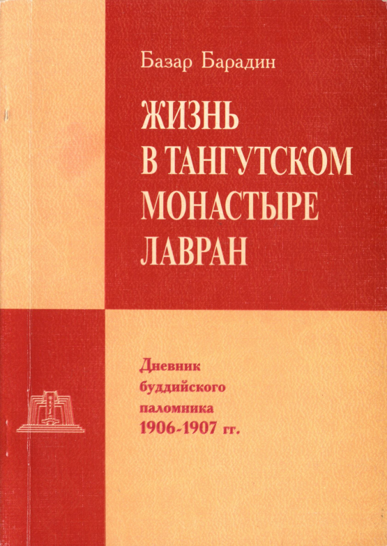

<a id="1">**-- 1 --**</a>

РОССИЙСКАЯ АКАДЕМИЯ НАУК  
СИБИРСКОЕ ОТДЕЛЕНИЕ  
ИНСТИТУТ МОНГОЛОВЕДЕНИЯ, БУДДОЛОГИИ  
И ТИБЕТОЛОГИИ

Базар Барадин

ЖИЗНЬ В ТАНГУТСКОМ МОНАСТЫРЕ ЛАВРАН

Дневник буддийского паломника (1906 -1907 гг.)

Улан-Удэ  
Издательство Бурятского научного центра СО РАН  
2002

<a id="2">**-- 2 --**</a>

УДК 571.54  
ББК 87+86.39  
Б 26

Утверждено к печати ученым советом Института монголоведения, буддологии и тибетологии СО РАН

Подготовка к публикации, предисловие и комментарии *Ц.П. Ванчиковой*

Научный редактор *Ш. Чоймаа*

Рецензенты:

д-р ист. наук *Д. И. Бураев*  
канд. филол. наук *И.В. Кулъганек*  
канд. ист. наук *С.-Х.Д. Сыртыпова*  

**Барадин Базар. Жизнь в Тангутском монастыре Лавран: Дневник буддийского паломника (1906 - 1907 гг.) /** Подготовка к публикации, предисловие и комментарии Ц.П. Ванчиковой. Научный редактор Ш. Чоймаа. - Улан-Удэ: Изд-во БНЦ СО РАН, 2002. - 256с.

ISBN 5-7925-0131-9

В тибетском дневнике выдающегося бурятского ученого, удостоенного за этот труд в свое время Золотой медали Императорского Русского географического общества и премии им. Н. М. Пржевальского, дана всесторонняя характеристика деятельности Амдоского тибетского буддийского монастыря Лавран, его внутренней структуры и организации, системы монашеского обучения и образования, методов преподавания на специализированных факультетах разных буддийских школ. Приводятся уникальные сведения об известных тибетских, монгольских и бурятских ламах, подробно описываются различные культы и обряды. Представлены жизнь и прошлый быт полиэтнического населения региона.

Представляет интерес как для востоковедов, так и для самого широкого круга читателей.

ISBN 5-7925-0131-9

054000000- 44. *Пл.*-2002  
2002 042(02)5

© Улан-Батор, 1999  
© Ц.П. Ванчикова, 2002  
© ИМБиТ СО РАН, 2002  
© Изд-во БНЦ СО РАН, 2002

<a id="3">**-- 3 --**</a>

БАЗАР БАРАДИН
и его тибетский дневник (1906-1907 гг.)

В Архиве востоковедов Санкт-Петербургского филиала Института востоковедения РАН хранится оригинал экспедиционного дневника Базара Барадиевича Барадина, веденного им с 24 июня 1906-го по 4 февраля 1907 г. в Лавране([1](#pl1)). Дневник, написанный на 519 страницах толстой тетради, озаглавлен "Жизнь в Тангутском монастыре Лавран. Дневник буддийского паломника. 1906-1907 гг." Со времени путешествия Б. Барадина прошло почти 100 лет, и, к сожалению, он до сих пор не опубликован. В архивном фонде Института монголоведения, буддологии и тибетологии СО РАН (ранее БИОН) хранится микрофильмокопия этого дневника, на основе которого и подготовлено данное издание.

Лавран Дашичил (bla brang bkra shis 'khyil) - буддийский монастырь, основанный в 1709 г. Гунчен Чжамьян-шадба Дорчжэ Аг- ван Цзондуем (1648-1721). Каждый из последующих настоятелей Лаврана считается перевоплощением его основателя. Лавран расположен в современной провинции Гансу, КНР, в настоящее время представляет собой большой архитектурный комплекс, построенный в традиционном тибетском стиле. В годы культурной революции был значительно разрушен. Начиная с 80-х гг. в нем были начаты работы по восстановлению и реставрации зданий. Сейчас в Лавране насчитывается около 2000 монахов, 6 крупных дуганов, более 30 разных религиозных сооружений и 4 больших субургана, книгопечатня и другие хозяйственные службы.

За время своего существования Лавран стал одним из 6 наиболее крупных монастырей Тибета и приобрел славу самого образцового учебного, образовательного религиозного центра. Он славится своими библиотеками, знаменитыми линиями преемственных учителей, практикой публичных философских дебатов и высоким монастырским образованием в целом. Фактически монастырь представляет собой университет, организованный по образцу индийских классических буддийских университетов, состоящий из 6 факультетов, каждый из которых имеет свои подразделения по разным специальностям. Особый упор делается на изучение и практику сутр и тантр и всего комплекса, связанных с этим меди-

<a id="4">**-- 4 --**</a>

таций и учебных дисциплин. Подробно разработаны программы курсов, дебатов и ритуальной практики. Все школьные занятия проводятся в строгом соответствии с лунно-календарным циклом. Каждый факультет имеет свои отдельные здания и сооружения, в которых проводятся регулярные занятия, дискуссии, экзамены и защиты ученых степеней.

В целом Лавран придерживается традиций ортодоксального учения общетибетской школы гелугпа, но, тем не менее, не ограничивается только ею. В монастыре живут последователи более древних традиций, например, ньингма, и последователи других буддистских школ. Хотя в академическом отношении Лавран допускал плюрализм, однако, обучение и образование не было доступно каждому из монашеской общины.

В нем в течение года проводится 7 больших религиозных праздничных служб, во время которых все дацаны и дуганы открыты для публики. Подробные описания некоторых из этих служб-хуралов приведены Б. Барадиным.

Как известно, Б. Барадин совершил путешествие по Монголии и Тибету по поручению Русского Комитета по изучению Средней и Восточной Азии при Академии наук, во время которого им была проделана огромная работа по изучению духовной культуры тибетского народа, его быта, истории, религии, языка и литературы, которая нашла отражение в ряде опубликованных работ, в таких, как "Путешествие в Лавран"^2^, "Статуя Майтреи в Золотом храме"^3^, "Цам Миларайбы"^4^ и др. Общие сведения о буддийских монастырях Тибета вошли в его книгу "Буддийские монастыри Тибета, Монголии и Бурятии"^5^. Но большая часть его материалов осталась в неопубликованных рукописях его статей и пространных дневниковых записях.

Выдающееся по своим итогам путешествие Б. Барадина было заслуженно высоко оценено Комитетом, и он был удостоен Золотой медали Императорского Русского географического общества и премии им. Н.М. Пржевальского.

Перед ним, как он пишет в начале своего дневника, стояла задача всесторонне описать монастырь и жизнь его обитателей - монахов, выяснить по возможности основу духовной культуры всех

<a id="5">**-- 5 --**</a>

современных монголо-тибетских народностей, так как это, по его мнению, было наименее исследовано.

Территория Амдо, на которой расположен Лавран, находится на перекрестке разных цивилизаций: индийской, китайской и арабской. И особая ценность дневника заключается в том, что в нем Б. Барадин отразил все многообразие и своеобразие этого района Тибета, населенного людьми разных народностей. Материалы дневника также ценны наблюдениями, замечаниями автора о взаимосвязи буддизма с традиционными и народными верованиями местного населения. В религиозную практику Лаврана было включено множество местных и заимствованных верований и ритуалов, тибетских, небуддийских, практика религии бон, почитание небуддийских божеств и духов местного значения.

Дневник свидетельствует о том, что ученый был тщательно подготовлен к данной поездке, имел большую программу работы. Но жизнь на самом деле оказалась намного сложнее и не вписалась в запланированную им программу. Он был вынужден изменить свой предварительный план и по ходу менять его в зависимости от местных условий и обстоятельств, поскольку по мере большего вхождения в жизнь монастыря, все сложнее становилась его задача, а многочисленные встречи, беседы и наблюдения "разрушали... прежние планы работ, создавая вместо них новые", и "я теперь отказался от своей прежней системы собирания сведений по заранее составленной программе".

Он вел дневник каждый день без пропусков, подробно и последовательно описывая все события и виденное им за день. В нем ярко отражена повседневная жизнь не только обитателей буддийского монастыря, но и светского населения, тангутских крестьян, с их радостями и горестями. Внутри дневника четко выделены дни и месяцы. Отдельным записям даны названия в зависимости от содержания, например, "Первый день моей жизни в Лавране", "Свидание с зурачинами", " Посещение Тава - торгового предместья Лаврана", "Базар в Лавране", ''Бурятское землячество", "Печатание книг", "Прогулка вокруг Лаврана", "Цам Миларайбы" и др.

Обычно в дневниках, даже если они ведутся с известными целевыми установками, что и было в данном случае, в той или иной степени отражаются личные чувства и переживания автора. В этом отношении дневник почти не дает нам никакой информации, за

<a id="6">**-- 6 --**</a>

редкими исключениями, которые позволяют судить лишь о его настроении, радости или неудовольствии, да и то связанных с выполнением основной его цели. Дневник свидетельствует о его чрезвычайной целеустремленности, решимости как можно полнее выполнить свои задачи.

Б. Барадиным впервые даны описание и характеристика деятельности амдоских тибетских буддийских монастырей, их внутренней структуры и организации, которые он относит к древнеиндийскому типу буддийских университетов, приведены подробные описания буддийской учебной литературы, системы монастырского обучения и образования, методов преподавания, применявшихся на специализированных факультетах разных буддийских школ и направлений, интересные сведения об обрядах публичных защит ламами ученых степеней.

Уделено внимание издательской деятельности буддийских монастырей, технике и процессу ксилографирования, работе худож- ников-зурачинов. Известно, что он привез из командировки уникальную коллекцию книг и предметов буддийского искусства, которые сейчас хранятся в Санкт-Петербургском филиале Института востоковедения РАН. О том, сколь утомителен и трудоемок был труд по приобретению и заказу книг, он повествует так: "15-25 июля. Эти дни я провел в бархане, здании книгопечатни. Мы целыми днями наблюдали за ходом работы лам, печатающих нам книги... У меня всего работало до 15 человек, которых я должен был содержать в течение 15 суток. Из них только четверо печатали книги, каждый из них имел по одному в качестве подавальщика досок и тасовщика свежевыходящих книжных листов... Отработали 10 дней и напечатали до 150 томов книг... Нужно самому купить бумаги, заказать печатать типографским рабочим, вознаградить и кормить их за свой счет, и при этом неусыпно наблюдать за аккуратностью печати, иначе вы рискуете получить книги с небрежной печатью или недочетами листов. Затем нужно дать книги для приведения в порядок..." Запись от 14 октября: "Целый день занят я приемом своих книг, отданных мною на окончательную отделку. Отделка заключалась в заклейке свежеотпечатанных книг и обрезке их. Да, заказать книги в Лавране дело не простое. Все нужно делать самому".

<a id="7">**-- 7 --**</a>

Б. Барадину принадлежит заслуга открытия многих редких сочинений тибетских и монгольских авторов. Так, он упоминает о редком экземпляре рукописного текста тибетского варианта эпоса "Гэсэр". Им приведены краткие описания содержания, а также сведения об авторах таких крупных сочинений, как "Дэбтэр онбо", "Дэбтэр чжамцо", "Чжанаг чойчжун" и др.

Материалы его дневника ценны историко-культурологическими характеристиками и оценкой роли буддизма и буддийских монастырей в общественной, духовной и культурной жизни народов Центральной Азии и Южной Сибири в целом. Буддизм он рассматривает не только как схоластическое вероучение и культовые обряды, а как особую систему духовной культуры и ценностей. По его мнению, религия составляет неотъемлемую часть духовной жизни народа.

Часто при описании истории дацанов и храмов он приводит легенды, устные предания о строительстве монастырей, о знаменитых святынях Лаврана и о его богах-покровителях, о перерожденцах, об известных тибетских, монгольских и бурятских ученых ламах, подробно описывая и давая собственные оценки их основным работам. Им дано подробное описание различных культов и обрядов, совершаемых в практике лавранских дацанов.

Б. Барадин сообщает подробные сведения о составе монашеской общины Лаврана, состоявшей в то время примерно из 3000 монахов, отличавшихся между собой по национальности и положению. Из них монголов всех племен было до 500 человек, в том числе до 100 человек забайкальских бурят с тунгусами. Преимущественную численность монахов составляли тангуты, имелось около 30 лам-китайцев.

С первого же дня своего пребывания Б. Барадин жил у своего родственника аху Найдана, о котором он писал, что это "бедный скромный монах 36 лет, приехал сюда из родины лет 10 назад... и принадлежит к числу молодых ученых Лаврана".

В дневнике для исследователей истории бурятского буддизма интерес представляют материалы и сведения о бурятских ламах, обучавшихся в этом монастыре, и о монашеских общинах, называемых ***уйшог,*** которые официально утверждались грамотой Чжамьян-шадбы.

<a id="8">**-- 8 --**</a>

По сведению Б. Барадина, ламы-монголы разных хошунов имели свои землячества, тогда как у тангутов их не было. У каждого уйшога имелись устав, касса взаимопомощи и свой дом с двором, где могли собираться земляки по разным делам: совершение молебствий, проведение совещаний, обсуждение, разборы и принятие решений по делам мелких проступков, не затрагивающих общемонастырского устава. Каждое землячество имело старшего ламу, надзирателя и эконома, которые выбирались на определенный срок общим собранием землячества. Б. Барадин упоминает, что было около 16 землячеств.

Б. Барадин смог собрать и записать уникальные сведения о начале и истории создания бурятского землячества. Буряты основали свой уйшог приблизительно в 1887 г., когда в Лавране было всего около 18 бурят. Он сообщает, что бурятские ламы-старики рассказывали о том, что вначале им жилось очень плохо, так как буряты были причислены к одному из монгольских землячеств и были вынуждены в течение многих лет терпеть обиды и притеснения со стороны лам-монголов, которые, пользуясь беззащитностью в этой стране робких "оросских" беглецов, притесняли их поборами, взятками, вымогательствами. Когда такой порядок вещей стал невыносимым для бурят, они решили отделиться от своих притеснителей. Им удалось добиться от Чжамьян-шадбы грамоты на право основания нового бурятского землячества. Монголы же пытались противодействовать этому, считая, что буряты - те же монголы и не имеют права иметь особого от прочих монголов землячества. Но Чжамьян-шадба отклонил их притязания, заявив: "Буряты имеют исключительное право новичков в Лавране, они впервые при мне стали посещать мой монастырь, и поэтому я даю им грамоту на учреждение землячества, - не в пример другим". С тех пор бурятские ламы стали полноправными жителями Лаврана. Б. Барадиным дано описание уйшога бурятских лам. В дневнике упомянуто много имен бурятских лам, в основном это ламы Агинского, Цугольского, Анинского, Хохюртайского и селенгин- ских дацанов. Описываются встречи с двумя бурятскими гэгэнами - Ганчжурвой и Собо.

Б. Барадин так говорит о роли Лаврана для бурятских монастырей: "Лавран... по своему духовному влиянию на всю Монголию и на наше Забайкалье является крупнейшим из современных рассад-

<a id="9">**-- 9 --**</a>

ников буддизма, нисколько не уступая в этом отношении самому центру тибетского буддизма - Лхасе"^6^. Именно амдоские монахи были первыми буддийскими монахами, распространявшими в Бурятии буддизм. Во многих бурятских исторических преданиях повествуется о том, что тангутские и амдоские ламы были впервые собраны Дамба-Даржа Заяевым, первым бурятским хамбо-ламой, на первое богослужение в войлочном дугане на берегу реки Иро, что первым настоятелем первого бурятского дацана был назначен амдоский лама Агван Пунцог^7^. Именно из Лаврана были заимствованы монастырские системы и программы обучения на разных учебных факультетах в монастырях Бурятии и Монголии, в которых обучались по учебникам, составленными ламами Лаврана.

Наряду с описанием монастырской жизни, Б. Барадиным дана живая характеристика жизни и быта простого полиэтнического населения Амдо: тангутов, китайцев, дунган, саларов, монголов и др. Читаются с большим интересом его бытовые зарисовки торгового предместья Лаврана, дающие представления об экономическом состоянии общества. При этом автор предстает как наблюдатель, обладающий тонким чувством юмора. Например, так он описывает тангут-мирян: "Тангуты... целые бараньи стегна или масло в пузырях \[из бараньих брюшин\] носили за своими вместительными пазухами, служащими для них вместо мешка, прямо на голом теле. При этом вместе с этими вещами свободно помещался иногда голый ребенок".

Дневник Б. Барадина неоценим, прежде всего, как объективное исследование живой действительности, как уникальное собрание фактического материала, не только не потерявшего свое научное значение, но и приобретшего еще большую ценность в наши дни как ценный буддологический источник, поскольку безвозвратно утрачены многие памятники буддийского зодчества, разрушена инфраструктура монастырей и их традиционный уклад. В нем отражена жизнь этого тибетского монастыря в самом пике его развития, в котором автор запечатлел много событий начала XX века, важных для истории Тибета и буддийского монастыря Лавран - одного из наиболее крупных центров тибетской культуры.

Его дневник является документом, характеризующим и духовную жизнь самого Базара Барадиевича Барадина, показывает его

<a id="10">**-- 10 --**</a>

гражданские и мировоззренческие позиции, высокий интеллектуальный уровень. В нем он предстает как разносторонний исследователь истории, истории буддизма и истории культуры народов Центральной Азии, ученый высочайшей квалификации, внимательный и тонкий наблюдатель.

К сожалению, богатое литературное, научное, эпистолярное и рукописное наследие Б. Барадина еще недостаточно изучено. Его архив, представляющий большую научную ценность, рассредоточен в нескольких хранилищах и не изучен. Назрела необходимость скорейшего ввода в научный оборот рукописного наследия Б. Барадина и ознакомления с ним исследователей и читателей. Данная публикация является одним из шагов к этому.

Б. Барадин, видимо, планировал издать свой дневник, подтверждением чему является его обращение к читателям, например, в записи от 13 октября 1906 г.: "Как видите, любезный читатель...".

При подготовке дневника к публикации основная трудность заключалась в прочтении и расшифровке микрофильмокопии его рукописного текста, представляющего собой большей частью стенографические записи. В некоторых местах нам не удалось прочитать приписки, сделанные мелким почерком на полях дневника. В целом, мы постарались сохранить текст без изменений, заменив только старую русскую орфографию новой, в некоторых случаях были устранены повторения и описки, отредактированы неудачные стилистические обороты, внесены отдельные поправки в соответствии с современной пунктуацией и т.д.

Тибетские названия терминов и имён собственных и географических даны Б. Барадиным в транскрипции, в амдоском варианте произношения, который значительно отличается от лхасского и поэтому в большинстве случаев многие известные слова почти неузнаваемы. Судя по тексту, сам автор еще не унифицировал термины, поскольку в дневнике неоднократно встречаются разные варианты написания одного и того же слова. В большинстве случаев автор давал написание терминов и названий в тибетской графике скорописью, переданных нами в транслитерации в круглых скобках (...). В прямоугольных скобках \[...\] приводятся: транслитерация тибетских слов, данная нами; слова, способствующие пониманию текста оригинала; знаки вопроса при сомнительных или

<a id="11">**-- 11 --**</a>

непонятных оборотах и терминах. В угловых скобках <...> дана пагинация дневника по оригиналу.

В дневнике мы попытались сохранить в целом без изменений авторское написание тибетских имен и терминов. Только в случаях разного написания мы приводили их в монголизированной тибетской транскрипции, или в соответствии с написанием, употребленным самим автором в ранее опубликованных статьях. Некоторые наиболее употребительные имена и термины приведены по установившейся в традиционной российской тибетологии форме написания. Например, вместо Шадпба - Шадба, Пагпба - Пагба, Пбалчен - Балчен, цогшжин - цогчен (бур. цогшин), Дангюр - Данчжур и т.д. При издании мы учли современную тенденцию написания транслитерации без употребления дефисов (-).

Однако, поскольку традиционная монголизированная система произношения тибетских слов также не способна полностью передать структуру тибетских морфем, в большинстве случаев она сопровождается пояснениями в транслитерационной системе Уайли. Использованная нами система выглядит следующим образом:

| Wylie | М.Т.        | Wylie | M.T. | Wylie | M.T.    | Wylie | M.T.        |
|-------|-------------|-------|------|-------|---------|-------|-------------|
| Ka    | Га          | kha   | xa   | ga    | Га      | Nga   | а(н)        |
| Са    | Чжа         | cha   | ча   | ja    | Чжа     | Nya   | **НЯ**(ньа) |
| Та    | Да          | tha   | та   | da    | Да      | Na    | на          |
| Ра    | Ба          | pha   | па   | ba    | ба (ва) | Ma    | ма          |
| Tsa   | Цза         | tsha  | ца   | dza   | Цза     | Wa    | ва          |
| Zha   | Ша          | za    | са   | 'a    | а (н)   | Ya    | я           |
| Ra    | Ра          | la    | ла   | sha   | Ша      | Sa    | са          |
| На    | Ха          | a     | а    |       |         |       |             |
| Куа   | Чжа         | khya  | ча   | gya   | Чжа     |       |             |
| Руа   | Чжа         | phya  | ча   | bya   | Чжа     |       |             |
| Кга   | Да          | khra  | та   | gra   | Да      |       |             |
| Тга   | Да          |       |      | dra   | Да      |       |             |
| Рга   | Пра         | phra  | пра  | bra   | Бра     |       |             |

Слог "nga", если он стоит в начале слова, передается нами как «а», например, Агван (Ngag dbang), в случае же, если эта морфема замыкает слово, она передается как «н», например Лобсан (bLo

<a id="12">**-- 12 --**</a>

bzang). Если морфема "ba" следует за открытым слогом или слогом, заканчивающимся на н (ng) или р, он передается как «ва», во всех же других случаях как «ба».

В некоторых случаях нами сделаны исключения в пользу закрепившегося в научной литературе немонголизированного произношения некоторых терминов. Например: названия буддийских традиций Тибета (гелугпа, сакьяпа, ньингмапа, кагьюпа, чжонанпа, и пр. вместо, соответственно, гэлугба, сачжаба, ньингмаба, гарчжудба, чжонангба), имена религиозных иерархов и крупных буддийских ученых (Панчен-лама, Сакья-пандита вместо Банчен- лама и Сачжа-бандида). По причине устоявшегося произношения слово 'du khang передано как дуган, в то время как lha khang и gser khang как лхахан и сэрхан.

Пропущенные автором слова восстановлены по смыслу в квадратных скобках \[...\]. Многие лица названы по титулам и званиям - гэгэн, цан, хутухта и т.д., которые в случае употребления с именем собственным пишутся со строчной буквы. При написании названий сочинений на санскрите диакритические знаки нами не используются из-за трудностей полиграфического воспроизведения. Отточьями без скобок помечены лакуны и пропуски в тексте, сделанные самим автором.

Примечания издателей помещены в конце работы, комментарии Б. Барадина, приведенные постранично, помечены знаком \*. В приложении публикуются фотографии, выполненные Б. Барадиным и взятые из его краткого отчета о путешествии в Тибет, а также фотографии Ц.П. Ванчиковой (1996 г.) и фотография из Музея истории Бурятии из архива Г.-Д. Нацова.

Выражаю огромную признательность всем, кто принимал участие в подготовке этого издания: тибетскому монаху аграмба- гэбши Агван Данцзину за помощь в прочтении тибетской скорописи и уточнении написания тибетских слов, монгольскому тибетологу проф. Ш. Чойме и сотрудникам Отдела памятников письменности Института монголоведения, буддологии и тибетологии СО РАН.

***Ц.П. Ванчикова***

<a id="13">**-- 13 --**</a>

***Примечания***

1. Архив востоковедов Санкт-Петербургского филиала Института востоковедения Российской Академии наук (далее СПбФ ИВ РАН). - Ф. 47. - О. 1,№31.

2. Путешествие в Лавран (Буддийский монастырь на северо-восточной окраине Тибета) Б.Б. Барадина. 1905-1907 гг. / Предварительное сообщение в Годовом Общем Собрании и в Отделении Этнографии И.Р.Г.О. 30 января и 15 февраля 1908 г. // Известия ИРГО. - Т. XLIV. - 1908. - Вып. IV. - С. 183-232. - 5 таблиц.

3. Статуя Майтреи в Золотом храме в Лавране // Bibliotheca Buddhica. - Вып. XXI.-Л., 1924.-С. 98.

4. Цам Миларайбы: (Из жизни в Лавране) // ЗИГО по отделению этнографии. - Т. XXXIV. - СПб., 1909.

5. Буддийские монастыри Тибета, Монголии и Бурятии // М.Н. Богданов. Очерки истории бурят-монгольского народа. - Верхнеудинск, 1926.

6. Путешествие в Лавран. - С. 183.

7. См.: Тобоев Тугулдур. Прошлая история хоринских и агинских бурят // Бурятские летописи. - Улан-Удэ, 1995. - С. 15.

<a id="14">**-- 14 --**</a>

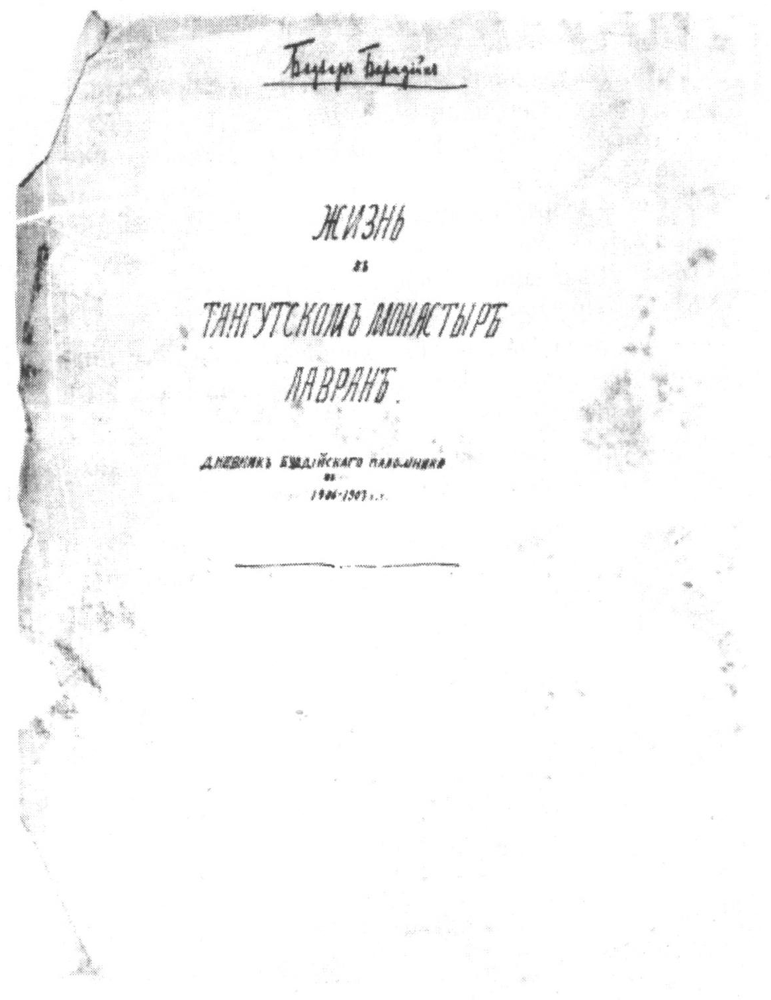

<a id="15">**-- 15 --**</a>

БАЗАР БАРАДИН

ЖИЗНЬ В ТАНГУТСКОМ  
МОНАСТЫРЕ ЛАВРАН

Дневник буддийского паломника (1906-1907 гг.)

I

***24 июня 1906***

### Первый день моей жизни в Лавране

<1> Утром меня разбудили протяжные, тоскливые выкрикивания людей: "Омаа ньоо! Шоо ньоо!" ('о ma nyo, zho пуо) (Купите молока! Купите творогу!). Это были окрестные тангутские мужики, приходящие утром в монастырь продавать монахам молоко или творог.

Встал я и вышел из своей монашеской комнатки, чтобы помыться в средине своего дворика при теплых лучах восходящего солнца, и я теперь чувствовал себя вполне лавранцем.

Солнце вскоре поднялось высоко над горизонтом и своими теплыми лучами развеяло утреннюю свежесть. <2> Кругом удивительная тишина, лишь каркают вороны, пищат галки на крышах храмов, слышны мирные разговоры монахов соседнего двора, шаги прохожего мимо нашего дворика, и где-то читает юный школьник из своего учебника, и воздух так редок и спокоен, что самый незначительный звук способен распространиться на весьма почтительное расстояние, и, казалось, что слух мой стал небывало восприимчив.

Смотрю вверх: чудная темно-голубая лазурь неба, недвижно стоят кучевые белые облака, а под ними на громадной выси спокойно парят знаменитые здешние грифы, питающиеся трупами монастырских покойников.

Они поднялись из-за северной горы монастыря. Оттуда они разошлись после своего обычного ежедневного пиршества, которое устраивают им по утрам монахи трупами своих умерших братьев. Пока я сидел на крышке колодца в средине своего дворика, наста-

<a id="16">**-- 16 --**</a>

ло время утреннего чаепития. Мой аху Найдан* угостил меня своим монашеским <3> выбеленным чаем с тангутскими булками- гори и цзамбой с маслом.

Сегодня не переставали меня посещать мои здешние сородичи- ламы, \[чтобы\] узнать от меня, что нового на родине.

После обеда я отправился по монастырю с одним молодым бурятским ламой по имени Нима. Мы посетили важнейшие здания храма, золотокровельный храм Майтрея - Сэрхан, соборный храм цогчен-дуган и др. Храмы больше всего красного, а иногда желтого и белого цвета, построены все из сырца с глиной. Они имеют весьма простой и внушительный вид с толстыми крепкими стенами. Видна повсюду образцовая чистота, простота, порядок, чинность монахов, и я вернулся домой, <4> очарованный всем виденным и еще больше прельщенный новой интересной жизнью в этом своеобразном уголке земли.

***25 июня***

Развязывать узлы, вынимать вещи из походных ящиков и размещать их в помещении моего аху Найдана и, вообще, устраиваться в новой обстановке - было главной нашей заботой сегодняшнего дня.

Аху Найдан, мой родственник, у которого я остановился на правах дорогого гостя, был бедным скромным монахом лет 36. Он приехал сюда из родины лет 10 т\[ому\] н\[азад\], живет с тех пор безвыездно и принадлежит к числу молодых ученых Лаврана.

Дворик его занимал площадь около 48 кв. с\[аженей\] (6x8 с.) и находился в центре восточной половины монастыря. Весь этот дворик, купленный за 50 л\[анг\], принадлежал к числу обыкновенных монашеских дворов хозяина средней состоятельности. В этом маленьком дворике было все, что необходимо для простой скромной жизни: три отдельные жилые комнатки размером по одной кв. с\[ажени\] с передней кухней, просторная <5> комната-кладовая, кладовая для мяса, клозет, сусек для топлива, навес для животных, \[помещения для\] приезжих людей и прекрасный колодец около 5

* Аху (a khu) - дядя по отцу, прозвище коим зовут здесь друг друга монахи.

<a id="17">**-- 17 --**</a>

с\[аженей\] глубины с каменной стеной. Стена дворика служит общей стеной этих построек, обращенных лицом внутрь.

Я поместился в одной из комнаток и при себе мог иметь лишь необходимое: перо, чернила, тетради для ведения дневника, аппарат с принадлежностями, мою походную библиотеку в один портфель и, наконец, походную постель, на которой я должен был ночью спать, а днем сидеть, поджавши под себя босые ноги, и работать пером.

***26 июня***

### Свидание с зурачинами

Утром я познакомился с одним иконописцем-мирянином из округа Рэбгон (reb gong)^1^ по имени лхавсо Гуру. На пробу я дал ему срисовать двух-трех образков из сборника "500 бурханов^2^ (ург\[инского\] изд\[ания\]). Он принес мне через несколько часов свою пробную работу. <6> Я нашел его работу удовлетворительной и предложил ему заказ: рисовать контуром 500 бурханов на моем полотне в двойном размере \[по сравнению\] с образками ур- гинского издания и в оригинальном лавранском стиле, не следуя ургинскому.

За такую работу он просил 75 л. сер\[ебром\]. Но мой аху Найдан советовал мне не торопиться пока с заказом, потому что здесь иконописцев не один, а несколько десятков. После обеда аху Найдан повел меня к храму Долма-лхахан^3^, находящемуся на с\[еверо\] - в\[осточном\] краю монастыря. При этом храме, по словам аху Най- дана, жило несколько человек зурачинов-иконописцев^4^. Мы вошли чрез ворота в каменную ограду храма и под дверным навесом застали ламу-зурачина за работой. Он писал религиозную картину ***Банчен соддагчжи чжэйраб*** (pan chen bsod nams grags pa'i skyes rabs kyi thang ka), т.е. изображения перерожденцев основателя одного из семи цаннидских (философских) школ в Тибете, Банчен Соддага^5^ (1478-1554).

На обтянутом в 4-угольною раму полотне зурачин <7> замечательно умело наводил первоначальные контуры.

Обменявшись с ним приветствиями: "Дэму!" (bde mo), - мы спросили его, не возьмет ли он на себя работу. На это он ответил, что сам ничего не может сказать и посоветуется с товарищами. С

<a id="18">**-- 18 --**</a>

этими словами он оставил свою работу и повел нас чрез боковую калитку храмовой ограды в монашеский дворик, где и жили двое его товарищей. Все трое были из округа Рэбгон, как и все здешние зурачины. Они были духовного звания, двое из них - братья, а третий - жил у них в качестве ученика.

Они долго рассматривали наш сборник "500 бурханов" и запросили с нас двойную цену (по 1 л. с листа) за ту же работу, какую хотел исполнить зурачин-мирянин. При этом они очень хвалились, и выходило, что они самые лучшие из зурачинов в Лавране. Кроме того, они по примеру большинства здешних зурачинов и \[резчиков\] ксилографов хотели пользоваться от меня квартирой и столом. Они были очень сдержаны и горды, и, казалось, что наша простая внешность не внушала им особенной веры, что мы были в состоянии сделать <8> им столь крупный заказ.

Купив у них за 2,5 л. сер\[ебра\] небольшое изображение Хаягривы^6^ довольно хорошей работы, исполненной ими, мы вернулись домой. Аху Найдан был уверен, что настоящая их сдержанность вскоре сменится прилипчивостью. Нужно сказать, что эти зурачины были одними из лучших рэбгонских зурачинов, которые приезжают сюда летом и работают до зимы. До недавнего времени все здешние зурачины жили и работали здесь тайно, так как главный их монастырь Ронгво (rungbo dgon chen) находился во вражде (тиб. ma 'grig) с Лавраном, а теперь с прекращением вражды они живут открыто.

### Посещение Тава

После свидания с зурачинами мы вернулись домой. Подкрепившись чаем, мы пошли в Тава, торговое предместье Лаврана, чтобы купить бумагу для печати тибетских книг. Улицы страшно грязны, и видны китайцы и дунганы, тангуты и тангутки.

<9> Тангуты - в мохнатых засаленных бараньих тулупах, и летняя жара заставляет их держать загорелые туловища совершенно голыми.

Женщины, почти все молодые, торгуют вязанками сена и свежей зеленью. Они бойко справляются со своими тяжелыми вязанками, да упрямыми яками, и вряд ли уступят в мускульной силе своим мужчинам. Последние, вооруженные с ног до головы своими фитильными ружьями, мечами за поясом и двухсаженными

<a id="19">**-- 19 --**</a>

копьями, гордо и праздно расхаживают по улицам, держа под уздцы своих пугливых коней. Все эти тангуты и тангутки приехали с окрестных деревень и далеких кочевий.

Здесь довольно много китайских лавок. Торгуют китайцы и мусульмане с ближайших городов. Лавки убраны исключительно дешевым китайским красным товаром, москателью, попадаются дешевые английские материи, много японских безделушек и спичек. Мы купили у одного дунганина 165 стопок китайской бумаги. Стопка здесь называется ***багча*** \[bag cha\] и содержит пр\[имерно\] 400 листов. <10> Размер листа длиною 52 см., шир\[иной\] 34 см.: из одного листа выходят два листа печатной книги большого формата, длиною 52 см., шириною 8 1/2 см. Мы купили стопку по одному чону и 100 джосов, т.е. по 350 джосов, около 60 коп. на наши деньги.

Здешние дома построены из сырца и глины с деревянными обделками, в планировке жилищ преобладает тангутский вкус: постройки двухэтажные - в нижнем этаже помещается скот, а верхний этаж - людская; в торговой части предместья верхний этаж представляет или людскую, или кладовую, а нижний этаж - под лавку, жилые помещения или для скота. Над некоторыми лавками встречаются иногда на вид весьма опрятные жилища, в виде просторных комнат с верандами спереди. Мне передали, что в этих помещениях останавливаются приезжие люди с состоянием, случайные путешественники-европейцы, китайские купцы и проч. Так, по словам здешних бурят, месяц тому назад сюда заглянул какой-то <11> американец по пути из Индии через Тибет в Тум- бум^7^ и остановился здесь на несколько суток в лучшем из помещений верхнего этажа. При нем были два непальца. Всем показалось, что он был человек не простой, а богатый и высокого положения: пользовался казенными подводами. В Лавране он познакомился со многими ламами и давал им щедрые подарки. Во время его пребывания и посещения монастыря, главный монастырский надзиратель сделал духовенству публичное внушение о том, чтоб никто не посмел оскорблять словом и действием важного ороса (европейца) и быть по отношению к нему вежливым.

Здесь говорят, что за последнее время весьма часто стали появляться оросы и считают это за дурное предзнаменование для святой веры и жизни народа.

<a id="20">**-- 20 --**</a>

***27 июня***

### Чжоршан

<12> Перед закатом солнца я видел, как монахи перед своими двориками по земле выводили белые фигурки свастик, выведенных известковым порошком.

Мне объяснили, что вечером главный надзиратель со своим помощником сделает обход по улицам монастыря. Поэтому монахи этими фигурками выражали знак почтения своему всесильному, страх внушающему надзирателю по пути его следования.

Сижу у себя в комнате в мирной беседе со своими бурятами, двумя старичками-ламами, и, как только наступила вечерняя мгла, я слышу на улице молодой голос, произносящий слова из учебника младших классов цаннидской школы. Затем послышался другой, третий, а чрез минуту уже были \[слышны\] тысячи голосов. Это был ***чжоршан*** (skyor sbyangs), т.е. чтение наизусть молодыми ламами из своих цаннидских учебников. Это происходит каждый вечер в течение школьного перерыва, чойнцам (chos 'tshams), наступающего на другой день после прекращения школьного периода, чойтог (chos thog).

Мои почтенные собеседники все же продолжали говорить со мной о всякой всячине, хотя им, как и всем нечитающим, по уставу предписывалось в это время сидеть по домам без огней в спокойном размышлении и созерцании, и никто не должен ходить по улицам. Правда, мы с первого же раза погасили свечу.

Оставив на минуту своих собеседников в своей комнате, я вышел на двор, чтобы вздохнуть и размяться после утомительного сидения. На дворе была лунная ночь. На крышах соседних дворов <13> расхаживают молодые чтецы, закутавшись в свои школьные плащи. При спокойной лунной ночи гудит море голосов читающей молодежи. Вдруг слышу ужасный стук у ворот соседнего двора. Вхожу в комнату и спрашиваю, что это значит. Мне объясняют, что это обход надзирателей, проверяющих чтецов. Если кто из чтецов по неизвестным причинам отсутствует на крыше своего дома, то бьют в ворота, чтоб вышел кто-нибудь изнутри для объяснений. Если найдут виновника, то его тут же подвергают телесному наказанию. При этом надзиратель может сам наброситься на свою жертву или заставить своих провожатых шулуй - мирян рас-

<a id="21">**-- 21 --**</a>

правиться с виновником. Когда главный надзиратель цогчен- шанго (tshogs chen zhal ngo) co своим помощником чабдэгма (chab bteg ma) совершает каждый вечер обход чтецов, впереди его идут несколько человек мирян с вязанками розг. <14> Чтение продолжалось до 11 часов вечера.

***28 июня***

Сегодня я снарядил моего знакомого зурачина лхавсо Гуру в его монастырь Ронгво-гончен, один из главных монастырей Амдо, с заказом книг. Он экстренно вызван из своей родины Ронгво по случаю возникшей там междоусобицы, мандиг (ma 'grig). Он попутно согласился взять на себя мой заказ, и я дал ему 25 стопок бумаги, чтоб он дал печатать на них все имеющиеся в тамошних монастырях книги. Нужно заметить, что заказ книг из Ронгво возможен только путем поручения местному жителю, благодаря недоступности и дикости населения. Я дал лхавсо Гуру около 10 ф. сливочного масла и чаю за то, что мне позволено печатание книг в монастырской печатне, так как в тамошних монастырях при заказе книг принято устраивать чайную трапезу монастырскому духовенству. Затем я обязан был при доставке мне книг наградить лхавсо Гуру за труды по 1/2в за каждый лист печатной книги, т.е. по 1/8 коп. за 2 листа печатной книги. Конечно, все это давалось на веру без всяких гарантий, что мой заказ будет точно исполнен.

***29 июня***

### День в Лавране

<15> Раннее утро. Как и всегда свежо и удивительно тихо. Лучи солнца коснулись вершины гор, в глубине долины над монастырем веет еще следами ночного холода и мрака.

Монастырь просыпается: тихо клубятся столбики дыма с плоских крыш монастырских домиков. Монахи встали и затопили свои очаги бараньим пометом, чтоб варить себе утренний чай. Столбики дыма сливаются ввыси, и дым, как кусок утреннего тумана, медленно уходит в южные горы Лаврана. Вдруг среди глубокой тишины раздается протяжный громкий звук раковины. Зовут на утренний сбор - цог (tshogs), в соборный храм.

<a id="22">**-- 22 --**</a>

Монастырь несколько оживляется, слышны с соседних дворов одинокие скрипы калиток и стучащие шаги монахов, уходящих на зов раковины. Лучи солнца спускаются в глубину долины к монастырю, и уже появились шулуи и слышны их крики: "Омаа ньоо" - "Купите молоко!". К этому времени наш чай вскипел в котле и, <16> обдавая лицо своим горячим паром и ароматом, уже просился в рот. Один из нас выскочил на улицу с чжосами в руке и купил крынку молока. Молоко в пять бутылок стоило около 5 коп. на наши деньги.

Полдень. Жгучее солнце, и я не могу обходиться без шляпы. Но все с открытыми головами, да и не принято здесь простым смертным в черте монастыря носить шапки. Летом вполне ясных дней, как говорят здесь, довольно редко. Говорят, что если продержатся ясные дни в течение трех суток, то солнце успеет выжечь траву и ничего не оставит для животных. И действительно, сухость воздуха и жгучесть солнца настолько значительны, что к концу дневной жары я заметил, что некоторые цветы и нежные всходы зелени уже значительно увяли и сморщились. Но здешняя жара не так чувствительна, нет никакой тяжелой удушливости вследствие редкости воздуха.

Наступил вечер. Светит луна, и мерцают звезды над Лавраном. Погасли огни в домах. Удивительно свежо сидеть на крыше нашего домика и слушать обычный чжоршан: горячая пора чтения, читают энергично и внятно, слышны и совершенно детские <17> голоса. У иного замечательно красивый' и знатный голос со своеобразным речитативным мотивом, что невольно наводит человека на серьезное размышление; если произносит такой голос знакомый мне предмет, можно даже незаметно для самого себя забыться на минуту логическим течением мысли, которую развивает чтец. Иные, особенно соседи между собою, оказавшись на общей крыше своих домиков, сходятся вместе и преспокойно сидят и разговаривают, обмениваясь своими рожками с нюхательным табаком. Иной закутывается плащом, чтобы поспать, а другой убивает время сплошным бормотанием бессвязных предложений: он постоянно путается и бесконечно повторяет несколько предложений, оставшихся каким-то чудом в его памяти.

Этим беднягам становится, очевидно, очень жутко, а иногда очень плохо, когда шумно проходит надзиратель мимо их дворов,

<a id="23">**-- 23 --**</a>

стуча по земле своим тяжелым надзирательским <18> жезлом и грозно выглядывая и прислушиваясь по сторонам: кто не у дел или плохо читает.

***30 июня***

### Базар в Лавране

Отпив утром чай, я отправился на базар, на южном краю монастыря, вместе с молодым бурятом Лобсаном, учеником моего аху Найдана.

По дороге мы зашли в ю\[го\]-в\[осточной\] части монастыря в небольшой красивый сад, обнесенный четырехугольной глухой каменной стеной в сажень высоты. Стены выбелены известью и по верхнему краю, как у храмов, имеют сплошную прямоугольную кайму. Сад имеет с ю\[га\] ворота, а с остальных сторон - двери. Площадь сада - около 2-х десятин. Деревья довольно редки: большей частью высокие липы, несколько можжевельниковых деревьев, дубов и кедров. Внизу роскошная зелень, но значительно потоптана.

Этот сад служит летним местопребыванием знаменитой здешней школы цаннида. На северной части сада находится небольшая четырехугольная площадь около 50 кв. с., устроенная плутняками. <19> Эта площадка служит местом сидения школьников в известные моменты школьных занятий. На северном конце этой площадки возвышается красивая эстрада - часовня с плоской крышей и наверху с золоченым куполком. Эстрада спереди и с боков открыта. С севера - каменная стена с большой религиозной росписью *чжандуг-чогньи* (rgyan drug mchog gnyis), портреты великих отцов буддийской церкви. Я сразу узнал картину по точной копии, снятой мною аппаратом в 1904 г. в Агинском дацане. К верхней части эстрады спереди и с боков прислонены четырехугольные куски циновок с крупными черными надписями тибетских стихов в назидание учащимся. Внутри эстрады перед картиной находится деревянное квадратное возвышение грубой работы. Это место для служения самого Чжамьян-шадбы^8^ или другого первенствующего ламы <20> при особо торжественных моментах жизни цаннидской школы.

<a id="24">**-- 24 --**</a>

Сад бывает открыт, когда в нем происходят школьные занятия. В остальное же время сад большей частью бывает закрыт, ворота и все двери ограды заперты под замком. Сегодня мы застали сад открытым вследствие того, что там работал садовник-китаец, подправляя молодые деревья, расчищая сорные травы.

Выйдя из сада цзугшин, мы поспешили к месту базара - цон ра (tshong га).

На весьма узкой площадке, стесненной с севера монастырем, а с юга берегом бурливой Санчу (bzan chu), происходил шумный базар. Повсюду жужжание, гвалт. Весьма разношерстная толпа до 300-500 человек обоего пола. Много китайцев и дунган с мелочной торговлей под открытым небом: мукой, овощами и привозными фруктами: грушами, яблоками, сливами.

<21> Среди толпы много приезжих тангутов, мужчин и женщин. Мужчины, как всегда, вооружены. Женщины, держа в руках крынки с молоком или творогом, толпятся на южном краю базара. Когда мы проходим их ряды, они с криком "акы!" обступили нас кольцом, предлагая нам молоко, творог. Подальше от них стоят женщины, торгующие сухим бараньим пометом на топливо в мешках, нагруженных на яках и осликах.

В толпе много монастырской молодежи. На краю базарной толпы в уголочке сидят два слепца-китайца, муж с женой, и играют на своих скрипках задушевные песни. Их обступили молодые ламы и жадно слушают китайскую песню, хотя это не приличествовало их духовному званию.

На базаре среди выставленных товаров было много вещей ламского обихода, бывших в употреблении: роскошные ламские платья, ботинки, коврики, матрасики, разные кухонные посуды, предметы религиозного культа - колокольчики, жертвенные чашечки, ручные барабанчики и проч. Сбывали эти предметы <22> путем аукционного торга. Мне объяснили, что эти вещи выставлены на аукцион вследствие смерти хозяина, близкие люди которого захотели почему-либо сбыть его пожитки, или вследствие решения владетеля покинуть монастырь надолго или навсегда.

Каждый монах может при случае надобности назначить здесь с разрешения главного надзирателя аукционный торг и сбыть свои вещи. Тут меня интересовало одно обстоятельство, почему здесь не выставляют книг? Мне сказали, что выставлять священные кни-

<a id="25">**-- 25 --**</a>

ги на торг здесь строго воспрещается, и книги умерших лам в большинстве случаев поступают в монастырскую библиотеку - чойнцзод. Тем не менее, книги в монастыре могли свободно ходить по рукам лам как предмет купли и продажи.

Ежедневно базар открывается около 8 ч. утра и закрывается к обеду.

Мы долго еще втискивались в толпе, <23> и чувствовалась шумная городская жизнь. Но стоило мне отойти саженей десять в сторону от базарной толпы, как многолюдный базар превратился в ничтожную горсточку людей, копошащихся в подножии огромного монастыря и среди грандиозной горной природы.

Мы вернулись домой, когда уже приблизилось время закрытия базара. Мы купили крынку молока с условием вернуть посуду ее владелице в следующие базарные дни. Так иногда верят друг другу здешние люди, хотя они незнакомы и не виделись сроду.

***1 июля***

Сегодня мне стоило много хлопот по снаряжению одного хал- хаского ламы за книгами в ближайшие к Лаврану монастыри Ам- чог (A mchog), Цзу (gtsu), Цзоргэ (mdzod dge) и др. Все эти небольшие монастыри находятся к югу от Лаврана в 1-2 дня езды.

Условия заказа почти такие же, как в Лавране, <24> за исключением особого вознаграждения доставщику книг.

***2 июля***

### Бурятское землячество

Сегодня я посетил дом бурятского землячества. Здешние ламы- монголы разных хошунов имеют свои землячества - уйшог (dbus shog); тогда как тангуты не имеют их. Каждый уйшог имеет свой дом, куда могут собираться земляки по делам своего землячества, как-то: религиозные требы, совещания, разборы и решения по делам мелких проступков, не нарушающих общемонастырской дисциплины. Каждый уйшог имеет грамоту, утвержденную Чжамьян- шадбой и кассу взаимопомощи.

Буряты основали свой уйшог около 1887 г., когда их было здесь всего около 18 человек. Как помнят ныне бурятские ламы-старики, в те времена первым бурятам жилось здесь очень плохо. Буряты,

<a id="26">**-- 26 --**</a>

пока не имели своего землячества, были причислены к одному из монгольских землячеств. Это послужило <25> причиной тому, что бурятам пришлось в течение многих лет терпеть обиды и притеснения со стороны лам-монголов. В этом отношении особенно отличались ламы (юго-восточные монголы и халхасцы), которые, пользуясь беззащитностью в этой стране робких "оросских беглецов", притесняли их поборами, взятками, вымогательствами. Наконец такой порядок вещей стал невыносимым для бурят, и они решили отделиться от своих притеснителей. Им после многих условий удалось добиться от нынешнего Чжамьян-шадбы грамоты на право основания нового бурятского землячества. Монголы пытались противодействовать этому перед Чжамьян-шадбой, что буряты те же монголы, что поэтому они не имеют права иметь особого от прочих монголов землячества. Но Чжамьян-шадба отклонил это, говоря: "Буряты имеют исключительное право новичков в Лавране, они впервые при мне стали посещать мой монастырь, и поэтому я даю им грамоту на учреждение землячества, - не в пример другим". С тех пор бурятские ламы здесь имеют свое самостоятельное землячество и стали полноправными жителями Лаврана.

Бурятский уйшог, находящийся в северной части монастыря, представлял обыкновенный монашеский дворик среднего размера. Внутренность самого дома для собрания землячества сравнительна богата. На почетном месте у зап\[адной\] стены находится небольшой трон для Чжамьян-шадбы, который, как говорят, удостоил землячество своим посещением. На западной стене развешано несколько образов, а перед ними <26> - жертвенные принадлежности. Пол устлан рядами матрасиков для сидения лам.

В маленьком соседнем домике жил караульный лама - селен- гинский бурят.

В последние дни здесь происходили кухонные работы по случаю наступления времени возведения моего аху Найдана в ученую степень габчжу (bka' bcu). Аху Найдан должен был устроить здесь общее угощение своим товарищам.

Со мной был Лобсан, ученик аху Найдана. Я еще не в состоянии ходить по Лаврану один: не найти мне одному своего дома; дворики так похожи друг на друга и улицы так многочисленны,

<a id="27">**-- 27 --**</a>

кривы и сбивчивы, что всякий новичок долго еще не сможет с уверенностью сказать - вот мой двор!

На квартире я застал поджидавшего меня монаха Чойнпэла. Этот мой новый приятель, родом из наших забайкальских обуря- тившихся тунгусов, принес мне рукописи тибетских книг от автора книг - молодого уцзумчина - монгольского ученого дорамба Гончог Чжамцо (rdo ram pa dkon mchog rgya mtsho). Мне хотелось познакомиться с трудами этого ученого, единственного в Лавране писателя из монголов. Чойнпэл <27> передал мне 3-4 небольших рукописи тибетских книг по медицине, санскриту и астрологии, не представляющих особого интереса. Кроме этого Чойнпэл сказал мне, что у уцзумчинского ученого есть еще и другие сочинения, в том числе еще незаконченный труд - подстрочное толкование известного сочинения индийского учителя Бхавья (санскр. Bhavya, тиб. legs ldan 'byed) \- *Доггэ барба* (rtog ge 'bar ba), посвященное исследованию религии и философии Индии.

О приятеле моем Чойнпэле следует сказать, что он, будучи хорошо обученным в русской школе, занимал на родине разные общественные должности, был семьянином и жил богато. Под конец ему захотелось приехать сюда лет восемь тому назад и отречься от мира. Ему лет 45 и считался одним из лучших гэбшэй (dge bshes)* в бурятском землячестве. Он был несколько развитее своих бурятских коллег и мог с интересом читать русские газеты и книги.

***3 июля***

<28> При близком знакомстве с рукописями Гончог Чжамцо оказалось, что одна из них представляет конспект медицинского сочинения - Чжудши (brgyud bzhi), другая - краткое изложение санскритской грамматики Сарасвативьякарана, а третья посвящена китайской астрологии.

По своему содержанию эти небольшие сочинения молодого монгольского ученого представляли жалкую компиляцию, коей так пресыщена новейшая тибетская литература.

\* Друг добродетели, ученый, окончивший известный отдел цаннидской школы.

<a id="28">**-- 28 --**</a>

***4 июля***

Чем больше я вхожу в окружающую жизнь, тем сложнее и труднее становится моя задача всестороннего описания монастыря. Мои беседы и наблюдения давали мне новые материалы и новые пути, разрушая мои прежние планы работ и создавая вместо них новые.

<29> Сегодня, беседуя с ламами, напал на след, что существуют учебные конспекты всех пяти отделов цаннида в рукописях. Такие конспекты обыкновенно составляются каждым вновь поступающим профессором-руководителем - шунлайба (gzhung las ра). Такие конспекты произносятся наизусть профессором- руководителем перед духовенством при известных торжественных моментах жизни цаннидской школы: в руководствовании или при диспутах. В последний раз руководителем-профессором был бурят, дорамба Чоглан из Кижингинского дацана, и мне обещали выпросить у него рукопись конспекта.

***5 июля***

Мне нужно было избрать какое-нибудь тибетское произведение предметом изучения во время жизни в Лавране. В моем уме держались названия четырех сочинений: 1) Цадма гундуй (tshad ma kun btus), соч\[инение\] учителя Дигнаги, 2) Цадма намдэл (tshad ma mam 'grel), соч\[инение\] учителя Дхармакирти, 3) Дангэй лэгшад ньинбо (drang nges legs bshad snying po) - соч\[инение\] Цзонхавы и 4) Думта ченмо - соч\[инение\] 1-го Чжамьян-шадбы.

<30> Ввиду того, что первые два сочинения чрезвычайно важны как основные сочинения по буддийской гносеологии и логике, но не могут быть изучены основательно, пока не будут открыты их санскритские оригиналы, и хотя чрезвычайно важнее третье произведение, но имеющее специальный характер, я остановился на четвертом произведении. Последнее огромное сочинение представляет исследование религии и философии Индии. По своему высокому научному интересу оно в будущем займет почетное место в ряду материалов по истории мысли человечества, когда история религиозной и философской мысли индуса или тибетца наряду с историей европейской философии будет предметом должного изучения исторической науки.

<a id="29">**-- 29 --**</a>

Конечно, в тибетской литературе есть много других произведений в этом роде, начиная с индийского сочинения Доггэ барба (slob dpon legs ldan gyi rtog ge 'bar ba)^9^ и кончая сочинениями таких гениев, как Дагцан-лоцзава (stag tshang lo tsa ba'i grub mtha' kun shes rab rin chen)^10^, второй Чжанчжа-хутухта (lcang skya rol pa'i rdo rje'i grub mtha'i rnam bshad)^11^, Туган-хутухта (thu'u bkwan blo bzang chos kyi ni ma, 1737-1802)^12^ и др. Но, тем не менее, сочинение 1-го Чжамьян-шадбы (1648-1721) остается классическим.

***6 июля***

<31> Утром ко мне зашел бурятский лама Лосал из Анинского дацана и сообщил, что разыскиваемое мною сочинение знаменитого учителя чжонанпаской секты Долбубы Шэйраб Чжалцана (dol bu shes rab rgyal mtshan gyi) (1292-1361) - «Ричой Эйдон Чжамцо» (ri choi nges don rgya mtsho) находится на руках здешнего ученого аху Лодоя. Лосал при этом добавил, что эту книгу можно достать чрез его ученика бурятского гэбшэй Ешей Дамба. Этот Лосал был очень заинтересован в том, чтоб я достал эту книгу хотя бы на время. Он был большим библиофилом и сам мне заметил: "У меня было много редких рукописей, относящихся, главным образом, к Тантре, к черной магии и т. п., и во время своей болезни я по совету лам пожертвовал их некоторым гэгэнам, так как те книги по своему антибуддийскому содержанию были усмотрены как причины моей болезни".

Ешей Дамба, ученик ученого аху Лодоя, жил в соседстве с моим двором. Как раз он после ухода Лосала зашел ко мне в комнату. Я просил его достать мне упомянутую книгу. На это он мне обещал исполнить мою просьбу, хотя сомневался <32> в успехе, говоря, что его гэрган* (dge rgan) дает свои книги людям очень неохотно.

В полдень раздался громкий звук медного барабана харнга ('khar mga), призывающий всех лам на учебный сбор. Сегодня после школьного перерыва возобновилось занятие цаннидской школы. Звук раздался в с\[еверо\]-з\[ападной\] части монастыря. Там около двора Чжамьян-шадбы находится каменная площадка для заня-

\* Учитель дядьки.

<a id="30">**-- 30 --**</a>

тия цаннидской школы, куда массой стали стекаться ламы на призывные удары в барабан. Спустя четверть часа до моих ушей доносились "талгад" (thal skad), т.е. своеобразные крики лам, означающие начало занятия, после чего поднялся невообразимый шум, говор тысячной толпы. Это происходило само учебное занятие. Шум продолжался более двух часов, после чего собравшиеся разошлись по домам, чтоб снова собраться на следующий призывной звук барабана.

***7 июля***

Утром с сияющим лицом заходит ко мне Ешей Дамба с большой книгой в руке. Ему удалось выпросить у своего учителя \[л. 31\] упомянутую книгу чжонанпаской секты на 1-2 суток. Чтоб ознакомиться с содержанием этой огромной, в 400 листов книги, в такой короткий срок, я немедленно принялся перелистывать эту знаменитую сектантскую книгу.

***8 июля***

Весь день посвятил рассмотрению упомянутой книги. Вечером ко мне пришел Ешей Дамба за книгой, но я уговорил его оставить книгу еще на день.

Стоит сказать несколько слов об этой редкостной книге. Она носит заглавие: "Гора закона и море истинного смысла (учения)" (тиб. ri chos nges don rgya mtsho zhes bya ba mthar thug thun mong ma yin pa'i man ngag dbu phyogs bzhugs so). Вместе с конспектом \- IX+400 л. большого тибетского формата, с красными печатями на толстой китайской бумаге. Место и дата печати неизвестны. Книга слегка испорчена водой и молью. Книга богато иллюстрирована изображениями божеств и знаменитых лам, <33> она, по- видимому, представляла своего рода художественное издание. На обороте каждого листа были по два изображения (по одному на двух концах листа). Рисунки изображают индийских и тибетских лам - преемственных учителей чжонанпаской секты, а также тан- гутских божеств общебуддийского и сектантского характера. Всех насчитывалось до 816 изображений. Пробовал их сличить со сборником "500 бурханов" (ургин\[ского\] изд\[ания\]) и "300 бурханов" ( изд\[ание\] И\[мп.\] А\[кадемии\] Н\[аук\]). После своего сличения, хотя

<a id="31">**-- 31 --**</a>

и поверхностного, я убедился, что изображения книги в общем мало сходны с изображениями сборников. Каждое изображение имеет соответствующую надпись в стихах, и все вместе составляют огромный систематический сборник буддийских изображений, несомненно, представляющих большой интерес для буддийской иконографии.

Знаменитый автор этого сочинения Долбуба Шэйраб Чжалцан (1292-1361)^13^, родом из Центрального Тибета, был современником другой тибетской знаменитости <34> - энциклопедиста Будона (1290-1364). Он известен как \[самый\] выдающийся переводчик из 34 лоцзав с санскрита на тибетский. Время его жизни относится к блестящей эпохе тибетского буддизма, когда ряд выдающихся тибетских умов, создав из индийского буддизма национальнотибетский буддизм с его самостоятельными направлениями философской мысли, тем \[самым\] подготовили почву для появления великого Цзонхавы. Тибетские авторы говорят, что учение чжо- нанпаской секты исходит из уст ламы Юмо Мичжод Дорчжэ (yu mo mi bskyod rdo rje), современника 1-го Сакья-панчена, Сачен Гунньина (sa chen kun dga' snying po) (XII в.). Затем, с появлением Долбубы, учение Юмо Мичжод Дорчжэ превращается в самостоятельную религиозно-философскую секту. Даровитая проповедь Долбубы придала новой секте силу и быстрое распространение. Существует предание, что против его проповеди никто не мог устоять, чтоб не обратиться в его секту, что будто и сам Будон^14^ был сражен всесильными аргументами его учения. Сущность своего учения он изложил в упомянутом своем <35> творении и высоко поднял знамя своей секты.

В противоположность другим тибетским сектам, Долбуба развивает в своем сочинении ту мысль, что всякое живое существо в своем сердце носит в реальном виде божественную природу, первообраз Будды. Она скрытна, затемнена страстями существ, которые не подозревают, что в себе носят божественную природу, подобно тому, как в одном доме, под которым зарыт золотой клад, живет бедная женщина. Достичь состояния Будды - значит, очистить то, что затемняет божественную природу и видеть свою истинную природу Будды.

<a id="32">**-- 32 --**</a>

Последователи гелугпы (dge lugs pa, dge ldan pa) и другие тибетские секты считают такой взгляд Долбубы парадоксом, необоснованным ни на какой исторической традиции буддизма, ставя его взгляд в ряды пантеистических учений Индии. Они, отрицая божественный первообраз Будды в существах, признают лишь зародыш, способность существ достичь при известных условиях высшего просветления Будды.

После Долбубы появились многие выдающиеся продолжатели его дела, и секта особенно возвысилась при даровитом ее <36> последователе, историке Таранатхе^15^. Но V Далай-лама, усматривая ересь в учении Долбубы, а вероятнее всего, усматривая в новой секте соперницу, стремящуюся к господству цзонхавинской секты, подверг секту гонению, монастыри ее были переименованы и обращены в гелугпу, книги и печатни запечатаны.

После смерти Таранатхи перерожденцем его был официально признан 1-й Ургинский хутухта (1635-1723)^16^. Это означало, что Таранатха оставил свою секту и сделался последователем желтой веры и этим якобы прекратил существование еретической секты.

В настоящее время мы достоверно не знаем о состоянии этой интересной секты в Тибете. Во всяком случае, в настоящее время в Тибете эта секта по количеству поклонников \[является\] не чуть ли самой малозаметной из всех тибетских сект. По сведениям, эта секта имеет ныне кое-какие монастыри в захолустьях Центрального и Восточного Тибета, издается собрание сочинений (17 т.) Таранатхи (имеется в числе коллекций Г. Цыбикова в <37> Азиатском музее И. А. Н.) и изредка попадается собрание сочинений знаменитого Долбубы в 7 томах.

***9 июля***

### Прогулка вокруг Лаврана

Поработав вдоволь, пора мне освежиться прогулкой, тем более я еще не заглянул в некоторые уголки монастыря. Прекрасный день, и я начал с того, что, выйдя из дома, сделал визит своему бурятскому алаку^17^, Собо-хубилгану^18^. Этот 17-летний юноша, один из хубилганов бурят, приехал сюда весною с. г. для получения образования в знаменитой здешней цаннидской школе. С самого приезда он, чувствуя себя нездоровым, большей частью проводил

<a id="33">**-- 33 --**</a>

время вне монастыря в окрестных его обителях-ритодах (ri khrod). Последнее время он жил в Мандала-ритоде - на ю\[го\]-в\[остоке\] лавранской горы Мандала-ри (mandala ri) и вернулся оттуда недавно.

Обширный монашеский двор в северной части монастыря. Вхожу в уютную комнату алака. Я приветствовал хадаком моего святого сородича, прекрасно обученного в правилах вежливости. <38> Прошло минут 20, как я за чашкой чая, расспрашивал хубил- гана о его жизни-бытии, раздался звук барабана, призывающий в школу цаннида. Мой собеседник должен был проститься со мной и поспешить на школьный сбор, закутавшись в свой школьный плащ, он вышел из комнаты в сопровождении своего постоянного провожатого.

После его ухода в комнату вошли несколько человек почтенных тангутских монахов, один из них воспитывает алака, и стали уговаривать меня посидеть и выпить еще чашку чая, они не знали ни слова по-монгольски, и мы объяснялись с большим трудом. Они были чрезвычайно любезны и вежливы со мной и в то же время говорили очень громко и непринужденно.

Выйдя отсюда, я отправился домой, за своим Лобсаном, чтобы идти с ним в монастырь. Оттуда мы уже вдвоем направились к соборному храму в северном краю монастыря. Здесь шел большой ремонт. Работали китайцы - столяры и маляры, и тангуты - каменщики.

<39> Мы хотели обозреть внутренность храма, но на этот раз мы пришли неудачно из-за ремонта, и мы пошли далее к площади "дончой" (ston chos), т. е. осеннему местопребыванию цаннидской школы. Эта небольшая площадка около 30x30 с., устланная черным плутняком. На южной половине площадки находится каменное сидение со спинкой для инспектора цаннидской школы. Площадка с севера замыкается красивой часовней - навесом дончой- лхаханом (ston chos lha khang). Эта открытая часовня-навес совершенно схожа с описанной мною часовней в саду цаннидской школы. Здесь та же каменная стена с севера с настенной росписью в трех картинах: 1-я картина справа - Шакьямуни (в середине), Тара, некоторые чойчжоны и др.; 2-я картина - ***чжандуг-чогньи*** (rgyan drug mchog gnyis)^19^, т. e. изображения известных индийских учи-

<a id="34">**-- 34 --**</a>

телей, в средине картины изображен Цзонхава, и 3-я картина - перерождения Чжамьян-шадбы (?).

<40> Площадь дончой с часовней дончой-лхаханом^20^ находится в с\[еверо\]-з\[ападном\] краю монастыря между храмом Майтрея и Сэрханом (gser khang) и "побраном" \[pho brang\] \- обширным двором Чжамьян-шадбы. Отсюда, сделав от часовни десяток шагов, мы поднялись далее на возвышение и оказались на круговой дороге богомольцев. Мы пошли далее в качестве богомольцев по круговой дороге монастыря, идущей тут под крутыми обрывами северной горы Лаврана. Дорога очень чистая и удобная для ходьбы. Мы шли, не торопясь, и часто останавливались на пути осмотреть меняющуюся перед нами панораму монастыря.

По дороге встречается масса глиняных штампованных изображений, расставленных в маленьких углублениях скалы. Нас обгоняли длинной вереницей богомольцы, стар и млад обоего пола, духовные и миряне. Все они тангуты. Между ними особенно оригинальны женщины в своей национальной прическе в виде <41> многочисленных косичек при основании и далее в виде широкого лампаса с бляхами, с припущенного по спине до самого подола шубы. На них - тяжелые бараньи шубы и многие из них, расстегнув шубы выше пояса, свободно ходят с открытыми голыми туловищами. Они часто имеют с собой детей и малюток носят на спине.

Мы оказались напротив чжудского храма^21^ сзади, и мое внимание остановилось на десятках каких-то миниатюрных беленьких домиков, разбросанных кучкой по крутому склону горы сейчас же за монастырской чертой вне круговой дороги. Они утопают в зелени и представляют игрушечные домики. Нам стоило подняться несколько выше и посмотреть, что \[это\] за домики. Домики сделаны из камня и выбелены известью. Внутренность каждого домика может поместить одного человека в сидячем положении.

<42> Домики числом доходят до 50 штук и имеют входные отверстия с з\[апада\], по одному окошку с ю\[га\]. Спутник мой объяснил, что в тех домиках в известное время ламы чжудской школы заучивают свои уроки, и действительно, со стороны чжудского храма чрез калитку сюда вела дорожка.

<a id="35">**-- 35 --**</a>

Очевидно, эти домики представляют тип келий древнебуддийских подвижников и сделаны в дань уважения примерной жизни подвижников.

Теперь они пустуют, видны \[клоки\] шерсти от собак, которые, вероятно, приходят сюда по ночам и в непогоду.

Оставив за собой эти приметные кельи буддийских подвижников, мы пошли дальше. Вдруг в 15 саженях <43> от нас впереди выскочил небольшой зверь желтого цвета и быстро удалялся от нас по крутому обрыву горы, обросшему высокой травой. Это была дикая кошка.

Лобсан мне передал, что здесь водится очень много диких кошек, и они массами заходят по ночам в монастырь, чтоб лакомиться чужим добром.

Вскоре мы достигли с\[еверо\]-в\[осточного\] края монастыря, откуда начинается пояс вертящихся молитвенных цилиндров.

В начале этих цилиндров устроено несколько часовен с цилиндрами и религиозными изображениями. Проходящие по круговой дороге богомольцы усердно вертели цилиндры правой рукой, защищенной рукавицей, в левой руке держали молитвенные четки. При этом они беспрерывно читали молитвы. Цилиндры размером достигают от 1/2 до 1 1/2 арш. - высоты, <44> в диаметре около 1/4 - 1/2 арш., большинство цилиндров выкрашены и расписаны религиозными орнаментами и надписями, а иные просто обиты кожей. Эти цилиндры обыкновенно содержат печатные свитки тех или других молитвенных формул, вроде известной - "ом-ма-ни-пад- мэ-хум", повторенных в десятки тысяч раз, а иногда целыми книгами священного писания, кончая полными экземплярами Ган- чжура и Данчжура^22^ включительно.

Люди ставят сюда эти цилиндры из разных религиозных побуждений, как то: по случаю смерти родственников, по совету лам- предсказателей и т.д. Религиозное значение этих цилиндров заключается в том, что верчение их равносильно почитанию слов Будды в виде священного писания, и чем больше человек будет вертеть эти цилиндры, тем больше накопит добродетелей для спасения своей души.

По дороге мы заглянули в домик, который был полон кипами брошенных книг, старыми изображениями, испорчен<45>ными

<a id="36">**-- 36 --**</a>

статуями. Здесь рылся молодой лама-тангут. Он находил в этой огромной куче книг кое-какие цельные книги и брал их с собой для своей надобности или для сбыта.

Между книгами попадались и сутры, писанные золотом или серебром.

Это был домик, куда весь монастырь бросает свой ненужный хлам книжных отрывков, испорченных изображений, так как всякая бумажка с надписью хоть одной буквы не должна быть брошена на улицу на истоптание и осквернение животными.

Достигнув южного края монастыря, мы решили сделать небольшой отдых. Для этого мы повернули на юг из круговой дороги и перешли р. Санчу чрез висячий деревянный мост. Навстречу нам шел мирянин-тангут, который почтительно снял свою остроконечную шапку, как это принято делать при встрече с духовными.

На том конце моста мы застали нескольких человек <46> молодых лам, которые бросали в реку комки поджаренной муки - цзамба кишащим выводкам рыбок. Мы остановились возле них и любовались несколько минут, \[тем\], как они с любовью бросали жадным рыбкам остатки цзамбы из своих школьных кошелок. Далее мы пошли по правому берегу Санчу (bsangs chu) и остановились на отдых под тенью кустов над самым берегом бурлящей реки. Далее мы перешли реку чрез другой мост повыше реки на юго- восточной стороне монастыря и пошли по направлению к "Цзон- хану" (gnas chung gtsong khang), т. e. к храму гения-хранителя Найчуна. Этот храм с парком и обширной оградой находится особняком в 100 саженях на ю\[го\]-з\[ападе\] от монастыря. Мы вошли чрез ворота, что на в\[остоке\], в большую каменную ограду. Здесь было несколько лам, которые на нас \[не обратили\] никакого внимания даже тогда, когда мы вошли далее в самый храм божества, хотя они на вид были служителями при храме.

У дверей храма при входе висела масса вывешенных чучел и \[шкур\] диких зверей, медведей, кабанов и пр.

Внутренность обширного храма была <47> так темна, что едва можно было разглядеть все богатое убранство храма, и мы опасались стукнуться лбом обо что-нибудь. Внутренность вся была развешена разноцветными шелковыми материями, хадаками, так, что казалось, внутренность вся утопала в шелку. Между ними во множестве болтались оружья, копья, луки и стрелы.

<a id="37">**-- 37 --**</a>

Там в темной глубине храма теплилась огромная лампада, едва освещающая страшные лица ближайших статуй.

Таинственная обстановка при гробовой тишине и полумрак, сквозь который едва рисуются страшные лица божеств, вполне способны навести трепет на суеверную душу здешней публики.

Мы подошли к главной статуе божества Найчун-чойчжона (gnas chung chos skyong)^23^. Здесь не принято делать поклона перед статуей Найчуна, как в Монголии и у бурят, а нужно просто изложить перед ней свои желания и просьбы.

Это делается из того убеждения, что Найчун является простым исполнителем воли высших богов и, если человек изложит перед <48> Найчуном свои богоугодные желания, то Найчун обязан исполнить эти желания.

Площадь внутреннего храма была около 10 с. х 10 с. Тьма мешала моему дальнейшему любопытству разглядеть всю подробность внутренней обстановки храма, и мы поспешили выйти наружу.

Выйдя их храма, мы очутились в преддверной загороди храма. В этой загороди, как мне объяснил Лобсан, происходят разные религиозные сцены, церемониалы, репетиции и т. п. Все три стены загороди имеют навесы и исписаны более 30 картинами, изображающими разные сцены из жизни божеств Гунга^24^ и их свиты, в состав которой входит Найчун-чойчжон.

Таким образом, загородь представляет собой картинную галерею. <49> Каждая картина размером около 2 x 2 арш. Картины исполнены весьма умелой кистью, а по содержанию оригинальны и фантастичны. Перед картинами вывешены чучела диких зверей, медведей, диких яков, оленей, кабанов, обезьян, тихохода \[?\], антилоп, аргали^25^ и коз.

Оставив храм Найчун-цзонхан, мы пошли дальше на з\[апад\] от монастыря к большому липовому парку по левому берегу Санчу. По дороге мы видели обширный двор Ачжи-цан, сестры Чжамьян- шадбы, а далее в средине парка красивую дачу самого Чжамьян- шадбы "Норцзин-побран" (nor 'dzin pho brang). Мы вошли в каменную ограду этой дачи, \[где\] производили обширный ремонт. Рабочие, исключительно китайцы, - столяры и маляры. Нам сво-

<a id="38">**-- 38 --**</a>

бодно позволили заглянуть во все углы этой своеобразной уютной дачи.

Сколько тут своеобразного вкуса, удобства, изысканности, и поражаешься, <50> откуда взялось в этом захолустье столько солидности и богатства обстановки. Дача имеет свой храм весьма солидного вида, с колоннами внутри, с красивыми статуями и картинами, а вдоль высоких массивных стен ограды устроены галереи многочисленных уютных комнат.

Выйдя отсюда, мы пошли по парку обратно к монастырю. Там и сям у подножья высоких лип сидят кучки молодых и старых лам, довольствующихся отдыхом и беседой. Внутренность парка тщательно вычищена и устлана мягким ковром молодой зелени. Мы вскоре оставили за собой парк и направились в монастырь.

Парк находится приблизительно в 1/2 в. на запад от монастыря. По дороге, не доходя до круговой дороги монастыря, мы видели массу голых тангутских детей, весело играющих на солнышке. Матери в это время занимались сушкой скотского помета и назь- ма, <51> расстилая их по земле комочками.

Солнце уже клонилось к закату, и мы ускорили шаги, чтоб скорее добраться до монастыря. По пути мы прошли мимо большого двора элетского князя Хонца-вана (dpon tshe dbang)^26^, находящегося сейчас за монастырской чертой на западном конце монастыря. В этом дворе останавливался Г.Н. Потанин^27^ со своими спутниками.

Двор этот принадлежит потомкам одного из князей кукунор- ских элетов, который, как говорят здесь, на месте, где стоит ныне Лавран, имел свое стойбище и был усердным поклонником 1-го Чжамьян-шадбы при основании им Лаврана.

Говорят, что нынешний цзугшин (btsugs shing) \- сад цаннид- ской школы, раньше был его табунным двором, а почитаемая всеми лавранцами святыня Тугчжэ-ченбо, статуя Авалокиты^28^, находящаяся в маленьком храме в восточной части монастыря, была домашней школой князя. С тех пор потомки этого князя высоко почитаются Лавраном. Нынешний князь - молодой человек, женатый на <52> внучке Чжамьян-шадбы, живет в своем кочевье где-то на з\[ападе\] от Лаврана. Он изредка приезжает сюда на время.

<a id="39">**-- 39 --**</a>

Солнце быстро скрылось за горой, и мы шагали по улицам Лаврана. Успели посетить храмы символики Хеваджры и Калачакры; были в маленьком храме чжудба-амни бога Дамчжан Дорлэга (dam can rdor legs), гения-хранителя чжудской школы.

В сумерках мы уже сидели в нашей комнатке и жадно пили чай с цзамбой. После чая мы хотели побыть на вечернем занятии цаннидской школы перед часовней "дончой-лхаханом", так как сегодня перед духовенством ожидалось произношение устава цаннидской школы вновь назначенным инспектором школы, и все ламы интересовались слушать речь своего нового инспектора. Но мы после чая и сытной закуски почувствовали такую усталость, что потеряли <53> всякую охоту идти куда-либо.

Ко всему сказанному следует еще добавить, что на 4-х сторонах монастыря, на концах улиц были воздвигнуты по два высоких шеста с развевающимися религиозными флагами лунда (rlung rta). Они воздвигнуты по обеим сторонам дорог, ведущих в монастырь. Эти шесты воздвигнуты ради процветания и славы монастыря.

Относительно молитвенных цилиндров нужно еще сказать, что они служат границей монастырской черты и монахам не полагается устраиваться жилищем за линией этих цилиндров: это противоречило бы монастырскому уставу и тому убеждению, что в черте линии цилиндров должны царствовать покой и благо. Из этого выходит, что рост Лаврана должен произойти не за счет увеличения площади, а за счет компактности размещения зданий. <54>

Цилиндры достигают числом до 1,5 тыс. штук и линия их опоясывает монастырь, за исключением его северного края, из-за тесноты круговой дороги, идущей здесь над отвесным обрывом горы.

***10 -13 июля***

Эти дни я провел в самых скучных черных работах в здешних печатнях по заказу книг. Ходил чисто с той же целью в бархан- ченмо (par khang chen mo), в здание главной монастырской книгопечатни.

В юго-восточной части монастыря возвышается большой каменный дом, это бархан-ченмо. Там уже несколько дней печатали книги, мои заказы. В первый раз иду туда, чтоб посмотреть здеш-

<a id="40">**-- 40 --**</a>

нюю книгопечатню во время работы. Я вошел чрез калитку в обширную ограду здания печатни. <55>

Внутри ограды образцовая чистота, земля покрыта мягкой зеленью. Перед высоким белым зданием печатни поставили мои люди две палатки. Одна из них кухня, другая - столовая для лам, рабочих по печатанию книги. Брат постоянно находился здесь, следя за работой и за аккуратностью подачи пищи и питья рабочим ламам, так как рабочие добросовестно исполнят мой заказ при условии, если я буду хорошо кормить и угощать, и наблюдать за их работой.

Я вошел в само здание книгопечатни. Поднявшись по деревянной лестнице, я вошел в верхний, 3-й этаж, состоящий из нескольких комнат. Здесь печатали 8 человек, сидя на полу попарно у особого резервуара с разведенными чернилами. При них были два молодых помощника. Дело их - подавать ксилографические доски для печатания с них и уложить их по миновании надобности обратно на места, раскладывать выходящие из печатни книжные листы.

Комнаты довольно грязны, веет сыростью, и полны рядами этажерок, наполненных бесчисленными ксилографическими досками.

<56> Засаленные черномазые ламы-рабочие быстро печатали листы за листами, распевая, как мне заметил мой спутник Лобсан, эротические песни в честь своих возлюбленных мальчиков.

Работы их идут так: возле них на полу разложены доски, подаваемые их помощниками. Сидят попарно друг против друга, и между ними поставлена подушка для положения на нее ксилографических досок при печатании. Один из них берет доску и кладет ее вдоль на подушку, а другой смазывает ее чернилами посредством кисти; затем левой рукой берет бумагу и, положив ее на доску, - одним размахом правой руки натирает бумагу куском шерстяной мочалы, после чего печатную бумагу снимают с доски; другой тут же поворачивает доску для печатания обратной стороной.

Они к вечеру успели напечатать 15 т\[омов\]; каждый в среднем около 400 листов, из собрания сочинений 1-го Чжамьян-шадбы, т.е. в день два человека печатали около полутора тысяч листов^29^. <57>

<a id="41">**-- 41 --**</a>

***14 июля***

### Шинлан*

С утра все лавранцы освобождены на два дня от школьных занятий для того, чтобы выйти в поле с провизией и отдохнуть там, среди зеленой природы в окрестностях монастыря; - это настало время ***шинлана.*** Это слово собственно значит "собирать дрова", и ламы говорят, что в старину этим словом называлось время, когда монахи в известные дни выходили из монастыря собрать для себя дров. Теперь же это слово потеряло в устах лавранцев свое прежнее значение и означает просто гуляние, выход в поле.

Встав утром со двора, я увидел на окружающих горах Лаврана дымки, палатки и кучу людей около них. Люди уже давно вышли в поле, и особенно молодежь уже со вчерашнего вечера с нетерпением готовилась к своему шинлану.

Конечно, и мы не хотели отстать от прочих лавранцев в этот оживляющий всех день, и я в компании молодых лам-бурят <58> отправился на южную гору Лаврана. Мы взяли с собой котел и провизию. По нашей дороге шли многочисленные ламы, разбиваясь на мелкие артели. Они несли с собой книги и провизию в мешках.

Мы поднялись на нижний выступ громадной горы, обросшей густым бором, и мы оказались на ровном выступе горы, среди благоухающей зелени и цветов. Кругом нас - разведенные огни, веселый хохот и разговоры. Люди варили то чай, то суп. У одной соседней к нам артели лам мы видели кипящий русский самовар.

Это были тангуты, вероятно, слуги какого-нибудь здешнего гэ- гэна, побывавшего в нашем бурятском краю, давнишней житнице для тибетских и монгольских лам.

Мы тоже развели огонь и устроили свой шинлан. Вернулись в монастырь при закате солнца наравне с большинством лам. <59>

***15-25 июля***

***Печатание книг***

Эти дни я провел в бархане, в здании книгопечатни.

\* Shing bslang.

<a id="42">**-- 42 --**</a>

Мы целыми днями наблюдали за ходом работы лам, печатающих нам книги, или лежали в поставленных нами на обширном дворе двух палатках. У нас был повар, шустрый тангут-мирянин по имени Ригцзин (rig 'dzin), знакомый моего аху Найдана. В одной палатке у нас была вполне оборудованная кухня с печкой, а в другой мы устроили столовую для наших рабочих лам.

Каждый день мы покупали на базаре свежую провизию: мясо, овощи, цзамбу и муку, а также и топливо: дрова и сухой бараний помет.

У меня всего работало до 15 человек, которых я должен был содержать в течение 15 суток. Из них только четверо печатали книги, каждый из них имел по одному человеку в качестве подавальщика досок <60> и тасовщика свежевыходящих из печати книжных листов.

Остальные были или помощники повара, или сменяли подавальщиков досок. На содержание их выходило по 2 л. в день. Отработали 10 дней и напечатали до 150 томов книг. Заработали в пользу типографии по 1 чону с тома, по 6 чон с каждого собр\[ания\] сочинения и по 35 чон с каждых 100 томов отдельных изданий (не вошедших в собр\[ание\] сочинения).

Последняя плата - нелегальная, установленная между рабочими и заказчиками. Кроме этих расходов нужно было еще внести маленькую плату - авторский гонорар в пользу казны Чжамьян- шадбы или иных авторов-гэгэнов за получение оттуда "тизы"^30^, т. е. печати с разрешением авторов печатать их сочинения. <61> Заказать, таким образом, книги в самой типографии - дело весьма сложное. Нужно самому купить бумаги, заказать печатать типографским рабочим, вознаградить и кормить их за свой счет, и при этом неусыпно наблюдать за аккуратностью печати, иначе вы рискуете получить книги с небрежной печатью или недочетами листов. Затем нужно дать книги для приведения в порядок, для склеивания, обрезания и крашения обреза в желтый цвет. После этого нужно проверить листы, так как при склеивании \[они\] часто портятся, а неаккуратные исполнители бросают листы.

Стоимость заказанных таким путем книг со всеми расходами определяется приблизительным расчетом по 1/2 коп. за лист.

<a id="43">**-- 43 --**</a>

Во время пребывания в бархане мне пришлось наблюдать нравы рабочих-лам - барханба и их соседей - резчиков ксилографических досок. Последние 15 человек жили во дворе бархана в помещениях рядом с рабочими печатни. <62>

Резчики досок в день должны вырезать по три строки большого формата книги. Эта работа отнимает у них лишь незначительную часть дня, особенно у тех, которые хорошо научились своему делу. Большую часть дня они при мне проводили в развлечениях: они устраивали ряд игр, бросание камней в цель. Делали ямку в разрыхленной земле и над ямкой вставляли пучок или что-нибудь другое. Затем отходят на 30-40 саженей и бросают тяжелыми камнями до 3 ф. в цель, в ямки, по очереди, разбившись на две партии.

Они на вид здоровый и мускулистый народ. Манеры их чрезвычайно грубы, лица их намалеваны маслом. Одеты они весьма неряшливо. Костюмы их засалены до того, что можно принять их за нефть. Они все молодые и видно во всей их манере много задора, грубости и необузданности.

Они, как и ксилографисты, поют внутри своих помещений свои эротические песни, которые, \[как\] мне заметили, бывают <63> светские и духовные. Последние поют исключительно в честь красивых мальчиков и юношей-лам.

Мне сказали, что в резчики досок назначают свыше преимущественно из отщепенцев-лам, не успевающих в учении, и они все принадлежат к нелегальному здесь классу людей, так называемых добдаг (stobs bdag ро)*. Они живут за счет казны монастырской типографии. Между ними были юноши - это были ученики, обучающиеся своему делу у своих старших братьев. Они за свой труд почти ничего не получают и являются по своему положению людьми, посвятившими себя добровольному рабству, так как вольны исчезнуть в одну ночь из монастыря и переменить свой монашеский костюм на костюм свободного мирянина.

Положение ксилографистов несколько иное. Они люди свободные и поступают сюда из бедняков и не успевающих в учении, ради <64> небольших заработков.

После окончания нашего заказа ксилографистами, мы дали им прощальный обед, плату, которую они получают нелегально от

\* Букв, «властвующий силой, педераст, насильник».

<a id="44">**-- 44 --**</a>

бархан-шибы, казначея типографии, и мы расстались \[с\] взаимными пожеланиями и благодарностями "дин ченбо!" (drin chen ро).

***26 июля***

Был у меня сегодня шулуй - тангутский мирянин. Он не знал ни слова по-монгольски, и мы объяснялись с трудом - в доме кроме меня никого не было, кто мог мне помочь знанием разговорного языка.

Как я мог понять, его послал ко мне один из здешних астрологов-лам с вопросом, могу ли я помочь ему, астрологу, в верном предсказании предстоящего лунного затмения. Кроме того, по словам шулуя, астролог интересовался тем, что, не знаю ли я вообще оросскую астрологию. <65>

Я спросил шулуя, для чего собственно понадобилась астрологу моя помощь и откуда он знает меня. Шулуй объяснил мне, что он знакомый моего аху Найдана, передавшего ему обо мне, что я человек ученый на разных языках. Об этом шулуй и передал своему знакомому астрологу. При этом шулуй рассказал мне, что Чжамь- ян-шадба назначает любого астролога из лучших слушателей школы символики Калачакры с возложением на него обязанности верно предсказывать главным образом затмения солнца и луны, по астрологии Калачакры и др. В случае ошибок астролог строго наказывается штрафом, разжалованием приобретенных прав и знаний. Вот этот официальный астролог вывесил у дверей храма Калачакры свое предсказание относительно предстоящего лунного затмения. Наряду с объявлениями официального астролога вывешиваются <66> и предсказания известных астрологов, пожелавших помериться с официальным астрологом решением предсказывать. Если кто-нибудь из них предскажет вернее всех, то его разыскивают, и Чжамьян-шадба удостаивает его похвалой и назначением в астрологи вместо старого.

Знакомый шулуя - астролог был слушателем школы Калачакры и одним из известных астрологов, собиравшимся выставить свое предсказание наряду с другими.

Вечером меня пригласил к себе на обед другой бурятский алак, хубилган Ганчжурва^31^. Он еще молодой человек, обучался в здешней цаннидской школе и добился своими обильными пожертвова-

<a id="45">**-- 45 --**</a>

ниями здешнему духовенству положения "дугчжан алака"^32^, т. е. хубилгана, сидящего в средних, старших рядах сидений. <67>

***27 - 29 июля***

Эти дни я посвятил исключительно тому, что ходил к своим знакомым ламам для вольных бесед с ними за чашкой чая на самые разнообразные темы, начиная с серьезных бесед по буддийской философии и кончая самыми пустыми и праздными разговорами из моей жизни. Мое трехдневное праздношатайство из дома в дом дало мне неожиданные результаты: вынес твердое убеждение, что только таким путем, при знании языка, можно близко ознакомиться с жизнью незнакомого вам общества, и я теперь отказался от своей прежней системы собирания записей по заранее составленной программе.

Все мои планы и примечания, которые я считал исчерпывающими мои задачи, коренным образом изменялись при столкновении с новыми для меня неожиданными сведениями.

***30 июля***

Сегодня день роспуска лавранцев на шинлан. С раннего утра ламы стали кучками <68> направляться в разные стороны от монастыря. Наступил полдень, и повсюду, кругом монастыря, на вершинах и склонах окружающих гор, стала пестрить масса белых и синих палаток, и это напоминало военные бивуаки. А в кустах и на краю густого бора южной горы видны клубящиеся дымки - монахи варили себе чай и обед.

И на этот раз мне хотелось разделить с лавранцами их общее праздничное настроение. Мы в числе нескольких бурят отправились на южную гору Лаврана, где я был в прошлый раз. Я сегодня в первый раз взял с собой аппарат для съемок видов монастыря с юга, хотя погода пришлась не совсем удачная.

Мы весь день провели там, на склоне горы, в тени развевающихся высоких кустов, устраивая себе чай, обед и беседуя о были- цах и небылицах. К вечеру начал моросить дождь, и мы, скомкав свои вещи, спустились вниз в монастырь. Сегодня из разговоров о шинлане выяснилось, что ламы разных дацанов-школ как-то: цаннидской, чжудской, <69> дуйнхорской, чжэдорской^33^ и медицин-

<a id="46">**-- 46 --**</a>

ской, устраивают свои шинланы отдельно друг от друга, в разное время. Действительно, сегодня с горы можно было наблюдать, \[что\] в других школах, кроме цаннидской, происходили обычные занятия, тогда как почти все ламы цаннидской школы, составляющие огромное большинство лам, с утра разбрелись по окрестностям монастыря и весело проводили время кругом нас среди роскошной зеленой природы. Таким образом, сегодня, как в прошлый раз, происходили шинланы цаннидской школы. Шинланы бывают в году до 8 раз - весною, летом и осенью - в средине и (конце) каждого учебного месяца и 1 раз в течение каждого учебного полумесяца. Шинлан цаннидской школы бывает двухдневный, а шинланы других школ продолжаются несколько дольше - особенно чжэдорской школы ввиду ее временной привилегии, тем, что она основана ныне здравствующим IV Чжамьян-шадбой. <70>

***31 июля***

Сегодня продолжение шинлана цаннидской школы. Ко мне утром зашли мои приятели, молодые буряты, и просили меня войти в их компанию, чтоб устроить шинлан. Я, конечно, не мог отказать в этом. Мы сделали между собой складчину и накупили себе провизию, мясо, молоко, творог и булки. Взяли с собой котел, вязанку дров и посуду для воды. Брат пошел со своими друзьями в другую сторону, и я, покидая свой двор, замкнул все входы своего обиталища. Затем, свалив на спину вещи, мы направились опять на южную гору Лаврана. По пути мы взяли воду в посуде и, поднявшись на нижний выступ горы, устроили там широкий шинлан.

Кругом нас вчерашняя картина: разведенные огни, кругом них, ведущие то тихую <71> беседу, то громко оглашающие воздух веселым смехом.

Но откуда сегодня взялись эти многочисленные нищие тангуты, мужчины, женщины и дети? По виду все они состоят из отдельных семей. Они вереницей подходили к нам и к остальным кучкам людей за подаянием. Мы могли всыпать в их чашки по горсточке цзамба или положить ломоть булки. Они, уходя, бесконечно благодарили словами "гадин че ла!"... \[bga' drin che lags\].

Они на вид были не так нищи и по манерам они были просты и скромны и были совсем непохожи на завзятых попрошаек. Заме-

<a id="47">**-- 47 --**</a>

тив это, я любопытствовал узнать, что это за нищие. Они оказались уроженцами голодающей от неурожая одной тангутской местности, где-то на юге от Лаврана, на стороне владения Чжонэ (co ne).

Настал полдень. Самая веселая пора шинлана. Молодежь устраивала разные развлечения, <72> игры, забавы, заводит смехотворные разговоры.

Где-то читают еще книгу. Я встал и пошел туда, откуда слышится чтение. Повыше от нас под тенью кустов сидит группа степенных тангутских лам. Один из них читал своим коллегам какую- то книгу, слегка декламируя. Я присел на почтительном от них расстоянии и стал слушать чтение ламы. Они читали из биографии Марба-ламы, учителя Миларайбы (1040-1123)^34^. Они между чтением то и дело переговаривались, смеялись и благоговейно прикладывали руки ко лбу. По-видимому, они были способны рисовать себе образ великого Миларайбы, жившего за многие сотни лет до них, чрезвычайно живо и реально. Мой аху Найдан сообщил мне, что это были почтенные монахи, учителя двух здешних алаков. При этом он указал на одного из них с умным добродушным лицом, что он славится во всем монастыре, как человек без- укориз<73> ненно чистой нравственности, строгий винаист. Нужно сказать, что, по сегодняшним моим наблюдениям, молодежь проводит время шинлана исключительно в играх, забавах, беседах и т. п. развлечениях, тогда как более степенные монахи находят свое удовольствие в рассказах и легких чтениях из страниц жизни великих учителей, или просто в тихих беседах и прибаутках.

День клонился к вечеру, и люди мало-помалу стали возвращаться в монастырь.

Была уже вечерняя мгла, когда мы, последними покинув место нашего шинлана, спустились в монастырь и разошлись по своим домам.

О шинлане нужно еще сказать, что ламы, выходя на шинлан, обыкновенно группируются на отдельные артели однокуренников. Артель составляет складчину по 125 чжосов (около 20 коп.) с каждого участника и выбирает среди себя кассира, рабочего и повара, которые должны на собранную складчину обеспечить артель всем необходимым для устройства шинлана. <74> Затем при устройстве шинлана существуют некоторые запреты, которые должны блюсти

<a id="48">**-- 48 --**</a>

все ламы: воспрещается разводить огни на здоровых местах во избежание порчи земли и пожара и рекомендуется разводить огонь на местах, лишенных растительности или брать с собой самовары (китайские и отчасти русские). Как можно было видеть, ламы мало обращали \[внимания\] на это правило и без стеснения разводили огни где глянется, на здоровых местах, хотя кругом было много следов от прежних топок, где можно было бы разводить огонь. Но при этом ламы, нарушители правила, говорили, что главный надзиратель монастыря иногда отправляет сюда шулуев, мирян- рабочих, которые могут внезапно явиться перед нарушителями правила и привлечь их к ответственности.

***1 августа***

После утреннего чая, мы с Лобсаном вышли из дома, с целью <75> побывать сегодня по панченам - дворам знатных гэгэнов. Многие дворы гэгэнов имеют при себе ксилографические доски, издают книги, преимущественно сочинения прежних перерожденцев хозяина двора; и нам нужно было заказать в некоторых дворах печатание книг и узнать сегодня о том, когда можно это сделать. Но кроме этого мне интересно было обозревать все богатые дворы-особняки гэгэнов. Мы начали с юго-восточного края монастыря со двора гэгэна Чжанагба-цана^35^, затем далее на з\[апад\] посетили дворы гэгэнов: Агван Гэлэг-цана (ngag dbang dge legs tshang), Гунтан-цана (gung tharig tshang)^36^, Чжал-ханбо-цана и др. В каком богатстве и роскоши живут эти духовные аристократы-гэгэны! И удивляешься, в какой простоте и скромности живут остальные монахи в своих укромных двориках. Дворы имеют внутренние отделения с галереями комнаток и по несколько храмов, лхахан, доб- хан и дэян (bde yangs). Многие из этих храмов не <76> уступают по богатству общемонастырским храмам.

В преддверии храма одного из дворов, мы видели двух рэбгон- ских иконописцев-лхавсо (lha bzo), пишущих большую религиозную картину (около 1 кв. с.), изображающую божество Бачжиг Чжигчжэд^37^. Один из них, сидя на высоком столе перед картиной, наводил кисточкой краску по огромному полотну, и чтоб не загрязнять рукой полотно, он под рукой имел подушечку из хлопка. В левой руке он держал китайскую фарфоровую чашечку с разве-

<a id="49">**-- 49 --**</a>

денными красками. Другой, помощник первого, сидел внизу на полу и втирал краски из целого набора чашек с красками в ящике.

Мы были почти во всех главных панченах и храмах, \[которые\] были очень похожи друг на друга.

У дверей храма типа "лхахан" - всегда изображение махарадж, сридби-хорло, символического изображения жизни^38^ и проч., и всегда вывешены в красивой раме названия храма, писанные на синей доске по-тибетски, китайски, маньчжурски и монгольски, вертикальным и иногда квадратным письмом. <77>

Посещая дворы с книжными изданиями, мы справлялись у дворовой челяди о том, когда можно прийти с заказом. На это нам большей частью отвечали незнанием из-за временного отсутствия того или другого соответствующего лица, ведающего по части дворовой печатни. Так что с этой стороны, сегодня мы ничего не добились. Но зато из сегодняшнего хождения я вынес много нового, новые указания, чтоб установить типы здешних храмов и описать их.

По окончании своего хождения мы зашли в Тава за мясом. На обратном нашем пути, в монастыре, нас едва не постигла гроза, которая со страшным шумом быстро надвигалась к монастырю с з\[апада\]. Мы едва успели войти в свой домик, как гроза разразилась с ужасной силой. Она продолжалась минут 15, а по переулкам уже бурлили ручьи дождевой воды, которые к вечеру без следа исчезли.

***2-4 августа***

В эти дни в нашем дворике работали два столяра-китайца; они переделали небольшой навес под жилое помещение, <78> так как мы жили в своем дворике довольно тесно.

А я в эти дни не выходил со двора, всецело поглощенный своими записями.

***5-12 августа***

Эти дни я провел во дворах гэгэнов с книжными изданиями, содействуя печатанию мне книг.

Первые четыре дня я провел со своими людьми во дворе Гунтан-чортэна^39^, а остальные дни во дворах гэгэнов Чжал-ханбо-

<a id="50">**-- 50 --**</a>

цана и Дэба-цана (sde pa tshang). В первом дворе нам печатали до 20 т. собрания сочинений 1-го Гунтан-цана и др., в остальных двух - по 6 т. собр. сочинений 1-го Чжал-ханбо-цана и 1-го Дэба-цана. В дворовых печатнях работают медленнее, чем в главной печатне, печатают по одному человеку, едва успевая в день 3 т. Условия печати почти те же, что в главной печатне, нужно также содержать и вознаграждать рабочих, благодаря медлительности их работы, книги выходят несколько дороже, чем издание главной <79> печатни.

В эти дни мне попутно приходилось ознакомиться более подробно со всей обстановкой внутренности богатых гэгэнских дворов. Особенно я интересовался устройством Гунтан-чортэна, су- бургана-храма, находящегося на ю\[го\]-з\[ападе\] края монастыря, возле двора гэгэна Гунтан-цана.

Этот чортэн-храм, составляющий одну из важнейших достопримечательностей Лаврана, основан I\-м Гунтан-цаном и принадлежит ныне двору его перерожденцев.

Он по внешнему виду представляет обыкновенный глиняный субурган большого размера с золоченой верхушкой. Вышиною он достигает до 7 с., занимает площадь около 9 х 9 с. Чортэн имеет глиняную ограду, которая с ю\[га\] примыкает к круговой дороге монастыря.

В свободное время один из ксилографистов, ключник чортэн- храма, показывал нам всю подробность его. <80> Снаружи чортэн имеет как бы три этажа: в верхнем цилиндрическом этаже-куполе с дверцей с юга помещается статуя божества Амитабхи, вторая ступень, куда снизу ведет лестница, имеет коридор вокруг чортэна с расставленными внутри статуями и представляет с внутренней стороны верхнюю часть стены чортэна. Нижняя ступень чортэна, представляя снаружи как бы нижний этаж чортэна, имеет двери с юга и боков. Кругом этой ступени устроен навес с многочисленными молитвенными цилиндрами. Под этим навесом по стене вокруг чортэна нарисованы в один ряд многочисленные изображения божеств. По-видимому, на каждой из четырех стен изображены божества каждого из четырех разрядов системы символики - тантры.

Внутренность чортэна убрана весьма богато <81> статуями, иконами, книгами.

<a id="51">**-- 51 --**</a>

Из средины помещения поднимается вверх до потолка большой четырехугольный стержень чортэна, помещающий в себе разложенные друг на друге бесчисленные тома тибетских книг, завернутых в шелк. Эти тома на вид большей частью похожи на тома Ганчжура и Данчжура. Но сейчас не могу сказать достоверно, какие именно эти книжные сокровища.

Вокруг стержня - просторный коридор с плохим освещением. Как по всем четырем стенам чортэна, так и стержня, расставлено на полках множество статуй, развешаны иконы. Многие из них очень старые, интересного стиля и художественной работы, особенно я любовался одной черной статуэткой, изображающей какого-то индусского йогачарина.

Более подробное описание этого оригинального храма-чортэна дает сам его строитель Гунтан Данби Донмэ (1762 - 1823 г.)^40^ в своем сочинении "Чортэн гарчаг" \[mchod rten dkar chag\].

***13-14 августа***

<82> Теперь время чойнцама, т. е. школьного перерыва, наступившего после окончания чойнтога - школьных занятий летнего школьного месяца - ярчой ченмо (dbyar chos chen mo). Уже несколько дней происходит чжоршан, т. е. та часть школьного перерыва, которую лама уделяет чтению и заучиванию наизусть учебников по вечерам на крышах своих домиков.

***15 августа***

Скоро здесь начнется большой цогченский хурал ригда монлам \[rig grwa smon 1am\], затем окончится школьный перерыв и наступит полумесячный школьный период ригда чойтог \[rig grwa chos thog\] - в цаннидской школе.

Сегодня стало известно, что Чжамьян-шадба, отсутствовавший до сих пор при мне в Лавране, остановился со свитой недалеко от Лаврана, в одной горной обители. Чжамьян-шадба возвращался теперь в свой Лавран после своей обычной экскурсии, стоянки, которые он так часто делает по разным священным местам и горным обителям.

<83> Его въезд в монастырь был назначен на 18 августа. Уже по монастырю стало известно о церемониале встречи, которую

<a id="52">**-- 52 --**</a>

окажут своему верховному владыке его двор и монастырская администрация. К тому дню утром при рассвете должен выступить из Лаврана на встречу Чжамьян-шадбе отряд войска в 250 человек конницы "лхардин-маг", т. е. войско из подвластных Лаврану людей. Перед выступлением на путь войско должно совершить религиозно-воинственное воскурение "санпод" (bsang phod) перед храмом "Найчун-цзонхан" (gnas chung gtsang khang). Все это ожидалось в этом мирном уголке в Лавране, как событие большой важности, тем более его владыка отсутствовал здесь уже несколько месяцев кряду.

Сегодня - собрание бурятского землячества, почти все буряты пошли в дом своего землячества. Сегодня наступил срок внесения долгов бурят в кассу землячества и время <84> выдачи желающим денег на проценты из кассы землячества. Я остался дома один, но вскоре ко мне пришел Нима, молодой бурят-лама, лет 23, у которого не было надобности идти в дом своего землячества, так как он был единственным из бурят человеком, который по принципу буддийского монаха, не имел личной собственности и питался исключительно по домам своих бурят. Он слушатель одного из младших классов цаннидской школы, бывший хуварак Агинского дацана. Он живет здесь уже несколько лет, до Лаврана он добрался с самой родины пешком, совершенно один. Его не любят все здешние буряты за его независимый прямой характер и за его необычный образ жизни. Он человек средней способности при чрезвычайной усидчивости и силе воли. Он иногда усердно посещает цаннидскую школу, иногда на целый месяц покидает монастырь, чтоб провести время в келье одной из окрестных горных обителей- ритодов за чтением книг, питаясь одной цзамбой и водой.

<85> Он, по последним сведениям, отправится из Лаврана в Дэргэ^41^ пешком. Он часто говорил мне о своем желании посетить таинственный Дэргэ, богатый монастырями и книгами разных сект. При случае отправки, я советовал ему вести дневник, снабдив его бумагой и карандашом, и я ожидаю от него много интересного, недоступного для путешественников.

В заключение о нем я должен сказать, что он является замечательной в своем роде личностью, чрезвычайно редкой, одинокой в современной ламской среде, в которой так много лицемерия и показности.

<a id="53">**-- 53 --**</a>

Когда мы сидели за чтением одной книги, - к нам вошли два черномазых "муктика" - мальчики-хувараки. Они с собой имели огромную деревянную чашку и стали просить нас, чтоб мы положили что-нибудь в чашку для Гонбо Дорчжэ - цзамбы, чай и т. п. Под рукой у меня не нашлось ничего съестного, и \[я\] положил в их чашку 12 чжосов (около 1 1/2 коп.). Мальчики, по виду довольные моим приношением, вышли со двора, чтоб ходить по другим дворам. Эти два мальчика ходят по дворам лам собирать жертвования для нужд готовящегося религиозного представления "Гонбо Дорчжэ цам".

***16 августа***

### ***"Даба линсрэ"***

Сегодня окончилось "даба линсрэ" (grwa pa gling bsre) \- торжественные соединенные школьные занятия лам всех школ.

<86> При "даба линсрэ", продолжающемся 4 дня, происходит публичная защита диссертаций лам на ученую степень "линсрэ габчжу" (gling bsre bka' bcu).

Диссертацию защищали четверо человек. Один из них был мой аху Найдан, а остальные - бурят из Агинского дацана, джунгарец и юго-восточный монгол.

С завтрашнего дня начнется "лама линсрэ" - торжественное школьное занятие лам в течение двух дней в присутствии престольных лам всех школ.

***17 августа***

### ***"Лама линсрэ"***

Утром я встал довольно рано - так свежо, что я оделся в свою ламскую шубу до прихода теплых лучей солнца. Мы варили себе утренний чай, и теплый пар от кипящего чая из моей кухни- передней врывался в <87> мою комнату чрез задвижку, обдавая мое лицо. После чая мы с Лобсаном пошли на базар для покупки молока, творогу и кое-какой мелочи.

Наступил ясный день, и до обеда солнце сжигало насквозь, после обеда - небо нахмурилось и облило землю проливным дождем.

<a id="54">**-- 54 --**</a>

Мы обедали, и небо прояснилось. К тому времени приблизилось и время начала "лама линсрэ" - престольных лам всех школ.

"Лама линсрэ", как и "даба линсрэ", происходит после обеда по призывному звуку трубы из соборного храма цогчен-дугана.

Четверо габчжу, защищающие диссертацию при даба линсрэ, должны явиться сегодня на ***лама линсрэ*** в парадном одеянии. Они при подобных случаях обыкновенно пользуются услугами своих знакомых гэгэнов и богатых лам, которые дают им на прокат безвозмездно из своих парадных одеяний и принадлежностей.

Когда солнце своими косыми лучами стало освещать монастырь с з\[апада\], раздался со стороны соборного храма <88> звук религиозной трубы. Мой аху Найдан стал одеваться. Пришли его три товарища, и они, взяв аху Найдана, отправились к соборному храму, перед коим должно было состояться лама линсрэ. Вскоре туда поспешил и я в числе некоторых моих молодых сородичей. С собой я взял аппарат. Мы вошли чрез южные ворота храма в доб- че, во двор храма, устланный плутняком. Добче представляет каменную ограду, пристроенную к храму с лицевой ее стороны. По площади она приблизительно равна площади самого храма.

В средине этой площади-ограды были поставлены рядом два трона в нескольких саженях друг от друга. Один, высокий - более почетный, был для Чжамьян-шадбы, а другой налево от него - низенький, менее почетный, был для тиба-цана \[khri pa tsang\], тронного ламы Лаврана.

Начиная с этих тронов, были по земле устланы кругом вдоль и поперек ковры, для служения важных лам. Аху Найдан со своими товарищами присели по одному на эти коврики лицом к храму <89> напротив тронов. То и дело приходили ламы и усаживались полукругом по северной части площадки в один ряд. Их набралось до 150 человек. Это были все лавранские миндогба \[ming btogs pa\], имеющие ученые звания дорамба, габчжу и рабчжамба, и большей частью, они на вид были люди пожилые. Нас, зрителей, было до 20 человек, несколько человек, молодых и старых алаков-гэгэнов, и простых лам. Были тут и оборванцы-хувараки, и каменщики тангуты, ремонтирующие храм медицины.

Ожидали прихода тиба-цана, тронного ламы Лаврана. Вдруг все зашевелились и сразу затихли, почтительно поникли вниз головой

<a id="55">**-- 55 --**</a>

в ожидании тиба-цана. Более второстепенные из должностных лам стояли уже на ногах.

<90> Затем показалась солидная фигура почтенного старца, вошедшего чрез ворота. Все встали. Тиба-цан был в желтой накидке, и ему было лет 60. Перед старцем почтительно держал курительную свечу профессор шунлайба (gzhung las pa).

За старцем шли в порядке старшинства все вставшие тут должностные ламы: манба-тиба - престольный лама медицинской школы, молодой 30-летний алак в желтой накидке; цогчен-шанго \[tshogs chen zhal ngo\]- главный надзиратель Лаврана, тридцатилетний мужчина в своем внушительном костюме; цогчен-умцзад \[dbu mdzad\] \- главный диакон Лаврана, плешивый тучный господин; чойра-гэбкой (chos grwa dge skos) или, как его чаще называют, дацан-гэбкой (grwa tshang dge skos) - инспектор цаннидской школы, на вид пожилой скромный ученый монах; чабдэгма (chab btegs pa) \- помощник главного надзирателя, 18-летний юноша, с детским выражением лица; чойра-умцзад, или еще по другому названию, дацан-умцзад - диакон цаннидской школы, сухощавый мужчина лет 35 и последними - четверо габчжу с аху Найданом.

<91> Тиба-цан, слегка переваливаясь своей стариковской походкой, достиг трона Чжамьян-шадбы и сделал к трону почтительное прикосновение головой. Затем, обойдя трон с правой стороны, он сел на свой трон, предварительно сняв свои унты. За примером тиба-цана последовали все остальные и сели каждый на свое место^42^.

<92> В желтой накидке были только тиба-цан да манба-тиба, а остальные ламы все были в своих темно-красных накидках. Мне объяснили, что желтую накидку имеют право носить лишь престольные ламы - тиба.

Когда все были в полном сборе - публики собралось очень много. Были тут и миряне - мужчины и женщины. Зная, что по уставу не полагается присутствие женщин в черте монастыря, я спросил, почему \[здесь\] находятся женщины. Мне объяснили, что эти женщины дальние богомолки, которые в виде исключения допускаются в монастырь во всякое время. В публике я обратил внимание на одного монаха в желтом орхимжи - я не видел до сих пор такой ламской формы облачения. Оказалось, что это был ритодба,

<a id="56">**-- 56 --**</a>

отшельник, житель одной из окрестных горных обителей, случайно зашедший сюда в монастырь.

Настал прохладный тихий вечер. Красиво развевались по ветру приспущенные с карниза храма занавеси - украшения с красивыми <93> инициалами жертвователей. С крыш храма смотрели на нас вниз китайцы-маляры, красившие в это время верхнюю кайму храма.

К началу линсрэ, публики еще больше прибавилось. Пришел какой-то халхасец с женой - старички. Муж усердно делал земные поклоны перед тиба-цаном, один выступив из толпы. Они, уроженцы Западной Халхи, приехали сюда еще в прошлом году с одним гэгэном, чтобы отвести горе в молитвах в этом священном Лавране, вследствие смерти их единственного сына. Мне страстно хотелось запечатлеть аппаратом всю происходящую передо мной картину. Но не мог найти удобного момента, находясь среди незнакомой мне суеверной толпы, и это я не мог сделать при всей готовности моих приятелей-бурят помочь моему делу.

Как только уселись ламы по своим местам, оба диакона стали тянуть молитвы. При этом они делали страшное напряжение, чтоб голоса их вышли по возможности громче и басистее, глаза наливались кровью, <94> вены - толстыми, и лица делались темнобагровыми. Я сидел недалеко от них, и они иногда ревели так громко, что нужно было удивляться крепости их голосовых связок, которые, правда, уже повреждены и способны издавать лишь хриплый басистый голос. Они читали по порядку хвалебные гимны: 1) Будде Шакьямуни - Донбий додба габсумба (ston pa'i bstod pa skabs gsum pa), 2) Цзонхаве \- Чжэи додба балдан сасумма (rje'i bstod pa dpal Idan sa gsum ma), 3) Майтрее - Чжамбаи додба балдан ёнданма (byams pa'i bstod pa dpal ldan yon tan ma). Когда диаконы окончили эти молитвы, тиба-цан надел на свою главу шасэр - желтую школьную шляпу с гривой и начал произносить наизусть по порядку книжку Далчжор багсам \[dal 'jor dpag bsam\] - о ценности человеческого существа в пространном разъяснении, краткую историю буддизма, биографии 1-го Чжамьян-шадбы, Цзонхавы и Будды Шакьямуни, и цогдам \[tsogs gtam\] - наставления общего и частного характера. Последнее касалось аккуратности проведения предстоящего хурала (ригда). В конце он произнес конспектированное содержание пяти основных учебников цаннида - Боди нгаи

<a id="57">**-- 57 --**</a>

сабчжад \[ро ti lnga'i sa bead\]^43^. Это однообразное чтение продолжалось очень долго и было так утомительно скучно, что нетерпеливая публика стала <95> заниматься шептаниями, разговорами. После чтения тиба-цана был небольшой перерыв выхода на улицу.

В продолжение всей этой сцены чрез каждые 10 мин. мальчики- хувараки, сидевшие с нами, пробегали по данному знаку одного ламы все ряды сидевших лам, выливая на землю перед ламами какую-то жидкость, по цвету наподобие клюквенного кваса, из медных чайников. После каждого окончания такой обязанности хува- раки быстро возвращались на свои места. Это совершалось просто для вида, что духовенству делается чайное угощение. В это время только один тиба-цан пользовался исключительным положением: в его чашку наливал особый прислужник натуральный выбеленный чай из красивого серебряного сосуда.

Нужно сказать несколько слов об особом костюмировании должностных лам. Все должностные ламы одеты весьма богато, с нашивками, узорами из золотой и серебряной парчи. Кроме этого, оба надзирателя и оба диакона были одеты весьма театрально: <96> под вид внушительных, толстых, широкоплечих людей. Для этого они под костюмы кладут толстые подкладки. Тогда как другие должностные лица, как то: инспектор цаннидской школы и профессор-шунлайба - были одеты просто, хотя они имели на то право. Мне объяснили, что одеваться так внушительно полагается всем лицам исключительной власти. Но на деле всегда так одевается только главный надзиратель, а из остальных, одеваются внушительно только властолюбцы, добившиеся своего положения путем протекций и конкуренций - санха \[bsangs kha?\]. А те из них, которые несут должности не по своей воле, а по назначению свыше, обыкновенно не одеваются внушительно, и мне говорили, что простые скромные одеяния таких людей служат внешним знаком того, что они не по своей воле служат и вовсе не гордятся своим положением. Вследствие этого, в категорию первых <97> попадают исключительно из неученых людей, богачей, властолюбцев и искателей случая поживиться на чужой счет, а в категорию вторых попадаются исключительно из скромных, развитых монахов, назначенных вследствие отсутствия охотников занять должности. Кроме этого, внушительные одеяния должностных лам исполнительной власти объясняются еще иначе, \[тем\], что лавранская дис-

<a id="58">**-- 58 --**</a>

циплина, как и во всех буддийских монастырях Тибета, Монголии и у бурят основана, главным образом, на суеверном страхе перед гениями-хранителями чойчжонами \[chos skyong\] и на внушении трепетного страха подчиненного перед подчиняющими. Наконец- то тиба-цан окончил свое скучное, весьма мало понятное чтение, и наступили сумерки. Когда тиба-цан окончил свое чтение, встал со своего места престольный лама медицинской школы и стал вести диспут с тиба-цаном. С этой переменой сцены скука сменилась всеобщим оживлением публики.

<98> Старый тиба-цан оказался \[с\] большим юмором, достойно держа ответы своему диспутанту, так как при каждом его ответе в публике поднималась буря смеха. Из выражений тиба-цана можно было уловить \[нечто\] вроде: "Что ж, мне старику умом не одолеть, а возьму хитростью, и не велика беда осрамиться в логике, чем осрамиться в нравственности...". Вслед за престольным ламой медицинской школы встали на диспут с тиба-цаном из ряда ученых лам по порядку: уцзумчинский Долбуба Гончог Чжамцо \[dol bu pa dkon mchog rgya mtsho\], сунитский лама, высокий чжонэец и тан- гутские ученые разных мест Амдо. Всего встали до 10 человек. Четверо габчжу с аху Найданом были свободны от выхода на диспут. Предметами диспута были, как при подобных торжественных случаях, разные вопросы по парамитскому подотделу чойнхор, т.е. вопросы о времени трех периодов пропо<99>ведческой деятельности Будды.

Окончились диспуты, прочли все коротенькую молитву- пожелание. После чего все встали, сделали по три земных поклона тронному ламе и стали выходить наружу чрез ворота, в том числе и мы. Так кончилось сегодняшнее лама линсрэ.

Когда было светло, я постоянно любовался симпатичной наружностью тиба-цана. Он был выше среднего роста и весьма моложав, хотя ему было около 70 лет. Он был прямого пропорционального телосложения и довольно полон, но с умным сухощавым лицом, коричневого цвета кожи. У него был высокий римский нос, высокий лоб при большом симметричном длинноголовом черепе. Спереди и в профиль его лицо классически правильно, овально. Он, как строгий монах, не носил ни бороды, ни усов. Голос его весьма внятный и слегка картавый. Он принадлежит к числу лав- ранских <100> алаков-гэгэнов среднего ранга и живет, как простой

<a id="59">**-- 59 --**</a>

монах, в своем обыкновенном монашеском дворике. Его имя Рабдан Чжамцо-цан (rab brtan rgya mtsho tshang).

***18 августа***

Разнесся слух по Лаврану, что Чжамгон (skyabs mgon)*, как здесь называют Чжамьян-шадбу, сегодня утром спустился с горы, и что ему устроили встречу и завтрак на пути в Лавран. Мы, несколько бурят, отправились с аппаратом на юго-западный край Лаврана, откуда ожидался въезд Чжамьян-шадбы в монастырь. Здесь, у моста чрез Санчу, близ Гунтан-чортэна собралась толпа народа в несколько сот человек в ожидании появления своего владыки со свитой. Не пришлось нам долго ждать, как толпа стала делать земные поклоны, обратясь на з\[апад\], откуда издали быстро приближалась большая группа конных людей. Мы в это время были подальше от толпы на выступе горы, с налаженным аппаратом в руках, при мне были трое молодых бурят. Когда Чжамьян-шадба приблизился к нам со своей блестящей свитой, то двое из моих бурят струсили и спустились <101> вниз к толпе, так как по этикету строго воспрещается находиться на высоком месте на виду высоких особ. Но мой верный Лобсан остался при мне. Вскоре отчетливо показались красные военные флаги. Впереди всех ехали двое верховых биченосца, которые грозно размахивали своими бичами перед народом, чтоб последние очистили путь. За этими показались и желтые флаги, и всадники ламы в своих красивых ярко- желтых одеяниях. В средине этих всадников высоко развевался желтый зонт, а под ним несли зеленые китайские носилки, которые сзади и спереди несли два китайца. Переднюю лошадку вел всадник за уздцы.

В этих носилках сидел Чжамьян-шадба, и его нельзя было видеть, так как носилки были закрыты двумя оконцами с боков.

За всем этим проследовала почетная стража Чжамьян-шадбы, состоящая из 150 человек вооруженных тангутов под начальством лавран\[ского\] нерба \[gnyer ba\], казначея Чжамьян-шадбы.

Переехав чрез мост, Чжамьян-шадба со своей блестящей ламской свитой повернул на с\[еверо\]-з\[апад\], к своей красивой даче Норцзин-побран. Войско же, проводив своего повелителя до дачи,

\* По сведениям 1908 г. он скончался в Лавране.

<a id="60">**-- 60 --**</a>

вернулось обратно со своим начальником-ламой, человеком весьма <102> свирепого и ехидного выражения лица, и направилось к Найчун-цзонхану - храму гения-хранителя Найчуна.

Во время всего этого я заметил, между прочим, что народ держал себя сравнительно свободно, делал поклоны и знаки почитания из чисто религиозной веры в своего владыку, и во всех отношениях его рабское положение можно определить в настоящем его виде как беспредельную религиозную преданность своим духовным владыкам. Сегодня, собственно, народ не устроил встречу Чжамьян-шадбы, а явился сюда из простого желания видеть его въезд. Сегодня встречали Чжамьян-шадбу лишь немногие алаки и некоторые должностные ламы. Говорят, большая народная встреча была оказана Чжамьян-шадбе в прошлом году, когда он возвращался в Лавран из Кама (Восточный Тибет) после своего пребывания \[там\] в течение нескольких лет.

Мы вскоре вернулись домой. После обеда <103> раздался со стороны соборного храма звук большой трубы, - звали лам на окончание лама линсрэ.

Я поспешил туда, - картина та же, что \[и\] вчера. Дальнейшее занятие лама линсрэ отличалось от вчерашнего занятия только тем, что вместо присутствовавшего тут тиба-цана произносил молитвы и проч, престольный лама медицинской школы. Он сидел на вчерашнем своем месте и, надев шасэр на голову, после известных обрядов и чтений, произнес протяжным принужденным голосом краткую историю распространения буддизма в Индии, Тибете и в особенности в Амдо. Притом он подчеркивал первенствующее в Амдо значение Лаврана для святого учения и вкратце очертил деятельность 1-го Чжамьян-шадбы и его последующих перерожденцев. При этом, произнося каждое из имен перерожденцев Чжамьян-шадбы, <104> он снимал свой шасэр и молитвенно прикладывал его ко лбу. Пропустив цогдамы-наставления, он перешел к произношению речи о значении пяти наук^44^ и в особенности медицины. Он закончил свою речь кратким изложением содержания основного медицинского сочинения Чжудши^45^.

После этого тиба-цан спустился со своего трона и предстал пред престольным ламой медицинской школы в качестве его диспутанта. Диспут носил чисто формальный характер и касался во-

<a id="61">**-- 61 --**</a>

просов медицины. За тиба-цаном выступили на диспуте с престольным ламой медицинской школы те ученые ламы, которые выходили вчера на диспут с тиба-цаном. Занятие окончилось обыкновенно - религиозным пожеланием *ова* \[bsngo ba\], произнесенным первенствующим ламой, в данном случае тиба-цаном, которому вторили мы все присутствующие. Так кончилось лама лин- срэ, <105> которое бывает раз в году, при возведении лам в ученые степени линсрэ габчжу.

Нужно заметить, что все эти обряды исполняются точно по писанному, и самые речи первенствующих лам произносятся по заранее составленным и заученным наизусть программам.

Значение лама линсрэ - это то, что ежегодно, публично испытывается знание, как тронного ламы, так и каждого из престольных лам второстепенных в монастыре школ: чжудской, дуйнхор- ской, чжэдорской и манбаской (медицинской). Престольные ламы этих школ участвуют в лама линсрэ по очереди ежегодно по одному. В нынешнем году очередь была престольного ламы медицинской школы, тиба-цан же, который есть в то же время и престольный лама, ректор цаннидской школы должен присутствовать при лама линсрэ ежегодно.

***19-20 августа***

При рассвете я был разбужен протяжными звуками трубы - звали в соборный <106> храм на службу дорчен (gtor chen). Этот хурал считается одним из строжайших служб и продолжается в течение двух дней. На службу дорчена должны идти все, но обычно старички-ламы остаются дома, и идет исключительно молодежь.

Дорчен происходит под личным первенством тиба-цана и тянется весь день с утра до вечера с небольшими переменами. Во время совершения этой службы посторонним воспрещается входить в храм, и вообще, всякое общение с извне, как то: прием приношений, молитвенных просьб - чжанчжугов \[skyabs 'jug\] и пр. На службе совершают обряды божествам Гончой лхасум (mgon chos lha gsum), т.е. Махакале, Дхармарадже и Ямантаке^46^. Дорчен - значит великое жертвоприношение, в данном случае, упомянутым трем божествам.

<a id="62">**-- 62 --**</a>

20-го вечером, служба кончилась совершением большого гурим дугчжуба^47^ и торжественным преданием его огню на западном <107> краю монастыря. Накануне выхода гурима из соборного храма, я вращался перед храмом в толпе пришлого тангутского люда. Были исключительно миряне и пришлые монахи из других монастырей, но не было ни одного духовного из лавранцев. Причиною последнего было то, что все те, которые не пришли на службу, не смеют показаться на улице во избежание наказания. Среди толпы обращали на себя внимание мужчины-миряне с характерными головными уборами: громадная коса обвивает голову наподобие индийской чалмы. Их называли словом агба^48^, т. е. они принадлежали по происхождению к известной категории лиц- заклинателей, последователей старой секты.

Двери храма были открыты настежь, и оттуда раздавался гул происходящей службы: наполнявшие весь храм ламы читали под один могущественный ускоренный такт ударов в многочисленные бубны и цимбалы, и звуки духовных инструментов.

С улицы с юга от храма вдруг слышу своеобразные крики людей. Я выхожу на минуту на улицу узнать, что это за крики. В 40 саженях к югу от соборного храма работали возле ремонтируемого здания медицинской школы <108> около 50-ти человек тангутских каменщиков. Они, во время работ дружно, в один протяжный голос читали известную священную формулу ***Ом-ма-ни-пад-мэ-хум.***

Я поспешил обратно, так как выход гурима уже приблизился. Уже выставили у дверей сам гурим дугчжуба, сделанный в виде треугольной пирамидальной фигуры в сажень высотой из ажурной бумажной вырезки с крюками. Фигура эта имела головку - человеческий череп, сделанный из теста и выкрашенный под цвет кости. После краткого усиленного чтения вынесли фигуру в треугольной деревянной подставке, и вместе с тем, все ламы высыпались наружу, надев на голову свои шасэры. Непосредственно за фигурой следовал цогчен-шиба - монастырский казначей в огромной четырехугольной шерстяной шляпе желтого цвета (около 1 х 3/4 арш.), за ним шли тиба-цан, держа в правой руке ваджру, а в левой колокольчик, и прочие начальствующие ламы. За процессией следовала огромная толпа духовенства, а за ними последовали и мы, смешавшись в общую массу. Выйдя на улицу, процессия остано-

<a id="63">**-- 63 --**</a>

ви<109>лась на минуту, читая отходную под такт бубен и труб. Во время этого чтения тиба-цан размахивал черным платком по направлению к фигуре. Затем процессия тронулась и направилась на з\[апад\]. Процессия шла по узким улицам монастыря тихо и бесшумно, и нет ни пыли, ни грязи, все чисто и свежо, как и всегда, по улицам Лаврана, так как улицы часто поливаются самими монахами или частыми грозовыми ливнями. Я иду в густой толпе лам, в нос ударяет специфический ламский запах от их засаленного и пропитанного потом костюма.

Вокруг меня все незнакомые тангутские лица, лишь изредка, мои глаза встречаются с улыбающимися лицами моих сородичей. По дороге некоторые из вооруженных мирян стреляли в воздух из своих фитильных ружей, отгоняя тем злых духов.

Солнце уже закатилось, процессия приблизилась к назначенному мосту. Мы достигли вертящихся цилиндров западного края монастыря, процессию встречает масса окрестных женщин вне монастырской черты с <110> почтительно наклонившимися к нам головами, \[тем самым\] они оказывали почтение духовенству. Так же у молитвенных цилиндров отстала от нас гурьба богомольцев- мирян, которые, находясь по пути своего молитвенного обхода монастыря, провожали нас благоговейным преклонением.

Процессия остановилась на открытом месте между монастырем и двором Ачжи-цан (Чжамьян-шадбы). Здесь был приготовлен балаганчик для сожжения фигуры. Стали читать последнюю отходную молитву гурима, и тиба-цан по-прежнему махал своим черным платком на сторону фигуры. Окончили отходную, после чего молодой лама выступил вперед и стал что-то читать перед фигурой. Из дальнейшего чтения выяснилось, что молодой лама читал проклятие, своего рода анафему, которая ежегодно произносится перед этим гуримом по адресу всех тех, которые, нарушив монастырский устав, были изгнаны или сами покинули монастырь, при этом молодой лама <111> читал длинный ряд преступных имен, подвергнутых анафеме с самого основания монастыря до сегодняшнего дня. В этот список могут и войти имена мирян, совершивших чувствительное зло монастырю.

Такой список называется тамъиг^49^, и нет хуже того наказания для верующего человека, как попасть в этот тамъиг, потому что анафема, произносимая собранием духовенства, имеет такую силу,

<a id="64">**-- 64 --**</a>

что душа попавшего в список человека непременно попадет в худший из адов и там будет мучиться во веки веков до полного искупления своих грехов. Самый список произносится обыкновенно ламой по происхождению агба, т. е. тантристов- заклинателей, или ламой, обладающим высоким монашеским благочестием. Это правило соблюдается вследствие поверия, что простой смертный, произнесший слова анафемы, не проживет долго, не вынесет всю тяжесть греховного произношения.

Все это, конечно, далеко не вяжется с высокими идеями буддизма, и <112> я невольно спросил близстоящего ко мне моего приятеля - бурятского ламу о том, какое оправдание может быть в этом странном антибуддийском обычае. На это он мне полушепотом, искренним убежденным тоном сказал мне: "Чем же другим обуздывать этих диких тангутов от их преступных инстинктов, как воздействовать на их суеверную, богобоязненную душу. Святые ламы установили этот обычай для того, чтобы таким путем хоть отчасти уменьшить столь великую преступность среди тангутов, как преступления против жизни, чужой собственности и пр.".

В заключение замечу, что мне впервые пришлось констатировать факт, что анафема может быть произнесена и устами буддийских монахов, но не знаю, произносится ли она только в Лавране или еще в других монастырях. Вероятнее всего, этот обычай существует не в одном Лавране, а во многих или, может быть, во всех тибетских монастырях.

После окончания чтения тамъига торжественно предали фигуру <113> огню, причем это исполнил сам тиба-цан, взяв в руки фигуру за ее подставку, и сделал своеобразное движение тела. Предание огню фигуры сопровождалось стрельбой из ружей, и народ, быстро отвернувшись от места сожжения, поспешил обратно в монастырь. При этом предлагалось не оглядываться назад к месту сожжения гурима в силу разных поверий.

Духовенство вернулось в соборный храм и после краткой службы разошлось по домам. Этим кончился один из важных моментов годовой жизни Лаврана.

Гурим - есть термин для обозначения ламско-шаманского обряда, совершаемого против людских болезней, несчастий и пр. Гу- римов очень много, как по специальным назначениям, так и по важности, и обширности приготовления.

<a id="65">**-- 65 --**</a>

Дугчжуба относится к разряду высших гуримов и совершается в монастырях ежегодно раз или несколько раз во искупление <114> и в предотвращении бедствий. В Лавране совершают дуг- чжубу ежегодно несколько раз.

На следующий день шла в том же соборном храме служба Чой- чжалу - служение божеству Дхармарадже^50^, но без особых обрядов и гуримов.

За все это время мне пришлось делать некоторые наблюдения над ламами, когда они сходятся в большой массе в одном месте. Молодежь чрезвычайно груба, подвижна, шаловлива, особенно на свободе от взоров своих надзирателей. Впрочем, грубые их выходки, шалости не выходят за пределы своей среды, не трогая посторонней публики, как это часто бывает в халхаских и бурятских монастырях. Но стоит грозному надзирателю вытянуться на виду всех и повелительно обвести всех глазами, как шум и безобразие молодежи быстро прекращаются, и выходит, как будто вся масса держится исключительно грубой силой, внуше<115>нием трепетного страха перед грубой силой.

Очевидно, не слишком уж многих коснулась философия Будды, что у них так много избытка сил на то, чтоб попусту болтаться, барахтаться, и что многие из них, молодые и старые, цинично ухаживали за мальчиками и юношами без всякого стеснения. Но многие из пожилых лам ведут себя замечательно степенно, резко выделяясь из общей массы своей спокойной и сосредоточенной внешностью, и кроткими выражениями лиц они внушали к себе полное мое уважение. Очевидно, они принадлежали к числу лучших людей Лаврана. Все это мне пришлось заметить во время выхода духовенства из храма на улицу или домой, когда люди чувствовали себя свободно и развязно.

Кроме того, за эти дни я имел случай констатировать, что и здесь в ламы поступают с малых лет: среди духовенства масса де- тей-хувараков по возрасту от 5-7 лет.

В это тяжелое для лавранцев время, когда добрая половина всех лавранцев в течение этих двух строжайших <116> хуральных дней без устали служила в соборном храме под грозным присмотром своих надзирателей и под бушующими звуками бубнов и труб, в это самое время наши новые четыре габчжу с аху Найданом наслаждались там, на южном выступе горы, полной свободой отды-

<a id="66">**-- 66 --**</a>

ха, поставив там свои беленькие палатки среди зелени и цветов. На это они имели исключительное право после перенесенных своих трудов по получению ученых степеней. Они вернулись вечером 20 августа, и, по словам аху Найдана, они не особенно-то наслаждались отдыхом, оказалось, что их по ночам тревожили воры- тангуты, и они не сомкнули глаз за эти две ночи, отбиваясь от воров камнями и стрельбой из револьверов.

В последнюю ночь воры успели обрезать несколько штук нижних петлей палатки, но были предупреждены и разогнаны <117> криками, стрельбой и камнями.

Револьвером правил шулуй Ригцзин - повар-мирянин. Если бы воры успели свалить палатку, то бедным ламам пришлось бы очень плохо. Воры могли закутать всех палаткой и оглушить их ударами по голове по выбору, а при случае могли пустить в ход свои кинжалы и добиться своего.

Вообще в эти дни в монастыре принимали меры предосторожности от воров-шулуев (мирян).

Когда в эти дни большинство лам уходило на хурал, оставив свои жилища пустыми, то были поставлены караульщики из самих лам - по одному человеку на участок в 5-7 двориков.

Караульщики несли свои посты на крышах своих <118> домов и присматривали каждый за своим участком, делая часто обходы. Иначе, каждый из них рискует быть ответственным за потерю имущества на своем участке.

В ночь на 20-е августа я с братом и Лобсаном крепко заперлись в своем дворике и спали с заряженным револьвером и ружьем, потому что в эту ночь, как говорили, воры бывают весьма нахальны при отсутствии большинства в домах.

Действительно, мы ночью неоднократно слышали там и сям повышенные голоса и крики отчаяния. Да и вообще говорят, что ходить ночью по монастырю очень рискованно, тем более выйти на круговую дорогу монастыря: вы рискуете наткнуться на разбойников-шулуев, которые заставят вас в лучшем случае явиться к себе домой в костюме Адама. О подобных случаях в Лавране говорят довольно спокойно.

<a id="67">**-- 67 --**</a>

***<119> 21 августа***

День провел дома за чтением тибетских книг, которые при своеобразной здешней обстановке и настроении доставляют мне глубокое нравственное удовольствие. К обеду я поднялся с аппаратом на крышу своего дома и снял некоторые для меня интересные виды Лаврана с его окрестностями.

Сегодня начало 15-дневного хурала ригда монлама, во все время которого ежедневно будет так называемый цоглан \[thsogs langs\], особые торжественные школьные занятия в соборном цог- лане, \[которые\] выражаются тем, что при торжественном собрании духовенства в соборном храме происходят диспуты цаннидской школы, избираемые по несколько человек от каждого из классов школы (кроме гарамбы \[bka' rams ра\]). На эти диспуты выходят также и новые ученые габчжу и рабчжамба \[rab 'byams ра\]. Существует обычай, что ламы подносят букеты из цветков лочжиг (1о gcig, растет в 1 год) или лоньи (lo gnyis, растет в 2 года) тем своим друзьям, которые избраны на диспуты при цоглане. <120> После получения букетов от своих друзей, эти лица, называемые цоглан- ба, отправляются в храм Найчун-цзонхан, чтобы там перед статуей чойчжона совершить религиозное воскурение, прося бога содействовать выполнению их обязанности. При этом каждый из назначенных на цоглан лам, за день до очередного выхода на диспут должен посетить все главные храмы, чтобы поклониться и поднести цветы здешним святыням. В течение всего хурала ригда монлам всем посетителям хурала \[выдается\] по кусочку сливочного масла. Каждому аккуратному посетителю хурала в день достается до 2 ф. масла, а значит за все время хурала до 30 ф. Поэтому, с сегодняшнего дня, начали ходить на хурал ригда в огромном количестве, особенно бедный люд, питающийся круглый год исключительно посещениями хуралов и раздачами пожертвований.

***<121> 22 августа***

Сегодня начало 15-дневного цаннидского хурала ригда чойтог (rig grwa chos thog).

В предобеденное время я иногда бывал на базаре. Это, с одной стороны, служило мне прогулкой, а с другой, было очень интересно видеть этот маленький шумный рынок, где сходится самый

<a id="68">**-- 68 --**</a>

разнообразный люд здешнего мира. Сегодня я пошел на базар один. Бойко идет торговля. Та же пестрая публика. Китайцы расставили свои безделушки в переносных балаганчиках. Там подальше на краю сидят приезжие салары (мусульмане), торгуя солью. Тут масса тангутов, торгующих ячменным или пшеничным зерном в мешках, много женщин, торгующих молоком и булками. Одна торгует свинцовыми пулями. Сидит одна жалкая старуха, - торгует кусочками трута по 1 чжону каждый. И я наверно не ошибся, посчитав ее за старуху-мать, по обыкновению, покинутую на старости лет своими детьми на произвол судьбы. Все предметы торговли показывают чрезвычайную нетребовательность потребителей и ценность всех выставленных товаров едва ли превысила бы 1000 руб. на наши деньги. Вот статный тангут, с голым загорелым туловищем и кинжалом <122> за поясом, останавливается перед китайцем, торговцем чесноком. Они долго спорят за какие- нибудь десятые части гроша и сходятся в цене после неоднократной мнимой попытки тангута уйти от китайца. Рядом с ним ходит молодая тангутка. Она также одета примитивно. Грудь ее вся в черной грязи, обнажена, походка ее уверенна и проста. Она чрезвычайно здорова и жизнерадостна на вид и физически сильна. Руки ее мозолисты от работ, так как она работает больше, чем мужчина. Вот в толпе ходит высокий чжонэец, предлагающий оконные стекла за цену не чуть ли в десять раз дороже стоимости на месте. В типе этого чжонэйца ничего не осталось тибетского и как говорят, большинство жителей округа Чжонэ (co ne), давно окитаи- лись.

Между тангутскими ламами <123> попадаются бородачи, и случись одному из них быть на берегах Невы и показаться на Невском проспекте в костюме джентльмена, то приняли бы его за какого-нибудь красивого иностранца-южанина. Между снующими повсюду ламами обращают на себя внимание ламы-добдаг \[stobs bdag\]^51^. Они в своих обычных засаленных костюмах с низко опущенными верхними краями юбок-шамтабов (sham thabs). Они страшно грязны, и лица их по обыкновению намалеваны маслом, блестят на солнце. Походка у них развязна и ходят они гурьбой.

Среди тангутской публики довольно часто попадаются люди со следами оспы на лицах, видны и люди с лицами, пораженными подкожными болезнями.

<a id="69">**-- 69 --**</a>

***23 августа***

Каждый день до первых чисел сентября будут происходить цаннидские школьные занятия в саду цзугшин. <124> Поэтому я отправился туда, чтобы впервые посмотреть, как происходят занятия здешней школы. Войдя в сад через северо-западную калитку его каменной ограды, я застал школьное занятие в самом разгаре. Но какой же вид имело занятие этой знаменитой лавранской школы? Под тенью высоких деревьев на зеленом ковре земли там и сям сидели многочисленные кучки людей разных возрастов - все в красных одеяниях. Они страшно кричали, смеялись, без устали, производя щелканья ладонями. А иные прямо барахтались. Это был такой адский шум и гвалт, что всякий европеец подумал бы, что нечаянно попал в сад сумасшедших, проявляющих на воле оргию сумасшествия.

Преобладает молодежь. Вот сидит молодой слушатель-лама в шапке на голове, а перед ним его сверстники, без устали хлопая ладонями, осаждают его своими диалектическими вопросами. Его просто мяли, трепали, топтали, осмеивали, особенно, когда он необдуманно держал ответы. Он против этого не только <125> не восставал, но даже спокойно смеялся, потому что так принято, и сам же постоянно производил подобные эксперименты над своими товарищами. Диспутанты барахтались потому, что каждому раньше других хотелось срезать бедного оппонента, и тем выказаться перед товарищами.

Таким образом, несколько человек, нападая одновременно на одного, так награждали оппонента вопросами, что нужно было удивляться, как сидящий улавливал слова своих противников.

Между этими многочисленными кучками, шумящих в спорах людей, тихо расхаживал инспектор цаннидской школы, почтенный бородатый монах. Он с улыбающимся добродушным лицом подходил то к той, то к другой кучке, с интересом прислушиваясь к спорам учащихся. На него никто не обращал внимания, все были поглощены своими горячими спорами: одни не могут победить друг друга, а другие с победным торжеством делали такие выходки и оскорбления по отношению <126> к побежденным, что в Европе дело кончилось бы поединком. Как бы все это ни казалось незнакомому человеку диким и непонятным, как бы то ни было,

<a id="70">**-- 70 --**</a>

это происходило перед моими глазами, нечто такое, что считается здешними людьми одним из наилучших радостных моментов человеческой жизни, когда люди находятся в состоянии полного увлечения истинами философии Будды. Да и на самом деле, какой из принципов школьного преподавания следует считать лучшим? Тот ли, который имеет столь формальный характер, что сама школа делалась простой фабрикацией людей, нужных для правительственных целей? Или тот принцип, при котором люди под открытым небом чрезвычайно свободно обмениваются мнениями, считая, что это наилучшее средство усвоения истины и, зная прекрасно, что прохождение этой школы <127> не обещает ни чинов, ни орденов, ни хлеба насущного? Нет ли в этой своеобразной системе много оригинальности, жизненности, достойной самого серьезного внимания и изучения? Во всяком случае, эта школьная система имеет свою длинную историю, берущую свое ближайшее начало в Тибете в XII веке со времен тибетского учителя Чава Чойсэна \[phya ра chos kyi seng ge, 1109 - 1169\]. Обо всем этом мы будем говорить в свое время.

Еще долго стоял я у ствола одного могущественного бука, видя происходящее предо мною школьное занятие. Когда занятие приблизилось к концу, я покинул этот любимый священный для лав- ранцев сад, откуда свет философии Будды доходит и до нашего Забайкалья.

<128> Не похож этот сад по своему назначению, внутренней обстановкой и своей каменной стеной на то место близ древних Афин, которое под именем Академии со времен Платона долго служило рассадником блестящего развития греческой философии и науки.

Быстро зашагал я по узким улицам Лаврана. Вхожу в свой дворик. В доме все по-старому, тихо и уютно. Сидит мой Найдан за книгой. Ему, бедному, нужно готовиться, чтоб идти послезавтра на цоглан и выйти там на диспут. К нему заходят его товарищи и знакомые и подносят ему букеты.

А я в своей комнате немедленно засел за настоящий дневник, скинув с ног унты и поджав под себя ноги.

<a id="71">**-- 71 --**</a>

***<129> 24 августа***

### Обозрение храмов

Сегодня один из лучших моих лавранских дней.

Сегодня мне представился прекрасный случай посетить впервые все здешние храмы, ознакомиться с ними более подробно.

Упомянул я недавно о так называемом цоглане, об особых торжественных диспутах лам в соборном храме. Говорил о том, что каждый из назначенных на цоглан лам, за день перед своим очередным диспутом должен посетить все важнейшие храмы, чтобы поклониться перед святынями и поднести им цветы. Так, сегодня настал такой же день для моего аху Найдана и некоторых его коллег, и я воспользовался случаем побывать в храмах вместе с аху Найданом. Конечно, я во всякое почти время имел доступ во все храмы, как богомолец, но сегодняшнее хождение по храмам с аху Найданом могло быть во многом отношении интересным, чем хождение в обыденное время.

К времени нашего выхода из <130> дома пришел к нам лама- тангут, товарищ Найдана, с цветками в руках, чтоб идти с нами в храмы. Аху Найдан приготовился выйти, оделся поприличнее, рассортировал свои цветы на две категории: на цельные цветы со стеблями и на цветы без стеблей. Последние он связал в платок, а первые сложил в отдельную кучку. Вообще, у аху Найдана накопилось за последние дни изрядное количество цветов, поднесенных его товарищами и знакомыми. Цветы были больше всего разных цветов: красного, белого и темно-голубого.

Затем аху Найдан на каменной плите во дворе совершил ароматное воскурение можжевельником-шугба \[shug ра\]. Над воскуряющим дымом можжевельника аху Найдан и его тангутский товарищ вертели несколько раз предметы своих пожертвований - цветы и курительные свечи, чтобы они очистились от скверны и были чисты при <131> жертвовании их святыням Лаврана. Совершив такое чистилище и взяв с собой цветы и курительные свечи, вышли из нашего дворика по направлению к соборному храму. По дороге мы наметили себе все места, подлежащие нашему посещению в следующем порядке: 1) соборный храм (цогчен-дуган), 2) кухня соборного храма, рунхан (rung khang) с кумирней богини Лхамо Дончжалмо \[lha mo ston gyi rgyal mo\] - покровительницы

<a id="72">**-- 72 --**</a>

продовольствия, которой постоянно совершает службу главный повар соборного храма, цогчен-чжама (tshogs chen ja ma), 3) храм Майтреи - Сэрхан, 4) придворный храм Чжамьян-шадбы - Лавран- гонхан (bla brang mgon khang), 5) храм медицинской школы - ман- ба-дуган, 6) храм чжудской школы - чжудба-дуган, 7) \[храм\] тронного ламы Лаврана -тиба-цана, 8) храм дуйнхорской школы - дуйнхор-дуган, 9) храм чжэдорской школы - чжэдор-дуган, или еще по одному ходячему названию, - дацан-сома, 10) храм гения хранителя - Найчун-цзонхан и 11) храм Сэнгэ-наро, т. е. храм Будды Сэнгэ-наро, будущего воплощенца Цзонхавы. При этом порядок старшинства этих мест соблюдается не так строго, <132> сообразуясь с порядком их месторасположения.

Пройдя улицы, мы направились к соборному храму. К нам еще примкнули двое коллег аху Найдана тоже с цветами и курительными свечами в руках. Достигнув южной стены храмовой ограды, мы присели на камне у подножья стен в ожидании известного момента входа в храм. С нами сидело несколько человек странников, пеших богомольцев, аришба^52^ со своими маленькими ношами, приспособленными к спине.

В это время со всех сторон стекались в храм ламы на обедню - гунциг цог (dgung tshig tshogs). Они шли сюда из своих домов, а другие прямо из сада цзугшин - после окончания там занятий цан- нидской школы. Последние, по дороге до самого входа, читали наизусть из своих учебников, как это требовалось при подобных случаях по уставу школы. Все приходящие, как я заметил, имели по одной чагпор (phyag phor) \- деревянной посудинке для масла и по чашке чжаннэ (сап пе). Чагпор носили в повязке-сетке.

Это собирались на хурал ригда монлам, при котором ежедневно в течение 15-ти дней <133> положена раздача духовенству масла, жертвуемого самим тиба-цаном. Лам в храм вошло так много, что нужно было удивляться вместимости храма. Перед нами важно прошли главный надзиратель цогчен-шанго (tshogs chen zhal ngo) и его помощник чабдэгма (chab bteg ma).

Ламы еще шли бесконечной вереницей, от мала до велика - все стремились в храм. Во все это время моим спутникам страшно надоедали мальчики. Они все время отбивались от настоящей осады многочисленных мальчиков-хувараков, которые назойливо приставали к моим спутникам, прося у них цветы и часто вырывая их

<a id="73">**-- 73 --**</a>

из рук насильно. Один из коллег аху Найдана, молодой ордосский монгол, оказался монахом довольно горячего темперамента. Защищая свои цветы от нападения мальчиков, он своими нанизанными и весьма крупными четками таранил со своего плеча по бедным головкам мальчуган, и удары были так сильны, что четки отскакивали от голов, как от камня. <134> Этот молодой ордосский лама имел замечательно европейский тип лица и недаром его товарищи - монголы и буряты считали его сыном неизвестного отца - какого-то миссионера.

Тангутские мальчики имели удивительную выдержку и отступали с угрозами. Приступы продолжались, к несчастью моих спутников, довольно долго и осада снялась только после того, как двое молодых лам протяжно задули в звучные белые раковины\*, и тем возвестили, что гунциг цог начинается, и доступ туда духовенства прекращается. Одновременно с этим и мы поспешили в храм, войдя сначала через южные ворота храмовой ограды, а далее поднявшись по ступеням каменного крыльца храма, чрез каменную дверь храма.

В ограде и у дверей храма толпилась масса богомольцев-мирян - мужчин и женщин. Следуя за своими спутниками, я впервые вступил чрез порог главного лавранского храма. Внутри сидело огромное собрание духовенства, разместившись многочисленными рядами вдоль храма. Внутри храма страшно темно, особенно тотчас после <135> уличного света, и я быстро зашагал за своими спутниками, ежеминутно опасаясь споткнуться обо что-нибудь под ногами. И тут по дороге мои спутники подверглись нападению малышей, мугтиков, которые свободно бегали, ища места для своего сидения. С ю\[го\]-з\[ападного\] угла мы повернули вдоль западной стены храма \[?\]. Тут на нас напали не только дети, но и взрослые. Это продолжалось до тех пор пока мы не достигли с\[еверо\]- з\[ападного\] угла храма, откуда начинаются статуи и прочие святыни вдоль всей северной стены храма. Достигнув с великим трудом статуй, мы начали перед статуями ставить головки цветов и курительные свечи, предварительно зажигая их в теплящихся громадных жирниках - жертвенных чашках свечей. В промежутках

\* По преданию одни их них историч\[еские\], найденные I\-ым Чжамьян-шадбой.

<a id="74">**-- 74 --**</a>

этого времени аху Найдан поминутно оборачивался назад лицом к сидящим рядами ламам и бросал им из платка горстью головки цветов. А те шумно подхваты<136>вали цветы. К великой моей досаде здесь так темно, что я не в состоянии разобрать всех этих многочисленных статуй и прочих священных предметов. Вижу лишь то, что все эти доступные моему зрению статуи исключительно обыкновенной китайско-долоннорской работы. Только немногие из них, сделанные из глины и т. п. хрупкого вещества, - местной работы. Мы двигались очень медленно, усердно ставя свои палочки-свечи и головки цветов перед статуями. В средине северной стены, выдаваясь несколько вперед из ряда статуй, стоит высокий трон Чжамьян-шадбы.

Далее, мы несколько углубились на с\[евер\] и вошли в светлое отделение храма дундэн \[gdung rten\], т.е. отделение, где покоятся останки святых. В этом отделении вдоль северной стены стояли рядом три громадные серебряные ступы, вышиною каждая до 2-х саж. Они усыпаны драго<137>ценными камнями, видны рубины, сапфиры, бирюза и проч. В этих-то ступах хранились останки святых. Первая из них от з\[апада\] содержит останки П-го Чжамьян- шадбы, средняя - останки 1-го Чжамьян-шадбы и третья - останки Ш-го Чжамьян-шадбы^53^.

Вдоль западной стены отделения находятся две маленькие ступы с останками первых двух Хонца-ванов, элетских князей, горячо содействовавших основанию и возвышению Лаврана.

<a id="75">**-- 75 --**</a>

Мои спутники благоговейно стояли несколько минут перед этими великими святынями Лаврана, после чего все мы вышли оттуда. Выйдя из дундэна, мы направились обратно и, минуя трон, вошли чрез дверь западной половины стены храма, в особое <138> отделение. Войдя в это отделение-переднюю, мы вошли чрез вторую дверь в следующее весьма темное отделение - гонхан. Тут молодой прислужник хотел остановить меня, но, признав, что я масог \[smad sog\], т. е. монгол, немедленно пропустил меня дальше. Вероятно, он на минуту в темноте принял меня за своего тангута- мирянина, которого действительно опасно пускать в это темное сокровенное отделение храма, где много всякого соблазнительного для тангута добра. В этом темном отделении читали до 10 лам при едва мерцающем свете лампад.

Мои спутники тут опередили меня значительно, и я, войдя в это таинственное и темное отделение, минуту шарил руками туда- сюда, беспомощно ища своих товарищей. Тут я заметил слабо видимые лица лам, \[которые\] подсмеиваясь надо мной, знаком указывали мне \[куда идти\] дальше. В этой небольшой комнате было гнетуще глухо, ударяло в нос сыростью, тя<139>желым воздухом, пропитанным густым запахом курительных свечей и масла. Повсюду развешаны шелковые лоскутья. Сделав шага два, три вперед, я очутился возле своих товарищей перед северной стеной отделения, развешанной тьмой шелковых лоскутьев. Эта стена имела еще две двери (на обоих концах стены), ведущие далее еще в более темную и таинственную комнату, где помещаются три статуи божеств Гончой лхасума, гениев-хранителей. Мы не были в этой комнате - доступ туда разрешается в очень редких случаях. Поставив свои свечи, мы вышли из этой замурованной комнаты гениев- хранителей. После выхода отсюда мои спутники направились к центру храма, к главному началу сидения лам, и где по обеим сторонам трона тиба-цана находятся статуи Манджушри (на восточной стороне) и Чжамьян-чорчжэ (на западной стороне). Поклонившись этим двум статуям, они вернулись ко мне обратно. А я не пошел с ними туда потому, что мне, простому богомольцу, было неудобно забираться туда, <140> к центру такой торжественной обстановки, хотя я в обыкновенное время мог быть там.

Окончив, таким образом, поклонения в цогченском храме, мы повернули на восток далее вдоль восточной и южной стен, обошли собрания духовенства. При этом мои спутники горстями бросали в духовенство свои цветы.

Выйдя из храма чрез западную дверь (на ю\[го\]-з\[ападном\] углу), мы вышли в кухню храма - рунхан, в небольшое каменное выбеленное здание. Внутренность весьма закоптелая. Кухня эта стояла в саженях 10-15-ти от храма, и между ними беспрерывно ходили туда и обратно люди-прислужники, из кухни несли в храм чай в деревянных кувшинах с ушками, причем в каждый кувшин с чаем, прежде чем послать в храм, клали из деревянного корыта по кусочку сливочного масла, величиною с кулак. Из храма приходили с опорожненными кувшинами.

<141> Кувшины несли преимущественно подростки-хувараки и миряне.

<a id="76">**-- 76 --**</a>

Нужно заметить, что масло положенное прямо руками в кувшин с чаем, плавает на поверхности чая и попадает при разливании в чашки лам, которые выпивают чай, а масло кладут в свои посудинки чагпор. Масло в чагпоре остывает, и к концу чаепития каждый успевает набрать в своем чагпоре от 1 до 2 фунтов масла в виде скомканного рукой куска.

Войдя в кухню чрез ее дверь с севера, мы поставили свои свечи и цветы перед одной засаленной божницей с образом богини Лхамо Дончжалмо, покровительницы кухни и продовольствия духовенства. В кухне были огромные котлы, откуда разливали чай в кувшины, при этом стояло несколько человек с длинными палками и страшно кричали и угрожали палками в адрес мальчуган, таскавших кувшины с чаем в храм. Это были надзиратели по кухонной части.

Выйдя из кухни, мы пошли к храму Майтреи - Сэрхану, находящемуся недалеко от нас повыше к с\[еверо\]-з\[ападу\] от главного храма.

<142> При нашем приближении ключник отворил дверь храма. Мы в этом храме поставили свои свечи и цветы перед громадной золоченой статуей Майтреи.

Сэрхан - это лучший и важнейший из лавранских храмов, типа лхахан.

Отсюда мы направились ко двору Чжамьян-шадбы. Обширный двор Чжамьян-шадбы с многими отделениями, массивными каменными дворцами и храмами находится на с\[еверо\]-з\[ападном\] краю монастыря. Выйдя чрез восточные ворота двора, мы направились к большому каменному храму желтого цвета - гонхану, придворному храму Чжамьян-шадбы.

У дверей храма нас встретил прислужник и повел нас по лестнице на верхний этаж храма. Этот храм по плану представлял тип добхан, но с пристройкой гонханом желтого цвета, тогда как доб- ханы других гэгэнов исключительно белого цвета.

Две боковые лестницы ведут на верхний этаж, представляющий галерею комнат, вокруг четырехугольной площадки, представляющей покрытие <143> среднего этажа храма. Вступив в эту площадку-крышу, мы вышли еще на две лестницы, ведущие в верхний этаж самостоятельной пристройки с севера к храму гон- хан. Эта пристройка имеет свою крышу и находится в северной

<a id="77">**-- 77 --**</a>

стене площадки. Мы поднялись по одной из этих лестниц и вступили в небольшую комнату-кумирню со статуями и иконами. Мы пошли дальше в маленькие отдельные комнатки и поклонились здешней святыне Чжово Чжэ^54^ \[jo bo rje\], небольшой красивой статуе (около 1/2 арш. высоты), представляющей миниатюру известной лхасской святыни Большой Чжово-ринпоче, статуи Шакьямуни. Статуя выдается лишь своим туловищем из кучи поставленных хадаков. По преданию, эта статуя была привезена сюда I-м Чжамь- ян-шадбой из Лхасы и служила его святыней.

Она однажды чудесно произнесла I-му Чжамьян-шадбе слова, отчего ее причислили к лику святых статуй сунчжонма^55^.

Она действительно, по виду лхасской работы, исполненной из толченой смеси глины и <144> курительных свечей. Статуя эта находилась в отдельной комнате. Тут же, по боковой восточной стене комнатки была развешана масса хадаков, за которыми находятся три изображения Гончой лхасум (Махакала, Дхармараджа и Ямантака). Они так же чтятся, как важные святыни, так как по преданию они некогда принадлежали самому Цзонхаве, который послал их из Лхасы на свою родину - Гумбум. Они, как говорят, впоследствии чудесно спаслись от святотатственных рук еретиков- магометан, разрушивших Гумбум, и попали сюда чрез руки гумбумских лам. Эти изображения не видны в темноте за хадаками, но и не полагается видеть их.

Из комнатки этих святынь мы вернулись обратно в первую комнату, убранную статуями и предметами домашней утвари 1-го Чжамьян-шадбы вдоль западной стены комнаты, как то: постель- матрасики, кровать, котел с железным таганчиком, деревянная <145> водоносная посуда, три китайские глиняные посуды с эмалью для запаса воды, несколько деревянных походных ящиков, связанных веревками, и несколько штук связанных маленьких деревянных столиков. Все эти предметы были довольно старые, подержанные и можно было поверить уверениям лам, что \[это\] подлинные вещи Гу гомы, I-го Чжамьян-шадбы, т.е. относили их ко времени за двести лет до нас. Если эти предметы действительно принадлежали I-му Чжамьян-шадбе, то они верно свидетельствуют, что он был обыкновенным скромным монахом, и по положе-

<a id="78">**-- 78 --**</a>

нию был прямой противоположностью к своим последующим перерожденцам, обставившими себя так роскошно - по-царски.

Поклонившись святыням придворного храма Чжамьян-шадбы, мы направились к выходу из двора владетельного гэгэна Лаврана, хотя во дворе были и другие храмы, не уступающие по виду только что посещенному нами храму, как то: большой храм тубчжан- побран, построенный II\-м Туган-хутухтой (1737-1802), <146> небольшой храм к югу напротив от гонхана, где Чжамьян-шадба дает благословение народу, дэян (bde yangs) \- придворный зал-храм и др.

Внутри этого обширного двора тихо и безлюдно, видно лишь несколько человек-мирян, раскладывающих дрова-хворостины. Сколько тут богатых построек, и что таят они за своими глухими массивными стенами, кто живет в этих дворцах-храмах с темными коридорами, ходами? Внутри этого двора чувствуется своеобразная атмосфера придворной жизни, тишина, уют и обособленность от окружающего мира.

Ускоренным шагом по вымощенному плутняком сквозному проходу двора мы вышли на улицу и направились к храму медицинской школы. Этот красивый, заново ремонтируемый храм, находится к югу напротив соборного храма. Здесь мы сделали поклон гению-хранителю храма в верхнем этаже гонхана и пошли в чжудский на северном краю монастыря.

У дверей храма, на полу, были расставлены выкра<147>шенные продолговатые деревянные доски с рисунками. Это были деревянные картонки книг, между коими учащиеся чжудской (символической) школы носят свои учебники. Мы вошли в храм. Внутренность представляет просторный, светлый и очень привлекательный, красивый зал с колоннами. Внутренность по сравнению с соборным храмом очень чиста, уютна и размером не чуть ли в три раза меньше. Мы по лестнице поднялись в гонхан и, поставив там перед статуями свечи и цветы, спустились обратно.

В гонхане, говорили, есть одна святыня - статуя Дхармараджи. Говорили, что статуя самого божества представлена в необычной позе: слезшим со своего быка и в цепях. Об этой святыне существует в Лавране легенда. Однажды утром во время одного из дунганских восстаний, лавранцы к ужасу своему увидели, что вся южная гора Лаврана покрыта <148> войсками неверных - лало^56^,

<a id="79">**-- 79 --**</a>

угрожающими напасть на Лавран. В это опасное для Лаврана время в чжудском дугане нашли статую Чойчжала (Дхармараджа), чудесным образом изменившегося из своего обычного, стоящего на быке положения, в положение слезшего с быка на землю. Об этом немедленно сообщили высшим ламам, в том числе и 1-му Дэба-гэгэну (1673-1747)^57^. Дэба-гэгэн приказал заковать статую в цепь. После этого, на следующее утро, войска неверных по необъяснимым причинам постепенно снялись с южных гор Лаврана и ушли восвояси. Лавранцы свое чудесное избавление приписали силе своего гения-хранителя Чойчжала и с тех пор верят, что их Лавран навсегда избавлен от нашествия неверных.

В гонхане, между прочим, мы видели небольшие серебряные ступы, одна из коих, говорили, с останками того самого Дэба-гэгэна. Затем из чжудского <149> духана направились к дворику тиба-цана. По дороге я отстал от них, чтобы встретить их по выходе из дворика тиба-цана. Они пошли к тиба-цану, как принято, сообщить ему о том, по каким предметам они будут вести диспуты на завтрашнем цоглане. Последнее зависит от профессора- руководителя шунлайбы (gzhung las ра). Шунлайба уже назначил аху Найдану вести диспут по философии средины, ума \[dbu ma\]^58^ - по ее отделу талдог^59^, который разбирает спорные вопросы двух философских школ последователей философии средины, школы сватантриков и прасангиков, а его товарищам по той же философии средины, но по отделу чжигдубрал^60^, который разбирает одно из логических доказательств абсолютной условности, пустоты бытия. Они у тиба-цана пробыли минут десять, получая от него наставления и благословения на завтрашний день диспута.

От тиба-цана мы направились на з\[апад\] и посетили <150> оставшиеся еще храмы в \[следующем\] порядке: Дуйнхор-дуган, Чжэдор-дуган, Найчун-цзонхан и Сэнгэ-наро. Здесь я не буду говорить об этих храмах, описание коих будет дано в своем месте. Скажу только, что в последнем храме Сэнгэ-наро читали перед громадной золоченой статуей Будды Сэнгэ-наро маленькие стихотворные сочинения Цзонхавы: 1) Ендан ширчжорма^61^ - изложение Ламрима - пути к блаженству и 2) Чжалва малуй^62^. Наше чтение этих молитв, сочинений Цзонхавы, имело связь с тем верованием, что каждый истинный последователь Цзонхавы может спастись от

<a id="80">**-- 80 --**</a>

мира сего не позже того времени, когда настанет в будущем пришествие Цзонхавы на мир в образе одного из 1000 Будд доброго времени, Будды Сэнгэ-наро.

Совершив, таким образом, свой заключительный поклон в этом высоком красном храме в западной половине монастыря, мы страшно утомленные, разошлись <151> при закате солнца по домам. Дома брат Лобсан приготовил нам вкусный обед из тугба^63^ и чай.

Нужно заметить, что мои спутники были людьми искренне верующими и постоянно указывали мне на те или другие статуи и картины, которым приписывают лавранцы те или другие признаки чудес, как то: на поверхности одной настенной картины, изображающей какое-то божество из догшитов - в дуйнхорском дугане, однажды, когда ее хотел иконописец обновить красками, появлялись капли мокроты - говорили, что божество вспотело, противясь обновлению, подобное чудо приписывалось еще одной статуе в чжэдорском дугане, было и много других святынь, о которых не приходится нам говорить.

***<152> 25 августа***

Весь день сидел дома за работой. За последние дни у меня накопилось так много материалов, что я сидел сегодня с утра до вечера, занося их на бумагу.

***26 августа***

### Цоглан

Утром, дописав свои вчерашние работы, я отправился на базар. Базар необыкновенно многолюден. Завтра ожидалось религиозное празднество с любимым для всего здешнего мира представлением Гонбо Дорчжэ цам. Оттого сегодня на базаре так много приезжего народа. В дни этого празднества ежедневно на базаре будет проходить ярмарка, так как народ, приезжая на богомолье, не забывает и о насущном хлебе, привозит с собой разного рода сырье, преимущественно скотоводческое, земледельческое и отчасти охотничье, для сбыта их китайским покупателям, комиссионерам из Ланчжоу-фу. Поэтому народ приезжает сюда не только со всех мест Лавран- ского владения, но и из других районов Амдо.

<a id="81">**-- 81 --**</a>

<153> Базарная площадь битком набита народом, и я с трудом пробрался до берега Санчу, где было свободно и удобно смотреть на происходящую ярмарку. Чрез реку переплавлялся целый караван яков с вьюками бараньей шерсти, а за караваном следовала группа вооруженных с ног до головы тангутских всадников.

На базаре тангуты больше всего продают бараньи шкуры и шкуры барашек, попадаются и звериные шкуры, как то: шкуры леопарда, медведя, лисицы, волка, соболя (плохого качества) и оленя. Продают и масло, набитое в бараньи брюшины, в пузыри и т. п., баранье мясо и даже свинину. Последнюю привезли из одной местности к югу от Лаврана, где, говорили, есть тангутское население, занимающееся исключительно свиноводством. Свинина стоила чуть ли не в два раза дороже, чем баранина. А, в общем, цены на эти продукты были весьма низки. Тангуты эти продукты продавали в очень грязном виде. Они целые бараньи <154> стегна или масло в пузырях носили за своими вместительными пазухами, служащими для них вместо мешка, прямо на голом теле. При этом вместе с этими вещами, свободно помещался иногда голый ребенок.

Первый раз сегодня среди базарной толпы видел монахиню, одетую совершенно по-ламски. Она лет 40, и ничем не отличалась от обыкновенных лам, только лицо и голос выдавали ее пол. Она по виду из дальних мест, так как здесь поблизости нет женских монастырей. Весьма возможно, что она из местности Рэбгон, где, говорят, бывают случаи посвящения женщин в монахини-барма рабчжунмо (bar ma rab byung mo, монахиня-послушница), но не в гэлонма (dge slong ma, монахиня с высшими обетами).

На восточном краю базарной площади мне пришлось видеть довольно страшную сценку. У столбов навеса с молитвенными цилин<155>драмы были привязаны два бычка, а возле них - молодой монах, хозяин животных. К моему удивлению этот лама спокойно продавал своих бычков здешним мясникам-дунганам на убой. "Куда он дел свой монашеский обет не убивать ни одного живого существа?" - спрашивал я себя. Это было довольно страшно видеть около такого монастыря, как Лавран, который наряду с другими монастырями гелугпаской секты, значительно отличается строгостью дисциплины и чистотой нравственности своих мона-

<a id="82">**-- 82 --**</a>

хов. Конечно, не удивительно было видеть подобную сценку где-нибудь в Монголии и Забайкалье.

Пробыв на базаре около 1 часу времени, я поспешил обратно в монастырь, к соборному храму, чтобы посмотреть на происходящий цоглан, торжественные диспуты молодых слушателей цаннидской школы.

Я пробился сквозь толпу тангутов, стоящих у дверей храма, и вошел в храм. В храме был самый разгар цоглана. Центральная часть храма довольно хорошо освещена падающим светом с потолка чрез особое отверстие <156> и открытыми настежь дверями. А в остальных частях, подальше от центра храма, темно, ничего не видно, так как эта огромная часть храма, называемая дуган, который сейчас битком набит духовенством, вовсе не имеет окон.

Ламы сидят многочисленными рядами вдоль храма. Первенствует сам тиба-цан, восседая на своем роскошном троне, поставленном в глубине храма, на конце дуншана, т. е. прохода между двумя главными средними рядами сидений.

При такой торжественной обстановке, вдоль среднего и следующего восточного проходов, между рядами сидений прохаживали взад и вперед двое молодых лам и на ходу между собой горячо вели диспут.

Один из них диспутант, ходивший по среднему проходу, был бурят из хохюртаевского дацана, а другой - его оппонент, был нанлог (nang log)^64^, как называют здесь монгол-харбинцев. Мой сородич по правилу то ставил свой шасэр на голову, то <157> держал рукой перед своим лицом и с изумительной быстротой изрыгал из уст море слов, диалектических предложений в адрес своего оппонента. При этом, каждый из своих вопросов он подчеркивал одновременным ударом в ладони и простукиванием ногой об пол. Оппонент отвечал ему тоже горячо, размахивая своим шасэ- ром.

В продолжение этого диспута часто поднимался дружный смех сидевших в средних рядах лам. Это делали два старших класса цаннидской школы в порицание ошибок того или другого из противников.

Простояв так у дверей храма, я направился на з\[апад\] и, обойдя кругом лам, вернулся на свое место. Я это сделал с целью дополнить свои сведения о внутренности храма.

<a id="83">**-- 83 --**</a>

У дверей мне не пришлось долго стоять: меня в числе тангут- ской толпы выпроводил один из надзирателей словами "сонг сонг!", т. е. "пошел, пошел!"

***<158> 27 августа (8 числа 7-го лун. м.)***

### Убийство в черте монастыря

Утром после чая я отправился в сторону соборного храма. Говорили мне, что напротив храма, по крутому спуску горы, развернут большую картину, изображение какого-то божества. Ко времени моего прихода к упомянутому месту картину уже убирали.

Громадную картину размером около 6 x 3 с., шитую шелком, убирали со спуска горы около 50 человек, завертывая в свиток. Затем люди несли картину на плечах к соборному храму при звуках цимбалы на хранение в кладовой храма, находящейся в верхнем его этаже. Перед тем местом, где развернули картину, были поставлены два сидения, одно для Чжамьян-шадбы, а другое для тиба-цана, который раньше меня, здесь, перед картиной, дал народу краткую проповедь и благословение. Теперь же тиба-цан сидел на приготовленном ему сидении при часовне, находящейся близ храма Майтреи, Сэрхана, на северной стороне площадки дончой- лхахан (ston chos lha kang).

<159> Я отправился туда. На площадке - толпа богомольцев- мирян и лам. При тиба-цане находились главный надзиратель со своим помощником.

Вскоре из Лаврана - двора Чжамьян-шадбы, принесли какие-то вещи в небольших ящиках. Это несли священные реликвии, принадлежавшие I\-му Чжамьян-шадбе, а как то: статуи, его одежда и т. п. Эти вещи расставили около тиба-цана, после чего тиба-цан стал давать народу объяснение каждой из этих вещей, подчеркивая сокровенное значение этих реликвий. Объяснения тиба-цана продолжались минут 15, после чего дали знак, что благословение открыто. Тиба-цан взял в руки главную из реликвий, статуэтку Будды и начал давать ей благословение народу, который вереницей подходил к нему. Люди, получив сперва благословение от тиба- цана статуэткой, прикладывались головой к другим реликвиям, <160> расставленным далее от тиба-цана.

<a id="84">**-- 84 --**</a>

За порядком толпы следили оба надзирателя, нередко пуская в ход свои палки. При этом палки применялись к духовным лицам, очень слабо и никогда по голове, тогда как по отношению к мирянам, безразлично - мужчинам и женщинам, палки были беспощадны, - куда попало. К этому нужно добавить, что к подобному публичному благословению сначала допускаются лица духовного звания, а затем уже миряне.

После окончания благословения я отправился домой. По дороге около соборного храма шли некоторые приготовления к готовящемуся представлению. Но до цама ('cham) было еще рано, и я решил пробыть дома до самого представления. В доме я застал своего аху Найдана, который сообщил мне как приятную весть, что мне позволено самим Чжамгоном снять сцены цама. Аху Най- дан был близко знаком с казначеем монастыря, цогчен-шиба, чрез которого он и выхлопотал для меня разрешение Чжамьян-шадбы.

<161> Сообщив приятную для меня весть, аху Найдан далее рассказал мне в довольно спокойном тоне о только что совершившимся зверском убийстве одного мирянина в черте монастыря, близ самого двора Чжамьян-шадбы: "Мы с цогчен-шиба шли по сквозному проходу Лаврана (двор Чжамьян-шадбы) с в\[остока\] на з\[апад\]. В средине двора навстречу к нам бежали трое тангутов, с высоко приподнятыми мечами в руках. Лица их ужасно возбужденные, и они со злобным скрежетом произносили какие-то слова. Увидев нас, двое из них хотели было броситься в сторону, но третий, красивый статный тангут, повелительно вскрикнул на трусов, после чего они тем же порядком прошли мимо чрез восточные ворота двора. Выйдя чрез западные ворота двора, мы близ дома самого цогчен-шибы увидели кучку людей, окружающих что-то лежащее на земле. Мы подошли к ним и <162> глазам нашим представилась ужасная картина: в луже крови, весь изрубленный ударами меча, лежал умирающий человек преклонного возраста, но здоровенного телосложения. Недалеко от него лежал меч, покатилось по земле несколько штук гори-шанги с хадаком. Видимо, он шел поклониться к Чжамгону^65^. Очевидно, он защищался от своих убийц, которые сразили мощного старика, благодаря лишь внезапному своему нападению из-за угла. Убийцами были только что виденные нами люди, убегающие от места своего преступления. Мы, окружившие, опознали умирающего, который со слабыми

<a id="85">**-- 85 --**</a>

признаками жизни едва мог назвать на наш вопрос имя одного из своих убийц. Умирающий был известным, весьма уважаемым лицом по имени Цзая Годи, из местности Цзаюйдо (tsa yus), к югу от Лаврана. Среди лавранцев он был известен, как замечательный поборник правды, во время темных процессов Чжинбы (sbyin ра), одного из приближенных Чжамьян-шадбы, в нынешнем году.

Убийцами были сторонник Чжинбы, богатый молодой тангут по прозвищу Хусэ банлог (khu bse ban log) и его наемные люди. Хусэ банлог - значит: падший монах из местности Хусэ, человек перешедший из своего духовного состояния в <163> светское. Причина убийства - месть. Общественное мнение обвиняет Чжин- бу, что он обокрал весь богатый нанчен (двор) гэгэна Чжал-ханбо- цана (rgyal mkhan ро tshang) в соучастии эконома, омбы двора и Хусэ банлога. Молодой гэгэн, огорченный этим, удалился к своим мирянам местности Цзая.

Цзая Годи, передовой человек своей общины, решился заступиться за своего обиженного гэгэна. Он своим удивительным красноречием сумел разоблачить преступления всесильного Чжинбы и его сообщников. И он, прошлой весной, внезапно явился в Лавран с отрядом войск, требуя выдачи преступников. Дело кончилось для последних сравнительно легко: они избегли жестокой смерти. Чжинба, благодаря заступничеству своего покровителя Чжамьян-шадбы, отделался лишь штрафом и поруганием своей чести разоблачениями Цзая Годи, а остальные его сообщники убежали: эконом в Гумбум, а Хусэ банлог - в Шомпон в враждебную с Лавраном местность.

<164> Вот теперь поговаривают, что главным виновником настоящего убийства является Чжинба, который живя около Чжам- гона, ложно вызвал своего врага ко двору Чжамгона на предательскую засаду своих сообщников. Теперь цзанбасцы ни за что не простят Чжинбе, наверно, дни последнего уже сочтены. Цзанбас- цев понаехало теперь на хурал очень много, и, наверное, они пустились в погоню вслед за убийцами.

Раненого унесли на руках в нанчен (двор) Чжал-ханбо-цана, где он имел свое пребывание. Вероятно, он теперь уже умер, так как оттуда не послали к нам человека, который должен был придти к нам для медицинской помощи", - закончил свой рассказ мой аху Найдан.

<a id="86">**-- 86 --**</a>

Теперь мне ясно стало, что убийцы были те самые три человека, которых я видел около часу времени тому назад, как они привели своих прекрасных коней под уздцы во двор гэгэна Самца- цана, а сами, передав их свои людям, <165> быстро направились на сторону Чжамьян-шадбы. Один из них был высокий статный молодой тангут с красивым мечом за поясом, а двое других - невзрачные тангуты, тоже вооруженные мечами, ходили по обеим сторонам первого. Я видел тогда людей, идущих на страшное дело.

К началу представления всем стало известно, что убийцы после своего преступления ускакали из монастыря на своих конях, поданных им людьми на круговой дороге монастыря, ускакали они вместе со своими единомышленниками в числе шести вооруженных всадников чрез монастырское предместье, Тава, распевая свои воинственные победные песни. Сейчас же вслед за ними погнались цзанбасцы, до двадцати человек. Но они вернулись ни с чем, когда те, догнанные цзанбасцами в <166> степи Ганчжатан (rgan gya than), приготовились к решительному отпору своими дальнобойными оросскими хэпу. Таким образом, Хусэ банлогу удалось на этот раз безнаказанно проскользнуть с его наемными убийцами в недоступный Шомпон^66^.

Описанное нами убийство, совершенное среди белого дня, в черте буддийского монастыря и в такой день, как сегодняшнее 8 число, когда каждый Правоверный буддист должен только возносить свои молитвы Будде, представляло неслыханное дело для современных монголов и бурят. Оно, как довольно обычное явление в этой стране, лишний раз показывает, насколько тангуты, несмотря на общность религии с монголами и бурятами, бесконечно отличаются от последних своей кровожадной воинственностью и отвагой.

Здесь снова подтверждается раньше высказанное нами мнение, что причину бесконечного миролюбия монголов-халхасцев, доходящего до бесхарактерности и трусости, не нужно искать в усвоении народом миролюбивых идей Будды, <167> а нужно искать в совершенно других источниках, как то политическое рабство, измельчание и т. п.

<a id="87">**-- 87 --**</a>

В заключение добавим еще несколько слов как о Чжинбе, так и о Хусэ банлоге.

Первый, ныне 29-летний красивый статный лама, по происхождению отангутившийся кукунорский монгол. С молодых лет он был прислужником одного из приближенных Чжамьян-шадбы, а затем поступил в прислужники самого Чжамьян-шадбы и стал быстро возвышаться до нынешнего своего положения, при котором он стал иметь неограниченное влияние на своего патрона. Лавран- цы близко связывают грязную личность Чжинбы с его близким человеком Хусэ банлогом. Последнего лавранцы недолюбливали раньше, главным образом, за то, что он, будучи уже падшим монахом, женатым мирянином, пригласил однажды самого Чжамьян- шадбу к себе в Тава и упросил его ночевать в своем доме. Лавранцы <168> были глубоко возмущены этим, при том, что он частный человек и падший монах, ныне женатый мирянин, мог осмелиться пригласить драгоценную особу Чжамьян-шадбы к себе на дом в Тава и упросить владыку ночевать в своем доме в таком грязном и неприличном месте, каковым является Тава.

Конечно, теперь общественное мнение лам против Хусэ банло- га после сегодняшнего его преступления должно еще больше обостриться. Считают теперь, что Хусэ банлог попадет либо в тамъиг (tham yig), т. е. список подвергнутых к анафеме, либо в лучшем случае будет объявлен главным надзирателем по требованию монастырского собрания вне закона в пределах земель лавранского владения. Теперь спрашивается, как же лавранцы примиряют свою безграничную веру в святость <169> Чжамьян-шадбы с тем, что он имеет привязанность к столь грязным преступным личностям, как Чжинба. Это объясняется просто тем общераспространенным поверием в Тибете, Монголии и у бурят, что великие святые вроде Далай-ламы, Панчен-эрдэни и проч, имеют в числе своей свиты, как воплощенцев святых существ, так и воплощенцев дудов (bdud), шимносов \[srin ро\], т.е. дьяволов в образе людей, в целях осуществления своих неисповедимых путей ко спасению существ \[через\] обезвреживание и укрощение последних.

<a id="88">**-- 88 --**</a>

### "***Цам Миларайбы"***

Сегодня 8 число 7 лунного месяца и день любимого для здешнего мира народного театра Цам Миларайбы*, или как его иначе называют Гонбо Дорчжэ цам.

Люди давно ждали наступления этого знаменательного дня. Начиная не <170> чуть ли с \[первого\] дня моей жизни в Лавране, вплоть до сегодняшнего дня, часто я слышал по дням недалеко от моего двора протяжные звуки свирели, подобные звукам охотничьего рожка.

Говорили мне, что это актеры цама Гонбо Дорчжэ обучаются своим ролям, что звуки эти они производят свирелью во время своих занятий в подражание оленю, для лучшего ассоциирования с древним охотником Гонбо Дорчжэ, в роли которого они, главным образом, и обучаются.

Действительно, как-то странно было слушать эти звуки, подобные звукам охотничьих рожков в стенах буддийского монастыря. И каждый раз эти звуки вызывают во мне ассоциации леса, охотника...

Давно уже ходили по дворам монахов черномазые мальчуганы за сбором подаяния в пользу актеров. Все это готовилось к сегодняшнему дню. Некоторые в этот день с интересом <171> рассуждали о том, что скажет Гонбо Дорчжэ нового, интересного, не скажет ли что-нибудь о Чжинбе и т. п., и были твердо убеждены, что Гонбо Дорчжэ скажет непременно что-нибудь новое.

Я плотно отобедал, чтобы до вечера пробыть на улице. Настал полдень, и \[я\] отправился на площадь перед соборным храмом. Здесь перед храмовыми воротами, под открытым небом шли приготовления к театру. Посыпали небольшую круглую площадку желтым песком и обвели ее белой линией - порошком извести, чтобы оградить площадку сцены от зрителей. От ворот храмовой ограды до этой площадки вела по земле настилка по пути выхода части актеров из храмовой ограды. Наверху под навесом впереди комнат, устроенных над храмовыми воротами, приготовлены трон для Чжамьян-шадбы и сидения для избранной публики. Под ниж-

\* Mi la ras ра'i 'chain. Эта глава приведена с небольшим дополнением в сборнике в честь семидесятилетия Григория Николаевича Потанина в Записках ИРГО по отделению Этнографии, т. XXXIV, 1909 г.

<a id="89">**-- 89 --**</a>

ним навесом ворот устлан длинный ряд ковриков для сидения более широкой публики.

<172> Вскоре раздались со стороны двора Чжамьян-шадбы звуки религиозной духовой музыки: прибыл сам верховный владыка Лаврана - Чжамьян-шадба на носилках в сопровождении своей свиты, и все уселись по своим местам наверху под навесом. Чжамьян-шадба сел на свой трон. По обеим его сторонам у подножья его трона сели, обратясь лицом к нему: с правой руки - тронный лама Лаврана, тиба-цан, с левой - правитель дел двора Чжамьян-шадбы, лавран-чаганцзод \[Ыа brang phyag mdzod\]. Далее, начиная с этих лиц, справа сидели по старшинству знатнейшие ламы монастыря, как-то: престольные ламы здешних школ и др., начиная с тиба-цана, лица придворного штата Чжамьян-шадбы и почетные гости, начиная с чаганцзода. В числе приближенных Чжамьян-шадбы были, между прочим, внук Чжамьян-шадбы и ненавистный всем Чжинба. Во главе почетных гостей от мирян сидел здесь в своем шелковом костюме и с дорогим мечом за поясом молодой тангутский князь Цзоргэ-ханбо (mdzo dge dpon ро) - жених здешней красавицы - внучки Чжамьян-шадбы (по матери). Сидел еще один халхасец-богомолец с женой. <173> Под нижним навесом сидели должностные ламы - члены монастырского управления, разные алаки и именитые ученые Лаврана.

К этому времени со всех концов монастыря стал стекаться народ, и вскоре вся площадь перед храмом была запружена народом, более 1000 человек - зрителей. В толпе простых зрителей из лам больше всего было молодежи. Тут было много и китайцев- торговцев, и китайцев-мусульман из предместья Тава. Но большая часть толпы состояла из приезжего тангутского люда, в огромных бараньих тулупах и конусообразных шапках и с боевыми мечами за поясом. Между ними много женщин и детей, так как сегодня один из немногих в году дней, когда разрешается присутствие женщин в черте монастыря. Все одеты по-праздничному. Цвет костюмов у мужчин темно-красный, темно-синий или черный. Но большинство носит нагольные бараньи тулупы, которые нередко на воротниках и рукавах имеют пришивки полос из леопардовой шкуры.

Особенно щегольски нарядились женщины из <174> Тава (tha ba), которые, как можно было заметить, относились несколько

<a id="90">**-- 90 --**</a>

свысока к своим сестрам, приехавшим со степей и гор и одетым весьма просто, последние наивно дивились нарядам своих горожанок. Женщины в преобладании.

Представление началось с пляски двух замаскированных синих львов. Затем вышли на сцену какие-то дети и человек с оленьей маской и сам Миларайба со своим учеником Райчуном. Львы вскоре покинули сцену.

Ламы, изображавшие Миларайбу и Райчуна, по внешности вовсе не передавали тех суровых горных отшельников, в образе которых мы представляем знаменитого тибетского отшельника, певца буддизма Миларайбу и его ученика Райчуна. Ничего подобного не было. Актеры были одеты в костюмы божественных волхвов, последователей системы символики-тантры, как их обыкновенно изображают ламы на религиозных сценах, - в шелковых халатах с узорчатыми наплечниками и с остроконечными шапками ванцзай (dbang rdzas) с черной бахромой, прикрывающей лицо.

<175> Миларайба все время сидел неподвижно, а Райчун вставал по временам с места и ходил по площадке сцены, делая знаки почтения и услужения по отношению к своему учителю. Вдруг из соседнего монашеского дворика вышли два здоровенного роста старика в масках и направились к месту сцены, громко разговаривая между собой. Толпа встретила их появление непринужденным, восторженным криком: "Гонбо Дорчжэ, Гонбо Дорчжэ!" Все расступились перед стариками и пропустили их к площадке сцены, которую тотчас же окружили просторным кольцом. Они были одеты в куртки из шкур диких коз. У каждого были лук и колчан со стрелами, <179> а в руках они держали дубинки. Маски у них сделаны довольно искусно и изображали бородатых добродушных стариков, в мохнатых бараньих шапках. Оба старика, выйдя на сцену, поклонились сперва Миларайбе, а затем стали расхаживать взад и вперед, то разговаривая между собой, то обращаясь к публике.

Они были настоящими актерами, ходили <176> спокойно и важно и говорили громко со старческим медленным акцентом. К сожалению, я в то время, за два месяца своего пребывания в Лав- ране, еще не успел достаточно усвоить особенности здешнего тан- гутского наречия, но все же между их разговором я мог уловить диалоги вроде следующего:

<a id="91">**-- 91 --**</a>

- Ну, слыхал ли ты когда-нибудь, что на свете существует так называемый ламбрай?! \[lam 'bras\].

- Нет! А что же это такое?

- Вот, например, кто-нибудь совершил неправду, украл, солгал или обидел другого, но случись, что он хитро избег наказания. То- гда что? - ты думаешь, он так и останется безнаказанным? - нет, никогда: он все-таки будет, в конце концов, наказан злой судьбой. Вот это и есть ламбрай. От него-то никакой хитрец не может скрыться, ему не будет от него житья, если не в этой жизни, то в той!

- A-а! Тогда это хорошо! Теперь начинаю понимать. Стало быть, и наш здешний (намекает на Чжинбу, сидящего в эту минуту возле своего покровителя, гэгэна) будет все-таки потом наказан? <177>

- Ха, ха, ха! еще бы!

- Это хорошо!

Разговоры шли в этом духе, и публика слушала их чрезвычайно внимательно и серьезно и, видимо, в этих диалогах было много остроты, комизма и сатиры, так как по временам публика выражала нескрываемый восторг и хохот, оживленное обсуждение, критику. Представление продолжалось до самого заката солнца. Из зрителей первым покинул сцену Чжамьян-шадба со свитой, а вслед за этим и вся публика начала расходиться в разные стороны, по домам. Я пробыл здесь до самого окончания представления. К сожалению, нам не удалось снять сцены с близкого расстояния. Несмотря на любезное разрешение самого Чжамьян-шадбы, я по благоразумным советам моих близких людей, не решился открыто работать среди тангутской толпы моим чудодейственным ящичком, аппаратом.

Сюжет этого народного театра взят из жизни знаменитого тибетского поэта, философа и отшельника, певца буддизма Миларайбы, <178> жившего в Южном Тибете в XI в. по Р.Х. (1040 - 1123).

Оба старика играли роль тибетского горного охотника Гонбо Дорчжэ, современника Миларайбы. Значение же двух львов и мальчиков осталось для нас недостаточно выясненным, последние, вероятно, были дети охотника.

<a id="92">**-- 92 --**</a>

Существует предание о трогательной встрече жестокого охотника Гонбо Дорчжэ с Миларайбой, о чем, между прочим, упоминается в прекрасном сборнике гимнов Миларайбы^67^. Однажды Миларайба, сидя в своей горной келье, услышал шум извне. Вслед за этим, стремглав один за другим полетели мимо его кельи дикие козы, преследуемые кем-то. Святой отшельник тотчас же направил свое благоволение на бедных животных, которые после этого, быстро обернув мордашки к келье, доверчиво приблизились к отшельнику, прижались к его ногам. За этим послышались шаги человека, приближающегося быстрой поступью к келье. Через минуту перед отшельником предстал свирепый охотник, в одежде из звериных шкур, с луком и колчаном. Охотник был поражен неожиданным видом странного для него существа, обросшего волосами и истощенного до костей, с приютившимися у ног его дикими козами, которых он только что преследовал. И он невольно воскликнул: "Кого я вижу перед собой, черта или человека!"

С этими словами он тотчас же направил свои смертельные стрелы на святого отшельника. Тогда Миларайба, как и всегда, невозмутимо спокойный и охваченный всем своим существом бесконечной любовью и состраданием, воспел один из знаменитых своих гимнов. Гимн Миларайбы до того растрогал сердце жестокого охотника, что он выронил из рук свой натянутый лук со стрелой на землю и с мольбой о прощении припал к ногам отшельника. С тех пор он стал горячим поклонником Миларайбы.

Описанное здесь театральное представление, по словам лавранцев, было основано знаменитым здешним ученым Гунтан Данби Донмэ (1762-1823)*, 21-м Тронным ламой, настоятелем Лаврана.

<180> Нам говорили, что в собрании его сочинений есть специальная литература об этом театре. Но там мы ничего не нашли!**

Основатель этого полурелигиозного народного театра \[предполагал\] вести борьбу путем общественного мнения с произволом и неправдой сильных мира сего в местной среде вроде лиц при дворах знатных гэгэнов и исполнительных властей монастырского

\* gung than bstan pa'i sgon me. Собрание сочинений его хранится в Азиатском Музее И.А.Н., в коллекции книг Барадина.

\** Нужно еще поискать, особенно в 6-м т. собрания сочинений, разделе sna tshogs.

<a id="93">**-- 93 --**</a>

управления. С тех пор этот театр в Лавране играет своеобразную и, кстати сказать, успешную роль публицистики.

Гонбо Дорчжэ представлен как тип честного, благородного тибетского мирянина, неумолимого защитника правды, ламбрая, устами которого должны оголиться перед всем честным народом из духовенства и мирян все темные дела, творимые в течение года знатными лицами Лаврана, посредством намеков, сатирических и <181> комических выходок и рассказов.

По мнению лавранцев, от суда Гонбо Дорчжэ никто из смертных не гарантирован, даже священная особа Чжамьян-шадбы может подвергнуться намекам Гонбо Дорчжэ. Поэтому, говорят, бывают примеры, что иные из важных лиц, имеющие на своей совести грехи, тайком приходят перед цамом к Гонбо Дорчжэ с повинной, чтобы он не выдавал их слишком перед общественным мнением, и даже предлагают ему за это взятку. Но редкий актер поддается подобным искушениям посрамления своей священной роли. На роль Гонбо Дорчжэ избираются на три года монастырским собранием особые люди, большей частью из простых монахов, обладающих артистической натурой. Перед каждым выступлением на сцену, Гонбо Дорчжэ обязан дать клятву перед статуей гения- хранителя чжудской <182> школы, чжудба-амни*, что он будет справедлив в своих суждениях и ни в коем случае не войдет в искушение возможных подкупителей его священной роли..

В заключение заметим, что цамы, разные религиозные представления, пляски богов, драмы - весьма распространены в буддийских монастырях Тибета и Монголии; существует цам и в нашем Забайкалье, в Гусиноозерском дацане. Но все эти цамы по характеру и назначению не имеют ничего общего с цамом Миларайбы. И нам неизвестно, существует ли еще где-либо в иных монастырях цам Миларайбы, или что-нибудь подобное, играющее роль публицистики.

***28-30 августа***

<183> Эти дни я провел исключительно в занятиях по изучению цаннида совместно с моим другом Пимой. Мы, главным образом, разбирали книгу "Дагцан радод дуйра" (stag tshan rwa stod

\* rgyud pa A ni (ne?).

<a id="94">**-- 94 --**</a>

bsdus grwa) - сборник диалектических упражнений по логике и гносеологии буддизма - учебник знаменитой радодской школы логики в Центральном Тибете (ныне в упадке).

После обеда 28-го числа я был во дворе соборного храма, где происходило испытание одного ламы на высшую ученую степень дорамба (rdo ram ра).

Испытание ничем особенным не отличалось от обыкновенных школьных прений. Испытание началось с 28-го и продолжится в течение пяти дней, т. е. по одному дню на каждый из пяти отделов цаннида.

В эти дни я также занимался печатанием снимков, так как я должен был поднести снимки самому Чжамьян-шадбе и некоторым его приближенным. Кстати, нужно сказать, что вся обстановка моей жизни была довольна удобна для проявлений и печатания снимков.

Заряжение кассет свежими пластинками и проявление я производил по ночам в моем просторном мадхане \[smad khang\] \- кладовой.

Также не было недостатка в чистой воде, которую я мог достать в двух шагах из своего прекрасного пятисаженного колодца с каменными стенками.

***31 августа***

Сегодня я отдался съемкам монастырских видов, взяв за пазухой свой аппарат в сопровождении одного из моих приятелей. Нужно сказать, что при своих съемках по возможности я избегал любопытных взоров. Если это в иных случаях было невозможно, то я выдавал свой аппарат за особый род бинокля, с которым здешняя публика более или менее знакома. При этом, случайные любопытные из тангутов, конечно, искренне верили по простоте души моим уверениям. Нужно вообще отдать справедливость здешней публике, что это весьма вежливый, культурный народ по сравнению с публикой халхаских монастырей.

***1-3 сентября***

<185> В эти дни я исключительно отдался чтению книг. Разбирали мы с Нимой сочинение знаменитого Сакья-пандиты (1182-

<a id="95">**-- 95 --**</a>

1251)^68^, Ш-го ламы секты сакьяпа, по буддийской логике и гносеологии. Сочинение это мы достали у своего алака Ганчжурвы на прочтение. Оно издается в числе собраний сочинений пяти великих Сакьяпинских пандит в княжестве Дэргэ (в вост. Тибете - Каме) в количестве 15-ти томов, представляющих весьма ценный материал для тибетской литературы. Сочинение это носит заглавие "Цадма ригбай дэр" \[tshad ma rig pa'i gter\] и представляет классическое творение тибетской литературе по логике и гносеологии буддизма, излагая в стихах содержание двух основных творений "Цадма гундуй" \[tshad ma kun btus\] и "Цадма намдэл" \[tshad ma rnam 'brel\].

Мы с Нимой читали это \[сочинение\] вместе с комментарием самого автора и вынесли убеждение, что это необходимое творение для лучшего ознакомления с основами буддийской гносеологии.

<186> Со 2-го сентября окончилось 15-дневное занятие цаннидской школы, а на следующий день в саду цаннидской школы - цзугшине отслужили всеобщее молебствие, чойнцам монлам \[chos mtshams smon lam\], с которого начался 15-дневный перерыв школьных занятий.

***4 сентября***

С утра до обеда я производил снимки в юго-западной части монастыря вместе с 16-летним бурятским хувараком Гонбо, который приехал недавно один из Гумбума вместе с возчиками-саларами.

Израсходовав все пластинки, мы совершили моцион по круговой дороге монастыря. Вне монастыря не видать ни одного монаха - по причине ***яра*** \[dbyar\], т. е. того летнего периода, когда по монашескому уставу монахи не должны выходить за пределы своего избранного местопребывания, в данном случае монастыря. Мы же могли выходить за.. ,^69^

<188>... скота и баран, расписанные священными формулами мани. Тангуты, да и все последователи тибетского буддизма, имеют привычку расписывать религиозными формулами лопатки своих домашних животных, мясо коих они съели - в уменьшение своих грехов от убиения этих животных.

<a id="96">**-- 96 --**</a>

Особенно тангуты любят расписывать формулами лопатки своих верховых коней и выставлять их посреди дороги. В этом отношении тангуты и, вероятно, все тибетцы, как народ более воинственный, чем нынешние монголы, лучше умеют ценить достоинства благородного животного. И они в противоположность монголам и бурятам не едят конины, и убиение верхового коня считается страшным грехом, не чуть ли равный убиению человека.

<189> Мы едва обошли весь монастырь. День весьма жаркий, и мы, страшно усталые, вернулись со своей прогулки домой. Здесь как-то быстро чувствуется усталость от ходьбы вследствие разреженности воздуха. Тогда как природные тангуты, видимо, этого не чувствуют.

***5 сентября***

Утром после чая, я вместе с моим Лобсаном отправился на базар. Здесь мы видели главного надзирателя, при виде которого мой Лобсан, как подчиненное его ведению лицо, быстро скрылся за угол. Надзиратель в сопровождении 20 человек лам-добдага и ми- рян-шулуев, вооруженных вязанками розг, грозно обходил базар. Он ревизировал торгующих, чтобы предметы торговли, в особенности продукты первой необходимости, продавались в пределах нормальной стоимости, количества и качества. При этом он осо<190>бенной строгости не проявлял по отношению к торгующим. А то, говорят, что он иногда наказывает виновных, нарушивших общие правила торговли.

Но, по словам знающих лиц, подобные обходы периодически делаются надзирателем в соблюдение торговцами того правила, что всякая торговля запрещается в черте монастыря под страхом строгих взысканий, и торговля должна производиться за круговой дорогой монастыря, служащей границей монастырской черты.

Вскоре мы, оставив за собой базар, направились на сторону обители Мандала-ритод, находящейся на юго-восточной горе Мандала-ри. Постепенно поднимаясь по горной тропинке, ведущей к обители, мы часто отдыхали от испытываемой нами одышки и производили прекрасные виды монастыря. Наконец мы поднялись на такую высоту, откуда виден весь Лавран, как на ладони, на

<a id="97">**-- 97 --**</a>

дне глубокой долины Санчу, <191> а мрачный Тава кажется маленьким комочком глины.

Вскоре мы на ровной зеленой полянке вершины горы увидели кучку маленьких домиков, в средине коих находился такой же маленький красный храм с золотой верхушкой - ганчжиром. А дальше открывается величественный вид громоздящихся друг над другом гор, между коими, глубокой извилиной пробивается долина Санчу.

Обитель представляла собой вид миниатюрного монастыря. Привлекательный вид миниатюрного монастыря при замечательно свежем воздухе открытой полянки, на вершине высокой горы, откуда открывается \[вид\] на величественную окружающую горную природу - представлял собой особый мирок, невольно притягивающий к себе сердце человека.

Поснимав предварительно вид этой обители, мы вступили в ее пределы. Кругом тишина, ни одной души, как будто бы здесь никто не живет. Ворота иных домиков открыты, а иные - под замком. Только вид нескольких китайцев-плотни<192>ков, мирно работающих при симхане \[gzim khang\] \- дачном домике Чжамьян- шадбы, несколько оживляет мертвый вид обители. Здесь, у дверей храма, занимался сушкой бараньей шерсти старик-тангут - караульный храма и повар общины братий. Храм каменный, довольно солидного вида и отличался от лавранских храмов лишь значительно меньшим размером.

Из храма мы зашли к нашему сородичу молодому ученому Ешей Дамба, поселившегося здесь утром для лечения \[от\] нездоровья и переутомления. Отпив у него по чашке чая с цзамбой, мы все вышли из его кельи и направились на юго-восточный уголок полянки, чтобы посидеть там на зелени и наслаждаться видом окружающей природы. Для этого мы имели и бинокль, и трубу.

Посидев здесь около часу времени, мы простились с Ешей Дамбой. Он направился в свою келью, а мы пустились в сторону Лаврана, <193> так как мы еще вернемся к общему описанию всех здешних обителей.

<a id="98">**-- 98 --**</a>

***6 сентября***

### Посещение ритод Шугма\*, Тарвацзэ и места похорон

Чудная погода в эти дни. Она так и тянет к вольным прогулкам, поэтому сегодня я решил вместе с Лобсаном идти куда-нибудь на прогулку. Мы избрали для этого ближайшие к Лаврану места: оби- тель-ритод Шугма, горную келью-дачу Чжамьян-шадбы - Тарвацзэ и место, где кормят грифов трупами умерших.

Выйдя утром из монастыря чрез его северо-восточную часть и чрез белый субурган - чортэн гарбо, мы стали подниматься вверх по пади Шугма, устье которой начинается сразу же за упомянутым субурганом.

Пройдя около 2 вер. от монастыря, мы увидели перед собой в узкой пади кучку глиняных домиков обители ритод Шугма с маленьким храмом в средине. Мы направились к храму.

<194> Перед храмом сидел старик-мирянин и чистил жертвенные чашки для утреннего обновления жертвы в храме. Храм был под замком, но вскоре старик, окончив чистку своих чашек, отворил дверь, поставил чашки перед статуями в храме и стал наливать в чашки свежую воду. Мы спросили его, можно ли войти во внутрь, на что он ответил, что нет заведующего. Но от этого мы ничего не потеряли, так как мы могли свободно обозревать всю внутреннюю обстановку маленького храма, стоя у его порога.

Алтарь, как и всегда, - изображение Цзонхавы. Перед ним маленький трон. По обеим сторонам трона - статуи и изображения. Вывешена с потолка напротив двери прекрасно исполненная (около 1/2 с. х 2 арш.) картина Ламрим цогшин (lam rim tshogs zhing), изображающая бесчисленный сонм богов и святых, в каком виде должен представить \[себе\] идущий по блаженному пути Ламрима.

Всех домиков в ритоде <195> доходит до 20, большинство коих без жильцов. Эта обитель по красоте месторасположения хотя уступает обители Мандала-ритод (mandala ri khrod), но имеет существенное удобство для своих обитателей в хозяйственнопродовольственном отношении, благодаря близости ее от своего центра, монастыря.

\* ri khrod shug ma.

<a id="99">**-- 99 --**</a>

Украшением этого ритода служит небольшой, но густой тенистый лес, выросший по скату горы напротив ее. Ритод этот номинально принадлежит перерожденцам своего основателя гэгэна Гунтан-цана, большой желтый каменный дом коего находится рядом с храмом обители.

Посетив эту ближайшую из лавранских обителей, мы начали спускаться вниз по пади и повернули направо к другой, где лавранцы кормят грифов своими умершими братиями.

Маленькая падь спускается на восток к первой пади и находится сейчас же за северной горой Лаврана, параллельно с ней. На северном склоне этой пади мы нашли четыре маленькие, рядом стоящие друг от друга, площадки вытертой земли. Это были места, <196> где происходит оригинальный способ похорон.

Самая западная верхняя площадка, по словам моего Лобсана, служит местом для похорон покойников из гарамба (bka' ram pa), т. е. лам, окончивших цаннидскую школу, средняя - для покойников - простых лам, а крайняя восточная нижняя - для покойников- мирян.

Некоторые их этих площадок имели свежие следы от недавнего пиршества грифов: кровавые пятна, обглоданные косточки, волосы и т. п. и отпавшие перья грифов.

Оставив за собой эти печальные места, невольно наводящие серьезные думы о смысле жизни, мы взобрались на противоположный горный гребень, с которого виден весь Лавран сверху.

Затем мы отправились по самому гребню на запад по направлению к келье-даче гэгэна, все время видя под ногами Лавран. При этом мой Лобсан советовал не слишком показываться на виду монастыря, так как в обычное время воспрещается показываться на возвышенном от монастыря месте.

<197> Далее нам пришлось идти по страшно крутому южному склону гребня. Местами были такие крутизны, что мы часто скатывались и падали, рискуя ушибиться об камни или разбить наш драгоценный аппарат, который нес Лобсан чрез плечо за своим широким орхимжи (gzan). Таким образом, мы с трудом достигли горной ложбинки, где стоит келья-дача гэгэна. Ложбинка эта находится на склоне северо-западной горы Лаврана.

Перед собой мы увидели два, три изящных дома небольших размеров. Это была Тарвацзэ (thar ba rtse), любимая келья-дача гэ-

<a id="100">**-- 100 --**</a>

гэна, в которой он часто проводит время. У южной стороны этих домиков-особняков посажено несколько штук высоких тенистых деревьев, и стоит еще маленькое сооружение из камня и глины, с водруженными сверху деревьями с развевающимися лоскутками.

<198> Мы подошли к этим домикам. Ворота закрыты. Не видать ни одной души. Вдруг залаяла маленькая собачка и при нашем приближении быстро скрылась чрез щель за каменной стеной ограды. Мы думали, за лаем собачки покажется кто-нибудь изнутри, но никто не показывался. Вероятно, был там кто-нибудь да караульный.

По внешнему виду эти домики были замечательно изящной изысканной отделки и, вероятно, внутренность их была обставлена роскошно.

Это созерцательная келья-дача, говорят, основана I-м Чжамьян- шадбой, т.е. за 200 лет до нас. Она была любимым убежищем знаменитого основателя Лаврана для его учено-подвижнической жизни, и, недаром, она с тех пор носит поэтическое название Тарвацзэ - Вершина Нирваны.

<199> Как известно, I-й Чжамьян-шадба получил от богдо-хана титул Самади-бакши, как пустынник этой обители, в звании учителя-созерцателя. Этим титулом подписывается иногда и нынешний IV-й Чжамьян-шадба в своих сочинениях. По словам же лам, этот титул обозначается несколько иначе - даянчи-хутухта, по смыслу почти тождественен с первым обозначением.

***7 сентября***

### Неудачные попытки поклониться Чжамьян-шадбе

<200> Утром мы в числе нескольких бурят отправились ко двору Чжамьян-шадбы.

До сих пор я еще не нашел случая поклониться гэгэну. Между тем среди нас был молодой лама, который только что прибыл сюда из самого центра буддизма, великой священной Лхасы, и спешил засвидетельствовать свое глубокое почтение перед священной особой Чжамьян-шадбы. Мне же, грешному, вот уже в течение четырех месяцев не нашлось на глазах своих сородичей- единоверцев ни одного случая, чтобы удостоиться спасительного благословения владыки Чжамьян-шадбы.

<a id="101">**-- 101 --**</a>

Сначала мы вошли во внешний двор, а далее поднявшись по маленькой каменной террасе, вошли чрез красивую комнатку в переднее отделение внутреннего двора гэгэна.

Мы очутились на маленькой каменной площадке. Кругом чистота и уют, и сразу запахло характерной дворцовой атмосферой, <201> \[ощущается\] солидность обстановки, кругом чинно сидят люди и перешептываются между собой, суетливо бегают взад и вперед прислужники. Площадка эта была перед входным отделением внутреннего двора гэгэна.

Напротив калитки, чрез которую мы вошли, была дворцовая кухня - небольшое здание, у дверей которого толпились засаленные повара-ламы. На концах обоих боковых стен площадки были калитки, ведущие - направо во внутреннее отделение двора, а налево во двор правителя дел гэгэна. Кроме этих двух калиток была еще третья парадная калитка, ведущая чрез восточную боковую стену площадки во внутреннее отделение двора. У этой калитки были привешены два тигровых хвоста - знаки высокого положения гэгэна.

Стены этой площадки были разрисованы изображениями тигра, дракона и т. п. в китайском стиле - работы чисто малярные. Характерно \[то\], \[что\] здесь, между <202> прочим, по обеим сторонам входной калитки нарисованы изображения монгольских князей и их свиты, идущих к гэгэну с разными подношениями, китайскими ямбами^70^, кусками материй и т. п. Подобные рисунки мы видели и на воротах главного храма. Эти рисунки наглядно показывают, насколько сами тангуты сознают огромное значение монголов в деле процветания своего монастыря.

Очутившись, таким образом, на площадке, мы расположились на одной скамье вдоль восточной стены площадки рядом с тангут- ской публикой. Публика постепенно увеличивалась. \[Она\] состояла исключительно из приезжего тангутского люда. Отсутствовали женщины. Все эти тангуты держали в руках по грошовому хадаку для гэгэна. Мои спутники передали, что это тангуты-чжиндаги (sbyin bdag), жертвователи, которые устроили вчерашнее денежное приношение духовенству и пришли <203> сюда поклониться гэгэну перед отъездом. Но среди них выделялась группа лиц, суетливо бегающих взад и вперед, особенно они часто ходили в сторону канцелярии правителя дел гэгэна. Они горячо обсуждали что-то, с

<a id="102">**-- 102 --**</a>

трудом стараясь говорить шепотом. Это были \[люди\], пришедшие по какому-то делу в гэгэнское судилище, которое является органом власти правителя дел гэгэна. Лица их были мрачны и беспокойны, как и сегодняшнее пасмурное небо. Один из них вынул из- за пазухи плитки гамбургского серебра, на вид до 100 лан, а его товарищи с наивно-детской жадностью и любопытством обступили его, чтобы посмотреть на божественный для них металл. Из этих разговоров стало выясняться, что они сговорились подсунуть эти слитки не то самому правителю дел гэгэна, не то \[кому-либо\] другому из членов судилища, потому что здесь ни одно тяжебное дело <204> не обходится без этого.

Группа этих лиц была \[одной из\] сторон по делу каких-то драк. Они были из местности Ура* (на юге от Лаврана) и приехали сюда недели две тому назад, чтобы тягаться с противной стороной в судилище своего владыки. Когда они по приезде своем явились в суд, то последний нашел за самое практичное посадить без всякого разбора дела в тюрьму двух их видных людей. Не зная о причине такого оборота дела, товарищи невинно осужденных простояли здесь целых две недели в ожидании, когда выпустят их товарищей из тюрьмы. Наконец, они вышли из терпения и явились на суд за разъяснением дела, тогда им дали понять: нужен хороший откуп за их товарищей, чтобы выпустили их из тюрьмы, и тем дело будет с концом. Вот мы и попали сюда случайно в несчастный день, когда они с тяжелым сердцем собирались удовлетворить <205> жадность своих судей.

Мы долго еще сидели в напряженном ожидании лицезреть святого ламу, пока нам не объяснил один из гэгэнских прислужников, что сегодня преклонение к гэгэну прекращено за неимением у него времени и что можно придти завтра.

Так мы вернулись домой ни с чем, напрасно просидев там целых четыре часа.

\* dngul rva.

<a id="103">**-- 103 --**</a>

***8 сентября***

### Прогулка на южную гору Лаврана

Мы опять утром пошли ко двору гэгэна, и опять с нами \[произошла\] неудача: вчерашнее обещание гэгэнского прислужника допустить нас к владыке - оказалось пустыми словами. Но зато я сегодня в первый раз видел гэгэна с близкого расстояния.

В наружном отделении гэгэнского двора мы застали суетящихся людей гэгэна и оседланных лошадей. По особенности и богатству чепраков мы <206> узнали, что гэгэн собирается съездить со своей свитой в окрестную горную обитель Мандала-ритод на одни сутки. Лошади для свиты, числом до десяти, наряжены разно по рангу своих седоков. Напротив ворот внутреннего отделения двора молодой лама держал под узды красивую белую лошадь для гэгэна в ожидании его выхода. Лошадь эта выделялась от остальных своим ростом и смирным кротким видом и богатым убранством. На ней массивное и весьма устойчивое седло тангутского образца с красивым чепраком. На стул поставлена четырехугольная подушка, покрытая леопардовой шкурой. Грива лошади вся была разукрашена подвесками из разноцветных ленточек и побрякушками.

Вскоре ворота отворились, и из внутри двора стали важно выходить ламы в желтых шелковых куртках, окутанные сверху широкими красными <207> орхимжи (gzan), и в блестящих круглых шляпах, сделанных из твердого картона и золоченных сверху под слоем лака. Вслед за ними показалась почтенная фигура самого владыки. Все присутствующие почтительно поклонились ему, заиграла тихая религиозная музыка из нескольких флейт. Владыка был на вид слегка сутуловатый, высокий седой старик, лет шестидесяти, хотя по-настоящему ему было 50 л. В противоположность своим окружающим соплеменникам он обладал замечательно нежным и совершенно белым европейским цветом кожи лица. Важно спустившись по каменным ступеням ворот, владыка сел на свою белую лошадь при содействии нескольких лам- прислужников. На нем также была желтая шелковая куртка, красные орхимжи и та же золоченая круглая шляпа.

Одновременно с гэгэном сел на лошадь красиво одетый юноша- лама, <208> внук гэгэна по матери. Здесь фигурировала также одна красивая барышня-тангутка, сестра юноши. Она хлопотливо

<a id="104">**-- 104 --**</a>

помогала гэгэну и брату сесть на лошадь. За гэгэном и его внуком последовали и остальные ламы, и все на лошадях направились к выходу чрез наружные ворота двора.

Всех нас, провожающих, было до тридцати человек, начиная с официальных лиц, монастырского надзирателя и его помощника и кончая нами, простыми зрителями. Видя перед собою эту сценку выезда Чжамьян-шадбы на прогулку, я мысленно сравнивал ее с подобным же выездом Далай-ламы верхом на прогулку по окрестностям монгольского монастыря Ван-хурэна. <209> Здесь простота, и нет тех грозных криков далай-ламских биченосцев по адресу публики и, вообще, всех тех приемов, коими старались обставить всякие выходы, выезды Далай-ламы в возможно внушительном и великолепном виде для толпы. Проводив, таким образом, гэгэна с его свитой, серая публика любопытствовала узнать у дворовых прислужников о времени возвращения гэгэна в монастырь. Прислужники объяснили, что владыка вернется в монастырь послезавтра и что тогда де он соблаговолит дать народу свое благословение.

Когда я вернулся домой, солнце стояло еще высоко, и я собрался с молодым моим сородичем Гонбо, бывшим моим спутником с Алашани до Гумбума, на прогулку в южную гору Лаврана с аппаратом.

<210> День был довольно жаркий, и мы с большим трудом поднимались вверх по крутому склону южной горы Лаврана, делая чрез каждые 5, 6 минут передышку.

Вот мы совсем близки к цели. Еще минут десять страшных усилий, и мы оказались на самой вершине громадной горы. Первым делом мы опустились на мягкую зелень, чтобы хорошенько успокоить нашу одышку. Дует прохладный ветерок. Кругом колышется высокая густая зелень. Греет солнышко и по травкам ползут кое- какие букашки. Но здесь слишком свежо, чтобы весь здешний богатый мир насекомых показался из-под зелени наружу. <211> Отсюда открывается великолепная горная панорама, особенно, на север, на востоке едва виднеется на горной полянке обитель Мандала-ритод. Вид на юг, к нашему огорчению, не идет дальше ближайших горных вершин.

Одна из этих вершин очень манила нас к себе: мы поднялись - авось, оттуда на юг откроется нам грандиозная панорама горной

<a id="105">**-- 105 --**</a>

природы. Но то небольшое расстояние, отделяющее нас от вершины, казалось нам слишком далеким после того, как мы едва добрались и до этого места, и \[потому\] отказались от своего намерения.

Пролежав полчаса времени и израсходовав все пластинки, мы начали спускаться по крутому склону горы, взяв новое направление прямо на Лавран. Мой молодой спутник отговорил было меня от этого направления, ссылаясь на непроходимость леса и на крутизну горы.

Мы вскоре достигли края густой тенистой чащи <212> хвойных и лиственных деревьев. Мы медленно стали спускаться вниз, с трудом пробиваясь сквозь густую чащу кустарников. Чем дальше, тем чаща становилась непроходимее, а уклон горы круче. Местами мы пробивали себе дорогу, идя задом, чтобы не поранить себе лица от колючих сучьев. Тут я стал проклинать себя, что не послушался моего благоразумного спутника. Иногда нам приходилось ползти по земле, чтобы двигаться вперед по тесным промежуткам высоких кустарников. Внизу под кустарниками держится мрачная тень. Здесь земля не ласкается солнцем, и потому она совершенно лишена травянистой растительности, не видать на земле и насекомых, нет признака жизни иной твари, а кустарники с основания до средины лишены сучьев, или совсем не имеют их.

Двигаясь, таким образом, вперед, мы наткнулись на небольшое свободное <213> местечко. Мы здесь почувствовали \[как бы\] внутри небольшого оригинального помещения, стены которого - тесный ряд кустарников, а крыша - густые сложения верхушек кустарников.

Здесь мы сделали маленькую остановку, и мой спутник боязливо озирался по сторонам - как бы из-за кустов не показались нам страшные глаза какого-нибудь незнакомого существа. Конечно, никто на нас не смотрел, - была лишь глухая таинственная тишина. После минутного нашего молчания спутник мой тревожно заявил: "Мы попали в логово тангутского разбойника". Но он сразу успокоился, видя мое спокойное и благодушное настроение в этой оригинальной комнате. На мягкой черной земле, устилающей эту комнатку, не было ни одного следа, который мог бы оставить какой-нибудь зверек.

Отсюда мы сделали еще саженей сто - лес стал редкий, и мы могли беспрепятственно спуститься в долину Санчу.

<a id="106">**-- 106 --**</a>

***9 сентября***

<214> Сегодня я сделал еще одну напрасную попытку поклониться гэгэну.

Надолго расставшись с мыслью увидеть гэгэна, я отправился к своему знакомому халхаскому ламе Ниме. Он жил во дворе гэгэна Самца-цана (zam tsha tshang), в качестве дворового ключника. Он держал в своих руках ключи от всего богатого двора перерожденцев Самца-цана, одного из младших хутухт пекинского двора.

Мы оба дорожили своим знакомством: халхаский лама страстно желал от меня иметь портреты Чжамьян-шадбы и Гунтан-цана, а я надеялся снять при его содействии внутренности храма хутухты.

Сегодня он показал мне всю богатую обстановку жизни хутухты: парадный зал, множество других комнат, изысканных убранством, с богатейшей коллекцией статуй и изобра<215>жений. Мы расстались друзьями, напоминая друг другу о наших взаимных обещаниях. При этом он назначил мне часы на каждый день, чтобы я мог свободно приходить к нему с аппаратом и снимать что мне угодно под величайшим секретом от тангутов, дворовых людей хутухты, живущих в передних отделениях двора. Особенно он остерегался взора казначея хутухты.

Нужно заметить, что последний перерожденец хутухты умер несколько лет тому назад, и ожидалось в скором времени возведение нового перерожденца.

Двор перерожденцев Самца-хутухты принадлежит к числу богатых и крупных дворов лавранских гэгэнов.

***10 сентября***

С утра я взял в руки одну из моих любимых тибетских книг. Уже порядочно давно я не брал в руки <216> книг, и мне пора было вернуть себя, хотя бы на время, к сосредоточению мысли. Читая тибетскую книгу, я почувствовал себя на время здешним буддийским монахом, и порою мне приходилось задавать самому себе вопросы, как бы я чувствовал себя, если бы я действительно стал в один прекрасный день лавранским монахом. Но, увы, я никогда не мог быть истинным лавранцем, но мог быть заурядным буддистом по образу мыслей и поведению.

<a id="107">**-- 107 --**</a>

***11 сентября***

### Экскурсия на гору Гэмпэл-ри

Уже вчера вечером Чжаб и Лобсан сделали небольшое приготовление, \[для того,\] чтобы мы с восходом солнца успели выйти из монастыря.

Встали необычно рано, затопили огонь бараньим пометом и быстро <217> сварили себе чай. Подкрепив себя горячим чаем с цзамбой, при утренней свежести, мы поспешили в путь. Чжаб и Лобсан взвалили на себя по мешочку с провизией и котелком, на мою долю пришелся аппарат. Кроме этих необходимых вещей мы имели еще и предметы роскоши: бинокль и монокль.

Мы \[планировали\] достичь вершины громадной горы Гэмпэл- ри (dge 'phel ri), самой высокой из ближайших к Лаврану гор, в 5-6 верстах на с\[еверо\]-з\[ападе\] от Лаврана. Мне говорили, что с вершины этой горы открываются виды в большом диаметре, и я горел желанием насладиться новым для меня видом величественной панорамы здешней природы. Но что больше \[всего\] меня привлекало <218>к себе - так это горная обитель Ритод-гома у подножья горы Гэмпэл. Эта обитель была интересна не только своей значительностью, но и историческим старшинством среди здешних обителей, будучи даже по времени основания старше самого Лаврана (осн. 1709 г.)

Мы бодро шагали по улицам Лаврана в прекрасную утреннюю погоду.

Вышли из монастыря и идем на с\[еверо\]-з\[апад\] мимо двора Ачжи-цан, сестры гэгэна. Видим, как усердно расчищают дорогу со стороны монастыря, начиная с гэгэнского двора, по направлению к двору Ачжи-цана. Говорят, сегодня гэгэн соизволит прийти к своей сестре в гости.

Далее, пройдя мимо гэгэнского летнего парка, мы достигли ближайшей к Лаврану тангутской деревни. Мы шагаем по маленьким кривым улицам деревни в несколько десятков <219> двориков - миниатюрных крепостей, воздвигнутых из глины и камня. Над домами обычно развеваются лоскутки со священными надписями и вертящиеся маленькие кружки-хорло ('khor 1о), - ветер усердно работает во спасение души окружающих. На гумнах видны следы свежеубранного хлеба, ячменя и пшеницы. При этом скирды раз-

<a id="108">**-- 108 --**</a>

ложены снопами в один ряд на особых рамах из толстых жердей, скрепленных между собой. Колосья всегда обращены на южную сторону - так что такой способ складки скирды служит отчасти и способом сушки хлеба при здешнем крайне сухом климате и жгучести солнца.

Деревня пустует: все ушли на работу в поле по уборке хлебов. Сейчас у здешних тангутов <220> горячая осенняя страда по уборке хлебов. Видны лишь стар да млад, или одинокие праздные мужчины, трутни своих жен, да деревенские пастухи угоняют в гору многочисленное стадо баранов. Кстати, заметим, что здешние бараны - породы крупной, почти все рогатые, бескурдючные, с высокими стройными ногами.

Прошли эту деревню и стали подниматься дальше по р. Сагар (sa dkar), узкая долина коей вся была покрыта хлебными полями. Речка Сагар впадает в Санчу с с\[евера\].

Мы сейчас находились на высоте нескольких сот футов от уровня Лаврана, и мне странно было видеть эти цветущие поля, когда вспомнилось утверждение Г.Н. Потанина, что Лавран является границей земледельческой культуры. На полях работают исключительно женщины, затягивая свои религиоз<221>ные песни - мани. Между ними слышны и голоса, поющие песни светского содержания.

Но, спрашивается, куда делись мужчины? И почему работают одни женщины? Да, мужчин очень мало видно - они исполняют самую легкую работу лишь по перевозке снопов на яках в деревню. Тогда как женщины жнут, завязывают снопы, нагружают ими буйных яков. Особенно мне жалко было видеть, как несколько женщин барахтались с яками, в то время, как мужчины равнодушно сидели на корточках, покуривая свои трубки, пока яков не нагрузят снопами. Исполняя все тяжелые полевые работы, женщины проявляют удивительное проворство, умение во всем и истинно хозяйс<222>кую заботливость. Тогда как мужчины относятся к своим работам без всякого рвения, как наемные посторонние люди.

Поднявшись далее по речке, мы достигли еще другой тангут- екой деревни в несколько двориков. Мы зашли в один из двориков, чтобы достать на свои чжосы вязанку сухого хвороста для топлива. Войдя чрез ворота, мы очутились в скотном отделении двори-

<a id="109">**-- 109 --**</a>

ка. В нос ударил запах назема от животных, и рвется к нам огромный цепник. Далее пройдя перегородку, мы вошли в людское отделение, в маленький домик. Нас встретила угрюмая тангутская старушка. Мы поздоровались с ней и сейчас же заговорили насчет топлива. Почтительно поклонившись нам, как духовным, она <223> достала нам готовую вязанку хвороста за 37 чжосов (около 4 коп.).

Теперь спрашивается, что это за своеобразное устройство тан- гутского жилища, что заставило здешнего человека превратить свое домашнее жилье, дворик - в маленькую крепость? Да, действительно, трудно живется здешнему человеку. Ему вечно приходится трепетать за свою жизнь и имущество, как бы их не отнял жестокий недруг, подкравшись ночью темной или в открытом бою, при свете дня. Здешние люди затерроризированы своими жизненными условиями, при которых жизнь и имущество человека ничем не гарантированы. Здесь нет ничьей крепкой власти, обязывающей людей <224> поступать так или иначе, нет и юридических норм, кроме легко нарушаемых обычных прав. Здесь каждый сам себе господин, не знающий покровительства закона и надеющийся исключительно на свой ум и на мускульную силу.

Достав вязанку, мы отправились дальше. Солнце поднялось высоко, исчезла утренняя свежесть. Долина речки имела весьма крутой уклон, и дальше от последней деревни она становилась еще круче, пустыннее и диче. Завернули одну горку и увидели перед собой на нижнем выступе громадной горы кучку маленьких домиков. Это была обитель Ритод-гома. Мы здесь встретили тангута, собирающего топливо, скотный помет. Мы спросили его, как лучше подняться на гору, лучше ли путь держать чрез обитель или пойти окольным путем с востока горы. Он советовал избрать первый путь, ибо второй путь, по его мнению, был опасный: могли мы натолкнуться на враждебных к Лаврану людей из чужих районов. Мы решили следовать его совету и поднялись на выступ горы, где расположилась обитель. На конце выступа нас встретила группа тангутов, <225> лам и мирян, которые варили себе чай на костре.

Мы обменялись с ними: "Дему, дему!" (bde mo). При этом они переговаривались между собой: "Масог, масог рэ!" - т. е. "Это монголы, монголы!"

<a id="110">**-- 110 --**</a>

Сделав минутную передышку у костра этих людей, по виду приезжих, мы вступили в пределы обители и направились к храму обители. У храма нас встретил засаленный эконом-повар здешней братии, тангут-мирянин. Мы просили его пустить нас в храм. На это он молчаливо пошел в соседний маленький домик за ключом. Чрез минуту я с Чжабом был в маленьком уютно убранном храме, еще меньшем по размеру, чем храмы в других обителях Лаврана. А Лобсан остался на улице, чтобы кто-нибудь не схапал нашей бедной ноши.

<226> Внутренность храма ничем особенным не отличалась от виденных до сих пор нами храмов. Только больше простоты и уюта. Обычно расставлены по северной стене статуи, в середине которых находится в виде алтаря изображение Цзонхавы. Пред изображением маленький трон. Другие стены расписаны сложными изображениями тантрийских символических божеств. Мы обычно сделали обхождение вдоль стен справа налево и ставили перед иконами свои чжосы на свечи, исполнив свое поклонение, мы вышли из храма. У дверей храма были кое-какие надписи, гласящие о великом значении этой обители по имени Бэннай Даши Гэмпэл (dben gnas bkra shis dge 'phel)*, что она особенным образом располагает человека к созерцанию высших идей и способствует скорейшему приобретению блаженства.

<227> Отсюда мы направились к дэяну (bde yangs) Чжамьян-шадбы, находящемуся особняком на высоком выступе, повыше от храма монашеских келий. Мы также хотели побывать в этом маленьком красивом здании, даче-покое гэгэна. Но, к сожалению, перед воротами мы увидели цамто (mtshams tho), знак, \[указывающий\], что нельзя войти туда, что там занят человек религиозными делами. Мы пошли дальше, оставив за собой этот уютный чудный уголок буддийских монахов.

Мы теперь круто поднимались в гору по узкой горной тропинке. Далее тропинка вела нас по направлению к одной огромной скале. Скала эта, имеющая при основании небольшой выступ, находилась приблизительно на средине высоты самой горы Гэмпэл- ри. После значительных усилий, иногда вскарабкиваясь по кручам, мы достигли подножия этой скалы. Мы страшно устали и повали-

\* Уютное место, ритрит благополучия и добра.

<a id="111">**-- 111 --**</a>

лись на мягкую зелень у подножия скалы. <228> Мы лежали среди грандиозной природы и находились на громадной высоте. Долина речки, по которой мы поднялись, круто спускалась в пропасть, ближайшие к Лаврану горы стоят значительно ниже нас, а кельи обители виднеются там внизу в виде маленьких песчинок. В нескольких саженях от нас со скалы падают хрустальные водяные просочины, образующие маленький бассейн. Кругом величественная тишина природы - слышно лишь капание воды, да где-то высоко со скалы воркует голубь. Но природа оживляется после утреннего покоя. Высоко подымается дневное светило и своими теплыми лучами оживляет природу. Вот игриво вспорхнул серенький жаворонок с самого подножья скалы, а со стороны неожиданно налетел на него сизокрылый ястребенок и дал промах своей жертвы. Бедная птичка, всегда чуткая к своей жизни, быстро выпорхнула вверх и <229> счастливо избегла цепких когтей своего кровожадного врага. Счастливая птичка удалялась все выше и выше, исчезнув в воздушной выси, а обескураженный ее враг беспокойно кружил на одном и том же месте, все \[еще\] ища ускользнувшую свою жертву.

От легкого ветерка колышется зеленеющая природа, повсюду разнося свежесть и аромат. Лучи солнца становятся жгучими, и оживляется весь мир крошечных обитателей зелени. Бойко скачут сверчки с травки на травку. Из глубин густой и высокой зелени и цветов во множестве высыпают наверх, к оживляющим лучам солнца, разнообразные букашки.

<230> Тем временем мы развели маленький костер, чтобы сварить себе чай. Вскоре чай наш вскипел. Сняли котел и прилаживались к чаепитию. А проворный наш Лобсан уже жарил на горячем угле вкусный шашлык к чаю. При этом Лобсан наш почему-то пугливо высматривал окрестность. На мой вопрос, почему он так беспокоится, он объяснил: "Высматриваю, как бы нас не застал в таком виде кто-нибудь из тангутов, они не допускают ни себе, ни другим жарить мясо, по их поверью - нечистый запах от этого уносится в небо и тем вызывает непогоду, засуху и т. п. дурные знамения природы".

Когда мы вкусно закусили на лоне величественной природы и допивали свои последние чашки, уже забил полуденный час: снизу

<a id="112">**-- 112 --**</a>

в крошечном монастыре-обители раздался звук ганди (gan ti), призывающий братьев на обеденную их службу.

Разостлав на зелени свой ламский халат, беспечно лежу <231> я на спине и смотрю в бесконечную глубь вечно лазурного неба. А тем временем Чжаб и Лобсан быстро взобрались по тропинке на уступчик скалы, где в саженях тридцати от нас находилась каменная часовенка. Оттуда они мне кричат, что внутри ее - масса отрывков рукописей и глиняных изображений. Мы переговариваемся насчет их цельности, качества этих вещей, брошенных сюда людьми по их ненужности и из уважения к письменности, лишь бы не выбросить их прямо на улицу на растоптание людьми и животными. Мне кричат, что нет ничего ценного - хлам один. Подобные хранилища всяких книжных отрывков и изображений меня иногда очень соблазняли раньше. Особенно их было много вокруг Лаврана. Но обыкновенно, я в них не находил для себя ценного, и в данном случае <232> маленькая часовенка не соблазнила меня вовсе. Конечно, кто не имел вожделения на подобные вещи, тот свободно мог рыться в них и разгребать их себе сколько ему угодно, без всяких опасений преследования.

Они поспешили ко мне обратно, и, спустя несколько минут, мы быстро скомкали свои вещи и пустились дальше в гору. Нас вела вверх узенькая пешеходная тропинка, пробивающаяся сквозь густую чащу высоких альпийских кустов. Чем выше мы поднимались, тем \[больше\] чувствовалась редкость воздуха и усиленная работа наших легких. Кусты редеют и становятся низкорослыми. Мы медленно гуськом поднимаемся вверх. Вдруг из-под самых наших ног из чащи кустов выскакивает прекрасная альпийская серна. Она, грандиозно подпрыгивая с уступчика на уступчик, как будто от избытка своих мускульных сил, а не от испуга, быстро исчезает от любопытного нашего взора. <233> А Лобсан наш успевает крикнуть ей вдогонку: "хабаргаа, хабаргаа!" Этим он верно определил животное, причислив его к породе мускусных ***кабарга,*** которые водятся в здешних горах и за коими усердно охотятся местные охотники-тангуты.

Не успели далее сделать и десяти шагов, как выскакивает из-под ног серенький зайчонок. Он от настоящего страха убегает от нас так быстро, сломя голову, что смотреть на него жалко. К сча-

<a id="113">**-- 113 --**</a>

стью этих милых созданий природы ни один из нас не был охотником, жаждущим их крови.

### Мы на вершине горы Гэмпэл-ри

Мы приближаемся к цели. Исчезли кусты. Тропинка наша идет по густой траве. Далее тропинка ведет нас по каменистому гребню горы. Чувствуется, что вершина близка: в лицо ударяет холодный ветер, и мы ускоряем шаги. Наконец, мы очутились на ровной зеленой площади, откуда <234> открывается широкая даль.

С самого основания горы, начиная с обители до вершины, мы сделали не менее трех верст в течение трех часов. Мы сейчас находились на высоте около двух верст над уровнем Лаврана, находящегося на высоте 2 989 м. над уровнем океана.

Вершина представляла ровную площадь, покрытую густой поблекшей зеленью. В средине этой площади на маленьком бугорке были воздвигнуты на шестах религиозные флаги-дарчжики. Многие из них были свалены и, казалось, - они свалены рукой человека, а не ветром.

Лобсан объяснил нам, что шомпонцы, одного из враждебных к Лаврану племен округа Рэбгон, свалили флаги, воздвигнутые лав- ранцами и вместо них воздвигли свои.

На полянке кругом этих флагов видны старые и свежие следы, натоптанные людьми и животными, и \[следы\] разведенных костров для <235> религиозно-воинственных воскурений. Все эти следы несколько заставляли нас оглядываться вокруг: как бы не налетел на нас - лавранцев, дикий шомпонец, чтобы радостно вернуться домой с каким-нибудь трофеем от лавранцев. Во всяком случае в этой безлюдной местности, куда часто заходят враги Лаврана, необходимо нам было \[принять\] некоторые меры предосторожности. Случись встретиться с кровожадными войсками местности Шомпон, нам пришлось \[бы\] или защищаться нашим браунингом, или поступать согласно завету Господа Будды о непротивлении злу насилием. По словам Лобсана, в случае чего мы, как монгольские ламы, могли надеяться на пощаду наших голов, если только мы не окажем им сопротивления, но если мы были тангутами- лавранцами, мы <236> не могли \[бы\] от них ожидать никакой пощады.

<a id="114">**-- 114 --**</a>

Но кругом было так тихо и пустынно - ни одной души, что всякая мысль об опасности рассеивалась, и мы спокойно предались отдыху, обводя своими моноклем и биноклем отдаленные виды окружающей панорамы.

Кругом видно далеко за 50 верст. Вершины здешних гор удивительно плоски, в виде бугров, покрытых зеленью, и вся окружающая природа имеет дикий степной вид - не видны глубокие долины. Вот \[мы\] смотрим на восток. Там в верстах двадцати пяти виднеется грандиозный силуэт каменистой отвесной скалы Ганчжа- дагри. А у подножья ее едва виднеется в виде беленьких точек маленький монастырь Даггар-гонба около знаменитого священного грота Ганчжа-даггар. К северу от нас расстилается широкая покатая долина с роскошными пастбищами, <237> а подальше, между плоскими буграми гор, виднеются пади, речки, ласкающие взор степного кочевника. Взоры наши невольно ищут среди этих пустынных мест, не промелькнет ли какое-нибудь животное или человек, и душе хочется найти непременно какой-нибудь след человека, но тщетно. Не видать ни одной живой души. Такой мертвый, необитаемый, дикий вид окрестности невольно внушает человеку какой-то зловещий страх. Только суровые корни поблизости, по склонам горных бугров несколько сглаживают дикую окрестность.

Вся эта местность к северу от нас относится к округу Рэбгон, населенному воинственными тангутами и отангутившимися монголами, враждебными по большей части к Лаврану. На з\[ападе\] и на ю\[го\]-з\[ападе\] от нас, вдали широко расстилается степь Саггаг- тан, по уклону которой спускается блестящей змейкой р. Санчу.

<238> Простояв таким образом около часа времени, мы собрались в обратный путь. По пути мы взобрались еще на другую вершину на з\[ападе\] от нас, чтобы несколько переменить картину окружающей панорамы, с коей мне не хотелось так быстро расстаться. Отсюда на з\[апад\] нам открылись новые виды степенной природы. Теперь можно было видеть более подробную топографию местности: на с\[евере\] и на з\[ападе\] местность возвышается и имеет степной характер с небольшими плоскими возвышениями и долинами речек, на в\[остоке\] и на ю\[го\]-в\[остоке\] наблюдается быстрый уклон местности с большими горами, глубокими долинами и ущельями, по которым быстро несутся горные речки системы р. Хуанхэ.

<a id="115">**-- 115 --**</a>

Мы стали спускаться с горы, и спуск был так крут, что когда мы бросили свою вязанку хворостин, она, перевертываясь и прыгая по склону, остановилась лишь у самого подножья горы. В средине спуска горы мы неожиданно наткнулись на массу созревшей земляники. <239> Мы были очень рады своей находке и долго еще срывали вкусные ягоды, постепенно спускаясь с горы. Вдоволь наевшись ягод, мы разделились: Чжаб стал спускаться прямо в падь, чтобы сварить там внизу чай, а я с Лобсаном пошел налево вдоль по спускающемуся на юг гребню, чтобы еще раз увидеть уютную обитель с з\[апада\] и снять ее общий вид издали. Выполнив свою задачу, мы далее спустились к руслу пади, где должен был поджидать нас Чжаб.

Чжаба мы застали отдыхающим около пылающего костра, на котором давно уже кипел чай в котелке. Усталые, но довольные своей экскурсией, мы втроем устроили заключительную трапезу на лоне природы, состоящую из чая с цзамбой.

Тем временем солнце приблизилось к закату, и мы \[стали\] складывать свои вещи в мешок. <240> В это время мы увидели со стороны нашего пути приближающихся к нам несколько человек пеших вооруженных тангутов, которые гнали впереди себя навьюченных яков. Один из них, отделившись от товарищей, направился прямо к нам, а те со своими животными стали подниматься мимо нас по дорожке вверх по пади. Дорожка отстояла от нас \[в\] каких- нибудь 20-30 саженях. Лобсан со спокойствием серьезного знатока местной жизни сделал нам и себе предостережение, что встреча с подобными господами в таком затаенном местечке и в такое позднее время не особенно приятна.

Тангут энергичным голосом приветствовал нас: "Дему...у!" - и подсел к нам, у догорающего очага. Своим приветливым открытым лицом он сразу выдал нам свое мирное настроение, и мы дружески с ним заговорили. Он вынул из-за пазухи табак и закурил свою первобытную костяную трубку из бараньей ноги. <241> Он со своими спутниками оказались жителями местности Дова и возвращались домой из Лаврана, сбыв на базаре свой товар, мясо, масла и проч. Он вежливо и с достоинством выпросил у нас остаток топлива, вязанки хворостины. Докурив свою трубку, он встал с места, поблагодарил нас: "Дин ченбо!" - и энергично зашагал вслед своим удаляющимся товарищам.

<a id="116">**-- 116 --**</a>

Мы также поспешили сняться с места. Мы должны были быть дома до сумерек, раньше времени чжоршана, всеобщего произношения вслух из учебников, во время которого никому, кроме надзирателей и некоторых привилегированных лиц, нельзя ходить по улицам монастыря. Да к тому же наш Лобсан не должен был опоздать от чжоршана, как учащийся цаннидской школы. Мы пустились в обратный путь форсированным маршем. Дома мы были сравнительно рано, и Лобсан наш мог не только <242> участвовать в чжоршане, но и прекрасно пообедать вместе с нами.

***12 сентября***

От вчерашней экскурсии я встал довольно поздно. Весь день сидел дома, делая кое-какие записи да перелистывая тибетскую книгу.

Сегодня выехал гэгэн из монастыря к границе китайского района. Говорили, что владыка со своей свитой отправился на месяц в какое-то священное место с чудесной статуей божества Чакрасамвары. Его неожиданный выезд объясняли еще тем, что владыка хотел на время удалиться от мирских сует, во избежание ожидавшегося в скором времени решения дела убитого Цзаю Годи (tsa yu go ti) и его убийцы Хусэ банлога. Гэгэн, как строгий монах и как человек с тихим миролюбивым характером, избегал всего, что могло тревожить его созерцательный ум.

***13 сентября***

<243> Утром я отправил Лобсана в гэгэнский двор, чтобы он разузнал, какие там печатаются книги и могут ли там печатать их сегодня. Он вскоре вернулся и сообщил, что нужно сейчас же отправиться туда с бумагой для печатания книг, и мы поспешили во двор гэгэна. Войдя во внешнее отделение знакомого нам двора, мы поднялись по лестнице одного из зданий и очутились в просторной зале, где помещалась дворцовая печатня гэгэна. Нас встретил молодой черномазый тангутский лама. Это был рабочий по печатанию книг. Он встретил нас, как своих давнишних приятелей. Он был бесконечно весел и словоохотлив. Спросив нас, между слов, какие нам нужны книги, он начал расставлять <244> ксилографические доски вокруг своего сидения. Затем он основательно сел на

<a id="117">**-- 117 --**</a>

свой изношенный потничек, натер несколько раз каменной теркой свои чернила, разведя их в углублении солидного куска камня, и начал работать. Не переставая говорить, он в течение каких- нибудь полчаса напечатал все, что нам нужно было, все, что здесь печаталось - несколько книжек и изображений. Из книжек, между прочим, оказалось маленькое сочинение нынешнего гэгэна в 8 л., каталог реликвий, хранящихся в придворном храме гэгэна - в гонхане.

Во время работ ксилографа я осматривал внутренность зала. На почетном месте стоял маленький трон, а по сторонам его расставлено множество статуй и развешаны изображения. Вся внутренняя обстановка зала имела какой-то изношенный, старый вид, и я невольно спросил ксилографа, кто здесь раньше жил. Он ответил мне, что в этом зале раньше жил <244> Гунпран Сумба, т. е. предыдущий перерожденец гэгэна, что этот трон и все другие предметы убранства принадлежали ему и сохранены в первоначальном виде, как священные реликвии. Судя по окружающей обстановке, можно было составить себе понятие, что Ш-ий гэгэн был довольно скромным простым монахом и далеко уступал нынешнему своему перерожденцу в роскоши обстановки.

Когда он окончил наш заказ, мы попросили его показать нам некоторые из дворцовых примечательностей, так как он был не только дворцовым ксилографом, но и ключником некоторых из дворцовых храмов. Он охотно согласился, тем более, что мы заметили ему о своем желании ставить чжосы перед святынями и что настоящим бурханом, принимающим наши подаяния, был он сам.

К тому времени подошел к нам <246> брат, и ксилограф повел нас троих сначала к гонхану, одному из главных придворных храмов гэгэна. Этот храм уже раньше посещенный и отмеченный мною, теперь не представлял мне особенного интереса. Затем мы направились к массивному красному храму Тубдан-побран. Поднимаясь по замысловато расположенным лестницам, мы прошли таинственные ходы, коридоры, огромные комнаты нижних этажей с богатым убранством. Наконец мы очутились на верхнем этаже в самой богатой по убранству части храма. Эти многочисленные комнаты весьма оригинального вкуса планировки, были прекрасной отделки, убраны роскошно, стены полны изображений, статуй в шкафах и этажерках. Особенно была богата и со вкусом убрана

<a id="118">**-- 118 --**</a>

комната-опочивальня гэгэна. Здесь особенной красотой и богатством отличалась божница с одной прекрасной серебряной <247> статуей. На столиках и в особом шкафе расставлены разные китайские любительские вещи, между ними оказались и кабинетные часы.

Рядом с опочивальней был большой зал, вдоль северной стены коего была расставлена богатейшая коллекция статуй. Мое жадное внимание невольно останавливалось на каждой статуе, но к великому моему сожалению наш ксилограф торопил нас. Но все же я успел поклониться этим святыням, мимолетно обозрев их всех.

Статуи, преимущественно Будды со стхавирами^71^, и разных лам, отсутствует категория страшных божеств.

Среди статуй - множество статуй старинной китайской работы, попадаются статуи индийского стиля, непальской или <248> старотибетской работы.

Сколько тут богатства, роскоши, каким образом сосредоточилось в этом не затронутом глухом уголке, столько исторических ценностей всего буддийского востока! А ведь это еще ничтожная часть всего, что я еще не успел здесь увидеть, высмотреть все, что хранит весь этот Лавран в своих недрах. По мере того, как я постепенно осматриваю богатые дворы святых, роскошные храмы, все больше и больше убеждаюсь, что Лавран поистине является для всего здешнего буддийского края ее столицей, куда текли вот уже в течение двух столетий все сокровища буддийского культа со всех ее сторон, начиная с Индии, Непала, Китая, разных частей Тибета, кончая отдаленной Монголией.

<249> Отсюда ксилограф повел нас к дэяну, парадному храму-дворцу гэгэна. К сожалению, не оказалось привратника-гоньера (dkon gnyer), из-за чего нам не пришлось на этот раз рассмотреть еще более интересную и богато обставленную внутренность этого храма-дворца Чжамьян-шадбы.

***14 сентября***

Теперь у меня накопилась порядочная работа по приведению в порядок накопившихся у меня записей, и \[я\] весь день отдался этой работе. Особенно меня занимали вопросы архитектурного вкуса тибетцев. Меня и раньше занимали эти вопросы, но особен-

<a id="119">**-- 119 --**</a>

но сегодня, после того, как я достаточно \[рассмотрел\] в деталях храмы, горные кельи - все это, вместе взятое, вновь с большой настойчивостью возбудило во мне интерес к этому вопросу. Особенно после вчерашнего посещения храма Тубдан-побран, у меня выработался определенный взгляд на архитектурный вкус тибетцев.

<250> Этот храм, в сущности, ничем особенным по архитектуре не отличается от остальных лавранских храмов. Но он почему-то особенным образом произвел на меня особенные впечатления своим массивным, гороподобным видом извне, рядами этажей, многочисленными окошками, залами внутри, многочисленными затаенными комнатками, которые так малы и изолированно расположены друг от друга, как ряды келий, прорубленных в громадной скале, и так уютно, оригинально и просто обставлены, что невольно располагают к мирной созерцательной жизни.

Несомненно, что чрезвычайно гористая природа Тибета и любовь буддистов к размышлению, к отшельничеству, имели властное влияние к выработке своеобразного архитектурного вкуса тибетцев.

Тибетцы прекрасно умеют любить природу, свою родину, ее величественные конусообразные горы. С давних времен возникновения <251> буддизма в Тибете тибетские отшельники имели обыкновение удаляться в горы. Там, в неприступных скалах, устраивали свои жилища-кельи, чтобы никто не мог нарушить их отшельнического покоя. Из этих келий выходили знаменитые тибетские проповедники, святые, и их кельи, и самые скалы, и горы делались \[в\] глазах мира священными, слагались в честь их гимны и создавались о них чудесные легенды.

В литературе тибетцев весьма часто встречаются подобные гимны, легенды, поэтические описания гор с кельями, что будто эти священные горы имеют правильные формы, изображающие божественные природные дворцы.

Сопоставляя со всеми этими данными своеобразную тибетскую архитектуру, конусообразный стиль храмов, наподобие гор Тибета, с их маленькими и уютными комнатками наподобие горных келий, мы невольно <252> приходим к мысли, что не является ли тибетская архитектура подражательной к природе горного Тибета.

Нам кажется, гораздо реальнее допустить подражание архитектуры тибетских храмов конусообразным священным горам Тибета,

<a id="120">**-- 120 --**</a>

усеянным кельями святых отшельников, чем допустить теорию заимствования тибетцами архитектуры египтян или греков.

***15 сентября***

### Экскурсия на обитель Жужа-ритод

Встал рано утром, мы с братом и с Лобсаном собрались в путь на Жужа-ритод, отстоящий в 5 верстах к з\[ападу\] от Лаврана, в одной горной пади.

Часов в десять утра мы вышли из дома, взяв с собой провизию на целый день.

С утра день предвещал непогоду, было пасмурно и ветрено. Но к нашему выходу из Лаврана чрез западную его часть, <253> небо совершенно прояснилось, и мы зашагали бодро. По дороге у ворот двора князя Хонца-вана мы встретили тангутскую старуху, торгующую фруктами и ягодами. В ее удовольствие мы за какие- нибудь гроши набили фруктами свои пазухи и оставили за собой монастырь.

Далее с полдороги завернули в тангутскую деревню, чтобы запастись вязанкой сухого топлива на топку. С этой деревни дорога идет на обитель двумя путями - одна, более длинная, идет обходным путем по ровной местности, а другая идет севернее, прямо в гору. Мы избрали последний путь. Нам предстояло перевалить небольшую, но крутую гору, за которой скрывалась обитель.

После часового перехода мы оказались на гребне этой горы, и тут перед собой на обрыве скалы увидели несколько отшельнических келий, подальше - симхан, келью-покои гэгэна. А внизу под горой увидели миниатюрный монастырь, обитель Жужа-ритод, расположенный на левом выступе небольшой узкой пади, круто спускающейся с с\[евера\] в р. Санчу.

Мы решили посетить обитель на обратном пути, когда мы будем спускаться вниз по пади.

Все кельи, стоящие на нашем пути, оказались пустующими, не было в них ни одного отшельника, которого мы так желали бы здесь видеть в подлинном его виде, в подлинной его обстановке. Мы подошли к ближайшей из них, находящейся на выступе крутой скалы. Келья, построенная на высоком каменном фундаменте, имела спереди маленькую деревянную дверь, которая была наглу-

<a id="121">**-- 121 --**</a>

хо закрыта. С лицевой стороны, обращенной на з\[апад\], келья имела вид каменного домика с входной дверью и представляла простую пристройку к углублению <255> скалы. Келья спереди была длиною около трех саженей. Над дверью мы прочли тибетскую надпись, название кельи - Бэннай идга чойнпэл (dben gnas yid dga' chos 'phel), что значит \- "Свободное место, радующее сердце и возрождающее закон".

Так как она принадлежала всем и каждому желающему возрождать в себе закон, спастись от мира страданий, никому не возбранялось войти в это свободное место, мы смело отперли дверь и увидели перед собой весь незатейливый внутренний вид кельи.

Внутренность ее состояла из трех маленьких отделений размером по 1 кв. саж. Среднее отделение представляло из себя маленький каменистый грот в виде простого углубления в скале. Перед гротом у дверей внутри мы прочли другую надпись, название грота: Дэчен санбай пугба (bde chen gsang baTphug pa), что значит "Грот великого тайного блаженства", т.е. грот, в котором путем созерцания обещается высшее совершенство - великое тайное блаженство. Два боковых отделения представляли из себя маленькие убогие комнатки, наполовину заделанные внутри досками и с оконцами спереди. Внутренность их кое-как приспособлена к одинокой нищенской жизни созерцания - по одному маленькому очагу для варки пищи <256> и по одной парочке \[лавок\] для сидения и спанья такого маленького размера и примитивного вида, что никакой русский барин не решился бы растянуться на них даже для минутного отдыха.

В этих комнатках, очевидно, подолгу жили люди, так как маленькие очаги-печки закоптели от варки пищи, видны следы от угасших свечей. Быть может, здесь жили отшельники, серьезно отрекшиеся от мира сего, или же приходили сюда люди из Лаврана, пожелавшие на время удалиться от монастырского шума, чтобы заняться чтением книг или сосредоточить свой ум на какой- нибудь любимый пункт своих религиозных дум. Вид темного грота, суровая простота обстановки кельи, в коей, быть может, люди испытывали по-своему неземные душевные блага, - все веяло каким-то вещим духом, уносящим вмиг в потусторонний мир.

Осматривая простую, такую близкую к природе, естественную обстановку, от одного вида которой пришел бы в восторг женевец

<a id="122">**-- 122 --**</a>

Жан-Жак Руссо, мы допытывали друг друга, кто бы из нас имел \[достаточно\] мужества, религиозного рвения, <257> чтоб сделаться постоянным или временным обитателем этой кельи. Оказалось, что, хотя каждый из нас в душе сознательно верил в идеал Всесо- вершенного Будды, никто из нас теперь, при нынешней своей жизни, не был бы в состоянии находить покой и удовольствие в этом священном приюте.

Пробыв здесь минут 15, мы покинули келью и отправились дальше по узенькой тропинке, проложенной по обрывистой скале, и, поднявшись несколько выше от кельи, подошли к другой более внушительного красивого вида келье, так как она была собственностью самого Чжамьян-шадбы. Она находилась на самой верхушке громадного обрывистого выступа скалы и, по сравнению с первой, выглядела дворцом. Она вся выбеленная, имела более сложный и изящный вид средневекового замка в миниатюре. Мы полагали, что кто-нибудь живет здесь, но <258> главная входная дверь была на замке, и, видимо, в келье никого не было. С жадным любопытством разглядывая наружность этого миниатюрного замка-кельи, мы, при виде привлекательной наружности кельи, пытались своими разговорами напомнить друг другу об обязанностях буддиста и приохотить друг друга к отшельнической жизни, и оказалось, каждый из нас не прочь был пожить в такой прекрасной келье, конечно, в качестве не так уж строгого отшельника.

Судя по наружности, эта келья при оригинальном тибетском плане, очевидно, имела прекрасную внутреннюю обстановку, располагающую к спокойной сосредоточенной умственной работе не только буддийского отшельника, но и любого европейского ученого и философа. <259> Кроме того, келья расположена одиноко среди громады гор, на высокой отвесной скале, где чувствуешь \[себя\] как в воздушной выси, а на западе, напротив, близко с лицевой ее стороны поднимается мохнатая гора, покрытая густым зеленеющим лесом, откуда постоянно несет свежий аромат, и солнце почти весь день заливает ее своими золотыми теплыми лучами с лицевой ее стороны и бросает яркий, душу оживляющий сноп света в комнату обитателя, - все это способно вызвать в человеке возвышенное, спокойное и радостное настроение. Приходится лишь удивляться, насколько тибетцы, буддийские монахи, тонко понимают красоту природы и умеют выбирать место, где лучше всего

<a id="123">**-- 123 --**</a>

человек может направить свой ум к самоанализу, подумать о смысле жизни и вдохновенно предаться высшему сосредоточию мысли об условности и пустоте вещей, о нирване, сверх-жизни, и о Будде-сверхчеловеке.

<260> Единственная тропинка, по которой келья имеет общение с внешним видом, доходит до дверей кельи, и отсюда она поднимается немного вверх винтом на скалу, чтобы повернуть на север мимо кельи и спуститься вниз на вершину пади, - к колодцу для кельи.

Нужно заметить, что все кельи, до сих пор мною виденные, обращены лицом на запад, что по всей вероятности основано на известном воззрении самих отшельников.

Келья эта - одна из немногих келий, принадлежавших Чжамь- ян-шадбе и расположенных в окрестностях Лаврана. Сам Чжамьян-шадба не живет в этой келье, а предпочитает по временам жить в других более роскошных кельях. В этой келье по временам живут монахи из Лаврана - с разрешения двора Чжамьян-шадбы.

От этой кельи мы направились по тропинке к вершине пади к колодцу, возле которого мы хотели сделать обеденный привал. Колодец оказался глубиною в несколько саженей и, видимо, с отличной водой. <261> Но увы, к большому нашему огорчению мы не могли остаться у колодца и варить себе чай: у нас нечем было достать из колодца воды, не было веревки. Поэтому, не останавливаясь у колодца, мы стали спускаться вниз по пади к самой обители Жужа-ритод.

На пути своем, не доходя обители, мы увидели на нижнем выступе скалы на левой стороне пади другую келью. Мы тут же догадались, что в этой келье находится достопримечательность здешней обители, так называемый гогньомба \['gog snyoms ра\], т.е. человек, вошедший в глубокое непробудное самоуглубление на неопределенно долгое время. При виде этой кельи мы оставили внизу свои ноши и поднялись на выступ, где расположилась келья. Келья была двухэтажная по образцу тибетских домов мирян. В нижнем этаже сидели трое лам, моющих свои засаленные костюмы. Один из них вышел к нам навстречу. Мы, после взаимного приветствия "дему!", передали <262> ему о своем желании поклониться гогньомба. На это он охотно согласился и, дав знать, чтобы мы следовали за ним, поднялся вверх по лестнице. Чрез несколько

<a id="124">**-- 124 --**</a>

ступеней мы очутились на плоской глиняной крыше первого этажа в виде площадки-выступа. На сев\[еро\]-зап\[адном\] углу этой площадки-крыши находилась маленькая келья, пристроенная к скале в виде второго этажа. Лама отпер нам дверь кельи, и мы вошли в келью, в маленькую комнатку. В сев\[ерной\] половине комнатки за развешанными шелковыми хадаками в виде висячей занавеси находилась на особом престоле сидячая фигура-статуя человека с золоченым лицом, в полном жреческом облачении последователя тантры, в шелковом костюме с особой накидкой и наплечниками ажурного покроя, <263> и в шапке ванцзай. Это был гогньомба, одна из священных достопримечательностей здешнего мира.

Как обычно поставив несколько штук чжосов перед статуей, мы сделали ей религиозный поклон. Затем, по нашей просьбе, лама- ключник услужливо стал подробно показывать статую, приподнимая ее платье, под которым мы действительно увидели иссохшееся человеческое тело, наподобие египетской мумии. Видны ногти, жилы и, вообще, труп вполне сохранился, местами подправлен и покрыт фиолетовой краской, чтобы придать ему несколько пластичный и натуральный вид. Труп сидит со сложенными под себя ногами - в позе созерцателя. Лицо его густо вызолочено и заделано под вид лица портретной статуи сурового отшельника.

Маленькое помещение этой мумии было обставлено очень просто и бедно. Перед мумией горела лампадка в чашечке, на правой ее стороне находилась красивая коричневая статуэтка Дубчен Тандон Чжалбо (grub chen thang stong rgyal po), а на левой \- статуэтка нынешнего Чжамьян-шадбы.

Об истории этой мумии можно сказать лишь несколько слов из устных преданий лавранцев, да из того, что кратко сообщил нам ключник.

Во время II\-го Чжамьян-шадбы (1728-1791) в обители ритод- гома служил некий мирянин в качестве обительского повара. Он честно и аккуратно исполнял свои обязанности, т. е. пас обительских коров, доил их и кормил общину братий. Но он отличался весьма заносчивым, придирчивым нравом - поносил всех обительских монахов, что они де, будучи отрекшимися от мира сего, позволяют себе держать дойных коров и т. п. роскошь. За это он был выгнан с места и поселился сюда, где образовался нынешний Жужа-ритод. Был с ним еще другой эпизод, характеризующий его

<a id="125">**-- 125 --**</a>

нрав. <265> Современник его, перерожденец Гоман-цан, окончив сооружение своего двора, устроил празднество, и люди подносили ему поздравительные хадаки с благополучным окончанием постройки. Будущий гогньомба также должен \[был\] соблюдать приличия. Он пришел к гэгэну позднее всех и преподнес ему изорванный хадак со словами укора: "Поздравляю вас с днем, когда вы вносите свою лепту в мир страданий". Хотя он был на вид простой мирянин, но для большинства он был непонятен и странен.

Он окончил свою непорочную жизнь в обители Жужа-ритод, проводя время в созерцании в том самом гроте великого тайного блаженства, в котором только что мы были. Потом кто\[-то\] из лав- ранских святых признал, что он не умер, а сделался гогньомба, что тело его - не мертвый труп, а живой, нетленный организм, в коем еще теплится его душа в состоянии непробудного сосредоточения мысли.

<266> Недавно нынешний Чжамьян-шадба признал, что душа его пробудилась из состояния созерцания и покинула свое тело, после чего последнее превратилось в мертвый труп. И он велел выкрасить тело и вызолотить его лицо в том виде, в каком мы сегодня застали мумию. Лавранцы уверяют, что до признания нынешнего Чжамьян-шадбы гогньомба был еще жив, указывая на тот признак, что у самого сердца было тепло на ощупь, а зимою у рта наблюдалась влага от процесса дыхания.

Когда вокруг останков святого, жившего в образе простого мирянина, сложились подобные воззрения, то явилась необходимость объяснить пришествие этого необыкновенного мирянина среди людей здешнего мира воплощением какого-нибудь святого. По объяснению одного из высших лавранских святых, он был воплощением святого волхва из Лхасы Дубчен Дунбабы (grub chen 'dung ba pa), а по другой версии \- воплощением Тандон Чжалбо, статуэтка коего была поставлена возле мумии.

<267> Теперь прибавим несколько слов к тому, что сказано о значении слова ***гогньомба.*** Гогньом есть одна из высших степеней душевного состояния созерцателя, когда человеческая мысль так глубоко и сильно прикована к объекту своего созерцания, что она произвольно не может ни изменяться, ни оторваться от своего состояния.

<a id="126">**-- 126 --**</a>

***Гогньомба*** есть субъект, обладающий подобным состоянием. Гогньомба не может сам проснуться из недвижного покоя своей мысли до тех пор, пока не наступит время, когда луч благоволения Будды приведет в движение его мысль и напомнит ему о необходимости довершения блаженного пути до совершенства Будды. При этом тело гогньомбы имеет способность мало подвергаться влиянию времени, оно может существовать в течение многих мировых периодов в затвердевшем, окаменевшем состоянии, сохраняя, однако, в глубине своей тончайшую нить жизни.

<268> Когда же гогньомба пробуждается Буддой, то он при известных условиях может оживить свое тело, сообщить в нем полное органическое отправление, чтоб окончательно использовать тело для святого пути, или же оставить тело, как это случилось с лавранским гогньомба, чтобы воплотиться для той же святой цели в иную форму, в иной новый организм. Таков, в общем, взгляд тибетских буддийских монахов на счет гогньомба, что вытекает из индо-буддийской теории сущности и свойства человеческой психики.

Психологическая теория буддистов, включая сюда и вопрос о гогньомба, имеет большую литературу и подробно изучается в цаннидских школах - в классах парамита и абхидхарма.

Посетив священную тибетскую мумию, мы пошли дальше, прямо к самой обители, до которой осталась какая-нибудь верста. Спускаясь вниз по руслу узенькой лесистой пади, мы вскоре достигли обители Жужа-ритод. <269> Эта обитель, как и другие, виденные мною, представляла миниатюрный монастырь, состоящий из маленьких монашеских двориков с кельями, с соответствующим маленьким храмом, да еще из нескольких штук красивых благоустроенных симханов - дачных келий знатных лавранских гэгэ- нов.

При вступлении в обитель, мы встретили одного ламу, оказавшегося заведующим-караульным (гоньер-привратник) гэгэновско- го симхана. Мы спросили его, можно ли войти в гэгэновский симхан. Он согласился и повел нас к ближайшему зданию, находящемуся на северном краю обители (см.: фото)^72^. Мы сначала вступили в небольшую каменную ограду, а затем поднялись вверх по лестнице, чтобы войти во внутрь гэгэновского покоя - верхнего этажа здания. Поднявшись по лестнице, мы прошли чрез полоску

<a id="127">**-- 127 --**</a>

открытого ровного места, а затем чрез занавес-елбо и дверь мы очутились в небольшом красивом зале, дэяне - дачном храме Чжамьян-шадбы. <270> Зал держался деревянными колонками и был весь выкрашен. На алтарном месте \[как\] обычно находилось изображение Цзонхавы, а по сторонам его по правой руке - статуя Шакьямуни сo стхавирами и по левой - статуи разных лам. Перед остальными изображениями стоял небольшой трон. Вообще, внутренность залы представляла в миниатюре внутренность больших храмов. На двух боковых стенах залы имеются по одной двери, ведущие в две совершенно одинаковые комнаты, куда мы поочередно заглянули после обычного нашего поклонения в зале и подношения своих чжосов перед изображениями. Осматривая внутреннее убранство дачи, я решил снять оригинальный план дачи, насколько это возможно было мне по беглому осмотру дачи. В этой даче гэгэна, представляющей своего рода аристократическую келью, в ее плане и обстановке, была замечательная гармония оригинальности и простоты, чистоты и уютности.

Действительно, при такой обстановке нетрудно было спокойно отдаться философским размышлениям.

<271> План I - нижнего этажа симхана-дачи Чжамьян-шадбы в обители Жужа-ритод \[см. рисунок плана в Приложении\].

<272> К плану 1:

G - ворота, ведущие во двор О.

Z - ступеньки, ведущие на возвышение Q под навесом.

1 - кладовая.

2 - комнаты для суйтэба, слуги чаганцзода.

3 - комната для секретаря чаганцзода.

4 - комната, обыкновенно\] пустующая, свободная для приезжих и для желающих поселиться сюда.

5 - комната гоньера, привратника караульного.

n - двери. m - окна.

z - ступеньки, ведущие чрез террасу для бесед в двери комнат 2 и 3.

ad - край навеса, пола верхнего этажа.

г - место лестницы, ведущей в верхний этаж.

<a id="128">**-- 128 --**</a>

***Примечания*****:** ad - край навеса, пола верхнего этажа.

<273> План \[II\] верхнего этажа симхана---дачи Чжамьян-шадбы в обители Жужа-ритод \[рисунок не подлежит воспроизведению\].

<274> К плану II:

abcd - площадь верхнего второго этажа.

z - выход лестницы в верхний этаж.

ef - елба - занавес от ветра, света и дождя.

h и h(l) - выступы беседки.

n - двери.

О - дэян - зал (домовая церковь).

1 - алтарные изображения Цзонхавы.

2 - статуя Шакьямуни со стхавирами.

3 - статуи разных лам.

4 - трон гэгэна.

R - комната гэгэна.

R (1) - комната чаганцзода, правителя дел гэгэна.

г - возвышение (няти) для пребывания гэгэна.

г (1) - возвышение (няти) для пребывания чаганцзода.

5 и s (1) - неподвижные шкафы для домашней утвари гэгэна и его чаганцзода.

ор и о(1) р (1) - настежь открытые окна.

х - клозет гэгэна.

х (1) - клозет его чаганцзода.

у и у (1) - казенки - помещения для провизии.

t - печка для воскурений.

Примеч. - ad около 6 с.

<275> Эта привлекательная келья Чжамьян-шадбы, являющаяся выражением вкуса тибетского буддиста, ярким образом напомнила мне о том, какая громадная разница психики буддиста, представителя тибетской культуры, от психики буддиста, представителя кочевой монгольской культуры. Тибетец склонен избрать местом для своих размышлений, как орлы для своих гнезд, величественную и суровую воздушную тишь своих исполинских гор и глубоких ущелий, при прекрасно-простой как сама природа обстановке. Тогда как ум горячего последователя того же тибетского буддизма, степного философа, монгола или бурята, всего лучше может работать в области высшей философии жизни в примитивной обста-

<a id="129">**-- 129 --**</a>

новке юрты при запахе аргального (помет) дыма и при виде чрез открытую дверь юрты бесконечно расстилающейся шири степи.

Осмотрев дачу-келью Чжамьян-шадбы, мы направились к храму-обители. <276> Около храма мы встретили обительского чжама - эконома-повара, старика-мирянина. Поздоровавшись с ним, мы попросили позволения войти в храм и поклониться. Старик весьма охотно отпер нам двери храма, и мы вошли во внутрь^73^. В небольшом помещении маленького храма та же знакомая картинка, виденная мною в других обителях. То же алтарное изображение Цзонхавы с троном впереди, те же статуи по обеим его сторонам, и те же стенные картины, изображающие разные тантрийские божества, на боковых стенах.

Гением-хранителем обители была Сэндонма (seng gdong ma), пляшущая богиня со львиной головой, которая считается ревнительницей высшего тантрийского учения.

Название обители: Бэннай идга чойнпэл, т. е. "Свободное место, радующее сердце и возрождающее закон". Такое же название мы читали, как помнит читатель, у дверей маленькой одинокой кельи, посещенной нами сегодня и входящей, очевидно, в число келий этой обители.

Выходя из храма, я подумал - а хорошо было бы снять <277> внутренность храма. Но как сделать это? На пороге храма я вынул бинокль и стал смотреть в него, обводя его кругом в сторону, а потом вынул аппарат и стал смотреть в него, как в бинокль, чтобы снять внутренность храма. Это я сделал, как у меня обыкновенно принято, с целью показать присутствующим сынам здешней среды, что мой аппарат не есть какой-то чудодейственный оросский ящичек, таинственным образом извлекающий копию с человеческого облика, может быть, и душу, а есть тот же знакомый всем бинокль, но гораздо большего размера и сложного устройства, так что в него могут увидеть лишь люди, специально обученные. Но внутренность храма была слишком темна для моментального снимка. К этому времени, когда я совершил свое хитроумие, пришел к нам уже знакомый нам привратник - гоньер <278> гэгэнов- ской дачи. Он с детски наивным любопытством выпросил у меня сначала мой бинокль и, видя в него, пришел в восхищение, а затем выпросил и аппарат. Он недоумевал, куда смотреть. Я указал на видоискательную чечевицу.

<a id="130">**-- 130 --**</a>

- Я ничего положительно не вижу! - досадно и тревожно заявил мой новый тангутский ученый.

- Да, - я заметил, - нужно хорошенько научиться, чтобы уметь видеть в подобный бинокль особого устройства.

- Ей-богу (юм дамба), я не видел подобного бинокля, как он тяжел и велик, - вероятно, он стоит очень дорого и видит очень далеко! - заявил он с нескрываемым простодушием.

Когда мы вкладывали аппарат и бинокль в чехлы, собираясь выйти отсюда и покинуть обитель, он неожиданно для нас вздумал пригласить нас к себе. Мы, конечно, приняли его любезное приглашение и пошли за ним обратно в гэгэновскую дачу. Он повел нас во двор, в свою комнату.

<279> Усадив нас в маленькой своей комнатке, \[он\] стал угощать нас прекрасным творогом из ячьего молока. Мы с удовольствием выпили по нескольку чашек творогу, поблагодарили его за искренне-добродушное угощение и вышли из его комнатки, обмениваясь с ним добрыми словами прощания. В этом простодушном добром человеке нельзя было заподозрить лживости и т.п. черты халхасских или бурятских лам. Он был типичным сыном своей среды. Можно было упрекнуть его лишь в том, что почему-то я показался ему почтенным масогом (smad sog) - богомольцем из Нижней Монголии, внушившим ему уважение к себе. <280> После всего сказанного мы заметим, что здесь не будем больше распространяться об этой обители, о ней скажем в общем очерке об обителях.

Простившись с этой прелестной, чуть ли не самой привлекательной из здешних обителей, мы стали спускаться вниз по пади - по направлению к р. Санчу. Достигнув берега бурливой Санчу, мы устроили привал, чтобы подкрепиться чаем и вернуться до захода солнца в Лавран. Так кончил я свою четвертую и, вероятно, последнюю экскурсию по окрестностям Лаврана.

***16-18 сентября***

В эти дни я сидел дома, лишь изредка выходя на улицу или по вечерам на крышу своего обиталища, чтобы вытянуться и освежиться после занятий в маленькой комнатке.

<a id="131">**-- 131 --**</a>

17-го числа кончился период учебных занятий-лхава и монашеского отправления обетов-хайлан. Распустили лам на трехдневную прогулку-шинлан. Мне не удалось участвовать в этой прогулке в компании своих бурят из-за дождей, не перестававших орошать днем и ночью <281> всю окрестную местность. Вследствие этого на прогулку вышла лишь небольшая часть лавранцев, преимущественно из молодежи. И лавранцы очень жалели, что они не могут из-за непогоды выйти в поле. Я также разделял чувства лавранцев, и скучно было мне сидеть дома в эти холодные, сырые дождливые дни, напоминающие скучные осенние дни на берегах Невы.

В эти дни я сошелся с двумя лхавсо-иконописцами, рэбгонски- ми монголами, чтобы дать им работу. Месяц тому назад я им дал пробные заказы, чтобы узнать, насколько они художники и насколько ремесленники своего дела. В тот раз они со мной поступили по правилу, что неопытного можно обмануть, за что удостоились от меня порицания и лишились заработка. На этот раз они пришли ко мне со льстивым предложением возобновить знакомство. Они <282> пришли ко мне с прекрасными образцами своих работ, чтобы не прогневить меня снова и наверняка действовать на душу строптивого масога, монгола. Результатом этого было то, что я действительно поддался изысканной их лести и сразу сделал им заказ на сорок лан.

Эти изысканно вежливые и скрытные рэбгонцы прибегли к подобному способу заманивания клиентов вследствие того, что я в свое время дал понять им чрез своих знакомых о себе, как о богатом человеке и знатоке иконографии, которого трудно обмануть своими плохими работами.

Получая от меня солидный для себя заказ и слушая мою нотацию, они божились святым юмом (юм дамба), что исполнят мой заказ честно, со всем тщанием. На этот раз не было у них прежней спеси, и они просили меня исполнить единственную их просьбу, дать им белую американскую бумажную материю для изготовления полотна. А то они раньше <283> хотели пользоваться от меня за все время исполнения моего заказа полным содержанием и квартирой. Таким образом, вполне оправдались предсказания моего аху Найдана, что они размякнутся как воск.

Относительно цены работы пока заметим, что она определяется главным образом качеством работы и числом изображений, вели-

<a id="132">**-- 132 --**</a>

чина же картины тут не имеет особенной роли. Кроме того, при определении цены работы принимается во внимание, насколько писана картина золотом.

Исполнение религиозного изображения высотою около 1/4 арш. в одной картине стоит от 1-3 лан. Работа стоит тем дороже, чем меньше число изображений в одной картине, и наоборот, дешевле, чем больше число изображений.

На другой день после получения ими заказа, мы с аху Найданом отправились на квартиру наших зурачинов-иконописцев, <284> чтобы посмотреть их за работой. Зурачины наши жили в соседнем монашеском дворе красивого храма богини Тары - Долма-лхахан, на восточном краю монастыря. Мы вошли чрез калитку в маленький монашеский дворик, где мы раз были, и застали зурачинов за работой. При нашем появлении они вежливо встали и поздоровались с нами. Старший из них, усатый сухощавый лама, пригласил нас словами "нанг пэб!" войти во внутрь. Мы вошли в обыкновенную монашескую комнатку, в коей были расставлены столики с разведенными красками в китайских чашечках и др. приборы иконописцев, также несколько штук натянутых в раму полотен с начатками работ. Зурачинов было здесь трое человек. Они, прервав работу на улице, вошли с нами в комнатку, достали из очага горячий чай и принялись за чаепитие. При этом они настойчиво предлагали нам по <285> чашке чаю, несмотря на упорный наш отказ в соблюдении здешнего правила приличия. После чая они опять принялись за работу, и я долго еще сидел возле них вместе с аху Найданом, наблюдая за ходом их работы и допытывая у них нужные мне сведения, чтобы впоследствии составить полное понятие о знаменитой рэбгонской школе зурачинов и об их искусстве.

***19-20 сентября***

Наконец-то вернулся в Лавран мой халхасец Даши из своей месячной \[поездки\] в некоторые ближайшие к Лаврану захолустные маленькие монастыри - Амчог (A mchog), Цзод (gtsod), Цзоргэ (mdzod dge) и Аргод (mga rgod). Он приехал с сияющим лицом, \[потому\] что ему вполне удалось выполнить свою задачу. Он привез мне массу книг, которые попали в мои руки из самых недос-

<a id="133">**-- 133 --**</a>

тупных уголков Амдо, благодаря лишь пронырливости моего хал- хасца, счастливо избегавшего тангутских воров и разбойников.

<286> Таким образом, мой халхасец является тем неизвестным тружеником науки, благодаря которому наука приобретает совершенно новые материалы в изучении Тибета. Халхасец пришел ко мне утром с большими кипами свежеотпечатанных книг, и я с большим жаром посвятил эти дни на то, чтобы приводить эти книги в порядок и принять их.

***21 сентября***

Теперь я начинаю заводить знакомства с зурачинами- иконописцами. После того, как я стал известным среди зурачинов в качестве заказчика, многие из зурачинов стали приходить ко мне на квартиру с предложением своих услуг. Так, сегодня ко мне зашел лхавсо Балдан, красивый статный монгол средних лет с густой окладистой бородой. Об этом зурачине я знал уже на родине как о превосходном художнике, превратившем ныне свое искусство в простое ремесло. Превосходные его работы я часто встречал в <287> забайкальских монастырях и даже имел случай сделать хорошие снимки с образцов его работы.

Наше знакомство началось с того, что он, войдя в мою комнатку и обменявшись со мною приветствием, стал нищенски просить мою химическую краску в порошке. При этом он тер пальцами горло, указывая, что краска нужна ему до зарезу. Было очень комично видеть перед собою человека весьма почтенного вида, проделывающего, как ребенок, подобную манеру здешнего попро- шайничания. Лхавсо Балдан узнал чрез своих коллег, что у меня имеется оросская краска, которая чрез бурятских лам сделалась с недавнего времени любимой краской тангутских художников.

Я, конечно, должен был удовлетворить его просьбу, выразив ему пожелания, чтобы священное искусство иконописи не сделалось в его руках грешным ремеслом. На это он с протестующим образом покачал головой и тут же предложил мне свою услугу, уверяя, что я останусь довольным его работой. <288> При этом он называл меня не только своим коллегой - лхавсо, как все мои знакомые зурачины, но и дал мне еще новый для меня титул орос-лхавсо (lha bzo). Поводом этому послужило то, что я показал ему

<a id="134">**-- 134 --**</a>

некоторые мои фотографические снимки, на что он способен был выразить мне лишь свое детски наивное удивление и восхищение. Зная нынешнюю его репутацию, я должен был отказать в его просьбе, и он, поблагодарив меня за краску, вышел из моей комнатки. После его ухода пришел ко мне один из зурачинов, принявших на себя мои заказы. Мы с ним условились сегодня \[же\] отправиться в летнюю цаннидскую школу - сад цзугшин, чтобы мой художник верно схватил мотив картины ***чжандуг-чогнъи*** для исполнения моих заказов. В саду не было никого, и мы подошли к часовне с упомянутой картиной, изображающей великих индусских и тибетских учителей. Мой зурачин развернул на столе перед этой картиной величиною <289> около 6x2 арш. свою бумагу и стал с поразительным умением и легкостью выводить тушью контуры и главнейшие детали картины.

У меня также нашлась работа, я принялся копировать надпись под картиной, стихами излагающую пожелание о вечном процветании этой знаменитой цаннидской школы с призывом на помощь покровительствующих школе богов. Наша работа продолжалась полчаса времени, после чего мой зурачин скомкал свои бумаги с выведенными на них контурами изображений, и мы поспешили выйти из каменной ограды священного цзугшина.

***22-23 сентября***

Прекрасная погода, стоявшая в эти дни, позволила мне значительно пополнить мои фотографические снимки. А вечерами, после дневных работ, находил отдых и удовольствие в чтениях творений Чжамьян-шадбы.

Из фотографических моих занятий в течение этих дней нужно упомянуть о работах во дворе гэгэна Самца-цана (zam tsha tshang), ныне покойного Самца<289>-хутухты, перерожденец которого недавно отыскан определением Чжамьян-шадбы, но еще не возведен на трон.

Недавно я познакомился с халхаским ламой Нима ключником двора этого гэгэна. С ним я познакомился совершенно случайно на почве его страстного желания иметь от меня карточку Гунтан- гэгэна, которого он особенно обоготворял. Заручившись содействием этого халхасца, одного из лучших моих лавранских друзей, я

<a id="135">**-- 135 --**</a>

отправился ко двору Самца-цана вместе с Лобсаном, с этим незаменимым моим помощником по фотографии. Нима показывал нам богатые, роскошно убранные апартаменты Самца-хутухты, и я имел возможность израсходовать дюжину пластинок на съемку наиболее важных достопримечательностей этого богатого гэгэн- ского двора. При этом мы принимали некоторые меры предосторожности, чтобы не навлечь на себя какое-либо подозрение со стороны дворовых людей, живших в соседстве с Нимой в <291> переднем хозяйственном отделении двора.

Уже за день до работы я отправил в вечерней мгле с Лобсаном свой громоздкий аппарат к Ниме, а при самой работе Лобсан должен был стоять у входных дверей на часах, чтобы при случае я моментально мог обратиться из фотографа в безобидного монгольского богомольца.

***24-26 сентября***

Уже давно начался дончой ченмо (ston chos chen mo) - осенний большой (месячный) школьный период цаннида. Теперь каждый день в саду цзугшин беспрерывно идут шумные занятия в цаннид- ской школе. Оттуда до моих ушей, когда я сижу в своей маленькой комнатке и пишу эти строки, доносится невообразимый шум, гам, визги, бесчисленные шлепанья в ладоши.

В эти дни в особые часы в цзугшине происходили игча чжуг (yig cha rgyugs) \- полугодовые экзамены младших классов цаннид- ской школы. <292> Игча чжуг сдается лишь младшими классами цаннидской школы и состоит в том, что ученики этих классов, чувствующие \[себя\] вполне подготовленными к экзамену, группируются по классам и читают наизусть из своих учебников перед строгими очами тиба-цана, тронного ламы монастыря. Молодые и старые слушатели этих классов, которым наступил срок обязательной сдачи экзаменов, проводят ныне бессонные ночи, заучивая наизусть свои учебники. Тем не менее, им не так страшны эти экзамены, как питомцам европейской школьной системы: они рискуют лишь быть наказанными - держать на шее тяжелые ведра с водой \[в\] ежедневные часы цаннидских занятий \[во\] время всего большого месячного учебного периода дончой ченмо, или же де-

<a id="136">**-- 136 --**</a>

лать \[в течение\] такого же времени земные поклоны перед священными статуями и изображениями.

<293> Размер заучиваемых наизусть мест из учебников для сдачи экзамена доходит до 200 стр. большого тибетского печатного формата. Правда, этот колоссальный на вид размер не так страшен учащимся цаннидской школы средней способности, если принять во внимание своеобразную систему преподавания цаннида, при которой словесно-мыслительная память человека получает изумительное развитие.

***27 сентября***

Сегодня лавранцы вереницей спешат в Тава за покупкой муки и цзамба. Также и мы сочли разумным следовать примеру прочих и сделать небольшой запас муки и цзамба по случаю ожидаемого вздорожания съестных припасов в Тава. Подорожание припасов ожидалось из-за возникшей недавно своего рода таможенной войны между Лавраном и г. Ланчжоу. Чрез р. Санчу ниже от Лаврана <294> на полсуток езды, у монастыря Дэрлун-гонба, был устроен мост, чрез который китайцы привозили из Ланчжоу в Лавран свои товары и предметы первой необходимости - муку, цзамба и проч. Недавно этот мост был разрушен неизвестно кем, половодьем ли Санчу, как уверяют иные, или дерзкими тангутами-дэрлунцами, которые вздумали исправить заново мост и стали требовать с китайских торговцев по 500 чжосов (около 20 коп.) с каждого вьючного животного, пропускаемого чрез мост на сторону Лаврана. Китайцы, и так платившие в доход лавранской казны за право торговли, наотрез отказались исполнить несправедливые требования тангутов, и произошло у пресловутого моста столкновение между обеими сторонами. В результате - несколько человек убитых и раненых китайцев.

Китайцы вернулись с дороги обратно в Ланчжоу и о происшедшем заявили своим властям. Последние приказали прекратить подвоз хлеба к Лаврану до тех пор, <295> пока тангуты не будут вынуждены пропускать китайские товары в Лавран на прежних основаниях. Неизвестно, чем это кончится. Во всяком случае, Лаврану будет очень плохо, если китайцы вздумают выдержать свою тактику хотя бы на короткое время. Это тем более верно, что

<a id="137">**-- 137 --**</a>

хлебное производство местных тангутов не имеет того обширного размера, чтобы удовлетворить спрос лавранского рынка, и Лавран питается исключительно китайским привозом.

Вчера в Лавране получено известие, что китайские чиновники решили предъявить весьма невыгодные для Лаврана условия возобновления ввоза в Лавран - лишить монастырского эконома, цогчен-шиба (tshogs chen spyi ро), права взимать с китайцев за право торговли по 500 чжосов (около 20 к.) с каждого вьючного животного, что составляло <296> ежегодный доход монастыря до 10 тыс. лан серебра в виде значительного источника содержания монастыря. Лавранцы по поводу этого происшествия рассуждают довольно спокойно, говоря, что это не первый пример недоразумений между Лавраном и Ланчжоу, и выражая надежду, что вскоре восстановятся нормальные отношения.

***28 \[сентября\] - 1 октября***

В эти дни мы с Нимой, с этим молодым моим сородичем, слушателем цаннида, занимались чтением цаннидских книг. Особенно мы читали комментарии Чжалцаба (rgyal tshab, 1364-1432) на классическое сочинение Сакья-пандиты (1182-1251) "Цадма ригдэр" (tshad ma rig pa'i gter), излагающее красивыми стихами буддийскую теорию познания.

Читая эту книгу с комментарием, мы восхищались стройностью и ясностью изложения. <297> Мы нашли, что эта небольшая книга является прекрасным и в то же время полным изложением творений великих индусских учителей Дигнаги и Дхармакирти, реформаторов индийской теории познания. Эта книга имеет еще рандэл, т.е. комментарий самого автора.

По мере своего знакомства с тибетскими сочинениями по теории познания, прихожу я к выводу, что более древние тибетские учителя Сакья-пандита (1182-1251) и другие, вплоть до Будона (1290-1364) включительно, являются более верными толкователями идей Дигнаги и Дхармакирти, тогда как позднейшие учителя, начиная с Цзонхавы (1357-1419), гением которого тибетцы окончательно национализировали буддизм на родном языке, хотя и разработали до мельчайших <298> подробностей, до степени наглядной ясности все вопросы индо-буддийской теории познания,

<a id="138">**-- 138 --**</a>

но придали основным идеям Дигнаги и Дхармакирти узкотенденциозное направление.

Буддийская гносеология в устах своих основателей была не чем иным, как чистой наукой, исследующей природу и свойство мыслительной способности человека. Ее задачей было установить теорию, которую одинаково признавали бы все люди без различия религиозных убеждений. Поэтому она претендует стать наукой не для одних буддистов, а наукой общечеловеческой, устанавливающей незыблемые для всех времен и мест положения, на основании коих люди могли бы столковаться между собою для объективного, критического разбора своих верований и убеждений и для совместного искания вечных истин.

<299> Сакья-пандита и др. выдающиеся учителя вплоть до эпохи Цзонхавы понимали идею Дигнаги в упомянутом именно выше смысле.

Школа же Цзонхавы во главе с выдающимися его учениками Чжалцабом, Хайдубом и Гэндун Дуббой стала учить, что системы Дигнаги и Дхармакирти имеют в основе идею доказательства бытия Будды. Она стала учить, что Дигнага и Дхармакирти своими творениями имели в виду пояснить систему учения Будды последнего, третьего периода его проповеди - лэгшад чойнхор (chos 'khor).

Таким образом, великая идея Дигнаги и Дхармакирти о создании общечеловеческой науки получила в школе Цзонхавы значение религиозного учения о спасении.

<300> Конечно, последователи Цзонхавы этим вовсе не хотели умалить учение двух великих индусов, а наоборот, по-своему хотели возвеличить его значение. Это особенно проглядывается, когда они с большим жаром считают себя истинными толкователями учения индийских учителей, а своих предшественников - тибетских учителей - выставляют не иначе как лжетолкователей.

Теперь вспомним того Ниму, который нашел в эти дни свободное время для занятий со мной. Стоит по случаю сказать несколько слов об этом человеке, с которым я так подружился и люблю проводить часы досуга в чтениях цаннидских книг.

Это еще совсем молодой человек 24 лет. Он родом хори-бурят и приехал сюда из своей родины в 1903-4 году, совершив безумно

<a id="139">**-- 139 --**</a>

сложный переход пешком в полном одиночестве чрез страшную пустыню Гоби.

<301> "Вышел я ранней весной, - рассказывает он с эпическим спокойствием, без всяких прикрас, - из Урги совершенно один, зная лишь, что священный Лавран, к которому я стремился всей душой, находится где-то там далеко на ю\[го\]-з\[ападе\] от Урги. С собой я имел полпуда ноши, состоящей из моей провизии - поджаренного проса и муки, а за пазухой у меня был сверток двух основных цаннидских учебников Чжанчжуг ньига (rgyan 'jug gnyis ka), которые я по временам распевал в дороге с целью выучить их наизусть до Лаврана.

При вступлении в Гоби я счастливо натолкнулся на след одного верблюжьего каравана, имеющего со мной одинаковое направление пути. Это было большим для меня счастьем, так как я шел по свежим следам этого каравана и всегда находил колодцы, <302> у которых я мог утолить свой голод и жажду, запивая водой свои цзамба или просо. Иначе я, по всей вероятности, погиб бы, никому неизвестный, среди дикой пустыни.

Порой бывало жутко лежать под покрывалом жуткой ночи одиноко среди голой пустыни, прислушиваясь к гробовой тишине гобийской ночи. Проснешься утром - увидишь кругом себя мирно пасущихся диких дзеренов. Тогда убеждаешься, что кругом все обстоит благополучно, растянешься раза два, встанешь и идешь дальше", - так он иногда вспоминал про свое хождение чрез гобийскую пустыню.

Жил он в Лавране, как истый буддийский монах, без всяких средств, вполне сознательно отрицая частную собственность буддийских монахов. Он отличался чрезвычайной простотой и нетребовательностью, довольствуясь исключительно цзамбой да черным чаем.

По временам он уходил в одну из ближайших обителей, захватив с собой какую-нибудь <303> книгу, да мешочек цзамбы, чтобы пожить в укромной созерцательной келье для спокойных занятий чтением. Он числился здесь слушателем цаннидской школы по младшему классу курса парамит и среди своих сверстников выделялся своей способностью.

Отличаясь независимым образом мысли, он нередко смущал своего учителя и сверстников странными для них вопросами.

<a id="140">**-- 140 --**</a>

Раз он откровенно признался мне, что у него совершенно охладело былое его увлечение диалектикой цаннида, что ему страшно хочется побывать в разных частях Тибета и познакомиться с другими сектами, с другими методами усвоения святого учения.

Для этого мы совместно обсуждали план поездки в Восточный Тибет - княжество Дэргэ с его главным монастырем Дэргэ-гончен, где он лучше всего мог бы ознакомиться с особенностями методов преподавания, школьно-религиозной жизни других тибетских сект.

<304> Как интересно было бы, если этот замечательный в своем роде человек действительно осуществил свой план поездки в Дэргэ. Во всяком случае, я снабжу его бумагой и карандашом, чтобы он вел правильный дневник на своем бурятском языке и, кроме того, я дам ему свой дружеский наказ о том, как делать наблюдения над местной жизнью, собирать необходимые сведения, особенно библиографические, так как Дэргэ - страна книг и сект, где изучаются Ганчжур и Данчжур и, там, как нигде в Тибете, издается большое количество книг различных тибетских сект*.

***2 октября***

Вот уже неделя-другая, как стоит пасмурная погода, дожди, холодные ветры.

<305> Сегодня утром такой холод, что я принужден был одеться впервые в шубу; когда солнце несколько рассеяло тучу и погода прояснилась немного от утреннего мрака, я впервые увидел снег на вершинах окрестных гор. Вершины этих гор, облачившись белоснежным покровом, ярко блестели при утреннем восходе солнца. В это время я смотрел на градусник, который показал мне +3° по Реомюру, температуру в долине. В это время на вершинах гор, вероятно, стояла зима, правда, продолжавшаяся недолго - до обеда, когда утренний снег растаял бесследно.

Сегодня у меня был Нима для продолжений наших занятий по цанниду. Мы сидели до поздней ночи при свете жирника в моей

\* Будучи уже на родине я получил от Нимы письмо, в коем он сообщает о скором своем выезде из Лаврана в Дэргэ, а позднее о нем мною получено сведение, что он уже выехал из Лаврана с тангутскими попутчиками, посетил Дэргэ и отправился дальше в Лхасу.

<a id="141">**-- 141 --**</a>

монашеской комнатке, ведя мирные рассуждения по вопросам философии цаннида. <306> Бедный наш светильник уже догорал, и мы, усыпляемые своими тихими разговорами, лежали на своих постелях среди глубокой тиши монастыря.

***3 октября***

Вот уже с утра сижу я в своей комнатке и усердно работаю пером. Сижу я как лавранский монах, сложивший под собой ноги, а захочется мне выпить чаю, - я отворяю задвижное окошечко возле себя и, сидя на месте, достаю из котла теплый чай. Меня никто не беспокоит сидеть в комнатке и спокойно продолжать работу. Лишь изредка слышится скрип дворовой нашей калитки, спрашивает аху Найдана \[кто-то\] из его товарищей - тангутов, бурят или монгол\[ов\]. Они уходят, узнав, что аху Найдана нет дома. Он с тех пор, как в числе некоторых своих товарищей получил от <307> Чжамьян-шадбы хадак на получение степени доктора философии- цаннида -дорамба, обязательно стал посещать ежедневные занятия цаннидской школы.

Вечерело, продолжая сидеть за работой, я почувствовал страшную усталость и взобрался по лестнице на крышу своего домика, чтобы освежиться и отдохнуть там на лоне тихой лунной ночи. Монашеские дворики имеют общие по кварталам крыши, представляющие целые площадки с четырехугольными отверстиями на каждый дворик. На этих площадках-крышах лавранцы проводят часы отдыха, беседуют, твердят свои учебники и, наконец, на них происходят разговоры и сплетни досужих монахов.

Поэтому у лавранцев существует особая надкрышная жизнь, вместо уличной, несуществующей в Лавране.

### Осенняя ночь в Лавране

Стоит чудная лавранская ночь, одна из тех ночей, когда я с особенным <308> удовольствием отдыхаю иногда на крыше своего домика.

На прозрачном темно-голубом фоне неба блестит красавица луна, и ярко мигают звезды. Сижу я в средине сплошной плоскости глиняных крыш, из которых возвышаются громадные рельефы храмов, с бледнеющими при свете луны золотыми верхушками. Кругом монастыря при свете луны рисуются громадные силуэты

<a id="142">**-- 142 --**</a>

гор, так тесно охватывающих Лавран, как будто они укрывают на дне своем священный \[Лавран\] от вражьего ока. И вот уже 200 лет (с 1709 г.), как эти грозные немые силуэты ночи растят и воспитывают свою жемчужину - Лавран, ревниво укрывая его не только от вихрей стихии, но и от вихря истории людской жизни.

<309> Луна стала еще сильнее озарять ночь. Кругом удивительная тишина и свежесть воздуха, слышится лишь там, на юге, у подножья горы, приятный шум бурливой Санчу. Как-то не верится при этой тишине, что присутствуешь в центре многолюдного монастыря, когда еще рано и обитатели его еще не думают спать.

Вдруг около меня на расстоянии около аршина заклубился дымок из трубы - глиняного горшочка, вставленного в дымовое отверстие соседнего домика монаха, и сразу запахло аргальным дымом.

Это мой сосед, тангутский монах, варит себе вечерний чай. Там, в стороне Тава, залаяла собака, и за ней поднялся гам целой стаи, и замолкло все. А чрез минуту после этого на северо-западе от меня, возле большого здания чжудского храма запылал вдруг огонь, красиво выпуская клубами дым при свете луны. Дым, поднимаясь вверх столбом, медленно стал расстилаться над бледнеющим при свете луны монастырем, и чрез некоторое время запахло приятным ароматом можжевельника. Это происходило сандуг (bsangs bdug) \- обычное вечернее воскурение монахами - перед маленьким храмом чжудба-амни, <310> "отдушки чжудской школы", в особой курительной печке. Сегодня 15-е, церковное число луны, и потому монахи особенно усердно должны совершить воскурение перед популярным своим гением-хранителем чжудской школы. Все это сразу оживило тихую свежую лавранскую ночь, и созерцательное мое настроение сменилось сознанием, что присутствуешь среди оригинальнейшего и богатого своим внутренним содержанием мира.

Обворожительна эта лунная лавранская ночь, возбуждающая какое-то торжественно-мирное настроение, а горный жидкий воздух, при котором малейший шорох не ускользает от внимания уха, действует на меня особенным образом, - чувствуешь какой-то свободный, бодрый дух и подвижность мысли. Вероятно, каждый лавранец в этот момент разделял бы мое чувство, так как лавранцы по-своему самые счастливые в мире люди, - у них нет вечно

<a id="143">**-- 143 --**</a>

тревожных забот о завтрашнем дне, они всегда веселы и радостны как дети, и в то же время <311 > живут они в оригинально устроенных, культурных условиях, когда высший дар человека мыслить о бытии и стремиться к той идеальной красоте, которая на языке буддистов именуется "Буддой", находит так или иначе свое удовлетворение.

Кругом опять безмолвная тишина ночи, и огромный монастырь постепенно уходит в ночную дремоту, бледнея своей массой при свете удаляющейся от санчуской долины луны. И мне также пора спуститься вниз по лестнице, чтобы подкрепиться сном в своей комнате.

Да, действительно, лавранцы устроили свою жизнь так просто и оригинально и создали особый, уютный светлый мир Лаврана в противовес затхлому, пыльному городу или грязной деревне с хрюканьем свиней и кудахтаньем куриц.

***4-10 октября***

<312> Продолжаю заниматься по цанниду. При этом любимым моим собеседником был тот же Нима, о котором была выше речь.

Занимаясь изучением цаннида в таком месте, как Лавран, естественно, я старался глубже вникнуть в философию цаннида не только путем книжного изучения, но, главным образом, путем живого общения с последователями этой философии. И при каждом удобном случае мне приходилось находить беседы и споры с более или менее известными мне монахами по разным вопросам цаннида.

<313> Этим способом, раскрывая своеобразный духовный мир монахов, я обогащал свои сведения по цанниду, чтобы дать впоследствии верное представление о системе цаннида и школьном ее преподавании, являющемся нервом тибетского буддизма. Кроме того, философия буддизма, цаннид, с которым европейская наука еще не успела ознакомиться, для меня имела не только значение науки, но изучение ее для меня - убежденного буддиста - представлялось вопросом первостепенной важности. Чем больше изучаю буддизм по тибетским источникам, тем больше я прихожу к убеждению, что тибетские источники дают несравненно больше цельного представления о буддизме, чем все сохранившиеся ныне

<a id="144">**-- 144 --**</a>

сравнительно отрывочные санскритские или палийские источники, и что Тибет - единственная страна, где можно изучить индийский и тибетский буддизм во всем его <314> историческом развитии.

***11 октября***

Сегодня распространился слух по Лаврану, что Далай-лама с большой свитой прибыл в Синин, что весь Гумбум поднялся на ноги для оказания ему торжественной встречи. То и дело \[возникали\] уличные разговоры между монахами. Говорили также, что владыка Лаврана, Чжамьян-шадба, возвращается в Лавран из своей недавней поездки к границам Китая. Он недавно отправлялся туда из Лаврана по приглашению одного богатого китайца, последователя желтой религии. Лавранцы полагают, что их владыка возвращается так скоро из своей поездки из-за слуха о Далай-ламе.

Мне, постороннему наблюдателю, было, конечно, <315> интересно узнать о том, как лавранцы относятся к слуху о Далай-ламе, и кем вообще является Далай-лама для лавранцев. По-видимому, слухи о Далай-ламе представляли в мирном Лавране большое событие дня. Из уличных разговоров монахов можно было узнать, что многие намерены отправиться пешком в Гумбум для поклонения обоготворяемому ими Далай-ламе, которого лавранцы называют обычным его титулом чжалван-ринпоче (rgyal dbang rin ро che). Другие же, из степенных ученых монахов, трудно поддающихся общему настроению массы, относились к слухам довольно равнодушно.

Они утверждали, что Далай-лама велик лишь своей политической властью, а по своей святости он нисколько не выше Чжамьян- шадбы. Поэтому у них не было особенной причины возбуждаться наравне с массой, - у них был свой равносильный святой Чжамьян-шадба.

***12 октября***

<316> Отпив свой утренний чай, я отправился на базар. На днях сюда прибыло множество кукунорских коренных монголов, называемых здесь ***согпу*** - в отличие от прочих монголов, масог.

<a id="145">**-- 145 --**</a>

Кукунорцы приехали сюда, как это бывает несколько раз в году, с гуртами скота и сырьем скотоводства для сбыта местным китайским торговцам.

Мясники, китайские мусульмане по обыкновению, встречают кукунорцев до их вступления в Лавран и закупают их скот. Крупные яки доходят до 10 лан каждый, а баран - до 1/2 лан.

С прибытием кукунорцев лавранцам стало хорошо, - цена на мясо сразу пала: баранья туша раньше стоила до 5 чжонов, а теперь стоит лишь 3 чжона (т. е. около 1 руб.).

Вчера все здешние таваские мясники, <317> закупившие скот у монголов, были вызваны ко двору-побрану Чжамьян-шадбы, и дворцовое управление Чжамьян-шадбы обязало всех мясников не угонять закупленный скот в Ланчжоу для продажи, а оставить всецело для лавранского рынка, и чтобы цена на мясо была постоянной.

На базаре народу необычно много - масса приезжих кукунорцев. Они настолько отангутились, что по внешности, по костюму почти не отличаются от тангутов и говорят все по-тангутски. Даже больше того, они, хотя далеко еще не забыли своего языка и разговаривают между собою по большей части по-своему, обнаруживали склонность скрывать свой язык и национальность, когда я пробовал вступить с ними в разговор по-монгольски.

Кукунорцы торговали барашковыми, бараньими шкурами, маслом, ремнями и прочими продуктами скотоводства. Здесь происходил <318> также торг лошадей, пожертвованных кукунорцами лавранскому духовенству. Торг производили молодые монахи, особо назначенные монастырским советом. Цены лошадям были поразительно низки. Так, на моих глазах один тангут выторговал на вид довольно хорошую лошадь за 10 чжонов, т. е. около 3 р. 50 к., а другой купил кобылу с жеребенком за 7 чжонов. Раньше мне приходилось видеть, что хорошая лошадь доходила до 15 лан.

Вот уже неделя, как происходит цанпуд дамчжа (mtshan phud dam bca') - особые ночные занятия всех классов, кроме винаи, цаннидской школы - на каменной площади перед часовней дончой-лхахан. Эти занятия происходят ежегодно в течение 10 дней во время большого осеннего периода. Занятия начинаются с вечера и продолжаются до рассвета под наблюдением лама гэбкоя (dge bskos), т. е. инспектора цаннидской школы.

<a id="146">**-- 146 --**</a>

<319> Последний узнал, что у меня имеется ручная лампочка, и сегодня отправил ко мне одного бурята с просьбой дать ему лампочку на несколько дней. Инспектор цаннидской школы Лаврана хотел моей лампочкой из России пользоваться при исполнении своих обязанностей по наблюдению за ходом ночных занятий цан- пуд дамчжа.

***13 октября***

Встал необычно рано, меня разбудил аху Найдан, который к рассвету должен был выехать в числе лавранских ученых на встречу возвращающегося сегодня с китайской границы Чжамьян- шадбы в Лавран.

Прекрасное утро. Чистое безоблачное небо. Солнце уже залило своими теплыми лучами монастырь, и исчезла утренняя прохлада. Громадные грифы, после своего обычного утреннего пиршества из человеческого мяса, высоко парят над северной горой, плавно кружась по чудной темно-голубой лазури неба.

Уже кое-кто показался на горо (монг. гороо от тиб. skor ba), на круговой дорожке монастыря, чтобы совершить религиозный обход - почитание монастыря. Вот там, на северной части дороги, <320> торопливо вышагивает тангутский мирянин. На нем мохнатый бараний тулуп. Правая рука у него вынута наголо из рукавов. Он опоясан по молодому: торчит сзади его сложенный хвостик из подола шубы, что по понятию тангутов придает человеку молодцеватый воинственный вид. За ним показалась женщина в остроконечной белой барашковой шапке. А чрез минуту показался со спокойным видом какой-то монах в красном.

Сегодня - день возвращения Чжамьян-шадбы в Лавран с границы Китая. Уже вчера мой аху Найдан нанял лошадь у своего знакомого шулуя-мирянина за 1 чжон, чтобы сегодня выехать из монастыря в числе лавранских ученых на встречу своего владыки.

На днях чаганцзод \[phyag mdzod\], правитель дел Чжамьян- шадбы, распорядился о том, чтобы Чжамгону \[skyabs mgon\] была оказана монастырем торжественная встреча. Поэтому было дано знать всем алакам с их дворовым штатом и всем имеющим ученое звание, чтобы они выехали на встречу к Чжамгону сегодня, в день его въезда в Лавран.

<a id="147">**-- 147 --**</a>

<321> Выпив утром чай, мы с Лобсаном поспешили ко двору Самца-цана, чтобы поработать там аппаратом и успеть отправиться на встречу возвращающемуся Чжамьян-шадбе.

Вскоре у нас вышла вся дюжина заряженных пластинок. Мы снимали картины и статуи, и роскошные комнаты гэгэна совершенно свободно, без всякого стеснения, так как во дворе не было никого, кроме ключника, моего приятеля Халха-Нимы. Почти все дворовые люди отправились встречать Чжамгона. Окончив работу, мы отнесли домой аппарат, а оттуда, взяв малый аппарат, отправились вниз по Санчу.

Начиная от самого монастыря по нашему пути двигался большой массой народ. Мы прошли около двух верст и дошли до места, где народу было еще больше. Тысячная толпа лам, молодых и старых в красных своих костюмах, <322> тангуты-миряне, китайцы и китайцы-мусульмане из Тава, женщины и дети - все смотрели вниз по Санчу, ожидая оттуда появления своего владыки.

Прекрасный осенний день. Приятно греет солнце. Вдруг толпа зашевелилась, и поднялись крики: "Дибсэ дан оо, дибсэ дан оо!". То увидела толпа первую группу лам, возвращающихся с места встречи, - снизу из межгорья показалась пестрая толпа конных людей и быстро проехала мимо нас в Лавран. Отсюда место встречи было далеко, так что мы - пешие, не могли присутствовать на месте встречи.

Нужно заметить, что ламы, участники встречи, должны были оказать встречу Чжамьян-шадбе по очереди старшинства своих групп и вернуться тем же порядком впереди особы Чжамьян- шадбы. Эти группы по старшинству назывались <323> первой, второй и третьей группой участников встречи. Первую группу составляли дворцовый штат Чжамьян-шадбы во главе с чаганцзодом и престольные ламы дацан-камцанов, т. е. школ, кроме цаннидской. Вторую - алаки, знатные перерожденцы со своими штатами и действительные ученые - дорамбы, и последнюю группу составляли лица, имеющие более второстепенные ученые звания: габ- чжу, рабчжамба и пр., в числе коих был мой аху Найдан. Непосредственно впереди Чжамьян-шадбы должен был ехать тиба-цан, настоятель, тронный лама Лаврана.

Вот показалась и вторая группа всадников-лам и быстро приближалась к нам, поднимая столбами пыль. Все были блестяще

<a id="148">**-- 148 --**</a>

одеты в шелковые желтые куртки, закутанные сверху широкой полосою красной материи - орхимжи, и \[в\] золоченных цимбалоподобных шляпах. Ехали все очень быстро, и кони их <324> были намылены. Всех их было до ста человек, составляющих цвет лав- ранской знати и ученых. Я подошел к пути их следования, чтобы лицезреть этих блестевших в золоте и шелку всадников с более близкого расстояния. Люди - самого различного возраста. Тут и мальчики - алаки, едва управляющие своими разгоряченными конями, и почтенные седые старики. Молодые аристократические алаки нежно закрывались от пыли своими длинными шелковыми рукавами. И они на своих лошадях были похожи на дам-наездниц. Алаки и простые ученые отличались тем, что шляпы на последних были с серебряными шишками-ганчжирами, тогда как шляпы ала- ков были несколько иного образца с высокими верхушками. В толпе этих всадников попадались улыбающиеся мне знакомые лица бурят и тангутов.

За толпою этих роскошно разодетых всадников следовала почетная стража, отряд тангутских воинов, вооружен<325>ных шашками за поясом и фитильными, а иногда русскими берданками и другими ружьями европейского старого образца. Быстро пронеслись перед нами эти всадники, и за ними потянулась длинная вереница ослов и мулов, навьюченных почетным багажом Чжамьян- шадбы. Сколько тут вещей, - палаток, дорожных ящиков - книжных и вещных, кухонных и проч. вещей.

Вслед за багажом показалась третья группа тихо едущих и просто одетых всадников и лам. Проехала также последняя немногочисленная, более скромная группа лам. Впереди них ехал тиба- цан, настоятель Лаврана в красной шелковой накидке. Почтенный моложавый старец с правильным римским лицом проехал перед мною, бодро гарцуя на своем красивом гнедом коне.

Теперь толпа с напряженным вниманием ожидала появления самого Чжамьян-шадбы. Но, видимо, до появления владыки было еще много <326> времени, и мы поспешили обратно к зеленому берегу приятно журчащей Санчу. Здесь около нас мирно играли тангутские дети и мальчики-хувараки. Многие из них купались в Санчу. Пришлось ждать еще долго, пробил 12-й ч. дня.

<a id="149">**-- 149 --**</a>

Вот из того же межгорья узкой долины Санчу показалась многочисленная густая толпа всадников. Мы присоединились к толпе, стоящей у дороги.

С появлением владыки Лаврана с его многочисленной свитой, огромная толпа народа благоговейно приподнялась с мест. А многие, особенно женщины, стали учащенно припадать к земле по направлению к быстро приближающейся густой колонне всадников. В самой средине толпы этих всадников виднелись зеленые носилки Чжамьян-шадбы, несомые двумя красиво наряженными мулами сзади и спереди. Над носилками развевались многочисленные флаги-знамена и писаные изображения, как при крестном ходе. <327> Вдруг толпа всадников на минуту приостановилась, и \[начали\] раздаваться выстрелы за выстрелами из ружей. То начали делать заключительный салют Чжамьян-шадбе.

Свита Чжамьян-шадбы простиралась до 200 чел., состоящих из вооруженных тангутских воинов и китайских кавалеристов с винтовками японского образца и немногих лам. После выстрелов, из почетной стражи гэгэна поодиночке стали выделяться вперед всадники: тангутские воины и китайские кавалеристы. Последние держали в руках свои винтовки, иные - громадные разноцветные флаги с крупными китайским надписями в средине. Эти всадники- воины вдруг пустились в карьер и стали стрелять из своих винтовок, а те, кои с флагами, размахивали <328> ими из стороны в сторону. Вот летит перед нами китайский кавалерист и стреляет раза два из своей винтовки, а за ним - стремглав летит воинственный сын Амдо, делая красивые фехтовальные движения своим ружьем по воздуху. Размахивая своим фитильным ружьем, он поразительно быстро заряжает его и производит частые выстрелы, как из ружья с автоматическим зарядом. Он производит свои воинственные манипуляции с большим азартом, с чувством соперничества с китайским кавалеристом. Дай ему хорошее вооружение и обучи его искусству убиения людей, - он такой же головорез, как турецкий башибузук или русский казак. Разница будет лишь та, что тангут, убивая человека по чьему-либо велению <329> или по своей доброй воле, будет сознавать, что совершает великий грех перед Буддой и злое его дело после смерти потащит его в ад. Всадники эти, проехав 1/2 версты, остановились. Когда они присоединились к

<a id="150">**-- 150 --**</a>

подъезжающей сзади них остальной части свиты Чжамьян-шадбы, оттуда выделилась другая группа всадников и произвела то же, что делали первые всадники. Так продолжали салютовать Чжамьян- шадбе до самого Лаврана. Огромная толпа народа следовала за торжественным шествием владыки Лаврана.

Шествие вскоре проехало мимо грязного Тава, где китайские торговцы оказали встречный почет гэгэну благовонным воскурением можжевельника. Перед вступлением Чжамьян-шадбы в монастырь, китайские кавалеристы протяжно дули в свои сигнальные рожки.

Я видел, как гэгэн важно сидел в своих зеленых китайских носилках. Он был в больших китайских очках. <ЗЗО> Шествие остановилось перед двором гэгэна. Гэгэн проследовал в свои внутренние покои. К этому времени перед обширным двором гэгэна быстро росла толпа. Говорили, что вечером, когда Чжамгон несколько отдохнет, даст народу свое благословение в особом для публичных благословений обширном помещении во дворе.

Мы с Лобсаном страшно проголодались и хотели пить, так что, не дождавшись интересного момента благословения, поспешили домой. Так закончился торжественный въезд Чжамьян-шадбы в монастырь. В данном случае Лавран устроил своему владыке более скромную встречу. А то бывают встречи более обширного размера: в прошлом году, когда Чжамьян-шадба <331> после продолжительной своей отлучки в несколько лет в Каме (В\[осточный\] Тибет), возвращался в свой Лавран, ему была оказана встреча около монастыря всеми монахами и всеми мирянами Лаврана.

Ныне Чжамьян-шадбу сопровождала китайская стража с границ Китая в виде почета, оказанного китайскими буддистами. А тан- гутская стража - это воины, удельные люди Чжамьян-шадбы.

Как видите, любезный читатель, буддийский монах среди полу- культурных народов тибетского нагорья может в то же время быть и владетельным князем, каковым является Чжамьян-шадба, имеющим свое войско, подданных и свою столицу Лавран.

***14 октября***

Целый день занят я приемом своих книг, отданных мною на окончательную отделку. Отделка заключалась в заклейке свежеот-

<a id="151">**-- 151 --**</a>

печатанных книг и обрезке их. Да, заказать книги в Лавране, дело не простое. <322> Все нужно делать самому: проверять, считать листы и прочее, чтобы не \[быть\] наказанным потом каким-нибудь недочетом листов или цельных книг.

**15 *октября***

Вчера вернулся в Лавран наш бурятский алак Ганчжурва из своей поездки в Шиба Дамдин. Утром отправился к нему, чтобы повидаться со своим сородичем, этим 18-летним святым. Провел у него полчаса времени в беседах и вернулся домой, а мой собеседник должен был отправиться на свой бурятский земляческий хурал.

Этот молодой бурятский перерожденец с самого приезда в Лавран чувствовал себя не совсем здоровым. Он обращался к некоторым высшим ламам Лаврана и, наконец, к Чжамьян-шадбе за советом о своем здоровье. Чжамьян-шадба дал совет моему <333> сородичу, чтобы он поклонился святыне - изображению Шиба Дамдин, находящегося в 3-4 сутках езды на юг от Лаврана. Вот он и вернулся вчера оттуда из своего исцелительного паломничества и стал теперь чувствовать \[себя\], как он признался, гораздо лучше.

Нелишне будет упомянуть личные впечатления, вынесенные бурятами, спутниками Ганчжурвы, из своего паломничества в Южный Амдо. Так, один из них рассказал мне: "Посетили мы самые захолустные места Южного Амдо. Жители - те же воинственные тангуты, с которыми вполне можно объясняться, зная лавран- ское наречие. Повсюду горы и роскошные леса. Жители преимущественно землевладельцы. В одном месте нам пришлось видеть \[нечто\] поразительное. Раз мы слушали проповедь одного святого в одном маленьком монастыре. Нас, слушателей, было много, преимущественно из местных <334> монастырских лам. Вдруг в самой средине проповеди раздались на улице какие-то тревожные шумы и крики. И тотчас же в наш двор, где шла проповедь, вошла толпа вооруженных тангутов и объяснила, что ожидается нападение врагов на монастырь. Толпа громко требовала, чтобы все присутствующие монастырские монахи вооружились немедленно и отправились сразиться с врагами. При этом толпа упрекала присутствующих, говоря, что тут не до спокойного слушания пропо-

<a id="152">**-- 152 --**</a>

веди. Услышав подобные крики своих мирян-воинов, все присутствующие монахи с криком поднялись со своих мест и бросились наружу. Пришлось <335> нашему святому ламе прекратить свою проповедь. Некоторое время после этого, мы были свидетелями того, что все молодые монахи монастыря, превратившись в вооруженных воинов-всадников, выступили из своего маленького монастыря навстречу к своим врагам. Что было дальше - не знаю, так как нам больше не пришлось остаться в монастыре и дожидаться развязки этого случая. Да, я был страшно поражен этим случаем и спросил себя, где же у них святое учение Будды?"

Со вчерашнего дня в нашем бурятском уйшоге - землячестве, начался годовой трехдневный хурал, служба "во благополучие вообще всех существ и в особенности лавранских бурят". На днях начнутся подобные же службы в других монгольских землячествах. После окончания этих <336> служб, каждая из монгольских землячеств устроит празднество на поле по одному дню в национальном духе: будут угощения, борьба, конные бега и пр.

***16 октября***

Зашел утром к Ганчжурве. У него выпросил некоторые тома из собр. сочинений "пяти великих Сакьяпинских пандит"^74^.

Впервые здесь в Лавране мне приходится знакомиться с этими древними классиками тибетской литературы, и кстати, заметим здесь об этих первых пяти великих учителях секты сакьяпа и об их сочинениях в 15 т.

1)  Сачен Гунньин \[Сачен Гунга Ньинбо\] - I - II т.

2) Соднам Цзэмо - III - V т.

3) Дагба Чжалцан - VI - IX т.

4) Гунга Чжалцан - X - XII т.

5) Лодой Чжалцан - XIII - XV т.

Первый является сыном Кон Гончог Чжалбо, основателя секты сакьяпа и <337> монастыря того же названия (1073 г.), и все пятеро находятся между собою в родственном отношении. Представим их генеалогию более наглядно, так как они являются основателями крупной и некогда господствующей в Тибете и Монголии секты, согласно "Истории буддизма" - "Дэбтэр онбо"^75^ гойского лоцзавы

<a id="153">**-- 153 --**</a>

Шонну Бала (XV в.) \[приведено согласно рисунку генеалогического древа\]:

Кон Гончог Чжалбо ('khon dkon mchog rgyal po, 1034-1102) - Сачен Гунньин (1092-1158) - Гунга-бар Соднам Цзэмо (1142- 1182) - Дагба Чжалцан (1147-1216) - Балчен Одбо Гунга Чжалцан (Сакья-пандита, 1235-1280) - Соднам Чжалцан Лодой Чжалцан (Пагба-лама, 1235-1280) - Ринчен Чжалцан Ешей Чжуннай - Догон Чагдо.

<338> Первых трех принято называть гарбо намсум ("трое белых"), как людей светских, а последних двух - марбо намньи ("двое красных"), которые были монахами.

Наследственные господари тибетского владения Сакья ведут до сих пор свою генеалогию от этих первых глав своей секты, со времен этих лиц устраивался обычай секты, что святое учение должно передаваться по наследству из рода в род, по родственной линии глав секты. Поэтому члены этой древней тибетской фамилии имели в своих рядах как монахов, так и светских лиц, необходимых для продолжения рода и передачи учения.

Сакьяпа - единственная, кажется, из существующих в Тибете, секта, которая имеет подобный порядок наследования своих глав и которая зато не имеет обычая возводить перерожденцев.

Из этих пяти лиц в европейской литературе более известны последние два - Гунга Чжалцан и <339> Лодой Чжалцан, как проповедники буддизма в Монголии. Стереотипы 15-ти \[томов\] собр. их сочинений находятся в Восточном Тибете, в мон\[астыре\] Дэргэ- гончен, откуда они изредка вывозятся в Монголию и Забайкалье. Единственный экземпляр этих сочинений в пределах России имеется в бурятском монастыре - *Сугэл* *дасан*^76^***,*** да еще прибавится второй, когда Ганчжурва вывезет свой экземпляр на родину, в тот же монастырь.

По содержанию эти сочинения тибетских классиков, одинаково почитаемых всеми сектами Тибета, касаются всех отделов буддизма, преимущественно Тантры - системы Хеваджры. Встречается много ценных сочинений по грамматике и лексикологии санскрита и тибетского языка, по буддийской гносеологии и по ис- то<340>рии Индии и Тибета. У последнего, Лодой Чжалцана (Пагба-лама) встречаются сочинения, посвященные императору Хубилаю и многим членам его семьи. Насколько эти последние

<a id="154">**-- 154 --**</a>

сочинения представляют историческую ценность - пока мы еще не успели ознакомиться с ними.

Из всех этих сочинений в Европе известен лишь небольшой стихотворный сборник нравоучительных изречений Гунга Чжал- цана "Лэгшад дэр" \[legs bshad gter\] с санскритским названием "Subhasitaratnanidhi"^77^, благодаря венгру Чома де Кёрёши и французу Фуко^78^.

После беглого ознакомления с этими сочинениями мы можем утверждать, что они являются классическими творениями золотого века национализации буддизма в Тибете и представляют чрезвычайно ценный научный материал для ориенталистов.

Здесь, конечно, нет возможности дать понятие о содержании этих сочинений, и мы <341> со временем надеемся опубликовать вместе с материалами по библиографии Тибета и список этих сочинений с переводом.

***17 октября***

Утром при рассвете все здешние буряты, кроме меня и немногих других, отправились на "обо" для совершения там религиозного обряда почитания земных и небесных духов. Обо находилось в 2-3 верстах на юго-востоке от Лаврана на вершине одной отвесной конусообразной горы. После обряда на обо они должны были спуститься в долину Санчу и справлять там свое земляческое празднество.

Уже вчера мои сородичи пригласили меня принять участие в их празднестве, чтобы я вместе с ними был и на обо. Конечно, я с удовольствием принял предложение моих земляков, с которыми мы в этом далеком чужом уголке чувствуем друг друга особенно близкими, родными. Обычно встав утром в 8, я отправился с братом вниз по Санчу к <342> месту, где бурятское землячество должно было разбить свои палатки. На обо же я не пошел из-за отсутствия у меня мужества встать так рано, при рассвете. Кроме того, многие из моих сородичей знали меня, что я не буду на обо. Это знали из того, что я часто с ними спорил о том, кого считать буддистом, того ли который считает себя буддистом, но совершает какие-то шаманские обряды: обо, гуримы, даллага и проч., или того, который верует лишь в Будду и почитает только Его не обря-

<a id="155">**-- 155 --**</a>

дами какими, а исполнением Его Завета: "Кто делает благо другим, тот и почитает и верует в Меня наилучшим образом". На это мне обыкновенно возражали: "Конечно, это правильно, но следует признать, что де часто существуют добрые и злые духи, с которыми нужно считаться и войти в сделки при нужных случаях в жизни. <343> Ведь бывает и между людьми иногда необходимость кланяться перед сильным, обезвредить, умилостивить или устрашить злодея".

Вероятно, так возражали бы мне не одни мои сородичи-ламы, а все тибетские и монгольские ламы, стоящие по умственному развитию несравненно выше от массы своих мирян.

Мы застали своих бурят на берегу Санчу почти в полном сборе землячества до 80 ч\[еловек\]. Они давно спустились с обо, разбили свои палатки и весело проводили время: молодежь играла в мяч, а более пожилые сидели в палатках за мирными беседами или играя в дамы. В средине палаток красовались две узорчатые палатки наших перерожденцев Ганчжурвы и Собо. Эти два сверстника- юноши пошли гулять в гору, особняком от прочих, так как <344> не прилично им, святым алакам, играть и бегать с простыми смертными.

День был прекрасный, и мы весело провели целый день на зеленом берегу журчащей хрустальными струями Санчу. Мы разбились на несколько артелей, имеющих свою палатку и своего пова- ра-шулуя из знакомых окрестных тангутов. Мы ходили друг к другу и угощались. А услужливые наши повара постоянно варили чай и мясо и подавали нам в таком изобилии, что праздник вышел вполне бурятский.

День клонился уже к вечеру, когда мы все сели в круг, и старики наши заставили молодежь позабавить их борьбой и бегами. "Борцов" и "бегунов" старики награждали яблоками и грушами, купленными ими утром по дороге в Тава.

Затем, при закате солнца, мы снялись с места и кучками потянулись <345> по лавранской дороге. А наши энергичные тангуты быстро складывали наши палатки и вещи, навьючив ими своих бычков и пустив их вслед за нами по дороге.

<a id="156">**-- 156 --**</a>

***18 октября***

Продолжаю читать творения Сакья-пандиты "Цадма ригдэр" (tshad ma rig pa'i gter)^79^ с санскритским названием "Pramanayuktanidhi". На этот раз я читаю эту книгу с комментарием самого автора^80^. Кроме того, я достал из Гумбума еще другую классическую книгу по буддийской гносеологии. Это объемистое сочинение выдающегося ученика Сакья-пандиты, Уюгба Ригби Сэнгэя ('u yugs rig pa'i seng ge), представляет комментарий к сочинению учителя Дхармакирти "Pramanavartika". Оно носит параллельное заглавие, тибетское: "Цадма намдэлчжи дэлба ригби цзод" \[tshad ma mams 'grel gyi 'grel ba rig pa'i mdzod\] и санскритское: "Pramanavartikatikanyayakosa".

<346> Какое место занимает это сочинение в тибетской литературе, об этом можно судить по свидетельству Хайдуба, знаменитого ученика Цзонхавы. Хайдуб в составленной им биографии Цзон- хавы упоминает, что его учитель уделил время на чтение этого сочинения "Ригби цзод" и был растроган до слез содержанием книги и впервые оценил по достоинству великое значение дхармакир- тиевой науки о познании.

***19 октября***

Сегодня мои зурачины-иконописцы должны были окончить и сдать мои заказы. Мы часто с ними виделись, и, когда работа их приходила к концу, они говорили мне: "Когда же откроем - дорисуем глаза главному изображению?"

<347> Такой, на первый взгляд, странный вопрос имел для них тот смысл, что "открыть" - дорисовать глаза божеству считается самой трудной и той последней частью работы художника, которая должна быть так или иначе отмечена заказчиком. Зурачины установили весьма невыгодное для заказчика \[условие, что\] взгляд - последняя часть работы выходит хорошо лишь в том случае, если заказчик добродетелен и может побольше преподнести своему художнику, иначе работа будет плоха и никакая искусная рука художника делу не поможет. Поэтому я сегодня накупил им в Тава 1/2 туши баранины, десяток калачей-гори и преподнес им с хадака- ми, чтобы они устроили у себя обед с <348> пожеланием удачного исполнения открытия глаз божеству.

<a id="157">**-- 157 --**</a>

После обеда они снялись \[на фото\] в своем дворике за работой. Справа сидит старший зурачин, в средине - его брат Гэндун Чой- чжор и слева - молодой человек, готовящийся зурачин, живущий у первых в учениках. Они все рэбгонские монголы, говорящие между собою на своем "рэбгонском наречии", а с тангутами и с остальными монголами Лаврана по-тангутски.

Когда я снимал их, они очень боялись, как бы \[кто-нибудь\] из соседей не видел наших странных проделок. Тут присутствовал мой аху Найдан, который предупреждал меня, чтобы я не дал им посмотреть на матовое стекло. Но один из них, не выдержав своего любопытства, соскочил с места и взглянул на матовое стекло. Увидев на стекле изображения товарищей с головами вниз, он страшно смутился, но было уже поздно - они были навсегда запечатлены моим <349> аппаратом. Пришлось его лишь немного успокоить, что от этого казуса ничего худого для них не будет.

Один из них, Гэндун Чойчжор, с коим я особенно подружился, часто говорил мне о своем желании поехать к бурятам за заработком, прося в этом моего содействия. Я, конечно, одобрял его план и выражал ему свою готовность содействовать, хотя я мало верил его решимости пуститься в неведомую для него даль.

***20 октября***

Чрез посредство своего приятеля Халха-Нимы мне удалось приобрести весьма важное тибетское сочинение монгольского князя уцзумчина Гун Гонбо-чжаба^81^ под заглавием: "Чжанаг чойн- чжун" \[rgya nag chos 'byung\] - "История буддизма в Китае". Сочинение хорошей дэргэской печати и содержит 109 листов.

Автор этого сочинения был видным членом пекинской ученой комиссии по составле<350>нию известного тибетско- монгольского терминологического словаря "Мэргэд гархуйн орон"^82^ под председательством 2-го Чжанчжа-хутухты (1717- 1786). Кроме того, этот монгольский писатель - знаток языков: монгольского, тибетского, китайского и маньчжурского, известен как автор многих других сочинений, как то: Тибетско- монгольского\] словаря, Истории монголов и др. Видимо, он не особенно доверял себе в писательском искусстве на тибетском языке. В послелоге книги упоминается, что автор прежде, чем пус-

<a id="158">**-- 158 --**</a>

тить книгу в обращение, заручился одобрением знаменитого кар- мапинского ученого Сиду Банчен Цзуглаг Чойчжи Нанва \[gtsug lag chos kyi snang ba\], составителя индекса к дэргэскому изданию Ганчжура\* (1773 г.).

<351> Итак, для будущего издателя этого важного исторического материала будут у него под рукой два экземпляра книги (вместе с рукописью (скоропись-шара), хранящейся в библиотеке С\[анкт\]-П\[етербургского\] у\[ниверситета\] за номером 25182.

***21 октября***

Опять слухи из Гумбума, что там ожидается прибытие Далай- ламы. По поводу этих упорных слухов во дворце Чжамьян-шадбы было на днях совещание знатнейших лам монастыря под председательством самого Чжамьян-шадбы. По словам одного из участников этого совещания, гэгэн на совещании выразил свое желание пригласить Далай-ламу в Лавран. К этому предложению гэгэна большинство отнеслось отрицательно, ссылаясь, главным образом, на бедность монастырской казны. Тем не менее, гэгэн настоял на своем и тут же назначил знатных <352> алаков Чжандаг-цана, Чжал-ханбо-цана, Гоман-цана и др., чтобы они немедленно выехали в Гумбум для приветствия и приглашения Его Святейшества от имени монастыря "Амдо Лавран Дашичил". При этом гэгэн будто сказал: "Конечно, мне самому следовало бы отправиться туда, но мне необходимо остаться в Лавране на тот случай, если чжалван- ринпоче \[rgyal ba rin ро che\]^83^ примет наше приглашение".

Кроме этого по Лаврану шел разговор про письмо, полученное одним лавранцем от своего товарища из Лхасы. Из этого письма лавранцы впервые узнали о поездке Панчен-эрдэни^84^ в Индию, совершенной им в начале сего года, и то в форме сказки.

Как говорили, амдосец писал из Лхасы на свою родину своему школьному товарищу в Лавран в виде новости: "Пилины (англичане) захватили Панчен-ринпоче и увезли в Индию, <359> там на него надели кандалы и посадили в тюрьму. Тогда Панчен-ринпоче проявил пилинам разные чудеса, превращаясь то в льва, то в змея

\* Хороший экземпляр Ганчжура дэргэского издания хранится в Азиатском Музее А.Н. в Петербурге, Index которого издан академиком Я. Шмидтом литографическим способом.

<a id="159">**-- 159 --**</a>

и пр. Пилины были так перепуганы этим, что немедленно освободили Панчен-ринпоче, извинились ему и с великим почетом проводили его до границы Тибета".

Конечно, наивные простаки-лавранцы серьезно верили в эту детскую сказку.

***22 октября***

### Жертвование духовенству

Недавно приехавший сюда некий богатый лама-нанлог, уроженец Юго-Восточной Монголии, должен был сегодня сделать цогбул (tshogs 'bul), денежное жертвование всему лавранскому духовенству и Чжамьян-шадбе. Час жертвования был назначен во время обедни - гунциг цог \[dgung tshig tshogs\] в главном храме. Поэтому сегодняшняя обедня обещала быть особенно многолюдной, и сам владыка Лаврана должен был присутствовать на службе для принятия жертвования.

<354> Поработав в своей комнатке до обеда, я направился с аппаратом за пазухой к главному храму. Со всех сторон храма собирались во множестве ламы в своих красных суконных накидках. Все, кои желали получить чжосы, стремились сюда, на обедню, а многие остались дома, поручив своим товарищам получить за них их долю.

Вскоре на крыше храма раздались протяжные раздирающие звуки раковин. Это значило, что духовенство в сборе и служба начинается. Собирающиеся на службу не должны отстать от этих звуков, так как с прекращением этих звуков прекращается доступ в храм. Звуки раковины прекратились, все успокоились. Я вошел с толпою тангутских богомольцев в храм. Многочисленные ламы с шумом усаживались по местам в обширном храме. <355> Главный надзиратель монастыря со своим помощником грозно прохаживал между рядами лам, распределяя их места. В храме при многолюдстве собравшихся был страшный шум. Когда волна людского гвалта становилась невозможною, надзиратели били своими деревянными палками об колонны храма, тогда шум на минуту прекращался, а затем бушевал с новой силой. Видимо, тут собралась добрая половина Лаврана.

<a id="160">**-- 160 --**</a>

Когда шум немного успокоился, прошла эта короткая перетасовка лам, там на северной части храма встал со своего сидения, небольшого возвышения, главный диакон - цогчен-умцзад (tshogs chen dbu mdzad) в своем внушительно толстом форменном костюме и протяжно затянул какую-то молитву своим громким басистым голосом, приставив ко рту кисть своей правой руки. Этим диакон открыл свою службу, и по всему храму разлилась <356> огромная волна звуков из грудей тысячи чтецов. Гэгэн еще не прибыл в храм. Его должны были пригласить сюда из его двора монголы-жертвователи. Чрез некоторое время после этого раздалась со стороны гэгэнского двора мелодия китайской музыки. И тут около меня в толпе у дверей заговорили между собою: "Чжам- гон, Чжамгон! \[skyabs mgon\]"^85^.

Услышав эту музыку, дверная толпа, в том числе и я, стала высыпаться наружу, да к тому же надзиратели стали грознее относиться к своим обязанностям, и нам, простым смертным, стало небезопасно толпиться у дверей, когда сюда приближалась священная особа гэгэна, сопровождаемая монгольскими его почитателями.

Выйдя из храма, я с тангутами направился в сторону, откуда слышалась музыка, и увидел \[движущийся\] навстречу ко мне <357> высоко развевающийся желтый зонт гэгэна. А под зонтом показались зеленые китайские носилки, несомые на руках молодыми ламами. Чрез маленькое окошечко носилок я увидел голову гэгэна. Его сопровождала небольшая свита. Один, здоровенный бородатый детина-лама шел впереди и держал в руке внушительный бич, чтобы расчищать путь гэгэну. За носилками следовали около десяти человек монгольских лам, которые играли на своих несложных китайских духовых инструментах своеобразную китайскую мелодию. Маленькая процессия дошла до храма, и носилки с гэгэном останавливаются у самых дверей храма. Здесь гэгэн вышел из своих носилок и тихой важной походкой <358> вошел в храм. Он был в желтой шапке листообразного цзонхавинского образца и в монашеском темно-красном костюме. В момент остановки гэгэнских носилок у дверей храма, когда внимание всех направилось туда, я успел снять преддверную толпу, а затем поспешил в храм.

<a id="161">**-- 161 --**</a>

Как только гэгэн вступил через порог храма, все тысячное духовенство встало как один человек и произнесло такое оглушительное оранье, что я невольно закрыл руками уши. Это было своего рода приветственное *ура*. Гэгэн, не останавливаясь, направился прямо по середине храма к своему трону, а духовенство продолжало еще почитать появление своего любимого владыки. За гэгэ- ном шла его <359> немногочисленная свита. Когда гэгэн достиг своего трона, тотчас же к нему подступили услужливые прислужники и при их содействии гэгэн снял с себя унты, забрался по маленькой лестнице на высокий трон и важно присел на своем роскошном троне. Его быстро закутали еще сверху желтой священной накидкой чжанши. Тогда он превратился в живую статую в средине длинного ряда больших многочисленных статуй, среди торжественной обстановки храма и при горении бесчисленных лампадок.

Я стоял в саженях четырех от гэгэна, втиснувшись в кучку <360> изодранных тангутских лам-паломников и черномазых тан- гутов со сложенными руками, \[которые в\] благоговейном настроении не переставали смотреть на гэгэна. Тем временем оглушительный шум - оранье, от которого, казалось, дрожало все здание храма, прекратилось - все уселись. Затем диакон снова открыл службу, стали читать. Чтение продолжалось всего несколько минут, и все смолкли.

В это время один лама из числа монголов-жертвователей вынул из-за пазухи сверток бумаги и стал перед ликом гэгэна читать доклад о том, кто и с каким мотивом приносит пожертвование гэгэну. Гэгэн внимательно выслушал доклад до конца. За докладчиком стояли до 30 человек юго-восточных монголов-лам с разными предметами пожертвования на руках. <361> Они пришли сюда почти одновременно с гэгэном.

После окончания доклада заиграла музыка, и вместе с тем жертвователи со своими предметами на руках стали по очереди подходить к гэгэну под его благословение. Гэгэн благословлял каждого маленькой книжкой "пазушного формата" в желтом шелковом свертке, принимая с каждого из них пожертвование посредством легкого прикасания рукой к предмету жертвования. Последние принимали ламы, стоящие у трона гэгэна. Предметы жертвования были первыми по порядку: бурхан, книги, субурган - сим-

<a id="162">**-- 162 --**</a>

волы тела, слов и мысли Будды, священное монашеское одеяние, кружок-мандала и проч. <362> Эти предметы берутся напрокат из гэгэнского дворца за 25 лан. За этими предметами шли 20 китайских ямб^86^ по 50 л. каждая. Все эти жертвования относились к одному гэгэну.

Что касается жертвования духовенству, то для него были заготовлены у подножья западной и восточной стен храма две огромные кучи медных чжосов, нанизанных на нитки. Чжосы^87^ были быстро розданы духовенству тотчас же вслед за пожертвованиями гэгэну. Каждому из духовных \[лиц\] Лаврана досталось по 1 чону^88^ (1/4 л.) за вычетом повышенных долей привилегированных и должностных лиц монастыря. Таким образом, благодаря щедрости монгола, сегодня каждый лавранец имеет 1 чон (37 коп.), который для бедного лавранского монаха имеет почти то же значение, как рубль - для петербургского пролетария. Если всех лавранцев около 3 000 человек и если принять во внимание повышение долей привилегированным лицам, то <363> сумма пожертвования цогбула была около 1 000 л.

После принятия пожертвования духовенство читало "пожелание" во исполнение всего благого желания жертвователя. Гэгэн после чтения пожелания духовенством слез со своего трона и тем же порядком вышел из храма и отправился в свой двор. А духовенство после совершения краткой службы - ежедневной обедни разошлось по домам, положив за пазуху свои чжосы.

Жертвователи были те из юго-восточных монголов, которых в отличие от прочих здесь называют нанлог (nang log) \- окитаив- шиеся монголы. Главным образом, это название относится к вырождающимся племенам - харачинам и тумэтам, живущим в наиболее близком общении с китайцами. Здесь, и в особенности Гум- буме, живут эти окитаившиеся монголы в значительном количестве. Их сюда гонит главным образом нищета, а не учение <364> Будды. Нанлог, привыкший к китайской экономии жизни и питающийся исключительно растительностью, может прекрасно жить без гроша денег, а иной может даже накопить себе "капитал".

По внешнему виду эти нанлоги, которые сегодня были объектами моих наблюдений, люди физически вырождающиеся. Вид у них сонливый, китайский. У всех слабое развитие груди, среди них

<a id="163">**-- 163 --**</a>

масса рахитиков, подверженных глазным болезням и какой-то накожной болезни головы, следствием чего бывает полное выпадение волос. Эта болезнь до того распространена среди них, что другими монголами считается болезнью их племени. Даже про них есть пословица: "из двух нанлогов один из них непременно хочжи- гор", т. е. лишен волос, плешив. Вообще у них мало осталось монгольского, нет у них здоровья и бодрости халхасца или бурята.

***23 октября***

<365> После своих утренних занятий, я пошел к своему алаку Ганчжурве. В обширном его дворе идет большая суета. Я спросил, что это значит. "Гэгэн скоро выезжает на родину", - получил неожиданный для себя ответ. Дело в том, что этот молодой бурятский перерожденец давно страдал нервным расстройством - периодическими спазмами. Он поправился было, по словам его людей, вследствие недавней поездки на богомолье в Южное Амдо, но теперь ему стало опять дурно, спазмы участились. В виду этого, недавно обратились к высшим ламам за советом. Начиная с самого Чжамьян-шадбы, все дали совет, что лучше выехать на родину.

Все буряты ныне несколько в унынии, что их алак не смог оправдать их ожидания, не смог порядком жить здесь и учиться. Многие из бурят суеверно убеждены на счет болезни алака, что ему повредило какое-то тайное препятствие. Иные говорили, что земные духи родины алака не дают ему здесь жить, желая, чтобы <366> он жил среди них, на родине. А другие говорили, что прежний его перерожденец особенно почитал божество старой секты - Дамдин Янсана (rta mgrin yang gsang)^89^, а теперешний не мог в точности соблюдать обычая своего предшественника, главным образом, вследствие воспрещения почитания этого божества в монастыре гоманской школы, каковым является Лавран. Поэтому де это божество проявляет ныне алаку свое неблаговение.

Да, они странные буддисты, утверждающие в одно и то же время, что Будда, проявляющий свою божественную силу и в виде Дамдин Янсана, есть существо, неизменно благоволящее всем безразлично, почитают его или нет, и что Он может <367> оскорбиться, если плохо его почитать.

<a id="164">**-- 164 --**</a>

Сегодня в главном храме служили панихиду доншог \[ltung bshogs\] по 3-му Чжамьян-шадбе (1792-1855). По этому поводу духовенству было сделано небольшое жертвование из собственной казны Чжамьян-шадбы. Таких панихид в году бывает три: по 1-му, 2-му, 3-му Чжамьян-шадбе. Ныне здравствующий Чжамьян-шадба считается 4-м.

***24 октября***

До обеда я был за покупками в Тава. Был в той части Тава, где происходит бойня. Здесь резаки-мусульмане спокойно резали баранов, а я не мог спокойно смотреть на страшную сцену, как бедные животные бились под ударами ножей, чтобы удовлетворить кровожадность людей. Но что всего больше поразило меня - это лавранские монахи, спокойно смотрящие на сцену бойни и <368> нарасхват покупающие мясо убиваемых на их глазах животных.

***25 октября***

Утром выступила из Лаврана в Гумбум депутация к Далай-ламе во главе с алаком Няндаг-цаном. Всех их было до 50 ч. вместе с прислугой и охраной из тангутских воинов. Перед выступлением в путь они утром совершили перед храмом-гения хранителя Найчу- на религиозное воскурение из можжевельника за счастливый путь. Все были верхом. Говорят, гэгэн приказал всем членам депутации, каждому, запастись необходимыми средствами на 2 месяца. Эта депутация по прибытию в Гумбум немедленно должна была сообщить своему гэгэну, о прибытии Далай-ламы в Гумбум и о том, принимает ли Далай-лама приглашение в Лавран. В случае отказа Далай-ламы посетить Лавран, Чжамьян-шадба должен был поспешить в Гумбум, чтобы лично <369> почтить Далай-ламу.

Сегодня приехали сюда ламарджунские \[?\] салары^90^, постоянно поддерживающие сообщение между этими монастырями на Желтой реке и г. Яцзу. Они привезли из Гумбума более достоверные сведения относительно Далай-ламы, что его прибытие в Гумбум ожидалось сегодня.

Салары, между прочим, привезли с собою несколько странное известие, что будто Далай-лама изъявил желание посетить местечко Шибэши в 3-4 днях пути к югу от Лаврана. Это известие каза-

<a id="165">**-- 165 --**</a>

лось здесь тем более странным, что это местечко, находящееся среди тангутских крестьян, не выдавалось какими-либо примечательностями. Вообще прибытие саларов внесло в мирный Лавран оживление, много толков, уличных разговоров.

Сижу вечером в своей комнатке за работой. Заходит ко мне мой аху Найдан и подает мне <370> большой пакет, говоря, что это привезли салары из Гумбума. ***Я был*** страшно обрадован этим, наконец, быть может весточка из родины. К этому времени моя комнатка быстро наполнилась сородичами, которые все до единого знали о привезенном саларами пакете. Каждому хотелось узнать что-нибудь от меня новое. В пакете оказались письма и газеты из Гумбума от моего спутника Данцзина и от моего знакомого г. Симухина из Алашани. Прежде всего я прочитал письмо от Данцзина, чтобы скорее удовлетворить своих сородичей сведениями о Далай-ламе. В письме сообщались подробные сведения об ожидании прибытия Далай-ламы в Гумбум. Сообщалось, что по этому поводу в Гумбуме идут обширные приготовления, что сам сининский амбань принимает в этом участие, и что все гумбум- ские гэгэны выехали 12 октября в г. Чжонлун на встречу Далай- ламы.

<371> Далее Данцзин, своего рода мой агент, сообщает об одном японце, прибывшем недавно в Гумбум^91^. По сообщению Данцзина, японец на вид буддийский монах, но разговоры его с людьми далеко не монашеские. Так, японец говорил гумбумцам о своем намерении положить начало постоянной закупке местного сырья, об открытии на гумбумских землях золотых приисков. Последнее дело намерен сделать при содействии сининских властей против воли гумбумских, не желающих гневить духов своих земель, отдавая свои земли на раскапывание, поругание иностранцам. Затем японец намерен поклониться Далай-ламе с подношением ему 500 ружей - винтовок. Насколько достоверны все эти разговоры улиц Гумбума, покажет будущее.

Получив подобные сведения, мои сородичи разошлись.

После удовлетворения моих сородичей я бросился к газетам, <372> которых я так давно не читал. Газеты были иркутские, мартовские, тем не менее эти родные газеты были для меня особенно дороги, и мне во сне не снилось получить их в этой далекой глуши. Но чего же хорошего я нашел в этих №№ родных газет? Одни

<a id="166">**-- 166 --**</a>

ужасы, кровь и смерть, один убивает другого в надежде, что от этого ему будет хорошо. Россия, с судьбой которой связан мой родной народ, переживала страшную агонию политической борьбы своих сынов. Да, в прошлом году я покинул свою родину со светлой надеждой увидеть ее по возвращению счастливой, а теперь я знаю приблизительно, в каком виде застану родину. Когда я брал в руки последний номер газеты, было уже далеко за полночь. На полу беспо<373>рядочно валялись мои газеты, и я чувствовал после прочтения последнего номера страшную усталость - я сейчас чувствовал \[себя\] не в мирном Лавране, а на несчастной родине России, где все люди съежились друг против друга, устали дышать и жить. Погасив свечу и накрывшись шубой, чтобы забыться поскорее глубоким сном, вспомнил, что я нахожусь сейчас в мирной тишине тангутского монастыря Лавран.

***26 октября***

Недавно я познакомился с одним монгольским ученым сунит- ского хошуна дорамба Гонбо Чойгэ, бывшим ученым дядькой риглун шабчи (rigs lung zhabs phyi) Чжамьян-шадбы в его молодости. Благодаря ему, мне удалось достать многие ценные сочинения дэргэской печати, не имеющиеся нигде в печати. Сегодня он принес мне последние книги, какие привез недавно из Дэргэ алак Гоман Чунба-цана. У меня теперь имеется достаточный библиографический <374> материал о стране книг Дэргэ^92^. И стоило бы поехать туда из-за одних книг, но жаль, что мне не придется отправиться туда и вывезти оттуда книжные богатства.

***27 октября***

Читаю дуйра \[bsdus grwa\]^93^ - сборник диалектических упражнений по теории познания. Эта книга есть азбука цаннида, проходимая в первых четырех классах цаннидской школы. Действительно, без этой азбуки, без этих диалектических упражнений, так прекрасно просто рассчитанных на развитие слога и мышления, нет возможности приступить к изучению цаннида. Поэтому учащиеся цаннидской школы вполне основательно говорят, что дуйра есть ключ ко всему цанниду. Конечно, здесь нет возможности распространяться о том, в чем именно заключается диалектический метод

<a id="167">**-- 167 --**</a>

цаннида. Заметим, что <375> изображение этого метода или, вернее, применение диалектических приемов индо-буддийской логики к тибетскому языку приписывается древнетибетскому учителю лоббон Чава Чойчжи Сэнгэю \[phya pa chos kyi seng ge\] (1109- 1160)^94^, составившему особый сборник упражнений по теории познания наряду с другими своими трудами. В этом сборнике был впервые применен талчир \[thal phyir\] - диалектический метод современной школы цаннида. Таким образом, упомянутый учитель положил начало тому важному подготовительному отделу цаннида, который называется дуйра или дуйчжор (bsdus grwa - bsdus sbyor).

Дело этого учителя получило дальнейшее развитие и послужило причиной того, что в последующее время авторы при составлении учебников цаннидской школы всецело приняли диалектический метод этого учителя.

Современное распространение цаннидской школы в особенности в секте Цзонхавы всецело обязано методу Чава Чойчжи Сэнгэ.

***28 октября (11ч. 9-й луны)***

<376> Все лавранские монголы, кроме бурят и джунгаров, сегодня устроили "шинлан": тот же праздник, какой был у бурят 17 окт\[ября\] на берегу Санчу. Многие буряты пошли туда, чтобы посмотреть на объединенный праздник монгольских землячеств, мне же не удалось быть там - слишком поздно узнал об этом. Монголы так же утром совершили на горе обряд почитания духов и спустились в долину Санчу, где и устроили праздник. Этот праздник монголов, по рассказам очевидцев-бурят, отличался от бурятского праздника 17 окт\[ября\] лишь многолюдством, да тем, что монгольские ламы устраивают борьбу с большим азартом, в более серьезном масштабе, выставляя борцов с разных племен. Говорят, в прежние годы на почве подобной борьбы задевалось племенное самолюбие разноплеменных лам, возникали пререкания, доходящие иногда до драк и жалоб. <377> Нынешний праздник монголов произошел без инцидентов.

<a id="168">**-- 168 --**</a>

***29 октября***

День посвятил занятию цаннидом. Вообще у меня отныне положено, чтобы я усилил свои занятия по изучению системы цаннида и ее школьного преподавания, тем более, \[что\] мои фотографические и иные работы, отнимающие много времени, в общем уже выполнены.

***30 октября***

Утром зашел к своим зурачинам и долго с ними беседовал. При этом один из них Рабчжор выказал большую любознательность и смышленость. Спрашивал он о бурятах и о русских, о том, как они живут, что едят, что пьют и пр. Далее он интересовался, какой веры придерживаются русские. На это мне пришлось толковать им, <378> что на свете существуют три великие по числу последователей религии: христианская, которой придерживаются русские, магометанская и буддийская, самая меньшая по количеству последователей. При этом я сообщил им краткие сведения о различии этих религий. Они слушали меня с глубоким интересом. Но, видимо, тут их смущало одно, почему я свою буддийскую религию выставляю на последнем месте, и я закончил свой рассказ словами:

"Эти религии считаются великими лишь по количеству своих последователей и на свете еще много других религий, а что касается вопроса, которая из религий истинна, то тут достоверно лишь одно, что каждая из них, истинна для своих последователей и нет основания судить об истинности религий по количеству их последователей.

Все религии являются символами того, что люди бывают разного ума и добродетели и думают по-своему, но в то же время всем людям присуща одинаковая природа стремиться к истине и добру.

Не уважать чужие религии - значит не уважать этой священной <379> для всех природы. Поэтому, если уважаешь благородную природу этих людей, то нужно уважать и чужие религии наравне со своей, и это будет лучшим исполнением завета Учителя, водившего людей к миру, истине и добру".

- Это вы правду говорите, но как же уважать, например, лалоскую (магометанскую) веру, ламы которой немилосердно режут

<a id="169">**-- 169 --**</a>

баранов в Тава? - возбужденно спросили меня мои впечатлительные собеседники. На это я мог лишь задать им дилемму: "Подумайте, как поступил бы Будда в данном случае - осмеял ли, оскорбил ли бы Он лалоских лам в Тава за то, что они режут баранов, или Он поступил \[бы\] иначе?" - Выслушав это, они замолчали в глубоком раздумии, и я переменил тему нашей беседы. Это те зу- рачины, которых я снял 19 окт\[ября\].

Сегодня из бесед с зурачинами узнал кое-что и об их родине. На их родине Рэбгоне <380> в настоящее время живут до 50 человек лучших зурачинов, а всех зурачинов там наберется более 100 человек. Они - монахи монастыря Ронгво-гончен (rong bo dgon chen) и уроженцы местечка Нянтог (gnyan thog), особенно славящегося своими зурачинами.

Рэбгонцы платят китайцам ежегодную подушную дань зерновым хлебом в размере зерна по 1 лан с души и сдают яцзускому та...^95^

Теперь я вполне установил, что язык этих рэбгонцев вполне монгольский, но наречие их настолько отличается от монгольского, что они вовсе не могут столковаться с остальными монголами и что последние до сих пор не \[в\] состоянии были заподозрить монгольского языка в их наречии. Когда я спросил одного из зурачинов, имеют ли \[они\] книги, письменность на родном языке, он ответил мне: "Нет, не имеем, только в иных случаях при надобности действовать *сйймкен* (бурят. hemeexen, халх. сэмээхэн), т. е. <381> действовать скрытно, незаметно для окружающих тангутов, мы пишем, переписываемся на родном языке тибетскими буквами".

***31 октября***

Сегодня прибыло из Гумбума несколько человек монгольских лам, сообщивших кое-какие сведения об ожидании Далай-ламы в Гумбум. По их словам, в Гумбуме шли обширные приготовления: уборка, чистка, ремонт, раскрашивание храмов. Кроме того, они узнали, что ганьсуйский генерал-губернатор Ланчжоу Цзунда выехал из Ланчжоу навстречу Далай-ламе для оказания ему церемониальной встречи.

Сегодня нашел время ознакомиться с громадным историческим сочинением ламы Браггон Шабдун Гончог Данба Рабчжая (brag

<a id="170">**-- 170 --**</a>

dgon zhabs drung dgon mchog bstan pa rab rgyas): "История буддизма в Амдо"^96^. Эту книгу я достал в числе других из монастыря Амчог гонба в 30-40 в. к ю\[го\]-з\[ападу\] от Лаврана.

Книга составлена в 1893 г. и представляет огромный труд (в 3-х т. - 900 листов), <382> посвященный историко-географическому описанию Амдо. Сколько тут названий местностей, монастырей, обителей, личностей и пр., имеющих какое-либо отношение к истории распространения буддизма в этом храме! В этой книге имеется весьма ценный список всех известных автору исторических сочинений на тибетском языке. Скоро эта книга получит свое место в Азиатском Музее и\[мператорской\] а\[кадемии\] н\[аук\] под именем "Дэбтэр чжамцо" \[deb ther rgya mtsho\] - "Книга моря" и, вероятно, будет единственной в Европе.

Перерожденец автора этой книги - ныне еще молодой лама, живет в Лавране под местным именем Браг Гонба-цан.

***1 ноября***

Перед мною лежит другое историческое сочинение гойского лоцзавы Шонну Бала (1392-1481) "Дэбтэр онбо" \[deb ther sngon ро\] - "Синяя Книга"^97^. Книга закончена автором в 1478 г.

<383> Стереотипные доски этой книги, ныне пришедшие в ветхость, имеются в Центральном Тибете. Затем, книга в настоящем виде была вновь издана в том же маленьком монастыре Амчог гонба, откуда мною получена вчерашняя книга "Дэбтэр чжамцо". Об этой книге упоминает проф. В.П. Васильев, называя ее "Синей тетрадью", но, к сожалению, он не дал нам сколько-нибудь цельного понятия об этой книге. Прежде чем дать более полное представление об этом сочинении, мы ограничимся здесь лишь заметкой.

Это объемное сочинение на протяжении 568 листов сообщает обширные сведения по истории буддизма, начиная с возникновения его в Индии и кончая временем своего автора. <384> Автор, изложив в начале книги в общих чертах историю буддизма в Индии и сообщив, между прочим, сведения о генеалогии царей некоторых династий Индии, Китая, Тибета и Монголии (до Чингиса), переходит всецело к детальному изложению истории тибетского буддизма.

<a id="171">**-- 171 --**</a>

Автор излагает историю тибетского буддизма по ее эпохам, разбивая книгу на отдельные истории сект и разных предметов систем буддизма - сутры и тантры и сообщая при этом биографические сведения о сонмах буддийских деятелей Тибета с датами. И, таким образом, книга по содержанию скорее является "историей тибетского буддизма", чем общей историей буддизма.

Во всяком случае, это сочинение следует считать за самый важный и обширный по замыслу исторический труд в тибетской литературе.

***2 ноября***

### Поклонение Чжамьян-шадбе

Наконец-то я представился сегодня Чжамьян-шадбе после многих неудач увидеть его. "Почему я не мог до сих пор представится Чжамьян-шадбе?" - это отчасти объясняется тем, что <385> я был простым монгольским паломником. А простому паломнику, каких тут много, бывает иногда трудно удостоиться благословения такой важной священной особы, как Чжамьян-шадба, находящегося за тремя стенами раболепствующих прислужников, грубых холопов, и в такой блестящей обстановке, от одного вида которого простой смертный теряет свой рассудок.

Уже вчера аху Найдан отправился ко двору гэгэна узнать о том, когда можно поклониться гэгэну. Он вернулся оттуда, получив ответ: "Приходите завтра".

Вот мы втроем: Найдан и я с братом, отправились в полдень к гэгэнскому двору с прежним сомнением \[в возможности\] увидеть гэгэна.

Во дворе гэгэна не было никого из посторонних, лишь дворовая челядь ходила взад и вперед, исполняя свои обязанности. Один из них уносил из кухни к гэгэну чай в красивом серебряном кувшине. Гэгэн только что окончил свою <386> утреннюю молитву, и ему сейчас подали утренний чай. Мы стояли в переднем, кухонном отделении кухонного двора в ожидании выхода из внутреннего отделения двора одного важного гэгэнского приближенного, который должен был провести нас к гэгэну. Наконец он вышел и не раз прошел мимо нас, но каждый раз, когда обращался к нему наш Найдан, он просил подождать. Мы ждем еще долго, и я начал вы-

<a id="172">**-- 172 --**</a>

ходить из терпения и говорю Найдану: "Ну, уж если мне не суждено поклониться гэгэну, то пусть так и будет - идем домой!" Но аху Найдан удерживает меня, призывая к буддийскому терпению. Тут я вспомнил, что мы - жалкие паломники, на которых даже эти грязные холопы смотрят с презрением, и я сразу стал терпеливым смиренным паломником. Не понадобилось после этого <387> проявлять особенной силы терпения, как упомянутый приближенный гэгэна дал нам знак, чтобы мы последовали за ним во внутреннее отделения двора. Мы вошли через калитку в самое лучшее отделение гэгэнского двора, представляющее чистенькую, вымощенную четырехугольными каменными плитками квадратную площадку около 10 х 10 с. Кругом этой площадки стояли дверьми друг против друга большие красивые здания, богатые красками и украшениями в тибетско-китайском стиле. Самое красивое из этих зданий с высоким каменным крыльцом занимало северную сторону площадки. Это был дэян - придворный зал-храм гэгэна, а затем напротив нас, на восточной стороне площадки лицом на запад, находилось другое красивое здание размером меньше первого. Мы направились к этому зданию, где пребывал святой лама.

<388> У подножия высокого каменного крыльца этого здания на каменной площади мы сделали троекратный земной поклон к воображаемой пока особе гэгэна и затем поднялись по ступеням на каменное крыльцо. Войдя чрез открытую настежь дверь, мы очутились в большой светлой комнате-передней, с развешенными иконами и другим убранством в ламском стиле. Эта комната имела с севера и с юга по одной боковой двери. В этой комнате мы вынули из-за пазухи свои хадаки, и быстро были введены прислужниками чрез южную боковую дверь передней в комнату гэгэна.

Мы очутились в комнате, такой же по размеру, как первая. В ней на западной части напротив окна лицом к востоку сидел на высоком возвышении седой лама в желтом шелковом священническом одеянии.

<389> Мы быстро подошли к гэгэну под его благословение, поставив свои хадаки на красивый столик перед гэгэном. Святой лама благословил нас маленькой золоченой статуэткой Будды. В числе моих подношений к гэгэну был и "Сборник 300 бурханов" (издание Русской Академии Наук), который он сейчас же стал перелистывать, переговариваясь со своими приближенными.

<a id="173">**-- 173 --**</a>

Как только мы получили благословение, мой аху Найдан шепнул одному из приближенных с просьбой доложить гэгэну о нашем желании "приобрести духовную связь" с гэгэном, что называется "чойнбрэл" (chos 'brel).

Эта наша просьба заключалась в том, что лама должен читать нам лун \[lung\] \- передачу какой-нибудь священной книги, обыкновенно коротенькой, чтобы не утруждать ламу, а мы <390> должны слушать со вниманием лун при сознании, что отныне имеем духовную связь с читающим ламой.

Приближенный тотчас же передал гэгэну наше желание, на что гэгэн тихо ответил - "чог", выразив этим свое согласие и спросив своего приближенного: "Какую книгу прочесть?" Приближенный обратился к нам, чтобы мы назвали какую-нибудь книгу. Получив от нас ответ, что желаем слушать какую-нибудь коротенькую сутру, приближенный протянул к нам свою руку, указывая этим, чтобы мы подали от себя заготовленную для этого книжку. Таковой у нас не оказалось, и после минутной заминки Найдан передал гэгэну о нашем желании выслушать чтение книжного Цзонхавы - "Гандан лхабчжама" \[dga' ldan lha brgya ma\], <391> считающейся квинтэссенцией цзонхавинского учения. Выбор этой книги был рассчитан, с одной стороны, на то, что гэгэн может ее прочесть без книги наизусть, а с другой, в этом сказался проситель - верный последователь Цзонхавы.

Выразив такое желание, мы быстро уселись на колени лицом к гэгэну, приняв позу слушателей.

Гэгэн начал читать наизусть книжку своим дрожащим голосом. Чтение продолжалось в течение каких-нибудь 3-4 минут. С нами слушали двое тангутских лам, воспользовавшиеся случаем слушать священные слова гэгэна. Гэгэн этот, отныне, мой духовный учитель, 4-й Чжамьян-шадба, 3-й перерожденец знаменитого основателя Лаврана, был на вид седой старик лет 60-ти, хотя ему ныне шел 51-й год (род. в 1856 г.)^98^.

<393> По внешнему облику гэгэн имел вид усталого человека, проводящего время в постоянном умственном труде. На продолговатом сухощавом лице с нежной белой кожей с небольшой серебристой бородкой рисовалось какое-то загадочно-странное, весьма сложное выражение его психики. Его седина придавала ему почтенный вид. Брови его слегка опускались, нахмуривались, глаза со

<a id="174">**-- 174 --**</a>

спокойным равнодушием смотрели вдаль, тогда в нем проглядывалась серьезность, сосредоточенность ума, философское равнодушие ко всему. А когда брови его тихо приподнимаются, глаза лучисто играют нежными движениями вверх и вниз, а нежное его белое лицо слегка улыбается, \[когда\] говорит он весьма нежным слабым сиплым голосом, то он принимает вид человека замечательно нежной сострадательной души. Все его движения, изменения выражений размерены, плавны, нежны. Но в то же время в его умном, спокойном, сосредоточенном лице и манере его движений прогляды<394>ваются торопливость, забота не терять лишнего времени. И несмотря на окружающую его роскошь, довольствие во всем, в этом человеке нет ни одного признака беззаботного, изнеженного образа жизни, а видна лишь одна забота, как использовать экономно время.

Когда я преподнес ему свой "Сборник 300 бурханов"^99^, он дельно со вниманием перелистывал его своими длинными, зазубренными и нежными пальцами. При этом он не выражал особенного восхищения от качества издания, а лишь спокойно переговаривался с окружающими, давая свои определения изображениям. Около него вертелись его приближенные несколько человек. Между ними находился и его внук по матери - красивый, жизнерадостный юноша-лама. А из дверей соседней комнаты выглядывала весьма чисто и со вкусом одетая красивая тангутская барышня, сестра юноши. Присутствие <395> молодой женщины, полной жизни и неги, производило впечатление весьма контрастное ко всей окружающей монашеской обстановке гэгэна. Во внутреннем убранстве комнаты гэгэна было очень много китайских вещей, шкафчиков, столиков тонкой работы, и т. п. предметов китайского комфорта. Там и сям на шкафчиках расставлены часы, будильники, очевидно, русского производства, попавшие ему тем или иным путем или поднесенные бурятами.

В красивых с шелковыми занавесками шкафах вдоль стен комнаты гэгэна помещалось небольшое количество красивых золотых статуй. В передней комнате напротив наружных дверей на восточной стене было вывешено при богатом убранстве комнаты художественно исполненное изображение божества Ушнишавиджая^100^.

<a id="175">**-- 175 --**</a>

<396> Получив лун от святого ламы, мы поспешили выйти из комнаты гэгэна. В передней комнате мы сделали еще три прощальных земных поклона в сторону оставшегося в своей комнате гэгэна.

Так кончилось мое поклонение к Чжамьян-шадбе, так поклоняются ему и все, подобные мне паломники. При этом между нами и гэгэном не было ни слова приветствия и никаких намеков словами. Он даже не удостоил взглянуть на наши жалкие лица, мы были для него слишком обыкновенными, ежедневно надоедающими ему богомольцами.

Конечно, мне стоило одеться в шелковый костюм и предъявить какую-нибудь внушительную бумагу с большой китайской печатью и неизвестными для них иероглифами, \[чтобы\] быть принятым здесь с почетом и вниманием. Но, ведь, я приехал сюда в эту даль не из-за почета и внимания и потому не запасался ни <397> рекомендацией, ни бумагой и никакими охранными листками, полагая, что наука не нуждается ни в каком внешнем покровительстве, а пролагает свой путь лишь силою своей красоты.

***3 ноября***

### Проводины бурятского алака

Сегодня - день отъезда бурятского алака Ганчжурвы на родину. Он здесь имел ранг высших гэгэнов - "дунчен алаков" \[dung chen A lags\], т. е. гэгэнов, имеющих место сидения в главном храме в центральном, среднем ряду сидений. Это право он получил тем, что перерожденческое его достоинство было подтверждено Чжамьян-шадбой и что он сделал солидные жертвования духовенству и Чжамьян-шадбе.

Отъезд такого <398> важного человека должен был состояться при соответствующей обстановке, как принято здесь в Лавране. Его сверстники, одноклассники по школе и знакомые должны были устроить ему почетные проводины. Часов в 9 утра на восточной стороне монастыря собралось до 100 человек молодых и старых лам. У всех было по оседланной лошади, которых они держали под уздцы в ожидании выхода бурятского алака из монастыря.

<a id="176">**-- 176 --**</a>

Эти ламы, собравшиеся проводить алака, состояли из бурят и тангутов - одноклассников алака. Все собравшиеся имели при себе свои школьные шапки шасэр (zhwa ser).

Вскоре по главной улице монастыря показалась вереница навьюченных лошаков - это багаж алака. За животными следовали наемные возчики салары, вооруженные фитильными ружьями и длинными копьями. Они, не останавливаясь, прошли мимо нас. Прошло еще полчаса, как в конце главной улицы, что на восточном краю монастыря, показалась длинная вереница празднично разодетой <399> ламской публики. Это был бурятский алак со своими спутниками и с некоторыми провожающими из почетной публики. Как только эта публика оказалась вне пределов монастыря, из публики выделились все отъезжающие во главе с алаком и стали усаживаться на свои лошади. Алак был одет в свое желтое священническое одеяние.

Когда алак готовился сесть на свою лошадь, к нему стала приступать масса оказавшихся тут тангутских мирян мужчин и женщин под благословение.

Едва удовлетворив поклоняющихся, алак сел на свою лошадь и со всеми своими спутниками поехал по большой дороге. Но, отъехав от монастыря саженей 50, спутники повернули обратно и дошли до круговой дороги монастыря. Так отправлялись и возвращались три раза. Это делали в знак того, что отъез<400>жающие не в последний раз видят священный Лавран. При последнем их возвращении на самом краю монастыря группа лам поднесла алаку прощальные хадаки с пожеланиями. Это были учитель алака и другие его важные знакомые. Затем алак со спутниками отправился со всеми в путь дальний. Провожающая публика, находившаяся до сих пор на одном месте, села на лошади, одев шапки, и отправилась вслед за отъезжающим алаком.

Так прошли проводины бурятского алака. Во всем этом проглядывает как\[ая\]-то холодность, формальность, не было тут особенно горячих пожеланий - одни хадаки, да безмолвная толпа провожающих. Все провожающие вернулись <401> в монастырь, спустя полчаса времени, проводив алака на 2-3 в. от Лаврана.

Такие официальные проводины обязательно полагаются всякому алаку определенного ранга. И если одноклассник алака или кто другой, обязанные проводить, почему-либо без уважительной при-

<a id="177">**-- 177 --**</a>

чины не был на проводинах, \[его\] наказывали штрафом в 1 чон (около 37 к.)

***4 ноября***

Сегодня работал большим аппаратом в дворе знатного алака Няндаг-цана, отправившегося недавно в Гумбум во главе депутации к Далай-ламе. Сколько тут богатства, художественных произведений, статуй, писаных изображений и пр. Снимал роскошный дэян - зал-храм алака, разные комнаты и кабинет гэгэна с убранством.

В кабинете гэгэна мне показали как главную святыню алака кусочек человеческой кости, хранящейся в красивом серебренном киотике-гау \[ga'u\]. На этом блестящем белом кусочке локтевой или лучевой кости выделялось грубоватое, <402> но вполне правильное барельефное изображение божества Амитаюс. Приближенные алака мне объяснили, что это ранчжун (rang byung) \- чудесный самородок, \[появившийся\] на кости предыдущего перерожденца алака. Показали мне еще кусочек другой кости в *гау* с какими-то желтоватыми начертаниями тибетских священных буквенных формул. Это был тоже ранчжун, и, по словам алакских людей, из этой священной кости чудесно рождаются пэлдуны ('phel gdung), род священных пилюль, маленькие белые зернышки, которые рекомендуется проглотить перед смертью.

***5 ноября***

Сегодня день холодный, и нет охоты выйти на улицу, и я, сложив под себя ноги и закутавшись в шубу, сидел весь день в своей маленькой холодной комнатке за чтением книги "Думта тамчжад- чжи хун дан додцул донба" (grub mtha' thams cad kyi khungs dang 'dod tshul ston pa shel gyi me long zhes bya ba bzhugs so), книги, трактующей "О <403> прохождении и теории всех учений"^101^.

Эта книга - сочинение амдоского перерожденца Туган-хутухты (thu'u kwan) Чойчжи Нимы (1737-1802), ученика 2-го Чжанчжа- хутухты (1717-1786). Это единственный, какой я знаю, источник, из которого можно получить полное понятие о всех сектах в Тибете. Эта книга по своему заглавию является историей и продолжением теорий многочисленных религиозно-философских сект Ин-

<a id="178">**-- 178 --**</a>

дии, Тибета, Китая и некоторых других стран Азии. Книга дэргэ- ской печати в 209 листов и состоит из пяти глав:

I - секты в Индии: 1) небуддийская и 2) буддийская - 21 л.;

II - секты в Тибете: 1) ньингмапа, 2) кадампа, 3) кагьюпа, 4) шичжэдпа, 5) сакьяпа, 6) чжонанпа, 7) некоторые мелкие секты, 8) гэданпа и 9) секта бон - 148 л.;

III - секты в Китае: 1) небуддийская и 2) буддийская - 25 л.;

IV - секты в некоторых других странах Азии: в Хор (Монголии), Ли, Шамбале и др. - 10 л.;

V. Заключение - 5 л.

***6 ноября***

<404> Утром ко мне зашел мой приятель, сунитский дорамба, Гонбо Чойгэ. Он принес мне небольшой сверток тибетской рукописи, оказавшийся каталогом дэргэских изданий. Он достал эту рукопись из двора Чжамьян-шадбы и любезно принес мне, зная, что я - любитель подобных вещей. Он дал мне эту рукопись до завтрашнего дня. Поэтому я тут же принялся за переписывание этой рукописи, могущей служить хорошим дополнением к имеющимся у меня сведениям о дэргэских изданиях.

***7-8 ноября (21-22 ч\[исло\] 9-й луны)***

### "Нюннай"

В эти дни во всех окрестностях тангутских деревень и Тава происходит соблюдение жителями религиозного воздержания Нюннай (smyung gnas). Это религи<405>озное установление заключается в почитании в данном случае божества Авалокиты при строгом соблюдении нравственности, поста, молчания, кроме чтения молитв.

Подобные воздержания соблюдаются здешними мирянами, главным образом, женщинами ежегодно в эти дни. Накануне Нюннай в деревнях приглашаются особые ламы из Лаврана, которые посвящают мирян в правила и значения Нюннай. В эти дни со всех сторон стекались в множестве празднично одетые женщины, которые, не заходя в пределы монастыря, совершали по целым дням религиозный обход вокруг монастыря. Они длинной вереницей гуськом ходили по круговой дороге монастыря, вертя по пути

<a id="179">**-- 179 --**</a>

бесчисленные цилиндры с молитвами. Они ходили тихо и чинно, в один такт, дружно напевая известные дарани Авалокиты: "Ом-ма-ни-пад-мэ-хум". При этом они не смотрели в стороны и не переговаривались между собою - все воспрещалось им. Своеобразный и печально-монотонный мотив их <406> напева весьма напоминал девичьи песни на вечеринках в русских деревнях.

Я был один, и со мною никто из лам не решился бы ходить по круговой дороге так подозрительно близко к обществу этих красиво разодетых женщин. Женщины все молодые, девицы и замужние. За ними бегали дети. Костюмы у всех шелковые темно-синего цвета или суконные. У всех красные рубашки, и правые руки у них вынуты из рукавов верхнего костюма. Шапки у всех лисьи. В их украшении преобладают серебро и коралл.

<407> Вот перед мною идет большая группа женщин. Их обгоняет монах с четками и рукавицами и торопливо вертит цилиндры, чтобы скорее оставить за собою неприятное женское общество. За толпою этих женщин ходила веселая гурьба тангутских парней с шумом и хохотом перебегающих друг друга, чтобы поближе насмотреться на своих красавиц.

Но при этом парни были сдержаны и деликатны и не позволяли себе оскорблять какими-либо выходками религиозно настроенных женщин. Вот вся эта толпа подошла к чортэн гарбо^102^, и женщины стали ходить вокруг этого священного монумента. Вокруг чортэна сидела большая толпа зрителей, большей частью, те же деревенские тангутские парни, которым теперь было очень удобно смотреть на красавиц, когда последние в полном наряде длинной вереницей перед их глазами обходили монумент.

<408> Тангутские красавицы явились сюда, тщательно прихо- рошившись, вымытые и причесанные. Очевидно, они далеко не были лишены понятия об ухаживании за собой, о туалете. Едва ли в этом отношении они уступали своим сестрам буряткам и халха- скам, которые зимою в глухих степях употребляют вместо мыла мерзлый скотский кал.

Лица этих тангутских красавиц большей частью чуть грубоваты, мясисты, но среди них есть и настоящие красавицы, с классически правильными чертами лица и телосложением.

Я прислушивался к разговорам парней. Парни горячо обсуждали между собою то, кому какая больше нравится.

<a id="180">**-- 180 --**</a>

Тут у меня явились вопросы и сомнения: почему тут оказались женщины все молодые и притом почти все <409> девицы? Почему они все так прихорошились, переоделись в лучшее, вопреки правилу, что нужно молиться в смирении и простоте? И почему, наконец, эти парни так свободно рассуждают о них? Не за двумя ли зайцами тут идет погоня: за получением добродетелей и за счастьем в этой жизни? Весьма возможно, что эти молодые тангутские женщины пришли и приходят сюда в эти дни не ради только одного соблюдения душеспасительного Нюннай, а еще ради того, чтобы представиться перед своими сужеными.

***9 ноября***

Сегодня вернулся из Рэбгона давно ожидаемый мною зурачин лхавсо Гуру. Он еще летом уехал отсюда на свою родину, приняв от меня заказ по доставке мне некоторых труднодоступных книг. Кроме этого мы с ним условились, чтобы он вернулся поскорее в Лавран для исполнения мне работы <410> по иконографии. Он согласился в то время нарисовать на полотне 500 бурханов по оригиналу ургинского издания сборника "500 бурханов" в увеличенном в два раза размере за 75 лан. Но он теперь вернулся слишком поздно, чтобы исполнить мой заказ. Он задержался на родине, как он сам говорит, сложившимися для него несчастными обстоятельствами, как он сказал: "Похоронив своих старых родителей, родной брат по дороге в Кукунор, куда он отправился на работу, схвачен \[был\] людьми вражеского племени и посажен в тюрьму. За него требуют теперь выкуп в 50 лан".

Он мне привез из своей родины Ронгво в подарок художественную глиняную статуэтку бога богатства Вайшраваны. А я ему подарил свой маленький кинжал, не совсем буддийский подарок, так как зурачин был мирянин, представитель самого воинственного в Амдо племени и большой любитель всякого вооружения. <411>

***10 ноября***

Сегодня я простился со своими знакомыми зурачинами. Они на днях выезжают на родину до будущей весны. Все рэбгонские зурачины, за немногим исключением, покидают к этому времени Лавран, чтобы провести на родине зиму.

<a id="181">**-- 181 --**</a>

***11-13 ноября***

В эти дни я всецело предался цанниду. Теперь я вновь свыкся с чтением цаннидских учебников, этих длиннейших логических предложений, постепенно ведущих к основной мысли путем диалектического развития мышления.

Ко мне иногда заходили мои знакомые поболтать и побеседовать со мною на разные темы. Среди них был некий монах, который любил не только поболтать, но и поспорить со мною. Как известно, из всех европейских наук <412> ламам известна лишь астрономия и то лишь понаслышке в астрологическом, утилитарном смысле.

Вот он зашел раз ко мне, когда я только что отобедал и был не прочь поболтать с кем-нибудь. Он сел напротив меня и бессознательно перебирал свои четки. Я подал ему чашку чая, а он, основательно присев, открыл беседу на знакомую уже нам тему по астрономии.

\- Ведь вы утверждаете, начал он, что земля - шар, и все видимые звезды-миры тоже - шары. Мне кажется, такое утверждение оросов (европейцев) односторонне, не правильно. Гораздо логичнее допустить разнообразие миров, чем однообразие. Ведь учил же Будда, что миры разнообразны постольку, поскольку разнообразна карма существ, ибо миры суть не что иное, как сознание, следствие общих карм существ. Сам Будда в подтверждение этого приводил <413> пример, что вода в чашке для богов будет амброзией, а для претов - вонючей гнилью, испорченной кровью. Поэтому нет противоречия в том, что Будда учит об \[одном\] и том же предмете разно, что в цзоде (mdzod, абхидхарма) у Него земля - треугольник, а в дуйнхоре (dus 'khor, Калачакра), палчене (phal chen, отдел Ганчжура) и др. земля у Него то шар, то четырехугольник и проч. Итак, вещи являются существами разными, и земля наша и весь мир не шары, а бесконечно разнообразные \[явления\]. Что вы скажете на это? Если вы свободны, побеседуйте.

\- Прекрасно, будем говорить, - начал я, наливая ему вторую чашку чаю. - В таком же смысле вы говорили мне в прошлый раз, и в таком же приблизительно смысле мне приходилось до сих пор слышать от всех других лам, с которыми мне приходилось говорить на подобные темы. Ведь, я считаю себя буддистом, <414>

<a id="182">**-- 182 --**</a>

также, как и вы, но то, что вы сейчас мне говорили, могу принять лишь с большой оговоркой. Я защищаю теорию о шаровидности земли не потому, что она оросская, а потому, что она правильная. Скажите мне, что же всего важнее было для Будды, учение ли о высшем спасении - о Нирване или учение о том, какой вид имеет земля шар ли, или нет?

\- Конечно, первое, - ответил собеседник.

\- В таком случае, признаете ли, что Нирвана есть нечто неизменное, не допускающее каких-либо разноречий, или же она есть нечто такое, могущее изменяться, как упомянутая вода в чашке?

\- Верно, что Нирвана есть нечто неизменное, - сказал он, - хотя о Ней мудрецы могут толковать по-своему разно, чисто по методическим соображениям.

\- Поэтому, стало быть, в учении Будды есть такие черты, которые остаются <415> неизменными для всех времен и мест, как Нирвана, Пустота - абсолютная условность, и есть истины, имеющие лишь условный по времени и месту смысл.

\- Это совершенно верно, - сказал собеседник.

\- К истинам последней категории относится и учение Будды о разнообразии мира, - продолжаю я, - и пример о воде в чашке следует понимать не так расплывчато, как вы понимаете, а в том смысле, что люди, боги и преты имеют свои особые миры и что каждым из них свойственно видеть лишь собственный мир - так же, как всем нам, людям, свойственно видеть воду не иначе как воду, красное красным, треугольник треугольником и т. д. и иметь общую ложку, способность утверждать - 1 да 1 будет 2, благодаря чему мы с вами и понимаем друг друга. <416> Поэтому и наша земля, и звезды, и планеты, все видимые миры свойственны являться нам, людям, не иначе, как телами шарообразной формы. Это и есть выражение нашей общечеловеческой кармы. Это так же истинно, как эта восточная гора "Мандала-ри" имеет свою определенную форму, одинаково воспринимаемую всеми лавранцами.

\- В том то и дело, - возразил тут мой собеседник, - что люди беспечно индивидуальны между собою и способны видеть одни и те же вещи разно, что "Мандала-ри" для нас смертных - простая гора, а иным она может являться божественным обиталищем-дворцом.

<a id="183">**-- 183 --**</a>

\- Ого, - оборвал его, - тут конец моему короткому уму, и я больше с вами не могу говорить!

\- Нет, подождите, дайте договорить! Начали хорошо, - надо кончать хорошим, - нужно же нам к чему-нибудь прийти, - сказал \[мне\] с некоторым беспокойством мой собеседник и продолжал, когда на лице моем увидел готовность дальше слушать его, - Будда учил разно, согласно индивидуальностям своих слушателей. Разные положения Его об одном и том же предмете одинаково истины для Его слушателей, и когда Будда утверждал относительно земли разно - это значит, что у Него были такие слушатели из мира богов и людей, которым было свойственно воспринимать форму земли то как шар, то как треугольник и т. д. И, повторяю, эти разные утверждения о земле были одинаковы истинны для <417> соответствующих слушателей Будды.

\- Видимо, - сказал я, - мы больше не убедим друг друга своими доводами и добавлю лишь несколько слов ко всему, что мною сказано. Будда не учил об астрономии, а учил о спасении - о Нирване, о Пустоте. И что было новостью в учении Будды для Индии и для всего мира - так это была Его Нирвана и новая теория о Пустоте - об абсолютной условности вещей. Что касается сведений по астрологии, медицине и пр. знаниям, <418> то какие встречаются в словах Будды, так это все было не изображением Будды, не новостью для Индии. Эти знания существовали в Индии и до Будды. И Будда нередко пользовался для своих целей знаниями и ходячими мнениями людей своего времени. При этом Он не изменял их и не прибавлял к ним ничего нового от Себя, ибо это не входило в Его задачу. Итак, - я закончу, - для Учителя было абсолютно безразлично - шар ли земля, или нет, для Него существовал лишь мир страждущий, нуждающийся в Нирване.

\- Хорошо, решим в таком случае, что мы оба - буддисты, расходящиеся лишь в мелочах. Это бывает, - сказал он, одобрительно смотря на меня, и спросил: - Вы сказали мне, помню, раньше, что оросы оставили свою старую астрологию с правилами предсказывания и перешли к новой, не имеющей никаких правил предсказывания о судьбе человека и проч., почему, <419> собственно, это они сделали?

<a id="184">**-- 184 --**</a>

\- Очень жаль, что оросы выкинули из своей \[науки\] самую существенную ее часть - искусство предсказывания, - заметил мне в заключение этот лавранский рядовой ученый монах. С этими словами он встал с места, выправил свое длинное орхимжи и, покидая мою комнатку, на прощание сказал с улыбающимся мне добродушным лицом: "Ну всего лучшего, побеседовали хорошо о высоких вещах!"

***14 ноября***

Вернулась сегодня из Гумбума лавранская депутация к Далай- ламе. Депутация привезла точные сведения о прибытии Далай- ламы в Гумбум. Далай-лама прибыл в Гумбум 31 октября со свитой около 200 человек. В Синине ему \[была\] оказана церемониальная встреча со стороны китайских властей, как лицу царского достоинства. К крепостным стенам <420> города снаружи был пристроен кирпичный подъем с аркой, по которому Далай-лама мог бы ступить в город, а не чрез городские ворота: по китайскому этикету - сининские ворота были слишком малы для вхождения высочайшей особы Далай-ламы. Но Далай-лама не вошел в город, а был встречен китайцами за городом, так что кирпичный подъем и прочие приготовления в городе оказались излишними.

Далай-лама выехал в начале этой осени из халхаского монастыря "Сайн ноеной хид"^103^ и достиг ныне Гумбума. Вот все, что лавранская депутация привезла из Гумбума. Долго ли останется он в Гумбуме, куда он отсюда направится, в свою ли столицу - Лхасу, или в иную сторону, обо всем этом депутация не могла узнать ничего определенного.

Депутация была хорошо принята Далай-ламой и прозондировала почву насчет возможности приглашения Далай-ламы в Лавран. Это последнее обстоятельство имело для Лаврана большое значение. По этому поводу <421> сегодня в главном храме во время обедни лавранское духовенство выслушало приказ главного надзирателя, обращенный \[к\] членам монастырского совета, в таком приблизительно тоне: "Теперь установлено, что в Гумбум прибыл

<a id="185">**-- 185 --**</a>

чжалван-ринпоче (т. е. Далай-лама), сегодня же в "побране" (во дворце Чж.-ш.) назначен Чжамгоном (т. е. Чж.-ш.) совет по вопросу приглашения чжалван-ринпоче в наш Лавран. Поэтому все члены монастырского совета (главным образом, важнейшие алаки и др.) должны явиться туда без опозданий. И кто будет отсутствовать на совете, тот, значит, не желает, чтобы чжалван-ринпоче осчастливил наш Лавран своим посещением и будет строго наказан!" - говорилось в приказе. К вечеру выяснился результат этого интересного совета знатнейших монахов Лаврана. Совет происходил под председательством самого Чжамьян-шадбы, который убеждал всех <422> в необходимости пригласить Далай-ламу в Лавран. Такое свое решение Чжамьян-шадба подкрепил своим мнением, что посещение Лаврана Далай-ламой имело бы великое значение для монастыря и продлило бы пребывание святой веры в этом краю хотя бы на 50 лет.

Но самым больным местом для совета был вопрос о расходах, и все были того мнения, что непосильно будет Лаврану вынести все расходы по приему Далай-ламы. В конце концов, совет по настоянию своего председателя Чжамьян-шадбы решил отправить новую депутацию в Гумбум к Далай-ламе уже с приглашением. Тут же совет назначил состав депутации под главенством правителя дел гэгэна - чаганцзода.

Во всем этом высказалась глубокая преданность здешних людей к Далай-ламе, хотя Амдо в политическом отношении совершено независим от него.

***15 ноября***

### Цам Чойчжала

<423> Сегодня в одном из дворцов гэгэна в Тубдан-побране будет дано религиозное представление - пляска богов - цам Чойчжала (chos rgyal gyi 'cham)^104^.

Поэтому сегодня так много народу на улицах Лаврана и в его окрестностях, не исключая и женщин, имеющих сегодня доступ в монастырь.

Утром я был на базаре, где особенно много приезжего народа. Здесь тангутские крестьяне продавали своим ламам цзамбу, муку, зерно и пр., а скотоводы - масло, шкуры, лошадей, убойный скот и

<a id="186">**-- 186 --**</a>

т. д. Отсюда к обеду я отправился к гэгэнскому двору, где предполагался цам. Я со своим Лобсаном с трудом проник сквозь толпу на нижнюю веранду дворца Тубдан-побран. Мы застали представление в разгаре.

Перед массивным трехэтажным красным зданием Тубдан- побрана находилась четырехугольная площадь-ограда около 8x8 с. <424> С севера этой ограды стеной примыкал дворец, а с трех сторон она была окружена высокими стенами с навесами-верандами в два ряда. Кругом все эти веранды, навесы битком набиты зрителями, вероятно, не меньше 1000 человек. Преобладают миряне, лам совсем мало. Среди ламской публики выделялся настоятель монастыря. Самого Чжамьян-шадбы не было, говорят, он занят весьма заботами по снаряжению депутации в Гумбум.

На площадке этой ограды, устланной в средине толченым скотским пометом, происходила пляска богов, состоящих из 17 пестроразодетых мужчин в тяжелых страшных масках. Эти маски изображали бога Чойчжала и его свиту. Боги были обоего пола и ходили попарно в 8 пар. А семнадцатый был один бог с оленьей головой.

Под нижним навесом площади сидели празднично разодетые ламы, служители прибожественной пляски. Они громко читали под удары в бубны, цимбалы и под страшный басистый рев большой трубы. Под такт этой однообразной, трудно выносимой музыки плясали боги, производя <425> руками, ногами и телом своеобразные движения грации.

Покрой и цвета одеяния богов были оригинальны и ярки, в руках каждого из богов и богинь были предметы их атрибута. Представление продолжалось до вечера и было скучно однообразно, одни и те же боги и одни и те же пляски. Оно кончилось совершением гурима -Чойчжал дугчжуба - обряда отогнания духов.

Значение этого представления чисто религиозное: вид могущественных богов и богинь с их атрибутами, проделывающих свои символические движения, производит устрашение и подавление всего злого и способствует миру и благополучию живущих. И во все время представления идет служба божеству Чойчжалу, и вот актеры в это время должны по всем правилам воображать себя настоящими богами.

<a id="187">**-- 187 --**</a>

При окончании представления публика, кроме лам, прикладывалась к земле, смотря на сторону сцены, и затем разошлась на все стороны по Лаврану. Видимо, это представление было по вкусу простоватой здешней публике. <426> Это представление ежегодно дается основанной нынешним гэгэном чжэдорской школой, которую здесь называют просто новой школой - дацан-сома (grwa tshang so ma) и является своего рода дворцовым театром Чжамьян- шадбы.

***16 ноября***

К обеду тронный лама тиба-цан экстренно вызвал к себе всех лавранских ученых, начиная с класса винаи и кончая действительными учеными дорамбами.

В числе вызванных оказался и мой аху Найдан. Найдан долго не возвращался домой и наконец явился при закате солнца. Оказалось, что Лавран хочет щегольнуть перед Далай-ламой своей ученостью, своей знаменитой школой цаннида.

Тиба-цан вызвал к себе всех ученых Лаврана, сообщил им приблизительно следующее, по словам Найдана:

"Я вызвал вас для того, чтобы сообщить вам волю Чжамгона. Чжамгону благоугодно, <427> чтобы Лавран в случае прибытия сюда чжалван-ринпоче, оказал ему особый почет путем сдавания ему всеобщего экзамена - цогчжуг \[tshogs rgyugs\] по всем отделам цаннида. И Чжамгон повелел мне взять на себя заботу по подготовке лиц к этим экзаменам, состоящим из двух родов: как ведения диспутов, так и чтения наизусть перед ликом чжалван-ринпоче. Сегодня вызвал вас, начиная со старших, а в последующие дни вызову и остальных, все классы цаннида, чтобы людей экзаменующихся перед чжалваном было по возможности больше. Теперь скажите мне откровенно, кто что знает наизусть и кто может готовить к экзамену?" Сначала знающих что-нибудь наизусть оказалось среди присутствующих очень немного - никому не хотелось выдать себя и потом краснеть перед ликом Далай-ламы. Но тиба- цан был старик хитрый и хорошо знал кривду человеческой души. Он всякими уловками, допытываниями добился того, что среди присутствующих нашлись многие, которые знали <428> наизусть все пять основ цаннида - цзава нга \[rtsa pa lnga\] \- этих небольших

<a id="188">**-- 188 --**</a>

индийских сочинений-переводов с их громадными исследованиями - тачжодами \[mtha' dpyod\] до 1000 листов в каждом^105^. Итак, даже предполагаемый приезд державного главы тибетской церкви в Лавран тяжело отозвался на душах многих здешних ленивцев и старичков, числящихся учеными - лобнерба \[slob gnyer ра\], но давно не бравших в руки книг и шатающихся без делу по улицам Лаврана с четками в руках.

***17 ноября***

Сегодня состоялось назначение нового надзирателя монастыря. До этого дня лавранцы с большим интересом ожидали, кто будет новым надзирателем. Это вполне понятно, если принять во внимание то обстоятельство, что личность главного надзирателя, этого временного самодержца Лаврана имеет большое значение для лавранцев. Назначенным Чжамьян-шадбой оказался, по представлению монастырского совета, пожилой лама, хозяин <429> соседнего с нами дворика. Иметь близкое соседство с таким сильным, власть имущим человеком, мне было не совсем приятно. Но мой аху Найдан был с ним в приятельских отношениях. Тем не менее, мой Найдан, как и все соседи и знакомые нового надзирателя, должны были все поспешить к нему с поздравительными хадака- ми. Потому что теперь он для них уже не приятель, не простой сосед, а страшный для всех лавранцев цогчен-шанго. Впрочем, говорят, надзиратели к соседям относятся снисходительно.

Кроме того, Найдан должен был представить надзирателю- соседу имена своих посторонних жильцов, т. е мое и брата, и попросить у него разрешения на наше жительство в монастыре.

Последнее имеет лишь формальное значение - стоит лишь поднести надзирателю такционную плату 37 чжосов (около 4 коп.) за каждого временно проживающего богомольца. Прежнему надзирателю мы даже забыли заплатить эти чжосы. <430> А теперь нельзя было не платить их новому надзирателю, находящемуся так близко от нас.

Назначение нового надзирателя сопряжено со многими другими установлениями и обычаями. Так, начиная с сегодняшнего дня все нанчены (gnang chen), т. е. дворы знатных гэгэнов, обязательно должны по порядку ежедневно давать обеды новому надзирателю.

<a id="189">**-- 189 --**</a>

***18-21 ноября***

То и дело \[возникают\] разговоры в эти дни о ежедневных заседаниях монастырского совета во дворце Чжамьян-шадбы по изысканию средств по приему Далай-ламы. Теперь Чжамьян-шадба заботится лишь об одном: пригласить во чтобы-то ни стало Далай- ламу.

Интересно в этом отношении сравнить Чжамьян-шадбу с ур- гинским хутухтой, который, как известно, выказал Далай-ламе грубую непочтительность. Чжамьян-шадба есть перерожденец знаменитого основателя <431> наиболее распространенной цаннидской школы и не меньший для верующих святой, чем ургинский хутухта, хочет оказать Далай-ламе самый теплый, задушевный прием.

***22 ноября***

Монастырский совет после долгих совещаний решил ассигновать расходы по приему Далай-ламы в 300 ямб по 50 л., т. е. всего 15 тыс. лан. И эту сумму решили реализовать путем сбора со всех нанченов - дворов знатных гэгэнов, с крестьян Лаврана и, наконец, из казны гэгэна и монастыря. 200 ямб уделили на долю нанченам, а остальные 100 ямб - на долю крестьян и казны гэгэна и монастыря. Вечером, после совещаний, из двора гэгэна рассыпались посыльные шулуи с записками гэгэна за его печатью ко <432> всем нанченам. На этих записках обозначались суммы, назначенные на долю того или другого двора гэгэнов. Эти суммы сообразовались с состоянием каждого алакского двора. Самому богатому двору назначалось 5 ямб (250 лан), а самому бедному - 1 ямба. Так, на долю нашего бурятского алака Собо выпала 1 ямба. Кроме этого, всем землячествам (монгольским) предложено представить совету записки с обозначением суммы, в каком размере данное землячество могло бы внести в общее дело.

Бурятское и нанлогское землячества уже подали свои записки с указаниями своих сумм по 50 лан.

<a id="190">**-- 190 --**</a>

***23 ноября***

<433> Сегодня кончился 20-дневный осенний учебный период - сагар чойтог (sa dkar chos thog)* и начинается 10-дневный учебный перерыв чойнцам. Поэтому на школьной площади перед часовней дончой-лхахан происходил сегодня чойнцам монлам, служба-пожелание по окончившемуся учебному периоду и по наступившему теперь учебному перерыву. Эта обычная служба произошла в присутствии тиба-цана, этого главного наставника- профессора цаннидской школы. Я сидел во время службы на краю этой каменной площадки, и недалеко от меня тесно сидели многочисленные монахи, читающие тихим шепотом службу. После окончания службы, тиба-цан произнес собранию длинную наставительную речь о соблюдении чистоты нравственности, усердия в изучении цаннида и т. д. и, в особенности, о приготовлении к экзаменам перед Далай-ламой. И тиба-цан, <434> этот почтенный симпатичный старик, заключил свою продолжительную речь словами: "Мы должны поддержать перед чжалван-ринпоче честь и достоинство нашего великого монастыря Лавран Дашичил, который, являясь источником распространения религии Будды, пользуется в глазах всех ревнителей религии столь славной несравненной репутацией ученого монастыря. Поэтому наш Лавран должен блеснуть перед чжалван-ринпоче не богатством золота и серебра, а своим духовным богатством. Поэтому каждый из нас должен готовиться к тому, чтобы подобающим образом оказать чжалван-ринпоче духовный почет - чойчжи чодба (chos ky'i mchod pa)\*\*".

Конечно, здесь не \[передать\] всех тонкостей речи тиба-цана. Но его речь произвела на слушателей огромное впечатление и подъем духа. Я заметил, что многие из монахов слушали конец его речи со слезами на глазах.

<435> И когда тиба-цан окончил свою речь, и собрание дружно поднялось со своего места, то у всех была безграничная готовность поддержать речь своего достопочтенного наставника- профессора.

\* Учебный период белой земли (извести, белил). Такое название объясняется тем, что к этому времени лавранцы выбеливают свои дома.

\*\* Dharmapuja.

<a id="191">**-- 191 --**</a>

***24-26 ноября***

На днях я познакомился со знатным алаком Няндаг-цаном (snyan grags tshang), который был главой первой депутации в Гумбум. Он родом отангутившийся кукунорец, побывал в Монголии и раз в нашем Забайкалье, так что он владел монгольским языком в совершенстве. Он оказался очень милым симпатичным человеком, и с первых же дней мы успели близко подружиться. Он повел меня в первый раз в свой красивый оригинально убранный кабинет и долго беседовал со мною, с большим любопытством расспрашивая о войне России с Японией, о революции, о делах Далай-ламы и т. д.

Вообще это мое новое знакомство обещает <436> быть мне очень полезным и интересным.

***27-28 ноября***

Теперь в Лавране идет время сагар, когда все монашеские дома красятся в белые цвета. Сагар - значит, белая земля, известь, которой монахи выбеливают в эту пору свои дома. В эти дни Лавран как бы обновился, - все монашеские дома выбелены с лицевой стороны. Также и храмы, жилища знатных алаков выкрашены в свои цвета, в красный или желтый. Самым привилегированным, почетным цветом зданий здесь считается желтый цвет, затем красный и белый, цвет домиков простых монахов.

***29 ноября***

Сегодня выступила из Лаврана в Гумбум новая депутация с пригласительным письмом Чжамьян-шадбы к Далай-ламе.

<437> Депутация состояла из знатных лам во главе с молодым алаком Хорцан-цаном (hor tshang tshang), а не с гэгэнским чаганцзодом, как в начале предполагали, и с весьма не популярным кукунорцем Чжинбой, приближенным Чжамьян-шадбы.

Депутацию сопровождала вооруженная охрана в 50 человек тангутских воинов. Первая депутация не имела при себе столько охраны, и лавранцы то и дело неодобрительно толкуют о том, к чему теперь понадобилось столько охраны. Лавранцы точили зуб против непопулярного среди них Чжинбы, которому и понадобилось иметь столько охраны, чтобы доставить гэгэну и Лаврану из-

<a id="192">**-- 192 --**</a>

лишние хлопоты и расходы. Чжинба был любимцем гэгэна, но считался недобрым человеком, имеющим много врагов. Враги могли его схватить по дороге в Гумбум, и потому он выпросил у своего покровителя - гэгэна личную охрану, так объясняли лавранцы.

***30 ноября***

Весь день пробыл у Чжандаг-цана, <438> которого я просил когда-нибудь показать мне все его комнаты и бурханы. Он выбрал сегодня время показать мне свои лучшие комнаты и зал с богатейшими коллекциями бурханов. Бурханов, какими я больше интересовался, он любезно вынимал из красивых золоченых или серебряных гау^106^ и показывал, и объяснял их мне. Бурханов было так много, что некому было перебирать и чистить их, и они были страшно запылены, грязны. В богатой коллекции бурханов алака преобладают статуи долоннорской работы. Попадаются и интересные материалы старинной китайской и тибетской работы.

Из писаных изображений множество превосходных работ лхасской школы. Самыми интересными среди писаных изображений были картины старинной лхасской работы, к сожалению, <439> местами испорченные от времени, изображающие сложные сцены перерождений Будды. Картины числом сто, по числу сцен, называются ***чжэйраб чжаба*** \[skyes rabs brgya ра\], т. е. "картины ста перерождений", и являются дополнениями к более известным картинам "тридцати четырех перерождений Будды".

Кроме этого, у алака имеется богатая коллекция киотов-гау.

Итак, я сегодня сделал обозрение всей богатой обстановки жизни моего знакомого и знатного лавранца, и теперь я знаю, что нужно из этого запечатлеть моим аппаратом.

***1 декабря***

### Чжамьян-шадба снимается моим аппаратом

Вот уже давно ищу возможности снять особу гэгэна. Это мне удалось сегодня, благодаря моему Найдану. Найдан был близко знаком с очень важным в Лавране человеком - монастырским экономом, <440> цогчен-шибой (tshogs chen spyi ра). Чрез этого человека Найдан и действовал. Эконом уже вчера уведомил нас, что

<a id="193">**-- 193 --**</a>

Чжамгон разрешил снять его, и это можно сделать сегодня в юго-восточной обители Мандала-ритод (в 2-3 в. от Лаврана), куда Чжамьян-шадба поселился вчера во вновь отстроенной своей даче-симхане \[gzim khang\]. При этом эконом обещал присутствовать при съемке. Такая предупредительная любезность эконома объяснялась отчасти его желанием иметь снимок гэгэна. Этот умный лавранец был родом китаец, который не только перешел в желтую веру, но успел сделаться неузнаваемым лавранским монахом.

Ввиду этого часов в 10 утра мы с братом и с Лобсаном отправились с аппаратом на "Мандалу". Найдан не мог с нами идти, он слушал в числе других проповедь о Ламриме Цзонхавы - "Ламримчжи шадба" у алака Ласур-цана (bla zur tshang). По дороге мы встретились с экономом, который ехал верхом <441> и предупредил нас, чтобы мы не особенно торопились.

Добравшись до обители, мы зашли в келью, где жил Нима, мой сородич и сотоварищ по изучению цаннида. Его застали за чтением одной данчжурской книги по теории познания. Он был очень рад нашему появлению и поспешил спуститься с горы к Санчу, чтобы взять оттуда воду для варки чая. Мы не могли уговорить его от этого, он непременно хотел напоить нас чаем. До воды было страшно далеко, требовалось спуститься с этой высокой горы в долину Санчу, и это было большим неудобством для всей обители, не имеющей здесь своей питьевой воды.

Тем временем я отправил Лобсана к эконому. Лобсан вернулся чрез несколько минут и сообщил, что нужно сейчас же поспешить с аппаратом к гэгэнскому симхану, отстоящему от нас в саженях 50. У ворот гэгэнской дачи нас встретил эконом и повел нас <442> дальше. Войдя во двор, мы поднялись по маленькой лестнице и оказались на выступе перед дверьми верхнего этажа, где и жил гэгэн.

Здесь на веранде нам пришлось очень долго ждать и греться на солнышке.

Сегодня церковный день 15 числа Х-й луны, и гэгэн приурочил к этому дню время освящения своей новой дачи. Вот перед нами толпа знатных лам, кто с хадаком в руке, кто с фарфоровой чашкой, кто с грушами для подношения к гэгэну. Они по очереди входили к гэгэну и выходили оттуда, получив благословение.

<a id="194">**-- 194 --**</a>

Вот после лам пришла вереница мирян-тангутов в огромных бараньих тулупах. Они тоже пришли с поздравлениями к гэгэну, и каждый из них имел свое подношение <443> - что-нибудь с грошовым хадаком: то ведерце молока или творога, то несколько штук булочек-гори, а один нес на голом плече целую баранью тушу. Они расторопно входили к своему повелителю и быстро выходили оттуда с голыми руками.

За этими тангутами пришли другие, принесшие сюда из Лаврана походные вещи гэгэна. Они длинной вереницей приносили на плечах снизу множество ящиков, покрытых кожей, и раскладывали их в ближайшей от нас комнате. Что это за множество вещей, ящиков, нужных гэгэну для его пребывания здесь несколько дней?

Я думал, что праздник освящения дачи гэгэном будет чем-то интересным, но оказалось, он был исчерпан тем, что мы видели сейчас. Вероятно, гэгэн совершил кое-какие обряды перед обедом, затем были поздравления, и тем дело кончилось.

Теперь вокруг гэгэна, при дачной обстановке его жизни, веяло простотой уюта, и не было тех много<444>численных слуг, какими он окружал себя в Лавране. Около гэгэна было всего лишь 5-6 человек простых прислужников, и здесь гэгэн был несравненно доступнее людям, чем в своем роскошном дворце в Лавране.

Когда прошли все эти массовые поздравления, эконом посоветовался с одним из слуг гэгэна насчет того, как и где следует \[его\] снять. Прежде чем снять гэгэна, мы \[посчитали\] приличным сначала поклониться \[ему\]. Сначала вошли к гэгэну брат с Лобсаном, а за ним и я с экономом. Святой лама сидел в небольшой комнатке у западной ее стены напротив окна лицом к востоку на возвышении в своем домашнем монашеском костюме. Он сидел на особой золоченой спальной кровати. Вокруг него - спавшая с его плеч красная накидка-орхимжи. Комнатка отличалась простотою убранства. Единственным украшением комнатки служило несколько штук писаных икон, красиво исполненных изображений Будды, развешанных по южной головной стене комнатки.

<445> Расположение этих комнат совершенно одинаково с тем, что я видел при представлении к гэгэну в Лавране, только в несколько уменьшенном масштабе.

Войдя в комнатку гэгэна, я разложил на столиках перед гэгэном подношение - хадак, коробку душистого меда, купленного мною в

<a id="195">**-- 195 --**</a>

Кяхте, с раскупоренной крышкой и несколько штук фотографических снимков, и затем наклонился для его благословения. Он благословил меня книжкой. Гэгэн слегка отведал пальцем мед и обратил внимание на снимки. Объяснения к снимкам давал эконом, после чего он доложил гэгэну о моей личности, "богомольце из масогов". Святой лама поинтересовался, из каких именно я масо- гов (smad sog). Эконом доложил ему, что я бурят, знаток многих языков и наук. На это святой лама удостоился взглянуть на меня и выразить свое удовольс<446>твие словами: "яя, яя!" - "так, так"!

Затем эконом после короткой паузы намекнул гэгэну о съемке. Гэгэн на это мягко улыбнулся нам и встал с места, позируя перед моим аппаратом. Я поспешил наружу к своим помощникам - брату и Лобсану, которые стояли на веранде с аппаратом. Тут же мы приготовили аппарат и вошли внутрь. Гэгэн позировал на своем домашнем кресле в своей комнатке напротив своего сидения. Затем я попросил его еще раз сняться в передней его комнатке на возвышении у подножья стены с двумя красивыми изображениями. На это он с той же мягкой улыбкой дал мне свое согласие. Запечатлев, таким образом, аппаратом особу гэгэна, я вынул из-за пазухи приготовленный мною сверток книжки ***Шернин*** (Prajnaparamitahridayasutra) и поднес ему в руки, прося дать мне лун, священную передачу на чтение этой книжки.

<447> Он взглянул на заглавие книжки и сел на свое кресло. А мы с экономом, поклонившись три раза гэгэну, почтительно присели перед ним на полу. Гэгэн тихим голосом начал читать священную сутру. Чтение продолжалось каких-нибудь 5 минут, после чего мы сделали гэгэну три земных поклона и направились к выходу. Тут гэгэн выразил мне свое желание иметь свой портрет, а также исполнить мою просьбу сняться в более роскошной обстановке в Лавране. При этом он любезно прибавил, что он может сняться для меня, монгола, по моему вкусу, и в монгольском костюме. Вероятно, все это исполнится, если только не помешают этому разные непредвиденные обстоятельства. Так окончилось мое второе и более интересное представление Чжамьян-шадбе при оригинально простой, дачной его обстановке.

<448> Отсюда мы пошли к Ниме, который давно ждал нас с горячим чаем. В маленькой келье Нимы мы расположились как у себя дома и устроили сытную трапезу из того, что мы взяли с со-

<a id="196">**-- 196 --**</a>

бой из Лаврана. А у Нимы, этого нетребовательного молодого монаха, был лишь черный чай да несколько фунтов цзамбы.

Келья Нимы представляла маленький глиняный домик с соответствующим впереди двориком. Вся келья занимала площадь около 2 кв. с. и состояла из двух маленьких комнат. В одной их них жил Нима, а другая называлась чодхан \[mchod khang\] и служила молитвенной комнаткой и кладовкою. В общем, обстановка была самой примитивной, но вполне возможной <449> и даже прекрасной для скромной жизни отшельника. Вы сидите в комнатке с глиняными стенами и деревянным потолком и вы вполне защищены от холода, ветра и дождевой воды. Вы имеете в этой комнатке сидение-ложе, длинную доску-столик и маленькую печку перед своим ложем. И что же больше нужно отшельнику? В гигиеническом отношении - отшельник на лоне природы, на полянке, находящейся на вершине горы, \[благодаря\] сухому здешнему климату, гарантирован от вредной сырости и испарений.

В конце, на прощание с "Мандала-ритодом", Лобсан снял нас троих - Ниму, брата и меня - у маленьких ворот кельи Нимы.

***2 декабря***

Зашел к своему второму бурятскому юному алаку Собо. Около него не оказалось никого, кроме его прислужника - солтаббы \[gsol thabs ра\], что <450> позволяло нам свободно обмениваться своими мыслями. Я давно сюда не заходил, и мне хотелось узнать, что делает этот юный мой сородич, готовящийся в Лавране стать предметом поклонения бурятской толпы. Он сидел в своей светленькой комнатке за чтением книг. С моим приходом он отложил свою книгу в сторону. Подали мне чашку чая.

На мой вопрос, что он делает и чем больше интересуется, он с детской своей простотою начал говорить, что желал бы больше всего изучать цаннид, а между тем его учитель и эконом заставляют его ходить на лекции к разным гэгэнам, слушать у них разные луны, правила об обрядах.

Конечно, подобные вещи были для него совершенно недоступны, тем более он еще не владел как следует здешним наречием. И он совершенно справедливо отметил мне, что <451> ему следовало бы прежде всего навостриться в цанниде. Далее он говорил еще о

<a id="197">**-- 197 --**</a>

том, что у него много средств, собранных с народа, что эти средства расходуются у него здесь исключительно на заказы икон, чжил-хоров (изображений божественных дворцов), на бесполезные наряды и пр. Все это, по его мнению, делается в ущерб заботам об его образовании и воспитании, в слепом предположении, что кем бы он ни вернулся на родину, ему все \[будут\] поклоняться.

Слушать подобные рассуждения от этого слишком юного человека было довольно странно, и я невольно усомнился в подлинности его слов, будучи буддистом, не особенно верующим в официальную святость. И, вероятно, не ошибусь, если скажу, что подобные мысли внушены ему посторонними, и никем больше, как моим другом Нимой.

***3-8 декабря***

По ночам в своем мадхане^107^ занимаюсь проявлением своих пластинок, а днем изготовляю снимки, которые <452> я обещал представить Чжамьян-шадбе и подарить многим лицам, содействовавшим моим работам. Эти, в сущности непроизводительные для меня, работы отнимают страшно много времени, но что же сделать, обещал - надо исполнить. Хорошо еще, что дни прошли не даром, хоть прочитал кое-что по цанниду с Нимой, который на днях спустился с "Мандалы", да еще успели с ним проверить одну рукопись*, полученную мною на днях с переписки. Эта рукопись представляла конспект пяти основных (индийских) учебников цаннида, читаемых профессором-шунлайба при известных случаях в цаннидской школе.

***9 декабря (23 ч. Хлуны)***

Сегодня важный день в Лавране: главный надзиратель монастыря по истечении срока своего назначения, совершив в главном храме ликвидацию своей службы, произнесет свою прощальную речь <453> и сделает раздачу духовенству.

Поэтому к обеду все ламы стремились к главному храму, чтобы получить свои доли и выслушать речь уходящего надзирателя.

\* bka' pod lnga'i gzhung gis 'phros sa bcad dang cas pa legs bshad padma dkar po'i chun po zhes bya ba bzhugs so - в Азиатском Музее.

<a id="198">**-- 198 --**</a>

Храм был битком набит монахами. Сегодня собралось их более 2 ООО человек. Я пришел в храм в тот момент, когда уходящий надзиратель, этот молодой 25-летний красивый тангутский лама, встал перед огромным собранием духовных в своем форменном костюме и громко и важно произнес свою прощальную речь. В этой речи перед собранием он просил за себя и за своего помощника прощения за те ошибки и личные обиды, которые они по незнанию и греховности могли причинить кому-либо из духовных во время службы. Духовенство слушало его в глубоком молчании.

Был ли он хорошим или дурным человеком, и какие грехи и ошибки числились за этим человеком, - это, конечно, меня мало интересовало. Я знал лишь одно, <454> что эти лавранские надзиратели имеют столько власти, при которой они действительно могут по незнанию и греховности причинить кому-нибудь ошибки и личные обиды.

Войдя в храм в такой момент, я пропустил предшествующий момент происходящей службы, при котором духовенством был совершен \[обряд\] *дампод* ***-*** отлучение известного тангута Хусэ банлога.

Это, по словам одного очевидца, произошло при следующих обстоятельствах.

Главный надзиратель объявил духовенству, что Хусэ банлог отказался уплатить штраф в 10 ямб, назначенный ему за его преступления, и что монастырским советом определено подвергнуть его отлучению. Затем надзиратель предложил <455> духовенству совершить это путем *шернин догба* \[sher snying zlog ра\]. На это духовенство читало сутру Prajnaparamitahridayasutra и на известном ее месте дружно делало троекратное хлопанье в ладони, что называется *шернин догба****,*** поднимающее могущественный звук в храме.

Упомянутая сутра излагает теорию Пустоты, и хлопанье в ладони при произношении слов в известном ее пункте является знаком постижения теории Пустоты. По мнению верующих, эти хлопанья при правильном волеизъявлении совершающих имеют могущественную волшебную силу обезвреживать, уничтожать зло, превратить все в Пустоту - абсолютную условность. В этом и заключается буддийское отлучение и его некоторое отличие от церковных отлучений других религий.

<a id="199">**-- 199 --**</a>

<456> С совершением этого отлучения Хусэ банлог не должен показываться в Лавране, так как он для него больше не существует.

После произношения своей речи надзиратель сделал духовенству раздачу-хонток, составляемую им из тех людских жертвований духовенству в течение годового его правления, которые называются жертвованиями с просьбой о покровительстве - чжанчжуг \[skyabs 'jug\]. Этот чжанчжуг имеет установленную таксу в 25 чжо- сов (около 3 коп.) и всякий, испрашивающий покровительства у духовенства, должен явится в главный храм во время службы и бросить на пол эти чжосы в нитке с надписью, что такой-то просит чжанчжуга.

Эти чжосы <457> собираются ежедневно двумя кассирами надзирателя. Таким образом, в течение года составляется надзирателем порядочная сумма, которую он должен раздать перед своим уходом духовенству.

Насколько честно исполняет надзиратель эту свою обязанность, зависит от его личности. Говорят, бывают случаи, что иные надзиратели толстеют от своей службы, главным образом от чжанчжуг- ских чжосов.

Нынешний надзиратель сегодня сделал свою раздачу в 2 чона 900 чжосов каждому духовному, т. е почти 3/4 л. Духовенство этим, видимо, было довольно и считало уходящего надзирателя более или менее порядочным человеком.

***10 декабря (24 ч. Х л.)***

Сегодня лавранцы с самого утра занялись чисткой своих улиц, готовясь к завтрашнему церковному дню <458> кончины великого Цзонхавы.

Вечером монахи поливали свои улицы водой из своих дворовых колодцев, а затем разрисовывали фигурами цветов и др\[угими\] орнаментами посредством присыпки по земле толченой извести или жженой красной глины. После этого улицы Лаврана имели весьма чистый, парадный вид.

<a id="200">**-- 200 --**</a>

***11 декабря ( 25ч. Х л.)***

Сегодня в Лавране и во всех монастырях желтой религии - большой церковный день кончины знаменитого амдосца Цзонхавы (1357-1419). В главном храме совершено по этому поводу молебствие, а вечером перед статуями и на окнах всех храмов горели свечи, что называлось дончод \[stong mchod\], т. е. - панихида по кончине Цзонхавы.

Кроме этого, в Лавране другое еще событие - сегодня вступает в отправление своей обязанности новый надзиратель монастыря, хозяин соседнего с нами дворика. Как говорят, всю <459> прошлую ночь он провел дома без сна в заботах о том, чтобы сегодня явиться перед духовенством с подобающим достоинством и внушительностью. В эту ночь, как говорили, он пригласил своих близких знакомых, угощал их и заводил с ними беседы для коротания ночи. Также в эту ночь к нему должен был явиться лама из стариков, носивших раньше обязанность главного надзирателя, с целью сказать новичку свои наставления о том, как нужно держать себя перед духовенством, не роняя своего достоинства, и о том, что вообще на предстоящем своем трудном поприще не должен допускать себя к несправедливостям, ошибкам, упущениям.

***12 декабря***

Утром ко мне зашел молодой лама-тангут и передал мне, что монастырский эконом просил меня с Найданом зайти к нему с <460> приготовленными портретами гэгэна. Мы тотчас же с Найданом поспешили в Тава, где временно жил эконом со своими рабочими, молотившими для него монастырский хлеб. Эконома мы застали в невзрачном маленьком тангутском домике. На противоположной от него комнате суетились его рабочие - тангуты и тан- гутки, числом до 20 человек, которые собрались на утренний чай. На улице было большое гумно, где рабочие молотили ячмень для цзамба духовенству.

При нашем входе эконом вежливо попросил нас присесть и предложил по чашке черного чаю, который он пил сам и все его рабочие. Гэгэн жил еще в "Мандале" и послал к эконому человека за своими портретами, из-за чего эконом просил нас зайти к нему. Получив от нас портреты гэгэна, эконом обещал представить их

<a id="201">**-- 201 --**</a>

гэгэну завтра. Кроме того, эконому мы подарили и те <461> портреты, кои мы обещали ему за его содействие в съемках гэгэна. Эконом, получив от нас портрет гэгэна, поблагодарил нас и благоговейно приложил его ко лбу, в чем выразилась безграничная вера здешних людей в божественную святость Чжамьян-шадбы.

***13 декабря***

Пошел на базар утром с Лобсаном купить кое-что съестного. На базаре много приезжих кукунорцев. Они приехали ныне с баранами и с сырьем, чтобы на вырученные деньги купить здесь свои зимние запасы - цзамбу и зерновой хлеб. Поэтому в эти дни ежедневно на базаре происходила ярмарка. Эти монголы-согбо \[sog ро\], как не раз я упоминал, приезжают сюда несколько раз в году для обмена своих продуктов скотоводства на местные земледельческие продукты.

***14 декабря***

<462> Уже второй день как в главном храме духовенство совершает службу - полугодовой гурим^108^ дугчжуба (drug bcu ba) или дорчен (gtor chen).

Сегодня вечером эта служба закончилась торжественным сожжением фигуры гурима на западном краю монастыря. Эта служба с обрядом сожжения была описана мною раньше.

При этом сожжении гурима лавранцам было ново лишь то, что они при обычном произношении тамъига, списка отлученных, услышали свежее имя недавно отлученного духовенством Хусэ бан- лога.

***15 декабря***

Один из моих знакомых передал мне, что Чжамьян-шадба недавно закончил свое новое сочинение Умаи домциг (dbu ma'i sdom tshig) <463> - "Сжатое (стихотворное) изложение мадхьямики", философии средины, теории учителя Нагарджуны об "отсутствии сущности бытия" (ngo bo nyid med pa). Это довольно распространенный род тибетской литературы. Домциги обыкновенно представляют изложения больших сочинений, объемистых учебников

<a id="202">**-- 202 --**</a>

цаннида и составляются для заучивания их наизусть и для облегчения усвоения больших оригиналов.

Год тому назад слушатели классов философии средины цаннидской школы по общему решению собрали небольшую складчину, что-то около 5 л. и поднесли с хадаками гэгэну, прося сочинить им "сжатое изложение мадхьямики". Гэгэн согласился и на днях вызвал их к себе сообщить об окончании сочинения, которое они могут получить как свое чрез полмесяца.

К этому следует заметить, что тибетские авторы сочиняют исключительно по заказу, по просьбе и настоянию других, что всегда отмечается в конце каждого тибетского сочинения. Сочинять же без повода, без достаточного спроса публики <464> считается делом бесполезным, неприличным и даже грешным. Подобный взгляд поддерживается тем взглядом, что проповедь и все поступки Будды никогда не происходили без повода, без внешних требований со стороны людей. Кроме того, тибетцы, имеющие главным образом религиозно-философскую литературу, имеют очень высокое мнение об авторстве. По их мнению, писательством могут заниматься лишь люди, имеющие на то известные нравственные права.

***16 декабря***

Зашел утром к своему знакомому иконописцу лхавсо Гуру и неожиданно для себя открыл у него большую рукопись, которую он назвал "Гэсэр лу" \[ge sar glu\], т. е. "Песни о Гэсэре", на каком- то тибетском наречии в коротеньких стихах. Рукопись вполне исправная, до 500 листов на хорошей тибетской бумаге, <465> но, к сожалению, неполная.

Хозяин книг объяснил мне, что \[получил\] эту книгу от одного ламы монастыря Цзу (на ю\[го-\]в\[осток\] от Лаврана) за свой труд по исполнению одной иконы. Книга оказалась очень грязной, передержанной, и это он объяснил мне тем, что она постоянно на руках читателей. Далее он рассказал мне, что у него на родине, в Рэбгоне, в деревнях по вечерам собираются молодые и старики, женщины и дети слушать эту поэму. Они из своей среды находят искусного чтеца, который декламирует и поет поэму до глубокой

<a id="203">**-- 203 --**</a>

ночи перед слушателями. Очевидно, что эта героическая поэма как нельзя лучше отвечала душе воинственных сынов Амдо.

Мне раньше было известно о существовании этой поэмы в народе, но я не ожидал встретить книгу в пределах монастыря, так как <466> в Лавране воспрещено не только чтение этой поэмы, но и держать ее у себя. Поэтому об этой поэме монахи говорят очень неохотно, и \[никто\] не скажет, кто из монахов имеет эту книгу^109^.

Сегодня мы с зурачином Гуру беседовали очень долго о житье- бытье его соплеменников, о том, как они проводят время. При этих беседах ему пришлось упомянуть и о гэсэровской поэме. Когда он впервые узнал от меня, что я такой же шулуй-мирянин, как и он, Гуру, то он стал со мной еще более откровенным, искренним и выронил словечко, что и он имеет книгу этой поэмы.

На мой вопрос, не уступит ли он мне книгу, за что я отблагодарил бы как следует, мой приятель наотрез отказался, говоря: "Мне ни за что нельзя уступить ее, <467> люди моих родных деревень будут лишены большого для них удовольствия слушать ее в эту зиму". Тогда я попросил его дать мне книгу на дом для ознакомления. На это он, выразив свою готовность, поспешил к своему соседу - молодому ламе, который тайком от своих коллег-лам читал поэму. Чрез минуту он мне принес часть книги, оказавшуюся у ламы, не побоявшегося читать греховную поэму в пределах монастыря. Итого вся книга имела более 500 листов убористого письма и, повторяю, она была не полна, не имела ни начала, ни конца.

С большим интересом отправился домой с этой книгой, чтобы посвятить ей вечер. Но каково же было мое удивление, когда увидел, что книга недоступна моему знанию: незнакомая для меня орфография, из-за чего кажется, что язык неведомый.

<468> Однако ж, из рассмотрения вынес убеждение, что все же язык тибетский, простонародный, понимание которого затрудняет на первых порах совершенно неизвестная для меня орфография.

Как известно, это самая распространенная на Востоке героическая поэма. Она имеется у монголов и бурят то в виде перевода с тибетского, то в виде устного народного произведения (у бурят), что записано Ц. Жамцарано на северном наречии бурят*. Неболь-

\* Более полный перевод в рукописях недавно найден Ц. Жамцарано среди хоринских бурят.

<a id="204">**-- 204 --**</a>

шой перевод этой поэмы с тибетского издан в 30-х годах академиком ***Я.*** Шмидтом^110^. По всем данным и по этой книге, какую мы нашли в пользовании рэбгонского монгола, нужно предположить, что <469> самая полная поэма о Гэсэр-хане имеется на тибетском языке^111^.

***17-18 декабря***

В эти дни производил интересные фотографические работы в доме гэгэна Няндаг-цана. Этот симпатичнейший мой приятель не только позволил мне снять все интересные для меня предметы из своей богатой обстановки, но любезно помогал моим работам, как лично, так и чрез своих прислужников.

На днях возвратилась из Гумбума часть депутации к Далай- ламе. По словам вернувшихся лиц, в Гумбуме масса богомольцев, преимущественно алашанцев, ордосцев на верблюдах, кукунорцев и др. ближайших монголов и тангутов. Поклонение богомольцев Далай-ламе совершается при содействии китайской полиции из Синина.

Все монголы останавливаются внутри <470> монастыря, тогда как тангутов и кукунорцев заставляют останавливаться вне монастыря за их воровскую, разбойную натуру.

***19 декабря***

С послеобеденного времени начался сунчжуг (gsung rgyug) \- род экзаменов, девятидневное чтение наизусть двух индийских сочинений Чжанчжуг ньига (rgyan 'jug gnyis ka)^112^. Все слушатели цаннидской школы обязательно должны отбыть этот экзамен до перехода в курс парчин^113^.

Ежегодно в эту пору все желающие сдать этот экзамен должны собираться ежедневно перед храмом Шабдан-лхахан и читать в один голос упомянутые два сочинения наизусть до вечера под строгим наблюдением диакона цаннидской школы чойра-умцзада. При этом диакон, если заметит, что кто-то плохо читает, тотчас же останавливает того для наказания. Одноклассники и знакомые экзаменующихся приносят им груши в знак сочувствия.

Сегодня перед упомянутым храмом <471> я видел около 90 человек молодых лам-чтецов. Со мною было несколько бурят, от-

<a id="205">**-- 205 --**</a>

бывших уже эти экзамены и потому спокойно смотрящих теперь на чтецов.

Кто еще не сдал этих экзаменов, тот не смеет показаться сюда на глаза диакону, даже он должен избегать с ним всякой встречи, как преступник.

В числе этих чтецов было несколько бурят, в том числе и алак Собо, так как этот экзамен обязателен для всех, как для простых смертных, так и для высших перерожденцев. Так как наказания, налагаемые малоуспешным, довольно строги и срок сдачи экзамена продолжительный, редко кто плохо сдает экзамен. И сегодня начали хорошо и окончат хорошо. Буряты было беспокоились за своего хубилгана, но и тот, видимо, сдаст экзамен благополучно. Вечером начался гунчой лобхан \[dgun chos slob khang\] - зимний период чтений учебников наизусть монахами <472> по вечерам на крышах домов. Кроме того, к вечеру ожидали монахи обхода и проверки по монастырю новым надзирателем.

Как только стемнело, новый надзиратель вышел из своего дворика по соседству с нами в сопровождении шулуев-мирян с розгами для наказания виновных и начал с нашего дворика. Мы сидели дома и ясно слышали, как надзиратель шумно вышел со своими людьми из своего дворика. Чрез минуту раздался скрип нашей калитки, и стали громко кричать и бить о камень, висевший у ворот, что имеется у всех. Это делали люди надзирателя и кричали в наш адрес, нет ли в этом дворе чего-либо неразрешенного, посторонних людей и лошадей, находящихся без ведома надзирателя. <473> Мы все сидели дома, не отзываясь на это, полагая, что надзиратель, как знакомый сосед, прекратит излишнее усердие своих людей. Действительно, крики и удары о камень прекратились, - надзиратель, очевидно, дал знак своим людям не беспокоить известный для него соседний двор.

Послышались шаги, топот, и прошли дальше к следующему двору, - послышались те же крики, удары о камень. Подобная ежегодная инспекция по всем дворам монастыря производится главным надзирателем \[раз\] в три вечера. В случае обнаружения у кого-нибудь чего-либо неразрешенного, во власти надзирателя наказать так или иначе виновного, главным образом, <474> наложением штрафов. Поэтому все частные жители Лаврана, подобные мне, должны были до начала инспекции заявить надзирателю о

<a id="206">**-- 206 --**</a>

своем существовании в монастыре с поднесением ему 37 чжосов (около 4 коп.) и его помощнику 25 чжосов.

***20-23 декабря***

Вот уже порядочно прошло \[времени\], как я не брал в руки цаннидских учебников. И, вероятно, это последние дни моих занятий в Лавране по изучению цаннида.

Приводя к итогу все, что я успел сделать в Лавране по изучению цаннида, могу лишь уверенно утверждать одно, что нет ни одного мирянина в настоящее время среди моих сородичей и монголов, который знал бы лучше меня систему цаннида. <475> Но не ради этого жалкого сознания я изучал, конечно, цаннид и не ради гордой мысли впервые предложить европейскому читателю нечто новое, интересное для него из области умственного творчества иной ему культуры и расы, а ради самого цаннида, имеющего для меня не только исторический, но и теоретический интерес.

С этой, именно, точки зрения да будет мне позволено сказать, что отныне после проведенной мною жизни в Лавране слово цаннид будет звучать особенно понятно и многозначительно.

***24 декабря***

Мой приятель Няндаг-цан пожелал иметь портрет своего учителя - знаменитого здешнего ученого Гоман-цана (sgo mang tshang)*.

Получив позволение этого гэгэна, мы отправились сегодня в 11 часов ко двору Гоман-цана. Войдя в обширный двор алака, мы направились к красному зданию, <476> к храму алака. Поднялись мы по лестнице храма и оказались на веранде верхнего этажа. Здесь на солнышке сидел почтенный старец-лама весьма крупной и здоровой фигуры. Это был Гоман-цан. Я поднес ему хадак и получил от него благословение. После коротких приготовлений и переговоров алак с улыбающимся лицом сел на свое домашнее кресло, чтобы в первый раз в жизни позировать перед аппаратом. Когда я налаживал перед ним аппарат, он тихо покачивал головой от интересного для него вида оросского инструмента, отнюдь не выражая этим

\* Перерожденец sgo mang chos dar tshang ba.

<a id="207">**-- 207 --**</a>

детского любопытства перед новой игрушкой. А затем он сразу принял серьезный, задумчивый вид, и, очевидно, в это время голова его работала интенсивно. А когда я объяснил, что все сделано, и в заключение сказал задумчиво смотрящему на аппарат алаку, что это основано лишь на свойстве материи "цзайчжи нуйба" (rdzas kyi nus ра ), он <477> философски заговорил про себя: "Свойство материи умом не обнимаемо, изобретательность разума удивительна!"*. В этом и выразился весь интерес этого философа и ученейшего лавранца к неизвестному для него европейскому искусству светописи, и даже он не счел нужным задавать мне какие-либо вопросы об этом искусстве.

Этому ламе ныне около 70 лет, и считается \[он\] перерожденцем Гоман Чойдарче-цана, одного \[из\] ректоров гоманской цаннидской школы в монастыре Брайбун около Лхасы.

Образование он получил в Гомане и Лхасе. Он даже в Лхасе прославился как даровитый проповедник. Здесь он почти каждый день читает своим <478> многочисленным поклонникам разные посвящения, лекции. Говорят, в Лавране нет никого, кто не поступил бы к нему в духовные ученики. Даже с Чжамьян-шадбой он находится в отношении духовного равноправия - взаимного поступления друг к другу в духовные ученики. Поэтому этот старейший из всех здешних гэгэнов почитается всеми лавранцами наравне с Чжамьян-шадбой и считается здесь самым ученым монахом "специалистом по тантре"**.

***25 декабря***

Неожиданно для меня сегодня вечером прибыл из Гумбума мой спутник Данцзин. Его приезд для меня представлял большой интерес: он мог живо и правдиво рассказать об их гумбумской <479>

\* rdzas kyi nus ра bsam gyis mi khyab pa rid/ rig pa'i 'phrul ngo mtshar ba rid/ Первое предложение \[является\] частью известного в литературе положения: rdzas sngags ting nge 'dzin gsum gyi nus pa bsam gyis mi khyab bo - свойство материи, мантры и самади (этих трех разнородных вещей) умом не обнимаемы.

\** В 1908 г. на родине мною получено из Лаврана сведение, что этот лама умер в монастыре Чувсзан, куда он был приглашен Чжанчжа-хутухтой для слушания ему последней проповеди и посвящений.

<a id="208">**-- 208 --**</a>

жизни со времени прибытия Далай-ламы в Гумбум. Он приехал посмотреть Лавран, как он выражается, да еще поговорить со мною о времени нашего выезда на родину.

***26 декабря***

Утром я отправился к алаку Няндаг-цану. Здесь у него произвел свои последние фотографические работы. Снял самого алака в его домашней обстановке и с его приближенными.

***27-31 декабря***

Время нашего выезда начинает выясняться, и оно не будет позже, как чрез месяц.

В эти дни мы занялись укладкой и развешиванием своих вещей в походные ящики, чтобы сориентироваться, сколько понадобится саларских лошаков для наших вещей. Необходимо было сделать это заранее, чтобы заблаговременно обеспечить себя возчиками- саларами.

***1 января 1907 г.***

<480> Сегодня вернулась из Гумбума лавранская депутация в сопровождении охраны из конных тангутов и пеших саларов до 150 человек, вооруженных фитильными ружьями. Говорят, депутация боялась нападения враждебных к Лаврану разбойников из местности Шомпон. Салары привлечены к охране лавранцев отчасти по найму и отчасти потому, что Лавран имеет некоторую среду влияния и на саларов.

Мы с Найданом по пути к одному зурачину на южном краю монастыря видели, как этот рой охранников при приближении к монастырю издал свои воинственные крики и стрелял из своих фитильных ружей. У дверей зурачина мы застали старца, тангут- ского ламу, читающего какую-то книгу. Мы спросили его, в каком домике живет зурачин, и подсели к нему, узнав от него, что зурачина сейчас дома нет.

<481> Отложив свою книгу и приняв задумчивый вид, старик в следующем тоне сказал нам: "Теперь мне более 70-ти л\[ет\]. Как хорошо было прежде в Лавране! Раньше воспрещалось стрелять из ружей вблизи монастыря, а теперь можно стрелять внутри мона-

<a id="209">**-- 209 --**</a>

стыря. Что за времена, когда буддийские монахи стали нуждаться в военной охране!

Да, из года в год здесь увеличивается все мирское, заводится все новое, люди стали больше заботиться о домашней обстановке, о том, как бы получше есть... А раньше, будь цзамба да вода была бы, и то благодать. Да, настали времена! Таким, видимо, путем постепенно иссякает религия Будды в сердцах людей!"

Депутация ничего определенного не принесла из Гумбума на счет приезда Далай-ламы в Лавран. Лавран с возвращением депутации как будто приуныл, перестали говорить о приезде Далай- ламы и стали говорить о массовом паломничестве из Лаврана в Гумбум в предположении, что Далай-лама может и не приехать сюда. <482>

***2 января***

Недавно из Дэргэ вернулся молодой алак Гоман Чунба-цан, посланный туда Чжамьян-шадбой за получением для него какого-то редкого чжуда (rgyud) от одного ламы старой секты.

Этот лама удачно исполнил поручение гэгэна и попутно захватил кое-какие книги монастырского издания. Ввиду этого я попросил своего приятеля Халха-Ниму выведать, какие книги привез его друг Гоман Чунба-цан, а если возможно, выпросить \[их\] на дом для просмотра. Нима принес мне сборник мелких сочинений ка- дампаского аскета и проповедника Чжалсрай Тогмэда (1295- 1369)^114^. Книга всего на 214 л. и заключает в себе мелкие стихотворения, поучения, хвалы и пр.

Автор книги известен еще своим комментарием к сочинению учителя Шантидевы - "Бодичарьяаватара", поэтического стихотворного изложения системы махаяны. Кроме этого, он известен как современник знаменитого историка Будона (1290-1364), с которым он проповедовал в монастыре Шалу (в южн\[ом\] Тибете). <483> Существует предание о совместной жизни этих двух выдающихся буддийских деятелей в Шалу.

Предание гласит, что каждый день в Шалу у Будона-ринпоче и Чжалсрай Тогмэда было по множеству слушателей. Вокруг Будона царствовало всегда веселое настроение, несмолкаемый смех, хохот, так как этот учитель обладал большим юмором. А вокруг

<a id="210">**-- 210 --**</a>

Чжалсрай Тогмэда постоянно - плач, рыдание слушателей. Поэтому люди в Шалу, отправляясь утром на лекции учителей, спрашивали друг друга: "Куда вы сегодня идете, к месту ли смеха, или к месту рыданий?"

***3 января***

Вечером я отправился к дончой, к каменной площади цаннидской школы, чтобы послушать цогдам - публичную речь нового инспектора цаннидской школы на вечернем занятии этой школы - гурим чойра.

Под самой горой, на северном краю монастыря, род <484> открытым небом с мириадами мерцающих звезд на каменной площадке перед часовней дончой-лхахан сидело до тысячи лам, слушателей цаннида. Нас, посторонних слушателей, было несколько сот человек, желающих услышать особенности речи нового надзирателя цаннидской школы. При этом я находился в числе посторонних, которые скрывались от взора надзирателя, под выступом каменной площадки. Скрывались потому, что они по правилу должны были в это время не вольничать, а сидеть там со своими братиями на площади.

В средине сидящих на почетном месте сидел диакон школы, и все ламы читали вечернюю молитву ускоренным темпом. Басистый громкий голос диакона резко выделялся из глухой волны голосов многочисленных чтецов. Кругом читающего собрания духовенства гордо прохаживал новый инспектор школы <485> - 20- летний юноша в своем внушительном форменном костюме. Чтение продолжалось около часа времени. Когда чтение закончилось и наступила выжидательная тишина, молодой инспектор несколько раз прокашлял, подправляя свой голос, и начал свою речь, продолжая ходить вокруг сидящего собрания. Внятным, протяжным и заметно волнующимся голосом он произносил обычные слова- наставления, заученные им заранее дома. Сначала он произнес краткую историю буддизма в Индии, Тибете и Амдо, кратко очертив деятельность основателя Лаврана 1-го Чжамьян-шадбы. Затем он произнес устав цаннидской школы, в том самом виде, как он изложен 2-м Чжамьян-шадбой в 10 т. его собр\[ания\] сочинений, в "Сборнике описаний и уставов" (dkar chag dang bca' yig ge rim pa

<a id="211">**-- 211 --**</a>

shel dkar me long zhes bya ba), т.е. о порядке школьных и домашних занятий учащихся, о поведении их, об однообразии монашеских принадлежностей, о костюме, шапке, чашке, четках и проч. Окончив устав, инспектор на минуту остановился и заявил духовенству, что он хочет сказать слова наставления и от себя.

До сих пор он говорил формально, произнося <486> то, что заучил дома. Теперь он совсем переменил тон своей речи и начал говорить в бурном, негодующем тоне об обязанностях монахов, угрожая им за малейшее отступление от устава всей предоставленной ему властью, согласно врученному ему чжаиг-ринпоче, драгоценному уставу. При этом он обратился к монастырскому гению-хранителю Гонбо-чойчжону (Махакала-Дхармараджа), который разделается с беззаконниками и развратниками. Конец его речи был настолько бурен и раздражителен, что он скорее был похож на беснующегося, чем на важного блюстителя порядка. Как только инспектор прекратил свою речь, раздался могучий школьный выкрик "дхи", что называется ***талгад лан*** (thal skad blang). Этот обычный выкрик означает начало школьного занятия. С этим выкриком тысячное собрание шумно поднялось с места, и началось обычное их школьное занятие - шумное диалектическое прение монахов.

<487> С началом обычных занятий я покинул дончой вместе с многочисленной толпою зрителей. Иду домой среди толпы монахов, тихо критикующих между собою инспектора, критиковали не только его публичную речь, но и его телесную манеру, костюм, телосложение. По их суждению, новый надзиратель, хотя очень молод, но держит себя вполне достойно и говорит как следует.

Слушая вокруг себя разговоры монахов, я медленно передвигался по улицам монастыря домой. Почему-то в это время мне особенным образом чувствовался своеобразный мир Лаврана. Кругом вместо мрачных фабричных труб и дыма я вижу золотые верхушки храмов и \[чувствую\] благоухающий запах от вечерних воскурений перед многочисленными храмами богов, а вместо стука экипажей, трамваев, шума людей и животных здесь я слышу средь глубокой тишины и благоуханий разговор буддийских монахов, монотонное чтение <488> священных книг - я находился в своеобразном, ином мире буддийского монастыря Лавран.

<a id="212">**-- 212 --**</a>

***4 января (20 ч\[исло\] XI л\[уны\])***

С этого дня начались *гэбшэй дамчжа*^***115***^ ***-*** экзамены слушателей старшего парчинского класса цаннидской школы перед всеми остальными слушателями школы.

Этот род экзаменов важен и интересен тем, что здесь предоставляется широкая свобода всем и каждому обнаруживать свои знания и талант в цанниде. Бывает, иные любители <489> скорописью записывают наиболее талантливые диспуты, с целью показать, что на гэбшинском дамчжа такого-то года происходили такие-то замечательные поучительные диспуты.

Конечно, по свободной, оригинальной школьной системе цаннида нетрудно обнаруживать людям перед всеми свое истинное знание и талант. Это легко сделать потому, что моими экзаменаторами являются не те холодные формалисты, вершители моих судеб, а мои школьные товарищи, с которыми я ежедневно вижусь, спорю и барахтаюсь.

Как только стало темнеть, мы с Данцзином отправились к главному храму, перед которым происходят упомянутые экзамены. Здесь в ограде, на каменной площади-добчой под открытым небом собралось до 1 1/2 т. лам, которые во главе с диаконом читали всту<490>пительные молитвы. Здесь присутствовали и начальствующие лица: главный надзиратель со своим помощником и инспектор цаннидской школы.

После окончания молитв, продолжавшихся около часа времени, все надели свои школьные шляпы-шасэры и подняли бурный взрыв выкрика "дхи". Сделав, таким образом, *талгад лан* ***-*** знак начала школьного занятия, собрание разом встало с места для группировки по классам. Эта группировка подняла страшный шум, гвалт, пыль. Все вскоре улеглось при помощи всех трех блюстителей порядка. Собрание разбилось на 13 групп по числу классов цаннидской школы. Каждая группа сидела кольцом. После окончания такой группировки произошло и распределение экзаменующихся: к каждой группе подходили по несколько человек из экзаменующихся и усаживались в средине круга той или другой группы. Всех экзаменующихся в нынешнем году <491> было около 60 человек. Так начались экзамены. Каждая группа стала задавать свои вопросы, и экзаменующиеся сообща оппонировали им.

<a id="213">**-- 213 --**</a>

Таким образом, все экзаменующиеся должны выдержать свои экзамены перед всеми 13 классами цаннидской школы в течение 4 суток. В первый день экзаменующиеся оппонируют перед тем классом, какой попадется им, в следующие же дни идет порядок, начиная с младшего класса.

Диспутанты младших классов предлагают вопросы экзаменующимся оппонентам исключительно из тех мест своих учебников, на каком месте находился в это время класс, а диспутанты старших классов могут задавать вопросы по своему усмотрению из пройденных раньше предметов.

Мы с Данцзином в числе многих посторонних зрителей \[не\] раз обходили страшно шумящую колыхающуюся толпу, поднимающую своим движением ужасную пыль. Мы несколько раз подходили к той или иной группе спорящих, чтобы послушать предмет их споров, <492> но решительно нельзя было мне уловить что- нибудь понятное из этого общего хаоса, невообразимого шума. Мой Данцзин, будучи слушателем цаннида на родине, особенно хотел послушать знаменитые лавранские экзамены ***гэбшэй дам- чжа,*** но и то не смог ничего расслышать. Поэтому мы вскоре покинули эти оригинальные экзамены в цаннидских школах Тибета. В числе экзаменующихся в этом году было восемь человек моих молодых сородичей забайкальцев.

Нужно в заключение заметить, что эти экзамены отличаются от обычных школьных занятий цаннидской школы лишь тем, что тут более приподнятый, лихорадочный дух, и народу собирается больше против обыкновенного.

***5 января***

Недавно благодаря Няндаг-цану, я познакомился с другим важным алаком Гоман Балман-цаном, перерожденцем известного ам- доского ученого Балман Гончог <493> Чжалцана (1764-1853)^116^, автора истории Лаврана и многих других (всего 11 т.) сочинений.

Новый мой знакомый алак оказался очень живым, разговорчивым ламой, на вид лет под 60. Этот сухощавый среднего роста лама, с удивительно проницательными бегающими глазами, с четким стальным голосом, с легкостью юноши бегал по комнате, помогая со своим прислужником снять мне кое-что из богатой его домаш

<a id="214">**-- 214 --**</a>

ней обстановки и коллекций статуй и картин. Этот перерожденец считался одним из лучших ученых лекторов Лаврана.

***6 - 7 января***

Вот уже седьмой месяц как я здесь каждый день работал пером и аппаратом. Но бывает всему конец, и \[мы\] начинаем понемногу готовиться к пути на родину. На днях приехали сюда из Гумбума салары с продажей соли, и я вел с ними предваритель<494>ные переговоры о подводах.

***8 января***

Сегодня кончились экзамены гэбшэй дамчжа. Мои сородичи, державшие свои экзамены, принесли мне по свертку сахарного песку в знак памяти о священных для них экзаменах, как это принято делать всем своим близким знакомым и товарищам. Все экзаменующиеся считаются выдержавшими экзамен, безразлично, какие они успехи выказали на экзаменах.

***9-11 января***

В эти дни я ознакомился с двумя книгами. Халха-Нима снова выпросил для меня у своего знакомого алака Гоман Чунба-цана две книги дэргэской печати на прочтение. Одна из них - комментарий к "Бодхичарьяаватаре" (byang chub sems pa'i sbyod pa la 'jug pa'i 'grel ba legs par bshad pa'i rgya mtsho zhes bya ba bzhug so), сочинение упомянутого раньше кадамского аскета Чжалсрай Тогмэда (1295-1369).

<495> В индийской (в Данчжуре)^117^ и в оригинальной тибетской литературе существует масса комментариев к "Бодхичарьяаватаре". Рассмотренный нами комментарий является самым кратким (109 л.) и в то же \[время\] не чуть ли самым лучшим по изложению из оригинальных тибетских комментариев к "Бодхичарьяаватаре".

Вторая книга - это подстрочное толкование "Мадхьямикааватара" (Введение в философию средины)* - сочи-

\* dbu ma la 'jug pa'i mchan 'grel zla ba'i dgongs pa gsal ba'i sgron me zhes bya ba bzhugs so.

<a id="215">**-- 215 --**</a>

нения учителя Чандракирти. Автор толкования - лама старой секты Чжамьян Лодэр Ванбо (современник Чжамьян Ченцзэ, ум\[ер\] в 1524 г.)*.

Я прочитал эту книгу в надежде найти в ней что-нибудь сектантское, но автор при толковании этого текста нисколько не высказывает своих сектантских воззрений.

***12-14 января***

<496> Снова мне приходится проявлять пластинки и готовить кое-какие снимки для моих знакомых алаков.

Вожу своего спутника Данцзина по здешним храмам, с которыми он основательно хотел ознакомиться до отъезда. Он поражается богатством здешних храмов, сравнивая \[их\] с гумбумскими храмами. И он был вполне прав, утверждая после своего обозрения здешних храмов и трехнедельной жизни в Лавране, что "Лавран совершенно иной и привлекательный мир по сравнению с Гумбу- мом. Какое здесь несравненное удобство жизни, всего вдоволь, дешевизна, аккуратность, чистота! По богатству, красоте и всему Гумбуму нечего тягаться с Лавраном! Стоит нашему брату жить в этом Лавране, если хочешь образования!"

***15 января (30 ч. XI л.)***

<497> Уже давно здешние астрологи прилепили надписи у дверей храмов Калачакры и дацана сома (новый храм Хеваджра) с предсказанием солнечного затмения сегодняшнего дня. Поэтому лавранцы дома ли или на хурале, все вооружились закоптелыми стеклышками, чтоб смотреть на затмение солнца. Действительно, в предобеденное время лавранцы были свидетелями настоящего солнечного затмения, согласно предсказанию своих астрологов.

Лавран имеет своего астролога, назначенного Чжамьян-шадбой из лучших знатоков астрологии, главным образом, для предсказывания затмений.

Этот официальный астролог приклеивает надпись - предсказание у дверей храма Калачакры. Могут прикрепить свои предсказания и неизвестные <498> астрологи, скрывающие свои имена. Мне

\* 'jam dbyangs blo gter dbang pos mdzad pa. 

\*\* grva tshang so ma.

<a id="216">**-- 216 --**</a>

передали, что астролог, давший ошибочное предсказание, строго наказывается, поэтому кроме официального астролога, никто из прочих астрологов не осмеливается выдать своего имени.

Таким образом, во время моей лавранской жизни произошли лунное и сегодняшнее солнечное затмения, вполне удачно предсказанные здешними астрологами-ламами.

Это, конечно, не удивительно. Лавранские астрологи, видно, не уступают в своем искусстве древним египтянам, халдеям или китайцам, которые также хорошо умели предсказывать затмения наших светил, хотя их наука имела мало общего с современной наукой - астрономией^118^.

***<499> 16 января***

Роясь в собр\[ании\] соч\[инений\] Гунтан Данби Донмэ (1762- 1823), талантливого лавранского ученого-писателя и основателя популярного в Лавране театра цама Миларайбы, я нашел (в 11 т.)^119^ одну любопытную его книжку, заключающую в себе диалоги на четырех языках, записанных тибетскими буквами на санскритском, тибетском, монгольском и китайском. Книга - всего 16 л., составлена в 1814 г. и носит заглавие: "Драматическое сочинение, называемое веселое развлечение, ведущее к истинному пути"*.

Заметим в немногих словах о содержании этой книги. Сошлись раз индусский учитель Праджая и три монаха - тибетец Шэйраб, монгол Бэлиг и китаец Цай-бэ. Они обмениваются своими взглядами каждый на своем языке по общим и сектантским вопросам буддизма. Беседа их клонится к тому, чтобы общими усилиями уяснить сущность буддизма, и собеседники в конце концов <500> приходят к единодушному признанию цзонхавинского учения. При этом индус играет руководящую роль, задавая вопросы на обсуждение монголу и тибетцу, которые, главным образом, и ведут разговоры, приведшие к признанию цзонхавинского учения. А китаец участвует в разговоре в качестве заинтересованного слушателя беседы.

\* Санск. samaya kama rake ne Asya ... la ra ma naa ta ka shaa stra vidzayahad mra; тиб. zlos gar gyi bstan bcos yang dag lam du bkri ba'i rol rtsed ces bya ba bzhung so.

<a id="217">**-- 217 --**</a>

Книга заканчивается стихотворными пожеланиями собеседников на их языках в честь учения Цзонхавы.

Санскритский, монгольский и тибетские тексты разговоров снабжены подстрочными тибетскими переводами, облегчающими чтение текстов. Монгольский текст изложен вполне литературно. Что касается санскритского текста, то он передан не санскритом, а подобием санскрита, относительно китайского текста мы ничего не можем сказать, не знаем языка.

В конце книги автор говорит, что книга составлена им по примеру индийской драмы *наша****,*** <501> составляемой на четырех языках (наречиях) Индии в целях усвоения этих языков. Далее он говорит: "Говорят, что в Тибете не будет настоящей драмы в виду отсутствия иных, кроме одного языка. Тем не менее, в настоящее время повсюду в Китае, Тибете и Монголии распространилась религия, и, если оставить драму на языках этих стран, то усвоятся их языки, а вместе с тем могут появиться и люди, направляющие свой ум к тому, что является главным смыслом и наиболее существенным в учении ..."

В заключение заметим, что как бы то ни было, эта книга является единственным в своем роде \[драматическим\] сочинением в тибетской литературе и представляет значительный интерес для специалистов.

***<502> 17-18 января***

То и дело иду к здешним храмам с записной книжкой и карандашом, чтобы окончательно проверить и дополнить свои описания храмов. При этом, конечно, я был на глазах публики не простым любопытным, ведущим какие-то загадочные записи, а усердным монгольским богомольцем, делающим земные поклоны перед храмами и религиозные обходы храмов. Бывало, иногда заставал меня за записью какой-нибудь случайный тангутский монах или мирянин и спрашивал меня, что я делаю и что за удивительным письмом я пишу. Я при таких случаях удовлетворял любопытствующих тем, что я-де, <503> монгольский богомолец, поражен красотою здешних храмов и запечатлеваю это на бумаге с целью иметь что сказать по возвращению на родину своим родным и знакомым о всем виденном в великом монастыре Лавране. Подобным

<a id="218">**-- 218 --**</a>

объяснением я вполне удовлетворял любопытство посторонних и не навлекал на себя каких-либо подозрений с их стороны. А пройдет кто-нибудь из моих сородичей - крадучи улыбнется мне, зная, что я делаю.

***19-21 января***

Няндаг-цан любезно согласился дать мне несколько уроков по лавранскому произношению тибетского алфавита. Эти уроки, ввиду авторитетности Няндаг-цана по фонетике лавранского говора <504> для меня были весьма ценны и служили проверкою и дополнением к тому, что я до сих пор знал по фонетике здешнего говора.

Теперь в моих руках есть данные о том, как произносится тибетский алфавит по лхасскому наречию, считающемуся самым образцовым из тибетских наречий, и о том, как произносится алфавит по амдоско-лавранскому наречию, считающемуся самими лавранцами самым близким из всех тибетских наречий к книжному, к классическому языку.

***<505> 22-23 января***

На днях мой сородич Чойбсан достал для меня именной список (рукоп.) слушателей цаннидской школы. Этот список находился в руках недавно ушедшего с поста инспектора цаннидской школы, который и уступил Чойбсану на временное пользование по знакомству. Я очень нуждался в этом списке, из которого я мог узнать очень многое, так как он представлял самый надежный исторический документ, показывающий наличность слушателей лавранской цаннидской школы за 2-е полугодие 1906 г. по национальностям и по месту рождения.

Список состоял из 13-ти, по числу цаннидских классов, длинных свертков, которыми я и занялся в эти дни, занося в свою тетрадь числа слушателей той или другой национальности или местности.

<a id="219">**-- 219 --**</a>

***<506> 24 января***

Дни моей лавранской жизни уже сочтены, и за последнее время каждый день мои приятели приглашали меня на обед. А сегодня меня пригласил бурятский уйшог (землячество).

Все эти лишние хлопоты я должен был отбыть лишь из уважения к той искренней простоте и теплоте, с каким чувством здешние мои приятели хотели расстаться со мною.

***25 января***

***Похороны Амчог Тонбо***

Сегодня был живым свидетелем лавранского способа похорон умерших. Три дня тому назад скоропостижно умер почтенный старый монах из местности Амчог по прозванию Амчог Тонбо (А mchog mthon ро)* на 65 г. своей жизни. Помню, как-то раз ко мне зашел высокий статный монах с окладистой серебристой бородой, и я не думал <507> тогда, что дни этого красивого, бодрого, веселого, как юноша, старика были сочтены. Он был знаком почти со всеми здешними бурятами и очень любил их, и буряты уважали его. Он принадлежал к числу старейших ученых-дорамба Лаврана и славился как непобедимый диалектик. Благодаря этому, он недавно получил назначение от Чжамьян-шадбы на случай прибытия Далай-ламы встать первым перед ним по Винае. Это было для него большой честью, и \[ему,\] бедному, не пришлось дожить до счастливого момента его жизни.

Уже вчера был обычный при подобных случаях доклад инспектора цаннидской школы всему духовенству этой школы о смерти этого монаха, что, сообразно его положению ученого-дорамба, прах его должен быть похоронен при отпевании, при содействии всех лам гарамба, т. е. лам старшего курса цаннидской школы.

Таким образом, я уже заранее был осведомлен о времени похорон.

<508> Встав утром с рассветом, я вышел из монастыря в компании двух бурят - Данцзина и Данби Чжалцана. Мы сначала направились на с\[еверо\]-в\[осток\] от монастыря, к устью пади, где находится обитель ритод Шугма. Эта падь спускается с с\[евера\] и

\* Высокий амчонец.

<a id="220">**-- 220 --**</a>

кончается между монастырем и Тава. Мы поднимались по этой пади при утреннем холоде, когда золотые лучи солнца появились на высоких вершинах окружающих гор. В эту падь спускается с з\[апада\] на в\[осток\] другая маленькая падь прямо за северной лав- ранской горой. Эта последняя падь и служила лавранцам кладбищем.

Дойдя до устья этой пади, мы присели к земле, оглядывая вверх по пади и по небу, не видать ли какого-либо признака похорон, летающих грифов. Оказалось, что мы слишком поторопились и <509> пожалели, что не смогли спокойно отпить дома свой утренний чай.

Мы решили подняться еще выше навстречу спускающимся с гор теплым лучам солнца и ждать там появления с устья пади похоронной процессии.

Прошло около часа времени, как мы, греясь на солнышке, услышали людской говор, тихо доносившийся до нас снизу с устья пади, а затем показались люди, идущие к нам гуськом по дороге. Процессия быстро приблизилась к нам, мы почтительно встали и последовали за процессией. Люди несли на плечах носилки с телом покойного, покрытым его монашеской желтой накидкой- намчжар (snam sbyar). Всех людей доходило до 30 человек, состоящих из почтенных стариков - однокурсников покойного, учеников и других близких ему лиц. Здесь было и несколько человек бурят. Вскоре эта маленькая скромная процессия дошла до маленьких площадок протер<510>той земли, где обычно "хоронят" обыкновенных покойников. Процессия не остановилась здесь и прошла мимо этих площадок, поднимаясь вверх по пади. Поднявшись довольно высоко, процессия остановилась на свежем месте у подножия скалистой горы. Носилки с телом тихо опустили на землю и сняли покрывало. Посиневшее тело покойного было связано в комок, \[и его\] тотчас же выпрямили по земле, молодые ламы остались около трупа, а старые уселись подальше от трупа, чтобы читать "пожелания" по усопшему.

Когда процессия приблизилась к месту остановки, мы увидели как со всех сторон слетались к северной скале грифы, почуяв привычную добычу. А одновременно с тем, как процессия остановилась, эти огромные птицы спускались со <511> скалы и чинно усаживались вокруг них в жадном ожидании начала своего еже-

<a id="221">**-- 221 --**</a>

дневного пиршества. Число их быстро увеличивалось. Они становились смелее и нахальнее - стали врываться в круг людей, окружающих труп, и молодые ламы энергично отгоняли животных, размахивая своими орхимжи, а более нахальных отбрасывая руками прочь. Так продолжалось, пока труп опустили на землю, развязали, выпрямили его по земле и надели на шею веревку, чтобы держать за нее труп. Как только молодежь успела сделать это и быстро отошла в сторону, грифы со всей массой набросились на труп, который моментально исчез из вида под огромной кучей колтыхающейся серой массы птиц. Лишь из-под этой живой массы <512> печально шевелились пятки человека.

Было страшно смотреть.

Тем временем ламы, усевшиеся в стороне, начали читать дружным печальным быстрым темпом сначала молитву дуншаг\*, а затем, одну за другой шесть книг "пожеланий"\*\*. Они читали, задумчиво и серьезно смотря на страшную сцену, как эти голодные животные пожирали перед ними тело их друга, с которым они так недавно говорили, смеялись.

Перед ними была слишком реальная картина, что эти люди не могли размышлять в это время о действительности вещей, о не- вечности и ничтожестве мира и о вечной блаженной Нирване.

Мы сидели в нескольких саженях от трупа, и при порыве ветра ударял нам в нос <513> ужасный запах. Птицы в страшном обжорстве продолжали колыхаться общей массой над трупом. Наиболее слабые, старые или молодые, часто выталкивались сильными, и происходили ожесточенные схватки, издавались злобные неприятные шракания. Когда первоначальный азарт животных немного охладел, что означало: уничтожилась внутренность вообще и все мягкое, и осталась более крепкая, трудно поддающаяся животным часть трупа. Люди, держащие за веревку труп, встали и отогнали животных от трупа. Птицы отошли с большой неохотой на несколько саженей от недоконченного еще трупа, обернулись обратно и стали жадно ожидать еще более интересного момента своего

\* ltung bshags.
\** 1) bzang spyod smon lam; 2) byams pa'i smon lam; 3) spyod 'jug smon lam; 4) smon lam thog mtha' ma; 5) bde ba can du skye ba'i smon lam; 6) gsang 'tus smon lam.

<a id="222">**-- 222 --**</a>

пиршества. Перед ними стояли молодые люди, сдерживая их жадность.

<514> За этот короткий момент черномазый молодой лама несколько раз провел ножом надрезы по поверхности трупа, чтобы легче было птицам, и затем снова пустили их к трупу. Те с прежним жаром принялись за работу, и минут чрез десять их снова отогнали от трупа. Тогда от трупа ничего не осталось для птиц, кроме плохо обглоданного скелета с наиболее крепкими мускулами и жилами да головного мозга. Скелет быстро отделили по частям молодые люди, разбили на мелкие куски камнями, разрезали ножом кожу, жилы и раздали птицам.

Вот из толпы птиц вырвался на свободу молодой гриф с куском сухожилия и обдирает его клювом перед мною на расстоянии аршина, придавливая конец сухожилия когтем к земле.

Молодые ламы, исполняя подобные работы, не выказывали ни малейшей брезгливости, самым спокойным и дельным образом разбивали кости, разрезали куски кожи, жилы, взяв их прямо руками. <515> Они усердно старались, чтобы от трупа ничего не осталось.

Когда происходила перед нами подобная картина, и ламы читали "пожелания", один из людей покойного раздал нам всем присутствующим по 8 чжосов (около 1 коп.) за ниспослания добрых пожеланий по умершему. Это было очень трогательно, и мы, случайно оказавшиеся здесь люди, должны были принять их жертвование, иначе было бы равносильно отказу ниспослать свои пожелания по умершему.

Птицы стали расходиться, когда от трупа остались лишь самые твердые, недоступные им крупные куски костей. Они расходились с места шумного своего пиршества медленно и спокойно и, отойдя повыше к скале, стали греться на солнышке, изредка подправляя свои могучие крылья и зачесывая тело клювом.

<516> Все кончилось, удалились ламы, читавшие "пожелания", а молодые ламы сделали большое очистительное воскурение на земле из можжевельника и пустились вниз за уходящими ламами. Когда люди скрылись из вида, со скалы стремглав спустились к немногим останкам от трупа большие черные птицы, с нетерпением ждавшие до сих пор своей очереди на вершине скалы, и начали

<a id="223">**-- 223 --**</a>

глотать уцелевшие куски костей. Их было немного, штук пять, тогда как грифов, как я насчитал, было 46 птиц.

Мне объяснили, что эти черные птицы потому сторонятся людей, и число их незначительно, что их преследуют охотники за их желудок, употребляемый в тибетской медицине против катара. Тангуты называют черных птиц *тацнаг****,*** а грифов *тацгар.* Соответствующие их монгольские названия - *хара тас* или *ёло* и *тас.* А грифов так много, и \[они\] не боятся людей, \[так как\] строго запрещено их убивать за их услуги по уничтожению трупов.

Относительно грифов говорят, что 1-й Чжамьян-шадба (1648- 1721), возвращаясь <517> из Лхасы на родину для основания будущего Лаврана, привез с собой трех грифов, прародителей нынешних 46 птиц, чтобы насадить здесь лхасский способ уничтожения трупов.

Мы долго еще сидели на противоположной горке от места похорон, обмениваясь своими впечатлениями от виденного.

Когда удалились черные птицы, мы поспешили к месту похорон: от трупа не осталось ни одной косточки, та же чистенькая площадка земли, какой она была раньше, и лишь слегка протерлась земля от ног людей и животных. И все это произошло так быстро - в течение каких-нибудь 1/2 часа времени. Так мы похоронили доброго старого лавранского монаха, и так хоронят все лавранцы умерших своих братий.

Подобный оригинальный способ похорон производит на свежего человека весьма сильное, леденящее душу впечатление.

<518> Очевидно, он придуман с целью реально сказать всем: "Таков конечный удел для всех! Кто не лишен рассудка, тот увидит это, будет с тревогой задавать себе вопрос, так в чем же смысл жизни? Если он верующий в Будду - \[он\] найдет на это ответ, \[лишь только\] предстанет пред его взором на выбор - мир обманчивой жизни Сансара или мир истинной жизни - Нирвана. Тогда он не впадет в две крайности: в безнадежный пессимизм самоубийцы или грубый материализм, говорящий "пей, ешь и наслаждайся сколько можешь, пока живешь". Наоборот, он будет дорожить своим человеческим существом, наделенным высшим даром разума и творчества, способным жить не только настоящим, но и прошедшим и будущим. И он ревностно примется за нравственно-

<a id="224">**-- 224 --**</a>

философское воспитание своего духа согласно тому, как несравненный Учитель, разрешил конечный смысл жизни!" Таков приблизительно смысл того, что <519> мы видели сегодня. Кроме того, в подобном способе похорон сказался и практичный ум тибетца, желавшего осуществить заодно в то же время идею гигиенического крематория и добродетельного использования трупа человека кормлением животных.

\* \* \*

Чрез десять дней после этого, вечером 4 февраля, мы, утомленные дневными приготовлениями, легли спать в своих маленьких комнатках. А ящики наши, все взвешенные (по 175 чжинов на животного - за 3 л. до Гумбума), обвязанные, готовые, уныло при свете луны стояли на дворе. То была последняя моя лавранская ночь.

\* \* \*

\*

<a id="225">**-- 225 --**</a>

### КОММЕНТАРИИ

[1](#p1) Рэбгон - область в Амдо.

[2](#p2) Сборник "500 бурханов", часто встречается также сборник "300 бурханов". Это краткие названия наиболее распространенных ксилографических изданий сборников канонических иконографических изображений буддийских божеств и персоналий, расположенных в иерархическом порядке. Авторство пекинского сборника "300 бурханов" относят к Чжан- чжа-хутухте Ролби Дорчжэ (1717-1786). Эти сборники неоднократно переиздавались и типографским способом: // Pander Е.. Das Pantheon des Tshangtsha Hutuktu. - Berlin, 1890; Сборник изображений 300 бурханов по альбому Азиатского музея. / Изд. с примечаниями С.Ф. Ольденбург // Bibliotheca Buddhica (V), 1903; New Tibeto-Mongolian Pantheon // Reproduced by Raghu Vira and Lokesh Chandra. - Paris 1-7, 8-9/ - 1961-62, 1963-64.

[3](#p3) Долма-лхахан - храм, посвященный богине Таре.

[4](#p4) Зурачин - живописец, монастырский иконописец, художник.

[5](#p5) Банчен Соддаг (Соднам-дагба (1478-1554), тиб. bsod nams grags pa) - выдающийся тибетский ученый, 15-й настоятель монастыря Галдан, автор краткой истории традиций старой и новой школ кадампы (bka' gdams gsar mying gi chos 'byung уid kyi mdzes rgyan, 1529) и учебников по буддийской философии.

[6](#p6) Подробно см. ниже прим. 89.

[7](#p7) Гумбум - знаменитый монастырь Амдо один из крупнейших религиозных центров Центральной Азии, построенный на месте рождения Цзонхавы. В своем докладе, посвященном описанию путешествия, Б. Барадин приводит еще одно написание: Кумбум. См.: Путешествие в Лавран. - С. 223.

[8](#p8) Чжамьян-шадба ('jam dbyangs bzhad pa) - настоятель-владетель монастыря Лавран, Галсан Тубдан Ванчуг (skal bzang thub bstan dbang phyug, 1856-1916), 4-й перерожденец Гунчен Чжамьян-шадба Дорчжэ Агван Цзондуя (1648-1721), крупного амдоского ученого, философа и религиозного деятеля, автора собрания сочинений в 15 томах, основателя монастыря Лавран. Галсан Тубдан Ванчуг является автором биографии 1-го настоятеля Цугольского дацана Лхундуба Дандарова, изданной в Цуголь- ском дацане и озаглавленной rnam 'dren bstan pa'i rtsa lag mtshungs zla med pa rje btsun blo bzang lhun grub dpal bzang po'i rtogs pa brjod pa dad pa'i 'khri shing (21 л. среднего формата).

<a id="226">**-- 226 --**</a>

[9](#p9) Доггэ барба (slob dpon legs ldan gyi rtog ge 'bar ba) - сочинение Бхавьи, видного индийского буддийского мыслителя VI в., основателя школы сватантрика-мадхьямика. Подр. см.: Буддизм: Словарь. - М., 1992. - С. 86.

[10](#p10) Дагцан-лоцзава - Дагцан-лоцзава Шэйраб Ринчен (stag tshang lo tsa ba shes rab rin chen) родился в 1405 г. А.И. Востриков упоминает, что он является также автором ставшей библиографической редкостью работы по истории "рода из Сакья" (sa skya'i gdung rab) // Востриков А.И. Тибетская историческая литература. - М., 1962. - С. 69.

[11](#p11) Чжанчжа-хутухта - Чжанчжа Ролби Дорчжэ (lcang skya rol pa'i rdo rje, 1717-1786) или Ешей Танби Донме (ye shes bstan pa'i sgron me), монгол - 2-й перерожденец Чжанчжа-ламы Агван Лобсан Чойдана, с которого начинается счет его перерожденцам. Чжанчжа Ролби Дорчжэ - крупный ученый, переводчик, автор многих трудов, один из инициаторов, руководителей и редакторов перевода с тибетского на монгольский язык буддийского канона и его издания, пользовался большим влиянием при дворе китайского императора Цянь-луна, был одним из учителей Туган- хутухты. Он также был главным редактором и организатором написания и издания тибето-монгольского терминологического словаря "Источник мудрецов" (см. ниже), в составлении которого принимала участие коллегия из 40 наиболее авторитетных ученых монахов, а также пятиязычного тибето-китайско-монголо-санскрито-уйгурского словаря.

[12](#p12) Туган-хутухта - Туган Лобсан Чойчжи Нима (thu'u bkwan blo bzang chos kyi ni ma, 1737-1802) - перерожденец и настоятель монастыря Гон- лун-чжамбалин в Амдо. Автор известного историко-философского сочинения Дубта-шэлчжи-мэлон (grub mtha'i thams cad kyi khungs dang 'dod tshul ston pa legs bshad shel gyi me long, 1801), находящегося в IV томе его полного собрания сочинений, изданного в 16 томах в Гонлуне.

[13](#p13) Долбуба Шэйраб Чжалцан (dol bu pa shes rab rgyal mtshan) - выходец из местности Чжонэ, один из деятелей школы чжонанпа. Автор многих сочинений, в том числе истории школы чжонанпа.

[14](#p14) Будон Ринчендуб (bu ston rin chen grub, 1290-1364), известный тибетский ученый, издатель-составитель Ганчжура и Данчжура, автор исторического сочинения "История буддизма" (см.: Obermiller Е. History of Buddhism (chos-hbyung) by Buston. - P. I-II. - Heidelberg, 1931-1932). Собрание сочинений Будона издано Локеш Чандрой: Collected works of Buston // Sata-Pitaka series. - New-Delhi, 1965. - vol. 41, etc.

[15](#p15) Таранатха - Таранатха Гунга Ньинбо (ta rа па tha kun dga' snying po, 1575-1634), крупный тибетский историк и автор многотомного собрания сочинений, одной из его наиболее известных работ является "История буддизма в Индии" (1608), переведенная на многие европейские языки.

<a id="227">**-- 227 --**</a>

[16](#p16) 1-й Ургинский хутухта (1635-1723) - халхаский Чжэбцзун Дамба- хутухта, известный также под именем Ундур-гэгэн, высший духовный иерарх Монголии, считающийся перерожденцем Таранатхи.

[17](#p17) A-lags (амдоский диалект) - лама высокого ранга, то же что и "тулку", лама-перерожденец.

[18](#p18) Собо-хубилган - один из немногих бурятских хубилганов, был перерожденцем настоятеля Цугольского дацана, пребывал в Зугалайском дацане (по словам Гэлэгбалбара, бывшего ламы Цугольского и Зугалайского дацанов, а затем - Шинэхэнского).

[19](#p19) Чжандуг-чогньи (rgyan drug mchog gnyis) - букв. переводимое как "шесть украшений вселенной и двое наивысших" - этим термином называются известные индийские философы Нагарджуна, Арьядева, Асанга, Дигнага, Васубандху, Дхармакирти, Гунапрабха и Шакьяпрабха. Наивысшими из них считаются Нагарджуна и Асанга.

[20](#p20) Храмы в Лавране по своему назначению делятся на 2 основных типа: 1-й тип общемонастырские храмы, т.н. "дуганы" (бур. Дуган; 'du khang), которые имеют характер школы, где собираются ламы для школьных занятий по тому или иному разделу буддизма. 2-й тип - это храмы, составляющие собственность гэгэнов, в зависимости от их назначения имеющие различные названия: а) лхаханы - храмы, посвященные какому- нибудь божеству; б) тобханы - кладовые для хранения религиозных вещей; в) дэяны (bde yang) - домовые церкви, в то же время служащие и парадными залами знатных гэгэнов; г) побраны (pho brang) \- фамильные крепости, дворцы // Барадийн Б.Б. Путешествие в Лавран (Буддийский монастырь в северо-восточной окраине Тибета. 1905-1907 гг. / ИИРГО. - Т. XLIV. \- Вып. 4. - 1908. - С. 211-215).

[21](#p21) Чжудский храм - тиб. rgyud ра grwa tshang, факультет тантры.

[22](#p22) Ганчжур и Данчжур (Кангюр, Кангьюр, Кангьур, Ганжур, Ганджур, Ганчжур, Тангюр, Тангьюр, Тангьур, Данджур, Данжур) - разные формы написания тибетских слов (bka' 'gyur и bstan 'gyur). Тибетский буддийский канон состоит из двух сводов сочинений - Ганчжура и Данчжура, из которых Ганчжур рассматривается учеными как буддийский канон, а Данчжур - как разновидность огромной средневековой энциклопедии, содержащей канонизированные письменные памятники по религиознофилософской системе буддизма и традиционным средневековым тибетским научным знаниям. См.: Введение в изучение Ганчжура и Данчжура: Историко-библиографический очерк / Болсохоева Н.Д., Ванчикова Ц.П., Дашиев Д.Б. и др. Новосибирск, 1989.

<a id="228">**-- 228 --**</a>

[23](#p23) Найчун-чойчжон - Чойчжон - "хранитель учения", на основе культа которых возник культ прорицателей или оракулов, вещающих от имени чойчжонов. Чойчжоны-прорицатели играют большую роль в жизни всего тибетского общества. Этот институт был заимствован монгольским буддизмом.

[24](#p24) Букв. "Радостные божества" или "божества рая" - божества ритуального комплекса. Гунга (sku lnga) \- Вероятно, одно из названий популярных в Тибете божеств класса дхармапал Панчаракша, Пять Защитниц: Маха- паритсара (gsan sngags rjes su 'dzin ma chen po), Махамантранудхарини (bsil tshal chen mo), Махамаюри (rma bya chen mo).

[25](#p25) Аргали (монг. аргаль) \- архар, горный баран.

[26](#p26) Хонца-ван, т.е. хошо-цинь-ван, правитель кукунорских олетов, титул, который впервые был получен князем Лобсан-Дорчжэ в 1765 г. // См.: Цыбиков Г. Буддист-паломник у святынь Тибета // Избранные труды. - Т.П. - Новосибирск, 1981. - С. 38.

[27](#p27) Г.Н. Потанин (1835-1920) - известный русский путешественник и ученый, по материалам своего путешествия в Тибет (1884-1886) написал книгу "Тангутско-Тибетская окраина Китая и Центральная Монголия" (СПб., 1893).

[28](#p28) Тучжэ ченбо (thugs rje chen ро), статуя Авалокиты - статуя Авалокитешвары.

[29](#p29) Принцип подсчета листов не понятен.

[30](#p30) Thel rtse.

[31](#p31) Хубилган Ганчжурва (bka' 'gyur sprul sku) - здесь речь идет о 2-м цугольском Ганчжурва-гэгэне Данзане Норбоеве (1888-1935), который признается перерожденцем долоннорского Ганчжурва-гэгэна. Согласно сообщения ламы Цугольского дацана Гэлэгбалбара первым перерожденцем цугольского Ганчжурва-гэгэна был Самба Шинбо, право на перерождение которого бурятские ламы испросили у долоннорского Ганчжурва-гэгэна.

[32](#p32) 'dug stangs (yag ро can) \- букв. "лама, обладающий \[хорошим\] местом в храме".

[33](#p33) Т.е. философской, тантрийской, школы системы символики Калачакры, и системы символики Хеваджры (kye rdo rje, санскр. Hevajra, тан- трийское божество).

[34](#p34) Биография Марба-ламы, учителя Миларайбы (1040-1123) - Марба-лама (1012-1099), тибетский йог и переводчик, ученик и последователь Наро- пы, основатель школы кагьюпа. Экземпляр его биографии, привезенный Б.Б. Барадиным из Лаврана, хранится в тибетском фонде Санкт-

<a id="229">**-- 229 --**</a>

Петербургского Филиала ИВ РАН. См.: Востриков А.И. Тибетская историческая литература. - М., 1965. - С. 555. Миларайба (Миларэпа) - тибетский поэт, йог, тантрик, его биография пользовалась большой популярностью среди тибетцев и монголов и существует в разных изданиях на тибетском и монгольском языках. Неоднократно переводилась на европейские языки.

[35](#p35) Чжанагба-цан (rgya nag ра tshang) \- нам не удалось найти сведений об этом гэгэне. По сообщению Б. Барадина "число всех гэгэнов в Лавране доходит до 100 ч." // Барадийн Б. Путешествие в Лавран. - С. 217.

[36](#p36) Гунтан-цан, Гунтан Данби, Гунтан Гончог Данби Донмэ (gung thang dkon mchog bstan pa'i sgron me, 1762 - 1823) - перерожденец одного из наместников Цзонхавы в Лхасе, родился в Сычуане, 21-й настоятель Лаврана, автор большого собрания сочинений, насчитывающего более 150 сочинений // Барадийн Б. Путешествие в Лавран. - С. 218; о нем см.: Востриков. - С. 326, 327 и др.

[37](#p37) dpa' gcig 'jigs byed - сокращенная форма от dpa' bo gcig pa 'jigs byed - одной из форм тантрийского идама Ямантаки - Одиночный Ямантака, или Ямантака без шакти.

[38](#p38) Сридби-хорло (тиб. srid pa'i 'khor 1о, монг. sansara-yin kürde, букв. "колесо сансары") - цикл взаимозависимого происхождения, символические изображение которого встречаются на стенах буддийских храмов.

[39](#p39) Гунтан-чортэн - ступа, принадлежащая гэгэну Гунтан-цану. Представляет собой огромное сооружение, внутри которого находится большое собрание тибетских книг и рукописей и разных священных реликвий.

[40](#p40) Гунтан Данби - см. прим. 35.

[41](#p41) Дэргэ (sde dge) \- один из крупнейших тибетских монастырей, центр тибетского буддийского книгопечатания, расположенный в провинции Кам, в одноименном уезде Дэргэ в северо-западном Тибете, на восточном берегу р. Янцзы, основан в 1448 г. Тандон Чжалбо (thang stong rgyal ро) и известен как монастырь школы Сакья. В начале XX века количество монахов в нем достигало 2000 человек. Подробно см.: Kolmas Josef. A Genealogy of the kings of Derge (Sde-dge'i rgyal-rabs). - Academia, Prague, 1968; Kolmas Josef. The Iconography of the Derge Kanjur and Tanjur // Sata-Pitaka series. Indo-Asian literatures. - Vol. 241. - New Delhi, 1978.

[42](#p42) На стр. 91 Дневника Б. Барадиным приведен схематический набросок Плана сидения лам при лама линсрэ.

[43](#p43) Пятью основными текстами, которые изучаются в цаннид-дацанах являются: "Абхидхармакошакарика" Васубандху по теории элементов бытия и сознания, "Праманавартика" Дхармакирти - по логике,

<a id="230">**-- 230 --**</a>

"Мадхьямикааватара" Чандракирти - по идеалистической философии школы мадхьямиков, "Абхисамаяламкара" Майтреи - по теории пути (праджня-парамите), т.е. по буддийской морали и психологии, и "Виная- сутра" Гунапрабхи - по уставу монахов. См.: Stcherbatsky Th., Obermil- ler E. Abhisamayalankara-prajnaparamita-sastra // Bibliotheca Buddhica, I, XXIII.

[44](#p44) Пять наук (rig gnas lnga) - схема классификации средневековых наук на 5 больших и 5 малых наук представлена в тибето-монгольском терминологическом словаре "Источник мудрецов". Подробно см.: Источниковедение и текстология памятников средневековых наук в странах Центральной Азии. Новосибирск, 1989.

[45](#p45) Чжудши (rgyud bzhi) \- "Чжуд-ши" - один из важнейших трактатов по тибетской медицине.

[46](#p46) Гончой лхасум (mgon chos lha gsum) - в состав этих божеств входят Махакала, Дхармараджа, Балдан Лхамо. Ямантака, как идам, не входит в это число.

[47](#p47) Гурим дугчжуба (sku rim drug cu pa).

[48](#p48) Агба (sngags pa) - тантрист, заклинатель.

[49](#p49) Тамъиг (tham yig) - Б. Барадин, дав тибетское написание этого слова, рядом в скобках поставил знак вопроса.

[50](#p50) Дхармараджа (Чойчжал) < от тиб. chos rgyal (санскр. dharmaraja, монг. nom-un qayan) - букв. "Царь учения" - один из главных божеств класса дхармапал в тибетском буддизме Ваджраяны.

[51](#p51) Лама-добдаг (stobs bdag) - ламы, слабые в учении, но сильные физически, исполнявшие в монастырях обязанности охранителей общественного порядка. См.: примечание автора к 62-ой странице дневника.

[52](#p52) Аришба (аршиба?) - это слово нам не удалось расшифровать, хотя данное слово автором было помечено для комментирования, но его тибетское написание не было приведено. Возможно здесь приведено слово в амдоском варианте произношения.

[53](#p53) Сейчас в нем хранятся останки шести перерожденцев.

[54](#p54) Чжово Чжэ (jo bo rje), Чжобо-чжэ - статуя Большого Чжу, главная святыня города Лхасы, храм в котором она находится, расположен в самом центре Лхасы. См.: Цыбиков Г. Буддист-паломник у святынь Тибета *И* Избранные труды. - Т. I. - Новосибирск, 1981. - С. 76-83.

[55](#p55) Сунчжонма (gsungs byong ma) - букв. "говорящая".

[56](#p56) Лало (kla klo) - общее название не буддистов, чаще всего мусульман.

[57](#p57) chos rgyal pa - букв. "Царь учения".

<a id="231">**-- 231 --**</a>

[58](#p58) Ума (dbu-ma) - Мадхьямика, крупная диалектическая система в буддизме Махаяны, разработанная выдающимся индийским философом На- гарджуной.

[59](#p59) thal bzlog.

[60](#p60) gzhi grub pa.

[61](#p61) yon tan gzhi gyur ma.

[62](#p62) rgyal ba ma lus - произведение ученика Цзонхавы Лобсан-Чжалданмы (blo bzang rgyal bstan ma), гимн-благопожелание распространения учения Цзонхавы.

[63](#p63) Тугба (thug-pa) \- суп, бульон.

[64](#p64) Нанлог (nang-log) \- т.е. окитаившийся.

[65](#p65) Чжамгон - Майтрея (byams-mgon), т.е. статуе Майтреи

[66](#p66) Слово Шомпон встречается в разных формах написания: Шомпок, Шомкок.

[67](#p67) Сборник гимнов Миларайбы - rje btsun mi la ras pa'i mam thar rgyas par phye ba mgur 'bum bzhugs so - "Пространное жизнеописание достопочтенного Миларайбы, или Сборник \[его\] песнопений", сокращенно называемый "Гурбум Миларайбы" (пекинский ксилограф, 482 с.), сборник житийных историй о Миларайбе (1040-1123), знаменитом отшельнике, аскете, 4-ом иерархе тибетской философской школы кагьюпа, существует во многих изданиях, переведен на монгольский язык. Также широко известна его биография - намтар, переведенная на многие языки.

[68](#p68) Сакья-пандита (1182-1251) - Сакья-пандита - знаменитый тибетский ученый. Полное имя - Гунга Чжалцан Балсанбо, один из "пяти великих иерархов" школы Сакья, известен установлением тесных религиозных и политических отношений с монгольскими правителями.

[69](#p69) Страница 187 Дневника отсутствует в микрофильмокопии.

[70](#p70) Ямб от ямбу (кит. yambu) \- китайская ткань типа бязи.

[71](#p71) Стхавиры (санскр. sthavira) \- буддийские монахи-старейшины в южном буддизме. Стхавиравада (букв. "проповедующие со слов старейшин") - одна из самых древних буддийских школ.

[72](#p72) К сожалению, в архиве Б. Барадина в фонде ОПП Института монголоведения, буддологии и тибетологии СО РАН фотографий не имеется.

[73](#p73) На полях 276 листа оригинала дана приписка, сделанная мелким почерком, которую нам не удалось восстановить.

[74](#p74) Пять великих сакьяпинских пандитов - Пять первых иерархов школы Сакья, название школы Сакья происходит от названия монастыря Сакья, построенного в 1073 г. Известно о дэргэском 15-ти томном издании их

<a id="232">**-- 232 --**</a>

собрания сочинений - Сакья-Гамбум - "Полное собрание творений ученых школы Сакьяпа". См.: Соднам-Цзэмо. Дверь, ведущая в учение. Пер. с тиб., послесловие и комментарий Р.Н. Крапивиной. - 1994.

[75](#p75) Дэбтэр онбо ("Синяя книга") - одна из наиболее крупных и ценных работ тибетской историографии, написана в 1476-1478 гг. Гой-лоцзавой Идсан-цзэва Шонну-балом (1392-1481). См.: Востриков А.И. Тибетская историческая литература. - М.-Л., 1962. - С. 92-94.

[76](#p76) Сугэл дасан - бурятское написание Цугольского дацана (тиб. название Даши Чойнпэллинг, основан в 1826 г.), буддийского монастыря в Восточном Забайкалье, известного своими учеными монахами и издательской деятельностью. В этом дацане жил и упоминаемый Б. Барадиным Ганчжурва - первый бурятский хубилган Ганжурва-гэгэн.

[77](#p77) Субхашитаратнанидхи (саскр. Subhasitaratnanidhi) (тиб. leg par bshad ра rin ро che'i gter) - "Драгоценная сокровищница назидательных речений" (распространенное краткое название - "Субхашита") - этикодидактическое сочинение Сакья-пандиты Гунга Чжалцана, пользовавшееся большой популярностью в Тибете, Монголии и Бурятии, неоднократно издавалось на тибетском и монгольском языках.

[78](#p78) Чома де Кёрёши (1784-1842) - венгерский ученый, основоположник научной тибетологии, впервые в 1855-1856 гг. выполнил подстрочный перевод на английский язык 234 строф из сочинения Сакья-пандиты в статье "Краткие замечания к произведению Сакья-пандиты Subhasitaratnanidhi с извлечениями и переводами" // Journal of the Asiatic society of Bengal. - Vol. 24-25, \[1855-1856\]. В 1858 г. Фуко опубликовал на французском языке 134 строфы из "Назидательных речений" // Foucaux. Le tresor des Belles paroles. - P., 1858. Впервые полный перевод на немецкий язык был выполнен в 1926 г. Кэмпбеллом (Campbell W.L. Die Sprüche von Sakya. - Vol. 2, 1926).

[79](#p79) "Цадма ригдэр" (tshad ma rig pa'i gter) - "Сокровищница науки логики", стихотворное произведение Сакья-пандиты, написанное на основе Пра- манавартики Дхармакирти, признающееся гелугпинцами в качестве своей коренной работы по логике. Логика (gtan tshigs rig ра) - одна из пяти больших наук буддизма. Основным сочинением считается труд древнеиндийского философа Дигнаги (VI в.) "Праманасамуччая" (tshad ma kun las bstus pa) и семь комментариев Дхармакирти (VII в.), основным из которых является "Праманавартика" (tshad ma mam 'grel). Семь томов "Праманавартики" входят в состав Данчжура дэргэского издания (т. 183). Подр. см.: Щербатской Ф.И. Теория познания и логика по учению позднейших буддистов. - Т. I, II. - 1903.

<a id="233">**-- 233 --**</a>

[80](#p80) Сакья-пандитой написан и пространный авторский комментарий к данному сочинению Tsad ma rig pa'i gter rang 'grel.

[81](#p81) Уцзумчин Гун Гонбо-чжаб (Гун Гомбочжав) - известный монгольский ученый-энциклопедист XVIII в., ведущий происхождение от князей аймака Уцзумчин Внутренней Монголии, наиболее крупными работами которого являются исторические сочинения "Течение Ганга" (Gangy-a- yin urusqal), написанное на монгольском языке, и "История буддизма в Китае" (rGya nag chos 'byung), написанное на тибетском языке. Его жизни и анализу его сочинений посвящена диссертационная работа В.Л. Успенского "Сочинения гуна Гомбоджаба как памятник монгольской историографии XVIII века". - Л., 1985.

[82](#p82) "Мэргэд гархуйн орон" (тиб. dag yig mkhas pa'i 'byung gnas zhes bya ba las gtan tshigs rig pa'i skor bzhugs so, монг. Merged yarqu-yin oron) - "Источник мудрецов", известный тибето-монгольский терминологический словарь, изданный в 1741-1742 гг. коллегией монгольских ученых лам под руководством Чжанчжа-хутухты Рольби-Дорчжэ (1717-1786) в качестве словарного пособия по терминологии для перевода сочинений буддийского канона с тибетского языка на монгольский, состоит из 11 разделов, каждый из которых посвящен разбору терминов основных отделов религиозно-философской системы буддизма. Был переиздан ксилографическим способом в Агинскомом дацане. В 1968 году были переведены на русский язык и изданы факсимиле текста первых двух разделов парамита и мадхъямика (Источник мудрецов. Тибето-монгольский словарь буддизма. / Перевод, изд., коммен. Б.Д. Дандарона, Р.Е. Пубаева. - Улан-Удэ, 1968), в 1988 г. переиздан в Пекине настоятелем монастыря Юнхэ-гун Чжамьян-Тубдэном.

[83](#p83) Букв. "Драгоценный Владыка Победоносных" - распространенный в Тибете эпитет Далай-лам.

[84](#p84) Панчен-эрдэни, Панчен-ринпоче, богдо-панчен - разные эпитеты и названия Панчен-лам.

[85](#p85) Букв. "Милосердный Покровитель", эпитет бодхисаттвы Манджушри и обиходный почтительный термин для названия высокопоставленных ученых лам-перерожденцев.

[86](#p86) См. примеч. 69.

[87](#p87) Чжос (dong tse, dong tshe) - названия мелкой китайской монеты из желтой меди, по ценности равной 0,001 лана.

[88](#p88) Чон (khron, khyon, chon) - названия нанизанных на нитки чжосов, равных по стоимости 0,25 лана.

<a id="234">**-- 234 --**</a>

[89](#p89) Одна из форм идама Хаягривы - почитается в основном приверженцами тибетской школы ньингмапа. Хаягрива (санскр. Hayagriva, монг. Qayankirba) - в буддийской мифологии считается главной эманацией бодхисаттвы Арьябалы (Авалокитешвары). Изображается трехголовым, с равным количеством лошадиных голов наверху, с коричнево-красным туловищем, украшенным гирляндами из 50 человеческих черепов и человеческих костей, с тигровой шкурой на поясе, шестируким, с габалой, ваджрой, цветком, мечом, копьем и петлей в руках, восьминогим, попирающим зловредных духов-шимнусов. Дамдин имеет много форм. Основных три: восьмиголовый, шестиголовый и трехголовый с крыльями. Только первые два почитаются гелугпинцами, шестиголовый Дамдин является одним из покровителей Лаврана.

[90](#p90) Мусульманское племя, обитающее между монастырями Гумбум и Лавран.

[91](#p91) Вероятно, речь идет о Энга Терамото, буддийском монахе, в 1906 году посетившем Лавран и Гумбум. Энга Терамото в политических целях вошел в контакт с Далай-ламой XIII, находившемся тогда в бегстве, оказав большое влияние на его политические взгляды. Известно, что в конце прошлого и начале XX в. в Тибете с разными целями побывало несколько японцев, которые также собрали богатые коллекции тибетской литературы и заложили основы для научной тибетологии в Японии. Наиболее известный из них Экаи Кавагучи, перу которого принадлежит описание его пребывания в Тибете.

[92](#p92) См. прим. 40.

[93](#p93) Дуйра (bsdus grwa, букв. "Сборник школьных тем") - классические тибетские учебные пособия, применявшиеся на философски- схоластических факультетах буддийских монастырей для изучения основ древнеиндийской философии и логики. См.: Базаров А. Учебная литература bsdus grwa и монастырские споры в Тибете // Культура Центральной Азии: письменные источники. - Вып. 2. - Улан-Удэ, 1998. - С. 28-45; Цэн- дсурэн Т. О сочинениях по логике типа "дуйра" // Источниковедение и текстология памятников средневековых наук в странах Центральной Азии. - Новосибирск, 1989. - С. 135-140.

[94](#p94) А.И. Востриков дает следующее написание его имени phywa pa chos kyi senge и упоминает о существовании его биографии. См.: Востриков, с. 115, 301.

[95](#p95) Это слово не удалось прочитать.

[96](#p96) Браггон Шабдун Гончог Данба Рабчжай (brag dgon zhabs drung dgon mchog bstan pa rab rgyas) - 49-ый настоятель монастыря Лавран, автор

<a id="235">**-- 235 --**</a>

крупнейшего исторического сочинения "История буддизма в Амдо" (Дэбтэр чжамцо). Б.Б. Барадину принадлежит заслуга открытия этого памятника тибетской историографии.

[97](#p97) "Дэбтэр онбо" (deb ther sngon ро) - "Синяя книга", одно из наиболее крупных произведений тибетской историографии, написанное гойским лоцзавой Идсан-цзэва Шонну-балом ('goi lo tsaa ba yid bzang rtse ba gzhon nu dpal, 1392-1481). См.: Востриков, c. 92-93.

[98](#p98) 392-го листа в микрофильме \- нет, судя по содержанию, по связанности текста, автор пропустил номер страницы при нумерации.

[99](#p99) Издан в 1903 г. С.Ф. Ольденбургом в Санкт-Петербурге: "Сборник изображений 300 бурханов". Ч.1: Рисунки и указатели // Bibliotheca Buddhica. \- Vol. 5.

[100](#p100) Ушнишавиджая (gtsug tor mam rgyal, монг. jъgder namjilma) - идам, одно из трех божеств долголетия (два других - Амитабха и Сита Тара), в иконографическом изображении имеет белое туловище, три головы, 8 рук, согласно буддийской мифологии очищает от грехов все живые существа.

[101](#p101) Думта шэлчжи мэлон - "Хрустальное зерцало", сокращенное название историко-философского сочинения амдоского ученого Туган Лобсан Чойчжи Нимы, написанного в 1802 г. См.: Пубаев Р.Е. Монгольский перевод С. Шагжи историко-философского сочинения "Хрустальное зерцало"// Материалы V-oгo международного конгресса монголоведов. - Улан- Батор, 1992.-С. 158-164.

[102](#p102) В Лавране, как и во всех крупных монастырях, много субурганов, в данном случае речь, видимо, идет о субургане, который как пишет Г.Ц. Цыбиков, находится между торговой слободкой Тава и монастырем. Он поставлен на том месте, где в последствии должен быть построен ду- ган для "лхасского монлама", когда центр религии перейдет из Внутреннего Тибета в Амдо // Цыбиков Г. Избранные труды. - Новосибирск, 1981. - Т. 1. - С. 53. Сам Б. Барадин в своем отчете упоминает о "громадном Чортэне гэгэна Гунтан-цана" // Путешествие в Лавран, с. 211.

[103](#p103) Халхаский монастырь "Сайн ноеной хид" - нам не удалось установить местонахождение данного монастыря.

[104](#p104) Цам Чойчжала (chos rgyal gyi 'cham, монг. Coijil-un tsam) - ритуальное представление, посвященное владыке ада Чойчжалу (тиб. gshin rje rgyal ро, монг. Erlig qayan, санскр. Yamaraja). Мистерии Цам в разных формах совершались в буддийских монастырях, в основном, с целью изгнания врагов религии, для подавления демонических сил, препятствующих просветлению. В данном дневнике автор употребляет это слово в написании

<a id="236">**-- 236 --**</a>

"чам", позднее при публикации отрывка об этой мистерии, он использовал написание "цам", поэтому мы приняли этот вариант написания. См.: Цам Миларайбы // Сборник в честь 70-летия Г.Н. Потанина / Записки ИРГО, отд. этнографии. - Т. XXXIV. - 1909, с. 157-162.

[105](#p105) См.: Цыбиков Г. Буддист паломник у святынь Тибета. - 1981. - Т.1. - С. 157.

[106](#p106) Гау (ga'u) - ладанки, футляр для амулета, оклады, ящики. Обычно этим термином называются амулеты-медальоны с молитвами или реликвиями, носимые на шее.

[107](#p107) Подчеркнуто Б. Барадиным, вероятно от smad khang - букв. "нижний этаж дома".

[108](#p108) Гурим (гурим, sku rim) - название религиозных служб почитания дхармапал и прочих божеств низшего класса.

[109](#p109) В Лавране в настоящее время в отдельном здании находится скульптурное изображение Гэсэра, которое нам удалось увидеть во время краткого посещения Лаврана в 1996 году. К сожалению, не удалось установить, кем и когда оно было установлено, историю этой скульптуры и ее значение. Судя по внешнему виду, оно является объектом почитания, так как перед ним находятся разные подношения, скульптура обернута в одежды, как и другие буддийские божества. См.: фото.

[110](#p110) Schmidt J.I. Die Thaten Bogda Gesser Chan's des Vertilgers der Wurzel der zehn Gegenden. - St. Petersburg, 1839.

[111](#p111) Ю.Н.Рерих сообщает о виденном им рукописном экземпляре Гэсэра на тибетском языке в 16 томах. См.: Рерих Ю.Н. Сказание о царе Кесаре Лингском // Декоративное искусство: Диалог истории и культуры. - № 1- 2, 1995. - С. 19. С 1984 года в КНР, после создания специальной Комиссии по изучению эпоса "Гэсэр", найдено, изучено и опубликовано несколько десятков разных версий "Гэсэра". В частности, китайской исследовательницей Ян Эн-хун в 1995 г. изданы два монографических исследования, посвященные тибетским версиям и исполнителям эпоса. В 1995 г. в Улан-Удэ была проведена международная конференции "Гэсэ- риада - духовное наследие народов Центральной Азии", тезисы которой изданы в том же году под тем же названием.

[112](#p112) Двух индийских сочинений Чжанчжуг ньига (rgyan 'jug gnyis ka) - т.е. два вводных текста праджняпарамиты.

[113](#p113) Парчин (тиб. phar phyin, сокр. от pha rol tu phyin ра), (санскр. Prajnaparamita) - курс систематического буддийского образования. Основной индийский источник "Абхихаясамаяаламкара".

[114](#p114) bka' gdam pa rgyal sras thog med.

<a id="237">**-- 237 --**</a>

[115](#p115) Гэбшэй дамчжа - в этом разделе Базар Барадин приводит три разных варианта написания слова гэбшэй (гебши, гебче), которое мы приводим по установившемуся написанию как гэбшэй - от тиб. "dge bshes" (санскр. Kalyanamitra, монг. buyan-u sadun, букв. "друг добродетели", т.е. "ученый монах"), ученая степень, присваиваемая на учебных факультетах буддийских монастырей. Здесь речь идет о ритуале защиты этого звания во время диспутов. В разных монастырях этот ритуал проходит по-разному.

[116](#p116) dpal mang dkon mchog rgyal mtshan. О нем и о его сочинениях упоминает А.И. Востриков в "Тибетской исторической литературе", с. 96, 97, 194.

[117](#p117) Данчжур (Тдангьур, Танжур, Данжур, Данчжур) - многотомный сборник сочинений, сутр и шастр, комментариев к буддийскому канону Ган- чжуру. В Данчжур входят не только переводные с санскритского оригинала сочинения, но и сочинения собственно тибетцев, представляющие в основном комментарии на основные буддийские канонические сочинения.

[118](#p118) На полях внизу 497 страницы дневника за 15 января автором приведена надпись "Проверить", но не указано к какому слову.

[119](#p119) Вписано неразборчиво очень мелким почерком сверху между словами.

<a id="238">**-- 238 --**</a>

### УКАЗАТЕЛЬ

300 бурханов, 30, 172, 174, 225, 235

4 махараджи, 49

500 бурханов, 17, 18, 30, 180, 225

Prajnaparamitahridayasutra, 198

Pramanayuktanidhi, 156

Subhasitaratnanidhi, 154

абхидхарма, 126, 181

Авалокита, 38, 178, 179, 228

агба, 62, 64

Агван Гэлэг-цан, 48

Агван Данцзин, 12

Агван Пунцог, 9

Агинский дацан, 8, 23, 52, 53

аграмба-гэбши, 12

Алашань, 104, 165

Амдо, 5, 9, 21, 58, 60, 80, 133, 149, 151, 163, 170, 180, 185, 203, 210, 225, 226, 235

Амитабха, 50

Амитаюс, 177

Амчог, 25, 132, 170, 219

Амчог гонба, 170

Амчог Тонбо, 219

Анинский дацан, 8, 29

Аргод, 132

Ачжи-цан, 37, 63, 107

Балдан, 133

Балман Гончог Чжалцан, 213

Балчен Одбо Гунга Чжалцан, 153

Банчен Соддаг, 17

бархан, 6, 41, 43

барханба, 43

бархан-ченмо, 39

бархан-шиба, 44

Бачжиг Чжигчжэд, 48

Боди нгаи сабчжад, 56

Бодичарьяаватара, 214 бон, 178

Браг Гонба-цан, 170

Браггон Шабдун Гончог Данба Рабчжай, 169

Брайбун, 207

Будда, 31, 32, 35, 58, 65,70, 83, 86, 113, 118, 122, 123, 126, 138, 143, 152, 154, 162, 163, 169, 172, 181, 182, 183, 190, 192, 194, 202, 209, 223

Будда Сэнгэ-наро, 72, 79, 80

Будда Шакьямуни, 56

Будон, 31, 137, 209

Бурятия, 9

Бхавья, 27

Бэлиг, 216

Бэннай Даши Гэмпэл, 110

Бэннай идга чойнпэл, 121, 129

Вайшравана, 180

Ван-хурэн, 104

ванцзай, 90, 124

Васильев В.П., 170

габчжу, 26, 54, 55, 58, 65, 67, 147

ганди, 112

Ганчжа-даггар, 114

Ганчжа-дагри, 114

Ганчжатан, 86

ганчжир, 97

Ганчжур, 35, 51, 140, 158, 181, 226, 227

Ганчжурва, 8, 44, 95, 151, 152, 153, 155, 163, 175, 228

гарамба, 67, 99, 219

гарбо намсум, 153

гелугпа, 32

Гоби, 139

гогньомба, 123, 125, 126

Гоман, 207

<a id="239">**-- 239 --**</a>

Гоман Балман-цан, 213

Гоман Чойдарче-цан, 207

Гоман Чунба-цан, 166, 209, 214

Гоман-цан, 125, 158, 206

Гонбо, 95, 104

Гонбо Дорчжэ, 53, 88, 90-93

Гонбо Дорчжэ цам, 80, 88

Гонбо Чойгэ, 166, 178

Гонбо-чойчжон, 211

гонхан, 74, 76, 78, 79, 117

Гончог Чжамцо, 27

Гончой лхасум, 61, 75, 77, 230

Гу гома, 77

Гумбум, 19, 77, 85, 95, 104 144 156, 158, 162, 164, 165, 169, 177 184, 185, 186, 191, 192, 204, 208, 209, 214, 215, 224, 234

Гун Гонбо-чжаб, 157

Гунга, 37, 228, 231

Гунга Чжалцан, 152-154

Гунга-бар Соднам Цзэмо, 153

Гунпран Сумба, 117

Гунтан Данби Донмэ, 51, 92, 216

Гунтан-гэгэн, 134

Гунтан-цан, 48 50, 99, 106, 229, 235

Гунтан-чортэн, 49, 50, 59

гунциг цог, 72, 73, 159

Гунчен Чжамьян-шадба Дорчжэ Агван Цзондуй. См. Чжамьян-шадба

гунчой лобхан, 205

гурим, 62-65, 154, 186, 201, 236

гурим дугчжуба, 62

гурим чойра, 210

Гуру, 203

Гусиноозерский дацан, 93

гэбкой, 145

гэбшэй, 27, 29, 237

гэбшэй дамчжа, 212, 213, 214

гэданпа, 178

гэлонма, 81

Гэмпэл-ри, 107, 110, 113

Гэндун Дубба, 138

Гэндун Чойчжор, 157

гэрган, 29

Гэсэр, 7, 204, 236

Гэсэр лу, 202

даба линсрэ, 53, 54

Дагба Чжалцан, 153

Даггар-гонба, 114

Дагцан радод дуйра, 93

Дагцан-лоцзава, 29, 226

Далай-лама, 104, 144, 158, 164, 165, 169, 177, 184, 185, 187, 189-191,204, 208, 209, 219

Далай-лама V, 32

даллага, 154

Далчжор багсам, 56

Дамдин Янсан, 163

дампод, 198

Дамчжан Дорлэг, 39

Данби Чжалцан, 219

Дангэй лэгшад ньинбо, 28

Данцзин, 165, 207, 212, 213, 215, 219

Данчжур, 35, 51, 140, 214, 226, 227, 232

дарчжик, 113

дацан-гэбкой, 55

дацан-сома, 72, 187

дацан-умцзад, 55

Даши, 132

Дигнага, 28, 137, 138, 227, 232

добдаг, 43, 68, 96

добхан, 48, 76

добче, 54

Доггэ барба, 27, 29, 226

Догон Чагдо, 153

Долбуба Гончог Чжамцо, 58

<a id="240">**-- 240 --**</a>

Долбуба Шэйраб Чжалцан, 29, 31, 32, 226

Долма-лхахан, 17, 132, 225

Домциг, 201

дончод, 200

дончой, 33, 34, 210, 211

дончой ченмо, 135

дончой-лхахан, 33, 34, 39, 83, 145, 190, 210

доншог, 164

дорамба, 27, 28, 54, 94, 141, 147, 166, 178, 187, 219

дорчен, 61, 201

Дубчен Дунбаб, 125

Дубчен Тандон Чжалбо, 124

дугчжан алак, 45

дугчжуба, 65, 186, 201

дуд, 87

дуйнхор, 181

дуйнхор-дуган, 72, 79

дуйра, 166, 167

дуйчжор, 167

Думта ченмо, 28

дундэн, 74

дуншаг, 221

дуншан, 82

Дхармакирти, 28, 137, 138, 156, 227, 229, 232

Дхармараджа, 61, 65, 77-79

Дэба-гэгэн, Дэба-цан, 50, 79

Дэбтэр онбо, 7, 152, 170, 235

Дэбтэр чжамцо, 7, 170

Дэргэ, 52, 95, 140, 166, 209

Дэргэ-гончен, 140, 153

Дэрлун-гонба, 136

Дэчен санбай пугба, 121

дэян, 48, 78, 110, 128, 172, 177, 227

ёло, 223

Ешей Дамба, 29, 30, 97

Жамцарано Ц., 203

Жужа-ритод, 120, 123-128

Забайкалье, 8, 70, 82, 93, 153, 191, 232

Заяев Дамба-Даржа, 9

игча чжуг, 135

кагьюпа, 178

кадампа, 178

Калачакра, 39, 44, 181, 215, 228

Кам, 60

Кон Гончог Чжалбо, 152, 153

Кяхта, 195

Лавран, Лавран Дашичил, 2-9, 13-16, 18-28, 32, 34, 38-41, 45-47, 50-56, 59, 60, 63-67, 70-74, 78-85, 88-93, 96-115, 118, 120-123, 130, 132, 136-159, 162-166, 170, 173-180, 184-219, 223-229, 234-236

Лавран-гонхан, 72

лавран-чаганцзод, 89

лама линсрэ, 53, 54, 58, 60, 61, 229

ламбрай, 91, 93

Ламрим, 79, 98

Ламрим цогшин, 98

Ламримчжи шадба, 193

Ланчжоу, 136, 137, 145, 169

Ланчжоу-фу, 80

Ласур-цан, 193

линсрэ габчжу, 53, 61

лобнерба, 188

Лобсан, 23, 26, 33, 35, 37, 40, 48, 53, 59, 66, 80, 96, 98, 99, 107, 110-116, 120, 125, 135, 147, 150, 186, 193-196, 201, 228, 231, 235

Лодой Чжалцан, 152, 153

Лодой, аху, 29

Лосал, 29

лун, 83

лунда, 39

<a id="241">**-- 241 --**</a>

лхавсо Гуру, 17, 21, 180, 202

Лхамо Дончжалмо, 71, 76

лхардин-маг, 52

Лхаса, 9, 100, 158, 184, 207, 223, 229

лхахан, 48 49, 76, 227

Лэгшаддэр, 154

лэгшад чойнхор, 138

мадхан, 94

Мадхьямикааватара, 214, 230

Майтрея, 4, 13, 16, 34, 56, 72, 76, 83, 230, 231

манба-дуган, 72

манба-тиба, 55

Мандала-ри, 33, 96, 182

Мандала-ритод, 33, 96, 98, 103, 104, 193, 196

Манджушри, 75

Марба-лама, 47, 228

марбо намньи, 153

масог, 74, 109, 130, 131

Махакала, 61, 77

Махакала-Дхармараджа, 211

Миларайба, 4, 5, 13, 47, 88, 90-93, 216, 228, 231,236

миндогба, 54

Монголия, 4, 8, 9, 82, 118, 130, 152, 153, 159, 170, 178, 191, 217

Мэргэд гархуйн орон, 157

Нагарджуна, 201

Найдан, аху, 7, 16-18, 23, 26, 42, 44, 47, 53-55, 58, 65, 66, 70-74, 79, 84, 85, 131, 132, 141, 146, 147, 157, 165, 171, 172, 173, 187, 188, 192, 200, 208

Найчун, 36, 37, 60, 164

Найчун-цзонхан, 37, 52, 60, 67, 72, 79

Найчун-чойчжон, 37

намчжар, 220

нанлог, 82, 162, 231

нерба, 59

Нима, 16, 53, 93, 95, 106, 135, 137, 138, 140, 143, 147, 157, 193, 195, 197, 209, 214

Нирвана, 182, 183, 221, 223

Норцзин-побран, 37, 59

ньингмапа, 4, 178

нюннай, 178, 180

Няндаг-цан, 164, 177, 191, 204, 206, 208, 213, 218

Нянтог, 169

обо, 154

Пагба-лама, 153

палчен, 181

Панчен-ринпоче, Панчен-эрдэни, 158, 159

парамита, 126

парчин, 204

Потанин Г.Н., 38, 108, 236

Праджая, 216

прасангики, 79

Рабдан Чжамцо-цан, 59

рабчжамба, 54, 67, 147

Рабчжор, 168

рабчжунмо, 81

Райчун, 90

рандэл, 137

ранчжун, 177

ригда монлам, 51, 67, 72

ригда чойтог, 51, 67

риглун шабчи, 166

Ригцзин, 42, 66

Ринчен Чжалцан Ешей Чжуннай, 153

ритодба, 55

Ритод-гома, 107, 109

Ричой Эйдон Чжамцо, 29

Ронгво, 18, 21, 180

Ронгво-гончен, 21, 169

Россия, 166, 191

<a id="242">**-- 242 --**</a>

рунхан, 71, 75

Руссо Жан-Жак, 122

Рэбгон, 17, 18, 81, 113, 114, 169, 180, 202, 225

сагар, 191

Сагар, 108

сагар чойтог, 190

Саггаг-тан, 114

Сайн ноеной хид, 184, 235

Сакья, 153

Сакья Банчен, 31

сакьяпа, 95, 152, 153, 178

Сакья-пандита, 94, 137, 138, 153, 156

Самади-бакши, 100

Самца-цан, Самца-хутухта, 86, 106, 134, 135, 147

сандуг, 142

санпод, 52

Санчу, 24, 36, 37, 59, 81, 97, 105, 108, 114, 120, 130, 136, 142, 147-149, 154, 155, 167, 193

Сарасвативьякарана, 27

Сачен Гунньин, 152, 153

сватантрики, 79

Сиду Банчен Цзуглаг Чойчжи Нанва, 158

Симухин, 165

симхан, 97, 120, 126-128, 193

Синин, 184, 204

Собо-хубилган, 8, 32, 155, 189, 196, 205

Соднам Цзэмо, 152

Соднам Чжалцан Лодой

Чжалцан, 153

солтабба, 196

сридби-хорло, 49

суйтэб, 127

сунчжонма, 77

сунчжуг, 204

Сэнгэ-наро, 72, 79

Сэндонма, 129

Сэрхан, 16, 34, 72, 76, 83

Тава, 5, 18, 49, 86, 87, 89, 97, 136, 142, 147, 150, 155, 156, 164, 169, 178, 200, 220, 235

тал гад, 30

талгад лан, 211, 212

тал дог, 79

талчир, 167

тамъиг, 63, 64, 87, 201

Тандон Чжалбо, 125

Тара, 33, 132

Таранатха, 32

Тарвацзэ, 98, 99, 100

тас, 223

тацгар, 223

тацнаг, 223

тачжод, 188

тиба-цан, 54-58, 60-64, 72, 75, 79, 82, 83, 89, 135, 147, 148, 187, 190

Тубдан-побран, 117, 119, 185, 186

тубчжан-побран, 78

Туган-хутухта, 29, 78, 177, 226

Тучжэ-ченбо, 38

уйшог, 7, 8, 25, 26, 152, 219

Умай домциг, 201

Ура, 102

ургинский хутухта, 32, 189

Ушнишавиджая, 174

Уюгба Ригби Сэнгэй, 156

Фуко, 154

Хайдуб, 138, 156

хара тас, 223

харнга, 29

Хаягрива, 18

Хеваджра, 39, 153, 215, 228

хонток, 199

Хонца-ван, 38, 74, 120

Хорцан-цан, 191

<a id="243">**-- 243 --**</a>

Хохюртайский дацан, 8

Хуанхэ, 114

Хубилай, 153

Хусэ банлог, 85-87, 116, 198, 199, 201

Цадма гундуй, 28, 95

Цадма намдэл, 28, 95

Цадма ригбай дэр, 95

Цадма ригдэр, 137, 156

Цай-бэ, 216

Цам Миларайбы, 88

цамто, 110

цаннид, 23, 28, 33, 56, 94, 135, 137, 140, 141, 143, 166-168, 181, 187, 190, 193, 196, 197, 202, 206, 210, 212, 213, 229

цанпуд дамчжа, 145, 146

цзаванга, 187

цзайчжи нуйба, 207

Цзая Годи, 85, 116

цзод, 181

Цзод, 132

Цзонхава, 28, 31, 34, 56, 72, 77, 79, 80, 98, 110, 127-129, 137, 138, 156, 167, 173, 193, 199, 200, 217, 225, 229, 231

Цзонхан, 36

Цзоргэ, 25, 132

Цзоргэ-ханбо, 89

Цзу, 25, 202

цзугшин, 24, 38, 69, 72, 95, 134, 135

Цзунда, 169

цог, 21, 159

цогбул, 159, 162

цогдам, 56, 60, 210

цоглан, 67, 70, 71, 79, 80, 82

цогланба, 67

цогчен-дуган, 16, 54, 71

цогчен-умцзад, 55

цогчен-чжам, 72

цогчен-шанго, 21, 55, 72, 188

цогчен-шиба, 62, 84, 137, 192

цогчжуг, 187

цон ра, 24

Цугольский дацан, 8

чабдэгма, 21, 55, 72

Чава Чойсэн, 70

Чава Чойчжи Сэнгэ, 167

чаганцзод, 89, 127, 128, 146, 147, 185, 191

Чакрасамвара, 116

Чандракирти, 215

Чжаб, 107, 110, 112, 115

чжаиг-ринпоче, 211

чжалван-ринпоче, 144, 185, 187, 190

Чжалсрай Тогмэд, 209, 210, 214

Чжал-ханбо-цан, 48, 50, 85, 158

Чжалцаб, 137, 138

чжам,129

Чжамгон, 59, 84, 85, 146, 147, 150, 160, 185, 187, 193, 231

Чжамьян Лодэр Ванбо, 215

Чжамьян Ченцзэ, 215

Чжамьян-чорчжэ, 75

Чжамьян-шадба, 7, 8, 23-29, 34, 37, 38, 40, 42, 44, 46, 51-63, 72-78, 83-100, 104, 106, 110, 118, 122-129, 134, 141, 144-151, 158, 159, 163, 164, 166, 171, 173, 175, 178, 185-197, 201, 207-210, 215, 219, 223

Чжамьян-шадба I, 83, 100

Чжамьян-шадба II, 74, 124, 210

Чжамьян-шадба III, 74, 164

Чжанаг чойчжун, 7

Чжанагба-цан, 48

Чжандаг-цан, 158, 192

чжандуг-чогньи, 23, 33, 134

Чжанчжа-хутухта, 29, 233

Чжанчжа-хутухта II, 157, 177

<a id="244">**-- 244 --**</a>

чжанчжуг, 61, 199

Чжанчжуг ньига, 139, 204

Чжигдубрал, 59, 79

чжилхор, 197

Чжинба, 85, 87, 88, 89, 91, 191

чжиндак, 101

Чжово Чжэ, 77, 230

Чжово-ринпоче, 77

чжонанпа, 178

Чжонлун, 165

Чжонэ, 47, 68, 226

чжоршан, 20, 22, 51, 116

чжуд, 209

чжудба-амни, 39, 93, 142

чжудба-дуган, 72

Чжудши, 27, 60, 230

чжэдор-дуган, 72, 79

чжэйраб чжаба, 192

Чоглан, 28

чодхан, 196

Чойбсан, 218

чойнбрэл, 173

Чойнпэл, 27

чойнтог, 51

чойнхор, 58

чойнцам, 20, 51, 190

чойнцам монлам, 95, 190

чойнцзод, 25

чойра-гэбкой, 55

чойра-умцзад, 55, 204

чойтог, 20

Чойчжал, 65, 79, 185, 186, 235

Чойчжи Нима, 177

чойчжи чодба, 190

чойчжон, 58, 67

Чома де Кёрёши, 154

чортэн гарбо, 98, 179

Чортэн гарчаг, 51

Шабдан-лхахан, 204

Шакьямуни, 33, 77, 128

Шалу, 209, 210

Шантидева, 209

Шернин, 195

шернин догба, 198

Шиба Дамдин, 151

Шибэши, 164

шимнос, 87

шинлан, 41, 45, 46, 47, 131, 167

шичжэдпа, 178

Шмидт, 204

Шомпон, 85, 86, 113, 208, 231

Шонну Бал, 153, 170

Шугма, 98, 219

шулуй, 20, 22, 44, 48, 66, 96, 146, 155, 189, 203, 205

шунлайба, 28, 55, 57, 79, 197

Шэйраб, 216

Юмо Мичжод Дорчжэ, 31

Ямантака, 61, 77

яра, 95

ярчой ченмо, 51

Яцзу, 164

<a id="245">**-- 245 --**</a>

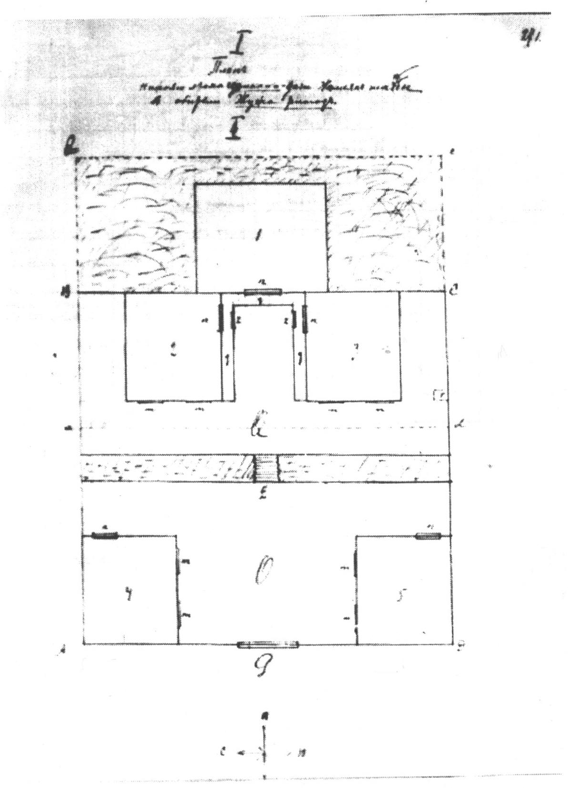

План нижнего этажа симхана-дачи Чжамьян-шадбы в обители Жужа-ритод

<a id="246">**-- 246 --**</a>

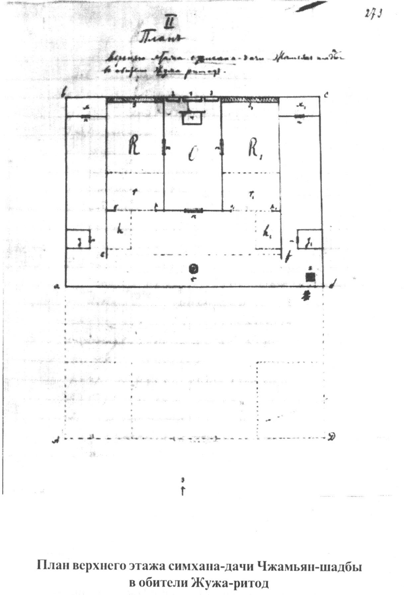

План верхнего этажа симхана-дачи Чжамьян-шадбы в обители Жужа-ритод

<a id="247">**-- 247 --**</a>

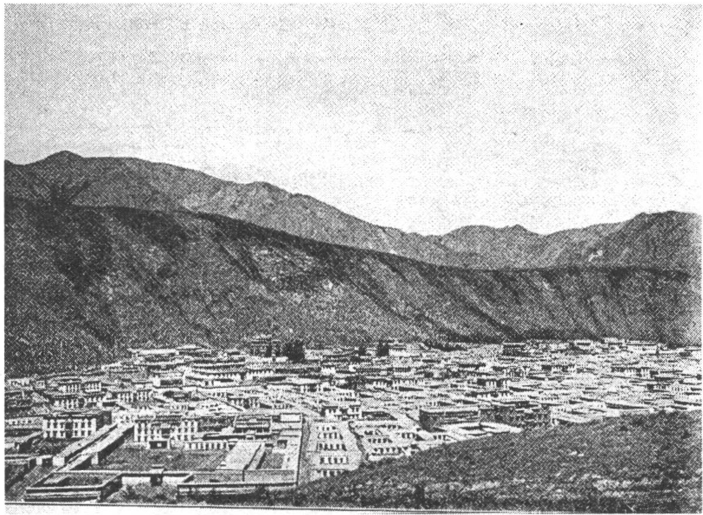

Общий вид Лаврана с юго-запада (*вверху*)

Храм Гьуд-ба-амни в Лавраие (*внизу*)

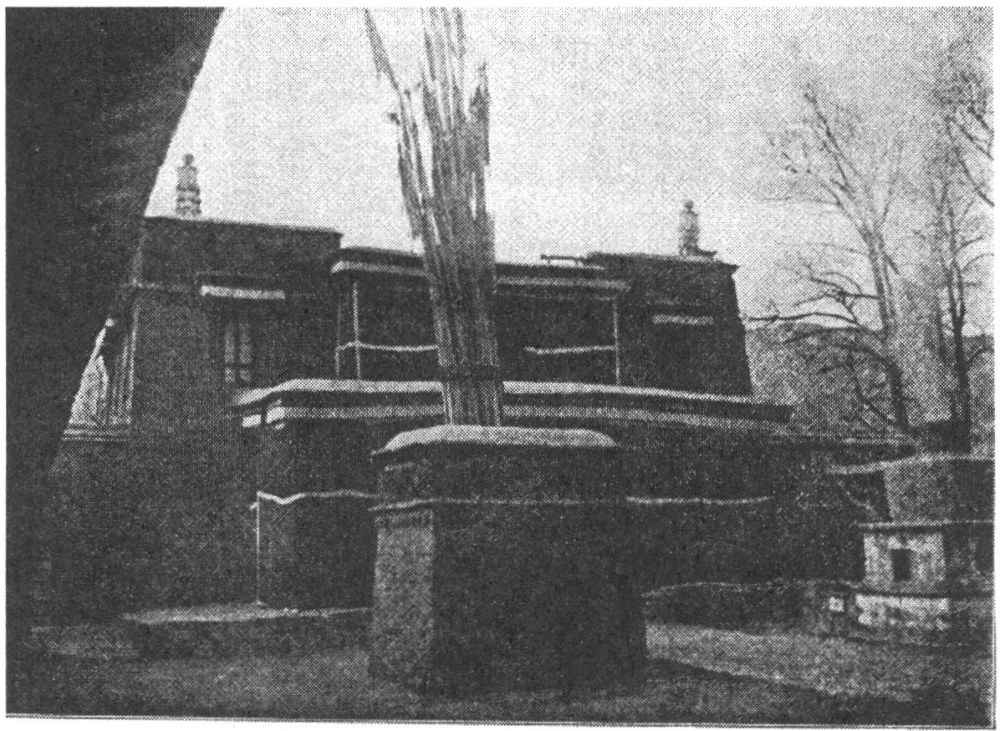

<a id="248">**-- 248 --**</a>

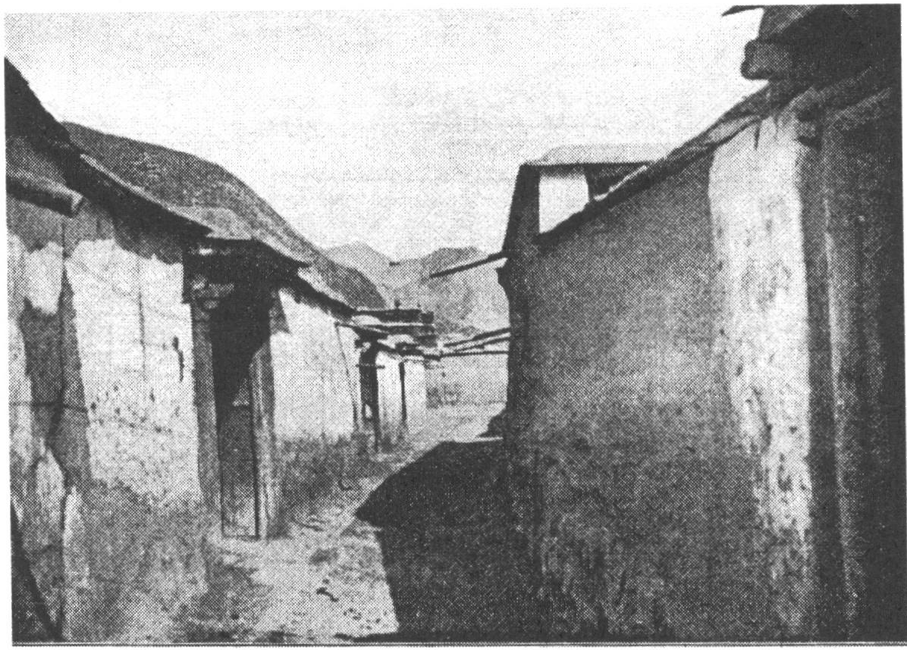

Улица в Лавране

<a id="249">**-- 249 --**</a>

Владетельный гэгэн Лаврана Жамьян-Шадба (4-ое перерождение)

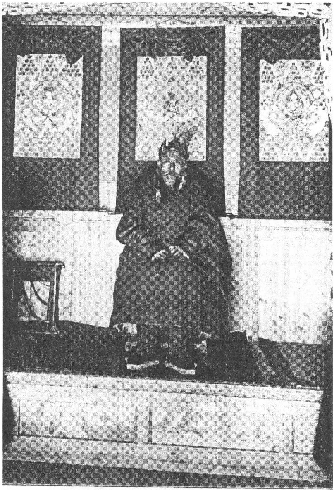

<a id="250">**-- 250 --**</a>

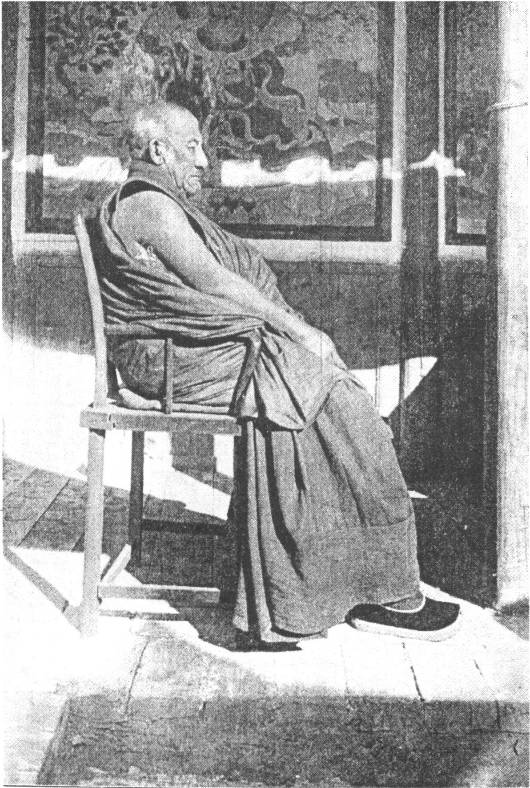

Перерожденец Гоман-цан в Лавране

<a id="251">**-- 251 --**</a>

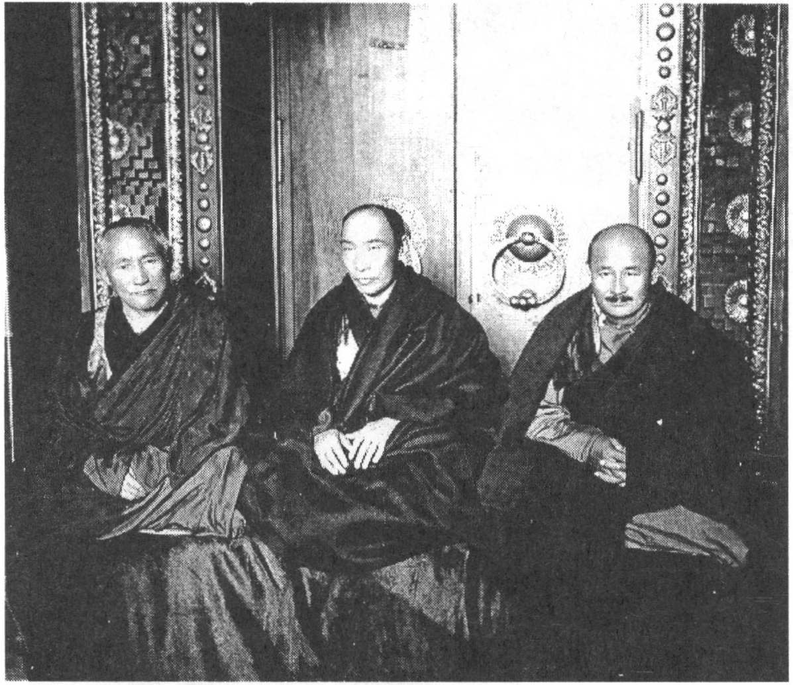

Хамбо Агван Доржиев, Ганжурва-гэгэн Данзан (Дамжа) Норбоев, калмыцкий хамбо Шарап Тепкин, г. Ленинград, 30 августа 1929 г.

*Фото из Музея истории Бурятии*

<a id="252">**-- 252 --**</a>

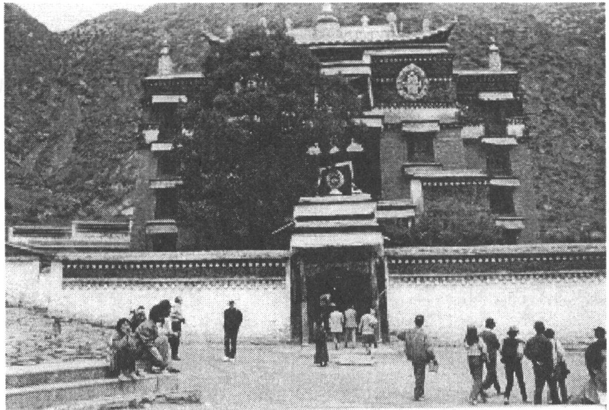

**Сэркан** *(вверху)*

**Вид с крыши Сэркана** *(справа)*

*Фото Ц.П. Ванчиковой*

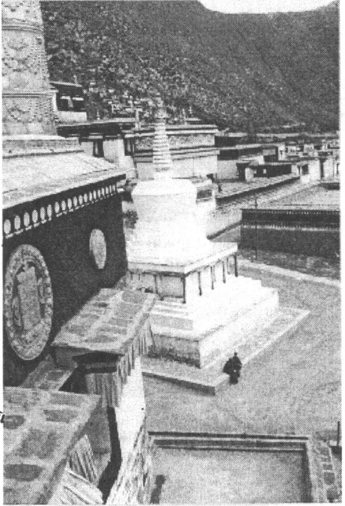

<a id="253">**-- 253 --**</a>

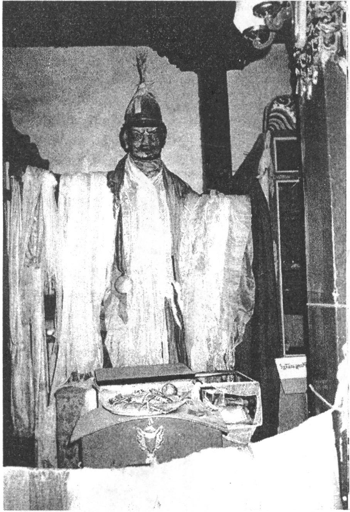

**Скульптура Гэсэра**

*Фото Ц.П. Ванчиковой*

<a id="254">**-- 254 --**</a>

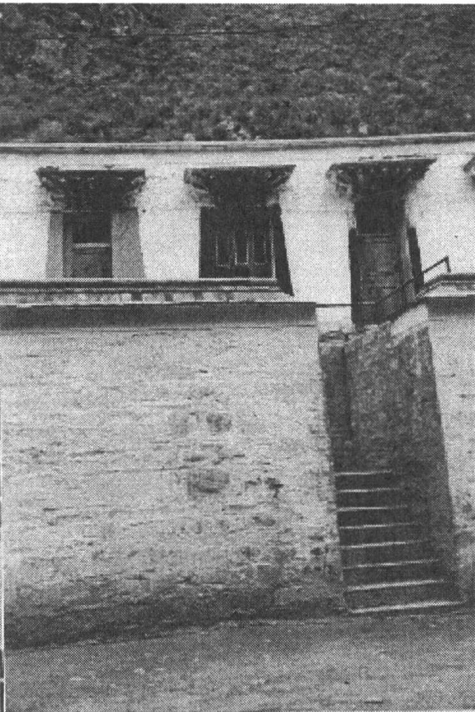

**Кельи монахов** *(слева)*

**Улица в Лавране** *(внизу)*

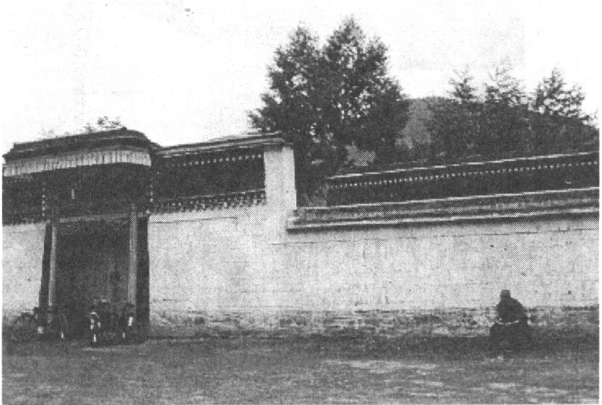

*Фото Ц.П. Ванчиковой*

<a id="255">**-- 255 --**</a>

SUMMARY

This is the first publication of the Diary of Bazar B. Baradin (1878- 1937), of a famous Buryat orientologist, who has been repressed and died in one of the concentration camps. The results of his expedition were highly esteemed by the Russian Committee for the researches of Middle and Eastern Asia and he was awarded by the Gold Medal of the Russian geographic society and by Prize.

Most of his written legacy was hidden in archives. The original of the Diary (on 519 pages) is kept in the Oientalists' archives of the Sankt-Petersburg branch of the Institute of Oriental studies of the Russian Academy of sciences.

This Diary was written between 24th of June 1906 and 4th of February 1907 in Lavran - a Buddhist monastery situated in North-East Tibet. Lavran, one of the six biggest and oldest Tibetan monasteries, is famous for its high academic and scholarly standards and for its learned monks. It has 6 faculties, which has a special accent on the study of Sutra and Tantra divisions. Lavran (bla brang bkra shis 'khyil) was found in 1709 by Gunchen Zhamyang Shadpa (1648-1721). It is situated in contemporary Gansu province of the Chinese People's Republic.

The Diary contains unique materials of a diverse character depicting everyday inner life of a Tibetan Buddhist monastery, the monastery that follows the traditions of ancient classic Indian Buddhist universities. He has given for the first time full description of a Tibetan Buddhist monastery of Amdo province, of its inner structure and organization, also the Diary contains detailed description of the monastic educational system and teaching, of the Buddhist scholarly and monastic school literature, about editing activity of Lavran, it gives unique materials on the religious history and Buddhist personalities.

This Diary is an important source for the study of different aspects of spiritual life of the peoples inhabiting this polyethnic region: Tanguts, Chinese, Dungans, Salars, Mongolians, etc. It has not lost its scholarly significance up to day.

<a id="256">**-- 256 --**</a>

ОГЛАВЛЕНИЕ

Базар Барадин и его тибетский дневник (1906-1907 гг.) 3
Базар Барадин. Жизнь в тангутском монастыре Лавран. Дневник буддийского паломника (1906-1907 гг.) 15
Комментарии 225
Указатель 238
Summary 255

<a id="257">**-- 257 --**</a>

Базар Барадин

**ЖИЗНЬ В ТАНГУТСКОМ МОНАСТЫРЕ ЛАВРАН**

*Дневник буддийского паломника*  
*(1906-1907 гг.)*

Научное издание  
Редактор *П. Ф. Калашников*  
Художник *Д. Т. Олоев*  
Верстка и макет *О.С. Ринчинов*

Лицензия ЛР № 040936 от 13.01.99 г.

Подписано в печать 10.12.02 г. Формат 60x84 1/16.  
Печать офсетная. Бумага офсетная. Гарнитура Таймс.  
Усл. печ. л. 17,57. Уч.-изд. л. 17,5.  
Тираж 300. Заказ № 160.

Издательство БНЦ СО РАН  
670047 г. Улан-Удэ, ул. Сахьяновой, 8  
Отпечатано в типографии изд-ва БНЦ СО РАН  
670047 г. Улан-Удэ, ул. Сахьяновой, 6

## Комментарии

[**Обсудить**](https://t.me/answer42geo/170)
