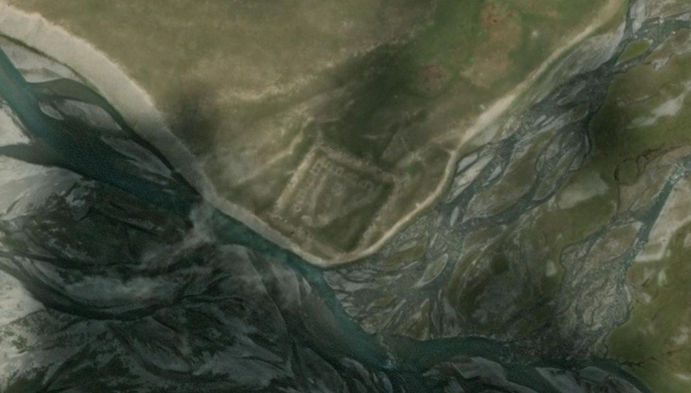
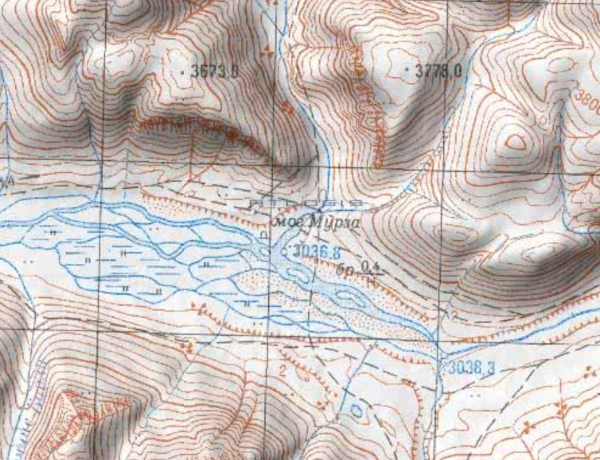
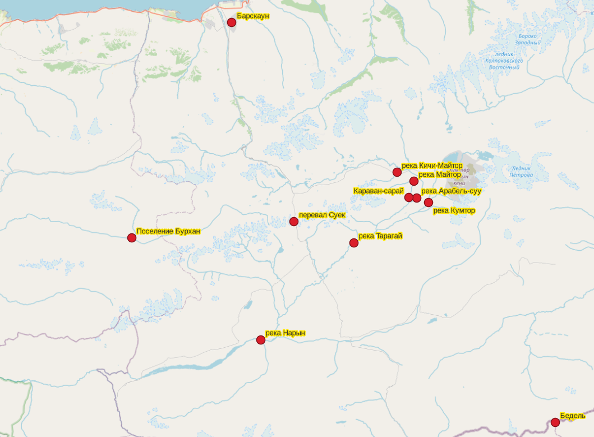

## Введение

Обычно я ищу где тот или иной объект находится. Сегодня задача обратная, есть точно локализованный объект, нужно собрать по нему информацию.

Объект - караван-сарай Бурхан. Название привожу по статье "[Uncovering Forgotten Caravanserai](https://bikepackingkyrgyzstan.cc/uncover_forgotten_caravanserai)" Малика Алымкулова (Malik Alymkulov). В своей замечательной, богато иллюстрированной статье автор задается вопросом почему он нигде не смог найти информацию по этому хорошо сохранившемуся объекту. Поищем.

## Общая локализация

Караван-сарай находится на впадении реки Эгизтор в реку Бурхан, в Тонском районе, Иссык-Кульской области, Кыргызстан.

Координаты:

* Широта: 41.755601
* Долгота: 77.355353

На картах:

* [OpenStreetMap](https://www.openstreetmap.org/#map=17/41.753102/77.355760)
* [Bing satellite](https://www.bing.com/maps/search?style=h&cp=41.754170%7E77.355684&lvl=18)
* [nakarte.me](https://nakarte.me/#m=14/41.75278/77.36928&l=T)

## Топонимы

Основные топонимы расположенные в районе расположения караван-сарая.

* *Мурза*, могила - название караван-сарая. Источник топонима: nakarte.me.
* *Бурхан*, река - основная река на которой стоит караван-сарай, течен на запад. Альтернативное наименование: Буркан. Исток реки Малый Нарын.
* *Кокджар*, урочище - небольшая долина, предгорья начинающиеся от р. Бурхан в районе караван-сарая. Источник топонима: nakarte.me.
* *Эгизтор*, река - идет от одноименного перевала, впадает в р. Бурхан, на впадении стоит караван-сарай. Источник топонима: nakarte.me.
* *Калча*, река - небольшой именованный приток р. Эгизтор.
* *Джаманэчки*, река - впадает в р. Бурхан немного восточнее караван-сарая. Идет от одноименного перевала. Альтернативное наименование: Джаман-Эчки. Источник топонима: nakarte.me.
* *Кызылбель*, река - впадает в р. Джаминэчки недалеко от впадения той в р. Бурхан. Источник топонима: nakarte.me.

## Упоминания объекта

Действительно, упоминаний объекта в научных исследованиях немного, но они есть.

В.Г. Кошевар в статье "К локализации раннесредневековых городов в иссык-кульской котловине" упоминает караван-сарай, точнее могильник:

> Неисследованный пока могильник Мурза в верховьях долины р. Буркан указывает на освоенность этой территории в древности.

Интересно, что объект упоминаетсся в контексте маршрута шелкового пути по долине р. Буркан, альтернативного общепринятому Бедель-[Суек](/notes/suek/)-Ара-бель-[Барскаун](/notes/barskaun-barskoon/). Обсуждается путь через перевал Джаман-Эчки, далее по долине реки Буркан к Джылуу-Суу и через перевал Тон в Тонскую долину. Маршрут связывается с путешествием [Сюань-Цзана](/notes/xuanzang-alexandrova/).

Публикация:

Кошевар В. Г. К локализации раннесредневековых городов в Иссык-Кульской котловине // Роль города Маргилана в истории мировой цивилизации: материалы международной конференции, посвященной 2000-летнему юбилею города Маргилана. Ташкент; Маргилан: Издательство «Фан» Академии наук Республики Узбекистан, 2007. С. 173–177. ([ссылка](https://n.ziyouz.com/books/tarixiy/Marg%27ilon%20shahrining%20jahon%20sivilizatsiyasi%20tarixidagi%20o%27rni.pdf))

## Географический контекст

Небольшая карта показывающая расположение караван-сарая Бурхан в контексте других объектов, рассмотренных в заметке про аналогичный объект в местности [Уч-чат](/notes/uch-chat-arabel/).

## Комментарии

[**Обсудить**](https://t.me/answer42geo/184)
