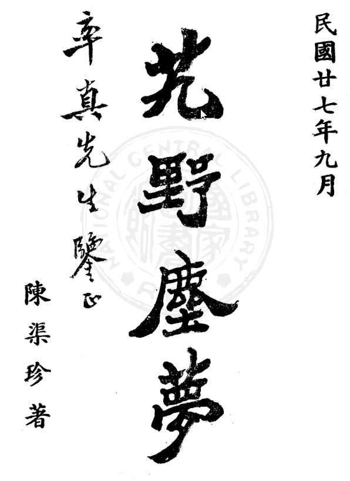

## Общая информация

Книга "Сон в пыли диких земель" (艽野塵夢) представленная здесь --- перевод компиляции из двух источников.

* Издание сентября 1938 года (оригинальное?) <https://taiwanebook.ncl.edu.tw/zh-tw/book/NCL-003716450/reader> ([сохраненная копия в PDF](https://drive.google.com/file/d/1jMwvmMvDE7MKS6ORmAcfugk61mQPtMZB/view?usp=sharing))
* Основной текст книги издания мая 1982 г. с комментариями Жэнь Найцяня <https://github.com/chaimol/chaimol.github.com/blob/master/book/%E8%89%BD%E9%87%8E%E5%B0%98%E6%A2%A6.txt> ([сохраненная копия в TXT](https://drive.google.com/file/d/1ILTLtUfMds-IJPiln_9AFp6yNpSKS5Am/view?usp=sharing))

Дополнительные материалы:

* [Оригинальный текст](/notes/chenquzhen-dream/) компиляции на китайском языке.
* Процесс [перевода по блокам](https://docs.google.com/document/d/1X65YU4EL4I1ki4YmwtEhQtcEGGsN_7sC1PB7W8mm2IA/edit?usp=sharing) в Google Docs.

Данный перевод носит предварительный характер, возможны ошибки и неточности.

## Содержание книги

«Сон в пыли диких земель»

Сентябрь 1938

Предисловие участника Синьхайской революции

Автор: Чэнь Цюйчжэнь

<a id="i">**-- i --**</a>

### Предисловие 1

В конце правления императора Гуансюя (光緒) династии Цин Англия и Россия боролись за господство в Азии, продвигаясь с севера и юга. Особенно англичане, опираясь на Индию, намеревались, перейдя «гору Сумеру» (須彌山, то есть Гималаи), заглянуть в наш Тибет. Их замысел был весьма настойчив: они уже открыли дорогу через Сикким к Дарджилингу и, подняв шум, длинными маршами устремились прямо к сокровищнице нашего Переднего и Заднего Тибета.

Когда разгорелась революция, люди с высокими устремлениями хотели перейти пески лютой пустыни, перевалить снежные горы и вступить во взаимодействие с народом Тубо (Тибета), чтобы укрепить стремление «почитать Китай и изгонять варваров». Поистине нелёгкая задача.

Господин Чэнь Цюйчжэнь --- человек необыкновенной решимости и редкого дарования. Он окончил военное училище в Чанше, служил офицером в первом батальоне новой армии провинции Хунань, вступил в Союзную лигу (Тунмэнхуэй) и участвовал в национальной революции. Позднее он прибыл в Сычуань, где занимался планами похода в Тибет и вопросами тибетской политики; местные власти относились к нему с большим уважением.

Но как раз в то время пала династия Цин, положение стало смутным и неясным. На обратном пути он оказался в безвыходном положении и был вынужден искать обходной путь на север. Ведя с собой отряд из ста пятнадцати человек, он вышел из Цзянды (в Тибете) и прошёл через бесплодные равнины и пустынные моря песка более десяти тысяч ли; спустя семь месяцев достиг Сианя. Из всех людей в живых осталось лишь семеро, и он был одним из них.

О, поистине подвиг!

«Сон в пыли диких земель» --- воспоминания господина Чэня, написанные после этих событий. Трудности пути и трагические испытания, которые он описывает, не позволяют читать эту книгу без волнения.

Я думаю о том, что горы и реки нашей земли со времени сотворения мира, дороги, которые были проложены, поля, которые были распаханы, дворцы, которые были воздвигнуты, --- всё это создано в борьбе человека с природой. Но трудные и опасные места уже были пройдены и открыты людьми прошлого, а люди последующих поколений пользуются лишь удобствами и ищут праздного покоя.

Поэтому плодородные земли Срединной равнины стали местом, где множество жадных стремится урвать свою долю, а дальние окраины стали считать чем-то не заслуживающим внимания ---

<a id="ii">**-- ii --**</a>

их старались избегать и вовсе оставляли без присмотра. Чужеземцы же нередко, исполненные новой и дерзкой энергии, с жадностью смотрят на земли за пределами своей страны и постоянно занимаются их разведкой: отвоёвывая себе дюйм за дюймом и никогда не говорят, что устали. Поэтому ослабление могущества государства происходит постепенно, шаг за шагом.

Пренебрегая дальними окраинами и гоняясь за близкой выгодой, династия Цин и погибла.

Оглядываясь на мир, можно спросить: много ли найдётся людей, подобных Вам, которые, устремляясь навстречу опасности и трудностям, столь преданы своей земле, что готовы «девять раз умереть и не раскаяться»?

Когда в древности Чжан Цянь (張騫) отправился послом в Западные края, с ним было более ста спутников; на обратном пути в живых осталось лишь двое, а само путешествие продолжалось более тринадцати лет. Ваш путь занял лишь семь месяцев, но бедствия, выпавшие на долю Ваших спутников, были не меньшими, чем у спутников Чжан Цяня. И я знаю также, что страдания в Вашем сердце были куда сильнее, чем у тех, кто, плывя на плоту, уходил за десять тысяч ли в дальние моря.

Вы человек глубокой мудрости и спокойной храбрости; по характеру искренний и прямой, с достоинством сохраняете дух древних мужей. В наше время быстрых перемен особенно нужны люди, способные действовать на пограничных рубежах.

Если бы этот старик ещё мог, опершись на седло, оглянуться вокруг, он охотно последовал бы за генералом Фубо (伏波, «Укротитель волн», Ма Юань) в поход. Хотя я уже стар и немощен, всё же был бы готов держать плеть и сопровождать Вас.

Написано в последний месяц весны года динчоу (1937).

Почтительно записал ваш покорный младший брат Цао Дяньцю.

<a id="iii">**-- iii --**</a>

### Предисловие 2

Путевые записки берут своё начало ещё с «Записок о путешествии на юг» (南來錄) Ли Сичжи (李習之) и «Записок о служебной поездке» («于役志») Оуян-гуна (歐陽公). С тех пор появилось множество подражаний им. Однако большинство из них лишь перечисляют почтовые станции и этапы пути, не касаясь серьёзных вопросов; к тому же многие написаны поэтами и странствующими литераторами, которые во время дальних путешествий --- в дороге, на лодке или в повозке --- на досуге изливают свои чувства на бумаге.

Иное дело --- записи, сделанные во время военных дел: когда в гуще событий человек на ходу фиксирует происходящее, наблюдает и описывает всё вокруг. Такие записи, хотя и написаны между делом, у щита и меча, нередко отличаются яркостью и изяществом и могут служить ценным материалом для историков. Однако подобные сочинения встречаются нечасто.

Наш родственник Цюйчжэнь --- человек одновременно учёный и храбрый. После окончания военного училища в Чанше он служил в Хунани, затем в Сычуани и в Тибете, не раз получал военные назначения; его заслуги были заметны и известны. В последние годы он стоял в гарнизоне на западе Хунани, долго усмиряя беспорядки и подавляя мятежи; его власть и добродетель приносили покой родным местам. При всём том он любил книги и историю: даже среди военных тревог не оставлял письма и кисти.

Недавно, прибыв в провинциальную столицу, он показал мне свою книгу «Сон в пыли диких земель». Название её взято из строки «Я отправился на запад и достиг диких земель» (我征徂西，至于艽野) из «Книги песен». В книге он вспоминает события двадцатилетней давности --- своё западное путешествие --- и собрал воедино пережитое тогда.

Тогда он прошёл из Сычуани в Тибет, углубился в области Гонгбу и Боми и стоял там с войсками более двух лет. Когда же во время Синьхайской революции произошли государственные перемены, он двинулся обратно: следуя вдоль реки Хара-Усу, пересёк пустыню Цзяньтун, прошёл по хребтам и через обрывистые горы на север, вышел к реке Тунтянь, затем через солёные озёра направился в Цинхай и, перевалив через горы Луншань, вернулся.

Все места, где он побывал, всё, что видел и слышал собственными глазами и ушами --- силу и слабость населённых пунктов, плодородие или бедность равнин, богатство полезных ископаемых, различия религиозных течений, состояние хозяйства и управления, племена тибетцев и диких горцев, --- а также суровые ветры, снег, дождь и гром, перемены холода и тепла, обычаи мужчин и женщин, их пищу, одежду и утварь --- всё это описано им подробно и обстоятельно...

<a id="iv">**-- iv --**</a>

Когда речь заходит о языках и письменности чужих стран, о необычных птицах и зверях, о древних деревьях и прекрасных растениях --- обо всех этих бесчисленных формах и видах, которые трудно распознать; о таинственных явлениях, словно связанных с духами и божествами; о явных и скрытых нравах простого народа, об их искренности и притворстве; а также о всём прочем, что имеет значение для государства --- для народа, армии, пользы и вреда, --- всё это автор тщательно исследует и подробно излагает.

О, какое богатство сведений!

Если впоследствии кто-либо будет заниматься делами в этих краях и сумеет искусно воспользоваться этой книгой, то польза от неё будет вовсе не малой. То, о чём прежде говорили, что оно может послужить материалом для историков, --- едва ли найдётся что-либо более достойное этого, чем данное сочинение.

Я слышал также, что, когда господин Чэнь вместе со своими спутниками выступил из Тибета и направился на западные равнины, у него было сто пятнадцать человек; когда же они достигли Синина, в живых осталось лишь семеро. Если сравнить это с тем, как Бань Чао (班超), отправившись послом в Западные края, потерял тридцать шесть своих подчинённых, то опасности и страдания, перенесённые ими, пожалуй, были даже более тяжкими.

Когда они, заблудившись в пустыне Гоби, прошли пешком десятки тысяч ли и семь месяцев скитались в пути, сначала у них кончилась соль, затем --- пища, и, наконец, они оказались на грани того, что не станет ни воды, ни огня. С утра до вечера они двигались среди жадных ветров и метелей, среди вихрей песка и летящих камней, среди воя волков и рёва тигров. Когда мучила жажда --- разбивали лёд и пили; когда приходил голод --- ловили диких зверей и ели их сырыми. Спутники один за другим погибали и падали на землю; вокруг царили пустота и ужас. Казалось, уже не осталось надежды на жизнь. И всё же он ни на миг не ослаб духом, а, напротив, собрав мужество, продолжал идти вперёд --- пока, наконец, благополучно не достиг Юймэня (玉門).

Из этого можно понять: как бы ни были обширны и труднодостижимы просторы мира, если человек не поддаётся растерянности и страху и не падает духом, то нет таких мест, куда он не смог бы дойти.

Всю жизнь господин Чэнь прошёл через опасности и лишения; в испытаниях он оставался стойким, как отвесная стена: сколько бы ни было поворотов судьбы, он не сгибался и решительно шёл вперёд. Прочитав эту книгу, я невольно поражаюсь и восхищаюсь его твёрдостью и стойкостью --- им действительно трудно подражать.

Однако всё это --- лишь следы уже прошедших событий. В наши дни мир ещё не успокоился; это время, когда люди с решимостью и доблестью должны быть готовы положить меч под голову и ударить веслом по воде, готовясь к подвигам. Если человек столь же стойкий, как господин Чэнь, то его будущие дела, несомненно, будут велики и достойны удивления и восхищения --- и не ограничатся одним-двумя свершениями.

Поэтому я и написал эти слова на полях его книги, чтобы засвидетельствовать своё мнение.

Составил:

Чэнь Цзисюнь, уроженец Чанши,

чиновник Министерства финансов, начальник отдела военных поставок, ранее --- советник китайского посольства в России.

<a id="v">**-- v --**</a>

### Предисловие 3

Когда-то мы с господином Цюйчжэнем встретились в Чанше. Тогда мы оба были ещё совсем молоды. Когда он собирался отправиться на запад, в Сычуань, я сначала пытался его удержать: ведь друзьям трудно часто встречаться, а расставаться легко; к тому же ущелье Цюйтан, стремнины Янцзы и природные опасности тех мест внушают страх. В жизни ведь главное --- следовать своим желаниям; зачем же так далеко отправляться, навстречу ветрам и волнам?

Но устремления господина Цюйчжэня простирались на тысячи ли, и мои слова не могли поколебать его. Вскоре он из Учан поднялся вверх по Янцзы через Илин, прошёл Три ущелья, вошёл в Куймэнь и, пройдя более тысячи ли, достиг Цзиньчэна (Чэнду). Люди поют: «Трудна дорога в Шу», --- а он прошёл её спокойно и уверенно. Причина была в том, что его решимость и мужество превосходили его сверстников: он мог смело идти вперёд, не зная ни сомнений, ни страха.

Когда он прибыл в Сычуань, сначала служил командиром роты в 65-м полку новой армии, под началом командующего Чжун Ина. В то время англичане настойчиво строили планы относительно Тибета, и цинское правительство направляло смешанную бригаду для поддержки Тибета. Господин Цюйчжэнь представил план западного похода, в котором подробно излагались меры по устройству тибетских дел. Чжун Ин высоко оценил этот план и поспешил отправить его в Тибет.

Сначала он выступил в поход на Чамдо, затем привёл к покорности область Гонгбу и, наконец, после тяжёлых боёв достиг Боми. Среди этих сражений особенно опасным был бой при Лацзо, а самым ожесточённым --- бои у Шимэнь и Бадэн. К тому времени он уже был повышен до командира батальона; его имя и военная слава распространились по всему югу и северу Тибета.

Затем вспыхнуло восстание в Ухане, и Китайская империя была восстановлена. Сычуань же, отдалённая и труднодоступная, только начинала создавать новое военное управление; по стране бродили отряды авантюристов, повсюду вспыхивали беспорядки. Военные тревоги разгорались у берегов Цзиньцзяна, опасность нависла над Юйлэем. Положение в Сычуани стало хаотичным, и области Кхам и Тибет, находящиеся на западной окраине, также поддались этому волнению; начались взаимные убийства и смута.

Поняв, что тибетские дела уже невозможно удержать, господин Цюйчжэнь повёл более ста человек и, выйдя из Цзянда, направился через Цинхай на восток, возвращаясь домой. Когда они, утомлённые и изнурённые, пробирались между пустыней Цзяньтун и рекой Тунтяньхэ, пересекая снежные просторы...

<a id="vi">**-- vi --**</a>

Повсюду лежал песок и пыль, заслоняя небо; оглянешься вокруг --- и видишь лишь бескрайнюю пустыню, где невозможно различить дорогу. На тысячи ли не встретишь человеческих следов, не увидишь дыма очагов. Солнце скрывалось, и путники тщетно искали глазами очертания горных хребтов, словно срезанных небом.

Когда кончились припасы, приходилось охотиться на диких зверей и питаться ими. Ночевали под ледяным небом и среди снегов: сверху завывал ветер, по сторонам подстерегали волки. Впереди дорога была туманна и бесконечна, спутники умирали один за другим. К тому времени надежда вернуться живыми почти исчезла. Все опасности и бедствия, какие только может испытать человек, выпали на его долю.

И всё же он смог, собрав волю и дух, идти вперёд, не думая ни о жизни, ни о смерти, ни о счастье, ни о беде. Так он прошёл через Цайдам, затем через Цинхай и, наконец, достиг Синина.

Он выступил из Цзянда в середине зимы года Синьхай, а прибыл в Синин в начале осени года Жэньцзы. Вернувшись из чужих краёв, он застал уже изменившуюся страну: империя сменилась республикой. От Синина он через Ланьчжоу отправился в Чанъань и далее через земли Гуаньчжуна вернулся домой.

С тех пор прошло уже двадцать пять лет. Оглядываясь на прошлое, всё это кажется сном. Опасаясь, что со временем воспоминания сотрутся, прошлой осенью, приехав в Чанша, он вспомнил всё пережитое и написал эту книгу, назвав её «艽野塵夢» --- «Сон в пыли диких земель».

Жизнь человека и сама подобна иллюзии: всё, что внезапно происходит и случайно сходится, будто бы возникает само собой. Уже одно его путешествие через Сычуаньские горы можно назвать трудным; затем он вошёл в земли Кхам и Тибета --- это было ещё труднее. Если пребывание в Боми было опасным, то переход через пустыню Цзяньтун оказался ещё более опасным.

Пройдя десять тысяч ли за восемь месяцев, изнурив тело и иссушив силы голодом, он всё же не позволил этим страданиям поколебать своё сердце. С терпением и стойкостью перенёс все трудности и в конце концов благополучно достиг цели.

После этого он ещё двадцать лет служил в армии в западной части Хунани, и вся его жизнь так и не рассталась со словом «трудность». Он придерживался твёрдых принципов. Как говорил Цзэн Сянсян, «строить крепкие укрепления и вести смертельные бои» --- именно это лучше всего характеризует его.

И ещё --- госпожа Сиюань всегда следовала за ним в этих пустынных и далеких краях, разделяя с ним бедствия и опасности. Это особенно ясно показывает: когда Небо и Земля создают людей, всякое существо, обладающее жизнью и кровью, имеет свою искреннюю природу; чувства сердца проявляются одинаково, и между китайцами и тибетцами нет в этом различия.

<a id="viii">**-- viii --**</a>

Здесь я откладываю кисть. Быть может, в душе автора всё ещё живут воспоминания о старых друзьях на западных землях --- редком в человеческой жизни союзе, подобном цветку, который расцветает лишь на мгновение и тут же исчезает, как тень или пузырь. Не потому ли и остаётся в сердце тихая печаль --- как завершение «сна в пыли диких земель»?

И всё же за прошедшие двадцать с лишним лет человеческая судьба текла медленно, словно в долгой ночи. Так чем же отличается сон господина Чэня от сна всего мира?

В этой книге много удивительного, радостного, печального и вдохновляющего. Когда читаешь о том, как он, заброшенный за десять тысяч ли в пустынные земли, прошёл через опасности и лишения и, оказавшись там, где «горы иссякли и воды кончились», всё же увидел день, когда «за тёмными ивами вновь расцвели цветы», понимаешь: на свете нет такого места, где нельзя было бы жить и действовать. Если человек сохраняет стойкость и спокойствие духа, он везде найдёт удовлетворение и радость.

Кроме того, в книге рассказывается о делах и достопримечательностях пограничных земель, о религиозных учениях лам, о нравах и обычаях тибетских племён, о горах, реках и диковинных предметах варварских стран. Всё это может служить темой для бесед с одним-двумя друзьями тихими вечерами --- за чашкой чая или бокалом вина --- и оставляет после себя долгий и приятный вкус.

Помню, как мы расстались с автором в Чанша в год бин-у правления императора Гуансюя. С тех пор годы текли без остановки --- прошло уже тридцать один год. Юноши тех времён теперь стали седыми стариками. Пишу это предисловие к его книге --- и невольно вздыхаю, вспоминая, как изменился мир.

Написано в день Цинмин

26-го года Китайской Республики (1937)

Составил:

Тэн Вэньчжао, уроженец той же местности, Чанша.

<a id="I">**-- I --**</a>

### Оглавление

Предварительные разделы

* 自序 --- Авторское предисловие
* 總敘 --- Общее введение

В введении рассматриваются темы:

* общий обзор Жёлтой школы тибетского буддизма
* подчинение Далай-ламы иностранному влиянию
* вторжение британских войск в Тибет
* бегство Далай-ламы
* новая армия Хунани
* отставка автора и отправление в Сычуань
* участие в походе для помощи Тибету
* прощание с домом и выступление на пограничье

Глава I. От Чэнду до Чамдо

* беспорядки, сопровождавшие поход войск
* климат между Яанем и Дачзяньлу
* подвесной железный мост, переброшенный над пропастью
* скальная поэма князя Гоцина
* суровый холод Дачзяньлу
* цампа с маслом
* пахучий и прогорклый чай с топлёным маслом
* жилища и одежда местных жителей
* оборонительные позиции войск Далай-ламы
* сосредоточение армии в Дачзяньлу
* движение армии северным маршрутом
* первый день после выхода за заставу
* ясная погода после снега и дождя
* страдания из-за плохого владения верховой ездой
* речная рыба несъедобна
* тяжёлые лишения в дороге
* ловкость горцев
* тонкий звон колокольчиков на копытах лошадей по льду
* кожаные лодки
* задержка при переправе через реку
* вкусное блюдо из курицы с фритиллярией
* палатки на снежной земле

Глава II. Разведка у Лацзо

* сосредоточение армии в Чамдо
* углубление в разведку
* подъём на гору
* ночёвка в Лацзо
* внезапное появление тибетского дозора
* дозор уходит и возвращается
* ранен и захвачен в плен
* жестокое обращение со стороны тибетских начальников
* страдания после освобождения от пут
* конвоирование в Энда
* уважительное обращение со стороны Бамбу
* ламский настоятель признаёт соглашение об отводе войск
* возвращение живым в Чамдо

<a id="II">**-- II --**</a>

* смешанные чувства радости и горя
* багаж неожиданно был разграблен
* удар молнии, рассеявший болезнь и способный лечить внешние раны

Глава III. От Чамдо до Цзянда

* прибытие Чжао Эрфэна в Чамдо
* внушающая опасения решимость этих людей
* решительность Эрфэна
* обращение несчастья в удачу
* уныние Чжан Хуншэна
* предложение двухступенчатого плана
* наступление на Энда
* победа над противником в одном бою
* изменение маршрута продвижения
* стада яков, дерущихся на горных вершинах
* солдаты притворяются больными и умирают
* бороды, покрытые льдом
* тридцать девять племён
* богатства снежных гор
* пиршество в Лари
* тибетские войска обороняют реку Усы
* армейское управление продовольствием и религиозная пропаганда
* гибель офицера Юй
* студенты непригодны для службы
* Цзянда после усмирения
* тайная казнь настоятеля (камбо)
* живописные места Япи
* тибетцы ловят рыбу
* тибетские женщины изготавливают одежду

Глава IV. Усмирение области Гонгбу

* старший сын вступает в дом жены
* политика умиротворения тибетцев
* стратегическое положение Гонгбу
* необычные местные блюда
* недоразумение из-за игры в «камень-ножницы-бумагу»
* обыск имущества тибетского правителя
* драгоценный канон Ганджур
* сохранение изъятых вещей
* прекрасная молодая невеста
* рис, выращиваемый в землях «диких тибетцев»
* углубление в земли горцев
* ремёсла местных жителей
* продукты этих земель
* быт горных племён
* тихие и живописные места Дэмо
* охота на горных коз
* большое количество мускусных оленей
* праздник в Гунцзюэ
* танцы тибетских девушек
* конные игры тибетских девушек
* физическая сила тибетских женщин
* воинственный характер народа Боми
* предложение шести административных мер
* шутливое замечание
* возвращение Сиюань
* «живые будды» поклоняются друг другу
* живой будда восседает на лотосовом троне
* горные жители идут поклоняться Будде
* столетние судебные дела среди горцев

Глава V. Наступление на Боми

* демонстрация войск в Лулане
* высота и крутизна гор Дэмо
* разведывательный отряд убит тибетцами
* крупное наступление на Боми
* положение местности Дунцзю
* Белая Лошадь и Голубой ручей

<a id="III">**-- III --**</a>

* сопротивление тибетцев
* ядовитые укусы засухи и саранчи
* тибетцы из Боми заманивают нас вглубь
* птицы Бангбо кричат на верхушках деревьев
* кровопролитный бой у подножия горы Баландэн
* построение каре в ожидании врага
* от жажды едят дикие грибы
* обещанные подкрепления не приходят, приходится снова отступать
* ночная атака тибетцев
* отступление войск к Наньи
* удержание перевала Шимэнь
* ожесточённый бой у Шимэня
* жизнь и смерть предопределены
* тибетские войска обходят с тыла
* солдаты рассказывают истории о духах
* прыгающие тени «призраков»
* отступление к Дунцзю
* тибетцы окружают войска со всех сторон
* ночной отход к Лулану
* Цзин Ин падает и не может подняться
* пополнение новобранцами
* смена командования на передовой
* гневные упрёки Чжун Ина

Глава VI. Отступление к Лулану и контрнаступление

* трое изменников, воспользовавшихся положением
* соединение пограничных войск и наступление
* трупы, разбросанные по равнине
* повторное занятие старых укреплений
* три горы, поднимающиеся высоко в облака
* брошенные материалы остаются без применения
* подвесной мост из лиан у Танмая
* аромат папайи на протяжении семи--восьми ли
* новое восстание в Йигуне
* озеро Йигун
* тайная ночная переправа через озеро
* две победы над противником
* после долгого голода неожиданно находят вкусную пищу
* соединение с пограничными войсками
* повторная переправа по подвесному мосту
* наступление на восемь перевалов и четырнадцать деревень
* снежные товары
* пчелиный воск
* поговорка: «Не стреляй птиц в весенние месяцы»
* письмо из дома
* перемены в государстве
* «тутовые поля превращаются в синее море»
* малый источник, рождающий богатства
* возвращение войск к Като
* Белая Лошадь и Цинни убегают к горным племенам
* униженная просьба о встрече с Шэ Кэсюэ
* милосердие и казнь
* сдача тибетского чиновника
* совет ламы из Чамдо
* Белая Лошадь и Цинни казнены
* «божественный» мост из лиан
* устройство лианного моста
* офицер Ши ушёл и не вернулся
* серебряная костяная ступа
* поражение войск Боми

Глава VII. Мятеж в Боми и отход к Цзянда

* влияние тайного общества Гэлаохуэй
* взводный падает на колени
* казнь тринадцати главарей общества
* первые признаки революции
* мятеж в гарнизоне Боми
* военный советник в меховой шубе не может удержать положение
* Чэнь Цин возвращается один в Чамдо
* не забыты скромные блюда из пшеницы и бобовой каши
* отход войск к Дэмо
* Чжан Цзыцин поворачивает назад и уходит
* трагическая гибель Ло Чанцы

<a id="IV">**-- IV --**</a>

* с хищниками нельзя идти вместе
* отступление войск в Цзянда
* Сиюань со слезами прощается с матерью
* печальное и тяжёлое расставание
* Фань Юйчан долго не может уйти, не желая расставаться
* беспорядки после мятежа в войсках
* решение покинуть Чамдо
* примирение и прощение прежних обид
* изменение маршрута и выход через Цинхай
* тщательная подготовка к выходу из Тибета

Глава VIII. Переход в Цинхай.

* жители Сычуани удерживают лошадей и уговаривают остаться
* богатство может навлечь беду
* «иволга и богомол гибнут вместе»
* река Хара-Усу
* строгий боевой порядок тибетских войск
* тибетская конница продолжает преследование
* преследователи в беспорядке отступают
* яки проходят по тем же следам, что и шестьдесят лет назад
* «голуби занимают гнёзда сорок» (пришельцы занимают чужие места)
* вход в пустыню Цзяньтун
* выдающийся конь
* стада диких яков
* одиночный як опасен
* лошадь бросается в стадо
* лама у развилки дороги вздыхает
* воображаемые горы, «словно обрезанные небом»
* кончается пища --- приходится убивать лошадей и сжигать снаряжение
* сон на снегу
* сырое мясо без соли тоже можно есть
* группы расходятся в поисках пищи
* огонь почти гаснет
* трудно добыть новый огонь
* вздох над замёрзшим трупом
* солдаты умирают один за другим
* пограничный камень реки Тунтяньхэ

Глава IX. Переход через реку Тунтяньхэ

* разведка пути отдельными группами
* проводник-лама снова исчезает
* мужество Сиюань
* сушёное мясо становится дорожным запасом
* Сиюань плачет и отказывается есть
* борьба за пищу возле трупа
* горный мальчик кормит измождённых людей
* в пустыне теряют друг друга
* ночёвка в одиночестве среди песков и встреча с волками
* бескрайняя дорога впереди
* погонщик лошадей Чжан Мин
* радостная и печальная встреча
* священная гора в тумане, едва различимая
* остаётся всего одна спичка
* решительные слова Сиюань
* огромный череп быка

Глава X. Встреча с монгольским ламой

* редко встречающиеся верблюды
* милосердный лама
* лама подробно рассказывает о предстоящем пути
* белый верблюд --- редкость
* взаимное уничтожение между своими
* заговор...

<a id="V">**-- V --**</a>

* внушающий страх заговор
* неблагодарное убийство ламы
* убийство другого оборачивается собственной гибелью
* в живых остаётся лишь семь человек
* даже умереть невозможно
* кончается пища, снова теряют дорогу
* от голода едят всё, даже навоз кажется вкусным
* борьба с волками за пищу
* защита от волков как от врагов
* прекрасные горные пейзажи
* исчезновение Ху Юйлиня
* попытка забыть всё пережитое
* возвращение к жизни после почти верной смерти
* встреча с охотниками-тибетцами
* неожиданная помощь из сострадания

Глава XI. Прибытие в Цайдам

* як может служить верховым животным
* свободная езда через леса и реки
* география и положение Цайдама
* добрый лама
* трудности передвижения по солончаковым землям
* солёную воду нельзя пить
* мастерское умение вскрывать туши
* переселения тибетцев
* стада оленей
* мешки, наполненные голубой солью
* комната, наполненная запахом табака
* старик, скитающийся в Цинхае
* разговоры о государственных делах, услышанные по дороге
* страстные песни в стиле Цинь
* провиант на лодках несъедобен
* бескрайние просторы озера Цинхай
* восемь дней путешествия вокруг великого озера
* печаль расставания
* переход через гору Жиюэшань

Глава XII. От Даньхэля до Ланьчжоу

* административный округ Даньхэр
* гостеприимство хозяина постоялого двора
* сельский учитель среди гор
* опиум как источник бед
* гибель молодого господина под скалой
* проявление сверхъестественной силы

Далее:

* крепостные стены и башни Синина
* опасное недоразумение
* Сиюань переживает сильный испуг
* странные явления в войсках
* плохие новости из Лхасы
* обвинение, выдвинутое Чжоу Сюнем
* разоблачение преступлений Чжоу Сюня
* прощание с Чжао Нанем и возвращение домой
* брат Ван Жуйлиня
* грустные воспоминания
* жизнь в Чанъане
* продажа коралловой горы
* достойный человек Дун Юйлу
* болезнь Сиюань
* Сиюань умирает
* великодушие Дун Юйлу
* погребение в монастыре Та

Приложение

<a id="VI">**-- VI --**</a>

Приложения

* надпись на могиле совместного погребения умершей супруги Сиюань --- Цюнлинь
* обезьяны ущелья Уся

Истории о Чжао Эрфэне

* изящные шутки Линь Сюмэя
* обстоятельства гибели Ло Чанди

Далее:

* политика Цинской империи по отношению к вассальным территориям
* стратегическое мышление Чжао Эрфэна
* краткая биография Эрфэна
* прозвище «Чжао-мясник»
* три плана управления Кхамом
* Далай-лама опасается талантов и решительности Эрфэна
* освоение земель Фэнцюань и возникшие беспорядки
* гибель Фэнцюаня в Хунтинцзы
* тоска по родному Сянчэну
* за три дня и ночи волосы и борода полностью поседели
* обнаружение источника при разведке местности
* обманный захват ламского монастыря
* казнь мятежных солдат Эрфэном
* подавление восстания в Чжандуй
* подавление восстания в Саньянь
* создание административного управления на границе Сычуани
* развитие образования
* поощрение обучения юношей и девушек
* проведение «шести основных реформ»
* тибетцы ставят статуи в знак уважения
* основание банка Баофэнлун
* развитие транспорта
* железный мост в Цзянкоу
* освоение земель в Хоэр Чжаньгу
* трудности переселения и распашки земель
* подготовка военных сил
* храбрость и боевые качества пограничных войск
* необычайная смелость Эрфэна
* прививки от оспы
* выращивание хлопка
* «Запись о священном камне»
* несправедливая гибель Чжао Эрфэна

Разные заметки о Тибете

* любовь горцев к китайской одежде
* старые обычаи тангутов
* порядок обучения лам
* экзамены для лам
* учение о «трёх тайнах и трёх основах»
* храм Да-чжао
* великое собрание в Чуаньчжао
* ритуальные поклоны лам
* танцы у дворца Потала
* похоронный обряд стариков
* ивы времён династии Тан
* прогулка по Ивовому лесу
* Чжун Ин однажды чуть не погиб, напившись
* архитектура дворца Потала
* монастырь Дрепунг
* монастырь Гандэн
* монастырь Сера
* монастырь Цзяньтин

<a id="p1">**-- p1 --**</a>

### Предисловие автора

Великие горы и реки земли --- лишь иллюзорная область. Истинная же сущность вселенной --- её подлинное основание. То, что называют «иллюзией», --- это то, что имеет возникновение и разрушение. То же, что не имеет ни возникновения, ни разрушения, --- есть абсолютное; то и есть подлинная сущность.

Поэтому всё относительное --- ложное, а абсолютное --- истинное. Истина проявляется через ложное, а ложное также заключает в себе истину.

Книга Чжуан-цзы разрушает противопоставления и раскрывает сущность --- тем самым показывая истинное через ложное. Конфуций, редактируя «Книгу песен» и устанавливая ритуалы, заложил для всех поколений высший образец человеческого пути --- тем самым раскрывая истинное через условное.

Поэтому «ложное» --- это мир различий и форм; всё, что имеет форму и облик, относится к нему. Только мудрецы и философы знают, что вещи существуют, знают, что они иллюзорны, и понимают, из чего возникает эта иллюзия. Понимая причину существования и причину иллюзии, они устанавливают все учения.

От великих принципов самосовершенствования, управления семьёй, государством и миром до малых искусств гадания, астрологии и предсказаний --- всё возникает из этого.

Отец --- Небо, мать --- Земля; человеческое тело --- тоже маленькая вселенная.

Тот, кто способен обратить взор внутрь себя, может увидеть источник собственного существования и подтвердить его в сущности вселенной. Тогда всё, что есть в человеке, есть и во вселенной.

Через человеческое сердце можно увидеть сердце Неба, а через сердце Неба понять человеческое сердце. Взаимосвязь Неба и человека, таинственные отклики и движение жизненной энергии --- всё проявляется через взаимодействие истинного и иллюзорного.

И гадание, и астрология тоже служат способом через иллюзорное постигнуть истинное.

Однако людям среднего уровня нельзя говорить о высшем. Поэтому эти учения были разделены на инь и ян, пять элементов, смешаны с различными практиками и тайными методами и снабжены диаграммами и схемами, чтобы показать их проявления.

<a id="p2">**-- p2 --**</a>

Если люди позднейших времён смогут следовать этим принципам и искать в них ответ, то все перемены в судьбах мира --- подъём и упадок, порядок и смута государств, процветание и гибель семей, честь и позор отдельного человека, а также выгоды и потери каждого дела и каждой вещи --- всё будет откликаться, словно эхо на звук, без малейшего отклонения; и это вовсе не случайность.

Учение о судьбе и физиогномике люди обычно считают суеверием. Но, принимая науку за абсолютную истину, они сами впадают в ещё большее заблуждение.

Будда говорил о трёх ступенях --- нравственности, сосредоточении и мудрости. Западная философия, по сути, поднялась лишь до второй ступени буддийского учения. Она стоит лишь у стен дворца и смотрит из-за ограды --- как же ей постичь великое Дао? А уж о поверхностности её науки и говорить нечего.

Лишь в зрелые годы я стал серьёзно изучать эти вопросы и кое-что понял; тогда я осознал, что учение о судьбе и предопределении вовсе не пусто. Однако людей, которые действительно владеют этим искусством, можно встретить едва ли одного из десяти.

В последние годы я часто слышал о человеке по имени У Цзинчэн, который прекрасно разбирается в гадании по судьбе. Этой осенью, когда я приехал в провинциальную столицу, среди множества визитов и встреч однажды вместе со старым другом Тэн Вэньцином проходил по улице Цзыцзин и увидел дом, обращённый фасадом на восток;
над дверью висела табличка: «Жилище У Цзинчэна». Я вспомнил прежние разговоры о нём, и мы вместе вошли навестить хозяина.

У Цзинчэн спросил мой год рождения и, записав его, долго рассматривал запись. Потом сказал мне:

--- Странная судьба! Этого человека невозможно убить, невозможно уничтожить, невозможно сломить. Его не убьют, не уморят голодом, не изнурят бегом, не сломят тяготы и страдания, его не задушит ни гнев, ни слово. Из девяти предсказаний ни одно не ошибётся.

Услышав это, я подумал: моя жизнь действительно была тяжела. Я рассказал ему о пережитом за последние сорок лет, и он говорил о моих событиях так, будто сам всё видел собственными глазами. Искусство его поистине было удивительным.

Я невольно глубоко вздохнул. И всё же вспомнил свою молодость --- службу на границе, где я не раз проходил через смерть и возвращался к жизни: опасности при Лацзо, ещё большие опасности в Чамдо, почти поражение в Боми, почти гибель в Цинхае. Из тех девяти «не-смертей» шесть или семь уже сбылись.

Когда я оглядываюсь на прошлое, сердце пронзает боль. Поэтому я решил записать пережитые события --- то, что произошло со мной среди тибетцев и в диких землях Тибета и Цинхая. За два месяца я написал книгу «艽野塵夢».

Название её взято из строки поэта:

«我征徂西，至于艽野»

(«Я отправился на запад и достиг диких земель»).

Этим названием я также хотел выразить скорбь о трудной и тяжёлой судьбе своей жизни.

<a id="p3">**-- p3 --**</a>

Кроме того, у меня есть ещё краткий обзор двадцати пяти лет службы в Хунани, где особенно подробно описаны факты борьбы с бандитизмом. Я намерен продолжить эту книгу и издать и эти записи; тогда мои «девять несмертей» будут рассказаны полностью.

Увы! Когда звук ветра уже утих, все отверстия становятся пустыми. Написание этой книги --- лишь попытка издать собственный голос, подобно птице, которая поёт своим голосом.

Если же в мире найдётся человек, который, понимая это, не станет смеяться над этим как над щебетом маленькой птицы, то для меня это будет большим счастьем.

Написано в канун Нового года в год бин-цзы Китайской Республики в Чанша, в доме «Одинокая небесная хижина».

Предисловие автора

Фэнчжэнь

<a id="p4">**-- p4 --**</a>

<a id="p5">**-- p5 --**</a>

### Пояснения к книге

1.

До того как я отправился в Тибет, я разыскал и прочитал семь путевых записок прежних авторов о Тибете, но оставался в полном недоумении относительно того, о чём они говорят. Вернувшись из Тибета, я снова купил восемь сочинений современных авторов о тибетской политике, религии и путешествиях, а также ещё несколько статей. Однако все они оказались одинаковыми.

Прежние описания в основном основаны на легендах о Тибете, передаваемых уже несколько сотен лет. Если же сопоставить их с тем, что я сам видел и слышал, то едва ли одно или два из десяти можно считать достоверными.

Современные же сочинения главным образом просто переписывают материалы различных учреждений, ведающих делами Кхама и Тибета, собирая их из официальных архивов и документов. В них почти нет глубоких наблюдений над реальным положением дел в Тибете; поэтому, хотя тексты выглядят вполне литературно, на деле в них мало содержания.

2.

С древних времён путешественники, отправлявшиеся в Тибет, обычно следовали по почтовым дорогам: из Дацзяньлу через Батан, Чамдо, Шобандо, Цзянда, Мочжу-гунка и далее в Лхасу; или же из Индии через Дарджилинг, перевал Ядун, Гьянцзе и далее в Лхасу.

Северная часть Тибета --- например районы Лэйуци и тридцати девяти племён --- уже почти не посещается людьми. Южная же область Гонгбу из-за своей удалённости и труднодоступности ещё меньше доступна путешественникам.

Если же идти дальше, например в Боми, то там не только не ступала нога китайца --- даже сам Далай-лама, который считается правителем всего Тибета, никогда не мог отправить туда хотя бы одного посланника.

А если идти ещё дальше, к землям так называемых «диких тибетцев», то это область, куда с древности не проникала культура и власть. Люди там живут дико, в пещерах и примитивных жилищах; питаются, когда голодны, и пьют, когда испытывают жажду.
Местность крайне удалённая и пустынная, а люди словно сохраняют образ жизни глубокой древности. Даже столь свирепые племена, как жители Боми, не осмеливаются...

<a id="p6">**-- p6 --**</a>

Даже если сделать всего один шаг дальше дозволенного, другие путешественники тем более не могли бы туда попасть.

Я внимательно просмотрел как новые, так и старые географические карты и обнаружил, что не только названия гор и рек в областях Гонгбу, Боми и землях «диких тибетцев» полностью неверны, но даже вне почтовых дорог --- как на севере, так и на юге --- названия гор и рек также перепутаны и ошибочны во множестве.

Причина в том, что большинство путешественников, бывавших в Тибете, никогда не покидали Лхасу и не сходили с почтовых дорог. Их наблюдения были ограничены, а потому и записи неизбежно содержат ошибки.

3.

Горы Баян-Хара --- одна из трёх больших горных систем западной части Цинхая; это северное ответвление хребта Куньлунь, и именно здесь берут начало Янцзы и Хуанхэ.

Если верить старым и новым картам, этот хребет начинается на востоке Памира, проходит через Синьцзян, входит в Цинхай и тянется вдоль северной окраины Тибета до западных границ Чамдо. Создаётся впечатление, будто всякий, кто выходит из Тибета в Цинхай, непременно должен пересечь эту огромную горную цепь.

Однако когда я покидал Тибет, выйдя из Цзянда, уже через один день пути повернул на север, прошёл через Хара-Усу, затем через пустыню Цзяньтун, далее через солёные озёра и в конце концов достиг Цинхая.

На протяжении тысяч ли пути я шёл по равнинам и пустыням и ни разу не пересёк больших гор. Хотя по дороге иногда встречались холмы, их высота не превышала двух-трёх чжанов.

Поэтому я всё время не мог понять, где же находится на карте та самая гора, которую называют Баян-Хара.

Если задуматься, то возникает вопрос: когда и где была открыта эта гора? Кто из людей действительно побывал там и видел её своими глазами?

С тех пор как появились карты Тибета, на них уже значится это название, и это кажется весьма странным.

Возможно, в землях Кхама и Синьцзяна действительно существуют две большие горные системы, которые тянутся к Цинхаю, а между ними лежит огромная пустыня, куда редко ступает нога человека. Исследователи географии, не имея возможности проверить всё на месте, предположили, что эти две горные системы, протянувшиеся издалека, должны соединяться в одну.

Или же, видя, что здесь берут начало великие реки, они решили, что между их истоками непременно должна быть большая гора, и потому ошибочно изобразили её на карте.

Но если у рек может быть подземное течение, то разве у гор может существовать «подземный хребет»?

Это уже трудно постичь.

<a id="p7">**-- p7 --**</a>

Я стоял с войсками в областях Гонгбу и Боми почти два года; все эти отдалённые и труднодоступные места я лично прошёл и видел.

Однако однажды, просмотрев современные карты Тибета, я обнаружил, что названия гор и рек в районах Гонгбу и Боми перепутаны и искажены до такой степени, что невозможно даже разобраться.

Иногда встречаются одно-два названия, которые кажутся похожими на настоящие, но и тогда они помещены неправильно: восток и запад перепутаны местами, юг и север поменяны.

Невозможно понять, на каких основаниях люди, составлявшие эти карты, так произвольно и беспорядочно заполняли их.

Например, на карте Гонгбу отмечены места Цюйло, Цыла и Луса, но в действительности в Гонгбу вовсе нет таких или даже похожих названий.

Далее, Лацзо ошибочно записано как Лагу, Лулан, находящийся на востоке, помещён на север.

Кроме того, в Боми Дунцзю и Дунчжучжун на самом деле являются одним и тем же местом, но на карте они обозначены как два разных. Йигун, находящийся к северу от Танмая, ошибочно помещён на юге.

Такие названия, как Лунлэ, Капу, Юэ, Дундин и другие, вообще не существуют в Боми,
но на картах они произвольно вписаны.

Это поистине удивительно.

Древние говорили, что древним книгам нельзя полностью доверять; я же говорю, что картам пограничных областей доверять ещё меньше.

Когда я шёл из Сычуани в Тибет и далее в Гонгбу, я вёл очень подробный дневник и делал приблизительные карты мест, через которые проходил.

Но когда при отступлении через Найи и Дунцзю наши войска покидали позиции, часть войск шла через горы, а обоз двигался по главной дороге. Мой дневник лежал в сундуке с багажом.

По дороге на нас внезапно напали из засады с противоположного берега реки; верблюд, несший багаж, был ранен и сорвался со скалы, и мой сундук с дневником был утерян.

Поэтому, когда позже я возвращался из Тибета через Цинхай, передо мной простирались лишь безлюдные пустыни, где не было ни поселений, ни названий мест.

Из-за этого я мог лишь приблизительно описать участки пути, но не мог вести подробную запись по дням и по названиям мест.

Когда я бежал через Цинхай, из-за потери дороги мы прошли пешком более десяти тысяч ли, и путь занял семь месяцев.

За это время мы пять месяцев жили почти без пищи, два месяца --- без огня. Из всех людей, которые шли со мной...

<a id="p8">**-- p8 --**</a>

Из ста пятнадцати человек, которые отправились вместе со мной, почти все погибли в пути; в живых осталось лишь семеро. Поэтому эта книга --- своего рода печальная летопись моей жизни.

Все те опасности и страдания, через которые мне пришлось пройти, хотя с тех пор прошло уже много лет, до сих пор постоянно возвращаются в моей памяти.

Однако те события, которые кажутся слишком странными или невероятными, я не записывал; и те, что касаются личных тайных пороков других людей, я также не стал записывать.

Поэтому всё, что изложено в этой книге, даже самые мелкие события и вещи, я старался передавать правдиво и точно, не позволяя себе ни преувеличенных похвал, ни чрезмерных обвинений ради того, чтобы произвести впечатление.

Материал этой книги полностью основан на том, что я сам пережил, видел своими глазами и слышал своими ушами. Я проверял и записывал всё насколько мог точно и не заимствовал материалы из каких-либо других книг.

Поэтому вопросы тибетской религии, политики, культуры, экономики и путей сообщения здесь не могут быть систематически изложены по разделам --- это просто рассказ о том, что мне довелось пережить. Иначе и быть не могло.

[https://github.com/chaimol/chaimol.github.com/blob/master/book/%E8%89%BD%E9%87%8E%E5%B0%98%E6%A2%A6.txt](https://github.com/chaimol/chaimol.github.com/blob/master/book/%E8%89%BD%E9%87%8E%E5%B0%98%E6%A2%A6.txt?utm_source=chatgpt.com)  

<a id="1">**-- 1 --**</a>

### Предисловие

Многие относящиеся к теме материалы, статьи и монографии, не вошедшие в сборник «Собрание исторических материалов о Чуаньбяне (川边)», теперь систематизированы и издаются поочерёдно в серии «Сборник исторических материалов о Чуаньбяне». Это делается для того, чтобы предоставить историкам справочные материалы при исследовании и написании истории Чуаньбяня, истории Сычуани и истории Тибета.

<a id="2">**-- 2 --**</a>

Книга «Сны в пыли диких земель» (《艽野尘梦》) получила своё название из выражения «追忆西藏青海经过事迹» («воспоминания о пережитом в Тибете и Цинхае») и строки из Книги песен (Шицзин) --- «Сяо я - Сяо мин» (Малые оды,《诗-小雅-小明》): «我征徂西，至于艽野» --- «Я отправился на запад и достиг диких земель». Поэтому по смыслу название -- хроники Цинхай-Тибетского нагорья.

Иероглиф 艽 (qiu) означает «отдалённый, дикий», а 艽野 --- «дикие земли», то есть Цинхай-Тибетское нагорье.

В книге автор подробно рассказывает о том, как в 1909 году он поступил на военную службу и по приказу Чжао Эрфэна (赵尔丰) вместе с сычуаньскими войсками под командованием Чжун Ина (钟颖) отправился в Тибет. Там он был повышен до должности гуаньдай (командир батальона) и участвовал в сражениях в районах Гунбу (工布) и Боми (波密).

Во время службы в Тибете он поддерживал тесные связи с местными тибетцами, чиновниками и ламами. Там же он женился на тибетской девушке по имени Сиюань. Когда в октябре 1911 года вспыхнуло Учанское восстание (武昌起义), и известия о восстаниях на юге и севере достигли Тибета, автор, не понимая действий восставших солдат в Боми и опасаясь за свою безопасность, организовал отряд из примерно 150 земляков-солдат из Хунани и доверенных людей, чтобы вернуться на восток. Однако по пути они ошибочно зашли в большую пустыню.

Отряд более семи месяцев оставался без продовольствия, терпя голод и холод, питаясь сырым мясом и растапливая снег для воды. В итоге из всей группы лишь семь человек смогли добраться живыми до Сианя, а его жена Сиюань умерла от болезни в дороге.

В книге также описаны увиденные по пути горы и реки, природные пейзажи, нравы и обычаи местных народов и их общественная жизнь. Одновременно автор фиксирует преступные замыслы и действия английского и русского империализма, стремившихся к захвату и разделу священной территории Китая --- Тибета, а также показывает усиливающуюся коррупцию Цинского правительства, борьбу за власть между высшими сановниками и интриги внутри армии.

Кроме того, книга содержит сведения о сильном влиянии Синьхайской революции на Тибет и сычуаньские войска, а также описывает, как члены революционного союза и общества Гэлаохуэй (哥老会) в армии воспользовались ситуацией и подняли мятеж в Боми, убив командира бригады Ло Чанци (罗长裿).

С литературной точки зрения это можно считать красиво написанным путевым очерком, а с исторической --- важным источником о положении в Чуаньбяне и Тибете в конце эпохи Цин и начале республиканского периода. Поэтому исследователь Жэнь Найцян (任乃强) в предисловии писал:

«Человек необычен, события необычны, текст необычен; он и необычен, и правдив. Правдивость же сочетается с живостью повествования. Среди путевых записок о Каме и Тибете эта книга --- лучшая, особенно ценны описания походов и тяжёлых боёв в районах Гунбу, Боми и в пустыне Цзянтун --- редкое свидетельство о западных рубежах».

В то же время необходимо отметить, что из-за ограничений эпохи и социального положения автора в книге проявляются великоханьские националистические взгляды, а также ошибочное понимание Синьхайской революции. Эти аспекты следует анализировать и критически оценивать с научной, объективной точки зрения.

Мы убеждены, что читатели смогут рассмотреть проблемы, поднятые в книге, с позиций исторического материализма.

<a id="3">**-- 3 --**</a>

Когда эта книга публиковалась частями в журнале 康导月刊 в 1940--1942 годах, господин Найцян Жэнь снабдил её комментариями и примечаниями, исправляя ошибочно указанные исторические факты, географические названия и имена людей.

Перед нынешним изданием господин Жэнь Найцян, уже в возрасте 86 лет, при содействии товарища У Цзиньчжун (吴金钟) пересмотрел и отредактировал свои прежние примечания.

Редакторы
13 мая 1982 года

<a id="4">**-- 4 --**</a>

### Введение

Директор завода Чжан Чжиюань, вернувшись из дальнего путешествия в Наньчуань, показал мне книгу "Сны в пыли диких земель", написанную уроженцем Сянси Чэнь Цюйчжэнем (陈渠珍). Я прочитал её за одну ночь. Когда лёг спать, уже пропели петухи, но усталости я не чувствовал. Я лишь поражался необычности автора, необычности событий и необычности самого текста.

Он необычен, но в то же время правдив; правдивость же сочетается с живостью и увлекательностью повествования. Среди всех путевых записок о Кхамe и Тибете эта книга, пожалуй, лучшая. Особенно ценны описания тяжёлых походов и ожесточённых боёв в районах Гунбу и Боми, а также перехода через пустыню Цзянтун --- это редкий исторический материал о западных рубежах страны.

Если сравнить её с Робинзоном Крузо, то здесь всё подлинно и лишено вымысла; а если сопоставить с жизнеописаниями Чжан Цяна (张骞) и Бань Чао (班超), то повествование отличается обстоятельностью и ясностью.

Как раз в это время ко мне зашёл товарищ по учёбе, любящий исследовать дела пограничных областей, и я по случаю дал книгу ему почитать. Затем она стала переходить из рук в руки: всего за месяц её прочитали более десяти человек. Оригинальный экземпляр уже изрядно истрепался, однако желающих прочесть её становилось всё больше. Поэтому некоторые предложили перепечатать её в журнале 康导月刊, чтобы удовлетворить интерес тех, кому она недоступна.

Поскольку это произведение написано как воспоминания, в именах людей, географических названиях и описаниях исторических событий неизбежно встречаются отдельные неточности. Кроме того, описывая людей и события, автор нередко делает сокращения или намёки, из-за чего стороннему читателю не всегда всё становится совершенно ясно. Поэтому, опираясь на собственные знания и сведения, полученные из расспросов, я снабдил текст несколькими десятками примечаний и исправлений --- подобно тому, как Пэй Сунчжи (裴松之) комментировал труд Чэнь Шоу (陈寿).

Записано 15 января 1941 года в Нанчуне.

Жэнь Найцян.

<a id="5">**-- 5 --**</a>

\[Примечание 1\]

Чэнь Цюйчжэнь, второе имя (цзы) --- Чжунмоу, литературное имя --- Юймоу, уроженец одной из уездных местностей провинции Хунань. В конце правления Гуансюя (光绪) окончил военное училище в Чанше, после чего служил офицером (командиром роты) в 1-м полку новой армии Хунани и вступил в революционную организацию Тунмэнхуэй (同盟会), участвуя в революционной деятельности.

Позднее, заподозрив что-то неладное, он оставил должность и отправился в Учан, где встретился с Чжао Эрсюнем (赵尔巽). Тот рекомендовал его своему брату Чжао Эрфэну, который зачислил его в войска и направил вместе с армией под командованием Чжун Ина в Тибет.

По пути через пограничные районы Сычуани его выдающиеся качества были высоко оценены Чжао Эрфэном. Он был повышен до должности гуаньдай (командир батальона) и снова отправился в Тибет вместе с Чжун Ином. Во время гарнизонной службы в Гунбу он участвовал в наступлении на Боми и отличился во многих сражениях.

Когда династия Цин пала, главнокомандующий Ло Чанци был убит своими подчинёнными. Тогда Чэнь Цюйчжэнь повёл 115 земляков из центральной Хунани на восток, чтобы вернуться домой. Однако, следуя ошибочным слухам, они выбрали путь через степи Цзянтун. По дороге они более семи месяцев оставались без продовольствия, питались сырым мясом и растапливали снег для воды. Из всей группы в живых осталось только семь человек. Среди погибших была и его тибетская жена Сиюань.

Сиюань умерла в Сиане. Чэнь глубоко оплакивал её смерть и решил навсегда отказаться от государственной службы, вернувшись на родину. Однако позднее он всё же снова занимал военные должности и дослужился до командира дивизии. Несколько лет он фактически контролировал запад Хунани и неоднократно воевал с частями Рабоче-крестьянской революционной армия Китая (中国工农红军).

Позднее он пересмотрел свои взгляды, оставил военную службу и открыл текстильную фабрику в Нанчуане. Зимой 1936 года он завершил написание этой книги.

В первоначальном предисловии говорится:

«Вспоминая пережитое в Тибете и Цинхае, я потратил два месяца и написал книгу "Сны в пыли диких земель", взяв название из строки поэта: "Я отправился на запад и достиг диких земель"».

В словаре Шовэнь цзецзы (说文解字) иероглиф 艽 объясняется как «отдалённый, дикий». Однако, по моему мнению, 艽 (jiao) --- это название растения, используемого в медицине, известного как «циньцзяо» (秦艽). Его листья широкие, тонкие, с белыми продольными полосами, немного напоминают листья агавы. Корневище состоит из волокнистых переплетённых нитей, словно пучок скрученных нитей, поэтому его и называют «笼».

Это растение произрастает на высокогорных плато высотой около 3000 метров --- в районах Кама, Тибета и Цинхая. С древности его вывозили из области Циньчжун, поэтому оно и называется «циньцзяо».

Поэтому выражение «艽野» в разделе «Сяо я» (Малые оды) Книги песен вполне естественно понимать как Цинхай-Камско-Тибетское нагорье, а не просто как «далёкую пустынную местность».

Сегодня люди привыкли называть эти районы Кама, Цинхая и Тибета просто «лугами» или «пастбищами», однако разве не гораздо изящнее и точнее употреблять классическое выражение «艽野»?

<a id="6">**-- 6 --**</a>

### Общий обзор

Тибет (西藏) в эпоху династии Хань (汉朝) назывался «Западные цян» (西羌), при династии Тан (唐朝) --- Тубо (吐蕃), а при Мин (明朝) --- У-Цзан (乌斯藏).

С древности здесь исповедовали буддизм. Сначала преобладала «красная школа» (红教), где практиковались заклинания, магические ритуалы и фокусы вроде глотания ножей и извержения огня. Позднее появился Цонкапа (宗喀巴), который удалился в Великие Снежные горы для аскетической практики. Достигнув духовного совершенства, он упорядочил монашескую дисциплину, отверг магические практики и основал «жёлтую школу» (黄教). Она быстро распространилась по всему Тибету, тогда как красная школа постепенно пришла в упадок.

У него было два выдающихся ученика. Старший --- Далай-лама (达赖喇嘛), фактически правитель Тибета того времени, резиденция которого находилась в Лхасе (拉萨). Он обладал как светской, так и религиозной властью и управлял всем Тибетом, подобно римскому папе. Второй --- Панчен-лама (班禅喇嘛), живший в Цзане (Задний Тибет, 后藏); носил титул духовного главы, но реальной власти почти не имел.

В начале Цинского правления были назначены 驻藏大臣 --- императорские резиденты для управления и надзора за делами Тибета. Позднее Индия (印度) стала британской колонией, и британская армия продвинулась вплоть до подножия Гималаев. В то же время влияние Российской империи постепенно распространялось за Памирское нагорье (帕米尔高原), угрожая китайским территориям.

Соперничество Британии и России усиливалось. Британцы стремились овладеть Тибетом, а затем проникнуть в Кхам и Сычуань, чтобы завершить формирование своей зоны влияния в бассейне Янцзы (长江). Русские же также стремились установить контроль над Тибетом, соединить его с Индией, перейти через Луковые горы (Памир, 葱岭), захватить Синьцзян (新疆) и распространить влияние на Монголию и северные земли.

После потери Северной Америки Британия стала рассматривать Индию как «небесную сокровищницу» и опасалась, что Россия опередит её. Поэтому она решила действовать первой: соблазнила Далай-ламу выгодами и фактически признала Тибет независимым государством, заключив напрямую с тибетским правительством новый англо-тибетский договор. Императорский уполномоченный Цин даже поставил под ним подпись. С этого времени цинское правительство фактически утратило возможность вмешиваться в тибетские дела.

Когда Далай-лама попал под влияние англичан, императорские комиссары в Тибете обычно оказывались стариками и людьми посредственных способностей. В конце династии Цин слабый император удерживал трон, а распутная императрица фактически сосредоточила власть в своих руках. Они не осознавали угрозы со стороны сильных соседей и не укрепляли пограничные рубежи.

Постепенно Далай-лама также начал понимать британские замыслы. Один из тибетских правителей, Бяньцзюэ Доцзи (边觉夺吉), питал иллюзии относительно России. Видя, что британцы пристально следят за Тибетом, он решил объединиться с Россией против Британии. Под предлогом участия в праздновании коронации русского императора он отправился в столицу России, надеясь использовать дипломатические манёвры --- «противодействовать варварам с помощью других варваров».

Когда британцы узнали об этом, они пришли в ярость и направили несколько тысяч отборных солдат, которые перешли через снежные перевалы и вторглись на китайскую территорию.

Далай-лама, считавший себя живым Буддой, обратился к защитному божеству монастыря Цзяньтин (建亭寺): были проведены ритуалы, гадания и шаманские танцы, чтобы решить --- воевать или заключать мир. Оракул заявил:

--- Будда защитит нас. Врага можно пленить и захватить его оружие. Следует вступить в бой.

Далай-лама поверил этому и направил несколько тысяч тибетских воинов, чтобы остановить британцев за пределами перевала Цинси (庆喜关). Британцы, продвигаясь по опасной местности, попали в засаду и в спешке вступили в бой. Потеряв более ста человек, они временно отступили. Тибетцы праздновали, считая, что пророчество исполнилось.

Однако вскоре британцы вновь привели войска в порядок и возобновили наступление. Тибетская армия была плохо обучена, и в итоге потерпела тяжёлое поражение: погибло более тысячи человек, после чего войска начали разбегаться.

Поняв, что положение безнадёжно, Далай-лама приказал схватить монастырского оракула и расчленить его, а его мать заключить в тюрьму в долине Тоу-бо-гоу в районе Гунбу. Затем он взял с собой несколько сотен вьюков драгоценностей и сокровищ, с более чем тысячей спутников бежал к Хара-Усу (哈喇乌苏).

Продвигались они медленно. Опасаясь преследования британцев, он спрятал сокровища в одном из монастырей, оставив там охрану, а сам лишь с сотней человек отправился в столицу просить помощи. Там он читал императорские буддийские молитвы, молясь о благополучии Императрице Цыси (慈禧太后).

Цыси, известная своей набожностью, приказала губернатору Сычуани направить на помощь смешанную бригаду.

В то время я служил командиром роты в 65-м полку сухопутных войск Сычуани --- и также отправился в Тибет.

<a id="7">**-- 7 --**</a>

\[Примечание 2\]

В разделе «Общий обзор» автор пишет:

«До того как я отправился в Тибет, я разыскал и прочитал семь путевых записок прежних авторов о Тибете... После возвращения из Тибета я приобрёл и прочитал ещё восемь книг современных авторов о политике, религии и путешествиях по Тибету... Однако на деле в них почти не оказалось чего-то содержательного».

Учитывая проницательность, решительность и живость ума господина Чэнь Цюйчжэня, неудивительно, что книги, доступные в обычных книжных лавках, не могли его удовлетворить. Тем не менее в первом разделе «Общего обзора» его книги «Сны в пыли диких земель» большинство сведений о Тибете --- девять из десяти --- содержат ошибки. Причина в том, что автор не занимался глубоким изучением истории и географии Тибета. Поэтому ниже приведено краткое исправление нескольких мест:

1\. Название «唐古忒» (Тангут) --- это название, которое цинцы применяли к Тибету; оно не является древним, поэтому неправильно относить его к эпохам, предшествующим династии Хань.
2\. Далай-лама и Панчен-лама не были непосредственными главными учениками Цонкапы. Титул Далай-ламы получил широкое почитание среди монголов и тибетцев только начиная с третьего Далай-ламы, когда ему был дарован почётный титул.
3\. Должность императорского резидента в Тибете (驻藏大臣) была учреждена во времена Императора Юнчжэна (雍正帝), однако реальная власть в Тибете перешла к ним лишь после подавления гуркхов в конце правления Императора Цяньлуна (乾隆帝).
4\. Британские войска вторглись в Тибет и силой заставили тибетцев подписать договор. Императорский комиссар в Тибете поставил подпись под этим договором; это произошло в 1904 году (30-й год правления Гуансюя). Именно после этого Далай-лама покинул Тибет и отправился к императорскому двору. В оригинальном тексте порядок событий изложен неверно.
5\. Первоначально Далай-лама намеревался бежать в Россию. Правительство Цин долго пыталось этому помешать; лишь спустя более года он был вынужден отправиться в столицу. Таким образом, он не направлялся в Пекин непосредственно за помощью. В то время отношения между Далай-ламой и цинским двором были весьма напряжёнными.
6\. После того как Далай-лама покинул Тибет, правительство Цин направило Чжан Иньтана (张荫棠) и Ляньюя (联豫) для урегулирования ситуации и фактически взяло управление Тибетом в свои руки. Именно Ляньюй подал прошение о переброске одного соединения войск из Сычуани для размещения гарнизона в Тибете и подавления возможных мятежей. Следовательно, войска были направлены не по просьбе Далай-ламы о помощи, как это указано в тексте, а по инициативе самого цинского правительства.

<a id="8">**-- 8 --**</a>

После окончания военного училища в Чанше я получил должность командира роты в первом полку (标) новой армии провинции Хунань (湖南). Эта новая армия была создана губернатором Дуаньфаном (端方), который преобразовал прежние патрульные войска в два полка. Рядовые солдаты в основном были неопытны и простодушны, а многие офицеры происходили из обычных солдат.

Лишь солдаты моей роты были новобранцами из моего родного края --- молодые люди, учащиеся, а также кандидаты на учёную степень и стипендиаты. В то время революционные идеи уже начали распространяться во внутренних провинциях, а общественные настроения в Хунани были особенно бурными.

Революционеры неоднократно терпели поражения и пришли к выводу, что без установления связей с армией невозможно свергнуть власть маньчжурской династии Цин. Поэтому в Чанша было создано отделение Тунмэнхуэй.

Видя, что государственное управление пришло в упадок и страна подвергается иностранному давлению, я также увлёкся идеями политической революции. К счастью, солдаты моего подразделения были молодыми и способными людьми. Поэтому помимо военной подготовки я преподавал им китайскую словесность, историю, географию и арифметику. Через год их взгляды заметно изменились, и большинство из них вступило в Тунмэнхуэй.

Мы часто тайно собирались в павильоне Тяньсинь (天心阁). Боевой дух рос день ото дня; люди были полны решимости действовать смело и без оглядки. Однако я помнил предостережение древних о том, что нельзя легко тревожить сердца людей. Мне казалось, что, если и дальше подстрекать и разжигать страсти, управление страной можно будет восстановить. Но бедствие, порождённое самонадеянностью и дерзостью, потом трудно исправить: дело, начатое ради спасения государства, может в конце обернуться его гибелью.

Поэтому я решил оставить службу и вернуться домой.

Через год один из моих товарищей предложил вместе отправиться в провинцию Хубэй (湖北) и посетить тамошнего губернатора Чжао Эрсюня. Среди высших сановников империи он считался одним из самых дальновидных. Когда он управлял Хунанем, то активно развивал образование и военную подготовку, и мы все многому у него научились.

Его младший брат, Чжао Эрфэн, управлял провинцией Сычуань (四川) и собирался отправиться в районы сычуаньской границы. Ему срочно требовались способные люди, и Чжао Эрсюнь рекомендовал нас для службы в Сычуани.

Когда мы прибыли в Чэнду (成都), Чжао Эрфэн подозревал, что все выходцы из Хунани --- революционеры, поэтому сразу не стал нас продвигать. Вскоре Чжао Эрсюнь был переведён управлять Сычуанью, а Чжао Эрфэн получил должность комиссара по делам пограничных областей Сычуани. Тогда меня назначили командиром роты в 65-м полку и включили в соединение под командованием Чжун Ина.

Вскоре меня направили на гарнизонную службу в уезд Байчжан (百丈). В армии оставалось много свободного времени. Я знал, что британцы торопятся установить контроль над Тибетом, и потому расспрашивал солдат, возвращавшихся из Тибета, о горах, реках и обычаях этой страны, сверяя их рассказы с картами и книгами. Так я постепенно хорошо познакомился с положением в Тибете.

Вскоре Чжун Ин получил императорский приказ направиться на помощь в Тибет. Услышав об этом, я почувствовал сильное желание принять участие. Я представил план западного похода, где довольно подробно изложил свои соображения относительно тибетских дел. Чжун Ин высоко оценил этот план, немедленно вызвал меня обратно в Чэнду и назначил командиром одного из батальонов (трёх рот) в полку, отправляемом на помощь Тибету.

Однако моя семья временно жила в Чэнду: оставлять её было некому, средств на возвращение домой не было, а проводить нас тоже было некому. Поэтому я решительно отказался от назначения. Командир батальона Линь Сюмэй (林修梅) настойчиво уговаривал меня принять должность. Чжун Ин также выдал мне значительную сумму денег и назначил хорошее жалованье. Тронутый их доверием, я в конце концов согласился и отправился в путь.

<a id="9">**-- 9 --**</a>

\[Примечание 3\]

В конце эпохи Цин военная система была устроена следующим образом: обычно в каждой провинции размещалось одно соединение (协), которым командовал командир соединения (协统).

Соединение состояло из трёх полков (标), каждым из которых командовал командир полка (标统). Полк делился на три батальона (营), которыми руководили 管带 --- примерно соответствующие современным командирам батальона.

Батальон включал четыре роты (连), во главе которых стоял командир роты (队官). Рота делилась на девять отделений (棚), которыми командовали командиры отделений (哨官). В каждом таком отделении было по восемнадцать человек, включая солдат и вспомогательный персонал.

Местность Байчжан (百丈驿) относится к уезду Миншань (名山县). В оригинальном тексте она ошибочно названа «邑» (уездом). На самом деле это был почтовый трактовый пункт (驿).

Этот пункт находился на важном пути между провинцией Сычуань и Тибетом, поэтому именно здесь начались исследования автора о Тибете и его знакомство с тибетскими делами, ставшие основой для описываемой кампании.

<a id="10">**-- 10 --**</a>

Чжун Ин, второе имя --- Гумин, происходил из Простого жёлтого знамени (正黄旗). Его отец, Цзиньчан (晋昌), был женат на сестре императора Сяньфэна (咸丰帝) и занимал должность заместителя военного губернатора Шэнцзина (盛京).

Позднее из-за обвинений в участии в восстании боксёров (义和团) он был наказан ссылкой на военную службу в Тибет. Однако, достигнув Ченгду, он сослался на болезнь. Сычуаньский наместник Силян (锡良) подал прошение оставить его для лечения, что на самом деле было сделано по тайному указанию императрицы Цыси.

Чжун Ин был двоюродным братом императора Тунчжи (同治帝), поэтому пользовался особым покровительством Цыси. В 31-й год правления Гуансюя он тайно получил номинальный чин командира соединения (协统) и начал обучение новой армии на горе Феникс (凤凰山) --- в то время ему было всего 18 лет.

Когда формирование новой армии было завершено, Чжун Ин стал её командиром и повёл её в Тибет. Это произошло в первый год правления императора Сюаньтуна (宣统帝), когда ему было 22 года.

<a id="11">**-- 11 --**</a>

В соединении под командованием Чжун Ина начальником штаба служил Ван Фанчжоу (王方舟) из Лешани (乐山), а должность секретаря штаба занимал Ван Боцяо (王伯樵) из округа Ронг (荣县).

Три полка (标统) в составе соединения возглавляли: один --- сам Чжун Ин (он совмещал эту должность), второй --- Лю Цзетан (刘介堂), и третий --- Чэнь Цин (陈庆).

<a id="12">**-- 12 --**</a>

Линь Сюмэй, уроженец провинции Хунань, в то время занимал должность командира батальона (管带) третьего батальона в полку под командованием Чэнь Циня. Позднее он участвовал в походе в Тибет, однако, достигнув Чамдо (昌都), оставил службу и вернулся.

Вместе с Ши Цинъяном (石青阳) и другими он занялся революционной деятельностью и приобрёл известность в провинции Гуандун (广东).

Чэнь Цюйчжэнь первоначально служил в его батальоне в должности 督队官, что примерно соответствовало должности заместителя командира батальона. Позднее он заменил Линь Сюмэя на посту командира батальона.

В дальнейшем их пути разошлись: Линь действовал в Гуандуне, а Чэнь --- в западном Сянси (湘西), и отношения между ними так и не стали хорошими.

<a id="13">**-- 13 --**</a>

В то время революционные идеи уже распространились по южной части Китая. Хотя провинция Сычуань находилась в отдалённом пограничном регионе, почти каждый год приходили известия о поимке революционеров и раскрытии подпольных организаций. Молодые патриоты постепенно проникались революционными настроениями и повсюду поднимали движение против маньчжурского правления.

Хотя моё решение отправиться в Тибет было уже твёрдым, в это время мой племянник тяжело заболел, а жена была ещё очень молода. Мы жили в чужой земле в одиночестве и печали, поддерживая друг друга. Когда они услышали, что я собираюсь отправиться за границу страны, оба горько плакали и удерживали меня за одежду. И я сам в тот момент почувствовал, что семейные чувства берут верх и героический дух ослабевает.

Но Чжун Ин относился ко мне с большой благосклонностью, а кроме того я понимал, что революционная волна всё равно неизбежна. В бескрайних землях Китая кто знает, где найдётся мирная гавань. Я никогда не занимался ничем, кроме военной службы, однако местные власти в Сычуани всё равно считали меня революционером. Долгое пребывание вдали от родины явно не могло быть хорошим решением.

Тибет --- край далёкий и малонаселённый, а нравы там просты и грубоваты. Поэтому я решил воспользоваться этим военным походом как возможностью на время скрыться от бурных событий --- словно некогда люди бежали от тирании династии Цинь. В этом тоже был свой расчёт.

Я всеми способами успокоил семью, уладил домашние дела и, проливая слёзы, отправился в путь. Это было в осенний седьмой месяц первого года правления императора Сюаньтуна, на следующий день после полнолуния.

<a id="14">**-- 14 --**</a>

### Глава 1. От Чэнду до Чамдо

План отправки войск на помощь Тибету разрабатывался долгое время и был подготовлен весьма тщательно. Однако едва войска выступили в поход, как на каждом шагу начали возникать препятствия. Особенно большие беспорядки вызывало бегство носильщиков и тягловых работников.

Где бы ни проходила армия, повсюду насильно набирали людей для переноски грузов, и население разбегалось, стараясь укрыться. Третий батальон шёл в арьергарде, и среди его носильщиков бегство было особенно частым. Багаж по дороге приходилось бросать; даже предлагая высокую плату, невозможно было нанять ни одного человека.

Дисциплина расшаталась, и это уже была не та сдержанная и организованная армия, какой она была прежде.

Когда читаешь стихи поэтов эпохи династии Тан, описывающие отправку людей на службу на дальние границы, их мрачная и трагическая торжественность кажется преувеличенной. Но тот, кто сам не пережил подобного пути, не может понять, насколько горьки и правдивы их слова.

<a id="15">**-- 15 --**</a>

Через четыре дня пути от Чэнду мы достигли Ячжоу. Пейзажи здесь ещё не отличались от внутренних областей Китая, но дальше всё заметно менялось: горы становились круче, тропы --- узкими и извилистыми, словно козьи тропинки в небе. Опасность была не меньшей, чем на перевалах Цзяньгэ, но местность была ещё более пустынной. По дороге попадалось очень мало жителей.

Мы выступили в седьмом месяце, в самый разгар летней жары. Хотя на нас была лёгкая одежда, пот лился ручьём. Но едва мы прошли Ячжоу, как воздух стал прохладным, словно поздней осенью, и всем пришлось надеть тёплую одежду. Чем дальше на запад, тем становилось холоднее, так что вскоре уже пришлось надевать тибетские шерстяные одежды.

Мы пересекли перевалы Дасянлин (大相岭) и Фэйюэлин (飞越岭) --- горы с нагромождением вершин и гребней, уходящих почти в небеса. Если посмотреть вниз, можно было увидеть облака, клубящиеся у самых ног. Говорят, что перевал Дасянлин был прорублен Чжугэ Ляном (诸葛亮), поэтому он и получил такое название.

Затем мы прошли опасное место утёс «Тигриное ухо» (Хуэръя, 虎耳崖) --- отвесную скалу, где дорога шла узкой линией по круче. Внизу река казалась тонкой лентой, необычайно прозрачной и изумрудной; её бурные волны пугали и поражали взгляд. Ширина дороги была меньше трёх чи (менее метра), а скалы по сторонам словно срезаны ножом.

Лошадь, на которой я ехал, была куплена в Чэнду и считалась отличной. Но здесь она вся покрылась потом и не шла вперёд даже под ударами плети. Видно, что лошади из внутренних областей не выдерживают таких условий.

Через шесть дней пути мы достигли моста Лудин (泸定桥) --- обязательного перехода на пути в Тибет, находящегося на нижнем течении Дадухэ (大渡河). На обоих берегах реки жило шесть--семь сотен семей. Ширина реки превышала семьдесят чжанов, а глубина достигала сотни. Поток бурлил и ревел так, что звук отражался эхом в горах.

Через реку был переброшен мост из семи толстых железных цепей, подвешенных в воздухе; сверху лежали лишь тонкие доски. Люди, переходя по нему, шли осторожно и с явным страхом.

Ещё через два дня пути мы прибыли в Кандин (打箭炉).

<a id="16">**-- 16 --**</a>

При подъёме на перевал Дасянлин существует поверье, что там нельзя разговаривать друг с другом, иначе духи ниспошлют град. Когда я проходил через этот перевал, с большим трудом добрался до вершины и увидел высеченную на скале надпись --- стихотворение, оставленное князем Цинго (清果亲王). Верхняя часть надписи была занесена снегом. Я отгреб его кнутом и смог прочитать строки:

«По высочайшему повелению усмиряю западные племена;

зимой поднимаюсь на перевал Чэнсян.

Имена древних героев не исчезают ---

через тысячу лет они всё так же вечны».

Видно, что автор не только восхищался мудрецами древности, но и в некоторой мере хвалил самого себя.

Мои спутники, оглянувшись, заметили, что я ещё не поднялся, и стали громко звать меня. Другие откликались им, и вскоре раздался целый хор голосов. В тот же миг погода резко изменилась: небо потемнело, со всех сторон собрались тучи.

Град посыпался крупными, почти с кулак, кусками льда. Я поспешно бросился вниз с горы. Многие из тех, кто шёл следом, были сильно побиты градом.

Однако, если подумать, это объясняется вполне естественно: вершина горы окутана туманом, холод там скапливается и сгущается. Стоит лишь тёплому воздуху нарушить это равновесие --- и сразу начинается град. Такова простая физическая причина.

<a id="17">**-- 17 --**</a>

Кандин --- важный узел на пути, связывающем Сычуань с Тибетом. По преданию, во время южного похода Чжугэ Лян послал сюда военачальника Гуо Да (郭达), чтобы устроить здесь плавильную печь для изготовления стрел, поэтому место и получило название «Печь стрел».

Местность окружена горами с трёх сторон; почти весь день здесь стоят густые облака и туман, свирепо воют ветры, а климат чрезвычайно холодный. На вершинах гор лежит снег, который не тает круглый год. Даже в самые жаркие дни лета --- в период «трёх фу» --- здесь нередко приходится надевать ватную одежду.

Мы стояли в Дацзяньлу несколько дней. Солдаты и офицеры носили меховые куртки под одеждой и поверх них тёплые плащи из шерстяных одеял, но и этого всё равно было недостаточно, чтобы защититься от холода.

Я как-то в шутку говорил: зимний холод во внутренних областях приходит снаружи; озноб при малярии возникает изнутри; а холод на дальних границах рождается в самой коже. Но в этом, пожалуй, есть и доля истины.

<a id="18">**-- 18 --**</a>

Едва войдя в город Кандин, сразу видишь лам в необычной одежде и слышишь непривычную речь --- они заполняют улицы и переулки. Говорят, что здесь находится двенадцать монастырей, а число лам превышает две тысячи.

Состав населения также чрезвычайно пёстрый: здесь живут выходцы из Сычуани, Юньнаня (云南), Шэньси (陕西), местные горные народы, а также мусульмане. Кроме того, здесь довольно много миссионеров из разных стран, включая Великобританию (英国) и Францию (法国).

Местное население глубоко верит в ламаизм. Если в семье рождается три сына, то двоих обычно отправляют в монастырь, чтобы они стали ламами; иногда даже все сыновья становятся ламами. Причина в том, что ламы обладают здесь наибольшим влиянием и могут распоряжаться практически всем. Стать ламой --- всё равно что во внутренних областях Китая получить учёную степень через государственные экзамены. Поэтому люди считают это большой честью.

<a id="19">**-- 19 --**</a>

\[Примечание 4\]

Название Кандин представляет собой лишь китайскую передачу тибетского топонима «Дацзэдо» (打折多). Такое транскрибированное название уже употреблялось в начале эпохи династии Мин. Лишь во времена императора Цяньлуна появилось вымышленное объяснение, будто во время южного похода Чжугэ Лян послал генерала Гуо Да плавить здесь стрелы. Многие продолжают повторять эту легенду, хотя она совершенно беспочвенна. Я отдельно разбирал эту ошибку в другом месте.

Местность расположена на высоте около 3600 метров над уровнем моря. Это ниже, чем в Батанге (巴塘), Яцзяне (雅江), Гардзе (甘孜) и Даофу (道孚). Однако из-за того, что город со всех сторон окружён снежными горами и отличается сыростью и сильными ветрами, здесь холоднее, чем в этих местах.

Дацзяньлу известен как место «восьми больших ламских монастырей». В то время существовало семь из них:

* Аньцюэсы (安雀寺) и Наньмосы (南摩寺) --- монастыри школы Гелуг (жёлтая школа);
* Доцзицуньсы (夺吉村寺) --- монастырь «красной школы», один из трёх крупнейших;
* Игунсы (夷龚寺), Сацзясы (撒迦寺), Эбасы (俄巴寺) и Дучжасы (杜渣寺) --- небольшие монастыри, где обычно жило лишь по десять с лишним монахов.

Школа Сакья также относилась к «красной традиции». Раньше существовал и монастырь «белой школы», находившийся в местности Байтукань; позже он был разрушен, а на его месте построили храм Гуань-ди. Сейчас там расположена школа Кхамского военного округа.

Во времена императора Канси (康熙帝) на горе Паомашань (跑马山) существовал крупный монастырь школы Ньингма («красной школы»). Позднее он был разрушен из-за участия в мятеже; теперь там находится филиал монастыря Наньмо, и в число «восьми великих монастырей» он не входит.

Поэтому утверждение о «двенадцати монастырях», приведённое в тексте, скорее всего является лишь воспоминанием автора и не является точным.

<a id="20">**-- 20 --**</a>

В области Кхам и Тибета климат чрезвычайно холодный, поэтому здесь выращивают в основном только голозёрный ячмень. Из-за этого и монахи, и миряне питаются главным образом цампой, запивая её масляным чаем. Более состоятельные люди иногда едят сушёное мясо, а блюда из пшеничной муки здесь встречаются редко.

Цампу готовят следующим образом: ячмень обжаривают, затем перемалывают в мелкую муку и смешивают с масляным чаем, после чего руками скатывают и едят.

Масляный чай готовится так: красный чай заваривают до очень крепкого настоя, затем переливают его в длинную бамбуковую трубку и процеживают от заварки. После этого добавляют топлёное масло и немного соли и длинной палкой с кольцом на конце энергично взбивают вверх и вниз, пока вода и жир полностью не смешаются. Затем напиток переливают в медный чайник и ставят на огонь.

Когда едят цампу, её обычно размешивают именно этим чаем. Кроме того, его пьют как обычный ежедневный напиток. Тибетцы любят его почти как саму жизнь --- за один раз могут выпить более десяти чашек.

Когда я впервые почувствовал запах этого чая, он показался мне рыбным и резким. Товарищи решили подшутить и устроили что-то вроде «пирушки», договорившись, что каждый должен выпить по чашке, а кто не сможет --- платит штраф за каждую недопитую. Я с трудом сделал один глоток, но сразу почувствовал, как в груди поднимается тошнота и дыхание перехватывает. Тогда я признал своё поражение, заплатил штраф и больше не осмеливался пить этот чай.

<a id="21">**-- 21 --**</a>

Тибетские мужчины носят широкие длинные халаты с большими рукавами, подпоясанные шёлковым поясом. На голове у них фетровые шляпы или шерстяные платки, а на ногах --- длинные сапоги из шерстяной ткани.

Женщины носят длинные рубахи и шерстяные юбки, подпоясанные поясом. На голове у них украшение «восемь столбцов» (традиционный головной убор), а на шее --- ожерелья из бус.

<a id="22">**-- 22 --**</a>

Одежда лам различается в зависимости от их ранга. Высшие ламы носят нижнюю рубаху, поверх которой оборачивают красно-жёлтую монашескую накидку. Их шапки имеют форму персика, сапоги сделаны из красного сукна. В руках они держат буддийские чётки и постоянно произносят молитвы.

Ламы более низкого ранга носят лишь грубую шерстяную накидку, которой обматывают верхнюю часть тела.

Жилища тибетцев обычно представляют собой многоэтажные дома. На верхних и средних этажах живут люди, а нижний этаж используется для содержания скота. Крыши плоские, иногда покрыты слоем земли. Внутренние помещения и стены часто украшены росписями с изображениями пейзажей и людей.

Что касается монастырей, то некоторые из них имеют здания высотой до десяти этажей; они украшены золотом и яркими красками и выглядят чрезвычайно величественно.

<a id="23">**-- 23 --**</a>

Когда наши войска выступили из провинции Сычуань, как раз в это время Далай-лама возвращался из столицы в Тибет. По дороге он получил тайное донесение от тибетского правителя Ся-чжа (厦札), в котором говорилось:

«Британские войска уже ушли, а сычуаньская армия приближается большими силами. Это может оказаться неблагоприятным; следует постараться её остановить».

Далай-лама уже обратился к Цинскому правительству за помощью и не мог открыто изменить своё решение. Поэтому он тайно приказал Ся-чжа собрать десять тысяч тибетских солдат и занять ключевые позиции, чтобы преградить путь.

Однако комиссар по делам сычуаньских пограничных территорий Чжао Эрфэн, узнав об этом замысле, лично повёл войска в поход. Он двинулся северным маршрутом для подавления мятежников в Деге (德格), а войска под командованием Чжун Ина приказал вести следом тем же северным путём, чтобы соединиться с ним в Чамдо.

<a id="24">**-- 24 --**</a>

\[Примечание 5\]

Так называемый «тибетский правитель Ся-чжа» в тексте на самом деле калон (噶伦),  член тибетского правительства. В то время его ошибочно называли «тибетским царём», вероятно потому, что он фактически держал в руках политическую власть.

Хотя Далай-лама находился в изгнании за пределами Тибета, оставшиеся в стране калёны по-прежнему по всем важным делам обращались за указаниями к его походной резиденции.

Хотя Ляньюй формально руководил тибетскими делами, его распоряжения часто не исполнялись. Поэтому он и просил направить войска в Тибет для устрашения и поддержания порядка.

Когда Далай-ламе разрешили вернуться в Тибет и он достиг границы провинций Ганьсу (甘肃) и Цинхай (青海), он услышал о продвижении сычуаньских войск в Тибет и немедленно приказал калёнам направить войска, чтобы воспрепятствовать их продвижению.

Следовательно, это не соответствует изложению в основном тексте, где говорится, будто он сначала просил помощи, а затем передумал и изменил своё решение.

<a id="25">**-- 25 --**</a>

В то время Чжао Эрфэн находился в Деге, где подавлял восстание Бай Жэньцин (白仁青) и проводил административную реформу --- замену местного управления прямой государственной властью (改流).

Позднее он получил известие, что в районах Чая (乍丫) и других местах местные тибетцы сопротивляются сычуаньским войскам. Поскольку армия под командованием Чжун Ина была недавно сформирована, а солдаты ещё не имели боевого опыта, Чжао Эрфэн приказал ей изменить маршрут и продвигаться северной дорогой вслед за пограничными войсками, чтобы избежать прямого столкновения с тибетскими силами.

<a id="26">**-- 26 --**</a>

Вся армия сосредоточилась в Кандине, ожидая приказа около недели, прежде чем прибыл командующий Чжун Ин. После этого ещё три дня ушло на подготовку, и затем мы выступили.

Как только выходишь из Дацзяньлу через пограничный проход, начинаются земли сычуаньского пограничья. Основная дорога в Тибет проходит через Батанг, Литанг (里塘), Чамдо, далее через Энду (恩达), Шуобандуо (硕板多), Данду (丹达), Лари (拉里), Цзянду (江达) и ведёт к Лхасе. Это главная дорога из Сычуани в Тибет, вдоль которой на каждой станции живёт довольно много людей. Её называют южной почтовой дорогой Кхама и Тибета.

Нашему подразделению было приказано изменить маршрут и выйти за границу по северной дороге. После одного дня пути от Чжэдотан (折多塘) мы повернули на север и прошли через Чанбачунь (长坝春), Хоэр-Чжангу (霍尔章谷), Гардзе, Цзэнкэ (曾科) и Ганто (岗拖), после чего направились к Чамдо.

Иногда путь шёл в обход через Ганто к Лэйуци (类乌齐), далее через земли тридцати девяти племён, и затем к Лари --- это и есть северная дорога.

Этот путь крайне пустынен и отдалён: нередко в течение одного-двух дней не встретишь ни одного человеческого жилища.

<a id="27">**-- 27 --**</a>

При походе по тибетским землям перевозка грузов полностью зависит от ула --- вьючных животных, предоставляемых местными жителями. Обычно их приходится менять каждые два-три дня; без ула невозможно продвинуться ни на шаг. Боеприпасы, продовольствие, одежда, багаж и верховые лошади --- на каждый батальон требуется более двух тысяч голов скота (быков и лошадей), и всё это приходится получать от тибетцев, живущих вдоль дороги.

При дальних переходах человеческие носильщики из внутренних областей не могут справиться с такой нагрузкой. Даже лошади из внутренних районов, оказавшись в тибетских землях, часто оказываются непригодными для службы.

Чжао Эрфэн, понимая, что регулярная армия впервые входит в Тибет и плохо знакома с местными условиями, опасался, что в случае внезапного столкновения с врагом снабжение вьючными животными может прерваться. Поэтому он и приказал нашей армии двигаться северной дорогой --- как более безопасным вариантом.

В день, когда мы выступили из Кандина, шёл дождь со снегом, а холодный ветер пронизывал до костей. Солдаты и вьючные животные шли вперемешку. Хотя дорога считалась почтовым трактом, большая её часть представляла собой горную тропу: повсюду лежали камни и гравий, снег и ветер слепили глаза. Мы то поднимались вверх, то спускались вниз --- марш был чрезвычайно тяжёлым.

По пути почти не встречалось жителей. Когда мы достигли Чжэдотана и разбили лагерь, было уже около семи часов вечера. Из-за темноты и скользкой дороги подразделения подходили разрозненно. Крики солдат и ржание лошадей с мычанием быков не утихали до самой полуночи. Офицеры и солдаты дрожали от холода --- картина была по-настоящему тяжёлой и тоскливой.

<a id="28">**-- 28 --**</a>

От Чжэдотана через Чанбачунь, Даову (道坞) и Хоэр-Чжангу до района Гардзе вдоль дороги повсюду встречаются деревни. В некоторых живёт несколько десятков семей, в других --- несколько сотен. По пути попадаются также небольшие селения и монастыри лам.

В течение более чем двадцати дней пути погода то прояснялась, то затягивалась туманом. Дорога в основном шла по склонам гор или по горным долинам и была сравнительно ровной.

Я хорошо помню первый день, когда мы выступили из Кандина: тогда солдаты и офицеры сильно страдали от ветра и снега. Все думали, что дальше холод и трудности будут ещё тяжелее. Однако уже на следующий день небо неожиданно прояснилось, и по дороге стало тихо и тепло. Мелкая трава стелилась мягким ковром, а по обе стороны поднимались высокие горы; на их вершинах лежал снег, вытянувшийся белыми полосами, словно шёлковая ткань.

Иногда из ущелий поднимались облака, и они сливались цветом с ослепительно белыми снежными вершинами. Смотря вдаль на этот необычайный пейзаж, невольно забываешь о тяготах военного похода в этих дальних краях.

<a id="29">**-- 29 --**</a>

Я занимал должность заместителя командира батальона и потому каждый день ещё до рассвета выезжал вперёд вместе с тибетским переводчиком и офицерами, наблюдавшими за лагерем, чтобы разведать дорогу.

Однажды, когда мы почти достигли Чанбачуня, погода была мягкой и ясной, словно весной. Дорога была ровной, как отшлифованная доска, а впереди тянулась бескрайняя равнина. Тибетцы взмахнули кнутами и погнали лошадей; те понеслись стремительно, словно в полёте. Целый табун мчался вперёд, и удержать коней было невозможно.

Я же не был особенно искусен в верховой езде: тело у меня тяжёлое, а ноги недостаточно крепки, поэтому меня сильно бросало из стороны в сторону, и я едва не свалился с седла. С трудом доскакав до места стоянки, я был весь в поту, а ноги болели так, что я почти не мог идти.

<a id="30">**-- 30 --**</a>

\[Примечание 6\]

В оригинальном тексте книги название Чанбачунь несколько раз ошибочно записано как Чанчуньба (长春坝). Это ошибка, возникшая из-за воспоминаний автора.

Чанбачунь --- это название сельского поселения в волости Шанмуя уезда Кандин (康定). На тибетском языке сельскую общину называют «дзун» (宗), поэтому это место именуется Чанба-дзун. В китайской передаче название со временем было искажено до формы Чанбасунь (长坝存).

На участке от Чжэдотана до Даофу почти вся местность представляет собой пастбища; только здесь и в Тайнине (泰宁) существуют настоящие сельские поселения. Поэтому оба пункта служили важными местами для смены вьючных животных (乌拉).

В книге не упоминается Тайнин. Дело в том, что в конце эпохи Цин на северной дороге станции для ула были распределены следующим образом:

* от Чжэдотана до Чанбачуня --- одна станция;
* от Чанбачуня до Верхнего Бамэя (上八美) --- одна станция;
* от Верхнего Бамэя до Шаоуши --- одна станция;
* от Шаоуши до Даоханькэши (道罕可什) --- одна станция.

Этот маршрут не проходил через Тайнин.

После 1918 года жители трёх деревень --- Шанбамэй, Сябамэй и Шаоуши --- почти полностью разбежались, уклоняясь от повинностей. Тогда обязанность предоставлять ула была возложена на монастырь в Тайнине, и с тех пор дорога для смены вьючных животных стала обходить через Тайнин.

<a id="31">**-- 31 --**</a>

Однажды мы прибыли в Даову довольно рано. Поскольку времени было ещё много, я вместе с несколькими товарищами отправился прогуляться по окрестностям. Неподалёку стояло с десяток крестьянских домов, разбросанных среди редкой рощицы. Трава была мягкая и густая, а пейзаж --- словно на картине.

За рощей протекал ручей шириной в четыре--пять чи; вода в нём была прозрачной и неглубокой. В нём плавало множество крупных рыб, которые то и дело подплывали и выпрыгивали из воды. Мы как раз испытывали недостаток в пище и уже собирались наловить рыбы, чтобы её съесть. Однако нас удивило, что при таком изобилии рыбы местные жители не ловят её --- ведь здесь живёт довольно много людей, а мы не видели ни сетей, ни каких-либо снастей.

Мы спросили об этом у переводчика и только тогда узнали, что после смерти тибетцы не кладут тело в гроб. Если умершего хоронят в земле, приглашают ламу читать молитвы, после чего тело расчленяют и скармливают хищным птицам --- это называется небесным погребением. Другой способ --- сжечь тело на огне, что называется кремацией. Ещё один --- оставить тело у воды, чтобы его съели рыбы, --- это водное погребение.

Поэтому тибетцы не едят рыбу. Услышав это, мы сразу отказались от своей мысли ловить её.

<a id="32">**-- 32 --**</a>

\[Примечание 7\]

По тибетскому обычаю порядок погребальных обрядов иной: кремация считается высшим способом погребения, и она применяется главным образом для лам. Небесное погребение занимает следующее место и используется для большинства простых людей. Водное погребение считается самым низшим способом и предназначается для преступников и бедняков.

Поэтому описание в основном тексте книги содержит небольшую неточность.

<a id="33">**-- 33 --**</a>

Кроме того, по тибетским обычаям запрещается убивать мелких живых существ. Поэтому кур, рыбу, диких птиц и подобную живность обычно не убивают. Учение лам гласит: никакую жизнь нельзя лишать существования. Однако в Тибете крайне не хватает зерна, и потому люди не могут полностью отказаться от убоя скота ради поддержания своей жизни. По этой причине даже монахи, строго соблюдающие обеты, могут есть мясо.

Но при этом им запрещается собственноручно убивать животное или видеть его смерть. Само убийство выполняют особые люди «низкого положения», которые специально занимаются этим ремеслом. В тибетском обществе такие люди считаются самыми презренными, поскольку считается, что после смерти они неизбежно попадут в ад.

Причём обычно забивают лишь крупный скот --- главным образом быков или коров. Считается, что убийство одного крупного животного может поддержать жизнь многих людей, поэтому такой грех меньше. А вот убийство мелких существ --- кур, рыб и т. п. --- означает принесение в жертву множества жизней ради поддержания жизни немногих людей, и потому считается гораздо более тяжким грехом.

Поэтому охота на диких животных и ловля рыбы в глазах тибетцев считаются ещё более низким и порицаемым занятием, чем работа мясника. Именно по этой причине тибетцы не занимаются ни рыболовством, ни охотой, и потому рыбы и птицы там так многочисленны. Это происходит не потому, что они брезгуют мясом из-за погребальных обрядов, как иногда полагают.

<a id="34">**-- 34 --**</a>

В Хоэр-Чжангу проживает более ста семей. Здесь уже была проведена административная реформа --- замена местной туземной власти прямым управлением, и поэтому здесь назначен чиновник-управляющий. Китайцев здесь также довольно много.

После того как наши войска вышли за пределы провинции Сычуань, вдоль дороги мы встречали в основном тибетцев --- с загорелыми лицами и одеждой, запахивающейся налево. Их пища состояла из масляного чая, цампы и молочных продуктов. Горные селения были бедны и удалены, купить овощи было невозможно. Мы целыми днями находились в пути и из-за этого редко могли как следует поесть.

Перед выходом в поход я собирался взять с собой больше продуктов, но Линь Сюмэй настойчиво отговаривал меня, утверждая, что это не нужно. Поэтому в дороге мы постоянно испытывали неудобства с пищей и сильно страдали от этого.

Лишь здесь наконец удалось купить что-то съестное. Мы приобрели одного поросёнка и несколько цзиней сушёного кальмара, мелко нарезали их, обжарили с соевыми бобами и разложили в два ведра, чтобы везти с собой.

Линь Сюмэй всё равно продолжал ворчать и выражать недовольство, но мы не обращали на это внимания. Однако в последующие дни во время еды именно он, наоборот, хватал больше всех. Его жадность и лицемерие вызывали у нас только презрение.

<a id="35">**-- 35 --**</a>

\[Примечание 8\]

Хоэр-Чжангу --- это нынешний Лухо (炉霍县), где прежде находилась резиденция тусы (наследственного местного правителя) Чжангу.

В начале правления Гуансюя наместник Сычуани Лу Чуаньлинь (鹿传霖) подавил мятеж в Чжаньдуе (瞻对) и предложил провести реформу «гайту гуйлю» --- замену местной туземной власти прямым государственным управлением.

К тому времени род тусы Чжангу уже пресёкся, поэтому, воспользовавшись военной силой, власти установили контроль над этой территорией и основали здесь военное поселение Лухо (炉霍屯). Однако позднее, по просьбе тибетского населения, Цинское правительство снова передало Чжаньду под управление Тибета и отказалось от планов дальнейшего проведения реформы «гайту гуйлю».

Тем не менее военное поселение Лухо сохранилось: поскольку род тусы Чжангу прекратился, вместо него был назначен обычный государственный чиновник, и эта система уже не отменялась.

В этом месте на северной дороге был открыт рынок, и здесь появился самый ранний китайский торговый центр на этом маршруте, поэтому здесь можно было купить самые разные товары.

Военное поселение Лухо было преобразовано в уезд в 1913 году. При этом здесь никогда не существовало должности «чиновника-распорядителя» (理事官), поэтому упоминание в тексте о назначении такого чиновника является ошибкой.

<a id="36">**-- 36 --**</a>

По дороге мы часто видели большие стада ула --- вьючных быков и лошадей, но тогда ещё не обращали на них особого внимания. Когда же мы прибыли в Хоэр-Чжангу для смены ула, то накануне вечером животных всё ещё не хватало.

Глубокой ночью раздался шум со всех сторон. Мы выглянули --- это тибетцы привели вьючных животных. Они стекались со всех гор и долин, и их было не меньше нескольких тысяч.

Я беспокоился, что утром на смену ула, погрузку и перевязку багажа уйдёт очень много времени. Но когда на рассвете я вышел посмотреть, оказалось, что каждый человек берёт один тюк, поднимает его и кладёт на спину быка. Каждый такой тюк весил более ста цзиней (свыше пятидесяти килограммов), но они поднимали их так легко, будто это ничего не стоило.

Примерно за час более двух тысяч тюков с продовольствием и боеприпасами были уже погружены и закреплены. Их движения были быстры и ловки --- в этом они явно превосходили китайцев из внутренних областей. Видя такую силу и выносливость, я невольно испытывал к ним большое уважение.

Неудивительно, что в эпоху династии Тан (唐朝) эти народы нередко становились серьёзной угрозой на границах. Даже такие знаменитые военачальники, как Го Цзыи (郭子仪) и Ли Гуанби (李光弼), не решались легко говорить о войне с ними и предпочитали договариваться о мире.

<a id="37">**-- 37 --**</a>

\[Примечание 9\]

Под именами «Го» и «Ма» в тексте имеются в виду Го Цзыи и Ма Линь (马璘).

Во времена императоров Суцзуна (唐肃宗) и Дайцзуна (唐代宗), когда мятеж Ань Лушаня (安史之乱) ещё не был окончательно подавлен, силы Тубо и уйгуров (回鹘) неоднократно объединялись и вторгались в районы Лунси (陇西), а также несколько раз угрожали столичной области.

Гарнизоны в пограничных округах Гуаньчжун и Лунъю изо всех сил оборонялись. Хотя им иногда удавалось одерживать победы, полностью остановить набеги так и не удавалось. В конце концов, не имея другого выхода, пришлось прибегнуть к мирным переговорам и заключению договоров.

Подробности этих событий изложены в Книге Тан (旧唐书), в разделе «Жизнеописание Тубо» (吐蕃传).

<a id="38">**-- 38 --**</a>

Каждый раз, когда армия останавливалась на ночлег, вьючные быки и лошади тесно заполняли площадку лагеря. Тибетцы снимали с них груз ещё быстрее, чем нагружали: более двух тысяч животных разгружали менее чем за час.

После разгрузки тибетцы громко кричали, и стада разбегались во все стороны --- по горам и долинам, повсюду поедая траву. Ближе к вечеру тибетцы подавали свистом условный сигнал, и тогда можно было увидеть, как со всех склонов начинают двигаться стада: животные спешили назад, толпясь и стремясь вернуться первыми, и их вовсе не нужно было гнать.

Тибетцы вбивали на ровной площадке колышки и привязывали к ним длинные верёвки, выстраивая их в несколько рядов. К этим длинным верёвкам были прикреплены многочисленные короткие, которыми связывали ноги животных. Быки опирались на верёвки и стояли или ложились --- стройно и без беспорядка.

Помню, однажды глубокой ночью я вышел по нужде. Вокруг лежал сплошной белый снег, и я не увидел ни одного быка. Это показалось мне очень странным. Я спросил у часового, и он объяснил, что быки лежат прямо в снегу: снег покрывает их тела, и издалека они выглядят просто как бесчисленные снежные сугробы, разбросанные по лагерной площадке. Пока животное не повернётся и снег не осыплется, невозможно понять, что это на самом деле бык.

<a id="39">**-- 39 --**</a>

В районах Гардзе, Цзэнкэ, Майсю (麦削) (место ночёвки) и Ганто горные хребты тянутся один за другим, а горы покрыты льдом и снегом. Когда приходилось идти по склонам гор, с них стекала ледяная вода, образуя потоки шириной иногда более десяти чжанов. Чтобы люди и лошади могли пройти, сначала приходилось прорубать путь и засыпать его землёй --- иначе можно было легко сорваться вниз.

В долинах ручьи также были скованы льдом. Когда несколько тысяч быков и лошадей переходили их по льду, лёд трескался, и звук разносился на несколько ли вокруг.

Была уже поздняя осень, и погода становилась всё холоднее. Шёл сильный снег, северный ветер яростно завывал; люди, лошади и скот были покрыты снегом и льдом, словно облачены в серебряные доспехи. Я даже сложил об этом строки:

«Лёд звенит под копытами --- будто тихий звон колокольчиков,
Снег давит на наконечники копий --- и холодна сталь мечей».

Это тоже было всего лишь точным описанием увиденного.

<a id="40">**-- 40 --**</a>

Начиная от Майсю и далее на запад, реки становятся глубокими и стремительными. Здесь нет ни лодок, ни переправ, ни мостов, поэтому армия пересекает реки на кожаных лодках.

Такие лодки делают из дикого лозняка, который служит каркасом, а снаружи обтягивают бычьей кожей. Форма у них овальная, словно половина дыни. Они очень лёгкие и быстрые, как летящая ласточка. Когда такая лодка скользит по волнам, она то взлетает на гребень, словно поднимается на холм, то падает вниз, будто проваливается в глубокую долину.

Если наблюдать с берега, кажется, что лодка вот-вот перевернётся: она то исчезает внизу среди волн, то вновь выныривает на их вершине. Это напоминает зрелище лёгкой лодки, несущейся по волнам у Хуанхэлоу (黄鹤楼) во время сильного ветра --- зрелище столь же пугающее.

К счастью, сами реки здесь не очень широкие и волны не слишком большие. Один лодочник сидит на корме, гребёт двумя вёслами и, пользуясь течением и промежутками между волнами, быстро ведёт лодку наискось через реку. Через мгновение лодка уже у противоположного берега.

Большая кожаная лодка может перевозить около четырёхсот цзиней груза, маленькая --- около двухсот. Малые лодки делают из одной шкуры, большие --- из двух; места соединений постоянно смазывают топлёным маслом, чтобы вода не просачивалась.

Когда армия переправляется через реку, сначала перевозят обоз и грузы, а затем --- солдат и офицеров. Поскольку лодки маленькие и их мало, переправа через одну реку может занимать несколько дней. Например, одному нашему батальону понадобилось три дня, чтобы полностью переправиться.

А рек по дороге очень много, поэтому продвижение армии сильно замедляется.

Зато местные быки и лошади прекрасно умеют плавать. При переправе сначала отправляют через реку одного быка и привязывают его на противоположном берегу. Затем остальных лошадей и быков пускают в воду --- их даже не нужно подгонять: все они устремляются к тому быку и дружно плывут вслед за ним.

<a id="41">**-- 41 --**</a>

Когда я переправлялся через реку Ганто, нам пришлось несколько дней стоять лагерем на берегу реки. В это время я видел в горах стаи фазанов-бэйму (贝母鸡) --- по нескольку десятков птиц вместе; они чаще бегали по земле, чем летали. Говорили, что их мясо очень вкусное, поэтому я договорился с несколькими товарищами взять ружья и отправиться в горы на охоту. Почти каждый день нам удавалось добыть несколько птиц.

Мы разделывали их прямо на берегу реки --- снимали кожу и кости, нарезали мясо мелкими кусками и жарили его с соевой пастой из бобов. Вкус был необычайно свежий и ароматный, гораздо лучше, чем у обычной домашней птицы.

<a id="42">**-- 42 --**</a>

Во время похода по тибетским землям трудность заключалась не столько в тяжести дороги, сколько в том, что приходилось вставать очень рано. Начиная от Гардзе, по пути становилось всё меньше поселений. Кроме того, переходы, установленные Чжао Эрфэном, нередко превышали 120 ли. Если не идти весь день без остановки, до следующей стоянки просто невозможно добраться.

А если нет стоянки, то нет и местных чиновников, которые заранее подготовили бы топливо; без топлива невозможно приготовить пищу. Поэтому вставать приходилось очень рано. Кроме того, армия везла с собой палатки, которые нужно было каждый раз устанавливать на стоянке и затем разбирать перед выходом.

В Тибете почти не бывает дня без снега. Ночью палатки заносит снегом, и утром прежде всего нужно разобрать их, стряхнуть снег и подсушить у огня, прежде чем грузить на вьючных животных. Самое тяжёлое --- когда палатки уже сняты, а небо ещё тёмное: снег и ветер режут лицо, и приходится стоять неподвижно на открытой равнине, ожидая, пока палатки высохнут и их можно будет погрузить на быков.

Обычно на это уходило около полутора часов. Руки и ноги коченели от холода, люди дрожали и стонали --- эти страдания трудно передать словами.

После более чем пятидесяти дней пути мы наконец достигли Чамдо.

<a id="43">**-- 43 --**</a>

\[Примечание 10\]

Если идти по обычному маршруту северной дороги, следуя от станции к станции, то до Чамдо можно добраться примерно за 17 дней.

На пути есть лишь две крупные переправы:

* у Гардзе через реку Ялунцзян (雅砻江),
* и у Ганто через реку Цзиньшацзян (金沙江).

Обе переправы осуществляются на кожаных лодках, и каждая из них может задержать движение примерно на три дня. Даже если учитывать эти задержки, весь путь занял бы около 23--24 дней.

Если дополнительно предположить, что войска задерживались на один-два дня в таких местах, как Лухо или Гардзе, то всё равно можно было бы достичь Чамдо примерно за 30 дней.

Поэтому упоминание в тексте о «более чем пятидесяти днях пути» либо объясняется какими-то особыми задержками, либо является ошибкой воспоминаний автора.

<a id="44">**-- 44 --**</a>

Маршрут этого похода проходил следующим образом: от Гардзе через монастырь Дацзиньсы (大金寺) войска вошли в долину Дахогоу (打火沟), затем достигли Цзэнкэ (甑科) (в тексте книги ошибочно написано Цзэнкэ 曾科). Далее путь шёл через Майсюэ (麦学) (в книге ошибочно записано Майсю) и монастырь Бабан-сы (八邦寺) к реке Ганто.

Этот путь был выбран вместо дороги через Цюээршань (雀儿山), потому что Чжао Эрфэн в то время находился в Деге и опасался трудностей с обеспечением ула (вьючными животными и повинностями местного населения).

От реки Ганто до Чамдо войска уже следовали по дороге Тун--Пу (同普大路). На этом участке --- начиная от заставы и вплоть до Чамдо --- не было пахотных земель, поэтому в течение трёх дней приходилось ночевать в поле.

<a id="45">**-- 45 --**</a>

В оригинальной книге об этом участке пути ничего не сказано. Дело в том, что начиная от заставы и далее на запад вся местность представляет собой пастбища. Обязанность предоставлять ула (вьючных животных и сопровождение) лежала на тусы Надо (纳夺), которые сопровождали караваны и войска вплоть до Чамдо.

Поэтому на этом участке не возникало задержек, и не было также ничего особенно примечательного из местных достопримечательностей или событий, которые могли бы задержать автора.

Кроме того, тибетские войска, которые Далай-лама направил для блокирования дороги, находились на южном маршруте. Поэтому армия под командованием Чжун Ина смогла беспрепятственно дойти до Чамдо.

<a id="46">**-- 46 --**</a>

### Глава 2. Разведка в Лацзо

Чамдо, также называемое Чамудуо (察木多), является центральным пунктом на дороге между Кандином и Лхасой. Здесь проживает около шестисот--семисот семей, имеется множество больших и малых монастырей, и немало китайцев также живёт в этом месте. Управление делами снабжения армии осуществляло ведомство военных продовольственных складов.

Когда наши войска прибыли сюда, они были уже совершенно изнурены. В это время Чжао Эрфэн находился в Гэнцине (更庆). Получив сведения разведки о том, что Ся-чжа послал одного из своих кампо (высших лам) с десятью тысячами тибетских солдат в Энду, чтобы перекрыть путь сычуаньской армии в Тибет, он пригласил Чжун Ина приехать к нему из Гардзе верхом и обсудить ситуацию. Однако Чжун Ин не решился отправиться.

Тогда Чжао Эрфэн приказал временно сосредоточить войска в Чамдо, внимательно разведать положение тибетцев и ждать дальнейших распоряжений. Когда Чжун Ин прибыл в Чамдо, он объявил приказ всей армии: выбрать четырёх офицеров для разведки. Однако в течение нескольких дней никто не вызвался.

В то время Чжао Эрфэн говорил, что войска, направленные в Тибет, состоят главным образом из студентов и не разбираются в военном деле. Мне было очень стыдно слышать такие слова, поэтому я настойчиво попросился отправиться в разведку. Линь Сюмэй также подбодрил меня. Мы подали запрос в управление военного продовольствия и получили пропуск на лошадь.

Я отправился в путь налегке, взяв с собой переводчика Чжан Инмина (张应明). Ему было более пятидесяти лет; он происходил из Сычуани, но уже давно жил среди тибетцев, занимался торговлей и хорошо знал местные обычаи.

В тот же день мы выехали из Чамдо. Немного спустя, когда мы прошли Тибетский мост и проехали около трёх ли, перед нами внезапно появилась огромная стая ворон --- сотни и тысячи птиц закрывали дорогу, каркая и летая. Лошадь Чжан Инмина испугалась, и он упал с неё. Я тоже спешился, разогнал птиц и повёл лошадей дальше.

Сначала мы не придали этому значения: в тибетских землях ворон и так очень много, и мы не предполагали, что в этом может быть что-то необычное.

<a id="47">**-- 47 --**</a>

\[Примечание 11\]

Эта глава описывает самый опасный эпизод западного похода автора, и одновременно тот, которым он больше всего гордился.

Однако приведённые в тексте географические названия во многих случаях не совпадают с современными топонимами. Поэтому здесь специально приводятся дополнительные пояснения о географической обстановке того времени, которые излагаются ниже.

<a id="48">**-- 48 --**</a>

В то время, получив тайный приказ Далай-ламы, тибетская сторона направила кампо монастыря Сэра (色拉寺) по имени Дэнчжу (登珠) (его имя в оригинальной книге не указано). Он мобилизовал около десяти тысяч ополченцев из трёх областей --- Шобаньдо (硕般多), Лолун-дзонг (洛隆宗) и Бьянба (边坝) --- чтобы преградить путь сычуаньской армии у Энды.

В официальных документах того времени эти три области назывались «три пограничные округа Лолун» (洛隆三边), тогда как тибетцы называли их Шодалосун (硕达罗松). Позднее именно здесь Инь Чанхэн (尹昌衡) предлагал создать уезд Шоуду (硕督县).

Энда расположена на восточном берегу горного массива Вахэ (瓦合大山), и именно здесь разместился штаб Дэнчжу. Если идти вдоль реки Энда на восток около десяти ли, попадаешь в местность Солоба (梭罗坝) (в книге ошибочно записано Линдоба (林多坝). Ещё через несколько ли находится Цзямуцяо (甲木桥) (в книге --- Биндацяо (并达桥)), а ещё через десять ли --- Нагунтан (纳贡塘), которое в книге названо «Лацзо» (腊左).

В этой местности повсюду расположены усадьбы и укреплённые дома, и здесь были размещены тибетские войска.

От Нагунтан дорога поднимается на гору Нагун (纳贡山), высота которой превышает 4000 метров. Перейдя через гору и пройдя около сорока ли, попадаешь в долину Ланданггоу (浪荡沟). В книге это место ошибочно названо «Лацзотан» (腊左塘). Отсюда, следуя вниз по реке, через шестьдесят ли переходят мост Элоцяо (俄洛桥) (по-тибетски --- «Тибетский мост»), после чего достигают Чамдо.

Расстояние между Чамдо и Эндой раньше составляло две почтовые станции. В долине Ландангоу находился сторожевой пост (塘兵), а в Энде располагался военный чиновник (汛官). Оба этих пункта подчинялись гарнизону Кандина.

В этот раз тибетские войска продвинулись на восток только с целью задержать продвижение сычуаньской армии и не осмеливались открыто выступить против Цинского правительства. Поэтому чиновник гарнизона в Энде продолжал спокойно взаимодействовать с Дэнчжу, а сторожевой пост в Ландангоу не был захвачен тибетскими войсками. Единственное, что они делали, --- не допускали китайских военных разведчиков дальше на запад от Ландангоу.

К тому времени Чжао Эрфэн уже покорил Сянчэн (乡城) и подавил выступление в Деге, и его военная слава широко распространилась. Тибетские войска его боялись. Именно поэтому Чэнь Цюйчжэнь, рискнув отправиться глубоко в разведку, смог благополучно вернуться.

Для наглядности к тексту прилагается схема маршрута от Чамдо до Энды.

<a id="49">**-- 49 --**</a>

Пройдя около тридцати ли, мы достигли моста Элоцяо, где стоял сторожевой пост пограничных войск. Начальником поста был некий Дэн, уроженец Сычуани, бывший ученик военной школы, не завершивший обучение. Он принял нас очень радушно.

Поскольку уже наступал вечер, он приготовил ужин и оставил нас ночевать. Я также хотел расспросить о положении впереди, поэтому решил остановиться в его лагере.

После ужина мы долго беседовали о делах в Сычуани и очень хорошо провели время. Тогда же я узнал, что тибетские войска сосредоточены в Энде, их передовые отряды уже достигли Линдоба, а их разведывательные всадники появляются в районе Лацзотан, примерно в тридцати ли отсюда. Он настоятельно советовал мне не рисковать и не идти дальше.

Хотя я и оценил его заботу, но, поскольку выполнял порученное задание, не мог повернуть назад на полпути.

На следующее утро мы снова отправились в путь. По дороге не было ни поселений, ни даже следов людей. Проехав ещё тридцать ли, мы достигли Лацзотана, у подножия горы Лацзо. Там стоял небольшой сторожевой домик, где находились четверо сторожевых солдат.

Когда мы прибыли, они уже упаковали свои вещи и собирались возвращаться в Чамдо, причём делали это в большой спешке. Увидев меня, они сильно испугались и стали говорить, что тибетская конница появляется здесь почти каждую ночь, и настойчиво просили меня вернуться вместе с ними.

Меня это очень раздражало. Даже переводчик Чжан Инмин сказал, что дальше идти нельзя.

Тогда я решительно сказал: ...

<a id="50">**-- 50 --**</a>

«Даже если мы не дойдём до Лацзо, всё равно стоит подняться на гору и осмотреться», --- сказал я и решительно начал подъём.

Гора поднималась более чем на десять ли. Тропа была узкой и извилистой, всюду лежал лёд и снег. И люди, и лошади не раз падали. Когда мы вели лошадей пешком, сами тоже часто поскальзывались и вынуждены были останавливаться передохнуть.

Когда мы почти достигли вершины, вдали показалась густая белая мгла --- я подумал, что это дым и пыль. Но на самой вершине нас встретил яростный ветер: он с воем поднимал снег в воздух. Леденящий холод пронизывал до костей, и и люди, и лошади едва могли дышать --- мы почти сразу потеряли сознание. К счастью, я быстро пришёл в себя. С трудом поднявшись, я взял поводья и помог подняться Чжан Инмину.

Он мрачно сказал:

--- Я ведь предупреждал тебя. Напрасно мучаемся. И что же ты увидел?

Я ответил:

--- Не говори так. Раз уж мы дошли сюда, обязательно нужно посмотреть Лацзо.

Собравшись с духом, мы начали спуск. Чжан Инмин, не имея выбора, последовал за мной. По дороге мы несколько раз падали и едва не были травмированы лошадьми.

Пройдя около восьми--девяти ли, мы наконец спустились на равнину. Был уже вечер. К счастью, снег отражал лунный свет, и дорогу ещё можно было различить. Следуя вдоль ручья, через две--три ли мы достигли Лацзо. Там смутно виднелись около двадцати домов, разбросанных по обеим сторонам ручья. Все двери были закрыты, кругом стояла мёртвая тишина.

Мы стучали в двери, но никто не отвечал. Наконец в одном доме появился старик. Он сказал:

--- Тибетские войска стоят всего в десяти ли отсюда. Их разведчики каждую ночь приезжают сюда. Жители разбежались. Я болен и не могу уйти, поэтому остался.

Чжан Инмин спросил меня, что будем делать. Я указал на маленький дом у подножия горы на противоположном берегу. Мы переправились через ручей и остановились там на ночь.

Поднявшись наверх, я открыл дверь. Дом был очень низкий --- почти в человеческий рост. Лошадей мы привязали внизу, а я устроился в самой просторной комнате на верхнем этаже. Я зажёг свечу и съел немного сухих лепёшек. Чжан Инмин стал уговаривать меня не зажигать огня. Тогда я поставил свечу в угол, накрыл её доской, открыл окно и посмотрел на луну.

Лунный свет был ясным и холодным, освещал снег и ледяные вершины. Я подумал немного отдохнуть, а затем снова подняться на гору --- и осмотреть местность, пока не появились тибетские всадники. Если бы удалось увидеть их расположение, наша разведка не была бы напрасной.

Пока я размышлял, вдруг издалека послышался звон колокольчиков --- я понял, что приближается тибетская конница. Я быстро спустился вниз, надел белую овчину и спрятался за большим камнем у подножия горы.

Через некоторое время появилось несколько десятков всадников. Они спокойно подъехали к домам на противоположном берегу и стали стучать в двери кнутами, спрашивая по-тибетски:

--- Есть ли здесь китайцы? Не укрывайте их!

Не переходя через ручей, они направились к горе Лацзо. Примерно через час вернулись и снова проверили дома, после чего уехали. Я решил, что опасность миновала, и вернулся в комнату отдыхать. Через некоторое время поднялся и Чжан Инмин. Нахмурившись, он сказал:

--- Опасно было! Чуть не попались.

Я рассмеялся:

--- Ещё нет, ещё нет. Завтра я поведу тебя дальше --- посмотрим, что там впереди.

Я не успел договорить, как снова послышался звон колокольчиков, на этот раз очень близко. Мы погасили свечу и выглянули в окно. На этот раз приближалось более ста всадников. Они развернулись двумя крыльями и быстро мчались вперёд.

Подъехав примерно на сто шагов к противоположному берегу, все спешились, обнажили мечи и бросились вперёд. Бежать уже было поздно. В одно мгновение раздались крики, ржание лошадей и боевые возгласы --- всё это эхом разнеслось по горам.

Я выбежал из комнаты и спрятался в соседнем маленьком помещении. На ощупь нашёл внутри кирпичи и камни --- видимо, это была кухня. В стене было небольшое отверстие. Через него я увидел, как тибетские солдаты с длинными мечами --- четыре или пять чи длиной --- приближаются. При свете луны и отражении снега их оружие блестело зловеще.

Они уже были совсем близко. Я поспешно закрыл дверь и подпер её камнями. Но затем подумал: раз дверь заперта изнутри, это сразу выдаёт, что здесь кто-то скрывается. Лучше открыть её и встретить их лицом к лицу.

Я только успел открыть дверь, как солдаты уже поднялись на этаж. Я громко крикнул. Первый из них бросился на меня и нанёс сильный удар мечом. К счастью, потолок был низкий, а меч слишком длинный --- удар пришёлся в перекладину и не попал в меня.

Следом набежали другие. В тесной комнате им трудно было размахнуться оружием. Я почувствовал сильный удар по спине. Посыпались удары кулаками и ногами, раздались крики: «Хватайте живым!».

Наконец кто-то ударил меня рукоятью меча по правому виску. Перед глазами вспыхнули искры, и я упал на пол, теряя сознание.

Кажется, кто-то потащил меня к выходу и сбросил вниз с этажа. Я почувствовал резкую боль --- и потерял сознание.

<a id="51">**-- 51 --**</a>

После того как я потерял сознание, тибетские солдаты привязали меня к седлу и повезли дальше. От тряски я постепенно пришёл в себя. При лунном свете мы проехали более десяти ли и пересекли мост Биндацяо.

Мост был около десяти чжанов длиной и примерно один чжан шириной, сверху настлан деревянными досками. Более сотни всадников пронеслись по нему разом, копыта грохотали беспорядочно. В этот момент я окончательно очнулся и понял, что попал в плен к тибетцам. Голова, поясница и руки были сильно ранены, но пока всё казалось онемевшим, и боль ещё не чувствовалась.

В этом месте стояло несколько сотен тибетских солдат. Увидев, как меня привезли, они хлопали в ладоши и кричали от возбуждения. Затем мы снова двинулись вдоль реки. По обе стороны дороги стояли часовые. Их сигнальная система была такой: с левой стороны били в гонг, справа --- в барабан; удары перекликались один с другим непрерывно, словно ночные сигналы сторожевых башен.

Проехав ещё более десяти ли, мы достигли Линдоба. Было уже далеко за полночь. Солдаты затащили меня на второй этаж одного дома. Там находилось несколько мужчин и женщин, они как раз разводили огонь и варили чай. Меня привязали к столбу. Я сел, прислонившись к нему, и вскоре почувствовал, как боль в голове и пояснице становится невыносимой.

Вскоре привели и Чжан Инмина --- он был смертельно бледен.

Через некоторое время появился человек, похожий на командира. Он держал в руках тяжёлую дубинку для коней и начал допрашивать меня. Я ответил, что прибыл сюда по приказу Чжао Эрфэна. Командир не поверил и начал избивать меня дубинкой --- я едва снова не потерял сознание.

Позже пришёл другой человек, одетый как чиновник. Он расспрашивал гораздо подробнее, но выражение его лица постепенно смягчилось. Я снова сказал, что выполняю приказ Чжао Эрфэна. Он спросил о документах. Я ответил:

--- Документы лежат в седельной сумке.

Чиновник ушёл вниз и долго не возвращался. Когда он снова поднялся, сказал:

--- В сумке никаких документов нет. Ты нас обманываешь?

Я знал, что тибетцы боятся Чжао Эрфэна почти как небесное существо, и потому ответил серьёзно:

--- Мои вещи и документы вы уже разграбили. Если сомневаетесь --- поезжайте в Чамдо и спросите у господина Чжао!

Чиновник спросил:

--- Разве господин Чжао уже прибыл в Чамдо?

Я солгал:

--- Он прибыл туда вчера с восемью батальонами пограничных войск. Разве вы ещё не знаете?

Чиновник долго размышлял и затем снова спросил:

--- Зачем он послал тебя сюда?

Я ответил:

--- Это знает только ваш кампо. Тебе незачем спрашивать.

Чиновник внимательно осмотрел мои раны и долго что-то обсуждал шёпотом с одним из начальников. Затем спросил, какой у меня чин. Я соврал, что занимаю третий ранг. После этого он вместе с начальником спустился вниз.

Через некоторое время два солдата пришли и развязали меня. Как только верёвки сняли, руки пронзила острая боль, и я снова потерял силы. Солдаты понесли меня вниз и отвели в другую комнату --- она была чище и, вероятно, принадлежала этому чиновнику.

Они принесли мне масляный чай. Я очень хотел пить и выпил его; он показался мне сладким, как мёд. Постепенно мысли прояснились, и я задремал, прислонившись к стене.

Вдруг я услышал крики петухов, лай собак и щебет птиц --- и понял, что уже рассвело. Немного позже снаружи послышался шум людей и лошадей. Затем пришёл тот же чиновник и сказал:

--- Кампо приказал пригласить вас в Энду на встречу. Нужно отправляться сейчас.

Услышав это, я резко поднялся. Солдаты помогли мне сесть на лошадь. Мы двигались очень медленно. Рана на пояснице разошлась, кровь текла, и боль была невыносимой.

Каждый раз, когда мы переходили ручей или поднимались по склону, лошадь качалась, и боль усиливалась. Утренний ветер был ледяным и пронизывал до костей. Вокруг простиралась пустынная земля, и от этого становилось ещё тоскливее.

Иногда я вспоминал жену и племянника, оставшихся в Чэнду. Родные места были за тысячи ли, и я не знал, удастся ли когда-нибудь вернуться домой. От этих мыслей сердце наполнялось печалью.

Но затем я подумал: мужчина должен служить своей стране --- если придётся умереть, значит так тому и быть. Зачем же тогда тревожиться о жене и детях?

И от этой мысли дух мой снова окреп.

<a id="52">**-- 52 --**</a>

Проехав более двадцати ли, мы прибыли в Энду. Было около десяти часов утра. Нас встретил начальник местного гарнизона Е Мэнлинь (叶孟林), который вышел навстречу в парадной одежде и с большим почтением проводил меня в главный лагерь кампо.

Сам кампо также вышел встретить меня за пределами лагеря и держался чрезвычайно вежливо и почтительно. Мы сели, нам подали чай и угощения. Он стал горячо объяснять, что не получил официального уведомления от Чжао Эрфэн, из-за чего и возникло недоразумение, и снова и снова извинялся. Я также ответил ему вежливо.

Затем я сказал:

--- Господин Чжао считает, что тибетцы уже более двухсот лет верно служат императорскому Цинскому двору. Когда недавно британские войска вторглись в Тибет, сам Великий Лама просил помощи у двора. Теперь же, едва британцы ушли, как Бяньцзюэ Доцзи снова преграждает путь войскам. Скажите, сколько у вас солдат и какое у вас оружие? Разве вы надеетесь одержать победу над сычуаньской армией и пограничными войсками?

Я продолжил:

--- Господин Чжао опасается, что если крупная армия приблизится, пострадают и невиновные. Поэтому он и послал меня объяснить ситуацию и приказать вам немедленно отвести войска. Тогда он подаст прошение императорскому двору о восстановлении титула Великого Ламы. Новые войска уже идут северной дорогой к Лари, а пограничные части сосредоточены в Чамдо. Они пока не продвигаются вперёд только потому, что жалеют тибетцев, не понимающих происходящего, и не хотят сразу прибегать к силе.

Я подробно рассказал и о том, что произошло со мной у Лацзо.

Кампо испугался, стал снова просить прощения и велел подать угощение --- лепёшки и фрукты --- оказывая мне всяческое внимание. Он сказал:

--- Я всего лишь монашеский чиновник. Тибетский правитель строго приказал мне, и я был вынужден вывести войска. Мы остановились в Энде и не двигаемся дальше, ожидая прибытия господина Чжао. Разве я осмелился бы предпринять что-то иное?

Он также написал письмо Чжао Эрфэну, попросив, чтобы я немедленно вернулся в Чамдо с докладом. Кампо пообещал, что в течение трёх дней отведёт тибетские войска.

Я сказал, что из-за ран и усталости лошади не могу сразу отправиться. Кампо настойчиво уговаривал меня, и я в конце концов согласился.

Он дал мне лекарства, приготовленные по тибетским заклинаниям, а также в подарок хорошую лошадь, буддийские статуэтки, тибетский ладан, чётки и молочные лепёшки. Кроме того, он выделил четырёх солдат, чтобы сопроводить меня до Лацзотан.

Мы собрались в дорогу --- было уже около часа дня. Кампо и его люди проводили меня до подножия горы, и только после этого вернулись назад.

<a id="53">**-- 53 --**</a>

На обратном пути горы снова были покрыты льдом и снегом, а по дороге дул холодный ветер. Однако боль от ран постепенно утихала --- не знаю, благодаря ли тибетским заклинаниям или их лекарствам. Я лишь чувствовал, что стремлюсь поскорее вернуться, и потому почти не замечал страданий.

Когда мы проходили через Лацзо, все дома по-прежнему были закрыты, вокруг не было ни души. Мы поднялись на гору Лацзо --- она высокая и крутая, дорога покрыта льдом и очень скользкая. Тибетские солдаты помогали мне, ведя лошадь; поэтому мы поднялись довольно быстро, и это оказалось гораздо легче, чем когда я спускался с неё раньше.

Спустившись, мы достигли Лацзотан. Сторожевой домик уже был пуст. С этого места дорога становилась ровной и безопасной, поэтому я отпустил сопровождавших меня тибетских солдат обратно.

Мы с Чжан Инмином перекусили молочными лепёшками, после чего пустили лошадей галопом. Удивительно, но я почти не чувствовал боли. Когда мы достигли Элоцяо, солнце уже заходило. Пограничные войска, стоявшие здесь ранее, также уже вернулись в Чамдо.

Чжан Инмин хотел остановиться здесь на ночлег и продолжить путь утром, но я не согласился и настоял на том, чтобы ехать дальше. Уже наступила ночь; ледяной ветер бил в лицо, холод становился всё сильнее. К счастью, луна светила ярко, как днём, поэтому ехать ночью было не так тяжело.

Когда мы прибыли в Чамдо, было уже двенадцать часов ночи. По дороге часовые, увидев, что я вернулся живым, встречали меня с явной радостью и облегчением.

<a id="54">**-- 54 --**</a>

Когда я прибыл в штаб лагеря, большинство товарищей уже спали. Лишь Линь Сюмэй всё ещё сидел за столом, растирая тушь. Я улыбнулся и сказал:

--- Господин Чжугэ Лян вернулся!

Мы часто шутили между собой, и я нередко называл себя так.

Один из солдат охраны, увидев, что я вернулся, поспешил сообщить об этом. Линь Сюмэй удивлённо вышел посмотреть. Когда мы встретились, нас охватили одновременно радость и волнение.

Вскоре все товарищи, услышав новость, повскакивали с постелей, наспех накинув одежду, и стали расспрашивать меня о случившемся. Слуги принесли лепёшки. Я ел и одновременно рассказывал о пережитом.

Так мы проговорили почти до четвёртой стражи ночи, и лишь после этого я наконец лёг спать.

<a id="55">**-- 55 --**</a>

После того как меня захватили в плен, распространился слух, что меня уже убили, а тело изрубили и бросили где-то в горах. Когда я вернулся и сидел вместе с товарищами, разговаривая, мне время от времени казалось, будто за сиденьем что-то шевелится, но я не придал этому значения. Когда беседа закончилась и я пошёл отдыхать, то заметил за подушкой сложенные вещи и одежду, однако и тогда не стал обращать на это особого внимания.

На следующий день один из солдат, Ли Юаньчао (李元超), тайно рассказал мне:

--- Когда пришло известие о вашей гибели, все решили, что вы наверняка мертвы. Тогда некоторые люди вскрыли ваш сундук и разделили между собой ваши вещи, почти всё разобрали. А когда вы неожиданно вернулись живым, они испугались и начали тайком возвращать вещи, складывая их за вашим сиденьем. За такое следовало бы их наказать.

Я лишь улыбнулся и не стал придавать этому значения.

<a id="56">**-- 56 --**</a>

Мои внешние раны постепенно зажили примерно через семь--восемь дней, однако внутренние повреждения были гораздо серьёзнее, и живот время от времени сильно болел. Один из друзей принёс мне флакон лекарства под названием «Лэйцзи сань» (雷击散), и я принял его.

После этого у меня дважды случилась сильная диарея, вышло много кровяных сгустков, и вскоре я полностью поправился.

Однако «Лэйцзи сань» изначально считается лекарством от солнечного удара и летней жары, а не средством для лечения внутренних травм. Поэтому мне до сих пор непонятно, почему, приняв его наугад, я так быстро выздоровел. Это действительно трудно объяснить.

<a id="57">**-- 57 --**</a>

\[Примечание 12\]

Описание пережитого Чэнь Цюйчжэнем отличается подробностью и достоверностью; повествование живое и увлекательное. Автор излагает события прямо и последовательно, не пытаясь заранее подготавливать сюжетные повороты. Однако в развитии событий сами собой возникают скрытые связи причин и следствий, словно заранее расставленные намёки.

Например, старик, которого он встретил в Лацзо и который подробно рассказал о положении тибетских войск, говорил правду. Вероятно, он также заметил, как Чэнь и Чжан Инмин вошли в дом на противоположном берегу, где позже появился свет от свечи.

Когда тибетские солдаты проверяли дома, этот старик, по всей вероятности, сообщил им об этом. Поскольку в разведывательном отряде тибетцев было немного людей, они не осмелились сразу идти захватывать их и сделали вид, будто ничего не заметили, а затем вернулись доложить начальству.

Именно поэтому сначала всё выглядело так, будто опасность миновала, а затем неожиданно прибыло большое войско, разделившееся на два отряда для обыска. Тогда Чэнь и его спутник уже не успели скрыться.

<a id="58">**-- 58 --**</a>

Эти тибетские солдаты были переброшены из внутренних областей Тибета и отличались крайней жестокостью по отношению к местному населению. Поэтому жители этих мест прятались и не осмеливались показываться на глаза.

С пленными они также обращались очень жестоко. Чжан Инмин знал тибетский язык, поэтому пострадал сравнительно меньше. А Чэнь Цюйчжэнь, не понимая тибетской речи и к тому же держась гордо и вызывающе, несколько раз оказывался на грани смерти.

К счастью, командовавший тибетскими войсками Дэнчжу был человеком образованным и рассудительным. Хотя он и выполнял приказ преградить путь сычуаньской армии, входящей в Тибет, он не собирался открыто выступать против Цинского правительства. Именно благодаря этому Чэнь Цюйчжэню удалось остаться в живых.

<a id="59">**-- 59 --**</a>

### Глава 3. От Чамдо до Цзянда

Когда Чжао Эрфэн узнал, что тибетские войска уже прибыли в Энду, он лично повёл пять батальонов пограничных войск из Гэнцина к Чамдо. Наши части собрались на восточном берегу Сычуаньского моста, чтобы встретить их.

Хотя пограничные войска считались старого образца, они долгое время сражались на границе вместе с Чжао Эрфэном, были храбрыми и опытными бойцами. Их солдаты отличались большой выносливостью и обычно проходили по 120 ли в день.

В тот день я вместе с отрядом вышел их встречать. Мы долго ждали, и наконец увидели, как крупная колонна быстро спускается с высокой горы на противоположном берегу реки. Мне указали на всадника, ехавшего последним: на нём был победный мундир и фиолетовая военная юбка --- это и был Чжао Эрфэн.

Когда они пересекли мост, вся армия отдала честь. Чжао Эрфэн пронёсся мимо на полном скаку, едва взглянув на нас. Я внимательно посмотрел на него и заметил, что он сильно изменился с тех пор, как я видел его в Чэнду.

Тогда, когда он исполнял обязанности губернатора Сычуани, его волосы лишь немного поседели, и на вид ему было около пятидесяти лет. Теперь же его голова была полностью покрыта сединами, борода и волосы стали совершенно белыми.

Мы долго стояли на холодном ветру и уже едва держались от холода. Но Чжао Эрфэну было уже около семидесяти лет, а он сидел на коне в военном облачении, и холодный ветер развевал его одежду так, что было видно тело, но он не проявлял ни малейшего признака дрожи или слабости.

Такой силы духа, пожалуй, трудно было бы найти даже у знаменитых героев древности.

<a id="60">**-- 60 --**</a>

\[Примечание 13\]

Чжун Ин прибыл в Чамдо 22 октября первого года правления императора Сюаньтуна.
Чжао Эрфэн прибыл туда шесть дней спустя.

Сохранилась телеграмма Чжао Эрфэна в Императорский военный совет (军机处), где говорится:

«Эти войска соблюдают строгую дисциплину и не причиняют населению ни малейшего вреда... Тибетцы принимают их весьма дружелюбно. 22 октября они прибыли в Чамдо; я сам прибыл туда 28-го. Тибетские войска блокируют дороги в районе Энды и Лэйуци, перекрывая как большие, так и малые пути».

Таким образом подтверждается, что тибетские силы действительно пытались остановить продвижение армии в районе Энды и Лэйуци.

<a id="61">**-- 61 --**</a>

В тот день Чжун Ин вместе с командирами полков и батальонов отправился в ставку главнокомандующего, чтобы явиться на аудиенцию, и вернулся только глубокой ночью.

Один из адъютантов, Чжан Цзыцин (张子青), который ездил туда вместе с Линь Сюмэй, поспешил вернуться и сообщил мне:

--- Главнокомандующий считает, что вы, стремясь к личной славе, действовали самовольно и сорвали план. За это полагается смертная казнь! Что теперь делать?

Я спросил:

--- А что ответил командир батальона?

Он сказал:

--- Он промолчал.

Мне это показалось странным. Когда Линь Сюмэй вернулся, я тоже спросил его об этом. Он ответил лишь, что главнокомандующий вызывает меня завтра утром, и больше ничего не сказал. Тогда я понял его намерения.

Я подумал: я выполнял приказ и отправился туда, не боясь смерти; если меня накажут --- пусть будет так. На следующий день утром я направился на аудиенцию. Едва выйдя из дома, я встретил офицера из штаба Чжао Эрфэна, который передал приказ явиться немедленно.

Я был удивлён и пошёл с ним. Когда мы прибыли, Чжун Ин и начальник военного продовольственного управления Лю Шаоцин (刘绍卿) уже стояли перед ставкой. Офицер провёл меня внутрь.

Чжао Эрфэн стоял в палатке в сильном гневе. Он обвинил меня в том, что я, стремясь к славе, безрассудно рискнул, тем самым унизив армию и подорвав её авторитет, и заявил, что за это меня следует наказать по закону.

Чжун Ин и Лю Шаоцин поспешили войти и стали просить смягчения. Но гнев Чжао Эрфэна всё ещё не утихал.

Тогда я решил больше не прикрывать Линь Сюмэя и сказал прямо:

--- Я знаю свою вину. Но я отправился туда по приказу. Хотя меня захватили, тибетцы всё же отпустили меня и с почётом отправили обратно. Благодаря этому была продемонстрирована сила и влияние нашей армии, и тибетские войска отступили. Говорить о заслугах я не смею --- прошу лишь, чтобы господин главнокомандующий сам всё рассудил.

Чжун Ин снова стал объяснять обстоятельства, и гнев Чжао Эрфэна начал утихать. Он подробно расспросил меня о приказе и о том, как всё происходило. Затем спросил, знал ли Линь Сюмэй, что я отправился в разведку.

Я рассказал всё как было и добавил, что в управлении снабжения есть письменное разрешение командира. Чжао Эрфэн приказал проверить документ. После того как всё подтвердилось, он обратился к Линь Сюмэю с вопросами, но тот не смог ответить.

Чжао Эрфэн пришёл в ярость. Он тут же выхватил саблю, положил её на стол и собственноручно написал приказ: снять Линь Сюмэя с должности и назначить на его место меня.

Я не осмелился ничего сказать, лишь поклонился и поблагодарил, после чего вышел.

<a id="62">**-- 62 --**</a>

\[Примечание 14\]

Чжао Эрфэн отправил телеграмму губернатору провинции Сычуань, в которой говорилось:

«Только что получено донесение из Чамдо: тибетцы отпустили Чэнь Цюйчжэня. Это позорно и возмутительно! Прошу срочно телеграфировать приказ о его казни. Я не могу самовольно принять решение относительно войск Сычуани. Командующий Чжун Ин совершенно не поддерживает армейский порядок --- без сурового наказания невозможно восстановить дисциплину».

Когда я впервые прочитал эту телеграмму, мне показалось, что Чжао Эрфэн, возможно, восхищаясь смелостью Чэнь Цюйчжэня, лишь испытывал его храбрость. Но после того как я нашёл этот документ, стало ясно, что намерение казнить Чэня исходило от него вполне искренне.

В предыдущей телеграмме, отправленной в Императорский военный совет, он писал, что войска «отличаются строгой дисциплиной». Здесь же он обвиняет их в «полном отсутствии армейского порядка».

Хотя Чжун Ин был молод и неопытен, он находился в близком родстве с императорским двором и пользовался особым покровительством. Поэтому Чжао Эрфэн не осмелился открыто критиковать его в донесениях в Великий совет, но мог откровенно высказаться в переписке с коллегами.

Лю Тинхао (刘廷灏), второе имя --- Шаоцин (绍卿), был уроженцем Гуйчжоу (贵州) и обладателем степени цзюйжэнь. В то время он занимал должность начальника управления военного снабжения в Чамдо и считался одним из наиболее способных чиновников на пограничье.

После падения династии Цин он покинул Чамдо и отправился в Пекин (北京). Позднее занимал должность генерального директора банка в марионеточном государстве Маньчжоу-го (满洲国).

<a id="63">**-- 63 --**</a>

Древние говорили: «Потеря лошади у старика с пограничья --- кто знает, не обернётся ли это счастьем». То, что моя беда обернулась удачей, действительно можно назвать удивительным. Но я и не подозревал, что за кулисами происходящего есть люди, которые незримо управляют событиями; а то, что случилось дальше, оказалось ещё более необычным.

Был один человек из Аньхоя --- Чжан Хуншэн (张鸿升). По характеру он был коварный и опасный. Сначала он служил у Чжао Эрфэна и занимал должность командира в пограничных войсках, но позже по какому-то делу был снят с должности и отправлен обратно в провинцию Сычуань, после чего примкнул к Чжун Ину. Когда Чжун Ин отправился в Тибет, он назначил Чжан Хуншэна командиром инженерного батальона --- должность эта была больше номинальной, без реальных войск.

Чжан Хуншэн давно мечтал получить командование пехотным батальоном, но не находил подходящего случая. И вот когда распространилась весть о том, что я был захвачен у Лацзо и, как говорили, погиб, эта новость дошла до Чамдо. Один из сопровождающих Чжао Эрфэна, друживший с Чжаном, рассказал ему, что главнокомандующий спрашивал Линь Сюмэя, как именно было дело с Чэнь Цюйчжэнем, а тот ничего не ответил, лишь вздыхал.

Чжан Хуншэн подстрекнул его:

--- Характер у главнокомандующего вспыльчивый. Если он будет спрашивать, лучше притвориться, что ничего не знаешь. У меня в его штабе есть близкий друг --- он поможет тебе, не волнуйся.

Линь Сюмэй поверил этим словам. Когда же Чжао Эрфэн прибыл и, разгневанный, стал обвинять меня в том, что я унизил армию, Линь Сюмэй действительно молчал. Это ещё больше рассердило Чжао Эрфэна.

Тем временем Чжан Хуншэн отправился к одному из ближайших доверенных людей Чжао Эрфэна --- чиновнику по делам документов Фу Хуафэну (傅华封). Он стал горячо защищать меня и одновременно резко обвинять Линь Сюмэя. Делал он это вовсе не из любви ко мне и не из ненависти к Линю --- просто надеялся, что, если Линя снимут, он сможет занять его место.

Фу Хуафэн был старым другом Чжан Хуншэна и потому также начал настойчиво критиковать Линь Сюмэя перед Чжао Эрфэном. Из-за этого у Чжао Эрфэна возникли подозрения, и потому, когда меня вызвали на допрос, он уже не стал наказывать меня за самовольный риск, а хотел лишь выяснить правду.

Однако во время расследования всё выяснилось. Линь Сюмэй был снят с должности, а Чжан Хуншэн ещё не успел устроить свои планы. Один короткий приказ, написанный красной тушью, был издан стремительно, словно удар молнии. Чжан Хуншэн остался стоять с поникшей головой, а я, спасшись от смерти, неожиданно превратил беду в удачу.

Замыслы таких хитрых людей одновременно и смешны, и жалки.

<a id="64">**-- 64 --**</a>

\[Примечание 15\]

Чжан Хуншэн, второе имя Янбинь (雁宾), был уроженцем Аньхоя (安徽). Он прибыл на пограничную службу вместе с генералом Ма Вэйци (马维琪), занимая должность командира батальона. В кампаниях при Тайнине, Баане (巴安) и Сянчэне он проявил себя весьма способным офицером. Однако из-за грубости и недостатка образования Чжао Эрфэн относился к нему сдержанно и так и не доверил ему командование более крупными соединениями.

Когда Чжун Ин отправлялся в Тибет, он по дороге заехал к Чжао Эрфэну и попросил выделить ему лучшего командира батальона. Чжао Эрфэн направил к нему именно Чжан Хуншэна. Его младший брат Чжан Хуэйжу (张惠如) также служил в армии в должности младшего офицера, и оба они вместе с Чжун Ином отправились в Тибет.

Когда тибетская кампания потерпела неудачу, Чжан последовал за Чжун Ином в Цзан, где они находились под покровительством Цянь Сибиня (钱锡宾). Позднее они вместе с ним вернулись в Китай через Индию.

Затем Ни Сычун (倪嗣冲) рекомендовал Чжан Хуншэна Чжан Сюню (张勋). Там он вместе с командиром батальона Чэнь Цинем, подчинённым Чжун Ина, служил командиром батальона в армии Чжан Сюня.

Когда Чжун Ин был арестован (подробности будут изложены позже), Чжан Сюнь приказал его брату Чжан Хуэйжу отправиться в Пекин с шестью людьми, чтобы подать апелляцию. Однако в Тяньцзинь (天津) их убили сторонники Ло Чанци --- все семеро погибли.

Чжан Хуншэн утверждал, что за этим убийством стоит Чэнь Цюйчжэнь, и эта версия долгое время оставалась предметом споров.

Узнав о гибели брата, Чжан Хуншэн сам отправился в Пекин, чтобы заступиться за Чжун Ина. Но когда он прибыл туда, Чжун Ин уже был казнён. После этого Чжан оставил службу и стал монахом.

<a id="65">**-- 65 --**</a>

На следующее утро я отправился в ставку главнокомандующего, чтобы по установленному порядку поблагодарить за назначение и передать письмо кампо. Я долго ждал, прежде чем Чжао Эрфэн вышел ко мне.

Он сказал:

--- Ты рискнул и проник глубоко в расположение врага, и в этом проявил немалую храбрость. Поэтому я поручил тебе важную должность. Впредь должен стараться ещё больше, иначе я снова прикажу тебя казнить.

Говоря это, он смотрел на меня пристальным, сверкающим взглядом, так что невольно становилось страшно.

Поскольку я хорошо знал положение впереди, Чжао Эрфэн поручил мне составить план наступления. Посоветовавшись с Чжун Ином, я предложил следующий план:

* Сычуаньская армия должна первой выдвинуться и выбить врага из Энды, затем пройти через Лэйуци и район тридцати девяти племён (三十九族), выйдя к Лари.
* Пограничные войска тем временем должны идти по главной дороге от Энды прямо на Лари.

Это составляло первый этап операции. Второй этап предполагал, что после соединения обеих армий в Лари дальнейшие действия будут определены в зависимости от обстановки.

Я приложил карту и подробные пояснения. Чжао Эрфэн одобрил план и назначил выступление через день.

Чжун Ин приказал мне выступить впереди со своим подразделением, а главные силы должны были следовать за нами. После одного дня подготовки я выступил на рассвете следующего дня.

В тот день мы заночевали в Лацзо. Все жители разбежались, скрывшись в горах неподалёку. Я приказал солдатам разослать поисковые группы, и они захватили нескольких местных жителей. Из их слов мы узнали, что в Линдоба ещё находятся тибетские войска, а часть их удерживает мост Биндацяо.

Я подумал:

«Тибетские войска не способны долго сопротивляться, а кампо и вовсе не настоящий военачальник. Возможно, они ещё не получили ответа от главнокомандующего и просто выжидают? Или оставили здесь часть сил, чтобы прикрыть отход основных войск? Но раз враг так близко, всё равно следует продвигаться осторожно».

Местность у Линдоба была открытой, и атаковать там было сравнительно легко. Но у моста Бинда берег был высокий, а река широкая; если враг займёт оборону на этом участке, атаковать будет трудно.

Я вспомнил, что когда возвращался из Энды, заметил выше по течению --- примерно в четырёх--пяти ли --- место, где река зимой покрывается льдом и её можно перейти пешком. Поэтому я решил: один отряд будет имитировать атаку у моста, а основные силы перейдут реку по льду и ударят с фланга.

Ночью луна светила ярко, как днём. На четвёртой ночной страже мы выступили. Отряд, который должен был отвлекать врага, приблизился к мосту, и издали стало видно, что тибетские солдаты там заметно суетятся.

Я лично повёл три отряда вверх по течению и тайно переправился по льду. Когда мы вышли на правый фланг врага, только начинало светать. Мы открыли огонь и бросились вперёд. Тибетские солдаты в панике бежали.

Наши войска стали преследовать их, и по дороге они уже не решались сопротивляться. Когда мы приблизились к Линдоба, тибетцы вышли навстречу и попытались дать бой. Тогда наши силы разделились на два крыла и атаковали.

Бой продолжался около двух часов. Наконец наше левое крыло заняло высоту за Линдоба и ударило врагу в тыл. Оказавшись между двух огней, тибетские войска снова обратились в бегство.

Я знал, что дальше находится их главный лагерь, и местность там сложная, поэтому ожидал новых боёв. Я остановил войска, выстроил их и приказал двигаться вперёд, тщательно прочёсывая местность.

Но когда мы почти достигли Энды, начальник гарнизона Е Мэнлин прибежал к нам по горной тропе и сообщил:

--- Тибетские войска уже отступили на юг, около двух часов назад.

Мы вошли в Энду и заняли лагерь, выставив охрану в ожидании дальнейших приказов.

В этом бою было убито более сорока тибетских солдат. Наши потери составили: ранены два командира взвода, погибло девять солдат, ранено семнадцать.

<a id="66">**-- 66 --**</a>

\[Примечание 16\]

Уроженец Хэцзяня (河间), Лю Сечэн (刘燮丞) (второе имя --- Цзаньтин (赞廷)), в то время служил офицером при батальоне Гу Чжаньвэня (顾占文) в пограничных войсках. Он лично участвовал в боях при Энде и Бьянбе, несколько раз входил в Тибет и ранее служил вместе с Чэнь Цюйчжэнем, когда тот стоял гарнизоном в Гунбу. Поэтому он хорошо знал обстоятельства описываемой кампании.

Позднее Лю Сечэн прибыл в Пекин, где работал в Институте истории династии Цин (清史馆) и Комиссии по делам Монголии и Тибета (蒙藏委员会). Он собрал большое количество документов времён Чжао Эрфэна, снабдил их комментариями и написал несколько собственных заметок о событиях на границе.

Когда он некоторое время жил в районе Кама, мы часто встречались, и он подробно рассказывал о пограничных делах. Многие из приведённых здесь примечаний основаны на его рассказах. По его словам, записки Чэнь Цюйчжэня в целом правдивы. Однако в некоторых деталях они расходятся с тем, что он сам слышал и записал. Описание боя при Энде, по-видимому, отражает личные переживания Чэня, а не общий ход операции.

По словам Лю Сечэна, события развивались так:

Тибетская армия пыталась остановить продвижение китайских войск у Энды, прекратив работу почтовых станций и снабжения. Опасаясь, что армия устанет и останется без провианта, Чжао Эрфэн решил нанести решительный удар.

Командир батальона Гу Чжаньвэнь повёл войска от Элоцяо прямо к Нагуну (纳贡).Командир Ци Дэшэн (齐得胜) действовал левым крылом, обходя гору Лицзяошань (里脚山), чтобы ударить врагу в тыл. Командир Чжан Жункуй (张荣魁) повёл правое крыло через Боцзишань (博集山), выступая как ударный отряд.

Было решено атаковать ночью.

Когда Гу Чжаньвэнь подошёл к мосту Сунлоцяо (松罗桥), он захватил вражеский караул и узнал все подробности расположения лагеря. Оказалось, что тибетский лагерь полон шатров, по всей горе горят костры, а солдаты спят и не ожидают нападения.

Китайские войска внезапно ворвались в Энду, захватили Дэнчжу и более сорока его приближённых. Остальные солдаты, проснувшись, в панике разбежались.

Когда рассвело, было захвачено более тысячи вьюков с палатками, продовольствием и оружием. Дэнчжу и другие пленные были отправлены в Чамдо.

Это была поразительная победа: ни одного выстрела не было сделано и ни один солдат не был ранен --- случай почти небывалый со времени начала пограничных кампаний.

Когда Чжао Эрфэн услышал, что Дэнчжу доставлен в Чамдо, он выстроил войска за тридцать ли от города и приказал своим чиновникам --- Фу Хуафэню, Лю Шаоцину, Чжун Ину и другим --- выйти навстречу пленному.

Разведчики донесли, что Дэнчжу «едет верхом, не слезая с коня, и держится спокойно». Чжао Эрфэн приказал устроить для него богатое угощение.

Дэнчжу вошёл и сел за стол так спокойно, будто вовсе не был пленником. Чжао Эрфэн шутливо спросил:

--- Как же вас захватили?

Дэнчжу ответил:

--- Когда армии вступают в бой, сначала следует договориться о времени сражения, ударить в барабаны и встретиться в открытом бою, чтобы испытать силы. А внезапный налёт --- это не настоящее военное дело.

Чжао Эрфэн рассмеялся и спросил:

--- А сможете ли вы снова сразиться?

Дэнчжу ответил:

--- Смогу. Дайте мне полмесяца, чтобы собрать ополчение трёх округов Лолун, и мы сразимся при Бьянбе.

Чжао Эрфэн отпустил его с почестями и отправил под охраной к границе.

После этого он снова послал три колонны --- под командованием Гу Чжаньвэня, Чжан Жункуя и Ци Дэшэна --- всего около 1600 солдат.

* Гу Чжаньвэнь шёл через Лэйуци, перевал Сюэшань-Сема (雪山歇马山), перешёл реку Аочу-хэ (敖楚河), чтобы перерезать путь отступления.
* Чжан Жункуй прошёл через район тридцати девяти племён, затем через Верхний Галу (上噶鲁), обходным путём к Дарча (达尔查), чтобы атаковать правый фланг.
* Остальные войска шли по главной дороге.

Стояла середина зимы, повсюду лежали снег и лёд. Войска двигались днём и ночью.

В то время тибетская армия была вооружена в основном кремнёвыми ружьями. Недавно Далай-лама закупил у британцев три тысячи винтовок, называемых «свиным корытом» (то есть дульнозарядных ружей). Полторы тысячи из них тибетский чиновник Сютэба (许特巴) вёз к войскам в Бьянбе, но оружие ещё не было распределено.

Дэнчжу не ожидал, что китайские войска так быстро подойдут. Он спокойно гулял вместе с ополченцами. Хотя тибетских солдат собралось уже несколько тысяч, многие из них были без оружия. Когда внезапно началось наступление, они разбежались без боя. Дэнчжу попытался бежать, но едва сел на коня, как был схвачен.

Это произошло в первый день нового года второго года правления императора Сюаньтуна.

Дэнчжу и захваченные ружья были быстро отправлены в Чамдо. Чжао Эрфэн снова встретил его с почестями и объяснил ему намерения государства --- умиротворить западную границу. Дэнчжу попросил разрешения вернуться в Тибет, чтобы убедить Далай-ламу изменить свою политику. Через несколько дней его отпустили.

После этого пограничные войска продолжали продвижение, принимая покорность местных жителей, и дошли до Цзянды. Армия Чжун Ина тем временем прошла через район тридцати девяти племён и достигла Лари.

Однако отряд Дэнчжу, когда он приближался к Лари, был по ошибке принят за вражеский. Войска Чэнь Цюйчжэня и других атаковали его, и Дэнчжу был убит.

После этого Чжао Эрфэн снова просил казнить Чэнь Цюйчжэня.

<a id="67">**-- 67 --**</a>

Однако и этот текст является воспоминаниями Лю Сечэн, поэтому в нём также могут быть некоторые неточности.

В целом же наступление на Энду происходило так: впереди шли три батальона --- под командованием Гу Чжаньвэня, Ци Дэшэна и Чжан Жункуя. Они предприняли внезапную ночную атаку и первыми захватили Дэнчжу.

Батальон Чэнь Цюйчжэня двигался следом по основной дороге и уже позже вступил в бой с тибетскими войсками в районе Солоба (то есть Линдоба). В этих столкновениях китайские войска потеряли более двадцати человек убитыми и ранеными. После этого начальник гарнизона Е Мэнлин прибежал с сообщением, что тибетские войска уже два часа как отступили.

После этого армия Чжун Ина двинулась дальше через район тридцати девяти племён, а пограничные войска пошли по главной дороге к Бьянбе и Лари.

Сражение при Бяньба Чэнь Цюйчжэнь лично не видел, поэтому в его книге оно не описано. Однако в дальнейшей части своей книги он пишет, что Дэнчжу, спасаясь бегством, прошёл через Лари, где его войска Чэня атаковали и захватили --- и что произошло это в день Нового года. В его рассказе даты указаны довольно точно.

В тексте же Лю Сечэна говорится, что Дэнчжу был захвачен в Бяньба в день Нового года, доставлен в Чамдо, несколько дней содержался там, а затем отпущен обратно в Тибет, после чего у Лари его по ошибке приняли за врага и снова захватили.

Расхождение во времени получается слишком большим, поэтому, возможно, именно Лю Сечэн ошибся в воспоминаниях.

<a id="68">**-- 68 --**</a>

Далее, при повторной проверке архивных материалов, обнаруживается телеграмма Чжао Эрфэна губернатору провинции Сычуань, где говорится:

«Только что, по донесению командира батальона, тибетские войска уже отступили из Энды. Уступили ли они? Испугались ли? Или это уловка? --- неизвестно. Вероятнее всего, они отошли по большой дороге через район Шоло (硕洛边); однако дороге через район тридцати девяти племён это не мешает (то есть армия Чжун Ина, входя в Тибет через земли тридцати девяти племён, может не встретить врага). Опасения вызывает лишь то, что будет дальше, уже на нескольких переходах в глубине Тибета. Возможно, Ляньюй уже принял меры... Войска Чжун Ина закончат выступление послезавтра. Ваш младший брат Фэн почтительно кланяется».

Эта телеграмма датирована 9 ноября первого года правления императора Сюаньтуна. Если исходить из её содержания, то выходит, что в событиях при Энде Дэнчжу сначала отступил и не был захвачен.

Однако Лю Сечэн сам участвовал в этой кампании, и потому его свидетельство тоже нельзя считать ошибочным безоговорочно. Поэтому здесь сохраняются обе версии.

<a id="69">**-- 69 --**</a>

Кроме того, в одном из докладов Чжао Эрфэна императору во втором году правления императора Сюаньтуна говорится:

«В январе этого года я получил донесение от командующего сычуаньскими войсками Чжун Ина, что тибетцы сосредоточили войска в районах Мочжугонг (墨竹工) и Лари, намереваясь преградить путь сычуаньской армии, входящей в Тибет. Я понял, что столкновение неизбежно, но опасался, что сычуаньские войска, утомлённые переходом, могут быть остановлены врагом».

(Примечание: на самом деле сычуаньские войска были плохо готовы к бою, поэтому Чжао Эрфэн и поддержал их пограничными частями. Это видно и из других документов; в данном докладе он лишь дипломатично скрывает истинное положение.)

«Поэтому я немедленно направил командира гвардейского батальона Ци Дэшэна, командира передового батальона новой армии Чжан Жункуя, а также командира среднего батальона западной армии Гу Чжаньвэня, приказав каждому из них с подчинёнными войсками выступить вперёд из районов Лолун-дзонг, Шобаньдо и Бьянба.

Одновременно я распорядился, чтобы командующий первой средней колонной сычуаньских войск Чжан Цзилян (张继良) привёл два батальона и занял позиции от Чамдо до района Бьянба. В это время дороги в Тибет были завалены снегом, стояла середина второго месяца, и многие вьючные животные погибали по дороге...»

Этот доклад достаточно ясно описывает ситуацию с продвижением войск на запад в тот период.

В целом можно предположить, что приказ Чжао Эрфэна выдвинуть три батальона вперёд преследовал две цели:

1\. прикрыть армию Чжун Ина, которая не была готова к бою и обходным путём через район тридцати девяти племён входила в Тибет;
2\. использовать наступление для расширения контроля на новые территории, продвинувшись непосредственно в тибетские земли, а не просто преследуя Дэнчжу.

Сам Дэнчжу в то время фактически не мог вести серьёзных боевых действий, поэтому его войска отступали шаг за шагом, а сам он несколько раз попадал в плен.

Был ли он захвачен в ночь на Новый год в районе Бьянбы, установить трудно, поскольку архивные документы этого прямо не подтверждают. Однако, судя по логике повествования в книге, вероятнее всего, его действительно захватили именно у Бяньба. (См. также примечание 20.)

<a id="70">**-- 70 --**</a>

Ци Дэшэн, уроженец провинции Сычуань, был тем самым человеком, который во время Синьхайской революции собственноручно убил Чжао Эрфэна.

Чжан Цзилян был племянником Ли Цзинси (李经羲). Из-за своей склонности к роскоши и неспособности переносить тяготы службы он подвергался резкой критике со стороны Чжао Эрфэна. Позднее он занимал должность командира гарнизона в Дали (大理) в провинции Юньнань.

После падения династии Цин он был убит.

<a id="71">**-- 71 --**</a>

На следующий день в Чамдо пришло известие о победе.

Я получил приказ: дождаться, пока главные силы на следующий день прибудут в Энду, и затем, согласно ранее утверждённому плану, изменить маршрут и двинуться в сторону Лэйуци и района тридцати девяти племён.

<a id="72">**-- 72 --**</a>

Когда мы двинулись на север от Энды, была уже середина зимнего месяца. Становилось всё холоднее, снег и лёд становились всё толще, а горы --- всё круче, поэтому путь был чрезвычайно тяжёлым.

Лэйуци находится среди бесчисленных гор. Все они берут начало от горного массива Тунгулaшань (铜鼓喇山), который тянется с северо-запада на юг, образуя множество ответвлений. После того как наши войска двинулись вперёд, почти каждый день приходилось идти через снег и горные перевалы --- словно пробираться по миру льда и снежных пещер.

Одежда у солдат была тонкой и плохо защищала от холода. Ночью они часто просыпались от сильного мороза, ворочались и стонали, не в силах уснуть. Нередко посреди ночи они вставали и садились вокруг огня, чтобы согреться, ожидая рассвета.

Однажды мы выступили ещё в пятую стражу ночи, пользуясь лунным светом. Нам пришлось подниматься на высокую и очень крутую гору --- её вершины даже не было видно снизу. Вьючные животные шли впереди, за ними следовали войска. Когда мы поднялись примерно до середины склона, внезапно стадо яков на вершине горы начало драться между собой. Они яростно ревели и носились взад и вперёд, сталкиваясь друг с другом.

Вьюки падали вниз, солдаты не успевали увернуться --- более десяти человек получили ранения.

В тот момент я ещё находился у подножия горы и поспешил укрыться в ближайшем доме. К счастью, со мной ничего не случилось.

<a id="73">**-- 73 --**</a>

Когда мы выступали из Кандина, было установлено правило: в каждом отделении должна быть одна лошадь для больных солдат.

Но после того как мы вошли в район Лэйуци, мороз стал таким сильным, что если ехать верхом слишком долго, ноги быстро коченели и начинали нестерпимо болеть. Поэтому те, кто ехал на лошадях, сначала должны были пройти пешком несколько ли, лишь затем садиться в седло; проехав около часа, снова нужно было спешиться и идти пешком.

Однако некоторые хитрые солдаты притворялись тяжело больными, будто совсем не могут идти, надеясь получить лошадь. Сев в седло, они уже не хотели слезать даже при сильном холоде, опасаясь, что другие больные отнимут у них лошадь. Так они ехали с утра до вечера, и в результате ноги у них так сильно мёрзли, что опухали. Тогда они уже действительно не могли слезть с лошади.

Через несколько дней такого «лечения» ноги распухали, покрывались язвами, и люди уже не могли ходить. Притворная болезнь становилась настоящей. В дороге не было ни врачей, ни лекарств, и остановиться для лечения было невозможно, поэтому немало солдат погибло. Их судьба была действительно жалкой.

Иногда по дороге задерживались вьючные караваны. После более чем двадцати дней пути мы наконец достигли области тридцати девяти племён. За это время волосы у солдат отросли примерно на дюйм, лица покрылись густой щетиной, косы растрепались и стали похожи на спутанные пучки травы. В платках и длинных тулупах, ковыляя от усталости, они уже почти не походили на людей.

Секретарь штаба батальона Фань Юйкунь (范玉昆), которому было уже более пятидесяти лет, имел красивую бороду и однажды купил себе лисью шкуру для воротника. Однажды мы выступили очень рано утром; шёл сильный снег, ледяной ветер резал до костей. Фань Юйкунь ехал верхом, втянув голову в воротник и спрятав шею.

По дороге тибетские чиновники устроили небольшую остановку: там разожгли огонь из якового навоза и кипятили чай для путников. Мы спешились, чтобы отдохнуть. Фань Юйкунь тоже слез с лошади, но, сняв лисий воротник, вдруг начал тяжело дышать: его усы и борода замёрзли и смерзлись в ледяные комки, и он не мог их распутать, громко жалуясь от боли.

Все, кто это видел, не могли удержаться от смеха.

<a id="74">**-- 74 --**</a>

Область тридцати девяти племён простирается более чем на тысячу ли во всех направлениях, а её население насчитывает несколько десятков тысяч человек. Существует предание, что это потомки тридцати девяти человек, оставленных здесь во время похода на Тибет генерала Нянь Гэнъяо (年羹尧).

Однако если судить по времени, прошедшему с тех пор, рост населения не мог бы привести к столь многочисленному потомству. Поэтому, возможно, происхождение этого народа связано с более ранними событиями: в эпоху династии Тан, когда государство Тубо находилось на вершине могущества, китайские принцессы Вэньчэн (文成公主) и Цзиньчэн (金城公主) поочерёдно были выданы замуж в Тибет. Возможно, местные жители происходят от тех китайцев, которые тогда остались в этих землях.

Этот народ издавна находится в напряжённых отношениях с тибетцами. Зато к китайцам они относятся весьма дружелюбно. Именно поэтому Чжао Эрфэн выбрал для войск Чжун Ина путь через эту область --- чтобы избежать нехватки ула (вьючных животных и транспортных повинностей).

<a id="75">**-- 75 --**</a>

\[Примечание 17\]

Область тридцати девяти племён по-тибетски называется «Цзядэ» (甲得). По смыслу это название можно перевести как «китайские подданные», хотя возможны и другие толкования.

Когда местные жители пришли выразить покорность Чжао Эрфэну, они сами называли себя потомками китайцев. Однако это, по-видимому, неверно.

Тибетцы называют жителей этой местности словом «Хоэр» (霍尔). У тибетцев это слово используется примерно так же, как в Китае слово «ху» (胡) --- то есть для обозначения различных северных инородческих народов. Например, так называют жителей Гардзе и Лухо в Сиканге, племена цян и жун в Цинхай и Ганьсу, а также мусульманские народы Синьцзяна. Этим же словом тибетцы когда-то называли и предков Чингисхана (成吉思汗). Но китайцев-ханьцев этим словом никогда не обозначали.

Следовательно, утверждение, что жители «тридцати девяти племён» происходят от китайцев, --- ошибочно.

Исторически эта область была частью древних государств Янтун (羊同) и Супи (苏毗) и населена народами Цян (羌族). Тибетцы также называют Цян словом «Хоэр». После того как цянские земли были подчинены государством Тубо, они уже не смогли восстановить собственную государственность.

Начиная с эпох династии Тан и Сун (宋朝), эти земли неоднократно признавали власть китайского двора. Возможно, именно поэтому местные жители впоследствии стали считать себя связанными с китайцами.

Поэтому версии о происхождении этих людей от солдат Нянь Гэнъяо или от свиты принцесс Вэньчэн и Цзиньчэн не имеют исторических оснований и не заслуживают серьёзного обсуждения.

<a id="76">**-- 76 --**</a>

Область тридцати девяти племён, расположенная к северо-западу от Чамдо, отличается очень холодным климатом --- даже суровее, чем в Лэйуци. Здесь тянутся бесконечные горные цепи: вершины поднимаются к самому небу, и куда ни посмотри --- повсюду лежит белый снег, сверкающий словно серебряные груды. Даже на равнине толщина снега достигает около одного чи (примерно тридцати сантиметров).

Однажды я спросил одного ламу, когда здесь обычно выпадает снег. Лама ответил:

--- В этих местах в июле--августе снег лежит только на высоких вершинах; в сентябре--октябре он покрывает уже половину склонов; а зимой, в одиннадцатом--двенадцатом месяцах, на равнине слой снега достигает одного чи. Снег приходит каждый год в своё время, будто и не падает заново. А тот снег, что лежит на вершинах гор, существует там с древних времён и никогда не тает.

В этих снежных горах встречается также много редких природных вещей. Среди животных --- «снежные черви» и «снежные свиньи», среди растений --- снежная полынь, а среди минералов --- «снежные кристаллы». Все они считаются редкими и ценными.

<a id="77">**-- 77 --**</a>

\[Примечание 18\]

Так называемые «снежные черви» (雪蛆) на самом деле являются одним из видов слизней. Они встречаются на тёплых горных склонах в более южных районах, например на горах Эмэйшань (峨眉山) и Вауушань (瓦屋山). В области Кам они встречаются крайне редко.

«Снежная свинья» (雪猪) --- это на самом деле тарбаган или сурок. Он роет норы на толстых почвах высокогорных плато Камско-Тибетского нагорья и не обитает на снежных вершинах.

«Снежная полынь» (雪蒿) --- растение из группы мхов или лишайников; говорят, что оно может использоваться как лекарство. Оно растёт среди камней на снежных горах.

«Снежный кристалл» (雪晶) встречается в пещерах и трещинах высокогорных скал; однако и в области Кам его можно увидеть редко.

Таким образом, из этих четырёх вещей лишь «снежная полынь» действительно связана со снежными горами. Остальные либо не являются обитателями таких мест, либо вообще не встречаются в Каме. Вероятно, автор просто включил их в список из-за того, что в их названиях присутствует слово «снежный».

<a id="78">**-- 78 --**</a>

После более чем месяца пути к северу от Энды мы наконец достигли Лари. Это произошло двадцать восьмого дня двенадцатого месяца. Лари находится на почтовой дороге между провинцией Сычуань и Тибетом; здесь издавна был размещён гарнизонный чиновник, подчинённый администрации Чуаньбяня, а позже был создан и склад военного снабжения. Поэтому здесь проживало немало китайцев. Встретив земляков в столь далёком месте, мы почувствовали особую близость.

Я встретился с начальником военного продовольственного управления, господином 邓君, и мы долго и приятно беседовали. Он устроил в мою честь ужин, чтобы «смыть дорожную пыль», и стол был чрезвычайно богатым --- за последние пятьдесят с лишним дней мне не доводилось видеть ничего подобного.

Подробно расспросив о положении тибетских войск, я узнал, что их главные силы прошли здесь пять дней назад. Только командовавший ими кампо ещё не появился. Некоторые говорили, что он уже обошёл этот район и вернулся в Тибет другой дорогой, но насколько это верно --- никто не знал.

После окончания ужина я попрощался и вернулся. По приказу Чжун Ина мне следовало как можно скорее отправиться в Цзянду и ждать там дальнейших распоряжений. Однако из-за подготовки ула (вьючных животных и транспорта) я смог выступить только на следующий день.

<a id="79">**-- 79 --**</a>

\[Примечание 19\]

В то время начальником управления военного снабжения в Лари был не некий «господин Дэн», а уроженец Шэньси Сунь Вэйжу (孙蔚如). В 1913 году он оставил эту должность и вернулся в Шэньси, где позже был избран депутатом местного парламента. Вероятно, Чэнь Цюйчжэнь просто забыл его имя и ошибочно назвал его «господином Дэном».

Так называемые «военные продовольственные управления» (军粮府) появились ещё во времена правления императоров Юнчжэна и Цяньлуна. В те годы при военных походах в Тибет постоянно возникали трудности с доставкой продовольствия. Поэтому в таких пунктах, как Кандин, Литанг, Батанг, Чамдо, Лари и Лхаса, были созданы специальные продовольственные склады и транспортные пункты.

Начиная со времён эпох Цяньлун и Цзяцин, в этих местах стали постоянно назначать чиновников, отвечавших за снабжение и транспортные повинности. Эти учреждения и получили название «военные продовольственные управления».

Лишь в конце эпохи Цин и в начале республиканского периода они были постепенно преобразованы в обычные административные учреждения уровня уезда или округа.

<a id="80">**-- 80 --**</a>

В ту же ночь, около полуночи, из штаба бригады пришло уведомление: тибетские войска, отступив к Цзянде, оставили передовой отряд численностью более двух тысяч человек, который занял оборону у реки Усы (乌斯江), примерно в семидесяти ли от Лхасы.

Ещё один отряд --- около трёх тысяч человек --- уже отступил в район Гунбу. Командующий ими кампо пока оставался позади.

В приказе говорилось, что после прибытия в Цзянда я должен строго организовать оборону и быть начеку.

Поскольку положение становилось напряжённым, я снова обратился в управление военного снабжения и потребовал, чтобы к завтрашнему полудню были полностью подготовлены ула (вьючные животные и транспорт). Это было необходимо, чтобы через день мы могли выступить в поход.

<a id="81">**-- 81 --**</a>

Приближался канун Нового года. Я заранее купил вино и мясо, раздал их солдатам в награду, а также приготовил угощение и пригласил офицеров на утреннюю трапезу. После еды я проверил подготовку ула (вьючных животных), но оказалось, что они ещё не прибыли. Я очень встревожился и лично отправился в управление военного снабжения, чтобы поторопить их.

Когда я пришёл туда, то увидел в большом зале несколько десятков тибетцев, сидящих на полу на корточках. Перед ними стоял господин Дэн вместе с тибетским чиновником. Поняв, что происходит какое-то дело, я лишь обменялся с ними несколькими словами и остался стоять в стороне, наблюдая.

Тибетский чиновник держал в руках буддийскую статуэтку и долго что-то бормотал. Затем он по очереди прикладывал эту статуэтку к головам присутствующих. Подходя к каждому, он задавал вопрос, а тот отвечал. Рядом сидел писарь и всё записывал. Лишь спустя долгое время церемония закончилась, и люди разошлись.

Тогда господин Дэн пригласил меня сесть и с улыбкой сказал:

--- Вы понимаете, что только что происходило?

Я спросил, в чём дело. Он ответил:

--- Всё это было из-за ула. Местные старейшины жаловались, что для прохода армии требуется слишком много вьючных животных, а их быки уже сильно устали, поэтому они не хотели отдавать новых. Мы позвали тибетского чиновника, собрали всех старшин и стали их допрашивать, но они продолжали изворачиваться. Тибетцы чрезвычайно верят в Будду, поэтому мы заставили их клясться перед статуэткой. Тогда они уже не осмелились скрывать правду. После того как все дали клятву, оказалось, что животных даже на двести с лишним больше, чем было назначено изначально. Это и есть способ управления через веру.

Я был очень поражён находчивостью господина Дэна и ещё раз убедился, что вера тибетцев в Будду не менее сильна, чем у западных людей вера в христианство.

<a id="82">**-- 82 --**</a>

Когда я вернулся из управления военного снабжения, было уже поздно. Я собрал сотрудников штаба батальона и вместе с ними устроил небольшое празднование Нового года --- как это делают на родине, за новогодним ужином. Мы только закончили есть, как с тыла вдруг послышалась частая стрельба. Пока мы пытались выяснить, что происходит, прибежал связной и доложил:

--- Тибетцы атакуют! Командир взвода Юй уже повёл людей вперёд!

Я начал срочно собирать подразделение. Но вскоре пришло новое сообщение:

--- Тибетцы уже отступили. Командир взвода Юй ранен и погиб.

Это меня сильно удивило. Немного позже привели пленного тибетца. Я подробно расспросил его и выяснил, что это был сам командующий тибетскими войсками --- кампо, который ранее руководил войсками у Энды.

Оказалось, что после бегства из Энды он бросил войска и скрывался. Теперь же он снова появился, намереваясь обойти нас стороной и вернуться в Тибет. Услышав вчера, что я нахожусь здесь, он хотел прийти ко мне. Но часовые неправильно поняли ситуацию и открыли огонь.

Поскольку кампо был важным военным лицом, я решил, что его нельзя просто отпускать, и приказал немедленно привести его ко мне.

Затем стало известно и о гибели командира взвода Юя. Услышав тревогу, он вывел отряд вперёд. Издали заметив тибетцев, солдаты рассыпались цепью и начали беспорядочно стрелять. Юй в это время ехал верхом, отдавая приказы. Его лошадь испугалась выстрелов и помчалась вперёд, прямо через линию солдат, которые в суматохе застрелили его. Это было очень печально.

Юй был человеком образованным, но без боевого опыта. Услышав тревогу, он растерялся. Теперь становилось понятно, почему Чжао Эрфэн так недоверчиво относился к офицерам из числа студентов.

Через некоторое время привели и самого кампо. Я принял его очень любезно и тайно сообщил об этом в Тибет. Затем я отправился к задним подразделениям, чтобы заняться похоронами командира Юя. К вечеру все дела были закончены, и я, совершенно измотанный, наконец лёг спать.

<a id="83">**-- 83 --**</a>

\[Примечание 20\]

Командир взвода Юй Хунцзао (于鸿藻), уроженец Цзыян (资阳), имел степень сюцай и окончил Сычуаньскую школу подготовки офицеров. Он вместе с Чэнь Цюйчжэнем прибыл в район Лари из области тридцати девяти племён.

Командующий тибетскими войсками, кампо Дэнчжу, после событий у Бьянбы направился обратно в Тибет. В конце года он прибыл к Лари, не зная, что там уже находятся китайские войска. Он вместе с несколькими десятками всадников стремительно въехал прямо в расположение лагеря.

Юй и его люди только что окончили военную школу и ещё не участвовали в боях. Приняв всадников за вражескую конницу, они поспешно приготовились к бою. В суматохе строй нарушился, и солдаты заднего отряда по ошибке открыли огонь, убив Юя.

Позже выяснилось, что прибывшие всадники вовсе не имели враждебных намерений. Стрельбу прекратили, тибетцам позволили свободно входить и выходить из лагеря, и вскоре стало известно, что это тот самый кампо, который ранее у Энды сначала был пленён, а затем отпущен как гость. Узнав, что Чэнь Цюйчжэнь находится здесь, Дэнчжу с готовностью остановился в его лагере.

Существует предание, что в первый день Нового года кампо Дэнчжу был снова захвачен. Вероятно, эта версия возникла именно из-за описанного недоразумения.

К тому времени пограничные войска и части Чжун Ина уже продвинулись к Цзянде. Тибетские силы, пытавшиеся задержать их, уже отступили. И то, что их командующий Дэнчжу появился здесь именно тогда, делает версию, изложенную в примечании 16 --- о его повторном пленении и освобождении --- вполне правдоподобной.

Однако, судя по всему, он был захвачен за два дня до Нового года, а не в сам новогодний день.

<a id="84">**-- 84 --**</a>

На следующий день ещё до рассвета я встал, снял дом, чтобы устроить там временное место для гроба погибшего командира взвода, и затем повёл отряд совершить поминальную церемонию. После этого мы договорились с Дэнчжу отправиться в путь вместе.

Через два дня мы достигли Ниндотана (凝多塘). Это был день Нового года. Но вокруг были лишь пустынные деревни и редкие дома, и негде было остановиться на ночлег. Нам пришлось просто поставить палатки и ночевать под открытым небом.

В этой далёкой, дикой земле, за тысячи ли от родины, и ещё в такой праздничный день --- оглядываясь мысленно на родные горы и дом, я испытывал бесчисленные чувства, переполнявшие сердце.

<a id="85">**-- 85 --**</a>

Я всё же сумел купить немного вина и мяса и пригласил всех выпить вместе --- это было скорее попыткой утопить тоску в вине.

На следующий день мы выехали очень рано и около трёх часов дня прибыли в Цзянду. Нас встретил местный гарнизонный чиновник У Баолинь (吴保林), который вывел навстречу более сотни людей --- солдат сторожевого поста, тибетских чиновников и лам.

Цзянда была крупным тибетским поселением: здесь насчитывалось около четырёх--пятисот домов, множество монастырей и торговых лавок, и прежде это место было весьма процветающим. Однако после того как тибетские войска прошли через эти места, разоряя их по пути, городские улицы оказались совершенно опустошёнными, и повсюду царила запустение.

На следующий день сюда также подошли три батальона пограничных войск. Я оставался в Цзянда около двадцати дней, почти ежедневно встречаясь с У Баолинем.

Баолинь был уроженцем Чэнду и жил в Тибете уже более двадцати лет. У него дома оставалась мать, которой было уже за восемьдесят, но она всё ещё была здорова. Он постоянно думал о возвращении в Сычуань, но никак не мог найти возможности. Он просил меня, если представится случай, помочь ему получить какую-нибудь должность, чтобы живым вернуться через Ямэньгуань (то есть домой).

Это было как раз время Нового года. Однажды он пригласил меня к себе домой и угостил блюдами из теста, которые его жена и дети приготовили собственными руками. Его жене было уже за пятьдесят, она долго жила в Тибете и прекрасно готовила разные мучные блюда --- лапшу, паровые булочки, тонкие лепёшки и прочее. Всё это она делала быстро и ловко, и это тронуло меня до глубины души.

<a id="86">**-- 86 --**</a>

\[Примечание 21\]

У Баолинь, уроженец Чэнду, был человеком небольшого роста, с лицом, покрытым оспинами. В то время он служил в чине бацзуна (командира небольшого гарнизонного подразделения) и нёс службу в Цзянде.

От Бьянбы, через станцию Цзягонтан (甲贡塘), до станции Ниндотан, подчинённой гарнизону Цзянда, было восемь станций. По дороге в основном встречались пустынные горы и почти не было деревень. Только в Лари, где располагался продовольственный склад, существовали торговые лавки; в остальном же вокруг царила пустота. Поэтому этот участок называли «бедными восьмью станциями».

От Ниндотана до Лхасы местность становилась ровной, климат --- мягче, а деревни и хозяйства располагались густо, сельскохозяйственные поля тянулись непрерывной полосой. Этот участок дороги называли «богатыми восьмью станциями».

<a id="87">**-- 87 --**</a>

На восьмой день после моего прибытия в Цзянду я получил запечатанный секретный приказ от главнокомандующего Чжао Эрфэна: тайно казнить Дэнчжу. В ту же ночь, около полуночи, приказ был исполнен.

Дело в том, что Дэнчжу занимал в тибетской иерархии высокий пост --- он был буддийским сановником второго ранга, на которого сильно полагался Далай-лама. В то время Далай-лама уже находился в изгнании в Дарджилинге (大吉岭), под покровительством англичан.

Если бы его отпустили, он мог бы стать серьёзной угрозой в будущем. Но и казнить его открыто было нельзя --- иначе Далай-лама получил бы удобный повод для политических обвинений. Поэтому казнь пришлось провести тайно.

<a id="88">**-- 88 --**</a>

\[Примечание 22\]

По словам Лю Сечэн, Чэнь Цюйчжэнь захватил и казнил кампо Дэнчжу в Лари, после чего Далай-лама, испугавшись, бежал в Индию. Из-за этого Чжао Эрфэн разгневался на Чэнь Цюйчжэня и даже ходатайствовал о его повторной казни.

Однако в данном тексте говорится, что казнь была произведена по запечатанному приказу главнокомандующего. Поскольку архивных документов, подтверждающих это, нет, трудно сказать, какая версия верна.

Если прав Лю, тогда слова Чэня в этом тексте --- лишь оправдательное изложение. Если же верна версия Чэня, то под «главнокомандующим» (钦帅) здесь, вероятно, подразумевается не Чжао Эрфэн, а Ляньюй --- императорский резидент в Тибете.

Хронология событий такова:

Чэнь захватил кампо за два дня до Нового года, на следующий день после Нового года прибыл в Цзянду, а на восьмой день пребывания там казнил его. Таким образом, всего прошло одиннадцать дней. За это время сообщение с Лхасой могло дойти и вернуться, но с Чамдо --- вряд ли.

Кроме того, войска из Сычуани, войдя на территорию Тибета, должны были подчиняться распоряжениям амбаня Ляньюя. Поэтому, когда Чэнь впервые захватил кампо, он писал, что «тайно сообщил в Тибет», но не говорил о донесении в Чамдо. Из этого можно заключить, что приказ, вероятно, исходил не от Чжао Эрфэна.

Если это так, тогда недовольство Чжао Эрфэна тем, что кампо был казнён без его распоряжения, и его желание казнить Чэня, действительно становятся вполне объяснимыми.

<a id="89">**-- 89 --**</a>

Когда наши войска прибыли в Чамдо, Далай-лама уже вернулся в Лхасу. Сначала он продолжал усиливать войска, готовясь к сопротивлению, и одновременно просил помощи у англичан. Но дело ещё не было решено, как наши войска уже прошли Лари.

В тревоге Далай-лама пригласил на совещание помощника императорского резидента Вэнь Цзунъяо (温宗尧). Тот изо всех сил старался успокоить его. Однако Далай-лама всё равно оставался подозрительным и в итоге тайно бежал в Индию.

Когда Чжун Ин со своими главными силами подошёл к Цзянде, тибетские войска, стоявшие на реке Усы, также отступили.

Ситуация в области Гунбу оставалась неясной. Ходили слухи, что тибетский правитель Бяньцзюэ Доцзи всё ещё удерживает около тысячи людей и укрепился в районе Воронг Гаджа (窝冗噶伽), намереваясь продолжать сопротивление.

Поэтому мне было приказано возглавить отряд и войти в область Гунбу, чтобы по обстоятельствам начать наступление.

<a id="90">**-- 90 --**</a>

\[Примечание 23\]

В то время силы огня у войск из Сычуани и пограничных войск значительно превосходили тибетские. Кроме того, сами тибетцы не желали вступать в серьёзное столкновение с большой армией. Поэтому, хотя Далай-лама и строго приказал по пути сопротивляться и задерживать наступление, тибетские войска лишь создавали видимость обороны и не осмеливались вступать в бой. Как только они слышали о приближении китайских войск, они сразу же разбегались.

Река Усы, расположенная в двух переходах от Лхасы, была последней оборонительной линией. Когда эта линия рухнула, дальше уже не оставалось естественных рубежей, которые можно было бы удерживать.

В то время между амбанем Ляньюем и Далай-ламой существовала серьёзная вражда, и они долгое время не встречались. Только благодаря посредничеству помощника амбаня Вэнь Цзунъяо удалось смягчить отношения и договориться. Далай-лама уже согласился разрешить размещение сычуаньских войск в Лхасе.

Однако войска Чжун Ина отличались полной недисциплинированностью. Когда они вошли в Лхасу, их поведение стало чрезмерно наглым и беспорядочным, и на Люлицяо (琉璃桥) они застрелили одного знатного ламу.

Далай-лама сильно испугался и в ту же ночь тайно покинул дворец, направившись на юг. Сначала он не собирался ехать в Индию; он лишь хотел скрыться где-нибудь между Непалом (尼泊尔) и Бутаном (不丹), чтобы спасти свою жизнь. Но британское правительство послало людей навстречу и убедило его отправиться именно в Индию.

<a id="91">**-- 91 --**</a>

Когда я находился в Цзянде, разведка уже донесла, что калон Ся-чжа (厦札噶伦) прибыл в Цзан (后藏), а в области Гунбу тибетских войск больше нет. Тем не менее, получив приказ выступать туда, мы всё равно двигались вперёд с осторожностью.

В тот день погода была ясная, и пейзажи вдоль дороги были необычайно приятны. Около часа дня мы достигли Япи (牙披). Поднявшись на небольшой холм, я остановился на ночлег в доме местного военного чиновника. Это был просторный двухэтажный дом с великолепными покоями, сверкающими золотом и яркими красками. Пол был даже смазан топлёным маслом, так что блестел, словно зеркало. Чистые окна, аккуратные столы и изящная обстановка --- всё напоминало жилище какого-нибудь знатного князя.

Позади дома протекала широкая река. На мелководье образовались песчаные отмели, по которым бродили стаи диких уток. Картина была совсем не хуже пейзажей в центральных областях Китая.

Сам хозяин в это время находился в Тибете и ещё не вернулся, поэтому нас принимал его управляющий, проявивший исключительное гостеприимство. Увидев, как я стою у окна и смотрю на реку, он улыбнулся и сказал:

--- В реке водится отличная жирная рыба. Вы так далеко в дороге, наверное, давно не ели ничего подобного.

Он сразу приказал слугам идти ловить рыбу. Я, смеясь, сказал:

--- Только бы это не была рыба, которая ест тела при водном погребении?

Управляющий поспешно ответил:

--- Нет-нет. То, что вы видели раньше, --- это рыба в маленьких ручьях. А здесь река широкая, глубокая, вода приходит издалека и течёт быстро. Вам не о чем беспокоиться.

Хотя сам я не особенно хотел есть рыбу, мне было любопытно посмотреть на ловлю, и я согласился. Вскоре несколько тибетцев с сетями вошли в воду и расставили их на мелководье. Через некоторое время сеть подняли --- рыба билась в ней, сверкая на солнце. Люди вернулись с уловом.

Глядя на всё это, я вдруг почувствовал, как на душе становится легко и свободно.

<a id="92">**-- 92 --**</a>

С тех пор как я прибыл на эти пограничные земли, перед глазами всё время стояли пустынные и унылые картины: горы, покрытые снегом, земля, скованная льдом, воющий ветер и суровая, тоскливая природа. Но здесь всё оказалось иным --- появились дома и террасы, а окружающий пейзаж словно переменился.

Я, одинокий путник, прошедший через столько ветров и пыли, вдруг оказался среди торжественных зданий с расписными балками. Хотя всё это радовало глаз и приносило облегчение душе, мне даже стало немного неловко --- словно моё измождённое и запылённое состояние не соответствовало этому великолепию.

Хозяин проявлял чрезвычайное гостеприимство. Угощения на столе были самыми разнообразными --- многие из этих редких продуктов были привезены из Лхасы.

Особенно хороши были блюда из теста. Их готовили тибетские женщины, и мастерство их было поистине превосходным. Достаточно было небольшой доски длиной около одного чи, и они за мгновение делали лепёшки и другие изделия. Всё происходило быстро и ловко --- совсем не так, как в центральных областях Китая, где для приготовления лапши на столах раскладывают множество инструментов: ножи, скалки и прочие принадлежности.

<a id="93">**-- 93 --**</a>

Жена хозяина дома была необыкновенно красива: тонкая, как ветвь ивы, лицо --- словно цветок лотоса; брови лишь слегка подведены, а один взгляд её мог пленить целый город. Даже знаменитая красавица эпохи Хань, Ван Чжаоцзюнь (王昭君), пожалуй, не превосходила бы её красотой.

Её муж был примаком, который женился и поселился в доме жены; сейчас он занимал должность начальника гарнизона в Япи. Через несколько дней он вернулся из Тибета. Одет он был очень опрятно, в одежду, напоминавшую стиль эпохи Тан, а его манера говорить была изысканной; в нём почти не осталось грубых черт, обычно приписываемых тибетцам.

По тибетскому обычаю старшая дочь наследует род и ведёт хозяйство дома, поэтому для неё берут мужа-примака, который переезжает жить в её семью. Старший же сын, напротив, обычно уходит в другую семью и становится там зятем-примаком.

<a id="94">**-- 94 --**</a>

\[Примечание 24\]

Местность Япи, также записываемая как «Апи» (阿丕), находится примерно в девяноста ли от Цзянды, и путь туда занимает один день.

Район Цзянда по-тибетски называется Гонбо (工波) (иначе Гунбу). Им управлял один гарнизонный начальник. По-китайски его должность называли «ингуань» (начальник гарнизона), а по-тибетски --- «диэба». Его резиденция находилась именно в Япи.

Поскольку Япи не располагался прямо на главной дороге, почтовую станцию разместили в Цзянда. Поэтому китайцы обычно знали только название Цзянда и не знали о Япи, хотя понимали, что эта местность относится к области Гунбу. Отсюда и название «Гунбу Цзянда», которое использовал Инь Чанхэн (尹昌衡), когда планировал создать здесь уезд Чжао.

Так как Япи расположен сравнительно близко к Лхасе, уровень культуры местных жителей был довольно высоким. Их церемонии, обычаи и образ жизни отличались утончённостью и напоминали манеры большой цивилизации.

Гарнизонный начальник жил в большом достатке и роскоши; его образ жизни резко отличался от жизни обычных людей --- словно небо и земля.

Жена этого начальника была необычайно красивой и очень яркой женщиной. В то время ей было чуть больше двадцати лет. У неё уже были сын и дочь, оба красивы и ещё совсем малы.

Когда дочь выросла, она взяла в дом мужа-примака --- им стал Апи, который в последние годы руководил военными действиями в районе Дабай (大白). После поражения в той кампании Апи, опасаясь наказания, покончил с собой в Чамдо.

После этого женщина взяла ещё одного тибетского офицера в качестве второго мужа, но продолжала жить в Чамдо. Она часто общалась с местными китайскими и тибетскими военными и гражданскими чиновниками, и её красота была широко известна.

Глава группы Комиссии по делам Монголии и Тибета, Тан Чжуньчунь (唐仲纯), который был направлен в Чамдо, неоднократно видел её.

По тибетскому обычаю, даже если муж умер, дети от него продолжают считаться его законными потомками, и память о нём сохраняется в семейных жертвоприношениях. Поэтому вдова Апи могла совершенно открыто общаться и появляться вместе со своим новым мужем.

Когда обсуждалась эта история, рядом присутствовали Лю Сечэн и Тан Чжуньчунь.

<a id="95">**-- 95 --**</a>

### Глава 4. Возвращение Гунбу

Когда я разместился гарнизоном в Япи, по дороге нас повсюду встречали местные жители --- как миряне, так и ламы. Они выходили навстречу, преподносили хадаки и угощения с вином.

У тибетцев вино называется «цян» (呛). Его носят в длинных сосудах, подвешенных на ремне, и переносят за спиной. Когда тибетцы предлагают этот напиток, они сначала наливают немного на ладонь и сами пробуют, а уже затем подают гостю --- чтобы показать, что напиток не отравлен.

<a id="96">**-- 96 --**</a>

После того как я разместился в Япи, я немедленно отправил донесение в Тибет:

«калон Ся-чжа уже бежал, тибетцы не проявляют намерения сопротивляться. Прошу разрешения провести меры по умиротворению, чтобы успокоить население».

Вскоре пришёл ответ с разрешением. Тогда я начал проводить политику умиротворения и постепенно продвигался в сторону Чуба (曲巴), Цзэнба (增巴) и Цзяму-дзонг (脚木宗).

Каждый раз, прибывая в новое место, я собирал лам и мирян и объяснял им: китайцы и тибетцы --- один народ; Далай-ламу подстрекали англичане и потому поднял войска против правительства. Теперь же Далай-лама бежал, а императорский двор проявляет милость к тибетскому народу и не будет наказывать за прошлое. Пусть каждый спокойно занимается своим делом и не тревожится.

Я также время от времени объезжал окрестные деревни, расспрашивал людей о трудностях и помогал тем, кто был настолько беден, что не мог прокормиться. Кроме того, старые повинности --- поставку дров, травы и рабочей силы --- я распорядился оплачивать деньгами.

Я вновь и вновь подчёркивал дисциплину, строго запрещая солдатам самовольно входить в дома жителей или в монастыри.

В результате тибетцы были очень довольны. Люди из ближних и дальних мест приходили выражать покорность и поддержку.

Главнокомандующий Чжао Эрфэн также похвалил меня, сказав, что я хорошо понимаю принципы управления и умею правильно обращаться с населением.

Спустя два месяца вся область Гунбу была полностью успокоена и очищена от мятежников.

<a id="97">**-- 97 --**</a>

\[Примечание 25\]

В то время чиновники области Кам и Тибета называли титулом «циншуай» (钦帅) как Чжао Эрфэн, так и Ляньюй. В данном случае под «циншуай» подразумевается именно Ляньюй.

Ранее пограничные войска вошли в область Гунбу раньше войск Чжун Ина и заняли такие пункты, как Япи (牙丕, также 牙披).

Поэтому во втором году правления императора Сюаньтуна Чжао Эрфэн подал доклад с предложением провести границу с тибетцами у Цзянды. На самом деле под названием Цзянда подразумевалась вся область Гунбу.

В районе Гунбу тибетская администрация размещала гарнизонного начальника в Япи. Поскольку Япи не лежал на главной дороге, почтовую станцию устроили в Цзянда, где китайские чиновники занимались вопросами почтовых перевозок и транспорта.

Поэтому местность называли «Гунбу Цзянда», чтобы показать, что она подчиняется гарнизону Гунбу. Китайские чиновники редко знали название Япи, но хорошо знали Цзянда, поэтому этим именем часто обозначали всю область Гунбу.

Таким образом, когда говорили о «проведении границы в Цзянда», на самом деле имели в виду установление границы в пределах всей области Гунбу, то есть попытку включить её полностью в состав Сычуаньско-Камского региона.

Пока войска Чжун Ина ещё не вошли в тибетские земли, они подчинялись Чжао Эрфэну. Но после вступления на тибетскую территорию они переходили под командование Ляньюя.

После того как пограничные войска отступили к районам Шобаньдо и Бьянба, расположенным восточнее Дандашаня (丹达山), области Лари и Гунбу снова оказались под тибетской администрацией.

Поэтому ясно, что в данном тексте титул «циншуай» относится именно к Ляньюю, а не к Чжао Эрфэну.

<a id="98">**-- 98 --**</a>

Область Гунбу лежит к юго-западу от Цзянды и простирается более чем на восемьсот ли в длину и ширину. На востоке она граничит с Боми, а на юго-западе --- с землями так называемых «диких племён». В самой западной её части находится Аронг Гаджа (阿冗噶伽), родовая территория тибетского правителя Бяньцзюэ Доцзи.

Население здесь простодушное и доброжелательное, климат мягкий, а природные богатства сравнительно обильны. На протяжении многих лет люди страдали под давлением Далай-ламы, и нынешнее выступление против нас также произошло лишь из-за его власти и принуждения.

После того как мои войска вошли в эти земли, население быстро стало проявлять расположение и покорность. Все радовались нашему приходу, словно избавлению и облегчению после долгих страданий.

<a id="99">**-- 99 --**</a>

Цзяму-дзонг находится в центре области Гунбу. Земли здесь плодородные, климат мягкий и тёплый. На горе стоит большой монастырь лам, весьма величественный; в нём живёт триста--четыреста монахов.

Его хутухта --- почтенный и добродетельный лама, человек мягкий и дружелюбный. Мы часто общались, и однажды он подробно рассказывал мне о природе и обычаях Тибета --- слушать его было очень интересно.

Однажды он устроил пир и пригласил меня прогуляться в ивовую рощу. На столе были разложены фрукты, пирожные, вино и множество блюд. Среди них особенно выделялся горячий котёл (хого): в нём были акульи плавники, трепанги, кальмары, сушёные морские гребешки, мелкие креветки, древесные грибы, стеклянная лапша и многое другое. Всё это смешивалось с мясными шариками и куриным бульоном, а затем приправлялось маринованной кислой зеленью и кислым супом. Вкус был необыкновенно изысканным --- такого я никогда не пробовал в центральных районах Китая.

Я до сих пор не понимаю, как ламы смогли приготовить такое блюдо.

С тех пор как я вернулся из Тибета, прошло уже двадцать пять лет, но я иногда пробовал готовить это блюдо по памяти. И все, кто его пробовал, неизменно хвалили вкус. Это ещё раз показывает, что у людей одинаковое чувство вкуса к хорошей еде.

<a id="100">**-- 100 --**</a>

\[Примечание 26\]

Согласно ламайским правилам, ламы не едят мясо мелких живых существ. Однако такие продукты, как трепанги, кальмары, сушёные морские гребешки и мелкие креветки, привозятся из-за моря. Ламы не знают их происхождения и образа жизни, поэтому иногда всё же употребляют их в пищу.

Что касается курицы и рыбы, ламы обычно их не едят. Но если блюда приготовлены из мелко нарезанного мяса, ламы могут их есть. При этом они никогда сами не готовят курицу или рыбу, чтобы угощать гостей.

Поэтому упоминание в тексте куриного бульона может быть ошибкой памяти автора. Либо возможно, что в области Гунбу существовали несколько иные обычаи, чем в Каме: хотя куриное мясо не ели, куриный бульон могли использовать лишь как приправу для вкуса.

<a id="101">**-- 101 --**</a>

Однажды я устроил пир и пригласил Хутухту (呼图克图) прогуляться в ивовой роще. Я также пригласил всех офицеров гарнизона составить нам компанию. Мы поставили четыре палатки, и в каждой был накрыт стол. Хутухта с радостью принял приглашение.

Когда вино разошлось, все пили очень весело. Начали играть в китайскую игру с пальцами (猜拳), громко выкрикивая и шумя без удержу.

Монахи, сопровождавшие хутухту, услышали этот шум и сильно встревожились. Один из них тихо подошёл посмотреть, что происходит. Он увидел, как люди размахивают руками и громко кричат, будто дерутся. Он поспешно вернулся и сказал другим монахам:

--- Хутухта в опасности! Нужно срочно идти спасать его!

Монахи, не задавая вопросов, сразу бросились вслед за ним. Когда они прибежали, шум игры был в самом разгаре. Среди них оказался человек, который бывал в Лхасе и знал, что это просто игра в «угадывание кулаков». Он объяснил это остальным, и все только рассмеялись и разошлись. Я и хутухта тоже не могли удержаться от смеха.

<a id="102">**-- 102 --**</a>

После того как я прибыл в Цзяму-дзонг и пробыл там полмесяца, я получил приказ отправиться в Воронг Гаджа и провести опись имущества тибетского правителя Бяньцзюэ Доцзи.

Я повёл туда отряд и лишь через четыре дня пути достиг места назначения. Эта местность представляла собой высокие и крутые горы, между которыми извивались небольшие ручьи. Жителей было мало, и повсюду царила пустынность. Штаб разместился в доме местного диэба (управителя). Дом был довольно просторный, но крайне простой. По сравнению с Цзяму-дзонг и Япи он выглядел значительно беднее.

При проверке имущества тибетского правителя оказалось, что у него было более тридцати поместий, и в каждом содержались сотни или даже тысячи голов скота --- коров и овец. Кроме того, в амбарах хранились тысячи цзиней зерна. Я разослал чиновников по разным направлениям для проведения описи, и лишь спустя два месяца работа была завершена.

В Воронг Гаджа находилось несколько старых домов правителя; там оставалось лишь несколько сторожей. Я лично открыл их и осмотрел. Наверху лежали луки, стрелы, шлемы, доспехи, бронзовые и фарфоровые сосуды. Всё было покрыто толстым слоем пыли --- вероятно, это были вещи нескольких столетий давности. Среди них было много фарфоровых чаш и высоких блюд на ножках. Местный управитель сказал:

--- Это вещи времён династии Тан.

Я не мог точно определить их происхождение, но их блеск и тонкость действительно отличались от современных изделий.

Пока я находился там, мне сообщили, что перед своим бегством калон Ся-чжа увёз с собой один экземпляр священного буддийского канона Ганджур (甘珠尔) и спрятал его в тайной комнате неподалёку. Это считалось одной из величайших святынь Тибета.

Я расспросил об этом местного управителя. Он ответил:

--- Это правда. Книга до сих пор спрятана. Если вы вызовете одного из местных старшин и прикажете ему её выдать, только не говорите, что это я вам рассказал.

Я сделал так, как он сказал, и священный текст вскоре был найден. Он состоял из 108 томов, каждый примерно по тысяче страниц, длиной около двух чи шести цуней и шириной около восьми цуней. Все страницы были написаны тибетскими буквами из красного золота.

Снизу и сверху тома защищали тонкие доски. На лицевой стороне досок была прямоугольная рамка примерно пяти цуней шириной и двух чи длиной, в которую были вставлены три маленькие золотые статуи Будды. Края рамки украшали более ста коралловых бусин, а внутри узор был выложен изумрудной яшмой, агатом и красными и синими драгоценными камнями. Вокруг каждой статуи Будды было по тридцать шесть крупных бриллиантов, а в ореоле над головой Будды была вставлена сияющая жемчужина диаметром около трёх фэней. Сверху всё покрывалось пятицветным шёлковым покровом. Это был поистине редчайший и бесценный сокровищный предмет.

Писарь Чжан Цзыцин настойчиво уговаривал меня снять с книги драгоценные камни и лишь потом отправить её в отчёте. Но я понимал, что этот канон --- величайшая святыня для тибетцев, известная повсюду. Если после передачи книги в Тибет начнут проверять её состояние, сразу обнаружится пропажа, и вместо выгоды я лишь навлеку на себя обвинение в краже.

Поэтому я категорически отказался. Более того, опасаясь, что кто-нибудь из моих людей всё же может тайно взять украшения, я приказал вернуть канон обратно на прежнее место и отложить решение до будущего распоряжения.

Позднее, когда мне пришлось срочно покинуть Цзянду, я уже не смог сделать крюк через Воронг Гаджа.

Всё имеет своего владельца; нельзя брать чужое ради личной выгоды. Это не только пятнало бы мою честность, но и неизбежно вызвало бы гнев судьбы.

<a id="103">**-- 103 --**</a>

Это место было таким удалённым и тихим, что казалось почти утопическим уголком вне мира. Через полмесяца после моего прибытия сюда дела стали редкими, и у меня появилось много свободного времени. Я часто читал книги, чтобы рассеять одиночество.

Дни были длинными, люди уставали, но меня часто навещал местный управитель --- диэба. Хотя мы говорили на разных языках, у нас был переводчик, а я и сам немного понимал тибетский. Со временем наше общение становилось всё более дружеским.

У диэба была дочь --- ей было пятнадцать лет. Она только вступала в пору юности: стройная и изящная, словно нефритовая статуэтка. Командир взвода Тан Хунсюнь (谭鸿勋) посватался к ней, и диэба с радостью согласился.

В день свадьбы музыка и барабаны гремели повсюду. Более десяти молодых тибетских девушек в праздничных одеждах сопровождали невесту к дому жениха. Они словно соревновались в красоте; в комнате стояли смех и оживлённые разговоры.

Невеста держалась уверенно и естественно, совсем не проявляя застенчивости. Сам диэба постоянно отпускал шутки и устраивал весёлые проделки, чтобы развлечь гостей --- так что можно было забыть, что он отец невесты.

Праздник продолжался до глубокой ночи, и лишь тогда все, вдоволь повеселившись, разошлись.

<a id="104">**-- 104 --**</a>

После того как наши войска вошли в область Гунбу, запасы риса, которые мы несли с собой, постепенно иссякли. Солдаты в основном питались цзампой, и со временем я тоже привык к этой пище.

Я долго находился в Воронг Гаджа. Когда рис закончился, нам пришлось перейти на блюда из муки. После завершения проверки и описи имущества я получил приказ переместиться в Дэмо (德摩). Перед отъездом диэба устроил прощальный пир. Блюда были приготовлены по китайскому образцу и оказались довольно вкусными.

В конце трапезы подали рис. Он был желтоватым и грубым, но всё равно удивил меня --- ведь рис в этих местах был редкостью. Я спросил, откуда он взялся. Диэба ответил:

--- Его купили у диких племён.

Я знал, что южные «дикие племена» Тибета славятся своей суровостью и воинственностью, и спросил:

--- Как же удалось достать этот рис?

Диэба объяснил:

--- От Цзяму-дзонг до этих мест тянутся высокие горы. Если пройти за горы шесть--семь дней, попадёшь в Лоюй (洛渝), а дальше начинается земля диких племён. Там выращивают много сухого риса. Люди из «цивилизованных племён» давно торгуют с Гунбу. Полмесяца назад я попросил купцов привезти рис, и только теперь его доставили.

Сначала я не придал этому значения, думая, что земля диких племён находится очень далеко. Но когда узнал, что она сравнительно близко, очень обрадовался. Мне захотелось сделать крюк и самому посмотреть эти земли, чтобы расширить свои знания о далёких краях.

Диэба сказал:

--- Это совсем не трудно. Если отсюда идти пять дней, а затем повернуть на юг и подняться в горы, то у подножия иногда встречаются люди из тех племён, которые приходят сюда торговать.

Я очень обрадовался. Через несколько дней мы выступили и после шести дней пути достигли этих мест --- это уже была территория диких племён.

На следующий день ко мне привели двух мужчин из этих племён. Им было примерно по тридцать лет. Они ходили с распущенными волосами и босиком, без настоящей одежды: на верхней части тела была короткая накидка без воротника, а нижняя была прикрыта двумя полосами, похожими на юбку, сплетёнными из бамбука. В руках они держали трубки, похожие на те, из которых европейцы курят сигары. Внутри была набита высушенная трава --- листья дикого ревеня.

Увидев меня, они просто сели на землю, поджав ноги, без всяких церемоний и вежливостей. Вид у них был простой и суровый, настоящий облик горных людей.

Я спросил их, зачем они пришли в Тибет. Они ответили, что плетут бамбуковые и ротанговые изделия и продают их. Я посмотрел на их изделия --- корзины и прочие вещи были очень простыми, но привлекательными своей грубой красотой.

Я спросил, сколько дней пути до их деревни. Они ответили --- шесть дней. Тогда я спросил, сколько дней ещё идти до земель совсем диких племён. Один из них поднял руку и указал вверх, объяснив, что от их деревни до тех мест нужно ещё более двадцати дней пути.

Поскольку они были уставшими с дороги, я позволил им отдохнуть и попросил прийти вечером снова --- у меня ещё было много вопросов, которые я хотел им задать.

<a id="105">**-- 105 --**</a>

После наступления сумерек я снова позвал людей из диких племён и расспросил их о местных продуктах. Они сказали, что в их краях добывается довольно много разных вещей.

Помимо сухого риса, бамбука и ротанга, там также производят корицы, мускус, оленьи рога (панты) и дикорастущий лотос.

Однако переводчик не очень хорошо владел языком этих племён, поэтому беседа продвигалась трудно. В конце концов я отпустил их, позволив вернуться домой.

<a id="106">**-- 106 --**</a>

На следующее утро я нашёл человека, лучше знавшего язык этих племён, и пригласил его переводчиком. Снова позвали людей из диких племён и подробно расспросили их о жизни так называемых совсем диких племён.

Тогда я узнал, что их земли почти полностью покрыты высокими горами, и равнин там очень мало. Люди живут почти как в глубокой древности: у них нет правительства, нет религии и нет письменности. Они строят жилища из дерева, похожие на гнёзда, а сверху покрывают их корой деревьев, чтобы защититься от ветра и дождя.

Для приготовления пищи они берут большой бамбук, оставляя в нём перегородки. В один конец кладут рис, а в другой --- диких насекомых, которые служат им пищей. Затем оба конца замазывают глиной, смачивают водой и нагревают на огне. Когда рис готов, его высыпают и едят руками.

Одежду они плетут из бамбука и ротанга --- она служит лишь для прикрытия тела, а не для защиты от холода.

Люди там простые и прямодушные, живут спокойно и довольны своей жизнью. Они не знают рынков и торговли. Повсюду только горы и крутые хребты, дороги почти отсутствуют. Когда им нужно куда-то идти, они цепляются за лианы и вьющиеся растения, поднимаясь и спускаясь с гор так ловко, как обезьяны. Если встречается отвесная скала, они делают лестницы из лиан и поднимаются прямо по ним, не обходя.

Постоянных поселений для торговли там нет. Только раз в год люди из «диких» и «полуцивилизованных» племён встречаются на большой горе на границе их земель, чтобы обмениваться товарами. Люди из более «цивилизованных» племён приносят туда медные и железные изделия, фарфор и глиняную посуду, которые они получают в области Гунбу, и меняют их на оленьи рога, мускус, лотос и корицу.

Способ ведения счетов у них тоже необычный. Они берут толстый бамбук, раскалывают его пополам и вырезают на каждой половине условные знаки. После завершения сделки каждая сторона берёт себе одну половину. Через год, когда приходит время расчёта, они соединяют обе половины, и по совпадению знаков определяют сумму.

Когда рассказ закончился, уже был полдень. Я тоже устал, поэтому подарил им несколько вещей: чайник, нож, фарфоровую чашку, чётки и сладкие лепёшки. Люди из племени обрадовались, поблагодарили и ушли.

Когда я впервые прибыл на эти пограничные земли, мне казалось, что тибетцы --- дикий народ. Но теперь я понял, что даже среди них есть различие между более цивилизованными и по-настоящему дикими людьми.

<a id="107">**-- 107 --**</a>

\[Примечание 27\]

Все упомянутые выше географические названия находятся на южной границе области Гунбу. Судя по описанию Чэнь Цюйчжэня, можно предположить следующее:

* Цзяму-цзун находился неподалёку от Япи.
* Цзяму-цзун был названием деревни, а Япи --- местом расположения гарнизона.
* Ламайский монастырь находился на горе позади Цзяму-цзуна.

Воронг Гаджа располагался примерно в четырёх днях пути к западу от Цзяму-цзуна и считался самой западной окраиной Гунбу. Дэмо находился также примерно в четырёх днях пути, но на противоположной стороне, и являлся восточной окраиной Гунбу.

Следовательно, Ворон Гацзя располагался не строго на западе от Цзямуцзуна, а скорее к юго-западу, тогда как Дэмо лежал к юго-востоку.

От Ворон Гацзя, пройдя шесть дней на юг и перевалив через большие горы, можно было попасть в место, где происходила торговля с «полуцивилизованными племенами». Ещё через шесть дней пути находилась территория этих племён.

Далее, преодолев горный хребет и пройдя ещё более двадцати дней, можно было достичь земель «совсем диких племён».

Так называемые «дикари Лою» (犭各犭俞) жили к югу от Гималаев, отделённые от Гунбу Гималаями и рекой Ярлунг-Цангпо (雅鲁藏布江).

Место, где Чэнь Цюйчжэнь встретился с «дикими людьми», вероятно, соответствует району Баймаган (百马岗), который сегодня входит в уездом Медог (墨脱县).

<a id="108">**-- 108 --**</a>

На следующий день я также повёл свой отряд в Дэмо. Лишь через четыре дня пути мы прибыли туда.

Дэмо расположен на самой восточной окраине области Гунбу. Там проживало более двухсот семей. В местности находился большой ламайский монастырь, а дом местного диэба был чрезвычайно роскошным --- вполне мог соперничать с резиденцией гарнизонного начальника в Япи.

Эта местность представляла собой широкую равнину. Дома стояли живописно и беспорядочно, пейзаж был тихим и приятным, поля и дороги пересекались во всех направлениях, а земля была плодородной и богатой.

Сам диэба был человеком честным и добродушным, и мы часто навещали друг друга. Я пробыл здесь более месяца. После завершения дел по умиротворению местности монахи и миряне проявляли ко мне большую привязанность.

В свободное время я иногда отправлялся с диэба на охоту в горы. Среди местных животных особенно ценился чёрный медведь; поэтому здесь добывали много мускуса и медвежьей желчи, которые считались редкими и ценными товарами и отправлялись на продажу во внутренние районы Китая.

<a id="109">**-- 109 --**</a>

В Тибете много кабарги (мускусных оленей). Однажды я отправился с местными жителями в горы на охоту и тогда впервые узнал, как добывают мускус.

Кабарга имеет длину примерно два--три чи, похожа на маленького оленя, но без рогов, а её шерсть серовато-бурого цвета. Весной и летом она часто ложится на бок в горах, и мускусная железа на её брюхе раскрывается, распространяя сильный запах. Насекомые и муравьи собираются на этот запах, а животное втягивает их внутрь, после чего отверстие снова закрывается. Со временем железа наполняется --- так и образуется мускус.

Самым ценным видом считается «змеиный мускус» (蛇头香) --- лучший из всех. Считается, что змея, привлечённая запахом, приползает к железе. Кабарга хватает её голову и уносит. Спустя более месяца тело змеи сгнивает и отпадает, а её голова остаётся внутри железы. Со временем из этого образуется особенно крупный мускус, весом более одного ляна. Обычные же куски мускуса весят лишь три--пять цяней.

Во время охоты кабарга бегает очень быстро, и догнать её трудно. Но пробежав немного, она часто останавливается и оглядывается назад, поэтому её сравнительно легко подстрелить.

Когда охотники добывают кабаргу, они сразу вырезают мускусную железу и подвешивают её в доме сушиться. Через несколько десятков дней, когда она высохнет, выкапывают небольшую земляную печь, кладут железу внутрь, заворачивают её в свежие листья, засыпают тонким слоем земли и разводят сверху огонь. Так удаляют неприятный запах и влагу, после чего мускус становится ароматным и пригодным для использования.

С тех пор как я вышел из Кандина, местные жители по дороге дарили мне мускус --- всего несколько десятков штук. После прибытия в Гунбу подарков стало ещё больше, а кроме того я сам покупал его у местных. В итоге у меня накопилось более двухсот мускусных желез, общим весом 113 лянов.

<a id="110">**-- 110 --**</a>

\[Примечание 28\]

Мускус --- это ароматическое вещество, которое выделяется мускусной железой (мускусным мешочком), расположенной под пупком самца кабарги. Этот мешочек представляет собой особую железистую ткань.

Самец кабарги достигает зрелости примерно в два года. Когда наступает время спаривания, железа начинает вырабатывать ароматическое вещество. Сначала оно довольно жидкое, но с возрастом становится всё гуще. К восьми--девяти годам вещество полностью заполняет железу, принимая форму так называемой «змеиной головы» --- это считается самым ценным сортом мускуса.

В железе имеется небольшое отверстие, через которое распространяется запах, привлекающий самок. Во время периода спаривания это отверстие расширяется, и железа начинает сильно чесаться. Кабарга поэтому любит тереться о камни, землю и другие предметы, из-за чего внутрь иногда попадают мелкие камешки, песчинки, зёрна или насекомые.

Сам мускус обладает очень сильным токсичным действием: насекомые, попавшие внутрь, обычно сразу погибают. Поэтому охотники, добывающие мускус, часто находят внутри мешочка камешки, кусочки древесины или мёртвых насекомых и дают этому различные объяснения.

Вероятно, Чэнь Цюйчжэнь ошибочно принял такие народные объяснения за истину и записал их в своём тексте. На самом деле это неверное толкование происхождения мускуса.

<a id="111">**-- 111 --**</a>

Кабарга, которую также называют «ароматный олень» (香獐), в обиходе обычно просто называют «чжан» (獐). Она похожа на косулю, но меньше по размеру. Это животное быстро бегает и отличается большой осторожностью. Днём оно скрывается в густых зарослях леса, поэтому обнаружить его трудно; активным становится лишь вечером и ночью.

Питается кабарга травой, листьями и ветками деревьев, которые находит вокруг. Ночью она выходит главным образом на водопой.

Охотники хорошо знают тропы, по которым кабарга обычно ходит, и устанавливают на них ловушки --- так называемые «силки». Чаще всего зверь попадается ночью. Иногда его выгоняют охотничьи собаки и затем стреляют из ружья. Но в таких случаях кабарга становится добычей случайно, поскольку охота ведётся на разных зверей, а не специально на неё.

Это животное является характерным обитателем лесных зон вокруг Тибетского нагорья. Помимо того, что мускус имеет высокую цену, мясо кабарги также очень вкусное. Кожа у неё тонкая, мягкая и прочная, на ощупь почти как ткань; она почти не требует обработки и может сразу использоваться для одежды. Волос у кабарги прямой и полый внутри, поэтому он лёгкий и хорошо подходит для изготовления подстилок и матрасов.

Однако сейчас охотники обычно берут только мускус, а кожу и мясо чаще всего не используют.

<a id="112">**-- 112 --**</a>

Однажды ко мне пришёл диэба вместе со своим дядей Цзягуа Пэнцо (加瓜彭错). Пэнцо тогда служил начальником гарнизона в Гунцзюэ (贡觉); ему было уже за шестьдесят. Он был высоким и внушительным мужчиной с добрым лицом. Со слезами на глазах он рассказывал о том, как долго тибетский правитель Бяньцзюэ Доцзи жестоко обращался с людьми.

Он говорил:

--- Теперь, увидев величественный порядок китайских чиновников, мы словно выбрались из воды и огня и обрели покой.

Я несколько раз успокоил его и утешил. Тогда Пэнцо снова обратился ко мне:

--- До Гунцзюэ отсюда недалеко. У меня есть несколько соломенных домиков, где можно хотя бы присесть. Моя старая жена умеет готовить. Не окажете ли честь и не приедете ли ко мне?

Я с радостью согласился. На следующий день я отправился туда вместе с диэба и несколькими служащими штаба. Мы прошли более десяти ли, пересекли небольшую реку --- она была несколько чжан шириной, но там имелась лодка. Лодка была около двух чжан длиной и трёх чи шириной, выдолблена из одного бревна и выглядела так, будто сохранилась со времён глубокой древности.

Мы спокойно переправились через реку и, пройдя ещё около двух ли, прибыли к дому Пэнцо. Это оказался очень богатый и просторный дом. Сам Пэнцо и его жена встретили нас за пределами деревни --- им обоим было около шестидесяти лет. Они подали множество домашних пирожных и угощений, проявив большое гостеприимство.

Через некоторое время Пэнцо улыбнулся и сказал:

--- Молодёжь любит петь и танцевать. Они делают это очень хорошо. Не хотите посмотреть? Вы заняты военными делами и, наверное, редко видите такие развлечения.

Он привёл меня на большой двор. Там около десяти девушек в ярких нарядах танцевали, размахивая длинными рукавами, и пели, то повышая, то понижая голос. Танец продолжался почти полчаса.

После этого Пэнцо пригласил меня в сад соревноваться в стрельбе из лука. Луков и стрел было много, хотя они были грубоваты. В моей семье издавна умели стрелять из лука, но с появлением огнестрельного оружия это искусство почти исчезло. Теперь, снова взяв в руки лук, я почувствовал радость --- словно встретил старого друга. Мы начали стрелять ради развлечения, подобно древней игре с бросанием стрел в сосуд.

После стрельбы Пэнцо привёл более десяти хороших лошадей и сказал:

--- Наши девушки умеют скакать на бешеных конях и подбирать предметы с земли. Посмотрите.

Мы вышли к берегу реки. Перед нами тянулась равнина на несколько ли, покрытая мягкой травой, словно ковром. Через каждые тридцать--сорок шагов были поставлены короткие шесты с шариками на вершине.

Девушки, сидя верхом, подпоясались лентами и обнажили правую руку. Они мчались во весь опор, и когда достигали шестов, наклонялись и выдёргивали их из земли. Победительницей считалась та, кто вытащит больше шестов. Среди них была одна девушка лет пятнадцати--шестнадцати; внешность её была обычной, но она отличалась ловкостью и быстротой --- она вытащила пять шестов подряд, тогда как остальные смогли лишь один или два. Все громко аплодировали.

Мы вернулись в дом. Пэнцо показал мне большой молитвенный зал на верхнем этаже. Статуи Будды выглядели величественно, обстановка была чистой и изящной. Однако перед статуей стояла странная чаша --- неровная и украшенная золотыми цветами. Я спросил, что это. Оказалось, что она сделана из человеческого черепа. Это показалось мне варварским, и я не захотел больше смотреть. Мне сказали, что подобные вещи есть во многих монастырях Тибета --- этого я так и не смог понять.

После осмотра мы снова сели в комнате, и нам подали блюда из теста. Все восхищались силой тибетских девушек и их мастерством верховой езды. Я тоже особенно хвалил ту девушку, которая вытащила пять шестов подряд --- даже многие мужчины не смогли бы так.

Тогда Пэнцо сказал:

--- Это моя племянница Сиюань (西原).

Я стал ещё больше её хвалить. Диэба с улыбкой сказал:

--- Если она вам понравилась, почему бы не предложить её вам в жёны?

Все громко рассмеялись, и я тоже лишь смеясь ответил на эту шутку.

Затем начался пир. Блюда были очень разнообразными --- все приготовлены руками жены Пэнцо и весьма вкусные. Я обычно мало пью, но в тот день выпил довольно много вина. В конце подали большую миску рыбы в кислом супе с маринованной зеленью --- она была особенно вкусной. После долгого времени, когда я ел почти только баранину и говядину (даже знаменитая сюаньвэйская ветчина (宣威火腿) уже надоела), эта еда показалась настоящим наслаждением. Этот ужин я не могу забыть до сих пор.

Увидев, как мне понравилось блюдо, хозяйка дала мне ещё одну чашу в подарок. После пира я попрощался. Пэнцо и его жена проводили меня до берега реки. Когда я вернулся в лагерь, уже наступал вечер.

<a id="113">**-- 113 --**</a>

Нравы жителей Гунбу были простыми и искренними. После того как я провёл меры по умиротворению, настроение людей значительно успокоилось. Отношения между китайцами и тибетцами становились всё более дружескими. Тибетские чиновники и ламы нередко приходили побеседовать со мной; пользуясь этим, я расспрашивал их о местных обычаях и условиях жизни.

Все они говорили, что после прибытия армии народ живёт спокойно и не испытывает тревоги, каждый занимается своим делом.

Однако они также отмечали, что народ Боми отличается воинственным и жестоким характером. Часто, прикрываясь торговлей, они приходят разведать обстановку, а затем, воспользовавшись удобным моментом, вторгаются на чужую территорию и занимаются грабежом.

Районы Гунбу и земли между Шуобандуо и Лари, особенно близкие к Боми, нередко подвергались таким набегам; больше всего страдали жители Гунбу.

В разные времена народ Тангутов (唐古特) (то есть тибетские области) предпринимал против них военные походы, но из-за труднодоступной местности и силы местных жителей полностью покорить их так и не удалось. Стоило ослабить оборону --- и они снова начинали разорительные нападения. Поэтому люди боятся их как тигров и волков, и при одном упоминании о них меняются в лице.

Я же считал, что после того как наши войска вошли в Тибет и Далай-лама вместе с кашагскими министрами (Ся-чжа) бежал в Дарджилинг, где искал покровительства у англичан, опасность стала ещё серьёзнее.

Следовало воспользоваться моментом, когда весь Тибет уже фактически усмирён, и по примеру провинций Сычуань и Канг провести административную реформу: упразднить местное наследственное управление и ввести прямую государственную администрацию, создав новую провинцию. Нельзя было продолжать прежнюю политику косвенного контроля --- это означало бы повторять прежние ошибки.

Поэтому я представил доклад с предложением шести мер:

1\. преобразовать территорию в провинцию,
2\. создать регулярные войска,
3\. строить дороги,
4\. развивать военные поселения и земледелие,
5\. открывать школы,
6\. разрабатывать полезные ископаемые.

Однако долгое время ответа не последовало.

Чем больше я беседовал с ламами и местными чиновниками, тем яснее понимал, что опасность со стороны народа Боми действительно серьёзна. Если ничего не предпринимать, бедствия могут распространиться и на внутренние области.

После повторных расследований я установил, что территория Боми на востоке граничит с Гунбу, на севере --- с Шоубандуо и далее до Данды, а на юге соприкасается с землями так называемых «диких племён».

Пути вторжения в Гунбу проходят двумя основными дорогами:

* через Лулан (鲁朗),
* и через Цзюэлагоу (觉拉沟), ведущую через район Баймаган (白马杠).

Местность Боми представляет собой нагромождение бесчисленных гор, почти без сельскохозяйственных ресурсов. Население живёт бедно, и именно поэтому его характер стал суровым и воинственным.

<a id="114">**-- 114 --**</a>

\[Примечание 29\]

Фраза «восточная граница --- Гунбу» в тексте неверна: слово «восточная» должно быть «западная». Это просто типографская ошибка в оригинальном издании.

На самом деле восточной границей Боми является местность Санъан (桑昂). В то время командир пограничных войск Чэн Фэнсян находился именно в Санъан, где занимался введением прямого административного управления (改流).

Во время похода против Боми Чэн Фэнсян выступил из Санъана, занял монастыри Боцзунсы (薄宗寺) и Сунцзунсы (松宗寺) (оба расположены в восточной части Боми), после чего соединился с войсками Пэн Жишэна (彭日升) у монастыря Чуньдосы (春多寺).

Поскольку Чэн Фэнсян не встретился с Чэнь Цюйчжэнем (автором мемуаров), в основном тексте эти события лишь кратко упомянуты. Поэтому здесь редактор добавляет это пояснение.

<a id="115">**-- 115 --**</a>

Однажды утром я собирался отправиться осмотреть ламский монастырь. По дороге встретил диэба, который, улыбаясь, сказал мне:

--- Пэнцо, услышав, как вы очень хвалили способности Сиюань, уже давно хотел отправить её к вам служить. Сама Сиюань тоже этому очень рада. Поэтому, приготовив немного одежды, сегодня Пэнцо с женой лично привезут её. Надеюсь, вы не отвергнете её как недостойную.

Я был ошеломлён. Только тогда понял, что слова, сказанные мною в шутку, привели к неожиданной судьбе. По дороге было неудобно обсуждать это подробно, поэтому мы условились сначала вместе зайти в монастырь. Когда мы встретили хутухту, диэба рассказал ему о деле с Сиюань. Тот рассмеялся и сказал:

--- Это прекрасное дело! Хотите, я сам выступлю свидетелем на вашей свадьбе? Говорят, эта девушка очень ловкая и сильная, почти как мужчина. Если она будет служить в армии, она не станет для вас обузой.

Я понимал, что отказаться уже трудно, и только с улыбкой согласился. Диэба ушёл, а я долго беседовал с хутухту о древних тибетских мифах.

Вдруг диэба вбежал в спешке и сообщил:

--- Несколько сот человек из Боми вчера уже проникли в Цзюэлагу!

Я расспросил его подробнее, затем сразу вернулся в лагерь, отдал приказ и сам повёл два отряда солдат на преследование. Мы прошли более тридцати ли и прибыли на место, но оказалось, что бомийцы всю ночь грабили, а к рассвету, нагруженные добычей, уже ушли.

Жители разбежались, и лишь один старик-тибетец вышел нам навстречу. Он сказал, что бомийцы отступили вдоль реки. Поскольку они ушли совсем недавно, я приказал найти проводника и отправиться в погоню. Но старик, побледнев от страха, отказался идти. Я не знал местности и потому не мог продолжать преследование, поэтому мы вернулись в лагерь.

К тому времени Пэнцо с женой уже привезли Сиюань. Фань Юйкунь и Чжан Цзыцин собрались и стали поздравлять меня. Пэнцо с женой привели Сиюань познакомиться со мной. Она была красиво одета, с ясными глазами и особым очарованием. Я тоже сразу проникся к ней симпатией.

Постепенно гостей становилось всё больше. Чжан Цзыцин занимался их приёмом и распоряжался приготовлением пиршества, так что вокруг царила суматоха. Вскоре гостей пригласили за стол, и пир начался --- все пили и веселились.

Чжан Цзыцин предложил диэба сыграть в «пальчиковую игру» (алкогольную игру с жестами). Диэба всё время проигрывал и не мог выпить столько вина. Тогда Чжан Цзыцин стал насильно поить его, и ещё до окончания пира тот совершенно опьянел и едва держался на ногах.

После этого Пэнцо с женой тоже попрощались и увели диэба домой, поддерживая его под руки.

<a id="116">**-- 116 --**</a>

Накануне я ездил в Цзюэлагоу, но вернулся разочарованный. В деле умиротворения этого района мне так и не удалось найти подходящей опоры, поэтому я приказал диэба снова привести человека из Цзюэлагоу, хорошо знающего положение в Боми, чтобы подробно расспросить его.

На следующий день пришёл один старик, но и он говорил неопределённо. Я несколько раз просил его найти человека, который мог бы взять письмо и отправиться в Боми. Старик сказал:

--- У старосты Лулана есть знакомство с начальником лагеря Дунцзю в Боми; он мог бы передать ваше поручение.

Я долго расспрашивал его и угостил вином и едой. После еды он немного опьянел. Тогда я снова спросил:

--- Вы уже в таком возрасте и живёте так близко к Боми --- неужели совсем ничего не знаете о тех местах?

Тогда старик спокойно ответил:

--- Двадцать лет назад я однажды сопровождал Далай-ламу в походе в Боми, но прошёл недалеко и вернулся.

Я спросил, почему.

Старик сказал:

--- Далай-лама ехал поклониться живому Будде, поэтому я пошёл вместе с ним.

Я сильно удивился и сказал:

--- В Тибете ведь только один живой Будда --- сам Далай-лама. Как может живой Будда идти поклоняться другому живому Будде?

Старик ответил:

--- Я тоже сначала сомневался. Но Далай-лама каждые двенадцать лет обязательно сам отправляется туда с визитом, поэтому я поверил.

Я спросил:

--- Где же находится этот живой Будда?

Старик сказал:

--- Тот живой Будда живёт в восемнадцати тысячах ли отсюда. Какая это страна и как называется то место --- не знаю. Нужно пройти через Баймаган, затем через земли диких племён и ещё несколько месяцев пути.

Там повсюду растут лотосы, климат тёплый, деревья густые, горы и реки прекрасны, редкие цветы и травы источают аромат. Живой Будда живёт высоко на лотосе. Лотос такой большой, что на нём может сидеть человек. Днём цветок раскрывается, и он сидит на нём. Ночью цветок закрывается, и он спит внутри. Землю там можно взять в руку --- и она оказывается цампой. А роса на ветвях --- если её выпить, она превращается в крепкий напиток чанг. Кто идёт туда с искренним сердцем, тот сразу становится Буддой.

Старик рассказывал это с большим увлечением. Я невольно рассмеялся и спросил:

--- А вы сами бывали в том месте?

Он поспешно ответил:

--- Нет-нет. Я дошёл только до Баймагана и оттуда вернулся.

Услышав столь нелепый рассказ, я не захотел больше слушать и отпустил старика домой.

<a id="117">**-- 117 --**</a>

\[Примечание 30\]

По словам этого старика, речь, вероятно, идёт о Мьянме (Бирме). После того как Индия была захвачена мусульманскими завоевателями, буддизм там был разрушен. Лишь Шри-Ланка и Бирма смогли сохранить буддийскую традицию.

Многие религиозные предметы и ритуальные вещи, используемые в Тибете --- буддийские тексты, статуи Будды и прочие культовые предметы --- в значительной мере поступали именно из Бирмы. Уже в прежние времена туда часто отправлялись паломники из Тибета и возвращались с золотыми статуями и другими священными предметами.

До появления железных дорог и пароходов в Восточной Азии тибето-бирманские связи действительно проходили через маршрут:

Гунбу → Боми → Баймаган (白马岗).

Этот путь фактически совпадает с древней дорогой, по которой во времена Тубо в эпоху Тан тибетцы завоевали область Ассам (阿萨密).

Что касается утверждения, будто Далай-лама каждые двенадцать лет лично отправлялся в Бирму поклониться «живому Будде», --- об этом ранее нигде не упоминалось, и с точки зрения здравого смысла это маловероятно. Скорее всего, в Бирму отправлялись посланники Далай-ламы для изучения буддийского учения, а не он сам.

Местные жители, не зная всех подробностей, преувеличивали и искажали эти рассказы. Однако их слова не совсем беспочвенны: климат Бирмы тёплый и влажный, там растут крупные лотосы, природные богатства изобильны, и люди не страдают от голода и холода. Всё это действительно могло вызывать зависть у жителей Тибета.

(Далее в тексте хутухту также упоминает, что Далай-лама якобы раз в двенадцать лет ездит поклониться Будде, но этому утверждению всё же трудно поверить.)

<a id="118">**-- 118 --**</a>

На следующий день я пришёл в монастырь и рассказал хутухту о словах того старика. Хутухту сказал:

--- Это всё выдумки людей из Боми. Они намеренно распространяют такие рассказы, чтобы прикрывать свои грабежи. Восемь лет назад бомийцы уже распространяли подобную историю и взбудоражили весь Гунбу. Тогда люди один за другим отправлялись в горы диких племён поклониться «живому Будде».

Некоторые брали с собой большие деньги и имущество и отправлялись всей семьёй. Другие бросали родителей, жён и детей и шли в одиночку. Были и такие, кто вёл стариков и детей, гнал с собой коров и овец. Но едва они входили на территорию Боми, как бомийцы перехватывали их и грабили до нитки.

--- Что касается того, что Далай-лама ездит поклоняться живому Будде, --- это действительно бывает. Каждые три года туда отправляется хутухту, а каждые двенадцать лет сам Далай-лама едет лично.

Он добавил:

--- Я хорошо помню: пять лет назад Далай-лама действительно отправился поклониться живому Будде. Его сопровождало более двухсот человек, и они проходили здесь. Когда они дошли до большой горы на границе Боми и земель диких племён, их остановили местные жители.

По традиции, когда процессия проходила этой дорогой, нужно было дарить диким племенам множество вещей --- медные и железные предметы, фарфор, черепицу и другие товары. Это называлось «платой за дорогу». Количество даров было установлено заранее --- ни больше ни меньше.

Но в тот раз подарков оказалось меньше положенного. Начался спор. Тогда люди из диких племён сказали:

--- У нас есть старые записи.

Они привели одного старика из своего племени --- ему было более ста лет, голова седая, зубы почти выпали. Он по памяти перечислил, сколько подарков приносили в прежние годы. Тибетцы не смогли возразить и вынуждены были доплатить всё недостающее, только после этого им позволили пройти.

Я сказал:

--- То, что сам Далай-лама поклоняется другому «живому Будде», --- поистине странная вещь.

Хутухту лишь неопределённо кивнул и тоже не смог объяснить этого.

Я подумал: в Китае говорят, что священная гора Линшань --- это край блаженства, а на Западе рассказывают, что Утайшань (五台山) состоит из золота. В мире часто возникают похожие легенды --- вот и это уже третий подобный пример.

<a id="119">**-- 119 --**</a>

### Глава 5. Поход против Боми

После того как в Цзюэлагоу произошёл грабёж, жители Гунбу стали ещё более напуганы. Они сильно опасались, что если в будущем китайские войска переместятся в другие места, то люди из Боми воспользуются этим и снова вторгнутся, причинив непоправимый вред.

Диэба и другие местные старейшины неоднократно просили меня принять долговременные меры. Я также не мог спокойно смотреть на то, как Гунбу постоянно страдает от их набегов. Поэтому я подробно доложил в Тибет о жестокости бомийцев и о возможных последствиях для пограничной ситуации.

Вскоре пришёл приказ действовать по обстоятельствам --- либо усмирять, либо карать. Тогда я решил сначала попытаться умиротворить их, а при необходимости применить силу.

Я планировал повести три отряда солдат к Лулану. Моей целью было лишь показать военную силу в отдалённой местности и продемонстрировать власть, чтобы бомийцы почувствовали страх и согласились на мир. У меня вовсе не было намерения вести затяжную войну.

<a id="120">**-- 120 --**</a>

От Дэмо до Лулана около семидесяти ли. Дорога проходит через гору Дэмо, высота которой достигает примерно пятнадцати ли.

Я повёл свой отряд вперёд. Пройдя более десяти ли, мы увидели высокие вершины, упирающиеся в небо, крутые скалы и отвесные утёсы. Горы были покрыты снегом и льдом, дорога --- грязная и скользкая; нам приходилось с большим трудом карабкаться вперёд.

Через Лацзо (拉佐) мы достигли Лулана. Дальше уже начиналась территория Боми. Поэтому я решил остановиться лагерем в Лулане.

Я вызвал диэба, подробно расспросил его о положении в Боми и велел на следующий день отнести официальное объявление в Дунцзю (зимний лагерь их начальника). Диэба выглядел нерешительным.

Я сказал ему:

--- Я отправлю вместе с тобой всадника. Не бойся.

<a id="121">**-- 121 --**</a>

На следующий день рано утром я отправил курьера-всадника вместе с диэба с письмом в Дунцзю, чтобы передать его начальнику лагеря Чунму. В письме я разъяснял ему, где выгода и где беда, надеясь, что он одумается и добровольно перейдёт на нашу сторону, чтобы не пришлось прибегать к оружию.

В тот же день я повёл свой отряд обратно в Дэмо.

Через два дня диэба вернулся. Сначала я похвалил его за быстрое возвращение, но он мрачно сказал:

--- Курьера уже убили бомийцы. Мы только дошли до Цзюэниба (觉泥巴), как нас схватили. Мы пытались говорить с ними, но они не слушали. Показали письмо --- они даже не взглянули. Курьера убили, а меня отпустили, пригрозив: «Больше сюда не приходи --- сам ищешь смерти».

Я не ожидал такой жестокости от людей Боми и доложил об этом как есть.

В это время Ляньюй, занимавший должность наместника, как раз обсуждал преобразование Тибета в провинцию и уже направил соответствующий доклад ко двору. Видя, что Чжао Эрфэн постепенно подчинил все племена на границе Сычуани, он хотел как можно скорее покорить Боми, чтобы это стало основанием для создания новой провинции. Поэтому было решено сочетать умиротворение и военные действия.

Он приказал Чжун Ину привести один пехотный батальон, а также артиллерийские и инженерные подразделения и сосредоточить их в Гунбу, чтобы подготовить наступление. Мне же было приказано подготовить войска и ждать приказа. Я стал усиленно готовить людей и лошадей.

Вскоре Чжун Ин прибыл вместе с командиром Чэнь Цинем, приведя пехотные и инженерные части. Мы подробно изучили местность и дороги Боми и решили действовать следующим образом:

1\. Первый этап --- пройти через Дунцзю → Нэйи Дангга → Баландэн → Танмай, одновременно очищая фланги.
2\. Второй этап --- продвинуться к Катуо и монастырю Циндосы.
3\. Третий этап --- наступать на ставку их вождя Байма Цинвэна.

Я должен был идти в авангарде со своим отрядом. Сиюань я хотел оставить дома, но она не согласилась и настояла, чтобы идти вместе со мной, и я позволил ей. В первый день мы ночевали в Лулане, где диэба служил проводником.

На следующий день, выступив ещё затемно, мы быстро дошли до Цзюэниба. Там оказалось лишь около десяти дворов, и местные жители ещё не знали о приближении армии. Я оставил там один взвод наблюдать, а сам продолжил путь.

По дороге тянулись густые леса и высокая трава, а тропы были завалены камнями. Пройдя длинный мост и ещё около ли пути, мы достигли укреплённого поселения начальника Дунцзю. Там было более ста домов, а внутри крепости --- около десяти зданий его резиденции.

Крепость была окружена глиняной стеной и глубоким рвом, слева гора, справа река --- место очень удобное для обороны. Бомийцы ещё не знали, что наша армия уже здесь.

Через некоторое время начальник лагеря Чунбэнь пришёл ко мне. Он держался почтительно, но лицо у него было суровое и внушало страх. Я много раз объяснял ему ситуацию и возможные последствия, но он лишь кивал, не говоря ничего определённого.

Бомийцы были крупные, сильные и выносливые, значительно крепче жителей Гунбу.

На следующий день прибыл Чжун Ин с основной армией. Мы отправили послание их вождю Байма Цинвэну (白马青翁), объяснив положение и приказав ему явиться в течение пяти дней. Но даже по истечении срока ответа не было.

Через несколько дней разведка донесла, что бомийцы собирают войска для сопротивления. Мы решили, что теперь их намерения очевидны: если не наступать, они сами перейдут в атаку.

Сообщили, что район Баландэн впереди представляет собой очень крутые горы и трудные дороги. Поэтому решили отправить вперёд мой батальон вместе с инженерным подразделением под командованием Чжан Хуншэна. Основные силы должны были двигаться к Нэйи Дангга и ждать, пока передовой отряд пройдёт Баландэн, после чего продолжить наступление.

После принятия решения мы выступили из Дунцзю. В тот день остановились лагерем в Нэйи Дангга, где было около тридцати домов.

На следующий день мы ночевали в Цзямин Цинбо --- в пустынной горной местности. По обеим сторонам дороги росла трава в пять--шесть чи высотой, а на её верхушках кишели сухопутные пиявки, тонкие как иглы. Услышав шаги, они поднимали головы, извивались и цеплялись к телу, пробираясь под одежду, впиваясь в кожу и высасывая кровь --- за короткое время они раздувались до целого цуня длиной.

Ни один путник не избегал их укусов. Мы сожгли траву вокруг лагеря огнём, чтобы можно было спокойно спать.

Местные говорили, что после дождя они оживают снова. Они похожи на пиявок внутренних областей Китая, но гораздо более злобные.

<a id="122">**-- 122 --**</a>

На следующий день мы продолжили движение. Пройдя около сорока ли, поднялись на большую гору. Гора была величественная, старые деревья тянулись к небу. Дорога шла по склону; семь--восемь ли приходилось карабкаться по крутым подъёмам, затем спускаться и снова подниматься. Так мы прошли ещё более десяти ли.

Вдруг впереди показались вражеские стрелки, занявшие выгодную позицию и открывшие огонь. Бой продолжался некоторое время. Я послал один взвод подняться выше и стрелять сверху сбоку --- только тогда враг начал отступать. Мы погнались за ними. По дороге бомийцы бросали одежду и обувь, будто в панике. Но это оказалось уловкой, чтобы заманить нас глубже.

Пройдя ещё около десяти ли, мы достигли Баландэна (八浪登). Там враг снова немного сопротивлялся и опять отступил.

Баландэн представлял собой узкий горный проход. Людей там не было. Громадные камни, пещеры, похожие на огромные комнаты. Внизу --- бездонная пропасть; если посмотреть вниз, видно реку с зелёными волнами и серебряной пеной, гул которой разносился по горам.

Повсюду стояли огромные древние деревья, в несколько человек в обхват, высотой в десятки чжан. Их густая тень закрывала небо. Старые лианы толщиной с руку оплетали стволы; листья были светло-зелёные и легко рвались --- казалось, что этим деревьям уже сотни лет.

В лесу водилось странное животное: голова тигра, хвост лисы, а по бокам мясистые крылья, будто у летучего тигра. Местные называли его «бэнбо» --- вероятно, разновидность летучей мыши. Когда гремели выстрелы, сотни таких существ с криком взлетали с деревьев.

Видя, что впереди горы становятся всё более опасными, а отряд Чжан Хуншэна ещё не подошёл, я оставил одно отделение для охраны прохода и продолжил движение.

Через семь--восемь ли дорога стала спускаться. Вдали, у подножия горы, среди густого леса и камней, виднелись вражеские палатки, словно облака. Многие бомийцы спешно снимали их --- похоже, они уже знали о приближении нашей армии.

Я остановил войска и послал разведку. Они прошли около половины ли и начали спускаться с горы. Вдруг из густого леса слева разом ударили мушкеты и самодельные пушки. Дорога была узкая, как овечья тропа: слева гора, справа ручей. Солдаты шли один за другим и понесли значительные потери --- дальше идти было невозможно.

Тогда я послал один отряд обойти гору. Мы договорились: когда они подойдут к лесу, подадут сигнал. Когда сигнал прозвучал, я ответил своим, и мы ударили с двух сторон. Отряд, шедший по склону, ворвался в лес --- засада действительно отступила. Однако командир Ли был ранен.

Войска спереди пошли в атаку вниз по склону. Но вскоре путь оказался перекрыт каменными завалами: бомийцы построили несколько каменных укреплений высотой около одного чжана. Обойти их было невозможно.

Пока мы колебались, враг начал стрелять сверху. Из гор слева открыла огонь ещё одна засада. Наши атаки снова и снова разбивались о каменные баррикады.

Бой длился более часа. Противники сошлись почти вплотную и началась рукопашная схватка. Через некоторое время командир Лю пал в бою. Солдаты погибали один за другим. Мы были уже всего в нескольких шагах от врага.

Вдруг я увидел, что большие силы бомийцев обходят гору и начинают стрелять сверху. Бой продолжался до самого вечера, но Чжан Хуншэн всё ещё не пришёл.

Внезапно несколько бомийцев обошли большой камень и появились у меня за спиной. Сиюань заметила их и закричала. Я обернулся и выстрелил --- одного убил, остальные убежали.

Я понял, что мы зажаты с двух сторон, и решил отступить к реке. Мы начали медленно отходить. Перед нами был уступ высотой около одного чжана. Сиюань первой прыгнула вниз и протянула руки, чтобы помочь мне. Я спрыгнул следом.

В этот момент с противоположной горы начался сильный огонь, пули сыпались как дождь. Семь человек, прыгнувших следом за мной, были убиты или ранены. Погиб и писарь Су Баолинь.

Наконец все солдаты спустились к реке и укрылись среди камней, построившись в квадрат. Уже стемнело, и бомийцы не решились больше атаковать.

Мы пересчитали людей --- осталось всего чуть больше шестидесяти. На каждого солдата оставалось менее десяти патронов. Я стал утешать людей и приказал никому не двигаться.

Около полуночи мы увидели несколько десятков бомийцев, возвращавшихся по дороге. Они шли и смеялись, разговаривая между собой --- мы не понимали их слов.

Через некоторое время взошла тусклая луна. Солдаты были изнурены, голодны и устали, подкрепление всё не приходило. Двое раненых лежали возле меня в каменной нише, стонали и умирали.

Сиюань сказала:

--- Если бы отряд Чжана собирался прийти на помощь, он был бы здесь ещё днём. Если мы останемся здесь до утра, враг узнает наше положение --- разве тогда у нас будет шанс?

Солдаты согласились с её словами. Мне пришлось решиться. Около четвёртой стражи ночи мы начали тихо подниматься вверх вдоль ручья. Когда добрались до середины горы, уже начинало светать. Мы умирали от жажды и подбирали в горах дикорастущие грибы, чтобы хоть немного утолить голод. Я был настолько изнурён, что едва мог идти. Сиюань помогала мне подниматься.

Наконец мы увидели часовых Чжан Хуншэна и поняли, что достигли безопасного места. Когда мы вернулись к Баландэну, люди были совершенно обессилены. Чжан Хуншэн сказал:

--- Вчера уже было темно, я не осмелился идти дальше.

Я только кивнул и не стал спорить. После подсчёта оказалось, что в этом бою наша армия потеряла более тридцати человек убитыми и более двадцати ранеными. Это было действительно тяжёлое сражение.

<a id="123">**-- 123 --**</a>

Вечером мы с Чжан Хуншэном ещё раз подробно обсудили положение и решили на следующий день атаковать с двух сторон.

План был такой: отряд Чжан Хуншэна должен был двигаться по главной дороге и остановиться у каменных укреплений. Я же должен был повести один отряд по левому горному хребту. Когда мы выбьем засаду на вершине и начнём стрелять сверху вниз, его часть ударит спереди, а моя --- справа, и тогда бомийцы непременно оставят свои позиции и отступят.

План был принят. На рассвете мы разошлись по двум направлениям. Я снова взял Сиюань с собой. Мы продирались через кустарник и скалы и прошли более десяти ли вдоль горы. Когда добрались до каменных укреплений, оказалось, что нас отделяет глубокое ущелье, и дальше идти невозможно. Я стал ждать отряд Чжан Хуншэна --- но ни одного человека так и не появилось.

Мы ждали долго, но всё было напрасно. Видя, что мой отряд оказался один и может быть окружён, я был вынужден медленно отступить. Когда я вернулся в Баландэн, Чжан Хуншэн начал уклончиво оправдываться. Я понял, что о наступлении больше не может быть и речи.

Тогда я отправил донесение Чжун Ину, описав, как враг удерживает проход, и попросил прислать подкрепление. Мы с Чжан Хуншэном решили удерживать позиции и ждать помощи.

Но бомийцы уже начали подходить к Баландэну и днём и ночью атаковали наши позиции. Мы каждый раз отбивали их, но они снова возвращались. Так продолжалось четыре дня.

Однажды ночью, около второй стражи, более тысячи бомийцев с громкими криками атаковали нас с трёх сторон; их шум разносился по всей долине. Я лично вышел руководить боем. Только к четвёртой стражи ночи нам удалось отбить их.

Ночь была тёмная, ветер холодный, горы высокие и безмолвные. Где-то кричали странные птицы, а река глухо шумела внизу. В такой глухой пограничной пустыне воевать было тяжело и тоскливо. Даже в древних песнях юэфу трудно найти более печальную и суровую картину.

На следующий день Чжун Ин прислал своего штабного офицера Ван Линцзи. Мы весь день обсуждали положение. Ван Линцзи решительно предложил отступить. Он сказал:

--- Дальше горы ещё более труднопроходимые. Наши силы --- всего два батальона --- уже глубоко в чужой территории. Бомийцы же могут собрать все свои силы и напасть. Сейчас у нас не хватает продовольствия и боеприпасов, а пути снабжения уже нарушены. Если враг отрежет нам путь назад, мы окажемся в ловушке среди гор и не сможем вернуться.

--- Лучше отступить к Найи Данга (纳衣当噶). Там удобные позиции для обороны. Командующий всё ещё находится в Дунцзю, и с ним будет легче поддерживать связь. Затем нужно попросить пограничные войска наступить со стороны Шуобандуо, чтобы отвлечь силы врага. Когда наши войска перегруппируются, мы сможем ударить снова и тогда победа будет почти гарантирована. Все согласились с этим мнением, и было принято решение отступить.

<a id="124">**-- 124 --**</a>

В ту же ночь, около третьей стражи, мы начали отступление. Ван Линцзи повёл вперёд один взвод, Чжан Хуншэн двигался следом, а я прикрывал отход. По дороге боя не было. Мы сделали большую остановку в Цзямин Цинбо, а к Найи Данга прибыли уже за полночь.

На рассвете следующего дня я осмотрел местность. Примерно в трёх ли впереди находился узкий каменный проход, чрезвычайно удобный для обороны. Слева тянулась каменная стена высотой около одного чжана, соединённая с отвесной скалой. Справа находилась стена, похожая на крепостную, за которой крутой склон более ста чжанов спускался к реке. Река была широкая и бурная, а на другом берегу поднимались отвесные скалы. Сам проход был шириной всего шесть--семь чи. За ним дорога уходила вниз по извилистому склону.

Говорили, что в прошлом тибетские войска много раз сражались здесь с бомийцами, и это место было древним полем битвы. Хотя укрепления были разрушены, их остатки сохранились. Я решил использовать их: лично руководил солдатами и за два дня восстановил укрепления. Снаружи стены мы выкопали глубокий ров и разместили один отряд в самом проходе.

В полули за проходом находилось пересохшее русло ручья. Там я поставил ещё один отряд и велел построить несколько поперечных стен, чтобы защититься от огня с противоположной горы. Ещё дальше расположился отряд Чжан Хуншэна, а я с двумя подразделениями разместился в лагере.

Через три дня большие силы бомийцев подошли и начали штурм. Мы отбили все атаки, нанеся им тяжёлые потери. После этого они восемь дней не решались атаковать.

Я часто обходил позиции, и Сиюань всегда шла со мной. Слева возвышались отвесные горы, но в нескольких местах были склоны, по которым можно было спуститься. Поэтому я разместил ещё один отряд позади пересохшего ручья, чтобы не допустить неожиданного обхода.

Однажды после завтрака я вышел за каменный проход осмотреть оборону. У реки я заметил участок стены, который был ниже других. Я опасался, что враг может проникнуть здесь. Я собрал офицеров, показал им это место и приказал привязать несколько сторожевых псов у стены.

Пока мы обсуждали укрепления, внезапно раздались выстрелы и крики. Сиюань схватила меня за руку и быстро увела обратно в проход --- бомийцы уже подошли к внешнему рву.

Бой продолжался некоторое время. Враг понёс большие потери и начал отступать, хотя стрельба не прекращалась. Я сидел у скалы слева от прохода и велел Сиюань вернуться в лагерь приготовить лепёшки для солдат.

Спустя некоторое время стрельба стихла, и я подумал, что враг ушёл. Но вдруг слева позади наших позиций снова началась стрельба. Прибежал гонец и сообщил:

--- Враги спускаются с горы на верёвках!

Я поспешил назад, оставив офицера Хуан охранять проход. Он сел на то место, где раньше сидел я. Я прошёл не более тридцати шагов, как вдруг услышал грохот падающих камней. Обернувшись, увидел, что бомийцы сверху катят камни вниз. Один огромный камень упал прямо на то место, где сидел Хуан.

Ему разбило голову, сломало руку и вывихнуло колено; он умер от тяжёлых ран. Если бы я не ушёл раньше, то сам погиб бы там. Такова судьба --- жизнь и смерть часто решаются мгновением.

Я поспешил к задним позициям. Там бой уже закончился: наши солдаты вместе с отрядом Чжан Хуншэна уничтожили почти всех врагов. Оказалось, что часовые увидели, как бомийцы спускаются по верёвкам, и затаились. Когда враги почти достигли земли, они дали залп. Из примерно ста человек почти все были убиты или ранены; более десяти взяли в плен --- ни один не ушёл живым. После этого бомийцы более десяти дней не предпринимали атак.

В это время Чжун Ин находился в Дунцзю (冬九) и уже отправил донесение в Лхасу, прося пограничные войска прийти на помощь. Но путь туда и обратно занимал тысячи ли, поэтому помощь могла прийти не раньше чем через месяц. Нам приказали крепко держаться и ждать.

Однажды вечером с противоположной горы внезапно снова началась стрельба --- пули летели в сторону пересохшего ручья. К счастью, наши поперечные стены защищали солдат, и никто не пострадал. Наши люди не отвечали огнём. Через некоторое время бомийцы попытались подкрасться, но охрана отбила их атаку.

Они отступили, но спустя некоторое время снова пошли вперёд. Тогда стрельба началась и с противоположной горы, и бой продолжался до третьей стражи ночи, после чего стих.

После этого бомийцы больше не атаковали. На следующий день мы заметили небольшие группы врагов, уходившие в сторону Дунцзю. Посланный туда гонец, возвращаясь, тоже видел немало бомийцев в тех местах.

Я рассудил так: поскольку каменный проход мы удерживаем и взять его штурмом невозможно, бомийцы, вероятно, попытаются обойти нас и ударить по Дунцзю. Тогда нам пришлось бы спешить на помощь, и войска у Нэйи Дангга могли бы быть вынуждены отступить без боя. Ведь Дунцзю был нашим главным лагерем.

Я обсудил это с офицерами. Хотя проход был удобен для обороны, удерживать его долго было трудно. Лучше было сосредоточить силы в Дунцзю, укрепиться там и ждать подкрепления. Все согласились с этим. Мы отправили предложение Чжун Ину, но он долго не мог принять решение. Поэтому нам оставалось только усилить оборону и ждать.

<a id="125">**-- 125 --**</a>

С тех пор как наши войска заняли оборону у Найи Данга, произошло более двадцати боёв. Погибло уже свыше ста человек. Повсюду лежали обугленные кости и белые черепа --- смотреть на это было тяжело.

Недавно, обходя оборонительные позиции, я услышал, как несколько солдат рассказывали, будто по ночам видят огни духов. Я расспросил их --- все говорили одно и то же. Я резко отругал их за такие разговоры. Но однажды ночью, когда первая стража уже подходила к концу, один из часовых прибежал и сказал:

--- На том берегу снова появился огонь духов.

Я поспешил посмотреть. И действительно, на противоположном берегу виднелся огонь --- круглый, как корзина, и примерно такого же размера. Вокруг него будто сидели много человеческих фигур, словно окружив огонь. В это время подошла Сиюань. Я спросил её, видит ли она что-нибудь. Она указала на огонь и сказала:

--- Видите? Там иногда один-два человека прыгают и ходят вокруг.

Я посмотрел внимательнее --- и правда, казалось, что там кто-то движется. Мы спустились с горы и пошли проверить. Чем ближе мы подходили, тем ниже становился огонь. Когда мы дошли до берега реки, огонь постепенно исчез, и ничего больше не было видно.

За всю свою жизнь я слышал множество рассказов о призраках, но сам видел нечто подобное только один раз.

Буддийское учение говорит, что рай и ад зависят от состояния человеческого сердца. Если человек добр --- он возрождается в раю; если зол --- падает в ад. Это подобно тому, как магнит притягивает железо.

Некоторые поверхностные учёные, не понимая этого, любят утверждать, что никаких духов не существует. Но Конфуций говорил: «не говорить о чудесах, силе и духах». Это вовсе не значит, что их нет --- лишь то, что не следует говорить о них легкомысленно.

Большинство людей --- обычные смертные. При жизни они ничего особенного не совершили, и после смерти просто исчезают --- это естественный порядок вещей.

Но верные чиновники, почтительные сыновья, герои и целомудренные женщины, которые в трудный момент жертвуют собой, могут оставить после себя неугасающий дух, и он иногда проявляется в необычных явлениях --- это тоже естественно.

Тем более те, кто погиб за свою страну, чьи души остались в чужих краях. Они не расстаются со своими товарищами и иногда появляются в лунные ночи. Я видел это собственными глазами --- и это кажется мне вполне закономерным.

Когда один огонь гаснет, другой продолжает гореть. Разве можно считать это чем-то странным или невероятным?

<a id="126">**-- 126 --**</a>

Поскольку наша армия уже долго держала оборону, силы Боми значительно увеличились --- их войска достигли около десяти тысяч человек. Основная часть этих сил обошла нас с тыла через горы за рекой и вышла к району Дунцзю.

Вдоль правого берега реки они повсюду устраивали засады. Поэтому солдаты, доставлявшие донесения, часто попадали под огонь этих засад на противоположном берегу, и многие из них погибли. После этого для передачи сообщений приходилось обходить через горы.

Однако караваны с продовольствием и фуражом, перевозимые на быках и лошадях, могли идти только по главной дороге. Их приходилось сопровождать не менее чем двумя военными подразделениями.

Вскоре путь между Найи Данга и Дунцзю стал почти полностью перекрыт. Затем основные силы бомийцев подошли ещё ближе к Дунцзю и остановились на другом берегу реки.

К счастью, из Лхасы прибыли подкрепления: два батальона пехоты, один батальон кавалерии и шесть пулемётов Гатлинга. Силы гарнизона Дунцзю стали довольно значительными.

Но через несколько дней бомийцы начали появляться и на дороге между Дунцзю и Луланом, время от времени грабя продовольственные обозы. Таким образом, связь с тылом тоже оказалась нарушена.

Командир Чжун Ин сильно встревожился и срочно приказал моим войскам отступить и сосредоточиться в Дунцзю.

Я вместе с Чжан Хуншэн ночью начал отступление. Пройдя более тридцати ли, мы встретили рассвет. В этот момент бомийцы снова настигли нас. Наши войска развернулись и вступили в бой. Мы убили более ста врагов, после чего они отступили. Тогда наша армия воспользовалась моментом и успешно отошла обратно к Дунцзю.

<a id="127">**-- 127 --**</a>

Когда наши войска отступили к Дунцзю, было уже около полудня. После доклада Чжун Ину мы вместе с командирами поднялись на гору, чтобы осмотреть местность.

Дунцзю расположен на небольшом холме на северном берегу реки. Слева тянется горный хребет, который извиваясь уходит к району Боми --- до Танмая (汤买), примерно шестьсот ли.
Если от Дунцзю идти на восток около двух ли, можно перейти длинный мост; дальше дорога ведёт на запад к Лулану, а на северо-восток --- к Найи Данга.

За мостом с обеих сторон поднимаются высокие горы, между которыми проходит узкая тропа. На западном берегу моста --- крутые скалы и валуны, где укрепились бомийцы. Пройдя ещё около половины ли, мы увидели, что обе горы впереди также заняты их войсками --- не менее четырёх-пяти тысяч человек.

Все ключевые позиции вдоль реки и на горном хребте удерживали наши войска. К счастью, река была широкая и глубокая, поэтому бомийцы не могли переправиться пешком и только стреляли с другого берега.

Все считали, что если не выбить врага с противоположного берега, то связь с тылом будет окончательно перерезана, и снабжение продовольствием прекратится. Поэтому несколько дней подряд мы предпринимали штурмы. Хотя нам удавалось временно отбрасывать противника, он снова собирался на труднодоступных позициях. Потери наших войск уже достигли более трёхсот человек.

Гору слева от Дунцзю также заняли бомийцы. Через несколько дней дорога снабжения через Лулан тоже оказалась перекрыта. Запасов продовольствия оставалось всего на три дня, а силы бомийцев всё увеличивались.

Тогда Чжун Ин решил отступить к Лулану, чтобы соединиться с пограничными войсками и не оказаться в окружении. Это было в начале апреля. Климат в Боми был жаркий, поэтому мы решили отступать ночью.

Мой передовой отряд первым перешёл мост и выбил врага среди камней, прикрывая продвижение всей армии. Я с тремя подразделениями остался в арьергарде, чтобы поджечь мост и задержать преследование.

По условленному сигналу, около четвёртой стражи ночи, передовой отряд бросился через мост. Солдаты открыли яростный огонь, одновременно заговорили пушки. Вся армия пошла вперёд.

Выстрелы и разрывы гремели по всей долине, пули летели как дождь, вспышки освещали ночь. Я закрыл ворота моста и поджёг его. Наши войска отступали, продолжая бой.

Чжун Ин был очень тучным и почти не мог идти. Когда мы только вышли на мост, он увидел вспышки выстрелов, осветившие всё вокруг, и от страха лёг на землю, не в силах двигаться. Я выбрал более двадцати крепких солдат, которые по очереди несли его на руках.

К счастью, бомийцы были застигнуты врасплох. Их мушкеты и самодельные пушки стреляли медленно. Наше внезапное наступление заставило их отступить; те, кто перекрывал дорогу, также бросились в горы. Поэтому наша армия смогла безопасно выйти из окружения. Мы потеряли лишь двух раненых солдат, что можно считать большой удачей. На полпути мы встретили отряд, который вёз продовольствие из Дэмо. Они рассказали:

--- В десяти ли от Лулана мы встретили более сотни бомийцев. После короткого боя мы отбили их, и они убежали в горы. Обоз с припасами остался цел.

Я очень обрадовался. Мы вместе вернулись в Лулан, куда прибыли около десяти часов утра.

Солдаты всю ночь сражались, ничего не ели и шли очень быстро, поэтому были совершенно изнурены. Я лишь отдал распоряжения по охране лагеря и вернулся отдыхать.

Носильщики принесли лепёшки, а Сиюань подала тарелку жареного говяжьего желудка. Я ел, прислонившись к подушке, но не успел закончить --- сразу уснул. Когда проснулся, часы показывали уже третью стражу, а остаток лепёшки всё ещё был у меня в руке. Такова была наша усталость.

За год похода в Тибет наши войска понесли большие потери. Тогда Чжун Ин начал набирать пополнение в Сычуани. Один человек из Сюпу по имени Чэнь Лолин прибыл вместе с Хуан Чжунхао и стал командиром инженерного подразделения. Большинство его солдат были набраны в Сянси.

Позже, когда армия Сычуани была реорганизована в дивизию, инженерный батальон расформировали. В это время набирали солдат для похода в Тибет, и из желающих отправиться туда отобрали сто шестьдесят человек, сформировав новый отряд.

Солдаты знали, что я тоже родом из Сянси, поэтому многие хотели служить под моим командованием. Во время кампании в Боми мой отряд понёс большие потери, и Чжун Ин включил этот новый отряд в моё подразделение, увеличив его до пяти рот.

<a id="128">**-- 128 --**</a>

После того как наши войска отступили к Лулану, известие дошло до Лхасы, и там оно вызвало большое потрясение.

Высший чиновник Ляньюй приказал Чжун Ину вернуться в Лхасу и назначил на его место помощника комиссара Ло Чанци.

Получив от тибетских друзей тайное письмо, Чжун Ин сильно разгневался. Когда Ло Чанци прибыл, они встретились, но не обменялись ни словом. На следующий день Чжун Ин передал печати и документы и поспешно отправился обратно.

Чжун Ин был человеком мягким и доброжелательным, поэтому пользовался большой любовью солдат. Когда он уезжал, солдаты провожали его со слезами.

Я и несколько командиров вместе с командующим Чэнь Цинем проводили его до подножия горы возле Дэмо. Там Чжун Ин позвал нас в дом и, сильно взволнованный, сказал:

--- Я не умею разбираться в людях и ошибочно доверил сердце недостойному человеку. Теперь он воспользовался моим положением.

Мы спросили, что случилось. Чжун Ин сказал:

--- Раньше Ло Чанци командовал новыми войсками на границе Сычуани, но был снят с должности за ошибки в бою. Тогда Чжао Эрфэн (которого здесь называли «главнокомандующим») оставил его при штабе заниматься документами. Ло часто высказывал недовольство, и главнокомандующий тоже затаил на него обиду. Он чувствовал себя неловко и неуверенно.

--- Когда я отправился в Гэнцин к главнокомандующему, я сблизился с Ло Чанци и заключил с ним союз. Я доверил ему дело вступления в Тибет. Он горячо согласился и даже поспешил ходатайствовать перед Лянь Юем, чтобы того перевели в Тибет. Благодаря этому его и назначили.

--- Но теперь он воспользовался моей трудной ситуацией и всеми средствами оклеветал меня, чтобы занять моё место. Разве у такого человека есть совесть? Я принял врага за друга --- в этом моя вина.

Сказав это, он ещё долго гневно ругал Ло Чанци. Лишь спустя некоторое время он простился с нами и уехал, полный горечи и обиды.

<a id="129">**-- 129 --**</a>

\[Примечание 31\]

Ло Чанци был прямым внуком Ло Цзэнаня (罗泽南) из Сянсяна. По происхождению он принадлежал к образованной элите: получил степень ханьлинь и служил в Императорском военном совете. Он славился красивым почерком, умением писать и любил рассуждать о военном деле.

Позднее его назначили командовать пятью батальонами пограничных войск. Сначала Чжао Эрфэн относился к нему с уважением, но затем, считая его неспособным к тяжёлой работе и недовольным строгой дисциплиной, перевёл его в штаб заниматься документами, а обязанности командира временно поручил Фэн Шаню.

Ло Чанци, оставаясь формально при прежнем звании, занимался в штабе лишь канцелярской работой и чувствовал себя подавленным и бездеятельным.

Когда Чжун Ин, родственник императорской семьи, молодой и энергичный человек, проходил через Чамдо, Ло попросил его помочь добиться перевода. Чжун Ин тайно сообщил о его положении во дворец и через дворцовое распоряжение попросил Ляньюя перевести его в Тибет.

Осенью первого года правления Сюаньтуна (1909) Ло Чанци раньше войск Чжун Ина прибыл в Тибет и занял должность советника при амбане. Лянь Юй относился к нему с большим уважением.

Когда же Чжун Ин прибыл позже, Лянь Юй увидел, что тот молод и легкомыслен, и стал относиться к нему с неприязнью. Он не раз хотел заменить его Ло Чанци, но этому мешало распоряжение из дворца.

После неудачного похода против Боми, когда войска Чжун Ина оказались заперты у Дэмо, Лянь Юй разослал письма всем военным и гражданским чиновникам в Тибете, предлагая им высказать мнение о том, кто лучше --- Ло или Чжун. Чиновники, понимая его настроение, единодушно заявили, что Ло лучше.

Опираясь на это, Лянь Юй подал доклад с просьбой заменить командующего. Военный совет в Пекине колебался и не решался принять решение, но Лянь Юй уже приказал Ло Чанци отправиться принять командование.

Чжун Ин пришёл в ярость и отказался возвращаться в Лхасу, остановившись у реки Усу  (乌苏江), чтобы наблюдать за развитием событий.

Когда затем пришли новости о Синьхайской революции, в войсках Боми вспыхнул мятеж. Солдаты убили Ло Чанци и толпой двинулись обратно в Тибет. У реки Усудзян они провозгласили своим лидером Чжун Ина, захватили транспорт с тибетским серебром для выплаты жалования и начали подстрекать солдат к восстанию.

В итоге они изгнали Лянь Юя и захватили власть в Тибете. Именно с этого момента, по мнению автора, началось разрушение управления Тибетом.

Ранее Лянь Юй планировал расширить войска Чжун Ина до дивизии, набирая новых солдат в Сычуани и направляя их в Тибет. Он также перевёл туда многих офицеров из Сычуани --- таких как Се Голя́н, Чжоу Чуньлинь (周春林), Чжан Пэнцзю (张鹏九), Фан Чжунжу (方仲孺) и других --- чтобы они заняли командные должности.

Когда Ло Чанци принял командование, он заметил, что солдаты ему не доверяют. Поэтому он стал особенно поддерживать Чжоу Чуньлиня и его сторонников, сделав их своими ближайшими помощниками.

Однако старые подчинённые Чжун Ина и люди Чжоу Чуньлиня постоянно враждовали, и их отношения были «как лёд и огонь». Это противостояние в конечном счёте и привело к военному мятежу, о котором далее будет рассказано.

Впоследствии Се Голян был нанят тибетцами командиром солдатского батальона и, как говорят, ежедневно сражался с войсками Чжун Ина в районе Лхасы.

<a id="130">**-- 130 --**</a>

### Глава 6. Отступление к Лулану и подготовка контрнаступления

Когда Ло Чанци прибыл в Лулан, он уделял большое внимание стрелковой подготовке. Почти каждый день он выводил офицеров за пределы лагеря на стрельбище и устраивал соревнования по стрельбе, по результатам которых решал вопросы повышений и понижений по службе.

Особенно он приблизил к себе трёх человек:

* сычуаньцев Чжоу Чуньлиня и Чжан Пэнцзю,
* а также уроженца Хубэя Фан Чжунжу.

Чжоу пришёл в Тибет вместе с армией и был всего лишь командиром взвода.
Чжан прибыл в составе транспортного обоза и служил писарем, причём многие солдаты относились к нему с презрением.

Однако не прошло и месяца, как Чжоу получил повышение до командира подготовительного батальона, а Фан и Чжан были назначены членами комиссии по послевоенным делам. Они постоянно находились рядом с Ло Чанци, и тот явно очень на них полагался.

Позже, когда район Боми был усмирён, Ло Чанци назначил Чжана административным чиновником в районе Дунцзю, а Фана --- административным чиновником в Игуне (彝贡).

Особенно запомнился один случай: когда Фан только вступил в должность, он разослал письма знакомым и друзьям. В одном из писем он написал фразу:

«Мне, человеку военному, заниматься гражданскими делами --- всё равно что наполнять дом книгами, как будто быков потом использовать для их перевозки».

Эта претенциозная фраза быстро распространилась по всему Тибету и стала предметом насмешек.

<a id="131">**-- 131 --**</a>

После смены командующего на передовой произошло много изменений в управлении войсками. К тому же уже наступила ранняя осень, и погода постепенно становилась холоднее. Поэтому я приказал Сиюань отправиться вместе с Чжун Ином обратно в Дэмо, чтобы забрать тёплую одежду.

Сиюань сначала не хотела уезжать, но я пообещал, что на следующий день сам отправлюсь вслед за ней, и только тогда она согласилась и уехала.

<a id="132">**-- 132 --**</a>

После моего возвращения в Лулан мы усилили поиск и преследование врага, строго поддерживали дисциплину, и боевой дух солдат значительно поднялся. Войска Боми в свою очередь укрепили оборону Дунцзю и больше не осмеливались продвигаться ни на шаг дальше.

Мы стояли там около месяца. Наконец Чжао Эрфэн направил Пэн Жишэна с тремя батальонами пограничных войск. Им было приказано в назначенный срок выступить из Шуобандуо, пройти через гору Чуньдо-шань (春多山) и ударить прямо в центральную часть Боми. Одновременно нашим войскам предписывалось начать наступление на Дунцзю.

Получив приказ, Ло Чанци задержался на четыре дня, занимаясь подготовкой перевозки продовольствия. После этого он приказал мне выступить вперёд со своим подразделением, приданным тремя пулемётами Гатлинга.

Я выстроил отряд и двинулся вперёд. По дороге не встретилось ни одного бомийского солдата. Когда мы подошли к мосту у Дунцзю, он также оказался совершенно пустым. Мы обыскали укрепления --- жители тоже ушли.

Это меня очень удивило. Мы обследовали окрестности на несколько ли вокруг --- ни одного человека. Я решил, что пограничные войска уже, вероятно, ворвались в центральный Боми. Тогда я немедленно отправил донесение Ло Чанци и стал ждать дальнейших распоряжений.

В тот же день я расположился лагерем на равнине к западу от моста, приказав солдатам выкосить траву и поставить палатки. Это место долгое время занимали бомийские войска --- повсюду лежали кости погибших, а укрепления всё ещё стояли.

Я слез с лошади и остановился в задумчивости, словно слыша в ушах крики боя и призывы убивать врага, звучавшие здесь когда-то.

Ночью время от времени доносился тяжёлый запах разложения, и я никак не мог уснуть. Взяв свечу, я пошёл посмотреть и обнаружил множество оторванных конечностей и человеческих останков, частично зарытых в землю. Даже возле моей подушки нашлось несколько обломков костей.

Очевидно, здесь долго шли ожесточённые бои. Стояла жара, и тела погибших не успевали хоронить, поэтому кровь разлагалась, появлялось голубоватое фосфорическое свечение, а останки лежали по всей равнине.

Увидев эти кости и обломки тел, я невольно испытал глубокую скорбь.

<a id="133">**-- 133 --**</a>

\[Примечание 32\]

В это время Чжао Эрфэн уже был переведён на должность исполняющего обязанности губернатора Сычуани и находился в Гардзе. Получив телеграмму из Тибета с просьбой о совместном наступлении, он немедленно приказал командующему Фэншаню (凤山), командиру передового батальона новой армии Пэн Жишэну, командиру среднего батальона западных войск Гу Чжаньвэню, командиру левого батальона западных войск Ню Юньлуну (牛运隆) выдвинуться с тремя батальонами из района Шуобандуо.

Одновременно он приказал командиру тылового батальона новой армии Чэн Фэнсян (程凤翔) наступать из Санъан (Кэмай).

Таким образом, всего было задействовано четыре батальона, наступавших по двум направлениям.

Командир Пэн Жишэн, наступавший из Шуобаньдо, встретился с автором (Чэнь Цюйчжэнем), поэтому в его воспоминаниях упоминаются только эти три батальона.

В то время пограничные войска отличались исключительной боеспособностью. Они давно служили на границе и прекрасно знали местные условия. Поэтому, войдя на территорию тибетских племён, они двигались так же уверенно, как по собственным дорогам в регионе Кхам.

Кроме того, почти все взрослые мужчины Боми уже были мобилизованы для нападения на Дунцзю, поэтому когда пограничные войска вошли в Боми, они двигались почти как по пустой земле.

Они быстро захватили ключевые центры верхнего Боми --- такие как: Чуньдосы, Сунцзунсы, Боцзунсы.

Местный вождь Боми Байма Цинвэн, спешно вернувшись для защиты, также был разбит пограничными войсками.

После этого жители Боми бежали и сосредоточились в центральной части Боми. Поэтому, когда тибетские войска начали контратаку, в нижнем Боми уже не осталось ни одного солдата.

<a id="134">**-- 134 --**</a>

На следующий день после полудня Ло Чанци лично привёл основную армию. После короткой передышки войска двинулись дальше, оставив меня в арьергарде. Я выступил лишь через день.

Проходя через Найи Данга и Баландэн, мы вновь увидели старые укрепления и тщательно осмотрели поле прежних боёв. Из-за жары и прошедшего времени тела погибших уже разложились и превратились почти в прах и насекомых.

Только у подножия Балаңдэн нам удалось найти одно тело --- командира Лю. Мы кремировали его, завернули прах и взяли с собой. Остальные останки были разбросаны повсюду: осколки костей смешались с песком, и уже невозможно было определить, кому они принадлежали.

Я подумал, что верность и праведный дух живут вечно, и потому не обязательно, как в древности, непременно распознавать кости павших, чтобы вернуть их на родину. Мы остановились здесь на полдня и приказали солдатам собрать разбросанные останки в одно место и предать их земле, после чего двинулись дальше.

Продвигаясь от Балаңдэн, мы пересекли три горы --- Цзинчжуншань (京中山), Шучжишань (树枝山) и Янга-шань (央噶山). Все они представляли собой гребни за гребнями, поднимающиеся в облака; вокруг множество гор, будто склоняющих вершины. Тропы же шли вдоль опасных утёсов и были крайне круты и узки.

Нашей армии потребовалось три дня, чтобы пройти этот участок. Подъём и спуск с каждой горы занимали целый день. Мы постоянно двигались через глубокие ущелья и пропасти.

В горах росли тысячелетние деревья --- стволы толщиной в десять обхватов и высотой в десятки чжанов. Они поднимались прямо в небо и настолько затеняли всё вокруг, что солнечного света почти не было видно.

По этой дороге иногда ходили тибетские торговцы, но с тяжёлым грузом им требовалось шесть дней, чтобы её пройти: три ночи они проводили на горных вершинах и три --- в долинах. На вершинах не было даже нескольких футов ровной земли, поэтому торговцы обычно выдалбливали у корней больших деревьев ниши, чтобы укрыться от ветра и дождя. Со временем такие ниши становились шириной восемь--девять футов и глубиной пять--шесть футов --- человек мог лежать в них вытянувшись. Но даже такая огромная выемка занимала лишь малую часть ствола.

Я часто думал: дерево может быть пригодно для строительства дворцов и храмов, но если оно выросло не там, где нужно, и не встретило человека, который бы его использовал, оно состарится в дикой глуши и будет пропадать впустую. Так же и люди: многие обладают талантом, но не находят случая проявить его.

Осенью в этих горах опадают листья, вода долго застаивается в лесу и превращается в холодные, ядовитые болотца. Тибетцы, пьющие эту воду, часто получают опухоли под подбородком, которые свисают на пять-шесть цуней. У жителей Боми --- и у мужчин, и у женщин, и у стариков, и у детей --- почти у всех можно увидеть такие наросты.

Спустившись с гор, мы прошли по холмистой местности и через полдня достигли Танмая. Перед нами лежала река Цангпо (藏布江), шириной более десяти чжанов, с бурными волнами. Через неё был натянут висячий мост из лиан, но после продвижения нашей армии его уже перерезали бомийцы. Поэтому мы остановились лагерем на берегу.

В этот день мы шли очень быстро. По дороге нас мучила жажда, пот лился ручьём. Я вошёл в реку, чтобы смочить платок и умыться, но сразу почувствовал ледяной холод, пронизывающий до костей. Это потому, что горы здесь высоки и круты, ручьи малы и холодны, и вода почти никогда не видит солнечного света.

<a id="135">**-- 135 --**</a>

\[Примечание 33\]

Между Найи Данга и Танмаем (также пишется Танму (汤木)) лежат четыре больших горных перевала:

* Баландэн,
* Цзинчжуншань,
* Шучжишань,
* Янга-шань.

Их высота составляет примерно около 4000 метров, однако из-за того, что подножия гор находятся в глубоких узких долинах рек, а тропы проходят по крутым скальным уступам, они кажутся гораздо выше обычного.

Этот горный хребет издавна служил границей между областями Гунбу и Боми. Позднее, поскольку жители Боми были более воинственными, а население Гонгбу --- слабее, земли к востоку от горы Дэмо, включая Лулан, Дунцзю и Найи Данга, были заняты бомийцами.

Танмай расположен на берегу реки Бо-цангпо (薄藏布江) --- это и есть река Боми. Название «Бо цзанбу» является лишь другим вариантом произношения слова "Боми".

Северо-восточная часть региона лежит выше и называется «Бо-дой» (верхний Боми), тогда как юго-западная часть расположена ниже и называется «Боми» (нижний Боми). В целом тибетцы называют этот район «Бо-бу».

Китайцам неудобно произносить односложные географические названия, поэтому они используют форму «Боми».

Слово "цзанбу" означает «чистая, священная вода». Тибетцы употребляют его для обозначения великих священных рек. Таким образом, названия Ярлунг-Цангпо и Бо-цзанбу имеют одинаковое значение; добавление китайских слов «цзян» (река) или «хэ» (река) --- позднейшее китайское дополнение.

Вся территория Боми лежит в бассейне этой реки. Её притоки берут начало в снежных горах. В этом районе выпадает много снега, поэтому воды здесь много. Хотя сама река не отличается большой длиной, объём воды в её русле очень значителен.

Течение быстрое, река широкая, поэтому строить обычные мосты трудно. К счастью, в этих местах растёт много лиан, и из них делают канатные переправы (висячие мосты).

Танму-мост --- один из таких мостов, названный по имени местности.

<a id="136">**-- 136 --**</a>

В местах, где питьевая вода содержит много органических веществ, но бедна минеральными солями, у людей часто появляются зобные опухоли на шее. Я неоднократно наблюдал это во многих лесных районах, а также в местах, где население испытывает недостаток соли --- там почти у всех жителей встречается такое заболевание.

Если же люди употребляют морскую соль и морские водоросли, то болезнь может уменьшаться или исчезать. Это потому, что оба этих продукта содержат йод.

Из этого можно заключить, что зоб возникает из-за недостатка йода. Следовательно, если в организм вводить йод --- например, через пищу или лекарственные соединения йода, --- то болезнь должна поддаваться лечению.

В области Боми как раз мало соли, зато много лесов, поэтому зоб там распространён особенно сильно.

<a id="137">**-- 137 --**</a>

В тот день мы обошли всю округу, но жители скрывались и не выходили. Ночью к нам пришёл один тибетец --- небольшой местный старшина. Я объявил крупную награду тому, кто поможет навести переправу через реку, и он согласился.

На следующий день на рассвете он привёл старика, который нёс две бухты лиановых канатов. Они долго ходили вдоль берега и громко звали людей на противоположной стороне. Наконец там показался человек, державший верёвку из шерсти.

Тогда каждый взял по одному концу верёвки и изо всех сил бросил её вверх по течению. Верёвки переплелись и сцепились, превратившись в одну линию. После этого натянули канат и устроили канатную переправу.

На обоих берегах уже были каменные устои, высотой около одного чжана, в которые были вкопаны деревянные столбы. Канат закрепили на этих столбах --- и мост был готов.

Тибетец с противоположного берега первым перебрался по канату. Я внимательно осмотрел шерстяную верёвку: на её конце были три железных крюка. На конце каната старика тоже был железный шар размером с яйцо. Тогда стало ясно, что когда верёвки пересеклись в воздухе, крюки зацепились за шар, и таким образом они соединились.

Чтобы переправиться, человек становился у столба лицом к берегу и спиной к реке. К груди привязывали изогнутый деревянный брусок длиной около фута, похожий на полумесяц. Канат пропускали через это устройство. Ещё одна тонкая верёвка крепилась к спине человека.

Затем человек скользил по канату к противоположному берегу. Один человек на другом берегу тянул тонкую верёвку, помогая движению.

Переправляющийся ложился спиной вниз, крепко обхватывая канат руками и ногами, постепенно продвигаясь вперёд, в то время как человек на другом берегу медленно подтягивал его верёвкой.

<a id="138">**-- 138 --**</a>

Когда переправа была готова, солдаты начали поочерёдно переходить через реку. Переправа одного человека занимала примерно десять минут, поэтому весь батальон смог переправиться только через три дня.

Когда первая рота начала переправляться, я последовал за ними. Сначала движение вниз по канату шло легко. Но, глядя вниз на бурлящие воды, я всё же испытывал тревогу. Когда же я достиг середины переправы, канат провис примерно на один чжан, и до поверхности воды оставалось всего около двух чжанов. Волны взлетали вверх, брызги попадали на лицо и одежду --- от этого невольно становилось страшно до дрожи.

Тем не менее я продолжал изо всех сил продвигаться по канату и лишь спустя долгое время добрался до противоположного берега, совершенно задыхаясь и обливаясь потом.

На этом берегу было более ста домов, но все жители уже скрылись. Я стоял здесь два дня, ожидая, пока весь батальон переправится, и только после этого мы продолжили путь.

Дальше дорога стала более ровной, горы встречались реже. Река имела широкие берега, а посреди неё на протяжении семи-восьми ли тянулись песчаные острова, покрытые густыми зарослями айвы. Деревья были около одного чжана высотой, ветви были усыпаны плодами, и в воздухе стоял приятный аромат.

Пройдя ещё более десяти ли, я получил приказ от Ло Чанци: жители Игуна вновь подняли мятеж, и гарнизон понёс тяжёлые потери. Мне приказали срочно двинуться вперёд и подавить восстание, чтобы обезопасить тыл.

Через несколько ли мы встретили писаря, который в беспорядке бежал --- он был одним из тех, кому удалось спастись из Игуна. Мы взяли его с собой. Остановившись на ночлег в местности Бецзя, я расспросил его о произошедшем.

Он рассказал, что когда основная армия подошла к Танмаю, ламы из Игуна пришли и выразили покорность. Поэтому там оставили один отряд гарнизона. Однако солдаты, увидев богатства монастыря, стали грабить его имущество. Это вызвало возмущение. Жители вновь собрали более тысячи человек и в течение двух дней осаждали гарнизон. Войска не выдержали и были разоружены. Потери были очень велики --- в живых осталось не более сорока человек.

На следующий день мы выступили снова. Пройдя пятьдесят ли, двигались вдоль ручья; по дороге иногда попадались деревни на правом берегу. Пройдя ещё более десяти ли, мы упёрлись в высокую и опасную гору --- за ней находились войска Боми.

Слева от дороги лежало большое озеро, шириной около одного ли и длиной в несколько десятков ли. На противоположном берегу находился Игун, где было много домов. Проводник рассказал:

--- Двадцать лет назад здесь был лишь небольшой ручей. Но потом обрушилась гора слева, завалила долину, и вода скопилась, образовав это озеро. А правый берег превратился в равнину.

Мы прошли около одного ли вдоль нижнего течения озера и перешли его вброд --- вода была глубиной лишь около одного фута. Затем мы разбили лагерь в Игуне.

С противоположного берега озера было видно множество дымящихся костров, между которыми двигались бомийские солдаты. На местах высадки вдоль берега, казалось, были вырыты рвы и укрепления.

Я только закончил размещать войска, как прибыл командир пограничных войск Пэн Жишэн.

Пэн Жишэн был родом из Юнсуя (永绥), из местности Шицзыцяо. Он служил в Сычуани более двадцати лет, начав обычным носильщиком, но благодаря заслугам дослужился до командира. Он считался одним из самых храбрых офицеров пограничных войск. Встретившись с земляком на чужбине, мы оба почувствовали особую близость.

Пэн Жишэн добровольно предложил оказать всю возможную помощь, и я был очень благодарен ему.

Мы договорились, что на рассвете следующего дня начнём наступление:

* батальон Пэна поднимется в горы по левому берегу,
* а мои войска переправятся через озеро со стороны Игуна.

После обсуждения Пэн Жишэн ушёл к своим войскам и расположился лагерем в деревне примерно в пяти ли ниже по течению озера.

<a id="139">**-- 139 --**</a>

\[Примечание 34\]

Многие солдаты сычуаньской армии, отправленной в Тибет, были набраны из городских низов и беспокойных элементов. Большинство офицеров происходило из Фэнхуаншаньского военного училища, и у них не было опыта управления войсками. Кроме того, Чжун Ин был молод и легкомыслен. Хотя он отличался мягкостью и умел расположить людей к себе, дисциплина в его войсках была крайне плохой.

Чжао Эрфэн хорошо понимал, что эти войска малопригодны к делу, но открыто говорить об этом не решался. Он опасался, что если оставить их на сычуаньской границе (в районе будущего Сиканга), они могут устроить беспорядки. Поэтому он приказал им идти в Тибет северным маршрутом, а сопровождать их должны были более надёжные пограничные войска.

В переписке с губернатором Сычуани Чжао Эрсюнем он неоднократно жаловался на плохую дисциплину армии Чжун Ина и на его неспособность управлять войсками. Однако в официальных докладах в Пекин он писал, что дисциплина этих войск отличная, и что по дороге их везде радушно встречает население. Это показывает, как сложно было его положение.

Таким образом, можно понять и трудности Чжао Эрфэна, и полную разложенность армии Чжун Ина.

Тибетский амбань Ляньюй и Чжун Ин оба были маньчжурами, однако Ляньюй не любил Чжун Ина и, напротив, благоволил Ло Чанци. В этом тоже была своя причина.

Когда Ло Чанци получил командование, он попытался навести порядок в армии, но не имел надёжных людей, поэтому изменить старые привычки солдат было почти невозможно. Победа в кампании против Боми была достигнута главным образом благодаря пограничным войскам, а не его собственным силам.

Фактически при контрнаступлении Ло Чанци почти не встретил серьёзных боёв. Если бы ему пришлось сражаться по-настоящему, поражения, вероятно, избежать бы не удалось.

Несмотря на столь плохое состояние армии, её офицеры не осознавали своих недостатков. После того как, пользуясь успехами пограничных войск, они заняли Игун (в центральном Боми), солдаты начали грабить местный монастырь, что и вызвало народное восстание.

К тому времени местный вождь Байма Цинвэн уже бежал в горы, и некому было руководить населением. Поэтому вспыхнувшее движение по сути было народным восстанием, а не организованным сопротивлением.

Этот случай очень напоминает события первого года Китайской республики (1912) в Лхасе. Тогда сычуаньские войска под командованием тех же людей, связанных с Чжун Ином, ежедневно грабили городское население, занимались пьянством, азартными играми и распутством. Когда деньги закончились, они начали новые грабежи.

В марте 1912 года, когда жители уже были разорены, солдаты попытались ограбить Сэра --- один из трёх главных монастырей Тибета. Монахи сначала оборонялись с монастырских стен, а спустя несколько дней перешли в контратаку. Горожане поддержали их, и в результате войска Чжун Ина оказались в окружении и были вынуждены сложить оружие и покинуть Тибет.

<a id="140">**-- 140 --**</a>

Идея возвращения Боми изначально принадлежала мне. Однако из-за слабых действий союзных войск мы потерпели поражение и были вынуждены отступить. Теперь же даже против небольших сил в Игуне приходилось просить помощи пограничных войск --- и мне было крайне стыдно.

Я решил, что только новая победа сможет смыть этот позор. Поэтому я воодушевил солдат и решил самостоятельно начать наступление. Все были тронуты и поклялись сражаться до конца.

Мы нашли семь лодок выше по течению. Ночью, около четвёртой стражи, я отправил две роты через горы на противоположном берегу, чтобы атаковать сверху. Сам я с двумя ротами обошёл вверх по реке на четыре ли и тайно переправился на лодках.

Ночь была тёмная, луна скрыта. Лодки были маленькие, людей много, вода слегка волновалась --- казалось, что малейшее движение может перевернуть лодку. Я приказал солдатам: если враг откроет огонь, нельзя паниковать, иначе лодки перевернутся.

К счастью, была глубокая ночь, и мы были ещё далеко от врага. Лодки тихо пересекли реку. Подойдя к берегу, мы спрятали их в камышах. По плану две роты, обходившие через гору, должны были подать сигнал выстрелом, когда спустятся к половине склона. Но мы долго ждали и не услышали ни одного выстрела. Я стал опасаться, что скоро рассветёт и враг нас обнаружит.

Разведчики доложили:

--- Враги сидят небольшими группами у костров, многие уже задремали, караулов нет.

Тогда я решил внезапно атаковать. Я рассчитывал, что как только начнётся бой, роты, идущие через горы, тоже спустятся.

Мы высадились на берег и, воодушевив солдат, двумя колоннами пошли прямо на деревню. Враги проснулись только от выстрелов. Они успели дать несколько залпов, но сразу же обратились в бегство.

Тем временем наши две роты уже спускались с горы и встретили несколько сотен бегущих бомийцев. Они открыли по ним сильный огонь. Враг в панике бросился вверх по долине.

В этом бою мы убили три-четыре сотни врагов, а сами потеряли лишь четырёх человек. Я собрал весь батальон и разделил его на три колонны, которые начали прочёсывать местность вдоль озера. Берега были ровные. Пройдя более десяти ли, мы достигли большого леса, где несколько сотен бомийцев снова заняли оборону.

Центральная колонна вступила в бой. Через полчаса наши фланги обошли врага, и, оказавшись в окружении с трёх сторон, бомийцы снова разбежались. После этого мы сделали часовой отдых, затем прошли ещё около сорока ли по равнине с мягкой травой. Место было очень красивое. Было уже поздно, и мы разбили лагерь прямо на лугу.

Солдаты были очень голодны и начали готовить пищу. Один из моих охранников принёс много диких перцев, найденных за горой. Один отряд поймал корову, но не успел её забить и просто отрезал кусок мяса с ноги и принёс мне.

Я как раз не имел никакого гарнира и был очень рад. Мы поджарили мясо с острым перцем, и вкус оказался превосходным. Я всегда любил такую пищу, но с тех пор как оказался в Тибете, давно её не ел. И вот теперь, в далёкой пустынной стране, после тяжёлого боя и сильного голода, я получил её вновь. В тот день я ел так много, что живот раздулся, и я не мог даже подняться с земли.

Ночью в четвёртую стражу начали готовить завтрак, а в пятую снова выступили. Мы продолжили путь вдоль озера. Местность была холмистой, но больших гор не было, и враг нигде не показывался.

Пройдя около пятидесяти ли, мы достигли небольшого селения (названия я уже не помню). Там было несколько десятков домов, но они были тесные и грязные, совсем не такие аккуратные, как дома в Гонгбу.

Едва мы расположились лагерем, как прибыл Пэн Жишэн со своим отрядом. Он поздравил меня с успехом и совсем не показал недовольства, хотя я действовал без него. Мне было неловко, что я нарушил наше соглашение и пошёл вперёд один. Я пригласил его поговорить наедине и объяснил, что после прежнего поражения хотел смыть позор, а не присвоить чужие заслуги. Мы долго беседовали. Пэн Жишэн понял мои чувства, и мы снова обсудили дальнейшие действия.

Разведка донесла, что основные силы бомийцев отступили к району Четырнадцати деревень Бацзе. Отсюда недалеко было перейти небольшую реку и идти вправо --- эту операцию я взял на себя.

Пэн Жишэн должен был пройти около двадцати ли до конца озера, затем вдоль берега очистить район Чжэдуогоу и Игуна, после чего вернуться. Мы договорились выступить рано утром. Прощаясь на развилке дорог, мы тепло попрощались и условились встретиться снова у Чуньдосы (春倾寺), где тогда находились пограничные войска.

<a id="141">**-- 141 --**</a>

\[Примечание 35\]

Здесь в тексте упоминается «春倾寺», однако, вероятно, это ошибка написания, и имеется в виду Чуньдосы (春多寺).

В верхнем Боми есть две большие речные долины:

* восточная долина ведёт к Санъан, её центром является монастырь Боцзунсы;
* северная долина ведёт к Шуобандуо, её центром является монастырь Чуньдо.

Название Чуньдосы иногда также передавали как Циндуосы (倾多寺), потому что при переводе тибетских топонимов в китайские иероглифы не существовало единой орфографии. Поэтому автор (Чэнь Цюйчжэнь), вероятно, по ошибке смешал разные варианты записи. В других местах книги это место всегда называется Чуньдосы.

К северу от монастыря Чуньдо, за перевалом Чуньдо-шань, находится Шуобандуо, где в то время и располагались пограничные войска Пэн Жишэна и его части.

<a id="142">**-- 142 --**</a>

Я выступил и поднялся в горы. Пройдя несколько ли, мы оказались в густом лесу: заросли были плотные, а дорога --- извилистая и труднопроходимая.

Спустившись с горы, мы подошли к ручью шириной пять--шесть чжанов. Берега были высокие и почти одинаковые по высоте. Через реку был лиановый мост, но никаких приспособлений для переправы не оказалось.

К счастью, старик-тибетец, которому было более восьмидесяти лет, оказался очень ловким. Он ухватился за канат, повис на руках и ногах и всего за мгновение перебрался на другую сторону. Все, кто это видел, не могли сдержать удивления.

Переводчик объяснил:

--- В Боми много лиановых мостов. Поэтому в деревнях часто натягивают тренировочные канаты на высоте четырёх--пяти футов, целые сети из них, чтобы дети могли упражняться.

Тибетцы с детства привыкают к таким переправам и, став взрослыми, владеют ими совершенно свободно.

Однако этот мост был особенно труден для перехода. В центральной части Боми, где горы высокие и берега крутые, существует ещё один тип переправы --- так называемый «мост-пара» (鸳鸯桥).

Он состоит из двух канатов:

* один закреплён высоко на одном берегу и постепенно спускается к низкой точке на противоположном берегу;
* другой --- наоборот, закреплён высоко на противоположной стороне и спускается к первому берегу.

К каждому канату подвешивается корзина, в которой сидит человек. Держась руками за канат, он медленно скользит вниз. Благодаря наклону движение происходит легко и быстро, поэтому переправа получается очень удобной.

<a id="143">**-- 143 --**</a>

Переправа нашей армии через реку заняла ещё целые сутки --- только после этого весь батальон оказался на другом берегу.

Затем мы продолжили путь вдоль реки. С обеих сторон поднимались высокие горы, тесно сжимая долину. Иногда приходилось идти по склонам гор, иногда --- прямо по берегу реки. Переход был очень тяжёлым.

Пройдя около семидесяти ли, мы достигли местности Бацзе (八阶). Здесь неожиданно открылось небольшое плато, примерно в один ли шириной и длиной. На нём стояло несколько десятков домов и маленький ламаистский монастырь.

К нам подошли несколько тибетских женщин. Я подробно расспросил их, и они сказали, что позавчера несколько десятков бомийских солдат прошли здесь по дороге домой.

Я возразил:

--- Солдат было гораздо больше, не может быть, чтобы их было только столько.

Женщины ответили:

--- Эти солдаты были собраны из разных мест, не из одной деревни. Когда они услышали о поражении, то каждый стал возвращаться домой через горы.

Я не был уверен, верить ли этому, и продолжил посылать разведчиков. Мы простояли здесь три дня, и все сведения оказались одинаковыми. Тогда я решил вернуться обратно в Игун со своим отрядом.

<a id="144">**-- 144 --**</a>

Когда мы стояли в Бацзе, я жил в местном ламаистском монастыре. Солдаты расположились частично в лагере, частично под открытым небом, поставив палатки вдоль берега реки.

Солдаты выкопали из земли несколько кусков так называемого «снежного кристалла»: некоторые были величиной с большую меру зерна, другие --- с кулак. Их было больше десяти кусков. Они были белые и прозрачные, словно хрусталь, и даже в сильном огне не плавились.

Кроме того, они нашли несколько десятков кусков янтарного воска. Цвет у него был золотисто-жёлтый с лёгким красноватым оттенком; внутри застыли пчёлы и муравьи, словно живые. Я тоже пошёл к реке и выкопал ещё много таких кусков, наполнив ими два мешка, которые мы затем увезли.

На следующий день ко мне пришёл старый лама и довольно подробно рассказал о местности Четырнадцати деревень. Это, по его словам, был очень отдалённый и дикий район. Я также спросил его, откуда берутся снежные кристаллы и этот воск. Лама объяснил:

--- Здесь повсюду крутые скалы, а на горных хребтах лежит вечный снег, который не тает тысячелетиями. Со временем лёд кристаллизуется и превращается в такие кристаллы. Они обладают сильной холодной природой: если глаза воспалены или опухли от жара, достаточно потереть их этим кристаллом --- боль сразу проходит, и опухоль спадает. То же самое и с кожными болезнями, например с язвами или чесоткой, вызванными «жаром крови» --- кристалл помогает сразу.

--- Что касается «медового воска», то это старые пчелиные гнёзда. На отвесных скалах накапливается мёд, но люди его не берут. Спустя сотни и тысячи лет он твердеет и превращается в камнеподобные куски воска. Тибетцы используют их для чёток.

--- Оба этих вещества можно найти только тогда, когда обрушиваются старые скалы. Во всём Боми такие вещи встречаются только в районе Бацзе и Четырнадцати деревень, и считаются большой редкостью.

<a id="145">**-- 145 --**</a>

\[Примечание 36\]

Так называемый «снежный кристалл», о котором говорится выше, вероятно, на самом деле является кальцитом. Кальцит представляет собой чистую кристаллическую форму известняка. Он прозрачный, как вода, но его твёрдость значительно меньше, чем у настоящего кварцевого кристалла. Кристаллы кальцита имеют плоские грани и обычно кубическую или ромбическую форму, тогда как настоящий горный хрусталь образует шестигранные призматические кристаллы.

Большинство людей знают именно горный хрусталь, но редко умеют распознавать кальцит. Поскольку кальцит очень холодный на ощупь и довольно мягкий (его можно поцарапать даже ногтем), люди, вероятно, и называют его «снежным кристаллом».

Утверждение ламы о том, что этот камень образуется из ледяных наростов на снежных горах, является ошибочным. Лёд --- это всего лишь кристаллизованная вода. При небольшом нагревании он неизбежно тает, а при температуре около 100 °C (в высокогорьях Тибета --- уже примерно 70--80 °C) вода превращается в пар.

Такова природа воды, и невозможно, чтобы вещество ледяного происхождения не таяло при нагревании.

<a id="146">**-- 146 --**</a>

Что касается пчелиного воска и янтаря, то они действительно образуются из растительной смолы или насекомого воска, попавших в землю и постепенно затвердевших под воздействием минеральных веществ.

Когда органические вещества долго находятся в почве, они могут окаменевать. Это происходит потому, что минералы проникают внутрь и заполняют их поры.

Смола хвойных деревьев и мёд изначально содержат много влаги, они мягкие и липкие. Насекомые нередко прилипают к ним и затем вместе с ними оказываются погребёнными в земле. Со временем вода постепенно испаряется, образуются пустоты, и минеральные вещества постепенно заполняют эти пространства.

Чем больше проходит времени, тем плотнее минералы заполняют структуру, и в конце концов вещество полностью окаменевает.

Таким же образом образуются ископаемые остатки растений и животных. Поэтому янтарь и подобные вещества можно рассматривать как окаменевшую смолу или продукты пчелиного воска.

Однако утверждать, что янтарь образуется просто из затвердевшего мёда или смолы, --- неверно.

<a id="147">**-- 147 --**</a>

На следующий день после моего прибытия в Бацзе ламы прислали быков, вино и цампу, чтобы угостить войска. Я велел раздать всё солдатам.

В ту ночь к месту, где мясники забивали скот, пришёл маленький телёнок и жалобно мычал, так горестно, что невозможно было слушать без содрогания. На следующий день произошло то же самое. Мне это показалось странным, и я спросил ламу.

Он ответил:

--- Если убить корову, у которой ещё есть сосущий телёнок, и её кровь останется на земле, то телёнок, почувствовав запах, узнаёт, что это кровь его матери. Тогда он начинает жалобно мычать и плакать. Иногда он бродит вокруг этого места десятки дней, не желая уходить.

Услышав это, я почувствовал тяжёлую печаль.

Когда-то, проходя через районы Цинь и Лун, я видел в деревнях на стенах длинные полоски бумаги, похожие на объявления. На них было написано:

«Прошу тебя, не стреляй в птиц весенней порой ---

в гнезде ждут птенцы возвращения матери».

Из этого видно, что где бы ни был человек --- на востоке или на западе --- чувства у всех одинаковы. Хотя люди и птицы различны, сострадание у них одно и то же.

Поэтому конфуцианцы говорили о необходимости держаться подальше от кухни, где убивают животных, а буддисты призывали воздерживаться от убийства живых существ. Всё это --- проявление человечности и сострадания.

Но тогда как относиться к тем, кто сегодня может собственноручно убить своих родителей, а потом ещё и хвастаться этим как великим подвигом? По сравнению с телёнком, оплакивающим свою мать, что они собой представляют? Подумав об этом, я не мог удержаться от глубокого вздоха.

<a id="148">**-- 148 --**</a>

После того как я в Бацзе привёл войска в порядок и отправился обратно, мы двинулись вниз по реке, не переходя по висячему (лиановому) мосту. Пройдя более пятидесяти ли, достигли берега. Оттуда пошли вдоль озера, и через два дня прибыли в Игун.

По дороге попадалось много деревень, совсем не так пустынно, как на противоположном берегу.

Перед выходом я послал переводчика с объявлением, чтобы он успокоил жителей и призвал их возвращаться по домам. И всякий раз, прибывая в какое-нибудь место, я собирал жителей и разными способами старался их утешить и ободрить. Люди были очень довольны.

Вдоль озера нередко можно было увидеть мертвые деревья, торчащие прямо из воды. Их верхушки поднимались на четыре-пять чжан над поверхностью, тогда как сами стволы уходили глубоко под воду --- неизвестно на какую глубину.

Местные жители говорили:

--- Двадцать лет назад здесь был густой лес. Потом обрушилась гора, и образовалось озеро. Лес почти весь оказался затоплен. Домов по берегам, которые тогда ушли под воду, и вовсе не счесть.

Они показывали на разные места на воде и говорили:

--- Там раньше была деревня.
--- А там стоял ламаистский монастырь.

Они подробно рассказывали, как тогда изменилась долина, словно всё произошло вчера.

Слушая их, я невольно вспоминал предание о долголетнем бессмертном, который рассказывал, как Восточное море трижды превращалось в пыльную равнину --- настолько невероятной казалась эта перемена.

<a id="149">**-- 149 --**</a>

Когда я почти подошёл к Игуну, передо мной открылось большое равнинное пространство, огороженное деревянным забором в форме овала. Внутри него табун из нескольких десятков лошадей носился галопом.

Местные жители сказали мне:

--- В Игуне разводят много лошадей. Это и есть конный табун (конный завод).

Подойдя ближе, я увидел, как кони стремительно носятся, зрелище было очень впечатляющее. Среди них особенно выделялась рыжая лошадь (гнедая): она высоко держала голову, развевала гривой и мчалась так быстро, что ни одна из остальных не могла с ней сравниться.

Когда мы прибыли в Игун, я спросил местных старейшин. Они ответили:

--- Это знаменитая игунская лошадь. Игун находится у озера, и водяной дракон выходит из воды и спаривается с кобылами, поэтому здесь и рождаются «драконьи жеребцы».

Я рассмеялся и сказал:

--- Неужели в лужице размером с копыто тоже могут появляться драконы и рождаться такие прекрасные кони?

Но лошадь мне так понравилась --- она была удивительно сильной и красивой, --- что я предложил крупную сумму, попросив старейшин купить её для меня. Они согласились помочь и сказали, что смогут достать её примерно через пять дней. Я выдал им триста тибетских серебряных монет в качестве задатка.

В это время Ло Чанци находился в Като (卡拖). Так как вождь волостей Байма Цинвэн бежал в горы «дикарей», Ло Чанци вызвал меня в Като, чтобы обсудить дальнейшие действия против него.

Но поскольку наши солдаты несколько дней подряд находились в походе и сильно устали, я дал войску один день отдыха, а затем повёл отряд к Като. Только через два дня пути мы достигли этого места.

<a id="150">**-- 150 --**</a>

Через два дня после моего прибытия в Игун местный старейшина привёл гнедую лошадь, сказав:

--- Это знаменитый игунский скакун.

Я вышел посмотреть на неё, но она совсем не походила на ту великолепную лошадь, которую я видел ранее на конном пастбище. Я пригласил нескольких товарищей, хорошо разбирающихся в лошадях, и мы долго её рассматривали. Они тоже сказали:

--- У этой лошади очень грубая грива и хвост, боюсь, что она вряд ли принадлежит к хорошей породе.

Правда, её костяк был крепкий, а голова и морда широкие и мощные. Я попробовал проехать на ней верхом, но никаких особенных качеств она не показала. Так что я невольно почувствовал большое разочарование.

<a id="151">**-- 151 --**</a>

После того как наши войска отступили к Лулану, все силы волостей Боми вышли из своих мест и заняли Дунцзю. В это время пограничные войска, воспользовавшись тем, что противник не был настороже, внезапно ворвались в район монастыря Чуньдо и ударили в самое сердце их территории.

Узнав об этом, вождь боми Байма Цинвэн пришёл в сильное смятение и спешно приказал войскам, стоявшим в Дунцзю, возвращаться на помощь. Но было уже слишком поздно.

Если бы Чжун Ин тогда не ушёл и вовремя начал наступление согласно плану, то Байма Цинвэн мог быть захвачен, а Боми можно было бы полностью усмирить.

<a id="152">**-- 152 --**</a>

После того как наши войска соединились с пограничными частями, вождь боми Байма Цинвэн с несколькими сотнями оставшихся людей перешёл через горы «дикарей» и ушёл к Баймагану.

Его самый влиятельный приближённый --- Линга (林噶), носивший титул шэ-кэсюэ (так называли зятя местного вождя), продолжал упорно сопротивляться. Однако после трёх сражений с пограничными войсками, в которых он трижды потерпел поражение, он тоже бежал в горы дикарей и укрылся в ущелье Гэбу.

Когда я прибыл в Като, Ло Чанци был чрезвычайно доволен тем, что мне удалось вернуть Игун, не прибегая к помощи пограничных войск. Он многократно хвалил меня, а затем мы стали обсуждать поход на Гэбугоу.

Я возразил: местность там слишком глухая и труднодоступная, вести войну будет трудно. Лучше попытаться привлечь их к покорности миром. Ло Чанци согласился. Тогда мы отправили взводного командира Ван Фу вместе с местным чиновником. По словам Ван Фу:

«По дороге одни лишь отвесные скалы и глубокие ущелья. Мы прошли семь висячих мостов из лиан, прежде чем достигли Гэбугоу.

Там место крайне укреплённое: с трёх сторон отвесные скалы, вокруг течёт река, а позади поднимается хребет Баймаган. Берега высокие, течение быстрое --- пройти невозможно. Единственный путь --- один висячий мост, который и служит переправой.

Линга со своей сотней телохранителей находился в монастыре на горе, а внизу около ста человек охраняли мост».

Сначала местный чиновник один перешёл мост и объяснил цель визита. Лишь через сутки нам позволили перейти.

Когда мы прибыли в монастырь, Линга сидел на высоком месте, принял нас надменно и без всяких церемоний. Ван Фу же поклонился очень почтительно и сказал:

«Большая армия пришла сюда потому, что люди из Дунцзю постоянно причиняли вред области Гунбу. Ваш титулованный правитель не разобрался в причине наказания и по ошибке развязал вражду. Теперь небесная кара уже свершилась, Боми усмирён. Пограничные войска скоро вернутся в Чамдо.
Наша армия лишь ждёт, чтобы ваш правитель вернулся и восстановил порядок, после чего мы тоже уйдём. Наш советник послал нас встретить вас и проводить обратно».

После долгих уговоров Линга всё ещё не доверял. Только через два дня, после многочисленных заверений, он согласился сдаться и прийти с людьми.

Когда они проходили через Жэньцзинбан, где стоял наш гарнизон, мы остановили его сопровождающих, сказав, что в Катро много пограничных войск и может возникнуть недоразумение.

В Катро его поселили в монастыре, угощали богато и щедро, но тайно поставили солдат следить за ним и не выпускать наружу.

На следующий день я пришёл к нему на встречу. Он выглядел очень встревоженным и спросил, где находится советник. Я ответил:

--- Он отправился в Чамдо к губернатору Чжао Эрфэну, завтра вернётся.

Только после этого Линга немного успокоился.

Тем временем Ло Чанци, собрав всех местных чиновников, которые ранее сдались, решил казнить их всех разом.

На следующее утро он прибыл на место казни за городом, сел на возвышении, и к нему привели Лингу и остальных сдавшихся начальников. Им зачитали их преступления и приказали связать их.

Все подчинились --- кроме Линги. Он был высокий и могучий юноша лет двадцати с небольшим. Увидев, что происходит, он взревел от ярости, гневно сверкая глазами, и категорически отказался дать себя связать.

Более десяти крепких солдат схватили его и связали руки за спиной толстой шерстяной верёвкой, но он всё равно рвался и пытался вырваться, так что верёвки лопались.

Тогда я выхватил нож у стражника, подбежал сзади и ударил его. Только после этого он упал на землю и был казнён.

<a id="153">**-- 153 --**</a>

После того как Линга и остальные местные чиновники были казнены, стало уже невозможно поймать вождя Боми обманом.

Сам Байма Цинвэн к тому времени далеко бежал в горы «дикарей», и вести против него военные действия было крайне трудно.

Тогда Ло Чанци отправился в Чамдо, чтобы встретиться с Чжао Эрфэном и запросить дальнейшие указания.

По распоряжению Чжао была объявлена крупная награда: всем местным чиновникам и старейшинам было приказано разыскать человека, который сможет живым захватить Байма Цинвэна.

В это время новый чиновник Чамдо Чжу Шэнь встретился с ламой по имени Нона. В разговоре случайно зашла речь о розыске Байма Цинвэна. Лама сказал:

--- Я когда-то три года странствовал по землям дикарей, читал им сутры и знаком со многими тамошними вождями. Только не знаю, живы ли они теперь.

Чжу Шэнь стал его уговаривать:

--- Почему бы тебе не отправиться туда снова? Если удастся что-нибудь сделать, то благодаря влиянию губернатора Чжао тебе нетрудно будет получить должность настоятеля крупного монастыря --- хутухты.

Лама очень обрадовался и отправился в путь. Добравшись до земель дикарей, он встретился с прежними знакомыми вождями и сказал им:

--- Огромная армия уже полностью покорила Боми. Теперь стало известно, что Байма Цинвэн бежал сюда. Скоро войска придут и двинутся к вашей границе. Вам стоит заранее подумать, как поступить.

Вожди дикарей испугались и спросили совета. Лама спросил:

--- Где сейчас Байма Цинвэн?

Они ответили:

--- Он уже прибыл к нашим границам, но мы не позволяем ему перейти мост через реку.

Лама сказал:

--- Почему бы вам не заманить его и не убить? Отправьте его голову китайским войскам --- и беды удастся избежать.

Вожди долго колебались:

--- А что если люди Боми потом отомстят?

Лама ответил:

--- Раз вы уже не пустили его на свою землю, он и так будет вас ненавидеть. Если сейчас не убьёте его, кто гарантирует, что позже он не вернётся за местью? Беда уже у порога --- к чему думать о далёком будущем?

Вожди поняли его слова и срочно созвали совет всех горных вождей. Через несколько дней они решили последовать совету ламы. Они заманили Байма Цинвэна на мост, схватили его и убили. Затем выставили на мосту стражу с мощными арбалетами. Когда остальные люди Боми увидели, что их вождь мёртв, а несколько из них были убиты стрелами, они рассеялись и разбежались.

После этого лама вместе с горными вождями поместил голову Байма Цинвэна в ящик и, обойдя стороной, доставил её в Катро. Ло Чанци щедро наградил горных вождей, после чего они вернулись домой. Голову же отправили в Лхасу, чтобы представить её как военный трофей.

За этот подвиг Чжао Эрфэн высоко наградил ламу из Чамдо и назначил его хутухтой монастыря в Шуобаньдо.

Так эта кампания завершилась без потери ни одного солдата и без единого выстрела, а успех оказался полным. Поистине, это было скорее счастливым даром судьбы, чем заслугой человеческих усилий.

<a id="154">**-- 154 --**</a>

Примечание 37.

Ламой, который добровольно взялся за это дело, был именно Нона (诺那). Нона был ламой «чёрной школы» из монастыря в Лэйуци. В первый год правления императора Сюаньтуна он выступал представителем народа области «Тридцати девяти племён» и прибыл в Чамдо, чтобы встретиться с Чжао Эрфэном и выразить готовность подчиниться китайской власти.

После этого он остался служить при командующем Фэншане, занимаясь переводом и перепиской документов на языках местных народов.

Позднее он добровольно вызвался выполнить миссию, отправился в район Баймаган, убедил местных вождей захватить и казнить Байма Цинвэна, а затем вместе с ними доставил его голову как доказательство.

За эту заслугу ему был пожалован титул «главного управляющего», а также звание хутухты (высокого ламы). Для него был основан монастырь Нона, и из населения «тридцати девяти племён» выделили семьдесят дворов, обязанных обеспечивать монастырь и служить ему.

<a id="155">**-- 155 --**</a>

Этот рассказ Чэня, хотя и подробнее, чем запись Ханя, всё же содержит некоторые неточности. Судя по документам, в это время был уже третий год правления Сюаньтуна, и Чжао Эрфэн к тому моменту уже уехал на должность губернатора провинции Сычуань. Он покинул Чамдо уже год назад. Следовательно, Ло Чанци никак не мог встречаться с ним в Чамдо.

Кроме того, в то время Нона служил у Фэншаня писцом по делам местных народов, а вовсе не был управляющим ламой монастыря в Чамдо. Да и по самому положению вещей это невозможно: чамдоский монастырь Цзянсиньлинь (江心林寺) принадлежал к школе Гелуг, тогда как Нона был ламой другой традиции. Он не мог даже жить внутри этого монастыря, не то что быть его управляющим монахом.

В то время Чэнь находился в Като и знал лишь, что Нона вместе с вождями дикарей привёз голову Байма Цинвэна, чтобы доложить о заслуге. Но как именно Нона был нанят для этого дела, Чэнь, по-видимому, знал только по слухам.

Так как он записывал всё это спустя тридцать лет по памяти, то неудивительно, что в его тексте есть ошибки в формулировках и отдельных словах. Поэтому здесь некоторые слова исправлены в соответствии с реальными событиями того времени.

Что касается титула «хутухта», то это звание относится к перерождающимся живым Буддам, и пограничный чиновник Чжао не мог сам по себе его пожаловать. В биографической записи Хан Дацая фигурирует титул «главный управляющий», и это выглядит более правдоподобно.

К тому же в это время Чжао уже находился в Сычуани, так что награду Ноне, если она действительно была вручена, должны были дать либо временный начальник пограничных дел Фу Хуафэн, либо такие люди, как Фэншань, а не сам Чжао Эрфэн.

Однако поскольку в то время Фу и Фэн всё равно по всем делам обращались за указаниями к Чжао, то запись, будто награда была дана от имени Чжао Эрфэна, в историческом смысле тоже допустима.

Позднее, когда Нона вошёл во внутренние области Китая, он сам уже называл себя хутухтой. Возможно, китайские чиновники действительно позволили ему временно пользоваться таким титулом, либо тогда просто условно наградили его подобным именованием в знак признания заслуг. Такое тоже вполне могло быть.

<a id="156">**-- 156 --**</a>

От Боми к землям «диких племён» лежит горный хребет Баймаган. Перевалив через горы и пройдя ещё более десяти ли, оказываешься перед Ярлунг-Цангпо. Ширина реки здесь превышает семь чжанов, и через неё перекинут мост из лиан. По обеим сторонам --- отвесные скалы высотой в сотни чжанов, густо заросшие дикими лианами толщиной с рукоять ножа. Мост имеет примерно чжан в ширину и почти такую же высоту. Он словно образован самими лианами, сплетёнными природой, а не человеческими руками.

По форме он похож на длинного дракона, внутри пустой, как бамбук. Ветви и листья густо его покрывают, а сам он удивительно прочен. Когда идёшь по нему, кажется, будто входишь в зелёный туннель.

Люди из диких племён называют его «мост из лиан Хоцжо». Слово «хоцжо» на их языке означает «сотворённый богами», то есть «божественный мост». Конечно, подобные рассказы о божественном происхождении --- лишь проявление их суеверий, и им нельзя полностью доверять.

Но если подумать, как вообще мог возникнуть такой мост? Ведь река здесь шириной в шестьдесят--семьдесят чжанов, берега возвышаются почти на сто чжанов, течение бурное --- очевидно, что человеческими силами натянуть такой мост было бы невозможно.

Перемены рельефа с древних времён часто бывают поразительными. Кто знает --- может быть, то, что сегодня является великой рекой, в глубокой древности было всего лишь ручьём? Тогда лианы могли легко переплестись между берегами, и люди лишь немного помогли им, превратив это в небольшой мост.

А затем, спустя тысячи и десятки тысяч лет, мелкий поток превратился в могучую реку, а ручей --- в огромную водную артерию. Вода всё сильнее размывала русло, река становилась глубже, берега --- всё шире, а лианы моста, вытягиваясь, становились всё длиннее и длиннее.

Хотя мы уже не можем увидеть, как именно этот мост возник, если рассуждать здраво, то становится ясно: он появился постепенно, а не за один день.

<a id="157">**-- 157 --**</a>

Примечание 38.

Так называемый мост Хоцжо перекинут через Ярлунг-Цангпо и служит проходом из области Боми через Баймаган в землю Лоюй --- область «диких племён». Если сопоставить это место с западными картами, то мост должен находиться в южной части великого каньона Ярлунг-Цангпо.

Река Ярлунг-Цангпо лежит на юго-восточной окраине Тибета, у восточного конца Гималайской горной системы. Воды со всего Тибета и области Боми стекают через этот каньон на равнины Индии.

В древности Тибет представлял собой внутреннее море, и только благодаря этому каньону вода смогла вытечь наружу, после чего образовалась суша. Поэтому, сколько существует Тибет, столько существует и эта река в каньоне. Она вовсе не могла быть когда-то маленьким ручьём, который затем превратился в большую реку.

Таким образом, рассуждения Чэня о происхождении лианного моста Хоцжо, хотя и выглядят логичными и даже согласуются с научными принципами, не соответствуют геологической истории Тибета.

Моё собственное предположение следующее. Вероятно, вначале здесь был обычный подвесной канатный мост. Лианы с одного берега направляли и закрепляли, чтобы они дотянулись до другого берега; затем таким же образом лианы с противоположного берега тянули обратно. Постепенно их переплетали и выравнивали, образуя мост. После этого подтягивали новые ветви и лозы, переплетая их сверху, так что возникал туннелеобразный зелёный проход.

Иными словами, всё это, скорее всего, было результатом человеческого труда и направляющего вмешательства, а не природного чуда. Однако из-за отсутствия письменных сведений и невозможности точно объяснить его происхождение со временем возникло предание, будто мост создан богами.

<a id="158">**-- 158 --**</a>

После того как Байма Цинвэн и Линга были казнены, а большинство сдавшихся местных чиновников также было уничтожено, жители Боми пришли в сильный страх и отчаяние, не видя для себя спасения.

Тогда хутухта монастыря Циндуосы вместе с начальником гарнизона Цзюэло Неба и другими собрали несколько тысяч человек на горе Багашань (八噶山), объявив, что хотят отомстить.

К югу оттуда лежит огромная снежная гора, находящаяся более чем в восьмистах ли от Чуньдо, а между ними поднимается хребет Цзиньчжушань (金珠山). Это крайне пустынные и бесплодные места. Там круглый год лежит снег, и лишь летом и осенью можно пройти. В остальное время перевалы закрыты глубокими снегами.

Ло Чанци, опасаясь, что противник может уйти через эти горы, отправил один отряд занять перевал на горе Цзиньчжу. Я пытался его отговорить, говоря, что местность слишком дикая и удалённая, а снежные горы слишком высоки и опасны. Но меня не послушали и всё равно отправили отряд. Командиром был капитан по фамилии Ши, родом из Шаньдуна (山东).

Позднее, когда войска, стоявшие в Боми, подняли мятеж и ушли обратно в Тибет, этот отряд не смог вернуться: перевалы были закрыты снегом. В итоге они все были уничтожены людьми Боми.

Есть и другая версия: будто бы они бежали в область «Тридцати девяти племён», где были уничтожены тибетцами. Какая из этих версий верна --- неизвестно.

<a id="159">**-- 159 --**</a>

Когда Ло Чанци посчитал, что вся область Боми окончательно усмирена, он начал устраивать новую административную систему. Всю территорию Боми разделили на три уезда, а управление ими передали чиновникам-комиссарам по образцу управления на границе провинции Сычуань.

Кроме того, из одного монастыря в центральной части Боми была взята серебряная реликварная ступа, которую отправили в столицу и преподнесли Цзайтао (载涛), чтобы таким образом подчеркнуть заслуги в покорении Боми.

Эта ступа была изготовлена из серебра и украшена множеством драгоценных камней. Она служила урной для праха хутухты: после кремации останки помещали в такую башню-реликварий. Подобные сооружения имеются в монастырях по всей стране.

Позднее стало известно, что ступу довезли только до Ячжоу. К тому времени во внутренних областях Китая уже произошла революция, и с тех пор неизвестно, куда она исчезла.

После покорения Боми пограничные войска вернули два батальона, а Пэн Жишэн остался с одним батальоном в монастыре Чуньдосы.

Солдаты там проводили время беспечно: вместе с чиновниками и носильщиками играли в игры вроде «свинопасов», почти не заботясь о караулах --- таковы были привычки пограничных войск.

Эти части долго служили вместе с Чжао Эрфэном в Тибете и хорошо умели воевать в полевых условиях, но в мирное время не имели ни образования, ни систематической подготовки. В гарнизоне единственным признаком службы были караульные барабаны.

Однажды вечером солдаты собрались играть в азартные игры на втором этаже казармы. В самый разгар криков и ставок вдруг более сотни бомийцев, вооружённых острыми ножами, тайно проникли в лагерь.

Караульный как раз вышел по нужде, и в этот момент враги внезапно ворвались с криками. К счастью, солдаты наверху услышали шум тревоги, открыли огонь и перекрыли им путь. Было убито более десяти нападавших, после чего остальные бежали.

Тем не менее и среди пограничных войск несколько человек было убито и ранено. Всё могло закончиться гораздо хуже --- опасность была очень серьёзной.

<a id="160">**-- 160 --**</a>

Примечание 39.

Пэн Жишэн был уроженцем Юнсуя в провинции Хунань. Начав службу простым солдатом, он постепенно отличился в боях и дослужился до должности командира передового батальона новой армии.

Он был смелым и умелым бойцом, во многом похожим по характеру на Чэня. Однако из-за недостатка образования его управление войсками было довольно небрежным, как и описано в тексте.

Позднее, когда Чжао Эрфэн уже занимал должность губернатора провинции Сычуань, он оказался окружён армией сторонников движения за защиту железных дорог и срочно просил прислать на помощь пограничные войска. В это время батальон Пэн Жишэна находился в Чамдо.

Когда тибетские войска начали наступление на восток, Пэн стойко оборонялся, благодаря чему удалось удержать весь район Кама. За эту заслугу он был повышен до командира полка.

В 1914 году (3-й год Республики) новый командующий пограничными войсками Чжан И (张毅) прибыл на службу и разделил старую пограничную армию на три части:

* Лю Дуаньлинь (刘端麟) --- командовал войсками в Батанге;
* Лю Цзантин (刘赞廷) --- размещался в районе Цзянка (江卡);
* Пэн Жишэн --- командовал войсками в Чамдо.

Эти силы были распределены по участкам для обороны от тибетской армии, которая в то время постоянно продвигалась на восток вдоль реки Меконг.

Однажды Пэн Жишэн повёл войска на помощь району Лэйуци и одержал крупную победу над тибетцами в местности Цунпо-гэн. За этот успех он получил повышение на пять чиновных рангов.

Однако летом того же года тибетская армия перешла в контрнаступление, и войска Пэна были вынуждены отступить. С тех пор граница между китайскими и тибетскими силами проходила по горному хребту Вахэшань.

В сентябре 1917 года командир артиллерийской роты, размещённой в Лэйуци, захватил двух тибетских солдат, которые перешли границу, чтобы косить траву. Их доставили к Пэну, и он приказал казнить их как шпионов.

После этого тибетские войска снова начали наступление на восток. В то время тибетская армия уже получала современное оружие и боеприпасы от британцев, тогда как пограничные войска Китая были истощены долгой службой и плохо вооружены.

В результате Пэн Жишэн был захвачен и уведён в Тибет, и его дальнейшая судьба осталась неизвестной. Командир его батальона и одновременно начальник Чамдо Чжан Наньшань (张南山) в день сдачи оружия бросился в воду и погиб.

<a id="161">**-- 161 --**</a>

### Глава 7. Мятеж в Боми и отступление к Цзянда

Вскоре после этого батальон пограничных войск под командованием Пэн Жишэна также вернулся в Чамдо. Ло Чанци переселился в монастырь Чуньдосы, а я по-прежнему оставался в Като.

В то время Чжоу Чуньлинь находился при Ло Чанци и неоднократно говорил ему:

--- Влияние общества Гэлаохуэй распространилось уже по всему Тибету, особенно в армии. Когда мы раньше отступали к Лулану, это произошло потому, что солдаты не слушались командиров и подчинялись только приказам главарей общества. Теперь их дерзость ещё больше выросла, а офицеры носят лишь пустые титулы. Мы стоим далеко на границе --- если вспыхнет мятеж, положение станет крайне опасным.

Ещё находясь в Лхасе, Ло Чанци уже слышал о Гэлаохуэй и сильно его ненавидел. В Боми Чжоу Чуньлинь снова и снова поднимал этот вопрос. Поэтому Ло решил воспользоваться моментом --- когда Боми был уже усмирён --- и жёстко навести порядок, чтобы устранить будущую угрозу.

Как раз в это время произошёл случай. В Чуньдо взводный Ван Югао (王雨膏) наказал одного солдата слишком сурово. Члены Гэлаохуэй устроили за городом собрание общества и заставили самого взводного стоять на коленях в наказание. Руководил этим один из их старших членов.

Ло Чанци заметил происходящее из окна верхнего этажа монастыря и не понял, что происходит. Он приказал Чжоу Чуньлиню выяснить дело. Тот объяснил, что это правила Гэлаохуэй. Ло Чанци пришёл в ярость и сказал:

--- Командир взвода наказывает солдата, а какой-то рядовой, опираясь на силу тайного общества, может заставить его стоять на коленях! Что же это за армия?

После этого он приказал тщательно расследовать организацию Гэлаохуэй и установить имена её руководителей. Выяснилось, что около 95 % солдат и офицеров армии состояли в этом обществе. Их главная ложа называлась «Цзюйцзитун», а внутри она делилась на пять отделений --- «Жэнь, И, Ли, Чжи, Синь» (по конфуцианским добродетелям).

Главарями общества были Лю Хуэйу (刘辉武) и Ган Цзинчен (甘敬臣) --- фактически «верховные главы» организации. Им помогал интендант моего батальона Чжан Цзыцин. Всего важнейших руководителей было тринадцать человек.

В то время Гань Цзинчэнь, Чжан Цзыцин и ещё четверо находились в Дэмо, а семеро остальных --- в Боми.

Ло Чанци отправил конного посланца с секретным письмом в Дэмо, приказав командиру Баолиню арестовать и казнить шестерых руководителей. Что касается семерых главарей, находившихся в Боми, он тайно приказал Чжоу Чуньлиню через пять дней схватить и убить их. Это произошло 27-го числа двенадцатого месяца.

<a id="162">**-- 162 --**</a>

Вскоре известие об Учанском восстании из газеты «Таймс» (泰晤士报) дошло до Лхасы. Переводчик европейских языков при управлении в Лхасе --- человек, которого ранее рекомендовал Ло Чанци --- срочно отправил ему секретное письмо через курьерскую почту.

Получив его, Ло Чанци пришёл в сильное беспокойство. Он немедленно вызвал меня в Чуньдосы, провёл в внутреннюю комнату и показал письмо, сказав:

--- В стране произошёл большой переворот. Через несколько дней слухи разнесутся по всему Тибету, и войска могут поколебаться. Что нам делать?

Я долго колебался, а затем ответил:

--- Чиновники и солдаты на этой далёкой границе изначально не отличаются особой преданностью --- вы это знаете. Если эта новость распространится, армия непременно изменится. Большинство солдат --- уроженцы Сычуани, а влияние Гэлаохуэй среди них огромно. Лучше оставить всё как есть и быстро уйти через Чамдо, наблюдая за дальнейшим развитием событий.

Ло Чанци долго молчал, затем пригласил меня в зал пообедать и тихо сказал:

--- Это дело вряд ли удастся. Мы --- государственные чиновники, как же можем просто уйти? Даже если в армии произойдут беспорядки, комиссар Фу обязательно пришлёт войска и подавит их. Лучше временно отступить в Цзянду, а там уже решим, что делать.

Я плохо понимал ситуацию в Ухане и не решился настаивать на своём. Ло Чанци велел мне немедленно вернуться в Като и тайно готовиться, пока он не обсудит всё с командиром Чэнь Цинем.

Я поспешно вернулся. Уже той же ночью услышал, как солдаты перешёптываются между собой --- казалось, новости из Лхасы уже распространились.

Новая рота новобранцев стояла в Пэнчжу (彭诸), примерно в сорока ли. Я срочно вызвал её обратно. Писарь Ян Синъу (杨兴武), человек честный и надёжный, сказал мне откровенно:

--- Теперь уже нечего скрывать. В нашей роте тоже давно существует организация, и я ею руковожу. Люди сплочены, можете не беспокоиться.

Я был весьма успокоен. Но уже на следующий день около полудня один из командиров артиллерии, Чжань, маньчжур из гарнизона Сычуани, был убит солдатами. Затем начали происходить убийства и избиения других офицеров, кого-то выгоняли из части. С утра распространилось секретное письмо из Лхасы, и во всех подразделениях начались волнения.

Ян Синъу всеми силами старался меня защитить. К счастью, я давно пользовался доверием солдат: мы вместе прошли через несколько кампаний, деля все трудности. К тому же среди новобранцев было много людей из западного Хунани, поэтому даже во время мятежа никто не осмелился тронуть меня.

На следующее утро письма от Ло Чанци всё ещё не было. Только подали завтрак, как сообщили: «Советник Ло прибыл!» Я спустился встречать его. Он пришёл один, в крайне жалком виде. Увидев меня, он разрыдался, не в силах сказать ни слова.

Чуть позже прибыл солдат с его лисьей шубой, но другой солдат сразу вырвал её со словами:

--- Мы сами мёрзнем --- советнику она не нужна.

В комнате я увидел, что на нём лишь войлочный плащ, а под ним тонкая одежда. Он рассказал:

--- Вчера ночью, около второй стражи, солдаты подняли мятеж и окружили монастырь. Я заранее получил предупреждение и успел убежать, даже не надев одежды. Блуждал в темноте больше десяти ли, пока один солдат не помог мне. Потом мы нашли у тибетца кобылу и на ней добрались сюда.

Сказав это, он снова расплакался. Я поспешил дать ему одежду. Вскоре прибыл и Чэнь Цин, тоже в крайне плачевном состоянии. Увидев Ло, он вздохнул:

--- Я ведь говорил вам покинуть Чамдо. Теперь видите, чем всё кончилось.

Мы только переглянулись и вздохнули. Тем временем солдаты из Чуньдо стали подходить один за другим. Увидев, что рота новобранцев стоит настороже, они не решились нападать и, отдохнув полчаса, ушли дальше. Из моего батальона более двухсот человек ушли вместе с ними. Теперь солдаты собирались уже по тайным обществам, а не по прежним военным подразделениям.

Из моих прежних четырёх рот --- передней, левой, правой и задней --- осталось лишь около восьмидесяти человек, но все они были мне глубоко преданы.

Той ночью Чэнь Цин снова настаивал, что нужно немедленно уходить через Чамдо. Я ответил:

--- Когда армия стояла в Чуньдо и положение ещё не изменилось, уйти через Чамдо было легко. Теперь же местные племена знают, что в войсках произошёл мятеж. Если идти тем путём, это может быть очень опасно.

Ло Чанци сказал:

--- Юймоу прав.

Мы решили на следующий день идти в Дэмо. Если задержаться, то племена Боми могут перекрыть дорогу. Однако Ло добавил:

--- Моё секретное письмо о расправе над главарями Гэлаохуэй уже попало в руки солдат. Боюсь, что в Дэмо люди из Сычуани меня не пощадят. Я слышал, что на горе Дэмо есть тропа, ведущая к Лари. Если доберусь туда, смогу выйти к границе Сычуани.

Я тоже опасался, что если армия соберётся в Дэмо, присутствие Ло будет только опасно. Если он сможет уйти через Чамдо, это действительно будет лучше. Поэтому я решительно поддержал его план.

<a id="163">**-- 163 --**</a>

\[Примечание 40\]

Упоминаемый здесь «командир Чэнь» --- это Чэнь Цин. Мне доводилось видеть письма Чжао Эрфэна к Чжао Эрсюню, где он весьма резко отзывался о его посредственности. Однако в данном случае совет Чэнь Цина выходить через Шуобаньдо был на редкость верным.

Монастырь Чуньдосы находится ближе всего к Шуобандуо. Боми был только что усмирён, самые опасные вожди уже казнены, а местные жители ещё не успели узнать о революции и солдатском мятеже. Как могли бы они так быстро собрать силы и перекрыть путь отступления?

В то время тибетские войска заполняли район от Катро до Дэмо, а также местности Гунбу и Цзянда. Они были полны желания отомстить за казнь главарей Гэлаохуэй и при первом удобном случае расправиться с Ло Чанци.

Поэтому то, что Ло не захотел идти в обход от мятежных войск на восток, а, наоборот, двинулся вместе с ними на запад, можно назвать самоубийственным решением.

Что касается Чэнь Цюйчжэня, его способности и боевые заслуги были хорошо известны мятежным солдатам. Он держался спокойно, не вызывая у разных сторон особой вражды. Кроме того, при нём было ещё более ста человек из Сянси и Гуйчжоу, способных сражаться и защищать его. Поэтому для него путь по большой дороге вместе с мятежными войсками на запад был вполне возможен. Но Ло Чанци никак нельзя было ставить с ним в один ряд.

Впрочем, у Ло были свои причины стремиться именно на запад. Он считал себя потомком верных слуг династии Цин, ненавидел революцию и в глубине души боялся возвращаться на восток. Кроме того, он был обязан Ляньюю за его доверие, происходил из той же провинции, что и Чэнь, надеялся ещё воспользоваться его помощью, но при этом давно не любил пограничные войска и не хотел снова попадать в их зону. Именно поэтому он не послушал совет Чэнь Цина, уроженца Аньхоя.

Впоследствии Чэнь Цин всё же сумел вернуться живым, а Ло погиб в Дэмо. Его приближённый Чжоу Сюнь (周逊) вместе с малолетним сыном Ло позже подал прошение, добиваясь посмертного оправдания Ло, и при этом пытался связать его гибель с Чэнь Цюйчжэнем. Вероятно, это было вызвано горечью из-за того, что Ло не прислушался тогда к словам Чэнь Цюйчжэня в Катро.

<a id="164">**-- 164 --**</a>

На следующий день мы выступили в путь. Через два дня достигли Танмая. К вечеру Чэнь Цин всё ещё не прибыл. Знавшие люди сообщили:

--- Командир Чэнь сегодня на рассвете с десятком всадников уже повернул назад к Шуобандуо.

Это неудивительно: именно он настойчивее всех настаивал на выходе через Чамдо. Если бы ему удалось благополучно добраться, это было бы хорошо; только вызывало беспокойство, что у него слишком мало сопровождающих, и по дороге могла случиться беда.

Однако впоследствии Чэнь Цин действительно безопасно достиг Чамдо, затем через Чамдо вернулся в провинцию Сычуань, а оттуда на родину --- в Аньхой. Чэнь Цин был уроженцем Аньхоя.

В четвёртый год Республики (во время так называемой монархии Хунсянь 洪宪帝制) он снова служил в войсках Чжан Цзинъяо (张敬尧) в должности командира батальона и долгое время стоял гарнизоном в Чанше. Узнав, что я нахожусь в западном Хунане, он даже однажды написал мне письмо.

Позапрошлый год один знакомый приехал из Бэйпина (Пекин, 北平), и я случайно спросил его о судьбе Чэнь Цина. Тот сказал:

--- После провала монархии Хунсянь Чэнь отправился на север. Вскоре его назначили командиром охраны могилы Юань Шикая. Позднее, когда могилу разграбили, Чэнь был казнён.

Правда ли это --- мне неизвестно.

<a id="165">**-- 165 --**</a>

\[Примечание 41\]

На самом деле Чэнь Цин не погиб. В то время (в 1936 году) он жил в Бэйбэе (北碚) в провинции Сычуань.

Среди сычуаньских военных было немало тех, кто когда-то служил под его командованием во время похода в Тибет. Его дом в Бэйбэе, а также расходы на жизнь оплачивались этими военными.

<a id="166">**-- 166 --**</a>

Рано утром мы выступили из Танмая. Я долго ждал Ло Чанци, но он так и не появился, и тогда я сам пошёл к нему.

Он тихо сказал мне:

--- Если я поеду вместе с основной колонной, то слишком буду бросаться в глаза. Я выступлю на день позже. Я уже объявил, что отправился из Чамдо вместе с командиром Чэнем. Ты же должен делать вид, будто ничего об этом не знаешь. У меня есть свой способ выбраться из опасности.

Затем он тяжело вздохнул и сказал:

--- Как жаль, что я не послушал ни тебя, ни Чэнь Циня. Если бы тогда мы раньше ушли через Шуобандуо, мы не попали бы в эту беду.

Он вздохнул ещё раз. Я не осмелился настаивать. Оставил ему мешок риса, который у меня ещё был. Сам же продолжал питаться цампой. Даже в такие тяжёлые и беспокойные времена я не забывал древнее наставление --- даже в бедствии делиться пищей с другими.

Кроме того, через одного из его доверенных земляков я выбрал несколько солдат, чтобы сопровождать его. После этого я простился и отправился в путь.

<a id="167">**-- 167 --**</a>

После шести дней тягостного пути я достиг Дэмо. У подножия горы Дэмо меня встретила Сиюань. Она улыбалась и говорила как обычно. Я же, вспоминая пережитое, почувствовал такую печаль, что едва не заплакал.

Сиюань испугалась и спросила:

--- У тебя что-нибудь случилось? Почему ты так мрачен?

Я с трудом изобразил улыбку, чтобы её успокоить.

Прибыв в Дэмо, я снова остановился в доме дэбы. В это время армия уже распалась, члены братства Гэлаохуэй вели себя совершенно разнузданно. Они собирались по трое-пятеро и даже прямо в моей комнате без всякого стеснения проводили свои тайные «опознания» и приветствия. Их главари, даже если были всего лишь бывшими носильщиками, держались заносчиво и самоуверенно.

Когда они вставали --- вставал и я. Когда они кланялись --- я тоже отвечал поклоном. Приказы уже никто не слушал, никакие меры не действовали. Я мог лишь наблюдать их шум и беззаконие, и казалось, будто от этого темнеет сам дневной свет.

Тем временем Гань Цзинлян (甘敬良) и Чжан Цзыцин ещё за два дня до этого отправились в Лхасу, намереваясь поднять большое выступление.

Чжан Цзыцин был уроженцем Иньцзяна в Гуйчжоу. Человек он был ловкий, красноречивый, много странствовал по Сычуани и Юньнани и успел познакомиться со множеством людей из Гэлаохуэй, поэтому пользовался среди них уважением. В Тибет он вошёл вместе со мной --- сначала как телохранитель, затем как писарь и заведующий снабжением. Обычно он относился ко мне очень почтительно, и потому я тоже доверял ему.

Во время похода на Боми я оставил его в Дэмо заведовать перевозкой провианта. Раненых тогда отправляли сюда на лечение; Чжан Цзыцин просил обращаться с ними хорошо, и я позволил ему распоряжаться по своему усмотрению. Через Дэмо проходила дорога из Гонгбу в Боми, и все офицеры и солдаты, проходившие через эти места, с ним знакомились. Он тратил деньги без счёта, угощал щедро, поэтому и тибетские войска, и китайские солдаты --- знакомые и незнакомые --- все знали его имя. Особенно же тянулись к нему солдаты. Так он вскоре стал вторым главой общества Гэлаохуэй.

Когда в Боми вспыхнул мятеж, он просто бросил меня и ушёл. Позднее, когда я уже вернулся домой и снова стал собирать местное ополчение, он опять пришёл ко мне проситься на службу. Я не стал вспоминать прошлое, доверил ему командование и большие полномочия. Но из-за своей заносчивости он в конце концов был убит своим подчинённым Тянь Ицином в Чэньянге. Печальная судьба.

Тем временем большая часть войск собралась в Дэмо и почему-то не двигалась дальше. Мне это казалось подозрительным. Я тайно спросил Ян Синъу, но и он не знал причин. Только слышно было, что из Лхасы приходит много людей и постоянно проходят какие-то тайные собрания, содержание которых выяснить невозможно.

Каждый день появлялись всё новые и новые группы солдат-мятежников. Я глубоко ненавидел происходящее, но ничего поделать не мог. Тогда я вместе с Сиюань решил на время уйти из дома, чтобы избежать их.

Едва мы вышли за дверь, как увидели, что к нам во весь опор скачет Ян Синъу. Он попросил войти в дом и тихо сказал:

--- Советник уже убит. Его задушили внизу, в ламасерии, люди под предводительством Чжао Бэньли и Чэнь Ина.

Я был так поражён, что не знал, что делать.

Ян Синъу сказал:

--- Вам нужно быть осторожным. Я сейчас тайно расставлю солдат, чтобы предотвратить неожиданности.

Сказав это, он поспешно ушёл. Сиюань спросила, что произошло. Я ответил:

--- Это не то, о чём тебе нужно знать.

И велел ей возвращаться домой, обещая прийти позже. Через некоторое время Чэнь Ин (陈英) пришёл с несколькими солдатами. Войдя, он громко заявил:

--- Ло Чанци препятствовал революции --- мы его казнили.

Я некоторое время молчал. Потом спокойно сказал:

--- Я слышал, что тибетцы начинают волноваться. Если эта новость распространится, это может повредить нашим войскам.

Чэнь Ин ответил:

--- Мы с Ло Чанци были связаны одной судьбой. Если бы он не умер, наши руководители сами не могли бы сохранить головы. Вам не о чем беспокоиться.

Я снова промолчал. Через некоторое время солдат в комнате стало ещё больше. Один из них сказал Чэнь Ину:

--- Дело сделано. Завтра можно пригласить командира отправиться вместе в Лхасу.

Чэнь Ин снова обратился ко мне:

--- Из Цзянды пришли письма. Революция --- дело серьёзное. Там предлагают, чтобы именно вы возглавили движение. Завтра же нужно отправляться.

Я лишь кивнул. К этому времени Сиюань уже прислала людей торопить меня. Я воспользовался этим и ушёл. Придя к ней домой, я лёг на подушки и стал думать.

Советник убит. Каждый день я окружён хищниками. Смогу ли я сам уцелеть? Невольно на глаза навернулись слёзы. Сиюань всё спрашивала, и я наконец рассказал ей всё. Она в ужасе воскликнула:

--- Что же теперь делать?

Я ответил:

--- Завтра доберёмся до Цзянда, там и посмотрим, как обстоят дела.

Она горько заплакала и стала уговаривать меня не идти. Я сказал:

--- Армия уже распалась, ничего не исправить. Далай-лама наблюдает за границей и наверняка воспользуется этим случаем. Ненависть между китайцами и тибетцами уже глубока --- последствия трудно предсказать. Когда рушится гнездо, ни одно яйцо не остаётся целым. Если я останусь здесь, погибнем и я, и ты. Пока же эти люди ещё относятся ко мне хорошо --- если пойдём вперёд, есть надежда выжить. Если останемся --- смерть неизбежна. Ты должна идти со мной. Не думай о семье. Если положение ещё можно будет исправить, я вскоре вернусь в Гонгбу.

Сиюань плакала без остановки. Пришла её мать, стала держать меня за одежду и тоже плакать. Мать плакала, я сам едва мог говорить. Я долго их успокаивал, пока они немного не успокоились. Вскоре снова пришёл Ян Синъу и сказал:

--- Завтра они выступают. В Цзянда находятся писарь штаба Чжоу, офицер Ху из первого батальона и другие. Они выступают за революцию --- хотят изгнать Ляньюя и Чжун Ина, создать военное правительство и поставить вас во главе. Я тайно разведал настроение людей здесь --- многие согласны. Но пока здесь есть люди из других частей, говорить открыто нельзя. Сможете ли вы завтра поехать вместе с ними?

Я вздохнул:

--- Это не так просто. Но если я не поеду, куда мне деваться? Завтра поедем в Цзянда и там всё обсудим. Постарайся разузнать, чего на самом деле хотят эти люди. Мне важно только одно --- избежать беды.

Он добавил:

--- Тело советника уже кремировали и упаковали. Чжоу Сюнь хочет нести его с собой.

Я очень похвалил его за это. Через некоторое время принесли еду. Поев, я вернулся вместе с Сиюань. В комнате уже было полно гостей. Я снова заставил себя улыбаться и отвечать им как ни в чём не бывало. Только к двум часам ночи люди наконец разошлись.

<a id="168">**-- 168 --**</a>

В примечании говорится, что Ло Чанци был задушен Чэнь Ином, Чжао Либэнем (赵立本) и другими у ламасерии у подножия горы Дэмо. И в других официальных записях также говорится, что его казнили через удушение.

Однако Лю Сечэн описывает это иначе. По его словам, один из главарей братства Гэлаохуэй нашёл Ло Чанци, связал его верёвкой, привязал к хвосту лошади и погнал лошадь, волоча его по земле. Так его тащили несколько десятков ли, пока не достигли ламасерии. К тому времени Ло уже умер.

Ему тогда было более пятидесяти лет. Таким образом, его смерть была намного более жестокой, чем простое удушение.

В первый год Китайской республики (1912) старший сын Ло проколол себе палец и кровью написал прошение, добиваясь пересмотра дела. В этом прошении он обвинял Чжун Ина и Чэнь Цюйчжэня.

Когда это происходило, Лю Сечэн находился в Пекине и жил в доме Чжао Эрсюня. Он подробно знал всю историю судебного разбирательства, поэтому переданный им рассказ, по всей вероятности, соответствует действительности.

<a id="169">**-- 169 --**</a>

На следующий день, на рассвете, мы поднялись. Мать Сиюань пришла проводить нас. Она подарила мне коралловую горку --- около восьми цуней высотой, изящную и красивую. Она сказала мне:

--- Сиюань уходит далеко вместе с бэнбу (так тибетцы называют чиновников). Я дарю тебе эту скромную вещь --- пусть она навсегда останется у тебя на память.

Затем она обернулась к Сиюань и сказала:

--- Если ты последуешь за бэнбу и уедешь в Китай, то окажешься на краю света, и мы можем уже никогда больше не увидеться. Береги эту вещь. Когда-нибудь, глядя на неё, вспоминай меня --- словно видишь моё лицо.

Сказав это, она не смогла сдержать слёз. Сиюань тоже заплакала так, что не могла остановиться. Я несколько раз пытался их утешить и сказал:

--- Мы лишь едем в Лхасу. Мы ещё увидимся.

Также пришли проводить нас дэба и ламы. Я попрощался со всеми по очереди, после чего поднялся и отправился в путь. К тому времени войска уже выступили. Со мной оставался только отряд новобранцев, который шёл вместе со мной.

<a id="170">**-- 170 --**</a>

От Дэмо мы шли два дня и остановились на ночлег в Цзяму-дзонг. Там пришли проводить меня Хутухту из ламасерии, а также начальник гарнизона Цзягуа Пэн Цуо (彭错) с женой. Мы беседовали до первой ночной стражи, после чего они вернулись.

На следующее утро мы снова выступили. Хутухту, помня мою доброту, долго держал меня за руки и никак не хотел расставаться.

Особенно близок со мной был Пэнцо. Когда он увидел, что я уезжаю далеко, он выглядел так, словно потерял что-то очень важное. Он почтительно поднёс мне чанг (ячменное вино), проявляя большую искренность. Хотя я обычно не пью, всё же постарался осушить три чаши.

Затем Пэнцо вместе со своей женой дважды поклонились перед моей лошадью и со слезами сказали:

--- Пэнцо уже стар и больше не может служить. Когда же мы снова увидимся после того, как бэнбу уедет?

Он плакал без остановки. Потом взял за руку Сиюань и тоже плача сказал:

---  Ты должна хорошо заботиться о бэнбу.

Он подарил нам тибетские буддийские чётки. Мы с Сиюань тоже со слезами попрощались.

Позднее я узнал, что когда Далай-лама вернулся в Лхасу, он приказал казнить всех тибетцев, которые дружили с китайскими чиновниками. Пэнцо и его жена были казнены через четвертование. Трагическая судьба.

В тот день мы ночевали в Цзэнба (甑巴), где жил Фань Юйкунь. Юйкунь женился на женщине из Цзэнба, и у них только что родился сын. Я предложил ему идти вместе со мной. Но он, любя своего новорождённого ребёнка, боялся, что тот не выдержит сурового холода этих краёв, и долго колебался. Я убеждал его:

--- В снегах и ледяных ветрах вести младенца в такую далёкую и опасную дорогу --- кто сможет это вынести? Но если армия уйдёт, тибетцы станут врагами. Тогда ты, возможно, не сможешь спасти даже себя --- как же ты защитишь ребёнка?

Мы обсуждали это до полуночи, но так и не приняли решения. На следующее утро, когда мы уже собирались выступать, я снова поторопил его. Юйкунь сказал:

--- Вы идите вперёд. Когда вы будете в Цзянде, у вас всё равно будет несколько дней дел. Я вскоре догоню вас вместе с семьёй.

Так мы и расстались с печалью.

<a id="171">**-- 171 --**</a>

Я пробыл в Цзянде три дня, но Фань Юйкунь так и не пришёл. Я отправил ему два письма с просьбой поторопиться. На первое он ещё ответил, но говорил уклончиво; на второе ответа уже не было --- словно журавль, улетевший в жёлтые небеса, без следа.

Юйкунь был уроженцем Гуйчжоу. Его семья была бедной: дома остались престарелая мать и жена, а также четырнадцатилетний сын. Сначала он был назначен служащим префектуры и направлен в Чэнду. Когда наши войска отправились в Тибет, он решительно пошёл в армию и стал писарем штаба батальона --- надеясь этим путём быстрее добиться продвижения по службе.

Мы с ним были очень близкими друзьями. Поскольку он был уже немолод и плохо переносил тяготы походов, во время боёв я обычно оставлял его в тылу, а сам занимался военными делами и документами.

Позднее Чжан Цзыцин, вернувшись из Тибета, рассказал мне о судьбе Юйкуня. По его словам, через два месяца после моего ухода он был убит тибетцами. Женщина-тибетянка, на которой он женился, и их маленький сын тоже были убиты в тот же день.

В последующие годы я часто общался с людьми из Гуйчжоу и расспрашивал их о семье Юйкуня. Кто-то говорил, что его старший сын когда-то окончил Юньнаньское училище топографии и картографии, но затем его следы тоже затерялись.

Горько думать об этом: доброго друга больше нет, и даже о судьбе его оставшегося сына ничего не известно. От этих мыслей сердце наполняется глубокой печалью.

<a id="172">**-- 172 --**</a>

Когда я прибыл в Цзянду, различные части войск ещё не выступили. Целыми днями там царили беспорядки и смута; из Лхасы постоянно прибывали новые люди.

Я тайно пытался узнать, каковы намерения разных групп. Сторонниками революции в основном были офицеры, чиновники и небольшая часть войск. Те же, кто поддерживал Чжун Ина, главным образом принадлежали к обществу Гэлаохуэй.

В то время Ляньюй как раз возвращался из Сычуани, привозя триста тысяч лянов серебра на содержание армии. Чжун Ин, озлобленный тем, что был снят с должности, подстрекнул солдат перехватить этот обоз на реке Усу. Завладев огромной суммой, он стал созывать членов Гэлаохуэй и даже собирался захватить резиденцию амбаня и заключить Ляньюя под стражу.

Тем временем Чжан Цзыцин, который уже долго находился в Тибете, не сообщил мне ни слова об этих планах. Это особенно возмутило меня. Хотя сторонники революции настойчиво пытались выдвинуть меня вперёд, их силы были гораздо слабее, чем у Гэлаохуэй. К тому же Чжун Ин уже захватил Ляньюя и опирался на поддержку этого тайного общества. Сам я тоже мог быть заподозрен в симпатиях к революции.

Если бы я остался, это только усилило бы смуту и дало тибетцам возможность воспользоваться ситуацией. Это принесло бы сто вреда и ни одной пользы. Поэтому я решил покинуть Чамдо. Однако готовился к этому тайно, чтобы сычуаньцы ничего не узнали.

<a id="173">**-- 173 --**</a>

Ранее Ляньюй, уже заменив Чжун Ина на Ло Чанци, подал соответствующий доклад. Однако цинский двор его не утвердил. Затем он вновь просил назначить Чжун Ина главным советником и фактически поменять их с Ло местами --- но и это предложение не было одобрено.

Чжун Ин поддерживал тайную телеграфную связь с внутренним двором и, опираясь на эту поддержку, из-за обиды на своё смещение остался на реке Усу , отказываясь продвигаться дальше. С этого момента он открыто враждовал и с Ляньюем, и с Ло Чанци.

Солдаты, оставшиеся в Дэмо и Цзянде в области Гонгбу, продолжали поддерживать связь с Чжун Ином. Когда Ло Чанци начал ужесточать дисциплину и подавлять общество Гэлаохуэй, он потерял поддержку солдат. Все военные, состоявшие в этом обществе, стали тайно поддерживать Чжун Ина и считали его своим защитником. Поэтому жестокая смерть Ло Чанци фактически была инспирирована Чжун Ином.

Когда вспыхнул мятеж, сначала все заявляли, что действуют во имя революции. После гибели Ло Чанци многие хотели выдвинуть Чэнь Цюйчжэня в качестве нового лидера. Однако сычуаньские солдаты из Гэлаохуэй любили Чжун Ина за его мягкость и не желали подчиняться человеку из Хунани. Поэтому во время движения на запад среди войск царили полная неразбериха и раздоры.

Поскольку Чжун Ин всё ещё сохранял формальный титул командующего, он решил перехватить армейскую казну и с её помощью собрать мятежные войска. Поэтому многие отряды направились к нему.

Чжун Ин собрал их под именем «армии защиты государя» и двинулся на запад, в Тибет. Он арестовал Ляньюя, заставил тибетцев снабжать его армию продовольствием и транспортом и заявлял, что возвращается в Сычуань для защиты монархии.

Тем временем небольшая группа офицеров и солдат, поддерживавших революцию, после бегства Чэнь Цюйчжэня осталась без руководства. Многие из них тоже двинулись в Тибет и присоединились к Чжун Ину.

Однако позднее войска Чжун Ина начали грабить, насиловать и убивать, не совершая почти никаких других действий. Это вызвало сопротивление тибетцев. Люди из партии Ло Чанци --- такие как Се Голян (谢国梁) --- также организовали солдат и помогли тибетцам сражаться против войск Чжун Ина. В конце концов армия Чжун Ина была разоружена и изгнана из Тибета, а Далай-лама вернулся в страну из Индии.

<a id="174">**-- 174 --**</a>

В день, когда я впервые прибыл в Цзянду, местный управитель Ши Миньчжай (石敏斋) устроил для меня пир, чтобы приветствовать после дороги. Он проявлял чрезвычайную любезность. Во время пира он внезапно опустился передо мной на колени и стал просить прощения.

Я был поражён и не понял, в чём дело. Быстро поднял его и спросил. Тогда он стал рассказывать о своих прежних ошибках: мол, всё произошло из-за недоразумений в служебной переписке, а вовсе не из-за злого умысла.

Тут я вспомнил, что ещё во время карательной кампании в Гунбу наши служебные бумаги часто проходили через него, и он постоянно задерживал их. Кроме того, перед амбанем Ляньюем он не раз критиковал меня. А когда расследовали дело о конфискации имущества Сячжа, он даже утверждал, будто я получил взятку и занизил отчёт. Тогда я очень рассердился и однажды сильно отругал его в присутствии его чиновников. Однако для меня это было лишь сказанное в гневе слово --- вскоре я об этом забыл.

Теперь же, видя, что положение в Тибете стало хаотическим, а я прибыл в Цзянда во главе вооружённого отряда, Ши боялся, что я всё ещё держу на него обиду. Потому он и был так напуган. Я успокоил его и сказал:

«То, что было раньше, произошло потому, что ты поверил чужим словам. Если бы ты счёл меня недостойным дружбы и отвернулся --- это было бы твоё дело. Но сейчас я готов забыть старые обиды и говорить с тобой от сердца. Считай меня своим другом».

После этого мы рассмеялись, и дело было забыто.

<a id="175">**-- 175 --**</a>

Я пробыл в Цзянде три дня и понял, что общее положение уже безнадёжно --- спасти его невозможно. Поэтому я решил возвращаться в Сычуань. Я тайно пригласил Мэн Линь (孟林) за город. Мы сели на земле среди кустов и подробно обсудили дальнейшие действия. Мэн Линь сказал:

«Прошлой ночью пришло письмо от Чжао Эрфэна. В нём говорится, что тибетские войска подняли мятеж, и сюда уже отправлены три батальона, чтобы перекрыть дорогу. Если вы сейчас пойдёте через Чамдо, это может вызвать серьёзные недоразумения. Нужно всё тщательно обдумать».

Меня это тоже обеспокоило. Однако идти вперёд было невозможно, а отступить тоже некуда. После долгих обсуждений мы решили, что самым безопасным будет идти через Цинхай в Ганьсу. Мэн Линь рассказал, что к Ганьсу ведут три дороги:

* Восточная и западная идут вдоль границы, там есть населённые места,
    но путь очень длинный --- три-четыре месяца пути.

* Средняя дорога проходит через равнины и пустыни, где почти нет людей.
    По ней обычно ходят торговцы между Тибетом и Цинхаем.

По этой дороге примерно шестьдесят почтовых станций. За сорок дней можно дойти до Цайдама (柴达木), где уже есть поселения и монгольские укрепления. Оттуда через Цинхай до Ганьсу --- ещё около десяти дней пути, и людей по дороге становится больше.

Вернувшись, я тайно обсудил это с Ян Синъу. Он решительно поддержал путь через Цинхай. Он сказал:

«Когда мы выходили из Боми, у каждого был конь, а с нами ещё более сотни вьючных быков и верблюдов. Если идти быстро, то до Цайдама можно дойти немногим больше чем за месяц. Не стоит делать большой крюк и терять время».

Поскольку пограничные войска уже приближались, а ни наступать, ни отступать было невозможно, я окончательно решил идти этим путём. Я поручил Ян Синъу срочно проверить людей и запасы и подготовиться к выступлению уже на следующий день.

Ночью Ян Синъу пришёл и доложил: солдат из Сянси, Юньнани и Гуйчжоу --- 115 человек; остальных сычуаньцев можно отправить обратно в Лхасу; лошади и вьючный скот готовы.

Но цампы осталось чуть больше сорока вьюков, чего по расчётам на шестьдесят дней пути явно недостаточно. За одну ночь больше припасов собрать невозможно. Я подсчитал и решил, что еды примерно на месяц всё же хватит. По дороге к Хара-Усу можно будет закупать припасы, так что особой опасности нет.

Поэтому я решил: выступаем завтра на рассвете. Я велел Ян Синъу тайно сообщить об этом только тем солдатам, которые идут с нами, и строго хранить тайну.

<a id="176">**-- 176 --**</a>

### Глава 8. Вход в Цинхай

На следующий день ещё до рассвета мы поднялись, построили отряд и выступили. Едва перейдя мост, сычуаньские солдаты узнали о нашем уходе. Они толпой собрались у моста, хватали поводья лошадей и умоляли меня остаться.

Я снова и снова объяснял им, почему не могу больше оставаться в Тибете. Но они всё равно настойчиво удерживали меня. В конце концов я попрощался и поспешно уехал --- я боялся, что если задержусь, может случиться что-нибудь непредвиденное.

По дороге пейзаж почти не изменился, но положение теперь было совершенно иным. Вспоминая поход в Боми, я думал о наших погибших солдатах, чьи тела так и остались лежать на чужой земле. Их души скитаются вдали от родины. У каждого из них были жёны и дети...

Когда я вспомнил строки древнего стихотворения:

«Бедные кости у берега реки Удин ---

а ведь это те же люди, что всё ещё

снятся в весенних покоях своим жёнам...»

--- сердце моё не выдержало, и слёзы сами потекли из глаз.

<a id="177">**-- 177 --**</a>

В тот день мы остановились на ночлег в Ниндо (凝多). Проведя перекличку, оказалось, что всего нас 111 человек --- офицеров и солдат, и у каждого была своя лошадь. Я ехал на гнедом коне. Сиюань ехала на чёрном муле.

Рядом со мной постоянно находился лишь конюх Чжан Мин (张敏) --- человек, у которого отец был китайцем, а мать тибеткой. Таких в Тибете называют «цайгэва» (дети смешанного происхождения).

С нами был также один тибетский мальчик --- сын ранее казнённого нами сдавшегося командующего из Боми Гунцзао (贡噪). Они оба тоже ехали верхом.

Всего нас было 115 человек. Кроме того, с нами шло более 120 вьючных быков и яков, нагруженных продовольствием и багажом.

<a id="178">**-- 178 --**</a>

За два года пребывания в Тибете я накопил более шести тысяч тибетских монет (каждая стоила примерно три цзяня и три фэня серебра). Все эти деньги я раздал солдатам, чтобы они несли их с собой. Я опасался, что если держать при себе большое богатство, это может навлечь беду.

Кроме того, у меня было сто семьдесят лянов мускуса. Я сложил его в один мешок и поручил нести его моему телохранителю Лю Цзиньшэну (刘金声).

Лю Цзиньшэн был родом из Чэнду, ему было всего семнадцать лет. Он ещё в Сычуани следовал за мной. Сам он не хотел идти в Тибет, и потому я считал его человеком надёжным и не подозревал в нём ничего дурного.

Однако в первый же день после выхода из Цзянды, когда мы ночевали в Ниндо, он так и не появился. Я не знаю, в какой момент он тайком сбежал. Позже Чжан Цзыцин, вернувшись домой, рассказал мне, что этот юноша погиб.

Сначала его заметили тибетцы, занимавшиеся перевозками (ула). Они погнались за ним, убили его и забрали мускус. Но ночью, когда они переходили через район Цзянда, об этом узнали солдаты из отряда командира Се Ина (谢营). Те послали целый взвод в погоню, настигли их, отобрали добычу и убили более десяти человек. Но затем отряд Се потерпел поражение, и добыча снова попала в руки тибетцев. Из-за этой добычи люди снова и снова убивали друг друга, и в общей сложности погибло несколько десятков человек.

Так получилось, что богатство стало причиной взаимной гибели, словно богомол и иволга, преследующие друг друга и погибающие вместе. Поистине печальная история.

<a id="179">**-- 179 --**</a>

От Ниндо мы повернули на север. По дороге встречалось много жителей: палатки тянулись одна за другой вдоль пути. У каждой стоянки паслись сотни голов скота --- коров и овец.

Местность представляла собой невысокие холмы, дорога была ровной и постепенно приближалась к пустынным районам. В это время шёл сильный снег, стоял лютый холод. К счастью, все солдаты ехали верхом и проходили по семьдесят--восемьдесят ли в день, поэтому особых трудностей не ощущалось.

Ян Синъу, пользуясь своим влиянием среди членов Гэлаохуэй, сумел хорошо удерживать дисциплину среди солдат. По дороге мы не причиняли местным жителям ни малейшего вреда, и потому везде удавалось сохранять спокойные отношения.

Каждый раз, останавливаясь на ночлег, я приглашал местных старейшин и расспрашивал их о дороге в Цинхай. Все отвечали примерно одинаково: по этой дороге ходят редко, поэтому мало кто знает её хорошо; лишь общее направление известно. Их сведения совпадали с тем, что раньше говорил Мэн Линь.

Пройдя семь дней, мы достигли Хара-Усу.

<a id="180">**-- 180 --**</a>

В Хара-Усу протекает река, берущая начало из озёр Бука Цзидакага (布喀集达喀噶) в области У-Цзан (卫藏) и текущая на восток, где она сливается с рекой Сокэхэ (索克河).

У тибетцев слово «ха» означает «чёрный», «ла» или «ля» --- «гора», а «усу» --- «река». В озёрах Бука вода действительно тёмная, и там много зыбучих песков. Возможно, именно о них говорится в древнем китайском тексте «Юй гун» (禹贡) как о «чёрных водах и подвижных песках».

Здесь две реки сходятся среди гор, стоящих словно треножники. Поэтому и вода получила такое название, а затем и местность стали называть по имени реки.

Раньше эта территория была личным уделом Далай-ламы. Здесь назначался управляющий-чиновник, который собирал налоги. Все собранные средства поступали прямо ему в руки, а правительство тибетцев (тангутов) не имело права вмешиваться.

К северу отсюда жили так называемые «чёрные тибетцы», а к югу --- «тридцать девять племён». С этого места фактически заканчивалась территория Тибета. И здесь же заканчивались кочевые земли тибетцев.

Это был узловой пункт, где сходились пути из Монголии, Цинхая, Синьцзяна и области Гуаньлун на пути в Тибет.

<a id="181">**-- 181 --**</a>

\[Примечание 44\]

Здесь следует отметить, что название Хара-Усу происходит из монгольского языка, а не из тибетского. В монгольском:

* 哈喇 (хара) --- «чёрная вода»,
* 乌苏 (усу) --- «река».

Тибет долгое время находился под властью монголов, поэтому в регионе сохранилось много географических названий монгольского происхождения. В начале эпохи Цин, когда велись военные кампании в Тибете и происходили дипломатические контакты, переводчиками обычно выступали монголы, поэтому многие топонимы закрепились именно в монгольской форме.

Например:

* Ланцо (朗错), по-тибетски «Небесное озеро», называли по-монгольски Шэнгэли-Нуор (胜格里诺尔) --- тоже «Небесное озеро»;
* «чёрно-белая река» --- Хара-Усу.

Упоминаемая здесь Хара-Усу на самом деле относится к верховьям реки Нудзян --- долине реки Акэхэ (阿克河谷). Эта река является южным истоком Нудзяна, тогда как северный исток --- Сокэхэ, берущий начало в горах хребта Дангла (当拉岭).

Эта долина лежит на старой официальной дороге, соединявшей Тибет и Цинхай. В истории она известна тем, что в 1719 году (58-й год правления Канси) здесь джунгарский полководец Цэлин Дундуобу (策零敦多布) разгромил цинскую армию под командованием Кан Тая (康泰).

Монгольские проводники тогда называли это место «Чиха Хара-Усу», и позднее это название стало официальным названием почтовой станции. Со временем тибетцы тоже привыкли к этому названию --- подобно тому, как названия Лухо или Динсян (定乡), первоначально не тибетские, со временем стали употребляться тибетцами.

Станция Хара-Усу была местом, где тибетские власти выставляли почтовую повинность и транспорт, а позднее она стала важным стратегическим пунктом с постоянным военным гарнизоном.

Нижнее течение этой реки находилось на территории «тридцати девяти племён», а в самой долине существовали пахотные земли и деревни --- именно через них проходил путь, описанный Чэнь Цюйчжэнем.

Если бы Чэнь Цюйчжэнь пошёл вдоль этой долины на запад, он вышел бы на официальную дорогу через горы Данла. Хотя зимой дорога была трудной, по ней всё же ходило много людей, поэтому заблудиться там было бы почти невозможно.

Однако путь, которым шёл Чэнь, лежал по редко используемым тропам. Например, из Ниндо в земли тридцати девяти племён вела большая дорога через Лари, но Чэнь повернул на север, обходя Лари.

Поэтому многие названия мест на его маршруте сегодня трудно точно определить. Лишь благодаря наличию деревень в этой долине можно уверенно сказать, что речь идёт именно о долине реки Акэхэ.

<a id="182">**-- 182 --**</a>

Когда мы уже подходили к Хара-Усу, издалека на широкой равнине я увидел большое поселение --- шесть--семь сотен домов, оживлённые улицы и торговлю; всё выглядело как настоящий крупный город. Там же стоял большой монастырь, великолепный и величественный.

Я обрадовался: здесь можно будет отдохнуть, пополнить припасы и подготовиться к дальнейшему долгому переходу.

Но когда мы приблизились, оказалось, что вдоль дороги стоят несколько сот тибетских воинов, вооружённых ножами и ружьями, выстроенные плотными рядами. Их строй выглядел грозно.

Я удивился, остановил отряд и послал переводчика выяснить, что происходит, объяснив цель нашего пути. Через некоторое время он вернулся вместе с ламой. Тот приказал нам немедленно уходить, не позволяя даже остановиться. Солнце уже клонилось к закату, а у нас не было палаток. Понимая, что выхода нет, я стал настойчиво просить хотя бы разрешить переночевать и уйти утром. После долгих переговоров они наконец согласились --- но указали нам всего три маленькие хижины.

Тем временем солдат становилось всё больше; они окружили нас со всех сторон и запретили выходить. После новых просьб разрешили лишь четырём людям выйти за водой. Наши быки и лошади не получали корма --- мы кормили их лишь цампой. Я также купил сто мешков цампы, заплатив высокую цену. Ночь прошла в полной боевой готовности.

На рассвете стало ясно, что задерживаться здесь нельзя, и мы сразу выступили. К счастью, ночью солдаты, ходившие за водой, нашли старого ламу, согласившегося быть проводником.

Мы прошли около десяти ли, как вдруг появились более тысячи тибетских всадников, которые развернулись двумя крыльями и стали нас сопровождать. Когда мы двигались --- они двигались; когда останавливались --- останавливались тоже.

Солдаты возмутились и просили разрешения атаковать, но я сказал:

--- Мы уже прошли это место --- зачем без нужды начинать конфликт и мешать нашему движению?

Мы прошли ещё около десяти ли, но всадники продолжали следовать за нами. Тогда я остановил отряд; они тоже остановились. Я собрал людей и сказал:

--- Если бы тибетцы действительно хотели напасть, они сделали бы это ещё ночью. Почему же они начали преследование только теперь? Вероятно, вчера наши внезапное появление застало их врасплох, и они не успели собрать войска. Кроме того, они боялись нашего оружия. Теперь же их силы собрались, и они пришли следом. Но если они лишь следуют за нами и не атакуют, значит, возможно, хотят ударить ночью. Если мы не разобьём их сейчас, то ночью они окружат нас со всех сторон --- и никто из нас не выживет.

Мы решили ударить первыми.Я разделил отряд на три части: Ян Синъу повёл одну группу на фронтальную атаку, я сам возглавил отряд, который должен был ударить слева, третья группа охраняла обоз и должна была поддержать нас при необходимости.

Справа, на равнине, стояло множество шатров; тибетские всадники спешились и отдыхали в них. Ян Синъу внезапно ворвался вперёд. Тибетцы выбежали и стали обороняться, укрывшись за низкими стенами.

Наши солдаты стреляя, продвигались вперёд, пока не подошли к стенам. Тибетцы сопротивлялись упорно. Тогда я обошёл их слева и ударил с фланга. Они не выдержали, вскочили на коней и начали бежать.

Мы преследовали их двумя колоннами, стреляя по бегущим. Многие падали. Погоня продолжалась около трёх ли, после чего всадники ушли слишком далеко, и мы прекратили преследование.

В этом бою тибетцы потеряли более трёхсот человек, а у нас не было ни одного раненого. Мы осмотрели шатры --- они были уже пусты, но запасов пищи там оказалось очень много. Я приказал немедленно пригнать вьючных быков и загрузить как можно больше.

Затем мы быстро выступили дальше, не решаясь задерживаться. Пройдя около сорока ли, под вечер мы достигли места, где стояло десяток разбросанных палаток и небольшой монастырь. Там мы остановились на ночлег.

Я поговорил с одним старым ламой --- он оказался человеком спокойным и доброжелательным. Я спросил его, почему нас встретили так враждебно.

Он ответил:

--- Вероятно, вас приняли за мятежных солдат из Лхасы. Когда живой Будда проходил через Хара-Усу, он оставил здесь много сокровищ на хранение. Люди боялись, что вы захотите их захватить, поэтому и собрали войска.

Я сказал:

--- Если они действительно только охраняли сокровища, зачем же преследовали нас десятки ли? Похоже, у них были и другие намерения.

Лама улыбнулся:

--- Возможно. Увидев, что вы уходите, они могли осмелеть и захотеть ночью напасть на вас.

Я также спросил о дороге впереди. Он сказал:

--- Через три дня пути вы войдёте в пустыню Цзянтун --- там уже нет людей.

Я спросил ещё:

--- Говорят, что отсюда до Ганьсу около месяца пути. Это правда?

Лама ответил:

--- По этой дороге ходят редко, но говорят, что путь очень длинный. За один месяц туда не добраться.

Я был этим сильно удивлён.

<a id="183">**-- 183 --**</a>

Вернувшись, я ещё раз подробно расспросил нашего проводника-ламу. Он сказал:

--- Я в девять лет отправился в Ганьсу и постригся в монахи в Гумбуме (塔尔寺). В восемнадцать лет вместе с торговцами пришёл в Тибет. С тех пор прошло уже пятьдесят лет --- я много раз ходил туда и обратно с вьючными быками. Но дорога впереди далека и туманна в памяти, вспомнить всё точно трудно. Помню только, что когда я шёл с торговцами, оттуда до Хара-Усу мы шли более двух месяцев. Но тогда было начало лета --- погода мягкая, путешествовать легче. Сейчас же мороз и снег; поэтому трудно сказать, сколько времени займёт путь.

Услышав это, я почувствовал себя так, словно почва ушла из-под ног. Но раз уж мы дошли до этого места, отступать было нельзя. К тому же наши солдаты ехали верхом, а не шли пешком, значит, двигаться мы могли быстрее. Даже если потребуется больше времени, за два месяца мы всё равно должны добраться.

Я снова приказал Ян Синъу пересчитать запасы продовольствия. Оказалось, что у каждого солдата ещё осталось по 130 цзиней цампы, чего хватало примерно на девяносто дней. Это немного успокоило меня, и мы продолжили путь.

С этого момента мы шли три дня, не встречая ни одного жилья. Лишь на второй день дороги, в ущелье справа от пути, мы увидели три или четыре палатки. Во всех остальных направлениях тянулись лишь жёлтые пустынные равнины, и вокруг стояла полная безлюдная тишина.

<a id="184">**-- 184 --**</a>

\[Примечание 45\]

Следует отметить, что Далай-лама, хотя и был человеком деятельным, поначалу не поощрял войны. Он обычно собирал народное ополчение и применял против чужеземцев тактику психологического давления и демонстрации силы, вынуждая их отступать. На протяжении многих лет именно таким способом тибетцам удавалось заставлять различные исследовательские экспедиции покидать страну.

Что касается регулярных войск, то тибетское руководство прекрасно понимало, что по огневой мощи уступает противнику, поэтому избегало прямых боёв. Но полностью отказаться от обороны тоже не могло. Поэтому применялись способы блокирования и устрашения, которые нередко выглядели довольно странно.

Согласно дневнику Янгхазбенда (荣赫鹏), во время первой встречи британской армии с тибетскими войсками тибетцы стояли в полной боевой готовности --- с обнажёнными мечами и натянутыми луками. Британцы решили, что те вот-вот откроют огонь, и потому, ожидая первого выстрела, медленно продвигались вперёд, но сами не стреляли.

Однако, когда расстояние между сторонами уже стало настолько малым, что солдаты фактически смешались, тибетцы всё равно не открыли огонь.

Лишь когда британцы начали разоружать тибетские войска, один из тибетских офицеров, разгневавшись, выхватил пистолет и застрелил одного британского солдата. Через несколько минут бой закончился. Такой была манера поведения тибетских войск в то время.

Сражение при Анджу Энда (安珠恩达), о котором упоминалось ранее, происходило в точности по той же схеме.

<a id="185">**-- 185 --**</a>

То, что тибетские войска тогда неотступно следовали за отрядом Чэня, вероятно, объясняется лишь тем, что движение его войска казалось им подозрительным и необычным. Они могли подумать, что отряд пришёл захватить сокровища, оставленные Далай-ламой, и потому отправили людей просто наблюдать за ним и проследить, чтобы он покинул пределы страны.

Их намерение, вероятно, вовсе не состояло в том, чтобы ночью напасть и перебить отряд. К сожалению, из-за языкового барьера и взаимного непонимания обе стороны не смогли объяснить свои намерения --- и в итоге это привело к трагическому кровопролитию.

<a id="186">**-- 186 --**</a>

На третий день мы дошли до одного места уже к вечеру. В горной долине стояло более десяти кочевых палаток, и мы попросили разрешения переночевать у их жителей. Однако они категорически отказались.

Тогда солдаты попытались войти силой. Кочевники не позволили и бросились на них с ножами. Солдаты в ярости застрелили одного из них, остальные разбежались.

Когда я услышал выстрелы, было уже поздно их остановить. Я строго приказал солдатам больше не поступать так, опасаясь, что если рассердить местных жителей, последствия могут быть серьёзными.

Мы заняли их жилища --- «гнездо сороки заняли способом сороки», просто чтобы укрыться от ветра и снега. На следующий день мы выступили снова. Лама сказал:

--- Отсюда начинается пустыня Цзянтун.

Куда ни посмотри --- желтый песок, ветер и снег бьют в лицо; вокруг безжизненная пустыня, ни травы, ни деревьев.

Иногда впереди виднелись песчаные холмы высотой в один-два чжана. Вдруг поднимался ветер, песок взметался в воздух и холм исчезал из виду. Через десять-пятнадцать минут вихрь утихал, песок медленно опускался и снова образовывал небольшой холм.

Поначалу мы сильно испугались. Лама сказал:

--- Песчаный вихрь движется медленно, а лошади идут быстро --- его легко обойти.

По дороге не было воды, поэтому мы собирали снег и использовали его для питья и умывания. Лошади щипали сухую траву, люди лежали прямо на песке. Мы ели на ветру и спали под открытым небом, шли днём и останавливались к вечеру.

Здесь невозможно было различить ни север и юг, ни восток и запад --- мы лишь следовали за ламой, держась за направление его коня.

Так прошло более десяти дней пути. Начались сильные снегопады, и на равнине снег лежал уже примерно на один чи глубиной. Быки и лошади изнемогали от голода и усталости. Солдаты начали кормить их цампой.

Когда мы пересчитали провиант, оказалось, что запасов, рассчитанных на три месяца, уже израсходована более половины. Я строго запретил солдатам кормить скот цампой, но остановить их полностью всё равно не удалось.

<a id="187">**-- 187 --**</a>

\[Примечание 46\]

Здесь упомянутая «пустыня Цзянтун» на самом деле означает Чангтанг (羌塘).

В тибетском языке:

* «羌» (чанг) означает север; иногда передаётся иероглифами «张» или «绛», поскольку точного китайского соответствия нет.
* «塘» (тан) означает пустынную равнину или степь; иногда его передают как «坦» или «通».

Например, название 理塘 («Литанг») содержит тот же элемент «тан», означающий равнину.

С научной точки зрения Чангтанг --- это верхняя часть Тибетского нагорья, обычно лежащая на высоте более 4000 метров. Здесь чередуются низкие холмы и неглубокие долины.

Климат таков: зимой всё покрыто снегом, летом растут дикие травы, весна и осень очень коротки.

В этих местах много источников, рек и озёр, а также заболоченных участков. Однако из-за короткого лета трава растёт плохо, поэтому эта местность не подходит для постоянных пастбищ, и кочевников здесь очень мало.

Китайцы часто воспринимают эти земли как пустыню, поэтому называют их «шамо» (沙漠). Уже в Книге Тан в биографии Туюйхуня (吐谷浑) эта область называлась «краем песков». Однако по сути она совсем не похожа на настоящую песчаную пустыню.

Даже сегодня некоторые китайцы из районов Кхам и Канцзана переводят слово «тан» как «пустыня», что не совсем правильно.

Когда Чэнь Цюйчжэнь добавляет к названию «Цзянтун» слово «пустыня», он просто следует привычному китайскому разговорному употреблению, чтобы подчеркнуть безлюдность и суровость местности.

Подобные добавления встречаются часто: в тибетском «ла» означает горный перевал, но китайцы говорят «перевал-гора»; «чу» означает реку, но китайцы говорят «река-чу»; «тан» означает равнину, но китайцы добавляют «пустыня».

Это просто устоявшаяся языковая привычка и не имеет особого значения.

<a id="188">**-- 188 --**</a>

Песчаные дюны и песчаные вихри --- это явления, характерные для настоящих пустынь Монголии и Синьцзяна. В степях и высокогорных равнинах такого не бывает.

Поэтому рассказ ламы о перемещающихся песчаных холмах скорее всего относился к монгольским пустыням, а Чэнь Цюйчжэнь по ошибке включил этот рассказ в описание местности, через которую он проходил.

То, что тибетцы называют Чангтанг (или «Цзянтун»), включает северную часть Тибета и юго-запад Цинхая. В этом регионе нет песчаных дюн. Даже в самом повествовании Чэнь Цюйчжэня нигде на самом деле не описывается наличие настоящих дюн.

<a id="189">**-- 189 --**</a>

Купленного мною в Игуне гнедого мула-коня я начал использовать сразу после выхода из Като. Когда мы переходили через три больших горы --- Шучжи, Янга и Цзинчжун --- другие лошади всё время останавливались, сколько их ни подгоняли, шли медленно и неохотно.

Только эта лошадь шла необыкновенно бодро. Даже когда я тянул поводья, пытаясь заставить её отдохнуть, она не хотела останавливаться. Тогда я впервые удивился её силе.

Позднее, когда мы вышли из Цзянды и направились в Цинхай, я продолжал ехать на ней.
Сиюань же ехала на моём большом чёрном муле.

Когда мы вошли в Чангтанг, где нет ни воды, ни травы, все лошади сильно ослабели. Поднимаясь даже на небольшой холм, приходилось слезать и вести их в поводу.

Но только эта лошадь, поднимаясь в гору, вскидывала голову и шла быстро вперёд, и удержать её было невозможно. Все удивлялись её силе. Тогда я понял, что тибетцы, называвшие её «драконом-конём», говорили вовсе не напрасно.

<a id="190">**-- 190 --**</a>

Однажды в пути мы увидели, как в песчаной пустоши пыль и песок поднялись до самого неба, быстро приближаясь издали. Люди сильно испугались и остановились, не решаясь идти дальше.

Через некоторое время облако приблизилось, и сквозь него смутно стало видно, будто какая-то масса стремительно движется вперёд.

Лама сказал:

--- Это дикие яки.

Он продолжил:

--- Их бывает тысячи в одном стаде, они кочуют по великой пустыне. Крупные весят до восьмисот цзиней (более 400 кг), даже маленькие --- по три-четыре сотни. В каждом стаде есть один ведущий бык, и все следуют за ним. Если он идёт на восток --- всё стадо идёт на восток. Если он идёт на запад --- всё стадо идёт на запад.

--- Даже если перед ними окажется обрыв, и этот бык сорвётся вниз, всё стадо упадёт вслед за ним --- никто не оглядывается, никто не нарушает строй.

--- В этой пустыне диких яков очень много. Если пойдёте дальше, будете видеть их каждый день. Но обычно они смирные и людей не трогают. Если увидите стадо --- вреда не будет.

--- Только если встретите одинокого яка, тогда следует держаться подальше: такие бывают очень свирепы.

Люди ответили:

--- Если встретим одиночного --- у нас ведь хорошие ружья, чего нам бояться?

Лама покачал головой:

--- Шкура яка очень толстая и прочная. Кроме боков и брюха, боюсь, что ваши пули её не пробьют.

Пока он говорил, стадо яков пронеслось поперёк нашего пути, на расстоянии примерно двух ли. Они бежали больше десяти минут, прежде чем прошли все. Вспоминая это, я и сейчас невольно содрогаюсь.

<a id="191">**-- 191 --**</a>

\[Примечание 47\]

То, что здесь названо «песчаной пустошью» (沙碛), на самом деле является лишь более сухой частью степного плато. Пыль, закрывающая небо, поднялась из-за бега стада, а не из-за настоящей пустыни.

В настоящих пустынях стада диких яков не водятся.

Дикие яки обитают на верхних уровнях высокогорных плато, где они питаются травой и пьют воду из источников. Они держатся большими стадами и бегают вместе, причём один бык ведёт всё стадо, как и говорил лама.

Это животное отличается огромной силой и мощным телом. Его рога короткие и закручены спиралью. Морда длинная и узкая, а конец носа загнут вниз, как клюв у орла.

По своей природе такие животные избегают других существ, поэтому люди редко с ними сталкиваются. Но они не склонны нападать первыми: если не трогать --- не дерутся. Зато если бой всё же происходит, они практически не имеют равных --- даже львы и тигры их опасаются.

Подобные дикие быки встречаются на высокогорных плато Северной и Южной Америки, а также в центральной Африке. В Азии же они являются характерным видом Тибетского нагорья.

Домашний як по строению и характеру во многом похож на дикого. Вероятно, домашние яки произошли от приручённых диких яков.

<a id="192">**-- 192 --**</a>

После того как мы вошли в Чангтанг, бескрайнюю пустынную степь, целыми днями ревел яростный ветер, а снег и холод становились всё сильнее. Многие солдаты от холода заболели: у некоторых ноги распухли и растрескались от обморожения.

Поскольку продовольствие быстро уменьшалось, мы строго запретили кормить лошадей и скот зерном. Каждый раз, когда мы становились лагерем, лошадей и мулов выпускали пастись. Чтобы они не разбежались далеко, им связывали задние ноги шерстяной верёвкой, оставляя между ними лишь шесть--семь цуней расстояния, чтобы они могли лишь понемногу передвигаться и щипать траву.

Однажды утром, когда стали собирать лошадей, оказалось, что мой гнедой мул-конь исчез. Куда он делся --- никто не знал. Вокруг простиралась бесконечная равнина, и следов нигде не было видно. Солдаты долго искали его далеко вокруг, но безуспешно. Мне оставалось только тяжело вздохнуть.

Тогда Сиюань отдала мне своего чёрного мула, чтобы я ехал на нём, а сама села на худую лошадёнку.

Через шесть--семь дней в пути мы встретили огромное стадо диких мулов --- несколько сотен голов. Среди них оказался и мой гнедой. Увидев его, я очень обрадовался.

Дикие мулы не боялись людей --- они продолжали идти вперёд, будто принимая моего коня за одного из своих. Солдаты выпустили несколько десятков выстрелов и подстрелили пять животных. Но мой гнедой мул-конь вместе со стадом умчался прочь, и вскоре исчез из виду.

Попав в стадо диких мулов, он жил свободно и беззаботно --- словно нашёл своё истинное место. А я остался один, одиноко бредя дальше по дороге, и, право, даже конь оказался счастливее меня.

Долго я смотрел вслед исчезнувшему стаду, и сердце моё наполнилось печалью.

<a id="193">**-- 193 --**</a>

Когда мы только вошли в Чангтанг, наш лама ещё мог приблизительно указывать дорогу. Иногда, когда ветер и снег заметали следы, он смотрел на солнце и вел нас на северо-запад.

Но вскоре снегопады усилились, небо стало всё темнее, и уже невозможно было различить ни восток, ни запад, ни север, ни юг. Солдаты всё чаще начинали бранить ламу. Я неоднократно их останавливал, опасаясь, что если он уйдёт, нам уже не у кого будет спрашивать дорогу.

Когда мы сбивались с пути, отряд останавливался. Лама поднимался на возвышенность, долго всматривался вдаль и лишь затем указывал направление. Но проходили немного --- и дорога снова терялась. Мы шли то на восток, потом вдруг поворачивали на север. Сам лама тоже вздыхал, признавая, что не знает, куда идти.

Солдаты начали злиться ещё сильнее: его ругали, били прикладами, иногда стреляли рядом, а порой просто били кулаками. Я уже не мог их удержать. Однажды вечером, после остановки, я спокойно спросил ламу:

--- В этой бесконечной равнине где же дорога? Ты ведь проходил здесь раньше. Должны же быть горы или реки, по которым можно ориентироваться. Постарайся вспомнить.

Лама долго думал, а потом сказал:

--- Если отсюда пройти реку Тунтяньхэ (通天河), то через несколько дней появится одинокая гора, стоящая посреди равнины. Место называется «Гантяньсяо». Я когда-то отдыхал там два дня. Гора невысокая --- всего несколько десятков чи. Перед ней течёт маленькая река, и вокруг растёт много кустарника.

--- Если идти вдоль этой реки восемь-девять дней, начнут встречаться монгольские войлочные юрты. А ещё через десять с лишним дней можно дойти до Синина (西宁). По дороге юрт будет много.

Я постарался успокоить ламу и мягко увещевал солдат. На следующий день мы снова двинулись за ним. Но шли долго --- и дороги всё равно не было видно.

К этому времени вся пища уже закончилась. Мы ежедневно охотились на диких мулов и яков, иногда забивали вьючных животных. Но снег всё чаще выпадал, равнину заметало, и звери прятались в горных долинах.

Тогда решили остановиться на день и обсудить положение. После долгих подсчётов я велел Ян Синъу проверить людей и скот.

Выяснилось: из первоначального отряда осталось 73 человека, вьючных животных --- чуть больше пятидесяти быков и лошадей. Каждый день приходилось забивать по два животных, так что продовольствия хватило бы не больше чем на полмесяца.

Все решили: раз еды нет, придётся резать скот и отказаться от лишнего груза. Всё, что не было необходимо, собрали в кучу и сожгли. У меня и Сиюань осталось лишь: один дорожный мешок, одно тонкое одеяло, один меховой коврик.

Сиюань бережно хранила коралловую башенку, подарок матери, и несла её сама. Она несла мешок и одеяло, а за поясом держала ружьё. Я нёс лишь меховую подстилку и короткий нож.

С этого времени днём мы шли по снегу, а ночью спали прямо на снегу. Воды для умывания не было; лица наши были грязны, волосы спутаны --- мы уже не походили на людей.

Когда ложились спать, сначала ложились на бок, прижимая одежду локтем к земле, затем переворачивались на спину, накрывали лицо одеждой и терпели снег и ветер.

Утром мы просыпались, полностью занесённые снегом, иногда слоем в несколько цуней. Тогда нужно было резко подняться, стряхнув снег, чтобы он не прилип к коже и не вызывал трещин и опухолей от холода.

К счастью, хотя снег в этой пустынной степи был глубокий, под ним лежала сухая прошлогодняя трава, как ковёр, и земля оставалась очень сухой.

<a id="194">**-- 194 --**</a>

\[Примечание 48\]

Так называемое «蒙可罗» (мэнкэло) --- это монгольская юрта.

У тибетцев юрты устроены иначе: они делаются из грубой шерстяной ткани, растягиваются верёвками и ставятся прямо на землю, по форме напоминают перевёрнутый котёл. Такие жилища называются «чёрными шатрами».

У монголов юрта устроена иначе: сначала ставится деревянный каркас, затем он покрывается войлоком, форма получается круглая с конической крышей. Именно такие жилища и называют монгольскими юртами.

В северо-западной части Цинхая живут главным образом монголы, поэтому там стоят монгольские юрты. А к югу от хребта Баян-Хара-Ула (巴颜喀喇山) и в бассейне Хуанхэ (黄河) проживают тибетцы, которые используют чёрные шатры.

Лама, говоря о «реке Тунтяньхэ», имел в виду верховья Цзиньшацзян --- реку Муру-Усу. А упомянутая им «Гантяньсяо» --- это перевал Куньлунь (昆仑山口) хребта Баян-Хара.

Западная часть этого горного хребта не отличается большой высотой. Он считается водоразделом главным образом потому, что северная сторона резко понижается. Именно  поэтому вдоль долин рек там часто стоят одинокие горные вершины. Упомянутая «Гантяньсяо», вероятно, была проходом между такими вершинами, то есть тем самым перевалом Куньлунь.

К северу от него лежит Цайдамская котловина, где кочуют монгольские пастухи. Поэтому лама и говорил, что там можно встретить монгольские юрты.

Следовательно, в тот момент отряд Чэнь Цюйчжэнь всё ещё находился к югу от бассейна реки Цзиньша, на западной части Юйшуйского плато.

В районе Юйшу (玉树) существует двадцать пять тибетских родовых групп. Одна из них называется «род Юйшу», и кочует в верховьях реки Муру-Усу. Их земли очень обширны, но климат холодный и травы мало, поэтому население там крайне редкое.

Зимой кочевники спускаются в долины рек, где теплее, а высокое плато оставляют из-за снега и льда. Отряд Чэнь Цюйчжэня в тот момент как раз шёл по безлюдной верхней части плато. Если бы им удалось выйти к какой-нибудь долине и просто следовать вниз по течению, не заботясь о направлении, они рано или поздно достигли бы тибетских пастбищ и людей. К сожалению, тогда они этого не знали.

<a id="195">**-- 195 --**</a>

Когда мы выходили из Цзянды, в отряде было 115 человек и более 240 голов вьючных животных. К этому времени умерло уже 42 человека, а из скота потеряно или забито на пищу около 190 голов.

Запасы пищи почти закончились, соль тоже полностью иссякла. Мы уже давно ели без соли и постепенно привыкли к пресной пище.

В этой великой пустынной степи иногда по нескольку дней не было ни льда, ни снега, а холод стоял настолько сильный, что всякое мясо диких животных, едва его отрежешь, через десять минут замерзало в твёрдый кусок. Оно становилось мелкокристаллическим и хрупким; ножом его можно было соскребать, как стружку с дерева.

Со временем такая пресная пища начала казаться даже вкусной, и мы уже не вспоминали о соли. Это было совсем не похоже на сырое мясо во внутренних районах Китая --- кровавое и с сильным запахом.

<a id="196">**-- 196 --**</a>

После того как мы сожгли багаж и начали забивать лошадей, дорога окончательно потерялась. Мы шли вслепую целыми днями --- без расстояний, без названий мест, без гор или рек, по которым можно было бы что-то запомнить.

Вокруг было лишь жёлтое небо, наполненное песком, и бескрайний снег на земле. Каждый день около трёх часов пополудни мы останавливались на ночлег.

Отряд делился на шесть групп: одна группа рубила лёд и добывала воду, другая собирала навоз быков и лошадей для топлива, третья разжигала огонь, четвертая искала камни для очага, пятая утрамбовывала снег для ночлега и шестая охотилась на диких животных.

Снег в этой пустыне был смешан с песком, поэтому пить его нельзя было --- нужно было добывать лёд и растапливать его. Лёд был очень твёрдый, толщиной в один-два чи, и добывать его было крайне трудно. Семь-восемь человек долго рубили его, чтобы добыть один-два мешка. Потом лёд приносили, клали в большие котлы и растапливали на огне, после чего пили получившуюся холодную воду.

Топливо состояло исключительно из сухого навоза. К счастью, его было много --- он лежал под снегом. Стоило раскопать снег примерно на один чи --- и можно было его найти. Каждый день требовалось более десяти мешков.

Камней на песчаной равнине почти не было, но без камней нельзя было устроить очаг, поэтому их приходилось искать возле склонов гор. Иногда удавалось найти шесть или семь камней размером с кулак, но на это уходило много времени.

Снег на земле лежал слоем около одного чи. Чтобы подготовить место для ночлега, его сначала скатывали в небольшие комья, затем толкали и перекатывали всё дальше. С каждым разом комья становились больше, и после нескольких таких перекатываний снег исчезал, открывая землю. Под снегом земля была довольно сухой, и люди могли спать прямо на ней.

Дикие яки часто ходили стадами по нескольку десятков голов, и подстрелить их было довольно легко. Дикие мулы были ещё более смирными и легко добывались. Иногда удавалось добыть несколько животных за день, иногда только одного. Поскольку от этого зависела наша жизнь, каждый вечер после остановки отправляли охотников. В охотничью группу выбирали самых сильных и метких стрелков, вооружённых ружьями и ножами.

Когда мы только вошли в пустыню, у нас ещё было много спичек, но по дороге их почти все израсходовали. Когда запасы пищи кончились и начали забивать скот, осталось всего около двадцати спичек. Все сильно испугались и передали их мне на хранение.

Когда нужно было разводить огонь, сначала брали сухой навоз мулов и растирали его в порошок. Затем отрывали кусочки ткани от одежды, скручивали их в фитили. Восемь-девять человек становились двумя рядами по ветру, очень близко друг к другу, соприкасаясь плечами и одеждой, чтобы закрыть огонь от ветра.

Один человек в середине осторожно чиркал спичкой, поджигал фитиль. Потом немного открывали сторону со стороны ветра, чтобы слабый поток воздуха раздул пламя.

Когда фитиль разгорался, его клали на землю и прикрывали порошком навоза. Огонь начинал тлеть, затем поднимался дым. Люди постепенно отходили. Чем сильнее был ветер, тем сильнее разгоралось пламя. Тогда быстро накладывали навоз, складывая его кучей в три-четыре чи высотой, и огонь разгорался так, что к нему уже невозможно было подойти.

После этого люди садились вокруг огня, растапливали лёд вместо чая и жарили мясо. Когда поели и огонь почти погас, оставшийся горячий пепел разравнивали по земле. Когда жар немного спадал, люди ложились прямо на него спать. Так можно было и избавиться от сырости, и согреться.

<a id="197">**-- 197 --**</a>

\[Примечание 49\]

Этот отрывок описывает момент, когда отряд начал по-настоящему попадать в тяжёлое положение. Картина передана настолько живо, что кажется, будто читаешь настоящую зарисовку с натуры.

Тот, кто хоть раз зимой проходил через безлюдные степи или плато, читая эти строки, сначала может даже усмехнуться --- настолько узнаваемы описанные детали. Но вскоре, после этой улыбки, невольно приходит тяжёлое чувство, словно сам переживаешь те же трудности.

Некоторые могут сомневаться: ведь Чэнь Цюйчжэнь писал свои воспоминания спустя тридцать лет, и потому, возможно, кое-что приукрасил или усилил в описании.

Однако, по моему мнению, переживания такого рода невозможно забыть даже через тридцать лет. И если память человека сохраняет ясность, то даже спустя тысячи лет и бесчисленные перерождения невозможно было бы придумать описание, которое звучало бы так правдиво, так подробно и так трогательно.

<a id="198">**-- 198 --**</a>

Долгое время мы шли по снежной равнине. Солдаты от холода страдали: у многих ноги опухали и они уже не могли идти. Каждый день кто-нибудь умирал. Поначалу мы ещё рыли землю, чтобы похоронить умерших, и собирались вместе, чтобы совершить короткий обряд поминовения.

Но потом больных становилось всё больше, смертей становилось всё больше. Мёртвые уже ничего не чувствовали, а живые сами едва могли сохранить жизнь. Когда мы видели окоченевшие тела у дороги, нам оставалось лишь молча вздохнуть друг перед другом и идти дальше.

 --- 199 ---

Когда мы выходили из Цзянды, все были одеты в короткие ватные куртки, меховые шапки и большие кожаные тулупы. На ногах были тибетские сапоги, внутри --- шерстяные носки. Но после долгого пути по пустынной степи сапоги износились и развалились. Тогда мы стали обматывать ноги войлоком и идти так. Со временем и войлок протирался. Стоило коже коснуться снега и льда --- сначала появлялась опухоль и боль, затем кожа растрескивалась и гнила, и человек уже не мог сделать ни шага.

Лошадей и быков мы забивали на пищу, так что ехать было не на чем. Лекарств в дороге тоже не было. Каждый думал только о том, как спасти собственную жизнь, и если кто-то больше не мог идти, его невозможно было нести.

Тогда мы видели, как он лежит на земле, стонет и медленно умирает, и сделать ничего было нельзя. Однажды, переходя снежную ложбину, я по неосторожности тоже намочил ногу в снегу, и она начала опухать. Сиюань постоянно разогревала бычий жир и прикладывала его как компресс. Через несколько дней нога полностью выздоровела.

После того как мы сожгли багаж и начали забивать лошадей, умерло ещё тринадцать человек от болезней. Ещё пятнадцать умерли от повреждений ног. А среди тех, кто продолжал идти вместе с нами, шесть или семь человек шли хромая.

<a id="200">**-- 200 --**</a>

Ещё через несколько дней пути, когда уже наступил вечер, мы вдруг увидели большую реку. Лама сказал:

--- Это Тунтяньхэ.

Тогда как раз был тридцатый день двенадцатого месяца по лунному календарю (канун Нового года). Все очень обрадовались, решив, что до перевала Куньлунь --- того места, которое лама называл «Гантяньсяо», --- уже недалеко.

Мы решили, что на следующий день будет Новый год, и потому останемся здесь на день отдыха: забьём одну лошадь на пищу и попробуем поохотиться на диких животных. Так мы и остановились лагерем на берегу реки.

На следующее утро мы рано поднялись и увидели, что река шириной более двадцати чжанов (около шестидесяти метров). Ни бамбука, ни дерева, чтобы сделать плот или лодку, не было, и моста тоже не было. К счастью, был конец зимы, и река замёрзла. Мы смогли перейти её по льду.

На берегу стоял каменный пограничный столб --- около трёх чи высотой и примерно в чи шириной. На нём была высечена надпись: «Граница между ведомствами амбаня, управляющего Тибетом, и амбаня, управляющего Цинхаем».

Лама сказал:

--- В этой пустыне нет камня, поэтому этот камень специально привезли из Цзянды. Его везли два быка, и стоило это несколько сотен лянов серебра. Когда я раньше проходил через Хара-Усу, я видел это собственными глазами.

<a id="201">**-- 201 --**</a>

### Глава 9. Переход через Тунтяньхэ

Тунтяньхэ, также называемая Муру-Усу, является верхним течением Янцзы (扬子江). Она берёт начало в Баян-Хара-Ула и издавна считалась важным путём в сторону Цинхая.

Теперь же вокруг была лишь безбрежная жёлтая пустошь, где не видно было ни единого следа человека. В тот день я снова спросил ламу:

--- Сколько ещё идти до перевала Куньлунь (того места, которое он называл Гантяньсяо)?

Сначала он сказал --- около десяти дней, потом --- примерно полмесяца. Люди заметили противоречие и начали его упрекать. Лама молчал. Тогда Ян Синъу сказал:

--- До этого перевала, думаю, уже недалеко. Но быков мы уже всех забили, а лошадей хватит на пищу лишь на несколько дней. Болезней много, многие идут с трудом пешком. Если мы снова собьёмся с пути, нам уже не выжить.

--- Лучше выбрать несколько сильных людей, пусть они пойдут вперёд на разведку. Остальные останутся здесь, будут охотиться и запасать мясо. Так мы сможем накопить пищу.

Все согласились. Было решено, что Синъу выберет десять человек и отправится вперёд, а я останусь с остальными ждать. Условились, что через десять дней они вернутся с новостями.

В ту ночь Синъу дал мне чашку цампы --- всего около двух лян. Я вскипятил два котла воды и пригласил людей разделить её между собой, чтобы хоть как-то отметить Новый год. Мы долго звали ламу, но он не пришёл. Сначала мы не подумали ничего дурного.

На следующее утро, когда Синъу и его люди уже собирались уходить, ламу снова стали искать --- но его нигде не было. Тогда мы поняли, что ночью он сбежал. Вокруг простиралась бесконечная равнина, и убежать далеко было почти невозможно. Скорее всего, он испугался жестокости солдат и ночью тайком ушёл. Но в этих пустынных местах много волков, и старый лама, один в степи, вероятно, стал их добычей. Мы несколько раз вздохнули, вспоминая его.

Теперь мы оказались в безвыходном положении: потеряли и дорогу, и проводника. Нам оставалось только ждать возвращения Синъу и надеяться на хорошие вести.

<a id="202">**-- 202 --**</a>

Когда мы дошли до Тунтяньхэ, умерло ещё около десяти человек. После того как Ян Синъу ушёл вперёд с разведчиками, с нами осталось чуть больше тридцати человек. Мы начали каждый день по очереди отправлять людей на охоту.

Сиюань настойчиво просилась идти вместе с ними --- надеялась что-нибудь добыть, чтобы продлить нашу жизнь ещё немного. Я позволил. Однажды вечером она вернулась ни с чем и сказала:

--- Несколько дней идёт снег, звери, наверное, спрятались в ущельях. Завтра пойду ещё раз --- обязательно что-нибудь добуду.

Я остановил её:

--- Лучше отдохни. Солдаты ходят в разные стороны, если что-то поймают --- мы разделим мясо. Зачем тебе так рисковать?

Она расплакалась:

--- Сколько нам достанется от солдат? Смерть рядом, чего бояться? Если хочешь --- завтра пойдём вместе.

Видя, что она решилась, я согласился. На следующее утро, пока солдаты ещё спали, она позвала меня. Мы прошли по диагонали около двух ли и вошли в ущелье. Она шла быстро. Вдруг раздался выстрел --- перед нами упал дикий мул. Она уже достала нож, чтобы отрезать мясо, но я сказал:

--- Не стоит резать понемногу. Лучше оттащим обе ноги целиком.

Она согласилась. Мы отрубили ноги, привязали ремнями и потащили обратно. По дороге встретили нескольких солдат --- я отправил их за остальным мясом, чтобы его не съели волки.

Когда мы вернулись, Сиюань была вся в поту. Она велела мне сторожить добычу и снова ушла --- вернулась с мешком сухого навоза. Она нарезала мясо на куски, нанизала на верёвки и начала коптить его на огне.

--- Этого сушёного мяса хватит на десять дней, --- сказала она.

В тот день солдаты тоже добыли диких мулов, овец и зайцев и высушили мясо таким же способом.

Но на следующий день снова пошёл сильный снег. Несколько дней охота ничего не давала. Снег стал глубиной около двух чи, а наши запасы мяса быстро подходили к концу. Люди продолжали умирать.

Прошло уже десять дней, но от Синъу не было никаких известий. На следующий день снег прекратился, небо прояснилось. Я сказал:

--- Хороших новостей, похоже, ждать не стоит. Зачем сидеть здесь? Лучше идти дальше.

Все согласились. Мы снова пошли. Зверей почти не было. Только иногда пробегали зайцы --- тратилось много патронов, а добывали лишь четырёх-пятерых. Мы не ели уже два дня. Остался лишь маленький кусок сушёного мяса. Я отдал половину Сиюань, но она отказалась. Я заставил её --- тогда она заплакала:

--- Я могу терпеть голод несколько дней. Но ты не можешь. Мы прошли тысячи ли вместе: без меня можно, без тебя нельзя. Если ты умрёшь --- как я выживу?

Я не смог удержать слёз. Слова «в мире может не быть Хуна, но не может не быть господина» я никак не ожидал услышать из уст тибетской девушки. Солдаты тоже сходили с ума от голода. Мы остановились ещё на день.

На следующий день услышали шум: солдаты нашли тело Яна, умершего вчера. От голода они начали есть его тело. Волки уже успели почти всё съесть --- остались лишь руки и нога. Они поджарили их и ругались из-за дележа. Я заплакал, пытался остановить их и сказал:

--- Впереди уже добыли дикого мула --- не стоит спорить из-за этого.

Не успел договорить --- прибежал солдат: подстрелили трёх яков. Люди, почти умирающие от голода, оживились и побежали туда. Когда мы пришли, волки уже ели туши. Солдаты открыли огонь, убили одного волка и принесли туши назад. Все наелись досыта, мясо ещё и осталось.

Мы пошли дальше. Через два дня снова ничего не нашли. Люди начали паниковать. Однажды вечером добыли лишь одну дикую овцу --- её едва хватило, чтобы немного утолить голод.

Тогда солдаты тайно решили убить мальчика-тибетца, который шёл со мной, чтобы съесть его. Через чиновника Лю передали мне просьбу. Я ответил:

--- Если нужно убить одного ради спасения многих --- я не против. Но мальчик уже исхудал до костей. Сколько мяса вы получите? Только убьёте товарища --- и всё равно умрёте.

Они отказались от этой мысли. Ночью люди снова пошли охотиться при луне и вернулись только глубокой ночью --- четыре овцы и семь зайцев. Мы ели мясо даже сырым.

На следующий день снова пошли --- осталось чуть больше двадцати человек. Люди были истощены, глаза воспалились от ветра и песка, многие почти не видели. Мы проходили около тридцати ли в день.

Однажды утром я немного задержался и отстал от колонны. Сначала видел людей впереди, но они скрылись за холмом. Через несколько ли следы исчезли. Даже Чжан Мин и тибетский мальчик пропали.

Со мной осталась только Сиюань. К вечеру мы окончательно потеряли дорогу и остановились в овраге. Ночью завыл ветер, вокруг выли волки. Сиюань дрожала и просила уйти. Я сказал:

--- В темноте мы заблудимся. Если побежим --- волки нападут. Лучше лежать здесь. Если судьба --- быть съеденными, всё равно не убежим.

Мы сели на мех, укрылись одеялом. Сиюань держала ружьё, я --- нож. Я сказал ей:

--- Не стреляй, если волки не подойдут ближе десяти шагов.

Вскоре мы увидели десяток волков, которые подошли почти на чжан, но потом ушли. Мы были так измучены, что незаметно уснули. На рассвете Сиюань разбудила меня. Оружие всё ещё было в руках.

--- Какая страшная ночь, --- сказал я.

Она ответила:

--- Мне приснилось, что я дома, на горе, и за мной гонятся волки. Я сломала ногу, а мать несла меня на спине. Но этот сон был легче, чем эта ночь.

Мы снова пошли. Вдруг нашли патрон на дороге --- я понял, что Синъу шёл этим путём. Через некоторое время Сиюань вдруг закричала:

--- Сзади кто-то идёт!

Сначала я ничего не видел, но вскоре показались двое людей --- это был конюх Чжан Минь. Он заплакал:

--- Мы встретили стадо мулов и загнали их в ущелье. Долго ждали вас. Людей отправляли искать, но не нашли. Я вышел искать вас до рассвета. Он достал кусок мяса:

--- Быстро съешьте и возвращайтесь.

Мы с Сиюань съели всё сразу и пошли назад. До лагеря было всего три ли. Когда мы пришли, солдаты жарили мясо. Увидев меня, они заплакали от радости. Оказалось, они добыли семь диких мулов --- еды хватало на десять дней. Я предложил:

--- Мы не сможем унести столько мяса. Лучше отдохнуть день и высушить его.

Все согласились. Мы собрали навоз для огня и высушили мясо. На следующий день проверили запасы: у каждого было около десяти цзиней сушёного мяса. Поэтому решили на следующий день продолжить путь.

Эту ночь мы наконец смогли спокойно отдохнуть. Наутро рано поднялись и отправились дальше.

После того как люди наелись досыта и хорошо выспались, дух у всех заметно воспрянул. Мы уже не выглядели такими подавленными и измождёнными, как раньше.

<a id="203">**-- 203 --**</a>

\[Примечание 50\]

Когда человек долго идёт по снегу, солнечный свет, отражённый от снежной поверхности, попадает в глаза в слишком большом количестве. От этого человек может временно ослепнуть --- это называется «снежная слепота».

Поэтому в тексте и говорится: «глаза, обдуваемые ветром и песком, сильно покраснели и распухли, и видеть стало трудно». На самом деле это и есть снежная слепота.

Сиюань, будучи тибеткой и обладая крепким здоровьем, переносила это немного легче, поэтому именно она смогла заметить, как Чжан Мин приближается сзади.

<a id="204">**-- 204 --**</a>

После этого мы ещё семь-восемь дней шли почти вслепую. Сушёное мясо снова подходило к концу, и ни одного зверя на пути не встречалось. Людей снова охватила паника.

Мы вспоминали слова ламы: если перейти Тунтяньхэ и идти ещё около десяти дней, то можно дойти до перевала Куньлунь (того места, которое он называл «Гантяньсяо»). Поэтому каждый день мы надеялись увидеть его впереди.

Стоило появиться небольшому холму, как мы думали: «Вот он!» Подходили ближе --- оказывалось, что это не то. Появлялась маленькая гора --- снова думали, что дошли.
Подходили --- опять не она. Так проходил день за днём, и глаза наши устали всматриваться вдаль.

В населённых районах Китая почти нет мест без холмов и гор. Но когда входишь в эту огромную пустынную степь, даже один холм становится редкостью, словно легендарные острова Пэнлай (蓬莱) или священные горы Индии --- о них можно только вообразить, но невозможно достичь. Как же это печально.

<a id="205">**-- 205 --**</a>

Ещё через два дня пути мы вдруг увидели небольшую гору, высотой около десяти чжанов, по форме похожую на ладонь. У её подножия бил чистый источник, а рядом протекал небольшой ручей.

У воды росли маленькие кусты, высотой всего около чи. Листья у них были тонкие, стволы грубые, пушистые на вид. Тибетцы называли их «ю-чжацзы» --- их можно было использовать как топливо.

Мы долго смотрели на гору, но оказалось, что это не тот перевал, о котором говорил лама --- не Куньлунь (его «Гантяньсяо»). Мы были разочарованы, но всё же радовались: если здесь уже есть гора и вода, значит, до перевала, вероятно, уже недалеко. Мы решили остановиться здесь на ночлег.

С тех пор как вошли в Чангтанг, вокруг была лишь жёлтая пустыня и вечный снег, холод, ветер и вой волков. А здесь --- гора, вода, словно другое место, почти как райская долина. Гора защищала от ветра, можно было устроить лагерь.

Мы рубили кусты на дрова, разводили огонь, пытались охотиться. К тому времени у нас осталась всего одна спичка, а живых людей было только шестнадцать.

Мы разделились на три группы для охоты --- утром и вечером. Все были страшно голодны и ждали добычи. К полудню вернулась одна группа --- ни с чем. Люди сидели молча и тяжело вздыхали. Я сказал:

--- Есть ещё две группы, не может же быть, чтобы все вернулись без добычи.

Через некоторое время они тоже вернулись --- и принесли лишь четырёх зайцев. Их сразу съели --- это лишь немного утолило голод. На следующий день люди снова отправились на охоту. В лагере остался только солдат Ян Чжэнци, охранять вещи. Он увидел, что я сижу молча, погружённый в мысли, и со слезами сказал:

--- До Чанъань (长安) путь далёк, до Юймэньгуань (玉门关) ещё дальше. Мы слепы, измучены --- словно стоим ночью у глубокого озера. Похоже, нам всем суждено погибнуть здесь.

Мне стало тяжело на душе. Но Сиюань, понимая мои мысли, сказала бодро:

--- Сейчас уже конец весны, погода теплеет. Хотя многие умерли, мы всё ещё живы --- значит, небо ещё не оставило нас. Мы прошли путь в три месяца, но шли уже пять месяцев. Осталось совсем немного. Если соберём последние силы --- разве трудно будет дойти до цели? Жизнь и смерть предначертаны судьбой. Зачем же падать духом?

Слушая её, я почувствовал стыд. Неужели мужчина может быть слабее женщины? Я встал, и вдруг почувствовал, что сердце стало легче, тревога исчезла. Казалось, будто после крайней беды судьба начинает поворачиваться к лучшему, хотя впереди ещё не было ясного пути. К полудню охотники вернулись --- опять ни с чем.

Я, хоть и был измождён голодом, поднялся на гору, чтобы осмотреться. Долго смотрел вокруг и вдруг заметил нечто странное в нескольких ли от нас. Я спустился и велел людям идти посмотреть. Они были слишком усталы и не хотели идти, но я настоял.

Когда мы подошли, оказалось, что это огромная голова дикого яка, давно высохшая. Она была около пяти чи высотой и шириной. Никто не знал, сколько столетий она пролежала здесь. В холоде пустыни тело не разлагается, а лишь высыхает. Ветер и солнце сделали её твёрдой, как камень. Даже волчьи зубы не смогли её разрушить.

Мы решили, что судьба оставила её здесь именно для нас, чтобы спасти нас от голода. Голова была тяжёлая, и сразу разделать её не удалось. Мы общими усилиями дотащили её к горе, сложили дрова, развели огонь и стали обжигать её, поливая водой.

Через три часа кожа на губах начала отходить от кости. Но остальное оставалось твёрдым. Мы по очереди сдирали кожу и получили восемь или девять кусков размером с ладонь.

Мы жарили их двое суток, пока они немного не размягчились. Толщина кожи была около двух цуней, цвет --- золотисто-жёлтый. Когда очень голоден, любая пища кажется вкусной --- и эта кожа показалась нам даже лучше свежего мяса.

К счастью, за эти три дня мы также добыли одного яка и одну лошадь, так что люди наелись досыта, и даже осталось мясо. Мы сварили кожу губы яка и сохранили её как дорожный запас. На следующее утро мы снова отправились вперёд.

<a id="206">**-- 206 --**</a>

\[Примечание 51\]

Если голова дикого быка (яка) действительно столь огромна и его кожа столь крепка, то возникает вопрос: кто мог убить это животное и оставить его здесь? Это кажется довольно сомнительным.

Я когда-то читал тибетские исторические записи, в частности биографию Буро Лецзи (布肉列吉), где рассказывается следующее.

Когда узурпатор Лунъан (龙昂) захватил власть, он заставил царскую супругу пасти лошадей. Однажды на пастбище она увидела сон: ей явился горный дух Ела Сянлабо-шань (耶拉香拉波山), и после этого она родила кровяной сгусток величиной с ладонь, который едва шевелился и не имел ни рта, ни глаз.

Тогда его положили в тёплый рог дикого быка, закрыв отверстие тканью. Через несколько дней, когда его проверили, из него появился младенец. Его назвали Буро Лецзи, что означает «ребёнок, рождённый из рога».

Когда я впервые прочитал это, мне показалось невероятным, что внутри рога можно поместить ребёнка. Я думал, что в тибетском тексте, возможно, есть какой-то иной смысл. Но сколько ни перечитывал, значение оставалось тем же. Из этого можно заключить, что рога и головы диких быков действительно могли быть очень большими.

В древнекитайских текстах встречается слово «兕» (дикий бык), которое отличается от слова «犀» (носорог), но относится к похожему виду крупных быков с толстой кожей. В старых записях говорится о таком животном.

Я также видел в одном путевом дневнике (кажется, это был дневник западных экспедиций), что в районе Азан-хайцзы (阿咱海子) когда-то встречали таких животных огромных размеров.

Можно предположить, что: носороги обитают в тропических болотах, а такие крупные быки (兕) --- в болотистых районах высокогорных плато. Следовательно, то, что видел Чэнь Цюйчжэнь, вероятно, было головой такого животного. Возможно, древние охотники сняли с него шкуру и унесли её, а голову оставили.

Поскольку кожа была очень толстой, волки не смогли её съесть, а из-за сильного холода тело не разложилось, и поэтому голова сохранилась до сих пор.

<a id="207">**-- 207 --**</a>

### Глава 10. Встреча с монгольскими ламами

Мы прошли ещё три дня, и весь запас пищи снова закончился. Люди сильно голодали. По дороге удалось добыть одного дикого яка --- его освежевали и ели мясо сырым.

С трудом пройдя ещё около десяти ли, мы вдруг увидели много людей и лошадей, которые приближались сзади. Все насторожились и остановились, наблюдая. Оказалось, что это семь лам, ехавших верхом. С ними было четыре верблюда, необычайно больших --- никто из нас раньше таких не видел.

Ламы, увидев нас, тоже сильно удивились. Подъехав ближе, они расспросили нас. Все спешились и начали говорить по-монгольски. Мы сначала ничего не поняли, поэтому стали объясняться на тангутском (тибетском) языке. Тогда выяснилось, что ламы --- монголы, давно жившие в монастыре Сэра в Лхасе.

Теперь же, из-за военных беспорядков в Тибете, и потому что 13-й Далай-лама начал стягивать войска для осады, а война могла начаться в любой момент, они решили покинуть Тибет и возвращаться на родину.

Мы пошли вместе и через десять с лишним ли остановились на ночлег. Ламы везли с собой палатки и сразу же поставили их на месте. Они также выделили две палатки для нас и пригласили меня к себе поговорить.

Узнав, что мы --- солдаты тибетской армии, вооружённые современным оружием и покидаем Тибет, спасаясь от смуты, они стали относиться к нам с большим уважением.

Они угощали нас лапшой, лепёшками и фруктовыми пирожками, а также подарили мне маленький мешок тонкой цампы, один мешок белого зерна и двух верблюдов. Кроме того, обещали подарить солдатам ещё два мешка цампы.

Я смог наконец поесть досыта, а благодаря верблюдам появилась возможность ехать, а не идти пешком. В нашем безвыходном положении это было настоящим спасением, словно милость небес и будд.

Мы были как рыба, выброшенная на сушу, которой неожиданно снова дали воду --- теперь, возможно, нам больше не придётся погибать в этой пустыне. Все, спасшиеся из смертельной опасности, ликовали от радости и просили остановиться на два дня отдыха перед дальнейшим путём. Я обсудил это с ламами, и они тоже согласились.

<a id="208">**-- 208 --**</a>

На следующий день ламы пришли в мою палатку поговорить. Я спросил:

--- До какого места мы будем идти вместе? Где наши дороги разойдутся?

Лама ответил:

--- Мы будем идти вместе ещё четыре дня, а затем разойдёмся. Вы продолжите путь вперёд и примерно через месяц достигнете солёного озера (盐海). Перейдёте его --- и по дороге начнут попадаться монгольские юрты. Затем ещё через семь--восемь дней придёте в Цайдам --- это большой посёлок за пределами Тибета.

--- Оттуда до Синина идти всего десять с лишним дней. По дороге будет много монгольских кочевий, и немало китайских торговцев, которые ведут там торговлю.

Я спросил:

--- А впереди пустыня? Есть ли там дорога?

Лама ответил:

--- Впереди в основном равнины с травой, иногда встречаются холмы. Это не такая жёлтая пустыня, как та, через которую вы уже прошли. Но вы должны хорошо запомнить одну вещь: если встретите развилку, всегда идите на северо-запад. Не идите на восток, и тогда не собьётесь с пути.

--- Десять лет назад я однажды ходил в Гумбум в Синине. По дороге останавливался в кочевьях и читал молитвы для местных людей. Поэтому этот путь я ещё помню.

Я искренне поблагодарил его.

<a id="209">**-- 209 --**</a>

\[Примечание 52\]

Следует отметить, что внутренняя Монголия, северо-западная часть Цинхая и восточный Синьцзян населены монголами, и монголы повсеместно и��поведуют ламаизм. Чтобы стать ламой, они обычно отправляются учиться в Лхасу.

Если ламы, встретившиеся Чэню, были монголами из Внутренней или Внешней Монголии, то их путь естественно должен был проходить через район Синина и Хуанъюаня (湟源), поскольку именно через эти места традиционно проходят дороги из Монголии в Тибет и обратно. В таком случае они должны были идти вместе с отрядом Чэня почти до этих мест, а не расходиться уже через четыре дня.

Если же это были монгольские ламы из Цинхая, то и тогда они, по логике, должны были идти вместе по крайней мере до района Цайдама, потому что зимние стоянки монгольских кочевников в Цинхае находятся именно на равнинах Цайдама (о чём и сказано в тексте: «далее начнут встречаться монгольские юрты»).

Если же это были ламы из Синьцзяна, то они вообще не стали бы выбирать эту дорогу. Даже если бы и пошли здесь, им всё равно пришлось бы проходить южную окраину Цайдамской впадины, а значит они снова должны были бы идти вместе с Чэнем как минимум до района Соляного моря (где начинают встречаться монгольские юрты).

Поэтому маловероятно, что они действительно намеревались расстаться через четыре дня. Скорее всего, ламы уже видели в Лхасе, как китайские войска бесчинствовали, грабили и притесняли буддийские монастыри. Теперь же перед ними оказался отряд пограничных солдат, вооружённых современным оружием и давно голодающих. Опасаясь, что совместное путешествие может обернуться для них бедой, ламы просто придумали предлог, чтобы позже разойтись и избежать опасности.

Дальнейший текст также подтверждает это предположение: солдат Се Хайу (谢海舞) и другие позже замышляли нападение на лам; Чэнь не смог полностью этому воспрепятствовать; в поведении лам уже чувствовалась настороженность; они дважды сильно удивлялись, услышав выстрелы; во время пути солдаты держали оружие заряженным, словно заранее готовились к возможному столкновению. Все эти признаки показывают внутреннее беспокойство и подозрительность лам.

<a id="210">**-- 210 --**</a>

Кроме того, в тексте выражение «蒙古堡» (монгольская крепость) следует везде исправить на «蒙古包» (монгольская юрта).

Палатки монголов имеют деревянный каркас и покрываются войлоком. Китайцы называют такие жилища «монгольская юрта».

Слово «堡» означает укрепление, крепость или форт, поэтому употребление этого иероглифа здесь не соответствует действительности.

<a id="211">**-- 211 --**</a>

Я вырос в краю рек и озёр. Хотя и слышал раньше о верблюдах, но на самом деле никогда не видел их и не знал, как они выглядят. Только здесь я впервые понял, что животные, на которых ехали ламы, --- это и есть верблюды.

Когда-то, читая историю династии Тан, я видел запись о том, как полководец Гэшухань (哥舒翰), управлявший западными пограничными землями и прославившийся на рубежах империи, отправлял донесения в столицу. Посланники ехали на белых верблюдах и могли пройти путь от городов Западных земель до Чанъаня --- расстояние в десять тысяч ли --- всего за двадцать дней.

Я расспросил об этом лам. Они сказали:

--- Белые верблюды встречаются редко, а вот серые --- повсюду. Если нужно идти по пустыне, без них никак не обойтись. У них широкие лапы, словно ладони, поэтому они не проваливаются в песок. Они могут нести груз в пять--шесть сот цзиней, отличаются большой выносливостью и могут долго обходиться без воды.

--- Когда в пустыне совсем нет воды, верблюда можно зарезать и взять воду из его желудка, чтобы спасти жизнь. Когда вы приблизитесь к району солёного озера, там путь такой, что без верблюдов пройти будет невозможно.

--- 212 --- 

Ламы возвращались в Монголию, а мы направлялись через горы на восток --- наши пути должны были разойтись. Но впереди был ещё месяц пути до мест, где появляются люди, и бескрайняя дорога вызывала у нас большой страх: не окажемся ли мы снова в положении, как прежде, когда сбились с пути и едва не погибли.

Поэтому я предложил ламам идти вместе хотя бы до района солёного озера, а уже там расстаться. Ламы ответили:

--- Мы покинули Тибет в спешке и взяли с собой немного припасов. К тому же уже многое отдали вам. Если теперь сделаем большой крюк и в дороге не будет возможности купить пищу, то сами окажемся в беде.

Я всё же продолжал настаивать: путь впереди долгий, можно снова сбиться с дороги, поэтому я хотел договориться с ними ещё раз. Вдруг из соседней палатки раздался выстрел. Ламы сильно испугались и спросили меня, что случилось. Я и сам был потрясён и не знал, что произошло, поэтому только ответил:

--- Ничего, ничего, не беспокойтесь.

Я поспешно выбежал из палатки и увидел, что солдат Янь Шаоу (严少武) был застрелен своим товарищем Се Хайу. Я не осмелился сразу разбираться в случившемся, а лишь мягко сказал солдатам:

--- Мы прошли через десять тысяч смертей и одну жизнь. Только что встретили лам, благодаря которым не заблудились и смогли поесть досыта. Если теперь из-за мелочи начнём убивать друг друга, напугаем лам и они уйдут от нас. Тогда мы окажемся как слепые на слепой лошади, сами ищущие свою гибель.

Говоря это, я невольно заплакал. Солдаты молчали. Затем я снова пошёл в палатку лам и, стараясь говорить спокойно, объяснил:

--- Только что один солдат неосторожно чистил ружьё, и случайно был ранен другой. К счастью, рана лёгкая, мы уже перевязали её --- думаю, ничего страшного.

Ламы успокоились. Мы ещё немного поговорили, после чего я вернулся в свою палатку. Вдруг туда ворвался Се Хайу, возбуждённый после убийства Янь Шаоу. Он тихо сказал мне:

--- У нас с собой всего около шестисот лянов серебра. Даже если мы дойдём до Синина, до дома ещё тысячи ли --- на что будем жить в дороге? А у лам денег много. Лучше ограбить их и убить, оставить одного слугу как проводника. Тогда по дороге будем пользоваться их верблюдами, а на обратном пути --- их деньгами. Что вы скажете?

Услышав эти слова, я был потрясён как громом среди ясного неба. Некоторое время не мог вымолвить ни слова. Наконец ответил уклончиво:

--- То, о чём ты говоришь, имеет свои основания. Но лам семеро, и все они крепкие люди. Хотя нас и больше, победить их сразу может быть не так легко. К тому же они оказали нам большую помощь --- как можно отплатить злом за добро? Что касается денег, когда мы дойдём до Синина, я постараюсь достать средства, не стоит беспокоиться.

Се Хайу молча ушёл. После этого я уже не мог ни сидеть спокойно, ни лежать. Я тайно позвал Цзи Бинъюэ (纪秉钺) и рассказал ему о словах Се Хайу:

--- Ты слышал об этом?

Он ответил:

--- Нет, я ничего такого не знаю.

Я вздохнул и сказал:

--- Ламы вернули к жизни умирающих, спасли нас из смертельной опасности. Если я отплачу им предательством и убийством --- разве небо и духи позволят такое? Даже если бы духов не было --- как можно сделать подобное? Постарайся уговорить людей, чтобы никто не решился на это.

Цзи Бинъюэ ушёл и долго не возвращался. Я лежал в тревоге, не в силах уснуть. Выйдя из палатки, услышал звуки оружия и поспешные шёпоты. Я испугался, что они могут повернуть оружие и против меня, поэтому вернулся в палатку, взял короткий нож и сел, укрывшись одеялом. Через некоторое время разговоры стихли. Я был настолько измучен, что сам не заметил, как заснул.

<a id="213">**-- 213 --**</a>

На следующий день мы сняли палатки и продолжили путь. Все молчали. Я уже было подумал, что мои уговоры подействовали и люди отказались от мысли нападать на лам.

Но пройдя три--четыре ли, вдруг Се Хайу и ещё пятеро бросились к склону холма, укрылись за земляным валом и открыли огонь по ламам. Почти сразу раздались выстрелы и сзади.

В тот момент ламы ехали впереди на верблюдах, я с Сиюань находился в самом конце колонны, а солдаты были между нами и ламами. Услышав стрельбу, ламы обернулись и громко спросили меня, что происходит. Я был так потрясён, что не смог ответить.

Тогда один из лам прямо из седла достал тринадцатизарядное ружьё и начал стрелять в сторону холма. Его спутники тоже вытащили пистолеты и открыли огонь. Оказалось, что их оружие уже было заранее заряжено, словно они ожидали опасности. На мгновение всё вокруг загремело выстрелами.

Один из лам получил два попадания и упал мёртвым. Погибли также двое его спутников. Остальные четверо вскочили на верблюдов и стремительно ускакали, вскоре исчезнув из виду. Остальные верблюды тоже убежали вслед за ними. У нас остались лишь два верблюда --- те, на которых ехали я и Сиюань.

Багаж и деньги лам ушли вместе с верблюдами, а значит двух мешков цампы, которые они обещали нам подарить, мы так и не получили --- лишь пустые слова. Единственной добычей оказался тот самый тринадцатизарядный карабин.

Из нападавших шесть человек были тяжело ранены и лежали на земле, стонали. Остальные молча сидели вокруг, смотрели друг на друга, не произнося ни слова. Я в ярости сказал:

--- Почему вы не преследуете их?

Но все молчали, опустив головы и вздыхая. Ничего уже нельзя было исправить. Мы остановились на ночлег у подножия холма. Я упрекнул Цзи Бинъюэ, что он не смог предотвратить эту трагедию --- ведь после ухода Ян Синъу именно он отвечал за людей. Цзи Бинъюэ ответил:

--- Люди уже всё решили. Я не осмелился возражать и не мог остановить их.

Когда мы расспросили раненых, оказалось, что все они были самыми ярыми сторонниками нападения. Поистине: небесное возмездие широко, но ничто не ускользает от него.

В тот день у нас не было пищи, поэтому мы зарезали верблюда, на котором ехала Сиюань, и съели его. Мяса осталось много, и мы сложили его в овраге. Но ночью волки утащили большую часть.

Всю ночь слышались стоны раненых, их крики о помощи. Люди лежали без сил и не поднимались. Утром мы обнаружили, что двух раненых ночью утащили волки --- остались лишь обглоданные останки.

Когда мы вышли из Цзянды, нас было 115 человек. Многие умерли по дороге, десять человек вместе с Ян Синъу ушли вперёд и исчезли без вести. Теперь же в живых оставалось всего семь человек:

* Цзи Бинъюэ из Лайяна (莱阳)
* Чжао Тинфан (赵廷芳) из Юньнаня
* Тэн Сюэцин (滕学清) из Гуйчжоу
* Ху Юйлинь (胡玉林) из Луншаня (龙山)
* Чэнь Сюэвэнь (陈学文) и Шу Байчуань (舒百川) из Сюйпу (溆浦)
* Цзэн Цзичжун (曾纪仲) из Цяньчэна (乾城)

Мы решили продолжать путь. Когда мы уже собирались уходить, четверо раненых ещё оставались. Один из них мог идти, опираясь на палку, двое уже были при смерти. Только Се Хайу лежал на земле, плакал и кричал:

--- Вы все уходите и бросаете меня! Неужели вы оставите меня умирать?

Мы продолжили идти, не оглядываясь. Тогда он закричал ещё громче:

--- Если вы не хотите меня спасать, то пожалейте меня --- застрелите, чтобы я умер быстрее!

Цзэн Цзичжун пожалел его и уже хотел согласиться, но я резко остановил его:

--- Ян Синъу и другие ушли впереди. Кто знает, может они вернутся с лошадьми и пищей. Мы прошли вместе столько бед --- как можно теперь самим убивать товарища?

На самом деле я не хотел, чтобы его убили --- но и не хотел, чтобы он умер слишком легко. К тому же все ненавидели его как главного виновника бедствия, поэтому насмешливо сказали:

--- Подожди немного. Скоро за тобой приедут верховые.

Мы ушли. Пройдя несколько ли, всё ещё слышали его плач и крики о помощи.

<a id="214">**-- 214 --**</a>

\[Примечание 53\]

Люди, которых вёл Чэнь, после входа в Чангтанг ( в тексте --- «Цзянтун» (酱通)), долгое время жили в дикой пустыне, питаясь мясом животных. Постепенно они утратили человеческие чувства и нравственные нормы.

Когда же они неожиданно встретили монгольских лам, это произошло в момент крайнего отчаяния и изнеможения. Внезапное облегчение и надежда всколыхнули их, и у некоторых --- прежде всего у Се Хайу --- проснулась звериная жестокость. Сам Чэнь также не смог решительно воспротивиться этому.

В это же время солдаты Чжун Ина, прибывшие в Лхасу, разыгрывали подобную трагедию. Их действия почти полностью повторяли попытку убийства монгольских лам: те же грабежи, насилие и разрушение, и тот же путь к собственной гибели.

Ранее разбитые войска из Боми отступили в Гунбу. Затем Чжун Ин, захватив военное жалование, созвал их под своё командование. Солдаты стекались к нему, словно муравьи. Он переименовал войско в «армию, идущую защищать императора» и повёл его на Лхасу.

Там они изгнали чиновника Ляньюя, заняли казармы китайского гарнизона в районе Жашиюй (扎什域) и начали принуждать торговцев и жителей собрать сто тысяч лян серебра и предоставить пять тысяч вьючных животных якобы для возвращения в Сычуань.

Тибетцы, желая скорее избавиться от них, уже собрали шестьдесят тысяч лян и подготовили животных. Однако солдаты, получив большие деньги, не захотели уходить. Они день и ночь играли в азартные игры, проигрывая огромные суммы. Проигравшиеся не желали мириться с потерями и начали грабить жителей.

Жестокость вспыхнула как прорвавшаяся плотина: начались грабежи, насилия и убийства. Город погрузился в хаос. Когда жители бежали или были разорены, солдаты осадили монастырь Сэра --- один из трёх великих монастырей Лхасы.

В конце концов монахи монастыря перешли в контратаку и разбили их. Тогда жители Лхасы подняли восстание и начали преследовать мятежных солдат. Те несколько месяцев держались в осаде, но в итоге были вынуждены сложить оружие, были захвачены и выдворены из Тибета. Это произошло весной первого года Китайской Республики (1912).

Несчастные монгольские ламы, вероятно, своими глазами видели эти события. Спасаясь от беспорядков, они бежали сюда --- но всё равно погибли от рук грабителей.

И те, кто их убил, в конечном счёте разделили ту же судьбу, что и мятежные солдаты в Лхасе --- дорогу к собственной гибели. Воистину трагическая история.

<a id="215">**-- 215 --**</a>

После убийства монгольских лам у нас совсем не осталось пищи, а дорога снова потерялась. Людей стало мало, идти становилось всё труднее. Мы с трудом продвигались вперёд, постоянно взаимно упрекая друг друга, и проходили всего тридцать--сорок ли в день, после чего останавливались на ночлег.

Через семь--восемь дней местность стала травянистой, появились небольшие холмы. Иногда нам удавалось добыть дикого барана или зайца, чтобы утолить голод.

Однажды конюх Чжан Мин нашёл у дороги мёртвого барана --- остаток добычи волков. От него осталась только голова и часть шеи, но мы всё равно разделили мясо и съели его. Вкус показался даже довольно хорошим.

Долгое время стояла ясная погода, снега не было. Когда хотелось пить, мы откалывали куски льда и жевали их. Через несколько дней мы заметили хромого дикого барана, который медленно двигался по оврагу. Мы догнали его и убили. Там же, в овраге, остановились на ночлег и съели его. За последние десять с лишним дней это был первый раз, когда мы смогли по-настоящему насытиться.

Сиюань тайком взяла выброшенные кишки и внутренности, тщательно вымыла их и, пережёвывая, сказала мне:

--- Это очень вкусно, можно есть.

Я попробовал --- действительно оказалось хрустящим и съедобным. Мы почти всё съели. Ночью, когда снова почувствовали голод, стали жевать остатки. Но вскоре во рту появилась липкая грязь --- оказалось, что внутри кишок ещё оставался помёт.

Через два дня внезапно началась сильная метель, ледяной ветер пронизывал до костей, и люди совсем обессилели. Не только диких яков и куланов не встречалось, даже зайцы спрятались в норах. Мы шли так более двадцати дней, пока не нашли небольшой холм, где можно было хоть немного укрыться от ветра. Там мы остановились на ночлег.

Голод был невыносим, и тогда мы зарезали верблюда, на котором ехал я, чтобы съесть его. Мяса оказалось много, поэтому мы поставили шесть человек по очереди сторожить его, чтобы волки не утащили.

Ночью всё равно стаю волков удалось стащить две ноги верблюда. Караульные бросились отнимать добычу, но волки упорно сопротивлялись, и борьба продолжалась долго. Услышав крики, остальные прибежали и начали стрелять, но волки всё же утащили одну ногу.

Через некоторое время пришло ещё больше десятка волков. Люди уже держали ружья наготове и открыли огонь. Только тогда волки медленно отступили. Отойдя на несколько десятков шагов, они всё ещё стояли на склоне и смотрели на нас. Люди были слишком измучены, чтобы преследовать их.

Однажды ночью я поднялся на холм по нужде, всего в двадцати шагах от лагеря. Сиюань вышла со мной с ружьём. Вдруг мы увидели тёмную движущуюся тень. Приглядевшись, поняли --- волк. Сиюань крикнула на него, но он не двинулся. Тогда она выстрелила, и только после этого волк убежал.

Мы прожили там семь дней. Всё это время волки днём и ночью кружили вокруг лагеря, а мы тоже не смыкали глаз, словно ожидали нападения врага. Снег шёл без остановки, охотиться было невозможно, а мяса оставалось всё меньше. Мы решили, что оставаться здесь бессмысленно, и на следующий день нужно идти дальше, несмотря на снег.

Утром снег прекратился, небо прояснилось. Мы собрали силы и пошли вперёд. После долгого отдыха и я снова мог идти почти так же легко, как прежде.

Через два дня, обогнув овраг, мы вдруг увидели, что местность впереди открывается, перед нами тянулась бескрайняя равнина. Пройдя около ли, начали спускаться вниз.

На земле мы заметили следы копыт коров и лошадей. Это показалось мне странным, и я остановил людей, чтобы внимательно их рассмотреть. При ясном солнце было видно: следы сначала шли на северо-восток, а затем поворачивали на северо-запад, где тоже угадывалась тропа. Я вспомнил слова монгольского ламы и решил идти на северо-запад. Все согласились.

Пройдя семь--восемь ли, мы увидели впереди небольшую равнину с мягкой зелёной травой. Рядом стоял небольшой холм, а перед ним извивался ручей, прозрачный и живой. Ширина ручья была около двух чжанов, глубина --- два-три чи. На противоположном берегу росли низкие деревья, высотой примерно с человека --- редкость в этой пустыне.

На поляне лежало несколько куч камней, закопчённых дымом, словно их использовали для очага. Все вскрикнули от радости --- значит, люди живут где-то недалеко. Мы остановились на ночлег на этой зелёной поляне. Было около двух часов дня.

<a id="216">**-- 216 --**</a>

Это место было живописным и чистым, совсем не похоже на унылую пустыню. Погода стояла ясная и тёплая, и люди, воспрянув духом, разошлись по горам на охоту. Вскоре двое вернулись, добыв двух диких баранов, довольно упитанных. Мы все наелись досыта.

Солнце уже клонилось к закату, а Ху Юйлинь всё ещё не возвращался. Все говорили: Юйлинь всегда был крепким, ноги у него не болели --- почему же он так долго? Мы начали тревожиться.

Ху Юйлинь был человек добрый и трудолюбивый. С тех пор как мы вошли в пустыню, вся тяжёлая работа --- колоть лёд, искать камни, собирать навоз для топлива, разделывать добычу --- почти всегда ложилась на него. И так несколько месяцев подряд, без жалоб. Все его любили и не могли смириться с мыслью, что он пропал.

Мы решили остаться здесь ещё на день и поискать его. На следующий день люди разошлись в разные стороны и долго искали, но безрезультатно. Многие решили, что, заночевав один в степи, он наверняка стал добычей волков. Мы только вздыхали и сокрушались.

На следующее утро люди сказали, что жильё людей уже должно быть недалеко, поэтому надо скорее идти дальше. Я же думал: Юйлинь хоть и исчез, но, возможно, ещё жив. Если мы уйдём, то даже если он выживет, для него это будет всё равно что смерть. Мне было тяжело покидать это место, но и решения не было.

Пока я колебался, люди снова стали торопить меня. Тогда я вдруг вспомнил: когда мы разошлись на развилке, мне показалось, что Юйлинь шёл всего в двух-трёх ли позади. Возможно, он пошёл на северо-восток, и потому мы разминулись. Вчера мы искали его в разных направлениях, но все были слишком измождены и далеко уйти не смогли. Поэтому Юйлинь, вероятно, находится где-то неподалёку.

Здесь есть холм. Если подняться на него и выстрелить из ружей, звук может разнестись на десять--двадцать ли. Услышав выстрелы, Юйлинь поймёт, где мы. Если он выйдет на открытое место, мы сможем увидеть его с холма. А если после выстрелов он всё же не появится --- значит, он действительно стал добычей волков, и тогда мы сможем уйти без угрызений совести.

Я объяснил это людям и предложил: каждый сделает по десять выстрелов, а если через час он не появится --- уйдём. Люди нехотя согласились. Мы взяли ружья и поднялись на холм. По моему сигналу раздалась залповая стрельба. Потом выстрелы стихли, и все начали вглядываться вдаль.

Через десять с лишним минут мы действительно увидели человека, скачущего на лошади. Когда он приблизился, оказалось, что это тибетец, а перед ним на седле сидел Ху Юйлинь. Все закричали от радости и запрыгали. Юйлинь тоже улыбался и отвечал на наши приветствия. Он спешился, и мы начали расспрашивать его. Юйлинь рассказал:

--- Позавчера у меня разболелась нога, поэтому я шёл медленнее. Сначала я ещё видел вас впереди и пытался догнать, но не смог. Потом вы постепенно исчезли из виду.

--- Я шёл дальше довольно долго и вдруг увидел дым у подножия холма. Подумал, что это вы. Добравшись туда, увидел четырёх охотников-тибетцев, сидящих у палатки и варящих чай. Я очень испугался и подумал, что это слуги тех монгольских лам, и решил, что мне конец.

--- Но охотники, увидев меня одного, тоже удивились. Потом пригласили в палатку. Мы не понимали языка друг друга, только объяснялись жестами. Они поняли, что я голоден и заблудился, и угостили меня лапшой и мясом баранины и яка. Я уже три раза поел досыта.

--- Только я не знал, куда вы ушли, и не решался идти. Когда вдруг услышал выстрелы, охотники испугались. А я понял, что это, наверное, вы охотитесь. Я показал им жестами, и они посадили меня на лошадь и поехали со мной. Так мы и нашли вас.

Услышав это, мы были безмерно счастливы: Юйлинь остался жив, а теперь ещё появились охотники, которые могут стать нашими проводниками. Мы вспомнили, как после гибели монгольских лам долго блуждали в этой пустыне, не имея никакой надежды на спасение. И вдруг теперь, словно человеку, тонущему в середине реки, протянули кувшин с водой, --- мы снова встретили людей.

Разве это не милость небес?

И всё же я думал: если бы у меня тогда не возникло сострадание и мы не решили стрелять с холма, возможно, этого счастливого случая никогда бы не произошло. Как говорят: если медный колокол падает на западе, на востоке откликается колокол Ло --- отклик приходит мгновенно. Воистину удивительна сила взаимного отклика в мире.

<a id="217">**-- 217 --**</a>

### Глава 11. Прибытие в Цайдам

Мы были очень тронуты тем, как доброжелательно тибетцы приняли Ху Юйлиня, и в знак благодарности дали им десять тибетских монет. Они очень обрадовались, бесконечно благодарили и сразу же позвали своих товарищей. Те привели палатки из шерсти, скот и охотничью добычу, поставили шатры и приготовили для нас угощение --- лапшу, мясо баранины и яка.

Среди их охотничьих трофеев мы увидели шкуры рыси, лисицы и множество рогов антилоп. У них также были сушёная лапша, топлёное масло, молочные лепёшки и мясо. Лапша была белая и очень хорошего качества --- как они сказали, купленная в Синине. Когда её варили вместе с мясом, вкус был необыкновенно хорош.

Однако мы уже слишком долго ели без соли, поэтому, попробовав солёную пищу, почувствовали, что горло словно сжимается и трудно глотать. Пришлось снова есть без соли. Ведь мы четыре месяца скитались под ветром и снегом, ночуя под открытым небом.

Теперь же мы вдруг получили настоящую пищу и ночлег в палатке --- это казалось почти как вознесение на небеса. Мы уже не просто считали простую пищу деликатесом --- нам даже казалось, будто эти тибетцы давние друзья.

Люди были крайне измождены, поэтому мы попросили у них взять в аренду несколько быков для езды. Быки были синевато-чёрные, небольшие, но очень сильные, похожие на телят из внутренних областей Китая.

Мы не знали языка Цинхая, поэтому долго объяснялись жестами. Наконец договорились: по восемь лянов серебра за каждого быка, а хозяева также будут давать нам ежедневную пищу. Мы охотно согласились и сразу заплатили пятьдесят тибетских монет авансом, ведь до Цайдама оставалось ещё около пятнадцати дней пути.

<a id="218">**-- 218 --**</a>

На следующее утро мы отправились в путь. Тибетцы ехали впереди на быках и показывали дорогу. Мы сами днём тоже ехали на синих быках, а ночью останавливались в их палатках. Пища и питьё были в достатке, поэтому люди наконец успокоились и воспрянули духом.

По дороге нам пришлось пересечь более двадцати рек и ручьёв. Чем дальше мы шли, тем глубже становилась вода. На суше не было дорог, а через воду не было ни переправ, ни мостов --- без местных проводников мы бы никак не смогли пройти.

Наши ноги были сильно обморожены, и стоило им коснуться холодной воды, как они сразу распухали и начинали болеть, так что идти становилось невозможно.

По пути росли густые зелёные деревья, высотой более чжана. Дорога была извилистой и едва различимой: то мы пробирались через лес, то снова переходили через воду. Хотя климат оставался холодным, пейзаж был чистым и красивым, и на душе становилось спокойно. Мы ехали медленно, отпустив поводья, наслаждаясь этим покоем. Так мы шли шестнадцать дней, пока наконец не достигли Цайдама. Перед нами раскинулась равнина, на которой повсюду стояли монгольские юрты. Людей было много, и место выглядело почти как обычное поселение во внутренних областях Китая.

<a id="219">**-- 219 --**</a>

Название Цайдам --- это передача звучания слова «Чайдань». В древности здесь находилась ставка правителя Цинхая.

В начале династии Цин именно в этих местах полководец Юэ Чжунци (岳钟琪) разбил более чем стотысячное войско мятежного монгольского князя Лобсанг Дандзина (罗卜藏丹津).

Этот район издавна служил важным путём, по которому жители Внутренней и Внешней Монголии, а также Синьцзяна направлялись в Тибет.

Если двигаться на север от Хара-Усу, то существует три дороги: средняя и восточная дороги ведут в Синин, западная дорога сначала идёт к Цайдаму, а затем, пройдя ещё примерно тысячу ли, также достигает Синина.

Однако этот западный путь очень длинный и обходной. Он проходит через Чангтанг, через огромную безлюдную пустынную область протяжённостью в тысячи ли, поэтому путешествие по нему крайне тяжёлое.

Средняя дорога, напротив, известна тем, что там свирепствуют болезни и губительные миазмы. В эпоху императора Тай-у Северной Вэй (魏太武帝) и Тай-цзуна династии Тан. (唐太宗), когда войска шли на северные походы, армии часто вынуждены были возвращаться, не выдержав болезней.

Восточная дорога проходит через крепость Шибаочэн (石堡城), известную как чрезвычайно труднодоступная естественная крепость. Именно поэтому тибетцы в древности могли опираться на неё и угрожать китайским землям.

Если судить по историческим источникам, эти места уже считались крайне опасными и трудными. Но по моему собственному опыту путь оказался ещё гораздо тяжелее, чем описано в хрониках.

<a id="220">**-- 220 --**</a>

\[Примечание 54\]

Следует отметить, что из Синина в Лхасу исторически существовало три дороги --- западная, восточная и средняя.

Западная дорога проходила вдоль озера Цинхай (青海湖), затем через Цайдам, после чего поворачивала на юг, следуя вдоль верховьев реки Муру-Усу (穆鲁乌苏河). Далее путь пересекал хребет Дангла и достигал Лхасы. В старые времена это был основной официальный тракт с военными станциями. Вдоль дороги местные жители ставили палатки и выполняли повинности по обслуживанию путешественников. Обычно путь занимал около 75 дней. После смены династии (падения Цин) эта дорога пришла в запустение.

Восточная дорога шла из Хуанъюаня, пересекала Жиюэшань (日月山), проходила через обширные низменные заболоченные равнины и пустоши, затем пересекала Хуанхэ и достигала района Юйшу (в тексте --- «Цзегудо» (戒谷多)). Оттуда дорога снова выходила к перевалам Дангла, а также соединялась с путями в Чамдо и другие районы Сикана (西康). В более позднее время все сообщения между Цинхаем и Тибетом стали проходить именно по этому пути.

Средняя дорога сначала шла вдоль озера Цинхай, затем через Цайдам, после чего соединялась с западной дорогой. Оттуда она напрямую пересекала Тунтяньхэ и выходила на главный путь через хребет Дангла.

Дорога, о которой говорил монгольский лама в предыдущей главе, скорее всего имела в виду восточный маршрут: из Синина на восток через район Мугуа-вань (木瓜湾) к Юйшу.

Однако путь, которым шёл Чэнь, увёл его в совершенно безлюдную местность, где даже проводник в снегах уже не мог ориентироваться. К тому времени станции западного тракта были закрыты, к тому же была зима. Летом в этих местах обычно кочуют тибетские и монгольские пастухи, ставя свои палатки, но зимой трава вымерзает, земля покрывается льдом, и кочевники уходят далеко на другие пастбища.

Поэтому отряд Чэня оказался в настоящей ловушке. Кроме того, они плохо знали дорогу, часто блуждали и могли проходить лишь 30--40 ли в день. В результате на пересечение этих пустынных пространств им понадобилось более двухсот дней.

И всё же им чрезвычайно повезло, что по пути они встретили монгольских лам и тибетских охотников, которые указывали дорогу. Иначе, даже блуждая ещё несколько месяцев, они могли бы так и не выйти к Цайдаму.

<a id="221">**-- 221 --**</a>

Военные походы в район Цинхая в истории предпринимались не раз, но наиболее глубокими были экспедиции трёх эпох: при Ян-ди династии Суй, при Тай-цзуне династии Тан, и при императоре Юнчжэне. Все они однажды гнали местных вождей до самой пустынной степи.

В «Книге Тан» эта пустынная область называется «край пустыни» (碛尾), тибетцы называют её Чангтанг, а в данной книге она именуется «Пустыня Цзянтун» (酱通沙漠) --- то есть той самой областью Чангтанг.

Фраза в тексте: «魏唐北伐皆遇瘴而返» («походы Вэй и Тан на север возвращались из-за губительных миазм») на самом деле должна быть исправлена на «隋唐西伐» --- «западные походы Суй и Тан».

Слово «瘴» (чжан) здесь означает не только болотную лихорадку, но вообще вредный для организма климат. Когда люди из умеренного климата внезапно попадают в влажный жаркий воздух, насыщенный микроорганизмами, они заболевают --- это называют жаркой миазмой. Когда же они внезапно оказываются в сильном холоде и разреженном воздухе, также возникают болезни --- это называют холодной миазмой.

Поэтому многие армии, отправлявшиеся в походы в Цинхай, были вынуждены возвращаться именно из-за этой «холодной миазмы».

<a id="222">**-- 222 --**</a>

Крепость Шибаочэн была построена во времена Тан полководцем Гэшуханем. Она находилась к юго-западу от Хуанъюаня, у подножия Жиюэшань. До наших дней руины крепости всё ещё сохранились.

От крепости Шибаочэн дорога через Юйшу вела в Тибет --- это был так называемый восточный Цинхай-тибетский путь. В эпоху Тан он служил главной дорогой сообщения между Китаем и Тибетом.

Именно по этой дороге отправилась в Тибет Вэньчэн, когда её выдали замуж за тибетского правителя. Кроме того, в исходном тексте выражение «再西进» («затем продвигаясь дальше на запад») является ошибочным. Иероглиф «西» (запад) следует исправить на «东» (восток).

К книге также прилагается карта путей сообщения между Цинхаем и Тибетом, на которой показан маршрут, пройденный Чэнь Юйчжэнем.

<a id="223">**-- 223 --**</a>

От Цайдама до Синина оставалось ещё более пятисот ли. Из них свыше трёхсот ли проходили через солончаковые болота, где нужно было пересаживаться на верблюдов. Поэтому мы решили ненадолго задержаться здесь.

На следующий день мы встретили одного ламу. Он встретил нас очень приветливо, словно старых знакомых. Он сказал, что родом из Бэйдатун (北大通) в Ганьсу и стал монахом. В этих местах он живёт уже десять лет. Местные тибетцы часто приглашают его читать молитвы и совершать буддийские обряды.

Узнав, что мы китайцы и возвращаемся из Тибета, он стал с большим воодушевлением говорить о чудесной силе Далай-ламы и Панчен-ламы, называя их живыми буддами. Я же на самом деле ничего об этом не знал, поэтому лишь уклончиво соглашался.

Лама оказался очень гостеприимным и пригласил меня выпить вместе. Я взял с собой Сиюань, и мы пошли к нему. Он жил в монгольской юрте. Сначала нас угостили солёным молочным чаем, сахаром и лепёшками, а затем хозяин зарезал жирного барана, чтобы принять нас как гостей. Мы пытались остановить его, но он не согласился.

Он снял верхнюю одежду и принялся готовить. Вскоре подали варёное мясо и лапшу --- вкус был превосходный. Затем он вынес тарелку с чесноком и острым перцем --- блюдо, которое я особенно люблю и очень давно не ел.

После этого обеда мы наконец наелись досыта. Благодаря искреннему гостеприимству хозяина мы на время совсем забыли о голоде и страданиях, пережитых на пути с севера.

<a id="224">**-- 224 --**</a>

На следующий день мы снова отдохнули один день, закупили лапшу и другую пищу, а также наняли верблюдов, чтобы ехать дальше.

Лама привёл к нам ещё одного человека --- торговца из округа Даньгар (丹噶尔厅). Он был ханьцем, уже много лет занимавшимся торговлей в этих местах. Лама сказал:

--- Этот господин завтра возвращается в Даньгар. Он может пойти вместе с вами, так что вам не нужно искать проводника.

Торговца звали Чжоу, прозвище Яоцин, около сорока лет. Он рассказал, что по профессии купец и уже более двадцати лет торгует в Цинхае. Все дороги впереди ему очень хорошо знакомы. Я очень обрадовался и договорился, что на следующий день после завтрака мы отправимся вместе.

Утром лама снова пришёл проводить нас и подарил свёрток чеснока и острого перца. Я поблагодарил его, и мы простились. Отсюда, пройдя сорок ли, мы вошли в солончаковую местность. Земля была болотистой и труднопроходимой. Перед нами тянулась бескрайняя равнина, покрытая низкой травой. Там не было ни людей, ни скота, ни рек.

На вид почва казалась твёрдой, но стоило наступить --- она сразу проваливалась. Я попробовал воткнуть приклад ружья в землю --- он легко вошёл на четыре--пять цуней, и тут же выступила вода. Поэтому через эти солончаковые болота можно было идти только на верблюдах --- иначе пройти было невозможно.

<a id="225">**-- 225 --**</a>

\[Примечание 55\]

Так называемые «солончаковые болота» (盐淖) в тексте --- это заболоченные участки внутри Цайдамской котловины.

Цайдамская впадина представляет собой пониженную часть Цинхайского нагорья, простирающуюся на несколько сот ли во всех направлениях. По форме она напоминает огромный котёл. Подземные источники и воды окружающих районов по геологическим слоям стекаются именно сюда. Однако здесь нет крупных рек, а площадь накопления воды очень велика. Поэтому вода не образует полноценные озёра или моря, а превращается в болота и солончаки.

Все источники воды здесь содержат минеральные вещества и небольшое количество соли. Если вода накапливается и не имеет стока, то со временем она испаряется, а соли остаются и накапливаются. Так возникают солёные озёра или солончаковые болота. Только на краях болот, где бьют новые источники, вода может быть пресной.

Кроме того, солёная вода не позволяет расти обычным растениям, поэтому заболоченные земли Цайдама не только труднопроходимы, но и почти лишены жизни. Главные дороги здесь обычно проходят по краям этих болот, потому что там земля ровнее и ближе к пресной воде.

Место, которое Чэнь называет Цайдам, по описанию расстояний и этапов пути, скорее всего соответствует району Голмуд (格尔木). Он расположен к югу от болотистой зоны и относится к западному пути между Цинхаем и Тибетом.

Изначально Чэнь направлялся к Юйшу, то есть по восточной дороге. Но монгольский лама предупреждал его: если встретится развилка, не идти на восток. Поэтому Чэнь всё больше уклонялся на запад, пока не вошёл в долину Гонахэ (果纳河). Выйдя из этой долины, он оказался именно в районе Голмуда.

На юго-востоке этой впадины протекает Цайдамхэ (柴达木河), которая течёт с востока на запад и впадает в болотистую часть впадины. В её окрестностях расположено много монгольских юрт. Но когда Чэнь говорит о «Цайдаме», он, вероятно, имеет в виду не эту долину реки, а именно саму впадину.

Если идти вдоль долины реки Цайдам, болотистая зона заканчивается примерно через пять дней пути. А если идти восточнее к Дуланю (都兰), то болота заканчиваются уже через один день.

Обычно местность вокруг нынешнего Голмуда называют Голмуд, а название Цайдам применяют именно к району реки Цайдам. Поэтому, когда Чэнь пишет «Цайдам», вероятно, он имеет в виду старое название 柴旦 (Чайдан).

<a id="226">**-- 226 --**</a>

Вода в этих солончаках солёная и вяжущая на вкус, содержит вредные вещества и непригодна ни для питья, ни для приготовления пищи. Однако примерно через каждые один--два дня пути можно встретить пресную воду --- она может выходить прямо среди солончаков или рядом с кустами и деревьями.

Никаких источников или колодцев там не видно; на вид эта вода ничем не отличается от солёной. Поэтому человек, не привыкший к этим местам, не сможет отличить её. Только местные тибетцы хорошо знают, где можно найти пресную воду.

Поэтому путешественники обычно наполняют кожаные мешки пресной водой, привязывают их к верблюдам и везут с собой. Я видел, как наши проводники зарезали двух овец, сняли мясо, оставив только шкуры, зашили все отверстия и налили воду через горло, так что получились удобные кожаные бурдюки. Один торговец рассказывал:

--- Когда-то мусульмане (хуэй) большим войском вторглись в Цинхай. Но их кони проваливались в солончаковых болотах, и они не могли быстро двигаться. В результате они потерпели тяжёлое поражение и отступили.

--- К тому же многие по ошибке пили солёную воду, после чего началась эпидемия, и погибло почти всё войско.

--- С тех пор хуэй больше не осмеливались нападать на Цинхай.

<a id="227">**-- 227 --**</a>

Через пять дней пути мы прошли солончаковые болота. Дальше снова тянулись равнины с травой. По мере продвижения гор становилось всё меньше, дорога извивалась. Время от времени встречались три-пять монгольских юрт, разбросанных у подножий холмов или вдоль дороги.

Однажды мы остановились на ночлег у небольшого ламайского монастыря. Вокруг него стояло много монгольских юрт, и место выглядело почти как небольшая деревня.

Там мы встретили нескольких купцов из провинции Ганьсу, которые скупали овечьи шкуры. Тибетцы в это время разделывали овец ножами. Они работали с удивительной ловкостью: ножи свистели, движения были быстры и точны, они легко находили суставы и разрезы.

Примерно за один час они разделали более десяти овец. Это было настоящее мастерство, словно искусство легендарного Повара Дина (庖丁).

 --- 228 ---

Жители этих мест живут кочевым скотоводством. Жилище у них --- шатры, одежда --- меховые шубы, пища --- говядина и баранина. Передвигаются они на мулах и лошадях. Следуя за водой и пастбищами, пьют молоко и кумыс; когда трава и вода на месте заканчиваются, они сворачивают шатры и уходят дальше.

У них нет постоянных поселений, нет и постоялых дворов. Богатство измеряется числом скота. У зажиточного хозяина возле одного шатра может быть более тысячи голов крупного и мелкого скота и вьючных животных. Даже бедные имеют по сто--двести голов, иначе просто невозможно жить.

Однажды мы встретили кочевников, которые перекочёвывали на новое место. Они гнали несколько сотен голов скота --- коров, овец и мулов. Мужчины, женщины, старики и дети ехали верхом. Продовольствие, одежду, котлы, шатры и утварь навьючивали на животных. Скот шёл за людьми сам, почти без подгонки.

Только овцы иногда разбредались: три-пять отбегали в сторону, чтобы пощипать траву. Если их гнать --- они разбегались, если оставить --- шли слишком медленно. Поэтому несколько молодых кочевых девушек, с обнажёнными руками и длинными плетьми, ехали рядом и окликами следили за стадом.

Кроме того, было более десятка огромных пастушьих собак --- ростом около четырёх чи (более метра), свирепого вида. Они то бежали впереди, то сзади, следя за овцами, которые отбивались от стада. Овцы боялись их: стоит собаке подойти --- стадо снова собиралось вместе; но как только она уходила, овцы снова разбредались. Такова их игривая натура. После входа в солончаковую равнину дикие яки и дикие ослы уже исчезли. Иногда можно было увидеть стада оленей, пасущихся на склонах; заметив людей, они сразу убегали.

Когда мы приблизились к Цинхаю, гор становилось всё больше, и мы часто переходили через ручьи. Однажды, идя по ущелью вдоль ручья, мы увидели стадо оленей, пьющих воду. Завидев нас, они мгновенно бросились вверх по склону. Гора была высотой несколько ли, но они достигли вершины почти мгновенно. Наши люди стреляли, но попасть не смогли.

Пройдя ещё около десяти ли, дорога повернула, и перед нами открылась большая равнина. Вдали виднелась узкая светлая полоса, словно Млечный Путь. Сначала мы подумали, что это замёрзшая река, но торговец сказал:

--- Это Цинхай --- Соляное море.

Озеро было около ли шириной, а длины его не было видно. Торговцы сошли с лошадей, сняли поклажу и поставили палатки на берегу. День был ещё ранний, и я спросил, почему мы не идём дальше. Торговец ответил:

--- Нам нужно добыть соль, завтра продолжим путь.

Я пошёл посмотреть. Лёд был несколько чи толщиной, твёрдый как камень. Когда мы вышли на озеро, снизу было слышно, как вода ударяет о лёд. Я спросил, где же соль. Торговец сказал:

--- После ужина увидите.

После ужина он взял кожаный мешок и железные пешни, пошёл к озеру и начал работать. Сначала железным ломом пробил лёд на глубину нескольких чи, затем пробивал дальше железным стержнем. Лёд разлетался осколками. Наконец образовалось отверстие глубиной два-три чи --- лёд был пробит насквозь, и струя воды поднялась вверх. После этого отверстие накрыли кожаным мешком, придавив его по краям кусками льда, и вернулись обратно. Я всё ещё не понимал, где же соль.

На следующее утро мы снова пошли на озеро. Там мешок, который вчера лежал на льду, теперь стоял набитый. Когда его опрокинули, оказалось, что внутри полно синей соли --- крупные кристаллы размером с бобы, чистые и блестящие, слегка голубоватые. Это была именно та 青盐 (синяя соль), которую продают у нас на аптечных рынках. По вкусу она даже насыщеннее обычной очищенной соли. Такое богатство природы лежало здесь в пустыне почти без пользы.

После этого мы отправились дальше. Было уже около полудня. В тот день мы прошли немного и остановились в монгольской юрте. Хозяева приняли нас очень радушно. Там оказался один купец, одетый богато и говоривший красиво. Услышав, что мы ханьцы и только что пришли из Тибета, он разговорился с нами. Он сказал:

--- Я уже много лет торгую здесь. Вожу из Синина ткани, муку, пшеницу, фарфор и железные изделия, а в Цинхае меняю их на шкуры, оленьи рога и мускус.

Он хорошо говорил по-тибетски. Мы расспросили его о дороге впереди --- всё совпадало с тем, что говорил ранее Чжоу Яоцин. На прощание он подарил мне коробку сигарет, сказав:

--- Я сам их не люблю, это подарок от друга. Передаю их вам.

Я очень обрадовался и закурил. Но тут же почувствовал головокружение --- я ведь не курил уже больше пяти месяцев, поэтому первая затяжка показалась тяжёлой и непривычной.

<a id="229">**-- 229 --**</a>

Ещё через два дня пути по дороге стало встречаться всё больше людей, горы у подножий появлялись чаще. К нам присоединились торговцы, и в разговорах и шутках дорога стала казаться гораздо легче и приятнее.

В одном месте мы остановились на ночлег. Там было более сотни дворов, разбросанных по равнине среди рощ и деревьев --- зрелище редкое после пустынных мест.

К нам пришёл пожилой тибетец: бодрый, крепкий, с величественной внешностью. С ним было пятеро-шестеро детей. Он рассказал, что родом из Сянъина в провинции Хунань, ему уже более семидесяти лет. В молодости он ушёл за границу вместе с войсками генерала Цзо Цзунтан (左宗棠), когда тот вёл походы в западные земли. Потом долго скитался по Синьцзяну и Ганьсу, но так и не смог вернуться домой и в конце концов осел в Цинхае.

Здесь он женился на тибетке, у них родились дети, а у детей --- свои дети. Оказалось, что дети рядом с ним --- его внуки. А рядом стояли юноши лет двадцати --- его младшие сыновья.

Он уже много лет жил на границе, поэтому говорил на китайском с трудом, слова часто было трудно разобрать. Узнав, что я только что вернулся из Тибета и ещё и его земляк, он очень обрадовался и долго беседовал со мной. Я спросил его о революции в Китае, но он знал лишь слухи:

--- Сейчас Юань Шикай --- великий главнокомандующий, а Сунь Вэнь --- авангард. Государство называется «Гуймин, первый год».

Он просто слышал это от других и даже перепутал название «Республика» (民国), назвав его «Гуймин». Во время разговора он позвал младшего сына и велел принести более десятка куриных яиц, которые подарил мне. Я в ответ дал ему четыре тибетские монеты. Он улыбнулся и сказал:

--- Если повесить их детям на волосы как украшение, не хватает ещё трёх монет.

Я добавил ещё три --- он очень обрадовался и ушёл. На следующее утро, когда мы собирались уходить, он снова пришёл --- принёс вино и мясо, чтобы проводить нас. Мы долго прощались. Я спросил его:

--- Старик, когда же вы вернётесь домой?

Он тяжело вздохнул и сказал:

--- Мой родной говор давно изменился, волосы уже поседели. Когда я уходил, были родные и друзья, но теперь все давно умерли, и нет никаких вестей. Прошло уже шестьдесят лет. Даже если бы я теперь вернулся, боюсь, ни людей, ни мест уже не узнать.
Здесь у меня дети и внуки --- мы живём друг на друга опираясь. Вы спрашиваете, когда я вернусь... но у меня больше нет срока возвращения.

Мы оба тяжело вздохнули и расстались.

<a id="230">**-- 230 --**</a>

\[Примечание 56\]

Упомянутое здесь место, где было «более ста дворов, разбросанных по равнине среди рощ», --- это Дулань. В то время оно уже было уездным центром.

Кочевники в Цайдамской котловине (柴达木盆地) были в основном монголами. А Дулан служил для них главным рынком.

Здесь постоянно жило много китайских и хуэйских купцов, которые вели торговлю местными товарами и продуктами.

<a id="231">**-- 231 --**</a>

Попрощавшись со стариком, мы пошли дальше по горной долине. По дороге один из купцов громко запел циньский напев --- голос его звучал мощно и страстно, разносился до самых облаков. Это был тот самый стиль, который в народе называют банцзы-цян (梆子腔). Мы уже долгое время слышали только чужие языки, и вдруг --- мелодия родного Китая. От этого у нас невольно стало легче на душе. Поистине верно говорят: музыка способна менять настроение человека.

Мы долго шли по долине и, перейдя через небольшой овраг шириной около шести-семи чи, увидели ручей с прозрачной водой. В нём было множество рыб --- длиной по одному-двум чи, круглые и жирные, они буквально заполняли весь поток.

Люди спешились и стали колоть рыбу ножами, добыв четыре или пять штук, после чего подвесили их на верблюда. Когда вечером остановились на ночлег, рыбу сварили и съели.

Но не было ни соевого соуса, ни лука, ни пряностей, поэтому я и Сиюань попробовали лишь немного и перестали есть, предпочтя сырое мясо, как обычно. Остальные же ели рыбу жадно. К ночи всех начало рвать, земля была испачкана повсюду.

На следующее утро мы прошли совсем немного. Меня тоже немного стошнило, но быстро прошло; Сиюань же вообще не пострадала. Я стал размышлять: может быть, эти рыбы --- ядовитые, вроде рыбы-фугу, и потому их так много? Или, может быть, они питаются человеческими трупами, поэтому их мясо нельзя есть?

Позже, уже в Синине, я встретил врача и спросил его, почему рыбу из Цинхая нельзя есть. Врач ответил:

--- Вообще-то нет такой рыбы, которую нельзя было бы есть. Только если среди неё есть 鲲鲕 (кунь-эр) --- она ядовита, и по ошибке съевший её часто начинает сильно рвать. Разве вы не слышали поговорку: «при рыбе нужно остерегаться кунь-эр»?

Тогда я понял, что наши люди, увлёкшись вкусной рыбой, съели вместе с ней и эту ядовитую разновидность. С тех пор я не ел рыбы ещё четыре года.

<a id="232">**-- 232 --**</a>

На следующий день рано утром купец сказал:

--- Сегодня мы достигнем Цинхая.

Все очень обрадовались. Сначала дорога шла по долине, затем мы снова вошли в ущелье, а выйдя из него, пересекли большую равнину. Когда равнина закончилась, перед нами открылось огромное море, бескрайнее и туманное. Купец сказал:

--- Это и есть Цинхай.

Мы остановились на ночлег на берегу озера. Я подробно расспросил его о Цинхае. Он сказал:

--- Это озеро имеет окружность более двух тысяч ли. Вокруг него живёт множество тибетских племён. В озере есть два острова, на которых живёт пять--шесть сотен семей.
На островах добывают мускус и оленьи рога, а в самом озере есть рыба, креветки и водоросли фацай.

--- В девятом месяце озеро замерзает, и тогда люди ходят по льду туда и обратно. Но когда к пятому месяцу лёд тает, лодок здесь нет, поэтому путь на острова полностью прекращается.

--- На островах живёт много лам, среди них встречаются необычные святые монахи. Те, кто отправляется путешествовать по островам Цинхая, обычно берут запас пищи на целый год и живут там.

Сказав это, он снова пошёл со мной к берегу озера, чтобы посмотреть на него. Перед нами лежало бескрайнее пространство: туман и облачная дымка скрывали даль, и не было видно конца. Озеро казалось гораздо больше озёр Дунтин и Поян. Его воды образуются из талых снегов окружающих гор, которые собираются здесь и не имеют выхода.

В это время к берегу подошли и местные тибетцы, сопровождавшие нас, чтобы тоже посмотреть на озеро. Я спросил одного из них:

--- Ты когда-нибудь бывал на островах?

Он ответил:

--- Только ламы иногда ездят туда. Я знаю лишь, что озеро очень велико: если объехать его верхом, понадобится двадцать восемь дней. Больше ничего не знаю. В последние годы на северном берегу озера часто происходят беспорядки, поэтому путешественников стало мало.

<a id="233">**-- 233 --**</a>

На следующий день мы пошли вдоль южного берега озера. Через два дня озеро закончилось, и дорога пошла по грядам холмов, тянувшихся непрерывной цепью.

В одном месте слева от дороги на невысоком холме мы увидели остатки крепостных стен. Площадь города была примерно около одного ли, но стены в основном уже обрушились; только следы домов ещё можно было различить. Купец сказал:

--- Это была крепость одного из гарнизонов (协城). Кажется, её называли Фухэ-сян или как-то похоже, но точно уже не помню. Здесь стоял гарнизон примерно в тысячу солдат. Около двадцати лет назад тибетцы подняли восстание и за одну ночь перебили всех.

Мы пошли дальше. По дороге стало встречаться много домов и ламаистских монастырей, и местность выглядела довольно оживлённой и благополучной.

В тот день мы остановились в доме возле монастыря, и еды было в достатке. Многие тибетцы здесь уже понимали китайский язык, так что вокруг больше не было той пустынной тишины, которую мы встречали раньше. Мы встретили одного тибетца, который довольно хорошо говорил по-китайски. Я расспросил его о революции в Китае, но он знал лишь то, что «в стране установлен новый порядок», и совсем не понимал, что монархия была заменена республикой.

На следующий день мы снова двинулись в путь. Пройдя более десяти ли, мы заметили, что Чжан Минь и Манва не идут с нами. Никто не знал, где они. Мы прошли ещё несколько ли --- их всё не было. Тогда кто-то вспомнил, что накануне вечером они долго разговаривали с ламой в монастыре и ночью не возвращались. Наверное, они остались в монастыре и не пошли дальше.

Я не мог не вздохнуть с сожалением. Мы прошли вместе тысячи ли, и расставание было тяжёлым. Но, подумав, я понял: они всё-таки были людьми местных народов, и, возможно, им трудно было жить среди китайцев. Если ламы оставили их у себя и дали им пристанище, то, может быть, для них это даже лучшее место.

<a id="234">**-- 234 --**</a>

\[Примечание 57\]

Озеро Цинхай --- крупнейшее внутреннее озеро Китая. По-монгольски оно называется Кукунор (库库诺尔). Вместе с тибетским Намцо (纳木错, которое по-монгольски называется Шэнгэли-Нуор) оно считается двумя главными священными озёрами ламаистского буддизма. Считается великим религиозным подвигом обойти всё озеро по кругу.

Земли вокруг Цинхая изначально населяли монголы, однако со временем тибетцы усилились, а монголы ослабели, и теперь почти вся эта область занята тибетцами. Монголы же отступили в район Цайдама.

От Дуланя до Синина существуют две дороги: одна идёт вдоль южного берега озера, затем через перевал Жиюэшань и выходит к Хуанъюаню; другая проходит по северному берегу озера. Маршрут, которым шёл Чэнь, был южным путём.

Тибетцы и монголы, совершающие обрядовое обходное паломничество вокруг озера, обычно идут по южному берегу на запад, а затем по северному берегу на восток, тем самым совершая полный обход.

Поэтому путешественники, выходящие из Дуланя на восток, должны бы идти по северному берегу, чтобы таким образом пройти половину обхода и получить религиозную заслугу. Однако китайцы обычно не придают значения подобным религиозным практикам, поэтому они чаще всего выбирают южную дорогу.

<a id="235">**-- 235 --**</a>

Пройдя тридцать ли от монастыря, мы достигли Жиюэшаня. Гора была невысокой --- всего тридцать--сорок чжан высотой, но она перекрывала дорогу. На её северном склоне было немного пахотной земли. Купец сказал:

--- Здесь несколько раз пытались распахивать землю, но из-за очень холодного климата урожай так и не удавался, поэтому земледелие забросили.

Я поднялся на вершину горы и посмотрел в сторону внутренних областей Китая. Перед глазами открылся совсем иной мир: поля шелковицы и конопли тянулись повсюду, слышались крики петухов и лай собак, дома стояли рядами, а люди непрерывным потоком шли по дорогам.

Когда мы пересекли район озера Цинхай, погода уже стала заметно теплее, лёд и снег почти исчезли. Но стоило перевалить через Жиюэшань, как картина внезапно изменилась, словно открылся другой мир.

Местные жители носили широкие длинные одежды с большими рукавами, соломенные шляпы, ездили на чёрных ослах --- и всё это напоминало старинный китайский облик. Тибетцы говорили:

--- Перейдёшь Жиюэшань --- и словно попадаешь в другое небо.

И правда, так оно и было. Спустившись с горы и пройдя около двадцати ли, мы остановились на ночлег.

<a id="236">**-- 236 --**</a>

\[Примечание 58\]

Гора Жиюэшань в древних источниках, в частности в Книге Тан, называется «Красный хребет» (Чилин, 赤岭).

В 22-м году эпохи Кайюань при императоре Xuanzong of Tang был заключён мир с Тибетом (Туфаном). Тогда на этом месте установили пограничную стелу. Поскольку почва и камни здесь имеют красноватый цвет, гору и назвали Красным хребтом.

Когда ставили пограничный камень, на двух камнях вырезали изображения солнца и луны, чтобы символизировать ясность и прочность клятвы. Поэтому позднее это место стали называть «Горой Солнца и Луны». На вершине и сейчас лежат два камня, но неизвестно, являются ли они подлинными реликтами эпохи Тан, или же их вырезали позднее.

Этот горный хребет тянется от восточного берега озера Цинхай до Хуанхэ, пересекая путь с юга на север. Северный склон резко обрывается вниз и образует долину, где находятся деревни и укреплённые поселения. Южный склон более пологий и представляет собой высокогорное плато, пригодное главным образом для пастбищ. Поэтому эта горная линия издавна служила естественной границей между китайскими и тибетскими землями.

Однако в 25-м году Кайюань мир между Тан и Тибетом был нарушен, пограничный камень был повален, и снова началась война. Крепость Шибаочэн к северу от горы долгое время была предметом борьбы между Тан и Тибетом. После восстания Ань Лушаня земли к востоку от Байлин и вплоть до гор Луншань перешли под власть Тибета.

<a id="237">**-- 237 --**</a>

На следующий день на рассвете мы снова отправились в путь. По дороге уже встречались только китайские поселения: стояли дома, шла торговля, люди занимались земледелием. Иногда попадались и сельские школы. Оттуда доносились голоса детей, которые вслух читали книги. Услышав это, я невольно оглянулся и испытал радость.

Пройдя ещё два дня, мы прибыли в Даньгар. Там мы выбрали постоялый двор и остановились на ночлег.

<a id="238">**-- 238 --**</a>

\[Примечание 59\]

Упомянутый здесь Даньгар --- это современный Хуанъюань.

<a id="239">**-- 239 --**</a>

### Глава 12. От Даньгара до Ланьчжоу

Я вышел из Цзянды одиннадцатого дня одиннадцатого месяца (по лунному календарю).
Когда же добрался до Даньгара, было уже двадцать четвёртое число шестого месяца.

Наше далёкое путешествие продолжалось двести двадцать три дня.

За всё это время одежду мы ни разу не стирали и не могли сменить, поэтому она стала тёмно-бурой, почти чёрной. Косы спутались и слиплись так, что их невозможно было расчёсывать, и пришлось просто отрезать их. Это было сделано не потому, что сменилась династия и нужно было стричься, и не потому, что мы из-за старости решили отрастить волосы --- они успели отрасти лишь на полдюйма.

К счастью, из-за сильного холода в степях мы почти не потели, поэтому не было сильного запаха. Однако раньше запах молочных продуктов --- масла и сыра казался нам ароматным, а теперь он вызывал лишь отвращение и казался зловонным.

Наш странный вид и необычная одежда привлекли внимание: горожане собирались в гостинице, чтобы расспрашивать нас. Самим нам было неловко от собственного вида. Поэтому мы сначала вымылись, сменили одежду, а затем отправились в город покупать новую.

Нравы здесь были простые и грубоватые. Но поскольку мы казались людьми с юга и только что вернувшимися из Тибета, женщины приходили посмотреть на нас, а торговцы проявляли большое уважение.

Чувства были странные: для хозяев мы были чем-то новым и любопытным, а для нас самих --- напоминанием о переменчивости судьбы и времени.

Когда мы заходили в лавки покупать вещи, хозяева вставали и приветствовали нас, угощали фруктами и сладостями, обязательно стараясь накормить досыта.

На следующее утро мы зашли в тканевую лавку. Хозяин встретил нас очень радушно, провёл во внутреннюю комнату. Там вдоль стены стоял кан (глиняная лежанка), покрытый тростниковыми циновками, и он пригласил меня сесть на него.

Он принёс длинный деревянный ящик, разделённый на несколько отделений. В них лежали: кальян для табака, лампа для опиума, кувшин с вином, чашки, табак, спички, трубка.

Сначала он налил вина, затем подал мне этот ящик. Я сделал несколько затяжек водяного табака, после чего поставил ящик обратно на кан. Но хозяин всё продолжал настойчиво уговаривать меня курить опиум. Потому что в этих местах не было ни одного дома без опиумной трубки --- и практически не было человека, который бы не курил опиум.

<a id="240">**-- 240 --**</a>

Поскольку нам нужно было сшить новую одежду и обувь, я задержался здесь примерно на неделю. В гостинице было много свободного времени, и я стал наблюдать за местными обычаями.

Я узнал, что восточная и западная части города населены в основном китайцами, тогда как китайцы и тибетцы живут вперемешку.

Местные нравы показались мне довольно простыми и грубыми. У женщин всё ещё бинтуют ноги --- их «лотосовые ступни» под длинными юбками не достигают и трёх цуней. Одежда у них старинного покроя, а уровень образования очень низкий.

По соседству с гостиницей находилась частная школа. Однажды я увидел ученика, который долго учил текст, но так и не мог выучить его наизусть. Учитель наказал его: заставил стоять на коленях, на голову надел кольцо из соломы, а затем кладя на него камешки, заставлял продолжать чтение. Увидев это, я был потрясён.

<a id="241">**-- 241 --**</a>

Хозяину гостиницы, где я остановился, было более шестидесяти лет --- седой старик. Однажды он в официальной одежде отправился провожать начальника округа. Вернувшись, сказал домашним:

--- Начальник очень горько плакал. Мы тоже не могли сдержать слёз.

Я спросил, что случилось. Старик рассказал:

Начальнику округа (я уже не помню его имени) было больше шестидесяти лет. У него не было наложниц; он с женой жил в полном согласии. У них был только один сын. Когда чиновник приехал сюда служить, сыну было пятнадцать--шестнадцать лет.

Чиновник служил здесь уже более двух лет, а его сын учился в Ланьчжоу в средней школе. Во время зимних каникул он послал слугу встретить сына.

Когда они возвращались и были уже в пятнадцати ли от города, слуга, страдавший привычкой к опиуму, зашёл в трактир покурить. Сын долго ждал, но, спеша домой, разозлился и поехал вперёд один. Слуга вскоре поехал следом, но молодого хозяина уже не увидел. Он направился прямо в управу.

Родители, увидев слугу, подумали, что сын едет вместе с ним, и очень обрадовались. Но когда позвали сына, оказалось, что его нет. Слуга стал оправдываться:

--- Когда мы въехали в город, молодой господин поехал вперёд.

Они стали искать его повсюду, но безуспешно. Тогда начали подозревать слугу и допрашивать его, но тот не мог ничего объяснить. Слуга долго служил семье и считался человеком честным, поэтому чиновник решил, что произошло что-то другое. Он объявил большую награду и приказал чиновникам и стражникам искать юношу.

Несколько дней поисков ничего не дали. Отец и мать днём и ночью молились, прося богов вернуть сына живым. Стражники продолжали поиски, но безрезультатно. Один из них, боясь наказания за неудачу, отправился в храм в горах в десяти ли от города, чтобы помолиться и попросить у богов знамения. Поднявшись на гору, он устал и прислонился за алтарём, задремав.

Через некоторое время он услышал, как кто-то вошёл в храм и начал молиться. Сначала он не обратил внимания, но затем услышал, что человек тихо бормочет, словно исповедуется. Прислушавшись, он понял: это и есть убийца молодого господина.

Стражник один не мог справиться с преступником, поэтому тихо вышел через боковую дверь, спустился к дороге и встретил знакомого. Они вместе вернулись в храм, схватили убийцу и доставили его в управу. На допросе тот во всём признался.

Оказалось, что он был разбойником из Цинхая. Раньше он узнал, что один богатый купец в конце года поедет через горы из Синина собирать долги. Разбойник с товарищами устроил засаду на горной дороге, сложив камни на склоне.

Там дорога была очень узкой: справа --- отвесная скала, слева --- река, и пройти можно было только по узкой тропе. Вскоре они увидели человека, скачущего на лошади, а цвет её шерсти был похож на лошадь того купца. Тогда они столкнули камни вниз и убили его.

Когда они обыскали тело, то нашли только несколько книг, больше ничего. Тогда они увидели, что это не купец, а красивый молодой господин. Разбойники сильно испугались, утащили тело и спрятали его среди камней.

Понимая, что убили не того человека, преступник стал мучиться раскаянием. Поскольку тибетцы верят в буддизм, он пришёл в храм молиться и просить прощения. Он не знал, что рядом спит стражник, который всё услышал.

Когда чиновник узнал о гибели сына, которого так любил, и одновременно увидел, что династия Цин уже пала, он подал в отставку и вернулся домой. Мы все уважали его за честность и доброту, поэтому почти весь город вышел провожать его. Люди запускали петарды, сопровождали его до самой окраины и плакали при прощании.

Он плакал особенно горько --- ведь своими глазами видел, как сын уезжал, но так и не увидел, как тот вернулся. Мы плакали вместе с ним --- не только из жалости к нему, но и к судьбе людей вообще. Закончив рассказ, старик несколько раз тяжело вздохнул. Я тоже долго сидел, погружённый в печальные мысли.

Размышляя об этой истории, я чувствовал, что в ней будто есть и случайность, и нечто предопределённое. Сын честного чиновника погиб такой ужасной смертью --- казалось бы, где же здесь справедливость? Но искренние молитвы родителей и набожность стражника будто бы заставили преступника самому прийти в храм, словно небесные силы указали на него.

Зло, накопленное человеком, в конце концов губит его самого. Добрые дела приносят счастье, злые --- бедствие. Разве небо и судьба не внушают благоговейный страх?

<a id="242">**-- 242 --**</a>

Я пробыл в Даньгаре семь дней. Когда одежда и вещи были приготовлены, мы наняли повозку, запряжённую мулами, и отправились в Синин.

Расстояние составляло около девяноста ли, дорога была ровной. Когда мы прибыли в Синин, перед нами предстали крепостные стены с башнями, улицы, плотно застроенные лавками, шум толпы и непрерывное движение людей.

Во времена династии Цин здесь размещались: главный военный командир, даоский управитель (道), префект (府), уездный начальник (县). Кроме того, здесь находилась резиденция императорского комиссара по делам Цинхая. Поэтому город считался важной пограничной крепостью.

Возница отвёл меня в гостиницу. Там слышались музыка и пение. Я спросил хозяина --- оказалось, что здесь остановилась театральная труппа. Хотя помещения были очень простыми, хозяева относились к нам очень радушно. Узнав, что я военный офицер, приехал из дальних степей и имею оружие, они стали проявлять ещё больше уважения. Услышав в дороге звуки музыки, я почувствовал неожиданную радость.

На следующее утро я только встал, как сообщили, что кто-то пришёл ко мне. Я удивился. Когда вышел встречать гостя, он уже сам вошёл в комнату, сел на кан и даже не поприветствовал меня. За дверью стояли вооружённые солдаты.

Он долго расспрашивал меня, а затем изменил тон и сказал:

--- Сейчас в городе военное положение. У вас оружие --- почему вы не сообщили властям?

Я ответил, что вчера прибыл слишком поздно. Этот человек оказался по фамилии Янь, родом из Чанши (Хунань), и служил командиром городского гарнизона. Узнав, кто я и откуда, а также увидев, что мы земляки, он стал разговаривать гораздо дружелюбнее.

Вскоре пришёл ещё один человек --- господин Чэнь из Синина --- и снова строго стал расспрашивать меня о происхождении. Я рассказал то же самое, а затем передал ему оружие и патроны. Он принял их.

Когда Янь объяснил ему ситуацию, выражение лица Чэня смягчилось. Он сказал:

--- Если бы вы не объяснили, могло возникнуть серьёзное недоразумение.

Затем они пригласили меня в военное управление, чтобы представить генералу Чжану. Чжан встретил меня в главном зале. Я подробно рассказал о походе в Тибет, уходе из Тибета, о том, как мы заблудились в степях и как многие из моих людей погибли.

Я говорил почти целый час, увлечённо и взволнованно. Чжан слушал с большим интересом и сказал:

--- Я родом из Аньхоя. Служу уже три года, а в кармане всё так же пусто. Сейчас времена перемен, у меня дома более тридцати человек семьи, а вернуться не могу.

--- В такие трудные времена люди с вашим талантом ещё смогут проявить себя. Сейчас вы хотите вернуться на юг, но у вас нет средств на дорогу. Я постараюсь помочь вам устроить это, так что не беспокойтесь.

Я поблагодарил его и вернулся в гостиницу. Сиюань, увидев, что меня долго нет, уже почти плакала от страха. Когда я вернулся, она сразу улыбнулась сквозь слёзы.

Позже снова пришёл господин Янь. Мы долго разговаривали о моих приключениях, и он искренне сожалел о случившемся. Затем он пригласил меня в префектуру, чтобы встретиться с местным правителем --- господином Чэнем. Чэнь спросил:

--- Вы в Сычуани встречали господина Чэнь Хуаньци?

Я ответил:

--- Это господин Эр-ань. Когда я прибыл в Сычуань, слышал, что он уже отправился вместе с генералом Си Цин.

Янь сказал:

--- Господин Эр-ань --- племянник префекта Чэня.

Чэнь продолжил:

--- Вас семеро, и дорога на юг потребует больших расходов. Я только что говорил с генералом Чжаном --- он очень высоко оценил ваши способности. Мы решили написать рекомендательное письмо губернатору Ганьсу Чжао Вэйси. Этот человек любит талантливых людей. Если он встретится с вами, наверняка окажет помощь. Тогда вам, возможно, и не придётся спешить возвращаться на юг.

Я снова много раз поблагодарил их.

<a id="243">**-- 243 --**</a>

Я пробыл в Синине три дня, после чего снова отправился в путь. Моих спутников Тэн Сюэцина и Чжао Тинфана я рекомендовал на службу к командиру Яню. Генерал Чжан, префект Чэнь и командир Янь вместе подарили мне восемьдесят лянов серебра.

Генерал Чжан также послал своего племянника Куна, который должен был сопровождать меня с рекомендательным письмом в Ланьчжоу. Мы ехали на мулах и добрались туда через шесть дней. Остановились в гостинице на улице Танши (Угольный рынок). Хозяин гостиницы был родом из Тайюаня.

Мы только успели разгрузить вещи, как заметили, что хозяин и работники гостиницы шепчутся между собой и выглядят встревоженными. Вскоре в гостиницу ворвались более десяти вооружённых солдат, привели лошадей и привязали их у столбов. Затем они стали заходить в комнаты, громко крича:

--- Чьи это вещи? Почему их не проверили?

Они выбрасывали багаж во двор, один за другим. Тогда хозяин гостиницы подошёл к одному из них --- видимо, начальнику --- и пригласил его в комнату. Они долго разговаривали, после чего хозяин проводил его обратно. Я слышал, как он тихо сказал:

--- Прошу вас проявить снисхождение к этому небольшому заведению.

Через некоторое время солдаты увели лошадей и ушли. Только после этого хозяин гостиницы начал извиняться перед постояльцами. Я удивился и стал расспрашивать его, что произошло. Он объяснил:

--- Это отряд конницы военного начальника Ма, который приехал в провинцию с инспекцией. В его войске служат салара-хьуэйцы, они очень жестоки и грубы. Только что я дал им два ляна серебра, и они ушли.

--- Они обычно приходят под предлогом проверки гостиниц, а на самом деле вымогают деньги по всей улице. Такое случается раз или два каждый год, и мы очень страдаем от этого.

Услышав это, я не мог не вздохнуть с тяжёлым чувством.

<a id="244">**-- 244 --**</a>

На следующий день господин Кун пришёл и пригласил меня в резиденцию губернатора, чтобы представить меня губернатору Чжао. Тот сразу распорядился принять меня.

Чжао Вэйси выглядел человеком мягкого и доброжелательного характера. Я подробно рассказал ему обо всём, что со мной произошло. Выслушав, он несколько раз тяжело вздохнул.

Затем он привёл слова из Мэн-цзы (孟子) --- из главы о том, что «когда Небо возлагает на человека великое предназначение...», --- тем самым подбадривая меня. После этого он сказал:

--- Недавно мы получили телеграмму из Сычуани: Далай-лама уже собрал войска и окружил Лхасу. Наши войска находятся вдалеке, за тысячи ли, и прийти им на помощь очень трудно. Если дело затянется, закончатся и продовольствие, и боеприпасы, и тогда положение станет крайне опасным.

--- Вчера центральное правительство телеграфировало в Сычуань, Юньнань и Ганьсу, чтобы эти три провинции готовились к помощи Тибету. Но дело это очень трудное.

--- Если вы сможете немного задержаться здесь, возможно, нам удастся воспользоваться вашими способностями.

Я ответил, что готов служить и выполнять любые поручения. После этого я поблагодарил его и откланялся.

<a id="245">**-- 245 --**</a>

Когда я возвращался из Гунбу в Цзянду, я пытался разыскать Чжоу Сюня, но Ян Синъу и другие искали его повсюду и не нашли; говорили, что он уже вышел в Чамдо.

Когда же я прибыл в Ланьчжоу, вскоре услышал, что Чжоу Сюнь тоже приехал туда. Я отправил людей разыскивать его, но долго безуспешно. Через несколько дней я встретил в губернаторской канцелярии сыщика Ху Лишэна, тоже уроженца Чанши. Он сказал:

--- Есть здесь ваш земляк, господин Чжоу. Он подал на вас жалобу в канцелярии губернатора.

Я сильно удивился, но вскоре понял, что речь идёт о Чжоу Сюне. Мы вместе отправились проверить это --- и оказалось, что он действительно обвинил меня в том, что я якобы подстрекал к убийству Ло Чанци. Я пошёл к губернатору Чжао Вэйси и подробно объяснил всё, что произошло. Тот сказал:

--- В армии мятежников жизнь человека дешевле грязи и песка. Разве можно каждого погибшего хоронить по правилам?

ЧанъаньЧанъань

--- Ло хотел казнить лидеров братства Гэлаохуэй, но не успел --- в Тибете уже началась смута. Он разгневал сычуаньских солдат, и из этого выросла огромная беда --- ты всё это знаешь.

--- Ты сам ввёл Ло в заблуждение, что привело его к гибели, а теперь пытаешься обвинить меня.

--- И ещё: ты ведь приехал в Тибет простым солдатом, потом стал писарем и был рекомендован Ло именно мной. Чья это была заслуга?

Я долго укорял и обвинял его. Сначала лицо Чжоу стало суровым, затем смягчилось, и наконец он, натянуто улыбаясь, сказал:

--- Я подал жалобу просто чтобы описать обстоятельства нашего выхода из Тибета. К тому же деньги на дорогу у меня закончились, и я не могу вернуть останки Ло домой. Я хотел получить помощь от губернатора Чжао.

Я ответил:

--- Если тебе нужны были деньги на дорогу, почему ты не попросил меня, а вместо этого обвинил меня в убийстве?

Чжоу замолчал. Земляки стали уговаривать нас, и дело на этом закончилось.

Но после всего пережитого у меня опустились руки. Я решил проститься с губернатором Чжао и отправиться на юг. Он дал мне пятьдесят лянов серебра на дорогу.

Я отправил Цзи Бинъюэ и других домой, а когда они уехали, мы с Сиюань сели в повозку и поехали через Чанъань на юг.

Мы ехали, ночуя в дороге и терпя трудности. Однажды мы прибыли в Фэньчжоу, и оказалось, что это четырнадцатый день восьмого месяца --- праздник Середины осени. Мы остановились на день отдыха. Я купил немного вина и мяса и выпил вместе с Сиюань.

Сиюань сказала:

--- Деньги почти закончились, а до дома ещё далеко. Если так тратить, как же мы доберёмся?

Я ответил:

--- Ты права. Но денег всё равно немного. Когда мы доберёмся до Чанъаня, я напишу домой, и когда пришлют деньги, продолжим путь. Не беспокойся.

Мы ещё разговаривали, когда вдруг появился военный офицер. Он сказал:

--- Я видел в гостиничной книге, что вы приехали из Даньгара. Я сам оттуда и пришёл познакомиться. Слышали ли вы, что Цяо Цзыданя казнили власти?

Я спросил, что случилось. Он сказал:

--- Я тоже участвовал в революции, но она провалилась, и я бежал сюда. Цяо Цзыдань был моим старшим братом. Его арестовали, а когда я добрался до Ланьчжоу, он уже был казнён.

Я ответил, что недолго был в Даньгаре и ничего об этом не слышал, и он ушёл. Вечером ко мне пришёл ещё один земляк --- Ван Чжаоцин. Он подробно расспрашивал меня о моём имени и происхождении, а потом сказал:

--- Я старший брат Ван Жуйлиня. Я живу здесь уже четыре года. Я получал письма, где говорилось, что он ушёл в Тибет вместе с вами. Слышал, что благодаря нашему родственнику Пу Цину ему там хорошо помогали. Но потом письма перестали приходить, и стали ходить слухи, что китайские войска в Тибете были окружены и разоружены тибетцами, и что погибло очень много людей.

--- Сегодня я услышал от офицера Цяо, что один земляк по фамилии Чэнь вернулся из Тибета, и заподозрил, что это вы. Теперь вижу, что так и есть.

Его брат Жуйлинь действительно был моим писарем, когда мы шли в Тибет из Сычуани. Когда началась смута, он вышел со мной через Цинхай, но в дороге заболел и умер. Я рассказал об этом. Услышав это, Ван не смог говорить --- его душили слёзы.

На моём столе лежала чернильница, принадлежавшая Жуйлиню; на ней было вырезано его имя. Увидев её, Ван заплакал ещё сильнее. Мы долго говорили о том, как мы выбирались из Тибета и что произошло потом, и только спустя долгое время он ушёл. Через некоторое время он вернулся снова и принёс вино, сладости и угощение. Он сказал:

--- Когда вы прибудете в Чанъань, вам придётся ждать денег из дома. Но там сейчас строгий режим, в гостиницах постоянно допрашивают постояльцев.

--- У нашего земляка, чиновника Тун, есть большой дом на улице Хунпу в городе. Сейчас он пустует --- там живёт только родственник Ци Ланьшэн, который его сторожит. Я напишу рекомендательное письмо, чтобы вы могли там остановиться --- это сэкономит вам и деньги, и хлопоты.

Я горячо поблагодарил его. Ван тут же написал письмо, передал его мне и ушёл домой.

<a id="246">**-- 246 --**</a>

На следующий день рано утром мы снова отправились в путь и через семь дней прибыли в Чанъань. Я сразу направился на улицу Хунпу, в дом господина Туна. Там я встретился с его родственником Ци, тоже уроженцем Нинсяна. Он позволил мне поселиться:

--- В восточном крыле есть пустые комнаты, выбирайте любую. Я живу в самом последнем корпусе. В передних трёх дворах десятки комнат пустуют уже давно.

Мы с Сиюань немного убрали одну из комнат, купили дрова, уголь, рис и муку и стали готовить пищу сами. Я написал домой письмо с просьбой прислать деньги.

Дом стоял в тихом месте. Мы с Сиюань жили, опираясь только друг на друга, почти не расставаясь ни на шаг.

Прошло немного времени --- наступила ранняя зима, стало холодно. Мы купили ещё немного одежды, и деньги почти закончились. Я подсчитал: перевод из дома не придёт раньше чем через два месяца. Жить в Чанъане было дорого.

Прошло ещё более двадцати дней, и денег совсем не осталось. Сиюань сказала:

--- Перевод из дома придёт нескоро. Как же ждать его с пустым желудком? Может быть... продать коралловую гору?

Это был тот самый коралловый сувенир, подаренный ей матерью. По дороге он давно растрескался и частично сломался. Но другого выхода не было. Я пошёл на рынок и два дня пытался его продать --- никто не интересовался. Наконец один антиквар купил его за двенадцать лянов серебра. Сиюань обрадовалась:

--- С этими деньгами мы сможем дождаться перевода и не будем голодать и мёрзнуть.

У меня было много свободного времени, и я часто беседовал с Ци. От него я узнал, что по соседству живёт Дун Юйлу, человек из Юншуня (Сянси). Он давно жил в Шэньси, был директором школы и одновременно помощником губернатора. Человек он был прямой и щедрый, и земляки его уважали.

На следующий день я пошёл к нему, но не застал дома. Я встретил его соседа Чжан Му, с которым мы быстро подружились. Позже вернулся и Юйлу. Он пригласил меня в зал. Человек он был молчаливый, серьёзный, образованный, знавший и китайскую, и западную науку. Я очень его уважал.

После этого я часто навещал Чжан Му, но Юйлу был занят и мы почти больше не виделись. Прошла ещё неделя, но вестей из дома не было. Деньги закончились. У меня остался только бинокль, который я продал за шесть лянов серебра. Я начал сильно тревожиться.

Мы жили в самом дальнем дворе. Когда я выходил из дома, Сиюань всегда провожала меня до ворот и сидела там, ожидая моего возвращения.Однажды я вернулся немного позже обычного. Когда она открыла дверь, я увидел, что её лицо сильно покраснело. Я испугался и спросил, что случилось. Она ответила:

--- С тех пор как ты ушёл, у меня жар и сильная головная боль. Но я боялась, что ты скоро вернёшься, поэтому сидела и ждала.

В ту ночь она уже не смогла встать с постели. На следующий день перестала есть. Я спросил, чего ей хочется.

--- Молока, --- сказала она.

Я купил свежее молоко. Она сделала несколько глотков и отказалась пить дальше. Я срочно позвал врача. Он сказал:

--- Это внутренний холод, нужно очистить организм.

Но после первого же лекарства по всему телу появилась оспа. Я ужаснулся. Ещё в Чэнду я слышал, что тибетские женщины, оказавшись во внутренних областях Китая, почти всегда умирают от оспы. Я снова пошёл к врачу. Он сказал, что опасности нет, и дал другое лекарство. Но лекарства не помогали, болезнь становилась всё тяжелее. Однажды утром Сиюань проснулась и, плача, сказала:

--- Мне осталось недолго жить.

Я спросил почему. Она ответила:

--- Ночью мне приснилось, что я вернулась домой. Мать дала мне чашку сахара и белый напиток. У нас считается: если приснится такое --- это знак смерти.

Я пытался утешить её, но она не могла успокоиться. Вечером оспа провалилась и почернела. Я понял, что спасти её уже невозможно, и мог только тихо плакать. Поздней ночью, около четырёх часов, она разбудила меня и с трудом сказала:

--- Я прошла десятки тысяч ли рядом с тобой, надеясь прожить жизнь вместе. Но болезнь настигла меня, и мы расстаёмся на полпути.

--- Но ты спасся и добрался сюда --- теперь я могу умереть спокойно. Скоро придёт письмо из дома. Береги себя в дороге.

Она глубоко вздохнула два раза... и закрыла глаза навсегда. Это было в зимний месяц. Я упал рядом с телом и горько зарыдал, почти потеряв сознание. Потом я посмотрел в свой кошелёк --- там осталось всего 1500 медных монет. Тело лежало на кровати, и я не знал, как устроить похороны.

Я снова заплакал. Продать уже было нечего. Даже простое погребение требовало денег. Из знакомых здесь был только Дун Юйлу, человек щедрый. Я решил попросить у него помощи. Уже светало. Я вышел из дома, но, увидев ещё тёмное небо, вернулся обратно. Сиюань лежала спокойно, словно спала. Я снова разрыдался. Когда рассвело, я поспешил к дому Юйлу. Долго стучал. Наконец дверь открыл сам Юйлу. Он удивился:

--- Почему вы пришли так рано?

Я долго не мог говорить, а затем рассказал всё. Он спросил:

--- Сколько денег у вас осталось?

Я ответил, скрывая правду:

--- Пять связок монет.

Он нахмурился:

--- И что же теперь делать...

Он немного подумал, затем ушёл в дом и вскоре вернулся с пакетом серебра.

--- Здесь примерно двадцать--тридцать лянов. Возьмите --- на похороны.

Он также позвал своего родственника Ло Юаньбо, чтобы помочь мне с похоронами. Я даже не успел поблагодарить --- мы сразу вернулись. По дороге Юаньбо сказал:

--- У Юйлу самого почти нет денег. Эти серебряные монеты --- вещи его двоюродного брата, которые он заложил у него на хранение.

Я не знал, как выразить благодарность. Юаньбо помог купить одежду и гроб, нанял женщину, чтобы омыть и переодеть тело. Всего оказалось тридцать шесть лянов серебра --- и это снова показало щедрость Юйлу. Мы пригласили монахов читать заупокойные молитвы. После полудня всё было готово.

Мы похоронили Сиюань за городом, у монастыря Большой пагоды диких гусей (大雁塔).

Я плакал у гроба, думая и о ней, и о своей судьбе. Казалось, жить дальше невозможно. Юаньбо долго меня утешал, и только тогда я вернулся домой. Когда я вошёл в комнату, её уже не было. Комната была холодной и пустой.

Почему судьба так жестока ко мне?

Я снова закричал и заплакал, пока не иссякли слёзы и голос. Я пишу эти строки --- и сердце моё разрывается.

На этом моя запись обрывается.

<a id="247">**-- 247 --**</a>

\[Примечание 60\]

Вся книга, описывающая Сиюань, трогает до глубины души почти в каждой строке. Когда же автор доходит до описания её смерти, читатель невольно ощущает скорбь и почти не может сдержать слёз. В целом характер тибетских женщин часто именно таков.

Что касается имени «Сиюань» (西原): если читать его по сычуаньскому произношению, оно совсем не похоже на настоящее тибетское женское имя. Поэтому можно предположить, что это китайское имя, которое Чэнь дал ей позже, уже после возвращения.

## Комментарии

[**Обсудить**](https://t.me/answer42geo/193)
