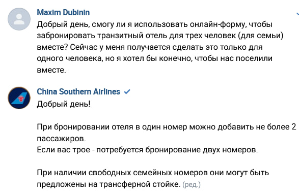
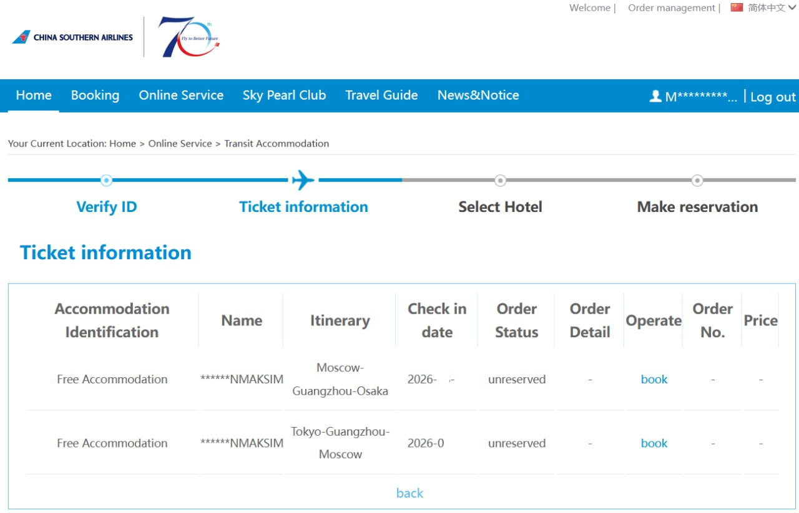
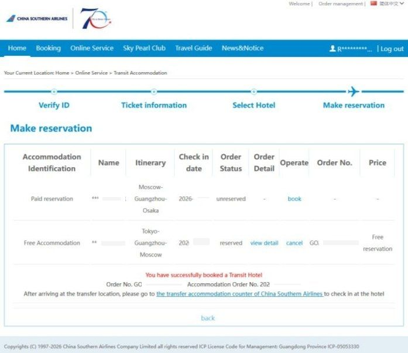

## Введение

Основная информация по онлайн бронированию бесплатного транзитного отеля с China Southern Airlines при полете через Гуаньчжоу aka "Борьба с китайской IT-энтропией".

Данный гайд поможет проверить, положен ли вам бесплатный транзитный отель и забронировать его **онлайн**, до поездки. Альтернатива - получить отель по прилете в Гуаньчжоу, этот вариант тут не рассматривается.

[Основная ссылка](https://www.csair.com/mcms/mcmsNewSite/en/cn/#/tourguide/transit_flow/free) с официальной информацией.

**Важно**: если вас - 3 и более человек и вы хотите заселиться вместе (семья), то такой вариант бронирования вам не подойдет. Для вас - заселение через стойку регистрации.

Не верьте службе поддержки trip.com, которая сходу отвечает что вам такой отель не положен.

Первая версия этой инструкции была опубликована в [wrenjapanchat](https://t.me/wrenjapanchat/2541389).

## Описание процесса

0\. Данная инструкция проверена и работает в браузере Mozilla Firefox (версии 153 и, вероятно, выше).

1\. Для бронирования онлайн нужно перейти по [ссылке Transit Hotel Reservation >>](https://extra.csair.com/content/transitHotel/index.html#/login?lang=en) (она же указана в конце официальной ссылки выше). Сначала откроется окно с формой Verify ID, но через пару секунд произойдет редирект (перенаправление) на окно входа. Для бронирования нужно войти.

2\. Для входа не пытайтесь запросить код на мобильный телефон +7, он не придет. Переключитесь на вход через email (ссылка Log in with email dynamic password).

3\. Дождитесь письма с кодом из 5 цифр (на gmail письмо с кодом приходит практически мгновенно). Скопируйте и вставьте код в поле Please enter VFRN Code. Нажмите Log in.

4\. Снова откройте [ссылку Transit Hotel Reservation >>](https://extra.csair.com/content/transitHotel/index.html#/login?lang=en). Вы окажетесь уже залогиненным.

5\. Заполнение формы:

5.1 номер билета вида 784-XXXXXXXXXX использовать не получится, он не будет находить пассажира. Используйте номер загранпаспорта (без пробелов)

5.2 Номер рейса вводится без букв CZ.

6\. В случае успеха экран будет выглядеть примерно так:

7\. Нужно выбрать сегмент путешествия и нажать Book. На следующем шаге (Select Hotel) можно будет выбрать отель.

8\. Там же можно будет добавить попутчика, если он есть. Нужно будет выбрать один из трех вариантов: 1. Добавить попутчика, 2. Дать согласие на совместное проживание с другими пассажирами в номере, 3. Повысить класс номера (за деньги).

9\. Окончательный результат выглядит примерно так (спасибо Игорю):

Надеюсь кому-нибудь сей занудный труд пригодится. Аригато за внимание 🇯🇵

## Заселение через стойку регистрации

Если забронировали онлайн или вас больше 2-х и не забронировали - вам нужно попасть на стойку регистрации.

Она находится около выхода 50 в зоне прилета (Arrivals). Там нужно постоять в очереди и показать свои документы. Всех соберут в кучу и отведут на трансферный автобус, он находится у выхода 42 в зоне отлета (Departures).

Автобус отвезет вас в отель Southern Airlines Perl.

## Вопросы?

Возникли вопросы, комментарии или есть полезная информация по теме заметки?

Можно [**написать в телеграм**](https://t.me/answer42geo/254) или оставить вопрос в форме ниже.
