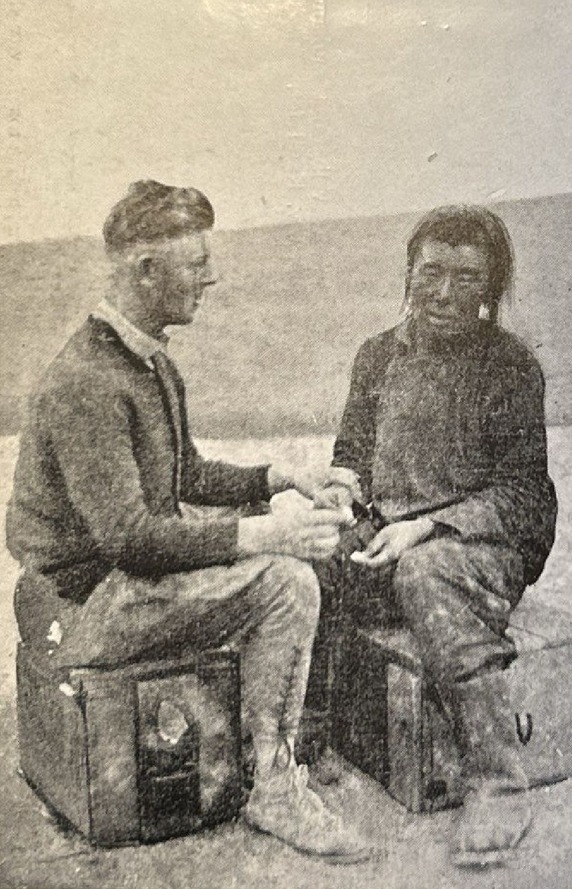

## Введение

Начало 20 века характеризуется популярностью теорий о

Путешественники того времени интересовались антропометрией и проводили измерения

## Хаслунд

> A couple of young men visiting our tent consented after minute explanations to go through the ordeal. But when Hummel opened his case and displayed the many shining instruments which were necessary for calculating the shape of the head and taking other measurements they slunk quickly away, leaving behind them the promised silver dollars.
>
> We had better luck with one proud soldier, for after I had egged him on by comparing him with the dauntless warriors of some imaginary race in the north, he wanted to demonstrate both his build and his courage. Sweating with concern he underwent a twenty minutes’ examination before a large and admiring audience. Finally Hummel was to take a specimen of his blood with a hypodermic needle. The fellow got his little prick, but we did not succeed in getting his blood, for this innocent operation gave rise to a hysterical yell and caused great commotion among the onlookers.
Before noon the news of our mysterious designs had spread over the whole monastery and the needle prick had become a bath of blood. For a long time Hummel and I sat outside our lent demonstrating needle pricks in our own fingers to show how innocuous they were, but we only got them ripped to bits without convincing a single Mongol.
>
> We were further from the goal than ever.
>
> It was clear that the anthropometric venture had not improved our chances of getting inside the temple walls. So Hummel packed up his fine instruments again and instead went out to collect riverside plants, insects and steppe-mosses. This gave rise to an animated discussion among the Mongols, but the calm conclusion of it was that the white men must be some sort of colleagues of the Chinese lark-catchers.

Перевод:

> Пара молодых людей, заглянувших в нашу палатку, после долгих объяснений согласилась пройти через это испытание. Но когда Хуммель открыл свой футляр и показал множество блестящих инструментов, необходимых для определения формы головы и проведения других измерений, они быстро улизнули, оставив после себя обещанные серебряные доллары.
>
> Больше повезло с одним гордым солдатом: после того как я подзадорил его, сравнив с бесстрашными воинами некоего вымышленного северного народа, он захотел продемонстрировать и своё телосложение, и свою храбрость. Обливаясь потом от волнения, он выдержал двадцатиминутный осмотр перед большой и восхищённой аудиторией. Наконец Хуммель должен был взять образец его крови при помощи гиподермической иглы. Солдат получил крошечный укол, но взять кровь нам не удалось, поскольку эта безобидная процедура вызвала у него истерический вопль и привела к большому переполоху среди зрителей.
>
> Ещё до полудня весть о наших таинственных замыслах распространилась по всему монастырю, а укол иглой превратился в настоящую кровавую баню. Долгое время мы с Хуммелем сидели снаружи нашей палатки, демонстрируя уколы иглой в собственные пальцы, чтобы показать, насколько они безвредны, но нас лишь едва не растерзали, так и не убедив ни одного монгола.
>
> Мы были дальше от цели, чем когда-либо.
>
> Было ясно, что антропометрическая затея нисколько не приблизила нас к возможности попасть за стены храма. Поэтому Хуммель снова упаковал свои изящные инструменты и вместо этого отправился собирать прибрежные растения, насекомых и степные мхи. Это вызвало оживлённое обсуждение среди монголов, но его спокойный итог свёлся к тому, что белые люди, должно быть, являются чем-то вроде коллег китайских ловцов жаворонков.

Фотография из книги Henning Haslund-Christensen, 1935. Men and Gods in Mongolia (Zayagan) ([все фотографии](/notes/haslund-zajagan-photos/)):

Hver Gang jeg forsøgte at tage Blodprøver paa Mongolerne saa de ulykkelige ud. Bergman fot.

Каждый раз, когда я пытался брать у монголов пробы крови, они выглядели несчастными. Фото Бергмана.

## Рерих

> It is as yet impossible to determine what people constructed the Leh graves. Dr. Francke believes them to have been Dards. (20) All the skulls so far discovered were distinctly dolichocephalic, whereas modern Tibetans of Ladak are brachycephalic. The Tibetans are a composite race, and I have collected during my stay among the nomads of Tibet a number of facts which show that there once existed an ancient stratum of dolichocephalic population in Tibet. The nomad tribes of the Tibetan border country still show dolichocephalic and brachycephalic indexes. The results of my investigations can be summarized thus: the Hor-pas of the Thang La region --- mostly dolichocephalic; the Panags, Goloks, and Nya-rong-was --- numerous dolichocephalic skulls, the same being true of the Northern Kham Province; the Chang-pas of the lake region --- mostly brachycephalic indexes, some showing a transitional type; the agricultural population of the Brahmaputra Valley and south-eastern Tibet --- mostly brachycephalic indexes. It is clear from the above that the dolichocephalic population had been preserved along the Tibetan border, whereas the center of the country had been conquered at some early date by a brachycephalic race. I am inclined to think that the graves at Teu-gser-po were left by the ancient stratum of dolichocephalic tribes of Tibet. It is interesting to note that the Leh graves are popularly called "nomad graves," and it is precisely among the nomad population that we find the dolichocephalic type with fine features and straight hair. Unfortunately the missionaries were obliged to stop their excavations and a great many of these graves are still unexplored. It will be very instructive to compare the Ladak graves to the analogous graves found in the lake region north of the Trans-Himalayas.
