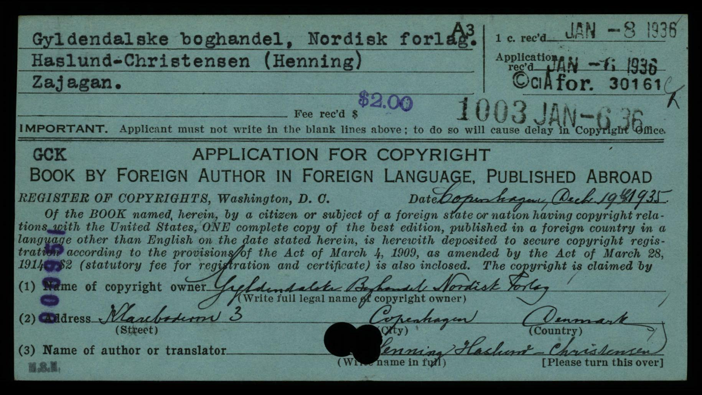
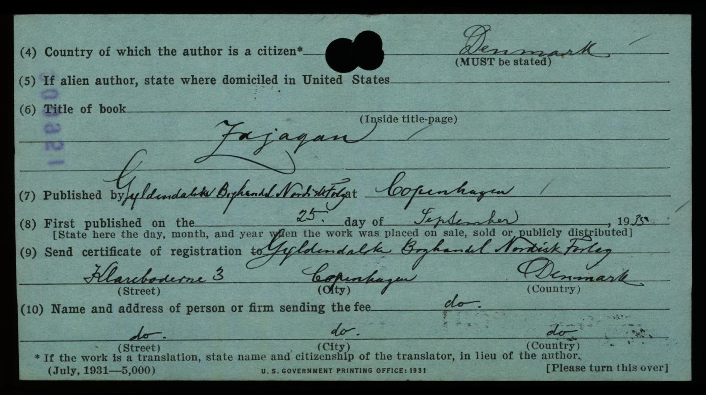

## Введение

Попытка разобраться в правах на издание русскоязычного перевода книги Хаслунда - Заяган.

Есть доступ к изданиям 1935 (английский язык, [полный текст](/notes/haslund-zajagan-en/)) и 1947 (датский язык). По идее, сроки давние и книга должна быть в Public domain, но здесь выясняем так ли это.

Кроме оригинального текста и перевода, нужно иметь в виду, что в книге [много фотографий](/notes/haslund-zajagan-photos/). Список фотографий разный в разных изданиях, есть фото в одном отсутствующие в другом и наоборот. Авторов фотографий несколько (не только сам автор):

* Ambolt (Nils Ambolt [Sw. 1928-33])
* Bergman (Folke Bergman [Sw. 1927-28 + 1928-33 + 1933-34])
* Lieberenz, 9. Paul Lieberenz
* Ludlow, F. (L. Ludlow в EN издании)
* Hempel (Claus Hempel [Ger. 1927-28 + 1928])
* Hummel (David Hummel [Sw. 1927-28 + 1928-31 + 1933-34])
* Kaull, v. (Kaull, Bodo v.)
* Mannerheim, G.
* Sv. D.
* Zimmerman (Eduard Zimmerman [Ger. 1927-28 + 1928-29])

Первая фамилия - то как упомянуты фотографы в книгах, в скобках информация об [участниках экспедиций Свена Гедина](https://svenhedinfoundation.org/hedins-co-workers/) и даты участия в квадратных скобках. Если в скобках ничего нет, то информации в перечне об этом человеке нет. Сам Хаслунд в перечне указан так: Henning Haslund-Christensen [Dan. 1928-30]

В переписке персональные данные: имена, почта, телефоны заменены на ---.

## Зарегистрированный копирайт

<https://publicrecords.copyright.gov/application-card/card_catalog_CC18981937GW-GZ.1478>

* Title of Work: Zajagan
* Record type: registration
* Registration Number: A for. 30161
* Claimant: Gyldendalske Boghandel Nordisk Forlag
* Author: [?enning] Haslund - Christensen
* Work Type: Book
* Application Received Date: 1936-01-06
* Deposit Received Date: 1936-01-08
* Fee Received Date: 1936-01-06
* First Published Date: 1935-09-25
* Publisher Name: Gyldendalske Boghandel Nordisk Forlag
* Drawer Name: GW-GZ
* Card Name: CC18981937GW-GZ.1478a.jpg, CC18981937GW-GZ.1478b.jpg

## Основная информация об изданиях и издателях

### Gyldendal

Издание на датском языке:

> Haslund-Christensen Henning, 1947. Zajagan. Gyldendanske Boghandel Nordisk Forlag. København.

Издатель: Gyldendanske Boghandel Nordisk Forlag, Дания

Сайт: <https://www.gyldendal.dk>

**Базовые контакты**

Gyldendal Group Agency:

* <https://www.gyldendal.dk/gyldendal/gyldendal-group-agency>
* <gyldendal@gyldendal.dk>

### Dutton & co//Penguin

Издание на английском языке:

> Henning Haslund-Christensen, 1935. Men and Gods in Mongolia (Zayagan). Translated from Swedish by Elizabeth Sprigge and Claude Napier. New York: E.P. Dutton & co.

Издатель: E.P. Dutton & co, США. В настоящее время - часть издательского дома Penguin Group ([ru-wiki](https://en.wikipedia.org/wiki/E._P._Dutton)).

> E. P. Dutton is an American book publishing company. It was founded as a book retailer in Boston, Massachusetts, in 1852[1] by Edward Payson Dutton. Since 1986, it has been an imprint of Penguin Group.

Сайт: <https://www.penguin.com/dutton-overview/>

**Базовые контакты**

Penguin:

* Subsidiary Rights <https://www.penguin.com/welcome-to-the-rights-desk/>
* <ecustomerservice@penguinrandomhouse.com>
* RH Subrights (which includes reprinting a whole book, translation rights and film rights): <randomrights@penguinrandomhouse.com>

### Etnografiska musee

База данных по фотографиями экспедиций Свена Гедина.

**Базовые контакты**

* <bildarkiv@etnografiska.se> - на запросы на этот адрес отвечают с адреса <image-request@varldskulturmuseerna.se>
* <info@svenhedinfoundation.org> - [тут](https://svenhedinfoundation.org/copyright/#), просят сюда копировать запросы

## Переписка с Gyldendal

Отвечает:

> Head of Agency / Literary Agent  
> Mail: --- ---  
> Direct Phone: --- ---  
> Mobile: --- ---
>
> Gyldendal Group Agency  
> Klareboderne 3 / DK- 1001 Copenhagen K / Denmark  
> <www.gyldendalgroupagency.dk>

Запрос 1:

> I am writing to inquire about the translation rights for Henning Haslund-Christensen's book "Zajagan" (originally published in 1935). I plan to translate this book from the Danish edition, which was published by Gyldendanske Boghandel Nordisk Forlag in 1947.
>
> As the book was originally published in 1935, I understand the original text may be in the public domain, but I would like to clarify whether the Danish translation published in 1947 is still protected by copyright. If so, I would appreciate guidance on how to obtain permission to use this translation for my new project.

Ответ 1:

> Thank you for your mail.
>
> Henning Haslund-Christensen’s work Zajagan is in public domain, so you are welcome to translate from the original Danish manuscript.

Запрос 2:

> Can you please also let me know if you have any information on the source of photos published in the book? May be the Gyldendal has some version of them to be reused for new translation?

Ответ 2:

> I’m afraid we cannot help with the illustrations, photos or any of the content. We simply don’t have any access for it.

Запрос 3:

> 1935 edition has number of photographs made by different people. When you mentioned that the book is in Public domain, do I understand that this includes both text and pictures?

Ответ 3:

> I’m afraid I don’t have any further information, other than that the text itself is considered in the public domain. The rights to each photograph are held by the individual photographer, and the rights status depends on when the photographer passed away.

## Переписка с Penguin

Отвечает:

> Subsidiary Rights Associate

Запрос 1:

> Before submitting an official request via the publisher, I would like to clarify whether rights must be acquired for the translation and publication of the following book:
>
> Henning Haslund-Christensen, 1935. Men and Gods in Mongolia (Zayagan). Translated from Swedish by Elizabeth Sprigge and Claude Napier. New York: E.P. Dutton & Co.
>
> As this edition is itself a translation, would it be necessary to also contact the publisher of the original work for rights, or does the translation publisher hold exclusive rights for subsequent editions?

Ответ 1:

> Please contact the Permissions / Subrights Department using the information provided below.
>
> EMAILS:
>
> For Random House Permissions: <Permissions@penguinrandomhouse.com>
>
> For RH Subrights (which includes reprinting a whole book, translation rights and film rights): <randomrights@penguinrandomhouse.com>
>
> WEBSITE INFORMATION:
>
> For Penguin Permissions: <https://permissions.penguinrandomhouse.com/>
>
> For Penguin Subrights (which includes reprinting a whole book, translation rights and film rights): <http://www.penguin.com/subrights/>
>
> *Request generally take 6-8 weeks*

Запрос 2 (копия на <randomrights@penguinrandomhouse.com>)

Ответ 2:

> I’m afraid that, due to its age, we don’t have any record of it in our system and are therefore unable to confirm the rights status.
>
> Routledge seems to have published an edition recently, though, and may be able to point you in the right direction.
>
> <https://www.routledge.com/Men-and-Gods-in-Mongolia/Haslund/p/book/9780367139599>
>
> You can find the proper contact here:
>
> <https://www.routledge.com/contacts/rights-and-permissions/rights-licensing>

## Переписка с Etnografiska musee

Отвечает:

> Digitization assistant, Collections / Image request
>
> <www.varldskulturmuseerna.se>

Запрос 1:

> I am preparing a translation of Henning Haslund-Christensen’s book Zajagan (Gyldendalske Boghandel Nordisk Forlag, Copenhagen, 1947), and I am trying to identify and obtain high-quality scans of the photographs used in the book for a potential illustrated edition.
>
> Many of the images in Zajagan are credited to photographers connected with the Sino-Swedish Expedition and related fieldwork in Inner Mongolia / North China (late 1920s–early 1930s). I would like to locate the best available source files and clarify licensing for publication.
>
> As an example to help orient the search, one of the captions I am tracking is:
“The grottoes of Yün Kang” (often credited as Photo: Paul Lieberenz; Sino-Swedish Expedition period, c. 1927–1930).
>
> My request is broader than this single image: I would like help identifying as many photographs from Zajagan as possible that are held in your collections (or collections you can point me to), and obtaining publication-quality digital files.
>
> Could you please advise:
>
> 1\. Whether your archive holds photographs that match the images/captions from Zajagan, and how best to search for them;
>
> 2\. The process for submitting a list of captions/pages for identification (I can provide a full list or scans of the relevant pages);
>
> 3\. Are digital files available (resolution, format)
> 4\. Licensing options and rights information for publication in a translated book (print and e-book)
>
> If helpful, I can immediately send:
>
> * a complete list of captions and page numbers from Zajagan,
>
> * reference scans of the illustration pages,
>
> and any known photographer credits (e.g., Paul Lieberenz, Folke Bergman, etc.).

Ответ 1:

> We have 23 images tagged with Paul Lieberenz, 21 of them taken by himself: <https://tinyurl.com/55k5pzuc>.
>
> We have 579 images from Sven Hedin´s 4th Central Asian expedition (1927-1935): <https://tinyurl.com/4ek9mvmw>. Hopefully you can find "The grottoes of Yün Kang" or other images published in Zajagan.
>
>If you find the images you require, kindly let us know the image numbers.

Запрос 2:

> I looked through all of photots from both links, however, none of them match Zajagan ones.
>
> Book lists 9 photos attributed to Lieberenz,  no overlap with 21 from your link. Also, there are 100+ photos in Zajagan total and none match the 579 of 4th Central Asian photos collection.
>
> Zajagan takes place in 1927 and 1928 but the number of photos from these years are very small compared to 1930s among these 579.
>
> I wonder if there another major collection of photos from 1927 and 1928?

Ответ 2:

ждем

## Комментарии

[**Обсудить**](https://t.me/answer42geo/170)
