## Введение

Здесь собраны фотографии из книги датского путешественника Хеннинга Хаслунда-Кристенсена --- Заяган (Zajagan). Фотографии, иллюстрации и подписи к ним приведены по изданию 1947 г. на датском языке, а так же по [изданию 1935 г.](/notes/haslund-zajagan-en/) на английском языке. Перевод - мой.

Библиографическая ссылка:

> Haslund-Christensen Henning, 1947. Zajagan. Gyldendanske Boghandel Nordisk Forlag. København.

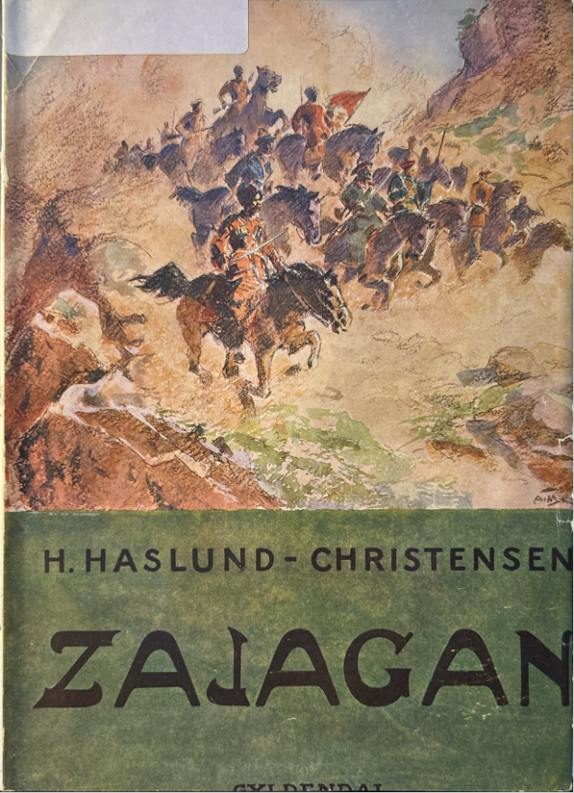

Представленные фото не всегда удовлетворительного качества и приводятся скорее для индекса.

## Разница фото в разных изданиях

Необходимость в этом заметке возникла, так как в изданиях этой книги на разных языках разное количество фотографий.  И наоборот, в издании на английском языке есть фотографии, которых нет в датском.

DA издание - 95 фотографий и иллюстраций. Списка иллюстраций - нет.

[EN издание](/notes/haslund-zajagan-en/) - 56 фотографий и иллюстраций. Список иллюстраций - ниже.

Есть в DA издании, но нет в EN - 42. Например, [Замок Джа-ламы](#пустынная-крепость-дамбиджанцана).

Есть в EN издании, но нет в DA - 6. Например, "[Молодые торгуты](#молодые-торгуты)".

Некоторые фото значительно различаются между изданиями. Например, [Гуртум](#гуртум).

## Список иллюстраций из англоязычного издания

Англоязычные подписи и перевод с них к конкретным фотографиям ниже приведены по изданию 1935 г. на английском языке [PDF 1](https://www.tsemrinpoche.com/download/Biographies-Autobiographies-Works/en/Henning%20Haslund%20-%20Men%20and%20Gods%20in%20Mongolia.pdf), [PDF 2](https://drive.google.com/file/d/1tUvmZmF5oSsQqcHPF09cjcixSu2_3NmQ/view?usp=sharing), [полный текст издания](/notes/haslund-zajagan-en/).

Библиографическая ссылка:

> Henning Haslund-Christensen, 1935. Men and Gods in Mongolia (Zayagan). Translated from Swedish by Elizabeth Sprigge and Claude Napier. New York: E.P. Dutton & co.

Нажмите на ссылку в колонке Страница, чтобы перейти к фотографии.

| Название                                                                                         | Страница     |
|--------------------------------------------------------------------------------------------------|--------------|
| His Holiness Seng Chen Gegen, fifth reincarnation of the Tiger god and ruler of all the Torguts. Commander of the Royal Vasa Order, second class. 1884–1932 | [Frontispiece](#его-святейшество-син-чин-геген) |
| The grottoes of Yün Kang                                                                         | [4](#гроты-юньган)            |
| The grottoes of Yün Kang                                                                         | [5](#гроты-юньган)            |
| Yolros Lama. *Photo Lieberenz*                                                                   | [32](#джолрос-лама)           |
| Shirup Geling with Yolros Lama's dog. *Photo Lieberenz*                                          | [32](#шируп-гелинг)           |
| "The Festival place lay bathed in sunlight . . ." *Photo Lieberenz*                              | [40](#праздничная-площадь-под-палящим-солнцем)           |
| "On the south side the monastery orchestra was stationed"                                        | [48](#оркестр-располагался-на-южной-стороне)           |
| Tsagan Oborgon, "The white old man" *Photo Hummel*                                               | [48](#цаган-обогон-белый-старец)           |
| "One of the last to go up to Maidari was my little old woman . . ."                              | [49](#образ-майдари---старая-женщина)           |
| The twenty-four *Shanag*. *Photo Hummel*                                                         | [49](#двадцать-четыре-шанага)           |
| Gurtum. *Photo Zimmerman*                                                                        | [60](#гуртум)           |
| Consorts of the Chief and curious Princesses                                                     | [60](#жёны-вождей-и-любопытные-принцессы)           |
| Leave-taking from Lamas and Chiefs at Bater Halak Sume. *Photo Lieberenz*                        | [61](#прощание-с-ламами-и-вождями-в-батер-халак-суме)           |
| The Mongolian Monastery of Baying Shandai Sume. *Photo Lieberenz*                                | [72](#монгольский-монастырь-байин-шандай-суме)           |
| The Expedition's camels assembled before the start from Hojertai-gol. *Photo Lieberenz*          | [128](#верблюды-экспедиции)          |
| The genesis of "Long Snake." *Photo Lieberenz*                                                   | [129](#процесс-создания-длинного-змея)          |
| Landing of the boat expedition after the voyage on Socho-nor. *Photo Lieberenz*                  | [129](#высадка-лодочной-экспедиции)          |
| "In the red cloud of dust a dense mass of galloping horsemen." *Photo Hempel*                    | [160](#тяжёлые-силуэты-всадников)          |
| Mongrolda Noyen, the young leader of the Khoshut Mongols with his bodyguard                      | [161](#монгрольде-нойон-с-личной-охраной)          |
| Tsagechin Beile                                                                                  | [161](#цагечин-бейле-в-родовой-одежде)          |
| A Mongol salutes his Chief                                                                       | [168](#монгол-приветствует-своего-вождя)          |
| Sart Musicians. *Photo Bergman*                                                                  | [184](#сартские-музыканты)          |
| The Sart *aksakal* and Chinese *amban*. *Photo Bergman*                                          | [184](#сартский-аксакал-и-китайский-амбань)          |
| The Däde Mongols' *Khuruldei*. *Photo Bergman*                                                   | [185](#хурул-даде-монголов)          |
| After the hunt                                                                                   | [185](#после-охоты)          |
| Seng Chen's earthly father, Tu-yen Meng-ku khan                                                  | [188](#отец-син-чина)          |
| A Charklik beauty                                                                                | [188](#чаркликская-красавица)          |
| "Dressed in an ample cloak of lynx skin he was sitting against the background of a black rug on which the image of a ferocious tiger was inwoven." *Photo Bergman*  | [192](#вождь-даде-монголов)          |
| Camel transport across the river. *Photo Bergman*                                                | [193](#перевозка-верблюдов-через-реку)          |
| Torgut soldier                                                                                   | [193](#торгутский-воин)          |
| "Arselan Consul"                                                                                 | [224](#консул-арселан)          |
| Mongrolda Noyen                                                                                  | [224](#монгрольде-нойон)          |
| "The red Standard"                                                                               | [225](#красный-стандарт)          |
| Shiri, who "commanded the gliding, soaring and falling of the notes like a proud eagle on the wing"| [240](#шири)   |
| Torgut married women                                                                             | [240](#замужние-торгутские-женщины)          |
| The Torgut Regent's *bator* ready for battle. The horses are trained to throw themselves on the ground as cover for their riders | [241](#батыры-торгутского-регента)          |
| Baldan *gusdä*, the Regent, Lodong *chanse*, Lyrup *chanse*                                      | [244](#балдан-гусда-регент-лодонг-и-люруп)          |
| Torgut Cavalry Acrobatics. *Photo Hempel*                                                        | [245](#торгутская-конная-акробатика)          |
| Seng Chen Gegen, Lodong and Lyrup. *Photo Ambolt*                                                | [248](#лодонг-син-чин-геген-и-люруп)          |
| Young Torguts. *Photo Ambolt*                                                                    | [249](#молодые-торгуты)          |
| Inhabitants of Temerlik. *Photo Bergman*                                                         | [252](#жители-посёлка-темирлик)          |
| Torgut camp. *Photo Ambolt*                                                                      | [252](#торгутский-лагерь)          |
| Torgut Chiefs (*merin* and *gusdä*)                                                              | [253](#торгутские-вожди-мерин-и-гусда)          |
| Dambin Jansang the adventurer who revived the savagery of ancient times on the steppes           | [253](#дамбиджанцан--авантюрист-и-его-подпись)          |
| The Dongtse Monastery in Tibet, Seng Chen's spiritual home. *Photo F. Ludlow*                    | [256](#монастырь-дунцзе-в-тибете)          |
| Painting of Obish Khan                                                                           | [257](#картина-с-изображением-обиш-хана)          |
| Tibetan High Lama. *Photo Hummel*                                                                | [257](#тибетский-великий-лама)          |
| Fresco in the Dongtse Monastery representing Seng Chen's spiritual father, the Tiger god's fourth reincarnation. *Photo F. Ludlow*| [280](#фресковая-роспись-в-монастыре-дунцзе)          |
| Torgut Temple Tent. From Pallas' "*Sammlungen historischer Nachrichten über die mongolischen Völkerschaften*", *St. Petersburg*, 1776    | [281](#храмовая-юрта-торгутов)          |
| The author with Lamaistic philosophers                                                           | [304](#автор-в-обществе-ламаистских-философов)          |
| "Baredo soldep" (Tibetan prayer)                                                                 | [312](#тибетская-молитва)          |
| Corner of *gegen-ni-ordo* after its erection in Stockholm. *Photo Sv. D.*                        | [320](#часть-геген-ни-ордо)          |
| Interior of *gegen-ni-ordo* on its erection at Urumchi                                           | [320](#интерьер-геген-ни-ордо-при-стоянке-в-урумчи)          |
| The three thrones in the Khan's Tent of the Torguts                                              | [320](#три-трона)          |
| "Tsagachin Beile often appeared in an ill-fitting Russian costume"                               | [320](#цагечин-бэйле-в-русском-костюме)          |
| Baldan *Gusdä*                                                                                   | [321](#балдан-гусда)          |
| Map                                                                                              | [328](#карта)          |

## Все фотографии

Фотографии из обоих изданий.

* "DA" - подпись на датском из издания 1947 г.
* "EN" - подпись на английском из издания 1935 г.
* "RU" - перевод на русский автора заметки.

### Его Святейшество Син Чин Геген

, Tigergudens femte Reinkarnation og alle Torguters Hersker. Kommandør af den svenske Vasaordens 2. Klasse.")

DA: Hans Hellighed *Sin Chin Gegen* (1884-1932), Tigergudens femte Reinkarnation og alle Torguters Hersker. Kommandør af den svenske Vasaordens 2. Klasse.

EN: His Holiness Seng Chen Gegen, fifth reincarnation of the Tiger god and ruler of all the Torguts. Commander of the Royal Vasa Order, second class. 1884–1932

RU: Его Святейшество *Син Чин Геген* (1884–1932), пятая реинкарнация Тигриного бога и владыка всех Торгутов. Командор шведского ордена Вазы II класса.

### Гроты Юньган

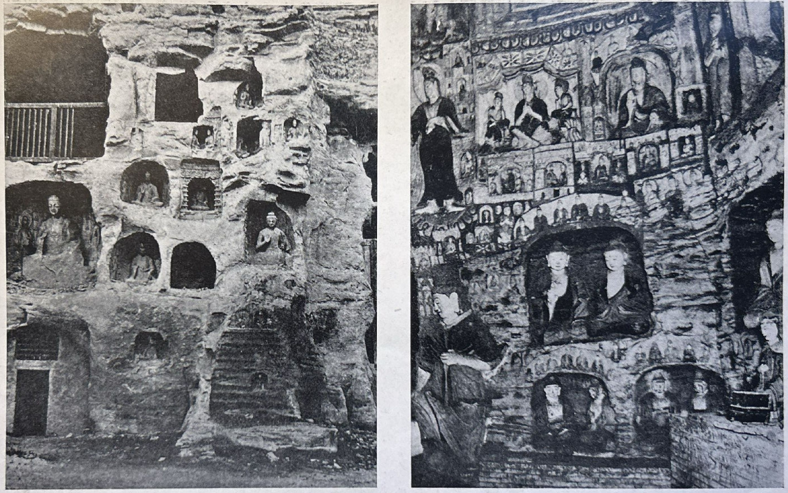

DA: *Yün Kang*-Grotterne.

EN: The grottoes of Yün Kang

RU: Гроты Юньган.

### Джолрос-лама

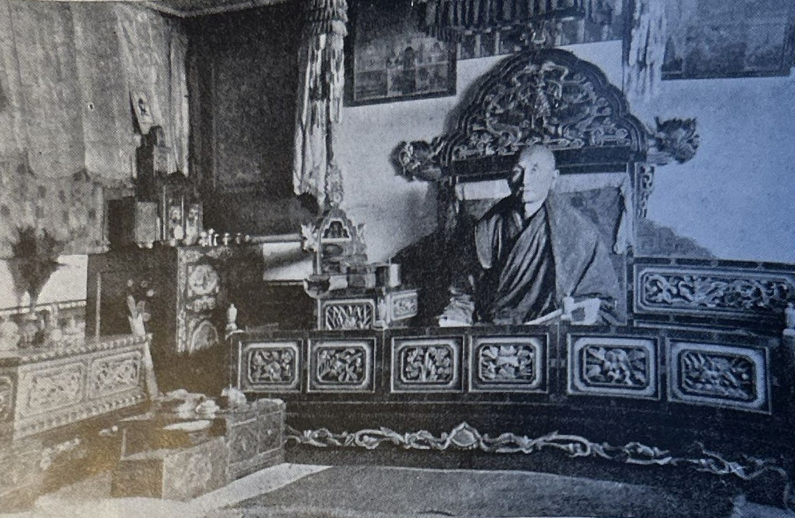

DA: Jolros Lama. Lieberenz fot.

EN: Yolros Lama *Photo Lieberenz*

RU: Джолрос-лама. Фото Либеренца.

### Шируп-Гелинг

DA: Shirup Geling med Jolros Lamas Hund. Lieberenz fot.

EN: Shirup Geling with Yolros Lama's dog. *Photo Lieberenz*

RU: Шируп-Гелинг с собакой Джолрос-ламы. Фото Либеренца.

### Паломники перед резиденцией Джолрос-ламы

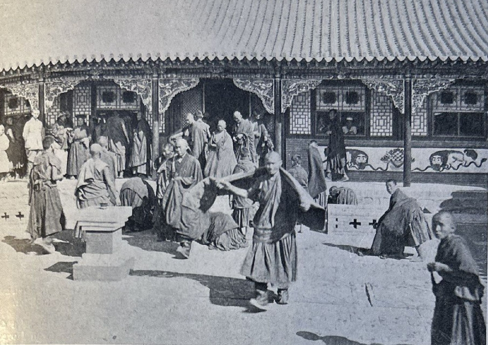

DA: Bodsøvende foran Jolros Lamas Bolig. Lieberenz fot.

EN: фото нет в англоязычном издании 1935 г.

RU: Паломники перед резиденцией Джолрос-ламы. Фото Либеренца.

### Праздничная площадь под палящим солнцем

DA: „Festpladsen laa hen i bagende Sol...“ Lieberenz fot.

EN: "The Festival place lay bathed in sunlight . . ." *Photo Lieberenz*

RU: «Праздничная площадь под палящим солнцем…». Фото Либеренца.

### Буга

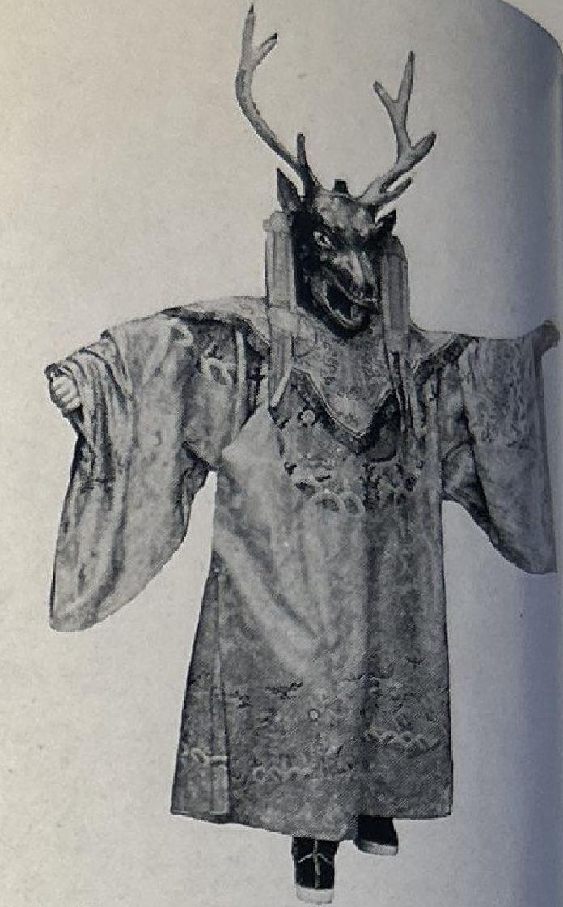

DA: „Buga“, en af Dødskongens Forløbere.

EN: фото нет в англоязычном издании 1935 г.

RU: «Буга», один из предвестников Царя Смерти.

### Оркестр располагался на южной стороне

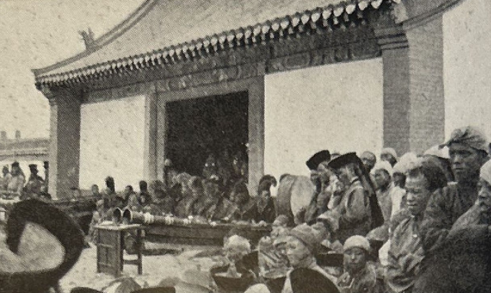

DA: „Orkestret var placeret i Syd“. (Øverst til venstre)

EN: "On the south side the monastery orchestra was stationed"

RU: «Оркестр располагался на южной стороне». (Вверху слева)

### Цаган Обогон, «Белый старец»

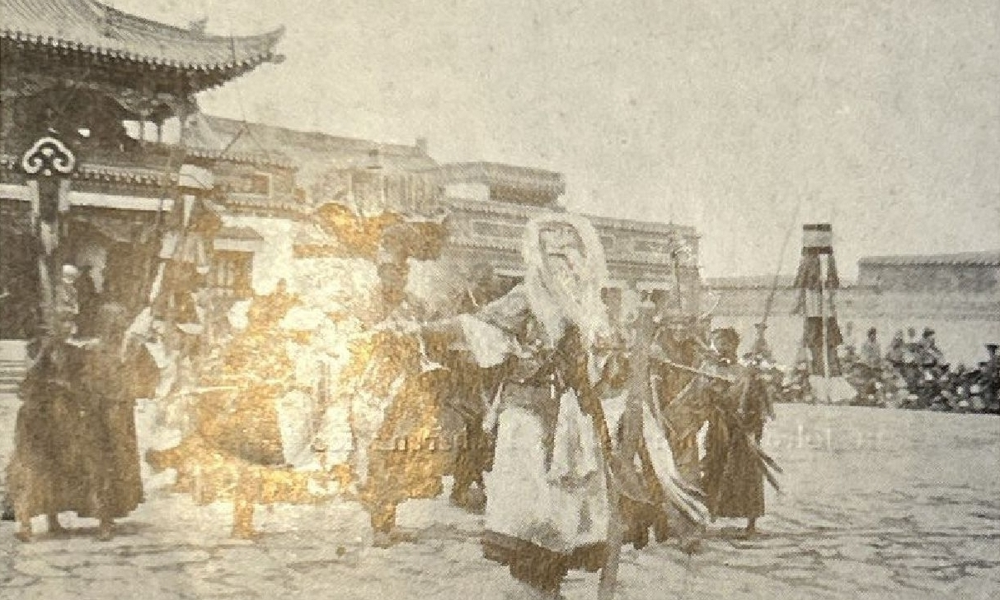

DA: Tsaghan Obogon, „Den hvide Olding“. Hummel fot.

EN: Tsagan Oborgon, "The white old man" *Photo Hummel*

RU: Цаган Обогон, «Белый старец». Фото Хуммеля.

### Образ Майдари

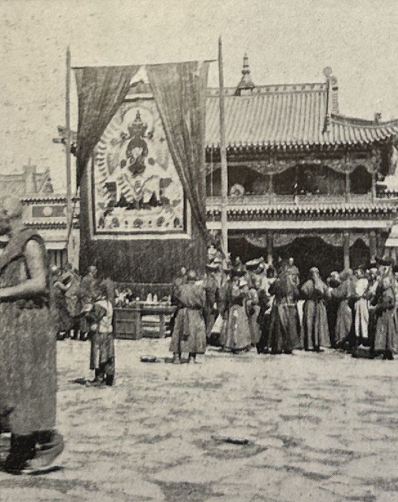

DA: „Fra det vajende Banner foran Hovedtemplet skuede den milde Maidaris Billede ned.“ (Nederst til venstre)

EN: фото нет в англоязычном издании 1935 г.

RU: «С развевающегося знамени перед главным храмом взирал вниз образ кроткого Майдари». (Внизу слева)

### Образ Майдари - старая женщина

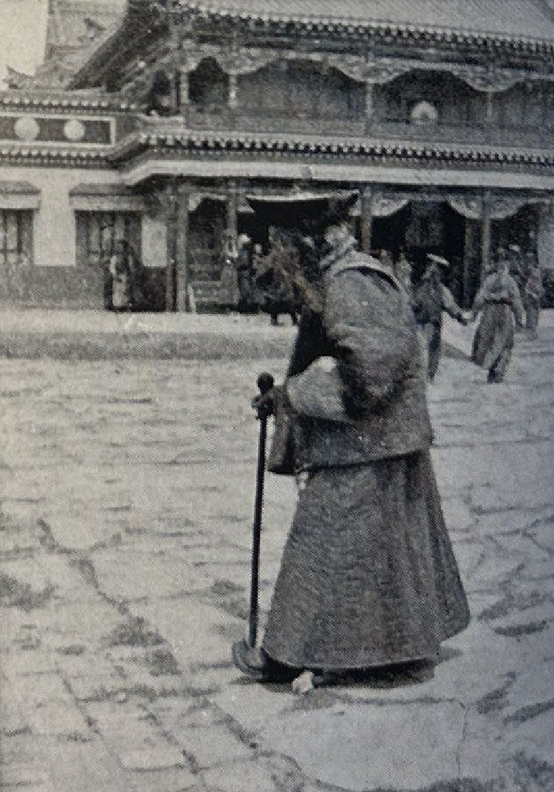

DA: „En af de sidste, der gik til Maidaris Billede var den lille gamle Kone ...“

EN: “One of the last to go up to Maidari was my little old woman . . .”

RU: «Одной из последних, кто подошёл к образу Майдари, была маленькая старая женщина…»

### Выветрившиеся руины Хара-Хото

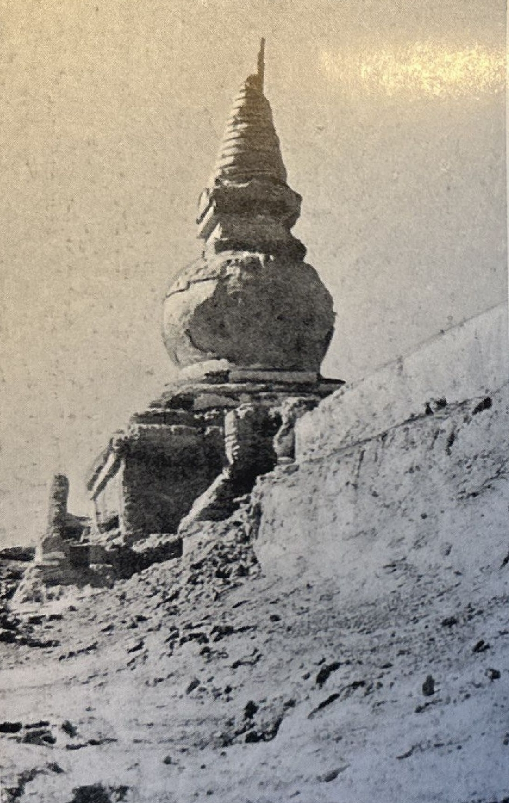

DA: Khara Khotos forvitrede Ruiner rejser sig endnu over Sandet. v. Kaull fot.

EN: фото нет в англоязычном издании 1935 г.

RU: Выветрившиеся руины Хара-Хото всё ещё возвышаются над песком. Фото фон Каулля.

### Хорошо сохранившийся мусульманский храм

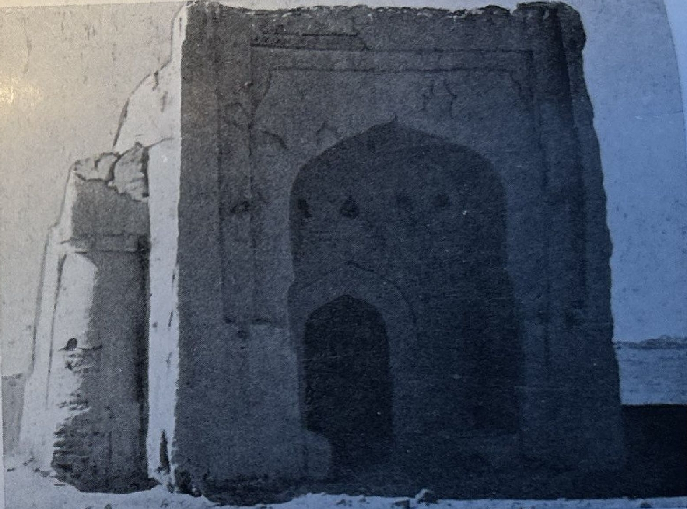

DA: „Et velbevaret muhammedansk Gudshus ligger beskyttet af den vestlige Bymur“. v. Kaull fot.

EN: фото нет в англоязычном издании 1935 г.

RU: «Хорошо сохранившийся мусульманский храм лежит под защитой западной городской стены». Фото фон Каулля.

### Эдзинские торгуты

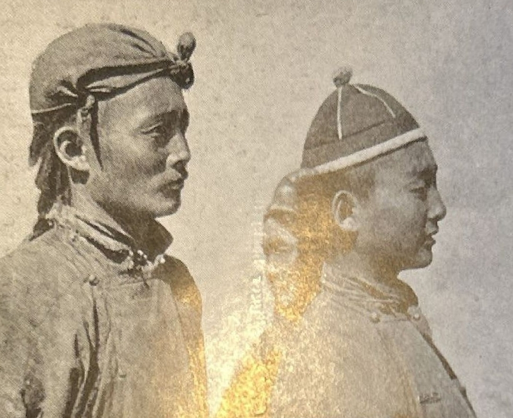

DA: Etsina-Torguter, Mand og Yngling. v. Kaull fot.

EN: фото нет в англоязычном издании 1935 г.

RU: Эдзинские торгуты: мужчина и юноша. Фото фон Каулля.

### Девушка эдзинский торгут

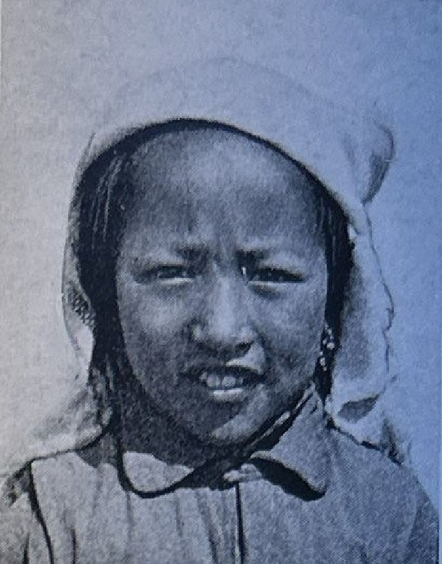

DA: Etsina-Torgut, Pige. v. Kaull fot.

EN: фото нет в англоязычном издании 1935 г.

RU: Девушка эдзинский торгут. Фото фон Каулля.

### Пробы крови

DA: Hver Gang jeg forsøgte at tage Blodprøver paa Mongolerne saa de ulykkelige ud. Bergman fot.

EN: фото нет в англоязычном издании 1935 г.

RU: Каждый раз, когда я пытался брать у монголов пробы крови, они выглядели несчастными. Фото Бергмана.

### Тангерт-Геген

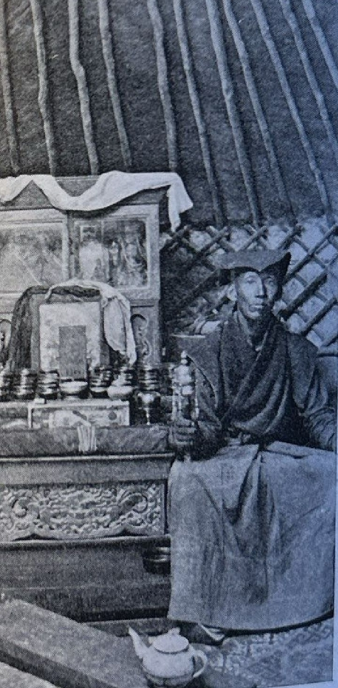

DA: Tangert Gegen.

EN: фото нет в англоязычном издании 1935 г.

RU: Тангерт-Геген.

### План Хара-Хото

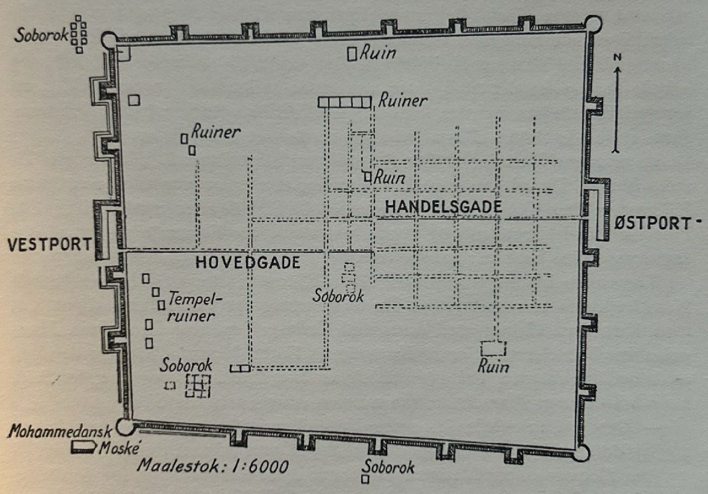

DA: Mure og forvitrede Rester rejser sig endnu over Sandet, trodsende den omgivende Ørkens mægtige og livsfjendske Stormløb. Et velbevaret muhamedansk Gudshus ligger endnu tilbage; beskyttet af den vestre Mur, paa graaviolette, stormomsuste Plateauer ses endnu Mærkerne efter Agerfelternes Vandingssystem, og paa utallige modellerede Lerkar fandt vi Fingeraftryk af de Mennesker, der havde formet dem.

I seks Sekler havde dette døde Menneskeminde slumret i Ørkenens Favntag, da Koslov i 1909 opdagede det for Vesterlandet.

EN: Scale Plann of the Ruins of Khara Khoto.

RU: Стены и выветрившиеся остатки всё ещё поднимаются над песком, бросая вызов могучему и враждебному жизни натиску окружающей пустыни. Хорошо сохранившийся мусульманский храм всё ещё стоит; под защитой западной стены, на серо-фиолетовых, обдуваемых бурями плато всё ещё видны следы оросительной системы полей, и на бесчисленных сформованных глиняных сосудах мы находили отпечатки пальцев людей, которые их лепили.

Шесть столетий эта мёртвая память о людях дремала в объятиях пустыни, пока Пётр Козлов в 1909 году не открыл её для Запада.

### Горы на горизонте

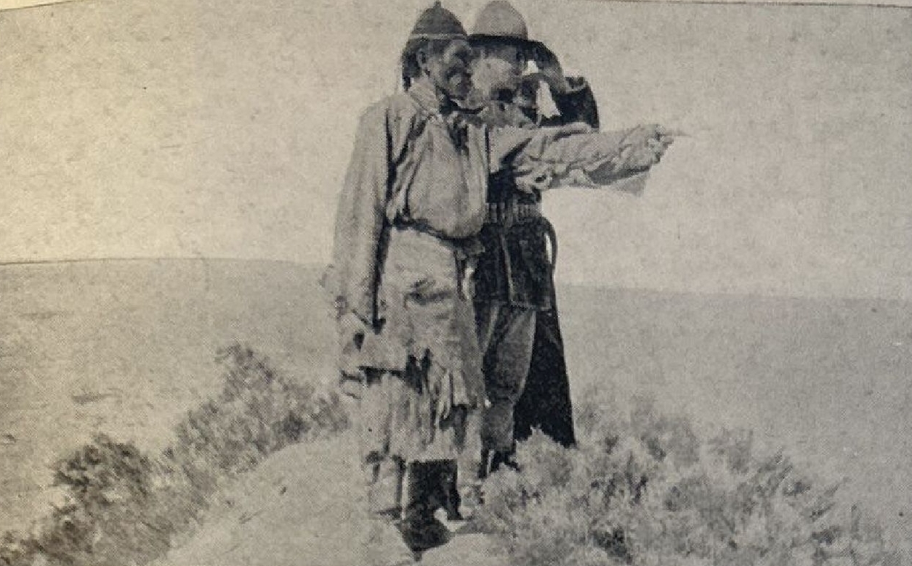

DA: Vor gamle Torgut-Vejviser udpegede de Bjerge i Horisonten, som i et langt Liv havde udgjort hans daglige Inspiration. Hummel fot.

EN: фото нет в англоязычном издании 1935 г.

RU: «Наш старый торгут-проводник указал на горы на горизонте, которые на протяжении долгой жизни ежедневно его вдохновляли». Фото Хуммеля.

### Процесс создания «Длинного змея»

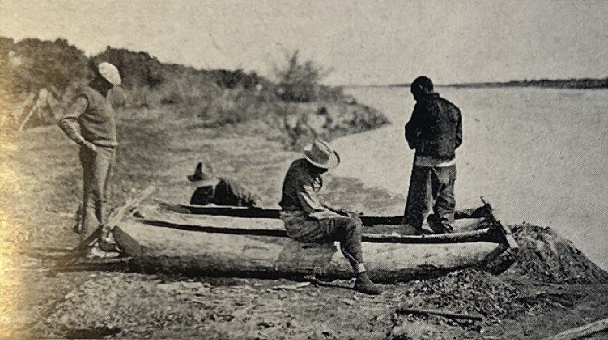

DA: „Ormen hin Lange“s Tilblivelse. Lieberenz fot.

EN: The genesis of "Long Snake." *Photo Lieberenz*

RU: Процесс создания «Длинного змея». Фото Либеренца.

### Высадка лодочной экспедиции

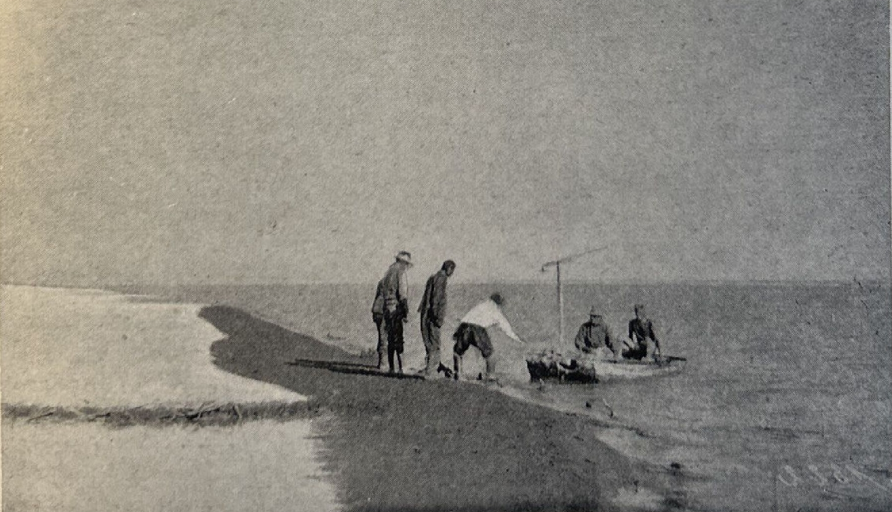

DA: Baadekspeditionens Landstigning efter Turen paa Socho-Nor. Lieberenz fot.

EN: Landing of the boat expedition after the voyage on Socho-nor. *Photo Lieberenz*

RU: Высадка лодочной экспедиции после плавания по Сочо-Нор. Фото Либеренца.

### Пустынная крепость Дамбиджанцана

DA: Dambin Djansangs Ørkenborg. Hembel fot.

EN: фото нет в англоязычном издании 1935 г.

RU: Пустынная крепость Дамбиджанцана. Фото Хембеля.

### Дамбиджанцан — авантюрист и его подпись

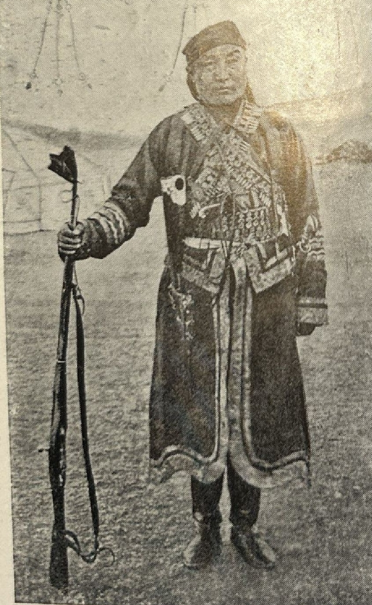

DA: Dambin Djansang, den Æventyrer, som lod vild Fortid opstaa paa Stepperne.

EN: Dambin Jansang the adventurer who revived the savagery of ancient times on the steppes

RU: Дамбиджанцан — авантюрист, ожививший дикое прошлое степей.

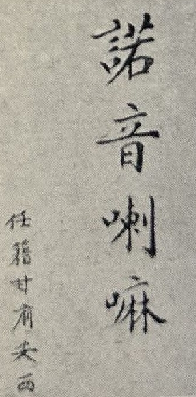

DA: Ved Siden lians Underskrift.

EN: изображение есть, но подписи - нет

RU: Рядом — его подпись.

### Тяжёлые силуэты всадников

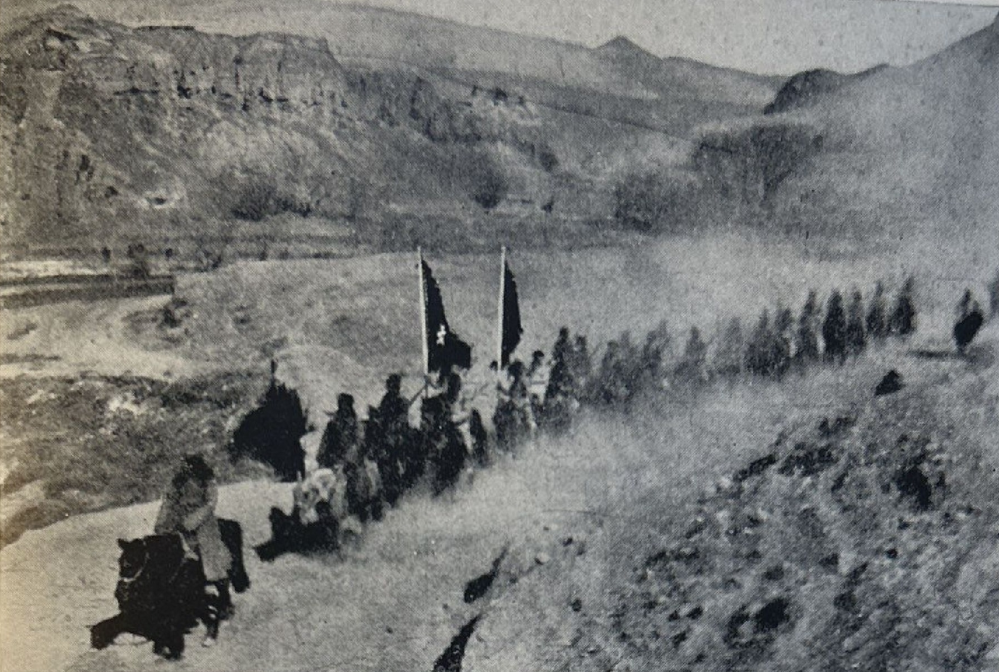

DA: „Rytternes tunge Silhouetter dukkede frem af den røde Sandtaage“. Hempel fot.

EN: "In the red cloud of dust a dense mass of galloping horsemen." *Photo Hempel*

RU: «Тяжёлые силуэты всадников возникли из красной песчаной дымки». Фото Хемпеля.

### Цагечин-бейле в родовой одежде

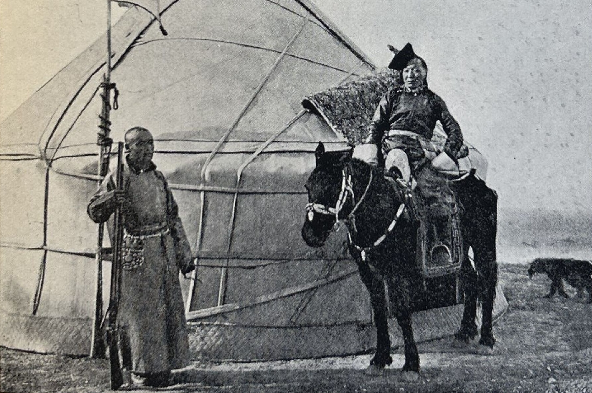

DA: Naar man saa Tsagechin Beile i sin Stammes Dragt, gjorde han Indtryk af at være en sand Nomadehøvding.

EN: Tsagechin Beile

RU: Когда Цагечин-бейле представал в родовой одежде, создавалось впечатление, что он настоящий кочевой вождь.

### Цагечин-бэйле в русском костюме

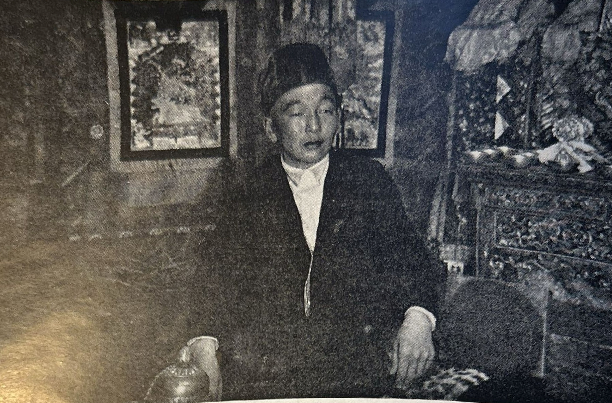

DA: Tsagechin Beile i russisk Dragt.

EN: "Tsagachin Beile often appeared in an ill-fitting Russian costume"

Цагечин-бэйле в русском костюме.

RU: "Цагечин-бэйле часто появлялся в плохо сидящем русском костюме"

### Монгол приветствует своего вождя

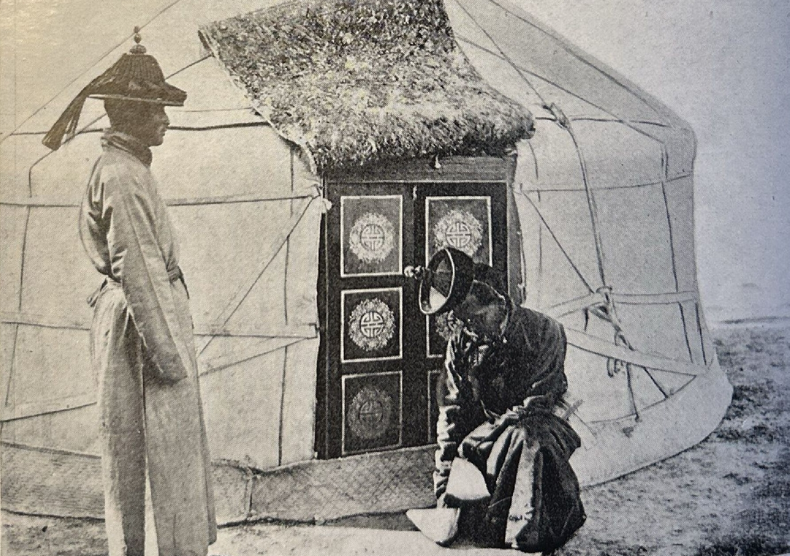

DA: Mongol hilser paa sin Høvding.

EN: A Mongol salutes his Chief

RU: Монгол приветствует своего вождя.

### Упряжь Дамбиджанцана

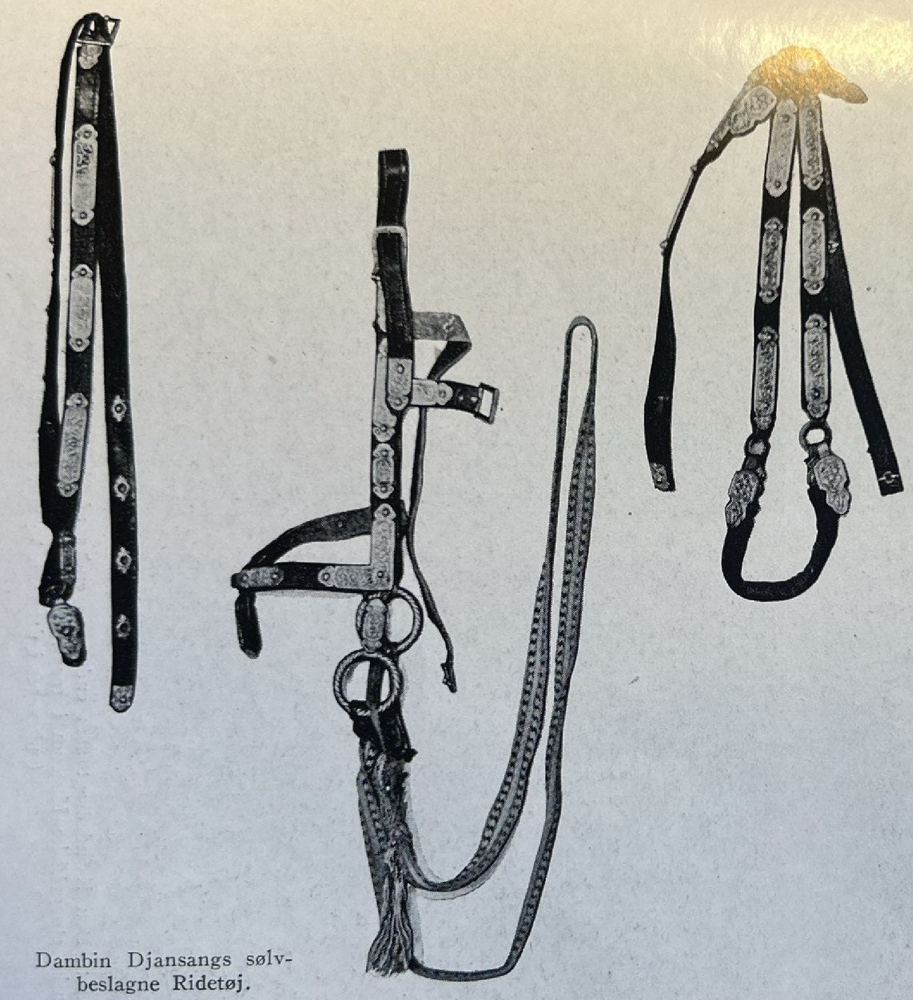

DA: Dambin Djansangs sølvbeslagne Ridetøj.

EN: фото нет в англоязычном издании 1935 г.

RU: Украшенная серебром упряжь Дамбиджанцана.

### Седло Дамбиджанцана

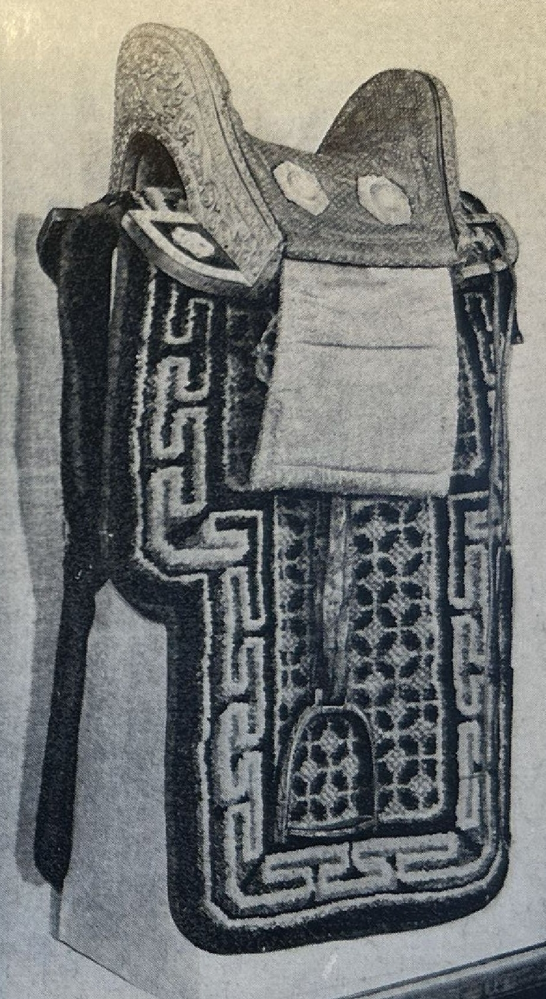

DA: Dambin Djansangs sølvbeslagne Sadel.

EN: фото нет в англоязычном издании 1935 г.

RU: Отделанное серебром седло Дамбиджанцана.

### Женская одежда

. Nederst: Kvindedragt hjemført af Løjtnan (opbevares i det svenske kgl. Livrustkammer).")

DA: Øverst: Den Kvindedragt som endnu anvendes at Tsagechin Beile-Stammen (hjemført til det svenske etnografiske Museum i 1929).  
Nederst: Kvindedragt hjemført af Løjtnan (opbevares i det svenske kgl. Livrustkammer).

EN: фото нет в англоязычном издании 1935 г.

RU: Вверху: женская одежда, которая до сих пор используется племенем Цагечин-бэйле (привезена в Шведский этнографический музей в 1929 году).  
Внизу: женская одежда, доставленная лейтенантом (хранится в Шведской королевской Оружейной палате).

### Тибетское нагорье

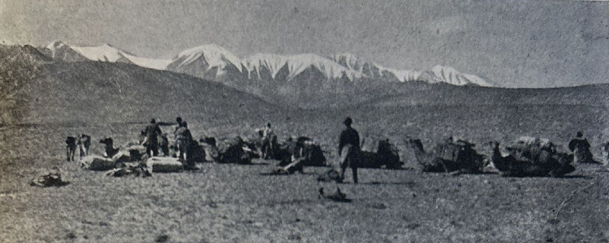

DA: I det tibetanske Højland. Bergman fot.

EN: фото нет в англоязычном издании 1935 г.

RU: Тибетское нагорье. Фото Бергмана.

### Могила Макеева у Таш-Давана

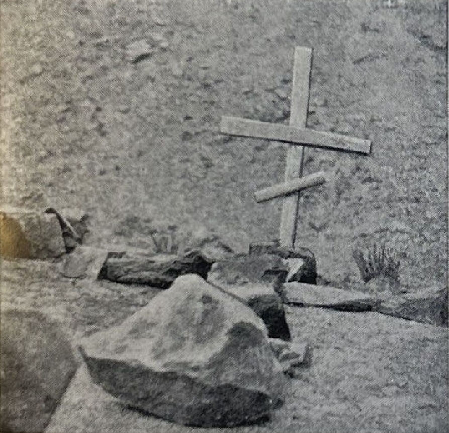

DA: Makejefs Grav ved Tash-Dawan.

EN: фото нет в англоязычном издании 1935 г.

RU: Могила Макеева у Таш-Давана.

### После охоты

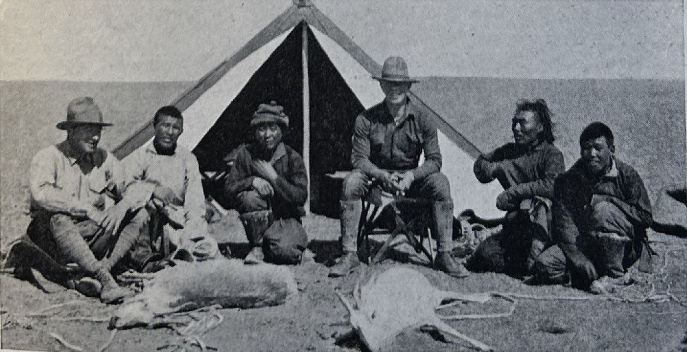

DA: Efter Jagten.

EN: After the hunt

RU: После охоты.

### Жители посёлка Темирлик

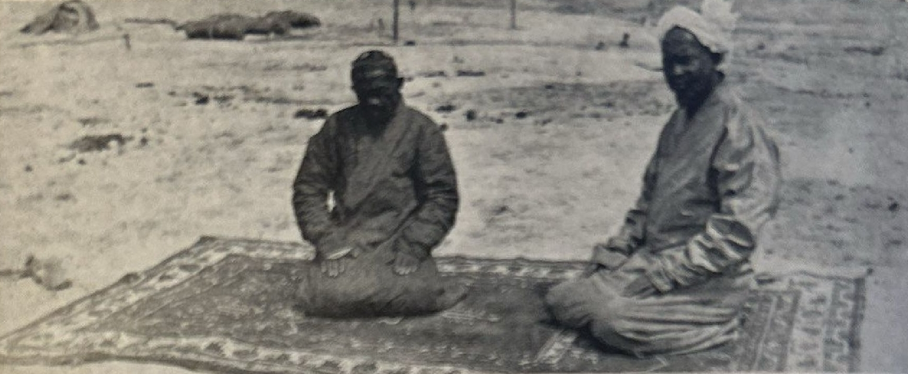

DA: Temirlik-boer. Bergman fot.

EN: Inhabitants of Temerlik. *Photo Bergman*

RU: Жители посёлка Темирлик. Фото Бергмана.

### Вождь даде-монголов

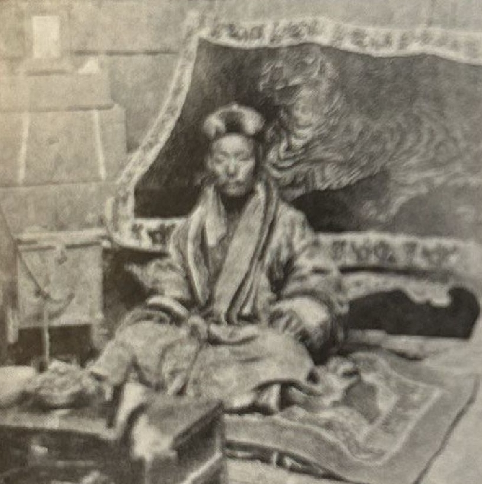

DA: Iført en vid losdyrsbræmmet Kappe sad *däde*-mongolernes Høvding mod en Baggrund af et sort Tæppe, hvori Billedet af en glubsk Tiger var indvævet. Bergman fot.

EN: "Dressed in an ample cloak of lynx skin he was sitting against the background of a black rug on which the image of a ferocious tiger was inwoven." *Photo Bergman*

RU: Одетый в широкую накидку, отороченную мехом рыси, вождь даде-монголов сидел на фоне чёрного ковра, с вытканным образом хищного тигра. Фото Бергмана.

### Хурул даде-монголов

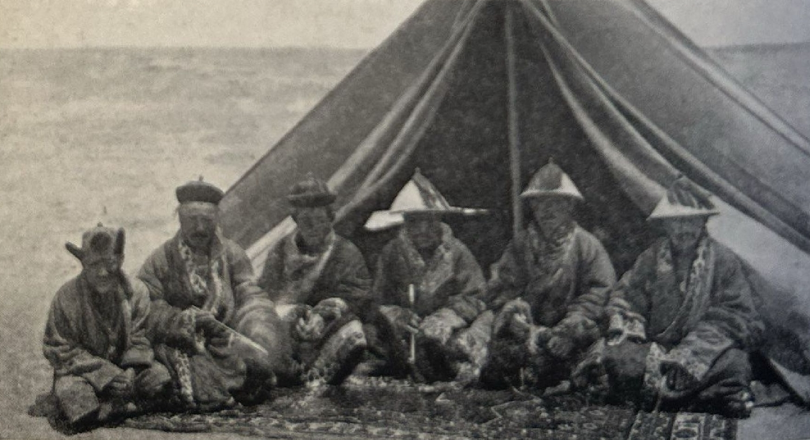

DA: *Däde*-mongolernes *khuruldei*. Bergman fot.

EN: The Däde Mongols' *Khuruldei*. *Photo Bergman*

RU: Хурул дäде-монголов. Фото Бергмана.

### Боевая сцена между маньчжурами и джунгарами

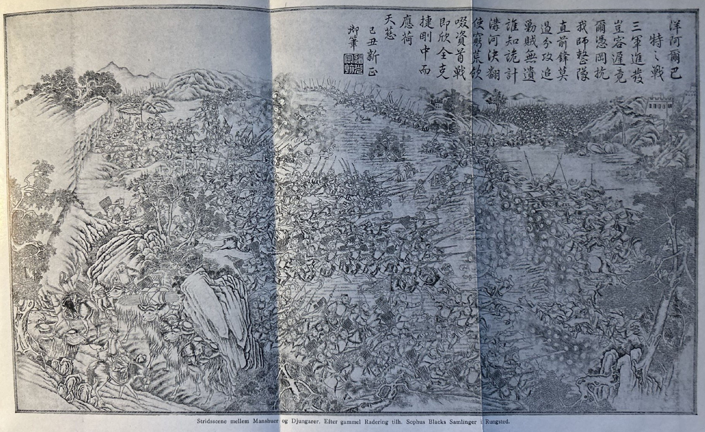

DA: Stridsscene indlem Manshuer og Djungarer. Efter gammel Radering tilh. Sophus Blacks Samlinger i Rungsted.

EN: фото нет в англоязычном издании 1935 г.

Боевая сцена между маньчжурами и джунгарами. По старинной гравюре из собрания Софуса Блэка в Рунгстеде.

### Молитвенный флажок с символом «хи-мори»

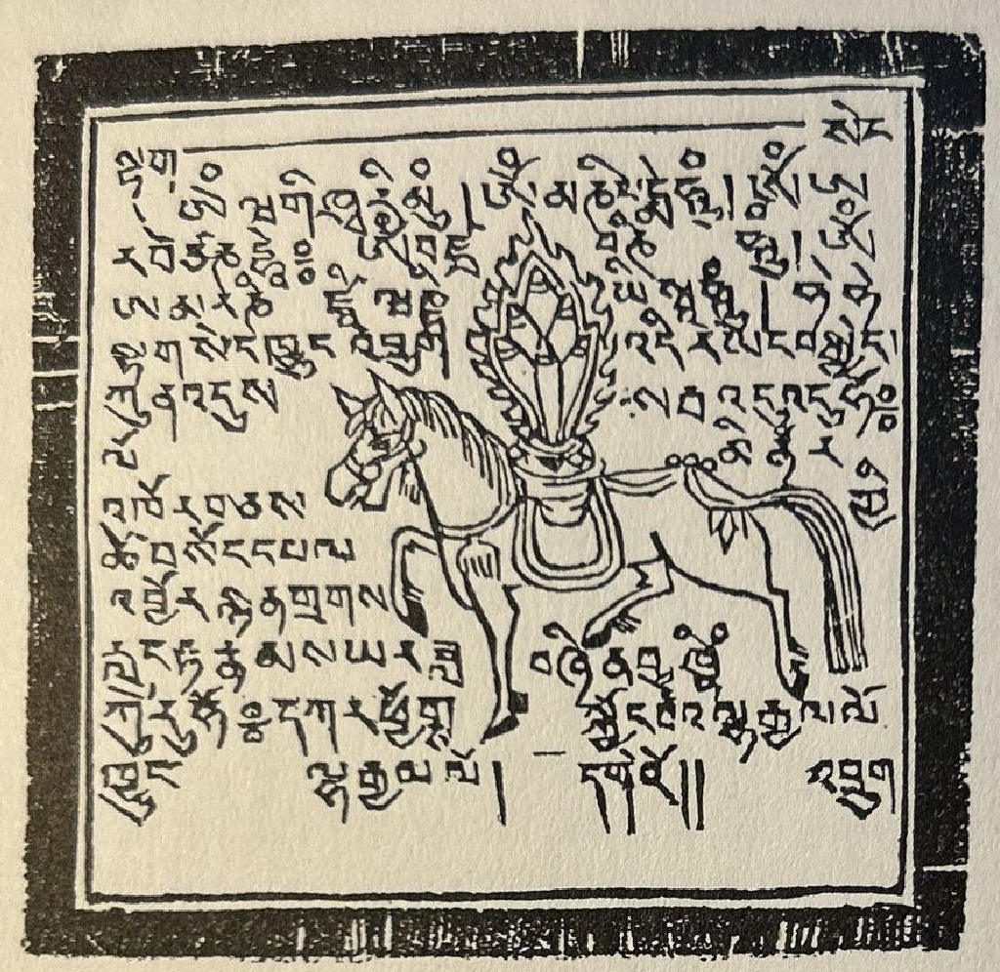

DA: Подпись не зафиксирована.

EN: Prayer-flag with Symbol of Hi-mori and Sacred Texts.

RU: Молитвенный флажок с символом «хи-мори» и священными надписями.

### Торгутский воин

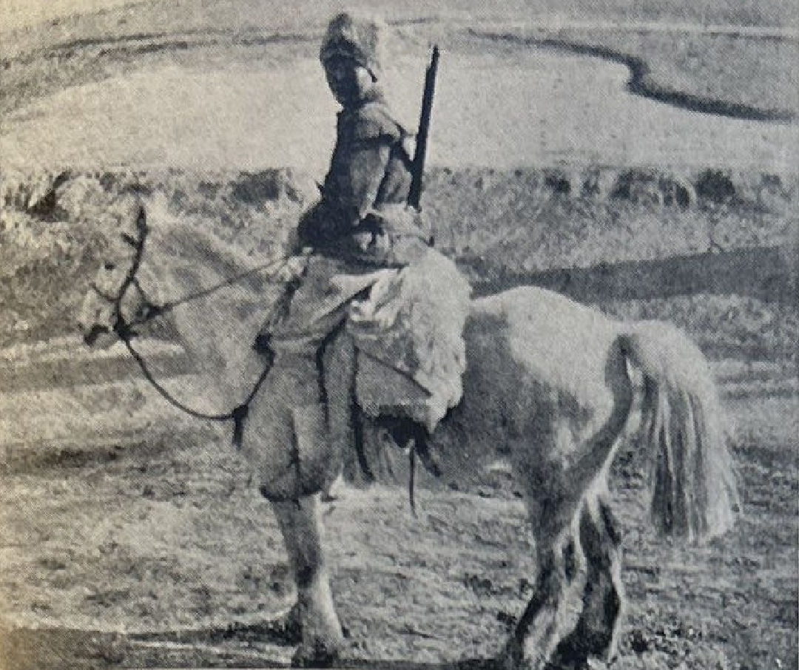

DA: Torgutisk Kriger.

EN: Torgut soldier

RU: Торгутский воин.

### Монгрольде-нойон

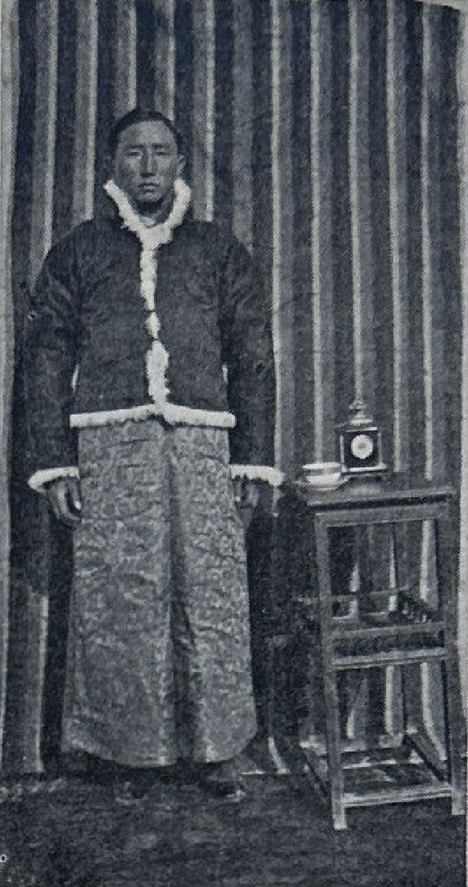

DA: Mongrolde Noyen.

EN: Mongrolda Noyen

RU: Монгрольде-нойон.

### Личная охрана перед дворцом

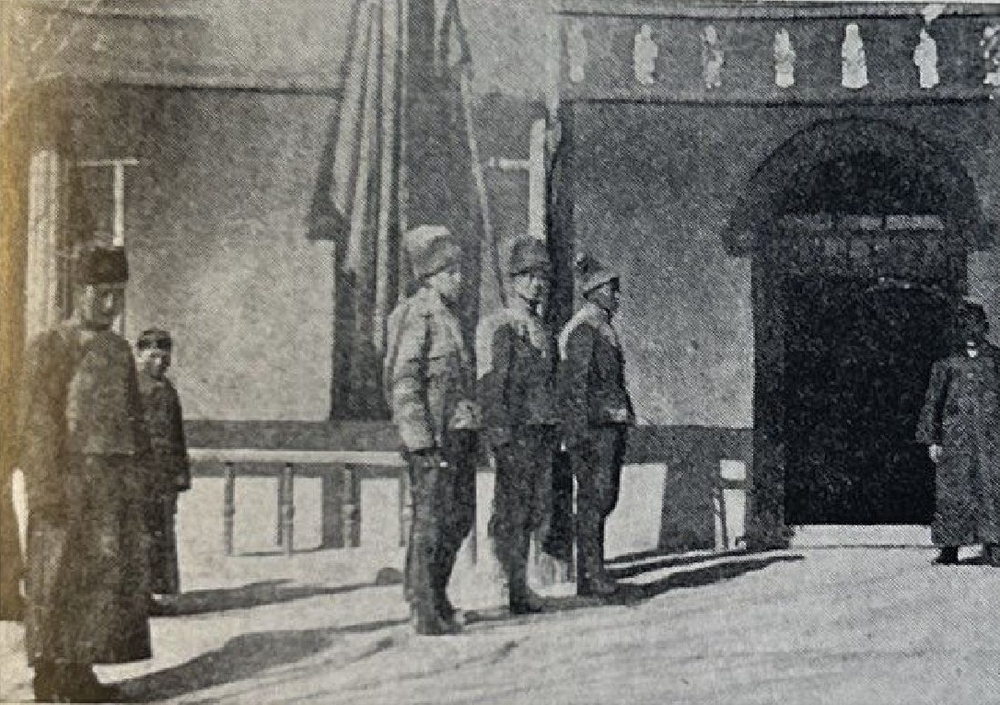

DA: Livvagten foran Paladset.

EN: фото нет в англоязычном издании 1935 г.

RU: Личная охрана перед дворцом.

### Зимняя резиденция торгутского регента

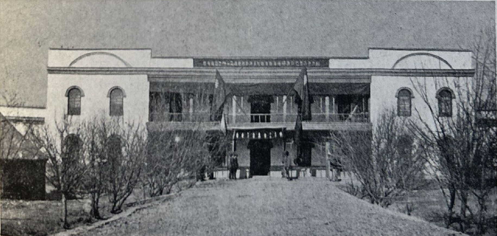

DA: Torgut-Regentens Vinterresidens.

EN: фото нет в англоязычном издании 1935 г.

RU: Зимняя резиденция торгутского регента.

### Музыка монголов

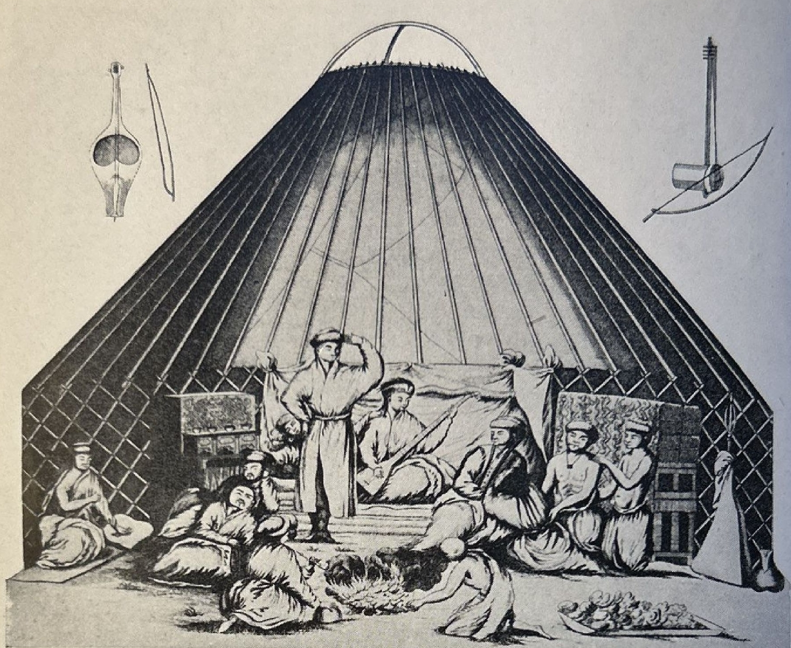

DA: Mongolernes Musik. Efter Pallas’ Sammlungen historischen Nachrichten. St. Petersburg 1776.

EN: изображение есть, но подпись не к изображению, а к музыке: “The red Standard”

RU: Музыка монголов. По историческим сообщениям из собраний Палласа. Санкт-Петербург, 1776.

### Замужние торгутские женщины

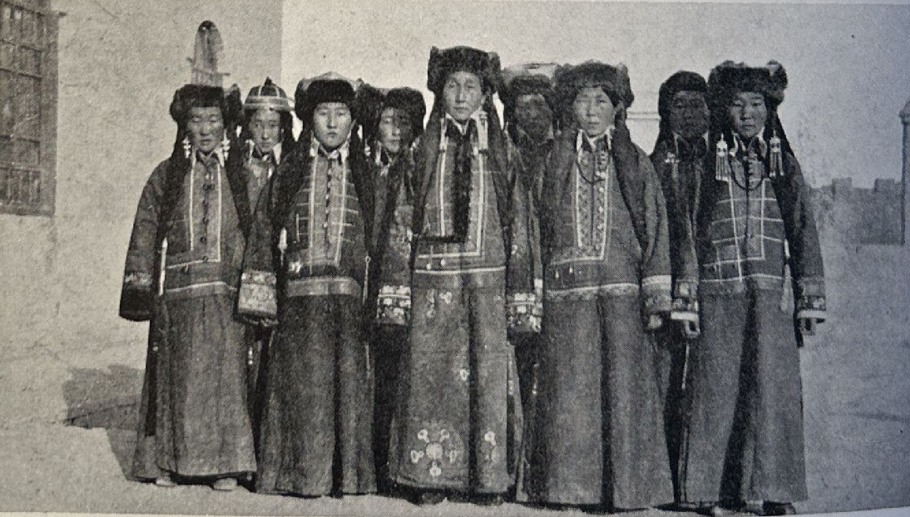

DA: Gifte Torgut-Kvinder.

EN: Torgut married women

RU: Замужние торгутские женщины.

### Батыры торгутского регента

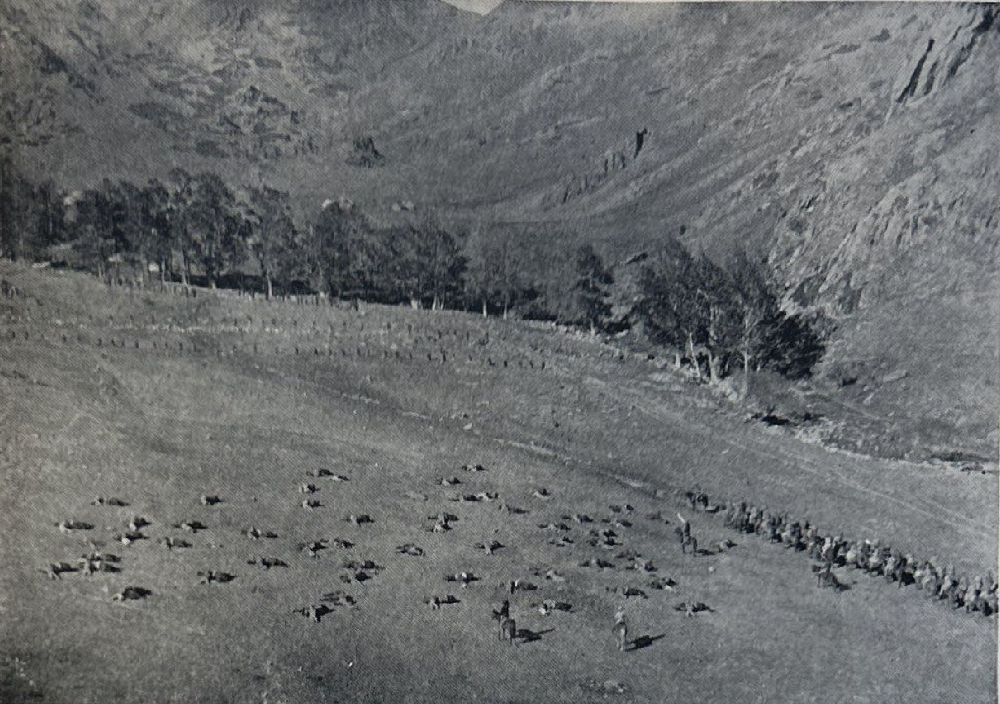

DA: Torgut-Regentens bator er kampklare. Bemærk, at alle Hestene er dresseret til at kaste sig til Jorden som Dækning for Rytteren.

EN: The Torgut Regent's *bator* ready for battle. The horses are trained to throw themselves on the ground as cover for their riders

RU: Батыры торгутского регента готовы к бою. Обратите внимание, что все лошади выдрессированы падать на землю, служа укрытием для всадника.

### Лодонг, Син Чин Геген и Люруп

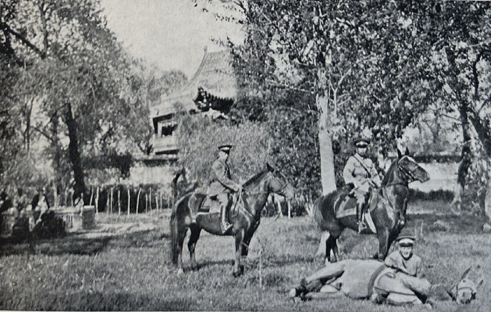

DA: Lodong, Sin Chin Gegen og Lyrup. Anbolt fot.

EN: Seng Chen Gegen, Lodong and Lyrup. *Photo Ambolt*

RU: Лодонг, Син Чин Геген и Люруп. Фото Амболта.

### Торгутская конная акробатика

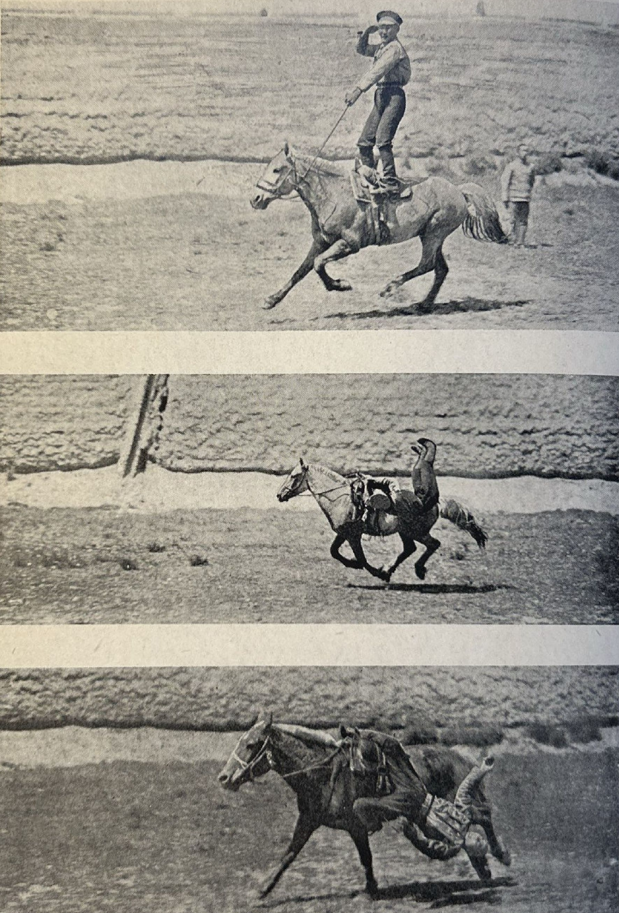

DA: Torgutisk Rytterakrobatik.

EN: Torgut Cavalry Acrobatics. *Photo Hempel*

RU: Торгутская конная акробатика.

### «Мани»-камень с тибетской молитвенной надписью

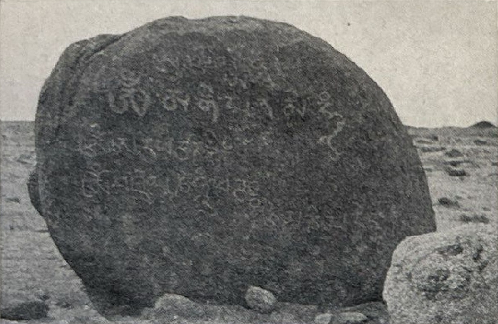

DA: „Mani“-Sten med tibetansk Bønneindskrift. v. Kaull fot.

EN: фото нет в англоязычном издании 1935 г.

RU: «Мани»-камень с тибетской молитвенной надписью. Фото фон Каулля.

### Монастырь Дунцзе в Тибете

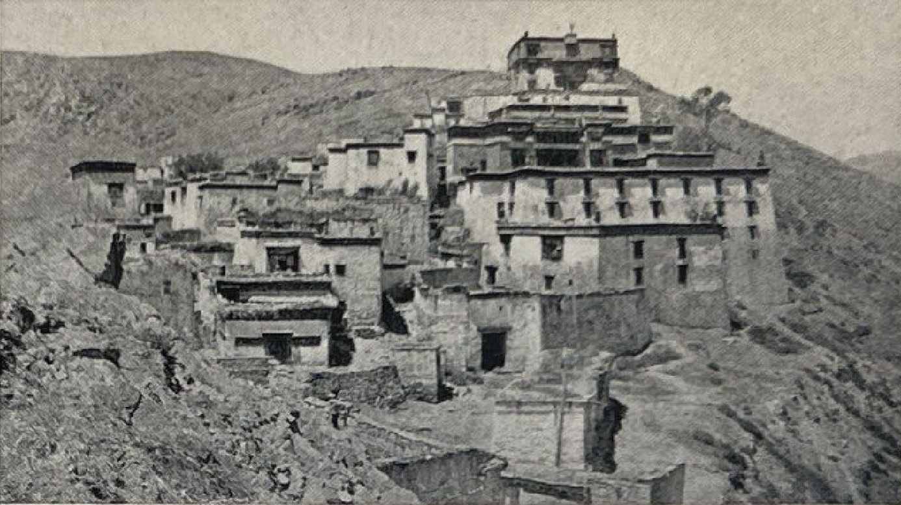

DA: Dongtse Klostret i Tibet. Sin Chins aandelige Hjemsted. L. Ludlow fot.

EN: The Dongtse Monastery in Tibet, Seng Chen's spiritual home. *Photo F. Ludlow*

RU: Монастырь Дунцзе в Тибете. Духовная родина Син Чина. Фото Л. Ладлоу.

### Торгутский лагерь

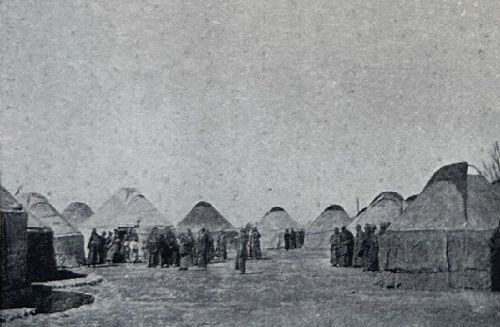

DA: Torgutisk Lejr. Anbolt fot.

EN: Torgut camp. *Photo Ambolt*

RU: Торгутский лагерь. Фото Амболта.

### Фресковая роспись в монастыре Дунцзе

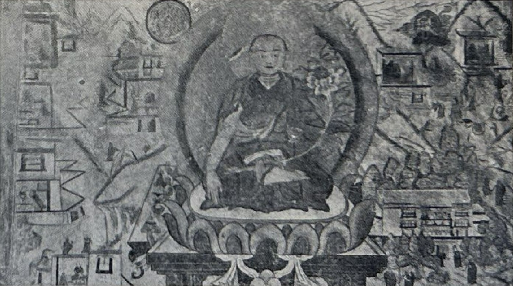

DA: Freskomaleri i Dongtse Klostret, forestillende Sin Chins aandelige Fader, Tigergudens fjerde Reinkarnation. L. Ludlow fot.

EN: Fresco in the Dongtse Monastery representing Seng Chen's spiritual father, the Tiger god's fourth reincarnation. *Photo F. Ludlow*

RU: Фресковая роспись в монастыре Дунцзе, изображающая духовного отца Син Чина — четвёртую реинкарнацию Тигриного бога. Фото Л. Ладлоу.

### Автор, Буран и Суйдор

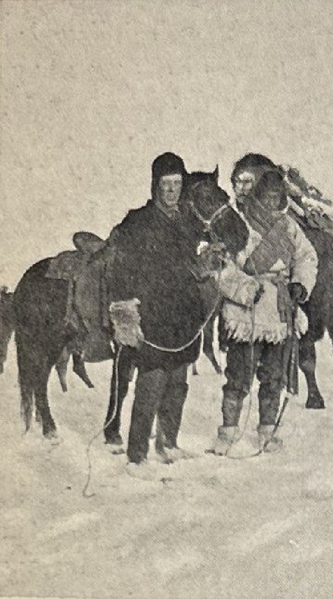

DA: Forfatteren, Buran og Suidör.

EN: фото нет в англоязычном издании 1935 г.

RU: Автор, Буран и Суйдор.

### Монгольские аристократы

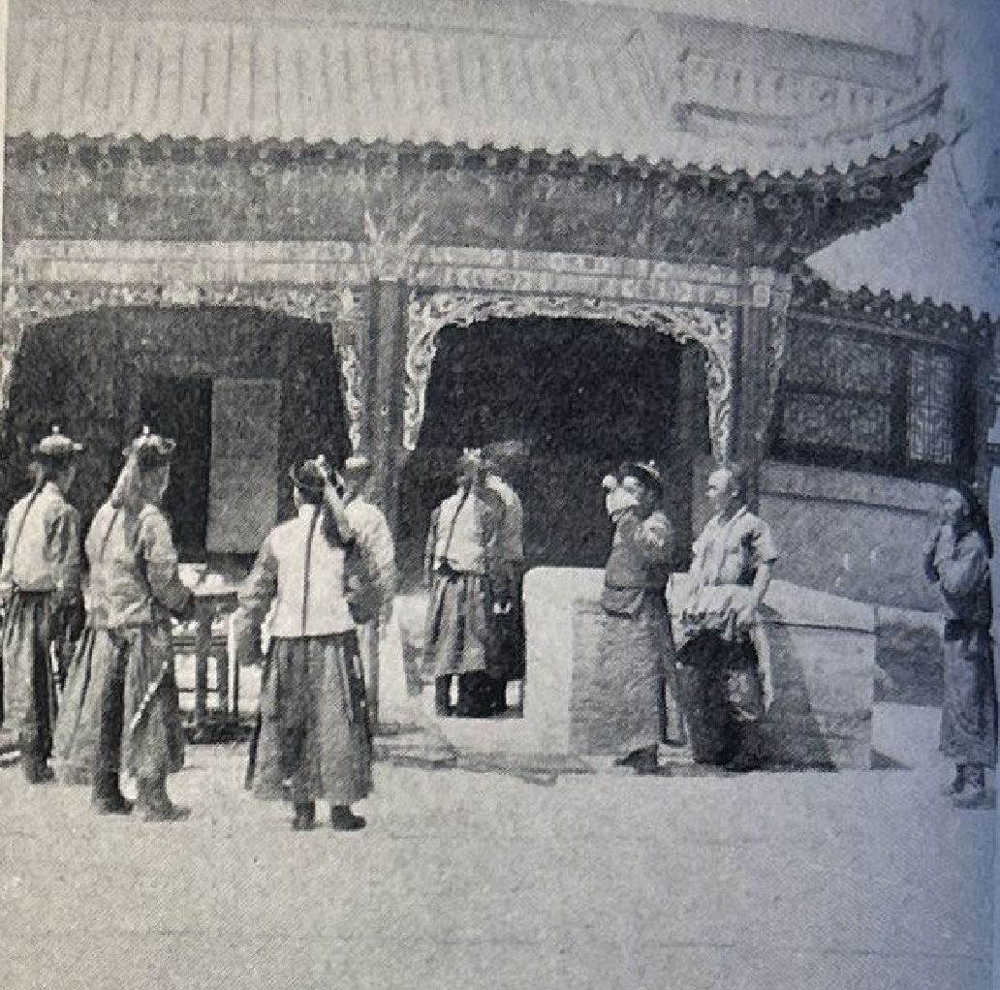

DA: Mongolske Adelsmænd.

EN: фото нет в англоязычном издании 1935 г.

RU: Монгольские аристократы.

### Три трона

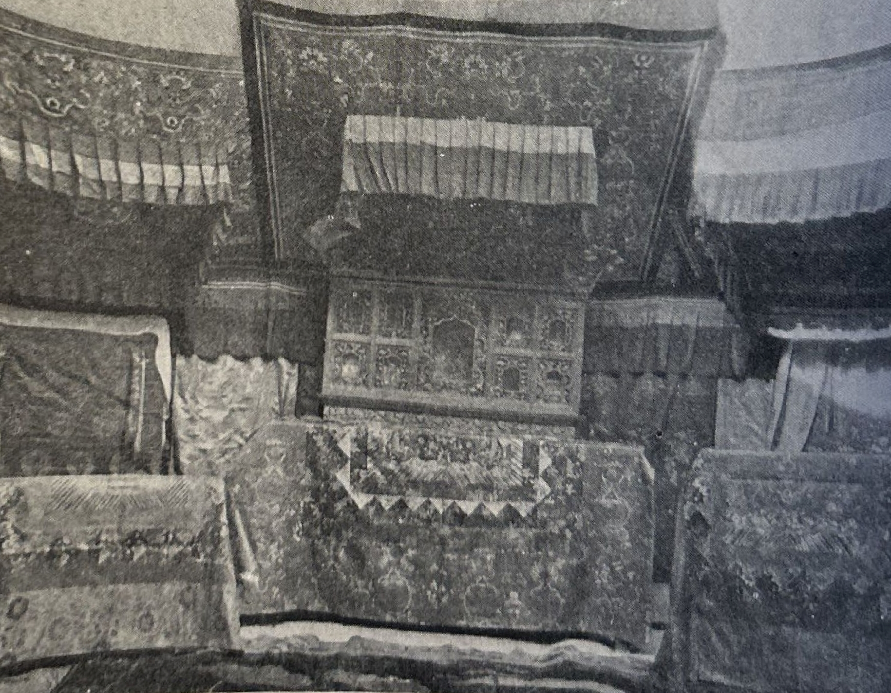

DA: De tre Tronstole i Torguternes Khantelt.

EN: The three thrones in the Khan's Tent of the Torguts

RU: Три трона в ханском шатре торгутов.

### Автор в обществе ламаистских философов

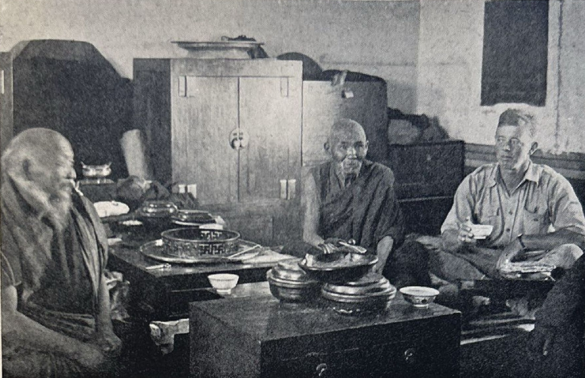

DA: Forfatteren i Selskab med lamaistiske Filosoffer.

EN: The author with Lamaistic philosophers

RU: Автор в обществе ламаистских философов.

### Листы Цачин-бичик

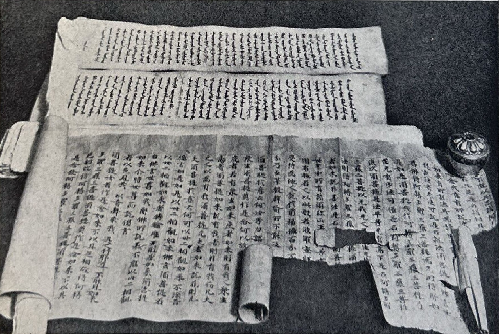

DA: Blade af *Tsachin Bichik* og Manuskriptrulle af den buddhistiske Kanon antagelig fra det 9. Aarh.

EN: фото нет в англоязычном издании 1935 г.

RU: Листы Цачин-бичик и рукописный свиток буддийского канона, предположительно IX века.

### Отец Син Чина

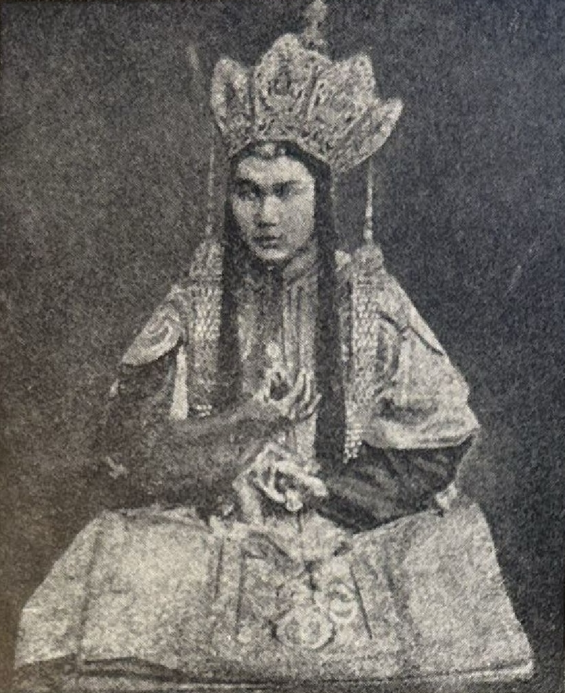

DA: Sin Chins jordtske Fader, Tu-jen Meng-Ku Khan. (Øverst til venstre)

EN: Seng Chen's earthly father, Tu-yen Meng-ku khan

RU: Земной отец Син Чина — Ту-джен Менг-Ку-хан. (Вверху слева)

### Картина с изображением Обиш-хана

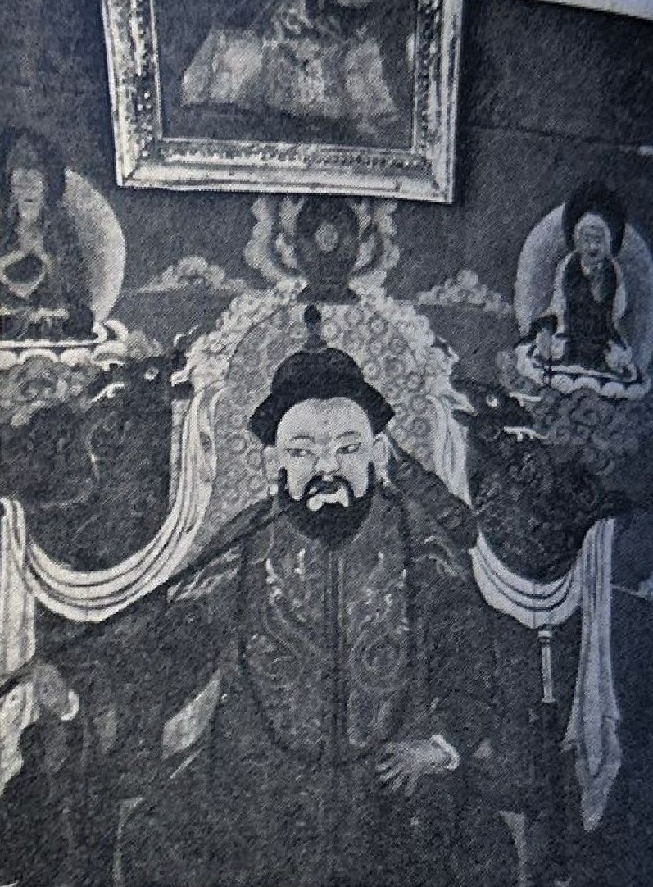

DA: Maleri af Obish Khan.

EN: Painting of Obish Khan

RU: Картина с изображением Обиш-хана.

### Мать Син Чина

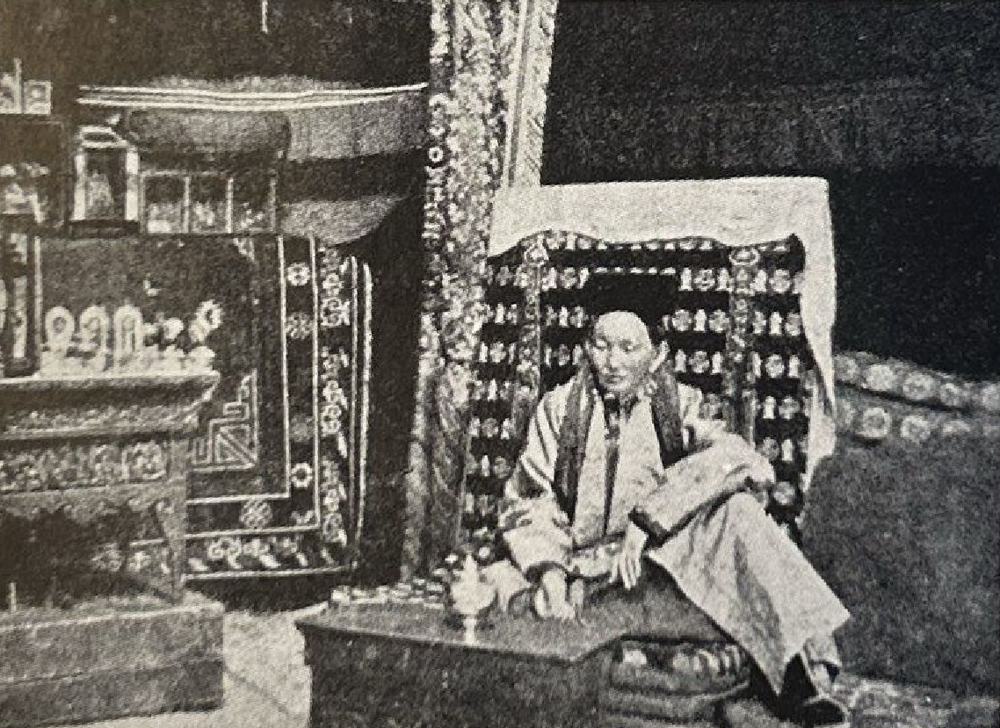

DA: Sin Chins Moder. G. Mannerheim fot.

EN: фото нет в англоязычном издании 1935 г.

RU: Мать Син Чина. Фото Г. Маннергейма.

### Ханские печати торгутов

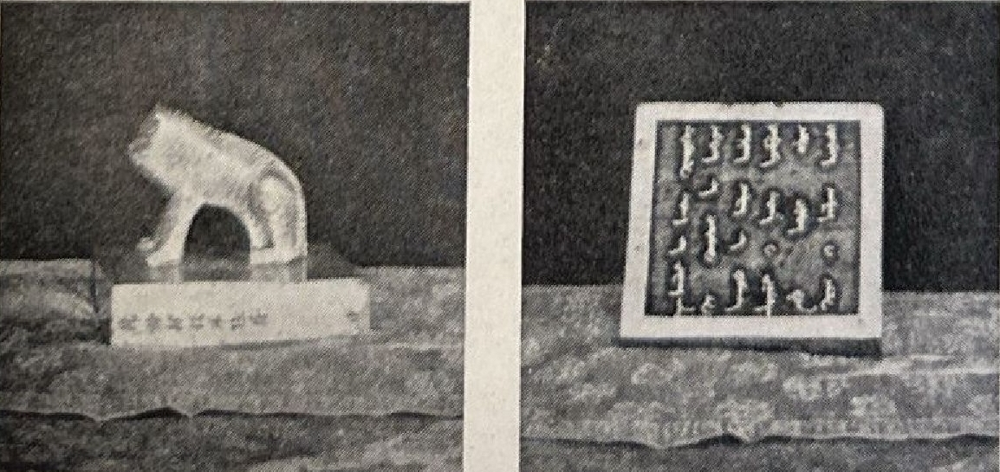

DA: Torguternes Khansegl, skænket af Kejser Ch'ien Lung 1776, 1/6 nat. Størr. (Nederst: til venstre og i Midten)

EN: фото нет в англоязычном издании 1935 г.

RU: Ханские печати торгутов, пожалованные императором Цяньлуном в 1776 году, в 1/6 натуральной величины. (Внизу: слева и в центре)

### Один из земных предков Син Чина

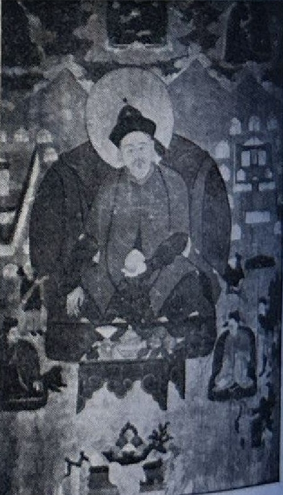

DA: En af Sin Chins jordiske Forfædre.

EN: фото нет в англоязычном издании 1935 г.

RU: Один из земных предков Син Чина.

### Храмовый шатёр

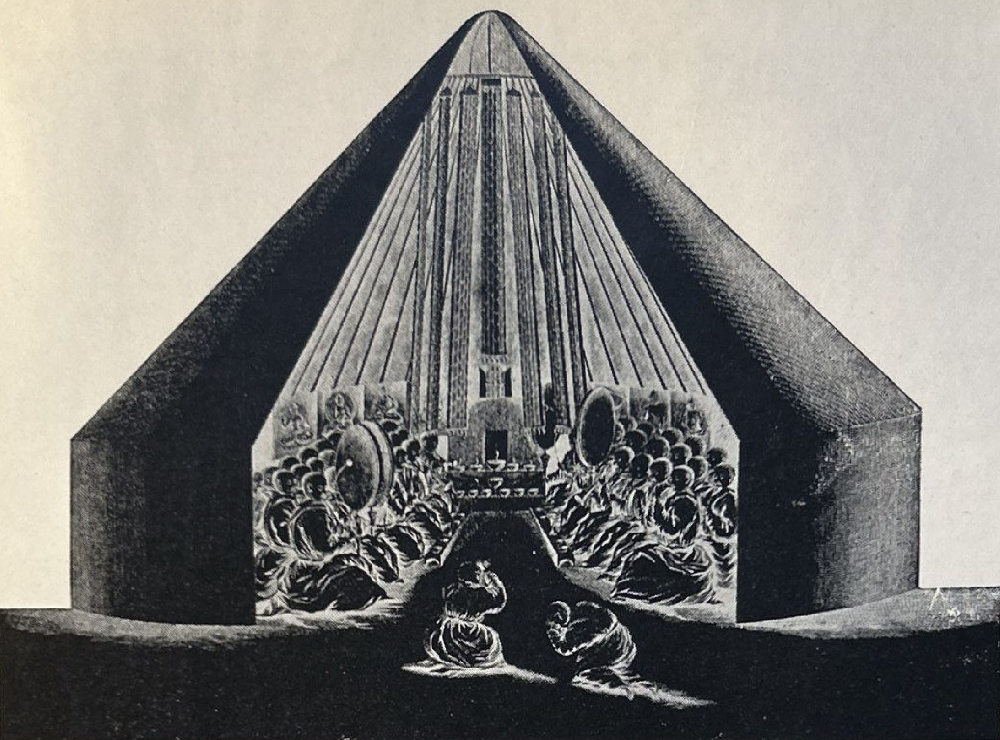

DA: Tempeltelt.

EN: есть, но подпись не к изображению, а к музыке: “Baredo soldep” (Tibetan prayer)

RU: Храмовый шатёр.

### Лагерь Син Чина

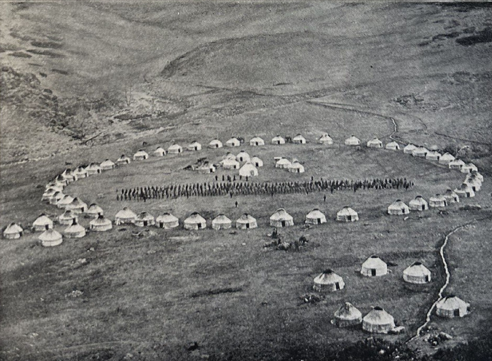

DA: Sin Chins Lejr omgivet af turgutiske Underhøvdinges Telte. Det forreste af Teltene i Midten er Gegen-ni-ordo.

EN: фото нет в англоязычном издании 1935 г.

RU: Лагерь Син Чина, окружённый шатрами подчинённых торгутских вождей. Передний из шатров в центре — ставка Гегена.

### Своеобразная причёска незамужних женщин племени Цагечин-бэйле

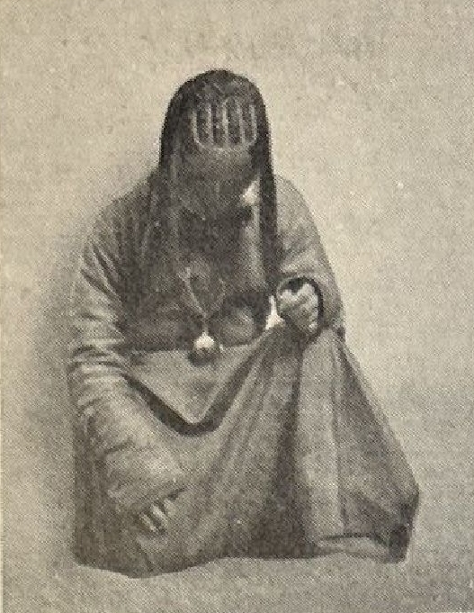

DA: Den ejendommelige Frisure hos de ugifte Kvinder af *Tsagechin Beile*-Stammen.

EN: фото нет в англоязычном издании 1935 г.

RU: Своеобразная причёска незамужних женщин племени Цагечин-бэйле.

### Чаркликская красавица

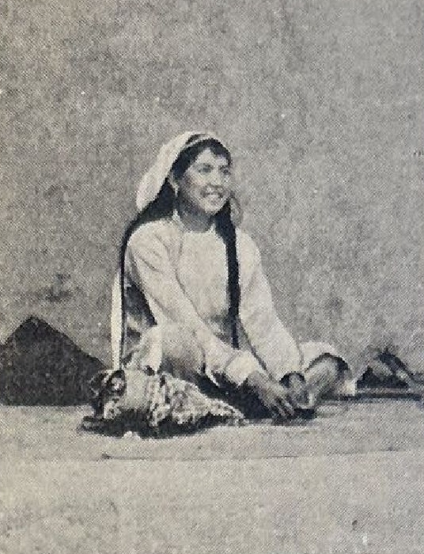

DA: Charklik-Skønhed.

EN: A Charklik beauty

RU: Чаркликская красавица.

### Молодая девушка из Шэнди

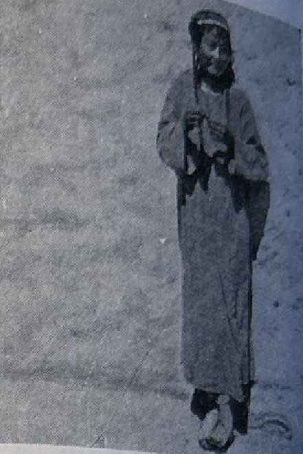

DA: Ung Pige fra Shéndi.

EN: фото нет в англоязычном издании 1935 г.

RU: Молодая девушка из Шэнди.

### Незамужняя женщина племени Цагечин-бэйле

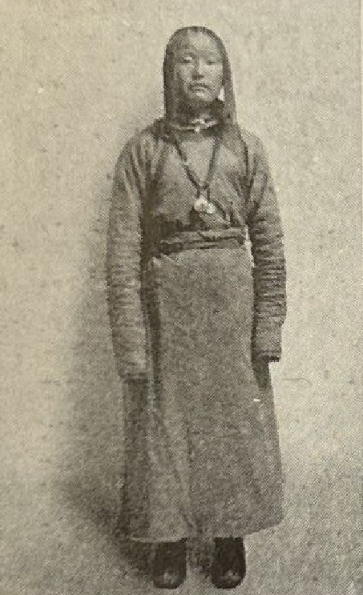

DA: Ugift *Tsageehin Beile*-Kvinde.

EN: фото нет в англоязычном издании 1935 г.

RU: Незамужняя женщина племени Цагечин-бэйле.

### Тибетский великий лама

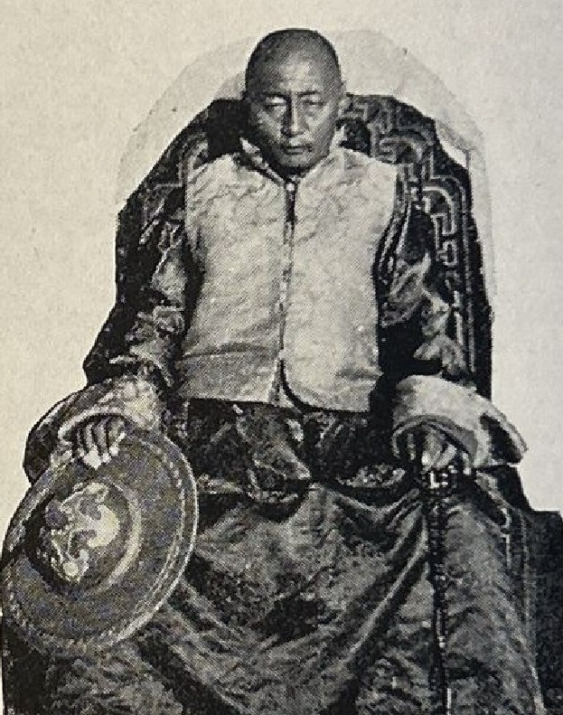

DA: Tibetansk Storlama. Humme! fot.

EN: Tibetan High Lama. *Photo Hummel*

RU: Тибетский великий лама. Фото Хуммеля.

### Шири

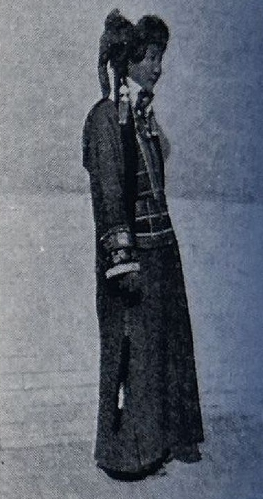

DA: Shiri, som beherskede Tonernes Stigen og Fald.

EN: Shiri, who “commanded the gliding, soaring and falling of the notes like a proud eagle on the wing”

RU: Шири, мастерски владевшая восхождением и падением музыкальных тонов.

### Торгутские вожди (мерин и гусда)

.")

DA: Torgutiske Høvdinge (merin og gusdâ).

EN: Torgut Chiefs (*merin* and *gusdä*)

RU: Торгутские вожди (мерин и гусда).

### Торгутский сказитель

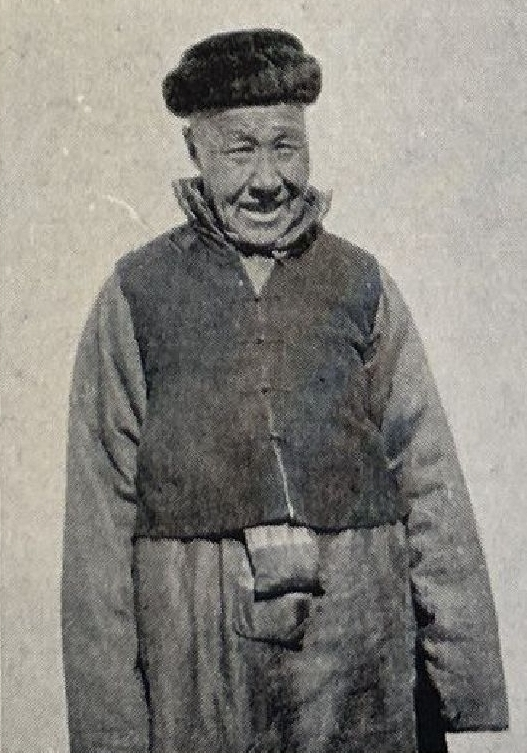

DA: Torgutisk Sagnfortæller.

EN: фото нет в англоязычном издании 1935 г.

RU: Торгутский сказитель.

### Тоин-Гелинг

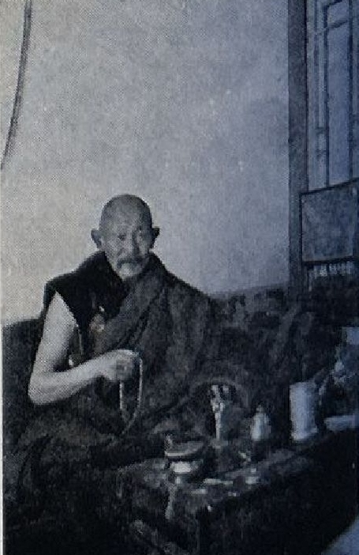

DA: Töin Geling.

EN: фото нет в англоязычном издании 1935 г.

RU: Тоин-Гелинг.

### Передача геген-ни-ордо королю Густаву V

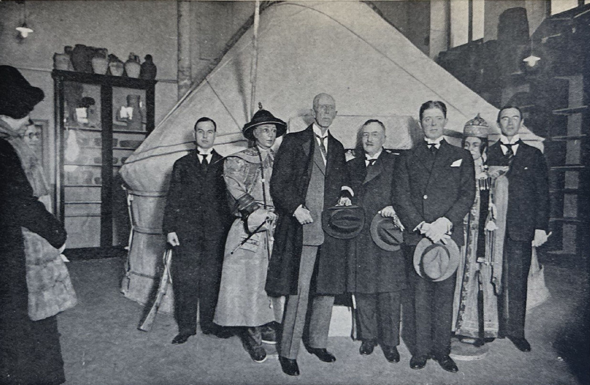

DA: Overdragelsen af *gegen-ni-ordo* til Kong Gustav V. I Midten Kong Gustav, Sven Hedin og Forfatteren.

EN: фото нет в англоязычном издании 1935 г.

RU: Передача геген-ни-ордо (ставка Гегена) королю Густаву V. В центре — король Густав, Свен Гедин и автор.

### Охотничье снаряжение для ружья Обиш-хана

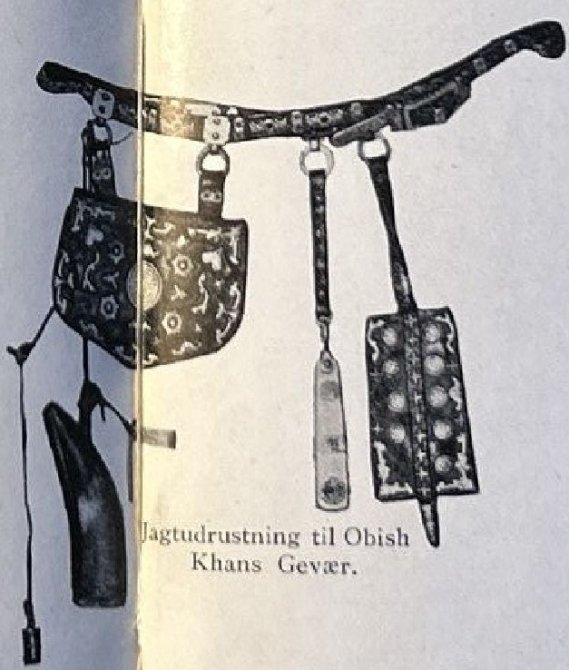

DA: Jagtudrustning til Obish Khans Gevær.

EN: фото нет в англоязычном издании 1935 г.

RU: Охотничье снаряжение для ружья Обиш-хана.

### Интерьер геген-ни-ордо при стоянке в Урумчи

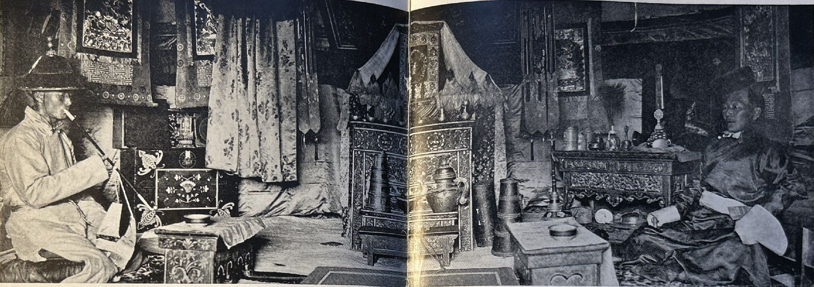

DA: Interior fra gegen-ni-ordo ved Opstil-lingen i Urumchi. (Øverst)

EN: Interior of *gegen-ni-ordo* on its erection at Urumchi

RU: Интерьер геген-ни-ордо при стоянке в Урумчи. (Вверху)

### Затвор того ружья

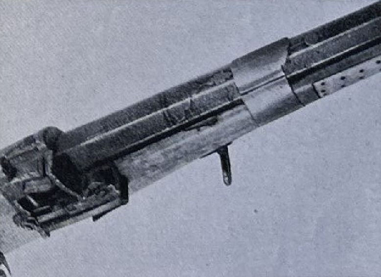

DA: Geværlaas paa samme.

EN: фото нет в англоязычном издании 1935 г.

RU: Затвор того же ружья.

### Ружьё, похищенное Обиш-ханом у турок в 1767

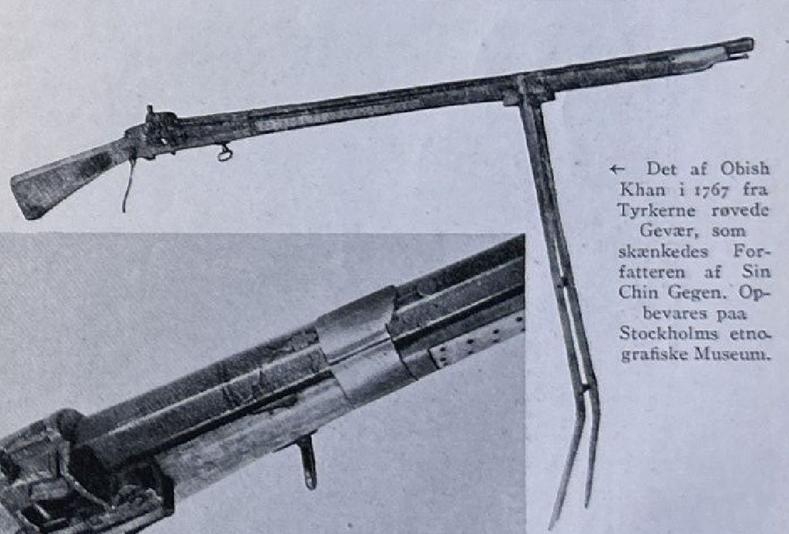

DA: Det af Obish Khan i 1767 fra Tyrkerne røvede Gevær, som skænkedes Forfatteren af Sin Chin Gegen. Opbevares paa Stockholms etnografiske Museum.

EN: фото нет в англоязычном издании 1935 г.

RU: Ружьё, похищенное Обиш-ханом у турок в 1767 году, которое было подарено автору Син Чин Гегеном. Хранится в Стокгольмском этнографическом музее.

### Часть геген-ни-ордо

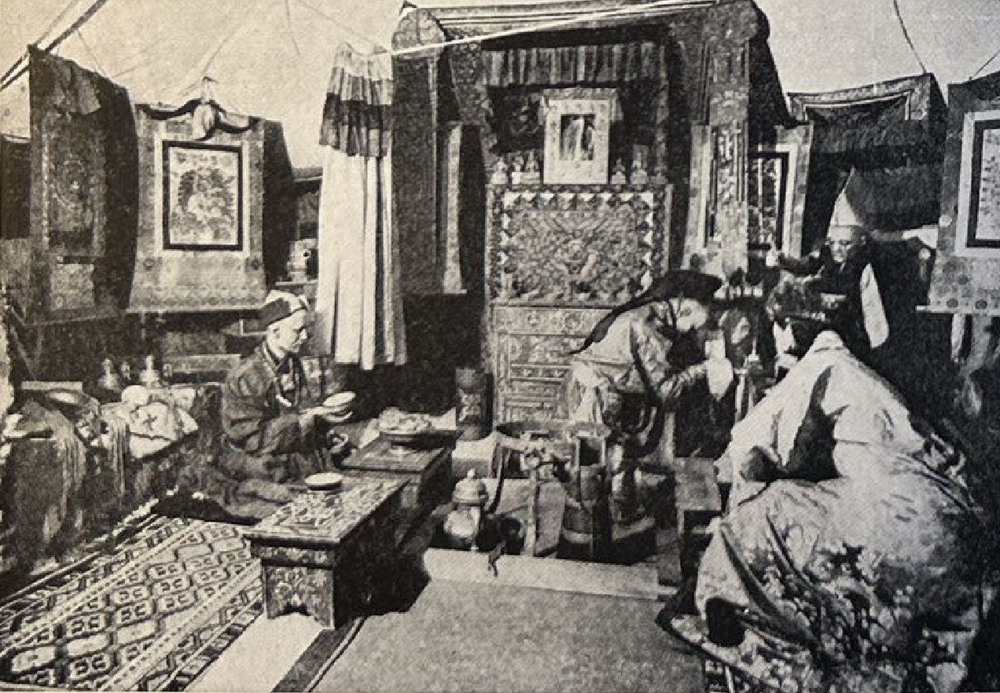

DA: Hjørne af gegen-ni-ordo efter Opstillingen i Stockholm.

EN: Corner of *gegen-ni-ordo* after its erection in Stockholm. *Photo Sv. D.*

RU: Часть геген-ни-ордо после установки в Стокгольме.

### Мне пришлось расстаться с моими лошадьми

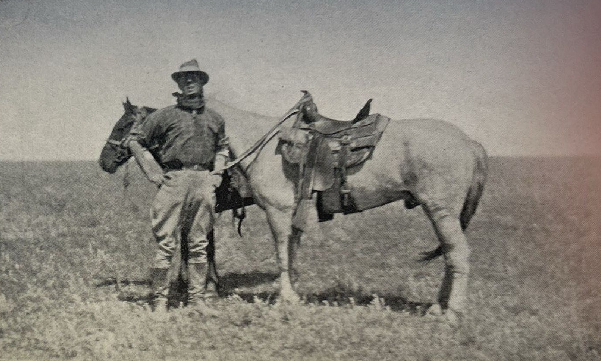

DA: Jeg maatte skilles fra mine Heste, for det var forbi med de galoperende Dage paa Steppen.

EN: фото нет в англоязычном издании 1935 г.

RU: Мне пришлось расстаться с моими лошадьми, дни галопа по степи были окончены.

### Карта главной экспедиции и путешествий автора

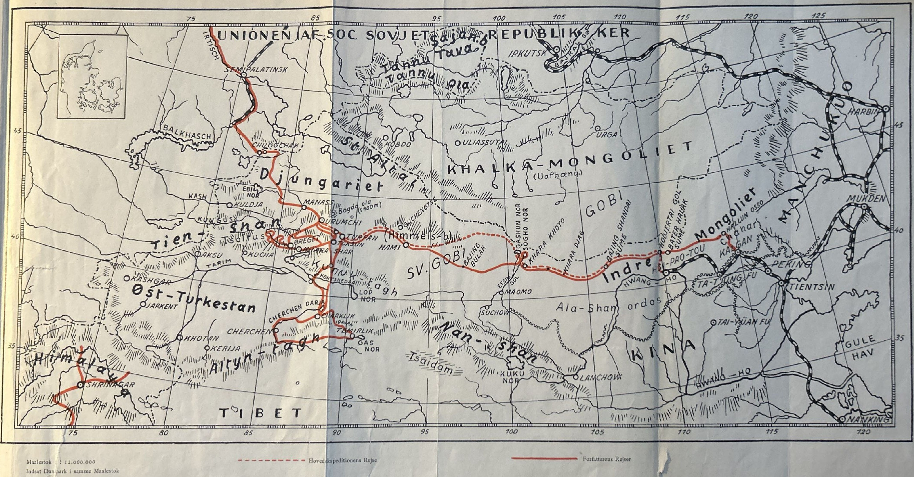

DA: Kort over Hovedekspeditionens og Forfatterens Rejser

EN: карта есть, но полностью переделанная

RU: Карта главной экспедиции и путешествий автора.

### Торгуты

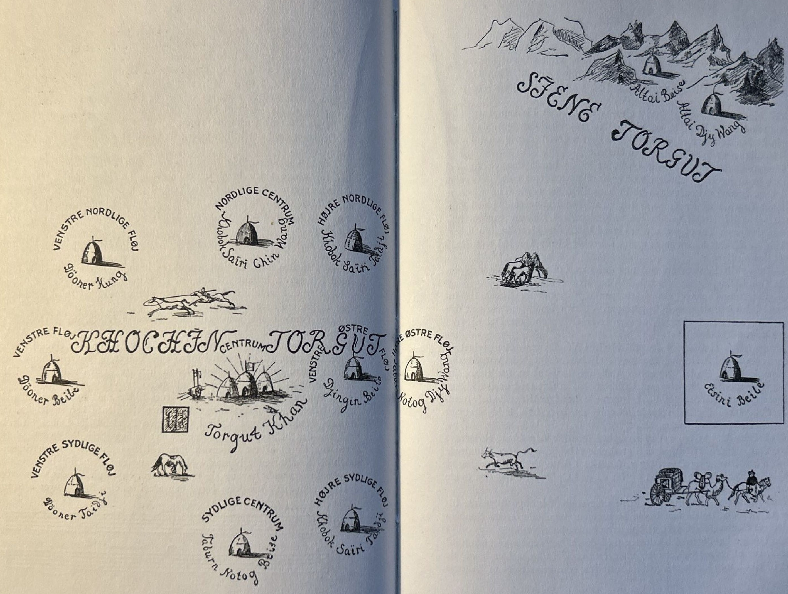

DA: Khochin Torgut, Sjene Torgut

EN: The Thirteen Signet-bearing Princes. (Outline sketch of the formation of the Torgut Horde’s Thirteen Tribes.)

RU: Тринадцать князей — носителей печатей. (Cхема формирования тринадцати племён торгутской орды.)

Хочин-торгуты (khochin - старые), Сьене-торгуты (восточные, в английском тексте Shene Torgut - новые торгуты).

### Жёны вождей и любопытные принцессы

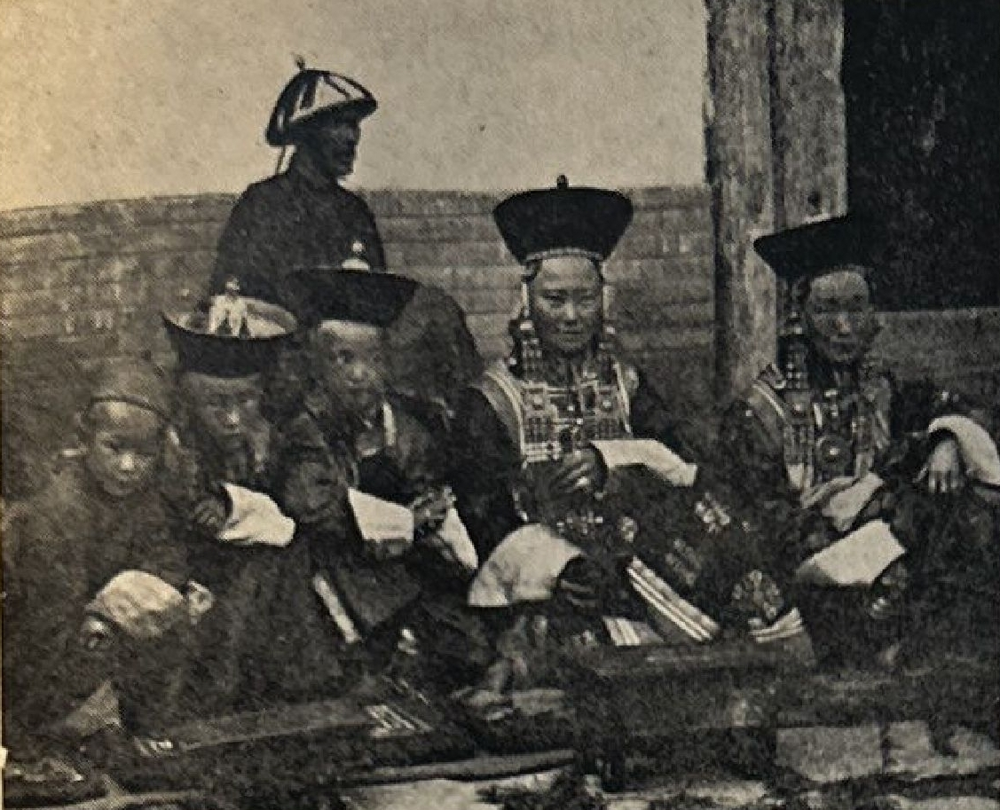

DA: Høvdingehustruer og nysgerrige Prinsesser.

EN: Consorts of the Chief and curious Princesses

RU: Жёны вождей и любопытные принцессы.

### Гуртум

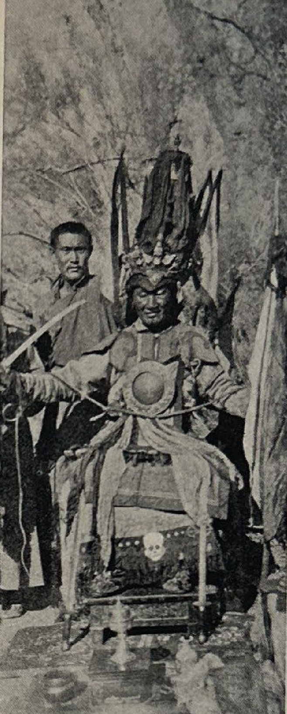

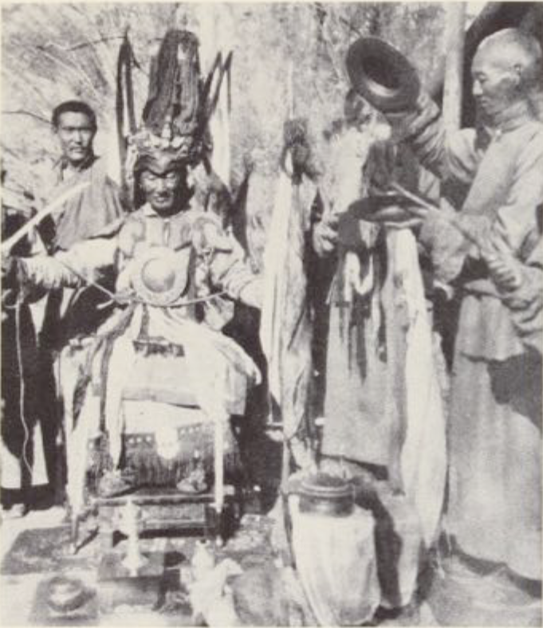

DA: Gurtum. Zimmerman fot.

В DA издании фото обрезано справа.

EN: Gurtum. *Photo Zimmerman*

RU: Гуртум. Фото Циммермана.

### Двадцать четыре шанага

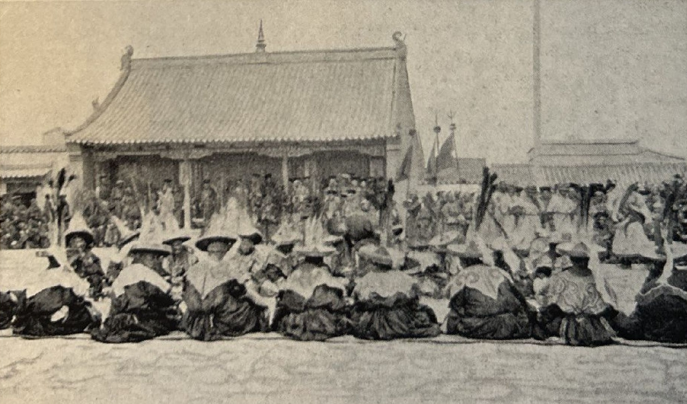

DA: De fire og tyve shanag. Hummel fot.

EN: The twenty-four *Shanag*. *Photo Hummel*

RU: Двадцать четыре шанага. Фото Хуммеля.

### Процессия вокруг монастыря

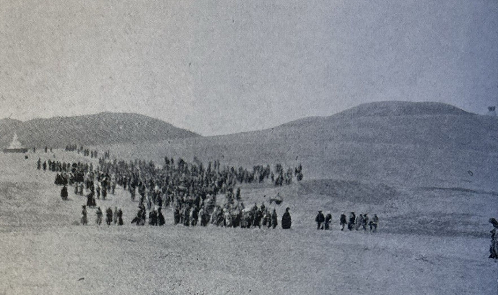

DA: „Langsomt skrider Optoget rundt om Klostret ...“

EN: фото нет в англоязычном издании 1935 г.

RU: «Медленно движется процессия вокруг монастыря…»

### Прощание с ламами и вождями в Батер-Халак-суме

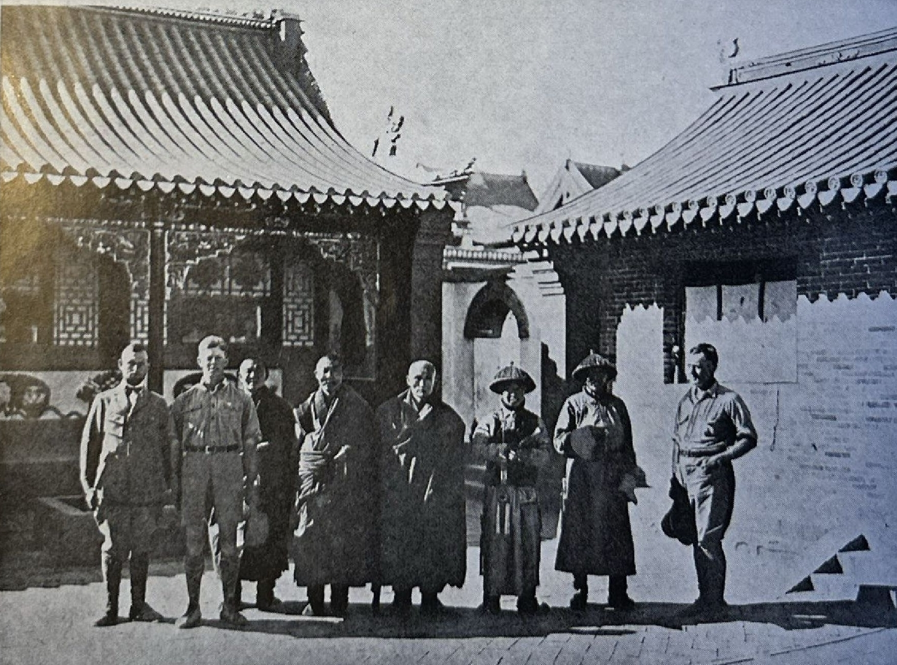

DA: Afskeden fra Lamaer og Høvdinge i Bater Halak Sume. Fra venstre: Hummel, Haslund, to Sekretærer, den levende Buddha, Fyrsten, en Soldat, Lieberenz. Lieberenz fot.

EN: Leave-taking from Lamas and Chiefs at Bater Halak Sume. *Photo Lieberenz*

RU: Прощание с ламами и вождями в Батер-Халак-суме. Слева: Хуммель, Хаслунд, два секретаря, живой Будда, князь, солдат, Либеренц. Фото Либеренца.

### Верблюды экспедиции

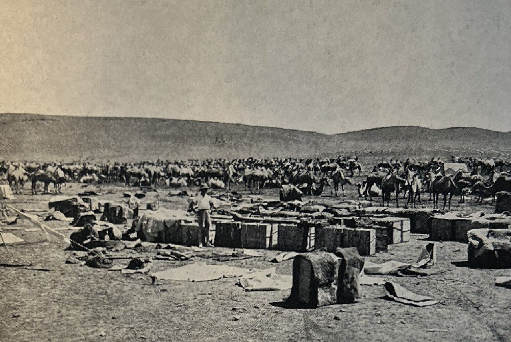

DA: Ekspeditionens Kameler samlede før Opbruddet fra Hodjertaï-gol. Lieberenz fot.

EN: The Expedition's camels assembled before the start from Hojertai-gol. *Photo Lieberenz*

RU: Верблюды экспедиции, собранные перед выступлением из Ходжертай-гола. Фото Либеренца.

### Монгольский монастырь Байин-Шандай-суме

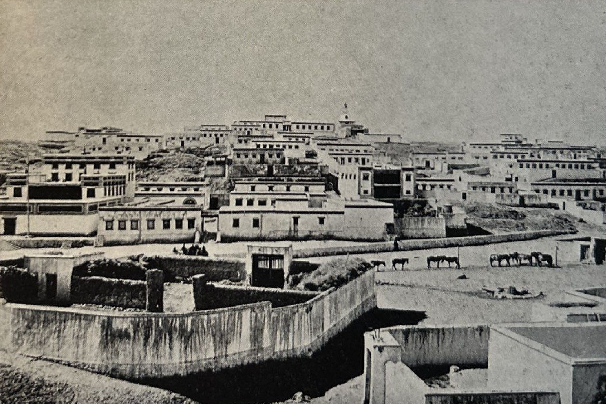

DA: Mongolklostret Bajing Shandai Sume. Lieberenz fot.

EN: The Mongolian Monastery of Baying Shandai Sume. *Photo Lieberenz*

RU: Монгольский монастырь Байин-Шандай-суме. Фото Либеренца.

### Пойманный верблюжий вор

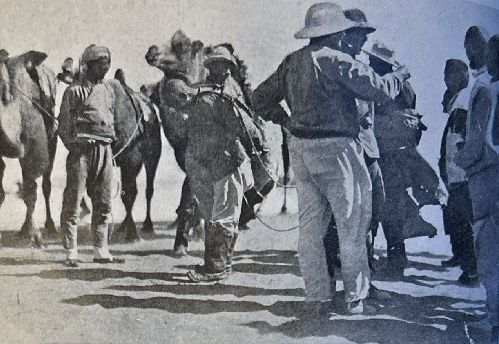

DA: Den indfangede Kameltyv Obogon ved Tilbagekomsten til Lejren. Lieberenz fot.

EN: фото нет в англоязычном издании 1935 г.

RU: Пойманный верблюжий вор Обогон при возвращении в лагерь. Фото Либеренца.

### Дневной переход подошёл к концу

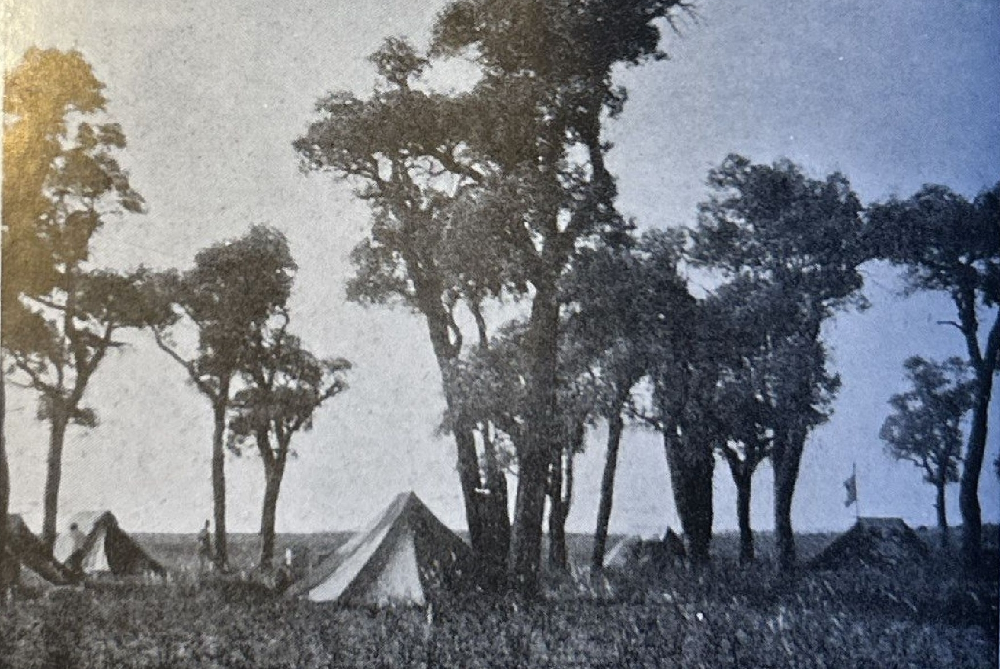

DA: „Da Dagens March var til Ende, vandrede vi ind i Skyggen af løvrige Popler“. v. Kaull fot.

EN: фото нет в англоязычном издании 1935 г.

RU: «Когда дневной переход подошёл к концу, мы вошли в тень тополей». Фото фон Каулля.

### Кочевой дом Бергмана и мой

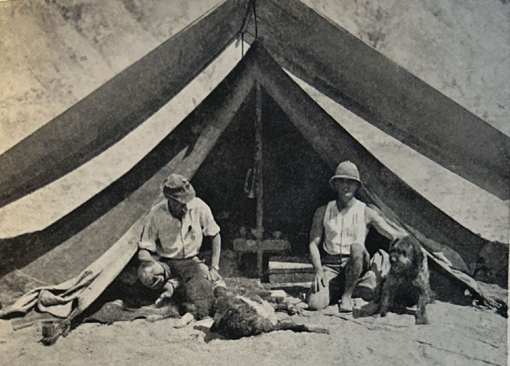

DA: Bergmans og mit Nomadehjem. Bergman fot.

EN: фото нет в англоязычном издании 1935 г.

RU: Мой с Бергманом кочевой дом. Фото Бергмана.

### Три почтенных седобородых

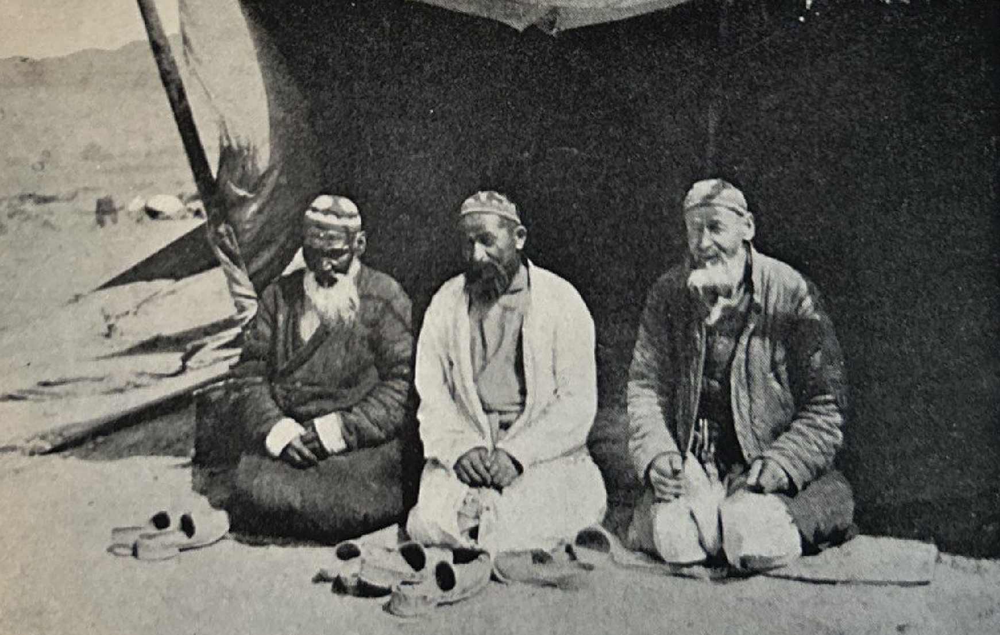

DA: „Tre ærværdige Graaskæg“.

EN: фото нет в англоязычном издании 1935 г.

RU: «Три почтенных старца».

### Перевозка верблюдов через реку

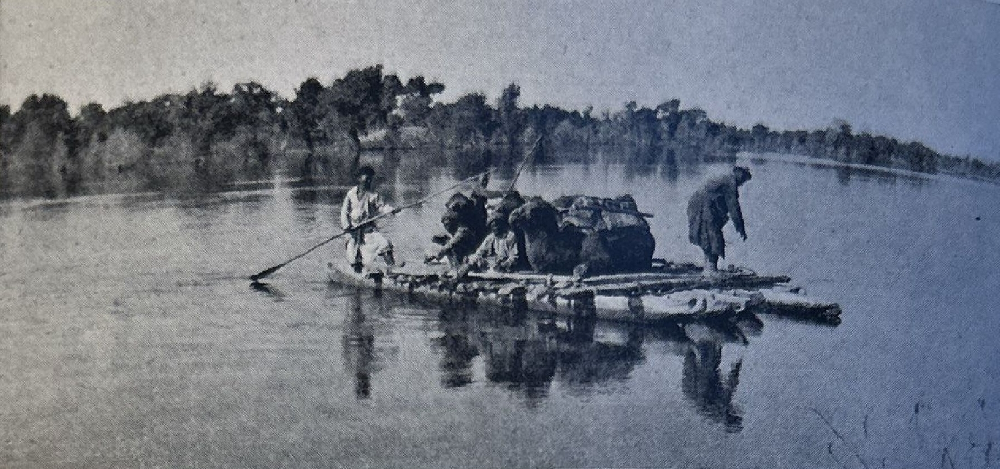

DA: Kameltransport over en Flod. Bergman fot.

EN: Camel transport across the river. *Photo Bergman*

RU: Перевозка верблюдов через реку. Фото Бергмана.

### Сартский аксакал и китайский амбань

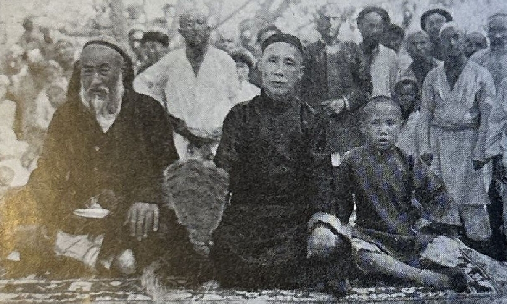

DA: Den sartiske *aksakal* og kinesiske *amban*. Bergman fot.

EN: The Sart *aksakal* and Chinese *amban*. *Photo Bergman*

RU: Сартский аксакал и китайский амбань. Фото Бергмана.

### Сартские музыканты

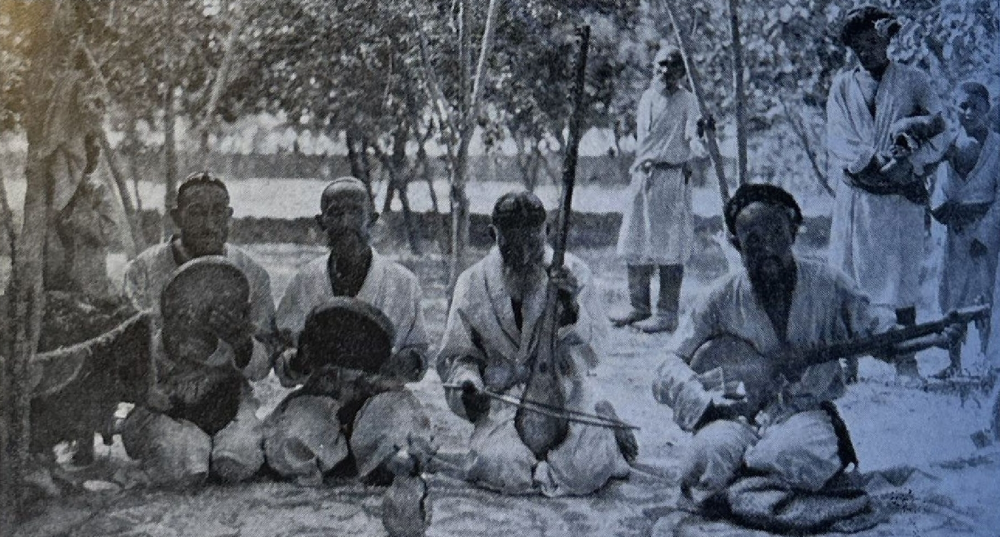

DA: Sartiske Musikanter. Bergman fot.

EN: Sart Musicians. *Photo Bergman*

RU: Сартские музыканты. Фото Бергмана.

### Монгрольде-нойон с личной охраной

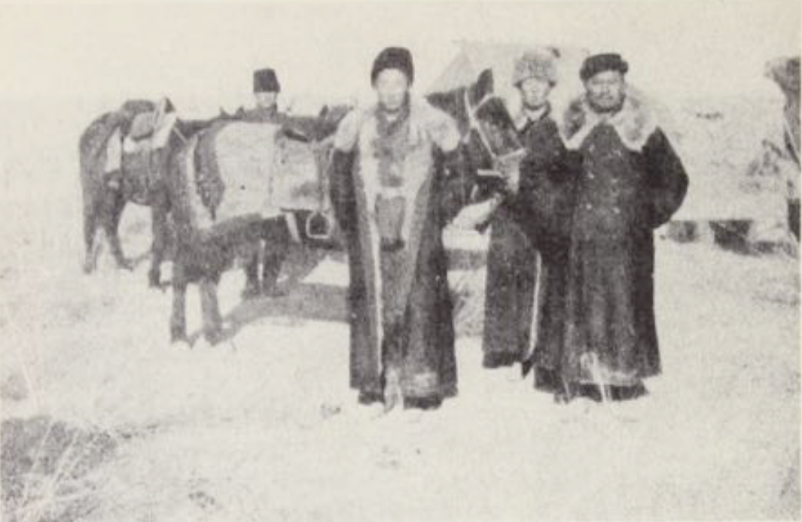

DA: фото нет в датскоязычном издании 1947 г.

EN: Mongrolda Noyen, the young leader of the Khoshut Mongols with his bodyguard

RU: Монгрольде-нойон, молодой предводитель хошутских монголов, со своей личной охраной.

### Консул Арселан

DA: фото нет в датскоязычном издании 1947 г.

EN: "Arselan Consul"

RU: "Консул Арселан"

### Красный стандарт

DA: изображения нот нет в датскоязычном издании 1947 г.

EN: "The red Standard"

RU: "Красный стандарт" (Красное знамя?)

Изображение нот смешано с иллюстрацией "[Музыка монголов. По историческим сообщениям из собраний Палласа. Санкт-Петербург, 1776.](#музыка-монголов)" подпись к которой в англоязычном издании, наоборот, пропущено.

### Балдан-гусда, регент, Лодонг и Люруп

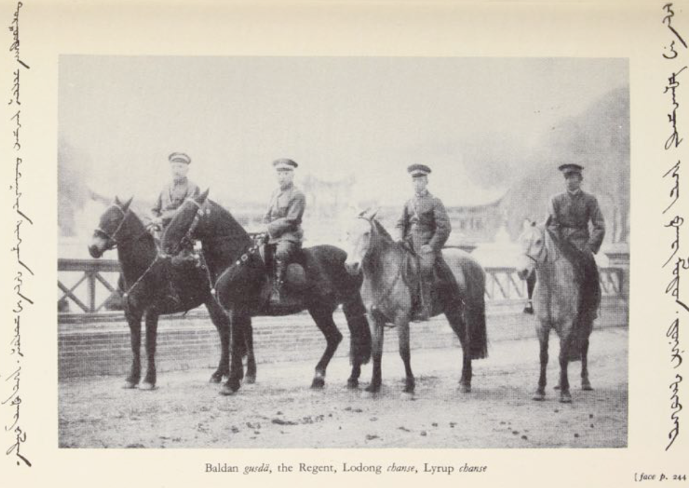

DA: фото нет в датскоязычном издании 1947 г.

EN: Baldan *gusdä*, the Regent, Lodong *chanse*, Lyrup *chanse*

RU: Балдан-гусда, регент, Лодонг-чансе, Лируп-чансе.

### Молодые торгуты

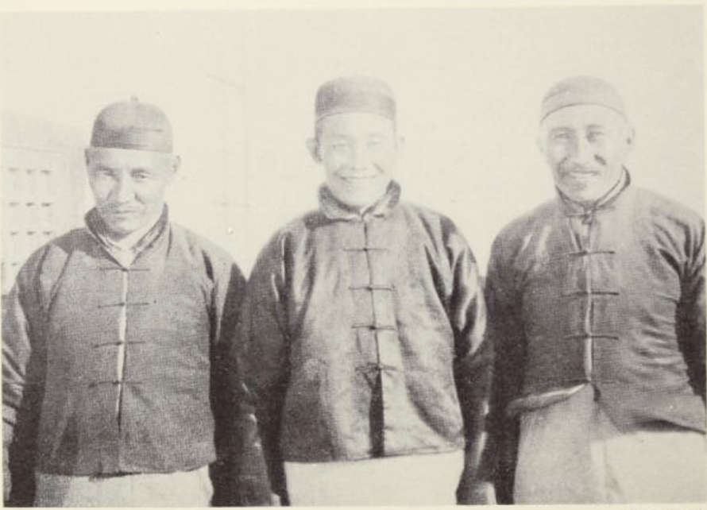

DA: фото нет в датскоязычном издании 1947 г.

EN: Young Torguts. *Photo Ambolt*

RU: Молодые торгуты. Фото Амболта

### Храмовая юрта торгутов

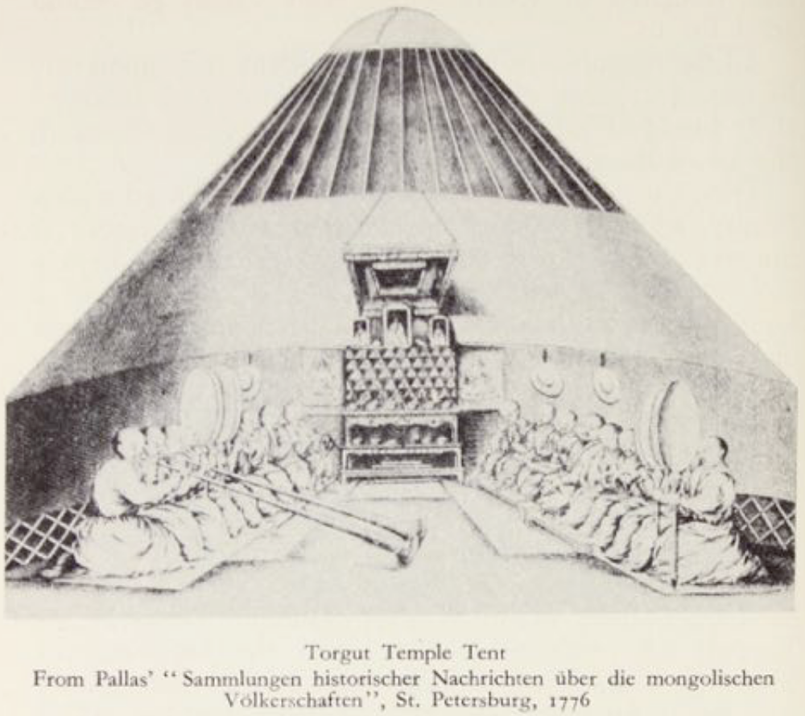

DA: фото нет в датскоязычном издании 1947 г.

EN: Torgut Temple Tent. From Pallas’ “Sammlungen historischer Nachrichten über die mongolischen Völkerschaften”, St. Petersburg, 1776

RU: Храмовая юрта торгутов. Из издания: П. С. Паллас, «Sammlungen historischer Nachrichten über die mongolischen Völkerschaften», Санкт-Петербург, 1776.

### Тибетская молитва

")

DA: изображение нот отсутствует в датскоязычном издании 1947 г.

EN: “Baredo soldep” (Tibetan prayer)

RU: «Баредо сольдеп» (тибетская молитва)

Изображение нот смешано с иллюстрацией "[Храмовый шатёр](#храмовый-шатёр)" подпись к которой в англоязычном издании, наоборот, пропущено.

### Балдан-гусда

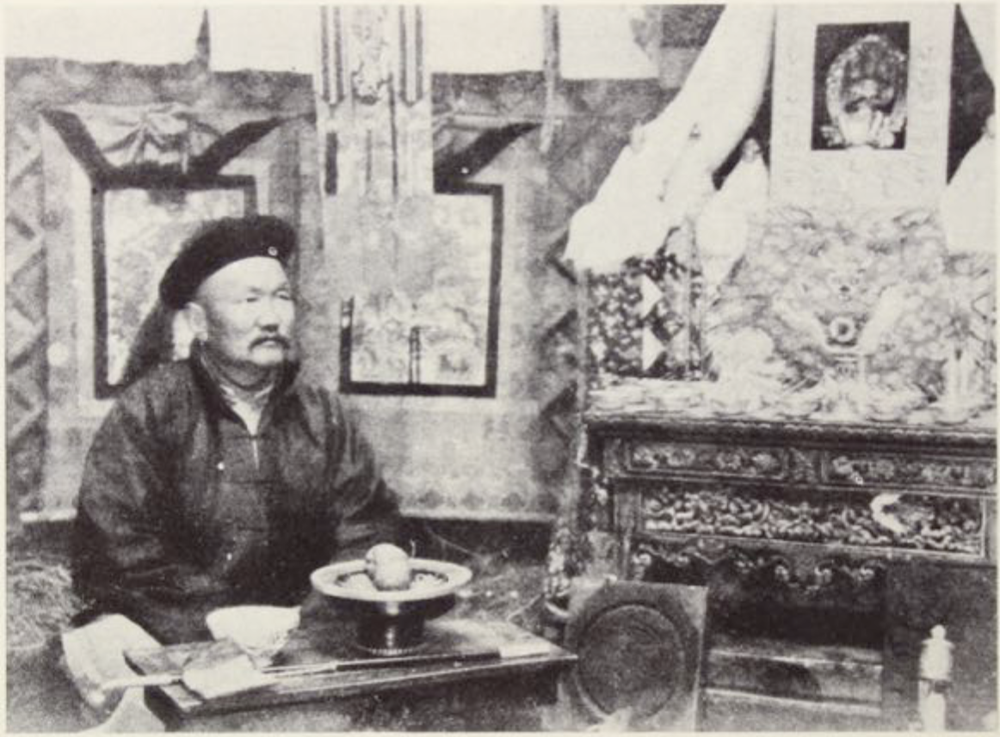

DA: фото нет в датскоязычном издании 1947 г.

EN: Baldan Gusdä

RU: Балдан-гусда

### Карта

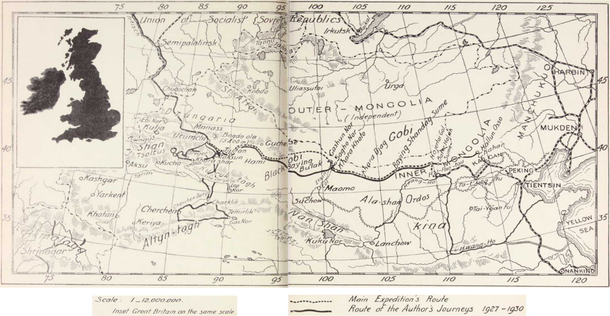

DA: в датскоязычном издании 1947 г. карта на датском языке

EN: Map

RU: Карта

## Благодарности

Фотографии из датскоязычного издания 1947 г.получены благодаря помощи Алексея Сидоренко.

## Комментарии

[**Обсудить**](https://t.me/answer42geo/153)
