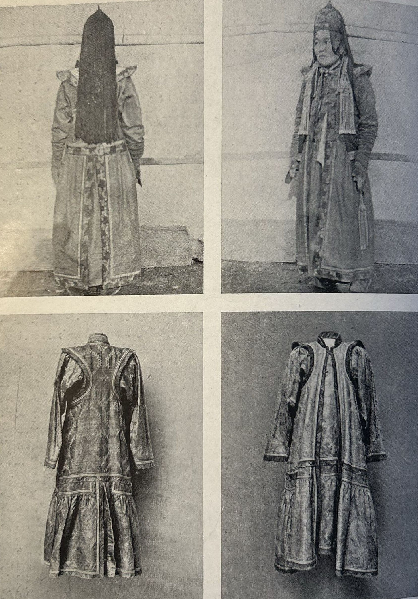
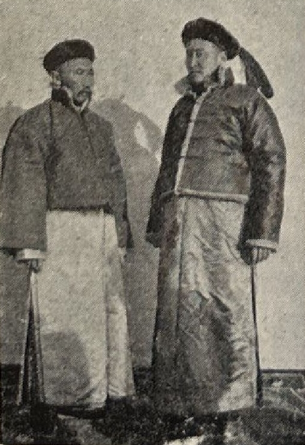

## Введение

Здесь собраны фотографии из книги датского путешественника Хеннинга Хаслунда-Кристенсена --- Zajagan. Фотографии приведены по изданию 1947 г. на датском языке.

Библиографическая ссылка:

> Haslund-Christensen Henning, 1947. Zajagan. Gyldendanske Boghandel Nordisk Forlag. København.

Необходимость в этом перечне возникла, так как в изданиях этой книги на разных языках оказалось разное количество фотографий. Например, в издании на английском языке [отсутствует фотография](/notes/ja-lama-fort-photos/#хеннинг-хаслунд-кристенсен-и-c-hempel-hembel-1928) замка Джа-ламы.

Представленные фото не всегда удовлетворительного качества и приводятся скорее для индекса. Напишите, если у вас есть доступ к оригинальному изданию.

## Фотографии

### Его Святейшество Син Чин Геген

, Tigergudens femte Reinkarnation og alle Torguters Hersker. Kommandør af den svenske Vasaordens 2. Klasse.")

Hans Hellighed *Sin Chin Gegen* (1884-1932), Tigergudens femte Reinkarnation og alle Torguters Hersker. Kommandør af den svenske Vasaordens 2. Klasse.

Его Святейшество *Син Чин Геген* (1884–1932), пятая реинкарнация Тигриного бога и владыка всех Торгутов. Командор шведского ордена Вазы II класса.

### Гроты Юньган

*Yün Kang*-Grotterne.

Гроты Юньган.

### Джолрос-лама

Jolros Lama. Lieberenz fot.

Джолрос-лама. Фото Либеренца.

### Шируп-Гелинг

Shirup Geling med Jolros Lamas Hund. Lieberenz fot.

Шируп-Гелинг с собакой Джолрос-ламы. Фото Либеренца.

### Паломники перед резиденцией Джолрос-ламы

Bodsøvende foran Jolros Lamas Bolig. Lieberenz fot.

Паломники перед резиденцией Джолрос-ламы. Фото Либеренца.

### Праздничная площадь под палящим солнцем

"Festpladsen laa hen i bagende Sol..." Lieberenz fot.

«Праздничная площадь под палящим солнцем…». Фото Либеренца.

### Буга

"Buga", en af Dødskongens Forløbere.

«Буга», один из предвестников Царя Смерти.

### Оркестр располагался на юге

„Orkestret var placeret i Syd“. (Øverst til venstre)

«Оркестр располагался на юге». (Вверху слева)

### Цаган Обогон, «Белый старец»

Tsaghan Obogon, „Den hvide Olding“. Hummel fot.

Цаган Обогон, «Белый старец». Фото Хуммеля.

### Образ Майдари

„Fra det vajende Banner foran Hovedtemplet skuede den milde Maidaris Billede ned.“ (Nederst til venstre)

«С развевающегося знамени перед главным храмом взирал вниз образ кроткого Майдари». (Внизу слева)

### Образ Майдари --- старая женщина

„En af de sidste, der gik til Maidaris Billede var den lille gamle Kone ...“

«Одной из последних, кто подошёл к образу Майдари, была маленькая старая женщина…»

### Выветрившиеся руины Хара-Хото

Khara Khotos forvitrede Ruiner rejser sig endnu over Sandet. Kaull fot.

Выветрившиеся руины Хара-Хото всё ещё возвышаются над песком. Фото Каулля.

### Хорошо сохранившийся мусульманский храм

„Et velbevaret muhammedansk Gudshus ligger beskyttet af den vestlige Bymur“. v. Kaull fot.

«Хорошо сохранившийся мусульманский храм лежит под защитой западной городской стены». Фото В. Каулля.

### Этцинские-торгуты

Etsina-Torguter, Mand og Yngling. v. Kaull fot.

Этцинские-торгуты: мужчина и юноша. Фото В. Каулля.

### Девушка этцинский-торгут

Etsina-Torgut, Pige. v. Kaull fot.

Девушка этцинский-торгут. Фото В. Каулля.

### Пробы крови

Hver Gang jeg forsøgte at tage Blodprøver paa Mongolerne saa de ulykkelige ud. Bergman fot.

Каждый раз, когда я пытался брать у монголов пробы крови, они выглядели несчастными. Фото Бергмана.

### Тангерт-Геген

Tangert Gegen.

Тангерт-Геген.

### План Хара-Хото

Mure og forvitrede Rester rejser sig endnu over Sandet, trodsende den omgivende Ørkens mægtige og livsfjendske Stormløb. Et velbevaret muhamedansk Gudshus ligger endnu tilbage; beskyttet af den vestre Mur, paa graaviolette, stormomsuste Plateauer ses endnu Mærkerne efter Agerfelternes Vandingssystem, og paa utallige modellerede Lerkar fandt vi Fingeraftryk af de Mennesker, der havde formet dem.

I seks Sekler havde dette døde Menneskeminde slumret i Ørkenens Favntag, da Koslov i 1909 opdagede det for Vesterlandet.

Стены и выветрившиеся остатки всё ещё поднимаются над песком, бросая вызов могучему и враждебному жизни натиску окружающей пустыни. Хорошо сохранившийся мусульманский храм всё ещё стоит; под защитой западной стены, на серо-фиолетовых, обдуваемых бурями плато всё ещё видны следы оросительной системы полей, и на бесчисленных сформованных глиняных сосудах мы находили отпечатки пальцев людей, которые их лепили.

Шесть столетий эта мёртвая память о людях дремала в объятиях пустыни, пока Пётр Козлов в 1909 году не открыл её для Запада.

### Горы на горизонте

Vor gamle Torgut-Vejviser udpegede de Bjerge i Horisonten, som i et langt Liv havde udgjort hans daglige Inspiration. Hummel fot.

«Наш старый торгут-проводник указал на горы на горизонте, которые на протяжении долгой жизни ежедневно его вдохновляли». Фото Хуммеля.

### Процесс создания «Длинного змея»

„Ormen hin Lange“s Tilblivelse. Lieberenz fot.

Процесс создания «Длинного змея». Фото Либеренца.

### Высадка лодочной экспедиции

Baadekspeditionens Landstigning efter Turen paa Socho-Nor. Lieberenz fot.

Высадка лодочной экспедиции после плавания по Сочо-Нор. Фото Либеренца.

### Высадка лодочной экспедиции

Dambin Djansangs Ørkenborg. Hembel fot.

### 

### 

## Комментарии

[**Обсудить**](https://t.me/answer42geo/151)
