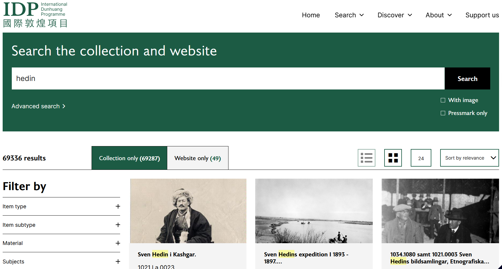
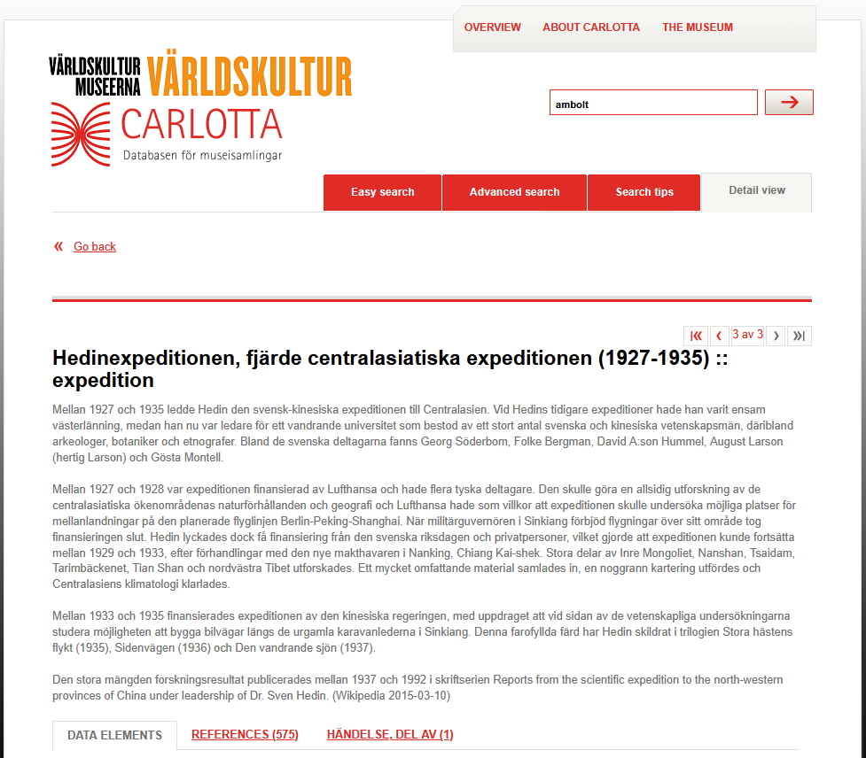
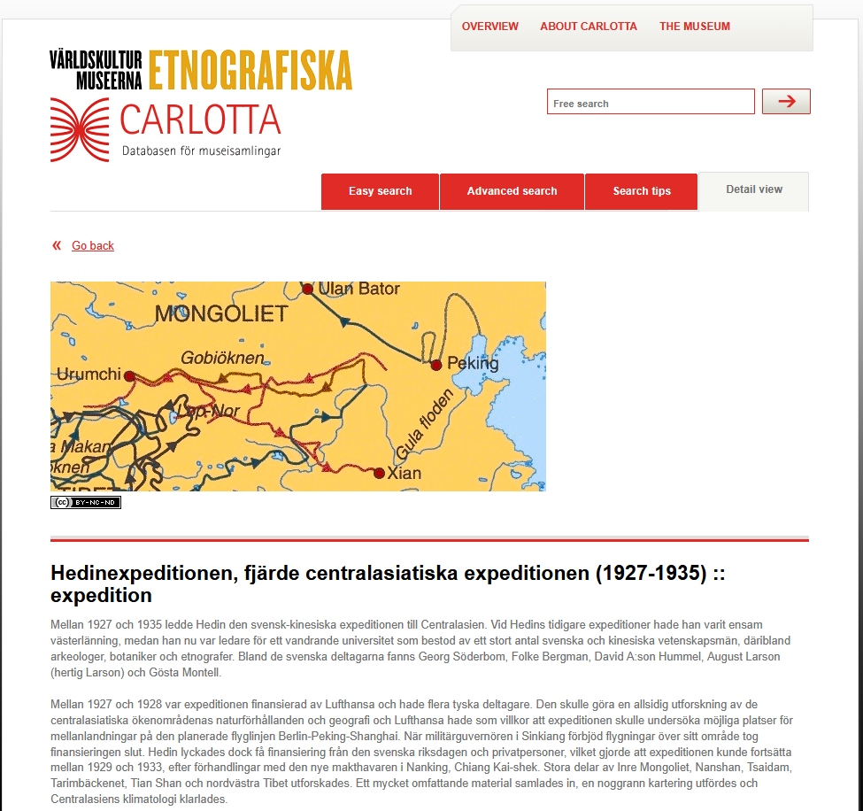
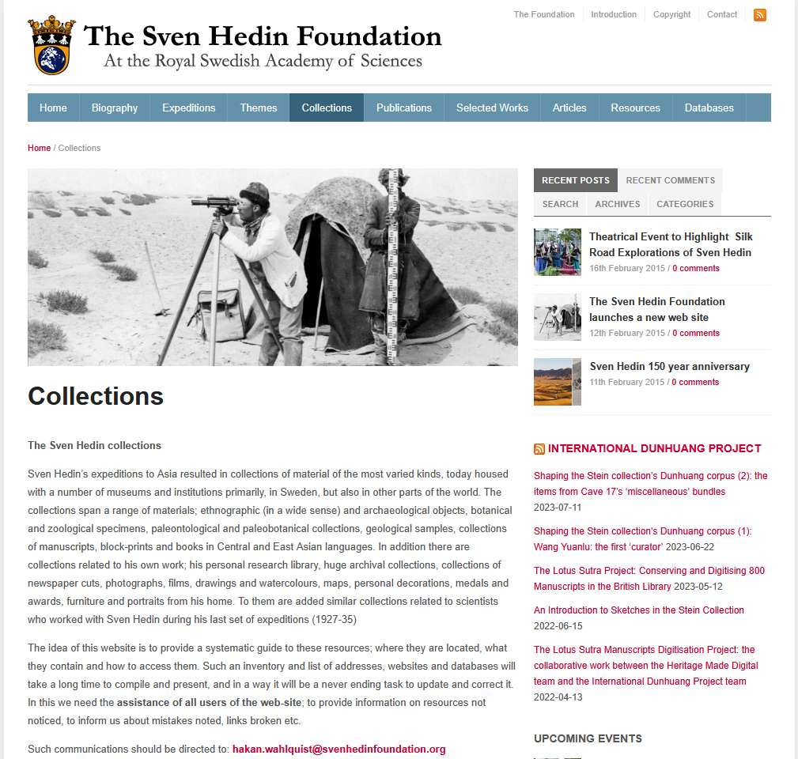

## Введение

Свен Гедин являлся бессменным лидером крупнейшей научной организации изучавшей территорию северного и северо-западного Китая --- китайско-шведской экспедиции ([Sino-Swedish Expedition](https://en.wikipedia.org/wiki/Sino-Swedish_Expedition)). Экспедиция работала с 1927 по 1935 год и охватила обширные территории Монголии, Внутренней Монголии, Синьзяна, Гоби.

Ниже собраны основные источники фотографий из экспедиции Гедина.

Эти базы данных использовались (пока безуспешно) для [поиска исходников](/notes/haslund-ru-edition/) фотографий опубликованных в книге [Хаслунда Заяган](/notes/haslund-zajagan-photos/).

## Фоторесурсы

### International Dunhuang Programme

<https://idp.bl.uk>

Каталог материалов, включая фотографии, хранящихся в Британской Библиотеке и, небольшое количество, из Шведского этнографического музея.

### Varldskultur Museerna

Шведский Музей Мировой Культуры в Гётеборге ([en-wiki](https://en.wikipedia.org/wiki/Museum_of_World_Culture)). Система CARLOTTA-VKM.

<https://collections.smvk.se/carlotta-vkm/web>

Поиск по материалам экспедиции:

<https://collections.smvk.se/carlotta-vkm/web/object/2357241>

### Museum of Ethnography

Шведский Этнографический Музей в Стокгольме ([en-wiki](https://en.wikipedia.org/wiki/Museum_of_Ethnography,_Sweden)). Система CARLOTTA-EM.

<https://collections.smvk.se/carlotta-em/web>

Поиск по материалам экспедиции:

<https://collections.smvk.se/carlotta-em/web/object/2778969>

> Mellan 1927 och 1935 ledde Hedin den svensk-kinesiska expeditionen till Centralasien. Vid Hedins tidigare expeditioner hade han varit ensam västerlänning, medan han nu var ledare för ett vandrande universitet som bestod av ett stort antal svenska och kinesiska vetenskapsmän, däribland arkeologer, botaniker och etnografer. Bland de svenska deltagarna fanns Georg Söderbom, Folke Bergman, David A:son Hummel, August Larson (hertig Larson) och Gösta Montell.
>
> Mellan 1927 och 1928 var expeditionen finansierad av Lufthansa och hade flera tyska deltagare. Den skulle göra en allsidig utforskning av de centralasiatiska ökenområdenas naturförhållanden och geografi och Lufthansa hade som villkor att expeditionen skulle undersöka möjliga platser för mellanlandningar på den planerade flyglinjen Berlin-Peking-Shanghai. När militärguvernören i Sinkiang förbjöd flygningar över sitt område tog finansieringen slut. Hedin lyckades dock få finansiering från den svenska riksdagen och privatpersoner, vilket gjorde att expeditionen kunde fortsätta mellan 1929 och 1933, efter förhandlingar med den nye makthavaren i Nanking, Chiang Kai-shek. Stora delar av Inre Mongoliet, Nanshan, Tsaidam, Tarimbäckenet, Tian Shan och nordvästra Tibet utforskades. Ett mycket omfattande material samlades in, en noggrann kartering utfördes och Centralasiens klimatologi klarlades.
>
> Mellan 1933 och 1935 finansierades expeditionen av den kinesiska regeringen, med uppdraget att vid sidan av de vetenskapliga undersökningarna studera möjligheten att bygga bilvägar längs de urgamla karavanlederna i Sinkiang. Denna farofyllda färd har Hedin skildrat i trilogien Stora hästens flykt (1935), Sidenvägen (1936) och Den vandrande sjön (1937).
>
> Den stora mängden forskningsresultat publicerades mellan 1937 och 1992 i skriftserien Reports from the scientific expedition to the north-western provinces of China under leadership of Dr. Sven Hedin. (Wikipedia 2015-03-10)

Перевод на русский:

> Шведско-китайская экспедиция в Центральной Азии под руководством Свена Гедина продолжалась с 1927 до 1935 года. В прежних своих экспедициях Гедин был единственным западным участником, тогда как теперь он возглавлял своего рода «передвижной университет», состоявший из большого числа западных и китайских учёных, среди которых были археологи, ботаники и этнографы. Среди шведских участников находились Georg Söderbom, Folke Bergman, David A:son Hummel, August Larson (герцог Ларсон) и Gösta Montell.
>
> В 1927–1928 годах экспедиция финансировалась компанией Lufthansa и включала несколько немецких участников. Она должна была провести всестороннее исследование природных условий и географии пустынных областей Центральной Азии. Условием финансирования со стороны Lufthansa было то, что экспедиция должна изучить возможные места для промежуточных посадок на планируемой авиалинии Берлин—Пекин—Шанхай. Когда военный губернатор Синьцзян запретил полёты над своей территорией, финансирование прекратилось. Однако Хедину удалось получить средства от шведского риксдага и частных лиц, благодаря чему экспедиция была продолжена в 1929–1933 годах после переговоров с новым правителем в Нанкине — Чан Кайши. Были исследованы значительные части Внутренняя Монголия, Наньшань, Цайдамская впадина, Таримская впадина, Тянь-Шань и северо-западный Тибет. Был собран чрезвычайно обширный научный материал, проведено точное картографирование и прояснены особенности климатологии Центральной Азии.
>
> В 1933–1935 годах экспедиция финансировалась китайским правительством. Помимо научных исследований ей было поручено изучить возможность строительства автомобильных дорог вдоль древнейших караванных путей в Синьцзян. Это опасное путешествие Гедин описал в трилогии: Stora hästens flykt (1935), Sidenvägen (1936) и Den vandrande sjön (1937).
>
> Большое количество научных результатов было опубликовано между 1937 и 1992 годами в серии изданий Reports from the scientific expedition to the north-western provinces of China under leadership of Dr. Sven Hedin. (Wikipedia, 10.03.2015)

### Sven Hedin Foundation

<https://svenhedinfoundation.org/collections/>

Описание коллекций Гедина, включая фотографическую. Судя по разделу Databases, раньше на вебсайте были какие-то каталоги, но теперь осталось только описание коллекций, интерфейсов поиска на сайте нет.

В описании однако упоминается, что часть фотографий не переехала в Этнографический музей?

> The Hedin collection of photographs
>
> The collections of photographs in the Hedin collections are huge and varied. They contain family albums and albums presented to him, an extensive collection of portraits of the family and people with whom the family and Sven Hedin maintained contacts. There are early sets of photographs from Istanbul, Caucasus, Persia, Russian Central Asia and elsewhere acquired by or presented to Hedin.
>
> And there are of course Sven Hedin’s own photographs from his expeditions, in most cases matched by glass negatives, ordinary negatives, additional prints, lantern slides…
>
> During the Sino-Swedish expedition Sven Hedin did not take any photographs himself, instead all the photographs taken then by his co-workers are there, Swedish as well as Chinese members. German members are also represented, but in their case they may be found in archives and museums in Germany. The original photos and glass-negatives of the official photographer of the first leg of the expedition (1927-28) Paul Lieberenz, however, are all with the Hedin collections and owned by the Sven Hedin Foundation. Copyright fees are shared with the Ethnographic Museum, where these huge collections are kept.
>
> Over the last few years the Foundation has managed to scan a fair share of the photographs, which will be continuously released via this website and the data base of the Ethnographic Museum, when metadata has been properly added. The Swedish Centenary Fund has supported this work.
>
> Requests for using photographs, from the Hedin archives should be directed to: <bildarkiv@etnografiska.se> copy to: <hakan.wahlquist@svenhedinfoundation.org>

## Комментарии

[**Обсудить**](https://t.me/answer42geo/189)
