## Введение

После изгнания из Внешней Монголии-Халхи, Джа-лама перебрался на юг, во Внутреннюю, где построил крепость.

Крепость Джа-ламы была построена в стратегическом месте, недалеко пересечения важных караванных путей: с севера на юг от Урги через Юм-бейсе в Тибет и с востока на запад от Хух-хото (Коко-хото, Гуй-Хуа-чен) в Кученг (Kuch’eng), Урумчи, Кашгар ([подробнее](/notes/roerich-urga-yum-beise/#koko-khoto--kucheng)).

Благодаря расположению вблизи пересечения основных караванных путей, Джа-лама получил хорошую возможность управлять, а то и грабить караваны. Например, при попытке вернуть его в Лхасу было захвачено хозяйство Далай-ламы XIII, пожертвованное ему паломниками и оставленное в [Юм-бейсе](https://m-d.me/notes/norzunov-route/#%d1%8e%d0%bd%d0%b4%d1%83%d0%bd-%d0%b1%d1%8d%d0%b9%d1%81%d0%b5%d0%b8%d0%bd-%d0%ba%d1%83%d1%80%d0%b5-youndoun-beisiin-kure). У [Ломакиной](/notes/lomakina-beglets/#%d0%b2%d0%bc%d0%b5%d1%81%d1%82%d0%be-%d1%8d%d0%bf%d0%b8%d0%bb%d0%be%d0%b3%d0%b0):

> Боясь конфискации после Народной революции 1921 года в Монголии, Лхаса распорядилась вывезти в Тибет самое ценное. В Юм-бейсе был снаряжен караван с охраной. Но лазутчик Джа-ламы, астраханского калмыка, провозгласившего себя перерожденцем знаменитого Амурсаны, бежавшего от революции в Черную Гоби и не гнушавшегося разбоем, сообщил ему об этом. И люди Джа-ламы ограбили караван с поклажей владыки.

Обширную коллекцию фотографий крепости в разные периоды времени можно найти в статье [Фотографии крепости Джа-ламы](/notes/ja-lama-fort-photos/).

Каково же точное расположение крепости Джа-ламы? Сразу обозначим ее точное местоположение, далее разберем упоминания путешественников её посетивших.

## Точное местоположение крепости

Руины крепости располагаются 2 км юго-западнее г. Мацзуншань (бывший Гунпоцюань). Субэй-Монгольский автономный уезд, округ Цзюцюань, провинция Ганьсу, Китай.

Координаты:

* Широта: 41.7927027
* Долгота: 97.0130695

На картах:

* [Google Satellite](https://maps.app.goo.gl/Gy2YtiYCXxnk7TWG9)
* [OpenStreetMap](https://www.openstreetmap.org/#map=14/41.78460/97.00194)

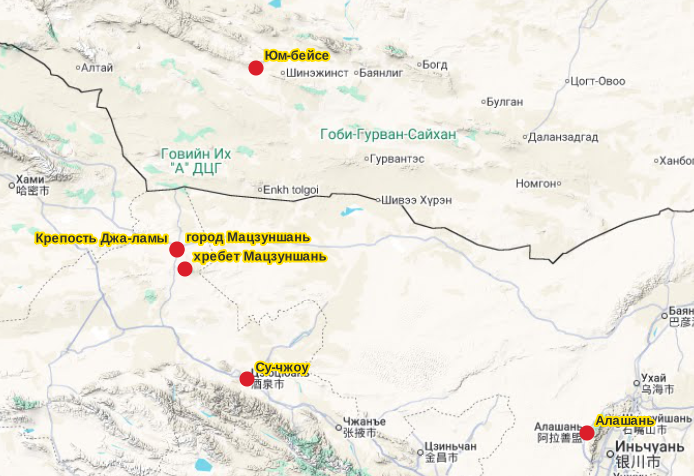

.")

## Посетители

Крепость Джа-ламы посещали следующие экспедиции (по имени главы экспедиции):

* Латтимор, Оуэн: 22 октября 1926
* Рерих, Николай Константинович: 12 мая 1927
* Хаслунд-Кристенсен, Хеннинг: 16 ноября 1928
* Гедин, Свен: 27 января 1934
* Тейхман, Эрик: 19 октября 1935

Дата --- дата посещения крепости.

## Упоминания у путешественников

Упоминания топонимов и других ориентиров в районе крепости из трудов путешественников. Все труды в оригинале опубликованы на английском языке, цитаты приводятся по ним.

### Латтимор

Маршрут с востока на запад: Kweihwa (Kuku-khoto) --- Kuchengtze (Ku Ch’eng-tze).

Публикация:

Lattimore, Owen. 1928. “Caravan Routes of Inner Asia.” The Geographical Journal 72 (6), December 1928: 497–531. ([скачать](https://drive.google.com/file/d/1cHTO73PBWEKstRHMDd8YH4x2F4krWIYn/view?usp=sharing))

* foothills of the Matsung Shan, "horse-hoof-print hills" - the Horseshoe Hill;
* Somewhere through it passes the route of Ladighin from north to south;
* maintaining the trade between Kweihwa and Chinese Turkistan;
* He brought up supplies from Suchow;
* crossing of the Black Gobi;
* Mingshui marked on many maps. It appears to derive from a map of the Germans, Holderer and Futterer, which includes a route of the Russian Obruchev; but it may not be the same place, as Mingshui simply means "clear water", and can be applied to any spring-fed well;
* snow on the peaks of the Qarliq Tagh;
* routes from Kansu and Outer Mongolia converge on the Winding Road;

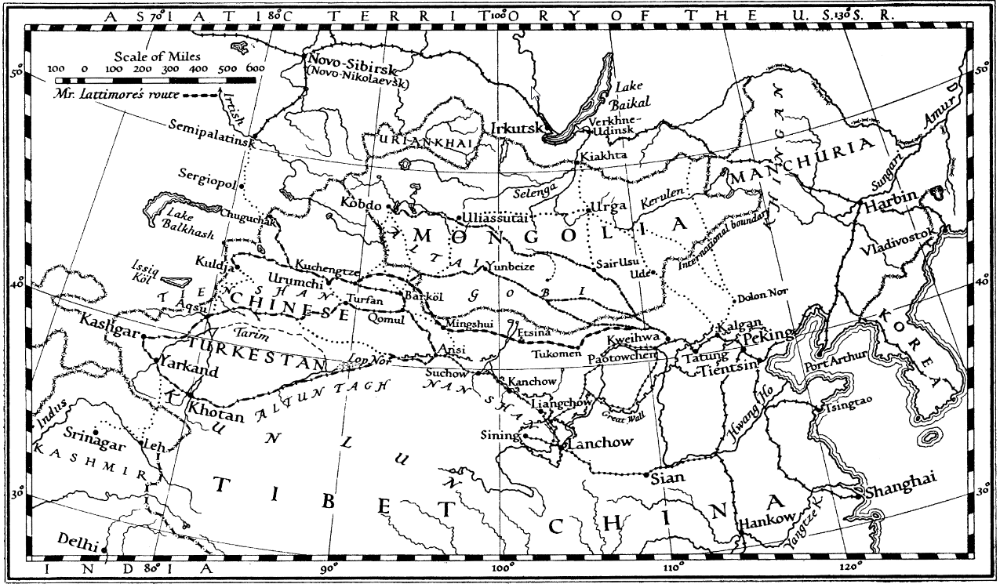

Перевод подписи: Основные караванные пути Внутренней Азии.

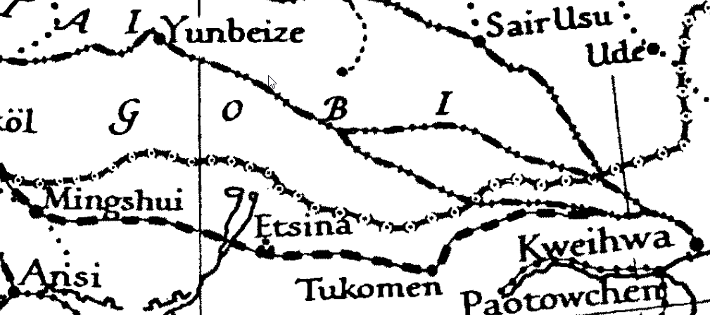

Увеличенный фрагмент.

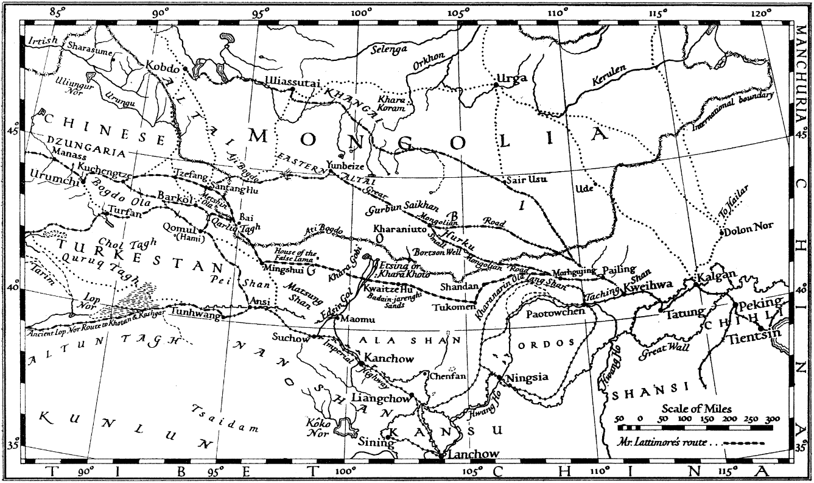

Караванные пути из Китая в Центральную Азию с указанием маршрута г-на Латтимора от Хух-хото до Кученга.

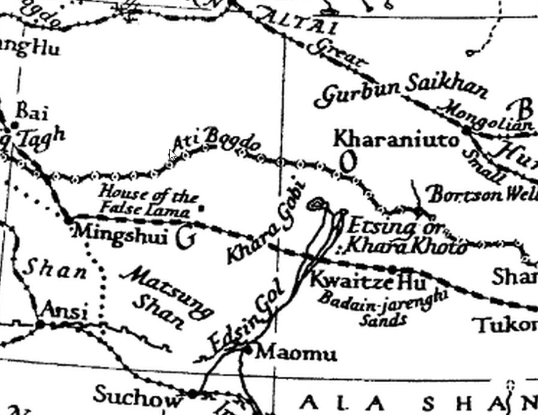

Увеличенный фрагмент.

Публикация:

Lattimore, Owen. 1929. The Desert Road to Turkestan. Boston: Little, Brown, and Company. ([скачать](https://archive.org/embed/dli.pahar.2407))

* The Wild Horse Well is on the very brink of the central plateau of the Black Gobi;
* we could see far off toward the south-west the blue beginnings of the Ma-tsung Shan;
* The name of this well is significant: it is Ho-shao Ching, which means the Well of the Hoshun;
* This well is on a variant of an ancient route, now fallen into some desuetude, between Hsü Chou in Kan-su and Yunbeize;
* One stage more to the west from this well is a half-dry mere called Kung-p'o Ch'üan ...
* ... the strategic point of the region which the caravan men call the San Pu-Kuan;
* At Kung-p'o Ch'iian ... here comes into the same oasis the main trail from the north, coming from Yunbeize and going to Hsü Chou, through an easy pass of the main range of the Ma-tsung Shan.
* I crossed the line of Ladighin, of Kozloff's 1900-1 expedition, whose march was from north to south;
* His most important excursion was eastward, to the Kuku-tumurtu-ola (the Ati Bogdo of Carruthers);
* This range, he says, links with the Noin Bogdo to the east, north of the terminal basin of the Edsin Gol.
* isolated on the north by a desert, the Charghin Gobi;
* alfway between the Tumurtu and Hsü Chou he indicates a portion of a range called "Madzi-shan.";
* This is undoubtedly the Ma-tsung Shan;
* In a depression beginning a t the Well of the Hoshun;
* Sertsinghin-nuru of Ladighin;
* they run up to the Aji Bogdo, yet farther back in the north and west;
* the strangest ruins I ever saw;
* It is from these ruins that the mere is called Kung-p'o Ch'iian- the Spring of the Hillside of the Duke.
* establishing the crossing of the Khara Gobi by the Three and the Four Dry Stages;
* making it possible for large caravans to travel from Ku Ch'eng-tze to Kuei-hua;
* The digging of the "miraculous" Stone Slab Wells;
* Ve camped about five miles beyond the Chia-lama Pan'rh at the next group of springs.

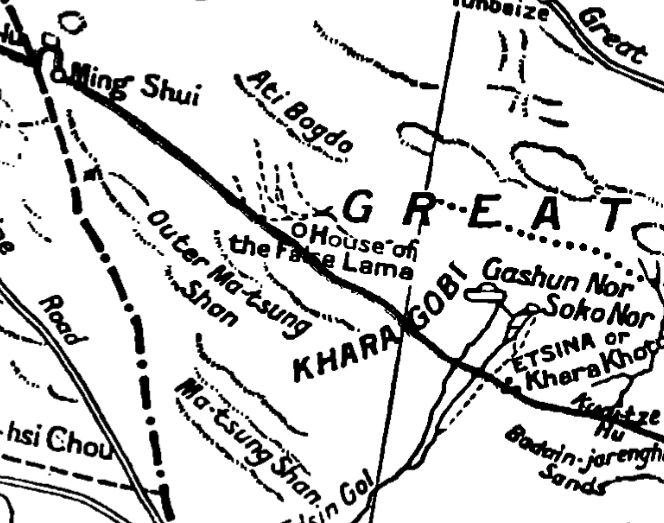

Фрагмент карты из книги.

### Рерих

Маршрут с юга на север: Урга --- Аньси и далее.

Публикация:

Roerich, G. 1931. Trails to Inmost Asia. [Стр. 207](/notes/roerich-trails-to-asia-en/#207)

* well called Altan-usu;
* Ma-tzu Shan, Ma-tsung Shan;
* crossed a steep pass that leads across the Artsegin-nuru Mountains;
* On the south southwest rise the massive Ikhe Ma-tzu Shan...;
* ... and its continuation Baga Ma-tzu Shan;
* authorities of An-hsi are unable to stop;
* The place is called Sukhai-Bom and received its name from the juniper shrub;
* Chinese caravan from Koko-khoto bound for Ku-ch’eng;
* small rivulet called Balgantai;

### Хаслунд

Маршрут с востока на запад: Peking --- Sogho Nor --- Hami --- Urumchi и далее.

Публикация:

Henning Haslund-Christensen, 1935. Men and Gods in Mongolia (Zayagan). Translated from Swedish by Elizabeth Sprigge and Claude Napier. New York: E.P. Dutton & co. [Стр. 150](/notes/haslund-zajagan-en/#150)

* To the south and west the view was cut off by the blue chain of the Ma-tsung mountains;
* The Mongols call the place Baying Bulak, “the rich spring” ...;
* ... but the Chinese Kung-p’o Ch’uan, “the spring by the duke’s precipice”;

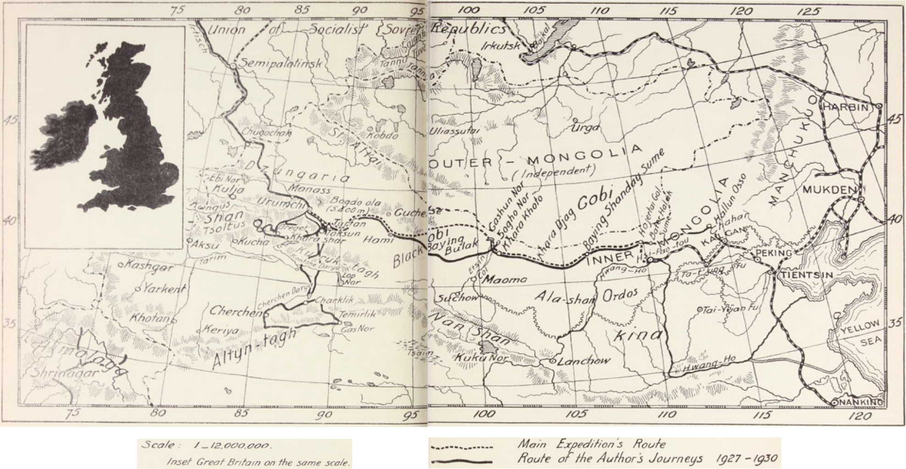

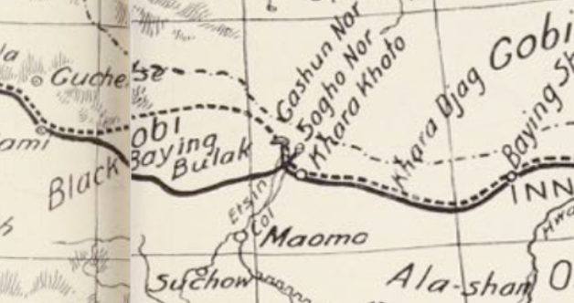

### Гедин

Маршрут с востока на запад: Peking --- Kuei-hua --- Hami --- Turfan и далее.

Публикация:

Hedin, 1944. History of the Expedition in Asia 1927-1935 by Sven Hedin in collaboration with Folke Bergman. In Reports from the scientific expedition to the North-Western provinces of China under the leadership of Dr. Sven Hedin. The Sino-Swedish expedition. Publication 25. Stockholm. Pp. 41-43. ([скачать](https://drive.google.com/file/d/1wyq_rLNwnG15ykXcu0pt4nfM397YnsSs/view?usp=sharing))

* we passed Hung-liu-ka-ta-ching;
* The mountains in the south are called the Ma-tsung-shan, "Horse's Mane Mountains";
* At eleven o'clock we halted at the Kung-pao-ch'üan spring;

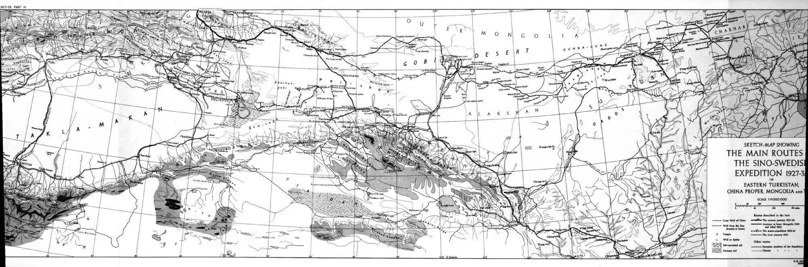

Карта в доступном PDF очень плохого качества.

### Тейхман

Маршрут с востока на запад: Pekin --- Pai-ling Miao --- Kashgar и далее.

Публикация:

Teichman, Sir Eric, 1937. Journey to Turkistan. London: Hodder and Stoughton. XIV, 221 p., 31 p. of plates: ill., col. fold. map, ports. ([скачать](https://drive.google.com/file/d/1Skd85cWx4ocIGPxs-bQS0NHlz7K-WO_d/view?usp=sharing))

* Kung-po Ch'uan;
* The Mongol name for Kung-po Ch'uan is Bayin Buluk, meaning "The Copious Spring."
* housing a depot of the Sin-sui company and a tax station;
* route here crossed a trail from south to north, connecting An-hsi ("City of Western Peace") in Kansu with Uliasutai and Urga;
* Pai-ling Miao;
* situated on a hill above the little settlement;
* gradually ascending all the way from the oasis of the Etsin Gol;
* at Kung-po Ch'uan we were already more than five thousand feet above the sea;
* We entered a ravine and came to Ming-shui ("Clear Water");

> As we approached the spring of Kung-po Ch'uan across a level plain we saw, while still a long way off, the keep and buildings of a castle prominently situated on a hill above the little settlement ; a sight which drew and held attention, for we had seen no buildings worthy of the name since leaving Pai-ling Miao. As we came closer we could see that the fortress, which looked so imposing from a long way off, was but a crumbling ruin ; all that remained of the stronghold of the Mongol monk who, a few years since, had terrorized the Gobi caravans from far and near.

Перевод:

> Когда мы приближались к источнику Кун-по-Чуань по ровной равнине, ещё издалека мы увидели замок и постройки крепости, хорошо заметных на холме над небольшим поселением. Это зрелище сразу привлекло и удержало наше внимание, поскольку со времени нашего отъезда из Пайлин-Мяо мы не видели никаких строений, достойных этого названия.
>
> Подойдя ближе, мы смогли разглядеть, что крепость, издали казавшаяся столь внушительной, была всего лишь осыпающимися руинами — всем, что осталось от твердыни монгольского монаха, который ещё несколько лет назад наводил ужас на караваны Гоби, приходившие из ближних и дальних мест.

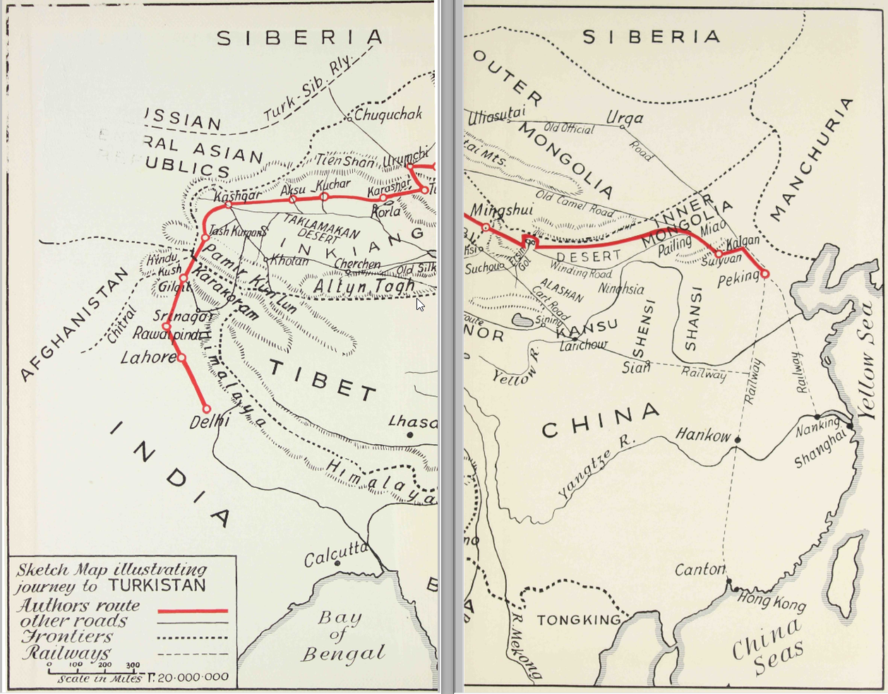

Перевод подписи: Набросок карты показывающий путешествие в Туркестан.

Пробел в середине карты - дефект исходного PDF.

## Топонимы

Итого, основные топонимы: Ma-tzu Shan, Kung-po Ch'uan.

### Ma-tzu Shan, хребет

Горная гряда, хребет в провинции Ганьсу, Китай, часть нагорья Бэйшань ([БСЭ](https://bse.sci-lib.com/article074570.html)).

Перевод названия: "Horse-hoof-print hills" - the Horseshoe Hill.

Варианты: Matsung Shan (Lattimore), Madzi-chan (Kozlov, Lattimore), хребет Мацзуншань (топокарты Генштаба).

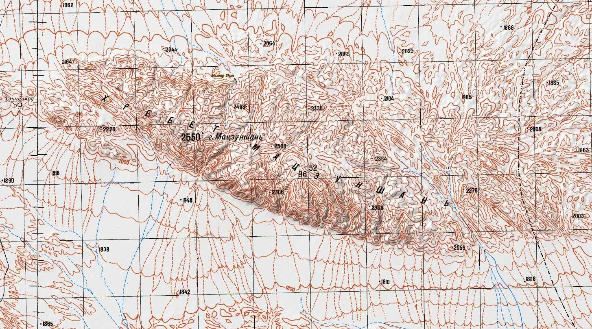

### Ma-tzu Shan, населенный пункт

Населенный пункт: 马鬃山镇 (Mǎzōng shān zhèn).

* Mazongshan Town, Subei Mongol Autonomous County ([en-wiki](https://en.wikipedia.org/wiki/Subei_Mongol_Autonomous_County)), Jiuquan ([en-wiki](https://en.wikipedia.org/wiki/Jiuquan)) - ранее Suzhou (Suchow), Gansu, China, 736301
* город Мацзуншань, Субэй-Монгольский автономный уезд ([ru-wiki](https://ru.wikipedia.org/wiki/%D0%A1%D1%83%D0%B1%D1%8D%D0%B9-%D0%9C%D0%BE%D0%BD%D0%B3%D0%BE%D0%BB%D1%8C%D1%81%D0%BA%D0%B8%D0%B9_%D0%B0%D0%B2%D1%82%D0%BE%D0%BD%D0%BE%D0%BC%D0%BD%D1%8B%D0%B9_%D1%83%D0%B5%D0%B7%D0%B4)), Цзюцюань ([ru-wiki](https://ru.wikipedia.org/wiki/%D0%A6%D0%B7%D1%8E%D1%86%D1%8E%D0%B0%D0%BD%D1%8C_(%D0%93%D0%B0%D0%BD%D1%8C%D1%81%D1%83))) --- ранее Сужоу (Су-чжоу, Сучжоу), Ганьсу, Китай, 736301

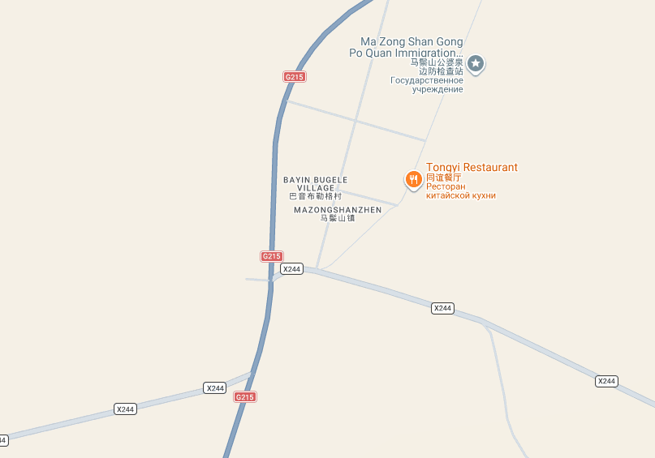

### Kung-po Ch'uan

Источник с чистой водой и небольшое поселение.

Варианты: Гунпоцюань (топокарты Генштаба), Gongpoquan, Gongpochuan, Кун-по-Чуань, 公婆泉, Байин-Булак, Bayin Buluk (Teichman).

Согласно топокартам Генштаба - название Гунпоцюань ранее носил город Мацзуншань. Координаты Гунпоцюань на топокартах совпадают с расположением города Мацзуншань. Названия часто упоминаются вместе ([пример](https://www.thewindpower.net/windfarm_en_36502_mazongshan-gongpoquan.php)).

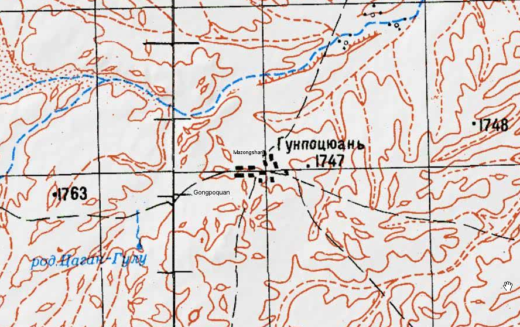

Родник Гунпоцюань также отмечен на карте в 22 км на северо-восток от деревни Гунпоцюань.

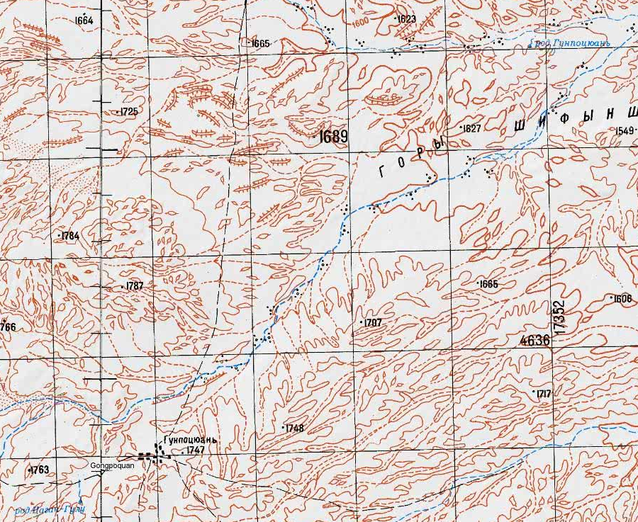

## Выводы

Многократное упоминание хребта Мацзуншань, родника Гунпоцюань у многих путешественников и отчетливое спутниковое изображение руин крепости в районе г. Мацзуншань (бывший Гунпоцюань) с большой степенью точности позволяют зафиксировать расположени остатков крепости Джа-ламы.

## Комментарии

[**Обсудить**](https://t.me/answer42geo/146)
