## Введение

Фотографии "крепости" Джа-ламы из разных источников

## Фото

В историческом порядке от старых к новым.

### Латтимор О., 1926/1927

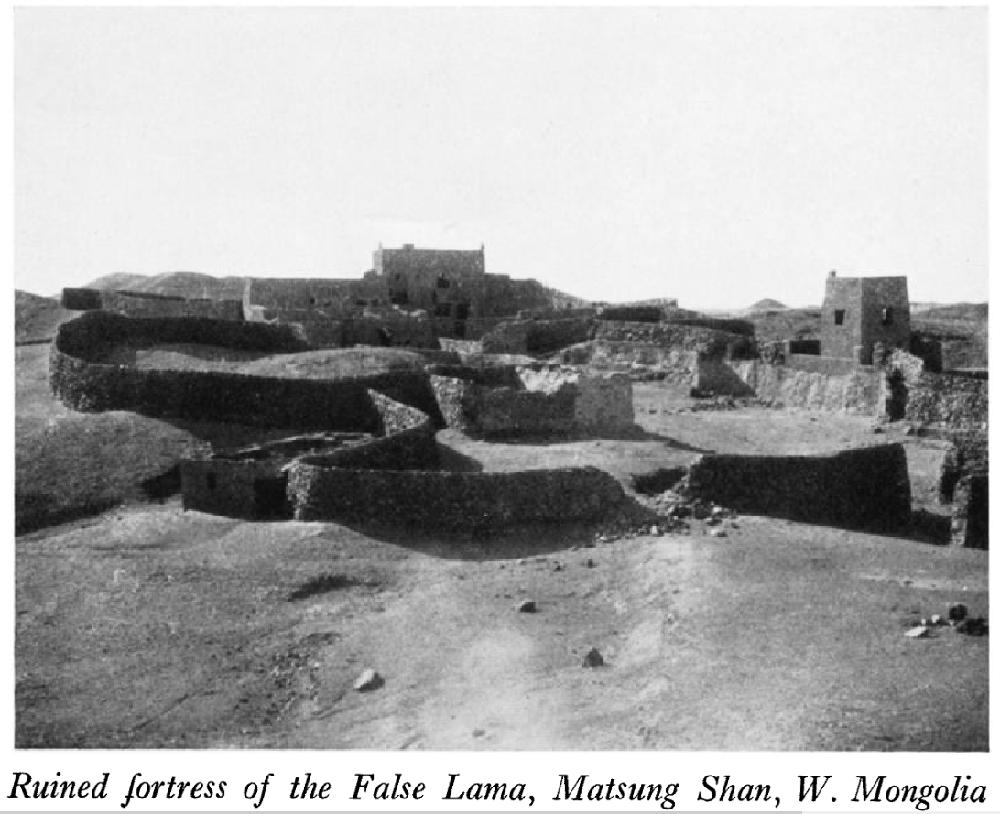

Публикация:

Lattimore, Owen. 1928. “Caravan Routes of Inner Asia.” The Geographical Journal 72 (2): 497–531. ([скачать](https://drive.google.com/file/d/1cHTO73PBWEKstRHMDd8YH4x2F4krWIYn/view?usp=sharing))

### Рерих Ю.Н., 1927

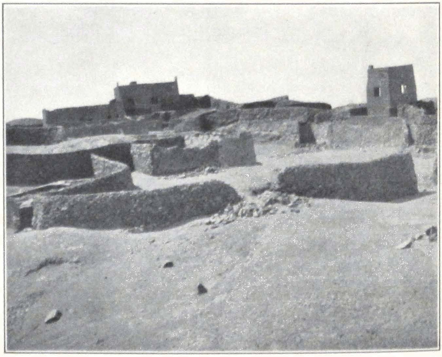

Публикация:

> Roerich, G. 1931. Trails to Inmost Asia: Five years of exploration with the Roerich Central Asian Expedition. New Haven: Yale University Press. Preface by Louis Marin, 504 pages, folding route map, frontispiece portrait, 151 illustrations.

[Фото в тексте](/notes/roerich-trails-to-asia-en/#211jalama).

### Рерих Ю.Н., 1927 (экспедиционные фото)

Выделены в отдельную группу, источник - [музей Рериха в Нью-Йорке](https://www.roerich.org/museum-archive-photographs.php). Эти же фотографии можно увидеть на сайте [Центрально-Азиатской Экспедиции](https://caemap.com/#m=7/40.422/98.317&l=Gr&p=525/o) где они подписаны как "Экспедиционные фотографии".

Человек на фотографиях - Рябинин, Константин Николаевич ([ru-wiki](https://ru.wikipedia.org/wiki/%D0%A0%D1%8F%D0%B1%D0%B8%D0%BD%D0%B8%D0%BD,_%D0%9A%D0%BE%D0%BD%D1%81%D1%82%D0%B0%D0%BD%D1%82%D0%B8%D0%BD_%D0%9D%D0%B8%D0%BA%D0%BE%D0%BB%D0%B0%D0%B5%D0%B2%D0%B8%D1%87)), врач экспедиции Рериха.

Ломакина о Портнягине на фото в книге "Голова Джа-ламы":

> Но на снимке, который сделал Юрий Николаевич, в кадр попал доктор экспедиции Портнягин. Его фигура - в полувоенной форме, пробковом шлеме перед разоренной, поверженной крепостью - придает снимку свое звучание.

 Май 1927 г. NRM archive Ref. no: 404861")

 Май 1927 г. NRM archive Ref. no: 404862")

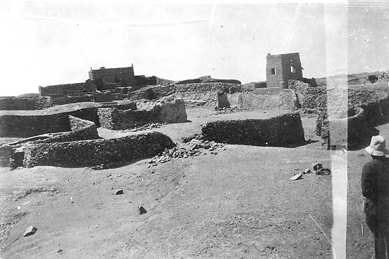

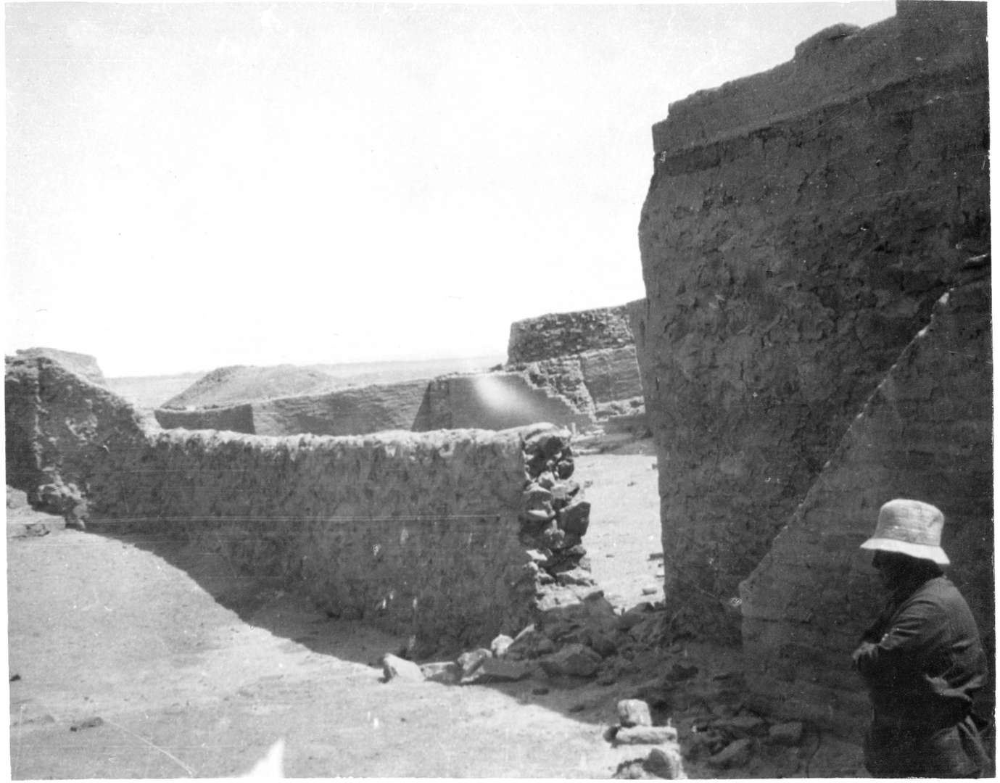

Источник данной фотографии неизвестен. В фотоархиве [музея Рериха в Нью-Йорке](https://www.roerich.org/museum-archive-photographs.php) её нет, она есть только на сайте ЦАЭ.

### Рерих Н.К., 1927 (картина)

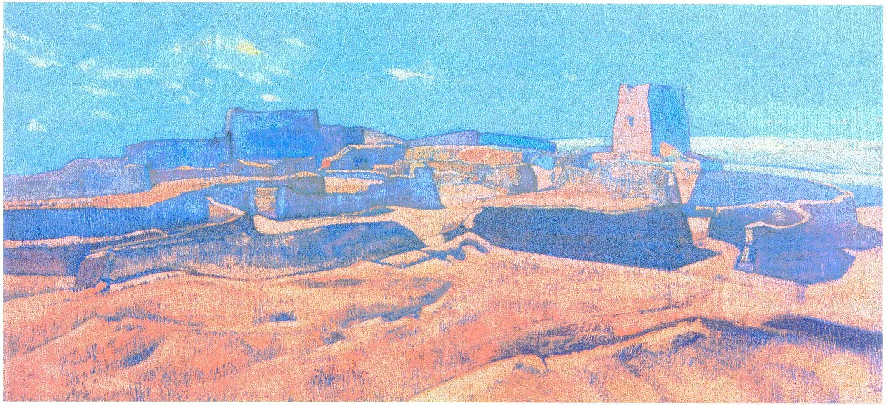

[Полноразмерная версия](painting_id259-NKR_Gorod_Dgha-lamy_Mongoliya.jpg): 2305 х 1055, JPG. [Источник](https://gallery.facets.ru/show.php?id=259&setSize=3).

Черно-белая репродукция картины [опубликована](/notes/roerich-altai-himalaya/#356jalama) в первом издании книги [Altai-Himalaya: A Travel Diary](/notes/roerich-altai-himalaya/) 1929 г.

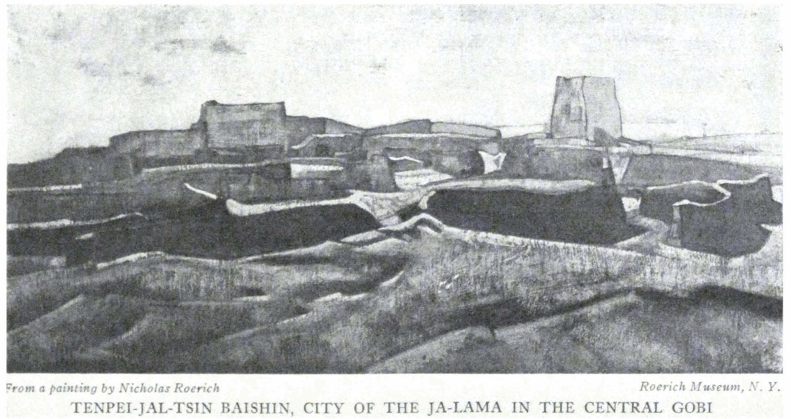

Подпись:  "Tenpei jal-tsin baishin, City of the Ja-lama in the Central Gobi" ("Темпей-джал-тзин-байсин, город Джа-ламы в Центральной Гоби").

Ломакина о картине в книге "Голова Джа-ламы":

> Европейцы разного темперамента и склада оставили описание и фотографии последней крепости Джа-ламы в Черной Гоби (а Николай Рерих - даже живописное полот­но!).

### Хеннинг Хаслунд-Кристенсен и Хемпель, 1928

Henning Haslund-Christensen - датский путешественник, автор книг, соратник Свена Гедина, долго прожил в Монголии ([en-wiki](https://en.wikipedia.org/wiki/Henning_Haslund-Christensen)).

В книге Men and Gods in Mongolia (Zayagan), в главе A robber's stronghold in the desert, Хаслунд описывает историю Джа-ламы (у Хаслунда - Dambin Jansang). Фотографии в англоязычном издании книги нет!

Библиографическая ссылка на американское издание:

> Henning Haslund-Christensen, 1935. Men and Gods in Mongolia (Zayagan). Translated from Swedish by Elizabeth Sprigge and Claude Napier. New York: E.P. Dutton & co.

* [Полный текст](/notes/haslund-zajagan-en/) книги
* PDF: [Источник 1](https://www.tsemrinpoche.com/download/Biographies-Autobiographies-Works/en/Henning%20Haslund%20-%20Men%20and%20Gods%20in%20Mongolia.pdf), [Источник 2](https://drive.google.com/file/d/1tUvmZmF5oSsQqcHPF09cjcixSu2_3NmQ/view?usp=sharing)

Ломакина о фотографии в книге "Голова Джа-ламы":

> Мы воспроизводим снимок, сделанный в ноябре 1928 года Х.Хаслундом-Христенсеном и напечатанный в его книге “Заяган. Люди и боги в Монголии”(89).

Библиографическая ссылка на книгу Ломакиной:

> Ломакина И. И. Голова Джа-ламы / Инесса Ломакина. — Улан-Удэ, СПб. : Агентство ЭкоАрт, 1993. — 223,[32] с. ил., факс.; 20. — (Восток на западе); ISBN 5-85970-007-5

Ломакина ссылается на немецкое издание:

Библиографическая ссылка на немецкое издание:

> Haslund-Christensen H. Zajagan Menschen und Götter in der Mongolei / Von Henning Haslund-Christensen; Mit einem Vorwort von Sven Hedin und einer Übersichtskarte sowie 34 Bildern nach Originalaußnahmen der Sven-Hedin-Zentral-Asien-Expedition, [Nach der schwedischen Originalausgabe ... übers. von Marie Franzos ...]. — Stuttgart [u. a.] : Union Deutsche Verl.-Ges., [1936]. — 279 с., 9 л. ил. ил., нот., карт.; 24 см.

[Фото в тексте книги "Голова Джа-ламы"](/notes/lomakina-ja-lama/#250).

Неизвестно, есть ли эта фотография в немецком издании или исходном датском 1935 г. (это необходимо проверить). Однако, однозначно выяснено, что фотография есть в издании на датском языке 1947 г.

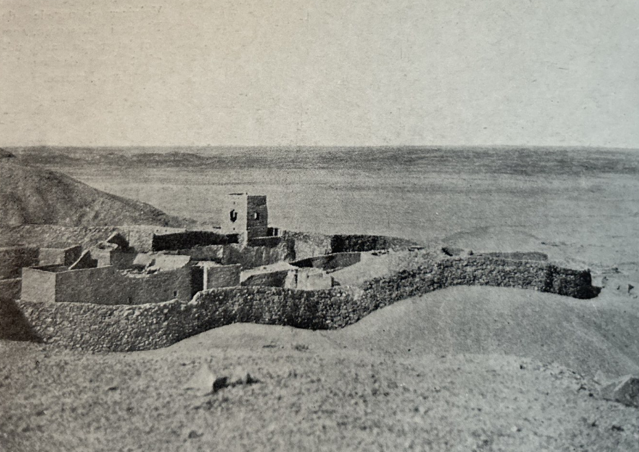

Подпись (перевод): Пустынный замок Дамбижанцана. Фотография Хемпеля.

Согласно подписи, фотография сделана не Хаслундом, а участником экспедиции Свена Гедина, к которой присоединился Хаслунд, по фамилии Hembel. Немецкий участник экспедиции C. Hempel [Claus Hempel] упоминается в [отчете](https://www.jarringlibrary.lingfil.uu.se/travel/travels-and-archaeological-field-work-in-mongolia-and-sinkiang/) Travels and Archaeological Field-Work in Mongolia and Sinkiang: A Diary of the Years 1927-1934.

> This is a traveler’s journal written by the Swedish archaeologist Folke Bergman about three expeditions to Mongolia and Sinkiang under the leadership of Dr. Sven Hedin, together with a group of Swedish participants consisting of geologist Erik Norin, medico David Hummel and Germans W. Haude, **C. Hempel**, and H. Dettmann. In February 1927 the expedition arrives in Peking from Moscow on the trans-Siberian railway via Mukden. As a result of archaeological discoveries made by Prof. Johan Gunnar Andersson in Honan, Kansu and Kuku-kor at the beginning of the 1920’s, a prehistory of China was outlined in terms of six successive periods, ranging from the Stone Age to the Iron Age. Especially findings of painted pottery were important in understanding the division of periods. Painted pottery was discovered at sites 4000 km apart. Bergman is excited to further the investigations in Eastern Turkestan to find out more about its role in tying together the Far East and the Near East during the Stone Age. Throughout the journey Bergman gives precise accounts of every place they visit or pass by, noting the time and date of the visits and the distance from the previous place in li – the Chinese measurement where 1 li is about 0,5 km, together with short descriptions of the environment. Black and white photographs and pencil sketches of temples and places are provided throughout the book. On several occasions during its journey the main expedition splits up in order to concentrate on specific research in smaller groups. **The expedition is eventually joined by other travelers, such as Nils Ambolt and Henning Haslund-Christensen.**

Библиографическая ссылка на датское издание:

> Haslund-Christensen Henning, 1947. Zajagan. Gyldendanske Boghandel Nordisk Forlag. København.

Фотография получена благодаря помощи Алексея Сидоренко, лично отправившегося в библиотеку в Копенгагене.

### Фольке Бергман, 27 января 1934

Фольке Бергман (Bergman, Folke, [en-wiki](https://en.wikipedia.org/wiki/Folke_Bergman)) - шведский археолог, участник китайско-шведской экспедиции Свена Гедина.

Серия фотографий замка Джа-ламы Фольке Бергмана из базы данных CARLOTTA Шведского этнографического музея. Фото сделаны в один день, хотя в базе данных некоторых указан только год.

Визит Свена Гедина 27 января 1934 г. на руины замка Джа-ламы подтверждается в отчетах китайско-шведской экспедиции (PDF1, [PDF2](https://dokumen.pub/download/history-of-the-expedition-in-asia-1927-1935-part-i-1927-1928.html)).

> Hedin, 1944. History of the Expedition in Asia 1927-1935 by Sven Hedin in collaboration with Folke Bergman. In Reports from the scientific expedition to the North-Western provinces of China under the leadership of Dr. Sven Hedin. The Sino-Swedish expedition. Publication 25. Stockholm. Pp. 41-43.

**Общий вид руин замка**

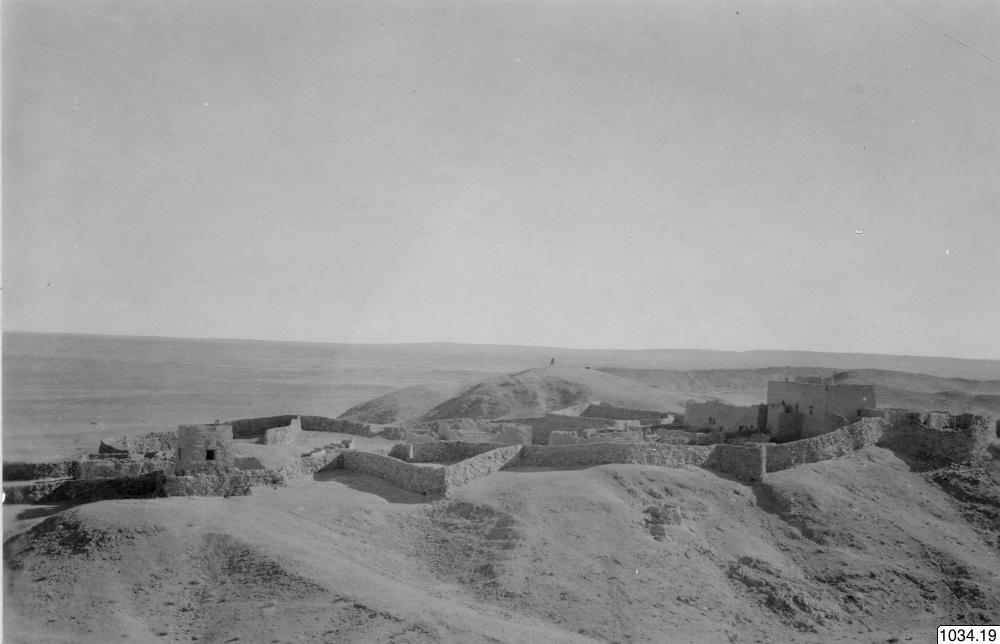

Ключевые слова, оригинал на шведском и перевод:

> landskap, byggnad, mur, borg
>
> пейзаж, здание, стена, замок

Описание, оригинал на шведском и перевод:

> Hedinexpeditionen 1933-35
> Dambin lamas boy  
> 1934 no 20 (nytt nr 1034.0020)  
> neg nr B.947
> Foto Folke Bergman 27.1.1934
>
> Экспедиция Свена Гедина 1933-35
> Замок Дамбин ламы
> 1934 № 20 (новый № 1034.0019)
> негатив № B.945
> Фото Фольке Бергмана 27.1.1934

Указанная дата съемки: 1934-01-27 г. <https://collections.smvk.se/carlotta-em/web/object/2066687>

**Главное здание**

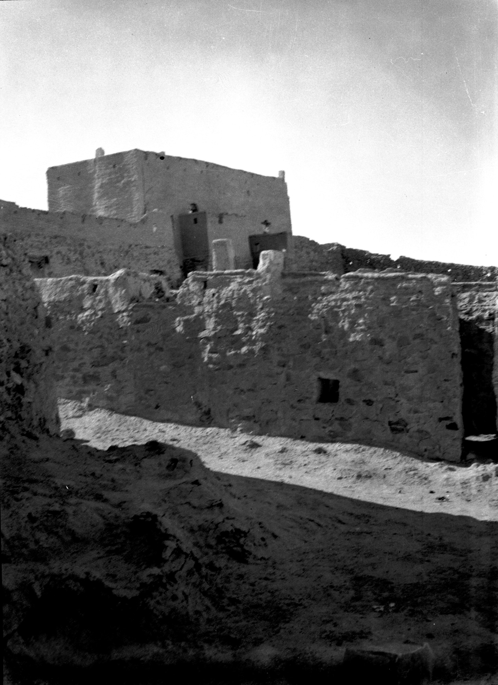

Ключевые слова, оригинал на шведском и перевод:

> byggnad, hus
>
> здание, дом

Указанная дата съемки: 1934 г. <https://collections.smvk.se/carlotta-em/web/object/26286567>

**Вид на одно из второстеенных зданий**

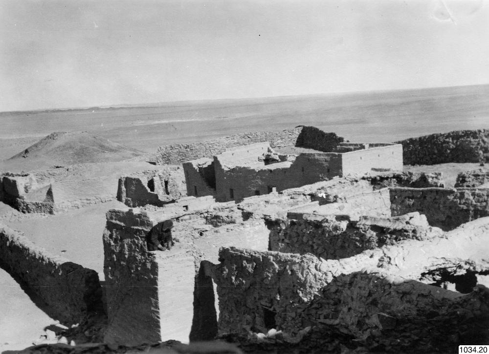

Ключевые слова, оригинал на шведском и перевод:

> borg
>
> замок

Описание, оригинал на шведском и перевод:

> Hedinexpeditionen 1933-35
> Dambin lamas borg  
> 1934 no 20 (nytt nr 1034.0020)  
> neg nr B.947
> Foto Folke Bergman 27.1.1934
>
> Экспедиция Свена Гедина 1933-35
> Замок Дамбин ламы
> 1934 № 20 (новый № 1034.0020)
> негатив № B.947
> Фото Фольке Бергмана 27.1.1934

Указанная дата съемки: 1934-01-27 г. <https://collections.smvk.se/carlotta-em/web/object/2066688>

**Свен Гедин у стены замка**

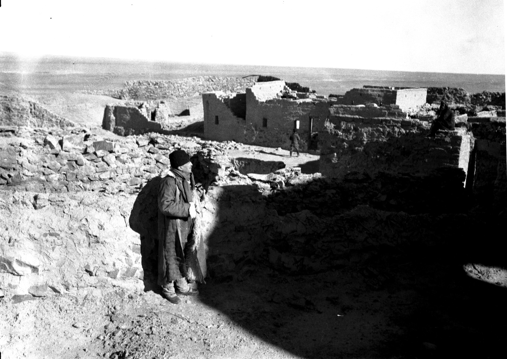

Ключевые слова, оригинал на шведском и перевод:

> byggnad, hus
>
> здание, дом

Указанная дата съемки: 1934 г. <https://collections.smvk.se/carlotta-em/web/object/26286572>

**Свен Гедин**

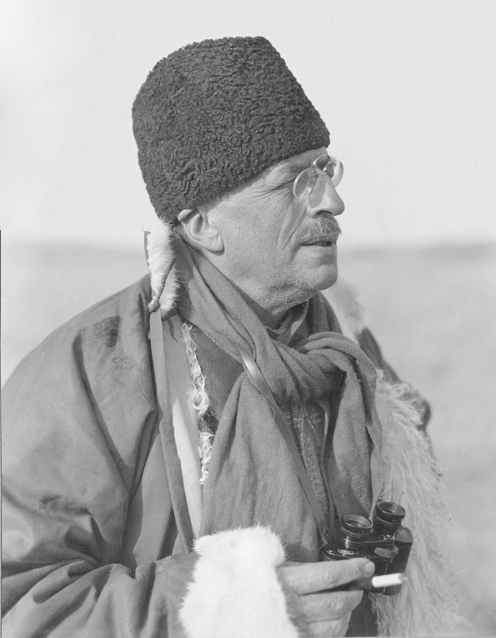

Указанная дата съемки: 1934 г. <https://collections.smvk.se/carlotta-em/web/object/26286625>

**Копия фото замках Хемпеля**

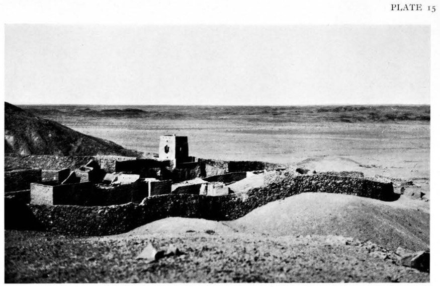

Подпись на английском:

> The ruined castle of Danbin Lama at Kung-pao-ch'üan, Ma-tsung-shan Hempel Photo

Перевод:

> Руины замка Дамбин Ламы в Кунг-пао-чи'юань, Ма-цун-шань. Фото Хемпеля.

Фотография так же опубликована в отчете (Plate 15), является копией фотографии 1928 г. из [книги Хаслунда](/notes/ja-lama-fort-photos/#хеннинг-хаслунд-кристенсен-и-хемпель-1928).

### Эрик Тейхман, 19 октября 1935

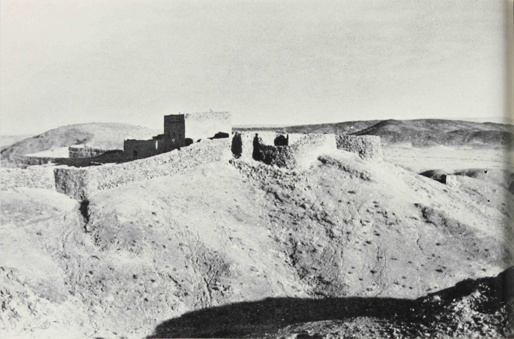

Подпись

EN: Fort of Dja Lama at Kung-po Ch'uan in the Black Gobi

RU: Форт Джа-ламы у Кун-по-Чуаня в Чёрной Гоби

Тейхман лично посетил развалины крепость по пути к источнику Кун-по-Чуань (Gongpoquan, Kung-po Ch'uan, 公婆泉). Чуань (quan 泉) --- источник/родник. Монгольское название источника: Баян-Булак (Bayin Buluk), что означает «обильный источник».

Этот же топоним в форме Gongpochuan упоминается в фотографии неизвестного автора, см. ниже.

Публикация ([PDF](https://www.jarringlibrary.lingfil.uu.se/travel/journey-to-turkistan/)):

> Teichman, Sir Eric, 1937. Journey to Turkistan. London: Hodder and Stoughton. XIV, 221 p., 31 p. of plates: ill., col. fold. map, ports.

Фрагмент описания крепости:

> As we approached the spring of Kung-po Ch'uan across a level plain we saw, while still a long way off, the keep and buildings of a castle prominently situated on a hill above the little settlement ; a sight which drew and held attention, for we had seen no buildings worthy of the name since leaving Pai-ling Miao. As we came closer we could see that the fortress, which looked so imposing from a long way off, was but a crumbling ruin ; all that remained of the stronghold of the Mongol monk who, a few years since, had terrorized the Gobi caravans from far and near.

Перевод:

> Когда мы приближались к источнику Кун-по-Чуань по ровной равнине, ещё издалека мы увидели замок и постройки крепости, хорошо заметных на холме над небольшим поселением. Это зрелище сразу привлекло и удержало наше внимание, поскольку со времени нашего отъезда из Пайлин-Мяо мы не видели никаких строений, достойных этого названия.
>
> Подойдя ближе, мы смогли разглядеть, что крепость, издали казавшаяся столь внушительной, была всего лишь осыпающимися руинами — всем, что осталось от твердыни монгольского монаха, который ещё несколько лет назад наводил ужас на караваны Гоби, приходившие из ближних и дальних мест.

### Автор неизвестен, год неизвестен

Исходно фотография находится в статье DER RÄCHER LAMA, автор Martin Compart. Однако, по всей видимости он взял её у [Don Croner](https://roerichmongoliamonthly.wordpress.com/2011/02/18/volume-2-feb-18th-2011/), энтузиаста Рериха, американского монголиста, автора [ряда книг](https://www.goodreads.com/author/show/1339085.Don_Croner). В том числе False Lama of Mongolia: The Life and Death of Dambijantsan ([Goodreads](https://www.goodreads.com/book/show/57982152-false-lama-of-mongolia)).

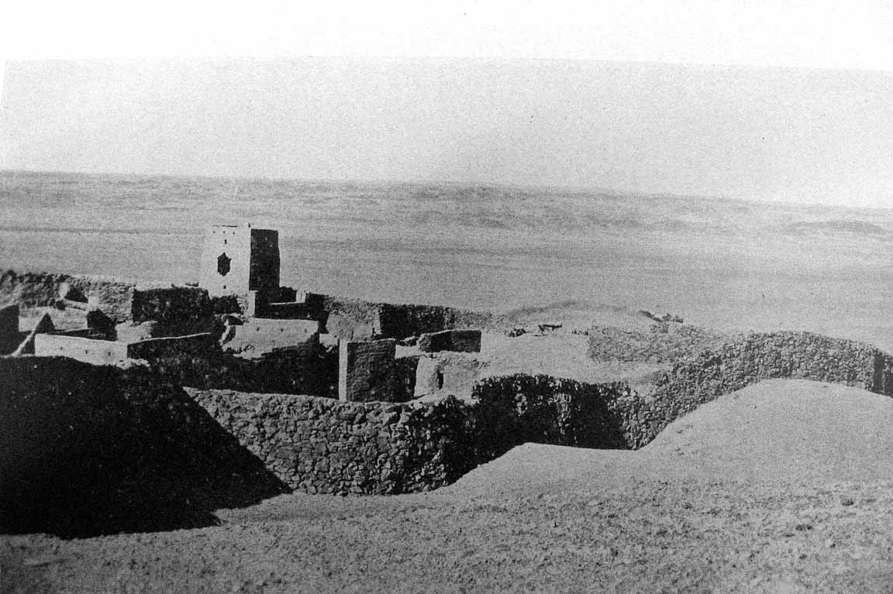

Название файла фотографии - gongpochuan.jpg, что соответствует топониму Gongpochuan. Этот топоним упоминается например во фрагменте книги Don Croner (фотографий в ней нет).

> At the time, however, Dambijantsan was holed up in his fortress at Gongpochuan, in Gansu Province, China, and Maisky was unable to get any information about his current activities.

Croner, Don, 2009. False Lama. The Life and Death of Dambijantsan. Ulaan Baatar ([источник](https://web.archive.org/web/20140903091401if_/http://dambijantsan.doncroner.com/JaLama.1-5.pdf))

К сожалению сайты Don Croner больше не обновляются или вообще не открываются: doncroner.com и его следующий блог: doncronerblog.com больше не открываются (последняя запись от 8.12.2023), открывается [worldwidewanders1.blogspot.com](https://worldwidewanders1.blogspot.com/) (последняя запись от 25.10.2021). Фотографию и фрагмент книги о Джа Ламе можно найти через Web Archive:

* [Dambijantsan's Fortress at Gongpochuan](https://web.archive.org/web/20140903091416/http://dambijantsan.doncroner.com/dambijantsan.7.html)
* [First Five Chapter of Ja Lama: The Life and Death of Dambijantsan](https://web.archive.org/web/20140903091416/http://dambijantsan.doncroner.com/JaLama.1-5.pdf)

Публикация:

[DER RÄCHER LAMA](https://martincompart.wordpress.com/2013/02/14/der-racher-lama-1/?utm_medium=organic&utm_source=yandexsmartcamera) by Martin Compart. 14. Februar 2013, 3:49 pm

## Комментарии

[**Обсудить**](https://t.me/answer42geo/146)
