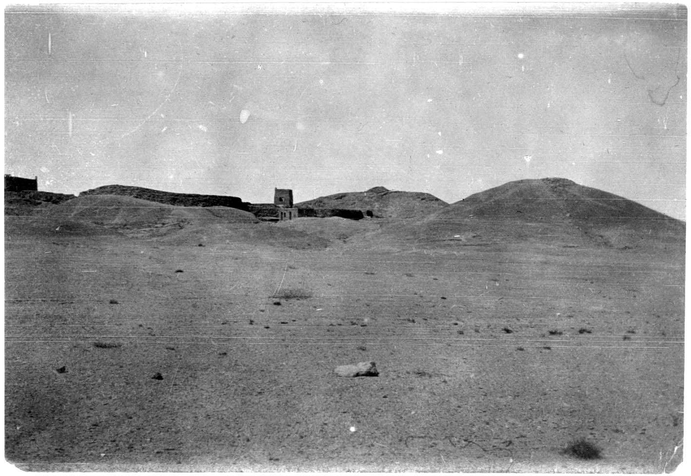
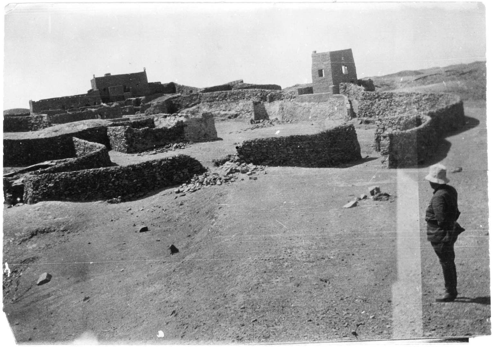

## Введение

Фотографии "крепости" Джа-ламы из разных источников

## Фото

В историческом порядке от старых к новым.

### Латтимор, 1926/1927

Публикация:

Lattimore, Owen. 1928. “Caravan Routes of Inner Asia.” The Geographical Journal 72 (2): 497–531. ([скачать](https://drive.google.com/file/d/1cHTO73PBWEKstRHMDd8YH4x2F4krWIYn/view?usp=sharing))

### Рерих, 1927

Публикация:

Roerich, G. 1931. Trails to Inmost Asia: Five years of exploration with the Roerich Central Asian Expedition. New Haven: Yale University Press. Preface by Louis Marin, 504 pages, folding route map, frontispiece portrait, 151 illustrations.

[Фото в тексте](/notes/roerich-trails-to-asia-en/#211jalama).

### Рерих, 1927 (экспедиционные фото)

Выделены в отдельную группу, поскольку точно их источник не указан.

Фотографии можно найти на сайте [Центрально-Азиатской Экспедиции](https://caemap.com/#m=7/40.422/98.317&l=Gr&p=525/o). Подписи к фотографиям и названия файлов оставлены как в на сайте ЦАЭ. Человек на фотографиях - Рябинин, Константин Николаевич ([ru-wiki](https://ru.wikipedia.org/wiki/%D0%A0%D1%8F%D0%B1%D0%B8%D0%BD%D0%B8%D0%BD,_%D0%9A%D0%BE%D0%BD%D1%81%D1%82%D0%B0%D0%BD%D1%82%D0%B8%D0%BD_%D0%9D%D0%B8%D0%BA%D0%BE%D0%BB%D0%B0%D0%B5%D0%B2%D0%B8%D1%87)), врач экспедиции Рериха.

В статье "[Врата в будущее. Л.В. Шапошникова](https://lomonosov.org/article/vrata_v_budusshee.htm)" источник этой фотографии указан как "Экспедиционные фотографии в архиве Музея Н.Рериха в Нью Йорке.".

### Рерих Н.К., 1927 (Картина)

### Хаслунд, 1928

Публикация:

Ломакина И. И. Голова Джа-ламы / Инесса Ломакина. — Улан-Удэ, СПб. : Агентство ЭкоАрт, 1993. — 223,[32] с. ил., факс.; 20. — (Восток на западе); ISBN 5-85970-007-5

[Фото в тексте](/notes/lomakina-ja-lama/#250).

## Комментарии

[**Обсудить**](https://t.me/answer42geo/142)
