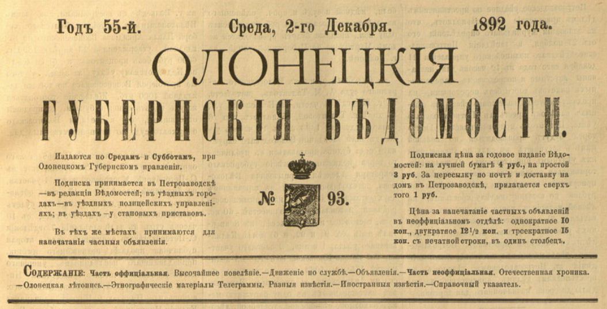

## Введение

Этнографический очерк прихода Кижи. Текст заметки опубликованной в газете Олонецкие губернские ведомости в 1892. Редакторы: гг. Махов и Беляев. Точный автор - неизвестен.

Библиографическая ссылка:

> Олонецкие губернские ведомости, 1892. Олонецкая летопись. Этнографические материалы. Кижи. С. 952-955.

[PDF выпуска](https://drive.google.com/file/d/1O513e96SqtuSYYjlrM2OjHkArkbc3TKZ/view?usp=sharing) целиком. Источник - [Wikimedia](https://commons.wikimedia.org/wiki/File:1882_092_%D0%9E%D0%BB%D0%BE%D0%BD%D0%B5%D1%86%D0%BA%D0%B8%D0%B5_%D0%B3%D1%83%D0%B1%D0%B5%D1%80%D0%BD%D1%81%D0%BA%D0%B8%D0%B5_%D0%B2%D0%B5%D0%B4%D0%BE%D0%BC%D0%BE%D1%81%D1%82%D0%B8.pdf).

Текст приводится в современной и в старой орфографии. Дополнительно текст в старой орфографии можно скачать в [Google Docs](https://docs.google.com/document/d/1VEP0S5LM177vJWRAFupDQws8ZVe8riuQ/edit?usp=sharing&ouid=112245657670169384946&rtpof=true&sd=true).

Некоторые понятия из статьи:

* поженька — уменьш. от пожня: сенокосный луг, покос; небольшой травянистый участок для заготовки сена.
* Уножский приход - Унежский приход (Пудожский уезд, Карелия);
* корень Иессея - родословное дерево Христа: обычно внизу, «в корне», лежит или сидит Иессей;
* Обонежская пятина - историческая административно-территориальная область Новгородской земли, одна из пяти «пятин», то есть крупных частей, на которые делились новгородские владения.

## Текст, новая орфография

Олонецкая Летопись.

Этнографические материалы.

Кижи.

Под таким названием известен в Олонецкой губернии приход в Петрозаводском уезде, находящийся, на северо-восток, в 60-ти верстах от г. Петрозаводска, на противоположном берегу Онежского озера, именуемом, по просту, *Заонежьем* (т. е. за озером Онего). Кижский приход расположен частью на материке, частью на прилегающих к нему красивых островах. Самый погост находится на острове, прозванном также "Кижским". Население прихода состоит из государственных крестьян и численностью превышает 3 тысячи душ обоего пола (1).

1\) В 1890 году значилось по документам 3111 душ обоего пола.

Кижский приход---едва ли не древнейший во всем Заонежьи. По крайней мере, на основании писцовых книг, с уверенностию можно сказать, что начало его восходит ко временам XIV века. Уже одна такая древность, кажется, вполне должна служить порукой в его известности и тем более что он играл когда-то довольно видную роль в административном отношении.

*Кижами* приход прозван первоначальными своими насельниками---Чудью; по русски "кижи" означают веселое, красивое место. И, действительно, в летнюю пору, можно полюбоваться красотой места! Величественные береговые ландшафты материка, с красивыми бухтами озера, и множество небольших островов, разрезанных между собой узорчатыми проливами, с богатой разнообразной растительностию, делают местность Кижского прихода не лишенной живописности. Сверх сего, в приходе насчитывается до двадцати деревень, которые сгруппированы на пространстве 10-15 в. вокруг своего погоста, расположенного, как мы сказали уже ранее, на острове. Это-то множество деревушек еще более красит местность прихода, придавая ей особенную оживленность. По дороге, почти на каждой версте, встречаешь признаки обитателей. То покажется крестьянская хатка с ее постройками, то поле с двумя-тремя копнами хлеба, то зеленеет поженька, то бродят по своей воле несколько коров, или - из частого лесочка ветерок доносит песню деревенской девушки, сбирающей ягоды или грибы, или---встречается сгорбившаяся, от старости лет, старушка, которая спешит с приготовленным обедом к своим жнецам или сенокосцам (1).

1\) См. подробную статью "Этнографические паметки о Заонежанах" Пам. кн. Олон. губ. 1866 г. ч. II, 1-37.

Издревле Кижане --- земледельцы и хлебопашество главный предмет их занятия; но на ряду с ним они---прекрасные рыбаки. То и другое занятие приучило их к оседлому труду, а присущая им бойкость характера, его устойчивость, сметливость, откровенность в житейской опытности развили умственный кругозор, выработали хороший административный строй и поставили на тот пьдестал, который может делать честь волости. Правительство заметило эти преимущества кижан, обратило на них свое внимание и, как честных дельцов, сделало своими сотрудниками при уничтожении тех неурядиц, какие существовали во времена еще Обонежской пятины (в XV---XVI веке).

Таким образом, Кижане сами проторили дорожку к известности, которой волость их некоторое время славилась. Кижский староста в то время был почетным лицом в Заонежье; он являлся посредствующим лицом в других волостях и призывался судьей по тяжебным делам даже в других уездах. Акты Муромского монастыря свидетельствуют, что грамотой царя Иоанна IV-го Кижский староста командировался для установления мира между этим монастырем и крестьянами Уножского прихода (Пудожского уезда) (2). Впрочем, особенному процветанию прихода много способствовало его географическое положение и

1\) См. Христ. Чтение 1886 года № 9---10, ст. "Подвижники и монастыри крайнего севера" (Муромский монастырь), К. Докучаева-Баскова.

<a id="953">**-- 953 --**</a>

климатические условия. Будучи в том и другом отношении облагодетельствованы природой (при роскошном озере и плодородной почве), Кижане всецело были преданы земледелию и рыбачеству, как главным и даже единственным источникам своего материального обеспечения. Правда, земледелие не легко давалось им, по причине множества камней, лежащих па поверхности почвы, но у них хватило терпении очистить почву от камней на столько, что они стала вполне пригодной для хлебопашества. Памятником сего неимоверного труда кижских предков до сих порь служат громадные кучи и заборы изь камней, собранных с удобной земли. В тогдашнее *доброе* время и жилось хорошо! Не приученные к роскоши, кижане довольствовались тогда трудами рук своих. "Наростет, бывало, хлеба,---рыба в котел просится,---чего же еще?"---говорят старики. В тогдашнее время не знали прихотей: не нуждались ни в чае, ни в кофе; не понимали и гулянок с спиртными напитками... Костюмировкой тоже не щеголяли,---она была самая простая, доморощенная; у мужчин---сермяга да балахон, а у женщин---костычь, т. е. холщевый *пестрядинный* сарафан; обувью---*верзни* (лапти). Обыкновенная же русская поддевка или женская душегрейка с жемчужной поднизью, употреблявшияся в средней полосе России, говорят, явились здесь уже потом, гораздо в позднейшее время, в период переворота всей жизненной обстановки Кижской волости.

Когда между кижанами стал проникать свет Христианской веры,---это положительно неизвестно, тем неяснее желательно было бы думать, что гуманные отношения их друг к другу, а равно и установившиеся образцовые административные порядки были следствием влияния этого света; всетаки в XIV веке преобладающими насельниками оставались язычники, но в XV веке---появившиеся здесь монастыри: *Климецкий* (в 25 верстах от Киж), *Муромский* (в Пудожском уезде) и еще далее на север *Соловецкий* дают полное основание утверждать, что православие в этом крае, в указанном веке, было в цветущем состоянии. Святые угодники Божии, почивающие теперь своими нетленными мощами в этих монастырях, без сомнения, были первыми насадителями и провозвестниками слова Божия в Заонежском крае, в том числе и в Кижах. Это подтверждается описанием жизни угодников и самой историей нашей православной церкви (1).

1\) См. Ист. р. церкви,—митр. Макарий, т. VII, стр. 35 и сл.

Во всяком случае, в ХVI веке, в царствование Иоанна IV, во всей Обонежской пятине господствующим вероисповеданием было христианское. В это время Кижи дают приют св. угоднику Божию Филиппу, впоследствии знаменитому святителю Московскому, происходящему из рода бояр Колычевых. О жизни его в Кижской местности народное предание сохранило много воспоминаний. Это предание указывает нам не только селение, в котором жил св. угодник, но даже самый дом и домохозяина, у которого св. Филипп находился в услужении, просто в качестве работника, не передает оно лишь того, как продолжителен был период его здешней жизни; хотя в тоже время добавляет, что проявлявшаяся в нем чудодейственная сила, как знак святости, обратила на него народное внимание, чего не вынесло смирение святого и удалило его на оток океана моря,---в Соловецкий монастырь.

В конце ХVI-го (будто бы, в 1593 г.) и в начале XVII-го века (вероятно, около 1613 г.), как гласит народное предание, Кижский приход вытерпел нападения шаек *немецкой и литовской* (скорее не поляков-ли?). Хотя нападения эти были разорительны для приходя, однако они не оставили следов нравственной испорченности в народе. Памятником бродяжничества и грабежа служит церковная икона Всемилостивого Спаса, простреленная литовцами с левой стороны. Святотатственная дерзость грабителей, по свидетельству того-же предания, тотчас же была наказана Божественной Силой: вероломные стрелки ослепли. С этих пор икона эта почитается кижанамн, как чудотворная; она известна во многих местах России через проезжающих богомольцев в Соловецкий монастырь, под именем "*Белого Спаса*". Местному священнику несколько раз случалось получать от неизвестных жертвователей масло и свечи, с надписью: "в Кижи, Белому Спасу".

В 1628---1629 гг. путешествовали здесь правительственные лица: писец Панин и подъячий Семен Корнилов; они нашли Кижи в цветущем состоянии. Народ, по описанию их, отличался бойкостию, щеголеватостию и изворотливостию. Куда они ни заглянули, везде получали от виденного приятное впечатление. Названия, данные ими многим деревням Кижского прихода, вполне характеризуют местность с этнографической стороны, хотя эти названия и даны по первому впечатлению. "Так, рассказывают они подъезжаем мы к одному берегу, сходим на него, земля под ногами рыхлая, мягкая, хоть сад сади: пусть же место это называется Глебово; едем дальше, тростник становится гуще и гуще, чем ближе кь берегу, тем длиннее и толще---при ветре, что твоя степь красивая, только бы скотинушке ходить: пусть это место называется Дудкин-наволок". Или: "плывем мы иа своей ладье о берег, в глазах деревня, деревня большая, домы хорошие, как бы назвать се? попадается па встречу мужик, рубаха на нем красная, на голове шляпа с пером, руки под бока: пусть деревня эта называется Боярщина" (1).

1\) Ст. Писц. кн. Обонежской пятины. Сборн. вып. I (1875-1876 гг.).

Замеченная Паниным щеголватость народа стала появляться именно с этого времени, т. о. со времени сношений кижан с Новгородом, Ладогой и Тихвином. Причиной таковых сношений, вероятно, был сбыть хлеба, местной рыбы и беломорских продуктов (соли, морской рыбы и т. п.). С появлением нового промысла, который естественно должен был богатить край, можно заметить у кижан н потерю гуманных отношений друг к другу, ибо, стремясь к наживе, они в тоже время у себя, в Кижах, изыскивали новые источники, чрез которые бы можно было больше почерпать предметов нового промысла (сбыта), а чрез это начались споры из-за земельных угодий, стали появляться и страсти и другия людские слабости, ведущия к упадку чести и достоинства прихода.

К этому же времени нужно отнести и появление в Кижах раскола из поморского края (Архангельской губ.) чрез Повенецкий уезд. Само собой понятно, что под влиянием навеянного расколом направления прежнее цветущее состояние прихода начинает упадать и терять свое административное значение.

В XVIII веке у кижан произошло крупное несчастие. В это время у них поселился какой-то шведский выходец *Бутожан* или *Гутман* и открыл, в деревне Устьреке, медно-плавильный завод-без всякого на то права и даже без ведома правительства. Неизвестно, как, чем и почему этот контрабандист расположил к себе кижских жителей, по известно, что последние, в чем нужно, содействовали ему. Влияние *немца* на русских кижан, нужно предположить, отразилось самым неблогодарным, даже чисто антиправительственным духом. Бесспорно, благодаря этому иностранному влиянию, кижане заклеймили себя позорным именем *бунтовщиков.* Это было в 1771 году, в царствование Императрицы Екатерины II. В этом году, в видах укрепления ииетро-

<a id="954">**-- 954 --**</a>

заводского пушечного завода, приказано было крестьянам Кижской волости, наравне с крестьянами соседних волостей, приписаться к заводу для выполнения известного тягла. Кнжане не захотели выполнить требования начальства, а---напротив---открыто устроили демонстрацию, для погашения которой потребовался гарнизон солдат (700 чел.) с пушечными выстрелами. Памятником сего гнусного дела и сейчас служит в Кижах крест Господень, привезенный из Сибири одним из мятежников, возвращенным на родину, при содействии какого-то влиятельного лица. Крест этот---значительной величины, довольно рельефной работы, железный, стоит в церкви Кижской на видном месте.

В начале и в последующее время настоящего ХIХ-го столетия кнжане устремили свои взоры па Пететербург и многие из них отправились туда искать легкой наживы. И, действительно, наживы было много! Недавно еще фабричное искусство достигло верха совершенства, а в былое время оно требовало ручной работы и там, где теперь работает одна машина, стояли тогда десятки людских сил. Деньги рекой лились... Этоли не лучший путь усовершенствования? На самом же деле вышло иначе. Петербург, по меткому выряжению стариков, "*Балуй-город*", приучил бурлаков к роскоши, щегольству и разгулу, т. е. другими словами, приучил их к баловству,---*к табачку, да к кабачку...* Что ни наживали бурлаки в столице,---все там и проживали; пользы не было. Таким образом, Кижские бурлаки уподобились Некрасовским подоконникам, про которых незабвенный поэт говорит следующее;

"Пропилися подоконники,  
Где уж баб им наряжать?  
В город едут, балахонники,  
Ходят лапти занимать!  
Ой! ты зелье кабашное  
Да китайские чаи  
Да курение табашное!  
Бродим сами не свои.  
С этим пьянством да курением  
Сломишь голову как раз" (1).

1\) См. "Коробейники" Некрасова.

Вследствие такого бурлачества, Кижский приход стал беднеть и беднеть и, быть может, совсем обеднел бы, если бы кижане не схватились за ум-разум да за соху-матушку. Отрезвились. К бурлачеству отнеслись построже. Дружно взялись за свое крестьянство и опять полетели каменные груды с полей! Труды увенчались успехом: домашний быт начал улучшаться, а с ним, естественно, улучшается и благосостояние прихода; только едва-ли последнее достигнет цветущего положения в материальном отношении, потому что численность прихода год от года увеличивается и, вследствие этого, сенокосной и пахотной земли на каждую ревизскую душу приходится меньше и меньше...

Уровень религиозно-нравственного состояния прихода не высок, но влиянию раскола в приходе может дать значительный отпор, а это ручается уже за то, что раскольнические убеждения поколебались, стали не сильны и ожидают с часа на час решительного падения. Мрак невежества с каждым годом уменьшается и---в противовес ему---грамотность и просвещение в народе распространяются с изумительной быстротой, чему, разумеется, всецело способствует сельское многолюдное училище, на Кижском острове, содержимое на средства Петрозаводского земства.

В Кижском приходе---два храма с отдельно стоящей колокольней; все здания---деревянные, обнесены каменной (просто сложенной из булыжника) оградой, внутри которой находится приходское кладбище. Один из храмов своеобразной архитектурой поражает всякого, кто бы только ни взглянул на него; его оригинальный и многоглавый вид невольно подстрекает туриста побывать в нем и основательно осмотреть его. Этот храм основан в начале ХVIII-го века, а освящен в 1714 году, во имя Славного Преображения Господня, повелением и благословением Новгородского митрополита иова. Существует предание, будто бы, Император Петр I-й, путешествуя из Повенца Онежским озером, остановился у Кижского острова; тут заметил Он множество срубленного леса и, узнав причину его свалки, собственноручно начертил план преполагаемой церкви. Пред этим временем, говорят, прежняя церковь сгорела; она стояла не там, где стоить теперешняя церковь, а подальше версты на 1 1/2, на месте, называемом "Нарьина-гора". Когда крестьяне предположили устроить и новую церковь на этой горе и стали уже сваливать лес, то икона Всемилостивого Спаса, уцелевшая от пожара, вместе с лесом, ушла отсюда и оказалась на том месте, где стоит теперь церковь. Несколько раз, говорят, переносили икону обратно и перегоняли лес, но напрасно---икона и лес являлись на своем излюбленном месте.

Описываемый Кижский храм имеет форму четырехконечного креста и украшается *22 главами,* из коих средняя, значительной величины, стоить на своде храма и высотой своей живописует как бы престол Всемогущего и Вседержителя Бога; прочие же, окружающие ее в почтенном расстоянии, гораздо меньше ее, как бы на ступенях лестницы, дают вид приниженности, почтительности, усиленного ходатайства... Внутренность храма также удивляет посетителя своей оригинальностью: паперть представляется не такой, какую мы обыкновенно привыкли видеть в храмах. Вошедшему в нее богомольцу она кажется футляром для находящегося внутри нее здания, но---по внимательном осмотре---вы убеждаетесь, что она окружает храм только с трех сторон: северной, западной и южной. С первых двух сторон из паперти в церковь ведут двери, они были и с южной стороны, но теперь почему-то таковые заделаны. Иконостас в церкви---византийского пошиба, хотя с позднейших оттенком иконостасного художества московской кисти; в нем иконы расположены в четыре яруса, по правилам зодчества и иконописания, и украшены золоченой резьбой, приходящей теперь в ветхость. По средине храма стоять два клироса, за которым помещены в весьма рельефных больших киотах иконы Всемилостивого Спаса и Успения Божьей Матери. Первая особенно почитается кижанами и признается чудотворной; ее иногда носят по домам. В знак глубокого почитания и благоговения, икона эта украшена серебряной позолоченной ризой, весом в 12 ф. Спод храма украшен иконами на подобие стенописи, а так как он имеет форму полушария, то и называется прихожанами "небесами". В самом центре свода помещена икона Живоначальпой Троицы, вокруг которой написана уставом---вязью молитва Господня. Вообще, об иконах Кижского храма необходимо заметить, что большинство из них, кроме изображаемого на них лика, имеет еще лицевое описание важнейших событий, бывших или случившихся в жизни его. Особенное внимание обращает на себя икона, составляющая северные двери алтаря. Лицевое изображение этой иконы подразделяется на три группы: 1) Авраамово лоно, 2) насажденный рай 3) смерть человека. Авраамово лоно представляет престол, па котором сидят патриархи---Авраам, Исаак и Иаков, в недрах их покоится множество людей, живших верой искупительной жертвы, --- справа от них стоит благоразумный разбойник с восьмиконечным крестом в руках. Изображение это находится в круге, который есть ни что иное, как дерево, имущее в корне Иессея. В двух ветвях дерева, составляющих круг, размещены Аввакум, Иеремия, Моисей, Иаков, Соломон, Давид, Исаия, Захария, Иезекииль

<a id="955">**-- 955 --**</a>

и Даниил---со свитками в руках, содержащими пророчества, относящиеся к Пресвятой Богородице. Взоры их устремлены вверх, где изображена Божья Матер, увенчающая круг, в таком виде, в каком Она изображается на иконе Знамения Ее. Ниже этого изображения представлен небесный свод и на своде солнце и луна. Под сводом---насажденный ряй, и в нем сотворение Адама и Евы, заповедь о древе жизни и древе познания добра и зла, грехопадение прародителей и изгнание их из рая. Еще ниже представлена смерть человека: тут вы видите гроб с останками человеческого тела, покрытого червями; около гроба---присные умершего разных возрастов и полов; сверху изображении надпись, взятая из разных стихов погребального чипа, находящегося в древних требниках. По замечанию археологов, эта икона - довольно древняя и весьма редкая по сюжету изображаемых событий.

## Текст, старая орфография

<a id="952">**-- 952 --**</a>

Олонецкая Лѣтопись.

Этнографическіе матеріалы.

Кижи.

Подъ такимъ названіемъ извѣстенъ въ Олонецкой губерніи приходъ въ Петрозаводскомъ уѣздѣ, находящійся, на сѣверо-востокъ, въ 60-ти верстахъ отъ г. Петрозаводска, на противоположномъ берегу Онежскаго озера, именуемомъ, по просту, *Заонежъемъ* (т. е. за озеромъ Онего). Кижскій приходъ расположенъ частію на материкѣ, частію на прилегающихъ къ нему красивыхъ островахъ. Самый погостъ находится на островѣ, прозванномъ также "Кижскимъ". Населеніе прихода состоитъ изъ государственныхъ крестьянъ и численностію превышаетъ 3 тысячи душъ обоего пола (1).

1\) Въ 1890 году значилось по документамъ 3111 душъ обоего пола.

Кижскій приходъ---едва ли не древнѣйшій во всемъ Заонежьи. По крайней мѣрѣ, на основаніи писцовыхъ книгъ, съ увѣренностію можно сказать, что начало его восходитъ ко временамъ XIV вѣка. Уже одна такая древность, кажется, вполнѣ должна служить порукою въ его извѣстности и тѣмъ болѣе что онъ игралъ когда-то довольно видную роль въ административномъ отношеніи.

*Кижами* приходъ прозванъ первоначальными своими насельниками---Чудью; по русски "кижи" означаютъ веселое, красивое мѣсто. И, дѣйствительно, въ лѣтнюю пору, можно полюбоваться красотою мѣста! Величественные береговые ландшафты материка, съ красивыми бухтами озера, и множество небольшихъ острововъ, разрѣзанныхъ между собою узорчатыми проливами, съ богатою разнообразною растительностію, дѣлаютъ мѣстность Кижскаго прихода не лишенною живописности. Сверхъ сего, въ приходѣ насчитывается до двадцати деревень, которыя сгруппированы на пространствѣ 10-15 в. вокругъ своего погоста, расположеннаго, какъ мы сказали уже ранѣе, на островѣ. Это-то множество деревушекъ еще болѣе краситъ мѣстность прихода, придавая ей особенную оживленность. По дорогѣ, почти на каждой верстѣ, встрѣчаешь признаки обитателей. То покажется крестьянская хатка съ ея постройками, то поле съ двумя-тремя копнами хлѣба, то зеленѣетъ поженька, то бродятъ по своей волѣ нѣсколько коровъ, или - изъ частаго лѣсочка вѣтерокъ доноситъ пѣсню деревенской дѣвушки, сбирающей ягоды или грибы, или---встрѣчается сгорбившаяся, отъ старости лѣтъ, старушка, которая спѣшитъ съ приготовленнымъ обѣдомъ к своимъ жнецамъ или сѣнокосцамъ (1).

1\) См. подробную статью "Этнографическія памѣтки о Заонежанах" Пам. кн. Олон. губ. 1866 г. ч. II, 1-37.

Издревле Кижане --- земледѣльцы и хлѣбопашество главный предметъ ихъ занятія; но на ряду съ нимъ они---прекрасные рыбаки. То и другое занятіе пріучило ихъ къ осѣдлому труду, а присущая имъ бойкость характера, его устойчивость, смѣтливость, откровенность въ житейской опытности развили умственный кругозоръ, выработали хорошій административный строй и поставили на тотъ пьдесталъ, который можетъ дѣлать честь волости. Правительство замѣтило эти преимущества кижанъ, обратило на нихъ свое вниманіе и, какъ честныхъ дѣльцовъ, сдѣлало своими сотрудниками при уничтоженіи тѣхъ неурядицъ, какія существовали во времена еще Обонежской пятины (въ XV---XVI вѣкѣ).

Такимъ образомъ, Кижане сами проторили дорожку къ извѣстности, которою волость ихъ нѣкоторое время славилась. Кижскій староста въ то время былъ почетнымъ лицомъ въ Заонежьи; онъ являлся посредствующимъ лицомъ въ другихъ волостяхъ и призывался судьею по тяжебнымъ дѣламъ даже въ другихъ уѣздахъ. Акты Муромскаго монастыря свидѣтельствуютъ, что грамматою царя Іоанна ІV-го Кижскій староста командировался для установленія мира между симъ монастыремъ и крестьянами Уножскаго прихода (Пудожскаго уѣзда) (2). Впрочемъ, особенному процвѣтанію прихода много способствовало его географическое положеніе и

1\) См. Христ. Чтеніе 1886 года № 9---10, ст. "Подвижники и монастыри крайняго сѣвера" (Муромскій монастырь), К. Докучаева-Баскова.

<a id="953">**-- 953 --**</a>

климатическія условія. Будучи въ томъ и другомъ отношеніи облагодѣтельствованы природою (при роскошномъ озерѣ и плодородной почвѣ), Кижане всецѣло были преданы земледѣлію и рыбачеству, какъ главнымъ и даже единственнымъ источникамъ своего матеріальнаго обезпеченія. Правда, земледѣліе не легко давалось имъ, по причинѣ множества камней, лежащихъ па поверхности почвы, но у нихъ хватило терпѣніи очистить почву отъ камней на столько, что они стала вполнѣ пригодною для хлѣбопашества. Памятникомъ сего неимовѣрнаго труда кижскихъ предковъ до сихъ порь служатъ громадныя кучи и заборы изь камней, собранныхъ съ удобной земли. Въ тогдашнее *доброе* время и жилось хорошо! Не пріученные къ роскоши, кижане довольствовались тогда трудами рукъ своихъ. "Наростетъ, бывало, хлѣба,---рыба въ котелъ просится,---чего же еще?"---говорятъ старики. Въ тогдашнее время не знали прихотей: не нуждались ни в чаѣ, ни въ кофе; не понимали и гулянокъ съ спиртными напитками... Костюмировкой тоже не щеголяли,---она была самая простая, доморощенная; у мужчинъ---сермяга да балахонъ, а у женщинъ---костычь, т. е. холщевый *пестрядинный* сарафанъ; обувью---*верзни* (лапти). Обыкновенная же русская поддѣвка или женская душегрѣйка съ жемчужною поднизью, употреблявшіяся въ средней полосѣ Россіи, говорятъ, явились здѣсь уже потомъ, гораздо въ позднѣйшее время, въ періодъ переворота всей жизненной обстановки Кижской волости.

Когда между кижанами сталъ проникать свѣтъ Христіанской вѣры,---сіе положительно неизвѣстно, тѣмъ неяснѣе желательно было бы думать, что гуманныя отношенія ихъ другъ къ другу, а равно и установившіеся образцовые административные порядки были слѣдствіемъ вліянія этого свѣта; всетаки въ XIV вѣкѣ преобладающими насельниками оставались язычники, но въ XV вѣкѣ---появившіеся здѣсь монастыри: *Климецкій* (въ 25 верстахъ отъ Кижъ), *Муромскій* (въ Пудожскомъ уѣздѣ) и еще далѣе на сѣверъ *Соловецкій* даютъ полное основаніе утверждать, что православіе въ этомъ краѣ, въ указанномъ вѣкѣ, было въ цвѣтущемъ состояніи. Святые угодники Божіи, почивающіе теперь своими нетлѣнными мощами въ этихъ монастыряхъ, безъ сомнѣнія, были первыми насадителями и провозвѣстниками слова Божія въ Заонежскомъ краѣ, въ томъ числѣ и въ Кижахъ. Это подтверждается описаніемъ жизни угодниковъ и самою исторіею нашей православной церкви (1).

1\) См. Ист. р. церкви,—митр. Макарій, т. VII, стр. 35 и сл.

Во всякомъ случаѣ, въ ХVI вѣкѣ, въ царствованіе Іоанна IV, во всей Обонежской пятинѣ господствующимъ вѣроисповѣданіемъ было христіанское. Въ это время Кижи даютъ пріютъ св. угоднику Божію Филиппу, впослѣдствіи знаменитому святителю Московскому, происходящему изъ рода бояръ Колычевыхъ. О жизни его въ Кижской мѣстности народное преданіе сохранило много воспоминаній. Это преданіе указываетъ намъ не только селеніе, въ которомъ жилъ св. угодникъ, но даже самый домъ и домохозяина, у котораго св. Филиппъ находился въ услуженіи, просто въ качествѣ работника, не передаетъ оно лишь того, какъ продолжителенъ былъ періодъ его здѣшней жизни; хотя въ тоже время добавляетъ, что проявлявшаяся въ немъ чудодѣйственная сила, какъ знакъ святости, обратила на него народное вниманіе, чего не вынесло смиреніе святаго и удалило его на отокъ океана моря,---въ Соловецкій монастырь.

Въ концѣ ХVІ-го (будто бы, въ 1593 г.) и въ началѣ XVII-го вѣка (вѣроятно, около 1613 г.), какъ гласитъ народное преданіе, Кижскій приходъ вытерпѣлъ нападенія шаекъ *нѣмецкой и литовской* (скорѣе не поляковъ-ли?). Хотя нападенія эти были разорительны для приходя, однакожъ они не оставили слѣдовъ нравственной испорченности въ народѣ. Памятникомъ бродяжничества и грабежа служитъ церковная икона Всемилостиваго Спаса, прострѣленная литовцами съ лѣвой стороны. Святотатственная дерзость грабителей, по свидѣтельству того-же преданія, тотчасъ же была наказана Божественною Силою: вѣроломные стрѣлки ослѣпли. Съ этихъ поръ икона эта почитается кижанамн, какъ чудотворная; она извѣстна во многихъ мѣстахъ Россіи чрезъ проѣзжающихъ богомольцевъ въ Соловецкій монастырь, подъ именемъ "*Белаго Спаса".* Мѣстному священнику нѣсколько разъ случалось получать отъ неизвѣстныхъ жертвователей масло и свѣчи, съ надписью: "въ Кижи, Бѣлому Спасу".

Въ 1628---1629 гг. путешествовали здѣсь правительственныя лица: писецъ Панинъ и подъячій Семенъ Корниловъ; они нашли Кижи въ цвѣтущемъ состояніи. Народъ, по описанію ихъ, отличался бойкостію, щеголеватостію и изворотливостію. Куда они ни заглянули, вездѣ получали отъ видѣннаго пріятное впечатлѣніе. Названія, данныя ими многимъ деревнямъ Кижскаго прихода, вполнѣ характеризуютъ мѣстность съ этнографической стороны, хотя эти названія и даны по первому впечатлѣнію. "Такъ, разсказываютъ они, подъѣзжаемъ мы къ одному берегу, сходимъ на него, земля подъ ногами рыхлая, мягкая, хоть садъ сади: пусть же мѣсто это называется Глѣбово; ѣдемъ дальше, тростникъ становится гуще и гуще, чѣмъ ближе кь берегу, тѣмъ длиннѣе и толще---при вѣтрѣ, что твоя степь красивая, только бы скотинушкѣ ходить: пусть это мѣсто называется Дудкинъ-наволокъ". Или: "плывемъ мы иа своей ладьѣ о берегъ, въ глазахъ деревня, деревня большая, домы хорошіе, какъ бы назвать се? попадается па встрѣчу мужикъ, рубаха на немъ красная, на головѣ шляпа съ перомъ, руки подъ бока: пусть деревня эта называется Боярщина" (1).

1\) Ст. Писц. кн. Обонежской пятины. Сборн. вып. I (1875-1876 гг.).

Замѣченная Панинымъ щеголватость народа стала появляться именно съ этого времени, т. о. со времени сношеній кижанъ съ Новгородомъ, Ладогой и Тихвиномъ. Причиною таковыхъ сношеній, вѣроятно, былъ сбыть хлѣба, мѣстной рыбы и бѣломорскихъ продуктовъ (соли, морской рыбы и т. п.). Съ появленіемъ новаго промысла, который естественно долженъ былъ богатить край, можно замѣтить у кижанъ н потерю гуманныхъ отношеній другъ къ другу, ибо, стремясь къ наживѣ, они въ тоже время у себя, въ Кижахъ, изыскивали новые источники, чрезъ которые бы можно было больше почерпать предметовъ новаго промысла (сбыта), а чрезъ это начались споры изъ-за земельныхъ угодій, стали появляться и страсти и другія людскія слабости, ведущія къ упадку чести и достоинства прихода.

Къ этому же времени нужно отнести и появленіе въ Кижахъ раскола изъ поморскаго края (Архангельской губ.) чрезъ Повѣнецкій уѣздъ. Само собою понятно, что подъ вліяніемъ навѣяннаго расколомъ направленія прежнее цвѣтущее состояніе прихода начинаетъ упадать и терять свое административное значеніе.

Въ XVIII вѣкѣ у кижанъ произошло крупное несчастіе. Въ это время у нихъ поселился какой-то шведскій выходецъ *Бутожанъ* или *Гутманъ* и открылъ, въ деревнѣ Устьрѣкѣ, мѣдно-плавильный заводъ-безъ всякаго на то права и даже безъ вѣдома правительства. Неизвѣстно, какъ, чѣмъ и почему этотъ контрабандистъ расположилъ къ себѣ кижскихъ жителей, по извѣстно, что послѣдніе, въ чемъ нужно, содѣйствовали ему. Вліяніе *немца* на русскихъ кижанъ, нужно предположить, отразилось самымъ неблагодарнымъ, даже чисто антиправительственнымъ духомъ. Безспорно, благодаря этому иностранному вліянію, кижане заклеймили себя позорнымъ именемъ *бунтовщиковъ.* Это было въ 1771 году, въ царствованіе Императрицы Екатерины II. Въ этомъ году, въ видахъ укрѣпленія ІІетро-

<a id="954">**-- 954 --**</a>

заводскаго пушечнаго завода, приказано было крестьянамъ Кижской волости, наравнѣ съ крестьянами сосѣднихъ волостей, приписаться къ заводу для выполненія извѣстнаго тягла. Кнжане не захотѣли выполнить требованія начальства, а---напротивъ---открыто устроили демонстрацію, для погашенія которой потребовался гарнизонъ солдатъ (700 чел.) съ пушечными выстрѣлами. Памятникомъ сего гнуснаго дѣла и сейчасъ служитъ въ Кижахъ крестъ Господень, привезенный изъ Сибири однимъ изъ мятежниковъ, возвращеннымъ на родину, при содѣйствіи какого-то вліятельнаго лица. Крестъ этотъ---значительной величины, довольно рельефной работы, желѣзный, стоитъ въ церкви Кижской на видномъ мѣстѣ.

Въ началѣ и въ послѣдующее время настоящаго ХІХ-го столѣтія кнжане устремили свои взоры па Пететербургъ и многіе изъ нихъ отправились туда искать легкой наживы. И, дѣйствительно, наживы было много! Недавно еще фабричное искусство достигло верха совершенства, а въ былое время оно требовало ручной работы и тамъ, гдѣ теперь работаетъ одна машина, стояли тогда десятки людскихъ силъ. Деньги рѣкой лились... Этоли не лучшій путь усовершенствованія? На самомъ же дѣлѣ вышло иначе. Петербургъ, по мѣткому выряженію стариковъ, "*Балуй-городъ",* пріучилъ бурлаковъ къ роскоши, щегольству и разгулу, т. е. другими словами, пріучилъ ихъ къ баловству,---*къ табачку, да къ кабачку...* Что ни наживали бурлаки въ столицѣ,---все тамъ и проживали; пользы не было. Такимъ образомъ, Кижскіе бурлаки уподобились Некрасовскимъ подоконникамъ, про которыхъ незабвенный поэтъ говоритъ слѣдующее;

"Пропилися подоконники,  
Гдѣ ужъ бабь имъ наряжать?  
Въ городъ ѣдутъ, балахонники,  
Ходятъ лапти занимать!  
Ой! ты зелье кабашное  
Да китайскіе чаи  
Да куреніе табашное!  
Бродимъ сами не свои.  
Съ этимъ пьянствомъ да куреніемъ  
Сломишь голову какъ разъ" (1).

1\) См. "Коробейники" Некрасова.

Вслѣдствіе такого бурлачества, Кижскій приходъ сталъ бѣднѣть и бѣднѣть и, быть можетъ, совсѣмъ обѣднѣлъ бы, еслибъ кижане не схватились за умъ-разумъ да за соху-матушку. Отрезвились. Къ бурлачеству отнеслись построже. Дружно взялись за свое крестьянство и опять полетѣли каменныя груды съ полей! Труды увѣнчались успѣхомъ: домашній бытъ началъ улучшаться, а съ нимъ, естественно, улучшается и благосостояніе прихода; только едва-ли послѣднее достигнетъ цвѣтущаго положенія въ матеріальномъ отношеніи, потому что численность прихода годъ отъ года увеличивается и, вслѣдствіе этого, сѣнокосной и пахотной земли на каждую ревизскую душу приходится меньше и меньше...

Уровень религіозно-нравственнаго состоянія прихода не высокъ, но вліянію раскола въ приходѣ можетъ дать значительный отпоръ, а это ручается уже за то, что раскольническія убѣжденія поколебались, стали не сильны и ожидаютъ съ часа на часъ рѣшительнаго паденія. Мракъ невѣжества съ каждымъ годомъ уменьшается и---въ противовѣсъ ему---грамотность и просвѣщеніе въ народѣ распространяются съ изумительною быстротою, чему, разумѣется, всецѣло способствуетъ сельское многолюдное училище, на Кижскомъ островѣ, содержимое на средства Петрозаводскаго земства.

Въ Кижскомъ приходѣ---два храма съ отдѣльно стоящею колокольнею; всѣ зданія---деревянныя, обнесены каменною (просто сложенною изъ булыжника) оградою, внутри которой находится приходское кладбище. Одинъ изъ храмовъ своеобразною архитектурою поражаетъ всякаго, кто бы только ни взглянулъ на него; его оригинальный и многоглавый видъ невольно подстрекаетъ туриста побывать въ немъ и основательно осмотрѣть его. Этотъ храмъ основанъ въ началѣ ХVIII-го вѣка, а освященъ въ 1714 году, во имя Славнаго Преображенія Господня, повелѣніемъ и благословеніемъ Новгородскаго митрополита Іова. Существуетъ преданіе, будто бы, Императоръ Петръ І-й, путешествуя изъ Повѣнца Онежскимъ озером, остановился у Кижскаго острова; тутъ замѣтилъ Онъ множество срубленнаго лѣса и, узнавъ причину его свалки, собственноручно начертилъ планъ преполагаемой церкви. Предъ этимъ временемъ, говорятъ, прежняя церковь сгорѣла; она стояла не тамъ, гдѣ стоить теперешняя церковь, а подальше версты на 1 1/2, на мѣстѣ, называемомъ "Нарьина-гора". Когда крестьяне предположили устроить и новую церковь на этой горѣ и стали уже сваливать лѣсъ, то икона Всемилостиваго Спаса, уцѣлѣвшая отъ пожара, вмѣстѣ съ лѣсомъ, ушла отсюда и оказалась на томъ мѣстѣ, гдѣ стоитъ теперь церковь. Нѣсколько разъ, говорятъ, переносили икону обратно и перегоняли лѣсъ, но напрасно---икона и лѣсъ являлись на своемъ излюбленномъ мѣстѣ.

Описываемый Кижскій храмъ имѣетъ форму четырехконечнаго креста и украшается *22 главами,* изъ коихъ средняя, значительной величины, стоить на сводѣ храма и высотою своею живописуетъ какъ бы престолъ Всемогущаго и Вседержителя Бога; прочія-же, окружающія ес въ почтенномъ разстояніи, гораздо меньше ея, какъ бы на ступеняхъ лѣстницы, даютъ видъ приниженности, почтительности, усиленнаго ходатайства... Внутренность храма также удивляетъ посѣтителя своею оригинальностію: паперть представляется не такою, какую мы обыкновенно привыкли видѣть въ храмахъ. Вошедшему въ нее богомольцу она кажется футляромъ для находящагося внутри ея зданія, но---по внимательномъ осмотрѣ---вы убѣждаетесь, что она окружаетъ храмъ только съ трехъ сторонъ: сѣверной, западной и южной. Съ первыхъ двухъ сторонъ изъ паперти въ церковь ведутъ двери, онѣ были и съ южной стороны, но теперь почему-то таковыя задѣланы. Иконостасъ въ церкви---византійскаго пошиба, хотя съ позднѣйшихъ оттѣнкомъ иконостаснаго художества московской кисти; въ немъ иконы расположены въ четыре яруса, по правиламъ зодчества и иконописанія, и украшены золоченою рѣзьбою, приходящею теперь въ ветхость. По срединѣ храма стоять два клироса, за которымъ помѣщены въ весьма рельефныхъ большихъ кіотахъ иконы Всемилостиваго Спаса и Успенія Божіей Матери. Первая особенно почитается кижанами и признается чудотворною; ее иногда носятъ по домамъ. В знакъ глубокаго почитания и благоговѣнія, икона эта украшена серебряною позлащенною ризою, вѣсомъ въ 12 ф. Сподъ храма украшенъ иконами на подобіе стѣнописи, а такъ какъ онъ имѣетъ форму полушарія, то и называется прихожанами "небесами". Въ самомъ центрѣ свода помѣщена икона Живоначальпой Троицы, вокругъ которой написана уставомъ---вязью молитва Господня. Вообще, объ иконахъ Кижскаго храма необходимо замѣтить, что большинство изъ нихъ, кромѣ изображаемаго на нихъ лика, имѣетъ еще лицевое описаніе важнѣйшихъ событій, бывшихъ или случившихся въ жизни его. Особенное вниманіе обращаетъ на себя икона, составляющая сѣверныя двери алтаря. Лицевое изображеніе этой иконы подраздѣляется на три группы: 1) Авраамово лоно, 2) насажденный рай 3) смерть человѣка. Авраамово лоно представляетъ престолъ, па которомъ сидятъ патріархи---Авраамъ, Исаакъ и Іаковъ, въ нѣдрахъ ихъ покоится множество людей, жившихъ вѣрою искупительной жертвы, --- справа отъ нихъ стоитъ благоразумный разбойникъ съ осьмиконечнымъ крестомъ въ рукахъ. Изображеніе это находится вь кругѣ, который есть ни что иное, какъ дерево, имущее въ корнѣ Іессея. Въ двухъ вѣтвяхъ дерева, составляющихъ кругъ, размѣщены Аввакумъ, Іеремія, Моисей, Іаковъ, Соломонъ, Давидъ, Исаія, Захарія, Іезекіиль

<a id="955">**-- 955 --**</a>

и Даніилъ---со свитками въ рукахъ, содержащими пророчества, относящиеся къ Пресвятой Богородицѣ. Взоры ихъ устремлены вверхъ, гдѣ изображена Божія Матеръ, увѣнчающая кругъ, въ такомъ видѣ, въ какомъ Она изображается на иконѣ Знаменія Ея. Ниже этого изображенія представленъ небесный сводъ и на сводѣ солнце и луна. Подъ сводомъ---насажденный ряй, и въ немъ сотвореніе Адама и Евы, заповѣдь о древѣ жизни и древѣ познанія добра и зла, грѣхопаденіе прародителей и изгнаніе ихъ изъ рая. Еще ниже представлена смерть человѣка: тутъ вы видите гробъ съ останками человѣческаго тѣла, покрытаго червями; около гроба---присные умершаго разныхъ возрастовъ и половъ; сверху изображеніи надпись, взятая изъ разныхъ стиховъ погребальнаго чипа, находящагося въ древнихъ требникахъ. По замѣчанію археологовъ, эта икона - довольно древняя и весьма рѣдкая по сюжету изображаемыхъ событій.

## Комментарии

[**Обсудить**](https://t.me/answer42geo/222)
