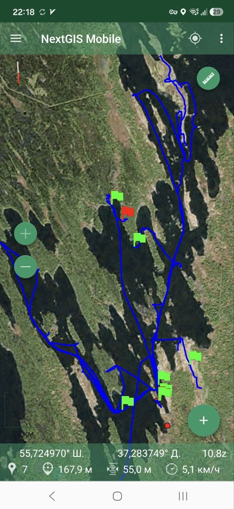
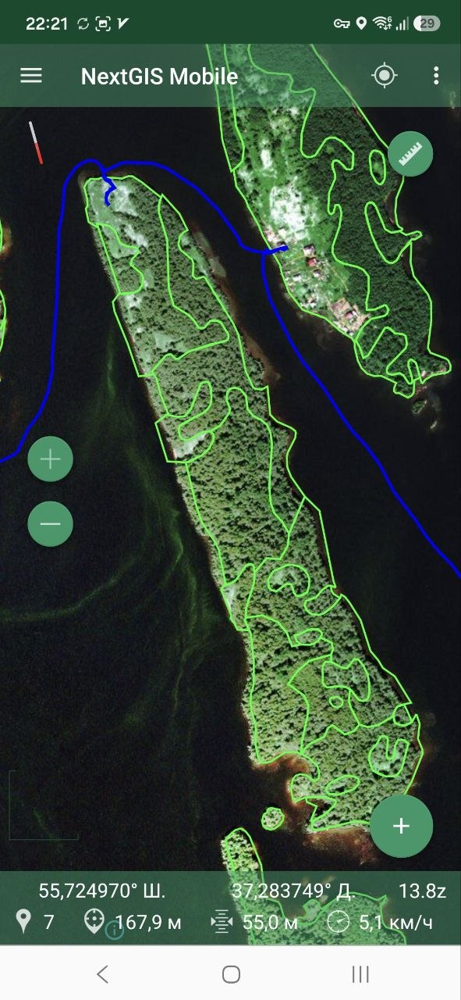
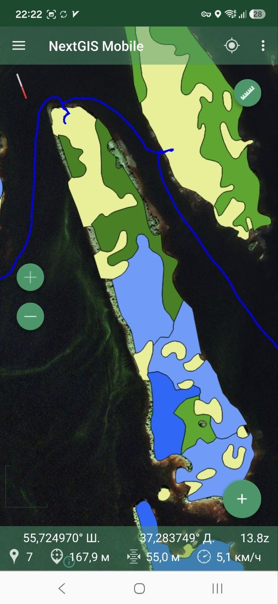
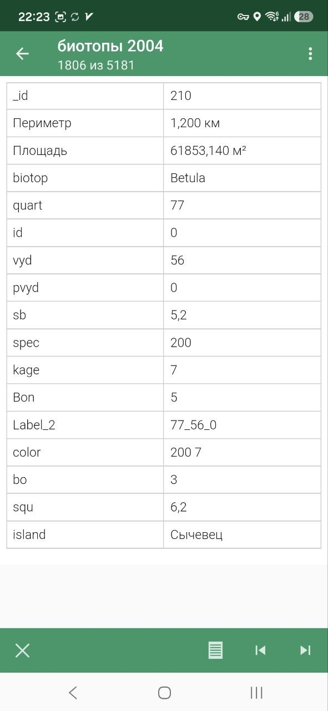
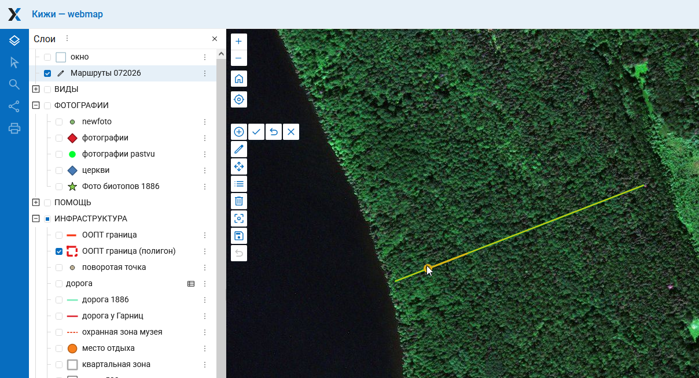
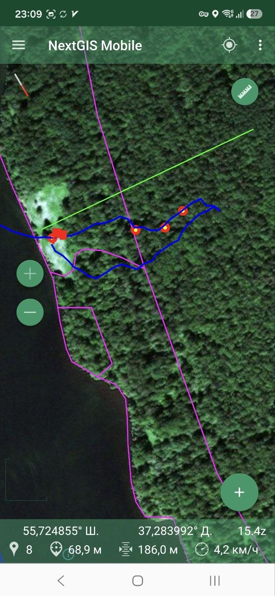
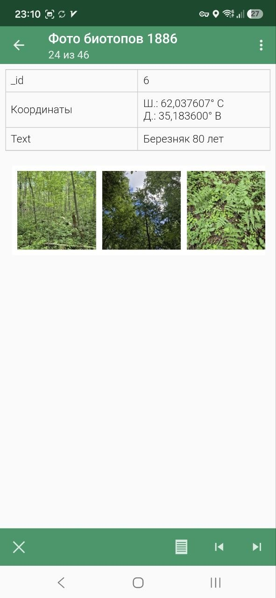
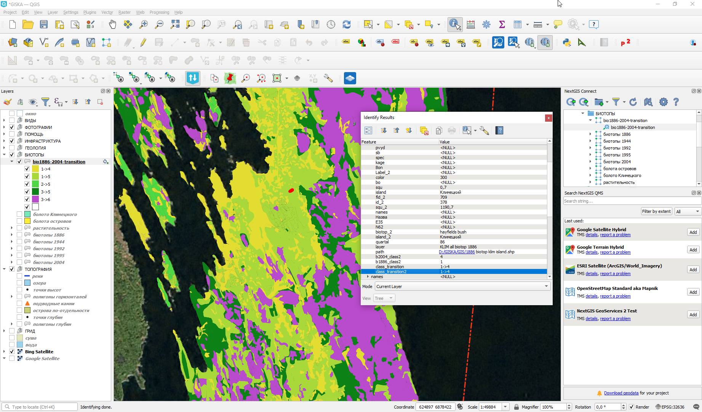

## Введение

Эта заметка рассказывает о том как устроена геоинформационная система Кижского заказника. Заметка также описывает то, как создавалась система, как собираются полевые данные и другие ее функции.

Кижский заказник (далее Кижи) - государственный природный заказник федерального подчинения в Медвежьегорском районе Республики Карелия. Располагается в акватории Кижских шхер Онежского озера ([ru-wiki](https://ru.wikipedia.org/wiki/%D0%9A%D0%B8%D0%B6%D1%81%D0%BA%D0%B8%D0%B9_%D0%B7%D0%BE%D0%BE%D0%BB%D0%BE%D0%B3%D0%B8%D1%87%D0%B5%D1%81%D0%BA%D0%B8%D0%B9_%D0%B7%D0%B0%D0%BA%D0%B0%D0%B7%D0%BD%D0%B8%D0%BA)). Административно заказник подчиняется Водлозерскому национальному парку. В границах заказника находится известный музей-заповедник «Кижи».

Этнографический очерк по истории Кижей можно прочитать [тут](/notes/kizhi-letopis/).

Основная ссылка: [vodlozero.nextgis.com](https://vodlozero.nextgis.com)

По ссылке можно посмотреть интерактивную карту со всеми данными. На данный момент все материалы доступны публично в режиме чтения (анонимному пользователю изменить ничего не получится).

## Условия работы

* Частичное наличие сотового сигнала и интернет.
* Температура около 15.
* Отсутствие помех для GPS сигнала.
* Водные и пешие маршруты.

Состав рабочей группы: геоботаник, ландшафтовед, почвовед, лесник, специалист по ГИС.

## Перечень программного обеспечения

Перечень использованного ПО и ссылки, чтобы не повторять их в тексте.

* [NextGIS Web](https://nextgis.ru/nextgis-com) - база данных и интерактивные карты.
* [NextGIS Mobile](https://nextgis.ru/nextgis-mobile) - весь мобильный сбор данных в поле, треки, точки, фото, слои. Приложение для Android.
* [NextGIS Toolbox](https://toolbox.nextgis.com) - набор дополнительных инструментов для разных операций, ссылки на конкретные - в тексте.
* [NextGIS Connect](https://nextgis.ru/nextgis-connect) - модуль для ГИС QGIS предназначенный для обмена данными между настольной и Веб ГИС.
* [NextGIS QGIS](https://nextgis.ru/nextgis-qgis) - настольная ГИС для базовой работы с данными, можно использовать и обычный [QGIS](https://qgis.org).

## Исходная ГИС

Перед началом данной работы А.В. Коросовым была создана локальная ГИС в QGIS. Эта ГИС легла в основу дальнейшей работы.

## Основные группы информационных слоёв

Каждая группа содержит один или больше информационных слоёв.

* ВИДЫ - отдельные находки видов.
* ФОТОГРАФИИ - слои с различным фотографическим материалом привязанным к карте
* ПОМОЩЬ - слои для ориентирования на местности, названия озер, деревень и др.
* ИНФРАСТРУКТУРА - границы ООПТ, охранной зоны музея-заповедника, квартальная сеть и др.
* ГЕОЛОГИЯ - четвертичные отложения, грунты и др.
* БИОТОПЫ - границы биотопов, растительности, землепользования различных периодов времени.
* ТОПОГРАФИЯ - отдельные слои с топографических карт, речная сеть, горизонтали, глубины и др.
* ГРИД - растровые карты растительности и ландшафтов.
* LANDCOVER - растровые данные о ландшафтном покрове из различных источников.

## Недостатки локальной ГИС

Готовая ГИС это важное условие обеспечивающее успех проекта. Однако, локальная ГИС имеет ряд значительных технологических недостатков:

* Затруднен обмен данными с потребителями. Обмен файлами - это очень медленно и неудобно, сложно доставлять обновления.
* Нужна установка дополнительного ПО для работы
* Сложности с многопользовательской работой

## Веб ГИС и интерактивная карта

Исходя из упомянутых выше недостатков, до начала полевых работ сразу конвертируем локальную ГИС в Веб с помощью **NextGIS Connect**.

Веб ГИС - это база пространственных данных размещенная на сервере. Веб ГИС обеспечивает единообразные механизмы доступа и обмена данными. Доступ к материалам размещенным в Веб ГИС можно осуществлять из настольных, мобильных программ и через браузер.

Из загруженных данных в Веб ГИС можно создать неограниченное количество Веб карт. В данном случае, мы обойдемся одной, содержащей все слои. Карта создается автоматически при загрузке данных с помощью **NextGIS Connect**.

Другими словами --- один проект QGIS превращается в одну Веб карту.

Время загрузки данных и создания карты: 20 минут.

## Запись треков

Треки перемещений записывали с помощью **NextGIS Mobile** и отображались вместе со всеми остальными данными. Трек писался непрерывно в течение целого дня.

* Минимальное время обновления: 2 секунды
* Минимальное расстояние обновления: 10 метров

Треки автоматически синхронизовались с Веб ГИС, что исключало потерю данных.

## Просмотр данных в поле

Любые данные загруженные в Веб ГИС можно было брать с собой в поле. При наличии связи и интернета подключать слои можно было прямо в поле. Если выезд планировался туда, где связи нет, то в **NextGIS Mobile** можно было загрузить слои заранее.

При работе офлайн можно смотреть и контура объектов и всю атрибутивную информацию по каждому контуру.

## Координация маршрутов

Утром координатор выбирал нужные участки для обследования и отмечал их в специальном слое на Веб карте.

Данный слой был подключен у всех участников и благодаря автоматической синхронизации сразу обновлялся и в **NextGIS Mobile**. Не нужно было ничего специально передавать и подгружать заново.

## Внесение экспресс-описаний и находок видов

## Быстрая привязка фотографий

Отдельно сделанные фотографии с координатами прописанными в фотографии были превращены в слой данных с помощью [exif2resource](https://toolbox.nextgis.com/operation/exif2resource).

## Камеральная работа с данными

После работы в поле проводилась камеральная работа с полученными данными в **NextGIS QGIS**.

Например, с помощью обработки в ГИС был создан слой переходов ландшафтов между картами биотопов 1886 и 2004 гг. Использовались стандартные методы ГИС-анализа. Единственная особенность, данные брались уже из единого источника центральной базы данных (Веб ГИС) и результат тут же подгружался обратно в базу данных для общего пользования. Кто-то смотрел результат в браузере, кто-то подгружал его в мобильные устройства для дальнейшей верификации в поле на следующий день.

## Выводы

Наличие продвинутого средства командной работы описанного в этой статье не отменяет необходимости в полноценных научных исследованиях, но значительно улучшает доступ к данным и координацию групп работающих в поле.

## Комментарии

[**Обсудить**](https://t.me/answer42geo/226)
