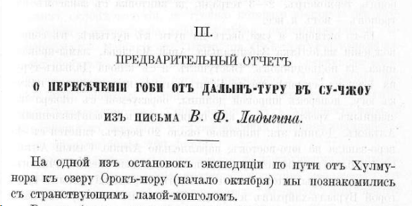

## Введение

Здесь представлен распознанный и отредактированный текст статьи Вениамина Фёдоровича Ладыгина "О пересечении Гоби от Дылын-туру в Су-чжоу", опубликованной в Известиях ИРГО Т. XXXVI, С. 169-197. Текст приводится в современной орфографии. Есть также текст в оригинальной [старой орфографии](/notes/ladygin-traverse-gobi/).

Библиографическая ссылка:

> Ладыгин В. Ф., 1900. О пересечении Гоби от Дылын-туру в Су-чжоу // Известия Императорского Русского географического общества. СПб., 1900. Т. XXXVI. С. 169-197

Скачать:

* Полный выпуск Известий ИРГО Т. XXXVI, 1900 ([источник](https://elib.rgo.ru/handle/123456789/219580), [PDF](https://drive.google.com/file/d/10qF4cNRdo4q-Bffz6jfClpl21yxrPksY/view?usp=sharing)).
* О пересечении Гоби от Дылын-туру в Су-чжоу ([PDF](https://drive.google.com/file/d/1FlC-6fRCe2grDP_e6QEwa2bylpJ1GsIi/view?usp=sharing)).

## Текст

<a id="169">**-- 169 --**</a>

III.

ПРЕДВАРИТЕЛЬНЫЙ ОТЧЕТ

**О ПЕРЕСЕЧЕНИИ ГОБИ ОТ ДАЛЫН-ТУРУ В СУ-ЧЖОУ

из письма *В. Ф. Ладыгина.*

На одной из остановок экспедиции по пути от Хулму-нора к озеру Орок-нору (начало октября) мы познакомились с странствующим ламой-монголом.

Родом бурят, лама этот десятилетним мальчиком ушел в Халху и, переходя от одной кумирни к другой, из мона­стыря в монастырь, познакомился со всей Халхой и побывал в Гумбуме, на Куку-норе, в Цайдамах и два раза --- в Хлассе. Теперь он снова направлялся в сопровождении моло­дого ламы-монгола в Тибет и откровенно признался, что под­жидал нас с тайной надеждой получить разрешение следо­вать до Тибета при экспедиции, рассчитывая на полную, ко­нечно, безопасность при проезде через кочевья тангутов в северном Тибете. Расспрашивая ламу о путях, какими он проникал из Алтая в Цайдам и Тибет, мы узнали от него, между прочим, что через Гоби к северному склону Нань-

<a id="170">**-- 170 --**</a>

шаня существует прямая большая дорога, пролегающая как раз между Императорской дорогой из Аньси в Хами и пу­тем Г. Н. Потанина по Эцзин-голу в Алтай. Немедленно же решено было воспользоваться этим случаем тем более нео­жиданным, что монголы почему-то вообще отзывались полным незнанием о путях через пустыню. Ламе было позволено сле­довать при караване, а потом ему-же предложено было провести кого либо из нас новой дорогой в Су-чжоу, на что он и согласился.

Счастливый случай пересечь Гоби в новом и очень ин­тересном месте достался мне.

Сборы в разъезд обыкновенно бывают несложны: ма­ленькая, так называемая «разъездная» палаточка, постельная сума, пуд цзамбы, несколько фунтов топленого бараньяго сала, чай, чайник, котелок, съемочные принадлежности, ане­роид, термометр, 2---3 тетради, да винтовка с запасом па­тронов --- вот и все.

15-го октября я уже был на пути к пустыне, в сопро­вождении малолетка Забайкальца Арьи Мадаева, ламы-провод­ника, да подводчиков. Выступил я с ключа Далын-туру, на южном склоне хребта Баин-цаган, и направился прямо к югу, поперек широкой долины, образуемой с севера на­званным хребтом а с юга пониженным и разветвленным Алтаем. Долина эта, шириною около 20 верст, тянется с се­веро-запада на юго-восток, параллельно Алтаю. Самый Алтай, известный в этой части у монголов под названием Гычигин-ула, круто обрывается, немного западнее меридиана Далын-туру, горой Бурыл-хайрхан и представляется к востоку от этой горы широким и пологим вздутием, на котором положен ряд хребтиков, разделенных долинами и вытянутых все в том-же юго-восточном направлении. Первая такая ветвь, или хребтик, Хуцы, шириною от 2---4 верст, начинается от север­ного склона горы Бурыл-хайрхан и тянется сначала верст около 20 на восток, а затем около 20-же верст на юго-восток и там окончательно пропадает в пустыне, как и все вообще разветвления Гычигин-ула.

Хуцы поднимается над уровнем долины футов на 800 и составляется из выходов сланцев, прикрытых в разлогах и ущельях лёссом, поросшим редким дырисуном (Lasiagrostis). К югу от хребтика Хуцы залегает долина шириною

<a id="171">**-- 171 --**</a>

около 10 верст, замкнутая с запада горою Бурыл-хайрхан, а с юга рядом кряжей, неносящих определенного названия. С востока она открыта и соединяется с пустыней восточнее короткого, но довольно высокого самостоятельного хребтика Чжинсытэ-ула, который вытянут в ю.-в. направлении вдоль оконечности Байхунгура --- последней (южной) ветви Гычигин-ула. В западной части этой долины видны остатки когда-то большого озера в виде обширного пространства, покрытого растрескавшейся коркой красной глины, окруженной солончаками. На глинистой площади существуют еще 2 небольших бассейна с горькосоленой водой, известных под названием Хухубуритэ. По южной окраине бывшего озера, среди густых зарослей дырисуна и бударганы (Kalidium gracile) проходит с северо-за­пада на юго-восток большая дорога в Куку-хото.

Миновав и эту долину поперек на юг, мне пришлось пересечь целый ряд невысоких кряжей, положенных на се­верном склоне вздутия, по гребню которого вытянута в юго-восточном направлении главная ветвь, оканчивающегося Гычигин-ула --- Бай-хунгур. Ветвь эта (Бай-хунгур) издали ка­жется довольно высокой благодаря тому, что лежит на взду­тии; на самом-же деле она не превышает 2---3 тысяч фу­тов над уровнем долины. Перевал через нее --- Бурхунтэ-ихи --- едва достигает 7.000 футов над уровнем моря, а ближайшая к перевалу и самая высокая вершина поднимается над ним не более 200 футов.

Путь к Бай-хунгуру пролегает то неглубокими ущельями, то пересекает невысокие кряжики, поросшие довольно густо ковылем, бударганой и дырисуном. Кряжики, или вернее увалы, составлены из сланцев, которые по мере приближе­ния к Бай-хунгуру заменяются розовым гранитом. Самый Бай-хунгур составляется из гранитов серого или розового, которые ниже, по южному склону, перемешиваются песчанником и сланцами. Однако, чем ниже спускались мы по кру­тому, изрытому ущельями, южному склону Бай-хунгура, тем реже попадались песчанник и сланцы и, наконец, не доходя верст 8---9 кумирни Юм-бэйсэ, расположенной в устьи ущелья уже при выходе вь пустыню, гранит (розовый и серый) вы­теснил все прочия породы. Ширина Бай-хунгура (с его боко­выми кряжами) в месте нашего пересечения не превышает 30 верст; к юго-востоку от перевала он тянется, постепенно

<a id="172">**-- 172 --**</a>

понижаясь, еще верст 30 и затем совершенно пропадает в пустыне.

Пройдя от ключа Далын-туру до кумирни Юм-бэйсэ-куре около 55 верст, я хотел остановиться на ночлег не­вдалеке от последней, но старший лама, Эрдэни-хубилган, извещенный о моем приближении, ни за что не хотел позво­лить остановиться в степи, а пригласил к себе в курень, где уже была приготовлена для нас чистая и просторная юрта. С тем большим удовольствием принял я приглашение, что мне и самому хотелось осмотреть новый курень, так расхвали­ваемый монголами. Удобно разместившись с своими вещами в юрте и покончив с кое какими работами, я пошел на­вестить Эрдэни-хубилгана. Хубилган, окруженный ламами, очень любезно принял меня в своей юрте. Еще не старый чело­век он проявил большое любопытство, расспрашивая о жизни европейцев, о диковинных для него телеграфе, железных дорогах, велосипедах, фотографии и проч., с чем ему уда­лось немного познакомиться во время поездки в Пекин. В юрте его повешены были большие стенные часы с боем, а в ящике подле его сиденья оказалось еще несколько плохень­ких карманных часов, за ходом которых он очевидно следил аккуратно, так как все они шли согласно. Похвастал он и плохим английским стереоскопом и биноклями в кра­сивой оправе, купленными им в Пекине и полученными в дар от паломников.

Кумирни и прочия постройки в курене, который мне разре­шено было осмотреть, оказались в большом порядке. Видно было, что Эрдени-хубилган строго следил за поддержанием чистоты в курене, что редко бывает в больших монасты­рях. Улицы были тщательно разметены и даже дороги, веду­щие к куреню на 2---3 версты кругом были очищены от камня и выметены. Все отбросы и прочия нечистоты уносились и сваливались верстах в 2 от куреня; там же ютились и сотни собак, редко забегая в курень. В кумирнях и жи­лых помещениях также было чисто и оне выглядели новыми. Оно впрочем так и было. Лет 15 тому назад кумирня пере­несена была с ключа Далын-туру на южный склон Алтая в урочище Амур-байсхылын при речке Бурхунтэ, вследствие того, что, по мнению высших лам, местность, где был по­строен курень, дурно влияла на обитателей его --- младших

<a id="173">**-- 173 --**</a>

лам, среди которых развились воровство, разврат и сильная смертность, унесшая в течение одного лишь месяца более 100 человек. Исправило ли лам новое место --- не знаю, но на следующий же день, дорогой от куреня, я встретил китай­ских торговцев, везших на верблюдах двух связанных ими лам, уличенных в воровстве. Всех лам в курене около 600 душ. Живут они или в каменных фанзах, или же в юртах, поставленных на фундаменте из розового гра­нита, сцементированного глиной и огороженных такою же сте­ной. Стены кумирен, жилых помещений и ограды выбелены и на красном фундаменте выглядят красиво.

Курень существует фактически уже более 200 лет, но утвержден Императором всего лишь 70 лет тому назад, при чем ему присвоено оффициальное название *Элхэ бэ кармара чжуктэхэн* (поманьчжурски), т. е. «храм тишины и спокойствия». Два раза он был разграблен и разрушен дунганами до основания, но снова отстраивался благодаря щедрым пожерт­вованиям Юм-бэйсэ и его хошунцев.

Оставив 17 октября гостеприимных, но, признаться, и на­доевших попрошайничеством, лам, мы стали спускаться в довольно низкую долину, взявши направление на юго-запад. Вышли мы в этот день с полдня, предполагая переноче­вать в пустыне и на следующий день к вечеру придти на кол. Кэрыин-гун у северного подножия хребта Эдэрэнген-нуру. Пройдя около 20 верст пустыней, редко поросшей бударганой и мелким саксаулом, мы достигли колодца Цзагын-худук, где застали Александра Николаевича Казнакова, направляв­шегося вдоль южного склона Алтая большой караванной доро­гой, ведущей из внутреннего Китая (через Гуй-хуа-чэн) в притяньшаньские города и Тарбагатай 1). Остаток дня и ве­чер провели вместе, обменявшись собранными по пути све­дениями о дорогах через пустыню, а на следующий день --- расстались. Александр Николаевич направился дальше на восток, через курень Юм-бэйсэ, а я пошел на запад к кол. Бага-толи, где меня уже ожидали верблюды и проводники для следования в глубь пустыни.

1) Этой дорогой китайцы доставляют в Или, Тарбагатай, притяньшань­ские города и далее в Кашгарию все военные припасы, пользуясь для пере­возки тяжестей даровыми подводами, так разоряющими монголов.

<a id="174">**-- 174 --**</a>

От колодца Цзагын-худук я не пошел большой доро­гой, делающей изгиб к югу и идущей по растительной по­лосе у северного склона кряжика Куку-усунэ-хара, а ради со­кращения пути направился прямо пустыней к колодцу Бага-толи, пересекая пески и песчаные барханы, поросшие высокими кустами саксаула и тамариска (Haloxylon ammodendron et Tamarix Sp.). На Бага-толи я окончательно снарядился для пу­стыни. Проводники и верблюды с подводчиками были на ме­сте; путь был распрошен и намечен.

19-го рано утром мы двинулись на верблюдах прямо на юг через понижение в месте соединения хребтиков Сумун-хаирхан и Бургустын-нуру. Северный скат этого понижения почти незаметен, между тем как южный скат довольно вы­сок и круто падает в глубокую долину. Спускаясь по нем в эту долину, известную у монголов под названием Долон-холы-гоби, я пересек безконечное число раз массу размывов, лощин и ущельиц, круто спадавших в одно большое русло, разрывающее это понижение восточнее дороги. При спуске в помянутое русло у подножия южного ската понижения я встре­тил сначала небольшие, а затем и более крутые песчаные барханы, достигающие 2---3 саженей высоты. Среди этих бар­ханов у мыса Улан-уцзюр (с запада) вырыть колодец Боомын-худук, близ которого делают привал монголы, идущие в Су-чжоу. Западная оконечность и нижняя половина южного ската Бургустын-нуру, обращенная к долине Долон-холы-гоби, покрыта также песком, на котором растет лишь колючий Oxytropis, да саксаул. Среди лощин и размывов на южном склоне понижения мною замечены, кроме названных двух видов кустарников, следующие: Ephedra, Caragana, Tamarix, Myricaria, бударгана (Kalidium gracile), хармык (Nitraria Sp.), дырисун, сухие кустики Eringim planum, желтый Statice, Panicum, чернобыльник (Artemisia vulgaris) и целая серия со­лянок.

Пустыня Долон-холы-гоби, в которую мы спустились, до­стигает в ширину более 20 верст. С юга ее ограничивает Эдэрэнген-нуру, а с севера названный уже хребтик Сумун-хаирхан и восточное продолжение его Бургустын-нуру. Абсо­лютная высота самой низкой части долины в месте нашего пересечения достигает почти 3.000 ф. над уровнем моря. К за­паду она, однако, постепенно понижается и туда стекают весною

<a id="175">**-- 175 --**</a>

потоки дождевой воды со склонов Эдэрена, Бургустын-нуру и Чжиисытэ-ула, образуя временное пресноводное озеро у подно­жия южного склона Сумун хаирхана, на меридиане главной его вершины, от которой получил свое название и весь этот по­следний хребтик. Вода в этом временном бассейне держится около одного месяца и затем высыхает. Среди густых зарослей саксаула, которым покрыта вся Долон-холы-гоби, особенно западная ее часть, растет мелкий ковыль (Stipa Sp.) и мон­голы спешат использовать этот корм, пока не высохнет временное озеро, так как в остальное время года пустыня бывает недоступна вследствие отсутствия на eя поверхности даже колодцев.

Перейдя пустыню Долон-холы-гоби поперек, мы поднялись на пологое плоское вздутие, служащее пьедесталом для Эдэ-рэнген-нуру и через прорыв в передовой ограде его --- Талын-хурюн --- вступили в целый лабиринт кряжей, холмов и конусообразных сопок, разбросанных на его поверхности.

Издали, с южного склона Бай-хунгура и с южного ската понижения между Сумун-хаирханом и Бургустын-нуру, Эдэ-рэнген-нуру представляется в виде высокого и цельного хребта, тогда как на самом деле кряжи, холмы и сопки, его состав­ляющие, поставлены на поверхности вздутия каждый совершенно самостоятельно. Кряжи вообще короткие, достигающие в длину от 3 до 15 верст, и лишь по верхнему краю южного ската Эдэрэнгена тянется (как и все прочие кряжи) в юговосточ­ном направлении самый высокий кряж, имеющий в длину около 50---60 верст. Кряж этот представляет собою гро­мадную толщу зеленоватого сланца, приподнятую на северо­северо-запад под углом в 45°---50°, покатую к югу и обры­вающуюся на север. Ряд таких же, но менее высоких вы­ходов тянется параллельно этому валу по южному крутому скату Эдэрэнген-нуру.

Самая высокая вершина его Кэрыин-гуна-обо, у северного подножия которой мы остановились при колодце Кэрыин-гунь достигает 4.500 футов над уровнем моря. С нее видны не только ближайшие кряжи, но и восточная и западная оконеч­ности этого вздутия. Эдэрэнген-нуру тянется на восток прибли­зительно верст 35---40, а на запад около 80 верст и там сливается с поверхностью пустыни. На обоих склонах его существует несколько небольших речек и много колодцев.

<a id="176">**-- 176 --**</a>

Так, от колодца Кэрыин-гун к западу монголы назвали мне 12 колодцев и 2 речки: Харыин-шанда, стекающую с се­верного склона вздутия, верстах в сорока к западу от колодца Кэрыин-гуна, и Цаган-бургусте-гол, стекающую к западу с западной оконечности Эдэрэнген-нуру. Речки небольшия, до 5 верст в длину, но обильные водою, собирающеюся из клю­чей.

К востоку от Кэрыин-гуна мне назвали до 10 колод­цев. Близ одного из них, Хошюты, китайцы разрабатывали золото лет сто тому назад. Теперь прииски заброшены, хотя, по словам стариков, золота там добывалось очень много. Для промывки золота китайцами были выкопаны в окрестностях Хошюты десятки колодцев, которые теперь окончательно за­сыпались. Вода во всех колодцах вообще солоноватая, но год­ная для питья. Эдэрэнген-нуру по первому впечатлению пред­ставляется пустыней и казалось бы, что кочевнику с его ста­дами здесь не житье; между тем по Эдэрэнген-нуру, кроме караульных монголов, круглый год кочует до сотни киби­ток монголов Юм-бэйсэ и Цзасакту-хана, которых привле­кает сюда кипец едва заметный среди густых зарослей караганы, белолозника, колючего Oxytropis и других свойственных пустыне растений. Кроме того, довольно большое расстояние, от­деляющее Эдэрэнген от большой, дороги, спасает поселив­шихся в нем кочевников от наездов монгольских и ки­тайских чиновников, а следовательно и от неизбежного ра­зорения. Изредка впрочем монгольские чиновники заглядывают сюда, но монголы успевают запрятать скот и прикидываются бедняками, загнанными судьбою в этот угрюмый угол. Все они богаты верблюдами и овцами; лошадей разводят мало. Большинство из них занимается охотою на верблюдов и ар­гали, которыми изобилует пустынная долина, залегающая к югу за Эдэреном.

Собрав здесь кой-какия сведения о предстоявшем пути по пустыне и запасшись на все время бараниной и бурдюками для воды, мы направились вдоль северного склона главного кряжа на юго-восток и затем, достигнув прохода, свернули в него на юг. По пути еще раз я убедился, что цельного хребта здесь нет, а существует ряд коротких кряжей, разделенных бо­лее или менее широкими долинами. Пройдя верст 5 по южному скату Эдэрена я заметил, что сопки стали понижаться и вме­-

<a id="177">**-- 177 --**</a>

сте с тем принимать другия формы. Чаще стали попадаться конусообразные низенькия сопки и среди них выделялись бо­лее высокия сопки, имеющия форму сахарной головы. Еще че­рез 1 1/2---2 версты плоская возвышенность кончилась и начался пологий скат к югу, к пустыне Нарин-хуху-гоби.

Так как безводная дорога в урочище Шара-хулусун, куда нам предстояло прибыть через 3---4 дня, сильно забирала к востоку, обходя холмистую полосу, протянувшуюся с запада на восток по средине Гоби, ограниченной с севера только что оставленным Эдэрэнген-нуру, а с юга высокой горной стеной Цаган-Богдо-ула, Коку-томурту и Аты-Богдо-ула, то я оставил ее и, чтобы выиграть хотя бы один день, пошел прямо через пустыню, по направлению к далеко видневшемуся мысу Цзара-хаирхан, за которым расположено ур. Шара-ху­лусун.

Первый переход по пустыне Нарин-хуху-гоби (34 версты) мы шли неглубоким сухим песчаным руслом, на дне ко­торого изредка, среди небольших барханов, попадаются за­росли тамариска и эфедры. Саксаул встречен был только у южной окраины Эдэрэнген-нуру; самая же долина была сплошь покрыта эфедрой, растущей на галечнике и песке. На пути мы несколько раз пересекли старые одиночные следы и даже це­лые тропы, протоптанные дикими верблюдами и хуланами. Жизни --- никакой. В горах (Эдэрэнген-нуру) мы еще ви­дели стайки саксаульных воробьев и соек, --- здесь же --- ни одного живого существа; хуланы и верблюды заходят сюда только весною, когда растительность сочная, и зимою --- когда выпадает снег. На ночлег остановились в том же русле, вблизи крошечной речки Нарин-хухуин-усу. Вода ее горько-соленая и ее не пили даже домашние верблюды, которые во­обще не избалованы, но, судя по массе тропинок, идущих радиусами со всех сторон к ее берегам, ее пьют дикие верблюды и хуланы. Эта часть пустыни Нарин-хуху-гоби до­вольно низка: анероид показал ниже 2000 футов над уров­нем моря.

Следующий безводный переход (около 40 верст) мы сделали через центр пустыни, причем пересекли довольно широкую (20 верст) полосу холмов, из которых выделялись несколько большими размерами Нарин-хуху-тологой вблизи восточной оконечности этой полосы и Сервин-хаирхан на западной. Холмы

<a id="178">**-- 178 --**</a>

стоять отдельно или соединяются между собою низкими седло­винами; в большинстве случаев они невысоки (до 100 ф. над уровнем долины), с пологими округленными боками и почти плоской, закругленной вершиной; но между ними встре­чаются и остроконечные, с крутыми боками; сопки составлены из сланцев, прослоенных кварцем. И та и другая породы по­крывают своими обдутыми ветром и обожженными солнцем осколками холмы и долины между ними. Растительности ника­кой, жизни --- тоже. У южной окраины полосы холмов я заме­тил четыре группы сопок, отличающихся от прочих своей формой и породами, из которых оне состоят. Оне предста­вились мне так: одна, самая высокая из всей группы, остро­конечная сопка окружена тесным кольцом из сопок мень­ших размеров. За первым кольцом следовало другое и третье и т. д., до 7---9 колец. Расстояние между кольцами помере удаления от центра увеличивается и самые сопки мель­чают. Выходы породы, составляющей эти сопки, --- обращены изломом к центру. Затем все сопки покрыты валунами ка­кой-то твердой породы, которая начала уже разрушаться. По­достланы группы сопок рыхлым, серого цвета, песчанником.

Объезжая вокруг одну такую группу сопок, я наткнулся на довольно большую речку, собирающуюся из массы ключей, вытекающих из под слоя песчанника. Вода оказалась горь­ко-соленой и совершенно негодной к употреблению. Берега ее покрыты толстой коркой хорошей белой соли. Выцветы соли покрывают собою и долину на расстоянии одной версты от бере­гов этой речки. Почва, на которой расположены сопки и те­чет описанная речка, красная глина, иногда перемешанная крупным песком, очень рыхлая, растрескавшаяся.

В центре холмистой полосы, протянувшейся по самой глу­бокой части Гоби, мы пересекли несколько котловин, покры­тых коркой красной глины. Котловины эти представляют днища огромных луж, наполняющихся водою во время ред­ких весенних и летних ливней. По берегам этих луж, теперь сухих и растрескавшихся, растет узкой полосой тама­риск и эфедра; сюда же отовсюду протоптаны дикими верблю­дами и хуланами тропинки, на которых еще видны были ста­рые следы этих животных. Абсолютная высота этих котло­вин достигает 1.100 футов; это самые глубокия котловины, встретившияся нам на всем пути от Алтая до Су-чжоу.

<a id="179">**-- 179 --**</a>

Полоса холмов, как я уже сказал, совершенно пустынна и, кроме узких полос растительности вокруг описанных днищ луж, на всем пространстве не растет ничего; густые заросли саксаула, тамариска, эфедры и солянок встретились нам лишь по выходе из полосы холмов на равнину и по пути к Шара-хулусуну. Вторую ночь мы ночевали без воды у подножия мыса, которым оканчивается на востоке гора Цзара-хаирхан. От этого мыса (на юг) до ур. Шара-хулусун оста­валось немного более десяти верст, которые мы и сделали на следующий день, 23 октября. Таким образом мы выиграли один день благодаря тому, что не послушались проводни­ков, настаивавших идти по наезженной дороге и перешли почти в 2 дня пустыню, достигающую 80 верст в ширину. Монголы были удивлены, так как они обыкновенно проходят этот путь летом в 3 дня, а зимою в 4. Убедившись что проложенная нами дорога куда лучше и короче наезженной, они решили впредь ходить ею.

Урочище Шара-хулусун представляет собою в высшей степени отрадный для пустыни уголок. Лежит оно на север­ном склоне гор Шара-хулусунэ-ула, в узком ущельи, раз­рывающем помянутые горы с юга на север. Масса ключей, собирающихся в небольшую речку, густо обросли камышом, тамариском и тограком (Populus divesifolia). Теперь, в эту пору года, воды в речке было мало; она теряется под почвой тот­час же по выходе из гор; но весною и летом, во время сильных дождей, она доносит свои воды почти до середины пройденной нами пустыни (т. е. более чем на 30 верст), унося с собою камыш и огромные тограковые деревья, с корнем вырываемые бешеными потоками.

Всюду среди камыша и кустарников сновали кеклики (Perdix chukar), биармийския синицы (Panurus barbatus), жаворонок (Alandula Sp.), саксаульные воробьи и др. Здесь же мы застали и стайки дзеренов спокойно, пасшихся на небольших луго­вых площадках у воды. Кроме этих живых существ здесь водятся: медведь, следы которого мы видели, яманы (Capra Sibirica), аргали (Ovis Sp.), и сюда же изредка заходят дикие верблюды и хуланы.

По рассказам проводников здесь водились и кабаны, но года два тому назад они вдруг исчезли и более не по­являлись.

<a id="180">**-- 180 --**</a>

Масса дзеренов меня соблазнила и я, управившись, с де­лом, пошел к устью прорыва поохотиться на антилоп, да кстати поближе ознакомиться с растительностью среди тогракового леса. Кроме отмеченных уже видов мною были замечены хармык (Nitraria Sp.), Licium, Myricaria, Rosa, не­сколько кустов ивы (Salix Sp..), обвитой ломоносом (Clematis Sp.), солянки (Salsolaceae), Glycyrrhyza, Poa, Panicum, Triticum, Centaurea, Lactuca, Statice, Saussurea, Polygonum, Amaranthus, Chenopodiaceae и Orobanche. Тограковые деревья достигают двух обхватов в толщину при высоте более 30 аршин; тамарисковые кусты поднимаются до 2 сажен. Бока прорыва и горы покрыты довольно редко низкими кустиками хармыка и солянок, но за то богаты кипцем, который нынешнее лето впрочем не родился вследствие засухи. Местечко это позабы­вается монголами и ежегодно здесь кочуют 2---3 кибитки; монголов мы уже не застали, по догадкам проводников они укочевали далее на юг, в глубь пустыни, где кипец ро­дился в изобилии.

Рассказы моих проводников о том, что горы на востоке изобилуют и водою и такими же богатыми урочищами, как и Шара-хулусун подали мне мысль проехать в этом направле­нии сколько окажется возможным и на месте проверить эти рассказы.

Мадаев с подводчиками и верблюдами остался в Шара-хулусуне, я же, с одним проводником на 3 верблюдах, от­правился на юго-восток вдоль северного склона гор, извест­ных у монголов под названием Кöку-тöмырты.

В 16 верстах от Шара-хулусуна я зашел в ур. Цаган-бургусун. Это урочище по характеру своей растительности совершенно схоже с первым; расположено оно, как и Шара-хулусун, в прорыве, но более широком и более богатом ключами. Небольшая речка, питаемая этими ключами имеет в длину около 7 верст и доносит воду только до устья прорыва. Высота урочища равняется почти 3000 футов над уровнем моря.

Отсюда я шел более 60 верст до колодца Курундэль-худук все в том же юго-восточном направлении, имея сначала справа Кöку-тöмырты, а слева короткий кряж Хапцагайты и Ланцзыты-ула. Всюду на этом протяжении в ущельях гор Кöку-тöмырты я видел заросли камыша, тамариска и тограка,

<a id="181">**-- 181 --**</a>

но ключи и колодцы были только в четырех ущельях: Кöтöли-шанда, Тмыртын-сайрь, Сухайты-сайрь и Цубулюрин-худук. От колодца Курундэль-худук горы принимают во­сточное направление.

Предгорья, скрывавшия главный хребет на всем его про­тяжении до этого колодца,---понижаются, редеют и несколько отодвигаются, открывая вид на главную цепь с ее двумя второстепенными вершинами Такты и Мокты. Между пред­горьями и главной цепью находится неширокая долина, покатая к северу и изрезанная руслами, прорывающими хребет с юга на запад. Вступив в эту долину я пошел у подножия хребта наезженной дорогой прямо на восток и миновал на протяжении 40 верст 5 глубоких и богатых пресною водою колодцев: Рельцзын-худук, Эрельцзыхыин-худук, Шины-худук, Алыг-унее и Дурюльчжин-худук и ключевое урочище Сучжи, лежащее у северного подножия главной вершины Кöку-тöмырты горы Цаган-Богдо. От ключей Сучжи дорога делится: одна ведет на восток вдоль оконечности хребта к горам Тостыин-нуру, а другая через перевал Кергистын-даба на южный склон хребта и далее---в Су-чжоу.

Несколько восточнее колодца Дурюльчжин-худук хребет круто обрывается в пустыню и тянется еще около 20 верст на северо-восток уже в виде узкой цепи холмов.

С высокого мыса, которым оканчивается хребет Кöку-тöмырты, открывается даль на сколько хватает глаз. С него видны далеко на севере горы Чжинсытэ-ула, на северо-востоке хребет Немегеты-ула, а на востоке-северо-востоке: хребет Тостыин-нуру, с его главной вершиной Ноин-Богдо (или Ноин-хара), у западного подножия которой расположен неболь­шой курень Балдын-цзасака Оботын-куре. К этому куреню и ведет дорога, по которой я шел вдоль Кöку-тöмырты. По­лоса холмов отошедшая близ кол. Курундэль-худук от горы Кöку-тöмырты, соединяется с полосой холмов отходящих от гор Хапца-гайты и Ланцзыты-ула и протянувшись на восток-северо-восток соединяется с горами Тостыин-нуру, которые пересек в 1883 году Г. Н. Потанин. На восток и юго-во­сток пустыня, на сколько хватает глаз, представляется всхол­мленной и сильно пониженной.

Таким образом длина гор к востоку от Шара-хулусуна определилась в 100 с небольшим верст; подтвердились и

<a id="182">**-- 182 --**</a>

рассказы монголов об обилии водных источников и сравни­тельном богатстве растительности в горах, лежащих почти в центре пустыни.

Вернувшись с оконечности Кöку-тöмырты на ключевое ур. Сучжи той же дорогой, мы направились на южный склон че­рез самый высокий во всем хребте перевал Кергистен-даба тропинкой, огибающей вершину Цаган-Богдо с запада. Подъем на перевал, абсолютная высота которого приблизительно 5000 футов, короткий и пологий, но очень каменистый и узкий; спуск по ущелью Хапца-гайтын-амы, более длинный пологий и не менее каменистый.

Вершина Цаган-Богдо чрезвычайно скалиста и трудно до­ступна по причине крутизны. Над перевалом она поднимается приблизительно на одну тысячу футов. Верстах в 7---8 к юго-востоку от устья ущелья Хапцагайтын-амы, которым обыкновенно проходят монгольские караваны из кочевий Сайн- ноина в Сучжоу, находится кормное ключевое урочище Цаган-булак, на которое мы не зашли.

Пройдя вдоль южного склона Кöку-тöмырты верст 30 к западу от устья названного ущелья мы достигли места слияния отделившегося от него на меридиане ур. Цаган-Боргосун отрога Ханыин-ула, который описывает на этом протяжении дугу к югу, образуя широкую (до 25 верст) долину, заметно пониженную к югу. В центре этой долины лежит группа не­высоких песчаных барханов, поросших тамариском и сак­саулом. В южной части ее существует два ключевых уро­чища Хатын-судл и Ламанэрыин-торай, на которых оста­навливаются караваны, следующие в Сучжоу из кумирни Юм-бэйсэ через прорывы Цаган-Боргосун, Тöмыртын-сайрь и Кöтöли-шанда. Других водных источников, кроме еще од­ного колодца Воомынь-худук, находящегося у подножия гор под перевалом Тактын-даба, на всем протяжении Кöку-тöмырты от ур. Шара-хулусуна и до восточной оконечности гор по южному склону---нет. Да и этот колодец теперь заброшен вследствие того, что в прошлом году на берегу его умер воз­вращавшийся из Сучжоу лама, причем голова его свесилась над водою, в которую стекали нечистоты, выделившияся из трупа. Проезжая мимо колодца мы еще видели остатки платья покойника и его обглоданные зверями кости, валявшияся у ко­лодца.

<a id="183">**-- 183 --**</a>

Следуя вдоль южного склона хребта мы вышли в прорыв, в котором расположено ур. Шара-хуЛусун и 1 ноября были уже на биваке, где все нашли в порядке.

В отношении растительности и обилия животной жизни во­сточная половина гор далеко не представляется такой пустын­ной, как можно было предполагать, основываясь на их поло­жении почти в центре пустыни.

Почти в каждом ущельи можно встретить тограк (Populus diversifolia), тамариск, ивняк, карагану, мирикарию и хармык. Дырисун и камыш попадаются очень часто. Особенно богато первым ущелье Хапцагайтын-амы. Среди дырисуна и камыша встречаются кое-какие злаки, соссюреа, Brassica, по­лынки (Artemisia), ломонос (Clematis), солянки и ревень (Rheum Sp.), корни которого служат пищею медведю и лакомством для монголов. Мой проводник на каждой остановке откапы­вал сочные корни ревеня, пек их в горячей золе и ел. Попробовал и я; корни оказались довольно вкусными и очень питательными.

Склоны гор особенно в восточной их оконечности покрыты довольно густо мелким ковылем (Stipa Sp.), служащим пре­красным кормом как для стад нескольких кибиток ко­чующих здесь монголов, так и для массы аргали, яманов и хуланов, встречавшихся нам ежедневно большими стадами. Кроме этих животных в горах водится волк, лисица и медведь, о котором я уже упоминал. Много свежего рытья медведя и его свежие следы у воды на Цаган-Боргосуне, в вершине Шара-хулусуна, у колодца Цубулюрин-худук и в ущельи Хапцагайтын-амы. По описанию моего проводника, еже­годно приезжающего сюда на охоту, медведь здесь совершенно черный, без пятен. Ростом он с полуторагодовалого те­ленка, очень зол, задирает домашних животных. Мой мон­гол часто встречавшийся с медведем не только не решался стрелять по нем, но, напротив, старался повозможности неза­метно уйти от него.

В пустынях Таргыне-гоби к северу и Шюртын-холы-гоби к югу от хребта, густо поросших саксаулом, мирикариею и солянками водятся дикие верблюды, приходящие сюда только весною и летом, пока сочна растительность, и зимою, если вы­падает снег.

<a id="184">**-- 184 --**</a>

Представителей пернатого царства не много. За время объезда гор я встретил лишь бородача (Gypaёtus barbatus), черного грифа (Vultur monachus), беркутов (Aquila Sp.) кекликов (Caccabis chukar), даурскую галку (Monedula daurica), чечетку (Linota brevirostris), большого сорокопута (Lanius Sp.), соек (Podoces Hendersoni), саксаульного воробья (Passer Stoliczkae), да ворона (Corvus corax). На ключах Сучжи мы вспугнули един­ственную утку, должно быть отсталую.

Теперь оставалось исследовать интересный хребет до за­падной оконечности, где еще с Эдэрэнген-нуру видны были три его вершины Аты-Богдо, Бага-Богдо и Дугай-хайрхан. Пройти к западу по северному склону гор не представлялось возмож­ным, так как мои проводники никогда там не бывали, а следовательно и не знали,---есть ли там вода; по южному же склону, по их рассказам, можно было пройти всюду, благо­даря обилию выпавшего там недавно снега. Поэтому мы пе­решли из Шара-хулусуна на ур. Бильгехи, лежащее в 30 вер­стах к юго-западу от первого. Дорога из Шара-хулусуна на Бильгехи ведет сначала на протяжении 10 верст по сухому песчано-каменистому, поросшему тамариском или совершенно голому, руслу, разрывающему хребет с юга на север, а за­тем выводит на всхолмленную пустыню, в центре которой и расположено ур. Бильгехи. Русло, прорвавшее горы, образова­лось из массы потоков, собирающихся во время дождей с пересеченной невысокими холмами пустыни, залегающей к югу от хребта.

Урочище Бильгехи---грустное, унылое. Небольшая но довольно глубокая речка, всего сажен в 30 длиною, теряется под со­лончаковой почвой, прикрытой невысокими корявыми кустами тамариска и небольшой группой дырисуна, объеденных вер­блюдами проходящих здесь караванов в Ань-си.

С ур. Бильгехи по направлению к западной оконечности гор, известных в этой части под названием Аты-Богдоин-нуру, мы пошли узкой тропинкой, наезженной охотниками, пе­ресекающей гряды холмов и долинок между ними, прости­рающихся с северо-востока на юго-запад. Невысокие холмы совершенно лишены всякой растительности; долины же, покры­тые крупным песком или черным, обожженным солнцем галечником и щебнем, поросли редкими, но высокими и соч­-

<a id="185">**-- 185 --**</a>

ными кустами саксаула, бударганой и солянками, служащими приманкой верблюдам. Дно этих долин местами представляет сплошные горизонтальные пласты песчанника и серого гранита, в расщелинах которого растут теже виды пустынных ку­старников. На расстоянии пройденных в первый день 27 верст мы видели много еще нестарых следов диких верблюдов, которые, по догадкам проводников, ушли далее на запад к Аты-Богдо, который покрылся снегом, или на ур. Ихыр-Мельтыс, лежащее еще западнее, где почти никогда не бывает людей, за исключением очень редких охотников. С дороги нам был виден весь хребет Аты-Богдоин-нуру, который протягивается от Шара-хулусуна еще верст 25 на северо-запад и затем делает крутой поворот на юго-запад, образуя в изгибе вершину Дугай-хайрхан. В этом направлении он тя­нется еще около 100 верст и сливается с поверхностью пу­стыни, голой, мертвой, за которой в тумане и пыли еле виден Ном-тологой и блестящия от снега громады Хамийских гор.

Следующий переход по направлению к Аты-Богдо мы шли 32 версты, при чем пересекли две гряды холмов и заключен­ные между ними ровные долины, густо поросшия саксаулом и бударганой. Здесь уже лежал довольно толстый слой недавно выпавшего снега, на котором ясно отпечатались следы диких верблюдов, хуланов, дзеренов, аргали и, по словам монго­лов, рыси забегающей сюда с вершины Аты-Богдо, у подножия которой мы остановились на ночлег, не доходя 3 верст до колодца Цаган-тологой. Следов зайцев и лисиц много; попадаются и следы волка, всегда идущего за стадами аргали. С места ночевки я съездил через понижение между Аты- и Бага-Богдо на северный склон гор, ширина которых в этом месте не превышает 10 верст, а абсолютная высота понижения рав­няется почти 4.350 футам. Вершина Аты-Богдо, крутая как стена и почти голая, поднимается над поверхностью долины приблизи­тельно на 1 1/2 тысячи футов К востоку она понижается посте­пенно, тогда как к юго-западу обрывается круто.

Пьедестал, на котором поставлен Аты-Богдо изрезан глубокими ущельями, богатыми кипцем, бударганой и тама­риском.

Дикие верблюды пасутся здесь, говорят, круглый год, но мы видели только их следы. Мой проводник Балдыр-цзангин, старый охотник, бывавший тут много раз и уверявший меня,

<a id="186">**-- 186 --**</a>

что диких верблюдов мы непременно увидим и увидим не одиночек, а целыми стадами до десятка и даже более голов, был очень сконфужен отсутствием зверей. Загадка однако была разрешена, когда мы проходили мимо колодца Цаган-тологой: вкруг колодца было несколько свежих очагов и колеи 2---3 арб,---это были следы охотников-чаньту из Ном-тологоя, которые ежегодно приезжают сюда за дикими верблю­дами. Судя по следам, охотников было около 10 человек. Верблюды были разогнаны и вероятно ушли на юго-запад к Тонкуру и далее.

Кстати приведу здесь и описание способов охоты чаньту за верблюдами, которых Балдыр-цзангин был очевидцем. Чаньту из Ном-тологоя (на северном склоне Хамийских гор) ежегодно приезжают на ур. Ихыр-мельтыс и кол. Цаган-тологой в арбах, запряженных быками или лошадьми. Арбы всегда наполнены соломой или сеном для корма ло­шадей.

Арбы и быков охотники скрывают вдали от колодцев в ущельях и холмах среди высоких кустов саксаула, сами же располагаются в засадах, устроенных шагах в 50---80 от воды и поджидают зверя, который приходит на водопой. После выстрела охотник стремглав бросается к зверю с ножем, что бы перерезать ему горло пока он еще жив. В том случае, если животное умирает прежде, чем охотник успеет к нему подбежать --- оно считается поганым и бро­сается тут же. Охотник снова возвращается в засаду и снова ждет зверя. Случается, рассказывал Балдыр-цзангин, что из 5---6 убитых зверей, чаньту пользуются мясом только од­ного, остальные бросаются или отдаются монголам, если таковые присутствуют при охоте.

Вооружены чаньту обыкновенно фитильными ружьями, но Балдыр видел и таких, которые охотятся за верблюдом с остро отточенным серпом, насаженным на длинное древко. Вооруженный таким примитивным оружием чаньту, на хоро­шей сильной лошади осторожно подкрадывается под ветром или подкарауливает зверя у водопоя и в удобную минуту стремительно бросается на него с гиком. Верблюды, испуган­ные криком и появлением человека, в первое мгновение сби­ваются в кучу и бросаются на утек только тогда, когда чаньту уже успеет подскакать и всадить серп в бок бли­-

<a id="187">**-- 187 --**</a>

жайшего верблюда. Так как в первые несколько минут верблюд не может развить быстроты бега, то чаньту успе­вает распороть своим острым серпом брюхо двум и даже трем животным. Раненные ужасным оружием животные, с выва­лившимися внутренностями, скоро обессиливают и делаются жертвою охотника.

Повернув от Аты-богдо на юг в виду ур. Ихыр-Мельтыс, мы миновали две довольно широких (от б до 7 верст) полосы холмов и вступили на окраину ровной, песчано-камени­стой пустыни Ханыин-холы, ограниченной с севера помяну­тыми полосами холмов, а с юга невысоким кряжем Ханыин-нуру, составляющим на меридиане ур. Цаган-Боргосун пред­горья Кöку-тöмырты. Окраиной Ханыин-холы мы шли около 25 верст в восточном и востоко-юго-восточном направлении, и около 35 верст в северо-восточном направлении. На этом пути мы совершенно неожиданно наткнулись на целый ряд ко­лодцев с прекрасной пресной водой. Когда и кем выкопаны были колодцы,--- мои монголы не могли сказать. Для них эти колодцы были не меньшей неожиданностью, чем для меня. Все они выкопаны по южному подножию холмов в красивых уро­чищах, поросших тамариском и тограком. Стенки колодцев и берега их выложены были когда то камнем, который теперь осыпался. С пустыни Ханыин-холы поросшей саксаулом к этим колодцам вели сотни тропинок, нахоженных верблю­дами и хуланами. Вкруг колодцев, под тенью тограковых деревьев и среди камыша и дэрисуна, были следы свежих лежек верблюдов и хуланов. Зверей однако мы и здесь не застали.

Пересекши долину Ханыин-холы, мы во второй раз прошли мимо высокой гранитной скалы Гелан-цохо (в 5---6 верстах к западу от ур. Бильгехи), а через час были уже на биваке. Здесь нас ожидала неприятность. Старик Иринцин, опытный проводник, остававшийся на этот раз на биваке с вещами и частью верблюдов, заболел на столько серьезно, что не мог двигаться. Болезнь его оказалось однако простой легкой лихо­радкой, да расстройством желудка,---последствием неумерен­ного употребления хуланьяго мяса. Дело было быстро поправ­лено, но старик продолжал упрашивать отпустить его домой, боясь умереть в пустыне. Жаль было расставаться с пре­красным, опытным проводником, знающим пустыню очень хо­-

<a id="188">**-- 188 --**</a>

рошо 1), но пришлось уступить. Отсюда же был отправлен и один из подводчиков, оказавшийся зараженным сифилисом.

Поездкой от Бильгехи к западу окончательно выяснилась длина всего хребта, равняющаяся приблизительно 250 верстам. Наибольшая ширина его вместе с предгорьями, достигает 25 верст на меридиане урочищ Шара-хулусун, Цаган-Боргосун, во всех же прочих местах она едва достигает 10 верст.

Главные вершины гор, Аты-Богдо, Бага-Богдо и Цаган-Богдо прежде носили другия названия. Первая называлась Атан (верблюд холощеный), вторая --- Инген (верблюдица) и третья --- Бура (верблюд жеребец). Обиженные этими именами вер­шины, так рассказывал мне старик Иринцин, стали по­сылать на путников страшные бури, пока люди не догадались заменить прежния названия новыми. С тех пор бури здесь прекратились и люди теперь могут спокойно следовать через пустыню, не боясь ветров.

Засечка с Бильгехи на точку в Ханыин-нуру (на юго-запад) по направлению к которой (да и дальше) нам надле­жало идти несколько переходов, указала мне, что путь наш уклоняется слишком на запад и приближается к путям из Хами. Другой, более восточной дороги, проводники мои незнали; старик Иринцин, ходивший в Су-чжоу восточными путями, --- уехал. Между тем объезжая горы Кöку-тöмырты я пересек три больших наезженных дороги, которыми мон­голы ходят в Су-чжоу. Решив выйти на одну из них я приказал заготовить на 4 дня льду и, 8 ноября, мы были уже в пути, не смотря на опасения и сетования монголов. С места стоянки мы направились на юго-юго-восток, пе­ресекли редеющую к югу полосу холмов и неширокую пе­счано-галечную долинку, поросшую тамариском и саксаулом, и стали подниматься очень пологим и коротким скатом Ха­ныин-нуру на понижение этого вздутия, оказавшееся в месте нашего пересечения очень узким (всего 5 верст). За этим вздутием залегает к югу довольно широкая (40 верст) глад­кая равнина, покрытая крупным песком и мелкой галь­кой, известная у монголов под названием Шюртын-холы-

1) Это тот самый монгол, который встречен был г.г. Грум-Гржимайло в Лу-цао-гоу в последнее их путешествие и сообщил им сведения о пу­стыне к северу.

<a id="189">**-- 189 --**</a>

гоби. Красивые, пестрые галечные пространства, чередующияся с площадями покрытыми крупным песком, подостланы, рых­лой красной глиной, в которой глубоко вязла нога. Кое-где на поверхности долины попадаются одиночные кустики бударганы и хармыка, собравшего в своих корнях маленькие бар­ханы песку. Жизни никакой, звериных следов тоже не видать. Только в центре долины мы наткнулись на свежие следы не­скольких десятков верблюдов, лошадей и баранов. Кто мог здесь идти, для чего, куда? Проводники однако тотчас же ре­шили, что это одно или два семейства монголов, бежавших с родины в Гоби, и вероятно дальше---в Нань-шань, от тяже­стей и непосильных повинностей и поборов. Побеги по расска­зам проводников довольно часты и служат единственным спасением от окончательного раззорения в Халхе.

К востоку характер пустыни несколько изменяется. Ку­стики бударганы, хармыка и саксаула попадаются еще реже, а песок и галька отвоевывают все большия пространства; на их поверхности встречаются выцветы соли. Среди галечника видны кое где желтовато-зеленые глины, в которых ветер обнажил куски гипса.

У самой подошвы пологого вздутия Хань-шуй-нуру, ограни­чивающего Шюртын-холы-гоби с юга, растительность пропа­дает совершенно. Оставив за собою пустыню, абсолютная высота которой равняется двум тысячам футов, мы поднялись на пер­вый вал, составляющий передовую (с севера) ограду Хань-шуй-нуру'ского вздутия,---Боро-ула, на котором насажен ряд коротких цепей холмов, простирающихся в востоко-юго-восточ­ном направлении. Холмы составлены из выходов кварца, пере­мешанного с красно-бурым глинистым сланцем. Обе эти по­роды подстилают более толстые слои выходов бурого и зе­леноватого сланцев, которые, вместе с первыми, приподняты на 45° к северо-востоку.

Ряды выходов разделены узкими долинками, густо покры­тыми мелкими осколками помянутых пород.

Там, где преобладает кварц, долинки белеют как бы покрытые свежим снегом, а где красный сланец, там оне, при закате солнца, представляются как бы залитыми кровью.

Среди холмов снова попадается саксаул и бударгана, но жизни по прежнему,---никакой.

<a id="190">**-- 190 --**</a>

Пройдя в юго-восточном и южном направлении около 10 верст по Боро-ула мы вышли наконец, к великой радости подводчиков, на дорогу ведущую с Цаган-Боргосуна в Су-чжоу, сделав в двое суток 86 верст. Пересекая на сле­дующий день, 10 ноября, ряды коротких цепей холмов Боло-ула уже прямо в южном направлении, мы спустились в уз­кую долину, образованную пройденным валом с севера и более высоким и длинным валом, собственно и носящим название Хань-шуй-нуру,---с юга.

На этой долинке мы встретили возвращавшийся из Су-чжоу монгольский караван с хлебом, следующий в хошун Айги-дайчин-гуна (аймак Сайн-ноина). Караван вел опытный и бывалый монгол, который рассказал нам между прочим, что Ханыпуйское вздутие простирается на востоко-юго-восток еще верст на 150, постепенно понижаясь. На западе оно суживается и образует равный по высоте Кöку-тöмырты кряж Тон-хур, пересекаемый двумя дорогами в Юй-мынь и Ань-си: од­ной, оставленной нами, из ур. Бильгехи и другой, идущей че­рез понижение между Аты и Бага-Богдо из кочевий Цзасакту-хана. Тот же монгол сообщил нам, что южная половина пустыни (к Су-чжоу) покрылась уже снегом, что дает воз­можность караванам не утруждать животных большими перехо­дами. Известие это было тем более приятно, что наши живот­ные были довольно таки истощены большими безкормными пере­ходами и нам следовало беречь их. Благодаря тому же снегу не было и ежедневной заботы о заготовлении и сбережении за­пасов воды и льда.

Из этой долинки лежащей на 700 футов выше Шюртын-холы-гоби дорога ведет прямо на юг в довольно широкое и глубокое русло Аргалинты-сайрь, разрывающее с юга на север на протяжении сорока верст северный скат Хань-шуй'ского взду­тия. Дно прорыва на протяжении 10---12 верст сплошь покрыто мелкими песчаными и более высокими глинистыми буграми, на которых растет тамариск и саксаул. Сильные ветры дую­щие здесь весною и летом и редкие, но обильные ливни, спо­собствуют понижению дна прорыва, выдувая и вымывая почву между буграми, отчего последние суживаются и представляются довольно высокими, в 1---2 1/2---3 сажени, столбами, вершины которых увенчаны кустами тамариска, а бока обвиты корявыми корнями его и ветвями хармыка. Следуя по прорыву на юг я

<a id="191">**-- 191 --**</a>

обратил внимание на массу обломков глиняной и фарфоровой посуды и частей телег, всюду разбросанных среди бугров. Мой подводчик-монгол, старик Цаган-бугай, рассказал мне по этому поводу следующее. В дунганское восстание 1860---1870 годов массы китайцев из Гань-чжоу, Су-чжоу, и Юй-мыня бро­сились при приближении дунган со всем своим скарбом через пустыню в Монголию. Многие, очень многие из них, спаслись таким образом, но одна большая партия, несколько запоздав­шая бегством, была настигнута в этом прорыве дунганами и поголовно вырезана. Все их ценное имущество было раз­граблено, менее же ценные вещи, утварь, телеги и пр. были переломаны и сожжены.

Бока прорыва Аргалинты-сайр вначале представляют собою отвесные скалы, состоящия из выходов серого и красноватого гранитов, громадные толщи которых приподняты к северо-западу---на 45°---50°. Продольные и поперечные трещины делят их на более или менее правильные квадраты. Иногда края квад­ратов сглажены и округлены, отчего квадратные плиты прини­мают вид огромных томов, плашмя и в порядке поло­женных один на другой. Через 6 верст к югу, бока про­рыва несколько раздвинулись и понизились. Русло отодвинулось на юго-запад, а дорога повела прямо на юг через пологий увал на возвышенную долину, покрытую рядами невысоких оголенных холмов. У самого подножия этого увала на дне не­глубоких русл мы увидели массу копаней, оказавшимися оставленными лет 70 тому назад золотыми приисками. Эти прииски были оставлены китайцами потому, будто-бы, что вода в колодцах, служившая для промывки золота сразу пропала; новые же колодцы воды не дали.

Мы прошли около 15 верст прямо на юг, пересекая ряды холмов и снова вступили в оставленное нами русло, разры­вающее с юго-востока на северо-запад довольно широкий (до 6 верст) увал, за которым к югу залегает узкая долина, ограниченная с севера этим увалом, а с юга горами Сер- цынгыин-нуру, составляющими южный скат Хань-шуй'ского вздутия. Миновав и эту долину в юго-восточном направлении (около 7 верст) мы пришли к подножию Серцынгыин-нуру на колодец Шилиин-торай, выкопанный в устье все того же русла, вершина которого под названием Учжик-сайрь находится в десяти верстах к юго-юго-востоку в Серцынгыин-нуру. Коло­-

<a id="192">**-- 192 --**</a>

дец Шилиин-торай (собственно два колодца) выкопан среди 2---3 десятков тограковых дерев в солончаковой почве. Вода в них солоновата, но годна к употреблению. Содержатся колодцы в порядке и воды в них много. Окрестности колодца пу­стынны; саксаул и бударгана очень редки; почва глинисто-песча­ная, покрытая выцветами соли. Среди долины разбросано много невысоких, разрушающихся холмов, очень красивых при солнце, благодаря разноцветной гальке, покрывающей их поверхность. Здесь, повидимому, ветры дуют особенно сильно, так как куски пород, составляющих холмы, выдуты в чрезвычайно вычурные формы. С одной сопки я собрал в несколько ми­нут до 20 образчиков выдувания.

От колодца Шилиин-торай дорога входит в сухое русло Учжик-сайрь (составляющее вершину Аргалинты-сайрь), кото­рое сбегает к северо-северо-западу с самой высокой точки Хань-шуй'ского вздутия, достигающей 3.500 футов абсолютной высоты. При входе в русло мы миновали еще один колодец Торайты-худук с соленой водой. Самое русло, заключенное между невысокими, по большей части скалистыми кряжиками, составляю­щими Серцынгыин-нуру, густо поросло саксаулом и бударганой. Дно его песчано-галечное, лишь местами из под песка обнажаются площади красной глины, растрескавшейся и покры­той выцветами соли.

Подъем на высшую точку всего вздутия и спуск к юго-юго-востоку по руслу, неотличающемуся от северного ни своим характером, ни названием (Учжик-сайрь) почти незаметны. В этом месте русло только расширяется и чуть-чуть приподнимается. Длина Учжик-сайря, сбегающего на юго-юго-восток равняется приблизительно 20 верстам. Пред са­мым выходом его на долину, среди высоких глинистых буг­ров находятся два колодца Гэда, с водой еще более соленой, чем в колодцах Шилиин-торай и Торайты-худук. Колодцы не глубоки (до 1 1/2 аршин) и узки. У каждого из них вы­копана канава, которую монголы проходящих караванов на­полняют водою для верблюдов. Вкруг колодцев узкой кай­мой растет камыш, объеденный и обломанный верблюдами. Аб­солютная высота колодца Гэда превышает 3.000 футов. Еще верста к югу от колодца и конец Ханыпуй-'скому взду­тию, ширина которого в месте нашего пересечения достигает почти ста верст. Отсюда глазам путника открывается широ­-

<a id="193">**-- 193 --**</a>

кая долина, в центре которой с запада на восток, с неболь­шим уклоном к югу, протянулся узкий, но довольно высокий хребет Ма-цзы-шань (покитайски, горы самца-верблюда) и во­сточное его продолжение--- Бурын-ула или Эр-то-шань.

Спуск в северную половину долины (без названия), от­деленную помянутыми горами, понижается очень заметно. Самая низкая ее точка --- голая глинистая площадь---на которой мы рас­положились на ночевку залегает в 9 верстах к югу от кол. Гэда. На этом протяжении она падает до 2.650 футов над морем, т. е. на 600 футов ниже уровня колодца, Гэда.

Долина эта на востоке замкнута холмами, отошедшими от Ханынуй'ского вздутия и присоединившимися к Бурын-ула, а на запад она, сдавленная Серцынгыин-нуру (Ханыпуй'ское вздутие) с севера и Ма-цзы-шанем с юга, уходит за гори­зонт. С долины прямо на юг видна главная вершина гор Бурын-ула Эр-то-хайрхан, а западнее две вершины Торги и еще западнее одна высокая, плоская гора Тöйгы---в горах Ма-цзы-шань.

С места ночевки дорога ведет в юго-юго-восточном на­правлении в сухое русло, прорывающее передовую ограду гор Бурын-ула и затем, поднявшись на маленький перевальчик (около 3.000 футов над уровнем моря), огибает главную вершину гор Эр-то-хайрхан с запада, и спускается в глу­бокую пустынную долину Хункыр-цзагын-холы. В месте на­шего пересечения, горы Бурын-ула едва достигают в ширину 7 верст. Северный скат их короче и круче, чем южный, обращенный к Хункыр-цзагын-холы, который длиннее и отложе. Слагаются горы из синеватого и краснобурого сланцев, прослоенных кварцем. Краснобурые сланцы преобладают и придают свою окраску всему Бурын-ула. Перевалив горы, мы миновали северную половину долины Хункыр-цзагын-холы, ограниченную с юга полосой холмов Цзосытыин-нуру, галечно-песчаную, почти лишенную растительности и. пройдя в этот день только 32 версты остановились на ночлег в ур. Хункыр-узак, среди густых и высоких зарослей саксаула, выросшего в буграх красной глины смешанной с песком. Можно было бы пройти еще десяток верст, но дорогой слу­чилась неприятная история, заставившая нас остановиться раньше. Во время спуска с гор Бурын-ула один вьюк свалился с верблюда, неотличавшегося спокойным характером. Испуган-

<a id="194">**-- 194 --**</a>

ный верблюд бросился в сторону, поволок разбитый вьюк за собою, испугался еще больше и порвав веревки, спутывавшия ему задния ноги, настолько быстро понесся в пустыню, что не­чего было и думать догнать его. Поиски оказались бесплодными и подводчики решили, что верблюд или присоединится к стаду диких или к верблюдам какого-нибудь каравана. И в том и другом случае --- верблюд для них пропал.

Случаи побега верблюдов, особенно самок, нередки. Валдыр-цзангин рассказал, что несколько лет тому назад он застрелил на охоте верблюдицу, оказавшуюся с проткну­той губой---следовательно домашнюю. Тот же охотник раз­сказывал, что дунгане во время набега на Монголию лишились довольно значительного количества верблюдов, награбленных у Монголов. Верблюды одичали и паслись вместе с дикими. Некоторые из них, впрочем, вернулись к людям сами, не­которые были легко изловлены. Большая же часть их так и осталась в пустыне. Цаган-бугай, напр., видел еще в прош­лом году под Аты-Богдо в стаде диких белого верблюда.

Из долины Хункыр-цзагын-холы, достигающей в ши­рину 20---25 верст и простирающейся с запада-северо-запада на юго-юго-восток на сколько хватает глаз мы вступили в по­лосу холмов Цзосыты-ин-нуру, ограничивающих долину с юга, придерживаясь весь переход (31. версту) юго-восточного направления и остановились на южном склоне их близ ключа Хун-лю-да-чуань. Ширина этой полосы холмов достигает 25 верст. Холмы и невысокое поднятие, на котором они постав­лены слагаются главным образом из двух видов красных глин. Более красную глину, которую монголы называют Цзос, (отсюда и название холмов Цзосытыин-нуру) добывают у са­мой дороги; она служит для окраски юрточных палок, дверей, сундуков, деревянной посуды, и стен кумирен и хырм.

Кое-где красная глина прикрыта тонким слоем краснова­того же песчанника или очень красивого, плотно сцементирован­ного конгломерата. На северном лишь склоне полосы холмов встречаются довольно значительные выходы сланцев синего и краснобурого, прослоенных кварцем. Осколки кварца служат ламам для выведения на поверхности холмов или мани или же надписей и рисунков нередко нескромного содержания.

Ключ Хун-лю-да-чуань имеет горько-соленую воду, которую не пьют даже и монголы, всегда подсаливающие чай. И только

<a id="195">**-- 195 --**</a>

зимою, когда в ключе образуется лед, проходящие караваны останавливаются здесь ночевать или запасшись льдом прохо­дят дальше.

С этого ключа дорога ведет в юго-восточном направле­нии, пересекая всхолмленную и изрезанную руслами долину еще около 30 верст до колодца У-шун-гоу, расположенного у се­верного подножия узкого, невысокого, но скалистого вала Цахир-ула. Цахир-ула простирается с северо-запада на юго-восток до колодца У-тун-гоу, с которого делает поворот к северо-востоку. Изменяют ли горы это направление и тянутся ли они с запада самостоятельно или связываются с Цзосытыин-нуру---выяснить не удалось, так как мои монголы этого не знали, а густая пыль, принесенная с юго-востока не позволяла видеть далее 10---15 верст.

С колодца Утынь-гоу дорога ведет уже прямо в южном направлении с самыми незначительными уклонениями к юго-востоку и юго-западу до Су-чжоу, до которого оставалось около 100 верст.

Миновав горы Цахир-ула не широким руслом, разры­вающим их с севера на юг и оставив в стороне (1---1 1/2 верстах к востоку) каменно-угольные копи, разработываемые китайцами, мы пересекли узкую долинку, ограниченную с юга горами Хара-ула и остановились в этих горах на ключе Харыин-шанда. Горы Хара-ула, достигающие 20 верст в ши­рину носят тот же характер, что и Цахир-ула. Раститель­ность в горах и долинках---жалкая, объеденная верблюдами. По прежнему здесь встречаются низкорослые кустики саксаула, хармыка и бударганы. Тамариск встречается редко, в проры­вах и ущельях гор. И только спускаясь с гор Хара-ула к югу мы встретили редкие, одиночные экземпляры Alhagi camelorum и Potentilla fruticosa, которую не видели с самого Алтая. Здесь же впервые я увидел и полярного жаворонка.

Выйдя из гор Хара-ула мы увидели перед собою к югу широкую голую равнину, за которой в пыльной атмосфере об­рисовывался профиль Да-сё-шаня (Нань-шань). В северной части этой долины с запада на восток протянулась полоса песков Нарин-хулусу поросшая довольно густым низкорос­лым камышем и Alhagi. В центре песчаной полосы мы ми­новали колодец Элисын-худук, обильный пресною водою и

<a id="196">**-- 196 --**</a>

вышли на голую, покрытую только мелкой галькой, щебнем и песком равнину, на которой и заночевали.

На следующий день взяв засечку на прорыв Дунгыин-гол в невысоком увале, за которым к югу непосредственно на­чинается культурная полоса, мы пересекли на протяжении 30 верст мертвую пустыню, своим однообразием сильно утом­лявшую глаза. Ни кустика, ни зверя, ни птички... Даже берега до­вольно водных речек Эхиин-гол и Дунгыин-гол, по выходе на долину из прорывов в увале, который, как я уже ска­зал выше, отделяет пустыню от культурной полосы, совер­шенно безжизненны. Поэтому все с большим нетерпением стремились поскорее достигнуть прорыва Дунгыин-гол, в кото­ром еще издали виднелись заросли камыша, дырисуна и среди них отдельные деревья ивы и джигды (Elaeagnus). Но вот, на­конец, и прорыв Дунгыин-гол, покрытый дырисуном и камышем, выросшем на давно оставленных китайцами пашнях. Среди камыша я увидел небольшия группы Sophora alopecuroides, Carelinia caspia, Alhagi и ломонос (Clematis), обвивший иву и джигду. Еще верста и мы вышли из прорыва на юг в оазис. Переход от пустыни к оазису---резок. Сзади мертвая до­лина,---впереди роскошная, богатая растительность и кипучая жизнь.

Урочище Пагэ-лын, в которое мы вступили по выходе из прорыва Дунгыин-гол, все занято китайскими фермами, окру­женными садами из яблонь, груш, абрикосов и джигды. Про­странства между фермами заняты пашнями, на которых рабо­тали не смотря на вечер китайцы. Пашни эти поразительно хороши: ровные, гладкия, прекрасно возделанные и орошенные целой сетью арыков, которые обсажены ивняком и джигдой. Тут же, на пашнях, не боясь людей разгуливали фазаны, которых китайцы не бьют потому только, что не имеют ружей.

За ур. Пагэ-Лын к югу залегает солончаковая (около 7 верст в ширину) долина, густо поросшая камышем, дыри­суном и касатиком. Посреди этой долины протянулась с за­пада на восток великая китайская стена, которую я увидел впервые. Стена местами сохранилась еще хорошо, местами же обвалилась. Китайцы с ближайших ферм разбирают ее и свозят на свои пашни в качестве удобрения.

Отсюда до города Су-чжоу оставалось немного более 15 верст, которые мы и сделали на следующий день, 18 ноября,. Дорога

<a id="197">**-- 197 --**</a>

по населенной части идет в глубокой траншее., огражденной с боков постройками. Она изрыта глубокими колеями; мосты через арыки узки и плохи; через некоторые из них мостов и вовсе нет. Миновав четыре более значительных арыка Гуань-гоу, Води-кэн, Нань-вэй-ху и Цин-шуй-хэцзы мы вы­брались из полосы построек и по гладкой, врытой в лёссо­вую почву дороге, спустились к реке Да-бэй-хо, омывающей город Су-чжоу с севера и запада, а через час были уже и в шумном, пыльном и довольно грязном городе, в кото­ром с большим трудом отыскали помещение в дяне (по­стоялый двор).

Разъезд был почти кончен: оставалось лишь пройти боль­шой дорогой до кумирни Чортынтон; задача была выполнена: пустыня пересечена с севера на юг в новом месте, при­чем пройдено в 35 дней со съёмкой 1020 верст.

## Комментарии

[**Обсудить**](https://t.me/answer42geo/204)
