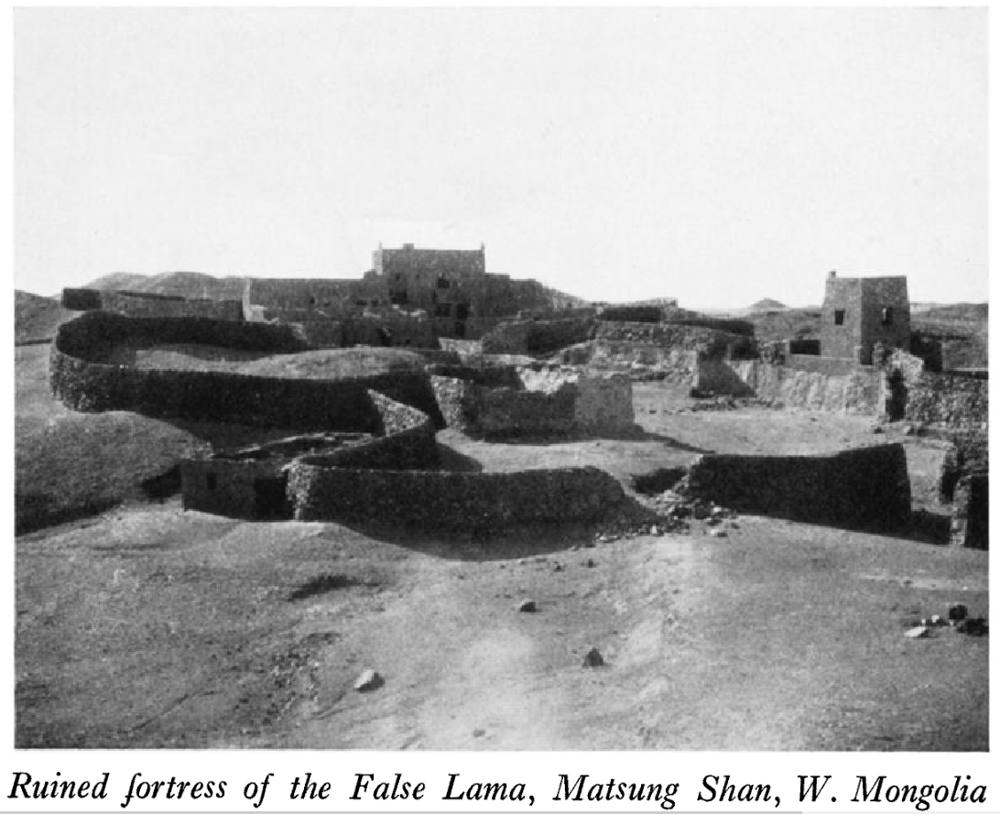
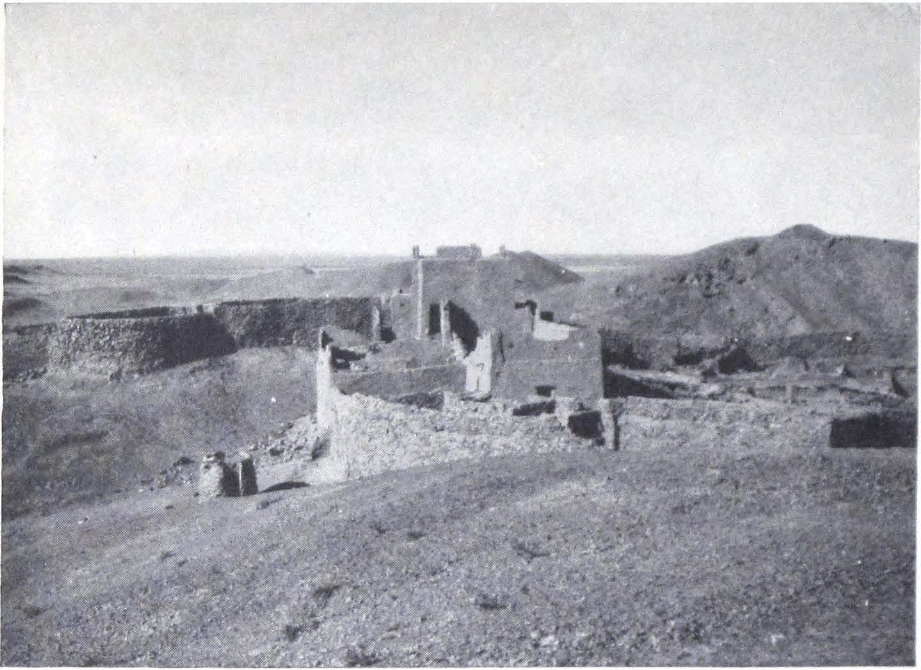

## Введение

Оуэн Латтимор (Owen Lattimore) --- американский востоковед, автор ряда трудов ([ru-wiki](https://ru.wikipedia.org/wiki/%D0%9B%D0%B0%D1%82%D1%82%D0%B8%D0%BC%D0%BE%D1%80,_%D0%9E%D1%83%D1%8D%D0%BD), [en-wiki](https://en.wikipedia.org/wiki/Owen_Lattimore)).

В 1926/1927, но скорее в 1926, то есть за год до Рериха, Оуэн Латтимор, путешествуя от Пекина до Кашмира, посетил [крепость Джа-ламы](/notes/ja-lama-fort-location/) и сделал отличное фото.

Основные публикации:

1. Lattimore, Owen. 1928. “Caravan Routes of Inner Asia.” The Geographical Journal 72 (6), December 1928: 497–531. ([скачать](https://drive.google.com/file/d/1cHTO73PBWEKstRHMDd8YH4x2F4krWIYn/view?usp=sharing))

2. Lattimore, Owen. 1928. The Desert Road to Turkestan. Boston: Little, Brown, and Company. ([скачать](https://archive.org/embed/dli.pahar.2407))

## Дата посещения замка Джа-ламы

В Caravan Routes of Inner Asia Латтимор не сообщает никаких сроков кроме рамки 1926-1927. Подробные календарные даты находятся в его книге The Desert Road to Turkestan. 26 октября 1926 в главе CORPSE CARAVANS AND GHOSTS книги (стр. 245) Латтимор пишет:

> On the twenty-sixth of October our first snow came flurrying down on a stinging wind. W e were now in the heart of the Ma-tsung Shan, though most of the time we were out of sight of what had appeared from the House of the False Lama to be a single, well-distinguished range.

Перевод

Двадцать шестого октября на пронизывающем ветру закружился наш первый снег. Мы были уже в самом сердце Ма-цзун-шаня, хотя большую часть времени не видели того, что от Дома Лже-ламы казалось единой, чётко очерченной горной цепью.

Перед этим, в начале главы Латтимор сообщает:

> WE moved on for three marches to a camp called Salt Pool Wells, a group of stingy spring-fed pools in the hollows of a soil per-meated with salt and soda.

Перевод:

Мы прошли ещё три перехода до стоянки под названием Солёные Колодцы — группы скудных родниковых луж в углублениях почвы, пропитанной солью и содой.

Таким образом, Латтимор посетил крепость Джа-ламы 26-го минус три дня (три перехода) 22.10.1926.

## О Джа-ламе

В Caravan Routes of Inner Asia Латтимор так рассказывает про Джа-ламу (называет его False Lama):

> The region rose to a position notorious for several years in Central Asian politics, but obscure to the outer world, during the period after the War when first White and then Red Russian partisans were carrying on a savage guerilla warfare in Mongolia, involving not only Russians but Chinese and Mongols. During this period a man who appears to have been a Mongolized Chinese, but who is remembered only by the name of "The False Lama," gained some measure of power in Outer Mongolia. Apparently when Soviet Russia began to assert a positive control over the affairs of Outer Mongolia, he thought it wise to flee, carrying with him a considerable following, some of them his own fighting men and others Mongols that he gathered up to form a population about him.
>
> He established himself in this no-man's-land, built a stronghold of which the ruins can still be seen, and set to with great energy to open a caravan route and found, if possible, a trading city. He was the first to see the possibility of working out the Winding Road to replace the roads closed to Chinese caravans in Outer Mongolia, and thus maintaining the trade between Kweihwa and Chinese Turkistan. He brought up supplies from Suchow, gave safe-conduct to caravans free of charge, sold provisions at a low rate and took charge of any worn-out camels which the caravans were willing to leave in his protection. It is related that he first established the crossing of the Black Gobi now in use, and that he intended to dig a well to relieve the hardship of the worst stages.
>
> Unfortunately, he was not popular among his own people, many of whom he had forced to accompany him and over whom he ruled with a strong hand. The prospect of his rise to power gave no little concern to the rulers of Outer Mongolia, and in the end he was murdered. The murder is said to have been carried out by a small band of raiders despatched from Urga, and it is also said that it could not have been accomplished without the passive acquiescence of some at least among his own subjects.
>
> From the House of the False Lama, as the stronghold of the adventurer is called, we worked in and out among the foothills of the Matsung Shan.

Перевод

> Регион занял положение, несколько лет печально известное в политике Центральной Азии, хотя и мало понятное внешнему миру, в период после войны, когда сначала белые, а затем красные русские партизаны вели ожесточённую партизанскую войну в Монголии, вовлекавшую не только русских, но и китайцев и монголов. В это время человек, который, по-видимому, был омонголенным китайцем, но остался в памяти лишь под именем «Ложный Лама», приобрёл некоторую власть во Внешней Монголии. Видимо, когда Советская Россия начала устанавливать прямой контроль над делами Внешней Монголии, он посчитал благоразумным бежать, уведя за собой значительное число последователей — как собственных вооружённых людей, так и монголов, которых он собрал, чтобы сформировать вокруг себя население.
>
> Он обосновался в этой ничейной земле, построил укрепление, руины которого видны до сих пор, и с большой энергией принялся открывать караванный путь и, если возможно, основать торговый город. Он первым увидел возможность проложить «Извилистую дорогу» взамен путей, закрытых для китайских караванов во Внешней Монголии, и тем самым сохранить торговлю между Квейхуа и Китайским Туркестаном. Он подвозил припасы из Сучжоу, бесплатно обеспечивал караванам безопасный проход, продавал провиант по низкой цене и принимал на попечение любых изнурённых верблюдов, которых караваны соглашались у него оставить. Говорят, что именно он впервые устроил переход Чёрной Гоби, который используется и теперь, и намеревался вырыть колодец, чтобы облегчить тяготы худших участков пути.
>
> К сожалению, он не пользовался популярностью среди своих же людей, многих из которых он заставил следовать за собой силой и над которыми властвовал твёрдой рукой. Перспектива его возвышения вызывала немалое беспокойство у правителей Внешней Монголии, и в конце концов его убили. Говорят, убийство совершила небольшая группа налётчиков, отправленных из Урги, и также говорят, что это было бы невозможно без пассивного согласия по крайней мере части его собственных подданных.
>
> От «Дома Ложного Ламы», как называют крепость этого авантюриста, мы двигались по предгорьям Мацзуншаня.

## Фото

Из Caravan Routes of Inner Asia:

Перевод подписи: "Разрушенная крепость Лже-ламы, Ма-цзун-шань, Западная Монголия."

Это же фото есть в The Desert Road to Turkestan. Подпись другая: "The Keep where the False Lama had his Quarters", т.е. "Замок, где располагались покои Лже-ламы."

В The Desert Road to Turkestan есть еще одно фото:

Перевод подписи: "Дом Лже-ламы."

Другие фотографии крепости также можно найти у Ломакиной в "Голова Джа-ламы" ([фото Хаслунда 1928](/notes/lomakina-ja-lama/#250)), у Roerich в "Trails to Inmost Asia" ([The castle of Ja lama](/notes/roerich-trails-to-asia-en/#211jalama)) и у других путешественников.

[Вся коллекция фотографий](/notes/ja-lama-fort-photos/) крепости с точными источниками и описаниями.

## Комментарии

[**Обсудить**](https://t.me/answer42geo/142)
