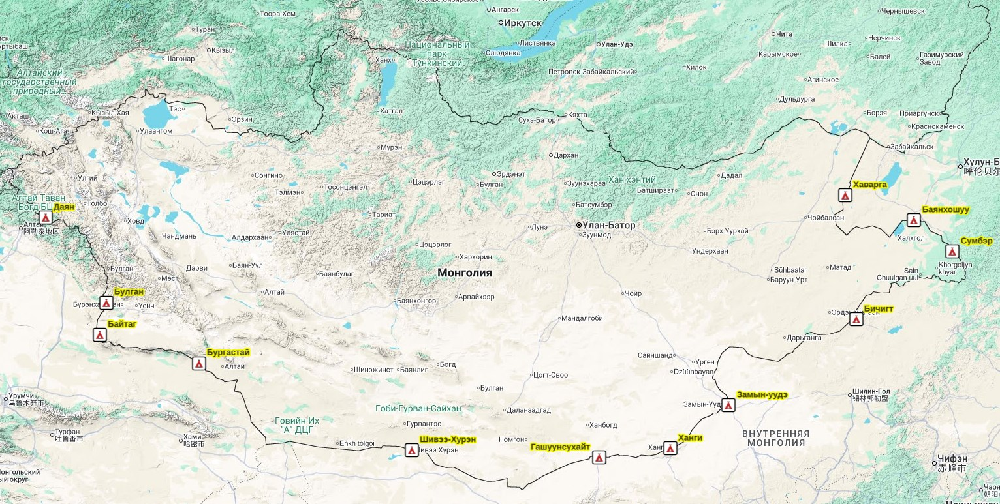

## Введение

Полный перечень и карта автомобильных переходов на границе между Монголией и Китаем.

## На карте

Посмотреть расположение всех переходов на карте, нажмите для увеличения:

Так же переходы можно посмотреть на [интерактивной карте](https://maxim.nextgis.com/resource/8690/display?panel=none).

## Переходы - таблица

Приведены долгота, широта, населенные пункты со стороны Монголии и Китая, название пункта и таможенный код.

| Долгота    | Широта    | Название       | Китай               | Иероглифы         | Код    |
|------------|-----------|----------------|---------------------|-------------------|--------|
| 90.776957  | 45.391770 | Байтаг         | Улиастай            | 乌拉斯台          | B08202 |
| 118.180988 | 48.038801 | Баянхошуу      | Өвдөг               | 额布都格          | B06204 |
| 116.236015 | 45.753491 | Бичигт         | Хатавч              | 珠恩嘎达布其      | B16201 |
| 90.992640  | 46.143548 | Булган         | Такашикен           | 塔克什肯          | B08201 |
| 94.102129  | 44.710159 | Бургастай      | Лаоемяо             | 老爷庙            | B17201 |
| 107.571614 | 42.411047 | Гашуунсухайт   | Ганцмод             | 甘其毛都          | B14201 |
| 88.939924  | 48.095376 | Даян           | Хуншаньзюй          | 红山嘴            | B07201 |
| 111.940806 | 43.689026 | Замын-Үүд      | Эрлян (Эрэн-Хото)   | 二连浩特          | B03201 |
| 119.476078 | 47.329106 | Сүмбэр         | Аркса / Аершан      | 阿尔山市          | B06205 |
| 115.857717 | 48.596804 | Хавирга        | Ар хашаат           | 阿日哈沙特        | B06203 |
| 109.979416 | 42.635881 | Ханги          | Мандула             | 满都拉            | B11201 |
| 101.278301 | 42.584908 | Шивээхүрэн     | Секхи               | 策克              | B15201 |

Расположение пунктов можно посмотреть [на карте](/notes/mn-cn-border/#%D0%BD%D0%B0-%D0%BA%D0%B0%D1%80%D1%82%D0%B5).

## Переходы - детали

### Словарь

* хоёр талын --- двусторонний. Могут переходить только граждане Китая и Монголии.
* олон улсын --- международный. Могут переходить граждане третих стран.
* боомт --- пункт пропуска

### Байтаг

* Двусторонний пограничный переход
* Автомобильный
* Долгота, широта: 90.776957, 45.391770, [на карте](https://maxim.nextgis.com/resource/8690/display?panel=none).

### Баянхошуу

* Двусторонний пограничный переход
* Автомобильный
* Долгота, широта: 118.180988, 48.038801, [на карте](https://maxim.nextgis.com/resource/8690/display?panel=none).

### Бичигт

* Международный пограничный переход
* Автомобильный
* сомон Эрдэнэцаган, аймак Сухэ-Батор
* понедельник–пятница с 08:00 до 17:00, перерыв на обед: 12:00–14:00
* [Caravanistan](https://caravanistan.com/border-crossings/mongolia/#other-crossings-2) --- полезная информация о переходе.
* Долгота, широта: 116.236015, 45.753491, [на карте](https://maxim.nextgis.com/resource/8690/display?panel=none).

### Булган

* Международный пограничный переход
* Автомобильный
* сомон Булган, аймак Ховд
* понедельник–пятница с 10:00 до 19:00 (альтернативная информация: 10:30-13:45 и 15:30-18:45)
* [Caravanistan](https://caravanistan.com/border-crossings/mongolia/#bulgan-%e2%80%93-takashiken) --- полезная информация о переходе.
* [Форум Caravanistan](https://caravanistan.com/forum/viewtopic.php?f=9&t=1113) --- обсуждение перехода.
* Долгота, широта: 90.992640, 46.143548, [на карте](https://maxim.nextgis.com/resource/8690/display?panel=none).

### Бургастай

* Двусторонний пограничный переход
* Автомобильный
* Долгота, широта: 94.102129, 44.710159, [на карте](https://maxim.nextgis.com/resource/8690/display?panel=none).

### Гашуунсухайт

* Двусторонний пограничный переход
* Автомобильный
* Долгота, широта: 107.571614, 42.411047, [на карте](https://maxim.nextgis.com/resource/8690/display?panel=none).

### Даян

* Двусторонний пограничный переход
* Автомобильный
* Долгота, широта: 88.939924, 48.095376, [на карте](https://maxim.nextgis.com/resource/8690/display?panel=none).

### Замын-Үүд

* Международный пограничный переход
* Железнодорожный и автомобильный
* сомон Замын-Үүд, аймак Дорноговь
* Ежедневно, с 08:00 до 18:00 (альтернативная информация: 09:00 до 19:00)
* [Caravanistan](https://caravanistan.com/border-crossings/mongolia/#zamin-uud-%e2%80%93-erlian) --- полезная информация о переходе.
* [Форум Caravanistan](https://caravanistan.com/forum/viewtopic.php?f=9&t=3134) --- обсуждение перехода.
* Долгота, широта: 111.940806, 43.689026, [на карте](https://maxim.nextgis.com/resource/8690/display?panel=none).

### Сүмбэр

* Международный пограничный переход
* Автомобильный
* сомон Халхгол, аймак Дорнод
* с 2 апреля по 30 ноября, понедельник–пятница с 08:00 до 17:00
* [Caravanistan](https://caravanistan.com/border-crossings/mongolia/#other-crossings-2) --- полезная информация о переходе.
* Долгота, широта: 119.476078, 47.329106, [на карте](https://maxim.nextgis.com/resource/8690/display?panel=none).

### Хавирга

* Двусторонний пограничный переход
* Автомобильный
* Долгота, широта: 115.857717, 48.596804, [на карте](https://maxim.nextgis.com/resource/8690/display?panel=none).

### Ханги

* Двусторонний пограничный переход
* Автомобильный
* Долгота, широта: 109.979416, 42.635881, [на карте](https://maxim.nextgis.com/resource/8690/display?panel=none).

### Шивээхүрэн

Этот пограничный переход закрыт для туристов (информация в Википедии неверна). Через него ежедневно проходят несколько тысяч грузовиков, вывозящих уголь из Монголии в Китай.

* Двусторонний пограничный переход
* Автомобильный
* [Caravanistan](https://caravanistan.com/border-crossings/mongolia/#other-crossings-2) --- полезная информация о переходе.
* [Форум Caravanistan](https://caravanistan.com/forum/viewtopic.php?f=9&t=2656) --- обсуждение перехода.
* Долгота, широта: 101.278301, 42.584908, [на карте](https://maxim.nextgis.com/resource/8690/display?panel=none).

## Источники

* Официальная информация на [сайте Таможенной службы](https://gaali.mn/categories/border-crossing-point) (монгольский).
* [Guru Travel Mongolia](https://tour2mongolia.com/travel-tips/mongolia-border-crossings)
* [Китайско-монгольская граница](https://ru.wikipedia.org/wiki/%D0%9A%D0%B8%D1%82%D0%B0%D0%B9%D1%81%D0%BA%D0%BE-%D0%BC%D0%BE%D0%BD%D0%B3%D0%BE%D0%BB%D1%8C%D1%81%D0%BA%D0%B0%D1%8F_%D0%B3%D1%80%D0%B0%D0%BD%D0%B8%D1%86%D0%B0) --- Википедия.

## Вопросы?

Возникли вопросы, комментарии или есть полезная информация по теме заметки?

Можно [**написать в телеграм**](https://t.me/answer42geo/212) или оставить вопрос в форме ниже.
