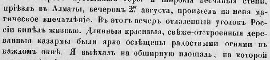

## Введение

Набор автозамен для превращения старой русской орфографии в современную.

## Автозамены

ѣ -> е

ъ  ->  # c пробелом для очистки окончаний слов

ъ. -> . # замена ъ в конце предложений

ъ, -> , # замена ъ со знаками препинания

ъ) -> ) # замена ъ со скобками

ъ; -> ; # замена ъ со знаками препинания

ъ: -> : # замена ъ со знаками препинания

ъ- -> - # замена ъ в составных словах

Ѳ -> Ф

## Замены под контролем

Эти замены лучше выполнять под контролем:

ъ ->  # удаление оставшихся ъ, но см. «объезд» и др.

і -> и

ыя -> ые # но см. «выяснить»

няг -> нег

шаго -> шего

щаго -> щего

аго -> ого # иногда его (бывшаго), но см. «благословение»

зс -> сс

ея -> ее (её) # но см. «имея»

зп -> сп

## Комментарии

[**Обсудить**](https://t.me/answer42geo/63)
