## Введение

Археологический комплекс «Орнок», расположенный вблизи села Орнок (Орнёк), представляет собой одно из крупнейших скоплений петроглифов в Северном Прииссыккулье. Здесь насчитывается до тысячи камней с древними изображениями.

Представленные фотографии автора — это предварительный, во многом случайный набор, опубликованный в рамках подготовки к более детальной инвентаризации, запланированной на июль 2025 года.

## На карте

Расположение комплекса:

* [OpenStreetMap](https://www.openstreetmap.org/#map=14/42.63337/76.88466)
* [Яндекс карты](https://yandex.ru/maps/?ll=76.873287%2C42.633713&z=16.01)
* [Google maps](https://maps.app.goo.gl/wwdYgCu1xL79b2Pj8)

Координаты:

* Широта: 42.636517
* Долгота: 76.869140

Эти фотографии и больше фотографий других авторов можно посмотреть на [специальной Веб карте](https://maxim.nextgis.com/resource/8001/display?angle=0&zoom=18&styles=8022,8190,8048,8046,8044,8042,8040,8038,8036,8034,8032,8030,8028,8026,7996,7998&base=basemap_0&lon=76.8691&lat=42.6351).

## Фотографии

На фотографиях запечатлены Максим Меньшиков и Василий Владимирович Плоских, надеюсь они не против.

Чтобы увеличить фото, нужно нажать на него правой кнопкой мыши и выбрать "Открыть изображение в новой вкладке".

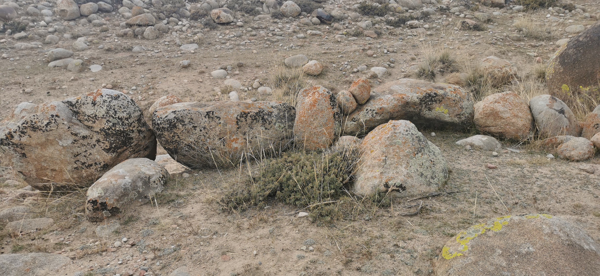

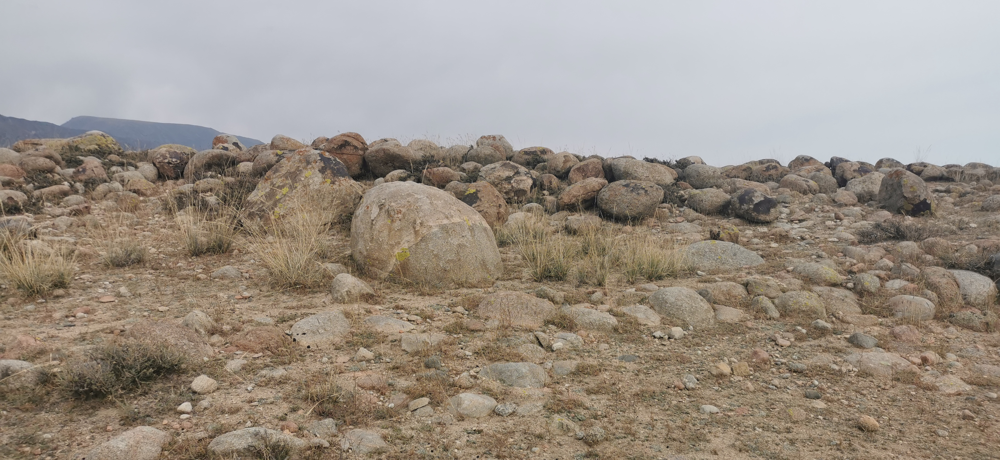

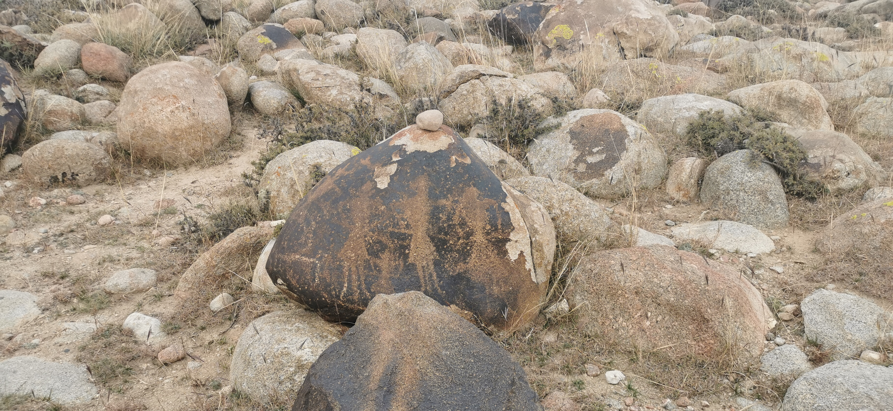

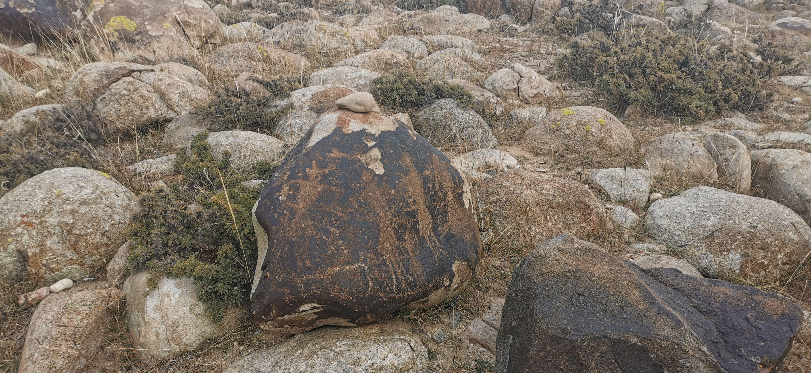

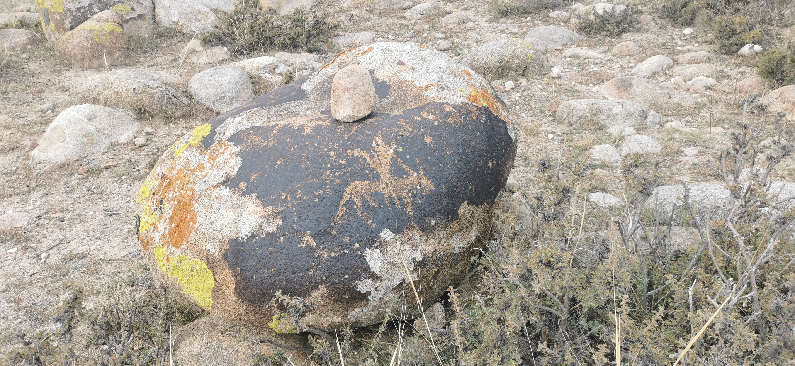

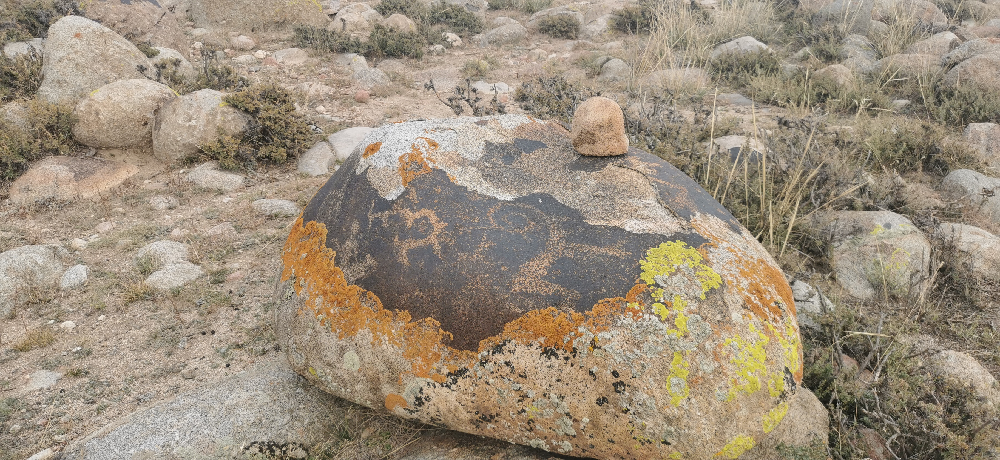

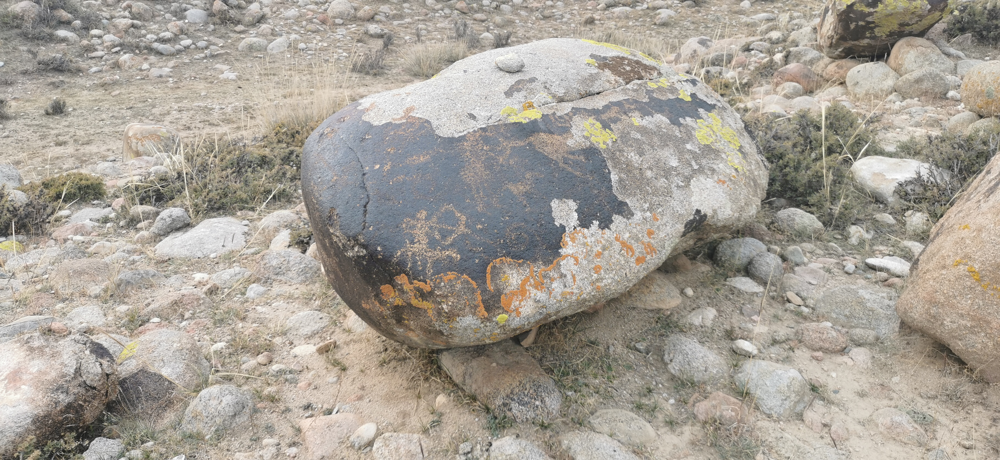

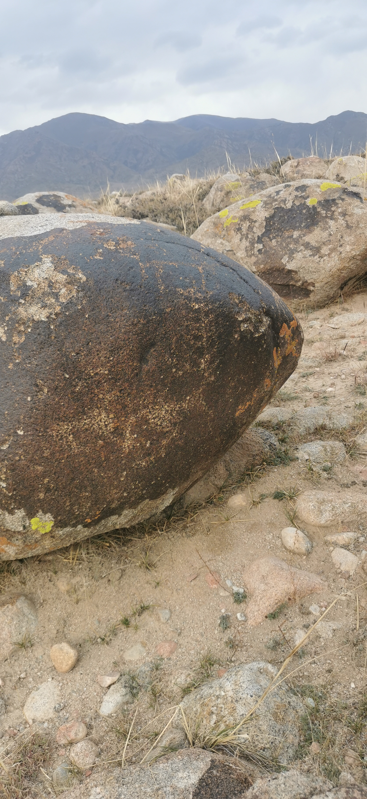

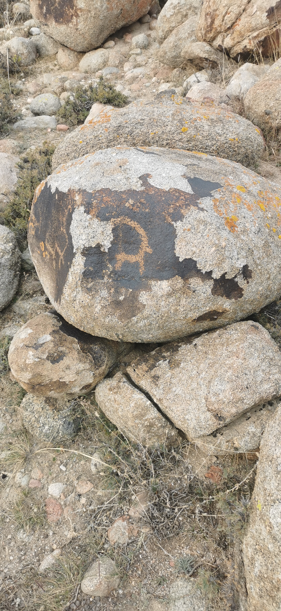

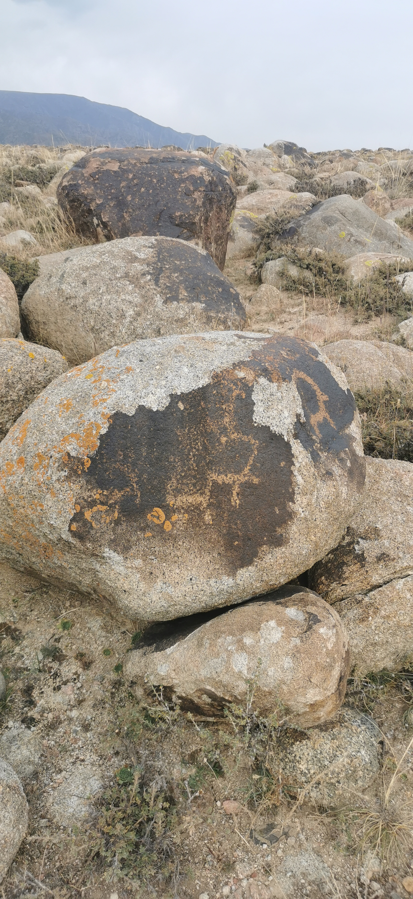

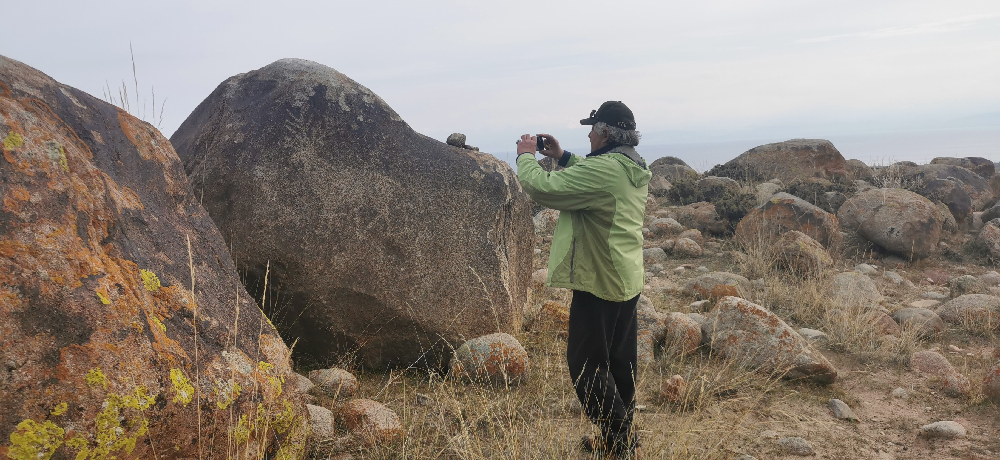

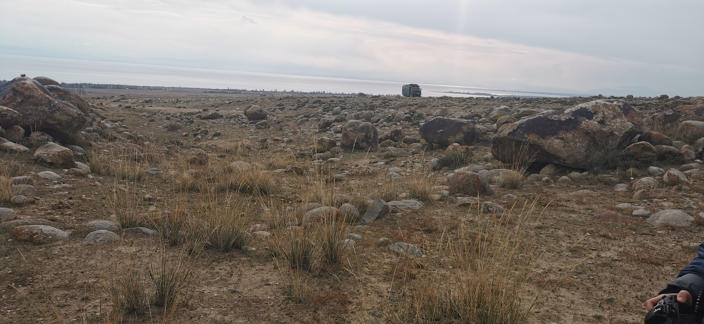

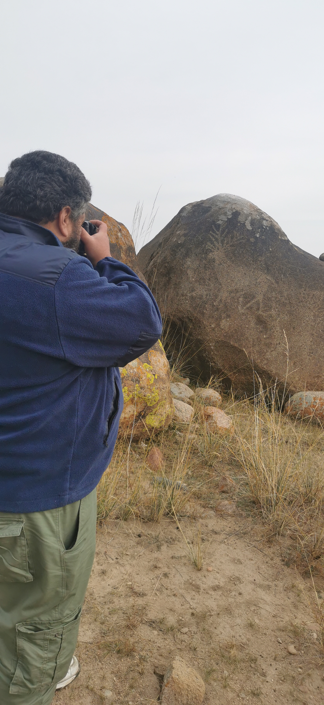

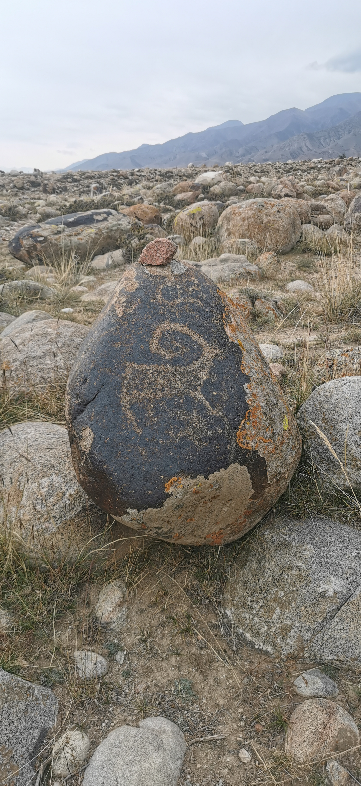

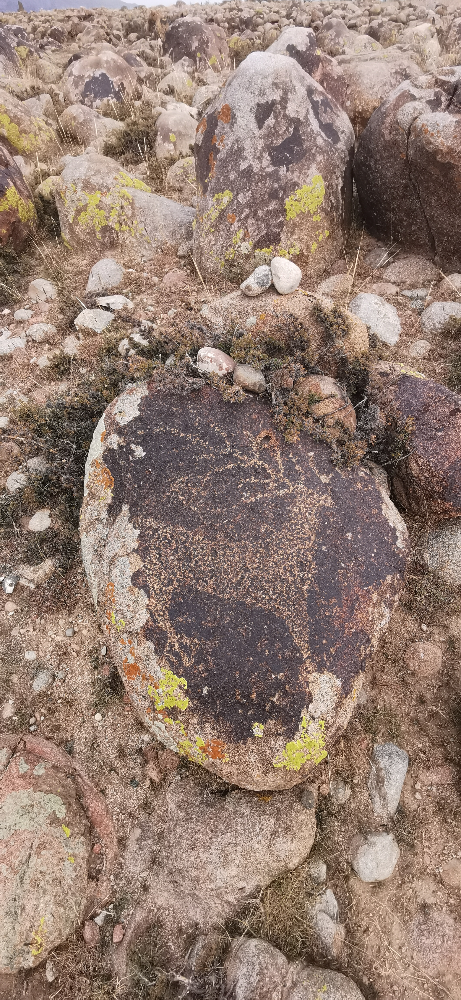

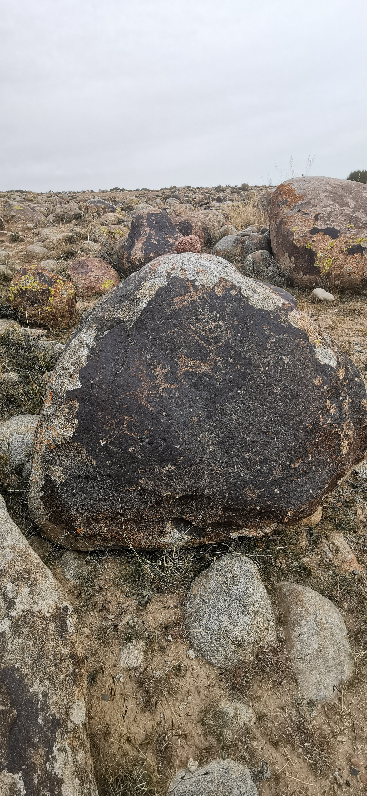

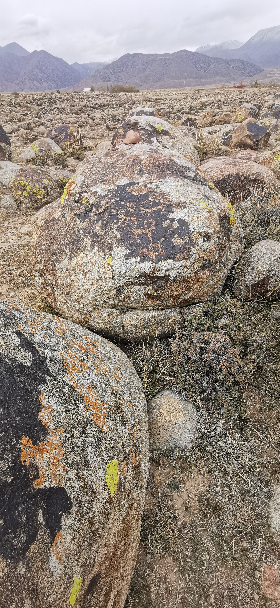

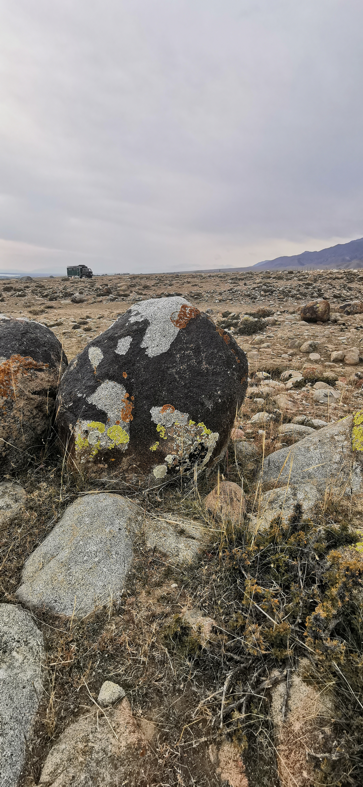

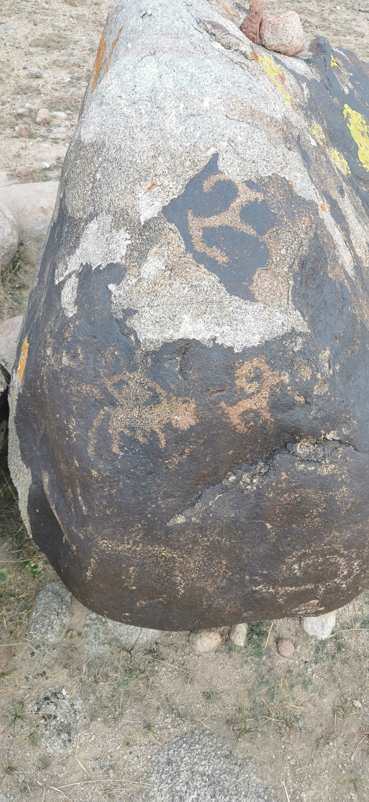

## Комментарии

[**Обсудить**](https://t.me/answer42geo/102)
