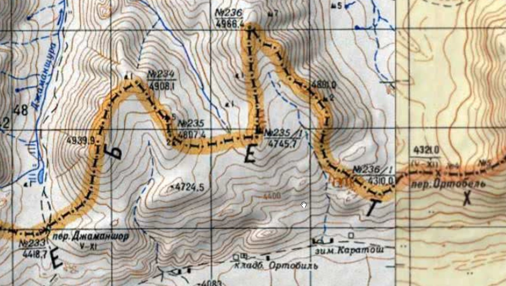
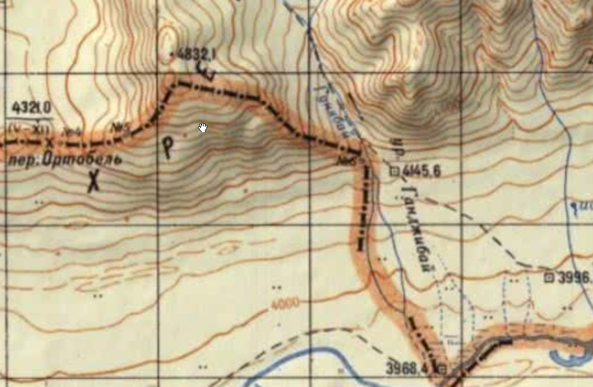
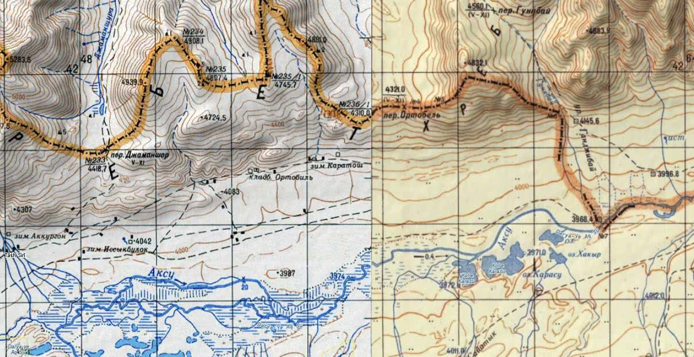
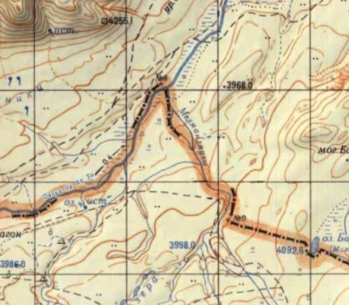
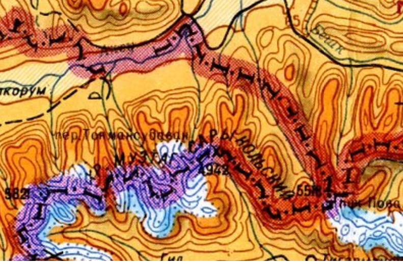
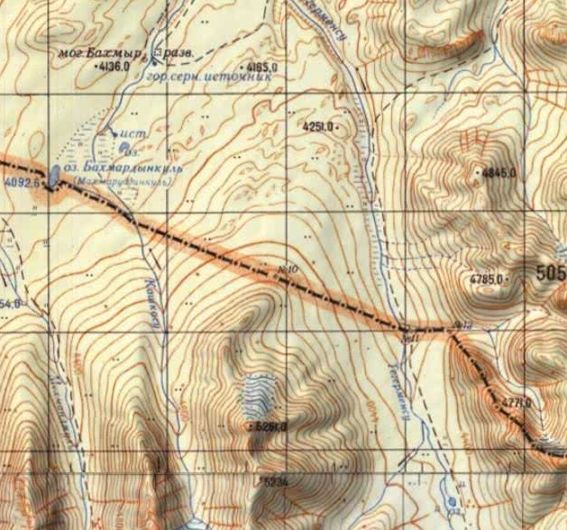
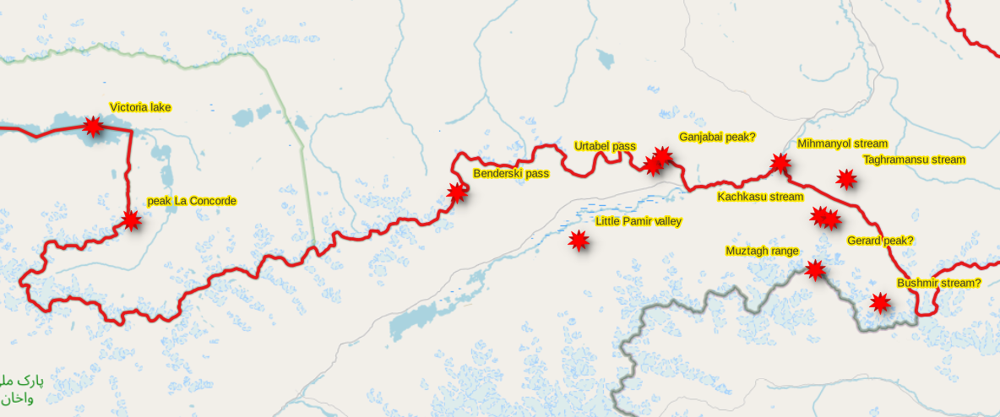
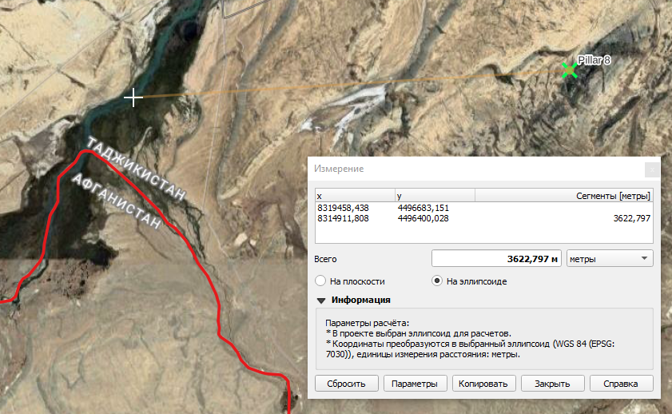
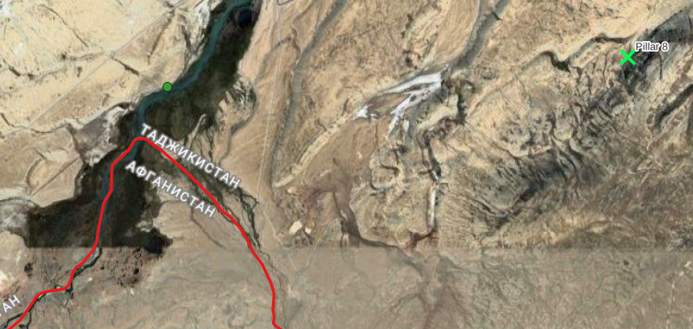
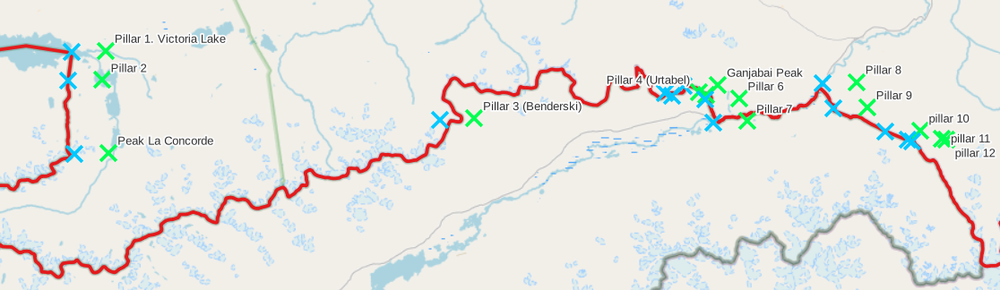

## Введение

27 февр. (11 мар­та) 1895 в Лон­до­не между Российской империей и Ве­ли­ко­бри­та­нией заключен т.н. Лондонский договор «О раз­гра­ни­че­нии сфер влия­ния в об­лас­ти Па­ми­ров» о раз­гра­ни­че­нии сфер влия­ния ме­ж­ду дву­мя дер­жа­ва­ми в Центральной Азии. До­го­вор явил­ся про­дол­же­ни­ем по­ли­ти­ки обе­их дер­жав по юри­дическому оп­ре­де­ле­нию и де­мар­ка­ции гра­ниц Аф­га­ни­ста­на как бу­фер­но­го го­су­дар­ст­ва ме­ж­ду ази­атскими вла­де­ния­ми двух империй.  Договор пре­ду­смат­ри­вал про­ве­де­ние раз­гра­ни­чительной ли­нии от восточной око­неч­но­сти оз. Зор­куль (Вик­то­рия) по гор­ной це­пи до пе­ре­ва­ла Ор­та-Бель, да­лее до на­се­лён­но­го пунк­та Кы­зыл-Ра­бат (Кы­зыл­ра­бат) на р. Ок­су и до гра­ни­цы Ки­тая. Договор сде­лал не­воз­мож­ным даль­ней­шее рас­ши­ре­ние в Центральной Азии сфер влия­ния Российском им­пе­рии – на юг и Британской им­пе­рии – на се­вер, сни­зил риск во­енного столк­но­ве­ния ме­ж­ду дву­мя дер­жа­ва­ми и спо­соб­ст­во­вал за­кре­п­ле­нию не­за­ви­си­мо­сти Аф­га­ни­ста­на ([подробнее](https://old.bigenc.ru/domestic_history/text/2157628)).

Для демаркации границы была отправлена совместная британско-российская экспедиция. Итогами ее работы стал отчет Памирской пограничной комиссии (Report on the proceedings of the Pamir Boundary Commission) изданный в 1897 г. зафиксировавший основные вехи границы.

Помимо прочего, отчет содержал таблицу с координатами 12-ти столбов (pillars) установленных в ключевых точках. Координаты были зафиксированы методами того времени и в дальнейшем уточнялись.

Задача этой заметки разобраться с описанием мест установки столбов, топонимами и опубликованными в отчете координатами и представить современную версию координат.

## Исходная публикация

Gerard, M. G., Holdich, T. H., Wahab, R. A., Alcock, A. W., 1897. Report on the proceedings of the Pamir Boundary Commission. Calcutta : Office of the Superintendent of Government Printing, India. 99 p., 39 leaves of plates, ill. 35 cm.

Источники документа:

* [University of Nebraska](https://digitalcommons.unomaha.edu/afghandocsreports/8/), 21.8 Mb, без карт.
* [Pahar.in](https://pahar.in/pahar/Books%20and%20Articles/Afghanistan/1896%20Report%20on%20the%20Proceedings%20of%20the%20Pamir%20Boundary%20Commission%20by%20Gerard%20&%20Holdich%20s.pdf), 16.3 Mb, с картами.
* [Google Books](https://books.google.ch/books/about/Report_on_the_Proceedings_of_the_Pamir_B.html?id=FeQ-AAAAYAAJ&redir_esc=y), 15.5 Mb, без карт.

## Исходная таблица

Глава VII. SYNOPSIS OF PILLARS AND POINTS ON THE PAMIR BOUNDARY, страницы 52 и 53 отчета содержат таблицу со столбами установленными для демаркации границы.

[Описание и координаты столбов](https://docs.google.com/spreadsheets/d/18nz8F8MJHjuHm5SWcvj82J-_6ki-Je6baatpsR45rsM/edit?usp=sharing) в виде таблицы.

Основные данные по столбам:

| Number                   | Latitude      | Longitude    | Height    | Fix                      |
|--------------------------|---------------|--------------|-----------|--------------------------|
| Pillar 1. Victoria Lake  | 37°26'32"     | 73°49'1"     | 13398     | Fixed trigonometrically. |
| Pillar 2                 | 37°24'51"     | 73°48'44"    |           | Fixed trigonometrically. |
| Peak La Concorde         | 37°20'35"     | 73°49'14"    | 17753     | Fixed trigonometrically. |
| Pillar 3 (Benderski)     | 37°22'36"     | 74°16'3"     | 14950     | Fixed by topographers.   |
| Pillar 4 (Urtabel)       | 37°24'8"      | 74°32'32"    | 14150     | Fixed by topographers.   |
| Pillar 5                 | 37°23'58"     | 74°33'5"     |           | Fixed by topographers.   |
| Ganjabai Peak            | 37°24'33"     | 74°33'56"    |           | Fixed by topographers.   |
| Pillar 6                 | 37°23'45.5"   | 74°35'30"    |           | Fixed by topographers.   |
| Pillar 7                 | 37°22'26"     | 74°36'6"     |           | Fixed by topographers.   |
| Pillar 8                 | 37°24'43"     | 74°44'6"     | 12700     | Fixed trigonometrically. |
| Pillar 9                 | 37°23'14"     | 74°44'53"    |           | Fixed by topographers.   |
| Pillar 10                | 37°21'53"     | 74°48'45"    |           | Fixed by topographers.   |
| Pillar 11                | 37°21'25"     | 74°50'22"    |           | Fixed by topographers.   |
| Pillar 12                | 37°21'20"     | 74°50'40"    |           | Fixed by topographers.   |

Столбы и их исходные описания (на английском):

| Number                   | Description                                                                                    |
|--------------------------|------------------------------------------------------------------------------------------------|
| Pillar 1. Victoria Lake  | Conical stone pillar, 9 feet high, built at the eastern end of Lake Victoria on a mound rising 10 feet above the level of the lake. |
| Pillar 2                 | Conical pillar at the foot of the northern slope of a spur of Range Nicolas II, leading to Peak La Concorde. |
| Peak La Concorde         | The central point of a conspicuous mountain peak situated on a spur running northwards from the crest of Range Nicolas II towards the eastern end of Lake Victoria, and defining the line of boundary between Pillar 1 and the crest of the range. From Peak La Concorde to Pillar 3 the boundary follows, firstly, the crest of the spur indicated by that peak to its junction with the main watershed, and thence the crest of the watershed eastwards to the Benderski Pass. |
| Pillar 3 (Benderski)     | Conical pillar erected on a rocky rise about 20 feet above and 20 yards to the east of the kotal, defining the Benderski Pass. From Pillar 3 the boundary continues to follow the main crest of the range to Pillar 4. |
| Pillar 4 (Urtabel)       | Conical pillar defining the crest or watershed of Range Nicolas II at the point where the Urtabel pass crosses that range. The crest at this point immediately overlooks the Little Pamir plain. |
| Pillar 5                 | Pillar 5 is situated about half a mile from Pillar 4, bearing E. S. E., and defines the main watershed to the Ganjabai peak. |
| Ganjabai Peak            | There is no pillar, but a pile of stones has been erected on the Ganjabai hill, at a point overlooking the plains, between the Urtabel pass and the Ganjabai stream. This pile of stones defines the upper end of the spur which conducts the boundary southwards from the main watershed to the plain. |
| Pillar 6                 | At foot of the spur descending northward from the Ganjabai peak to the Ganjabai stream. |
| Pillar 7                 | Conical pillar on right bank of Aksu river opposite the junction of the Ganjabai and Aksu streams. From this point the boundary follows the course of the Aksu river (mid-stream) to Pillar 8. |
| Pillar 8                 | Conical pillar on left bank of Aksu river, about 20 feet above the river level situated on a low gravel spur which touches the river opposite the junction of the Mihmanyol stream with the Aksu river. |
| Pillar 9                 | The pillar is placed on a small hill on the right bank of the Mihmanyol stream, about 2 miles from the point of junction between its eastern branch and the Aksu river. The pillar is built of stone in the form of a pyramid, about 8 feet high. |
| Pillar 10                | The pillar is built at the lower end of the spur running northward from Peak Gerard of the Muztagh range, dividing the Taghramansu from the Kachkasu streams. The pillar is a pyramid of stone, about 8 feet high. |
| Pillar 11                | This pillar is built on the bank of the Taghramansu stream, about 6.3 miles from the junction of the Taghramansu with the Bushmir stream. The pillar is a stone pyramid about 9 feet high. |
| Pillar 12                | This pillar is built on an elevation on the left bank of a small unnamed nala joining the Taghramansu, about 1 mile from its junction and close to Pillar 11. The pillar is a stone pyramid, about 8 feet high. |

Столбы и их исходные описания (на русском):

| Number                   | Описание |
|--------------------------|----------|
| Pillar 1. Victoria Lake  | Конический каменный столб высотой 9 футов (2,74 метра), установлен на восточном конце озера Виктория, на холме, возвышающемся на 10 футов (3,05 метра) над уровнем озера. |
| Pillar 2                 | Конический столб у подножия северного склона ответвления хребта Николая II, ведущего к пику Согласия. |
| Peak La Concorde         | Центральная точка заметной горной вершины, расположенной на ответвлении, идущем к северу от водораздельного гребня хребта Николая II к восточному концу озера Виктория, определяющая линию границы между столбом 1 и главным хребтом. От пика Согласия до столба 3 граница следует сначала по гребню указанного ответвления до его соединения с основным водоразделом, а затем по гребню водораздела на восток до перевала Бендерского. |
| Pillar 3 (Benderski)     | Конический столб, установленный на каменистом возвышении примерно в 20 футах (6,10 метров) выше и в 20 ярдах (18,29 метра) к востоку от котала, обозначающего перевал Бендерского. От столба 3 граница продолжает следовать по главному гребню хребта к столбу 4. |
| Pillar 4 (Urtabel)       | Конический столб, обозначающий гребень или водораздел хребта Николая II в точке, где перевал Уртабель пересекает этот хребет. Гребень в этом месте непосредственно возвышается над равниной Малый Памир. |
| Pillar 5                 | Столб 5 расположен примерно в полумиле (804,7 метра) от столба 4, в направлении В.Ю.В., и обозначает основной водораздел к пику Ганджабай. |
| Ganjabai Peak            | Столба нет, но на вершине Ганджибай сложена каменная груда, в точке, возвышающейся над равниной, между перевалом Уртабель и ручьём Ганджабай. Эта груда обозначает верхнюю часть ответвления, по которому граница спускается с основного водораздела на юг к равнине. |
| Pillar 6                 | У подножия ответвления, спускающегося к северу от пика Ганджибай к ручью Ганджибай. |
| Pillar 7                 | Конический столб на правом берегу реки Аксу напротив слияния ручьёв Ганджибай и Аксу. Отсюда граница следует по руслу реки Аксу (по середине потока) до столба 8. |
| Pillar 8                 | Конический столб на левом берегу реки Аксу, примерно на 20 футов (6,10 метров) выше уровня воды, на низком гравийном выступе, который подходит к реке напротив впадения ручья Мехманджулы в Аксу. |
| Pillar 9                 | Столб установлен на небольшом холме на правом берегу ручья Мехманджулы, примерно в 2 милях (3,22 километра) от точки слияния его восточной ветви с рекой Аксу. Столб сложен из камня в форме пирамиды высотой около 8 футов (2,44 метра). |
| Pillar 10                | Столб установлен в нижней части ответвления, идущего на север от пика Жерар в хребте Музтаг, разделяющего ручьи Таграмансу и Качкасу. Столб представляет собой каменную пирамиду высотой около 8 футов (2,44 метра). |
| Pillar 11                | Столб установлен на берегу ручья Таграмансу, примерно в 6,3 милях (10,14 киломатра) от места его слияния с ручьём Бушмир. Столб представляет собой каменную пирамиду высотой около 9 футов (2,74 метра). |
| Pillar 12                | Столб установлен на возвышенности на левом берегу небольшого безымянного налы, впадающего в Таграмансу, примерно в 1 миле (1,61 километра) от места слияния, неподалёку от столба 11. Столб представляет собой каменную пирамиду высотой около 8 футов (2,44 метра). |

Нюансы перевода:

* unnamed nala - слово nala / nullah / nallah (индийско-персидское происхождение) используется в топографии Британской Индии и Центральной Азии для обозначения небольшого горного ручья или притока.

## Топонимы

Перечень упомянутых в описаниях столбов топонимов и перечень столбов в описаниях которых упоминается топоним.

| EN Toponym         | RU Топоним              | EN Type   | RU Тип    | Pillars                                         |
|--------------------|-------------------------|-----------|-----------|-------------------------------------------------|
| Victoria           | Виктория                | lake      | озеро     | Pillar 1. Victoria Lake                         |
| Nicolas II         | Николая II              | range     | хребет    | Pillar 2, Peak La Concorde, 4                   |
| La Concorde        | Согласия                | peak      | пик       | Pillar 2, Peak La Concorde                      |
| Benderski          | Бендерского             | pass      | перевал   | Peak La Concorde, Pillar 3 (Benderski)          |
| Urtabel            | Уртабель                | pass      | перевал   | Pillar 4 (Urtabel), Ganjabai Peak               |
| Little Pamir       | Малый Памир             | plain     | равнина   | Pillar 4 (Urtabel)                              |
| Ganjabai           | Ганджибай               | peak      | пик       | Pillar 5, Ganjabai Peak, 6                      |
| Ganjabai           | Ганджибай               | stream    | ручей     | Ganjabai Peak, Pillar 6, 7                      |
| Aksu               | Аксу                    | river     | река      | Pillar 7, 8, 9                                  |
| Aksu               | Аксу                    | stream    | ручей     | Pillar 7                                        |
| Mihmanyol          | Мехманджулы             | stream    | ручей     | Pillar 8, 9                                     |
| Gerard             | Жерар                   | peak      | пик       | Pillar 10                                       |
| Muztagh            | Музтаг                  | range     | хребет    | Pillar 10                                       |
| Taghramansu        | Таграмансу              | stream    | ручей     | Pillar 10, 11, 12                               |
| Kachkasu           | Качкасу                 | stream    | ручей     | Pillar 10                                       |
| Bushmir            | Бушмир                  | stream    | ручей     | Pillar 11                                       |

### Victoria Lake

Озеро Виктория --- оно же Зоркуль, Зор-куль, Сары-куль, Памирское озеро, Lake Victoria. Одно из крупнейших озёр Памира, располагающееся на афгано-таджикской границе ([ru-wiki](https://ru.wikipedia.org/wiki/%D0%97%D0%BE%D1%80%D0%BA%D1%83%D0%BB%D1%8C)).

> По соглашению между Россией и Великобританией о разграничении сфер влияния в области Памиров 1895 года по озеру прошла граница между Российской империей и Афганскими ханствами.

[Лондонский договор 1895](https://old.bigenc.ru/domestic_history/text/2157628) / Теребов О. // Ломоносов — Манизер [Электронный ресурс]. — 2011. — С. 26. — (Большая российская энциклопедия : [в 35 т.] / гл. ред. Ю. С. Осипов ; 2004—2017, т. 18). — ISBN 978-5-85270-351-4.

На картах:

* 37.450332 с.ш., 73.725128 в.д.
* [OpenStreetMap](https://www.openstreetmap.org/?mlat=37.450332&mlon=73.725128&zoom=10#map=13/37.44293/73.72019)
* [Google Maps](https://maps.app.goo.gl/zDx6khrcJ5N2aHCw6)

### Nicolas II range

Хребет Николая II = он же Ваханский хребет, Қаторкӯҳи Вахон, Nicholas Range, Selselehi-i Koh-i-Wakhan. Горный хребет на юге Памира, на территории Таджикистана и Афганистана ([ru-wiki](https://ru.wikipedia.org/wiki/%D0%92%D0%B0%D1%85%D0%B0%D0%BD%D1%81%D0%BA%D0%B8%D0%B9_%D1%85%D1%80%D0%B5%D0%B1%D0%B5%D1%82), [en-wiki](https://en.wikipedia.org/wiki/Nicholas_Range_(Pamir_Mountains))).

> ВАХАНСКИЙ ХРЕБЕТ, в южной части Памира, в Средней Азии, прежде называвшийся также хребтом императора Николая II. Протягивается с З.-Ю.-З. на В.-С.-В. Длина — около 250 км. Высота — 5.000—5.500 м; некоторые вершины превышают 6.000—6.500 м. Хребет покрыт массами снега и имеет много ледников. Перевалы залегают на громадной высоте. Из них более известны перевал Бендерского (4.612 м абс. выс.) и Урта-бель (4.584 м абс. выс.), находящиеся в вост., более доступной части В. х. Через зап. часть хребта почти единственным проходом служит ущелье р. Памир, притока Пянджа. По самой вост. части В. х. проходит государств. граница между СССР и Афганистаном.

[БСЭ](https://ru.wikisource.org/wiki/%D0%91%D0%A1%D0%AD1/%D0%92%D0%B0%D1%85%D0%B0%D0%BD%D1%81%D0%BA%D0%B8%D0%B9_%D1%85%D1%80%D0%B5%D0%B1%D0%B5%D1%82).

> The range was given the title Nicholas Range during the joint Russo-British Pamir Boundary Commission of 1895 that delineated the border between Russian and Afghan territory. In exchange for a British agreement to use the term Nicholas Range, in honour of Emperor Nicholas II of Russia, on official maps, the Russians agreed to refer to Lake Zorkul as Lake Victoria in honor of Queen Victoria of the United Kingdom.

[En-wiki](https://en.wikipedia.org/wiki/Nicholas_Range_(Pamir_Mountains)).

### La Concorde peak

Пик Согласия - он же Concord Peak, La Concord Peak, 15 км на юг от оз. Зоркуль ([en-wiki](https://en.wikipedia.org/wiki/Concord_Peak)).

На картах:

* 37.339550 с.ш., 73.774143 в.д.
* [OpenStreetMap](https://www.openstreetmap.org/node/5145403189)
* [Google Maps](https://maps.app.goo.gl/CJtHroXLjzKw8SBS7)

### Benderski pass

Перевал Бендерского - он же Andamin Pass, Benderski Pass. Один из перевалов Ваханского хребта. Высота: 4550 (OSM), 4612 (БСЭ).

Еще названия: Andamān Davān, Andamin Dawān, Andawin Dawān, Kotal-e Andaymin Dowan, Kotāl-i-Andēmīn Dowan, Kowtal Anḏamin, Kowtal-e Andeymīn Davān, Pereval Andamin.

На картах:

* 37.36909 с.ш., 74.23720 в.д.
* [OpenStreetMap](https://www.openstreetmap.org/node/9922247405)
* [Google Maps](https://maps.app.goo.gl/CJtHroXLjzKw8SBS7)

### Urtabel pass

Перевал Уртабель - он же Ортабель, Ортобель, Kotal-e-Ortobil, Ortobil.

Иногда путают его с Kōtal-e Jaman Shōr, Jaman Shor Pass ([en-wiki](https://en.wikipedia.org/wiki/Jaman_Pass)), например на [Google Maps](https://maps.app.goo.gl/Pw9icQuFzKo8qU5QA).

И не только Гугл:

> Some 12 kilometers east of the confluence of the Andeymin and Aq Su Rivers and 45 kilometers east of Baza'i Gonbad, a short steep trail swings northward to Jauan Shur (Urta-bel) Pass and then down to the Istyk River route.

United States Department of State, Bureau of Intelligence and Research. [International Boundaries: Afghanistan – U.S.S.R Boundary.](https://library.law.fsu.edu/Digital-Collections/LimitsinSeas/pdf/ibs026.pdf). Limits in the Seas, No. 26 (Revised). September 15, 1983. Washington, DC: U.S. Government Printing Office, 1970.

Джаманшор и Ортобель это два разных перевала.

На картах:

* 37.39011 с.ш., 74.50312 в.д.
* [OpenStreetMap](https://www.openstreetmap.org/node/9922247406)
* [Google Maps](https://www.google.com/maps/@37.3981217,74.5085444,15.29z/data=!5m1!1e4?entry=ttu&g_ep=EgoyMDI1MTEyMy4xIKXMDSoASAFQAw%3D%3D)

### Little Pamir valley

Малый Памир, долина - V-образная долина в восточной части Ваханского хребта ([en-wiki](https://en.wikipedia.org/wiki/Little_Pamir)). С севера ограничена Ваханским хребтом (хребет Николая II). По долине течет р. Аксу.

На картах:

* 37.33258 с.ш., 74.43327 в.д.
* [OpenStreetMap](https://www.openstreetmap.org/#map=13/37.33258/74.43327)
* [Google Maps](https://maps.app.goo.gl/w5Dadgsy9kL5ewtF6)

### Ganjabai peak, Ganjabai stream

Непосредственно пик - не обнаружен, по всей видимости это высота 4832,1 ([nakarte](https://nakarte.me/#m=14/37.40381/74.53490&l=T)).

На топокартах Генштаба есть урочище Ганджибай ([переименовано](https://ru.wikisource.org/wiki/%D0%9F%D0%BE%D1%81%D1%82%D0%B0%D0%BD%D0%BE%D0%B2%D0%BB%D0%B5%D0%BD%D0%B8%D0%B5_%D0%9F%D1%80%D0%B0%D0%B2%D0%B8%D1%82%D0%B5%D0%BB%D1%8C%D1%81%D1%82%D0%B2%D0%B0_%D0%A0%D0%B5%D1%81%D0%BF%D1%83%D0%B1%D0%BB%D0%B8%D0%BA%D0%B8_%D0%A2%D0%B0%D0%B4%D0%B6%D0%B8%D0%BA%D0%B8%D1%81%D1%82%D0%B0%D0%BD_%D0%BE%D1%82_31_%D0%B8%D1%8E%D0%BB%D1%8F_2023_%D0%B3%D0%BE%D0%B4%D0%B0_%E2%84%96_348) в Гандждашт), ручей Гуннбай (перевал Гуннбай).

### Aksu river, stream

Аксу (верхнее течение р. Бартанг, [ru-wiki](https://ru.wikipedia.org/wiki/%D0%91%D0%B0%D1%80%D1%82%D0%B0%D0%BD%D0%B3)) - река текущая по долине, приток р. Пяндж, вытекает из оз. Чакмактын.

### Mihmanyol stream

Мехманджулы, Mehmān Yowlī.

На картах:

* 37.35851 с.ш., 74.71537 в.д.
* [OpenStreetMap](https://www.openstreetmap.org/way/642748462#map=13/37.35851/74.71537)
* [Google Maps](https://www.google.com/maps/@37.4043575,74.6961512,15.42z/data=!5m1!1e4?entry=ttu&g_ep=EgoyMDI1MTEyMy4xIKXMDSoASAFQAw%3D%3D)

### Gerard peak

Не найден. Возможно безымянный на картах пик 5251,0 разделяющий Тегерменсу и Кашкасу. См. иллюстрацию ниже.

Назван в честь автора отчета?

### Muztagh range

Музтаг-Сарыкольский хребет (Малый Памир) на 10 км генштабовской топокарте ([en-wiki](https://en.wikipedia.org/wiki/Sarikol_Range)).

### Taghramansu, Kachkasu stream

Тегерменсу и Кашкасу, ручьи впадающие в Аксу и находящиеся рядом.

### Bushmir stream

Не найден. Предположительно безымянный ручей впадающий в Тегерменсу в районе самой восточной части границы Афганистана. По километражу похоже.

Странный ориентир на значительном удалении от объекта в контексте которого он упоминается в описании.

## Карта топонимов

Итоговая карта найденных топонимов:

Вопросами в названии помечены топонимы которым не удалось найти однозначных объектов (это не означает, что точки поставлены неправильно)

## Расчет современных координат столбов - алгоритм

Если взять координаты из отчета "влоб", то получим смещение по долготе примерно 3.6 км.

Для примера возьмем Pillar 8 --- "низкий гравийный выступ, который подходит к реке напротив впадения ручья Мехманджулы в Аксу", измерим расстояние между точкой с координатами и таблицы и местом впадения Мехманджулы в Аксу. Получаем цифру 3622 метра.

Из-за несовершенных методов измерений исходные координаты координаты были рассчитаны с систематической ошибкой. Ошибка была выявлена в 1912 и окончательно расчитана в 1921.

> The location was recalculated during the Indo-Russian triangulation of 1912-13 and corrected by the India Office of the Trigonometrical Survey in 1921.

Расчет ошибок:

> Longitude Corrections
>
> -02'27" Madras Observatory
>
> -03.3" Adjustment to Indian 1916 Datum
>
> -02'30.3" Total
>
> Latitude Corrections
>
> -04.7" Adjustment to Indian 1916 Datum

United States Department of State, Bureau of Intelligence and Research. [International Boundaries: Afghanistan – U.S.S.R Boundary](https://library.law.fsu.edu/Digital-Collections/LimitsinSeas/pdf/ibs026.pdf). Limits in the Seas, No. 26 (Revised). September 15, 1983. Washington, DC: U.S. Government Printing Office, 1970.

Поправка 2′30.3″ по долготе на широте 37° составляет 3720 метров, что совпадает с измерениями по карте. Таким образом поправка похожа на правду и ее можно применить.

Алгоритм и пример вычисления актуальных координат в WGS84:

1. Берем исходные координаты Pillar 8: 37°24'43", 74°44'6"
2. Пересчитываем в десятичные градусы: 37.41194444, 74.73500000
3. Берем значение поправки из IBS26: по широте –4.7″, по долготе –2′30.3″
4. Пересчитываем значение поправки в десятичные градусы: 0.00131, 0.04175
5. Применяем к координатам: 37.41064, 74.69325
6. Пересчитываем с помощью ogr2ogr: Indian 1916 (Everest 1830) → WGS 84 используя трансформацию датума Kalianpur 1975 -> WGS84, [EPSG:1156](https://epsg.io/1156), система координат Kalianpur 1975 [EPSG:4146](https://epsg.io/4146).
   1. ogr2ogr -f GeoJSON result_wgs84.geojson source_ind1916.geojson -s_srs "+proj=longlat +ellps=evrst30 +towgs84=295,736,257,0,0,0,0 +no_defs" -t_srs EPSG:4326
7. Окончательные координаты: 37.40976364, 74.69223069

Результат:

[Подробный расчет](https://docs.google.com/spreadsheets/d/18nz8F8MJHjuHm5SWcvj82J-_6ki-Je6baatpsR45rsM/edit?gid=587183786#gid=587183786) в электронной таблице.

## Расчитанные координаты всех столбов

Расчет окончательных современных координат по всем столбам.

Колонки:

* Название столба
* Исходные широта и долгота
* Широта и долгота с примененной поправкой
* Окончательные широта и долгота в WGS84

| Number                    | LAT_PAMIR   | LON_PAMIR   | LAT_INDIAN1916 | LON_INDIAN1916 | LAT_WGS84   | LON_WGS84 |
|---------------------------|-------------|-------------|----------------|----------------|-------------|-----------|
| Pillar 1. Victoria Lake   | 37.44222222 | 73.81694444 | 37.44092       | 73.77519444    | 73.77519444 | 37.44092  |
| Pillar 2                  | 37.41416667 | 73.81222222 | 37.41286       | 73.77047222    | 73.77047222 | 37.41286  |
| Peak La Concorde          | 37.34305556 | 73.82055556 | 37.34175       | 73.77880556    | 73.77880556 | 37.34175  |
| Pillar 3 (Benderski)      | 37.37666667 | 74.2675     | 37.37536       | 74.22575       | 74.22575    | 37.37536  |
| Pillar 4 (Urtabel)        | 37.40222222 | 74.54222222 | 37.40092       | 74.50047222    | 74.50047222 | 37.40092  |
| Pillar 5                  | 37.39944444 | 74.55138889 | 37.39814       | 74.50963889    | 74.50963889 | 37.39814  |
| Ganjabai Peak             | 37.40916667 | 74.56555556 | 37.40786       | 74.52380556    | 74.52380556 | 37.40786  |
| Pillar 6                  | 37.39597222 | 74.59166667 | 37.39467       | 74.54991667    | 74.54991667 | 37.39467  |
| Pillar 7                  | 37.37388889 | 74.60166667 | 37.37258       | 74.55991667    | 74.55991667 | 37.37258  |
| Pillar 8                  | 37.41194444 | 74.735      | 37.41064       | 74.69325       | 74.69325    | 37.41064  |
| Pillar 9                  | 37.38722222 | 74.74805556 | 37.38592       | 74.70630556    | 74.70630556 | 37.38592  |
| Pillar 10                 | 37.36472222 | 74.8125     | 37.36342       | 74.77075       | 74.77075    | 37.36342  |
| Pillar 11                 | 37.35694444 | 74.83944444 | 37.35564       | 74.79769444    | 74.79769444 | 37.35564  |
| Pillar 12                 | 37.35555556 | 74.84444444 | 37.35425       | 74.80269444    | 74.80269444 | 37.35425  |

Таблица выше в виде [электронной таблицы](https://docs.google.com/spreadsheets/d/18nz8F8MJHjuHm5SWcvj82J-_6ki-Je6baatpsR45rsM/edit?gid=1752326592#gid=1752326592), можно скачать.

## Комментарии

[**Обсудить**](https://t.me/answer42geo/143)
