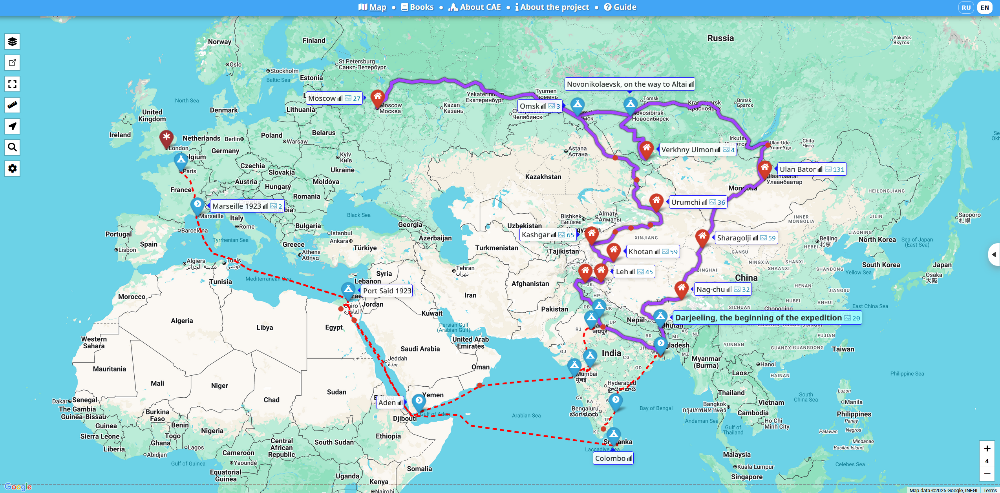
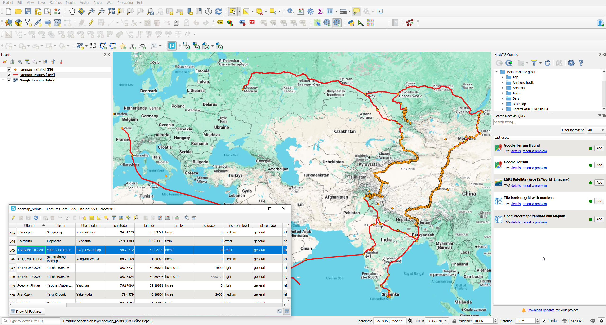

## Introduction

The **Central Asian Expedition (CAE)** — [caemap.com/en](https://caemap.com/en/#m=4/40.02/90.35&l=Gr) — is an excellent resource providing detailed mapping information about Nicholas Roerich’s five-year expedition described in [*Trails to Inmost Asia*](/notes/roerich-trails-to-asia-en/). The website is available in both English and Russian.

From the website’s [description](https://caemap.com/en/about):

> This website is dedicated to the 100th anniversary of the famous Central Asian Expedition (CAE) undertaken by Nicholas Roerich from 1924 to 1928. It is a non-profit volunteer project initiated by an international group of enthusiasts who have been studying the route and the circumstances of the expedition for many years.

The website covers all toponyms, and the reconstruction of the route is of exceptionally high quality.

## Geodata

Here you can find information on routes and stops extracted from CAE website as machine-readable data in GeoJSON format. This format allows to work with this data in modern GIS systems.

Two data layers are extracted (use links to download):

* Routes, [caemap_routes.geojson](/notes/roerich-cae-data/caemap_routes.geojson). 466 features.
* Points, [caemap_points.geojson](/notes/roerich-cae-data/caemap_points.geojson). 559 features.

Example data for a route:

| Attribute        | Description                                                                   | Example         |
|------------------|-------------------------------------------------------------------------------|-----------------|
| **wkt_geom**     | Geometry of the route or segment in WKT (Well-Known Text) format, usually a LineString representing the path. | LineString (99.35966 44.96674, 99.34447 44.95514, …, 98.70559 44.62698) |
| **place_id**     | Internal unique identifier of the related place record.                       | 505             |
| **seqid**        | Sequential identifier of this segment or entry within the route.              | 295             |
| **title_ru**     | Name of the place or route in Russian.                                        | Озеро Боро-нор  |
| **title_en**     | Name of the place or route in English.                                        | Lake Boro-nor   |
| **title_modern** | Modern or local name of the place (e.g., in a native or transliterated form). | Ногоон нуур     |
| **go_by**        | Mode of travel or transport type (e.g., car, train, foot).                    | car             |
| **date**         | Start date of travel or the event.                                            | 1927-04-23      |
| **enddate**      | End date of travel or the event.                                              | 1927-04-24      |
| **visited**      | Visit status (duringtrip, aftertrip, none).                                   | duringtrip      |
| **ispathpart**   | Indicates whether this entry represents a route segment (true/false).         | true            |

Example data for a point:

| Attribute                            | Description                                                                                    | Example                                         |
|--------------------------------------|------------------------------------------------------------------------------------------------|-------------------------------------------------|
| **wkt_geom**                         | Geometry of the object in WKT (Well-Known Text) format, storing coordinates of a point or line.| Point (88.26346999999999809 27.05204000000000164)|
| **title_ru**                         | Object name in Russian.                                                                        | Дарджилинг, начало экспедиции|
| **title_en**                         | Object name in English.                                                                        | Darjeeling, the beginning of the expedition|
| **title_modern**                     | Modern or simplified name of the place.                                                        | Darjeeling                                  |
| **longitude**                        | Longitude in decimal degrees.                                                                  | 88.26347          |
| **latitude**                         | Latitude in decimal degrees.                                                                   | 27.05204 |
| **go_by**                            | Mode of travel or transport type (e.g., train, car, foot).                                     | train  |
| **accuracy**                         | Text or numeric indication of coordinate precision.                                            | 0  |
| **accuracy_level**                   | Precision level (e.g., high, medium, low).                                                     | high |
| **place_type**                       | Type of location (e.g., city, monastery, pass, region).                                        | general  |
| **tooltip_position**                 | Preferred position of the tooltip label on the map (left, right, top, etc.).                   | right  |
| **seqid**                            | Sequential identifier of the point within the route.                                           | 38 |
| **visited**                          | Visit status (duringtrip, aftertrip, none).                                                    | duringtrip |
| **visited_on**                       | Source or project code where the visit is mentioned.                                           | cae  |
| **ispathpart**                       | Indicates whether this point is part of the route line.                                        | true  |
| **zoom**                             | Preferred zoom level when centering on this place.                                             | xlarge |
| **minzoom**                          | Minimum zoom level at which the point is visible.                                              | 4   |
| **date**                             | Start date of the visit or event.                                                              | 1925-01-06 |
| **enddate**                          | End date of the visit or event.                                                                | 1925-03-06 |
| **date_format**                      | Format of the date (e.g., YYYY-MM, YYYY-MM-DD).                                                | YYYY-MM  |
| **date_acc**                         | Accuracy or certainty level of the date (e.g., -1 means approximate).                          | -1 |
| **googlemap_link**                   | Optional direct link to Google Maps location.                                                  | *(empty)*  |
| **notes**                            | Notes or commentary in Russian.              | **Примечание**: предположительно, Н.К. Рерих прибыл в Дарджилинг в январе 1925 г.  |
| **notes_en**  | Notes or commentary in English.     | **Note**: It is presumed that Nicholas Roerich arrived in Darjeeling in January 1925.  |
| **path_nicholas_diary – path_portnyagin_diary** | Boolean flags (true/false) indicating whether the place appears in specific expedition diaries. | *(empty)*   |
| **location_reference / location_reference_en** | Reference or description of how the location was identified or verified.          | approximate location of the former Talai-Pho-Brang residence|
| **overnight_place / overnight_place_en**       | Description of where the travelers stayed overnight, if applicable. | Before the start of the main expedition route, the Roerichs lived in a house called Talai-Pho-Brang. |
| **sights**                           | Notable sights or landmarks nearby.                                                            | *(empty)*     |
| **done**                             | Internal status showing whether the record is ready for publication.                           | l2 |
| **loc_ref_req / path_ref_req**       | Flags showing if location or route verification is required.                                   | false  |
| **loc_ref_req_info / path_ref_req_info** | Additional info regarding verification requests.                                           | *(empty)* |
| **content_todo / traveler_todo / traveler_todo_en** | Internal fields for pending content or translation tasks.                       | *(empty)*  |
| **internal_notes**                   | Internal editorial notes not for public display.                                            | Прибыли не позднее 1го марта 1925 года согласно письмам Н.К.|
| **place_booktextids**                | Reference IDs of texts or sources associated with this place.                                  | [2,359]  |
| **routejson**    | Geometry of the route segment in JSON array format (list of coordinates).                      | [[27.03665,88.26236],[27.03306,88.25807],…,[26.7348,88.40872]] |
| **hide_distance**                    | Indicates whether to hide the distance display for this point.                                 | false  |
| **place_id**                         | Internal unique identifier of the place record.                                                | 5 |

Please respect the copyright and don't forget to [mention project](https://caemap.com/en/about) in derived works.

## Discussion

[**Questions or comments?**](https://t.me/answer42geo/96)
