## Введение

Эта заметка разбирает главу IX (URGA — YUM-BEISE KÜREN) из книги [Trail to Inmost Asia](/notes/roerich-trails-to-asia-en/) для реконструкции описывающегося в ней маршрута Центрально-азиатской экспедиции Рериха из Урги в Юм-бейсе. Описание [методики](/notes/route-mapping-methodology-en/) для интересующихся данным подходом. Исходно книга издана на английском языке, поэтому все топонимы - на английском. [Перевод главы](https://roerich-lib.ru/index.php/yu-n-rerikh/po-tropam-sredinnoj-azii/3945-ix-urga-yum-bejse-kyuren?ysclid=m05ncf08xy185773842) на русский язык.

Цитаты под каждым топонимом приведены по [оригиналу](/notes/roerich-trails-to-asia-en/).

Roerich, G. 1931. Trails to Inmost Asia: Five years of exploration with the Roerich Central Asian Expedition. New Haven: Yale University Press. Preface by Louis Marin, 504 pages, folding route map, frontispiece portrait, 151 illustrations.

* [Исходный текст главы с разметкой](https://docs.google.com/document/d/1arZXVq8gQjrmLlj_Vr6YowHrQPEmkCQiG4w3HDNJOBc/edit?usp=sharing).
* [Таблица всех упомянутых топонимов и остановок по маршруту](https://docs.google.com/spreadsheets/d/1HRkxe5X4apHbGUHao5XHEagEOJdsssXXDdNZoi6s-QM/edit?usp=sharing).

## Существующие карты

Маршрут экспедиции нанесен на несколько карт.

1\. Карта из Roerich, G. 1931. Trails to Inmost Asia. Источник [1](https://www.roerich.org/roerich-museum-archive/expeditions.php), [2](/notes/roerich-trails-to-asia-en/#504map), [3](https://archive.org/details/dli.pahar.2487/page/n601/mode/2up).

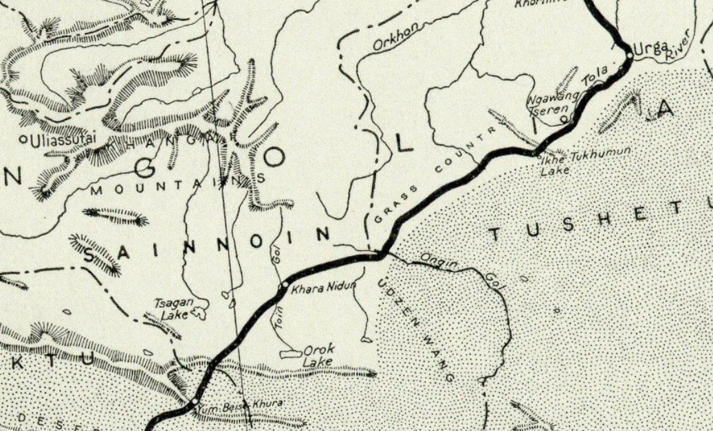

2\. Карта Route followed by the Roerich Experidion Urga - Shih-Pao-Ch'eng. April-May, 1927.

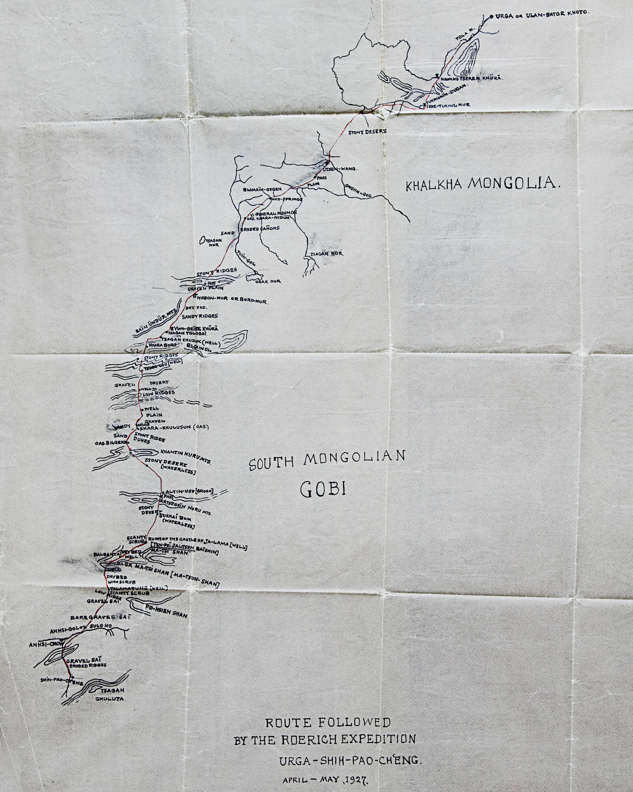

Карту можно найти на сайте проекта [Центрально-Азиатской Экспедиции](https://caemap.com/about), карта так же указана в комментарии к точке "[У северного притока р. Онгин-гол](https://caemap.com/#m=9/46.0913/103.1137&l=T&p=499/o)".

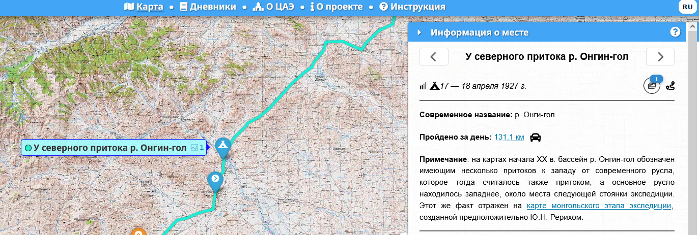

Однозначно первоисточник не указан, но указано, что:

> Карта монгольского этапа экспедиции (Улан-Батор — Шибочен), предположительно созданная Ю.Н. Рерихом («Рерихийн Шамбала Музей» в Улан-Баторе)

Альтернативный источник - архив [Музея Рерихов](http://roerichsmuseum.ru/index.php/museum/arkhiv/261-de). Документ №25 "Карта маршрутов Центрально-Азиатской экспедиции в апреле-мае 1927 г. (Урга – Шин – Пао – Чьенг)." Содержание идентичное источнику выше. [Скачать карту](https://roerichsmuseum.website.yandexcloud.net/DE/DE-025.pdf).

3\. Реконструкция caemap.com

Маршрут экспедиции целиком (не только URGA --- YUM-BEISE KÜREN) был реконструирован в рамках сайта проекта [Центрально-Азиатской экспедиции](https://caemap.com/en/about) (CAE).

[Данные проекта](/notes/roerich-cae-data/) можно использовать для сравнения.

## Топонимы

### Urga

Современный Улан-Батор ([Википедия](https://ru.wikipedia.org/wiki/%D0%A3%D0%BB%D0%B0%D0%BD-%D0%91%D0%B0%D1%82%D0%BE%D1%80)).

### Tola

> The first stretch of the route lay along the valley of the Tola River and according to our informants was comparatively easy for laden cars.

Туул (монг. Туул гол, до 1988 года — Тола) — река в центральной Монголии, протекает через южную часть Улан-батора и впадает в Орхон ([Википедия](https://ru.wikipedia.org/wiki/%D0%A2%D1%83%D1%83%D0%BB)).

Варианты названия:

* Туул гол (топокарты Генштаба 1 км).
* Тола Гол (топокарты Генштаба 2 км).

### Sangiin veterenary station

> Some six miles away on the farther bank of the river we could see the dim lights of the Sangin Veterinary Station.

Not found.

### Bogdo-ula

> Southeast of our camp rose the western offshoots of the massive Bogdo ula and toward the southwest were the dim outlines of rolling hills, through which lay the valley of the Tola.

Богд-Хан-Уул (монг. Богд хан уул; устар. Богдо-Хан-Ула, **Богдо-Ула**, Чойбалсан-Ула) — гора примыкающая к Улан-Батору ([Википедия](https://ru.wikipedia.org/wiki/%D0%91%D0%BE%D0%B3%D0%B4-%D0%A5%D0%B0%D0%BD-%D0%A3%D1%83%D0%BB)).

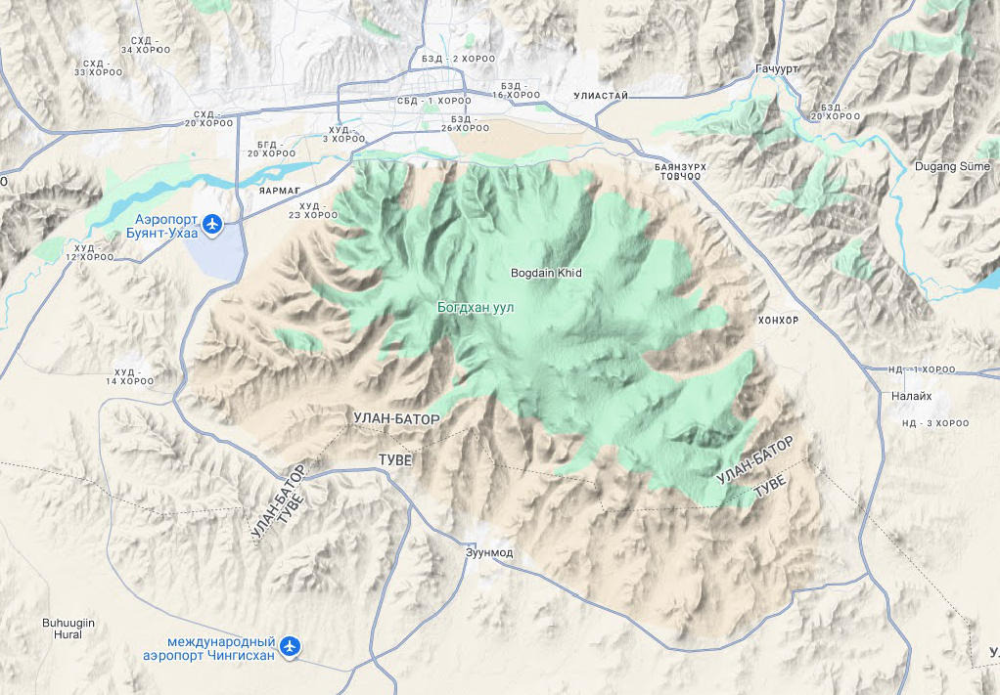

### Nga-Wang Tseren küren

> On April 15 we again made an early start with the hope of reaching Nga-Wang Tseren küren, a monastery situated not far from the bend of the Tola River toward the northwest.

Скорее всего Naban Tseriyn Guuniy Hüree - монастырь располагавшийся на изгибе р. Тола. На топокартах 2км помечен как развалины. Современных следов не найдено.

Варианты названия:

* Наваан цэрэн гуний тууръ --- топокарты Генштаба 1 км
* Наван-Цэрэн-Гуний-Турь --- топокарты Генштаба 2 км

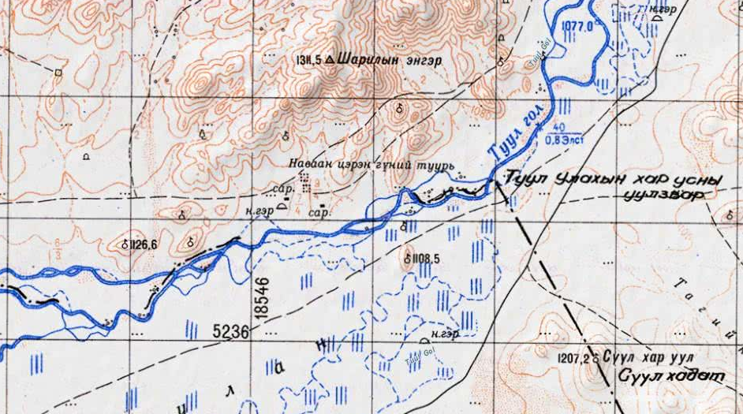

JOINT OPERATIONS GRAPHIC-GROUND. [1501 NL4802] ([скачать](https://maps.lib.utexas.edu/maps/jog/russia/nl-48-2-lun-mongolia.pdf))

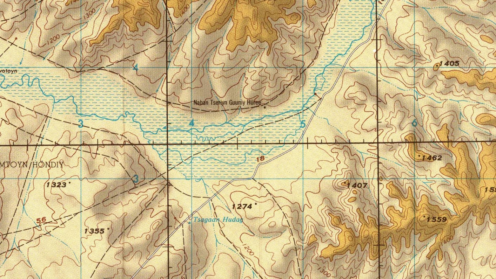

### Dolon-Khara

> Not far from the monastery we left the river valley and continued our journey across a low ridge — the easternmost branch of the Dolon-Khara Mountains.

Небольшой хребет между изгибом р. Тола и озером Төхмийн нуур. На топокартах отдельно не подписан.

Есть на карте Стэнфорда под названием Dolon shara:

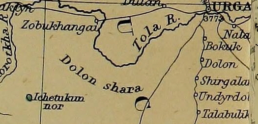

Упоминается у Певцова:

> К северу и югу от посещенных нами местностей описываемая страна отличается также горным характером, но на север горы простираются дальше, чем на юг. На южном берегу Толы, поблизости ее луки, находятся горы Долон-хара, сочленяющиеся с юго-западным продолжением Хан-улы — хребтом Гангын.

Певцов, В. М. Очерки путешествия по Монголии 1878-1879. Публикации 1883 г., [1951 г](https://www.vostlit.info/Texts/Dokumenty/China/XIX/1880-1900/Pevcov_1/text7.htm).

### Tukhumun Dugan, Ikhe Tukhum-nor

> About noon we reached the important monastery of Tukhumun Dugan or Dugan-sümä, situated north of the salt lake, called Ikhe Tukhum-nor.

Озеро и монастырь рядом с современным населенным пунктом Баянтохом, центр сомона Бурэн (монг. Бүрэн), аймак Туве ([Википедия](https://ru.wikipedia.org/wiki/%D0%91%D1%83%D1%80%D1%8D%D0%BD)).

Варианты названия озера:

* Төхмийн нуур (2км)
* Тухмийн-Нур (1км)
* Ih Töhöm Nuur
* Ih Tohom Nuur
* Ihe-tufumu-noru Hu
* Ikhe Tukhum Nor
* Lake Tukhumöyn nur
* Ozero Ikhe-Tokhomyn-Nur
* Ozero Tukhumyyn Nur
* Töhömiin Nuue.

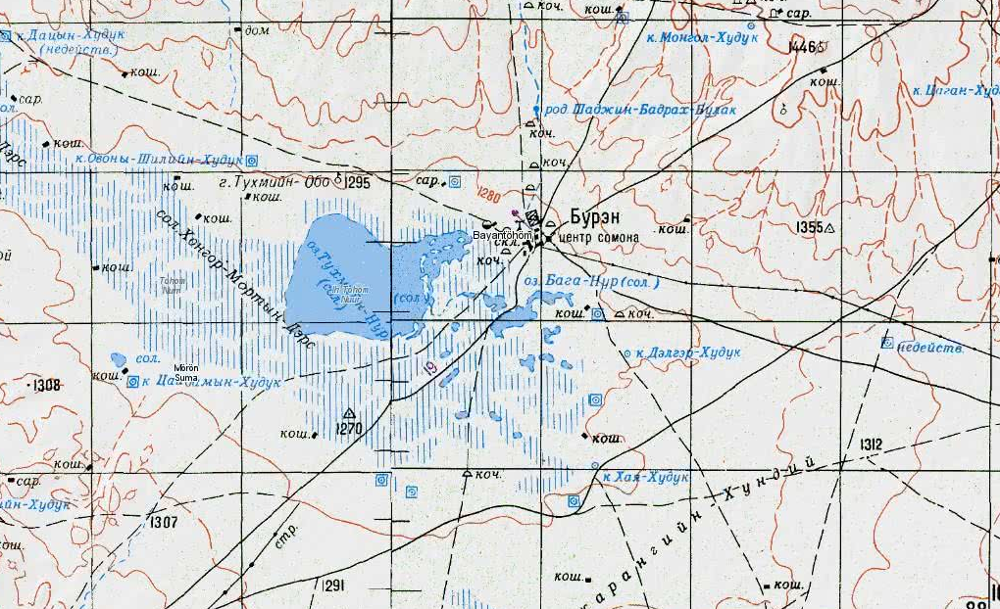

### Mishe-Gun küren

> After a two hours’ ride over good road, during which we crossed several shallow rivulets, we reached the Mishe-Gun küren, a large lamasery with a colony of Russian tradesmen living near by.

Монастырь Мишиг гүний хүрээ Норовчойнпэллин хийд (Noromchoimpellin khiid). Построен в 1729, разрушен в конце 1930-х. Насчитывал несколько десятков зданий и 500 монахов. Страница на [Mongolian Temples](https://mongoliantemples.org/en/component/domm/1691?view=oldtempleen) (указанные на странице координаты 100% ошибочные).

<https://mongoltoli.mn/history/h/977>

> Төв аймгийн Дэлгэрхаан сумын нутагт байсан хийд
> Түшээт хан аймгийн Сэцэн вангийн хошуу одоогийн Төв аймгийн Дэлгэрхаан сумын нутаг Дунд Хуримт хэмээх газар оршино.

Перевод:

> Монастырь на территории сомона Дэлгэрхан, аймака Туве.
> Находился в хошуне Сэцэн-вана аймака Түшээт-хана, на месте под названием Дунд Хуримт, на территории современного сумона Дэлгэрхаан аймака Туве (Центральный).

 здание.")

Стройматериалы старого монастыря были использованы для строительства административного центра и клуба.

Со страницы монастыря в Facebook: <https://www.facebook.com/MishigGun>:

> Mishig Gunii Khuree, Norovchoinpellin Monastery was founded in 1729. Today, with a history of more than 295 years, the center is being re-opened by the 4th generation Mishig Gun of the Buddhist monk Byambadoljin Nyamdorj.

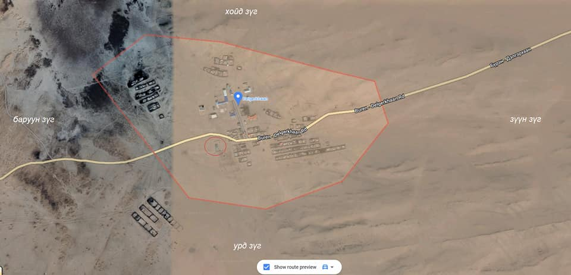

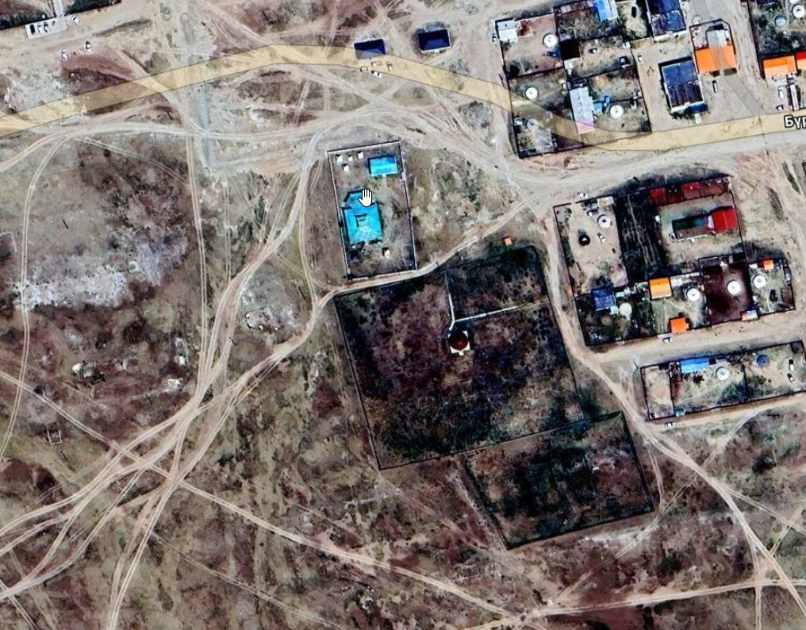

С тех пор как монастырь был разрушен, от него сохранились остатки четырёх монастырских построек, они были позже отреставрированы и введены в эксплуатацию ([источник](https://gogo.mn/r/nye63)). Оставшиеся строения хорошо видны на фотографиях размещенных на [странице Mongolian Temples](https://mongoliantemples.org/en/component/domm/1691?view=oldtempleen).

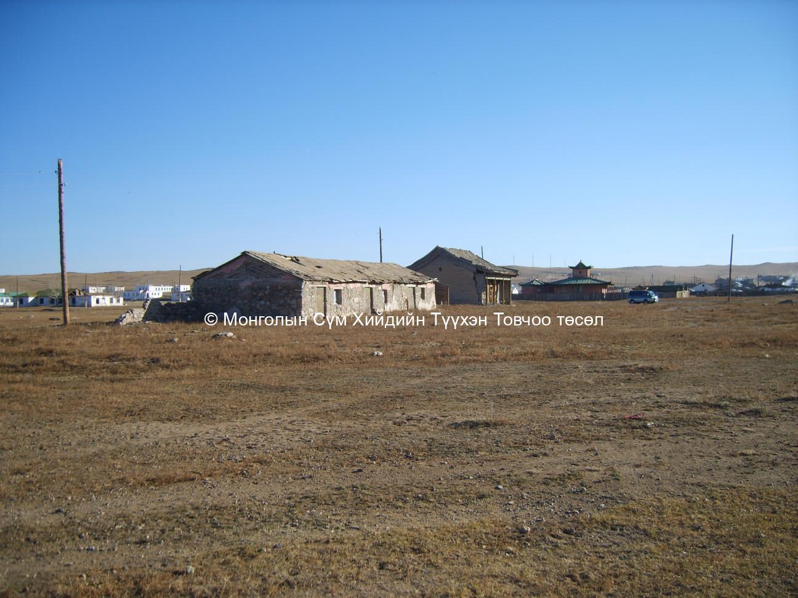

The Mishik-gun khure. Archive of the MAS. F.59. No. 113. Courtesy of History of Mongolia in Photographs, Vol IV Koslov.

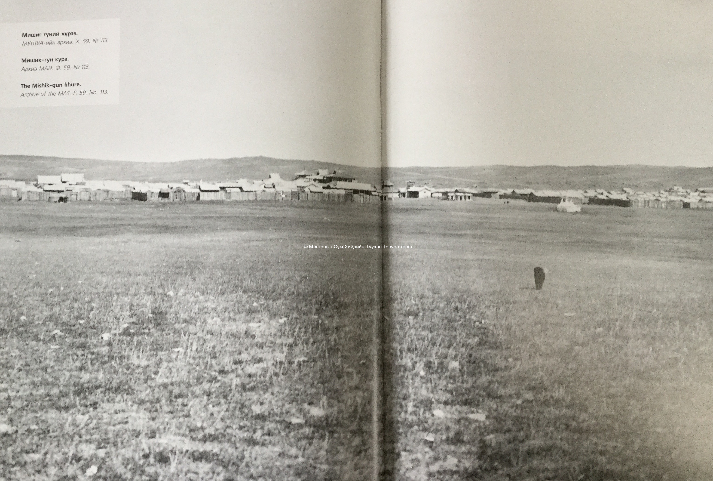

Итого: новый монастырь располагается там же, где и старый, в административном центре, поселке Дэлгэрхаан. Это подтверждается представителем самого монастыря.

### Ongin gol

> Later in the afternoon we reached the northern branch of the Ongin-gol. Before reaching the river, the trail crossed a vast gravel plain with firm ground.

Река Онгийн-Гол, впадает в пересыхающее озеро Улаан-нур. Истоки реки находятся в Хангайских горах ([Википедия](https://ru.wikipedia.org/wiki/%D0%9E%D0%BD%D0%B3%D0%B8%D0%B9%D0%BD-%D0%93%D0%BE%D0%BB), монг. [Википедия](https://mn.wikipedia.org/wiki/%D0%9E%D0%BD%D0%B3%D0%B8_%D0%B3%D0%BE%D0%BB)).

Упоминается у [Шишмарева](/notes/shishmarev-three-routes-through-mongolia/#онгиин-гол) и [Норзунова](/notes/norzunov-route/#хадату-khadatou).

### Üdzen-Wang

> An hour’s ride brought us to Üdzen-Wang, comprising a large lamasery, a local yamen or administrative center, and several Russian trading establishments, including a local branch of the Mongol Central Coöperative. While some of us were looking for a good and reliable guide, a big crowd of red-clad lamas, Mongol officials, and laymen assembled around our cars.

Центр уезда (хошуна) князя Уйзэн вана (Үйзэн ван хошуу, Üizen vangiin khoshuu), сейчас город Арвайхээр (Arvaikheer), административный центр аймака Уверхангай. В городе располагается монастырь Gandan Muntsaglan Khiid (Ганданпунцоглин, Гандан Мунтсаглан), разрушенный в 1937 и восстановленный в 1991.

Из [Википедии](https://mn.wikipedia.org/wiki/%D0%90%D1%80%D0%B2%D0%B0%D0%B9%D1%85%D1%8D%D1%8D%D1%80#%D0%A2%D2%AF%D2%AF%D1%85):

> Арвайхээр сум 1707 онд Сайн ноён хан аймгийн Үйзэн вангийн хошуу, хожмын Цэцэрлэг мандал аймгийн Арвайхээрийн хошууг. Тэр нь 1924 он хүртэл тогтсон Үйзэн гүний хошуу юм.

перевод

> Сомон Арвайхээр был основан в 1707 году как хошуу (уезд) князя Үйзэн вана аймака Сайн ноён хан. Позднее он стал известен как хошуу Арвайхээрийн аймака Цэцэрлэг мандал. Эта административная единица — Үйзэн гүний хошуу — существовала вплоть до 1924 года.

### Tatsa-gol

> After crossing the Tatsa-gol, an insignificant stream in its upper course, we continued our way along the southern foot of the Artsa ula Range.

Река Таацын гол, впадает в озеро Тацын-Цаган-Нур. Истоки реки находятся в Хангайских горах.

Варианты названия:

* Tatsa gol - Stanford.
* Таацын гол - топокарты Генштаба 1 км
* Тацын гол - топокарты Генштаба 2 км, 10 км

### Artsa Ula

> After crossing the Tatsa-gol, an insignificant stream in its upper course, we continued our way along the southern foot of the Artsa ula Range.

Рерих упоминает, что пересечение реки состоялось в ее верхнем течении. Отдаленно похожий топоним в этом районе - гора Асгатын-ула (2909 н.у.м) и населенный пункт Аршан-амралт (Аршаан амралт).

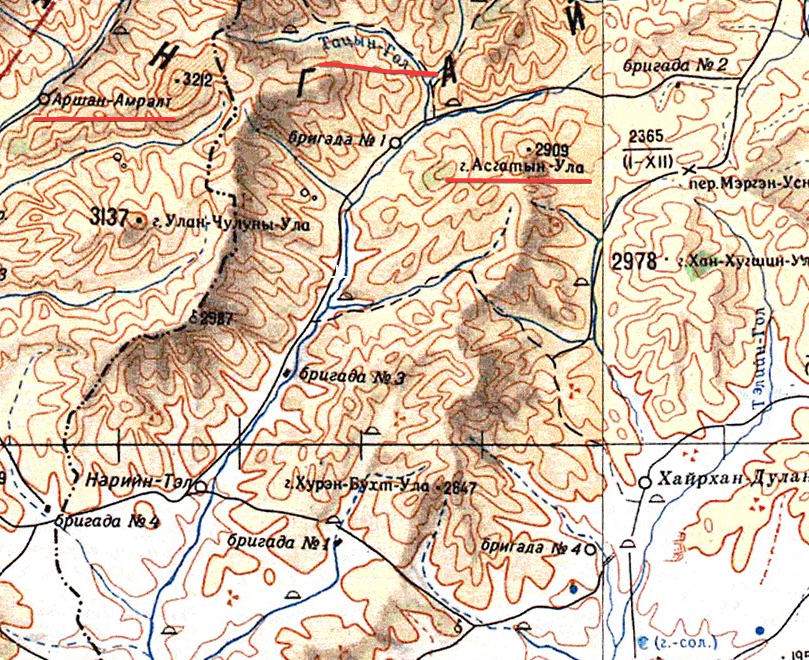

У Козлова упоминается похожий топоним - Арца-богдо (Арц-Богдын-нуру на топокартах 5 км), но несмотря на то, что район в широком смысле тот же, упоминаемый горный массив находится сильно южнее, порядка 150 км, от реки Таацын гол.

> Продолжая рассматривать топографический рельеф одиночной цепи Алтая, видим массив Ихэ-богдо, за ним к востоку другой — Бага-богдо, сходящиеся между собою опущенными крыльями, причём так, что восточное крыло Ихэ-богдо проходит южнее западного крыла Бага-богдо, образуя плоский проход из северной долины в южную. К юго-востоку от Бага-богдо имеется значительное, до 10 вёрст, расчленение с следующими за ними горами Арца-богдо, лежащими юго-восточнее снегового массива. Затем между горами Арца-богдо и Гурбан-сайхан усмотрен также проход, но еще более широкий нежели только что указанный и с той ещё разницей, что ближайшие крылья гор лежат на общей линии, а не заходят друг за друга, как это мы видели у обоих снеговых массивов и у западной окраины Арца-богдо.

П. К. Козлов, 1906. Монголия и Кам. Трехлетнее путешествие по Монголии и Тибету (1899—1901 гг.). [Источник](https://ru.wikisource.org/wiki/%D0%9C%D0%BE%D0%BD%D0%B3%D0%BE%D0%BB%D0%B8%D1%8F_%D0%B8_%D0%9A%D0%B0%D0%BC_%28%D0%9A%D0%BE%D0%B7%D0%BB%D0%BE%D0%B2%29?utm_source=chatgpt.com).

Соответствие топонима по Козлову и соответствующего на топокартах 5 км:

1. Ихэ-богдо --- хребет Их-Богдын-нуру
2. Бага-богдо --- горы Зун-Богд
3. Арца-богдо --- хребет Арц-Богдын-нуру
4. Гурбан-сайхан --- хребет Гурван-Сайхан

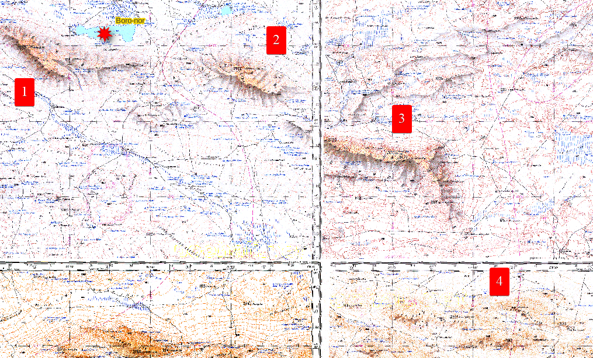

### Toin-gol

> About eleven o’clock in the morning we reached the Toin-gol — a river difficult to ford because of its muddy bottom.

Река Түйн гол (ᠲᠦᠢ ᠶᠢᠨ ᠭᠣᠤᠯ), впадает в озеро Орог нуур. Истоки реки находятся в Хангайских горах (монг. [Википедия](https://mn.wikipedia.org/wiki/%D0%A2%D2%AF%D0%B9%D0%BD_%D0%B3%D0%BE%D0%BB))

Варианты названия:

* Taia gol - Stanford
* Туйн гол - топокарты Генштаба 1 км, 2 км, 10 км

### Koko-khoto --- Kuch'eng

> After an hour’s drive we crossed the great highway Koko-khoto — Kuch’eng, distinguished as all the Chinese highways by deep wheel tracks left behind by convoys of heavily loaded Chinese carts.

Караванный путь Koko-khoto --- Kuch'eng упоминается в книге несколько раз:

> The Shara-Khulusun gorge is situated at the junction of two important caravan routes of central Asia: the Yum-beise — An-hsi route and the Koko-khoto — Ku-ch’eng route, connecting China with the lands of Chinese Turkestan and Jungaria. Besides these two routes another secret route, often followed by the Etsin-gol Torguts, runs through the gorge and joins the Koko-khoto — Ku-ch’eng road.

Так же в книге упоминаются маршруты Koko-khoto --- Urumchi, Koko-khoto --- Hami.

В статье Лавреновой Коко-хото это Гуй-хуа. Лавренова, О.А., 1999. [Маньчжурская экспедиция Н.К. Рериха](https://roerich-lib.ru/yubilejnye-rerikhovskie-chteniya-1999/4505-o-a-lavrenova-manchzhurskaya-ekspeditsiya-n-k-rerikha?ysclid=mhs5oe5oc1221049922). Юбилейные рериховские чтения.

> В сентябре второй полевой сезон был закончен. Автономное монгольское правительство снабдило отбывающую в Пекин Экспедицию двумя грузовиками [37], чтобы доставить оборудование до ближайшей станции железной дороги – Гуй-Хуа (Коко-хото).

Возможно, она путает Коко-хото с Хуху-хото или Гуй-хуа-Чэнь (Хух-хото, Hohhot, 呼和浩特市, [Google maps](https://www.google.com/maps/place/Hohhot,+Inner+Mongolia,+China/@40.7638582,111.4288505,9.8z/data=!4m6!3m5!1s0x3606462a4a60d3e1:0x7f72c427fe44f504!8m2!3d40.8414899!4d111.75199!16zL20vMDFtdnR3!5m1!1e4?hl=en&entry=ttu))?

Выясняется, что это соответствие она не изобретает, а берет у самого Рериха, в своем дневнике он прямо называет Кокохото - Гуй-Хуа-чен.

Рерих Н.К. Дневник Маньчжурской экспедиции (1934–1935) / сост., вступ. ст., коммент. О.А. Лавреновой. – М.: Международный Центр Рерихов, 2015. – 520 с., ил. ([Источник](https://icr.su/rus/news/2020/Roerich_Dnevnik_Manchzhurskoy_ekspeditsii.pdf?ysclid=mhs6gvtm2e540302131))

> В сентябре второй полевой сезон был закончен. Автономное монгольское правительство выкупило у экспедиции два грузовика и помогло доставить оборудование до ближайшей станции железной дороги – Гуй-Хуа-чен (Кокохото).

В географическом указателе опубликованного дневника подтверждается тождественность Коко-хото и Хух-хото.

> Кокохото (Хух-Хото) см. Гуй-Хуа-чен

Kuch'eng (Gucheng, Chinese: 古城县; Uyghur: گۇچۇڭ ناھىيىسى) - населенный пункт, находится в уезде Цитай (Qitai) на территории одноименного города. Был важным узлом караванной торговли на Великом шёлковом пути (рядом Урумчи, Или, Хами), Синьцзян-Уйгурский автономный район Китая ([Википедия](https://ru.wikipedia.org/wiki/%D0%A6%D0%B8%D1%82%D0%B0%D0%B9), [OpenStreetMap](https://www.openstreetmap.org/node/1956457853)).

Варианты названия:

* Ch'i-t'ai
* Ch'i-t'ai-chen
* Ch'i-t'ai-hsien
* Guchen
* Gucheng
* Guchentszy
* Kitai
* Kou-tcheng
* Ku-ch'eng
* Ku-ch'eng-tau
* Kuchengtze
* Ku-cheng-tzu
* Kuchong
* Ku-shong
* Ku-tschong
* Tsitay
* Hsi-ti
* Hsi-ti-chuang

Упоминается например у Teichman, Eric, 1937. Journey to Turkistan. London, Hodder and Stoughton Limited. [Источник](https://pahar.in/pahar/Books%20and%20Articles/Tibet%20and%20China/1937%20Journey%20to%20Turkistan%20by%20Teichman%20s.pdf).

> The next day a short morning's run across the level steppe brought us to Kuch'eng, now known officially as Ch'i-t'ai Hsien, revival of an ancient name.
> ...
> From Kuch'eng to Urumchi there were left but 126 miles, which we might, I think, have covered in one day.

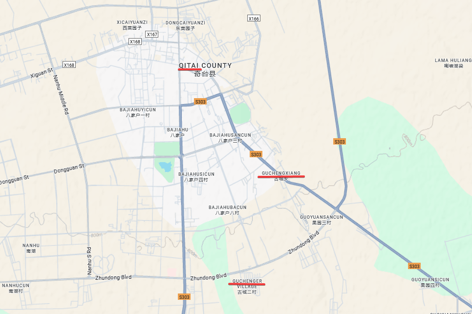

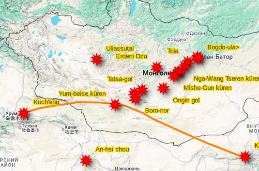

### Boro-nor

> It was getting dark and the after-sunset glow only dimly lighted our path. We decided to camp for the night on the shore of a small lake, the Boro-nor, situated in a shallow depression. It was almost dried up, but according to local Mongols it assumed large proportions every summer after the rains.

На карте Urga --- Shih-Pao-Ch'eng озеро Boro-nor (Boro-nur) продублировано как Nogon-nur.

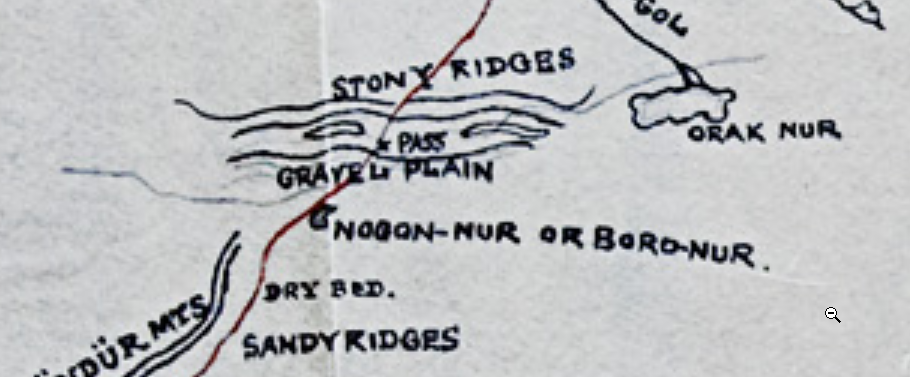

Озеро Ногон-нур (Ногоон нуур, топо 1 км, Ногон-Нур, топо 2 км) есть в нужной окрестности.

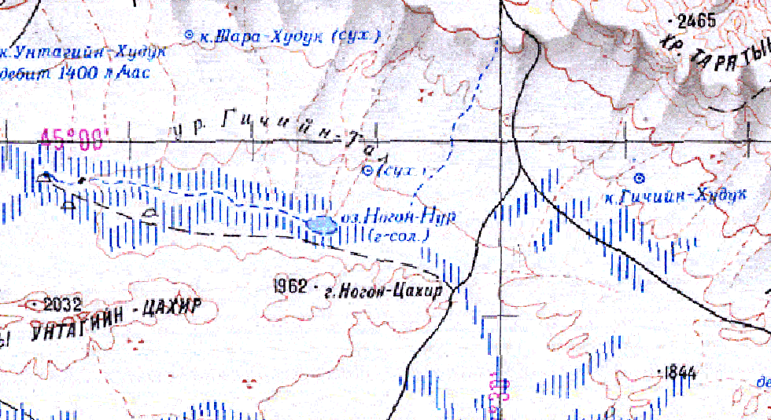

Других связей Boro-nor и Nogon-nur не обнаружено.

Похожий топоним из той же окрестности - озеро Орог нуур, место впадение реки Туйн гол (Toin-gol). Озеро довольно большое, но чуть дальше на северо-запад есть небольшое озеро с тем же названием.

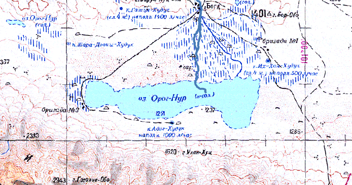

### Yum-beise küren

> After reaching the top of a steep ridge, we suddenly found ourselves in sight of the long-expected Yum-beise küren, situated in a deep valley surrounded on all sides by hills that sheltered the monastery from the severe winds which blow during the winter and spring months. It is a collection of white houses in the center of which rise two du-khangs or assembly halls.

Юндун-бэйсеин-куре (Youndoun-beisiin-kure) - крупный монастырь. Подробнее о местонахождении монастыря в [маршруте Норзунова](/content/notes/norzunov-route/#%d1%8e%d0%bd%d0%b4%d1%83%d0%bd-%d0%b1%d1%8d%d0%b9%d1%81%d0%b5%d0%b8%d0%bd-%d0%ba%d1%83%d1%80%d0%b5-youndoun-beisiin-kure).

Варианты названия:

* Амар Буянтын Хурэний Турь
* Амар буянт
* Юм бэйсийн хошуу

Интересно, что [Симуков](/notes/simukov-green-map/) сделал свою фотографию Юм-бейсе в том же году, в котором в монастыре побывала экспедиция Рериха.

Подробнее о местонахождении монастыря в [маршруте Норзунова](/content/notes/norzunov-route/#%d1%8e%d0%bd%d0%b4%d1%83%d0%bd-%d0%b1%d1%8d%d0%b9%d1%81%d0%b5%d0%b8%d0%bd-%d0%ba%d1%83%d1%80%d0%b5-youndoun-beisiin-kure).

### Tsagan Tologoi и Tsagan Tologoi-usu

Названия местности и небольшого водотока.

> We found no suitable place for camping close to the monastery and were advised to establish our camp outside the monastery in a place locally called Tsagan Tologoi — “White Head,” so named after a mountain west of the monastery. The place chosen for the camp was situated on the banks of a tiny stream, the Tsagan Tologoi-usu.

Перевод:

> Возле монастыря мы не нашли подходящего места для установки лагеря, и нам посоветовали установить лагерь за монастырем в местечке, носящем местное название Цаган Тологой – «Белая Голова» – по имени горы западнее монастыря. Место, выбранное для лагеря, было на берегу крошечной речки Цаган Тологой-усу.

Подробнее о местонахождении этих топонимов в [маршруте Норзунова](/content/notes/norzunov-route/#%d1%8e%d0%bd%d0%b4%d1%83%d0%bd-%d0%b1%d1%8d%d0%b9%d1%81%d0%b5%d0%b8%d0%bd-%d0%ba%d1%83%d1%80%d0%b5-youndoun-beisiin-kure)

## Сравнение с существующими картами и реконструкцией ЦАЭ

Эта заметка подробно разбирает каждый из упомянутых в IX главе [Trails of Inmost Asia](/notes/roerich-trails-to-asia-en/) топонимов и приводит доказательства их тождественности с современными локациями.

Существующие карты маршрута экспедиции Рериха из Урги в Юм-бейсе и реконструкция ЦАЭ в целом достаточно точно соответствуют большинству найденных топонимов.

Одно из серьезных отличий с данным исследованием - расположение Mishe-Gun küren. В данной заметке расположение монастыря установлено довольно точно, но оно противоречит всем существующим картам. Согласно этим картам, экспедиция Рериха от Ikhe Tukhum-nor повернула строго за запад. В то же время, для того чтобы попасть в Mishe-Gun küren она должна была продолжить движение на юго-запад.

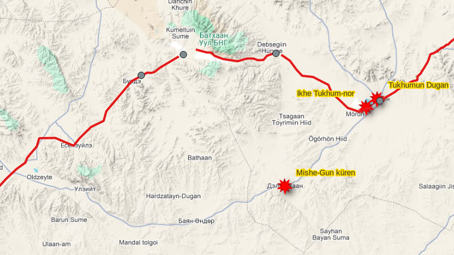

Восстановленный маршрут хорошо соответствует существующим картам. Однако, учитывая состояние картографических материалов в 1920-х, отсутствие средств навигации и спешку, можно предположить, что сами путешественники не вполне точно осознавали и нанесли свой маршрут на карты и его нельзя полностью воспринимать как истину. Необходимо еще раз тщательно провести реконструкцию с привлечением вспомогательных маршрутных данных, рельефа, данных о ландшафтах.

## Благодарности

Спасибо Sue Byrne за инициирование этой работы и первую версию таблицы топонимов и Рустаму Сабирову за помощь с монгольским и вообще участие 🤗

## Комментарии

[**Обсудить**](https://t.me/answer42geo/134)
