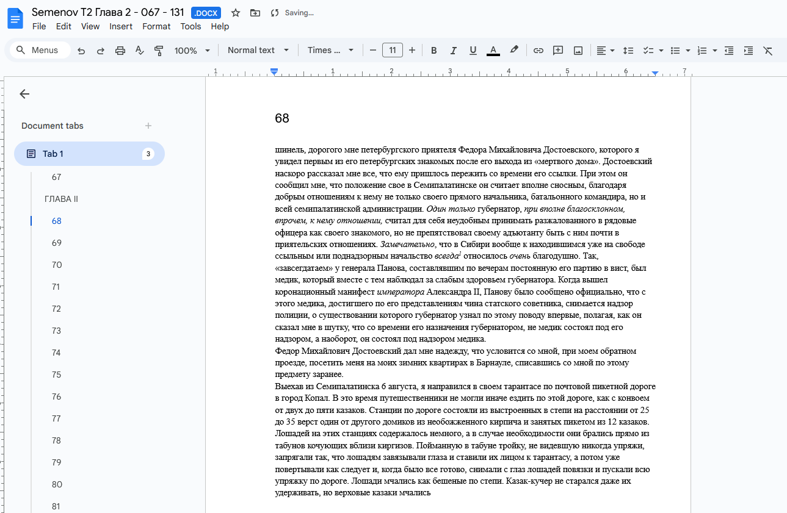
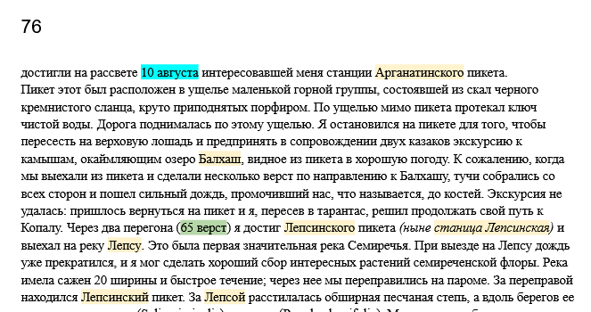
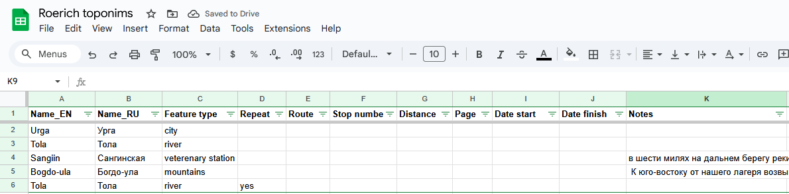
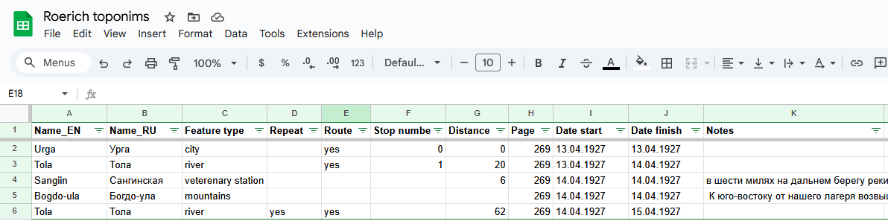

## Введение

[English version](/notes/route-mapping-methodology-en/) of this note.

Эта методология описывает шаги по подготовке данных маршрута для картирования.

Представьте, что у вас есть источник, который рассказывает о путешествии человека. Это может быть дневник, путеводитель или путевой журнал, написанный самим путешественником или кем-то с его слов. Описанные здесь шаги помогают превратить дневник в структурированный источник информации (базу данных), который будет эффективным для дальнейшего преобразования в карту. Эта методология описывает первичный сбор информации и не описывает процесс картирования.

Декодирование дневника путешественника в хороший источник информации часто является утомительным и времязатратным процессом. Следуя этим рекомендованным шагам, вы обеспечите эффективный, доступный для совместной работы, подходящий для итеративной работы, основательный продукт, хорошо подготовленный для следующих шагов.

## Краткая версия

Это краткая версия предложенной методологии.

0. Держите все документы онлайн для совместной работы.  
1. Найдите дефинитивный (классический) источник содержащий описание путешествия.  
2. Разметьте все топонимы и информацию о маршруте в тексте.  
3. Извлеките топонимы и информацию о маршруте из текста в таблицу.

Рассмотрим подробнее каждый шаг.

## Шаг 1. Найдите и подготовьте источник

Для начала работы необходимо:

1. Выяснить что является дефинитивным источником. Это, как правило, наиболее детализированное описание путешествия.
2. Оцифровать его.

Не путайте "оцифровку" с простым "сканированием". Хотя можно работать и с отсканированным документом, рекомендуется начать с создания качественного цифрового текста источника, чтобы дальше было легко копировать, размечать и возвращаться к отдельным частям текста для дальнейшего изучения.

Если у вас уже есть качественный цифровой текст, этот шаг можно пропустить. Если нет, вам нужно выполнить некоторые или все из следующих действий:

1. Отсканировать источник, чтобы создать отсканированный документ.
2. Провести OCR (Optical Character Recognition - оптическое распознавание символов), чтобы превратить отсканированные изображения в текстовый документ.
3. Перевести, если необходимо.
4. Отредактировать.
5. Поместить результат на Google Drive для удобного доступа для коллег.

При редактировании рекомендуется сохранять номера страниц для легкого возвращения к тексту.

## Шаг 2. Разметка текста

После того как источник подготовлен, необходимо разметить информацию о маршруте.

Внимательно прочитайте источник и выделите следующую информацию:

1. Названия мест (топонимы). Обычно разметку делают как для топонимов вдоль маршрута, так и для топонимов лежащих в стороне. Рекомендуемый цвет: светло-желтый.
2. Даты и время путешествия, отдельные остановки, дата и время, проведенное на них. Даты прибытия и отправления и т. д. Рекомендуемый цвет: светло-голубой.
3. Дополнительная информация о маршруте. Обычно включает: километраж, ориентация относительно движения и топонимов (С, Ю, В, З), неименованные остановки, ночевки и т. д. Рекомендуемый цвет: светло-зеленый.

Результат этого шага может выглядеть так:

## Шаг 3. Извлечение информации о топонимах

Создайте новую электронную таблицу (например, в Google Sheets) с названиями полей, описанными ниже. Закрепите первую строку с названиями полей, выбрав в меню Вид - Заморозить - 1 строку.

Это полная структура, названия полей выделены курсивом. Рекомендуем не вводить все данные сразу, а ввести их отдельно в два этапа. На этом этапе перечислите все топонимы.

* *Name_LN* - название топонима с двухбуквенным кодом языка: EN для английского, RU для русского и т.д.
* *Feature type* - тип топонима, обычно: река, город, хребет, гора, монастырь и т.д. Постарайтесь ограничить количество типов. Вы можете сделать список всех возможных типов на отдельном листе для повторного использования.
* *Repeat* - заполните значением 'yes', чтобы указать, что топоним повторяется (уже был в тексте). Оставьте пустым, чтобы по умолчанию было 'no', это будет означать, что топоним упоминается впервые.
* *Route* - на этом этапе не заполняйте, см. следующий шаг.
* *Stop number* - на этом этапе не заполняйте, см. следующий шаг.
* *Distance* - на этом этапе не заполняйте, см. следующий шаг.
* *Page* - номер страницы, где был упомянут топоним или остановка в источнике. Это полезно для легкой ссылки и возвращения к тексту.
* *Date start* - на этом этапе не заполняйте, см. следующий шаг.
* *Date finish* - на этом этапе не заполняйте, см. следующий шаг.
* *Notes* - короткая цитата из текста. Обычно это дословный копипаст из источника. Не используйте это поле для объяснений.

При необходимости можно добавить дополнительные поля, например, топонимы на других языках или другую нужную вам информацию.

Результат этого шага может выглядеть так:

## Шаг 4. Извлечение информации о маршруте

Проведите еще один просмотр текста, добавляя дополнительную информацию. Названия полей выделены курсивом.

* *Name_LN* - по мере необходимости добавляйте дополнительные строки для остановок без названия места.
* *Route* - заполните значением 'yes', чтобы указать, что топоним находится на маршруте.
* *Stop number* - заполните порядковым номером остановки. Остановки обычно означают ночлег.
* *Distance* - расстояние, пройденное с предыдущей остановки, с указанным километражем.
* *Date start* - дата, когда топоним или остановка были впервые посещены/упомянуты.
* *Date finish* - дата, когда топоним или остановка были покинуты. Обычно это следующий день, но на остановке может быть проведена не одна ночь.

Результат этого шага может выглядеть так:

## Следующие шаги

Следующие шаги обычно включают исследование каждого топонима для его:

* Геолокации - процесс определения вероятного или реального (современного) местоположения упомянутых топонимов на карте.
* Картирования - процесс извлечения координат и записи их в специальные слои данных в GIS.

Далее, для создания реального маршрута:

* Маршрутизация - соединение топонимов в маршрут.
* Валидация - использование информации о маршруте для обеспечения согласованности маршрута.

Эти шаги здесь не описаны.

## Заключительные замечания

Очевидно, что вы можете выбрать ввод всех данных сразу, работать с отсканированными PDF-документами, пропускать номера страниц и т.д. Однако мы рекомендуем следовать описанным шагам для создания качественного набора данных который можно переиспользовать.

Процесс, описанный здесь, часто итеративен. Вы можете начать с определенного сегмента путешествия и вернуться, чтобы добавить больше данных. Описанная методология позволяет вам строить его постепенно и эффективно, возвращаясь к маршруту, когда это необходимо.

Приятного путешествия!

. Цыбиков, Буддист-паломник у святынь Тибета")

## Вопросы?

Возникли вопросы, комментарии или есть полезная информация по теме заметки?

Можно [**написать в телеграм**](https://t.me/answer42geo/169) или оставить вопрос в форме ниже.
