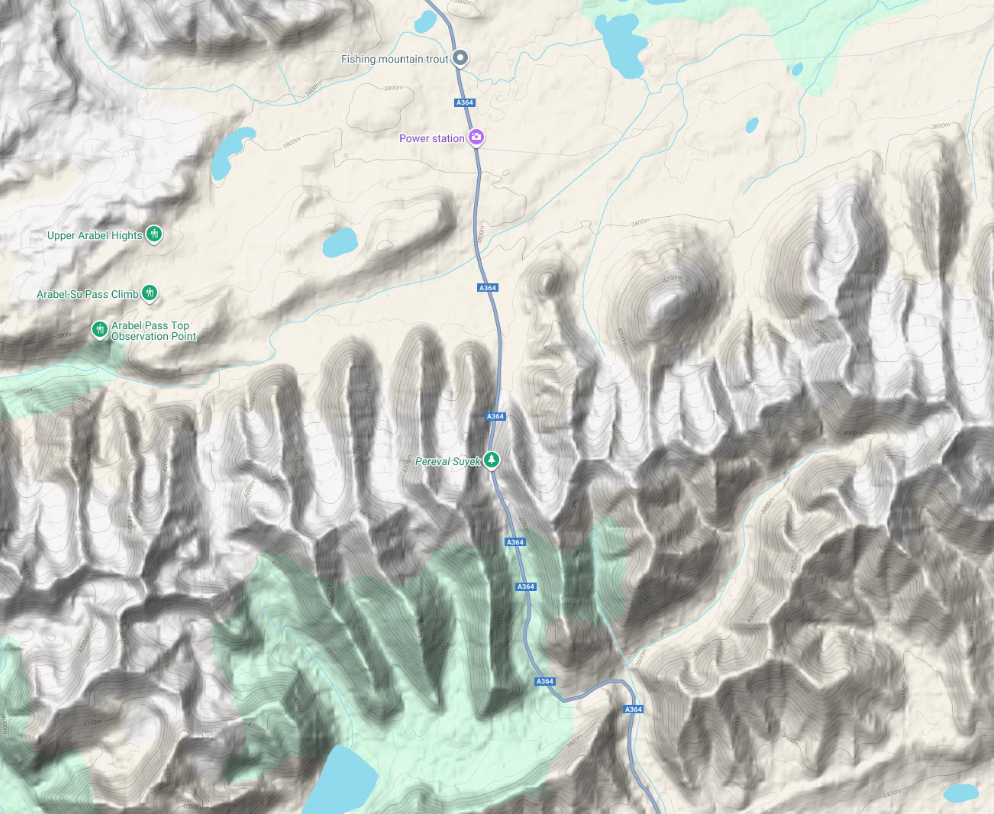
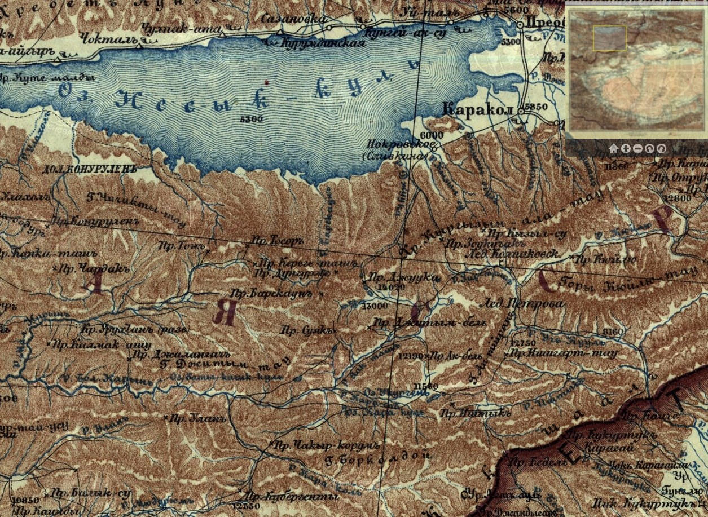
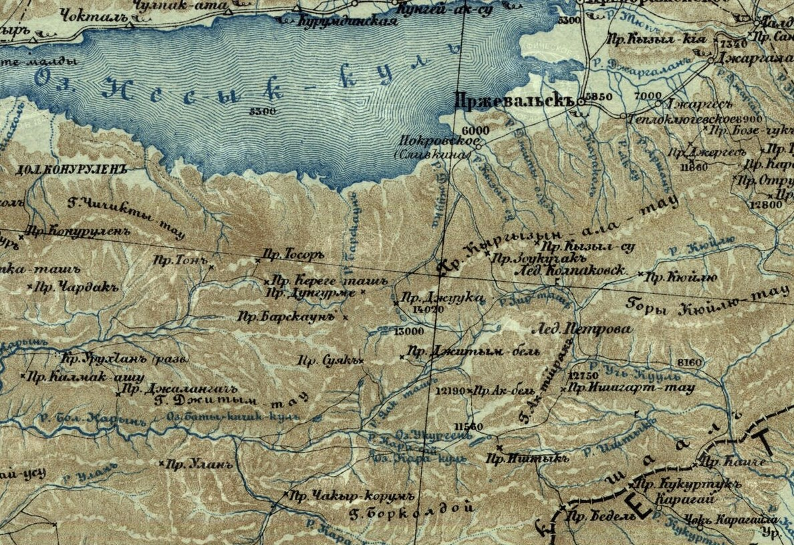
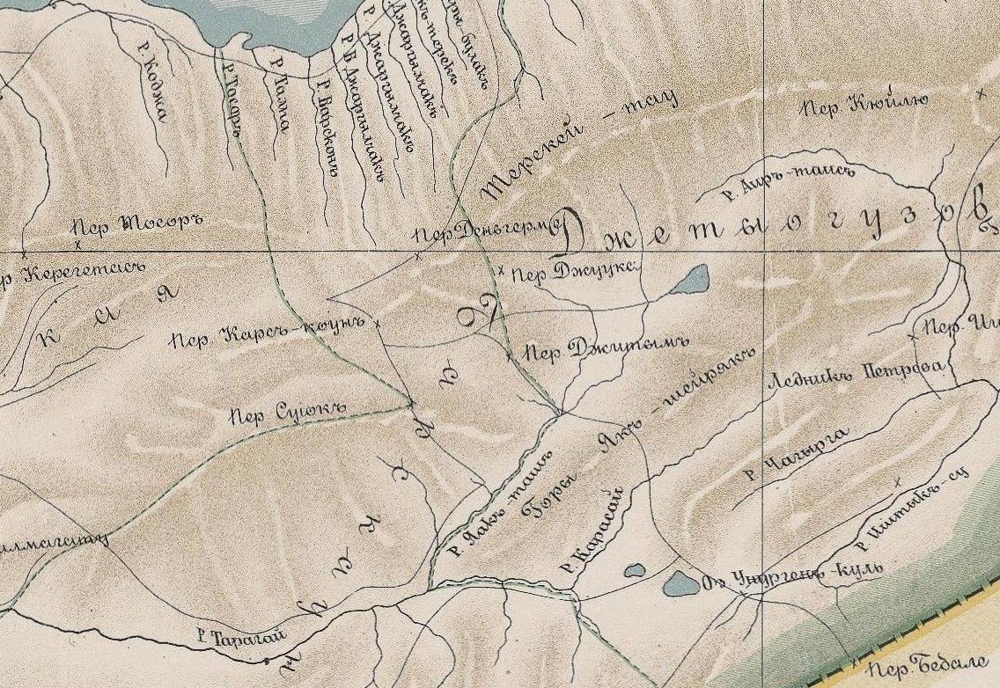
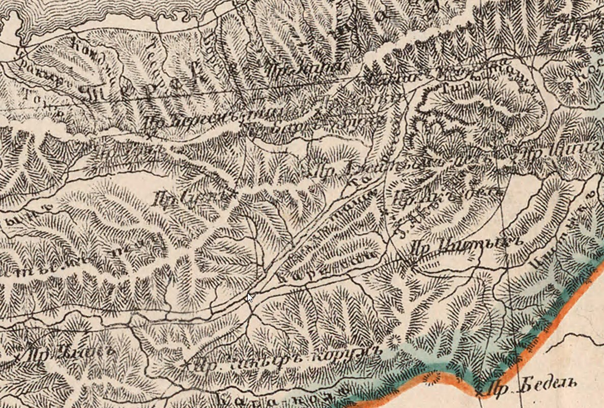
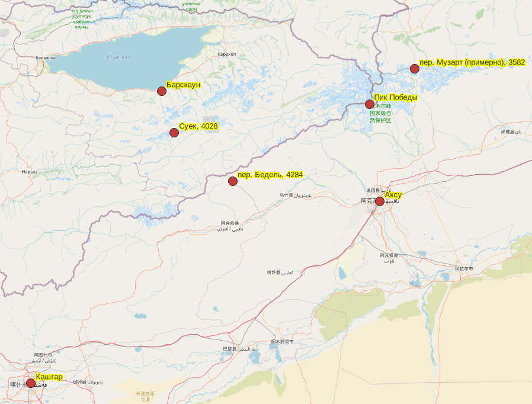

## Введение

Суек — горный перевал в Терскей Ала Тоо (Терскей-Алатау) в Кыргызстане. Высота 4028 м ([wiki](https://en.wikipedia.org/wiki/Seok_Pass)).

Варианты написания:

* Кириллица: Суек, Сёок, Суяк
* Латиница: Seok, Suyek, Suyak, Suek, Söök
* Киргизский: Сөөк ашуусу

Координаты:

* Широта: 41.7791555
* Долгота: 77.7634139

На картах:

* [OpenStreetMap](https://www.openstreetmap.org/#map=17/41.779157/77.763408)
* [Google Maps](https://maps.app.goo.gl/gYmkQxz5hw3jKBqH9)
* [Яндекс Карты](https://yandex.ru/maps/-/CLVGIV2Q)

Один из перевалов на участке древнего Шелкового пути из Кашгара или Аксу (Китай, Синьцзян-Уйгурский автоно́мный район) на Иссык Куль через [Барскаун](/notes/barskaun-barskoon/) в древний Суяб (Токмак). Другие перевалы находящиеся по пути: перевал Барскаун, перевал Бедель. Современная дорога от Барскауна через Суек проходит до деревни Кара-сай. Далее доходит до границы с Китаем, но не функционирует.

## "Кости"

Кость:

* казахский - "сүйек"
* кыргызский - "сөөк"

Существует мнение, что вариант перевода названия перевала как "кости" связан с событиями 1916 года, когда тысячи кыргызов погибли, пытаясь пересечь границу в Китай и спастись от царских войск Российской империи (см. [Среднеазиатское восстание 1916 года](https://ru.wikipedia.org/wiki/%D0%A1%D1%80%D0%B5%D0%B4%D0%BD%D0%B5%D0%B0%D0%B7%D0%B8%D0%B0%D1%82%D1%81%D0%BA%D0%BE%D0%B5_%D0%B2%D0%BE%D1%81%D1%81%D1%82%D0%B0%D0%BD%D0%B8%D0%B5_1916_%D0%B3%D0%BE%D0%B4%D0%B0) и, в частности эпизод Восстание в [Семиречье 1916 года](https://ru.wikipedia.org/wiki/%D0%92%D0%BE%D1%81%D1%81%D1%82%D0%B0%D0%BD%D0%B8%D0%B5_%D0%B2_%D0%A1%D0%B5%D0%BC%D0%B8%D1%80%D0%B5%D1%87%D1%8C%D0%B5_1916_%D0%B3%D0%BE%D0%B4%D0%B0)).

> The name means "Bone Pass" in Kyrgyz, a reference to the Urkun incident of 1916, when thousands of Kyrgyz died attempting to cross the border into China, fleeing from Tsarist Russian forces.

По [Seok Pass](https://en.wikipedia.org/wiki/Seok_Pass). Однако, в статье "[Kyrgyzstan: Victims Of 1916 'Urkun' Tragedy Commemorated](https://www.rferl.org/a/1070279.html)", на которую ссылается статья, перевал Суек не упоминается.

## Путешествие Сюань-цзяна

Участок известен из описания путешествия паломника китайца Сюань-цзян (Hsuan-Tsang, Xuanzang) в 629 г. Конкретно это или другой перевал - не упоминается. Судя по упоминанию Пика Победы, Сюань-цзян шел идти к Суеку от Аксу, а не Кашгара. Александрова (см. ниже) комментирует, что Сюань-цзян из Аксу шел по дороге на Кульджу через перевал Музарт [wiki](https://en.wikipedia.org/wiki/Muzart_Pass). Однако если это так, то никакого смысла ему возвращаться на запад и выходить на Барскаун через Суек не было. Поэтому другие исследователи считают, что он шел через перевал Бедель ([wiki](https://en.wikipedia.org/wiki/Bedel_Pass)), поскольку он шел "на северо-запад".

Сюань-цзан, 2012. Записки о западных странах [эпохи] Великой Тан (Да Тан си юй цзи). Введение, перевод с китайского и комментарий Н.В. Александровой. — М.: Издательская фирма "Восточная литература", 2012. — 462 с.

Страница 39:

> Из этой страны шел на северо-запад 300 ли. Миновал каменистую
пустыню и подошел к Ледяной Горе (34). Это северные отроги Цунли-
на (35). Большинство рек здесь течет на восток. В горных ущельях ле
жит снег, который хранит в себе холод и весной и летом, и если ино
гда тает, то тут же замерзает вновь. Дороги опасны. Свирепствуют
холодные ветры. Много неприятностей доставляют злые драконы,
которые нападают на путников. Идущий по этой дороге не должен
носить красной одежды, брать с собой тыкву-горлянку или громко
кричать. Если нарушишь эти запреты — быть беде. Очевидцы рас
сказывают: поднимается жестокий ветер, летит песок и камни сып
лются дождем. С кем случится это — погибнет, уцелеть трудно. От
гор прошел более 400 ли, прибыл к Большому Чистому озеру (36).

Комментарии Александровой, Страница 349-350:

**Ледяная гора**

> 34 ...подошел к Ледяной Горе (Линшань 凌山). 一 Здесь Сюань-цзан миновал перевал Музарт, держась того пути, который связывал Аксу и Кульджа, где находится Пик Победы (его Ледяная Гора).

**Цунлин**

> 35 Цунлин 葱 嶺 一 (в переводах Бичурина 一 Луковые Горы) часто упоминается в китайских географических сочинениях. Сюань-цзан, как следует из его текста, подразумевает под этим названием Тянь-Шань, по крайней мере его западную часть, как одно целое с Памиром.

**Большое Чистое озеро**

> 36 Большое Чистое озеро (Дацинчи 大清 池) 一 оз. Иссык-Куль.

## Путешествие Северцева

Туркестанская учёная экспедиция 1865—1868 гг. Николая Алексеевич Северцева. Упоминается хребет и ущелье Суёк в районе Барскауна. В этом районе Северцев побывал в октябре 1867 г. 14 сентября 1867 г. Северцов с отрядом в 15 человек выступил из Верного.

Путешествия по Туркестанскому краю. М., ОГИЗ, Государственное издательство географической литературы, 1947. Оригинальное издание: 1873.

> У сопровождавших нас киргизов, которые нас тут уже поджидали, весело горел огонёк из дров, подвезённых на заводной лошади(111); в котловине, закрытой от всех ветров, было тихо; мы заварили чай и скорее обогрелись, а тут, тотчас следом за нами, подошли и верблюды с дровами и кошами, нашлось и тёплое платье, и метель была забыта на радостях, что, наконец-то, ночую за тем самым хр. Болгар, или **Суёк**, на который с Зауки и Барскауна только смотрели Семёнов и Проценко и где не было европейской ноги. Впрочем, сопровождавшие меня киргизы назвали горы, где мы были, не **Суёком** и не Болгаром, а иначе: восточнее пройденного нами ущелья Уртасы[211], а западнее — Сары-тур.

## Путешествие Певцова

Экспедиции Михаила Певцова по Джунгарии, Монголии, Кашгарии прошли в 1876-1883 годах. Упоминается перевал Суёк.

М. В. Певцов Путешествие в Кашгарию и Кун-Лунь. М., Государственное издательство географической литературы, 1949. Оригинальное издание: 1894.

> Вечером мы совещались о направлении дальнейшего пути. По мнению наших проводников, нам нужно было продолжать путь сначала по той же нагорной долине на юг, а потом через хребет по перевалу **Суёк**. ([вики](https://ru.wikisource.org/wiki/%D0%9F%D1%83%D1%82%D0%B5%D1%88%D0%B5%D1%81%D1%82%D0%B2%D0%B8%D0%B5_%D0%B2_%D0%9A%D0%B0%D1%88%D0%B3%D0%B0%D1%80%D0%B8%D1%8E_%D0%B8_%D0%9A%D1%83%D0%BD-%D0%9B%D1%83%D0%BD%D1%8C_(%D0%9F%D0%B5%D0%B2%D1%86%D0%BE%D0%B2)))

## Исторические карты

Пер. Суек (пр. Суякъ), Барскаун (пр. Барскаунъ), Бедель (пр. Беделъ).

Карта Южной Пограничной Полосы Азиатской Части С.С.С.Р. Лист XX (Кашгар). Издатель: Управление военных топографов. Год издания: приблизительно 1935. Масштаб: 1:1680000 [https://geoportal.rgo.ru/record/286](https://geoportal.rgo.ru/record/286)

Карта Южной Пограничной Полосы Азiятской Россiи. Лист XX (Кашгар). Издатель: Картографический отдел Корпуса Военных Топографов. Гравировалъ Клас. Воен. Худ. И. Михайловъ. Составлялъ Корпуса Воен. Топограф. Капитанъ Родiоновъ 1889 г. Год издания: 1920. Масштаб: 1:1680000 [https://geoportal.rgo.ru/record/287](https://geoportal.rgo.ru/record/287). [Полный лист](/notes/suek/map_xx_kashgar_fullist.jpg) одним файлом.

Карта губернiй и областей Россiйской имперiи по которым пролегаетъ намеченная высочайшею волею Сибирская железная дорога. Составлена в 1893 году по распоряжению министра внутренних дел для состоящего под председательством его императорского высочества государя наследника цесаревича Комитета Сибирской железной дороги Центральным статистическим комитетом М. В. Д. Ряд III. Лист 10. Верный, Пишпек, Пржевальск.

Карта Туркестанского Генерал Губернаторства Хивинского Бухарского и Коканскаго Ханствъ с пограничными частями Средней Азии. Составил подполк. Люсилинъ. Издание Картографическаго Заведенiя А. Ильина. 1876. [Полная версия](https://archive.org/details/dr_karta-turkestanskago-general-gubernatorstva-khivinskago-bukharskago-i-kok-11743007)

## Итого

Топоним Суек существовал и до восстания 1916 и, по всей видимости, происхождение названия прямо не связано с жертвами этого восстания.

## Комментарии

[**Обсудить**](https://t.me/answer42geo/128)
