## Введение

Все, что нужно каждому, кто собирается в поездку в Корею, чтобы не сильно страдать с организацией. Только личный опыт и факты. Почему нет оценок, что лучше/хуже и ответов на вопросы почему туда, а не сюда.

Дополнительные материалы:

* [Таблица достопримечательностей](https://docs.google.com/spreadsheets/d/1i7WbABOwcVhaI_j4SFY3WTBDvwusZ6gmhEC_tu-KocQ/edit?usp=sharing)
* [Карта достопримечательностей](https://www.google.com/maps/d/u/0/edit?mid=1VhbwXBMIUzb85PK3tu-JlxsekWlcj9k&ll=37.56614687869323%2C126.97289409834113&z=13)

## Исходные условия

1. 3 человека
2. 7 дней
3. Наличные.
4. Смартфон с Android и Google Play, но без eSIM.

Вы можете использовать эти рекомендации и если у вас другие условия, но с некоторыми моментами вам будет нужно разбираться отдельно.

## Подготовка

До поездки в Корею строго обязательно:

1. Забронировать отель.
2. Получить K-ETA (понадобится бронь).
3. Купить USD.
4. Купить немного корейских вон (KRW). Минимум тыс 70, лучше 150. Курс на начало 08.2025: 58 рублей за 1000 вон.
5. Получить QR-код для E-sim. Сразу его активируем. Если E-sim на телефоне нет, см. ниже раздел E-sim switch.

В Корее:

1. Используем ранее наменянные воны чтобы добраться от аэропорта в город. Метро от аэропорта Инчеона стоит 4700 вон. За наличные можно купить разовый билет в автомате. Депозит за билет 500 вон, их можно потом вернуть в другом автомате.
2. Получаем карту Wowpass на того, кто будет за все платить (см. далее).
3. На остальных покупаем транспортные карты T-money. Стоит 4000 вон, продается в 7-11, 25s и почти любых других ларьках. Пополняем в метро по мере потребности.

### Приложения и основные активности

Переключаем язык Android на английски. Все приложения ставим стандартно через Google Play.

* **Wowpass** --- **оплата** везде и за всё, включая транспорт. После того как добрались до города и устроились, открываем приложение, карту локаций, ищем ближайшую и идем туда, получаем карту за 5 тыс вон, нужен паспорт. Тут же кладем на карту сколько нужно USD. Курс конвертации в киосках Wowpass не идеальный, но нормальный.
* **Seoul Subway** --- **метро**. Стоимость зависит от дальности, от 1500 вон за человека. Оплата либо через Wowpass, либо через отдельную карту T-money.
* **Trip.com** --- оплата **достопримечательностей и отелей**. Можно привязать карту МИР. Чтобы платить ей, то в валюте нужно переключить на RUB.
* **OsmAnd** --- **карты** для ориентирования. Заранее добавляем пакет данных для Сеула, чтобы работало без интернета.
* **Google Translate** --- **переводы**. Заранее скачиваем пакеты данных для корейского языка, чтобы работало без интернета.
* **Switch eSIM** --- **интернет**. Приложение для превращения смартфона без e-sim в смартфон с e-sim. ВЕЛИКОЕ ИЗОБРЕТЕНИЕ ДЛЯ БЕЗЛОШАДНЫХ (в смысле тех кто без native e-sim).

## Расходы

В тыс.р

1. Перелет --- 150 (сюда включены еще перелеты в Китай, которые здесь не описаны)
2. Жилье --- 39
3. Транспорт (KETA, метро) --- 15
4. Достопримечательности --- 30
5. Еда --- 40

## Расписание --- коротко

День 1. Сеульская телебашня

День 2. Starfield library

День 3. Everland

День 4. Чхандоккун

День 5. Мёндон

День 6. Trick Eye Museum, Ban-po bridge

День 7. Lotte mall

## Расписание --- подробно

### День 1. Сеульская телебашня

Описание: Едешь на канатной дороге на верх, там гуляешь, потом поднимаешься на башню.

Стоимость: 15000 KRW за человека за канатку и 15000 за башню.

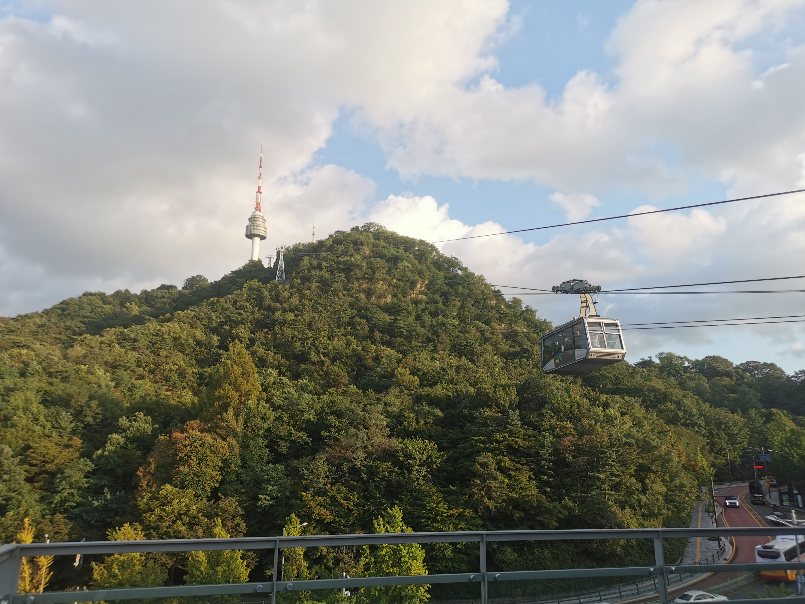

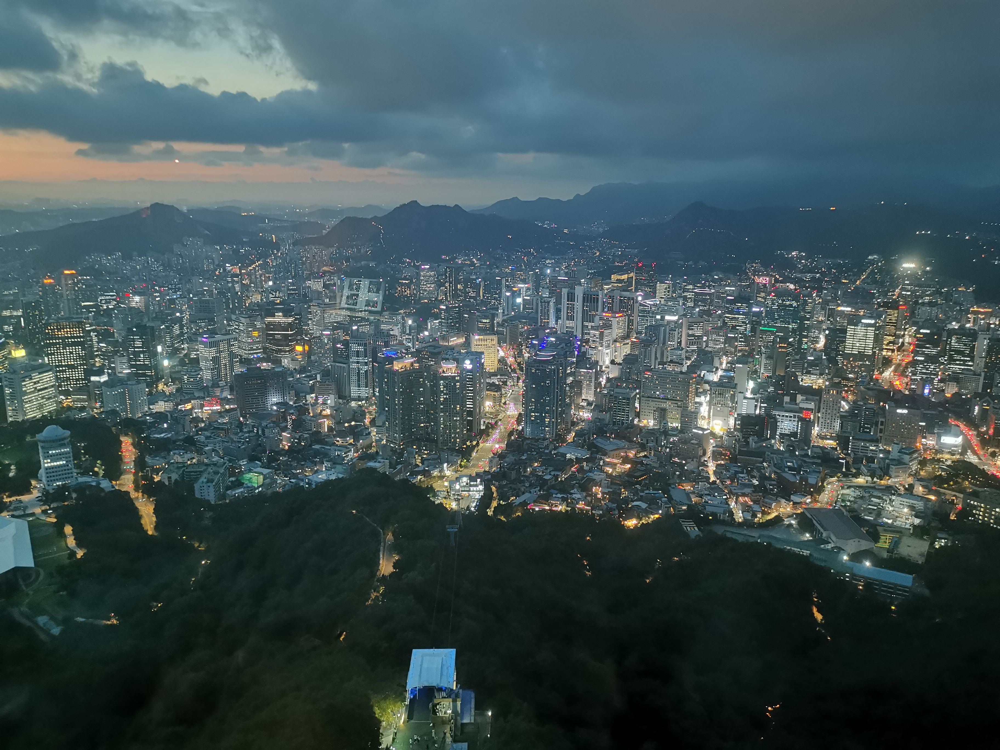

Метро: Myeongdong

### День 2. Starfield library

Описание: большой Starfield Mall, в нем библиотека, книги как я понял все на корейском.

Метро: Samseong

Там же: Gangnam District - Gangnam Style тот самый.

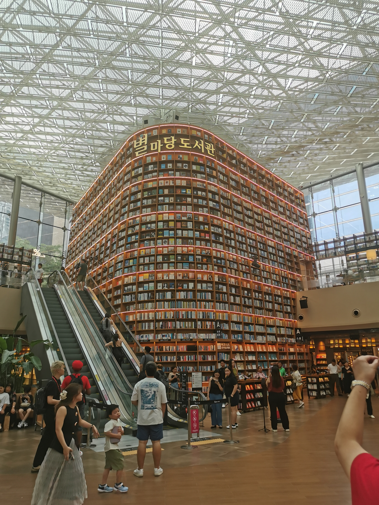

### День 3. Everland

Описание: Парк развлечений типа Диснея.

Стоимость: 35000 KRW за человека.

Метро: Everline (о-о-очень долго пилить на метро, дешево, но лучше на автобусе, но его нужно бронировать за несколько дней).

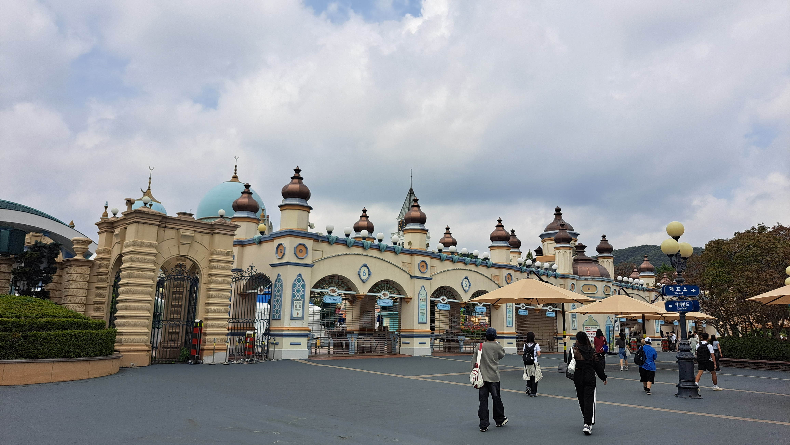

### День 4. Чхандоккун и Жогесу

Описание: старый королевский дворец, очень эстетичное и приятное место.

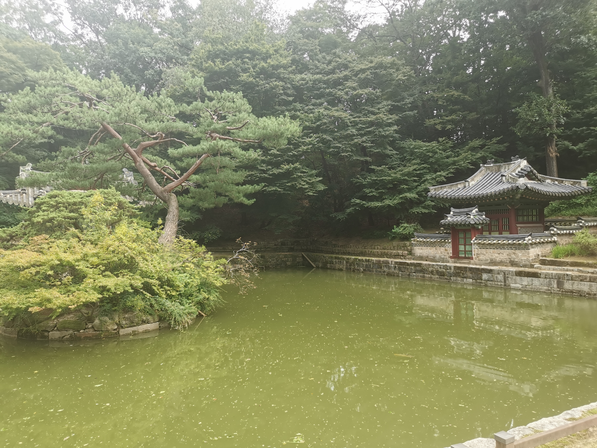

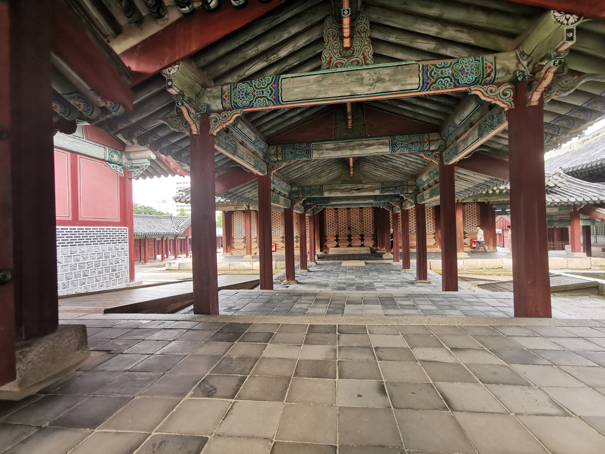

Метро: Anguk

Стоимость: 10000 за всё, включая Secret garden.

Там же: буддистский храм Жогеса.

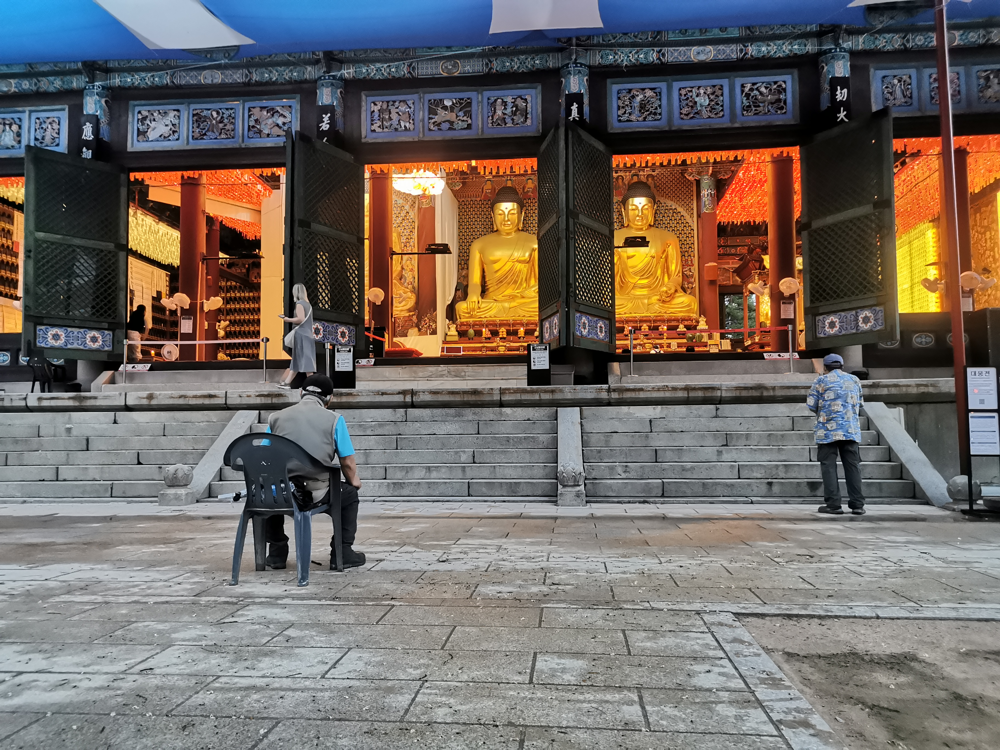

Там же: Инсадонг - гуляльная улица и Иксон-дон - квартал узких улочек с отреставрированными ханок-домами.

### День 5. Мёндон

Описание: шопинг 🤷‍♂️

Метро: Myeongdong

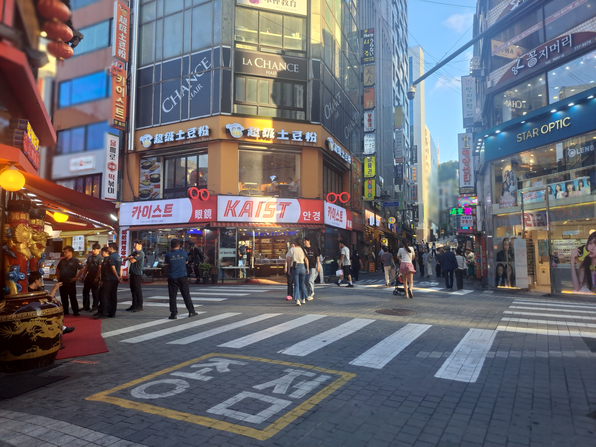
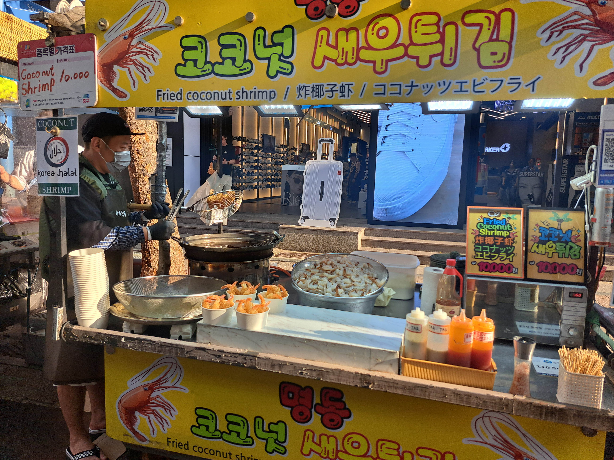

### День 6. Trick Eye Museum, Ban-po bridge

Описание: на удивление веселый "музей" спецэффектов. Вечером на кораблике по радужный мост

Стоимость: музей 11000, велосипеды в парке 3000, круиз 35000 KRW полтора часа.

Метро: Hongik Univ (музей)

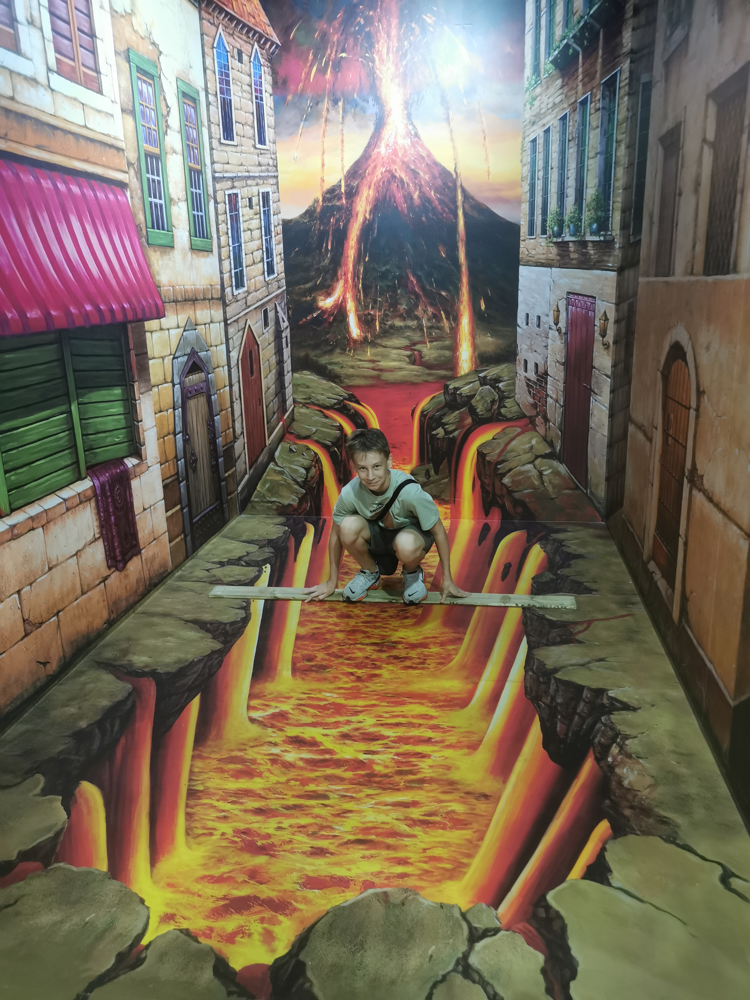

Там же: Hongdae Street - улица с искусством, музыкой и кафе.

Метро: Yeouinaru (причал)

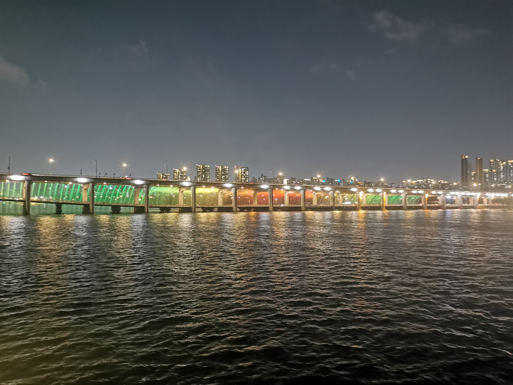

### День 7. Lotte World Mall

Описание: бестолковое место.

Метро: Jamsil

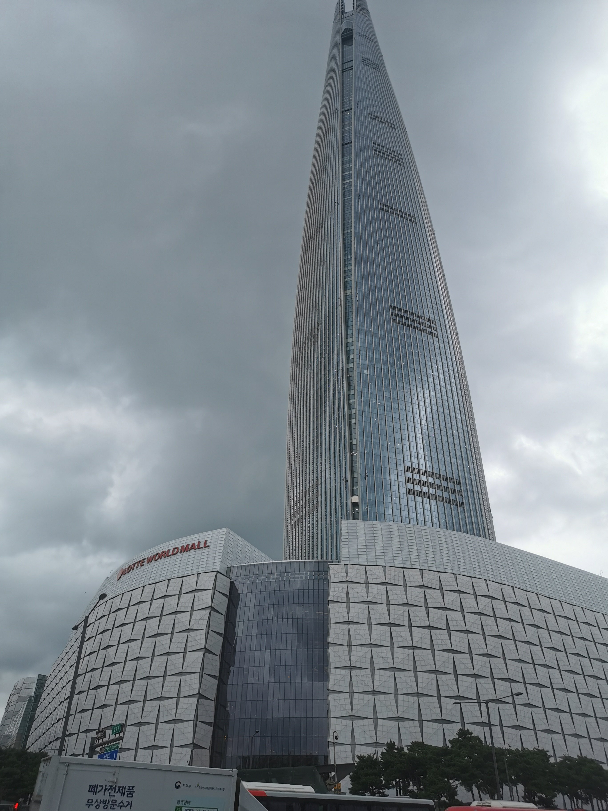

## Комментарии

[**Обсудить**](https://t.me/answer42geo/125)
