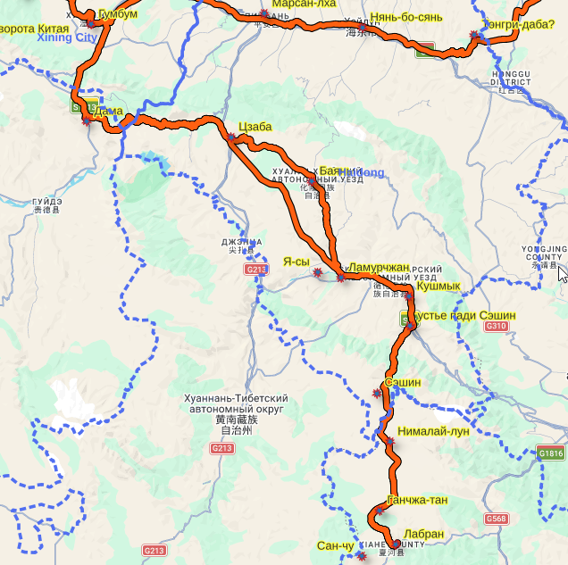
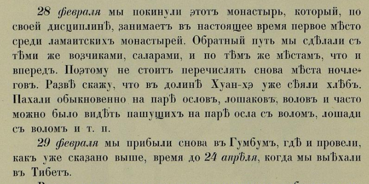

## Введение

В главном труде Г.Ц. Цыбикова "Буддист-паломник у святынь Тибета" прошедшим несколько публикаций начиная с 1919 г. есть пропавшая неделя и опечатка, делающие участок маршрута Лабран-Гумбум физически невозможным.

Пропуск начинается с самой первой публикации:

> Буддист-паломник у святынь Тибета: По дневникам, веденным в 1899--1902 гг. / под. ред. А. В. Григорьева \[и др\]. Петроград: Изд-во Рус. Геогр. о-ва, 1919.

И кочует по всем изданиям.

## Пропавшая неделя и опечатка

Приведем разбор по изданию 1991 года.

> Цыбиков Г.Ц, 1991. Избранные труды в двух томах. 2-е изд. перераб. Т.1: Буддист-паломник у святынь Тибета. Новосибирск: Наука.

Цыбиков покидает Гумбум 02/06/1900 (все даты по старому исчислению, как в оригинале).

> Наняв таких саларов, мы выехали из Гумбума 6 февраля и ночевали в китайской деревне Дама.

Начиная от Гумбума Цыбиков проследовал через ряд населенных пунктов упомянув следующие топонимы, в таблице дата прибытия и отбытия и страница в тексте издания:

| Место        | Дата начала | Дата конца | Стр. |
|--------------|-------------|------------|------|
| Гумбум       | 02/06/00    |            |      |
| Дама         | 02/06/00    | 02/07/00   | 49   |
| Цзаба        | 02/07/00    | 02/08/00   | 49   |
| Баянь        | 02/08/00    | 02/09/00   | 49   |
| Хуан-хэ      | 02/09/00    |            | 49   |
| Ламурчжан    | 02/09/00    | 02/11/00   | 49   |
| Кушмык       | 02/11/00    |            | 49   |
| Сэшин        | 02/11/00    |            | 49   |
| Хумэй-лун    | 02/11/00    | 02/12/00   | 49   |
| Я-сы         | 02/11/00    |            | 50   |
| Нималай-лун  | 02/12/00    | 02/13/00   | 50   |
| Ганчжа-тан   | 02/13/00    |            | 50   |
| Сан-чу       | 02/13/00    |            | 50   |
| Лабран       | 02/13/00    |            | 50   |

Таким образом весь путь занял 7 дней.

Согласно [реконструкции маршрута](/content/notes/tsybikov-map/), пусть занял 280 км, то есть 40 км в день ([на карте](https://buddhistpilgrim.nextgis.com/resource/38/display?angle=0&zoom=9&styles=24,22,83&base=basemap_0&lon=102.8723&lat=35.6861)). Хороший темп.

В монастыре Цыбиков провел 8 дней:

> Из Ганчжа-тана через высокий перевал попадаем в долину реки Сан-чу и монастырь Лабран. В нем я пробыл с 13 по **21 февраля**.

Далее до стр. 54 идет описание монастыря и, внезапно, покидает он его уже 28 февраля. Согласно стр. 54:

> **28 февраля** мы покинули этот монастырь, который по своей дисциплине занимает в настоящее время первое место среди ламаистских монастырей. Обратный путь мы сделали с теми же возчиками, саларами, и по тем же местам, что и вперед. Поэтому не стоит перечислять снова места ночлегов. Разве скажу, что в долине Хуанхэ уже сеяли хлеб. Пахали обыкновенно на паре ослов, лошаков, волов, и часто можно было видеть пашущих на паре осла с волом, лошади с волом и т. п.
>
> **29 февраля** мы прибыли снова в Гумбум, где и провели, как уже сказано выше, время до 24 апреля, когда мы выехали в Тибет.

Таким образом, если читать текст буквально, то на преодоление пути обратно Цыбиков потратил один день, что конечно физически невозможно.

Учитывая упоминавшееся 21 февраля вероятно речь идет об опечатке и 28 следует читать как 21.

Опечатка присутствует и в самом первом издании:

Ограниченный доступ к дневникам показал, что топонимы упоминавшееся на пути Лабран-Гумбум частично отличаются от пути Гумбум-Лабран.

Надеюсь дневники Цыбикова когда-нибудь опубликуют.

## Комментарии

[**Обсудить**](https://t.me/answer42geo/170)
