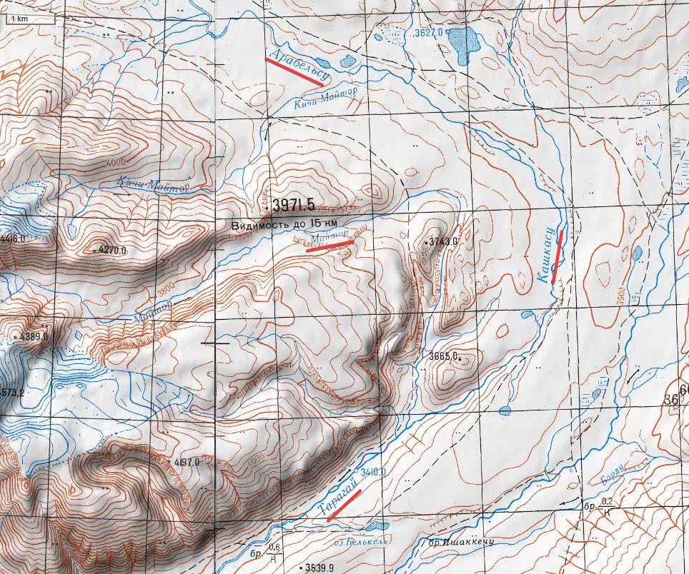
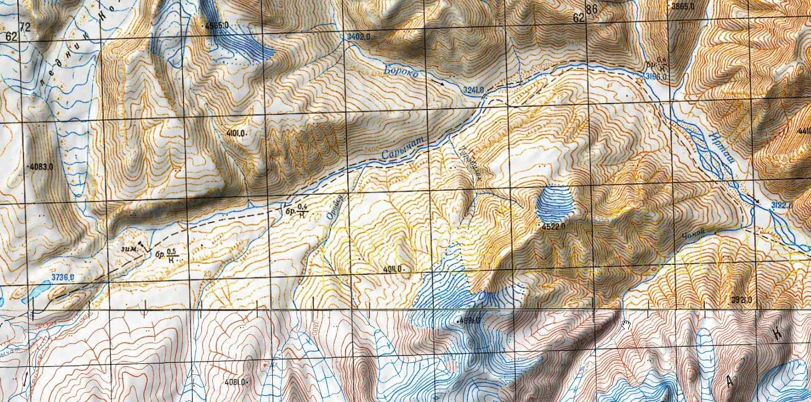
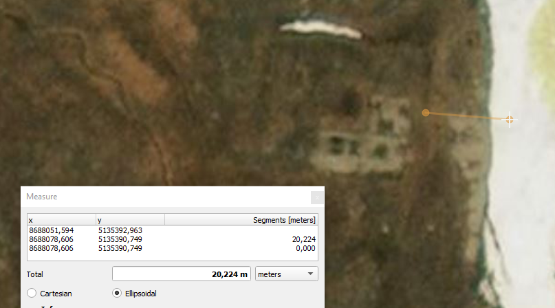
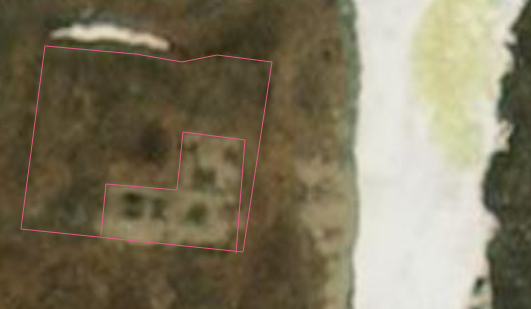
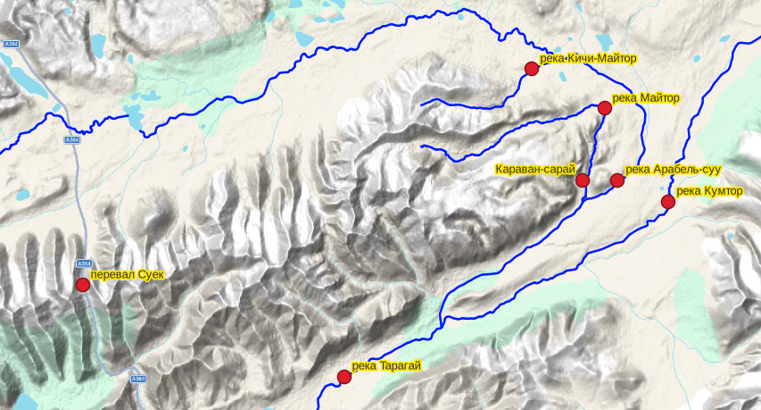

## Введение

По цитате из публикации разыскиваем топонимы и упомянутый караван-сарай.

Цитата:

> В местности Уч-Чат был открыт караван-сарай. Он находится на высоте 3500 м над уровнем моря и построен из камня в виде квадрата с длиной сторон 27 х 27 м, стенами ориентирован по странам света. В его центре находится двoрик 11 х 11 м. ...
>
> В 15-18 м к северо-востоку от караван-сарая зафиксирована каменная подстройка площадью 100 м2. К северо-западу от караван-сарая расположен квадратный торткуль размерами 30 х 30 м. Он был построен из глины. Вниз по течению реки Арабель-Суу выявлены две каменные постройки [Москалев 2005: 40-44]. В местности Чат, в барсовом заповеднике, зарегистрированы каменно-земляные могильники и пещера Сасык-Ункур.

Подробная информация по упомянутым объектам содержится в статье Москалева 2005. Далее все цитаты по ней.

> Москалев М.И., 2005. Уч-чатский археолого-архитектурный комплекс. Материалы и исследования по археологии Кыргызстана. Выпуск 1. Бишкек "Илим". Стр. 41 ([PDF](http://cslnaskr.krena.kg/collections/uploads/%D0%9C%D0%98%D0%90%D0%9A-1_2005.pdf))

## Топонимы

### Арабель-суу (Арабельсу)

Одна из рек верховьев Нарына, течет по плато (долине) Арабель, впадает в р. Тарагай, которая в свою очередь впадает в р. Нарын.

### Кашкасу

На топокартах генштаба показывается как участок реки между Арабель-суу и р. Тарагай.

### Уч-чат

Cогласно описанию Москалева, местность представляет собой долину правого берега р. Май-Тор.

> Наибольшее количество разновременных типов памятников археологии было выявлено в местности Уч-Чат. Эта местность представляет собой долину правого берега р. Май-Тор; начинается с выхода этой реки из тесного каньона ущелья и тянется на юг до впадения ее в р. Арабель-Суу. Площадь этой местности примерно 4–5 кв. км. Она обладает особым микроклиматом – в течение трех полевых сезонов мы наблюдали, что дождь и снег обходят ее стороной.

Откуда появилось название - неизвестно, на картах топоним не найден.

### Майтор

Майтор (Май-тор) --- река вытекающая из одноименного ледника и впадающая в Арабель-суу (Кашкасу, Тарагай).

### "Барсовый заповедник"

Имеется в виду Сарычат-Эрташский государственный заповедник ([ru-wiki](https://ru.wikipedia.org/wiki/%D0%A1%D0%B0%D1%80%D1%8B%D1%87%D0%B0%D1%82-%D0%AD%D1%80%D1%82%D0%B0%D1%88%D1%81%D0%BA%D0%B8%D0%B9_%D0%B3%D0%BE%D1%81%D1%83%D0%B4%D0%B0%D1%80%D1%81%D1%82%D0%B2%D0%B5%D0%BD%D0%BD%D1%8B%D0%B9_%D0%B7%D0%B0%D0%BF%D0%BE%D0%B2%D0%B5%D0%B4%D0%BD%D0%B8%D0%BA)).

")

### Сасык-Ункур

Упоминается у Москалева как Сасык-Үнкүр.

> В местности Чат на правом берегу р. Сары-Чат была зафиксирована пещера Сасык-Үнкүр, которая требует дальнейшего изучения на предмет выявления здесь следов стоянок эпохи камня.

См. далее.

### Сары-Чат

Сары-Чат (Сарычат) --- приток р. Ирташ (Эртащ), текущей в горном массиве Ак-Шийрак (Акшийрак, Ак-Шыйрак).

Маршрут по Ак-Шийраку описывается в [отчете о горном походе](https://westra.ru/reports/tianshan/m01remiz4.html) Ремизова Д.А.

## Караван-сарай

> Приятной неожиданностью для исследователей было открытие в местности Уч-Чат караван-сарая. Он расположен на правом берегу реки Май-Тор при выходе ее в долину, в 20–30 м от ее береговой линии.

Измерение расстояния от реки до караван-сарая.

По снимку так же видно раскопанный юго-восточный угол:

> В 1998–1999 гг. археологи КГНУ проводили раскопки памятника. У юго-восточного угла был заложен раскоп

Координаты и снимки:

* 41.82897729, 78.04585172
* [Bing maps](https://www.bing.com/maps?cp=41.828578%7E78.046425&lvl=18.2&style=h)
* [Google maps](https://www.google.com/maps/@41.8315785,78.0456727,14.42z/data=!5m1!1e4?entry=ttu&g_ep=EgoyMDI2MDIyNS4wIKXMDSoASAFQAw%3D%3D)

## Карта

## Не путать

Упоминаемые топонимы Уч-чат и пещера Сасык-Ункур не являются уникальными и легко находятся в совершенно других местах.

Вершина Уч-Чат Киргизского хребта

* Находится на границе Таласской и Чуйской области
* 42.371120, 73.608178
* Каталог [перевалов Вестра](https://westra.ru/passes/Passes/15897)
* [Google maps](https://maps.app.goo.gl/K8FQjcUQ7jfV4u2MA)

Перевал Уччат

* 41.981230, 79.292350
* Каталог [перевалов Вестра](https://westra.ru/passes/Passes/19607)
* [Google maps](https://maps.app.goo.gl/Y8KnFjXHzmpZKtRL6)

Пещера Сасык-Ункур

* Находится в 2 км на юго-запад от села Араван, Ошская область.
* 40.498109, 72.483238
* [Википедия](https://ru.wikipedia.org/wiki/%D0%A1%D0%B0%D1%81%D1%8B%D0%BA-%D0%A3%D0%BD%D0%BA%D1%8E%D1%80)
