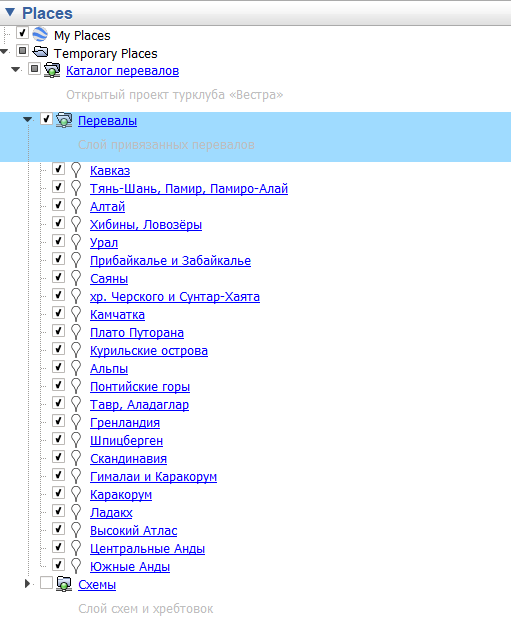
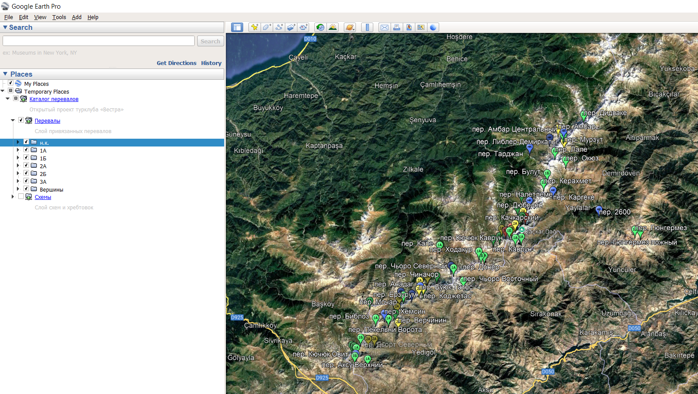
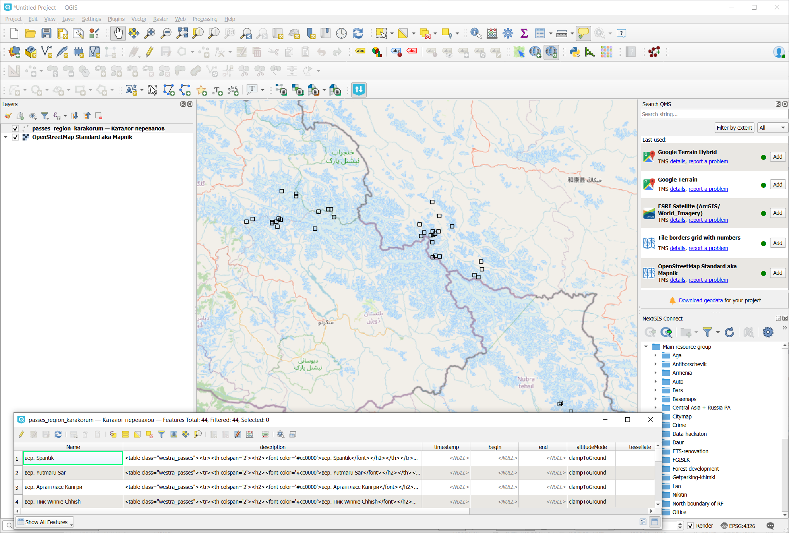

## Введение

Проблема: в каталоге перевалов Вестра нет самих данных, а есть только ссылка подключения к ним в Google Earth (GE). Это проблема, так как это позволяет работать с ними только в GE. GE не является полноценной ГИС и для многих задач её недостаточно.

Тут рассказывается как получить информацию о перевалах в виде полноценного набора пространственнх данных для своей ГИС (QGIS, ArcGIS, Mapinfo и т.д.).

## Способ 1 - для обычных пользователей

В [каталоге перевалов](https://westra.ru/passes/) Вестры выбираем Экспорт в Google Earth.

Открываем Google Earth, отъезжаем на весь мир.

Открываем в GE скачанный файл. Отключаем Схемы, оставляем перевалы.



Дважды щелкаем по нужному региону, ждем когда оно перелетит и загрузится целиком.

Название регина распадается на список категорий. Теперь можно нажимать правой кнопкой по каждой и выбирать Save Place As...

.

Итого: в сохраненных данных будут сами данные и их можно грузить в QGIS.

Ответы на ЧаВо типа "Где взять Google Earth" или "Как работать в Google Earth" лучше смотреть у [самой Вестры](https://westra.ru/passes/geohelp.php).

## Способ 2 - для знакомых с консолью

```bash
curl -s "https://westra.ru/passes/classificator.php?place=455&type=new&export=kml" > passes_region.kml
```

* curl можно установить отдельно или вместе с [NextGIS QGIS](https://nextgis.ru/nextgis-qgis)
* 465 - код региона Каракорум. Код региона можно посмотреть в [Каталоге перевалов Вестры](https://westra.ru/passes/). Находим нужный регион, смотрим его ссылку.
* В файле результата и вершины и перевалы.

Файл passes_region.kml можно грузить в QGIS без особых приседаний:



## Технические детали

Каталог Вестры для GE является файлом KML, но не содержит самих данных. Есть только ссылка подключения по которой доступен еще один файл KMZ автоматически скачиваемый при открытии каталога:

```XML
<?xml version="1.0" encoding="UTF-8"?><kml xmlns="http://earth.google.com/kml/2.1"><NetworkLink><name>Каталог перевалов</name><Link><href>https://westra.ru/passes/kml/main.kmz</href><refreshMode>onInterval</refreshMode><refreshInterval>356404</refreshInterval></Link></NetworkLink></kml>
```

Если отдельно открыть ссылку https://westra.ru/passes/kml/main.kmz, то внутри будет чуть больше сопроводительной информации и снова не будет данных. В числе прочего будет строка подключения к специальному сервису:

```XML
<NetworkLink>
	<name>Перевалы</name>
    <description>Динамически обновляемый слой привязанных перевалов</description>
    <Snippet>Слой привязанных перевалов</Snippet>
	<Link>
		<href>http://westra.ru/passes/kml/passes.php</href>
		<viewRefreshMode>onStop</viewRefreshMode>
	</Link>
</NetworkLink>
```

Увидев такую секцию в KML, GE начинает обращаться к сервису по ссылке и тянуть из него данные.

Просто перейдя по ссылке - скачать данные не получится, сервис вернет файл KML, но без координат. По всей видимости ожидаются специальные referer-ы и параметры типа охвата. Выяснить можно, но муторно. Таким образом, из самого GE ссылка работает, отдельно - нет. Это не принципиально, поскольку есть два других способа получения данных описанных выше.

## Итого

* Каталог Вестры не дает нормального доступа к данным и годится только для работы в GE и на самом сайте.
* Но выкачать данные можно парой способов описанных выше.
* Перевалы - волшебное место. Вестра - прекрасный турклуб. KML - убогий формат.

## Вопросы?

Возникли вопросы, комментарии или есть полезная информация по теме заметки?

Можно [**написать в телеграм**](https://t.me/answer42geo/112) или оставить вопрос в форме ниже.
