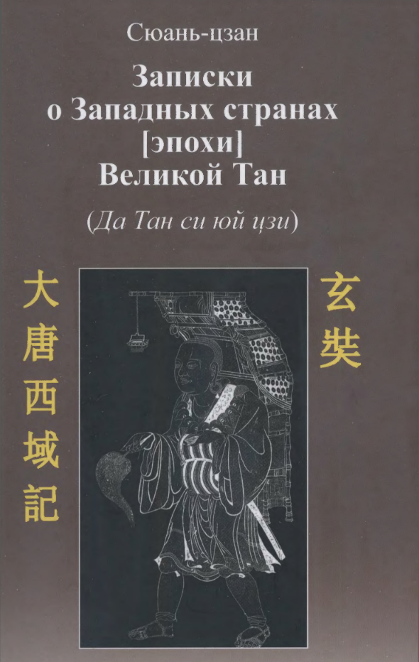
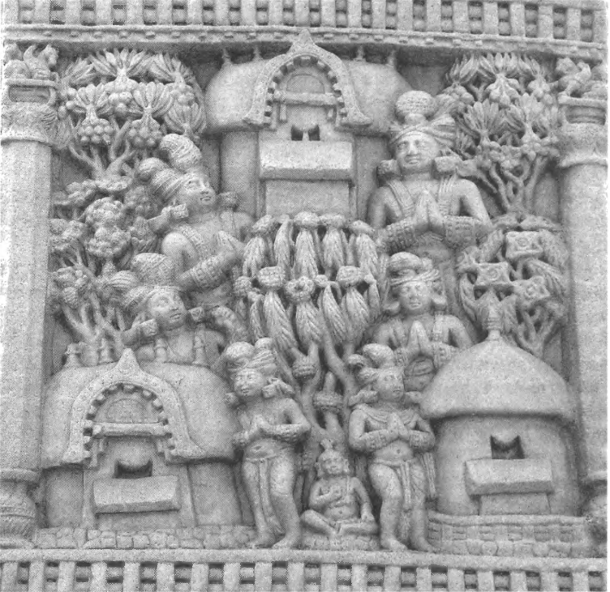
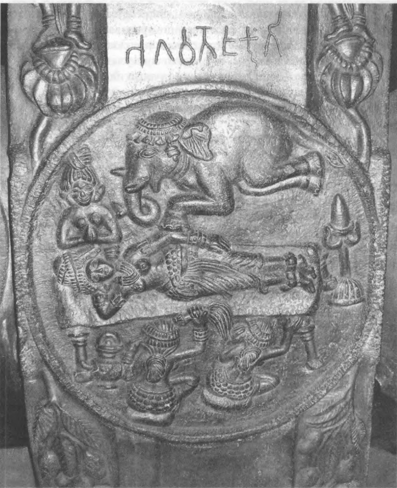
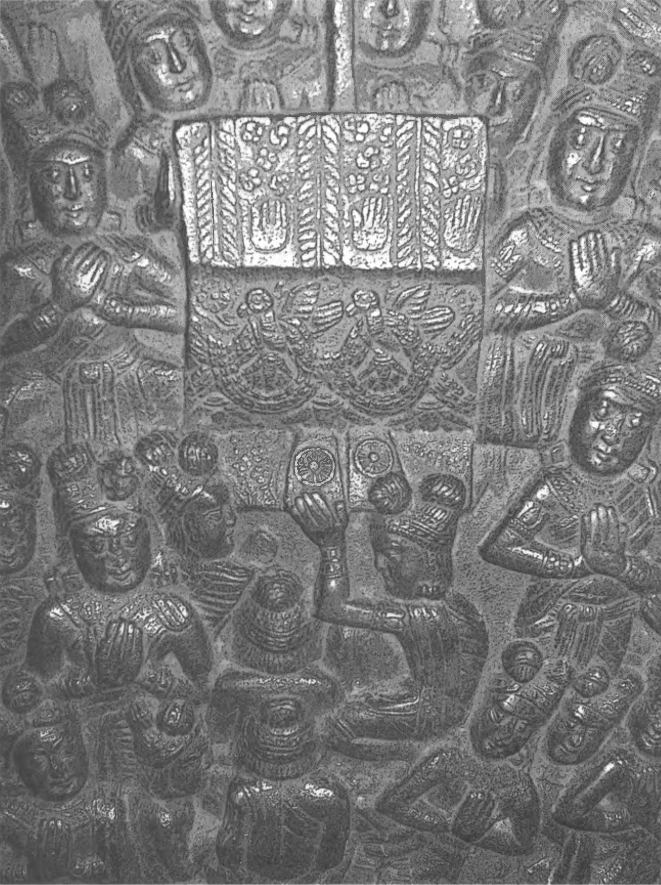
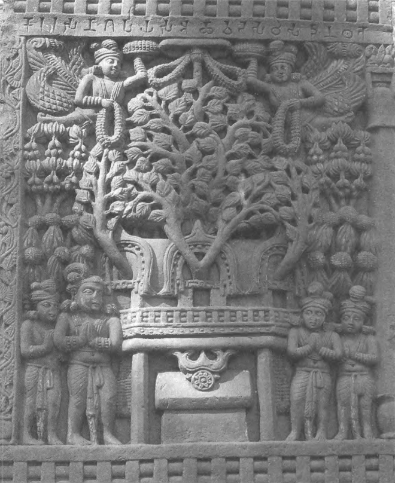
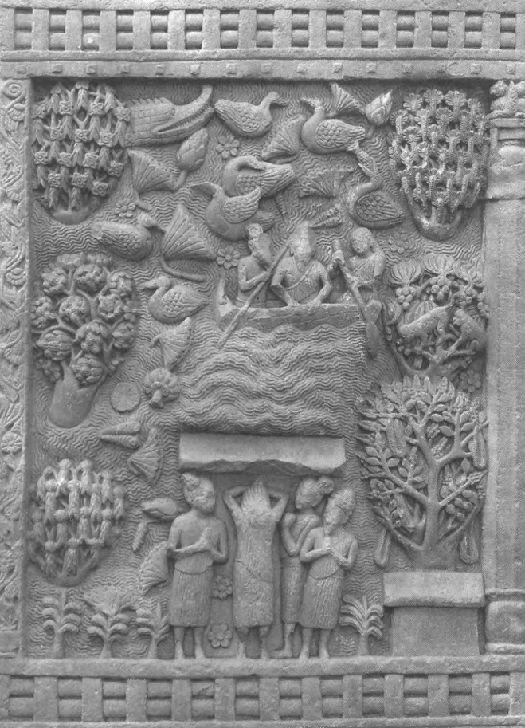
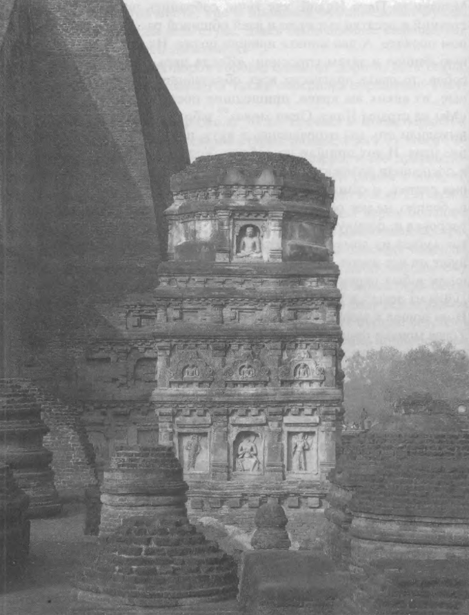

## Введение

Библиографическая ссылка:

Сюань-цзан, 2012. Записки о западных странах \[эпохи\] Великой Тан (Да Тан си юй цзи). Введение, перевод с китайского и комментарий Н.В. Александровой ; Ин-т востоковедения РАН. — М.: Издательская фирма “Восточная литература”, 2012. — 463 с.: ил. 一 ISBN 978-5-02-036520-9 (в пер.)

Источники:

* Исходный PDF Александровой
* Распознанный и отредактированный текст введения на [vostlit.info](https://www.vostlit.info/Texts/Dokumenty/China/VII/620-640/Sjuan_tsan_II/frametext1.htm).
* Распознанный и отредактированный текст повествования на [vostlint.info](https://www.vostlit.info/Texts/Dokumenty/China/VII/620-640/Sjuan_tsan_II/vved.phtml).

Копирайты теста с <vostlit.info>:

© текст - Александрова Н. В. 2012
© сетевая версия - Strori. 2015
© OCR - Иванов А. 2015
© дизайн - Войтехович А. 2001
© Восточная литература. 2012

## Список изменений

Относительно версии на vostlit.info.

* Возвращен список сокращений, библиография, указатели, summary, содержание.
* Возвращены диакритика и иероглифы (не полностью, возможны ошибки).
* Возвращены иллюстрации.
* Восстановлено разбиение на страницы.
* Возвращены цитируемые фрагменты.
* Исправлены мелкие ошибки и опечатки.

## Содержание книги

<a id="1">*1*</a>

РОССИЙСКАЯ АКАДЕМИЯ НАУК
Институт востоковедения

Сюань-цзан

Записки о Западных странах \[эпохи\] Великой Тан (Да Тан си юй цзи)

Введение, перевод с китайского и комментарий Η.Β. Александровой

Москва

Издательская фирма «Восточная литература»

2012

<a id="2">*2*</a>

УДК 94(5)
ББК 63.3(5)
С98

Издание осуществлено при финансовой поддержке Российского гуманитарного научного фонда, проект № 12-01-16050

Ответственный редактор В.В. Вертоградова

**Сюань-цзан**

Записки о западных странах [эпохи] Великой Тан (Да Тан си юй цзи) / Сюань-цзан ; введ., пер. и коммент. Н.В. Александровой ; Ин-т востоковедения РАН. 一 М. : Вост. лит., 2012. 一 463 с.: ил. 一 ISBN 978-5-02-036520-9 (в пер.)

В книге публикуется первый полный перевод на русский язык записок китайского буддиста Сюань-цзана, составленных после его путешествия в Индию, совершенного в 629-645 гг. Целью паломничества было посещение святых мест буддизма и приобретение буддийских текстов. Географическое повествование, лежащее в основе сочинения, насыщено историческими и литературными сюжетами, ведущими свое происхождение из буддийских текстов, относящихся к разным жанрам.

Перевод текста «Да Тан си юй цзи» сопровождается комментариями переводчика, библиографией, указателями.

© Александрова Н.В., 2012
© Институт востоковедения РАН, 2012
© Редакционно-издательское оформление. Издательская фирма «Восточная литература», 2012

ISBN 978-5-02-036520-9

<a id="3">*3*</a>

### ВВЕДЕНИЕ

**«Да Тан си юй цзи»: автор и его время**

«Записки о Западных странах \[эпохи\] Великой Тан» («Да Тан си юй цзи» 大唐西域言己) были составлены китайским буддистом Сюань-цзаном 玄壯 после путешествия в Индию, совершенного в 629-645 гг. Целью его паломничества было не только посещение святых мест буддизма - перед ним, как и перед другими монахами-паломниками, отправлявшимися в Индию, стояла задача приобретения буддийских текстов и обучения в индийских монастырях.

Буддийская культура Китая, в сфере которой развивалась деятельность Сюань-цзана, имела уже длительную историю, восходившую к I в. н.э. К этому времени относила проникновение буддизма в Китай сама буддийская традиция, в которой была популярна легенда о чудесном сне ханьского императора Мин-ди, увидевшего сияющую фигуру Будды. К тому же веку относятся первые упоминания о китайских буддистах - мирянах и монахах - в источниках \[Zürcher 2007: 19-22\]. Первый период распространения буддизма в Китае был связан с деятельностью проповедников, приходивших из «Западного Края» - культурных центров Средней Азии, главным образом Бактрии и Согдианы. Миссионерское движение из Средней Азии через Восточный Туркестан и далее к городским центрам китайской цивилизации было обусловлено формированием Шелкового пути и всей предшествующей историей развития этого региона, создавшей возможность активного культурного обмена. Начиная с создания эллинистических государств, Бактрийского царства и индо-греческих государственных образований складывается историко-культурная ситуация, способствовавшая «проницаемости» культуры, воспринимавшей и западные влияния, исходившие из античного ми-

<a id="4">*4 Введение*</a>

pa, и юго-восточные, исходившие из Индии. Становление Кушанской империи, охватывавшей обширные территории Центральной и Средней Азии, а также Северо-Западной Индии, способствовало продолжению этого процесса; именно к этому периоду относится начало бурного развития буддизма в этих областях \[Puri 2007: 100- 101\], когда складываются свои традиции монастырской жизни, культовой архитектуры, скульптуры и живописи, активно передается текстовая традиция. Многолетние археологические исследования буддийских монастырей древней Бактрии или Бамиана, а также изучение центральноазиатских буддийских текстов создали целые направления в археологии и текстологии. Реализация такой возможности для распространения буддизма была обеспечена политической историей региона и созданием крупных государств, вместе с тем она зависела и от тех потенций, которые были заложены изначально в самом буддийском вероучении, рассматривавшем бытие буддийской *дхармы* (***dharma***, *фо-фа* 佛 法 - «учение Будды», «закон Будды») как продолжающееся во времени «вращение колеса», осваивающего все новые пространства. Соответственно, проповедническая деятельность расценивалась как исполнение этого предназначения и большая религиозная заслуга \[Александрова 2008: 85-86, 110\]. Благодаря всей сумме этих исторических факторов произошло сложение той длинной цепи буддийских монастырей, по которой передвигались проповедники, - из Индии в Бамиан, Балх, Термез и далее в Среднюю Азию, а затем из этих областей в восточную сторону, в Китай. На этом последнем отрезке пути немаловажную роль сыграла и внешнеполитическая активность китайских правителей, направленная на освоение Западного Края (Си юй 西域), под которым понимались как территории современного Синьцзяна, так и области, находившиеся на пути далее к западу до Бактрии и Согдианы; в это же понятие вошли и те страны, куда можно было попасть по ответвлениям этого пути на юг или юго-восток, включая Индию. В Западный Край направлялись официальные китайские посланники, писавшие отчеты о посещенных областях, где давали подробную информацию, необходимую для установления торговых или дипломатических отношений, ведения войны. Торговые отношения со странами Западного Края не только позволяли китайской аристократии наслаждаться иноземными вещицами, фруктами или получать дорогих среднеазиатских коней \[Шефер 1981\], но и создавали притягательные образы «западной» культуры, в которой немаловажное место занимало

<a id="5">*5 Введение*</a>

и новое, пришедшее с запада вероучение, представавшее в лице индийского или бактрийского монаха-проповедника.

Паломничество в Индию могло начаться лишь тогда, когда сформировался уже собственно монастырский китайский буддизм и шел процесс освоения текстовой традиции индийского буддизма. Появление буддийского монашества в Китае фиксируется уже с I в. н.э., но существование монастырей внутри китайского общества было сопряжено с трудностями, которые были бы невозможны на родине буддизма, поскольку здесь отсутствовала традиция аскетизма, чрезвычайно развитая в Индии, а также культ нищенства и подаяния, который в Индии был неотъемлемой частью культуры. Китайское монашество могло существовать лишь при условии формирования действительно широкого слоя буддистов-мирян, совершавших пожертвования в монастыри. Особую ситуацию создавал жесткий контроль со стороны государства, не упускавшего из виду не только жизнь монастырей, но и передвижения монахов-странников и паломников (это отразилось и на судьбе Сюань-цзана). Таким образом, органически выросшее в индийской среде сообщество монахов (***bhikșu*** - «нищенствующих») при перенесении на китайскую почву оказалось вначале инородным явлением и должно было пережить период интеграции в культуру и создать необходимые основы для сосуществования с государственными структурами. Если мы слышим в тексте «Си юй цзи» славословия в адрес правящей династии, то это надо воспринимать в контексте такой исторически сложившейся ситуации взаимодействия буддизма и властей предержащих.

Основной внутренней проблемой раннего монастырского буддизма в Китае была переработка наследия индийского буддизма. В отличие от среды буддистов-мирян, чье религиозное мировоззрение формировалось главным образом через усвоение устной проповеди, монашество должно было освоить тексты, происходившие из других стран, овладеть этим иноязычным материалом. Трудности перевода текстов с санскрита на китайский язык, требовавшего выработки определенных принципов, сочетались с трудностью получения самих текстов, которые можно было найти зачастую только в отдаленных странах. С развитием и все большим углублением знания текстов различных школ и различных разделов буддийского учения (*винаи* - *люй* 律, *сутры* - *цзин* 經 и *абхидхармы* - *лунь* 論) потребность в поступлении недостающих текстов становилась еще

<a id="6">*6 Введение*</a>

более острой, что создавало главный стимул к развитию паломничества в Индию.

Паломники передвигались от монастыря к монастырю по тем же путям, по которым буддизм пришел некогда в Китай. По этой причине наиболее естественным был путь через Западный Край, который, впрочем, разделялся на две главные ветви - более короткую дорогу через Хотан и горные перевалы Гиндукуша и более длинную дорогу через северную часть Синьцзяна, Среднюю Азию и территорию современного Афганистана. Регулярные паломничества начинают происходить со II в. н.э. и особенно активны в IV-V вв. В это время совершил свое путешествие Фа-сянь, о чем хорошо известно благодаря полностью сохранившемуся тексту его «Записок о буддийских странах» («Фо го цзи» 佛 國 記 \[Beal 1884-1886: I; Jiles 1956; Legge 1965; Александрова 2008\]).

Первый период развития китайского буддизма, который был основан на активном контакте с индийской традицией - и через обучение у приходивших в Китай индийских учителей, и через переводческую деятельность, и через путешествия в Индию, - требовал от монахов вживания в индийский текст, индийскую культуру, индийскую мифологию и философию. При столь глубокой разнице между двумя культурными традициями и во многом различавшемся сознании адепты формировавшегося китайского буддизма должны были пережить значительные «повороты» в своих представлениях, приобретая иное видение пространства мира, этических проблем, иной характер текстового мышления. Наиболее остро переживали эти метаморфозы именно те, кто действительно попадали в Индию и жили в этой стране в течение долгого времени. Известны случаи настолько глубокого переживания несовместимости того и другого культурного состояния, что паломник чувствовал невозможность возвращения и навсегда оставался в индийском монастыре \[Александрова 2008: 143-144\]. Поэтому наиболее заметно сказывалось влияние индийской культуры именно в начальный период развития китайского буддизма, когда главной задачей было освоение инокультурной традиции, в то время как в дальнейшем китайский буддизм вырабатывает свои школы уже в значительном отрыве от первоистоков. Деятельность Сюань-цзана как раз завершала начальный период и была, наверное, самой его вершиной.

Время жизни Сюань-цзана (600-664) пришлось на эпоху конца династии Суй и ранней империи Тан (правление танских императо-

<a id="7">*7 Введение*</a>

ров Тай-цзуна и Гао-цзуна). Годы его детства и юношества освещены в биографии, имеющей длинное название «Жизнеописание наставника в Трипитаке монастыря Великое Милосердие эпохи Великой Тан» («Да Тан Да Ци-энь сы сань-цзан фа-ши чжуань» 大唐大 慈恩寺 三 藏 法 師 傳 \[T2053\]); она была написана монахом Хуй-ли 慧立 и выдержана в традиционном для агиографической литературы духе (1). В начале этого сочинения прослеживается генеалогическая линия его семьи, восходящая к мифическим предкам, подчеркиваются особые достоинства его прадеда, деда и отца, занимавших высокие государственные должности. Сюань-цзан родился в Коуши 維 氏 (в совр. пров. Хунань), был четвертым сыном в семье. Как необходимая деталь таких повествований, в биографии говорится, что перед рождением ребенка его матери снится сон - она видит его идущим вдаль в белых одеждах, и на ее вопрос он отвечает, что идет в стремлении к *дхарме*. Мальчиком и юношей он был всецело привержен дому, проводил время в тихих занятиях, не обращая внимания на молодежь, шумно гулявшую по улицам. В детстве он отличался необыкновенным усердием в учебе; автор биографии особо выделяет эпизод, когда восьмилетний Сюань-цзан, сидевший рядом с отцом и слушавший его чтение канонических конфуцианских текстов, встал и стал слушать стоя, что было расценено в семье как знак, предвещающий его необыкновенное будущее. В дальнейшем он начал посещать буддийский монастырь в Чанъани, где находился его старший брат, проявил редкие способности в изучении священных текстов и в возрасте тринадцати лет был принят в монастырь в качестве послушника. Наступление смутного времени, которым было отмечено окончание правления дома Суй, заставило братьев покинуть Чанъань и сменить ряд монастырей. В течение многих лет молодой монах постоянно совершенствовался в учености (он специализировался по *абхидхарме* - доктринальному разделу буддийского канона) и успешно участвовал в диспутах; в возрасте двадцати лет он принял полное посвящение в члены *сангхи*. С наступлением периода стабильности, связанного с началом правления Танской династии, Сюань-цзан возвращается в Чанъань и здесь все более укрепляется в решении отправиться в длительное путешествие в Индию, чтобы собрать интересующие его тексты.

1 Если, по наблюдениям М.Е. Ермакова, для монашеских биографий «Гао сэн чжуань» не столь характерен тенденциозный дух агиографической литературы, то здесь подобные стереотипы очень выражены [Ермаков 1990].

<a id="8">*8 Введение*</a>

")

<a id="9">*9 Введение*</a>

Переводы санскритской литературы имели значительные разночтения, и это вызывало желание найти оригиналы. Первой же, почти непреодолимой трудностью был объявленный указом императора Тай-цзуна запрет на пересечение границ империи. Однако благодаря помощи начальника пограничной заставы и некоего спутника-иностранца под покровом ночи Сюань-цзану удалось все-таки перейти через границу; уже очень скоро монахи-попутчики, примкнувшие было к нему на первых порах, покинули его, и он продолжал путешествие один \[T2053.0221b21; Li Yung-hsi 1957: 1-21; Beal 1911: 2-20\].

Сюань-цзан шел через Синьцзян по северному ответвлению Шелкового пути - через Карашар (Ацини), Куча (Цюйчжи) и Аксу (Балуцзя), чтобы после повернуть на север и пересечь Тянь-Шань. В представлениях китайца-путешественника это были северные отроги Цунлина, большого горного массива, который включал и Памир, и Гиндукуш, и Тянь-Шань. Опасные горные перевалы и очень холодный климат произвели на паломника сильное впечатление, тем более что человек его культуры боялся не только холодных ветров, но и «злых драконов, которые нападают на путников». Преодолев переход через горы, Сюань-цзан попадает на берега Большого Чистого озера (Иссык-Куль), где также «обитают драконы, рыбы, появляются и диковинные существа». Дальнейший путь его лежал в западном направлении - вдоль Чуйской долины до Таласа; далее, повернув на юг и миновав Ферганскую долину, он добирается до Самарканда, откуда открывался путь в Термез и древний Балх, особенно интересовавший паломника как место действия буддийских преданий (в особенности о первых последователях Будды - Трапуше и Бхаллике) и средоточие монастырской жизни. Отсюда начинается его путешествие на восток - через буддийские святыни Бамиана и Каписы; в описании последней страны он дает интересные сведения о кушанском царе Канишке \[Zürcher 1968\]. Нангархар, где, по преданию, хранились ценнейшие для буддиста реликвии - посох и *ушниша* Будды, - паломник уже включает в число стран Индии. Вдоль долины Кабула он добирается до «буддийской страны» Гандхары (2), ее столицы Пешавара и так подробно описывает «ступу Канишки» и окружающие ее святыни, что это дало возможность будущим археологам вести раскопки, следуя указаниям паломника: исследовавший ступу Д. Спунер в своем отчете сообщал, что по

2 На описании Гандхары Сюань-цзаном были построены работы Фуше [Foucher 1897; 1902].

<a id="10">*10 Введение*</a>

вечерам в палатке читал перевод текста Сюань-цзана, чтобы спланировать свои действия на следующий день \[Spooner 1908-1909\].

Из Гандхары он совершает отдельный поход на север по долине Свата в Удьяну (3), связанную, по преданию, с «изгнанием шакьев» - четверых единоплеменников Будды Шакьямуни, отправившихся в странствия и ставших царями в четырех странах (все эти страны Сюань-цзан посетил, не забывая и самые отдаленные). Остается под вопросом, был ли он в описываемой далее Такшашиле, поскольку его маршрут здесь несколько запутан \[Александрова 2003: 260-261\], далее же он поворачивает на северо-восток, посещает Кашмир и отсюда следует уже к долине Ганги.

Путь Сюань-цзана по городам долины Ганги - важнейшая часть его паломничества и потому, что здесь находились главные святые места буддизма, и потому, что здесь он проходил обучение в монастырях Наланды, и потому, что здесь он выполнял дипломатическую миссию. Встреча Сюань-цзана с императором Харшей, создателем большой империи со столицей в Стханешваре (совр. Тханесар), произошла в самом начале путешествия по Ганге. Он встретился с ним в Каньякубдже (Каннаудже), будучи приглашен на прием вместе с царем Бхаскараварманом, правителем Камарупы. В главе о Каньякубдже (цз. V) Сюань-цзан передает содержание беседы с Харшей, и этот рассказ, содержащий изысканные восхваления Танского императора, несомненно, был предназначен для прочтения Тай-цзуном (4).

Дальнейший маршрут Сюань-цзана был четко задан основным буддийским преданием: он направляется в Шравасти (5) и посещает Джетавану - монастырь, в котором длительное время жил Будда, затем Капилавасту (6) - место рождения Будды, Кушинагару - место *паринирваны*, Варанаси - место первой проповеди, и отсюда через

3 Этот участок пути Сюань-цзана обсуждался в работах Стейна и Шаванна [Stein 1942; Chavannes 1903].

4 Рассказ Сюань-цзана о Харше часто используется в исторических работах, однако крайняя тенденциозность автора (в особенности по вопросу об отношении Харши к буддизму, где Сюань-цзан допускает серьезные преувеличения) требует большой осторожности в привлечении этого материала [Devahuti 1983].

5 По поводу географических отождествлений, предлагаемых по данным Сюань-цзана для «страны Шравасти», сразу же после появления переводов произошла полемика, отраженная в JRAS. Руины на месте Шравасти были обнаружены А. Каннингхэмом, который нашел здесь и надпись с названием города [Cunningham 1996: 344-346]; с ним полемизировал В. Смит [Smith 1898: 520-531].

6 Проблеме расположения древнего Капилавасту «по Сюань-цзану» была посвящена работа Воста [Vost 1906].

<a id="11">*11 Введение*</a>

")

<a id="11">*11 Введение*</a>

Вайшали следует в Магадху. Здесь его путь лежал через Паталипутру (совр. Патна), связанную с буддийскими преданиями об Ашоке \[Prziluski 1923\], Гайю, где он посетил основную святыню буддизма - дерево *бодхи* («просветления») и древнюю столицу Магадхи - Раджагриху (совр. Раджгир), также связанную с длительным пребыванием Будды. Важнейшим периодом его путешествия было обучение в Наланде, где он прожил несколько лет. Его учителем был Шилабхадра, специализировавшийся по текстам *абхидхармы* и принадлежавший к школе *йогачара*.

После того как Сюань-цзан достиг основных целей своего паломничества, связанных именно со «Срединной Индией», он предпринимает долгое путешествие вокруг всего полуострова - сначала спускается по Ганге до Тамралипти, посещает Бенгалию и, возможно, Непал, затем следует вдоль восточного побережья Индостана до «страны Дравида» (Тамилнаду) и, повернув на северо-запад, идет вдоль западного побережья через Махараштру (7) и Гуджарат, попадает в Синдх. Он переправляется через Инд, покидает пределы Индии и, пересекая свой собственный маршрут, движется от Каписы на север, чтобы совершить наиболее короткий, но очень трудный переход в Синьцзян - через высокогорный Памир. Поставив перед собой такую цель, Сюань-цзан идет через Газни, Андараб, Хост и Кундуз и поворачивает на восток, держа путь к верховьям Пянджа. Здесь он обращает внимание на маленькую «страну Сымодало» (как нам кажется, это название можно отождествить с «Имтала» на современной карте) по той же причине, по которой его особо интересовала Удьяна, - один из изгнанников-шакьев, по преданию, стал царем именно здесь. Через Горный Бадахшан он добирается до «реки Фочу» (Пяндж) и, направляясь вверх по течению, все более углубляется в горы Памира, достигая Вахана. Рассказ об этих высокогорьях напоминает рассказ о первых его тянь-шаньских переходах - вновь появились «горные духи, жестокие и злобные». Те места, куда он смог проникнуть теперь, производят захватывающее впечатление даже при одном взгляде на карту. Он достигает «реки Помило», т.е. р. Памир: «Долина расположена между двумя грядами Снежных гор, и потому здесь дуют сильные и холодные ветры, весной и летом падает снег, днем и ночью бывают ураганы. Все покрыто мелким камнем, где посевы не могут давать урожай, а травы и деревья редки - оттого

7 Дискуссия на страницах JRAS разыгралась и по поводу расположения «страны Молабо» Сюань-цзана в Махараштре [Grierson 1906].

<a id="13">*13 Введение*</a>

эта местность выглядит пустынно, и совершенно нет человеческого жилья». Здесь же его поражает Драконье озеро (оз. Зоркуль): «Во всей Джамбудвипе это место самое высокое». Описание его также напоминает самое начало путешествия (Иссык-Куль) и отражает особое почитание озер: в его глубинах также водятся диковинные существа - «водяные чудовища, рыбы-драконы, крокодилы и черепахи».

Перейдя через горы, Сюань-цзан вновь попадает на территории Синьцзяна и движется через районы Яркенда и Кашгара, желая на обратном пути посетить буддийский Хотан, и это последняя страна, описываемая им в его книге \[Yule 1873; Brough 1947; Puri 2007: 108-112\], что свидетельствует о том, что именно посещение Хотана он считал завершением своего паломничества.

Возвращение Сюань-цзана в пределы империи было снова сопряжено со сложностями, поскольку его самовольный отъезд по закону не должен был остаться безнаказанным. Чтобы получить прощение, он написал письмо императору Тай-цзуну, излагая цели и достижения своего путешествия, и был в конце концов принят императором, который объявил ему о прощении и остался весьма доволен доставленными сведениями о «Западном Крае» и дипломатическими успехами его путешествия. Беседы между Сюань-цзаном и Тай-цзуном продолжались и далее; личность Сюань-цзана, его образованность и необыкновенная судьба производили на императора большое впечатление \[Weinstein 1973; Wright 1973\].

Автор биографии Сюань-цзана описывает его прибытие а Чанъань как праздник, в котором принимало участие множество людей, с восторгом встречавших знаменитого паломника. Он привез с собой огромное количество текстов, в том числе 224 сутры, 192 шастры, 15 канонических текстов школы *стхавира*, 15 - школы *самматия*, 22 - школы *махишасака*, 67 - школы *сарвастивада*, 17 - школы *кашьяпия*, 42 - школы *дхармагуптака*, 36 экземпляров «Хетувидья-шастры» и 13 - «Шабдавидья-шастры». Все эти книги были погружены на 20 лошадей. Также он доставил на родину шесть драгоценных статуй и 150 частиц мощей Будды \[T2053.0252b14-0253a04\].

После возвращения в Чанъань Сюань-цзан полностью погружается в изучение текстов и переводческую деятельность. Как утверждает автор его биографии, Тай-цзун предложил ему высокую должность, однако монах отверг это предложение и выразил желание удалиться в монастырь для работы над переводами индийских текстов. С помощью императора был сформирован штат помощников,

<a id="14">*14 Введение*</a>

среди которых были знатоки китайских канонических текстов, наставники в санскрите и санскритской литературе, переписчики, - в качестве таковых были назначены достойнейшие *шраманы* из разных монастырей \[T2053.0253а25-0254а21\]. Такая практика перевода с участием большого числа монахов-специалистов была обычной для монастырской переводческой деятельности той эпохи \[Hureau 2006: 88; Nattier 2008: 19-20; Boucher 2011: 88-92\]. Первоначально Сюань-цзан находился в монастыре Хун-фу 弘福 в Чанъани, где составил переводы сутр - «Бодхисаттвапитака-сутры», «Буддхабхуми-сутры» и других, а затем работал над «Йогачарабхуми-шастрой» \[T1579\], которая представляла для него первейший интерес. Здесь же в 648 г. он завершил создание «Си юй цзи», своих паломнических записок \[T2053.0254а21-0254с14\]. В 649 г. по указанию императора Сюань-цзан стал настоятелем монастыря Ци-энь 慈恩, где продолжал работу над переводами. В 652 г. в монастыре Хун-фу была сооружена ступа (*та* 塔), имевшая пять ярусов, на которых разместили привезенные паломником тексты и изображения, а также святые мощи \[T2053.0260с20-0261b21\]. Ныне эта ступа (надстроенная еще пятью ярусами) известна как «Большая пагода диких гусей». В последние годы жизни Сюань-цзан был сосредоточен на переводе «Махапраджняпарамита-сутры» \[Т0220\], имеющей очень большой объем, и завершил его в 660 г. В 664 г. наступила его кончина, которая описывается в биографии как *паринирвана* («лежа на правом боку...»), после чего он попадает на небеса и встречается с Майтреей, чтобы дождаться его явления на земле в качестве нового Будды.

Итогом многолетней работы Сюань-цзана над текстами были переводы 74 сутр и шастр, состоящих из 1338 *цзюаней* \[T2053.0275с12-0277с21\]. Вся его деятельность как переводчика и наставника была направлена на выработку принципов точной передачи санскритского текста и следование индийским учителям в разработке учения *йогачары*.

На титуле «Да Тан си юй цзи» указывается, что Сюань-цзан перевел (*и* 言) этот текст и составил (*чжуань* 撰) его Бянь-цзи 辯機. Однако, по-видимому, в данном случае под «переводом» подразумевается пересказ индийских сочинений, под влиянием которых были созданы «записки». Роль Бянь-цзи (одного из назначенных Сюань-цзану помощников, происходившего из монастыря Хуйчан 會昌 \[T2053.0253а25-0254а21\]) в создании текста не вполне ясна \[Watters 1904-1905: I, 2-3\]. Также очевидно, что этот большой труд, содержащий огромное количество конкретных сведений - о сотнях ступ

<a id="15">*15 Введение*</a>

и монастырей, множестве стран и городов, мог быть составлен лишь на основе записей, которые постоянно велись во время путешествия.

**Жанровая принадлежность и композиция текста**

«Да Тан си юй цзи», как следует уже из названия, принадлежит к жанру *цзи* 言, «записок». Текст строго структурирован. «Записки» состоят из 12 *цзюаней* - больших глав, или книг. Большая глава в обычном случае (кроме цз. VIII и IX) подразделяется на малые главки, каждая из них является описанием одной страны (*го* 國), которая в данном случае соответствует нашему представлению об историко-географической области, - это, например, Магадха, Гандхара или Кашмир. Такая главка может быть растянута в длинный текст в десятки страниц, а может и укладываться в несколько начальных стандартных строк. Цепочка главок-«стран» выстраивается в соответствии с последовательностью маршрута паломника; если же автор описывает страны, лежащие в стороне от его пути, он по-иному обозначает связки между главками. Если обычно это указание направления и расстояния до следующей страны, то в данном случае дается вектор в сторону от основной дороги, т.е. от той страны, на описании которой он в данном случае остановился, а затем, как бы мысленно возвращаясь, автор продолжает - по тексту - движение от последнего реально посещенного места.

Внутри главки-«страны» тоже присутствует своя структура: сначала непременно идет короткая преамбула, в которой заполняется по заданному образцу подобие таблицы, или «анкеты», где даются размеры страны, очень короткие характеристики плодородия земель, климата, нравов, «учености» жителей, и в конце этого перечня практически всегда присутствуют статистические данные о развитии буддизма и «внешних учений» - количество монастырей и монахов сопоставляется с количеством «храмов дэвов» и самих иноверцев. Поскольку об этом уже говорилось подробно в другой работе \[Александрова 2008: 26-36\], подчеркнем лишь, что здесь четко прослеживается текстовая традиция географических *чжуаней* «династийных историй» - и в последовательности перечисления «признаков» страны, и в самих формулировках, например, в наборе кратких шаблонных характеристик климата. Ясным отличием, указывающим на паломнический характер «записок», служат лишь те самые завершающие строки, которые содержат статистику - они стоят точно на

<a id="16">*16 Введение*</a>

том месте преамбулы, на котором в случае *чжуаней* стоит статистика, дающая количество войск в той или иной стране.

Вслед за преамбулой идет повествование в той последовательности, которая задана маршрутом паломника: один за другим следуют рассказы о святынях (это может быть и ступа, и монастырь, гора, озеро), и эти рассказы соединены как бы стрелками: «шел на юго-восток», «шел на северо-восток», что задает схему текста в целом. Включаемые сюда нарративы могут быть краткими вплоть до постоянно повторяющегося шаблона, а могут быть и очень пространными сюжетными повествованиями. Из шаблонных «историй», «отмечающих» какое-либо определенное место, наиболее часто встречается «здесь четыре будды прошлого сидели и ходили, и сохранились их следы».

Дополнительный по отношению к этой схеме текст включен только в цзюань II, но совершенно закономерно, ибо здесь автор вступает в Индию, и этот текст является преамбулой к рассказу обо всей Индии в целом, только составленной более подробно.

Интересный перелом происходит именно на стыке краткой формальной преамбулы и дальнейшей цепочки нарративов: автор как бы переключает жанр, что, наверное, является «следом» различного происхождения этих частей текста - первая с очевидностью связана с традиционными для Китая официальными географическими отчетами, вторая часть наиболее перекликается с индийской буддийской литературой и отражает глубокое освоение этой традиции.

Эта вторая часть текста изобилует сюжетами, которые очень разнородны. Воспринимать эти сюжеты в той последовательности, в которой они даются в тексте, возможно только при условии, что читатель держит в памяти контексты буддийских преданий в исходных вариантах. Естественно, здесь эпизоды предания следуют друг за другом так, как требует маршрут - паломник идет от ступы к ступе и рассказывает, какие события отмечены этими ступами, и потому изложение буддийского предания как бы расчленено на отдельные эпизоды, которые перемешаны в ином порядке. Так, последовательность повествования о «стране Вайшали» выглядит следующим образом: Шарипутра обретает «плод архата» - обезьяны залезли на дерево и набрали меда для Будды - тетка Будды и другие *бхикшуни* вошли в нирвану - Ананда видит сон, предвещающий уход Будды, - женщина-олениха рождает цветок лотоса, а в нем тысяча сыновей - Будда отдает *патру* личчхавам - джатака о царе Махадэве - собор в Вайшали - Ананда делит свое тело - Будда обращает большую рыбу, которая рассказывает о своем прошлом воплощении...

<a id="17">*17 Введение*</a>

Впечатление «лоскутности», безусловно, снимается полным единением автора и читателя в их знании преданий о Будде и его учениках, а также других многочисленных сюжетов, содержащихся в буддийской литературе. Показательным примером такого «разорванного», но цельного сюжета может служить предание об изгнании шакьев. Согласно этой истории, царь Вирудхака нападает на шакьев, истребляет их, и лишь четверо знатных юношей спасаются и отправляются в далекие страны (Удьяна, Бамиан, Сымодало, Шанми). Из них в «страну Удьяну» паломник попадает, когда он только входит в пределы Индии, - и здесь рассказывает конец предания - о том, как один из четверых перелетел сюда верхом на птице, как женился на дочери нага - «хозяина» этой земли и с его помощью сверг местного царя. О самом же изгнании шакьев он расскажет еще не скоро - когда дойдет до Капилавасту в долине Ганги, а о другом изгнаннике - в самом конце своего сочинения, когда на обратном пути будет проходить через горные страны уже на Памире.

Нарративы Сюань-цзана большей частью представляют собой пересказы различных сюжетов, явно ведущих свое происхождение из текстов буддийской литературы Индии, принадлежащих к самым разным жанрам. Первостепенное значение для него имело предание о Будде, передаваемое отдельными эпизодами, естественно, всегда соотносимыми с аналогичными текстами из «Буддхачариты», «Лалитавистары» или палийских сутр. Наибольшее количество такого рода повествований присутствует в главах, посвященных местам, которые связаны с жизнью Будды, - Капилавасту, Гайе, Варанаси, Кушинагаре. Обычно именно эти сюжеты предполагают понимание читателя, о чем идет речь, и требуют лишь напоминания, которое в памяти читающего сразу находит необходимый контекст:

> К северо-востоку от города на расстоянии около 40 *ли* есть ступа. На этом месте царевич сидел в тени дерева и смотрел, как пашут на поле. Предаваясь *самадхи*, он обрел состояние «отсутствие желаний». Царь же Шуддходана увидел, что царевич сидит в тени дерева, войдя в состояние высшего *самадхи*, и, хотя свет солнца пошел на убыль, тень дерева не переместилась. Поняв, что он обладает святостью, царь проникся глубоким благоговением (соответствует рассказу «Лалитавистары» \[XI\], «Буддхачариты» \[V, 329-335\]).

В сочинении Сюань-цзана четко выделяются джатаки - рассказы о прежних перерождениях Бодхисаттвы, - данные в сжатом из-

<a id="18">*18 Введение*</a>

ложении и лишенные, конечно, привычных для них «обрамлений». Однако большинство их легко узнаваемы и соотносимы с «Джатакамалой» или палийскими джатаками \[Feer 1897\]. В отдельных случаях джатака пересказывается достаточно подробно - как, например, сюжет о слоне Гандхе (в главе о Магадхе, соответствует палийской джатаке № 455), и в таком случае представляет собой действительно самостоятельный нарратив со своими стилистическими особенностями. Большинство же передаются предельно сжато, скорее даже в форме отсылки: «Некогда Махасаттва, приняв облик царского сына, на этом месте отдал свое тело на съедение тигру». Наиболее известная версия джатаки о тигрице содержится в «Джатакамале» (I), где бодхисаттва, однако, принимает облик не царевича, а благочестивого брахмана: увидев во время прогулки с учеником тигрицу, от голода готовую пожрать своих детей, он отдает ей на съедение свое тело. Более близкая к Сюань-цзану версия присутствует в «Дзанлундо»: бодхисаттва в облике царевича ранит себя острой веткой и кормит тигрицу кровью, а затем она съедает его тело; в этой версии у царевича такое же имя, как в тексте Сюань-цзана \[Сутра о мудрости и глупости 2002: 38-40\].

Таким же образом, весьма «пунктирно», автор намекает на джатаку о царе Шиби:

> Здесь Шакья Будда, будучи в прошлые времена бодхисаттвой, в облике царя этой страны, движимый желанием беспрестанно одаривать своей милостью всех существ, отдал на убиение свое тело. Тысячу раз он рождался царем этой страны. В этой благословенной земле он пожертвовал своими глазами (соответствует палийской джатаке № 499 и джатаке II «Джатакамалы»).

Довольно близко к первоисточнику пересказываются легенды из «Ашокаваданы» как части «Дивьяваданы». Во всяком случае, все присутствующие у Сюань-цзана истории об Ашоке соответствуют этому исходному тексту: и легенда о «темнице» Ашоки, завершающаяся его преображением и обращением в буддизм, и предание о разделении мощей, и печальная история о «половинке плода *амалаки*», проливающая свет на последние дни правления императора. В этом рассказе выразительно представлен характер таких повествований.

> Рядом с монастырем есть большая ступа, называемая Амалака. *Амалака* - наименование индийского лекарственного плода. Заболел царь Ашока и был при смерти. Поняв, что жизнь его не

<a id="19">*19 Введение*</a>

> спасти, он пожелал отказаться от всех своих драгоценностей, чтобы с глубокой верой «засеять поле заслуг». Однако управление было в руках временщика, который распорядился не исполнять этого желания. Однажды царь вкушал пищу, и остался у него плод *амалака*. Повертев половинку плода, он поднял ее в руке, глубоко вздохнул и спрашивает своих сановников: «Кто ныне властелин Джамбудвипы?» А сановники отвечают: «Единственно ты, великий государь». Царь сказал: «Нет, к сожалению. Ныне я не властелин. Я только и владею что этой половинкой плода. Увы! В мире богатство и почет столь же неверны, как свет лампы, стоящей на ветру. И трон, и обширные владения, высокое имя и титул - все утрачено на исходе дней. Я под гнетом властного сановника. Поднебесная больше не принадлежит мне, и вот лишь половинка плода». Потом он призвал чиновника и приказал ему: «Возьми эту половинку плода, пойди в Куккутураму, принеси в дар общине. И сделав так, скажи: "Прежде - властелин всей Джамбудвипы, ныне - царь половинки *амалаки*. Склоняю голову перед высокодостойными монахами и желаю принести свой последний дар. Я лишился всего, что имел, осталась только эта половинка плода. Как ни мало это, будьте сострадательны к нищете, и пусть умножатся семена моих заслуг"» (соответствует «Дивьявадане» (XXIX) \[The Divyāvadāna 1987: 429-434\]).

Склонность Сюань-цзана к логично выстроенному сюжетному повествованию, лишенному при этом формальных признаков исходного индийского варианта с его повторами и «рамками», совершенно изменяет этот исходный вариант стилистически; кроме того, в его сюжетах становится больше мотивировок и больше морализации. В связи с этим особенно явственно звучит тема накопления заслуг (*фу* 福) и воздаяния за заслуги, которую он может вводить в любые эпизоды, и зачастую они приобретают другой смысл. Так, это очень заметно в следующем (после разрушения темницы) эпизоде «строительства ступ»:

> После того как царь Ашока упразднил темницу, он повстречал архата Упагупту, который при подходящем случае привел его к обращению. Царь сказал, обращаясь к архату: «Благодаря своим прежним заслугам я возымел власть над людьми. К прискорбию, из-за тяготения греховных пут мне не привелось получить обращение от Будды. Ныне хочу заново отстроить ступы для драгоценных мощей Татхагаты». Архат сказал: «Великий царь обладает силою своих прежних заслуг. Он может распоряжаться сотней духов,

<a id="20">*20 Введение*</a>

> чтобы выполнить свой обет, принять заботу о "трех драгоценностях" - таково желание \[Татхагаты?\]. Ныне же, поскольку продолжается воздействие "предания о дарении земли", исполняется пророчество Татхагаты о совершении заслуги строительства».

Сюжетные повествования Сюань-цзана включаются в общую схему его текста в виде вставок, которые подчинены общей схеме, хотя и разрывают ее иной раз на длительные периоды. Именно во вставных эпизодах и реализуется соотнесенность его текста с индийской буддийской литературой. Таким образом, если внешняя оболочка текста, образующая его конструкцию, восходит к китайским *чжуаням* о Западном Крае, то эти сюжетные нарративы, играющие в плане композиции подчиненную роль, имеют индийские литературные истоки.

**«История» в передаче Сюань-цзана и сюжетные стереотипы его повествований**

Читая сочинение Сюань-цзана, необходимо иметь в виду ту целостную систему представлений о мире, которая стоит за повествованием буддиста-паломника и в соответствии с которой формировался этот текст.

Тема «географии» Сюань-цзана, особенностей осмысления пространства в паломническом буддизме, уже была рассмотрена нами \[Александрова 2004\], и надо сказать, что она неразрывно связана с темой «истории». Земное пространство, по которому движется паломник, составляет часть пространства его мыслимого мира, оно наполнено для него следами прошлого и имеет главное тяготение к тому центру, где происходили главные события буддийского предания. Тема времени, глубоко переживаемая паломником, лежит в основе его подхода к историческому прошлому, который определяет его передачу исторических событий.

Наиболее актуально для паломника историческое время, протекавшее в самом «центре мира» - в средней части долины Ганги, в странах, связанных с деятельностью Будды. Главы, посвященные Варанаси и Магадхе (цз. VII-IX), занимают центральное место в тексте Сюань-цзана. Они являются ядром его сочинения и в смысловом отношении, поскольку здесь речь идет о достижении главных целей его паломничества - посещении места просветления Будды и места первой проповеди. Оба события в представлении буддиста являются узловыми моментами течения «буддийского времени» (наряду с *па-*

<a id="21">*21 Введение*</a>

*ринирваной*). Такая взаимосвязь нашла свое отражение в композиции этих глав, в последовательности выбранных для изложения сюжетов. Тема времени естественным образом пронизывает сочинение паломника на всем протяжении его пути, поскольку путь паломника направлен к местам событий буддийской истории. «Некогда», «в прошлые времена» или «когда Татхагата вел жизнь бодхисаттвы», «четыре будды прошлого» - типичные словосочетания для Сюань-цзана, которыми изобилует его текст. На своем пути паломник осматривает давно разрушенные ступы или иные памятники, отчего его описания зачастую приобретают «археологический» характер:

> К юго-западу от горы - пять ступ. Стены их уже обрушились, но сохранившиеся основания еще достаточно высоки. Издали они выглядят, как заросшие холмы. Спереди каждая имеет несколько сотен *бу*. Впоследствии люди поверх них построили еще маленькие ступы. В индийских записях говорится: когда царь Ашока построил 84 тысячи ступ, осталось 5 *шэнов* мощей, и потому выстроили еще пять ступ - дабы показать пять разделов «тела Учения» Татхагаты. Все ступы - редкой работы, все являют чудеса.

Однако в зависимости от расположения той или иной страны относительно мест «осевых» событий буддийской истории «отношения текста со временем» приобретают разный характер. Прежде чем говорить о центральных главах, показательно вспомнить пример главы о Кашмире, который находился в стороне от этой «осевой» линии времени, и тем не менее автор пытается ориентироваться именно на нее, в результате чего основные персонажи вынуждены «прилетать сюда по воздуху». Здесь пролетает Татхагата, произносящий предсказание о будущем этой страны, затем прилетает Мадхъянтика, превративший страну в буддийскую, позже - архаты в истории об Ашоке, и лишь Канишка приходит сюда по земле, с войском, для проведения собора. История Кашмира как бы экранирует то, что происходит в центре развития событий, и выстраивается некая боковая линия истории, полностью соотнесенная с той самой «осевой линией» \[Александрова 2004а: 22-27\].

Сходная картина - прошлое «страны Удьяны». Основатель династии царей Удьяны - представитель народа шакьев (как и Будда Шакьямуни), изгнанных из своей страны. Некогда ему спас жизнь волшебный гусь, который посадил его себе на спину и перенес в Удьяну. Сюда же прилетает по воздуху и сам Будда, чтобы рассказать историю своих прежних рождений. В далеком Балхе паломник нахо-

<a id="22">*22 Введение*</a>

дит ступы, построенные купцами, совершившими первое подношение Будде в то время, когда они были в Гайе. Поэтому многие из рассказываемых им историй оказываются разорванными, рассказ может иметь продолжение с разрывом в сотни страниц текста. В удаленных местах он ищет главным образом отголоски событий, происходивших в долине Ганги. Автора интересует прошлое периферийной (в его понимании) страны лишь в той мере, в какой оно соотносится с центральными событиями буддийской истории. Время в удаленной стране как будто соединено горизонтальными линиями с узловыми моментами течения времени в Варанаси или Магадхе, и соответственным образом выбираются сюжеты, из которых складывается текст. Иным образом выстраивается время в самих центральных «буддийских странах», где, собственно, и происходили главные события. Естественно, основное место здесь занимают рассказы о жизни Будды. Так, в главе о Варанаси значительная часть текста посвящена эпизоду обращения первых пяти последователей (8). Однако глава начинается с двух историй, содержащих предсказания:

> Рядом с Хождением Трех Будд есть ступа. Здесь бодхисаттва Майтрея получил полное предсказание Будды. Некогда Татхагата, пребывая на горе Гридхракута, возвестил собравшимся *бхикшу*: «В будущие времена, когда на землях Джамбудвипы установится мир и спокойствие и жизнь людей будет длиться десять тысяч лет, появится сын брахмана, Милосердный. Тело его будет подлинно золотого цвета, и будет оно сиять ясным светом. Он "уйдет из дома", обретет просветление. Для блага множества существ на трех соборах он будет проповедовать Учение. Те, кто будет им спасен, станут существами, которые будут взращивать заслуги, следуя завещанному мной Учению. Они будут привержены "трем сокровищам", проникнутся глубокой верой, устремив на это все свои помыслы. И те, кто пребывает в доме, и те, кто "ушел из дома", и те, кто соблюдает устав, и те, кто нарушает устав, - все получат благое наставление, обретут "плод" и освобождение. На проповедях трех соборов будут спасены последователи завещанного мной Учения, и лишь затем будут обращены те праведные и дружественные люди, которые готовы к такой же судьбе». И тогда Мило-

8 К слову, можно заметить, что, хотя Сюань-цзан пересказывает эту историю очень близко к индийским источникам, стилистически его рассказ совершенно оригинален - как свойственно китайскому рассказчику, он дает диалоги с восклицаниями, вздохами, переживаниями. Т. Уоттерс не стал переводить этот текст, ссылаясь на то, что он «хорошо известен» [Watters 1904-1905: II, 55], однако звучит он все-таки необычно.

<a id="23">*23 Введение*</a>

> сердный Бодхисаттва, услышав, как это произнес Будда, встал со своего сиденья и говорит Будде: «Хотел бы я стать этим Милосердным, Почитаемым в Мире». И возвестил Татхагата: «Ты будешь тем, о ком я говорил, и обретешь этот "плод". И как было сказано мною, таков будет высокий образец твоего наставления».

Вслед за этим идет предсказание, полученное самим будущим Буддой Шакьямуни:

> К западу от места, где Милосердный бодхисаттва получил предсказание, есть ступа на месте, где получил предсказание Бодхисаттва Шакья. В середине *бхадракальпы*, когда жизнь людей продолжалась двадцать тысяч лет, явился в мир будда Кашьяпа и повернул колесо прекрасного Учения. Просвещая обладающие разумом существа, он дал предсказание бодхисаттве Прабхапале: «Этот бодхисаттва в будущем, в те времена, когда жизнь существ будет длиться сто лет, обретет состояние будды; имя же его будет Шакьямуни».

Помещая предсказания в одном ряду с рассказом о первом обращении, автор выстраивает время на сей раз в линейном, вертикальном направлении - обращению людей Буддой Шакьямуни предшествует в далеком прошлом такое же деяние будды Кашьяпы, в будущем же за ним последует обращение мира Майтреей, и все три события связаны цепочкой предсказаний. Присутствие предсказаний именно в рассказе о Варанаси закономерно, поскольку тема времени актуальна именно в связи с событием первого обращения, обычно описываемого как «поворот колеса Учения» и понимаемого как «начало времени Учения» - именно это событие рассматривалось как точка отсчета буддийского летосчисления.

Движение «времени Учения» от кульминационного момента «начала вращения колеса» к постепенному «затуханию», упадку при приближении к «концу Учения» передается в преданиях, посвященных вещным атрибутам Будды или местам его пребывания. Свидетельства упадка, «угасания времени» паломник наблюдает повсюду вокруг дерева *бодхи* в Гайе:

К западу от дерева, недалеко, внутри большой *вихары* стоит статуя Будды из желтой меди, украшенная редкостными камнями и стоящая лицом на восток, а перед ней - синий камень с редкими знаками необычного вида. Когда в прошлые времена Татхагата достиг правильного просветления, царь Брахма возвел здесь зал из семи драгоценностей, а владыка Шакра создал трон из

<a id="24">*24 Введение*</a>

> семи драгоценностей. Сидя на нем и размышляя в течение семи дней, Будда испускал чудесный свет, который освещал дерево *бодхи*. Когда святость прошедших времен стала уже далека, драгоценности превратились в камни.

В особенности явственны эти свидетельства вокруг самого дерева *бодхи*:

> Посреди ограды дерева *бодхи* находится «алмазный трон». В прошлые времена, в самом начале *бхадракальпы*, он появился вместе с возникновением земли... С тех пор как наступил период разрушения *кальпы*, а истинное Учение стало приходить в упадок, его затянуло песком, и более нельзя его видеть. После нирваны Будды правители разных стран... обозначили его края двумя статуями бодхисаттвы Авалокитешвары, поставленными на юге и севере и сидящими с лицами, обращенными на восток. Старые люди говорят: когда эти статуи бодхисаттвы станут уже не видны, наступит конец Учения Будды. Ныне бодхисаттва, который стоит в южном углу, погружен почти по грудь.

Примечательно также, что этому месту, связанному с идеей течения времени, приписывается свойство воздействовать на продолжительность жизни человека:

> К северу от дерева *бодхи* - место хождения Будды. После того как Татхагата достиг правильного просветления, он не поднялся с трона, а семь дней предавался *самадхи*. Когда же он встал, то направился к северу от дерева *бодхи* и семь дней ходил вперед и назад на восток и на запад, на расстояние около 10 *бу*. Чудесные цветы отмечают его следы, восемнадцать отпечатков. Впоследствии люди выстроили здесь кирпичную ограду высотой около 3 *чи*. Согласно старинному поверью, эта ограда у священных следов отображает, долгой или краткой будет жизнь человека. Если сначала преисполниться искренним желанием, а потом измерить ее, то в соответствии с тем, долгая или краткая предстоит жизнь, будет ее увеличение или уменьшение, которое и подсчитывают.

Такая связь темы времени со следами и вещами Будды показательна для понимания того, как выстроена временная шкала автора-буддиста, в которую он вписывает события истории, в любом случае соотнесенные со временем жизни Будды, «началом Учения», *пари-нирваной*. Датируются исторические события очень редко, исключение составляет лишь «история Кашмира» Сюань-цзана, где последо-

<a id="25">*25 Введение*</a>

вательные события истории имеют указания, в какое время они происходили, однако эти «даты» выглядят предельно округленно и условно: сначала идет посещение страны самим Буддой («начальное» время), затем - посещение архатом Мадхъянтикой (10-й год после *паринирваны*), приход Ашоки (100-й год после *паринирваны*), приход Канишки (400-й год), приход царя-шакьи (600-й год). Таким образом, на этой исторической «шкале» имеются только круглые цифры.

Соотнесенность с «началом времени» накладывает свой отпечаток и на тематический состав исторического предания. Собственно говоря, его главная тема, сквозной нитью проходящая через всю «историю», это - распространение буддийского учения (*фо фа* 佛法), как единственное сущностное содержание «времени *дхармы*». Один из главных вариантов «распространения учения» - передача текста: следующему поколению или на новые территории.

Перенесение текста из страны в страну считалось одним из наиболее достойных деяний для буддиста и в то же время важным событием, которое придает этой территории («удаленной», «окраинной земле», *бяньди* 邊地) новое качество, т.е. приобщает ее к кругу «буддийских стран» (*фо го* 佛國), объединенных причастностью к буддийским сакральным ценностям. Ключевое значение в этом процессе «сакрализации» стран - расширяющемся - имела идея проповеди как передачи слова первоучителя, буддийской *дхармы*. Овеществленность *дхармы-*учения в письменном тексте придавала ему сакральное качество *дхармы* и вместе с тем способность сакрализовать само пространство, в пределах которого он находится. В этом русле развивалась и деятельность китайских паломников, отправлявшихся в Индию за священными книгами, этому же было посвящено большое число исторических преданий в сочинении Сюань-цзана. Группирующиеся вокруг этой темы сюжеты образуют некий общий круг, единство которого определяется лежащими в их основе смысловыми сопоставлениями.

В первую очередь это предания об авторах текстов, об истории их создания, которые имеют отношение к монастырю как месту, где тексты создавались. Будучи ученым-книжником, паломник во время своих путешествий всегда останавливал внимание на таких местах. Эти монастыри непременно посещались им как святые места, связанные с жизнью авторов текстов, и в записках обязательно это отмечается:

> В 3 *ли* к юго-востоку от малого монастыря - прибыл к большой горе. Здесь стоит древний монастырь. С виду грандиозен, но в запустении и в развалинах. Ныне осталась только малая башня

<a id="26">*26 Введение*</a>

> в одном углу. Монахов около 30 человек, исповедуют учение махаяны. Прежде автор шастр Сангхабхадра создал здесь «Ньяянусара-шастру» (Кашмир).

В продолжение этих сообщений нередко следуют предания, повествующие об авторах и об истории создания текста, однако эти истории строятся по определенным стереотипам. Так, часто встречается сюжет, который развертывается вокруг эпизода диспута (*лунь* 論, другие значения в буддийских текстах - «абхидхарма», «шастра»). Диспут строится исключительно на знании текстов и зачастую является действием, предваряющим их создание, - собственно, одним из вариантов «диспута» становится «проведение собора», завершающегося составлением текстов. В «Записках» Сюань-цзана, например, большое место отведено «собору при царе Канишке», происходившему в Кашмире. Иногда полемика ведется в форме написания текстов. Также можно заметить, что обычно такой диспут объявляется поводом для основания монастыря, и таким образом «диспут» одновременно становится стереотипным сюжетом «основания монастыря». При ознакомлении с этими сюжетами действительно обращает на себя внимание шаблонность их построения, основанного на типичных мотивах мифологического характера, и практическое отсутствие свидетельств исторического содержания - притом что часто такие сюжеты имеют отношение к очень известным фигурам (Нагарджуна, Гунамати, Васубандху), выступающим в данном случае лишь как персонажи с заданной стереотипной ролью.

Исторические предания об авторах буддийских текстов, о диспутах и перенесении текстов не исчерпывают тематического разнообразия «рассказов о прошлом» в передаче Сюань-цзана, однако составляют основополагающую тему, на которой выстраиваются многие связи. Будучи одним из вариантов выражения идеи «распространения *дхармы*», эти сюжеты соотносятся и с преданиями о царях-покровителях буддизма, из которых наиболее встречаемы предания об Ашоке, восходящие к версиям санскритских авадан, о чем уже говорилось выше.

И «время», и «пространство» Сюань-цзана целиком ориентированы на буддийские тексты: «...в то время на востоке пребывал Ашвагхоша, на юге - Дэва, на западе - Нагарджуна, а на севере - Кумаралабдха. Их называли "четыре светильника мира"», - здесь в качестве «хранителей четырех сторон света» представлены авторы буддийских сочинений.

Индийская традиция, лежащая вне буддизма, не только игнорировалась им, но и подвергалась осуждению. Особенно ясно это вы-

<a id="27">*27 Введение*</a>

ражено в рассказе о Панини, где такое противопоставление даже проговаривается: «...он занимался мирской книжностью и обращался лишь к иноверческим шастрам, не изучая истинные принципы. Его душа и его познания пропадали напрасно... Однако для него все письмена мирской книжности - бесполезный и утомительный труд. Разве можно сравнить все это со священным учением Татхагаты!»

Представления Сюань-цзана о брахманской текстовой культуре выглядят весьма туманными: «Брахманы изучают четыре "Веда-шастры". Первая называется "Долголетие" и повествует о взращивании существ и совершенствовании души. Вторая называется "Жертвоприношение" и повествует о ритуалах и молитвенных формулах. Третья называется "Умиротворение" и повествует о церемониях и гаданиях, о военных правилах и построении войска. Четвертая называется "Искусность" и повествует о чудесных способностях, заклинаниях и целительстве». Здесь названия ведийских *самхит* переданы весьма условно, и, судя по этим высказываниям, об их содержании автор записок имел слабое представление. Сосредоточенность его на буддийской литературе и буддийской истории определяла и состав сюжетных повествований, и подачу конкретных сведений о посещенных странах, и саму последовательность его маршрута, на которой основан текст.

**Переводы текста «Да Тан си юй цзи»**

Первый европейский перевод текста «Да Тан си юй цзи» был издан С. Жюльеном в 1857 г. \[Julien 1857\]. Этот французский перевод давал первые отождествления китайских имен и географических названий, многие из них были впоследствии пересмотрены, однако именно в этом труде была дана основа, из которой исходили исследователи текста в последующие десятилетия. Во втором томе этого издания был помещен большой историко-географический очерк В. де Сен-Мартена \[Saint Martin 1857\], снабженный соответствующими картами. В 80-е годы XIX в. выходит английский перевод С. Била \[Beal 1884-1886\], который в ряде случаев предлагает иные интерпретации названий. Эта работа была впоследствии подвергнута критике Т. Уоттерса - в начале XX в. он издал большой двухтомник, посвященный тексту Сюань-цзана \[Watters 1904-1905\]. К сожалению, в его работе нет полного перевода текста, автор дает его с пропусками, игнорируя главным образом сюжетные повествования, в особенности те, что имеют аналогии в индийской буддийской литературе. В книге Уоттерса, однако, комментарий преобладает над перево-

<a id="28">*28 Введение*</a>

дом; его комментарий посвящен не столько проблемам исторической географии, сколько проблемам перевода и текстологической информации, которую дает Сюань-цзан.

При работе над переводом китайского буддийского текста, тесно связанного с Индией, встает проблема передачи слов, имеющих индийское происхождение. И санскритские термины, и имена собственные в китайском тексте могут быть выражены двояко: либо в виде «транскрипции» (весьма приблизительной в связи с трудностью передачи иероглифами санскритских слогов), либо в виде перевода-кальки, отражающего состав санскритского композита. В данной работе имена собственные в любом случае даны исходя из восстановленной санскритской формы (если это возможно), а индийские термины предложены в таком виде, который воспроизводит характер передачи их в китайском тексте - русским словом в том случае, если термин дан переводом («три сокровища» - ***triratna***, *сань бао* 三寳; «мир желаний» - ***kāmadhātu***, *юй-цзе* 欲界), и санскритским словом в том случае, если термин передан фонетическим способом (кшатрий - ***kșatriya***, *шадили* 杀lj帝利). Однако иногда встречаются выраженные переводом термины, которые передают специфическое индийское понятие и которые с этим понятием жестко связаны (*пратьекабудда* - ***pratyekabuddha***, *ду цзюэ* 獨; риши - ***ṛși***, *сянь-жэнь* 仙人), и в таком случае также представляется корректным исходить из санскрита. В любом случае информацию о проблемном слове можно найти в комментарии, где дается и санскритский вариант, и китайский.

Издание также снабжено указателями, которые особенно необходимы для работы с этим текстом, изобилующим именами, географическими названиями и буддийскими терминами.

Перевод текста «Да Тан си юй цзи» выполнен по изданию: *Сюань-цзан*. Да Тан си юй цзи. Пекин, 1955, а также в нашей работе отслежены разночтения между разными версиями этого текста \[T2087\], которые приводятся в электронном издании китайского буддийского канона \[СВЕТА: 中華電子佛典協會 Chinese Buddhist Electronic Text Association. Chinese Electronic Tripitaka Collection, 2006\].

Автор выражает искреннюю благодарность китаисту Эле Михайловне Яншиной, индологам Алексею Алексеевичу Вигасину и Виктории Викторовне Вертоградовой за их учительство, индологу Максиму Альбертовичу Русанову за новый опыт исследования буддийских текстов в ходе совместной работы над «Лалитавистарой», а также многим коллегам и друзьям за их советы и сочувствие.

<a id="29">*29*</a>

Сюань-цзан

Записки о Западных странах \[эпохи\] Великой Тан (*Да Тан си юй цзи*)

ПЕРЕВОД

<a id="30">*30*</a>

<a id="31">*31*</a>

### ЦЗЮАНЬ I

**Тридцать четыре страны**

*Страна Ацини*, *страна Цюйчжи*, *страна Балуцзя*, *страна Нучицзянь*, *страна Чжэши*, *страна Фэйхань*, *страна Судулисэна*, *страна Самоцзянь*, *страна Мимохэ*, *страна Цзебудана*, *страна Цюйшуанницзя*, *страна Хэхань*, *страна Бухэ*, *страна Фади*, *страна Холисимицзя*, *страна Цзешуанна*, *страна Духоло*, *страна Дами*, *страна Чиэяньна*, *страна Хулумо*, *страна Сумань*, *страна Цзюйхэяньна*, *страна Хуша*, *страна Кэдоло*, *страна Цзюймито*, *страна Фоцзялан*, *страна Хэлусиминьцзянь, страна Хулинь*, *страна Фохэ*, *страна Жуймото*, *страна Хушицзянь, страна Далацзянь*, *страна Цзечжи*, *страна Фаньяньна*, *страна Капиша*.

([1](#pl1_1)) Обращаясь к прошлому и размышляя о \[первых\] государях, взирая издалека на череду \[древних\] императоров, на Пао-си, явившегося с востока, и Сюань-юаня, предпринимавшего упорядочение одежд, видим, как они вершили дела правления, как создали разделение страны на части. Когда Тан Яо принял призыв небес, его сияние проникло во все стороны света, когда Юй Шунь получил управление землей, его воздействие охватило девять областей ([2](#pl2_1)). От тех времен остались полные ясности жизнеописания \[великих людей\] и отчеты об их деяниях; также мы слышим отзвуки прежних свершений в рассказах, записанных свидетелями. Что же говорить о том времени, когда переживаем столь добродетельное правление, которое придерживается невмешательства \[в пути провидения\]?

Великий танский \[император\], получивший престол по воле Неба, не упуская благоприятного времени, держит бразды правления; он собрал воедино шесть частей мира и пребывает в процветании. Словно четвертый после трех первых правителей ([3](#pl3_1)), ярко воссияв, он проливает потоком свое магическое воздействие и охватывает своим чудодейственным влиянием далекие пределы. Он подобен покрову неба и тверди земли, дарующим дуновение ветров и влагу дождей.

<a id="32">*32 Сюань-цзан. Записки о западных странах [эпохи] Великой Тан*</a>

Восточные варвары приходят к нему с дарами, а западные окраины приведены в спокойствие. Он заложил основы объединения, усмирил мятежи и восстановил порядок. Решительно превосходя прежних правителей, он вобрал в себя наследие предшествующих династий. Благодаря единству письменности всеми признано его управление и его исключительные заслуги. Если не будут созданы записи, то как будут восславлены его великие замыслы? Если не возвещать о нем повсюду, то каким образом воссияют его великолепные деяния?

Сюань-цзан постоянно описывал характерные особенности тех стран, которые лежали на его пути. Даже если он не досконально изучал те или иные страны и не всегда подробно рассказывал об обычаях, он удостоверил, что в большинстве из них все живые существа подвержены благодеяниям \[императора\] и каждый способный к речи не может не ценить его достоинства. От самого Небесного Дворца и до Индий - все, кто живет в диких местах и имеет иные обычаи, там, где нет городов, в диковинных странах - признают его календарь, принимают его высочайшую милость и наставление, восхваляют его военную доблесть, воспевают его высокие совершенства. Сколько ни искать среди книг, такого еще не видано и не слыхано, и также среди родовых записей воистину нет другого такого примера. В том, что здесь рассказано, нет ничего, что не свидетельствовало бы о благотворном влиянии \[императора\]. И вот теперь же существует повествование, в котором все соответствует увиденному и услышанному.

Итак, мир Саха - это три тысячи великих тысяч земель, которые находятся под управлением Будды. Посредине трех тысяч великих тысяч миров, озаренные одним солнцем и одной луной, располагаются Четыре Поднебесные, и все они подвластны буддам, Почитаемым в Мире, которые в них явили рождение, явили «угасание» ([4](#pl4_1)), повели за собой совершенных и повели за собой обычных людей. Посреди Великого океана на золотом колесе покоится гора Сумеру, составленная из четырех драгоценностей, озаренная солнцем и луной, которые ходят вокруг нее, и на ней обитают боги. Семь гор возвышаются вокруг нее, семь морей размещаются вокруг нее, и это горное пространство и воды этих морей наделены восемью благородными качествами. За пределами семи золотых гор находится соленое море, и в середине этого моря - обитаемый мир, в котором имеется четыре континента. На востоке - континент Видеха, на юге - континент Джамбу, на западе - континент Годания, на севе-

<a id="33">*33 Цзюань I*</a>

ре - континент Куру ([5](#pl5_1)). Царь Золотого Колеса правит всеми Четырьмя Поднебесными. Царь Серебряного Колеса управляет \[континентами\], исключая Куру на севере, а царь Медного Колеса - теми, что помимо Куру и Годании. Царь Железного Колеса правит только континентом Джамбу. Такой царь Колеса в тот момент, когда восходит на великий престол, обретает великое колесо-драгоценность, которое приплывает к нему по воздуху. И в зависимости от того, золотое оно, серебряное, медное или железное, он будет править континентами - четырьмя, тремя, двумя или одним; в соответствии с этим он получает свой титул.

В середине континента Джамбу находится озеро Анаватапта, расположенное к югу от Ароматных гор и к северу от Снежных гор и в окружности имеющее восемьсот *ли*. Его берега из золота, серебра и хрусталя, и наполнено оно золотым песком. Светлые воды его сияют, как зеркало. Бодхисаттвы восьми земель, которые по своему желанию превратились в драконов, пребывают в его глубине, исторгая чистую и прохладную воду и даруя ее континенту Джамбу. С восточной стороны озера, изо рта серебряного быка, изливается река Ганга, она делает круг вокруг озера и впадает в юго-восточное море. С южной стороны озера, изо рта золотого слона, изливается река Синдху. Она делает круг вокруг озера и впадает в юго-западное море. С западной стороны озера, изо рта хрустального коня, изливается река Фочу, она делает круг вокруг озера и впадает в северо-западное море. С северной стороны озера, изо рта шелкового льва, изливается река Сидо, она делает круг вокруг озера и впадает в северо-восточное море. Также говорят, что течение реки Сидо, уйдя под землю, выходит в горах Цзи и дает начало реке в Срединной Стране.

В те времена, когда нет верховного Царя Колеса, на континенте Джамбу - четыре правителя. На юге - Правитель Слонов, здесь тепло, что благоприятно для слонов. На западе - Правитель Драгоценных Камней, здесь морское побережье, изобилующее драгоценными камнями. На юге - Правитель Коней, и здесь очень холодно, что благоприятно для коней. На востоке - Правитель Людей, здесь мягкий климат и люди многочисленны. Потому в стране Правителя Слонов \[жители\] горячие; они усердны в учености и особенно привержены искусству магии. Здесь носят ткани, обернутые вокруг тела, оставляя правое плечо обнаженным. На голове они делают пучок в середине, а по сторонам волосы свисают. Их семьи живут в боль-

<a id="34">*34 Сюань-цзан. Записки о западных странах [эпохи] Великой Тан*</a>

ших селениях, а дома имеют несколько этажей. Во владениях Правителя Драгоценных Камней нет благочестия и справедливости, и люди привержены накоплению богатств. У них короткие кафтаны, запахнутые влево, остриженные волосы и длинные усы. Живут они в городах, окруженных стенами, и получают доход от торговли. В области Правителя Коней жители по натуре злые, жестокие и склонные к убийствам. Они живут в юртах из войлока и, перемещаясь подобно птицам, следуют за своими стадами. На земле Правителя Людей жители умелые и добрые, сияющие благородством и справедливостью. Они носят шапки и пояса, платье запахивают направо, их колесницы и их одежда соответствуют занимаемому положению. Они привязаны к своей земле и неохотно переселяются на новое место, заняты приумножением богатств, разделены на сословия. Во владениях первых трех правителей восточную сторону считают наилучшей. Двери их жилищ раскрываются на восточную сторону, и, обратившись на восток, они приветствуют восходящее солнце. На земле Правителя Людей наиболее почитаемой считается южная сторона. Вот что в общих чертах можно сказать об обычаях и наклонностях людей. Что же касается правил этикета, соблюдаемых в отношениях между князьями и их сановниками, между высшими и низшими, а также правильности законов и литературных канонов, то в этом отношении преимуществом обладает земля Правителя Людей. В наставлении же о чистоте сознания и учении об избавлении от рождения и смерти страна Правителя Слонов превосходит другие. Все это описано в канонических текстах и высочайших указах. \[Сюань-цзан же\], расспрашивая местное население и используя свои обширные познания обо всем существующем ныне и о прошлых временах, досконально исследовал то, что видел и слышал. Ведь с тех пор как порожденное Буддой учение Западного Края ([6](#pl6_1)) распространилось в восточных странах, в переводах было неправильно передано произношение и допущены ошибки в словах иной страны. Из-за неправильной передачи произношения теряется смысл, из-за ошибок в словах искажается мысль. Потому говорят: «Обязательно надо соблюдать правильные имена, чтобы не было искажений и ошибок».

Итак, характер людей бывает разным - твердым или мягким, речь их неодинакова, и это зависит от сущностных свойств \[окружающей их\] природы, а также от рода занятий. Если горы и долины, произведения земли иные, то разнятся и обычаи, и характер людей.

<a id="35">*35 Цзюань I*</a>

О земле Правителя Людей подробно повествуется в государственных анналах, история же области Правителя Коней и владений Правителя Драгоценных Камней сообщается лишь в общих чертах, и о них можно дать только краткие сведения. Что касается страны Правителя Слонов, то о ее прошлом пока нет повествований. Пишут лишь, что на этих землях очень тепло или что в обычае гуманность и милосердие. Поскольку сохранилось немного свидетельств, то нельзя рассказать о том, праведны ли их вероучения и случались ли перемены установившегося порядка.

И вот видим, как \[народы\] ждут наставления, чтобы пойти под высокое покровительство, припасть к щедротам и прийти как добрые гости. Преодолев множество препятствий, они стучатся в яшмовые ворота, платят дань иноземными диковинами и совершают поклоны перед красными воротами ([7](#pl7_1)) - такие примеры трудно перечислить.

Потому он отправился в дальний путь и, отводя свободное время для дополнительной работы, составил записки об особенностях \[посещенных им\] земель.

За пределами Черного Хребта ([8](#pl8_1)) обычаи населения, несомненно, варварские. Хотя в отношении правил поведения люди схожи, однако они разделены на племена, между которыми прочерчены границы. Если говорить в целом о жителях этих земель, то они строят города, занимаются земледелием и скотоводством, по своим склонностям очень привержены к накоплению богатств, в их обычаях гуманность и справедливость. У них нет ритуала для совершения браков и нет разделения на знатных и худородных. Жена объявляет, что она будет жить с кем-либо как с мужем и занимать положение низшей. Если кто умирает, то сжигают его кости, срок траура у них не установлен. В скорби они уродуют себе лицо, отрезают уши, состригают волосы и рвут одежды. Они закалывают стадо скота и приносят его в жертву духу умершего. В благоприятное время они носят белую одежду, в недоброе - темные одеяния. Вот что есть общего в нравах и обычаях \[этих стран\], если давать краткое изложение. О различиях в управлении следует рассказывать по порядку, следуя от страны к стране.

Об обычаях Индии повествуется в следующих записках.

Выйдя из прежнего владения Гаочан ([9](#pl9_1)), начал путь с ближайшей страны, называемой Ацини ([10](#pl10_1)).

<a id="36">*36 Сюань-цзан. Записки о западных странах [эпохи] Великой Тан*</a>

Страна Ацини с востока на запад около 600 *ли*, с юга на север около 400 *ли*. Столица в окружности 6-7 *ли*. С четырех сторон охвачена горами ([11](#pl11_1)). Дороги опасны, но их легко охранять. Все реки соединены \[каналами\], и вода проведена на поля. Земли пригодны для выращивания проса, озимой пшеницы, жужубы, винограда, груш и яблок. Климат умеренный, мягкий, \[жители\] нрава простого, бесхитростного. Письменность по образцу индийской ([12](#pl12_1)), с незначительными отличиями. Одежда из шерстяной ткани, грубой или тонкой. Стригут волосы, не покрывают \[головы\]. В торговле используют золотую, серебряную и мелкую медную монету. Царь - уроженец этой страны, не слишком доблестен, но очень себя превозносит ([13](#pl13_1)). В стране нет порядка и законы не установлены ([14](#pl14_1)).

Монастырей ([15](#pl15_1)) около 10, монахов ([16](#pl16_1)) около 200 человек. Исповедуют учение «малой колесницы» ([17](#pl17_1)), школы *сарвастивада* ([18](#pl18_1)). В учении Сутр и установлениях Винаи ([19](#pl19_1)) следуют индийским \[текстам\]. Те, кто совершенствуется в учености, весьма привержены этим текстам и штудируют их. В следовании правилам и установлениям Винаи чисты и усердны; впрочем, к пище примешивают «три чистых \[вида мяса\]» ([20](#pl20_1)), одолеваемы заблуждениями «постепенного учения» ([21](#pl21_1)).

Проследовав отсюда на запад около 200 *ли*, миновал небольшую гору, переправился через две большие реки, к западу от которых достиг равнины. Пройдя около 700 *ли*, прибыл в страну Цюйчжи ([22](#pl22_1)).

Страна Цюйчжи с востока на запад около 1000 *ли*, с юга на север около 600 *ли*. Столица в окружности около 17-18 *ли*. Выращивают просо, пшеницу, а также рис. Разводят виноград и гранаты. Много груш, яблок и персиков. Местные руды - желтое золото, медь, железо, свинец и олово. Климат мягкий, \[жители\] нрава честного. Письменность по образцу индийской, однако сильно изменена. Искусство игры на музыкальных инструментах гораздо выше, чем в других странах. Одежда - из расшитой узорами шерстяной ткани. Стригут волосы, носят шапки. Для торговли используют золотые, серебряные и мелкие медные монеты. Царь родом из Цюйчжи, недалек умом и находится под влиянием старшего сановника ([23](#pl23_1)). По местному обычаю, когда родятся дети, их головы сжимают досками и уплощают.

Монастырей около 100, монахов около 1000 человек. Исповедуют учение «малой колесницы», школы *сарвастивада*. Учение Сутр и установления Винаи соответствуют индийским образцам: изучающие их точно следуют первоначальному писанию. Исповедуя

<a id="37">*37 Цзюань I*</a>

«постепенное учение», примешивают к пище «три чистых \[вида мяса\]». Склонны к чистоте, привержены учености и в усердии своем состязаются с мирянами.

К северу от восточного пограничного города, перед храмом дэвов ([24](#pl24_1)), есть большое Драконье озеро ([25](#pl25_1)). \[Обитающие в нем\] драконы, изменяя свой облик, совокупляются с кобылицами, порождая «драконоконей» - свирепых и неукротимых. Только потомство «драконоконей» легко приручается. Потому-то эта страна и славится хорошими лошадьми.

Предание повествует: в недавние времена здесь был царь по имени Золотой Цветок. Был он и властен, и набожен, и просвещен. Мог запрягать драконов в колесницу. Когда он вознамерился умереть, то коснулся плетью драконовых ушей и тотчас исчез: с тех пор так и нет его.

В городе нет колодца, воду берут из озера, и здесь драконы, обернувшись людьми, совокупляются с женщинами. От них родятся дети, которые храбры и в быстроте бега не уступают коням. Так постепенно все население стало потомством драконов. Будучи самонадеянными, они стали затевать смуты и пренебрегать повелениями царя. Тогда царь вступил в союз с туцзюэсцами ([26](#pl26_1)) и \[с их помощью\] уничтожил население города, предав казни и молодых, и старых, - никого в живых не оставил. Ныне город опустошен, и редко встретишь человеческое жилье.

В 14 *ли* к северу от заброшенного города, около самых гор, по обе стороны реки стоят два монастыря с общим названием Чжаохули ([27](#pl27_1)), именуемые соответственно расположению Восточным и Западным. Изваяния Будды здесь так богато украшены, что, пожалуй, это более чем человеческое мастерство. Монахи чисты, степенны и истинно прилежны. В Зале Будды Восточного Чжаохули хранится камень нефрит шириной 2 *чи*, светло-желтого цвета, с виду похожий на морскую раковину. На нем есть следы ног Будды - 1 *чи* и 8 *цуней* в длину и около 8 *цуней* в ширину. Каждый раз в день поста они ярко светятся. За западными воротами города, справа и слева от дороги, стоят изваяния Будды высотой более 90 *чи*. Перед этими изваяниями устроено место для проведения соборов, которые созываются раз в пять лет. Также каждую осень монахи со всей страны собираются здесь на несколько десятков дней. Все, от царя до простолюдина, оставляют мирские дела, соблюдают пост и слушают сутры, постигая Учение ([28](#pl28_1)) и отказавшись от суетной повседневности. В монасты-

<a id="38">*38 Сюань-цзан. Записки о западных странах [эпохи] Великой Тан*</a>

рях обряжают статуи Будды, украшая их драгоценностями и облачая в великолепные одеяния, а затем ставят на повозки. Этот \[праздник\] называется «шествие статуи» ([29](#pl29_1)). Все движутся тысячами и собираются, подобно тучам, к месту собора. Обычно в 15-й и в последний день месяца царь и верховный сановник обсуждают государственные дела, посещают наиболее чтимых монахов и лишь затем располагаются на площади собора.

Следуя на северо-запад, переправился через реку и прибыл к монастырю Ашэлиэр ([30](#pl30_1)). Дворы и помещения монастыря светлые и просторные, изваяния Будды - искусной работы. Монахи степенны и в усердии неустанны. Также здесь есть приют для старейших. Самые ученые и одаренные, самые почтенные \[монахи\] из дальних стран, праведные в своих стремлениях, приходят сюда и здесь живут. Царь, верховные сановники и влиятельные люди из народа приносят сюда в дар «четыре \[рода\] вещей» ([31](#pl31_1)), и долго не прерывается обряд поклонения.

По преданию, некогда в этой стране был царь, который почитал «три сокровища» ([32](#pl32_1)). Захотел он отправиться в странствия, посетить святые места и повелел младшему единоутробному брату принять на себя дела. Брат же, получив это повеление, втайне отрезал себе мужской член, лишившись способности зачатия, поместил его в золотой сосуд и сосуд этот вручил царю. Царь спросил: «Что это?» - а тот отвечает: «Можешь вскрыть это в день своего возвращения». Сосуд передали дворецкому и поручили хранить его дворцовой страже. Когда царь вернулся, то нашлись недоброжелатели, которые говорили: «Царь поручил ему следить за делами государства, а он распутничал во внутренних покоях». Услышав такие речи, царь разгневался и хотел предать брата суровой казни. А брат говорит: «Не спеши наказывать. Изволь открыть золотой сосуд». Царь открыл и заглянул туда, а там - отрезанный член. Царь сказал: «Что за странность? Разъясни, что это значит?» А тот ответил: «Когда царь отправился в странствия, то повелел мне принять дела. Боясь клеветы, я отрезал свой член, чтобы было чем оправдать себя. Зато теперь имею доказательство своей невиновности. Благоволи помиловать». Царь был поражен и проникся глубоким почтением к брату, возлюбил его вновь, щедро наградил и разрешил беспрепятственно проходить во внутренние покои. Впоследствии царский брат встретил человека, который имел пятьсот быков и собирался их кастрировать. Видя это, он задумался и все более приходил в огорчение оттого, что подобен

<a id="39">*39 Цзюань I*</a>

этим быкам: «Ныне мой облик ущербен. Не следствие ли это грехов, совершенных в прошлом?» - и выкупил быков за свои деньги. За такое благодеяние его мужской облик со временем восстановился. Став таким, он больше не входил во внутренние покои дворца. Царь удивился и стал расспрашивать, в чем причина, и тот рассказал все от начала до конца. Царь был поражен и основал монастырь, дабы восславить память о прекрасном деянии и передать ее грядущим поколениям.

Отсюда прошел на запад более 600 *ли*, миновал небольшую пустыню и прибыл в страну Балуцзя ([33](#pl33_1)).

Страна Балуцзя с востока на запад около 600 *ли*, с юга на север около 300 *ли*. Столица в окружности 5-7 *ли*. Продукты и климат, характер людей и их нравы, письменность и законы таковы же, как в стране Цюйчжи. Разговорный язык несколько отличен. Войлок и шерстяные ткани - тонкой работы и ценятся в соседних странах. Монастырей несколько десятков, монахов свыше 1000 человек. Исповедуют учение «малой колесницы» школы *сарвастивада*.

Из этой страны шел на северо-запад 300 *ли*. Миновал каменистую пустыню и подошел к Ледяной Горе ([34](#pl34_1)). Это северные отроги Цунлина ([35](#pl35_1)). Большинство рек здесь течет на восток. В горных ущельях лежит снег, который хранит в себе холод и весной и летом, и если иногда тает, то тут же замерзает вновь. Дороги опасны. Свирепствуют холодные ветры. Много неприятностей доставляют злые драконы, которые нападают на путников. Идущий по этой дороге не должен носить красной одежды, брать с собой тыкву-горлянку или громко кричать. Если нарушишь эти запреты - быть беде. Очевидцы рассказывают: поднимается жестокий ветер, летит песок и камни сыплются дождем. С кем случится это - погибнет, уцелеть трудно. От гор прошел более 400 *ли*, прибыл к Большому Чистому озеру ([36](#pl36_1)). В окружности оно более 1000 *ли*, с востока на запад - длинное, с юга на север - узкое. С четырех сторон охвачено горами. Множество рек впадает в озеро, вода в нем цвета темно-синего и горько-соленая на вкус. Накатывают огромные валы, грозно плещутся волны. Здесь обитают драконы, рыбы, появляются и диковинные существа. Поэтому сюда то и дело приходят странники, чтобы помолиться о счастливой судьбе. Хотя здесь много водяной живности, никто не ловит рыбу.

<a id="40">*40 Сюань-цзан. Записки о западных странах [эпохи] Великой Тан*</a>

От Чистого Озера прошел на северо-запад около 500 *ли*, прибыл в город Сушэшуй ([37](#pl37_1)). Город в окружности 6-7 *ли*. Здесь проживают вперемешку торговцы из разных стран, а также хусцы ([38](#pl38_1)). Земли пригодны для выращивания проса, пшеницы, винограда. Рощи - с редкими деревьями. Климат ветреный и холодный. Жители носят шерстяную одежду. К западу от Сушэ - несколько десятков разрозненных городов. В каждом городе сидит правитель, и хотя они не подчинены один другому, но все вместе подчинены туцзюэсцам.

Земли от города Сушэшуй до страны Цзешуанна ([39](#pl39_1)) называются Сули ([40](#pl40_1)), так же называют и жителей. Письменность и язык имеют такое же название. Исходные знаки письменности просты. Изначально - около 30 звуков речи; меняясь местами, они порождают другие, и так постепенно расширяется словарь. Их записи примитивны; читая вслух тексты, учителя передают знания ученикам; таким образом они сменяют друг друга и традиция не прерывается. Нижняя одежда - из кожи, войлока и шерсти, верхняя - из кожи и войлока; подолы носят короткие. Стригут волосы, оставляя обнаженным темя, или же бреются наголо. Узорной лентой повязывают лоб. Люди высокого роста, по натуре робки. Их нравы испорчены, они весьма склонны к вероломству и в большинстве своем жадны. И отцы и дети помышляют о выгоде, богатство - в большом почете. Между знатными и простолюдинами с виду нет разницы - несмотря на большие богатства, они одеваются и питаются очень просто. Земледельцев и торговцев здесь поровну.

От города Сушэ шел на запад 400 *ли*. Прибыл к Тысяче Родников ([41](#pl41_1)). Земли, занимаемые Тысячью Родников, свыше 200 *ли* в поперечнике, с южной стороны - Снежные Горы ([42](#pl42_1)), с трех остальных сторон - равнинные земли. Почвы влажные, леса густые. В последний месяц весны цветы пестреют ковром. Родников и водоемов - тысяча. Поэтому такое название.

Туцзюэский каган ([43](#pl43_1)) каждый \[год\] приезжает сюда, спасаясь от жары. Здесь есть стадо оленей, многие из них украшены колокольчиками и кольцами. Они привычны к людям и не слишком боязливы. Каган дорожит ими; он издал указ о своем покровительстве над стадом и запретил убивать оленей. Кто нарушит указ, тому не будет пощады. Поэтому олени этого стада доживают до старости.

От Тысячи Родников шел 140-150 *ли*. Прибыл в город Далосы ([44](#pl44_1)). Город в окружности 8-9 *ли*. Здесь вперемешку живут торговцы из разных стран. Местные продукты и климат очень схожи с Сушэ.

<a id="41">*41 Цзюань I*</a>

Шел на юг 10 с лишним *ли* - здесь маленький одиноко стоящий город с населением около 300 дворов. \[Жители\] по происхождению китайцы ([45](#pl45_1)). В прошлом город был ограблен туцзюэсцами, но затем собрались силы всех стран, сообща отстояли город и заселили его. Одежда заимствована у туцзюэсцев. Речь их благородна; они сохранили речь родной страны.

Отсюда шел на юго-запад около 200 *ли*. Прибыл в город Байшуй ([46](#pl46_1)). Город в окружности 6-7 *ли*. Земли плодородны. Климат благоприятен, еще более, чем в Далосы.

Шел на юго-запад около 200 *ли*. Прибыл в город Гунъюй ([47](#pl47_1)). Город в окружности 5-6 *ли*. \[Земли\] влажные и тучные. Леса густые и цветущие.

Отсюда шел на юг 40-50 *ли*. Прибыл в страну Нучицзянь ([48](#pl48_1)).

Страна Нучицзянь в окружности около 1000 *ли*. Земли плодородны и пригодны для земледелия. Пышно растут травы и деревья. Цветов и фруктов изобилие. Много винограда, который здесь ценится. Городов и селений сотни. В каждом - отдельный правитель. В своих действиях они независимы друг от друга. Хотя владения разделены, они носят общее название Нучицзянь.

Отсюда шел на запад около 200 *ли*. Прибыл в страну Чжэши ([49](#pl49_1)).

Страна Чжэши в окружности около 1000 *ли*. Западная граница проходит по реке Шэ ([50](#pl50_1)). С востока на запад страна узкая, с юга на север - вытянутая. Продукты и климат такие же, как в стране Нучицзянь. Городов и селений несколько десятков. В каждом - отдельный правитель. Поскольку нет общего царя, подчиняются туцзюэсцам.

Отсюда шел на юго-восток около 1000 *ли*. Прибыл в страну Фэйхань ([51](#pl51_1)).

Страна Фэйхань в окружности около 4000 *ли*. Горы окружают ее с четырех сторон. Земли тучные. Злаков изобилие. Много цветов и фруктов. Разводят овец и лошадей. Климат ветреный, холодный. Характер людей грубый и храбрый. Язык не такой, как в других странах. С виду люди некрасивы до уродства. Сами несколько десятков лет не имели верховного правителя. Вожди состязались за первенство, не покоряясь друг другу. Границы отдельных владений проходят по рекам и горам.

Отсюда шел на юг около 1000 *ли*. Прибыл в страну Судулисэна ([52](#pl52_1)).

<a id="42">*42 Сюань-цзан. Записки о западных странах [эпохи] Великой Тан*</a>

Страна Судулисэна в окружности 1400-1500 *ли*. Восточная граница проходит по реке Шэ. Река Шэ берет начало на севере Цунлина и течет на северо-запад. Разлившись широко, мутная, она бурлит и стремительно несет свои воды. Продукты и нравы \[жителей\] такие же, как в стране Чжэши. Имеют своего правителя. Состоят в союзе с туцзюэсцами.

Следуя отсюда на северо-запад, вошел в Большую Песчаную Пустыню ([53](#pl53_1)), где совсем нет деревьев и трав. Дороги теряются, и неведомо, где пределы этой пустыни; только завидев большую гору и кости, разбросанные \[по пути следования караванов\], смог определить направление, руководствуясь этими признаками.

Прошел 500 с лишним *ли*, прибыл в страну Самоцзянь ([54](#pl54_1)).

Страна Самоцзянь в окружности 1600-1700 *ли*. *С* востока на запад вытянута, с юга на север узкая. Столица в окружности около 20 *ли*, основательно укреплена. Жителей много. Дорогие товары из разных стран во множестве стекаются в эту страну. Земли влажные, тучные, благоприятные для выращивания злаков. Леса густые. Цветов и фруктов изобилие. Много выводят хороших лошадей. Искусством своих ремесленников страна выделяется среди других. Климат мягкий, умеренный. Нравы дикие. Хуские страны считают эту страну центральной и подражают ей в правилах поведения и понятиях о справедливости. Их царь храбр и мужествен. Держит в подчинении соседние страны. У него сильная пехота и конница и среди воинов много чжэцзесцев ([55](#pl55_1)). Чжэцзесцы по характеру исключительно храбры; они бесстрашны перед смертью, и нет им равного противника.

К юго-востоку отсюда - страна Мимохэ ([56](#pl56_1)).

Страна Мимохэ в окружности 400-500 *ли*. Расположена вдоль течения реки. С востока на запад узкая, с юга на север вытянута. Произведения земли и нравы такие же, как в стране Самоцзянь.

К северу отсюда - страна Цзебудана ([57](#pl57_1)).

Страна Цзебудана в окружности 1400-1500 *ли*. С востока на запад вытянута, с юга на север узкая. Произведения земли и нравы таковы же, как в стране Самоцзянь.

К западу от этой страны в 300 с лишним *ли* - страна Цюйшуанницзя ([58](#pl58_1)).

<a id="43">*43 Цзюань I*</a>

Страна Цюйшуанницзя в окружности 1400-1400 *ли*. С востока на запад узкая, с юга на север вытянута. Произведения земли и нравы таковы же, как в стране Самоцзянь.

К западу от этой страны в 200 с лишним *ли* - страна Хэхань ([59](#pl59_1)).

Страна Хэхань в окружности около 1000 *ли*. Продукты и нравы таковы же, как в стране Самоцзянь.

К западу от этой страны в 400 с лишним *ли* - страна Бухэ ([60](#pl60_1)).

Страна Бухэ в окружности 1600-1700 *ли*. С востока на запад вытянута, с юга на север узкая. Произведения земли и нравы таковы же, как в стране Самоцзянь.

К западу от этой страны в 400 с лишним *ли* - страна Фади ([61](#pl61_1)).

Страна Фади в окружности около 400 *ли*. Произведения земли и нравы такие же, как в стране Самоцзянь.

К юго-западу отсюда в 500 с лишним *ли* - страна Холисимицзя ([62](#pl62_1)).

Страна Холисимицзя расположена вдоль берегов реки Фочу ([63](#pl63_1)), по обе ее стороны. С востока на запад 20-30 *ли*, с юга на север около 500 *ли*. Произведения земли и нравы таковы же, как в стране Фади, язык немного отличается.

Из страны Самоцзянь шел на юго-запад 300 с лишним *ли*. Прибыл в страну Цзешуанна ([64](#pl64_1)).

Страна Цзешуанна в окружности 1400-1500 *ли*. Произведения земли и нравы таковы же, как в стране Самоцзянь.

Отсюда прошел на юго-запад 200 с лишним *ли*, вступил в горы. Горные дороги труднопроходимы, узкие проходы опасны. Здесь уже нет людей, мало воды и травы. Шли по горам на юго-восток более 300 *ли*. Подошли к Железным Воротам ([65](#pl65_1)). Железные Ворота справа и слева стиснуты горами; горы весьма высоки и обрывисты. Хотя в них есть узкий проход, он очень страшен: с обеих сторон каменные стены цвета железа. Здесь устроены ворота, выкованные из железа; множество железных колокольчиков подвешено к створкам ворот. Потому это место так называют.

Миновав Железные Ворота, попали в страну Духоло ([66](#pl66_1)). Эта земля с юга на север имеет более 1000 *ли*, с востока на запад - более 3000 *ли*.

<a id="44">*44 Сюань-цзан. Записки о западных странах [эпохи] Великой Тан*</a>

На востоке примыкает к Цунлину, на западе граничит со \[страной\] Параса ([67](#pl67_1)), на юге - Большие Снежные Горы ([68](#pl68_1)), на севере - Железные Ворота. Великая река Фочу протекает в середине страны в западном направлении. Уже несколько сотен лет назад здесь прервался царский род. Князья оспаривали власть между собой. Каждый захватил себе владение, и соответственно течению рек и другим природным рубежам страна была поделена на 27 владений. Притом что она поделена на части, все владения подчинены туцзюэсцам. Климат очень теплый. Часто бывают мор и болезни. В конце зимы и начале весны идет то ливень, то небольшой дождь, потому во всех странах, расположенных к северу от Ланьбо ([69](#pl69_1)) вплоть до этой страны, так много болезней в жаркий сезон. Монахи начинают «отрешенную жизнь» ([70](#pl70_1)) в 16-й день 12-го месяца и завершают «отрешенную жизнь» в 15-й день 3-го месяца. Поскольку именно в это время много дождей, оно наиболее подходит для утверждения в Учении. Жители по характеру боязливы, что проявляется в их нравах, обычаях и устремлениях; с виду грубоваты, но имеют некоторое понятие о справедливости и не совершают мошенничества. Язык их несколько отличен от языков других стран. Исходных знаков письменности - 25. Переставляя их местами, эти знаки используют для обозначения всех вещей. Строки читаются горизонтально, слева направо. Текстов становится все больше, и они превзошли по количеству тексты \[страны\] Сули. Много носят войлочной одежды, мало шерстяной. Для торговли используют золотую, серебряную и другие монеты, иного образца, чем в других странах.

Следуя по северному берегу реки Фочу вниз по течению, прибыли в страну Дами ([71](#pl71_1)).

Страна Дами с востока на запад более 600 *ли*. С юга на север более 400 *ли*. Столица в окружности более 20 *ли*, с востока на запад вытянута, с юга на север узкая. Монастырей около 10, монахов около 1000 человек. Ступы и изваяния Будды обладают множеством чудесных свойств и связаны с необыкновенными явлениями.

К востоку отсюда - страна Чиэяньна ([72](#pl72_1)).

Страна Чиэяньна с востока на запад около 400 *ли*, с юга на север около 500 *ли*. Столица в окружности около 10 *ли*. Монастырей - 5, монахов совсем мало.

К востоку отсюда - страна Хулумо ([73](#pl73_1)).

<a id="45">*45 Цзюань I*</a>

Страна Хулумо с востока на запад около 100 *ли*, с юга на север около 300 *ли*. Столица в окружности около 10 *ли*. Правитель - Сису ([74](#pl74_1)), из туцзюэсцев. Монастырей - 2, монахов около 100 человек.

К востоку отсюда - страна Сумань ([75](#pl75_1)).

Страна Сумань с востока на запад около 400 *ли*, с юга на север около 100 *ли*. Столица в окружности 6-7 *ли*. Правитель - Сису, из туцзюэсцев. Монастырей - 2, монахов очень мало. Юго-западная граница проходит по реке Фочу.

Далее - страна Цзюйхэяньна ([76](#pl76_1)), с востока на запад около 200 *ли*, с юга на север около 300 *ли*. Столица в окружности около 10 *ли*. Монастырей - 3, монахов около 100 человек.

К востоку отсюда - страна Хуша ([77](#pl77_1)).

Страна Хуша с востока на запад около 300 *ли*, с юга на север около 500 *ли*. Столица в окружности 16-17 *ли*. К востоку отсюда - страна Кэдоло ([78](#pl78_1)).

Страна Кэдоло с востока на запад около 1000 *ли*, с юга на север около 1000 *ли*. Столица в окружности около 20 *ли*. На востоке примыкает к Цунлину.

Далее - страна Цзюймито ([79](#pl79_1)).

Страна Цзюймито с востока на запад около 2000 *ли*, с юга на север около 200 *ли*. Расположена около Большого Цунлина. Столица в окружности около 20 *ли*. На юго-запад отсюда - переправа через реку Фочу, на юг отсюда - страна Шицини ([80](#pl80_1)).

На юг от реки Фочу - страна Дамоситэди, страна Бодочуанна, страна Иньбоцзянь, страна Цюйланна, страна Сымодало, страна Болихэ, страна Цилисэмо, страна Хэлоху, страна Алини, страна Мэнцзянь ([81](#pl81_1)), страна Хо ([82](#pl82_1)).

На юго-восток отсюда - страна Косидо, страна Аньдалофо ([83](#pl83_1)).

Возвращаясь к стране Хо, о которой уже упоминалось, - на юго-запад от нее - страна Фоцзялан ([84](#pl84_1)).

Страна Фоцзялан с востока на запад около 15 *ли*, с юга на север около 200 *ли*. Столица в окружности около 10 *ли*. К югу отсюда -. страна Хэлусиминьцзянь ([85](#pl85_1)).

<a id="46">*46 Сюань-цзан. Записки о западных странах [эпохи] Великой Тан*</a>

Страна Хэлусиминьцзянь в окружности около 100 *ли*. Столица в окружности 14-15 *ли*.

К северо-западу отсюда - страна Хулинь ([86](#pl86_1)).

Страна Хулинь в окружности около 800 *ли*. Столица в окружности 15-16 *ли*. Монастырей около 10, монахов около 500 человек. На запад отсюда - страна Фохэ ([87](#pl87_1)).

Страна Фохэ с востока на запад около 800 *ли*, с юга на север около 400 *ли*. Северная граница проходит по реке Фону. Столица в окружности 12 *ли*. Жители называют ее «Малой Раджагрихой» ([88](#pl88_1)). Этот город хотя и хорошо укреплен, но жителей в нем совсем мало. Земли плодородны, разных продуктов множество. В воде и на суше цветов не счесть. Монастырей около 100, монахов около 3000 человек, все исповедуют учение «малой колесницы».

За пределами города, к юго-западу, стоит монастырь Навасангхарама ([89](#pl89_1)), построенный древним царем этой страны. Авторы шастр ([90](#pl90_1)), жившие к северу от Больших Снежных Гор, именно в этом монастыре создавали свои прекрасные творения. Здесь есть изваяние Будды, отделанное великолепными каменьями; дворы и помещения монастыря также украшены редкими драгоценностями. Древние владыки разных стран пытались силой добыть \[эти сокровища\].

Монастырь издревле владеет изваянием дэвы Вайшраваны ([91](#pl91_1)), которое достоверно обладает способностью к божественным знамениям и с помощью таинственных сил охраняет монастырь. Нынешний туцзюэский каган Сышэху, сын кагана Шэху, возжелав сокровищ, во главе своего войска устремился к этому месту, чтобы вдруг напасть на монастырь. Недалеко отсюда разбил свой лагерь. В ту ночь явился ему дэва Вайшравана, говоривший: «Каковыми же силами ты обладаешь, коли намерился разорить монастырь?» - и длинным острием пронзил его грудь насквозь. Каган пробудился, объятый страхом и мучимый острою сердечною болью. Немедля возвестил он собранию своих подданных, что во сне был призван к ответу за свою вину, и помчался молиться и каяться перед общиной монахов - но, не успев вернуться, умер в дороге.

В монастыре, в южном Зале Будды, хранится кувшин для умывания, принадлежавший Будде, вместимостью 1 *доу*. Переливается разными цветами, и непонятно, металл это или камень. И еще хранится зуб Будды ([92](#pl92_1)), длиной 1 *цунь*, шириной 8 или 9 *фэней*, цвета желто-

<a id="47">*47 Цзюань I*</a>

белого, сияющий чистым светом. И еще хранится метелка Будды, сделанная из растения *каша* ([93](#pl93_1)), длиной 2 *чи*, в обхвате 7 *цуней*, украшенная разными драгоценностями. Всякий раз в праздник, устраиваемый в 6-й день ([94](#pl94_1)), собираются \[принявшие защиту\] Учения и вместе с мирянами ([95](#pl95_1)) в определенном порядке совершают поклонение всем трем предметам. И кто делает это с искренним чувством, увидит сияние.

От монастыря к северо-востоку есть ступа высотой 200 *чи*, с «алмазной» обмазкой ([96](#pl96_1)) и множеством разных драгоценностей, ее украшающих. Внутри ступы содержатся реликвии, по временам излучающие божественное сияние.

От монастыря к юго-западу есть *вихара* ([97](#pl97_1)). *С* тех пор как она была создана, прошло много лет. Здесь встречаются странники из дальних стран, собираются люди замечательного таланта. \[Побывавших здесь\] обладателей «четырех плодов» ([98](#pl98_1)) трудно перечислить. В древности архаты ([99](#pl99_1)), пред тем как войти в состояние нирваны ([100](#pl100_1)), творили здесь чудеса. Многие обладали священным знанием - ступы, воздвигнутые \[над их останками\], стоят вплотную одна к другой, числом около 100. А тем же, которые хотя и обладали «священным плодом» ([101](#pl101_1)), но не явили чудесных превращений - а их было числом с тысячу, - не было установлено памятных сооружений.

Ныне монахов здесь около 100 человек. Днем и ночью они нерадивы - не поймешь, грешники или святые.

Пройдя от столицы к северу 50 *ли*, пришел к городу Тивэй; от этого города в 40 *ли* - город Боли ([102](#pl102_1)). В каждом городе - по ступе высотой 3 *чжана*. В древности, когда Татхагата ([103](#pl103_1)) обрел «плод будды» ([104](#pl104_1)) у дерева *бодхи* ([105](#pl105_1)) и направился в Оленью Рощу ([106](#pl106_1)), два старца восприняли сияние от его величия и выручкой, полученной в дальнем пути, совершили ему подношение. Почитаемый в Мире ([107](#pl107_1)) произнес для них проповедь о заслугах ([108](#pl108_1)) богов и людей. Они были первыми, кто услышал о «пяти заповедях» ([109](#pl109_1)) и «десяти добродетелях» ([110](#pl110_1)), и таким образом получили наставление в Учении, а после стали просить предмет для поклонения. Тогда Татхагата вручил им свои волосы и ногти. Когда старцы собирались уже возвращаться на далекую родину, то просили его объяснить церемонии поклонения. Татхагата, расстелив на земле *сангхати* ([111](#pl111_1)), сначала положил на него *уттарасангу* ([112](#pl112_1)), затем *санкакшику* ([113](#pl113_1)). Потом поставил \[опрокинутую\] *патру* ([114](#pl114_1)), а над ней водрузил посох - подобно тому порядку ([115](#pl115_1)), как сооружается ступа ([116](#pl116_1)). Те два человека приняли указания. Каж-

<a id="48">*48 Сюань-цзан. Записки о западных странах [эпохи] Великой Тан*</a>

дый вернулся в свой город и, согласно тому обряду, который был им священным образом показан, с почтением построил ступу. Таким образом, это первые ступы в истории Учения Шакьи ([117](#pl117_1)).

От города к западу есть ступа высотой 2 *чжана*, построенная во времена будды Кашьяпы ([118](#pl118_1)).

Проследовав от столицы на юго-запад, вступил в пределы Снежных Гор. Прибыл в страну Жуймото ([119](#pl119_1)).

Страна Жуймото с востока на запад 50-60 *ли*, с юга на север 100 *ли*. Столица в окружности 10 *ли*. Следуя на юго-запад, прибыл в страну Хушицзянь ([120](#pl120_1)).

Страна Хушицзянь с востока на запад 500 *ли*, с юга на север 1000 *ли*. Столица в окружности 20 *ли*. В горах много долин. \[Страна\] славится хорошими лошадьми. Следуя на северо-запад, прибыл в страну Далацзянь ([121](#pl121_1)).

Страна Далацзянь с востока на запад 500 *ли*, с юга на север 50-60 *ли*. Столица в окружности 10 *ли*. На западе граничит со страной Параса. Следуя от страны Фохэ на юг, прошел 100 *ли*, прибыл в страну Цзечжи ([122](#pl122_1)).

Страна Цзечжи с востока на запад 500 *ли*, с юга на север 300 *ли*. Столица в окружности 4-5 *ли*. Земли каменисты и бесплодны, всюду холмы. Мало цветов и фруктов. Много бобов и зерна. Климат очень холодный, жители нрава упрямого и жестокого. Монастырей около 10, монахов около 100 человек, все исповедуют учение «малой колесницы» школы *сарвастивада*.

Идя на юго-восток, вступил в Большие Снежные Горы. Горы высоки, ущелья глубоки. Пропасти опасны и грозны. То ветер, то снег, и в разгар лета здесь держится холод. Ущелья завалены снегом, дороги труднопроходимы. Внезапно нападают горные духи, бесы и оборотни; множество нечистой силы грабит и губит странников, промышляя убийством.

Пройдя 600 *ли*, вышел из окрестностей страны Духоло и прибыл в страну Фаньяньна ([123](#pl123_1)).

Страна Фаньяньна с востока на запад 2000 *ли*, с юга на север 300 *ли*. Расположена посреди Снежных Гор. Жители селятся в горных дол-

<a id="49">*49 Цзюань I*</a>

инах, где им удобнее устраивать свои селения. Столичный город укрепился на скале, нависшей над ущельем, и тянется на 5-6 *ли*, имея с тыла высокий обрыв. Сеют озимые хлеба, цветов и фруктов мало. Эти места годятся для разведения скота - овец и лошадей множество. Климат очень холоден, \[жители\] нрава упрямого и дикого, одежду носят по большей части из кожи и шерсти, каковая одежда здесь весьма подходяща. Письмо, коему принято у них обучать, деньги в здешнем обращении - все таково же, как в стране Духоло. Язык немного иной, обычаи же весьма схожи. В вере они воистину усердны - заметно более, нежели в соседних областях: «три сокровища», равно как и «сто духов», чтут все без исключения и с искренним рвением. По прибытии или отбытии торговцы вызывают небесных духов, испрашивая предзнаменований. Если знамения недобры, меняют свои намерения и молятся снова, чтобы их умилостивить.

Монастырей насчитывается около 100, монахов - 1000. Исповедуют учение «малой колесницы» школы *локоттаравада* ([124](#pl124_1)).

К северо-востоку от царского города, на склоне горы, стоит изваяние Будды, каменное, высотой 140-150 *чи*, сияющее золотистым цветом, украшенное блестящими каменьями.

На восток отсюда - монастырь, построенный прежним царем этой страны, к востоку от монастыря - изваяние стоящего Будды Шакьи, бронзовое, высотой 100 *чи*. Части фигуры его отлиты отдельно, а затем собраны вместе.

К востоку от города в 12-13 *ли*, в монастыре, есть изваяние Будды в нирване - лежащего, длиной 1000 *чи*. Здешний царь всякий раз, как устраивается *мокшамахапаришад* ([125](#pl125_1)), жертвует все, начиная со своей жены и кончая сокровищами казны. Казну истощает совершенно и, наконец, жертвует свое тело. После же все придворные чины шествуют к монахам и все выкупают. И в том состоит их служба.

Следуя на юго-восток 200 *ли*, миновал Большие Снежные Горы и шел на восток. Здесь бьет небольшой родничок, у родника озеро - чистое и прозрачное, зеленеет роща, стоит монастырь - ив нем хранится зуб Будды, а именно *пратьекабудды* ([126](#pl126_1)), жившего в начале *кальпы* ([127](#pl127_1)). Зуб длиной 5 *цуней*, шириной менее 4 *цуней*. Еще хранится зуб Суварначакравартина ([128](#pl128_1)) - длиной 3 *цуня*, шириной 2 *цуня*, а также железная *патра* - архат Шанакаваса ([129](#pl129_1)) сам носил ее - вместимостью 8-9 *шэнов*. Все три драгоценных предмета, завещанных святыми мудрецами, отделаны золотом.

<a id="50">*50 Сюань-цзан. Записки о западных странах [эпохи] Великой Тан*</a>

Есть еще *сангхати* архата Шанакавасы, сшитое из девяти лоскутов, - багрового цвета, сплетенное из травы *шанака* ([130](#pl130_1)). Шанакаваса - ученик Ананды ([131](#pl131_1)), и в прежнем своем рождении в день окончания «отрешенной жизни» ([132](#pl132_1)) он одарил общину монахов одеждами из травы *шанака*. Этим обрел он заслугу и в течение пятисот перерождений, одно за другим следующих, неизменно носил эту одежду. В последнем же рождении появился из материнского чрева с нею вместе. Как тело его росло, так и одежда становилась шире. Когда Ананда совершил над ним обряд ухода от мира ([133](#pl133_1)), это одеяние превратилось в монашеское, а когда он принял полный постриг ([134](#pl134_1)) - превратилось в *сангхати*. Накануне «конечного угасания» ([135](#pl135_1)) он вошел в состояние «предельного *самадхи* ([136](#pl136_1))». Силою мудрости и желания завещал миру эту *кашаю* ([137](#pl137_1)), чтобы она сохранялась до гибели Учения, завещанного Шакьей, а с концом Учения ([138](#pl138_1)) и она исчезнет. Ныне же она совсем мала, и это знак для верующих.

Следуя отсюда на восток, вступил в Снежные Горы ([139](#pl139_1)), миновал Черный Хребет ([140](#pl140_1)). Прибыл в страну Капиша ([141](#pl141_1)).

Страна Капиша в окружности 4000 *ли*. По северную сторону ее - Снежные Горы, по три другие стороны вздымаются отроги Черного Хребта. Столица в окружности 10 *ли*. Земли пригодны для выращивания злаков, много фруктовых деревьев. \[Страна\] славится хорошими конями, шафраном: сюда стекаются чужеземные редкие товары. Климат ветреный и холодный, \[жители\] нрава жестокого и грубого, язык их груб. В браки вступают в беспорядке. Письменность такая же, как в стране Духоло, обычаи же, язык и манеры поведения совсем иные. Носят шерстяную одежду, отделанную мехом. Для торговли используют золотую и серебряную монету, мелкая же монета - медная, по достоинству и с виду они не похожи на монеты других стран.

Царь - родом кшатрий ([142](#pl142_1)), по характеру храбр и горяч. Благодаря своему могуществу он держит в страхе соседние области, из которых более десяти платят ему дань. Он с любовью правит своим народом, почитает «три сокровища» и в некоторые годы приказывает устанавливать серебряную статую Будды высотой 1 *чжан* и 8 *чи*. Когда устраивается *мокшамахапаришад*, раздает милостыню бедным, помогает вдовцам и вдовам.

Монастырей около 100, монахов около 1000 человек. В большинстве своем исповедуют учение «большой колесницы» ([143](#pl143_1)). Ступы и

<a id="51">*51 Цзюань I*</a>

монастыри высоки и величественны, просторны и содержатся в чистоте.

Храмов дэвов около 10, иноверцев ([144](#pl144_1)) около 1000 человек: те, кто ходят обнаженными ([145](#pl145_1)), те, кто обмазываются золой ([146](#pl146_1)), и те, кто украшают головы связками черепов ([147](#pl147_1)).

К востоку от столицы в 3-4 *ли*, у северного подножие горы, находится большой монастырь. Монахов около 300, исповедуют учение «большой колесницы». В старинных преданиях говорится: царь страны Гандхары ([148](#pl148_1)) Канишка ([149](#pl149_1)) удерживал под своей властью соседние области, распространил свое владычество на далекие страны, управлял с помощью военной силы обширными землями. Племена ([150](#pl150_1)), живущие к западу от Восточной Реки ([151](#pl151_1)), за горами Цунлин, устрашились \[Канишки\] и послали ему заложников ([152](#pl152_1)). Царь Канишка принял заложников и издал по этому случаю особый указ: чтобы в разные времена года они меняли места своего пребывания: зимой жили бы в государствах Индии, летом возвращались в столицу Капиши, а весну и осень проводили бы в Гандхаре. Поэтому-то заложники имели три временных места для жилья, и для каждого сезона было построено по монастырю. Этот монастырь был построен, чтобы они жили здесь летом. Поэтому на стенах монастырских помещений изображены заложники. Своим обликом и одеждой они очень напоминают восточных *ся* ([153](#pl153_1)). Даже после того как им было разрешено вернуться в родную страну, здесь хранили о них память и, хотя \[заложников и монахов\] разделяли горы и реки, не переставали совершать им приношения. Оттого и поныне в начале сезона дождей и в конце его, когда устраивается праздник «великой радости» ([154](#pl154_1)), здесь молятся за заложников и совершают благодеяния. И эту традицию поддерживают по сей день без перерыва.

В монастыре, к югу от восточных ворот храма Будды, под левой ногой статуи великого царя духов ([155](#pl155_1)), зарыты сокровища, спрятанные в память о заложниках. Древняя надпись гласит: когда монастырь придет в ветхость, следует взять их, чтобы оплатить починку.

Некогда по соседству жил царь, который был жаден и жесток. Он прослышал, что в монастыре спрятано много драгоценных сокровищ, прогнал монахов и стал было выкапывать сокровища. Но тогда изображение попугая на шапке царя духов расправило крылья и устрашающе закричало. Земля сотрясалась, царь и его войско отпрянули, пали ниц и долго не осмеливались встать. Признав свою вину, они вернулись восвояси.

<a id="52">*52 Сюань-цзан. Записки о западных странах [эпохи] Великой Тан*</a>

К северу от монастыря, в горах, есть несколько каменных келий. Это место, где заложники совершенствовались в Учении. В них спрятано много разных сокровищ. На стене есть надпись, которая гласит, что это место охраняется *якшами* ([156](#pl156_1)). Если открыть \[тайник\] и взять сокровища, то эти духи*\-якши* преображаются, являясь в ином облике: то они становятся львами, то змеями, хищными зверями и ядовитыми гадами, с виду весьма свирепыми. Поэтому ни один человек не осмелится посягнуть на сокровища.

В 2-3 *ли к* западу от каменных келий, на вершине большой горы стоит статуя бодхисаттвы ([157](#pl157_1)) Авалокитешвары ([158](#pl158_1)). Если человек искренно желает увидеть его, то бодхисаттва выходит из своего изображения, являя свой истинный облик, и дарует утешение путнику.

В 20 *ли* к юго-востоку от столицы пришел в монастырь Рахулы. Рядом есть ступа высотой 100 *чи*. В дни поста она излучает яркое сияние, щели между камнями на куполе источают черное ароматное масло, и иногда в ночной тишине слышатся звуки музыки. В старинных преданиях говорится: заслуга постройки этой ступы принадлежит вельможе Рахуле, жившему в древности в этой стране. Ночью во сне ему явился человек, который сказал: «Тобою воздвигнута ступа. Но в ней еще нет мощей ([159](#pl159_1)). Завтра ступай к царю и проси у него права на первое утреннее подношение». Как только наступило утро, он вошел во дворец и стал просить, говоря так: «Безмерны твои добродетели! Осмелюсь просить тебя исполнить мое желание». Царь сказал: «Хорошо». Рахула встал у ворот дворца в ожидании, всматриваясь вдаль; вдруг явился человек, который нес сосуд с мощами. Вельможа обратился к нему, говоря: «Что же это такое, что ты хочешь поднести первым?» А тот отвечает: «Мощи Будды». И тогда вельможа сказал: «Тебя-то я и жду». Рахула, боясь, что царь узнает о ценности мощей и пожалеет о дарованной вельможе милости, поспешил к монастырю и взошел на ступу. И так велика была искренность его чувств, что купол, покрытый камнями, сам раскрылся. Рахула поместил в нем мощи и стал постепенно выходить, но ему защемило край одежды. Царь же послал за ним в погоню, однако камни спрятали Рахулу. Потому-то между камнями сочится черное ароматное масло.

Пройдя около 40 *ли* на юг от города, прибыл в город Субидофалацы ([160](#pl160_1)). Всякий раз, когда случаются землетрясения и в горах рушатся скалы, вокруг этого города земля не покачнется.

<a id="53">*53 Цзюань I*</a>

Пройдя около 30 *ли* на юг от города Субидофалацы, прибыл к горе Алунао. Скалы здесь высоки и обрывисты, ущелья глубоки и мрачны. Вершина горы каждый год вырастает на сотню *чи*, пока с нее не будет видна гора Чунасыло ([161](#pl161_1)) в стране Цаоцзюйто ([162](#pl162_1)), и тогда сразу рушится.

В местных преданиях говорится: некогда небесный дух Чуна, прибыв издалека, захотел остановиться на этой горе. Дух горы затрепетал в страхе и спрятался в ущелье. Небесный дух говорит ему: «Ты не хочешь принять меня, и я рассержен этим. Стоило б тебе оказать гостеприимство, и был бы ты богато вознагражден. Но теперь я отправляюсь на гору Чунасыло, что в стране Цаоцзюйто. Я каждый год буду приходить туда получать приношения царя и сановников, и тогда две горы будут стоять, обратившись друг к другу». Поэтому-то гора Алунао растет и, как вырастет, тут же обрушится.

Пройдя около 200 *ли* на северо-запад от царского города, прибыл к большой горе. На вершине горы - озеро. Здесь молятся о дожде и ясной погоде. Что просишь, то и сбудется.

В старинных преданиях говорится: в давние времена в стране Гандхаре жил архат. Ему совершал приношения царь драконов этого озера. Каждый день архат прибывал сюда к обеду, применяя чудесные силы: садился на циновку и летел по воздуху. Однажды *шраманера* ([163](#pl163_1)), его ученик, тайком прицепился снизу к ковру и незамеченным полетел с ним. Как только архат добрался до места, сразу отправился во дворец дракона. И тут-то увидел *шраманеру*. Царь драконов приготовил еду так, как его просили. Он угощал архата небесным нектаром ([164](#pl164_1)), а *шраманеру* - едой, которой питаются люди. После трапезы архат стал проповедовать. *Шраманера*, как обычно, убирал посуду за учителем, и там оказались остатки еды. Подивившись \[на небесный нектар\], он его отведал, и тотчас в нем взыграли греховные помыслы. Он возненавидел учителя и вознегодовал против дракона. И захотел *шраманера* испытать счастья. Тогда он решил окончательно покончить с этим драконом: «Я сам стану драконом», - подумал он. Когда *шраманера* утвердился в своем намерении, царь драконов почувствовал головную боль, а учитель все проповедовал и наставлял его. Тот поблагодарил архата и сам покаялся в грехах. *Шраманера* же, не вняв наставлениям и не поблагодарив, вернулся в монастырь, где стал горячо молиться, пытаясь собрать силу всех своих заслуг. И действительно, ночью судьба свершилась:

<a id="54">*54 Сюань-цзан. Записки о западных странах [эпохи] Великой Тан*</a>

он стал великим царем драконов, могущественным и свирепым. Он взмыл вверх, вошел в озеро, убил царя драконов и стал жить в драконовом озере. Кроме того, он собрал всю \[драконову\] родню, чтобы вместе творить зло. Он насылал губительные ветры и дожди, вырывал деревья и вознамерился разрушить монастырь. Царь Канишка удивился этому и стал расспрашивать, что происходит. Архат все рассказал царю. Тогда царь в честь \[погибшего\] дракона основал монастырь у подножья горы и построил ступу высотой 100 *чи*. Чем больше царь проявлял величие духа, тем больше дракон приходил в ярость и принимался разрушать монастырь и ступу. Шесть раз он ломал ступу. На седьмой раз царь, увидев тщетность своих усилий и возмутившись, решил засыпать озеро дракона и лишить его жилища. Двинул войско к подножию Снежных Гор. И тогда царь драконов, глубоко объятый страхом, превратился в старого брахмана ([165](#pl165_1)) и, склонившись перед царским слоном, заговорил, увещевая царя: «Великий царь постоянно сеет добро. Благодаря своим многочисленным заслугам он стал царем над людьми. Так почему же сегодня он соперничает с драконом? Ведь дракон - существо низкой и злобной породы. Даже обладая большой силой, не одолеешь его. Он нагоняет тучи и повелевает ветрами. Он ступает по воздуху, земле и воде. Ни один человек не одолеет дракона. Неужели сердце царя так переполнено гневом? Ныне царь поднял войска всей страны, чтобы сразиться с одним-единственным драконом. Ведь в случае победы царь не приобретет большой славы, а в случае поражения добьется лишь позора, которого он недостоин. Рассудив так, царю следовало бы увести свои войска обратно».

Царь Канишка не послушался его советов. Дракон вернулся в озеро. Послышались раскаты грома. Яростные ветры вырывали деревья. Песок и камни сыпались дождем. Туман и тучи окутали все мраком и мглой. Боевые кони заметались в страхе.

Тогда царь воззвал к «трем сокровищам», прося о помощи и говоря: «Благодаря многим прежним заслугам я стал царем над людьми - величественным и грозным, повелевающим всеми обозримыми землями. А нынче я терплю несправедливости от этого скотоподобного дракона. Или так ничтожны мои заслуги? Хочу испытать их». И вот из его плеч заструился дым и взвились языки пламени. Туман рассеялся, тучи разошлись. Царь отдал приказ войску, чтобы все воины взяли по камню и засыпали драконово озеро.

<a id="55">*55 Цзюань I*</a>

Царь драконов вновь обернулся брахманом. И в другой раз стал просить царя, говоря: «Я царь драконов этого озера. Устрашенный твоим могуществом, взываю к тебе: пощади меня, о царь! Прости мою вину. Царь покровительствует всем существам. Зачем же из-за меня одного брать грех на душу? Если царь убьет меня, то и я и ты, царь, - мы оба станем на путь греха. Царь - за то, что повинен в смерти, я - за то, что таил враждебные помыслы. За наши поступки все равно последует воздаяние. Добродетель и грех будут явлены».

Царь согласился с рассуждениями дракона, и они помирились. Однако \[царь предупредил:\] если дракон еще раз провинится, то пощады не будет. Дракон сказал: «Я приобрел облик дракона за дурные дела. Драконы по природе своей свирепы и злобны. Они не могут сами управлять собой. Если злая душа опять взыграет во мне - значит, я забыл о нашем соглашении. Отстрой снова монастырь, я не посмею разрушать его. Посылай каждый день человека, чтобы осматривать вершину горы. Если вокруг нее клубятся черные тучи, пусть немедленно ударит в гонг. Я услышу этот звук, и дурные помыслы улягутся».

И вот царь вновь отстроил монастырь и воздвиг ступу. И по сей день здесь иногда видны тучи.

В старинных преданиях говорится: в ступе хранятся мощи ([166](#pl166_1)) Татхагаты объемом 1 *шэн*. О чудесах, связанных со ступой, трудно даже рассказать подробно. Однажды изнутри ступы заструился дымок. Вскоре оттуда стремительно вырвалось яростное пламя. Очевидцы рассказывали: когда огонь над ступой догорал, они долго смотрели вверх. И вот огонь потух, пламя исчезло, и стали видны мощи, подобные белому жемчугу. Они вращались вокруг шпиля, затем словно стали виться все выше, пока не достигли облаков, и закружились вниз.

К северо-западу от царского города, на южном берегу большой реки, в монастыре Древнего Царя, хранится молочный зуб бодхисаттвы Шакьи ([167](#pl167_1)), длиной около 1 *цуня*. К юго-востоку от этого монастыря стоит другой монастырь, также называемый \[монастырь\] Древнего Царя. В нем хранится частица *ушниши* ([168](#pl168_1)) Татхагаты с ясно различимыми следами волос. Также там хранятся волосы Татхагаты, цвета темно-фиолетового и вьющиеся влево; если растянуть - 1 *чи*, свернуть - половина *цуня*. В честь всех этих трех реликвий каждый 6-й день \[месяца\] соблюдается пост. Царь и вельможи совершают приношения *ушнише*, рассыпая цветы. К юго-западу от монастыря

<a id="56">*56 Сюань-цзан. Записки о западных странах [эпохи] Великой Тан*</a>

стоит монастырь Супруги Древнего Царя. В нем есть ступа, отделанная золотом и медью, высотой 100 *чи*. В местных преданиях говорится: в ступе хранятся мощи Будды - около 1 *шэна*. Каждый 15-й день месяца, как только стемнеет, \[вокруг ступы\] расходится круглое сияние, будто ярко сверкающее блюдо. С наступлением рассвета круг постепенно сужается и уходит в ступу.

К юго-западу от города находится гора Пилусара ([169](#pl169_1)). Дух горы принимает облик слона, поэтому это место называют Каменный Слон. Некогда, когда Татхагата еще пребывал в мире, дух Каменный Слон пригласил Почитаемого в Мире и 1200 архатов. На вершине горы есть скала, здесь Татхагата получал приношения духа. Впоследствии царь Ашока ([170](#pl170_1)) на этой скале воздвиг ступу высотой 100 *чи*. Ныне люди называют ее ступой Каменного Слона. Также говорят, что в ней хранятся мощи Татхагаты, объемом около 1 *шэна*.

К северу от ступы Каменного Слона, у подножья горы, находится источник дракона - тот самый, где Татхагата, приняв пищу духа вместе с архатами, очищал рот жеванием ивовой палочки. Веточка пустила корни и теперь разрослась густым лесом. Люди построили здесь монастырь, который называется Пиндака ([171](#pl171_1)).

Отсюда шел около 600 *ли*. Чередовались горы и долины. Горы высоки и обрывисты. Перейдя Черный Хребет, вступил в пределы Индии, прибыл в страну Ланьбо.

<a id="57">*57*</a>

### ЦЗЮАНЬ II

*Страна Ланьбо*, *страна Нагара*, *страна Гандхара*

Если рассказать подробно о названиях Индии (Тяньчжу), то в них имеются расхождения и разногласия. В старину ее называли Шэньду или говорили Сяньдоу. Ныне, следуя правильному произношению, следует говорить Иньду ([1](#pl1_2)).

Жители Иньду называют страну в каждой местности по-своему; в разных частях страны свои обычаи. Выбрав наиболее правильное произношение, будем называть ее Иньду. Иньду в переводе на танский язык значит «Луна». Луна имеет много имен, и это одно из них. Ведь все существа пребывают в «круговороте перерождений» ([2](#pl2_2)), беспрерывно, в неведении, будто в долгой ночи, без предвестия рассвета. Так бывает, когда спускается тьма и яркое солнце сменяется ночным светилом. Хотя и светят звезды, разве можно сравнить их свет с ясным сиянием луны? И вот поэтому можно сравнить \[страну Иньду\] с луной: прославленные на этой земле святые мудрецы, следуя по стопам предшественников, ведут всех за собой и указывают путь существам - подобно луне, которая излучает свет и взирает сверху. На этом веском основании называем ее Иньду (далее Индия. - *К*. *А*.). Все наследственные кланы \[страны\] Индии разделены на отдельные группы, при этом брахманы (*поломэнь*) занимают особое положение благодаря своей чистоте. Отсюда традиционное название. Согласно распространенному обычаю, невзирая на различие местностей, все называют страну Поломэнь. Поскольку страна поделена на части, можно также говорить «земли Пяти Индий» ([3](#pl3_2)). В окружности она более 90 000 *ли*. *С* трех сторон - океан. На севере доходит до Снежных Гор. В северной части широкая, в южной - узкая, по форме напоминает полумесяц. Будучи поделена на отдельные владения, она включает более 70 государств. Климат чрезвычайно жаркий. Земли очень влажные. На севере - сплошные горы, и в этих гористых местах соленые почвы. На востоке - речной край, земли

<a id="58">*58 Сюань-цзан. Записки о западных странах [эпохи] Великой Тан*</a>

влажные, поля тучные. В южных областях пышно разрастаются деревья и травы. В западных областях земля камениста и бесплодна. Это - говоря в целом.

Можно вкратце сказать и о названиях мер. Есть такая, называемая *йоджана* ([4](#pl4_2)). *Йоджана* - это расстояние, которое за один дневной переход в древние времена проходило войско мудрого правителя. Старинные *чжуани* трактуют, что в 1 *йоджане* - 4 *ли*. Согласно же индийской традиции - 3 *ли*, а святое Учение признает, что 16 *ли*. Следующие меры по уменьшению: 1 *йоджана* делится на 8 *крош*, 1 *кроша* делится на 500 «луков», 1 «лук» делится на 4 «локтя», 1 «локоть» делится на 24 «пальца», 1 «палец» делится на 7 «пшеничных зерен». Далее следуют «гнида», «тонкая пылинка», «коровий волос», «овечий волос», «заячья шерсть», «медная вода». Далее через семь делений придем к «частице праха». Поделив «частицу праха» на семь, получим «тончайшую частицу праха». «Тончайшую частицу праха» уже невозможно далее расщепить. Расщепление ее даст лишь пустоту. Издревле считается, что это тончайшая и мельчайшая частица.

Хотя круговорот *инь* и *ян*, смена дня и ночи имеют иные названия, \[чем у нас\], сами деления времени не отличаются. Названия месяцев даются в соответствии с расположением светил. Самая короткая единица времени называется *кшана*, 120 *кшан* составляют 1 *таткшану*, 60 *таткшан* составляют 1 *лаву*, 30 *лав* составляют 1 *мухурту*, 5 *мухурт* составляют 1 *калу*, 6 *кал* вместе составляют сутки. Но по обычаям жителей сутки делятся на 8 *кал*. Период от появления луны до полнолуния называют «белое деление». Период от начала ущерба луны до новолуния называют «черным делением». «Черное деление» - либо 14, либо 15 дней, поскольку месяц может быть больше и меньше. Сначала «черное», затем «белое», что вместе составляет один месяц. Шесть месяцев вместе составляют один «ход». Когда солнце проходит внутри - это «северный ход», когда солнце проходит снаружи - это «южный ход» ([5](#pl5_2)). Эти два «хода» вместе составляют один год.

Далее, один год делят на шесть сезонов. От 16-го числа начального месяца до 15-го числа 3-го месяца - потепление. От 16-го числа 3-го месяца до 15-го числа 5-го месяца - разгар жары. От 16-го числа 5-го месяца до 15-го числа 7-го месяца - период дождей. От 16-го числа 7-го месяца до 15-го числа 9-го месяца - период цветения. От 16-го числа 9-го месяца до 15-го числа 11-го месяца - похолодание.

<a id="59">*59 Цзюань II*</a>

От 16-го числа 11-го месяца до 15-го числа начального месяца - самые холода.

Согласно же святому учению Татхагаты, год состоит из трех сезонов. От 16-го числа начального месяца до 15-го числа 5-го месяца - жаркий период, от 16-го числа 5-го месяца до 15-го числа 9-го месяца - период дождей, от 16-го числа 9-го месяца до 15-го числа начального месяца - холодный период. Или же насчитывают четыре сезона: весна, лето, осень и зима. Весной - три месяца, называемые *чайтра*, *вайшакха*, *джьештха*. Они длятся от 16-го числа начального месяца до 15-го числа 4-го месяца. Летом - три месяца, называемые *ашадха*, *сравана*, *бхадрапада*. Они длятся от 16-го числа 4-го месяца до 15-го числа 7-го месяца. Осенью - три месяца, называемые *ашваюдж*, *карттика*, *маргаширша*. Они длятся от 16-го числа 7-го месяца до 15-го числа 10-го месяца. Зимой - три месяца, называемые *пушья*, *магха*, *пхалгуна* ([6](#pl6_2)). Они длятся от 16-го числа 10-го месяца до 15-го числа начального месяца.

В старину индийские монахи, исповедовавшие святое Учение Будды, останавливались на период дождей для проведения «отрешенной жизни» либо в первые три месяца, либо в последние три месяца. Если это происходило в первые три месяца, то от 16-го числа 5-го месяца до 15-го числа 8-го месяца, а если в последние три месяца, то от 16-го числа 6-го месяца до 15-го числа 9-го месяца. Среди прежних переводчиков Сутр и Винаи одни говорят «летнее сидение», другие говорят «зимнее сидение» ([7](#pl7_2)). Это оттого, что разные народы окраинных стран не понимают правильного произношения Срединной Страны ([8](#pl8_2)) или же не учитывают искажений, вносимых местными языками, отсюда ошибочный перевод. Вследствие этого предлагаемые ими даты зачатия Татхагаты, рождения, «ухода из дома» ([9](#pl9_2)), обретения состояния будды и вхождения в нирвану ошибочны, о чем мы еще будем говорить в дальнейшем изложении.

Что касается селений, то они имеют ворота. Городские стены толстые и высокие. Большие улицы и переулки извилисты, на поворотах трудно проехать. Главное место занимает рынок, по сторонам дороги располагаются лавочки. Жилища мясников и рыбаков, певцов и актеров, палачей и уборщиков нечистот имеют отличительные знаки и вынесены за пределы города. Если таковые идут по селению - домой или из дому, то придерживаются левой стороны дороги.

Перейдем теперь к устройству жилищ и возведению стен. Поскольку земли низкие и сырые, городские стены сложены большей

<a id="60">*60 Сюань-цзан. Записки о западных странах [эпохи] Великой Тан*</a>

частью из обожженного кирпича. Стены же домов сооружены из бамбука или из стволов деревьев. Что касается больших зданий, то они имеют деревянные надстройки с плоской крышей, обмазаны известью и покрыты обожженным или необожженным кирпичом. Они необыкновенно высоки и по виду похожи на китайские. Крышу покрывают тростником либо травой. Стены, построенные из кирпича или дерева, обмазывают известью для украшения, а полы - глиной с коровьим навозом для чистоты. Время от времени их устилают цветами, что отличается \[от наших обычаев\]. Если говорить о монастырях, то они предельно искусно выстроены. По углам строений возвышаются четыре башни, каждая по три этажа. Стропила, балки, коньковая балка - все украшено редкостной резьбой. Двери, окна и стены обильно и пестро изукрашены. Жилища обычных людей внутри пышно убраны, снаружи скромны. Внутренние помещения и центральный зал - высокие, просторные, изумительны на вид. Здания в несколько этажей выстроены весьма причудливо. Двери выходят на восток. «Утреннее сиденье» ([10](#pl10_2)) повернуто на восток.

Что касается сидений, то все используют плетеные. Члены царского рода, влиятельные особы, служилые люди и знать украшают сиденья по-разному, однако по размерам они не отличаются. Трон государя имеет покрывало, высок и широк, отделан жемчугом и самоцветами. Его называют «троном льва», покрывают войлоком тонкой работы, и для ног имеется скамеечка, украшенная драгоценными камнями. Многочисленные чиновники следуют в этом своему вкусу: украшают разного рода резьбой, причудливо убирают каменьями. Верхняя и нижняя одежда не сшита. Более ценится снежно-белый цвет с легким цветным узором. Мужчины обматывают тело лоскутом от поясницы до подмышек, оставляя правое плечо обнаженным, а женщины носят длинную, свисающую до низа одежду, которую закрепляют на плечах. На голове делают небольшой пучок, так чтобы остальные волосы свисали. Некоторые имеют подстриженные усы, иные же придают им какой-либо причудливый вид. На голове носят венки из цветов, на теле - поясные подвески из самоцветов. Материи, из которых делают одежду: та, что называется *каушея*, тонкий войлок или иные разного рода ткани. *Каушея* - из шелка дикого шелкопряда, *кшаума* - из конопли, *камбала* - соткана из шерсти тонкорунной овцы или козы, *карала* - соткана из шерсти диких зверей. Эта шерсть тонкая и мягкая, ее хорошо прясть, поэтому она считается ценной для изготовления одежды. В Северной Ин-

<a id="61">*61 Цзюань II*</a>

дии климат очень холодный, одежду здесь носят короткую и тесную, весьма сходную с хуской. Одежда представителей «внешнего пути» ([11](#pl11_2)) весьма необычна и разнородна. Некоторые носят перья павлиньего хвоста, некоторые украшают себя ожерельями из черепов. Некоторые вообще не носят одежды и предстают в нагом виде ([12](#pl12_2)). Некоторые прикрываются травой и дощечками. Некоторые выдергивают волосы и обрезают усы. Некоторые взбивают волосы на висках и завязывают пучок. Для них нет установленной одежды. Она может быть и красная, и белая. Облачений *шраманов*, утвержденных законом, - только три ([13](#pl13_2)): *сангхати* и *нивасана* ([14](#pl14_2)). Фасон этих трех одежд для разных школ не одинаков. Кайма может быть либо широкой, либо узкой, пола - либо меньше, либо больше. *Сангхати* покрывает левое плечо и облегает обе подмышки. Слева распахивается, справа закрыта. По длине оно ниже поясницы. *Нивасана* не имеет пояса. Когда ее надевают, собирают складками, которые удерживаются шнуром. Складки для каждой школы различны, цвет также не одинаков - желтый или красный. Кшатрии и брахманы ведут жизнь чистую и скромную, в целомудрии и самоограничении. Одежда и украшения царей и высших сановников весьма разнообразны. Они украшают голову цветами, заколотыми в волосы, надевают шапки с драгоценными камнями, браслеты и ожерелья, носят подвески на теле. Купцы же и крупные торговцы носят только браслеты.

Жители в большинстве ходят босиком и лишь немногие имеют обувь. Они красят зубы в красный или черный цвет, прибирают волосы, прокалывают уши. У них правильный нос и большие глаза. Таков их облик. Что касается соблюдения чистоты, то они следят за собой и неизменны в этом стремлении. Приступая к трапезе, все они непременно прежде умываются. Остатки пищи на следующий раз есть не станут, посуду другому не передают. Глиняную и деревянную посуду, едва использовав, непременно выбрасывают. Золотую, серебряную, медную и железную посуду каждый раз заново начищают. После еды жуют ивовые палочки и умываются. Не совершив этого, друг к другу не прикасаются. Помочившись, они всякий раз моются. Тело умащают благовониями, называемыми *чжаньтань* ([15](#pl15_2)) и *юйцзинь* ([16](#pl16_2)). Когда же правители совершают омовение, то все бьют в барабаны, играют на струнных инструментах и поют; пока происходит купание, совершаются обряды и возносятся молитвы.

Как сообщается о письменности, она установлена Брахмадэвой ([17](#pl17_2)) и изначально служит образцом. Сорок семь букв употребляются для

<a id="62">*62 Сюань-цзан. Записки о западных странах [эпохи] Великой Тан*</a>

обозначения всего множества вещей, чередуясь так, как требуется. При распространении ее появились разновидности, которые постепенно ушли от своего истока. Потому в разных землях она несколько различна. В языке же, сравнивая в общих чертах, нет отличий от исходного. Однако в Срединной Индии поддерживается речь ясная и правильная, а произношение здесь мягкое и приятное, что придает ей сходство с речью дэвов, столь она изысканна и отчетлива, - достойный образец для людей. В иных, окраинных странах она бытует в искаженном виде, что происходит как из-за дурных обычаев, так и небезупречных нравов. Что до записей исторических событий, то для ведения каждой из них имеется специальный чиновник. Общее название для исторических сочинений - *нилапита* ([18](#pl18_2)). Здесь повествуется о благом и дурном, подробно описываются и бедствия, и счастливые события. При начальном обучении прежде всего придерживаются «Двенадцати глав» ([19](#pl19_2)). После семи лет постепенно вводят в обучение «Панчавидья-шастры» ([20](#pl20_2)). Одна называется «Шабдавидья» ([21](#pl21_2)); это истолкование слов, объяснение их значений и образование производных. Вторая называется «Шильпакармастханавидья» ([22](#pl22_2)) и трактует о ремеслах и механизмах, о чередовании *инь* и *ян*. Третья называется «Чикитсавидья» ([23](#pl23_2)) и содержит заклинания об отвращении зла, трактует о целебных средствах, иглоукалывании и применении полыни. Четвертая называется «Хетувидья» ([24](#pl24_2)) и содержит определения правильного и дурного, доказательства истинного и ложного. Пятая называется «Адхъятмавидья» ([25](#pl25_2)) и содержит сведения о «пяти колесницах» ([26](#pl26_2)), о причинах и последствиях деяний. Брахманы изучают четыре «Веда-шастры» ([27](#pl27_2)). Первая называется «Долголетие» ([28](#pl28_2)) и повествует о взращивании существ и совершенствовании души. Вторая называется «Жертвоприношение» ([29](#pl29_2)) и повествует о ритуалах и молитвенных формулах. Третья называется «Умиротворение» ([30](#pl30_2)) и повествует о церемониях и гаданиях, о военных правилах и построении войска. Четвертая называется «Искусность» ([31](#pl31_2)) и повествует о чудесных способностях, заклинаниях и целительстве.

Учителя всегда образованны и утонченны в познании, досконально изучают сокровенное и отличаются большой праведностью. Когда они учат, речь их изысканна. Воодушевляя учеников благим наставлением, они оттачивают способности слабых и взыскивают с нерадивых. Если ученик при больших знаниях и понятливости норовит уклоняться от занятий, его держат взаперти. После завершения образования, когда им исполнится тридцать лет, их намерения определе-

<a id="63">*63 Цзюань II*</a>

ны, ученость достигла совершенства и они живут уже на довольствии, имея положение в обществе, - прежде всего платят вознаграждение учителю за его покровительство. Здесь есть такие, которые, преемствуя мудрой древности, весьма высоко просвещены. Удалившись от мирского, они живут в целомудрии, ценят высокое и презирают пустое, пребывая вне суетных благ. Они являют пример безмятежности, не принимая близко ни славы, ни бесчестья. Известность их простирается на далекие расстояния. Правители, которые ценят изысканную просвещенность, не могут их себе подчинить. Тем не менее государство высоко ценит мудрейших, и в народе их почитают как достигших высокого просвещения. Им возносят хвалу и чтут очень высоко, оказывают им большие почести. Потому они так беззаветно преданны учености и, забывая об усталости, предаются высокому познанию, постигают истинное, держатся принципов гуманности, «несмотря на долгий путь в тысячу *ли*». Даже если их семья владеет богатством, они стремятся уподобиться странникам и бродят по миру, нищенствуя и тем обеспечивая свое пропитание. Они обладают ценными познаниями, не стыдятся своего скудного имущества. Что же до тех, которые пребывают в беспечности, нерадивы в занятиях, наслаждаются вкусной едой, носят роскошные одежды, не овладевают высокими достоинствами и не предаются постоянному совершенствованию, - то бесчестье их явно и о них идет дурная слава.

Истинное учение Татхагаты воспринимают соответственно принадлежности к разным слоям общества. Ушедший Святой жил в отдаленные времена, и чистое вино истинного Учения они усваивают по велению сердца, постигают по мере своей осведомленности. Отдельные школы - как высокие горы. Диспуты проходят крайне бурно. Проповедующие разные учения следуют разными путями, но имеют общую цель. Имеется восемнадцать школ, и каждая оспаривает первенство. Две «колесницы», «большая» и «малая», предпочитают существовать порознь. Есть такие, кто предаются тихому размышлению, в хождении и стоянии входят в созерцание ([32](#pl32_2)), впадая в глубокое отчуждение. Есть и такие, кто шумно спорят. Соответственно тому, как происходит жизнь общины, каждая имеет свой устав. Не рассматривают Винаю, Сутры и Шастры как отдельные сочинения; все они составляют буддийский канон. Тот, кто толкует один раздел - освобождается от надзора монашеского старшины. Два раздела - сверх того занимает верхние комнаты. Три раздела - получает монахов для услужения. Четыре раздела - ему даются

<a id="64">*64 Сюань-цзан. Записки о западных странах [эпохи] Великой Тан*</a>

«чистые люди» ([33](#pl33_2)) в качестве посыльных. Пять разделов - сверх того может ездить на слоне. Шесть разделов - сверх того сопровождается круговой охраной.

Достигшие особо высоких достоинств почитаются необычайно. Время от времени они собираются на диспуты, где определяют достойных и недостойных, различают добродетель и ересь, избавляются от невежд и выдвигают просвещенных. Если есть такой участник диспута, у которого речь изысканна, который выказывает глубокое проникновение в сокровенную истину, блистателен, гибок в искусстве вести спор, то для него снаряжают украшенного драгоценностями слона и, следуя за ним толпой, подобной лесу, раскрывают «ворота праведности». Если же кто посрамлен в диспуте, если доводы его скудны и запутанны, если он неустойчив в праведности и плохо владеет речью, то мажут ему лицо красной краской, посыпают тело прахом, а затем изгоняют в пустыню или бросают в пропасть. Так выявляют достойных и злонамеренных, отличают мудрость и глупость. Если человек наслаждается познанием, стал на истинный путь и, еще пребывая в доме, обратил свои помыслы к Учению, то может и «уйти из дома» ([34](#pl34_2)), и вернуться в мир - соответственно тому, что он считает лучшим. Нарушителю устава, совершившему провинность, монахи назначают наказание. Если это легкий проступок, то в общине его выбранят, если более серьезный - не станут с ним разговаривать. Если это тяжкое преступление - не разрешают жить в общине. Тот, кому не разрешено жить в общине, становится изгоем, и с ним не общаются. Его прогоняют, оставляя в одиночестве, и он остается без жилища. Он становится странником и терпит лишения, а может и вернуться к своей прежней жизни.

Что касается различий между наследственными кланами, то имеется четыре разряда. Первый - брахманы, соблюдающие чистоту. Они следуют благородному пути, живут в праведности. Их поведение добродетельно. Второй - кшатрии, представители царского рода, которые передают власть из поколения в поколение. Их устремления - благородство и великодушие. Третий - вайшьи ([35](#pl35_2)), торговое сословие. Купцы перевозят товар в соответствии с тем, где что имеется и чего не имеется, преследуя выгоду в переездах на далекие и близкие расстояния. Четвертый - шудры ([36](#pl36_2)), земледельцы. Они усердно возделывают поля, в тяжелом труде выращивают хлеб. Все четыре клана различаются в отношении чистоты или нечистоты. При заключении браков происходят перемещения в положении: вверх

<a id="65">*65 Цзюань II*</a>

или вниз, и тогда \[человек\] встает на другую стезю. Родственники - ни по отцовской, ни по материнской линии - в брак не вступают. Женщины выходят замуж лишь однажды, второй раз брачный обряд не совершается. Остальные кланы, смешанного характера, многочисленны и разнородны, каждый занимает свое место в иерархии, и здесь затруднительно рассказать об этом более подробно.

Правители, которые правят из поколения в поколение, происходят только из кшатриев, время от времени они приходят к власти путем узурпации трона и убийства. Отпрыски других благородных родов - воины на службе государству. Их выбирают непременно из наиболее доблестных. Сыновья наследуют дело отцов, и потому столь высоко их воинское искусство. Они живут в шатрах около дворца, держа круговую охрану, а во время военных походов самоотверженно идут вперед, образуя авангард. Всего имеется четыре рода войск: пехота, конница, колесницы и слоны. Слоны покрыты крепкой броней, а их бивни снабжены острыми наконечниками. Один \[воин\], главный, располагается в башне и отдает приказания, а правят двое воинов - справа и слева. Колесница запрягается четверкой лошадей. Главный воин находится в колеснице, а отряд воинов окружает ее в виде охраны, подталкивая колеса и втулки. Конница рассыпается для обороны или мчится вперед, преследуя побежденных. Пешее войско сражается налегке, для чего выбирают храбрейших. Они вооружены большими алебардами, или несут длинные двузубые алебарды, или же держат мечи - и так бросаются в схватку. В целом оружие достаточно острое. Это копья и щиты, луки со стрелами, мечи, секиры и топоры. Еще имеются в распоряжении длинные пики-трезубцы и веревочные петли. Все это употребляют с давних времен.

Что касается нравов, то, хотя по характеру они горячи, в устремлениях своих очень честны. Стремясь к достатку, не наживают его неправедно. В делах чести достаточно деликатны. Они страшатся совершения грехов перед лицом посмертного воздаяния, легко относятся к занятиям земной жизни. Они не склонны к вероломству, почитая за святое верность своему слову. В делах управления весьма порядочны, притом что обычаи и нравы мягкие. Когда подлые и мелкие люди наносят ущерб государственным устоям, когда умышленно посягают на правителя, то эти дела тщательно расследуют и за это обычно сажают в тюрьму. При этом не подвергают казни, а предоставляют возможность жить или умереть. Если кто не признает

<a id="66">*66 Сюань-цзан. Записки о западных странах [эпохи] Великой Тан*</a>

правил человеческого общежития, наносит ущерб устоям общества, совершает предательство - тому или отрезают нос либо ухо, или отсекают руку, или отрубают ногу, или же изгоняют из страны, или ссылают в пустыню. За остальные провинности взимается небольшой штраф в возмещение за проступок. При расследовании судебных дел не применяют розог или палок. Если на вопросы дается правдивый ответ, то соответственно делу применяется положенная статья закона. Если же кто отказывается от обвинения, стыдится совершенного и приукрашивает свой проступок, то стремятся доподлинно расследовать дело и назначают ордалии. Всего имеется три вида ордалий ([37](#pl37_2)): водой, огнем, весами и ядом. При испытании водой обвиняемого прикрепляют к мешку, наполненному камнями, пускают плыть по воде и через сравнение выясняют, правдив он или лжец. Если человек тонет, а камни плывут, то он совершил преступление. Если человек плывет, а камни тонут, то он ничего не скрывает. При испытании огнем раскаляют железо и сажают на него обвиняемого, а затем заставляют его наступить ногой и приложить ладонь; более того, велят лизать языком. Если он невиновен, то не получит повреждений, а если есть вина, то останутся раны. Для слабого человека, который не может выдержать жара, берут пригоршню нераскрытых цветов и высыпают их в пламя. В случае, если он невиновен, цветы распускаются, а если есть вина, то цветы обгорают. При испытании весами человека и камень уравновешивают на перекладине, а потом испытывают, который легче и который тяжелее. Если нет вины, то человека тянет вниз, а камень поднимается. Если есть вина, то камень оказывается тяжелее, а человек легче. При испытании ядом берут черного барана и надрезают ему правое бедро. Затем берут часть пищи подсудимого человека, смешивают ее с ядом и кладут в надрез. Если есть вина, то яд возымеет действие и \[баран\] умирает. Если нет вины, то действие яда прекращается. Так, применяя правила четырех ордалий, пресекают множество преступлений.

Что касается способов приветствия, то их девять. Первый - произнести речь, выражая участие. Второй - наклоном головы выразить свое почтение. Третий - подняв руки, совершить небольшой поклон. Четвертый - поклониться со сложенными ладонями. Пятый - преклонить колени. Шестой - стоять на коленях, выпрямившись. Седьмой - опустить на землю руки и колени. Восьмой - опуститься на пять частей тела. Девятый - упасть на землю всем телом. Помимо этих девяти способов есть одно приветствие, кото-

<a id="67">*67 Цзюань II*</a>

рое наиболее почтительно: опустившись на колени, восхвалять достоинства приветствуемого. Это считается выражением высшего уважения. Если приветствуют издалека, то кланяются до земли, касаясь ее руками. Если с близкого расстояния, то следует лизнуть ногу и прикоснуться к ступням. Когда отдают распоряжения, тот, кто получает приказ, подбирает полы одежды и становится на колени, держась прямо. Почтенный человек, принимающий от кого-либо приветствие, непременно произносит слова участия, или же касается его головы, или хлопает его по спине, произнося доброе наставление, чтобы выразить свое расположение. Когда покинувший мир *шраман* ([38](#pl38_2)) принимает знаки почтения, то лишь выражает добрые пожелания. Перед ним не только становятся на колени и кланяются, но и совершают обходы по кругу - столько раз, сколько соответствует почитаемому: либо только один круг, либо повторяют витки трижды. Если же есть особое рвение, то число кругов - согласно желанию.

Все, кто заболел, на семь дней прекращают принимать пищу, и за этот срок многие получают выздоровление. Если кто не поправится, то ему назначают принимать лекарства. Свойства и названия лекарств различны, и лекари не одинаковы в искусстве врачевания и распознавания болезней.

При погребении умерших причитают и льют друг перед другом слезы, раздирают одежды и рвут волосы, хлопают по лбу и ударяют в грудь. Определенной одежды для этого не известно, срока похорон не отсчитывают. Для проводов в последний путь и совершения погребения существует три ритуала. Первый - погребение в огне: на куче хвороста предают огню. Второе - погребение в воде: пускают плыть по воде. Третье - погребение в пустынном месте: оставляют в лесу на съедение зверям. Когда же умирает правитель страны, сначала устанавливают наследника, чтобы он вел похороны. Почетные должности присваивают при жизни, а после смерти не представляют к посмертному званию. В семье, где совершается обряд похорон, в то время не едят, а после погребения снова разрешаются все обычные дела. Те, кто участвовал в проводах покойника, считаются нечистыми; они моются за пределами поселения и лишь потом входят в него. Если кто дожил до глубокой старости и ждет прихода смерти, кого одолел тяжелый недуг, кто страшится обрыва жизни, кто, пресытившись жизнью, стремится расстаться с бренным миром, хочет покинуть общество людей и, презрев рождение и смерть, удалиться от земного пути, - то родственники и близкие друзья при звуках

<a id="68">*68 Сюань-цзан. Записки о западных странах [эпохи] Великой Тан*</a>

музыки устраивают прощальную трапезу, а затем он плывет в лодке на веслах поперек Ганги и на середине течения топится. Говорят, что так достигается рождение среди дэвов. Лишь один из десяти таковых не доводит до конца своего дикого замысла ([39](#pl39_2)). Ушедший из мира член *сангхи* ([40](#pl40_2)) по обычаю не предается плачу по родителям, а чтением молитв благодарит их за добро. Заботясь о них при кончине, так стараются накопить заслуги перед сокрытым миром.

Государственные установления снисходительны, и налогообложение облегчено. Семьи не занесены в списки, жители не несут повинностей. Царское поле делится на четыре большие части: одна предназначена для государственных жертвоприношений зерном, вторая - для пожалований советникам и сановникам, третья - для вознаграждений мудрейшим, людям большой учености и высокого таланта; четвертая - «поле взращивания заслуг» ([41](#pl41_2)) - для дарений приверженцам «внешних учений». Поскольку налоги легкие и повинности невелики, каждый мирно занят своим делом, и все обрабатывающие землю с нее кормятся. За временное держание участка на царском поле платится одна часть из шести. Торговцы сообразно выгоде приезжают и уезжают по торговым делам, а за переправы и проход через заставы платят легкую пошлину. Государственные строительные работы не изнурительны, и соответственно их выполнению выплачивается жалованье. Воинам, которые наводят порядок, охраняют границы, выступают в поход, а также дворцовой страже - сообразно обстоятельствам уже при наборе назначается плата. Управляющие округами и министры, чиновники и помощники чиновников - все имеют земли, пожалованные для кормления.

Климат и ландшафт различны, произведения земли разнообразны. Цветы и травы, плодовые деревья - самого разного рода, и они имеют удивительные названия. Можно назвать плоды: *амалака*, *амла*, *мадхука*, *бхадра*, *капиттха*, *амра*, *тиндука*, *удумбара*, *моча*, *нарикела*, *панаса* ([42](#pl42_2)). Все имеющиеся здесь сорта трудно перечислить, можно лишь упомянуть те, которые особенно ценятся жителями. Что касается фиников, каштана, хурмы, то в Индии они неизвестны. Груши, персики, абрикосы, виноград и подобные фруктовые \[деревья\] вывозят из Кашмира и сажают повсюду. Гранаты и апельсины выращивают по всей стране.

Что до земледельческих работ, то возделывание полей под хлеба, сев и посадку растений проводят согласно сезону, так что каждый чередует труд и отдых. Произведения земли, которые здесь выращи-

<a id="69">*69 Цзюань II*</a>

вают: особенно много риса и пшеницы, а из овощей имеются имбирь, горчица, тыква, бутылочная тыква, овощ *хуньто* ([43](#pl43_2)) и другие. Можно отметить, что лука и чеснока мало и едят их редко, а всех, кто ест, изгоняют из селений. Что касается сыра, мяса и молока, сахара и горного меда, горчичного масла и лепешек, то это обычная пища. Рыбу, мясо барана, кабарги или оленя иногда едят как лакомство. Корова, осел, слон, лошадь, свинья, собака, лиса, мартышка, лев, крупные обезьяны - все эти звери по обычаю не употребляются в пищу, а тех, кто их ест, все презирают и считают за нечистых. Они живут отдельно за пределами поселений и редко появляются среди людей.

Что касается употребления крепких напитков и вин, то имеются определенные различия. Вино из винограда и сахарного тростника пьют кшатрии, крепкое очищенное вино пьют вайшьи. *Шраманы* и брахманы пьют сироп из винограда и тростника и, как говорят, не употребляют вина. Люди из смешанных семей и низкого происхождения не имеют отличий в употреблении напитков.

Что касается употребляемой ими посуды, то в ее изготовлении и качестве есть различия. У них нет недостатка в предметах утвари, соответствующих, случаю. Они употребляют котлы и черпаки, однако котлов для варки риса на пару не знают. Много посуды из необожженной глины, мало используют медной посуды. Едят из одной миски, смешивая разные яства, и берут их пальцами. Обычно они не имеют ложек и палочек, только если кто болен, употребляют медные ложки.

Что же до золота, серебра, медного камня, белой яшмы, огненного жемчуга, то эти земли дают их во множестве. Редкие камни и разного рода драгоценности - диковинных сортов и с разными названиями - доставляют с берегов моря и обменивают на товары. Впрочем, в торговле, при покупке и продаже, используют золото, серебро, перламутровые раковины и малые жемчужины.

Здесь дано описание страны Индии и ее окраинных областей, в общих чертах рассказано об отличительных особенностях климата и земли. Все это изложено лишь предварительно; о различных способах управления и обычаях будет подробно рассказано в описании отдельных стран.

Страна Ланьбо в окружности около 1000 *ли*. На севере примыкает к Снежным горам, и с трех сторон ее высятся \[отроги\] Черного хребта. Столица в окружности около 10 *ли*. Уже несколько столетий, как

<a id="70">*70 Сюань-цзан. Записки о западных странах [эпохи] Великой Тан*</a>

прервался царский род и знать борется \[за власть\]. Нет главного правителя, и ныне \[страна\] находится в подчинении у государства Капиша. \[Земли\] пригодны для выращивания риса, много винограда. Хотя здесь много леса, урожаи плодов небольшие. Климат мягкий, теплый. Бывает небольшой иней, но не бывает снега. По обычаям этой страны здесь звучит много музыки, жители ценят пение. По характеру они боязливы, настроены на вероломство и обманывают друг друга, чтобы достичь превосходства. Судя по внешности, они низменны, в поведении легкомысленны. Одеваются большей частью в белый войлок, носят яркие украшения. Монастырей около 10, монахов совсем мало, все исповедуют учение «большой колесницы». Храмов дэвов - 10, иноверцев довольно мало. Отсюда проследовал на юго-восток около 100 *ли*, перешел Черный хребет, переправился через большую реку, прибыл в страну Нагару ([44](#pl44_2)).

Страна Нагара с востока на запад около 600 *ли*, с юга на север 250-260 *ли*. С четырех сторон окружена горами, нависшие скалы и пропасти грозны и опасны.

Столица \[в окружности\] около 20 *ли*. Правителя нет, \[страна\] находится в подчинении у государства Капиша. Хлебов изобилие, цветов и фруктов множество. Климат очень теплый, \[жители\] нрава простого, бесхитростного, но жестоки и воинственны. Пренебрегают собственностью, уважают ученость, почитают Учение Будды, мало привержены иным учениям. Монастырей много, а монахов совсем мало. Ступы запущены, лежат в развалинах. Храмов дэвов - 5, иноверцев примерно 100 человек.

К востоку от города в 3 *ли* есть ступа высотой 300 *чи*, построенная царем Ашокой. Кладка камней необычна, резьба редкого образца. Здесь бодхисаттва Шакья повстречал будду Дипанкару ([45](#pl45_2)). Сбросив накидку из оленьей шкуры и расстелив свои волосы, он закрыл таким образом грязную землю перед Буддой и получил предсказание, \[что сам станет буддой\]. Нынешняя *кальпа* несет с собой разрушение, но следы этого события не исчезли: в дни поста с небес дождем сыплются цветы, простой народ собирает их и с искренними чувствами приносит в дар \[ступе\].

К западу от этого места стоит монастырь. Монахов в нем мало. К югу от него - небольшая ступа на том самом месте, что было застелено \[волосами\]. Она построена царем Ашокой в стороне от больших дорог, в уединенном месте.

<a id="71">*71 Цзюань II*</a>

В городе есть развалины старой ступы. В старинных преданиях говорится: в давние времена здесь хранился зуб Будды, очень большой и по длине, и по ширине, а также замечательной красоты. Однако ныне зуба нет, сохранились лишь остатки древних стен.

Поодаль отсюда есть ступа высотой 30 *чи*. Как сообщают местные предания, никто не знает, откуда она взялась. Говорят только, что она упала с неба и вросла в это место и что это не человеческое творение, а божественное знамение.

К юго-западу от города, в 10 *ли*, есть ступа. Некогда Татхагата средь бела дня летал по воздуху над Индией и обращал \[людей\]. Следы, где он опускался, остались и в этой стране. В порыве благодарности и восхищения люди возвели эти священные стены.

Недалеко, к востоку отсюда, есть ступа. Здесь Бодхисаттва Шакья, встретивший будду Дипанкару, купил цветы.

К юго-западу от города в 20 *ли* подошел к гряде невысоких гор. Здесь стоит монастырь с просторными залами и высокими постройками, но дворы и помещения пусты, монашеской братии совсем нет. Посредине - ступа высотой 200 *чи*. Построена царем Ашокой.

К юго-западу от монастыря глубокий горный ручей обрывается и плещет вниз водопадом, стеной стоят грозные скалы. На восточном его берегу, в скале - огромная пещера ([46](#pl46_2)). В ней - жилище дракона Гопалы ([47](#pl47_2)). Вход в нее узок и тесен, там глубокий мрак, по каменным стенам струится влага и затем течет по внутренним проходам. В древности здесь была оставлена тень Будды, столь же прекрасная, как и его истинный облик, с его настоящими знаками. В нынешний век люди не часто видят ее, а если и видят, то слабое подобие. Только перед тем человеком, чьи молитвы искренни и чувства глубоки, вдруг вспыхнет на мгновение, долго же нельзя \[ее наблюдать\].

В старые времена, когда Татхагата еще пребывал в мире, этот дракон был пастухом и поставлял царю молоко. Однажды, допустив оплошность по службе, пастух получил выговор и, досадуя, в душе затаил гнев. Он заплатил деньги, купил цветы и совершил приношение ступе Пророчества этими цветами, выразив свое желание стать злобным драконом, разорить страну и погубить царя. Затем он быстро пошел к скале, бросился с нее и умер, а потом возродился в этой пещере в облике великого царя драконов. Тотчас же он захотел привести в исполнение свои прежние злые замыслы. Но только взыграли в нем дурные помыслы, как прослышал об этом Татхагата. Скорбя о том, что эта страна и народ будут погублены драконом, он

<a id="72">*72 Сюань-цзан. Записки о западных странах [эпохи] Великой Тан*</a>

с помощью чудесных сил перелетел из Срединной Индии к месту, где жил дракон. Дракон увидел Татхагату, и злой дух в нем усмирился. Он дал обет не убивать и загорелся желанием защищать и утверждать Учение. Стал просить, чтобы Татхагата остался в этой пещере, а его святым ученикам \[дракон\] совершал бы приношения. Татхагата ответил: «Я сейчас исчезну, тебе же оставлю свою тень и постоянно буду присылать к тебе пятерых архатов за твоими приношениями. И пока не наступит конец Учения, не переставай \[совершать их\]. Когда в тебе взыграет злой дух и станет разгораться гнев - гляди на тень, что я оставил. Если это делать с чувством, то злой дух усмирится. Почитаемые в Мире, которые грядут в течение этой *бхадракальпы*, также оставят свои тени».

У входа в пещеру лежат два квадратных камня. На первом камне - следы ног Татхагаты. Знак колеса ([48](#pl48_2)) заметен и ныне. Временами он светится.

Налево и направо от Пещеры Тени, повсюду - места, где святые ученики Татхагаты практиковали *самадхи*.

К северо-западу от Пещеры Тени, поодаль, есть ступа. Здесь Татхагата возвестил миру «Скандхадхату\[аятана-сутру\]» ([49](#pl49_2)).

К западу от Пещеры Тени лежит большой камень - на нем Татхагата расстилал свою одежду после стирки. Отпечаток ее еще виден.

\[Идя\] на юго-восток от города и пройдя 30 *ли*, подошел к городу Сило ([50](#pl50_2)). В окружности - 4-5 *ли*. Укреплен и неприступен. \[Кругом\] цветущие леса и озера с водой свежей и прозрачной. Люди, живущие в городе, нрава простого и бесхитростного, приверженцы истинной веры.

Здесь есть высокое здание с пестрыми карнизами и красными колоннами. На втором этаже - малая ступа «семи драгоценностей» ([51](#pl51_2)), а в ней - *ушниша* Татхагаты, в окружности 1 *чи* и 2 *цуня*. Следы волос еще видны, \[кость\] цвета желто-белого; помещена в драгоценный сосуд, поставленный в ступу. Если кто желает узнать добрые и недобрые предзнаменования, то смешивает глину с ароматным порошком и оттискивает на ней кость. И насколько велики его заслуги и глубоки чувства, настолько яркое сияние излучают знаки.

Здесь есть еще малая ступа «семи драгоценностей», в которой хранится черепная кость Татхагаты, с виду подобная лепестку лотоса и цвета такого же, как *ушниша*. Также помещена в драгоценный сосуд и запечатана.

<a id="73">*73 Цзюань II*</a>

Есть и еще малая ступа «семи драгоценностей», и в ней хранится глаз Татхагаты. Сияет изнутри и излучает свет. Он также запечатан в сосуд «семи драгоценностей».

Здесь же хранится *сангхати* Татхагаты. Сшито из тонкой ткани, цвета желто-красного, также вложено в драгоценный сосуд. Проходят годы и месяцы, а оно не ветшает. Есть и посох Татхагаты из сандалового дерева, с кольцами из белого металла. Помещен в драгоценный короб.

В давние времена жил царь, и прослышал он о том, что здесь сохраняются вещи, принадлежавшие самому Татхагате. Он посмел захватить их силой и, вернувшись в свою страну, поместил во дворце, где жил сам. Не прошло и двенадцати дней, как он захотел увидеть их - а они исчезли и после были обнаружены на прежнем своем месте. Все пять священных предметов обладают многими чудесными свойствами.

Царь Канишка приказал пятерым брахманам нести здесь службу, принося благовония и цветы. Наблюдая, как толпы почитателей тянутся сюда без перерыва, они решились ступить на греховный путь и ради наживы стали обманывать людей, установив непосильную плату. Их указ гласил: кто желает увидеть *ушнишу* Татагаты - пусть платит одну золотую монету, кто желает взять оттиск - пять золотых монет и так - за все остальные реликвии. Хотя \[плата\] велика, толпы желающих узнать предзнаменования не уменьшаются.

К северо-западу от высокого здания есть ступа. Она не столь велика и высока, но обладает чудесными свойствами: стоит коснуться ее пальцем, как она начинает раскачиваться вся до основания, и звучит музыка.

Отсюда шел на юго-восток через горы и долины, прошел 500 *ли*. Прибыл в страну Гандхару ([52](#pl52_2)).

Страна Гандхара. С востока на запад около 1000 *ли*, с юга на север около 800 *ли*. Восточная граница проходит по реке Синдху. Столица имеет название Пурушапура ([53](#pl53_2)), в окружности около 40 *ли*. Царская династия прервана, и \[страна\] подчинена Капише. В селениях - запустение, жители малочисленны. В главном городе есть один квартал, где имеется около 1000 дворов. Хлеба здесь родятся в изобилии, цветов и фруктов множество. Много сахарного тростника, из которого получают сахар. Климат жаркий, почти не бывает мороза и. снега. Люди по характеру боязливы. Усердны в книжной учености, в

<a id="74">*74 Сюань-цзан. Записки о западных странах [эпохи] Великой Тан*</a>

большинстве склонны к иной вере, мало привержены истинному Учению. С древних времен и до сих пор из этой области Индии происходят знатоки доктрины, например, Нараянадэва ([54](#pl54_2)), бодхисаттва Асанга ([55](#pl55_2)), бодхисаттва Васубандху ([56](#pl56_2)), Дхарматрата ([57](#pl57_2)), Маноратха ([58](#pl58_2)), Паршва ([59](#pl59_2)) и другие родились на этой земле. Монастырей здесь около 1000, но они разрушены, запущены и безлюдны. Ступы по большей части в развалинах. Храмов дэвов - 100, иноверцы разного толка проживают вперемешку.

В черте царского города, в северо-восточной его части, есть один древний фундамент. Прежде это была драгоценная башня, \[хранившая\] *патру* Будды. После нирваны Татхагаты *патра* попала в эту страну, где в течение ста лет ей должным образом оказывалось почитание ([60](#pl60_2)). Она перемещалась из страны в страну и теперь пребывает в стране Параса.

За пределами города, на расстоянии 8-9 *ли* на северо-восток, стоит дерево *пиппала* ([61](#pl61_2)) высотой около 100 *чи*. Крона его пышная, тенистая, густо сплетена. В прошлые времена под ним сидели четыре будды, и до сих пор сохранились изображения четырех сидящих будд. В течение настоящей *кальпы* здесь будут сидеть 996 будд ([62](#pl62_2)). Скрытые духи земли охраняют их, и таится здесь божественный промысел. Шакья Татхагата, сидя под этим деревом и обратившись лицом на юг, возвестил Ананде, говоря так: «После того как я покину мир, пройдет 400 лет и появится царь, владыка мира, по имени Канишка. Недалеко отсюда, в южной стороне, он построит ступу и, обретя большую долю мощей моего тела - кости и плоть, - сохранит их в ней».

К югу от дерева *пиппала* стоит ступа, построенная царем Канишкой ([63](#pl63_2)). Царь Канишка через 400 лет после нирваны Татхагаты принял управление над землей от севера до юга, объединив разные части света. Он не имел веры в грехи и добродетели, пренебрегая Учением Будды. И вот он отправился на охоту в луга, и встретился ему белый заяц. Царь самолично погнал его, но, добежав до этого места, тот вдруг исчез. И увидел \[царь\] мальчика-пастушка, который прямо посреди рощи строил маленькую ступу, высотой 3 *чи*. Царь спросил: «Что ты делаешь?» А пастушок отвечает: «В прошлые времена Шакья Будда в своей великой мудрости пророчествовал: "Явится царь, который на этом достопримечательном месте построит ступу и сохранит внутри нее большую долю мощей моего тела". Великий царь в своей совершенной мудрости посеял добрые семена в прежних воплощениях. И вот древнее предсказание благодаря чудесной силе

<a id="75">*75 Цзюань II*</a>

его прекрасных заслуг сбылось в настоящее время. Потому-то я и явился ныне, чтобы напомнить тебе о нем». Произнеся эту речь, он вдруг исчез. Выслушав сказанное, царь возликовал всей душой и, положившись на это знамение, указывающее на древнее предсказание великого святого, последовал истинной вере, глубоко почтил Учение Будды. Охватив место той малой ступы, он выстроил свою каменную ступу, желая показать силу своего покровительства и накрыть ее сверху. Но тут она, к изумлению, преодолела высоту 3 *чи* как будто выросла и превысила 400 *чи*. И цоколь возвысился, в окружности приобрел 1 *ли* с половиной; пять его ярусов составили высоту 150 *чи*. Чтобы снова превзойти размеры малой ступы, царь торжественно воздвиг наверху золотые и серебряные зонты - в 15 ярусов. Затем он поместил в нее мощи Татхагаты - 1 *ху*, должным образом устроив убранство и совершив приношения. Но едва лишь он закончил свое строительство - видит, малая ступа вышла из большой и стала рядом, превысив ее наполовину. Царь вознегодовал и набросился на ступу, чтобы остановить наконец ее рост. Разобрал до второго яруса, но в середине каменного цоколя, на прежнем месте, малая ступа вновь выросла. Тогда лишь царь отступился и сказал со вздохом: «Увы! Дела людей легковесны. Божественные силы трудно остановить. Если дело в руках высших сил, чего можно добиться, гневаясь?» Устыдившись в содеянном и признав свою вину, он удалился. А эти две ступы можно видеть по сей день. Если страдающие от болезней хотят, помолившись, исцелиться - умащают \[ступы\] благовониями, рассыпают цветы, с искренним рвением посвящают себя \[Учению\] - и все удостаиваются исцеления. У каменной стены большой ступы, с южной стороны, высечены две ступы, одна высотой 3 *чи*, другая высотой 5 *чи*, по размеру и форме подобные большой ступе. Также изваяны два изображения Будды в полный рост - одно высотой 4 *чи*, другое высотой 6 *чи*, изображающие его сидящим под деревом *бодхи* со скрещенными ногами. Когда жарко светит солнце, они сверкают золотым цветом; когда надвигается тень, каменная отделка становится темно-багровой.

Старые люди говорят: несколько сот лет тому назад в трещине каменного фундамента жили муравьи золотистого цвета; большие - величиной с палец, малые - с пшеничное зерно. Слаженно действуя, они прогрызли в этой каменной стене знаки, похожие на резные, и, покрыв золотым песком, создали это изображение, которое можно видеть и ныне.

<a id="76">*76 Сюань-цзан. Записки о западных странах [эпохи] Великой Тан*</a>

На каменной стене большой ступы, с южной стороны, есть живописное изображение Будды высотой 1 *чжан* и 6 *чи*. Выше груди оно будто разделено на два тела, а ниже груди соединено в одну фигуру. Как повествует старинное предание, жил раньше бедный муж. С трудом зарабатывал он себе на пропитание. И вот раздобыл он одну золотую монету. А хотелось ему заказать изображение Будды для этой ступы. Обратился он к художнику, говоря так: «Мне хотелось бы ныне, чтоб ты начертал прекрасный облик Татхагаты, но у меня лишь одна золотая монета - слишком мало, чтобы оплатить работу. Заветное желание не дает мне покоя, но я стеснен нищетой». Художник, тронутый искренностью его чувств, не стал говорить о цене и согласился выполнить работу. А потом явился еще один человек, в таком же положении, и тоже принес одну золотую монету, прося нарисовать изображение Будды. И вот художник, получив две монеты от этих людей, прекрасными красками написал изображение. Оба человека пришли в один и тот же день, чтобы поклониться картине. Показывая им одно и то же изображение, он разъяснил им обоим, говоря: «Это - вами заказанное изображение Будды». Оба человека посмотрели друг на друга как будто в недоумении. Художник, чувствуя их сомнения, обратившись к ним обоим, говорит: «О чем же вы размышляете столь долго? Что до тех денег, что я получил, то нисколько не допущено недостачи. Если в этих словах нет неправды, то изображение непременно должно явить чудесное превращение». И не успел его голос стихнуть, как изображение на глазах волшебно изменилось, разделившись надвое, - и оба засветились в ярком блистании. Оба человека с радостью убедились \[в честности художника\], прониклись верой и радостью.

В 100 *бу* к юго-западу от большой ступы - статуя Будды из белого камня, высотой 1 *чжан* и 8 *чи*, она стоит обращенная лицом на север. Она обладает многими чудесами и часто излучает свечение. Были люди, которые видели, как статуя выходит по ночам и обходит ступу кругом. В недавнее время здесь была шайка разбойников; они хотели проникнуть сюда и разграбить \[сокровища\], но статуя вышла навстречу разбойникам, и разбойники тотчас устрашились и отступили. Статуя вернулась на прежнее место и встала так, как и стояла раньше. После того разбойники, покончив с греховными делами, стали на новый путь и, странствуя по городам и селениям, повсюду рассказывали об этом.

Справа и слева от большой ступы - малые ступы, стоящие тесно, более сотни. Изображения Будды величественны и в высшей

<a id="77">*77 Цзюань II*</a>

степени искусной работы. По временам доносятся изысканные запахи и чудные звуки. Некоторые видели, как риши ([64](#pl64_2)) и святые обходят ступы кругом. Татхагата пророчествовал: когда \[большая ступа\] семь раз сгорит и семь раз будет восстановлена - иссякнет \[время\] Учения Будды. Старинные священные записи сообщают, что она уже разрушалась трижды. Перед нашим прибытием в эту страну она пережила пожар и теперь снова отстраивается, и работа еще не завершена.

К западу от большой ступы находится древний монастырь, построенный царем Канишкой. Двухэтажные здания, ступенчатые террасы, многоярусные башни, дворы, идущие в ряд друг за другом, - все свидетельствует о славе и великой благодати. Хотя все в развалинах, но явственна работа редкостного мастерства. Монахов здесь мало, исповедуют они учение «малой колесницы». Со времени основания монастыря отсюда выходили удивительные люди, произошли многие знатоки доктрины, получившие «священный плод». Слава об их добродетели разносится непрестанно. В третьем по счету двухэтажном здании имеется келья Почтенного Паршвы. Она давно уже опустела, но сохранилась памятная надпись.

Вначале Почтенный был ученым брахманом, а в возрасте восьмидесяти лет «ушел из дома» и надел рубище. В городе малолетние юнцы насмехались над ним: «Глупый старикашка! Как же ты недалек! Ведь тот, кто "ушел из дома", должен совершить два подвига: первый - воспитать в себе непоколебимость, второй - читать сутры. А ты теперь совсем стар и не сможешь ничего достичь, не в свое время последовав по пути избранных. Тебе бы соображать еще, как поесть досыта!» Тогда Почтенный Паршва ([65](#pl65_2)), слыша злые насмешки, покинул людей и дал сам себе клятву: «Пока я не постигну Трипитаку, не прерву "желания \[одного из\] трех миров" ([66](#pl66_2)), не обрету "шесть чудесных способностей" ([67](#pl67_2)) и не достигну "восьми путей к освобождению" ([68](#pl68_2)) - до тех пор не преклоню своего *бока* к циновке!» И после того даже дня ему не хватало - для хождения и «тихого сидения», для стояния в размышлении. Днем он постигал основы Учения, а ночь проводил в чистых помышлениях и сосредоточении. Так прошло три года. Он досконально изучил Трипитаку. Прервал «желания трех миров». Обрел «три проникновенных знания» ([69](#pl69_2)). Современники чтили его и стали называть «Почтенный Паршва».

К востоку от кельи Почтенного Паршвы есть древнее строение. Здесь бодхисаттва Васубандху составил «Абхидхармакоша-шастру». Люди чтят его и поместили здесь надпись об этом событии.

<a id="78">*78 Сюань-цзан. Записки о западных странах [эпохи] Великой Тан*</a>

В 15 *бу* к югу от кельи Васубандху - вторая башня. Здесь Маноратха ([70](#pl70_2)), знаток доктрины ([71](#pl71_2)), составил «Вибхаша-шастру». Знаток доктрины жил в процветании через тысячу лет после нирваны Будды. Смолоду хорошо учился и обладал талантом красноречия. Слава о нем распространилась далеко, и приверженцы Учения уповали на него. В то время Викрамадитья, царь страны Шравасти ([72](#pl72_2)), далеко простер свою власть. Он каждодневно рассылал гонцов по всей Индии с пятью сотнями тысяч золотых монет для раздачи бедным, вдовам и сиротам. Государев казначей, видя, что запасы государства оскудели, ужаснулся и, пытаясь хоть как-то обиняками вразумить его, говорил: «Великий царь, своим могуществом покоривший дальние края! Твои щедроты достигают всех, даже насекомых. Ты просил увеличить раздачу до пяти сотен тысяч золотых монет. Из-за этой помощи, раздаваемой на все четыре стороны, мы растратились. Казна пуста. Придется обложить земли еще более высокими налогами. Из-за беспрерывно увеличивающегося налога поднимется ропот недовольства. И тогда государю достанется вся благодарность за повсеместные благодеяния, а министру - все укоры за недобросовестное выполнение долга». Царь сказал: «Богатства у нас пока много. Раздачи недостаточны. Я не должен этим пренебрегать лично. В государственных запасах есть излишки». И он увеличил раздачу в помощь бедным еще на пять сотен тысяч. Вслед за тем, поехав на охоту, он преследовал кабана и заблудился. Тому, кто отыщет путь, он сулил вознаграждение в одну сотню тысяч золотых монет. А Маноратха, знаток доктрины, однажды нанял человека, чтобы побрить голову, и тоже пожаловал ему одну сотню тысяч золотых монет. В той стране был летописец, который сделал запись об этом. Прочитав ее, царь почувствовал себя сильно оскорбленным и был очень недоволен, и захотел наказать Маноратху, знатока доктрины, опозорив его. Тогда он созвал представителей разных учений - достойнейших в учености, непревзойденных в глубине проникновения. Прибыло сто человек. И он повелел: «Хочу навести порядок в том, что вижу и слышу. Определить надлежащие границы расхождениям. В различных учениях можно запутаться, и нет определенного, к чему должно примкнуть. Так выясните же теперь - где хорошее, а где дурное. Сосредоточьтесь на этом и приступите к делу». Когда все собрались на диспут, он повелел прибывшим: «Знатоки доктрины "внешнего пути" в равной степени непревзойденны. А вот *шраманам*, членам *сангхи*, следует хорошенько представить свои принци-

<a id="79">*79 Цзюань II*</a>

пы. Если они возьмут верх - то почтим учение Будды. Если будут повержены - то истребим монахов».

Тогда Маноратха, вступив в прения с девяносто девятью последователями «внешнего пути», привел их к поражению. Но тут сошел с сиденья один человек и, глядя на него с пренебрежением, вызвал на беседу. Повели диспут на тему «огонь и дым». Царь и вместе с ним приверженцы «внешнего пути» закричали: «Маноратха, знаток доктрины, допустил ошибку, определяя значение слов. Так не бывает, чтобы прежде дым, а потом огонь. Таковой порядок вещей определен навсегда!» Хотя Маноратха пожелал разъяснить затруднение - его не стали и слушать. Видя свое бесчестье, оскорбленный публично, он отрезал себе язык. Потом же написал наставление своему ученику Васубандху: «В этом сборище нет великой справедливости, необходимой в состязании. В этой толпе толкователей не произошло диспута, доподлинно вскрывающего ошибки». После этих слов он умер. Прошло немного времени. Царь Викрамадитья, оставив эту страну, пришел к могуществу царя*\-чакравартина* ([73](#pl73_2)) и оказывал благосклонность прославленным мудрецам. Тогда бодхисаттва Васубандху, желая очистить \[своего учителя\] от былого бесчестья, пришел к царю, разъясняя: «Великий царь властвует со святостью и добродетелью, повелевает в глубокой мудрости. Мой учитель Маноратха был исчерпывающе учен, обладал сокровенным знанием. Прежний царь из застарелой ненависти публично унизил его в собрании знаменитейших людей. Будучи его последователем, я хочу уничтожить былую несправедливость». Царь знал, что Маноратха был выдающимся человеком, и одобрил Васубандху за достойный поступок. Он призвал сторонников «внешнего пути» на диспут, посвященный Маноратхе. Васубандху разъяснил суть давнего дела. Приверженцы «внешнего пути» признали свою вину и отступились.

Следуя на северо-восток 15 *ли* от монастыря царя Канишки, переправился через большую реку. Прибыл в город Пушкалавати ([74](#pl74_2)) - в окружности 14-15 *ли*. Жителей в нем много. \[Внутренние и внешние\] ворота соединены коридором.

К западу от города, за воротами, есть храм дэвов. Изображения дэвов, следующие чередой друг за другом, величественны и обладают чудесною силой. К востоку от города есть ступа, построенная царем Ашокой, - вблизи того места, где проповедовали четыре будды прошлого ([75](#pl75_2)). С древних времен святые мудрецы из Срединной Индии приходили сюда для наставления существ. Многие побывали

<a id="80">*80 Сюань-цзан. Записки о западных странах [эпохи] Великой Тан*</a>

на этой земле - так, Васумитра ([76](#pl76_2)), знаток доктрины, здесь составил «Абхидхармапракаранапада-шастру».

В 4-5 *ли* к северу от города стоит старый монастырь. Дворы и помещения опустели, монахов мало, все исповедуют учение «малой колесницы». Именно здесь Дхарматрата, знаток доктрины, составил «Самъюктабхидхарма-шастру». Рядом с монастырем есть ступа высотой 100 *чи*, построенная царем Ашокой. Украшена деревянной резьбой и узорным камнем - поистине удивительное творение рук человеческих ([77](#pl77_2)). Здесь Шакья Будда, будучи в прошлые времена бодхисаттвой, в облике царя этой страны, движимый желанием беспрестанно одаривать своей милостью всех существ, отдал на убиение свое тело. Тысячу раз он рождался царем этой страны. В этой благословенной земле он пожертвовал своими глазами ([78](#pl78_2)).

К востоку отсюда, недалеко - две каменные ступы, каждая высотой около 100 *чи*. Правая - поставлена Брахмараджей, левая - построена Владыкой дэвов ([79](#pl79_2)), и украшены они редкостными драгоценностями и самоцветами. Когда же Татхагата вошел в «конечное угасание», драгоценности превратились в камень. Хотя здания в разрушении, но все еще высоки и величественны.

От ступ Брахмы и Шакры шел на северо-запад около 15 *ли* - здесь ступа, где Шакья Татхагата обратил мать духов ([80](#pl80_2)), повелев ей не губить людей. Поэтому в этой стране есть обычай совершать ей жертвоприношения, моля о потомстве. От Матери Духов шел на север около 15 *ли* - здесь ступа на том самом месте, где бодхисаттва Шанмоцзя ([81](#pl81_2)), почтительно ухаживавший за отцом с матерью, выискивал плоды, чтобы их накормить, и встретился с царской охотой. Царь попал в него отравленной стрелой, но искренность его чувств возымела чудодейственную силу: Владыка дэвов наложил \[на рану\] лекарство, тронутый его великодушием и безупречной святостью, и тот сразу ожил.

От Ранения Бодхисаттвы Шанмоцзя шел на юго-восток около 200 *ли*. Прибыл в город Балуша ([82](#pl82_2)). К северу от города стоит ступа - здесь царевич Судана, подаривший брахману большого слона своего отца-царя, был подвергнут наказанию. На этом же месте он, прощаясь, вышел из городских ворот, изгнанный жителями ([83](#pl83_2)). Поблизости - монастырь, в котором около 50 монахов, придерживающихся учения «малой колесницы». Некогда Ишвара, знаток доктрины, составил здесь «Самьюктабхидхармахридая-шастру».

<a id="81">*81 Цзюань II*</a>

К востоку от города Балуша, за воротами, стоит монастырь. Монахов около 50 человек, придерживаются учения «большой колесницы». Здесь же есть ступа, построенная царем Ашокой. В прошлые времена царевич Судана, пребывавший в изгнании на горе Даньдолоцзя ([84](#pl84_2)), на этом месте отдал брахману своего сына с дочерью ([85](#pl85_2)). Пройдя 20 *ли* на северо-восток от города Балуша, подошел к горе Даньдолоцзя. На вершине горы стоит ступа, построенная царем Ашокой. Здесь жил в отшельничестве царевич Судана. Поблизости - еще ступа. Когда царевич отдал брахману сына с дочерью, то здесь брахман бил его сына и дочь, а пролитая кровь окрасила землю. Доныне еще трава и \[листья\] деревьев окаймлены красным цветом. Меж скал - каменная келья, где царевич вместе с женой утверждались в Учении. В этой долине у всех деревьев опущены ветви, наподобие шатра. Прежде царевич здесь прохаживался и останавливался.

Поблизости - одна каменная обитель, в которой жил древний риши. От обители риши шел на северо-запад около 100 *ли* и, миновав небольшую гору, прибыл к большой горе. С южной стороны горы стоит монастырь. Монахов мало, придерживаются учения «большой колесницы». Рядом - ступа, построенная царем Ашокой. В прошлые времена здесь жил риши Экашринга ([86](#pl86_2)), совращенный распутной женщиной; риши утратил свою чудесную силу, и та распутная женщина вернулась в город верхом на его плечах.

От города Балуша на северо-восток шел около 50 *ли* прибыл к величественной горе. На той горе стоит, в зеленом камне, изображение супруги Махешвары, известной под именем Бхимадэви. И ученые люди, и простой народ говорят, что это изображение божества имеет подлинный ее образ и обладает многими чудесами и потому всеми так чтимо. Из всех стран Индии сюда приходят молиться о благополучии и высказывают свои просьбы. И знатные, и худородные - все собираются здесь, приходя из далеких и ближних мест. Кто возымеет желание видеть божественный образ, должен преисполниться верой, отринуть сомнения и отказаться от пищи на семь дней - и только тогда будет допущен к обозрению. Просьбы в большинстве случаев бывают удовлетворены. Внизу горы есть храм Махешвары. Иноверцы, «обмазывающиеся золой», совершают здесь жертвоприношения согласно своему ритуалу.

От храма Бхимадэви шел на юго-восток 150 *ли*. Прибыл в город Удакабханда ([87](#pl87_2)), окружностью около 20 *ли*. По южную его сторону

<a id="82">*82 Сюань-цзан. Записки о западных странах [эпохи] Великой Тан*</a>

протекает река Синдху. Жители богаты и веселы, денег имеют вдоволь. Редкости всех стран света стекаются сюда во множестве.

От города Удакабханды шел на северо-запад около 20 *ли*. Прибыл в селение Полодуло ([88](#pl88_2)). Здесь родился риши Панини ([89](#pl89_2)), составивший «Вьякарана-шастру». В самом начале времен знаков письменности было великое множество. Шло время, *кальпа* приближалась к разрушению, мир приходил в запустение. Дэвы-долгожители снизошли на землю, чтобы наставлять людей - и отсюда пошло начало книжной учености, с того времени и из этого источника она получила свое распространение. Царь Брахма и Владыка дэвов установили необходимые правила, а каждый риши из иноверцев составил знаки письменности; люди же стали передавать их из поколения в поколение. Однако ученые, не достигшие совершенства, с трудом понимали их. Срок жизни людей сократился до ста лет. И вот появился риши Панини. Он приобрел обширные познания. В свои горестные и ненадежные времена он хотел устранить все ложное, привести в совершенный порядок все беспорядочное. Странствуя в поисках своего пути, он повстречал дэву Махешвару ([90](#pl90_2)) и изложил ему замысел своего труда. И сказал ему дэва Махешвара: «Прекрасно! Я непременно окажу тебе помощь». Получив от него наставление, риши удалился. Он неустанно совершенствовался и предавался долгим размышлениям; собрал множество слов и создал книгу о знаках письменности, объемом в 1000 *шлок* ([91](#pl91_2)); в каждой *шлоке* - по 32 слога. В книге подведен итог настоящего и прошлого, сведено воедино все о письменах. Он запечатал \[свой труд\] и представил его правителю. Царь высоко оценил его и издал указ в своей стране: изучать его досконально, как наилучший, а кто прочтет его и применит \[знания\] с пользой - будет награжден тысячей золотых монет. С тех пор учителя используют исключительно \[эту книгу\] в преподавании, и она имеет необыкновенно широкое хождение в мире. Вот почему в этом селении брахманы отличаются особой ученостью, обширными познаниями и твердой памятью.

В селении Полодуло есть ступа - на месте, где архат обращал ученика риши Панини. Когда прошло 500 лет с тех пор, как Татхагата покинул мир, жил великий архат, и пришел он из страны Кашмир для обращения этих мест. Увидел он здесь *брахмачарина* ([92](#pl92_2)), который побоями вразумлял юного отрока. Говорит архат *брахмачарину*: «Зачем ты мучаешь этого отрока?» И отвечает ему *брахмачарин*: «Заставляю его учить "Шабдавидью" и не могу добиться толку». Архат

<a id="83">*83 Цзюань II*</a>

на это улыбнулся. Старый *брахмачарин* говорит: «*Шраманы* милосердны по нраву своему и сострадают всем живым существам. Чему ты сейчас улыбнулся, достойный? - Я хотел бы слышать об этом в словах». Архат говорит: «Разъяснить это не так легко. Боюсь вызвать у тебя недоверие и сомнение. Ты, несомненно, слышал о риши Панини, составившем "Шабдавидью" в наставление всему миру». Брахман отвечает: «В этом селении все сыновья признательно чтут его память. Здесь установлены его статуи, и они до сих пор бережно сохраняются». Архат говорит: «А ведь твой нынешний отрок на самом деле и есть тот риши. Обладая сильным умом, он занимался мирской книжностью и обращался лишь к иноверческим шастрам ([93](#pl93_2)), не изучая истинные принципы. Его душа и его познания пропадали напрасно. Странствуя по кругу перерождений до сих пор, он, благодаря остаткам добродетели, воплотился в образе твоего отрока. Однако для него все письмена мирской книжности - бесполезный и утомительный труд. Разве можно сравнить все это со священным Учением Татхагаты! Добродетели и познания сокровенным образом взращивают плоды былого. \[Послушай:\] на берегу Южного моря ([94](#pl94_2)) было засохшее дерево. В его дуплах жило пятьсот летучих мышей. И жили тогда купцы, и остановились они под этим деревом. В то время поднялся ветер и стало холодно, а люди проголодались и замерзли. Насобирали они хвороста и травы, развели огонь под ним. Языки пламени мало-помалу охватили засохшее дерево, и оно загорелось. Тогда среди них был один купец, который с наступлением ночи читал Абхидхарма-питаку. Все летучие мыши, будучи объяты огнем, прониклись любовью к звукам Учения, терпели муки и не улетали. Когда они умерли, то получили перерождение согласно заслугам - все они обрели человеческое тело. "Уйдя из дома", совершенствовались в Учении. Слушая голос Учения, они обрели чуткий слух, острое зрение и отточенную мудрость. Все получили "священный плод" благодаря заслугам, явленным в мире. Когда царь Канишка вместе с Почтенным Паршвой созвали пятьсот святых в стране Кашмир и составили "Вибхаша-шастру", то это и были те пятьсот летучих мышей из засохшего дерева. Я сам, хотя и незаслуженно, один из их числа. Вот так разнятся результаты добрых и злых дел. Одни бывают вознесены, другие низвержены, у иных судьбы остаются нерешенными или прерываются. Достойный! Позволь теперь этому возлюбленному отроку "уйти из дома". Благость "ухода из дома" ради достойной жизни нельзя изъяснить словами».

<a id="84">*84 Сюань-цзан. Записки о западных странах [эпохи] Великой Тан*</a>

Произнеся эту речь, архат явил свою чудесную силу и внезапно исчез. В брахмане же глубоко заронилась вера. В восхищении он стал рассказывать об этом по всей округе. Затем отпустил того отрока, позволив ему «уйти из дома» и совершенствоваться в Учении, и тот обратился к вере и глубоко почтил «три сокровища». Односельчане, последовавшие за ним и обращенные \[в истинную веру\], до сих пор необычайно ревностны.

Следуя от города Удакабханда на север, перешел горы, переправился через реки, шел 600 с лишним ли, прибыл в страну Удьяну ([95](#pl95_2)).

<a id="85">*85 Цзюань II*</a>

### ЦЗЮАНЬ III

**Восемь стран**

*Страна Удьяна*, *страна Болуло*, *страна Такшашила*, *страна Сэнхэбуло*, *страна Улаши*, *страна Кашмир*, *страна Баньнуцо*, *страна Хэлошэбуло*

Страна Удьяна в окружности около 5000 *ли*. В ней непрерывно чередуются горы и долины, а реки и озера соединяются, питая друг друга. Хотя здесь и сеют хлеба, земля дает скудный урожай. Много винограда, мало сахарного тростника. На этих землях добывают золото и железо. Выращивают ароматное растение *юйцзинь*. Леса густые, цветов и фруктов изобилие. И холод, и зной умеренны, ветры и дожди следуют в согласном порядке. Люди по характеру робки и нерешительны; есть склонность к обману в этом народе. Хорошо образованны, но не усердны в Учении. Почтенным считается искусство заклинаний. Большинство одевается в белые ткани, другую одежду носят мало. Язык, хотя и имеет отличия, все же весьма схож с индийским. Знаки письменности, так же как и правила поведения, установлены неправильно. Здесь почитают Закон Будды, исповедуя учение «большой колесницы». На реке Субхавасту ([1](#pl1_3)) некогда было 1400 монастырей - \[ныне же\] большинство в запустении; прежде было 18 000 монахов, а теперь их становится все меньше и меньше. Придерживаются учения «большой колесницы», практикуют *самадхи*; охотно читают вслух таковые тексты, но без проникновения в смысл. Уставы соблюдают усердно. Особенно искусны в заклинаниях. Запреты и предписания соблюдают неукоснительно. Имеются пять школ: 1) *дхармагуптака*; 2) *махишасака*; 3) *кашьяпия*; 4) *сарвастивада*; 5) *махасангхика* ([2](#pl2_3)). Храмов дэвов около 10; иноверцы проживают смешанно. Сильных городов - 4-5; царь большей частью пребывает в городе Мэнхэли ([3](#pl3_3)). Город этот в окружности имеет 16-17 *ли* и густонаселен.

К востоку от города в 4-5 *ли* - большая ступа, известная множеством чудесных знамений. Здесь в прошлые времена Будда, приняв облик риши Кшанти, был расчленен царем Цзели ([4](#pl4_3)).

<a id="86">*86 Сюань-цзан. Записки о западных странах [эпохи] Великой Тан*</a>

От города Мэнхэли шел на северо-восток 250-260 *ли*. Вступил в пределы Великих Гор ([5](#pl5_3)). Прибыл к роднику дракона Апалалы ([6](#pl6_3)). Именно этот родник является источником реки Субхавасту, которая далее течет на юго-запад. Весной и летом в ней замерзает вода и с утра до вечера идет снег. Снег сыплет густо - разноцветный, сверкающий блестками.

Этому дракону во времена будды Кашьяпы выпала судьба родиться среди людей под именем Цзинчжи ([7](#pl7_3)). Владея искусством заклинаний, он держал в подчинении злых драконов, не позволяя им насылать губительные дожди. Население страны благодаря ему накопило запасы зерна; все многочисленные жители были искренне признательны ему за добро и собирали с каждой семьи по 1 *доу* зерна, чтобы совершать ему подношения. Но с течением лет некоторые стали уклоняться от платежей, и Цзинчжи затаил гнев и замыслил сам стать недобрым драконом, чтобы, насылая губительные ветры и дожди, вредить посевам. Ему выпала судьба после кончины принять облик дракона - повелителя этой страны. Овладев истоком реки Байшуй ([8](#pl8_3)), он стал наносить ущерб урожаям на этой земле. Шакья Татхагата, в своем великом милосердии правивший миром, пожалел жителей этой страны, сам отправился навстречу опасности и снизошел на это место, желая обратить свирепого дракона. Он принял облик Ваджрапани ([9](#pl9_3)) и ударил палицей по скале - и царь драконов так устрашился грома, что тотчас покорился Учению. Выслушав проповедь Будды, он в сердце своем обрел покой и проникся верой. Одолев \[дракона\], Татхагата повелел ему больше не вредить посевам. А дракон говорит: «Ведь я кормился за счет урожаев с людских полей. А теперь, когда я покорился святому Учению, - боюсь, мне трудно будет обеспечить себя пропитанием. Хотел бы хоть раз в двенадцать лет получать запас хлеба». Движимый сочувствием, Татхагата дал ему такое разрешение. Поэтому-то и ныне раз в двенадцать лет на реке Байшуй случаются наводнения.

В 30 *ли* к юго-западу от родника дракона Апалалы, на северном берегу реки, лежит большая каменная глыба. На ней - следы ног Татхагаты. В зависимости от того, какова добродетель \[пришедшего сюда поклониться\] человека, они становятся короче или длиннее. Татхагата оставил их, когда, покорив этого дракона, покидал \[страну\]. Впоследствии люди возвели над ними сооружение из камней. Сюда приходят из дальних и ближних мест, чтобы совершить подношение цветами и благовониями.

<a id="87">*87 Цзюань III*</a>

Пройдя вниз по течению 30 ли, подошел к камню, на котором Татхагата мыл свою одежду. Отпечаток *кашаи* вдавлен \[в камень\], как будто выгравирован.

В 400 *ли* к югу от города Мэнхэли подошел к горе Сило ([10](#pl10_3)). Здесь река течет на запад, а затем поворачивает на восток, в сторону верховьев. Всевозможные цветы, диковинные плоды растут по берегам горных рек. Горы и пропасти грозны и опасны, долины горных рек извилисты. И слышатся здесь то словно голоса, то звуки музыки. Квадратные камни, похожие на сиденья - как будто человеческой работы, - выстроены один за другим, протянувшись чередой вдоль берега. На этом месте Татхагата в прошлом рождении ради того, чтобы выслушать половину *гатхи* ([11](#pl11_3)), излагающей Учение, принял решение пожертвовать своим телом ([12](#pl12_3)).

В 200 *ли* на юг от города Мэнхэли прибыл к монастырю Махавана ([13](#pl13_3)), расположившемуся на склоне горы. В прошлые времена, пребывая в облике бодхисаттвы, Татхагата прибыл сюда под именем царя Сафодада ([14](#pl14_3)): скрываясь от недруга, он покинул свою страну. Здесь он встретил брахмана, просившего подаяние. Потеряв свой престол, не имея ничего, чтобы подать милостыню, он велел связать себя и выдать, как пленника, врагу-царю, желая, чтобы тот дал \[брахману\] вознаграждение, которое заменило бы подаяние.

В 30-40 *ли* к северо-западу, спустившись с горы от монастыря Махавана, прибыл в монастырь Моюй ([15](#pl15_3)). Здесь ступа высотой 100 *чи*. Рядом - большой квадратный камень. На нем - следы ног Татхагаты. Будда ступил на этот камень в то время, когда, излучая бесчисленные лучи света, осветившие и монастырь Махавана, он рассказывал всем людям и богам историю своих прежних рождений. В основание этой ступы положен камень, цвета желто-белого, который часто источает чистое масло. Здесь Татхагата еще в облике бодхисаттвы, слушая истинное Учение, расколол свою кость и записал ею слова канона ([16](#pl16_3)).

В 60-70 *ли* на запад от монастыря Моюй есть ступа, построенная царем Ашокой. Когда Татхагата пребывал в облике бодхисаттвы под именем царя Шибики ([17](#pl17_3)), стремясь обрести «плод будды», отрезал кусок своего тела, чтобы дать его орлу взамен голубя ([18](#pl18_3)).

В 200 *ли* на северо-запад от Замены Голубя вошел в долину Шаньнилошэ ([19](#pl19_3)), подошел к монастырю Сабаошади ([20](#pl20_3)). Здесь - ступа высотой 80 *чи*. Татхагата в прошлые времена жил в облике Владыки Шакры. Случился голодный год, и начался мор, никакие целебные

<a id="88">*88 Сюань-цзан. Записки о западных странах [эпохи] Великой Тан*</a>

средства не действовали, на дорогах было много мертвых. Владыка Шакра, полон сострадания, решил прийти на помощь \[людям\]. Изменив свой облик, он явился огромным питоном, который упал замертво в речной долине, и по воздуху разнеслась молва об этом. Услышавшие возрадовались и чередой поспешили сюда. По мере того, как отрезали \[куски его тела\], оно вновь нарастало. Голод был утолен, болезни излечены ([21](#pl21_3)).

Неподалеку есть большая ступа Сумо ([22](#pl22_3)). Когда Татхагата в прошлые времена жил в облике Владыки Шакры и мир был охвачен мором, он, жалея всех живых существ, превратился в змея Сумо и накормил всех мясом \[своего тела\] - не было никого, кто бы не насытился ([23](#pl23_3)).

На северном скалистом берегу реки Шаньнилошэ стоит ступа, к которой приходят молиться об исцелении от болезней, и многие выздоравливают. В прошлые времена Татхагата в облике царя павлинов прибыл сюда вместе со своей стаей. Они были измучены зноем и жаждой - искали воды, но не находили. Царь павлинов ударил клювом по скале - и забил родник, разлившись потоком ([24](#pl24_3)). Ныне он превратился в озеро, где излечивают недуги питьем воды и купанием. А на скале до сих пор есть следы павлинов.

В 60-70 *ли* к юго-западу от города Мэнхэли, на восточной стороне Большой реки ([25](#pl25_3)), есть ступа высотой 60 *чи*, построенная царем Уттарасеной. В прошлые времена Татхагата накануне «угасания» объявил всему миру: «После моей нирваны царю Удьяны Уттарасене суждено получить долю мощей». Когда цари собрались на разделение мощей ([26](#pl26_3)), царь Уттарасена прибыл с опозданием, и потому его встретили с пренебрежением. Тогда все боги и люди возвестили о предсказании Татхагаты, и \[царю\] выделили равную долю. И он отправился в путь в родную страну, чтобы с должным ритуалом воздвигнуть ступу. На берегу Большой реки есть большой памятный камень, похожий на слона: в то время царь Уттарасена, возвращаясь в эти места, вез мощи, сидя на большом белом слоне; внезапно слон упал замертво и превратился в камень. Впоследствии рядом с этим местом поставили ступу.

В 50 *ли* к западу от города Мэнхэли переправился через большую реку. Прибыл к ступе Лусидацзя ([27](#pl27_3)), высотой около 50 *чи*, построенной царем Ашокой. В прошлые времена Татхагата, пребывая в мире в качестве бодхисаттвы, принял облик царя большой страны по имени Майтрибала. На этом месте он разрезал свое тело, чтобы кровью насытить пятерых *якш* ([28](#pl28_3)).

<a id="89">*89 Цзюань III*</a>

В 30 *ли* к северо-востоку от города Мэнхэли подошел к каменной ступе Эбудо ([29](#pl29_3)) высотой около 40 *чи*. Здесь в прошлые времена Татхагата произнес проповедь перед всеми людьми и дэвами. После того как Татхагата ушел, она сама выросла из земли. Простой народ глубоко чтит \[ступу\], беспрерывно принося благовония и цветы.

В 30-40 *ли* к западу от каменной ступы, переправившись через Большую реку, подошел к одной *вихаре*. В ней есть статуя бодхисаттвы Авалокитешвары - величественная, прославленная таинственными чудесами. Сюда устремляются монахи, и почитание \[статуи\] не прекращается.

В 140-150 *ли* к северо-западу от статуи бодхисаттвы Авалокитешвары подошли к горе Ланьболу ([30](#pl30_3)). На вершине горы - драконье озеро, около 30 *ли* в окружности. Прозрачные волны бегут по широкой водной глади, чистейшая вода сияет, как зеркало.

Некогда царь Вирудхака ([31](#pl31_3)) напал на шакьев ([32](#pl32_3)). Четверо из них стойко сопротивлялись, но сородичи приговорили их к изгнанию ([33](#pl33_3)), и они разошлись по свету - кто куда. Один из шакьев, покинув свою страну, был изнурен долгим странствием и упал в изнеможении прямо посреди дороги. В тот же миг к нему подлетел дикий гусь - совсем как ручной, как будто предлагая подойти к нему и сесть на спину. И вот гусь полетел ввысь, опустился же он у этого озера. Так, странствуя по воздуху, шакья ([34](#pl34_3)) попал в далекую незнакомую страну. Побрел он, сам не зная куда, и, наконец, лег и задремал под тенистым деревом.

А младшая дочь дракона - \[хозяина\] озера - как раз вышла на берег погулять. Внезапно увидев шакью, она, не испытывая должной боязни, приняла человеческий облик, подошла и ласкала его. Шакья очнулся и сказал ей, полон благодарности: «Ведь я чужеземец, я изможденный человек. Видя это, почему вверяешься мне?» И движимый искренним чувством, он стал настаивать, чтоб она с ним спозналась. А дева ему говорит: «Отец с матерью дали мне наказ, который я чту и не нарушаю. Если я втайне привечу тебя, то не исполню родительского повеления». Шакья спрашивал: «Кругом горы и долины, дремучие места - где живешь ты?» А она отвечала: «Я дочь дракона этого озера. В благоговении перед твоим священным родом я слыхала, что, покинув родину, он скитается и терпит бедствия. Мне выпало счастье, совершая прогулку, обласкать тебя, упавшего в изнеможении. Ты велишь мне разделить с тобою ложе - но я не выслушала еще, какова будет \[родительская\] воля. Ведь разве не за

<a id="90">*90 Сюань-цзан. Записки о западных странах [эпохи] Великой Тан*</a>

накопленные грехи я получила это драконье тело? У людей и животных - разные пути, и не слыхано, \[чтобы они могли сойтись\]». Шакья сказал: «Лишь одно твое слово - и я исполню твое заветное желание». Драконова дочь говорит: «Я покорна твоей воле. Пусть будет так». И шакья произнес тогда, как заклинание: «Силою обретенных мною заслуг - пусть эта дочь дракона получит настоящую плоть человека». И силою заслуг драконье существо изменило свое обличье, обрело тело человека.

Оглядев себя, она возликовала и, преисполнившись благодарности, рассказала шакье: «Я накопила греховные перерождения и в "круговороте перерождений" попала на "дурной путь" ([35](#pl35_3)). Счастливый случай снизошел ко мне, и силою накопленных тобой заслуг тело, страдавшее в течение долгих *кальп*, изменилось в единый миг. Я так хочу отплатить тебе за добро, но ведь за это и разбиться оземь - недостаточная благодарность. Всем сердцем желаю сопровождать тебя в твоих странствиях. Но чтобы избежать пересудов, мне нужно объясниться с отцом и матерью, лишь потом я готова служить тебе». И драконова дочь, вернувшись в озеро - объясняться с отцом и матерью, говорила им так: «Нынче, совершая прогулку, я внезапно встретила шакью. Благодаря силе своих заслуг он превратил меня в человека. Мы полюбили друг друга и порешили о дружбе и согласии. Вот я и рассказала вам все, как было». Царь драконов был сердечно рад тому, что ей назначена человеческая судьба, и, искренно почитая священный род \[шакьев\], согласился на просьбу дочери. Он вышел из озера и, выражая благодарность, сказал шакье:

«Не погнушавшись существом иной природы, ты снизошел к нему, сблизился с низшим. Прошу тебя, удостой своим посещением мое жилище, где услужу тебе сполна». Приняв приглашение царя драконов, отправился шакья в его обиталище. И правда, в драконовом дворце родня встречала жениха с должным почтением и лаской, - но они подняли такое разнузданное и безудержное веселье, что шакья, глядя на них в их драконьем обличье, в душе почувствовал отвращение и хотел было выйти, чтобы избавиться от них. Но дракон стал удерживать его, говоря: «Будь благосклонен, не покидай мое скромное жилище. Я передам тебе во владение все земли в окрестностях этого жилища. Они отмечены добрым знаком. Все здесь будут служить тебе, и будешь счастливо и долго править из поколения в поколение». Благодарил его шакья: «И не смею надеяться на то, о чем говоришь». Тогда царь драконов, положив в ларец драго-

<a id="91">*91 Цзюань III*</a>

ценный меч и покрыв его прекраснейшей белой тканью, обратился к шакье с такими словами: «Соблаговоли взять эту ткань и поднеси ее в дар царю этой страны - царь непременно примет его, как дань чужестранца. И в тот самый миг - убей царя и захвати власть над этой страной. Разве это не хороший \[план\]?»

Получив наставление дракона, шакья тотчас отправился к царю Удьяны для подношения даров. Когда же шакья передавал полотно, то схватил царя за рукав и пронзил \[мечом\]. Тогда царские приближенные и телохранители, придворные всех рангов - заметались с криком, а шакья, взмахнув мечом, провозгласил: «У меня в руках - меч, полученный от чудесного дракона - для того, чтобы наказать нерадивых, для того, чтобы казнить непокорных!» И все, убоявшись его волшебного могущества, выразили свою покорность как великому властителю. Он искоренил злоупотребления и установил порядок, возвысил мудрых и оказал покровительство немощным. Затем, в сопровождении большой свиты, царским выездом он двинулся в путь, направляясь во дворец дракона, чтобы доложить об исполнении его повелений. Вместе с драконовой дочерью вернулся он в столицу.

А \[злая\] карма драконовой дочери не была еще исчерпана, часть воздаяния еще оказывала свое действие: всякий раз, когда она шла ко сну, из головы ее вырастал девятиконечный верх драконова тела. У шакьи это вызывало отвращение. Не зная другого средства, он улучил момент, когда она заснула, и отрубил его острым ножом. Драконова же дочь, пробудившись, говорит: «Это не принесет пользы твоему потомству. Не только моя судьба понесет свои - небольшие потери, но и сыновья твои, и внуки надолго впредь будут страдать от головной боли». Потому-то \[царский\] род этой страны постоянно терпит такую болезнь, проявляющуюся хотя и непродолжительными, но иногда сильными приступами. Когда шакьи не стало, престол унаследовал его сын, известный под именем царя Уттарасены.

Вскоре после того, как царь Уттарасена принял в наследство престол, его мать потеряла зрение. Татхагата же, совершая обратный путь после покорения дракона Апалалы и путешествуя по воздуху, опустился посреди этого дворца. Царь Уттарасена как раз в это время отправился на охоту. Ради исцеления его матери Татхагата произнес проповедь об основах Учения. Восприняв чудодейственную силу Учения, она вновь обрела зрение. И спросил ее Татхагата.

<a id="92">*92 Сюань-цзан. Записки о западных странах [эпохи] Великой Тан*</a>

«Твой сын - моего рода. Где он сейчас?» Мать ответила: «Он сейчас выехал на охоту. Вот-вот вернется домой». Татхагата вместе с сопровождающими уже собирался отправиться в дальнейший путь, но мать сказала ему: «Силою обретенных \[в прошлом\] заслуг я родила наследника священного рода. Татхагата в великодушии своем удостоил нас своим посещением. Мой сын сейчас вернется. Останься ненадолго и подожди его!» А Почитаемый в Мире произнес: «Этот человек - моего рода, и он способен, лишь только прослышав о поучении, обратиться к вере. Не нужно моего личного наставления, чтобы он утвердил веру в сердце своем. Когда я уйду он вернется, а ты передай ему: "Сюда приходил Татхагата. Теперь он отправился в город Кушинагару ([36](#pl36_3)), на то место, что между деревьями *шала* ([37](#pl37_3)), и там навечно войдет в нирвану. А тебе самому следует взять его чудодейственные мощи и совершить приношение \[ступе\]"».

И Татхагата вместе со свитой поднялся в небо и скрылся. А царь Уттарасена, пребывая на охоте, издалека увидел - горит ослепительный свет. Подозревая пожар, он бросил охоту, вернулся домой и видит, что мать прозрела. Возрадовался он и спрашивает: «Сколько же времени меня не было, что произошло такое чудо? Как это случилось, что моя возлюбленная мать обладает зрением, какое было прежде?» И мать рассказала: «Лишь только ты уехал, сюда явился Татхагата. Я слушала Будду, проповедующего Учение, - и вот вновь обрела зрение. Отсюда же Татхагата отправился в город Кушинагару, в то место, что между деревьями *шала*, чтобы навечно войти в нирвану. А тебе он повелел скорее отправляться за своей долей чудесных мощей». Лишь услышал об этом царь, как закричал горестно и повалился наземь. Придя же в себя, повелел спешно снаряжаться в путь. Прибыл он к месту, где стоят два дерева, - а Будда уже вошел в нирвану. Сначала цари разных стран пренебрежительно отнеслись к нему, как приехавшему из окраинных земель, и не хотели с ним делить драгоценные мощи. Тогда боги, собравшись вместе, дважды провозгласили волю Будды. И услышав это, цари сразу вручили ему равную долю \[мощей\].

От города Мэнхэли шел на северо-восток. Миновал горы, перешел долины. Вверх по реке Синдху дороги становятся опасны, а горы и долины мрачны и дики. То ступаешь по канатам, то хватаешься за острые выступы. Пробиты узкие тропы, идущие \[по краю\] над пустотой, и наведены висячие мосты, весьма опасные; выбитые \[в ска-

<a id="93">*93 Цзюань III*</a>

ле\] ступени восходят ввысь. Шел около 1000 *ли*. Прибыл к реке Далило ([38](#pl38_3)), подошел к прежней столице Удьяны. Здесь добывают много желтого золота, а также ароматную *юйцзинь*. На реке Далило, в большом монастыре, есть статуя Милосердного бодхисаттвы ([39](#pl39_3)), вырезанная из дерева. Она сияет золотым цветом, имеет прекрасный облик и обладает тайною силой. Высотой около 100 *чи*, создана архатом Мадхьянтикой ([40](#pl40_3)). Архат с помощью чудесных сил вознес ваятеля на небеса Тушита ([41](#pl41_3)), чтобы он своими глазами увидел \[бодхисаттву\]. Лишь в третий раз возвратившись оттуда, ваятель смог закончить статую. И тогда Учение дало восточное ответвление.

Отсюда шел на восток. Миновал горные хребты, преодолел долины. Вверх по реке Синдху страшно идти по висячим мостам и броды опасны. Преодолев 500 *ли*, прибыл в страну Болуло ([42](#pl42_3)).

Страна Болуло в окружности около 4000 *ли*. Расположена посреди Больших Снежных Гор. Вытянута с востока на запад, сужена с юга на север. Много пшеницы и бобовых. Добывают золото и серебро, и торговля золотом дает большие доходы. Климат чрезвычайно холодный. Люди по характеру грубы и жестоки, пренебрегают гуманностью и справедливостью, а о правилах приличия и не слыхали. С виду дики и неопрятны, носят грубую шерстяную одежду. Знаки письменности очень схожи с индийскими, язык отличен от других стран. Монастырей насчитывается 100, монахов - 1000 человек; в учености они не совершенствуются, в соблюдении монашеских правил распущенны.

Отсюда вернулся в город Удакабханда и, следуя на юг, перешел реку Синдху. Река шириной 3-4 *ли*, течет на юго-запад. Воды ее, сияя зеркальной чистотой, катятся шумными волнами. Свирепые драконы и дикие твари прячутся в ее глубинах. Если кто перевозит драгоценности, цветы или фрукты редких сортов - лодка непременно будет потоплена шквалом. Переправившись через реку, прибыл в страну Такшашилу ([43](#pl43_3)).

Страна Такшашила в окружности около 2000 *ли*. Столица в окружности около 10 *ли*. Князья здесь соперничают, царская династия прервана. Прежде \[эта страна\] была подвластна государству Капиша, теперь же находится в подчинении у государства Кашмир. Земли плодородны, дают богатый урожай хлеба. Множество рек. Цветы

<a id="94">*94 Сюань-цзан. Записки о западных странах [эпохи] Великой Тан*</a>

и фрукты в изобилии. Климат мягкий, теплый. Характер народа легкий и храбрый. Почитают «три сокровища». Хотя монастырей много, они находятся в сильном запустении; монахов совсем мало. Исповедуют учение «большой колесницы». В 70 *ли* к северо-западу от столицы есть озеро дракона Элапатры ([44](#pl44_3)), в окружности около 100 *бу*. Воды его чисты и прозрачны, пестреют цветами лотосов - разного цвета, но равно великолепными. Этот дракон во времена будды Кашьяпы был *бхикшу* ([45](#pl45_3)), который поломал дерево Элапатра. Именно поэтому, когда ныне приходят из других земель к этому озеру молиться о дожде или солнечной погоде, то обязательно вместе со *шраманом*. И просьба вмиг исполнится - сообразно заслугам \[просящего\].

От драконова озера шел на юго-восток около 30 *ли*, вошел в проход между двумя горами. Здесь имеется ступа, построенная царем Ашокой, высотой около 100 *чи*. Существует пророчество Шакьи Татхагаты: в то время, когда придет в мир Милосердный, Почитаемый в Мире, то сами собой явятся «четыре великих сокровища» ([46](#pl46_3)), и одно из них - именно в этом месте.

В старинных преданиях говорится: когда случаются землетрясения и повсюду содрогаются горы, то на 100 *бу* вокруг - нет сотрясения. Как рассказывают, один неразумный человек в безрассудстве своем стал раскапывать \[это место\] - земля стала содрогаться, и тот человек пал замертво.

Поблизости есть монастырь - в развалинах и запустении, и в нем давно уже нет монахов.

В 12-13 *ли* к северу от города есть ступа, построенная царем Ашокой. Когда наступают дни поста, она ярко светится и с неба сыплются цветы. В старинном предании говорится: в недавнее время жила женщина, больная проказой. Придя к ступе, она поклонилась и смиренно молилась. Увидев во дворах и помещениях грязь и нечистоты, она убрала их и подмела, поливая землю водой, а затем натерла благовониями и рассыпала цветы и, более того, устелила землю цветущими лотосами. Болезнь тотчас прошла, а внешность \[женщины\] стала красивее, чем прежде, тело же стало источать аромат, подобный запаху цветущего лотоса. Это же место знаменито тем, что здесь Татхагата, совершенствуясь в качестве бодхисаттвы, в облике царя большой страны по имени Чандрапрабха принес себя в жертву, отрубив себе голову ([47](#pl47_3)), и с тех пор отсекал ее в течение тысячи перерождений.

<a id="95">*95 Цзюань III*</a>

Рядом со ступой Отсечения Головы есть монастырь. Дворы и помещения его безлюдны, монахов совсем мало. Знаток доктрины Кумаралабдха ([48](#pl48_3)) школы *саутрантика* ([49](#pl49_3)) здесь создавал свои книги.

В стороне от города, с юго-восточной стороны, у северного склона южной горы есть ступа высотой около 100 *чи*, построенная царем Ашокой в память о тех событиях, когда сына его, царевича Куналу, лишили зрения из-за клеветы злой мачехи ([50](#pl50_3)). Слепые \[приходят сюда\] молиться, и многим тогда возвращается зрение. Царевич тот, рожденный от первой царицы, отличался изысканной красотой, славился добрым нравом и почтительностью к старшим. Первая царица умерла, а новая жена оказалась строптивой и развратной. Дав волю своему темному началу, она пыталась совратить царевича. Царевич со слезами призывал ее отступиться и повиниться, но мачеха, встретив отказ, пришла в ярость. Улучив подходящую минуту, она, будто невзначай, говорит царю: «Что, если власть над страной Такшашилой поручить твоему любимому сыну? Уже ныне царевич славится своей добродетелью и сыновней почтительностью, о его доброте и мудрости говорят все». Царь, введенный в заблуждение этими речами, легко поддался вероломному замыслу и, тотчас призвав царевича, наставлял его, говоря: «Я получил власть по наследству и передаю далее наследие предков. Боюсь лишь одного: уронить честь моих царственных предшественников. Я ныне передаю тебе в управление пограничную область Такшашилу. Храни эту страну в мире, дела государства исполняй усердно. Человеческая натура податлива на слабости. Не принимай безрассудно недостаточно обоснованные решения. Каждый раз, когда получаешь приказ, проверяй оттиск моих зубов. Если печать будет у меня во рту - то как можно ее подделать?»

Получив приказ, царевич принял правление. Шло время, но мачеха все была преисполнена злобы. Изготовив поддельный указ, она запечатала его краской для печатей и, когда царь заснул, оттиснула на ней зубы царя, а затем спешно послала гонца, вручив ему этот обвинительный указ. Советники коленопреклоненно зачитали его и между собой сочли за ошибку. А царевич спрашивает их: «Чем вы так опечалены?» - «Великий царь издал указ. В своем обвинительном письме он повелевает, чтобы царевичу выкололи глаза, а затем изгнали в горы и вместе с женой предоставили его своей участи - жить или умереть. Хотя и получен этот приказ, пока не стоит подчиняться ему. Тебе следует испросить прощения \[у царя\], изъявляя го-

<a id="96">*96 Сюань-цзан. Записки о западных странах [эпохи] Великой Тан*</a>

товность принять на себя кару». Но царевич сказал: «Отец жалует меня наказанием. Как можно ослушаться? Вот печать с оттиском зубов. Все верно, и не может быть ошибки!» - и приказал *чандале* ([51](#pl51_3)) выколоть глаза.

И так - без глаз, лишенный света, он ушел и стал просить подаяния, чтобы прокормиться. Скитаясь в изгнании по разным местам, он подошел к столице, где правил отец. И сказала жена царевича: «Вот он, царский город». «Увы! - \[подумал царевич\]. - В голоде, в холоде честно переношу страдания. Прежде - царский сын, а теперь - нищий бродяга. Хочу знать: неужели так тяжки мои прежние прегрешения?» И возник у него замысел. Вошел он в царский конный двор и, дождавшись ночной темноты, обратил полное слез лицо к прохладному ветру и запел протяжно горестным напевом, перебирая струны *вины* ([52](#pl52_3)). Царь, сидя в высоком тереме, услышал изысканное пение, и слова той песни были необычайно жалобны. В удивлении царь спросил: «Слышу пение и звуки *вины*. Так поет только мой сын! Но что сегодня привело его сюда?» И он послал на конский двор - спросить, кто там поет. Привели \[царевича\], и предстал \[перед царем\] - слепец. Царь узнал своего сына и, сдерживая скорбь, спросил: «Кто нанес тебе увечье? Какое нежданное горе - мой возлюбленный сын лишен зрения и больше не сможет никого узнать! Как же он будет вникать в дела всех своих подданных? О Небо! О Небо! Как же низко пала справедливость!» Царевич горестно заплакал и с благодарностью отвечал: «Поистине не из-за небрежения сыновним долгом я повинен перед небесами. В такой-то год, месяц и день я получил Ваш милосердный указ и, не имея оснований не подчиниться, не мог уклониться \[от наказания\]». Так царь узнал о беззаконии, совершенном его второй женой. Он не стал расследовать ее вину, а наложил должное наказание.

В то самое время в Монастыре Дерева Бодхи жил великий архат по имени Гхоша, непревзойденный в «четырех искусствах красноречия» и в полной мере овладевший «тремя проникновенными знаниями». Царь представил ему сына и поведал его историю, и просил проявить участие к его горю, вернуть ему зрение. И тогда архат, получив просьбу царя, в тот же день объявил народу: «Послезавтра я буду говорить о сокровенной истине. Пусть каждый человек, который придет слушать Учение, принесет сосуд, чтобы собирать в него слезы». И тогда поспешно стал сходиться народ из дальних и ближних мест: мужчины и женщины собрались толпой. В то время, когда

<a id="97">*97 Цзюань III*</a>

архат говорил о двенадцати *ниданах* ([53](#pl53_3)), - каждый, кто слушал учение, не мог удержаться от слез, и те слезы были собраны в сосуды, которые люди держали в руках. Когда проповедь закончилась, архат слил воедино скопившиеся слезы; поместив их в золотой чан, он молитвенно произнес: «Я говорил о высшей истине Будды. Если Учение не истинно и сказанное ошибочно, то - увы! Если же это не так, то пусть этими обильными слезами будут умыты ослепшие глаза, и вернется им свет, и будут они видеть так же зорко, как прежде». Проговорив эти слова, он омыл глаза \[царевича\], и тот сразу прозрел.

После этого царь стал расследовать вину министров и допрашивать всех чиновников. Одних он уволил, других сместил, третьих переселил, четвертых приговорил к смерти. Людей же наиболее влиятельных в народе \[из виновных\] сослал в пустыню, что находится к северо-востоку от Снежных Гор ([54](#pl54_3)).

Отсюда шел на юго-восток, пересекая горы и долины, около 700 *ли*, и прибыл в страну Сэнхэбуло ([55](#pl55_3)).

Страна Сэнхэбуло в окружности 3500-3600 *ли*. Западной границей служит река Синдху. Столица в окружности 14-15 *ли*; обрывистые горы, как стены, защищают ее. Земледелием здесь занимаются мало, хотя земли весьма плодородны. Климат холодный, жители нрава сурового. В обычае народа - храбрость и мужество, хотя много и мошенничества. В стране нет ни князя, ни правителя; она подчинена государству Кашмир.

К югу от города, на небольшом расстоянии, есть ступа, построенная царем Ашокой. Она богато украшена, но повреждена и славится постоянными чудесами. Рядом стоит монастырь, но пустой, совсем без монахов.

К юго-востоку от города в 14-15 *ли* пришел к каменной ступе, построенной царем Ашокой, высотой около 200 *чи*. Слева и справа красиво расположены десять водоемов: берега их отделаны резным камнем необычайной красоты и разных пород. В быстрых ручьях чистые воды текут стремительно и бурно; драконы, рыбы и другие водные существа прячутся в пещерах. Множество плодов созревают здесь в изобилии - равно превосходны, но разного цвета. Наилучшее место для прогулок.

Рядом стоит монастырь, в котором давно прекратила жизнь монашеская община. Неподалеку от ступы есть место, где первоучитель «белых одежд», иноверцев ([56](#pl56_3)), постиг истину, к которой он стремился,

<a id="98">*98 Сюань-цзан. Записки о западных странах [эпохи] Великой Тан*</a>

и произнес первую проповедь. Надпись \[об этом событии\] сохранилась доныне. Рядом построен храм дэвов; здесь аскеты денно и нощно, без устали предаются *самадхи*. Учение, которое проповедовал их первоучитель, во многом повторяет учение буддийского канона. Классификация принципов и основы учения подражают \[буддийским\] установлениям. Старших называют *бхикшу*, младших - *шраманера*. Правила *винаи* очень схожи с \[уставами\] буддийских общин, только они оставляют пучок волос \[на голове\] и ходят нагими; если же носят одежду, то белую, отличающую их \[от иных сект\]. На основании этих особенностей они постепенно приобрели отличия. Изображения их божественного учителя подобны изображениям Татхагаты и различаются только одеждой, а в основных приметах нет отличия.

Возвращаясь отсюда в сторону Такшашилы - к северной границе, переправился через реку Синдху и прошел на юго-восток около 200 *ли*; миновал большие каменные ворота. Некогда Махасаттва ([57](#pl57_3)) в облике царского сына на этом месте отдал свое тело на съедение тигру ([58](#pl58_3)).

К югу отсюда в 140-150 *бу* стоит ступа. Махасаттва, питая жалость к обессиленным голодом зверям, пришел сюда и, проколов свое тело сухим бамбуком, напоил их кровью, а затем отдал на съедение себя. На этом месте все травы и деревья немного окрашены в красный цвет, будто доныне обагрены кровью. Люди, ступая по этой земле, ранят себя колючками, и кто бы ни был - сомневающийся или верующий - испытывают сострадание \[к Махасаттве\]. К северу от ступы Отданного Тела стоит каменная ступа высотой около 200 *чи*, построенная царем Ашокой. Она украшена дивной резьбой и временами излучает чудесный свет. Маленькие ступы, а также ниши, числом около ста, окружают небольшое кладбище. Больные обходят их по кругу, и многие выздоравливают. К востоку от ступы есть монастырь: монахов около 100 человек, исповедуют учение «большой колесницы».

Отсюда шел на восток около 15 *ли*. Пришел к одинокой горе, на которой стоит монастырь. Монахов около 100 человек, исповедуют учение «большой колесницы». Здесь в изобилии произрастают цветы и фрукты, а водоемы с родниками сияют, как зеркало. Тут же есть ступа высотой около 300 *чи*. На этом месте Татхагата обратил злого *якшу* и приказал ему не есть мяса. Отсюда шел на юго-восток; горы и долины тянулись около 500 *ли*. Прибыл в страну Улаши ([59](#pl59_3)).

<a id="99">*99 Цзюань III*</a>

Страна Улаши в окружности около 2000 *ли*. Горы и холмы тянутся непрерывно, оставляя лишь тесные места для пашенных земель. Столица в окружности 7-8 *ли*. Нет верховного правителя, \[страна\] подчинена государству Кашмир. \[Земли\] пригодны для возделывания. Мало цветов и фруктов. Климат теплый, мягкий. Редко бывает мороз и снег. В местных обычаях нет порядочности и справедливости. Люди по характеру суровы и храбры, но весьма склонны к вероломству. Не привержены Учению Будды.

В 4-5 *ли* к юго-западу от города есть ступа высотой около 200 *чи*, построенная царем Ашокой. Рядом - монастырь, монахов в нем мало, все исповедуют учение «большой колесницы». Отсюда шел на юго-восток, миновал горы, перешел долины, перебрался по железному мосту. Пройдя около 1000 *ли*, прибыл в страну Кашмир ([60](#pl60_3)).

Страна Кашмир в окружности 7000 *ли*. С четырех сторон - горы. Они крайне высоки и опасны; впрочем, имеются проходы, но узкие и тесные. С древности враждебные соседи не могли совершать нападения \[на эту страну\]. Столица стоит на большой реке, протекающей по западную сторону \[города\], который имеет с севера на юг 12-13 *ли*, с востока на запад - 40-50 *ли*.

Земли благоприятны для земледелия, много цветов и фруктов. \[Страна\] славится конями драконовой породы и шафраном, огненным жемчугом, целебными травами. Климат очень холодный. Много снега, изредка бывают ветры. \[Жители\] одеваются в шерстяные ткани, носят светлые одежды. Местные обычаи легкомысленны, люди по характеру боязливы. Страна охраняется драконом, и поэтому здесь не боятся соседей. Внешне \[жители\] красивы, но по характеру склонны к вероломству. Весьма учены и очень сведущи.

Истинная вера здесь пришла в упадок, разных верований множество. Монастырей около 100, монахов около 500. Есть четыре ступы, построенные царем Ашокой, в каждой - по 1 *шэну* мощей Татхагаты.

В преданиях этой страны говорится: земли эти первоначально были драконовым озером. В прежние времена Будда, Почитаемый в Мире, возвращался в Мадхъядешу ([61](#pl61_3)) из страны Удьяны, где укротил злого духа, и, перелетая по воздуху над Кашмиром, сказал, обратившись к Ананде: «После моей нирваны появится архат Мадхъянтика. Он создаст государство на здешних землях, облагородит людей, распространит Закон Будды».

<a id="100">*100 Сюань-цзан. Записки о западных странах [эпохи] Великой Тан*</a>

На десятый год после нирваны Татхагаты ученик Ананды Мадхъянтика овладел «шестью чудесными способностями», постиг «восемь путей к освобождению». Прослышав о предсказании Будды, он возликовал и тотчас отправился в эту страну, на вершину большой горы. В радости он остановился посреди рощи, выказывая великое искусство чудесных превращений. Увидевший это дракон глубоко уверовал и стал просить архата - мол, возьми у меня, что пожелаешь. Архат же говорит: «Хочу вступить в озеро. Удели \[мне участок такого размера\], чтобы поместились колени». Царь драконов и вправду отвел воду и подарил \[землю\]. Архат же чудесным образом увеличил свое тело. Царь драконов торопливо, изо всех сил стал отводить воду - и озеро высохло, вода иссякла. Дракон, барахтаясь в воздухе, стал молить архата о месте для жилья. \[Архат ответил:\] «К северо-западу отсюда осталось еще озеро около 100 *ли* в окружности. Ты сам и твои родственники можете жить в том маленьком озере». Говорит тогда царь драконов: «Все земли из-под озера я дарю тебе. Хотел бы, чтобы и впредь ты получал мои приношения». На это Мадхъянтика ответил: «Я здесь пробуду недолго. Скоро достигну нирваны. Если захочу получать приношения, как ты желаешь, то как же обрету умиротворение?» Царь драконов в другой раз стал просить: «Тогда пусть 500 архатов постоянно получают мои приношения до наступления конца Учения. После конца Учения я снова займу страну, чтобы жить в своем озере».

Мадхъянтика согласился с просьбой. И вот тогда-то архат получил эти земли. Применяя чудесные силы, он построил 500 монастырей. В окрестных странах закупил низкорожденных молодых людей для услужения и подарил их монахам. После нирваны Мадхъянтики эти подлые люди сами установили свою власть, но население соседних областей презирало их за низость происхождения и не сближалось с ними, называя их *критьями* ([62](#pl62_3)). С того времени родники \[в этой стране\] стали переполняться и переливаться через край.

Через 100 лет после нирваны Татхагаты царь страны Магадхи ([63](#pl63_3)) Ашока волею судеб достиг владычества над миром и распространил свою власть на далекие страны. Он глубоко уверовал в «три сокровища», покровительствовал «четырем видам живых существ» ([64](#pl64_3)). В те времена жили 500 монахов-архатов и 500 монахов-еретиков. Царь почитал их и снабжал пищей, не различая тех и других. Был монах-еретик Махадэва, обладающий проницательным умом и многими познаниями. Подлинная слава о нем распространилась далеко. Он

<a id="101">*101 Цзюань III*</a>

отличался широтой мысли и искусством рассуждения. Но в постижении истины он уклонялся от верного Учения и познания имел еретические. Многие следовали его ложным принципам.

Царь Ашока не распознавал ложного и истинного. Поэтому в чем он почувствует добро, то и принимал близко к сердцу. Однажды царь призвал монахов собраться и отправиться на реку Гангу, намереваясь утопить их и таким образом истребить. Архаты встревожились от угрожающей им смертельной опасности и, перенесясь чудесным образом над горами и пропастями по воздуху, прибыли в эту страну, найдя прибежище среди гор и долин. Услышав об этом, царь Ашока раскаялся и сам пришел к ним, просил прощения за свою вину, приглашал их вернуться в родную страну. Однако архаты с решимостью отказались последовать его приказу. Царь Ашока построил для архатов 500 монастырей, все в этой стране, поддерживал монахов дарениями.

На 400-й год после нирваны Татхагаты царь Гандхары Канишка в соответствии с предначертаниями судьбы распространил свое владычество на далекие страны, и разные области вошли в его державу или были подвластны ей. Всякое свободное от государственных дел время он изучал буддийский канон, каждый день приглашал монаха, который приходил во дворец и проповедовал. Однако различия в толкованиях и несхожесть принципов разных школ повергли царя в глубокие сомнения, и смятение его не проходило.

В то время Почтенный Паршва говорил: «Годы и месяцы минули с тех пор, как Татхагата покинул мир. Ученики его разделились на отдельные школы, учителя стали давать разные толкования. Каждый придерживается своих убеждений, и все противоречат друг другу». Когда царь услышал об этом, то стал весьма расстроен и надолго охвачен печалью. Обратившись к почтенному, он сказал: «Только благодаря множеству заслуг, приобретенных мною в прежних перерождениях (ведь прежняя мудрость хотя и далека, но должна возыметь действие), я осмелюсь, забыв о собственном несовершенстве, способствовать процветанию буддийского Учения и привести разные школы к согласию в осмыслении "трех сокровищниц" ([65](#pl65_3))».

Почтенный Паршва сказал так: «Великий царь, посеяв в прежних перерождениях "корни благого" ([66](#pl66_3)), накопил множество заслуг. Пусть он остается преданным Учению Будды - именно таково мое желание».

Тогда царь отдал приказ, чтобы из дальних и ближних мест собрались на собор ученые мудрецы. И вот с четырех сторон света,

<a id="102">*102 Сюань-цзан. Записки о западных странах [эпохи] Великой Тан*</a>

проносясь через мириады *ли*, подобные звездам, собрались все самые талантливые и достойные мудрецы отовсюду. Семь дней они получали «четыре \[рода\] вещей» и затем хотели начать обсуждение, но побоялись споров и разногласий. Тогда царь открыто сказал монахам: «Пусть те, кто обрел "священный плод", останутся, а те, кто связаны \[мирскими путами\], пусть возвращаются». Однако мудрецов осталось множество. И вновь царь отдал приказ, чтобы те, кто «не в обучении», остались, а те, кто еще «в обучении», пусть уходят обратно ([67](#pl67_3)). Но по-прежнему \[собравшиеся\] были многочисленны. И снова вышел указ: «Те, кто обрел "три проникновенных знания" и в совершенстве овладел "шестью способностями" пусть остаются; все остальные пусть возвращаются». Однако их все еще было много. И снова вышел приказ: «Те, кто исчерпывающе проник в смысл "трех сокровищниц" и, кроме того, постиг "пять наук" ([68](#pl68_3)), пусть останутся, все остальные пусть возвращаются». И вот осталось 499 человек.

Царь хотел отправиться в родную страну ([69](#pl69_3)) - здесь он страдал от жары и сырости - или же остановиться вблизи Раджагрихи, в каменных кельях, где Махакашьяпа проводил собор ([70](#pl70_3)). Почтенный Паршва и другие стали отговаривать его: «Не нужно. Там много приверженцев иных толков, которые посторонними рассуждениями вовлекут нас в споры. Из-за обрядов гостеприимства не останется свободного времени, как же мы будем дискутировать? Всем монахам по душе эта страна. Она надежно защищена горами, охраняется *якшами*. Земли здесь плодородны, продуктов изобилие. Здесь живут мудрецы. Здесь останавливаются в своих странствиях святые отшельники. Мы все рассудили, что лучше остаться здесь». Объявив о своем согласии, царь остался вместе с монахами. Построили монастырь. И вот, когда они, собрав «три сокровищницы», намерились приступить к составлению текстов, на пороге появился Почтенный Васумитра ([71](#pl71_3)), одетый в рубище. Архаты, обращаясь к Васумитре, говорят: «Ты не преодолел еще связанности \[мирскими путами\]. Споры с тобой приведут к заблуждениям. Тебе следует уйти, а не оставаться здесь». Но ответил им Васумитра: «Мудрецы разбираются в Учении, не имея сомнений, и могут наравне с Буддой объяснять великие истины. \[Поэтому\] вы хотите создать истинные шастры. Я же, хотя и не слишком умен, а равно неискусен в употреблении слов, все же в совершенстве изучил "три сокровищницы" и постиг "пять наук", проникнув в их глубокий смысл». Архаты же говорят: «Слов

<a id="103">*103 Цзюань III*</a>

недостаточно, чтобы убедить. Ты должен нас уверить, что достиг степени "не в обучении", и тогда оставайся с нами здесь. Поспеши же, еще не поздно».

Говорит Васумитра: «Для меня эта степень слишком низка. Я буду просить о "плоде будды". Не следует идти по узкому пути. Я брошу вот этот клубок ниток и, прежде чем он упадет на землю, обрету "священный плод" "не в обучении"».

Архаты вновь заговорили неодобрительно: «Ты чрезмерно горд, если вот так называешь \["плод" "не в обучении"\]. Обладание этим "плодом" восхваляется всеми буддами. Ты должен скорее обрести его, чтобы разрешить всеобщие сомнения».

И вот Васумитра подбросил в воздух клубок ниток. Небожители поймали его и спрашивают: «Ты хочешь обрести "плод будды"? Ведь ты посещаешь Майтрею \[на небесах\], тебя почитают в трех мирах, тебя славят "четыре вида живых существ". Зачем же ты хочешь обрести столь малый "плод"?»

Архаты, увидев воочию такое чудо, стали просить прощения за свою вину, восторгаться его достоинствами, просили его возглавить их, чтобы всё, в чем будет сомнение, решать в зависимости от его мнения. Таким образом, мудрецов теперь стало 500.

Сначала они составили «Упадеша-шастру» в 100 000 шлок для объяснения Сутра-питаки, затем «Винаявибхаша-шастру» в 100 000 шлок для объяснения Виная-питаки. Затем составили «Абхидхармавибхаша-шастру» ([72](#pl72_3)) в 100 000 шлок для объяснения Абхидхарма-питаки. Всего - 300 000 шлок, 250 000 000 слов. Были полностью объяснены «три сокровищницы». Из тысячи древних \[текстов\] нет такого, который бы настолько охватил все ветви знания, с таким проникновением во все тонкости. Великие истины обрели новое сияние. Сокровенным словам был возвращен их ясный смысл. \[Эти сочинения\] были распространены повсюду, и последующие поколения опирались на них. Царь Канишка повелел выгравировать буквы шастр на листах красной меди, запечатать их в каменный сосуд и построить ступу, поместив в нее канон, а духам*\-якшам* приказал со всех сторон охранять эту страну. Не разрешил последователям иных учений вынимать эти шастры, чтобы те, кто стремится совершенствоваться в учености, именно здесь получили образование. Завершив эти деяния, он повел свое войско обратно, в свою столицу. Выходя из страны через западные ворота, он преклонил колена, обратившись на восток и на запад, и вновь передал в дар монахам эту страну ([73](#pl73_3)). После смер-

<a id="104">*104 Сюань-цзан. Записки о западных странах [эпохи] Великой Тан*</a>

ти царя Канишки племя *критьев* снова захватило царскую власть, изгнало монахов, сокрушило Учение Будды.

Царь \[страны\] Сымодало ([74](#pl74_3)), принадлежащей государству Духоло, выходец из рода шакьев, через 600 лет после нирваны Татхагаты получил во владение свои земли, унаследовав дела царского правления. Он «посеял свое сердце в земли Будды», «излил свои чувства в море Учения». Прослышав о том, что критьи нанесли много ущерба Учению Будды, он собрал в стране самых мужественных воинов - всего три тысячи человек. Приняв вид купцов, которые везут с собой множество дорогого товара, и спрятав при себе оружие, они прибыли в эту страну; правитель же этой страны оказал им особое гостеприимство. И были отобраны еще пятьсот человек - храбрейших и наиболее умных, и каждому выдан острый меч, и поручены драгоценности для поднесения в качестве даров. Когда же стали совершать подношения - царь \[страны\] Сюэшанься ([75](#pl75_3)), сняв шапку, приблизился к его трону. Царь *критьев* испугался и впал в растерянность, \[а тот\] сразу же отсек ему голову и сказал государевым сановникам: «Я - царь \[страны\] Сюэшанься, принадлежащей государству Духоло. Я разгневан на этого низкорожденного, совершавшего открытое бесчинство, ложного правителя, и потому ныне покарал его за совершенные преступления. Простой же народ не несет вины». Ведающих государством чиновников он выслал в иные города. Умиротворив эту страну, он созвал монахов и, согласно надлежащему ритуалу, основал монастыри, чтобы в них текла благополучная жизнь, как было в прежние времена. Выходя из страны через западные ворота, он преклонил колена, обратившись в восточную сторону, и передал ее общине монахов. Племя же *критьев*, будучи неоднократно низвергнуто монахами, отменявшими их ритуалы, из рода в род копило обиду и возненавидело Учение Будды. Прошли долгие годы и месяцы, и снова они захватили царскую власть. Потому и ныне в этой стране нет \[подлинной\] веры, а иноверческие храмы дэвов пользуются здесь особым почитанием.

В 10 *ли* к юго-востоку от нового города и к северу от старого города, на теневой стороне большой горы, стоит монастырь. Монахов около 300 человек. В его ступе хранится зуб Будды - длиной примерно полтора *цуня*, цвета желто-белого; иногда в дни поста он излучает сияние. Когда в прошлом *критьи* учинили гонения на Учение Будды, монахи были рассеяны, и всякий жил, где мог. Был тогда один *шраман*, который пошел в Индию посетить святые места,

<a id="105">*105 Цзюань III*</a>

взращивая истинную веру. И вот он прослышал, что родная страна приведена к умиротворению. Пустившись в обратный путь, он встретил стадо слонов; они мчались через заросли и громко трубили. Завидев их, *шраман* залез на дерево и притаился. Тогда все слоны, торопясь и обгоняя друг друга, набрали воды из озера, размыли корни дерева, вместе выкорчевали его, и дерево рухнуло. Подхватили они *шрамана* на спины и отнесли в глубину леса. А там был больной слон, который лежал, страдая от раны, - он притянул руку этого монаха к больному месту, пораженному сухим бамбуком. *Шраман* тотчас выдернул бамбук и наложил лекарство, разорвав свою одежду, чтобы перевязать ему ногу. И явился другой большой слон, который нес золотой сосуд. Он вручил его больному слону, а тот, получив его, сразу передал *шраману*. *Шраман* открыл сосуд, а там зуб Будды. Слоны окружили монаха, так что он не мог выйти. На следующий день было время поста. Каждый \[слон\] принес по плоду ему для дневной трапезы. Когда же монах поел, они посадили на себя монаха и стали выходить из леса. Пройдя несколько сот *ли*, они опустили \[его на землю\], каждый \[слон\] совершил глубокий поклон, и они ушли.

*Шраман*, направляясь к западной границе страны, переправлялся через быструю реку. Добравшись до середины течения, лодка чуть не перевернулась. Люди же из той лодки стали говорить между собой: «Виноват в той беде, что мы чуть не перевернулись, - вот этот *шраман*. Не иначе как у него есть мощи Татхагаты. Драконы требуют их себе». Хозяин лодки обыскал *шрамана* и обнаружил зуб Будды. Тогда *шраман* поднял зуб Будды, нагнулся \[к воде\] и сказал драконам: «Ныне я препоручаю \[его\] вам. Но пройдет недолгое время, когда я приду его забрать». Так и не переправились через реку. Когда те, что были в лодке, ушли, *шраман* обернулся к реке и с горестным вздохом сказал: «Ведь я не владею умением препятствовать скотоподобным драконам причинять мне вред». Снова он отправился в Индию. Выучился препятствовать *дхарме* драконов ([76](#pl76_3)). Через три года вернулся в родную страну, пришел на берег реки. Установил алтарь. И драконы тотчас принесли сосуд с зубом Будды, который и передали *шраману*. *Шраман* взял сосуд, вернулся домой и пожертвовал в этот монастырь.

В 14-15 *ли* к югу от монастыря есть малый монастырь. В нем имеется статуя стоящего бодхисаттвы Авалокитешвары. Если кто. отказался от пищи, поклявшись смертью, и хочет увидеть бодхисат-

<a id="106">*106 Сюань-цзан. Записки о западных странах [эпохи] Великой Тан*</a>

тву, к тому \[бодхисаттва\] выходит из статуи, и тело его сияет прекрасным цветом.

В 3 *ли* к юго-востоку от малого монастыря прибыл к большой горе. Здесь стоит древний монастырь. С виду величествен, но в запустении и в развалинах. Ныне осталась только малая башня в одном углу. Монахов около 30 человек, исповедуют учение «большой колесницы». Прежде знаток доктрины Сангхабхадра ([77](#pl77_3)) создал здесь «Ньяянусара-шастру». Справа и слева от монастыря - ступы, в которых хранятся мощи великих архатов. Дикие звери и горные обезьяны приходят сюда, совершая приношения цветами, не прекращая этого в течение многих лет и месяцев, как будто имеют на то указание. Впрочем, в этих горах много чудесных следов. Или каменная стена встанет поперек пути, или на горных вершинах остаются следы лошадей. Но все это - внешнее, обманное. На самом деле это архаты и *шраманеры* вместе приходят сюда и забавы ради рисуют пальцами, изображая, как будто ездили здесь на лошадях или ходили туда-сюда. Потому-то здесь подобные следы, и трудно распознать, что это такое.

В 10 *ли* к югу от монастыря Зуба Будды между отрогами северной горы стоит малый монастырь. Здесь в прошлом великий знаток доктрины Соцзяньдило ([78](#pl78_3)) создал «Пракаранападавибхаша-шастру». Посреди малого монастыря стоит каменная ступа высотой около 50 *чи*. Здесь сохраняются мощи архата. Некогда жил архат, и был он огромный и грузный, а ел столько же, сколько слон. Тогда люди, насмехаясь, говорили: «Если человек только и знает, что наедаться до отвала, где уж ему распознавать истинное и ложное?» Когда архат готовился входить в «тихое угасание», то созвал людей и говорит: «Теперь мне недолго осталось - вот-вот обрету \[нирвану\] "без остатка". Хочу рассказать, как мое тело обрело дар прекрасного Учения». Услышав это, люди из монашеской общины снова стали посмеиваться между собой, но, впрочем, пришли на сбор, чтобы вместе посмотреть, как раскроются его заблуждения. И вот архат, возвещая людям, сказал: «Я сейчас расскажу вам о своих прежних перерождениях. Прежде этого тела мне было даровано тело слона, пребывавшего в Восточной Индии. Жил он в царском слоновнике. И был в то время в этой стране один *шраман*, и отправился он в Индию искать сутры и шастры священного Учения. Тогда-то царь и отдал меня в дар *шраману*. Погрузил я на спину буддийские сутры и пришел в эту страну. Вскоре после того пришел срок предопреде-

<a id="107">*107 Цзюань III*</a>

ленной кончины. Силою заслуги перенесения сутр я получил облик человека. После следующей смерти в воздаяние за совершенное добро я рано стал носить "крашеную одежду" ([79](#pl79_3)). Был ревностен, искал уединения. Не предавался праздности, жил умиротворенно. Обрел "шесть чудесных способностей", прервал "желания трех миров". Однако потребность в еде у меня осталась такой же, как прежде, и, несмотря на это, я каждый день ел лишь одну треть пищи». Даже когда это было рассказано, люди все еще не верили ему. В тот же миг он поднялся в небеса и вошел в «огненное *самадхи*»; из его тела вышел дым с огнем, и он вошел в «тихое угасание». Его прах упал на землю, и над ним воздвигли ступу.

От царского города шел на северо-запад 200 *ли*, прибыл в монастырь Купленный Лес. Здесь знаток доктрины Пурна составил комментарий к «Вибхаша-шастре». От города шел на запад 140-150 *ли*. На северном берегу большой реки, с южной стороны горы стоит монастырь махасангхиков. Монахов около 100 человек. Некогда знаток доктрины Фодило ([80](#pl80_3)) составил здесь «Цзи чжэнь лунь» ([81](#pl81_3)).

Идя отсюда на юго-запад, миновав горы и ущелья, пройдя около 700 *ли*, прибыл в страну Баньнуцо ([82](#pl82_3)).

Страна Баньнуцо в окружности около 1000 *ли*. Много гор и долин, и пахотной земли недостаточно. Хлеба сеют согласно сезону. Цветов и фруктов изобилие. Много сахарного тростника. Нет винограда. Фрукты *амалака*, *удумбара*, *моча* и иные произрастают в лесах и ценятся за свой вкус. Климат теплый, влажный. В обычае \[жителей\] - храбрость и горячность. Для изготовления одежды более всего употребляют тонкие шерстяные ткани. Характер людей прямой и бесхитростный. Искренно веруют в «три сокровища». Монастырей - 5, большей частью они в запустении. Здесь нет своего правителя, \[страна\] подчинена государству Кашмир.

К северу от города - монастырь, в котором мало монахов. К северу от монастыря стоит каменная ступа, обладающая многими чудесами.

Отсюда шел на юго-восток 400 *ли*. Прибыл в страну Хэлошэбуло ([83](#pl83_3)).

Страна Хэлошэбуло в окружности около 4000 *ли*. Столица в окружности около 10 *ли*, сильно укреплена. Много гор и холмов, реки и ручьи заключены в теснины, и полезность земель невелика. Про-

<a id="108">*108 Сюань-цзан. Записки о западных странах [эпохи] Великой Тан*</a>

изведения земли и климат - такие же, как в стране Баньнуцо. Нравы \[жителей\] свирепые и жестокие, люди по характеру храбры. Здесь нет своего правителя, \[страна\] подчинена государству Кашмир. Монастырей - 10, монахов очень мало. Храм дэвов - 1, иноверцев довольно много.

От страны Ланьбо до этой земли - люди с виду непристойны и порочны, по характеру грубые и злобные, языки их некультурны, их поведению свойственна легкомысленность. Это не настоящая Индия, но окраинные земли с варварским населением.

Отсюда шел на юго-восток, спустился с гор, перешел реку. Прошел около 700 *ли*. Прибыл в страну Чжэцзя ([84](#pl84_3)).

<a id="109">*109*</a>

### ЦЗЮАНЬ IV

**Пятнадцать стран**

*Страна Чжэцзя*, *страна Чинабхукти*, *страна Шэланьдало*, *страна Цюйлудо*, *страна Шэдотулу*, *страна Болиедало*, *страна Матхура*, *страна Стханешвара*, *страна Сулуциньна*, *страна Модибуло*, *страна Полосимобуло*, *страна Цюйпишуанна*, *страна Эсичидало*, *страна Пилошаньна*, *страна Цзебита*

Страна Чжэцзя в окружности около 10 000 *ли*. На восток простирается до реки Пибошэ ([1](#pl1_4)). Западная граница - река Синдху. Столица в окружности около 20 *ли*. \[Земли\] пригодны для риса. Много озимых злаков. Добывают золото, серебро, желтую медь ([2](#pl2_4)), медь и железо. Во время жары здесь часты ураганы. Обычаи грубы, речь \[жителей\] дика. Одежду чисто-белого цвета называют *каушея*, есть одежда цвета утренней зари и другая. Мало веруют в Учение Будды, большинство почитает небесных духов. Монастырей - 10, храмов дэвов - 100. Прежде в этой стране было много приютов, где оказывали помощь бедным - лекарствами или пищей. В снабжении едой и питьем у странствующих не было затруднений.

К юго-западу от большого города через 14-15 *ли* - прибыл к старому городу Шэцзело ([3](#pl3_4)). Городские стены хотя и разрушены, но фундамент их еще прочен - в окружности около 20 *ли*. Внутри него возведен также малый город, в окружности 6-7 *ли*. Жители богаты. Это - древняя столица страны. Несколько столетий назад был царь по имени Махиракула ([4](#pl4_4)), который правил в этом городе и властвовал над всей Индией. Умом он был недалек, но по характеру храбр. Среди соседних стран не было таких, которые бы не покорились ему. В свободное от государственных дел время он захотел постигать Учение Будды и повелел монахам выдвинуть для этого кого-нибудь одного особо достойного. Однако монахи не спешили откликаться на приказ. Те, которые отрицали желания и сторонились суеты, не стремились к достижению славы, а те, кто отличался ученостью и был отмечен славой, опасались сурового властителя. А в то время

<a id="110">*110 Сюань-цзан. Записки о западных странах [эпохи] Великой Тан*</a>

при царском дворе давно уже служил старый слуга, носивший «крашеную одежду», искушенный в знании шастр и искусный в беседе. Его-то община и выдвинула для исполнения \[царского\] приказа. Царь сказал: «Я почитал Учение Будды. Я в дальних краях искал знаменитого монаха. Община же предлагает мне этого презренного для объяснения шастр. Я всегда полагал, что среди монахов есть-таки мудрейшие, способные справиться с тем, что было приказано. Так зачем я буду почитать \[Учение\]?!» И тогда издал указ: в Пяти Индиях, где распространено Учение Будды, все разрушать, а монахов изгнать, никому не позволяя возвращаться.

Царь Магадхи Баладитья ([5](#pl5_4)) глубоко почитал Учение Будды и с любовью правил своим народом. Видя бесчинства, творимые Махиракулой, и его жестокое правление, он оборонял свои границы и не принимал подданства. Тогда Махиракула направил \[на него\] войско. Царь Баладитья, получив такое известие, объявил своим подданным: «Ныне я услышал о вторжении. Не одолеть нам этого войска. Прошу слуг моих простить меня, ибо я не виноват. Видно, суждено мне, ничтожному, скрываться в лугах и болотах».

Сказав это, он покинул дворец, удалился в горы и пустыни, а те, кто был предан ему в этой стране, последовали за ним - около 10 000 человек. Укрылись на острове в море. Царь же Махиракула, поручив войско младшему брату, отправился по морю, чтобы покарать \[непокорных\]. А царь Баладитья, поставив оборону в узком проходе, выслал кавалерию, чтобы вовлечь \[противника\] в схватку. Как только ударили в гонг - выступили воины со всех сторон и живьем захватили в плен Махиракулу. Связанного, представили его \[Баладитье\]. Царю Махиракуле стало стыдно за свое поражение, и он закрыл лицо одеждой. А царь Баладитья, восседая на «троне льва» ([6](#pl6_4)) в окружении множества придворных, приказал своему советнику объявить Махиракуле: «Покажи свое лицо. Я хочу говорить \[с тобой\]». Махиракула отвечал: «Подданный и господин поменялись местами. Зачем нам глядеть друг на друга враждебно, не испытывая дружбы, и беседовать лицом к лицу?» Еще трижды предупреждали его, но он не выполнял приказания. И тогда был оглашен указ, перечисляющий его преступления: «Поле заслуг "трех сокровищ" - благо для "четырех видов живых существ" - бессовестно попирал, подобно шакалам и волкам, разрушая свою благую карму. Заслуги больше не защищают тебя. Ты захвачен мною в плен, и вина твоя не допускает пощады. Следует предать тебя казни».

<a id="111">*111 Цзюань IV*</a>

В то время жила мать царя Баладитьи, которая отличалась большой осведомленностью, огромным умом и с глубокой проницательностью умела гадать по лицу. Услышав, что Махиракулу казнят, она тотчас обратилась к царю Баладитье: «Я слыхала, что Махиракула имеет необыкновенную наружность и весьма умен. Хочу взглянуть на него». Царь Баладитья повелел привести Махиракулу во дворец к матери. И сказала мать Баладитьи: «О Махиракула! Сделай милость, не стыдись. Все, что есть в мире, - не вечно. Честь и бесчестье подвержены случаю. Я тебе - как мать, ты мне - как сын. Так сними же покрывало и говори с открытым лицом». Махиракула говорит: «Прежде был правителем неприятельской страны, а теперь - захвачен, как пленник. Порушены царские дела, прерваны жертвоприношения предкам. Свыше корят души предков, а глядя вниз, стыдно перед народом. Воистину стыжусь своего лица, когда взираю на небо и землю. Не могу так себя опозорить и потому ношу это покрывало». А мать царя говорит: «Возвышение и падение - преходящи. Существование и погибель сменяют друг друга. Если душу равняешь с вещным - то теряешь все; если вещное равняешь с душой - то, будь ты в осуждении либо в чести, вновь воспрянешь. Уверуй: воздаяние за дела происходит вовремя. Сними покрывало, говори открыто. Возможно, это сохранит тебе жизнь». Махиракула с благодарностью говорит: «Напрасно я, будучи недостойным, принял на себя царские дела. Жестоким правлением встал на ложный путь и потому лишился трона. Хотя я охвачен путами, однако жажду прожить от рассвета до заката. Позволь мне, принимая эту великую милость, с открытым лицом благодарить тебя за доброту». И он действительно снял покрывало и показал свое лицо. Царица-мать говорит: «Ты позаботился о себе. И умереть тебе предстоит в свой положенный срок». Обратившись к царю Баладитье, она сказала: «Древние книги содержат заповедь щадить провинившихся, имеющих благоприятное рождение. Хотя до сих пор царь Махиракула в течение долгого времени множил свои злодеяния, остаток его заслуг еще не исчерпан. Если ты убьешь этого человека, то в продолжение двенадцати лет он будет видеться тебе с лицом цвета лебеды. А я имею исходящее из души предчувствие, что он никогда не будет царем большой страны, он завладеет небольшой страной на севере». Царь Баладитья послушался повеления любящей матери. Пожалел правителя, потерявшего царство. Он женил его на молодой девице, принимал его с особыми почестями. Он собрал его рассеянное войско и

<a id="112">*112 Сюань-цзан. Записки о западных странах [эпохи] Великой Тан*</a>

прибавил свою охрану, чтобы ему выбраться с морского острова. А брат царя Махиракулы тем временем сам возглавил государство. Махиракула, лишенный престола, удалился в дикие горы. На севере вступил он в страну Кашмир. Царь Кашмира принял его с глубокими почестями, сочувствуя, что он потерял царство, пожаловал его землей и городом. Через несколько лет он возглавил заговор жителей своего города и вероломно убил царя Кашмира, а сам взошел на трон. Воспользовавшись влиянием, добытым этой победой, он отправился на запад и напал на Гандхару. Спрятав воинов в засаде, он смог убить здешнего царя и перебить всех высших членов правящей фамилии. Он разрушил ступы, закрыл монастыри - числом 1600. Тех, кого не перебило войско, осталось около 9 *коти* ([7](#pl7_4)) человек. Он хотел истребить всех, никого не оставив в живых. Тогда \[царские\] советники, собравшись вместе, пришли увещевать его, говоря так: «Великий царь угрожает своим могуществом. Но ведь войска больше не сражаются. Ты истребил своих главных врагов, так зачем же перекладывать вину на простой народ? Мы хотим взамен предложить свои ничтожные жизни и пойти на смерть». Царь же сказал: «Вы веруете в Учение Будды, держитесь веры в посмертное воздаяние, намереваясь получить "плод будды". Я хочу, чтобы, рассказывая о прежних рождениях, вы поведали грядущему миру о моих злодеяниях. Вам следует вернуться на свои места и больше не говорить \[об этом\]». И тогда он 3 *коти* населения высшего сословия перебил на берегу реки Синдху, 3 *коти* населения среднего сословия утопил в водах реки Синдху, 3 *коти* населения низшего сословия раздал своим воинам. Затем, захватив богатства покоренной страны, построил свои войска и ушел. Однако не прошло и года, как он скончался, и в час его кончины все застлали тучи и туман и настала кромешная тьма; земля страшно содрогалась, и поднялся свирепый ураган. Тогда те, что обрели «плод», горестно сказали: «Он неправедно убивал безвинных. Он сокрушал Учение Будды». И был он низвергнут в ад беспрерывных \[мучений\], где претерпевал перерождения, не имеющие конца.

В старом городе Шэцзело есть монастырь. Монахов около 100 человек, исповедуют учение «малой колесницы». В прошлом бодхисаттва Васубандху на этом месте составил «Парамартхасатья-шастру». Здесь воздвигнута ступа высотой около 200 *чи*. Четыре будды прошлого здесь проповедовали Учение. Также имеются места, где ходили четыре будды и сохранились их следы.

<a id="113">*113 Цзюань IV*</a>

К северо-западу от монастыря в 5-6 *ли* есть ступа высотой около 200 *чи*, построенная царем Ашокой. Это - место, где проповедовали Учение четыре будды прошлого.

К северо-востоку от новой столицы в 10 *ли* пришел к каменной ступе высотой около 200 *чи*, построенной царем Ашокой. Это - место, где Татхагата останавливался на дороге, когда направлялся в северные страны для проповеди. Индийские записи говорят, что в ступе - большая доля мощей и в дни поста они излучают сияние.

Отсюда шел на восток около 500 *ли*. Прибыл в страну Чинабхукти ([8](#pl8_4)).

Страна Чинабхукти в окружности около 2000 *ли*. Столица в окружности 14-15 *ли*. Урожаи хлебов обильны, посадки же плодовых деревьев негустые. Податное население предается мирному труду, приумножая доходы государства. Климат жаркий, люди по нраву робкие. В учености смешано духовное и мирское, а в их верованиях сочетается ложное и истинное. Монастырей - 10, храмов дэвов - 8.

В прежние времена, когда царь Канишка правил миром, слава его распространилась в окрестных странах, и под его властью находились разные народы. Вассальные племена, которые жили по западную сторону реки, в знак покорности прислали ему заложников ([9](#pl9_4)). Царь Канишка принял заложников, осыпав их милостями. Три сезона они меняли место своего пребывания и были охраняемы четырьмя родами войск. Поскольку в этой стране заложники проводили зиму, стали говорить: «чинабхукти» ([10](#pl10_4)). Из-за того что здесь жили заложники, страна так и называется. Прежде в этих краях, как и во всей Индии, не росли груши и персики, а лишь заложники стали их выращивать. Потому-то персик называют «чинани», а грушу - «чинараджапутра». И потому жители этой страны с глубоким почтением относятся к восточным землям. И еще они друг другу показывали \[на меня\], говоря: «Этот человек - соотечественник нашего бывшего правителя».

От большого города шел на юго-восток около 500 *ли*. Прибыл к монастырю Тамасавана ([11](#pl11_4)). Монахов около 300 человек. Исповедуют учение школы *сарвастивада*. Все держатся с достоинством и строгой почтительностью, добродетельны и непорочны. Учение «малой колесницы» изучают особенно досконально. Все 1000 будд *бхадракальпы* на этой земле будут проповедовать сокровенное Учение собранию дэвов и людей. На 300-й год после нирваны Татхагаты знаток

<a id="114">*114 Сюань-цзан. Записки о западных странах [эпохи] Великой Тан*</a>

доктрины Катьяяна здесь составил «\[Абхидхарма\]джнянапрастхана-шастру» ([12](#pl12_4)).

В монастыре Темный Лес есть ступа высотой около 200 *чи*, построенная царем Ашокой. Рядом - места, где четыре будды прошлого сидели и ходили и сохранились их следы. Малые ступы и большие каменные кельи стоят рядами, обращены лицом друг к другу - и не сказать, сколько их числом. И те и другие - на местах, где со времени начала *кальпы* люди, которые обретали «плод», вступали в «конечное угасание», - весьма трудно было бы их перечислить. Их зубы и кости здесь сохраняются. Располагаясь вокруг горы, монастырь имеет окружность 20 *ли*. Ступ с мощами Будды - числом 100 тысяч. Отсюда шел на северо-восток 140-150 *ли*, прибыл в страну Шэланьдало ([13](#pl13_4)).

Страна Шэланьдало с востока на запад около 1000 *ли*, с юга на север около 800 *ли*. Столица в окружности 12-13 *ли*. \[Земли\] пригодны для выращивания хлебов, много сеют риса. Леса густые, цветов и плодов изобилие. Климат жаркий, жители по нраву суровы и облика грубого. Жилища их богаты. Монастырей около 50, монахов около 2000 человек. Углубленно изучают и «большую» и «малую колесницу». Храмов дэвов - 3, иноверцев около 500 человек, все - «обмазывающиеся золой». Прежний царь этой страны почитал «внешний путь», но после встречи с архатом услышал об Учении, уверовал и познал его. И потому царь Срединной Индии, пораженный его искренней верой, сделал его одного надзирателем дел «трех сокровищ» во всех Пяти Индиях. Во всем не ведая ни пристрастия, ни неприязни, он надзирал за монахами. С чудесным проникновением распознавал чистое и дурное. К соблюдающим древние добродетели искренно благоволил. Пренебрегающих уставом и нарушителей сурово наказывал. На местах, где сохранились священные следы, повсюду возводил или ступы, или монастыри. В пределах Индии не было такого места, где бы он не побывал.

Двигаясь отсюда на северо-восток, перешел через высокие горные хребты, переправился через долины; преодолевая опасности, проделал трудный путь. Прошел около 700 *ли*. Прибыл в страну Цюйлудо ([14](#pl14_4)).

Страна Цюйлудо в окружности около 3000 *ли*. Горы окружают ее с четырех сторон. Столица в окружности 14-15 *ли*. Земли плодородные, хлеба сеют согласно сезону. Цветов и плодов изобилие. Травы

<a id="115">*115 Цзюань IV*</a>

и деревья растут пышно. Поскольку \[страна\] расположена вблизи Снежных Гор ([15](#pl15_4)), здесь много ценных лекарственных растений, добывается золото, серебро и красная медь, а также огненные кристаллы ([16](#pl16_4)) и желтая медь. Климат чрезвычайно холодный, понемногу выпадает иней и снег. Люди с виду грубые и дурные, а также склонные к болезни горла и опуханию. По характеру храбры, ценят верность и отвагу. Монастырей около 20, монахов около 1000 человек. Большей частью исповедуют «большую колесницу», мало различают школы. Храмов дэвов - 15, иноверцы проживают вперемешку.

Вплотную к скалам, у самого горного хребта, расположились на некотором расстоянии друг от друга каменные кельи. Здесь жили архаты, останавливались риши.

В этой стране есть ступа, построенная царем Ашокой. Некогда Татхагата прибыл в эту страну для проповеди и обращения людей, и она отмечает следы \[его пребывания\].

Отсюда ведет дорога на север, на протяжении 1800-1900 *ли* путь опасный и трудный. Перейдя через горы и переправившись через долины, прибудешь в страну Лохуло ([17](#pl17_4)). Отсюда на север около 2000 *ли* - переход тяжел и полон препятствий, дуют холодные ветры и метет снег. Прибудешь в страну Молосо ([18](#pl18_4)).

Из страны Цюйлудо шел на юг около 700 *ли*. Перешел через большие горы, переправился через большие реки. Прибыл в страну Шэдотулу ([19](#pl19_4)).

Страна Шэдотулу в окружности около 2000 *ли*. Западная граница проходит по большой реке. Столица в окружности 17-18 *ли*. Урожаи хлебов богаты. Плодов изобилие. Много золота и серебра. Добывают драгоценные камни. Для одежды используют чисто-белый шелк и носят богатые украшения. Климат жаркий, нравы простые и мягкие. Люди по характеру добрые и покладистые. Существует строгий порядок - кто выше по рангу и кто ниже. Искренно веруют в Учение Будды и ревностно следуют его установлениям. В пределах города и вне его - 10 монастырей, их строения и дворы - в запустении, и монахов мало.

В 3-4 *ли* к юго-востоку от города есть ступа высотой около 200 *чи*, построенная царем Ашокой, и рядом - места, где сидели и ходили четыре будды прошлого и сохранились их следы.

Отсюда шел на юго-запад около 800 *ли*, прибыл в страну Болиедало ([20](#pl20_4)).

<a id="116">*116 Сюань-цзан. Записки о западных странах [эпохи] Великой Тан*</a>

Страна Болиедало в окружности около 3000 *ли*. Столица в окружности 14-15 *ли*. \[Земли\] пригодны для возделывания хлебов. Богаты урожаи озимых злаков. Имеется необычный сорт риса, который вызревает уже через 60 дней. Много коров и овец. Мало цветов и плодов. Климат жаркий, \[жители\] по нраву воинственны. Не склонны к учености и искусствам. Исповедуют «внешний путь». Царь по происхождению - вайшья, характером храбр и горяч, весьма воинственный и грубый. Монастырей - 8, большей частью они разрушены. Монахов совсем мало, исповедуют «малую колесницу». Храмов дэвов около 10, иноверцев около 1000 человек. Отсюда шел на восток около 500 *ли*. Прибыл в страну Матхуру ([21](#pl21_4)).

Страна Матхура в окружности около 5000 *ли*. Столица в окружности около 12 *ли*. Земли плодородные, и здесь занимаются земледелием. Плодовые деревья *амалака* сажают при доме целыми рощами. Хотя они и называются одинаково, но есть два сорта. Малые \[плоды\] родятся зелеными и созревают желтыми, большие - так и остаются зеленого цвета. Производят тонкие шерстяные ткани, добывают желтое золото. Климат жаркий. \[Жители\] по нраву добрые и покладистые. Усердно заботятся о своих посмертных заслугах. Ценят добродетель, почитают ученость. Монастырей около 20. Монахов около 2000 человек. Равным образом исповедуют и «большую» и «малую колесницы». Храмов дэвов - 5. Иноверцы разного толка проживают вперемешку.

Имеются три ступы, все построены царем Ашокой. Много следов, оставленных четырьмя буддами прошлого. В ступах сохраняются мощи святых учеников Шакьи Татхагаты. А именно: Шарипутры, Маудгальяяны ([22](#pl22_4)), Пурнамайтраянипутры, Упали ([23](#pl23_4)), Ананды, Рахулы, Манджушри, также есть ступы бодхисаттв и других. Каждый год в три долгих \[праздника\] ([24](#pl24_4)), а также во время праздника 6-го дня месяца монахи, опережая друг друга, с равным усердием приносят дары всем этим \[ступам\], доставляя много редкостных и драгоценных вещей. В соответствии с принадлежностью к школе они обращаются к определенному образу. Те, кто занимается *абхидхармой*, приносят дары Шарипутре; те, кто практикуется в медитации, приносят дары Маудгальяяне; те, кто исполняет сутры, приносят дары Пурнамайтраянипутре; члены общины, изучающие *винаю*, приносят дары Упали. *Бхикшуни* ([25](#pl25_4)) приносят дары Ананде. Те, кто еще не принял обет, приносят дары Рахуле. Изучающие «большую колесницу»

<a id="117">*117 Цзюань IV*</a>

приносят дары бодхисаттвам. В такие дни с особым рвением совершается приношение даров ступам: здесь устанавливают украшенные жемчугом хоругви, рядами расставляют драгоценные пологи. Воскурения стелятся подобно облакам. Цветы рассыпаются дождем, так что скрываются солнце и луна. Сотрясаются горные долины. Здесь цари и высшие сановники почитают за долг совершать благодеяния.

От города шел на восток 5-6 *ли*. Прибыл к одной горе с монастырем. Скалы размыты, так что образовались кельи. Проход через долину подобен воротам. Все это большей частью устроено Упагуптой ([26](#pl26_4)). Здесь же есть ступа, сохраняющая ногти Татхагаты.

Севернее монастыря прямо в скале есть каменная келья высотой около 20 *чи*, шириной около 30 *чи*. Она заполнена бирками величиной 4 *цуня*. Здесь почтенный Упагупта проповедовал и обращал \[людей\]. Когда мужья и жены получали здесь «плод архата», то оставляли по одной бирке; однако не осталось записей, к какой семье и какому народу принадлежали достигшие \[архатства\].

Пройдя 4-5 *ли* на юго-восток от каменной кельи, подошел к большому пересохшему озеру. На берегу его есть ступа. В прежние времена, когда Татхагата совершал хождение по этому месту, одна макака поднесла Будде мед. Будда повелел смешать его с водой и повсюду раздавать великой общине. Макака радостно запрыгала, упала в яму и умерла. Силою своих возросших заслуг она обрела рождение среди людей.

К северу от озера, невдалеке, есть следы, оставшиеся от хождения четырех будд прошлого. Рядом есть место, где Шарипутра, Маудгальяяна и другие 250 великих архатов совершенствовались в медитации. Здесь построены ступы, чтобы отметить их следы. Когда Татхагата пребывал в мире, он неоднократно посещал эту страну. Места, где он проповедовал, отмечены памятными холмами с посаженными при них деревьями. Отсюда шел на северо-восток около 500 *ли*. Прибыл в страну Стханешвара ([27](#pl27_4)).

Страна Стханешвара в окружности около 7000 *ли*. Столица в окружности около 20 *ли*. Земли плодородные, хлеба родятся изобильные. Климат - от теплого до жаркого, \[жители\] по нраву неуравновешенные. Семьи богаты и весьма предаются расточительности. Глубоко привержены колдовству и высоко ценят чудесные способности. Большей частью преследуют выгоду и мало занимаются земледелием. Редкие иноземные товары собираются в этой стране.  Монасты-

<a id="118">*118 Сюань-цзан. Записки о западных странах [эпохи] Великой Тан*</a>

рей - 3, монахов около 700 человек, все исповедуют учение «малой колесницы». Храмов дэвов около 100, иноверцев чрезвычайно много.

Окрестности города в пределах 200 *ли* жители этих мест называют «землей заслуг». Древние предания повествуют: в прошлые времена власть над Пятью Индиями разделилась между двумя царями. Они совершали набеги, захватывая друг у друга территории, и так воевали без передышки. Тогда эти два правителя договорились, что надо устроить решающее сражение, которое окончательно выявит сильнейшего и тем самым обеспечит покой для населения. Однако их подданные возроптали и не последовали приказанию правителей. Поскольку народ был против, царям трудно было начать задуманное дело. Дело могло быть подвигнуто лишь благодаря чуду, влияние которого могло бы помочь.

В то время жил брахман, отличавшийся истинными познаниями и высокими дарованиями. Его тайно одарили рулонами шелка, повелев удалиться на задний двор, создать там книгу Учения и запрятать ее в горной пещере. По прошествии многих лет, когда деревья уже достигли величины в обхват, царь, восседая в тронном зале, объявил своим вельможам: «Меня, недостойного и не по праву занимающего этот высокий пост, - небесный владыка облагодетельствовал и в сновидении ниспослал мне священную книгу. Ныне она находится в такой-то горе, запрятана под такой-то скалой». И приказал разыскать эту книгу, которую и нашли на горе под деревьями. Сановники выражали свои поздравления, народ ликовал. Об этом было объявлено повсюду, чтобы довести до сведения всех людей. Общий смысл этого объявления был таков: «Череда рождений и смертей беспредельна, и этот круговорот не имеет конца. Живые существа погибают, не имея возможности повлиять на свое спасение. Я же через исполнение некоего чудесного замысла могу прекратить эти страдания. Вокруг нашей нынешней столицы в пределах 200 *ли* при древних властителях была "земля заслуг". По прошествии многих лет признаки ее исчезли. Живые существа не знают об этом и оттого погружаются в пучину страданий и гибнут, не имея спасения. Что же сказать? Если вы, живые души, погибнете, встретившись в бою с врагом, то обретете рождение среди людей. Тот, кто многих убьет, не будет иметь вины и получит на небесах заслуги, несущие блаженство. Послушные внуки и преданные сыновья, которые помогут престарелым родителям добраться до этой земли, обретут заслуги, дей-

<a id="119">*119 Цзюань IV*</a>

ствие которых беспредельно. При небольших усилиях - такие большие заслуги. Зачем же лишаться такой выгоды? Лишь однажды теряем человеческое тело, а попадаем при этом на "три пути мрака" ([28](#pl28_4)). Так пусть каждая живая душа устремится к совершенствованию». И на самом деле - все люди стали рваться в бой, рассматривая смерть как избавление. Тогда царь издал указ, созывая храбрецов, и две страны вступили в войну. Мертвых тел стало так много, как травы. До нашего времени повсюду на этой земле разбросаны кости, а в древние времена человеческих костей здесь было великое множество. В преданиях этой страны она называется «землей заслуг».

К северо-западу от города в 4-5 *ли* есть ступа высотой 200 *чи*, построенная царем Ашокой. Кирпичи все желто-красного цвета, так что от стен исходит свечение. Внутри есть мощи Татхагаты объемом 1 *шэн*. \[Ступа\] временами излучает сияние, и происходит множество чудесных явлений.

К югу от города шел около 100 *ли*, прибыл к монастырю Цзюйхуньту ([29](#pl29_4)). Его строения смыкаются гребнями крыш, башни возвышаются на расстоянии друг от друга. Монахи спокойные, благочинные и отличаются утонченной ученостью. Отсюда шел на северо-восток около 400 *ли*, прибыл в страну Сулуциньна ([30](#pl30_4)).

Страна Сулуциньна в окружности около 6000 *ли*. Восточной границей служит река Ганга, северными пределами являются Великие Горы. Через эту страну протекает река Ямуна.

Столица в окружности около 20 *ли*, на востоке ее омывает река Ямуна. Хотя здесь царит запустение, строения все еще прочные. Произведения земли и свойства климата таковы же, как в стране Стханешваре. Люди по характеру простосердечны. Почитают «внешний путь», высоко ценят утонченную ученость и мудрость, ведущую к заслугам. Монастырей - 5, монахов около 1000 человек. В большинстве они исповедуют «малую колесницу», мало придерживаются учений других школ. Они спорят о тонкостях употребления слов, и их чистые диспуты позволяют проникнуть в сокровенное. Даровитые люди из иных стран стремятся сюда, чтобы в диспуте разрешить свои сомнения. Храмов дэвов - 100, иноверцев очень много.

К юго-востоку от города, на западном берегу реки Ямуны, вне стен большого монастыря, за его восточными воротами, есть ступа, построенная царем Ашокой. На этом месте Татхагата некогда про-

<a id="120">*120 Сюань-цзан. Записки о западных странах [эпохи] Великой Тан*</a>

поведовал и обращал людей. Рядом - еще одна ступа, в которой сохраняются волосы и ногти Татхагаты. Ступы, сохраняющие волосы и ногти Шарипутры, Маудгальяяны и других архатов, расположены вокруг нее слева и справа, числом около десятка.

После *паринирваны* Татхагаты эта страна была вовлечена в заблуждение сторонниками «внешнего пути». В вере возобладало ложное учение, истинные воззрения были упразднены. На местах тех пяти монастырей, которые существуют здесь ныне, знатоки доктрины, приезжавшие из других стран, взяли верх над сторонниками «внешнего пути» и брахманами. Потому-то здесь их и построили.

От реки Ямуны шел на восток 800 ли, прибыл на берег реки Гаити. Река в начале течения шириной 3-4 *ли*. Она течет на юго-восток и в том месте, где впадает в море, имеет ширину около 10 *ли*. Вода голубого цвета, по водному простору катятся волны. Хотя здесь много духов, они не являются в виде живых существ. Вкус воды - сладкий. Тонкий песок струится по течению. В записях местных преданий ее называют «водой заслуг». Если даже накоплено много грехов, то после омовения тотчас происходит очищение. Когда пренебрегающие жизнью топят себя здесь, то родятся на небесах и получают заслуги. Если сюда кидают кости умерших, то они не ввергаются в дурное перерождение. Бросаясь в волны стремительного течения, заблудшие души обретают спасение.

Некогда в стране Синхале ([31](#pl31_4)) бодхисаттва Дэва ([32](#pl32_4)) глубоко проник в драгоценные знаки, постиг «сущность *дхарм* ([33](#pl33_4))». Из сострадания к невежественным людям он прибыл сюда для наставления. В то самое время мужчины и женщины, малые и старые собрались на реке, чтобы броситься в волны стремительного течения. Бодхисаттва Дэва, держась скромно, вышел вперед и, наклонив голову, встал, обратясь навстречу течению реки. С виду это было не похоже на \[поведение собравшейся\] толпы людей. Один из иноверцев сказал: «Почему ты, почтенный, так странно поступаешь?» И бодхисаттва Дэва ответил: «Мои родители, находясь в стране Синхале, страдают от голода и жажды. Желаю на расстоянии спасти их». Иноверцы сказали: «Наш сын заблуждается и не продумал это как следует. Такое дело безрассудно. Его родная страна далеко - за горами и долинами. Так спасать голодающих - все равно что идти вспять с целью добраться до того, что впереди. Такое неслыханно». А бодхисаттва Дэва сказал: «Если стоящие на пути мрака и погрязшие в грехах могут быть облагорожены этой водой, то почему же тогда нельзя

<a id="121">*121 Цзюань IV*</a>

спасти тех, кто отделен горами и долинами?» Тогда иноверцы, поняв свое заблуждение, раскаялись, отказались от ложных воззрений, приняли истинное Учение, исправили ошибки, получили обновление и выразили желание получать наставление в Учении.

Переправился через реку и по восточному берегу прибыл в страну Модибуло ([34](#pl34_4)).

Страна Модибуло в окружности около 6000 *ли*. Столица в окружности около 20 *ли*. \[Земля\] пригодна для выращивания хлебов. Много цветов и плодов. Климат мягкий. \[Люди\] по нраву добрые, простодушные. Они почитают ученость и мастерство, глубоко проникли в искусство заклинаний. Сторонников ложной и истинной веры - поровну. Царь - по происхождению шудра, не верит в Учение Будды и почтительно служит небесным духам. Монастырей около 10, монахов около 800 человек. В большинстве исповедуют учение «малой колесницы» школы *сарвастивада*. Храмов дэвов около 50, иноверцы разного толка проживают вперемешку.

К юго-западу от большого города в 4-5 *ли* прибыл к малому монастырю. Монахоэ здесь около 50 человек. Здесь знаток доктрины Гунапрабха создал «Бянь чжэнь» ([35](#pl35_4)) и другие шастры, всего около ста сочинений. Уже в юности проявив особые таланты, в зрелом возрасте он имел обширный ум и твердые познания обо всех вещах, отличался большой ученостью и приобрел широкую известность. Сначала он исповедовал «большую колесницу». Еще не исчерпав ее глубокого смысла, он прочитал «Вибхаша-шастру» ([36](#pl36_4)) и оттого бросил свои \[прежние\] занятия и стал изучать «малую колесницу». Он написал несколько десятков шастр, подрывая основы учения «большой колесницы». Став поборником «малой колесницы», он сочинил еще несколько десятков низкопробных книг, отвергающих шастры, составленные прежними авторами. Он всеобъемлюще проник в буддийские сутры, но не мог выяснить десяти вопросов. Хотя он предпринимал долгие и скрупулезные изыскания, сомнения его не проходили. В то время жил архат Дэвасена ([37](#pl37_4)), который бывал на небесах Тушита. Гунапрабха хотел увидеть Милосердного \[бодхисаттву\], чтобы разрешить сомнения и получить разъяснения, и Дэвасена с помощью своей чудесной силы доставил его в небесный дворец. Увидев Милосердного, он поклонился в пояс, что не выражало должного почтения. Дэвасена сказал: «Милосердный бодхисаттва следующим займет престол Будды. Почему же ты столь высокомерен, что не

<a id="122">*122 Сюань-цзан. Записки о западных странах [эпохи] Великой Тан*</a>

оказываешь ему почести? Раз ты хочешь получить наставление, почему не совершишь глубокий поклон?» Гунапрабха ответил: «Почтенный! Твоя речь поистине поучительна. Но я - принявший обет *бхикшу*, ушедший от мира ученик \[Будды\]. Милосердный же бодхисаттва наслаждается небесными радостями, он не ровня ушедшему от мира. И хотел бы оказать почести, но боюсь, что не должно этого делать». Милосердный, видя его упорствующим в гордыне, не признал его «сосудом Учения». Трижды он отправлялся \[на небо\] и возвращался назад, но так и не получил разрешения сомнений. Тогда он обратился к Дэвасене, желая еще раз выразить свое почтение. Дэвасена же, осуждая его за гордыню, не ответил. Гунапрабха, не достигнув желаемого, впал в ярость. Он поспешил удалиться в горы и леса, практикуя *самадхи* «растущее проникновение» ([38](#pl38_4)), но не избавился от гордыни и не получил в свое время «священного плода».

В 3-4 *ли* к северу от монастыря Гунапрабхи есть большой монастырь. Монахов более 200 человек, исповедуют учение «малой колесницы». Это место, где умер знаток доктрины Сангхабхадра ([39](#pl39_4)). Знаток доктрины был родом из страны Кашмир. Отличался острым умом и широкими познаниями и с юных лет славился просвещенностью. Особенно глубоко он изучил «Вибхаша-шастру» школы *сарвастивада*. В то время жил бодхисаттва Васубандху. Сокровенным способом «единого стремления» он старался постичь то, что лежит за пределом слов. Чтобы опровергнуть утверждения учителей-вайбхашиков ([40](#pl40_4)), он создал «Абхидхармакоша-шастру», в которой значение слов применено с особым искусством, а содержание отличается высоким совершенством. Сангхабхадра прочитал ее и возымел особое намерение. В течение двенадцати лет он с глубоким вниманием пытался добраться до истины и составил «Цзюйшэ бао лунь» ([41](#pl41_4)), состоящую из 25 000 шлок и 800 000 слов. Можно сказать о ее изысканности и глубокомыслии, предельной тонкости и глубоком проникновении. И он сказал своим ученикам: «Вместе с моими наиболее даровитыми \[учениками\] - возьмем мою истинную шастру и пойдем, сокрушим Васубандху. Сломаем острие его \[логики\]. Не допустим, чтобы старик один завладел первейшею славой». И вот несколько его учеников - наиболее выдающихся способностей - взяли созданную им шастру и отправились разыскивать Васубандху. Васубандху в то время пребывал в стране Чжэцзя в городе Шэцзело. Издалека пришла весть о том, что скоро придет Сангхабхадра. Васубандху, как услышал об этом, сразу стал собираться в путь. Его

<a id="123">*123 Цзюань IV*</a>

ближайшие ученики, сомневаясь в его правоте, выступили вперед и сказали с укором: «Великий учитель по своим достоинствам столь же высок, как древние мудрецы, и славой превосходит современных. В далеких и ближних краях среди его последователей нет таких, которые не были бы ему благодарны. Почему же сейчас, услышав о Сангхабхадре, ты так испуган? Мы все, нижестоящие, решительно обескуражены». Васубандху сказал: «Ныне я отправляюсь вдаль не для того, чтобы избежать встречи с этим человеком. Во всей этой стране нет другого человека с таким даром проникновения, кто бы мог считать Сангхабхадру ниже себя. Пустословие подобно течению воды, да и я одряхлел и не могу удержать в руках шастру. Одним словом, хочу разрушить его чуждые убеждения. Отправим его в Срединную Индию, спорить с высокоучеными, которые распознают истинное и ложное, разъяснят, где достоинства и где заблуждения». Сразу же повелел вместе с ним отправляться в путь, взяв за спину сумку для книг. Прибыв на следующий день в этот монастырь, знаток доктрины Сангхабхадра вдруг почувствовал упадок духа. И тогда он написал письмо, повинившись перед Васубандху: «После кончины Татхагаты его последователи разделились на школы и стали проповедовать учения этих школ. Каждая \[школа\] ведала своей ветвью Учения. Единомышленники, вставшие на общий путь, противостояли иным школам. Я, неразумный, в невежестве своем необдуманно перенял эту традицию. Прочитав созданную \[тобою\] "Абхидхармакоша-шастру", опровергающую великие принципы учителей-вайбхашиков, и не рассчитав свои силы, после углубленных многолетних занятий я написал эту шастру, чтобы утвердить учение истинной школы. Познания были малы, а намерения велики. Вот-вот наступит мой смертный час. Бодхисаттва славится своей ясной, утонченной речью, с легкостью оперирует высшими истинами. Пусть он не погубит представленного труда, а позволит сохраниться моему посмертному сочинению. Я сочту это за счастье - и к чему тогда сожалеть о смерти?» Тогда, выбрав из своих ближайших учеников наиболее красноречивого, он обратился к нему так: «Я, принадлежащий на самом деле лишь к ученическому поколению, легкомысленно оскорбил своего высокого предшественника. Какова же судьба? Так вот, после моей кончины ты возьми это письмо, а также созданную мной шастру и принеси мои извинения бодхисаттве, вырази за меня раскаяние в моем проступке». На этих словах он внезапно остановился, и кто-то сказал: «Он умер!» Ученик, которому было

<a id="124">*124 Сюань-цзан. Записки о западных странах [эпохи] Великой Тан*</a>

вручено письмо, отправился к Васубандху и обратился нему с такой речью: «Мой учитель Сангхабхадра, отказавшись \[от страстей\], приказал долго жить. Его последние слова адресованы тебе в этом письме. Он винится перед тобой и просит прощения за свой проступок. Не погуби его доброго имени, на которое он уже и не смел надеяться!» Бодхисаттва Васубандху, прочитав письмо и ознакомившись с шастрой, надолго погрузился в глубокое раздумье, а затем обратился к ученику с такими словами: «Сангхабхадра, знаток доктрины, был способным учеником молодого поколения. Хотя его утверждения страдали неполнотой, словом он владел изрядно. Если б я захотел сейчас опровергнуть его шастру - то это было бы все равно что показать пальцем на свою ладонь ([42](#pl42_4)). Что касается его посмертной просьбы, то я ценю его слова, признающие затруднения. Однако есть и более важные причины того, что я иду навстречу его заветному желанию. Помимо прочего, эта шастра проливает свет на мое учение. Потому я сохраню ее под названием "Шунь чжэн ли лунь"». Ученик стал упрекать его, говоря: «Пока Сангхабхадра не погиб, великий учитель уехал подальше. Теперь же, получив его шастру, он заменяет ее название. Какой же терпим стыд мы, его последователи!» И бодхисаттва Васубандху, желая устранить все сомнения, произнес речь в стихах: «К примеру, царь-лев удалился, чтобы спрятаться от свиньи. Вопрос о том, кто из них двоих превосходит в силе, должны решать мудрейшие». Когда Сангхабхадра умер, тело его предали огню, а кости собрали и построили ступу в 200 *бу* к северо-западу от монастыря, посреди рощи деревьев *амалака*, которая существует и поныне.

Вблизи рощи деревьев *амалака* стоит ступа, в которую помещены мощи знатока доктрины Вималамитры ([43](#pl43_4)). Этот знаток доктрины - уроженец Кашмира. Он ушел от мира, примкнув к школе *сарвастивада*. Был широко образован, овладев знанием множества сутр, проштудировав различные шастры. Странствуя по государствам Пяти Индий, он изучил сокровенные тексты «трех сокровищниц». Когда он утвердил свое имя и окончил эти труды, то отправился в обратный путь на родину. В дороге он остановился у ступы знатока доктрины Сангхабхадры. Возложив руку \[на ступу\], он сказал в восхищении: «Вот знаток доктрины - человек изысканной учености, чистых и высоких помыслов. Через взлеты и падения он утверждал великие принципы. Он хотел опровергнуть иные школы и утвердить свое учение. Как же уходят годы, как все не вечно! Я, Вималамитра,

<a id="125">*125 Цзюань IV*</a>

недостойный и малознающий, в иные времена восстановлю справедливость, помня о добродетели ушедшего века. Хотя и умер Васубандху, его учение все еще имеет хождение. Я знаю об этом все, и я создам шастры, призывающие ученых людей по всей Джамбудвипе и других людей отречься от имени "большой колесницы", уничтожить славу Васубандху. Эти \[шастры\] будут нетленны. Я посвящу исполнению этого заветного желания все свои силы». Когда он произнес эту речь, то впал в душевное помешательство, язык его отяжелел и обвис, хлынула горячая кровь. Зная, что пришел неизбежный конец, в раскаянии он написал письмо: «Приверженцы "большой колесницы" дают наиболее законченное наставление среди тех, кто исповедует Учение Будды. Пусть слава ее падает, но сущность ее глубока. В своем легкомыслии и невежестве я осмелился критиковать предшественников. Возмездие явлено мне: мое тело должно погибнуть. Осмелюсь лишь обратиться к ученым людям: вот поучительный пример. Каждому следует обуздывать свои помыслы и не поддаваться сомнениям». Земля на большом протяжении содрогнулась, и он тотчас скончался. Вслед за тем земля разверзлась на месте его кончины, и он был ввергнут в провал. Товарищи предали его тело огню и над собранными костями возвели строение.

В то время жил архат, который, узнав об этом, со вздохом сказал: «Как жаль! Какое горе! В наше время этот знаток доктрины столь своевольно настаивал на своих взглядах и, оскорбив "большую колесницу", был ввергнут в ад нескончаемых \[мучений\]».

У северо-западной границы страны, на восточном берегу реки Ганги, есть город Моюйло ([44](#pl44_4)), около 12 *ли* в окружности. Жители благоденствуют. Чистые протоки со всех сторон окружают \[город\]. Добывают медную руду, хрусталь, производят драгоценные сосуды. Невдалеке от города, у реки - большой храм дэвов, где происходит много чудес. В нем есть водоем, берега которого отделаны резным камнем, он соединен протокой с рекой Гангой. Жители Пяти Индий называют его воротами реки Ганги. Здесь даются заслуги и снимаются грехи. Зачастую сотни тысяч людей из дальних мест собираются сюда, чтобы совершить омовение. Совершающие благодеяния правители построили *пуньяшалу* ([45](#pl45_4)), где готовят изысканные блюда и держат запас целебных средств для помощи сиротам и вдовам; здесь широко оказывается благотворительность одиноким.

Отсюда шел на север около 300 *ли*, прибыл в страну Полосимобуло ([46](#pl46_4)).

<a id="126">*126 Сюань-цзан. Записки о западных странах [эпохи] Великой Тан*</a>

Страна Полосимобуло в окружности около 4000 *ли*. С четырех сторон окружена горами. Столица в окружности около 20 *ли*. Жители многочисленны, дома их зажиточны. Почвы плодородны, хлеба сеют согласно сезону. Добывают медную руду и хрусталь. Климат весьма холодный, нравы суровые и дикие. Здесь мало заняты книжной ученостью и ремеслами, больше заботятся о выгоде. Люди по характеру злые и жестокие. В религии смешаны ересь и истинная вера. Монастырей - 5, монахов очень мало. Храмов дэвов около 10, иноверцы разного толка проживают вперемешку.

У северных границ этой страны, посреди Больших Снежных гор, находится страна Суфаланацюйдало ([47](#pl47_4)). Она поставляет золото, и отсюда такое название. С востока на запад вытянута, с юга на север узка. Это и есть Восточная Страна Женщин ([48](#pl48_4)). Веками женщины здесь были правителями, и потому ее называют страной женщин. Муж \[правительницы\] хотя и считается царем, но не вникает в дела правления. Мужчины заняты только военными походами и земледелием. Земли используют под озимые хлеба, разводят много овец и лошадей. Климат крайне холодный, люди по характеру резки и вспыльчивы. На востоке примыкает к стране Туфань ([49](#pl49_4)), на севере - к стране Юйтянь ([50](#pl50_4)), на западе - к стране Саньбохэ ([51](#pl51_4)).

Из страны Модибуло шел на юго-восток около 400 *ли*, прибыл в страну Цюйпишуанна ([52](#pl52_4)).

Страна Цюйпишуанна в окружности около 2000 *ли*. Столица в окружности 14-15 *ли*. Высокие горы делают ее неприступной. Жители благоденствуют. Цветущие рощи и озера непрерывно сменяют друг друга. Климат и использование земель таковы же, как в стране Модибуло. Нравы простые и искренние. \[Жители\] усердны в познании и приобретении заслуг. Много приверженцев «внешнего пути», которые стремятся к сиюминутным радостям. Монастырей - 2, монашеская община - около 100 человек, все они исповедуют учение «малой колесницы». Храмов дэвов около 30, иноверцы разного толка проживают вперемешку.

Поблизости от столицы, в древнем монастыре, есть ступа, построенная царем Ашокой, высотой около 200 *чи*. В прошлом на этом месте Татхагата в течение месяца проповедовал основы Учения. Поблизости сохранились следы, где четыре будды прошлого сидели и ходили. Рядом - две ступы, сохраняющие волосы и ногти Татхагаты, каждая высотой около 1 *чжана*.

<a id="127">*127 Цзюань IV*</a>

Отсюда шел на юго-восток около 400 *ли*, прибыл в страну Эсичидало ([53](#pl53_4)).

Страна Эсичидало в окружности около 3000 *ли*. Столица в окружности 17-18 *ли*, она хорошо укреплена и неприступна. Здесь выращивают хлеба, много лесов и родников. Климат мягкий и теплый, нравы простые и искренние. \[Жители\] привержены \[истинному\] пути, усердны в познании. Они весьма даровиты и осведомленны. Монастырей около 10, монахов около 1000 человек, все исповедуют учение «малой колесницы» школы *самматия* ([54](#pl54_4)). Храмов дэвов - 9, иноверцев около 300 человек. Они поклоняются дэве Ишваре ([55](#pl55_4)), сторонники «обмазывающихся золой».

За пределами города, на берегу драконьего озера, есть ступа, построенная царем Ашокой. В прошлом на этом месте Татхагата семь дней проповедовал Учение царю драконов. Рядом - четыре малые ступы, на местах, где четыре будды прошлого сидели и ходили. Отсюда шел на юг 260-270 *ли*, переправился через реку Гангу и, следуя на юго-запад, прибыл в страну Пилошаньна ([56](#pl56_4)).

Страна Пилошаньна в окружности около 2000 *ли*. Столица в окружности около 10 *ли*. Климат и использование земель таковы же, как в стране Эсичидало. Нравы дикие и жестокие. Жители знакомы с ученостью и ремеслами. Они привержены «внешнему пути», мало почитают Учение Будды. Монастырей - 2, монахов около 300 человек, все исповедуют учение «большой колесницы». Храмов дэвов - 5, иноверцы разного толка проживают вперемешку.

В столице, в стенах древнего монастыря, есть руины ступы. Хотя она и разрушена, высота ее 100 *чи*. Построена царем Ашокой. В прошлом здесь Татхагата семь дней проповедовал «Юнь цзе чу цзин» ([57](#pl57_4)). Поблизости сохранились следы, где четыре будды прошлого сидели и ходили.

Отсюда шел около 200 *ли*, прибыл в страну Цзебита ([58](#pl58_4)).

Страна Цзебита в окружности около 2000 *ли*. Столица в окружности около 20 *ли*. Климат и использование земель таковы же, как в стране Пилошаньна. Нравы простые и мягкие, жители весьма учены и искусны в ремеслах. Монастырей - 4, монахов около 1000 человек, все они исповедуют учение «малой колесницы» школы *самматия*. Храмов дэвов - 10, иноверцы разного толка проживают вперемешку. Все они почитают дэву Махешвару.

<a id="128">*128 Сюань-цзан. Записки о западных странах [эпохи] Великой Тан*</a>

К востоку от города, примерно в 20 *ли*, есть большой монастырь. Его строения величественны и покрыты искусной резьбой. Изображения святых и почитаемые статуи украшены весьма изысканно. Монахов несколько сотен человек, они исповедуют учение школы *самматия*. Вблизи монастыря проживают несколько десятков тысяч «чистых людей».

Внутри главного двора монастыря есть три драгоценные лестницы, стоящие в ряд с юга на север, со спуском в восточную сторону. По ним Татхагата совершал нисхождение, возвращаясь с небес Тридцати Трех ([59](#pl59_4)). В прошлом Татхагата, покинув Джетавану, вознесся в небесный дворец, где, пребывая в Зале Благого Учения ([60](#pl60_4)), проповедовал Учение для своей матери. По прошествии трех месяцев он вознамерился совершить нисхождение. Тогда Шакра, небесный владыка, применив чудесную силу, соорудил драгоценные лестницы: лестницу в середине - из желтого золота, левую - из хрусталя, а правую - из белого серебра. Татхагата, выйдя из Зала Благого Учения в окружении сонма дэвов, ступил на среднюю лестницу и стал спускаться. Великий царь Брахма, взяв белую метелку, ступил на серебряную лестницу и сопровождал его справа. Шакра, небесный владыка, держа в руке драгоценный зонт, ступил на хрустальную лестницу и сопровождал его слева. Сонм дэвов парил в воздухе, рассыпая цветы и вознося хвалу. Несколько столетий назад лестницы еще сохранялись в изначальном виде, но к нашему времени уже погрузились в землю и исчезли. Цари разных стран, печалясь о том, что не видят \[лестниц\], возвели их из кирпича и камня, украсили драгоценностями, - на том же древнем основании и такими же, как прежние драгоценные лестницы. Их высота около 70 *чи*. Наверху возведена *вихара*. Внутри *вихары* есть каменное изваяние Будды, а слева и справа от лестниц - изваяния Шакры и Брахмы; облик их подобен истинному, и выглядят они совершенно так, будто спускаются. Рядом есть каменный столб высотой около 70 *чи*, возведенный царем Ашокой. Цвет его - пурпурный с отливом; камень твердый, отшлифованный. Наверху изваян лев, с подогнутыми ногами, обращенный лицом к лестнице. Чудесная резьба покрывает столб со всех сторон. И соответственно тому, грешен человек или праведен, перед ним появляются изображения на столбе.

Невдалеке от драгоценных лестниц есть ступа. Здесь сохранились следы, где четыре будды прошлого сидели и ходили. Рядом со ступой - место, где Татхагата некогда совершал омовение. Рядом - *вихара* на месте, где Татхагата вошел в *самадхи*.

<a id="129">*129 Цзюань IV*</a>

Рядом с *вихарой* сохранилось основание большой каменной стены, длиной 50 *бу*, высотой 7 *чи*. Здесь место, где ходил Татхагата, и следы, которые он оставил, все имеют знаки лотоса. Слева и справа- малые ступы, построенные Владыкой Шакрой и царем Брахмой.

Далее вперед от ступ Шакры и Брахмы - место, где *бхикшуни* Утпалаварни ([61](#pl61_4)) желавшая первой увидеть Будду, была превращена в царя*\-чакравартина*, когда Татхагата после пребывания в небесном дворце возвращался на Джамбудвипу. А в то время Субхути в умиротворении сидел в своей каменной келье, размышлял про себя: «Ныне Будда совершает нисхождение, возвращаясь \[на землю\]. Люди и дэвы будут идти вслед за ним. Так же ли и мне сегодня должно пойти? Ведь известна проповедь Будды о том, что все постигаемое - "пустота" *дхарм* и все имеющее форму - тело Дхармы ([62](#pl62_4)). В таком случае и мысленным зрением возможно увидеть дхармовое тело \[Будды\]». И вот тогда *бхикшуни* Утпалаварни, желавшая первой увидеть Будду, была превращена в царя*\-чакравартина*, сопровождаемого «семью драгоценностями» ([63](#pl63_4)) и охраняемого четырьмя родами войск. Прибыв на место, где пребывал Владыка Мира, она снова стала *бхикшуни*. Татхагата провозгласил: «Ты - не первая, кто увидел меня. Тот Субхути, который созерцал "пустоту" *дхарм*, увидел дхармовое тело».

Внутри стен, окружающих священные следы, непрерывно происходят чудеса.

К юго-востоку от этой большой ступы есть озеро дракона, который постоянно оберегает священные следы. При такой волшебной охране им нелегко нанести вред. С течением многих лет произошли разрушения, но никто из людей не может их повредить.

Отсюда шел на северо-запад менее 200 *ли*, прибыл в страну Каньякубджа ([64](#pl64_4)).

### ЦЗЮАНЬ V

**Шесть стран**

*Страна Каньякубджа*, *страна Аюйто*, *страна Хаямукха*, *страна Праяга*, *страна Каушамби*, *страна Вишакха*

Страна Каньякубджа в окружности около 4000 *ли*. Столица стоит на реке Ганге, которая протекает по западную ее сторону. Длина около 20 *ли*, ширина - 4-5 *ли*. Городские стены прочны и неприступны, стоят вровень с башнями. Леса здесь густые, а озера сияют, как зеркала. Редкостные товары из других стран стекаются сюда во множестве. Жители богаты и жизнерадостны, семьи весьма зажиточны. Цветов и плодов повсюду изобилие. Хлеба сеют согласно сезону. Климат мягкий, благоприятный, жители по нраву простые и честные. Внешностью они красивы, одежда и украшения изысканны и красочны. Они склонны к учености и к искусствам, их суждения ясны и глубокомысленны. Приверженцев ложной и истинной веры здесь поровну, монастырей около 100, монахов около 10 000 человек. Последователи и «большой» и «малой колесницы» ревностны в постижении Учения. Храмов дэвов около 200, иноверцев несколько тысяч человек.

Когда в стране Каньякубдже люди были долгожителями, то их царский город имел название Кусумапура ([1](#pl1_5)), а царя звали Брахмадатта ([2](#pl2_5)). Обладая заслугами, накопленными в прежних рождениях, он был честен и безупречен и в мирных и в военных делах. Он держал в устрашении Джамбудвипу, его слава гремела среди соседних государств. Тысяча сыновей его были мудрыми и храбрыми, могучими и непоколебимыми. Также он имел сто дочерей - приятных в обхождении и изысканно-красивых.

В то время был один риши, который жил на берегу Ганги. В духовном сосредоточении он вошел в медитацию. Прошло несколько десятков тысяч лет, и он стал похож на высохшее дерево. Пролетавшие мимо птицы уронили ему на плечо плод *ньягродха* ([3](#pl3_5)). Прошло лето, наступила зима. Дерево раскинулось тенистою кроной и вы-

<a id="131">*131 Цзюань V*</a>

росло толщиной в обхват. Прошло много лет. Выходя из медитации, он хотел сбросить дерево, но побоялся, что из него выпадут птичьи гнезда. Люди того времени, высоко ценя его достоинства, назвали его риши Махаврикша ([4](#pl4_5)). Когда риши, гуляя по берегу реки, брел через заросли, он увидел царских дочерей, которые резвились, гоняясь друг за дружкой. И взыграла в его сердце низменная страсть, принадлежащая «миру желаний». Немедленно явился он в Кусумапуру, желая со всей почтительностью сделать предложение. Услышав, что пожаловал риши, царь с поклоном вышел встречать его и ласково спросил: «Великий риши живет в тиши, вне мирских желаний. Что же могло его так взволновать?» И сказал риши: «Я обитал в чащобах в течение множества лет. Выйдя из медитации, я отправился на прогулку и увидел царских дочерей, и тогда страсть зародилась в моем сердце. Я пришел издалека, чтобы просить у тебя \[дочь\]». Выслушав эту речь и не находя иного выхода, царь сказал риши так: «Ты пока возвращайся к себе. Прошу тебя подождать до радостного события». И риши, выслушав это указание, вернулся в свои чащобы. Тогда царь поочередно стал спрашивать своих дочерей, но они не соглашались выходить замуж. Царь боялся могущества риши, затосковал и впал в расстройство. А его меньшая дочка, подгадав подходящее время, будучи непосредственной, спросила его: «О царственный отец! У тебя целая тысяча сыновей. Десять тысяч стран покорены тобою. Почему же ты в такой печали, как будто чего-то боишься?» И сказал ей царь: «Риши Махаврикша оказал нам честь своим вниманием, приходил свататься. Однако ни одна из вас не захотела последовать судьбе. Ведь риши обладает большим могуществом, он может творить и зло и добро. Если не удовлетворить его желание, то он непременно разгневается. Он разорит страну, уничтожит храмы и надругается над памятью прежних царей. Крепко задумался я над такою бедой, которой действительно надо страшиться». Меньшая дочь почтительно произнесла: «Пусть покинет тебя твоя глубокая печаль. В ней повинны мы. Я, хотя и такая малышка, хочу служить благоденствию двора и страны». Услышав это, царь обрадовался и велел запрячь экипаж, чтобы сопроводить ее. Он немедленно отправился к хижине, где жил риши, и почтительно сказал: «Великий риши снизошел к чувствам внешнего мира, удостоил вниманием земной мир. Позволь передать тебе в дар мою младшую дочь, чтобы подметать твое \[жилище\]». Посмотрел на нее риши и остался недоволен. И говорит он царю: «Ты пренебрег моим почтенным возрас-

<a id="132">*132 Сюань-цзан. Записки о западных странах [эпохи] Великой Тан*</a>

том и сватаешь мне такую неказистую». Царь сказал: «Я опросил всех дочерей поочередно, и ни одна не согласилась последовать судьбе. К счастью, вот эта меньшая захотела выполнить мою просьбу». Тогда риши, сдерживая гнев, произнес проклятие: «Девяносто девять твоих дочерей в одночасье согнутся пополам. В таком искалеченном виде они до конца мира не смогут выйти замуж». Царь послал людей, чтобы убедиться, \[подействовало ли проклятие\], - а те уже оказались согнутыми. С тех пор город так и называется - «Согнутые Девушки» ([5](#pl5_5)).

Нынешний царь - родом из вайшьев, его имя - Харшавардхана ([6](#pl6_5)), он и правит в этих владениях. За два поколения сменилось три царя. Имя его отца - Прабхакаравардхана ([7](#pl7_5)), имя брата - Раджьявардхана ([8](#pl8_5)). Раджьявардхана, как старший, унаследовал престол и правил достойно. В то время Шашанка ([9](#pl9_5)), царь восточноиндийской страны Карнасуварны ([10](#pl10_5)), непрестанно говорил своим сановникам: «Если сосед - мудрый правитель, то это беда для государства». Тогда они заманили его на встречу и убили. Народ лишился своего правителя, и страна пришла в запустение. В то время старший сановник Пони ([11](#pl11_5)), при своей служебной репутации имевший большой вес, собрав чиновников, сказал: «В интересах государства надо сегодня же восстановить правление. Сын прежнего царя погиб. Младший же брат нашего господина великодушен и милосерд, его натуре свойственна сыновняя почтительность, он искренне предан своей семье и справедлив к подданным. Я хотел бы, чтобы он унаследовал престол. Пусть каждый из вас выразит свое мнение о том, как будет лучше». И все выразили свое согласие, высоко оценив его достоинства. И вот министры и те, кто ведает делами, все вместе стали просить его принять царство: «Соблаговоли выслушать, царевич! Прежний царь накопил много заслуг. В сиянии его добродетелей государство благоденствовало. Когда Раджьявардхана унаследовал престол, мы полагали, что он скончается в глубокой старости. По недобросовестности помощников его тело попало в руки врага, из-за чего страна в большом бесчестье. Но это вина низших чинов. Твои славные добродетели признает народная молва. Удостой своей милости землю и жителей. Одолей врагов семьи. Смой позор со своей страны и с деяний своего славного отца. Ведь от этого твои заслуги приумножатся. Будь благосклонен, не откажи». И царевич сказал: «Принять в наследство страну - тяжелый груз. И ныне, и в прошлые времена это всегда было сопряжено с тяготами. Чтобы вступить

<a id="133">*133 Цзюань V*</a>

в должность правителя, нужно обдумать это. Я воистину беден достоинствами. Отец и брат покинули меня. Если отказаться от наследования престола - будет ли это во благо? Народное мнение таково, что я должен последовать долгу и забыть о своем несовершенстве. На берегу реки Ганги есть статуя бодхисаттвы Авалокитешвары, исполненная великой благодати. Хочу пойти просить у нее совета». И вот, представ перед статуей бодхисаттвы, он предавался посту и молитве. Бодхисаттва, почувствовав его искренность, принял свой подлинный облик и сказал: «О чем ты просишь, если так предаешься печали и так усердствуешь?» Царевич сказал: «Меня одолело множество бедствий. Мой милостивый отец умер, но меня постигло еще более жестокое наказание - погиб мой старший брат. Я же, в противоположность им, небольших достоинств. Жители страны прочат меня на этот пост как наиболее уважаемого и повелевают принять в наследство великий престол и продолжить дела моего сиятельного отца. В своей темноте и невежестве я осмеливаюсь просить твоего мудрого наставления».

Бодхисаттва сказал: «В прежнем рождении ты был *бхикшу* и жил в этом лесу в своей обители. Своим прилежанием и неустанным трудом ты накопил большую силу благих заслуг и стал вот этим царевичем. Царь страны Карнасуварны попирает Закон Будды. Ты же, унаследовав царский престол, должен сделать \[страну\] благоденствующей. Поставив своей целью милосердие, будь постоянно преисполнен сострадания. Пройдет немного времени, и ты станешь царем Пяти Индий. Если хочешь продлить благоденствие страны, то последуй моим наставлениям, и твои благие заслуги тайною силой приумножатся. Соседи не будут одолевать тебя. Но не восходи на "трон льва" и не принимай титул "великого царя"». Получив наставление, он вернулся домой. Приняв в наследство царский престол, он провозгласил себя царевичем с титулом Шиладитья ([12](#pl12_5)). И приказал своим сановникам: «Пока враги моего брата не получили возмездия и соседние страны не покорены - до тех пор не поднесу своей правой руки ко рту. Все вы, простой народ и чиновники, единодушно соедините свои силы». И тогда собрали воинов со всей страны, обучили солдат. Боевых слонов было 5000, конницы - 20 000, пеших воинов - 50 000. От запада до востока покорили всех, кто не признавал подданство. Слонов не расседлывали, и люди не снимали доспехов. На шестой год он отвоевал все Пять Индий. Расширив пределы своей страны, приумножил и войско: боевых слонов стало

<a id="134">*134 Сюань-цзан. Записки о западных странах [эпохи] Великой Тан*</a>

60 000, конницы - 100 000. В последующие тринадцать лет он не поднимал оружия и осуществлял мирное правление. Он предавался воздержанию и, накопляя благие заслуги, сеял добро, забывая про сон и еду. Он повелел, чтобы во всех Пяти Индиях не ели мяса, а если кто нарушит это повеление, того предавать наказанию без пощады. На берегах реки Ганги он выстроил несколько тысяч ступ, каждая высотой около 100 *чи*. Во всех Пяти Индиях - в городах, селениях, повсюду на перекрестках дорог - он устроил приюты, снабженные запасами воды и питья для оказания помощи странникам и бедным; все это широко раздают, не ведая скупости. Повсюду на местах, где имеются следы святых событий, он выстроил монастыри.

Раз в пять лет он устраивает *мокшамахапаришад* и тогда, не жалея средств казны, щедро их раздает, за исключением оружия, не подлежащего дарению. Раз в году он собирает на собор *шраманов* из разных стран и в течение трех-семи дней совершает дарение «четырех \[родов\] вещей». Он устраивает должным образом убранный «трон Учения» и располагает места для публики. Отдает распоряжение проводить диспуты и судит, где правая и неправая сторона. Награждает достойных, порицает тех, чьи суждения ложны. Понижает в ранге невежественных, жалует просвещенных. Если кто строго придерживается устава и славится исключительной чистотой, того царь возводит на «трон льва» и сам получает от него наставление в Учении. Если кто, хотя и чистого поведения, неглубок в учености, то и ему оказывает знаки уважения, но с меньшим почетом. Если же кто не соблюдает правила *винаи*, порочен и лишен праведности, того подвергает изгнанию из пределов страны, не желая ни слышать его, ни видеть. Если младший правитель соседней страны или же кто из помощников его и сановников стремится к благу и неустанно трудится, то его он ставит в равное с собой положение и называет добрым другом, а тех, кто не таков, не допускает к себе на беседу. Если нужно передать какие-то дела, то дает поручения посыльным, которые следуют то туда, то обратно. Если он отправляется объезжать подвластные области, то надолго не останавливается в тех местах, которые проезжает, и живет в подготовленном для него временном жилище. Только в те три месяца дождей, когда идут очень сильные дожди, он не совершает поездок. Каждый раз в его походном дворце запасаются яства для угощения приверженцев разных учений: тысячи монахов *сангхи* и пятисот брахманов. Каждый день его поделен на три части. Одну часть дня он занимается государственными

<a id="135">*135 Цзюань V*</a>

делами, а две другие посвящает приумножению заслуг и совершению добрых дел, которые творит в великом усердии, не ведая усталости, даже потратив на это весь день, - ему все мало.

Сначала я получил приглашение царя Кумары ([13](#pl13_5)) и ответил: «Направляюсь из страны Магадхи в страну Камарупу ([14](#pl14_5))». В то время царь Шиладитья объезжал свои владения и, когда он находился в стране Цземовачжило ([15](#pl15_5)), повелел царю Кумаре: «Тебе следует вместе с этим чужестранцем-*шраманом* из Наланды немедленно приехать и встретиться со мной». Тогда вместе с царем Кумарой мы отправились на эту встречу. Завершив свои труды, царь Шиладитья спросил: «Из какой страны ты пришел и с какой целью?» Я ответил: «Пришел из великой страны Тан, устремляясь к Учению Будды». Царь сказал: «В какой стороне находится великая страна Тан? Каким путем туда добираться? Далеко ли она отсюда?» Я ответил: «Отсюда на северо-восток несколько десятков тысяч *ли*. В Индии называют ее "страна Махачина ([16](#pl16_5))"». Царь сказал: «Я не раз слышал о том, что в стране Махачина правит царь Цинь, Сын Неба. В юности он обладал даром божественного прозрения, а когда вырос, стал непревзойденным воином. В прошлые времена, при прежних династиях, царила смута. Страна была раздроблена, происходили военные столкновения, и все живые существа терпели бедствия. Но царь Цинь, Сын Неба, с самого начала вынашивал дальновидный замысел. Выказывая великое милосердие и сострадание, он спасал души живущих, установил мир на пространстве между морями, распространяя свой порядок и свои наставления. Он сеял свои благодеяния повсюду на дальние пределы. Жители иных земель были охвачены его влиянием и становились его подданными. Простой народ, настолько облагодетельствован, повсюду слагал песни во славу побед царя Циня. Уже с давних времен я слышал гимны о нем. Правдива ли эта добрая слава о его многочисленных достоинствах? Он ли и есть тот самый великий царь Тан?» Я ответил: «Так и есть. Чина - это наименование государства прежних царей. Великая Тан - название государства нашего повелителя. В прошлом, пока он еще не взошел на престол, его называли "царь Цинь". Теперь, когда он стал преемником правления, его называют "Сын Неба". Когда прежняя династия была прервана, все существа лишились своего господина. В войсках поднялась смута, погибали живые души. И царь Цинь в своей всеохватывающей добродетели преисполнился милосердием и своею мощью истребил злодеев и подстрекателей. Он умиротворил все четы-

<a id="136">*136 Сюань-цзан. Записки о западных странах [эпохи] Великой Тан*</a>

ре стороны света и десять тысяч стран сделал своими данниками. С любовью взращивал он "четыре вида живых существ", почитал "три сокровища". Уменьшил подати, сократил казни и штрафы. Тогда благосостояние страны увеличилось, а среди населения не осталось врагов. Все его великие преобразования трудно перечислить». Царь Шиладитья сказал: «Великолепно! Как счастлив народ, имеющий такого правителя!»

В то время царь Шиладитья намеревался вернуться в город Каньякубджу для проведения собора. Сопровождаемый толпой в несколько сотен тысяч человек, он остановился на южном берегу реки Гаити. Царь же Кумара, сопровождаемый толпой в несколько десятков тысяч человек, находился на северном берегу, так что река пролегала между ними. Передвигаясь и по воде, и по суше, оба царя шли во главе четырех родов войск, несших охрану. Одни плыли на лодках, иные ехали верхом на слонах. Били в барабаны, трубили в рога, играли на струнных инструментах и флейтах. Через семь дней они прибыли в город Каньякубджу и остановились на западном берегу реки Ганги посреди большого цветущего леса. В то время цари более чем двадцати стран, будучи заранее оповещены, каждый в сопровождении выдающихся *шраманов* из своей страны, следующих за ними брахманов, множества чиновников и военачальников прибыли на этот великий собор. Сначала царь на западном берегу реки построил большой монастырь. С восточной стороны монастыря он возвел драгоценную башню высотой около 100 *чи*, и в ней была помещена золотая статуя Будды такого же роста, как сам царь. К югу от башни устроили драгоценный алтарь на месте, предназначенном для совершения омовений статуи Будды. Отсюда на северо-восток на расстоянии в 14-15 *ли* построил также походный дворец. Это был 2-й месяц весны. С 1-го дня месяца он изысканными яствами угощал *шраманов* и брахманов - и так до 21-го дня. От походного дворца до самого монастыря по всей дороге были возведены высокие строения, украшенные самоцветами, и расставлены музыканты, которые играли одну мелодию за другой. Когда царь вышел из походного дворца, вынесли золотую статую, покрытую резьбой, высотой около 3 *чи*, и поместили на большого слона под установленным на нем драгоценным пологом. Царь Шиладитья в одеянии владыки Шакры, держа в руке драгоценный зонт, сопровождал ее слева, а царь Кумара в облике царя Брахмы, держа в руке белое опахало, сопровождал ее справа. За каждым из них следовали 5000 боевых слонов, облачен-

<a id="137">*137 Цзюань V*</a>

ных в панцири. И впереди и позади статуи Будды располагались сто больших слонов, которые везли музыкантов, игравших на струнных инструментах. Царь Шиладитья рассыпал по сторонам дороги жемчуг, разные дорогие каменья, также золото, серебро и цветы, совершая приношения «трем сокровищам». Прежде всего на драгоценном алтаре ароматной водой омыли статую, и сам царь нес ее на плечах к постаменту, возведенному с западной стороны, а затем совершил ей приношения самоцветами и тканями *каушея* - десятками, сотнями и тысячами.

В это время шли уже только *шраманы*, около двадцати человек, а цари разных стран составляли их свиту. По окончании угощений собрались последователи различных учений и в изысканных речах вели беседу о тех или иных предметах. Когда солнце стало клониться к закату, царь вернулся в походный дворец. И так каждый день, как и в первый, он сопровождал золотую статую. Но когда наступил завершающий день, вдруг загорелся большой постамент, а затем пламя охватило постройку над воротами монастыря. Царь сказал: «Я отдал все, опустошив казну. Следуя примеру прежних царей, я построил этот монастырь, чтобы на века оставить благое деяние. Но из-за того, что так скудны мои добродетели, я не имею помощи свыше, и вот случилось такое бедствие. Если я повинен в этом, то зачем мне и жить на свете?» Тогда, воскурив благовония и вознеся молитвы, он произнес заклятие: «Благодаря своим прежним благим деяниям я стал правителем Индий. Хочу, чтобы силою моих заслуг эти молитвы остановили пожар. Если не будет так, как я прошу, то ныне же я готов лишиться жизни». И тотчас он упал ниц перед воротами. И вот огонь угас, как будто его потушили, и дым рассеялся. Цари были поражены и преисполнились еще большего почтения. Он же, не изменившись в лице и с такой \[же спокойной\] речью, как прежде, обратился к царям, вопрошая: «Так внезапно этот пожар уничтожил уже завершенный труд, который я вынашивал в душе своей. Что вы об этом думаете?» И цари пали ниц, сокрушаясь и проливая слезы, и сказали ему в ответ: «Уже завершенный труд, который был свидетельством твоего великодушия и который, как мы надеялись, перейдет к грядущим поколениям, в одночасье превратился в золу. О чем мы можем помышлять? Только ведь иноверцы еще более возрадуются». Царь же сказал: «На этом примере можно убедиться в том, о чем говорил Татхагата. Приверженцы "внешних учений" и другие настаивают на "постоянстве", и только наш вели-

<a id="138">*138 Сюань-цзан. Записки о западных странах [эпохи] Великой Тан*</a>

кий наставник учит о "не-постоянстве" ([17](#pl17_5)). Впрочем я, окончив совершение *даны* ([18](#pl18_5)), предпринятой по велению моей души, и соприкоснувшись с таким бедствием, лишь глубже осознал истину проповедей Татхагаты. Все это было великим благом, и не нужно так сокрушаться». Затем, сопровождаемый царями, он направился в восточную сторону, взошел на большую ступу и осмотрел все вокруг. Когда же он стал спускаться по ступеням, внезапно один иноверец с ножом в руке набросился на царя. Царь, будучи ошеломлен, отступил, снова поднявшись вверх, а затем спустился и схватил этого человека, чтобы передать его своим помощникам. Помощники же тем временем были так напуганы, что не знали, как подбежать и защитить его. Цари потребовали, чтобы этого человека казнили. Но царь Шиладитья, ничуть не выказывая гнева, приказал не убивать его. Царь сам стал его спрашивать: «В чем я виноват перед тобой, что ты пошел на такое злое дело?» Тот ответил ему: «Великий царь преисполнен добродетели, щедрости и бескорыстия. И внутри страны, и за ее пределами он преуспевает. Я же неразумен и сам не замышляю больших планов. Ведомый лишь одним словом иноверцев, я был подослан для совершения убийства». Царь сказал: «По какой же причине иноверцы вынашивают такое зло?» Тот ответил: «Великий царь собрал у себя людей из разных стран; опустошая казну, он совершает приношения *шраманам* и отливает статуи Будды. Но иноверцы, которых призвали из дальних мест, не получают такого внимания и поистине чувствуют себя униженными. Вот и приказали мне, неразумному, пойти на это вероломное деяние». Тогда царь стал расследовать дело иноверцев и их последователей. Всего их было пятьсот брахманов, все высоких дарований, которые по его повелению были сюда призваны. Завидуя *шраманам*, которым царь покровительствовал и выказывал особое почтение, они пустили зажигательную стрелу и подожгли драгоценную башню. Расчет был на то, что, спасаясь от огня, люди впадут в панику, - в этот момент они и хотели убить великого царя. Упустив же такой случай, они наняли того человека и направили его сюда, чтобы он совершил покушение. Цари и старшие сановники потребовали, чтобы иноверцы понесли наказание. Тогда царь казнил их главаря, а остальным сообщникам простил их вину. Пятьсот брахманов он сослал за пределы Индии, а затем вернулся в свою столицу.

К северо-западу от города есть ступа, построенная царем Ашокой. Когда Татхагата пребывал в мире, то семь дней здесь он пропо-

<a id="139">*139 Цзюань V*</a>

ведовал прекрасное Учение. Поблизости есть места, где четыре будды прошлого сидели и ходили и сохранились их следы. Здесь же - малая ступа, в которой сохраняются волосы и ногти Татхагаты, и ступа на месте, где он проповедовал.

К югу от Ступы Проповеди Учения, на берегу реки Ганги есть три монастыря, которые имеют общие стены, но ворота у каждого свои. Статуи Будды в них величественны и прекрасны, монахи и послушники строги и благоговейны, в услужении у них несколько тысяч «чистых людей». Здесь, в *вихаре*, внутри драгоценного ларца, хранится зуб Будды, который имеет длину примерно полтора *цуня*, обладает необыкновенным сиянием, а цвет его меняется - днем один, а ночью другой. Из дальних и ближних мест сюда устремляются и знатные люди, и простолюдины, чтобы с должным ритуалом совершить почитание, и каждый день их собирается великое множество, сотни тысяч. Служители, охраняющие \[реликвию\], под предлогом того, что многочисленная толпа производит шум и создает сумятицу, установили высокую плату. Они объявили повсюду, что если кто хочет увидеть зуб Будды, пусть платит большие деньги золотыми монетами. Тем не менее последователи \[Учения\], которые приходят совершить обряд почитания, собираются во множестве и с радостью, состязаясь в усердии, приносят такую плату золотыми монетами.

Каждый раз в день поста его выносят и помещают на высокий трон. Тогда несколько сотен тысяч собравшихся людей курят благовония, рассыпают цветы, - и хотя цветов набирается целая гора, ларец с зубом они не перекрывают. Спереди монастыря, по правую и левую стороны, есть *вихары* высотой около 100 *чи*. Фундамент их каменный, а помещения из кирпича. Внутри - статуи Будды, украшенные множеством драгоценностей, одни отлиты из сплава золота и серебра, а другие из меди. Спереди каждой из этих двух *вихар* находится небольшой монастырь.

К юго-востоку от монастыря, недалеко, есть большая *вихара*. Фундамент ее каменный, а помещения из кирпича, высота около 200 *чи*. Внутри изваяна статуя стоящего Будды высотой около 30 *чи*, отлитая из меди и украшенная красивейшими драгоценностями. По четырем сторонам *вихары*, вверху каменных стен, вырезаны изображения, повествующие о том, как Татхагата был бодхисаттвой. Резьба выполнена с исключительным искусством.

К югу от каменной *вихары*, недалеко, есть храм Солнечного дэвы. К югу от храма, недалеко, есть большой храм дэвы Махешвары. Оба

<a id="140">*140 Сюань-цзан. Записки о западных странах [эпохи] Великой Тан*</a>

они выстроены из синего камня и отделаны искусной резьбой. Размерами они таковы же, как *вихара* Будды. При каждой состоит тысяча прислужников, которые обязаны обметать их и орошать водой. Звуки музыки и песнопения не прерываются здесь ни днем ни ночью.

К югу от большого города в 6-7 *ли*, на южном берегу реки Ганги, есть ступа высотой около 200 *чи*, построенная царем Ашокой. Когда Татхагата пребывал в мире, здесь в течение шести месяцев он проповедовал о том, что тело лишено постоянства, подвержено страданиям, оно есть «пустота» и нечистота. Рядом со ступой - места, где четыре будды прошлого сидели и ходили и остались их следы. Еще есть малая ступа, в которой сохраняются волосы и ногти Татхагаты. Если человек болен и приходит сюда, чтобы с искренним чувством совершить обход по кругу, то непременно получит исцеление, и благие заслуги его возрастут.

От большого города прошел на юго-восток около 100 *ли*, прибыл к городу Навадэвакула ([19](#pl19_5)), расположенному на западном берегу реки Ганги. Город в окружности около 20 *ли*. Здесь цветущие рощи отражаются в чистых водах озер. К северо-западу от города Навадэвакула, на восточном берегу реки Ганги, есть храм дэвы. Его башни и строения в несколько ярусов покрыты резьбой редкой работы. В 5 *ли* к востоку от города есть три монастыря, которые имеют общие стены, но ворота у каждого свои. Монахов и послушников около 500 человек, все исповедуют «малую колесницу» школы *сарвастивада*. Спереди монастырей на расстоянии около 200 *бу* есть ступа, построенная царем Ашокой. Хотя ее стены и разрушены, но все еще сохранились на высоту около 100 *чи*. В прошлом Татхагата проповедовал на этом месте в течение семи дней. В ней имеются мощи, и временами она излучает сияние. Рядом есть места, где четыре будды прошлого сидели и ходили и остались их следы.

В 3-4 *ли* к северу от монастырей, на берегу реки Ганги, есть ступа высотой около 200 *чи*, построенная царем Ашокой. Когда в прошлом Татхагата на этом месте проповедовал в течение семи дней, были пятьсот демонов, которые пришли к Будде послушать Учение и постигли его. Они покинули свой облик демонов и получили рождение на небесах. Рядом со Ступой Проповеди есть место, где четыре будды прошлого сидели и ходили и остались их следы. Рядом с ними - еще одна ступа, где сохраняются волосы и ногти Татхагаты.

<a id="141">*141 Цзюань V*</a>

Отсюда прошел на юго-восток около 600 *ли*, переправился через реку Гангу и, двигаясь на юг, прибыл в страну Аюйто ([20](#pl20_5)).

Страна Аюйто в окружности около 5000 *ли*, столица в окружности около 20 *ли*. Здесь богатые урожаи хлебов, изобилие цветов и плодов. Климат мягкий, приятный, жители по нраву порядочны и добры, привержены к приобретению благих заслуг, склонны к учености и искусствам. Монастырей здесь около 100, монахов около 3000 человек. Исповедуют они и «большую» и «малую колесницу». Храмов дэвов - 10, иноверцев совсем мало.

В столице есть древний монастырь - здесь бодхисаттва Васубандху на протяжении нескольких десятилетий работал над составлением различных шастр - и «большой» и «малой колесницы». Рядом есть древние руины - здесь находился зал, где бодхисаттва Васубандху объяснял основы Учения и проповедовал.

В 4-5 *ли* к северу от города, на берегу реки Ганги, посреди большого монастыря есть ступа высотой около 100 *чи*, построенная царем Ашокой. Здесь Татхагата в течение трех месяцев проповедовал прекрасное Учение собранию дэвов и людей. Рядом с ней - ступа на месте, где четыре будды прошлого сидели и ходили и остались их следы. В 4-5 *ли* к западу от монастыря есть ступа, в которой хранятся волосы и ногти Татхагаты.

К северу от Ступы Волос и Ногтей есть руины монастыря. В прошлом знаток доктрины Шрилабдха ([21](#pl21_5)), принадлежавший к школе *саутрантика*, составил здесь «Вибхаша-шастру» школы *саутрантика*.

В 5-6 *ли* к юго-западу от города, посреди большой рощи деревьев *амра*, есть древний монастырь. Здесь место, где бодхисаттва Асанга произнес проповедь, наставляя мирян. Бодхисаттва Асанга ночью совершил восхождение в небесный дворец к бодхисаттве Майтрее и получил от него «Йогачарабхуми-шастру» ([22](#pl22_5)), «Махаянасутраланкара-тику», «Мадхьянтавибханга-шастру» и другие тексты, а затем изложил их превосходные принципы перед великой общиной.

К северо-западу от рощи деревьев *амра* на расстоянии около 100 *бу* есть ступа, в которой сохраняются волосы и ногти Татхагаты. Рядом - остатки древних стен. На этом месте бодхисаттва Васубандху сошел с небес Тушита и встретился с бодхисаттвой Асангой.

Бодхисаттва Асанга был родом из Гандхары. Он жил в середине тысячелетия, которое последовало после того, как Будда покинул мир. Обладая глубоким проникновением в суть сокровенного, он,

<a id="142">*142 Сюань-цзан. Записки о западных странах [эпохи] Великой Тан*</a>

преобразившись внутренне, посвятил себя постижению \[истинного\] пути, стал последователем школы *махишасака*, «покинул дом» и предался совершенствованию в учености. Вскоре воззрения его изменились, и он уверовал в «большую колесницу». Его брат бодхисаттва Васубандху принадлежал к школе *сарвастивада*. «Покинув дом», он прошел обучение, приобрел широкую известность, обладая глубокой ученостью и проникновенным знанием. Учеником Асанги был Буддхасинха ([23](#pl23_5)), таинственное поведение которого было непостижимо; он был высокоодарен и имел широкую славу.

Эти мудрецы говорили между собой так: «Мы все следуем по пути учености, желая быть принятыми у Майтреи. Пусть тот из нас, чья кончина наступит первой и кто достигнет этого заветного желания, пошлет нам весть, чтобы мы знали о том, что он туда прибыл».

После этого первым скончался Буддхасинха. Три года от него не было вестей, и бодхисаттва Васубандху тоже скончался. Затем прошло шесть месяцев, а вестей от них так и не было. Тогда приверженцы иных учений стали посмеиваться, говоря о том, что Васубандху и Буддхасинха в ходе перерождений попали на «дурной путь» и потому от них нет знамений. После же, когда бодхисаттва Асанга в первую половину ночи наставлял своих последователей в учении о *самадхи*, внезапно все светильники погасли, в воздухе явилось сияние, и, ступая по воздуху, сверху спустился божественный риши и, войдя в \[монастырский\] двор, почтительно приветствовал Асангу. Асанга спросил: «Почему ты медлил с твоим приходом? Каково теперь твое имя?» Тот ответил: «После своей кончины я отправился на небеса Тушита, где в обители Майтреи был рожден внутри цветка лотоса. Когда цветок раскрылся, Майтрея произнес восхваление: "Добро пожаловать, обладающий обширным знанием! Добро пожаловать, обладающий обширным знанием!" Я лишь успел выразить свое почтение, совершив обход вокруг него, и тотчас явился сюда, чтобы рассказать о своей судьбе». Асанга сказал: «А где сейчас пребывает Буддхасинха?» Тот ответил: «Когда я совершал обход \[Майтреи\], я видел Буддхасинху среди его свиты, и он был погружен в блаженство. Мы даже не обменялись взглядами. Как может он прийти и рассказать о себе?» Асанга сказал: «Это понятно. Каков же облик Майтреи и каково провозглашаемое им учение?» Тот сказал: «"Благие знаки" \[на теле\] Майтреи трудно описать словами. Провозглашаемое им прекрасное учение в своих основах не отличается от того, что исповедуется здесь. Божественный голос бодхисаттвы зву-

<a id="143">*143 Цзюань V*</a>

чит мягко и полон ясности, слушающие его не ведают усталости, получающие от него \[знание\] не знают насыщения».

К северо-западу от Зала Принесения Известий Асанге на расстоянии около 14 *ли* подошел к древнему монастырю, расположенному на северном берегу реки Ганги. В нем есть ступа, выстроенная из кирпича, высотой около 100 *чи*. Здесь место, где бодхисаттва Васубандху преисполнился желания исповедовать «большую колесницу». Бодхисаттва Васубандху пришел сюда из Северной Индии. В то время бодхисаттва Асанга повелел своим последователям пойти повстречать его. Когда он прибыл в этот монастырь, произошла встреча \[двух бодхисаттв\], и они беседовали. А один из учеников Асанги, стоя за окном, во второй половине ночи стал произносить «Дашабхумика-сутру» ([24](#pl24_5)). Прослушав ее, Васубандху был растроган и преисполнился глубокого сожаления, что столь глубокое и прекрасное учение не было услышано им ранее. Считая источником заблуждения, порождавшим клевету \[на «большую колесницу»\], свой язык, он возложил всю вину на язык и решил, что должен его отрезать. Но как только он взял острый нож, намереваясь отрезать себе язык, тотчас явился Асанга, который предстал перед ним и сказал: «Да, учение "большой колесницы" в высшей степени правильно. Ему возносили хвалу все будды, и все святые почитали его. Я дам тебе наставление, но теперь ты сам постиг его. И после того как ты его постиг, что будет хорошего для святого учения всех будд, если ты отрежешь свой язык, не совершив покаяния? Так же как в прежнее время ты порочил "большую колесницу", употребляя этот язык, так же и теперь, употребляя тот же язык, будешь возносить хвалу этому учению. Покайся и обнови себя - это лучшее, что остается сделать. Если ты сомкнешь свои уста и лишишься речи, в чем будет польза этого?» Сказав так, он тотчас исчез. Васубандху принял его указание и не стал отрезать свой язык. Наутро он пришел к Асанге и просил его дать наставление в «большой колеснице». После этого он предался совершенствованию и с истинным рвением создавал шастры «большой колесницы», всего более сотни текстов; все они были великолепны и имели широкое хождение.

Отсюда прошел на восток около 300 *ли*, переправился на северный берег реки Ганги, прибыл в страну Хаямукха ([25](#pl25_5)).

Страна Хаямукха в окружности 2400-2500 *ли*. Столица расположена на реке Ганге, в окружности около 20 *ли*. Произведения земли

<a id="144">*144 Сюань-цзан. Записки о западных странах [эпохи] Великой Тан*</a>

и климат здесь таковы же, как в стране Аюйто. Нравы жителей просты и благородны, они весьма привержены учености и приобретению благих заслуг. Монастырей - 5, монахов около 1000 человек, исповедуют учение «малой колесницы» школы *самматия*. Храмов дэвов - 10, иноверцы разного толка проживают вперемешку.

К юго-востоку от города, недалеко, на берегу реки Ганги есть ступа, построенная царем Ашокой, высотой около 200 *чи*. В прошлом на этом месте Татхагата в течение трех месяцев проповедовал Учение. Рядом - место, где четыре будды прошлого сидели и ходили и остались их следы. Еще есть ступа из синего камня, в которой сохраняются волосы и ногти Татхагаты. Рядом с ней - монастырь, в котором около 200 монахов. Статуи Будды богато убраны и столь же преисполнены величия, как \[сам Будда\] при жизни. Высокие строения - великолепные, редкой работы - возвышаются во множестве. В прошлом знаток доктрины Буддхадаса ([26](#pl26_5)) составил здесь «Махавибхаша-шастру» школы *сарвастивада*.

Отсюда прошел на юго-восток около 700 *ли*, переправился на южный берег реки Ганги и севернее реки Ямуны прибыл в страну Праягу ([27](#pl27_5)).

Страна Праяга в окружности около 5000 *ли*. Столица расположена между двух рек, в окружности около 20 *ли*. Урожаи хлебов богаты, плодовые деревья густо разрастаются. Климат мягкий, приятный, жители по нраву порядочны и добры, склонны к учености и привержены «внешним учениям». Здесь два монастыря, монахов совсем мало, все исповедуют учение «малой колесницы». Храмов дэвов несколько сотен, иноверцев очень много.

К юго-западу от города, посреди цветущей рощи \[деревьев\] *чампака* ([28](#pl28_5)) есть ступа, построенная царем Ашокой. Хотя она и разрушена, но сохранилась на высоту 100 *чи*. В прошлом Татхагата на этом месте сокрушил иноверцев. Рядом с ней - ступа, в которой сохраняются волосы и ногти Татхагаты, а также место со следами его хождения. Рядом со Ступой Волос и Ногтей есть древний монастырь. Здесь место, где бодхисаттва Дэва создал «Шата-вайпульяшастру» ([29](#pl29_5)), опроверг учение «малой колесницы» и сокрушил иноверца.

Когда бодхисаттва Дэва пришел из Южной Индии в этот монастырь, в городе жил брахман-иноверец, который был искушен в диспутах и славился искусством красноречия, которому не было

<a id="145">*145 Цзюань V*</a>

пределов. Сопоставляя наименования \[вещей\] и их сущность, он выискивал смысл слов. Будучи давно наслышан о том, что Дэва искушен в исследовании сокровенного, он замыслил сразить его в поединке. И тогда, переставляя слова, он задал вопрос: «Скажи, как твое имя?» Дэва сказал: «Мое имя - Дэва». Иноверец сказал: «Дэва - это кто?» Дэва сказал: «Я». Иноверец сказал: «Я - это кто?» Дэва сказал: «Пес». Иноверец сказал: «Пес - это кто?» Дэва сказал: «Ты». Иноверец сказал: «А ты кто?» Дэва сказал: «Дэва». Иноверец сказал: «Дэва - это кто?» Дэва сказал: «Я». Иноверец сказал: «Я - это кто?» Дэва сказал: «Пес». Иноверец сказал: «Кто пес?» Дэва сказал: «Ты». Иноверец сказал: «А ты кто?» Дэва сказал: «Дэва». И так шло по кругу до тех пор, пока иноверец не образумился. С того времени он проникся глубоким уважением к прекрасным помыслам \[Дэвы\].

В городе есть храм дэвов, он богато украшен, в нем одно за другим происходят чудеса и многие знамения. Согласно старинным текстам, это место - благословенная земля, где все существа обретают благие заслуги. Если в этом храме подать одну монету, то заслуга будет больше, чем если пожертвовать тысячу золотых монет в других местах. Более того, если, презрев свою жизнь, в этом храме покончишь с собой, то получишь счастливое рождение на небесах, где останешься навечно.

Перед залом этого храма растет большое дерево с густою кроной, дающее глубокую тень. На нем живет демон-людоед, который устроил здесь свое жилище. Потому по обе стороны разбросаны кости. Если человек приходит в этот храм, то не может не презреть \[свою жизнь\] и не пожертвовать своим телом - его тотчас соблазняют на это и лживые речи, и происки духа. И так с давних времен и доныне беспрерывно продолжают повторять эту ошибку.

В недавнее время жил потомок брахманского рода - великодушный, обладающий многими познаниями, проницательностью и высокой одаренностью. Пришел он в этот храм и обратился ко всем собравшимся: «О мужи! При ваших неправедных обычаях и варварских устремлениях вас трудно наставлять. Я буду поступать так же, как вы, а затем обращу вас \[в иную веру\]». И он, поднявшись на высоту, наклонился и сказал: «Я умираю. Прежде я говорил о том, что \[ваше учение\] абсурдно, теперь же утверждаю, что оно истинно. Дэвы и риши, с прекрасною музыкой паря в воздухе, приглашают меня к себе. С этого райского места я сброшу свое бренное тело». И толь-

<a id="146">*146 Сюань-цзан. Записки о западных странах [эпохи] Великой Тан*</a>

ко он хотел броситься вниз и покончить с собой, его близкие, уговаривавшие его не исполнять своего намерения, растянули одежды повсюду вокруг дерева и, когда он бросился, спасли ему жизнь. Через некоторое время он очнулся и сказал: «Едва я увидел в вышине дэвов, призывающих мою душу, как этот злокозненный дух завлек меня, и я не смог обрести небесное наслаждение».

К востоку от столицы, у слияния двух рек, на протяжении около 10 *ли* местность возвышенная и покрыта мелким песком. С давних времен и доныне цари и люди из знатных родов, которые повсюду раздают дары, непременно приходят сюда и совершают бессчетные дарения - потому это место называется «поле великих даров». Нынешний царь Шиладитья, продолжая дела своих предков, усердно раздает милостивые дары. Накопленные за пять лет богатства он выкладывает за один день. Когда на «поле даров» наберется много ценных вещей, он в первый день устанавливает большую статую Будды и украшает ее драгоценностями. После этого, доставив прекрасные сокровища, он совершает дарения: сначала монахам, живущим \[в монастыре\]; затем тем членам общины, которые временно пребывают в нем; затем тем, кто высокоодарен, обладает большой ученостью, широкими познаниями и многими способностями; затем последователям иноверцев и покинувшим мир отшельникам; затем вдовцам и вдовам, сиротам, беднякам и нищим. И так, полностью исчерпав свои сокровища и раздавая угощение, он согласно такому порядку непременно одаривает всех. Когда выложенные из казны одежды и дорогие вещицы все исчерпаются, он отдает жемчужину, украшающую узел его волос, и ожерелья на его теле и с самого начала не испытывает сожаления. Совершив дарение, он объявляет: «О радость! Все, что у меня есть, вошло в алмазную наитвердейшую сокровищницу!» После этого каждый из правителей разных стран дарит драгоценности и одежды, так что не более чем через десять дней казна пополняется.

К востоку от Поля Великих Даров, на слиянии рек, ежедневно сотни людей топятся в реке. Здешние жители считают: для того чтобы получить рождение на небесах, надо на этом месте поститься, принимая лишь одно зерно, и затем себя утопить. Омовение в этой реке уничтожает все грехи. Потому люди из разных стран и из дальних земель стремятся собраться здесь; в течение семи дней они отказываются от пищи, а затем совершают самоубийство. Также и горные обезьяны и дикие олени, стада которых бродят у побережья, ---

<a id="147">*147 Цзюань V*</a>

некоторые пускаются вплавь и возвращаются, а некоторые отказываются от пищи и умирают. Однажды, когда царь Шиладитья совершал великую раздачу даров, одна обезьяна, обитавшая на берегу реки, поселилась под деревом, предаваясь уединению и отказавшись от пищи. Прошло несколько дней, и она умерла, уморив себя голодом.

Иноверцы, которые предаются аскетизму, посреди реки поставили высокий столб. Ежедневно на рассвете они взбираются на него и, держась одной рукой и одной ногой за верхушку столба, прижимаясь боком, удерживают себя на весу с вытянутыми другой рукой и другой ногой и не сгибаются. Вытягивая шею и широко раскрыв глаза, они смотрят на солнце, поворачиваясь вслед за ним в правую сторону до тех пор, пока не наступит вечер, и лишь тогда спускаются. Так делают десятки их приверженцев, стремясь совершением этого самоистязания освободиться от рождения и смерти, и в течение нескольких десятилетий они не оставляют своих усилий.

Следуя из этой страны на северо-запад, вступил в обширные леса, где водятся свирепые звери и дикие слоны, которые сбиваются в стаи и нападают на путников. Поэтому, если не объединиться в большие сообщества, здесь опасно передвигаться.

Пройдя около 500 *ли*, прибыл в страну Каушамби ([30](#pl30_5)).

Страна Каушамби в окружности около 6000 *ли*, столица в окружности около 30 *ли*. Земли хорошие, плодородные, дают богатые урожаи. Много риса, сахарный тростник в изобилии. Климат жаркий, жители по нраву суровы и жестоки. Они склонны к учености и книжности, с благоговением взращивают благие заслуги. Монастырей - 10, все они в разрушении и запустении. Монахов около 300 человек, исповедуют учение «малой колесницы». Храмов дэвов около 50, иноверцев очень много.

В городе, внутри древнего дворца, есть *вихара* высотой около 60 *чи*, и в ней статуя Будды, вырезанная из сандалового дерева, над которой простирается каменный навес. Статуя сделана царем Удаяной ([31](#pl31_5)). От нее исходят знамения, и временами она излучает чудесный свет. Правители разных стран силой пытались завладеть ею, но, хотя и приводили множество людей, так и не смогли сдвинуть ее с места. Потому создают ее копии и поклоняются им, и утверждают, что все они столь же подлинны. Известно, что эта статуя является оригиналом, с которого они сделаны. Когда Татхагата только что достиг

<a id="148">*148 Сюань-цзан. Записки о западных странах [эпохи] Великой Тан*</a>

правильного просветления ([32](#pl32_5)), то вознесся в небесный дворец, чтобы проповедовать своей матери, и три месяца не возвращался. А тот царь (Удаяна), помышляя о нем с благоговением, захотел создать его изображение. Он просил почтенного Маудгальяяну применить свою чудесную силу и переправить ваятеля в небесный дворец, где бы он мог воочию видеть его прекрасные «благие знаки» и вырезать статую из сандала. Когда же Татхагата вернулся из небесного дворца, вырезанная из сандала статуя поднялась и приветствовала Почитаемого в Мире. И Почитаемый в Мире милостиво сказал: «Труд, направленный на поучение и обращение, наставление будущих поколений, - вот то, что я от тебя ожидаю».

К востоку от *вихары* на расстоянии около 100 *бу* - место, где четыре будды прошлого сидели, а также где ходили и оставили свои следы. В стороне, неподалеку, есть колодец Татхагаты и его купальня. В колодце до сих пор можно черпать воду, но купальня уже давно разрушена.

В городе, на юго-восточном его конце, есть древнее жилище, от которого остался лишь фундамент. Это жилище старшины-купца Гхоширы ([33](#pl33_5)). Внутри его находится *вихара* Будды, а также ступа, в которой сохраняются волосы и ногти Татхагаты. Еще здесь есть руины купальни Татхагаты.

К юго-востоку от города, недалеко, есть древний монастырь. Здесь некогда был сад старшины-купца Гхоширы. В монастыре - ступа, построенная царем Ашокой, высотой около 200 *чи*; здесь Татхагата в течение нескольких лет проповедовал Учение. Рядом с ней - место, где четыре будды прошлого сидели, а также где ходили и оставили свои следы. Еще есть ступа, в которой сохраняются волосы и ногти Татхагаты.

К юго-востоку от монастыря, на верху двухъярусной башни - древняя кирпичная келья, в которой жил бодхисаттва Васубандху. В этой келье он составил «Видьяматрасиддхи-шастру», которая должна была сокрушить учение «малой колесницы» и смутить иноверцев.

К востоку от монастыря, посреди рощи деревьев *амра*, есть древние руины. Здесь бодхисаттва Асанга составил «Сянь ян шэн цзяо лунь» ([34](#pl34_5)).

К юго-западу от города на расстоянии 8-9 *ли* - пещера вредоносного дракона. В прошлые времена Татхагата укротил этого дракона и оставил здесь свою тень. Однако, хотя и передают такую историю, тени не видно. Рядом - ступа, построенная царем Ашокой,

<a id="149">*149 Цзюань V*</a>

высотой около 200 *чи*; тут же - следы хождения Татхагаты и ступа, в которой сохраняются его волосы и ногти. Ученики, страдающие болезнями, просят здесь о помощи и в большинстве получают исцеление.

Когда приблизится конец Учения Шакьи, в этой стране оно будет существовать дольше всего. Потому все - от верховных правителей до простолюдинов, - приходя в эту страну, бывают глубоко растроганы и не могут сдержать слез, и домой возвращаются в печали.

К северо-востоку от Пещеры Дракона - большой лес. Прошел по нему около 700 *ли*, переправился через реку Гангу и, следуя на север, прибыл в город Кашапура ([35](#pl35_5)). Город в окружности около 10 *ли*. Жители в нем богаты и преуспевают.

Поблизости от города есть древний монастырь, от которого остались лишь руины. Это место, где бодхисаттва Дхармапала ([36](#pl36_5)) укротил иноверцев. Прежний царь этой страны, под влиянием ложных проповедей, хотел разрушить Учение Будды и глубоко почитал «внешние учения». Он призвал к себе одного знатока доктрины из иноверцев, который отличался острым умом, обладал высокой одаренностью и был искушен в постижении сокровенного. Тот состряпал лживую книгу в 1000 *шлок* и 32 000 слов, в которой опорочил Учение Будды, а свои утверждения представил как незыблемую истину. Тогда \[царь\] созвал монашескую общину и повелел сразиться с ним в диспуте. Если победу одержат иноверцы, то он будет разрушать Учение Будды, а если монахи не потерпят поражения, то он отрежет себе язык в знак того, что несправедлив. Тогда монахи, боясь, что потерпят поражение, собрались и стали говорить между собой: «"Солнце мудрости" клонится к закату, "мост Учения" вот-вот разрушится. Царь привержен иноверцам, как можем мы надеяться на то, что устоим против них? Если дела наши таковы, то есть ли какое-нибудь средство, которое обеспечит нам выход из положения?» Все собравшиеся пребывали в молчании, и никто не предлагал никакого плана. Бодхисаттва же Дхармапала хотя и был еще юным отроком, но обладал искусством красноречия, большой осведомленностью, хорошими манерами и необычайной прозорливостью. И вот, находясь среди общины, он взял слово и сказал: «Пусть я еще невежествен и несмышлен, но прошу позволения изложить свой замысел. Я на самом деле готов выполнить повеление царя. Если я смогу одержать верх, то это будет свидетельством помощи свыше; если же мои доказательства будут слабыми и я проиграю, то это может быть припи-

<a id="150">*150 Сюань-цзан. Записки о западных странах [эпохи] Великой Тан*</a>

сано моей юности. В любом случае это будет выход из положения, и тогда ни Учению, ни монахам не будет предъявлено обвинения». Все согласились, чтобы было так, как он предложил, и выполнил повеление царя. И вот он взошел на «трон диспута». Иноверец стал играть словами и доказательствами, то продвигаясь вперед, то отступая, расставляя свои сети. Изложив свои аргументы, он остановился, ожидая, что скажет его противник в диспуте. А бодхисаттва Дхармапала, восприняв его речь, улыбнулся и сказал: «Я смогу одержать победу. Я смогу с точностью разгадать, как он строит свою речь на ложных основаниях и как употребляет путаные слова, чтобы строить свою речь на ложных основаниях». Иноверец в растерянности сказал ему: «Сынок, не будь столь высокомерен. Если ты сможешь досконально разобраться в моих речах, то на этот раз выйдешь победителем, но ты разбери мою речь по порядку и затем истолкуй ее смысл». И тогда Дхармапала спокойным голосом разъяснил смыл его речи, безошибочно выявляя значения слов и не искажая их духа. Как только иноверец выслушал это, то сразу изъявил желание отрезать себе язык. Дхармапала же сказал: «Отрезание языка не даст искупления вины. Изменить свои взгляды - вот в чем будет раскаяние». Он произнес проповедь Учения, и тот уверовал и обрел ясность мысли. Царь тогда отринул «ложный путь» и стал почитателем истинного Учения.

Рядом с Укрощением Иноверца Дхармапалой есть ступа, построенная царем Ашокой. Хотя она и разрушена, но сохранилась на высоту около 200 *чи*. В прошлом Татхагата на этом месте в течение шести месяцев проповедовал Учение. Рядом - следы его хождения, а также ступа, в которой сохраняются его волосы и ногти.

Отсюда прошел на север 170-180 *ли*, прибыл в страну Вишакха ([37](#pl37_5)).

Страна Вишакха в окружности около 4000 *ли*, столица в окружности 16 *ли*. Хлеба здесь родятся в изобилии, множество цветов и плодов. Климат мягкий, приятный, жители по нраву неизменно честные; они привержены учености и неутомимы, неуклонно стремятся к обретению благих заслуг. Монастырей около 20, монахов около 3000 человек, все исповедуют учение «малой колесницы» школы *самматия*. Храмов дэвов около 50, иноверцев чрезвычайно много.

К югу от города, по левую сторону дороги, есть большой монастырь. Здесь в прошлом архат Дэвашарман ([38](#pl38_5)) возвестил «Виджняна-

<a id="151">*151 Цзюань V*</a>

кая-шастру», в которой говорится о том, что не существует «я» отдельной личности. Здесь же архат Гопа ([39](#pl39_5)) составил «Шэн цзяо яо ши лунь», в которой говорится о том, что «я» отдельной личности существует. Из-за этих толкований Учения развернулась основательная полемика. Здесь же бодхисаттва Дхармапала за семь дней нанес поражение сотне знатоков доктрины «малой колесницы». Рядом с монастырем есть ступа высотой около 200 *чи*, построенная царем Ашокой. В прошлом Татхагата на этом месте в течение шести лет проповедовал Учение и обращал людей. Рядом с местом проповеди есть редкостное дерево высотой 6-7 *чи*. В течение многих лет оно не меняется, не растет и не становится ниже. Когда в прошлом Татхагата чистил зубы, то бросил на этом месте веточку, и она пустила корни, выросла и дала густую крону, какая остается и по сей день. Люди, придерживающиеся ложных воззрений, а также приверженцы «внешних учений» во множестве приходили сюда и ломали дерево, но оно тут же вырастало и снова становилось таким же, как прежде. Поблизости - место, где четыре будды прошлого сидели, а также где ходили и оставили свои следы, и ступа, в которой сохраняются волосы и ногти Татхагаты. Здесь непрерывно следуют друг за другом руины святых зданий и растут рощи, которые отражаются в водах озер.

Отсюда прошел на северо-восток около 500 *ли*, прибыл в страну Шравасти ([40](#pl40_5)).

<a id="152">*152*</a>

### ЦЗЮАНЬ VI

**Четыре страны**

*Страна Шравасти*, *страна Капилавасту*, *страна Рама*, *страна Кушинагара*

Страна Шравасти в окружности около 6000 *ли*. Столица в запустении, и границы ее не определить. Древние руины царского города в окружности около 20 *ли*. Хотя большая часть его в запустении, еще есть жители. Хлеба родятся в изобилии. Климат мягкий, умеренный, нравы \[жителей\] простые и честные. Они ревностно привержены учености и добродетельны. Монастырей несколько сотен, но многие разрушены. Монахов чрезвычайно мало, исповедуют учение школы *самматия*. Храмов дэвов - 100, иноверцев очень много.

В то время, когда Будда пребывал в мире, царь Прасенаджит ([1](#pl1_6)) основал здесь свою столицу. В пределах старого дворцового города есть древние руины - остатки фундамента дворца царя Прасенаджита. Далее на восток, недалеко, есть еще древние руины, поверх которых построена ступа. В прошлом царь Прасенаджит построил здесь для Татхагаты большой «зал Дхармы» ([2](#pl2_6)).

Недалеко от «зала Дхармы», поверх древних руин, есть ступа. Здесь была *вихара бхикшуни* Праджапати ([3](#pl3_6)), тетки Будды, выстроенная царем Прасенаджитом. Далее на восток - ступа на месте, где было древнее жилище Судатты ([4](#pl4_6)). Рядом с жилищем старейшины-купца Судатты - большая ступа на месте, где Ангулимала ([5](#pl5_6)) отказался от заблуждений. Ангулимала был злодеем в Шравасти, губил живые души. Творя насилие и в городе, и во всей стране, он убивал людей, забирал себе их пальцы и делал из них венок, который носил на голове. И намерился он убить свою мать, чтобы набрать нужное число пальцев. Тогда Почитаемый в Мире, преисполнен скорби, отправился в путь, желая наставить и обратить его. А тот, издалека увидев Почитаемого в Мире, обрадовался и говорит: «Теперь-то я непременно буду рожден на небесах. Мой прежний учитель, который наставлял меня, объявил, что тот, кто покалечит Будду и убьет

<a id="153">*153*</a>

свою мать, непременно будет рожден на небесах Брахмы ([6](#pl6_6))». И он сказал матери: «Ты, старая, побудь тут, пока я покалечу этого великого *шрамана*». Взяв меч, двинулся он навстречу. Тем временем Почитаемый в Мире Татхагата шел спокойно и затем отступил в сторону. Злодей Ангулимала бросился на него, но так и не смог до него дотянуться. И сказал ему Почитаемый в Мире: «Зачем ты следуешь дурным стремлениям, отринул благое начало и припал к источнику зла?» Выслушав это поучение, Ангулимала раскаялся в своем недостойном деянии. После того он стал привержен \[Будде\] и просил позволения вступить в Учение. Он ревностно совершенствовался, не проявляя нерадивости, и обрел «плод архата».

К югу от города в 5-6 *ли* находится роща Джетавана ([7](#pl7_6)). Это Сад Анатхапиндады ([8](#pl8_6)), где Судатта, главный сановник царя Прасенаджита, построил *вихару* для Будды. В прошлом здесь был монастырь, а ныне царит запустение. У восточных ворот, по левую и по правую сторону, возведены каменные колонны высотой около 70 *чи*. На левой колонне вырезан знак колеса, образующий навершие, на правой колонне сверху выгравировано изображение быка. Обе они воздвигнуты царем Ашокой. Кельи и дворы разрушены, остались лишь старые руины. Сохранилась только одна кирпичная келья, внутри которой есть статуя Будды. В прошлые времена, после того как Будда вознесся на небеса Тридцати Трех, чтобы проповедовать Учение для своей матери ([9](#pl9_6)), царь Прасенаджит услышал, что царь Удаяна вырезал изображение Будды из сандала ([10](#pl10_6)), и тогда изготовил эту статую.

Старшина-купец Судатта был милосердным и одаренным человеком. Он накопил большие богатства и мог их раздавать: помогал бедным, выручал нищих из нужды, жалел сирот и поддерживал стариков. За его доброту его стали величать Анатхапиндадой. Услышав о добродетелях Будды, он преисполнился глубокого благоговения, решил построить *вихару* и просил Будду удостоить ее своим посещением. Почитаемый в Мире поручил Шарипутре отправиться сюда и осмотреть место. Но только у царевича Джеты был сад, который был расположен на возвышенном месте. Пошли тогда к царевичу, чтобы обсудить с ним это дело. А царевич в шутку сказал: «Если покроешь всю эту землю золотом, тогда продам ее». Услышав это, Судатта преисполнился великодушия. Он вынул золото из своих кладовых и, как ему было сказано, покрыл им землю. Лишь небольшой участок оказался незаполненным. Царевич просил оставить участок и сказал: «Поле Будды есть истина. Следует засевать его

<a id="154">*154 Сюань-цзан. Записки о западных странах [эпохи] Великой Тан*</a>

семенами добра». И на пустой земле он построил *вихару*. Почитаемый в Мире тогда обратился к Ананде, сказав так: «Земля этого сада куплена Судаттой. Деревья посажены Джетой. Оба человека единодушно, с подлинным почтением сделали свое дело». С того-то времени и стали называть эту землю или Рощей Джеты, или Садом Анатхапиндады ([11](#pl11_6)).

На северо-восток от Сада Анатхапиндады есть ступа. Это место, где Татхагата исцелил больного *бхикшу*. В прошлом, когда Татхагата пребывал в мире, жил больной *бхикшу*, который переносил мучения в полном одиночестве. Увидев его, Почитаемый в Мире спросил: «Отчего ты так страдаешь? И почему ты живешь в одиночестве?»

<a id="155">*155 Цзюань VI*</a>

А тот сказал: «Будучи по характеру нерадив, я не обращал внимания на тех, кто болен. И вот теперь, когда я страдаю от болезни, никто и не посмотрит на меня». Тогда Татхагата, преисполнен сочувствия, сказал: «Сын мой, дорогой! Теперь я позабочусь о тебе». Погладил его рукой, и мучительная болезнь совершенно прошла. Поддерживая, он вывел его на улицу. Он менял ему подстилку, умывал его и переодевал. Будда убеждал *бхикшу*, чтобы отныне он был усерден. Слыша это, он был растроган, воспрял душой и телом стал здоров.

К северо-западу от Сада Анатхапиндады есть малая ступа. Это место, где Маудгальяяна, даже применив свои чудесные способности, не смог поднять пояс Шарипутры и подать ему. В прошлом, когда Будда пребывал на озере Анаватапта ([12](#pl12_6)), собрались у него все люди и дэвы. Только Шарипутра вовремя не прибыл на это собрание, и Будда повелел Маудгальяяне пойти позвать его. Маудгальяяна принял повеление и отправился к нему, а Шарипутра как раз в это время зашивал свою монашескую одежду. Маудгальяяна сказал: «Почитаемый в Мире ныне находится на озере Анаватапта. Он велел мне позвать тебя». А Шарипутра ответил: «Подожди немного, вот я поправлю свое облачение, и тогда мы вместе пойдем». Маудгальяяна же сказал: «Если не поторопишься, то я применю свою чудодейственную силу и перенесу тебя вместе с твоей каменной кельей в то место, где проходит собор». Тогда Шарипутра развязал свой пояс, положил его на землю и сказал: «Если поднимешь этот пояс, то и мое тело сможешь перенести». Маудгальяяна, применив большие чудесные способности, стал поднимать пояс, но так и не смог, и земля под ним содрогнулась. Благодаря чудодейственной силе своих шагов он вернулся на то место, где проходил собор, и увидел, что Шарипутра уже сидит на соборе. Маудгальяяна склонился перед ним и в восхищении сказал: «Теперь я понял: сила чудесных способностей не так велика, как сила мудрости».

В стороне от Ступы Поднятия Пояса, недалеко, есть колодец. Когда Татхагата пребывал в мире, он брал из него воду. Рядом есть ступа, построенная царем Ашокой, в которой хранятся мощи Татхагаты, и здесь же следы, где он ходил, а также место, где он проповедовал Учение. Чтобы отметить память об этих деяниях, и была построена эта ступа. Она охраняема таинственными знамениями. Здесь происходят чудеса: или раздается небесная музыка, или слышны запахи священных благовоний - все эти благие знамения трудно перечислить.

<a id="156">*156 Сюань-цзан. Записки о западных странах [эпохи] Великой Тан*</a>

За монастырем, недалеко, есть место, где иноверцы-брахманы убили распутную женщину, чтобы оклеветать Будду. Татхагата овладел «десятью силами» ([13](#pl13_6)), обрел бесстрашие и всеобъемлющее знание, стал почитаем людьми и богами, превозносим совершенными и святыми. Тогда иноверцы, собравшись вместе, решили так: «Нужно очернить его, чтобы опозорить перед общиной», - и подговорили распутную женщину, наняв ее, чтобы она пошла послушать Учение. Когда в общине уже знали о ее приходе, они тайно убили ее, захоронили мертвое тело под деревом и, притворившись, что скорбят, сообщили об этом царю. Царь приказал расследовать дело, и в саду Джеты было найдено мертвое тело. Тогда иноверцы во всеуслышание заявили: «Великий *шраман* Гаутама постоянно толкует об уставе и о воздержании, а сегодня осрамил эту женщину и убил, чтобы заставить ее молчать». И тотчас в небесах прозвучали голоса богов, которые пропели: «Это клевета злодеев-иноверцев!»

К востоку от монастыря на расстоянии около 1000 *бу* есть большая глубокая впадина. Здесь место, где Дэвадатта, желавший погубить Будду ядовитым снадобьем, живым был низвергнут в преисподнюю. Дэвадатта был сыном царя Дроноданы ([14](#pl14_6)). Усердствуя в течение двенадцати лет, он выучился декламировать 80 000 \[*гатх*\] буддийского канона. Потом, побуждаемый корыстью, он стал добиваться обретения чудесных способностей. Объединившись с недобрыми людьми, он стал говорить: «Я обладаю тридцатью *лакшанами*, что не намного меньше, чем у Будды ([15](#pl15_6)). Я окружен великой общиной. Чем же я отличаюсь от Татхагаты?» Подумав так, он решил расколоть общину. Шарипутра же и Маудгальяяна, следуя наставлениям Будды и переняв великую чудесную силу Будды, в своих проповедях стали разъяснять, что община должна объединиться. А Дэвадатта злых намерений не оставил. Он заложил себе под ногти ядовитое снадобье, намереваясь нанести Будде раны и убить его, явившись к нему якобы для того, чтобы выказать свое почтение. Ради осуществления этого плана он издалека пришел на это место. Но тут земля разверзлась, и он живьем был низвергнут в преисподнюю.

Далее к югу есть большая впадина на месте, где *бхикшу* Кокали ([16](#pl16_6)) оклеветал Татхагату и живьем был низвергнут в преисподнюю.

В 800 *бу* к югу от Ямы Низвержения Кокали есть большая глубокая впадина. Здесь место, где брахманка Чанча ([17](#pl17_6)) оклеветала Татхагату и живьем была низвергнута в преисподнюю. Когда Будда для лю-

<a id="157">*157 Цзюань VI*</a>

дей и богов произносил проповедь об основах Учения, одна последовательница иноверцев издалека увидела Почитаемого в Мире, которому поклонялась великая община. И она подумала: «Надо сегодня же опозорить Гаутаму, чтобы уничтожить его доброе имя, - тогда мой учитель будет единственным, кто наслаждается славой». Она втайне привязала к себе деревянную чашу и отправилась в Сад Анатхапиндады. Встав посреди монашеской общины, она громко заявила: «Этот человек, который проповедует Учение, совершил со мной совокупление, и ребенок, что у меня в утробе, - потомок рода шакьев». Те, кто был склонен к ереси, увидев это, не могли не поверить ей, однако стойкие понимали, что это клевета. В то время небесный владыка Шакра, желая уничтожить сомнения, превратился в белую крысу и перегрыз повязку, которой была привязана чаша. Звук порвавшейся повязки громко разнесся в собрании великой общины, и все присутствовавшие развеселились. Один человек из общины поднял деревянную чашу, показал той женщине и сказал: «Вот это твой сын?» В тот же миг земля сама собой расступилась, и она была низвержена в беспредельную преисподнюю, встретив так свою смерть. Все эти три впадины бездонны. Когда идут осенние и летние ливни и все водоемы переполняются, то в этих глубоких впадинах не стоит вода.

На восток от монастыря в 60-70 *бу* есть *вихара* высотой около 60 *чи*, и в ней - статуя сидящего Будды, обращенная лицом на восток. В прошлом здесь Татхагата состязался в диспуте с иноверцами. Далее на восток есть храм дэвов, равный по высоте этой *вихаре*. Когда светит утреннее солнце, то тень, отбрасываемая от храма дэвов, не достигает *вихары*. Когда же солнце клонится к закату, темная тень *вихары* накрывает собою храм дэвов.

На восток от Вихары, Покрывающей Тенью, в 3-4 *ли* есть ступа. Здесь место, где почтенный Шарипутра состязался в диспуте с иноверцами. Прежде чем старшина-купец Судатта купил сад царевича Джеты, желая построить *вихару* для Татхагаты, почтенный Шарипутра сопровождал старшину-купца, чтобы осмотреть это место. Тогда шесть учителей из иноверцев пытались подорвать его чудодейственную силу. Шарипутра, примеряясь к их способностям, привел их к обращению; сообразуясь с ходом событий, он сумел сделать их своими приверженцами. Поблизости, впереди *вихары*, есть ступа. Здесь Татхагата сокрушил иноверцев, а также принял просьбу матери Вишакхи ([18](#pl18_6)).

<a id="158">*158 Сюань-цзан. Записки о западных странах [эпохи] Великой Тан*</a>

На юг от Ступы Принятия Просьбы - место, где царь Вирудхака, увидев Будду, повернул вспять свое войско, - когда он поднял войско латников, чтобы покарать род шакьев. После того как царь Вирудхака унаследовал престол, его преследовала злоба из-за прежнего унижения ([19](#pl19_6)). Он поднял войско латников и двинулся с большими силами, отдав приказ выступить вперед. В то время жил один *бхикшу*, который услышал об этом и рассказал Будде. Тогда Почитаемый в Мире сел под иссохшим деревом, и царь Вирудхака, издалека увидев Почитаемого в Мире, сошел с колесницы и почтил его. Отойдя в сторону, он сказал: «Кругом густо растут пышные деревья. Почему ты не сел под ними? На иссохшем дереве листья завяли, однако ты остановился именно здесь». Почитаемый в Мире объявил ему: «Мой род - это ветви и листья. Когда ветви и листья в опасности, как они могут давать тень?» И царь сказал: «Заступаясь за свой род, Почитаемый в Мире способен повернуть вспять мою колесницу». Тогда, убедившись воочию в его святости, царь был глубоко растроган и вернулся с войском в свою страну.

Рядом с Возвращением Войска есть ступа. Здесь место, где были подвергнуты казни женщины-шакьи. Когда царь Вирудхака одержал верх над шакьями, он отобрал у них пятьсот женщин и держал их во дворце под мощной охраной. Женщины-шакьи были возмущены; в гневе они говорили, что не покорятся царю, и бранили его, называя сыном царского раба ([20](#pl20_6)). Узнав об этом, царь пришел в ярость и приказал их казнить. Тогда блюстители закона, выполняя указание царя, отрубили им руки и ноги и бросили в яму. Перенося муки, женщины-шакьи воззвали к Почитаемому в Мире. Своим божественным зрением он увидел их мучения и тогда призвал *бхикшу*, повелев ему одеться и отправиться туда, чтобы проповедовать женщинам прекрасное Учение, а именно: о путах «пяти желаний» ([21](#pl21_6)), о «трех путях» круговорота рождений ([22](#pl22_6)), о разлуке с возлюбленными, о длительности срока между рождением и смертью. Женщины-шакьи, выслушав наставления Будды, очистились от скверны, отринули все мирское, обрели прозорливость Дхармы. Они тотчас скончались и все получили рождение на небесах. Тогда владыка дэвов Шакра обернулся брахманом, собрал кости и кремировал их, а впоследствии люди сохранили память об этом событии.

В стороне от Ступы Казни Шакьев, неподалеку, есть большое высохшее озеро. Здесь место, где было низвержено в преисподнюю тело царя Вирудхаки. После того как Почитаемый в Мире увидел

<a id="159">*159 Цзюань VI*</a>

женщин-шакьев, он вернулся в Сад Анатхапиндады и объявил всем *бхикшу*: «Через семь дней царь Вирудхака будет сожжен на огне». Царь, услышав о предсказании Будды, затрепетал от страха. Когда же наступил седьмой день, он спокойно предавался радостям и не чуял опасности. Царь устроил праздник и приказал дворцовым женщинам пойти на берег озера, где затеял прогулки и пиршества. Но вот поднялось грозное пламя, и, когда он плыл на веслах по чистому потоку, среди волн разлился огненный вихрь и сжег плывущую лодку. Тело царя было низвержено в преисподнюю, где он и обрел мучения.

К северо-западу от монастыря в 3-4 *ли* пришел к Роще Обретения Зрения. Здесь есть следы хождения Татхагаты и места, где святые совершенствовались в медитации, - в память об этом установлены надписи и выстроены ступы. В прошлые времена в этой стране была шайка разбойников, и было их пятьсот человек. Они бесчинствовали в селениях, творили насилие в городах страны. Когда царь Прасенаджит изловил их, то приказал ослепить и сослать в глухой лес. Разбойники терпели мучения и нужду; ища сострадания, они воззвали к Будде. В то время Будда пребывал в *вихаре* Джетавана. Услышав жалобные стоны, он преисполнился милосердия и вызвал мягкий целебный ветер, который подул со Снежных Гор и наполнил их глаза. Они тотчас прозрели и увидели стоящего перед ними Почитаемого в Мире. Обретя *бодхи* в душе своей, они в радости совершили поклонение, забросили посохи и ушли. Посохи же воткнулись в землю и проросли.

К северо-западу от города на расстоянии около 60 *ли* есть старый город. В этом городе в те времена *бхадракальпы*, когда жизнь людей продолжалась двадцать тысяч лет, родился будда Кашьяпа. К югу от города есть ступа, где он достиг правильного просветления и где прежде этого он встретился с отцом. К северу от города есть ступа, построенная царем Ашокой, где сохраняются мощи целого тела будды Кашьяпы.

Отсюда шел на юго-восток около 500 *ли*, прибыл в страну Капилавасту ([23](#pl23_6)).

Страна Капилавасту в окружности около 4000 *ли*. Здесь несколько десятков опустевших городов, совершенно заброшенных. Царский город разрушен, и точные его размеры установить трудно. Внутренний дворцовый город в окружности 14-15 *ли*, выстроен из

<a id="160">*160 Сюань-цзан. Записки о западных странах [эпохи] Великой Тан*</a>

<a id="161">*161 Цзюань VI*</a>

кирпича; остатки стен высокие и прочные, хотя он покинут уже давно. Поселения с жителями здесь редки. Нет верховного правителя, в каждом городе - свой правитель. Земли очень влажные, хлеба созревают в соответствии с сезоном. Климат умеренный, жители по нраву добрые и покладистые. Здесь более тысячи старых монастырей, лежащих в развалинах, но рядом с дворцовым городом есть один монастырь, в котором более 3000 монахов. Они исповедуют учение «малой колесницы» школы *самматия*. Храмов дэвов - 2, иноверцы проживают вперемешку.

Внутри дворцового города есть старый фундамент опочивальни царицы Махамайи ([24](#pl24_6)). Поверх него построена *вихара*, и в ней поставлена статуя царицы. Рядом - *вихара* на том месте, где бодхисаттва Шакья совершил чудесное нисхождение в утробу матери, и здесь помещено изображение бодхисаттвы, совершающего чудесное нисхождение в утробу матери ([25](#pl25_6)). Школа *стхавира* утверждает, что бодхисаттва совершил чудесное нисхождение в утробу матери в ночь на 30-е число месяца *уттарашадха* ([26](#pl26_6)), которое соответствует 15-му дню 5-го месяца. Остальные же школы относят чудесное нисхождение в утробу матери к ночи на 23-е число этого месяца, что соответствует 8-му дню 5-го месяца.

К северо-востоку от Чудесного Нисхождения Бодхисаттвы есть ступа. Здесь место, где риши Асита ([27](#pl27_6)) распознал знаки \[на теле\] царевича. В тот день, когда родился бодхисаттва, сошлись воедино все благоприятные знамения. Тогда царь Шуддходана ([28](#pl28_6)) созвал мудрецов, толкующих знаки, и сказал им: «Вот родился сын. Каковы добрые и недобрые знамения? Следует выяснить это досконально». Прорицатели ему ответили: «В соответствии с записями древних мудрецов, толкователей происходивших в прошлом знамений, если он останется в доме, то станет мудрым царем*\-чакравартином*, если же покинет дом, то обретет правильное просветление». В то самое время риши Асита, прибывший издалека, постучался в дверь и просил принять его. Царь был весьма обрадован, сам вышел навстречу для приветствия, предложил убранное драгоценностями сиденье и говорит: «Не без особой цели великий риши удостоил меня сегодня своим посещением». А риши сказал: «Когда в небесном дворце я проводил "отрешенную жизнь" и сидел в медитации, то вдруг увидел дэвов - собравшись вместе, они ликовали. И я спросил: "Отчего вы охвачены такой радостью?" И они сказали: "Да узнает об этом великий риши: в Джамбудвипе, у царя Шуддходаны из рода шакьев, пер-

<a id="162">*162 Сюань-цзан. Записки о западных странах [эпохи] Великой Тан*</a>

вая жена родила сегодня царевича, который обретет *самбодхи* ([29](#pl29_6)) и станет всеведущим". Услышав это, я пришел навестить тебя и выразить свое почтение. К несчастью, я ветхий старик и сам не смогу достичь совершенства».

У южных ворот города есть ступа. Здесь место, где царевич, после того как одолел в состязании шакьев, выказал свою силу, подбросив слона. Царевич, проявив свое мастерство и множество умений, вышел на первое место среди своих товарищей. Царь Шуддходана справил торжества и собрался уже уезжать. Его погонщик сел на слона, и как раз тогда, когда он хотел выехать из города, в ворота вошел Дэвадатта ([30](#pl30_6)), уверенный, как обычно, в своей недюжинной силе. И спросил он погонщика: «Ты снарядил слона. Кого ты намерен везти?» Тот говорит: «Царевич собрался ехать домой, и я направляюсь к нему, чтобы сослужить ему службу». Дэвадатта же, в котором взыграла удаль, ухватил слона, рукой ударил его в лоб и ногой пнул в грудь, и слон упал замертво, перегородив дорогу. Путь оказался перекрыт, так что никто не мог пройти, и собралась толпа людей. Тогда пришел Нанда ([31](#pl31_6)) и спрашивает: «Кто убил этого слона?» Ему говорят: «Дэвадатта». И он оттащил его на обочину. Подошел царевич и снова спрашивает: «Кто совершил недоброе дело, убил этого слона?» И ему говорят: «Дэвадатта. Убил и завалил ворота. Нанда переволок его, чтобы открыть проход». Царевич тогда поднял слона и высоко подбросил его, перекинув через городской ров. Когда слон упал на землю, сделалась большая яма, и с тех пор это место в народе называют Яма от Падения Слона. Около нее, внутри *вихары*, помещено изображение царевича. Рядом с этой *вихарой* есть еще *вихара* на месте, где была опочивальня супруги царевича. Внутри нее помещены изображения Яшодхары ([32](#pl32_6)) и Рахулы ([33](#pl33_6)). В *вихаре* около дворца сделано изображение, как будто дается урок, - здесь остались древние руины залы для занятий царевича.

На юго-восточном конце города есть *вихара*. В ней помещено изображение царевича, взмывшего ввысь верхом на белом коне. Здесь место, где он перепрыгнул через городскую стену. У всех четырех ворот города, с внешней стороны, есть *вихары*, в которых помещены изображения - старца, больного, умершего и *шрамана*. Когда царевич во время прогулки увидел эти знамения и, будучи все более охвачен затаенными мыслями, глубоко презрел все суетное и мирское, то именно здесь он, проникшись пониманием \[сути вещей\], повелел возничему повернуть колесницу вспять ([34](#pl34_6)).

<a id="163">*163 Цзюань VI*</a>

От города прошел на юг около 50 *ли* и прибыл в древний город, в котором есть ступа. В этом городе во времена, когда люди *бхадракальпы* жили шестьдесят тысяч лет, родился будда Кракуччханда ([35](#pl35_6)). К югу от города, недалеко, есть ступа на месте, где он достиг правильного просветления и встретился с отцом.

К юго-востоку от города есть ступа, в которой сохраняются телесные мощи этого Татхагаты. Впереди ее поставлена каменная колонна высотой около 30 *чи*. Сверху вырезано изображение льва. Рядом надпись, повествующая о том, как произошло его «конечное угасание». Колонна установлена царем Ашокой.

От города будды Кракуччханды прошел на северо-восток около 30 *ли*, прибыл в большой древний город, в котором есть ступа. В этом городе во времена, когда люди *бхадракальпы* жили сорок тысяч лет, родился будда Канакамуни ([36](#pl36_6)). К северо-востоку, недалеко, есть ступа на месте, где он достиг правильного просветления и обратил своего отца.

Далее на север есть ступа, в которой сохраняются телесные мощи этого Татхагаты. Впереди ее поставлена каменная колонна высотой около 20 *чи*. Сверху вырезано изображение льва. Рядом надпись, повествующая о том, как произошло его «конечное угасание». Колонна установлена царем Ашокой.

К северо-востоку от города на расстоянии около 40 *ли* есть ступа. На этом месте царевич сидел в тени дерева и смотрел, как пашут на поле. Предаваясь *самадхи*, он обрел состояние «отсутствие желаний». Царь Шуддходана увидел, что царевич сидит в тени дерева, войдя в состояние высшего *самадхи*, и, хотя свет солнца пошел на убыль, тень дерева не переместилась. Поняв, что он обладает святостью, царь проникся глубоким благоговением ([37](#pl37_6)).

К северо-западу от большого города есть несколько сотен тысяч ступ. Это место, где произошло истребление рода шакьев. Когда царь Вирудхака разбил шакьев, он взял в плен их сородичей. Захватив 99 900 человек, он велел всех казнить. Мертвецов сваливали, как сено, а кровь лилась так, что образовалось озеро. Дэвы оповестили людей, и они собрали кости и захоронили их.

К юго-западу от Истребления Шакьев есть четыре ступы. Это место, где четверо из рода шакьев отразили нападение войска. Царь Прасенаджит, унаследовав престол, пытался породниться с шакьями. Шакьи же презирали его как инородца и ввели его в заблуждение. Подослав к нему дочь слуги, они с должными обрядами просватали

<a id="164">*164 Сюань-цзан. Записки о западных странах [эпохи] Великой Тан*</a>

ее. Царь Прасенаджит сделал ее главной женой, и она родила сына, который стал царем Вирудхакой. Вирудхака отправился к своему дяде с просьбой дать ему наставление. Придя на южный конец этого города, он увидел новую залу для проповедей и в ней поместил свою колесницу. Шакьи, узнав об этом, выпроводили его и выбранили: «Ты, худородный, сын служанки! Как ты посмел остановиться в этом жилище? Шакьи построили это жилище с особым предназначением - чтобы в нем останавливался Будда». После того как Вирудхака унаследовал престол, он припомнил прошлое оскорбление. Подняв войска, он прибыл сюда и разместил здесь свою армию. Четверо шакьев, которые были заняты тогда пахотой на своих угодьях, немедля дали отпор, напали на них, рассеяли разбойное войско и вошли в город. А сородичи их решили, что они, являясь благим потомством царя*\-чакравартина* и будучи одного рода с Царем Дхармы, посмели учинить жестокую казнь и хладнокровно занимались убийством, опозорив тем самым свой род, и отправили их в изгнание. Так четверо шакьев были изгнаны и отправились на север в Снежные Горы. Один из них стал царем страны Удьяны, один - царем страны Фаньяньна, один - царем страны Сымодало, один - царем страны Шанми ([38](#pl38_6)). Правление их передавалось из поколения в поколение без перерыва.

В 3-4 *ли* к югу от города - роща деревьев *ньягродха* и в ней ступа, построенная царем Ашокой. Когда Шакья Татхагата достиг правильного просветления и вернулся в свою страну, то на этом месте он увиделся с царем - своим отцом и проповедовал ему. Когда царь Шуддходана узнал, что Татхагата покорил войско Мары и странствует, обращая и наставляя, то преисполнился желания встретиться с ним и стал обдумывать, как выказать ему почтение. Он послал гонца, чтобы просить Татхагату: «Некогда ты назначил срок: когда станешь Буддой, то вернешься побыть в родные места. Пора выполнить свое обещание, настало время удостоить меня своим посещением». Посол прибыл к Будде и передал ему пожелание царя. И Татхагата объявил: «Через семь дней я вернусь в родные места». Когда гонец вернулся и сказал об этом царю, царь Шуддходана отдал повеление своим сановникам и простым жителям - подметать улицы, приготовить цветы и благовония. В окружении своих сановников он выехал за пределы города на расстояние 40 *ли* и тут остановил колесницу, чтобы встретить его с должным почтением. И вот пришел Татхагата со всей общиной, его охраняли восемь *ваджрапа-*

<a id="165">*165 Цзюань VI*</a>

*ни*, а впереди выступали четыре царя дэвов: Шакра вместе с дэвами «мира желаний» держался слева, Брахмараджа вместе с дэвами «мира форм» ([39](#pl39_6)) держался справа. Следом за ними шло множество *бхикшу*, и посреди них - Будда, словно месяц, сияющий между звезд. Могущественнейший в «трех мирах», сиянием своим превосходил он сияние семи светил, ступая по воздуху в сторону родной страны. Когда царь со своими сановниками закончили совершать почтительный обряд, они все вместе вернулись в \[столицу\] страны и остановились в монастыре Ньягродха ([40](#pl40_6)).

В стороне от этого места, неподалеку, есть ступа. Здесь Татхагата, сидя под большим деревом и обратив лицо на восток, получил от тетки шитую золотом *кашаю*. За ней - ступа на том месте, где Татхагата обратил восемь царей и с ними пятьсот шакьев.

С внутренней стороны восточных ворот города, слева от дороги, есть ступа. Здесь в прошлом царевич Сарвартхасиддха ([41](#pl41_6)) упражнялся в \[военных\] искусствах. С внешней стороны ворот стоит храм Ишварадэвы. В храме есть каменная статуя дэвы, благочинная и величественная. Это тот самый храм, в который внесли царевича, когда он был младенцем. Царь Шуддходана, возвращаясь из сада Лумбини ([42](#pl42_6)), где принял царевича, проезжал мимо храма. Царь сказал: «Этот храм обладает многими чудесами. Когда потомки шакьев обращались сюда за помощью, то непременно получали ее. Нужно внести туда царевича и совершить обряды почитания». Тогда нянька, держа его на руках, вошла в храм. А эта каменная статуя поднялась с места и приветствовала царевича. Когда же его вынесли, статуя вернулась на место.

С внешней стороны южных ворот города, слева от дороги, есть ступа. Здесь царевич, упражняясь вместе с шакьями в стрельбе из лука, проявил искусность и пронзил железный диск.

Отсюда на юго-восток на расстоянии около 30 *ли* есть ступа. Рядом с ней - родник, из родника бьет поток воды - прозрачной и сияющей, как зеркало. Здесь, когда царевич с шакьями состязался в стрельбе из лука, произошло так. Стрела, лишь только отделившись от тетивы, пронзила диск насквозь и, долетев до земли, вошла в нее до самого оперения - оттого забил чистый родник. Молва об этом передавалась из поколения в поколение, и осталось название Родник Стрелы. Если кто болен, то выпивает воды и омывается ею, и большинство исцеляется. Люди из отдаленных стран набирают, здесь грязь и с ней возвращаются домой. На больное место наклады-

<a id="166">*166 Сюань-цзан. Записки о западных странах [эпохи] Великой Тан*</a>

вают комок глины, который чудесным образом дает защиту, и многие чудом излечиваются.

От Родника Стрелы шел на северо-восток 18-19 *л*и, прибыл в рощу Лумбини. Здесь есть озеро, где омывались шакьи, с водой прозрачной и чистой, как зеркало, и наполненное разными цветами. К северу от него на расстоянии 24-25 *бу* есть дерево *ашока* ([43](#pl43_6)), которое ныне уже высохло. Это место, где произошло чудо рождения бодхисаттвы. Бодхисаттва родился на 8-й день 2-й половины месяца *вайшакха*, что соответствует 8-му дню 3-го месяца. Школа же *стхавира* утверждает, что это произошло на 15-й день месяца *вайшакха*, это соответствует 15-му дню 3-го месяца.

Далее на восток - ступа, построенная царем Ашокой. Здесь место, где два дракона омыли царевича. Родившись, бодхисаттва без поддержки прошел в каждую из четырех сторон по семь шагов. И сам сказал: «На небесах и под небесами только я единственный владыка. Отныне мои перерождения прерваны». Там, где ступила его нога, выросли большие цветы лотоса. И выпрыгнули два дракона; остановившись в воздухе, каждый из них изверг изо рта воду - один холодную, другой теплую, и они омыли ею царевича. К востоку от ступы Омовения Царевича есть два чистых родника, рядом с ними построены две ступы. Это место, где два дракона выпрыгнули из земли. Как только бодхисаттва родился, все родственники немедля бросились искать воду для омовения. Перед царицей же забили два источника - один с холодной водой, другой с теплой - этими водами и совершили омовение.

К югу отсюда - ступа. Это место, где владыка дэвов Шакра принял бодхисаттву в свои руки. Как только бодхисаттва вышел из чрева, владыка дэвов Шакра коленопреклоненно принял бодхисаттву, облачив в прекраснейшую одежду дэвы.

Далее стоят четыре ступы. Это место, где четыре царя дэвов взяли бодхисаттву на руки. Когда бодхисаттва появился из правого бока, четыре царя дэвов приняли бодхисаттву, облачив в тончайшее шерстяное одеяние золотого цвета, положили на золотой столик и, представ перед его матерью, сказали: «Царица родила этого благословенного сына и поистине может возликовать». Если так возрадовались дэвы, то как же возрадовались люди!

Недалеко от Ступы Принятия Царевича Четырьмя Царями есть большая каменная колонна, построенная царем Ашокой; наверху ее сделана фигура коня. Впоследствии злой дракон разрушил колонну,

<a id="167">*167 Цзюань VI*</a>

переломив ее пополам и повалив на землю. Рядом есть небольшая речка, которая течет на юго-восток. Местные жители называют ее Масляная Река. Когда царица Майя зачала, дэвы сотворили здесь водоем с сияющей и прозрачно-чистой водой, чтобы царица брала воду для омовения и смывала нанесенную ветром пыль. Ныне эта вода превратилась в простую воду, но течение осталось маслянистым.

Отсюда шел на восток, и на протяжении более 200 *ли* были пустынные места, дикие леса. Прибыл в страну Раму ([44](#pl44_6)).

Страна Рама уже много лет как опустела. О границах ее нет сообщений. Города и поселения в запустении, жителей совсем мало. К юго-востоку от старого города есть кирпичная ступа высотой несколько менее 100 *чи*. В прошлом, когда Татхагата уже вступил в «конечное угасание», прежний царь этой страны получил долю мощей, привез их в свою страну и с должным ритуалом построил \[ступу\]. С ней происходят таинственные явления, и временами она излучает чудесный свет.

Рядом со ступой есть чистое озеро. Здесь каждый день выходит на прогулку дракон, принимая облик змеи. Проходя по кругу в правую сторону, он совершает обход ступы. Здесь же бродит стадо диких слонов, которые собирают цветы, чтобы рассыпать \[около ступы\]. Побуждаемые таинственной силой, они продолжают делать это беспрерывно.

В прошлые времена, когда царь Ашока делил мощи и строил ступы, он раскрыл те ступы, которые были построены в семи странах, и направился в эту страну, намереваясь и здесь совершить это дело ([45](#pl45_6)). Однако дракон из этого озера, боясь, что у него отнимут \[мощи\], превратился в брахмана, явился перед ним и, взяв за поводья его слона, сказал: «Великий царь, преисполнен глубоким чувством к Учению Будды, повсюду "засевает поле заслуг". Осмелюсь просить тебя - поверни свою колесницу, удостой своим посещением мое жилище». Царь сказал: «А где же твое жилище, близко ли?» Брахман ответил ему: «Я царь драконов этого озера. Прослышав, что великий царь вознамерился обрести заслуги, предприняв строительство \[ступ\], я смею просить его прийти и выслушать меня». Царь, приняв это приглашение, вошел во дворец дракона. Когда он сел, дракон подошел к нему и говорит: «Я получил это тело дракона за свои злодеяния. Совершая же почитание мощей, надеюсь освободиться от вины. Мне

<a id="168">*168 Сюань-цзан. Записки о западных странах [эпохи] Великой Тан*</a>

хотелось бы, чтобы и царь самолично пошел наблюдать это и совершить ритуал почитания». Царь Ашока, оглядевшись, ужаснулся и говорит: «Но все ваши ритуалы приношений не таковы, как у людей». Дракон же сказал: «Раз так, то и не подступайся разрушать \[ступу\]». И царь Ашока, видя, что не может мериться с ним силой, так и не пытался ее раскрыть. На том месте, где дракон выходил из озера, ныне есть надпись.

Недалеко от ступы есть монастырь. Монашеская община в нем немногочисленна. Монахи чрезвычайно благочинны и исключительно строгих правил, так что и *шраманера* у них справляется с делами за всю общину. Когда приходят монахи из далеких стран, они с почтением встречают их и принимают как высших, непременно оставляя их на три дня и совершая дарение «четырьмя \[родами\] вещей». Как повествуют старинные предания, некогда в прошлом жил *бхикшу*; вместе с товарищами пришел он сюда издалека, чтобы поклониться этой ступе. Здесь они увидели стадо слонов, которые торопливо сновали туда и сюда, - одни своими бивнями вырывали траву, другие хоботами окропляли \[ступу\] водой, и каждый нес чудесные цветы, - так они совершали дарения ступе. Увидев это, все монахи были глубоко растроганы, а тот *бхикшу*, отказавшись от «полного посвящения» ([46](#pl46_6)), пожелал остаться здесь, чтобы совершать дарения. Он обратился к монахам и сказал: «Задумавшись над совершением этих великих заслуг, я счел незначительным следование монашеству. Уходят годы, а совершение благих деяний должным образом не происходит. В этой ступе есть мощи Будды, обладающие большой святостью и чудесной силой. Стадо слонов охраняет и содержит в чистоте завещанное этой земле тело \[Будды\]. Сочту за наслаждение присоединиться к стаду слонов и так провести оставшиеся годы, на деле испытав тяготы». Монахи сказали ему: «Это будет делом, достойным восхищения. Мы же, отягощенные нечистотой, не можем и помышлять об этом. Будь постоянно усерден и без небрежения совершай превосходное деяние». И вот, покинув свое сообщество, он снова высказал свое искреннее желание и с радостью посвятил себя одинокой жизни, надеясь пробыть тут до конца своих дней. Он выстроил навес, покрыв его тростником, так что получился \[монастырский\] двор, отвел ручей, чтобы устроить пруд. Он стал собирать цветы, расцветающие в каждый сезон, окроплять и обметать \[ступу\], украшать ее драгоценными каменьями. В течение многих лет он без небрежения исполнял свое желанное дело. Цари соседних стран,

<a id="169">*169 Цзюань VI*</a>

прослышав об этом, преисполнились восхищения. Отказываясь от своих богатств, они сообща построили монастырь и униженно просили его принять на себя управление монашеской общиной. С тех пор этому правилу следуют неотступно, и управление делами монашеской общины осуществляется *шраманерой*.

От Монастыря Шраманеры прошел на восток через большой лес около 100 *ли* и прибыл к большой ступе, построенной царем Ашокой. Здесь то самое место, куда, проследовав через город, пришел царевич, где он снял дорогую одежду, выбросил ожерелья и повелел слуге вернуться домой. Царевич прошел через город в середине ночи и к рассвету подошел к этому месту. Приняв решение исполнить свое заветное желание, он пояснил: «Здесь я выхожу из клети, сбрасываю оковы». На этом же месте он в последний раз сошел с коня. Из своей короны он вынул драгоценный *мани* ([47](#pl47_6)) и, передав его слуге, сказал: «Ты возьми эту драгоценность. Возвращайся домой и скажи царю, моему отцу: "Ныне я обратился в бегство не для того, чтобы выказать неповиновение, а ради того, чтобы отсечь от себя 'непостоянство' ([48](#pl48_6)), прекратить сообщение с миром"». Чхандака сказал: «С каким же сердцем я вернусь, ведя пустого коня?» Царевич добрыми словами утешил его, и тот в растроганных чувствах вернулся домой.

К востоку от Ступы Возвращения Коня есть дерево *джамбу* ([49](#pl49_6)). Хотя ветви его засохли и листья увяли, ствол все еще сохраняется. Рядом с ним есть малая ступа. Здесь место, где царевич поменял свою дорогую одежду на одежду из оленьей шкуры. Царевич тогда сбрил волосы и сменил свое парадное облачение. Однако, хотя он и снял ожерелья, на нем все еще оставались божественные одежды. И он сказал: «Эта одежда слишком роскошна. Как же мне сменить ее?» Тогда дэва Шанакаваса превратился в охотника, одетого в оленью шкуру. Он в руке нес лук, а за спиной колчан. Царевич, протягивая свою одежду, сказал ему: «Хочу обменяться с тобой. Прошу только твоего согласия». Охотник ответил: «Хорошо». Царевич снял свою верхнюю одежду и передал охотнику. Охотник, получив ее в дар, вернул себе божественный облик. Неся полученную одежду, он вознесся ввысь и улетел.

Недалеко в сторону от Смены Одежды есть ступа, построенная царем Ашокой. Здесь место, где царевич сбрил волосы. Царевич, взяв нож у Чхандаки, сам обрезал себе волосы, и небесный владыка Шакра унес их в небесный дворец, чтобы совершать поклонение. Тогда

<a id="170">*170 Сюань-цзан. Записки о западных странах [эпохи] Великой Тан*</a>

дэва Шуддхаваса превратился в цирюльника и, неся в руке острый нож, потихоньку подошел к царевичу, а тот спросил: «Сможешь сбрить мне волосы? Окажи такую честь». \[И Шуддхаваса,\] превратившийся в человека, получив это повеление, сбрил ему волосы.

Время, когда он покинул город, чтобы «уйти из дома», так и не установлено. Одни утверждают, что бодхисаттве было девятнадцать лет, другие говорят, что двадцать девять. \[Одни говорят\], что он покинул город, чтобы «уйти из дома», на 8-й день 2-й половины месяца *вайшакха*, что соответствует 8-му дню 3-го месяца; другие говорят, что на 15-й день месяца *вайшакха*, что соответствует 15-му дню 3-го месяца.

К юго-востоку от Ступы Обрезания Волос Царевича прошел 180-190 *ли* по пустынным местам, подошел к роще \[деревьев\] *ньягродха*. Здесь есть ступа высотой около 30 *чи*. В прошлые времена, когда Татхагата вошел в нирвану и его мощи были поделены, брахманы не получили своей доли. Отправившись на место *ништапаны* ([50](#pl50_6)), они взяли остатки золы, унесли ее в свою страну и построили это чудесное сооружение, чтобы совершать поклонение. С тех пор здесь постоянно происходят чудеса, и больные люди, которые приходят сюда помолиться, в большинстве получают исцеление.

Рядом со Ступой Золы и Углей, внутри древнего монастыря, есть места, где четыре будды прошлого сидели, и следы, где они ходили.

Справа и слева от древнего монастыря насчитывается сотня ступ, из них самая большая была построена царем Ашокой. Хотя ее высокое основание и разрушено, оно сохранилось на высоту 100 *чи*.

Отсюда шел на северо-восток через большой лес. Дороги здесь труднопроходимы, тропы опасны. Здесь водятся горные быки и дикие слоны. Шайки разбойников и охотники то и дело подстерегают путников, желая их убить. Выйдя из этого леса, прибыл в страну Кушинагару ([51](#pl51_6)).

Страна Кушинагара. Столица лежит в развалинах, города и селения в запустении. Кирпичные руины старого города имеют около 10 *ли* в окружности. Жители малочисленны, их жилища запущены. У северо-восточного угла городских ворот есть ступа, построенная царем Ашокой. Здесь было древнее жилище Чунды ([52](#pl52_6)). Внутри жилища есть колодец, который был вырыт в то время, когда он собирался совершать приношения. Хотя протекли многие годы и месяцы, вода в нем остается чистой и приятной на вид.

<a id="171">*171 Цзюань VI*</a>

В 3-4 *ли* к северо-западу от города переправился через реку Аджитавати ([53](#pl53_6)). На западном ее берегу, недалеко от берега, пришел в рощу деревьев *шала*. Эти деревья похожи на *ху* ([54](#pl54_6)), но кора их более бледного цвета, а листья отливают глянцем. Четыре дерева особенно высоки - это место, где произошло «конечное угасание» Татхагаты. Здесь, внутри большой кирпичной *вихары*, изваяно изображение Татхагаты в нирване, лежащего головой на север. Рядом есть ступа, построенная царем Ашокой. Остатки стен, хотя и в разрушении, сохранились на высоту около 200 *чи*. Впереди возведена каменная колонна, где сообщается о совершении «конечного угасания» Татхагаты. Хотя здесь и есть надпись, но месяц и день не обозначены. Согласно традиции, когда Будде было восемьдесят лет от рождения, он вступил в *паринирвану* на 15-й день 2-й половины месяца *вайшакха*, что соответствует 15-му дню 3-го месяца. Школа же *сарвастивада* считает, что Будда вступил в *паринирвану* на 8-й день 2-й половины месяца *карттика*, что соответствует 8-му дню 9-го месяца. Разные школы по-разному подсчитывают годы, прошедшие после нирваны Будды. Одни говорят, что прошло около 1200 лет, другие говорят, что около 1300 лет, иные говорят, что около 1500 лет, иные говорят, что прошло уже 900, неполная тысяча лет.

В стороне от *вихары*, неподалеку, есть ступа. На этом месте Татхагата в те времена, когда вел жизнь бодхисаттвы, был царем в стае фазанов и потушил пожар. Некогда в этих местах были густые леса, где водились стаи зверей и птиц, селившихся в гнездах и пещерах. И вот поднялись со всех сторон яростные ветры, и вихрем налетело свирепое пламя. А в то время жил один фазан, и проникся он глубоким чувством сострадания. Бросаясь в чистый поток, он взлетал вверх и разбрызгивал воду. В то самое время владыка дэвов Шакра склонился вниз и возгласил: «Что ж ты, не понимаешь, что попусту утруждаешься, размахивая крыльями? Великий огонь полыхает повсюду, сжигает леса и луга. Ведь тело твое слишком мало, чтобы ты смог потушить его». Фазан сказал: «Говорящий, кто ты?» А тот отвечает: «Я - владыка дэвов Шакра». И фазан сказал: «Ныне владыка дэвов Шакра обладает великой силой заслуг, и нет такого желания, которого бы он не мог исполнить. Остановить бедствие, выручить из трудного положения - для тебя все равно что показать пальцем на свою ладонь ([55](#pl55_6)). Но нет смысла задавать вопросы, грех сейчас пребывать в покое. Свирепый огонь полыхает повсюду, некогда тратить много слов». И он снова взлетел, чтобы набрать воды из

<a id="172">*172 Сюань-цзан. Записки о западных странах [эпохи] Великой Тан*</a>

потока. Владыка же дэвов тогда пригоршней зачерпнул воды и полил этот лес. Огонь утих, дым рассеялся. Все живые существа были спасены. Потому ныне и называют ее Ступа Тушения Огня.

Недалеко от Тушения Огня Фазаном есть ступа. На этом месте Татхагата в те времена, когда вел жизнь бодхисаттвы, был оленем, который погиб ради живых существ. В те стародавние времена здесь был большой лес. И вот в зарослях занялось пламя. Все, кто летает, и все, кто ходит, попали в беду. Впереди было препятствие - стремительная река, а позади беда - свирепый огонь. Неизбежно они тонули бы и погибали. И тот олень, преисполнен сострадания, перекинул свое тело через реку. Ему источило кожу, изломало кости, но, собрав все силы, он спасал тонущих. Последним пришел колченогий заяц. Перемогая муки усталости, он переправил и его. Когда же иссякли последние силы, он сам утонул и погиб. Дэвы собрали его кости и воздвигли ступу.

К западу от Спасения Утопающих Оленем, неподалеку, есть ступа. Это место, где вошел в «тихое угасание» Субхадра ([56](#pl56_6)). Субхадра сначала был ученым брахманом. В возрасте ста двадцати лет он достиг большой мудрости. Услышав, что Будда входит в «тихое угасание», он прибыл к месту между двух деревьев и спрашивает Ананду: «Будда, Владыка Мира, скоро войдет в "тихое угасание". Меня же терзают сомнения, и я жажду задать ему вопрос». Ананда сказал: «Будда скоро войдет в нирвану. Соблаговоли не тревожить его». А тот говорит: «Я слышал, что в этом мире трудно встретить Будду и трудно услышать истинное Учение. Меня одолевают глубокие сомнения, и страшно было бы мне не быть допущенным к нему». И тогда Субхадре было позволено войти. Прежде всего он спросил Будду: «Есть много таких, которые называют себя учителями, при этом у каждого свое отличное от других учение, которое они проповедуют, увлекая за собой людей. Может ли Гаутама обладать исчерпывающим знанием всего этого?» Будда сказал: «Мною все это исчерпывающе изучено», - и произнес для него проповедь. Когда Субхадра выслушал ее, его разум обрел чистую веру и освобождение, и он просил позволения вступить в Учение и принять обеты. Татхагата же изрек: «Сможешь ли ты? Ведь исповедующие "внешний путь" приверженцы иных учений, которые следовали брахманскому пути, должны пройти испытание в течение четырех лет, чтобы можно было наблюдать поведение такого человека, выяснить его характер. Если он достойного нрава, если обладает спокойствием, если речи

<a id="173">*173 Цзюань VI*</a>

его правдивы, то он может вступить в мое учение. Соблюдая чистоту, ты следовал брахманскому пути, ведь ты вел такую жизнь, какую ведут люди. Какое же может быть препятствие?» Субхадра сказал: «Почитаемый в Мире милосерден и судит беспристрастно. Назначает ли он мне четырехлетнее испытание, чтобы пройти послушание в "трех деяниях" ([57](#pl57_6))?» И Будда произнес: «Я уже сказал прежде: ты вел такую жизнь, какую ведут люди». Тогда Субхадра «ушел из дома» и принял все обеты. Он усердно совершенствовался, тело и разум его обрели крепость, и у него не стало больше сомнений в Учении. Самому ему было явлено свидетельство: прошло немного времени, и в начале ночи он обрел «плод архата», преодолевшего все несовершенства. После того как он утвердился в следовании чистоте и будучи не в силах видеть, как Будда войдет в великую нирвану, в присутствии общины он вошел в «огненное *самадхи*», явил чудеса и прежде \[Будды\] вошел в «тихое угасание». Он стал самым последним учеником Татхагаты, прежде него совершившим «переправу в угасание», - так же, как некогда последним был переправлен колченогий заяц.

Рядом с Конечным Угасанием Субхадры есть ступа. Здесь место, где Ваджрапани упал наземь. Обладающий великим состраданием Владыка Мира завершил дело обращения, совершаемое им сообразно подходящим случаям ([58](#pl58_6)), вошел в радость «конечного угасания» и возлег между двух деревьев, головой на север. Дух же Ваджрапани-Гухьяпада-Малла ([59](#pl59_6)), увидев, что Будда «переправляется в угасание», горестно возопил: «Татхагата покидает нас и входит в великую нирвану. Остался я без защиты, ядовитая стрела глубоко пронзила меня, и разгорается огонь тоски». Он бросил алмазный жезл и, охваченный горем, упал наземь. Долго он оставался так, поднявшись же вновь, страдая от горя и любви, говорил тем, кто был с ним: «Велик океан рождения и смерти - кто подаст лодку и весла? Беспроглядна долгая ночь - кто зажжет светильник?»

Рядом с Падением Ваджрапани есть ступа. На этом месте, после того как Татхагата совершил «тихое угасание», семь дней совершались приношения. Когда совершалось «тихое угасание» Татхагаты, повсюду воссиял яркий свет. И люди, и дэвы собрались здесь, ибо не могли не испытывать глубокой скорби. И говорили они между собой: «Ныне Великий Пробужденный Владыка Мира совершит "тихое угасание". Счастье всех существ прекратилось, и в мире нет более, защиты». Татхагата же, лежа на правом боку на «ложе льва» ([60](#pl60_6)), воз-

<a id="174">*174 Сюань-цзан. Записки о западных странах [эпохи] Великой Тан*</a>

вестил всем собравшимся: «Не следует говорить, что Татхагата, совершив "тихое угасание", совершенно исчезнет. "Тело Учения" будет существовать вечно и не подвержено изменениям. Отриньте нерадивость и как можно ранее стремитесь к освобождению». *Бхикшу* и все другие, плача, предавались скорби. Тогда Анируддха ([61](#pl61_6)) объявил всем *бхикшу*: «Не следует вам скорбеть. Дэвы осудят вас». В то время маллы ([62](#pl62_6)), завершив совершение приношений, хотели уже поднести в дар золотой саркофаг и нести на \[место\] *ништапаны*. Тогда Анируддха объявил: «Остановитесь. Дэвы желают еще семь дней совершать приношения». Тогда дэвы, собравшись во множестве и неся прекрасные небесные цветы, прошли по воздуху, восхваляя достоинства святого, и все сообща совершали приношения.

Рядом с Установлением Саркофага есть ступа. Здесь место, где царица Махамайя оплакивала Будду. Когда совершилось «конечное угасание» Татхагаты и его положили в саркофаг, Анируддха вознесся в небесный дворец и сказал царице Майе: «Великий Святой, Царь Дхармы ныне совершил "тихое угасание"». И Майя, услышав это, не могла дышать от горя, и тоска охватила ее. Вместе со множеством дэвов прибыла она к месту между двух деревьев. Увидев *сангхати*, *патру* и посох с оловянными кольцами, она гладила их, безутешно рыдая и восклицая снова и снова: «Счастье людей и дэвов прекратилось. Очи мира угасли. Ныне все эти вещи остались среди пустоты и лишены своего владетеля». И тогда благодаря святой силе Татхагаты золотой саркофаг сам раскрылся и воссиял яркий свет. Сложив руки, он сел и почтительно приветствовал свою милосердную мать: «Ты пришла издалека, спустившись на землю. И ты, как следующая Учению, не должна так глубоко скорбеть». Ананда же, скрывая печаль, обратился к Будде: «Впоследствии в мире меня будут расспрашивать об этом. Что мне следует отвечать?» Тот ответил: «Когда Будда уже был в нирване, его милосердная мать Майя из небесного дворца низошла на землю и прибыла к месту между двух деревьев. И Татхагата, поднявшись из золотого саркофага, со сложенными руками, проповедовал Учение ради всех тех существ, которые не обладают сыновней преданностью».

К северу от города переправился через реку. На расстоянии около 300 *бу* отсюда есть ступа. Это место сожжения тела Татхагаты. Земля здесь доныне желтая с черным, почва перемешана с золой. Кто приходит сюда с искренними молитвами, может обрести мощи.

<a id="175">*175 Цзюань VI*</a>

Когда совершалось «тихое угасание» Татхагаты, люди и дэвы, пребывая в скорби, сделали саркофаг из «семи драгоценностей», завернули тело в тысячу лоскутов чистой шерсти, разместили благовония и цветы, водрузили хоругви и зонты. Множество маллов с почтением совершали вынос, шествуя впереди и позади. Следуя на север, переправились через золотую реку, наполненную благоухающим маслом. Сложили много благоухающих поленьев и разложили огонь и совершили сожжение. Два лоскута не сгорели - один с краю нижних пелен и один с краю верхних пелен. Мощи были предназначены для всех живых существ, которые могли поделить их и рассеять повсюду. Только волосы и ногти остались целыми и неповрежденными.

Рядом с Сожжением Тела есть ступа. Это место, где Татхагата ради Кашьяпы явил обе ступни. Когда Татхагату опустили в золотой саркофаг, сложили благоуханные поленья и стали разжигать огонь, он не загорался. Все были испуганы. Анируддха произнес: «Подождем Кашьяпу». И вслед за тем Махакашьяпа, сопровождаемый пятьюстами учениками, вышел из леса, подошел к городу Кушинагаре и спрашивает Ананду: «Можно ли увидеть тело Почитаемого в Мире?» Ананда сказал: «Его завернули в тысячу лоскутов, поместили в тяжелый саркофаг, и теперь, сложив благоуханные поленья, мы возжигаем огонь». Но тут Будда, пребывая внутри саркофага, явил обе ступни, и на знаке колеса проявился необыкновенный цвет. И он спросил Ананду: «Что это?» И тот сказал: «Сначала, когда Будда только вошел в нирвану, люди и дэвы были охвачены такой скорбью, что пролили множество слез, и оттого этот необыкновенный цвет». Кашьяпа совершил ритуал обхода, вознося хвалу, сам зажег благоуханные поленья, и разгорелся великий огонь. Потому-то, когда совершалось «тихое угасание» Татхагаты, он трижды показывался из гроба. Сначала он простер руку, спрашивая Ананду, приготовлен ли путь ([63](#pl63_6)). В другой раз он поднялся и воссел, чтобы проповедовать Учение для своей матери. Потом явил обе ступни, показывая их Кашьяпе.

Рядом с Явлением Ступней есть ступа, построенная царем Ашокой. Это место, где восемь царей делили мощи. Впереди возведена каменная колонна, и на ней вырезана надпись об этом событии. После того как Будда вошел в нирвану и была совершена *ништапана*, восемь царей, снарядив четыре рода войск, прибыли сюда и отправили послом брахмана Дрону ([64](#pl64_6)) к маллам в Куши\[нагару\], и он сказал им: «Наставник дэвов и людей совершил "тихое угасание" в этой

<a id="176">*176 Сюань-цзан. Записки о западных странах [эпохи] Великой Тан*</a>

стране. Потому мы пришли сюда издалека и просим о разделении мощей». Маллы же говорят: «Татхагата соблаговолил именно здесь низойти на землю. Угас светоч, сиявший в мире! Скончался милосердный отец всех существ! Мы сами будем совершать приношения мощам Татхагаты. Тяжкий путь совершили вы, но, достигнув его конца, вы ничего не получите». Великие цари пытались увещевать их, но, не сумев договориться, снова заявили им: «Если не внемлете нашим почтительным просьбам, то ведь невдалеке стоит наше войско». А брахман Дрона вышел вперед и говорит: «Одумайтесь! Великий сострадательный Почитаемый в Мире в терпении и старании взращивал заслуги добрых деяний и достиг широкой славы, которая будет длиться на протяжении долгих *кальп*. А ныне вы хотите губить друг друга. Этого не должно быть. Теперь же, на этом месте, поделите мощи поровну на восемь частей, и каждый сможет совершать приношения. Зачем прибегать к оружию?» Маллы согласились с этими словами и тогда принялись отмеривать мощи, желая разделить их на пять долей. А владыка Шакра обратился к царям и говорит: «И дэвы должны получить свою долю. Не пристало вам мериться с ними силой». Царь драконов Анаватапта ([65](#pl65_6)), царь драконов Мучилинда ([66](#pl66_6)), царь драконов Элапатра тоже стали настаивать на своем: «И наше сообщество не должно быть обделено. Ведь если мы будем действовать силой, то несдобровать всем». И брахман Дрона сказал: «Не надо спорить, а должно поделить на всех». Тогда поделили все на три доли. Одна - для дэвов, вторая - для драконов, третью же оставили в мире людей, и восемь царств получили свои доли. И дэвы, и драконы, и люди, и цари не могли не быть опечалены.

К юго-западу от Ступы Разделения Мощей прошел около 200 *ли* и прибыл в большое селение, где жил брахман, который был влиятелен и богат. Он был твердо привержен «несмешанным \[текстам\]» ([67](#pl67_6)), досконально изучил «пять наук», почитал «три сокровища». Рядом со своим домом он построил кельи для монахов и потратил все свое состояние на их богатое убранство. Если, странствуя, сюда попадал монах, брахман заботливо помогал ему в дороге, приглашал остановиться у него и от всей души совершал ему приношения. Бывало, кто-то останется на одну ночь, а кто-то потом и до семи дней. В последующие времена царь Шашанка разрушал Учение Будды, и монашеские общины распались. Шли годы, а брахман всечасно был занят их попечением. И вот однажды, совершая прогулку, увидел он *шрамана*, у которого были по-старчески густые брови и седые воло-

<a id="177">*177 Цзюань VI*</a>

сы, и шел он ему навстречу со своим оловянным посохом. Брахман поспешил приветствовать его, спросил, откуда пришел он, пригласил его в монашеские кельи, чтобы совершить ему приношения. Утром он вошел к нему, неся рисовую кашу на молоке. *Шраман* принял ее, но, едва попробовав, отставил *патру* и долго сидел в задумчивости. Брахман, держа перед ним пищу и преклонив колени, спросил: «О высокодостойный и милосердный! Отчего ты не остаешься отдохнуть, переночевать? Или не вкусен этот рис?» *Шраман*, выказывая благодарность, сказал ему: «Я скорблю о том, что заслуги всех существ неуклонно становятся все меньше и меньше. Когда я поем, я продолжу говорить с тобой». И *шраман*, закончив есть, взял свою одежду и собрался сейчас же уйти. Брахман сказал ему: «Ведь ты дал свое согласие сказать мне о чем-то, почему же теперь ничего не говоришь?» И *шраман* произнес: «Я не забыл об этом. Но разговаривать с тобой мне не так легко. Возможно, все это вызовет сомнения, но если ты непременно хочешь слушать меня, то сейчас я буду говорить с тобой, только кратко. Если я подал тот знак, то не оттого, что рис был нехорош. Уже несколько сотен лет я не вкушал такой вкусной пищи. В прошлом, когда Татхагата пребывал в мире, я был его последователем и жил в городе Раджагрихе, в *вихаре* Венувана ([68](#pl68_6)). Мне было разрешено мыть посуду в чистом потоке. Там я омывал его и набирал ему воду для умывания. Но увы! Твое сегодняшнее превосходное молоко никак не сравнить даже с водой, что была в те времена. А все потому, что с тех пор заслуги людей и дэвов стали значительно меньше». Брахман сказал: «Но это ведь большая честь так близко видеть Будду!» А *шраман* сказал: «Да. Ты разве не слышал о сыне Будды, Рахуле? Я он самый и есть. Поскольку я был занят защитой истинного Учения, то еще не вошел в "тихое угасание"». Произнеся эту речь, он внезапно исчез. Брахман тогда же в том доме, где он останавливался, все окропил благовониями и установил его статую, которую благоговейно почитал так, как будто он сам тут остался.

Вновь проследовав через обширные леса около 500 *ли*, прибыл в страну Варанаси ([69](#pl69_6)).

<a id="178">*178*</a>

### ЦЗЮАНЬ VII

**Пять стран**

*Страна Варанаси*, *страна Чжаньчжу*, *страна Вайшали*, *страна Вриджи*, *страна Непала*

Страна Варанаси в окружности около 4000 *ли*. Столица, по западную сторону которой протекает река Ганга, имеет протяженность 18-19 *ли* и ширину 5-6 *ли*. На городских воротах - частые зубцы. Население многочисленно, семьи зажиточны, и в жилищах у них много ценных вещей. Люди по характеру добры и благочестивы, в их обычае обладать высокой ученостью. В большинстве они привержены «внешним учениям», мало почитают Учение Будды. Климат мягкий, хлеба выращивают в изобилии. Здесь пышно разрастаются плодовые деревья, густые травы. Монастырей около 30, монахов около 3000 человек, все исповедуют учение «малой колесницы» школы *самматия*. Храмов дэвов около 100, иноверцев около 10 000 человек, в большинстве они поклоняются дэве Махешваре. Одни стригут волосы, другие завязывают волосы узлом, иные ходят обнаженными, иные обмазывают тело золой. Прилежно соблюдая эти аскезы, они стремятся освободиться от бремени рождения и смерти.

В столице 20 храмов дэвов. Постройки и дворы храмов отделаны резным камнем и узорами из дерева. Пышные кроны деревьев затеняют друг друга и окружены протоками с чистой водой. Здесь есть статуя дэвы из меди, высотой 100 *чи*. Она величественна и благочинна, вид ее столь грозен, словно это живое божество.

К северо-востоку от столицы, на западном берегу реки Вараны ([1](#pl1_7)), есть ступа, построенная царем Ашокой, высотой 100 *чи*. Впереди ее возведен каменный столб, с прозеленью, как на зеркале, и блестящий, как застывшая вода. В нем часто можно видеть образ Татхагаты.

От реки Вараны шел на северо-восток 10 *ли*, прибыл в монастырь Оленья Пустынь ([2](#pl2_7)). Весь участок монастыря поделен на восемь частей, объединенных окружающей их стеной. Постройки в несколько

<a id="179">*179 Цзюань VII*</a>

этажей с галереями необычайно красивы и созданы по лучшим образцам. Монахов 1500 человек, все исповедуют учение «малой колесницы» школы *самматия*. Внутри общей ограды есть *вихара* высотой 200 *чи*. Наверху ее - изображение плода *амалаки*, вырезанное из желтого золота. Цоколь сделан из камня, а ниши из кирпича опоясывают здание с четырех сторон рядами, которых насчитывается сто. В каждой нише - изображение Будды из желтого золота. Посреди *вихары* есть статуя Будды из медного камня такой же величины, как настоящее тело Татхагаты; он изображен вращающим «колесо Учения».

К юго-западу от *вихары* есть каменная ступа, построенная царем Ашокой. Хотя она и разрушена, но до сих пор высота ее достигает 100 *чи*. Спереди возведен каменный столб высотой около 70 *чи*. Камень отливает яшмовым глянцем и отражает свет, как чистейшее зеркало. Кто обратится к нему с прилежной молитвой, может иногда видеть в нем изображения, которые выглядят как тени и являют добрые или недобрые знаки. Здесь то самое место, где Татхагата, достигнув правильного просветления, начал вращение «колеса Учения». Недалеко отсюда есть ступа. Аджнята Каундинья и его спутники отказались последовать за Бодхисаттвой, зная о том, что он отринул аскезу ([3](#pl3_7)); придя же на это место, они сами вошли в *самадхи*. Рядом - ступа на том месте, где пятьсот *пратьекабудд* одновременно вошли в нирвану. Еще три ступы - на местах, сохранивших следы, где сидели и ходили три будды прошлого.

Рядом с Хождением Трех Будд есть ступа. Здесь бодхисаттва Майтрея ([4](#pl4_7)) получил полное предсказание Будды. Некогда Татхагата, пребывая в городе Раджагрихе на горе Гридхракута ([5](#pl5_7)), возвестил собравшимся *бхикшу*: «В будущие времена, когда на землях Джамбудвипы установится мир и спокойствие и жизнь людей будет длиться десять тысяч лет, появится сын брахмана, Милосердный. Тело его будет подлинно золотого цвета, и будет оно сиять ясным светом. Он "уйдет из дома", обретет правильное просветление. Для блага множества существ на трех соборах он будет проповедовать Учение. Те, кто будет им спасен, станут существами, которые будут взращивать заслуги, следуя завещанному мной Учению. Они будут привержены "трем сокровищам", проникнутся глубокой верой, устремив на это все свои помыслы. И те, кто пребывает в доме, и те, кто "ушел из дома", и те, кто соблюдает устав, и те, кто нарушает устав, - все получат благое наставление, обретут "плод" и освобождение. На

<a id="180">*180 Сюань-цзан. Записки о западных странах [эпохи] Великой Тан*</a>

проповедях во время трех соборов будут спасены последователи завещанного мной Учения, и лишь затем будут обращены те праведные и дружественные люди, которые готовы к такой же судьбе». Тогда Милосердный бодхисаттва, услышав, как это произнес Будда, встал со своего сиденья и говорит Будде: «Хотел бы я стать этим Милосердным, Почитаемым в Мире». И возвестил Татхагата: «Ты будешь тем, о ком я говорил, и обретешь этот "плод". И как уже было сказано мною, таков будет высокий образец твоего наставления».

К западу от места, где Милосердный бодхисаттва получил предсказание, есть ступа на месте, где получил предсказание бодхисаттва Шакья. В середине *бхадракальпы*, когда жизнь людей продолжалась двадцать тысяч лет, явился в мир будда Кашьяпа и повернул колесо прекрасного Учения. Просвещая обладающие разумом существа, он дал предсказание бодхисаттве Прабхапале ([6](#pl6_7)): «Этот бодхисаттва в будущем, в те времена, когда жизнь существ будет длиться сто лет, обретет состояние будды; имя же его будет Шакьямуни».

Недалеко к югу от того места, где бодхисаттва Шакья получил предсказание, сохранились следы, где ходили четыре будды прошлого. Здесь сложено сооружение из зеленых камней длиной около 50 *бу*, высотой примерно 7 *чи*. Сверху установлена статуя идущего Татхагаты. Статуя эта с виду необычайно величественна и благочинна. Сверху *ушниши* выступает пучок волос, таинственные знаки явственны, есть свидетельства святых знамений. Внутри этой стены священных следов воистину множество. Здесь несколько сотен *вихар* и ступ; нами упомянуты лишь некоторые из них, трудно было бы дать более подробное описание.

К западу от стены монастыря есть чистое озеро около 200 *бу* в окружности. В нем Татхагата совершал омовения. К западу от него есть другое большое озеро, 180 бу в окружности. В нем Татхагата мыл посуду. К северу отсюда есть озеро 150 бу в окружности. В нем Татхагата стирал одежду. Во всех трех озерах имеются жилища драконов. Вода в них очень глубока, а на вкус очень сладкая. Она прозрачная, сияющая, никогда не прибывает и не убывает. Когда люди с нерадивой душой купаются в этом озере, то в большинстве бывают убиты зверем *кумбхира* ([7](#pl7_7)), а те, кто обладает глубокой верой, могут входить в воду без боязни. Рядом с озером, где стиралась одежда, на большом квадратном камне есть отпечаток *кашаи* Татхагаты. Ее рисунок ясно различим, светится и как будто выгравирован. Все, кто приходят сюда с чистой верой, совершают приношения. Иноверцы

<a id="181">*181 Цзюань VII*</a>

<a id="182">*182 Сюань-цзан. Записки о западных странах [эпохи] Великой Тан*</a>

же и недобрые люди ведут себя легкомысленно и наступают на этот камень, и тогда живущий в озере дракон насылает ветер и дождь.

Неподалеку от озера есть ступа. Здесь в те времена, когда Татхагата вел жизнь бодхисаттвы и был царем слонов с шестью клыками, один охотник отнял его клыки ([8](#pl8_7)). Он переоделся в *кашаю* и, натянув свой лук, стал поджидать его, чтобы захватить в качестве добычи. Царь же слонов из уважения к *кашае* выдернул клыки и отдал ему.

Недалеко от Дарения Клыков есть ступа. Здесь Татхагата в те времена, когда вел жизнь бодхисаттвы, преисполнился сожаления о том, что люди утратили достойное поведение, и принял облик птицы ([9](#pl9_7)). Собрались они вместе с обезьяной и белым слоном и спросили друг друга: «Кто первым увидел дерево *ньягродха*!» Каждый сказал, как было дело, и, распределившись в соответствующем порядке, они стали повсюду распространять благое просвещение. Люди познали высокое и низкое. Последователи Пути и миряне приняли защиту \[Учения\].

Недалеко отсюда, посреди большого леса есть ступа. Здесь место, где Татхагата, когда в прошлом вместе с Дэвадаттой они были царями оленей, разрешил трудное дело. Некогда в этом лесу было два оленьих стада, в каждом по пятьсот оленей. В то время царь этой страны выехал на охоту по диким местам. Бодхисаттва, царь оленей, вышел вперед и стал просить царя: «Великий царь на просторах своих охотничьих угодий устраивает пал и пускает стрелы. Все мои последователи уничтожены. Уже на рассвете, пока еще не наступил день, туши их разлагаются и становятся непригодны в пищу. Разреши нам установить такой порядок: каждый день мы будем отдавать тебе одного оленя. Царь будет получать свежую пищу, а наши жизни продлятся хоть на день». Царь согласился с этими словами, повернул свою колесницу и отправился домой. С того времени два стада оленей каждый день жертвовали одной жизнью. А в стаде Дэвадатты была беременная олениха. И вот пришла ее очередь идти на смерть. И говорит она своему вожаку: «Я-то согласна отдать на смерть свое тело, но ведь ребенку еще не очередь». Царь оленей в гневе сказал: «Кому же не дорога своя жизнь?» С тяжким вздохом сказала олениха: «Мой царь немилосерден - отдает на смерть того, кто не прожил и дня». И рассказала она о своей беде бодхисаттве - царю оленей. Царь оленей сказал: «О горе! Сердце любящей матери сострадает тому, кто еще не имеет облика. Сегодня я пойду вместо тебя». И пришел он к царским воротам. Люди, которые шли по до-

<a id="183">*183 Цзюань VII*</a>

роге, передавая весть, закричали: «Вот, великий царь оленей сегодня пришел в город!» Жители столицы - и служивые и народ - не могли удержаться, чтобы не броситься посмотреть на него. Царь, как услышал об этом, подумал, что это неправда, и поверил только тогда, когда ему рассказал об этом привратник. И сказал: «Почему царь оленей столь неожиданно явился?» И олень сказал: «Есть олениха, которая назначена на смерть, а детеныш ее еще не рожден. Не могу не скорбеть об этом и вот хочу заменить ее, отдать свое тело». Услышав такое, царь тяжело вздохнул и сказал: «Я, имеющий тело человека, - олень. Ты, имеющий тело оленя, - человек». С тех пор он полностью освободил оленей от дани, и больше они не жертвовали жизнью. Тогда же он отдал этот лес оленям во владение. Потому его назвали «лес, дарованный оленям». С тех пор так и повелось называть его Оленья Пустынь.

К югу от монастыря в 2-3 *ли* есть ступа высотой около 300 *чи*. Основание ее широкое и высокое, украшено самоцветами и редкими драгоценностями, но нет ниш, располагаемых ярусами. Сооружен купол, и, хотя установлен шпиль, на нем нет колокольчиков, подвешенных по кругу, Рядом с ней есть малая ступа - на месте, где пятеро людей, во главе которых стоял Аджнята Каундинья, отказались изъявить покорность Будде и приветствовать его.

Некогда царевич Сарвартхасиддха ([10](#pl10_7)), покинув город, поселился в уединении среди гор и долин. Презрев свою плоть, он предался Учению. Тогда царь Шуддходана, обратившись к трем людям из своего рода и к двоим из дядьев по матери, сказал так: «Мой сын Сарвартхасиддха ушел из дома, чтобы совершенствоваться в познании. В одиночестве странствует он по горам и болотам, в отрешении поселился он в диких лесах. Потому-то повелеваю вам последовать за ним и разузнать, где он пребывает. Кто из нашей семьи - дядья по отцу и матери, а также кто вне семьи - и знатные, и служилые люди, - пусть все примутся за это дело. Следует узнать, где он остановился». Получив указ, пятеро человек отправились в путь, осматривая все места до самых окраин страны. После столь ревностных поисков у них самих появилось желание уйти от мира. И спросили они друг друга: «Страданием или радостью достигают "пути самосовершенствования" ([11](#pl11_7))?» Два человека сказали: «Через покой и радость становятся на "путь"». А три человека сказали: «Испытывая страдания, становятся на "путь"». Те двое заспорили с теми тремя, но так и не достигли ясности. В то время царевич, размышляя

<a id="184">*184 Сюань-цзан. Записки о западных странах [эпохи] Великой Тан*</a>

над непреложной истиной, принял мученичество «внешнего пути» и поддерживал свою плоть, принимая \[в день\] лишь одно конопляное и одно рисовое зерно ([12](#pl12_7)). Два человека увидели это и говорят: «То, чему следует царевич, не соответствует истинному учению, ведь "путь" достигается через радость. А он предается мученичеству. Мы не последуем за ним». Они отказались от него и удалились. Размышляя о достижении «плода», царевич шесть лет предавался мученичеству, но не достиг *бодхи*. И решил он испытать, не является ли следование мученичеству неистинным. Он принял рисовую кашу на молоке и обрел «плод». Три человека услышали об этом и со вздохом сказали: «Он был так близок к достижению успеха и вот теперь отступился. Шесть лет он предавался мученичеству и в одно утро отказался от достигнутого». Тогда они решили держать совет и выяснить суть дела. Они встретились с двумя людьми, сели в должном порядке и стали говорить между собой высокие речи. И вот, обсудив все, они сказали: «Было время, царевич Сарвартхасиддха ушел из царского дворца и уединился в долинах, сбросил дорогие одежды, накинул оленью шкуру. Прилежно воспитывал он в себе стойкость, целомудренно предавался мученичеству, стремясь к сокровенному прекрасному Учению и обретению "плода", выше которого ничего нет. Ныне же он принял от женщины рисовую кашу на молоке ([13](#pl13_7)), отступился от "пути", лишился стойкости, и мы, узнав об этом, не можем признавать его». А два человека сказали: «Почему же, высокородные, мы спохватились так поздно, когда этот человек совершил столь дерзкий проступок? Он жил так безмятежно в дворцовых покоях, он был почитаем и всемогущ. И не смог он перенести спокойной жизни, удалился в горы и леса. Он отказался от трона царя-*чакравартина* и стал скитаться, как человек низкого рода. Что можно думать о нем? Когда говоришь об этом, лишь прибавляется печаль».

Бодхисаттва же, искупавшись в реке Найранджане ([14](#pl14_7)) и воссев у дерева *бодхи*, достиг правильного просветления. Теперь его стали называть учителем дэвов и людей. Пребывая в умиротворении, он стал размышлять, кто был бы достоин того, чтобы передать ему Учение, и проговорил: «Удра Рамапутра ([15](#pl15_7)), который практиковал *самадхи* "отсутствие желаний", достоин воспринять прекрасное Учение». И дэвы, парившие в воздухе, подали голос и возвестили: «Уже семь дней прошло, как скончался Удра Рамапутра». Татхагата вздохнул печально: «Как же так! Мы так и не встретились! Ему было бы передано прекрасное Учение, и он тотчас принял бы обращение».

<a id="185">*185 Цзюань VII*</a>

И вновь он стал размышлять, обозревая весь мир: «Есть Арада Калама ([16](#pl16_7)), который достиг *самадхи* "не-приобретение". Он сможет воспринять истину». И снова дэвы возвестили: «Уже пять дней назад скончался он». И снова печально вздохнул Татхагата, сетуя о свой горестной доле, и вновь стал размышлять, кто был бы достоин принять его наставление. И вспомнил он, что живут в Оленьей роще пять человек, которые могут первыми последовать за ним. Тогда встал Татхагата с места у дерева *бодхи* и отправился в Сад Оленья Пустынь, преисполнен величия и покоя. Сиял чудесный свет, *урна* ([17](#pl17_7)) переливалась драгоценными красками, и тело его было поистине золотого цвета. В безмятежности шел он вперед, чтобы наставить тех пятерых людей. А те пятеро человек издалека увидели Татхагату и говорят друг другу: «Тот, кто приближается к нам, - Сарвартхасиддха. Прошли многие годы, а он так и не обрел "священного плода". Он отступился от прежних устремлений и вот ищет нас, чтобы сделать своими последователями. Следует каждому хранить молчание и не вставать, чтобы приветствовать и почтить его». И приблизился к ним Татхагата, величием и святостью поражая все существа, и забыли те пять человек о своем уговоре, и с поклоном приветствовали его, и расспрашивали его, и последовали за ним, как полагается по чину. Татхагата со временем наставил их и явил им прекрасную истину. Когда миновали две «отрешенные жизни», все они обрели «плод».

От Леса, Дарованного Оленям, шел на восток 2-3 *ли* и пришел к ступе. Рядом с ней есть высохшее озеро около 80 *бу* в окружности. Одно его название - «Спасение жизни», по-другому его называют «Доблестный герой». В старинных преданиях говорится: несколько сотен лет тому назад жил отшельник, и устроил он хижину у этого озера, чтобы жить в уединении. Он обладал высокой ученостью и преуспел в искусствах. В совершенстве владел он чудесною силой, умел превращать черепки и камни в драгоценности, изменять облик людей и животных. Не умел лишь только повелевать ветрами и тучами и летать на них так, как умеют риши. Просматривая тексты, изучая старинные предписания, вновь и вновь он пытался дознаться искусства риши. А в них говорилось: «Духи-риши владеют умением продлевать жизнь. Если хочешь научиться такому, прежде всего сосредоточь помыслы на этом. Построй алтарь около 1 *чжана* в окружности и прикажи одному доблестному герою - надежному, мужественному и наделенному ясным разумом - взять в руки

<a id="186">*186 Сюань-цзан. Записки о западных странах [эпохи] Великой Тан*</a>

длинный нож, встать на краю алтаря, затаить дыхание и не произносить ни слова с вечера до утра. А тот, кто хочет стать риши, пусть сядет посередине алтаря, держа в руке длинный нож и вслух произнося заклинания; пусть насторожит зрение и слух. К рассвету он станет риши, а острый нож, который он держит, превратится в драгоценный меч. Он воспарит ввысь, ступая по воздуху, он будет повелевать сонмом риши, и стоит ему взмахнуть мечом - сбудется все, что он пожелает. Не будет у него слабости, не будет старости, не будет болезней, не будет смерти». И тот человек, дабы стать риши, пошел искать доблестного героя. Ища, потратил он годы и все не мог найти того, кто соответствовал бы его пожеланиям. Но потом в городе встретил он одного человека: горько плача, следовал он по дороге. Посмотрел отшельник, какие знаки на его теле, и в душе обрадовался. И спрашивает его участливо: «О чем же ты так убиваешься?» А тот говорит: «Будучи в нужде, я нанялся работником, чтобы поддержать свое существование. Хозяин же, увидев, как я доверчив, по истечении срока пяти лет обещал заплатить мне большое жалованье. С тех пор я стойко переносил все лишения, несмотря на тягостный труд. Пять лет уже подходили к концу, когда однажды утром я совершил проступок, и меня жестоко высекли. Так ничего я и не получил. Об этом-то я и сокрушаюсь. О, горе мне! Кто пожалеет меня?» Отшельник повелел ему следовать за ним и привел в свою тростниковую хижину. Силой своего колдовства он сотворил угощение, повелел тому человеку искупаться в озере и одел его в новые одежды. Помимо этого, он выплатил ему 500 золотых монет и сказал: «После того, что уже сделано, приходи и проси, что захочешь - будь любезен, не сторонись меня». В дальнейшем он все больше одаривал его и втайне совершал благодеяния. Будучи глубоко тронут, доблестный герой не раз порывался самозабвенно служить ему, чтобы его отблагодарить. Отшельник же говорит: «Я искал доблестного героя. Прошли годы, пока не посчастливилось мне встретиться с человеком необыкновенного облика и столь подходящим для моего замысла, как никто другой. Я хотел бы, чтобы в течение одной ночи ты не произносил ни слова». И сказал доблестный герой: «Я и на смерть пойти не откажусь, что мне стоит всего лишь затаить дыхание?» Тогда устроили они алтарь, предназначенный для получения *дхармы риши* ([18](#pl18_7)), сделав все согласно предписаниям, и сели ждать захода солнца. После захода солнца каждый взялся за свое дело: отшельник произносил заклинания, герой держал острый нож.

<a id="187">*187 Цзюань VII*</a>

И вот почти перед самым рассветом тот человек вдруг вскрикнул. Тотчас с небес низвергся огонь, и пошел дым, и разгорелось пламя, и сгустились тучи. Отшельник потащил того человека в озеро, чтобы спасти от опасности. И спрашивает: «Ведь я распорядился, чтобы ты не говорил ни слова. Почему ты так встрепенулся и закричал?» А доблестный герой говорит: «После того как я получил приказ, в середине ночи, когда стало совсем темно, одолел меня как будто тягостный сон. Все изменилось, и увидел я, будто прежний хозяин сам пришел ко мне - ласков, великодушен и полон благодарности. Но я не произнес ни слова. Тот человек разгневался, и затем я увидел, будто он меня убивает, и я обрел "теневое тело" ([19](#pl19_7)). Глядя на свое мертвое тело, я испустил жалобный вздох, но, вопреки всему, я дал обет в течение многих веков не говорить из долга благодарности. Затем увидел я, будто получил воплощение в Южной Индии в семье великого брахмана. И вот был зачат и рожден, прошел через многие горькие испытания, но, чувствуя глубокую признательность за оказанные милости и памятуя свой долг, так и не произнес ни звука. Со временем я прошел обучение и по достижении совершеннолетия женился. Похоронил я родителей, родился у меня сын. Каждый день я помнил ранее оказанные милости и ничего не говорил, а мои домашние и родственники, видя это, удивлялись. Так прошло шестьдесят пять лет, и моя жена сказала: «Ты должен заговорить - если так и будешь бессловесным, я убью твоего сына». И только тогда я задумался: «Я уже в таком возрасте, когда не могу рождать, стал дряхлым и старым, и есть у меня только этот малолетний сын». Вот почему, желая остановить жену и приказать ей не убивать сына, я издал этот крик». И сказал отшельник: «Это моя вина. Тебя смущал Мара». Доблестный герой, испытывая благодарность за милости и скорбя, что дело не было исполнено, почувствовал глубокую муку и умер. Поскольку он был спасен из огня, это место называют Спасение Жизни. Поскольку он умер от благодарности за милость, другое название - Озеро Доблестного Героя.

К западу от Озера Доблестного Героя есть Ступа Трех Зверей. Здесь место, где Татхагата в те времена, когда вел жизнь бодхисаттвы, изжарил свое тело ([20](#pl20_7)). В начале *кальпы* в этом диком лесу жили лиса, заяц и обезьяна. Были они разной породы, но ладили между собой. Тогда-то владыка дэвов Шакра, желая испытать тех, кто следует по пути бодхисаттвы, с помощью своей чудесной силы превратился в старца. Обратившись к тем трем зверям, он сказал: «О вы,

<a id="188">*188 Сюань-цзан. Записки о западных странах [эпохи] Великой Тан*</a>

дети мои, живете ли вы счастливо и безмятежно? Не ведаете ли страха?» И они ответили: «Мы крадемся через густые травы, рыщем по дремучему лесу. Мы разной породы, но равно довольны, спокойны и веселы». Старец сказал: «Услышав, что вы, дети мои, великодушны и милостивы, я пренебрег старостью и немощью и пришел сюда издалека. Теперь же я голоден - какой пищей вы могли бы совершить мне подношение?» И они сказали: «Подожди здесь немного. Мы побежим, поищем». И вот, в едином стремлении к самоотвержению, разными тропами отправились они на поиски. Лиса пошла вдоль берега реки и принесла в зубах свежего карпа. Обезьяна залезла на дерево, набрала цветов и плодов и тоже пришла на то место и преподнесла все старцу. Только заяц вернулся ни с чем, прыгая туда и сюда. Старец ему и говорит: «Как я вижу, ты не таков, как лиса с обезьяной, не в одном с ними стремлении. Каждый смог мне послужить, только заяц вернулся ни с чем, он один не поднес мне пищу вместе со всеми. И в этих моих словах истинная правда». Заяц же, услышав упрек, обратился к лисе с обезьяной и сказал: «Соберите побольше хвороста и травы». Так они и сделали. Лиса с обезьяной поспешно насобирали травы, натаскали дров. Сложили в кучу, разожгли жгучее пламя. И заяц сказал: «О достойный! Мое тело презренно. Поскольку мне трудно что-либо найти, то самого себя, ничтожного, я осмелюсь принести в дар, только такую пищу». Закончив речь, он бросился в огонь и тотчас умер. Тогда старец вернулся в тело Владыки Шакры, собрал останки и долго его оплакивал. И сказал он лисе с обезьяной: «Ведь только он один был способен на это! Я глубоко тронут, и, чтобы память о нем не исчезла, я поселю его на лунном диске». Эта история передавалась в последующих поколениях, и потому все говорят, что на Луне с тех пор живет заяц. Впоследствии люди на этом месте построили ступу.

Отсюда по течению реки Ганги шел на восток около 300 *ли*, прибыл в страну Чжаньчжу ([21](#pl21_7)).

Страна Чжаньчжу в окружности около 2000 *ли*. Столица расположена на реке Ганге, в окружности около 10 *ли*. Жители состоятельны, селения расположены близко друг к другу. Земли плодородны, урожаи хлебов собирают согласно сезону. Климат мягкий, теплый, в обычае простосердечие и правдивость. Люди по характеру дикие, исповедуют и ложные верования и истинную веру. Монастырей около 10, монахов менее 1000 человек, все придерживаются

<a id="189">*189 Цзюань VII*</a>

учения «малой колесницы». Храмов дэвов - 20, иноверцы проживают вперемешку. К северо-западу от города, в монастыре, есть ступа, построенная царем Ашокой. В индийских записях говорится, что в ней хранятся мощи Татхагаты объемом 1 *шэн*. Некогда Владыка Мира на этом месте проповедовал дэвам и людям прекрасное Учение. Рядом сохранились следы, где три будды прошлого сидели, а также ходили и стояли. Поблизости также есть изваяние Милосердного бодхисаттвы. Образ по размеру хотя и невелик, но великой святости и благодати. Таинственным образом проявляя божественные силы, от него временами исходят чудесные знамения.

От столицы прошел на восток около 200 *ли*, прибыл к монастырю Авиддхакарна ([22](#pl22_7)). По протяженности стен он невелик, украшен резьбой изрядной работы. Цветы отражаются в озере, высокие строения смыкаются своими кровлями. Монахи степенны и благонравны, все заняты учебой. Как повествуют старинные предания, некогда в стране Духоло, расположенной к северу от Больших Снежных гор, жили *шраманы*, которые учились с радостным усердием, два или три товарища. Все свое свободное время они посвящали рецитации текстов. Каждый день они говорили друг другу: «Прекрасная истина сокровенна и глубока, она не может быть постигнута пустыми разговорами. Священные следы несут свет, и нам должно пойти к ним, следуя друг за другом, чтобы поведать единомышленникам об этих увиденных нами священных следах». И вот эти два или три товарища взяли посохи и вместе отправились в путь. Пришли они в Индию. Когда же они подходили к монастырям, их презирали, как людей из окраинных земель, и не давали им приюта. Снаружи они были одолеваемы ветром и сыростью, а изнутри были мучимы голодом - всячески страдали, и лица их были измождены. В то время царь этой страны выехал на прогулку по окрестным местам. Увидев монахов-иноземцев, он удивился и спросил: «Вы из какой страны, нищенствующие? Зачем пришли? Уши у вас не проколоты ([23](#pl23_7)), а одежды изорваны и грязны». И *шраманы* ответили: «Мы из страны Духоло, почитатели истинного Учения. Стремясь прочь от мирской суеты, мы ушли в дальний путь и, будучи привержены одинаковым убеждениям, созерцаем священные следы. Но вот беда, так несчастна наша участь! Все как один гонят нас. Индийские *шраманы* не заботятся о странниках. И хотелось бы нам вернуться на родную землю, но еще не завершили паломничества. Пусть мы терпим невзгоды, но прежде последуем стремлению души, а потом уже по-

<a id="190">*190 Сюань-цзан. Записки о западных странах [эпохи] Великой Тан*</a>

заботимся о себе». Царь, услышав такие речи, был весьма растроган, велел построить монастырь на этом памятном месте и написать на белой ткани указ: «Я стал избранным владыкой над обитаемым миром, я высоко почитаем людьми - все это благодаря божественной помощи "трех сокровищ". Когда я стал царем, властвующим над людьми, я получил поручение от Будды постоянно благотворительствовать всем "крашеным одеждам" и построил этот монастырь, чтобы оставить память об иноземцах. Отныне и впредь я не разрешаю монахам с проколотыми ушами останавливаться в этом монастыре». Из-за этой истории монастырь и получил свое название.

От монастыря Авиддхакарна шел на юго-восток около 100 *ли* и, переправившись на южный берег реки Ганги, прибыл в город Махасара ([24](#pl24_7)). Здесь живут брахманы, которые не чтят Учение Будды. Увидев *шрамана*, они сначала стараются вызнать степень его учености, и лишь когда выяснят, что он имеет твердые знания, обращаются к нему с почтением.

К северу от реки Ганги есть храм Нараянадэвы. Его высокие башни и строения в несколько ярусов блистают великолепием и красиво украшены. Статуи дэвов, вырезанные из камня, исполнены высочайшего замысла и являют божественные знамения, которые трудно постичь.

От храма Нараянадэвы шел на восток около 30 *ли*; здесь стоит ступа, построенная царем Ашокой. Большая часть ее ушла в землю. Спереди возведена каменная колонна высотой около 2 *чжанов*, наверху ее - изваяние льва, а вырезанная на ней надпись сообщает о покорении демонов. Некогда на этом месте жили пустынные демоны. Применяя свою могущественную силу, они пожирали кровь и мясо людей, губили живые существа, напуская на них жестокие наваждения. Татхагата же, в сострадании ко всем живущим, запретил им убивать. Благодаря своей святой силе он обратил духов, наставил их на путь благой веры и велел принять обет неубиения. Духи, благоговейно восприняв наставление, стали отправлять культ, совершая обход по кругу, и поднесли в дар камень, прося Будду сидеть на нем, пребывая в покое. Они хотели слушать истинное Учение, чтобы быть в состоянии овладевать своими мыслями. С этого времени последователи тех, кто не имеет веры, состязались, пытаясь передвинуть поставленное духами каменное сиденье, но, хотя это делали 10 000 человек, так и не могли сдвинуть. Вокруг строения ---

<a id="191">*191 Цзюань VII*</a>

густые рощи и чистые водоемы. Люди, живущие поблизости, не могут не испытывать благоговейного трепета.

Недалеко от Покорения Духов есть несколько монастырей. Хотя большей частью они разрушены, но монахи в них еще есть, и все они исповедуют учение «большой колесницы».

Отсюда прошел на юго-восток около 100 *ли*, прибыл к ступе. Фундамент ее уже врос в землю, осталось лишь несколько *чжанов* высоты. В прошлые времена, когда после *паринирваны* Татхагаты великие цари восьми стран делили мощи, взвешивавший мощи брахман смазал медом внутренность сосуда. Цари получили свои доли, а брахман взял сосуд и с ним вернулся домой. Затем он выбрал прилипшие мощи, построил ступу и почтительно вложил в нее сосуд. Отсюда название ступы. Впоследствии царь Ашока вскрыл ее, взял сосуд и отстроил ступу заново. Когда приближаются дни поста, она излучает сияние.

Следуя отсюда на северо-восток, переправился через реку Гангу, прошел 140-150 *ли*, прибыл в страну Вайшали ([25](#pl25_7)).

Страна Вайшали в окружности около 5000 *ли*. Земли плодородны, цветы и плоды в изобилии. Плодов *амалака* и *моча* очень много, и они имеют большую ценность. Климат мягкий, теплый, в обычае простосердечие и правдивость. Здесь склонны к приобретению заслуг и высоко ценят ученость. Есть приверженцы и ложных верований и истинной веры. Монастырей несколько сотен, в большинстве они разрушены, осталось лишь 3 или 5. Монахи малочисленны. Храмов дэвов несколько десятков, иноверцы проживают вперемешку. Особенно многочисленно сообщество последователей тех, кто ходят обнаженными.

Город Вайшали уже значительно разрушен. Его древние развалины имеют в окружности 6-7 *ли*. Дворцовый город в окружности 4-5 *ли*. Жителей мало.

К северу от дворцового города, пройдя расстояние в 5-6 *ли*, прибыл к монастырю. Монахов очень мало, исповедуют учение «малой колесницы» школы *самматия*. Рядом есть ступа - когда в прошлом Татхагата произнес «Вималакирти-сутру» ([26](#pl26_7)), сын старейшины-купца Ратнакары и с ним другие люди здесь поднесли Будде драгоценные зонты. К востоку от нее есть ступа на том месте, где Шарипутра вместе с последователями обрел «плод» «не в обучении».

<a id="192">*192 Сюань-цзан. Записки о западных странах [эпохи] Великой Тан*</a>

На юг от Обретения Плода Шарипутрой есть ступа, построенная царем Вайшали. После нирваны Будды прежний царь этой страны получил долю мощей и с должным ритуалом возвел ступу. Индийские записи сообщают: в давние времена в ней хранились мощи Татхагаты объемом 1 *ху*. Царь Ашока вскрыл и взял 9 *доу*, так что остался только 1 *доу*. Впоследствии жил царь одной страны, который захотел снова вскрыть ступу и взять мощи. Но как только он принялся за это дело, земля задрожала, и вскрыть ее не удалось.

К северо-западу отсюда есть ступа, построенная царем Ашокой. Рядом стоит каменная колонна высотой 50-60 чи, наверху ее изваяно изображение льва.

К югу от каменной колонны - озеро, которое выкопала для Будды стая обезьян. В прошлом здесь бывал Татхагата. К западу от озера, недалеко, есть ступа. На этом месте обезьяны, взяв *патру* Татхагаты, забрались на дерево и набрали меда. К югу от озера, недалеко, есть ступа на месте, где обезьяны поднесли Будде мед. В северо-западном углу озера по сей день сохраняется изображение обезьяны.

К северо-востоку от монастыря в 3-4 *ли* есть ступа на месте руин древнего жилища Вималакирти, обладающая многими чудесами. Недалеко отсюда есть одна священная *вихара*, с виду похожая на нагромождение кирпичей. Как передают, эта каменная куча находится на месте, где старшина-купец Вималакирти во время болезни произносил проповедь. Недалеко отсюда есть ступа, где было древнее жилище Ратнакары, сына старшины-купца.

Недалеко отсюда есть ступа, где было древнее жилище женщины Амры ([27](#pl27_7)). На этом месте тетка Будды и другие *бхикшуни* вошли в нирвану.

К северу от монастыря в 3-4 *ли* есть ступа. На этом месте стоял и ждал Татхагата, намереваясь отправиться в Кушинагару, чтобы войти в *паринирвану*, а люди и *киннары* ([28](#pl28_7)) сопровождали Почитаемого в Мире. Далее к северо-западу, недалеко, есть ступа. На этом месте Будда в последний раз посмотрел на город Вайшали. К югу отсюда, недалеко, есть *вихара*. Спереди ее построена ступа. Здесь был сад женщины Амры, который она принесла в дар Будде.

Рядом с Садом Амры есть ступа. Здесь место, где Будда сообщил о своей *паринирване*. Некогда Будда здесь сообщил Ананде: «Тот, кто овладел "четырьмя чудесными способностями" ([29](#pl29_7)), может прожить жизнь длительностью до одной *кальпы*. Сколько же продлится жизнь Татхагаты?» И так повторил он трижды. Ананда не отвечал,

<a id="193">*193 Цзюань VII*</a>

поскольку был одолеваем чарами Мары. Ананда поднялся с сиденья и стал гулять по лесу. А в то время Мара явился к Будде и спрашивает: «Татхагата, пребывая в мире, уже долгое время обращал людей. Тех заблудших, которых он спас из помрачения "круговорота перерождений", насчитывается столь же много, как пыли и песка. Теперь как раз пришел срок радости "тихого угасания"». Владыка Мира положил песок на ноготь и сказал Маре: «На всей земле песчинок больше или на ногте больше?» Тот ответил: «На всей земле больше». И Будда сказал: «Как нельзя сосчитать, сколько частиц почвы на ногте, так же не счесть их на всей земле. Через три месяца я достигну нирваны». Услышав это, Мара возрадовался и удалился. Ананда же, пребывая в лесу, вдруг увидел странный сон. Пришел он к Будде и говорит: «Будучи посреди леса, во сне я увидел большое дерево, с обильными ветвями и листвой, и густая крона его давала тень. Вдруг поднялся страшный ветер и разметал все без остатка. Неужели Владыка Мира намерен войти в "тихое угасание"! Душа моя в смятении. Потому и пришел спросить тебя». И Будда сказал Ананде: «Я ведь уже говорил тебе. А ты, помраченный Марой, тогда не попросил меня остаться в мире. Царь Мара уговаривал меня скорее войти в нирвану. Срок уже назначен. Об этом и был твой сон».

Рядом с Объявлением Срока Нирваны, недалеко, есть ступа на месте, где тысяча сыновей встретили отца и мать. Некогда жил риши, он вел уединенную жизнь среди гор и долин. В средний месяц весны он омылся в чистом потоке. Вслед за тем отсюда попила воды косуля, и тогда зачала, и родила девочку. Облик ее был человеческим, только ноги как у оленя. Посмотрел на нее риши, взял к себе и воспитал. Прошло время, и он велел ей поискать огня. Она пошла, но где бы она ни ступила на землю, в ее следах были цветы лотоса. Когда другой риши увидел это, то очень удивился и повелел ей обойти его хижину, сказав, что тогда она и получит огонь. Девушка-олениха выполнила приказ, получила огонь и вернулась домой. В то время царь Брахмадатта ([30](#pl30_7)) поехал на охоту, увидел следы с лотосами и последовал за ними, чтобы выяснить, что это за чудо. Посадил он ее в свою колесницу и отвез к себе. Мудрецы же гадали и предсказали, что она родит тысячу сыновей. Услышав это, другая жена не могла не замыслить зла. Прошли дни и месяцы, и родила она цветок лотоса. У цветка была тысяча лепестков, и на каждом лепестке сидел мальчик. Другая жена оклеветала ее, сказав, будто это несчастливый

<a id="194">*194 Сюань-цзан. Записки о западных странах [эпохи] Великой Тан*</a>

знак, бросила цветок в реку Гангу, и он поплыл по течению. А царь Уджджияна ([31](#pl31_7)) вышел погулять вдоль реки и увидел окутанный желтым облаком сосуд, который плыл по волнам и приблизился к нему. Он взял его, открыл и заглянул внутрь. А там - тысяча мальчиков. Он вырастил их, и когда они повзрослели, то стали рослыми и сильными. Имея своей опорой сыновей, он стал расширять пределы своих владений. Его могучее войско одерживало победы, и вот однажды он собрался пойти войной на эту страну. Царь же Брахмадатта, услышав об этом, затрепетал до глубины души, боясь, что его войско не сможет противостоять противнику, и не мог придумать, что предпринять. А тем временем женщина с оленьими ногами сердцем почувствовала, что это ее сыновья. И говорит царю: «Ныне разбойники напали на наши границы, и все сверху донизу склонны к измене. Я всего лишь твоя жена, но имею один замысел и могу отвратить могучего врага». Царь не поверил ей и оставался пребывать в глубоком страхе. Тогда женщина-олениха взошла на городскую башню и стала ждать, когда подойдут враги. Как только войско из тысячи сыновей окружило город, женщина-олениха обратилась к ним: «Не делайте неподобающее дело. Я ваша мать, вы мои сыновья». Тысяча сыновей говорят ей: «Что за странность ты говоришь?» А женщина-олениха надавила на обе груди, и пролилась тысяча струй, которые по свойству родства попали в их рты. Тогда они сняли доспехи, распустили войско и вернулись в свой род. Две страны помирились, а народ обрел покой и благоденствие.

Недалеко от Возвращения в Свой Род Тысячи Сыновей есть ступа. Здесь сохранились следы, где ходил Татхагата. Указав сюда, он сообщил общине монахов: «Некогда на этом месте я вернулся в свой род и встретил родителей. Если желаете знать о тысяче сыновей - они и есть тысяча будд *бхадракальпы*».

На восток от Разъяснения о Прежнем Рождении есть остатки древнего строения. Сверху построена ступа, временами она светится ярким сиянием; все, кто помолится здесь, обретают испрошенное. На этом месте Татхагата произнес «Самантамукхадхарани» и другие сутры. От высоких строений и зала для проповедей остались основания стен. Недалеко от зала для проповедей есть ступа. В ней сохраняются мощи половины тела Ананды.

Отсюда недалеко есть несколько сотен ступ. Кто захочет подсчитать их точно - не сможет узнать числа. Здесь место, где тысяча *пратьекабудд* вошли в нирвану. Внутри и вне городских укреплений

<a id="195">*195 Цзюань VII*</a>

Вайшали такое множество священных следов, что трудно их перечислить. Повсюду расположены древние холмы, которые сплошь покрывают местность и возвышаются друг за другом. Проходили годы и месяцы, сменялись жара и холод, и теперь все здесь полностью разрушено. Леса извелись, водоемы высохли. Лишь остались гнилые пни - вот все, о чем можно рассказать.

На северо-запад от столицы прошел 50-60 *ли* и прибыл к ступе на месте, где личчхавы ([32](#pl32_7)) расстались с Татхагатой. Когда Татхагата из города Вайшали поспешно отправился в страну Кушинагару, личчхавы услышали, что Будда намерен войти в «тихое угасание», и с горестным плачем последовали за ним. Почитаемый в Мире увидел, что они прощаются с ним, как с умершим, что никакими словами нельзя их унять, и благодаря своей чудесной силе сотворил большую реку - глубокую, с обрывистыми берегами и быстрым течением. Личчхавы были в отчаянии оттого, что пришлось остановиться, и Татхагата оставил им свою *патру* на память.

К северо-западу от города Вайшали в 200 *ли* есть древний город, опустевший уже много лет назад. Жителей совсем мало. Посреди города есть ступа. Здесь некогда Будда рассказал собранию бодхисаттв, людей и дэвов о своем прежнем рождении: когда он вел жизнь бодхисаттвы, то в этом городе воплотился в облике царя*\-чакравартина* по имени Махадэва. Он обладал «семью драгоценностями» и правил Четырьмя Поднебесными ([33](#pl33_7)). Заметив на себе признаки одряхления и познав истину о том, что тело не вечно, в своих сокровенных помыслах он решил удалиться от мира. Он оставил свой трон, покинул страну, «ушел из дома». Надел «крашеную одежду», стал совершенствоваться в учености.

Прошел на юго-восток от города 14-15 *ли*, прибыл к большой ступе. Здесь место, где проходил собор семисот совершенных. Через 110 лет после нирваны Будды в городе Вайшали жили *бхикшу*, которые отошли от Учения Будды и неверно следовали установлениям *винаи*. В то время старец Яшода жил в стране Кошале ([34](#pl34_7)), старец Самбхута ([35](#pl35_7)) жил в стране Матхуре, старец Ревата ([36](#pl36_7)) жил в стране Ханьжо ([37](#pl37_7)), старец Шала ([38](#pl38_7)) жил в стране Вайшали, старец Фушэсумило ([39](#pl39_7)) жил в стране Сололифу ([40](#pl40_7)). Все они были великими архатами, обладали свободой от заблуждений, были привержены «трем сокровищам», владели «тремя проникновенными знаниями», имели большую славу, знали все, что подлежит познанию, и все были учениками почтенного Ананды. И вот Яшода послал обращение к святым

<a id="196">*196 Сюань-цзан. Записки о западных странах [эпохи] Великой Тан*</a>

мудрецам, дабы все собрались в городе Вайшали. В то самое время, когда лишь одного человека недоставало до семисот, Фушэсумило божественным зрением увидел, как великие совершенные собрались обсуждать дела Учения. С помощью чудесной силы он перенесся по воздуху на собор. Тогда Самбхута посреди собрания, обнажив правое плечо и встав на колени, воззвал: «Собрание да утихнет! Преисполнимся благоговения! Будем внимательны! В прошлом великий совершенный Царь Учения своей благой волей вошел в "тихое угасание". Хотя прошли многие годы, слова Учения еще пребывают в мире. В городе же Вайшали нерадивые *бхикшу* неверно следуют установлениям *винаи* и неверно понимают десять пунктов учения о "десяти силах". И вот ныне здесь собрались совершенные, которые глубоко уяснили, что верно и что неверно, и все преемствуют наставлениям высокодостойного Ананды. Проявим благодарность за милость Будды и вновь провозгласим его святую истину!» И великое собрание не могло не преисполниться глубокими чувствами. Они призвали тех *бхикшу* и потребовали, в соответствии с *винаей*, чтобы они прекратили нарушения. Были устранены заблуждения в наставлении и внесена ясность в святое Учение.

От Собора Семисот Совершенных прошел на юг 80-90 *ли*, прибыл к монастырю Шветапура ([41](#pl41_7)). Его высокие строения величественны, башни устремлены ввысь. Община монахов благочинна, исповедует учение «большой колесницы». Поблизости есть места со следами, где четыре будды прошлого сидели и ходили. Рядом есть ступа, построенная царем Ашокой. Здесь место, где сохранились следы Татхагаты: когда он в прошлом направился на юг в страну Магадху, то остановился на дороге и оглянулся на север, на город Вайшали.

От монастыря Шветапура прошел на юго-восток около 30 *ли*. Здесь на реке Ганге, и на южном, и на северном берегу, есть по ступе. На этом месте почтенный Ананда поделил свое тело между двумя странами. Ананда приходился Татхагате двоюродным братом по отцу. Он имел большую осведомленность и самообладание, настоящее знание всех вещей. После того как Будда покинул мир, он стал последователем Кашьяпы. Он нес истинное Учение и наставлял людей, ступивших на путь совершенствования. Однажды в стране Магадхе он шел через лес и увидел одного *шраманеру*, рецитирующего буддийские сутры. Тот ошибался в порядке членения текста и путал слова. Услышав это, Ананда проникся глубоким чувством сожаления и тихо подошел, чтобы предостеречь его и указать правильный

<a id="197">*197 Цзюань VII*</a>

путь. *Шраманера* с улыбкой сказал: «Высокодостойный старец! То, что ты говоришь, ошибочно. Мой учитель обладает высокой просвещенностью и в полном расцвете лет. Я получил верные наставления, поистине не может быть ошибки». Ананда в молчании отошел в сторону и сказал со вздохом: «Хотя я уже и преклонных лет, ради всех существ я хотел бы дольше оставаться в мире и нести истинное Учение. Однако все существа погрязли в скверне, и стало трудно наставить их. Нет пользы оставаться долее, надо скорее уйти в "угасание"». Тогда покинул страну Магадху и, держа путь в город Вайшали, стал переправляться через реку Гангу - плывя на лодке, он был уже на середине реки. В то самое время царь страны Магадхи услышал, что Ананда уходит, и его охватило глубокое чувство благоговения. Тотчас он снарядил колесницу и, выступив с войском, поспешил просить его вернуться. Его войско в несколько сот тысяч воинов расположилось на южном берегу. И царь Вайшали, услышав, что приближается Ананда, переполнен вместе и печалью, и радостью, тоже поднял войско и помчался навстречу. Его войско в несколько сот тысяч воинов собралось на северном берегу. Два войска встали друг напротив друга, бунчуки и знамена заслонили солнце. Ананда, боясь, что случится столкновение и одни станут убивать других, воспарил вверх над лодкой, поднялся ввысь, явил чудесное преображение и тотчас вошел в «тихое угасание». И был явлен огонь, который сжег его тело, а останки разделились пополам - одна часть упала на южный берег, другая на северный берег. Так два царя получили по своей доле. Воины горестно рыдали, и оба царя вернулись в свои страны, воздвигли ступы и стали совершать приношения.

Отсюда шел на северо-восток около 500 *ли*, прибыл в страну Вриджи ([42](#pl42_7)).

Страна Вриджи в окружности около 4000 *ли*. С востока на запад широкая, с юга на север узкая. Земли тучные, плодородные, цветов и плодов изобилие. Климат довольно холоден, люди по характеру вспыльчивы. В большинстве исповедуют «внешние учения», мало привержены Учению Будды. Монастырей около 10, монахов менее 1000 человек. Исповедуют и «большую» и «малую колесницу». И те и другие усердно совершенствуются в Учении. Храмов дэвов несколько десятков, приверженцев «внешних учений» поистине множество. Столица называется Чжаньшуна ([43](#pl43_7)), и большая ее часть уже

<a id="198">*198 Сюань-цзан. Записки о западных странах [эпохи] Великой Тан*</a>

разрушена. В древнем дворцовом городе проживает около 3000 семей, и это скорее похоже на деревню, чем на город.

К северо-востоку от большой реки есть монастырь. Монахов очень мало, они заняты совершенствованием в учености и в поведении придерживаются высокой чистоты.

Отсюда шел на запад - туда, где на самом берегу реки стоит ступа высотой около 3 *чжанов*. С юга ее огибает река. На этом месте великомилосердный Почитаемый в Мире обратил рыболовов. В давние времена, когда Будда пребывал в мире, пятьсот рыболовов объединились в артель, чтобы ловить рыбу и другую водную живность. И поймали они в этой реке большую рыбу, у которой было восемнадцать голов, а у каждой головы по два глаза. В тот миг, когда рыболовы хотели ее убить, Татхагата, находившийся в стране Вайшали, увидел это своим божественным зрением. Желая использовать этот случай, чтобы обратить их и наставить на путь, он объявил, оповещая «большую колесницу»: «В стране Вриджи живет огромная рыба. Я хочу наставить ее и тем самым вразумить рыболовов. Вам же следует обдумать это событие». Тогда великая *сангха* окружила его, чудесною силой перенеслись они все по воздуху и прибыли на берег реки. Он воссел подобающим образом и обратился к рыболовам: «Не убивайте рыбу. С помощью чудесных сил я открою двери "проповеди по удобному случаю", я укрощу эту большую рыбу, позволю ей познать ее прошлую жизнь; она сможет говорить человеческой речью, и в ней поистине раскроются человеческие чувства». И тогда Татхагата, хотя и знал все это заранее, спросил: «Какие же прегрешения ты совершила в прежнем воплощении, если в "круговороте перерождений" попала на "дурной путь" и получила это скверное тело?» Рыба сказала: «В прошлом вследствие накопленных заслуг я родилась в знатном роде и была великим брахманом по имени Капиттха ([44](#pl44_7)) - таково было мое воплощение. Полагаясь на принадлежность к своему роду, я оскорбляла установления людей. Полагаясь на свою просвещенность, презирала сутры и Учение. С легкомыслием ругала всех будд, скверными речами поносила монахов *сангхи*, обзывая их верблюдами, ослами, свиньями, конями и всеми, кто отвратителен с виду. За эти злые деяния я и получила это отвратительное тело. Однако благодаря остаткам прежних добрых дел я родилась во времена Будды, удостоилась видеть его святое воплощение и получить его святое наставление. Потому я прошу прощения и раскаиваюсь в деяниях, совершенных в прошлом». Тогда Татхагата в

<a id="199">*199 Цзюань VII*</a>

соответствии с этим подходящим случаем обратил ее и должным образом дал ей наставление. Когда рыба услышала Учение, то покончила с жизнью; действием этой заслуги она родилась в небесном дворце. Она сама увидела, каким было прежде ее тело, действием какой кармы она родилась в этом облике, и так познала свою прошлую жизнь. Стремясь отблагодарить Будду за его милость, она пришла к нему на поклон и, следуя вместе с дэвами, воздавала ему особые почести. Совершив обход в правую сторону, она отошла и встала поодаль. Небесными драгоценностями, благовониями и цветами она совершила ему подношения. И Владыка Мира обратился с речью к рыболовам, произнеся проповедь прекрасного Учения. Все они были глубоко растроганы, со всей искренностью преисполнились благоговения, разорвали сети и сожгли лодки. В истинном рвении приняли они Учение и надели «крашеную одежду». Выслушав дальнейшее наставление, они отринули скверну и обрели «священный плод».

От Обращения Рыболовов шел на северо-восток около 100 *ли*. К западу от древнего города есть ступа, построенная царем Ашокой, высотой около 100 *чи*. На этом месте Будда проповедовал Учение в течение шести месяцев, обращая дэвов и людей.

К северу отсюда в 140-150 *бу* есть малая ступа. В прошлом на этом месте Татхагата учредил устав для *бхикшу*. Далее, недалеко, есть ступа, в которой хранятся волосы и ногти Татхагаты. Когда в прошлом Татхагата был на этом месте, люди из ближних и дальних селений устремились сюда и собрались толпой; они возжигали благовония, рассыпали цветы, беспрерывно поддерживали огонь в светильниках.

Отсюда шел на северо-запад 1400-1500 *ли*, перебирался через горы, входил в долины, прибыл в страну Непалу ([45](#pl45_7)).

Страна Непала в окружности около 4000 *ли*. Расположена посреди Снежных Гор. Столица в окружности около 20 *ли*. Горы и долины тянутся чередой. Земли пригодны для выращивания хлебов. Много цветов и плодов. Добывают красную медь, разводят яков и птиц *минмин* ([46](#pl46_7)). В торговле используют медную монету. Климат холодный, морозный. В обычае коварство и обман. Люди по характеру дикие, пренебрегают верой и законностью. Не обладают ученостью, но владеют мастерством. Облик их безобразный. Исповедуют и ложную и истинную веру. Монастыри и храмы дэвов непрерывно следуют

<a id="200">*200 Сюань-цзан. Записки о западных странах [эпохи] Великой Тан*</a>

друг за другом. Монахов около 2000 человек, они исповедуют и «большую» и «малую колесницу», не различая то и другое. Приверженцев «внешних учений» и вообще иноверцев разного толка трудно перечислить. Царь - кшатрий, родом из личчхавов. Он устремлен к учености, придерживается высокой нравственной чистоты, искренно верит в Учение Будды. Недавно здесь правил царь по имени Амшуварман ([47](#pl47_7)), отличавшийся большой просвещенностью и мудростью. Он сам составил «Шабдавидья-шастру», глубокий ученый труд, достойный почитания, который приобрел широкую известность.

К юго-востоку от столицы есть небольшая река и озеро. Если бросить туда огонь, то в воде займется пламя, если бросить другие вещи, они тоже воспламеняются и превращаются в нечто иное.

Отсюда вернулся в страну Вайшали, переправился в южную сторону через реку Гангу, прибыл в страну Магадху ([48](#pl48_7)).

<a id="201">*201*</a>

### ЦЗЮАНЬ VIII

***Страна Магадха***

Страна Магадха в окружности около 5000 *ли*. В городах мало жителей, а в селах народ многочислен. Земли тучные, дают богатые урожаи хлебов. Есть редкий сорт риса - его зерна крупные, аромата превосходного, особенного яркого цвета. Здесь принято называть его рисом для знатных людей. Земли низинные, влажные, и поселения устраивают на возвышенностях. С начала лета до середины осени обычно разливаются реки, и можно плавать на лодках. Люди по нраву честные и добрые, климат очень теплый. Здесь весьма ценят ученость, глубоко почитают Учение Будды. Монастырей около 50, монахов около 10 000 человек, в большинстве исповедуют учение «большой колесницы». Храмов дэвов несколько десятков, иноверцев разного толка очень много.

К югу от реки Ганги есть древний город, около 70 *ли* в окружности. Хотя он давно опустел, руины все еще существуют. В старые времена, когда люди жили бесконечно долго, город назывался Кусумапура ([1](#pl1_8)). В царском дворце было много цветов, и потому такое название. Когда срок жизни людей достигал нескольких тысяч лет, название города стало Паталипутра ([2](#pl2_8)).

В прежние времена жил брахман, был он весьма одарен и широко образован. Несколько тысяч последователей обучались у него, стремясь получить наставление. И вот ученики его вместе пошли погулять. Был среди них один ученик, который выглядел растерянным и расстроенным. Товарищи и говорят ему: «Отчего ты так печален?» А он отвечает: «Я в расцвете красоты и полон сил. И вот хожу как скиталец. Возрастом уже созрел, а предназначения своего не выполняю. Когда я думаю об этом, мои слова становятся печальны и сердце переполняется страданием». Тогда ученики в шутку ему говорят: «Сейчас мы подыщем тебе и невесту, и ее родню». Они понарошку назначили двоих на место отца и матери жениха и двоих - на место отца и матери невесты. Затем сели под деревом *патали* ([3](#pl3_8)) и стали на-

<a id="202">*202 Сюань-цзан. Записки о западных странах [эпохи] Великой Тан*</a>

зывать его «деревом зятя». Собрали созревшие плоды, начерпали чистой воды. Следуя тому порядку, по которому идет свадьба, стали спрашивать \[родителей невесты\] о сроке заключения союза. Тогда «отец невесты» сорвал цветущую ветвь и, вручая ее тому ученику, говорит: «Вот тебе хорошая жена. Будь благосклонен, не откажи». Ученик обрадовался и охотно принял ее. Когда солнце стало клониться к закату, ему говорят - пора, мол, возвращаться. Но он, будучи преисполнен любви, все оставался на месте. Ученики ему объясняют: «Все, что здесь говорилось, - шутка. Будь милостив, пойдем домой вместе. В лесу живут дикие звери, мы боимся, как бы они не убили тебя». А ученик все равно остался, расхаживая туда-сюда у дерева. Когда стемнело, засиял чудесный свет, зазвучала изысканная музыка и раскинулся шатер. Внезапно появился старец - он шел, опираясь на посох, в благостном спокойствии, а за ним - старая женщина, которая вела за руку молодую девушку. За ними следовало множество гостей, заполнивших дорогу, - все были нарядно одеты, играла музыка. Старик же, указывая на девушку, говорит: «Вот, господин, твоя супруга». Семь дней прошло в распевании пиршественных песен, под звуки музыки. А ученики, тревожась, что его убили звери, пошли его искать. И вот видят - сидит он одиноко в тени дерева - так, как будто встречает гостей. Звали его вернуться с ними вместе, но он отказался вновь и не пошел. После же он пришел в город сам, чтобы навестить родных. Рассказал им все от начала до конца, а они, как услышали, так встревожились и вместе с близкими людьми отправились в лес. И увидели они цветущее дерево, под ним большой дом и слуг, снующих туда и сюда. Тот старец неторопливо выходит им навстречу с приветствием. Все приготовлено для пира, играет музыка. Гости и хозяева в полной мере оказали друг другу почести. Вернувшись в город, они рассказали об этом повсюду. В конце года родился мальчик. И муж говорит своей жене: «Теперь я хотел бы вернуться домой, только страшно мне расставаться. Но если жить здесь долее, нужно устроить прибежище от ветра и сырости». Жена, как услышала это, так сразу рассказала отцу. Старик и говорит ученику: «Если человеку живется столь радостно, зачем ему возвращаться домой? Мы теперь же построим дом, только не делай то, что замыслил». И вот слуги принялись за работу - не прошло и дня, как все закончили. Из старого города Кусумапуры перенесли столицу в этот город. Поскольку город построен духами \[дерева *патали*\], страна с того времени называется по городу --- Паталипутра.

<a id="203">*203 Цзюань VIII*</a>

К северу от древнего царского дворца есть каменный столб высотой несколько десятков *чи*. Это место, где царь Ашока устроил темницу. Через сто лет после нирваны Шакьи Татхагаты жил царь Ашока, правнук царя Бимбисары ([4](#pl4_8)). Он переместил столицу из Раджагрихи в Паталипутру и заново отстроил городские стены. Много лет прошло с тех пор, и ныне остались лишь руины. Монастыри, храмы дэвов, а также ступы - все в руинах, которых насчитывается несколько сотен, и в настоящее время сохранилось лишь два или три. К северу от древнего дворца, на берегу Ганги - небольшой город, в котором около тысячи домов. Вначале, когда царь Ашока пришел к власти, он правил жестоко - тогда-то он и устроил темницу, чтобы казнить живые существа. Окружил ее высокими, как скалы, стенами, а по ту сторону стен все было особое: раскаленный огонь в огромных печах, остро заточенные мечи, заготовленные орудия пыток. - и было здесь, как в подземелье. Нанял он и злобного человека, назначив его начальником темницы. Сначала имевшихся в стране нарушителей закона и преступников, не разбирая вины, собирали вместе и подвергали пыткам, а затем и тех, кто проходил мимо тюрьмы, стали хватать и убивать. Все, кто подходили близко, погибали, и тем самым сохранялась тайна.

В то время один *шраман*, который только что вступил в общину, странствовал, собирая себе пропитание, и подошел к воротам темницы. Владыка темницы, злобный человек, схватил его, желая погубить. *Шраман* ужаснулся и просил лишь совершить покаяние. В тот миг он увидел человека, которого, связанного, ввели в темницу, - тому отрубили руки и ноги, раздробили тело, и в одно мгновение его тело превратилось в месиво. Увидев это, *шраман* погрузился в глубокую скорбь и тогда достиг понимания «не-вечности» и обрел «плод» «не в обучении». Когда же служитель темницы сказал «теперь и ты умри», то *шраман* сразу обрел «священный плод», и в душе его больше не было различия между рождением и смертью. Потому он вступил в котел с кипятком, как в прохладное озеро, и явился сидящим на большом цветке лотоса. Начальник темницы пришел в смятение и немедленно послал доложить царю. Царь самолично явился посмотреть \[на чудо\] и пришел в глубокое восхищение. А начальник темницы говорит: «Великий царь должен умереть». Царь сказал: «Как это?» И слышит в ответ: «Ранее царь издал указ, повелев мне быть надзирателем темницы и всех, кто приблизится к стенам темницы, убивать. Разве было сказано, что царь, войдя сюда,

<a id="204">*204 Сюань-цзан. Записки о западных странах [эпохи] Великой Тан*</a>

единственный должен избежать смерти?» Царь сказал: «Если закон был установлен, то он не подлежит изменению. Я ранее издал указ, так почему же ты должен быть исключением? Ты давно уже губишь живые души, и я положу конец этому». И он приказал служителям темницы бросить его в огромную печь - так начальник темницы нашел свою смерть. Царь вышел оттуда, повелел разрушить стены и засыпать рвы, упразднил темницу и смягчил наказания ([5](#pl5_8)).

К югу от темницы, недалеко, есть ступа, цоколь которой разрушен, и целыми остались лишь навершие купола, украшенное драгоценностями, и сделанная из камня ограда. Это - одна из 84 000 ступ ([6](#pl6_8)), построенная людьми по велению царя Ашоки посреди его дворца. В ней имеются мощи Татхагаты - 1 *шэн*. Здесь случаются знамения, временами излучается чудесный свет. После того как царь Ашока упразднил темницу, он повстречал великого архата Упагупту, который при подходящем случае привел его к обращению. Царь сказал, обращаясь к архату: «Благодаря своим прежним заслугам я возымел власть над людьми. К прискорбию, из-за тяготения греховных пут мне не привелось получить обращение от Будды. Ныне же хочу заново отстроить ступы для драгоценных мощей Татхагаты». Архат сказал: «Великий царь обладает силою своих прежних заслуг. Он может распоряжаться «ста духами», чтобы выполнить свой обет, принять заботу о "трех драгоценностях" - таково желание \[Татхагаты?\]. Ныне же, поскольку продолжается воздействие "предания о дарении земли" ([7](#pl7_8)), исполняется пророчество Татхагаты о совершении заслуги строительства».

Услышав это, царь Ашока возрадовался. Созвал духов и отдал им приказание: «Милостью Царя Дхармы живые существа получили радость. Благодаря достигнутому в прошлом накоплению добродетели я достиг высокого положения среди людей, и я совершу дар перенесения драгоценных мощей Татхагаты. Я повелеваю, чтобы вы, духи, объединив свои силы и помыслы, до самых пределов Джамбудвипы - везде, где население достигает полного *коти*, - возвели ступы для мощей Будды. Замысел будет принадлежать мне, а исполнение достанется вам. Я не хочу в одиночестве пользоваться благами этой заслуги. Каждый из вас должен возвести строение и затем ждать дальнейших распоряжений». Получив такое приказание, духи повсюду принялись за благочестивый труд, а по завершении трудов пришли испрашивать приказаний. Царь Ашока открыл ступы, возведенные в восьми странах, совершил разделение мощей, передал их

<a id="205">*205 Цзюань VIII*</a>

духам и говорит архату: «По замыслу моему я хотел бы, чтобы мощи повсюду были вложены в ступы в одно и то же время. Мечтая об этом в мыслях своих, я не знаю, как осуществить такое желание». Архат же говорит царю: «Прикажи духам следить за солнцем. Когда солнце скроется и появится образ как будто руки - в тот миг и следует вкладывать мощи». Приняв такое указание, царь объявил духам, что следует уловить мгновение по солнцу. Царь Ашока наблюдал за светилом, ожидая срока. Ровно в полдень архат, применяя чудесные силы, протянул ладонь и заслонил ею солнце. И там, где были возведены строения, - все, взирая вверх, в одно и то же время согласно завершили это благое деяние.

Недалеко от ступы, внутри *вихары*, есть большой камень, на который ступил Татхагата. Сохранились оба следа. Длина следа - 1 *чи* и 8 *цуней*, ширина - около 6 *цуней*. И левый и правый след имеют знаки колеса. Все десять пальцев опоясаны орнаментом из цветов, и на них играет свет, как на чешуе рыбы. Иногда следы излучают сияние. В прошлые времена, когда Татхагата, намереваясь достичь *паринирваны*, направился на север в город Кушинагару, он оглянулся в южную сторону на страну Магадху. Наступив на этот камень, он сказал Ананде: «Отныне оставляю эти следы - в память о том, как, намереваясь войти в *паринирвану*, я оглянулся на Магадху. Пройдет сто лет, и появится царь Ашока, который будет править миром. Он построит столицу, станет царствовать на этой земле, возьмет под защиту "три сокровища" и будет повелевать духами». Когда царь Ашока унаследовал престол, он перенес столицу во вновь построенный город, а также обнес стенами камень со следами. Поскольку следы находились поблизости, он сам постоянно оказывал им почтение. Впоследствии цари разных стран хотели захватить следы, но, хотя камень и невелик, никто не мог его сдвинуть. В недавнее время царь Шашанка, стремясь разрушить Учение Будды, пришел сюда к камню и хотел уничтожить следы. Он разбил камень, но тот снова стал точно таким, как был, сохранились и знаки. Тогда он бросил его в реку Гангу, но тот вернулся по течению на прежнее место. Поблизости есть ступа, сохраняющая следы на месте, где сидели и ходили четыре будды прошлого.

Недалеко от *вихары* Следов Будды есть большой каменный столб высотой около 10 *чи*. Надпись повреждена, но вот ее общий смысл: «Царь Ашока, движимый своей непоколебимой верой, трижды преподносил в дар буддийской общине Джамбудвипу и трижды за дра-

<a id="206">*206 Сюань-цзан. Записки о западных странах [эпохи] Великой Тан*</a>

гоценные сокровища выкупал ее снова» - так гласит эта надпись, общий смысл ее здесь передан.

К северу от древнего дворца есть большое каменное строение. Снаружи оно выглядит как гора, а внутри имеет полость шириной в несколько *чжанов*. Она построена духами по приказу царя Ашоки для его брата, ушедшего от мира. Некогда у царя Ашоки был брат по матери, по имени Махендра ([8](#pl8_8)), из знатного рода. Он вел себя самонадеянно, как будто он сам царь, был расточителен и распущен, чем вызвал негодование народа. Тогда пришли к царю государственные советники и старейшие сановники и с укором ему говорят: «Твой брат чрезмерно возгордился. Ведь известно: если управление идет своим порядком, то и страна пребывает в благополучии, если люди живут в согласии, то и правителю спокойно. Мудрые наставления предков переданы нам издревле, и мы хотим соблюсти законы страны. Вели схватить его и предать правосудию». И царь Ашока обратился к брату и со слезами ему говорит: «Я продолжаю дела своих предшественников, я покровительствую живым существам. Разве ты мне не брат единоутробный? Разве забыл мою милость и любовь? Ведь негоже мне, только взявшись за управление, наносить ущерб установлениям. С одной стороны, я боюсь укора предков, а с другой - я обязан перед мнением народа». И Махендра, склонив голову, сокрушенно сказал: «Я вел себя недостойно, я нарушал законы страны и теперь желаю только одного: даруй мне такую милость, позволь продлить мою жизнь еще на семь дней».

Бросили его в темницу и поставили строгую охрану. Приносили ему изысканные яства, чтоб не было в них недостатка. И вот стражник прокричал: «Один день прошел, осталось шесть дней». На шестой же день пришло к нему глубокое раскаяние, и трепет охватил его душу и тело. Тотчас он обрел «священный плод» и вознесся ввысь, являя чудесную силу. Покинув мирскую жизнь, он удалился в горы и долины. Царь Ашока сам явился к нему и сказал: «Ранее, соблюдая законы страны, я собирался приговорить тебя к суровому наказанию. Разве мог я помыслить, что ты вознесешься и обретешь "плод" мудрости? Теперь же, когда ты свободен от земных уз, ты можешь вернуться в свою страну». А брат говорит: «Прежде я был связан сетью привязанностей, и душа моя была охвачена звуками и красками. Ныне же я вышел из "города опасностей" и радостно стремлюсь в горы и долины. Хочу покинуть людей и удалиться в уединенное место». Царь сказал: «Желая успокоения помыслов,

<a id="207">*207 Цзюань VIII*</a>

разве нужно непременно уединяться в горах? Следуя твоему стремлению, я немедленно прикажу выстроить для тебя прибежище». Тотчас он созвал духов и объявил: «К завтрашнему дню я готовлюсь задать пир, и все вы должным порядком приходите ко мне на большое сборище. Каждый пусть принесет большой камень, чтобы устроить себе сиденье». Духи, получив приказание, все прибыли к указанному сроку и собрались вместе. Царь объявил духам: «Свои камни-сиденья расположите в порядке, каждый добавляя свой камень. А затем, поскольку это не составит большого труда, нагромоздите их, оставив внутри пустую комнату». Духи, получив приказание, завершили это дело менее чем за день. Царь собственной персоной пошел навстречу брату, чтобы пригласить его вселиться в эту гору-келью.

Потому-то к северу от дворца и к югу от темницы есть большая впадина в камне. Ее сделали по велению царя Ашоки, чтобы употреблять в качестве чаши, в которой во время пира держали еду.

К северу от древнего дворца есть малая каменная гора, и в ней, среди скал и ущелий, несколько десятков келий. Они построены духами по велению царя Ашоки для Упагупты и других архатов. Рядом была старинная башня. Сохранился ее фундамент, сложенный из камней. Тут же - водоемы, и в них бегут прозрачные волны зеркально-чистой воды. Жители ближних и дальних стран считают ее чудодейственной. Если ее выпить или ею омыться, то наступает очищение от грехов.

К юго-западу от горы - пять ступ. Стены их уже обрушились, но сохранившиеся основания еще достаточно высоки. Издали они выглядят как заросшие холмы. Спереди каждая имеет несколько сотен *бу*. Впоследствии люди поверх них построили еще маленькие ступы. В индийских записях говорится: когда царь Ашока построил 84 тысячи ступ, осталось 5 *шэнов* мощей, и потому выстроили еще пять ступ - дабы показать пять частей «тела Учения» ([9](#pl9_8)) Татхагаты. Все ступы - редкой работы, все являют чудеса. Маловерные послушники, толкуя между собой, утверждают, что некогда их построил царь Нанда ([10](#pl10_8)) для того, чтобы в этих пяти хранилищах хранить «семь драгоценностей». В последующие времена жил царь, и его вера не была истинной. Когда он прослышал об этом, то, одолеваем заблуждением, дал волю своей алчности. Он двинул войска и сам явился сюда, чтобы выкопать сокровища. Тогда дрогнула земля, накренились горы, а тучи потемнели и заслонили солнце. Изнутри ступ послыша-

<a id="208">*208 Сюань-цзан. Записки о западных странах [эпохи] Великой Тан*</a>

лись удары грома. Воины попадали, слоны и кони в страхе бросились прочь, а сам он смирился и оставил свои посягательства. Также говорится, что хотя среди монахов много разных толков, но в них нет достоверности. Лишь полагаясь на древние записи, можно верить в правдивость сведений.

К юго-востоку от древнего города есть монастырь Куккутарама ([11](#pl11_8)), построенный царем Ашокой. Когда царь Ашока уверовал в Учение Будды, он с почтением выстроил его, следуя установленному образцу. Он сеял здесь семена добродетели: созвав тысячу монахов, обеим общинам - и мирянам и святым - совершал дарения «четырех \[родов\] вещей», раздавал утварь. Монастырь давно уже лежит в развалинах, но фундамент еще сохранился.

Рядом с монастырем есть большая ступа, называемая Амалака ([12](#pl12_8)). Это наименование индийского лекарственного плода. Царь Ашока заболел и был при смерти. Поняв, что жизнь его не спасти, он пожелал отказаться от всех своих драгоценностей, чтобы с глубокой верой «засеять поле заслуг». Однако управление было в руках временщика, который распорядился не исполнять этого желания. Однажды царь вкушал пищу, и остался у него плод *амалака*. Повертев половинку плода, он поднял ее в руке, глубоко вздохнул и спрашивает своих сановников: «Кто ныне властелин Джамбудвипы?» А сановники отвечают: «Единственно ты, великий государь». Царь сказал: «Нет, к сожалению. Ныне я не властелин. Я только и владею что этой половинкой плода. Увы! В мире богатство и почет столь же неверны, как свет лампы, стоящей на ветру. И трон, и обширные владения, высокое имя и титул - все утрачено на исходе дней. Я под гнетом властного сановника. Поднебесная больше не принадлежит мне, и вот лишь половинка плода». Потом он призвал чиновника и приказал ему: «Возьми эту половинку плода, пойди в Куккутараму, принеси в дар общине. И сделав так, скажи: "Прежде - властелин всей Джамбудвипы, ныне - царь половинки *амалаки*. Склоняю голову перед высокодостойными монахами и желаю принести свой последний дар. Я лишился всего, что имел, осталась только эта половинка плода. Как ни мало это, будьте сострадательны к нищете, пусть умножатся семена моих заслуг"». Старший из монахов сказал так: «Великий царь Ашока в прошлые времена приумножал \[заслуги\], дающие спасение. Его одолела болезнь, а тем временем стал самоуправствовать коварный сановник, захватив накопленные богатства, которые ему не принадлежат. А половинка плода, прислан-

<a id="209">*209 Цзюань VIII*</a>

ная в качестве подношения, дарует царю продление жизни». Затем он призвал распорядителя делами, велел выварить плод, собрать семечки и возвести ступу в благодарность за щедрое деяние, чтобы оставить память об этом событии ([13](#pl13_8)).

К северо-западу от Ступы Амалаки, внутри древнего монастыря, есть ступа, называемая Установление Звона Гонга.

Прежде в этом городе было более 100 монастырей. Монахи здесь были строгих правил, благоговейны, отличались ученостью и особой чистотой. Иноверцы тогда помалкивали. Впоследствии же монахи один за другим умерли, а новое поколение не столь стремилось к совершенству. А учителя-иноверцы, получая наставления, достигли большой изощренности. Набрав себе сообщников, числом от 1000 до 10 000, они пришли к *вихаре* и во всеуслышание заявили: «Посильнее ударьте в гонг, соберите ученых мужей, и все, кто неумен, тоже пусть останутся. Какая сторона допустит промах, той будет запрещено звонить». Тогда обратились к царю, прося его рассудить, на чьей стороне правота. Учителя-иноверцы проявили большие способности и изощренную ученость. Монахи же, хотя и были многочисленны, в диспуте оказались простоваты. Иноверцы говорят: «Мы победили в диспуте. Отныне и в последующие времена вам не должно в монастыре ударять в гонг, созывающий общину». Царь подтвердил это решение в соответствии с изначальными условиями диспута. Монахи были пристыжены и, стерпев такой позор, отступились. Двенадцать лет они не ударяли в гонг.

В то время в Южной Индии жил бодхисаттва Нагарджуна ([14](#pl14_8)). С юности он славился просвещенностью. Когда он вырос, приобрел высокое имя. Он отринул желания и привязанности, «ушел из дома» и предался учености. Глубоко постиг сокровенную истину и достиг начальной степени \[совершенствования\] ([15](#pl15_8)). У него был великий ученик Дэва, обладавший проницательным разумом и чудесной способностью постижения. Обратившись к учителю, он сказал: «В городе Патали ([16](#pl16_8)) ученые люди и их сторонники, потерпев поражение от иноверцев в словесном состязании, перестали ударять в гонг. Дни и месяцы уходят быстро, и прошло двенадцать лет. Осмелюсь иметь такое желание - искоренить зло, "увидеть горы", установить "светильник учения"». Нагарджуна же говорит: «В городе Патали иноверцы обладают обширными познаниями. Ты не сможешь с ними сравняться. На сей раз пойду я сам». А Дэва ему говорит: «Желая вырвать гнилую траву, разве обязательно нужно валить горы? Смею надеяться,

<a id="210">*210 Сюань-цзан. Записки о западных странах [эпохи] Великой Тан*</a>

что полученные мною наставления заставят умолкнуть людей иной учености. Великий учитель пусть встанет на место иноверцев, а я, следуя его речам, буду их опровергать. Когда мне станут ясны их сильные и слабые стороны, тогда и соберусь в путь». И вот Нагарджуна встал на место иноверцев, а Дэва последовательно опровергал его доводы. Через семь дней Нагарджуна потерял нить своего рассуждения и сказал в восхищении: «Ложные слова легко теряют силу. Еретические убеждения трудно отстоять. Можешь идти ты - и сокруши их окончательно». Бодхисаттва Дэва рано снискал высокое имя и был известен иноверцам из города Патали. Тотчас они созвали своих, бросились к царю и говорят: «Великий царь! Ранее ты соблаговолил послушаться нас и повелел *шраманам* не звонить в гонг. Мы хотим, чтобы ты объявил еще один приказ. Вели стражникам не пускать в город чужих монахов из соседних стран. Мы опасаемся, что они объединятся, дабы изменить то, что постановили прежде». Царь согласился с этими речами и приказал усилить стражу у ворот. Когда пришел Дэва, он не мог войти в город. Услышав про тот приказ, он снял с себя облачение. Свернул *сангхати*, спрятал его в вязанку травы, подобрал полы одежды и прошел поскорее, неся ее на спине. Войдя же в город, он убрал траву и надел облачение. Когда он явился в этот монастырь, то стал искать, где остановиться на ночлег. Обнаружив, что здесь совершенно безлюдно и не у кого разместиться, он переночевал на башне для гонга и утром с силой ударил в него. Услышав звон, в общине поняли, что это вчерашний странствующий *бхикшу*, - и все монастыри тоже ударили в ответ. Царь услышал и, не понимая, откуда начался звон, послал выяснить, что происходит. Когда пришли от него в этот монастырь, все указали на Дэву. А Дэва говорит: «Ведь в гонг для того и ударяют, чтобы созывать общину. Если он так не используется, то для чего он висит?» Царские слуги ему объясняют: «Ранее монашеская община потерпела поражение в диспуте, и вышло постановление не звонить. С тех пор прошло уже двенадцать лет». Дэва говорит: «Вот как? А я вот сегодня снова зазвонил в "гонг учения"». Послали тогда людей к царю, и те говорят: «Объявился чужой *шраман*, и он хочет освободить монахов от унижения, которое они потерпели прежде». Тогда царь созвал ученых людей и объявил: «Кто проиграет в диспуте, тот будет признан виновным и казнен». Явились тогда все иноверцы «со знаменами и барабанами» и загалдели, выкладывая свои иноверческие доводы, - каждый выказывал свое остроумие. А бодхисаттва

<a id="211">*211 Цзюань VIII*</a>

Дэва, поднявшись на «трон диспута» и помня их прежние речи, которые он уже слышал, последовательно их опровергал. Не прошло и двенадцати дней, как он сокрушил иноверцев. Царь этой страны и главные сановники не могли не прийти в восхищение и выстроили эти священные стены, чтобы отметить его особую добродетель.

К северу от Ступы Установления Звона Гонга есть древний фундамент. Это - место, где в прошлом жил брахман, который обладал красноречием, полученным от демонов.

Некогда в этом городе жил брахман. Он удалился в глухое пустынное место, устроил там себе хижину и не сообщался с мирской жизнью. Стремясь приобрести заслуги, он совершал поклонение демонам. Вверившись этим злым духам, он в совершенстве овладел искусством вести диспут и свободой ведения беседы. Изысканность его речи принесла ему известность. Когда ему задавали трудный вопрос, он опускал полог и лишь после этого отвечал. Старейшие ученые и высокоодаренные люди не отходили от него и весьма его почитали, и весь простой народ принимал его за мудреца.

В то время жил бодхисаттва Ашвагхоша ([17](#pl17_8)). Он был сведущ в неисчислимом множестве вещей. Толковал и проповедовал «три колесницы» ([18](#pl18_8)). И он каждый день говорил людям: «Этот брахман получил свои знания не от учителя, а искусность не преемствовал от древних. Он живет уединенной жизнью в глуши и тем снискал высокое имя. На самом деле он вверился злым демонам и одолеваем темными силами. Как же так? Ведь его дар красноречия исходит от демонов, и люди не могут получить настоящий ответ. Если они и услышат слово, то потом не могут его объяснить. Ныне я сам пойду к нему. Посмотрю, что с ним происходит». Подошел к его хижине и говорит: «Я давно уже испытываю почтение к твоим совершенным достоинствам. Сделай милость, подними полог, я посмел бы поведать тебе свои заветные мысли». Но брахман, являя высокомерие, в ответ опустил полог и не стал говорить, глядя ему в лицо. Ашвагхоша, почувствовав присутствие демонов и убедившись в чрезмерно самонадеянном нраве брахмана, после этих слов отступился. Обратившись к людям, он сказал: «Я уже все понял о нем и непременно нанесу ему поражение». Пошел он к царю и заявил: «Желаю лишь твоего соизволения состязаться в диспуте с этим отшельником». Услышав это, царь с возмущением сказал: «Что это за человек? Если он не приобрел "три проникновенных знания" и не владеет "шестью способностями", то как можно с ним дискутировать?» Он приказал

<a id="212">*212 Сюань-цзан. Записки о западных странах [эпохи] Великой Тан*</a>

подать колесницу, чтобы самому наблюдать за диспутом и досконально разобраться, кто искуснее в диспуте. И тогда Ашвагхоша истолковал полные глубокого смысла слова «трех питак», объяснил великую суть «пяти наук» - проявляя изысканное красноречие, исследуя все «вдоль и поперек», с высоким искусством ведения диспута и предельной ясностью мысли. Когда же брахман выложил свои доводы, Ашвагхоша ему сказал: «Ведь я высказал мысль, ее и должно обсуждать». И тут брахман внезапно умолк. Ашвагхоша гневно закричал: «Почему не разрешаешь трудной задачи? Все дело в злых духах. Ты хочешь поскорее заполучить от них себе речь». Тут он сам поднял полог, и тотчас стало явлено чудовищное обличье брахмана. Брахман в испуге проговорил: «Стой! Стой!» Но Ашвагхоша отступил в сторону и произнес: «Теперь слава этого мужа развенчана. Пустое имя недолговечно, как говорят об этом». Царь сказал: «Не имея высочайшей добродетели, кто может явить истинное учение? Мудрость человека, обладающего знанием, продлится в его последователях и обеспечит славу его предшественникам. Государство должно иметь постоянное правило - отмечать и возвеличивать таких людей».

К юго-западу от города на расстоянии примерно 200 *ли* есть разрушенный монастырь и рядом с ним - ступа. По временам она излучает чудесный свет и являет знамения. Из ближних и дальних мест простой народ непрестанно приходит сюда молиться. Здесь сохранились следы, где сидели и ходили четыре будды прошлого.

От древнего монастыря шел на юго-запад около 100 *ли*, прибыл к монастырю Дилошицзя ([19](#pl19_8)). В нем четыре двора. Строения его имеют три этажа, высокие башни стоят чередой, внутрь ведут двойные ворота. Его построил последний потомок царя Бимбисары. Сюда приглашают высокоодаренных людей, которых весьма почитают, и отовсюду привлекают достойных. Ученые из иных стран, образованнейшие люди из далеких мест - все равным образом стремятся сюда; они приходят, следуя один за другим. Здесь тысяча монахов, они исповедуют «большую колесницу». Вдоль главной дороги, идущей от средних ворот, есть три *вихары*. Наверху помещен знак колеса и подвешены колокольчики, ниже следуют ярусы, вокруг - ограды. Двери, окна, коньковые балки, ограды и лестницы изукрашены позолоченной медью, и стены тоже богато украшены. В средней *вихаре* - статуя стоящего Будды высотой 3 *чжана*. В левой - статуя бодхисаттвы Тары ([20](#pl20_8)), в правой - статуя бодхисаттвы Авалокитешвары. Все эти три статуи отлиты из латуни. Они величественны

<a id="213">*213 Цзюань VIII*</a>

и благообразны, а их таинственное воздействие простирается на далекое расстояние. В каждой *вихаре* - по 1 *шэну* мощей. Они излучают чудесный свет, и от них исходят знамения.

К юго-западу от монастыря Дилошицзя на расстоянии около 90 *ли* - большая гора. Внутри нее - «облачный камень» ([21](#pl21_8)), и покрыта она дремучими чащами. Здесь живут святые риши. В пещерах и зарослях обитают ядовитые змеи и свирепые драконы, а в лесах водятся дикие звери и хищные птицы. На вершине горы есть большая скала, на ней построена ступа. Высота ее около 10 *чи*. На этом месте Будда входил в *самадхи*. Когда в прошлые времена Татхагата, воплотившись в земном образе ([22](#pl22_8)), пребывал на этом месте, он сидел на этой скале. Здесь он провел ночь, когда входил в «тихое угасание», а дэвы и святые мудрецы совершали приношения Татхагате: играли небесную музыку, осыпали небесными цветами. Когда Татхагата вышел из *самадхи*, дэвы в благоговении возвели ступу из драгоценных камней, золота и серебра. Давно прошли времена святых мудрецов, и драгоценности превратились в простой камень. С древних времен и доныне люди сюда не подходят, а лишь наблюдают вершину горы издалека и видят разной породы больших змей и диких зверей, которые во множестве идут друг за другом, совершая обход горы в правую сторону, а дэвы, риши и святые мудрецы следуют вереницей, произнося восхваления.

На восточном гребне горы стоит ступа. Это - место, на которое Татхагата в прошлые времена ступил ногой, когда остановился, оглядывая страну Магадху. К северо-западу от той горы, на расстоянии около 30 *ли*, у подножие горы стоит монастырь. С тылу он примыкает к отвесной скале, а стоит на высокой платформе. Между скалами высятся башни. Монахов здесь около 50, все исповедуют учение «большой колесницы». На этом месте бодхисаттва Гунамати ([23](#pl23_8)) сокрушил иноверца.

Раньше на этой горе жил иноверец Мадхава. Он следовал учению *санкхьи* ([24](#pl24_8)) и, совершенствуясь в постижении истины, исчерпывающе изучив как «внутренний», так и «внешний путь» ([25](#pl25_8)), проповедовал учение о «совершенной пустоте» ([26](#pl26_8)). Имея громкое имя и следуя великим предшественникам, достоинствами своими он превзошел современников. Правители высоко ценили и почитали его, называя «сокровищем страны», а чиновники и народ взирали на него с упованием и хором называли «всеобщим учителем». Ученые люди соседних стран подражали ему и восхищались его достоинствами,

<a id="214">*214 Сюань-цзан. Записки о западных странах [эпохи] Великой Тан*</a>

сравнивая его с именитыми предшественниками. Его образованность была поистине высока. Он имел кормление с двух городов, а также получил во владение окружающие территории. А в то время в Южной Индии жил бодхисаттва Гунамати. С юности отличался он проницательным умом и рано снискал славу чистотой своей жизни. Он досконально изучил «три сокровищницы», в совершенстве постиг «четыре благородные истины» ([27](#pl27_8)). Услышав о том, что Мадхава ведет беседы о необычайно тонких вещах, он замыслил сломить его гордыню. Повелел он одному своему последователю написать такое письмо: «Почтенный Мадхава пребывает в благодушии и праздности. А должно ему, забыв об усталости, как следует потрудиться, обратившись к древней учености. Через три года я сокрушу его блистательную славу». И на второй год, и на третий посылал он своего гонца, а когда собрался исполнить свое намерение, написал еще одно письмо: «Назначенный срок уже вышел. Искусность твоя в учености пусть остается такой, какая есть. Ныне я иду к тебе, и тебе следует знать об этом».

Мадхава, изрядно перепугавшись, предупредил своих последователей, а также и всех жителей селения, наказав, чтобы отныне никто не пускал к себе жить *шраманов* - людей иной веры, чтобы всем сообщили об этом и чтобы никто не смел нарушать этого указания. Тем временем, держа свой посох, Гунамати подошел к тому селению, где жил Мадхава. Жители города, соблюдая полученные указания, не пускали его к себе жить, а брахманы к тому же стали браниться: «Что за человек такой, с бритой головой и в странном одеянии? Убирайся отсюда поскорее и здесь не задерживайся». Бодхисаттва же Гунамати, стремясь сокрушить иноверца, надеялся остановиться на ночлег в этом селении и, пытаясь смягчить их, говорит примирительно: «Как ваше сообщество, стремясь к истине в мире, придерживается "чистого поведения", - так и я, стремясь к высшей истине, придерживаюсь "чистого поведения", и в этом мы одинаковы. Так почему же вы отторгаете меня?» Но брахманы не вняли его словам и выгнали его из селения. И вот попал он в большой лес, а в лесу этом во множестве бродили дикие звери, творя свои кровожадные дела.

Нашелся тогда один человек чистой веры. Боясь, что звери убьют Гунамати, он тайно пошел за ним, прихватив с собой посох. И сказал он, обращаясь к бодхисаттве: «В Южной Индии живет бодхисаттва Гунамати, слава которого достигает далеких мест. Он хотел прийти

<a id="215">*215 Цзюань VIII*</a>

сюда на диспут, однако управитель этого селения, боясь утратить свою громкую славу, строго-настрого приказал всем не принимать *шраманов*. Опасаясь, как бы звери не убили Гунамати, я пришел сюда, чтобы быть с ним вместе и обеспечить ему безопасность. Ведь у него нет даже хижины». И сказал ему Гунамати: «Сколь же ты благороден, человек чистой веры! Ведь я и есть Гунамати». Как услышал это человек чистой веры, так проникся глубочайшим почтением и говорит, обращаясь к Гунамати: «Если правда то, что ты говоришь, то нам надо идти поскорее, выбраться из дремучего леса и остановиться где-нибудь на лугу». Человек чистой веры зажег факел и, зажав в руке лук, шел, поворачиваясь то влево, то вправо. Когда подошла к концу первая часть ночи, он сказал Гунамати: «Нужно идти - боюсь, что прознают люди, где ты, придут и убьют тебя». С благодарностью сказал ему Гунамати: «Не забыть мне твоего добродетельного поступка». И так они пошли, и приблизились к царскому дворцу, и говорят стражникам: «Вот *шраман*, который явился издалека и желает, чтобы царь дал ему разрешение на диспут с Мадхавой». Услышав об этом, царь пришел в изумление и сказал: «Это безрассудный человек!» И приказал послать своего чиновника к Мадхаве, объявить ему царский указ: «Объявился *шраман-*иноземец, и пришел он, чтобы вступить в диспут. Площадь для диспута уже вычищена и окроплена водой, о диспуте повсюду объявлено, и все ждут предстоящего обсуждения. Прошу тебя, будь снисходителен, приходи». Мадхава же говорит царскому гонцу: «Наверняка это знаток доктрины Гунамати из Южной Индии!» И ему отвечают: «Да». Как услышал об этом Мадхава, так в душе стал совсем безрадостен, но трудно было ему отговориться, и пришлось явиться на площадь для диспута. Царь этой страны и главные сановники, служилые люди и народ, знатные семьи - все собрались, желая послушать высокие речи. Гунамати первым излагал принципы своей школы - до тех пор, пока не опустилось солнце. Мадхава же, сославшись на старческий возраст и помутнение разума, прежде чем дать ответ, попросился вернуться домой для размышления. И так всякий раз, как возникало затруднение, он просился домой. Когда наутро он взошел на сиденье, то более не мог вести диспут, а к шестому дню у него изо рта пошла кровь, и он умер. Но перед кончиной он приказал жене: «Ты наделена высокой одаренностью. Не забывай перенесенного мною позора». Когда Мадхава умер, она скрыла это и похорон не устраивала. Надела она красивые одежды и пришла в собрание,

<a id="216">*216 Сюань-цзан. Записки о западных странах [эпохи] Великой Тан*</a>

где шел диспут. Тогда все зашумели и заговорили между собой: «Мадхава, будучи столь одарен, потерпел унижение от Гунамати и потому прислал вместо себя жену, чтобы была достигнута ясность, кто достойнее». Бодхисаттва же Гунамати говорит его жене: «Могу обуздать тебя, как я уже обуздал его». Жена Мадхавы, испытывая затруднение, отступилась. А царь сказал: «Что за таинственные слова сказаны тобою? Поясни». Гунамати сказал: «Увы! Мадхава мертв, и он просил ее пойти продолжить диспут со мной». Царь сказал: «Как ты узнал об этом? Прошу тебя, соблаговоли объяснить это».

Гунамати сказал: «Когда пришла его жена, на лице ее была смертельная бледность, и в ее речи звучала скорбь. Потому я и понял, что Мадхава мертв. "Могу обуздать тебя..." - эти слова имеют отношение к ее мужу». Царь послал посмотреть, так ли это, и выяснилось, что так и есть. Царь тогда сказал с благодарностью: «В Учении Будды - сокровенная истина. Следуя по стопам мудрецов, независимо ни от чего оно держится истинного пути, ниспосылая обращение всем живущим. Согласно старинным законам страны, добродетель неизменно должна быть вознаграждена». Гунамати сказал: «При всей моей невежественности в следовании Пути я с твердостью храню истину, чтобы в полной мере обеспечить существам просвещение и спасение. Когда я готов повести их за собой, то прежде всего я ломаю в них высокомерие, а лишь затем привожу к обращению. Теперь же прошу лишь об одном - чтобы селения, принадлежащие Мадхаве, великий царь передал монастырским людям на тысячу поколений вперед. И на все будущие времена будет ниспослано благо, которое станет расти непрестанно. Благословенная сила распространяется в мире лишь только благодаря тому, что охраняется людьми чистой веры. Следует поддерживать *сангху* ради распространения истинной веры, ради поощрения высшей добродетели». Тогда и построили этот монастырь, чтобы отметить место победы. Сразу после поражения Мадхавы в диспуте более десяти соблюдающих «чистое поведение» бежали в соседнюю страну, рассказали иноверцам о перенесенном унижении и набрали наиболее одаренных, чтобы прийти сюда и очистить себя от прежнего унижения. Царь, почитая Гунамати, сам пришел приглашать его: «Ныне иноверцы, не оценив свои силы, объединились и посмели ударить в "гонг диспута". Об одном прошу я великого учителя - сокрушить иноверцев». Гунамати сказал: «Пусть соберутся участники диспута». Ученые люди из иноверцев обрадовались и стали друг друга обна-

<a id="217">*217 Цзюань VIII*</a>

деживать: «Сегодня наша сторона непременно одолеет его». Когда иноверцы принялись выкладывать свои утверждения, бодхисаттва Гунамати сказал: «Ведь теперь иноверцы являются беглецами. Согласно прежнему постановлению царя, все они стали недостойными людьми. Как же я ныне буду держать с ними диспут?» И сказал Гунамати: «Вот позади меня мальчик-служка, стоящий у сиденья. Он доверчиво слушает диспуты и стал весьма искушен в тонких вопросах, пока стоит рядом и постигает высокие речи». Передав ему сиденье, Гунамати сказал: «Располагайся и можешь вести диспут». Все пришли в смятение от такого странного повеления. А мальчик, служивший при сиденье, принялся разрешать трудные задачи. Его глубокие мысли били ключом, он давал ясные ответы. С третьего вопроса иноверцы потеряли нить рассуждения. Вновь гордыня была разбита, и «крылья поломаны». После диспута монастырь получил в свое ведение это селение.

К юго-западу от монастыря Гунамати примерно через 20 *ли* прибыл к одинокой горе. Здесь стоит монастырь, который был выстроен на месте заброшенного селения после того, как знаток доктрины Шилабхадра ([28](#pl28_8)) одержал победу в диспуте. Монастырь возвышается на обрывистой вершине и похож на ступу, в нем хранятся мощи. Этот знаток доктрины - из рода царя страны Саматата ([29](#pl29_8)) и брахман по происхождению. Смолоду он прилежно учился и отличался безупречным поведением. Странствуя по Индиям, он доискивался истинной мудрости и, прибыв в эту страну, в монастыре Наланда ([30](#pl30_8)) встретил бодхисаттву Дхармапалу. От него он услышал проповедь Учения, уверовал и просил разрешения носить «крашеную одежду». С истинным рвением стремясь к исчерпывающему познанию, он пытался найти путь к освобождению, до конца постиг высшую истину, раскрыл тончайший смысл слов. Славой своего имени он превосходил современников, знали о нем и в иных странах. А в Южной Индии жил иноверец. Перед ним раскрывалось сокровенное, он дознался до самой сути вещей. Он постиг сокрытое, проник в тончайшее. Когда услышал он о высокой славе Дхармапалы, в нем взыграла гордыня и разгорелась жестокая зависть. Преодолев горы и долины, он ударил в гонг, желая вступить в диспут, и говорит: «Я - человек из Южной Индии. Мне стало известно, что в этом царстве живет великий знаток доктрины. Хотя я и не слишком больших способностей, хочу с ним обстоятельно все обсудить». Царь говорит: «Есть такой - все так, как ты рассказываешь». И послал он своего чинов-

<a id="218">*218 Сюань-цзан. Записки о западных странах [эпохи] Великой Тан*</a>

ника, который стал упрашивать Дхармапалу: «В Южной Индии живет иноверец. Несмотря на расстояние в тысячу *ли*, он пришел сюда, желая состязаться в диспуте. Просим тебя об одном - прояви снисхождение, пойди к собравшимся на площади для диспута». Услышав об этом, Дхармапала надел свое одеяние и тотчас пошел туда. А его ближайший последователь Шилабхадра, способнейшие из младших учеников и старшие ученики стали спрашивать: «Почему ты идешь столь поспешно?» И сказал им Дхармапала: «С тех пор как погрузилось во мрак "солнце мудрости", сияет лишь "передаваемый светильник" ([31](#pl31_8)). Иноверцев развелось, как муравьев. Приверженцы иных учений налетают, как пчелы. Потому-то я ныне так стремлюсь сокрушить их в диспуте». Шилабхадра и говорит ему: «Я с благоговением выслушал другие твои диспуты. Позволь же мне сокрушить иноверца». Дхармапала знал все о его прошлом и потому дал разрешение. В то время Шилабхадре было тридцать лет, в общине считали его совсем молодым, и все опасались, не трудно ли будет ему в одиночку справиться с этим. Дхармапала же, понимая, что монахам в общине неспокойно, стал успокаивать их, говоря: «Оценивая чью-либо высокую просвещенность, не стоит "судить о возрасте по зубам". Вижу уже сейчас, что он непременно нанесет им поражение». Когда наступил день диспута, сюда устремились люди из дальних и ближних мест, собрались все - и молодые и старые. Иноверец стал излагать главные принципы своего учения, исчерпывающе разъясняя самые сложные вопросы. Шилабхадра же, следуя за его утверждениями, раскрывал самую суть вещей и глубоко проникал в сокровенное. У иноверца слова иссякли, и он, устыдившись, отступился.

Царь, дабы вознаградить добродетель, отдал в дар Шилабхадре этот город. Знаток доктрины стал отказываться и сказал: «Кто носит "крашеную одежду", тот держится умеренности во владении имуществом и соблюдает чистоту. Зачем ему город?» И царь сказал: «"Царь дхармы" скитается во мраке, и "корабль мудрости" тонет в пучине ([32](#pl32_8)). Не отмечают различий между благим и дурным, не поощряют ученых людей. Ради утверждения истинного Учения прошу тебя, будь милостив, прими мой дар». И знаток доктрины, более не настаивая на отказе, принял этот город. \[Царь\] построил монастырь - строго в соответствии с уставом, и передал ему этот город, совершив дарение с положенным ритуалом.

На юго-запад от монастыря Шилабхадры прошел 14-15 *ли*, переправился через реку Найранджану ([33](#pl33_8)), прибыл в город Гайя ([34](#pl34_8)). Город

<a id="219">*219 Цзюань VIII*</a>

стоит на укрепленном месте. В нем мало жителей - только брахманы, около тысячи семей, потомки некогда жившего риши. Они не подчиняются царю и весьма почитаемы всеми. В 30 *ли* к северу от города есть чистый родник. В Индии его вода считается святой, и все, кто пил ее или в ней омылся, очищаются от грехов. К юго-западу от города прошел 5-6 *ли*, подошел к горе Гайя, с глубокими мрачными ущельями и грозными скалистыми вершинами. Согласно поверьям Индии, она считается чудесной горой. С давних времен правители, принимая престол и желая приобрести расположение людей, живущих в удалении, и стремясь, чтобы грядущие поколения чтили их добродетель, непременно восходят на гору, совершают здесь обряд и объявляют о своем воцарении. На вершине горы стоит каменная ступа высотой около 100 *чи*, построенная царем Ашокой. В ней сокрыта сила провидения, и временами она излучает чудесный свет. Здесь в прошлые времена Татхагата произнес «Баоюнь\[-цзин\]» ([35](#pl35_8)) и другие сутры.

К юго-востоку от горы Гайя стоит ступа. Здесь был город, в котором родился Кашьяпа. К югу отсюда стоит ступа рядом с тем местом, где Гаякашьяпа и Надикашьяпа ([36](#pl36_8)) поклонялись огню.

К востоку от места, где Гаякашьяпа поклонялся огню, переправился через большую реку, подошел к горе Прагбодхи ([37](#pl37_8)). Здесь Татхагата шесть лет предавался аскезе, так и не достигнув состояния правильного просветления. После этого он оставил самоистязание и принял кашу на молоке. Отсюда он шел на северо-восток и, странствуя, увидел, что на этой горе место уединенное и сокрытое. Намерившись здесь достичь правильного просветления, по северо-восточному склону взошел он на ее вершину. Но тут земля сотряслась и гора закачалась, а дух горы испугался и говорит бодхисаттве: «Эта гора - не та "земля заслуг", где достигается правильное просветление. Если ты остановишься здесь и войдешь в "алмазное *самадхи"*, тотчас сотрясется земля и гора обрушится». Бодхисаттва стал спускаться по южной стороне и остановился на середине склона. Там, тыльной стороной к скале и выходом в сторону горного ручья, стоит большая каменная келья. В ней бодхисаттва сел, скрестив ноги. И вновь земля сотряслась, и гора в другой раз закачалась, и дэва Чистой Обители ([38](#pl38_8)) прокричал в воздухе: «Это не то место, где суждено Татхагате достичь правильного просветления. На юго-запад отсюда в 14-15 *ли*, недалеко от места, где происходило самоистязание, стоит дерево *пиппала*, и под ним - "алмазный трон" ([39](#pl39_8)). Все

<a id="220">*220 Сюань-цзан. Записки о западных странах [эпохи] Великой Тан*</a>

будды прошлого и будущего достигают правильного просветления на том месте. Прошу, иди сейчас же туда». Когда бодхисаттва поднялся, дракон, живущий в пещере, сказал: «Эта пещера чиста и лучше всех других. Можно и здесь достичь мудрости. Желаю только одного: яви милосердие, не покидай этого места». Бодхисаттва, узнав, что это не то место, где суждено достигнуть цели, и стремясь исполнить желание дракона, оставил здесь свою тень и ушел. Дэвы шли впереди, направляясь к дереву *бодхи*. Во времена царя Ашоки там, где бодхисаттва восходил в гору, и там, где спускался, - везде установлены памятные знаки и построены ступы. Хотя они и различны по величине, им равным образом присущи чудесные знамения: либо в воздухе сыплются цветы, либо свет сияет в темноте. Каждый год в день окончания «тихой жизни» монахи и миряне из разных мест восходят на нее, чтобы совершать дарения. Они проводят там ночь и затем возвращаются.

От горы Прагбодхи шел на юго-запад 14-15 *ли*, подошел к дереву *бодхи*. Оно окружено стеной, сложенной из кирпича. Стена высокая и прочная, длинная в направлении с востока на запад и короткая в направлении с юга на север, в окружности имеет около 500 *бу*. Редкостные деревья, на которых цветут знаменитые цветы, смыкаются своею тенью, а земля покрыта изысканными растениями *со* ([40](#pl40_8)) и другими удивительными травами. Главные ворота выходят на восток, к реке Найранджане. У южных ворот расположен большой пруд, покрытый цветами. На западе - глухая стена, северные ворота выходят к большому монастырю. Внутри ограды священные памятники стоят вплотную друг к другу: либо ступы, либо *вихары*. Правители, верховные сановники и люди знатных родов из всех стран Джамбудвипы построили их ради почитания и продолжения завещанного учения, отмечая памятные места.

Посреди ограды дерева *бодхи* находится «алмазный трон». В прошлые времена, в самом начале *бхадракальпы*, он появился вместе с возникновением земли. Он покоится посередине «великого тысячекратного мира, состоящего из трех тысяч миров» ([41](#pl41_8)). Внизу достигает «золотого колеса» ([42](#pl42_8)), вверху подходит близко к поверхности земли. Он создан из алмаза и в обхвате имеет около 100 *бу*. Тысяча будд *бхадракальпы* сидели на нем, входя в «алмазное *самадхи*», отчего и называют его «алмазным троном». Поскольку на нем достигают «пути святости», его называют также «местом Пути». Когда сотрясается вся земля, один только он не покачнется. И вот почему:

<a id="221">*221 Цзюань VIII*</a>

когда Татхагата намеревался достичь правильного просветления, то ходил в эти четыре угла, и вся земля содрогалась. Потом подошел к этому месту, и она успокоилась, перестала качаться. С тех пор как наступил период разрушения *кальпы*, а истинное Учение стало приходить в упадок, его затянуло песком, и более нельзя его видеть. После нирваны Будды правители разных стран, узнав о проповеди Будды, согласно которой «алмазный трон» будет измерен, обозначили его края двумя статуями бодхисаттвы Авалокитешвары, помещенными по южную и северную его стороны и сидящими с лицами, обращенными на восток. Старые люди говорят: когда эти статуи бодхисаттвы станут уже не видны, наступит конец Учения Будды. Ныне бодхисаттва, который находится в южном углу, погружен почти по грудь.

Дерево *бодхи*, которое стоит над «алмазным троном», - это дерево *пиппала*. В прошлые времена, когда Будда пребывал в мире, его высота достигала нескольких сотен *чи*, но мало-помалу происходит его разрушение, и высоты осталось 4-5 *чжанов*. Под ним сидел Будда, когда достиг правильного просветления, и потому его называют деревом *бодхи*. Его ствол желто-белый, а листья на ветвях - ярко-зеленые. Ни зимой, ни летом они не вянут и не теряют свежести. Лишь тогда, когда приближается день нирваны Татхагаты, каждый раз увядают все листья, но через мгновение снова становятся прежними. Потому в этот день правители разных стран, монахи и миряне из других областей собираются здесь тысячами десятков тысяч, хотя их никто не созывает. Поливают его душистой водой, омывают ароматным молоком, при этом играют музыку, рассыпают ароматные цветы, зажигают светильники --- и так до конца дня все они совершают приношения.

После *паринирваны* Татхагаты, когда царь Ашока только что унаследовал престол, в своей вере он следовал ложному пути. Намереваясь уничтожить следы, оставленные Буддой, он двинул свое войско и сам отправился вместе с ним. Они вырвали корни, а ствол, листья и ветви с листвой порубили на мелкие части. В нескольких десятках *бу* к западу от этого места сложили все в кучу, и он приказал брахманам, которые служат огню, все сжечь и принести в жертву дэвам. Еще не утихли пламя и дым, как вдруг выросло два дерева прямо посреди свирепого огня, и пышная листва сохранила свой зеленый цвет. Потому это дерево называют также «обугленным деревом *бодхи*». Узрев такое, царь Ашока был поражен и раскаялся в со-

<a id="222">*222 Сюань-цзан. Записки о западных странах [эпохи] Великой Тан*</a>

<a id="223">*223 Цзюань VIII*</a>

деянном. Ароматным молоком поливал он остатки корней. Еще до того, как настало утро, дерево ожило и стало таким, как прежде. Увидев такое чудо, царь возликовал и собственноручно стал совершать приношения. Пребывая в радости, он забыл вернуться домой. Царица же, будучи привержена иной вере, тайно послала человека, чтобы, как пройдет первая часть ночи, снова сломать дерево. Когда царь Ашока поутру намерился совершить обряд почитания, то увидел лишь только пень. Сокрушаясь еще более, он стал молиться со всей искренностью и орошать дерево ароматным молоком. Не прошло и дня, как оно ожило вновь. Царь в глубоком благоговении окружил его стеной из кирпича и камня высотой около 10 чи, которая видна и ныне.

Недавний царь Шашанка, будучи иноверцем, намерился уничтожить Учение Будды. Разрушил монастырь, стал истреблять дерево *бодхи*. Он вырыл землю до самых родников, но корням так и не было конца. Тогда он стал жечь их огнем и обливать соком сахарного тростника, желая сжечь их дотла, чтобы они прекратили давать побеги. Несколько месяцев спустя Пурнаварман ([43](#pl43_8)), царь страны Магадхи, последний потомок царя Ашоки, услышав об этом, сказал со вздохом: «"Солнце мудрости" уже погрузилось во тьму, и осталось лишь дерево Будды. Ныне оно вновь изничтожено. Что же теперь узреет живая душа?» Телом упал он на землю, скорбя о живых существах. Молоком, собранным от нескольких тысяч коров, стал поливать корни. Прошла ночь, и дерево ожило, поднявшись до 1 с небольшим *чжана* высоты. Боясь, что дерево срубят, он окружил его высокой каменной стеной, высотой 2 *чжана* и 4 *чи*. Потому ныне крона дерева *бодхи* возвышается над каменной стеной на 2 с лишним *чжана*.

К востоку от дерева *бодхи* стоит *вихара* высотой 160-170 *чи*. Ширина ее фундамента по передней стороне около 20 *бу*, она сложена из синего кирпича и обмазана известью. В нишах, расположенных друг над другом, - золотые статуи. На стенах по четырем сторонам - редкостного образца резьба: или в виде гирлянд, или это изображения дэвов и риши, а поверху расположены плоды *амалаки* из золота и меди. С восточной стороны построено здание, три этажа которого разделены карнизами. Стропила, столбы, коньковые балки, двери и окна - все украшено резьбой, позолоченной и посеребренной, а промежутки заполнены выделкой из драгоценных камней. Внутренние помещения, скрытые от взора, выходят во дворы, расположенные тремя ярусами. Слева и справа от внешних ворот име-

<a id="224">*224 Сюань-цзан. Записки о западных странах [эпохи] Великой Тан*</a>

ются ниши: по левую сторону - статуя бодхисаттвы Авалокитешвары, по правую сторону - статуя Милосердного бодхисаттвы. Они отлиты из светлого серебра и высоту имеют около 10 *чи*. Эта *вихара* стоит на месте, где в прежние времена царь Ашока построил малую *вихару*, а расширенную заново отстроил один брахман.

Жил некогда брахман, который не верил в Учение Будды и поклонялся дэве Махешваре. Узнав о том, что дэва пребывает на Снежных горах, вместе с младшим братом он отправился туда молиться об исполнении желаний. И сказал ему дэва: «Все, кто молится об исполнении желаний, должны обладать "плодом заслуг". Если ты совершаешь моление, не имея его, то я не могу исполнить то, о чем ты просишь». Брахман сказал: «Какую же можно посеять заслугу, чтобы ты исполнил мои заветные желания?» И дэва сказал: «Если хочешь взрастить семена добра, стремись обрести "поле заслуг". Дерево *бодхи* - то самое место, где был обретен "плод будды". Должно тебе поскорее вернуться назад, пойти к дереву *бодхи*, построить там большую *вихару* и выкопать большой пруд. Благодаря этим приношениям желаемое тобой тотчас исполнится». Получив указания дэвы, брахман преисполнился великой веры. Следуя друг за другом, вернулись они домой. Старший брат, построил *вихару*. Младший брат выкопал пруд. Вслед за тем они совершили большие приношения. Усердно просили они об исполнении своих заветных желаний, и все результаты последовали. Брахман стал важным сановником при царе. Все свое жалованье отдавал он на совершение дарений. Когда *вихара* была готова, он бросил клич, призывая умельца, чтобы он написал изображение Татхагаты, который только что стал Буддой. Миновали годы и месяцы, а ни один человек не откликался на призыв. Прошло много времени, и объявился брахман, который пришел и заявил общине: «Я должным образом напишу прекрасный лик Татхагаты». Община говорит: «Ныне ты собираешься создать изображение. А что тебе для этого нужно?» И тот говорит: «Посреди *вихары* следует положить ароматную пасту, а также лампу, которая будет светить мне. После того как я войду, накрепко затворите двери. Как пройдет шесть месяцев, можно будет их открыть». Монахи все сделали так, как он велел. Когда прошло четыре месяца и не вышел еще шестимесячный срок, община, удивляясь необычности происходящего, открыла двери, чтобы посмотреть, что там. И увидели они: внутри *вихары* - изображение Будды, сидящего в величественной позе со скрещенными ногами. Правая нога

<a id="225">*225 Цзюань VIII*</a>

покоится сверху, левая рука лежит, правая рука опущена вниз, лицо обращено на восток, и сидит он торжественно, как при жизни. Трон высотой 4 *чи* и 2 *цуня*, шириной 1 *чжан*, *2 чи* и 5 *цуней*. Сам образ высотой 1 *чжан*, 1 *чи* и 5 *цуней*, между коленями - 8 *чи* и 8 *цуней*, в плечах - *6 чи и 2 цуня*. На ступнях имеются отличительные знаки ([44](#pl44_8)), а милосердный лик его совсем как подлинный. Только над правой грудью не докончена обводка из пасты и самоцветов. Не увидев здесь человека, они сочли все это за чудесное знамение. Все в общине были опечалены и стали усердно разузнавать, что это было. И нашелся один *шраман*, искренний и правдивый в помыслах своих, который видел во сне, как явился брахман и поведал: «Я - Милосердный бодхисаттва. Боясь, что в мысли своей умельцы не смогут угадать, каков был священный образ, я сам пришел сюда, чтобы написать изображение Будды. Правая рука его опущена вниз. В прошлом, когда Татхагата намеревался обрести "плод будды" и явился губитель Мара, чтобы соблазнять его, духи земли пришли предупредить Татхагату. Когда первый дух появился снизу, чтобы помочь Будде и побороть Мару, Татхагата ему сказал: "Ты не беспокойся. Силой терпения я непременно возьму верх над ним". А когда царь Мара сказал: "Кто будет свидетельствовать?" - Татхагата опустил руку, указывая на землю, и сказал: "Вот здесь свидетель". И тотчас второй дух земли показался наружу, чтобы свидетельствовать. Потому-то ныне изображенная рука так же, как в прошлом, опущена вниз». Монахи, восприняв это чудесное знамение, не могли не опечалиться. На том месте над грудью, что было не обведено, они поместили много драгоценностей, а на голову надели драгоценный убор с жемчужной лентой, украшенный редкими камнями.

Царь Шашанка после истребления дерева *бодхи* решил уничтожить это изображение. Узрев же сей милосердный лик, он почувствовал в душе беспокойство, повернул колесницу и отправился назад. Он приказал своему сановнику: «Должно убрать это изображение Будды и поместить здесь образ дэвы Махешвары». Сановник, получив указание, перепугался и сокрушенно говорит: «Если я разрушу изображение Будды, то навлеку на себя несчастья на многие *кальпы* вперед. Если же ослушаюсь царя, то он казнит меня и истребит мой род. И так и этак - все одно. Как же мне поступить?» Тогда он призвал искренно верующего, поручив ему поступить следующим образом. Перед изображением Будды тот выстроил кирпичную стену. Смущенный оттого, что стало темно, он поставил зажженный све-

<a id="226">*226 Сюань-цзан. Записки о западных странах [эпохи] Великой Тан*</a>

тильник \[перед Буддой\]. На кирпичной стене он написал дэву Махешвару и, закончив работу, пошел докладывать. Когда царь услышал об этом, он впал в смятение, на теле его появились волдыри, плоть разорвалась, и через недолгое время он скончался. Сановник помчался обратно и разобрал преграждающую стену. Хотя прошло много дней, лампа так и не погасла. Изображение существует и поныне, и чудесная работа осталась безупречной. Поскольку оно находится в темном помещении, светильники меняют здесь без перерыва. Кто желает узреть милосердный лик, тот не может рассмотреть его в подробностях, и это должно делать непременно утром, держа в руках большое зеркало. Лучи света попадают внутрь и создают освещение, и тогда можно видеть священные знаки. Те, кто повидал их, еще больше проникаются чувством печали. Татхагата достиг правильного просветления на 8-й день 2-й половины индийского месяца *вайшакха*, что у нас соответствует 8-му дню 3-го месяца. Согласно же школе *стхавира*, он достиг правильного просветления на 15-й день 2-й половины месяца *вайшакха*, что у нас соответствует 15-му дню 3-го месяца. В то время Татхагате было тридцать или, как еще говорят, тридцать пять лет.

К северу от дерева *бодхи* - место хождения Будды. После того как Татхагата достиг правильного просветления, он не поднялся с трона, а семь дней предавался *самадхи*. Когда же он встал, то направился к северу от дерева *бодхи* и семь дней ходил вперед и назад на восток и на запад, на расстояние около 10 *бу*. Чудесные цветы отмечают его следы, восемнадцать отпечатков. Впоследствии люди выстроили здесь кирпичную ограду высотой около 3 *чи*. Согласно старинному поверью, эта ограда у священных следов отображает, долгой или краткой будет жизнь человека. Если сначала преисполниться искренним желанием, а потом измерить ее, то в соответствии с тем, долгая или краткая предстоит жизнь, произойдет ее увеличение или уменьшение, которое и подсчитывают.

К северу от Ограды Хождения, слева от дороги, на большом камне, внутри большой *вихары* есть статуя Будды, глаза у которой открываются и глядят. В прошлом Татхагата на этом месте семь дней созерцал дерево *бодхи*, не отводя взгляда в течение всего этого времени. Дабы выразить благодарность дереву, он столь благоговейно взирал на него.

К западу от дерева, недалеко, внутри большой *вихары* стоит статуя Будды из желтой меди, украшенная редкостными камнями и обра-

<a id="227">*227 Цзюань VIII*</a>

щенная лицом на восток; перед ней - синий камень с чудесными знаками необычного вида. Когда в прошлые времена Татхагата достиг правильного просветления, царь Брахма возвел здесь зал из «семи драгоценностей», а владыка Шакра создал трон из «семи драгоценностей». Сидя на нем и размышляя в течение семи дней, Будда испускал чудесный свет, который освещал дерево *бодхи*. Когда святость прошедших времен стала уже далека, драгоценности превратились в камни.

К югу от дерева *бодхи*, недалеко, стоит ступа высотой около 100 *чи*, построенная царем Ашокой. Здесь бодхисаттва совершил омовение в реке Найранджане, когда намеревался направиться к дереву *бодхи*. Он подумал: «Из чего сделать сиденье? Надо поискать чистой травы, как только наступит рассвет». Тогда небесный владыка Шакра превратился в человека, который скосил траву и нес ее на спине, идя по дороге. А бодхисаттва обратился к нему: «Можешь ли ты оказать милость, отдать мне траву, которую ты несешь?» Превратившийся человек услышал это повеление и благоговейно преподнес траву. Бодхисаттва получил ее и, держа в руках, пошел дальше. К северо-востоку от места получения травы, недалеко, стоит ступа. Здесь - место, где бодхисаттве, в то время как ему предстояло обрести «плод будды», было явлено знамение - стая синих птичек. В Индии это считают за счастливое предзнаменование, и потому дэвы Чистой Обители, следуя обычаю этого мира, окружили его стаей птичек, стремясь отметить его святость.

К востоку от дерева *бодхи*, слева и справа от большой дороги, стоит по ступе. Здесь место, где царь Мара искушал бодхисаттву. Когда бодхисаттва намеревался обрести «плод будды», царь Мара уговаривал его стать «царем Колеса». Когда же замысел его не удался, он был весьма удручен и вернулся к себе. Явились дочери царя Мары, чтобы соблазнять бодхисаттву, и своей чудесной силой он превратил их обольстительную красоту в старческую дряхлость. Опираясь на палки от слабости и ведя друг друга за руки, они вернулись домой.

К северо-западу от дерева *бодхи*, внутри *вихары*, есть статуя будды Кашьяпы, которая славится своей святостью и временами испускает свет. Как гласят древние записи, если человек с искренним чувством семь раз обойдет ее вокруг, он обретет знание мест своих рождений в прошлых жизнях.

К северо-западу от *вихары* будды Кашьяпы - две кирпичные камеры, и в каждой - изображение духа земли. В прошлом, когда

<a id="228">*228 Сюань-цзан. Записки о западных странах [эпохи] Великой Тан*</a>

Татхагата намеревался достичь правильного просветления и явился Мара, оба они свидетельствовали Будде. Впоследствии люди в память об этом благом деянии написали изображения, отмечая их добродетель.

К северо-западу от ограды дерева *бодхи*, недалеко, стоит ступа, называемая Пряность Юйцзинь, высотой около 40 *чи*, построенная старшиной-купцом из страны Цаоцзюйто. Некогда в стране Цаоцзюйто был влиятельный старшина купцов. Он поклонялся дэвам и духам, молился им о приобретении заслуг, а к Учению Будды относился пренебрежительно и не верил в «причины и плоды» ([45](#pl45_8)). Через некоторое время во главе товарищества купцов отправился он по торговым делам. Плыли они на корабле в Южном море, налетел ветер, и сбились они с пути. Поднялись большие волны, бушевал ураган. Прошло три года, запасы пропитания у них иссякли, и нечем было утолить голод. Люди на том корабле утром не знали, что будет вечером. Прилагая все силы, в единодушии стали они служить дэвам, но, сколько усердия ни прилагали, сокровенные силы не приходили на помощь. И вдруг они увидели большую гору, с обрывистыми скалами и острыми вершинами. На ней горели два солнца, и свет их соединялся в двойном сиянии. Тогда все купцы, утешая друг друга, заговорили: «Мы обрели счастье, встретив эту большую гору. Нужно нам здесь остановиться и как следует отдохнуть». А старшина купцов сказал: «Это не гора, это рыба*\-макара* ([46](#pl46_8)). Обрывистые скалы и острые вершины - это ее плавники, а два солнца, что сияют разом, - это ее пылающие глаза». И не успел его голос стихнуть, как паруса на корабле захлестнуло шквалом. Тогда старшина купцов сказал своим товарищам: «Я слышал, что бодхисаттва Авалокитешвара дарует избавление от бедствий. Следует каждому из нас со всей искренностью взывать к его имени». И они в один голос стали произносить его имя, изъявляя свою преданность. Крутая гора тотчас исчезла, и два солнца погасли. И внезапно увидели они *шрамана* с посохом, вознесенного в вышине, с видом достойным и сдержанным. Пришел он на помощь тонущим, и в тот же миг они оказались в своей стране. Потому они прониклись твердою верой, устремились к поиску заслуг и стали «невозвращающимися» ([47](#pl47_8)). Построили ступу, с положенным ритуалом совершили приношение пряностью *юйцзинь* и сверху донизу покрыли ступу обмазкой. Вера его возросла, и, ведя за собой товарищей, отправился он почтить священные следы, увидеть дерево *бодхи*. Не было у них отдыха, чтобы говорить

<a id="229">*229 Цзюань VIII*</a>

о возвращении. Прошло время от начала до конца месяца, купцы-товарищи вместе гуляли и тогда друг другу говорят: «Горы и долины отделяют нас от родной страны, и так она далека. Но пока мы здесь, кто будет орошать водой и обметать прежде построенную нами ступу?» Закончив такую речь, обошли они круг - и вдруг на этом месте появилась ступа. Не понимая, откуда она возникла, в изумлении осмотрели они ее и видят - это та самая ступа, что построена ими в родной стране. Потому ныне в Индии называют ее Юйцзинь.

У юго-восточного угла ограды дерева *бодхи*, рядом с деревом *ньягродха*, есть ступа. Около нее - *вихара*, в которой создано изображение сидящего Будды. В прошлые времена, когда Татхагата только что обрел «плод будды», великий царь дэвов Брахма на этом месте просил его повернуть колесо *саддхармы* ([48](#pl48_8)).

Внутри ограды дерева *бодхи* по четырем углам - ступы. В прошлом, когда Татхагата пришел сюда, получил благодатную траву и направился к дереву *бодхи*, то сначала ходил многократно в четыре стороны, и вся земля сотрясалась, когда же он подошел к «алмазному трону» - тотчас все стихло. Внутри ограды дерева священные следы расположены столь тесно, что трудно все перечислить.

За пределами ограды дерева *бодхи*, с юго-западной стороны, стоит ступа. Здесь было в старину жилище двух дочерей пастуха, которые преподнесли кашу на молоке ([49](#pl49_8)). Рядом - ступа на том месте, где дочери пастуха варили кашу. Поблизости от этой ступы - место, где Татхагата принял кашу. К югу от дерева *бодхи*, за воротами - большое озеро, около 700 *бу* в окружности. Прозрачные воды его сияют, как зеркало. Это сокровенное жилище драконов и рыб. Озеро было выкопано братьями-брахманами по велению дэвы Махешвары.

Далее к югу - озеро, которое сотворил для Будды владыка дэвов Шакра, когда в прошлом Татхагата только что достиг правильного просветления и пожелал здесь совершить омовение. По западную сторону озера есть камень, который перенес сюда из Снежных Гор владыка дэвов Шакра, когда Будда выстирал свою одежду и пожелал здесь ее просушить. Рядом стоит ступа. На этом месте Татхагата сшивал ветхую ткань. Далее на юг, посреди рощи - ступа на том месте, где Татхагата принял ветхую ткань, которую преподнесла ему бедная старуха ([50](#pl50_8)). К востоку от озера, сотворенного владыкой дэвов Шакрой, посреди рощи - озеро царя драконов Мучилинды. Вода в нем темная и прозрачная, сладкая на вкус. На западном берегу его стоит *вихара*, в которой создано изображение Будды. В прошлом,

<a id="230">*230 Сюань-цзан. Записки о западных странах [эпохи] Великой Тан*</a>

когда Татхагата только что достиг правильного просветления, на этом месте он семь дней сидел в покое, погрузившись в *самадхи*. Этот царь драконов тем временем охранял Татхагату. Он семью кольцами обвил свое тело вокруг Будды и, вытянув свои многочисленные головы, сделал из них подобие зонта. Потому на восточном берегу озера есть его жилище.

К востоку от озера дракона Мучилинды есть изображение изможденного Будды. Рядом - место его хождения, протяженностью около 70 *бу*. По южную и северную сторону стоят деревья *пиппала*. С древних времен и доныне как знатные, так и простые люди, страдающие от болезней, умащают изображение благовонным маслом, и многие получают избавление. Здесь - то самое место, где бодхисаттва предавался самоистязанию. Татхагата покорил иноверцев, получил просьбу Мары ([51](#pl51_8)) и затем шесть лет предавался самоистязанию - каждый день ел одно конопляное зерно и одно пшеничное зерно. Обликом стал он изможден, кожа и плоть его иссохли. Здесь место, где он ходил вперед и назад, после того как встал, ухватившись за дерево.

Рядом с деревом *пиппала*, где бодхисаттва предавался самоистязанию, есть ступа. Здесь - место, где жили Аджнята Каундинья и его люди, и было их пятеро. Когда царевич покинул дом, сначала он странствовал по горам и низинам, находя приют в лесах, у родников. В то время царь Шуддходана повелел тем пятерым последовать за ним. Когда царевич предавался самоистязанию, Каундинья и его люди также усердствовали в исканиях.

К юго-востоку от места, где жили Каундинья и его люди, стоит ступа там, где бодхисаттва вошел в реку Найранджану и совершил омовение. Здесь поблизости бодхисаттва получил молочную кашу.

Рядом - ступа на месте, где старшины-купцы совершили дарение жареного зерна и меда. Будда пребывал под деревом, сидя со скрещенными ногами, сохраняя покой и молчание, обретая радость освобождения. Через семь дней он вышел из *самадхи*. В то самое время два старшины-купца шли вдоль опушки леса, и к ним обратился лесной дух, говоря: «Ныне здесь пребывает царевич из рода шакьев, и он только что обрел "плод будды". Всецело погрузившись в *самадхи*, в течение сорока девяти дней он ничего не ел. Если преподнесете ему, что имеете, приобретете большую заслугу». Тогда каждый из двух старшин-купцов принес жареного зерна и меда, чтобы преподнести их в дар, и Почитаемый в Мире принял его.

<a id="231">*231 Цзюань VIII*</a>

Рядом с тем местом, где почтенные люди совершили дарение зерна, стоит ступа - здесь четыре царя дэвов ([52](#pl52_8)) преподнесли *патру*. Когда старшины-купцы совершили дарение жареного зерна и меда, Почитаемый в Мире подумал: «В какой же сосуд положить это?» И тотчас с четырех сторон явились четыре царя дэвов. Каждый из них держал в руках золотую *патру*, чтобы принести ее в дар. Однако Почитаемый в Мире, сохраняя молчание, не принял дара, ибо тому, кто «ушел из дома», не должно владеть таким сосудом. И четыре царя дэвов, оставив сосуды из золота, преподнесли сосуды из серебра, а затем - из хрусталя, агата, раковины, перламутра и иные *патры*. И таким же образом Почитаемый в Мире не принял дара. Тогда каждый из четырех царей дэвов, удалившись сначала в свой дворец, преподнес каменную *патру*, сверкающую пурпурным отливом. Когда они вновь совершили такое подношение, то Почитаемый в Мире, дабы не отказывать одному, принимая у другого, принял все, сложил их в стопку и сжал, соединив в одну *патру*. Потому на поверхности ее заметны четыре стыка.

Недалеко от места, где четыре царя дэвов преподнесли *патру*, есть ступа. Здесь Татхагата проповедовал учение своей матери. Когда Татхагата достиг правильного просветления, его стали называть «учителем дэвов и людей», и тогда его мать Майя, покинув небесный дворец, спустилась на это место. Почитаемый в Мире, сообразно подходящему случаю, представил ей Учение ради пользы и благодати. Рядом - высохшее озеро, на берегу его стоит ступа. Здесь место, где в прошлые времена Татхагата явил чудесные превращения и обращал \[людей\] в соответствии с предопределением.

Рядом с местом явления чудесных превращений есть ступа на том месте, где Татхагата обратил трех братьев Урувилвакашьяпов ([53](#pl53_8)), а затем и тысячу их последователей. Татхагата, исполняя свой долг «благого вождя», при каждой возможности обращал людей. В то время пятьсот их последователей пожелали принять Учение Будды. Кашьяпа сказал: «Я тоже, с вами вместе, отказываюсь от пути заблуждений». И тогда, следуя друг за другом, пришли они к тому месту, где пребывал Будда. Татхагата воззвал к ним: «Снимите одежды из оленьих шкур. Выбросите утварь для жертвоприношений огню». И *брахмачарины*, с почтением восприняв священное поучение, бросили одежду и вещи в реку Найранджану. Надикашьяпа, видя, что сосуды для жертвоприношений плывут по течению, вместе, со своими последователями пошел вслед за братом. Поняв, что тот

<a id="232">*232 Сюань-цзан. Записки о западных странах [эпохи] Великой Тан*</a>

встал на новый путь, он тоже надел «крашеную одежду». Когда Гаякашьяпа с двумястами его последователями узнал, что его брат отринул свое учение, то и они пришли к Будде, желая совершенствоваться в праведном поведении.

К северо-западу от места обращения братьев Кашьяпов есть ступа. Здесь Татхагата покорил огненного дракона, которому поклонялись Кашьяпы. Намереваясь обратить этих людей, Татхагата прежде покорил того, кого они почитали. Остановился он в жилище огненного дракона *брахмачаринов*. Когда закончилась первая часть ночи, дракон стал изрыгать дым и пламя. Будда же тотчас вошел в *самадхи*, над ним поднялось огненное свечение, и жилище наполнилось яростным пламенем. Боясь, что огонь погубит Будду, наставники *брахмачаринов* в сострадании не замедлили броситься к нему с горестными криками. Тогда Урувилвакашьяпы обратились к своим ученикам: «Глядим на него и видим: то не огонь горит, а *шраман* покоряет огненного дракона». После этого Татхагата посадил огненного дракона в *патру* и наутро отнес показать его последователям иноверцев.

Рядом есть ступа на месте, где вошли в нирвану пятьсот *пратьекабудд*.

К югу от озера дракона Мучилинды - ступа на месте, где Кашьяпа спасал Татхагату, тонущего в воде. Когда братья Кашьяпы проповедовали свое колдовское учение ([54](#pl54_8)), повсюду с восхищением взирали на их доблесть, и простой народ тянулся к ним. Почитаемый в Мире, уводя за собой заблуждающихся и проявляя свое великое могущество, покорял их и обращал. Раскинул он темную тучу, пролился ужасный ливень, и только вокруг того места, где пребывал Будда, не было воды. Кашьяпа, увидев такую тучу и дождь, сказал, обращаясь к своим последователям: «Место, где живет *шраман*, погружается в пучину». Поплыли они на лодке, чтобы спасти его, и видят: Почитаемый в Мире ступает по воде, как по земле. Там, где он шел посреди потока, воды раздвигались и появлялся песок. Увидев это, Кашьяпа смирился перед ним и удалился.

К востоку от ограды дерева *бодхи*, за воротами ее на расстоянии 2-3 *ли*, есть жилище слепого дракона. Дракон этот, навлекший на себя несчастье накопленными в прошлой жизни деяниями, в воздаяние получил рождение слепого. Когда Татхагата ушел с горы Прагбодхи, желая следовать далее к дереву *бодхи*, и проходил мимо этого жилища, дракон внезапно прозрел. Увидел он бодхисаттву, направ-

<a id="233">*233 Цзюань VIII*</a>

<a id="234">*234 Сюань-цзан. Записки о западных странах [эпохи] Великой Тан*</a>

ляющегося к дереву Будды, и говорит бодхисаттве: «О милосердный! Сегодня же, совсем недолго осталось, достигнешь ты правильного просветления. Глаза мои уже давно в слепоте и мраке, но лишь только в мире появляется Будда, как мои глаза тотчас прозревают. Когда в течение *бхадракальпы* являлись в мир три будды прошлого, я каждый раз обретал зрение. О милосердный! Когда ты подошел сюда, глаза мои внезапно открылись, и потому-то я знаю, что ты вот-вот станешь Буддой».

У восточных ворот ограды дерева *бодхи* есть ступа на том месте, где царь Мара устрашал бодхисаттву. Когда царь Мара узнал, что бодхисаттва скоро достигнет правильного просветления, а соблазнить и смутить его не удалось, он решил попытаться его напугать. Собрав духов, Мара привел в готовность свое войско, построил воинов и двинулся вперед, намереваясь устрашить бодхисаттву. Поднялся ветер, полил дождь, начался ураган, разразилась гроза, настала кромешная тьма. Разгорелся огонь, пошел дым, взметнулся песок, посыпались камни. Казалось, что это копья и щиты, луки и стрелы. Бодхисаттва же вошел в *самадхи* «великое милосердие» и все это оружие превратил в цветы лотосов. Войско Мары было напугано, помчалось прочь и рассеялось.

Недалеко в стороне есть две ступы, построенные владыкой Шакрой и царем Брахмой.

К северу от дерева *бодхи*, за воротами - монастырь Махабодхи ([55](#pl55_8)), построенный царем страны Синхалы ([56](#pl56_8)). В нем шесть дворов, а строения имеют по три этажа. Вокруг - стена высотой 3-4 *чжана*. Убранство выполнено лучшими мастерами, которые сочетали красную и синюю краски. Что касается изображения Будды, то оно отлито из золота и серебра, в полном благолепии и по бокам убрано драгоценными камнями. Ступы сверху донизу и во всю ширину красиво украшены. В них содержатся мощи Татхагаты. Мощи-кости величиной с фалангу пальца, блестят белизной, источая свет изнутри. Мощи-плоть величиной с жемчуг, цвета голубовато-красного. Каждый год в полнолуние того месяца, когда Будда совершал чудеса, их выносят показать людям, и в течение этого времени то сияет свет, то сыплются сверху цветы. Монахов здесь более 1000 человек, они исповедуют учение «большой колесницы» школы *стхавира* ([57](#pl57_8)). Они благочестиво соблюдают правила *винаи*, в поведении строги и добродетельны.

В прошлые времена царь страны Синхалы, что среди Южного моря, по свойству своей натуры глубоко уверовал в Учение Будды.

<a id="235">*235 Цзюань VIII*</a>

И был у него брат, который «ушел из дома». Устремившись к святым местам, где бывал Будда, он отправился в странствия по Индии. В монастырях, в которые он заходил по пути, встречали его с пренебрежением, как чужестранца. И вот вернулся он в родную страну. Царь сам вышел ему навстречу, *шраман* же только вздыхал горестно и не мог произнести ни слова. Царь сказал: «Что же так тяготит тебя, если ты в такой глубокой печали?» *Шраман* сказал: «Будучи спокоен при влиятельности нашей страны, я отправился на поиски истинного пути и странствовал по чужим землям. Целый год, терпя то холод, то зной, я подвергался лишь оскорблениям, а речи мои все встречали насмешками. Если мне горестно от такого унижения, как я могу радоваться?» Царь сказал: «Вот как! О чем же это говорит?» А тот отвечает: «Я искренно желаю, чтобы великий царь, устремившись помыслами своими к "полю заслуг", построил монастыри во всех Индиях. Отметив таким образом святые места, ты к тому же оправдаешь высокое имя и те заслуги, которые были накоплены прежними царями, и заслужишь благодарность потомков». Царь сказал: «Деяние это весьма благородно. Жаль, что я услышал об этом так поздно». Тогда он собрал все сокровища страны и послал в дар индийскому царю. Тот царь, приняв дары и воздавая должное за такую заботу, исходящую из дальних областей, сказал, обращаясь к послам: «Что я теперь должен исполнить в благодарность, каково данное вам повеление?» Послы ему говорят: «Царь страны Синхала приветствует великого благословенного царя Индии. Могущество и добродетель великого царя славится повсюду, и милости его простираются на далекие расстояния. *Шраманы* подвластной тебе земли стараются соблюсти благочестие и странствуют по территории властвующего государства, дабы посетить и почтить святые места. Они заходят в монастыри и не могут найти в них приюта, терпят притеснения и в унижении возвращаются домой. У нас есть великий замысел - для тех, кто в будущем будет совершать это деяние, построить во всех Индиях по одному монастырю. Странствующие монахи обретут место, где смогут отдохнуть. Между двумя странами установятся добрые отношения, и перемещение людей будет происходить непрестанно». Царь сказал: «В тех святых местах, где остались следы пребывания Татхагаты, я разрешаю построить по одному». Получив такой ответ, послы вернулись с докладом об исполнении поручения, и их приветствовали все сановники. Затем собрали *шраманов*, чтобы обсудить, в каких местах нужно строить. *Шраманы*

<a id="236">*236 Сюань-цзан. Записки о западных странах [эпохи] Великой Тан*</a>

сказали: «Все будды прошлого и будущего обретали святость у дерева *бодхи*. Нет лучшего места, чтобы исполнить этот замысел». Тогда-то, пожертвовав сокровища из казны, построили этот монастырь, предназначенный для *сангхи* этой страны. Совершив положенные приношения, выгравировали на меди такую надпись: «Совершение дарений повсюду и беспристрастно - вот поучение всех будд. Милосердная помощь, оказываемая при каждой возможности, - мудрое наставление святых прошлого. Ныне я, ничтожный, наследуя деяния царей, с должным ритуалом построил монастыри, повсюду отметив священные места, оправдав заслуги предков и творя добро своему народу. Теперь монахи моей страны чувствуют себя так же достойно, как жители этой страны. Пусть такое правило для монахов неизменно сохраняется в будущем, от поколения к поколению без перерыва». Потому этот монастырь поддерживает большое число монахов из страны Синхалы.

К югу от дерева *бодхи* на протяжении примерно 10 *ли* священные места расположены так тесно друг к другу, что трудно их перечислить. Каждый год, когда *бхикшу* заканчивают «отрешенную жизнь», многими тысячами здесь собираются монахи и миряне, пришедшие со всех сторон. Семь дней и семь ночей приносят они благовония и цветы, играют музыку. Они бродят по роще, в течение всей недели совершая приношения.

Индийские монахи, основываясь на священном поучении Будды, вступают в «отрешенную жизнь» в 1-й день 1-й половины месяца *шравана*, что соответствует 16-му дню 5-го месяца, и заканчивают «отрешенную жизнь» на 15-й день 2-й половины месяца *ашваюдж*, что соответствует 15-му дню 8-го месяца. Индийские названия месяцев основаны на положении звезд, неизменно с древних времен и доныне. Разные школы без различения передают местные наречия, между которыми есть большие несовпадения, и в переводе делают ошибки, что привело к противоречиям в делении времени и счете месяцев. Потому бывает, что на 16-й день 4-го месяца вступают в «отрешенную жизнь», а на 15-й день 7-го месяца заканчивают «отрешенную жизнь».

<a id="237">*237*</a>

### ЦЗЮАНЬ IX

***Страна Магадха* (*продолжение)***

Следуя на восток от дерева *бодхи*, переправился через реку Найранджану. Посреди большого леса есть ступа, к северу от нее - озеро. На этом месте слон Гандха ([1](#pl1_9)) ухаживал за своей матерью. Когда Татхагата в прошлом вел жизнь бодхисаттвы, он воплотился в образе слона Гандхи, который жил посреди Северных Гор, странствуя у этого озера. Его мать была слепой, и он собирал коренья лотоса, набирал чистую воду, с благоговением исполняя сыновний долг. Прошло время, и вот один человек бродил по лесу и заблудился; он ходил в разные стороны, горестно взывал и убивался. Услышав это, слон пожалел его и повел, показав обратный путь. А тот человек, когда вернулся, рассказал царю, говоря: «Я знаю слона Гандху, что обитает в глухом лесу. Он редкой ценности. Можно пойти и поймать его». Царь, вняв этим словам, со своими воинами отправился его ловить. Тот человек шел впереди, показывая путь. Когда же он указал царю на слона, то обе руки его отпали, как будто их отрезало. Царь, хотя и видел это чудесное явление, однако поймал слона и вернулся домой. Слона долго продержали спутанным, но он не пил воды и не ел сено. Конюх доложил об этом царю, и царь пришел, чтобы расспросить его. Слон сказал: «Моя мать слепая, бедное живое существо. Голодая целыми днями, ныне она пребывает в бедственном положении. Как же я могу наслаждаться едой?» И царь, сочувствуя его чистосердечным порывам, отпустил его.

Рядом есть ступа, впереди ее возведена каменная колонна. На этом месте в прошлые времена будда Кашьяпа сидел в медитации. Рядом есть место, где сидели четыре будды прошлого, и сохранились следы, где они ходили.

К востоку от Сидения Четырех Будд переправился через реку Мохэ ([2](#pl2_9)), прибыл в большой лес. Здесь стоит каменная колонна, где приверженец «внешнего пути» входил в медитацию, когда впал в греховные желания. Некогда жил приверженец «внешнего пути»

<a id="238">*238 Сюань-цзан. Записки о западных странах [эпохи] Великой Тан*</a>

Удра Рамапутра. Душой он уносился ввысь в облака тумана, освещенные зарей, а телом оставался в диких чащобах. В этом священном лесу он скрывался, ища сосредоточения. Он обрел «пять чудесных способностей» ([3](#pl3_9)), достиг «высшего *самадхи*». Царь Магадхи глубоко почитал его и каждый день к полудню приглашал во дворец к трапезе. Удра Рамапутра, уносясь ввысь и ступая по воздуху, прилетал и улетал без затруднений. Царь Магадхи ожидал его к сроку и, когда он прибывал, с почтительностью расстилал ему сиденье. И вот царь собрался отправиться в поездку и хотел поручить кому-то свои дела. Выбирая из тех, что жили во дворце, он не нашел никого, кто был бы в состоянии исполнить его распоряжения. Была же у него юная дочка, скромная и усердная в исполнении повелений. Среди родственников во дворце не было такого, кого бы почитали выше нее. Позвал ее царь Магадхи и приказывает: «Я удаляюсь в поездку и собираюсь поручить тебе дело. Ты должна выполнить это дело со всем усердием. Речь идет о риши Удре Рамапутре, которого я постоянно с почтением принимаю. Когда он приходит к трапезе, ухаживай за ним так, как это делал я». Предупредив ее об этом, он уехал осматривать свои владения. Юная дочка исполняла его указания и, как было заведено, ждала прибытия великого риши. Почтительно расстелила она сиденье, а Удра Рамапутра прикоснулся к девушке, и в нем взыграли нечистые помыслы «мира желаний», отчего потерял он священные способности. Приняв пищу, он попрощался, но не смог вознестись ввысь. В душе стыдясь, он стал изворачиваться и говорит девушке: «Выполняя предписания своего учения, я вхожу в *самадхи*, обретаю покой святости и тогда возношусь ввысь, прилетаю и улетаю без промедления. Я давно уже слышал, что жители страны хотят посмотреть на меня. В соответствии с издревле принятыми установлениями, благодетельствовать существам - это обязанность. Как я могу доставлять благо себе одному, забывая приносить пользу всем прочим? Ныне хочу выйти за ворота и, ступая по земле, уйти. Это подходящий случай, чтобы все взирающие, как я иду, могли обрести благодать и пользу». Царская дочь, как услышала это, разослала повсюду весть. Тотчас все стали усердно подметать улицы и после, собравшись многими сотнями и тысячами, ожидали его выхода. Удра Рамапутра прошествовал от царского дворца до священного леса, воссел в умиротворении и вошел в *самадхи*. Мысленно унесся он вдаль за пределы того места, где находился. Но в окрестном лесу загалдели вороны, а из ближнего озера повыпрыгивали водяные

<a id="239">*239 Цзюань IX*</a>

существа. Растерявшись и придя в смятение, он утратил способность развивать состояние *самадхи*. Тогда его охватил гнев, и вслед за тем в нем взыграло злое желание: «Я желаю в будущем родиться в образе свирепого зверя, с телом дикой кошки и птичьими крыльями, переловить и поесть всех живых тварей. Чтобы тело мое было шириной в три тысячи *ли* и крылья шириной в тысячу пятьсот *ли* каждое. Ворвавшись в лес, я пожру всех крылатых, вступив в реки, поем всех гадов и рыб». Как только в нем взыграло такое желание, гнев мало-помалу утих. Он напряг все силы и снова, как прежде, достиг *самадхи*. Вскоре он скончался и родился на высшем небе, где жизнь его продолжалась 80 000 *кальп*. Татхагата вспоминал о нем, что, когда закончилась его долгая жизнь на небесах, он обрел «плод» своего прежнего желания и получил то самое скверное тело. В дальнейшей череде перерождений он вступил на «дурной путь», и не было назначено срока, когда можно будет из него выбраться.

К востоку от реки Мохэ вступил в большой лес, по диким местам прошел около 100 *ли*, прибыл к горе Куккутапада ([4](#pl4_9)). Также ее называют Гурупада ([5](#pl5_9)). Высокие пики скалисты, пропасти бездонны. У подножие горы - потоки, в их долинах тянутся леса с высокими деревьями. Густые травы покрывают крутые склоны у вершины. В вышине вздымаются три пика, и стеной стоят невиданно крутые обрывы. Туман здесь почти касается неба, и с виду пики подобны тучам. После того как почтенный Махакашьяпа пребывал здесь в «конечном угасании», ее не смеют называть своим именем и потому говорят «Гурупада».

Махакашьяпа был учеником-*шравакой* ([6](#pl6_9)), он обрел «шесть чудесных способностей», постиг «восемь путей к освобождению». Когда Татхагата завершил миссию обращения и намерился уйти в нирвану, он сказал Кашьяпе: «В течение долгих *кальп* я усердно следовал по пути страданий. Ради множества живых существ я стремился к непревзойденному Учению. И вот настал давно желанный срок, ныне "плод" уже созрел. Теперь я желаю войти в *паринирвану*, а тебе поручаю собрать Сокровищницу Учения ([7](#pl7_9)). Сохраняй ее и распространяй, не допускай утрат. Подаренную мне теткой шитую золотом *катаю* оставляю тебе, чтобы она перешла к Милосердному, когда он станет Буддой. Тогда все, кто следует завещанному мною Учению - *бхикшу*, *бхикшуни*, *упасаки*, *упасики* ([8](#pl8_9)), - первыми обретут спасение и покинут "круговорот перерождений"». Кашьяпа получил, эти указания и, утверждая истинное Учение, полностью собрал

<a id="240">*240 Сюань-цзан. Записки о западных странах [эпохи] Великой Тан*</a>

канонические тексты. Через двенадцать лет, пресытившись пребыванием в мире, полном тщеты, он намерился вступить в нирвану. И тогда он отправился к горе Гурупада, поднялся по теневой ее стороне, прошел извилистым путем, добрался до вершины с юго-западной ее стороны. Пик горы стоял несокрушимой преградой. Чтобы пройти сквозь массивную скалу, он ударил по ней посохом с оловянными кольцами и раскрыл ее, как будто разрезал. В горе открылся проход, по которому он и проследовал. Преодолевая запутанный путь, то петляя, то идя напрямик, он вышел на северо-восточную сторону вершины. Выйдя на середину того места, где стоят три пика, он с благоговением взял в руки *кашаю* Будды и встал на месте. Силой его желания три пика обрушились и погребли его. Потому-то ныне на этой горе три вершины имеют такие обрывы. Когда в будущем Милосердный придет в мир и трижды произнесет проповедь Учения, то останется еще бесчисленное множество одолеваемых гордыней существ, и он поведет их к этой горе, к месту, где пребывал Кашьяпа. Милосердный щелкнет пальцами, горный пик сам раскроется, и тогда все существа увидят Кашьяпу, но гордыня их только возрастет. Тогда Махакашьяпа, передав одежду, произнесет почтительную речь, вознесется в воздух и, являя множество чудесных превращений, сотворит огонь, который сожжет его тело. Затем он войдет в «конечное угасание». Все будут смотреть вверх, и гордыня покинет их сердца, - оттого они проникнутся глубоким чувством, и все обретут «священный плод». Потому ныне на горе стоит ступа. Тихими ночами издалека видно сияние, как от свечи, но если подняться на гору, то ничего не видно.

От горы Гурупада прошел на северо-восток около 100 *ли*, прибыл к горе Буддхавана ([9](#pl9_9)). Скалистые вершины ее чрезвычайно высоки, гора окружена обрывами и пропастями. В расщелине между скал есть каменная келья - здесь некогда, низойдя свыше, стоял Будда. Рядом есть каменная глыба, где владыка Шакра и царь Брахма растирали сандал *гоширша* и умащали им Татхагату. Доныне на этом камне остался благоуханный запах. Здесь же тайно вели святую жизнь пятьсот архатов. Если кто с глубоким чувством стремится встретиться с ними или повидать их, то они принимают облик *шраманер* и приходят в селение просить подаяние. Они то скрываются, то появляются, и об их чудесных проявлениях трудно рассказать подробно.

По диким ущельям у горы Буддхавана шел на восток 3 *ли*, пришел к лесу Яштивана ([10](#pl10_9)). В этом лесу рослый бамбук, его заросли по-

<a id="241">*241 Цзюань IX*</a>

крывают горы и заполняют долины. Прежде здесь жил брахман, который слышал, что тело Будды Шакьямуни имеет длину 1 *чжан* и 6 *чи*. Долго пребывал он в сомнениях и не мог поверить в это. Тогда, взяв бамбуковый шест длиной 1 *чжан* и 6 *чи*, намерился-таки измерить тело Будды. Но тело все уходило далее конца шеста, как будто его высота увеличивалась, и он не смог определить точной длины, выкинул шест и ушел. Этот бамбук пророс и пустил корни. Посредине леса есть большая ступа, построенная царем Ашокой. В прошлом Татхагата на этом месте семь дней являл великие чудеса дэвам и людям, проповедуя свое глубокое и прекрасное Учение.

В Лесу Посоха недалеко от его середины жил *упасака* Джаясена из Западной Индии, родом из кшатриев. Обладая возвышенными устремлениями и скромной простотой, он с радостью пребывал в горах и лесах. Он проводил жизнь в мире своего воображения, мысленно странствуя по \[сфере\] истинной сущности. Тексты «внешнего» и «внутреннего учения» изучил он досконально, предельно глубоко проник в сокровенное и тончайшее. В знании слова шастр он был точен и непревзойден, а нрава был тихого и благостного. *Шраманы* и брахманы, приверженцы «внешних учений» разного толка, цари и сановники, старшины-купцы и местные владыки приходили все сообща, ожидая, что он примет их, и смиренно просили наставлений. Ученики его жили в шестнадцати кельях, и, хотя возраст его приближался к семидесяти, он без устали читал им вслух тексты. Отбросив как ненужные остальные занятия, он только совершенствовался в знании буддийских сутр. Поддерживал в бодрости тело и разум, не делая перерывов ни днем ни ночью.

В Индии есть благочестивый обычай: приготовляют из ароматного порошка пасту, лепят из нее маленькие ступы, высотой 5-6 *цуней*, и внутрь кладут рукописи сутр. Называют их *дхармашарира* ([11](#pl11_9)). Когда их скопится много, строят большую ступу и все помещают в нее, должным порядком совершая приношения. Таково было занятие Джаясены: устами он проповедовал сокровенное Учение, привлекая к нему последователей, а руками лепил ступы и тем достиг высокой и полной добродетели. Даже ночью он ходил, рецитируя, или смиренно сидел в размышлении. Ни для сна, ни для еды он не оставлял праздного времени, днем и ночью пребывая в бодрости, а когда ему исполнилось сто лет, в разумении и делах не проявлял немощи. За тридцать лет он изготовил 7 *коти дхармашарир*, и для каждого *коти* выстроил по большой ступе, вкладывая их внутрь и совершая

<a id="242">*242 Сюань-цзан. Записки о западных странах [эпохи] Великой Тан*</a>

обильные приношения. Он пригласил сюда общину монахов, которые в собрании для слушания закона вознесли ему хвалу; в то время засиял чудесный свет и были явлены знамения. С тех пор ступы иногда излучают свет.

К юго-западу от Леса Посоха, на освещенной стороне большой горы, есть два горячих источника. Вода в них очень горяча. В прошлом Татхагата чудом исторг эту воду и в ней совершил омовение. Они существуют по сей день, и чистый поток в них не уменьшается. Люди из ближних и дальних мест приходят сюда для омовения, и многие избавляются от своих недугов и застарелых болезней. Рядом есть ступа на месте, где ходил Татхагата.

На юго-восток от Леса Посоха прошел 6-7 *ли*, пришел к большой горе. Впереди ее гребня стоит каменная ступа. Здесь в прошлом Татхагата два или три месяца проповедовал Учение людям и дэвам. Тогда и царь Бимбисара хотел прийти, чтобы слушать Учение. Он прорезал гору и сложил из камней лестницу, чтобы войти сюда. Ширина ее около 20 *бу*, длина 3-4 *ли*.

В 3-4 *ли* к северу от большой горы стоит одинокая гора. В прошлом здесь в уединении пребывал риши Вьяса ([12](#pl12_9)). Он продолбил скалу, сделав в ней келью. Руины ее еще существуют. До сих пор остаются ученики, которые унаследовали его прославленное учение.

В 4-5 *ли* к северо-востоку от одинокой горы есть малая одинокая гора. В скале на этой горе - каменная келья такой ширины и длины, что в ней могут поместиться около 1000 человек. Здесь в прошлом Татхагата три месяца проповедовал Учение. Выше каменной кельи есть большая глыба камня. Владыка Шакра и царь Брахма растирали на ней сандал *гоширша*, чтобы умащать тело Будды. На камне сохранился запах, и доныне он остается благоуханным.

К юго-западу от каменной кельи есть пещера в скале. В Индии ее называют «дворец асуров ([13](#pl13_9))». Некогда жил добродетельный человек, который глубоко постиг искусство заклинаний. Он увлек за собой своих друзей, и они сообща, четырнадцать человек, договорились пойти в эту пещеру. Когда прошли они 30 или 40 *ли*, все вокруг озарилось ярким сиянием, и увидели они город - с дозорными башнями, весь из золота, серебра и хрусталя. Как только эти люди подошли, то появились молодые девушки и встали у ворот, приветливо встречая их и оказывая им большое почтение. Пройдя далее, они подошли к воротам внутреннего города, и появились две служанки, и каждая несла золотое блюдо, наполненное цветами и благовония-

<a id="243">*243 Цзюань IX*</a>

ми. Они подошли с поклоном и людям этим говорят: «Вам следует сразу же искупаться в озере, умастить головы благовониями и украсить цветами, и лишь затем можно войти. Но не торопитесь, только этот владеющий искусством \[заклинаний\] человек должен сейчас войти». Когда же остальные тринадцать человек вслед за ним пошли купаться - только вошли в озеро, как сразу будто впали в забытье, и оказались они сидящими посреди рисового поля к северу от этого места, среди равнины, удалившись на расстояние 30-40 *ли*.

Рядом с каменной кельей проходит дорога с деревянным настилом шириной около 10 *бу*, протяженностью 4-5 *ли*. В прошлые времена царь Бимбисара намерился отправиться к тому месту, где пребывал Будда. Тогда-то он велел прорубить камень вдоль ущелья и проложить дорогу среди скал. То складывая камни, то пробиваясь сквозь толщу скалы, сделали лестницу, чтобы он добрался до места, где пребывал Будда.

Отсюда шел через большие горы около 60 *ли*, прибыл в город Кушагарапура ([14](#pl14_9)), или «Город превосходного тростника». Это самая середина страны Магадхи. В древние времена цари этой страны сделали его столицей. Здесь произрастает много душистого тростника, приносящего счастье, потому и стали говорить «Город превосходного тростника». С четырех сторон высокие горы окружают город, как крепостные стены. С запада к нему подводит узкое ущелье, на севере открывается проход между гор. С востока на запад город вытянут, с юга на север неширок; в окружности имеет около 150 *ли*. Стены внутреннего города в окружности около 30 *ли*. Повсюду вдоль дорог растут деревья *канака* ([15](#pl15_9)), цветы их таят особый аромат, а цвет их сияет как золото. В последний месяц весны все деревья становятся золотого цвета.

К северу от дворцового города за воротами есть ступа. Здесь Дэвадатта и царь Аджаташатру ([16](#pl16_9)), сговорившись, выпустили пьяного слона Дханапалу ([17](#pl17_9)), желая убить Татхагату. Татхагата же из кончиков пальцев выпустил пять львов. Пьяный слон на этом самом месте присмирел и остановился перед ним.

К северо-востоку от Укрощения Слона есть ступа. Здесь место, где Шарипутра слушал проповедь *бхикшу* Ашваджита ([18](#pl18_9)) и обрел «плод». Сначала Шарипутра жил в доме ([19](#pl19_9)), был он высокоодарен и великодушен, и его весьма уважали люди того времени. Среди прочих учеников он совершенствовался, воспринимая Учение. Когда он пошел в большой город Раджагриху, в то самое время *бхикшу*

<a id="244">*244 Сюань-цзан. Записки о западных странах [эпохи] Великой Тан*</a>

Ашваджит тоже отправился собирать подаяние. Издалека увидев Ашваджита, Шарипутра и говорит другим ученикам: «Вот приближается некто, столь достойный и степенный. Он не обрел еще "священный плод", отчего же он так уравновешен и полон покоя? Надо нам постоять и подождать, пока он подойдет». *Бхикшу* же Ашваджит уже достиг архатства. В душе он обрел уверенность, и облик его стал благостен. Переставляя посох, приблизился он, выступая с достоинством. Шарипутра сказал: «Почтенный! Ты столь благ и покоен. Кто твой учитель? Какое ты принял учение, если так преисполнен радости?» Ашваджит же сказал: «Разве ты не знаешь? Сын царя Шуддходаны отказался от трона царя*\-чакравартина*, он выказывал милосердие в течение шести кругов перевоплощений, шесть лет предавался аскезе. Он обрел *самбодхи* и достиг всеобъемлющего знания. Он и есть мой учитель. Если же говорить об Учении, то оно утверждает отсутствие существования и отсутствие "пустоты". Трудно это разъяснить. Только будды вместе с буддами могут с глубоким проникновением рассуждать об этом. Как может толковать об этом непросвещенный? Потому своей проповедью я восславляю Учение Будды». Выслушав это, Шарипутра тотчас пришел к обретению «плода».

К северу от Обретения Плода Шарипутрой, неподалеку, есть широкая и глубокая яма. Рядом построена ступа. Здесь место, где Шригупта замыслил убить Будду, приготовив яму с огнем и отравленную пищу. Шригупта был рьяным приверженцем «внешнего пути» и глубоко проникся ложными воззрениями. Брахманы ([20](#pl20_9)) же говорили: «Жители страны почитают Гаутаму; из-за того наши последователи лишатся нашей защиты. Ты сегодня пригласи его к себе домой на обед, а у входа вырой большую яму и в ней разведи огонь, засыпав его древесной трухой и прикрыв сухой землей. И всю пищу смешай с ядом - если он минует огненную яму, то уж наверняка нарвется на отравленную пищу». Шригупта, восприняв такие указания, велел приготовить отравленный обед. А все жители города знали, что Шригупта собрался погубить Почитаемого в Мире. И все стали увещевать Будду, чтобы он не ходил туда. Почитаемый же в Мире возвестил: «Не печальтесь. Тело Татхагаты не может быть погублено такими средствами». Приняв приглашение, он пошел туда. Как только он переступил порог, огненная яма стала водоемом, налилась чистейшей водой, которая засияла как зеркало и покрылась лотосами. Шригупта же, увидев это, испугался, что не сможет осуществить

<a id="245">*245 Цзюань IX*</a>

замысел, и говорит своим приспешникам: «Ему удалось избежать огня, но осталась еще отравленная пища». Почитаемый в Мире принял пищу и стал проповедовать прекрасное Учение. Шригупта, выслушав проповедь, признал свою вину и принял его покровительство.

К северо-востоку от Огненной Ямы Шригупты, там, где горы огибают город, есть ступа. Здесь великий врачеватель Дживака ([21](#pl21_9)) построил для Будды зал для проповедей и вокруг его стен посадил цветы и плодовые деревья. Остатки стен и пни с порослью сохраняются здесь, как памятные знаки. Когда Татхагата пребывал в мире, он подолгу жил на этом месте. Рядом находится и древнее жилище Дживаки. Руины старого колодца на месте той ямы все еще существуют.

От дворцового города прошел на северо-восток 14-15 *ли*, подошел к горе Гридхракута ([22](#pl22_9)). Располагаясь рядом с Северной Горой, с освещенной ее стороны, она вздымается ввысь одинокой вершиной, на которой обитают коршуны, и похожа она на высокую башню. Отражая лазурное небо, она переливается то яркими, то бледными красками. Татхагата пятьдесят лет владычествовал в мире и подолгу жил на этой горе, проповедуя прекрасное Учение. А царь Бимбисара, чтобы услышать Учение, отправился туда вместе с устремившимися за ним людьми и от подножие горы добрался до скалистой вершины. Чтобы перебраться через расщелины и взобраться на скалы, он выложил камни, построив лестницу шириной около 10 *бу* и длиной 5-6 *ли*. На середине этого пути есть две малые ступы. Одна называется Схождение с Колесницы, потому что царь, подъехав к этому месту, пошел пешком. Другая называется Возвращение Толпы, потому что здесь он отъединился от толпы, повелев ей не идти дальше с ним вместе. Вершина горы с востока на запад вытянута и с юга на север сужена. С западной ее стороны, где нависают отвесные скалы, стоит *вихара* - высокая, широкая, редкостной работы. На востоке она выходит во двор. Здесь в прошлом подолгу жил Татхагата, проповедуя Учение. Тут же сделано его изображение - проповедующего; по величине такое же, как сам Татхагата.

К востоку от *вихары* есть длинный камень, по которому прошел Татхагата. Рядом есть большой камень высотой 1 *чжан* и 4-5 *чи*, в окружности около 30 *бу*. На это место издалека сбросил его Дэвадатта, чтобы попасть в Будду. У основания южной скалы стоит ступа - в прошлом Татхагата на этом месте произнес «Саддхармапундарика-сутру» ([23](#pl23_9)). К югу от *вихары*, у скалы, есть большая каменная келья. Татхагата в прошлом на этом месте входил в *самадхи*.

<a id="246">*246 Сюань-цзан. Записки о западных странах [эпохи] Великой Тан*</a>

К северо-западу от каменной кельи, впереди ее, есть большая каменная глыба. На этом месте Мара устрашал Ананду. Когда почтенный Ананда входил здесь в *самадхи*, царь Мара обернулся коршуном. В темную половину месяца, ночью, засел он на этом большом камне, стал размахивать крыльями и кричать страшным голосом, чтобы напугать Почтенного. И Почтенный испугался, что не сможет осуществить свое намерение. Татхагата в чудесном отражении увидел это и протянул руку, чтобы успокоить его. Пронзив стену, он коснулся темени Ананды и словами, полными великого сочувствия, возгласил: «Не следует бояться того, во что превратился Мара». И тотчас Ананду окутал покой, душа и тело его прониклись умиротворением. На этом камне до сих пор сохраняются птичьи следы, существует и сквозное отверстие в скале, хотя прошли уже многие годы.

Рядом с *вихарой* есть несколько каменных келий. На этом месте Шарипутра и другие архаты входили в *самадхи*. Перед каменной кельей Шарипутры есть большой колодец. Он высох, в нем нет воды, но остатки его еще существуют. К северо-востоку от *вихары*, посреди каменистого потока, есть большой плоский камень. Здесь Татхагата сушил *кашаю*. Отпечаток одежды ясно различим - отчетливый, как будто он выгравирован. Рядом с ним на камне есть след ноги Будды. Хотя знак колеса и потемнел, форму его можно рассмотреть. На вершине северной горы есть ступа. Здесь Татхагата, взирая на город Магадху ([24](#pl24_9)), семь дней проповедовал Учение.

К западу от северных ворот Города, Окруженного Горами ([25](#pl25_9)), есть гора Пибуло ([26](#pl26_9)). Из местных преданий известно, что на теневой стороне юго-западной скалы этой горы некогда было пятьсот теплых родников, ныне же их лишь несколько десятков - есть холодные, есть теплые, но горячих нет. Родники эти проистекают из озера Анаватапта ([27](#pl27_9)), что к югу от Снежных Гор, и подземными потоками достигают этого места. Вода в них очень чистая и прозрачная, на вкус такая же, как воды озера, откуда она исходит. Пятьюстами рукавами протекает она через небольшие раскаленные подземелья. Сила огня поднимается языками пламени, и вода, доходя досюда, остается горячей. У выходов родников везде стоят резные камни. Они сделаны в виде головы льва или белого слона. Или же сделан подвесной желоб, чтобы отвести поток. Стекая вниз, они сливаются вместе на поверхности скалы, образуя озеро. Из разных стран, из иноземных городов - отовсюду приходят в эту долину, и в долине этой многие

<a id="247">*247 Цзюань IX*</a>

получают облегчение застарелых болезней. Справа и слева от теплых родников - ступы и *вихары*. Руины здесь покрывают все плотными рядами. Здесь повсюду места, где сидели четыре будды прошлого, а также где они ходили и оставили свои следы. На этой земле чередуются горы и воды. Здесь живут праведники и мудрецы, а также скрытно обитают многочисленные отшельники.

К западу от теплых родников есть каменная келья Пиппала ([28](#pl28_9)). В прошлом Почитаемый в Мире постоянно жил в ней. Позади стены - пещера. Это «дворец асуров». Многие *бхикшу*, практиковавшие *самадхи*, жили в этой келье. Временами отсюда исходят чудесные явления: тень дракона или льва. Кто увидит их, впадает в помешательство. Однако на этой прославленной земле останавливаются святые. Согласно поверью, кто наступит на их следы, забывает свои несчастья.

Поблизости жил *бхикшу*, который был добропорядочен и целомудрен, наслаждаясь покоем уединения. И захотел он, укрывшись в этой келье, практиковать *самадхи*. А некоторые его уговаривали: «Не ходи туда! Там много опасных видений, и немало таких, от которых можно погибнуть. Кроме того, там трудно достичь *самадхи* и преследует страх смерти. Следует вдуматься в уроки прошлого, чтобы не продлевать совершение ошибок». *Бхикшу* сказал: «Нет. Мое предназначение - устремиться к получению "плода будды", сокрушить и усмирить дэву Мару. Даже если за это грозит погибель, стоит ли говорить об этом?» И тотчас поднял он посох и отправился к келье. Он соорудил алтарь, стал распевать заклинания. Когда прошло десять дней, из пещеры вышла юная девушка. И говорит она *бхикшу*: «О почтенный, носящий "крашеную одежду", соблюдающий обет! Ради всех рожденных существ ты ушел под защиту Учения. Ты оттачиваешь мудрость, совершенствуешься в *самадхи*. Для существ ты стал святым и благим проводником, а мою родню держишь в страхе. Разве таково Учение Татхагаты?» А *бхикшу* сказал: «Я соблюдаю чистые обеты, следуя святому Учению. Бежал в горы и долины, удалившись от суеты. И вдруг слышу такие упреки. В чем же моя вина?» А та в ответ говорит: «Почтенный! Звук пения заклинаний идет вширь, и к нам извне приходит огонь и сжигает наше жилище, причиняя вред моему роду. Прошу ведь только о милосердии: не пой более заклинаний». *Бхикшу* же говорит: «Пением заклинаний я защищал свое тело и не хотел причинять вред существам. В прошлом здесь жил странник и совершенствовался в *самадхи*,

<a id="248">*248 Сюань-цзан. Записки о западных странах [эпохи] Великой Тан*</a>

стремясь получить "священный плод", чтобы спасти пребывающих во мраке и нечистоте. Увидев же нечто сверхъестественное, был он напуган до смерти и умер. Ведь это твои козни. Что ты скажешь на это?» А та в ответ говорит: «"Препятствующий грех" ([29](#pl29_9)) слишком тяжел, а разумение мое ничтожно. Отныне и впредь буду жить уединенно и держаться поодаль. Но я хочу, чтобы Почтенный не распевал священных заклинаний». После этого *бхикшу* по-прежнему стал совершать *самадхи*, пребывая в покое, и никто не причинял ему вреда.

На горе Пибуло есть ступа. Это место, где в прошлом проповедовал Татхагата. Ныне сюда приходит много иноверцев - тех, кто ходят обнаженными, они с утра до ночи неустанно предаются аскезе. С рассвета до темноты они совершают обход и предаются созерцанию.

Налево от северных ворот Города, Окруженного Горами, пройдя на восток от теневой стороны южной скалы 2-3 *ли*, прибыл к большой каменной келье. Здесь в прошлом Дэвадатта входил в *самадхи*.

К востоку от каменной кельи, недалеко, на плоском камне, есть скопление цветных пятен, похожих на пятна крови. Рядом построена ступа. Это место, где совершавший *самадхи бхикшу* убил самого себя и обрел «плод».

В прошлом жил *бхикшу*, который усердно упражнял разум и тело и удалился в уединение, чтобы совершенствоваться в *самадхи*. Проходили долгие годы и месяцы, а он все не мог обрести «священный плод». Отступившись и обвиняя себя, он повторял со вздохом: «Уже не осталось времени получить "плод" "не в обучении". Тело есть обуза, по природе своей оно лишь тщета - какая в нем польза?» На этом самом камне он перерезал себе горло и тотчас обрел «плод архата». Вознесшись ввысь, он явил чудесные превращения. Когда он сотворил огонь и сжег свое тело, то вошел в «конечное угасание». В память о его прекрасном благородном поступке и построили \[ступу\].

На восток от Обретения Плода Бхикшу, на верху скалы есть каменная ступа. Это место, где совершенствовавшийся в самадхи *бхикшу* бросился со скалы и обрел «плод». В прошлом, во времена Будды, жил один *бхикшу*. В уединении пребывал он в горах и лесах, совершая *самадхи*, ведущее к обретению «плода». Он усердствовал уже долгое время, но все не мог достичь обретения «плода». День и ночь он продолжал мысленные усилия, не покидая чистого состояния *самадхи*. Татхагата же, узнав о том, что его чувства ([30](#pl30_9)) готовы

<a id="249">*249 Цзюань IX*</a>

раскрыться, отправился сюда, чтобы довести его до полного совершенства. От Бамбуковой Рощи ([31](#pl31_9)) перенесся он до подножие горы, щелкнул пальцами, позвал его и остановился в ожидании. Тем временем этот *бхикшу* узрел святую *сангху*. Тело и мысли его преисполнились отвагой и радостью, он бросился со скалы и стал падать вниз. Благодаря чистоте его души и глубокой вере в слово Будды он успел обрести «плод», еще не достигнув земли. И Почитаемый в Мире возвестил: «Следует знать этот пример». Тотчас \[*бхикшу*\] вознесся ввысь, являя чудесные превращения. Дабы показать его чистую веру, и был возведен этот памятник.

Пройдя 1 *ли* от северных ворот Города, Окруженного Горами, прибыл к Бамбуковой Роще Каранды ([32](#pl32_9)). Ныне здесь есть *вихара* - с каменным цоколем, кирпичными стенами и выходом, обращенным на восток. Когда Татхагата пребывал в мире, он подолгу в ней жил и проповедовал Учение, обращая и наставляя всех, спасая мирян. В наше время здесь установлена статуя Татхагаты - размером с тело Татхагаты.

Давным-давно в этом городе жил старшина-купец Каранда. В те времена он прослыл щедрым и благородным за то, что подарил иноверцам большую бамбуковую рощу. Когда же он повидал Татхагату и услышал Учение, то преисполнился чистой веры. Вспоминая содеянное, он сожалел, что в бамбуковой роще живет эта чуждая община: «Ныне наставник богов и людей не имеет пристанища». Тогда духи и демоны, чувствуя его искренние чувства, прогнали иноверцев и объявили: «Старшина-купец Каранда собирается в этой бамбуковой роще поставить *вихару* для Будды. Вы должны поспешно уйти прочь, чтобы избежать беды». Иноверцы были разгневаны, но, скрывая свое негодование, ушли. Старшина-купец построил здесь *вихару*. Когда работа была закончена, он сам отправился приглашать Будду. Тогда-то Татхагата и принял этот дар.

На восток от бамбуковой рощи Каранды есть ступа, построенная царем Аджаташатру. После нирваны Татхагаты цари, собравшись вместе, поделили мощи. Царь Аджаташатру получил свою долю, вернулся домой, с должным почтением построил \[ступу\] и совершил приношение даров. Царь же Ашока, когда принял веру, раскрыл ее и взял мощи для строительства ступ ([33](#pl33_9)). Руины ее еще сохраняются и временами излучают сияние.

Рядом со ступой царя Аджаташатру есть ступа, в которой сохраняется половина мощей Почтенного Ананды. В прошлом, когда

<a id="250">*250 Сюань-цзан. Записки о западных странах [эпохи] Великой Тан*</a>

Почтенный намеревался войти в «конечное угасание», он покинул страну Магадху и перешел в город Вайшали. Две страны вступили в соперничество и хотели уже двинуть войска. Почтенный же, скорбя об этом, поделил свое тело. Царь Магадхи принял дар, вернулся домой, совершил приношения и тогда в своей прославленной стране с надлежащим почтением построил \[эту ступу\]. Рядом с ней - место, где ходил Татхагата. Отсюда недалеко есть ступа. Здесь Шарипутра вместе с Маудгальяяной и другими проводил «отрешенную жизнь».

От Бамбуковой Рощи прошел на юго-запад 5-6 *ли*. На теневой стороне южной горы, посреди бамбуковой рощи, есть большая каменная келья. Здесь Почтенный Махакашьяпа вместе с 999 великими архатами после нирваны Татхагаты собрались на собор для составления Трипитаки. Перед ней - древние руины. Царь Аджаташатру построил этот зал для составлявших Дхарма-питаку ([34](#pl34_9)) великих архатов. Первоначально Махакашьяпа уединенно жил в горах и лесах. Внезапно загорелся яркий свет, и содрогнулась земля, и он сказал: «Что значит это знамение? Как будто что-то изменилось». И божественным зрением увидел он Будду: между двумя деревьями Почитаемый в Мире вступает в *паринирвану*. И тотчас повелел он своим ученикам следовать за ним в город Кушинагару. В дороге он встретил брахмана, который нес в руке божественный цветок. Кашьяпа спросил его: «Ты откуда пришел? И где сейчас мой великий учитель?» Брахман ответил: «Я иду из города Кушинагары и видел, что твой великий учитель вступил в *паринирвану*. Дэвы, люди и великая *сангха* собрались, совершая приношения даров. Цветок, который несу, я получил там». Услышав это, Кашьяпа сказал своим ученикам: «"Солнце мудрости" погасло. Мир погрузился во мрак. Благой наставник покинул нас. Все существа низвергнуты в бездну». А нерадивые *бхикшу*, поздравляя друг друга, стали говорить: «Татхагата вступает в "тихое угасание". Нам всем это в облегчение - если в чем допустим нарушения, то кто сможет нас осудить и призвать к порядку?» Кашьяпа, услышав это, был глубоко огорчен и скорбел. И замыслил он собрать собор для составления Дхарма-питаки, чтобы, основываясь на поучении \[Будды\], пресекать нарушения. Тогда пришел он к тем двум деревьям и, взирая на Будду, совершил обряды почитания. Вслед за тем Царь Дхармы покинул мир. Дэвы и люди лишились наставника. И все великие архаты тоже овладели «переходом в угасание» ([35](#pl35_9)). Тогда Махакашьяпа помыслил: «Чтобы верно следовать поучению Будды, должно составить "Дхарма-питаку"».

<a id="251">*251 Цзюань IX*</a>

И вот взошел он на гору Сумеру ([36](#pl36_9)), ударил в большой гонг и пропел такие слова: «Ныне в городе Раджагрихе будут решаться дела Учения. Те, кто обрел "плод", должны поспешить на собор». При звуках гонга наставление Кашьяпы разнеслось повсюду до пределов «великого тысячекратного мира, состоящего из трех тысяч миров». Все, кто обрел чудесные способности, услыхали его и пришли на собор. И Кашьяпа объявил всему собранию: «Татхагата вступил в "тихое угасание". Мир опустел. Должно нам составить "Дхарма-питаку" в благодарность за все милости Будды. И теперь, когда мы приступаем к составлению "Дхарма\[-питаки\]", для занятий нужны бессуетность и тишина. Ведь при таком скоплении народа не удастся справиться с делом. Те, кто овладел "тремя проникновенными знаниями", кто обрел "шесть чудесных способностей", кто известен тем, что не имеет заблуждений, кто не имеет затруднений в искусстве вести диспут, - эти совершенные могут быть признаны пригодными для проведения собора. Кто же пока обладает лишь "плодом" "в обучении", пусть возвратится домой». И вот их стало 999 человек. Только Ананда был еще «в обучении». Махакашьяпа позвал его и сказал: «Ты еще не завершил совершенствования и должен уйти из собрания мудрых». А тот сказал: «Я был спутником Татхагаты в течение многих лет. Каждый раз, когда велось обсуждение Учения, я участвовал в собрании и не бывал отвергнут. Теперь же, перед самым началом собора, я встречаю такое отторжение. Царь Дхармы ушел в "конечное угасание", и я лишился опоры». Кашьяпа объявил: «Не сокрушайся. Ты был близким сподвижником Будды и потому действительно много слышал. Однако твои чувственные привязанности еще не исчерпаны и связующие путы не разорваны». Ананда выразил покорность и вышел. Он пришел в пустынное место, желая здесь получить \[«плод»\] «не в обучении». Он напрягал все силы в своем стремлении, но не достиг цели. Наконец, когда он уже в изнеможении хотел лечь спать, то не успел прислониться к изголовью, как обрел «плод архата». И пошел туда, где проводили собор, и постучал в дверь, объявляя о своем приходе. Кашьяпа сказал: «Твоя связанность путами пришла к концу. Теперь ты должен применить свои чудесные способности. Войди же, не открывая двери». Ананда принял повеление и через замочную скважину вошел внутрь. Почтив собрание, он отошел в сторону и занял сиденье. Это было во время «отрешенной жизни», в начале 15-го дня. Тогда-то Кашьяпа произнес речь: «Будьте вдумчивы! Настройте слух! Ананда, который слы-

<a id="252">*252 Сюань-цзан. Записки о западных странах [эпохи] Великой Тан*</a>

шал святые речи Татхагаты, составит Сутра-питаку. Упали, который досконально изучил *винаю* и известен в общине как глубоко сведущий, составит Виная-питаку. Я же, Кашьяпа, буду составлять Абхидхарма-питаку. Через два-три месяца закончим составление Трипитаки». Кашьяпа был старейшиной собора, отсюда и название школы *стхавира* ([37](#pl37_9)).

К северо-западу от Проведения Собора Кашьяпой есть ступа. Здесь то самое место, куда пришел Ананда, выслушав слова упрека от *сангхи*, не разрешившей ему участвовать в проведении собора, и, пребывая в умиротворении, обрел «плод архата». После же обретения «плода» он присоединился к ним.

От Обретения «Плода» Анандой прошел на запад около 29 *ли* - здесь ступа, построенная царем Ашокой. На этом месте проходило составление канона школы *махасангхика*. Все те, кто «в обучении» и кто «не в обучении», числом 100 000 человек, не допущенные Кашьяпой на собор, пришли сюда и стали между собой говорить: «Когда Татхагата пребывал в мире, у всех нас был один учитель. Когда же Царь Дхармы вошел в "тихое угасание", нами пренебрегают как чужими. Хотим отблагодарить Будду за его милости и составить Дхарма-питаку». Тогда и простые \[монахи\], и мудрейшие объединились на соборе, собрались во множестве и невежды, и знающие. Они повторно составили Сутра-питаку, Виная-питаку, Абхидхарма-питаку, Смешанную питаку и Дхарани-питаку ([38](#pl38_9)), так что здесь было составлено иное собрание в пять *питак*. На соборе объединились и простые \[монахи\], и мудрейшие, отсюда и название школы *махасангхика* ([39](#pl39_9)).

От *вихары* Бамбуковый Лес прошел на север около 200 бу, пришел к озеру Каранда. Когда Татхагата пребывал в мире, то часто здесь проповедовал. Воды его были очень чисты и прозрачны и обладали «восемью качествами» ([40](#pl40_9)). После нирваны Будды оно высохло и более не существует. От озера Каранда прошел на северо-запад 2-3 *ли* - здесь ступа, построенная царем Ашокой, высотой около 60 *чи*. Рядом стоит каменный столб, на котором вырезана надпись об установлении ступы. Высота его около 50 *чи*, сверху изваяно изображение слона.

Проследовав на северо-восток от каменного столба, недалеко, пришел в город Раджагриху ([41](#pl41_9)). Внешние стены его уже разрушены, и не осталось больше ограждения. Внутренние же стены хотя и в руинах, но остатки их еще высоки и занимают землю около 20 *ли* в ок-

<a id="253">*253 Цзюань IX*</a>

ружности. Спереди имеются одни ворота. Вначале столицей царя Бимбисары был город Кушагарапура. Жилища простонародья часто страдали от пожаров и оттого разрушались. Если займется один дом, то и соседние с четырех сторон попадают в такую беду, и тушением огня занимались не переставая, спасая имущество и владения. Население роптало, не имея покоя в своем жилье. Царь сказал: «Из-за того, что я лишен достоинств, простой народ терпит бедствие. Какие же совершить добродетельные дела? Может быть, отвратить бедствие молитвами?» Собравшиеся советники сказали ему: «Великий царь в своей добродетели творит мир и спокойствие - своим управлением, своим наставничеством и проницательностью. Это простой народ ныне пренебрегает бдительностью по отношению к бедствию от огня. Должно установить строгий закон, чтобы избавиться от дальнейших преступлений. Если займется огонь, то надо расследовать, откуда он произошел, и наказывать того, кто главный преступник, переселить его в *шитавану* ([42](#pl42_9)). В *шитавану* выбрасывают покойников; согласно обычаю, она считается неблагоприятным местом, и люди избегают туда ходить. Прикажи ему переселиться туда, наравне с выброшенными покойниками. Стыдясь такой участи, все будут хранить бдительность и бережливость». Царь сказал: «Хорошо. Нужно распространить эту весть повсюду, объявить об этом жителям». И вот в то самое время в царском дворце по недосмотру загорелся огонь. Обращаясь к советникам, царь сказал: «Мне-то и переселяться туда». И тогда повелел он царевичу принять управление и оставил ему дела: «Хочу сохранять в неприкосновенности законы страны, потому перехожу жить в другое место». А царь Вайшали, как только услышал, что царь Бимбисара удалился в пустынь, снарядил войско и хотел совершить нападение, пока нет никакой защиты. Правители окраинных земель, услышав об этом, построили город, а поскольку царь поселился здесь первым, то и назвали город «Раджагриха» ([43](#pl43_9)). Все служилые люди и народ переселились туда со своими семьями. Также говорят, что в более позднее время этот город построил царь Аджаташатру, а сын царя Аджаташатру, когда унаследовал престол, сделал его своей столицей. Так было до времени царя Ашоки, который перенес столицу в Паталипутру, а город Раджагриху отдал в дар брахманам. Потому ныне в городе нет простолюдинов, а только брахманы - 1000 семей.

В юго-западном углу дворцового города есть два малых монастыря. Здесь останавливаются монахи-странники, которые приходят

<a id="254">*254 Сюань-цзан. Записки о западных странах [эпохи] Великой Тан*</a>

из разных стран. Это место, где в прошлом проповедовал Будда. К северо-западу отсюда есть ступа. Здесь было древнее селение, где родился старшина-купец Джьотишка ([44](#pl44_9)).

За пределами южных ворот города, слева от дороги, есть ступа. Здесь Татхагата проповедовал, а также совершил обращение Рахулы ([45](#pl45_9)).

Отсюда прошел на север около 30 *ли*, прибыл к монастырю Наланда ([46](#pl46_9)). Как известно из рассказов старых людей, к югу от этого монастыря, посреди рощи деревьев *амра*, есть озеро, и его дракон зовется Наланда. Поскольку монастырь построили рядом с ним, то и дали такое название. Но на самом деле было так. Когда Татхагата в прошлые времена вел жизнь бодхисаттвы, он был царем большой страны и построил на этой земле свою столицу. Движимый состраданием ко всем существам, он источал любовь и повсюду благодетельствовал. Чтобы отметить, как прекрасна его добродетель, ему дали прозвище «Ненасытный в даянии». Потому и монастырь получил таковое название ([47](#pl47_9)). На этом месте изначально был сад деревьев *амра*, и пятьсот торговцев за десять золотых монет купили его, чтобы отдать в дар Будде. Будда на этом месте три месяца проповедовал Учение, а торговцы и с ними другие люди обрели «священный плод». Через недолгое время после нирваны Будды бывший тогда царь этой страны Шакрадитья глубоко почитал «три сокровища». Определив по гаданию благоприятное место, он построил этот монастырь. Но как только начали работу, то, копая землю, поранили тело дракона. В то время жил гадатель, иноверец *ниргрантха* ([48](#pl48_9)), который прочитал запись: «Это прославленное место. Если построить здесь монастырь, он непременно будет процветающим, будет образцом для всех Пяти Индий. И по прошествии тысячи лет сохранит он свое величие. Ученики, которые придут сюда в будущем, легко достигнут совершенства. Однако многих из них станет тошнить кровью из-за того, что здесь был ранен дракон». Его сын, царь Буддхагупта, вступив в наследство, неукоснительно продолжал славное дело и с южной стороны построил еще один монастырь. Царь Татхагатагупта, преданно следуя делам предшественников, с восточной стороны построил еще один монастырь. Царь Баладитья, унаследовав престол, на северо-востоке построил еще один монастырь. Когда работа была завершена, для обретения заслуги он созвал собор, на котором оказывал почести \[монахам\]. Чтобы искренно облагодетельствовать и простых, и прославленных, он пригласил всех, кто обладает святостью.

<a id="255">*255 Цзюань IX*</a>

Монахи из Пяти Индий, как тучи, собрались на этот собор с расстояний в десятки тысяч *ли* и всей общиной расселись в установленном порядке. А два монаха пришли позже. Их провели в трехъярусную башню и затем спросили: «Когда царь намерился проводить собор, то сразу пригласил всех обладающих святостью. О достойные, из каких вы краев, пришедшие последними?» А те говорят: «Мы из страны Чина. Один монах ([49](#pl49_9)) заболел. Только после того как выходили его, мы отправились в путь, получив издалека приглашение царя. И вот пришли на собор». Услышавшие переполошились и поспешили доложить об этом царю. Царь в душе был убежден, что они святые, и самолично отправился их расспрашивать. Но, взойдя на башню, не мог обнаружить, куда они исчезли. Царь тогда глубоко уверовал и, покинув свое государство, «ушел из дома». И после того как «ушел из дома», он стал жить среди монахов нижайшим. Но в душе он все время был недоволен и не находил себе покоя: «В прошлом я был царем и меня почитали как самого высшего. Ныне же, "уйдя из дома", я как ничтожество пребываю в общине нижайшим». И он пошел к монахам, чтобы объяснить им, каково его положение. Тогда монахи пришли к такому соглашению: для того, кто не принял обеты, ранг определяется соответственно возрасту. Потому исключительно в этом монастыре есть такое правило.

Сын царя, Ваджра, унаследовавший далее престол, имел твердую веру и вновь построил монастырь к западу от этого места. Впоследствии царь Срединной Индии вновь построил большой монастырь к северу от этого места и тогда же возвел окружающую стену ([50](#pl50_9)) - высокую, как скала, с одними воротами. В течение ряда поколений правители, следуя один за другим, возводили здесь строения - с искуснейшей резьбой, поистине великолепные. Правитель ([51](#pl51_9)) сказал: «В монастыре, ранее построенном царем, теперь поставлю статую Будды и в общине каждый день буду кормить сорок монахов в благодарность за оказанные \[Буддой?\] милости».

Монахов здесь несколько тысяч, все исключительно одаренные и высокоученые. Наиболее достойных в настоящее время, тех, чья слава разносится по иным странам, несколько сотен человек. В соблюдении обетов они старательны, в следовании установлениям *винаи* безупречны. Монахи придерживаются строгих правил, всем свойственна суровая простота. В странах Индии все уповают на них. Здесь задается так много вопросов и толкования так глубоки, что не хватает на это целого дня. С утра до ночи они бдительны, младшие

<a id="256">*256 Сюань-цзан. Записки о западных странах [эпохи] Великой Тан*</a>

<a id="257">*257 Цзюань IX*</a>

и старшие поддерживают друг друга. Если есть такие, кто не может вести рассуждения о глубинной сути «Трех питак», то, стыдясь этого, держатся в стороне. Потому ученые люди из других городов, которые хотят быстро приобрести известность, все приходят сюда разрешать свои сомнения, и тогда повсюду разносится о них большая слава. Именно благодаря причастности к имени \[монастыря\] в своих странствиях они пользуются немалым уважением. Если кто, пришедший из другой страны, из другого города, хочет участвовать в обсуждениях, то привратник задает ему трудные вопросы, и тогда многие терпят неудачу и уходят. Только тем, кто глубоко изучил и новейшие и древние \[труды\], разрешается вход. Затем вновь пришедшие проявляют свои способности в изощренных диспутах. Из десяти бывает по семь-восемь отвергнутых, а оставшиеся двое или трое, наиболее просвещенные, оказавшись внутри общины, могут не избежать посрамления в другой раз и потерять свою репутацию. Если же говорить о мудрейших людях, наделенных высокой одаренностью, образованностью, широкими познаниями, многими способностями и чистейшей добродетелью, следующих по стопам предшественников, сияющих в едином сиянии, - это такие как Дхармапала и Чандрапала ([52](#pl52_9)), которые защитили «завещанное учение» от нечистоты, Гунамати и Стхирамати ([53](#pl53_9)), слава которых длится доныне, Прабхамитра ([54](#pl54_9)) с его ясным ведением диспута, Джинамитра ([55](#pl55_9)) с его высоким искусством рассуждения, Джняначандра ([56](#pl56_9)), являющий пример прозорливости и проницательности ([57](#pl57_9)), Шилабхадра - и далее те достойные, которые остались неизвестными. Эти совершенные люди всеми почитаемы и своими высокими достоинствами превзошли предшественников. Они досконально изучили древние сочинения, а созданные ими шастры и составленные комментарии, которые состоят из десятков глав у каждого автора, все получили широкое распространение и считаются ценными до настоящего времени.

По четыре стороны от монастыря - сотни священных следов; здесь можно коротко рассказать лишь о нескольких из них.

К западу от монастыря, неподалеку, есть *вихара*. Некогда Татхагата пребывал здесь три месяца, чтобы проповедовать дэвам и людям прекрасное Учение.

К югу отсюда, на расстоянии около 100 *бу* - малая ступа на месте, где *бхикшу* из далекой страны встретился с Буддой. Некогда жил *бхикшу*, который пришел сюда из далекой страны и повстречал Татхагату в окружении святых. В порыве искреннего благоговения

<a id="258">*258 Сюань-цзан. Записки о западных странах [эпохи] Великой Тан*</a>

он распростерся ниц на земле, в тот же миг преисполнившись желания стать царем*\-чакравартином*. Татхагата, видя его, сказал своим ученикам: «Этот *бхикшу* в высшей степени достоин сочувствия. Его прошлые заслуги уходят далеко в глубь времен, и его вера тверда. Если бы он желал "плода будды", то в недалеком времени обрел бы его. Но ныне он преисполнен желания сделаться царем*\-чакравартином* и, несомненно, в грядущем мире получит эту награду; сколь много пылинок от места, где он распростерт на земле, до Золотого Колеса - столь много раз он будет награжден \[рождением в облике\] *чакравартина*. Но пока он привязан к земным радостям, "священный плод" остается далеким».

Рядом с этим местом, с южной стороны, есть статуя бодхисаттвы Авалокитешвары. Многие видели, как, неся в руках сосуд с благовониями, он направляется к *вихаре* Будды и совершает обход в правую сторону.

К югу от статуи бодхисаттвы Авалокитешвары, внутри ступы, сохраняются волосы и ногти Татхагаты, срезанные в течение трех месяцев. Если кто заболел, то, совершив обход \[ступы\], многие излечиваются.

Отсюда к западу, с внешней стороны стены, рядом с озером есть ступа - здесь иноверец, неся в руках воробья, расспрашивал Будду о смерти и рождении. Далее к юго-востоку, с внутренней стороны стены, на расстоянии около 50 *бу* есть чудесное дерево высотой 8-9 *чи*. Ствол у него двойной. В прошлом Татхагата, разжевав ивовую веточку, бросил ее на землю, после чего она проросла и пустила корни. Прошло много лет, а дерево ничуть не растет и не становится меньше. Далее на восток - большая *вихара* высотой около 200 *чи*. В прошлом Татхагата четыре месяца проповедовал здесь прекрасное Учение. Далее на север на расстоянии около 100 *бу* есть статуя бодхисаттвы Авалокитешвары, стоящая внутри *вихары*. Ученики, обладающие чистой верой, совершая приношения, по-разному видят, где она находится: или она стоит у дверей, или же выходит на крыльцо. Монахи и миряне из многих стран во множестве приходят сюда совершать приношения.

К северу от *вихары* бодхисаттвы Авалокитешвары есть большая *вихара* высотой около 300 *чи*, построенная царем Баладитьей. Своим убранством и размерами, а также той статуей Будды, которая стоит внутри, она похожа на большую *вихару* у дерева *бодхи*. К северо-востоку отсюда есть ступа; в прошлом Татхагата в течение семи дней произносил здесь проповедь о прекрасном Учении.

<a id="259">*259 Цзюань IX*</a>

Отсюда к северо-западу, поблизости, есть место, где сидели четыре будды прошлого. К югу от него - *вихара*, отделанная медью, построенная царем Шиладитьей. Хотя работа еще не завершена, но, согласно замыслу, ее ширина будет составлять 10 *чжанов*, когда строительство закончится.

Далее на восток на расстоянии около 200 *бу*, с внешней стороны стены, есть медная статуя стоящего Будды высотой около 80 *чи*; сверху ее накрывает строение из шести ярусов. В прошлом она была установлена царем Пурнаварманом. К северу от медной статуи Будды царя Пурнавармана, на расстоянии 2-3 *ли*, внутри кирпичной *вихары*, есть статуя бодхисаттвы Тары. Она весьма высока, а ее чудесная сила ясно проявлена. Каждый год в первые новогодние дни ей совершают приношения. Цари соседних стран, советники и знатные люди приносят в дар благовония и цветы, неся украшенные драгоценностями флаги и зонты, и поочередно звучит музыка, исполняемая то на \[инструментах\] из золота и камня, то на струнах и бамбуковых флейтах. Этот собор, посвященный Учению, устраивается в течение семи дней.

У южных ворот, с внутренней стороны стены, есть большой колодец. В те времена, когда Будда пребывал в мире, случилось так, что большая община купцов страдала от жажды, и пришли они к тому месту, где был Будда. Почитаемый в Мире указал им на землю и сказал, что здесь они могут добыть воду. Старшина купцов осью от повозки ударил о землю, земля разверзлась, и забил родник. Выслушав \[проповедь\] Учения, все они постигли «священный плод».

От монастыря шел на юго-запад 8-9 *ли*, пришел в городок Кулика ([58](#pl58_9)), в котором есть ступа, построенная царем Ашокой. Здесь было древнее селение, в котором родился Почтенный Маудгальяяна. Рядом есть ступа на месте, где Почтенный вошел в нирвану «без остатка», и в ней находятся мощи оставленного им тела. Почтенный был родом из брахманов и в юности был близким другом Шарипутры. Шарипутра был высокопочитаем за его одаренность и просвещенность, а Почтенный славился утонченностью и проницательностью. В своей одаренности и мудрости они были на равных. Когда они странствовали или останавливались, то непременно были вместе. С начала и до конца они были едины в своих устремлениях, в содружестве поддерживая друг друга. Пресытившись мирской жизнью, оба они решили «уйти из дома» и последовали за учителем Санджаей ([59](#pl59_9)). Когда же Шарипутра встретил архата Ашваджита, он

<a id="260">*260 Сюань-цзан. Записки о западных странах [эпохи] Великой Тан*</a>

услышал Учение и обрел мудрость. По возвращении он, в свою очередь, проповедовал для Почтенного, и тот, выслушав его, постиг Учение и после этого обрел «начальный плод» ([60](#pl60_9)). Вместе со своими последователями, которых было двести пятьдесят человек, они отправились к тому месту, где пребывал Будда. Почитаемый в Мире, увидев его издалека, указал на него и, обращаясь ко всем, возвестил: «Этот пришедший будет первым среди моих учеников по способности творить чудеса». Когда они пришли к месту, где пребывал Будда, то просили принять их в Учение. И Почитаемый в Мире возгласил: «Добро пожаловать, *бхикшу*. Усердно соблюдайте чистое поведение, и тогда вы сможете покинуть пределы \[сферы\] страданий». Когда он услышал эту речь, его волосы и борода отпали и мирская одежда преобразилась. Приняв обет чистоты, преисполнившись благочиния и послушания, по прошествии семи дней он прервал связывавшие его путы, обрел «плод архата» и получил чудесные способности.

От древнего селения Маудгальяяны прошел на восток 3-4 *ли*. Здесь есть ступа на месте, где царь Бимбисара встречал Будду. Когда Татхагата только что обрел «плод будды», он узнал о том, что жители страны Магадхи искренно желают принять его. Получив приглашение царя Бимбисары, в утреннее время, облачившись в свою \[монашескую\] одежду и взяв *патру*, вместе с тысячей *бхикшу*, которые окружали его справа и слева, и сопровождающими их, расположившимися спереди и сзади, почтенного возраста брахманами с пучками волос на голове, которые в своем стремлении к Учению надели «крашеные одежды», вошел в город Раджагриху. В то время Владыка Шакра, царь дэвов, превратился в юношу Манаву ([61](#pl61_9)) с пучком на голове, который в левой руке нес золотую вазу, а в правой руке держал посох с драгоценными камнями. Ступая по воздуху на высоте четырех пальцев над землей, в окружении великой общины шествовал он по дороге впереди Будды. В то время царь Магадхи Бимбисара вместе с живущими в той стране брахманами и старшинами-купцами, которые числом сто тысяч раз по десять тысяч сопровождали его спереди и сзади, вышел из города Раджагрихи, чтобы почтительно встретить святую общину.

От Встречи Бимбисарой Будды прошел на юго-восток около 20 *ли*, прибыл в селение Калапинака ([62](#pl62_9)), где есть ступа, построенная царем Ашокой. Здесь место, где родился Почтенный Шарипутра. Колодец сохранился доныне. Рядом есть ступа на месте, где Почтенный со-

<a id="261">*261 Цзюань IX*</a>

вершил «тихое угасание», и в ней хранятся мощи его тела. Почтенный происходил из высокого брахманского рода. Его отец был высокоодарен, просвещен и наделен глубоким проникновением в тончайшие вещи. Не было таких древних сочинений, которые бы он не изучил. Его жена видела сон и рассказала мужу: «Когда я спала прошедшей ночью, то видела сон, будто необыкновенный человек, одетый в доспехи и держащий в руке золотой меч, сокрушает горы, стоя у подножие горы». Муж ответил: «Это очень благоприятный сон. Скоро ты родишь сына, который своей великой ученостью будет прославлен во всем мире. Он одолеет знатоков доктрины, сокрушит их школы. И станет он учеником того, кто не похож ни на одного другого человека». Когда наступила беременность, мать внезапно обрела изощренный ум и свободно заговорила об ученых шастрах, так что никто не мог ее опровергнуть.

Когда Почтенному исполнилось восемь лет, слава о нем распространилась по всем странам. По характеру он был честен и прям, а сердце его было преисполнено милосердия и сострадания. Разорвав все путы, он достиг совершенной мудрости. С Маудгальяяной он стал дружен с юных лет. Глубоко пресытившись мирскою тщетой и не располагая \[знанием об учении\], к которому можно прибегнуть, вместе с Маудгальяяной направились они к иноверцу Санджае и проходили у него обучение. Затем они сказали друг другу: «Это не наивысшие принципы, они не могут избавить от страданий. Пусть каждый из нас пойдет на поиски лучшего наставника. Если кто-то первым отведает нектар ([63](#pl63_9)), то непременно вкушение его станет общим». В то время архат Ашваджит, держа в руках положенный \[по уставу\] сосуд ([64](#pl64_9)), вошел в город собирать подаяние. Шарипутра, увидев, как он величественен и преисполнен покоя, спросил: «Кто твой учитель?» Тот ответил: «Царевич из рода шакьев. Пресытившись миром, он "ушел из дома" и достиг правильного просветления. Он и есть мой учитель». Шарипутра спросил: «Какое учение он проповедует, можно ли услышать его?» Тот ответил: «Я только начал получать наставление и еще не постиг глубокой истины». Шарипутра сказал: «Я хотел бы, чтобы ты рассказал мне то, что слышал». Тогда Ашваджит, насколько был в состоянии, произнес проповедь, и, выслушав его, Шарипутра тотчас обрел «начальный плод». Вместе с двумястами пятьюдесятью последователями направился он к тому месту, где пребывал Будда. Почитаемый в Мире, издалека увидев его, указал на него и возвестил общине: «Среди моих учеников он

<a id="262">*262 Сюань-цзан. Записки о западных странах [эпохи] Великой Тан*</a>

будет первым в мудрости». Тот подошел и, склонившись почтительно, выразил желание стать последователем Учения Будды. И Почитаемый в Мире возвестил: «Добро пожаловать, *бхикшу*». Когда \[Шарипутра\] услышал эти слова, он полностью принял все обеты. По прошествии половины месяца он услышал, как Будда проповедует Учение брахману Диргханакхе ([65](#pl65_9)), услышал также другие шастры и, проникшись глубоким чувством, обрел «плод архата».

После Ананда узнал о том, что Будда возвестил о сроке своего «тихого угасания», и эта весть стала передаваться из уст в уста. Все были охвачены горестным чувством. Шарипутра, глубоко поражен горем и испытывая благоговение, не мог помыслить, что он увидит, как Будда входит в нирвану, и потому просил разрешения у Почитаемого в Мире войти в «тихое угасание» прежде него. И Почитаемый в Мире возвестил: «Тебе следует познать это в свое время». Тогда, простившись с учениками, он отправился в селение, где родился. Следовавшие за ним *шраманеры* оглашали весть по городам и селам. Царь Аджаташатру, а также жители его страны не преминули примчаться с быстротою ветра, и все они, подобно тучам, собрались на собор. Шарипутра произнес большую проповедь Учения. Выслушав ее, все ушли; он же, по прошествии половины ночи, утвердившись мыслью в своей душевной привязанности, вошел в *самадхи* «угасание до конца» и вслед за тем вознесся, достигнув «тихого угасания».

В 4-5 *ли* к юго-востоку от селения Калапинака есть ступа. Здесь место, где ученик Почтенного Шарипутры вошел в нирвану. Еще говорят, что в те времена, когда в мире пребывал будда Кашьяпа, 3 *коти* великих архатов все одинаково именно на этой земле достигли «тихого угасания без остатка».

Пройдя около 30 *ли* на восток от ступы ученика Шарипутры, подошел к горе Индрашайлагуха ([66](#pl66_9)). На этой горе скалы и ущелья окутаны мраком, она покрыта густым лесом цветущих деревьев. Ее вершина имеет два пика, высоко вздымающихся вверх. На восточном пике между скал есть большая каменная келья, широкая, но невысокая. Когда в прошлые времена в ней пребывал Татхагата, небесный владыка Шакра написал на камне вопросы о сорока двух сомнениях. Будда разъяснил их Шакре. Следы их обоих все еще существуют, и ныне сделаны изображения, передающие их былое величие. Те, кто входят внутрь для почитания, не могут не испытывать благоговейного трепета. На вершине горы есть место, где сидели

<a id="263">*263 Цзюань IX*</a>

четыре будды прошлого, а также следы их хождения. На восточном пике есть монастырь. Местные предания гласят, что обитающая в нем монашеская община в полночь видит, что в каменной келье на западном пике перед каждым изображением Будды горят светильники, и это свечение наблюдается постоянно.

Перед монастырем на восточном пике горы Индрашайлагуха есть ступа, называемая Ханса ([67](#pl67_9)). В прошлые времена в этом монастыре исповедовали учение «малой колесницы», а именно «постепенное учение» «малой колесницы». Потому у них разрешалось вкушение «трех чистых» \[видов мяса\], и в монастыре исполняли это неукоснительно. Впоследствии же случилось так, что не хватило времени для поиска «трех чистых» \[видов мяса\]. А один *бхикшу* бродил вокруг и, увидев стаю летящих гусей, в шутку сказал: «Сегодня монашеской общине не хватает пищи. Махасаттвы, настал час, когда вы должны проявить понимание!» Не успел он закончить свою речь, как один из гусей остановился в полете, бросился вниз и прямо перед монахом разбился. *Бхикшу*, увидев это, рассказал все монашеской общине. Выслушавшие, преисполнены горестного чувства, стали говорить между собой: «Татхагата, утверждая свое учение, приводит к обращению, пользуясь подходящим случаем. Мы, заблуждаясь, исповедуем "постепенное учение", приверженцы же "большой колесницы" имеют правильные установления. Мы должны изменить свои прежние обычаи и на деле последовать святому указанию. Этот гусь преподал нам наставление, которое поистине стало для нас руководством. Следует прославить эту великую доблесть, передавая память о ней следующим поколениям». Тогда и построили ступу, чтобы увековечить такой подвиг, и захоронили под ней этого мертвого гуся.

От горы Индрашайлагуха прошел на северо-восток 150-160 *ли*, пришел к монастырю Капотака ([68](#pl68_9)). Монахов около 200 человек, они придерживаются учения школы *сарвастивада*. К востоку от монастыря есть ступа, построенная царем Ашокой. В прошлом Будда на этом месте для великой общины в течение одной ночи проповедовал Учение. И был тогда ловчий, который в этом лесу поставил силки для ловли птиц. Прошел день, а он ничего не поймал. Тогда он сказал: «Это мое несчастье произошло из-за какого-то обмана». И пришел он к Будде, и стал говорить нарочито громким голосом: «Сегодня Татхагата здесь проповедовал Учение. А я поставил силки и совсем ничего не поймал. Жена и дети остались голодными. Какой

<a id="264">*264 Сюань-цзан. Записки о западных странах [эпохи] Великой Тан*</a>

выход из этого положения?» Татхагата возвестил: «Ты должен развести костер, и тогда будет тебе пища». И Татхагата тотчас сотворил большого голубя, который бросился в огонь и умер. Ловчий взял его и вернулся домой, жена и дети его насытились. После этого он снова отправился к Будде, и Татхагата в соответствии с подходящим случаем привел его к обращению. Ловчий, выслушав Учение, раскаялся в прежде содеянном и пережил обновление. Он «ушел из дома», стал совершенствоваться и обрел «священный плод». Потому-то построили монастырь с таким названием.

Следуя на юг от монастыря Капотака на расстояние 2-3 *ли*, прибыл к одинокой горе. Эта гора весьма высока и покрыта густыми лесами. Знаменитые цветы, чистые потоки покрывают ее утесы и впадины. На ней много *вихар* и святилищ, отделанных изысканной резьбой. Внутри *вихары* есть статуя бодхисаттвы Авалокитешвары. Хотя рост ее и невелик, она обладает большой чудесной силой и великолепием. В руке бодхисаттва держит цветок лотоса, голова увенчана изображением Будды. Здесь постоянно присутствует большое число людей, которые держат пост, отказавшись от пищи, чтобы увидеть бодхисаттву, - и так в течение семи дней, дважды семи дней и до месяца. Проникнувшись глубоким чувством, они видят бодхисаттву Авалокитешвару с его прекрасными знаками, облеченного величием и окруженного ослепительным сиянием. Он выходит из статуи и приветствует этих людей.

В прошлом царь страны Синхалы, расположенной в Южном море, поглядев поутру в зеркало, не увидел себя, а увидел, что в Джамбудвипе, в стране Магадхе, среди деревьев *тала* ([69](#pl69_9)), на малой горе стоит эта статуя бодхисаттвы. Царь был глубоко растроган, замыслил разыскать ее и немедленно направился к этой горе, чтобы установить здесь точно такое же изображение. Потому он построил и *вихару*, чтобы совершать приношения. Впоследствии разные цари в продолжение этого начинания рядом с ней построили *вихары* и святилища. Благовония и цветы, звуки музыки приносятся здесь в дар беспрерывно.

От статуи Авалокитешвары, стоящей на одинокой горе, шел на юго-запад около 40 *ли*, пришел к одному монастырю. Монахов здесь около 50 человек, все исповедуют учение «малой колесницы». Впереди монастыря есть большая ступа, обладающая многими чудесными свойствами. В прошлом Будда на этом месте семь дней проповедовал Учение царю дэвов Брахме и другим. Рядом есть место, где

<a id="265">*265 Цзюань IX*</a>

сидели три будды прошлого, а также сохранились следы, где они ходили.

От монастыря шел на северо-восток около 70 *ли* и пришел к большому селению, расположенному на южном берегу реки Ганги. Население в нем зажиточно, есть несколько храмов дэвов, все с богатым убранством. Недалеко отсюда к юго-востоку есть большая ступа. В прошлом Будда на этом месте в течение одной ночи проповедовал Учение.

Следуя отсюда на восток, вступил в горы, заросшие лесом, прошел около 100 *ли* и пришел к селению Лоиньнило ([70](#pl70_9)). Впереди монастыря есть большая ступа, построенная царем Ашокой. В прошлом Будда на этом месте три месяца проповедовал Учение. Отсюда к северу на расстоянии 2-3 *ли* есть большое озеро около 30 *ли* в окружности. Лотосы четырех цветов распускаются здесь в течение всех четырех времен года.

Следуя отсюда на восток, вступил в большие горы, заросшие лесом, прошел около 200 *ли*, прибыл в страну Хираньяпарвата ([71](#pl71_9)).

<a id="266">*266*</a>

### ЦЗЮАНЬ X

**Семнадцать стран**

*Страна Хираньяпарвата*, *страна Чампа*, *страна Цзечжувачжило*, *страна Пундравардхана*, *страна Камарупа*, *страна Саматата*, *страна Тамралипти*, *страна Карнасуварна*, *страна Уча*, *страна Гунъюйто*, *страна Калинга*, *страна Кошала*, *страна Андхра*, *страна Дханакатака*, *страна Чжулие*, *страна Дравида*, *страна Малакута*

Страна Хираньяпарвата в окружности около 3000 *ли*. Столица, по северную сторону которой течет река Ганга, имеет в окружности около 20 *ли*. Хлеба здесь родятся в изобилии, множество цветов и плодов. Климат мягкий, приятный, жители по нраву неизменно честные. Монастырей около 10, монахов около 4000 человек, в большинстве исповедуют учение «малой колесницы» школы *самматия*. Храмов дэвов около 20, иноверцы разного толка проживают вперемешку.

В недавнее время царь соседней страны сместил правителя этой страны и стал держать столицу под своей властью. Он совершал дарения монахам и построил в этом городе два монастыря - в каждом из них немного менее 1000 монахов, в обоих исповедуют учение «малой колесницы» школы *сарвастивада*.

Поблизости от столицы, у берега реки Ганги, находится гора Хиранья ([1](#pl1_10)). Она испускает курения, которые затмевают солнце и луну. С давних времен и доныне риши и святые люди, чередой сменяя друг друга, здесь предаются отрешению. Ныне на этом месте стоит храм дэвы, в котором совершается поклонение, завещанное традицией. В прошлом здесь также жил Татхагата, проповедуя прекрасное Учение для богов и людей.

К югу от столицы есть ступа на месте, где Татхагата в течение трех месяцев проповедовал Учение. Рядом с ней - место, где три будды прошлого сидели, а также ходили и оставили свои следы.

К западу от Хождения Трех Будд, неподалеку, есть ступа. На этом месте родился *бхикшу* Шрутавимшатикоти ([2](#pl2_10)). Некогда в этом

<a id="267">*267 Цзюань X*</a>

городе жил старшина-купец. Он был влиятелен и богат, но поздно обрел наследника. Тому, кто принес ему это известие, он дал в награду двести *коти* золотых монет, и потому он назвал своего сына Шрутавимшатикоти. До тех пор пока сын не вырос, он не ступал на землю, и потому на его ступнях выросли волосы длиной в 1 *чи*, блестящие и мягкие, цветом похожие на золото. Он нежно любил своего сына и доставал для него наилучшие вещицы. От своего дома до самых Снежных Гор он выстроил цепочку подворий, между которыми сновали его слуги. Какое бы ценное снадобье ни потребовалось, они доставляли его, передавая приказание друг другу и не теряя времени, - настолько богата была эта семья.

Почитаемый в Мире, зная о том, что «корни благого» \[у сына\] готовы уже прорасти, повелел Маудгальяяне отправиться туда и наставить его. Когда же тот подошел к воротам и не знал еще, как войти, в семье старшины-купца совершали поклонение солнечному дэве. Каждое утро, на рассвете, они поворачивались к нему в знак почитания. Тогда Маудгальяяна, применив свою чудодейственную силу, спустился с солнечного диска и предстал перед ними. Сын старшины-купца принял его за солнечного дэву и потому преподнес ему ароматный рис и ушел к себе ([3](#pl3_10)). А запах этого риса достиг города Раджагрихи. Царь Бимбисара, пораженный таким ароматом, послал гонцов, чтобы выспросить, \[откуда он исходит\]. И тогда Маудгальяяна в *вихаре* Венуване ([4](#pl4_10)), куда он прибыл из семьи того старшины-купца, дал знать о том, что это сын старшины-купца обладает такой диковиной. Царь тогда послал гонца, чтобы призвать его к себе. Старшина-купец, приняв повеление, стал обдумывать, как будет надежнее двигаться, - ведь плыть на веслах на корабле, подвергаясь ветрам и волнам, опасно, а если ехать на колеснице, то может случиться такая беда, что слоны споткнутся и упадут. И тогда от своего дома до самого города Раджагрихи он прорыл канал, наполнил \[его воды\] горчичным семенем и пустил по нему корабль, который тянули канатами, - так \[сын\] добрался до города Раджагрихи. Но прежде он пошел поклониться Почитаемому в Мире, и Почитаемый в Мире сказал: «Царь Бимбисара послал гонца, чтобы призвать тебя к себе. Без сомнения, он захочет увидеть волосы на твоих ступнях. Когда царь захочет поглядеть на них, ты сядь скрестив ноги, ибо за вытянутые в сторону царя ноги по законам этой страны полагается смерть». И вот сын старшины-купца, получив указания Будды, отправился \[к царю\]. Когда его ввели \[во дворец\] и представили, царь

<a id="268">*268 Сюань-цзан. Записки о западных странах [эпохи] Великой Тан*</a>

выразил желание видеть волосы. Тогда он сел скрестив ноги. Царь был доволен тем, что ему свойственна такая почтительность, и проникся к нему глубоким расположением. Когда он вышел оттуда, то сразу отправился к Будде. Татхагата в то время, проповедуя Учение, произносил наставление. Восприняв наставление, сын преисполнился глубоким чувством и решил «уйти из дома». Он так усердно занимался совершенствованием, стремясь к обретению «плода», что беспрестанно ходил, и ступни его стали кровоточить. Почитаемый в Мире сказал ему: «Ты поистине мужественный человек. А когда ты жил в своем доме, умел ли ты играть на *цине* ([5](#pl5_10))?» Тот ответил: «Умел». «В таком случае это можно использовать для разъяснения. Если перетянешь струны, звучание станет нестройным, если ослабишь струны, тон мелодии будет неприятным. Если же не будешь ни перетягивать, ни ослаблять струны - звучание станет согласным. Так и в совершенствовании - если будешь перенапрягать себя, тело станет болезненным и разум увянет, а если расслабишь, то чувства станут изнеженны и стремления станут праздными». Восприняв это наставление Будды, он почтил его, обойдя по кругу. Через недолгое время он обрел «плод».

На западной окраине этой страны, к югу от реки, Ганги, подошел к небольшой, одиноко стоящей горе с раздвоенной, высоко вздымающейся вершиной. В прошлом Будда в течение трех месяцев проводил здесь «отрешенную жизнь» и покорил *якшу* Бакулу ([6](#pl6_10)). С юго-восточной стороны этой горы, под скалой, на верху большого камня, есть след сидения Будды. Углубление в камне - около 1 *цуня*, длина - 5 *чи* и 2 *цуня*, ширина - 2 *чи* и 1 *цунь*. Над ним возведена ступа. Далее к югу есть след на камне там, где Будда ставил свою *кундику* ([7](#pl7_10)). След имеет глубину около 1 *цуня* и сделан в виде цветка с восемью лепестками. К юго-востоку от Следа Сидения, недалеко, есть след ноги *якши* Бакулы - длиной 1 *чи* и 5-6 *цуней*, шириной 7-8 *цуней*, глубиной чуть менее 2 *цуней*. Позади следа *якши* есть каменная статуя сидящего Будды высотой 6-7 *цуней*. Далее на запад, неподалеку, есть место хождения Будды. На вершине этой горы есть древнее жилище *якши* Бакулы. Далее на север есть след ноги Будды длиной 1 *чи* и 8 *цуней*, шириной около 6 *цуней* и в глубину примерно половина *цуня*. Поверх этого следа возведена ступа. Когда в прошлом Татхагата покорил *якшу* Бакулу, то повелел ему не убивать людей и не есть их мяса. Тот с почтением принял буддийские обеты и впоследствии получил рождение на небесах.

<a id="269">*269 Цзюань X*</a>

Отсюда к западу есть теплые источники, числом шесть или семь, и вода в них очень горяча. У южных пределов этой страны большие горы и леса, в которых водится много диких слонов - с виду они необыкновенно велики.

Отсюда следовал вдоль южного берега реки Ганги, прошел около 300 *ли* на восток, прибыл в страну Чампа ([8](#pl8_10)).

Страна Чампа в окружности около 4000 *ли*. Столица, по северную сторону которой течет река Ганга, имеет в окружности около 40 *ли*. Земли низинные, влажные, хлеба родятся в изобилии. Климат очень теплый, жители по нраву благородные и честные. Монастырей несколько десятков, большая часть их в разрушении. Монахов около 200 человек, исповедуют учение «малой колесницы». Храмов дэвов около 20, иноверцы разного толка проживают вперемешку.

Стены города выстроены из кирпича и имеют высоту несколько *чжанов*. Основания стен возведены на обрывистой скале, неприступной и очень высокой. В прошлые времена, в начале *кальпы*, когда люди только начинали существовать, они жили в диких местах, в пещерах, не зная еще городских зданий. Впоследствии же явилась богиня, которая низошла к людям с небес. Она странствовала по реке Ганге и, насладившись купанием в ее водах, под влиянием чудесной силы забеременела и родила четверых сыновей. Они поделили между собой владычество над Джамбудвипой, и каждый из них овладел своей долей земель, основал столицу, выстроил города и очертил границы своих владений. Этот город и есть столица одного из сыновей, самый первый из городов Джамбудвипы.

К востоку от города на расстоянии около 140-150 *ли*, на южном берегу реки Ганги, на окруженном водой острове, на верху высоких и обрывистых скал, стоит храм дэвы, обладающий многими чудесами. В скалах вырублены кельи. Здесь проведены потоки воды, образующие пруды. Цветущие рощи и диковинные деревья. В скалах на огромных каменных глыбах живут святые мудрецы. Тот, кто видел эти места, забывает обратный путь.

На южной окраине страны, в горах и лесах, обитают дикие слоны и свирепые звери, которые рыщут тысячными стаями.

Отсюда прошел на восток около 400 *ли*, прибыл в страну Цзечжувачжило ([9](#pl9_10)).

Страна Цзечжувачжило в окружности около 2000 *ли*. Земли низинные, влажные, урожаи хлебов обильны. Климат теплый, жители по

<a id="270">*270 Сюань-цзан. Записки о западных странах [эпохи] Великой Тан*</a>

нраву почтенны. Они уважают высокоодаренных людей, ценят ученость и искусность. Монастырей - 6 или 7, монахов около 300 человек, храмов дэвов - 10, иноверцы разного толка проживают вперемешку. В последние несколько сотен лет царский род был прерван и страна попала под власть соседних государств; вследствие этого города опустели, а большая часть населения живет в деревнях и небольших городах. Потому царь Шиладитья, странствуя по Восточной Индии, построил здесь свой дворец, откуда осуществлял управление своими странами. Поскольку он был сооружен из тростника, в виде укрытия, то после его отъезда дворец сгорел.

На южных окраинах страны водится много диких слонов. На северной окраине, за рекой Гангой, недалеко от нее, стоит высокая башня, сложенная из кирпича и камней. Стены ее широки и очень высоки, они сплошь покрыты резьбой редкого образца. По сторонам башни - священные статуи, изображения Будды и дэвов, помещенные в отдельные ниши.

Следуя отсюда на восток, переправился через реку Гангу, прошел около 600 *ли*, прибыл в страну Пундравардхана ([10](#pl10_10)).

Страна Пундравардхана в окружности около 4000 *ли*, столица в окружности около 30 *ли*. Жители многочисленны. Водоемы, подворья, цветущие леса следуют вдоль пути, сменяя друг друга. Земли низинные, влажные, хлеба произрастают в изобилии. Здесь много плодов *панаса*, которые очень ценятся. Плод этот столь же велик, как зимняя тыква. Когда он созревает, становится желто-красного цвета. Если его разрезать, то внутри обнаружится несколько десятков малых плодов, размером с голубиное яйцо, а если и их разломить, то вытечет сок желто-красного цвета, очень сладкий на вкус. Растут они или на ветвях дерева, и тогда их собирают так же, как многие другие плоды, или же на корнях дерева, как *фу-лин* ([11](#pl11_10)), растущий на земле. Климат благоприятный, умеренный, жители по нраву склонны к учености. Монастырей около 20, монахов около 3000 человек, исповедуют и «большую» и «малую колесницу». Храмов дэвов - 100, иноверцы разного толка проживают смешанно; особенно многочисленна община *ниргрантхов*, которые ходят обнаженными.

К западу от города на расстоянии около 20 *ли* есть монастырь Башипо ([12](#pl12_10)). Дворы в нем светлые и просторные, а строения очень высоки. Монахов здесь около 700 человек, все исповедуют учение

<a id="271">*271 Цзюань X*</a>

«большой колесницы». Множество знаменитых, большой учености монахов из Восточной Индии пребывают в этом месте.

Недалеко отсюда есть ступа, построенная царем Ашокой. В прошлые времена на этом месте Татхагата в течение трех месяцев проповедовал Учение для дэвов и людей. Когда наступают дни поста, она излучает свет. Рядом есть место, где четыре будды прошлого сидели и ходили, и остались их следы. Также недалеко отсюда есть *вихара*, в которой имеется статуя бодхисаттвы Авалокитешвары. Она обладает чудесной проницательностью, так что от нее ничего нельзя скрыть, и наивысшим чудотворным воздействием. Люди из дальних и ближних мест здесь постятся и молятся.

Отсюда прошел на восток около 900 *ли*, переправился через большую реку, прибыл в страну Камарупа ([13](#pl13_10)).

Страна Камарупа в окружности около 10 000 *ли*, столица в окружности около 30 *ли*. Земли низинные, влажные, хлеба созревают согласно сезону. Плоды *панаса* и *нарикела*, хотя здесь и много таких деревьев, очень высоко ценятся. Водами рек и озер окружены города и селения. Климат мягкий, приятный, жители по нраву благородные и честные. Люди по своему облику низкорослы и темнокожи. Язык их немного отличается от языка Срединной Индии. Будучи по характеру дикими и необузданными, они весьма привержены учености. Поклоняются дэвам и не верят в Учение Будды. Потому со времен Будды и до сего времени здесь не строили монастырей, где могли бы собираться монахи. Те, кто имеют чистую веру, лишь только думают об этом втайне. Храмов дэвов несколько сотен, иноверцев разного толка - несколько десятков тысяч.

Нынешний царь - благословенный потомок Нараянадэвы, из брахманского рода. Его имя - Бхаскараварман, титул - Кумара ([14](#pl14_10)). С тех пор, когда его предки овладели этими землями и установили свое правление, до времени нынешнего царя прошла уже тысяча поколений. Правитель склонен к учености, и простой народ следует ему в этом. Высокоодаренные люди из дальних областей, восхищаясь его справедливостью, посещают его в своих странствиях. Хотя он и не имеет веры в Учение Будды, однако весьма почитает ученых *шраманов*. Как только он услышал о том, что в монастыре Наланда в Магадхе есть *шраман* из страны Чина, пришедший из дальнего края, чтобы изучать глубочайшее Учение Будды, он трижды посылал за ним, но тот не отозвался на повеление. Тогда знаток доктрины

<a id="272">*272 Сюань-цзан. Записки о западных странах [эпохи] Великой Тан*</a>

Шилабхадра сказал: «Желая отблагодарить Будду за его милость, должно распространять истинное Учение. Такова твоя стезя, так что тебе не следует бояться дальнего путешествия. В роду царя Кумары почитают "внешние учения", но теперь он приглашает к себе *шрамана*, и это хороший случай. Из этого можно заключить, что он переходит на новый путь, приобретая заслугу через широкое распространение своих благодеяний. Ты издавна взращиваешь в себе великодушие и дал великий обет одиноко странствовать через разные страны и, презрев свое тело, стремиться к Учению, чтобы повсюду спасать живые существа. Разве речь только о твоей родной стране? Тебе должно забыть о том, что можешь умереть. Равнодушно принимая и славу и бесчестье, распространяй святое Учение и поведи за собой толпы заблудших. Думай прежде о других и лишь потом о себе, забудь о достижении известности и распространяй Учение». Тогда, не тратя более слов, \[*шраман*\] отправился вместе с посланниками на прием.

Царь Кумара сказал: «Хотя я сам и лишен талантов, но всегда почитал людей высокой учености. Прослышав о твоей славе, я осмелился пригласить тебя». \[*Шраман*\] ответил: «Мои способности скромны, а знания невелики, и мне неловко слышать это при моем ничтожестве и невежественности». Царь Кумара сказал: «Это благородно! В стремлении к Учению и совершенной учености считать самого себя столь незначительным, преодолевать грозные опасности, пуститься в дальние странствия в чужие земли - все это благодаря преобразованию царской власти и той превосходной учености, о которой доходят известия. Ныне в странах Индии многие восславляют в песнях подвиги царя Цинь, правителя страны Махачина. Я давно уже слышал о нем. Действительно ли это твоя страна, о почтеннейший?» \[*Шраман*\] ответил: «Да, эти песни славят добродетели моего повелителя». Царь Кумара сказал: «Трудно помыслить, какой великой добродетелью обладают жители этой страны. Я неизменно почитаю ее обычаи и законы. Давно уже я обратил свои взоры на восток, но стоящие на пути горы и реки не позволяют мне самому добраться туда». \[*Шраман*\] сказал: «Слава о совершенной добродетели моего великого повелителя простирается повсюду, его гуманные установления достигают удаленных мест. Жители чужих земель, придерживающиеся иных обычаев, с поклоном приходят к воротам его дворца, и много таких, кто называет себя его подданными». Царь Кумара сказал: «Если так и есть, что он покровительствует всему сущему, то я всем сердцем стремлюсь отправиться к нему с дарами.

<a id="273">*273 Цзюань X*</a>

В настоящее время царь Шиладитья находится в стране Цзечжувачжило, чтобы творить великие благодеяния, во множестве сеять "корни благого" и мудрости. *Шраманы* и брахманы всех Пяти Индий, обладающие ученостью, не преминут собраться там. Он прислал ко мне послов с приглашением, и я бы хотел, чтобы мы пошли вместе». И тогда они отправились в путь.

На востоке этой страны тянутся горы, и здесь нет ни одного большого города. Эти земли простираются вплоть до юго-западных варваров. Потому здешние жители такого же дикого вида, как *мань* ([15](#pl15_10)). Как удалось узнать у местного населения, за два месяца пути можно дойти до земель у юго-западных пределов Шу ([16](#pl16_10)), однако этому препятствуют горы и долины. Пагубный воздух, вредоносные испарения, ядовитые змеи и ядовитые травы - множество всего, что может причинить смерть.

На юго-востоке этой страны бродят стада диких слонов, и потому в этой стране боевых слонов особенно много.

Отсюда прошел на юг 1200-1300 *ли*, прибыл в страну Саматата ([17](#pl17_10)).

Страна Саматата в окружности около 3000 *ли* и вплотную подходит к Великому Морю ([18](#pl18_10)). Земли низинные, влажные. Столица в окружности около 12 *ли*. Хлеба урожайны, цветы и плоды обильны. Климат мягкий, жители благонравны. По характеру эти люди суровы, по облику низкорослы и цветом кожи черны. Они склонны к учености и усердны, исповедуют одновременно и ложную и истинную веру. Монастырей около 30, монахов около 2000 человек, все исповедуют учение школы *стхавира*. Храмов дэвов - 100, иноверцы разного толка проживают вперемешку. *Ниргрантхи*, которые ходят обнаженными, особенно многочисленны.

В стороне от города, недалеко, есть ступа, построенная царем Ашокой. В прошлом Татхагата на этом месте в течение семи дней проповедовал глубочайшее и прекрасное Учение для дэвов и людей. Рядом - место, где четыре будды прошлого сидели и ходили, и остались их следы. Недалеко отсюда - монастырь, в котором имеется статуя Будды из зеленой яшмы. Ее высота - 8 *чи*, «благие знаки» на ней представлены полностью, и время от времени она являет чудеса.

Отсюда на северо-восток - берег Великого Моря, где среди гор и долин находится страна Шрикшетра. Далее на юго-восток, на берегу Великого моря - страна Камаланка. Далее на восток - страна Дварапати. Далее на восток - страна Ишанапура. Далее на

<a id="274">*274 Сюань-цзан. Записки о западных странах [эпохи] Великой Тан*</a>

восток - страна Махачампа, которую также называют Линьи. Далее на юго-запад - островная страна Яманадвипа ([19](#pl19_10)).

Ко всем этим шести странам дороги идут через горы и опасны, туда нельзя попасть. Впрочем, об обычаях жителей, о землях и их границах можно узнать по расспросам.

Из страны Саматата прошел на запад около 900 *ли*, прибыл в страну Тамралипти ([20](#pl20_10)).

Страна Тамралипти в окружности 1400-1500 *ли*, столица в окружности около 10 *ли*. Страна расположена у самого моря. Земли низинные, влажные, хлеба созревают согласно сезону. Цветов и плодов изобилие. Климат жаркий, жители по нраву вспыльчивые. По характеру эти люди суровы и мужественны. Они исповедуют одновременно и ложную и истинную веру. Монастырей около 10, в монашеской общине около 1000 человек. Храмов дэвов около 50, иноверцы разного толка проживают вперемешку.

Страна расположена на берегу залива, так что воды заходят в глубь суши. Редкие камни и удивительные драгоценности во множестве скопились в этой стране, и потому жители страны в большинстве богаты.

В стороне от города есть ступа, построенная царем Ашокой. Рядом с ней - место, где четыре будды прошлого сидели и ходили, и остались их следы.

Отсюда прошел на северо-запад около 700 *ли*, прибыл в страну Карнасуварна ([21](#pl21_10)).

Страна Карнасуварна в окружности 4400-4500 *ли*, столица в окружности около 20 *ли*. Жители многочисленны, и дома их зажиточны. Земли низинные, влажные, хлеба выращивают согласно сезону. Здесь великое множество цветов, а также изобилие ценных плодов. Климат благоприятный, умеренный, жители по нраву благородны и добры. Они склонны к учености и искусны в мастерстве. Исповедуют одновременно и ложную и истинную веру. Монастырей около 10, монахов около 2000 человек, они придерживаются учения «малой колесницы» школы *самматия*. Храмов дэвов около 50, иноверцев разного толка очень много. Также есть 3 монастыря, в которых не едят сыра, следуя завету Дэвадатты ([22](#pl22_10)).

Вблизи города есть монастырь Лодовэйчжи ([23](#pl23_10)). Дворы в нем светлы и просторны, башни очень высоки. Все, кто в этой стране высо-

<a id="275">*275 Цзюань X*</a>

коодаренны, преуспели в учености, наделены изощренным умом и обрели широкую известность, собираются именно здесь. Они стараются поддерживать друг друга, добиваясь отточенного совершенства в постижении Учения и следовании добродетели.

Вначале в этой стране не было веры в Учение Будды. В то время в Южной Индии жил один иноверец, который заковал живот листовой медью, а на голове носил горящий светильник. С посохом в руке, ступая широкими шагами, он явился в этот город. Он ударил в «гонг диспута», желая вызвать кого-нибудь на диспут. Один человек спросил его: «Почему у тебя такие странные вещи на голове и на животе?» Тот ответил: «Моя ученость обладает такой мощью, что я боюсь, мой живот лопнет. И я преисполнен жалости ко всем, кто пребывает в невежестве, потому и ношу светильник». Прошло десять дней, но никто к нему не обращался. Среди всех ученейших и одареннейших людей не нашлось такого необыкновенного человека. Царь сказал: «Что же это, во всей этой земле нет просвещенных людей, если никто не может откликнуться на вызов? Какой позор для нашей страны! Надо взяться за дело и отыскать кого-либо из отшельников». И ему сказали: «В глухом лесу живет необыкновенный человек, который называет себя *шраманом*. Он человек великой учености и ныне живет в отшельничестве, давно уже пребывая в уединении. Здесь нет другого столь достойного мужа, который обладал бы соединением таких добродетелей. Кто еще сможет справиться с этим, как не он?» Услышав такое, царь сам отправился пригласить его. И *шраман* ответил: «Я родом из Южной Индии и в своих странствиях остановился здесь. Мое ученое искусство незначительно, и, боюсь, о нем тебе ничего не известно. Но я осмелюсь прийти, исполняя твою волю, и не буду более отнекиваться. Если я не потерплю поражения, то прошу тебя построить монастырь и созвать монахов, чтобы восславлять и утверждать Учение Будды». Царь сказал: «С почтением принимаю сказанное тобой. Я не посмею забыть о твоей высокой добродетели». И *шраман*, приняв приглашение, отправился на «площадь диспута». Тогда иноверец нараспев изложил свое вероучение, употребив около 30 000 слов. Его доводы были глубоки, его рассказ связан в единую цепь. Содержащиеся в его речи имена и их характеристики были понятны для восприятия. *Шраман* же, выслушав его, сразу понял все, и ни одно слово, ни один довод не были им упущены. Употребив несколько сотен слов, он выступил с речью и все разъяснил. Затем он просил иноверца изложить его основные прин-

<a id="276">*276 Сюань-цзан. Записки о западных странах [эпохи] Великой Тан*</a>

ципы. У того же слова иссякли, а доказательства были исчерпаны. Уста его сомкнулись, и он не мог более отвечать. Лишившись своей славы, он с позором отступился. Царь преисполнился глубокого почтения к такой добродетели и построил этот монастырь. С того времени в этих краях распространилось Учение Будды.

В стороне от монастыря, недалеко, есть ступа, построенная царем Ашокой. В прошлом Татхагата на этом месте в течение семи дней проповедовал Учение и наставлял \[людей\].

Поблизости - *вихара* на месте, где четыре будды прошлого сидели, а также где ходили и оставили свои следы. Здесь же - несколько ступ на местах, где Татхагата произносил сутры Учения, и все они построены царем Ашокой.

Отсюда прошел на юго-запад около 700 *ли*, прибыл в страну Уча ([24](#pl24_10)).

Страна Уча в окружности около 7000 *ли*, столица в окружности около 20 *ли*. Земли тучные, плодородные, хлеба в изобилии, и все плоды вырастают более крупными, чем в других странах. Редкие травы и знаменитые цветы трудно перечислить. Климат жаркий, жители по нраву дикие. По своему облику они крупные, лица их темные. Их манера речи отличается от той, что в Срединной Индии. Они склонны к учености и предаются ей неустанно, в большинстве верят в Учение Будды. Монастырей около 100, монахов около 10 000 человек, все исповедуют учение «большой колесницы». Храмов дэвов - 50, иноверцы разного толка проживают вперемешку. Здесь около 10 ступ, все они стоят на местах, где Татхагата проповедовал Учение, и построены царем Ашокой.

На юго-западной окраине страны, на большой горе, стоит монастырь Бушэбодили ([25](#pl25_10)). Его каменная ступа обладает многими чудесами и всегда, когда наступают дни поста, излучает сияние. Потому здесь собираются те, кто наделен чистою верой, приходя из дальних и ближних мест. Все они несут красивые цветные зонты и приносят их в дар, помещая на верху купола, ниже «сосуда *амриты*» ([26](#pl26_10)). Ручки цветных зонтов втыкают в него и оставляют, так что они похожи на иглы, выросшие на камне. На северо-восток от нее, в стоящем на горе монастыре, есть ступа, которая являет такие же чудеса. Обе эти ступы построены духами, и потому от них исходят такие знамения.

На юго-восточной окраине страны, на берегу Великого Моря, расположен город Чаритра ([27](#pl27_10)), около 20 *ли* в окружности. Купцы, ко-

<a id="277">*277*</a>

торые уходят в море, и прибывшие из далеких стран чужеземцы, странствуя, останавливаются здесь на своем пути. Стены этого города высоки и неприступны. Здесь много редких драгоценностей.

За пределами города следуют друг за другом пять монастырей, с очень высокими строениями и священными изображениями прекрасной работы.

Если направиться в южную сторону, то на расстоянии 20 000 *ли* расположена страна Синхала. В ясные ночи издалека можно видеть сияние драгоценной жемчужины на верху Ступы Зуба Будды, находящейся в той стране ([28](#pl28_10)). Будучи на далеком расстоянии, она похожа на горящий светильник, который висит в воздухе.

Отсюда прошел на юго-запад через обширные леса около 1200 *ли*, прибыл в страну Гунъюйто ([29](#pl29_10)).

Страна Гунъюйто в окружности около 1000 *ли*. Столица в окружности около 20 *ли*, расположена у морского залива, рядом с которым теснятся горы. Земли низинные, влажные, хлеба созревают согласно сезону. Климат жаркий, жители по характеру храбрые и горячие. С виду они великаны и лицом черны. Обладают некоторой порядочностью и не склонны к обману. Что касается их письмен, то они таковы же, как в Срединной Индии, а язык и произношение иные. Здесь глубоко почитают «внешние учения» и не верят в Учение Будды. Храмов дэвов около 100, иноверцев около 10 000 человек.

В пределах страны насчитывается несколько десятков малых городов, которые тянутся от гор до самого моря. Города сильно укреплены, а их воины отчаянно храбры, потому они силой держат власть над соседними областями, и никто не может им противостоять. Поскольку страна расположена на берегу моря, здесь много редкостных драгоценностей. Раковины и жемчуг они используют для торгового обмена.

Здесь выводят больших темных слонов - на них совершают переходы до дальних мест.

Отсюда шел на юго-восток и вступил в обширные дикие места. Здесь дремучие леса, в которых деревья настолько высоки, что достигают небес и заслоняют солнце. Прошел 1400-1500 *ли*, прибыл в страну Калинга ([30](#pl30_10)).

Страна Калинга в окружности около 5000 *ли*, столица в окружности около 20 *ли*. Хлеба созревают согласно сезону, цветы и плоды в изобилии. Непроходимые леса тянутся без перерыва на протяже-

<a id="278">*278 Сюань-цзан. Записки о западных странах [эпохи] Великой Тан*</a>

нии нескольких сотен *ли*. Отсюда вывозят диких темных слонов, которые ценятся в соседних странах. Климат очень жаркий, жители по нраву вспыльчивы. По характеру в большинстве они грубые и дикие, однако верны своему слову и правдивы. Речь у них легкая и быстрая, произношение четкое и правильное, но значение слов и манера произношения сильно отличаются от тех, что в Срединной Индии. Здесь немногие верят в Учение Будды, большинство почитает «внешние учения». Монастырей около 10, монахов около 100 человек, исповедуют учение «большой колесницы» школы *стхавира*. Храмов дэвов около 100, иноверцы очень многочисленны, большинство из них - последователи *ниргрантхов*.

В прошлом в стране Калинге жители были столь многочисленны, что плечами они касались друг друга, оси их повозок задевали одна другую, а если они поднимали вверх рукава, то получался как будто полог. И был тогда обладавший «пятью способностями» риши, который жил среди скал, предаваясь отрешению. Некие люди унизили его из-за того, что он утратил свои чудесные способности, и он наложил на них проклятие, из-за которого жители страны стали погибать. Ни молодые ни старые не миновали этого, и мудрые, и те, кто неумен, - умирали все, и жилища людей исчезали. Прошло много лет, со временем сюда приходили переселенцы, но население так и не восполнилось до конца. Потому и ныне в этой стране мало жителей.

К востоку от города, недалеко, есть ступа высотой около 100 *чи*, построенная царем Ашокой. Рядом - место, где четыре будды прошлого сидели и ходили, и остались их следы. На северной окраине страны, на вершине большой горы есть каменная ступа высотой около 100 *чи*. В начале *кальпы*, когда жизнь людей была бесконечна, здесь жил *пратьекабудда*, который на этом месте вошел в «конечное угасание».

Отсюда прошел на северо-запад около 1800 *ли* через горы и леса, прибыл в страну Кошала ([31](#pl31_10)).

Страна Кошала в окружности около 6000 *ли*, вокруг нее расположены цепи гор. Дикие леса здесь тянутся непрерывно. Столица в окружности около 40 *ли*. Почвы плодородны, земля дает богатые урожаи. Селения расположены так, что из одного видно другое, население многочисленно. С виду жители крупного сложения, чернокожи. В обычае у них суровость и дикость. Люди по характеру храбры и горячи. Здесь исповедуют и ложную и истинную веру, высоко ценят

<a id="279">*279 Цзюань X*</a>

ученость и мастерство. Царь - кшатрий, глубоко почитает Учение Будды, милосерден и величествен. Монастырей около 100, монахов несколько менее 10 000 человек, все они исповедуют учение «большой колесницы». Храмов дэвов около 70, иноверцы разного толка проживают вперемешку.

К югу от города, недалеко, есть древний монастырь, и рядом с ним - ступа, построенная царем Ашокой. В прошлом Татхагата на этом месте проводил собор, на котором он явил свои чудесные силы и ниспроверг иноверцев. Впоследствии в этом монастыре пребывал бодхисаттва Нагарджуна. В то время царь этой страны, который носил имя Садваха, весьма почитал Нагарджуну и дал ему охрану, которая стояла у дверей его обители. Тогда же бодхисаттва Дэва из страны Синхалы пришел сюда, чтобы вступить с ним в диспут. Он сказал привратнику: «Будь благосклонен, сообщи обо мне». Привратник пошел доложить о нем. Нагарджуна, которому давно было известно о его славе, наполнил *патру* водой и повелел своему ученику: «Возьми эту воду и покажи ее Дэве». Когда Дэва увидел воду, он, сохраняя молчание, бросил в нее иглу. Ученик взял *патру* и, недоумевая, вернулся. Нагарджуна сказал: «Какие слова!» Ученик сказал: «Он молчал, ничего не было им сказано. Он только бросил иглу в воду, и все». Нагарджуна сказал: «Какая мудрость! Кто может сравниться с этим человеком! Такое понимание сути вещей присуще божественным существам. Такое проникновение в тончайшее делает его вторым после Мудрейшего ([32](#pl32_10)). Если он обладает столь многими достоинствами, следует немедленно пригласить его войти». Ученик спросил: «Что же он этим сказал? Не есть ли это прекрасное искусство говорить без слов?» Тот ответил: «Вот вода. Соответственно форме сосуда она приняла круглую форму. Она становится чистой либо мутной в зависимости от веществ, \[которые в ней находятся\]. Она наполняет \[сосуд\] целиком. Ее чистота и прозрачность неизмеримы. То, что я наполнил \[сосуд водой\] и показал ее, - это сравнение с полнотой знаний, которые присущи моей учености. Если он бросил в нее иглу - значит, он постиг ее до самого дна. Этого необыкновенного человека следует немедленно пригласить войти». И Нагарджуна, держась весьма церемонно, выказал ему подобающее почтение. Ведя беседу, они оба склонили свои головы, выказывая покорность. Дэва, который знал о его высоких качествах, давно уже, в своем стремлении к совершенствованию, хотел пройти у него обучение. Теперь же, когда настал этот миг, он почувствовал глубокий

<a id="280">*280 Сюань-цзан. Записки о западных странах [эпохи] Великой Тан*</a>

трепет перед его величием. Поднявшись в зал, он сел в стороне. Речь его была темна, и так до окончания дня - лишь тогда его слова и суждения стали ясны и возвышенны. Нагарджуна сказал: «Твои ученики превосходят всех, какие есть в мире. Твое искусство красноречия блистает более, чем у предшественников. Я же лишь дряхлый старик. Однако, встретив человека таких дарований, поистине следует "разливать по кувшинам", осуществляя "передачу светильника" ([33](#pl33_10)), которая не должна прерываться - ради широкого распространения Учения. Какая удача - вот человек, который может занять место впереди всех и блестяще разъяснить все то, что сокровенно». Выслушав это наставление, Дэва обрел уверенность в себе и, намереваясь открыть «сокровищницу мудрости», прежде стал «странствовать по саду красноречия» ([34](#pl34_10)). Речь Дэвы была правильна, он благоговейно держался истинного смысла. Но внезапно, когда он увидел величавый облик \[Нагарджуны\], речь его прервалась, а уста сомкнулись. Поднявшись со своего сиденья, он повинился перед ним и просил позволения стать его учеником. Нагарджуна сказал: «Вернись на сиденье. Ныне я передам тебе те истинные и превосходные принципы, которые доподлинно были преподаны самим Царем Дхармы». И Дэва, всеми пятью частями тела приникнув к земле ([35](#pl35_10)), всем сердцем предался его покровительству: «И ныне, и впредь я надеюсь слушать твои наставления».

Бодхисаттва Нагарджуна был весьма искушен в приготовлении снадобий. Стоило съесть \[приготовленную им\] пищу, и жизнь продлевалась на несколько сотен лет, при этом и желания не слабели, и внешность не становилась дряхлой. Царь Садваха принял его чудесное снадобье, и жизнь его продлилась на сотни лет. А у царя был юный сын, который спросил у своей матери: «Когда же я унаследую царский престол?» Мать сказала ему: «Сейчас, я полагаю, еще не пришел срок. У царя, твоего отца, длительность жизни в несколько сот лет; у него есть сыновья и внуки, которые уже состарились или умерли, и таких уже много. Все это содеяно благодаря чудесной силе Нагарджуны и его искусству в приготовлении снадобий. Как только настанет "тихое угасание" Нагарджуны, тотчас и царь скончается. Мудрость этого бодхисаттвы Нагаджуны необычайно велика, его доброта и сострадание исключительно глубоки. Совершая даяние ради блага всех живущих, он считает свою жизнь ничтожной. Тебе следует пойти к нему и попросить, чтобы он отдал тебе в дар свою голову. Если последуешь этому совету, то будет так, как ты хочешь».

<a id="281">*281 Цзюань X*</a>

И царевич, с почтением приняв такое повеление матери, пришел к монастырю. Привратник почтительно отступил, и потому ему удалось войти внутрь. В то время бодхисаттва Нагарджуна ходил, в благоговении произнося сутры. Внезапно он увидел царского сына, остановился и сказал: «Ведь уже так поздно, отчего ты снизошел до посещения монашеской обители? Грозит ли тебе какая-то опасность или ты чем-то испуган, что так поспешно явился сюда?» А тот ответил: «Я получил от своей доброй матери шастры, рассказывающие о покинувших мир мужах, которые полагали, что жизнь существ драгоценна. В приведенных там историях не случалось, чтобы они, считая ничтожным свое "тело благого воздаяния" ([36](#pl36_10)), жертвовали им для тех, кто этого страстно желает. Тогда моя добрая мать сказала: "Нет, не так. Сугата ([37](#pl37_10)) десяти сторон света, Татхагата трех миров, пребывая в мире в прошлые времена, дал обет воздержания и впоследствии обрел 'плод'. Он усердно стремился по 'пути будд'. Исполняя обет и терпя лишения, он пожертвовал своим телом, чтобы накормить дикого зверя, отрезал свою плоть, чтобы спасти голубя. Так, царь Чандрапрабха отдал свою голову брахману, царь Майтрибала ([38](#pl38_10)) напоил голодного *якшу* своей кровью". Подобные примеры трудно даже перечислить. Если искать среди прежних просветленных, то в какую эпоху не было таких людей? И вот ныне бодхисаттва Нагарджуна привержен столь же высоким устремлениям. То, что я ищу, - голова человека, которую бы мне отдали. Я уже много лет провел в поисках, но так и не смог найти того, кто бы от нее отказался. Если бы я стал действовать силой и совершил убийство, то мой грех был бы слишком велик. Совершив убийство невинной жертвы, я поступил бы безнравственно. Лишь бодхисаттва, который следует по пути мудрости и которому в будущем суждено обрести "плод Будды", осыпает своими щедротами все сущее, и милосердие его не имеет пределов. Он считает жизнь ничтожной, как пустой пузырь, он презирает тело, рассматривая его как гнилье. В этом не будет противоречия с его изначальными устремлениями, если он ответит согласием на мою просьбу». Нагарджуна сказал: «То, что ты говоришь, совершенно верно! Я стремлюсь обрести "священный плод будды". Ведь я изучал, что Будда способен отринуть все, считая, что тело - это лишь звук, тело - лишь пена; проходя через "круговорот перерождений" в обликах "четырех видов живых существ", оно странствует по "шести судьбам" ([39](#pl39_10)). Я давно уже дал великий обет непротивления желаниям существ. Однако царевич столкнется с одним за-

<a id="282">*282 Сюань-цзан. Записки о западных странах [эпохи] Великой Тан*</a>

труднением, и как с этим быть? Ведь как только мое тело обретет свой конец, твой отец тоже умрет. Подумай об этом, ведь кто же тогда сможет его спасти?» И Нагарджуна стал ходить туда и сюда, ища, чем он сможет прервать свою жизнь. Взяв высохший лист тростника, он перерезал себе шею, как острым мечом, и голова его отделилась от тела. Увидев это, царевич в испуге бросился бежать и скрылся. Привратник же доложил об этом деле вышестоящим, рассказав все от начала до конца. Услышав об этом, царь был так тронут и взволнован, что тоже скончался.

К юго-западу от этой страны на расстоянии около 300 *ли* находится гора Брахмагири ([40](#pl40_10)). Она вздымается ввысь, вершина ее грозна и обрывиста, в горе нет провалов, и возвышается она как цельный камень. Царь Садваха для бодхисаттвы Нагарджуны прорубил в этой горе проход и выстроил здесь монастырь, а от горы на протяжении 10 с лишним *ли* проложил к нему дорогу. Потому, находясь у подножие горы, можно видеть повсюду обтесанные скалы и среди них длинные галереи для прохода, высокие террасы, на которых стоит само строение. Строение имеет пять ярусов, на каждом ярусе по четыре двора, и при них устроены *вихары*. В каждой *вихаре* есть отлитая из золота статуя Будды такого же роста, каким он был, прекрасной, изысканной работы, со своим особым убранством, украшенная золотом и драгоценными каменьями. С вершины горы низвергается водопад, и поток огибает строения, опоясывая их вдоль галерей. Через пробитые отверстия свет проникает во внутренние помещения. Когда царь Садваха еще только начал строить монастырь, его люди выбились из сил, и казна его опустела. Оставалось сделать еще половину работы, и он был глубоко опечален. Нагарджуна спросил его: «Отчего великий царь выглядит таким печальным?» Царь ответил: «Я был движим таким вдохновением, смея надеяться, что посеянные мною благие заслуги дадут результат, который останется незыблемым до времени прихода Милосердного. Но вот деяние еще не завершено, а средства мои исчерпаны. Потому я всякий день сижу в таком огорчении, ожидая следующего утра». Нагарджуна сказал: «Не печалься. Если столь высоки заслуги, полученные благодаря благим деяниям, то воздаяние за них неиссякаемо. Если ты охвачен таким великим желанием, то не переживай, что не получишь помощи. Когда ты сегодня вернешься во дворец, почувствуешь необыкновенную радость. Завтра же выйди на прогулку, осматривая дикие горы, а затем приходи сюда, чтобы спокойно обсудить дела строи-

<a id="283">*283 Цзюань X*</a>

тельства». Царь, получив такое наставление, почтил его, обойдя по кругу. А бодхисаттва Нагарджуна, окропив большие камни чудесным снадобьем, превратил их в золото. Когда царь вышел на прогулку и увидел золото, его «сердце и уста поздравили друг друга». Царь поспешно вернулся к Нагарджуне и сказал: «Сегодня, выехав на охоту, я подпал под чары чудесных духов. В покрытых лесом горах я увидел горы золота». Нагарджуна сказал: «Это не чары духов, золото явилось благодаря твоему искреннему чувству. Теперь тебе следует взять его и употребить для завершения твоего прекрасного деяния». И он продолжил строительство, а после того как работы были выполнены, остался излишек средств. Тогда-то для каждого из пяти ярусов он велел отлить по четыре большие золотые статуи. Остальную часть излишка он употребил на пополнение казны. Он созвал тысячу монахов и поселил их здесь, чтобы они могли отправлять культ и возносить молитвы. Бодхисаттва Нагарджуна поместил здесь \[тексты\] Учения, преподанного Буддой Шакьей, а также шастры, составленные бодхисаттвами, и собрание канонов других школ. Наверху, на первом ярусе, он разместил исключительно статуи Будды, сутры и шастры, внизу, на пятом ярусе - поселил «чистых людей» ([41](#pl41_10)), снабдив их всеми необходимыми вещами, а на средних трех ярусах устроил кельи для монахов.

В старинных записях говорится: когда царь Садваха закончил строительство, то подсчитали, что соль, которую съели работники, обошлась в девять *коти* золотых монет. После этого монахи возмутились и пошли к царю, чтобы спокойно обсудить это дело. А в это время «чистые люди» стали говорить между собой: «Среди монахов поднялся раздор, они перессорились между собой». И эти дурные люди, улучив момент, разрушили монастырь. Затем они перекрыли вход в монастырские строения, чтобы изгнать монахов. С того времени и до сих пор здесь нет больше монашеской общины. Если издалека смотреть на эти скалы, то нельзя понять, где вход. Если сюда приводят лекаря для исцеления болезней, то закрывают ему лицо, когда он входит и выходит, чтобы он не узнал дороги.

Отсюда, следуя через обширные леса, прошел на юг около 900 *ли*, прибыл в страну Андхра ([42](#pl42_10)).

Страна Андхра в окружности около 3000 *ли*, столица в окружности около 20 *ли* и имеет название Пинцило ([43](#pl43_10)). Земли весьма плодородные, урожаи хлебов обильны. Климат жаркий, жители по нраву

<a id="284">*284 Сюань-цзан. Записки о западных странах [эпохи] Великой Тан*</a>

дикие и жестокие. Их язык и речь отличаются от тех, что в Срединной Индии; что же касается письма, то оно имеет большое сходство. Монастырей около 20, монахов около 3000 человек. Храмов дэвов около 30, иноверцев очень много. В стороне от города Пинцило, недалеко, есть большой монастырь, в котором и двухэтажные постройки, и башни богато украшены резьбой. В изображениях Будды его священный облик передан с наивысшим мастерством. Впереди монастыря есть каменная ступа высотой в несколько сотен *чи*; все это построено архатом Ачарой.

Если пойти на юго-запад от Монастыря Архата, то недалеко есть ступа, построенная царем Ашокой. В прошлом Татхагата на этом месте произнес проповедь Учения, явил великие чудесные способности и обратил бесчисленное множество людей. Пройдя около 20 *ли* на юго-запад от Монастыря Архата, прибыл к одинокой горе. На вершине горы стоит каменная ступа. На этом месте бодхисаттва Динна ([44](#pl44_10)) составил «Хетувидья-шастру». Бодхисаттва Динна после того, как Будда покинул мир, принял обычаи иной жизни и надел «крашеную одежду». Его познания и устремления простирались необычайно далеко, сила его мудрости была глубока и прочна. Преисполнившись сострадания к миру, который был лишен опоры, он принял решение распространять святое Учение. Он осознавал, что над текстом «Хетувидья-шастры», в котором слова столь глубоки, а смысл столь широк, изучающие его тратят силы впустую, ибо так труден он для постижения. И он удалился в глухое место в горах, где предавался сосредоточению и практиковал «тихое *самадхи*». Он размышлял о том, как лучше составить истолкования, вникал в сложные соединения значений слов. В то время горы и долины сотряслись, сгустились облака и туманы, а дух той горы подхватил бодхисаттву, вознес на высоту в несколько сотен *чи* и нараспев произнес такую речь: «В прошлые времена Почитаемый в Мире сообразно подходящим случаям вел за собой людей. В своем милосердии к ним он произнес "Хетувидья-шастру", в которой сведены воедино превосходные принципы \[Учения\] и глубоко исследован тончайший смысл слов. После того как Татхагата ушел в "конечное угасание", это великое разъяснение было утрачено. Ныне же бодхисаттва Динна, заслуги и познания которого простираются столь далеко, глубоко постигнув святое наставление, снова распространит "Хетувидья-шастру"». И тогда бодхисаттва, излучая великое сияние, озарил мир до самых темных его глубин.

<a id="285">*285 Цзюань X*</a>

Царь этой страны преисполнился глубокого почтения, увидев это сияние. Он решил, что тот вошел в «алмазное *самадхи*», и потому просил бодхисаттву обрести «плод» прекращения рождений. Динна же сказал: «Я вошел в *самадхи* ради размышления, в стремлении разъяснить смысл глубочайших сутр. Всем сердцем стремлюсь к обретению правильного просветления, но не имею намерения обрести "плод" прекращения рождений». Царь сказал: «"Плод" прекращения рождений - это то, на что возлагают надежды все святые мудрецы. Прервать "желания \[одного из\] трех миров", постичь "три проникновенных знания" - это наивысшая цель. Стремись поскорее достигнуть ее». И бодхисаттва Динна, в радости оттого, что царь попросил об этом, устремился к обретению «священного плода» «не в обучении». В то время бодхисаттва Манджушри узнал об этом и опечалился. Желая предостеречь от ошибки, он в одно мгновение вразумил его, сказав так: «Жаль! Как ты мог отринуть свое великое намерение и предаться столь ограниченным устремлениям, думая лишь о самосовершенствовании и желая пренебречь спасением \[существ\]! Если ты хочешь совершить благое и полезное дело, то тебе следует распространять и разъяснять "Йогачарабхуми-шастру" Милосердного бодхисаттвы. Тогда ты оставишь руководство для своих последователей и тем самым принесешь великую пользу». Бодхисаттва Динна принял его наставление и почтил его, обойдя по кругу. После того, всецело предавшись глубокому ее изучению, он развил учение «Хетувидья-шастры». Опасаясь, однако, что ученики будут отпугнуты изощренностью ее текста с его сжатой манерой изложения, он преподал ее великий смыл, разъяснив утонченные слова, и составил «Хетувидья-шастру» для наставления последующих поколений. С тех пор и на все последующие времена было возвещено учение *йогачары* ([45](#pl45_10)) в полном истолковании, и ученики, принадлежащие к будущим поколениям, получили это знание.

Отсюда, следуя через глухие леса, прошел на юг около 1000 *ли*, прибыл в страну Дханакатака ([46](#pl46_10)).

Страна Дханакатака в окружности около 6000 *ли*, столица в окружности около 40 *ли*. Земли плодородные, хлеба растут в изобилии. Здесь много необжитых мест, а селений мало. Климат жаркий. Жители с виду темнокожи. По характеру они дикие и горячие, но склонны к учености и ремеслам. Монастыри идут сплошной чередой, но в большинстве они заброшены и уже в развалинах, ныне действующих

<a id="286">*286 Сюань-цзан. Записки о западных странах [эпохи] Великой Тан*</a>

сохранилось около 20. Монахов около 1000 человек, все они исповедуют учение школы *махасангхика*. Храмов дэвов около 100, иноверцев разного толка очень много.

К востоку от города, на склоне горы, стоит монастырь Пурвашила ([47](#pl47_10)). К западу от города, на склоне горы, стоит монастырь Апарашила ([48](#pl48_10)). Прежний царь этой страны построил здесь храм и посвятил его Будде. Расширив ущелье, он проложил пути, растесав скалы, выстроил башни. \[Здесь устроены\] длинные галереи, служащие крытыми крышей переходами, примыкающие к скале и соединяющие пещерные помещения. Божественные духи охраняют это место, а святые мудрецы проводят здесь отдых. В течение тысячи лет, прошедшей после «тихого угасания» Будды, каждый год сюда прибывали тысячи мирян и монахов, чтобы сообща проводить «отрешенную жизнь». Когда заканчивался срок «отрешенной жизни», все они достигали состояния архата и, вознесенные ввысь чудесною силой, исчезали. И по истечении тысячи лет миряне и монахи продолжали здесь собираться для совместного проживания, однако в последнее столетие здесь больше не стало монашеской братии. Дух этой горы, изменяя свой облик и принимая вид то волка, то обезьяны, наводил страх на путников. Потому это место пришло в запустение, и монашеской общины здесь нет.

К югу от города, недалеко, есть большая пещера внутри горы. На этом месте жил во «дворце асуров» знаток доктрины Бхававивека ([49](#pl49_10)). Здесь он ожидал встречи с Милосердным бодхисаттвой и достиг состояния будды. Этот знаток доктрины был широко известен своей просвещенностью, обладал высокой добродетелью и знанием сокровенного. Сторонники «внешних учений» провозглашают его последователем *санкхьи*, сторонники «внутренних учений» возвещают, что он был учеником Нагарджуны. Услышав о том, что бодхисаттва Дхармапала в стране Магадхе проповедует Учение и имеет тысячу учеников, он загорелся желанием вступить с ним в диспут. Взяв посох, он отправился в путь. Когда он пришел в город Паталипутру, то узнал, что бодхисаттва Дхармапала находится у дерева *бодхи*. Тогда знаток доктрины повелел своим последователям: «Ступайте к бодхисаттве Дхармапале, который пребывает у дерева *бодхи*, и передайте ему мои слова: "Бодхисаттва повсюду распространяет завещанное Учение, наставляет заблуждающихся. На его добродетели взирают с восхищением, и все приемлют его с радостью - так длится уже много времени. Однако его заветное желание так и не сбылось. По-

<a id="287">*287 Цзюань X*</a>

этому бессмысленно отправляться к дереву *бодхи* для почитания. Если он поклянется не держаться воззрения о 'пустоте' и держаться воззрения о том, что все должно быть доказано ([50](#pl50_10)), - тогда будет назван наставником богов и людей"». Бохисаттва Дхармапала ответил посланникам: «Человеческая жизнь - иллюзия, тело - подобно пустому пузырю. Мне нужен весь день для того, чтобы усердно совершенствоваться, и я не имею времени для диспута. На самом деле тебе надо отправляться обратно, мы не будем устраивать встречи». Тогда знаток доктрины вернулся в свою страну. Успокоившись, он подумал: «Пока Милосердный бодхисаттва не достиг состояния будды, кто разрешит мои сомнения?» И, представ перед статуей бодхисаттвы Авалокитешвары, он стал произносить *хридая-дхарани* ([51](#pl51_10)), отказавшись при этом и от малой крупицы еды, и от питья. Через три года бодхисаттва Авалокитешвара явил ему свой превосходном облик и сказал знатоку доктрины: «Каково твое желание?» Тот ответил: «Хочу сохранить это свое тело до тех пор, пока не увижу Милосердного». Бодхисаттва Авалокитешвара сказал: «Судьба людей подвержена превратностям. Мир - это лишь пустой пузырь, иллюзия. Ты должен всецело предаться совершенствованию, если хочешь получить рождение на небесах Тушита. Там ты станешь почтительно просить аудиенции и вскоре дождешься встречи». Знаток доктрины сказал: «Мое устремление не может быть утрачено, мое намерение не может быть изменено». Бодхисаттва сказал: «Если так, то тебе следует идти в страну Дханакатаку, к той пещере, которая находится к югу от города и в которой обитает дух Ваджрапани, и со всей искренностью произносить *ваджра-дхарани* ([52](#pl52_10)). И все будет так, как ты желаешь». Тогда знаток доктрины отправился сюда и стал произносить \[*дхарани*\]. Через три года дух снова спросил его: «Каково же твое желание, если так усердствуешь?» И знаток доктрины сказал: «Хочу сохранить это свое тело до тех пор, пока не увижу Милосердного. Бодхисаттва Авалокитешвара направил меня сюда для исполнения моего желания. Не ты ли тот самый дух, что здесь обитает?» И тот дал ему тайное наставление, сказав так: «В этой пещере находится "дворец асуров". Если ты будешь просить в соответствии с правилом, то скала раскроется. Когда она раскроется, входи немедленно и можешь ожидать встречи». Знаток доктрины спросил его: «В этом мрачном обиталище беспроглядная тьма, как же я узнаю, что Будда явился?» Но дух Ваджрапани ответил: «Когда Милосердный выйдет, я дам тебе знать». И знаток доктрины, получив такое

<a id="288">*288 Сюань-цзан. Записки о западных странах [эпохи] Великой Тан*</a>

повеление, со всем усердием продолжал произносить \[*дхарани*\]. Прошло еще три года, но он, не изменяя своего намерения, повторял слова «горчичное семя» ([53](#pl53_10)). Он постучал, и тогда скала разверзлась и раскрылся вход. В то же время перед ним явилось собрание численностью в сотни десятков миллионов. Видя это, он забыл обратный путь. Знаток доктрины шагнул во внутренний двор и, обратившись ко всему собранию, сказал: «В течение долгого времени я молился о том, чтобы дождаться встречи с Милосердным. Благодаря помощи чудесного духа мое великое желание исполнилось. Нужно вместе войти туда, чтобы увидеть Будду». Все, кто услышал это, затрепетали в страхе и не решались пройти во двор, говоря: «Там логово ядовитых змей. Мы боимся, что погибнем». Трижды он взывал к ним, и только шестеро согласились последовать за ним и войти внутрь. Знаток доктрины оглянулся, выказывая признательность, и, в то время как все собрание оставалось недвижимо, вошел туда. Когда он вошел, скала снова сомкнулась. Собравшиеся раскаялись в том, что пренебрегли словами, с которыми он к ним обратился.

Отсюда прошел на юго-запад около 1000 *ли*, прибыл в страну Чжулие ([54](#pl54_10)).

Страна Чжулие в окружности 2400-2500 *ли*, столица в окружности около 10 *ли*. Земли дикие и необжитые, кругом болота и густые заросли, населения совсем мало, и рыщут шайки разбойников. Климат жаркий, в обычае коварство и вероломство. Люди по характеру дикие и горячие, истово почитают «внешние учения». Монастыри разрушены, монашество также в упадке. Храмов дэвов несколько десятков, много иноверцев, которые ходят обнаженными.

К юго-востоку от города, недалеко, есть ступа, построенная царем Ашокой. В прошлом на этом месте пребывал Татхагата, являя свои чудесные способности, проповедуя глубочайшее и прекрасное Учение, сокрушая иноверцев, обращая дэвов и людей.

К западу от города, недалеко, есть древний монастырь. Здесь происходил диспут между бодхисаттвой Дэвой и архатом. Как только бодхисаттва Дэва услышал о том, что в этом монастыре живет архат Вадало, который обрел «шесть чудесных способностей» и достиг «восьми путей к освобождению», то пришел издалека, чтобы увидеть, какую он ведет безупречную жизнь. Прибыв в монастырь, он просил у архата места для ночлега, но архат был скромен и довольствовался малым, и у него было только одно ложе. Когда Дэва во-

<a id="289">*289 Цзюань X*</a>

шел и не обнаружил сиденья, тот настелил листьев и, указав на них, просил садиться. Архат вошел в *самадхи* и вышел из него после полуночи. Тогда Дэва стал излагать ему свои сомнения. Архат проследил все трудные вопросы и подверг их истолкованию. Дэва же, взвесив каждое слово, снова стал задавать вопросы, и, когда они прошли по третьему кругу, архат сомкнул уста и больше не отвечал. Втайне применив свои чудесные способности, он отправился на небеса Тушита и стал расспрашивать Милосердного. Милосердный дал ему разъяснение и сказал так: «Это тот самый Дэва, который совершенствовался в продолжение всей прошедшей *кальпы* и в середине *бхадракальпы* займет трон Будды. Ты ведь не знал об этом. Тебе должно выказать ему глубокое почтение». В тот же миг он вернулся на прежнее место, где сидел, и, повышая и понижая голос, повторил то глубокое, разрешающее трудности объяснение, выразив его в изысканной речи. Дэва же сказал ему: «Это истолкование исходит от мудрости Милосердного бодхисаттвы. Разве ты сам, о благородный, мог бы провести столь доскональное исследование?» Архат сказал: «Да, это так. Таково наставление Татхагаты», - и, поднявшись с сиденья, с должной церемонией выразил ему глубочайшее почтение.

Следуя отсюда на юг, вступил в дикие леса, прошел 1500-1600 *ли*, прибыл в страну Дравида ([55](#pl55_10)).

Страна Дравида в окружности около 6000 *ли*, столица имеет название Канчипура ([56](#pl56_10)), в окружности она около 30 *ли*. Земли плодородные, возделанные, урожаи хлебов обильны, много цветов и плодов. Здесь добывают драгоценные камни и вырабатывают другие товары. Климат жаркий, жители по нраву храбрые и горячие. Они с глубокой приверженностью верны своему долгу, высоко ценят ученость. При этом их язык и письмена несколько отличны от тех, что в Срединной Индии. Монастырей около 100, монахов около 10 000 человек, все исповедуют учение школы *стхавира*. Храмов дэвов около 80. Много иноверцев, которые ходят обнаженными.

В прошлом, когда Татхагата пребывал в мире, он несколько раз странствовал по этой земле, проповедуя Учение и обращая людей. Потому царь Ашока на местах, где остались его священные следы, построил ступы. Город Канчипура - это родина бодхисаттвы Дхармапалы. Бодхисаттва был старшим сыном важного сановника этой страны. С малых лет в нем сказывался проникновенный ум, а когда он вырос, то стал человеком великой просвещенности. Когда он дос-

<a id="290">*290 Сюань-цзан. Записки о западных странах [эпохи] Великой Тан*</a>

тиг совершеннолетия, царь и царица повелели ему \[жениться\]. Вечером перед свадьбой его охватила печаль, и, представ перед статуей Будды, он со всей истовостью предался молитве. Духи, тронутые его искренним чувством, перенесли его в далекий край, где он мог скрыться. Удалившись на несколько сотен *ли*, он прибыл к монастырю, стоящему на горе, и сел посреди Зала Будды. Монах, который открывал двери во двор, увидев юношу, усомнился, не разбойник ли это, и стал расспрашивать его, кто он. Бодхисаттва все рассказал о своих заветных желаниях и просил принять его «уход из дома». Монашеская община была поражена этим чудом и приняла его просьбу. Царь же в то время приказал искать его повсюду и узнал, что бодхисаттву унес дух и что он удалился от мирской суеты. Когда царь узнал об этом, то преисполнился глубокого почтения. С тех пор как \[бодхисаттва\] стал носить «крашеную одежду», он с усердием предался совершенствованию в учености. Он приобрел широкую славу, о чем в этих записках уже рассказывалось ранее.

К югу от города, недалеко, есть большой монастырь, в котором собираются и остаются жить ученейшие люди этой страны. Здесь есть ступа высотой около 100 *чи*, построенная царем Ашокой. В прошлом Татхагата на этом месте проповедовал Учение, сокрушал иноверцев, обращал людей и дэвов. Рядом есть место, где четыре будды прошлого сидели и ходили, и остались их следы.

Отсюда прошел на юг около 3000 *ли*, прибыл в страну Малакута ([57](#pl57_10)).

Страна Малакута в окружности около 5000 *ли*, столица в окружности около 40 *ли*. Почвы на полях засолены, и потому эти земли неплодородны. В эту страну во множестве свозят жемчуг с маленьких островов. Климат знойный, жаркий, люди в большинстве чернокожи. По характеру они суровы и вспыльчивы. Здесь исповедуют и ложную и истинную веру. Они совсем не стремятся постичь мастерство, а только ищут выгоды. Монастыри представляют собой древние развалины, здесь множество остатков старых стен. Ныне действующих монастырей мало, и монахи здесь редки. Храмов дэвов несколько сотен, иноверцев великое множество, большинство их - последователи тех, кто ходят обнаженными. К востоку от этого города, недалеко, есть древний монастырь. Дворы его пусты и заброшены, но основания стен еще сохранились. Он построен Махендрой, младшим братом царя Ашоки. К востоку от него есть ступа; хотя ее свя-

<a id="291">*291 Цзюань X*</a>

тое основание сильно разрушено, купол еще сохраняется; построена она царем Ашокой. В прошлом Татхагата на этом месте проповедовал Учение, являл великие чудесные способности и обращал бесконечное число людей. Чтобы отметить следы этих святых событий, и был сооружен этот памятник. На протяжении долгих лет ступа являла чудеса, и что здесь было испрошено, то сбывалось.

На юге этой страны, на берегу моря - горы Малая ([58](#pl58_10)). Вершины этого хребта высоко вздымаются вверх, в глубине ущелий текут потоки. В этих горах есть белый ароматный сандал и дерево *чжаньтаньнибо* ([59](#pl59_10)) - дерево того же рода, что и белый сандал, и различить их невозможно. Только если в самый разгар лета взобраться на высокий холм и смотреть издалека, его можно узнать потому, что оно окутано большими змеями. Его древесина по природе своей холодная, и потому змеи его обвивают. Увидев издалека это дерево, помечают его, выпустив стрелу, а зимой, после того как \[змеи\] впадут в спячку, дерево срубают. Ароматное дерево *карпура* ([60](#pl60_10)) имеет такой же ствол, как у сосны, но листья, цветы и плоды иные. Когда его только что срубили и оно еще свежее, то не имеет аромата, а после того как оно высохнет, его по определенным правилам расщепляют, и в середине появляется ароматное вещество, похожее на слюду и такого цвета, как снег. Потому это благовоние называют «мозги дракона» ([61](#pl61_10)).

К востоку от гор Малая - горы Поталака ([62](#pl62_10)). Горные пути здесь очень опасны, над ущельями нависают скалы. Есть озеро на верху горы, воды которого сияют как зеркало. Из него вытекает большая река, которая двадцать раз огибает гору и впадает в Южное море. На берегу озера есть божественный дворец, выстроенный из камня. Здесь останавливается в своих странствиях бодхисаттва Авалокитешвара. Кто хочет увидеть бодхисаттву, не жалеет своей жизни - переправляется через реку и взбирается на гору, забыв об опасностях. Мало кому удается добраться туда. Однако если живущие у подножие горы люди с искренним чувством молятся о том, чтобы увидеть его, он является в облике дэвы Ишвары или как иноверец, «обмазанный золой». Он дает этим людям утешение и исполняет их желания.

На северо-восток от этой горы, на берегу моря есть город - именно здесь открывается путь через Южное море в страну Синхалу. Местные жители говорят, что если отсюда выйти в море и следовать на юго-восток около 3000 *ли*, то и доберешься до страны Синхалы ([63](#pl63_10)).

<a id="292">*292*</a>

### ЦЗЮАНЬ XI

**Двадцать три страны**

*Страна Синхала*, *страна Конканапура*, *страна Махараштра*, *страна Бхарукаччха*, *страна Малава*, *страна Ачжали*, *страна Цичжа*, *страна Валабхи*, *страна Анандапура*, *страна Саураштра*, *страна Гурджара*, *страна Уджджаини*, *страна Чжичжито*, *страна Махешварапура*, *страна Синдху*, *страна Муластханапура*, *страна Парвата*, *страна Адяньпочило*, *страна Ланцзело*, *страна Параса*, *страна Бэйдошило*, *страна Афаньча*, *страна Фалана*.

Страна Синхала в окружности около 7000 *ли*. Столица в окружности около 40 *ли*. Земли плодородные. Климат мягкий, теплый. Хлеба сеют согласно сезону. Население благоденствует, будучи весьма зажиточным. Жители имеют варварский облик и нравом довольно грубы. Однако они весьма учены и почитают добродетель, ценят добрые дела и стремятся к приобретению заслуг.

Эта страна изначально была «островом драгоценностей». Она обладала множеством драгоценных камней и была обитаема духами. А затем случилось так, что в Южной Индии один царь просватал дочь в соседнюю страну. Когда в благоприятный день ее препровождали домой, в дороге им встретился лев. Охрана разбежалась, оставив девушку на произвол судьбы. Девушка сидела в повозке ни жива ни мертва. Тогда царственный лев взял девушку на спину и унес, удалившись глубоко в горы. Он поселился в глухом ущелье, охотился на оленей, собирал плоды и тем кормил свою семью. Прошло несколько лет, и жена его родила мальчика и девочку - с виду таких же, как люди, а нравом подобных зверям. Когда мальчик вырос, то силой не уступал дикому зверю. А когда он стал зрелым юношей и в нем развился человеческий разум, он сказал своей матери: «Кто я? Мой отец - дикий зверь, а мать - человеческое существо. Не принадлежа к существам одной породы, как же вы поженились?» И тогда мать рассказала свою историю, сообщив своему сыну все как было. Сын сказал: «У людей и зверей - разные пути. Нужно

<a id="293">*293 Цзюань XI*</a>

скорее бежать отсюда». Мать сказала: «Я бы и раньше сбежала, но некому было мне помочь». С тех пор сын стал следить за львом, своим отцом, как он поднимается на гору и уходит за хребет, чтобы, воспользовавшись его отлучкой, можно было избежать опасности. И вот, когда отец удалился, он посадил на плечи мать и сестру и поспешно направился к селению, где жили люди. Мать сказала: «Следует каждому из нас строго хранить тайну и не рассказывать о нашем происхождении. Если люди узнают об этом, то будут считать нас худородными».

И привела их в свою родную страну. А в той стране не осталось у них родных, и совершение родовых обрядов было прервано. Обратились они тогда к жителям города, а те спрашивают: «Вы из какой страны?» Они и отвечают: «Мы родом из этой страны. Скитались мы по чужим краям - и сын, и мать, и вот, снова пришли в родные места». Тогда люди пожалели их и снабдили всем необходимым.

А царь-лев вернулся домой и увидел, что никого там нет. Затосковал он по сыну и дочери, и разгорелась в нем ярость. Он покинул горы и долины, пришел в селения и города. Издавая громовой рев, он беспощадно громил все людское, калечил и убивал живые существа. Тогда жители городов выступили в поход, чтобы изловить его и убить. Они били в барабаны, трубили в раковины, неся на плечах луки, а в руках копья; они собрали с собой отряды из младших братьев - все это для того, чтобы избежать опасности. Царь же, опасаясь, что усилия жителей недостаточны, выставил своих охотников, чтобы изловить зверя. Царь также сам вывел четыре рода войск, числом в десять тысяч. Они нагрянули в чащи, леса и болота, прочесали все горы и долины. Но лев рычал громовым рыком, и люди отступили. Когда так изловить его не удалось, стали созывать добровольцев: тому, кто поймает льва и избавит страну от беды, будет дано большое вознаграждение, и подвиги его будут пышно прославлять. Услышал сын царский указ и говорит матери: «Голод и холод одолели нас. Мне следует откликнуться на этот призыв. Тогда мы смогли бы обеспечить себе пропитание». Мать же сказала: «Не смей говорить так! Хотя он и зверь, но все же остается твоим отцом. Как можно из-за невзгод совершать преступное убийство?» А сын отвечал: «Люди и звери - разной природы. Так разве здесь применимы понятия церемоний и долга? Чем это препятствует моему замыслу?» Тогда он спрятал в рукав небольшой нож и вышел, повинуясь призыву. Тем временем собралась тысячная толпа людей и десять

<a id="294">*294 Сюань-цзан. Записки о западных странах [эпохи] Великой Тан*</a>

тысяч конников, подобно тому как собираются тучи и туманы. Лев же засел в чаще, и никто из людей не осмеливался приблизиться к нему. А сын предстал прямо перед ним, и отец изъявил покорность, в приливе родственной любви забыв о своем гневе. Ударил сын его ножом в брюхо, а тот, будучи преисполнен любви, все-таки не питал злобы. Со вспоротым брюхом, скрывая страдание, он испустил дух. Царь сказал: «Что это за человек, который совершил такое чудо?» В обольщении ли перед богатой наградой или в трепете перед грозной карой сын рассказал все от начала до конца и полностью раскрыл свою историю.

И сказал царь: «Как же так, ты погубил своего отца! Значит, нет для тебя родни! Звериная порода трудно приручается, и ее злобный нрав переменчив. То, что ты освободил народ от погибели, - великий подвиг. То, что прервал жизнь своего отца, - преступление. В благодарность за подвиг - будет тебе хорошее вознаграждение. В наказание за преступление - будет тебе дальняя ссылка. Таким образом, и законы страны не будут нарушены, и в царском слове не будет измены». И снарядили тогда два больших судна, а в них нагрузили много сушеного провианта. Мать была оставлена в стране и щедро награждена за свои заслуги. Сына же и дочь посадили на два судна - каждого на свое, и пустились они в плавание по воле волн. Судно юноши, плывя по морю, прибыло на этот «остров драгоценностей». Видя, как богат остров дорогими камнями, он остался здесь. Вслед за тем на остров прибыли купцы - как обычно, ради добычи драгоценностей. И он тогда убил главного из купцов, а сыновей и дочерей его оставил, чтобы они составили как бы его потомство. Когда сыновей и внуков у него стало много, он поставил их старшими и младшими наместниками, чтобы осуществлять управление. Он основал столицу, построил города, завоевал окружающие территории. Поскольку их родоначальник укротил льва, то, почитая память этого героя, дали стране такое название.

Судно девушки приплыло к месту, расположенному к западу от \[страны\] Параса и занятому демонами. Она родила здесь множество дочерей, потому и поныне эту страну называют Западной Страной Больших Женщин ([1](#pl1_11)).

И понятно теперь, почему таков облик жителей Страны Льва, - они чернокожие, с квадратными щеками и огромным лбом, да и по характеру свирепы и хладнокровно-жестоки - все оттого, что они

<a id="295">*295 Цзюань XI*</a>

потомки дикого зверя. А вот почему эти люди столь храбры и сильны - рассказывает другая история.

Буддийское предание повествует, что в старые времена на этой земле драгоценностей, в большом Железном Городе ([2](#pl2_11)), жили пятьсот женщин*\-ракшаси* ([3](#pl3_11)). Над башнями города поднимали два высоких флага, которые служили знаками: благоприятным и неблагоприятным. Если обстоятельства были благоприятны, то поднимали «благоприятный» флаг. Если обстоятельства были неблагоприятны, то поднимали «неблагоприятный» флаг. Обычно, если некие купцы приплывали на остров, *ракшаси* превращались в прекрасных женщин и, держа в руках благовония и цветы, под звуки музыки выходили навстречу для приветствия. Заманив гостей в Железный Город, они устраивали увеселения и пиршества, а затем бросали их в железную темницу и постепенно поедали.

В то время в Джамбудвипе жил старшина-купец Синха. Сына его звали Синхала. Когда отец состарился, то передал ему дела семейства. И вот с пятью сотнями купцов он вышел в море, отправившись на добычу драгоценностей. По воле волн и ветров их прибило к этому «острову драгоценностей». Тотчас же женщины*\-ракшаси* увидели их, подняли «благоприятный» флаг и вышли навстречу, преподнося благовония и цветы, играя на музыкальных инструментах, взяв их за руки, и так заманили в Железный Город. Старшина купцов тогда выбрал себе в жены царицу*\-ракшаси* и предавался с ней увеселениям и пирам. Остальные купцы тоже подобрали себе по супруге. По истечении года у каждого родился сын. Но вот женщинам-*ракшаси* надоели прежние мужчины, и они намерились упрятать их в железную темницу. Пришел черед купцов испытать эту участь. Синхале же ночью привиделся дурной сон. Поняв, что это дурное предзнаменование, он тайком пошел прочь по дороге и набрел на железную темницу. И тут он услышал горестные крики. Тогда он забрался на высокое дерево и спрашивает: «Кто здесь, в заточении, так горько страдает?» И говорят ему: «Разве не знаешь ты, что женщины в этом городе на самом деле *ракшаси!* Сначала они заманили нас в город, ласкали и услаждали. Но как только вы, уважаемые, прибыли, так они запрятали нас с товарищами в темницу и здесь постепенно съедают нашу плоть, которая съедена теперь уже наполовину. Через недолгое время вам тоже предстоит испытать такое несчастье». Синхала сказал: «Так что же можно придумать, чтобы избежать такой смертельной опасности?» И ему ответили:

<a id="296">*296 Сюань-цзан. Записки о западных странах [эпохи] Великой Тан*</a>

«Мы слыхали, что на берегу моря есть чудесная лошадь. Если со всей искренностью молить ее о помощи, то она непременно переправит вас». Услышав такое, Синхала втайне все передал купцам. И вот, собравшись на берегу моря, они всецело предались молитве о спасении. И вправду явилась тогда чудесная лошадь и сказала людям: «Каждый из вас пусть ухватится за прядь моей гривы и не оглядывается назад. Я помогу вам в переправе, перенесу через море и спасу от беды. Вы попадете в Джамбудвипу и благополучно достигнете родной страны». Купцы, приняв эти указания и с точностью их исполняя, тотчас ухватились за пряди ее гривы, и чудесная лошадь взмыла ввысь, по облачной дороге переправляясь через море на другой берег. А женщины*\-ракшаси* вдруг обнаружили, что их мужья пропали, и говорили друг другу: «Удивительно, куда же они подевались?» Каждая взяла на руки свое дитя, и так они поднялись в воздух и стали летать туда-сюда. Поняв, что купцы только что покинули морской берег, они тотчас постановили лететь на розыски. Не прошло и часа, как они догнали купцов. Охваченные сразу и горем и радостью, они стали проливать слезы. Каждая рыдала, закрыв руками лицо, и говорила: «Когда мы встретились, мы так счастливо соединились, став супругами; наши семьи так долго пребывали в радости и любви. А теперь вы покинули своих жен и детей, оставив их сиротами и опечалив их сердца. Кто сможет вынести такое? Мы хотим, чтобы вы оставили свое намерение уйти от нас и вместе с нами вернулись в город». Купцы же не соглашались и думать о возвращении. *Ракшаси*, поняв, что речи их напрасны и не достигают цели, пустили в ход все средства обольщения, стремясь совершенно переменить их чувства и склонить купцов к любви. Не в силах перенести этого, они отбросили свои подозрения, смягчились и уступили мольбам. Тогда женщины*\-ракшаси* принялись поздравлять друг друга и вместе с купцами, держа их за руки, отправились в путь. Синхала же был благоразумен: оставаясь холодным и непреклонным, он не поддался искушению. Он переправился через море и спасся от смертельной опасности. И вот царица*\-ракшаси* в одиночестве вернулась в Железный Город. Женщины ей и говорят: «Не хватает тебе ума, и оттого ты покинута мужем. А раз ты лишена такого дара, то тебе не следует жить здесь». Тогда царица*\-ракшаси* взяла свое дитя, полетела к Синхале и предстала перед ним. Пустив в ход всю силу своего обольщения, она умоляла его вернуться. Синхала же, произнося заклинание и замахнувшись острым мечом, закричал на нее грозно:

<a id="297">*297 Цзюань XI*</a>

«Ты - *ракшаси*, а я - человек. У людей и духов - разные пути, и они не могут составить пару. Если будешь вынуждать меня с таким усердием, то лишу тебя жизни». *Ракшаси* поняла, что ее обольщение не возымело действия, поднялась в воздух и улетела. Бросившись в семью Синхалы, она обратилась к его отцу Синхе: «Я - царевна из такой-то страны. Синхала взял меня в жены, и я родила сына. Взяв с собой дорогие подарки, мы отправились навестить родную страну. Когда мы плыли по морю, внезапно налетел ветер. Судно то погружалось в воду, то всплывало вновь. Удалось спастись лишь мне, сыну и Синхале. Мы прошли опасный путь по горам и долинам, перенося голод, холод и иные лишения. Одно только слово я сказала ему поперек, и он бросил меня, обвинил в непослушании и оскорбил, назвав меня *ракшаси*. Возвращаться в родную страну - далеко. Оставаться здесь - буду отверженной чужестранкой. И в том и другом случае я остаюсь без опоры. И вот я осмелилась выложить тебе все как было». Синха сказал: «Если твои слова искренни, должно тебя принять в дом». Через недолгий срок прибыл Синхала. Отец ему и говорит: «Что же ты - богатства свои ценишь высоко, а к жене и сыну относишься так легкомысленно?» Синхала сказал: «Она - *ракшаси*». И рассказал тогда подробно отцу и матери всю историю. Узнав, как было дело, родственники решили изгнать ее. Тогда *ракшаси* принялась оправдываться перед царем, и царь намерился переложить вину на Синхалу. А Синхала сказал: «Женщины-*ракшаси* обладают большой силой обольщения». Царь воспринял это как неискренность и, находясь под воздействием чар, сказал, обращаясь к Синхале: «Если ты решительно бросаешь эту женщину, то я нынче же оставляю ее во дворце». Синхала сказал: «Боюсь, что ты навлечешь бедствие, ведь эти *ракшаси* питаются лишь кровью и плотью». Царь не послушал слов Синхалы и впустил ее к себе как невестку. И вот после этого, среди ночи, она полетела к себе на «остров драгоценностей», созвала пятьсот *ракшаси*, духов-женщин, и они сообща прибыли в царский дворец. Применяя свое злодейское искусство, они устроили погром во дворце. Они пожирали плоть, пили кровь у всех существ человеческих и, прихватив с собой оставшиеся мертвые тела, вернулись на «остров драгоценностей». Наутро государевы сановники все пришли на прием к царю. Ворота были закрыты, и их не открывали. Они долго ждали, прислушиваясь, но не слышали человеческих голосов. Тогда выставили двери, раскрыли ворота и, следуя по очереди, поспешили войти внутрь. Когда

<a id="298">*298 Сюань-цзан. Записки о западных странах [эпохи] Великой Тан*</a>

он попали в дворцовые покои, то обнаружили, что людей там нет, а только мертвые кости. Царские чиновники и их подчиненные поглядели друг на друга в растерянности и горестно закричали, глубоко скорбя. Не знали они, откуда пришла беда. Синхала подробно рассказал им все от начала до конца, и сановники поверили ему, поняв, откуда такое бедствие. Вслед за тем государственные советники, старшие сановники, чиновники и военачальники стали перебирать достойнейших, чтобы выбрать \[в правители\] наиболее уважаемого. Все уповали на Синхалу как наделенного заслугами и мудрейшего.

И вот, пытаясь рассудить, как поступить, стали говорить: «Правителя ведь нельзя выбирать наобум. Прежде всего он должен быть наделен заслугами и по природе своей мудр. Затем он должен быть поистине прозорлив. Тот, кто не наделен заслугами и мудростью, не может занимать драгоценный пост. Если человек лишен прозорливости, то как же он будет ведать важными делами? Синхала как раз подходящий человек. Во сне он распознал истоки беды. На его мольбу откликнулась чудесная лошадь. Он проявил преданность, увещевая правителя, и достаточную мудрость, чтобы сохранить свою жизнь. Вот так все и было». Как только новое решение было объявлено, народ в радости стал просить его занять почетный трон и быть царем. Синхала отказывался, но ему не удалось уклониться от этого. Согласившись, он принял правление, соблюдая справедливость. Благосклонно приветствовал всех чиновников. И вот, взойдя на царский трон, он исправил все, что прежде было неверно, отличил мудрых и добродетельных.

Тогда он издал приказ, который гласил: «Мои прежние товарищи-купцы находятся в стране *ракшасов*. Живы они или мертвы - неизвестно. Как бы то ни было, ныне должно выручать их из беды. Следует привести в готовность войско. Спасти тех, кто в опасности, проявить сострадание к бедствующим - заслуга для государства. Получить жемчуг и преумножить богатство казны - выгода для государства». И вот переправились через море и двинулись вперед. Тогда над Железным Городом был поднят «неблагоприятный» флаг. Женщины*\-ракшаси* увидели это и перепугались. Они тотчас пустили в ход свое обольщение: вышли навстречу, заманивая и пытаясь ввести в заблуждение. Царь же, давно зная их хитрости, приказал своим воинам устами своими произносить заклинание, а в теле своем явить храбрость и силу. Женщины*\-ракшаси* были повержены и отступили, по-

<a id="299">*299 Цзюань XI*</a>

терпев поражение. Одни из них бежали, скрывшись на малых морских островах, другие утонули в стремнинах. Железный Город тогда разрушили, железную темницу сломали, а купцов выпустили. Захватили много драгоценного жемчуга. Созвали простолюдинов и переселили их на «остров драгоценностей». Заложили столицу, отстроили города и, основав государство, назвали его по имени царя. История Синхалы относится к прежним перерождениям Шакьи Татхагаты.

В стране Синхале в прежние времена совершались только нечистые жертвоприношения. Через сто лет после того как Будда покинул мир, Махендра, младший брат царя Ашоки, отринул желания и страсти, силою своего устремления обрел «священный плод», овладел «шестью чудесными способностями», достиг «восьми путей к освобождению». Шагая по воздуху, он прибыл в эту страну, перенес сюда истинное Учение, способствовал распространению завещанного наставления. С тех пор так и осталось, что здесь в обычае истинная вера. Монастырей здесь - 100. Монахов около 20 000. Исповедуют «большую колесницу», буддийское учение школы *стхавира* ([4](#pl4_11)). Через 200 лет, в результате разногласий, они разделились на две школы. Первую называют школой обители Махавихара. Она отвергает «большую колесницу», исповедует «малую колесницу». Вторую называют школой обители Абхаягири ([5](#pl5_11)). Она признает обе «колесницы» одновременно. Здесь широко распространены «три сокровищницы». Монахи ревностны в исполнении обетов и целомудренны. В медитации и умудренности достигли совершенства. Их высокие нормы поведения могут служить образцом - столь они безупречны.

Рядом с царским дворцом находится *вихара* Зуба Будды. Высота ее 100 *чи*, она сверкает жемчугами и украшена редкими драгоценностями. Сверху над *вихарой* возведен шпиль, на котором помещена над куполом Дхармараджа ([6](#pl6_11)) - великая драгоценность. Драгоценность светит ослепительным блеском. Соединенный вместе, свет камней сияет и днем и ночью, и видно их издалека, и сверкают они как луна и звезды. Трижды в день царь омывает Зуб Будды ароматной водой, моет его или окуривает. Так с должным старанием совершает он приношения этой драгоценности \[...\] ([7](#pl7_11)).

Рядом с *вихарой* Зуба Будды есть малая *вихара*, украшенная множеством драгоценных камней. В ней есть статуя Будды, по велению прежнего царя этой страны отлитая в рост человека и украшенная очень дорогим камнем на месте *ушниши*. Впоследствии же здесь жил разбойник, который выведал о нем и захотел его украсть. Но здесь

<a id="300">*300 Сюань-цзан. Записки о западных странах [эпохи] Великой Тан*</a>

были двойные ворота, а вокруг ограда и строгая охрана. Тогда разбойник прокопал подземный ход, проник в *вихару* и, пройдя по нему, хотел схватить драгоценность. Однако статуя стала расти, так что разбойнику не удавалось дотянуться \[до камня\]. Тогда он отступил и сказал, восхваляя ее: «Когда Татхагата в прошлые времена вел жизнь бодхисаттвы, он, являя свое великодушие, дал великий обет раздавать все - от собственной жизни до страны и города - из сострадания к "четырем видам живых существ". Как же ныне забыл он об этом? Статуя скупится даже отдать драгоценность. Она так равнодушна, стоя на этом месте, что это не напоминает о его прежнем поведении». Тогда статуя наклонила голову и позволила взять драгоценность. Получив ее, разбойник отправился ее продавать. Люди же, как увидели камень, так удивились и говорят: «Ведь эта драгоценность - та самая, что была на *ушнише* золотой статуи Будды, установленной при прежнем царе. Откуда ты взял ее?» - и рассказали обо всем царю. Царь спрашивает его: «Откуда взял?» А разбойник говорит: «Будда сам отдал это мне. Я не крал». Царь не поверил и послал гонцов посмотреть, действительно ли голова статуи все еще наклонена. Убедившись в этом чуде, царь со всей искренностью утвердился в своей вере. Он не стал обвинять разбойника, а выкупил у него драгоценность по двойной цене и украсил ею *ушнишу* статуи, заново поместив ее на верх головы. Оттого статуя по сей день стоит со склоненной головой.

Рядом с царским дворцом построена кухня. Каждый день здесь обеспечивают питанием восемнадцать тысяч монахов. Когда наступает время еды, монахи приходят сюда с *патрами* в руках, получают пищу и трапезничают, а затем каждый удаляется в свою обитель. Установлены эти пожертвования с тех пор, как здесь распространилось Учение Будды, и последующие поколения продолжали соблюдать этот обычай до нашего времени. В последние же десять лет страна охвачена смутой, и нет постоянного правителя, который бы поддерживал такой обычай.

На морском побережье страны земля порождает драгоценный жемчуг. Сам царь совершает обряд, призывая духов принести драгоценности. Жители столицы и служилые люди приходят сюда собирать их. Набирают все по-разному, в зависимости от накопленных заслуг. Соразмерно с количеством полученного жемчуга взимаются налоги.

На юго-восточном побережье страны есть гора Ланка ([8](#pl8_11)), окруженная обрывистыми ущельями и дикими скалами, где бродят духи, ко-

<a id="301">*301 Цзюань XI*</a>

торые здесь обитают. В прошлые времена Татхагата на этом месте произнес «Ланкаватара-сутру» ([9](#pl9_11)).

К югу от этой страны в тысяче *ли* морского пути находится остров Нарикела ([10](#pl10_11)). Люди на этом острове маленького роста, высотой около 3 *чи*. У них тело человека и птичий клюв. Они не выращивают зерно, а питаются лишь кокосами. К западу от острова Нарикела, в 1000 *ли* морского пути, на восточной скале одинокого островка есть каменная статуя Будды высотой около 100 *чи*, сидящая с лицом, обращенным на восток, с жемчужиной Чандраканта ([11](#pl11_11)) на месте *ушниши*. Как только начинает светить луна, из жемчужины струею льется вода, обливая скалы, растекаясь по горным ущельям и собираясь в горные потоки.

В давнее время странствовали купцы. Неожиданно налетел ветер и унес их по волнам. Прибились они к этому одинокому острову. Соленая вода непригодна для питья, и долго они страдали от жажды. И вот на 15-й день 1-го месяца из головы статуи полилась вода, и все были спасены. Они были преисполнены искренним чувством благодарности за то, что им была послана чудесная помощь, и остановились здесь. Прошло несколько дней, и, как только луна вошла в тень высокой скалы, вода перестала литься. Тогда старшина купцов сказал: «Недаром мы были спасены и остановились здесь, где потекла вода. Говорят, есть такая жемчужина Чандраканта. Когда светит луна, из нее льется вода. Несомненно, что на голове статуи Будды как раз эта драгоценность». Тогда они поднялись на скалу, посмотрели, а там действительно оказалась жемчужина Чандраканта в *ушнише* статуи. Вот так, увидев ее, эти люди и рассказали такую историю.

К западу от этой страны в тысяче *ли* морского пути находится большой «остров драгоценностей». На нем не живут люди, а селятся только духи. В тихую ночь издалека можно видеть, как светятся горы и долины. Купцы же, во множестве приезжающие сюда, бывают разочарованы тем, что ничего не добывают.

К северу от страны Дравиды вступил в лесную чащу. Миновал города, которые здесь редки, и малые селения. Здесь шайками бродят разбойники, творя злодеяния. Прошел около 2000 *ли*, прибыл в страну Конканапура ([12](#pl12_11)).

Страна Конканапура в окружности около 5000 *ли*. Столица в окружности около 30 *ли*. Земли тучные, плодородные, хлебов изобилие. Климат теплый до жаркого, \[жители\] нрава вспыльчивого и горяче-

<a id="302">*302 Сюань-цзан. Записки о западных странах [эпохи] Великой Тан*</a>

го. С виду смуглые, по характеру яростны. Весьма учены и мастеровиты. Ценят добродетель и талант. Монастырей около сотни, монахов около 10 000. Исповедуют и «большую» и «малую колесницу». Храмов дэвов несколько сотен, иноверцы разного толка живут вперемешку.

Рядом с городом, в котором находится царский дворец, стоит большой монастырь. Монахов около 300 человек. Они исключительно одаренны. В этом монастыре есть большая *вихара* высотой около 100 *чи*, а в ней - драгоценная шапка царевича Сарвартхасиддхи, высотой без малого 2 *чи*, украшенная драгоценным жемчугом и помещенная в драгоценный сосуд. Каждый раз в дни поста ее выносят, помещают на высокий постамент и совершают ей приношения благовониями и цветами. По временам она излучает сияние.

Рядом с городом, в большом монастыре, есть *вихара* высотой около 50 *чи*. В ней есть вырезанная из сандала статуя Милосердного бодхисаттвы, высотой около 10 *чи*. В праздничные дни она сияет чудесным светом, а создана она архатом Шрутавимшатикоти.

К северу от города, недалеко, есть роща деревьев *тала*, около 30 *ли* в окружности. Листья у них длинные и широкие, яркого цвета и глянцевиты. Нет страны, где бы не использовали их для письма. Посреди рощи - ступа. Здесь четыре будды прошлого сидели и ходили, оставив свои следы. Рядом есть ступа, в которой хранятся мощи архата Шрутавимшатикоти.

К востоку от города, недалеко, стоит ступа. Фундамент ее - в развалинах, высотой около 3 *чжанов*. В старинных записях говорится, что в ней есть мощи Татхагаты. В праздничные дни бывает, что она сияет чудесным светом. В прошлом Татхагата здесь проповедовал и являл свои чудесные силы, обращая множество существ.

К юго-западу от города, недалеко, есть ступа высотой около 100 *чи*, построенная царем Ашокой. На этом месте архат Шрутавимшатикоти, проявляя чудесные способности, обратил множество существ. Рядом есть монастырь, от которого остался лишь фундамент, и построен он был тем же архатом.

Следуя отсюда на северо-запад, вступил в обширные, глухие леса. Здесь свирепствуют дикие звери, нападают шайки разбойников. Прошел 2400-2500 *ли*, прибыл в страну Махараштра ([13](#pl13_11)).

Страна Махараштра в окружности около 6000 *ли*. Столица, с западной стороны которой большая река, имеет в окружности около

<a id="303">*303 Цзюань XI*</a>

30 *ли*. Земли тучные, плодородные, хлебов изобилие. Климат теплый до жаркого. \[Жители\] по нраву простые и честные. С виду они огромны, по характеру горды и своенравны. На добро непременно ответят благодарностью, а за обиду непременно воздадут должное. Если человеку нанести оскорбление, то он не пощадит жизни, чтобы отомстить. А если к нему обратиться, будучи в бедственном положении, то забудет о себе, чтобы помочь. Когда они намерены отомстить врагу, то прежде оповестят его, и обе стороны смогут надеть доспехи и взять оружие. В сражении они преследуют побежденных, но не убивают сдавшихся. Военачальника, потерпевшего поражение, не подвергают взысканию, но преподносят ему женское платье, и он в раскаянии сам себя убивает. Государство содержит несколько сотен воинов. Каждый раз перед сражением они опиваются вином; даже один такой человек, пробиваясь с оружием, повергает в смятение десятки тысяч воинов. Если человек убьет кого при встрече, государство не назначает ему наказание. Каждый раз, когда они отправляются в поход, на ходу бьют в барабан, неся его перед собой. Более того, они напаивают до бешенства слонов, которых у них имеется несколько сотен голов. Перед сражением их поят вином, и они несутся, вытаптывая все, и никто не может им противостоять. Царь, владея такими людьми и слонами, легко совершает вторжения в соседние страны. Царь - из рода кшатриев, по имени Пулакеша, весьма известен своими дальновидными замыслами и великодушием. Сановники, служащие ему, преданы ему беззаветно. Нынешний царь Шиладитья, завоевавший восток и запад, приведший к покорности далекие и близкие страны, лишь только жителей этой страны не может подчинить. Не раз водил он войска всех Пяти Индий и, созвав самых славных военачальников из разных стран, самолично отправлялся в военный поход - однако не мог одержать победу. Вот то, что можно сказать об их войске.

Что же касается обычаев, то люди здесь учены, хорошо владеют и ложной и истинной ученостью. Монастырей около сотни, монахов около 5000. Равно исповедуют и «большую» и «малую колесницу». Храмов дэвов более 100, иноверцев весьма много.

В пределах большого города и вне его есть пять ступ - все на местах, где четыре будды прошлого сидели и ходили, оставив свои следы. Построены они царем Ашокой. Весьма много и других каменных или кирпичных ступ, так что трудно обо всех рассказать.

<a id="304">*304 Сюань-цзан. Записки о западных странах [эпохи] Великой Тан*</a>

К югу от города, недалеко, есть древний монастырь. В нем - каменное изваяние бодхисаттвы Авалокитешвары. Многие из тех, кто здесь помолился, получили испрошенное.

На восточной окраине страны есть большая гора, на которой громоздятся гребни, острые вершины выстроены в ряд, раздвоенные пики чередуются с седловинами. Здесь, в сумрачном ущелье, построен монастырь ([14](#pl14_11)). Высокие залы, глубокие дворы высечены в скале - до самой вершины. Постройки ярусами возвышаются одна над другой. Позади них скала, спереди пропасть. Монастырь построен архатом Ачарой ([15](#pl15_11)). Архат был родом из Западной Индии. В час кончины его матери он увидел, каково будет ее новое рождение. Тогда-то архат прибыл сюда, намереваясь обратить ее, используя этот повод. И вот он, прося подаяние, вошел в тот дом, где мать родилась. Вышла ему навстречу девочка, держа в руках пищу, и молоко пролилось. Родственники увидели в этом неблагоприятное знамение. Архат же рассказал о предопределении ее судьбы, и девочка тотчас обрела «священный плод». Архат, испытывая благодарность за то, что мать родила его и вырастила, помня о том, как проявилось действие кармы, и стремясь вознаградить ее за высокую добродетель, построил этот монастырь.

Большая *вихара* монастыря - высотой около 100 *чи*, в ней стоит статуя Будды высотой около 70 *чи*. Сверху - каменные зонты в семь ярусов, и они висят в воздухе не будучи закреплены; промежутки между зонтами - около 3 *чи*. В старинных записях говорится, что они держатся силой желания архата; еще говорят - что силой его чудесных способностей, а говорят и так, что это хитроумное искусство. Искали в этих правдивых записях, но так и не доискались, как это осуществляется. Каменные стены *вихары* покрыты резьбой по всем четырем сторонам. Здесь изображены деяния Татхагаты, принесшие ему заслуги и совершенные им некогда в облике бодхисаттвы, также знамения, которые сопровождали обретение им «священного плода», и еще чудесные признаки, отметившие вхождение его в «тихое угасание». Все - и большое и малое - вырезано во всех подробностях. Снаружи монастыря, за воротами, с южной и северной стороны, слева и справа - с каждой стороны по каменной статуе. В местных преданиях говорится, что эти статуи временами издают такой громкий рев, что сотрясается земля. В прошлом бодхисаттва подолгу останавливался в этом монастыре.

<a id="305">*305 Цзюань XI*</a>

Отсюда шел около 1000 *ли*, перешел реку Нармаду ([16](#pl16_11)), прибыл в страну Бхарукаччха ([17](#pl17_11)).

Страна Бхарукаччха в окружности 2400-2500 *ли*. Столица в окружности около 20 *ли*. Почвы солончаковые, травы и деревья растут редко. Здесь вываривают морскую воду, добывая соль, и так живут морским промыслом. Климат жаркий, часто бывают ураганы. Здешние \[жители\] по нраву вероломны, не знают наук и искусств, они равным образом привержены и ложной и истинной вере. Монастырей около 10, монахов около 300 человек. Исповедуют «большую колесницу» школы *стхавира*. Храмов дэвов около 10, иноверцы разного толка проживают вперемешку. Отсюда шел на северо-запад около 2000 *ли*, прибыл в страну Малава ([18](#pl18_11)).

Страна Малава в окружности около 6000 *ли*. Столица в окружности около 30 *ли*, стоит на реке Махи ([19](#pl19_11)), протекающей с юго-восточной ее стороны. Земли тучные, плодородные, урожаи богатые. Деревья и травы растут густо, цветы и плоды в изобилии. Особенно хорошо родится озимая пшеница. Здесь едят много лепешек из жареного зерна. Люди по характеру добрые, покладистые и в большинстве своем смышлены. Язык красив и звучен. В науках и искусствах непревзойденны и постигли их глубоко. В пределах Пяти Индий две страны отличаются глубокой ученостью: на юго-западе - страна Малава, а на северо-востоке - страна Магадха. Здесь высока добродетель и гуманность, а в их учености - проницательность и прилежность. В этой стране смешана и ложная и истинная вера. Монастырей несколько сотен, монахов около 20 000 человек, исповедуют «малую колесницу» школы *стхавира*. Храмов дэвов несколько сотен, иноверцы весьма многочисленны. Многие принадлежат к секте «обмазывающихся золой».

В записях этой страны говорится: шестьдесят лет назад жил царь по имени Шиладитья, обладавший живым умом и высокой образованностью, одаренностью и щедростью. Он с любовью помогал «четырем видам живых существ», глубоко почитал «три сокровища». От появления его на свет и до самой кончины лицо его ни разу не исказилось гневом, а рука не ударила живое существо. Слонам и коням его давали пить воду лишь заранее процеженную, из боязни нанести вред живущим в воде существам. Таковы были его гуманность и милосердие. Через пятьдесят лет его пребывания на троне дикие

<a id="306">*306 Сюань-цзан. Записки о западных странах [эпохи] Великой Тан*</a>

звери стали ручными и не убивали жителей страны. Около своего дворца он отстроил *вихару* чрезвычайно искусной работы и богато украшенную, а в ней поставил статую Будды, Почитаемого в Мире. Каждый год он устраивал *мокшамахапаришад*, созывая монахов с четырех сторон света, и раздавал «четыре рода вещей», «три одежды» ([20](#pl20_11)), священную утварь и «семь драгоценностей». Поколения сменяли друг друга, а его прекрасные деяния не прекращались.

Следуя на северо-запад от большого города примерно 20 *ли*, прибыл в селение Брахмана ([21](#pl21_11)). Здесь поблизости есть впадина. И осенью и летом в нее сливается вода, наполняя ее в течение десятков дней. И хотя воды наливается много, она здесь не скапливается. Рядом построена малая ступа. В старинных записях говорится: это то самое место, где некогда один очень заносчивый брахман живьем провалился в преисподнюю. Некогда в этом селении жил брахман, сведущий во множестве вещей, человек непревзойденной учености, гордость своего времени. Он досконально постиг канонические тексты, как «внутренние», так и «внешние». Он видел тайные знаки судьбы так, как будто они были у него на ладонях. Он обладал безупречным обхождением, чистотой и возвышенностью. Слава его простиралась далеко. Царь ценил его очень высоко, и жители страны глубоко чтили. У него была тысяча последователей, которые наслаждались его учением и благоговели перед ним. Он всегда говорил о себе: «Я пришел в мир, чтобы поведать истину и повести всех за собой. Изначальные мудрецы и последующие ученые люди ничего не стоят по сравнению со мной. И Махешварадэва, и Васудэва, и Нараянадэва, и Будда, Почитаемый в Мире, - люди повсюду покорны им, живут их заветами, следуют их учению. Нет таких, кто бы не рисовал их в своем воображении. Все только их и чтят. Я же ныне всех превосхожу достоинствами и затмеваю славой. Если они не столь необыкновенны, зачем же их прославлять?» Вырезали тогда из красного сандала статуи Махешварадэвы, Васудэвы, Нараянадэвы и Будды, Почитаемого в Мире, и сделали из них ножки стула, а стул этот носили за ним повсюду. Вот такой он был заносчивый. А в то время в Западной Индии жил *бхикшу* Бхадраручи. Он в совершенстве изучил «Хетувидью», глубоко постиг и другие сутры. В поведении он был безупречен, а воздержание его было таково, что вокруг распространялось благоухание. Он желал лишь малого, довольствуясь тем, что имел, и не просил о благах. Когда он прослышал обо всем этом, то сказал печально: «Увы! Не найти человека в такие времена! И вот

<a id="307">*307 Цзюань XI*</a>

глупец, который осмелился следовать дурному». Тогда он взял посох, отправился в далекий путь и пришел в эту страну, чтобы исполнить задуманное. Он обстоятельно все рассказал царю. Царь же, глядя на его ветхую одежду, не поверил ему. Однако из почтения к его высоким достоинствам он объявил о диспуте и призвал брахмана. А брахман, услышав об этом, сказал с улыбкой: «Что же это за человек, который возымел такие намерения?» И приказал своим последователям приходить на место диспута. Несколько сотен тысяч народа окружили их и стали слушателями. Бхадраручи, явившись в своей старой и ветхой одежде, нарвал травы и сел на нее. А брахман воссел на стуле, что ему принесли. Он бранил истинное Учение и толковал о своих ложных верованиях. Речь *бхикшу* была ясной, как струя воды. Его мысль могла описывать круги, уходить вперед и возвращаться обратно. Брахман признал свою неправоту. Тогда царь обратился к нему со словами: «Давно ты злоупотреблял ложью и пользовался пустой славой, вводил людей в заблуждение. В старинных законах есть такая запись: проигравший в диспуте подлежит казни». Он хотел, чтобы раскалили железо и посадили на него брахмана, но тот, попав в такую беду, посвятил свою душу \[Будде\] и стал просить о пощаде. Бхадраручи пожалел его и, обращаясь к царю, сказал: «О, великий царь! Твоя гуманность простирается далеко, и звуки хвалебных гимнов несутся по всем дорогам. Воистину ты излучаешь милосердие и заботу. Не совершай жестокости. Прости его, не бери под арест. Отпусти его на волю». Царь приказал посадить его на осла и возить по всем городам и селениям. Брахман, устыдившись такого бесчестия, разволновался, и у него пошла кровь изо рта. *Бхикшу*, услышав об этом, пошел к нему с сочувствием и говорит: «Твое наставление охватывало и то, что внутри \[Учения\], и то, что вне его. Твоя известность простиралась далеко. Честь и бесчестье так или иначе становятся явлены. Так где же плоды твоей славы?» Брахман впал в ярость и с бранью набросился на *бхикшу*; он очернил «большую колесницу» и унизил мудрецов прошлого. Но голос его стал беззвучен, а земля тотчас разверзлась, и он был низвержен заживо. Следы этого события и сохранились здесь.

Следуя отсюда на юго-запад, подошел к морскому побережью. Прошел на северо-запад 2400-2500 *ли*, прибыл в страну Ачжали ([22](#pl22_11)).

Страна Ачжали в окружности около 6000 *ли*. Столица в окружности около 20 *ли*. Население многочисленно. Драгоценных камней

<a id="308">*308 Сюань-цзан. Записки о западных странах [эпохи] Великой Тан*</a>

изобилие. Хотя жители обеспечены зерном, своим основным занятием они считают торговлю. Земли песчаные, засоленные. Цветов и плодов мало. Здесь выращивают дерево *хуцзяо* ([23](#pl23_11)) - его листья сходны с листьями \[дерева\] *шуцзяо* ([24](#pl24_11)), а также выращивают дерево *сюньцзяосян* ([25](#pl25_11)) - его листья сходны с листьями груши ([26](#pl26_11)). Климат жаркий, бывает много пыльных бурь. Люди по характеру легкомысленны, ценят богатство и ни во что не ставят добродетель. В письменности и языке, внешнем облике людей и законах - большое сходство со страной Малава. В большинстве они не верят в действие заслуг. Если кто и верит, то почитает небесных духов. Храмов около 1000, иноверцы проживают смешанно. Из страны Малава следовал на северо-запад около 300 *ли*, прибыл в страну Цичжа ([27](#pl27_11)).

Страна Цичжа в окружности около 3000 *ли*. Столица в окружности около 20 *ли*. Дома жителей многочисленны, и семьи зажиточны. Здесь нет своего правителя, и страна подчинена стране Малава; соответственно сходны и климат, и продукты, а также обычаи. Монастырей около десятка, монахов около 1000 человек, исповедуют и «большую» и «малую колесницу». Храмов дэвов несколько десятков, иноверцев множество. Отсюда шел на север около 1000 *ли*, прибыл в страну Валабхи ([28](#pl28_11)).

Страна Валабхи в окружности около 6000 *ли*. Столица в окружности около 30 *ли*. Свойства здешних земель и климата, обычаи и характер людей - таковы же, как в стране Малава. Население многочисленно, семьи богаты. Огромное число состоятельных людей владеют сотней и более домов. Редкие товары из дальних стран во множестве стекаются в эту страну. Монастырей около 100, монахов около 6000 человек. В большинстве исповедуют «малую колесницу» школы *самматия*. Храмов дэвов несколько десятков, иноверцев разного толка поистине множество. Когда Татхагата пребывал в мире, он часто посещал эту страну, и везде, где он останавливался, царь Ашока в прошлом установил памятные знаки и построил ступы. Среди них и те, что построены на местах, где три будды прошлого сидели, ходили и проповедовали. Нынешний царь, как и все \[цари этой страны\], из рода шудр. Он племянник Шиладитьи, царя страны Малава, и зять сына Шиладитьи, нынешнего царя страны Каньякубджи. Его имя Дхрувабхата ([29](#pl29_11)). По характеру он горяч и умен, и совсем недавно он уверовал в «три сокровища». Каждый год он

<a id="309">*309 Цзюань XI*</a>

устраивает большой собор, который длится семь дней, и совершает приношения монашеской общине драгоценностями и изысканными яствами. Он дает деньги на «три вида одежды» и лекарства, «семь драгоценностей» и редкие дорогие вещи, а затем по удвоенной цене выкупает. Он высоко ценит добродетель, почитает мудрость и особенно уважает высокоученых людей. Знаменитым монахам из дальних стран он выказывает особое почтение. Недалеко от города есть большой монастырь, построенный архатом Ачарой. Здесь останавливались в своих странствиях бодхисаттвы Гунамати и Стхирамати. Здесь они оба составили по шастре, которые превосходны и имеют широкое хождение.

Отсюда проследовал на северо-запад около 700 *ли*, прибыл в страну Анандапура ([30](#pl30_11)).

Страна Анандапура в окружности около 2000 *ли*. Столица в окружности около 20 *ли*. Дома жителей многочисленны, и семьи зажиточны. Здесь нет своего правителя, и страна подчинена стране Малава; использование земель, климат, письмена и законы - соответственно таковы же. Монастырей около 10, монахов менее 1000 человек, исповедуют «малую колесницу» школы *самматия*. Храмов дэ-вов несколько десятков, иноверцы разного толка проживают вперемешку.

Из страны Валабхи проследовал на запад около 500 *ли*, прибыл в страну Саураштра ([31](#pl31_11)).

Страна Саураштра в окружности около 4000 *ли*. Столица в окружности около 30 *ли*. По западную ее сторону протекает река Махи. Жители многочисленны, семьи богаты. Подчинена стране Валабхи. Почвы засоленные, цветов и плодов мало. Хотя холод и тепло равномерно чередуются, здесь беспрестанно дуют ураганные ветры. В местных обычаях нет порядка, а люди по характеру легкомысленны, не сильны в учености и искусствах. Есть приверженцы и еретических верований и истинной веры. Монастырей около 50, монахов около 3000 человек, в большинстве они исповедуют «большую колесницу» школы *стхавира*. Храмов дэвов около 100, иноверцы разного толка проживают вперемешку. Страна находится как раз на западном морском пути, и все жители получают прибыль от моря. Торговлю они считают за основное занятие, перемещаясь в зависимости от того, где имеется или не имеется товар.

<a id="310">*310 Сюань-цзан. Записки о западных странах [эпохи] Великой Тан*</a>

Недалеко от города есть гора Уджджьянта ([32](#pl32_11)). На вершине горы стоит монастырь. Помещения, дворы и переходы монастыря большей частью высечены в скалах на верху горы, а вокруг - заросли густого леса, родники и ручьи. Здесь останавливаются в своих странствиях святые мудрецы и собираются божественные риши.

Из страны Валабхи проследовал на север около 1800 *ли*, прибыл в страну Гурджара ([33](#pl33_11)).

Страна Гурджара в окружности около 5000 *ли*. Столица, которая имеет название Пиломоло ([34](#pl34_11)), в окружности около 30 *ли*. Использование земель и нравы - таковы же, как в стране Саураштра. Жители многочисленны, семьи богаты. В большинстве они иноверцы, меньшая часть верит в Учение Будды. Монастырь - 1, монахов около 100 человек, все исповедуют учение «большой колесницы» школы *сарвастивада*. Храмов дэвов несколько десятков, иноверцы разного толка живут вперемешку. Царь - из рода кшатриев, по возрасту - юноша, славится своей мудростью и храбростью. Глубоко верует в Учение Будды и очень ценит тех, кто обладает чудесными способностями.

Отсюда проследовал на юго-восток около 2800 *ли*, прибыл в страну Уджджаини ([35](#pl35_11)).

Страна Уджджаини в окружности около 6000 *ли*. Столица в окружности около 30 *ли*. Использование земель и нравы - таковы же, как в стране Саураштра. Жители многочисленны, семьи богаты. Монастырей несколько десятков, но большинство в развалинах, и сохранилось только 3 или 5 из них. Монахов около 300 человек, исповедуют и «большую» и «малую колесницу». Храмов дэвов несколько десятков, иноверцы разного толка живут вперемешку. Царь - из рода брахманов, он обладает большими познаниями в еретических книгах и не верит в истинное Учение. Недалеко от города есть ступа, построенная на том месте, где царь Ашока устроил темницу.

Отсюда проследовал на северо-восток около 1000 *ли*, прибыл в страну Чжичжито ([36](#pl36_11)).

Страна Чжичжито в окружности около 4000 *ли*, столица в окружности 15-16 *ли*. Земли славятся плодородием, возделанные поля дают большие урожаи. Выращивают озимую пшеницу. Много цветов и фруктов. Климат мягкий, приятный. Люди по характеру добрые,

<a id="311">*311 Цзюань XI*</a>

покладистые. В большинстве они приверженцы «внешнего пути», и мало кто почитает Учение Будды. Монастырей несколько десятков, монахов мало. Храмов дэвов около 10, иноверцев около 1000 человек. Царь - из рода брахманов, искренно верует в «три сокровища» и ценит тех, кто обладает добродетелью. Высокообразованные люди из разных стран во множестве собираются в этой стране. Отсюда проследовал на север около 900 *ли*, прибыл в страну Махешварапура ([37](#pl37_11)).

Страна Махешварапура в окружности около 3000 ли, столица в окружности около 30 *ли*. Использование земель и нравы - таковы же, как в стране Уджджаини. Здесь почитают «внешний путь», не верят в Учение Будды. Храмов дэвов несколько десятков. Многие принадлежат к секте «обмазывающихся золой». Царь - из рода брахманов, не особенно почитает Учение Будды.

Отсюда вернулся в страну Гурджара и пошел на север - через пустынные, каменистые места; миновал около 1900 *ли*, переправился через большую реку Синдху, прибыл в страну Синдху ([38](#pl38_11)).

Страна Синдху в окружности около 7000 *ли*. Столица, которая имеет название Пишаньпобуло ([39](#pl39_11)), в окружности около 30 *ли*. Здесь выращивают хлеба, большой урожай дают просо и пшеница. Добывают золото, серебро, медную руду. Разводят коров, овец, верблюдов и мулов. Верблюды низкорослые, с одним горбом. Добывают много красной соли, по цвету похожей на красный камень, а также белую соль и черную соль, белую каменную соль и тому подобное. В других странах, даже далеких, эту соль используют как лекарство. Люди по характеру суровы, но честны и правдивы. Они часто спорят, возражают при обучении и не отличаются хорошей образованностью. Глубоко верят в Учение Будды. Монастырей несколько сотен, монахов около 10 000 человек. Исповедуют и «малую» и «большую колесницу» школы *самматия*. По большей части они ленивы и по натуре распущенны. Те же, кто имеет усердие, следуя мудрости и добру, поселяются в уединенном месте, удаляются в горы и леса. Ни днем ни ночью они не дают себе отдыха, и многие получают «священный плод». Храмов дэвов около 30, иноверцы разного толка живут вперемешку. Царь - из рода шудр, по характеру честен, почитает Учение Будды. Когда Татхагата пребывал в мире, он часто посещал эту страну, и потому царь Ашока на тех местах, где оста-

<a id="312">*312 Сюань-цзан. Записки о западных странах [эпохи] Великой Тан*</a>

лись священные следы, построил ступы, которых здесь несколько десятков. Великий архат Упагупта не раз посещал эту страну, провозглашая Учение и наставляя людей. На местах, где он останавливался, везде сохранились памятные следы: или построен монастырь, или заложена ступа - повсюду видны строения, о чем мы можем упомянуть лишь кратко.

Вдоль реки Синдху на протяжении около 1000 *ли*, среди заводей, - несколько тысяч дворов населения. У тех, кто здесь живет, очень жестокий нрав. Лишь убийство является их занятием. Для своего пропитания они пасут коров. Над ними нет никакой власти. Как среди мужчин, так и среди женщин нет состоятельных или бедных. Бреют усы и волосы, носят «крашеные одежды», похожие на одежду *бхикшу*, однако ведут мирскую жизнь. Упорно держатся «узкого воззрения» ([40](#pl40_11)) и отрицают «большую колесницу». Как здесь сообщают, в местных записях говорится: в прошлом народ этой земли был беспощадно жесток и творил зверства. В то время жил архат. Жалея об их низком падении, он явил свои способности к превращению и прибыл сюда, переправившись по воздуху. Применяя волшебную силу, он творил чудеса и привел всех людей к принятию веры, речами своими постепенно открывая им Учение. Люди с радостью слушали его и хотели, чтобы он был их наставником. Архат, видя, что души их стали послушны, преподал им учение о «трех убежищах». Они перестали проявлять жестокость и больше не убивали живые существа. Они сбрили волосы, надели «крашеные одежды», с благоговением приняли Учение Будды и стали его последователями. Но поколения сменяли друг друга, прошло время, настала другая эпоха. Соблюдение добра утратилось, а прежний их нрав не пропал. Хотя они и носят «одежду Учения», но больше не привержены благим правилам. Сыновья и внуки постепенно вернулись к прежним обычаям.

Отсюда следовал на восток около 900 *ли*, переправился на восточный берег реки Синдху, прибыл в страну Муластханапура ([41](#pl41_11)).

Страна Муластханапура в окружности около 4000 *ли*. Столица в окружности около 30 *ли*. Жители многочисленны, семьи богаты. Подчинена стране Чжэцзя. Поля плодородны, климат мягкий, благоприятный. Нравам жителей свойственна честность и правдивость. Они весьма учены, почитают добродетель. В большинстве они почитают дэвов и духов, меньшая часть верит в Учение Будды. Мона-

<a id="313">*313 Цзюань XI*</a>

стырей около 10, и большая часть их в разрушении. Монахов мало, они не отличаются большими познаниями и ученостью. Храмов дэвов - 8, иноверцы разного толка живут вперемешку. Есть храм Солнечного дэвы, величественный и весьма красивый. Статуя этого Солнечного дэвы отлита из золота и украшена редкими драгоценностями. Здесь таинственным образом проявляется божественный промысел и сокрыто чудесное действие. Женщины играют на музыкальных инструментах, зажигают светильники, сменяя их ежедневно, совершают приношения благовониями и цветами - и так происходит изначально, без перерыва. Правители и знатные люди Пяти Индий не упускают случая пожертвовать сюда драгоценности. Здесь построили *пуньяшалу*, где раздают питье, еду и лекарства одиноким и больным. Жители разных стран приходят сюда молиться, и здесь постоянно присутствует несколько тысяч человек. Вокруг храма дэвы, по четыре его стороны - водоемы, окруженные цветами и рощами, которые очень хороши для прогулок.

Отсюда следовал на северо-восток около 700 *ли*, прибыл в страну Парвата ([42](#pl42_11)).

Страна Парвата в окружности около 5000 *ли*. Столица в окружности около 20 *ли*. Жители многочисленны, семьи богаты. Подчинена стране Чжэцзя. Здесь много суходольного риса, земли пригодны для бобовых и пшеницы. Климат мягкий, благоприятный. Нравам жителей свойственна честность и правдивость. Характер людей горячий, вспыльчивый, и язык их варварский. В учености и искусствах они весьма сведущи. Здесь смешаны еретические верования и истинная вера. Монастырей около 10, монахов около 1000 человек, исповедуют и «большую» и «малую колесницу». Есть четыре ступы, построенные царем Ашокой. Храмов дэвов - 20, иноверцы разного толка живут вперемешку.

Вблизи города есть большой монастырь, в котором около 100 монахов; все они исповедуют учение «большой колесницы». В прошлые времена знаток доктрины Джинапутра ([43](#pl43_11)) составил здесь «Йогачарабхумивьякхья-шастру» ([44](#pl44_11)). Здесь - то самое место, где знатоки доктрины Бхадраручи и Гунапрабха покинули мирскую жизнь. Этот большой монастырь загорелся от небесного огня, был разрушен и опустошен.

Из страны Синдху проследовал на юго-запад 1500-1600 *ли*, прибыл в страну Адяньпочило ([45](#pl45_11)).

<a id="314">*314 Сюань-цзан. Записки о западных странах [эпохи] Великой Тан*</a>

Страна Адяньпочило в окружности около 5000 *ли*. Столица, которая называется Цзецзишифало ([46](#pl46_11)), в окружности около 30 *ли*, находится в отдалении на западной окраине и стоит на реке Синдху, вблизи побережья Великого моря ([47](#pl47_11)). Дома богато украшены. Здесь много драгоценных камней. В последнее время нет своего правителя, и эта страна подчинена стране Синдху. Земли низинные, влажные, почвы солончаковые. Земли запущены и заросли сорной травой, распаханных полей мало. Однако хлебов достаточно, и особенно хорошие урожаи дают горох и пшеница. Климат несколько холодный, бывают сильные ураганы. Разводят коров, овец, верблюдов, мулов и другие породы скота. Люди по характеру жестокие и вспыльчивые, не склонны к учености. Их язык мало отличается от языка Срединной Индии. Их обычаям свойственна простота и честность. Они почитают «три сокровища». Монастырей около 80, монахов около 5000 человек, в большинстве они исповедуют «малую колесницу» школы *самматия*. Храмов дэвов - 10, в большинстве их пребывают иноверцы, «обмазывающиеся золой». В городе есть храм дэвы Махешвары. Двор храма украшен резьбой. Статуя божества обладает чудесной силой. В храме останавливаются странствующие иноверцы, «обмазывающиеся золой».

В прошлые времена Татхагата посещал эту страну, проповедовал и обращал людей, и многие были приведены к благу. Поэтому царь Ашока на местах, где остались священные следы, построил шесть ступ.

Отсюда проследовал на запад менее 2000 *ли*, прибыл в страну Ланцзело ([48](#pl48_11)).

Страна Ланцзело с востока на запад и с юга на север - по нескольку тысяч *ли*. Столица в окружности около 30 *ли*, ее название - Сутулишифало ([49](#pl49_11)). Земли орошаются, зерна изобилие. Климат и нравы таковы же, как в стране Адяньпочило. Жители многочисленны. Много драгоценных камней. Страна примыкает к побережью Великого моря, и отсюда идет путь к Западной Стране Женщин. Нет своего правителя. Жители, населяющие долину реки, не подвластны друг другу. Страна подчинена стране Параса. Письменность очень схожа с индийской, язык несколько отличен. Здесь есть сторонники и ложных верований и истинной веры. Монастырей около 100, монахов - около 6000 человек, исповедуют и «большую» и «малую колесницу». Храмов дэвов несколько сотен. Весьма много последова-

<a id="315">*315 Цзюань XI*</a>

телей иноверцев, «обмазывающихся золой». В городе есть большой храм дэвы Махешвары, величественный и пышно украшенный. Здесь отправляют культ иноверцы, «обмазывающиеся золой». Отсюда проследовал на северо-запад, прибыл в страну Параса.

Страна Параса в окружности несколько десятков тысяч *ли*. Столица, которая называется Сурастхана ([50](#pl50_11)), в окружности около 40 *ли*. Поскольку здесь обширные земли, расположенные в долинах, то климат различен, но большей частью здесь тепло. На поля проведена вода. Дома жителей богаты. Здесь добывают золото, серебро, медную руду, прекрасный хрусталь, редкие камни и диковинные драгоценности. Ткут тонкие и грубые ткани. Много хороших лошадей, есть также верблюды. В торговле используют большие серебряные монеты. Характер людей вспыльчивый и жестокий. В обычаях нет добропорядочности и справедливости. Письменность и язык отличаются от других стран. Нет учености и искусств. Большинство жителей занято ремеслом, и все, что здесь вырабатывается, очень ценится в соседних областях. Браки заключают беспорядочно, умерших большей частью выбрасывают. Люди с виду высокие, они тщательно укладывают волосы и ходят с непокрытой головой. Одежду носят и грубую - из кожи, и изысканную из расшитого войлока. Дворы платят подать - четыре серебряные монеты с человека. Храмов дэвов очень много, в них отправляют культ последователи иноверцев. Монастырей - 2 или 3, монахов несколько сотен человек, исповедуют учение «малой колесницы» школы *сарвастивада*. Здесь, в царском дворце, хранится *патра* Шакьи Будды.

На восточной окраине страны есть город Хэмо. Внутреннее пространство города невелико, а протяженность стен - около 60 *ли*. Жителей множество, семьи богаты.

На северо-западе к этой стране примыкает страна Фулинь ([51](#pl51_11)). Плодородие земель этой области, а также обычаи схожи со страной Параса, а внешность \[жителей\] и язык имеют небольшие отличия. Здесь много драгоценных камней, и потому все богаты.

К юго-западу от страны Фулинь, на острове посреди моря, находится Западная Страна Женщин. Там все жители - женщины, и совсем нет мужчин. Много драгоценных камней, которыми они торгуют в стране Фулинь. Потому фулиньский царь ежегодно посылает лучших мужчин для браков с ними. По их обычаю, если родится отпрыск мужского пола, то его не выкармливают.

<a id="316">*316 Сюань-цзан. Записки о западных странах [эпохи] Великой Тан*</a>

Из страны Асяпочило проследовал на север около 700 *ли*, прибыл в страну Бэйдошило ([52](#pl52_11)).

Страна Бэйдошило в окружности около 3000 *ли*. Столица в окружности около 20 *ли*. Жители многочисленны. В стране нет своего правителя, она подчинена стране Синдху. Почвы несколько засоленны, бывают сильные и холодные ветры. Много бобов и пшеницы. Мало цветов и плодов. Нравы дикие и жестокие. Речь отличается от Срединной Индии. Они не сильны в учености и искусствах; впрочем, здесь знают чистую веру. Монастырей около 50, монахов около 3000 человек, исповедуют «малую колесницу» школы *самматия*. Храмов дэвов около 20, в них отправляют культ иноверцы, «обмазывающиеся золой».

К северу от города в 15-16 *ли*, посреди большой рощи, есть ступа высотой несколько сотен *чи*, построенная царем Ашокой. В ней хранятся мощи, по временам излучающие свет. Это то самое место, где Татхагата, который в прошлые времена жил здесь в облике риши, был погублен царем этой страны. К востоку отсюда, недалеко, есть древний монастырь, который некогда был построен архатом Махакатьяяной. Рядом - место, на котором сохранились следы, где четыре будды прошлого сидели и ходили; это место отмечено построенной здесь ступой.

Отсюда последовал на северо-восток около 30 *ли*, прибыл в страну Афаньча ([53](#pl53_11)).

Страна Афаньча в окружности около 2400-25000 *ли*. Столица в окружности около 20 *ли*. В стране нет своего правителя, она подчинена стране Синдху. Земли пригодны для выращивания зерна, особенно хороший урожай приносят бобовые и пшеница. Цветов и плодов мало. Травы и деревья растут скудно. Климат холодный, ветреный. Характер людей дикий и горячий. Их речь очень проста. Они не сильны в учености и ремеслах, но, впрочем, привержены «трем сокровищам» и придерживаются чистой веры. Монастырей около 20, монахов около 2000 человек, в большинстве исповедуют «малую колесницу» школы *самматия*. Храмов дэвов - 5, в них отправляют культ иноверцы, «обмазывающиеся золой».

К северо-востоку от города, недалеко, посреди бамбуковой рощи, есть развалины монастыря. Это место, где в прошлые времена Татхагата разрешил *бхикшу* носить сандалии *цзифо* ([54](#pl54_11)). Рядом - ступа, по-

<a id="317">*317 Цзюань XI*</a>

строенная царем Ашокой. Хотя ее основание покосилось, она достигает высоты 100 *чи*. Рядом с ней - *вихара*, в которой есть статуя стоящего Будды, сделанная из синего камня. Каждый раз, когда наступает день поста, она излучает чудесный свет. Далее на юг, в 800 бу, посреди рощи, есть ступа, построенная царем Ашокой. В прошлые времена Татхагата здесь останавливался на ночь и замерз. Тогда он надел «три одежды» и так дождался рассвета. После этого он разрешил *бхикшу* носить одежду на подкладке. В этой же роще есть следы, где ходил Будда. Есть и еще ступы, стоящие в ряд напротив друг друга, - все на местах, где сидели четыре будды прошлого. В этой ступе есть волосы и ногти Татхагаты. Каждый раз, когда наступает день поста, они излучают сияние.

Отсюда проследовал на северо-восток около 900 *ли*, прибыл в страну Фалана ([55](#pl55_11)).

Страна Фалана в окружности около 4000 *ли*, столица в окружности около 20 *ли*. Жители многочисленны. Подчинена стране Капише. Земли эти гористы, много лесов. Зерно собирают в положенный срок. Климат несколько холоден. Нравам свойственна дикость и горячность. По характеру люди жестокие и злые, в устремлениях своих они низменны и лживы. В языке мало сходства со Срединной Индией. Исповедуют и ложные верования и истинную веру. Нет учености и искусств. Монастырей несколько десятков, и большинство их в запустении. Монахов около 300 человек, все исповедуют учение «большой колесницы». Храмов дэвов - 5, в большинстве в них отправляют культ иноверцы, «обмазывающиеся золой».

К югу от города, недалеко, есть древний монастырь. В прошлые времена здесь проповедовал Татхагата, показывая благо и радость своего Учения, открывая живым существам путь к просвещению. Рядом есть места с сохранившимися следами, где четыре будды прошлого сидели и ходили. Как здесь сообщают, с запада к этой стране примыкает страна Цзицзянна ([56](#pl56_11)). Население живет среди гор и долин и проживает в отдельных владениях. Нет верховного правителя. Здесь много овец и лошадей, и есть отличные лошади, очень крупные - порода, которую редко встретишь в иных странах; они дорого ценятся в соседних областях.

Покинув эту страну и следуя на северо-запад, перебрался через большие горы, миновал небольшие города и селения, прошел около 2000 *ли*, вышел из пределов Индии, прибыл в страну Цаоцзюйто ([57](#pl57_11)).

<a id="318">*318*</a>

### ЦЗЮАНЬ XII

**Двадцать две страны**

*Страна Цаоцзюйто*, *страна Фулишисатанна*, *страна Аньдалофо*, *страна Косидо*, *страна Хо*, *страна Мэнцзянь, страна Алини*, *страна Хэлоху*, *страна Цилисэмо*, *страна Болихэ*, *страна Сымодало*, *страна Бодочуанна*, *страна Иньбоцзянь*, *страна Цюйланна*, *страна Дамоситэди*, *страна Шицини*, *страна Шанми*, *страна Цзепаньто* ([1](#pl1_12)), *страна Уша*, *страна Цюйша*, *страна Чжоцзюйцзя*, *страна Кустана*

Страна Цаоцзюйто в окружности около 7000 *ли*. Столица называется Хэсина ([2](#pl2_12)), в окружности около 30 *ли*. Другая столица - Хэсало ([3](#pl3_12)), в окружности около 30 *ли*. Обе сильно укреплены и неприступны. Горы и ущелья обрывисты, и поля расположены на насыпных террасах. Хлеба сеют в срок, озимая пшеница дает богатый урожай. Травы и деревья густо разрастаются, цветы и плоды в изобилии. Земли пригодны для ароматной травы *юйцзинь,* выращивают также траву *хингу* ([4](#pl4_12)), которая происходит из долины Ломоиньду ([5](#pl5_12)). В городе Хэсало есть бурлящий источник, который растекается рукавами; жители страны используют его для орошения полей. Климат очень холодный, много снега. Люди по характеру легкомысленны и в большинстве своем настроены на коварство. Весьма учены и искусны, очень мастеровиты, однако их смышленость не ведет к добру. В их повседневной речи - несколько десятков тысяч слов, письменность и язык отличаются от других стран. Они много заняты пустой болтовней, в которой мало правды. Хотя они и поклоняются «ста духам», все же почитают «три сокровища». Монастырей несколько сотен, монахов около 10 000 человек, все исповедуют учение «большой колесницы». Нынешний царь искренно верует, он является наследником длительно существовавшей династии, прилежно стремится к овладению заслугами, умен и весьма образован. Ступ, построенных царем Ашокой, здесь около 10, храмов дэвов несколько десятков; исповедующие разные верования проживают смешанно, однако много иноверцев. В особенности они привержены поклонению дэве

<a id="319">*319 Цзюань XII*</a>

Чуне ([6](#pl6_12)). Некогда этот дэва переселился с горы Алунао, находящейся в стране Цзябиши, на гору Чунасыло, находящуюся на южной окраине этой страны. Он и карает и милует, может становиться и жестоким, и свирепым. Кто с верой уповает на него - для того исполняет желания, кто пренебрежителен к нему - на того навлекает несчастье. Оттого и приходят сюда из дальних и ближних мест, чтобы почтить его. Люди высокого и низкого звания с трепетом поклоняются ему.

В сопредельных странах есть иной обычай. Правители, сановники, чиновники и народ - каждый год в благоприятное время, которое не имеет определенного срока, устраивают собрание. Они либо преподносят золото, серебро и редкостные драгоценности, либо же приводят в дар овец, лошадей и другой скот, все наперебой выказывая свои искренние чувства. Поэтому, даже когда земля покрыта золотом и серебром, а долины переполнены овцами и лошадьми, они не смеют зариться на неположенное, а преподносят все это в качестве жертвоприношений.

Ревностные иноверцы, обуздывая свои желания и истязая плоть, получают от дэвов искусство заклинаний. Практикуя его, они много преуспели в исцелении болезней, которые таким весьма таинственным образом излечиваются. Следуя отсюда в направлении на север, прошел 500 *ли*, прибыл в страну Фулишисатанна ([7](#pl7_12)).

Страна Фулишисатанна с востока на запад около 2000 *ли*, с юга на север около 1000 *ли*. Столица называется Хубина ([8](#pl8_12)), в окружности около 20 *ли*. В использовании земель и нравах есть большое сходство со страной Цаоцзюйто, в языке есть отличия. Климат чрезвычайно холодный. Люди по характеру дикие. Царь по происхождению *туцзюэ*. Глубоко верует в «три сокровища». Почитает ученость, покровительствует добродетели. Следуя из этой страны в направлении на север, перебрался через горы, переправился через реки, миновал страну Капиша - ее окраинные города и малые селения, всего несколько десятков. Прибыл к Большим Снежным Горам, большому хребту Полосина ([9](#pl9_12)). Хребет крайне высокий. Грозные уступы скал, крутые склоны. Горные тропы труднопроходимы и идут окольным путем. Скалистые вершины следуют одна за другой. То входишь в глубокие ущелья, то поднимаешься на высокие кручи. И в разгар лета здесь все сковано льдом; лишь пробивая лед, можно продвигаться вперед. Так шел три дня, прибыл на вершину хребта. Здесь дуют леденящие ветры, а ущелья завалены снегом. Путники, прохо-

<a id="320">*320 Сюань-цзан. Записки о западных странах [эпохи] Великой Тан*</a>

дящие здесь, не находят пристанища. Соколы в полете не могут преодолеть хребет, а садятся и пешком переходят его, и только потом летят вниз. Когда глядишь отсюда на горы, они кажутся мелкими холмиками. Этот хребет - высочайший во всей Джамбудвипе. На хребте нет деревьев, лишь только каменные вершины выстроились толпой - так густо, что похоже на лес. Шел еще три дня, пока не спустился с хребта. Прибыл в страну Аньдалофо ([10](#pl10_12)).

Страна Аньдалофо - исстари владение страны Духоло ([11](#pl11_12)). В окружности около 3000 *ли*. Столица в окружности 14-15 *ли*. Нет верховного правителя, страна подчинена *туцзюэ*. Горы и холмы тянутся непрерывно, поля зажаты в узких долинах. Климат очень холодный, дуют студеные ветры со снегом. Земли богаты хлебами, пригодны для цветов и плодов. Люди по характеру дикие и грубые. В их обычаях нет порядочных установлений. Они не знают разницы между грехом и заслугой, не ценят учености, а только совершают поклонение духам. Мало верят в Учение Будды. Монастырей - 3, монахов несколько десятков, и все исповедуют учение школы *махасангхика*. Есть одна ступа, построенная царем Ашокой. Следуя отсюда в направлении на северо-запад, вошел в долину, перешел хребет, миновал многие малые города, шел около 400 *ли*, прибыл в страну Косидо ([12](#pl12_12)).

Страна Косидо - исстари владение страны Духоло. В окружности около 3000 *ли*. Столица в окружности около 10 *ли*. Нет верховного правителя, страна подчинена *туцзюэ*. Множество гор, долины рек узкие, к тому же здесь дуют холодные ветры. Хлеба урожайны, цветов и плодов изобилие. Люди по характеру злобные и грубые. В их обычаях нет установленных законов. Монастырей - 3, монахов крайне мало. Следуя отсюда в направлении на северо-запад, перебрался через горы, перешел долины, миновал многие селения, шел около 300 *ли*, прибыл в страну Хо ([13](#pl13_12)).

Страна Хо - исстари владение страны Духоло. В окружности около 3000 *ли*. Столица в окружности около 20 *ли*. Нет своего правителя, страна подчинена *туцзюэ*. Земли равнинные, хлеба сеют в срок. Травы и деревья пышно разрастаются, цветы и плоды необыкновенно изобильны. Климат мягкий, приятный, нравы простые и искренние. Люди по характеру горячие и вспыльчивые. Их одежда - из войлока. Более верят в Учение Будды, менее почитают духов. Мона-

<a id="321">*321 Цзюань XII*</a>

стырей около 10, монахов несколько сотен человек. Здесь исповедуют одновременно и «большую» и «малую колесницу», соединив оба учения. Их царь - *туцзюэ*, он правит малыми странами, расположенными к югу от Железных Ворот, и, как птица, то и дело переменяет место своего пребывания, не живя постоянно в этом городе. Следуя отсюда в направлении на восток, вступил в пределы Цунлина. Цунлин расположен в центре Джамбудвипы. На юге он соединяется с Большими Снежными Горами, на севере доходит до Горячего Моря и Тысячи Родников ([14](#pl14_12)), на западе достигает страны Хо, на востоке - страны Уша ([15](#pl15_12)). В каждую сторону - на восток, на запад, на юг и на север - простирается на тысячу *ли*. В нем несколько сотен скалистых хребтов, здесь глубокие долины и высокие кручи, на которых громоздятся вечные снега и льды, с силой дуют холодные ветры. На этих землях растет много лука, и отсюда название - Луковый хребет. Также из-за того, что горные кручи изумрудно-зеленого цвета, может быть такое название. Прошел на восток около 100 *ли*, прибыл в страну Мэнцзянь ([16](#pl16_12)).

Страна Мэнцзянь - исстари владение страны Духоло. В окружности около 400 *ли*. Столица в окружности 15-16 *ли*. В использовании земель и нравах есть большое сходство со страной Хо. Нет верховного правителя, страна подчинена *туцзюэ*. На севере доходит до страны Алини ([17](#pl17_12)).

Страна Алини - исстари владение страны Духоло. Охватывает оба берега реки Фочу. В окружности около 300 *ли*. Столица в окружности 14-15 *ли*. В использовании земель и нравах есть большое сходство со страной Хо. На востоке доходит до страны Хэлоху ([18](#pl18_12)).

Страна Хэлоху - исстари владение страны Духоло. Ее северная граница - река Фочу. В окружности около 200 *ли*. Столица в окружности 14-15 *ли*. В использовании земель и нравах есть большое сходство со страной Хо. Идя на восток из страны Мэнцзянь, перебрался через высокий хребет, перешел речную долину, миновал несколько областей и городов, прошел около 300 *ли*, прибыл в страну Цилисэмо ([19](#pl19_12)).

Страна Цилисэмо - исстари владение страны Духоло. С востока на запад - около 1000 *ли*, с юга на север - около 300 *ли*. Столица в

<a id="322">*322 Сюань-цзан. Записки о западных странах [эпохи] Великой Тан*</a>

окружности 15-16 *ли*. В использовании земель и нравах есть большое сходство со страной Мэнцзянь, однако разница в том, что здесь люди по характеру грубые и злые. На северо-востоке доходит до страны Болихэ ([20](#pl20_12)).

Страна Болихэ - исстари владение страны Духоло. С востока на запад - около 100 *ли*, с юга на север - около 300 *ли*. Столица в окружности около 12 *ли*. В использовании земель и нравах есть большое сходство со страной Цилисэмо. Следуя из страны Цилисэмо на восток, перебрался через горы, переправился через реки, прошел около 300 *ли*, прибыл в страну Сымодало ([21](#pl21_12)).

Страна Сымодало - исстари владение страны Духоло. В окружности около 1000 *ли*. Горы и долины тянутся чередой. Земли плодородны, пригодны для хлебов, много озимой пшеницы. Густо растут всевозможные травы, родится множество плодов, урожаи богаты. Климат очень холодный, люди по характеру грубые и вспыльчивые. Они не знают разницы между грехом и заслугой. С виду они грубы, в поведении надменны. Одежду носят из кожи и грубой ткани, очень схожую с той, что у туцзюэсцев. Замужние женщины у них носят на голове шапку с деревянным рогом высотой около 3 *чи*; спереди он имеет две ветви, которые обозначают мужниных отца и мать. Верхняя ветвь обозначает его отца, нижняя ветвь обозначает его мать. Если кто из них раньше умрет, то убавляют одну ветвь. Если же и свекор и свекровь оба скончаются, то шапку с рогом снимают совсем. Прежде, когда это государство было могущественным, их царь был шакийского рода. Многие, живущие к западу от Цунлина, находились у него в подчинении. Страна граничит с \[землями\] *туцзюэ*, и из-за того здесь перенимают их обычаи. Кроме того, жители подвергаются их грабительским набегам и защищают свои границы. По той же причине жители этой страны переселяются в другие области. Здесь несколько десятков укрепленных городов, и в каждом свой правитель. Обитая в высоких войлочных юртах, жители кочуют с места на место. На западе проходит граница со страной Цилисэмо. Прошел на восток около 200 *ли*, прибыл в страну Бодочуанна ([22](#pl22_12)).

Страна Бодочуанна - исстари владение страны Духоло. В окружности около 2000 *ли*. Столица расположена вплотную к горам и стоит на скале, имеет в окружности около 6-7 *ли*. Горы и долины

<a id="323">*323 Цзюань XII*</a>

тянутся чередой, повсюду пески и камни. Земли пригодны для бобов и пшеницы. Много винограда, грецкого ореха, груш, яблок и других плодов. Климат очень холодный, люди по характеру суровые и храбрые. В обычаях нет порядочности и законности. Они не знают учености и искусств. С виду они дикие. В большинстве носят одежду из войлока. Монастырей - 3-4, монахов совсем мало. Царь по характеру честен и прям, глубоко верует в «три сокровища». Следуя отсюда в направлении на юго-восток, прошел через горы и долины около 200 *ли*, прибыл в страну Иньбоцзянь ([23](#pl23_12)).

Страна Иньбоцзянь - исстари владение страны Духоло. В окружности около 1000 *ли*. Столица в окружности около 10 *ли*. Горные хребты следуют друг за другом. Реки и поля теснятся в ущельях. Что касается плодородия земель, благоприятности климата и характера людей, то есть сходство со страной Бодочуанна, однако в языке есть небольшие отличия. Царь по характеру жесток и груб, не понимает разницы между хорошим и дурным. Следуя отсюда в направлении на юго-восток, перебрался через горные хребты, перешел долины. Дороги здесь зажаты \[скалами\] и опасны. Прошел около 300 *ли*, прибыл в страну Цюйланна ([24](#pl24_12)).

Страна Цюйланна - исстари владение страны Духоло. В окружности около 2000 *ли*. Земельные угодья, горы и реки, климат и смена времен года - во всем этом есть сходство со страной Иньбоцзянь. В обычаях нет законности. Люди по характеру дикие и грубые. В большинстве не стремятся к приобретению заслуг. Мало кто верит в Учение Будды. С виду они безобразны и ущербны. В большинстве носят одежду из войлока. Здесь есть гора, в которой добывают чистое золото. Они добывают камень, раскалывают его и затем получают из него золото. Монастырей очень мало, и монахи малочисленны. Царь по характеру честен и прям, почитает «три сокровища». Следуя отсюда в направлении на северо-восток, поднимался на горы, входил в долины. Дороги здесь труднопроходимы и опасны. Прошел около 500 *ли*, прибыл в страну Дамоситэди ([25](#pl25_12)).

Страна Дамоситэди находится между двумя горными хребтами. Исстари владение страны Духоло. С востока на запад - 5-6 *ли*, с юга на север - 4-5 *ли*, в узких местах имеет не более 1 *ли*. Расположена на реке Фочу, которая извивается, образуя излучины. Холмы здесь

<a id="324">*324 Сюань-цзан. Записки о западных странах [эпохи] Великой Тан*</a>

и высокие и низкие, на них повсюду пески и камни. Студеные ветры приносят холода. Впрочем, здесь выращивают пшеницу и бобы. Мало леса, редки цветы и фрукты. Выводят много хороших лошадей. Эти лошади с виду хотя и малы, но выдерживают перегоны быстрым ходом. В обычаях нет установленных правил. Люди по характеру дикие и грубые, облика варварского. Одежду носят из войлока. У многих глаза бирюзового цвета, что отличает их от жителей других стран. Монастырей около десятка, монахов совсем мало.

Город Хуньтодо ([26](#pl26_12)) - столица этой страны. В нем есть монастырь, построенный прежним царем страны. Монастырь вырублен в скале и расположен в долине. Кельи и дворы построены согласно установленному образцу. Жители этой страны в прошлом не были охвачены влиянием Учения Будды, но поклонялись дурным духам. Несколько столетий назад здесь началось распространение Учения и обращение жителей.

Некогда любимый сын царя этой страны заболел. Приходили осмотреть его искусные врачи, но все не наступало выздоровление. Тогда царь собственной персоной пошел в храм дэвов и с положенным ритуалом стал молить о спасении, а главный служитель храма сказал от имени духа: «Непременно, сейчас же, он. вновь станет здоров. Совершенно не беспокойся о нем». Услышав это, царь обрадовался и помчался на колеснице домой. В дороге он встретил *шрамана*, манеры которого привлекли его внимание. Пораженный его внешностью и одеянием, царь спросил, откуда и куда он идет. А этот *шраман*, который уже обрел «священный плод», имел намерение распространить Закон Будды. Потому он, полон достоинства, возвестил царю, говоря так: «Я - ученик Татхагаты, и меня называют *бхикшу*». Царь, одолеваемый печалью, первым делом стал спрашивать: «Мой сын болен. Жив ли он или мертв - не знаю». *Шраман* сказал: «Царь может призвать духов предков, но его любимого сына трудно спасти». Царь сказал: «Небесный дух сказал наверное, что он не умрет». А *шраман* говорит: «Он только что скончался. Как можно было поверить словам этого лживого, суетного человека?» И опоздал он во дворец, любимый сын уже умер. Спрятав его и не похоронив, снова спросил он служителя духов, и тот опять сказал: «Не умрет. От болезни своей немедленно излечится». Царь тогда пришел в ярость, схватил служителя духов и несколько раз повторил: «Ты и твои сообщники копите зло. Творите обман, при этом карая и милуя. Мой сын уже мертв, а ты только что сказал, что он немедленно из-

<a id="325">*325 Цзюань XII*</a>

лечится. Вы сеете заблуждения, и этого нельзя более сносить. Надобно казнить служителя духов и уничтожить кумирни». И тогда он повелел убить служителя духов, выбросить статую духа и сбросить ее в реку Фочу. Возвращаясь домой, он снова встретил *шрамана*. Завидев его, он с почтительной радостью склонил голову и в благодарности сказал: «Прежде я не получал ясного наставления и стоял на ложном пути. Хотя долго я взращивал дурное, однако теперь пришло обновление. Хочу, чтобы ты удостоил своим посещением мое жилище». *Шраман* принял приглашение и отправился во дворец. Когда унесли сына, царь сказал, обращаясь к *шраману*: «Жизнь людей иллюзорна и суетна. Рождение и смерть претерпевают круговорот. Мой сын заболел, и я спросил, покинет ли он меня или останется, а дух ответил обманом - будто он непременно, сейчас же поправится. Ты же дал предсказание, которое оказалось не пустыми словами. Именно это учение должно быть принято. Лишь только склонись к состраданию, возьми руководство над таким заблудшим учеником». Вслед за тем он попросил *шрамана* рассчитать план монастыря, и в соответствии с указанными им правилами отстроил его. Именно с того времени здесь вошло в силу Учение Будды. Потому-то в монастыре есть *вихара*, построенная архатом. В большой *вихаре* этого монастыря есть каменное изваяние Будды. Над изваянием установлен круглый зонт из золота и серебра, украшенный множеством драгоценностей. Когда человек совершает обход, зонт поворачивается вслед за ним. Когда человек останавливается, зонт тоже останавливается. Невозможно постичь это чудесное знамение. Как говорят старые люди, либо он управляется соответственно желанию святых, либо приводится в действие тайным механизмом. Ни осматривая эти строения, дворы и высокие каменные стены, ни взвесив то, что толкуют люди, - нельзя узнать правды.

Перейдя в этой стране большие горы и направляясь на север, можно добраться до страны Шицини ([27](#pl27_12)).

Страна Шицини в окружности около 2000 *ли*. Столица в окружности 5-6 *ли*. Горы и долины идут чередой. Повсюду - песок и камни. Много бобов и пшеницы. Мало хлебов. Леса редки, цветов и плодов совсем мало. Климат очень холодный, жители по нраву дикие и отважные. Здесь дозволено убийство, а воровство почитается за ремесло. Не знают порядочных установлений. Не различают, хорошего и дурного. В заблуждении своем не предвидят несчастья

<a id="326">*326 Сюань-цзан. Записки о западных странах [эпохи] Великой Тан*</a>

и счастья в будущем, а боятся лишь сиюминутных бед. С виду они грубы и неотесанны. Носят грубую одежду из кожи. Письменность такова же, как в стране Духоло, а язык имеет отличия. Пройдя страну Дамоситэди и направляясь на юг от больших гор, прибыл в страну Шанми ([28](#pl28_12)).

Страна Шанми в окружности 2500-2600 *ли*. Горы и долины сменяют друг друга. Холмы здесь есть и высокие и низкие. Хлеба выращивают в достаточном количестве, бобы и пшеница дают богатый урожай, много винограда. Здесь добывают желтую краску - вырабатывают скалы, затем раскалывают камень и так ее получают.

Горные духи, жестокие и злобные, постоянно насылают бедствия. Когда люди приходят сюда, то приносят им жертвы, и тогда они благоприятствуют путникам. Если же им не помолиться, то поднимется ветер и пойдет град. Климат холодный. Жители по нраву вспыльчивые. Люди по характеру честные и прямые. В обычаях нет порядочных установлений. В познаниях они ограниченны и в мастерстве далеко не ушли. Письменность такова же, как в стране Духоло, а язык несколько отличается. В большинстве они носят одежду из войлока и шерсти. Царь происходит из рода шакьев и глубоко почитает Учение Будды. Жители страны следуют ему в этом и не чужды искренней вере. Монастырей - 2, монахов совсем мало.

Направляясь на северо-восток от пределов этой страны, перебрался через горы, перешел долины. Преодолевая грозные кручи и ступая по опасной высоте, прошел около 700 *ли* и прибыл в долину Бомило ([29](#pl29_12)). Она простирается с востока на запад примерно на 1000 *ли*, с юга на север - примерно на 100 *ли*. В самом узком месте ширина не превышает 10 *ли*. Долина расположена между двумя грядами Снежных Гор ([30](#pl30_12)), и потому здесь дуют сильные и холодные ветры, весной и летом падает снег, днем и ночью бывают ураганы. Все покрыто мелким камнем, и посевы не могут давать урожай, а травы и деревья редки - оттого эта местность выглядит пустынно, и совершенно нет человеческого жилья. В долине Бомило есть большое драконье озеро ([31](#pl31_12)) - с востока на запад около 300 *ли*, с юга на север около 50 *ли*. Расположено в пределах Большого Цунлина. Во всей Джамбудвипе это место самое высокое. Воды озера ясные и прозрачные, как чистое зеркало. Никак не измерить его глубины. Цвет воды темно-синий, вкус весьма сладкий. В глубине его водятся водяные чудища, рыбы-драконы, крокодилы и черепахи, а по воде пла-

<a id="327">*327 Цзюань XII*</a>

вают птицы-мандаринки и гуси - *хунъянь*, *цзяэ* и *сушуан*. Они откладывают большие яйца в безлюдных местах - или среди травы, или на песке. По западную сторону озера из него вытекает большая река и течет на запад до восточных пределов страны Дамоситэди, где впадает в реку Фочу и далее течет на запад. Поэтому все воды, что по правую сторону от этого места, текут на запад. По восточную сторону озера из него вытекает большая река и течет на северо-восток до западных пределов страны Цюйша, где впадает в реку Сидо ([32](#pl32_12)) и течет на восток. Поэтому все воды, что по левую сторону от этого места, текут на восток. К югу от долины, за горами, находится страна Болуло, где много золота и серебра, и это золото огненного цвета. От этого места вдоль дороги на юго-восток по всей долине нет человеческого жилья. Взойдя на горы, преодолев опасные высоты, где лежат лишь снега и льды, прошел около 500 *ли* и прибыл в страну Цепаньто ([33](#pl33_12)).

Страна Цепаньто в окружности около 2000 *ли*. Столица возведена на большом каменном хребте и стоит на реке Сидо; в окружности она около 200 *ли*. Горные хребты тянутся беспрерывно, а реки и ручьи зажаты в теснинах. Рис родится скудно, бобы и пшеница дают богатый урожай. Леса здесь редки, цветов и плодов мало. Низины заброшены, города и селения пустуют. В обычаях нет порядочных установлений. Жители мало склонны к учености и искусствам. По характеру они дикие и жестокие. Также они могучи и воинственны, а с виду безобразны. Носят одежду из войлока и шерсти. В письменности и языке большое сходство со страной Цюйша. Впрочем, здесь знают истинную веру и почитают Учение Будды. Монастырей около 10, монахов около 500 человек. Они исповедуют учение «малой колесницы» школы *сарвастивада*. Нынешний царь честен и прям, весьма почитает «три сокровища». В обхождении он благороден, великодушен и просвещен. Со времени основания этой страны прошло много лет. Некоторые здесь называют себя принадлежащими к Чинадэваготре ([34](#pl34_12)). В прошлом эта страна была пустынным местом посреди Цунлина. Некогда царь страны Параса взял жену из Ханьской земли. Ее встретили и, отправившись в обратный путь, добрались досюда. А в то время среди его подданных поднялась вооруженная смута. И на восток и на запад дорога была перекрыта. Тогда царскую невесту поселили на вершине горы. Этот горный пик был неприступен и обрывист, и только по лестнице можно было подняться вверх

<a id="328">*328 Сюань-цзан. Записки о западных странах [эпохи] Великой Тан*</a>

или спуститься вниз. Вокруг горы установили стражу, которая несла службу и день и ночь. Так прошло три месяца. Когда беспорядки утихли, собрались было продолжить обратный путь. Но невеста оказалась беременна. Поверенный сановник перепугался и сказал своей свите: «Царь повелел нам сопровождать невесту. Но среди его подданных поднялась смута. Мы разбили лагерь в дикой долине. Не знали утром, что будет вечером. Но царь наш, исполненный благородства, ниспослал успокоение. И только мы собрались в обратный путь, в свою страну, как оказалось, что царская невеста беременна. Это повергло меня в отчаяние, и я не найду места, где мне умереть. Надо разгадать, кто виновник, чтобы затем его наказать. Если учиним допросы и поднимем шум, то не доищемся правды». Тогда служанка сказала поверенному сановнику: «Не стоит обвинять друг друга. Ведь это дух встречался с ней. Каждый день ровно в полдень некий мужчина, сошедший с солнечного диска, приезжал верхом на коне и сходился с ней». Поверенный чиновник сказал: «Если так, то как мне очистить свою вину? Если вернуться домой - не избежать казни, если остаться - все равно придут покарать меня. И так и эдак - все одно, как же мне следует поступить?» И все сказали: «Это дело нешуточное. Кто же пойдет на верную казнь или будет покорно ждать наказания за пределами страны? Отложи-ка ты это дело, утро вечера мудренее». И тогда на вершине горы выстроили просторный дворец - в окружности около 300 *бу*, а вокруг дворца построили город, в котором женщину поставили правительницей. Учредили должности, установили законы. Когда подошел срок, родился мальчик, облик которого был прекрасен. Мать ведала делами управления. Сын же, отмеченный высокими знаками, мог летать по воздуху, повелевать ветрами и облаками. Слава о его доблестях распространилась широко. Слух о его учености достигал далеких мест. Сопредельные земли и чужие страны не могли не признать себя его подданными. Когда этот царь скончался, его похоронили внутри большой горы, находящейся в 100 *ли* к юго-востоку от этого города, в каменной келье, вырубленной в скале. Тело его высохло и доныне не разложилось. С виду он похож на исхудавшего человека и как будто спит. Время от времени на нем меняют одежду, постоянно кладут благовония и цветы. Его потомки правят и доныне. По своему происхождению от древнего родоначальника считают себя по материнской линии - людьми из Ханьской земли, а по отцовской линии - из рода Солнечного дэвы. Поэтому они называют свой род «*хань* ---

<a id="329">*329 Цзюань XII*</a>

Солнечный дэва». И действительно, представители династии этого царя имеют внешность такую же, как в Срединной Стране. Носят квадратные шапки и хуские одежды. Преемники же этого рода пришли в упадок и потеснены более сильными странами.

Когда царь Ашока правил миром, он построил ступу здесь во дворце, а царь этой страны после того переместил свое жилье в северо-восточный угол дворца. В том же древнем дворце он построил монастырь для почтенного Кумаралабдхи, знатока доктрины. Строения его высоки и просторны. Изваяние Будды - величественное и торжественное. Почтенный был родом из Такшашилы. В детстве отличался большим умом, рано ушел от мира, посвятив себя изучению древних книг и сосредоточению на их сокровенном смысле. В день он запоминал тридцать две тысячи слов и записывал тридцать две тысячи иероглифов. Потому он смог превзойти в учености мудрейших людей того времени и приобрести высокую славу во всем мире. Он утверждал истинное Учение, ниспровергал ложные воззрения. В высоком искусстве дискуссий был безупречен и непревзойден, и не было трудностей, которые бы он не преодолел. В странах Пяти Индий все почитали его за высочайшего. Созданных им шастр насчитывается несколько десятков. Все они имели широкое хождение и не могли не покорять читателей. В них было положено начало школе *саутрантика*. Именно в то время на востоке пребывал Ашвагхоша, на юге - Дэва, на западе - Нагарджуна, а на севере - Кумаралабдха. Их называли «четыре светильника мира». Потому царь этой страны, прослышав о Почтенном как о достойнейшем, собрал свое войско и двинул его на страну Такшашилу, где одержал верх и захватил его. Царь построил этот монастырь, чтобы славить его и оказывать знаки почтения.

Направляясь на юго-восток от города, прошел около 300 *ли*. Прибыл к большой каменной скале, в которой имеются две каменные кельи. В каждой из них жил архат, который входил в самадхи. Они так и сидят в прямой позе, и трудно их пошатнуть. С виду они подобны истощенным людям. Их кожа и кости нетленны. Прошло уже около 700 лет, а их усы и волосы остались в неизменном виде. Потому-то монахам этой общины в течение года не разрешено стричь волосы и менять одежду.

К северо-востоку от большой скалы перешел хребет, преодолел опасные высоты, прошел около 200 *ли*, прибыл к *пуньяшале*. У восточного отрога Цунлина, между четырех гор, есть местность площа-

<a id="330">*330 Сюань-цзан. Записки о западных странах [эпохи] Великой Тан*</a>

дью около 100 *цинов*, расположенная на низменности. Зимой и летом лежат груды снега, дуют студеные, ураганные ветры. Поля - на бесплодных солончаках, хлеба не родятся. Здесь нет леса, а лишь растет редкая трава. Даже в разгар лета часто бывает ветер со снегом. Как только сюда приходят люди, сразу их настигают тучи и туманы. Купцы в своих странствиях страдают от этих бедствий.

В старинных преданиях говорится: некогда здесь шли купцы с караваном, в котором было около 10 000 человек и несколько тысяч верблюдов. Стремясь получить выгоду, они везли дорогие товары. Налетел ветер, повалил снег. И люди, и скот - все погибли. А в то время в стране Цепаньто жил великий архат. Пребывая вдали, он увидел их и, сочувствуя их бедственному положению, решил применить чудесную силу и помочь страждущим. Он спешно прибыл сюда, но купцы уже погибли. Тогда он собрал все драгоценности, которые они везли, и построил подворье. На все имеющиеся деньги он купил земли у близлежащих стран и построил дома в окраинных городах, чтобы оказывать помощь проезжающим. Поэтому ныне все странники и купцы здесь облагодетельствованы. Следуя отсюда на восток, спустился с восточного отрога Цунлина. Подымаясь на опасные высоты, переправляясь через долины, преодолевая ущелья и кручи, прошел около 800 *ли*, вышел за пределы Цунлина, прибыл в страну Уша ([35](#pl35_12)).

Страна Уша - в окружности около 1000 *ли*. Столица в окружности около 10 *ли*, с южной стороны ее течет река Сидо. Земли плодородны, и земледелие здесь процветает. Леса густые, цветы и плоды в изобилии. Добывают много яшмы разного сорта: есть белая яшма, черная и зеленая. Климат мягкий, ветры и дожди следуют в положенном порядке. В обычаях мало порядочных установлений. Люди по характеру суровые и грубые. В большинстве - мошенники, мало честных. В письменности и языке есть небольшое сходство со страной Цюйша ([36](#pl36_12)). С виду люди безобразны и неопрятны. Одежда из кожи и шерсти. Впрочем, они способны к ревностной вере и почитают Учение Будды. Монастырей около 10, монахов менее 1000 человек. Исповедуют учение «малой колесницы» школы *сарвастивада*. Уже несколько сотен лет как царский род прерван и здесь нет своего правителя, они подчинены стране Цепаньто.

Проследовав 200 *ли* на запад от города, подошел к большой горе. Ее утесы окутаны испарениями - соприкасаясь с камнем, они образуют облака. Скалы обрывисты и чрезвычайно высоки. Кажется, как

<a id="331">*331 Цзюань XII*</a>

будто они вот-вот обрушатся, но все никак не упадут. На самой вершине стоит ступа - пышно украшенная, необычного вида. В местных преданиях говорится: несколько сотен лет назад эта гора раскололась, и внутри нее обнаружился *бхикшу* - глаза его были закрыты, он сидел, а тело его было огромной величины. Он выглядел иссохшим, волосы и усы его свисали вниз на плечи и закрывали лицо. Нашелся охотник, который увидел его и сообщил об этом царю. Царь самолично отправился, чтобы с должным почтением осмотреть его. Местные жители, хотя их не созывали, пришли сюда и возжигали благовония, возлагали цветы, все вместе совершая приношения. Царь сказал: «Что это за человек, который столь огромен?» И нашелся *бхикшу*, который ответил: «Его волосы и усы свисают вниз длинными прядями, а одет он в *кашаю*. Это значит, что он вошел в *самадхи* и что он архат. Тому, кто вошел в такое *самадхи*, предопределен срок. Говорят, если зазвучит гонг или проникнет солнечный свет, то он пробудится и поднимется из *самадхи*. Если же его не пробудить, то он останется неподвижен: сила *самадхи* удерживает тело; оно не разрушается, и поддерживается его скелет. Когда же он выходит из *самадхи*, то следует заранее умастить его маслом, чтобы тело пропиталось влагой. И после того ударить в барабан и пробудить от *самадхи*». Царь сказал: «Так и поступим!» И тогда ударили в гонг. Едва лишь зазвенел его звук, как этот архат внезапно воззрился ни них с высоты. И через долгое время сказал он: «Что вы за люди, такие жалкие с виду, одетые в *кашаю?*» Ему ответили: «Мы - *бхикшу*». Он сказал: «А где ныне пребывает мой учитель Кашьяпа Татхагата?» Ему ответили: «Вошел в великую нирвану, его приход совершился уже давно». Когда он услышал это, то закрыл глаза, как будто глубоко задумался. И снова спросил: «Явился ли в мир Шакья Татхагата?» Ему ответили: «Он родился, духовно руководил миром и уже ушел в "конечное угасание"». Услышав это, он склонил голову и долго пребывал так. Затем он поднялся в воздух, являя чудесные превращения. Тело его охватил огонь, и потом останки упали на землю. Царь собрал эти кости и воздвиг ступу.

Отсюда шел на север. Здесь - горы с каменными осыпями и пустынные равнины. Проследовал около 500 *ли*, прибыл в страну Цюйша.

Страна Цюйша в окружности около 5000 *ли*. Много песков и каменистого грунта. Мало плодородной земли. Землепашество дает богатые урожаи. Цветы и плоды в изобилии. Здесь производят тон-

<a id="332">*332 Сюань-цзан. Записки о западных странах [эпохи] Великой Тан*</a>

кой работы войлок и шерсть, искусно ткут ковры. Климат мягкий, умеренный. Ветер и дождь следуют своим порядком. Люди по характеру дикие и горячие. В обычаях более мошенничества, порядочные установления слабо развиты. В учености и искусствах они недалеки. Есть у них такой варварский обычай: когда рождается дитя, то досками сдавливают ему голову. С виду они грубые и дикие. Здесь пишут знаки на теле и зеленым цветом обводят глаза. Их знаки письменности заимствованы из Индии. Хотя они сокращены и искажены, но все-таки сохраняют принцип написания. Язык и звучание слов не такие, как в других странах. Здесь искренно верят в Учение Будды, ревностно стремятся к обретению заслуг. Монастырей несколько сотен, монахов около 10 000 человек, они исповедуют учение «малой колесницы» школы *сарвастивада*. Здесь не изучают его принципы, а большей частью рецитируют эти тексты. Потому устно передают Трипитаку, а также «Вибхашу». Следуя отсюда на юго-восток, прошел около 500 *ли*. Переправился через многие реки, перешел большой песчаный хребет. Прибыл в страну Чжоцзюйцзя ([37](#pl37_12)).

Страна Чжоцзюйцзя в окружности около 1000 *ли*. Столица в окружности около 10 *ли*, крутые обрывы делают ее неприступной. Податное население многочисленно. Горы и холмы следуют чередой. Повсюду каменистый грунт. Страна окаймлена двумя реками. Здесь весьма заняты землепашеством и садоводством. Особенно многочисленны такие плоды, как виноград ([38](#pl38_12)), груши и яблоки. Временами дуют студеные ветры. Люди вспыльчивы и горячи. В обычае лишь мошенничество, бесчинство и разбой. Знаки письменности такие же, как в стране Кустане ([39](#pl39_12)), а язык имеет отличия. Порядочные установления слабо развиты. В учености и искусствах они простоваты. Здесь искренно верят в «три сокровища» и прилежно стремятся к обретению заслуг. Монастырей несколько десятков, но многие уже разрушены. Монахов около 100 человек, они исповедуют учение «малой колесницы».

На юге этой страны есть большая гора. Высоко вздымается ее хребет, острые вершины громоздятся одна над другой. Трава и деревья здесь замерзают, что весной, что осенью - одинаково. Бурные горные ручьи стремительно стекают отсюда четырьмя потоками. Повсюду ниши и каменные кельи, которые покрывают скалы в шахматном порядке. Множество индийцев, которые обрели «плод», применяя чудесную силу, прилетали сюда из далеких мест и нашли

<a id="333">*333 Цзюань XII*</a>

здесь пристанище. Многие из архатов достигли «конечного угасания», и потому здесь много ступ. И поныне здесь еще остаются три архата, которые пребывают в горных пещерах, войдя в *самадхи*. С виду они похожи на истощенных людей. Волосы и усы у них растут, и потому *шраманы* время от времени приходят и бреют их. В этой стране особенно много канонических книг «большой колесницы». Среди земель, охваченных буддийским Учением, нигде нет такого множества. Собрание включает 100 000 *шлок* и поделено на 10 разделов. С того времени как они были ниспосланы, они приобрели поистине широкое распространение. Следуя отсюда на восток, перешел через горные хребты, переправился через долины, прошел около 800 *ли*, прибыл в страну Кустана.

Страна Кустана в окружности около 4000 *ли*. Здесь большей частью песок или каменистый грунт. Плодородные земли зажаты в теснинах, они пригодны для выращивания хлебов. Разных плодов множество. Здесь выделывают ковры и тонкий войлок, прядут шелк. Также здесь добывается белая и черная яшма. Климат мягкий, приятный, но бывают ураганные ветры, несущие пыль. В обычаях есть порядочность и законность. Люди по характеру добрые и мягкие, они склонны к изучению книг и искусствам, образованны и одаренны. Простой народ живет в богатстве и довольстве. Податное население трудится в мире и покое. Страна славится своей музыкой, ее жители хорошо поют и танцуют. Здесь мало кто надевает грубую шерстяную одежду и войлочные шубы, а в большинстве носят одежду из белого войлока. В манерах и внешности они благоприличны. Правила поведения Образцовы. Знаки письменности упорядочены и близко следуют индийским образцам, мелкие изменения в написании произошли лишь в постепенном их развитии. Язык не такой, как в других странах. Здесь преклоняются перед Учением Будды. Монастырей около 100, монахов около 5000 человек. В большинстве они исповедуют учение «большой колесницы». Царь весьма доблестен и глубоко почитает Учение Будды; он считает себя потомком дэвы Вайшраваны. В прежние времена эта страна была пустынна и в ней не было людей, а дэва Вайшравана основал здесь поселения. Когда у сына царя Ашоки во время его пребывания в стране Такшашиле вырвали глаза ([40](#pl40_12)), то царь Ашока разгневался и послал своих людей, чтобы выселить оттуда знатные семьи и отправить их на север, по ту сторону Снежных Гор. Эти переселенцы, подвергнутые изгнанию,

<a id="334">*334 Сюань-цзан. Записки о западных странах [эпохи] Великой Тан*</a>

прибыли в западную часть этой страны. Они избрали одного из предводителей своим царем. А как раз в то время сын императора восточных земель попал в опалу и был отправлен в изгнание. Он поселился в восточной части этой страны. Его подчиненные попросили его принять правление, и он стал себя называть царем. Прошло много лет, а законность так и не была здесь установлена. Когда оба противника случайно встретились на охоте, в диких местах, они тотчас набросились друг на друга с вопросами - мол, кто же положит начало династии. И так, предаваясь спорам о старшинстве, с гневным видом они продолжали пререкания и хотели немедленно вступить в сражение. Но нашелся человек, который стал увещевать их: «Зачем сейчас так спешить? Чем затевать войну на охоте, не вполне подготовив военные силы, более подобает вернуться домой, собрать войско, назначить определенный срок и уж тогда снова сойтись». И действительно, они поскакали вспять, и каждая сторона вернулась в свою страну. Провели учения конных войск, назначили военачальников и солдат. К назначенному сроку они двинули войска навстречу друг другу. В знаменах и барабанах у них было равенство ([41](#pl41_12)), и назавтра они вступили в сражение. Западный правитель потерпел неудачу, в конце концов его погнали на север, настигли и обезглавили. Восточный правитель, одержав победу, собрал воедино разоренную страну. Он стал переносить столицу в середину страны, строить здесь городские укрепления. Беспокоясь о том, что здесь не хватит земли и что ему трудно будет довершить это дело, он повелел опросить всех вокруг: «Кто хорошо знаком с расположением земель?» И в то время явился один иноверец, «обмазанный золой», который нес на спине большую тыкву с водой. Он сам подошел и говорит: «Я знаю расположение земель». И вслед за тем, поворачиваясь кругом, он стал выливать эту воду. Сделав оборот, он снова встал в прежнее положение, а потом стал быстро удаляться и вдруг исчез. Точно следуя течению воды, возвели стены этого города. Затем, приняв на себя почетную должность, царь сразу приступил к управлению страной. Здесь же столица и нынешнего царя. Город стоит не на горе, но при нападении трудно одолеть его. С древних времен и доныне не могли его покорить. Тот царь перенес столицу, построил города, основал государство, умиротворил население. Когда он успешно завершил эти дела, возраст его уже близился к закату. А наследника у него не было. Боясь, что прервется его род, он отправился в храм небесного духа Вайшраваны и стал молиться, прося о по-

<a id="335">*335 Цзюань XII*</a>

томстве. Тогда у статуи духа раскололся лоб, и оттуда вышел младенец. Приняв его в руки, он помчался обратно, и жители страны поздравляли его. Только ребенок не брал грудь. Боясь, что он не выживет, царь снова понес его в храм и просил выкормить его. И вдруг на земле впереди духа выросло возвышение, по форме напоминающее грудь, и чудесный ребенок стал пить. Когда он стал взрослым, то прославился мудростью и храбростью, и слава о его порядках распространилась далеко. Тогда же он возвел храм духа, почитая память о своих предках. С того времени и до сих пор существует эта династия; здесь передают престол и вершат управление, не теряя преемственности. Потому святилище этого духа богато украшено драгоценностями, и здесь совершаются жертвоприношения, которые не прекращаются и совершаются вовремя. От той земляной груди, которая вскормила дитя, и произошло название этой страны ([42](#pl42_12)).

Примерно в 10 *ли* к югу от царского города стоит большой монастырь, построенный прежним царем этой страны для архата Вайрочаны. В прежние времена эта страна не была охвачена Учением Будды. И вот из страны Кашмир сюда прибыл архат и, сидя в умиротворении посреди рощи, стал предаваться медитации. Те, кто увидел его в то время, удивились его облику и его одеянию и обо всем происходящем доложили царю. Царь тогда самолично отправился повидать его на месте. И говорит: «Что ты за человек, один среди темного леса?» И сказал архат: «Я - ученик Татхагаты. Веду жизнь в воздержании, предаюсь медитации. Царю же следует, взращивая свои заслуги, возвеличить Учение Будды, построить монастырь, созвать общину монахов». Царь сказал: «Какими же достоинствами обладает этот Татхагата? Какую имеет святость? Вот ведь ты - приютился здесь, как птица, и, претерпевая лишения, соблюдаешь свое учение». А тот сказал: «Татхагата милосерден к "четырем видам живых существ". Он ведет за собой "три мира". Он то приходит, то скрывается, являя то рождение, то угасание. Приверженцы его Учения отрешаются от рождения и смерти. Продолжатели его Учения освобождаются от пут земных привязанностей». Царь сказал: «Если истинно то, о чем ты говоришь, и достойно таких высоких слов, то пусть великий святой явится мне в своем настоящем облике. Когда увижу его вверху, то непременно стану строить, всем сердцем предамся вере и буду прославлять Учение». Архат сказал: «Когда царь построит монастырь, то на его деяние будет отклик». Царь в соответствии с его просьбой построил монастырь. Из дальних и ближних мест

<a id="336">*336 Сюань-цзан. Записки о западных странах [эпохи] Великой Тан*</a>

прибыли монахи на собор с поздравлениями, и не было только гонга, чтобы ударить, созывая всех вместе. И сказал царь, обращаясь к архату: «Монастырь уже готов, где же Будда?» Архат же сказал: «Как только царь придет к искренней вере, так святое знамение незамедлительно совершится». Царь стал молиться, и тут внезапно в воздухе явилось видение Будды; он спустился вниз и вручил царю гонг. Царь тотчас искренно уверовал и стал прославлять Учение Будды.

Примерно в 20 ли к юго-западу от царского города есть гора Гошринга ([43](#pl43_12)). У этой горы две вершины с крутыми обрывами по четырем сторонам. Посреди скалистого ущелья построен монастырь, и в нем имеется изваяние Будды, которое по временам излучает свет. В прошлые времена Татхагата прибыл в это место и произнес краткую проповедь для дэвов и людей, предсказывая о том, что в этой земле будет основано государство, здесь станут почитать завещанное Учение, исповедовать «большую колесницу».

В горе Гошринга, в скале, есть большая каменная келья. В ней пребывает архат, который вошел в *самадхи* «угасание сознания», ожидая Милосердного Будду. В течение нескольких сотен лет без перерыва ему совершали приношения. Но в недавнее время скалы обрушились и завалили вход. Царь страны собрал войско, желая убрать обвалившиеся камни. Но тут налетел целый рой черных пчел, которые жалили собравшихся людей. И потому по сей день каменные двери так и не открыты.

Примерно в 10 *ли* к юго-западу от царского города стоит монастырь Диргхабхавана ([44](#pl44_12)). В нем имеется стоящее изваяние Будды, обернутое полотном. Некогда оно прибыло сюда из страны Цюйчжи. Прежде в этой стране был сановник; отбывая наказание, он проживал в стране Цюйчжи, где долгое время поклонялся этому изваянию. Потом он вернулся в свою страну и, пребывая вдали от него, от всей души продолжал его чтить. И вот после полуночи это изваяние внезапно само перенеслось сюда. И тот человек «ушел из дома» и построил этот монастырь.

Пройдя около 300 *ли* на запад от царского города, прибыл в город Боцзяи ([45](#pl45_12)). Здесь есть изваяние сидящего Будды, высотой около 7 *чи*. Все *лакшаны* на нем ясно видны. Оно величественно и необыкновенно. На голове у него - драгоценный убор. Время от времени изваяние излучает сияние. В местных преданиях говорится, что некогда оно было приобретено в стране Кашмир и доставлено сюда. В прежние времена там жил архат. Когда его ученик, *шраманера*, был при

<a id="337">*337 Цзюань XII*</a>

смерти, он попросил лепешку из риса *цзо* ([46](#pl46_12)). Архат своим божественным зрением увидел, что в стране Кустане есть такой сорт. Применив чудесную силу, он доставил его к себе. Когда *шраманера* поел, то возжелал родиться в той стране. В воздаяние за заслуги заветное желание его сбылось, и он воплотился в облике царского сына. После того как он унаследовал престол, он захватил далекие и ближние земли и так, перейдя через Снежные Горы ([47](#pl47_12)), напал на страну Кашмир. Царь страны Кашмир собрал войска, желая отразить нападение на свои границы. Но в то время царя стал уговаривать архат - мол, не вступай в войну, я сам смогу отговорить его. Добившись приема, он проповедовал для царя страны Кустаны основы Учения. Вначале царь не уверовал и все еще оставался при своем намерении собрать войско. Поняв, что этот царь в прежнем воплощении был *шраманерой*, архат появился перед ним в одежде, сохранившейся с того времени. Царь же, как только увидел одежду, так сразу обрел знание своей прежней жизни.

Тогда царь страны Кашмир признал свою вину, помирился с противником и распустил войско. Он почтительно принял изваяние Будды, которому в свое время поклонялся *шраманера*, и, оказывая ему надлежащее почтение, повел свое войско обратно. По прибытии на это место статуя не позволила перемещать ее далее. Тогда он построил здесь монастырь, созвал монашескую общину. Он отдал свою драгоценную шапку, возложив ее на голову статуе. И по сей день она увенчана шапкой, подаренной прежним царем.

К западу от города примерно в 150-160 *ли*, прямо на дороге посреди обширной песчаной пустыни, стоит холм, покрытый кучами разрыхленной крысами земли. В местных преданиях говорится: в этой песчаной пустыне крысы большие, величиной с ежей. Шерсть у них золотого, серебряного и желтого цвета. Вожак, который предводительствует их стаей, каждый день выходит на обход местности, и лишь затем за ним следует крысиная стая. В прежние времена *сюнну*, которых было несколько сотен тысяч, будучи столь многочисленны, напали на окраинные города. Их войско подошло близко к крысиному холму. Тогда царь страны Кустаны располагал войском в несколько десятков тысяч и опасался, что не сможет дать отпор. Он давно знал, что в пустыне есть чудесные крысы, но тогда их еще не почитали как духов. *Сюнну* вот-вот должны были напасть, а некого было просить о помощи. Главные сановники трепетали от страха и не имели никакого плана действий. И вот решили устроить жертво-

<a id="338">*338 Сюань-цзан. Записки о западных странах [эпохи] Великой Тан*</a>

приношение и воскурить благовония, обращаясь с молением к крысам. Если бы они оказали покровительство, то это немного прибавило бы силы войскам. И в ту же ночь царь страны Кустаны во сне увидел большую крысу, которая говорила: «С почтением хочу оказать тебе помощь. Как можно скорее, в ранний час, нужно двинуть войска. Наутро состоится сражение, и ты непременно одержишь победу». Царь страны Кустаны, узнав, что получит помощь свыше, построил свою армию, отдал приказания военачальникам и воинам. Он тайно выступил в поход, а затем, помчавшись впереди войска, совершил внезапное нападение. *Сюнну*, как только поняли это, не могли оправиться от испуга. Но только они собрались запрячь колесницы и облачиться в доспехи, как обнаружили, что конские седла, людская одежда, тетивы луков - все, что у них было с собой, - погрызено крысами. Настигнутые врагами, они сдались и были повержены. Их военачальников казнили, их воинов взяли в плен. *Сюнну* трепетали от страха, видя оказанное духами покровительство. Царь страны Кустаны, испытывая благодарность к крысам, построил храм и учредил жертвоприношения. В течение многих поколений здесь поклоняются им, принося самые редкостные драгоценности. Потому-то все, от правителей до простолюдинов, совершают здесь обрядовые жертвоприношения и просят о божественном покровительстве. Проезжая здесь по своим делам, они сходят с колесниц и спешат на поклонение, чтобы оказать почести. Они совершают жертвоприношения, чтобы просить о благополучии: или одеждой, луками и стрелами, или благовониями, цветами и мясными кушаньями. Если делают это с искренним чувством, то удостаиваются многих милостей. Если же не совершают жертвоприношений, то попадают в беду.

К западу от царского города в 5-6 *ли* есть монастырь Соможо ([48](#pl48_12)). В нем имеется ступа высотой около 100 *чи*. Здесь происходит множество знамений, и по временам она излучает чудесное сияние. В прошлые времена жил архат, который прибыл сюда из далекой страны. Расположившись посреди этой рощи, он, применяя чудесные силы, стал излучать сильное сияние. В то время царь, сидя в высоких палатах, издалека увидел, что посреди леса что-то ослепительно светится. Тогда он стал всех расспрашивать, и ему сказали, что есть здесь один *шраман*, который прибыл издалека и в умиротворении восседает посреди леса. Тогда царь приказал запрячь колесницу и самолично отправился посмотреть на него. Когда он увидел святого мудреца, сердце его преисполнилось благоговения. Вы-

<a id="339">*339 Цзюань XII*</a>

казав бесконечное почтение, он пригласил его к себе во дворец. И *шраман* сказал: «Существа имеют то, что им полагается. Стремления имеют свое место. Темные леса и болотистые луга - то, что составляет мою отраду. Высокие палаты и просторные дворы - это не для меня». Царь был охвачен еще большим благоговением, и почтительные чувства его возросли. Он построил для него монастырь и воздвиг ступу. Тогда *шраман* принял приглашение и стал жить здесь. Через некоторое время царю достались мощи - несколько сотен зерен. Он был весьма обрадован, но подумал про себя: «Вот я получил мощи. Почему же так поздно? О, если бы это случилось раньше и можно было поместить их под ступой, как бы это было замечательно!» Тогда он отправился в монастырь и объяснил *шраману*, в чем дело. Архат же сказал: «Царю не следует печалиться. Можно и теперь положить мощи, но для этого нужно изготовить золотой, серебряный, медный, железный и большой каменный сосуды и по порядку вложить их друг в друга». Царь отдал приказ мастерам, и в тот же день работа была выполнена. Погрузили все на повозку, украшенную драгоценностями, и повезли в монастырь. Царь от своего дворца следовал во главе множества чиновников и народа, сопровождая мощи, и все шествие насчитывало десять тысяч человек. Тогда архат правой рукой поднял ступу и, положив ее на ладонь, сказал так, обращаясь к царю: «Можешь класть мощи на хранение». Выкопали яму в земле и бережно положили туда сосуд. Когда эта работа была закончена, он опустил ступу, которая осталась невредимой. Те, кто видел это чудо, были восхищены безмерно и уверовали в Будду с искренним рвением, с твердым устремлением почтили Учение. И царь, обращаясь к собравшимся чиновникам, сказал: «Я слышал, что силу Будды трудно измерить мыслью, а его чудесные способности трудно постичь умом. Он разделил свое тело на сто сотен миллионов частей, он явился перед людьми и дэвами, подняв мир на ладони так, что все существа в нем не покачнулись, и стал проповедовать основы Учения обыкновенными словами, так что все существа получили последовательное представление о его принципах. Его чудесная сила единственна. Его мудрость за пределами слов. Душа его уже сокрылась, но Учение его продолжает передаваться из поколения в поколение. Питаясь его совершенством, утоляя жажду его милостью, благоговейно вкушая его Учение, да приобщимся к его душе, глубоко проникнемся его благостью, будем же ревностны! Все вы, сто человек, должны глубоко проникнуться

<a id="340">*340 Сюань-цзан. Записки о западных странах [эпохи] Великой Тан*</a>

почтением, и сокровенные глубины Учения Будды воистину станут вам ясны».

К юго-востоку от царского города в 5-6 *ли* есть монастырь Луши ([49](#pl49_12)), основанный супругой прежнего царя. В прежние времена в этой стране не знали шелковичного червя. Прослышав, что Восточная страна ([50](#pl50_12)) имеет его, выслали послов, чтобы просить о нем. Но в то время правитель Восточной страны передал строгий приказ на заставы, не разрешающий вывозить яйца шелковичного червя. Царь страны Кустаны тогда стал смиренно просить его оказать честь и прислать ему жену из Восточной страны. Правитель же этой страны имел желание привлечь на свою сторону отдаленные земли и потому согласился на такую просьбу. Царь страны Кустаны отправил послов навстречу невесте и дал им такое предписание: «Ты обратись к дочери правителя Восточной страны и расскажи ей, что в нашей стране все еще нет шелка. Надо только привезти яйца шелковичного червя, и тогда ей самой можно будет шить платья». Девушка, выслушав эту речь, тайно выпросила эти яйца и положила их в вату своей шапки. Когда прибыли на заставу, начальник обыскал все, но из уважения к царской дочери не посмел трогать ее шапку. И так вступили в страну Кустану. Остановились на том месте, где впоследствии будет монастырь Луши. Отсюда свадебная процессия торжественно отправилась во дворец, а яйца шелковичного червя оставили здесь. Когда наступила весна, высеяли эти яйца. Когда же пришел положенный срок, пора было начать вскармливание. Вначале кормили червя смешанными листьями, но со временем разрослись и тутовые деревья. Супруга царя тогда повелела высечь на камне указ, не разрешающий убивать шелкопрядов. Только после того как вылетят бабочки \[для разведения\], можно использовать \[остальные\] коконы. А кто посмеет нарушить указ - лишится покровительства духов света ([51](#pl51_12)). На месте, где началось разведение шелкопрядов, был построен этот монастырь; здесь есть несколько высохших стволов, о которых говорят, что это те самые первые посаженные деревья. Вот почему и по сей день эта страна имеет шелкопрядов, и их никто не убивает. Тому же, кто крадет шелк, на долгие годы не разрешено разводить шелкопрядов.

К юго-востоку от города приблизительно в 100 *ли* есть большая река, которая течет на северо-запад. Она служила благополучию жителей страны, которые употребляли воду для орошения полей. По прошествии какого-то времени течение реки прекратилось. Царь был очень удивлен и, повелев запрячь лошадей, отправился к архату

<a id="341">*341 Цзюань XII*</a>

с таким вопросом: «Большая река снабжала водой жителей страны. Теперь же вдруг прекратилось ее течение. В чем же моя вина? Или правление мое было не столь благотворно? Или достоинства мои недостаточны? Если же это не так, то почему такое ниспослано наказание?» И архат ответил: «Великий царь правит своей страной, устанавливая порядок и мир. А воды реки прекратили течение из-за дракона, который в ней обитает. Тебе следует немедленно пойти и совершить обряд его почитания, только тогда вернется прежнее благополучие». Царь погнал лошадей в обратный путь. Когда он совершил обряд поклонения дракону этой реки, внезапно появилась женщина, которая легкой походкой приблизилась к нему и говорит: «Мой супруг умер молодым, и некому стало отдавать распоряжения. Оттого и воды реки перестали течь, и земледельцы лишены благополучия. Пусть царь в своей стране выберет знатного сановника, который бы стал моим мужем. Тогда воды реки будут течь как прежде». Царь сказал: «Я почтительно выслушал тебя, и пусть будет по твоему желанию». Женщина-дракон обрадовалась и стала ждать главного сановника страны. Царь же помчался обратно и, обратившись к подданным, сказал так: «Главный сановник - опора государства. Земледелец - кормилец его жителей. Государство, лишенное опоры, погибнет. Жители, которых перестали кормить, умрут. Перед лицом погибели и смерти что же следует делать?» Тогда главный сановник сошел с сиденья и, преклонив колена, ответил: «Долгое время я, незначительный человек, незаслуженно занимал свой высокий пост. Я постоянно думал о том, как воздать должное своей стране, пока не настал этот срок. Пусть твой выбор падет на меня, и я постараюсь выполнить свой долг до конца. Когда речь идет о благополучии многих тысяч семей, можно ли жалеть одного сановника? Сановник - это служитель страны, а жители - основа страны. Я хочу, чтобы царь более не беспокоился, и прошу лишь позволить мне построить монастырь». Царь согласился на эту просьбу. Работу выполнили за один день. Сановник снова просил позволения наутро же отправиться в драконий дворец. Тогда собрались служилые люди всей страны и под звуки музыки устроили прощальный пир. Затем тот сановник надел белые траурные одежды, велел приготовить белого коня, получил у царя разрешение на уход, почтительно поблагодарил жителей страны, сел на коня и вошел в реку. Не замочив водой туфель, он добрался до середины реки; здесь он провел по воде плетью - вода расступилась, и в тот же миг он

<a id="342">*342 Сюань-цзан. Записки о западных странах [эпохи] Великой Тан*</a>

исчез. Через некоторое время выплыл белый конь, который нес на спине большой сандаловый барабан, а в нем было запечатано письмо. В этом письме, если пересказать кратко, говорилось так: «Великий царь не совершил ни малейшей ошибки, выбрав меня для того, чтобы отправиться к духу. Желаю Вам множества заслуг и благосостояния всей стране. Сановник посылает этот большой барабан, который нужно вывесить на юго-восточной окраине города. Если будет совершено нападение, то первым делом следует ударить в него». Тогда вновь потекли воды реки, и до сего дня они служат благополучию. Прошли многие годы и месяцы, и давно уже не висит на этом месте барабан драконов. Но доныне по-прежнему стоит монастырь на берегу Озера Барабана; он в запустении и разрушен, монахов в нем нет.

К востоку от царского города примерно в 300 *ли* посреди пустынной местности есть участок величиной в несколько десятков *цинов*, где совсем нет растительности. Земля здесь красно-черная. Старинные предания гласят: это место, где войско потерпело поражение. В прошлые времена полководцы Восточной страны выступили на запад с войском в миллион воинов. Царь же страны Кустаны тогда построил свои войска, насчитывавшие всего 100 000 воинов, и выступил в поход, чтобы оборониться от могущественного врага. По прибытии на это место два войска встретились. Когда произошло сражение, западная армия не имела успеха. Победители жестоко расправились с ними: царь был взят в плен, военачальники казнены, истреблены все солдаты и нижние чины, так что никто не остался в живых. Кровь лилась так, что окрасила землю. Следы этого события сохранились и поныне.

На восток от поля сражения прошел около 30 *ли*. Прибыл в город Пимо ([52](#pl52_12)), в котором имеется изваяние стоящего Будды, вырезанное из сандала, высотой около 2 *чжанов*. Оно обладает множеством чудесных свойств и время от времени излучает сияние. Все, кого одолевают болезни, в зависимости от того, какое место болит, накладывают на это место статуи тонкий золотой листок, после чего получают исцеление. Кто искренно просит его об исполнении желаний, в большинстве своем получат испрошенное. Местные предания гласят: в прошлые времена, когда Будда пребывал в мире, это изваяние было создано у царя Удаяны, правителя страны Каушамби. Когда Будда покинул мир, оно перенеслось по воздуху на север этой страны, в город Хэлаолоцзя ([53](#pl53_12)). Раньше жители этого города жили в до-

<a id="343">*343 Цзюань XII*</a>

вольстве и богатстве; они были весьма привержены еретическим воззрениям и не ценили \[истинного Учения\]. Когда стало известно, что эта статуя сама перенеслась сюда, они не почитали ее за святыню. Но затем явился архат, который совершал поклонение этой статуе. Жители страны, испуганные его странным обликом и одеждой, поспешно доложили о нем царю. И царь издал указ, что следует засыпать этого странного человека песком и землей. Тогда тело архата покрыли песком и землей и не давали ему пищи. В то время жил один человек, который всем сердцем не переносил этого и прежде постоянно почитал эту статую и совершал перед ней обряды. И вот, увидев архата, он стал втайне кормить его. Архат, намереваясь уходить в небытие, этому человеку говорит: «Через семь дней просыплются песок и земля, и засыплет этот город, и не останется здесь ни единой души. Ты должен знать об этом и заранее принять меры. Поскольку они засыпали меня, получают такое бедствие. А я уже ухожу», - и внезапно исчез. И тот человек пошел в город и повсюду стал возвещать об этом родным и друзьям. Но те, кто слышал это, только насмехались над ним. Когда наступил второй день, внезапно поднялся сильный ветер. Он сдул грязную землю, а после дождем посыпались разные драгоценности, заполнив все перекрестки дорог. А люди все продолжали бранить того, кто возвещал беду. Но тот человек про себя знал, что это неминуемо случится, открыл подземный ход, который вел из города, и укрылся в нем. На седьмой день после полуночи дождем посыпался песок и завалил город. Тот человек вышел из подземного хода и направился на восток, в эту страну, где остановился в городе Пимо.

Лишь только тот человек прибыл сюда, статуя тотчас явилась вслед за ним. Он совершал ей приношения и не смел никуда переезжать. Как передают, в древних записях говорится: когда Учение Шакьи придет к концу, эта статуя войдет в драконий дворец.

Ныне город Хэлаолоцзя превратился в большой холм. Правители разных стран, именитые люди иных земель очень хотели откопать и достать это сокровище, но как только они сюда приближались - поднимался жестокий ветер, с четырех сторон надвигались темные тучи, и они теряли путь.

К востоку от реки Пимо вошел в песчано-каменистую пустыню. Шел 200 с лишним *ли*, прибыл в город Нижан ([54](#pl54_12)), имеющий в окружности 3-4 *ли* и расположенный посреди большого болота. Болотистые земли очень сырые, по ним трудно переправляться, и они густо

<a id="344">*344 Сюань-цзан. Записки о западных странах [эпохи] Великой Тан*</a>

заросли камышами. Нет иной дороги, кроме прохода в город, по которому трудно передвигаться. Потому путники не могут миновать этого города. Здесь же стоит застава, охраняющая восточную границу \[страны\] Кустаны.

Следуя отсюда на восток, вошел в Большую \[Пустыню\] Текучих Песков ([55](#pl55_12)). Пески настолько сыпучие, что перемещаются по ветру в разные стороны. Здесь не остается следов от прошедших людей, и оттого многие теряют дорогу, уклоняясь далеко в сторону, и не могут найти ничего, что указало бы путь. Потому, встречая оставшиеся здесь кости, путники считают их за указательные знаки. Тут нет воды и травы, и часто бывает жаркий ветер. Когда поднимается такой ветер, люди и животные приходят в замешательство и оттого становятся больны. Временами слышится пение и свист, или же слышится жалобный плач; тогда зрение и слух \[путников\] расстраиваются, и они не знают направления. Оттого так часто здесь погибают. Все это - происки злых духов.

Шел около 400 *ли*, прибыл в прежнее государство Духоло ([56](#pl56_12)). Страна давно опустела, все города заброшены. Отсюда шел на восток около 100 *ли*, прибыл в прежнее государство Чжэмотона, которое \[ныне\] является областью Немо ([57](#pl57_12)). Стены города высокие и мощные, но жизнь людей здесь прекратилась. Отсюда прошел на северо-восток около 1000 *ли*, прибыл в прежнее государство Нафобо, которое \[ныне\] является областью Лоулань ([58](#pl58_12)).

\[Итак, здесь\] представлены горы и долины, собраны сведения о почвах окраинных земель и для разных стран ясно определены нравы, которые бывают суровые или мягкие в зависимости от воздействия стихий воды и земли. Деятельность или бездеятельность \[в нравах людей\] непостоянны, их устремления несхожи; это поистине трудно исчерпывающе изучить и невозможно рассказать до конца. Однако путешествие в этом несовершенном труде в общих чертах описано; здесь изложено все, что было увидено и услышано, дабы осталась память о том, что достойно стремления.

([59](#pl59_12)) Воистину, когда приходит солнце, все купается в его милостях; там, куда достигло его воздействие, все взирают с благоговением на его добродетель, и весь мир объединяется под сенью Поднебесной. И так ли одинок посланник, что отправился в путь по почтовой дороге длиной во многие тысячи *ли*?

<a id="345">*345*</a>

### Комментарий

<a id="346">*346*</a>

<a id="347">*347*</a>

### Цзюань I

[1](#p1_1) В качестве автора предисловия к цзюани I (с. 31-35) на титуле значится Чжан Юэ (667-730), который был одним из сановников при танских императорах. Т. Уоттерс, однако, приписывал этот текст самому Сюань-цзану, соответственно вставив в свой перевод местоимение 1-го лица, что вряд ли является правомерным \[Watters 1904-1905: I, 22-43\].

[2](#p2_1) Упоминаемые здесь имена относятся к тем «первым правителям» (*хуан* 皇) и «древним императорам» (*ди* 帝), о которых говорится в начале первого предложения. *Пао-си* / 庖 犠 - одно из имен Фу-си, легендарного первопредка и культурного героя, *Сюань-юань* 庖 犠, - одно из имен Хуан-ди; *Тан Яо* 唐 堯, *Юй Шунь* 虞 舜 - легендарные императоры, которые, согласно традиции, наследовали правление после Хуан-ди.

[3](#p3_1) ...*после трех первых правителей*... - т.е. легендарных «трех государей» (*сань хуан* 三 皇) древности \[Духовная культура Китая. Мифология. Религия 2007: 560\].

[4](#p4_1) «*Угасание*» (*ме* 滅) - *паринирвана*, конец земной жизни Будды.

[5](#p5_1) *Видеха* (***Videha***, ***Pūrvavideha***, Питихэ 毘 提 詞), *Джамбу* (***Jambudvipa***, Шаньбу 贍 部), *Годания* (***Godāniya***, ***Aparagodāniya***, Цзюйтони 瞿 陀 尼), *Куру* (***Kuru***, ***Uttarakuru***, Цзюйлу 拘 盧) - четыре континента (***dvipa***), которые, согласно буддийской космологии, расположены в океане с четырех сторон от мировой горы Сумеру; подробно изложено у Васубандху \[Васубандху 1994: 156-157\].

[6](#p6_1) *Учение Западного Края* (*Си фан фа* 西 方 法) - т.е. учение Будды, пришедшее в Китай через страны, расположенные на западе.

[7](#p7_1) ...*стучатся в яшмовые ворота*, *платят дань иноземными диковинами и совершают поклоны перед красными воротами*... - т.е. приходят с прошением к императору.

[8](#p8_1) *Черный Хребет* - см. ниже, примеч. 140.

[9](#p9_1) ...*из прежнего владения Гаочан*... - владение (*ди* 地 - «территория») Гаочан 高 昌 названо здесь «прежним», что свидетельствует о том, что окончательный вариант текста Сюань-цзана составлялся после 640 г., когда Гаочан был подчинен Тайцзуном и эти территории вошли в состав Танской империи.

[10](#p10_1) *Ацини* 阿 老 尼 - соответствует государству Яньци (Карашар), известному по географическим трактатам «династийных историй» («Цзю Тан

<a id="348">*348 Комментарий*</a>

шу», «Синь Тан шу»; см. также \[Малявкин 1989: 45, 207\]). Вариант названия, предложенный Сюань-цзаном, в других источниках не встречается. Т. Уоттерс пытался объяснить эту китайскую транскрипцию исходя из реконструируемого им санскритского названия ***Agni***, которое могло употребляться в монашеской среде города \[Watters 1904-1905: I, 46-47\].

[11](#p11_1) Неясно, столица или страна окружена горами. Скорее всего, имеется в виду город, судя по аналогичному описанию у Бичурина \[Бичурин 1960: 558\].

[12](#p12_1) ...*индийской*... - в отличие от своего предшественника Фа-сяня, называвшего Индию Тяньчжу 天 竺, как это было принято в китайской географической традиции, Сюань-цзан дает название в виде транскрипции - Иньду 印 度.

[13](#p13_1) Правителем Яньци до 644 г. являлся Лун-туцичжи, состоявший в союзе с тюрками. В 644 г. был свергнут танскими войсками (Цзю Тан шу 40, 3) \[Малявкин 1989: 45, 207-208\].

[14](#p14_1) *В стране нет порядка и законы не установлены*. - Формулировка характерна для «династийных историй» и явно заимствована из них.

[15](#p15_1) *Монастырь* - обычный для Сюань-цзана термин для обозначения монастыря - *цзялань* 伽 藍 (сокращение транскрипции *сэнцзялань* 會 迦 藍, санскр. ***saṅghārāma***).

[16](#p16_1) *Монахи* - живущие в монастыре монахи у Сюань-цзана называются термином *сэнту* 僧 徒 (от санскр. ***saṅgha***, *сэн* 僧, *сэнцзя* 僧 伽).

[17](#p17_1) «*Малая колесница*» (***hinayāna***, *сяо-шэн* 小 乘) - одно из двух основных направлений буддизма. Такое название употребляется главным образом в традиции махаяны, иное наименование - *стхавиравада*.

[18](#p18_1) *Сарвастивада* (***sarvāstivāda***) - в тексте Сюань-цзана: *шоицею-бу* 切 有 («говорящие, что все существует»); одна из школ раннего буддизма, относящаяся к «малой колеснице».

[19](#p19_1) *Сутры* (*цзин* 經) - второй раздел буддийского канона (Трипитаки), *Виная* (*люй* 律) - первый раздел канона, посвященный дисциплинарным установлениям.

[20](#p20_1) «*Три чистых* \[*вида мяса*\]» (*сань цзин* 三 浮) - согласно представлениям буддистов, мясо, «чистое» в трех отношениях: монах не должен был, во-первых, видеть, как убивали животное; во-вторых, слышать об этом; в-третьих - подозревать, что его убили для монаха \[Watters 1904-1905: I, 54-55\]. Сюань-цзан, как приверженец махаяны, должен был отрицательно относиться к употреблению какого-либо мяса монахами.

[21](#p21_1) «*Постепенное учение*» (*цзянь цзяо* 漸 教) - т.е. хинаяна как учение, которое постепенно ведет к истине, в отличие от махаяны - «мгновенного учения» (*дунь цзяо 頓 教) \[Soothill 1998: 424-425\].

[22](#p22_1) *Цюйчжи* 屈 支 - страна известна по китайским источникам начиная с ханьских «историй», важнейший центр на притяньшаньском пути через Синьцзян; район совр. г. Куча \[Walter 2008: 162-167\].

<a id="349">*349 Цзюань I*</a>

[23](#p23_1) Правителем Кучи в то время был некий Бай, который в 648 г. был подчинен тюркским правителем, вассальным по отношению к Танскому государству (Цзю Тан шу 40, 3) \[Малявкин 1989: 44, 204; Watters 1904-1905: I, 80\]. Ниже Сюань-цзан упоминает об этом событии, хотя он посетил Кучу значительно ранее. Видимо, это связано с тем, что «Записки» составлялись уже после окончания паломничества.

[24](#p24_1) *Храм дэвов* - *тянь-ци* 天 祠; здесь *тянь* 天 соответствует санскр. ***deva*** («божество», «небожитель»). В «Записках» Сюань-цзана *тянь-ци* - обычно индуистский храм; здесь, очевидно, имеется в виду просто небуддийский храм.

[25](#p25_1) *Драконье озеро* (*лун чи* 龍 池) - озеро, которое увязывается с образом властвующего над ним «дракона». Применительно к Индии употребляемое Сюань-цзаном слово «дракон» (*лун* 龍) соответствует санскр. ***nāga***, который почитался как змееподобное полубожественное существо, хранитель территории, а в буддизме - защитник Будды.

[26](#p26_1) *Туцзюэсцы* (*туцзюэ* 突厥) - тюрки.

[27](#p27_1) *Чжаохули* 昭 怙 釐 - транскрипция названия монастыря, которое трудно восстановить; несколько вариантов предложил Т. Уоттерс, однако в виде самых осторожных предположений \[Watters 1904-1905: I, 62-63\].

[28](#p28_1) *Учение* (***dharma***, *фа* 法) - «Учение Будды», «Закон Будды».

[29](#p29_1) *Шествие статуи* (*син сян* 行 像) - подробное описание праздника имеется у Фа-сяня (Фа-сянь III \[Александрова 2008: 116\]).

[30](#p30_1) *Ашэлиэр* 阿 奢 理 戴 - транскрипция названия; Уоттерс предположил, что оно соответствует санскр. ***āścarya*** - «чудесный» \[Watters 1904-1905: I, 63-64\].

[31](#p31_1) «*Четыре* \[*рода*\] *вещей*» (*сы ши* 四事) - вещи, которыми имел право обладать буддийский монах: 1) монашеская одежда; 2) еда и питье; 3) монашеские ложа, сиденья, утварь; 4) лекарственные средства. Именно эти предметы следовало приносить в дар общине.

[32](#p32_1) «*Три сокровища*» (***triratna***, *сань бао* 三寶) - Будда, Дхарма (Учение), *сангха* (буддийская община), или «три защиты», которые должен принять тот, кто становится последователем Будды.

[33](#p33_1) *Балуцзя* 跋 禄 迦 (***Bālukā***) - соответствует государству Гумо (расположенному к западу от Кучи) «династийных историй», отождествляемому с совр. Аксу; такая же транскрипция названия присутствует в «Синь Тан шу» \[Малявкин 1989: 190\]. Уоттерс предположил, что ***Bālukā*** - санскр. перевод тюркского названия страны \[Watters 1904-1905: I, 65\].

[34](#p34_1) ...*подошел к Ледяной Горе* (Линшань 凌山). - Здесь Сюань-цзан миновал перевал Музарт, держась того пути, который связывал Аксу и Кульджа, где находится Пик Победы (его Ледяная Гора).

[35](#p35_1) *Цунлин* 葱 嶺 - (в переводах Бичурина - Луковые Горы) часто упоминается в китайских географических сочинениях. Сюань-цзан, как следует из его текста, подразумевает под этим названием Тянь-Шань, по крайней

<a id="350">*350 Комментарий*</a>

мере его западную часть, как одно целое с Памиром. У Сюань-цзана мы встретим для Памира название «Большой Цунлин» (Да Цунлин 大 葱 嶺) в описании «страны Цзюймито» (см. с. 45).

[36](#p36_1) *Большое Чистое озеро* (Дацинчи 大 清 池) - оз. Иссык-Куль.

[37](#p37_1) *Сушэшуй* 素 葉 水, или *Сушэ* 素 葉, - должен был находиться на р. Чу в районе г. Токмак.

[38](#p38_1) *Хусцы* (*ху* 胡) - общее название для северных по отношению к Китаю народов.

[39](#p39_1) *Цзешуанна* 羯 霜 那 - описывается Сюань-цзаном далее, на пути от Самарканда к Железным Воротам; см. ниже, примеч. 64.

[40](#p40_1) *Сули* 窣 利 - под этим названием Сюань-цзан объединяет земли от Иссык-Куля до Шахрисабза, т.е. область, прилегающую с севера к Тохаристану и отделенную от него горами. Уоттерс прослеживает аналогии у И-цзина и в арабских источниках (Сулика) \[Watters 1904-1905: I, 71-72\].

[41](#p41_1) *Прибыл к Тысяче Родников* (Цянь Цюань 千泉). - Направление движения Сюань-цзана, а также расположение этой территории (горы, покрытые снегом, - на юге, с трех других сторон - равнина) и ее протяженность (220 *ли*) указывают на южную часть Чуйской долины. Здесь располагается «карасучная зона» с многочисленными выходами родников, протянувшаяся вдоль предгорий Киргизского хребта.

[42](#p42_1) *Снежные Горы* (Сюэшань 雪 山) - здесь, очевидно, имеются в виду просто «горы, покрытые снегом»; по расположению - Киргизский хребет.

[43](#p43_1) *Каган* - слово передано транскрипцией - *кэхань* 可汗.

[44](#p44_1) *Далосы* 咀 邏 私 - легко отождествляется с совр. Таласом. Очевидно, из Чуйской долины паломник попал сюда по перевалам - через Сусамырскую долину.

[45](#p45_1) *Китайцы* - в тексте: *чжунгожэнь* 中國人.

[46](#p46_1) *Байшуй* 白水(城 - «Белые Воды». Сен-Мартен \[Julien 1857: I, 275\] отождествлял этот город с Исфиджабом (совр. Сайрам); Уоттерс \[Watters 1904-1905: I, 83-84\] предлагал отождествление его с Аксу. Однако расстояние от Таласа до Белых Вод не соответствует указанному Сюань-цзаном.

[47](#p47_1) *Гунъюй* 恭 御 - судя по последующему движению Сюань-цзана, город располагался к северу от Бостандыка, непосредственно за Угамским хребтом.

[48](#p48_1) *Нучицзянь* 数 赤 建 - еще Сен-Мартен предложил отождествление Нучицзянь с Нуджкентом арабских источников \[Julien 1857: I, 276\]. Судя по описанию Сюань-цзана, эта область располагалась к востоку от совр. Ташкента, была богата виноградниками, пышной растительностью. Такая характеристика позволяет искать Нучицзянь в районе Бостандыка, что не противоречит и сведениям арабских авторов, помещавших Нуджкент посередине между Таласом и Ходжентом.

[49](#p49_1) *Чжэши* 赫 时 - обычно отождествляют с Даджем (Ташкент \[Watters 1904-1905: I, 85-87\]).

<a id="351">*351 Цзюань I*</a>

[50](#p50_1) *Шэ* 葉 - китайское название Сырдарьи.

[51](#p51_1) *Фэйхань* 怖 捍 - Фергана. Нам кажется очевидным, что Сюань-цзан там не был и охарактеризовал страну по расспросным данным. Уоттерс предположил, что южное направление от Ферганы к Судулисэна (примеч. 52), указываемое Сюань-цзаном, является ошибочным. Однако при выпадении Ферганы из маршрута слова «отсюда шел на юг» приобретают смысл «от Ташкента шел на юг», и таким образом ошибка исключается.

[52](#p52_1) *Судулисэна* 翠 堵 利 瑟 那 - по описанию располагалась к западу от Сырдарьи в том районе, где река поворачивает от Бекабада на север. Сен-Мартеном \[Julien 1857: I, 278\] и Уоттерсом \[Watters 1904-1905: I, 89-90\] собраны упоминания об этом владении в арабских и китайских источниках.

[53](#p53_1) ...*вошел в Большую Песчаную Пустыню* 大 沙 石 責... - Сюань-цзан следовал через Голодную и Джизакскую степи.

[54](#p54_1) *Самоцзянь*  颯 秣 建 - Самарканд. В китайских «династийных историях» обычно дается название Кан («Суй шу», «Бэй ши»). «Тан шу» также упоминает Самоцзянь.

[55](#p55_1) *Чжэцзесцы* (*чжэцзе* 赭 羯) - Уоттерс предполагал, что это жители окрестностей Самарканда, отличавшиеся высоким ростом и силой \[Watters 1904-1905: I,94\].

[56](#p56_1) *Мимохэ* 弭 秣 賀 - упоминается и в других китайских сочинениях: в «Тан шу» - Мимохэ, в других «историях» - Ми 弭. Сюань-цзан помещает Мимохэ к юго-востоку от Самарканда, не указывая расстояния, в горах. Согласно «Тан шу», эта местность находилась на расстоянии 100 ли к юго-востоку от Самарканда. Таким образом, Мимохэ располагалась в горах Зеравшанского хребта в районе Ургута.

[57](#p57_1) *Цзебудана* 劫 布 咀 那 - Сюань-цзан неопределенно указывает местонахождение страны «к северу отсюда». Сен-Мартен и вслед за ним Бил отождествляли Цзебудана с Кебудом арабских источников; Уоттерс, однако, отметил, что «отсюда» - означает не «от Мимохэ», а «от Самоцзянь», и был склонен искать Цзебудана в районе совр. г. Митана. Действительно, описание владений, начиная с Мимохэ, не может соответствовать маршруту Сюань-цзана. Судя по всему, автор описывает окрестности Самарканда в порядке восток-север-запад. Поэтому его слова следует понимать как «к северу от Самоцзянь», а не от предыдущей по тексту «страны»; то же относится и к двум следующим «странам».

[58](#p58_1) *Цюйшуанницзя* 屈 霜 你 迦 - Сюань-цзан продолжает свой обзор с точкой отсчета в Самоцзяни, прослеживая теперь западное направление - к Бухаре. Сен-Мартен восстанавливает это название как Кошания, Уоттерс - как Кушанник и помещает страну к северо-западу от Самарканда \[Watters 1904-1905: I, 97\]. Судя по расстоянию, это место находилось на середине пути из Самарканда в Бухару. Возможно, однако, что Сюань-цзан имел в виду юго-западный путь в Бухару - через Касан. Расстояние от Самаркан-

<a id="352">*352 Комментарий*</a>

да до Касана соответствует указанному Сюань-цзаном расстоянию до Цюйшуанницзя.

[59](#p59_1) *Хэхань* 喝 捍 - по описанию страна находилась вблизи Бухары. Уоттерс пытался восстановить это название (соотносимое с Хэгань, упоминаемым в «Тан шу») как Каган.

[60](#p60_1) *Бухэ* 捕 喝 - обычно отождествляется с Бухарой. «Тан шу» оценивает расстояние от Хэгань до Бухары в 100 *ли*, а не 400, что более правдоподобно. Ошибка могла произойти оттого, что Бухара находилась далеко в стороне от маршрута Сюань-цзана.

[61](#p61_1) *Фади* 伐 地 - находилась на пути из Бухары в Хорезм. «Жизнеописание Сюань-цзана» \[Beal 1911\] дает другое расстояние от Бухары до Фади - 100 *ли* (текст «Записок» - 400 *ли*). Если прав Уоттерс, помещавший Фади в районе Дарган-Ата \[Watters 1904-1905: I, 99\], то более приемлемо расстояние в 400 *ли*.

[62](#p62_1) *Холисимицзя* 貨 利 習 彌 伽 - обычно отождествляется с Хорезмом. Юго-западное направление от Фади явно ошибочно, что отмечалось многими авторами \[Watters 1904-1905: I, 99\]. «Тан шу» правильно указывает северо-западное направление.

[63](#p63_1) *Фочу* 縛 芻 - Амударья (Пяндж), древний Окс.

[64](#p64_1) *Из страны Самоцзянь шел на юго-запад 300 с лишним ли*. *Прибыл в страну Цзешуанна*. - Сюань-цзан вновь переходит к описанию своего реального маршрута: об этом говорит возвращение к отсчету «от Самоцзянь» в тексте. Здесь он попадает в долину Кашкадарьи. Цзешуанна 羯 霜 那 (Кеш, совр. Шахрисабз) упоминается и в «Тан шу», также в связи с «Железными Воротами».

[65](#p65_1) *Железные Ворота* (Тэ-мэнь 鐵 門) - ворота некогда находились в ущелье, в настоящее время известном под названием Бухганхона. Здесь проходил важный торговый путь из Согда в Тохаристан, по которому и следовал паломник.

[66](#p66_1) *Духоло* 覩 貨 邏 - Тохара, Тохаристан; ее описание под тем же названием присутствует и в «Бэй ши», «Суй шу», «Тан шу» (см. цз. XII, примеч. 11).

[67](#p67_1) *Параса* (***Pārasa***, *Боласы* 波 刺 斯) - **Персия**. ***Pārasa*** - наименование персов в санскритской литературе \[Monier-Williams 1997: 620\]. В «династийных историях» эта страна обычно называется Босы 波 斯 \[Малявкин 1989:235\].

[68](#p68_1) *Большие Снежные Горы* (Дасюэшань 大 雪 山) - под этим названием (далее также встречается Сюэшань 雪 山) Сюань-цзан обычно подразумевает горы Гиндукуша и Памира как одно целое.

[69](#p69_1) *Ланьбо* 濫 波 - отождествляется с областью Лагман в Афганистане, что подтверждается и сравнением его названия со свидетельствами античных источников, и указанным у Сюань-цзана расположением страны \[Cunningham 1996: 36-37\]. Предложенное в книге Л. А. Боровковой отождествление Ланьбо с Кабулом \[Боровкова 2005: 243-244\], повлекшее за собой

<a id="353">*353 Цзюань I*</a>

также «перемещение» далеко на запад стран Капиша и Фаньяньна, не выглядит аргументированным. Описание Ланьбо Сюань-цзан дает в цз. II (с. 69-70).

[70](#p70_1) «*Отрешенная жизнь*» (*ань цзюй* 安居) - время монашеских сборов для молитв, сосредоточения и совершенствования в учении, предполагающее прекращение передвижений. Сюань-цзан упоминает также термин *цзо ся* 坐 夏 - «летнее сидение» (см. цз. II, примеч. 7), однако предпочитает выражение *ань цзюй*, надо полагать потому, что он видел в наименовании «летнее сидение» несоответствие сезону, в который это происходило в Индии (сезон дождей).

[71](#p71_1) *Дами* 咀 蜜 - Термез. Дальнейший путь Сюань-цзана шел, очевидно, к левобережной Бактрии. «Жизнеописание» \[Beal 1911\] утверждает, что из Духоло он отправился в Хо 活 國 (Кундуз; см. ниже, примеч. 81-82).

[72](#p72_1) *Чиэяньна* 赤 鄂 衍 那 - такого названия в других источниках нет, но оно соответствует, очевидно, Шиханьна в «Синь Тан шу» (область Чаганиан \[Малявкин 1989: 299\]). В. В. Бартольд помещал Чаганиан в долине Сурхандарьи выше Термеза \[Бартольд 1963: 122-125\]. Начиная с этой страны последующее описание территорий вдоль Амударьи в сторону Памира и в обратном направлении, до Кундуза, составлено по опросным данным.

[73](#p73_1) *Хулумо* 忽 露 摩 - X. Юл считал это название транскрипцией от названия «Гарма» \[Yule 1873: 96\]; Э. Шаванн помещал здесь (между верховьями Сурхандарьи и Кафирнигана) Хулунь, считая это название транскрипцией от «Ахарун» \[Chavannes 1903a: 276\].

[74](#p74_1) *Сису* 奚 素 - некий князь тюрок \[Chavannes 1903a: 276; Малявкин 1989: 292\].

[75](#p75_1) *Сумань* 愉 漫 - судя по описанию, Сумань находилась уже на р. Кафирниган, что соответствует стране Шумань, которую Бартольд помещал в верхней части долины Кафирнигана \[Бартольд 1963: 124-125\].

[76](#p76_1) *Цзюйхэяньна* 鞠 和 衍 那 - соответствует названию Цзююэдэцзянь в «Синь Тан шу»; это место отождествляют с Кувадианом (совр. Кабодиен в нижнем течении Кафирнигана \[Малявкин 1989: 303\]).

[77](#p77_1) *Хуша* 鑊沙 - Вахш, по предположению Юла \[Yule 1873: 97\]; Сен-Мартен располагал Хуша слишком далеко, отождествляя ее с Ошем \[Mien 1857:1, 291\]; это название (Хоша - Воша, по «Синь Тан шу») анализировал Э. Шаванн, который также помещал страну на р. Вахш \[Chavannes 1903a: 276-277\].

[78](#p78_1) *Кэдоло* 珂 咄 羅 - такое название присутствует в «Синь Тан шу» как вариант названия Гудо - государства, располагавшегося на Вахше севернее совр. Курган-Тюбе \[Малявкин 1989: 274\]. Каннингхэм предложил отождествление Кэдоло с Хутталем арабских источников \[Cunningham 1996: 483\].

[79](#p79_1) *Цзюймито* 拘 謎 陀 - соответствует Цюйми в «Синь Тан шу» \[Малявкин 1989: 287\]; Каннингхэм вслед за Шаванном отождествлял это место с

<a id="354">*354 Комментарий*</a>

Комедом арабских авторов, а также с «долиной комедов» (vallis comedorum) Птолемея \[Cunningham 1996: 484; Chavannes 1903a: 279\]. Данная область располагалась между реками Вахш и Дарваз.

[80](#p80_1) *Шицини* 尸 棄 尼 - по утверждению Сюань-цзана, находилась по другую сторону Пянджа по отношению к Цзюймито (он говорит о переправе на юго-запад от Цзюймито и далее от переправы на юг располагает Шицини), что указывает на район Шигнана; такое отождествление и было предложено Каннингхэмом и Юлом \[Yule 1873: 113\]. Уоттерс \[Watters 1904-1905: II, 282\], в свою очередь, заметил, что природные условия Шигнана не соответствуют описываемым Сюань-цзаном в цз. XII (примеч. 27) и что эти неточности, видимо, произошли из-за того, что описание велось по расспросным данным.

[81](#p81_1) *Страна Дамоситэди* 達 摩 悉 鐵 帝, *страна Бодочуанна* 鉢 鐸 創 那, *страна Иньбоцзянь* 淫 薄 健, *страна Цюйланна* 屈 浪 拏, *страна Сымодало* 呬 摩 咀, *страна Болихэ* 鉢 利 曷, *страна Цилисэмо* 訖 栗 瑟 摩, *страна Хэлоху* 易 邏 胡, *страна Алини*, 阿 利 尼, *страна Мэнцзянь* 瞢 健  - Сюань-цзан перечисляет страны, находившиеся к востоку от его пути из Термеза в Балх; теперь он мысленно движется на юг от Шицини и затем на восток до «страны Хо» (Кундуз). Автор вновь вернется к этим названиям в описании обратного пути, когда он действительно шел через большинство этих областей (см. цз. XII, примеч. 16-25). По поводу перечисляемых здесь владений существует большая литература; они были рассмотрены в работах Каннингхэма, Сен-Мартена, Юла, Уоттерса. Подробный обзор этих исследований имеется в книге Мандельштама \[Мандельштам 1957: 111-119\], в которой не учтены лишь замечания Уоттерса.

[82](#p82_1) *Хо* 活 - Кундуз. Сюань-цзан часто указывает Хо в качестве ориентира, поэтому правильное его отождествление приобретает большое значение. Каннингхэм отождествил Хо с Хульмом, отчего возникли и другие ошибки. Юл отождествил Хо с Кундузом \[Yule 1873: 99\], то же утверждал и Шаванн \[Chavannes 1903а: 275\]. В «Синь Тан шу» говорится о «племени хо», обитавшем в этих местах \[Малявкин 1989: 277\]. В данном случае не вполне ясно, шел ли Сюань-цзан из Термеза в Хо или же сразу направился в Балх, а Хо перечисляется вместе с последующими странами, лежавшими пока в стороне от маршрута.

[83](#p83_1) *Косидо*  閻 悉 多 (видимо, здесь в тексте ошибка: стоит *янь* 閻 вместо *ко* 闊, в цз. XII - правильный вариант 闊 悉 多), а также *Аньдалофо* 安 咀 邏 縛 (Андараб) - пока перечисляются автором для ориентировки. Он шел через эти области на обратном пути (подробнее см. коммент. к цз. XII, примеч. 12, 10).

[84](#p84_1) *Фоцзялан* 縛 伽 浪 - Бил предлагал отождествление с Багланом \[Beal 1884-1886: I,108\].

[85](#p85_1) *Хэлусиминьцзянь* 紘 露 悉 泯 健 - располагалась на территории совр. провинции Саманган (Афганистан) \[Beal 1884-1886: I, 108\].

<a id="355">*355 Цзюань I*</a>

[86](#p86_1) *Хулинь* 忽 懷 - Хульм \[Yule 1873: 101\], что соответствует г. Хуньмо в «Синь Тан шу» \[Chavannes 1903a: 275; Малявкин 1989: 250\].

[87](#p87_1) *Фохэ* 縛 喝 - Балх, древний город, крупный центр буддийской культуры в Бактрии. Название города имело много вариантов в китайских источниках \[Малявкин 1989: 237-238\].

[88](#p88_1) *Малая Раджагриха* - Сяованшэ 小 王 舍. Здесь *ваншэ* 王 舍 - «дом царя», видимо, название ***Rājagṛha***, выраженное переводом.

[89](#p89_1) *Навасангхарама* (***Navasangharama*** - «новый монастырь») - в тексте: Нафосэнцзялань 納 縛 儈 伽 藍.

[90](#p90_1) *Авторы шастр* - здесь в тексте: *цзо лунь чжэ ши* 作 論 諸 師 (букв. «учителя, создавшие шастры»). О переводе обычного для Сюань-цзана термина *лунь-ши* 論 師 см. цз. II, примеч. 71.

[91](#p91_1) *Вайшравана* (***Vaiśravaṇa***, Пишамэнь 毗 沙 門) - в индийской мифологии божество - повелитель *якш*, один из хранителей сторон света.

[92](#p92_1) *Зуб Будды* (*фо я* 佛 牙) - один из наиболее распространенных видов реликвий Будды. Наряду с такими реликвиями, как волос, ключица и т.п., относится к ***sarlradhatu*** («телесные реликвии», «мощи»), в отличие от ***paribhogikadhatu*** («реликвии предметов личного пользования» - *патра*, метелка, кувшин для умывания). Все виды реликвий часто встречаются у Сюань-цзана.

[93](#p93_1) *Каша* (***kaśa***, *цзяшэ цао* 迦 奢 艸) - растение Saccharum spontaneum.

[94](#p94_1) *Праздник*, *устраиваемый в 6-й день* (*люй чжай* 六 齋) - имеется в виду ***upavasatha*** - день накануне очередной фазы луны, еженедельный.

[95](#p95_1) ...\[*принявшие защиту*\] *Закона и вместе с мирянами*... - в тексте: *фасу* 法 俗, т.е. монахи и миряне.

[96](#p96_1) ...с «*алмазной*» (*цзинь-ган* 金 剛) *обмазкой*... - т.е. с твердой, как алмаз, или же блестящей, как алмаз, штукатуркой.

[97](#p97_1) *Вихара* (***vihāra***, *цзинь-лу* 精 瘇) - место проживания монахов, обитель \[Soothil 1998: 427\], включающая культовые объекты. Несмотря на терминологический анализ, приводимый Уоттерсом \[Watters 1904-1905: I, 11\], перевод «храм» кажется неудачным, поскольку из текста следует, что это место сбора и проживания монахов, прибывших из других стран. Наиболее адекватным представляется перевод термина *цзинь-лу* как *вихара*.

[98](#p98_1) «*Четыре плода*» (*сы го* 四果) - ступени совершенствования, по которым продвигается буддист: ***srotapannaphala*** (предполагающая несколько перерождений - «возвращений» до достижения просветления), ***anagamiphala*** (возвращение один раз \[в следующем рождении\]), ***sakrdagamiphala*** (невозвращение), ***arhattva*** (состояние архата).

[99](#p99_1) *Архат* (***arhat***, *лохань* 羅漢) - тот, кто достиг нирваны. Обретение архатства - идеал буддизма «малой колесницы». Достижение состояния архата мыслилось как продвижение по ступеням совершенствования (см. выше, примеч. 98).

<a id="356">*356 Комментарий*</a>

[100](#p100_1) *Нирвана* (***nirvāṇa***, *непань* 涅 槃) - согласно буддийским представлениям, высшее состояние освобождения, достигаемое в результате «просветления» (***bodhi***).

[101](#p101_1) «*Священный плод*» (*шэн го* 聖果) - т.е. обретение *бодхи* (просветления). Получить «священный плод» - означает достичь состояния архата.

[102](#p102_1) *Город Тивэй* 提 謂 и *город Боли* 波 利 - за этими названиями скрываются имена людей. Уоттерс находит их в других китайских текстах в качестве транскрипций имен Трапуша и Бхаллика; персонажи с этими именами (два старца) фигурируют в легенде, аналогичной той, которую Сюань-цзан связывает с этими городами. Эта легенда о Трапуше и Бхаллике, от которых идет начало культа почитания ступ, была широко распространена в буддийском мире. Возможно, Сюань-цзан переносит название ступы на город, где она находилась («город, \[где находится ступа\] Трапуши»). Отсюда - некоторые недоразумения: так, И. П. Минаев предполагал, что Боли - это Балука \[Strong 2007: 73-76\].

[103](#p103_1) *Татхагата* (***Tathāgata***, Жу-лай 如 來) - один из главных эпитетов Будды.

[104](#p104_1) ...*обрел* «*плод будды* (*фо го* 佛果)»... - т.е. стал Буддой, достиг просветления (см. след. примеч.).

[105](#p105_1) *Дерево бодхи* (*пути шу* 菩 提 樹)- дерево, под которым, согласно преданию, произошло «просветление», «пробуждение» (***bodhi***, *пути* 菩提) Шакьямуни, который таким образом стал Буддой (***buddha*** - «просветленный», «пробужденный»). Место просветления вблизи Гайи описывается Сюань-цзаном в цз. IX.

[106](#p106_1) *Оленья Роща* (*Лу-юань* 鹿 園) - соответствует санскр. ***Mṛgadāva*** (место первой проповеди Будды Шакьямуни вблизи Бенареса).

[107](#p107_1) *Почитаемый в Мире* (*ши цзунь* 世 尊) - обычный эпитет Будды, в текстах китайских переводов с санскрита обычно соответствует эпитету ***bhagavat***.

[108](#p108_1) ...*о заслугах*... - в тексте: *фу* 福 (обычное значение - «счастье»), в тексте Сюань-цзана употребляется в значении «результат деяний», «заслуга» (соответствует санскр. ***puṇya***).

[109](#p109_1) «*Пять заповедей*» (***pañcaśilā***, *у цзе* 五 戒) - воздержание от убийства, кражи, прелюбодеяния, лжи, крепких напитков. Этих заповедей должен был придерживаться буддист, принявший «три защиты» (Будды, Дхармы, *сангхи*).

[110](#p110_1) «*Десять добродетелей*» (***daśaśila***, *ши шань* 十 善) - воздержание от убийства, кражи, прелюбодеяния, лжи, клеветы, грубых слов, болтовни, жадности, недоброжелательности, еретических воззрений. Эти принципы составляли обет, который давался при вступлении в общину.

[111](#p111_1) *Сангхати* (***saṅghati***, *сэнцюэци* 僧 却 崎) - верхняя накидка от дождя и ветра, одна из «трех одежд» (*сань и* 三 衣) монаха \[Upasak 2001: 212-213\].

[112](#p112_1) *Уттарасанга* (***uttarāsaṅga***, *юйдолосэн* 德 多 羅 僧) - оплечная одежда, одна из «трех одежд» (*сань и* 三 衣) монаха \[Upasak 2001: 40-41\].

<a id="357">*357 Цзюань I*</a>

[113](#p113_1) *Санкакшика* (***saṅkakṣikā***, *сэнсицы* 僧 郄 崎) - нижняя рубашка буддийского монаха \[Edgerton 2004: 544\].

[114](#p114_1) *Патра* (***pātra***, *бо* 鉢) - чаша буддийского монаха для сбора подаяния.

[115](#p115_1) Порядок сооружения ступы аналогичен: ступенчатое основание, купол, шпиль.

[116](#p116_1) *Ступа* (***stūpa***, *судупо* 窣 堵 波) - буддийское культовое сооружение куполообразной формы, в котором хранятся мощи или другие реликвии Будды и святых.

[117](#p117_1) *Учение Шакьи* - в тексте: *Шицзя фа* 釋 迦 法 . Шакья (***Śākya***) - Будда Шакьямуни.

[118](#p118_1) *Кашьяпа* (***Kaśyapa***, *Цзяшэбо* 迦 葉 波) - последний из «трех будд прошлого» (*гоцюй сань фо* 迦 葉 波), предшественников Будды Шакьямуни (см. цз. II, примеч. 75).

[119](#p119_1) *Жуймото* 說 秣 陀 - Жюльен восстанавливал название как Jumadha \[Julien 1857: I, 34\]. Э. Шаванн соответствующее название Жуйми из «Синь Тан шу» отождествлял с селением Joumathan, находящимся к востоку от Джаузджана \[Chavannes 1903a: 278\]. От Жуймото до Далацзянь включительно у Сюань-цзана дается описание стран в стороне от маршрута (в Цзечжи, по указанию самого автора, он приходит непосредственно из Балха).

[120](#p120_1) *Хушицзянь* 胡 宴 健 - Э. Шаванн и вслед за ним другие исследователи за этим названием усматривали Гузган \[Chavannes 1903a: 278\], совр. провинция Джаузджан.

[121](#p121_1) *Далацзянь* 咀剌健 - ее расположение, указанное Сюань-цзаном, ни в каком приближении не может соответствовать предлагавшимся отождествлениям (Э. Шаванн отождествлял Долэцзянь китайских «историй» с Талуканом \[Chavannes 1903a: 278\]; А. Г. Малявкин предлагал также отождествление с Тальканом в Хорасане \[Малявкин 1989: 304-305\]). Далацзянь Сюань-цзана располагается на северо-западе от Джаузджана, что уводит на совсем другие территории и скорее, как нам представляется, указывает на Джаладжан, находящийся к западу от Бактрии.

[122](#p122_1) *Цзечжи* 揭 職 - название восстанавливалось как Gachi или Gaz, находящийся к югу от Балха \[Watters 1904-1905: I, 115; Малявкин 1989: 274\].

[123](#p123_1) *Фаньяньна* 梵 衍 那 - Бамиан, подробные сведения об этом китайском топониме см. \[Малявкин 1989: 235-236\]. О буддизме в Бамиане см. также \[Pathak 2008: 47-54\].

[124](#p124_1) *Локоттаравада* (***lokottaravāda***, *шочуши-бу* 説 出 世 部 - кит. букв, «говорящие, что \[Будда\] выше мира») - школа, известная только по источникам северного буддизма, ответвление школы *махасангхика*.

[125](#p125_1) *Мокшамахапаришад* (***moksamahāpariṣad***, *у-чжэ да-хуй* 無 遮 大 曾 - букв. «большое собрание, \[посвященное\] *мокше* (***moksa***, *учжэ* 無 遮 - "освобождение")») - буддийский праздник, устраивавшийся раз в пять лет.

[126](#p126_1) *Пратьекабудда* (***pratyekabuddha***, *ду-цзюэ* 獨 覺) - будда, достигший просветления лишь для себя самого и не открывший его людям.

<a id="358">*358 Комментарий*</a>

[127](#p127_1) *Кальпа* (***kalpa***, *цзе* 劫) - длительный период космического времени; в данном случае имеется в виду *бхадракальпа* (***bhadrakalpa***, *сянь-цзе* 賢 劫), т.е. «благая *кальпа*», период времени, длящийся ныне.

[128](#p128_1) *Суварначакравартин* (***suvarṇacakravartin***, *цзинь-лунь ван* 金 輪 王 - букв. «царь Золотого Колеса») - великий царь, владыка мира, покровительствующий буддизму.

[129](#p129_1) *Шанакаваса* (***Śāṇakavāsa***, Шанноцзяфосо 商 諾 迦 納 縛 姿) - это имя известно только в литературе северного буддизма.

[130](#p130_1) ...*травы шанака* (***Śāṇaka***). - В тексте: *шанноцзя цао* 商 諾 迦 少屮 («растение *шэноцзя*»).

[131](#p131_1) *Ананда* (***Ananda***, Анань 阿 難) - любимый ученик Будды.

[132](#p132_1) ...*в день окончания* «*отрешенной жизни*» (*аньцзюй* 安居)... - имеется в виду праздник ***pravaraṇa*** (см. ниже, примеч. 154).

[133](#p133_1) *Уход от мира* (*чу цзя* 出家, санскр. ***pravrajya***) - церемония приема в общину, в результате которой вступающий становился послушником - *шраманерой*.

[134](#p134_1) ...*принял полный постриг* (*цзюй цзе* 具 戒)... - имеется в виду церемония посвящения (***upasaṁpadā***), в результате которой послушник становился монахом.

[135](#p135_1) «*Тихое угасание*» (*цзи-ме* 寂 滅) - вариант наименования *паринирваны*.

[136](#p136_1) *Самадхи* (***samādhi***, *дин* 定) - медитация. В тексте Сюань-цзана встречаются разные виды медитации.

[137](#p137_1) *Кашая* (***kaṣāya***, *цзяша* 袈 裟) - красно-желтая монашеская одежда.

[138](#p138_1) ...*с концом Учения* (*фа цзинь* 法 盡)... - по предсказанию Будды Шакьямуни, конец эпохи его Учения должен был наступить через 500 лет после *паринирваны*.

[139](#p139_1) ...*вступил в Снежные Горы*... - путь паломника из Бамиана в Капишу лежал через перевал Шибар, т.е. через южные отроги Гиндукуша.

[140](#p140_1) *Черный Хребет* (Хэй Линь 黑 嶺) - Уоттерс предположил, что здесь имеются в виду просто горы, не покрытые снегом. Судя по дальнейшему описанию Сюань-цзана, располагающего Черный Хребет по трем сторонам Капиши, кроме северной, под этим названием фигурируют хребет Хингиль (на юго-западе) и отроги Гиндукуша (на востоке).

[141](#p141_1) *Капиша* (Kapiṣa, Цзябиши 迦 畢 試) - совр. провинция Каписа (Афганистан). Сопоставление Цзябиши Сюань-цзана и сведений античных авторов приведено у Каннингхэма \[Cunningham 1996: 16-18; Dey 1984: 91-92\]; в танское время распространенное китайское название этой области - Цзибинь \[Малявкин 1989: 229\].

[142](#p142_1) *Кшатрий* (***kṣatriya***, *шадили* 刹 帝 利) - представитель второй, воинской, варны древнеиндийского общества.

[143](#p143_1) «Большая колесница» (***mahāyāna***, *да-шэн* 大 乘) - махаяна, одно из двух основных направлений буддизма.

<a id="359">*359 Цзюань I*</a>

[144](#p144_1) *Иноверцы* - в тексте: *идао* 異 道 - букв. «иной путь», «иные верования», т.е. не-буддизм, не-буддисты. Бил не совсем удачно переводил это выражение как «еретики».

[145](#p145_1) ...*те*, *кто ходят обнаженными* (*лу-син* 露 形)... - джайны-дигамбары; см. также *ниргрантхи* (цз. IX, примеч. 48).

[146](#p146_1) ...*те*, *кто обмазываются золой* (*ту-хуй* 塗 灰)... - приверженцы шиваитской секты *пашупата* (***pāśupata***).

[147](#p147_1) ...*те*, *кто украшают головы связками черепов*. - Одна из шиваитских сект (капалики).

[148](#p148_1) *Гандхара* (***Gāndhāra***, Цзяньтоло 健 馱 邏) - страна располагалась в нижнем течении р. Кабул до впадения в Инд; эта крайняя северо-западная область древней Индии вследствие своего положения «на входе» в Индию неоднократно подвергалась завоеваниям и разного рода культурным влияниям. В начале нашей эры Гандхара стала важным центром буддизма и буддийского искусства.

[149](#p149_1) *Канишка* (***Kaniṣka***, Цзянисэцзя 迦 腻 色 迦) - правитель Кушанского царства, объединивший под своей властью обширные области Центральной Азии и Северо-Западной Индии. Установление времени правления Канишки - один из самых спорных вопросов в истории Индии и Центральной Азии, его определяли с разницей до 200 лет - от середины I до середины III в. н.э. Скорее всего, он правил в первой половине II в. Канишка так же часто упоминается в буддийских преданиях, как и Ашока; его чтили как покровителя буддизма - царя*\-чакравартина* - и строителя ступ. Однако в действительности, скорее всего, Канишка оказывал покровительство разным религиям, о чем свидетельствуют изображения на его монетах.

[150](#p150_1) *Племена*... - в тексте: *фань* 番 - «потомки», «тибетцы».

[151](#p151_1) *Восточная Река* (Дун хэ 東 河) - не вполне ясно, о какой реке идет речь. Если, как предполагают, это Хуанхэ, то подтверждается версия о том, что заложники прибыли из Шулэ (Кашгара, см. след. примеч.).

[152](#p152_1) ...*послали ему заложников*. - История о Канишке и заложниках рассказывается Сюань-цзаном в двух местах текста - здесь, в описании Капиши, и в описании «страны Чинабхукти» (цз. IV), той самой, где заложники проводили зиму. В «Жизнеописании Сюань-цзана» \[Beal 1911\] говорится только об одном заложнике - сыне китайского императора. Факт отъезда из «страны Шулэ» (Кашгара) члена правящей династии ко двору правителя юэчжэй отмечается также в «Хоу Хань шу»; этот человек, по имени Чэнь-пань, был тепло принят здесь, а затем вернулся в родную страну, где получил власть по наследству. Совпадение этих сведений вызвало интерес в исследовательской литературе, вылившийся в дискуссию о том, откуда все-таки были присланы заложники, о которых идет речь у Сюань-цзана (\[Narain 1968; Zurcher 1968\]; подробное изложение дискуссии содержится в монографии Л. А. Боровковой \[Боровкова 2005: 234-260\]).

[153](#p153_1) *Восточные ся* (*дун ся* 東 夏) - китайцы.

<a id="360">*360 Комментарий*</a>

[154](#p154_1) *Праздник* «*великой радости*» (*да син фа-хуй* 大 興 法 曾) - монашеский праздник окончания сезона дождей (***pravaraṇa***).

[155](#p155_1) *Великий царь духов* (Да шэнь-ван 大 神 王) - вероятно, имеется в виду Ваджрапани, одна из ипостасей Индры (Шакры). На это указывает и изображение птицы на шапке - один из атрибутов Ваджрапани \[Getty 1928: 50\], а также то, что гнев божества сопровождают гром и землетрясение. А. Гетти выделяет особую форму (garuda form) изображения Ваджрапани - с крыльями или головой птицы.

[156](#p156_1) *Якши* (***yakṣa***, *яоча* 藥 叉) - индийские мифические существа, территориальные духи, связанные с почитанием гор и деревьев.

[157](#p157_1) *Бодхисаттва* (***bodhisattva***, *пуса* 菩 薩) - великодушное существо, достигшее совершенства, но ради спасения людей остающееся на земле, идеал махаяны.

[158](#p158_1) *Авалокитешвара* (***Avalokiteśvara***, Гуань-цзы-цзай 觀 自 在) - один из главных образов махаяны, божественное существо, помогающее людям.

[159](#p159_1) *Мощи* (***śarira***, *шэли* 舍 利) - «реликвии тела» Будды (частицы праха, кости и т.п.), помещаемые в реликварий ступы. См. также выше, примеч. 92.

[160](#p160_1) *Город Субидофалацы* 蘇 蔽 多 伐 剌 祠 --- Жюльен \[Julien 1857: I, 46\] считал это слово транскрипцией названия Sphitavaras, Бил \[Beal 1884-1886: I, 122\] - Svetavaras. Нам кажутся убедительными доводы Уоттерса, рассматривавшего последний иероглиф *цы* \*\*\* как не транскрипционный, поскольку он малоупотребителен в такой роли и скорее всего имеет собственное значение - «храм». По мнению Уоттерса, «названием города могло быть Svetavat-alaya, т.е. "Жилище Индры", или "Храм Индры"» \[Watters 1904-1905: I, 126\]. Можно высказать и сомнение в том, что это вообще название города. Мы уже сталкивались с тем, что Сюань-цзан дает городам названия, которые были именами персонажей легенды, связанной со строительством ступ в этих городах (см. выше, примеч. 102). Видимо, он переносит названия ступ на города. Таким же образом и в этом случае возможен смысл «город, \[в котором находится\] храм Шветавата».

[161](#p161_1) *Гора Алунао* 阿 路 揉, *гора Чунасыло* 楊 那 呬 羅    - предлагаются соответствия Aruna и Sunasira \[Beal 1884-1886: I, 123; Watters 1904-1905: I, 127\]. В цз. XII упоминается легенда об этих горах.

[162](#p162_1) *Цаоцзюйто* 漕 矩 吒 - Сюань-цзан прошел через эту страну на обратном пути (см. цз. XI, примеч. 57).

[163](#p163_1) *Шраманера* (***śrāmaṇera***, *шами* 沙 彌) - послушник, недавно принятый в общину.

[164](#p164_1) *Небесный нектар* (*тянь гань-лу* 天 甘 露) - соответствует санскр. ***amṛta*** («напиток бессмертных»), в буддизме это слово может также иметь значение «дхарма».

[165](#p165_1) *Брахман* (***brāhmaṇa***, *поломэнь* 婆 羅 門) - в Индии представитель высшей, жреческой, варны, хранившей традицию священных текстов и ритуала.

<a id="361">*361 Цзюань I*</a>

[166](#p166_1) ...*мощи*... - в тексте: *гужоу шэли* 骨 肉 舍 利 - «мощи костей и плоти».

[167](#p167_1) *Бодхисаттва Шакья* (***bodhisattva Śākya***, Шицзя *пуса* 釋 迦 菩 薩) **\-** будущий Будда Шакьямуни, который еще не достиг просветления.

[168](#p168_1) *Ушниша* (***uṣṇiṣa***, *дин-гу* 頂 骨 - букв. «теменная кость») - один из отличительных знаков-*лакшан* (***lakṣaṇa***, *сян-хао* 相好) на теле Будды, выступ на черепе; важнейшая «реликвия тела» (***Sariradhatu***) Будды \[Chaudhury 2005: 86\].

[169](#p169_1) *Пилусара* (***Pilusāra*** - букв. «сила слона», Билосоло 比 羅 婆 洛) - название согласуется с рассказываемой здесь легендой.

[170](#p170_1) *Ашока* (***Aśoka***, У-ю 無 憂) - правитель империи Маурьев (III в. до н.э.) в период ее расцвета. Ашока расширил пределы империи, проводил политику укрепления государственной власти, покровительствовал буддизму и активно развивал отношения с буддийской общиной.

[171](#p171_1) *Пиндака* (***Pindaka*** - букв. «кусок пищи», Биндоцюй 韓 鐸 佉) - название монастыря связано с эпизодом угощения Будды и архатов.

### Цзюань II

[1](#p1_2) *Шэньду* 身毒, *Сяньдоу* 賢豆, *Иньду* 印 度 - варианты транскрипции для ***Sindhu***.

[2](#p2_2) «*Круговорот перерождений*» (***saṅsāra***, *лю-чжуань* 流轉) - цепь последовательных рождений живого существа, которые зависят от благих и неблагих дел и могут быть прерваны только с достижением нирваны.

[3](#p3_2) *Поскольку страна поделена на части*, *можно также говорить* «*земли Пяти Индий*». - Название «Пять Индий» (У Иньду 五 印 度), встречающееся и далее в тексте, означает «вся Индия» и отражает мифологический образ.

[4](#p4_2) *Йоджана* (***yojana***, *юйшаньна* 踰 繕 那) - мера длины для измерения больших расстояний, равная примерно 17 км. О соотношении индийской *йоджаны* и китайского *ли* см. \[Vost 1903; Fleet 1906\].

[5](#p5_2) «*Ход*» (***ayana***, *син* 行) - видимый путь солнца (эклиптика), проходящий с южной или с северной стороны от небесного экватора (здесь это выражено словами «внутри» *нэй* 内 и «снаружи» *вай* 夕卜); «северный ход» и «южный ход» - две половины года \[Monier-Williams 1997: 84\].

[6](#p6_2) Весенние месяцы: *чайтра* (***caitra***) - *чжидало* 制 咀 羅) , *вайшакха* (***vaisakha***) - *фэйшэцюй* 吠舍怯, *джьештха* (***jyestha***) - *шисэчжа* 逝 瑟 托. Летние месяцы: *ашадха* (***asadha***) - *эшача* 領 沙 茶, *сравана* (***sravana***) - *шилофана* 室 羅 伐 拏 , *бхадрапада* (***bhadrapada***) - *бодалобото* 般 達 羅 鉢 陀. Осенние месяцы: *ашваюдж* (***asvayuj***) - *эшифукушэ* 類 淫 縛 庫 闇, *карттика* (***karttika***) - *цзяцыдицзя* 迦 刺 底 迦, *маргаширша* (***margasirsa***) - *вэйцзяшило* 未 伽 始 羅 (видимо, ошибка: 未 вместо 末, 末 伽 始 羅 *моцзяшило*). Зимние месяцы: *пушья* (***pusya***) - *баоша* 報 沙, *магха* (***magha***) - *моцюй* 磨 祛, *пхалгуна* (***phalguna***) - *полэцзюйна* 頗 勒 窶 拏.

<a id="362">*362 Комментарий*</a>

[7](#p7_2) «*Летнее сидение*» (*цзо ся* 坐 夏) - ср. с *ся цзо* 夏坐 у Фа-сяня \[Александрова 2008: 260, примеч. 6\]; «*зимнее сидение*» (*цзо ла* 坐 臘) - возможен также перевод «сидение в конце года».

[8](#p8_2) *Срединная Страна* (*Чжунго* 中國) - в данном случае так обозначается «Срединная Индия» (***madhyadeśa***).

[9](#p9_2) «*Уход из дома*» - см. ниже, примеч. 34.

[10](#p10_2) «*Утреннее сиденье*» (*чжао цзо* 朝 座) - по-видимому, сиденье для совершения обрядов (возможен перевод «трон»).

[11](#p11_2) «*Внешний путь*» (*вай дао* 夕卜道) - небуддийские учения

[12](#p12_2) ...*украшают себя ожерельями из черепов*...; ...*вообще не носят одежды и предстают в нагом виде*. - См. цз. I, примеч. 145, 147.

[13](#p13_2) *Облачений шраманов*, *утвержденных законом*, - *только три*... - видимо, в тексте ошибка, поскольку далее перечисляются два вида одежды.

[14](#p14_2) *Нивасана* (***nivasana***, *нифусена* 泥 縛 些 那) - то же, что *уттарасанга* (см. цз. I, примеч. 112).

[15](#p15_2) *Чжаньтань* 栴 檀 (***candana***) - сандаловое дерево (Santalum album).

[16](#p16_2) *Юйцзинь* 篇 金 - Curcuma longa, высоко ценившееся растение, из которого приготовляли пряность.

[17](#p17_2) *Брахмадэва* (***Brahmadeva***, Фань-тянь 梵 天) - Брахма (***Brahman***), одно из высших божеств индуистского пантеона.

[18](#p18_2) *Нилапита* (***nilapiṭa***, *нилобича* 尼 羅 蔽 茶) - «царские анналы».

[19](#p19_2) «*Двенадцать глав*» («Ши эр чжан» 十 二 章) - «Сиддхавасту» («***Siddhavastu***»), книга о произношении и написании слов.

[20](#p20_2) «*Панчавидья-шастры*» («***Pañcavidyā-śāstra***») - «У мин да лунь» 五 明 大 論, где *у мин* 五 明 - ***pañcavidyā***, «пять наук», перечисляемых далее.

[21](#p21_2) «*Шабдавидья*» («***Sabdavidya***») - «Шэн мин» 聲 明, «Шэн мин лунь» 聲 明 論 - грамматика. В разделе «Гандхара» (с. 82) Сюань-цзан употребляет это название вместо «Вьякараны» («***Vyakarana***»), написанной Панини.

[22](#p22_2) «*Шильпакармастханавидья*» («***Śilpakarmasthānavidyā***») - «Цяо мин» 巧 明 - математика.

[23](#p23_2) «*Чикитсавидья*» («***Cikitsāvidyā***») - «И фан мин» 醫 方 明 - медицина.

[24](#p24_2) «*Хетувидья*» («***Hetuvidyā***») - «Инь мин» 因 明 - логика.

[25](#p25_2) «*Адхъятмавидья*» («***Adhyātmavidyā***») - «Нэй мин» 内 明 - философия.

[26](#p26_2) «*Пять колесниц*» (*у шэн* 五乘) - пять видов перерождений, обусловленных действием кармы, - перерождений среди: 1) людей; 2) дэвов; 3) последователей Будды; 4) *пратьекабудд*; 5) будд и бодхисаттв.

[27](#p27_2) «*Веда-шастры*» («Фэйто лунь» 四 吠 陀 論) - четыре Веды (*фэйто* 吠 陀), четыре *самхиты*. Здесь *лунь* 論 - «шастра», «трактат» в более общем значении, чем обычное для Сюань-цзана *лунь* 論 - «шастра, трактат по *абхидхарме*».

[28](#p28_2) «*Долголетие*» («Шоу» 壽) - здесь соответствует названию Ригведы (***Rgveda***). Объяснение содержания Ригведы и последующих *самхит* исходит здесь лишь из перевода названия и свидетельствует о том, что автор не был знаком с этими текстами.

[29](#p29_2) «*Жертвоприношение*» («Сы» 祠) - здесь соответствует названию Яджурведы (***Yajurveda***).

<a id="363">*363 Цзюань II*</a>

[30](#p30_2) «*Умиротворение*» («Пин» 平) - соответствует названию Самаведы (***Sāmaveda***).

[31](#p31_2) «*Искусность*» («Шу» 平) - видимо, соответствует названию Атхарваведы (***Atharvaveda***).

[32](#p32_2) ...*в хождении и стоянии входят в созерцание*... - имеется в виду практика медитации, обретаемой «хождением» или «сидением» \[Духовная культура Китая. Мифология. Религия 2007: 707-708\]. В тексте Сюань-цзана часто упоминаются «места, где ходили и сидели будды прошлого».

[33](#p33_2) «*Чистые люди*» (*цзин-жэнь* 淨 人) - т.е. слуги монахов.

[34](#p34_2) «*Покинуть дом*» (*чу цзя* 出 家) - т.е. стать монахом.

[35](#p35_2) *Вайшья* (***vaiśya***, *фэйшэ* 吠 奢) - представитель третьей варны древнеиндийского общества (земледельцы, ремесленники, купцы).

[36](#p36_2) *Шудра* (***śūdra***, *шуто* 戍 陀) - представитель четвертой варны древнеиндийского общества. Шудры по традиции считались слугами; в отличие от трех высших варн (брахманов, кшатриев и вайшьев), они не причислялись к дваждырожденным - ариям, прошедшим обряд посвящения.

[37](#p37_2) ...*три вида ордалий*... - в тексте, очевидно, ошибка, поскольку далее перечисляются четыре их вида.

[38](#p38_2) *Шраман* (*śramaṇa*, *шамэнь* 沙 門) - буддийский монах.

[39](#p39_2) *Лишь один из десяти таковых не доводит до конца своего дикого замысла*. - В переводе этой фразы (十 有 其 一 。未 盡 鄙 見) есть значительные расхождения у разных авторов. Бил перевел «Rarely one of these may be seen not yet dead on the borders (of the river)», видимо, понимая здесь *цзинь* 盡  как «край», «берег», в то время как Уоттерс, понимая это слово как «исполнять», «выполнять до конца» («carry out»), соединяет его с последующим *би цзянь* 鄙 見, («contemptuous views»), что выглядит более убедительно \[Beal 1884-1886: I, 142; Watters 1904-1905: I, 175\].

[40](#p40_2) *Сангха* (***saṅgha***, *сэн-чжун* 僧 眾) - буддийская община, включающая и монахов и мирян. В данном случае под «членом *сангхи*» имеется в виду монах, который «ушел из мира», «покинул дом» (*чу цзя* 出 家).

[41](#p41_2) ...*четвертое* - «*поле взращивания заслуг*»... - т.е. земли для пожертвований монастырям и т.п. В данном случае *фу* 福 - «заслуга» в понимании буддиста, приобретаемая благими делами и пожертвованиями.

[42](#p42_2) *Амалака* (***āmalaka***, *аньмэйло* 奄 没 羅) - миробалан, *амла* (***amla***, *аньмило* 菴 弭 羅) - тамаринд, *мадхука* (***madhuka***, *модуцзя* 末 杜 迦) - солодка, *бхадра* (***bhadra***, *бадало* 跋 達 羅) - возможны самые разные растения \[Monier-Williams 1997: 745-746\], *капиттха* (***kapittha***, *цзебита* 劫 比 他) - плод дерева Feronia elephantum, *амра* (***āmra***, *амоло* ß可 末 羅) - манго, *тиндука* (***tinduka***, *чжэньдуцзя* 鎭 杜 迦) - плоды эбенового дерева, *удумбара* (***udumbara***, *утаньбало* 鳥 暑 跋 羅) - инжир, *моча* (***moca***? *маочжэ* 茂 遮) - возможны разные растения, в т.ч. банан \[Monier-Williams 1997: 835\], *нари-*

<a id="364">*364 Комментарий*</a>

*кела* (***nārikela***, *налицзило* 那 利 薊 羅) - кокос, *панаса* (***panasa***, *боносо* 般 棱 姿) - плоды хлебного дерева. См. также \[Корнеева 2007\].

[43](#p43_2) *Хуньто* 葷 陀 - растение трудно отождествить.

[44](#p44_2) *Нагара* (Нацзелохэ 那 揭 羅 曷; у Фа-сяня *Нацзе* 那 竭) - транскрипция восстанавливается как ***Nagarahāra***. Страна (Нагаркот у Бируни \[XXV, 130; XLIX, 207\]) располагалась на территории совр. провинции Нангархар на востоке Афганистана, в среднем течении р. Кабул. Путь из Нагары на восток вел через Хайберский проход, с юга ее ограничивали «Малые Снежные горы». Древняя Нагара привлекала паломников благодаря множеству реликвий Будды, сохранявшихся в здешних монастырях \[Dey 1984: 135\].

[45](#p45_2) *Дипанкара* (***Dipāṅkara***, Жаньдэнфо 然 登 佛) - согласно буддийской традиции, жил в одну из прошлых *кальп*. Когда он родился, зажглось множество светильников. По легенде, Сумати, жрец царя Варанаси, почтил будду Дипанкару дарением цветов и расстелил перед ним свои волосы, а в будущем рождении стал Буддой Шакьямуни \[Strong 2007: 55\].

[46](#p46_2) *На восточном его берегу*, *в скале* - *огромная пещера*. - В «Жизнеописании Сюань-цзана» \[Beal 1911\] содержится интересный рассказ о посещении им этой пещеры. Его всячески отговаривали идти туда, так как путь к пещере изобиловал опасностями. Однако желание увидеть своими глазами тень Будды было так велико, что Сюань-цзан один пошел туда; описывается его встреча с разбойниками, путь по пещере и то, как после длительного чтения сутр он увидел тень. Посещение пещеры в рассказе заканчивается обращением разбойников.

[47](#p47_2) *Гопала* (***Gopāla*** - «пастух», Цюйболо 瞿 波 羅) - имя дракона связано с рассказываемой ниже легендой, где он первоначально выступает в роли пастуха.

[48](#p48_2) *Знак колеса* (*лунь-сян* 輪 相) - один из отличительных признаков Будды, знаки на его ступнях в виде *дхармачакры* - «колеса Учения» (символ первой проповеди Будды Шакьямуни и продолжающегося времени *дхармы-*Учения).

[49](#p49_2) *Скандхадхату*\[*аятана-сутра*\] («***Skandhadhatu*\[*ayatana-sūtra*\]**») - «Юнь цзе» 蕴 界, здесь или название сутры приведено в сокращенном виде (полностью было бы «Юнь цзе чу цзин» 蕴 界 處 經; см. цз. IV, примеч. 57), или же смысл фразы (説 蕴 界) - «проповедовал о *скандхах* и *дхату*».

[50](#p50_2) *Сило* 醯 羅 - название интерпретировалось по-разному. Уоттерс предлагал «Hila which was probably a local pronunciation for Sila», где ***sila*** - «скала», что соответствует характеру местности \[Watters 1904-1905: I, 190\]. Каннингхэм видел здесь вариант Hidda, в котором предполагал «a transposition of Haddi, a bone», что должно было иметь связь с хранимой здесь реликвией *ушниши* \[Cunningham 1996: 38-39\]; совр. г. Хада к югу от Джелалабада.

[51](#p51_2) «*Семь драгоценностей*» (***saptaratna***, *ци бао* 七 寊) - в данном случае семь драгоценных материалов: золото, серебро, ляпис-лазурь, горный хрусталь, агат, гранат, сердолик \[Soothill 1998: 11-12\]. Ср. «семь драгоценностей» царя*\-чакравартина* (цз. IV, примеч. 63).

[52](#p52_2) *Гандхара* (***Gāndhāra***, Цзяньтоло 健 駄 邏) - Сюань-цзан считает ее восточной границей р. Инд, т.е. включает сюда земли лишь в долине р. Кабул, в нижнем течении, до впадения в Инд, без окрестностей совр. Равалпинди, которые относят к этой древней области \[Low 1976: 76; Dey 1984: 60-61\].

<a id="365">*365 Цзюань II*</a>

[53](#p53_2) *Пурушапура* (***Puruṣapura***, Булушабуло 布 路 沙 布 邏) - важный культурный и политический центр древней Гандхары, совр. Пешавар («the Parshawar of later writers, the Purushavar of Alberuni, and the Peshawer of modern times» \[Watters 1904-1905: I, 201; Cunningham 1996: 40, 66\]). У Фа-сяня - название Фолоуша 佛 樓 沙 (Фо го цзи XII \[Александрова 2008: 120, 264\]).

[54](#p54_2) *Нараянадэва* (***Nārāyaṇadeva***, Налоянь-тянь 那 羅 延 天) - одно из божеств древнеиндийского пантеона (инкарнация Вишну), почитаемое и в буддизме; не вполне ясно, почему «дэва» перечисляется среди буддийских авторов. Уоттерс предположил, что Сюань-цзан здесь имеет в виду легендарного автора соответствующей дхармашастры или же ассоциирует с Нараяной кого-либо из буддийских философов \[Watters 1904-1905: 202\].

[55](#p55_2) *Асанга* (***Asaṅga***, У-чжу 無 著) - автор основополагающих текстов (IV в. н.э.) махаянской школы *йогачара* (*виджнянавада*) \[Warder 1970: 436-442\].

[56](#p56_2) *Васубандху* (***Vasubandhu***, Ши-цинь 世 親) - существуют разногласия по вопросу о принадлежности «трудов Васубандху» - в частности, известной «Абхидхармакоши» - тому или иному из трех авторов с этим именем; согласно традиции, Васубандху (IV-V вв.) был младшим братом Асанги \[Warder 1970: 444-447\].

[57](#p57_2) *Дхарматрата* (***Dharmatrāta***, Фа-цзю 法 救) - автор школы *сарвастивада* (I в. н.э.); труды его не сохранились \[Warder 1970: 345\].

[58](#p58_2) *Маноратха* (***Manoratha***, Жу-и 如 意) - согласно традиции, передаваемой и самим Сюань-цзаном, учитель Васубандху, живший, соответственно, в IV в. (о восстановлении имени Маноратха из китайских форм см. ниже, примеч. 70).

[59](#p59_2) *Паршва* (***Pārśva***, Се 脇, далее также Болишифо 波 栗 溼 縛) - автор школы *сарвастивада* (I-II вв. н.э.; см. также ниже, примеч. 65).

[60](#p60_2) Фа-сянь застал в процветании монастырь, в котором хранилась *патра* Будды, и описал культ *патры* (Фо го цзи XII \[Александрова 2008: 120- 121\]).

[61](#p61_2) *Пиппала* (***pippala***, *биболо* 卑 鉢 羅) - священное дерево. По мнению Каннингхэма, это огромное дерево было известно здесь вплоть до XVI в. (\[Cunningham 1996: 67\]; см. также \[Корнеева 2007\]).

[62](#p62_2) *996 будд* - 1000 будд без тех четырех, что уже являлись в мир, т.е. будды будущего.

[63](#p63_2) ...*ступа*, *построенная царем Канишкой*. - Об этой ступе, которая «превосходит \[своей красотой\] все что ни есть в Джамбудвипе», рассказывает и Фа-сянь, приводит он и легенду о строителе Канишке (Фо го цзи XII). Каннингхэм утверждал, что следов этой ступы не сохранилось \[Cunningham 1996: 68\], однако А. Фуше, обследовавший в соответствии с указаниями паломников окрестности Пешавара (во время экспедиции 1895-1897 гг.),

<a id="366">*366 Комментарий*</a>

отождествил со «ступой Канишки» использовавшиеся в качестве каменоломни руины Shah-ji-dheri \[Foucher 1902: 6-10\]. Впоследствии это отождествление было подтверждено раскопками Д. Б. Спунера в 1908-1909 гг. и X. Харгривса в 1910-1911 гг. \[Spooner 1908-1909\], показавшими принадлежность ступы к кушанскому времени; найденный Спунером реликварий, имеющий надпись с упоминанием имени Канишки, известен как памятник гандхарского искусства \[Franz 1965: ил. 100-103\].

[64](#p64_2) *Риши* (***ṛṣi***, *сянь-жэнь* 仙人) - святой отшельник, мудрец.

[65](#p65_2) *Паршва* (***Pārśva***, *Се* 脇) - букв. «бок».

[66](#p66_2) «*Желания* \[*одного из*\] *трех миров*» (*сань цзе юй* 三 界 欲) - т.е. «мира желаний» (***kamadhatu***), первого из буддийских «трех миров» (***triloka***, *сань цзе* 三 界). Два других мира: мир форм (***rupadhatu***) и мир не-форм (***arupadhatu***).

[67](#p67_2) «*Шесть чудесных способностей*» (***ṣaḍabhijñā***, *лю шэнь-тун* 六 神 通): 1) ***diviyacaksus*** - способность мгновенно охватить взором видимый мир, мир форм; 2) ***divyasrotra*** - способность слышать все, что слышимо; 3) ***paracitta-jnana*** - способность знать помышления всех существ; 4) ***purvanivasanusmrti-jnana*** - способность знать все прежние рождения существ; 5) ***rddhi-satkriya*** - способность пребывать в любом месте; 6) ***asravaksaya-jnana*** - способность уничтожать заблуждения. Ср. цз. IX, примеч. 3.

[68](#p68_2) «*Восемь путей к освобождению*» (***aṣṭa-vimokṣa***, *ба цзе-то* 八 解 脱) - восемь стадий сосредоточения, необходимые для достижения *бодхи* («пробуждения»).

[69](#p69_2) «*Три проникновенных знания*» (***trividyā***, *сань мин* 三 明 или *сань мин чжи* 三 明 智) - знание о том, что 1) все не вечно (***anitya***); 2) все есть страдание (***duhkha***); 3) все лишено «я» (***anatman***).

[70](#p70_2) *Маноратха* (***Manoratha*** - «желание», букв. «колесница мысли»; Монухэлита 末 数 易 利 他) - у Уоттерса транскрипция этого имени выглядит как Монухэлата (видимо, в издании, которым он пользовался, стоял иероглиф *ла* 剌), что более соответствует переводному варианту имени Жу-и 如 意, который присутствует далее в тексте легенды. Согласно словарю Сут-хилла, имя Жу-и переводится как «according to desire» и соответственно восстанавливается как ***Manoratha*** \[Soothill 1998: 211\], что более убедительно, чем предлагаемое Билом Manorhita, хотя последний вариант более соответствует транскрипции Монухэлита. Оба варианта имени Сутхилл соотносит с учителем Васубандху, 22-м патриархом махаяны, автором «Вибхаша-шастры», однако Уоттерс возражал против этого сопоставления, основанного на свидетельствах тибетских текстов, связывавших деятельность Мано-ратхи с Южной Индией и иным временем \[Watters 1904-1905: I, 212\].

[71](#p71_2) *Знаток доктрины* (*лунь-ши* 論 師) - этот термин можно понимать по-разному, поскольку слово *лунь* 論 в тексте Сюань-цзана допускает значения и «абхидхарма», и «шастра», а также «диспут». В качестве *лунь-ши* 論 師 выступают и авторы шастр, и участники диспутов, т.е. люди, искушенные в

<a id="367">*367 Цзюань II*</a>

вопросах *абхидхармы*; перевод «знатоки доктрины» подходит для каждой из этих ролей.

[72](#p72_2) *Шравасти* (***Śrāvasti***, Шилофасиди 室 邏 伐 悉 底) - описывается в цз. VI (см. цз. V, примеч. 40).

[73](#p73_2) *Царь-чакравартин* (***cakravartin***, *чжуань-лун ван* 轉 輪 王) - «царь, вращающий колесо \[Учения\]»; идеальный царь-буддист, способствующий распространению буддийского учения. Образ царя*\-чакравартина* разрабатывается в «Лалитавистаре» (III) и в палийской «Чаккаваттисиханада-суттанте» (Дигха-никая XXX).

[74](#p74_2) *Пушкалавати* (***Puṣkalāvati***, ***Puṣkarāvati***, Бусэцзелофади 布 色 竭 邏 伐 底) - древняя столица Гандхары, располагавшаяся на р. Сват, упоминается и в санскритской литературе, и у античных авторов \[Monier-Williams 1997: 639; Cunningham 1996: 41-44; Beal 1884-1886: I, 109; Dey 1984: 163\].

[75](#p75_2) *Четыре будды прошлого* (*го-цюй сы фо* 過 去 四 佛) - имеются в виду три будды прошлого: Кракуччханда, Канакамуни, Кашьяпа, а также Будда Шакьямуни \[Strong 2007: 25-29\].

[76](#p76_2) *Васумитра* (***Vasumitra***, Фасумидало 伐 蘇 蜜 口旦 羅, Ши-ю 世 友) - 7-й из патриархов буддизма; деятельность Васумитры Сюань-цзан относит ко времени Канишки, связывая с его именем проведение собора в Кашмире (см. цз. III).

[77](#p77_2) Описываемую здесь ступу Фуше предположительно отождествлял с руинами Bala-Hisar к северу от древнего Пушкалавати, которые он обследовал \[Foucher 1902: 12-15\]. Во время раскопок в 1903 г. Маршалл и Фогель обнаружили здесь лишь фундамент древней крепости.

[78](#p78_2) Здесь автор намекает на джатаку о царе Шиби, отдавшем свои глаза (палийская джатака № 499, Джатакамала II, Фо го цзи X).

[79](#p79_2) *Владыка дэвов* (Тянь-ди 天 帝) - Шакра (Индра).

[80](#p80_2) ...*ступа*, *где Шакья Татхагата обратил мать духов*... - Фуше \[Foucher 1902\] обозначал ее как Hariti-stūpa и находил в Sare-Makhe-dheri в двух километрах от селения Каравар; по его сведениям, окрестные жители приносили сюда больных детей, которые получали исцеление от земли, взятой из руин. См. также \[Bhattacharya-Haesner 2008: 150-151\].

[81](#p81_2) *Шанмоцзя* 商 莫 迦 - имя может быть восстановлено как ***Samaka*** (у Феера - ***Syamaka***). Бил находит соответствующий сюжет о юноше ***Sama*** среди изображений в Санчи \[Beal 1884-1886: I, 111; Fergusson 2004: 151, pl. XXXVI, fig. 1\], Феер - аналогии в «Махавасту» (XXX) и «Лалитавистаре» (XIII) \[Feer 1897: 154\].

[82](#p82_2) *Балуша* 跋 虜 沙 - Каннингхэм первоначально отождествил его с Palodheri \[Cunningham 1996: 44\], однако Фуше (называя город ***Varsapura***) настаивал на другом варианте, предложенном также Каннингхэмом, - Shabbaz-Garhi, основываясь на своих исследованиях окрестностей этого города, в ходе которых он нашел места, соответствующие описаниям Сюань-цзана. Расположение этого населенного пункта на дороге из Пешавара в Унд также делает последнее предположение более вероятным.

<a id="368">*368 Комментарий*</a>

[83](#p83_2) Передаваемый здесь и далее (см. также след. примеч.) сюжет - подвиги царевича Суданы - соответствует известной джатаке о Вишвантаре (палийская джатака № 547, Джатакамала IX), проявившем необыкновенную щедрость: он отдает просителям главное сокровище своего царства - чудесного белого слона, за что подвергается изгнанию; затем отдает свое последнее имущество - коня, колесницу и в конце концов - детей и жену. Ступу на «месте дарения слона» Фуше отождествляет с осмотренными им следами древних строений \[Foucher 1902: 25-26\]. Иное, чем в индийских джатаках, имя царевича, видимо, представляет собой вариант, имеющий характер эпитета (***sudāna*** - «щедрость»).

[84](#p84_2) *Даньдолоцзя* 彈 多 落 迦 - название восстанавливается как ***Daṇḍaloka***. Фуше, скрупулезно исследовавший эти места, связанные, по Сюань-цзану и Сун-юну, с джатакой о Вишвантаре, отождествляет Дандалоку с горой Mekha-sanda (санскр. ***Mahisi-sandau***). Осмотрев гору, он обнаружил пещеру с двумя камерами, которую сравнивает с той, что видел Сюань-цзан, а также ступу и даже камни с красным налетом, особенно ярко проявляющимся после дождя, - это напомнило ему «красную землю», что осталась после пролития крови детей \[Foucher 1902: 26-30\]. А. Г. Малявкин сопоставляет это название с Таньтэ - горами, упоминаемыми в «Бэй шу» \[Малявкин 1989:296\].

[85](#p85_2) ...*отдал брахману своего сына с дочерью*. - Перевод Жюльена и Била «продал» \[Julien 1857: I, 122-123; Beal 1884-1886: I, 162\], исходящий из обычного значения употребленного здесь глагола *май* 賣, вызвал претензии Уоттерса к переводчикам \[Watters 1904-1905: I, 218\], а Фуше подумал, что ошибся Сюань-цзан \[Foucher 1902: 25, примеч. 2\]. Вишвантара-Судана не мог «продать» детей, его подвиг заключался именно в щедром даянии; однако слово *май* 賣 вполне допускает и подходящий перевод - «щедро отдавать».

[86](#p86_2) *Экашринга* (***Ekaśṛṅga***, Ду-цзюэ 獨 角) - букв. «однорогий»; этот персонаж соответствует палийскому ***Isisihga*** (палийская джатака № 526) \[Edgerton 2004: 153\].

[87](#p87_2) *Удакабханда* (***Udakabhāṇḍa***, Удоцзяханьча 烏 鐸 迦 漢 茶) - предложенная Жюльеном \[Julien 1857: I, 125\] идентификация Удоцзяханьча Сюань-цзана и ***Udabhanda*** «Раджатарангини» (транскрипция Сюань-цзана предполагает скорее вариант ***Udakabhāṇḍa***) не подвергалась сомнениям со стороны позднейших исследователей (кроме Уоттерса \[Watters 1904-1905: I, 223\]) и действительно выглядит очевидной - по тому описанию географического положения города, которое дает паломник: направление пути, расположение на правом берегу Инда. Таким образом, Удакабханда Сюань-цзана - это Удабханда у Калхасы, Вайханд у Бируни (XVIII, 101; XXV, 130) и позднейший Унд, расположенный несколько выше впадения Кабула в Инд \[Foucher 1902: 38; Sircar 1971: 293\]. Описание города у Сюань-цзана как процветающего от торговли, получающего «редкости всех стран света» соответствует такому отождествлению.

<a id="369">*369 Цзюань II*</a>

[88](#p88_2) *Полодуло* 婆 羅 親 邏 - Жюльен, опираясь на традицию, считающую местом рождения Панини селение ***Salatura***, предположил ошибку в написании транскрипции: *по* 婆 вместо *ша* 娑 (близкие по написанию иероглифы) \[Julien 1857: I, 127\]. Однако Т. Уоттерс предложил другое объяснение этого названия, найдя в «Жизнеописании Сюань-цзана» \[Beal 1911\] фразу «риши Панини из города Поломэньдуло в Гандхаре Северной Индии», где *поломэнь* - обычная транскрипция для слова «брахман», и таким образом получается смысл «город брахмана» - т.е. брахмана Панини \[Watters 1904-1905: I, 223-224; Dey 1984: 175\].

[89](#p89_2) *Панини* (***Pāṇini***, *Бонини* 波你尼) - автор грамматического трактата «Аштадхьяи» («*Astadhyayi*», V-IV вв. до н.э.).

[90](#p90_2) *Махешвара* (***Mahesvara***, Дацзыцзай 大 自 在) - этим именем Сюань-цзан обычно называет Шиву.

[91](#p91_2) *Шлока* (***śloka***, *сун* 頌) - строфа санскритского текста.

[92](#p92_2) *Брахмачарин* (***brahmacārin***, *фань-чжи* 梵 志) - ученик брахмана. В древней Индии стадия жизни *брахмачарина* - первая из четырех *ашрам* (***asrama***), периодов жизни ария.

[93](#p93_2) *Шастра* (***śāstra***, *лунь* 論) - трактат. В буддийской литературе шастры принадлежали разделу *абхидхармы*.

[94](#p94_2) *Южное море* (Нань хай 南 海) - т.е. море, расположенное у южной оконечности Индии.

[95](#p95_2) *Удьяна* (***Udyana***, *Учжанна* 鳥 仗 那) - располагалась севернее Гандхары, в долине р. Сват \[Cunningham 1996: 68-69\]. Санскритское слово ***udyana*** означает «сад» (страна славилась как цветущий и плодородный край). Сведения об Удьяне - с разными вариантами передачи ее названия, анализ которых был начат в работе Шаванна \[Chavannes 1903б\], - приводятся во многих китайских источниках \[Малявкин 1989: 245-246; Stein 1942\]; более подробно повествует об этой стране Сюань-цзан (цз. III).

### Цзюань III

[1](#p1_3) *Субхавасту* (***Subhavastu***, Супофасуду 蘇 婆 伐 窣 堵) - совр. р. Сват, левый приток Кабула.

[2](#p2_3) *Имеются пять школ*: 1) *дхармагуптака* (*фами-бу* 法 密 部); 2) *махишасака* (*хуади-бу* 化 地 部); 3) *кашьяпия* (*иньгуан-бу* 飲 光 部); 4) *сарвастивада* (*шоицею-бу* 說 一 切 有 部); 5) *махасангхика* (*дачжун-бу* 大 衆 部). - Первые четыре школы принадлежали хинаянскому направлению буддизма; из них древнейшей, выделившейся уже после 1-го собора, считается *махишасака*, к которой восходят *сарвастивада*, *дхармагуптака* и *кашьяпия*. На основе учения школы *махасангхика* развивались принципы махаяны \[Dutt 1978: 57-97, 120-128, 170-174\].

<a id="370">*370 Комментарий*</a>

[3](#p3_3) *Мэнхэли* 薈 揭 釐 - Каннингхэм отождествлял его с селением Manglora у верховьев Свата \[Cunningham 1996: 69; Foucher 1902\]; название соответствует Manglaur, ***Mangalapura*** на карте Фуше \[Foucher 1902\].

[4](#p4_3) ...*Будда*, *приняв облик риши Кшанти* (***ṛṣi Kṣānti***, Жэнь-жу сянь 忍 辱 僵) *был расчленен царем Цзели*. - Напоминаемая читателю история соответствует джатаке XXXVIII «Джатакамалы» («О Кшантивадине») и палийской джатаке № 313. Имя царя Цзели 揭 利, расчленившего тело риши, восстанавливается как ***Kali*** \[Beal 1884-1886: I, 168\].

[5](#p5_3) *Вступил в пределы Великих Гор* (Да Шань 大 山). - Паломник находится вблизи Гималаев, к востоку от совр. хребта Хиндурадж.

[6](#p6_3) *Апалала* (***Apalāla***, Абололо 阿 波 邏 羅) *\-* Уоттерс \[Watters 1904-1905: I, 229\] комментирует восстановление его имени на основании китайского перевода этого имени У-даогань - «Без-соломы» (соответствует санскр. ***apalāla***). Неясно, почему Феер причислил рассказ об Апалале к джатакам \[Feer 1897: 154\]: Будда здесь не выступает в образе прежде рожденного бодхисаттвы, и данный сюжет не имеет соответствий среди индийских джатак. Эпизод с обращением Апалалы упоминается в «Буддхачарите» (XXI, 1711).

[7](#p7_3) *Цзинчжи* 競 抵 - Жюльен восстанавливал имя как ***Gangi*** \[Julien 1857:1, 134\].

[8](#p8_3) *Овладев истоком реки Байшуй* (白 水)... - очевидно, что это та же река Байшуй («Белая река»), что и в конце данной легенды, поэтому перевод Била («white stream») неуместен.

[9](#p9_3) *Ваджрапани* (***vajrapāṇi***, *цзинь-ган* 金剛) - в буддийской мифологии божественный воин с оружием-*ваджрой* в руках, охранитель учения; также один из образов Индры (Шакры) или Будды \[Sadakata 1999: 56, 126\]. В качестве эпитетов Индры подобные слова (***vajrabahu***, ***vajrahasta***) встречаются еще в Ригведе \[Lubotsky 1997: 1220-1221\].

[10](#p10_3) *Гора Сило* 醯 羅 - судя по описанию, горная местность к югу от долины Свата в той ее части, где река течет в западном направлении.

[11](#p11_3) *Гатха* (***gāthā***, *цзи* 偈) - двустишие в санскритском поэтическом тексте.

[12](#p12_3) Эта джатака не имеет аналогов в индийских сборниках джатак, но присутствует в «Аваданашатаке» (III, 35; соответствие найдено Феером \[Feer 1897: 154, 158\]). Здесь восстанавливаются подробности, которых не дает Сюань-цзан: бодхисаттва, носивший имя ***Surupa***, выслушал первую половину *гатхи* из уст *якши*, в облике которого выступал Индра, и отдал свое тело на съедение этому *якше* ради того, чтобы услышать вторую половину. Уоттерс указывает на параллели в текстах китайского канона \[Watters 1904-1905: I, 232\].

[13](#p13_3) *Махавана* (***MaHavana*** - «большой лес») - в тексте два варианта передачи названия: Мохэфана 摩 詞 伐 那, Далинь 大 林.

[14](#p14_3) *Сафодада* 薩 縛 達 達 - имя восстанавливается как ***Sarvadā*** или ***Sarvadada*** \[Beal 1884-1886: I, 170; Watters 1904-1905: I, 233\]. Феер нашел ана-

<a id="371">*371 Цзюань III*</a>

лог этой джатаки в повествовании «Кармашатаки» (X, 2) о царе Махендрасене \[Feer 1897: 154\].

[15](#p15_3) *Моюй* 摩 愉 - неясно, почему Жюльен и Бил дали транскрипцию Мосу \[Julien 1857: I, 136; Beal 1884-1886: I, 124\], что вызвало недоумение еще Уоттерса. Он предложил вариант ***Mayukha*** - «луч», «свечение», что согласуется с передаваемым здесь преданием \[Watters 1904-1905: I, 233\].

[16](#p16_3) Параллель этой джатаки отмечена Феером и затем Уоттерсом \[Feer 1897: 154, 158-159; Watters 1904-1905: I, 234\]. В «Дзанлундо» \[Сутра о мудрости и глупости 2002: 32-33\] бодхисаттва, сделавший из своей кости перо, а из крови - чернила, носит имя Утпала (***Utpala***).

[17](#p17_3) *Шибика* (***Śibika***) - в тексте: Шипицзя 尸 毗 迦; см. цз. II, примеч. 78.

[18](#p18_3) ...*отрезал кусок тела*, *чтобы дать его орлу взамен голубя*. - Джатака имеется в тибетском «Дзанлундо» \[Сутра о мудрости и глупости 2002: 33-36\].

[19](#p19_3) *Шаньнилошэ* 珊 尼 羅 闍 - отмечена на карте Фуше как долина правого притока Свата, однако по тексту - скорее левого. Указываемый в тексте маршрут выводит к долине с юго-востока: идя «на северо-запад... вошел в долину Шаньнилошэ»; кроме того, паломник не говорит здесь о переправе через реку (что постоянно присутствует в окружающем тексте) и при дальнейшем передвижении остается еще на восточном берегу.

[20](#p20_3) *Сабаошади* 薩 褒 殺 地 --- С. Жюльен \[Julien 1857: I, 137\] на основании китайского комментария восстановил название как Sarpaushadhi (***Sarpausadhi*** - «змея-лекарство»), что согласуется с преданием об Индре-змее, исцелившем людей.

[21](#p21_3) Джатака об Индре перекликается с легендой «Аваданашатаки» (III, 31) о царе, превратившемся в рыбу, тело которой исцелило людей \[Feer 1897: 159-160\], а также с рассказами «Дзанлундо» \[Сутра о мудрости и глупости 2002: 173-174\].

[22](#p22_3) *Сумо* 蘇 摩 - Жюльен предлагает название ***Suma*** («вода»), считая, что в джатаке речь идет о «водяном змее» \[Julien 1857:1, 138\]. Проще, наверное, видеть в Сумо имя легендарного змея.

[23](#p23_3) Речь идет о предыдущей джатаке (примеч. 21-22).

[24](#p24_3) Передаваемой здесь Сюань-цзаном джатаке о бодхисаттве-царе павлинов не найдено аналогов.

[25](#p25_3) *Большая река* (Да хэ 大 河) - судя по данным ориентирам, речь идет о р. Сват.

[26](#p26_3) *Когда цари собрались на разделение мощей*... - эпизод разделения мощей имел особое значение для обоснования культа реликвий Будды и строительства ступ. Подробный рассказ об этих событиях предания содержится, например, в палийской «Махапариниббана-сутте» (Дигха-никая XVI, 24-28) и в «Дивьявадане» (XXVI; также см. цз. VI, примеч. 45).

[27](#p27_3) *Лусидацзя* 盧 醯 咀 迦 --- название восстанавливается как ***Rohitaka*** - «красный» \[Beal 1884-1886: I, 172; Watters 1904-1905: I, 237-238\].

<a id="372">*372 Комментарий*</a>

[28](#p28_3) *Майтрибала* (***Maitribala***) - в тексте: *Цы-ли* (慈 力 - «Сила любви»). Упоминаемая далее джатака о насыщении пяти *якш* телом даря соответствует джатаке Арья Шуры (Джатакамала VIII, «О Майтрибале»), не имеющей аналогов среди джатак палийского канона, а также джатаке из «Дзанлундо» \[Сутра о мудрости и глупости 2002: 67-68\].

[29](#p29_3) *Эбудо* 遏 部 多 - предположительно ***Adbhuta*** - «чудесная» \[Beal 1884-1886: I, 172\], что соответствует преданию о ее чудесном возникновении.

[30](#p30_3) ...*подошли к горе Ланьболу* 藍 勃 盧 - Паломник находится в горах за верховьями Свата.

[31](#p31_3) *Вирудхака* (***Virūḍhaka***, пали ***Vidudabha***, Пилушицзя 田比 盧 釋 迦) - царь Кошалы, совершивший нападение на шакьев \[Malalasekera 2008: 876-877\].

[32](#p32_3) *Шакьи* (*шицзя* 釋 迦) - народ, к которому принадлежал Будда Шакьямуни.

[33](#p33_3) Начало истории изгнания четырех шакьев из Капилавасту подробно излагается Сюань-цзаном в цз. VI («страна Капилавасту»).

[34](#p34_3) *Шакья* - в тексте: *ши-чжун* 釋 種, «потомок рода шакьев».

[35](#p35_3) «*Дурной путь*» (***durgati***, ***apāyagati***, *э-цюй* 惡 趣) - неблагоприятное перевоплощение после смерти. Таких перевоплощений, по представлениям буддизма, три: в облике животного, в облике голодного духа (***preta***) или рождение в аду \[Soothill 1998: 372; Hirakawa 1997: 489\].

[36](#p36_3) *Кушинагара* (***Kuśinagara***, Цзюйши-чэн 拘 尸 成) - место *паринирваны* Будды; здесь ***\-nagara*** («город») передано переводом.

[37](#p37_3) ...*между деревьями шала*... - место *паринирваны* Будды; *шала* (***śala***, *соло* 娑 羅) - дерево шорея (Shorea robusta).

[38](#p38_3) *Долило* 達 麗 羅 川 ---  исследователи сопоставляют это название реки с названием «страны Толи» у Фа-сяня (подробнее см. \[Александрова 2008: 11-13\]).

[39](#p39_3) *Милосердный бодхисаттва* (*цы-ши пуса* 慈 氏 菩 薩) - имеется в виду Авалокитешвара.

[40](#p40_3) *Мадхьянтика* (***Madhyāntika***, пали ***Majjhantika***, Мотяньдицзя 末 田 底 迦) - один из великих архатов, которые, согласно палийскому преданию, были направлены Ашокой в разные страны для распространения буддийского учения (Махавамса XII, 1-28) \[Dutt 1978: 129-131\].

[41](#p41_3) *Тушита* (***Tuśita***, Душидо 親 史 多) - в буддийской мифологии небесный мир, в котором властвует бодхисаттва Майтрея.

[42](#p42_3) *Болуло* 鉢 露 羅 - Каннингхэм отождествлял Болуло с Bolor, с Βυλται Птолемея и с «modern Balti» \[Cunningham 1996: 70-71\]. Совр. селение Балтит на р. Хунза (приток Гилгита) находится высоко в горах Каракорума. Разные китайские транскрипции названия приведены у Малявкина \[Малявкин 1989: 227-228\]. Сюань-цзан дает описание местности как расположенной «посреди Больших Снежных Гор», вытянутой с востока на запад, и ав-

<a id="373">*373 Цзюань III*</a>

тор «Географии» также размещает ее вдоль долины Инда между горами Деосаи и Каракорумом. Неизбежно возникает сомнение, действительно ли паломник совершил столь длительный поход (туда и обратно) через горную страну лишь для того, чтобы убедиться, что здесь «люди по характеру грубы и жестоки... с виду дики и неопрятны», а монахи «в учености не совершенствуются»; кроме того, этот путь уводил бы обратно в Кашгарию.

[43](#p43_3) *Такшашила* (***Takṣaśilā***, Дачашило 咀 叉 始 羅) - крупный городской центр древней Индии, известный не только по индийским, но и античным источникам \[Cunningham 1996: 88-101; Dey 1984: 200-202\]. Археологические исследования древней Такшашилы были предприняты Дж. Маршаллом.

[44](#p44_3) *Элапатра* (***Elāpatra***, Илободало 醫 羅 鉢 咀 邏) - известен в индийском предании как хранитель сокровища (см. ниже, примеч. 46). Китайские версии легенды о *бхикшу* Элапатре, превратившемся в дракона, пересказывает Уоттерс \[Watters 1904-1905: I, 242-243\]: раздраженный *бхикшу* поломал священное дерево ***Elā*** (*Ило* 醫 羅) и не внял увещеваниям Будды Кашьяпы, за что в будущем рождении принял облик дракона.

[45](#p45_3) *Бхикшу* (***bhikṣu***, *бицю* 比 丘) - букв. «нищий», «собирающий милостыню» - буддийский монах.

[46](#p46_3) «*Четыре великих сокровища*» (*сы да бао цзан* 四 大 寅 藏) - священные сокровища, каждое из которых охраняется своим стражем:

***atha catvāro mahārājāś caturmahānidhisthāḥ /***  
***Pingalaś ca Kalingeṣu Mithilāyāṁ ca Pāṇḍukaḥ /***  
***Elāpatraś ca Gāndhāre Śaṅkho Vārāṇasipure //***

Вот четыре махараджи, стерегущие четыре великих сокровища.  
Пингала в Калинге, Пандука в Митхиле.  
Элапатра в Гандхаре и Шанкха в Варанаси (Дивьявадана III).

[47](#p47_3) Джатака об отсечении головы известна из текста «Дивьяваданы» (XXXII); соответствующий сюжет есть в «Дзанлундо» \[Сутра о мудрости и глупости 2002: 143-151; Feer 1897: 154\], упоминается он и у Фа-сяня (Фо го цзи XI).

[48](#p48_3) *Кумаралабдха* (***Kumāralabdha***, Цзюймололодо 拘 摩 羅 邏 多, Тун-шоу 童 受) - перечисляется Сюань-цзаном среди «четырех светильников мира», великих патриархов буддизма (цз. XII, с. 329; см. также \[Watters 1904-1905: 1,245\]).

[49](#p49_3) *Саутрантика* (***sautrāntika***, *сицзин-бу* 昔 經) - школа раннего буддизма, признававшая главным образом авторитет Сутра-питаки и не признававшая Абхидхарма-питаку.

[50](#p50_3) Наиболее известная версия легенды о Кунале (***Kunāla***, Цзюйланьна 拘 浪 擎) излагается в «Дивьявадане» (XVII).

[51](#p51_3) *Чандала* (***caṇḍāla***, *чжаньтуло* 旗 茶 羅) - «неприкасаемый». В данном случае лишь *чандала*, уделом которого была нечистая работа, мог выполнить такое поручение, как ослепление царевича.

<a id="374">*374 Комментарий*</a>

[52](#p52_3) *Вина* (***viṇā***, *кунхоу* 箜 篌) - индийский струнный музыкальный инструмент.

[53](#p53_3) *Двенадцать нидан* (***nidāna***, *ши эр инь-юань* 十 二 因 緣) - двенадцать звеньев причинно-зависимого происхождения (***dvadasanga pratityasamutpada***): неведение (***avidya***), склонности, подсознательные движения (***samskara***), сознание (***vijiiana***), имя и форма (***namarupa***), шесть чувств (***sadayatana***), прикосновение (***sparsa***), ощущения (***vedana***), желания, страсти (***trsna***), привязанность (***upadana***), существование (***bhava***), рождение (***jati***), смерть (***jaramarana***).

[54](#p54_3) ...*пустыню*, *что находится к северо-востоку от Снежных Гор*. - Неясно, о какой пустыне идет речь, поскольку название Снежные Горы (Сюэшань 雪 山) Сюань-цзан применяет к разным горным массивам.

[55](#p55_3) *Сэнхэбуло* 僧 訶 補 羅 - название восстанавливается как Синхапура (***Sihhapura*** \[Beal 1884-1886: I, 184; Dey 1984: 186\]; подробнее о расположении страны см. \[Александрова 2008: 20-22\]).

[56](#p56_3) ...*первоучитель* «*белых одежд*», *иноверцев* (白 衣 夕卜 道 本 師)... - имеется в виду первоучитель джайнов Махавира.

[57](#p57_3) *Махасаттва* (***mahāsattva***, *мохэсадо* 摩 訶 薩 埵, далее также *мохэса* 摩 訶 薩) - «великое существо» (санскр.), проявляющее великодушие и самопожертвование; обычно этот эпитет связывается с образом бодхисаттвы.

[58](#p58_3) ...*на этом месте отдал свое тело на съедение тигру*. - Наиболее известная версия джатаки о тигрице содержится в «Джатакамале» (I), где бодхисаттва, однако, принимает облик не царевича, а благочестивого брахмана: увидев во время прогулки с учеником тигрицу, от голода готовую пожрать своих детей, он отдает ей на съедение свое тело. Более близкая к Сюань-цзану версия присутствует в «Дзанлундо»: бодхисаттва в облике царевича ранит себя острой веткой и кормит тигрицу кровью, а затем она съедает его тело; в этой версии у царевича такое же имя, как в тексте Сюань-цзана - ***Mahāsattva*** \[Сутра о мудрости и глупости 2002: 38-40\].

[59](#p59_3) *Улаши* 鳥 刺 尸 - Ураса, упоминаемая Панини (IV, 154); о ее местонахождении см. \[Александрова 2008: 20-22\].

[60](#p60_3) *Кашмир* (***Kaśmira***, Цзяшимило 迦 濕 彌 羅) - в китайских текстах чаще встречается более краткая транскрипция - Цзибинь 罽  賓 \[Малявкин 1989: 229\].

[61](#p61_3) *Мадхъядеша* (***Madhyadeśa***) - в тексте: Чжунго 中 國 - «Срединная Страна». В данном случае Чжунго является переводом санскр. названия, обозначающего земли в среднем течении Ганги.

[62](#p62_3) *Критьи* (санскр. ***kṛtya***) - в тексте: *цилидо* 訖 利 多 - вид демонических существ.

[63](#p63_3) *Магадха* (***Magadha***, Моцзето 摩 揭 陀) - подробному описанию страны посвящены цз. VIII-IX.

[64](#p64_3) «*Четыре вида живых существ*» (***catur-yoni***, *сы шэн* 四 生) - ***jarayuja*** (рождающиеся живьем), ***andaja*** (появляющиеся из яиц), ***samsvedaja*** (рождающиеся в воде), ***aupapaduka*** (рождающиеся путем превращения).

<a id="375">*375 Цзюань III*</a>

[65](#p65_3) *Три сокровищницы* (***tripiṭaka***, *сань цзан* 三  藏) - Трипитака, тексты буддийского канона, состоявшие из трех разделов (Виная-питака, Сутра-питака, Абхидхарма-питака).

[66](#p66_3) *Корни благого* (***kusala-mula***, *шань-бэнь* 善 本) - благоприятная карма, приобретается совершением добрых деяний в прошлом, которые характеризуются следующими качествами: ***alobha*** - «отсутствие алчности», ***advesa*** - «отсутствие вражды», ***amogha*** - «отсутствие помрачения ума».

[67](#p67_3) ...*те*, *кто* «*не в обучении*» (***aśaikṣa***, *у-сюэ жэнь* 無 學 人, *у-сюэ* 無 學)... - вышедшие из стадий обучения (четвертая стадия после трех стадий учения), достигшие архатства; ...*те*, *кто еще* «*в обучении*» (***śaikṣa***, *ю-сюэ жэнь* 有 學 人, *ю-сюэ* 有 學)... - уровень, включающий три первые стадии достижения архатства.

[68](#p68_3) «*Пять наук*» - грамматика, математика, медицина, логика, философия. См. также цз. II, примеч. 21-25.

[69](#p69_3) ...*Царь хотел отправиться в родную страну*... - скорее всего, Сюань-цзан имеет в виду Гандхару и древнюю Пурушапуру, с которой он связывает деятельность Канишки как царя*\-чакравартина*, правителя большой империи.

[70](#p70_3) ...*вблизи Раджагрихи*, *в каменных кельях*, *где Махакашьяпа проводил собор*. - Имеется в виду 1-й буддийский собор, состоявшийся, согласно традиции, в Раджагрихе после *паринирваны* Будды.

[71](#p71_3) *Васумитра* (***Vasumitra***) - в тексте: Ши-ю 世 友. Легенда о его испытании - аналог легенды об испытании Ананды на 1-м соборе.

[72](#p72_3) «*Абхидхармавибхаша-шастра*» («***Abhidharmavibhāṣā-śāstra***», «Апидамо пипоша лунь» 阿 田比 達 磨 田比 婆 沙 論) - была переведена Сюань-цзаном \[T1545\].

[73](#p73_3) *Выходя из страны через западные ворота*, *он преклонил колена*, *обратившись на восток и на запад*, *и вновь передал в дар монахам эту страну*. - Царь Канишка совершает обряд дарения общине, воспроизводя действия, выполняемые при почитании ступы: вход через восточные ворота и выход через западные. В следующем предании царь страны Сымодало «передает страну общине монахов» по тому же обряду.

[74](#p74_3) *Царь* \[*страны*\] *Сымодало*... - в тексте: 靚 貨 邏 國 呬 摩 咀 羅 王, где можно понять Сымодало 呬 摩 口旦 羅 как имя царя, который является правителем «страны Духоло». Однако в цз. XII Сымодало встречается в качестве названия страны, что дает основания трактовать это словосочетание именно как «царь страны Сымодало» \[Beal 1884-1886: I, 195; Watters 1904-1905: I, 279\]. См. также цз. XII, примеч. 21.

[75](#p75_3) *Царь* \[*страны*\] *Сюэшанься* 雪 山 下 王 - здесь название *Сюэшанься* 雪 山 下 - то же, что Сымодало 呬 摩 口旦 羅 (предположительно ***Himatala*** - «подножие Снежных \[Гор\]»). В данном случае название выражено переводом; см. цз. XII, примеч. 21.

[76](#p76_3) *Дхарма драконов* (*лун фа* 龍 法) - выражение, параллельное *Фо фа* 佛 法 - Дхарма (Закон, Учение) Будды.

<a id="376">*376 Комментарий*</a>

[77](#p77_3) *Сангхабхадра* (*Saṅghabhadra*, *Сэнцзябатоло* 僧 伽 跋 陀 羅) - подробнее о нем как о противнике Васубандху Сюань-цзан рассказывает в цз. IV, где имя Сангхабхадры дается в виде перевода (Чжун-сянь 衆 賢 - «Благой в *сангхе*»).

[78](#p78_3) *Соцзяньдило* 索 建 地 羅 - имя восстанавливается как ***Skandhila*** \[Watters 1904-1905: I, 280\].

[79](#p79_3) «*Крашеная одежда*» (*жань-и* 染 衣) - т.е. одежда желтого цвета, монашеское одеяние.

[80](#p80_3) *Фодило* 佛 地 羅 - его имя Жюльен восстанавливал как ***Bodhila*** \[Julien 1857:1, 186\], однако ближе переводу-имени (Цзюэ-цюй 覺 取 - «Овладение просветлением») толкование Била - ***Buddhatara*** \[Beal 1884-1886: I, 162\]; возможно, еще ближе было бы ***Bodhitara*** (исходя из *цзюэ* 覺, ***bodhi***).

[81](#p81_3) «*Цзи чжэнь лунь*» 集 眞 論 - по Жюльену \[Julien 1857: I, 186\], «***Tattvasamchaya-śāstra***», другие авторы не дают восстановления названия.

[82](#p82_3) *Баньнуцо* 半 数 嗟 - судя по расстоянию и направлению движения, это совр. Пунч (по Каннингхэму - Punats \[Cunningham 1996: 107-108\]) в Кашмире.

[83](#p83_3) *Хэлошэбуло* 島 邏 閣 補 羅 - название восстанавливали как ***Rajapura*** и отождествляли с совр. Раджаури в Кашмире \[Cunningham 1996: 108-109; Watters 1904-1905: I, 284; Sircar 1971: 195-196\]. Первая часть этого топонима (*хэлошэ* 島 邏 閣) действительно употребляется как транскрипция составляющей «раджа», например, в названии «Раджагриха».

[84](#p84_3) *Чжэцзя* 碟 迦 - название гипотетически было восстановлено как ***Takka***. Каннингхэм сравнивал его с ***Takkadesa*** в «Раджатарангини» \[Cunningham 1996: 126; Monier-Williams 1997: 429\] и искал этот древний город к северо-востоку от Санглы \[Cunningham 1996: 162\]. Сюань-цзан располагает страну на большом пространстве от Инда до р. Биас - во всяком случае, она должна была занимать Северный Пенджаб.

### Цзюань IV

[1](#p1_4) *Пибошэ* 毗 播 奢 - Биас, как можно понять из краткого замечания Каннингхэма \[Cunningham 1996: 125\], а также в соответствии с транскрипцией и указанными Сюань-цзаном ориентирами.

[2](#p2_4) *Желтая медь* - в тексте: *тоу-ши* 输 石.

[3](#p3_4) *Шэцзело* 奢 掲 羅 - древняя Сакала (***Sakala*** Махабхараты \[Cunningham 1996: 125\]).

[4](#p4_4) ...*царь по имени Махиракула* (***Mahirakula***, Мосилоцзюйло 摩 醯 邏 矩 羅)... - царь гуннов-эфталитов, совершавших разрушительные нападения на гуптское государство. Судя по тому, что, согласно Сюань-цзану, он воевал с Баладитьей (см. след. примеч.), он жил в начале V в. Имя Махиракула может иметь вариант ***Mihirakula*** (и ***mahira***, и ***mihira*** - «солнце» \[Monier-

<a id="377">*377 Цзюань IV*</a>

Williams 1997: 803, 818\]), однако китайская транскрипция (*мо-* 摩) предполагает все-таки ***ma-*** в начале имени.

[5](#p5_4) *Царь Магадхи Баладитья* (***Bālāditya***, Полоадедо 婆 羅 阿 迭 多) - один из последних представителей династии Гуптов, время правления которого относят к началу V в.

[6](#p6_4) «*Трон льва*» (***sihhasana***, *ши-цзы цзо* 師 子 座) - царский трон (поскольку лев - символ царской власти). Сюань-цзан говорит об этом в цз. II, с. 60.

[7](#p7_4) *Коти* (***koti***, *цзюйди* 拘 月氐) - десять миллионов, либо просто «неисчислимое множество».

[8](#p8_4) *Чинабхукти* (***Cinabhukti***, *Чжинапуди* 至 那 僕 底) - установление ее расположения вызывает затруднения. Каннингхэм, восстанавливая название как Chinapati, безоговорочно соотносил этот топоним с Патти (город к востоку от Джаландхара \[Cunningham 1996: 169\]). Однако именно эта часть транскрипции (*пуди* 僕 底) совершенно не соответствует такому сопоставлению, что было справедливо отмечено Уоттерсом, который склонен был видеть здесь ***bhukti*** \[Watters 1904-1905: I, 292-293\]. Кроме того, хотя г. Патти расположен в указанном Сюань-цзаном направлении от Джаландхара, тем не менее его местонахождение не вписывается в предшествующую часть маршрута. Обращает на себя внимание, что при движении от Раджаури до Джаландхара, которое совершал паломник, он должен был пересечь р. Чинаб, название которой напрашивается на сравнение с Чинабхукти. Таким образом, неясно, насколько название Чинабхукти связано с пребыванием здесь китайских заложников.

[9](#p9_4) *Вассальные племена*... *в знак покорности прислали ему заложников*. - Та же история рассказывается в цз. I (примеч. 152).

[10](#p10_4) *Поскольку в этой стране заложники проводили зиму*, *стали говорить*: «*чинабхукти*». - В тексте: *чжинапуди* 至 那 僕 底 - транскрипция ***cinabhukti*** («жалованное владение ханьцев»).

[11](#p11_4) *Тамасавана* (***Tamasavana***, Дамосуфана 荅 秣 蘇 伐 那) - название монастыря восстанавливается благодаря употребляемому далее переводу «Темный лес» \[Beal 1884-1886: I, 208; Watters 1904-1905: I, 294-295\]. Такое название имеется и в «Дивьявадане» в «истории Куналы» \[The Divyavadana 1987: 399\].

[12](#p12_4) *Катьяяна* (***Kātyāyana***, Цзядояньна 迦 多 衍 那) - автор I в. до н.э. Другой вариант его имени - ***Katyayanlputra***. Его сочинение **«\[*Abhidharma*\]*jhunaprasthuna-śāstra*»** («Фа чжи лунь» 發 智 論) впоследствии было переведено Сюань-цзаном \[T1544\].

[13](#p13_4) *Шэланьдало* 闍 爛 達 羅 - соответствует названию г. Джаландхара (совр. Джаландхар) в Пенджабе \[Cunningham 1996: 115-118\].

[14](#p14_4) *Цюйлудо* 屈 露 多 - название «страны» соответствует названию древнего народа ***kuluta*** \[Monier-Williams 1997: 296\]. Каннингхэм считал, что она располагалась в долине р. Биас \[Cunningham 1996: 119-120\], хотя по расстоянию, указанному Сюань-цзаном, она должна находиться дальше от Джаландхара, в горах.

<a id="378">*378 Комментарий*</a>

[15](#p15_4) ...*вблизи Снежных Гор* (Сюэ Шань 雪 山)... - Сюань-цзан находится в предгорьях Гималаев.

[16](#p16_4) *Огненные кристаллы* (*хо-чжу* 火 珠) - кристаллы, с помощью которых можно разжечь огонь от солнца, линзы (БКРС: III, 791).

[17](#p17_4) *Лохуло* 洛 護 羅 - Сюань-цзан дает очень большое расстояние до этой страны, расположенной, видимо, далеко в горах, за Гималаями.

[18](#p18_4) *Молосо* 秣 羅 娑 - о расположении этой далекой страны можно сказать лишь то же, что и о предыдущей «стране Лохуло»; направление также указывается на север, за горные хребты.

[19](#p19_4) *Шэдотулу* 設 多 圖 盧 - восстанавливая название как Satadru, Каннингхэм в соответствии с указанными паломником размерами страны располагал ее по южную сторону р. Сатледж, к югу от г. Лудхияна \[Cunningham 1996: 122-124\], что примерно соответствует южной половине пров. Пенджаб.

[20](#p20_4) *Болиедало* 波 理 夜 口旦 羅 - название восстанавливается как Парьятра, или город ***Virata*** из Махабхараты \[Monier-Williams 1997: 982\]; А. Каннингхэм помещал город к северу от Джайпура \[Cunningham 1996: 284-290\].

[21](#p21_4) *Матхура* (***Mathurā***, Мотуло 抹 冤 羅) - большой городской центр древней Индии на р. Джамна, упоминается и в античных источниках \[Cunningham 1996: 314-315\].

[22](#p22_4) *Маудгальяяна* (***Maudgalyāyana***, Мотэцзяло-цзы 沒 特 伽 羅 子, Мулянь 目連) - один из ближайших учеников Будды, второй после Шарипутры. Китайское имя Мотэцзяло-цзы 沒 特 仂口 羅 子  больше похоже на вариант ***Maudgalaputra***, однако в санскритских текстах этот персонаж носит имя Маудгальяяна (пали ***Moggallana***).

[23](#p23_4) *Упали* (***Upāli***, Юполи 優 波 麓) - один из ближайших учеников Будды, составитель Виная-питаки.

[24](#p24_4) *Три долгих* \[*праздника*\] (*сань чан* 三 長) - это спорное выражение Уоттерс предложил понимать как обозначение небуддийских праздников-постов, традиционно соблюдавшихся в Индии \[Watters 1904-1905: I, 304-305\].

[25](#p25_4) *Бхикшуни* (***bhikṣuni***, *бицюни* 比 丘 尼) - буддийская монахиня \[Dhirasekera 2007: 261-279\]. См. цз. III, примеч. 45.

[26](#p26_4) *Упагупта* (***Upagupta***, Убоцюдо 邬 波 键 多) - один из патриархов северного буддизма; по преданию, он разоблачал Мару в его злодеяниях \[Сутра о мудрости и глупости 2002: 289-296\].

[27](#p27_4) *Стханешвара* (***Sthāneśvara***, Сатанишифало 薩 他 泥 溼 伐 羅) - во времена Сюань-цзана столица империи Харши (см. цз. V, примеч. 6), совр. Тханесар \[Cunningham 1996: 276-278; Watters 1904-1905: I, 315\].

[28](#p28_4) «*Три пути мрака*» (*сань мин ту* 三 冥 途) - по-видимому, то же, что *э-цюй* 惡 趣 (***durgati***), см. цз. III, примеч. 35.

[29](#p29_4) *Цзюйхуньту* (или *Цзюйхуньча* 俱 昏 茶) - предлагались варианты ***Gokantha*** и ***Govinda*** \[Beal 1884-1886: I, 217; Watters 1904-1905: I, 316\].

<a id="379">*379 Цзюань IV*</a>

[30](#p30_4) *Сулуциньна* 幸 禄 勤 那 - судя по описанию паломника, располагалась между Тханесаром и верховьями Ганги. Каннингхэм восстанавливал название как Srughna \[Cunningham 1996: 290-291\], Уоттерс предлагал варианты Srukkin, Srughin \[Watters 1904-1905: I, 317\].

[31](#p31_4) *Синхала* (***Siṅhala***, Ши-цзы 師 子) - описывается в цз. XI (см. цз. X, примеч. 63).

[32](#p32_4) *Дэва* (***Deva***, Типо 提 婆, Тянь 天) - более известен под именем Махадэва (***Mahadeva***, Мохэтипо 摩 訶 提 婆), видный деятель 2-го буддийского собора (IV в. до н.э.), выступивший против школы *стхавира*, критикуя идеал архата, и обосновавший позиции новой школы *махасангхика* (Индийская философия 2009: 178, 519-520, 836).

[33](#p33_4) *Дхармы* (мн. ч., ***dharma***, *фа* 法) - в буддийской философии элементы сознания (психики), несущие в себе определенные качества. Проблема «сущности *дхарм*» (*фасин* 法 性) - одна из ключевых доктринальных проблем буддизма.

[34](#p34_4) *Модибуло* 秣 底 補 羅 - Каннингхэм, вслед за Сен-Мартеном, отождествлял это место с г. Мадавар вблизи Биджнаура \[Cunningham 1996: 293\]. Однако описываемая Сюань-цзаном страна находилась восточнее, а не южнее Хардвара, что заставило Уоттерса сомневаться в таком отождествлении \[Watters 1904-1905: I, 322\].

[35](#p35_4) *Гунапрабха* (***Guṇaprabha***, Цюйнаболабо 瞿 拏 鉢 刺 波, далее имя дается в переводе - Дэ-гуан 德 光, «Сияние добродетели») - один из учеников Васубандху. Название созданной им шастры («Бянь чжэнь лунь» 辯 眞 論) восстанавливалось по-разному: «***Tattvavibhanga-śāstra***», ***Tattvasatya-śāstra***» и ***Tattvasandesa-śāstra***» \[Watters 1904-1905: I, 324\].

[36](#p36_4) «*Вибхаша-шастра*» («***Vibhāṣā-śāstra***», «Пибоша лунь» 毗 波 沙 論) - философское сочинение Катьяянипутры, переведенное на китайский язык в 383 г.

[37](#p37_4) *Дэвасена* (***Devasena*** - «войско дэвов») - Типосина 提 婆 库 那, далее в тексте имя дается в переводе - Тянь-цзюнь 天 軍.

[38](#p38_4) *Самадхи* «*растущее проникновение*» (*фа-тун дин* 發 通 定) - медитация, ведущая к «открытости сознания».

[39](#p39_4) *Сангхабхадра* (***Saṅghabhadra***, Чжун-сянь 衆 賢) - в цз. III сочинения Сюань-цзана его имя передается транскрипцией Сэнцзябатоло 儈 伽 跋 陀 羅 (примеч. 77).

[40](#p40_4) *Вайбхашики* (***vaibhāṣika***, *пипоша ши* 昆 婆 沙師) - последователи школы *вайбхашика* (*сарвастивада*); опирались на положения комментария (*vibhāṣā*) к трактату «Джнянапрастхана» \[Философия буддизма 2011: 613\].

[41](#p41_4) «*Цзюйшэ бао лунь*» 俱 舍 雹 論 - не вполне ясное название шастры; понятно, что *цзюйшэ* 俱 舍 соответствует ***kosa***, а из содержания рассказываемой истории можно видеть, что под ***kosa*** подразумевается «Абхидхармакоша-шастра», которой данное сочинение противопоставлено. Последний элемент названия - *бао* 雹 - означает «град», так что это название, по

<a id="380">*380 Комментарий*</a>

предположению Т. Уоттерса, может иметь смысл «разгром Абхидхармакоши» \[Watters 1904-1905: I, 326\].

[42](#p42_4) ...*все равно что показать пальцем на свою ладонь* (*жо чжи чжу чжан* 若 指 諸 掌). - Т.е., это сделать очень легко, «Другчистоты».

[43](#p43_4) *Вималамитра* (***Vimalamitra***, Пимоломидоло 毗 末 羅 蜜 多 羅) - далее в тексте имя дается в переводе - *У-гоу-ю* 無 垢 友, «Друг чистоты».

[44](#p44_4) *Моюйло* 摩 裕 羅 - описывается как город, находящийся у «Ворот Гаити», т.е. у Хардвара. Каннингхэм отождествляет его с развалинами г. Маяпура \[Cunningham 1996: 295-296\].

[45](#p45_4) *Пуньяшала* (***puṇyaśālā***, *бэньжаншэло 奔 壤 舍 羅) - «дом заслуг», приют для странников; содержание такого приюта дает заслуги его покровителю.

[46](#p46_4) *Полосимобуло* 婆 羅 吸 摩 補 - название с определенностью восстанавливается как ***Brahmapura*** \[Cunningham 1996: 299\], однако вопрос о расположении страны нельзя назвать решенным. Каннингхэм располагал ее к северо-востоку от Хардвара, по левую сторону р. Алакнанды \[Cunningham 1996: 299-300\], считая северное направление от «Ворот Ганги» ошибочным, так как путешественнику пришлось бы снова перейти Гангу. Однако при указании направления автор говорит «отсюда», и, по замечанию Т. Уоттерса \[Watters 1904-1905: I, 329-330\], неясно: от последнего упоминаемого места или в целом из «страны Модибуло»; в таком случае северное направление, указывающее на горный район к северу от верховьев Ганги, вполне возможно.

[47](#p47_4) *Суфаланацюйдало* 蘇 伐 刺 拏 瞿 咀 遇 - название восстанавливается как ***Suvarṇagotra*** (***suvarna*** - «золото»). Для этой страны даются слишком далекие ориентиры (к северу от Брахмапутры, на востоке - Тибет, на севере - Хотан, на западе - некая «страна Саньбохэ»). Помещенная в таком неопределенном пространстве посреди Гималайских гор, эта страна, где добывали золото и где правили женщины, трудно поддается локализации, и Уоттерс с уверенностью считал ее мифической \[Watters 1904-1905: I, 330\]. Однако ее описание имеется и в «Синь Тан шу», где эта страна обретает более реальные черты \[Малявкин 1989: 88-89\]. Утверждается, что страна расположена в горах, в долине р. Канъянь, отождествить которую также трудно. Судя по перечисленным посольствам от китайских властей, поддерживавших связи с этим государством, оно, конечно, реально существовало \[Малявкин 1989: 284\].

[48](#p48_4) *Восточная Страна Женщин* (Дуннюй 東 女) - в «Синь Тан шу» также указывается этот вариант названия «страны Суфаланацюйдало» \[Малявкин 1989: 284\].

[49](#p49_4) *Туфань* 土 番 - «земля, где живут тибетцы (*фань* 番)», Тибет.

[50](#p50_4) *Юйтянь* 于 阗 - Хотан, обычная передача названия в «династийных историях»; в цз. XII Сюань-цзан употребляет название Цюйсаданьна 瞿 薩 旦.

<a id="381">*381 Цзюань IV*</a>

[51](#p51_4) *Саньбохэ* 三 波 訶 - упоминается в «Синь Тан шу» тоже как сосед Суварнаготры, однако иных сведений о ней не найдено \[Малявкин 1989: 284\].

[52](#p52_4) *Цюйпишуанна* 麗 毗 霜 那 - Каннингхэм вслед за Жюльеном восстанавливал название как Govisana и помещал ее столицу у г. Кашипур в верхнем течении Рамганги \[Cunningham 1996: 300\].

[53](#p53_4) *Эсичидало* 堊 醯 掣 咀 羅 - Каннингхэм восстанавливал это название как ***Ahicchattra*** (древняя столица Панчалы) и располагал ее в окрестностях г. Аонла на левой стороне Ганги \[Cunningham 1996: 303, 305\].

[54](#p54_4) *Самматия* (***saṁmatiya***, *чжэнлян-бу* 正 量 部) - одна из раннебуддийских школ, ответвление школы ватсипутриев.

[55](#p55_4) *Ишвара* (***Iśvara***, Цзыцзай-тянь 自 在 天) - здесь: Шива.

[56](#p56_4) *Пилошаньна* 毗 羅 删 拏 - чтобы попасть сюда из Эсичидало (Ахиччхатры), Сюань-цзан переправился через Гангу и шел на юго-запад. Следовательно, он находится на правом берегу Ганги; Каннингхэм считал, что это место расположено в районе г. Сорон \[Cunningham 1996: 306-311\].

[57](#p57_4) «*Юнь цзе чу цзин*» 蕴 界 處 經 - Бил предположительно восстанавливал название сутры как «Скандхадхату-упастхана-сутра» \[Beal 1884-1886: I, 229\]; действительно, первые два элемента обычно соответствуют ***skandha*** (*юнь* 蕴) и ***dhatu*** (*цзе* 界), однако третьим словом *чу* 處 буддисты переводили слово ***ayatana***, и, таким образом, это «*Skandhadhatuayatana-sūtra*».

[58](#p58_4) *Цзебита* 劫 比 他 - соответствует «стране Сэнцзяши» 儈 伽 施 國 Фа-сяня, который, так же как и Сюань-цзан, посещает ее ради паломничества к месту «нисхождения Будды с небес». Таким образом, Цзебита (восстанавливаемая Уоттерсом как Kapitha \[Watters 1904-1905: I, 335\]) - это Санкашья (***Sāṅkāśya***) древней Индии и Санкиса Каннингхэма \[Cunningham 1996: 311-312\], располагавшаяся к северо-востоку от Каннауджа.

[59](#p59_4) *Небеса Тридцати Трех* (***Trayastrihsa***, Даоли тянь 忉 利 天) - небесный мир, в котором обитают 33 бога (дэва) во главе с Индрой. Эпизод восхождения Будды на небеса присутствует в «Дхаммапада-атхакатхе» \[Burlingame 2005: 47-52\] и «Буддхачарите» (XX, 1668-1675): это происходит после проповеди, которая была обращена к царю Кошалы Прасенаджиту, посетившему Будду в монастыре Джетавана.

[60](#p60_4) *Зал Благого Учения* (***saddharma***, *шань фа тан* 善 法 堂) - согласно представлениям буддизма, располагался в юго-западной части небес Тридцати Трех.

[61](#p61_4) *Утпалаварни* (***Utpalavarṇi***)- Лянь-хуа-сэ 蓮 華 色. История монахини Утпалаварни рассказывается в тибетском «Дзанлундо» \[Сутра о мудрости и глупости 2002: 167-172\].

[62](#p62_4) ...*все постигаемое* - «*пустота*» *дхарм* (*фа-кун* 諸 法 空) *и все имеющее форму* - *тело Дхармы* (*фа-шэнь* 法 身) - Одно из основных утверждений махаянских школ ***мадхьямака*** и ***иогачара***.

[63](#p63_4) «*Семь драгоценностей*» (***saptaratna***, *ци бао* 七 脔) - в данном случае семь символов-атрибутов царя-*чакравартина*: золотое колесо, драгоценный

<a id="382">*382 Комментарий*</a>

камень, благородная женщина, прекрасная лошадь, прекрасный слон, прекрасный вельможа, прекрасный полководец.

[64](#p64_4) *Каньякубджа* (***Kānyakubja***, Цзежоцзюйшэ 竭 若 鞭 闍) - совр. Каннаудж на Ганге (см. цз. V, примеч. 5, 6) \[Arya 2004: 72-73; Dey 1984: 89-90\].

### Цзюань V

[1](#p1_5) *Кусумапура* (***Kusumapura***, Цзюйсумобуло 拘 蘇 磨 補 羅, далее Хуа-гуан 華 宮) - старое название города переводится как «город цветов».

[2](#p2_5) *Брахмадатта* (***Brahmadatta***, Фань-шоу 梵 授) - в палийской литературе, главным образом в джатаках, царь Брахмадатта обычно фигурирует как легендарный правитель Каси (пали ***Kasi***, санскр. ***Kasi***), т.е. Варанаси \[Malalasekera 2008, II: 332-335\].

[3](#p3_5) *Ньягродха* (***nyagrodha***, *ницзюйлюй* 尼 拘 律) - дерево Ficus indica.

[4](#p4_5) ...*назвали его риши Махаврикша* (***Mahāvṛkṣa***, Да-шу 大 樹). - В легенде обыгрывается имя риши, которое переводится как «большое дерево».

[5](#p5_5) *С тех пор город так и называется* - «*Согнутые Девушки*» (Цюй-нюй 曲女). - В легенде обыгрывается название ***Kānyakubja*** (***kanya*** - «девушка», ***kubja*** - «согнутый»).

[6](#p6_5) *Харшавардхана*, *Харша* (***Harṣavardhana***, Хэлишафатаньна 易 利 沙 伐 彈 那, далее Шань-цзэн 喜 增) - правитель в Северной Индии (606-646/7), создавший большое государство («империя Харши») со столицей в Стханешваре (Стханвишваре). Сюань-цзан, однако, столицей Харши называет Каньякубджу (Каннаудж) \[Hazra 2009: 88-99\].

[7](#p7_5) *Прабхакаравардхана* (***Prabhākaravardhana***, Болохэлофатаньна 波 羅 竭 羅 伐 彈 那, далее Цзо-гуан 作 光 增) - царь, правивший в Стханешваре в конце VI - начале VII в. Еще до Харши он увеличил территорию своего государства, ведя войны в Пенджабе и Гуджарате.

[8](#p8_5) *Раджьявардхана* (***Rājyavardhana***, Хэлошэфатаньна 易 邏 闍 伐 彈 那, далее Ван-цзэн 王 增) - царь Стханешвары в 605-606 гг., о его убийстве рассказывает также «Харшачарита» \[The Harshacarita of Banabhatta 1997: 91-107\].

[9](#p9_5) *Шашанка* (*Śaśāṅka*, Шэшанцзя 設 賞 迦, далее также Юэ 月) - правитель государства Гауда («страна Карнасуварна» Сюань-цзана) в Бенгалии (конец VI - начало VII в.), завоевавший значительные территории в долине Ганги; вел войны с Харшей.

[10](#p10_5) *Карнасуварна* (***Karṇasuvarṇa***, Цзелонасуфалана, 竭 羅 拏 蘇 伐 剌 那, далее также Цзинь-эр 金 耳) - страна описывается в цз. X (примеч. 21).

[11](#p11_5) *Пони* 婆 尼 - предположительно это имя можно восстановить как ***Bhandin*** - так называет себя придворный поэт Бана, автор «Харшачариты» \[Beal 884-1886: I, 210-211\].

<a id="383">*383 Цзюань V*</a>

[12](#p12_5) *Шиладитья* (***Śilāditya***, Шилоадедо 尸 羅 阿 迭 多, далее Цзе-жи 戒 日) - под этим именем Харша обычно и фигурирует в тексте Сюань-цзана.

[13](#p13_5) *Кумара* (***Kumāra***, Цзюймоло 拘 摩 羅) - титул правителя Камарупы Бхаскаравармана (VII в.) \[Hazra 2009: 122-123\], о котором говорится в цз. X (см. с. 271-272).

[14](#p14_5) *Камарупа* (***Kāmarūpa***, Цзямолюйбо 迦 摩 縷 波) - описывается в цз. X (примеч. 13).

[15](#p15_5) *Цземовачжило* 竭 末 嗢 祇 邏 - здесь ошибка: *мо* 末 стоит вместо *чжу* 朱; имеется в виду «страна Цзечжувачжило» 揭 朱 嗢 祇 羅 в нижнем течении Ганги, описываемая в цз. X (примеч. 9).

[16](#p16_5) *Махачина* (***Mahācina***, Мохэчжина 摩 詞 至 那) или Чина (***Cina*** Чжина 至 那) - название Китая, в данном случае - империи Тан.

[17](#p17_5) *Приверженцы* «*внешних учений*» *и другие настаивают на* «*постоянстве*» (*чан* 常), *и только наш великий наставник учит о* «*не-постоянстве*» (***anitya***, *у-чан* 無 常). - Буддийское учение о том, что все вещи и состояния преходящи, одно из «трех знаний» (*сань мин* 三 明).

[18](#p18_5) *Дана* (***dāna***, *тань* 檀) - даяние, одна из главных добродетелей буддиста-мирянина.

[19](#p19_5) *Навадэвакула* (***Navadevakūla***, Нафотипоцзюйло 納 縛 提 婆 矩 羅) - по указаниям Сюань-цзана, город находился ниже по течению Ганги по отношению к Каньякубдже \[Cunningham 1996: 322-323\].

[20](#p20_5) *Аюйто* 阿 输 陀 - отождествление этой страны вызывает затруднения. Исходя из транскрипции названия, Жюльен без сомнений отождествил ее с древней Айодхьей. Однако, двигаясь к Айодхье, паломник должен был идти на восток, а не на юго-восток, и попасть в область, значительно удаленную от Ганги на север (Айодхья была расположена около совр. Файзабада). В тексте же указано, что он, напротив, переправился через Гангу в южном направлении и шел далее на юг; затем также говорится о монастыре, который находился к северу от города и при этом стоял на берегу Ганги. Если следовать этим указаниям, то «страна Аюйто» находилась в районе совр. Канпура. Такому расположению, впрочем, противоречит указанное далее расстояние до Праяги, которая находится намного ближе к этому месту. В пользу отождествления Аюйто и Айодхьи можно предположить, что Сюань-цзан называет «Гангой» и впадающую в нее Гхагхру, на которой расположена Айодхья \[Watters 1904-1905: I, 354\]; тем не менее Каннингхэм исходил из того, что это все-таки Ганга, а несоответствие расстояний произошло из-за того, что в тексте ошибочно стоит 600 *ли* вместо 60 \[Cunningham 1996: 323-324; Beal 1884-1886: I, 224-225\].

[21](#p21_5) *Шрилабдха* (***Śrilabdha***, Шилалодо 室 利 邏 多) - автор с таким именем упоминается также у Таранатхи (отмечено Уоттерсом \[Watters 1904-1905: I, 356\]).

[22](#p22_5) «*Йогачарабхуми-шастра*» («***Yogacarabhumi-śāstra***», «Юйцзя ши ди лунь» 瑜 伽 師 地 論) - одно из основных сочинений школы *йогачара*, автор-

<a id="384">*384 Комментарий*</a>

ство которого приписывается самому бодхисаттве Майтрее \[T1579\]. Находясь в Наланде, Сюань-цзан уделял первостепенное внимание изучению этой шастры, которое он осуществлял под руководством Шилабхадры \[CBETA T50.238c28-29\], а также вне Наланды - под руководством Джаясены. По возвращении в Китай он длительное время работал над переводом «Йогачарабхуми-шастры» и завершил эту работу в 648 г. \[Deleanu 2006: I, 106-110; CBETA T50.255a4-5\].

[23](#p23_5) *Буддхасинха* (***Buddhasiṅha***, Фотосэнхэ 佛 陀 僧 詞, далее также Шицзыцзюэ 師 子 覺) - ученик и комментатор трудов Асанги (V в.) \[Dictionary of Buddhism 2009: 65\].

[24](#p24_5) «*Дашабхумика-сутра*» («***Dasabhumika-sūtra***», «Ши ди цзин» 十 地 經) - «Сутра о десяти ступенях совершенствования \[бодхисаттвы\]» (букв. «о десяти землях») излагает учение о бодхисаттве, и потому ее слушание должно было способствовать тому, чтобы Васубанху поменял свои взгляды и стал исповедовать махаянское учение.

[25](#p25_5) *Хаямукха* (***Hayamukha***, Аемуцюй 阿 耶 穆 怯) - Каннингхэм отождествляет это место с Daundia-khera, находящейся к северо-западу от Аллахабада \[Cunningham 1996: 325\].

[26](#p26_5) *Буддхадаса* (***Buddhadāsa***, Фототопо 佛 陀 馱 婆 или Фототосо 佛 陀 馱 𡚴) - среди авторов, которые упоминаются в китайском буддийском каноне, это имя встречается только у Сюань-цзана.

[27](#p27_5) *Праяга* (***Prayāga***, Болонацзя 鉢 邏 耶 伽) - древний город Праяга находился у места впадения Джамны в Гангу; совр. Аллахабад \[Dey 1984: 160\].

[28](#p28_5) *Чампака* (***campaka***, *чжаньбоцзя* 瞻 博 迦) - дерево Michelia campaka \[Monier-Williams 1997: 388\].

[29](#p29_5) «*Шата-вайпульяшастра*» («***Sata-vaipulyasastra***», «Гуан бай лунь» 廣 百 論) - махаянское сочинение, впоследствии переведено Сюань-цзаном \[T1570-1571\].

[30](#p30_5) *Каушамби* (***Kauśāmbi***, Цзяошанми 愼 賞 彌) - страна названа по г. Каушамби, располагавшемуся на р. Джамне несколько выше места ее впадения в Гангу. Каушамби был крупным городским центром и часто упоминается в древнеиндийской литературе. Начало исследованию древнего Каушамби было положено Каннингхэмом, который отождествил его с маленьким городом Косам, и с ним полемизировал В. Смит \[Cunningham 1996: 330-332; Smith 1898: 503-519\].

[31](#p31_5) *Удаяна* (***Udayana***, Утояньна 鄭 陀 衍 那, далее также Чу-ю 出 愛) - правитель Каушамби, который известен в индийской литературе главным образом как герой романтической истории похищения Васавадатты («Брихаткатха»). В буддийской палийской литературе также присутствует этот сюжет \[Burlingame 2005: 270-272\], наряду с другими рассказами об Удаяне (*пали* Удена \[Malalasekera 2008: I, 379-380\]). У Сюань-цзана этот персонаж становится покровителем буддизма, он упоминает о нем в связи с созданием статуи Будды еще дважды - в цз. VI и XII (см. с. 153, 342).

<a id="385">*385 Цзюань V*</a>

[32](#p32_5) *Правильное просветление* (***samyak-saṁbodhi***, *чжэн-цзюэ* 正 覺) - обычно этот термин употребляется применительно к Будде, и подразумевается просветление, которого он достиг, сидя под деревом *бодхи*.

[33](#p33_5) *Гхошира* (***Ghośira***, Цзюйшило 具 史 羅) - «обращение Гхоширы» присутствует в «Буддхачарите» (XXI, 33), также Фа-сянь упоминает *вихару* Гхоширавана, которую он посетил в Каушамби (Фо го цзи XXXIV) \[Arya 2004: 139-140\].

[34](#p34_5) «*Сянь ян шэн цзяо лунь*» 顯 揚 聖 教 論 - «Восхваление святого учения»; этот текст, переведенный Сюань-цзаном \[T1602\], является продолжением «Йогачарабхуми-шастры» \[Watters 1904-1905: I, 371\].

[35](#p35_5) *Кашапура* (***Kaśapura***, Цзяшэбуло 迦 奢 布 羅) - отождествлен Каннингхэмом с г. Кушапура (Султанпур), который находился на пути из Каушамби в Айодхью \[Cunningham 1996: 335-337\].

[36](#p36_5) *Дхармапала* (***Dharmapāla***, пали ***Dhammapāla***, Дамоболо 達 摩 波 羅, далее также Ху-фа 護 法) - махаянский философ (VI в.), последователь школы *йогачара* (*виджнянавада*) \[Nakamura 2007: 274; Индийская философия 2009:416-417\].

[37](#p37_5) *Вишакха* (***Viśākhā***, Бисоцзя 革卑 索 伤) - Каннингхэм отождествлял эту страну с Сакетой, или Айодхьей (\[Cunningham 1996: 338-343\]; ср. выше со «страной Аюйто», примеч. 20), что и не может быть иначе, если далее Сюань-цзан движется в, Шравасти.

[38](#p38_5) *Дэвашарман* (***Devaśarman***, Типошэмо 提 婆 設 摩) - автор трудов по *абхидхарме* \[Nakamura 2007: 106; Watters 1904-1905: I, 373-374\]; годы его жизни указываются по-разному.

[39](#p39_5) *Гопа* (***Gopa***, Цзюйбо 瞿 波) - об этом авторе и указанной здесь его работе нет свидетельств в других источниках \[Watters 1904-1905: I, 374\].

[40](#p40_5) *Шравасти* (***Śrāvasti***, Шилофасиди 室 羅 伐 悉 底) - соответствует названию г. Шравасти, древней столицы Кошалы, располагавшейся на южном берегу р. Рапти в окрестностях совр. Балрампура. Руины на месте Шравасти (городище Сахет-Махет) были обнаружены в 1863 г. А. Каннингхэмом, который нашел здесь и надпись с названием города (\[Cunningham 1996: 344-346\]; с ним полемизировал В. Смит \[Smith 1898: 520-531\]; см. также \[Chakraborti 2006: 374-375\]). В настоящее время на обширной территории древнего города, обнесенной высоким валом, сохраняется несколько вскрытых раскопками археологических объектов.

### Цзюань VI

[1](#p1_6) *Прасенаджит* (***Prasenajit***, Болосинашидо 鉢 邏 犀 那 恃 多, далее Шэнцзюнь 勝 軍) - царь Кошалы (V в. до н.э.).

[2](#p2_6) «*Зал Дхармы*» (*фа тан* 法 堂) - часть буддийского монастыря, называемая ***prāsāda*** \[Hirakawa 1997: 716\].

<a id="386">*386 Комментарий*</a>

[3](#p3_6) *Праджапати* (***Prajāpati***, Болошэбоди 鉢 邏 闍 鉢 底) - согласно палийской литературе, сестра Майи, которая после рождения Будды заменила ему умершую мать и впоследствии стала первой монахиней \[Malalasekera 2008: II, 522-524\].

[4](#p4_6) *Судатта* (***Sudatta***, Судадо 蘇 達 多, далее Шань-ши 善 施) - основатель монастыря Джетавана, житель Шравасти, олицетворение щедрости буддиста-мирянина (см. ниже, примеч. 8).

[5](#p5_6) История *Ангулималы* (***Angulimāla***, Янцзюйлимоло 是 鸯 窶 利 摩 羅, далее Чжи-мань 指 鬉) была весьма популярна в буддийской литературе - и палийской, и санскритской \[Malalasekera 2008: I, 22-23; Gombrich 2007: 135-164\]. В «Буддхачарите» (XXI, 1678-1679), однако, это название селения, где Будда обращал жителей после своего возвращения с небес. «Ступу Ангулималы», вскрытую раскопками, можно видеть на территории древнего города Шравасти.

[6](#p6_6) *Небеса Брахмы* (***Brahmaloka***, Фань тянь 梵 天) - в буддийской космологии мир, расположенный выше «небес богов» (Тушита, Тридцати Трех и др. \[Kloetzli 2007: 33\]).

[7](#p7_6) *Джетавана* (***Jetavana***, Шидо-линь 逝 多 林, букв. «Роща Джеты») - название рощи и монастыря (история создания монастыря излагается Сюань-цзаном ниже, см. примеч. 11). Жизнь Будды в Джетаване связывается с произнесением многочисленных проповедей, и многие сутры начинаются со слов «когда Будда пребывал в Джетаване». Отождествление руин монастыря с Джетаваной принадлежит А. Каннингхэму. В настоящее время территория этого комплекса древних монастырей, находившегося в окрестностях Шравасти, в значительной степени вскрыта археологическими раскопками. Здесь создан археологический музей; это место также является объектом буддийского паломничества.

[8](#p8_6) *Анатхапиндада* (***Anāthapiṇḍada***, Цзи-гу-ду 給 孤 獨) - букв. «дающий еду бедным», прозвище Судатты (см. выше, примеч. 4), которое он получил за свою щедрость.

[9](#p9_6) *Будда вознесся на небеса Тридцати Трех*, *чтобы проповедовать Учение для своей матери*... - эпизод «восхождения Будды на небеса» завершает сюжет «чуда в Шравасти», подробный рассказ об этом присутствует в «Дхаммапада-атхакатхе» \[Burlingame 2005: 47-52\]; наиболее популярен в буддийской литературе и искусстве сюжет «нисхождения с небес», который приведен у Сюань-цзана в цз. IV («страна Цзебита»; см. также \[Burlingame 2005: 52-57\]).

[10](#p10_6) ...*царь Удаяна* (***Udayana***, Чу-ю 出 愛) *вырезал изображение Будды из сандала*... - эта история рассказывается в цз. V (см. с. 153).

[11](#p11_6) Рассказ о приобретении сада Судаттой у царевича Джеты (***Jeta***, Шидо 逝 多) содержится также в палийской Виная-питаке (II.158); наиболее известные изображения этого сюжета можно видеть среди рельефов на ступах в Бхархуте \[Cunningham 1998: 84-87, pl. XXVIII\] и Санчи \[Marshall, Foucher 1983:1, 220; II, pl. 34, а2\].

<a id="387">*387 Цзюань VI*</a>

[12](#p12_6) *Анаватапта* (***Anavatapta***, У-жэнао 無 熱 惱) - мифическое озеро, которое, по буддийским представлениям, находилось в Гималаях и давало начало четырем великим рекам, направляющимся в четыре стороны света (см. с. 33).

[13](#p13_6) «*Десять сил*» (***daśabala***, *ши ли* 十 力) - десять «сил» Будды, которые дают полное знание: 1) что правильно и неправильно; 2) какова карма каждого из существ; 3) обо всех стадиях освобождения; 4) о состоянии всех существ; 5) о стремлениях всех существ; 6) о настоящем состоянии и способностях каждого существа; 7) о действии законов воздаяния; 8) обо всех причинах благого и дурного; 9) о конце существования всех существ; 10) о разрушении разного рода иллюзий \[Soothill 1998: 46; Dictionary of Buddhism 2009: 678\]. Эти перечни могут иметь различия.

[14](#p14_6) *Дронодана* (***Droṇodana***, Цю-фань 斛 飯) - в палийской литературе отец Дэвадатты, приходившийся Будде дядей по материнской линии, именуется Суппабуддхой \[Malalasekera 2008:1, 1106-1107\].

[15](#p15_6) «*Я обладаю тридцатью лакшанами*, *что не намного меньше*, *чем у Будды*». - Имеются в виду 32 *лакшаны* (***lakṣaṇa***), особые знаки на теле Будды (см. \[Философия буддизма 2011: 171, 173\]).

[16](#p16_6) *Кокали* (***Kokāli***, 瞿 伽 梨 Цзюйцзяли) - в палийской литературе - Кокалика; выступает как сторонник Дэвадатты, совершавший вместе с ним враждебные действия против Будды \[Malalasekera 2008:1, 673-674\].

[17](#p17_6) *Чанча* (***Cañca***, Чжаньчже 戰 遮) - Фа-сянь, у которого также присутствует этот сюжет (Фо го цзи XX), дает другой вариант имени женщины - Чанчамана (***Cañcamanā***, Чжаньчжэмона 旃 遮 摩 那).

[18](#p18_6) *Вишакха* (***Viśākhā***, Бишэцюй 昆 舍 去) - жительница Шравасти, которая помогала буддийским монахам и ежедневно посещала Будду; олицетворение щедрости мирянки \[Malalasekera 2008: II, 900-904\].

[19](#p19_6) ...*из-за прежнего унижения*. - Об унижении Вирудхаки см. ниже, в рассказе о «стране Капилавасту» (см. с. 164).

[20](#p20_6) ...*бранили его*, *называя сыном царского раба*. - О рождении Вирудхаки см. ниже, в рассказе о «стране Капилавасту» (см. с. 163-164).

[21](#p21_6) «*Пять желаний*» (***pañcakāma***, *у юй* 五 欲) - связанных с пятью органами чувств (зрением, слухом, обонянием, вкусом, осязанием \[Soothill 1998: 121\]).

[22](#p22_6) «*Три пути*» «*круговорота перерождений*» (*лю-чжуань сань ту* 流 轉 三 途) - 1) путь заблуждений; 2) путь деяний; 3) путь страданий \[Soothill 1998: 79\]. Здесь *лю-чжуань* 流 轉 - «круговорот перерождений», *сансара*. Ср. цз. II, примеч. 2.

[23](#p23_6) *Капилавасту* (***Kapilavastu***, Цзебилофасуду 劫 比 羅 伐 窣 堵) - соответствует названию г. Капилавасту, столицы шакьев, обитавших к востоку от Шравасти. И Сюань-цзан и Фа-сянь указывают примерно одинаковое расстояние и направление (на юго-восток) от Шравасти до Капилавасту, что совершенно не соответствует тем местам расположения совр. Капилавасту,

<a id="388">*388 Комментарий*</a>

которые в настоящее время почитаются как родина Будды Шакьямуни (вблизи индийско-непальской границы: на территории Индии - Пипрахава, на территории Непала - Тилауракот, см. \[Chakraborti 2006: 367-369\]). Каннингхэм, однако, помещал Капилавасту исходя из указаний китайских паломников - на его карте это место расположено между Файзабадом и Басти \[Cunningham 1996: 348-350\]. Здесь же находил «руины Капилавасту» У. Воет, посвятивший этой проблеме свое исследование \[Vost 1906: 553-580\].

[24](#p24_6) *Махамайя* (***Mahāmāyā***, Мохэмое 摩 詞 摩 耶, далее *Майя* ***Māyā***, Мое 摩 耶) - мать Сиддхартхи - Будды Шакьямуни.

[25](#p25_6) ...*изображение Бодхисаттвы*, *совершающего чудесное нисхождение в утробу матери*. - Автор не пересказывает этот эпизод предания, считая его хрестоматийным (Лалитавистара VI, Буддхачарита 1.4; см. также \[Русанов 2008: 129-144\]). На изображениях этого события Бодхисаттва представлен в виде слона, который спускается с небес и входит в правый бок спящей Майи.

[26](#p26_6) *Месяц уттарашадха* (***uttarasadha***, *вадалоэшача* 嗢 咀 羅 頦 沙 荼) - то же, что ***asadha*** (см. цз. II, примеч. 6).

[27](#p27_6) *Асита* (***Asita***, Асыдо 阿 私 多) - риши Асита предсказал будущее младенца Сиддхартхи, который впоследствии станет Буддой Шакьямуни (Буддхачарита I, 62-81). Услышав о том, что царевичу предстоит уход из дома, родители оградили его от печальных впечатлений.

[28](#p28_6) *Шуддходана* (***Śuddhodana***, Цзин-фань 淨 飯) - царь шакьев, отец Будды Шакьямуни.

[29](#p29_6) *Самбодхи* (***saṁbodhi***, *саньпути* 三 菩 提) - то же, что «правильное просветление» (*чжэн-цзюэ* 正 覺) (см. цз. V, примеч. 32). В данном случае термин выражен транскрипцией.

[30](#p30_6) *Дэвадатта* (***Devadatta***, Типодадо 提 婆 達 多, далее Типо 提 嬰) - родственник и, первоначально, последователь Будды, ставший впоследствии его противником и выдвинувший свою доктрину; отрицательный персонаж буддийского предания \[Thomas 2003: 131-138; Deeg 1999: 183-195\].

[31](#p31_6) *Нанда* (***Nanda***, Наньто 難 陀) - двоюродный брат Сиддхартхи.

[32](#p32_6) *Яшодхара* (***Yaśodhara***, Яшутоло 耶 輸 陀 羅) - супруга Сиддхартхи.

[33](#p33_6) *Рахула* (***Rāhula***, Лохуло 羅 怙 羅) - сын Будды, который в дальнейшем станет его последователем.

[34](#p34_6) ...*повелел возничему повернуть колесницу вспять*. - Имеются в виду события, побудившие будущего Будду к перемене судьбы. По преданию, выехав на прогулку в лес, он встречает старика, больного, затем похороны, нищего аскета; узнав таким образом о существовании страданий, он принимает решение об уходе из отцовского дома. Согласно «Буддхачарите» (III, 224-234), после каждой поразившей его встречи он «поворачивает назад колесницу».

[35](#p35_6) *Кракуччханда* (***Krakucchanda***, Цзялоцзяцуньто 迦 羅 迦 村 馱) - один из трех будд прошлого.

<a id="389">*389 Цзюань VI*</a>

[36](#p36_6) *Канакамуни* (***Kanakamuni***, Цзяноцзямоуни 迦 諾 迦 牟 尼) - один из трех будд прошлого.

[37](#p37_6) ...*царевич сидел в тени дерева и смотрел*, *как пашут на поле*... *царь проникся глубоким благоговением*. - Речь идет о первой медитации будущего Будды (Лалитавистара XI).

[38](#p38_6) *Один из них стал царем страны Удьяны*, *один* - *царем страны Бамиан*, *один* - *царем страны Сымодало*, *один* - *царем страны Шанми*. - Предания о дальнейшей судьбе этих юношей-шакьев пересказываются Сюань-цзаном в рассказах, посвященных тем странам, которые здесь перечислены.

[39](#p39_6) «*Мир форм*» (***rupaloka***, *сэ-цзе тянь* 色 界 天) - в буддийской космологии высший мир, в котором обитают существа, достигшие нирваны.

[40](#p40_6) *Ньягродха* (***Nyagrodha***, Ницзюйлуто 尼 拘 盧 陀) - название монастыря происходит от названия дерева *ньягродха*, хотя транскрипция здесь иная (ср. цз. V, примеч. 3); непонятно, почему здесь у Била перевод «роща *ньягродха*» (Beal 1884-1886: II, 22).

[41](#p41_6) *Сарвартхасиддха* (***Sarvārthasiddha***, Ице-и-чэн - 切 義 成) - букв. «Достигший всех целей». Одно из имен царевича Сиддхартхи, будущего Будды.

[42](#p42_6) *Лумбини* (***Lumbini***, Лафани 臘 伐 尼) - роща в окрестностях Капилавасту, в которой, по преданию, родился будущий Будда. Относительно местонахождения Лумбини и соответственно Капилавасту есть расхождения в источниках (см. выше, примеч. 23). В настоящее время паломники почитают как место рождения Будды Лумбини на юге Непала.

[43](#p43_6) *Ашока* (***aśoka***, *ую* 無 憂) - Jonesia aśoka, дерево с крупными гроздьями красных цветов.

[44](#p44_6) *Рама* (***Rāma***, Ланьмо 藍 摩) - расположение этой области, которая часто упоминается в буддийских преданиях, трудно указать с определенностью. Судя по передвижению паломника, она находилась на юго-западе от совр. Горакхпура.

[45](#p45_6) *В прошлые времена*... *царь Ашока*... *направился в эту страну*, *намереваясь и здесь совершить это дело*. - Согласно буддийскому преданию (наиболее подробно этот эпизод пересказан в «Дивьявадане», «Махапаринирвана-сутре») сразу после *паринирваны* мощи Будды были поделены между восемью царями, построившими над ними восемь ступ. Ашока же вскрыл семь из них, разделил эти мощи на 84 000 частей и построил соответствующее число ступ. Лишь одна из восьми ступ осталась нетронутой - ступа в этой «стране Раме», охраняемая *нагами* (Буддхачарита XXVIII, 2296-2299) \[Strong 2007: 126-127, 136-138\].

[46](#p46_6) *Полное посвящение* (***upasaṁpadā***, *цзюй-цзе* 具 戒) - принятие полного монашеского обета \[Hirakawa 1997: 172\], при котором послушник (***śrāmaṇera***) окончательно становится монахом (***śramaṇa***).

[47](#p47_6) *Мани* (***mani***, *мони* 末 尼) - драгоценная жемчужина.

[48](#p48_6) «*He-постоянство*» (***anitya***, *у-чан* 無 常) - в буддизме одно из «трех знаний» (***trividyā***), утверждающих, что 1) все непостоянно, 2) все есть стра-

<a id="390">*390 Комментарий*</a>

дание, 3) все лишено личного начала \[Hirakawa 1997: 773; Soothill 1998: 66, 278\].

[49](#p49_6) *Джамбу* (***jambu***, *шаньбу* 贈 部) - дерево Eugenia jambolana \[Monier-Williams 1997: 412\], вид яблони.

[50](#p50_6) *Ништапана* (***niṣṭapana***, *недебона* 涅 疊 般 那) - букв. «сжигание» \[Monier-Williams 1997: 563\], в данном случае имеется в виду кремация Будды.

[51](#p51_6) *Кушинагара* (***Kuśinagara***, Цзюйшинацзело 拘 尸 那 揭 羅) - соответствует названию древнего города Кушинагары, почитаемого как место *паринирваны* Будды \[Dey 1984: 111-112\]. Совр. г. Кушинагар, место паломничества буддистов, находится к востоку от Горакхпура. Здесь располагается музейный комплекс, включающий целый ряд археологических объектов, которые увязаны с местом почитания *паринирваны* Будды главным образом благодаря сообщениям Сюань-цзана.

[52](#p52_6) *Чунда* (***Cunda***, Чжунто 准 陀) - домохозяин, который пригласил Будду в свой дом, где Будда в последний раз получил приют и пищу \[Malalasekera 2008:1, 876-877\].

[53](#p53_6) *Аджитавати* (***Ajtavati***, Ашидофади 阿 恃 多 伐 底) - одно из древних названий небольшой реки Хираньявати, протекающей у Кушинагары \[Beal 1884-1886: II, 32; Law 2008: 37\].

[54](#p54_6) *Ху* 槲 - дуб зубчатый (Quercus dentata).

[55](#p55_6) ...*все равно что показать пальцем на свою ладонь*... - см. цз. IV, примеч. 42.

[56](#p56_6) *Субхадра* (***Subhadra***, пали ***Subhadda***, Субатоло 蘇 跋 陀 羅, далее Шань-сянь 善 賢) - в палийской версии беседа Субхадры с Буддой перед *паринирваной* излагается в «Дигха-никае» \[Malalasekera 2008: II, 1231-1232\].

[57](#p57_6) «*Три деяния*» (***trini karmani***, *сань* е 三  業) - деяния, связанные с телом, речью и сознанием \[Hirakawa 1997: 25\].

[58](#p58_6) ...*дело обращения*, *совершаемое им сообразно подходящим случаям* (隨 機 利 見)... - речь идет о постоянно присущем Будде свойстве - примеряясь к обстоятельствам, использовать каждый подходящий случай для проповеди и обращения существ.

[59](#p59_6) *Ваджрапани-Гухьяпада-Малла* (***Vajrapāṇi-Guhyapada-Malla***, Цзиньган шэнь-ми-цзи 金 剛 神 密 迹 力 士) - здесь мы придерживаемся интерпретации этого сочетания как имени собственного, предложенной Уоттерсом \[Watters 1904-1905: II, 36-37\]. Бил дает усложненный перевод «The mallas, with their diamond maces and divine though secret characteristics» и далее придерживается множественного числа \[Beal 1884-1886: II, 37\], однако устойчивое сочетание Цзинь-ган шэн 金 剛 神 обычно обозначает Ваджрапани.

[60](#p60_6) «*Ложе льва*» (*ши-цзы чуань* 師 子 床 - в словаре Хиракавы для этого термина дается такое же соответствие ***siṅhāsana***, как для *ши-цзы цзо* 師 子 坐 («трон льва»), однако в данном случае, когда Будда возлежит в *паринирване*, он означает именно «ложе».

<a id="391">*391 Цзюань VI*</a>

[61](#p61_6) *Анируддха* (***Aniruddha***, ***Anuruddha***, Анилюйто 阿 泥 聿 陀) - племянник Будды и один из ближайших его учеников \[Malalasekera 2008: I, 85-90\]. Ему приписывается особая роль в событиях, предшествовавших *паринирване*.

[62](#p62_6) *Маллы* (***malla***, *моло* 末 羅, далее *ли-ши* 力士) - древний народ, населявший страну Малла; одной из двух столиц маллов была Кушинагара \[Malalasekera 2008: II, 453-454; Law 2008: 14-16\].

[63](#p63_6) ...*спрашивая Ананду*, *приготовлен ли путь* (問 阿 難 治 路). - Не совсем ясно, о чем идет речь.

[64](#p64_6) *Дрона* (***Droṇa***, Чжисин 直 性) - одно из главных действующих лиц в эпизоде «разделения мощей», ему было поручено деление мощей на равные доли. Наиболее подробная версия этого предания содержится в «Дивьявадане» (XXVI) \[Strong 2007: 109-110\].

[65](#p65_6) *Анаватапта* (***Anavatapta***, Анаподадо 阿 耶 婆 答 多) - повелитель *нагов* мифического озера Анаватапта (цз. VI, примеч. 12; см. также \[Beal 1884- 1886:11,41\]).

[66](#p66_6) *Мучилинда* (***Mucilinda***, Вэнь-линь 文 隣) - историю о *наге* Мучилинде, охранявшем Будду во время медитации у дерева *бодхи*, Сюань-цзан рассказывает в цз. VIII (см. с. 229-230).

[67](#p67_6) «*Несмешанные* \[*тексты*\]» (*бу цза* 不 雜) - по-видимому, это означает «исключительно буддийские тексты».

[68](#p68_6) *Вихара Венувана* (***Veṇuvana***, Чжу-линь цзин-шэ 竹 林 精 舍) - описывается в цз. IX (примеч. 31).

[69](#p69_6) *Варанаси* (***Vārāṇasi***, Полонисы 婆 羅 痆 斯) - соответствует названию г. Варанаси на Ганге. Этот город имел особое значение для паломника, поскольку поблизости от него находились святыни, почитаемые как место первой проповеди Будды - Оленья Пустынь (см. цз. VII, примеч. 2).

### Цзюань VII

[1](#p1_7) *Варана* (***Vārāṇa***, Полони 婆 羅 痆) - небольшая речка Барна, которая течет через г. Варанаси \[Saint Martin 1857: 361\].

[2](#p2_7) *Оленья Пустынь* (***Mṛgadāva***, Лу-е 鹿 野) - далее в тексте Сюань-цзана встречаются разные варианты передачи этого названия: Лу-линь 鹿 林 - «Оленья Роща», Лу-е-юань 鹿 野 園 - «Сад Оленья Пустынь», Ши-лу-линь 施 鹿 林 - «Дарованный Лес Оленей». В настоящее время здесь находится центр буддийского паломничества и одновременно музейный комплекс (совр. Сарнатх), где можно видеть вскрытые археологическими раскопками древние монастыри и ступы.

[3](#p3_7) *Аджнята Каундинъя* (***Ajnata Kaundinya***, Ажэ-Цзяочэнь 阿 若 橋 陳) *и его спутники отказались последовать за бодхисаттвой*, *зная о том*, *что он отринул аскезу*... - имеется в виду отказ будущего Будды от ложного пути

<a id="392">*392 Комментарий*</a>

самоистязания, после чего от него отвернулись те, кто в будущем станут его первыми учениками.

[4](#p4_7) *Майтрея* (***Maitreya***, Мэйдалие 梅 咀 麗 耶) - здесь необычная для Сюань-цзана передача имени Майтреи в транскрипции, в остальных случаях - Цы-ши 慈 氏, «Милосердный».

[5](#p5_7) *Гридхракута* (***Gṛdhrakūṭa***, зд. Цзю-фэн 鷲 峯) - находится в г. Раджгире и описывается Сюань-цзаном в цз. IX (см. примеч. 22). Сообщение о том, что Будда произнес некие речи, находясь на горе Гридхракуте, является обычным для буддийских сутр.

[6](#p6_7) ...***дал предсказание бодхисаттве Прабхапале*** (***Prabhāpāla***, Ху-мин 護 明)... - этот эпизод соответствует представлению, согласно которому каждый из будд дает предсказание о том, кто будет следующим буддой. Здесь предшествовавший Шакьямуни будда Кашьяпа сообщает предсказание Прабхапале.

[7](#p7_7) *Кумбхира* (***kumbhira***, *цзиньпило* 金 毗 羅) - крокодил с длинным носом, обитающий в Ганге \[Monier-Williams 1997: 293\].

[8](#p8_7) ...*когда Татхагата вел жизнь бодхисаттвы и был царем слонов с шестью клыками*, *один охотник отнял его клыки*. - Эта джатака, помимо данного упоминания у Сюань-цзана, встречается только в цейлонской «Датхавамсе» (III.V, джатака о слоне, жившем на озере Ччхаданта). Ее сюжет нашел отражение в рельефах Бхархута \[Cunningham 1998: 60-64, plate XXVI\].

[9](#p9_7) ...*Татхагата в те времена*, *когда вел жизнь бодхисаттвы*, *преисполнился сожаления о том*, *что люди утратили достойное поведение*, *и принял облик птицы*. - Приведенная далее история, которая имеет вид джатаки, не находит аналогов среди джатак, известных из других источников.

[10](#p10_7) *Сарвартхасиддха* (***Sarvārthasiddha***, Сапохэлатасито 薩 嬰 易 剌 他 悉 陀) - здесь иная, чем обычно у Сюань-цзана (обычно это имя дается в переводе - Ице-и-чэн 切 義 成), передача этого имени Сиддхартхи - в транскрипции.

[11](#p11_7) «*Путь самосовершенствования*» (*сю дао* 修 道) - соответствует санскр. ***bhāvanāmarga*** \[Hirakawa 1997: 139\], ступень самосовершенствования бодхисаттвы \[Soothill 1998: 321\].

[12](#p12_7) ...*принял мученичество* «*внешнего пути*» *и поддерживал свою плоть*, *принимая лишь одно конопляное и одно рисовое зерно*. - Имеется в виду период жизни будущего Будды Шакьямуни, когда в сообществе пяти подвижников (его будущих учеников) он шесть лет предавался самоистязанию (Лалитавистара XVII; Буддхачарита XII, 1000-1006), которое впоследствии не одобрял.

[13](#p13_7) ...*он принял от женщины рисовую кашу на молоке*... - один из значимых эпизодов, предшествовавших просветлению Будды Шакьямуни, - вкушение пищи после длительного воздержания. В «Лалитавистаре» (XVIII) в роли этой женщины выступает Суджата, дочь сельского старосты; по «Буддхачарите» (XII, 1018-1022), рисовую кашу поднесла девушка Нанда, дочь пастуха.

<a id="393">*393 Цзюань VII*</a>

[14](#p14_7) *Найранджана* (***Nairañjana***, Нилянь 尼 連) - здесь Сюань-цзан рассказывает о событиях предания, связанных с местами, которые он посетил в Магадхе, и описываемых в цз. VIII (о р. Найранджане см. примеч. 33).

[15](#p15_7) *Удра Рамапутра* (***Udra-Rāmaputra***, ***Udraka-Rāmaputra***, ***Rudraka-Rāmaputra***, Юйтоу-Ланьцзы 鬱 頭 藍 子) - к этому риши Сиддхартха приходил еще до совершения аскезы и, выслушав его, принял решение о самостоятельном пути к освобождению. В «Лалитавистаре» (XVII) ему отводится главная роль в эпизоде, предшествующем аскезе; в «Буддхачарите» (XII. 84-88) основную наставительную речь произносит Арада Калама и об Удраке говорится кратко. Об этом персонаже (пали ***Uddaka***) в палийской литературе см. \[Malalasekera 2008:1, 382-383\].

[16](#p16_7) *Арада Калама* (***Ārāda Kālāma***, Алань-Цзялань 阿 藍 迦 藍) - персонаж, схожий с Удра Рамапутрой; на диалоге с этим риши построена глава XII «Буддхачариты».

[17](#p17_7) *Урна* (***urna***, *хао* 毫) - завиток волос, расположенный между бровями, один из 32 *знаков-лакшан* на теле Будды \[Hirakawa 1997: 700; Edgerton 2004: 150\].

[18](#p18_7) *Дхарма риши* (*сянь фа* 僊 法) - т.е. закон, определяющий поведение риши.

[19](#p19_7) ...*обрел* «*теневое тело*» (*инь-шэнь* 陰 身). - Т.е. умер.

[20](#p20_7) ...*Татхагата в те времена*, *когда вел жизнь бодхисаттвы*, *изжарил свое тело*. - Пересказываемая здесь история в общих чертах совпадает с «Джатакой о зайце» из «Джатакамалы» (VI).

[21](#p21_7) *Чжаньчжу* 戰 主 (букв. «владыка битвы») - Каннингхэм предлагает восстанавливать название как Гарджапати (***Garjapati***; впрочем, здесь ***garja*** - «рев», «шум», а не «битва») и располагает этот древний город на месте совр. Гхазипура, который находится ниже по Ганге по отношению к Варанаси \[Cunningham 1996: 370\].

[22](#p22_7) *Авиддхакарна* (***Aviddhakarna***, Абитоцзелана 阿 避 陀 掲 剌 拏) - название монастыря переводится как «непроколотые уши» и соответствует рассказываемой далее истории.

[23](#p23_7) *Уши у вас не проколоты*... - это означает, что монахи-странники не являются индийцами, над которыми в детстве совершают обряд прокалывания ушей.

[24](#p24_7) *Махасара* (***Mahāsāra***, Мохэсоло 摩 詞 姿 羅) - Сен-Мартен предложил отождествление с селением Масар на южном берегу Ганги.

[25](#p25_7) *Вайшали* (***Vaiśāli***, Фэйшэли 吠 舍 釐) - соответствует названию г. Вайшали, древней столицы личчхавов. Совр. Вайшали - небольшой город в штате Бихар, расположенный к северу от Патны.

[26](#p26_7) «*Вималакирти-сутра*» («***Vimalakirti-sūtra***», «Пимолоцзе-цзин» 毘 摩 羅 詰 經) - повествует о мирянине Вималакирти, который достиг прозрения и произнес проповедь. Сохранилась только в китайских переводах под названием «Вэймоцзе-цзин» \[Т0474-0476\]. Сюань-цзан был одним из переводчи-

<a id="394">*394 Комментарий*</a>

ков этой сутры \[Духовная культура Китая. Мифология. Религия 2007: 408-411; Комиссарова 1987: 204-217\].

[27](#p27_7) *Амра* (***Āmra***, Аньмэйло 菴 沒 羅), Амрапали (***Āmrapāli***, пали ***Āmbapāli***) - жительница Вайшали, обращенная Буддой; рассказ о последнем периоде его жизни в саду Амрапали содержится в «Буддхачарите» (XXII) \[Jonston 2007: III, 63-68\]. В палийской версии Амбапали предстает как обращенная Буддой куртизанка, в саду которой он произносит проповеди (Дигханикая XVI, 11-20).

[28](#p28_7) *Киннары* (***kiṅnara***, *фэй-жэнь* 非 人) - полубожественные существа индийской мифологии, полулюди-полукони.

[29](#p29_7) «*Четыре чудесные способности*» (*сы шэнь цзу* 四 神 足) - четыре необходимых основания магической силы (***rddhipada***, *шэнь цзу* 神 足): усердие, усилие, память, проницательность (перечни могут различаться), обретение которой необходимо для продвижения по пути к освобождению \[Dictionary of Buddhism 2009: 233; Edgerton 2004: 151-152\].

[30](#p30_7) *Брахмадатта* (***Brahmadatta***?, Фань-юй 梵 豫) - такое восстановление имени, предложенное Билом \[Beal 1884-1886: II, 71\], хотя и допустимо, но его нельзя подтвердить с уверенностью.

[31](#p31_7) *Уджджияна* (***Ujjiyana***?, Ушиянь 烏 奢 延) - имя можно восстановить лишь предположительно. Предложенный Билом вариант ***Ujjiyana*** (Beal 1884-1886: II, 72) вполне обоснован, однако не встречается в санскритских словарях.

[32](#p32_7) *Личчхавы* (***licchavi***, *личэпо-цзы* 栗 呫 婆 子) - влиятельные племена, входившие в союз племен вриджи.

[33](#p33_7) *Четыре Поднебесные* (***caturdvipa***, *сы тянь-ся* 四 天 下) - то же, что «четыре континента» (*сы чжоу* 四 洲) буддийской космологии (см. с. 32-33).

[34](#p34_7) ...*старец Яшода* (***Yaśoda***, Ешэто 邪 舍 陀, у Била ошибочно ***Yasada*** \[1884-1886: II, 74-75\]) *жил в стране Кошале*... - возможно, это палийский Ясоджа (***Yasoja***), который жил в Шравасти, столице Кошалы \[Malalasekera 2008: II, 691-692\]. Однако инициатором собора в Вайшали обычно считается Яша (***Yāśa***, пали ***Yāsa***).

[35](#p35_7) *Самбхута* (***Saṁbhūta***?, Саньпуцзя 三 菩 伽) - восстановление имени вызывало затруднения: Бил предложил ***Sambogha*** \[1884-1886: II, 74\], Уоттерс - ***Sambhoga*** \[1904-1905: II, 73\]. По нашему мнению, поскольку в данном списке перечисляются участники собора в Вайшали, то речь скорее идет о *тхере* Самбхуте, сподвижнике упоминаемого далее Сорейи Реваты \[Malalasekera 2008: II, 1063\], и здесь 伽, которое обычно передает санскр. ***ga*** или ***ka***, в таком случае является ошибкой.

[36](#p36_7) *Ревата* (***Revata***, Либодо 鐘 波 多) - Сорейя Ревата палийских текстов, ученик Ананды, участник собора в Вайшали (Malalasekera 2008: II, 754-755).

[37](#p37_7) *Ханьжо* 韓 若 - предположительно Каньякубджа \[Beal 1884-1886: II, 74; Watters 1904-1905: II, 73\]. Обычная передача названия - Цзежоцзюйшэ 羯 若 鞠 闍 (цз. IV, примеч. 64).

<a id="395">*395 Цзюань VII*</a>

[38](#p38_7) *Шала* (***Śāla***, Шало 沙 羅) - такое восстановление имени предложил Бил \[Beal 1884-1886: II, 74\]. Очевидно, речь идет о персонаже, соответствующем палийскому Салхе (***Sāḷha***), также принимавшему активное участие в вайшалийском соборе \[Malalasekera 2008: II, 1126\].

[39](#p39_7) *Фушэсумило* 富 闇 蘇 强 爾 - имя трудно восстановить с определенностью. Бил предложил ***Pujasumira*** \[Beal 1884-1886: II, 74\], Уоттерс - ***Pujasumeru*** \[Watters 1904-1905: II, 73\].

[40](#p40_7) *Сололифу* 姿 羅 梨 弗 - название страны трудно восстановить. Уоттерс предположил, что здесь ошибка (*со* 娑 вместо *по* 婆) и имеется в виду ***Pāṭaliputra*** \[Watters 1904-1905: II, 73\], однако отсутствие соответствия слогу ***ta*** не позволяет с этим согласиться.

[41](#p41_7) *Шветапура* (***Svetapura***, Шифэйдофуло 溼 吠 多 補 羅) - такое восстановление названия монастыря предложил Бил \[Beal 1884-1886: II, 75\].

[42](#p42_7) *Бриджи* (***Vrji***, *Фулиши* 弗 栗 恃) - название страны соответствует названию союза племен вриджи (к которым принадлежали и личчхавы), обладавших значительным влиянием. Исходя из указаний Сюань-цзана, его «страна Фулиши» располагалась на территории от р. Гандак до р. Маханади \[Cunningham 1996: 377-378\].

[43](#p43_7) *Чжаньшуна* 占 戍 擎 - Жюльен восстанавливал это название как ***Chansuna*** \[Julien 1857: I, 403\], и, по мнению прокомментировавшего его перевод Сен-Мартена, этот город можно отождествить с Джанакпуром \[Saint Martin 1857:368\], который находится на территории Непала у его южной границы.

[44](#p44_7) *Капиттха* (***Kapittha***, Цзебита 劫 比 他) - такое восстановление имени предложил Бил \[Beal 1884-1886: II, 79\].

[45](#p45_7) *Непала* (***Nepāla***, *Ниболо* 尼 波 羅) - соответствует совр. названию Непал. Следуя из Вриджи на северо-запад через горы, паломник действительно попадает в район совр. Катманду, но трудно сказать, где располагалась «столица», описываемая Сюань-цзаном.

[46](#p46_7) *Минмин* 命 命 - *дживанджива* (***jivañjiva***), в буддийской мифологии птицы с двумя головами \[Monier-Williams 1997: 422\].

[47](#p47_7) *Амшуварман* (***Aṁśuvarman***, Яншуфамо 鸯 輸 伐 摩) - непальский царь VI в. \[Wright 1973: 130\]

[48](#p48_7) *Магадха* (***Magadha***, Моцзето 摩 揭 陀) - область в среднем течении Ганги, центр, вокруг которого в середине I тыс. до н.э. сформировалась империя Маурьев \[Dey 1984: 116-117; Law 2008: 8-11\].

### Цзюань VIII

[1](#p1_8) *Кусумапура* (***Kasumarapura***, Цюйсумобуло 拘 蘇 摩 補 羅). ***Kusuma*** (санскр.) - «цветок», отсюда такое объяснение старого названия города.

[2](#p2_8) *Паталипутра* (***Pāṭaliputra***, Бочжалицзы 波 托 麓 子) - в древности столица царства Магадхи, столица империи Маурьев (конец IV - начало II в.

<a id="396">*396 Комментарий*</a>

до н.э.) и империи Гуптов (IV-V вв. н.э.). Совр. Патна (штат Бихар). О Паталипутре в различных источниках см. \[Pandey: 134-139; Dey 1984: 151-154\].

[3](#p3_8) *Патали* (***pāṭali***, *бочжали* 波 托 麓) - дерево Bignonia suaveolens \[Monier-Williams 1997: 615\].

[4](#p4_8) *Бимбисара* (***Bimbisāra***, Биньписоло 頻 毗 姿 羅) - правитель Магадхи в 545-493 гг. до н.э.

[5](#p5_8) Сюань-цзан пересказывает легенду о «темнице Ашоки», содержащуюся в «Дивьявадане» (XXVI). Своя версия этого рассказа есть у Фа-сяня (Фо го цзи XXXII).

[6](#p6_8) ...*одна из 84 000 ступ*... - см. цз. VI, примеч. 45. Рассказывая о ступе в «стране Раме», Сюань-цзан упомянул один из эпизодов этого предания - изъятие мощей из ступы, охраняемой *нагами*. Здесь автор целиком дает свою версию этого предания.

[7](#p7_8) «*Предание о дарении земли* (*сянь-ту* 獻 土)» - автор подразумевает сюжет, на котором построена «Памшупрадана» («Дарение земли», Дивьявадана XXVI): царь Ашока в прошлом рождении был мальчиком, подавшим Будде горсть земли, и за это был вознагражден тем, что в будущем стал царем*\-чакравартином* и построил множество ступ.

[8](#p8_8) *Махендра* (***Mahendra***, пали ***Mahinda***, Мосииньтоло 摩 醯 因 陀 羅) - этот персонаж буддийского предания, образ которого наиболее детально разработан в «палийских хрониках», в рассказе Сюань-цзана предстает в ином качестве. В палийской версии он был сыном Ашоки, а у Сюань-цзана - братом. Однако главное различие состоит в том, что Махендра в этой части сочинения Сюань-цзана не имеет отношения к миссии на Цейлоне, которая связывается с ним в шри-ланкийской традиции. Лишь в самом описании Цейлона (цз. XI, с. 299) паломник упоминает о Махендре, прибывшем на остров и принесшем сюда буддийское учение.

[9](#p9_8) *Пять частей* «*тела Учения*» (***pahca-dharmakaya***, *у фэнь фа-шэнь* 五 分 法 身) - пять качеств, присущих «дхармовому телу» (*фа-шэнь* 法 身) Будды: 1) его состояние превыше всех; 2) оно лишено ложных воззрений; 3) обладает всеведением; 4) является «освобожденным»; 5) обладает полным знанием об «освобождении» \[Soothill 1998: 114\].

[10](#p10_8) *Нанда* (***Nanda***, Наньто 難 陀) - царь Магадхи из династии Нандов (IV в. до н.э.).

[11](#p11_8) *Куккутарама* (***Kukkutarama***, Цюйчжааланьмо 屈 托 阿 濫 摩, далее Цзи-юань 雞 園) - название монастыря переводится как «Петушиная Роща». Куккутарама упоминается в текстах палийского канона как место, где жили многие известные монахи и проходили диспуты \[Malalasekera 2008: I, 615-616\].

[12](#p12_8) *Амалака* (*āmalaka*, *амолоцзя* 阿 摩 落 迦 ) - название этого плода (миробалан) в цз. II дается иначе (примеч. 42).

<a id="397">*397 Цзюань VIII*</a>

[13](#p13_8) Пересказанная Сюань-цзаном легенда об Ашоке, отдавшем в дар общине половинку плода *амалаки*, соответствует рассказу «Дивьяваданы» (XXIX).

[14](#p14_8) *Нагарджуна* (***Nagārjuna***, Нацзяэлашуна 那 伽 閼 剌 樹 那 , далее Лун-мэн 育I 猛, II-III вв.) - автор ряда буддийских философских сочинений, считается основателем школы *мадхьямака* и крупнейшей фигурой в истории махаяны.

[15](#p15_8) ...*достиг начальной степени* \[*совершенствования*\] (*чу ди* 初 地) - здесь 地 соотносится с санскр. ***bhumi*** в значении «степень совершенствования бодхисаттвы».

[16](#p16_8) *Патали* (***Pāṭali***, Бочжали 波 托 麓) - Паталипутра, ср. название выше, в примеч. 2.

[17](#p17_8) *Ашвагхоша* (***Aśvaghoṣa***, Ашифоцзюйша 阿 溼 縛 窶 沙, Ma-мин 馬 鳴) - автор поэмы «Буддхачарита» (I-II вв. н.э.).

[18](#p18_8) «*Три колесницы*» (***triyāna***, *сань шэн* 三乘) - согласно махаянской интерпретации, это три пути, ведущие к святости: 1) путь *шраваки*, ведущий к достижению состояния архата; 2) путь *пратьекабудды*, ведущий к достижению состояния будды «для себя»; 3) путь бодхисаттвы, также ведущий к состоянию будды, но через спасение всех существ \[Soothill 1998: 58\].

[19](#p19_8) *Дилошицзя* 輯 羅 釋 迦 - Каннингхэм и Бил восстанавливают название как ***Tiladaka*** на основании анализа китайской транскрипции \[Beal 1884- 1886: II, 102\], хотя остается неясным, что означает это слово.

[20](#p20_8) *Тара* (***Tārā***, Доло 多羅) - в китайском буддизме является одной из форм женского образа бодхисаттвы Гуань-инь. Имя ***Tārā*** (от санскр. глагола ***tr*** - «переправлять», «спасать») указывает на ее связь со спасением, избавлением от мира страданий \[Soothill 1998: 209\].

[21](#p21_8) «*Облачный камень*» (*юньши* 雲 石) - сорт мрамора \[БКРС: IV, 971\].

[22](#p22_8) ... *воплотившись в земном образе*... - мы следуем обычному для буддийских текстов значению словосочетания *цзян-шэнь* 降 神 («нисхождение духа», т.е. нисхождение с небес для земного воплощения), в то время как С. Бил допускает, что здесь имеется в виду «воплощение в образе духа» \[Beal 1884-1886:11, 103\].

[23](#p23_8) *Гунамати* (***Guṇamati***, Цюйнамоди 瞿 那 末 底, далее Дэ-хуй 德 慧) - представитель махаянской философской школы *виджнянавада*, жил в 420-500 гг., современник Дигнаги \[Nakamura 2007: 280\].

[24](#p24_8) *Санкхья* (***sāṅkhya***, *сэнцюй* 倫 法) - одно из основных направлений древнеиндийской философии.

[25](#p25_8) ...*как* «*внутренний*» (*нэй* 內), *так и* «*внешний* (*вай* 外) *путь*»... - т.е. буддийские и небуддийские учения.

[26](#p26_8) «*Совершенная пустота*» (***śūnya***, *цзи-кун* 極 空) - «пустота» (все лишено собственной сущности) является одним из основных понятий философии школы *мадьямака*.

[27](#p27_8) «*Четыре благородные истины*» (***caturaryasatya***, *сы ди* 四諫) - истины, которые открылись Будде при достижении просветления (первая -

<a id="398">*398 Комментарий*</a>

о страдании, вторая - о причине страдания, третья - об избавлении от страдания, четвертая - о восьмеричном пути, ведущем к освобождению).

[28](#p28_8) *Шилабхадра* (***Śilabhadra***, Шилобатоло 尸 羅 跋 陀 羅, далее Цзесянь 成 賢; 529-645) - представитель махаянской философской школы *виджнянавада*, настоятель монастыря в Наланде, учитель Сюань-цзана \[Nakamura 2007:281\].

[29](#p29_8) *Саматата* (***Samataṭa***, Саньмодачжа 三 摩 咀 托) - описывается в цз. X (примеч. 17).

[30](#p30_8) *Наланда* (***Nālanda***, Наланьто 那 爛 陀) - описывается Сюань-цзаном в цз. IX (примеч. 46).

[31](#p31_8) *С тех пор как погрузилось во мрак* «*солнце мудрости*» (*хуй-жи* 慧曰), *сияет лишь* «*передаваемый светильник*» (*чуань-дэн* 傳 燈). - Т.е. после *паринирваны* Будды учение передается из поколения в поколение его последователями.

[32](#p32_8) «*Царь Дхармы*» (*фа-ван* 法 王), «*корабль мудрости*» (*чжи-чжоу* 智 舟) - Будда, буддийское учение.

[33](#p33_8) *Найранджана* (***Nairañjana***, пали ***Nerahjara***, *Ниляньдань* 尼 連 禪) - отождествляется с р. Ниладжана, или Лиладжан (верховья р. Пхалгу) в штате Бихар \[Pandey: 75-77; Law 2008: 39; Malalasekera II: 85-86\].

[34](#p34_8) *Гайя* (***Gayā***, Цзяе 伽 邪) - город в южной части древней Магадхи, где находится храм Махабодхи при священном дереве *бодхи*, почитаемом буддистами как место просветления Будды; совр. Бодх-Гая в штате Бихар \[Pandey: 121-123; Sircar 1971: 282-288\].

[35](#p35_8) «*Баоюнь*\[*\-цзин*\]» 寶 雲 [經] - Жюльен восстанавливал название сутры как «***Ratnamegha-sūtra***» \[Julien 1857:1, 456\].

[36](#p36_8) *Гаякашьяпа* (***Gayākāśyapa***, Цзяецзяшэбо 伽 邪 迦 葉 波), *Надикашьяпа* (***Nadikāśyapa***, Надицзяшэбо 掠 地 迦 葉 波) - братья и последователи Махакашьяпы (см. цз. VII, с. 231-232), которые были обращены Буддой вместе с ним.

[37](#p37_8) *Прагбодхи* (***Prāgbodhi***, Болоцзипути 鉢 羅 笼 菩 提, далее Цянь-чжэн-цзюэ 前 正 覺) - букв. «прежде *бодхи*», такое название отражает посещение этой горы Буддой перед тем, как он достиг *бодхи* («просветления»). Возможно отождествление ее с горой Мора на берегу р. Пхалгу \[Pandey: 41-42\].

[38](#p38_8) *Чистая Обитель* (***Śuddhāvāsa***, Цзинцзюй тянь 浮 居 天) - в буддийской космологии пять уровней небес «мира форм», населенных богами высших разрядов \[Edgerton 2004: II, 530-531\].

[39](#p39_8) «*Алмазный трон*» (***vajrāsana***, *цзинь-ган цзо* 金 剛 坐) - в буддийской космологии мифический трон, который мыслится как центр мира и место, где все будды достигают просветления.

[40](#p40_8) *Со* 莎 - сыть круглая, Cyperus rotundus \[БКРС: II, 364\].

[41](#p41_8) «*Великий тысячекратный мир*, *состоящий из трех тысяч миров*» (***trisahasra-mahasahasra-lokadhatu***, *сань тянь да-тянь шицзе* 三 千 大 千 世

<a id="399">*399 Цзюань VIII*</a>

界) - в буддийской космологии универсум, состоящий из многих тысяч миров \[Soothill 1998:86\].

[42](#p42_8) «*Золотое колесо*» (*цзиньлун* 金 輪) - мифическое колесо, обозначающее нижний уровень подземного мира.

[43](#p43_8) *Пурнаварман* (***Purnavarman***, Буланафамо 補 剌 拏 伐 摩, далее также Мань-чжоу 滿胄) - царь Магадхи (VII в.), упоминаемый только у Сюань-цзана.

[44](#p44_8) *На ступнях имеются отличительные знаки* (***lakṣaṇa***, *сян-хао* 相 好)... - в данном случае это знак колеса (***cakra***), один из 32 знаков*\-лакшан* на теле Будды.

[45](#p45_8) «*Причины и плоды*» (*инь-го* 因 果) - речь идет о человеческих деяниях как причинах, дающих благие и неблагие «плоды» (воздаяние) в следующих рождениях.

[46](#p46_8) *Макара* (***makara***, *моцзе-юй* 摩 竭 魚) - древнеиндийское мифическое существо, обитающее в воде; часто встречается на буддийских изображениях.

[47](#p47_8) ...*стали* «*невозвращающимися*» (***anāgami***, *бу-хуй* 不 回). - Т.е. достигли той ступени совершенствования, после которой больше не рождаются на земле, а лишь на небесах. Такой перевод нам кажется более естественным, чем предложенный Билом (Beal 1884-1886: II, 126). См. цз. I, примеч. 98.

[48](#p48_8) ...*повернуть колесо саддхармы* (*чжуань мяо-фа лунь* 轉 妙 法 輪). - Т.е. произнести первую, проповедь, с которой начинается «вращение колеса Учения», существование буддийского учения.

[49](#p49_8) ...*жилище двух дочерей пастуха*, *которые преподнесли кашу на молоке*. - См. цз. VII, примеч. 13.

[50](#p50_8) ...*сшивал ветхую ткань*... *принял ветхую ткань*, *которую преподнесла ему бедная старуха*. - Эти эпизоды можно понять, сопоставив их с рассказом о просветлении Будды в «Лалитавистаре» (XVIII). Отринув самоистязания и готовясь к достижению просветления, Бодхисаттва получает именно ветхую одежду. В отличие от версии Сюань-цзана, согласно которой ему преподносит ткань старуха, в «Лалитавистаре» он добывает эту ткань на кладбище, сняв ее с мертвой служанки. Затем он сшивает ее, чтобы изготовить монашескую одежду, и в «Лалитавистаре» место, где произошло это событие, называется «Шитье ветхой ткани». Сюань-цзан употребляет глагол *на* 納, который в данном случает имеет значение «сшивать», что отсылает к тексту «Лалитавистары». Поскольку в рассказе Сюань-цзана отсутствует контекст и глагол *на*  納 допускает различные значения, в переводах Била и Уоттерса дан неверный перевод - «надел (put on) старую одежду» \[Beal 1884-1886: И, 127; Watters 1879-1880: II, 127-128\].

[51](#p51_8) ...*получил просьбу Мары*... - согласно «Лалитавистаре», когда будущий Будда принимал решение о совершении аскезы, он имел разговор с царем демонов Марой, который отговаривал его и предупреждал о тягостях самоистязания, противопоставляя ему «благо» обычной жизни (Лалитавистара XVIII).

<a id="400">*400 Комментарий*</a>

[52](#p52_8) *Четыре царя дэвов* (***caturmahārājika***, *сы тянь* 四 天, далее *сы тянь-ван* 四 天 王) - четыре божества, охраняющие стороны света и обитающие на горе Сумеру и властвующие на небесах Четырех Правителей \[Sadakata 1999: 56-450; Kloetzli 2007: 29\].

[53](#p53_8) *Урувилвакашьяпы* (***Uruvilvākāśyapa***, Юлоупиньло-Цзяшэбо 優 婁 頻 螺 迦 葉 波) - трое братьев Кашьяпов, живших в лесу Урувилва. Об их обращении рассказывается далее (ср. Буддхачарита XVI, 1301-1322).

[54](#p54_8) ...*проповедовали свое колдовское учение* (推 神 道)... - Бил перевел это место как «отвергали чудесные средства», которыми воздействовал на них Будда \[Beal 1884-1886: II, 131\], исходя из значения «отвергать» глагола *туй* 蓷. Уоттерс перевел, что Кашьяпы «были адептами оккультизма», видимо, опираясь на значение «распространять» этого глагола \[Watters 1879-1880: II, 132\]. Причина такого расхождения, вероятно, в том, что Бил пользовался версией, в которой был иной текст (推 神 通), и устойчивое сочетание 推 神 通 более применимо к чудесным способностям буддийского святого. Однако сунская, юаньская и минская версии дают вариант 神 道 \[CBETA Т2087: 0918a12\], что позволяет перевести как «колдовское учение», учение Кашьяпов.

[55](#p55_8) *Махабодхи* (***Mahabodhi***, Мохэпути 摩 詞 菩 提) - название повторяет наименование одного из двух главных монастырей на Цейлоне, о нем Сюань-цзан рассказывает в цз. XI.

[56](#p56_8) *Синхала* (***Sihhala***, Сэнцзяло 儈 伽 羅, далее также Ши-цзы 師 子) - описывается в цз. XI (см. цз. X, примеч. 63).

[57](#p57_8) ...«*большой колесницы*» *школы стхавира* (*да-шэн шанцзо-бу 大 乘 上 座 部) - это сочетание кажется противоречивым, поскольку школу *стхавира* соотносят с «малой колесницей», однако в тексте так.

### Цзюань IX

[1](#p1_9) *Гандха* (***Gandha***, сян 香) - букв. «обладающий ароматом». Запах вещества, выделяющегося у слонов около ушей, считался благим. Пересказываемая здесь история о слоне соответствует палийской джатаке № 455.

[2](#p2_9) *Мохэ* 莫 詞 - Жюльен видел здесь название Mahi \[Julien 1857: II, 3\], а Каннингхэм - Mohana \[Cunningham 1996: 385\]. Уоттерс, замечая, что транскрипция 莫 詞 не может соответствовать Mahi, предлагает видеть здесь maha-, и таким образом *мохэ-хэ* 莫 詞 河 означало бы просто «большая река» \[Watters 1904-1905: II, 143\]. Однако указанному у Сюань-цзана расположению действительно соответствует р. Мохана, которая должна была преграждать путь паломнику к востоку от Бодх-Гайи.

[3](#p3_9) «*Пять чудесных способностей*» (***pañcabhijñā***, *у шэнь-тун* 五 神 通, *у тун* 五 通) - сверхъестественные способности святого: 1) ***divyacaksus*** - способность видеть все в мире; 2) ***divyasrotra*** - способность слышать все в мире; 3) ***paracitta-jnana*** - способность знать мысли других су

<a id="401">*401 Цзюань IX*</a>

еств; 4) ***purvanivasanusmrti-jnana*** - способность знать перерождения всех существ; 5) ***rddhi-saksatkriya*** - способность появляться повсюду в мире \[Soothill 1998: 123\]. Ср. цз. II, примеч. 67.

[4](#p4_9) *Куккутапада* (***Kukkuṭapāda***, Чучучжабото 屈 屈 托 播 陀) - «Петушиная Нога»; по-видимому, гора получила такое название из-за того, что в плане она напоминает птичью лапу. Такую гору действительно можно видеть на карте к северо-востоку от места, где Сюань-цзан переходил р. Мохана. Впрочем, эту гору отождествляли как с горой Куркихара, так и с горой Шобханатха (холмы Гурпа \[Pandey: 47-48; Dey 1984: 106\]).

[5](#p5_9) *Гурупада* (***Gurupāda***, Цзюйлубото 窶 盧 播 陀, Цзунь-цзу 尊 足) - «Нога Учителя», или «Нога Почтенного». Далее говорится о том, что гора названа так в память Махакашьяпы (...*ее не смеют называть своим именем*, *и потому говорят* «*Гурупада*»).

[6](#p6_9) *Шравака* (***śrāvaka***, *шэн-вэнь* 聲 聞) - букв. «слушатель», ученик; в махаяне это обычное обозначение последователя «малой колесницы». См. цз. VIII, примеч. 18.

[7](#p7_9) ...*поручаю собрать Сокровищницу Учения* (*фа-цзан* 法 藏). - Имеется в виду деятельность Махакашьяпы, возглавившего 1-й собор, на котором были составлены канонические тексты.

[8](#p8_9) *Упасаки* (***upāsaka***, *упосоцзя* 邬 波 索 迦) - миряне, *упасики* (***upāsikā***, *упосыцзя* 邬 波 斯 迦) мирянки.

[9](#p9_9) *Буддхавана* (***Buddhavana***, Фотофана 佛 陀 伐 那) - по-видимому, Сюань-цзан шел вдоль цепочки небольших гор, возвышающихся среди равнины на пути из Бодх-Гаи в Раджгир. Пандей для Буддхаваны предлагает отождествление с одним из холмов Гурпа \[Pandey: 126-127\].

[10](#p10_9) *Яштивана* (***Yaṣṭivana***, Исэчжи-линь 拽 瑟 知 林, далее Чжан-линь 杖 林) - название леса, которое переводится как «Лес Посоха», соответствует рассказываемой далее легенде.

[11](#p11_9) *Дхармашарира* (***dharmaśarira***, *фа-шэли* 法 舍 利) - букв. «*дхарма-*мощи», т.е. тексты, которые приравнены к телесным мощам и кладутся в ступу как реликвии.

[12](#p12_9) *Вьяса* (***Vyāsa***, Гуан-бо 廣 博) - мифический мудрец, которому приписывалось создание основополагающих ведийских тестов, а также Махабхараты.

[13](#p13_9) *Асуры* (***asura***, *асоло-гун* 阿 素 洛) - демоны, противопоставляемые благим божествам - дэвам.

[14](#p14_9) *Кушагарапура* (***Kuśāgārapura***, Цзюйшэцзелобуло 矩 奢 揭 羅 補 羅, Шанмао-гун 上 茅 宫) - далее город называется своим обычным именем Раджагриха. Здесь автор хочет подчеркнуть, что Кушагарапура - изначальное название города.

[15](#p15_9) *Канака* (***kanaka***, *цзеницзя* 竭 尼 迦) - у Мониер-Вильямса приводится целый список растений, которые могли так называться (Mesua ferrea, Michelia champaka, Butea frondosa, Bauhinea variegata, Cassia sophora, a kind of bdellium, a kind of sandal-wood \[Monier-Williams 1997: 248\]).

<a id="402">*402 Комментарий*</a>

[16](#p16_9) *Аджаташатру* (***Ajātaśatru***, Мо-шэн-юань 未 生 怨, далее также Ашэдо-шэдолу 阿 闍 多 設 咄 路) - царь Магадхи (V в. до н.э.), сын Бимбисары, который значительно расширил свое государство путем завоеваний. Буддийская традиция приписывает ему заточение в темницу своего отца и несколько покушений на жизнь Будды.

[17](#p17_9) *Дханапала* (***Dhanapāla***, Хуй-цай 護 財) - Бил в своем переводе пропускает имя слона.

[18](#p18_9) *Ашваджит* (Ашипоши 阿 濕 婆 恃, далее Ма-шэн 馬 勝) - согласно палийской Виная-питаке, один из первых последователей Будды, привлекший на сторону Будды Шарипутру и Маудгальяяну \[Malalasekera 2008: I, 224-225\].

[19](#p19_9) ...*жил в доме* (*цзай цзя* 在 家)... - т.е. еще не «ушел из дома», не стал буддийским монахом.

[20](#p20_9) *Брахманы* (***brāhmaṇa***, *фаньчжи* 梵 志) - здесь необычная для Сюань-цзана передача этого термина (обычно *поломэнь* 婆 羅 門).

[21](#p21_9) *Дживака* (***Jivaka***, Шифоцзя 時 縛 迦) - как житель Раджагрихи и покровитель Будды фигурирует также в палийских текстах \[Malalasekera 2008: I, 957-958\].

[22](#p22_9) *Гридхракута* (***Gṛdhrakūṭa***, Цзилитолоцзюйчжа 結 栗 陀 羅 矩 吒) - почитается как место длительного пребывания Будды; уже после ухода из дома он перешел через Гангу, чтобы отправиться на эту гору (Буддхачарита X, 777-778). Каннингхэм отождествил ее с горой Шайлагири в Раджгире (\[Cunningham 1996: 393\]; см. также \[Pandey: 37-38\]). В настоящее время входит в музейный комплекс Раджгира; гора и ее памятники являются объектом активного паломничества.

[23](#p23_9) ...*Татхагата на этом месте произнес* «*Саддхармапундарика-сутру*» («***Saddharmapundarika-sūtra***», «Фа хуа цзин» 法 花 經). - Согласно же Фа-сяню, который тоже посетил Гридхракуту, Будда провозгласил здесь «Шурангама-сутру» (Фо го цзи XXIX).

[24](#p24_9) *Магадха* (***Magadha***, Мохэто-чэн 摩 揭 陀 城) - еще одно название Раджагрихи, столицы государства Магадха.

[25](#p25_9) «*Город*, *Окруженный Горами*» (Шань-чэн 山 城) - название также относится к Раджагрихе; в данном случае оно соответствует названию ***Girivraja*** (пали ***Giribbaja***) - «окруженный горами» \[Law 2008: 8-9; Dey 1984: 66-69\].

[26](#p26_9) *Пибуло* 毘 布 羅 - Бил отождествлял эту гору с горой ***Vipula*** в Раджгире \[Beal 1884-1886: II, 155\], Каннингхэм - с горой ***Vaibhāra*** (\[Cunningham 1996: 390\]; см. также \[Pandey: 35-36\]), что соответствует как указанному паломником расположению, так и нахождению здесь горячих источников. В настоящее время эта гора является местом паломничества и буддистов, и индуистов, и джайнов.

[27](#p27_9) *Анаватапта* (***Anavatapta***, Ужэнао 無 熱 惱) - название мифического озера, описанного в предисловии к «Запискам» (см. с. 33).

<a id="403">*403 Цзюань IX*</a>

[28](#p28_9) *Каменная келья Пиппала* (Биболо 卑 鉢 羅) - на склоне горы Вайбхара, обращенном в сторону прохода в старый город, и поныне стоит сооружение из массивных каменных блоков, которое Сюань-цзан называл «кельей». Однако, скорее всего, это строение некогда служило сторожевой башней.

[29](#p29_9) «*Препятствующий грех*» (*цзуй-чжан* 罪 障) - соответствует санскр. ***karmadoṣa*** \[Hirakawa 1997: 944\], грех, который препятствует благой карме.

[30](#p30_9) ...*его чувства* (*гэнь-цзи* 根 機)... - соответствует санскр. ***indriya*** \[Hirakawa 1997: 655\].

[31](#p31_9) *Бамбуковая Роща* (***Veṇuvana***, Чжу-линьюань 竹 林 園) - роща Каранды (***Karanda***, Цзяланьто 迦 蘭 陀), о которой идет речь далее, один из основных объектов паломничества в Раджгире. Роща почитается как место пребывания Будды, и многие тексты буддийского канона, по преданию, были произнесены Буддой именно здесь. В настоящее время здесь располагается городской парк Венуван.

[32](#p32_9) *Бамбуковая роща Каранды* (***Karanda***, Цзяланьто 迦 蘭 陀) - см. примеч. 31.

[33](#p33_9) ...*взял мощи для строительства ступ*. - Видимо, подразумевается последующее строительство ступ, предпринятое Ашокой после изъятия мощей и разделения их на множество частей (см. цз. VI, примеч. 45).

[34](#p34_9) *Дхарма-питака* (***Dharmapitaka***, *Фацзан* 法 藏) - т.е. вся Трипитака, буддийский канон.

[35](#p35_9) «*Переход в угасание*» (*ме-ду* 滅 度) - переход в нирвану.

[36](#p36_9) *Сумеру* (***Sumeru***, Сумилу 蘇 迷 盧) - мифическая гора, центр мира в буддийской космологии.

[37](#p37_9) *Кашьяпа был председателем собора*, *отсюда и название школы стхавира* - это объяснение названия школы исходит из совпадения китайского слова «председатель» (*шанцзо* 上 座) и названия школы *стхавира* (*шанцзобу* 上 座 部).

[38](#p38_9) «*Смешанная питака*» - в тексте: «Цза-цзи-цзан» 雜 集 藏, «Дхарани-питака» - в тексте: «Цзинь-чжоу-цзан» 禁 呪 藏.

[39](#p39_9) *На соборе объединились и простые* \[*монахи*\], *и мудрейшие*, *отсюда и название школы махасангхика* (*дачжун-бу* 大 眾 部). - Название школы переводится как «великая община», т.е. вся община - от простых членов до самых почтенных.

[40](#p40_9) *Воды его были очень чисты и прозрачны и обладали* «*восемью качествами*» (*ба гун-дэ* 八 功 德) - по буддийским представлениям, райская вода должна быть сладкая, холодная, мягкая, легкая, чистая, без запаха, безвредная для горла, полезная для желудка \[БКРС: IV, 39\].

[41](#p41_9) *Раджагриха* (***Rājagṛha***, Хэлошэцзилисы 曷 羅 闍 姞 利 呬, далее также Ван-шэ 王 舍) - судя по описанию, в данном случае автор имеет в виду город внутри окружающей его цепочки гор, поскольку до сих пор он описывал святыни Раджгира, находящиеся вне этого естественного ограждения.

<a id="404">*404 Комментарий*</a>

[42](#p42_9) *Шитавана* (***śitavana***, *хань-линь* 寒 林) - «холодный лес», место, где оставляли покойников.

[43](#p43_9) ...*поскольку царь поселился здесь первым*, *то и назвали город* «*Раджагриха*». - Название ***Rājagṛha*** (Ван-шэ 王 舍) означает «жилище царя».

[44](#p44_9) *Джьотишка* (***Jyotiṣka***, Шудисэцзя 珠 底 色 迦) - купец из Раджагрихи, славившийся своим невероятным богатством. Выслушав проповедь Будды, он вступил в общину и впоследствии стал архатом \[Malalasekera 2008: I, 969-970\].

[45](#p45_9) ...*совершил обращение Рахулы* (***Rāhula***, Лохуло 羅 恬 羅). - Т.е. обратил в буддизм своего сына.

[46](#p46_9) *Наланда* (***Nālanda***, Наланьто 那 爛 陀) - комплекс монастырей в Наланде в эпоху Сюань-цзана был крупным центром буддийского образования, здесь обучался и сам Сюань-цзан под руководством Шилабхадры. В настоящее время это археологический музей в окрестностях Раджгира (штат Бихар; см. также \[Law 2008: 31; Pandey: 141-143; Dey 1984: 136-137; Joshi 1987: 134-137; The Heritage of Nālanda 2008\]).

[47](#p47_9) *Потому и монастырь получил таковое название*. - Сюань-цзан, таким образом, в названии «Наланда» видит конструкцию ***na+alam+da*** - «тот, кому не хватает для даяния», можно перевести как «ненасытный в даянии».

[48](#p48_9) *Ниргрантхи* (***nirgrantha***, *нигань* 尼 乾) - джайны-дигамбары \[Hirakawa 1997: 1243\], то же, что «те, кто ходят обнаженными» (цз. I, примеч. 145).

[49](#p49_9) *Монах* - в тексте: *хэ-шан* 和 上 - редкий для Сюань-цзана термин.

[50](#p50_9) ...*возвел окружающую стену*... - т.е. окружил стеной весь комплекс монастырей.

[51](#p51_9) *Правитель* (*ди* 帝) - не совсем ясно, кто из названных правителей имеется в виду; скорее всего тот, кто заново отстраивал монастырь.

[52](#p52_9) *Чандрапала* (***Candrapāla***, Ху-юэ 護 月) - не упоминается в других сочинениях \[Watters 1904-1905: И, 169\].

[53](#p53_9) *Стхирамати* (***Sthiramati***, Цзянь-хуй 堅  慧) - представитель школы *йогачара* (*виджнянавада*), жил в 470-55 (из других источников это 550. - *OCR*) гг. \[Nakamura 2007: 280; Joshi 1987: 180-182\].

[54](#p54_9) *Прабхамитра* (Гуан-ю 光 友) - не упоминается в других сочинениях \[Watters 1904-1905: II, 169\].

[55](#p55_9) *Джинамитра* (***Jinamitra***, Шэн-ю 勝 友) - упоминается как автор комментария на сочинения Дхармакирти \[Nakamura 2007: 302\].

[56](#p56_9) *Джняначандра* (Чжи-юэ 智 月) - не упоминается в других сочинениях \[Watters 1904-1905: II, 169\].

[57](#p57_9) ...*являющий пример прозорливости и проницательности*... - здесь слово «проницательность» (*мин-минь* 明 敏) было принято Жюльеном, а вслед за ним Билом, за имя собственное, восстанавливаемое ими как ***Sigrabuddha*** \[Julien 1857: II, 47; Beal 1884-1886: II, 171; Watters 1904-1905: II, 169\].

[58](#p58_9) *Кулика* (***Kulika***, Цзюйлицзя 拘 理 迦) - такое восстановление названия предложил Бил \[Beal 1884-1886: II, 175\].

<a id="405">*405 Цзюань IX*</a>

[59](#p59_9) *Санджая* (***Sañjaya***, Шаныпэе 珊 闍 那) - Санджая Белаттхипутта, согласно палийским суттам, один из современников Будды, проповедник-философ, глава секты *париббаджаков*, придававших главное значение искусству риторики \[Malalasekera 2008: II, 999-1000; Индийская философия 2009: 699-700\]. О Шарипутре и Маудгальяяне в качестве последователей Санджаи говорится также в Виная-питаке (I, 38).

[60](#p60_9) «*Начальный плод*» (*чу го* 初 果) - то же, что ***srotapannaphala***, первый из «четырех плодов» (\[Hirakawa 1997: 187\]; см. цз. I, примеч. 98).

[61](#p61_9) *Манава* (***Mānava***, Монапо 摩 那 嬰) - букв. «человек», «ученик», здесь дается в качестве имени собственного.

[62](#p62_9) *Калапинака* (***Kālapinaka***, Цзялобинацзя 迦 羅 臂 拏 迦) - такое восстановление названия предложено у Била \[Beal 1884-1886: II, 177\].

[63](#p63_9) *Нектар* (*гань-лу* 甘 露) - обычное обозначение слова *амрита* (***amṛta***, напиток бессмертия) в буддийских текстах; в данном случае «отведать нектар» означает «услышать Учение» (см. также цз. I, примеч. 164).

[64](#p64_9) ...*положенный* \[*по уставу*\] *сосуд* - уходя странствовать, монах должен был брать с собой *патру* (***pātra***) - чашу для сбора подаяния.

[65](#p65_9) *Диргханакха* (***Dirghanakha***, пали ***Dighanakha***, Чан-чжао 長 爪) - представитель шраманской секты *париббаджаков*, особенно славился нигилистическими воззрениями \[Malalasekera 2008: I, 1081-1082\]. Упоминаемый здесь эпизод проповеди Будды Диргханакхе подробно излагается в палийской «Дигханакха-сутте» (Majjhima-nikaya 74).

[66](#p66_9) *Индрашайлагуха* (***Indraśailaguhā***, Иньтолошилоцзюйхэ 因 陀 羅 勢 羅 窶 詞) - «пещера на горе Индры». Название горы соответствует рассказываемой далее легенде о Шакре (Индре). Возможно отождествление ее с горой Гириек (другое название - Кхиракие), расположенной на юго-востоке от совр. Раджгира. Здесь же есть пещера, которая в настоящее время называется Гиддха-двара \[Pandey: 38-40\].

[67](#p67_9) *Ханса* (***Hansa***, Гэнсо 亘 姿) - букв. «гусь». Название монастыря связано с рассказываемой далее легендой.

[68](#p68_9) *Капотака* (***Kapotaka***, Цзябудэцзя 迦 布 德 迦) - букв. «голубь». Название монастыря связано с рассказываемой далее легендой.

[69](#p69_9) *Тала* (***tola***, *доло* 多 羅) - пальма Borassus flabelliformis \[Monier-Williams 1997:444\].

[70](#p70_9) *Лоиньнило* 落 般 膩 羅 - Сен-Мартен отождествил его с селением Рохинила (Рохинала) на Ганге \[Saint Martin 1857: 385\]; А. Каннингхэм повторяет это отождествление (\[Cunningham 1996: 401\]; см. также \[Pandey: 160-161\]).

[71](#p71_9) *Хираньяпарвата* (***Hiraṇyaparvata***, Иланьнабофадо 伊 爛 拏 鉢 伐 多) - паломник продолжает движение вниз по Ганге в пределах совр. Бихара. Каннингхэм \[Cunningham 1996: 401-402\] располагал эту территорию в окрестностях совр. г. Мунгер, что соответствует и указанному расстоянию, и тому, что поблизости находятся вулканы и горячие источники. Название страны переводится с санскрита как «гора Хиранья».

<a id="406">*406 Комментарий*</a>

### Цзюань X

[1](#p1_10) *Хиранья* (***Hiraṇya***, *Иланьна* 伊 爛 拏) - отождествляется с горой, упоминаемой в Махабхарате \[Pandey: 99, 160\] и располагающейся недалеко от г. Мунгер.

[2](#p2_10) *Шрутавимшатикоти* (***Śrutaviṁśatikoṭi***, Шилюйдобиньшэдицзюйчжи 室 縷 多 頻 設 底 拘 胝, далее Вэнь-ербай-и 聞 二 百 億) - букв. «Весть, \[за которую заплачено\] двести *коти*».

[3](#p3_10) ...ушел к себе. - С. Бил, усматривая здесь нарушение смысла, предположил, что произошла ошибка в написании иероглифа *гуй* 歸 - «вернулся», и дал перевод «почтил» \[Beal 1884-1886: II, 399\]. Однако для этого места не найдено даже разночтений \[CBETA Т. 2084, 0926а28\], и потому мы даем перевод исходя из имеющегося текста.

[4](#p4_10) Венувана находилась в той же Раджагрихе.

[5](#p5_10) *Цинь* 琴 - китайский струнный музыкальный инструмент, похожий на гусли.

[6](#p6_10) *Бакула* (***Bakula***, пали ***Bakkula***, Боцзюйло 薄 句 羅) - имя *якши* соответствует названию дерева ***bakula*** \[Monier-Williams 1997: 719\]; в палийской традиции под таким именем фигурирует один из учеников Будды, который стал архатом, выслушав проповедь \[Malalasekera 2008: 261-262\].

[7](#p7_10) *Кундика* (***kuṇḍika***, вариант ***kuṇḍin***, *цзюньчжщзя* 裙 稚 迦) - сосуд для воды, один из атрибутов монаха.

[8](#p8_10) *Чампа* (***Campā***, Чжаньбо 瞻 波) - страна названа по г. Чампа, который был крупным портом на Ганге и столицей государства Анга. Этот древний город существовал близ совр. г. Бхагалпур, где сохранились деревни с названиями Чампанагар и Чампапур \[Law 2008: 6-8; Sircar 1971: 89-90\].

[9](#p9_10) *Цзечжувачжило* 掲 朱 嗢 祗 羅 - Сен-Мартен напоминал в связи с этим названием о стране Kajingha, о которой говорится в Махабхарате \[Saint Martin 1857: 387\]. Каннингхэм отождествлял это место с г. Канкджол, который находится южнее г. Раджмахала \[Cunningham 1996: 403-404\]. На современной карте это г. Кхеджурия на южном берегу Ганги примерно напротив Аурангабада.

[10](#p10_10) *Пундравардхана* (***Puṇḍravardhana***, Бэньнафаданьна 奔 那 伐 彈 那) - такое название города имеется в «Раджатарангини». Сен-Мартен отождествлял его с г. Бардваном \[Saint Martin 1857: 388; на совр. карте г. Бардцхаман\]. Каннингхэм не согласился с этим отождествлением, поскольку Бардван находится южнее обозначенного Сюань-цзаном места, и предположил, что скорее надо остановиться на г. Pubna (на совр. карте Пабна) на северном берегу Ганги. Название страны увязывается с народом ***paundra***, упоминаемым в эпосе \[Law 2008: 33-34; Dey 1984: 161-162\].

[11](#p11_10) *Фу-лин* 伏 苓  - пахима кокос, трутовиковый лекарственный гриб \[БКРС: II, 649\].

[12](#p12_10) *Башипо* 跋 始 婆 - Жюльен предположительно восстанавливал это название как Вашибха (Vasibhasagharama) - «сияющий как огонь» \[Julien 1857:11,75\].

<a id="407">*407 Цзюань X*</a>

[13](#p13_10) *Камарупа* (***Kāmarūpa***, Цзямолюйбо 迦 摩 縷 波) - Сюань-цзан попадает сюда, снова идя на восток, и переходит «большую реку» - очевидно, Брахмапутру или ее приток. Страна Камарупа упоминается в разных источниках \[Beal 1884-1886: II, 195, примеч. 24\] и занимала долину Брахмапутры в нижнем течении, охватывая и соседние территории - от Ганги на юге до Ассама и Бутана на севере \[Hazra 2009: 121-125\]. Судя по пройденному паломником расстоянию и по дальнейшему пути в сторону Самататы (см. ниже, примеч. 17), он двигался не столько на восток, сколько на северо-восток, к Ассаму. Вместе с царем Камарупы Сюань-цзан, по его словам, отправился с визитом к Харше (см. цз. V, с. 135-136).

[14](#p14_10) *Его имя* - *Бхаскараварман* (***Bhāskaravarman***, Посэцзелофамо 婆 塞 竭 羅 伐 摩), *титул* - *Кумара* (***Kumāra***, Цзюймоло 拘 摩 羅)» - см. цз. V, примеч. 13.

[15](#p15_10) *Мань* 蠻 - китайское название одной из народностей Тибета.

[16](#p16_10) *Шу* 蜀 - историческая область на территории совр. провинции Сычуань.

[17](#p17_10) *Саматата* (***Samataṭa***, Саньмодачжа 三 摩 咀 托) - здесь, поменяв направление на южное, Сюань-цзан попадает уже к морю, к Бенгальскому заливу. «Страна Саматата» располагалась на территории Восточной Бенгалии \[Sircar 1971: 149-158\].

[18](#p18_10) *Великое море* (Да хай 大 海) - в данном случае имеется в виду Бенгальский залив.

[19](#p19_10) *Страна Шрикшетра* (***Śrikśetra***, Шиличадало 室 利 差 咀 羅), *страна Камаланка* (***Kāmalaṅkā***, Цзямоланцзя 迦 摩 浪 迦), *страна Дварапати* (***Dvārapati***, Долободи 堕 羅 鉢 底), *страна Ишанапура* (***Iśanapura***, Ишаннабуло 伊 賞 那 補 羅), *страна Махачампа* (***Mahācampā***, Мохэчжаньбо 摩 詞 瞻 波), она же *Линьи* 林 邑, *Яманадвипа* (***Yamanadvipa***, Яньмона-чжоу 閻 摩 那 洲) - Сюань-цзан перечисляет страны, расположенные к востоку от той последней области в Бенгалии (Саматата), после которой он повернул на запад и юг. Восстановление названий этих стран большей частью предположительно \[Beal 1884-1886: II, 199-200; Watters 1904-1905: II, 187-188\], и эти названия сопоставимы с приведенными у И-цзина \[Takakusu 1998: 9-10\].

[20](#p20_10) *Тамралипти* (***Tāmralipti***, Даньмолиди 耽 摩 栗 底) - названа по городу-порту Тамралипти. Его отождествляют с г. Тамлук \[Cunningham 1996: 425\], который находится несколько юго-восточнее устья Ганги, в низовьях р. Хугли вблизи Калькутты \[Dey 1984: 203\].

[21](#p21_10) *Карнасуварна* (***Karṇasuvarṇa***, Цзелонасуфалана 揭 羅 拏 蘇 伐 剌 那) - исходя из указанных паломником расстояний от Тамралипти и далее до Ориссы, можно предположить, что она располагалась в районе верхнего течения р. Суварнарекха \[Cunningham 1996: 425-426; Sircar 1971: 121-125; Dey 1984: 94\].

[22](#p22_10) ...*не едят сыра*, *следуя завету Дэвадатты*. - В секте, которую возглавлял противник Будды Дэвадатта, не разрешалось принимать в пищу

<a id="408">*408 Комментарий*</a>

молочные продукты. О таком запрете упоминает также И-цзин \[Takakusu 1998: 43; Dutt 1978: 35-36\].

[23](#p23_10) *Лодовэйчжи* 絡 多 未 知 - Жюльен восстанавливал название как Рактавити (***Raktaviti*** \[Julien 1857: II, 85\]), Уоттерс предложил Рактамрита (***Raktamrita*** \[Watters 1904-1905: II, 192\]).

[24](#p24_10) *Уча* 烏 茶 - «в точности соответствует совр. провинции Одра, или Орисса» \[Cunningham 1996: 430\], которая простиралась от р. Хугли на севере до р. Годавари на юге \[Cunningham 1996: 430-431; Sircar 1971: 167-184\].

[25](#p25_10) *Бушэбодили* 補 浪 波 祇 釐 - название предположительно восстанавливается как ***Puspagiri*** \[Watters 1904-1905: II, 193\].

[26](#p26_10) «*Сосуд амриты*» (*лу-пань* 露 盤) - сосуд на верху ступы, в котором, как мыслилось, набиралась *амрита* \[БКРС: I, 522; Beal 1884-1886: II, 205\].

[27](#p27_10) *Чаритра* (***Caritra***, Чжэлидало 折 利 咀 羅) - или Чаритрапура. Каннингхэм считал, что это город Пура (на совр. карте Пури в Ориссе на берегу Бенгальского залива \[Cunningham 1996: 430-431; Watters 1904-1905: II, 193-196\]).

[28](#p28_10) Реликвия Зуб Будды до XIX в. сохранялась на Ланке, ее перемещали вместе с царской столицей.

[29](#p29_10) *Гунъюйто* 恭 御 陀 - по предположению Сен-Мартена, эта древняя страна располагалась в районе оз. Чилка у побережья Бенгальского залива (штат Орисса). Название страны трудно восстановить, лишь Каннингхэм связывает его с названием г. Ганджам, который находится у оз. Чилка с южной его стороны \[Cunningham 1996: 433\].

[30](#p30_10) *Калинга* (***Kaliṅga***, Цзелинцзя 竭 酸 迦) - располагалась в дельте р. Годавари, у побережья Бенгальского залива (на территории совр. штата Андхра-Прадеш). Столицу Калинги Каннингхэм видел на месте совр. г. Раджамандри (Раджамахендри) на Годавари \[Cunningham 1996: 435-438; Bhattacharya 1999: 165-166\].

[31](#p31_10) *Кошала* (***Kośala***, Цзяосало 懦 薩 羅) - пройдя указанное расстояние на северо-запад, Сюань-цзан должен был попасть в район совр. г. Нагпура, что согласуется и со сведениями о Кошале в других источниках \[Cunningham 1996: 438-439; Dey 1984: 103-104\]. Отождествить столицу Кошалы с каким-либо известным городом затруднительно.

[32](#p32_10) *Второй после Мудрейшего* (*я-шэн* 亞 聖) - «второй после Будды». Термин подобен тому, что употребляется применительно к Мэн-цзы, которого называют «вторым за совершенномудрым», т.е. Конфуцием \[БКРС: I, 236\].

[33](#p33_10) «*Разливать по кувшинам*» (*се-пин* 寫 瓶) - т.е. передавать учение, проповедовать \[БКРС: IV, 484\]; «*передача светильника*» (*чуань-дэн* 傳 燈) - см. цз. VIII, примеч. 31.

[34](#p34_10) «*Странствовать по саду красноречия*» (*ю бянь-ю* 遊 辯 囿) - т.е. принимать участие в диспутах; здесь *бянь-ю* 辯 囿 - то же, что *бянь-пу* 辯 圃, «сад дискуссий» \[БКРС: I, 849\].

<a id="409">*409 Цзюань X*</a>

[35](#p35_10) ...*всеми пятью частями тела* (*у ти* 五 體) *приникнув к земле*... - см. способы приветствия в цз. II, с. 66-67.

[36](#p36_10) «*Тело благого воздаяния*» (*бао-шэнь* 報 身) - соответствует санскр. термину *самбхога-кая* (***saṁbhogakāya*** - «тело блаженства») \[Hirakawa 1997: 300\]. «Тело блаженства» обретается в воздаяние за добрые деяния, совершенные в прошлых перерождениях.

[37](#p37_10) *Сугата* (***Sugata***, 善 逝 Шань-ши) - букв. «Идущий в благе», один из главных эпитетов Будды.

[38](#p38_10) ...*царь Чандрапрабха отдал свою голову брахману*, *царь Майтрибала напоил голодного якшу своей кровью*. - Имеются в виду сюжеты джатак (Джатакамала VIII, Дивьявадана XXXII; джатака о бодхисаттве, отдавшем голову, упоминается и у Сюань-цзана в цз. III, в рассказе о Такшашиле).

[39](#p39_10) *Шесть судеб* (*люй цюй* 六 趣) - дурные судьбы, которые выпадают на долю существа в ходе перерождений \[Soothill 1998; 138\].

[40](#p40_10) *Брахмагири* (***Brahmagiri***, Баломолоцили 跋 邏 末 羅 奢 麓) - согласно тексту Сюань-цзана, эта гора находится далеко от Андхры и он там не побывал; описание горы и построенного в ней монастыря явно составлено по рассказам и довольно романтично. Каннингхэм предположил, что речь идет об Эллоре, которая действительно находится в горах на северо-востоке от Нагпура, а также что Сюань-цзан мог соединить в этом образе разные священные горы \[Cunningham 1996: 439-443\], поскольку описывается слишком удаленное место.

[41](#p41_10) ...*поселил* «*чистых людей*»... - здесь неприемлем перевод Била «брахманы» \[Beal 1884-1886: II, 420\]. В другом месте своего текста Сюань-цзан характеризует «чистых людей» (*цзин-жэнь* 淨 人) как людей для услужения монахам (см. цз. V, с. 139).

[42](#p42_10) *Андхра* (***Andhra***, Аньдало 案 達 羅) - располагалась в пределах совр. провинции Андхра-Прадеш, к западу от древней Калинги (подробнее см. \[Cunningham 1996: 444-446\]).

[43](#p43_10) *Пинцило* 瓶 耆 羅 - указанную столицу Андхры трудно отождествить, в том числе с г. Варангал, который был столицей этой области в течение нескольких веков \[Cunningham 1996: 444\].

[44](#p44_10) *Динна* (***Diṅna***, Чэньна 陳 那) - Бил восстанавливал это имя как Джина (***Jina***) однако очевидно, что обоснованным является прочтение Уоттерса-Динна, как сокращенный вариант имени Диннага, или Дигнага (***Dignāga*** \[Watters 1904-1905: II, 211-214\]). Дигнага жил во второй половине V - начале VI в. и сначала примыкал к хинаяне, а затем стал последователем Васубандху и автором сочинений по логике. Сюань-цзан упоминает о нем также в цз. XI, в рассказе о Махараштре.

[45](#p45_10) *Йогачара* (***yogācāra***, *юйцзя* 瑜 伽) - одна из важнейших философских школ махаяны, к которой принадлежал Сюань-цзан, проходивший обучение у видного философа-йогачарина Шилабхадры. Основные положения *йога-чары* касаются отношений реальности и познания - поскольку для познания доступны лишь представления о реальности, то только их и можно счи-

<a id="410">*410 Комментарий*</a>

тать познаваемыми; отсюда другое название школы - *виджнянавада* \[Индийская философия 2009: 415-422\]. См. также цз. V, примеч. 22.

[46](#p46_10) *Дханакатака* (***Dhanakaṭaka***, Тонацзечжэцзя 馱 那 掲 磔 迦) - страну располагают в долине р. Кришна, в соответствии с расстояниями, указанными Сюань-цзаном \[Cunningham 1996: 450\]. Каннингхэм сравнивает это название и с вариантом «Дханукаката» или «Дхенукаката», известным из надписей \[Cunningham 1996: 447-449; Dey 1984: 55-56\].

[47](#p47_10) *Пурвашила* (***Purvasila***, Фупошило 弗 婆 勢 羅) - «Восточная Скала», т.е. монастырь, стоящий с восточной стороны горы.

[48](#p48_10) *Апарашила* (***Aparasila***, Афалошило 阿 伐 羅 勢 羅) - «Западная Скала», т.е. монастырь, стоящий с западной стороны горы. Фергюссон утверждал, что именно в этом упоминаемом Сюань-цзаном монастыре (в его варианте ***Avarasila***) находилась ступа в Амаравати \[Fergusson 2004: 167\], которой посвящена значительная часть его книги. Это вызывает удивление, поскольку оба монастыря Сюань-цзан располагает у горы, а ступа в Амаравати находится на равнине и довольно далеко от ближайшей горы. См. также \[Arya 2004: 117-118\].

[49](#p49_10) *Бхававивека* (***Bhhāvaviveka***, Попифэйцзя 婆 毗 吠 迦, VI в.) - автор трактатов по буддийской философии, принадлежавший к школе *мадхъямака*.

[50](#p50_10) ...*не держаться воззрения о* «*пустоте*» *и держаться воззрения о том*, *что все должно быть доказано*... - речь идет о различии между учением Нагарджуны, разрабатывающим понятие «пустоты», и учением *йогачары* (приверженцем которого был Сюань-цзан), сконцентрированным на познании. С. Бил считал этот пассаж непонятным («This passage is obscure») и дал неверный перевод \[Beal 1884-86: II, 425-426, примеч. 109\]. Т. Уоттерс не комментирует это место.

[51](#p51_10) *Хридая-дхарани* (***hrdayadharani***, *синь толони* 心 陀 羅 尼) - один из видов *дхарани*, т.е. кратких магических формул, произносимых для защиты или для достижения какой-нибудь цели.

[52](#p52_10) *Ваджра-дхарани* (***vajradharaṇi***, *цзинь-ган толони* 金 剛 陀 羅 尼) - также один из видов *дхарани* (см. выше, примеч. 51).

[53](#p53_10) ...*неизменно повторял слова* «*горчичное семя*» - очевидно, таково было *дхарани* - заклинание, позволявшее открыть вход. Один из видов горчицы (горчица белая) имеет на санскрите название ***siddharthaka*** \[Корнеева 2007: 371\], что позволило Билу связать такое *дхарани* с именем Сиддхартхи \[Beal 1884-1886: II, 226, примеч. 116\].

[54](#p54_10) *Чжулие* 珠 利 邪 - Жюльен сразу же отождествил эту страну с древней Чолой \[Julien 1857: II, 116\], что не соответствует ее расположению. Анализ этой ситуации есть у Каннингхэма \[Cunningham 1996: 459-462\], он же предложил располагать ее в окрестностях г. Карнулу \[Cunningham 1996: 460\].

[55](#p55_10) *Дравида* (***Drāviḍa***, Далопича 達 羅 毗 茶) - основываясь на том, что Сюань-цзан говорит только о странах, которые граничат с Дравидой на севере и на юге, и не упоминает какой-либо страны на западе, Каннингхэм

<a id="411">*411 Цзюань X*</a>

предлагает расположение ее от моря до моря (северная граница по линии г. Кундапур - оз. Пуликат, южная граница по линии г. Каликут - устье р. Кавери \[Cunningham 1996: 462\]). Однако Сюань-цзан ничего не говорит о расположении ее от моря до моря, и в таком случае он, наверное, обратил бы на это внимание. Видимо, можно лишь утверждать, что она располагалась на таком протяжении с севера на юг лишь в восточной части полуострова, в пределах штата Тамилнаду.

[56](#p56_10) *Канчипура* (***Kāñcipura***, Цзяньчжибуло 建 志 補 羅) - город легко отождествляется с г. Канчипур в Тамилнаду \[Cunningham 1996: 462\].

[57](#p57_10) *Малакута* (***Malakuta*** *или* ***Malakuta***, Молоцзюйчжа 秣 羅 矩 吒) - название было восстановлено еще Жюльеном \[Julien 1857: II, 121\]. Каннингхэм предполагал, что это сокращение от «Малаякута» \[Cunningham 1996: 463\]. Судя по тому, что, как сказано у Сюань-цзана, горы на юге этой страны расположены уже у Южного моря, страна занимала территорию до самой оконечности полуострова \[Dey 1984: 122\].

[58](#p58_10) *Малая* (***Malaya***, Молае 秣 剌 邪) - по описанию, речь идет о горах, расположенных на самом юге полуострова. Бил считал, что, поскольку название гор «Малая» встречается в этом регионе и в других местах, то оно не обязательно относится именно к описываемым горам. Он же предложил отождествлять их с горами Чанданагири («Сандаловые горы»), поскольку Сюань-цзан говорит, о том, что здесь добывают сандал \[Beal 1884-1886: II, 232, примеч. 124, 126; Bhattacharya 1999: 213\].

[59](#p59_10) *Чжаньтаньнибо* 旃 檀 你 婆 - вид сандала (***candana***, *чжаньтань* 旃 檀) - Бил предложил читать это название как ***candaneva***, т.е. «подобное сандалу» \[Beal 1884-1886: II, 232\].

[60](#p60_10) *Карпура* (***karpūra***, *цзебуло* 揭 布 羅) - камфорное дерево Cinnamomum camphora.

[61](#p61_10) «*Мозги дракона*» (*лун-нао* 龍 腦) - вид благовонного вещества: борнейская камфора, или борнеол \[БКРС: III, с. 364\].

[62](#p62_10) *Поталака* (***Poṭalaka***, Будалоцзя 布 咀 洛 迦) - такое восстановление названия предложено Билом \[Beal 1884-1886: II, 233\].

[63](#p63_10) *Синхала* (***Siṅhala***, Сэнцзяло 僧 伽 羅, Ши-цзы го 師 子 國 - букв. «Страна Льва») - древнее название Цейлона. Излагаемая ниже легенда (см. цз. XI, с. 292-295) служит объяснением этого названия.

### Цзюань XI

[1](#p1_11) *Западная Страна Больших Женщин* (Си да нюй го 西 大 女 國, далее также *Западная Страна Женщин* - Си нюй го 西 女 國) - здесь дается лишь объяснение названия этой страны, помещаемой Сюань-цзаном на острове рядом со страной Параса. Далее, в описании «страны Параса» даются сведения мифологического характера об этой стране (см. с. 315).

<a id="412">*412 Комментарий*</a>

[2](#p2_11) *Железный Город* (Тэ чэн 鐵 城) - название этого мифического города связано с «железной темницей», которая в нем находится, и может быть переведено как «город железной \[темницы\]».

[3](#p3_11) *Ракшаси* (***rākṣasi***, *лоча нюй* 羅 剎 女) - злые демоницы.

[4](#p4_11) *Исповедуют* «*большую колесницу*», *буддийское учение школы стхавира*. - См. цз. VIII, примеч. 57.

[5](#p5_11) *Обитель Махавихара* (***Mahavihara***, Мохэбихэло-чжу 摩 詞 毘 詞 羅 住), *обитель Абхаягири* (***Abhayagiri***, Абаецили-чжу 阿 跋 邪 祇 釐 住) - два крупнейших монастыря Цейлона, которые продолжают существовать в Анурадхапуре, древней столице ланкийских царей. Согласно «Махавамсе», Махавихара - древнейший монастырь на Ланке, который был заложен еще при Махинде (III в. до н.э.), обратившем в буддизм ланкийского царя. Монастырь Абхаягири был основан во II в. до н.э. Противостояние этих двух общин имело большое влияние на политическую жизнь древней Ланки.

[6](#p6_11) *Дхармараджа* (***Dharmarāja***, Таньмолоцзя 暑 摩 羅 加) - название этой драгоценности Бил восстанавливал как Падмараджа \[Beal 1884-1886: 243\], однако очевидно, что правильно Дхармараджа.

[7](#p7_11) Здесь в текст включена интерполяция минского времени \[Beal 1884-1886: 11, 248-249\].

[8](#p8_11) *Ланка* (***Laṅkā***, Линцзя 交 迦) - гора с названием «Ланка», на которой обитали духи, - скорее всего, мифологический образ «Ланкаватара-сутры» (см. след. примеч.). Гора названа таким же именем в китайском переводе сутры, в санскритском варианте она имеет название «Малая», и на ней находится г. Ланка, где обитает демонический владыка Ланки - Равана. Согласно «Ланкаватара-сутре», именно к нему обращена проповедь Будды, произнесенная на горе.

[9](#p9_11) «*Ланкаватара-сутра*» («***Lankavatara-sūtra***», «Линцзя цзин» 交 迦 經) - одна из основных сутр махаяны, в которой проповедь Будды, содержащая важнейшие доктринальные выкладки, произносится во время его чудесного посещения Ланки \[Nakamura 2007: 230-231\]. Сутра трижды была переведена на китайский язык - в IV, V и VIII вв. \[Т0670-Т0672\].

[10](#p10_11) *Нарикела* (***Nārikela***, Налоцзило 那 羅 稽 羅) - букв. «Кокосовые острова». Бил предполагал, что, возможно, это Мальдивские острова \[Beal 1884-1886:11,252\].

[11](#p11_11) *Чандраканта* (***Candrakānta***, Юэай-чжу 月 愛 珠) - «любимая луной» жемчужина; рассказываемая ниже легенда связана с названием драгоценности.

[12](#p12_11) *Конканапура* (***Koṅkaṇapura***, Гунцзяньнабуло 恭 建 那 補 羅) - восстановление названия было предложено Жюльеном \[Julien 1857: II, 146\]. Расположение страны было рассмотрено Сен-Мартеном и Каннингхэмом. Страна занимала обширную территорию, ограниченную «страной Дравида» на юге, «страной Дханакатака» на востоке, «страной Махараштра» на севере и морем на западе \[Saint Martin 1857: 400; Cunningham 1996: 465-466\];

<a id="413">*413 Цзюань XI*</a>

таким образом, территория ее приблизительно охватывала современную Карнатаку.

[13](#p13_11) *Махараштра* (***Mahārāṣtra***, Мохэлато 摩 訶 剌 侘) - по указанным Сюань-цзаном расстояниям, страна располагалась на территории между «страной Конканапура» на юге, «страной Кошала» и «страной Андхра» на востоке, «страной Молапо» на севере и морем на западе. Восточную границу страны Каннингхэм проводил на уровне совр. Хайдерабада \[Cunningham 1996: 466-469\], т.е. страна располагалась приблизительно в пределах современной Махараштры \[Агуа 2004: 104; Dey 1984: 118\].

[14](#p14_11) *Здесь*, *в сумрачном ущелье*, *построен монастырь*. - По всем признакам это монастырский комплекс Аджанта в одноименных горах.

[15](#p15_11) *Ачара* (***Ācāra***, Ачжэло 阿 折 羅) - в одной из пещер Аджанты есть надпись, в которой говорится о монахе Ачале как инициаторе строительства этого монастыря \[Beal 1884-1886: II, 257-258\].

[16](#p16_11) *Нармада* (***Narmadā***, Наймото 耐 抹 陀) - большая река, впадающая в Камбейский залив.

[17](#p17_11) *Бхарукаччха* (***Bharukaccha***, Балуцзечэпо 跋 祿 羯 呫 婆) - поскольку столица, по замечанию Сюань-цзана, находилась на р. Нармаде, эта страна легко ложится на карту, а столица отождествляется с древним городом Бхарукаччха (совр. Бхаруч). Из указаний паломника следует, что страна простиралась от р. Махи на севере до г. Даман на юге и от Камбейского залива на западе до гор на востоке \[Cunningham 1996: 275; Агуа 2004: 36-37\].

[18](#p18_11) *Малава* (***Mālava***, Молапо 摩 臘 婆) - определение расположения этой страны, если следовать направлению, указанному Сюань-Цзаном (на северо-запад от Бхарукаччхи), вызывает затруднения. Поэтому Каннингхэм посчитал, что направление указано ошибочно, и располагал Малаву Сюань-цзана к северо-востоку и востоку от Бхароча, от р. Тапти на юге до р. Банас на севере; на востоке же Малава граничила со страной, имевшей столицу в Уджайне \[Cunningham 1996: 413-414\]. Противоречия в отождествлении Молапо с ***Mālava*** вызвали полемику - так, В. Смит был решительно против такого отождествления, Г. Грирсон в статье, посвященной этой проблеме, возражал ему и утверждал, что речь идет именно о Малаве \[Grierson 1906: 95-105\]. См. также \[Sircar 1971: 205-210\].

[19](#p19_11) *Махи* (***Mahi***, Моси 莫 醯) - река впадает в Камбейский залив севернее Нармады (отождествление Жюльена \[Julien 1857: II, 155\]).

[20](#p20_11) «*Три одежды*» (*сань и* 三 衣) - о «трех одеждах» монаха см. цз. I, примеч. 111-113.

[21](#p21_11) *Брахмана* (***Brāhmaṇa***, Поломэнь 婆 羅 門) - может быть, это и не было названием селения, а просто речь идет о том, что здесь жил брахман, о котором говорится в последующей легенде.

[22](#p22_11) *Ачжали* 阿 吒 釐 - название восстанавливалось Жюльеном как Атали (***Atali*** \[Julien 1857: II, 160\]). Сюда Сюань-цзан попадает, двигаясь от Камбейского залива на северо-запад, и, следовательно, находится теперь между

<a id="414">*414 Комментарий*</a>

Малавой и Гуджаратом. Каннингхэм видел расположение столицы этой страны на месте г. Vadapura (совр. Ваднагар севернее Ахмедабада \[Cunningham 1996: 416-417\]). Однако недалеко от этого места есть город с более близким названием - Вадали (по отношению к Ваднагару - по другую сторону р. Субармати).

[23](#p23_11) *Хуцзяо* 胡 椒 - перец черный (БКРС).

[24](#p24_11) *Шуцзяо* 蜀 椒 - ксантоксилум перечный (БКРС).

[25](#p25_11) *Сюньцзяосян* 薰 陸 香 - фисташка туполистная (БКРС).

[26](#p26_11) *Груша* (*танли* 棠 梨) - груша березолистная (БКРС).

[27](#p27_11) *Цичжа* 契 吒 - Жюльен и Сен-Мартен восстанавливали название как Khacha \[Julien 1857: II, 161; Saint Martin 1857:404\], однако Каннингхэм предлагал видеть во втором слоге ***t*** или ***d***, как в названии Паталипутры (***Pāṭaliputra***, Почжалицзы 波 吒 釐 子), и таким образом восстанавливал его как ***Kheda*** и отождествлял с г. Кхеда, который находится между Ахмедабадом и Камбеем \[Cunningham 1996: 415-416\].

[28](#p28_11) *Валабхи* (***Valabhi***, Фалапи 伐 臘 毘) - восстановление названия предложил Жюльен \[Julien 1857: II, 162\]. Древний город Валабхи находился в западной части Гуджарата \[Cunningham 1996: 266-267\]; совр. г. Валлабхипур.

[29](#p29_11) *Дхрувабхата* (***Dhruvabhata***, Дулупобачжа 杜 魯 婆 跋 吒) - это имя предлагалось также читать как ***Dhrubhata***, ***Dhruvasena***, ***Dherabhata*** \[Beal 1884-1886: II, 267\].

[30](#p30_11) *Анандапура* (***Ānandapura***, Ананьтобуло 阿 難 陀 補 羅) - Сен-Мартен отождествлял г. Анандапура с Ваднагаром \[Saint Martin 1857: 406\]; см. выше, примеч. 22. Каннингхэм же не согласился с эти отождествлением и отметил только, что эта территория располагалась между реками Банас и Субармати \[Cunningham 1996: 416\].

[31](#p31_11) *Саураштра* (***Saurāṣṭra***, Сулача 蘇 刺 佗) - упоминание горы Уджджьянты помогло отождествить столицу «страны Саураштры» с г. Джунагадх на юго-западе Гуджарата \[Cunningham 1996: 273-274; Dey 1984: 183\].

[32](#p32_11) *Уджджьянта* (***Ujjyanta***, Юйшаньдо 郁 鄯多) - гора Гиринар, которая возвышается над г. Джунагадх \[Cunningham 1996: 273; Dey 1984: 211\].

[33](#p33_11) *Гурджара* (***Gurjara***, Цюйчжэло 瞿 折 羅) - исходя из данных Сюань-цзана, Каннингхэм помещал эту страну по западную сторону хребта Аравалли (на запад от линии г. Джхунджхунун - гора Абу, совр. штат Раджастхан \[Cunningham 1996: 262-263; Sircar 1971: 240-242\]).

[34](#p34_11) *Пиломоло* 毘 羅 摩 羅 - столичный город «страны Гурджара» Каннингхэм отождествил с г. Balmer (\[Cunningham 1996: 262\]; на совр. карте Barmer), который, таким образом, находился в южной части «страны Гурджара».

[35](#p35_11) *Уджджаини* (***Ujjayini***, Ушэяньна 邬 闍 衍 那) - располагалась на территории с центром в одноименном городе (совр. Уджайн); Каннингхэм определял ее расположение от Матхуры на севере до гор Сатпура на юге \[Cunningham 1996: 412-413; Dey 1984: 209-211\], т.е. на территории штата Мадхья-Прадеш и в восточной части Раджастхана.

<a id="415">*415 Цзюань XI*</a>

[36](#p36_11) *Чжичжито* 擲 枳 陀 - страна располагалась за северо-восточной границей владений Уджджаини и к югу от Матхуры и Каннауджа. Каннингхэм располагал ее от Джамны на севере до истоков Нармады на юге. Название он восстанавливал как Jajhoti, проводя сравнение его с данными арабских авторов \[Cunningham 1996: 405-407\].

[37](#p37_11) *Махешварапура* (***Mahesvarapura***, Мосишифалобуло 摩 醯 濕 伐 羅 補 羅) - ее расположение не совсем ясно. Каннингхэм «не поверил» Сюань-цзану, который указывает северное направление от «страны Чжичжито», и предложил видеть ее на юге в верховьях Нармады, считая название ошибочным вместо Maheshmatipura \[Cunningham 1996: 411-412\].

[38](#p38_11) *Синдху* (***Sindhu***, Синьду 信 度) - Сюань-цзан попадает в область, которую Каннингхэм называет Upper Sindh и помещает ее в долине Инда там, где находятся города Шикарпур, Ларкана, Хайрпур в Пакистане \[Cunningham 1996: 210; Dey 1984: 186\].

[39](#p39_11) *Пишаньпобуло* 毘 苫 婆 補 羅 - и местонахождение, и восстановление названия этого города являются проблемой. Жюльен предлагал Vitchavapoura, Сен-Мартен - Vitchalapoura \[Julien 1857: II, 170; Saint Martin 1857: 409-410\], Каннингхэм не принял ни один из этих вариантов и вслед за Сен-Мартеном посчитал его идентичным древнему городу Алор \[Saint Martin 1857: 411; Cunningham 1996: 210-211\], оставив название в китайской транскрипции (хотя в другом месте своего исследования предложил добавить первый слог и читать это название Abhijanwapura \[Cunningham 1996: 218\]). Уоттерс также оставил китайское название \[Watters 1904-1905: II, 252-253\].

[40](#p40_11) «*Узкое воззрение*» (*сяо-цзянь* 小 見) - т.е. «малая колесница».

[41](#p41_11) *Муластханапура* (***Mūlasthānapura***, Моулосаньбулу 茂 羅 三 部 盧) - восстановление названия города, а также отождествление с г. Мултан в Пакистане было предложено Сен-Мартеном (вариант ***Mulasthanipura*** \[Saint Martin 1857: 410\]) и принято Каннингхэмом и Билом \[Cunningham 1996: 197; Beal 1884-1886: II, 274\], однако Уоттерс подверг сомнению это отождествление, поскольку направление, указанное Сюань-цзаном, не приводит в Мултан \[Watters 1904-1905: II, 254-255\].

[42](#p42_11) *Парвата* (***Parvata***, Бофадо 鉢 伐 多)- такое восстановление названия дают и Бил и Уоттерс; упоминание Парваты есть у Панини (IV, 3, 93), который включает ее в перечисление рядом с Такшашилой.

[43](#p43_11) *Джинапутра* (***Jinaputra***, Шэньнафудало 慎 那 弗 咀 羅) - в китайском переводе сочинения этого автора \[T1580\]; см. след. примеч. его имя передано как Цзуй-шэн-цзы 最 勝 子.

[44](#p44_11) «*Йогачарабхумивьякхья-шастра*» («***Yogacaryabhumivyakhya-śāstra***», «Юй-цзя ши ди цзя лунь» 瑜 伽 師 地 釋 論) - составленный Джинапутрой комментарий к тексту «Йогачарабхуми-шастры», от которого сохранилась только первая глава в китайском переводе \[T1580\]. И сама шастра, и первая часть комментария были переведены Сюань-цзаном (\[Deleanu 2006: 249-251\]; также см. цз. V, примеч. 22).

<a id="416">*416 Комментарий*</a>

[45](#p45_11) *Адяньпочило* 阿 點 婆 翅 羅 - данное Сюань-цзаном направление указывает, что он попадает в дельту Инда. Каннингхэм, однако, «меняет» направление на южное, считая, что это «страна Кач» (у залива Кач). Для восстановления названия страны предлагались самые разные варианты, что свидетельствует о том, что надежных оснований для этих предположений нет. Каннингэм предложил видеть в этом названии Audumbatira или Audumbara, поскольку Плиний, говоря об этой территории, упоминает народ с похожим названием \[Cunningham 1996: 254-255\].

[46](#p46_11) *Цзецзишифало* 掲 齊 濕 伐 羅 - в этом названии не вызывает сомнений только последняя часть, соответствующая ***\-iśvara***, Жюльен предложил Khajisvara \[Julien 1857: II, 175\], Сен-Мартен - Katchesvara, Каннингхэм - Kotisvara, сопоставляя с названием г. Котесар в дельте Инда \[Cunningham 1996: 255-256\]; последнее отождествление полностью отвергал Уоттерс \[Watters 1904-1905:11,256-257\].

[47](#p47_11) *Великое море* (Да хай 大 海) - так Сюань-цзан называет Индийский океан; в данном случае это Аравийское море.

[48](#p48_11) *Ланцзело* 狼 揭 羅 - по указанному направлению паломник попадает на побережье совр. Пакистана западнее дельты Инда. Жюльен предложил название Langala \[Julien 1857: II, 177\], Каннингхэм сравнил это название с Lakura, которое он нашел на старых картах \[Cunningham 1996: 261-262\].

[49](#p49_11) *Сутулишифало* 窣 菟 黎 濕 伐 羅 - для этого названия нет достоверного восстановления. Жюльен предложил Sounourisvara \[Julien 1857: II, 177\], Каннингхэм - Sambhurisvara \[Cunningham 1996: 262\]. Не вполне понятно, почему оба автора читали второй иероглиф как nu. Уоттерс, который читал его как tu, предложил вариант названия ***Stri-iśvara***, увязывая его с названием «Страна Женщин» (***stri*** - «женщина») \[Watters 1904-1905: II, 257-258\].

[50](#p50_11) *Сурастхана* (***Surasthāna***, Суласатанна 蘇 剌 薩 儻 那) - такое восстановление названия предложено Билом \[Beal 1884-1886: II, 277\].

[51](#p51_11) *Фулинь* 拂 懷 - эта страна находится далеко за пределами того мира, который обошел Сюань-цзан, - он помещает ее дальше, чем «страну Параса», в которой он тоже не был. «Страна Фулинь» (в другом варианте - 扶 麻), возможно, идентична Сирии \[Малявкин 1989: 251\].

[52](#p52_11) *Бэйдошило* 臂 多 縶 羅 - для восстановления этого названия предлагались варианты ***Pitasila*** \[Julien 1857: II, 180\], ***Patasila*** («flat rock» - Каннингхэм). Каннингхэм отождествлял город с Хайдерабадом в Пакистане \[Cunningham 1996: 233-234, 237-238\].

[53](#p53_11) *Афаньча* (или *Афаньту* 阿 軬 茶) - пытаясь восстановить это название, Жюльен предложил ***Avanda*** \[Julien 1857: II, 182\], хотя оставалось неизвестным, с чем его можно сопоставить. Каннингхэм считал, что это одна из вариаций передачи слова ***brāhmaṇa***, и отождествлял это место с древним городом Брахманабадом, руины которого сохранились в окрестностях Хайдерабада и Халы в Пакистане \[Cunningham 1996: 225-232\].

<a id="417">*417 Цзюань XI*</a>

[54](#p54_11) *Сандалии цзифо* 亟 縛 展 - Уоттерс рассматривал два варианта, которые помогают раскрыть значение *цзифо* 亟 縛 как названия обуви: либо это передача иноязычного слова (турецкое слово со значением «кожа»), либо первый иероглиф *цзи* 亟 употреблен вместо *цзи* 繼 со значением «соединять», «связывать», и в таком случае это «сандалии с завязками» \[Watters 1904-1905:11,260\].

[55](#p55_11) *Фалана* 伐 刺 擎 - Сен-Мартен восстанавливал название как Vaneh (Saint Martin 1857: 413-414), Жюльен, а за ним Каннингхэм в этом названии видели ***Vārāṇa*** или ***Barna*** \[Julien 1857: II, 184\]. Каннингхэм считал возможным отождествить эту страну со «страной Бана» (跋 那) Фа-сяня, которую, в свою очередь, отождествлял с Банну в Северном Пакистане \[Cunningham 1996:71-72\].

[56](#p56_11) *Цзицзянна* 稽 畺 那 - Сен-Мартен отождествлял эту страну с Kaikanan или Kikan арабских авторов \[Saint Martin 1857: 414\], Каннингхэм помещал ее в горах к западу от Банну \[Cunningham 1996: 73\].

[57](#p57_11) *Цаоцзюйто* 漕 矩 吒 - у Каннингхэма отождествляется с Арахозией античных авторов \[Cunningham 1996: 33-36\]. В китайских хрониках упоминается также под названием Цао 漕 \[Малявкин 1989: 239-240\]. На территории совр. Афганистана древняя «страна Цаоцзюйто» примерно соответствует провинции Газни.

### Цзюань XII

[1](#p1_12) *Цзепаньто* 劫 盤 陀 - транскрипция в оглавлении отличается от транскрипции в тексте (см. ниже, примеч. 33).

[2](#p2_12) *Хэсина* 鶴 悉 那 - город отождествлялся исследователями с Газни или древним городом Забал в окрестностях Газни \[Watters 1904-1905: II, 265\]. Хэсина упоминается и в «Синь Тан шу» как столица государства Цао \[Малявкин 1989:239\].

[3](#p3_12) *Хэсало* 鶴 薩 羅 - Каннингхэм отождествляет с Гузаристаном \[Cunningham 1996: 33-34\].

[4](#p4_12) *Трава хингу* (***hiṅgu***) - *синцюй* 興 瞿, ферула вонючая (Ferula assafoetida).

[5](#p5_12) *Ломоиньду* 羅 摩 印 度 - по Каннингхэму, р. Гильменд \[Cunningham 1996: 35\].

[6](#p6_12) *Дэва Чуна* 權 那 天 神 - см. легенду в описании «страны Капиши», с. 53.

[7](#p7_12) *Фулишисатанна* 弗 栗 恃 薩 儻 那 - вторая часть названия страны (*\-сатанна* 薩 儻 那) всеми авторами восстанавливается как ***\-sthana***. У Каннингхэма это Kophene - Кабул (Cunningham 1996: 28-29). Фулишисатанна 弗 栗 恃 薩 儻 那 упоминается и в «Синь Тан шу» \[Малявкин 1989: 85, 276\]. Судя по движению паломника, он находится севернее Кабула; именно здесь, двигаясь на север, он пересекает маршрут своего пути в Индию, описанный в цз. I, и проходит между Бамианом и Капишей.

<a id="418">*418 Комментарий*</a>

[8](#p8_12) *Хубина* 護 苾 那 - упоминается также в «Синь Тан шу» \[Малявкин 1989: 85, 276\]; согласно наиболее общепринятой точке зрения (предложено Шаванном), это Кабул \[Watters 1904-1905: II, 267\].

[9](#p9_12) *Полосина* \*\*\* - название не имеет достоверной интерпретации (у Жюльена - Balasena, Varasena). Двигаясь на север от Кабула, Сюань-цзан приближается к Гиндукушу. Поскольку его дальнейший путь лежит на Андараб, то он мог перейти горы либо через перевал Саланг, либо через перевал Хавак (Уоттерс проводит его именно через Хавак, хотя это неочевидно \[Watters 1904-1905: II, 268\]).

[10](#p10_12) *Аньдалофо* 安 咀 羅 縛 - Андараб (совр. провинция Баглан), по единодушному мнению всех авторов. Под таким же названием упоминается в «Синь Тан шу» и других китайских географических текстах \[Малявкин 1989: 276; Watters 1904-1905: II, 269\].

[11](#p11_12) *Духоло* 覩 貨 邏 - см. ниже, примеч. 56. Территория, подвластная древней Тохаре, вырисовывается по описаниям других «стран» Сюань-цзана (в основном в цз. XII), который всегда указывает, какие области ей подчинены.

[12](#p12_12) *Косидо* 闊 悉 多 - древний Хост (совр. Хост-ва-Фиринг); отождествление предложено еще Э. Шаванном \[Chavannes 1903a: 275\].

[13](#p13_12) *Хо* \*\*\* - двигаясь от Хоста на северо-запад, Сюань-цзан должен был попасть в Кундуз, с которым обычно и отождествляют столицу «страны Хо» \[Yule 1873: 99; Watters 1904-1905: II, 271; Chavannes 1903a: 155, 275\].

[14](#p14_12) *Горячее Море и Тысяча Родников*: *Горячее море* (Жэ Хай 熱 海) - судя по соседству с «тысячей родников», видимо, Иссык-Куль (см. также цз. I, примеч. 36); *Тысяча Родников* (Цянь Цюань \*\*\*) - описываются в цз. I (примеч. 41).

[15](#p15_12) *Уша* - см. ниже, примеч. 35.

[16](#p16_12) *Мэнцзянь* 瞢 健 - попытки локализации этой «страны» были предприняты в работах Сен-Мартена и Юла \[Saint Martin 1857: 417; Yule 1873: 105-106\]. Паломник находится в районе совр. г. Талукан.

[17](#p17_12) *Алини* 阿 利 尼 - названию трудно найти соответствия. Здесь паломник идет от Талукана на север и приближается к Пянджу.

[18](#p18_12) *Хэлоху* \*\*\* - располагалась между реками Кундуздарьей и Кокчой \[Watters 1904-1905: II, 273\].

[19](#p19_12) *Цилисэмо* 訖 栗 瑟 摩 - отождествляют с Кишимом \[Yule 1873: 107; Watters 1904-1905: II, 274\].

[20](#p20_12) *Болихэ* 鉢 利 易 - ее помещают между городами Рустак и Файзабад \[Watters 1904-1905: II, 274\].

[21](#p21_12) *Сымодало* 呬 摩 咀 羅 - располагалась в среднем течении р. Кокчи. Исходя из китайского комментария (Сюэшанься 雪 山 下 - «подножие Снежных Гор»), Уоттерс восстанавливал название как Himatala \[Watters 1904-1905: II, 275\]. Этому месту не находят ясных отождествлений, однако, как нам кажется, по расположению и названию ему соответствует г. Имтала в Бадахшане (Афганистан).

<a id="419">*419 Цзюань XII*</a>

[22](#p22_12) *Бодочуанна* 鉢 釋 創 那 - большинством авторов, начиная с Каннингхэма и Шаванна, отождествляется с Бадахшаном в районе нижнего течения Кокчи \[Yule 1873: 109-110; Walters 1904-1905: II, 277-278; Мандельштам 1957:64, 131\].

[23](#p23_12) *Иньбоцзянь* 淫 薄 健 - находилась в верховьях Кокчи в районе р. Вардудж \[Yule 1873: 110; Cunningham 1996: 248\].

[24](#p24_12) *Цюйланна* 屈 浪 拏 - отождествлена Юлом с Кураном арабских авторов \[Yule 1873: 110-111\]. В «Синь Тан шу» приводится название Цзюйлань \[Малявкин 1989: 243\]. Судя по передвижению паломника, располагалась в верховьях р. Кокчи.

[25](#p25_12) *Дамоситэди* 達 摩 悉 鐵 帝 - располагалась в районе Вахана \[Saint Martin 1857: 425; Yule 1873: 111-112\]. В «Синь Тан шу» Дамоситэди приравнивается к Хуми 胡 蜜 и Бохэ 鉢 和 \[Малявкин 1989: 227\].

[26](#p26_12) *Хуньтодо* 昏 馱 多 - отождествляют с Цяньдуном 甜 敦 (западная часть Вахана), упоминаемым в «Бэй шу» \[Малявкин 1989: 80, 266\]. Еще Сен-Мартен отождествлял его с г. Хандуд в долине Пянджа \[Saint Martin 1857:425\].

[27](#p27_12) *Шицини* 尸 棄 尼 - лежала в стороне от маршрута Сюань-цзана. Она упоминается и в цз. I, но теперь паломник находится гораздо ближе к ней (см. цз. I, примеч. 80); отождествляется с Шигнаном по предложению Каннингхэма и Юла \[Yule 1873: 113\]. В «Синь Тан шу» - это «страна Шини», помещаемая в долине р. Гунт \[Малявкин 1989: 277\].

[28](#p28_12) *Шанми* 商 彌 - сведения о «стране Шанми» (Шэми 賒 彌 в «Синь Тан шу») и обзор исследований о ней достаточно подробно приведены у Малявкина \[Малявкин 1989: 243-244\]. Обычно ее помещают в районе Читрала.

[29](#p29_12) *Бомило* 波 謎 羅 - название связывают с Боми 播 蜜 в «Тан шу» и позднейшим - «Памир» \[Klaproth 1836: 43; Yule 1873: 115; Watters 1904-1905: II, 284; Мандельштам 1957: 120; Малявкин 1989: 277\]. С этим согласуется и рассказ о «драконьем» озере (см. ниже, примеч. 31).

[30](#p30_12) *Долина расположена между двумя грядами Снежных Гор*... - имеется в виду Памир.

[31](#p31_12) *В долине Бомило есть большое драконье озеро*... - в верховьях р. Памир действительно есть большое высокогорное (ок. 4000 м) озеро - Зоркуль.

[32](#p32_12) *Сидо* 徙 多 - не вполне ясно расположение. Этот отрезок пути Сюань-цзана, как признает Малявкин \[Малявкин 1989: 277\], вопреки предположениям Мандельштама (который считал, что паломник перешел через Сарыкульский хребет \[Мандельштам 1957: 120\]), не вполне понятен и требует дальнейшего анализа.

[33](#p33_12) *Цепаньто* 竭 盤 陀 (в оглавлении Сюань-цзана дана другая транскрипция, см. выше, примеч. 1) - отождествляется с территорией в районе Ташкургана в Восточном Туркестане, в долине Сарыкола \[Мандельштам 1957: 104\]. Упоминается во многих китайских источниках под названиями Кэпаньто, Хэпаньто и др. \[Малявкин 1989: 219-220\].

<a id="420">*420 Комментарий*</a>

[34](#p34_12) *Чинадэваготра* (***Cinadevagotra***, *Чжинатипоцюйдало* 至 那 提 婆 瞿 咀 羅) - «род ханей и дэвы». Далее в тексте приводится легенда, объясняющая это название.

[35](#p35_12) ...*прибыл в страну Уша* 鳥 锻. - Паломник находится несколько южнее Кашгара; Уша отождествляется с г. Янгисаром \[Малявкин 1989: 277\].

[36](#p36_12) *Цюйша* 怯 沙 - Кашгар (обычное отождествление по хроникам).

[37](#p37_12) *Чжоцзюйцзя* \*\*\* - не найдено соответствия. Остается констатировать, что паломник находится на пути из Кашгара в Хотан.

[38](#p38_12) ...*виноград*... - в тексте: *бутао* 荀 萄; видимо, это ошибка: стоит *бо* 蔔 - «редька» вместо *пу* 葡 (похожие иероглифы); должно быть *путао* 葡 萄 - «виноград».

[39](#p39_12) *Кустана* (***Kustana***, *Цюйсаданьна* 瞿 薩 旦 那) - древний Хотан \[Dey 1984: 112; Walter 2008: 160-162; Stein 1907\].

[40](#p40_12) *Когда у сына царя Ашоки во время его пребывания в стране Такшашиле вырвали глаза*... - имеется в виду легенда о Кунале, см. цз. III, с. 95-97, а также примеч. 50.

[41](#p41_12) *В знаменах и барабанах у них было равенство*... - т.е. силы их войск были равны.

[42](#p42_12) *От той земляной груди*, *которая вскормила дитя*, *и произошло название этой страны*. - Сюань-цзан исходит из своего варианта названия страны: Цюйсаданьна 瞿 薩 旦 那, транскрибирующего санскр. ***Kustana***, где ***ku*** - «земля», «страна», ***stana*** - «женская грудь».

[43](#p43_12) *Гошринга* (***Gośṛṅga***) - в тексте: Цюйшилинцзя 瞿 室 酸 伽.

[44](#p44_12) *Диргхабхавана* (***Dirghabhavana***, Дицзяпофона 地 迦 婆 縛 那) - восстановление названия предложено у Била \[Beal 1884-1886: II, 492\].

[45](#p45_12) *Боцзяи* 勃 伽 夷 - отождествлений не найдено.

[46](#p46_12) *Рис цзо* (酢 米) - неясно, какой «сорт» имеется в виду; *цзо* 酢 - букв. «благодарение» (например, богам).

[47](#p47_12) ...*перейдя через Снежные Горы*... - обычно название «(Большие) Снежные Горы» у Сюань-цзана соответствует Гиндукушу и Памиру. В данном случае не совсем ясно, какие горы имеются в виду, поскольку так описывается путь от Хотана до Кашмира, который мог проходить и через Каракорум, и через Памир и Гиндукуш.

[48](#p48_12) *Соможо* 姿 摩 若 - название предположительно восстанавливается как ***samajna*** \[Beal 1884-1886: II, 494; Walters 1904-1905: II, 297\].

[49](#p49_12) *Луши* 鹿 射  (есть также разночтение Маши 麻 射 \[CBETA 0944с12\]) - название не восстанавливается; возможно, оно связано с именем принцессы, о которой идет речь в легенде.

[50](#p50_12) *Восточная страна* (Дунго 東 國) - Китай (в эпоху династии Тан).

[51](#p51_12) *Духи света* (*мин-шэнь* 明 神) - божества солнца, луны, гор и рек (БКРС: III, 164).

[52](#p52_12) *Пимо* 娘 摩 - город трудно отождествить.

<a id="421">*421 Цзюань XII*</a>

[53](#p53_12) *Хэлаолоцзя* 易 勞 落 迦 - Бил предлагает самые разные варианты названия (Ragha, Ourgha) \[Beal 1884-1886: II, 498\]. Трудно найти соответствия.

[54](#p54_12) *Нижан* 尼 壤 - столица государства Цзинцзюэ, упоминаемого в танских хрониках и располагавшегося в оазисе Ния \[Малявкин 1989: 183-184\].

[55](#p55_12) *Большая* \[*Пустыня*\] *Текучих Песков* 大流 少 - паломник находится в юго-восточной части пустыни Такла-Макан.

[56](#p56_12) *Духоло* 覩 貨 邏 - см. выше, примеч. 11; см. также цз. I, примеч. 66. «Страна Духоло» осталась довольно далеко на западе; по-видимому, в данном случае речь идет о том, что эти земли были ее владением.

[57](#p57_12) ...*прежнее государство Чжэмотона* 折 摩 駄 那, *которое* \[*ныне*\] *является областью Немо* 湼 末. - Одно из названий государства Цзюймо 且 末, располагавшегося в районе совр. г. Черчен \[Малявкин 1989: 182-183\]. В «Танских хрониках» не говорится об отождествлении с областью Немо.

[58](#p58_12) ...*прежнее государство Нафобо* 納 縛 波, *которое* \[*ныне*\] *является областью Лоулань* 樓 蘭. - Вариант названия области Шаньшань, переименованной в Лоулань. Шаньшань упоминается у Фа-сяня (Фо го цзи I \[Александрова 2008: 115, 260\]; история вопроса изложена у Малявкина \[Малявкин 1989: 196; Ray 2010: 20-21\]).

[59](#p59_12) Здесь начинается заключительный текст, который отличается стилистически и, по-видимому, был добавлен другим автором. Уоттерс считает весь этот пассаж интерполяцией, но, как нам представляется, предыдущие строки совершенно соответствуют стилю Сюань-цзана по структуре фразы и содержанию; кроме того, у него тоже должно было быть заключительное слово. Несколько странный перевод этого отрезка текста предложен у Била \[Beal 1884-1886: II, 500\], отличный от перевода Уоттерса \[Watters 1904-1905: II, 305\], совершенно адекватного. Однако в своем переводе мы пытались не вводить в текст 1-е лицо («я»), как это делает Уоттерс, а оставить отстраненную позицию автора, произносящего сентенции обобщающего характера.

<a id="422">*422 Комментарий*</a>

### Список сокращений

ВДИ --- Вестник древней истории. М.
ASI --- Archaeological Survey of India
BEFEO --- Bulletin de l'École française d’Extrême-Orient. Hanoï (Paris-Saïgon)
BSOAS --- Bulletin of the School of Oriental and African Studies. L.
JRAS --- Journal of the Royal Asiatic Society of Great Britain and Ireland.
PTS --- Pali Texts Society

<a id="423">*423*</a>

### Библиография

Александрова 2003 --- *Александрова Н.В.* Гандхара --- Кашмир в «Записках» Сюань-цзана. ВДИ. 2003. №3.

Александрова 2004 --- *Александрова Н.В.* Географическое пространство в картине мира буддиста-паломника // Человек и природа в духовной культуре Востока. М., 2004.

Александрова 2004а --- *Александрова Н.В.* Кашмирские предания в «Записках» Сюань-цзана: структура текста и смысловые трансформации // Индия --- Тибет: текст и вокруг текста. Рериховские чтения 2002 г. в Институте востоковедения РАН. М., 2004.

Александрова 2008 --- *Александрова Н.В.* Путь и текст. Китайские паломники в Индии. М., 2008.

Бартольд 1963 --- *Бартольд В.В.* Сочинения. Т. I. М., 1963.

Бичурин 1960 --- *Бичурин НЯ.* (Иакинф). Собрание сведений по исторической географии Восточной и Срединной Азии. Чебоксары, 1960.

БКРС --- Большой китайско-русский словарь. Т. I---IV. М., 1983.

Боровкова 2005 --- *Боровкова Л.А.* Кушанское царство по древним китайским источникам. М., 2005.

Васубандху 1994 --- *Васубандху.* Абхидхармакоша (Энциклопедия Абхидхармы). Раздел третий. Учение о мире / Пер. с санскр. Е.П. Островской и В.И. Рудого. СПб., 1994.

Духовная культура Китая. Мифология. Религия 2007 --- Духовная культура Китая: энциклопедия в 5 т. / Гл. ред. М.Л. Титаренко. \[Т. 2:\] Мифология. Религия. М., 2007.

Ермаков 1990 --- *Ермаков М.Е.* Биографическая и житийная литература раннего китайского буддизма // Буддизм: проблемы истории, культуры, современности. М., 1990.

Индийская философия 2009 --- Индийская философия: энциклопедия. М., 2009.

Комиссарова 1979 --- *Комиссарова Т.Г.* О трех китайских переводах Вималакир- тинирдеша-сутры // Кафаров и его вклад в отечественное востоковедение. Материалы конференции. Ч. 3. М., 1979.

Корнеева 2007 --- Вишну-смрити / Пер. с санскр., предисл., коммент, и приложения Н.А. Корнеевой. М., 2007 (Памятники письменности Востока. CXXXII).

Малявкин 1989 --- *Малявкин А.Г.* Танские хроники о государствах Центральной Азии. Новосибирск, 1989.

Мандельштам 1957 --- *Мандельштам А.М.* Материалы к историко-географическому обзору Памира и припамирских областей. Сталинабад, 1957.

<a id="424">*424 Библиография*</a>

Русанов 2008 --- *Русанов М.А.* Бодхисаттва в утробе матери. «Лалитавистара». Гл. 6. Схождение в утробу / Вступит. ст., пер. с санскр. и коммент. М.А. Русанова // Восток. 2008. №4.

Сутра о мудрости и глупости 2002 --- Сутра о мудрости и глупости (Дзанлун- до) / Пер. с тиб., введ. и коммент. Ю.М. Парфионовича. М., 2002.

Шефер 1981 --- *Шефер Э.* Золотые персики Самарканда. Книга о чужеземных диковинах в империи Тан. М., 1960.

Философия буддизма: энциклопедия 2011 --- Философия буддизма: энциклопедия / Отв. ред. М.Т. Степанянц. М., 2011.

Arya 2004 --- *Arya S. N.* History of Pilgrimage in Ancient India. Delhi, 2004.

Beal 1884-1886 --- Si-yu-ki. Buddhist Records of the Western World / Transl. by S. Beal. Vol. I-II. L., 1884-1886.

Bhattacharya 1999 --- *Bhattacharya N.N.* Geographical Dictionary. Ancient and Early Medieval India. N. Delhi, 1999.

Bhattacharya-Haesner 2008 --- *Bhattacharya-Haesner Ch.* Legendary Xuanzang: Some of His Narratives Reported in Central Asian Art // Xuanzang and Silk Route. N. Delhi, 2008.

Boucher 2011 --- *Boucher D.* Bodhisattvas of the Forest and the Formation of the Mahayana. A Study and Translation of the RAX (Rapālaparipṛcchā-sūtra). Delhi, 2011 (first publ. 2008).

Brough 1947 --- *Brough J.* Legends of Khotan and Nepal // BSOAS. 1947.

Burlingame 2005 --- *Burlingame E. W.* Buddhist Legends / Translated from the Original Pali Text of the Dhammapada. Commentary by E.W. Burlingame. Part III. Delhi, 2005.

СВЕТА --- 中華電子佛典協會 Chinese Buddhist Electronic Text Association. Chinese Electronic Tripitaka Collection, 2006.

Chavannes 1903 --- *Chavannes E.* Documents sur les Tou-kiue (Turks) Occidentaux. Spb., 1903.

Chavannes 1903a --- *Chavannes E.* Voyage de Song Yun dans l'Udyana et le Gandhara // BEFEO. 1903. T III.

Chaudhury 2005 --- *Choudhury B.N.* Dictionary of Buddhist Doctrinal and Technical Terms. Kolkata, 2005.

Cunningham 1996 --- *Cunningham A.* The Ancient Geography of India. Delhi, 1996 (1st ed. 1871).

Cunningham 1998 --- *Cunningham A.* The Stūpa of Bharhut: A Buddhist Monument Ornamented with Numerous Sculptures Illustrative of Buddhist Legend and History in the Third Century BC. Delhi, 1998.

Deeg 1999 --- Deeg M. The Saṅgha of Devadatta: Fiction and History of a Heresy in the Buddhist Tradition // Journal of the International College for Advanced Buddhist Studies. 1999.

Deleanu 2006 --- *Deleanu F.* The Chapter on the Mundane Path (Laukikamarga) in the Śrāvakabhūmi / A Trilingual Edition (Sanskrit, Tibetan, Chinese), Annotated Translation and Introductory Study. Vol. I-II. Tokyo, 2006 (Studia Philologica Buddhica. Monograph Series XXa).

Devuhuti 1983 ---*Devahuti D.* Harsha: A Political Study. Delhi, 1983.

<a id="425">*425 Библиография*</a>

Dey 1984 --- *Dey N.L.* The Geographical Dictionary of Ancient and Medieval India. N. Delhi, 1984.

Dhirasekera 2007 --- *Dhirasekera J.* Buddhist Monastic Discipline. Dehivala, 2007.

Dictionary of Buddhism 2009 --- Dictionary of Buddhism. Delhi, 2009.

The Divyāvadāna 1987 --- *The Divyāvadāna.* A Collection of Early Buddhist Legends / Transl. by E.B. Cowell and R.A. Neil. Cambridge, 1987.

Dutt 1978 --- *Dutt N.* Buddhist Sects in India. Delhi, 1978.

Edgerton 2004 --- *Edgerton F.* Buddhist Hybrid Sanskrit Grammar and Dictionary. Vol. II. Dictionary. Delhi, 2004.

Feer 1897 --- *Feer M.R.* Les Jatakas dans les mémoires de Hiouen-Thsang // Congrès international des orientalistes. Sect. I. P., 1897.

Fergusson 2004 --- *Fergusson J.* Tree and Serpent Worship or Illustrations of Mythology and Art in India in the First and Fourth Centuries after Christ from the Sculptures of the Buddhist Topes at Sanchi and Amravati. N. Delhi-Chennai, 2004.

Fleet 1906 --- *Fleet J.F.* The Yojana and the Li // JRAS. 1906.

Foucher 1897 --- *Foucher A.* Note sur l'itinéraire de Hiuen-Tsang du Gandhara // Congrès international des orientalistes. P., 1897.

Foucher 1902 --- *Foucher A.* Notes sur la geography ancienne du Gandhara. Hanoi, 1902.

Franz 1965 ---*Franz H.* Buddhistische Kunst Indiens. Lpz., 1965.

Getty 1928 --- *Getty A.* The Gods of Northern Buddhism. Oxf., 1928.

Gombrich 2007 --- *Gombrich R.F.* How Buddhism Began. The Conditioned Genesis of the Early Teachings. N. Delhi, 2007.

The Heritage of Nalanda 2008 --- The Heritage of Nalanda / Ed. by C. Mani. N. Delhi, 2008.

Grierson 1906 --- *Grierson G.A.* Yuan Chwang's Mo-la-po // JRAS. 1906.

Hazra 2009--- *Hazra K.L.* The Rise and Decline of Buddhism in India. N. Delhi, 2009.

Hirakawa 1997 --- *Hirakawa A.* A Buddhist Chinese-Sanskrit Dictionary. Tokyo, 1997.

Hureau 2006 --- *Hureau S.* Preaching and Translating on *Pośadha* Days: Kumārajiva's Role in Adapting an Indian Ceremony to China // Journal of the International College for Postgraduate Buddhist Studies. 2006.

Jiles 1956 --- *Fa-hsien.* The Travels of Fa-hsien (399-414) or Record of the Buddhistic Kingdoms / Re-transl. by H.A. Jiles. L., 1956.

Joshi 1987 ---*Joshi L.M.* Studies in the Buddhist Culture of India. Delhi, 1987.

Julien 1857 --- *Hiouen-thsang.* Mémoires sur les contrées occidentales, traduit du Sanskrit en chinoise, en l'an 648 par Hiouen-thsang et du chinois en français par S. Julien. Vol. 1-2. P., 1857.

Klaproth 1836 --- *Klaproth J.* Aperçu du voyage de Hiouan Thsang prétre bouddhiste Chinoise dans l'Asie moyenne et l'Inde // Nouvelles Annales des Voyages. 1836. T. 1.

Kloetzli 2007 --- *Kloetzli W.R.* Buddhist Cosmology. Delhi, 2007.

Law 1976 --- *Law B.Ch.* Historical Geography of Ancient India. Delhi, 1976.

Law 2008 --- *Law B.Ch.* Geography of Early Buddhism. N. Delhi, 2008.

Legge 1965 --- A Record of Buddhistic Kingdoms. Being an Account by the Chinese Monk Fa-Hien of His Travels in India and Ceylon (A. D. 399-414) in Search of

<a id="426">*426 Библиография*</a>

the Buddhist Books of Discipline / Transl., annot. and with a Corean Recension of the Chinese Text by James Legge. N. Y., 1965 (1st ed. Oxf., 1886).

Li Yung-hsi 1957 --- *Li Yung-hsi.* The Life oh Hsuan-tsang, The Tripitaka-master of the Great Tzu En Monastery, Compiled by Monk Hui-li. Peking, 1957.

Lubotsky 1997 --- *Lubotsky A.* A Rgvedic Word Concordance. New Haven, 1997.

Malalasekera 2008 --- *Malalasekera G.P.* Dictionary of Pali Proper Names. Delhi, 2008.

Marshall, Foucher 1983 --- *Marshall D., Foucher A.* The Monuments of Sāñchi. Vol. I-III. Delhi, 1982.

Monier-Williams 1997 --- *Monier-Williams M.A.* Sanskrit-English Dictionary. Delhi, 1997.

Nakamura 2007 --- *Nakamura H.* Indian Buddhism. A Survey with Bibliographical Notes. Delhi, 2007.

Narain 1968 --- *Narain A.K.* The Date of Kanishka // Papers on the Date of Kanishka. Leiden, 1968.

Nattier 2008 --- *Nattier J.* A Guide to the Earliest Chinese Buddhist Translations. Tokyo, 2008 (Bibliotheca Philologica et Philosophica Buddhica X).

Pandey --- *Pandey M.S.* The Historical Geography and Topography of Bihar. Delhi, \[s.a.\].

Pathak 2008 --- *Pathak S.K.* Buddhism in Bamiyan // Xuanzang and Silk Route. N. Delhi, 2008.

Prziluski 1923 --- *Prziluski J.* La Légende de l'Emperor Açoka dans les textes indiens et chinois. P., 1923.

Puri 2007 --- *Puri B.N.* Buddhism in Central Asia. Delhi, 2007.

Ray 2010 --- *Ray H.* The Silk Road: In the Footsteps of Xuanzang // India on the Silk Road. Delhi, 2010.

Sadakata 1999 --- *Sadakata A.* Buddhist Cosmology. Philosophy and Origins. Tokyo, 1999.

Saint Martin 1857--- *Saint Martin L. V. de.* Mémorie analytique sur la carte de l'Asie Centrale et de l'Inde // *Hiouen thsang.* Mémoires sur les contrées occidentals, traduit du Sanskrit en chinoise, en l'an 648 par Hiouen-thsang et du chinois en français par S. Julien. Vol. 2. P., 1857.

Shravak 2010 --- *Shravak L.* On Xuanzang's Contribution as Translator to the Development of the Buddism in China // India on the Silk Road. Delhi, 2010.

Sircar 1971 --- *Sircar D.C.* Studies in the Geography of Ancient and Medieval India. Delhi-Baranasi-Patna, 1971.

Smith 1898 --- *Smith V.* Sravasti and Kausambi // JRAS. 1898.

Soothill 1998 --- *Soothill W.E.* A Dictionary of Chinese Buddhist Terms. Delhi, 1998.

Spooner 1908-1909 --- *Spooner D.B.* Excavations at Shāh-ji-ki-dheri // ASI. 1908-1909.

Stein 1907 --- *Stein A.* Ancient Chotan. Oxf., 1907.

Stein 1942 --- *Stein A.* From Svat to the Gorges of the Indus // Geographical Journal. 1942. T. 200.

Strong 2007 --- *Strong J.S.* Relics of the Buddha. Delhi, 2007.

Takakusu 1998 --- A Record of the Buddhjst Religion as Practiced in India and the Malaya Archipelago (AD 671-695) by I-Tsing / Transl. by J. Takakusu. Delhi, 1998.

<a id="427">*427 Библиография*</a>

Thomas 2003 --- *Thomas E.J.* The Life of Buddha as Legend and History. N. Delhi, 2003.

Upasak 2001 --- *Upasak C.S.* Dictionary of Early Buddhist Monastic Terms (Based on Pali Literature). Nalanda, 2001.

Vost 1906 --- *Vost W.* Identifications of the Region of Kapilavastu // JRAS. 1906.

Walter 2008 --- *Walter M.N.* Mahāyāna and Hinayāna in Central Asian Buddhist Hjstory: According to the Hsan Tsang and Other Evidence // Xuanzang and Silk Route. N. Delhi, 2008.

Watters 1904-1906--- *Watters T.* On Juan Chwang's Travels in India (629-645 A.D.). Vol. I-II. L., 1904-1905 (Oriental Translation Fund, New Series. Vol. XIV-XV).

Weinstein 1973 --- *Weinstein St.* Imperial Patronage in the Formation of the T'ang Buddhism // Perspectives on the T'ang. New Haven-London, 1973.

Wright 1973 --- *Wright A.F.* T'ang T'ai-tsung and Buddhism // Perspectives on the T'ang. New Haven-London, 1973.

Yule 1873 --- *Yule H.* Notes on Hwen Thsan's Account of the Principalities of Tokharistan // JRAS. 1873. T. VI.

Zürcher 1968 --- *Zürcher E.* The Yueh-chih and Kanishka in the Chinese Sources // Papers on the Date of Kanishka. Leiden, 1968.

Zürcher 2007 --- *Zürcher E.* The Buddhist Conquest of China. The Spread and Adaptation of Buddhism in Early Medieval China. Leiden, 2007.

*Арья Шура.* Гирлянда джатак, или Сказания о подвигах бодхисаттвы / Пер. с санскр. А.П. Баранникова и О.Ф. Волковой. М., 2000.

*Бируни А.Р.* Индия. М., 1995.

The Collection of the Middle Length Sayings (Majjhima-Nikāya) / Transl. from the Pali by LB. Homer. Vol. I-III. Delhi, 2004.

*Jonston E.H.* Aśvaghosa's Buddhacarita: Or, Acts of the Buddha. Delhi, 2007.

The Digha Nikaya / Ed. by T.W. Rhys Davids and J.E. Carpenter. Vol. 1-3. Delhi, 2008.

The Divyāvadāna. A Collection of Early Buddhist Legends / Transl. by E.B. Cowell and R.A. Neil. Cambridge, 1987.

The Harshacarita of Bāṇabhaṭṭa / Ed. by P.V. Kane. Delhi, 1997.

The Jātaka or Stories of the Buddha's Former Births / Transl. by E.B. Cowell. Vol. 12. Delhi, 2001.

Lalita-vistara. P.L. Vaidya (ed). The Mithila Institute of Post-Graduate Studies and Research in Sanskrit Learning. Darbhanga, 1987.

The Mahāvaṃsa or the Great Chronicle of Ceylon / Transl. by W. Geiger. Dehiwela, 2007; The Mahāvaṃsa / Ed. by W. Geiger. L., 1908 (PTS).

<a id="428">*428*</a>

### Указатель имен*

**А**валокитешвара (***Avalokiteśvara***, Гуань-цзы-цзай 觀自在) 24, 52, 89, 105, 133, 212, 221, 224, 228, 258, 264, 271, 287, 304, **360**, 372  
: Тара (***Tārā***, Доло 多羅) 212, 259, **397**

Аджаташатру (***Ajātaśatru***, Мо-шэн-юань \*\*\*\*, Ашэдошэдолу \*\*\*\*) 243, 249, 253, 262, **402**

Аджнята Каундинья (***Ajñāta Kauṇḍinya***, Ажэ-Цзяочэнь \*\*\*) 179, 183, 230, **391**

Амра (***Āmra***, Аньмэйло \*\*\*\*), Амрапали (***Āmrapāli***), пали Амбапали (***Āmbapāli***) 192, **394**

Амшуварман (***Aṁśuvarman***, Яншуфамо \*\*\*\*) 200, **395**

Анаватапта (***Anavatapta***, Анаподадо \*\*\*\*) 176, **391**

Ананда (***Ananda***, Анань \*\*\*, Ананьто \*\*\*\*) 16, 50, 74, 99, 100, 116, 154, 172, 174, 175, 192-197, 205, 246, 249-252, 262, **358**, 379, 391, 394

Анатхапиндада см. Судатта

Ангулимала (***Angulimāla***, Янцзюйлимоло \*\*\*\*, Чжи-мань \*\*\*) 152, 153, **386**

Анируддха (***Aniruddha***, ***Anuruddha***, Анилюйто \*\*\*\*) 174, 175, **391**

Апалала (***Apalāla***, Абололо \*\*\*\*) 86, 91, **370**

Арада Калама (***Ārāda*** ***Kālāma***, Алань-Цзялань \*\*\*\*) 185, **393**

Асанга (***Asaṅga***, У-чжу \*\*) 74, 141-143, 148, **365**, 384

Асита (***Asita***, Асыдо \*\*) 161, **388**

Ачара (***Ācāra***, Ачжэло \*\*\*\*), Ачала 284, 304, 309, **413**

Ашвагхоша (***Aśvaghoṣa***, Ашифоцзюйша \*\*\*\*, Ma\-мин \*\*\*) 26, 211, 212, 329, **397**

Ашваджит (***Aśvajit***, Ашипоши \*\*\*, Ма-шэн \*\*) 243, 244, 259, 261, **402**

Ашока (***Aśoka***, У-ю \*\*) 12, 18, 19, 21, 25, 26, 56, 70, 71, 79-81, 87, 88, 94, 95, 97, 101, 113-116, 119, 126-128, 140, 141, 144, 148, 150, 153, 159, 163, 164, 166-171, 178, 179, 189-192, 196, 199, 203-208, 219-221, 223, 224, 227, 241, 249, 252, 253, 259, 260, 263, 265, 271, 273, 274, 276, 278, 279, 284, 288-291, 299, 302, 303, 308, 310, 311, 313, 314, 316-318, 320, 329, 333, 359, 361, 372, 389, 396, 397, 403, 420

**Б**ай 349

Бакула (Боцзюйло \*\*\*) 268

Баладитья (***Bālāditya***, Полоадедо \*\*\*) 110, 111, 254, 258, 376, **377**

Бил С. 27, 351, 354, 355, 359, 360, 363, 366-368, 370, 371, 376, 381, 389, 390, 394, 395, 397, 399, 400, 402, 404-406, 409-412, 415, 416, 420, 421

Бимбисара (***Bimbisāra***, Биньписоло \*\*\*) 203, 212, 242, 243, 245, 253, 260, 267, **396**, 402

аль-Бируни 364, 368

\* Иероглифические написания даны только для имен, встречающихся в тексте перевода.

<a id="429">*429 Указатель имен*</a>

Бичурин Н.Я. 348, 349

Брахмадатта (***Brahmadatta***, Фань-шоу \*\*, Фань-юй \*\*) 130, 193, 194, **382**, 394

Брахмадэва (***Brahmadeva***, Фань-тянь \*\*) 61  
: Брахма (***Brahman***, Фань \*\*) 23, 80, 82, 128, 129, 136, 153, 165, 227, 229, 234, 240, 242, 264, **362**, 386

Буддхагупта (***Buddhagupta***, Фотоцюдо \*\*\*) 254

Буддхадаса (***Buddhadāsa***, Фототопо \*\*\*, Фототосо \*\*\*) 144, **384**

Буддхасинха (***Buddhasiṅha***, Фотосэнхэ \*\*\*, Шицзы-цзюэ \*\*\*) 142, **384**

Бхававивека (***Bhhāvaviveka***, Попифэйцзя \*\*\*) 286, **410**

Бхаллика 9, 356

Бхаскараварман (***Bhāskaravarman***, Посэцзелофамо \*\*\*) 10, 271, **383**, 407  
: Кумара (***Kumāra***, Цзюймоло \*\*\*) 135, 271, 272, 383, 407

Бхимадэви (***Bhimādevi***, Пимо-тяньнюй \*\*\*) 81

Бянь-цзи \*\*\* 14

**В**аджра 255

Ваджрапани (***Vajrapāṇi***, Цзинь-ган шэн \*\*\*) 86, 173, 287, 360, **370**

Ваджрапани-Гухьяпада-Малла (*Vajrap**āṇ**i-Guhyap**ā**da-Malla,* Цзиньган шэнь-ми-цзи \*\*\*) 173, **390**

Вайшравана (***Vaiśravaṇa***, Пишамэнь \*\*\*) 46, 333, 334, **355**

Васавадатта 384

Васубандху (***Vasubandhu***, Ши-цинь \*\*\*) 26, 74, 77-79, 112, 122-125, 142, 143, 148, 347, **365**, 366, 376, 379, 384, 409

Васумитра (***Vasumitra***, Фасумидало \*\*\*, Ши-ю \*\*\*) 80, 102, 103, **367**, 375

Вималакирти (***Vimalakirti***, Пимолоцзе \*\*\*\*, У-гоу-чэн \*\*\*) 192, 393

Вималамитра *(****Vimalamitra***, Пимоломидоло \*\*\*\*\*, У-гоу-ю \*\*\*\*) 124, 380

Вирудхака (***Virūḍhaka***, Пилушицзя \*\*\*) 17, 89, 158, 159, 163, 164, **372**, 387

Вишакха (***Viśākhā***, Бишэцюй \*\*\*) 157, **387**

Вишвантара см. Судана

Вишну 365

Владыка дэвов см. Шакра

Вост У. 10, 388

Вьяса (***Vyāsa***, Гуан-бо \*\*\*) 242, **401**

**Г**андха (***Gandha***, сян \*\*\*) 18, 237, **400**

Гао-цзун 7

Гаякашьяпа *(****Gayākāśyapa***, Цзяецзяшэбо \*\*\*\*) 219, 232, **398**

Гопа *(****Gopa***, Цзюйбо \*\*\*\*) 151, **385**

Гопала (***Gopāla***, Цюйболо \*\*\*) 71, 364

Грирсон Г. 413

Гунамати (***Guṇamati***, Цюйнамоди \*\*\*, Дэ-хуй \*\*) 26, 213-217, 257, 309, **397**

Гунапрабха *(****Guṇaprabha*** Цюйнаболабо \*\*\*, Дэ-гуан \*\*) 121, 122, 313, **379**

Гхоша 96

Гхошира *(****Ghośira***, Цзюйшило) 148, **385**

**Д**жета (***Jeta***, Шидо \*\*) 153, 154, 156, 157, 386

Дживака (***Jivaka***, Шифоцзя \*\*\*) 245, **402**

Джинамитра (***Jinamitra***, Шэн-ю \*\*\*) 257, **404**

<a id="430">*430 Указатель имен*</a>

Джинапутра (***Jinaputra***, Шэньнафудало \*\*\*, Цзуй-шэн-цзы \*\*\*) 313, **415**

Джняначандра (***Jñānacandra***, Чжи-юэ \*\*\*) 257, **404**

Джьотишка (***Jyotiṣka***, Шудисэцзя \*\*\*) 254, **404**

Динна (***Diṅna***, Чэньна \*\*\*), Диннага, Дигнага *(****Dignāga***) 284, 285, **409**

Дипанкара (***Dipāṅkara***, Жань-дэн \*\*\*) 70, 71, **391**

Диргханакха (***Dirghanakha***, Чан-чжао \*\*\*\*) 262, **405**

Дрона (***Droṇa***, Чжи-син \*\*\*) 175, 176, **391**

Дронодана (***Droṇodana***, Суппабуддха, Цю-фань \*\*\*) 156, **387**,

Дханапала (***Dhanapāla***, Хуй-цай \*\*\*) 243, **402**

Дхармакирти 404

Дхармапала (***Dharmapāla***, пали ***Dhammapāla***, Дамоболо \*\*\*, Ху-фа \*\*\*) 149-151, 217, 218, 257, 286, 287, **385**

Дхарматрата (***Dharmatrāta***, Фа-цзю \*\*\*) 74, 80, **365**

Дхрувабхата (***Dhruvabhata***, Дулупобачжа \*\*\*) 308, **414**

Дэва (***Deva***, ***Deva***, Типо \*\*\*, Тянь \*\*\*), Махадэва (Мохэтипо \*\*\*) 16, 26, 120, 144, 145, 209-211, 279, 280, 288, 289, 329, **379**

Дэвадатта (***Devadatta***, Типодадо \*\*\*, Типо \*\*\*) 156, 162, 182, 243, 245, 248, 274, 287, **388**, 407

Дэвасена (***Devasena*** Типосина \*\*\*\*, Тянь-цзюнь \*\*\*) 121, 122, 379

Дэвашарман (***Devaśarman***, Типошэмо \*\*\*\*) 150, **385**

**Е**рмаков М.Е. 7

**Ж**юльен С. 27, 357, 360, 368-371, 376, 381, 383, 395, 398, 400, 404, 406, 408, 410, 418

**И**ндра см. Шакра

И-цзин 350, 407, 408

Ишвара (***Iśvara***, Цзыцзай тянь \*\*\*), божество 127, 291, 381  
: Шива 369, 381

Ишвара (***Iśvara***, Ишифало \*\*\*), знаток доктрины 80, 165

**К**алхаса 368

Канакамуни (***Kanakamuni***, Цзяноцзямоуни \*\*\*\*) 163, 367, **389**

Канишка (***Kaniṣka***, Цзянисэцзя \*\*\*) 9, 21, 25, 26, 51, 54, 73, 74, 77, 79, 83, 101, 103, 104, 113, **359**, 365-367, 375, 395

Капиттха (***Kapittha***, Цзебита \*\*\*\*) 198, 395

Катьяяна (***Kātyāyana***, Цзядояньна \*\*\*\*) 114, **377**  
: Махакатьяяна (\*\*\*\*\*) 316  
: Катьяянипутра (***Katyāyaniputra***) 379

Кашьяпа (***Kaśyapa***, Цзяшэбо \*\*\*\*), будда 23, 48, 86, 94, 159, 180, 227, 237, 262, 331,357, 367,373,392

Кашьяпа (***Kaśyapa***, Цзяшэбо \*\*\*\*), ученик Будды 175, 196, 219, 231, 232, 239, 240, 250-252, 403  
: Махакашьяпа (***Mahākaśyapa***, Да-цзяшэбо \*\*\*\*\*) 102, 175, 239, 240, 250, 251, 375, 398, 401

Кашьяпы, братья см. Урувилвакашьяпы

Кокали (***Kokāli***, Цзюйцзяли \*\*\*\*), Кокалика 156, **387**

<a id="431">*431 Указатель имен*</a>

Конфуций 408

Кракуччханда (***Krakucchanda***, Цзялоцзяцуньто \*\*\*) 163, 367, **388**

Кулика (***Kulika***, Цзюйлицзя \*\*\*) 259, 404

Кумара см. Бхаскараварман

Кумаралабдха (***Kumāralabdha***, Цзюймололодо \*\*\*, Тун-шоу \*\*\*) 26, 95, 329, **373**

Кунала (***Kunāla***, Цзюйланьна \*\*\*) 95, 373, 377, 420

Кшанти (***Kṣānti***, Жень-жу \*\*\*) 85, 370

**Л**ун-туцичжи 348

**М**адхава (***Mādhava***, Мотапо \*\*\*) 213-216

Мадхьянтика (***Madhyāntika***, Мотяньдицзя \*\*\*) 21, 25, 93, 99, 100, **372**

Майтрейя (***Maitreya***, Мэйдалие \*\*\*) 14, 22, 23, 103, 141, 142, 179, 372, 384, 392  
: Милосердный (Цы-ши \*\*\*) 22, 23, 93, 94, 121, 122, 179, 180, 224, 239, 240, 282, 285-289, 302, 336, 372, 392

Майтрибала (***Maitribala***, Цы-ли \*\*\*) 281, **372**, 409

Майя см. Махамайя

Малявкин А.Г. 348, 349, 352-355, 357, 358, 368, 369, 372, 374, 380, 381, 416-421

Манава (***Mānava***, Монапо \*\*\*) 260, **405**

Мандельштам А.М. 354, 419, 422

Манджушри (***Mañjuśri***, Маньшушили \*\*\*) 116, 285

Маноратха (***Manoratha***, Монухэлита \*\*\*, Жу-и \*\*\*) 74, 78, 79, **365**, **366**

Мара (***Māra***, Мо \*\*\*) 164, 187, 193, 225, 227, 228, 230, 234, 246, 247, 378, 399

Маршалл Дж. 367, 373

Маудгальяяна (***Maudgalyāyana***, Мотэцзяло-цзы \*\*\*, Мулянь \*\*\*) 116, 120, 148, 155, 156, 250, 259-261, 267, **378**, 402, 405

Махавира 374

Махаврикша (***Mahāvṛkṣa***, Да-шу \*\*\*) 131, 382

Махадэва, монах 100

Махадэва, патриарх см. Дэва

Махадэва, царь 16, 195

Махакатьяяна см. Катьяяна

Махакашьяпа см. Кашьяпа

Махамайя (***Mahāmāyā***, Мохэмое \*\*\*) 161, 174, **388**  
: Майя (***Māyā***, Мое \*\*\*) 167, 174, 231, 386, 388

Махендра (***Mahendra***, пали ***Mahinda***, Мосииньтоло \*\*\*) 206, 290, 299, **396**

Махендрасена 371

Махиракула (***Mahirakula***, Мосилоцзюйло \*\*\*) 109-112, **376**

Милосердный см. Майтрея

Минаев И.П. 356

Мин-ди 3

Мучилинда (***Mucilinda***, Вэнь-линь \*\*\*) 176, 229, 230, 232, 391

Мэн-цзы 408

**Н**агарджуна (***Nagārjuna***, Нацзяэлашуна \*\*\*, Лун-мэн \*\*\*) 26, 209, 210, 279-283, 286, 329, 397, 410

Надикашьяпа (***Nadikāśyapa***, Надицзяшэбо \*\*\*) 219, 231, **398**

<a id="432">*432 Указатель имен*</a>

Нанда, девушка 392

Нанда (***Nanda***, Наньто \*\*\*), родственник Будды 162, **388**

Нанда (***Nanda***, Наньто \*\*\*), царь 207, **396**

Нараянадэва *(****Nārāyaṇadeva***, Налоянь-тянь \*\*\*) 74, 190, 271, 306, **365**

**П**анини (***Pāṇini***, Бонини) 27, 82, 83, 362, **369**, 374, 415

Пао-си \*\*\* 31, **347**  
: Фу-си 347

Паршва (***Pārśva***, Болишифо \*\*\*, Се \*\*\*) 74, 77, 83, 101, 102, **365**, 366

Плиний 416

Пони \*\*\* 132, **382**

Прабхакаравардхана (***Prabhākaravardhana***, Болохэлофатаньна \*\*\*, Цзо-гуан 作光增) 132, **382**

Прабхамитра (***Prabhāmitra***, Гуан-ю \*\*\*) 257, **404**

Прабхапала (***Prabhāpāla***, Ху-мин \*\*\*) 23, 180, 392

Праджапати (***Prajāpati***, Болошэбоди \*\*\*) 152, **386**

Прасенаджит (***Prasenajit***, Болосинашидо \*\*\*, Шэн-цзюнь \*\*\*) 152, 153, 159, 163, 164, 381, 385

**Р**аджьявардхана (***Rājyavardhana***, Хэлошэфатаньна \*\*\*, Ван-цзэн \*\*\*) 132, **382**

Ратнакара (***Ratnākara***, Бао-цзи \*\*\*) 191, 192

Рахула (***Rāhula***, Лохуло \*\*\*), сын Будды 116, 162, 177, **388**, 404

Рахула (***Rāhula***, Лохуло \*\*\*), вельможа 52

Ревата (***Revata***, Либодо \*\*\*) 195, **394**

**С**орейя Ревата 394

Садваха (***Sadvaha***, Содопохэ \*\*\*) 279, 280, 282, 283

Салха см. Шала

Самбхута (***Saṁbhūta***, Саньпуцзя \*\*\*) 195, 196, **394**

Сангхабхадра *(****Saṅghabhadra***, Сэнцзябатоло \*\*\*, Чжун-сянь \*\*\*) 26, 106, 122-124, **376**, 379

Санджая (***Sañjaya***, Шаньшэе \*\*\*), Санджая Белаттхипутта 259, 261, **405**

Сарвартхасиддха см. Шакьямуни

Сафодада \*\*\* 87, **370**

Сен-Мартен В. де 27, 350, 351, 353, 354, 379, 393, 395, 405, 406, 408, 412, 414-419

Сиддхартха см. Шакьямуни

Синха (***Siṅha***, Сэнцзя \*\*\*) 295, 297

Синхала (***Siṅhala***, Сэнцзяло \*\*\*) 295-299

Смит В. 10 384, 385, 413

Соцзяньдило \*\*\* 106, 376

Спунер Д. 9, 366

Стейн А. 10

<a id="433">*433 Указатель имен*</a>

Стхирамати (***Sthiramati***, Цзянь-хуй \*\*\*) 257, 309, **404**

Субхадра (***Subhadra***, пали *Subhadda,* Субатоло \*\*\*, Шань-сянь \*\*\*) 172, 173, **390**

Субхути (***Subhūti***, Субуди \*\*\*) 129

Судана (***Sudāna***, Судана \*\*\*), Вишвантара 80, 81, **368**

Судатта (***Sudatta***, Судадо \*\*\*, Шань-ши \*\*\*) 152-154, 157, **386**  
: Анатхапиндада (***Anāthapiṇḍada***, Цзи-гу-ду \*\*\*) 153-155, 157, 159, **386**

Суджата 392

Сумати 364  
: Сун-юн 368

Суппабуддха см. Дронодана

Сутхилл У. 366

Сюань-цзан \*\*\* 3-7, 9-14, 17-22, 24-29, 32, 34, 347-360, 362-364, 387, 389-404, 406-411, 413-416, 418-421

Сюань-юань 31, **347**  
: Хуан-ди 347

**Т**ай-цзун 7, 9, 10, 13, 347

Тан Яо \*\*\* 31, **347**

Тара см. Авалокитешвара

Таранатха 383

Трапуша 9, 356

**У**даяна (***Udayana***, пали *Udena,* Чу-ю \*\*\*) 147, 148, 153, 342, **384**, 386

Уджджияна (***Ujjiyana***, Ушиянь \*\*\*) 194, **394**

Удра Рамапутра (***Udra-Rāmaputra***, ***Udraka-Rāmaputra***, ***Rudraka-Rāmaputra***, Юйтоу-

Ланьцзы \*\*\*) 184, 238, **393**

Упагупта (***Upagupta***, Убоцюдо \*\*\*) 19, 117, 204, 207, 312, **378**

Упали (***Upāli***, Уболи \*\*\*) 116, 252, **378**

Урувилвакашьяпы (***Uruvilvākāśyapa***, Юлоупиньло-Цзяшэбо \*\*\*) 231, 232, **400**  
: Кашьяпы 232, 233, 400

Утпала 371

Утпалаварни (***Utpalavarṇi***, Лянь-хуа-сэ \*\*\*) 129, **381**

Уттарасена (***Uttarasena***, Шан-цзюнь \*\*\*) 88, 91, 92

**Ф**а-сянь 6, 348, 349, 353, 362, 364, 365, 372, 373, 381, 385, 387, 396, 402, 417, 421

Феер М. 367,370,371

Фергюссон Дж. 410

Фогель Дж. 367

Фодило \*\*\* 107,376

Фу-си см. Пао-си

Фуше А. 9 365, 367, 368, 370, 371

Фушэсумило \*\*\* 195, 196,395

**Х**аргривс X. 366

Харшавардхана (***Harṣavardhana***, Хэлишафатаньна \*\*\*, Шань-цзэн \*\*\*) 132, **382**  
: Харша 10, 378, 382, 383, 407

<a id="434">*434 Указатель имен*</a>  
: Шиладитья (***Śilāditya***, Шилоадедо, \*\*\*, Цзе-жи \*\*\*) 133, 135-138, 146, 147, 259, 270, 273, 303, 305, 308, 383

Хуан-ди см. Сюань-юань

**Ц**зинчжи \*\*\* 86, **370**

**Ч**андрапала (***Candrapāla***, Ху-юэ \*\*\*) 257, 404

Чандрапрабха (***Candraprabha***, Чжаньдалоболапо \*\*\*, Юэ-гуан \*\*\*) 94, 281, 409

Чанча, Чанчамана (***Cañca***, ***Cañcamanā***, Чжаньчже \*\*\*) 156, 387

Чжан Юэ 347

Чуна \*\*\* 53, 319, 417

Чунда (***Cunda***, Чжунто \*\*\*) 170, **390**

Чхандака (***Chandaka***, Чаньдоцзя \*\*\*) 169

Чэньпань 359

**Ш**аванн Э. 10, 353, 354, 357, 369, 418, 419

Шакра (***Śakra***, Ши \*\*\*) 23, 80, 87, 88, 128, 129, 136, 157, 158, 165, 166, 169, 171, 176, 187, 188, 227, 229, 240, 242, 260, 262, 360, 367, 370, 405  
: Владыка дэвов (Тянь-ди \*\*\*) 80, 82, 172, **367**  
: Индра 360, 369-371,381,405

Шакьямуни (\*\*\*) 10, 21, 23, 180, 241, 356-358, 361, 364, 367, 372, 388, 392  
: Шакья (***Śākya***, Шицзя \*\*\*) 18, 23, 48-50, 55, 70, 74, 80, 86, 94, 116, 149, 161, 164, 180
: Сарвартхасиддха *(****Sarvārthasiddha***, Сапохэлатасито \*\*\*, Ице-и-чэн --- \*\*\*) 165, 183-185, 302, 389, 392  
: Сиддхартха 388, 392, 393

Шала (***Śāla***, Шало \*\*\*) 195, **395**  
: Салха (***Sāḷha***) 395

Шанакаваса (***Śāṇakavāsa***, Шанноцзянафосо \*\*\*) 49, 50, 129

Шанмоцзя \*\*\* 80, **367**

Шарипутра (***Śāriputra***, Шэли-цзы \*\*\*) 16, 116, 117, 120, 153, 155-157, 191, 192, 243, 244, 246, 250, 256, 259, 260-262, 378, 402, 405

Шашанка *(****Śaśāṅka***, Шэшанцзя, \*\*\*, Юэ \*\*\*) 132, 176, 205, 223, 225, **382**

Шиби 18, **367**

Шибика (***Śibika***, Шипицзя \*\*\*) 87, 371

Шилабхадра (***Śilabhadra***, Шилобатоло \*\*\*, Цзе-сянь \*\*\*) 12, 217, 218, 257, 272, 384, 398, 404, 409

Шиладитья см. Харшавардхана

Шригупта (***Śrigupta***, Шилицюдо \*\*\*) 244, 245

Шрилабдха (***Śrilabdha***, Шилалодо \*\*\*) 141, **383**

Шрутавимшатикоти (***Śrutaviṁśatikoṭi***, Шилюйдобиньшэдицзюйчжи \*\*\* \*\*\*, Вэнь-ербай-и \*\*\*) 266, 267, 302, 406

Шуддходана (***Śuddhodana***, Цзин-фань \*\*\*) 17, 161-165, 183, 230, 244, **388**

Шуддхаваса, дэва Чистой Обители 170

**Э**кашринга (***Ekaśṛṅga***, Ду-цзюэ \*\*\*) 81, **368**

<a id="435">*435 Указатель имен*</a>

Элапатра (***Elāpatra***, Инабодало \*\*\*, Илободало \*\*\*) 94, 176, 373

**Ю**й Шунь \*\*\* 31, 347

Юл X. 353, 354, 418, 419

**Я**шода (***Yaśoda***, Ешэто \*\*\*), Ясоджа (***Yasoja****),* Яша (***Yāśa***, пали ***Yāsa***) 195, **394**

Яшодхара (***Yaśodhara***, Яшутоло \*\*\*) 162, **388**

<a id="436">*436*</a>

### Указатель географических названий и этнонимов

**А**бу, гора 414

Аджанта, селение, горы 413

Аджитавати (***Ajitavāti***, Ашидофади \*\*\*), Хираньявати, река 171, **390**

Адяньпочило \*\*\*, страна 292, 313, 314, **416**  
: Кач 416

Айодхья см. Аюйто, Вишакха

Аксу, река см. Байшуй

Аксу, страна см. Балуцзя

Алакнанда, река 380

Алини \*\*\*, страна 45, 318, 321, 354

Аллахабад, город 384

Алор, город 415

Алунао \*\*\* гора 53, 319, **360**

Амаравати, город 410

Амударья см. Фочу

Анаватапта (***Anavatapta***, У-жэ-нао \*\*\*), миф. озеро 33, 155, 246, **387**, 391, 402

Анандапура (***Ānandapura***, Ананьтобуло \*\*\*), страна/город 292, 309, **414**

Анга, древнее государство 406

Андараб, город 12, 354, 418; см. также Аньдалофо

Андхра (***Andhra***, Аньдало \*\*\*), страна 266, 283, **409**, 413  
: Андхра-Прадеш, штат 408

Аньдалофо \*\*\*, Андараб, страна/город 45, 318, 320, 354, **418**

Аонла, город 381

Аравалли, хребет 414

Аравийское море см. Южное море

Арахозия, страна 417

Ассам, штат 407

Аурангабад, город 406

Афаньча, Афаньту \*\*\*, страна/город 292, 316, **416**  
: Брахманабад, город 416

Афганистан, страна 6, 352, 354, 358, 364, 417, 418

Ахмедабад, город 414

Ацини \*\*\*, Яньци, Карашар, страна 9, 31, 35, 36, **347**

Ачжали \*\*\*, страна 292, 307, **413**

Аюйто \*\*\*, страна 130, 141, 144, **383**, 385; см. также Вишакха  
: Айодхья (***Ayodhyā***), страна 383, 385

**Б**аглан, провинция 354, 418; см. также Фоцзялан

Бадахшан, провинция см. Бодочуанна

<a id="437">*437 Указатель географических названий и этнонимов*</a>

Байшуй \*\*\*, Аксу, Белые Воды, город 41, **350**

Байшуй \*\*\*, река 86, **370**

Бактрия, Бактрийское царство 3, 4, 353, 355, 357; см. также Фохэ

Бактры см. Фохэ

Балрампур, город 385

Балтит, селение 372

Балуцзя \*\*\*, Балука (***Bālukā***), Аксу, Гумо, страна/город 9, 31, 39, **349**, 356

Балуша \*\*\*, город 80, 81, **367**

Балх см. Фохэ

Бамбуковая Роща см. Венувана

Бамбуковая роща Каранды см. Венувана

Бамиан см. Фаньянньна

Банас, река 413, 414

Банну, город 417

Баньнуцо страна 85, 107, 108, **376**; см. также Пунч

Бардван см. Пундравардхана

Барддхаман см. Пундравардхана

Басти, город 388

Бекабад, город 351

Бенарес см. Варанаси

Бенгалия, историческая область 12, 382, 407

Бенгальский залив 407, 408; см. также Великое море

Биас см. Пибошэ

Биджнаур, город 379

Биломоло, город 310, **414**

Бихар, штат 393, 396, 398, 404, 405

Бодочуанна \*\*\*, Бадахшан, страна 45, 318, 322, 323, 354, **419**

Бодх-Гая см. Гайя

Боли \*\*\*, город 47, 356

Болиедало \*\*\*, Парьятра, страна 109, 115, 116, **378**

Болихэ \*\*\*, страна 45, 318, 322, 354, **418**

Болуло \*\*\*, страна 85, 93, 327, **372**

Большая Песчаная Пустыня (Дашаци \*\*\*) 42, **351**

Большая \[Пустыня\] Текучих Песков (Далюша \*\*\*) 344, **421**

Большая Река (Да хэ \*\*\*) 88, 371

Большие Снежные Горы (Дасюэшань \*\*\*) 44, 46, 48, 49, 93, 126, 189, 321, **352**, 372  
: Снежные Горы (Сюэшань \*\*\*) 12, 33, 40, 48, 50, 54, 57, 69, 97, 115, 159, 164, 199, 224, 229, 246, 267, 319, 326, 333, 337, 350, 358, 374, 378, 418-420

Большое Чистое озеро (Дацинчи \*\*\*), Чистое озеро (Цинчи \*\*\*), Иссык-Куль 39, 40, **350**  
: Горячее море (Жэ Хай \*\*\*) 321, **418**

Большой Цунлин (Да Цунлин \*\*\*), горы 326, 350; см. также Памир, Цунлин

Бомило \*\*\*, Боми, Памир, река 419

Бостандык, город 350

Боцзяи \*\*\*, город 336, 420

Брахмагири (***Brahmagiri***, Баломолоцили \*\*\*), гора 282,409

Брахмана (***Brāhmaṇa***, Поломэнь \*\*\*), селение 306, 369, **413**

<a id="438">*438 Указатель географических названий и этнонимов*</a>

Брахманабад см. Афаньча

Брахмапутра, река 380, 407

Буддхавана (***Buddhavana***, Фотофана \*\*\*), гора 240, **401**

Бутан, область 407

Бухара, город 351, 352

Бухганхон, ущелье 352

Бухэ \*\*\*, страна/город 31, 43, **352;** см. также Бухара

Бхагалпур, город 406

Бхарукаччха (***Bharukaccha***, Балуцзечэпо \*\*\*), Бхаруч, страна/город 292, 305,

**413**

Бхархут, селение 160, 181, 386, 392

Бэйдошило \*\*\*, страна/город 292, 316, **416**

**В**аднагар, город 414

Вайханд см. Удакабханда

Вайшали (***Vaiśāli***, Фэйшэли \*\*\*), страна/город 12, 16, 178, 191, 192, 195-198, 200, 250, 253, **393**, 394

Валабхи (***Valabhi***, Фалапи \*\*\*), Валлабхипур, страна/город 292, 308-310, **414**

Варана (***Vārāṇa***, Полони \*\*\*), Барна, река 178, **391**

Варанаси (***Vārāṇasi***, Полонисы \*\*\*), Бенарес, страна/город 10, 17, 20, 22, 23, 177, 178, 364, 373, 382, **391**

Варангал, город 409

Вардудж, река 419

Вахан, город 12, 419

Вахш, река 353, 354

Вахш, страна см. Хуша

Великое море (Да хай \*\*\*) 273, **407**; см. также Бенгальский залив

Венувана (***Veṇuvana***, Чжу-линь \*\*\*), Бамбуковая Роща, Венуван 177, 267, 391, **403**, 406  
: Бамбуковая роща Каранды (***Karaṇḍaveṇuvana***, Цзяланьто Чжу-линь \*\*\* \*\*\*) 249, **403**

Видеха (***Videha***, ***Pūrvavideha***, Питихэ \*\*\*), миф. континент 32, **347**

Вишакха (***Viśākhā***, Бисоцзя \*\*\*), Сакета, Айодхья, страна 130, 150, 157, **385**

Восточная Река Дун хэ \*\*\* 51, **359**

Восточная Страна (Дунго \*\*\*), Китай 340, 342, **420**

Восточная Страна Женщин см. Суварнаготра

восточные ся (дун ся \*\*\*) 51, **359**

Восточный Туркестан 3, 419

Воша см. Хуша

Вриджи (***Vrji***, Фулиши \*\*\*), страна 128, 197, 198, 394, **395**

**Г**азни, город, провинция 12, 417; см. также Хэсина

Гайя (***Gayā***, Цзяе \*\*\*), Бодх-Гая, город 12, 17, 22, 23, 218, 356, 398, 400, 401,

Гайя, гора 219

Ганга (Цзинцзя \*\*\*, Цзя \*\*\*), река 10, 12, 17, 20, 22, 33, 68, 101, 119, 125, 127, 130, 133, 134, 136, 139-141, 143, 144, 149, 178, 188, 190, 191, 194, 196, 197, 200, 201, 203, 205, 265, 266, 268-270, 374, 379-384, 391-393, 395, 402, 405-407

Гандак, река 395

<a id="439">*439 Указатель географических названий и этнонимов*</a>

Ганджам, город 408

Гандхара (***Gāndhāra***, Цзяньтоло \*\*\*), страна 9, 10, 15, 51, 53, 57, 73, 101, 112, 141, **359**, 362, 365, 367, 369, 373, 375

Гаочан, владение 35, 347

Гауда, страна см. Карнасуварна

Гиддха-двара, пещера 405; см. также Индрашайлагуха

Гилгит, река 372

Гималаи, горы 370, 378, 380, 387

Гиндукуш, горы 6, 9, 352, 358, 418, 420

Гиринар см. Уджджьянта

Годавари, река 408

Годания (***Godāniya***, ***Aparagodāniya***, Цзюйтони \*\*\*), миф. континент 32, 33, **347**

Голодная степь 351

Горакхпур, город 389, 390

Горячее море см. Большое Чистое озеро

Гошринга (***Gośṛṅga***, Цюйшилинцзя \*\*\*), гора 336, 420

Гридхракута (***Gṛdhrakūṭa***, Цзилитолоцзюйчжа \*\*\*, Цзю-фэн \*\*\*), гора  
: Шайлагири 22, 179, 245, **392**, **402**

Гуджарат, штат 12, 382, 414; см. также Гурджара

Гудо см. Кэдоло

Гузаристан, область 417

Гузган см. Хушицзянь

Гумо см. Балуцзя

Гунт, река 354, 419

Гунъюй \*\*\*, город 41, **350**

Гунъюйто \*\*\*, страна 266, 277, **408**

Гурджара (***Gurjara***, Цюйчжэло \*\*\*), страна 292, 310, 311, **414;** см. также

Гуджарат

Гурпа, холмы 401

Гурупада см. Куккутапада

Гхазипур, город 393

**Д**адж, город 350; см. также Чжэши

Далацзянь \*\*\*, Далэцзянь, Джаладжан, Талукан, Талькан, страна/город 31, 48, **357**

Далило \*\*\*, река 93, **372**

Далосы \*\*\*, Талас, страна/город 40, 41, **350**

Даман, город 413

Дами \*\*\*, страна/город 31, 44, **353;** см. также Термез

Дамоситэди \*\*\*, Хуми, Бохэ, страна 45, 323, 326, 327, 354, **419**

Даньдолоцзя \*\*\*, Дандалока *(****Daṇḍaloka****),* гора 81, **368**

Дарваз, река 354

Дарган-Ата, город 352

Дварапати (***Dvārapati***, Долободи \*\*\*), страна 273, 407

Деосаи, горы 373

Джайпур, город 378

Джаландхара см. Шэланьдало

Джамбудвипа, Джамбу (***Jambudvipa***, Шаньбу \*\*\*), миф. континент 13, 19, 22, 32, 33, 125, 129, 130, 161, 179, 204, 205, 208, 220, 264, 269, 295, 296, 320, 321, 326, **347**, 365

<a id="440">*440 Указатель географических названий и этнонимов*</a>

Джамна см. Ямуна

Джанакпур см. Чжаньшуна

Джаузджан, провинция 357

Джелалабад, город 364

Джетавана (***Jetavana***, Шидо-линь \*\*\*), роща 10, 128, 153, 154, 159, 381, **386**

Джизакская степь 351

Джунагадх, город 414

Джхунджхунун, город 414

Дравида (***Drāviḍa***, Далопича \*\*\*), страна 12, 266, 289, 301, **410**, 412

Духоло Тохара, Тукхара 43, 48, 49, 50, 104, 189, 320-323, 326, 344, **352**, 353, 375,418, 421

Дханакатака (***Dhanakaṭaka***, Тонацзечжэцзя \*\*\*), страна 266, 285, 287, **410**, 412

**Ж**елезные Ворота (Тэ Мэнь \*\*\*) 43, 321, 350, **352**

Железный Город (Тэ чэн \*\*\*), миф. 295, 298, 299, **412**

Жуймото \*\*\*, Жуйми, страна 31, 48, **357**

**З**абал, город 417

Западная Страна Больших Женщин (Си да нюй го \*\*\*), Западная Страна Женщин (Си нюй го \*\*\*) 294, 411, 314, **315**, **411**

Западный Край (Си юй \*\*\*, Си фан \*\*\*) 4, 6, 13, 20, 34, 347

Зеравшанский хребет 351

Зоркуль, озеро 13, 419

**И**мтала см. Сымодало

Инд см. Синдху

Индийский океан 416

Индия (***Sindhu***, Иньду \*\*\*) passim  
: Тяньчжу \*\*\* 57, 348  
: Шэньду \*\*\* 57, **361**  
: Сяньдоу \*\*\* 57, **361**  
: Пять Индий (У Иньду \*\*\*) 57, 110, 114, 118, 124, 125, 133, 134, 254, 255, 273, 303, 305, 313, 329, **361**

Индрашайлагуха (***Indraśailaguhā***, Иньтолошилоцзюйхэ \*\*\*), Гириек,

Кхиракия, гора 262, 263, **405**

Иньбоцзянь \*\*\*, страна 45, 318, 323, 354, **419**

Иссык-Куль см. Большое Чистое озеро

Исфиджаб, Сайрам, город 350

Ишанапура (***Iśanapura***, Ишаннабуло \*\*\*), страна 273, 407

**К**абодиен, Кувадиан, город 353

Кабул, город 9, 352, 418; см. также Хубина

Кабул, река 359, 364, 365, 368, 369, 417

Кавери, река 411

Каган см. Хэхань

Калапинака (***Kālapinaka***, Цзялобинацзя \*\*\*), селение 260, 262, **405**

Каликут, город 411

Калинга (***Kaliṅga***, Цзелинцзя \*\*\*), страна 266, 277, 278, 373, **408**, 409

<a id="441">*441 Указатель географических названий и этнонимов*</a>

Калькутта, город 407

Камаланка (***Kāmalaṅkā***, Цзямоланцзя \*\*\*), страна 273, **407**

Камарупа (***Kāmarūpa***, Цзямолюйбо \*\*\*), страна 10, 135, 266, 271, 383, **407**

Камбей, город 414

Камбейский залив 413

Кан см. Самоцзянь

Канпур, город 383

Канчипура (***Kāñcipura***, Цзяньчжибуло \*\*\*), Канчипур, город 289, **411**

Каньякубджа (***Kānyakubja***, Цзежоцзюйшэ \*\*\*, Цюй-нюй \*\*\*), Каннаудж, Ханьжо, страна/город 10, 129, 130, 136, 308, 382, 383, 394

Канъянь, река 380

Капилавасту (***Kapilavastu***, Цзебилофасуду \*\*\*), страна/город 10, 17, 152, 159, 372, 387-389

Капиша (***Kapiṣa***, Цзябиши \*\*\*), Цзибинь, Каписа, страна 9, 12, 50, 70, 73, 93, 317, 319, 353, 358, 417

Каракорум, горы 372, 373, 420

Каранда, озеро 252

Карашар см. Ацини

Карнасуварна (***Karṇasuvarṇa***, Цзелонасуфалана, \*\*\*, Цзинь-эр \*\*\*), Гауда, страна 132, 133, 266, 274, 382, **407**

Карнатака, штат 413

Карнулу, город 410

Касан, город 351, 352; см. также Цюйшуанницзя

Катманду, город 395

Каушамби (***Kauśāmbi***, Цзяошанми \*\*\*), страна/город 130, 147, 342, **384**, 385

Кафирниган, река 353

Кач, залив 416

Кач, страна 416

Кашапура (***Kaśapura***, Цзяшэбуло \*\*\*), Кушапура, Султанпур, город 149, **385**

Кашгар см. Цюйша

Кашгария, страна 373

Кашипур, город 381

Кашкадарья, река 352

Кашмир (***Kaśmira***, Цзяшимило \*\*\*), Цзибинь, страна 10, 15, 21, 24, 26, 68, 82, 83, 85, 93, 97, 99, 107, 112, 122, 124, 335-337, 367, **374**, 376, 420

Кебуд см. Цзебудана

Кеш, город 352; см. также Цзешуанна

Киргизский хребет 350

китайцы (чжунгожэнь \*\*\*) 41, **350**

Кишим см. Цилисэмо

Кокча, река 418, 419

Конканапура (***Koṅkaṇapura***, Гунцзяньнабуло \*\*\*), страна/город 292, 301, 412, 413

Косам, город 384

Косидо \*\*\*, Хост, Хост-ва-Фиринг, страна/город 45, 318, 320, 354, **418**

Котесар, город 416

Коуши \*\*\*, город 7

Кошала (***Kośala***, Цзяосало \*\*\*), Южная Кошала, страна 266, 278, **408**, 413

<a id="442">*442 Указатель географических названий и этнонимов*</a>

Кошала (северная) 195, 372, 381, 385, 394

Кошания см. Цюйшуанницзя

Кришна, река 410

Кувадиан см. Кабодиен

Куккутапада (***Kukkuṭapāda***, Чучучжабото \*\*\*) Куркихара, Шобханатха, гора 239, **401**  
: Гурупада (***Gurupāda***, Цзюйлубото \*\*\*, Цзунь-цзу \*\*\*) 239, **401**

Кульджа, город 349

Кундапур, город 411

Кундуз, город 12, 353, 354, 418; см. также Хо

Кундуздарья, река 418

Куран, область 419

Курган-Тюбе, город 354

Куру (***Kuru***, ***Uttarakuru***, Цзюйлу \*\*\*), миф. континент 33, **347**

Кустана (***Kustana***, Цюйсаданьна \*\*\*), страна 318, 332, 333, 337, 338, 340, 342, 344, **420**  
: Хотан 6, 380  
: Юйтянь \*\*\* 126, 380

Кусумапура см. Паталипутра

Куча см. Цюйчжи

Кушагарапура см. Раджагриха

Кушанское царство, Кушанская империя 4, 359

Кушинагара (***Kuśinagara***, Цзюйшинацзело \*\*\*, Цзюйши-чэн \*\*\*), Куши- нагар, страна/город 10, 17, 92, 152, 170, 175, 192, 195, 205, 250, 372, 390, 391

Кхеда, город 414

Кхеджурия см. Цзечжувачжило

Кэдоло \*\*\*, Гудо, Хутталь, страна/город 31,45, **353**

Кэпаньто см. Цепаньто

**Л**анка (***Laṅkā***, Линцзя \*\*\*), гора 300, **412**

Ланка, остров, страна 408, 412

Ланцзело \*\*\*, страна 292, 314, **416**

Ланьбо Лагман, страна 44, 56, 57, 69, 108, **352**, 353

Ланьболу \*\*\*, гора 89, 372

Ларкана, город 415

Ледяная Гора (Линшань \*\*\*), Пик Победы 39, **349**

Линьи см. Махачампа

личчхавы (***licchavi***, *личэпо-цзы* \*\*\*), народ 16, 195, 200, 393, **394**

Лоиньнило \*\*\*, Рохинила, Рохинала, селение 265, **405**

Ломоиньду \*\*\*, Гильменд, река 318, **417**

Лоулань см. Нафобо

Лудхияна, город 378

Луковые горы см. Цунлин

Лумбини (***Lumbini***, Лафани \*\*\*), роща, место рождения Будды 165, 166, **389**

**М**агадха (***Magadha***, Моцзето \*\*\*), страна 12, 15, 18, 20, 22, 100, 110, 135, 196, 197, 200, 201, 205, 213, 223, 237, 238, 243, 250, 260, 264, 286, 305, 374, 377, 393, **395**, 396, 398, 399, 402

<a id="443">*443 Указатель географических названий и этнонимов*</a>

Магадха, город см. Раджагриха

Мадавар, город 379

Мадхъядеша (***Madhyadeśa***, Чжунго \*\*\*), Срединная Страна 99, **374**

Мадхья-Прадеш, штат 414

Малава (***Mālava***, Молапо \*\*\*), страна 292, 305, 308, **413**

Малакута (***Malakūṭa*** или ***Mālākuṭa***, Молоцзюйчжа \*\*\*), страна 266, 290, **411**

Малая (***Malaya***, Молае \*\*\*), горы 291, **411**

Малая Раджагриха (Сяо-ван-шэ \*\*\*), город 46, 355

Малла, страна 391

маллы (***mallā***, *моло* \*\*\*, *ли-ши* \*\*\*), народ 174-176, **391**

Малые Снежные горы 364

мань \*\*\*, народ 273, **407**

Масляная река 167

Матхура (***Mathurā***, Мотуло \*\*\*), страна/город 109, 116, 195, 378, 414, 415

Маханади, река 395

Махараштра (***Mahārāṣtra***, Мохэлато \*\*\*), страна 12, 292, 302, 409, 412, **413**

Махасара (***Mahāsāra***, Мохэсоло \*\*\*), город 190, **393**

Махачампа (***Mahācampā***, Мохэчжаньбо \*\*\*), Линьи, страна/город 274, 407

Махачина (***Mahācina***, Мохэчжина \*\*\*), Чина *(****Cina***, Чжина \*\*\*), страна 135, 272, **383**

Махешварапура (*Mahesvarapura,* Мосишифалобуло \*\*\*), страна/город 292, 311, 415

Махи (***Mahi***, Моей \*\*\*), река 305, 309, **413**

Маяпур см. Моюйло

Мимохэ Ми, страна 31, 42, **351**

Митан, город 351

Митхила, город 373

Модибуло \*\*\*, страна/город 109, 121, 126, **379**, 380

Молосо \*\*\*, страна 115, **378**

Мора, гора 398

Мохэ Мохана, река 237, 239, **400**

Моюйло \*\*\*, Маяпур, город 125, 380

Музарт, перевал 349

Муластханапура (***Mūlasthānapura***, Моулосаньбулу \*\*\*), страна/город 292, 312, **415**

Мултан, город 415

Мунгер, город 405, 406

Мэнхэли \*\*\*, город 85-89, 92, **370**

Мэнцзянь \*\*\*, страна 45, 318, 321, 322, 354, **418**

**Н**авадэвакула (***Navadevakūla***, Нафотипоцзюйло \*\*\*), город 140, **383**

Нагара, Нагарахара (***Nagara***, ***Nagarahāra***, Нацзелохэ \*\*\*), Нацзе, Нангархар, страна 57, 70, **364**

Нагпур, город 408, 409

Найранджана (***Nairañjana***, пали ***Nerañjara***, Ниляньдань \*\*\*, Нилянь \*\*\*),

Ниладжана, Лиладжан, река 184, 218, 220, 227, 230, 231, 393, **398**

Наланда (***Nālanda***, Наланьто \*\*\*), монастырский комплекс 10, 12, 135, 217, 254, 256, 271, 384, 398, 404

<a id="444">*444 Указатель географических названий и этнонимов*</a>

Нангархар, провинция см. Нагара

Нарикела (***Nārikela***, Налоцзило \*\*\*), остров 301, **412**

Нармада (***Narmadā***, Наймото \*\*\*), река 305, **413**, 415

Нафобо \*\*\*, Лоулань \*\*\*, Шаньшань, область 344, **421**

Немо см. Чжэмотона

Непала (***Nepāla***, Ниболо \*\*\*), Непал, страна 12, 178, 199, 388, 389, **395**

Нижан \*\*\*, город 343, **421**

Ния, оазис 421

Нучицзянь \*\*\*, Нуджкент, страна/город 31, 41, **350**

**О**ленья Роща, Оленья Пустынь, Мригадава (***Mṛgadāva***, Лу-юань \*\*\*, Лу-е \*\*\*) 47, 178, 183, 185, **356, 391**

Орисса, штат 407, 408

**П**абна см. Пундравардхана

Пакистан 415-417

Памир, горы 12, 17, 350, 352, 353, 420; см. также Большой Цунлин

Памир, река см. Бомило

Параса (***Pārasa***, Боласы \*\*\*), Босы, Персия, страна 44, 294, 314, 315, 327, **352**

Парвата (***Parvata***, Бофадо \*\*\*), страна 313, **415**

Парьятра см. Болиедало

Паталипутра (***Pāṭaliputra***, Бочжалицзы \*\*\*), город 12, 201-203, 253, 286, **395**, 397, 414  
: Патали (***Pāṭali***, Бочжали \*\*\*) 209, 210, **397**  
: Кусумапура (***Kusumapura***, Цюйсумобуло \*\*\*) 130, 131, 202, 382, 395

Патна 12, 393, 396

Патти, город 377

Пенджаб, штат 376-378, 382

Персия см. Параса

Пешавар см. Пурушапура

Пибошэ \*\*\*, Биас, река 109, 376

Пибуло \*\*\* (***Vipula***, ***Vaibhāra****),* гора 246, 248, **402**

Пик Победы см. Ледяная гора

Пиломоло \*\*\*, город 310, **414**

Пилошаньна \*\*\*, страна 109, 127, **381**

Пилусара (***Pilusāra***, Билосоло \*\*\*), гора 56, **361**

Пимо \*\*\* город 342, 343, **420**

Пипрахава, селение 388

Пишаньпобуло \*\*\*, город 311, **415**

Полодуло \*\*\*, селение 82, **369**

Полосимобуло \*\*\*, страна/город ***Brahmapura*** 109, 125, 126, 380

Полосина \*\*\*, хребет 319, **418**

Поталака (***Poṭalaka***, Будалоцзя \*\*\*), гора 291, **411**

Прагбодхи (***Prāgbodhi***, Болоцзипути \*\*\*, Цянь-чжэн-цзюэ \*\*\*), гора 219, 220, 232, **398**

Праяга (***Prayāga***, Болонацзя \*\*\*), страна 130, 144, 383, **384**

Пуликат, озеро 411

<a id="445">*445 Указатель географических названий и этнонимов*</a>

Пундравардхана (***Puṇḍravardhana***, Бэньнафаданьна \*\*\*), Бардван, Барддхаман, Пабна, страна/город 266, 270, **406**

Пунч, город 376; см. также Баньнуцо

Пура, Пури см. Чаритра

Пурушапура (***Puruṣapura***, Булушабуло \*\*\*), город 73, **365**, 375  
: Пешавар 9, 365, 367

Пушкалавати (***Puṣkalāvati***, ***Puṣkarāvati***, Бусэцзелофади \*\*\*), город 79, **367**

Пхалгу, река 398

Пяндж, река 12, 352, 354, 418

Пять Индий см. Индия

**Р**авалпинди, город 365

Раджагриха (***Rājagṛha***, Хэлошэцзилисы \*\*\*, Ван-шэ \*\*\*), город 12, 102, 177, 179, 203, 243, 251-253, 260, 267, 299, 375, 376, 402, **403**, 404, 406  
: Кушагарапура (***Kuśāgārapura***, Цзюйшэцзелобуло \*\*\*, Шан-мао-гун \*\*\*) 243, 253, **401**  
: Город, Окруженный Горами (***Girivraja***, Шань-чэн \*\*\*) 246, 248, 249, **402**  
: Магадха (***Magadha***, Мохэто \*\*\*) 246, **402**

Раджгир 12, 401-405

Раджамандри, Раджамахендри, город 408

Раджастхан, штат 414

Раджаури, город 376, 377

Раджмахал, город 406

Рама (***Rāma***, Ланьмо \*\*\*), страна 152, 167, **387**, 396

Рамганга, река 381

Рапти, река 385

Рустак, город 418

**С**айрам см. Исфиджаб

Сакала, город 376; см. также Шэцзело

Сакета см. Вишакха

Саланг, перевал 418

Саманган, провинция см. Хэлусиминьцзянь

Самарканд см. Самоцзянь

Саматата (***Samataṭa***, Саньмодачжа \*\*\*), страна 217, 266, 273, 274, **407**

Самоцзянь \*\*\*, Самарканд, Кан, город 31, 42, 43, 351, 352

Сангла, город 376

Санкашья (***Sāṅkāśya***, Сэнцзяши \*\*\*), Санкиса, страна 381; см. также Цзебита

Санчи, селение 154, 222, 233, 367, 386

Саньбохэ \*\*\*, страна 126, 380, **381**

Сарнатх, селение 391

Сарыкол, река 419

Сарыкульский хребет 419

Сатледж, река 378

Сатпура, горы 414

Саураштра (***Saurāṣṭra***, Сулача \*\*\*), страна 292, 309, **310**

Саха, миф. мир 32

Сахет-Махет см. Шравасти

Сват см. Субхавасту

<a id="446">*446 Указатель географических названий и этнонимов*</a>

Сват, река 10, 367, 369-372

Сидо \*\*\*, река 33

Сило \*\*\*, гора 87, **370**

Сило \*\*\*, город 72, **364**

Синдху (***Sindhu***, Синьду \*\*\*), Синдх, страна 12, 292, 311, 313, 314, 316, **415**

Синдху (***Sindhu***, Синьду \*\*\*), река 92, 93, 97, 98, 109, 112, 311, 312, 314  
: Инд 33, 359, 365, 368, 373, 376, 415, 416

Синхала (***Siṅhala***, Сэнцзяло \*\*\*, Ши-цзы \*\*\*) 120, 234-236, 264, 277, 279, 291, 292, 299, 374, 379, 400, **411**; см. также Цейлон  
: Страна Льва 294, 411

Синхапура см. Сэнхэбуло

Синьцзян, провинция 4, 6, 9, 12, 13, 248

Снежные Горы см. Большие Снежные Горы

Согд, Согдиана, страна 3, 4, 352

Сололифу \*\*\*, страна 195, **395**

Сорон, город 381

Срединная Страна см. Мадхъядеша

Срединная Страна (Китай) 33, 329

Страна Льва см. Синхала

Стханешвара (***Sthāneśvara***, Сатанишифало \*\*\*), Тханесар, страна 10, 109, 117, 119, **378**, 382

Субармати, река 414

Субидофалацы \*\*\*, город 52, 53, **360**

Субхавасту (***Subhavastu***, Супофасуду \*\*\*), река 85, 86, 369

Суварнаготра (***Suvarṇagotra***, Суфаланацюйдало \*\*\*), Восточная Страна Женщин (Дуннюй \*\*\*), страна 126, **380**

Суварнарекха, река 407

Судулисэна \*\*\*, страна 31, 41, 42, **351**

Сули Сулика, страна 40, 44, **350**

Сулуциньна \*\*\*, страна 109, 119, **379**

Сумань Шумань, страна 31, 45, **353**

Сумеру (***Sumeru***, Сумилу \*\*\*), миф. гора 32, 251, 347

Сурастхана (***Surasthāna***, Суласатанна \*\*\*), город 315, **416**

Сурхандарья, река 353

Сусамырская долина 350

Сутулишифало \*\*\*, город 314, **416**

Суфаланацюйдало см. Суварнаготра

Сушэшуй \*\*\*, Сушэ \*\*\*, город 40, **350**

Сымодало \*\*\*, Имтала, страна 12, 17, 45, 104, 164, 318, 322, 354, 375, 389, **418**

Сырдарья, река 351; см. также Шэ

Сэнхэбуло \*\*\*, Синхапура (***Siṅhapura***), страна/город 85, 97, **374**

Сюэшанься \*\*\* 104, **375**, 418

Сяньдоу см. Индия

**Т**акшашила (***Takṣaśilā***, Дачашило \*\*\*), страна/город 10, 85, 93, 95, 98, 329, 333, 373, 409,415,420

Талас см. Далосы

Талукан, Талькан, город 357, 418; см. также Далацзянь

<a id="447">*447 Указатель географических названий и этнонимов*</a>

Тамилнаду, штат 12, 411

Тамлук, город 407

Тамралипти (***Tāmralipti***, Даньмолиди \*\*\*), страна/город 12, 266, 274, **407**

Таньтэ, горы 368

Тапти, река 413

Ташкент, город 350, 351; см. также Чжэши

Ташкурган, город 419

Термез, город 4, 9, 353, 354; см. также Дами

тибетцы (фань \*\*\*) 359, 380

Тивэй \*\*\*, город 47, **356**

Тилауракот, город 388

Токмак, город 350

Туфань \*\*\*, страна 126, **380**

Тохаристан, Тохара, страна 352; см. также Духоло

туцзюэсцы (*туцзюэ* \*\*\*), *туцзюэ,* тюрки 37, 40-42, 44-46, 319-322, **349**

Тханесар см. Стханешвара

Тысяча Родников (Цянь Цюань \*\*\*) 40, 321, **350**, 418

Тяньчжу см. Индия

Тянь-Шань, горы 9, 349

**У**гамский хребет 350

Удакабханда (***Udakabhāṇḍa***, Удоцзяханьча \*\*\*), Удабханда, Вайханд, Унд, город 81, 82, 84, 93, **368**

Уджджаини (***Ujjayini***, Ушэяньна \*\*\*), Уджайн, страна/город 292, 310, 311, 413, **414**, 415

Уджджьянта (***Ujjyanta***, Юйшаньдо \*\*\*), Гиринар, гора 310

Удьяна (***Udyana***, Учжанна \*\*\*) 10, 12, 17, 21, 84, 85, 88, 91, 93, 99, 164, 369, 389

Улаши \*\*\*, Ураса, страна 85, 98, 99, **374**

Унд см. Удакабханда

Ургут, город 351

Уча \*\*\*, страна 276, **408**

Уша \*\*\*, Янгисар, страна/город 318, 321, 330, 418, **420**

**Ф**ади \*\*\*, страна 31, 43, **352**

Файзабад, город 388, 418

Фалана \*\*\*, Бана, страна 292, 317, **417**

Фаньяньна \*\*\*, страна 31, 48, 353, **357**, 164, 357  
: Бамиан 4, 9, 17, 357, 417

Фохэ \*\*\*, страна/город 31, 46, 48, **355**; см. также Бактрия  
: Балх, Бактры 4, 9, 21, 354, 355, 357

Фоцзялан страна 31, 45, **354;** см. также Баглан

Фочу \*\*\*, Амударья, Пяндж, Окс, река 33, 43-46, 321, 323, 325, 327, **352**

Фулинь \*\*\*, страна 315, **416**

Фулишисатанна \*\*\*, страна 318, 319, **417**

Фэйхань \*\*\*, Фергана, страна 31, 41, **351**

**Х**авак, перевал 418

Хада, город 364

<a id="448">*448 Указатель географических названий и этнонимов*</a>

Хайберский проход 364

Хайдарабад, город в Индии 413

Хайдарабад, город в Пакистане 416

Хайрпур, город 415

Хала, город 416

Хандуд, город 419

Ханьжо см. Каньякубджа

Хардвар, город 379, 380

Хаямукха (***Hayamukha***, Аемуцюй \*\*\*), страна 130, 143, **384**

Хингиль, хребет 358

Хиндурадж, хребет 370

Хиранья (***Hiraṇya***, Иланьна \*\*\*), гора 266, 405, **406**

Хираньявати см. Аджитавати

Хираньяпарвата (***Hiraṇyaparvata***, Иланьнабофадо \*\*\*), страна 265, 266, **405**

Хо \*\*\*, страна/город 45, 320, 353, **354**, 418; см. также Кундуз

Ходжент, город 350

Холисимицзя \*\*\*, страна; см. также Хорезм 31, 43, **352**

Хорасан, область 357

Хорезм, город 352; см. также Холисимицзя

Хост-ва-Фиринг, Хост, город 12, 418; см. также Косидо

Хотан см. Кустана

Хуанхэ, река 359

Хубина \*\*\*, город 319, **418;** см. также Кабул

Хугли, река 407

Хулинь \*\*\*, Хульм, Хуньмо, страна 31, 46, **355**

Хулумо \*\*\*, Хулунь, страна 31, 44, 45, **353**

Хуми см. Дамоситэди

Хунань, провинция 7

Хунза, река 372

Хуньтодо \*\*\*, Цяньдун, город 324, **419**

Хусцы (ху \*\*\*), народ 40, 350

Хутталь см. Кэдоло

Хуша \*\*\*, Воша, Вахш, страна 31, 45, **353**

Хушицзянь \*\*\*, Гузган, страна/город

Хэлаолоцзя \*\*\*, город

Хэлоху \*\*\*, страна 45, 318, 321, 354, **418**

Хэлошэбуло \*\*\*, страна/город 85, 107, **376**

Хэлусиминьцзянь \*\*\*, Саманган, страна/город 31, 45, 46, **354**

Хэпаньто см. Цепаньто

Хэсало \*\*\*, город 318, **417**

Хэсина \*\*\*, город 318, **417**; см. также Газни

Хэхань \*\*\*, Хэгань, Каган, страна 31, 43, 352

**Ц**аоцзюйто \*\*\*, Цао, страна 53, 228, 317-319, 360, **417**

Цейлон, остров 396, 400, 411, 412; см. также Синхала

Цепаньто \*\*\*, Цзепаньто \*\*\*, Кэпаньто, Хэпаньто, страна 318, 327, 330, 417, **419**

<a id="449">*449 Указатель географических названий и этнонимов*</a>

Цзебита \*\*\*, страна 109, 127, **381**, 386; см. также Санкашья

Цзебудана \*\*\*, Кебуд, страна 31, 42, **351**

Цземовачжило см. Цзечжувачжило

Цзепаньто см. Цепаньто

Цзецзишифало \*\*\*, город 314, **416**

Цзечжи страна 31,48, 357

Цзечжувачжило \*\*\*, Цземовачжило \*\*\*, Канкджол, Кхеджурия, страна/город 135, 266, 273, 383, **406**

Цзешуанна \*\*\*, страна/город 31, 40, 43, 350, **352;** см. также Кеш, Шахрисабз

Цзибинь см. Кашмир, Капиша

Цзинцзюэ, государство 421

Цзицзянна \*\*\*, страна 317, **417**

Цзюймито \*\*\*, Цюйми, Комед, страна 31, 45, 353, 354

Цзюймо см. Чжэмотона

Цзюйхэяньна \*\*\*, Цзююэдэцзянь, Кувадиан, Кабодиен, страна 31, 76, **353**

Цзябиши см. Капиша

Цилисэмо \*\*\*, Кишим, страна/город 45, 318, 321, 322, 354, **418**

Цичжа \*\*\*, страна 292, 308, **414**

Цунлин \*\*\*, Луковые Горы 9, 39, 42, 44, 45, 51, 321, 322, 327, 329, 330, **349;** см. также Большой Цунлин

Цюйланна \*\*\*, Цзюйлань, страна 45, 318, 323, 354, **419**

Цюйлудо \*\*\*, страна 109, 114, 115, **377**

Цюйпишуанна \*\*\*, страна 109, 126, **381**

Цюйсаданьна см. Кустана

Цюйчжи \*\*\*, Куча, страна/город 9, 31, 36, 39, 336, **348**

Цюйша \*\*\*, Кашгар, страна/город 318, 327, 330, 331, **420;** см. также Шулэ

Цюйшуанницзя \*\*\*, Кошания, Кушанник, страна 31, 42, 43, **351**, 352; см. также Касан

**Ч**аганиан см. Чиэяньна

Чампа (***Campā***, Чжаньбо \*\*\*), Чампанагар, Чампапур, страна/город 266, 269, **406**

Чанданагири, горы 411

Чанъань, город 7, 13, 14

Чаритра (***Caritra***, Чжэлидало \*\*\*), Чаритрапура, Пура, Пури, город 276, **408**

Черный Хребет (Хэй Линь \*\*\*) 35, 50, 56, 69, 70, 347, **358**

Черчен, город 421

Чжаньчжу \*\*\*, страна 178, 188, **393**

Чжаньшуна \*\*\*, Джанакпур, город 197, **395**

Чжинапуди см. Чинабхукти

Чжичжито \*\*\*, страна 292, 310, **415**

Чжоцзюйцзя \*\*\*, страна 318, 332, **420**

Чжулие \*\*\*, Чола, страна 266, 288, **410**

Чжэмотона \*\*\*, Цзюймо, Немо \*\*\*, страна 344, **421**

чжэцзесцы (чжэцзе \*\*\*) народ 42, **351**

Чжэцзя \*\*\*, страна/город 108, 109, 122, 312, 313, **374**

Чжэши \*\*\*, Дадж, город 31, 41, 42, **350;** см. также Ташкент

Чилка, озеро 408

<a id="450">*450 Указатель географических названий и этнонимов*</a>

Чина см. Махачина

Чинаб, река 377

Чинабхукти (Чжинапуди \*\*\*), страна 109, 359, **377**

Чистое озеро (Цинчи \*\*\*) см. Большое Чистое озеро

Читрал, город 419

Чиэяньна \*\*\*, Шиханьна, Чаганиан, страна 31, 44, **353**

Чола см. Чжулие

Чу, река, Чуйская долина 350

Чунасыло \*\*\*, гора 53, 319, **360**

Ччхаданта, озеро 392

**Ш**айлагири, гора см. Гридхракута

шакьи (*шицзя* \*\*\*), народ 10, 12, 17, 21, 25, 89-91, 104, 157-159, 161-166, 230, 261, 372, 387-389

Шанми \*\*\*, Шэми, страна 17, 164, 318, 326, 389, **419**

Шаньнилошэ \*\*\*, долина 87, 88, **371**

Шаньшань см. Нафобо

Шахрисабз, город 350, 352; см. также Цзешуанна

Шибар, перевал 358

Шигнан, область 354, 419

Шикарпур, город 415

Шиханьна см. Чиэяньна

Шицини \*\*\*, Шини, страна 45, 318, 325, **354**, 419

Шравасти (***Śrāvasti***, Шилофасиди \*\*\*), Сахет-Махет, страна/город 10, 78, 151, 152, 367, **385**, 386, 387, 394

Шрикшетра (***Śrikśetra***, Шиличадало \*\*\*), страна 273

Шу \*\*\*, область 407

Шулэ, город 359; см. также Цюйша

Шумань см. Сумань

Шэ \*\*\*, река 41 42, **351**; см. также Сырдарья

Шэдотулу \*\*\*, страна 109, 115, **378**

Шэланьдало \*\*\*, Джаландхара, Джаландхар, страна/город 109, 114, **377**

Шэми см. Шанми

Шэньду см. Индия

Шэцзело \*\*\*, город 109, 112, 122; см. также Сакала

**Э**ллора, пещеры 409

Эсичидало \*\*\*, страна 109, 127, 381

**Ю**жное море, Аравийское море 228, 264, 291, **369**

Юйтянь см. Кустана

**Я**манадвипа (***Yamanadvipa***, Яньмона-чжоу \*\*\*), остров 274, 407

Ямуна, река 119, 120, 144  
: Джамна 378, 384, 415

Янгисар см. Уша

Яштивана (***Yaṣṭivana***, Исэчжи-линь \*\*\*, Чжан-линь \*\*\*), лес 240, **401**

<a id="451">*451*</a>

### Указатель терминов, встречающихся в тексте перевода

«алмазный трон» (***vajrāsana***, *цзинь-ган цзо* \*\*\*) 24, 219-221, 229, **398** *амрита* см. нектар

архат (***arhat***, *лохань* \*\*\*) **401**, passim

«благой знак» см. знак, *лакшана*

*бодхи,* дерево (*пути шу* \*\*\*) 47, 75, 184, 185, 220-229, 232, 234, 236, 237, 258, 286, 356, 385, 391,398

бодхисаттва (***bodhisattva***, *пуса* \*\*\*) **360**, passim

«большая колесница» *(****mahāyāna***, *да-шэн* \*\*\*) 50, 51, 63, 70, 81, 85, 94, 98, 99, 106, 115, 116, 121, 125, 127, 130, 141-143, 191, 196, 197, 199, 201, 212, 213, 234, 263, 270, 271, 276, 278, 279, 299, 305, 307, 308, 310-314, 317, 318, 321, 333, 336, **358**, 400, 412

брахман (***brāhmaṇa***, *поломэнь* \*\*\*) **360**, passim

*брахмачарин* (***brahmacārin***, *фанъ-чжи* \*\*\*) 82, 83, 231, 232, **369**

будда (***buddha***, *фо* \*\*\*) passim

*бхадракальпа* (***bhadrakalpa***, *сянь-цзе* \*\*\*) 23, 24, 72, 113, 159, 163, 180, 194, 220, 234, 289, **358;** см. также *кальпа*

*бхикшу* (***bhikṣu***, *бицю* \*\*\*) 22, 94, 98, 122, 154-156, 158, 159, 165, 168, 174, 179, 192, 195, 196, 199, 210, 236, 239, 243, 244, 247-250, 257, 258, 260, 262, 263, 266, 306, 307, 312, 316, 317, 324, 331,373

*бхикшуни* (***bhikṣuni***, *бицюни* \*\*\*) 16, 116, 129, 133, 152, **378**

*ваджра-дхарани* (***vajradharaṇi***, *цзинь-ган толони* \*\*\*) 287, 410; см. также *хридая-дхарани*

вайбхашики (***vaibhāṣika***, *пипоша ши* \*\*\*) 122, 123, **379**

вайшья (***vaiśya***, *фэйшэ* \*\*\*) 64, 69, 116, 132, **363**

«великий тысячекратный мир, состоящий из трех тысяч миров» (***trisāhasra- mahāsāhasra-lokadhātu***, *сань тянь да-тянь шицзе* \*\*\*) 251, 398

*вина* (***viṇā***, *кунхоу* \*\*\*) 96, 374

*виная* (***vinaya***, *люй* \*\*\*) 98, 116, 134, 195, 196, 234, 252

*вихара* (***vihāra***, *цзинь-лу* \*\*\*) 128, 129, 139, 140, 147, 148, 152-154, 157, 159, 161, 171, 177, 179, 192, 205, 212, 213, 220, 223, 224, 226, 227, 229, 245-247, 249, 252, 257-259, 264, 267, 271, 276, 282, 299, 302, 304, 306, 317, 325, **355**, 385, 391

«внешний путь» (*вай дао* \*\*\*) 61, 78, 79, 114, 116, 119-121, 127, 172, 184, 213, 237, 244, 311, 362, 392, 397

«восемь путей к освобождению» (***aṣṭa-vimokṣa***, *ба цзе-то* \*\*\*) 77, 100, 239, 288, 299, 366

*гатха* (***gāthā***, *цзи* \*\*\*) 87, 156, **370**

*дана* (***dāna***, *тань* \*\*\*) 138, **383**

<a id="452">*452 Указатель терминов, встречающихся в тексте перевода*</a>

«десять добродетелей» (***daśaśila***, *ши шань* \*\*\*) 47, **356**

«десять сил» (***daśabala***, *шили* \*\*\*) 156, 196, **387**

дракон (***nāga***, *лун* \*\*\*) 33, 37, 39, 53-56, 71, 72, 86, 89-91, 93, 94, 97, 99, 100, 105, 127, 129, 148, 149, 166-168, 176, 182, 213, 220, 229, 230, 232, 247, 254, 291, 326, 341, 342, 349, 363, 373, 375, 411

«дурной путь» (***durgati***, ***apāyagati***, *э-цюй* \*\*\*) 90, 142, 198, 239, **372**

духи света (*мин-шэнь* \*\*\*) 340, **420**

Дхарма см. Учение

*дхармагуптака* (***dharmaguptaka***, *фами-бу* \*\*\*) 85, **369**

Дхармараджа (***Dharmarāja***, *Танъмолоцзя* \*\*\*) 299, **412**

*дхармашарира* (***dharmaśarira***, *фа-шэли* \*\*\*) 241, **401**

*дхармы* (***dharma***, *фа* \*\*\*), элементы сознания 120, 129, 379, 381

дэва (***deva***, *тянь* \*\*\*) passim

«зал Дхармы» (***prāsāda***, *фа тан* \*\*\*) 152, **385**  
: Зал Благого Учения *(шань фа тан* \*\*\*) 128, **381**

заслуга (***puṇya****, фу* \*\*\*) 19, **356**, passim

«зимнее сидение» см. «отрешенная жизнь»

знак, «благой знак», отличительный признак (***lakṣaṇa***, *сян-хао* \*\*\*) 71, 142, 148, 161, 180, 186, 225, 226, 264, 273, 361, 364, 393, 399; см. также *лакшана*

знак колеса (*лунь-сян* \*\*\*) 72, 153, 175, 205, 212, 246, **364**, 399

знаток доктрины (*лунь-ши* \*\*\*) 74, 78-80, 95, 106, 107, 113-114, 120-122, 124, 125, 141, 144, 149, 151, 217, 218, 261, 271, 286-288, 313, 329, **366**, 367

*йогачара* (***yogācāra***, *юйцзя* \*\*\*) 285, 365, 381, 385, 404, **409**, 410

*йоджана* (***yojana***, *юйшаньна* \*\*\*) 58, **361**

каган (*кэхань* \*\*\*) 40, 46, **350**

*кальпа* (***kalpa***, *цзе* \*\*\*) 49, 70, 74, 82, 90, 114, 176, 187, 192, 221, 225, 239, 269, 278, 289, **358**, 364; см. также *бхадракальпа*

*камбала* (***kambala***, *циньболо* \*\*\*) **60**

*карала* (***karāla***, *хэлали* \*\*\*) **60**

*каушея* (***kauśeya***, *цзяошэе* \*\*\*) **60**, 109, 137

*кашая* (***kaṣāya****, цзяша* \*\*\*) 50, 87, 165, 180, 182, 240, 246, 331, **358**

*кашьяпия* (***kāśyapiya***, *иньгуан-бу* \*\*\*) 85, **369**

*киннары* (***kiṅnara***, *фэй-жэнь* \*\*\*) 192, **394**

колесо *саддхармы* (*мяо-фа лунь* \*\*\*) 229, **399**

*критьи* (***kṛtya***, *цилидо* \*\*\*) 100, 104, **374**

«круговорот перерождений» (***saṅsāra***, *лю-чжуань* \*\*\*) 57, 90, 158, 193, 198, 239, 281, 361, 387

*кундика* (***kuṇḍika***, ***kuṇḍin***, *цзюньчжицзя* \*\*\*) 268, **406**

кшатрий (***kṣatriya***, *шадили* \*\*\*) 50, 61, 64, 65, 69, 200, 241, 279, 303, 319, **358**, 363

*кшаума* (***kṣauma****, чумо* \*\*\*) **60**

*лакшана* (***lakṣaṇa***, *сян-хао* \*\*\*) 156, 336, 361, **387**, 393, 399; см. также знак, «благой знак», отличительный признак

«летнее сидение» см. «отрешенная жизнь»

<a id="453">*453 Указатель терминов, встречающихся в тексте перевода*</a>

логика (***hetuvidyā***, *инь мин* \*\*\*) 62, **362**

«ложе льва» (*ши-цзы чуань* \*\*\*) 173, **390;** см. также «трон льва»

*локоттаравада* (***lokottaravāda***, *шочуши-бу* \*\*\*) 49, **357**

*макара* (***makara***, *моцзе юй* \*\*\*) 228, **399**

«малая колесница» (***hinayāna***, *сяо-шэн* \*\*\*) 36, 39, 46, 48, 49, 63, 77, 80, 112, 113, 116, 118-121, 126, 127, 130, 140, 141, 144, 147, 148, 150, 151, 161, 178, 189, 191, 197, 200, 263, 264, 266, 269, 270, 274, 299, 303, 305, 308-310, 313-316, 321, 330, 332, **348**, 355, 400, 401, 315  
: «узкое воззрение» (*сяо-цзянь* \*\*\*) 312, **415**

математика (***śilpakarmasthānavidyā***, *цяо мин* \*\*\*) 62, **362**

*махасангхика* (***mahāsaṅghika***, *дачжун-бу* \*\*\*) 252, 286, 320, 357, **369**, 379, 403

махасангхики 107

*махасаттва* (***mahāsattva***, *мохэсадо* \*\*\*) 98, 263, **374**

*махишасака* (***mahiśāsaka***, *хуади-бу* \*\*\*) 13, 85, 142, **369**

медицина (***cikitsāvidyā***, *и фан мин* \*\*\*) 62, 362

*мокшамахапаришад* (***moksamahāpariṣad***, *у-чжэ да-хуй* \*\*\*) 49, 50, 134, 306, **357**

монастырь (*sangharama,* *сэнцзялань* \*\*\*, *цзялань* \*\*\*) **348**, passim

монахи (*сэнту* \*\*\*) passim, см. также *бхикшу*

мощи (***śarira***, *шэли* \*\*\*) 52, 55, 56, 75, 88, 92, 105, 106, 116, 119, 124, 140, 155, 159, 163, 167, 168, 170, 174-176, 189, 191, 192, 194, 204, 205, 217, 234, 249, 259, 261, 302, 316, 339, 355, 357, **360**, 361, 389, 401, 403

небеса Брахмы (***Brahmaloka***, Фань тянь \*\*\*) 153, **386**

небеса Тридцати Трех (***Trayastriṅśa***, Даоли тянь \*\*\*) 153, **381**, 386

небеса Тушита (***Tuśita***, Душидо тянь \*\*\*) 93, 121, 141, 142, 287, **372**, 386

«невозвращающиеся» (***anāgami***, *бу-хуй* \*\*\*) 228, 399; см. также «четыре плода»

нектар, небесный нектар, *амрита* (***amṛta***, *гань-лу* \*\*\*, *тянь гань-лу* \*\*\*) 53, 261, **360, 405**

«не-постоянство» (***anitya***, *у-чан* \*\*\*) 138, 169, **383**, **389;** см. также «постоянство» *нивасана* см. *уттарасанга*

*нидана* (***nidāna***, *инь-юань* \*\*\*) 97, **374**

*нилапита* (***nilapiṭa***, *нилобича* \*\*\*) 62, **362**

нирвана см. *паринирвана*

*ништапана* (***niṣṭapana****, недебона* \*\*\*) 170, 174, 175, 390

«обмазывающиеся золой» (***pāśupata***, *ту-хуй* \*\*\*) 51, 114, 127, 178, 291, 305, 311, 314-317, 334, **359**

«обнаженные» (*лу-син* \*\*\*) 51, 178, 191, 248, 273, 288-290, **359**, 404  
: *ниргрантха* (***nirgrantha***, *нигань* \*\*\*) 254, 270, 273, 278, 359, **404**

община (***saṅgha***, *сэнцзя* \*\*\*, *сэн* \*\*\*) см. *сангха*

ордалии (*цзан* \*\*\*) 66, **363**

«отрешенная жизнь» (*ань цзюй* \*\*\*) 44, 50, 161, 185, 236, 250, 251, 268, 286, **353**, 358  
: «зимнее сидение» (*цзо ла* \*\*\*) 59, **362**  
: «летнее сидение» (*цзо ся* \*\*\*) 59, **353**, 362

<a id="454">*454 Указатель терминов, встречающихся в тексте перевода*</a>

*паринирвана* (***parinirvāṇa***, *бонепань* \*\*\*) 120, 171, 172, 191, 192, 205, 221, 239, 250, 347, 358, 372, 375, 389, 391, 398  
: нирвана (***nirvāṇa***, *непань* \*\*\*) 47, 49, 59, 74, 78, 88, 92, 99-101, 104, 106, 133, 170-175, 179, 192-195, 203, 221, 232, 239, 240, 249, 250, 252, 254, 259, 262, 331, 355, **356**, 361, 389, 390, 403
: «тихое угасание», «угасание» (*цзи-ме* \*\*\*) 32, 50, 74, 88, 106, 107, 114, 163, 167, 171-175, 177, 193, 195-197, 213, 239, 240, 248, 250-252, 261, 262, 278, 280, 284, 286, 304, 331, 333, **347**, **358**, 403

*патра* (***pātra***, *бо* \*\*\*) 47, 49, 74, 174, 177, 192, 195, 231, 232, 260, 279, 300, 315, 355, **357**, 365, 405

«плод» (***phala***, *го* \*\*\*) 103, 112, 114, 179, 180, 184, 185, 191, 192, 203, 239, 243, 244, 248, 249, 251, 252, 268, 281, 285, 332, **399**  
: «начальный плод» (*чу го* \*\*\*) 260, 261, **405**  
: «плод архата» (*лохань го* \*\*\*) 117, 153, 173, 248, 251, 252, 260, 262  
: «плод будды» (*фо го* \*\*\*) 47, 87, 103, 112, 224, 225, 227, 229, 230, 247, 258, 260, 281, **356**  
: «плод заслуг» (*фу-фан го* \*\*\*) 224  
: «священный плод» (*шэн го* \*\*\*) 77, 83, 102, 103, 122, 199, 203, 206, 240, 244, 248, 254, 258, 259, 264, 285, 299, 304, 311, 324, **356**  
: «священный плод будды» (*фо шэн го* \*\*\*) 281

подходящий случай (*ши* \*\*\*) 173, 199, 204, 231, 238, 263, 264, 284, **390**

полный постриг (***upasaṁpadā***, *цзюй цзе* \*\*\*) 50, **358**

«постепенное учение» (*цзянь цзяо* \*\*\*) 36, 37, 263, **348**

«постоянство» (***nitya***, *чан* \*\*\*) 137, **383**

Почитаемый в Мире (Ши Цзунь \*\*\*) passim

«правильное просветление» (***saṁbodhi***, *чжэн-цзюэ* \*\*\*) 148, 159, 161, 163, 164, 179, 184, 219-221, 226-231, 234, 261, 285, **385**

праздник «великой радости» (***pravaraṇa***, *да син фа-хуй* \*\*\*) 50, **360**

*пратьекабудда* (***pratyekabuddha***, *ду-цзюэ* \*\*\*) 49, 179, 194, 232, 278, **357**, 362, 397

«препятствующий грех» (***karmadoṣa***, *цзуй-чжан* \*\*\*) 248, **403**

*пуньяшала* (***puṇyaśālā***, *бэньжаншэло* \*\*\*) 125, 313, 329, **380**

«пустота» см. «совершенная пустота»

«путь самосовершенствования» (***bhāvanāmarga***, *сю дао* \*\*\*) 183, **392**

«пять желаний» (***pañcakāma****, у юй* \*\*\*) 158, **387**

«пять заповедей» (***pañcaśilā***, *у цзе* \*\*\*) 47, **356**

«пять колесниц» (*у шэн* \*\*\*) 62, **362**

«пять наук» (***pañcavidyā****, y* *мин* \*\*\*) 102, 176, 212, 362, **375**

пять частей «тела Учения» (***pañca-dharmakāya***, *у фэнь фа-шэнь* \*\*\*) 207, **396**

«пять чудесных способностей» *(****pañcabhijñā***, *у шэнь-тун* \*\*\*, *у тун* \*\*\*) 238, **400**; см. также «шесть чудесных способностей»

*ракшаси* (***rākṣasi***, *лоча нюй* \*\*\*) 295-298, **412**

риши (***ṛṣi***, *сянь-жэнь* \*\*\*) 77, 81-83, 85, 115, 130-132, 142, 145, 161, 185, 186, 193, 213, 219, 223, 238, 242, 266, 278, 310, 316, **366**, 369, 370, 382, 388, 393

*самадхи* (***samādhi***, *дин* \*\*\*) 50, 72, 85, 98, 107, 122, 128, 142, 163, 173, 184, 185, 213, 219, 220, 226, 230, 234, 238, 239, 245-248, 284, 285, 289, 329, 331, 333, **358**, 262, 336, 379

<a id="455">*455 Указатель терминов, встречающихся в тексте перевода*</a>

*самматия* (***saṁmatiya***, *чжэнлян-бу* \*\*\*) 127, 128, 144, 150, 152, 161, 178, 179, 191, 274, 308, 309, 311, 314, 316, **381**

*сангха,* община (***saṅgha***, *сэн-чжун* \*\*\*, *сэнцзя* \*\*\*, *сэн* \*\*\*) **363**, passim

*сангхати* (***saṅghati***, *сэнцюэци* \*\*\*) 47, 50, 61, 73, 174, 210, **356**

*санкакшика* (***saṅkakṣikā***, *сэнсици* \*\*\*) 47, 357

*санкхья* (***sāṅkhya***, *сэнцюй* \*\*\*) 213, 286, **397**

*сарвастивада* (***sarvāsdvāda***, *шоицею-бу* \*\*\*) 36, 39, 48, 85, 113, 121, 140, 142, 144, 171, 263, 266, 310, 315, 327, 330, 332, **348**, 365, 369, 379

*саутрантика* (***sautrāntika***, *сицзин-бу* \*\*\*) 95, 141, 329, **373**

«семь драгоценностей» («семь драгоценных камней») *(****saptaratna***, *ци бао* \*\*\*) 72, 73, 175, 207, 227, 306, 309, **364**

«семь драгоценностей» (***saptaratna***, *ци бао* \*\*\*), семь символов-атрибутов царя- *чакравартина* 129, **381**

«совершенная пустота», «пустота» (***śūnya***, *цзи-кун* \*\*\*, *кун* \*\*\*) 213, 287, **397**, 410

Сокровищница Учения 239, **401**

«сосуд *амриты»* (*лу-пань* \*\*\*) 276, **408**

«сто духов» (*бай шэнь* \*\*\*) 49, 204

ступа (***stūpa***, *судупо* \*\*\*) **357**, passim

*стхавира* (***sthavira***, *шанцзо-бу* \*\*\*) 161, 166, 226, 252, 273, 289, 305, 379, 400, 403, 412  
: *стхавира* (***sthavira***), школа «большой колесницы» *(да-шэн шанцзо-бу* \*\*\* \*\*\*) 234, 278, 299, 305, 309, 400

*суварначакравартин* (***suvarṇacakravartin***, *цзинь-лунь ван* \*\*\*) 49, **358**

*Сугата* (***Sugata***, Шань-ши \*\*\*) 281, **409**

сутра (***sūtra***, *цзин* \*\*\*) **348**, passim

Татхагата (***Tathāgata***, Жу-лай \*\*\*) **356**, passim

те, кто «не в обучении» (***aśaikṣa***, *у-сюэ жэнь* \*\*\*, *у-сюэ* \*\*\*) 102, 103, 191, 203, 248, 251, 252, 281, **375**

те, кто еще «в обучении» (***śaikṣa***, *ю-сюэ жэнь* \*\*\*, *ю-сюэ* \*\*\*) 102, 251, 252, **375**

«тело благого воздаяния» (***saṁbhogakāya***, *бао-шэнь* \*\*\*) 281, **409**

«тихое угасание» см. *паринирвана*

три будды прошлого (*го-цюй сань фо* \*\*\*) 179, 189, 234, 265, 266, 308, **367**

«три колесницы» (***triyāna***, *сань шэн* \*\*\*) **397**

«три мира» (***triloka***, *сань цзе* \*\*\*) 103, 165, 281, 335, **366**

«три одежды» (монаха) *(сань и* \*\*\*) 61, 306, 317, 356, 357, 362, 413

три первых правителя (*сань хуан* \*\*\*) 31, **347**

«три проникновенных знания» (***trividyā***, *сань мин* \*\*\*, *сань мин чжи* \*\*\*) 77, 96, 102, 195, 211, 251, 285, **366**

«три пути» «круговорота перерождений» (*лю-чжуань сань ту* \*\*\*) 158, **387**

«три пути мрака» (*сань мин ту* \*\*\*) 119, 378

«три сокровища» (***triratna***, *сань бао* \*\*\*) 28, 38, 50, 54, 84, 94, 107, 114, 136, 137, 176, 179, 190, 205, 254, 305, 308, 311, 314, 316, 318, 319, 323, 327, 332, **349**

«три сокровищницы» (***tripiṭaka***, *сань цзан* \*\*\*) 101-103, 124, 214, 299, 375

«три чистых \[вида мяса\]» *(сань цзин* \*\*\*) 36, 37, 263, **348**

«трон льва» (***siṅhāsana***, *ши-цзы цзо* \*\*\*) 60, 110, 133, 134, **377;** см. также «ложе льва»

<a id="456">*456 Указатель терминов, встречающихся в тексте перевода*</a>

«угасание» см. *паринирвана*

«узкое воззрение» см. «малая колесница»

*упасака* (***upāsaka***, *убосоцзя* \*\*\*) 239, **401**

*упасика* (***upāsikā***, *убосыцзя* \*\*\*) 239, 241, **401**

*уттарасанга* (***uttarāsaṅga***, *юйдолосэн* \*\*\*) 47, **356**, 362  
: *нивасана* *(****nivasana***, *нифусена* \*\*\*) 61, **362**

Учение (***dharma***, *фа* \*\*\*) passim  
: Дхарма 129, 158, 349, 356, 360, 381

*ушниша* (***uṣṇiṣa****, дин-гу* \*\*\*) 9, 55, 72, 73, 180, 299-301, 361, 364

философия (***adhyātmavidyā***, *нэй мин* \*\*\*) 62, **362**

«ход» (***ауапа****, син* \*\*\*) 58, **361**

храм дэвов (*тянь-ци* \*\*\*) **349**, passim

*хридая-дхарани* (***hṛdayadhdharaṇi***, *синь толони* \*\*\*) 287, **410**; см. также *ваджра-дхарани*

*царь-чакравартин* (***cakravartin***, *чжуань-лун ван* \*\*\*) 79, 129, 161, 164, 184, 195, 244, 258, 359, **367**, 375, 381, 396

*чандала* (***caṇḍāla***, *чжаньтуло* \*\*\*) 96, **373**

Чандраканта (***Candrakānta***, Юэай-чжу \*\*\*) 301, **412**

«четыре благородные истины» (***caturarya***, *сы ди* \*\*\*) 214, **397**

четыре будды прошлого, четыре будды (*го-цюй сы фо* \*\*\*, *сы фо* \*\*\*) 16, 21, 74, 79, 112-117, 126-128, 139-141, 144, 148, 151, 170, 180, 196, 205, 212, 237, 247, 259, 263, 271, 273, 274, 276, 278, 290, 302, 303, 317, **367**

четыре «веда-шастры» (*сы фэйто лунь* \*\*\*) 62, **362**

«четыре великих сокровища» (*сы да бао цзан* \*\*\*) 94, 373

«четыре вида живых существ» (***catur-yoni***, *сы шэн* \*\*\*) 103, 136, 335, **374**

четыре драгоценности (*сы бао* \*\*\*) 32

«четыре плода» (*сы го* \*\*\*) 47, **355**, 405

Четыре Поднебесные (***caturdvipa***, *сы тянь-ся* \*\*\*) 32, 195, **394**

«четыре \[рода\] вещей» (*сы ши* \*\*\*) 38, 102, 208, **349**

четыре рода войск **65**, 113, 129, 136, 175, 293

«четыре царя дэвов» (***caturmahārājika***, *сы тянь* \*\*\*, *сы тянь-ван* \*\*\*) 165, 166, 231, **400**

«четыре чудесные способности» (*сы шэнь цзу* \*\*\*) 192, **394**

Чистая Обитель (***Śuddhāvāsa***, *Цзинцзюй тянь* \*\*\*) 219, 227, **398**

«чистые люди» (*цзин-жэнь* \*\*\*) 64, 128, 139, 283, **363**, 409

шастра (***śāstra***, *лунь* \*\*\*) **369**, passim

шествие статуи (*син сян* \*\*\*) 38, **349**

«шесть судеб» (*лю цюй* \*\*\*) 281, **409**

«шесть чудесных способностей» (***ṣaḍabhijñā***, *лю шэнь-тун* \*\*\*) 77, 107, 251, 288, **366;** см. также «пять чудесных способностей»

*шитавана* (***śitavana***, *хань-линь* \*\*\*) 253, **404**

*шлока* (***śloka***, *сун* \*\*\*) 82, 103, 122, 149, 333, **369**

<a id="457">*457 Указатель терминов, встречающихся в тексте перевода*</a>

*шравака* (***śrāvaka***, *шэн-вэнъ* \*\*\*) 239, 397, **401**

шраман (***śramaṇa***, *шамэнь* \*\*\*) 61, 67, 69, 78, 83, 94, 104-106, 134-138, 153, 156, 162, 176, 177, 189, 190, 203, 210, 214, 215, 225, 228, 232, 235, 240, 262, 271-273, 275, 324, 325, 333, 338, 339, 362, **363**

*шраманера* (***śrāmaṇera***, *шами* \*\*\*) 53, 98, 106, 168, 169, 196, 197, 336, 337, 358, **360**

шудра (***śūdra***, *шуто* \*\*\*) 64, 121, 308, 311, **363**

*якша* (***yakṣa****, яоча* \*\*\*) 52, 88, 98, 102, 103, 268, 281, 355, **360**, 370, 372, 406, 409

<a id="458">*458*</a>

### Словарь растений

*Амалака* (***āmalaka***, *аньмэйло* \*\*\*, *амолоцзя* \*\*\*) --- вид миробалана (Emblica officinalis, Phyllanthus emblica) 68, 107, 116, 124, 179, 191, 208, 223, 363, 396, 397 .

*Амла* (***amla****, аньмило* \*\*\*) --- тамаринд 68, **363**

*Амра* (***āmra****, амоло* \*\*\*) --- манго 68, **363**

*Ашока* (***aśoka***, *ую* \*\*\*) --- Jonesia asoka, дерево с крупными гроздьями красных цветов 166, **389**

*Бакула* (***bakula***) *---* дерево 406

*Бодхи* (*пути шу* \*\*\*) --- дерево, под которым, согласно преданию, произошло «просветление», «пробуждение» (***bodhi***, *пути* Шакьямуни, который таким образом стал Буддой (***buddha*** *---* «просветленный», «пробужденный»). Почитаемое дерево относится к виду Ficus religiosa (инд. название *ашваттха);* см. Указатель терминов, встречающихся в тексте перевода

*Бхадра* (***bhadra***, *бадало* \*\*\*) --- возможны самые разные растения 68, **363**

*Груша* (*танли* \*\*\*) --- груша березолистная 308, **414**

*Джамбу* (***jambu***, *шаньбу* \*\*\*) --- дерево Eugenia jambolana, вид яблони 169, **390**

*Канака* (***kanaka***, *цзеницзя* \*\*\*) --- У Мониер-Вильямса приводится целый список растений, которые могли так называться (Mesua ferrea, Michelia champaka, Butea frondosa, Bauhinea variegata, Cassia sophora, a kind of bdellium, a kind of sandal-wood \[Monier-Williams 1997: 248\]) 243, **401**

*Kanummxa* (***kapittha***, *цзебита* \*\*\*) --- дерево Feronia elephantum, дикая яблоня 68, **363**

*Kapnypa* (***karpūra***, *цзебуло* \*\*\*) --- камфорное дерево Cinnamomum camphora **291, 411**

*Каша* *(****kaśa***, *цзяшэ цао* \*\*\*) --- вид травы Saccharum spontaneum 47, **355**

*Мадхука* (***madhuka***, *модуцзя* \*\*\*) --- дерево Madhuka logifolia, солодка 68, **363**

*Моча* (***тоса****? маочжэ* \*\*\*) --- возможны разные растения, в т.ч. банан 68, 107, 191, **363**

*Нарикела* (***nārikela***, *налицзило* \*\*\*) --- кокос 68, **364**

*Ньягродха* (***nyagrodha***, *ницзюйлюй* \*\*\*) --- дерево Ficus indica, вечнозеленый индийский баньян 130, 164, 170, 182, 229, **382**, 389

*Панаса* (***panasa***, *боносо* \*\*\*) --- хлебное дерево Artocarpus communis 68, **364**

*Патали* (***pāṭali***, *бочжали* \*\*\*) --- дерево Bignonia suaveolens 201, 202, **396**

*Пиппала* (***pippala***, *биболо* \*\*\*) **---** священная смоковница, священная фиговая пальма (Ficus religiosa) 74, 219, 221, 230, **365**

<a id="459">*459 Словарь растений*</a>

Сандал (***candana***, *чжаньтань* \*\*\*) --- вечнозеленое дерево Santalum album 73, 147, 148, 153, 302, 342, **362**, 386, 411; см. также *чжаньтанъ, чжаньтанънибо*  
: Белый сандал 291  
: Красный сандал 306  
: Сандал *гоширша* 240, 242

*Со* \*\*\* --- сыть круглая (Cyperus rotundus) 220, **398**

*Сюньцзяосян* \*\*\* --- фисташка туполистная 308, **414**

*Тала* (***tāla***, *доло* \*\*\*) --- пальма Borassus flabelliformis 264, 302, **405**

*Тиндука* (***tinduka***, *чжэньдуцзя* \*\*\*) --- эбеновое дерево Diospyros embryopteris 68, **363**

*Удумбара* (***udumbara***, *утаньбало* \*\*\*) --- вид фигового дерева Ficus rasemona, инжир 68, 107, **363**

*Хингу* (***hiṅgu***, *синцюй* \*\*\*) --- трава, ферула вонючая (Ferula assafoetida) 318, **417**

*Ху* \*\*\* --- Дуб зубчатый (Quercus dentata) 171, **390**

*Хуньто* \*\*\* --- растение трудно отождествить 69, **364**

*Хуцзяо \*\*\** --- перец черный 318, **414**

*Чампака* (***сатрака****, чжаньбоцзя* \*\*\*) --- дерево Michelia campaka 144, **384** *Чжаньтань* \*\*\* --- сандаловое дерево 61, 291, **362**, **411;** см. также сандал *Чжаньтанънибо* \*\*\* --- вид сандала *(чжаньтань* \*\*\*) **411;** см. также сандал

*Шала* *(****śala***, *соло* \*\*\*) --- дерево шорея (Shorea robusta) 92, 171, **372**

*Шанака* (***śāṇaka****, шанноцзя цао* \*\*\* --- «растение *шэноцзя») ---* трава 50, **358**

*Шуцзяо* \*\*\* --- ксантоксилум перечный 308, **414**

*Эла* (***Elā***, *Ило* \*\*\*), *Элапатра* *(****Elāpatra***, Илободало \*\*\*) --- священное дерево 94, **373**

*Юйцзинъ \*\*\** --- Curcuma longa, высоко ценившееся растение, из которого приготовляли пряность, 61, 85, 93, 228, 318, **362**

<a id="460">*460*</a>

### Summary

The text of the *Dai Tang xi yu ji* 大 唐 西 域 記 (*Notes on the Western Lands \[composed under\] the Great Tang*) was composed as a result of the Chinese Buddhist Xuan-zang's trip to India in 629-645. The principal goal of his pilgrimage was to visit Buddhist holy places; another task assigned him---as well as other pilgrims going to India---was the acquisition of Buddhist texts and getting education at Indian monasteries.

Handling and assimilating the heritage of Indian Buddhism was the primary inner concern of early monastic Buddhism in China. As the Chinese knowledge of texts belonging to diverse schools and different domains of the Buddhist doctrine (vinayas, sutras and abhidharmas) developed and became more profound, the demand for more essential texts was becoming increasingly higher, which provided the principal stimulus to the subsequent boom in pilgrimages to India. That earliest period in the development of Chinese Buddhism which was based on continuous direct contact with the Indian tradition made it necessary for Chinese monks to merge with Indian texts, Indian culture, Indian mythology and philosophy. Given the profound difference between the two cultural traditions and between the two types of consciousness, the adherents of the nascent Chinese Buddhism were bound to experience momentous changes in their ideas, acquiring a new vision of cosmic space, ethical issues, a different type of "text" thinking. It was during the initial stages of development of Chinese Buddhism---when its main task was to absorb the foreign tradition---that Indian cultural influence was at its strongest, while during its later stages, Chinese Buddhism develops its own schools nearly in total isolation from the ultimate source of the doctrine. Xuan-zang's activity was the conclusion, and probably the high point, of that initial phase.

Xuan-zang's lifetime (600-664) bridged the end of the Sui Dynasty and the beginning of the early Tang, namely the reign of Emperor Tai- zung. According to Buddhist tradition, Xuan-zang dictated the *Dai Tang xi yu Ji* during the final years of his life to a monk named Bai-ji, who recorded it. However, it is obvious that such an voluminous piece of

<a id="461">*461 Summary*</a>

writing, which contains a huge amount of specific data about hundreds of stupas and monasteries and about many countries and cities, could be composed solely on the basis of notes that were being constantly kept during the journey. The *Dai Tang xi yu ji*, as indicated by its very title, belongs to the genre of *ji*, "notes, records." Its text is rigidly structured. The *Notes* consist of 12 *juans*, i.e., long chapters or books; a long chapter is normally (except for Chapters VIII and IX) subdivided into short chapters each of which is a description of a single country. The sequence of short "country" chapters is arranged in accordance with the pilgrim's actual route. Every short "country" chapter has a structure of its own as well: firstly, there is an obligatory short preamble providing a sort of a "summary table" which specifies the country's dimensions and gives extremely concise characteristics of fertility of the soil, climate, mores and the "leamedness" of population; this list is invariably concluded with statistical data on the spread of Buddhism and "external doctrines": the number of monasteries and monks is compared to the number of "devas' temples" and "heterodox believers" themselves. The preamble is followed by an account that unfolds in accordance with the pilgrim's route: one story of holy places (this could be a stupa or a monastery, a mountain or a lake) is followed by another; these stories are connected by "textual arrows" like "I proceeded south-east," "I went north-eastward," etc.---a device that creates the general outline of the text. The included narratives could be both extremely short (like mere recurrent cliches) and very long, full-fledged stories with a developed plot. The text that was extraneous to the above-specified structure became included only into the second *juan*---a wholly logical step, for the author enters India here, and the text in question is a preamble to India at large, although a very detailed preamble.

It is at the junction of the brief formal preamble and the subsequent sequence of narratives that a most interesting transition occurs: the author seems to switch to a different genre, which is probably a "trace" of a different origin of these parts of the text---the first part is obviously related to the traditional geographical reports typical of China, whereas the second part is more similar to Indian Buddhist literature, reflecting the perfect mastering of that tradition by the author. This portion of the text abounds in very diverse plots. A proper understanding of these plots in the order in which they are given in the text is only possible if the reader keeps in mind the contexts of Buddhist narratives in their normal order in traditional versions. As regards their contents, Xuan- zang's narratives are, for the most part, retellings of various episodes

<a id="462">*462 Summary*</a>

evidently derived from the works of Indian Buddhist literature of a wide variety of genres.

The primary goal of this work is to supply a commented Russian translation of the *Notes* by Xuan-zang. The commentary includes data of historical and geographical nature and an analysis of terms. The book is accompanied by indices which, in addition to Chinese proper and geographical names and Buddhist terms, provide, wherever possible, their Sanskrit equivalents.

<a id="463">*463 Summary*</a>

### Содержание

Введение ............................................................................... 3
«Да Тан си юй цзи»: автор и его время .................................................. 3
Жанровая принадлежность и композиция текста ............................................ 15
«История» в передаче Сюань-цзана и сюжетные стереотипы его повествований ............... 20
Переводы текста «Да Тан си юй цзи» ..................................................... 27
Сюань-цзан. Записки о западных странах [эпохи] Великой Тан (Да Тан си юй цзи). Перевод . 29

пер. коммент.

Цзюань I. Тридцать четыре страны .................................................... 31 347
Цзюань II. Три страны ............................................................... 57 361
Цзюань III. Восемь стран ............................................................ 85 369
Цзюань IV. Пятнадцать стран ........................................................ 109 376
Цзюань V. Шесть стран .............................................................. 130 382
Цзюань VI. Четыре страны ........................................................... 152 385
Цзюань VII. Пять стран ............................................................. 178 391
Цзюань VIII. Страна Магадха ........................................................ 201 395
Цзюань IX. Страна Магадха (продолжение) ............................................ 237 400
Цзюань X. Семнадцать стран ......................................................... 266 406
Цзюань XI. Двадцать три страны ..................................................... 292 411
Цзюань XII. Двадцать две страны .................................................... 318 417
Комментарий ............................................................................ 347
Список сокращений ...................................................................... 422
Библиография ........................................................................... 423
Указатель имен ......................................................................... 428
Указатель географических названий и этнонимов .......................................... 436
Указатель терминов, встречающихся в тексте перевода .................................... 451
Словарь растений ....................................................................... 458
Sammary ................................................................................ 460

<a id="464">*464 Summary*</a>

Научное издание

Сюань-цзан

**Записки о Западных странах \[эпохи\] Великой Тан**  
(Да Тан си юй цзи)

*Утверждено к печати Институтом востоковедения РАН*

Редактор *О.В. Мажидова*  
Художник *Э.Л. Эрман*  
Технический редактор *О.В. Волкова*  
Корректор *В.И. Мартынюк*  
Компьютерная верстка *Е.А. Пронина*

Подписано к печати 20.12.12

Формат 60x90 1/16. Печать офсетная  
Усл. п. л. 29,0. Усл. кр.-отт. 29,5. Уч.-изд. л. 28,4  
Тираж 800 экз. Изд. № 8511. Зак. № 1462

Издательская фирма  
«Восточная литература»  
127051, Москва К-51, Цветной бульвар, 21  
<www.vostlit.ru>

ООО «Цифровая типография №21»  
123022, Москва, ул. Рочдельская, д. 15, стр. 29

<a id="465">*465*</a>

Так шел три дня, прибыл на вершину хребта. Здесь дуют леденящие ветры, а ущелья завалены снегом. Путники, проходящие здесь, не находят пристанища. Соколы в полете не могут преодолеть хребет, а садятся и пешком переходят его. и только потом летят вниз. Когда глядишь отсюда на горы, они кажутся мелкими холмиками. Этот хребет --- высочайший во всей Джамбудвипе. На хребте нет деревьев, лишь только каменные вершины выстроились толпой --- так густо, что похоже на лес. Шел еще три дня. пока не спустился с хребта.

## Комментарии

[**Обсудить**](https://t.me/answer42geo/146)
