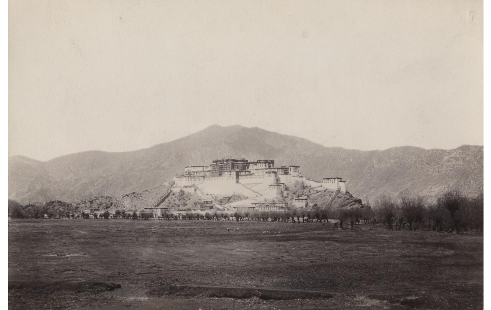
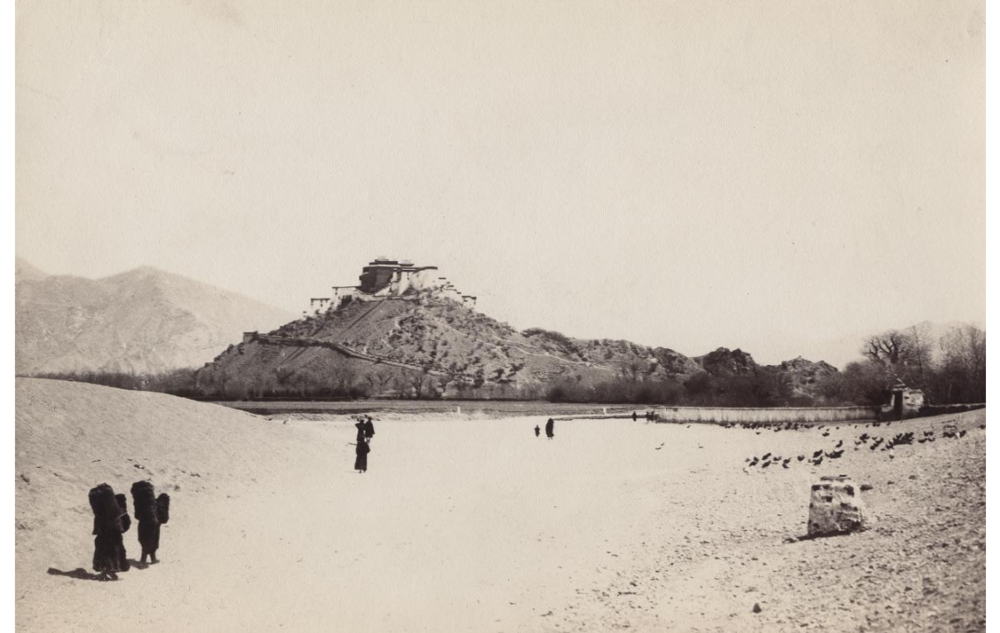

## Введение

Комплект из 50 фотографий путешественников был разослан по крупнейшим географическим обществам мира. Описания фото приводятся в [письме Александра Григорьева](/notes/grigoriev-letter/) 1904 г. «Views of Great Tibet».

Сканы фото нельзя найти на родине Ц&Н, но они в отличном качестве и общем доступе есть на сайте Библиотеки Конгресса США (далее БК).

В этой статье можно найти cross-reference фотографий из письма Григорьева и БК. Теперь можно легко найти каждую фото из письма в БК и наоборот. Так же тут можно увидеть все 50 фото на «одном листе».

Детали:

* [50 фотографий + оригинал письма](https://www.loc.gov/search/?fa=contributor:norzunov,+ovshe+m.) в БК
* Фотографии переозаглавлены сотрудниками библиотеки. Например: *Ch'agpori from SE* Григорьева превратилось в *Lhasa, Chagpori (Iron Mountain) from Southeast* в БК.
* У всех фото в БК --- совместное авторство Ц&Н. По какой-то причине в БК не стали разбираться, кто именно автор. Точное авторство есть в [письме Григорьева](/notes/grigoriev-letter/).
* Описание из письма Григорьева взято частично и дополнено другой информацией.
* Полноразмерные сканы фото: 4900х3400 пикселей, JPEG. Исходный размер фото: 5.5 x 8.5 дюймов (14 х 21.6 см). Фотопластинки: [9x6 1/2 см](/notes/photographic-dry-plates/).
* Всего 2 из 50 фото --- вертикальные.
* Исходный источник: Университет Висконсина-Милуоки (University of Wisconsin-Milwaukee). [Страница коллекции](https://collections.lib.uwm.edu/digital/collection/tibet/search/searchterm/1900-1901%20Central%20Tibet/field/para/mode/exact/conn/and) на сайте университета.
* На сайте БК фото дополнительно обработанные относительно фото на сайте UWM и местами сильно «желтят».

## Все 50 фото из БК вместе

Далее каждое фото описано в формате:

**Номер из письма Григорьева. Название из письма Григорьева. Автор.** (N --- Норзунов, Z --- Цыбиков).

* Название из БК. Ссылка на БК
* Фото

Для тех, кто, как я, любит таблицы --- вот [названия и ссылки на фотографии в табличном виде](https://docs.google.com/spreadsheets/d/1zISp11Qc0PlzSwnDUHbQ3yqndnYgmlWKukTvmVD07zw/edit?gid=1168478699#gid=1168478699).

**1\. Lhasa' from the East. N.**

Lhasa from the East. <https://www.loc.gov/item/2021670590/>

**2\. Lhasa from the North. N.**

Lhasa from the North. <https://www.loc.gov/item/2021670636/>

**3\. Marpo ri with the Potala from SSE. N.**

Lhasa, Marpori (Red Mountain) and Potala from the South-Southeast. <https://www.loc.gov/item/2021670614/>

**4\. Ditto, from a nearest point of view and more from the West. N.**

Lhasa, Potala Palace and Marpori (Red Mountain) from the West. <https://www.loc.gov/item/2021670629/>

**5\. Potala from the South. N.**

Lhasa, Potala Palace from the South. <https://www.loc.gov/item/2021670631/>

**6\. Potala from SSW. Z.**

Lhasa, Potala Palace from South-Southwest. <https://www.loc.gov/item/2021670608/>

**7\. Potala from the East. N.**

Lhasa, Potala Palace from the East. <https://www.loc.gov/item/2021670620/>

**8\. Potala from NNE. N.**

Lhasa, Potala Palace from North-Northeast. <https://www.loc.gov/item/2021670638/>

**9\. Potala from WNW. N.**

Lhasa, Potala Palace from West-Northwest. <https://www.loc.gov/item/2021670621/>

**10\. A Lhasa street during the "Ts'og Ch'od.". Z.**

Lhasa Street during the Tsog Chod Festival. <https://www.loc.gov/item/2021670633/>

**11\. Tan-gye-ling from SE. Z.**

Lhasa, Royal Monastery of Tengye-ling from Southeast. <https://www.loc.gov/item/2021670594/>

**12\. Gah-ldan K'ansar. N.**

Lhasa, Gadan Kansar Palace, the Old Palace. <https://www.loc.gov/item/2021670613/>

**13\. Yuto'g zampa. N.**

Lhasa, Yu-tog zamba, a Bridge at the Entrance to Lhasa. <https://www.loc.gov/item/2021670619/>

**14\. Bar ch'orten. Z.**

Lhasa, Bar Chorten, the Western Gate or Pargo Kaling Gateway. <https://www.loc.gov/item/2021670618/>

**15\. Ch'agpori from SE. N.**

Lhasa, Chagpori (Iron Mountain) from Southeast. <https://www.loc.gov/item/2021670605/>

**16\. Ditto from NW. N.**

Lhasa, Chagpori (Iron Mountain) from Northwest. <https://www.loc.gov/item/2021670595/>

**17\. Kunde-ling from SE. N.**

Lhasa, Kunduling Monastic Palace from Southeast. <https://www.loc.gov/item/2021670599/>

**18\. Norbu linga from the East. N.**

Lhasa, Norbu linga Palace, Summer Residence of Dalai Lamas. <https://www.loc.gov/item/2021670617/>

**19\. Amban's yamen from the South-East. N.**

Lhasa, Amban's Yamen (Residence of Chinese Official) from Southeast. <https://www.loc.gov/item/2021670596/>

**20\. Ch' ja shi tan. N.**

Lhasa, Chja shi tan, Fortified Chinese Camp. <https://www.loc.gov/item/2021670598/>

**21\. Sera. N.**

Sera Monastery. <https://www.loc.gov/item/2021670591/>

**22\. Sera. Z.**

Sera Monastery. <https://www.loc.gov/item/2021670611/>

**23\. P'urba - Ch'og from South-east. Z.**

Purba Chog Monastery from Southeast. <https://www.loc.gov/item/2021670616/>

**24\. Ditto from a nearer point of view. N.**

Purba Chog Monastery. <https://www.loc.gov/item/2021670615/>

**25\. G'ech'en-ritod. N.**

Hermitage in Gechen. <https://www.loc.gov/item/2021670603/>

**26\. Slab of stone whereupon the corpses of the dead are cut to pieces at P'abon-k'a-ritod. Z.**

Cutting Stone at the Sacred Phabongka Cemetery. <https://www.loc.gov/item/2021670635/>

**27\. De-pung. Z.**

Lhasa, Drepung Monastery. <https://www.loc.gov/item/2021670632/>

**28\. De-pung. Z.**

Lhasa, Drepung Monastery from the East. <https://www.loc.gov/item/2021670637/>

**29\. Na-ch'un. N.**

Lhasa, Residence of the State Sorcerer. <https://www.loc.gov/item/2021670612/>

**30\. Obo. N.**

Obo. <https://www.loc.gov/item/2021670624/>

**31\. The river Kich'u west of Lhasa. N.**

Kichu River West of Lhasa. <https://www.loc.gov/item/2021670607/>

**32\. The same in its lower course. N.**

Kichu River in its Lower Course. <https://www.loc.gov/item/2021670634/>

**33\. Ruins of the Donkar-jong castle. Z.**

Lhasa, Ruins of Donkar-jong Castle. <https://www.loc.gov/item/2021670597/>

**34\. Yamdok Ts'o or lake Palti from K'amba la pass. Z.**

Yamdo tso or Lake Palti. <https://www.loc.gov/item/2021670628/>

**35\. Gyantse jong. Z.**

Gyantse Jong (Gyangze), General View of Town. <https://www.loc.gov/item/2021670609/>

**36\. Gyantse jong. Z.**

Gyantse Jong (Gyangze), Chorten Goman. <https://www.loc.gov/item/2021670623/>

**37\. Tashi-lhunpo from the South. Z.**

Tashi-lhunpo Monastery from the South. <https://www.loc.gov/item/2021670630/>

**38\. Tashi-lhunpo. Z.**

Tashi-lhunpo Monastery. <https://www.loc.gov/item/2021670626/>

**39\. Yarba ritod. Z.**

Yarba Ritod Hermitage. <https://www.loc.gov/item/2021670604/>

**40\. Ruins of the De-ch'en jong castle.**

Ruins of the De-chen jong Castle. <https://www.loc.gov/item/2021670602/>

**41\. Gah-ldan. N.**

Gadan Monastery. <https://www.loc.gov/item/2021670625/>

**42\. Monument. Z.**

Monument near Gadan. <https://www.loc.gov/item/2021670606/>

**43\. Sam-ye' or Sam-yad. Z.**

Samye Monastery. <https://www.loc.gov/item/2021670601/>

**44\. Sam-ye. Z.**

Samye Monastery. <https://www.loc.gov/item/2021670627/>

**45\. Sam-ye. Z.**

Samye Monastery. <https://www.loc.gov/item/2021670622/>

**46\. Tsetan or Chetan from the West. Z.**

View of Town of Tsetan (Zetang). <https://www.loc.gov/item/2021670610/>

**47\. Tibetan manor near the Ch'ag la pass. Z.**

Tibetan Manor. <https://www.loc.gov/item/2021670592/>

**48\. Tibetan women of the lower class. N.**

Tibetan Women. <https://www.loc.gov/item/2021670593/>

**49\. Tibetan women of the better class in "Sunday" array. Z.**

Tibetan Women in Sunday Attire. <https://www.loc.gov/item/2021670639/>

**50\. Domesticated yaks on pasture. N.**

Yaks in the Pasture. <https://www.loc.gov/item/2021670600/>

## Комментарии

[**Обсудить**](https://t.me/answer42geo/19)
