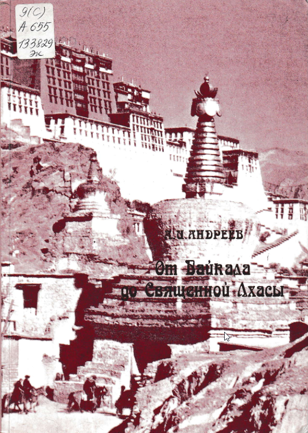

## Введение

В книге Александра Ивановича Андреева впервые приведено описание исторического контекста путешествия в Тибет Нарана Уланова и Дамбо Ульянова, а также "Проект записки о путешествии в Тибет" Нарана Уланова. Путешествие от Элисты через Кульджу в Лхасу продлилось 16 месяцев. Уланов скончался по дороге.

Андреев Александр Иванович. От Байкала до Священной Лхасы: Новые материалы о рус. экспедициях в Центр. Азию в первой половине ХХ в. (Бурятия, Монголия, Тибет). – Самара:Агни,1997 – с.335.

[Скачать PDF](https://drive.google.com/file/d/1WI-7qyEBVaEBP9EGFd3hnikhchrvxmvu/view?usp=sharing), 94 Мб.

Ульянов оставил свое описание путешествия.

Ульянов, Дамбо (1844-1913). Предсказания Будды о доме Романовых и краткий очерк моих путешествий в Тибет в 1904-1905 гг. / = Краткий очерк моих путешествий в Тибет в 1904-1905 гг. / Данбо Ульянов. — Санкт-Петербург : Центр. типо-лит., 1913. — 118 с. : 26.

## Содержание

* Предисловие
* От автора
* I. За кулисами "Большой Игры": секретная миссия в Лхасу Нарана Уланова. *Приложение*. Н.Уланов. Проект записки о путешествии в Тибет (1903)
* II. О том, как был дважды открыт мертвый город Хара-хото. *Приложение*. Ц.Г. Бадмажапов. Развалины Хара-Байшин. Фрагмент рукописи (1907)
* III. Почему русского путешественника не пустили в Лхасу. О Монголо-Тибетской экспедиции П.К.Козлова
* IV. Большевики в борьбе за Тибет. Тайные экспедиции Норкоминдела в Лхасу в 1920-е гг.
* V. Поверженные дацаны. Петербуржские востоковеды в буддийских монастырях Забайкалья. *Приложение* 1. Агван Доржиев. Письмо Председателю ЦИК СССР М.И.Калинину (1934). *Приложение* 2. Е.М. Залкинд. Отчет об обследовании дацанов Бурят-Монголии в 1939 году (1940)
* Список сокращений
* Указатель имен и названий
* Abstracts

## Комментарии

[**Обсудить**](https://t.me/answer42geo/65)
