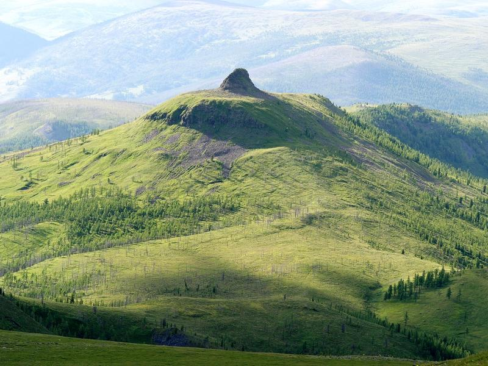
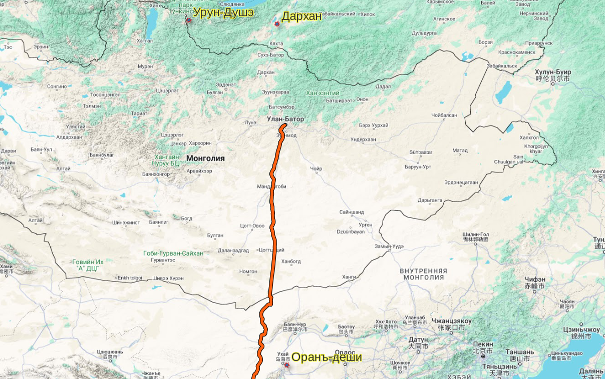

## Введение

Разыскиваем три наковальни Чингисхана.

## Наковальня #1. Боо дархан

[Источник](https://www.livejournal.com/away?to=https%3A%2F%2Fdzen.ru%2Fa%2FXhjDxD0AiACv4rHo)

> На Бурятское земле есть священное место, почитаемое многими Кузнецами шаманами --- это гора **Уран-Душэ** есть легенда. Она гласит, что ее хозяевами являются 77 небесных кузнецов-дарханов под предводительством божества Дамдин Дорлига сахюусана. Название горы переводят как «гора-**наковальня**». Она находится на стыке границ Тункинского национального парка, Закаменского района и Монголии. Гора эта резко выступает над окружающей местностью и имеет небольшую плоскую поверхность. Издали по очертанию она действительно напоминает наковальню. Отсюда возникла легенда о том, что **на этой горе Чингисхан подковал свою лошадь**.

Боо дархан --- Шаман кузнец.

Уран-Душэ или Урундучи или Урун-Душэ --- «искусная наковальня».

г. Урундучи (Наковальня #1) находится в Тункинском районе Бурятии ([карта](https://www.livejournal.com/away?to=https%3A%2F%2Fwww.google.com%2Fmaps%2Fplace%2FGora%2BUrunduchi%2F%4051.1546883,102.427929,8.58z%2Fdata%3D%214m6%213m5%211s0x5d090fb02fab01f1%3A0x922cc89a9f64a8b8%218m2%213d51.1666667%214d102.3333333%2116s%252Fg%252F1txnp5zs%3Fentry%3Dttu))

[Источник](https://1baikal.ru/assets/components/phpthumbof/cache/91184a4b3d9e41469e582af429f2f5da.6e5b9d2e3b1c233fdd869bc733c844fd.jpg) фото.

## Наковальня #2. Валерий Демин. Лев Гумилев

[Источник](https://litmir.club/br/?b=130938&p=42&ysclid=lwmdrk5muo377897497)

Демин --- автор биографии Льва Гумилева в серии «Жизнь замечательных людей».

> Но и у монголов на сей счет существуют сакральные предания. По мнению некоторых специалистов, имя Темуджин в древнемонгольском языке означало «кузнец», и будущий «покоритель вселенной» имел непосредственное отношение к этой почетной и магической профессии. Считалось, что **наковальня Чингисхана**, сделанная из таинственного металла бурын (имеющего свойства меди и железа), находилась на горе **Дархан**. Безлесую эту гору с плоской, как стол, вершиной и сегодня можно увидеть возле села **Новоселенгинска** на левом берегу реки **Чикой**. Здесь когда-то богатырь Темуджин ковал оружие для будущих своих побед...>

Новоселегинск (Бурятия) находится недалеко от впадения р. Чикой в р. Селенга ([карта](https://www.google.com/maps/@51.0418897,106.6245792,12.25z?entry=ttu)).

Либо Демин-Гумилев что-то путают, либо это повторение мифа на другой горе, поскольку г. Урундучи (Наковальня #1) находится в Тункинском районе Бурятии ([карта](https://www.google.com/maps/place/Gora+Urunduchi/@51.1546883,102.427929,8.58z/data=!4m6!3m5!1s0x5d090fb02fab01f1:0x922cc89a9f64a8b8!8m2!3d51.1666667!4d102.3333333!16s%2Fg%2F1txnp5zs?entry=ttu)).

## Наковальня #3. Чернов А. 1911. Алашаньскій хребетъ

Отчетъ геолога Монголо-Сычуаньской экспедиціи. Доложено въ засѣд. Отдѣл. Географіи Матем. и Географіи Физич. 25 января 1911 г. ([источник](https://www.geokniga.org/books/25304))

> Наконецъ я достигъ гребня, обрывавшагося въ противоположную сторону отвѣсной стѣной, Съ него развернулась величественная панорама. Горы вскорѣ кончались. За ними разстилалась обширная равнина. На желтомъ фонѣ ея рѣзко выдѣлялась блестящая извилистая лента Желтой рѣки. По ту сторону равнины, на сѣверо-востокѣ, тянулись горы Ордоса---высокій хребетъ, надъ которымъ господствовала трапецевидная вершина. Въ ней нетрудно было узнать Оранъ-деши --- «наковальню» Чингизъ-хана. Она невольно «приковывала» къ себѣ взоры, вызывая въ памяти событія сѣдой старины, тѣсно связанныя и съ нашей, столь далекой страной...

Чернов находится на хребте Алашань и смотрит через Хуан-хэ на другой ее берег, где находится то, что он называет «горы Ордоса», которые правильнее было бы называть хребтом Арбисо. И вот он видит «наковальню Чингисхана». Название Оранъ-деши фонетически похоже на Уран-Душэ («Наковальня #1»). Таким образом, возможно Чернов таким образом реминисцирует о далекой родине (он вообще оттуда родом?), «видя» одну гору в другой?

Однако, против, теории «реминисценции» выступает то что далее он несколько раз ее упоминает в локальном контексте:

> Горы Ордоса до сихъ поръ еще не были изслѣдованы. Съ геологической стороны представлялось наиболѣе интереснымъ выяснить отношеніе между Кантагери и **Арбисо**, а также дать поперечный профиль въ какой-либо части хребта. Помимо этого казалось заманчивымъ **посѣтить историческую вершину Оран-деш**и, а также выяснить условія залеганія рудныхъ залежей Кантагери. Таковы были наши планы.

... и далее

> 25-го мая мы продолжаемъ путь на сѣверъ. Въ долинѣ попадается много мухъ и кузнечиковъ. Идемъ мимо Оран-деши.

... и далее

> Ордосцы теперь отвѣчаютъ на наши вопросы, тогда какъ наканунѣ упорно молчали.
>
> Они насчитываютъ до тринадцати наиболѣе почитаемыхъ горъ. Всѣ онѣ, по-возможности, охраняются. Для этого они на нѣсколько лѣтъ назначаютъ изъ своей среды особыхъ сторожей. На нѣкоторыхъ вершинахъ сибираются для молебствій раза по три въ годъ. Плоская верхушка Оран-деши, покрытая зеленымъ ковромъ, для нихъ является особенно цѣнной по воспоминанію о «Богдыханѣ», завоевателѣ. Послѣ того какъ на ней было построено обо (и другое около Гумбума), войны будто бы прекратились. Съ тѣхъ поръ гора и почитается священной. Дунгане разрушили обо, послѣ чего началось бездождіе, засухи, хотя обо и возобновили.

Таким образом, это не вспоминания о наковальне #1 в Бурятии, это наковальня #2 (если считать наковалью Демина-Гумилева --- ошибкой).

## Комментарии

[**Обсудить**](https://t.me/answer42geo)
