## Введение

Барскаун, Барскоон, Барсхан, Барскан.

Первые сведения о Барскауне встречаются в трудах IX века, где упоминаются города и населённые пункты вдоль торгового пути между Восточным и Западным Туркестаном, сообщается о расположении Верхнего Барсхана на южном побережье Иссык-Куля. В трудах XI век, Верхний Барсхан является центром территории карлукских племен. Образовавшись в VIII веке, Верхний Барсхан просуществовал до XIII века (до нашествия Чингиз-хана). Период расцвета между X и XII веками. Являлся крупным торговым центром на Великом Шёлковом пути.

* [Википедия](https://ru.wikipedia.org/wiki/%D0%91%D0%B0%D1%80%D1%81%D0%BA%D0%BE%D0%BE%D0%BD)
* [На Google Maps](https://maps.app.goo.gl/wRgSc22RkxgUJDr27)
* [На Yandex Maps](https://yandex.ru/maps/geo/1508557164/?ll=77.672451%2C42.154095&z=12.33)

## Семенов-Тян-Шанский

Два раза упоминается у Семенова-Тян-Шанского:

1\. Про буддистского паломника китайца Сюань-цзяна ([википедия](https://ru.wikipedia.org/wiki/%D0%A1%D1%8E%D0%B0%D0%BD%D1%8C%D1%86%D0%B7%D0%B0%D0%BD)).

> Путь паломника шел через Тян-Шань, вероятно по Заукинскому горному перевалу, спускался на южное побережье Иссык-Куля (Терскей), по которому шел далее через реку Барскаун, выходил с западной оконечности озера на р. Чу.

Возможно ППСТШ ошибается, от Аксу Сюань-цзян скорее перешел бы через перевал Бедель ([википедия](https://ru.wikipedia.org/wiki/%D0%A1%D1%8E%D0%B0%D0%BD%D1%8C%D1%86%D0%B7%D0%B0%D0%BD)) и, видимо, перевал Суек, они находятся по дороге, а Джука (Заука) в стороне от основного на тот момент пути. Дальше он мог попасть в Барскаун, но не поперек, а вдоль реки, по ее долине и одноименному ущелью.

Второй вариант, упоминаемый у Александровой - перевал Музарт.

> 34 ...подошел к Ледяной Горе (Линшань 凌山· 一 Здесь Сюань-цзан миновал перевал Музарт, держась того пути, который связывал Аксу и Кульджу, где находится Пик Победы (его Ледяная Гора).

Цитата по: Сюань-цзан, 2012. Записки о западных странах [эпохи] Великой Тан (Да Тан си юй цзи). Введение, перевод с китайского и комментарий Н.В. Александровой. — М.: Издательская фирма "Восточная литература", 2012. — 462 с.

Сам Барскаун у Сюань-цзяна не упоминается, упоминается Иссык-куль (Большое Чистое озеро, Дацинчи [大清 池](https://zh.wikipedia.org/zh-hans/%E4%BC%8A%E5%A1%9E%E5%85%8B%E6%B9%96)).

2\. Про Кызыл-Джар (Красный утес).

> С этой поры (конца VIII века) местность Яр (Кызыл-Джар) сделалась насиженной по своей культурности и уже не уступала другим подобным местностям на северном склоне Тян-Шаня, а именно Суябу в стране «тысячи источников» и Барскауну близ впадения реки этого имени в Иссык-Куль на реке Топе, также притоке этого озера.

Суяб это нынешний Токмак.

Цитаты по:

Мемуары П. П. Семенова-Тян-Шанского [Текст] : [в 5 т.] / [вступит. ст. и коммент. И. Е. Дронова]. - Москва : Кучково поле, 2018-2019. - 24 см. - (Золотой фонд Русского географического общества).; ISBN 978-5-9950-0890-3

Т. 2: Путешествие в Тянь-Шань, 1856-1857. Т. 2. - 2019. - 510, 1 с., 24 л. цв. ил.; ISBN 978-5-9950-0889-7 : 1500 экз.

## Махмуд аль-Кашгари и его карта

Уйгурский филолог, родился в Барскауне (Барсхан) в 1028 или 1029 ([википедия](https://ru.wikipedia.org/wiki/%D0%9C%D0%B0%D1%85%D0%BC%D1%83%D0%B4_%D0%B0%D0%BB%D1%8C-%D0%9A%D0%B0%D1%88%D0%B3%D0%B0%D1%80%D0%B8)). Кроме своего основного труда "Собранию тюркских языков", оставил после себя первую известную науке карту расселения тюркских племён, 11 века.

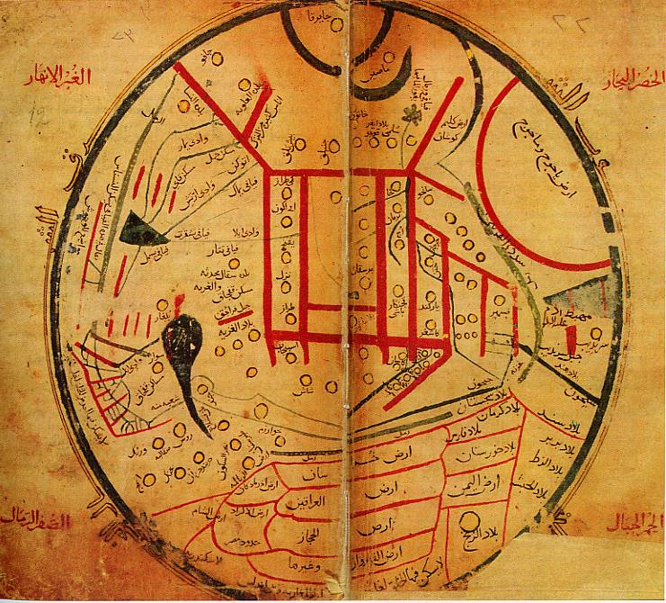

Карта перерисованная вручную. Язык - арабский.

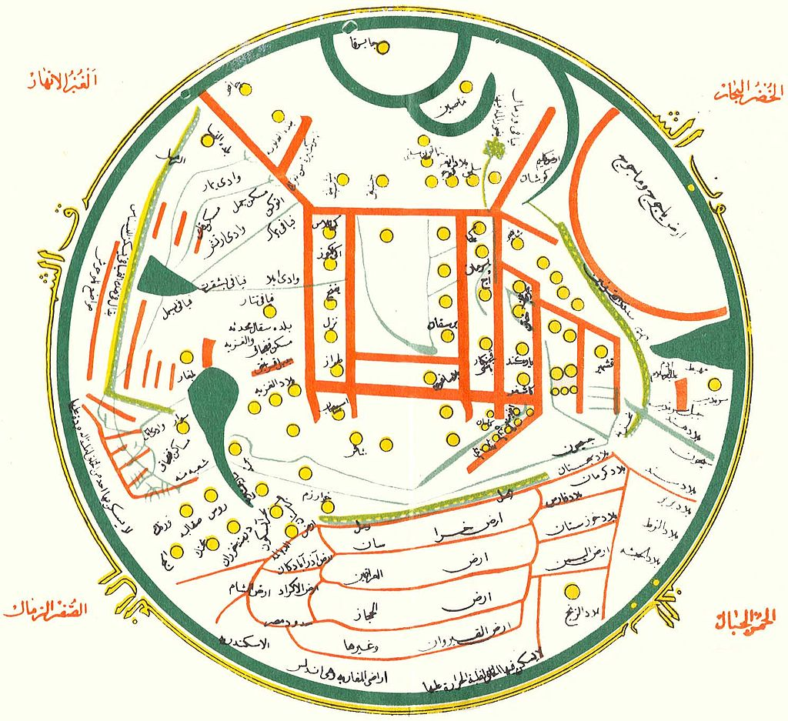

Еще одно переиздание, язык - киргизский. Висит в офисе госкартографии.

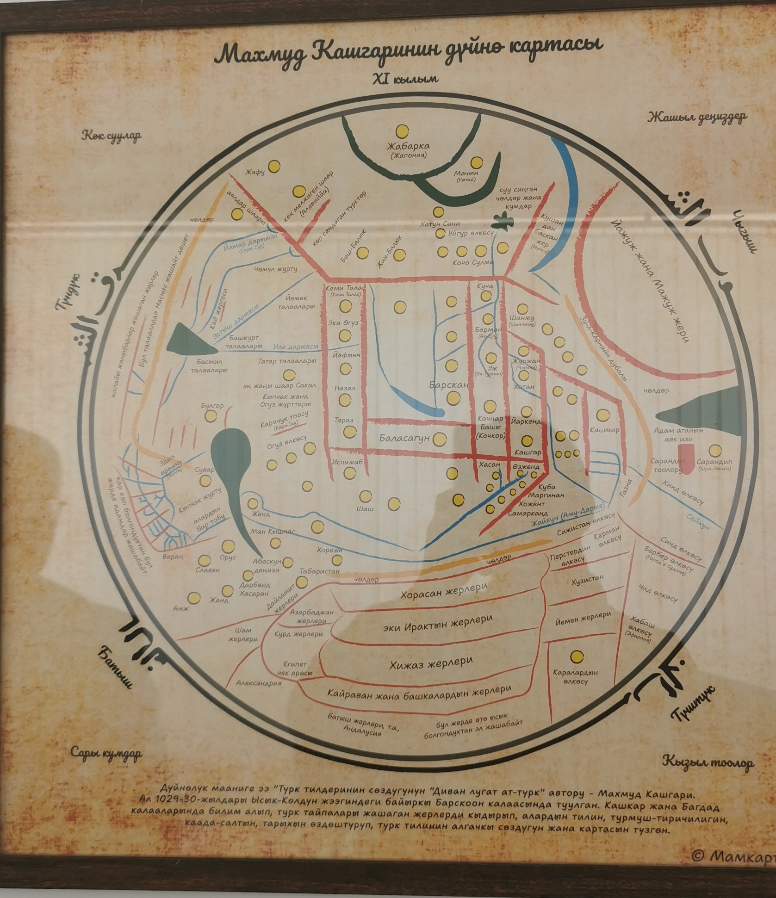

По этой карте видно, что Барскаун находится в самом центре, рядом с ним Баласагун - столица государства Караханидов, нынешнее место расположения памятника Бурана ([википедия](https://ru.wikipedia.org/wiki/%D0%91%D0%B0%D1%88%D0%BD%D1%8F_%D0%91%D1%83%D1%80%D0%B0%D0%BD%D0%B0)).

## Городище Барскоон

Городище Барскоон VIII века - караван-сарай, один из форпостов на ответвлении Великого Шёлкового пути соединяющем Аксу и Барсхан ([Google Maps](https://www.google.com/maps/place/%D0%93%D0%BE%D1%80%D0%BE%D0%B4%D0%B8%D1%89%D0%B5+%D0%91%D0%B0%D1%80%D1%81%D0%BA%D0%BE%D0%BE%D0%BD+VIII+%D0%B2/@42.096608,77.5928037,15.08z/data=!4m14!1m7!3m6!1s0x3885eda0feaaa477:0x8e673aa07eacb0af!2z0JHQsNGA0YHQutC-0L7QvSDRiNCw0LDRgNGL!8m2!3d42.0535628!4d77.5979805!16s%2Fg%2F11b7818jyx!3m5!1s0x3885ed485c211d17:0x6b2e4270e6ddbe13!8m2!3d42.0925937!4d77.5946134!16s%2Fg%2F11kbkvp3cc?entry=ttu&g_ep=EgoyMDI1MDMyNS4xIKXMDSoJLDEwMjExNjM5SAFQAw%3D%3D)). Расположено по дороге от Иссык-куля на Кумтор примерно в 7 км от села.

Находится на территории фермерского хозяйства, есть калитка. Фермер использует городище для выгула скота, но сажать что-либо ему запрещено.

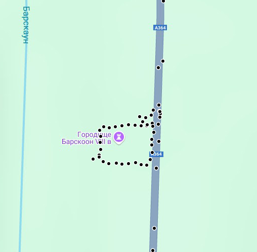

Все фото - автора. Дата: 29.03.2025

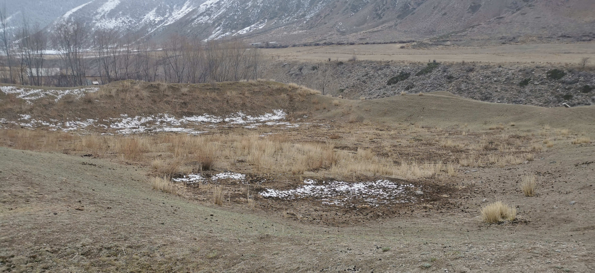

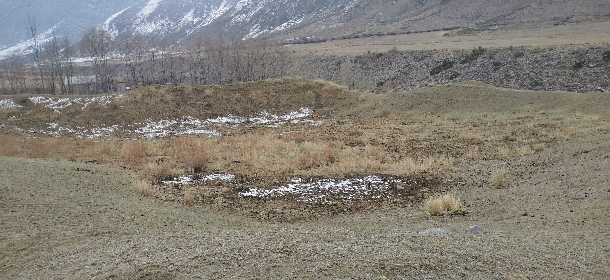

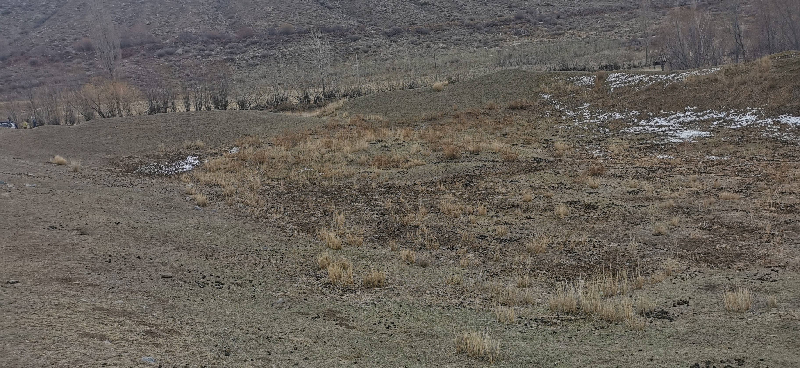

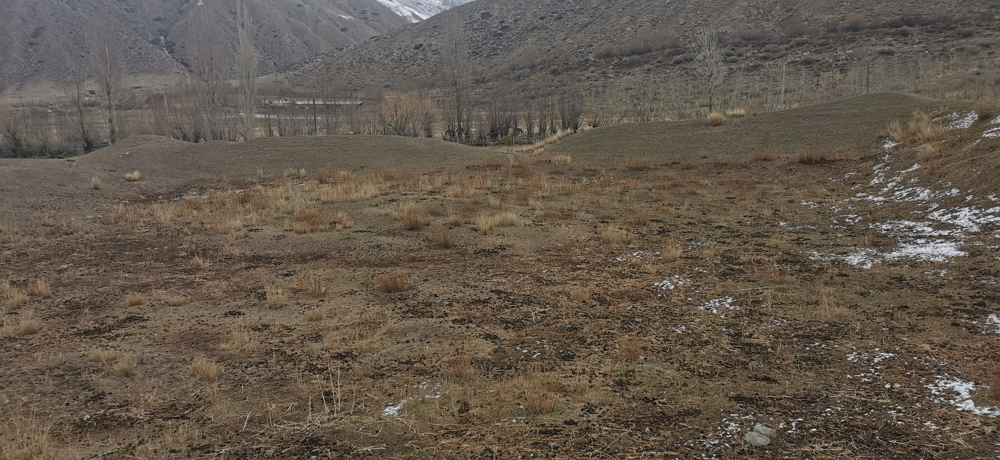

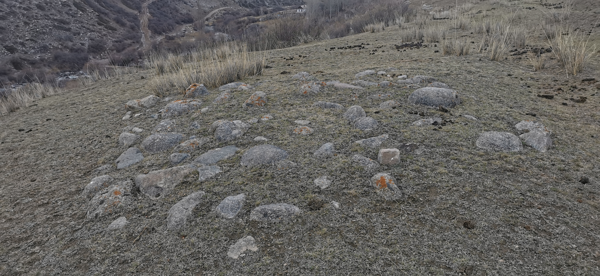

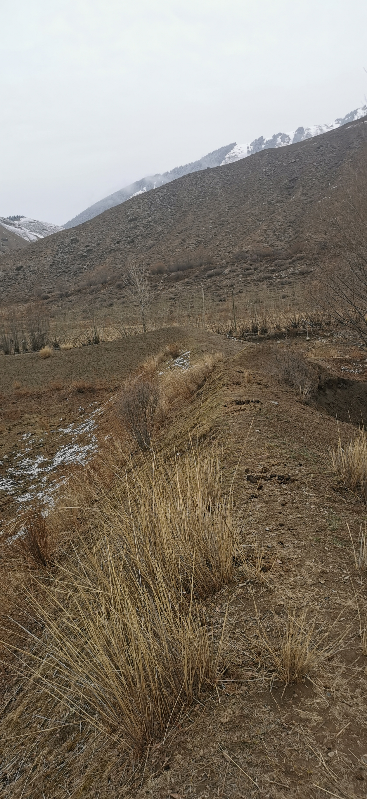

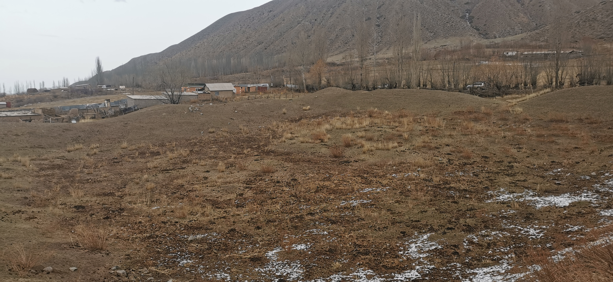

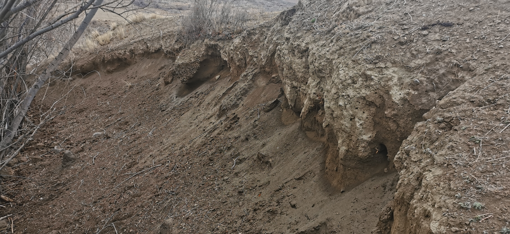

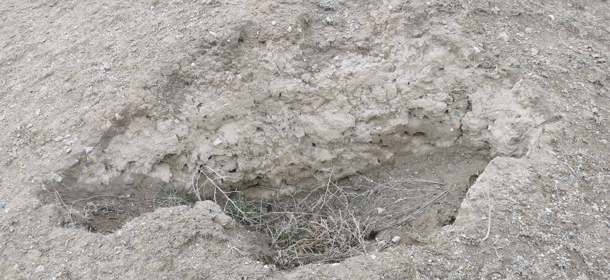

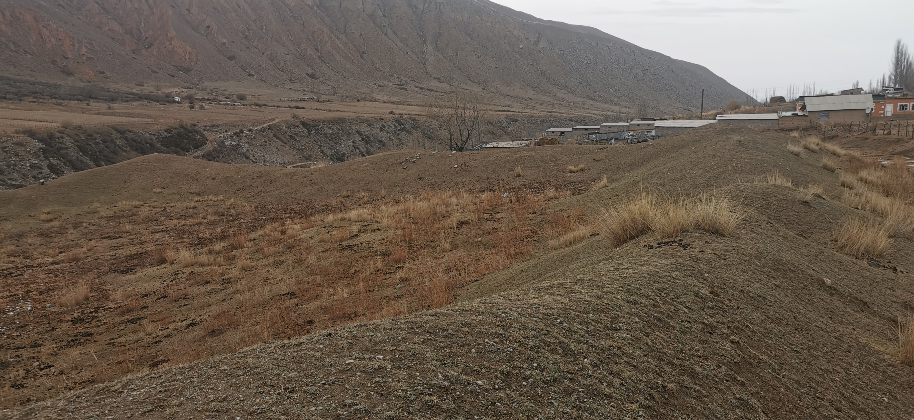

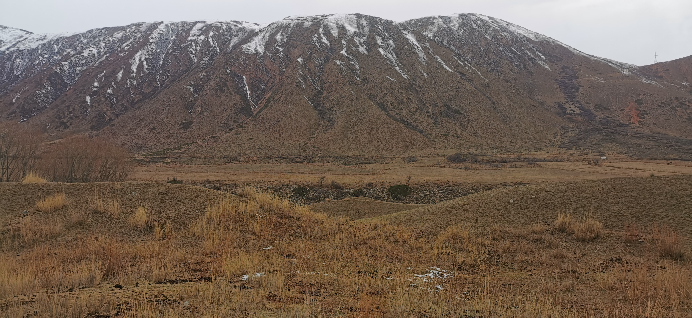

## Комментарии

[**Обсудить**](https://t.me/answer42geo/75)
