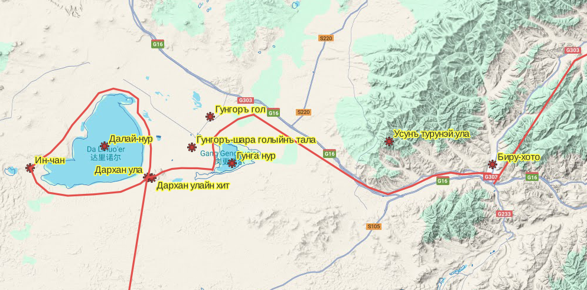
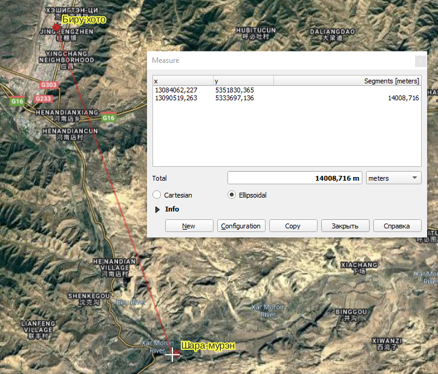
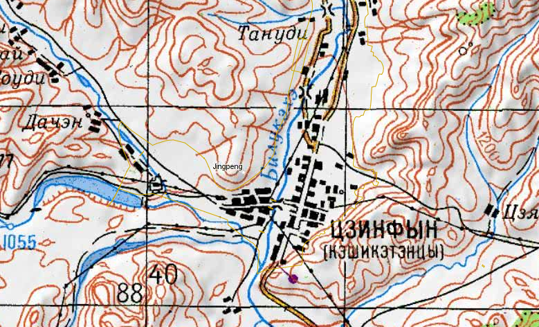

## Введение

Исходно Биру-хото был неправильно распознан как Шилин-хото ([подробнее](/notes/pozdneev-mongolia/)). Шилин-хото располагается на удобной дороге в Ургу и было сделано предположение, что Позднеев возвращался в Ургу по ней. Оказалось, что это не так и двигался он совершенно в другом направлении. Разбираемся где Биру-хото на самом деле.

> Биру хото извѣстенъ у китайцевъ подъ именемъ Цзинь-пынъ чэн'а (金棚城). Городъ располагается на самомъ лѣвомъ берегу Усунъ турун'а, при главной хурѣ кэшиктэнскаго хошуна и приблизительно въ 30 ли къ сѣверу отъ Шара мурэни.

Источник: Монголiя и Монголы. Результаты поездки въ Монголию, исполненной въ 1892-1893 гг. А.Позднеевымъ. томъ II. Дневникъ и маршрутъ 1892 года. Издание Императорскаго Русскаго Географическаго общества. С.-Петербургъ. 1896 ([распознанный и отредактированный фрагмент](https://docs.google.com/document/d/11YWPiQ_rjlXhhSzx4Phw0C0Kd4ROE9SD/edit) путешествия до Биру-хото, стр. 330-357).

Биру-хото один раз упоминается Цыбиковым. Вот этот фрагмент:

> Все абаганаты \[Абаганаты -- монгольские роды, по языку относящиеся к Чахарской группе южно-монгольского наречия\] живут в юртах и кочуют. Не сеют, по покупают зелень и хлеб в Биру-хото, находящемся на северо-востоке от Долоноpa \[Биру-хото -- город на р. Усун-Турун, Долонор -- город на р. Уртэнгийн-гол\].

Источник: Цыбиков. Дневник поездки в Китай в 1909 г. ([wikireading](https://document.wikireading.ru/7249)). Как можно видеть, Шилин-хото находится строго на север от Долонора и уже поэтому --- не подходит.

Кроме этого упоминания, по Биру-хото нет совершенно никакой информации, которая помогла бы его идентифицировать. Отследим небольшой фрагмент маршрута Позднеева с основными топонимами непосредственно перед Биру-хото:

30.05 6:50 из Дархан улы вокруг оз. Далай-нур

30.05 16:20 прибыли в Ин-чан

30.05 18:20-22:45 из Ин-чан в Дархан улайн сумэ

31.05 10:45 из Дархан улайн сумэ

31.05 14:00 западный берег оз. Гунга нур

31.05 19:15 ночевка после песков Ирінъ хошунай элэсу в увалах с хорошим кормом

01.06 6:10 вышли дальше

01.06 7:25 въехали в горы Усун турунэй ула

01.06 10:10 переправа через р. Усун-турун

01.06 17:30 проехали мимо Биру-хото (позже остановились в городе)

03.06 7:40 выехали на СВ по долине Усун-туруна

Далее путь Позднеева лежит на С --- СВ к р. Цаган-мурэн и далее по ней. 27.06 он оказался в Урге.

**Далай-нур (озеро)**

Другие названия: Бу-юйр хай, То-ро хай-цзы

**Ин-чан (развалины города)**

Другие названия: Yingchang ([wikimapia](http://wikimapia.org/19869880/Ruins-of-Yingchang)), Инъ-чанъ-фу, Инъ-чанъ-лу

**Дархан улайн сумэ (монастырь, деревня)**

Другие названия: Darihanwula Sumu, 达日罕乌拉苏木 ([Google Maps](https://www.google.com/maps/place/Darihanwula+Sumu,+Hexigten+Banner,+Chifeng,+Inner+Mongolia,+China,+025371/@43.2394496,116.7347759,15z/data=!3m1!4b1!4m15!1m8!3m7!1s0x5e1b1a4e5312a6db:0x17b6f4592c150b93!2sJingpengzhen,+Hexigten+Banner,+Chifeng,+Inner+Mongolia,+China,+025350!3b1!8m2!3d43.25862!4d117.54157!16s%2Fg%2F1hbpx54tr!3m5!1s0x5e04b5d361c85edf:0x54ee836c4aab2723!8m2!3d43.239435!4d116.7450971!16s%2Fg%2F1xy2rn7t?entry=ttu))

**Усун-турун (река)**

Совершенно никаких упоминаний нигде. На 5 км --- Билукэхэ, 碧柳河 Biliu River.

**Шара-мурэн (река)**

Шара-мурэн ([wiki](https://ru.wikipedia.org/wiki/%D0%A8%D0%B0%D1%80%D0%B0-%D0%9C%D1%83%D1%80%D1%8D%D0%BD)), Xar Moron ([wiki](https://en.wikipedia.org/wiki/Xar_Moron_River)), Hwang ho.

Шара-Мурэн (кит. упр. 西拉木伦河, палл. Силамулуньхэ, Xilamulun в переводе с монгольского --- «жёлтая река» --- монг. Шар мөрөн). Относится к бассейну реки Ляохэ.

**Биру-хото (город)**

После прокладки маршрута сложился хорошо подходящий вариант: Цзинпэн, Jingpengzhen, 经棚镇 ([Google Maps](https://www.google.com/maps/place/Jingpengzhen,+Hexigten+Banner,+Chifeng,+Inner+Mongolia,+China,+025350/@43.2586347,117.5312488,15z/data=!3m1!4b1!4m6!3m5!1s0x5e1b1a4e5312a6db:0x17b6f4592c150b93!8m2!3d43.25862!4d117.54157!16s%2Fg%2F1hbpx54tr?entry=ttu))

У Позднеева Цзинь-пынъ чэн это 金棚城 (Золотой шалаш), но актуальное название города 经棚镇 (Проходная застава), возможно он ошибся с первым иероглифом. Первый иероглиф отличается, но произношение одинаковое.

> приблизительно въ 30 ли къ сѣверу отъ Шара мурэни

30 ли это примерно 15 км, что соответствует расстоянию на карте.

> Вообще городъ растягивается длинною линіею съ запада на востокъ, послѣдуя въ этомъ направленіи теченію Усунъ-туруна, съ сѣвера же на югъ съ нимъ соприкасаются постройки кэшиктэнской хошунной хурі.

На [map.baidu.com](https://map.baidu.com/search/%E5%85%8B%E4%BB%80%E5%85%8B%E8%85%BE%E6%97%97/@13091565.797305912,5320935.938047259,12.84z?querytype=s&da_src=shareurl&wd=%E5%85%8B%E4%BB%80%E5%85%8B%E8%85%BE%E6%97%97&c=65531&src=0&wd2=%E8%B5%A4%E5%B3%B0%E5%B8%82%E5%85%8B%E4%BB%80%E5%85%8B%E8%85%BE%E6%97%97&pn=0&sug=1&l=12&b=(4128160.25,7443354.89;4247008.25,7505242.89)&from=webmap&biz_forward=%7B%22scaler%22:1,%22styles%22:%22pl%22%7D&sug_forward=a2c8cd15b6cba6dc4e2fdfea&device_ratio=1) на месте города Jingpeng написано 克什克腾旗 Keshiketeng qi (Keshiketeng Banner).

Так же см. Кэшикэтэнцы на 5км генштабе ([nakarte](https://nakarte.me/#m=13/43.24614/117.55706&l=T/W)).

Итого: можно уверенно сказать, что Биру-хото, Цзинь-пынъ чэн, 金棚城 --- это Цзинпэн, Jingpengzhen, 经棚镇 ([Google Maps](https://www.google.com/maps/place/Jingpengzhen,+Hexigten+Banner,+Chifeng,+Inner+Mongolia,+China,+025350/@43.2586347,117.5312488,15z/data=!3m1!4b1!4m6!3m5!1s0x5e1b1a4e5312a6db:0x17b6f4592c150b93!8m2!3d43.25862!4d117.54157!16s%2Fg%2F1hbpx54tr?entry=ttu)).

Специальное спасибо Никите М., которые помог отказаться от гипотезы, что Биру-хото это Шилин-хото.

## Комментарии

[**Обсудить**](https://t.me/answer42geo/13)
