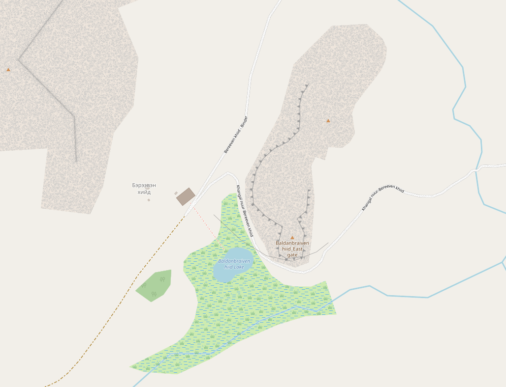

## Введение

Задача:

> Река Хураа, Хурхаа, Тураа? На ней построен монастырь Брээвэн хийд в Хэнтийском аймаке.

## Балданбэрээвэн-хийд

Балданбэрээвэн-хийд - буддийский храм школы гелуг. Расположен в долине реки Баруун-Жаргалантын-гол, сомон Умнедэлгэр, аймак Хэнтий ([википедия](https://ru.wikipedia.org/wiki/%D0%91%D0%B0%D0%BB%D0%B4%D0%B0%D0%BD%D0%B1%D1%8D%D1%80%D1%8D%D1%8D%D0%B2%D1%8D%D0%BD-%D1%85%D0%B8%D0%B9%D0%B4)). Располагается в 8 км на северо-восток от оз. Хангалын нуур. Когда-то очень крупный монастырь, полностью разрушен в конце 1930-х. Постепенно восстанавливается в наше время.

Варианты написания:

* Брээвэн хийд
* Балданбэрээвэн-хийд (Википедия)
* Baldanbraiven hiid (OpenStreetMap)
* Breven Kid (Google Maps)
* Baruun jargalantyn khiid ([Documentation of Mongolian Monasteries](http://www.mongoliantemples.org/en/component/domm/1852?view=oldtempleen))
* Baraybang Hiid (Wikimapia)
* Бревен-кид (Дзу) (Карта Пржевальского)

Координаты: 48°12′00″ с.ш. 109°26′00″ в.д., (48.2073368,109.4176724)

На картах:

* [OpenStreetMap](https://www.openstreetmap.org/#map=14/48.19719/109.42357) - хорошая отрисовка монастыря и окрестностей.
* [Google Maps](https://www.google.com/maps/@48.2073368,109.4176724,14.38z) - только сам топоним.
* [Yandex Maps](https://yandex.ru/maps/?ll=109.464780%2C48.176521&z=12.11) - пусто.

На изображении со спутника различимы детали конструкции на крыше также видимые на фотографии современного здания.

Координаты Балданбэрээвэн-хийд можно считать координатами высокой точности.

## Баруун Жаргалантын хийд

[Информация из Documentation of Mongolian Monasteries](http://www.mongoliantemples.org/en/component/domm/1852?view=oldtempleen).

В 2.5 км на запад от координат Балданбэрээвэн-хийд в реестре монгольских монастырей обозначен монастырь Baruun jargalantyn khiid (Баруун Жаргалантын хийд). На [общей карте](http://www.mongoliantemples.org/en/component/domm/?view=map&amp;Itemid=159) его почему-то нет, можно найти через списки монастырей по аймакам.

Координаты: 48°12′ с.ш. 109°24′ в.д. (48.2, 109.4)

Из описания:

> Хэнтий аймгийн Өмнөдэлгэр сумын Баруун жаргалантын хийд Хуучин Сэцэн хан аймгийн Хөвчийн жонон вангийн хошуу, одоогийн Хэнтий аймгийн Өмнөдэлгэр сумын нутагт, сумын төвөөс баруун зүүн хойд зүгт 70 км-т, Баатар цогт уулын аманд, Баруун Жаргалантын амны баруун биед уг хийд оршиж байжээ. Аман эх сурвалж: юм. Барэйвүнгээсээ зүүн хойно Баруун Жаргалантын суварга гэж байсан бөгөөд ганц хоёр лам хурдаг жижиг хурлын газар байжээ. Холбогдох эх сурвалж: -Дашийн Батгомбын ярилцлага (1918 онд төрсөн Хэнтий аймгийн Өмнөдэлгэр сумын өндөр настан).

Перевод:

> Монастырь Баруун Жаргалантын хийд сомона Умнедэлгэр аймака Хэнтий.
Ранее располагался на территории хошуна Хөвчийн жонон ван (википедия: Хувчин-жонон-вана) Сэцэн-ханского аймака, ныне — на территории сомона Умнедэлгэр аймака Хэнтий, примерно в 70 км к северо-востоку от центра сомона, в долине горы Баатар Цогт, на западной стороне ущелья Баруун Жаргалант.
>
> По устному источнику: к северо-востоку от Барэйвүнг была ступа Баруун Жаргалантын, и там находилось небольшое место для молитв, где собирались один-два ламы.
>
> Связанный источник: интервью с Даш Батгомбом (род. в 1918 году, долгожитель из сомона Умнедэлгэр, аймак Хэнтий).

Судя по картам в данной точке, где отсутствуют какие-либо следы деятельности и нет рек, в данном случаем мы имеем дело с неточной локацией в реестре.

Согласно информации о происхождени монастыря ([википедия](https://ru.wikipedia.org/wiki/%D0%91%D0%B0%D0%BB%D0%B4%D0%B0%D0%BD%D0%B1%D1%8D%D1%80%D1%8D%D1%8D%D0%B2%D1%8D%D0%BD-%D1%85%D0%B8%D0%B9%D0%B4#%D0%92%D0%BE%D0%B7%D0%BD%D0%B8%D0%BA%D0%BD%D0%BE%D0%B2%D0%B5%D0%BD%D0%B8%D0%B5)):

> Монастырь Балданбэрээвэн-хийд был основан в 1654 году ламой Цэвээндоржем в хошуне Хувчин-жонон-вана Сэцэн-ханского аймака.

Можно заключить, что Балданбэрээвэн-хийд и Баруун Жаргалантын хийд - одно и тоже место с неправильной локацией (и названием) в реестре монгольских монастырей.

## На карте Пржевальского

Бревен-кид (Дзу)

## Монастырь и реки

Задача (повтор):

> Река Хураа, Хурхаа, Тураа? На ней построен монастырь Брээвэн хийд в Хэнтийском аймаке.

Монастырь располагается в междуречье р. Джаргалантын-Гол (топокарты 2км) или Жаргалантын гол (топокарты 1км) и небольшого её притока (без названия на топокартах). Дополнительное слово Баруун (монг., западный) в названии реки Баруун-Жаргалантын-гол в Википедии является по всей видимости лишним.

Жаргалант — монг., радостный, счастливый. Очень распространенный топоним в Монголии.

**Вариант 1: Монастырский ручей**

Хурээ (хүрээ, хураа как неточная транскрипция?) — монастырское поселение. Используется для обозначения буддистского монастыря.

Поскольку монастырь располагается несколько ближе к притоку, чем к основному руслу Жаргалантын гол, можно предположить, что этот приток и носит название Хурээ (хураа) (река Монастырская или Монастырский ручей).

**Вариант 2: Хурхаа как Хурхын**

Жаргалантын гол является притоком реки Хурхын-гол (в свою очередь впадает в Онон-Гол). 

Возможно задачу не нужно понимать точным образом и в ней говорится о положении монастыря в более обширном районе, а не о конкретном месте. От монастыря до основного русла Хурхын-гол всего 16 км.

На карте Пржевальского (см. рис. выше) река называется Хурху.

## Комментарии

[**Обсудить**](https://t.me/answer42geo/84)
