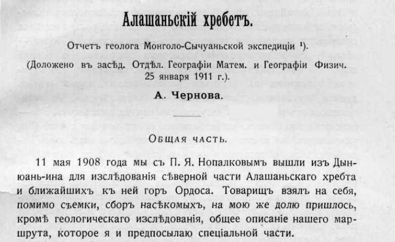

## Введение

Хотя это отчет геолога, про геологию в нем очень мало. Зато много про культуру, политику и общую географию.

Чернов шел из Дынь-юань-фу (Дын-юань-ин, Баян-хото, Алашань) на север вдоль западной границы Алашанского хребта, потом обошел его с севера и спустился по восточной границе в Нинся-фу (Иргай-хото, Иньчуань) и обратно через перевал короткой дорогой.

В отчете встречается название гор Алашанского хребта как у Цыбикова --- Бугуту. Однако, другие искомые топонимы Цыбикова, Баян-сумбэр и Баян Богдо в отчете не упоминаются.

Скачать [Чернов, 1911. Алашанский хребет. Отчет геолога Монголо-Сычуаньской экспедиции.pdf](https://drive.google.com/file/d/1J5_VdLvOuSAfqt4O6sM5ieBRwlMvO2cn/view?usp=drive_link)

Открыть [распознанный текст](https://docs.google.com/document/d/14P_ADVpBTBiMDql9a-P56bI4Z7u3Fu2s/edit?usp=drive_link&ouid=112245657670169384946&rtpof=true&sd=true).

## Топонимы

Другие упоминаемые в тексте топонимы:

1. Дын-юань-ин (город)
2. Ордос (горы)
3. Цончжи (скала)
4. Эмчин-усу (колодец)
5. Мурин-гол (ущелье, река?)
6. Долон-хорё (гора)
7. Цзурху (Сердце) (вершина)
8. Намджир-вандынъ (камень)
9. Эргэнъ (колодец)
10. Шатэн-голъ (ущелье, река?)
11. Арыкшан-хара-ола (горы)
12. Учётэн-голъ (ущелье, река?)
13. Хара-хото (на Желтой реке, Пин-ло)
14. Уургин- худукъ (колодец)
15. Уургин-шили
16. «Ихэ-ола» (Большія горы)
17. Чолу-онгоцо (Каменное корыто) (колодец)
18. Хан-ола
19. Агуйн-ола
20. Бургустэн-гол (река)
21. Баин-ола
22. Оранъ-деши --- «наковальня» Чингизъ-хана (гора)
23. Хошун-усу (колодец)
24. Ши-цзу-ицзе, монг. Цзэлэ (село)
25. Куку-хото
26. Куку-норъ (соленое озеро)
27. Намбарасэнъ-хитъ, Намбо-хитъ (кумирня)
28. Дурбун-усу (колодец)
29. Кантагери  (хребет)
30. Арбисо (хребет)
31. Гуй-хуа-ченѣ
32. Хапцагайту (перевал)
33. Арбусын-ола (гора)
34. Цаган-тохой (урочище)
35. Дэрисутэн-худукъ (колодец)
36. Чолумбай (кумирня)
37. Уу-худукъ (колодец)
38. Бауту
39. Долон-ширкэ (кумирня)
40. Дэрисутэн-хитъ (кумирня)
41. Раши-джунъ (кумирня)
42. Гун-усу (колодец)
43. Шо-му-инъ (село)
44. Цаган-тохой (село)
45. Цаган-Утай (монастырь)
46. Цаган-тохойн-голъ (ущелье, река?)
47. Чабагатэн-гол
48. У-тай (Шань-си, монастырь)
49. Чун-ху-пу (село)
50. Шен-ченъ (Шуни-хото) (городок)
51. Пи-са-ченъ (развалины, см. Обручев)
52. Чжин-бей-пу (село, по Обручеву, Чин-ди-пу)
53. Ку-мы-цзе (ущелье)
54. Цаган-субурганъ (монастырь)
55. Шара-кутулъ (перевал, Да-лин-коу)
56. Шанг-шуй (ущелье)

## Комментарии

[**Обсудить**](https://t.me/answer42geo/11)
