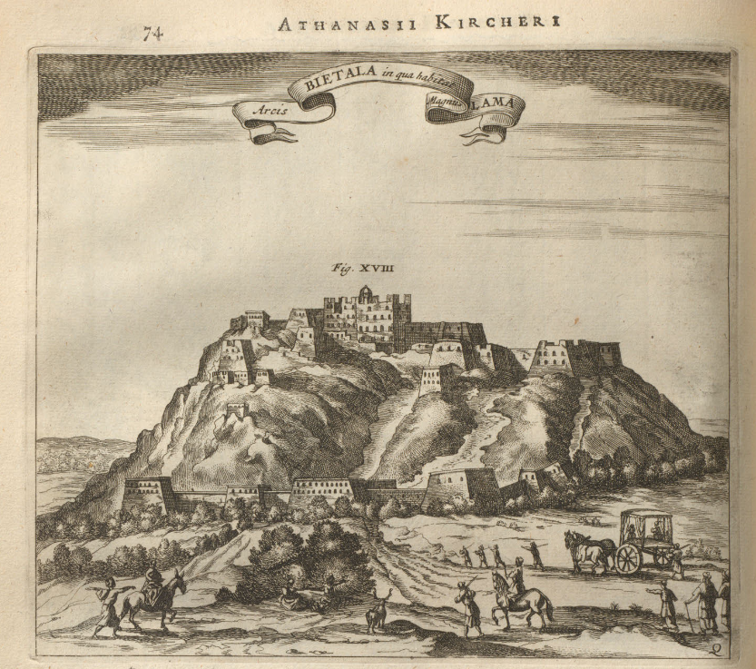
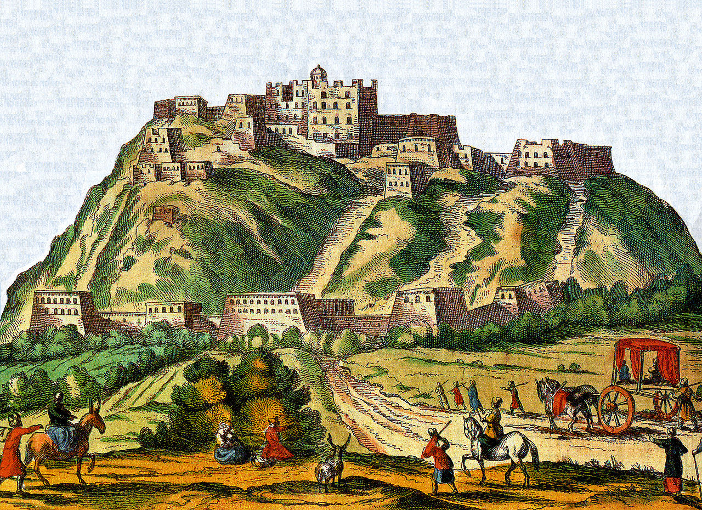
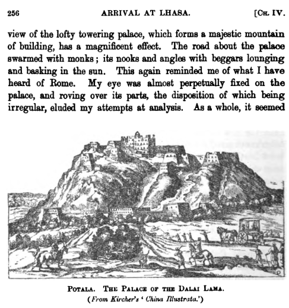

## Введение

China Illustrata ([wiki](https://en.wikipedia.org/wiki/China_Illustrata)) --- компилятивное описание Китая Афанасия Кирхера (Athanasius Kircher) ([wikipedia-ru](https://ru.wikipedia.org/wiki/%D0%9A%D0%B8%D1%80%D1%85%D0%B5%D1%80,_%D0%90%D1%84%D0%B0%D0%BD%D0%B0%D1%81%D0%B8%D0%B9), [wikipedia-en](https://en.wikipedia.org/wiki/Athanasius_Kircher)) опубликованное в 1667 г.

Полное название книги: Athanasii Kircheri e Soc. Jesu China monumentis, qua sacris quà profanis, nec non variis naturae & artis spectaculis, aliarumque rerum memorabilium argumentis illustrata auspiciis Leopoldi primi, Roman. Imper. semper Augusti, munificentissimi mecaenatis.

[Оригинал](https://archive.org/details/McGillLibrary-126082-3028/page/n17/mode/2up) на латыни.

Полный перевод на английский, переводчик Charles D. Van Tuyl:

<https://htext.stanford.edu/content/kircher/china/kircher.pdf> (complete English version, translated by Charles D. Van Tuyl from the 1667 -- and not 1677 -- original Latin edition) ([Википедия](https://en.wikipedia.org/wiki/China_Illustrata)).

Сам Кирхер никогда ни в Китае, ни в Тибете не был. В China Illustrata приводится описание путешествия Fr. Albert de Dorville ([wiki](https://en.wikipedia.org/wiki/Albert_Dorville)) и Fr. Johannes Grueber ([wiki](https://en.wikipedia.org/wiki/Johann_Grueber)) (см. стр. 64, 66 в первоисточнике или 58, 60 в переводе). Они добрались из Пекина в Агру (Индия) через Тибет и побывали в Лхасе. Д'Орвиль умер в Агре, а Грюбер оставил описание путешествия Кирхеру, который и добавил его в свой труд.

В China Illustrata появляется первое изображение Поталы (Bietala). Принято считать, что это --- рисунок Грюбера.

Иллюстрация используется повсюду. Например у Деникера в [статье про первую фотографию Лхасы](/notes/deniker-first-photo-fr/) (перевод), где он сравнивает иллюстрацию (иронизирует относительно некоторых деталей) и фото. Цитата по переводу статьи:

> Этому краткому описанию и отчасти причудливому рисунку (на нем видно экипажи, хотя тибетцы до сих пор знают только паланкин как средство передвижения) сегодня можно противопоставить точную фотографию...

Несколько цитат из самой China Illustrata, оригинал на латыни и перевод на английский.

Оригинал, стр. 71

> Sunt intra vaftiffimum *Tangutiсum* Regnum alia Regna inclufa, & funt primo *Barantola*, quam etiam *Lassa* vocant, cum cognomine Metropoli Regni. Regem proprium habet, totum fædis gentilitatis erroribus intricatum , differentia Numinum Idola colit; inter quæ principem locum obtinet, quod *Menipe* vacant , & novemplici capitum difcrimine in conum monftrofo faftigio affurgit, de quo in fequentibus, de Numinibus feu Idolis Sinenfium ????????, uberius loquimur. Ante hoc ftulta gens infolitis gefticulationibus facra fua facit , identidem verba hæc repetens: *O Manipe mihum, O Manipe mi hum*; id eft, *Manipe salva nos*.

Перевод, стр. 64

> Inland from the vast *Tanguth* kingdom are other landlocked kingdoms. The first of these is *Barantola*, also called *Lassa* after the name of the capital. It has its own king and is all involved in the abominable errors of the heathen. It worships different images of divinities. Among these idols the principal is that which they call Menipe. It rises to a great height and has a ninefold division of heads in a cone shape.
> Later, in the section concerning the many - headed idols of the Chinese, we will speak more fully of this god. The stupid people worship before this idol making unusual gestures and performing their rites while repeating over and over, "O Manipe mi hum, O Manipe mi hum," that is, "Manipe, save US!"

Оригинал, стр. 74

> Arcis quoque, quam *Bietala* vocant, ad finem urbis *Barantole*, in qua Magnus Lama refidet, fchenographiam, quam Figura XVIII referr, una apponendam cenfuerunt : Tantautem authoritatis efl in tota Tartaria, ut nullus Rex alicubi in auguretur, qui non prius miffis Legatis cum inæftimabilibus muneribus a Magno *Lama* benedictionem pro felici Regniaufpicio pofiulet.

Перевод, стр. 67

> The fathers also thought that they ought to include a view of the citadel called *Bietala*, at the city limits of *Barantola*, where the Great Lama resides. See Figure XVIII. So great is his authority in all Tartary that no king is appointed over anything until he has sent delegates with priceless gifts and has begged the benediction of the Great Lama for the happy augury of his reign.

«Отцы» это Albert de Dorville и Johannes Grueber, см. выше.

В статье в Википедии о [Томасе Мэннинге](https://en.wikipedia.org/wiki/Thomas_Manning_(sinologist)), другом путешественнике посетившем Лхасу есть раскрашенная версия рисунка. Откуда она взялась --- непонятно. В [source файла](https://commons.wikimedia.org/wiki/File:Kircher_Lhasa1661.jpg) лаконично значится «book».

В воспоминаниях самого Мэннинга (Markham, Clements R., 1876. Narratives of the Mission of Georges Bogle to Tibet and of the Journey of Thomas Manning to Lhasa) ([archive.org](https://archive.org/details/pts_narrativesofmiss_3721-1221/page/n15/mode/2up), [Google Books](https://books.google.ru/books?id=rrsIAAAAQAAJ&pg=PR52&redir_esc=y#v=onepage&q&f=false)) --- обычная версия рисунка.

## Комментарии

[**Обсудить**](https://t.me/answer42geo/29)
