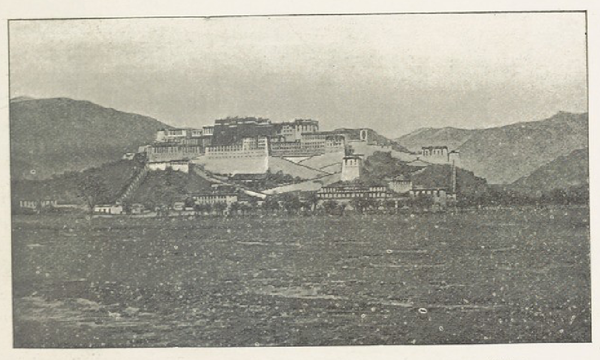
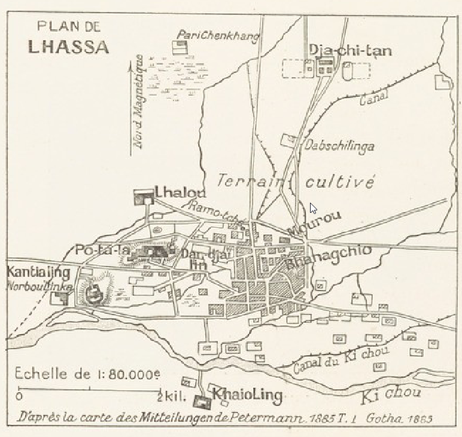

## Введение

Жозеф Деникер ([вики](https://en.wikipedia.org/wiki/Joseph_Deniker)) знаменит своей классификацией человеческих рас (это есть в Википедии). Родился в Астрахани (земляк!) потом перехал во Францию и там встречался с Норзуновым. Видимо место рождения и связало Деникера с калмыком Норзуновым. Норзунов не оставил своих дневников, но Деникер опубликовал несколько его воспоминаний и статей по результатам поездок (этого нет в Википедии).

В том числе Деникер в 1901 опубликовал первое фото Лхасы Норзунова в статье La première photographie de Lhasa.

Пришлось помучаться, но вот [PDF этой статьи](https://drive.google.com/file/d/10ubw-GuYCxAWeNx3pnR-TvVehoQJt7QD/view?usp=sharing) и ее [распознанный текст](https://docs.google.com/document/d/1IMiZU9fKdecGrATlY07kU_GlwDnK-cwz/edit?usp=sharing&ouid=112245657670169384946&rtpof=true&sd=true) на французском. Статья нашлась на <https://gallica.bnf.fr/ark:/12148/bpt6k9692293q/f256.item>.

[Перевод статьи](/notes/deniker-first-photo/) на русский язык.

Полное цитирование: Deniker 1901 -- Deniker Joseph. La première photographie de Lhassa (photographie d'Ovché Narzounof) \[The first photograph of Lhasa\]. La Geographie. Vol. IV (4). October, 1901. Pp. 242--247. (In French)

Привожу полный текст статьи. Содержимое сносок вынесено в текст сразу за номером. Разделение страниц убрано.

## **La première photographie de Lhassa**

LA GEOGRAPHIE

BULLETIN

DE LA

**SOCIÉTÉ DE GÉOGRAPHIE**

**PUBLIÉ TOUS LES MOIS PAR**

Le Baron HULOT

Secrétaire général de la Société de Géographie

**ET**

M. Charles RABOT

Membre de la commission centrale de la Société de Géographie,
Secrétaire de la Rédaction.

TOME IV

2 SEMESTRE 1901

PARIS

MASSON ET Cie, ÉDITEURS

**120, BOULEVARD SAINT-GERMAIN**

1901

**La première photographie de Lhassa**

L'accès du Tibet est, comme on le sait, interdit aux Européens depuis l'expulsion, en 1760, des Capucins qui y étaient établis. Cette interdiction n'est efficace que dans la province méridionale du pays, connue sous le nom de Ou, et plus spécialement à Lhassa, la capitale de l'Etat tibétain et la métropole du monde bouddhiste-lamaïte. Depuis 1760, trois Européens seulement purent pénétrer à Lhassa grâce à un déguisement : en 1811, l'anglais Manning visita cette ville sous le costume d'un médecin hindou, et en 1844, les missionnaires français Huc et Gabet y séjournèrent quelques mois, travestis en moines bouddhistes. A partir de cette date, nous n'avons plus que des renseignements fournis par des voyageurs non européens.

Ces renseignements émanent des « pundits », hindous, dressés par le gouvernement britannique aux travaux topographiques. L'un d'eux, Naïn-Sing, vint, à deux reprises (en 1866 et en 1875), dans la ville interdite et en détermina la position astronomique (29° 39'20" de Lat. N., et 88° 45' 16" de Long. E. de Paris) et l'altitude absolue (3632 m.); l'autre, A. K. (Krishna), en releva le plan en 1879-1880 **1**.

**1\.** Ce plan, à 1 : 79 000, qui figure comme cartouche de la carte accompagnant la traduction du récit de voyage, très court, d'ailleurs, du pundit, publié dans les Pelermann's Mitteilungen, Gotha, 1885, p. 1, pl. 1, est reproduit ci-contre. Nous remercions M. Justus Perthes de nous avoir autorisé à reproduire ce document intéressant.

Aux pundits, assez sobres dans leurs descriptions de Lhassa, succédèrent les Kalmouks de la Russie, bouddhistes, et, par conséquent, plus attentifs à tout ce qui concerne la ville sainte. Il y a quelques années, un prêtre bouddhistc-lamaïte, Kalmouk d'origine et sujet russe, nommé Baza-Bakchi Meunkeundjuev, accomplit un pèlerinage d'Astrakan à Lhassa. La relation de son voyage publiée en volume **2** renferme quelques détails nouveaux sur la ville sainte des Lamaïtes. 11 y a trois mois à peine, un autre Kalmouk, également sujet russe, le *zaïssan* (noble) Ovché Norzounof, revenant de son deuxième voyage à Lhassa, a rapporté d'excellentes photographies de la ville interdite.

***2\.*** *Baga Derbeut noutoughai Baza Bakchiin Teubeudün Eren dou Iaboukhsan teubkhé. --- Çkazanié o khojdenii v'Tibetskouïou stranou Malo-Derbetskago Baza Bakchi.* (Récit du pèlerinage dans le pays tibétain par Baza Bakchi, natif \[de la tribu\] Petit-Derbet. Texte kalmouk avec traduction et commentaires \[en russe\] de A. Pozdniéef); Saint-Pétersbourg (éd. de la Faculté des langues orientales de l'Université), 1897, XVIII, 260 p., in-8o. ---Notre article : *Les Explorations russes en Asie Centrale* in *Annales de Géographie,* 1897, renferme une note (p. 425) sur cet ouvrage, qui n'a été traduit en aucune langue de l'Europe occidentale. L'itinéraire suivi par Menkeundjuef est porté sur la carte qui accompagne cet article.

Grâce à l'aimable autorisation du voyageur russe, nous sommes heureux de pouvoir offrir à nos lecteurs une de ces photographies, la première qui ait été prise et publiée, d'une partie de la ville de Lhassa. Elle représente la montagne sacrée, Bodala ou Po-tala, qui se trouve dans la partie ouest de l'agglomération connue sous le nom de Lhassa, et qui supporte un ensemble de bâtiments, temples ou palais, servant de résidence au Dalaï-Lama, chef suprême du bouddhisme-lamaïte. La vue a été prise du sud, c'est-à-dire exactement du même côté que le fameux dessin du « Bietala », fait par les pères Jésuites, vers 1660, et publié dans le remarquable ouvrage du père Kirchere **1**.

**1**. *La Chine,* d'Athanase Kirchere, de la Compagnie de Jésus, illustrée de plusieurs monuments, tant sacrés que profanes et de quantité de Recherches, de la Nature et de l'art, a quoy on a adjouslé de nouveau les questions curieuses que le Sérénissime Grand-duc de Toscane a fait depuis peu au P. Jean Grubere touchant ce grand empire. Avec un dictionnaire Chinois et François, lequel est très rare, et qui n'a pas encore paru au jour, traduit par F. S. Dalquie. A Amsterdam ches Jean Jansson à Waesberge et les héritiers d'Êlizée Weyerstraet, l'an 1670. Avec privilège, In-folio, avec planches.

Jusqu'en 1901, ce dessin était le seul document graphique se rapportant à Lhassa. Nous le reproduisons afin qu'on puisse le comparer à la photographie prise à deux cent quarante années de distance.

Le père Kirchere est avare de détails sur la résidence du Dalaï-Lama. Voici les seuls renseignements contenus à ce sujet dans son livre (p. 100) : « Enfin ce sont les choses les plus remarquables que ces Pères apprindrent avec beaucoup de compassion, dans la ville de Barantola (Lhassa) par les habitans du lieu mesme, où quoyqu'ils n'eussent pas peu voir le grand Lama (parce qu'il estoit deffendu à ceux de la religion Catholique d'y entrer, comme aussi à tout autre, qu'il n'eût fait auparavant les seremonies accoutumées de l'idolâtrie pour pouvoir paroistre après devant ledit Lama), ils n'ont pas laissé néantmoins de voir son pourtrait qui est exposé à l'entrée du palais Royal (où l'on tient continuellement des lampes allumées pour luy faire rendre les mesmes honneurs et les venerations que s'il y estoit en propre personne), lequel ils ont fidellement dépaint sous la forme de l'habit que 1' XIX figure nous le représente, comme aussi le lieu de sa demeure, qu'on appelle Bietala (Botala), qui est une forteresse située à l'extrémité de Barantola, qu'on a jugé à propos de mettre icy, laquelle est représentée par la figure XVIII. » (Fig. 37.)

A cette description sommaire et au dessin en partie fantaisiste (on y voit en effet des carrosses, alors que les Tibétains ne connaissent jusqu'à présent d'autres véhicules que le palanquin), nous pouvons aujourd'hui opposer une photographie fidèle et une description assez détaillée, d'après celles des P. Huc et Gabet, du pundit A. K. et de Baza Bakchi.

C'est à un quart d'heure de marche du quartier central de l'agglomération appelée Lhassa, que se dresse la montagne sacrée, laquelle a deux kilomètres de tour, et 100 (A. K.) ou 500 mètres (Baza-Bakchi) de hauteur. Elle porte le nom de Bodala, Po-ta-la ou Bouddala. Ce dernier terme n'est qu'une corruption du premier, et n'a aucun rapport avec Bouddha. D'après le tibétisant bien connu Jàschke **2**, le mot Bodala vient du sanscrit et veut dire « atterrissage des barques » ou « havre ».

**2**. *Zeitschrift der Morgenlündischen Gesellschaft,* Wien, l. XXIV, p. 630.

Sur ce socle naturel s'élève la résidence du Dalaï-Lama, vaste ensemble de palais, de temples, de tours et de bâtisses ayant l'aspect de casernes, entouré de murailles. Deux roules en zigzag, déjà indiquées sur le dessin de Kirchere, bordées de murs également, conduisent de la plaine au centre de ce monastère-forteresse, où se dresse la demeure du Dalaï-Lama, un temple et un palais en même temps, surmonté de cinq toits dorés. La façade de cet édifice tournée au sud a neuf étages; celle du nord, adossée au sommet de la montagne, est moins élevée. D'après le pundit A. K., dans l'intérieur de ce temple se trouverait la statue colossale de « Djamba » (probablement transcription phonétique du mot tibétain « Jam-dPal » ou « Jam-dByans » désignant l'une des incarnations du boddisatva Manjuçri), haute de 22 mètres. Placée sur un piédestal situé au rez-de-chaussée, cette statue traverse les deux étages du temple; sa tête, en argile dorée, ornée de pierres précieuses, se trouve sous le toit qui lui forme une sorte de baldaquin. Les pèlerins qui visitent le temple sont obligés de faire trois fois le tour de la statue, par les galeries établies au niveau de ses pieds, de son corps et de sa tête **1**.

**1**. Pundit A. K. L. C., p. 7.

.")

Baza-Bakchi ne fait aucune mention de cette statue. I1 n'a pas visité, il est vrai, l'intérieur du Boudala, mais il donne par ailleurs des détails très minutieux sur d'autres temples qu'il n'a pas vus non plus lui-même. Ce pèlerin ne put visiter les splendeurs de Bodala, en raison de la saison pendant laquelle il séjourna à Lhassa. C'était l'été, saison durant laquelle le Dalaï-Lama est ordinairement en villégiature à Norbou-Linka, charmant palais noyé dans la verdure d'un parc situé à l'ouest de Bodala.

Voici en quels termes notre pèlerin bouddhiste décrit **2**, dans un langage naïf, son audience chez le grand chef du lamaïsme; cette audience doit se faire probablement avec le môme cérémonial à Bodala. « Le Dalaï-Lamaïn-Gheghène **3** reçoit tous les jours des pèlerins qui viennent le saluer; ces réceptions ont lieu d'ordinaire à neuf heures du matin.

2\. Baza Bakchi, L.C,. p. 76 du texte kalmouk et p. 206 de la traduction russe. Nous avons fait notre possible pour nous tenir le plus près de l'original dans notre traduction.
3\.  C'est le nom mongol de Dalaï-Lama.

Ainsi, le troisième jour du mois du chien, nous sommes allés à Norbou-Linka et avons fait nos dévotions au Dalaï-Lamaïn-Ghcghène. 11 n'est point difficile de faire ces dévotions. Quand les nobles, les gens du peuple, en un mot tous ceux qui veulent saluer, sont réunis à l'heure accordée pour la salutation, le Gheghène entre dans une vaste salle où ont lieu les dévotions et s'assied sur un trône haut de près de deux archines (l m. 40). Alors environ deux cents fonctionnaires civils et membres du clergé se mettent en rangs des deux côtés, depuis le trône jusqu'à la porte, en dehors de laquelle, des deux côtés, se placent également en rang une centaine d'hommes.

C'est entre ces hommes que l'on amène, un à un, à la file ininterrompue, les pèlerins vers le Gheghène, qui daigne leur donner la bénédiction (en apposant sur eux la main). »

Après avoir raconté les différences établies entre les pèlerins qui ont offert du thé, du riz et le « mandai » (plat en or, argent ou cuivre, avec le dessin de l'Ünivers suivant les idées des bouddhistes), et ceux qui n'offrent que le thé et le riz ou seulement un « khadak » (sorte d'écharpe en soie bleue), et même rien du tout, Baza-Bakchi, qui a offert le maximum de présents, raconte ainsi sa réception. « Après cela, quand nous arrivâmes à pied, le matin du troisième jour du mois du chien, de Lhassa à N'orbou-Linka, les pèlerins étaient déjà réunis au nombre de 300 ou 400. Mais on nous introduisit avant eux. Les pèlerins doivent entrer un à un; les portiers qui les introduisent et les accompagnent sont armés de très longs fouets; et ces hommes qui font entrer et qui accompagnent sont de très haute taille. Après nous avoir introduits au milieu de Gheghène et de ses serviteurs qui se tenaient, comme il a été expliqué plus haut, on nous a mis face à face avec Gheghène, et, on nous a dit de saluer trois fois en touchant la terre de nos fronts; et, quand nous offrîmes de nos mains le « mandai », le Gheghène daigna l'accepter (également) de ses propres mains, et le remit (aussitôt) à un *soïboun* (serviteur) qui se tenait tout près. J'ai ajouté à l'offrande ordinaire d'autres objets dans l'ordre suivant : un « bourkhane » (image d'une divinité lamaïte), un livre religieux, un soubourgan (modèle de monument commémoratif), 5 lans d'argent blanc (environ 20 francs), et une pièce de monnaie d'or de notre tsar russe; ensuite, quand, en retirant mon bonnet, j'ai voulu recevoir la bénédiction, le Gheghène a daigné placer ses mains sur ma tête en signe de bénédiction. Aussitôt on me mena plus loin et l'on m'admit à baiser la main d'un autre homme. Pendant ce temps, le *soïboun* tressait avec les morceaux de soie jaunes et rouges, un lacet pour celui des pelerins qui me précédait ; après avoir sanctifié ce lacet par son souffle, il l'offrit au pèlerin sous le nom de *tsarighia.* Enfin on nous plaça tous en face de Gheghène et l'on nous honora des restes du thé et du riz dont celui-ci avait goûté, etc. »

Le Bodala constitue, comme nous l'avons déjà dit, la partie ouest de Lhassa. Le centre de cette agglomération est formé par le temple du Grand Tsou et les nombreuses maisons et boutiques qui l'entourent. Le plan de ce temple (le plus ancien du Tibet) se trouve dans l'ouvrage de Giorgi **1** ; couvert de quatre toits dorés, il a ses portes tournées à l'ouest (d'après Baza Bakchi), ou à l'est (d'après Huc); il renferme de nombreuses statues de divinités bouddhistes entourant l'image de Çakya Mouni.

**1**. Giorgi (A.), *Alphabetum Tibelanum,* Romæ, 1762.

Entre ce temple et les bâtiments qui l'entourent est ménagée une zone, large de quatre mètres, destinée à la procession circulaire autour du Tsou, que font les pèlerins à certaines époques. C'est le « circuit interne ». En dehors des maisons et des magasins des marchands chinois, hindous et népalais qui bordent les nombreuses rues et ruelles de la ville commerçante se trouve une deuxième zone circulaire, large de 40 mètres, « la voie du circuit moyen », où se tient tous les jours le marché. Au delà de cette voie, les maisons et les caravansérails sont isolés; vers le nord, ils touchent le temple du Petit Tsou ou Ramo-tché à la coupole dorée et dont les portes s'ouvrent à l'orient. Vers l'est, les maisons englobent le temple de Tchoï- tjon-tsan-kan (« demeure sacrée du génie protecteur » de Lhassa); vers le nord sont situés les couvents ou temples Baldan-Madjoud (500 moines), Bod-djoud (500 moines), Mouri ou Mourou avec une grande imprimerie (300 moines); enfin, vers l'ouest, les monastères de Tsemo-lin (100 moines), de Chidda (plus de 100 moines) et de Dan-djaï-lin (300 moines), habitation du khoutoukhta Demou (incarnation vivante d'un saint). Plus loin à l'ouest se trouve le Bodala et, au sud-ouest, l'habitation de l'ambane (fonctionnaire chinois). Toute cette partie est entourée par la « voie du circuit externe ». Au delà de ce « boulevard extérieur » est établi le camp de soldats chinois appelé Dja-chi-tan **1**.

1\. Voir Baza-Bakchi et le commentaire de Pozdniéef, p. 206 de la trad. russe. Ce camp se trouve plus près que ne l'indique le plan du pundit A. K., nous a affirmé le Khambo Lama Agouan Dordjiéf, un des sept conseillers du Dalaï-Lama, auquel nous avons montré ce plan à Paris.

Aussi dit-on que la garnison chinoise n'est pas installée à Lhassa; c'est une de ces subtilités diplomatiques dont sont coutumiers les Orientaux. C'est également en dehors des limites de Lhassa, à 1 kil. à l'ouest de Bodala (au sud ouest, suivant le plan de A. K.), que se trouve le mont Djak-Pour-rhi (plus exactement Djag-bo-rhi, « mont de fer »), séjour de l'incarnation du Boddhisatva Vadjrapani, couronné par le couvent où l'on enseigne spéciale ment la médecine. A un kilomètre plus loin à l'ouest, les montagnes se terminent, près du couvent de Goundouï-Lin. La résidence d'été du Dalaï-Lama dont nous avons parlé plus haut, le Norbou Linka, est située à 1 kil. à l'ouest de ce monastère.

En somme, la ville de Lhassa doit présenter la forme d'un ovale de 6 à 7 kilomètres de tour, dont le grand axe, dirigé de l'ouest à l'est, a 2 kilomètres et demi, et le petit, qui lui est perpendiculaire, environ 1500 mètres. Sa population est estimée à 10000 hommes (sans les moines?) par Baza Backhi, à 18000 par le voyageur autri chien Kreitner, à 25000 par le pundit A. K., à 31 000 hommes (dont 18000 moines) par Naïn-Sing (en 1854), enfin à 50 000 par Prjevalsky.

J. Deniker.

## Комментарии

[**Обсудить**](https://t.me/answer42geo/24)
