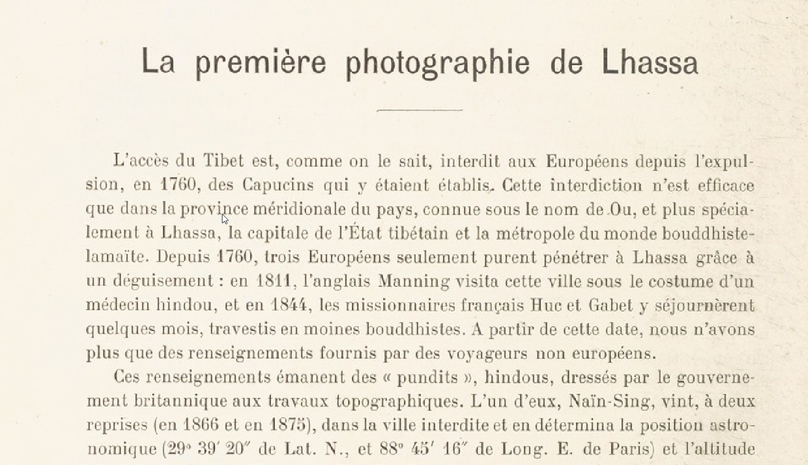
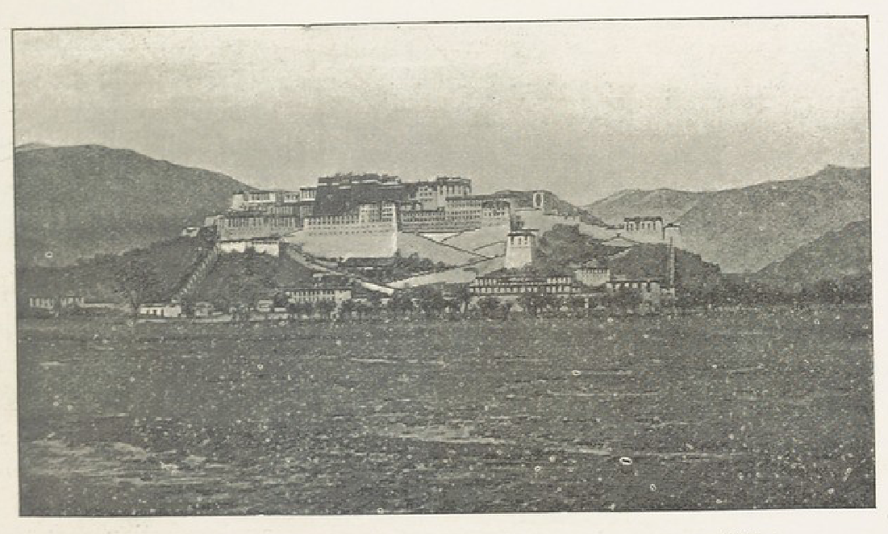
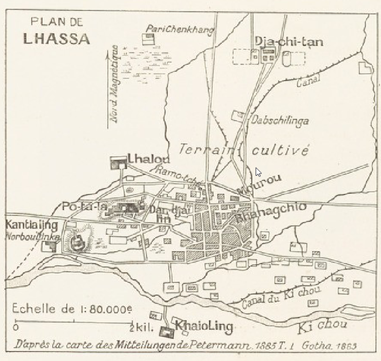

## Введение

В [прошлой записи](/notes/deniker-first-photo-fr/) была найдена и распознана статья Ж. Деникера La première photographie de Lhasa. Статья на французском языке.

В этой записи представляю отредактированный перевод статьи. Исходную статью с переведенными абзацами можно посмотреть и скачать [в Google Docs](https://docs.google.com/document/d/159D1gqVIn7O6vn_E3StgcGPfz72EOvXm/edit?usp=sharing&ouid=112245657670169384946&rtpof=true&sd=true). Там постепенно мелкие ошибки исправляются и переносятся сюда. Содержимое сносок вынесено в текст сразу за номером. Разделение страниц убрано.

## Перевод статьи

ГЕОГРАФИЯ

БЮЛЛЕТЕНЬ

ГЕОГРАФИЧЕСКОГО ОБЩЕСТВА

ПУБЛИКУЕТСЯ КАЖДЫЙ МЕСЯЦ

Барон ЮЛО

Генеральный секретарь Географического общества

И

M. Шарль РАБО

Член центральной комиссии Географического общества,
секретарь редакции.

Том IV

2 СЕМЕСТР 1901

ПАРИЖ

Издательство MASSON ET Cie

БУЛЬВАР СЕН-ЖЕРМЕН, 120

1901

## Первая фотография Лхасы

Доступ в Тибет, как известно, закрыт для европейцев после изгнания в 1760 году обосновавшихся там капуцинов. Этот запрет действует только в южной провинции страны, известной как Уй, и особенно в Лхасе, столице тибетского государства и столице буддийско-ламаитского мира. С 1760 года только трое европейцев смогли проникнуть в Лхасу благодаря маскировке: в 1811 году этот город посетил англичанин Мэннинг (Manning) в костюме индуистского врача, а в 1844 году там на несколько месяцев остановились французские миссионеры Гюк (Huc) и Габе (Gabet). переодевшись в буддийских монахов. С этой даты у нас есть только информация, предоставленная путешественниками из неевропейских стран.

Эта информация исходит от индуистских "пандитов", обученных британским правительством топографическим работам. Один из них, Найн Сингх (Naïn-Sing), дважды (в 1866 и 1875 гг.) приезжал в Запретный город и определял его астрономическое положение (29°39'20" с.ш. и 88°45'16" долготы. в.д. по Парижу) и абсолютная высота (3632 м.); другой, Кишен Сингх (А.К. (Krishna)), создал план города в 1879-1880 гг. **1**.

**1.** План в масштабе 1:79 000, появляется в качестве основной карты, сопровождающей перевод краткого описания путешествия пандита, опубликованного в Pelermann's Mitteilungen, Gotha, 1885, с. 1, пл. 1, воспроизводится в этой статье. Мы благодарим г-на Юстуса Пертеса (Justus Perthes) за разрешение воспроизвести этот интересный документ.

На смену пандитам, вполне трезвым в своих описаниях Лхасы, пришли калмыки России, буддисты, как следствие, более внимательные ко всему, что касается святого города. Несколько лет назад буддийско-ламаитский священник, калмык по происхождению и русский подданный, по имени База-Бакши Менкеджуев (Baza-Bakchi Meunkeundjuev)  совершил паломничество из Астрахани в Лхасу. Отчет о его поездке, опубликованный в томе **2**, содержит некоторые новые подробности о священном городе ламаистов.

**2**. *Baga Derbeut noutoughai Baza Bakchiin Teubeudün Eren dou Iaboukhsan teubkhé* --- *Сказание о хождении в тибетскую страну Мало-дорботского База-бакши*. (Рассказ о паломничестве в Тибет База Бакши, уроженца \[племени\] Мало-Дербет. Калмыцкий текст с переводом и комментариями \[на русском языке\] А. Позднеева); СПб (ред. Факультета восточных языков университета), 1897, XVIII, 260 с., в-8о. --- В нашей статье «Русские исследования Средней Азии в «Анналах географии», 1897 г.» имеется примечание (с. 425) об этой работе, не переведенной ни на один западноевропейский язык. Маршрут, по которому следовал Менкеджуев, показан на карте, приложенной к этой статье.

Всего три месяца назад другой калмык, тоже русский подданный, зайсан (дворянин) Овше Норзунов (Ovché Norzounof), возвращаясь из второй поездки в Лхасу, привез с собой прекрасные фотографии запретного города.

Благодаря любезному разрешению российского путешественника, мы рады предложить нашим читателям одну из этих фотографий, первую из сделанных и опубликованных, части города Лхасы. Он представляет священную гору Бодала или По-тала, которая расположена в западной части города, известного как Лхаса, и поддерживает группу зданий, храмов или дворцов, служащих резиденцией Далай-ламы, верховного лидера Ламаистского буддизма. Вид был сделан с юга, то есть точно с той же стороны, что и знаменитый рисунок «Биетала», сделанный отцами-иезуитами около 1660 года и опубликованный в замечательном труде отца Кирхера (Kirchere) **1**.

**1.** Книга "*La Chine*" (Китай) Афанасия Кирхера из Общества Иисуса, иллюстрирована множеством священных и светских памятников, исследованиями природы и искусства. К книге добавлены новые любопытные вопросы, которые Великий герцог Тосканы недавно задал отцу Жану Грубере (P. Jean Grubere) о великой империи. Включен редкий китайско-французский словарь, переведенный F. S. Dalquie. Издано в Амстердаме у Яна Янссона Ваэсбергского (Jean Jansson à Waesberge) и наследников Элизея Вейерстрата (Êlizée Weyerstraet) в 1670 году. С привилегией, формат In-folio, с иллюстрациями.

До 1901 года этот рисунок был единственным графическим документом, относящимся к Лхасе. Мы воспроизводим рисунок, чтобы можно было сравнить с фотографией, учитывая разницу в двести сорок лет.

Отец Кирхер скуп на подробности о резиденции Далай-ламы. Вот единственные сведения, содержащиеся по этому поводу в его книге (стр. 100): «Наконец, это самые замечательные вещи, которые с великим состраданием узнали эти отцы в городе Барантола (Лхаса) от жителей самого места, где хотя и не могли увидеть великого Ламу (потому что исповедующим католическую религию вход был запрещен, как и любой другой, если только он предварительно не совершил обычные идолопоклоннические проповеди, чтобы иметь возможность предстать перед упомянутым Ламой), они, тем не менее, не преминули увидеть его портрет, выставленный у входа в Королевский дворец (где постоянно горят лампы, чтобы заставить оказывать те же почести и почитания как если он присутствовал лично), который они верно изобразили в виде одеяния, как показано на рисунке XIX, а также место его пребывания, называемое Биетала (Ботала), крепость, расположенную на окраине Барантолы, которую сочли уместным здесь поставить, представленой на рисунке XVIII. » (рис. 37.)

Этому краткому описанию и отчасти причудливому рисунку (на нем видно экипажи, хотя тибетцы до сих пор знают только паланкин как средство передвижения) сегодня можно противопоставить точную фотографию и описание, весьма подробное, со слов отцов Гюка и Габе, пандита А.К. и База Бакши.

В четверти часа ходьбы от центрального района городского округа под названием Лхаса стоит священная гора, имеющая два километра в окружности и высоту 100 (А. К.) или 500 метров (База-Бакши). Её называют Бодала, По-та-ла или Буддала. Последний термин является лишь искажением первого и не имеет никакой связи с Буддой. По мнению известного тибетца Яшке (Jàschke)**2**, слово Бодала происходит из санскрита и означает «лодочная пристань» или «гавань».

**2.** Журнал Morgenlündischen Gesellschaft, Вена, l. XXIV, с. 630.

На этом природном основании стоит резиденция Далай-ламы, обширный ансамбль дворцов, храмов, башен и построек, напоминающих казармы, окруженных стенами. Две зигзагообразные дороги, уже обозначенные на рисунке Кирхера, также окаймленные стенами, ведут с равнины к центру этого монастыря-крепости, где стоит резиденция Далай-ламы, храм и дворец одновременно, увенчанный пятью золотыми крышами. Фасад этого здания, обращенный на юг, имеет девять этажей; северный, прислоненный к вершине горы, ниже. По мнению пандита А.К., внутри этого храма должна находиться колоссальная статуя «Джамба» (вероятно, фонетическая транскрипция тибетского слова «Джам-дПал» или «Джам-дБьянс», обозначающего одно из воплощений боддисатвы Манджушри), высотой 22 метра. Эта статуя, помещенная на постамент, расположенный на первом этаже, пересекает два этажа храма; голова его, сделанная из золотой глины, украшенная драгоценными камнями, расположена под крышей, образующей своего рода навес.

Паломники, посещающие храм, обязаны трижды обойти статую, через галереи, устроенные на уровне ее ног, тела и головы **1**.

**1.** Пандит A.K. L. C., с. 7.

.")

База-Бакчи не упоминает об этой статуе. Это правда, что он не посетил внутреннюю часть Будалы, но он также дает очень подробные сведения о других храмах, которые он сам не видел. Этот паломник не смог посетить великолепие Бодалы из-за сезона, в течение которого он оставался в Лхасе. Это было лето, сезон, в течение которого Далай-лама обычно отдыхает в Норбу-Линка, очаровательном дворце, утопающем в зелени парка, расположенном к западу от Бодалы.

Вот какими словами наш буддийский паломник наивно описывает **2** свою аудиенцию у великого главы ламаизма. 

**2.** База Бакчи, L.C., с. 76 калмыцкого текста и с. 206 русского перевода. В нашем переводе мы постарались максимально приблизиться к оригиналу.

Эта аудиенция, вероятно, должна происходить с тем же церемониалом в Бодале. «Каждый день Далай-Ламаин-Геген **3** принимает паломников, которые приходят его поприветствовать; эти приемы обычно происходят в девять часов утра.

**3.** Это монгольское имя Далай-ламы.

Итак, на третий день месяца собаки мы отправились в Норбу-Линка и совершили поклонение Далай-Ламаин-Гегену. Совершать эти молитвы нетрудно. Когда дворяне, простой народ, словом, все желающие поздороваться, собираются в отведенное для приветствия время, Геген входит в обширную комнату, где совершаются богослужения, и садится на трон высотой почти в два аршина (l м. 40). Затем около двухсот гражданских чиновников и членов духовенства выстраиваются с обеих сторон, от престола до ворот, снаружи которых с обеих сторон выстраивается также около ста человек.

Между этими людьми паломников одного за другим ведут непрерывной цепочкой к Гегену, который соизволяет дать им благословение (возложив на них руку). »

Перечислив различия, установленные между паломниками, подносившими чай, рис и «мандай» (блюдо из золота, серебра или меди с изображением Вселенной по идеям буддистов), и теми, кто предлагал не только чай, рис или только «хадак» (разновидность синего шелкового платка), а то и вообще ничего, База-Бакши, поднесший как можно больше подарков, так описывает свой прием. «После того, как мы пришли пешком, утром третьего дня месяца собаки, из Лхасы в Норбо-Линка, там уже собрались паломники в количестве 300 или 400 человек. Но нас представили до них. Паломники должны входить по одному; швейцары, которые их представляют и сопровождают, вооружены очень длинными кнутами; и эти люди, которые приводят и сопровождают, очень высоки. После того, как нас ввели в окружение Гегена и его слуг, которые стояли, как объяснено выше, нас поставили лицом к лицу с Гегеном и нам приказали трижды отдать честь, коснувшись лбами земли; и когда мы предложили «мандай» руками, Геген соизволил принять его (также) своими руками и передал (немедленно) сойбуну (слуге), стоявшему рядом. К обычному подношению я добавил другие предметы в следующем порядке: бурхан (изображение ламаистского божества), религиозную книгу, субурган (модель памятника), 5 серебряных белых ланов (около 20 франков) и золотая монета нашего русского царя; потом, когда, сняв шапку, я захотел получить благословение, Геген соизволил положить руки мне на голову в знак благословения. Меня тут же провели дальше и разрешили поцеловать руку другому мужчине. Тем временем сойбун плел из кусочков желтого и красного шелка кружево для одного из паломников, который шел впереди меня; освятив своим дыханием этот шнурок, он предложил его паломнику под именем *tsarighia*. Наконец нас всех поставили перед Гегеном и удостоили чести отведать остатки чая и риса, которые он попробовал, и т. д.»

Бодала составляет, как мы уже говорили, западную часть Лхасы. Центр этого города образован храмом Гранд Цу и многочисленными домами и магазинами, окружающими его. План этого храма (старейшего в Тибете) встречается в работе Гиорги **1**; покрытый четырьмя золотыми крышами, он имеет двери, обращенные на запад (по База Бакши) или на восток (по Гюку); он содержит многочисленные статуи буддийских божеств, окружающих изображение Шакья Муни.

1\. Гиорги (А.), Тибетский алфавит, Рим, 1762 г.

Между этим храмом и окружающими его постройками расположена площадка шириной четыре метра, предназначенная для кругового шествия вокруг Цу, которое совершают паломники в определенное время. Это «внутренний круг». Помимо домов и магазинов китайских, индусских и непальских купцов, которые выстилают многочисленные улицы и переулки торгового города, есть вторая кольцевая зона шириной 40 метров, «средний круг», где в течение всего дня работает рынок. За этой дорогой дома и караван-сараи изолированы; На севере они касаются храма Малый Цу или Рамо-че с его золотым куполом, двери которого открываются на восток. На востоке дома включают храм Чойджон-цан-кан («священная резиденция гения-защитника» Лхасы); к северу расположены монастыри или храмы Балдан-Маджуд (500 монахов), Бод-Джуд (500 монахов), Мури или Муру с большой типографией (300 монахов); наконец, на западе --- монастыри Цемо-лин (100 монахов), Чидда (более 100 монахов) и Дан-джай-лин (300 монахов), дом хутухту Дему (живое воплощение святого). Дальше на запад находится Бодала, а на юго-западе --- жилище амбаня (китайского чиновника). Вся эта часть окружена «внешним кругом». За этим «внешним бульваром» расположен лагерь китайских солдат под названием Джа-чи-тан **1**. 

**1.** См. комментарий База-Бакши и Позднеева, с. 206 русский перевод. Этот лагерь расположен ближе, чем указано в плане пандита А.К., рассказал нам Хамбо-лама Агван Доржиев, один из семи советников Далай-ламы, которому мы показали этот план в Париже.

Также сообщается, что в Лхасе не размещен китайский гарнизон; это одна из тех дипломатических тонкостей, к которым привыкли жители Востока. За пределами Лхасы, 1 км. к западу от Бодалы (к юго-западу, по карте А.К.) находится гора Джак-Пур-ри (точнее Джаг-бо-ри, «железная гора»), резиденция воплощения Бодхисатвы Ваджрапани, коронованного монастырем, где специально преподают медицину. В километре западнее горы заканчиваются возле монастыря Гундуи-Лин. Летняя резиденция Далай-ламы, о которой мы упоминали выше, Норбу Линка, находится в 1 километре к западу от этого монастыря.

Короче говоря, город Лхаса должен иметь форму овала окружностью 6-7 километров, длинная ось которого, идущая с запада на восток, имеет длину 2 с половиной километра, а малая, перпендикулярная, примерно 1500 метров. Его население оценивается в 10 000 человек (без монахов?) по База Бакши, в 18 000 --- по австрийскому путешественнику Крейтнеру (Kreitner), в 25 000 --- по мнению пандита А. К., в 31 000 человек (включая 18 000 монахов) --- по Найн-Сингху (в 1854 г.), наконец, в 50 000 по Пржевальскому.

Ж. Деникер.

## Комментарии

[**Обсудить**](https://t.me/answer42geo/25)
