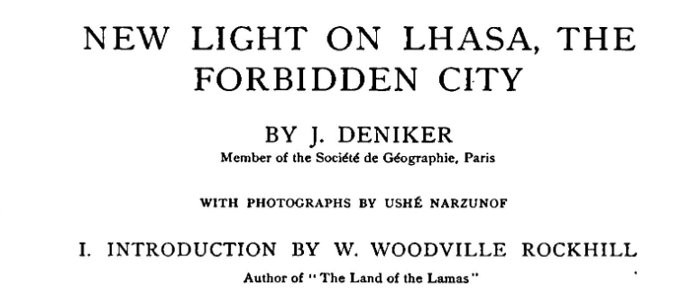
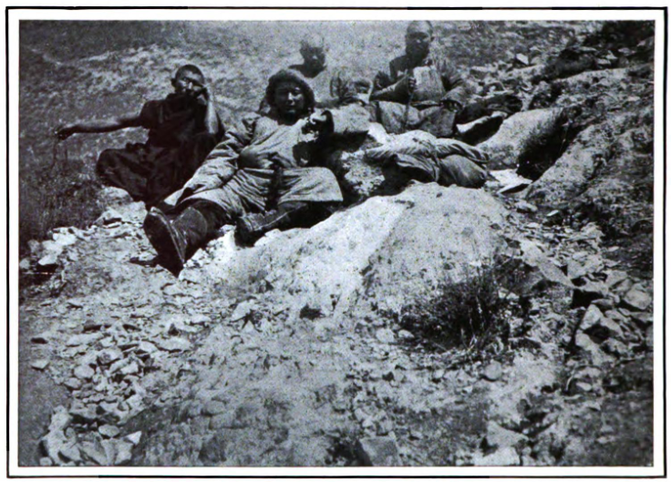
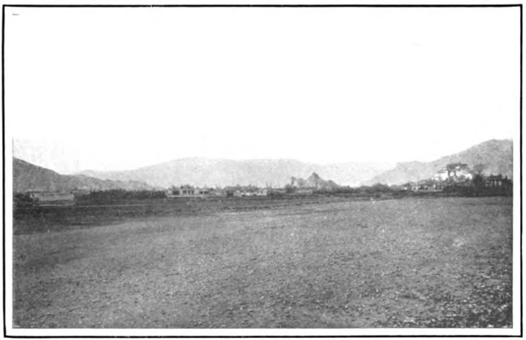
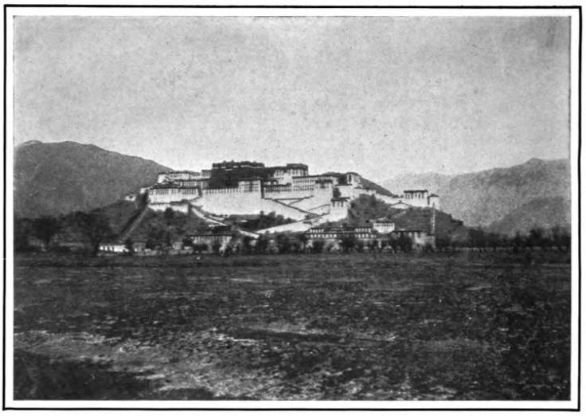
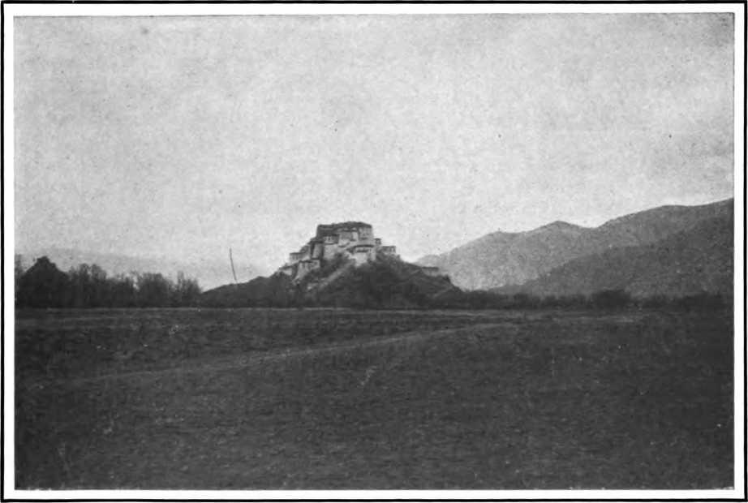
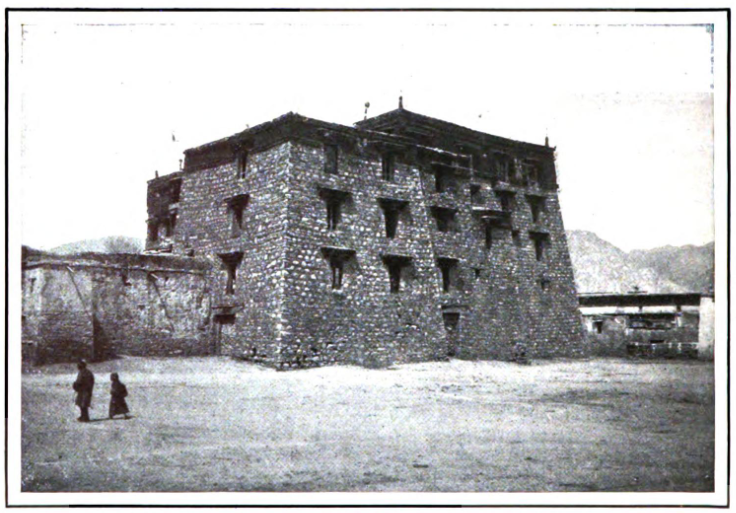
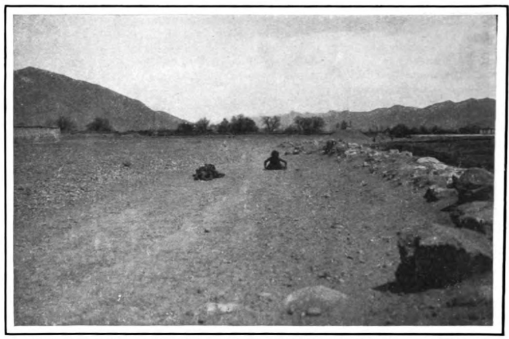
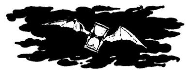

## Введение

Деникер опубликовал записки Норзунова в нескольких статьях. Одна из них, с фотографиями Норзунова появилась в The Century Magazine ([wiki](https://en.wikipedia.org/wiki/The_Century_Magazine)) в августе 1903, на английском языке, с предисловием Рокхилла, автора The Land of Lamas.

Полное цитирование: Deniker 1903 -- Deniker, Joseph. New Light on Lhasa, the Forbidden City, with photographs by Ushe Narzunof. The Century magazine (The Century Illustrated monthly magazine). New York. No. 66. August 1903. Pp. 544--554. (In Eng.)

В статье 8 фото, из них двух фото (Норзунов и компания, Поклонение в растяжку) нет в коллекции [Библиотеки конгресса](/notes/50-photos/).

Статью оказалось не просто найти. На нее много кто ссылается, но текста нигде нет. В итоге статья нашлась на HathiTrust, я ее распознал и привожу здесь полностью.

[PDF](https://drive.google.com/file/d/1AqF-my9HuNCPZLsKENaeGiO12q3AMQh0/view?usp=sharing), [DOC](https://docs.google.com/document/d/1BquFxOKTy3wTC9wL5zlRJX0bg6TIr8WM/edit?usp=sharing&ouid=112245657670169384946&rtpof=true&sd=true) ([source](https://babel.hathitrust.org/cgi/pt?id=mdp.39076000392501&seq=566))

## Фото в статье

НАЗВАНИЕ В СТАТЬЕ

Название в [Библиотеке конгресса](/notes/50-photos/). Ссылка в Библиотеке конгресса.

1. NARZUNOF AND HIS COMPANIONS ON THE ROUTE BETWEEN THE TSAIDAM AND TANG-LA, THE HIGHEST RANGE OF TIBET
    Фото нет в коллекции Библиотеки конгресса.
2. LHASA FROM THE EASTERN SIDE, WITH POTALA AND CHAG-PO-RI HILL IN THE MIDDLE DISTANCE
    Lhasa from the East. <https://www.loc.gov/item/2021670590/>
3. POTALA, THE RESIDENCE OF THE DALAI-LAMA, VIEWED FROM THE SOUTH
    Lhasa, Potala Palace and Marpori (Red Mountain) from the West. <https://www.loc.gov/item/2021670629/>
4. POTALA, THE PALACE OF THE DALAL-LAMA, VIEWED FROM THE EAST
    Lhasa, Potala Palace from the East. <https://www.loc.gov/item/2021670620/>
5. HALF-RUINED PALACE OF THE ANCIENT KINGS OF TIBET AT LHASA
    Lhasa, Gadan Kansar Palace, the Old Palace. <https://www.loc.gov/item/2021670613/>
6. THE RESIDENCE OF THE CHINESE RESIDENT IN LHASA (ON THE LEFT); POTALA, THERESIDENCE OF THE DALAI-LAMA (ON THE RIGHT)
    Lhasa, Amban's Yamen (Residence of Chinese Official) from Southeast. <https://www.loc.gov/item/2021670596/>
7. BUDDHIST PILGRIMS MEASURING THEIR LENGTH AROUND THE CIRCUIT OF LHASA
    Фото нет в коллекции Библиотеки конгресса.
8. BRASBUNG OR DEPUNG, NEAR LHASA, THE LARGEST MONASTERY OF TIBET (10,000 MONKS)
    Lhasa, Drepung Monastery. <https://www.loc.gov/item/2021670632/>

## Текст статьи полностью

THE CENTURY. ILLUSTRATED MONTHLY MAGAZINE. VOL. LXVI

NEW SERIES, VOL. XLIV. MAY, 1903, TO OCTOBER, 1903. THE CENTURY CO., NEW YORK. MACMILLAN & CO. Ltd., LONDON.

NEW LIGHT ON LHASA, THE FORBIDDEN CITY.

BY J. DENIKER

Member of the Societe de Geographic, Paris

WITH PHOTOGRAPHS BY USHE NARZUNOF

I. INTRODUCTION BY W. WOODVILLE ROCKHILL

Author of "The Land of the Lamas"

Religious worship of the great gods has, the world over, been principally conducted in high places; mountain-tops have ever been their favorite abodes. Assyrians, Hebrews, Greeks, Indians, Chinese, Tibetans, Mexicans, Samoans, and a hundred other widely separated peoples have worshiped thus.

At an early date in the history of Buddhism, the cult of "the All-Merciful God who looks down and sees the miseries of the world," the Saviour, Avalokiteshwara, became probably the most popular one, and Mount Potala, near the mouth of the river Indus, was held to be his abode. In Ceylon he was worshiped on Adams Peak, and in China on Mount Pu-tou (a Chinese transcription of the word Potala), an island of the Chusan group, near Ning-po. In Tibet his worship was, in all likelihood, associated with some mountain from the earliest days, for legends tell us that when he came to Tibet to bring civilization and salvation to the people, he took up his abode on a hill to the west of the present city of Lhasa, called the Red Hill (Marpo-Ri). Here, in the seventh century, the kings of Tibet built their modest palace, and Lhasa grew at its base. In the middle of the seventeenth century, when the Dalai- Lama was finally recognized by all followers of the Lamaist form of Buddhism as the incarnation of Avalokiteshwara and the head of their faith, and had also been made, with Mongol aid, the temporal sovereign of Tibet, he took up his abode in the old palace of the kings of Tibet on the Red Hill; but he changed its name to Potala, by which it has since become known the world over.

The earliest visit by a European to the city of Lhasa was that made by Friar Odoric of Pordenone, who probably passed through it on his way to India from China in 1325; but he does not mention the city by name, or refer to the Red Hill. None of those observant old travelers, Friar John of Pian di Carpine, Friar William of Rubruk, or even Marco Polo, makes mention of Lhasa; nor, strangely enough, do any of the Chinese annals prior to the thirteenth century.

Three centuries and more elapsed before any other Europeans visited Lhasa. In 1661 Fathers Grueber and Dorville resided there for two months, and it is probably to them that we owe the first picture of Potala to reach Europe. It was published by Kircher, in 1667, in his "China Illustrata," and is there called Bietala.

In 1716 the Jesuits established a mission in Lhasa, which passed later on into the hands of the Capuchins, who carried it on till 1760. Three of those early missionaries to Lhasa, Fathers Ippolito Disideri, Orazio della Penna, and Cassiano Beligatti, have left long and interesting narratives of their lives in Lhasa, but none contains more than a passing reference to the Dalai-Lama or to Potala. The same may be said of the narratives of the next European visitors, Thomas Manning in 1811, and the Lazarist fathers Huc and Gabet in 1846. Our knowledge of Lhasa still remained hazy; we had nothing to help us form an idea of the place but Kircher's picture of Potala.

")

In 1878 a native explorer, sent to Tibet by the Indian government, made a careful survey, on a large scale, of the city, and in 1891 the writer of the present notice was able to publish in the journal of the Royal Asiatic Society of Great Britain a reduction of a native painting representing Lhasa and Potala. It was only in 1901 that photographs of the city and palace were at last secured, the best and most numerous being undoubtedly those reproduced in the present article of Mr. Deniker. One of these was published in "La Geographie " (the bulletin of the Paris Geographical Society 1) (1 Of which Mr. Deniker is one of the editors.) for October, 1901. In December of the same year the "Geographical Journal" of London published two other views of Lhasa and Potala, the latter from a photograph taken within the last few years by a member of a Nepalese mission *de passage* at Lhasa. In 1902 were published the travels of Sarat Chandra Das to Lhasa, and in them are reproduced the pictures previously published in the "Geographical Journal," together with a native drawing of Potala, which greatly assists in forming a clearer idea of the interior arrangement of this no longer mystery-shrouded place.

The photographs now shown us of the great monastery of Depung, one of the most famous of Tibet, of the residence of the Chinese Amban with the white- and red-walled Potala in the near background, the general view of Lhasa, and all the others now published, are of extraordinary interest, especially to those who, like the writer, have devoted some of the best years of their lives to studying all attainable records of this land, and have hoped and striven, but in vain, to see with their eyes the spots now first fully shown us by the Kalmuk pilgrim. We owe him a lasting debt of gratitude.

II. NEW LIGHT ON LHASA, THE FORBIDDEN CITY

It may be said, at the beginning of the twentieth century, that, except for the two poles, there is not a corner of the earth where white men have not penetrated. Yet, in truth, there exists on the Asiatic continent, hardly two hundred miles from the frontier of British India, a city, the capital of Tibet, to which the "white men" of Europe and America are absolutely forbidden access. Within a distance of from one hundred and fifty to two hundred miles from this city, all the roads leading to it, at the place where they cross the frontier to the province of Wu, of which Lhasa is the chief town, are jealously guarded by pickets of Tibetan soldiers. Immediately upon perceiving a suspicious-looking caravan the sentinels notify the local authorities. The advancing traveler then sees rise up before him a whole detachment of armed men, commanded by high functionaries of the country, who, without discussing the matter, politely insist that the bold pioneer retrace his steps. They even offer him the money and food necessary for the return voyage, at the same time warning him that if he continue on his way to Lhasa he will pay for it with his life.

Such a state of affairs has not always existed. During the middle ages, and until the middle of the eighteenth century, a number of Europeans, mostly Catholic monks, were able to remain for long periods in the "Holy City" of the Tibetans, who profess, as we know, the Buddhist-Lamaist religion. But since the expulsion, in 1760, of the Capuchin monks, who tried to meddle with the internal affairs of the country, all Europeans have been regarded with suspicion, and none has been allowed to penetrate into Lhasa. Nevertheless, in 1811 Thomas Manning, an English traveler, and in 1846 Huс and Gabet, two French missionaries, were able to spend months at Lhasa in the disguise of Buddhist pilgrims. They were recognized, however, and were asked to leave the country as quickly as possible.

Since 1846 no European has succeeded in reaching the sacred temples of Lhasa. It is not, however, that attempts have been lacking, The Russian Prjevalsky set the example in 1879; he crossed the whole of northern Tibet, but was obliged to turn back when he had reached a point situated one hundred and sixty miles from Lhasa. Ten years later two Frenchmen, Bonvalot and Prince Henry of Orleans, were stopped when within sixty miles of the Holy City. The English captain Bower, in 1891, and W. VV. Rockhill,1 (1 Mr. Rockhill's narrative of his first expedition to Tibet (1888-89) was published in The Century, from November, 1890, to March, 1891. A fuller account of the same journey was also published by The Century Co. under the title "The Land of the Lamas." A paper on Mr. Rockhill's second journey to Tibet (1891-92) appeared in The Century for May, 1894.). the American scholar and traveler, in 1892, were able to reach points about a hundred and eighty miles distant from Lhasa. In 1893 two Frenchmen, Dutreuil de Rhins and Grenard, and in 1895 R. Littledale, the Englishman, failed to get beyond the region previously reached by Bonvalot and the Prince of Orleans. The Swedish explorer Sven Hedin, as recently as August, 1901, tried to reach Lhasa, but did not get so far as this even, for he had to retrace his steps when he was within a hundred miles of that city.

However, we have not remained in absolute ignorance of the capital of Tibet since the time of Huc and Gabet. Almost every year the government of British India sends to Tibet a Hindu pundit to make surveys and draw maps of the country. Three or four of these native surveyors, disguised as Buddhist pilgrims, succeeded in passing some time in Lhasa. One of them, Nain-Sing by name, determined the geographical position and the altitude of the city in 1866; a second, designated by the letters A. K. (Kishen Singh or Krishna), drew a plan of Lhasa in 1880; and a third, the most learned of all, Sarat Chandra Das, passed more than a fortnight in the capital in 1882, and wrote a description of it, which was not published until October, 1902. As in their time portable cameras that could easily be hidden were as yet a rarity, it is hardly necessary to say that these natives were unable to take any photographs. The pundits, coming from India disguised as Buddhists, entered Tibet by the southern frontier. But by the northern frontier genuine Buddhists come every year, on a pious pilgrimage to Lhasa. They arrive in great numbers, Russian subjects,--- Buriat Mongolians from Transbaikalia (Siberia), and Kalmuks from the southeastern steppes of Russia,---winding their way across the deserts of Mongolia, and through northern Tibet and its dreary waste of plateau, which is higher than the summit of Mont Blanc.

One of these pilgrims, the Kalmuk Mongolian Ushe Narzunof, who was less ignorant than the rest, took a large number of photographs in the "Forbidden City" and its environs. It is his story which we will tell, with the aid of his notes, supplemented by the accounts of a Khambo-Lama (high priest or abbot) from the court of the Dalai-Lama, the potentate of Tibet and spiritual chief of all Lamaist Buddhists. The author of these lines numbers Agwang Dordje, this Khambo-Lama, among his friends. He is a Buriat Mongolian, a native of Transbaikalia, but has lived for thirty years in Lhasa. Within the last few years he has made three voyages to Europe, visiting Paris, Rome, and London, which cities, as we know, are not forbidden to Tibetans.

The careers of these two men are very closely allied, for it was at the instigation of the Khambo-Lama that the young Kalmuk in question, Ushe Narzunof, son of a noble (or Zaisan), began his first pilgrimage to Lhasa in 1898. Young Ushe was living in the province of Stavropol, north of the Caucasus, a peaceful life, supporting himself and his family on the proceeds of his flocks. He had studied in a Russian school and acquired a certain amount of learning, but he did not for that renounce his Buddhist faith. Chancing one day to hear Agwang Dordje preach, he became fired with a sudden resolution to visit the holy Buddhist shrines and to behold the luminous countenance of the Dalai-Lama, the living incarnation of Avalokiteshwara, who is the spiritual son of the Buddha himself.

Leaving his native encampment, he reached, by way of Siberia, Urga, a large city of northern Mongolia. Here he organized his caravan, consisting of nine camels, and started on his journey across the Desert of Gobi. After thirty-eight days of travel he arrived at the Chinese city of Ansi, on the route to Sa-chou, the Tsaidam, and the Tibetan plateau. Here he made arrangements with Mongols, subjects of the Prince of Korluk-Beise, to be admitted into their caravan. These Mongolians agreed to bring him to the encampment of the Prince (or Zaisan) of Taidziner, in the Tsaidam, at the base of the Tibetan plateau. Unfortunately, these guides soon perceived that their young traveling-companion was taking down notes in a script which was neither like the Mongolian writing nor like the Chinese characters. It was, in fact, Russian. Their suspicions were aroused, for Narzunof had given himself out as a Mongolian and a subject of China. When later they discovered that underneath his Chinese dress and furs he wore a jacket of European cut, their suspicions were confirmed, and they accused him of treachery.

They refused to conduct Narzunof farther, even threatening to carry him as prisoner to their prince. A present of ten lans, or liang (about seven dollars), had the marvelous effect of quieting these fierce guides. Narzunof, furthermore, won their entire confidence by burning before their eyes the jacket which had caused all the trouble, and by writing his notes after that only in Kalmuk, which writing closely resembles Mongolian.

From the encampment in Taidziner the journey was continued on horseback across the high plateau of Tibet and through passes the lowest of which is at an elevation two hundred feet greater than that of the summit of Mont Blanc (15,781 feet). It was in March, 1899, that our pilgrim from the top of Kolam, or Ketcha, the last mountain over which he had to pass, beheld the golden roofs of the temples of Lhasa. He dismounted from his horse and prostrated himself three times, repeating his prayers, overwhelmed by the most intense joy a Buddhist can know; for with his own eyes he now beheld the "Holy City."

Although Lhasa is in the same latitude as New Orleans, its climate is colder, because of its great altitude (it is about 11,900 feet above the level of the sea). The dwellings of the Tibetans are little houses of stone or dried bricks, and have no stoves. The only method of heating is by braziers, and the first nights Narzunof spent in Lhasa seemed very cold to him. Very soon, though, he grew accustomed to the lack of heat and also to the darkness of the houses. Windows with glass panes were found only in a few palaces of the high priests; in all of the other houses the panes were of paper, either oiled or plain. At night the houses were lighted by torches, or by primitive lamps in the antique Roman style, fed with a vegetable oil.

The city is fairly clean, in the Asiatic sense of the word, except for the quarter in which, in houses made of ox- and goathorns, the beggars live. It is the business of these beggars to convey the corpses out of the city, as, according to Buddhist custom, the dead are not buried. The high priests, indeed, are buried or burned after death, but the bodies of the lower priests and those of the populace are abandoned to the birds of prey, after having been cut to pieces on a flat stone which lies halfway between Lhasa and the convent of Sera, near the chapel of Pa-ban-ka.

Lhasa is composed of a number of temples and convents, surrounded by gardens and joined together by streets filled with little shops and private dwellings. The town extends about two miles from west to east, and one mile from north to south. It has a population, according to Agwang Dordje, of from fifty to sixty thousand inhabitants, three thousand of them being monks.

In the center of the city rises the principal temple, called the Great Izon (Zo in Tibetan). This temple is three stories high and has four golden roofs; it contains a large number of statues of Buddhist gods, among them one of Sakya-Muni, founder of their religion. The gilded roofs of the temple are a little to the left of a conical hill which is called Chag-po-ri, or "Mount of Iron" (see the photograph, page 547). On the top of this hill stands the buildings of the largest convent of Lhasa, the Man-bo-datsang, where the monks devote themselves to the study of medicine. To the right, on a hill which rises three hundred feet higher, one sees a collection of buildings, which is the residence of the Dalai-Lama and is called Potala. In aspect it is something between the Acropolis at Athens and Mont St. Michel in Normandy. It is an agglomeration of temples, palaces, and structures which suggest barracks. The whole is surrounded by walls. The zigzag roads lined by stone walls are the means of communication between the different buildings.

The center of this monastic fortress is occupied by a temple palace, Po-brang marpo, and the red of its walls stands out against the white of the other buildings. There are nine stories on the southern facade, while there are only six or seven stories on the opposite side. Here, however, are the four temples, with gilded roofs in the Chinese style. To the right of Po-brang marpo is the palace which contains the private apartments of the Dalai-Lama; to the left the buildings where the high dignitaries live, among them Khambo Agwang Dordje, of whom we have already spoken. Farther on is a large building for the functionaries and staff of the court of the Dalai-Lama. Lower down is a large edifice, a sort of barracks containing cells for several hundred monks, and next to it, just below the Po-brang marpo, is another monastery with a large six-storied temple, where religious services are held daily. Lower down still, at the foot of the hill, are the dwellings of the minor functionaries and servants.

The whole collection of buildings contains nearly three thousand rooms and is larger than the Vatican, according to Agwang Dordje, who visited the papal residence on his last stay in Europe.

It was in the palace of Potala that Narzunof had the honor of an audience with the Dalai-Lama, to whom he brought the letter and gifts sent by Agwang. In exchange for these he received the benediction of the Great Pontiff and a sum of about two hundred lans (one hundred and sixty dollars).

The Dalai-Lama is a young man not more than twenty-nine years old. His name is Tubdan-gyamtso, and he is of the finest Tibetan type; that is to say, almost European. His usual dress is very like that of the Buddhist high priests, except that it is entirely yellow.

Narzunof stayed a month and a half at Lhasa, then started on his homeward journey. He went by way of Chumbi, in Sikkim, arriving at Darjiling, which is at the terminus of the railroad that goes to Calcutta. Here he took passage on a Chinese vessel, having engaged for his service a Mongolian interpreter who spoke Chinese and Hindu. This man, seeing that Narzunof possessed a considerable sum of money, said to him on the ship: "It is fortunate for you that you have an honest man like me to deal with; any one else would very quickly have seized all you have."

"How would they have done it ?" asked Narzunof.

"Oh, it would be very easy," said the man ---"just a matter of putting a little poison into your food and going off with your money."

; POTALA, THERESIDENCE OF THE DALAI-LAMA (ON THE RIGHT)")

This strange conversation put our traveler on his guard against his companion. He watched him narrowly, especially at meals, and if by chance he found a cup of tea which had been poured in his absence, he offered it politely to his interpreter, pouring out another one for himself. At Hongkong, Narzunof, knowing absolutely no Chinese, found himself at the mercy of his interpreter, who profited by his helplessness to rob him. At last he got rid of the man at Tientsin, where he could once more make himself understood in Russian or Mongolian.

After a sojourn at Peking, Narzunof came back by Kalgan and Urga, without adventure, as far as Irkutsk. From here he traveled by the Trans-Siberian Railway to his native encampment, where he arrived in August, 1899.

Hardly was he rested from his fatigues when he began preparation for a second voyage to Lhasa. This voyage, which he undertook in January, 1900, from Paris by way of British India, unfortunately came to nothing. The fact that Narzunof carried a camera, a rifle and cartridges, a Russian passport, and letters of introduction in French, and that he was dressed as a Chinese, but spoke only Mongolian, aroused the suspicions of the English authorities. He was detained five months and a half at Darjiling, and was even put in prison for a few days at Calcutta. At last he was shipped, under the care and at the expense of the Indian government, on a vessel which landed him in Odessa, October 3, 1900.

Far from being discouraged by his ill luck, Narzunof's thoughts were bent upon making another attempt to reach Lhasa. As luck would have it, the Khambo Agwang Dordje happened to be in Russia at this time. He had had the honor of a private audience with the Czar, and was making his preparations to return to Lhasa. Here was an excellent chance for Narzunof, and, after an exchange of telegrams, master and pupil agreed to meet on December 1, 1900, at Urga. From here a caravan of six camels carried them across Mongolia and Tibet to Lhasa. This journey was accomplished with such rapidity that it is considered as having broken the record of all previous journeys across central Asia.

Our two travelers covered twenty-five hundred miles in eighty-four days, a distance which it ordinarily takes a caravan from five to six months to cover. They left Urga December 6, 1900, and arrived at Lhasa February 28, 1901. Narzunof's second stay in Lhasa lasted one month. During this time he was presented on three occasions to the Dalai-Lama, and received from him, besides his benediction, a mark of his high favor---a tiger-skin rug, on which he was allowed to sit when in the presence of the Dalai-Lama.

Having already a general idea of the city, Narzunof took advantage of this visit to get as many photographs of it as possible. His operations, however, had to be carried on in secret and with much precaution, because it is strictly forbidden, even to the Buddhists, to "coax pictures of things or people into a little black box to be carried into the Occident." The preceding year the Khambo Agwang Dordje, in spite of all his influence at the court of Lhasa, was obliged to bring his camera (which he bought in Paris and used with success) and break it into pieces before the ministers of the Dalai-Lama.

Among other curious buildings in Lhasa, Narzunof was able to photograph the ancient palace of the kings of Tibet. This is falling into ruin, but is still occupied by private persons. The eastern facade is lower than the western one. The latter is more remarkable from an architectural point of view, but it was impossible to get a photograph of it. This is the only building in Lhasa which is not whitewashed, and this commemorates one of the most important events in the history of Tibet. This building was the residence of Gyurme-nam-gyal, the last King of Tibet. He waged war against the Dalai-Lama, who was then spiritual leader only, but who was already ambitious for civil power. The Chinese intervened in this civil war, and in 1706 the king was assassinated. Then the seventh Dalai-Lama, named Kal-zang-gyamtso (1708-58), was proclaimed by the Chinese both King of Tibet and spiritual leader of the orthodox Buddhists. He inaugurated the form of government which still stands in Tibet.

In commemoration of this event, the Chinese Emperor Kanghsi commanded the people to leave the palace as it had been under the kings of Tibet and to whitewash all the other houses.

")

Narzunof had many opportunities to snap his kodak in the environs of the city. One particular picture that he took was of the residence of the Amban, or Chinese minister resident, whose duty it is to watch over the Dalai-Lama, the latter being nominally under subjection to China. This house is a very modest dwelling, surrounded by walls, the door of which is falling into decay. It has at its entrance the two inevitable poles bearing banners which one sees at the entrance of every residence belonging to Chinese functionaries.

One morning, as Narzunof was walking about, waiting an opportunity to take a photograph, he saw for the first time a spectacle which, it seems, is common enough about Lhasa. He quickly took a photograph of what he saw---two men, pilgrims, who were making the tour of Lhasa for the third time, not on foot, but flat on their stomachs, measuring the perimeter of the Holy City with their bodies. They threw themselves down the length of their whole bodies, resting on their hands, then drawing their legs to them, they stood up to prostrate themselves again immediately, this time placing their feet where their head had last been. Beginners put little boards on the palms of their hands to break the force of the blows, and they try to fall without straining their arms; but as soon as they have accustomed themselves a little, they fall on their hands. Think of the length of time, and, above all, of the patience it requires to make thus the tour of the Holy City, a distance of about thirteen miles! But there are some fervent pilgrims who do more than this, for they go seven times round the city. Others, instead of measuring the way by the length of their persons, measure it by the width of their faces; they touch their foreheads to the ground, then, changing place laterally, they press their faces again at the spot next to the one they have just touched. It takes the pilgrim one month to make the tour of Lhasa in this fashion. It is a much longer method, but is not nearly so painful as the other.

During his stay Narzunof visited the monasteries which are in the near neighborhood of the capital. The most important of these, and in fact of all the monasteries in Tibet, is Brasbung or Depung, which is situated about four miles to the northwest of Lhasa. It numbers about ten thousand monks. A group of four cloisters surrounds the golden-roofed temple called Tsokchin-Datsang, which is large enough to contain the whole ten thousand monks. To three of these cloisters belong special temples (Datsang), where the service of "Tsanit" is held; the temple of the fourth (Gakba-Datsang) is used for a particular service called "Gyud." There is a small printing-office in the monastery.

On leaving Lhasa, our traveler visited Tachi-lumpo, the residence of the Panchen Geghen (another incarnate Buddha, almost as powerful as the Dalai-Lama himself). Carrying his camera always in secret, he went from here to Nepal, and then into India. He came back from India January 24, 1902, going to Odessa with the semiofficial embassy from the Dalai-Lama to the Czar, at the head of which embassy was the high priest so often mentioned here, namely, the Khambo Agwang Dordje.

The importance of this embassy can hardly be overestimated, as it is the first time that the Dalai-Lama has held any diplomatic relations, however timid, with a European power.

Perhaps---who knows ?---the time is not faraway when Tibet will be open to foreigners. The white traveler will do well, then, to think of and remember the humble Mongolian who, thanks to his energy and perseverance, brought us the first photographic documents from the Forbidden City.

## Комментарии

[**Обсудить**](https://t.me/answer42geo/21)
