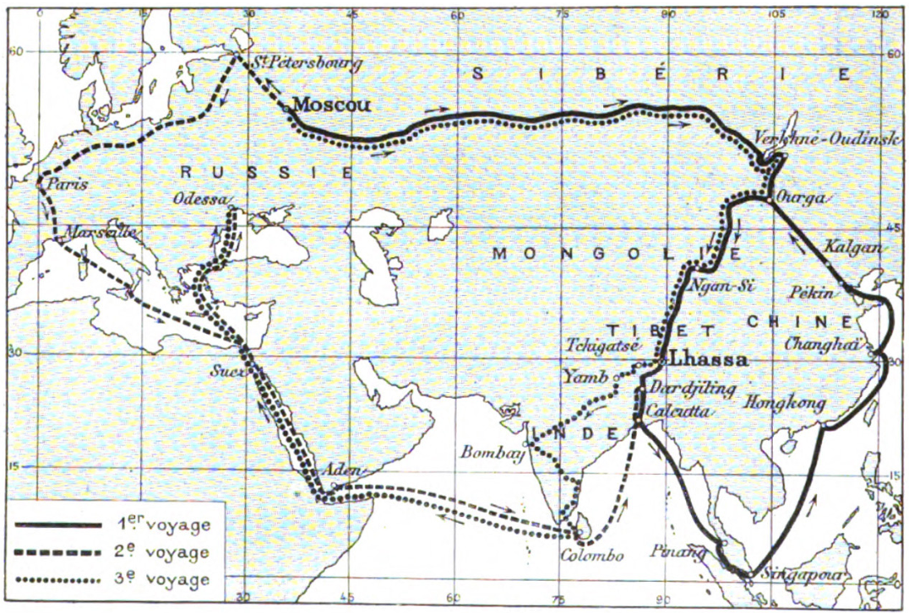

## Введение

Калмык Овше Мучкинович Норзунов ([вики](https://ru.wikipedia.org/wiki/%D0%9D%D0%BE%D1%80%D0%B7%D1%83%D0%BD%D0%BE%D0%B2,_%D0%9E%D0%B2%D1%88%D0%B5_%D0%9C%D1%83%D1%87%D0%BA%D0%B8%D0%BD%D0%BE%D0%B2%D0%B8%D1%87)), помощник Агвана Доржиева совершил три путешествия в Тибет, дважды достигнув Лхасы. Первое путешествие из Урги началось в августе 1898 на родине Овше, 5.10.1898 отправившись из Урги, в марте 1899 он прибыл в Лхасу, вторая попытка в начале 1900 не увенчалась успехом, Норзунов был задержан в Индии, третья состоялась в 1900-1901.  Из последнего путешествия Норзунов привез первые фотографии Лхасы, часто публикуемые вместе с фотографиями Цыбикова.

В отличие от методичного Цыбикова, Норзунов не вел полевых дневников и основным описанием его поездки являются его воспоминания записанные Джозефом Деникером ([вики](https://en.wikipedia.org/wiki/Joseph_Deniker)), земляком Норзунова (Деникер родился в Астрахани). Деникер опубликовал воспоминания Норзунова на французском языке в журнале Le Tour du Monde. Journal des voyages et voyagers.

Полная ссылка: Deniker, Joseph. Trois Voyages a Lhassa (1898--1901) par Ovché Narzounov, pélerin kalmouk. Présentés par M. J. Deniker \[Three voyages to Lhasa (1898--1901) by Ovshe Norzunov\]. Le Tour du Monde. Journal des voyages et voyagers. Paris: Library Hachette et Cie, 1904. Nouvelle Serie. Vol. X. No. 19, 20: 7--14 May 1904. Pp. 217--240. (In French).

[Скачать PDF.](https://drive.google.com/file/d/1iujVc6xqZ9aVVsMBCHLWI65mI9h7e4Gq/view?usp=sharing) 

[Оригинал](https://gallica.bnf.fr/ark:/12148/bpt6k344479/f218.item) на Gallicia BNF. Нужно обратить внимание, что на [странице журнала](https://catalog.hathitrust.org/Record/008966282) Le Tour du Monde в Hathtrust этот том закрыт для скачивания, в отличие от выпусков журнала с 1860 по 1895 г. Возможно дело в копирайтах и тогда ссылка на PDF выше --- пиратская.

Распознанный текст на французском [Doc](http://collin.francois.free.fr/Le_tour_du_monde/TdM-ouverture.htm), [Веб-сайт](http://collin.francois.free.fr/Le_tour_du_monde/textes/Lhassa1903/lhassa1903.htm).

Русскоязычный перевод с комментариями содержится в работе Митруева (комментарии) и Ворониной (перевод с французского).

Полная ссылка: Митруев Б.Л., Воронина Д.К. Первый фотограф Лхасы: публикация дневника О. Норзунова «Три поездки в Лхасу (1898--1901)» (перевод Д. К. Ворониной, комментарии Б. Л. Митруева). *Oriental Studies*. 2018;11(6):36-72. <https://doi.org/10.22162/2619-0990-2018-40-6-36-72>

[Скачать PDF.](https://drive.google.com/file/d/1_GOOXZPa6xCxAcbF7FfR1O1A8pvIKe-3/view?usp=sharing)

## Три путешествия и топонимы

Второе путешествие шло через Индию.

Маршрут третьего путешествия совершенно не описан. Расстояние до Лхасы было преодолено уникально быстро, всего за 2 месяца и 24 дня. К сожалению мы не знаем, как же добирался Норзунов с такой скоростью. В переводе весь машрут описан буквально в двух предложениях:

> ... мой наставник решил ждать меня в Урге. Я прибыл туда на экспрессе и с перекладными лошадьми, преисполненный решимости. Мы покинули Ургу вместе с шестью другими попутчиками 5 декабря 1900 года, и 28 февраля 1901 года достигли священных стен Лхасы.
>
> Таким образом, мы пересекли пустыню Гоби за два месяца и двадцать четыре дня.

Все остальное описание третьего путешествия посвящено пребыванию в Лхасе, монастырям в городе и окрестностях, фотографированию.

Карта прилагающаяся к статье Деникера (продублирована у Митруева) --- дает минимум информации о маршруте на участке Урга --- Лхаса. Кроме двух городов упомянут только один топоним --- Ngan-Si.

Из трех путешествий, географическая информация по маршруту в направлении Урга --- Лхаса содержится только в первой части.

Разбор топонимов - в [отдельной статье](/notes/norzunov-route/).

## Комментарии

[**Обсудить**](https://t.me/answer42geo/32)
