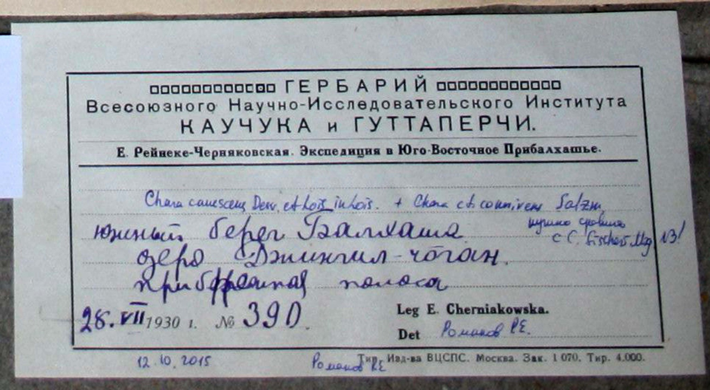
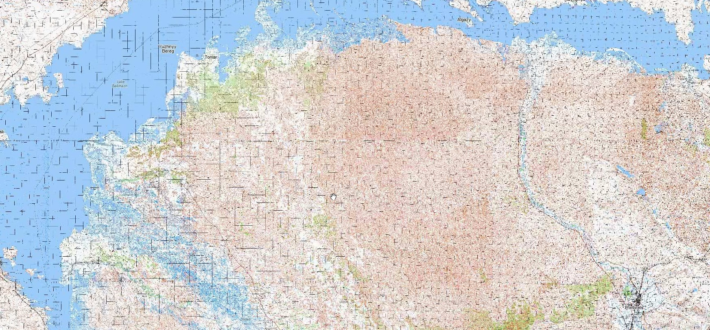
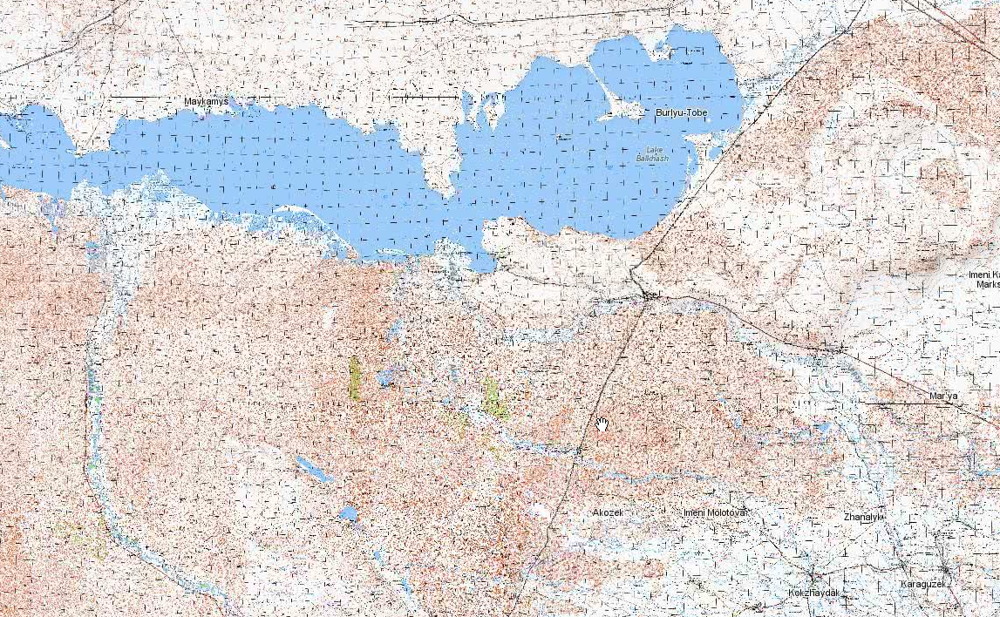
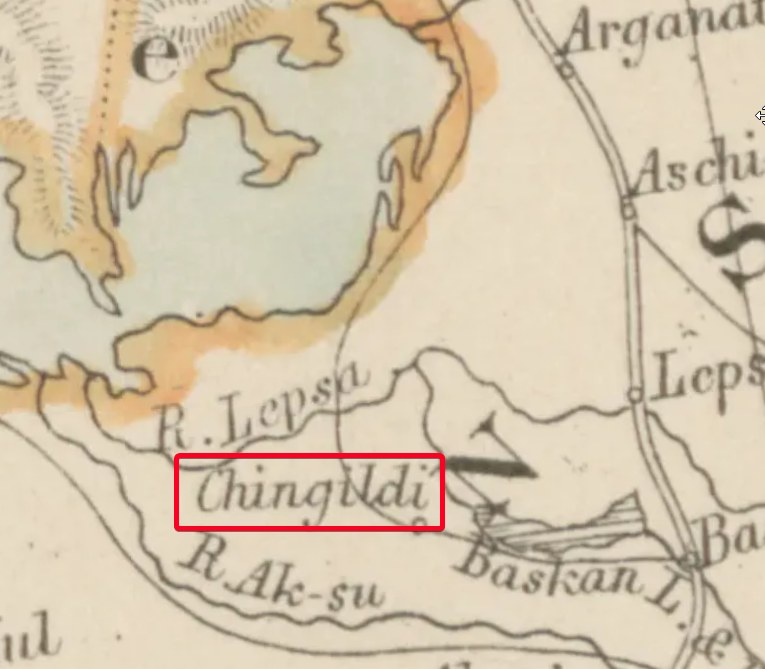
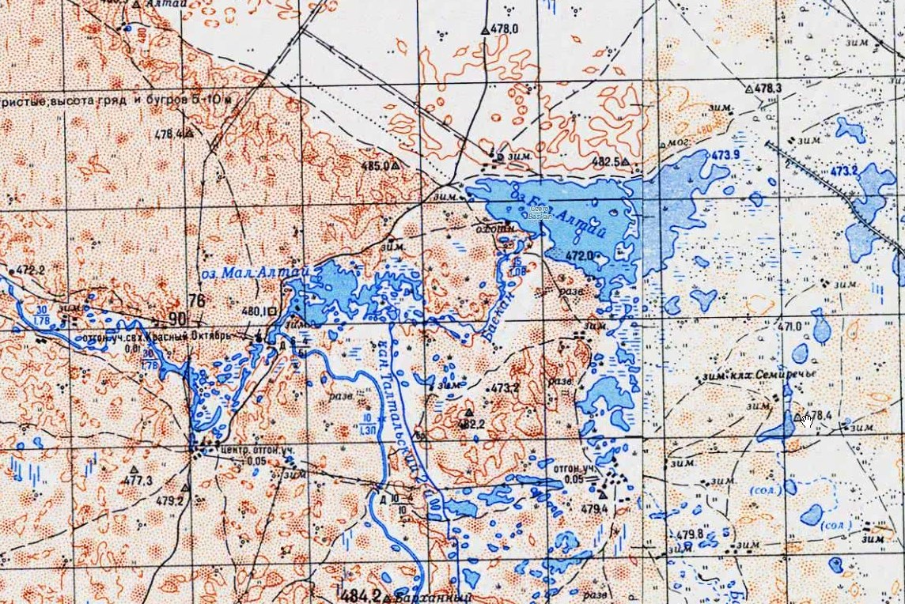
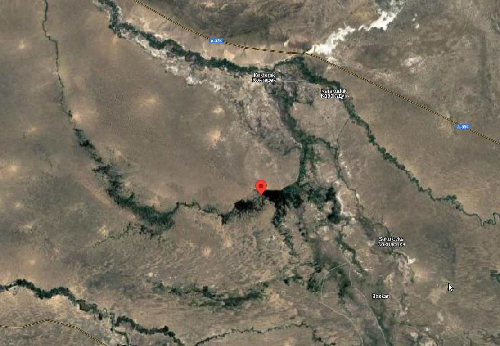

## Введение

Итак, что мы знаем из карточки сбора:

* Южный берег оз. Балхаш
* Юго-Восточное Прибалхашье (Балхаш большой, сужает поиски)
* год: 1930
* Название озера Джингил чоган

## Поиск

Ищем. Разумеется простой гуглеж ничего не находит.

В Балхаш с юга впадает много крупных рек семиречья: Или, Лепса, Аксу, Каратал, южный берег Балхаша это куча озер, примерно так:

Поэтому уточнение, что это Юго-восток довольно важное, тут посуше и озер поменьше.

Главное слово --- джингил, пробуем фонетически близкое:

* джингил, жынгыл, чеңгел, чингил, dzhingil, чеңгел

Тупой отсмотр южного побережья ничего не дает.

Река Жингильды есть в 250 км ([Яндекс Карты](https://yandex.ru/maps/geo/zhyngghyldy_stantsiyasy/100123799/?ll=76.472940%2C43.541126&z=12)). Впадает в р. Курты, которая впадает в р. Или, которая впадает в западную часть Балхаша. [Verum.wiki](https://verum.wiki/index.php?item=rpv:114992).

Хорошая фонетическая близость, но аргументы против:

* Не восток Балхаша, а скорее запад.
* Расстояние до реки более 250 км, далее цепочка рек с другими названиями. Больно далеко.
* Озера не видим (есть одноименная ж/д станция)

Толкование и перевод, киргизско-русский (Кыргызча-орусча). Сходу не очень полезно, но Чоган пригодится позже.

* джингил - звон
* чоган - большой
* чеңгел - коготь

Толкование ченгел ([чеңгел](https://kirgyz_russian.academic.ru/29663/%D1%87%D0%B5%D2%A3%D0%B3%D0%B5%D0%BB?ysclid=m20sc3dmc7469315504)):

> 1\. лапа (хищной птицы);
> 2\. чуйск. джингил (колючий кустарник, растущий в безводных местах);
> 3\. приспособление для переворачивания варящегося в котле мяса (палка с железными крючьями на конце);
> 4\. перен. неодобр. горсть, пятерня;
> 1) грязная (нечестная) пятерня;
> 2) хапуга, расхититель.

Смотрим исторические карты периода 1850-1950.

Arrowsmith, J., 1879. Central Asia 1:6 000 000

Central Asia, constructed from the latest English and Russian documents adapted to recent astronomical observations; By the later John Arrowsmithm with additions and corrections to 1879.

* Карта 1872 в хорошем разрешении в [библиотеке Принстона](https://catalog.princeton.edu/catalog/9976877393506421).
* Карта 1879 в хорошем разрешении в [ETH Zurich](https://www.e-rara.ch/zut/content/zoom/11898357?fbclid=IwY2xjawFyZJ1leHRuA2FlbQIxMAABHa5T-4cQIOfXHUDI1OKFdH3fiBe_wcjzXhF7roDPsYsUHQyEI3o9k_lwXA_aem_POSFAhOvDDaWZi0-MHRDHg).

Рабочая гипотеза. Имеется в виду озеро Баскан в междуречье Лепсы и Аксу ([Google Maps](https://maps.app.goo.gl/n3BUBfVfkG1y5eZz9)). Примерно в 60 км на юго-восток от юго-восточного берега оз. Балхаш. В окрестностях озера располагался населенный пункт (или пикет? да, пикет Чингильдинский, см. ссылку на мемуары Семенова-Тян-Шанского ниже) под названием Chingildy (фонетически близко к Джингил). Озеро было достаточно крупным, чтобы быть отраженным на такое мелкомасштабной карте. Чоган переводится как Большой.

На генштабе оз. Баскан называется оз. Большой Алтай:

На снимках (Google) водной поверхности не видно, возможно сезонное явление.

Аргументы против:

* все-таки не так близко, 60 км
* Джингильды на старой карте есть, но на более современных его не видно.

Но гипотеза хорошая.

## Семенов-Тян-Шанский

Из второго тома мемуаров ([wikisource](https://ru.wikisource.org/wiki/%D0%9F%D1%83%D1%82%D0%B5%D1%88%D0%B5%D1%81%D1%82%D0%B2%D0%B8%D0%B5_%D0%B2_%D0%A2%D1%8F%D0%BD%D1%8C-%D0%A8%D0%B0%D0%BD%D1%8C_%D0%B2_1856-1857_%D0%B3%D0%BE%D0%B4%D0%B0%D1%85_(%D0%A1%D0%B5%D0%BC%D1%91%D0%BD%D0%BE%D0%B2-%D0%A2%D1%8F%D0%BD-%D0%A8%D0%B0%D0%BD%D1%81%D0%BA%D0%B8%D0%B9))):

> 3 сентября я употребил на экскурсию в степь на северной стороне реки Или. Древесная растительность между Илийским и **Чингильдийским** пикетами состояла из следующих деревьев и кустарников: Populus euphratica, Pop. pruinosa, Berberis integerrima, покрытого в это аремя красивыми круглыми розового цвета ягодами, Eleagnus hortensis, Caragana frutescens, Car. tragacanthoides, Halimodendron argenteum, Rosa gebleriana, Hultheimia berberifolia, Tamarix elongata, Tam. pallasii, Tam. hispida, Stellera stachyoides. Экскурсируя, мы доехали до **Чингильдийского** пикета только к 3 часам пополудни и здесь осмотрели незнакомый нам ещё источник, температура которого оказалась 13,2°.

## Комментарии

[**Обсудить**](https://t.me/answer42geo/42)
