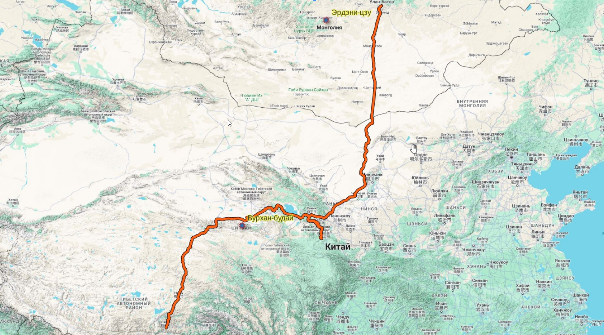

## Введение

У Леонида Юзефовича недавно вышла новая книга --- Поход в Бар-хото. Книга очень понравилась. Повествует о довольно сложных и местами ужасных вещах, но как-то спокойно и умиротворенно. Хотя сам Бар-хото является местом вымышленным (осада Бар-хото имеет параллели с осадой монголами китайской крепости Ховд, он же Ковдо), книга тоже ориентирована во «Вселенной Цыбикова».

Одна из рекуррентных тем в Походе --- упоминания Эрдени-цзу, буддистского монастыря в Монголии ([Википедия](https://ru.wikipedia.org/wiki/%D0%AD%D1%80%D0%B4%D1%8D%D0%BD%D0%B8-%D0%94%D0%B7%D1%83), [Google Maps](https://www.google.com/maps/place/%D0%AD%D1%80%D0%B4%D1%8D%D0%BD%D0%B8-%D0%94%D0%B7%D1%83/@47.196965,102.8441988,15z/data=!4m12!1m5!3m4!2zNDfCsDEyJzA2LjAiTiAxMDLCsDUwJzM2LjAiRQ!8m2!3d47.2016667!4d102.8433333!3m5!1s0x5d9cf209068cf281:0x9e4e07fa516f844f!8m2!3d47.2012243!4d102.8409825!16s%2Fm%2F02px8lv?hl=ru&entry=ttu)) и истории про то, как хан Абатай отрубил ноги статуе Будды, которая «не хотела» идти.

[.")](https://www.google.com/maps/place/%D0%AD%D1%80%D0%B4%D1%8D%D0%BD%D0%B8-%D0%94%D0%B7%D1%83/@47.2012243,102.8409825,3a,75y,90t/data=!3m8!1e2!3m6!1sAF1QipOCoGw3d19e5mjAgZ8wUN0tzIaA1uev_NIGNqT4!2e10!3e12!6shttps:%2F%2Flh5.googleusercontent.com%2Fp%2FAF1QipOCoGw3d19e5mjAgZ8wUN0tzIaA1uev_NIGNqT4%3Dw114-h86-k-no!7i3264!8i2448!4m13!1m5!3m4!2zNDfCsDEyJzA2LjAiTiAxMDLCsDUwJzM2LjAiRQ!8m2!3d47.2016667!4d102.8433333!3m6!1s0x5d9cf209068cf281:0x9e4e07fa516f844f!8m2!3d47.2012243!4d102.8409825!10e5!16s%2Fm%2F02px8lv?hl=ru&entry=ttu)

Благодаря Цыбикову, мы знаем **где** именно Абатай совершил этот решительный поступок:

> Халхаский хан Абатай\[26\] (XVI в.) приобрел в Тибете статую божества Гонбо-гуру. Когда он, везя ее, поднялся на этот перевал, то статуя спустилась на землю. Люди Абатая никак не могли поднять ее для навьючения. Тогда рассерженный хан рассек статую пополам со словами: «Не желающий зад останься, а желающее туловище пусть пойдет» -- и повез одно туловище, которое теперь чтится в халхаском монастыре Эрдэни-цзу.
>
> Слово «спуститься» будет на разговорном монгольском языке буху, а божество -- бурхан. Бурхан бусан -- божество спустилось, но каким образом получилось слово будай -- мне неизвестно. Но верно лишь то, что это **название перевала** все монголы связывают с упомянутой легендой.

«Название перевала» упоминаемое Цыбиковым, это перевал через Бурхан-будай. Рассечение Будды состоялось на нём. Перевал также важен тем, что через него вел один из двух основных маршрутов паломников в Лхасу.

Еще у Цыбикова:

> Главных дорог, ведущих из Южного Цайдама в Тибет, две: первая через перевал Бурхан-будай, вторая через Найчжи. Первая идет из хошуна Барун-цзасака, вторая из хошуна Тайчжинаров. Из них наш караван избрал вторую дорогу.

То есть Цыбиков через перевал не пошел, пошел через Найчжи. Эту часть Цыбиков рассказывает когда стоит на реке Баян-гол, главной реке равнины Цайдама, местом как раз перед развилкой.

## Комментарии

[**Обсудить**](https://t.me/answer42geo/15)
