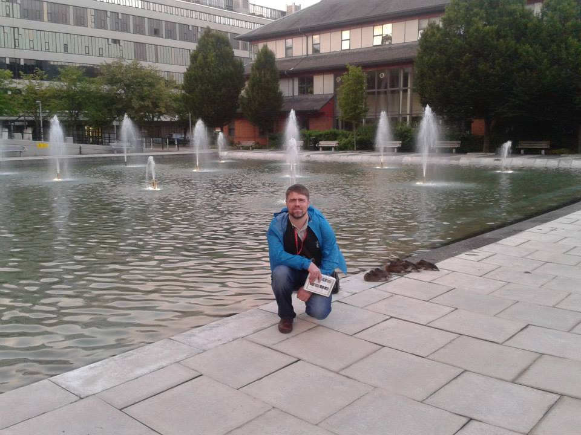
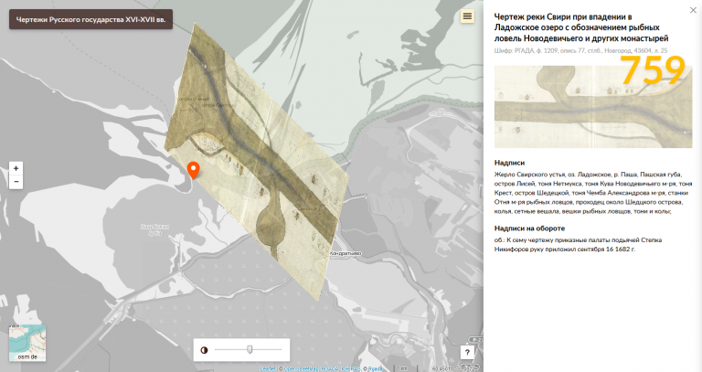
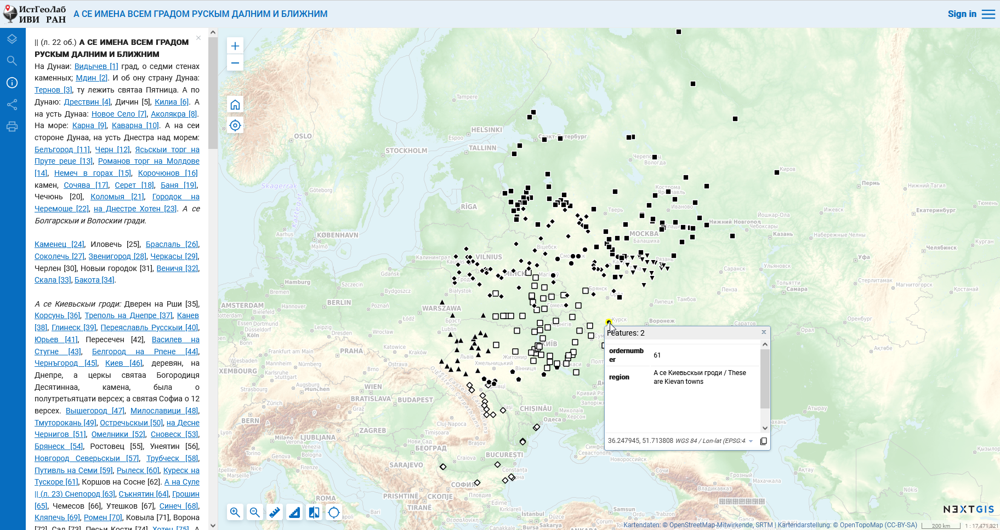
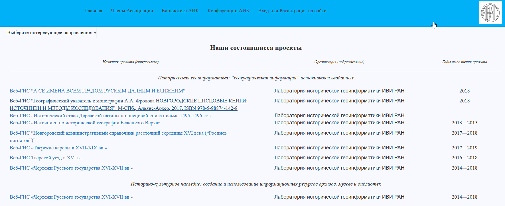

10 июля 2024, после болезни [ушел](https://igh.ru/news/pamyati-a-a-frolova?locale=ru) Алексей Фролов, человек который привёл меня и нашу компанию в историческую геоинформатику. Благодаря Алексею, я часто повторяю, что, для меня лично, самые активные пользователи ГИС это экологи и историки ...

Алексей, уникальный человек. Абсолютно неконфликтный и спокойный и при этом отважно осваивающий новые для себя технологии и придумывающий новые. Новые информационные системы, базы данных, сайты. Алексей не ждал разрешений и просто осваивал и делал то, что было нужно для науки и своего дела.

Здесь я попытаюсь зафиксировать некоторые моменты нашей совместной истории. Алексей очень повлиял на нашу компанию и его вклад невозможно переоценить. Испытываю надежду, что удастся немного зафиксировать важный вклад Алексея для будущих поколений исследователей и нашей истории.

Далекий 2013. Алексей стал одним из первых наших официальных пользователей и, поскольку Институт Всемирной Истории РАН находился недалеко от нашего офиса на Вавилова, бывал у нас в гостях.

В 2016 г. мы запустили систему для интерактивных карт (Веб ГИС) и с 2017, Алексей, распознав потенциал для своей работы, стал одним из самых активных и благодарных пользователей, накапливая и визуализируя историческую информацию на картах, предлагая разные доработки и реализуя неожиданные проекты, не переставая нас удивлять и поддерживать своими результатами.

В 2017 г. Алексей пришел с идеей и предложением и мы помогли ему сделать Геоинформационную систему «[Чертежи Русского государства](https://nextgis.ru/blog/rgada/) XVI-XVII вв.». Благодаря активной позиции создателей «история должна быть доступна» Российский Государственный Архив Древних Актов (РГАДА) открыл доступ к ГИС для всех. Уникальным образом удалось географически привязать многие древние документы. Система до сих пор работает.

Алексей [писал](https://www.facebook.com/npkfrolov/posts/pfbid0HPQm8axjYV6swHn7aT366Y5wJ7juem88caaKHk18AMEKeSmEUT72f9Q39MDHn4Bal?__cft__[0]=AZW-SFMGXTD1dhlRvsdEXntKVneypDmRqw0hBOmdAcy8nyPkIH9KbAMdoB8tyIKXeEtnUrRud02cmiVX395Hjpy7HStAdFduKtfs6CV6C5vbLkLJh44iRgot-LMCmJjAh7UF-M7ITXn_snoHfW-DSNoKjUiiN2hloXodz7XniqqQCA&__tn__=%2CO%2CP-R):

> Лаборатория исторической геоинформатики Института всеобщей истории РАН и Российский государственный архив древних актов запустили веб-ГИС "Русские чертежи XVII века", которая открывает интернет-пользователю возможность ознакомиться с оцифрованными изображениями практически всех чертежей, выявленных в РГАДА, и некоторых чертежей из других собраний. Система снабжена инструментарием текстового поиска по данным о чертеже. Кроме того, более 700 чертежей получили привязку на карте, которая и занимает центральное место в веб-ГИС. На карте отображается очень условное положение чертежа относительно местности, а также полигоном очерчена та местность, которую изображение на чертеже "закрывает". Реализована возможность перехода от карты к данным атрибутивной таблицы и к нетрансформированному геокодингом изображению и обратно. Работа над улучшением системы (уточнение описания архивных дел, улучшение качества оцифровки, привязка к карте пока еще не локализованных чертежей и т.д.) ведется постоянно.

[http://rgada.info/index.php?page=14](https://l.facebook.com/l.php?u=http%3A%2F%2Frgada.info%2Findex.php%3Fpage%3D14%26fbclid%3DIwZXh0bgNhZW0CMTAAAR0mchMZH0vy8rTBzYuSUJbV1R1hKwgdjlamwVWrtKWBqI6dExzaAFMkiiI_aem_RM75gnTHemEEZQZti6wx6A&h=AT09-foceTF4W1OTpWLFzPR57mVRtppsKWYN0J7Cwptp49kHkR9fFnbfWyh1gTPaacn33_z4qfJmLhSgNyG8285TSAb5zWZRU9fEyHArJnrxDlyVkLY8UQzp6QTI2P-D&__tn__=-UK-R&c[0]=AT2v-EFC5CTqaDiMrM1xUkvzHuZBxLcfzHVa36jYBNke1eeX7T7Kd5hNKfttaY2Q4oY4XOH_O4s9cMQFbJdOyfLu8OHHv_ntW81JpuxythEPqkfj-aDr7DFVeqv1SGzWINT--T1lXIBuuzLPlRiYtmEdFksB2uj257CzZFtNpDsE1IfcOw4)

[http://rgada.info/geos2/](https://l.facebook.com/l.php?u=http%3A%2F%2Frgada.info%2Fgeos2%2F%3Ffbclid%3DIwZXh0bgNhZW0CMTAAAR0EzSjNqBz1wugeGIZSEn386HdzOHBZ_9mRt-5HxdvBowdc4QHSb-IpjYI_aem_RCURl4z8OmCU-PDt6ktUrA&h=AT0UjVINqsmmMMGxmRFHLRhpAvLYY96ng3hj2imzZ42j7lA5OdOInPLaI7stn0hgz8Y1RqoroeBydX_-Lo_u8enbqxt1SBeN-dgW-DPIRbw5xqQPVNM2Bymg4n31MoE_&__tn__=-UK-R&c[0]=AT2v-EFC5CTqaDiMrM1xUkvzHuZBxLcfzHVa36jYBNke1eeX7T7Kd5hNKfttaY2Q4oY4XOH_O4s9cMQFbJdOyfLu8OHHv_ntW81JpuxythEPqkfj-aDr7DFVeqv1SGzWINT--T1lXIBuuzLPlRiYtmEdFksB2uj257CzZFtNpDsE1IfcOw4)

В 2018 мы помогли Алексею реализовать т.н. [Геоуказателя по топонимам](https://nextgis.ru/blog/geoukazatel/) --- специальный интерфейс, который помогал ему накапливать информацию по расположению топонимов для своей монографии: Фролов А.А. Новгородские писцовые книги: источники и методы исследования. М-СПб., Альянс-Архео, 2017. URL: <http://ukazatel.histgeo.ru/index.html>\>

По этой теме Алексей позже, в 2021 защитил [докторскую степень](https://www.prlib.ru/item/1823609).

Кто бы знал, что спустя 6 лет я и сам займусь топонимами и как бесконечно тяжело от мысли, что я не смогу никогда рассказать о своем проекте Алексею.

Тогда же в августе 2018 Алексей придумал и помог реализовать технологию [интерактивного описания для веб-карт](https://nextgis.ru/blog/text2map/). Успешно ее применил в своем проекте: [А СЕ ИМЕНА ВСЕМ ГРАДОМ РУСКЫМ ДАЛНИМ И БЛИЖНИМ](https://histgeo.nextgis.com/resource/1151/display?panel=info).

2019, январь. Самый масштабный проект Алексея и Руниверс в прямом и переносном смысле: «Границы России 1462--2018 гг.» ([https://map.runivers.ru](https://map.runivers.ru/)). Написали все крупные СМИ, в том числе National Geographics. Главное достижение --- Алексей с коллегами оцифровал с немыслимой детальностью границы России и предшественников. Обычно такие карты ограничиваются детальностью инфографики.

Смелый проект, наука превыше всего.

Алексей [писал](https://www.facebook.com/npkfrolov/posts/pfbid0hcwjpvQBfKrtU42nu2mxxyHLssjFAb8mAhr4ZR9pzNzCmqNtjgVDmXtxpnVbnQ79l?__cft__[0]=AZWtbykd1mnMT8fo_k1Bxc_CET83Yu7QGnNsSqX0zzvL8rUv5wCy87kVuoujC16PKUc_AkOoHoi2ZHhDR0bw6r3Y9rOF0lR6oFCkA2THGjuWUZx9sPqFXSef_9VRAfV0yAzzaNJciY3Xtasq-0uhC6NjheNZUdwW2FjMUT3NCsRJ6Q&__tn__=%2CO%2CP-R):

> Это динамическая карта, которая отображает погодовое изменение внешних границ территории русских княжеств, Московского царства, Российской империи, СССР и Российской федерации. В Лаборатории исторической геоинформатики разработана концепция реализованной здесь динамической карты и создан соответствующий контент. В отличие от известных аналогов, эта карта рассматривается как платформа, объединяющая усилия историков-специалистов по разным регионам и периодам в создании пространственно привязанных данных.

Жизнь современных технологий скоротечна. Сайт лаборатории исторической геоинформатики Алексея, ИстГеоЛаб уже отключен (но сохранился слепок на [web.archive.org](http://web.archive.org/web/20231219100352/https://histgeo.ru/)).

Подробную информацию о проектах Алексея можно найти здесь: [https://aik-hisc.ru/web\_resources/aik/1/](https://aik-hisc.ru/web_resources/aik/1/). Слава богу, что результаты его трудов были сохранены на сайте Ассоциации "История и компьютер", президентом которой он являлся.

> Алексей Анатольевич успешно руководил Лабораторией исторической геоинформатики ИВИ РАН, он известен также как инициатор или соавтор ряда масштабных научно-образовательных проектов, посвященных публикации исторических источников. Так, публикация писцовых книг в среде веб-ГИС позволяет совместить передачу основных элементов бумажной публикации источника с преимуществами современного цифрового формата, расширенного за счет картографической компоненты. Широко известна публикация 2008 г. А.А. Фролова и Н.В. Пиотух «Исторический атлас Деревской пятины Новгородской земли конца XV в.» и ряд масштабных веб-ресурсов в сотрудничестве с РГАДА -- «Геоинформационная система "Источники по исторической географии Бежецкого Верха"», «Динамическая карта внешних границ Руси, России, СССР IX-XXI вв.», «Динамическая карта границ Западной Европы IX--XI вв.», «Чертежи Русского государства XVII в.».>

<https://aik-hisc.ru/#41>

Мы сохраним Веб ГИС Алексея: <https://histgeo.nextgis.com> пока живы сами.

Прощайте, Алексей. See you on the other side.

## Комментарии

[**Обсудить**](https://t.me/answer42geo/18)
