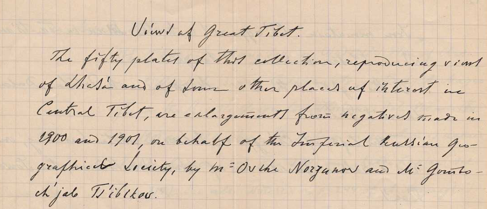

## Введение

Оригинал письма (английский язык): <https://www.loc.gov/item/2021667924/>

Посмотреть или скачать дешифрированное письмо: [Google Drive](https://docs.google.com/document/d/1SuPJyOq5UcMFPPJs7L06iFf0liQynE4IrQP9FZZmOPo/edit)

## История письма

В 1902 Цыбиков и Норзунов уже в России. В 1903 РГО издает альбом фото Ц&Н в количестве 50 шт. (29 фото Норзунова, 21 --- Цыбикова). К альбому прилагается текст с описаниями фото «Виды Центрального Тибета». Далее в 1904 этот альбом с сопроводительным письмом Григорьева на английском РГО рассылает крупным географическим обществам. Письмо озаглавлено «Views of Great Tibet» и включает описания каждого фото составленные Цыбиковым с коллегами. Из письма:

> The explanations of the plates have beed given by
> Mr. Ts'ibikov and by some other Buriats and Kalmuks
> well acquainted with the sacred sites of Central Tibet.

## Текст письма

Здесь приводится распознанный текст письма полностью. Важные нюансы:

* Переносы слов, строк, страниц, пунктуация как в оригинале. Страницы помечены отдельными цифрами.
* Ошибки и опечатки в оригинале не исправлялись
* Ссылки после названий фотографий добавлены и соответствуют страницам фото на Library of Congress в которой хранятся [те же 50 фото](https://www.loc.gov/search/?fa=contributor%3Atsybikov%2C+g.+ts.+%28gonbochzhab+tsebekovich%29&st=list&c=100). Информация в письме и описаниях фото в библиотеке совпадает не полностью. Есть отсутствующие фргаменты и там и там.
* Нераспознанные куски помечены ????

## Views of Great Tibet

<https://www.loc.gov/item/2021667924/>

The fifty plates of this collection, reproducing views
of Lhasa and of some other places of interest in
Central Tibet, are enlargements from negatives made in
1900 and 1902, on behalf of the Imperial Russian Geo-
graphical Society, by Mr Ovshe Norzunov and Mr Gombo-
ch'jab Ts'ibikov.

Both gentlements are lamaists; Norzunov - a kalmyk
of the Astrakhan horde and Tsi'bikov - a K'ori Buriat.
Both had hand cameras called  "Self-worker" by Pipon
in Paris, supplied with Anastigmatic lenses by Goerz
Lenses III, N 00. The size of the original negatives is 9x6 1/2
centimeters.

Norzunov \[marked further \[N.\]\] used "Lumiere" plates, Ts'i-
bikov (marked further (Z.)) - "Empress" plates of "The Bri-
tannia Works".

The explanations of the plates have beed given by
Mr. Ts'ibikov and by some other Buriats and Kalmuks
well acquainted with the sacred sites of Central Tibet.

Most of the Tibetan names are given in the translite-
ration used in L. Austin Waddell's "Buddhism in Tibet or
Lamaism" ???? 1895 and those not to be found in that
book have been transcribed, on the same principles, as
nearly as it could be done phonetically as the names
were pronounced by the informants.

**N 1. Lhasa' from the East \[N.\]**

<https://www.loc.gov/item/2021670590/>

In the background and nearly in the center is the

**2**

"Iron mountain" Ch'agpo ri 1) with the Man-ba Ta-ts'an 2),
where Tibetan medicine was taught.

On the right is the hill Marpori with Potala, Dalai
Lama's Palace.

To the left of Ch'agpo ri, behind a white building, one
has a rather faint view of Lhasa's cathedral, the Jowo-
k'an 3).

The buildings in the foreground are those of Banak sho 4),
the traders quarter.

Obs. 1) Chiakpori on A-k's Plan of Lhasa; Chapori
and Chakpori Rockhill. Tibet etc. J.R.A.S. 1891; Chag-
ga or Chag-pa hill on Waddell's Plan on Lhasa G.J.
1904 for March.

1) Vaidurya Ta-tsan of Sarat Chandra Das jour-
ney to Lhasa. London 1902 p. 195; Ch'ag ri Veidur in
Minch'jul Khutuktu's Geography of Tibet; Russian
translation by the late Prof. W. Wassiliev, edited by
the Imp. Academy of Sciences of St. Petersburg. 1895.

1) Jhio on A-k's Plan of Lhasa

2) Banagshio on A-k's Plan; Banashag Rockhill
Tibet Plan of Lhasa.

**N 2. Lhasa from the North \[N.\]**

<https://www.loc.gov/item/2021670636/>

The large dark building behind a white one in the
Foreground is the Gah-ldan K'an-sar 1), up to 1751 palace
of the Tibetan kings, mentioned only by Fra Cassiano
(Beligatti) da Macerata 2) and Sarat Chandra Das. 3)
More to the right is the (gilded) roof of Ramo-ch'e

**3**

In chinese style.

Obs. 1) Kang-da Khang Sar Waddell's Plan of Lhasa

2) Giornale di Fra Cassiano etc. edited by A. Magna
ghi in the Rivista Geografica Italiana. Vol VIII and IX
From 1901 and 1902 where the palace in question is named
"Kande Kanzer" (Vol. IX. p. 244 ) and "Kande Kansar" (Vol.
IX p. 314). See also note (2) on p. 244 of A. Magnaghi's
paper l. c. where the palace in question, on the authority
of Oragio Della Penna, is named Kaden Khansar.

3) Sarat Chandra Das l. c. p. 172 spells the name
of the palace "Gadan-Khangsar"

**N 3. Marpo ri with the Potala from SSE****. \[N.\]**

<https://www.loc.gov/item/2021670614/>

**N 4. Ditto, from a nearest point of view and more from
the West****. \[N.\]**

<https://www.loc.gov/item/2021670629/>

**N 5. Potala from the South. \[N.\]**

<https://www.loc.gov/item/2021670631/>

The large dark (de facto red) building on the top of
The hill is the "Phodang Marpo" or the "Red Palace" of Sarat
Chandra Das 1).

The main southern entrance to the palace is in the
white building in the foreground.

To the left (on the picture) of the main entrance and
In front of it is in an enclosure a dark (de facto yellow) pa-
vilion over a "pei" dating from 1794 and standing on a
stone tortoise 2).

To the right of the main entrance is a similar dark
(yellow) pavilion over a stone tablet standing on a square
Stone pedestal; dating from 1721 3)

**4**

The (monolith) column seen near the right pavilion
bears an illegible inscription in Tibetan.
Inside the walls, to the right (on the picture) of the main
Entrance is the mint.

Obs. 1) l. c.p. 166

2) Rockhill l. c. p. 264 footnote (1)

3) Rockhill l. c. p. 187 footnote (2) and page 264 footnote (1).

**N 6. Potala from SSW. (Z.)**

<https://www.loc.gov/item/2021670608/>

This view has been taken by Ts'ibikov during the fes-
tival he calls "Ts'og Ch'od" 1) celebrated on the 29th day
of the second moon of the (Tibetan) year (18/5 April 1901).

The huge pictures hung on the palace wall beneath
the Nam-gyal Ch'oid, the monastery of the palace, re-
present Jakya Muni (on the right ???) and Tara or Doma
(on the left).

Crowds of people cover the slope of the hill and stand
at the foot of the picture.

Obs. 1) Sung ch'o Rockhill l. c. p. 8 footnote.

**N 7. Potala from the East. \[N.\]**

<https://www.loc.gov/item/2021670620/>

**N 8. Potala from NNE. \[N.\]**

<https://www.loc.gov/item/2021670638/>

On the roof of Phodang Marpo are seen four shrines
with (gilded) roofs in chinese fashion.

Half-way up hill is a low round towerlike building
where those coming on horseback to the palace the
western way up, dismount and leave their horses and
mules.

**5**

The entrance to the Palace from that side is facing
the East, in the tower which we see on the right hand cor-
ner (from the spectator) of the Palace.

On A-K's Plan of Lhasa is a lapsus calami: instead
of a north-eastern way up Marpori there ought to be
??? leaving the western slope of the hill up to the
north-western corner of the Palace. This way is plainly
seen in the next pictures.

The dark lines radiating from as many apertures
at the base of the walls of the Palace are streambeds
of excrements.

**N 9. Potala from WNW. \[N.\]**

<https://www.loc.gov/item/2021670621/>

View taken from the road to Drepung monastery.
The birds seen on the ground are but cocks brought
thither from all Lhasa. The cocks are ???? in great
numbers  in the household, but, as in the precincts of the
ritualistic outer circumambulation road to creature
can be put to death, the cocks are carried to this place
where they are left to te mercy of passers-by and those
making the circumambulations; they feed the birds
by throwing them corn.

Obs. May be also that by bringing hither
cocks is acted the life saving charity or the
"Srog slu" rite which on the authority of Sarat
Chandra Das (l. c. p. 134)  is calculated to ensure
life of the donor.

**N 10. A Lhasa street during the "Ts'og Ch'od." (Z.)**

<https://www.loc.gov/item/2021670633/>

The stripes flying in the wind are prayer flags.

**6**

**N 11. Tan-gye-ling 1) from SE. (Z.)**

<https://www.loc.gov/item/2021670594/>

This is Demu-Khutukhtu's, or late regent (+ August 1900)
monastic palace.

In the distance are Ch'agpo ri on the left and Potala
on the right of the picture.

Tan-gye-ling itself is on the second plan, the flat-
roofed building on the foreground being a private house.
On the almost left is a group of Dar-c'og (prayer-
flags).

Obs. Tangia Ling on A-K's Plan of Lhasa, in
also Waddle's Buddism p.522. Tengy ling
Rockhill l. c. Plan. Ten-gye Ling on Waddell's
Plan of Lhasa. G.J. III, 1904

**N 12. Gah-ldan K'ansar \[N.\]** See N 2

<https://www.loc.gov/item/2021670613/>

**N 13. Yuto'g zampa 1) \[N.\]**

<https://www.loc.gov/item/2021670619/>

This bridge on the way from Lhasa to Potala is co-
vered with glazed blue tiles, but the name means "the
turquose roof bridge".

Obs. Yu-tog zampa Sarat Chandra Das l. c.
p. 148, Yutok jampa on A-L's Plan; Rockhill
l. c. p. 76 and 258; Bridge Yu-tok on Waddell's
Plan l. c.

**N 14. Bar ch'orten. (Z.)**

<https://www.loc.gov/item/2021670618/>

A ch'orten like gate between Ch'agpo ri and Mar-
po ri. The view is taken on the way from Lhasa.
The large two-storied house to the right is a pri-
vate one.

**7**

From the top of the ch'orten wires are stretched
to the tops of two smaller ch'ortens standing on both
hills of the passage; there wires are furnished with small bells.
One of the smaller ch'ortens is seen to the left through
the branches of a tree.

The other small ch'orten (on the slope of Mapro ri) is
seen on the view of Potala facing p. 166 Sarat Chandra
Das's "Journey etc. l. c. where also can be seen the pri-
vate house mentioned above.

On the top of the hill to the left (Ch'agpo ri) one
can see the Mah-ba Ta-tsan.

Obs. Bar ch'orten is called "Barkokani" on A.K's
Plan l. c. and "Bakokani" on Rockhill's Plan l. c.
On Waddell's Plan of Lhasa l. c. it is called
"Gateway of Pargo-kaling

**N 15. Ch'agpori from SE \[N.\].** Coup. N 1.

<https://www.loc.gov/item/2021670605/>

**N 16. Ditto from NW. \[N.\]**

<https://www.loc.gov/item/2021670595/>

The houses to the left of the Ta-ts'an are occupied by
students.

**N 17. Kunde-ling from SE. \[N.\]**

<https://www.loc.gov/item/2021670599/>

This monastic palace, where abbot was regent (gyem
bo) of the time of Sarat Chandra Das's visit to Lhasa
(1882), is named Kontia Ling on A-K's Plan l. c. and
Kunduling by Sarat Chandra Das l. c. p. 147

The dark building with the roof in Chineese style
is the Chinese shrine called "Balalugu" on A-k's

**8**

and "Baralalugu" on the amended plan of Lhasa in
Rockhill Tibet l. c. on Waddell's Plan the hill
whereupon the shrine stands is called Ba-mo (bong-ba).

This shrine stands at the Northwestern corner of
Kunde ling and not at the Southeastern one where
it is placed on A-k's Plan of Lhasa.

**N 18. Norbu linga from the East. \[N.\]**

<https://www.loc.gov/item/2021670617/>

The main entrance to the park of the sum-
mer palace of Dalai Lama.

Obs. ???? Rockhill l. c. p. 76 footnote (1)
where it is called Nerbuling k'ang. On
Waddell's Plan l. c. the palace is called
Nor-buling.

**N 19. Amban's yamen from the South-East. \[N.\]**

<https://www.loc.gov/item/2021670596/>

The walls on both sides of the gate facing the
South are the remains of Lhasa's old walls
pulled down in 1721. Potala in the distance.

\[*в оригинале письма ошибка в нумерации, далее к номеру фото нужно добавлять 1*\]

**N 19. Ch' ja shi tan \[N.\]**

<https://www.loc.gov/item/2021670598/>

Fortified camp of the Chinese garrison of Lhasa
in the vicinity of that tower "Dab chi" on A-k's
plan of Lhasa

Obs. The name means "the valley where the
enemy has been defeated" ?i?? p.27 Minch
jul Khutukhtu l. c.

**N 20. Sera \[N.\]**

<https://www.loc.gov/item/2021670591/>

General view of this monastery from the South.

**9**

\[*ошибка с нумерацией исправлена, нумерация продолжается правильно*\]

**N 22. Sera (Z.)**

<https://www.loc.gov/item/2021670611/>

The principle shrines of the monastery viewer from the East.

**N 23. P'urba - Ch'og from South-east. (Z.)**

<https://www.loc.gov/item/2021670616/>

A monastery to the North of Sera. General view.

**N 24. Ditto from a nearer point of view. \[N.\]**

<https://www.loc.gov/item/2021670615/>

**N 25. G'ech'en-ritod. \[N.\]**

<https://www.loc.gov/item/2021670603/>

A hermitage to the North of Sera.

**N 26. Slab of stone whereupon the corpses of the**

**dead are cut to pieces at P'abon-k'a-ritod 1) (Z.)**

<https://www.loc.gov/item/2021670635/>

The hermitage is about two English miles to the
North-West of Sera.

Obs. 1) The name is spelled Phabongka
in Sarat Chandra Das's Journey p. 254

**N 27. De-pung****. (Z.)**

<https://www.loc.gov/item/2021670632/>

General view of the most populous monastery
In TIbet called in Rockhill's Tibet p. 265, footnote (2)

Drawing or Dabung, also Brebung on the Plan of Lhasa.
To the right is the mountain Gapal ri.

**N 28. De-pung****. (Z.)**

<https://www.loc.gov/item/2021670637/>

From the East and nearer point of view.

**N 29. Na-ch'un****. \[N.\]**

<https://www.loc.gov/item/2021670612/>

The residence of the state sorcerer. On the left
Side of the picture is De-pung.

**N 30. Obo****. \[N.\]**

<https://www.loc.gov/item/2021670624/>

This "obo" measuring some 20 feet in hight is
on the road from Lhasa to De-ping and nearer to
this latter.

**10**

**N 31. The river Kich'u west of Lhasa. \[N.\]**

<https://www.loc.gov/item/2021670607/>

**N 32. The same in its lower course. \[N.\]**

<https://www.loc.gov/item/2021670634/>

**N 33. Ruins of the Donkar-jong castle. (Z.)**

<https://www.loc.gov/item/2021670597/>

Donkar is a village on the south from Lhasa to
Tashi-lhumpo, about five miles to the West of Lhasa.

**N 34. Yamdok Ts'o or lake Palti from K'amba la pass. (Z.)**

<https://www.loc.gov/item/2021670628/>

The snow peak in the distance is the "Nui-jin-kang-
Sang" or "Hao-kang-sang" of the map representing
"Parts of Tibet, Sikkim and Khuree" on the sheet N 6
of North Eastern Frontier" scale 8 miles = 1 inch ???
???. December 1888.

**N 35. Gyantse jong. (Z.)**

<https://www.loc.gov/item/2021670609/>

General view of the tower.

**N 36. Gyantse jong. (Z.)**

<https://www.loc.gov/item/2021670623/>

Ch'orten Goman of the Palk'or ch'oide in Gyan-
tse. For description  ?i?? Sarat Chandra Das l. c. p. 88

**N 37. Tashi-lhunpo from the South. \[N.\]**

<https://www.loc.gov/item/2021670630/>

On the extreme right end of the picture is the
"Jong" or citadel of Shigatse.

Inside the walls of the monastery stand in a
Line five towers of the deceased Pan-ch'en Rin-po-ch'e
with roofs in Chinese style.

The dark (red de facto) low building standing in
advance of the towers between the second and the
third is the grand congregation hall "Nagk'an"
or "Nag-pa Ta-Ts'an.

**11**

The huge "Kiku Tamsa" described and figured by Tur-
ner in his "Account of an Embassy to the Court of
the Teshoo Lama in Tibet" ???? 1806 is on the right
end of the monastery.

**N 38. Tashi-lhunpo. (Z.)**

<https://www.loc.gov/item/2021670626/>

The (gilded) roof over the tomb of the fourth Pan-ch'en
(seen in infancy by Turner) viewed from behind. This
Tomb is that marked "l" on the plate representing "The
grand monastery of Tashi-lhump" facing p.50 of Sa-
rat Chandra Das's Journey l. c.

**N 39. Yarba ritod. (Z.)**

<https://www.loc.gov/item/2021670604/>

This hermitage is on the way from Lhasa to Gah-ldan mona-
stery. Here is a cave where the famous Padma-Sambawa is said
to have lived for a while.

**N 40. Ruins of the De-ch'en jong castle** on the way from Lha
sa to the Gah-ldan monastery.

<https://www.loc.gov/item/2021670602/>

**N 41. Gah-ldan. \[N.\]**

<https://www.loc.gov/item/2021670625/>

A panoramic view of te monastery. The mountain to the
right of the spectator is the Brogri and that to the left
\- the Wan-kur-ri.

Tson-k'apa, the founder of the monastery as well as of the
now dominant lamaist sect "Ge-lug-pa" or "the virtous order"
is buried in the shrine standing to the left of the principal
temple or Tsug-la-k'an, to whose main entrance a double
flight of steps lead.

The house where Tson-k'apa lived and died is to the
right of Tsug-la-k'an.

**12**

**N 42. Monument (Z.)** erected by the living (thirteenth) Dalai
Lama near Gah-l'dan monastery on the spot where he is supposed
to have dedicated some relics of Tson-k'apa

<https://www.loc.gov/item/2021670606/>

**N 43. Sam-ye' or Sam-yad (Z.)**

<https://www.loc.gov/item/2021670601/>

General view of the oldest Tibetan monastery from the South.

**N 44. Sam-ye. (Z.).**

<https://www.loc.gov/item/2021670627/>

In the center, inside the walls; which are fashioned
with several ch'ortens, is the Tsug-la-k'an.

**N 45. Sam-ye. (Z.).**

<https://www.loc.gov/item/2021670622/>

The Tsug-la-k'an from a nearer point of view.

**N 46. Tsetan or Chetan from the West. (Z.)**

<https://www.loc.gov/item/2021670610/>

**N 47. Tibetan manor near the Ch'ag la pass. (Z.)**

<https://www.loc.gov/item/2021670592/>

**N 48. Tibetan women of the lower class. \[N.\]**

<https://www.loc.gov/item/2021670593/>

**N 49. Tibetan women of the better class in "Sunday" array (Z.)**

<https://www.loc.gov/item/2021670639/>

**N 50. Domesticated yaks on pasture. \[N.\]**

<https://www.loc.gov/item/2021670600/>

Alexander Grigoriev
Corresponding member of the
American Geographical Society
April 1904

## Комментарии

[**Обсудить**](https://t.me/answer42geo/20)
