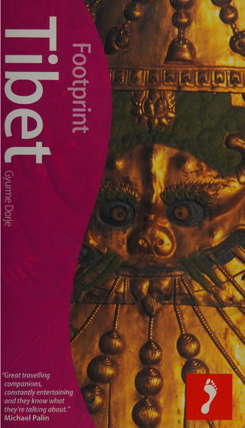

## Введение

Источник: Footprint Handbooks; 3rd edition (January 1, 2004)

Путеводитель Гюрме Дорже --- самый полный справочник по Тибету.

В путеводителе два индекса с топонимами.

1\. Стандартный индекс со страницами, где упоминается название географического объекта. Включает 1667 названий. Убраны дубликаты названий гор, монастырей и рек.
2\. Список переводов с тибетского на китайский в латинской транскрипции. Включает 780 названий. Нет указаний страниц.

Оба списка распознаны со сканированных страниц, превращены в таблицы. Таблицы объединены в единую. Из полных дубликатов названий оставлен один с объединенной информацией.

Итого в результирующем списке: 2447 топонимов.

Несмотря на дедупликацию, в списке все равно осталость некоторое количество потенциальных дубликатов. Они отличаются деталями.

Полный список в виде [Google таблицы](https://docs.google.com/spreadsheets/d/1p9_Dm1JcmcR6lW1IKOptebaF6mo7LDQ2r38xeAJH_xg/edit?usp=sharing).

## Формат описания

Топоним, Страниц(а,ы) упоминания, Подробнее (часто регион или тип объекта), китайская версия названия, (источник: индекс или тб-кит список, страница в путеводителе).

Страницы упоминания, подробнее, китайская версия --- могут быть пропущены.

**Пример**

Achen Gangchen, 551, ri, Daxuefeng Shen, (tbcn, 819)

* Achen Gangchen --- топоним, название места
* 551 --- упоминается на странице 445 путеводителя (на карте)
* ri --- подробнее, гора, хребет
* Daxuefeng Shen --- приведенная китайская форма топонима
* tbcn --- источник, список Tibetan and Chinese place names
* 819 --- страница путеводителя со списком, где упоминается топоним.

### Список топонимов

Aban, 445, Dzayul, Abin, (tbcn, 819)

Achen Gangchen, 551, ri, Daxuefeng Shen, (tbcn, 819)

Achung Namdzong, 602, Jentsa, Aqiong Nanzong, (index, 852)

Agara, , Bayan Khar, Laqutan, (tbcn, 819)

Akar, 491, capital of Gonjo, Gonjo, (index, 852)

Akhor, 196, , , (index, 852)

Akong, 617, , , (index, 852)

Aksai Chin, 362, , , (index, 852)

Alchi, 388, , , (index, 852)

Aling, 689, Zungchu, Chuanzhisi, (index, 852)

Altan Qan, 546, , , (index, 852)

Altenqoke, 552, , , (index, 852)

Altyn Tagh Mountains, 547, , , (index, 852)

Amchog Ganden Chokhorling, , Sangchu, Amuquhu Si, (tbcn, 819)

Amchog Gonpa, 671, , , (index, 852)

Amchog Tsenyi Gonpa (Ngawa), 653, , , (index, 852)

Amchok Tsenyi Dratsang, , Ngawa, Chali Si, (tbcn, 819)

Amdo, , dzong, Amdo (xian), (tbcn, 819)

Amdo, 543, region, Andu, (index, 852)

Amdo County, 408, , , (index, 852)

Amdowa, 756, , , (index, 852)

Amnye Jakhyung, mountains, 610, , , (index, 857)

Amnye Lhago, , ri, Erlang Shan, (tbcn, 819)

Amnye Machen, 630, ri, Animaqing Shan, (index, 852)

Amnye Machen Circuit, 632, , , (index, 852)

Amnye Nyemri, mountains, 606, , , (index, 857)

Anying, 657, , , (index, 852)

Arik Gonchen, 568, , , (index, 852)

Arik Gonchen Ganden Chopeling, , Chilen, Arou Da Si, (tbcn, 819)

Artsa, 253, Lhari, Azha, (index, 852)

Ato Gonpa, , Drito, Anchong Si, (tbcn, 819)

Ato Gonpa Monastery, 526, , , (index, 852)

Ato Monastery, 526, , , (index, 852)

Atsok Gon, 625, , , (index, 852)

Atsok Gon Dechen Chokhorling, , Tsigortang, Achuhu Si, (tbcn, 819)

Atunzu, , capital of Dechen, Diqing, (tbcn, 819)

Ba Gonpa, 528, , , (index, 852)

Bachen, , Mewa, Waqie, (tbcn, 819)

Bachen, 410,686, dzong, Baqing (xian), (index, 852)

Bage Gonpa, 516, , , (index, 852)

Bagon, 528, Chumarleb, Bagan, (index, 852)

Bagu, 623, , , (index, 852)

Bailing, , Nyinak, capital of Balung, Baohezhen, (tbcn, 819)

Baima, , , , (index, 852)

Baingoin, 346, , , (index, 852)

Bairo Puk, 203, , , (index, 852)

Baiyu, 492, , , (index, 852)

Bakchen, 637,638, capital of Gabde, Gande, (index, 852)

Balang Shan, 663, , , (index, 852)

Balung, , Panchen Zhingde, Balong ', (tbcn, 819)

Balung, 453, dzong, Weixi (xian), (index, 852)

Balung Hunting Reserve/Ground, 554, , , (index, 852)

Banbar, , , , (index, 852)

Baqen, 410, , , (index, 852)

Barka, 369, , , (index, 852)

Barkham, 658, dzong, Maerkang, (index, 852)

Barkham City, 658, , , (index, 852)

Barong, 496, Pelyul, Barong, (index, 852)

Barshok, 535, capital of Nyarong, Xinlong, (index, 852)

Bartang Valley, 265, , , (index, 852)

Bartro hermitage, 494, , , (index, 852)

Baryang, 335, Drongpa, Paryang, (index, 852)

Batang, 463, dzong, Batang (xian), (index, 852)

Batang Chode, , Batang, Batang Si, (tbcn, 819)

Batsa, 346, , , (index, 852)

Baxoi, , , , (index, 852)

Bayan, 595, Tongkor, Bayan, (index, 852)

Bayan Khar, 593, dzong, Hualong(xian), (index, 852)

Bayankala, , ri, Bayan Har Shan, (tbcn, 819)

Bayankala Mountains, 547, , , (index, 852)

Bayankala Watershed, 630, , , (index, 852)

Bayankala, Mount, 528, , , (index, 852)

Bayankala, mountains, 547, , , (index, 857)

Bayi, 245, drongkhyer, Bayi (shiqu), (index, 852)

Beichuan River, 573, , , (index, 852)

Bena, 210, , , (index, 852)

Benchen Puntsok Bumnying, monastery, 512, , , (index, 856)

Benchen Puntsok Dargyeling, 520, Jyekundo, Bianqin Si, (index, 852)

Bengen, 644, , , (index, 852)

Bengyu Gon Mindrol Tosam Dargyeling, 571, , , (index, 852)

Benpa, 209,218, , , (index, 852)

Bepa, 249, , , (index, 852)

Beri, 532, Kandze, Baili, (index, 852)

Berong, 291, , , (index, 852)

Beta Tso, , tso, Bita Hai, (tbcn, 819)

Bhatahor Kingdom, 568, , , (index, 852)

Bida gorge, 520, , , (index, 852)

Bida Nampar Nangdze Lhakhang, 520, , , (index, 852)

Bida Nampar Nangze Lhakhang, , Jyekundo, Darirulai Futang, (tbcn, 819)

Bimdo, 599, , , (index, 852)

Bimdo Gonchen, , Dowi, Wendu Si, (tbcn, 819)

Bimdo Gonchen Tashi Chokhorling, 599, , , (index, 852)

Binglingsi, 665, , , (index, 852)

Binglingsi Cave, 665, , , (index, 852)

Bipung, 434, Metok, Beibeng, (index, 852)

Biru, , , , (index, 852)

Bodong Gonpa, , Lhartse, Podongai Si, (tbcn, 819)

Bodong Monastery, 304, , , (index, 852)

Bolo, 492, Gonjo, Boluo, (index, 852)

Bon, 765, , , (index, 852)

Bongen Gonpa, 531, Kandze, Baige Si, (index, 852)

Bongtak Gonpa Gendun Shedrubling, 556, , Ahandalai Si, (index, 852)

Bongtak Tianjun, 556,557, dzong, Tianjun (xian), (index, 852)

Bonn hill, 508, , , (index, 852)

Bonn, mountains, 247, , , (index, 857)

Bonsok, 410, Bachen, Bensuo, (index, 852)

Bora Gonpa, , , Bola Si, (tbcn, 820)

Bozo, 686, Dzoge, Baozuo, (index, 852)

Brahmaputra Gorges, 241, , , (index, 852)

Brahmaputra River, 259, , , (index, 852)

Buchu Tergyi Lhakhang, 243, Nyangtri, Bujiu Si, (index, 852)

Budongquan, 551, , , (index, 852)

Bulan, , , , (index, 852)

Bum-chu, , , Peng Qu, (tbcn, 820)

Bumishi Gonpa, , , Liu Lidian Si, (tbcn, 820)

Bumkye, 492, , , (index, 852)

Bumling Lhakhang, , , Biling Si, (tbcn, 820)

Bumnying, 512, , , (index, 852)

Bumozhi, , , Siguniang Feng, (tbcn, 820)

Bumozhi, mountains, 662, , , (index, 857)

Bumsar, 512, , , (index, 852)

Bumying Gonpa Monastery, 512, , , (index, 852)

Bupen-chu Valley, 662, , , (index, 852)

Chabcha, 623,624, dzong, Gonghe (xian), (index, 852)

Chakdado, 429, , , (index, 852)

Chakdu Kawalungring, 535, , , (index, 852)

Chakgang, 394, , , (index, 852)

Chakpori, Lhasa, , , Yaowang Shan, (tbcn, 820)

Chakpurchen Cave, 220, , , (index, 852)

Chakri Gonpa, , , Jiangritang Si, (tbcn, 820)

Chaksum, 470, , , (index, 852)

Chaktreng, 472, dzong, Xiangcheng (xian), (index, 852)

Chaktreng Sampeling, , , Xiangcheng Si, (tbcn, 820)

Chaktse, 427, , , (index, 852)

Chaktse Trigu, 215, , , (index, 852)

Chakzamka, , , Jiasangka, (tbcn, 820)

Chakzamka, 416,484,661, dzong, Luding(xian), (index, 852)

Cham Jangsa, 669, , , (index, 852)

Chamalang, 637, , , (index, 852)

Chamalung, , , Temahe, (tbcn, 820)

Chamda, 409, , , (index, 852)

Chamdo, 417, dzong, Changdu (xian), (index, 852)

Chamdo Airport, 437, , , (index, 852)

Chamoli, 384, , , (index, 852)

Chang-me, 410, , , (index, 852)

Changkya Qutuktu Rolpei Dorje, 546, , , (index, 852)

Changra, 274, , , (index, 852)

Changra Podrang, 501, , , (index, 852)

Chemnak, 239, , , (index, 852)

Chemnak (Chabnak) Monastery, 239, , , (index, 852)

Chemnak Gonpa, , , Qiangna Si, (tbcn, 820)

Chendruk La pass, 432, , , (index, 852)

Chengdu, 722, , , (index, 852)

Chichu, 525, Nangchen, Jiqu, (index, 852)

Chidar, 436, , , (index, 852)

Chidza, 525, Dzato, Jiezha qu, (index, 852)

Chikchar, 235, , , (index, 852)

Chilen, 568, dzong, Qilian (xian), (index, 852)

Chimda, 253, , , (index, 852)

Chimphu, , , Qinpu Miao, (tbcn, 820)

Chimphu caves, 186, , , (index, 852)

Chindu, 514, , , (index, 852)

Chingwa Taktse Castle, 211, , , (index, 852)

Chingwardo Tombs, 213, , , (index, 852)

Chiro, 663, , , (index, 852)

Chisa, , , Xibusha, (tbcn, 820)

Chitu Kungaling Gon, , , Gonggaling Si, (tbcn, 820)

Cho-ne, 679, dzong, jone (xian), (index, 852)

Cho-ne Gon, 490, , , (index, 852)

Cho-ne Gon (in Jomda), monastery, 490, , , (index, 856)

Cho-ne Gonchen Ganden Shedrubling Monastery, 680, , , (index, 852)

Cho-ne Town, 679, , , (index, 852)

Chode Gong, 205, , , (index, 852)

Chode O, 205, , , (index, 852)

Choding Monastery, 195, , , (index, 852)

Chogar Tashi Chodzong, , , Quge Si, (tbcn, 820)

Choje Nangwa, , , Qiouji, (tbcn, 820)

Chokhorgyel Gonpa, , , Qiongguojie Si, (tbcn, 820)

Chokhorgyel Monastery, 231, , , (index, 852)

Chokhorling Monastery, 244, , , (index, 852)

Chokle Namgyel, , , Qilian Shan, (tbcn, 820)

Chomolangma, , , Qomolangma Feng, (tbcn, 820)

Chongye, 210,211, , , (index, 852)

Chongye Tombs, 213, , , (index, 852)

Chorten Karpo, 666, , , (index, 852)

Chorten Namu, 234, , , (index, 852)

Chorten Nyima, 312, Tingkye, Qudian Nima Shankou, (index, 852)

Chorten Rang-go, 143, , , (index, 852)

Chorten Tang Tashi Dargyeling, , , Tiantang Si, (tbcn, 820)

Chowok, 330, , , (index, 852)

Chozam, 207,234, Nang, Quzang, (index, 852)

Chu Jowo Temple, 247, , , (index, 852)

Chu Nyima, 249, , , (index, 852)

Chuba, 758, , , (index, 852)

Chubzang, 582, , , (index, 852)

Chubzang Ganden Migyurling, 582, Gonlung, Quezang Si, (index, 852)

Chuchen, 656, dzong, Jinchuan (xian), (index, 852)

Chugo, 215, , , (index, 852)

Chukama, , , Gihama, (tbcn, 820)

Chukar, 694, Gyeltang, Baishui, (index, 852)

Chukhol Khartse Gonpa, 610, Repkong, Qukuhu Guashize Si, (index, 852)

Chumarhe, 551, Lho Kermo, Qumar Heyan, (index, 852)

Chumarleb, 527, dzong, Qumarleb (xian), (index, 852)

Chumdo, , , Qunduo, (tbcn, 820)

Chumdo Gyang, 207, , , (index, 852)

Chun-ke township, 599, , , (index, 852)

Chunak, 210, , , (index, 852)

Chung Riwoche, , , Qiong Riwuqe, (tbcn, 820)

Chungdra, 296, , , (index, 852)

Chungpa, 409, , , (index, 852)

Chunke, , , Qunke, (tbcn, 820)

Chunkor, 510, , , (index, 852)

Chunyido, , , Qunyiao Qingnidong, (tbcn, 820)

Churi Meri La pass, 525, , , (index, 852)

Chushar, 306, capital of Lhartse, Lhaze Lazi, (index, 852)

Chushul, 158, dzong, Quxu (xian), (index, 852)

Chusum, 230,392, dzong, Qusum (xian), (index, 852)

Chusumdo, 508, Derge, Sanchakou, (index, 852)

Chutsen, 628, Tsigortang, Wenquan, (index, 852)

Chuwarna, 635, Machen, Xueshan, (index, 852)

Chuwori, , , Quwori Feng, (tbcn, 821)

Chuwori, mountains, 166, , , (index, 857)

Colombo, 59, , , (index, 853)

Cormorant Island, 562, , , (index, 853)

Da Hong Liu Tang, 396, , , (index, 853)

Da Shizi, 575, , , (index, 853)

Da Tsaidam, 553, , , (index, 853)

Da Zurmang, 522, , , (index, 853)

Da-chu, , , Langcang Jiang, (tbcn, 821)

Da-ge Drongtok Gon, 535, , , (index, 853)

Dabma Gon, , , Danma Nigu Si, (tbcn, 821)

Dabpa, 470, dzong, Daocheng (xian), (index, 853)

Dabpa Lhari, 471, ri, Daocheng Sheng Feng, (index, 853)

Dabpa Yangteng Gon, , , Xiongden Si, (tbcn, 821)

Dabzhi, 565, dzong, Haiyan (xian), (index, 853)

Dabzhi Gonsar Namgyeling, , , Xin Si, (tbcn, 821)

Dafusi Temple, 575, , , (index, 853)

Dagam Wangpuk, 499, , , (index, 853)

Dagze, , , Dazi, (tbcn, 832)

Daklha Gampo Gonpa, , , Taiaganbo Si, (tbcn, 821)

Daklha Gampo Monastery, 232, , , (index, 853)

Dakpo Tratsang Monastery, 231, , , (index, 853)

Dakpo Zhu, 234, , , (index, 853)

Dali, 457,734, , , (index, 853)

Damchuka, 142, , , (index, 853)

Damjong, 527, Drito, Danrong, (index, 853)

Damzhung, 142, dzong, Damxung (xian) Dangxiong, (index, 853)

Dang La, , , Tangoula Shankou, (tbcn, 821)

Dang La pass, 549, , , (index, 853)

Dangjin Shankou pass, 553, , , (index, 853)

Dangla Mountains, 547, , , (index, 853)

Dangra Yutso, , , Tangra Yumco, (tbcn, 821)

Dankar, 643, , , (index, 853)

Daocheng, , , , (index, 853)

Daqaidam Greater Tsaidam, 553, , , (index, 853)

Darchen, 358, Purang, Daoqin, (index, 853)

Dardo, 476, , , (index, 853)

Dardrong, 258, town, Nyemo, Nyemo, (index, 853)

Dardzom Gonpa, 610, , , (index, 853)

Dargye Choling Monastery, 175, , , (index, 853)

Dargye Gonpa, 531, Kandze, Dajin Si, (index, 853)

Dargyeling, 333, Saga, Dajilin, (index, 853)

Darje Yumtso, 598, , , (index, 853)

Darlag, 639, dzong, Dari (xian), (index, 853)

Darmar, 294,295, , , (index, 853)

Dartang Gonpa, , , Baiyu Si, (tbcn, 821)

Dartsedo, 479, dzong, Kangding (xian), (index, 853)

Dartsedo town, 479, , , (index, 853)

Datong, 572, , , (index, 853)

Dawa Puk, 146, , , (index, 853)

Dawa, mountains, 571, , , (index, 857)

Dawadzong, 380, Tsamda, Dabazong, (index, 853)

Dawazhung, 342, , , (index, 853)

Dechen, 443,447, dzong, Deqen (xian), (index, 853)

Dechen (in Palgon), 346, , , (index, 853)

Dechen Chokhorling, 689, , , (index, 853)

Dechen Choling hermitage, 494, , , (index, 853)

Dechen Dratsang, 523, , , (index, 853)

Dechen Dzong, 144, capital of Taktse, Dagze, (index, 853)

Dechenling Gonpa, , , Tongtaling Si, (tbcn, 821)

Dechenteng Monastery, 244, , , (index, 853)

Dege, 497, , , (index, 853)

Dehinglang, 595, , , (index, 853)

Dekyiling, 265, Rinpung, Dejilin, (index, 853)

Delek, 296, , , (index, 853)

Demchok, 354, , , (index, 853)

Den Gonpa, 532, Kandze, Degongbu Fufadian, (index, 853)

Dengka Gon, , , Tebo, (tbcn, 821)

Dengka Gon town, 681, , , (index, 853)

Dengpa, 218, , , (index, 853)

Dengqen, , , , (index, 853)

Denkhok, 508, , , (index, 853)

Denkhok Nubma, 490, Jomda, Xi Dengke ', (index, 853)

Denkhok Sharma, , , Luoxu, (tbcn, 821)

Densatil Gonpa, , , Dengsati Si, (tbcn, 821)

Densatil Monastery, 227, , , (index, 853)

Dentik, 596,597, , , (index, 853)

Dentik Sheldrak Gonpa, , , Dandou Si, (tbcn, 821)

Dentok Monastery, 534, , , (index, 853)

Deongma, 513, , , (index, 853)

Depa Zhung, 747, , , (index, 853)

Derge, 489,497, dzong, Dege (xian), (index, 853)

Derge Gonchen, 501, capital of Derge, Dege Goinqen, (index, 853)

Derge Gonchen Monastery, , , Dege Gengqing Si, (tbcn, 821)

Derge Gonchen, monastery, 501,502, , , (index, 856)

Derge Parkhang, 504, Derge, Dege Yinjingyuan, (index, 853)

Derong, 472, dzong, Derong (xian), (index, 853)

Derong Nunnery, 175, , , (index, 853)

Detsa Tashi Choding, , , Zhizha Shang Si, (tbcn, 821)

Deyang, 239, , , (index, 853)

Deyang Tratsang, 114, , , (index, 853)

Digdong, 434, , , (index, 853)

Dingma Monastery, 260, , , (index, 853)

Dingpoche Monastery, 174, , , (index, 853)

Dingri, 313, dzong, Dingri (xian), (index, 853)

Dingri Gangkar, 316,318,319, Dingri, Lao Dingri, (index, 853)

Do Gongma Gonpa, 643, Padma, Duogongma Si, (index, 853)

Do Martang, , , Banbar, (tbcn, 821)

Do Valley, 194, , , (index, 853)

Do Yutok Gon, , , Yutuo Si, (tbcn, 821)

Do-chu, 643, , , (index, 853)

Do-chu Valley, 650, , , (index, 853)

Do-pe, 330, , , (index, 853)

Dodrub Chode, , , Zhiqin Si, (tbcn, 821)

Dogon Gonpa, 514, , , (index, 853)

Dogon Puntsok Dargyeling, 514, Trindu, Duogan Si, (index, 853)

Dojung, 274,275, , , (index, 853)

Dokde, 149, , , (index, 853)

Dokhar, 209, , , (index, 853)

Dokhar Gon, 491, , , (index, 853)

Dolanji, 356, , , (index, 853)

Dolma Lhakhang, , , Zhuoma Simiao, (tbcn, 821)

Dolma-ne (in Lhorong), 429, , , (index, 853)

Dolmari, 508, , , (index, 853)

Domar, 395, Rutok, Duoma, (index, 853)

Domda, 515,516,528, Chumarleb, Qingshuihe, (index, 853)

Domkhok, , , Dongqingguo, (tbcn, 822)

Dompa, 524, Nangchen, Domba, (index, 853)

Domtang village, 260, , , (index, 853)

Dondrubling Dungkhor, 519, , , (index, 853)

Dong-chu valley, 432, , , (index, 853)

Dongba, 353, , , (index, 853)

Dongkar, 294, , , (index, 853)

Dongpatral, 240, , , (index, 853)

Dontok, monastery, 534, , , (index, 856)

Dopu Valley, 498, , , (index, 853)

Dordu Gon, 522, , , (index, 853)

Dordzang, 490, , , (index, 853)

Dorje Drak Gonpa, , , Duoji Zha Si, (tbcn, 822)

Dorje Drak Monastery, 169, , , (index, 853)

Dorje Sherdzong, 409, , , (index, 853)

Dorje Ziltrom, 505,507, , , (index, 853)

Dorkho Gonpa, 497, , , (index, 853)

Dowa Dzong, 222, capital of Lhodrak, Lhozhag, (index, 853)

Dowi, 596,597, dzong, Xunhua (xian), (index, 853)

Dra Yugang Drak hermitage, 175, , , (index, 853)

Dra-ke, 431, , , (index, 853)

Drachi Valley, 175, , , (index, 853)

Dragor, 258, , , (index, 853)

Dragteng, 660, , , (index, 853)

Drak Lhalupuk, 103, , , (index, 853)

Drak Yangdzong caves, 171, , , (index, 853)

Drak Yerpa, 145, Taktse, Yeba Si, (index, 853)

Drakar, 428, , , (index, 853)

Drakar Monastery, 534, , , (index, 853)

Drakar Tredzong, 626, , , (index, 853)

Drakar Tredzong Gonpa, , , Saizong Si, (tbcn, 822)

Drakchi, 245, , , (index, 853)

Drakchik, 260, , , (index, 853)

Drakda, 170, , , (index, 853)

Drakla, 296, , , (index, 853)

Drakmar Drinzang, 188, , , (index, 853)

Drakmar Keru Temple, 195, , , (index, 853)

Drakna, 327, , , (index, 853)

Draknak, , , Amdo, (tbcn, 822)

Draksum Tso, , , Basong Co, (tbcn, 822)

Draksum Tso, Lake, 251, , , (index, 853)

Drakya Drubgyu Tengyeling, , , Zhajia Gongba Si, (tbcn, 822)

Drakyol, 441, Dzogang, Zhayu, (index, 853)

Drakyul Valley, 170, , , (index, 853)

Dram, , , Zhangmu, (tbcn, 822)

Dram (Zhangmu), 324, , , (index, 853)

Dramda, 226, , , (index, 853)

Drampa, 305, , , (index, 853)

Dramtso, 314, , , (index, 853)

Dranang, 170, dzong, Zhanang (xian), (index, 853)

Dranang Valley, 171, , , (index, 853)

Drango, 536,537, dzong, Luhuo (xian), (index, 853)

Drango Dzong, 537, , , (index, 853)

Drango Gonpa, , , Luhuo Si, (tbcn, 822)

Drangto Tso Lake, 676, , , (index, 853)

Dratang Gonpa, , , Zhatang Si, (tbcn, 822)

Dratang Monastery, 171, , , (index, 853)

Dratsang Gon Ganden Chokhorling, , , Zhazang Si, (tbcn, 822)

Drawa, , , Jiawa, (tbcn, 822)

Drayab, 437, dzong, Zhagyab (xian), (index, 853)

Drayab Endun, 437, , , (index, 853)

Drayab Tashi Chodzong, 438, , , (index, 853)

Drentang, 312, , , (index, 853)

Drepung Monastery, 110, , , (index, 853)

Drepung, Lhasa, , , Zhebeng Si, (tbcn, 822)

Dresel La, 536, , , (index, 853)

Dri-chu, , , Jinsha Jiang, (tbcn, 822)

Drib, 161, , , (index, 853)

Drib Valley, 168, , , (index, 853)

Drigung, 149, township, Meldro, Zhikong (qu), (index, 853)

Drigung Til Gonpa, , , Zhikong Si, (tbcn, 822)

Drigung Til Monastery, 156, , , (index, 853)

Drime Kunden Hermitage, 245, , , (index, 853)

Drirapuk, 365, , , (index, 853)

Driru, 427, dzong, Biru (xian), (index, 853)

Drito, 526, dzong, Zhidoi (xian), (index, 853)

Drokda Gonpa, 508, , , (index, 853)

Drokshok, 524, Nangchen, Zhuxiao qu, (index, 853)

Dromo, 309, dzong, Yadong (xian), (index, 853)

Dromo-me, 310, , , (index, 853)

Dromto, 145, , , (index, 853)

Dron, 207, , , (index, 853)

Dronang, 661, , , (index, 853)

Drongdal Mezhing, 662, capital of Tsenlha, Xiaojin, (index, 853)

Dronglung, 551, Kermo, Naij Tal, (index, 853)

Drongpa, 334, dzong, Zhongba (xian), (index, 853)

Drongpa Tradun, , , Zhongba Zhabdun, (tbcn, 822)

Drongsar, 253, , , (index, 853)

Drongtse Gonpa, , , Zhongzi Si, (tbcn, 822)

Drongtse Monastery, 273, , , (index, 853)

Drotsang, 583, dzong, Ledu, (index, 853)

Drotsang Gonpa, , , Qutan Si, (tbcn, 822)

Drotsang Monastery, 584, , , (index, 853)

Drowa, 346, , , (index, 853)

Drowolung Monastery, 221, , , (index, 853)

Drubgyuling Gonpa, 515, Trindu, Zhujie Si, (index, 853)

Drubtob Lhakhang, 104, , , (index, 853)

Drubtso Pemaling Lake, 221, , , (index, 853)

Druchung, 514,515, capital of Trindu, Chindu, (index, 853)

Druda, 516, , , (index, 853)

Drugu Gon Ganden Chokhorling, 571, Monyon, Zhugu Si, (index, 853)

Drukchen Sumdo, 642, capital of Jigdril, Jigzhi, (index, 853)

Drukchen Sumdo (Jigdril), 642, , , (index, 853)

Drukchu, 682, dzong, Zhugqu (xian), (index, 853)

Drukje, 649, , , (index, 853)

Drukla, 252,253, , , (index, 853)

Drukzur, , , Xiazhai, (tbcn, 822)

Drumpa, 230, capital of Gyatsa, Gyaca, (index, 853)

Druparong Zampa, 462, , , (index, 853)

Drushul Valley, 209, , , (index, 853)

Dujiangyan, 700, , , (index, 853)

Dukou, 535, , , (index, 853)

Dulan, 554, , , (index, 853)

Duna, 310, , , (index, 853)

Dungda La pass, 441, , , (index, 853)

Dungdor, 237, capital of Menling Mailing, Milin, (index, 853)

Dungdor (Menling Dzong), 238, , , (index, 853)

Dungkar, 234,391, Tsamda, Dongga, (index, 854)

Dungpu Chokhor Monastery, 168, , , (index, 854)

Dutu, 335, , , (index, 854)

Dza-chu, , , Yalong Jiang, (tbcn, 822)

Dza-chu, , , Za Qu, (tbcn, 822)

Dza-chu Valley, 422, , , (index, 854)

Dzachuka, 510, , , (index, 854)

Dzakya Gonpa, 513, , , (index, 854)

Dzaleb Gonpa, 537, , , (index, 854)

Dzamtang, 648,649, dzong, Zamtang (xian), (index, 854)

Dzamtang Tsangpa Gon, , , Rangtang Da Si, (tbcn, 822)

Dzarongpu Gonpa, , , Rongbu Si, (tbcn, 822)

Dzarongpu Monastery, 316, , , (index, 854)

Dzato, 525, dzong, Zadoi (xian), (index, 854)

Dzatro Dorjeling, 604, , , (index, 854)

Dzayul, 434, dzong, Zayu (xian), (index, 854)

Dzechawa, 696, , , (index, 854)

Dzekri La pass, 413, , , (index, 854)

Dzesho, 263, , , (index, 854)

Dzi-chu Valley, 649, , , (index, 854)

Dzigar, 490, , , (index, 854)

Dzigar Gonpa, , , Ziga Si, (tbcn, 822)

Dzinko, 531, , , (index, 854)

Dzitoru, 429, capital of Lhorong, Lhorong, (index, 854)

Dzitsa Degu, , , Jiuzhaigou, (tbcn, 823)

Dzitsa Degu National Park, 694, , , (index, 854)

Dzitsa Monastery, 595, , , (index, 854)

Dzogang, 440, dzong, Zogang (xian), (index, 854)

Dzogchen Rudam Orgyen Samten Choling Monastery, 505, , , (index, 854)

Dzogchen Rudam Samten Choling, , , Zhuqing Si, (tbcn, 823)

Dzoge, 684, dzong, Ruoergai (xian), (index, 854)

Dzoge Nyima, 676,677, capital of Machu, Maqu, (index, 854)

Dzomo Manang, 632, , , (index, 854)

Dzong Kumbum caves, 171, , , (index, 854)

Dzong-gyab Lukhang Temple, 101, , , (index, 854)

Dzongka, 327, capital of Kyirong, Gyirong, (index, 854)

Dzongmar Tashi Choling, 611, , , (index, 854)

Dzongsar, 497, , , (index, 854)

Dzongsar Tashi Lhatse, 498, , , (index, 854)

Dzongsar Tashi Lhatse Gonpa, , , Zongsa Si, (tbcn, 823)

Dzongzhab, 474, Nyachuka, Xinduqiao, (index, 854)

Dzuktrun, 639, Darlag, Jianshe, (index, 854)

Dzungo Monastery, 511, , , (index, 854)

Dzutrulpuk, 368, , , (index, 854)

East Trika, 618, , , (index, 854)

Ebao, 569, , , (index, 854)

Ekyonggya Gonpa, , , Ashijian Jiagong Si, (tbcn, 823)

Emagang, 262, , , (index, 854)

Emagang Shangda Palchen, 262, , , (index, 854)

Endun, , , Zhagyab, (tbcn, 823)

Endun Gonpa, , , Yanduo Si, (tbcn, 823)

Ensakha Monastery, 262, , , (index, 854)

Everest (Base Camps), mountains, 317, , , (index, 857)

Everest, mountains, 315, , , (index, 857)

Eyul Lhagyari, , , Qusum, (tbcn, 823)

Ga-ne, 656, , , (index, 854)

Gabde, 637, dzong, Gande (xian), (index, 854)

Gabzhi, 274, , , (index, 854)

Gacho, 335, , , (index, 854)

Gadong Monastery, 138, , , (index, 854)

Gama La pass, 436, , , (index, 854)

Gamil Gonpa, 691, , , (index, 854)

Gampa, 298,311, dzong, Gamba (xian), (index, 854)

Gampa La, , , Ganbala Shankou, (tbcn, 823)

Gampa La Pass, 166, , , (index, 854)

Gampazhol, 311, capital of Gampa, Gamba, (index, 854)

Gamru, 308, , , (index, 854)

Ganden Chokhorling, , , Dongke'er Si, (tbcn, 823)

Ganden Chungkor, 149, capital of Lhundrub, Lhunzhub, (index, 854)

Ganden Dondrubling, 449, , , (index, 854)

Ganden Namgye Monastery, 146, , , (index, 854)

Ganden Namgyeling, , , Gadan Si, (tbcn, 823)

Ganden Sangak Yarpeling, , , Dulan Si, (tbcn, 823)

Ganden Shedrubling, , , Zhuoni Si, (tbcn, 823)

Ganden Tengyeling, , , Chingho Si, (tbcn, 823)

Gandrong, , , Wakha, (tbcn, 823)

Gang Rinpoche, , , Gangrenboqi Feng, (tbcn, 823)

Gangca, 560, , , (index, 854)

Ganges, 376, , , (index, 854)

Gangkar Gonpa, , , Gonga Si, (tbcn, 823)

Gangri Tokar, Mount, 162, , , (index, 854)

Ganlho Dzong, 674, Sangchu, Hezuoshen, (index, 854)

Gar, 355, , , (index, 854)

Gar Tsangpo, 355, , , (index, 854)

Gar Yersa, 355, , , (index, 854)

Garang, 617, , , (index, 854)

Garita, 689, Dzoge, Galitai, (index, 854)

Garthar, 540,661, , , (index, 854)

Garthar Gonpa, , , Qianning Si, (tbcn, 823)

Gartok, 442, capital of Markham, Markam, (index, 854)

Gartse Gonpa, 606, Repkong, Guoshize Si, (index, 854)

Garze, 530, , , (index, 854)

Gata, 411, , , (index, 854)

Gawa, 516, , , (index, 854)

Gawalung, 432, Po-me, Galong, (index, 854)

Gawu Dzongnang, 601, , , (index, 854)

Gayadhara Lhakhang, 306, , , (index, 854)

Gegye, 352, dzong, Geji (xian), (index, 854)

Gekha, 330, , , (index, 854)

Gelukpa, 771, , , (index, 854)

Gemang Gonpa, , , Gemong Si, (tbcn, 823)

Gemar, 314, , , (index, 854)

Genghiz Qan, 546, , , (index, 854)

Gephelri, mountains, 149, , , (index, 857)

Ger-chu Valley, 686, , , (index, 854)

Gersum, 210, , , (index, 854)

Gertse, 343, dzong, Gaize (xian), (index, 854)

Gesar Lhakhang, 639, , , (index, 854)

Geshitra, 660, Rongtrak, Geshizha, (index, 854)

Gochen Dzong Gon, 621, , , (index, 854)

Gogentang, 646, capital of Sertal, Sertar, (index, 854)

Golak, 435, , , (index, 854)

Golmud Nan, 550, , , (index, 854)

Golmud shi, 551, , , (index, 854)

Golok-Sertal, 630, , , (index, 854)

Gomar Gonpa, , , Guomari Si, (tbcn, 823)

Gomar Monastery, 609, , , (index, 854)

Gomayin, 619, Mangra, Guomaying, (index, 854)

Gonghe Chabcha, 623, , , (index, 854)

Gongkar, 166, dzong, Gonggar (xian), (index, 854)

Gongkar Chode Monastery, 167, , , (index, 854)

Gongkar Valley, 167, , , (index, 854)

Gongtang Bumpa Stupa, 203, , , (index, 854)

Gonjo, 491, dzong, Gonjo (xian), (index, 854)

Gonlung, 580,581, dzong, Huzhu (xian), (index, 854)

Gonlung Jampaling, , , Youning Si, (tbcn, 823)

Gonlung Jampaling Monastery, 581, , , (index, 854)

Gonsar Ganden Rabgyeling, , , Dazha Si, (tbcn, 823)

Gonsar Gon Monastery, 491, , , (index, 854)

Gori Dratsang, , , Gulei Si, (tbcn, 823)

Gotse Gon, 508, , , (index, 854)

Goyul, 435, , , (index, 854)

Great Rivers National Park, 446, , , (index, 854)

Great Wall of China, 586, , , (index, 854)

Greater Tsaidam District, 553, , , (index, 854)

Gu-chu Valley, 605,609, , , (index, 854)

Guan Xian, 699, , , (index, 854)

Guinan Mangra, 619, , , (index, 854)

Gumang, 621, Kawasumdo, Gumang, (index, 854)

Gungtang, , , Gongdang, (tbcn, 823)

Guri, 554, , , (index, 854)

Guri Gonpa, 633, Machen, Geri Si, (index, 854)

Gurma, 298, , , (index, 854)

Guro, 417, Chamdo, Eluo, (index, 854)

Gurtso, 322, , , (index, 854)

Gurugyam Gonpa, , , Guoerjian Gongba Si, (tbcn, 824)

Gurugyam Monastery, 356, , , (index, 854)

Gushi Qan, 546, , , (index, 854)

Gyakhar Gon Shedrub Dagyeling, , , Jiangke Si, (tbcn, 824)

Gyakok, 346, , , (index, 854)

Gyala, 241, , , (index, 854)

Gyala Pelri, , , Jiala Beidie Feng, (tbcn, 824)

Gyala Shinje Badong, 241, , , (index, 854)

Gyama, 153, Meldro, Jiama Si, (index, 854)

Gyamda, , , Gongbogyamda (xian), (tbcn, 824)

Gyamda County, 251, , , (index, 854)

Gyamda Dzong, 253, , , (index, 854)

Gyamotang, 411, capital of Tengchen, Dengqing, (index, 854)

Gyanak Mani, 517, lyekundo, Jiana Mani, (index, 854)

Gyang, 305, , , (index, 854)

Gyang Yonpolung, 305, , , (index, 854)

Gyangon, , , Jue'en, (tbcn, 824)

Gyangze, , , Jiangzi, (tbcn, 824)

Gyantse, 265, dzong, Jiangzi, (index, 854)

Gyantse Dzong, 268, , , (index, 854)

Gyantse Kumbum, 270,272, , , (index, 854)

Gyarong, 543, , , (index, 854)

Gyarong Gorges, 655, , , (index, 854)

Gyarong Headwaters, 630, , , (index, 854)

Gyarong Ngul-chu, , , Dadu He, (tbcn, 824)

Gyarongwa, 756, , , (index, 854)

Gyasho Benkhar, 563, , , (index, 854)

Gyatsa, 230, dzong, Gyaca (xian), (index, 854)

Gyatso, 262, Namling, jiacuo, (index, 854)

Gyatso-chu Valley, 263, , , (index, 854)

Gyazhing, 253, , , (index, 854)

Gye-chu, 311, , , (index, 854)

Gyedar, 258, , , (index, 854)

Gyedo, 332, , , (index, 854)

Gyeling Tsokpa Monastery, 174, , , (index, 854)

Gyelje Podrang, 527, capital of drito, Zhidoi, (index, 854)

Gyelmen Chen-ye Lhakhang, 215, , , (index, 854)

Gyelpo La pass, 491, , , (index, 854)

Gyelring, 526,527, , , (index, 854)

Gyeltang, , , Zhongdian (xian), (tbcn, 824)

Gyeltang county, 449, , , (index, 854)

Gyeltang Suntseling Monastery, 452, , , (index, 854)

Gyeltangteng, , , Zhongdian, (tbcn, 824)

Gyeltangteng City, 450, , , (index, 854)

Gyengong Lhakhang, 286, , , (index, 854)

Gyezil, 475, dzong, Jiulong (xian), (index, 854)

Gyipu, 209, , , (index, 854)

Gyu-me, 639, capital of Darlag, Dari, (index, 854)

Gyurme, 174, , , (index, 854)

Haba Gangri, , , Haba Xueshan, (tbcn, 824)

Hailuogou Glacier Park, 485, , , (index, 854)

Haiyan, 565,566, , , (index, 854)

Hanyuan, 485, , , (index, 854)

Har-ge, 565, , , (index, 854)

Hara Lake, 556, , , (index, 854)

Hashul, , , Haxie, (tbcn, 824)

Heka, 626, Tsigortang, Heka, (index, 854)

Hekou, 586, , , (index, 854)

Henan, 613, , , (index, 854)

Henan Sogwo, 613, , , (index, 854)

Hepori, 185, , , (index, 854)

Hetugang, 561, , , (index, 854)

Himalayan mountains, 777,778, , , (index, 854)

Hohsai Kenmenho, , , Yuzhu Shan, (tbcn, 824)

Hongshan, 443, Dechen, Fuqang, (index, 854)

Hor, 369,407,612, , , (index, 854)

Hor Gon Terton Chogar, , , Heri Si, (tbcn, 824)

Hor-me, 407, , , (index, 854)

Horko plain, 532, , , (index, 854)

Horkor Gon Shedrub Dargyeling, , , Huoke Si, (tbcn, 824)

Horkya, 617, , , (index, 854)

Horkya Dratsang Samtenling, 617, Trika, Huo'erjia Si, (index, 854)

Horpa, 335,756, , , (index, 854)

Horpo, 492, Pelyul, Hepo, (index, 854)

Horshe Gonpa, , , Huoxi Si, (tbcn, 824)

Hrihakon, , , Lianghekou, (tbcn, 824)

Huahaizi, 553, , , (index, 854)

Hualong, 594, , , (index, 854)

Hualong Bayan Khar, 593, , , (index, 854)

Hualong County Town, 595, , , (index, 854)

Huangyuan Tongkor, 572, , , (index, 854)

Huangzhong, 576, , , (index, 855)

Hudong pastures, 566, , , (index, 855)

Hui Muslims, 761, , , (index, 855)

Huzhu, 580, , , (index, 855)

Huzhu Town, 582, , , (index, 855)

Jadabling, 561, Kangtsa, Niao Dao, (index, 855)

Jadir, 610,611, of Tsekok, Zekog, (index, 855)

Jago, 259, , , (index, 855)

Jagoshong, 238, , , (index, 855)

Jainca Jentsa, 599, , , (index, 855)

Jakhyung Shedrubling, , , Xiaqiong Si, (tbcn, 824)

Jakhyung Shedrubling Monastery, 594, , , (index, 855)

Jamchen Zhol, 264, capital of Rinpung, Rinbung, (index, 855)

Jamdun, 438, Drayab, Xiangdui Si, (index, 855)

Jampa Bumling, 596, , , (index, 855)

Jampaling, 173, , , (index, 855)

Jang, 150,227,756,760, , Naxi, (index, 855)

Jang Sadam, 454, , Lijiang, (index, 855)

Jangkya, 610, , , (index, 855)

Janglung Khyung Monastery, 610, , , (index, 855)

Jangpu, 209, , , (index, 855)

Jangsum, 492, , , (index, 855)

Jangtang, , , Qiang Tang, (tbcn, 824)

Jangtang Nature Reserve, 340, , , (index, 855)

Jangtang Plateau, 337, , , (index, 855)

Jangto, 275, , , (index, 855)

Jarasa, 261, , , (index, 855)

Jarme, 208, , , (index, 855)

Jarto, 207, , , (index, 855)

Jaryul, 207,210, , , (index, 855)

Jasa Lhakhang, 194, , , (index, 855)

Jentsa, 599, dzong, Jainca (xian), (index, 855)

Jentsa town, 600, , , (index, 855)

Jepa, 252, , , (index, 855)

Jialing Valley, 665, , , (index, 855)

Jigdril, 640, dzong, Jigzhi (xian), (index, 855)

Jing Okar Drak, 179, , , (index, 855)

Jintsamani, 595, Bayan Khar, Jianzha Mani Jingtang, (index, 855)

Jiu Gonpa, , , Qiwu Gongba Si, (tbcn, 824)

Jiulong, , , , (index, 855)

Jokhang Temple, 70, , , (index, 855)

Jokhang, Lhasa, , , Da Zhao Si, (tbcn, 824)

Jomda, 490, dzong, Jomda (xian), (index, 855)

Jomo Gangtse, 258, , , (index, 855)

Jonang Phuntsoling, 304, , , (index, 855)

Jonang Puntsoling, , , Pengcuolin Si, (tbcn, 824)

Jora, 210, , , (index, 855)

Joro Gonpa, 536, Drango, Jueri Si, (index, 855)

Jowo Guru Base Camp, 320, , , (index, 855)

Jowo Rinpoche, 88, , , (index, 855)

Ju, 210, , , (index, 855)

Julak, 585, Kamalok, Minhe, (index, 856)

Julak Valley, 585, , , (index, 855)

Julak-chu, 569, , Datong He, (index, 855)

Jumang, 512, capital of Sershul, Sexu, (index, 855)

Jyekundo, 510,516,517, dzong, Yushu (xian), (index, 855)

Jyekundo Dondrubling, , , Jiegu Si, (tbcn, 825)

Jyekundo Dondrubling Monastery, 519, , , (index, 855)

K2, 396, , , (index, 855)

Kabgye Drupuk, 508, , , (index, 855)

Kablung Monastery, 532, , , (index, 855)

Kabzhi, 512, , , (index, 855)

Kachu, , , Hanjiaji, (tbcn, 825)

Kachu, 666, Linxia, Hanjiaji, (index, 855)

Kachu Khar, , , Linxia, (tbcn, 825)

Kadampa, 771, , , (index, 855)

Kado, , , Gando, (tbcn, 825)

Kado Tashi Chodzong, 596, , , (index, 855)

Kagyupa, 769, , , (index, 855)

Kailash, Mount, 359, , , (index, 855)

Kakhok, 688, capital of Mewa, Hongyuan, (index, 855)

Kala, 308,309, , , (index, 855)

Kalden Jampaling, , , Changdu Si, (tbcn, 825)

Kalden Jampaling Monastery, 420, , , (index, 855)

Kamalok, 570,585, dzong, Minhe (xian), (index, 855)

Kampo Nenang, 466, , , (index, 855)

Kamtok, , , Gangtuo, (tbcn, 825)

Kamtok Drukha, 492, , , (index, 855)

Kamtok Drukha (Zamchen bridge), 491, , , (index, 855)

Kanam, 431, Po-me, Galang, (index, 855)

Kandze, 530,532,534, dzong, Ganzi (xian), (index, 855)

Kandze Gonpa, , , Ganzi Si, (tbcn, 825)

Kang-lhe, 331, , , (index, 855)

Kangding, , , , (index, 855)

Kangsar, 530, , , (index, 855)

Kangtsa, 560,599, dzong, Gangca (xian), (index, 855)

Kangtsa Gonchen, , , Gangca Da Si, (tbcn, 825)

Kangtsa Gonchen Monastery, 564, , , (index, 855)

Kangtsa Town, 563, , , (index, 855)

Kangya, 671, , , (index, 855)

Kangya Drakar Gonpa, 670, , , (index, 855)

Karakorum mountains, 777, , , (index, 855)

Karchudram Babtsuk, 550, Lho Kermo, Gaerquyan, (index, 855)

Karchung Ramagang, 161, , , (index, 855)

Karing, 599, , , (index, 855)

Karma, 245, , , (index, 855)

Karma Gon, 522, Chamdo, Gama Si, (index, 855)

Karong Sangchen Gatsel Choling, , , Garang Si, (tbcn, 825)

Karpo, , , Jiulong, (tbcn, 825)

Karpo, 222,475, capital of Gyezil, Jiulong, (index, 855)

Karsho Gonpa, 563, , , (index, 855)

Karteng, 262, , , (index, 855)

Karzang Gonpa, , , Hexi Si, (tbcn, 825)

Karzang Peljor Gonpa, , , Gazang Si, (tbcn, 825)

Kasado gorge, 504, , , (index, 855)

Kashgar, 733, , , (index, 855)

Kathmandu, 708, , , (index, 855)

Katok Dorjeden Gonpa, , , Gaduo Si, (tbcn, 825)

Katok Dorjeden, monastery, 493, , , (index, 857)

Katsel, 154, , , (index, 855)

Katsel Gonpa, , , Gacai Si, (tbcn, 825)

Kawa, 145, , , (index, 855)

Kawa Karpo, , , Meili Xueshan, (tbcn, 825)

Kawa Karpo, mountains, 443, , , (index, 857)

Kawalungring, 497, , , (index, 855)

Kawasumdo, 613,621, dzong, Tongde (xian), (index, 855)

Ke-chu Valley, 423, , , (index, 855)

Keluke Lake, 555, , , (index, 855)

Kengya Drakar Gonpa, , , Baishiya Si, (tbcn, 825)

Kermo, 551, dzong, Golmud (xian), (index, 855)

Kermo City, 552, , , (index, 855)

Kham, 399, region, Kang, (index, 855)

Khampa, 756, , , (index, 855)

Khampagar Gon, , , Kangba Gon, (tbcn, 825)

Khamra, , , Kanbula, (tbcn, 825)

Khamra National Park, 602, , , (index, 855)

Khandro Bumgyi Drupuk, 508, , , (index, 855)

Khangmar, 308, dzong, Kangmar (xian), (index, 855)

Khangmar Monastery, 534, , , (index, 855)

Khangtok, 344, , , (index, 855)

Kharchu Monastery, 219, , , (index, 855)

Kharchung, 690, , , (index, 855)

Kharda, 311,312, Nangchen, Kanda, (index, 855)

Khargang, 438, lomda, Kagong, (index, 855)

Kharmardo, , , Kamaduo, (tbcn, 825)

Kharmardo Valley, 413, , , (index, 855)

Kharna Monastery, 262, , , (index, 855)

Khartak, 210, , , (index, 855)

Kharto township, 268, , , (index, 855)

Khartok, 200, , , (index, 855)

Kharu, 295, , , (index, 855)

Khasa Lake, 536, , , (index, 855)

Khasa Tso, , , Kasha Cuo, (tbcn, 825)

Khataka Gonpa, , , Kadiga Si, (tbcn, 825)

Khenleb, 645, , , (index, 855)

Khomting Lhakhang, 219, Lhodrak, Lakang Si, (index, 855)

Khora, 438, , , (index, 855)

Khorlomdo, 504, Derge, Keluodong Si, (index, 855)

Khormang, 426, , , (index, 855)

Khorzhak, 375, , , (index, 855)

Khorzhak Lhakhang, , , Kejia Si, (tbcn, 825)

Khotan, 396, , , (index, 855)

Khyamru Gon Tashi Gepeling, , , Qianbulu Si, (tbcn, 825)

Khyimzhi, 169, , , (index, 855)

Khyunglung, 356, Tsamda, Qulong, (index, 855)

Khyunglung Ngulkhar, 379, , , (index, 855)

Khyungpo (region) county, 411, , , (index, 855)

Kingdoms Bhatahor, 568, , , (index, 855)

Kirti Gonpa, 652, , , (index, 855)

Kirti Namgyel Dechenling, 675, , , (index, 855)

Kokonor (north), 559, , , (index, 855)

Kokonor (south), 616, , , (index, 855)

Kokonor Lake, 546, , , (index, 855)

Kokonor Plateau (west), 549, , , (index, 855)

Koluk, 406, , , (index, 855)

Kongpo, 163, , , (index, 855)

Kongtsun Demo, 240, Menling, Gongzun Dimu, (index, 855)

Korzhak, 375, , , (index, 855)

Kowa Gon, , , Guwa Si, (tbcn, 825)

Kowa Monastery, 601, , , (index, 855)

Kumalungpa Gangri, 258, , , (index, 855)

Kumbum Jampaling, , , Taer Si, (tbcn, 825)

Kumbum Jampaling Monastery, 576, , , (index, 855)

Kunlun mountains, 551,777, , , (index, 855)

Kunming /, 27, , , (index, 855)

Kusha, 150, , , (index, 855)

Kutse, , , Gucai, (tbcn, 825)

Kyabal, 491, , , (index, 855)

Kyadrak Senge Dzong, 507, , , (index, 855)

Kyakyaru, 332,333, capital of Saga, Saga, (index, 855)

Kyanghreng, 341, , , (index, 855)

Kyaring Lakes, 631, , , (index, 855)

Kyaring Tso, , , Gyaring Hu, (tbcn, 825)

Kyemtong chu Valley, 234, , , (index, 855)

Kyewa, 345, , , (index, 855)

Kyi-chu Valley, 136, , , (index, 855)

Kyichu, , , Lasa He, (tbcn, 826)

Kyigang, 435, capital of Dzayul, Zayu, (index, 855)

Kyil Lingka (Trung Lingka), 441, , , (index, 855)

Kyilkhar Caverns, 273, , , (index, 855)

Kyilkhar Lhakhang, 412, , , (index, 855)

Kyirong, , , Gyirong (xian), (tbcn, 826)

Kyirong, 326,327, dzong, Gyirong (xian), (index, 855)

Kyitang, 206,437, capital of Lhuntse, Lhunze, (index, 855)

Kyo-me, , , Jiesi, (tbcn, 826)

Kyormolung Monastery, 138, , , (index, 855)

Labda, 516, , , (index, 855)

Labrang, 665,666, , , (index, 855)

Labrang Tashikyil Gonpa, , , Labuleng Si, (tbcn, 826)

Labrang Tashikyil Monastery, 668, , , (index, 855)

Laka Gon Ganden Shedrub Dargyeling, , , Laka Si, (tbcn, 826)

Lakha Monastery, 613, , , (index, 855)

Lakhar, 531, , , (index, 855)

Lamaling, , , Lamaling Si, (tbcn, 826)

Lamaling (Zangdok Pelri) Monastery, 244, , , (index, 855)

Lamo Dechen Gonpa, , , Deqian Si, (tbcn, 826)

Lamo Dechen Monastery, 600, , , (index, 855)

Lamo Gartok Kuntu Deweiling, , , Baifo Si, (tbcn, 826)

Lamo Monastery, 153, , , (index, 855)

Lamoti, 563, , , (index, 855)

Lang, 233, capital of Nang Nang, Lang, (index, 855)

Langchu Tsangpo, 354, , , (index, 855)

Langkor Lhakhang, , , Langguo Si, (tbcn, 826)

Langma, 150, , , (index, 855)

Lango, 226, , , (index, 855)

Langtang, 149, , , (index, 855)

Langtang Dolma Lhakhang, 510,511, Sershul, Longtang Zhuoma Si, (index, 855)

Langtang Gonpa, , , Langtang Si, (tbcn, 826)

Langtang Monastery, 150, , , (index, 855)

Lanja Bridge, 599, , , (index, 856)

Lanzhou, 730, , , (index, 856)

Lapchi Gang, 320, Dingri, Laqi Xuelin, (index, 856)

Larung Gar, 647, , , (index, 856)

Larung Gar Gonpa, , , Larong Warning Foxueyuan, (tbcn, 826)

Lato, 255, , , (index, 856)

Latok, 233, , , (index, 856)

Latse Kare La pass, 508, , , (index, 856)

Latseka, 534, , , (index, 856)

Latseka pass, 530,536, , , (index, 856)

Layak Guru Lhakhang, 223, , , (index, 856)

Lazhi La, 490, , , (index, 856)

Lazhung, 298, , , (index, 856)

Lebkhok, 517, , , (index, 856)

Ledu, 580,583, , , (index, 856)

Ledu Drotsang, 583, , , (index, 856)

Lekbam, , , Yibeng, (tbcn, 826)

Lekpo, 209, , , (index, 856)

Len, 251, , , (index, 856)

Lenhate Ganden Nechu Pelgyeling, , , Lianhuatai Si, (tbcn, 826)

Lhababri, mountains, 200, , , (index, 857)

Lhagang, 477, , , (index, 856)

Lhagang Gonpa, , , Tagong Si, (tbcn, 826)

Lhagang Monastery, 477, , , (index, 856)

Lhagyel, 492, , , (index, 856)

Lhagyeling, 660, , , (index, 856)

Lhagyeling Gonpa, , , Shuajing Si, (tbcn, 826)

Lhakhang, 219, , , (index, 856)

Lhakhangtang, 617, , , (index, 856)

Lhakhangtang Gonpa, , , Luohantang Si, (tbcn, 826)

Lhalung Gonpa, , , Lalong Si, (tbcn, 826)

Lhalung Monastery, 222, , , (index, 856)

Lhamo Latso, , , Lamei Lacuo, (tbcn, 826)

Lhamo Latso Lake, 232, , , (index, 856)

Lhamori Mtns, 617, , , (index, 856)

Lhari, 427, dzong, Lhari (xian), (index, 856)

Lhartse, 304, dzong, Lazi, (index, 856)

Lhartse Sangak Tenpeling, 648, , , (index, 856)

Lhasa, 59, drongkhyer, Lasa (shiqu), (index, 856)

Lhasa Norbulingka Palace, 105, , , (index, 856)

Lhasa Potala Palace, 92, , , (index, 856)

Lhasa Ramoche temple, 88, , , (index, 856)

Lhasa Regency temples of Tengyeling and Tsomonling, 91, , , (index, 856)

Lhasarkhang, 496, , , (index, 856)

Lhato, 423, Chamdo, Laduo, (index, 856)

Lhaze, , , Lazi, (tbcn, 826)

Lhenga, 233, , , (index, 856)

Lho Taklung, 224, Nakartse, Daglung, (index, 856)

Lhodrak, 218, dzong, Lhozhag (xian), (index, 856)

Lhokha, 163, region, Shannan, (index, 856)

Lhoma, 406, , , (index, 856)

Lhopa, 759, , , (index, 856)

Lhopas, 756, , , (index, 856)

Lhorong, , , Lhorong (xian), (tbcn, 826)

Lhorong, 429, dzong, Lhorong (xian), (index, 856)

Lhumbak, 239, , , (index, 856)

Lhundrub, 149, dzong, Linzhou, (index, 856)

Lhuntse, 206, dzong, Lhunze (xian), (index, 856)

Lhunze, 206, , , (index, 856)

Lhunzhub, , , Linzhou, (tbcn, 826)

Li Dzong, 663, , , (index, 856)

Lijiang, 454,734, , , (index, 856)

Lijiang City, 454, , , (index, 856)

Likhok, , , Luokema, (tbcn, 826)

Likhok Valley, 648, , , (index, 856)

Ling, 224, , , (index, 856)

Lingka, 436, , , (index, 856)

Lingo, 296, , , (index, 856)

Lingtang, 496, , , (index, 856)

Lingtsang, 508, , , (index, 856)

Lingtsang Katok Gonpa, 531, , , (index, 856)

Lintan, 678, dzong, Lintan (xian), (index, 856)

Linxia, 597,665, , , (index, 856)

Litang, 462,465, dzong, Litang (xian), (index, 856)

Litang Chode, , , Litang Si, (tbcn, 826)

Liuwan, 586, , , (index, 856)

Liyul, , , Hetian, (tbcn, 826)

Logon, 149, , , (index, 856)

Lokyatun, 586, Kamalok, Guanting, (index, 856)

Longmen mountains, 547, , , (index, 856)

Longmen, mountains, 547, , , (index, 857)

Longpo, 237, , , (index, 856)

Longyang Xia, 619, , , (index, 856)

Longyang Xia Dam, 623, , , (index, 856)

Loro Karpo-chu Valley, 210, , , (index, 856)

Loro Nakpo-chu Valley, 210, , , (index, 856)

Loroto, 210, , , (index, 856)

Lower Dzayul (Dzayul Rong-me), 435, , , (index, 856)

Lower Guchu Valley, 605, , , (index, 856)

Lower Nyarong, 535, , , (index, 856)

Lu Gonpa, 620, , , (index, 856)

Luchu, 614,674, dzong, Luqu (xian), (index, 856)

Luchu Dzong, 674, , , (index, 856)

Lud, 765, , , (index, 856)

Luding, , , , (index, 856)

Lugba, , , Liuba, (tbcn, 826)

Lugu La pass, 215, , , (index, 856)

Lugu Lake, 455, , , (index, 856)

Lugu Tso, , , Lugu Hu, (tbcn, 826)

Lugyagak, 601, Jentsa, Lijiaxia, (index, 856)

Luho Xian, 537, , , (index, 856)

Luhuo, 536, , , (index, 856)

Lukdong, 260, , , (index, 856)

Lumaringpo, 343, capital of Gertse, Gaize, (index, 856)

Lunang, 249, Nyangtri, Nulang, (index, 856)

Lung, 207, , , (index, 856)

Lungen, , , Yeniugdo, (tbcn, 826)

Lungkar, 335, Drongpa, Longe'er, (index, 856)

Lungkya Gonpa, , , Longshijia Si, (tbcn, 827)

Lungmar, 267, , , (index, 856)

Lungsho valley, 151, , , (index, 856)

Lungu, 663,698, dzong, Wenchuan (xian), (index, 856)

Lungzi, 653, Ngawa, Longriwa, (index, 856)

Lushon, 161, , , (index, 856)

Lutsang Gon Shedrub Gepeling, , , Nucang Si, (tbcn, 827)

Lutsang Gonpa Monastery, 619, , , (index, 856)

Luya, 263, , , (index, 856)

Luzhar, 239, , , (index, 856)

Ma Pu-feng, 546, , , (index, 856)

Ma-chu, , , Huang He, (tbcn, 827)

Mabcha Tsangpo Valley, 373, , , (index, 856)

Machen, 632, dzong, Maqen (xian), (index, 856)

Machu, 676, dzong, Maqu (xian), (index, 856)

Machuka, 630, , , (index, 856)

Maga Tsangpo, 394, , , (index, 856)

Magon Monastery, 438, , , (index, 856)

Magur Namgyeling, 601, Jentsa, Gunu Si, (index, 856)

Maha Kyilung Gon, 657, , , (index, 856)

Majang, 622, , , (index, 856)

Mamyung Jampaling, , , Manao Si, (tbcn, 827)

Manam Tsangpo, 380, , , (index, 856)

Manasarovar, Lake, 369, , , (index, 856)

Mangkar Valley, 307, , , (index, 856)

Mangnai, 552, , , (index, 856)

Mangra, , , Guinan (xian), (tbcn, 827)

Mangra, 260,619,620, dzong, Guinan (xian), (index, 856)

Mangra town, 619, , , (index, 856)

Mangsolde Village, 695, , , (index, 856)

Manigango, 499,505, Derge, Maniganggo, (index, 856)

Mao Xian Town, 697, , , (index, 856)

Maowen, 697, dzong, Maowen (xian), (index, 856)

Maowen Qiang Autonomous county, 697, , , (index, 856)

Mapam tso, , , Mapang Yongcuo, (tbcn, 827)

Mar, 142, , , (index, 856)

Mar-chu, 658, , , (index, 856)

Mar-chu Gorge, 644, , , (index, 856)

Marchudram Babtsuk, 550, Lho Kermo, Tuotuohe, (index, 856)

Markham, 441, dzong, Markam (xian), (index, 856)

Markyang, 258, , , (index, 856)

Martsangdrak Gonpa, 579, Tsongkha Khar, Baima Si, (index, 856)

Mato, 616,630,631, dzong, Maduo (xian), (index, 856)

Mato Town, 631, , , (index, 856)

Mawochok Monastery, 216, , , (index, 856)

Mayum La, , , Mayum La, (tbcn, 827)

Mazar, 396, , , (index, 856)

Mazur, 530, , , (index, 856)

Medog, , , , (index, 856)

Mekong Gorge, 440, , , (index, 856)

Mekong River, 416, , , (index, 856)

Meldro Gungkar, 153, dzong, Maizhokunggar (xian)/Mozhu Gongka, (index, 856)

Melong Gonpa, , , Meili Si, (tbcn, 827)

Menda, 423, Chamdo, Mianda, (index, 856)

Mendong, 341, capital of Tsochen, Coqen, (index, 856)

Mendong Gonpa, , , Maindong Si, (tbcn, 827)

Mengda Tianchi Lake, 597, , , (index, 856)

Menkhab-to, 322, , , (index, 856)

Menling, 237, dzong, Mailing (xian)/Milin, (index, 856)

Menri Monastery, 262, , , (index, 856)

Menyuan Mongyon, 569, , , (index, 856)

Meru Nyingba Temple, 84, , , (index, 856)

Mesho-chu, 497, , , (index, 856)

Metok, 433,434, dzong, Pemako, Medoq (xian), (index, 856)

Mewa, 686,687, dzong, Hongyuan (xian), (index, 856)

Mewa Gonpa, , , Wanxiang Dabei Falun Si?, (tbcn, 827)

Meyul, 440, , , (index, 856)

Middle Gu-chu Valley, 609, , , (index, 856)

Mijik-Tri Durtro, 247, , , (index, 856)

Mikhyimdun, 234, , , (index, 856)

Mikmar, 343, Gertse, Mami, (index, 856)

Mili, 456, dzong, Muli (xian), (index, 856)

Mill Gonpa, , , Muli Da Si, (tbcn, 827)

Min mountains, 547, , , (index, 856)

Minhe, 585, , , (index, 856)

Minjiang Valley (Upper), 665, , , (index, 856)

Minshan Region, 686, , , (index, 856)

Minxian, 679, , , (index, 856)

Minyak, 559, , , (index, 856)

Minyak Chakdra Chorten, 479, , , (index, 856)

Minyak Dratsang Tashi Chopeling, , , Miena Si, (tbcn, 827)

Minyak Gangkar, , , Gonga Shan, (tbcn, 827)

Minyak Gangkar, mountains, 475, , , (index, 857)

Minyak Rabgang, , , Da Xue, (tbcn, 827)

Mipam Rinpoche, cave of, 507, , , (index, 856)

Mishi, 209, , , (index, 856)

Mitika, , , Maidika, (tbcn, 827)

Mola, , , Mula, (tbcn, 827)

Monda, 223, , , (index, 857)

Mongyon, 569,570, dzong, Menyuan (xian), (index, 857)

Mongyon Hui Autonomous County, 569, , , (index, 857)

Mongyon Town, 570, , , (index, 857)

Monpas, 756, , , (index, 857)

Montser, 355, , , (index, 857)

Monyul, 208, , , (index, 857)

Motsa, 491, , , (index, 857)

Mozhi, , , Moxi, (tbcn, 827)

Mt Nemo Nanyi, , , Namu Nani Feng, (tbcn, 827)

Mu, 739, , , (index, 857)

Mu Khangsar, 296, , , (index, 857)

Mu Valley, 296, , , (index, 857)

Muge-chu Valley, 698, , , (index, 857)

Muk, 313, , , (index, 857)

Muksang, 495, , , (index, 857)

Mula, 298, , , (index, 857)

Muni, , , Mounigou, (tbcn, 827)

Nagarze, , , Langkazi, (tbcn, 827)

Nagqu Nakchu, 406, , , (index, 857)

Naij Tal, 551, , , (index, 857)

Nak-chu, , , Nu Jiang, (tbcn, 827)

Nakar, 139, , , (index, 857)

Nakartse, 224,226, dzong, Langkazi, (index, 857)

Nakchok, , , Lajiu, (tbcn, 827)

Nakchu, 406, dzong, Naqu (xian), (index, 857)

Naksho Driru, 427, capital of Driru, Biru, (index, 857)

Naktsang, 346, capital of Shentsa, Xainza, (index, 857)

Nalanda Gonpa, , , Nalinchai Si, (tbcn, 828)

Nalendra, 149, , , (index, 857)

Nalendra Monastery, 150, , , (index, 857)

Namchak Barwa, , , Nanjiabawa Feng, (tbcn, 828)

Namchak Barwa, mountains, 241, , , (index, 857)

Namdroling, 496, , , (index, 857)

Namdzong Tse, 604, , , (index, 857)

Namgyel Gang, 161, , , (index, 857)

Namka Ngoshi, , , Dolungdeqen, (tbcn, 828)

Namka Ngozhi, 138, , , (index, 857)

Namkading, 232, , , (index, 857)

Namling, 260, dzong, Namling (xian), (index, 857)

Namoche, 295, , , (index, 857)

Nampel, 694, dzong, Nanping (xian), (index, 857)

Namrab Valley, 168, , , (index, 857)

Namru, 346, capital of Palgon, Baigoin, (index, 857)

Namseling Manor, 178, , , (index, 857)

Namtso, 143, , , (index, 857)

Namtso Chukmo, , , Nam Co, (tbcn, 828)

Namtso Chukmo Lake, 143, , , (index, 857)

Nang, , , Lang, (tbcn, 828)

Nang, 233, dzong, Lang, (index, 857)

Nang-zhi, 691, , , (index, 857)

Nangchen, 510,521, dzong, Nangqen (xian), (index, 857)

Nangdo, 508, , , (index, 857)

Nangqen, 521, , , (index, 857)

Nanping, 696, , , (index, 857)

Napa Lake, 450, , , (index, 857)

Napuk, 353, capital of Gegye, Geji, (index, 857)

Nara Yutso Lake, 209, , , (index, 857)

Nartang Gonpa, , , Nadang Si, (tbcn, 828)

Nartang Monastery, 288, , , (index, 857)

Narzhik Gonpa, , , Langyi Si, (tbcn, 828)

Naxi, 760, , , (index, 857)

Nechung Gonpa, Lhasa, , , Laiqiong Si, (tbcn, 828)

Nechung Monastery, 115, , , (index, 857)

Nedong, 189, dzong, Nedong (xian), (index, 857)

Nedong Kunzang Tse Palace, 193, , , (index, 857)

Nedreheka La pass, 540, , , (index, 857)

Negon, 223, , , (index, 857)

Nelenkhang Kakun Gon, 577, , , (index, 857)

Nenang Monastery, 139, , , (index, 857)

Nenying Gonpa, , , Nanni Si, (tbcn, 828)

Nenying Monastery, 308, , , (index, 857)

Nesar, 295,323, , , (index, 857)

Neten Gang Monastery, 525, , , (index, 857)

Netengang, 416, , , (index, 857)

Netsi, 298, , , (index, 857)

Neu-be, 583, , , (index, 857)

Neymo Zhu Valley, 259, , , (index, 857)

Nezhi, 217, , , (index, 857)

Nezhi Zhitro Lhakhang, 217, Tso-me, Naixi Si, (index, 857)

Ngachokhang, 147, , , (index, 857)

Ngachopa Monastery, 192, , , (index, 857)

Ngachu Monastery (Tenlo Gonsar), 481, , , (index, 857)

Ngadrak, 171, , , (index, 857)

Ngakpa Dratsang, 670, , , (index, 857)

Ngalo La pass, 628, , , (index, 857)

Ngamba La pass, 514, , , (index, 857)

Ngamda, 417, Riwoche, Enda, (index, 857)

Ngamring, 329,330, dzong, Ngamring (xian), (index, 857)

Ngangrong Monastery, 601, , , (index, 857)

Ngapo Zampa, 253, capital of Gyamda, Gongbogyamda, (index, 857)

Ngari, 347, region, Ali, (index, 857)

Ngari Tratsang, 194, , , (index, 857)

Ngawa, 630,645,650,651, dzong, Aba (xian), (index, 857)

Nge La pass, 491, , , (index, 857)

Ngen Tso, , , Ranwu Cuo, (tbcn, 828)

Ngod Ariktang Monastery, 565, , , (index, 857)

Ngom-chu, , , Ngom Qu, (tbcn, 828)

Ngom-chu Valley, 422, , , (index, 857)

Ngonda, 153, , , (index, 857)

Ngor Evam Choden Gonpa, , , E Si, (tbcn, 828)

Ngor Evam Chokden Monastery, 289, , , (index, 857)

Ngoring, 631, , , (index, 857)

Ngoring Tso, , , Ngoring Hu, (tbcn, 828)

Ngotsoto, , , Ansoduo, (tbcn, 828)

Ninglang, 455, , , (index, 857)

Nojin Gangzang, , , Ningjin Gangsang Feng, (tbcn, 828)

Nomahung, 554, , , (index, 857)

Norbu Khyungtse, 275, Panam, Luobu Qiongzi, (index, 857)

Norbulingka, Lhasa, , , Luobu Linka, (tbcn, 828)

North Kawasumdo, 621, , , (index, 857)

Nub Golok, 474, Nyachuka, Xi Golok, (index, 857)

Nubtso, 566, Dabzhi, Xihai, (index, 857)

Nubzur, 647, , , (index, 857)

Nyachuka, 473,540, dzong, Yajiang (xian), (index, 857)

Nyaduka Retreat Hermitage, 531, , , (index, 857)

Nyagla, 524, , , (index, 857)

Nyaglo, 698, , , (index, 857)

Nyago Chakzam bridge, 193, , , (index, 857)

Nyainrong Nyenrong, 408, , , (index, 857)

Nyakla Gonpa, 491, Gonjo, Nina Gongba, (index, 857)

Nyalam, 321, dzong, Nielamu (xian), (index, 857)

Nyang-chu, , , Niyang Qu, (tbcn, 828)

Nyang-chu, , , Nianchu He, (tbcn, 828)

Nyang-chu Headwaters, 253, , , (index, 857)

Nyangpo, 253, , , (index, 857)

Nyangra, 263, , , (index, 857)

Nyangto, 267, , , (index, 857)

Nyangto-kyi Phuk, 276, , , (index, 857)

Nyangtri, 242,246, dzong, Nyingzhi (xian), (index, 857)

Nyarong, 530,535, dzong, Xinlong(xian), (index, 857)

Nyel-me, 206, , , (index, 857)

Nyelung, , , Nianlong, (tbcn, 828)

Nyemo, 258, dzong, Nyemo (xian), (index, 857)

Nyenchen Tanglha, 136,142, ri, Nianqing Tangla Shan, (index, 857)

Nyenlung, 647, , , (index, 857)

Nyenpo Yurtse, 641, , , (index, 857)

Nyenrong, 408, dzong, Nyainrong (xian), (index, 857)

Nyentok Gonpa, , , Nianduhu Si, (tbcn, 828)

Nyentok Monastery, 609, , , (index, 857)

Nyenyul, , , Reyun, (tbcn, 828)

Nyenyul Valley, 693, , , (index, 857)

Nyetang Dolma Lhakhang, 159, Chushul, Nietang Si, (index, 858)

Nyewo, 431, Lhari, Niwu, (index, 858)

Nyichu, 645, Sertal, Niqu, (index, 858)

Nyima, 346, , , (index, 858)

Nyima Dawa La, , , Ri Yue Shankou, (tbcn, 828)

Nyima Dawa La pass, 573, , , (index, 858)

Nyimalung, 674, , , (index, 858)

Nyinak, 454, , , (index, 858)

Nyingdo, 144, , , (index, 858)

Nyingdo Monastery, 174, , , (index, 858)

Nyingri, 304, , , (index, 858)

Nyiphu Shugseb Nunnery, 161, , , (index, 858)

Nyipu Shugseb Gonpa, , , Xou Se Nigu Si, (tbcn, 828)

Nyitso Gonpa, 539, Tawu, Lingque Si, (index, 858)

Nymgmapa, 768, , , (index, 858)

Nyuk, 295, , , (index, 858)

O Tashi Perna Tsepel, 532, , , (index, 858)

Ode Gungyel, , , Wodaigongjie Feng, (tbcn, 829)

Ode Gungyel, mountains, 229, , , (index, 857)

Olka Takste Dzong, 229, , , (index, 858)

Olka Taktse, , , Wokazong, (tbcn, 829)

Oma, , , Oma, (tbcn, 829)

Ombu, 345, , , (index, 858)

On Township, 195, , , (index, 858)

On Valley, 194, , , (index, 858)

Onphu Taktsang, 196, , , (index, 858)

Onpo-to, 491, , , (index, 858)

Orgyen Ling, 208, , , (index, 858)

Orgyen Mindroling Gonpa, , , Minzhulin Si, (tbcn, 829)

Orgyen Mindroling Monastery, 176, , , (index, 858)

Orgyen Tamda, 429, , , (index, 858)

Orma, 327, , , (index, 858)

Osel Drupuk, 508, , , (index, 858)

Oyuk, 260, , , (index, 858)

Oyuk Gongon Lhakhang, 261, , , (index, 858)

Oyuk Jara Gon, 261, Namling, Wuyu Si, (index, 858)

Oyuk Valley, 260, , , (index, 858)

Padma, 642, dzong, Baima (xian), (index, 858)

Padma Bum, 643, , , (index, 858)

Padma Gangri, , , Baima Shan, (tbcn, 829)

Padma, mountains, 449, , , (index, 857)

Pak-tse Mani Wall, 530, , , (index, 858)

Paksum, 316, , , (index, 858)

Pal-she Dengka Gon, , , Baxi Dianga Si, (tbcn, 829)

Palgon, 346, dzong, Baigoin (xian), (index, 858)

Panam, 275, dzong, Bainang (xian), (index, 858)

Panchen Zhingde, 554, dzong, Dulan (xian), (index, 858)

Panchen Zhingde Gonpa, , , Xiangride Si, (tbcn, 829)

Panchen Zhingde Monastery, 554, , , (index, 858)

Pang-gong Lake, 394, , , (index, 858)

Pang-gong tso, , , Banggong Cuo, (tbcn, 829)

Pangda, 442, , , (index, 858)

Pangri Jokpo Hermitage, 251, , , (index, 858)

Pangzang, 689, , , (index, 858)

Pangzhing, 434, , , (index, 858)

Pari, 586, dzong, Tianzhu (xian), (index, 858)

Parlung Tsangpo, , , Palong Zangbu, (tbcn, 829)

Paro, 310, , , (index, 858)

Pasho, 435, dzong, Baxoi (xian), (index, 858)

Pata, 693, , , (index, 858)

Patengtsa, 434, , , (index, 858)

Patrik Garwa, 578, , , (index, 858)

Pawang, 660, , , (index, 858)

Pawangka Monastery, 120, , , (index, 858)

Pe, 239, , , (index, 858)

Pe Nub, 241, , , (index, 858)

Pedruk, 315, , , (index, 858)

Pejorling, 207, , , (index, 858)

Pekhokho Gon Gendun Delkiling, , , Beikeke Si, (tbcn, 829)

Pel-yi La pass, 492, , , (index, 858)

Pelbar, , , Banbar (xian), (tbcn, 829)

Pelbar, 428, dzong, Banbar (xian), (index, 858)

Peldi Dzong, 226, , , (index, 858)

Pelgon, 144, , , (index, 858)

Pelha Gon pass, 491, , , (index, 858)

Pelkhor Chode, 269, , , (index, 858)

Pelkhor Chode Gonpa, , , Baiju Si, (tbcn, 829)

Pelkhu Tso, , , Paiku Co, (tbcn, 829)

Pelpung Tubden Chokhorling, , , Babang Si, (tbcn, 829)

Pelpung Tubden Chokhorling Monastery, 500, , , (index, 858)

Pelri Gonpa, , , Bairi Si, (tbcn, 829)

Pelri Tekchenling Monastery, 214, , , (index, 858)

Pelri, mountains, 246, , , (index, 857)

Pelyul, 492,495, dzong, Baiyu (xian), (index, 858)

Pelyul Namgyel Jangchubling, , , Baiyu Si, (tbcn, 829)

Pelyul Namgyel Jangchubling, monastery, 495, , , (index, 857)

Pema, , , Baxoi, (tbcn, 829)

Pemako, 241, , , (index, 858)

Pempogo La, 149, , , (index, 858)

Pengyeling, monastery, 323, , , (index, 857)

Peni Gonpa, 508, , , (index, 858)

Perna, 436, , , (index, 858)

Perna Choling, 507, , , (index, 858)

Perna Shelpuk cave, 498, , , (index, 858)

Pewar Gonpa, 500, , , (index, 858)

Phakmodrupa Administration, 745, , , (index, 858)

Phakpa Wati Lhakhang, , , Paba Si, (tbcn, 829)

Phala Manor, 273, , , (index, 858)

Phari, , , Pagri, (tbcn, 829)

Phari Dzong, 310, , , (index, 858)

Phodo Dzong, 151, township, Lhundrub, Pangduo/ Lhunzhub (qu), (index, 858)

Phuma Jangtang, 224, , , (index, 858)

Phuma Yutso, , , Pumo Yongcuo, (tbcn, 829)

Phuma Yutso Lake, 224, , , (index, 858)

Phungpo Riwoche, 288, , , (index, 858)

Phuntsotkig, 296, , , (index, 858)

Pilgrim's Circuit of Ganden 148, , , , (index, 858)

Pingan, 579, , , (index, 858)

Pingan Tsongkha Khar, 578, , , (index, 858)

Piyang, 391, , , (index, 858)

Po-me, 430, dzong, Bomi (xian), (index, 858)

Poche, 346, , , (index, 858)

Podrang, 205, , , (index, 858)

Pokhang Monastery, 276, , , (index, 858)

Pomda, 436, Pasho, Bamda, (index, 858)

Pondzirak, 449, Dechen, Benzilan, (index, 858)

Pongartang, 671, , , (index, 858)

Pongdzirak, 449, , , (index, 858)

Ponkor, , , Xiahongke, (tbcn, 829)

Ponru Gonpa Monastery, 512, , , (index, 858)

Potala Palace, 92, , , (index, 858)

Potala, Lhasa, , , Budala Gong, (tbcn, 829)

Poto, 432, , , (index, 858)

Powo, 430, , , (index, 858)

Pukhala Ritse, , , Xinqing Shan, (tbcn, 829)

Pukmoche, 432, , , (index, 858)

Pundadrong, 473,474, capital of Nyachuka, Yajiang, (index, 858)

Pungkar, 239, , , (index, 858)

Purang, 358,373, dzong, Bulan (xian), (index, 858)

Purok Gangri, , , Puruo Gangri Feng, (tbcn, 829)

Putserteng, 259, , , (index, 858)

Puyulung, 535, , , (index, 858)

Qagan Us River, 554, , , (index, 858)

Qamdo, , , , (index, 858)

Qiang, 549, , , (index, 858)

Qiang Long, 549, , , (index, 858)

Qianlong Emperor, 546, , , (index, 858)

Qingcheng Shan, 699, , , (index, 858)

Qionglai mountains, 547, , , (index, 858)

Qumarleb, 527, , , (index, 858)

Rabdeling, 298, , , (index, 858)

Rabden, 657, capital of Chuchen, Jinchuan, (index, 858)

Rabgya, 622, , , (index, 858)

Rabgya Gonpa, 622, Machen, Lajia Si, (index, 858)

Rabgya Monastery, 636, , , (index, 858)

Rabshi, 523, Nangchen, Xialaixue, (index, 858)

Rabshi Lungsho Ganden Chokhorling, 522, , , (index, 858)

Rabza Dratsang Samten Choling, , , Lazha Si, (tbcn, 829)

Raga, 332, , , (index, 858)

Raga Tsangpo, , , Rega Zangbu, (tbcn, 829)

Rakjangri, 523, , , (index, 858)

Rakwa, , , Wengshui, (tbcn, 829)

Ralung, 266, , , (index, 858)

Ralung Gonpa, , , Relong Si, (tbcn, 829)

Ralung-kado, 512, , , (index, 858)

Ramoche Temple, 88, , , (index, 858)

Ramoche, Lhasa, , , Xiao Zhao Si, (tbcn, 830)

Rampa, 226,265, , , (index, 858)

Rangdrub, 438, , , (index, 858)

Rato, 525, Nangchen, Duolamakang, (index, 858)

Rato Gonpa, , , Redui Si, (tbcn, 830)

Rato Monastery, 160, , , (index, 858)

Ratsaka, 413, capital of Riwoche Riwoqe, Leiwuqi, (index, 858)

Rawa-me, 168, , , (index, 858)

Rawame, , , Gonggar, (tbcn, 830)

Rawok, 435, Dzayul, Ranwu, (index, 858)

Razhitang Mani Khorlo, 686, , , (index, 858)

Rechung Puk, 203, , , (index, 858)

Red Palace, The, 96, , , (index, 858)

Renmin Park, 575, , , (index, 858)

Repkong, 593,604, dzong, Tongren (xian), (index, 858)

Repuk Dorje Chodzong, 521, , , (index, 858)

Reting, 149, , , (index, 858)

Reting Gonpa, , , Rezheng Si, (tbcn, 830)

Reting Monastery, 152, , , (index, 858)

Retso, 394, , , (index, 858)

Ri-tse Gully, 696, , , (index, 858)

Rigong, 373, , , (index, 858)

Rikdzom, 260, , , (index, 858)

Rikmon, 563,623, Chabcha, Daotonghe, (index, 858)

Rilung Drongde, 479, , , (index, 858)

Ringon, 262, capital of Namling, Namling, (index, 858)

Ringon (Namling), 263, , , (index, 858)

Rinpung, 264,690, dzong, Rinbung (xian), (index, 858)

Rinpung Administration, 746, , , (index, 858)

Rinpung Dzong, 264, , , (index, 858)

Rinyur Gonpa, 512, , , (index, 858)

Ripu Gonpa, 531, , , (index, 858)

Risum, 394, , , (index, 858)

Ritang, 209, Lhuntse, Ridang, (index, 858)

Ritsip hermitage, 494, , , (index, 858)

Riwo Choling Monastery, 203, , , (index, 858)

Riwo Dechen Monastery, 212, , , (index, 858)

Riwo Namgyel Monastery, 174, , , (index, 858)

Riwo Tsenga, 162, , , (index, 858)

Riwoche, 413, dzong, Leiwuqi, (index, 858)

Riwoche Tsuklakhang, , , Leiwuqi Si, (tbcn, 830)

Riwoqe, , xian, Leiwuqi, (index, 858)

Rong, 227, , , (index, 858)

Rong chu Valley, 249, , , (index, 858)

Rong Chutsen, 265, , , (index, 858)

Rong Jamchen Chode, 264, , , (index, 858)

Rong Jamchen Gonpa, , , Rong Daci Si, (tbcn, 830)

Rong-me, 442, , , (index, 858)

Rongme Karmo Taktsang, 498, , , (index, 858)

Rongmi Drango, 660, capital of Rongtrak, Danba, (index, 858)

Rongpatsa, 531, Kandze, Rongbacha, (index, 858)

Rongpo Gonchen, , , Longwu Si, (tbcn, 830)

Rongpo Gonchen Monastery, 607, , , (index, 858)

Rongpo Gyakhar, 606, capital of Repkong, Tongren, (index, 858)

Rongpo Gyarubtang, 410, , , (index, 858)

Rongpo Gyaruptang, , , Jilutong, (tbcn, 830)

Rongpo Lake, 526, , , (index, 858)

Rongpo Nature Reserve, 526, , , (index, 858)

Rongpo tso, , , Longbao He, (tbcn, 830)

Rongshar, 319, , , (index, 858)

Rongshar(Dingri), , , Rongxia, (tbcn, 830)

Rongto), 435, , , (index, 860)

Rongtrak, 485,660, dzong, Danba (xian), (index, 858)

Rongzhi Monastery, 527, , , (index, 858)

Ronko, 465, , , (index, 858)

Rotung Nyedren Gonpa, 412, , , (index, 858)

Rudam Kyitram, 505, , , (index, 858)

Rungan Dratsang, , , Rian Si, (tbcn, 830)

Rungma, 298, , , (index, 858)

Ruoqiang, 553, , , (index, 858)

Rupon, 499, , , (index, 858)

Rushar, 576, dzong, Huangzhong (xian), (index, 859)

Rushar Drongdal, 576, , , (index, 859)

Rutok, 393,394, dzong, Rutog (xian), (index, 859)

Sa-me, 258, , , (index, 859)

Sadung, 262, , , (index, 859)

Safars, 756, , , (index, 859)

Saga, 332, dzong, Saga (xian), (index, 859)

Sagang, , , Shagong, (tbcn, 830)

Sagang, 259, Chamdo, Shagong, (index, 859)

Sakya, 296,298, dzong, Sagya (xian), (index, 859)

Sakya Gonpa, , , Sajia Si, (tbcn, 830)

Sakya town, 303, , , (index, 859)

Sakyapa, 771, , , (index, 859)

Salar, 597,761, , , (index, 859)

Salween Bridge, 436, , , (index, 859)

Salween Gorge, 435, , , (index, 859)

Samada, 309, , , (index, 859)

Samding Gonpa, , , Sangding Nigu Si, (tbcn, 830)

Samding Monastery, 226, , , (index, 859)

Samdrub Gonpa, 508, Kandze, Sangzhu Si, (index, 859)

Samphu, 188, , , (index, 859)

Samten Chopeling, 603, Jentsa, Nanzong Nigu Si, (index, 859)

Samye Gonpa, , , Sangye Si, (tbcn, 830)

Samye Ling (in Scotland) Monastery, 521, , , (index, 859)

Samye Monastery, 179, , , (index, 859)

Sanakda, 296, , , (index, 859)

Sanbe, 579, , , (index, 859)

Sandrok Monastery, 601, , , (index, 859)

Sang-chu River, 586, , , (index, 859)

Sang-chu Valley, 666, , , (index, 859)

Sangak Chodzong, 435, , , (index, 859)

Sangak Choling, 207, , , (index, 859)

Sangak Choling Gonpa, , , Sananqulin Si/Sangngagqoling, (tbcn, 830)

Sangak Samtenling Nunnery, 192, , , (index, 859)

Sangak Tengyeling, 603, Jentsa, Aqiong Nanzong Si, (index, 859)

Sangchen, , , Zhaqin qu, (tbcn, 830)

Sangchu, 666, dzong, Xiahe (xian), (index, 859)

Sangenrong, 464,492, , , (index, 859)

Sangke Grasslands, 670, , , (index, 859)

Sangpa, 428, , , (index, 859)

Sangphu Neutok Monastery, 161, , , (index, 859)

Sangruma Gonpa, , , Sangrima Si, (tbcn, 830)

Sangzhung, 406, , , (index, 859)

Santala, 625, , , (index, 859)

Sapugang, 308, , , (index, 859)

Sardzong, , , Chabao, (tbcn, 830)

Sateng, , , Sadeng, (tbcn, 830)

Sateng, 428, Driru, Sadeng, (index, 859)

Sato Kalden Tashi Chokhorling, 562, Kangtsa, Shatuo Si, (index, 859)

Se, 220,296,298, Sakya, Sai, (index, 859)

Sebrong, 428, , , (index, 859)

Sekhang Zhika, 199, , , (index, 859)

Sekhar Gutok, 220, Lhodrak, Seka Guduo Si, (index, 859)

Selitang, 644, capital of Padma, Baima, (index, 859)

Semnyi Gon, 571, , , (index, 859)

Semnyi Gon Ganden Dargyeling, , , Xianlai Si, (tbcn, 830)

Semnyi Gon Ganden Dargyeling, monastery, 571, , , (index, 857)

Senge, 220, , , (index, 859)

Senge Tsangpo, , , , (tbcn, 830)

Senge Tsangpo, , , Shiquan He, (tbcn, 830)

Senge Tsangpo, 354, capital of Senge Tsangpo Ali, , (index, 859)

Sengeshong Magotsang, 608, Repkong, Wutun Xia Si, (index, 859)

Sengeshong Yagotsang, 608, Repkong, Wutun Shang Si, (index, 859)

Sengzer Dungkhar Chenpo, 517, , , (index, 859)

Senshang, 259, , , (index, 859)

Sepu Gangri, , , Sangpu Gangla Feng, (tbcn, 831)

Ser, 646, , , (index, 859)

Sera Me Tratsang, 118, , , (index, 859)

Sera Monastery, 581, , , (index, 859)

Sera Thekchenling, Lhasa, , , Sela Si, (tbcn, 831)

Serdung Lhakhang, 147, , , (index, 859)

Serkhang, 408, capital of Nyenrong, Nyainrong, (index, 859)

Serkhang Tramo Temple, 286, , , (index, 859)

Serkhok, , , Datong (xian), (tbcn, 831)

Serkhok, 571, dzong, Datong (xian), (index, 859)

Serkhok-chu, , , Beichuan Shui, (tbcn, 831)

Serkong Tombs, 173, , , (index, 859)

Serlak Gon, 621, , , (index, 859)

Serlak Gonpa, , , Sailihe Si, (tbcn, 831)

Serling Tso, , , Siling Cuo, (tbcn, 831)

Serlung Datsengon Tashi Gandenling, , , Dacan Si, (tbcn, 831)

Serpo Lungpa, 527, capital of Chumarleb, Qumarleb, (index, 859)

Sershul, 510, dzong, Sexu (xian), (index, 859)

Sershul Gonpa, , , Sexu Si, (tbcn, 831)

Sershul Monastery, 513, , , (index, 859)

Sertal, 645, dzong, Sertar (xian), (index, 859)

Sertsa, 411, Tengchen, Sezha, (index, 859)

Sertso, , , Huanglong, (tbcn, 831)

Sertso Gon, , , Huanglong Si, (tbcn, 831)

Sertso National Park, 690, , , (index, 859)

Serwa, 538,648, , , (index, 859)

Serxu, 510, , , (index, 859)

Setenling Gonpa, 652, Ngawa, Saige Si, (index, 859)

Shab Geding, , , Xiabu Jiding, (tbcn, 831)

Shab Valley, 297, , , (index, 859)

Shadri, 691, , , (index, 859)

Shadzong Gonpa, , , Xiazong Si, (tbcn, 831)

Shakjang, 230, , , (index, 859)

Shang, 260,554, Panchen Zhingde, Xiangride, (index, 859)

Shang Valley, 262, , , (index, 859)

Shang Zabulung, , , Xiang Shapulong, (tbcn, 831)

Shang Zabulung Monastery, 263, , , (index, 859)

Shar Dungri, , , Xue Baoding Feng, (tbcn, 831)

Shara Bumpa, 150, , , (index, 859)

Sharda, 523, capital of Nangchen, Nangqen, (index, 859)

Share Gonpa fGabde), , , Xiarihu Si, (tbcn, 831)

Sharpu Karpur, Mount, 525, , , (index, 859)

Sharsingma, 310, capital of Dromo, Yadong, (index, 859)

Sharu, 332, , , (index, 859)

Shawuk Tago, 209, , , (index, 859)

Shel La Pass, 411, , , (index, 859)

Sheldrak caves, 199, , , (index, 859)

Sheldrak Monastery, 199, , , (index, 859)

Sheldrong, 161, , , (index, 859)

Shelkar, 314, capital of Dingri, Xin Dingri, (index, 859)

Shentsa, 345, dzong, Xainza (xian), (index, 859)

Shigu, 455, , , (index, 859)

Shinbe, 209, , , (index, 859)

Shinje Drupuk, 507, , , (index, 859)

Shiquanhe, , , , (index, 859)

Shishapangma, , , Xixabangma Feng, (tbcn, 831)

Shishapangma (Goshainathan), Mount, 322, , , (index, 859)

Shitsang Ganden Chokhorling, , , Xicang Si, (tbcn, 831)

Shkachuka, , , Xagquka, (tbcn, 831)

Shoga, 238, , , (index, 859)

Shopado, 429, Lhorong, Suobanduo, (index, 859)

Shopo, 207, , , (index, 859)

Shoposang, 207, , , (index, 859)

Shrisimha college, 506, , , (index, 859)

Shu-Ie Nanshan mountains, 557, , , (index, 859)

Shu-Ie River, 860, , , (index, 859)

Shunlung, 536, , , (index, 859)

Sibda, 423,490, , , (index, 859)

Sigyel Gonchen, 247, , , (index, 859)

Sill Gotsang Hermitage, 151, , , (index, 859)

Simikot, 363, , , (index, 859)

Singpori, 162, , , (index, 859)

Singsing Dungkar Gon, 646, , , (index, 859)

Sinikhar Gonpa, , , Zengke Si, (tbcn, 831)

Sog, , , Suo, (tbcn, 831)

Sog, , , Suo, (tbcn, 831)

Sog Xian, , , , (index, 859)

Sogto, 355, , , (index, 859)

Sogwo, 593,613, dzong, Henan (xian), (index, 859)

Sok, 408, , , (index, 859)

Sok Tsanden Gon, , , Sog (Suo) Zengdeng Si, (tbcn, 831)

Sok Tsanden Zhol, 409, capital of Sog, Sogxian/Suoxian, (index, 859)

Somang, , , Semang, (tbcn, 831)

Somang Valley, 659, , , (index, 859)

South Kermo, 550, , , (index, 859)

South Trika, 618, , , (index, 859)

Southern Kawasumdo, 622, , , (index, 859)

Southwest Trika, 618, , , (index, 859)

Subansiri, 206, , , (index, 859)

Suhai Lake, 553, , , (index, 859)

Sumdo, 470, Dabpa, Sangdui, (index, 859)

Sumdzom, , , Songzong, (tbcn, 831)

Sumzhi, 396, , , (index, 859)

Sungtseling Gonpa, , , Gadan Songzanlin Si, (tbcn, 831)

Tachok Khabab Source, 373, , , (index, 859)

Takar, 258, , , (index, 859)

Takchen Bumoche Monastery, 205, , , (index, 859)

Takchong Gak, , , Hu Tiaxia, (tbcn, 831)

Takdzong, 432, , , (index, 859)

Taklakot, 373, , , (index, 859)

Taklung Gon (Jomda), 490, , , (index, 859)

Taklung Gon Ganden Choling, , , Dalong Si, (tbcn, 831)

Taklung Gonpa, , , Duohelong Si, (tbcn, 831)

Taklung Gonpa, , , Dalong Si, (tbcn, 831)

Taklung Gonpa (in Jigdril), 642, , , (index, 859)

Taklung Monastery (Jang), 150, , , (index, 859)

Taklung Shingza Gonpa, , , Xiangzha Si, (tbcn, 831)

Takmaru, , , Lhari, (tbcn, 831)

Takring, 407, , , (index, 859)

Taktsang Lhamo, 675,681, , , (index, 859)

Taktsang Lhamo Sertang Gonpa, , , Langmu Si, (tbcn, 832)

Taktse, 144, dzong, Dazi, (index, 859)

Taktse Yungdrungling Monastery, 247, , , (index, 859)

Taktser, 579, Tsongkha Khar, Hongaisi, (index, 859)

Taktsha Gondrong, 684, capital of Dzoge, Ruoergai, (index, 859)

Talma, 224, , , (index, 859)

Tamalung, 226, , , (index, 859)

Tamnyen, 239, , , (index, 859)

Tamzhol, 215,216, capital of Tso-me, Comei, (index, 859)

Tanak, 294, , , (index, 859)

Tanakma, 562, Chabcha, Heimahe, (index, 859)

Tanakpu, 295, , , (index, 859)

Tangjiahe National Park, 696, , , (index, 859)

Tangkor, , , Tanggor, (tbcn, 832)

Tangkor Monastery, 534, , , (index, 859)

Tangkya Lhakhang, 155, , , (index, 859)

Tangpoche (Solnak Tang), 211, , , (index, 859)

Tangpu, 491, , , (index, 859)

Tangtong Gyelpo Temple, 502, , , (index, 859)

Tangyel Lhakhang, 504, , , (index, 859)

Tanyi Tawun, , , Tanlan Taweng (shan), (tbcn, 832)

Tarlam Gonpa, , , Tanglong Si, (tbcn, 832)

Tarshul Gonpa, 620, Mangra, Taxiu Si, (index, 859)

Tartang, 410, capital of Bachen, Baqing, (index, 859)

Tarthang Dongak Shedrub Dargyeling Monastery, 641, , , (index, 859)

Tarthang Dongak Shedrupling Monastery, 496, , , (index, 859)

Tarthang Monastery, 640, , , (index, 859)

Tashi Doka hermitage, 194, , , (index, 859)

Tashi Gepel Gonpa, , , Yufeng Si, (tbcn, 832)

Tashi Kundeling, 636, , , (index, 859)

Tashi Namgyeling, 603, Jentsa, Gabu Si, (index, 859)

Tashi Rabden, 238, , , (index, 859)

Tashi Zilnon Monastery, 281, , , (index, 859)

Tashiding, 294, , , (index, 859)

Tashigang, 158,354,355, Senge Tsangpo, Zhaxigang, (index, 859)

Tashigar Gonpa, , , Chadao'er Si, (tbcn, 832)

Tashigar Monastery, 678, , , (index, 859)

Tashilhunpo Gonpa, , , Zhaxilhunbo Si, (tbcn, 832)

Tashilhunpo Monastery, 280, , , (index, 859)

Tashiling, 663, dzong, Li (xian), (index, 859)

Tashitse, , , Zhaxize, (tbcn, 832)

Tashul Monastery, 512, , , (index, 859)

Tawang, 209, , , (index, 859)

Tawo, , , Maqen, (tbcn, 832)

Tawo (Machen), 635, , , (index, 859)

Tawo Zholma, 632, Machen, Xiao Dawu, (index, 859)

Tawu, 538, dzong, Daofu (xian), (index, 859)

Tege Sangak Dargyeling, , , Tiegai Si, (tbcn, 832)

Temahe, , , Qamalung, (tbcn, 832)

Temto Gonpa, , , Tiantuo Si, (tbcn, 832)

Tengchen, 411, dzong, Dengqing (xian), (index, 859)

Tengchen Kha, 411, , , (index, 859)

Tengkar, 332, , , (index, 859)

Terlenka, 555, Ulan, Delingha (shiqu), (index, 859)

Terton, 491, , , (index, 859)

Terton Chogar Monastery, 612, , , (index, 859)

Tewo, 681, dzong, Tebo (xian), (index, 859)

Tidro Pilgrimage, 157, , , (index, 859)

Tiger Leaping Gorge, 453, , , (index, 859)

Tim Guru Drupuk, 240, Menling, Pai Miao, (index, 859)

Timpei, 240, , , (index, 859)

Tingkye, 311, dzong, Dingjie (xian), (index, 859)

Tingkye Dzong, 312, , , (index, 859)

Tinta, 644, , , (index, 859)

Tirkhung, 434, , , (index, 859)

Tirthapuri, 355,372, , , (index, 859)

Tirthapuri, 355, , , (index, 860)

Tiyak, , , Diya, (tbcn, 832)

To-de, 650, , , (index, 860)

Tobden, 611, Tsekok, Duofudun, (index, 860)

Tobgyel, 260, , , (index, 860)

Tobgyel township (Magada), 261, , , (index, 860)

Tobgyel Valley, 261, , , (index, 860)

Tohoba, 628, , , (index, 860)

Tokya, , , Bao'an, (tbcn, 832)

Tokya Tashi Chopeling, 605, Repkong, Woke Si, (index, 860)

Toling, 380, capital of Tsamda, Zanda, (index, 860)

Tolung Dechen, 138, dzong, Dolungdeqen (xian)/Duilong Deqing, (index, 860)

Toma, , , Wenquan, (tbcn, 832)

Tombs ofthe Kings, 212, , , (index, 860)

Ton, 258, , , (index, 860)

Tong, 296, , , (index, 860)

Tong-gu, 661, , , (index, 860)

Tong-nyi, 472, , , (index, 860)

Tongde Kawasumdo, 621, , , (index, 860)

Tongdem, 242, , , (index, 860)

Tongkor, 572, dzong, Huangyuan (xian), (index, 860)

Tongkor Gonpa, 573, , , (index, 860)

Tongkor Town, 572, , , (index, 860)

Tongren Repkong, 604, , , (index, 860)

Topa, 423,756, Chamdo, Tuoba, (index, 860)

Tosam Dargyeling, , , Dongda Si, (tbcn, 832)

Tosam Yonten Dargyeling, 627, , , (index, 860)

Trado, , , Zhaduo, (tbcn, 832)

Tradruk Lhakhang, , , Changzhu Si, (tbcn, 832)

Tradruka, , , Dazhuka, (tbcn, 832)

Traduk Temple, 201, , , (index, 860)

Trakdruka, 260, , , (index, 860)

Traling Gonpa, , , Chalang Si, (tbcn, 832)

Traling Monastery, 639, , , (index, 860)

Tralso, 490, , , (index, 860)

Tramog, 431, capital of Po-me, Bomi, (index, 860)

Trampa, 262, , , (index, 860)

Trangto, 262, , , (index, 860)

Trangu Gonpa, , , Changu Si, (tbcn, 832)

Trangu Monastery, 519, , , (index, 860)

Trayaklung Gonpa, , , Qiayilong Si, (tbcn, 832)

Trebuling Monastery, 192, , , (index, 860)

Trehor, 530, , , (index, 860)

Trehor Khampa, 530, , , (index, 860)

Treltsa, 524, , , (index, 860)

Trewo, 536, , , (index, 860)

Trewo Gonpa, , , Zhuwo Si, (tbcn, 832)

Trigu Lake, 215, , , (index, 860)

Trigu Tso, , , Chigu Cuo, (tbcn, 832)

Trika, 616,617, dzong, Guide (xian), (index, 860)

Trindu, 514, dzong, Chindu (xian), (index, 860)

Trochu, 697, dzong, Heishui (xian), (index, 860)

Trokhyab, 657, , , (index, 860)

Trola, , , Que'er Shan, (tbcn, 832)

Trongmi, 538, , , (index, 860)

Tropu Jamchen Chode Monastery, 297, , , (index, 860)

Trosung-chu Valley, 663, , , (index, 860)

Trugu Gonpa, , , Zhuge Si, (tbcn, 832)

Trungkhang, 233, , , (index, 860)

Tsagi-chu Valley, 698, , , (index, 860)

Tsaidam desert, 552, , , (index, 860)

Tsaka, , , Yanba, (tbcn, 833)

Tsaka, 352,556, Gegye, Yanba, (index, 860)

Tsaka Lake, 556, , , (index, 860)

Tsakalho, , , Yanjing, (tbcn, 833)

Tsakhok, , , Zagunao, (tbcn, 833)

Tsakya Tsangpo, , , Zhajia Zangbu, (tbcn, 833)

Tsamda, 319,378, dzong, Zanda (xian), (index, 860)

Tsanda, 491, , , (index, 860)

Tsandong, 323, , , (index, 860)

Tsang, 255, region, Houzang, (index, 860)

Tsang-chu Valley, 648, , , (index, 860)

Tsang-gar Dondrub Rabtenling, , , Shizang Si, (tbcn, 833)

Tsang-gar Gonpa, 613,622, , , (index, 860)

Tsangla, 691, , , (index, 860)

Tsangpa, 756, , , (index, 860)

Tsangpa Administration, 746, , , (index, 860)

Tsaparang, 385, Tsamda, Zhaburang, (index, 860)

Tsari, 234, , Zari, (index, 860)

Tsari Mikhyimdun, , , Zari qu, (tbcn, 833)

Tsari Nyingma, 235, , , (index, 860)

Tsari Sarma, 237, , , (index, 860)

Tsaru Village, 695, , , (index, 860)

Tsashul, 524, Nangchen, Jienesai qu, (index, 860)

Tsawarong, , , Chawalong, (tbcn, 833)

Tse Orgyen Drupuk, 238, , , (index, 860)

Tsechen Monastery, 273, , , (index, 860)

Tsechu Bumpa Stupa, 200, , , (index, 860)

Tsechu Gonpa, 524, Nangchen, Caijiu Si, (index, 860)

Tsedri La pass, 525, , , (index, 860)

Tsedun Sobdun Gonpa Monastery, 658, , , (index, 860)

Tsek-ne, 410, , , (index, 860)

Tsekok, 610, dzong, Zekog (xian), (index, 860)

Tsel Gungtang, 144, , , (index, 860)

Tsela Dzong, 245, , , (index, 860)

Tselgyu, 231, , , (index, 860)

Tselung, 661, , , (index, 860)

Tsemda, 657, , , (index, 860)

Tsenlha, 485,661, dzong, Xiaojin (xian), (index, 860)

Tsenpo Gon Ganden Damcholing, , , Guanghui Si, (tbcn, 833)

Tsenpo Gon Ganden Damcholing Monastery, 571, , , (index, 860)

Tsentang Yui Lhakhang, 200, , , (index, 860)

Tserang Daban, 396, , , (index, 860)

Tseringjong Nunnery, 214, , , (index, 860)

Tseringma cave, 507, , , (index, 860)

Tsesum, 298, , , (index, 860)

Tsetang, 189, drongkhyer, Zedang, (index, 860)

Tsetang Monastery, 191, , , (index, 860)

Tsha-tse, 331, , , (index, 860)

Tshena Sha, 161, , , (index, 860)

Tshezik Stupa, 196, , , (index, 860)

Tsi Nesar, 273, , , (index, 860)

Tsi-chu (upper), 522, , , (index, 860)

Tsibri, 314, , , (index, 860)

Tsigortang, 620,622,625, dzong, Xinghai, (index, 860)

Tsigortang town, 626, , , (index, 860)

Tsike, , , Zigai, (tbcn, 833)

Tsitri, 341, , , (index, 860)

Tsitso Monastery, 534, , , (index, 860)

Tso, 672, , , (index, 860)

Tso Ngon, , , Qinghai, (tbcn, 833)

Tso-me, 215,216,331, dzong, Comei (xian), (index, 860)

Tso-me (in Shentsa), 345, , , (index, 860)

Tsochen, 340, dzong, Coqen (xian), (index, 860)

Tsochen Mendong Gonpa, 341, , , (index, 860)

Tsochung Norbu, , , Gahai, (tbcn, 833)

Tsochung Norbu Lake, 565, , , (index, 860)

Tsodzong Island, 252, , , (index, 860)

Tsogo, 314, , , (index, 860)

Tsogon Geden Choling, 672, Sangchu, Hezuo Si, (index, 860)

Tsogon Geden Choling Monastery, 672, , , (index, 860)

Tsogyel Latso, 170, , , (index, 860)

Tsogyenrawa, 628,632, Mato, Huashixia, (index, 860)

Tsoka, 429, , , (index, 860)

Tsomgo, 253, , , (index, 860)

Tsomjuk, 252, , , (index, 860)

Tsona, 208, dzong, Cona (xian), (index, 860)

Tsong-chu, , , Huang Shui, (tbcn, 833)

Tsongdu, 322,323, capital of Nyalam, Nielamu, (index, 860)

Tsongdu Tsokpa Monastery, 175, , , (index, 860)

Tsongkha, 559, , , (index, 860)

Tsongkha Khar, 578, dzong, Pingan (xian), (index, 860)

Tsonyi, 346, Shentsa, Shuang Hu, (index, 860)

Tsonying Mahadeva, 563, Kangtsa, Haixin Shan, (index, 860)

Tsotsho, 354, , , (index, 860)

Tsowar Kartse Doka, , , Cuowa Gashize Duoka Si, (tbcn, 833)

Tsqkalho, 442, , , (index, 860)

Tsurphu Gonpa, , , Chubu Si, (tbcn, 833)

Tsurphu Monastery, 139, , , (index, 860)

Tu, 224,560,756,761, , , (index, 860)

Tu-je Chen po, 540, , , (index, 860)

Tu-je Chenpo, , , Guanyinqao, (tbcn, 833)

Tu-je Chenpo, , , Guanyinqao, (tbcn, 833)

Tuje Chenpo Gon, 656, , , (index, 860)

Tukchen Yonden Dargyeling, 611, , , (index, 860)

Tuklung Shingza Monastery, 614, , , (index, 860)

Tung, 512, , , (index, 860)

Tungping, , , Taiping, (tbcn, 833)

Tupten Yangpachen Gonpa, , , Yangbajing Si, (tbcn, 833)

Tupten Yangpachen Monastery, 142, , , (index, 860)

U, 135, , , (index, 860)

Ulak Riwo, , , Erlang Shan Ulan (xian), (tbcn, 833)

Ulan, 555, , , (index, 860)

Ulan Sok, 555, dzong, Erlang Shan Ulan, (index, 860)

Upa, 756, , , (index, 860)

Upper Dzakar-chu Valley (Dzarongpu), 316, , , (index, 860)

Upper Dzayul (Dzayul, , , , (index, 860)

Upper Gu-chu Valley, 610, , , (index, 860)

Upper Mu Valley, 296, , , (index, 860)

Upper Nyel (Nyelto) Valley, 206, , , (index, 860)

Upper Tawang Valley, 209, , , (index, 860)

Upper Tsi-chu, 522, , , (index, 860)

Upper Zi-chu Valley, 504, , , (index, 860)

Uri Moron, 552, , , (index, 860)

Urumqi, 553, , , (index, 860)

Ushangdo Feme Tashi Gephel, 161, , , (index, 860)

Uttarakashi, 384, , , (index, 860)

Wakhar, 438, , , (index, 860)

Wamda, 441, capital of Dzogang, Zogang, (index, 860)

Wandotang, , , Wangatan, (tbcn, 833)

Wangden, 276, Panam, Wangdain, (index, 860)

Wangtsang Gon Tashi Puntsoling, , , Wangcang Si, (tbcn, 833)

Wangzhing, 662, , , (index, 860)

Wangzhing-chu Valley, 662, , , (index, 860)

Wanshul Garka Gonpa, , , Wangxiuga Si, (tbcn, 834)

Wara Gonpa, 491, Jomda, Wala Si, (index, 860)

Wara Monastery, 491, , , (index, 860)

Warje, 640, , , (index, 860)

Waru Namtsul, 251, , , (index, 860)

Wawentsang, , , Awantsang, (tbcn, 834)

Weixi, , , , (index, 860)

Wenchuan, 698, , , (index, 860)

West Kokonor Plateau, 549, , , (index, 860)

White Palace, The, 94, , , (index, 860)

Wolong, 699, , , (index, 860)

Wolong Panda Reserve, 699, , , (index, 860)

Wudu, 683, , , (index, 860)

Xiao Zurmang, 521, , , (index, 860)

Xiasuo Qiao, 698, , , (index, 860)

Xichang, 456, , , (index, 860)

Xigaze, , , Rikezi, (tbcn, 834)

Xinghai Tsigortang, 625, , , (index, 860)

Xining Shiqu Ziling, 573, , , (index, 860)

Xinjiang Border, 396, , , (index, 860)

Xunhua Dowi, 597, , , (index, 860)

Ya'an 485, , , , (index, 860)

Yabzang Monastery, 205, , , (index, 860)

Yagmo, 296,330, , , (index, 860)

Yago, 298, , , (index, 860)

Yajiang, , , , (index, 860)

Yakde, 265, , , (index, 860)

Yakde Valley, 265, , , (index, 860)

Yalong valleys and gorges, 530, , , (index, 860)

Yamdrok Yutso, , , Yangzhuo Yongcuo, (tbcn, 834)

Yamdrok Yutso Lake, 225, , , (index, 860)

Yangchu Tangkar, 328, , , (index, 860)

Yangkang Valley, 557, , , (index, 860)

Yangkang-chu River, 860, , , (index, 860)

Yangkang-chu Valley, 556, , , (index, 860)

Yangkar Dorje Phakmo, 531, Kandze, Yage Si, (index, 860)

Yangkyar, 170, , , (index, 861)

Yangpachen, 142, , , (index, 861)

Yangra, 142, , , (index, 861)

Yangtze River, 493,549, , , (index, 861)

Yangyi, 258, , , (index, 861)

Yanshiping, 550, , , (index, 861)

Yardzi, 597, capital of Dowi, Xunhua, (index, 861)

Yarje Lhakhang, 175, , , (index, 861)

Yarkand, 397, , , (index, 861)

Yarlha Sampo Mount, 205, , , (index, 861)

Yarlha Shampo, , , Yala Xiangbo Feng, (tbcn, 834)

Yarlung Pemako, 646, , , (index, 861)

Yarlung Pemako Gonpa, , , Yalong Si, (tbcn, 834)

Yarlung Tsangpo, , , Yalu Zangbo Jiang, (tbcn, 834)

Yarlung Valley, 199, , , (index, 861)

Yarma Tashikyil, 605, , , (index, 861)

Yarma Tashikyil Gonpa, , , Yama Zhaxiqi Si, (tbcn, 834)

Yartang, 644, , , (index, 861)

Yartsa, 531, , , (index, 861)

Yarzik, 226, , , (index, 861)

Yazer Gonpa, , , Yaori Si, (tbcn, 834)

Yegyel Namkadzo, 525, , , (index, 861)

Yellow River, 547, , , (index, 861)

Yellow River Basin, 616, , , (index, 861)

Yellow River Bend, 593, , , (index, 861)

Yemalung, , , Yamalong Miao, (tbcn, 834)

Yemalung Hermitage, 188, , , (index, 861)

Yemar, 309, , , (index, 861)

Yerpa, 149, , , (index, 861)

Yerpa Da, 145, , , (index, 861)

Yerwa Gon Samdrubling, 679, , , (index, 861)

Yeyondo, , , Sigeton, (tbcn, 834)

Yi, 476, , , (index, 861)

Yi gu La pass, 523, , , (index, 861)

Yi-ong Tsangpo, , , Yigong Zangbu, (tbcn, 834)

Yi-rhu Valley, 530, , , (index, 861)

Yilhun, 505, , , (index, 861)

Yilhun Lhatso, 505, tso, Xinluhai, (index, 861)

Yope, 209, , , (index, 861)

Youyi Cun, 700, , , (index, 861)

Yrwa Samdrubling, , , oujia Si, (tbcn, 834)

Yu-chu, 440, , , (index, 861)

Yu-chu Gorge, 440, , , (index, 861)

Yugar, 188, , , (index, 861)

Yul-me, 236, , , (index, 861)

Yulchen, 331, , , (index, 861)

Yulto, 236, , , (index, 861)

Yumbu Lagang, 204, Nedong, Yongbu Lagang, (index, 861)

Yungdrung Gonpa, , , Yongzong Geng Si, (tbcn, 834)

Yungdrung Lhading, 657, , , (index, 861)

Yungdrung Lhateng Gonpa, , , Guangfu Si, (tbcn, 834)

Yungdrungling Monastery, 261, , , (index, 861)

Yunnan, 473, , , (index, 861)

Yuqia, 553, , , (index, 861)

Yushu, 516, , , (index, 861)

Yutok, 649, , , (index, 861)

Zabulung, 144,263, , , (index, 861)

Zadoi, 525, , , (index, 861)

Zamtang, , , , (index, 861)

Zang-me, 473, capital of Derong, Derong, (index, 861)

Zangdok Pelri Drupuk (at Zhechen), 508, , , (index, 861)

Zangdok Pelri Temple, 244, , , (index, 861)

Zangri, 227,258, dzong, Sangri (xian), (index, 861)

Zangri Kharmar, , , Sangri Kangma Si, (tbcn, 834)

Zangri Kharmar Temple, 228, , , (index, 861)

Zangzang, , , Sangsang, (tbcn, 834)

Zangzang Lhadrak, 331, , , (index, 861)

Zar, 312, , , (index, 861)

Zar Gonpa, , , Saer Si, (tbcn, 834)

Zarmolung, 230, , , (index, 861)

Zawa, , , Quanzhuang, (tbcn, 834)

Zayu, , , , (index, 861)

Zekog Tsekok, 610, , , (index, 861)

Zha Lhakhang, 155, , , (index, 861)

Zha Lingka, 441, , , (index, 861)

Zhabten Gonpa, , , Naqu Si, (tbcn, 834)

Zhado Tso, , , Shudu Hai, (tbcn, 834)

Zhagyab, , , , (index, 861)

Zhalu Gonpa, , , Xialu Si, (tbcn, 834)

Zhalu Monastery, 286, , , (index, 861)

Zhamda, 224, , , (index, 861)

Zhang Chumdo, 496, , , (index, 861)

Zhang Zhang Dorjeden, 263, , , (index, 861)

Zhara Lhartse, , , Haitzu Shan, (tbcn, 834)

Zhara Lhatse, mountains, 478, , , (index, 857)

Zhe, 221,294, , , (index, 861)

Zhe Geding, 295, capital of Zhetongmon, Xaitongmoin, (index, 861)

Zhe Valley, 295, , , (index, 861)

Zhe-chu, , , Xianshui, (tbcn, 834)

Zhechen, 508, , , (index, 861)

Zhechen Tenyi Dargyeling, , , Seqing Si, (tbcn, 834)

Zhechen Tenyi Dargyeling Monastery, 507, , , (index, 861)

Zhetongmon, 294, dzong, Xaitongmoin (xian), (index, 861)

Zhidoi, 526, , , (index, 861)

Zhigatse, 276, dzong, Rikezi, (index, 861)

Zhilung, , , Rilong, (tbcn, 834)

Zhingpa, 207, , , (index, 861)

Zhiwu, 514, Trindu, Xiwu, (index, 861)

Zhoka, 251,252, , , (index, 861)

Zholsar, 207, capital of Tsona, Cona, (index, 861)

Zholshar, 208,209, , , (index, 861)

Zhongdian, , , , (index, 861)

Zhongpang Chi, 605, Repkong, Shuangpengxi, (index, 861)

Zhongshen, 594, , , (index, 861)

Zhongwa Lhachu, 138, , , (index, 861)

Zhoto Tidro Gonpa, , , Dezhong Nigu Si, (tbcn, 834)

Zhoto Tidro Hermitage, 157, , , (index, 861)

Zhuanglang, 586, , , (index, 861)

Zhudrong, 294, , , (index, 861)

Zhumo Valley, 434, , , (index, 861)

Zhung La, 522, , , (index, 861)

Zhungba, 353, Gegye, Xiongba, (index, 861)

Zhuoni Chongye, , , Qonggyai (xian), (tbcn, 820)

Zhutreng, , , Xuechang, (tbcn, 834)

Zi, 758, , , (index, 861)

Zi-chu Valley (upper), 504, , , (index, 861)

Ziling, 616, drongkhyer, Xining (shiqu), (index, 861)

Ziling City, 573, , , (index, 861)

Zo, 416, , , (index, 861)

Zodang Gongpori, 193, , , (index, 861)

Zogang, , , , (index, 861)

Zortang, 205, , , (index, 861)

Zung-chu, , , Min Jiang, (tbcn, 834)

Zung-chu Gorge, 693, , , (index, 861)

Zungchu, 686,689, dzong, Songpan (xian), (index, 861)

Zungchu Town, 692, , , (index, 861)

Zungchuka, 546, , , (index, 861)

Zur Sangakling, 288, , , (index, 861)

Zurkhar Valley, 179, , , (index, 861)

Zurkhardo, 179, , , (index, 861)

Zurmang, 521, , , (index, 861)

Zurmang Dutsitil Gonpa, , , Sumang Deziti Si, (tbcn, 834)

Zurmang Dutsitil Monastery, 521, , , (index, 861)

Zurmang Namgyeltse Gonpa, , , Sumang Langjieze Si, (tbcn, 834)

Zurmang Namgyeltse Monastery, 522, , , (index, 861)

Zurtso, 322, , , (index, 861)

## Комментарии

[**Обсудить**](https://t.me/answer42geo/48)
