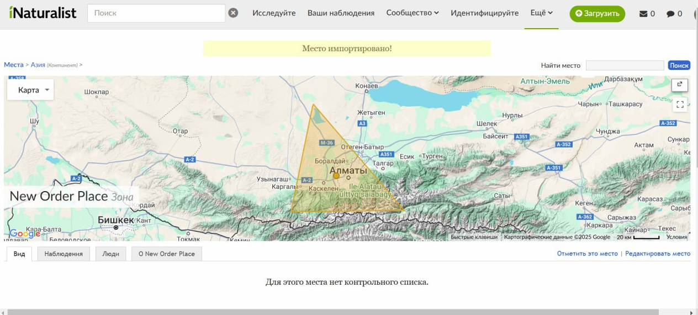

## Введение

При создании т.н. «новых мест» в iNaturalist можно столкнуться с такой проблемой:

>Возникли проблемы при импорте геометрии этого места: Failed to import a boundary. Check for slivers, overlapping polygons, and other geometry issues., Place geometry не может быть пустым.

Помимо указанного в сообщении и очевидно проверяемого, так же есть и неочевидное, сваленное в категорию «other geometry issues», кое что удалось выяснить методом обратного инжиниринга.

С подобной ошибкой не загрузится KML если геометрия не замкнута.

Если координаты имеют такой вид:

>76.5348144220482,43.7676107824054,0
>
>77.4364025120084,43.0002433192394,0
>
>76.3106787223843,42.9880749551258,0
>
>76.5252717635082,43.7534451736168,0

То место не создастся с ошибкой выше.

А если такой:

>76.5348144220482,43.7676107824054,0
>
>77.4364025120084,43.0002433192394,0
>
>76.3106787223843,42.9880749551258,0
>
>76.5252717635082,43.7534451736168,0
>
>76.5348144220482,43.7676107824054,0

то создастся. Обратите внимание, что первый узел равен последнему.

## Что делать?

В текстовом редакторе скопируйте первый узел, добавьте его в конец. Это замкнет полигон. Открыть и отредактировать KML можно в любом текстовом редакторе.

Обращаем внимание, что [спецификацией KML](https://developers.google.com/kml/documentation/kmlreference) подобных ограничений не предусмотрено и оба случая нормально читаются OGR-ом.

## Итого

* Если вы столкнулись с подобным сообщением --- проверьте координаты, если геометрия не замкнута --- замкните.
* Из поведения выше можно сделать вывод, что разработчики iNat "налабали" читалку KML на коленке. Если бы использовали что-нибудь стандартное типа GDAL/OGR то с такими ограничениями их пользователи бы не столкнулись.

Мы их за это ругать не будем, сами местами такие, просто тренировка дедуктивного метода.

## Комментарии

[**Обсудить**](https://t.me/answer42geo/60)
