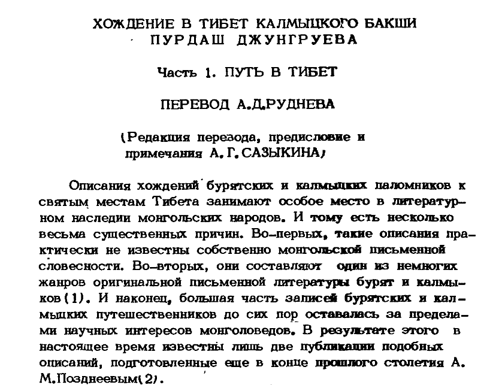

## Introduction

**Purdash Dzhungruev**, a Kalmyk pilgrim, made two journeys to Tibet and reached Lhasa. The first, together with [Ovshe Noruznov](/notes/norzunov-route/), began on October 5, 1898, departing from Urga and arriving in Lhasa in March 1899.  The second, undertaken independently, began on February 5, 1902, departing from home and arriving in Lhasa on September 21, 1902.  Unlike Noruznov, who wrote nothing himself and [whose story](/notes/deniker-norzunov/) was recorded by Deniker, Dzhungruev left a detailed diary.

Here you can find the transcribed and edited text of Dzhungruev’s diary. Page numbers and page breaks have been preserved as in the original. Several obvious typos have been corrected. Footnote #3 is missing in the original.

For some reason, search engines didn't find me [recognized version on vostlit.info](https://www.vostlit.info/Texts/Dokumenty/China/XX/1900-1920/Jungruev_1902/frametext1.htm) in time, so I had to redo the work myself, resulting in a fully alternative OCRed and edited version.

* Purdash Jungruev. The Journey to Tibet of the Kalmyk Bakshi Purdash Jungruev (Khozhenie v Tibet kalmytskogo bakshi). Part 1: The Road to Tibet (Put’ v Tibet). Translated by A. D. Rudnev; edited, with introduction and commentary by A. G. Sazykin. // Philological Studies of Old Written Monuments (Filologicheskie issledovaniia staropis’mennykh pamiatnikov). Elista, 1987, pp. 125–144.
* [Original Russian text](/notes/jungruev-route-tibet/)
* [Download the source PDF](https://drive.google.com/file/d/1j6UKq8ENlMSDJrcxNBC_1S91dmnY0CHX/view?usp=sharing)

## Contents

KALMYK RESEARCH INSTITUTE OF HISTORY, PHILOLOGY AND ECONOMICS UNDER THE COUNCIL OF MINISTERS OF THE KALMYK ASSR

PHILOLOGICAL STUDIES OF OLD WRITTEN MONUMENTS

General Editor: Doctor of Philology P. Ts. BITKEEV

Elista – 1987

THE JOURNEY TO TIBET OF THE KALMYK BAKSHI PURDASH Jungruev

Part 1. THE ROAD TO TIBET

TRANSLATION BY A. D. RUDNEV

(Translation edited, with introduction and commentary by A. G. SAZYKIN)

Descriptions of the pilgrimages made by Buryat and Kalmyk pilgrims to the sacred places of Tibet hold a special place in the literary heritage of the Mongolic peoples. There are several significant reasons for this. First, such descriptions are virtually unknown in the written literary tradition of the Mongols proper. Second, they represent one of the few genres of original written literature produced by the Buryats and Kalmyks [(1)](#id1). And finally, the majority of records left by Buryat and Kalmyk travelers have remained outside the scope of scholarly interest in Mongolian studies. As a result, to this day only two publications of such descriptions are known, both prepared at the end of the last century by A. M. Pozdneev [(2)](#id2).

The most noteworthy publication is, without doubt, the travel diary of Baza-Bakshi. This is because it is the most detailed and engaging account among all known pilgrim narratives. Moreover, the Oirat-language text of the manuscript reproduced by A. M. Pozdneev remains the only written example to this day of a work in this genre that once circulated among the Kalmyks. The fate of the original manuscript used by A. M. Pozdneev to prepare his edition remains unknown. Most likely, it has been irretrievably lost. At any rate, we were unable to locate it in the Leningrad collections, for that matter, did we find any other travel accounts composed in the Zayapandita’s "Clear Script".

125

However, traces of another such account, written by a Kalmyk lama who undertook a pilgrimage to Tibet, were found in the Archive of the Leningrad Branch of the Institute of Oriental Studies of the USSR Academy of Sciences. It is a translation of the diary of the Kalmyk Bakshi Purdash Jungruev, preserved in the A. D. Rudnev collection.

As it turns out, this diary documents the second journey of P. Jungruev, undertaken in 1902–1903. During his first pilgrimage, which took place in 1898–1900, he also kept a diary; however, according to the author, it was stolen on the return journey. As a result, only the briefest information about the first journey has been preserved and put at the beginning of the second diary.

The cover of the aforementioned translation bears a note indicating that it was made by A. D. Rudnev "with the kind assistance of S. B. Bayanov" in the summer of 1904 in Sarepta. However, the Kalmyk original was never added to the collection of the then Asiatic Museum. Apparently, it is no longer present in Kalmykia either [(4)](#id4). Thus, the mentioned translation remains the only trace of this significant and intriguing monument of Kalmyk literature. As a result, while preparing the translation for publication, we were deprived of the opportunity to compare it with the original text which, it should be noted, would have been quite helpful at times, since the translation is interlinear, completely unedited, and therefore occasionally unclear. The absence of the original also compelled us to follow the content of the translation strictly, even when repetitions occurred or we had doubts about its accuracy. Accordingly, we allowed ourselves only to transform Rudnev’s draft (which his translation essentially was) into a coherent Russian text, applying necessary stylistic revisions. Most of the translator’s additions and explanations have been retained (enclosed in parentheses). Only the transcription of Oirat words sometimes provided in the translation has been omitted. Interpolations introduced during editorial work are enclosed in square brackets. The division of Jungruev’s travel account into two parts was made during preparation for publication in journal format.

126

A. D. Rudnev’s translation is accompanied by brief and essential commentary. More detailed information about Tibet during that period can be found in G. Ts. Tsybikov’s work *A Buddhist Pilgrim at the Sacred Sites of Tibet* (*Selected Works*, Vol. 1, Novosibirsk, 1981). The most comprehensive and academically grounded account of the history, culture, religious beliefs, and daily life of the Tibetan people is presented in the book by E. I. Kychanov and L. S. Savitsky, *People and Gods of the Land of Snow* (Moscow, 1975).

## ITINERARY (DESCRIPTION) OF THE JOURNEY TO TIBET

BY NOMCHI-TSORDJI-BAKSHI PURDASH JUNGRUEV

FIRST JOURNEY

In 1898 (the Year of the Dog, on the 17th day of the Month of the Dog [(5)](#id5)), I departed from home for Tibet. The reason for my journey to Tibet is as follows. Previously, Yoguchar-Tsurachi [(6)](#id6) and Tsaizan [(7)](#id7) from the clans of Bogdo-Shabinarov and Mamut /Mamadut/-Shabinarov had reached Tibet and presented themselves to the Dalai Lama and the Panchen Bogdo [(8)](#id8). From both Gegens, they were honored to receive letters, a seal, objects of worship, burkhans [(9)](#id9), and many other such blessed items.

On the 8th day of the first month in the Year of the Water and the Dog, by gracious decree, a temple (khurul) was erected, and therefore the khurul is called “Bogdo’s.” *This* is the reason it is known as “Shabinar’s.” They became shabinars [(10)](#id10) of the two Bogdos (the Dalai Lama and the Panchen Erdeni). According to the Russian calendar, this khurul was established in 1681 [(11)](#id11). This is why I undertook the journey to Tibet to inform the two Bogdos of it.

Together with the Tsaizan Norbunov of the Greater Derbet, we visited the monastery of the Mongolian Bogdo (Urga) along the way, and then arrived at the camp (khüree) of the southern frontier Lun-Beise of the Khalkha. Then, continuing on our route, we visited the Chinese town of Nanash. Passing through the Tabun-Tsaydam khoshun of Kurluk, we reached the outer limits of the Upper Mongols’ [(12)](#id12) settlement, in the khoshuns [(13)](#id13) of Gurban-Naichzhi and Taichzhinar.

Then, passing the /mountains of/ Khükhe-Shil, Dun-Büre, /lake/ Yandyin-Nur, /mountains/ Nabchitai-Ula, Bukhe-Magnai, /river/ Mursen-Gol,

127

[mountains] Gurban-Khabtsagai, Dan-La-Ula, and Bum-Tsay-Ship, we arrived at /the monastery of/ Nagchu-Gonba. This is the border of Tibet. From there, we proceeded to Tsu [(14)](#id14).

Upon arrival, we paid homage to the two Tsung sacred objects of worship [(15)](#id15), to the Dalai Lama, the Panchen Lama, and other great /lamas/. When these /great lamas/ were informed in detail about the main purpose /of our journey/, I was granted a certificate, a seal, burkhans, and other items. On the way back home, passing along the Burkhan-Buddain road through the Kurluk khoshun, we spent the night in the Chinese town of Shilzu, where all our belongings were stolen. From there, we traveled through the lands of the Etsingol Torguts and arrived in Urga. The routes I followed to and from Tibet were approximately one month shorter than if I had traveled through /the monastery of/ Gumbum. Departing from Urga on the 27th day of the Month of the Hare [(16)](#id16), in the Year of the Mouse (1900), I arrived home.

The travel diary that I kept during this first journey was stolen by thieves. Therefore, I have only briefly described the route. I will present my travel notes from the second journey in detail.

## TRAVEL DIARY OF THE SECOND JOURNEY TO TSU – TIBET

Since during the first journey the certificate, seal, and other belongings we had were stolen, I decided to undertake the journey again, this time accompanied by my clansman Kotik Musheev.

In 1902 (the Year of the Snowleopard), on the 5th day of the Month of the Dragon [(17)](#id17), we departed from home. On the 13th day of the spring Month of the Snake [(18)](#id18), we reached the city of the Khalkha Mongolian Bogdo [(19)](#id19) (Urga). There, we exchanged the paper money we had brought from home for Chinese liang [(20)](#id20), at a rate of 2 rubles 30 kopecks per liang. The money of our Tsar is not accepted any farther from this point. During the previous journey, we exchanged a liang of silver for 1 ruble 75 kopecks. A liang is equivalent to two white (i.e., silver) rubles in our currency. Having agreed to travel from here with three Buryats, we thus formed a group of five people and began looking to hire three camels and a horse, while the Buryats looked to hire four camels, all for money.

128

A lama named Rabdan, who had come to Urga on pilgrimage from the Gobi-Tüsheet-Daigun khoshun located southwest of Urga, made an agreement with us to escort us to the Bayangol Torguts. We hired camels from him at the rate of 8 liang each. We loaded seven camels: four people rode on them, and I rode on horseback. From here to the land of the Etsingol Torguts is considered a 21-day journey. Some people hired camels at a rate of 16–17 liang, but since Rabdan’s home lay along the route, this part of the journey turned out to be inexpensive for us.

In Urga, we obtained in sufficient quantity all kinds of travel supplies — maikhan [(21)](#id21), a yurt, kettles, provisions for the road, Mongolian clothing, and other necessary items and on the 20th day of the Month of the Snake, we set out on our journey. After crossing the Turaguni-Khutszubchi Pass, we spent the night at its foot.

On the 21st, we crossed the Bukhe-Daba Pass and had lunch by the Bukhegiin-Gol River. Departing from there in the evening, we spent the night in Namdan.

On the 22nd, we set out early and crossed the Gangiin-Daba Pass. We had lunch at its foot. In the evening, we covered another 7–8 versts, but when snow began to fall, we stopped and made camp for the night.

On the 23rd, there was a blizzard, and we stayed put. The blizzard blew into the maikhan and the yurt, and we didn’t even have fuel to maintain a fire. We cooked food using the dung of horses that had passed along the road. There were /no ?/ yurts or people nearby. When we left Urga, the ground was bare, but that night there was a blizzard.

On the 24th in the morning, we set off and, after crossing the Serten-Giin-Daba Pass, we had lunch at its foot. From Urga, a major road has been laid out, and we are traveling along it. The main road continues all the way to the city of Shizhu (-khoto).

On the 25th in the morning, we set off. After crossing a small pass, we had lunch. In the evening, we crossed the eastern edge of the Bayar mountains. We also crossed Nogon-Khotol and camped for the night at its southern foot.

On the 26th in the morning, we set out. We had lunch at the Adakchigin River. In the evening, we continued on and spent the night in the Uka-Bayan khoshun.

On the 27th, setting off in the morning, we had lunch on the southern outskirts of the Bayan khoshun. In the evening, we camped at the Buluktyin River. This area is known for its springs (buluk).

On the 28th, we stayed in place for the day.

129

On the 29th, we set out. Approaching a small monastery called Khadan-Usun, we spent the night there.

On the 30th in the morning, we traveled to the area of Ukhai-Khuduk. There, not far from the home of Rabdan — who was traveling with us by prior agreement — we stopped. We stayed for two or three days. After changing our transport… /sentence incomplete/

On the 3rd day of the Month of the Horse [(22)](#id22), we resumed our journey and camped by the waters of the Budurgun /River/.

On the 4th in the morning, we set out. We had lunch near a branch of the Bayan-Gol River. In the evening, we continued and spent the night at Khükhe-Oban-Suchzhe.

On the 5th in the morning, we stayed in place. We had lunch at Delgerekhu-Oban. In the evening, we continued and spent the night at Khabirga.

On the 6th in the morning, we had lunch at Unegen-Oban. In the evening, we continued and spent the night by the Ungin River, near the monastery of Dai-Tüsheet-Gün. From here southward, snow does not fall in winter. A warm land! We are traveling through Mongolian territory. In this Mongolian land, they do not cultivate grain. Living in felt yurts and herding livestock, people live off their animals. It is said that if you follow the road we are taking, you will reach Shizhu through the Gurban-Saikhan mountains. These are the reasons we chose this route: 1. Along the way, there is no shortage of water, grass, or settlements, and this is the most direct path to Tsu. 2. There is no theft at night, so we travel without having to guard our belongings or animals after dark. During my previous journey, I traveled through the Sain-Noyon aimag, passing the monastery of Lunkh-Beise. That road, first of all, is circuitous; secondly, theft is a problem; and finally, we suffered from a lack of grass and water for the livestock.

On the 7th in the morning, we set out and traveled downstream along the Angi River, where we had lunch on its bank. In the evening, we continued on and spent the night on the bank of the Derestu River. This river has running water.

On the 8th in the morning, we departed. We had lunch near the Khayan River.

130

Continuing on in the evening, we spent the night at the black Waters of Khayan. There, we decided to replenish our provisions.

On the 9th, we stayed in place for the day.

On the 10th in the morning, we set out. We crossed the Shuguun-Uneget Pass and had lunch at Ulan-Tolgoi. In the evening, we resumed the journey and spent the night at Dalai-Buluk.

On the 11th in the morning, we set out. We had lunch at Shara-Shiretu. In the evening, we continued our journey. We crossed the Gurban-Saikhan mountains via the middle of the three Saikhan peaks and spent the night at its foot.

On the 12th in the morning, we continued on. We had lunch at the edge of the Gobi. In the evening, we traveled further and camped at Kholei-Kholdun-Khali.

On the 13th in the morning, we set out. We crossed Bayan-Khotol mountain via its eastern spur and reached the road leading to the city of Shizhu. From Gurban-Saikhan to this point, there was no road — we traveled off-trail. We had lunch at the well of Tsagan-Deresnii-Khuduk. In the evening, we continued and spent the night in the Gobi.

On the 14th in the morning, we set out. Passing through the Bulgan-Gobi, we had lunch among the Dengin-Kher mountains. In this place there are wild goats called "yangir yama". In the evening, we resumed our journey and spent the night in the Urtu mountains near the Khaliigan-Khuduk well. From Gurban-Saikhan to here, to the khoshun of Baddan-Tsazak, and south of it to the Etsingol Torguts, there is no population — only Gobi desert terrain. This area marks the southern border of the Khalkha Mongols' territory.

On the 15th in the morning, we set out and had lunch at the Tsokhondo well. In the evening, we continued and spent the night at Kisetey-Tolgoi.

On the 16th in the morning, we departed and had lunch at two wells in the Burkherin-Kher mountains. In the evening, we continued and camped at the Tsagiin well.

On the 17th in the morning, we set out and, after crossing Khiger-Obo, we had lunch at the Balburkhu well. After replenishing our water supplies, we departed in the evening and spent the night in a waterless steppe. There is an abundance of fuel here, called "tsak" [(23)](#id23). There are many camels and antelopes. These animals do not approach humans — we saw them from afar through binoculars. There are also many so-called kulans (wild horses) /wild asses/, and large numbers of wild tszeren [(24)](#id24) and horses.

131

On the 18th in the morning, we had lunch on the northern shore of Lake Denchzhi. The opposite shore of the lake is not visible. It's a large lake! The water is bitter. The lake into which the Tszeni-Gol River flows is called Belchir-Nur. Near this lake, there is no grass, only white Gobi sand. In the evening, we resumed our journey. After passing Boro-Obo, we spent the night at Modon-Gatlag (the wooden crossing). Here is the end of the Etsin-Gol River. Its water is fresh and flowing. There are many wild trees and reeds. Its basin in the Gobi is vast. Here lies the border of the Edzingol Torgut-Kalmyks’ territory. From the lands of the Khalkha Mongols to this point, there is no population. The area is flat, steppe-like, and desert—without mountains.

On the 19th in the morning, we departed. We had lunch at Galtzan-Borok. In the evening, we continued on, and upon reaching the lands of the Torgut prince who at the time was in Dashi-Ban we stopped there. This prince has about 200 smokes [(25)](#id25). These are people who separated from the Torguts that migrated from our Volga River. They live permanently among reeds and saxaul bushes. They do not sow grain. They live as herders in felt yurts. If they do cultivate crops in their lands, they irrigate them. It is said that along the entire Etsin-Gol River, from mouth to source, reeds and trees grow. It is also said to be very wide. Away from the river, the steppe is flat. There is no grass, only white sands. There is no winter here, and therefore they do not harvest hay. Their clothing and belongings are entirely similar to ours. It is said that they make offerings to fire (worship fire). In appearance, they are Mongols. The Khukh-Nur Mongols also worship fire. (According to Kalmyk custom, when making an offering to fire, one takes a skull, gnaws it clean, and stuffs the empty holes with fat.) On the 22nd of the last winter moon, they make offerings to the Manchu Khan (emperor). Most of them, however, perform sacrificial rites in the spring, during livestock birthing season. At the very beginning of the journey, when we hired carts in Urga, we had arranged that the drivers would take us as far as this prince. This Torgut prince received us as relatives. He treated us as guests and took good care of us. He replenished our food supplies and allowed us to rest. Then, using his own carts, he took us free of charge to Shizhu-khoto.

132

On the 5th day of the first summer month, we set out in the morning. We had lunch at an oboltszon /a wintering camp/. In the evening, we spent the night at Dabusun.

On the 6th in the morning, we continued. We had lunch on the bank of the Narin River. In the evening, we traveled farther and spent the night at the Morin River.

On the 7th in the morning, we set off. We had lunch again on the bank of the Morin River. Along this river, there are many Torgut households (yurts). The Torgut prince sent us onward on camels only, assigning us an old man named Tszoman as a guide. At night, we resumed our journey and, having crossed Mount Khükhe from the eastern side, we spent the night on its southern side, in a bend of the Bukha River. Throughout this leg of the journey, we followed a road.

On the 8th in the morning, we set off along the river. Reaching the home of a man named Buyan-Oltzeitu, located at the upper border of the Torgut settlements along the Tsagan-Tokhoi, we had lunch there. South of this point, there are no reeds or trees.

On the 9th in the morning, we departed and had lunch at Ikhe-Dorboljin. In the evening, we continued our journey. We passed the Chinese town of Tengchin-khoto and spent the night at Lonko-Obo. The local people here live in Chinese-style houses, grow grain, and supply the town with food. They irrigate their fields and grow a lot of rice as well.

On the 10th in the morning, we set out and had lunch near the house of a Torgut who operates the postal station for the Torguts living on the Tola River. The main population here is Chinese. Horses are rare; they use donkeys instead. The land is plowed with wooden plows. In the evening, we traveled farther and spent the night among Chinese farmers in the town of Tenchzhu. These Chinese are thieves, so we stood watch through the night.

On the 11th in the morning, we continued our journey. The entire time, we passed through Chinese settlements. We had lunch at Dan-Lolo. In the evening, continuing on, we passed through the Chinese town of Jin-Taizhi. There is a customs checkpoint here where all belongings are inspected. If goods or tea are found, they are confiscated. Moving on, we spent the night near Chinese houses in Yo-Yongzhu.

On the 12th in the morning, we set out and passed the small Chinese town of Linshuo, where we had lunch on the riverbank. In the evening, we continued on and arrived in the city of Shizhu. We stayed at an inn called a "dian".

133

In our language, this means “a house for people to stay overnight, a wayside inn.” Shizhu is a large city with a big fortress, where an important administrative office is located. In both summer and winter, Khalkhas and Upper Mongols come to this city for flour and all kinds of goods. There is extensive trade and exchange here. Chinese shops are very small and do not stock many goods. However, they sell a lot of flour. In this city, we hired Chinese camels at a rate of 5 liang. We arranged to be taken to the region of Serten - the border of the khoshun of the Upper Mongols of Kurluk.

On the evening of the 16th, we set out. After spending seven nights on the road, we reached the northern border of the Upper Mongols, at the northern slopes of the snowy mountain of Khashkhar. These are the outer settlements of the Kurluk khoshun. We stayed here for seven days. Departing from the region of Tsoк, after seven more days we crossed the Khotol-Daba Pass and arrived in Serten.

The water in Togorok-Ike-Nur ("the large round lake") is pleasant to the taste. The grass is good. There are no reeds or trees. The population of the Kurluk khoshun is about 100 households (smokes). They live in felt yurts, practice pastoralism, and live off their livestock. They do not grow grain. There is no snow in winter — it is warm. Sheep give birth twice a year. Money is scarce here. Prices for goods are negotiated in terms of sheep. Linen clothing is rare. In both summer and winter, people wear the same clothing made of sheepskin, tying it at the waist with the hem raised to the knees. They do not wear shirts underneath — outer garments are worn directly on the bare body. In their clothing, as well as in other things, they imitate the Tanguts. According to the elders, their clothes used to be like those of the Mongols, but now they have changed due to proximity to the Tanguts. This is the reason why the Upper Mongols are called the Tabun-Tsaydam. Their five khoshuns — Kurluk, Khukhed, Barun, Tsun, and Taichzhinar — are called the Five Tsaydam, as well as the Upper Mongols. Here we hired 15 horses at a rate of 3 liang each and arranged to be taken to the area of Khachzhir, where the prince of the Taichzhinar khoshun resides.

On the 20th day of the Middle Summer Moon, we set out on horseback, accompanied by two men. We stayed for the day at Tsakhu-Shirek. In the evening, we departed again. After crossing the Daba mountain, we stopped for the night.

134

On the 21st, we set out in the morning and traveled without stopping for lunch. We spent the night on the northern shore of Lake Eastern Maikhan.

On the 22nd, we continued and spent the night on the southern shore of Lake Barun /Western/ Maikhan. There, we made arrangements to travel further together with Batanji-Tsangi [(26)](#id26) and Tsompil-Dzaisan of the Kurluk khoshun, who were also heading to Tsu. They loaded their belongings onto three camels and rode two horses themselves. We, in Khachzhir, had hired camels at 19 liang and horses at 7 liang, with the goal of reaching Nagchu-Gonba — the border of Tibet. Here, we also met a group of seven more people (seven smokes) traveling to Tibet.

On the 23rd, we set off. After crossing Mount Yanbar, we camped for the night. There, we spent two days gathering fuel and water. We had been told that on this sandy plateau of Yanbar, there is neither grass nor water, and if the weather turned hot, the animals would die of thirst and crossing would be difficult. To cross it, people ask shamans to bring cool weather. Fortunately for us, it was cool, and we crossed without trouble.

On the 24th, we continued on and, after crossing the so-called Buldurun-Yanbar, spent the night on the bank of the Gaktsa-Amarak River.

On the 25th, we resumed our journey and spent the night in an oboltszon — a wintering camp on the outskirts of the Taichzhinar territory. There are many sukhai trees [(27)](#id27) and kharmag shrubs [(28)](#id28) in this area.

On the 26th, we traveled onward and camped near the Shara-Usun River.

On the 27th, we set out again and had lunch on the bank of the Shara-Usun River. We stopped in Tsogastu. This is where the aïls [(29)](#id29) of the Taichzhinar khoshun are located. Here, we joined with seven more smokes of people also heading to Tsu. This is where the shortest route to Tsu begins. Usually, travelers gather here, stock up on supplies and pack animals, and from this point continue on into Tibet. From here to Tsu, the land is uninhabited and desert-like. On the 30th, Baturzhab-Tsangi and Tsompil-Dzaisan from the Kurluk khoshun, who had arranged to travel with us, caught up. Altogether, we became a group of 15 smokes. Among the Upper Mongols, a dzaisan is anyone who donates a camel, horse, fur coat, and money to the prince.

For this, the prince grants the title of dzaisan

135

to any commoner who owns livestock and a yurt (i.e., is married).

The Tangut people living along the shores of Lake Khükhe (-Nur) often attack the Upper Mongols in groups of 200–300 men and forcibly take all their livestock and essential belongings from their yurts. Their clothing is identical to that of the Upper Mongols. They are also called rangai. This land of the Upper Mongols abounds in trees known as sukhai and kharmag. The water here is good, though the grass is poor. The land is said to be khujir-rich [(30)](#id30), somewhat saline, and not suitable for growing grain. When Chinese arrive in these mountains, they extract large quantities of gold and silver. There is also much tin and lead. This area lies southwest of the city of Shizhu. To the northeast of Shizhu is a small town called Tsaiekba. South of it, in the mountains, there are abundant deposits of coal and oil (kerosene oil). In the mountains of the Khalkha Mongols, in the mountain spurs and rivers of the Upper Mongols, there is much gold and silver. A great deal of gold is extracted from the Sharyn-Gol River in the Gurban-Naichzhi region. Mining is done in pits dug to the height of a man. There is also much gold in the Kurluk khoshun's Khaltagiin-Gol River and in the Baga-Tsaydam's Gunchin-Gol. Although the Khükhe-Nur Mongols are formally considered subjects of the Chinese emperor, they have no Chinese administrators. The majority of the population is ruled by their own princes. There is no theft among them — they do not steal. Attacks may occur only from rangai or goloki ([(31)](#id31)), but the Mongols themselves do not commit such acts.

On the 4th day of the last summer month, our group of 15 people set out on the road. We had lunch at the Morin River. In the evening, we camped at Tolgan-Amga. We stayed here for two days. The meat intended to be packed onto the camels and horses was prepared by cutting it into long strips. Then, taking our loads with us, we resumed our journey. The terrain here is harsh — extreme heat. Oil and fresh meat cannot be consumed. Our food consists of /buda/ porridge with dried meat, black tea, and black tsamba [(32)](#id32). As we go, we prepare a decoction medicine in the morning and evening to make the limbs lighter. It is said that such a drink heals a weary and anemic person traveling through this dreadful land. But for someone who is overweight and full-blooded, it may cause harm. Of our 15 *smokes*, some carried loads on horses,

136

others on camels.

On the evening of the 7th, we set off. We crossed Uman-Ama and spent the night in the valley of the Nariin-Tsukhain River.

On the 8th, we continued. We had lunch at the Nariin-Tsukhain (Gol) River. We spent the night in the mountains at Kharman-Tokhai. These mountains are known as Tsukhain-Khotol. The highest among them is a great snow-capped mountain, its majesty is harsh and formidable. This so-called Khachzhiriin-Tsam is the westernmost, newly established route. If one follows this road, one reaches a region into which the bandits known as goloki do not venture. It is said that the people called goloks live east of the Tibetan road, about one month’s journey from the Dun-Büre mountains. This is considered the northeastern frontier of the Upper Mongols’ territory. There are three places the goloks are known to raid: Khükhe-Uul, Dun-Büre, and Moros. The clothing and language of these goloks are said to resemble those of the rangai people. They live in black tents. Seven days’ journey east of this Khachzhiriin-Tsam is the road known as the Gurban-Naichzhin-Tsam. Seven days farther east from there lies the Burkhan-Buddaiyin-Tsam. All these are routes leading directly into Tibet. The Gurban-Naichzhin and Burkhan-Buddaiyin roads merge at the Moriin-Gol River. The Khachzhiriin route joins them near the Danlen mountains. Golok bandits are especially aggressive along the Burkhan-Buddai route.

On the 9th, we set out and, following the Nariin-Tsukhain River upstream, we had lunch. In the evening, we continued along the same river and camped for the night.

On the 10th, we proceeded further and spent the night at the lower slopes of the Tsukhain-Khotol mountains. Wild bulls are found here. In general, the severity and danger of this place are considerable. We move through these mountains as if we were enemies — armed with rifles, spears, and other weapons. These mountains are home to wild sheep known as argal-gyoresn [(33)](#id33). On this day, it began to snow, and a blizzard swept in. We had to put on our winter fur coats and tie down our head coverings. Despite it being summer, the hardships are severe! From autumn to spring, it is said that passage through these areas is impossible for people. Not only does snowfall bring intense cold, but terror takes hold as well. It is said that a person who walks easily through this region in summer may, in the cold season, die from sheer fright. This pass is called

137

Gonchzhin-khotol. From the very beginning — even just approaching this pass — people fall ill out of sheer fear. Some, unable to ride, are transported lying down and covered on camels. Good doctors bleed the darkened limbs of the sick and administer medicine. That is how they continue on. If someone falls ill on this road to Tsu, no one waits for them. They are carried, covered, in a cart until death. And at the place where they die — they are left. It is even said that some are abandoned while still alive. This is why no one waits for another. Travelers divide their food supplies for the route from the Upper Mongols to the border of Tibet, and fear that if they delay even a day, the provisions will not suffice. As for us, we proceed by the mercy of many higher holy beings. We go without fear. Each person recites aloud the prayer "Sang Serchzhim" continuously every day. If some die of fright, others lose faith that they will survive the journey. Thinking of death and praying to the many higher beings, they proceed, prepared to die. This terror arises because the land is at a very high elevation and is harmful due to the poisonous herbs that grow here. A person stricken by fear becomes gravely ill. Their chest tightens, they begin to cough, their face turns blue, and eventually, when the lungs fill up, they die. Some who are stricken in the morning die by noon. Others, seemingly in perfect health at dinner, die by midnight. During such fear, consuming oil and fat is harmful. Light, non-fatty food is beneficial. Some recover, but remain unwell for a long time, their faces stay bluish and they continue to cough. The Khalkha and Upper Mongols, whether on the steppe or at home, do nothing other than handle their prayer beads or read prayers aloud. There is no idle chatter. Their reverence is profound. In every household there are burkhans, sacred books, offerings, and butter lamps.

On the 11th, we set out. After crossing Khotol-Obo, we camped for the night.

On the 12th, we continued. We had lunch on the shore of Lake Khara-Nur. In the evening, we traveled onward and spent the night at Gonchzhin-Khotoliin-Ara.

On the 13th, after crossing Khotol, we camped on the northern shore of Lake Shara-Nur. This is a treeless, steppe region.

138

On the 14th, we continued and spent the night on the southern shore of Lake Shara-Nur. Here, two more smokes from the Taichzhinar group caught up with us, bringing our total to 17 smokes.

On the 15th, we continued and camped after crossing a small pass called Narin-Khotol. There is a type of grass here called "bukhu shirik" [(34)](#id34). When its short stems dry out, one would think even the dullest livestock would refuse to eat it, yet, many animals graze here.

On the 16th in the morning, we set out and spent the night at the exit of the Barun-Uduriin Gorge, near Mount Khükhe-Shil. Here, we walk cautiously, peering ahead and around, stopping frequently and with great care. In this area and farther ahead, golok bandits are known to attack.

On the 17th, we set out. After crossing Khükhe-Shil, we camped at the place called Galtzu-Ulan-Morin (Khapchik-Ulan-Müren), on this side of the Dun-Büre mountains.

On the 18th, we continued and spent the night in the northern hollow of Dun-Büre.

On the 19th, we camped in the central part of Dun-Büre.

On the 20th, we resumed our journey and again spent the night in a hollow of the Dun-Büre mountains.

On the 21st, after passing Dun-Büre, we spent the night in the steppe on its southern side.

On the 22nd, after crossing the Nabschitai-Ulan-Müren River, we camped on its southern bank. This river is very dangerous, horses sometimes fall into it. But thanks to low water levels, the crossing went well (we made it safely).

On the 23rd, we spent the night in the northern hollow of Mount Bukhu-Magnai.

On the 24th, after crossing Bukhu-Magnai and reaching the northern bank of the Muren /Mures/ River, we camped there. This is the point where three roads meet: the Burkhan-Buddaiyin-Tsam, the Gurban-Naichzhi-Tsam, and the road we took, the Khachzhiriin-Tsam. Here we were joined by 15 smokes of tszulachins [(35)](#id35) who had come via the Gurban-Naichzhi road. In total, we became 32 smokes. From the monastery (Da-Khüree) [(36)](#id36), the road we followed is the shortest, it is almost a month shorter than the route through Gumul-Khit.

On the 25th, the water in the Murasin (Mursen)-Gol River had risen

139

to the level of its banks. We crossed farther downstream, where the water only reached the horses’ flanks. Since there were people with us who had traveled this route several times and knew the way, they found a shallow crossing, and we were able to ford the river safely. Sometimes, the water rises very high, and when that happens, travel along this road can be halted for up to a month.

On the 26th, we continued our journey and camped near Mount Adak-Khabtsagai. It is said that beyond this place, Golok bandits no longer appear. However, near the Tibetan border, there are reportedly night raiders called banak [(37)](#id37). These raiders are said to attack at night. Because of this, we keep watch during the nights. There is no firewood at all. For cooking, we dig roots from the ground and use them as fuel. From the territory of the Upper Mongols onward, the rain and dampness have not stopped. Besides the lack of fuel and the need to live on black tea and black buda, we are so exhausted that it has become nearly impossible to mount a horse.

On the 27th, we spent the night in the upper hollow of Mount Adak-Khabtsagai.

On the 28th, we camped at Dund-Khabtsagai.

On the 29th, we spent the night at Ekhin-Khabtsagai.

On the 30th, we camped on the shore of Lake Ulan-Nur.

On the 1st day of the first autumn month, we spent the night in the lower part of Khiten-Shirga.

On the 2nd, we spent the night on the northern slope of Mount Danlan (Dan-La). This mountain is also called Ubashi-Abgai (Ubashi-Khairkhan). In general, before crossing these mountains, it is customary not to say their names aloud. If you do, it is believed that snow and a blizzard will occur during the crossing. The danger of this mountain is very great, and many travelers proceed with deep fear. Even the horses and camels go forward frightened.

On the 3rd, after crossing Ubashi-Abgai, we camped on the bank of the Khalun-Usun River. In this river, right in its bed, there is a pointed stone about two arshins tall, from which a jet of water shoots upward by about an elbow’s length.

On the 4th, we followed the Bokshigin River downstream. We camped at Bukhu-Shirik (Khuïtün-Chirik). This is where people known as banak live in black tents. They herd livestock and live off of it. They do not cultivate crops. They migrate in tents. This is the border of Tibet. These people are known for thievery, they steal at night.

Their cows are sarlyks [(38)](#id38),

140

long-haired animals that resemble black camels, but with tails like those of horses. Their sheep are white with black heads. Horses are rare, and there are no camels at all. Beyond this point, there are no more dangerous places. We stocked up on food here. There is an abundance of butter and cheese. The Tibetans in this area do not drink kumis at all, but they consume large quantities of taraka [(39)](#id39). In both winter and summer, they wear the same fur coat, tying it up in the same way as the Upper Mongols. Their hair... *(missing passage in the translation)* ...for this reason, the Mongols call it segseger [(40)](#id40). This is the place where the Tsun-Khara-Gergen resides.

On the 5th, we spent the night at Shangin-Gol.

On the 6th, after crossing Bum-Tsai-Shil, we camped at Uüden-Tang.

On the 7th, we spent the night at Kholachzhi-Kholo.

On the 8th, we camped at Tsumara (Tsonra). Here, the Upper Mongols left their carts (and horses). Since they have acquaintances along the route, both going and returning, they made arrangements from here to hire sarlyks for money to transport them to Lhasa.

On the 9th, we reached Nagchu-Gonba. There is a lama and a noyon [(41)](#id41) here who oversee the border, along with a guard commander. They inspect the baggage and question travelers going in both directions. It is said that Russians are not allowed through at all and are sent back. These lama and noyon, due to our prior acquaintance, assigned me an official yurt with a galchin [(42)](#id42). We stayed here for 3–4 days to rest. On the 13th, we departed from Nagchu-Gonba on postal horses and spent the night on the northern side of Gachin-Daba. Two ulachins [(43)](#id43) were sent along with us. The lama and noyon of Nagchu ordered that we be given only horses. That is the reason I was granted an official travel permit. During my previous visit to Tibet, the Dalai Lama granted me a certificate, a seal, and a decree allowing me to use postal horses throughout Tibet. That is why I was given postal horses. The rest of my companions traveled on sarlyks.

On the 14th, we spent the night in Shabartu. The postal station and postal horses are similar to ours, only without carts. Deliveries are done on horseback. We spent the night in a government yurt.

On the 15th, we camped on the lands of the Shangshingin Monastery. From Nagchu-Gonba, we are traveling along a major road.

On the 16th, after crossing Shangshin, we spent the night at the postal station closest to Naiman-Suburgan. The place where postal horses are kept

141

is called an urton.

On the 17th, following the Damchigin River downstream and crossing the great Lani Pass, we camped near the next river.

On the 18th, after traveling further, we stopped at the postal station of Chjomaran. The two of us, accompanied by an interpreter, rode postal horses to visit the monastery of Raran (Raden) and returned in the evening. This monastery is located approximately five versts away. It is situated on the slope of a large mountain, among archin [(44)](#id44) trees. The monastery houses 500 khuvaraks [(45)](#id45). The abbot is the Tsang Gergen [(46)](#id46), Lama Raden-Dorji, also known as Burman-Khubilgan [(47)](#id47). He is a highly respected lama, second only in influence to the Supreme Gergen (the Dalai Lama). It is said that he is currently in Lhasa, where he also has a palace.

On the 19th, we set out. We crossed the Bunda-Jhongin (Po-mdo-Chu) River in a boat made of stretched ox hides, even though the water level was high. There is an iron bridge over the river, which is used by pedestrians. However, it is said that someone walking across may slip and fall into the water. Ordinarily, a fee is charged for the boat crossing, but since we were traveling on postal horses, we were not charged. After crossing the Daglan-Bakchi River and passing the Daglan /Dag-Lun/ Monastery, we had lunch on the bank of the Arbachi River. We spent the night on the northern side of Tsaglan (Chog-La) Daba.

On the 20th, after crossing the Tsaglan-Daba Pass, we had lunch on the bank of the Tsaglan (Chog-La) River. In the evening, we continued on and, having crossed the Pombochen (Pen-bo-cheng) River, camped on its northern bank. Here we caught up with our companions who had left on yaks seven days earlier.

On the 21st, ascending the Gologiin-Daba (Go-La) Pass, we saw the golden rooftops of Tsü from afar. Dismounting from our horses, we bowed three times. Upon seeing the golden rooftops of Tsü in the distance, we were overjoyed that we had safely arrived, and tears flowed from our eyes.

<a id="id1">1</a> Overview of manuscripts describing journeys to Tibet, available in the Mongolian collection of the Manuscript Department of the Institute of Oriental Studies of the USSR Academy of Sciences, was prepared by us for the yearbook "Countries and Peoples of the East" ("Strany i narody Vostoka").

142

<a id="id2">2</a> Pozdneev A.M. Tale of the Journey to the Tibetan Land by Baza-Bakshi of Malo-Dorbot (Skazanie o khozhdenii v tibetskuyu stranu Malodorbot­skogo Baza-bakshi). St. Petersburg, 1897; idem. Mongolian Reader for Initial Instruction (Mongol’skaya khrestomatiya dlya pervonachal’nogo prepodavaniya). St. Petersburg, 1900, pp. 34–37. Our translation of the travel account to Tibet by D. Zayaev, the Mongolian text of which is published in Pozdneev's Reader, is to appear in one of the volumes of "Countries and Peoples of the East".

<a id="id3">3</a> Archive of Orientalists of the Leningrad Branch of the Institute of Oriental Studies, USSR Academy of Sciences (Arkhiv vostokovedov LO IV AN SSSR), A.D. Rudnev Collection, R-1, inventory 3, no. 22.

<a id="id4">4</a> Tserenov V. Journeys of Kalmyk Travelers. — "Soviet Kalmykia" (Khozhdeniya kalmytskikh puteshestvennikov. — "Sovetskaya Kalmykiya"), November 24, 1979.

<a id="id5">5</a> Month of the Dog — August.

<a id="id6">6</a> Tsurachi — a religious icon painter.

<a id="id7">7</a> Tsaisan — head of a clan, clan founder.

<a id="id8">8</a> Dalai Lama, Panchen Bogdo (Panchen Erdeni) — the highest spiritual hierarchs of Tibet.

<a id="id9">9</a> Burkhans — statuettes of Buddhist saints and deities.

<a id="id10">10</a> Shabinars — subjects of monasteries or of the “great lamas” of Tibet and Mongolia.

<a id="id11">11</a> Presumably, this refers to the large Bakshin-khural (temple) of the Ikitsokhor ulus of the Kalmyks.

<a id="id12">12</a> Upper Mongols — southern Mongols.

<a id="id13">13</a> Khoshun — an administrative-territorial unit in pre-revolutionary Mongolia.

<a id="id14">14</a> Tsu — Tibet.

<a id="id15">15</a> Refers to the large and small statues of Buddha in Lhasa.

<a id="id16">16</a> Month of the Hare — January.

<a id="id17">17</a> Month of the Dragon — February.

<a id="id18">18</a> Month of the Snake — March.

<a id="id19">19</a> Khalkha Mongolian Bogdo — Jebtsundamba Khutuktu, head of the Khalkha Mongolian Buddhists.

<a id="id20">20</a> Lan (liang) — a monetary unit in pre-revolutionary Mongolia; also a unit of weight equal to 37.3 grams.

<a id="id21">21</a> Maikhan — tent.

<a id="id22">22</a> Month of the Horse — April.

<a id="id23">23</a> Tsak — saxaul (a desert shrub used for fuel).

<a id="id24">24</a> Tseren — antelope, gazelle.

143

<a id="id25">25</a> 200 dymov (smokes) — 200 families.

<a id="id26">26</a> Batanzhi — later referred to as Batuchjab in the translation for some reason. Tsangi — the lowest administrative position in pre-revolutionary Mongolia.

<a id="id27">27</a> Sukhai — tamarisk.

<a id="id28">28</a> Kharmag — Shober’s saltbush.

<a id="id29">29</a> Ail — homestead, household.

<a id="id30">30</a> Khujir — salt flat, saline soil.

<a id="id31">31</a> Goloks — Tibetan nomadic tribes from the northeastern regions of Tibet.

<a id="id32">32</a> Tsampa — roasted barley flour.

<a id="id33">33</a> Rangai-gyoresn — Tibetan antelope (chiru or orongo).

<a id="id34">34</a> Bukhu shirik — a type of sparse grass (local name: bukha-shirek or bukha-chigiryk).

<a id="id35">35</a> Tsulachins — pilgrims traveling to Lhasa to offer butter lamps (*tsula*) before the statues of Buddha in Lhasa.

<a id="id36">36</a> Da-khure — Urga.

<a id="id37">37</a> Banak — “black yurt” people; among the Mongols, this refers to tribes of northeastern Tibet who live in yurts made from black yak wool.

<a id="id38">38</a> Sarlyk — yak.

<a id="id39">39</a> Tarak — a type of fermented milk (similar to kefir).

<a id="id40">40</a> Segseger — “bristly,” “standing on end” (a description of a women’s hairstyle).

<a id="id41">41</a> Noyon — prince, lord.

<a id="id42">42</a> Galchin — fire keeper, stoker.

<a id="id43">43</a> Ulachin — post rider, courier.

<a id="id44">44</a> Archin — juniper.

<a id="id45">45</a> Khuvarak — novice monk, student of a lama.

<a id="id46">46</a> Gegen — saint; a title of high-ranking lamas.

<a id="id47">47</a> Khubilgan — reincarnation of a Buddhist deity or eminent religious figure. Burman = Bromton.

Part II "At the Shrines of Tibet" will be published in the next volume.

## Discussion

[**Questions or comments?**](https://t.me/answer42geo/85)